cola Report for Consensus Partitioning
==================

**Date**: 2019-12-04 19:24:11 CET, **cola version**: 1.3.2

----------------------------------------------------------------

<style type='text/css'>

body, td, th {
   font-family: Arial,Helvetica,sans-serif;
   background-color: white;
   font-size: 13px;
  max-width: 800px;
  margin: auto;
  margin-left:210px;
  padding: 0px 10px 0px 10px;
  border-left: 1px solid #EEEEEE;
  line-height: 150%;
}

tt, code, pre {
   font-family: 'DejaVu Sans Mono', 'Droid Sans Mono', 'Lucida Console', Consolas, Monaco, 

monospace;
}

h1 {
   font-size:2.2em;
}

h2 {
   font-size:1.8em;
}

h3 {
   font-size:1.4em;
}

h4 {
   font-size:1.0em;
}

h5 {
   font-size:0.9em;
}

h6 {
   font-size:0.8em;
}

a {
  text-decoration: none;
  color: #0366d6;
}

a:hover {
  text-decoration: underline;
}

a:visited {
   color: #0366d6;
}

pre, img {
  max-width: 100%;
}
pre {
  overflow-x: auto;
}
pre code {
   display: block; padding: 0.5em;
}

code {
  font-size: 92%;
  border: 1px solid #ccc;
}

code[class] {
  background-color: #F8F8F8;
}

table, td, th {
  border: 1px solid #ccc;
}

blockquote {
   color:#666666;
   margin:0;
   padding-left: 1em;
   border-left: 0.5em #EEE solid;
}

hr {
   height: 0px;
   border-bottom: none;
   border-top-width: thin;
   border-top-style: dotted;
   border-top-color: #999999;
}

@media print {
   * {
      background: transparent !important;
      color: black !important;
      filter:none !important;
      -ms-filter: none !important;
   }

   body {
      font-size:12pt;
      max-width:100%;
   }

   a, a:visited {
      text-decoration: underline;
   }

   hr {
      visibility: hidden;
      page-break-before: always;
   }

   pre, blockquote {
      padding-right: 1em;
      page-break-inside: avoid;
   }

   tr, img {
      page-break-inside: avoid;
   }

   img {
      max-width: 100% !important;
   }

   @page :left {
      margin: 15mm 20mm 15mm 10mm;
   }

   @page :right {
      margin: 15mm 10mm 15mm 20mm;
   }

   p, h2, h3 {
      orphans: 3; widows: 3;
   }

   h2, h3 {
      page-break-after: avoid;
   }
}
</style>


## Summary


All available functions which can be applied to this `res_list` object:


```r
res_list
```

```
#> A 'ConsensusPartitionList' object with 24 methods.
#>   On a matrix with 5966 rows and 384 columns.
#>   Top rows are extracted by 'SD, CV, MAD, ATC' methods.
#>   Subgroups are detected by 'hclust, kmeans, skmeans, pam, mclust, NMF' method.
#>   Number of partitions are tried for k = 2, 3, 4, 5, 6.
#>   Performed in total 30000 partitions by row resampling.
#> 
#> Following methods can be applied to this 'ConsensusPartitionList' object:
#>  [1] "cola_report"           "collect_classes"       "collect_plots"         "collect_stats"        
#>  [5] "colnames"              "functional_enrichment" "get_anno_col"          "get_anno"             
#>  [9] "get_classes"           "get_matrix"            "get_membership"        "get_stats"            
#> [13] "is_best_k"             "is_stable_k"           "ncol"                  "nrow"                 
#> [17] "rownames"              "show"                  "suggest_best_k"        "test_to_known_factors"
#> [21] "top_rows_heatmap"      "top_rows_overlap"     
#> 
#> You can get result for a single method by, e.g. object["SD", "hclust"] or object["SD:hclust"]
#> or a subset of methods by object[c("SD", "CV")], c("hclust", "kmeans")]
```

The call of `run_all_consensus_partition_methods()` was:


```
#> run_all_consensus_partition_methods(data = mat, mc.cores = 4)
```

Dimension of the input matrix:


```r
mat = get_matrix(res_list)
dim(mat)
```

```
#> [1] 5966  384
```

### Density distribution

The density distribution for each sample is visualized as in one column in the
following heatmap. The clustering is based on the distance which is the
Kolmogorov-Smirnov statistic between two distributions.


```r
library(ComplexHeatmap)
densityHeatmap(mat, ylab = "value", cluster_columns = TRUE, show_column_names = FALSE,
    mc.cores = 4)
```


### Suggest the best k


Folowing table shows the best `k` (number of partitions) for each combination
of top-value methods and partition methods. Clicking on the method name in
the table goes to the section for a single combination of methods.

[The cola vignette](http://bioconductor.org/packages/devel/bioc/vignettes/cola/inst/doc/cola.html#toc_13)
explains the definition of the metrics used for determining the best
number of partitions.


```r
suggest_best_k(res_list)
```


|                            | The best k| 1-PAC| Mean silhouette| Concordance|   |Optional k |
|:---------------------------|----------:|-----:|---------------:|-----------:|:--|:----------|
|[SD:hclust](#SD-hclust)     |          2| 1.000|           0.982|       0.991|** |           |
|[SD:kmeans](#SD-kmeans)     |          2| 1.000|           0.957|       0.982|** |           |
|[SD:pam](#SD-pam)           |          2| 1.000|           1.000|       1.000|** |           |
|[ATC:kmeans](#ATC-kmeans)   |          3| 1.000|           0.959|       0.986|** |2          |
|[ATC:pam](#ATC-pam)         |          2| 1.000|           0.995|       0.998|** |           |
|[ATC:mclust](#ATC-mclust)   |          2| 1.000|           0.981|       0.992|** |           |
|[SD:NMF](#SD-NMF)           |          2| 0.998|           0.963|       0.984|** |           |
|[ATC:skmeans](#ATC-skmeans) |          2| 0.984|           0.943|       0.978|** |           |
|[MAD:pam](#MAD-pam)         |          2| 0.978|           0.947|       0.979|** |           |
|[CV:skmeans](#CV-skmeans)   |          2| 0.957|           0.953|       0.980|** |           |
|[SD:skmeans](#SD-skmeans)   |          2| 0.957|           0.944|       0.977|** |           |
|[CV:NMF](#CV-NMF)           |          2| 0.949|           0.939|       0.975|*  |           |
|[ATC:hclust](#ATC-hclust)   |          4| 0.940|           0.867|       0.959|*  |2          |
|[CV:mclust](#CV-mclust)     |          4| 0.918|           0.923|       0.960|*  |2,3        |
|[MAD:mclust](#MAD-mclust)   |          4| 0.917|           0.901|       0.951|*  |           |
|[MAD:skmeans](#MAD-skmeans) |          4| 0.914|           0.932|       0.958|*  |2          |
|[MAD:NMF](#MAD-NMF)         |          2| 0.867|           0.905|       0.962|   |           |
|[MAD:hclust](#MAD-hclust)   |          2| 0.796|           0.931|       0.962|   |           |
|[CV:hclust](#CV-hclust)     |          2| 0.728|           0.915|       0.949|   |           |
|[MAD:kmeans](#MAD-kmeans)   |          3| 0.646|           0.885|       0.882|   |           |
|[ATC:NMF](#ATC-NMF)         |          2| 0.602|           0.823|       0.917|   |           |
|[SD:mclust](#SD-mclust)     |          3| 0.554|           0.815|       0.889|   |           |
|[CV:pam](#CV-pam)           |          3| 0.541|           0.778|       0.866|   |           |
|[CV:kmeans](#CV-kmeans)     |         NA|    NA|              NA|          NA|   |           |

\*\*: 1-PAC > 0.95, \*: 1-PAC > 0.9


### CDF of consensus matrices

Cumulative distribution function curves of consensus matrix for all methods.


```r
collect_plots(res_list, fun = plot_ecdf)
```


### Consensus heatmap

Consensus heatmaps for all methods. ([What is a consensus heatmap?](http://bioconductor.org/packages/devel/bioc/vignettes/cola/inst/doc/cola.html#toc_9))


<style type='text/css'>


.ui-helper-hidden {
	display: none;
}
.ui-helper-hidden-accessible {
	border: 0;
	clip: rect(0 0 0 0);
	height: 1px;
	margin: -1px;
	overflow: hidden;
	padding: 0;
	position: absolute;
	width: 1px;
}
.ui-helper-reset {
	margin: 0;
	padding: 0;
	border: 0;
	outline: 0;
	line-height: 1.3;
	text-decoration: none;
	font-size: 100%;
	list-style: none;
}
.ui-helper-clearfix:before,
.ui-helper-clearfix:after {
	content: "";
	display: table;
	border-collapse: collapse;
}
.ui-helper-clearfix:after {
	clear: both;
}
.ui-helper-zfix {
	width: 100%;
	height: 100%;
	top: 0;
	left: 0;
	position: absolute;
	opacity: 0;
	filter:Alpha(Opacity=0); 
}

.ui-front {
	z-index: 100;
}


.ui-state-disabled {
	cursor: default !important;
	pointer-events: none;
}


.ui-icon {
	display: inline-block;
	vertical-align: middle;
	margin-top: -.25em;
	position: relative;
	text-indent: -99999px;
	overflow: hidden;
	background-repeat: no-repeat;
}

.ui-widget-icon-block {
	left: 50%;
	margin-left: -8px;
	display: block;
}


.ui-widget-overlay {
	position: fixed;
	top: 0;
	left: 0;
	width: 100%;
	height: 100%;
}
.ui-accordion .ui-accordion-header {
	display: block;
	cursor: pointer;
	position: relative;
	margin: 2px 0 0 0;
	padding: .5em .5em .5em .7em;
	font-size: 100%;
}
.ui-accordion .ui-accordion-content {
	padding: 1em 2.2em;
	border-top: 0;
	overflow: auto;
}
.ui-autocomplete {
	position: absolute;
	top: 0;
	left: 0;
	cursor: default;
}
.ui-menu {
	list-style: none;
	padding: 0;
	margin: 0;
	display: block;
	outline: 0;
}
.ui-menu .ui-menu {
	position: absolute;
}
.ui-menu .ui-menu-item {
	margin: 0;
	cursor: pointer;
	
	list-style-image: url("data:image/gif;base64,R0lGODlhAQABAIAAAAAAAP///yH5BAEAAAAALAAAAAABAAEAAAIBRAA7");
}
.ui-menu .ui-menu-item-wrapper {
	position: relative;
	padding: 3px 1em 3px .4em;
}
.ui-menu .ui-menu-divider {
	margin: 5px 0;
	height: 0;
	font-size: 0;
	line-height: 0;
	border-width: 1px 0 0 0;
}
.ui-menu .ui-state-focus,
.ui-menu .ui-state-active {
	margin: -1px;
}


.ui-menu-icons {
	position: relative;
}
.ui-menu-icons .ui-menu-item-wrapper {
	padding-left: 2em;
}


.ui-menu .ui-icon {
	position: absolute;
	top: 0;
	bottom: 0;
	left: .2em;
	margin: auto 0;
}


.ui-menu .ui-menu-icon {
	left: auto;
	right: 0;
}
.ui-button {
	padding: .4em 1em;
	display: inline-block;
	position: relative;
	line-height: normal;
	margin-right: .1em;
	cursor: pointer;
	vertical-align: middle;
	text-align: center;
	-webkit-user-select: none;
	-moz-user-select: none;
	-ms-user-select: none;
	user-select: none;

	
	overflow: visible;
}

.ui-button,
.ui-button:link,
.ui-button:visited,
.ui-button:hover,
.ui-button:active {
	text-decoration: none;
}


.ui-button-icon-only {
	width: 2em;
	box-sizing: border-box;
	text-indent: -9999px;
	white-space: nowrap;
}


input.ui-button.ui-button-icon-only {
	text-indent: 0;
}


.ui-button-icon-only .ui-icon {
	position: absolute;
	top: 50%;
	left: 50%;
	margin-top: -8px;
	margin-left: -8px;
}

.ui-button.ui-icon-notext .ui-icon {
	padding: 0;
	width: 2.1em;
	height: 2.1em;
	text-indent: -9999px;
	white-space: nowrap;

}

input.ui-button.ui-icon-notext .ui-icon {
	width: auto;
	height: auto;
	text-indent: 0;
	white-space: normal;
	padding: .4em 1em;
}


input.ui-button::-moz-focus-inner,
button.ui-button::-moz-focus-inner {
	border: 0;
	padding: 0;
}
.ui-controlgroup {
	vertical-align: middle;
	display: inline-block;
}
.ui-controlgroup > .ui-controlgroup-item {
	float: left;
	margin-left: 0;
	margin-right: 0;
}
.ui-controlgroup > .ui-controlgroup-item:focus,
.ui-controlgroup > .ui-controlgroup-item.ui-visual-focus {
	z-index: 9999;
}
.ui-controlgroup-vertical > .ui-controlgroup-item {
	display: block;
	float: none;
	width: 100%;
	margin-top: 0;
	margin-bottom: 0;
	text-align: left;
}
.ui-controlgroup-vertical .ui-controlgroup-item {
	box-sizing: border-box;
}
.ui-controlgroup .ui-controlgroup-label {
	padding: .4em 1em;
}
.ui-controlgroup .ui-controlgroup-label span {
	font-size: 80%;
}
.ui-controlgroup-horizontal .ui-controlgroup-label + .ui-controlgroup-item {
	border-left: none;
}
.ui-controlgroup-vertical .ui-controlgroup-label + .ui-controlgroup-item {
	border-top: none;
}
.ui-controlgroup-horizontal .ui-controlgroup-label.ui-widget-content {
	border-right: none;
}
.ui-controlgroup-vertical .ui-controlgroup-label.ui-widget-content {
	border-bottom: none;
}


.ui-controlgroup-vertical .ui-spinner-input {

	
	width: 75%;
	width: calc( 100% - 2.4em );
}
.ui-controlgroup-vertical .ui-spinner .ui-spinner-up {
	border-top-style: solid;
}

.ui-checkboxradio-label .ui-icon-background {
	box-shadow: inset 1px 1px 1px #ccc;
	border-radius: .12em;
	border: none;
}
.ui-checkboxradio-radio-label .ui-icon-background {
	width: 16px;
	height: 16px;
	border-radius: 1em;
	overflow: visible;
	border: none;
}
.ui-checkboxradio-radio-label.ui-checkboxradio-checked .ui-icon,
.ui-checkboxradio-radio-label.ui-checkboxradio-checked:hover .ui-icon {
	background-image: none;
	width: 8px;
	height: 8px;
	border-width: 4px;
	border-style: solid;
}
.ui-checkboxradio-disabled {
	pointer-events: none;
}
.ui-datepicker {
	width: 17em;
	padding: .2em .2em 0;
	display: none;
}
.ui-datepicker .ui-datepicker-header {
	position: relative;
	padding: .2em 0;
}
.ui-datepicker .ui-datepicker-prev,
.ui-datepicker .ui-datepicker-next {
	position: absolute;
	top: 2px;
	width: 1.8em;
	height: 1.8em;
}
.ui-datepicker .ui-datepicker-prev-hover,
.ui-datepicker .ui-datepicker-next-hover {
	top: 1px;
}
.ui-datepicker .ui-datepicker-prev {
	left: 2px;
}
.ui-datepicker .ui-datepicker-next {
	right: 2px;
}
.ui-datepicker .ui-datepicker-prev-hover {
	left: 1px;
}
.ui-datepicker .ui-datepicker-next-hover {
	right: 1px;
}
.ui-datepicker .ui-datepicker-prev span,
.ui-datepicker .ui-datepicker-next span {
	display: block;
	position: absolute;
	left: 50%;
	margin-left: -8px;
	top: 50%;
	margin-top: -8px;
}
.ui-datepicker .ui-datepicker-title {
	margin: 0 2.3em;
	line-height: 1.8em;
	text-align: center;
}
.ui-datepicker .ui-datepicker-title select {
	font-size: 1em;
	margin: 1px 0;
}
.ui-datepicker select.ui-datepicker-month,
.ui-datepicker select.ui-datepicker-year {
	width: 45%;
}
.ui-datepicker table {
	width: 100%;
	font-size: .9em;
	border-collapse: collapse;
	margin: 0 0 .4em;
}
.ui-datepicker th {
	padding: .7em .3em;
	text-align: center;
	font-weight: bold;
	border: 0;
}
.ui-datepicker td {
	border: 0;
	padding: 1px;
}
.ui-datepicker td span,
.ui-datepicker td a {
	display: block;
	padding: .2em;
	text-align: right;
	text-decoration: none;
}
.ui-datepicker .ui-datepicker-buttonpane {
	background-image: none;
	margin: .7em 0 0 0;
	padding: 0 .2em;
	border-left: 0;
	border-right: 0;
	border-bottom: 0;
}
.ui-datepicker .ui-datepicker-buttonpane button {
	float: right;
	margin: .5em .2em .4em;
	cursor: pointer;
	padding: .2em .6em .3em .6em;
	width: auto;
	overflow: visible;
}
.ui-datepicker .ui-datepicker-buttonpane button.ui-datepicker-current {
	float: left;
}


.ui-datepicker.ui-datepicker-multi {
	width: auto;
}
.ui-datepicker-multi .ui-datepicker-group {
	float: left;
}
.ui-datepicker-multi .ui-datepicker-group table {
	width: 95%;
	margin: 0 auto .4em;
}
.ui-datepicker-multi-2 .ui-datepicker-group {
	width: 50%;
}
.ui-datepicker-multi-3 .ui-datepicker-group {
	width: 33.3%;
}
.ui-datepicker-multi-4 .ui-datepicker-group {
	width: 25%;
}
.ui-datepicker-multi .ui-datepicker-group-last .ui-datepicker-header,
.ui-datepicker-multi .ui-datepicker-group-middle .ui-datepicker-header {
	border-left-width: 0;
}
.ui-datepicker-multi .ui-datepicker-buttonpane {
	clear: left;
}
.ui-datepicker-row-break {
	clear: both;
	width: 100%;
	font-size: 0;
}


.ui-datepicker-rtl {
	direction: rtl;
}
.ui-datepicker-rtl .ui-datepicker-prev {
	right: 2px;
	left: auto;
}
.ui-datepicker-rtl .ui-datepicker-next {
	left: 2px;
	right: auto;
}
.ui-datepicker-rtl .ui-datepicker-prev:hover {
	right: 1px;
	left: auto;
}
.ui-datepicker-rtl .ui-datepicker-next:hover {
	left: 1px;
	right: auto;
}
.ui-datepicker-rtl .ui-datepicker-buttonpane {
	clear: right;
}
.ui-datepicker-rtl .ui-datepicker-buttonpane button {
	float: left;
}
.ui-datepicker-rtl .ui-datepicker-buttonpane button.ui-datepicker-current,
.ui-datepicker-rtl .ui-datepicker-group {
	float: right;
}
.ui-datepicker-rtl .ui-datepicker-group-last .ui-datepicker-header,
.ui-datepicker-rtl .ui-datepicker-group-middle .ui-datepicker-header {
	border-right-width: 0;
	border-left-width: 1px;
}


.ui-datepicker .ui-icon {
	display: block;
	text-indent: -99999px;
	overflow: hidden;
	background-repeat: no-repeat;
	left: .5em;
	top: .3em;
}
.ui-dialog {
	position: absolute;
	top: 0;
	left: 0;
	padding: .2em;
	outline: 0;
}
.ui-dialog .ui-dialog-titlebar {
	padding: .4em 1em;
	position: relative;
}
.ui-dialog .ui-dialog-title {
	float: left;
	margin: .1em 0;
	white-space: nowrap;
	width: 90%;
	overflow: hidden;
	text-overflow: ellipsis;
}
.ui-dialog .ui-dialog-titlebar-close {
	position: absolute;
	right: .3em;
	top: 50%;
	width: 20px;
	margin: -10px 0 0 0;
	padding: 1px;
	height: 20px;
}
.ui-dialog .ui-dialog-content {
	position: relative;
	border: 0;
	padding: .5em 1em;
	background: none;
	overflow: auto;
}
.ui-dialog .ui-dialog-buttonpane {
	text-align: left;
	border-width: 1px 0 0 0;
	background-image: none;
	margin-top: .5em;
	padding: .3em 1em .5em .4em;
}
.ui-dialog .ui-dialog-buttonpane .ui-dialog-buttonset {
	float: right;
}
.ui-dialog .ui-dialog-buttonpane button {
	margin: .5em .4em .5em 0;
	cursor: pointer;
}
.ui-dialog .ui-resizable-n {
	height: 2px;
	top: 0;
}
.ui-dialog .ui-resizable-e {
	width: 2px;
	right: 0;
}
.ui-dialog .ui-resizable-s {
	height: 2px;
	bottom: 0;
}
.ui-dialog .ui-resizable-w {
	width: 2px;
	left: 0;
}
.ui-dialog .ui-resizable-se,
.ui-dialog .ui-resizable-sw,
.ui-dialog .ui-resizable-ne,
.ui-dialog .ui-resizable-nw {
	width: 7px;
	height: 7px;
}
.ui-dialog .ui-resizable-se {
	right: 0;
	bottom: 0;
}
.ui-dialog .ui-resizable-sw {
	left: 0;
	bottom: 0;
}
.ui-dialog .ui-resizable-ne {
	right: 0;
	top: 0;
}
.ui-dialog .ui-resizable-nw {
	left: 0;
	top: 0;
}
.ui-draggable .ui-dialog-titlebar {
	cursor: move;
}
.ui-draggable-handle {
	-ms-touch-action: none;
	touch-action: none;
}
.ui-resizable {
	position: relative;
}
.ui-resizable-handle {
	position: absolute;
	font-size: 0.1px;
	display: block;
	-ms-touch-action: none;
	touch-action: none;
}
.ui-resizable-disabled .ui-resizable-handle,
.ui-resizable-autohide .ui-resizable-handle {
	display: none;
}
.ui-resizable-n {
	cursor: n-resize;
	height: 7px;
	width: 100%;
	top: -5px;
	left: 0;
}
.ui-resizable-s {
	cursor: s-resize;
	height: 7px;
	width: 100%;
	bottom: -5px;
	left: 0;
}
.ui-resizable-e {
	cursor: e-resize;
	width: 7px;
	right: -5px;
	top: 0;
	height: 100%;
}
.ui-resizable-w {
	cursor: w-resize;
	width: 7px;
	left: -5px;
	top: 0;
	height: 100%;
}
.ui-resizable-se {
	cursor: se-resize;
	width: 12px;
	height: 12px;
	right: 1px;
	bottom: 1px;
}
.ui-resizable-sw {
	cursor: sw-resize;
	width: 9px;
	height: 9px;
	left: -5px;
	bottom: -5px;
}
.ui-resizable-nw {
	cursor: nw-resize;
	width: 9px;
	height: 9px;
	left: -5px;
	top: -5px;
}
.ui-resizable-ne {
	cursor: ne-resize;
	width: 9px;
	height: 9px;
	right: -5px;
	top: -5px;
}
.ui-progressbar {
	height: 2em;
	text-align: left;
	overflow: hidden;
}
.ui-progressbar .ui-progressbar-value {
	margin: -1px;
	height: 100%;
}
.ui-progressbar .ui-progressbar-overlay {
	background: url("data:image/gif;base64,R0lGODlhKAAoAIABAAAAAP///yH/C05FVFNDQVBFMi4wAwEAAAAh+QQJAQABACwAAAAAKAAoAAACkYwNqXrdC52DS06a7MFZI+4FHBCKoDeWKXqymPqGqxvJrXZbMx7Ttc+w9XgU2FB3lOyQRWET2IFGiU9m1frDVpxZZc6bfHwv4c1YXP6k1Vdy292Fb6UkuvFtXpvWSzA+HycXJHUXiGYIiMg2R6W459gnWGfHNdjIqDWVqemH2ekpObkpOlppWUqZiqr6edqqWQAAIfkECQEAAQAsAAAAACgAKAAAApSMgZnGfaqcg1E2uuzDmmHUBR8Qil95hiPKqWn3aqtLsS18y7G1SzNeowWBENtQd+T1JktP05nzPTdJZlR6vUxNWWjV+vUWhWNkWFwxl9VpZRedYcflIOLafaa28XdsH/ynlcc1uPVDZxQIR0K25+cICCmoqCe5mGhZOfeYSUh5yJcJyrkZWWpaR8doJ2o4NYq62lAAACH5BAkBAAEALAAAAAAoACgAAAKVDI4Yy22ZnINRNqosw0Bv7i1gyHUkFj7oSaWlu3ovC8GxNso5fluz3qLVhBVeT/Lz7ZTHyxL5dDalQWPVOsQWtRnuwXaFTj9jVVh8pma9JjZ4zYSj5ZOyma7uuolffh+IR5aW97cHuBUXKGKXlKjn+DiHWMcYJah4N0lYCMlJOXipGRr5qdgoSTrqWSq6WFl2ypoaUAAAIfkECQEAAQAsAAAAACgAKAAAApaEb6HLgd/iO7FNWtcFWe+ufODGjRfoiJ2akShbueb0wtI50zm02pbvwfWEMWBQ1zKGlLIhskiEPm9R6vRXxV4ZzWT2yHOGpWMyorblKlNp8HmHEb/lCXjcW7bmtXP8Xt229OVWR1fod2eWqNfHuMjXCPkIGNileOiImVmCOEmoSfn3yXlJWmoHGhqp6ilYuWYpmTqKUgAAIfkECQEAAQAsAAAAACgAKAAAApiEH6kb58biQ3FNWtMFWW3eNVcojuFGfqnZqSebuS06w5V80/X02pKe8zFwP6EFWOT1lDFk8rGERh1TTNOocQ61Hm4Xm2VexUHpzjymViHrFbiELsefVrn6XKfnt2Q9G/+Xdie499XHd2g4h7ioOGhXGJboGAnXSBnoBwKYyfioubZJ2Hn0RuRZaflZOil56Zp6iioKSXpUAAAh+QQJAQABACwAAAAAKAAoAAACkoQRqRvnxuI7kU1a1UU5bd5tnSeOZXhmn5lWK3qNTWvRdQxP8qvaC+/yaYQzXO7BMvaUEmJRd3TsiMAgswmNYrSgZdYrTX6tSHGZO73ezuAw2uxuQ+BbeZfMxsexY35+/Qe4J1inV0g4x3WHuMhIl2jXOKT2Q+VU5fgoSUI52VfZyfkJGkha6jmY+aaYdirq+lQAACH5BAkBAAEALAAAAAAoACgAAAKWBIKpYe0L3YNKToqswUlvznigd4wiR4KhZrKt9Upqip61i9E3vMvxRdHlbEFiEXfk9YARYxOZZD6VQ2pUunBmtRXo1Lf8hMVVcNl8JafV38aM2/Fu5V16Bn63r6xt97j09+MXSFi4BniGFae3hzbH9+hYBzkpuUh5aZmHuanZOZgIuvbGiNeomCnaxxap2upaCZsq+1kAACH5BAkBAAEALAAAAAAoACgAAAKXjI8By5zf4kOxTVrXNVlv1X0d8IGZGKLnNpYtm8Lr9cqVeuOSvfOW79D9aDHizNhDJidFZhNydEahOaDH6nomtJjp1tutKoNWkvA6JqfRVLHU/QUfau9l2x7G54d1fl995xcIGAdXqMfBNadoYrhH+Mg2KBlpVpbluCiXmMnZ2Sh4GBqJ+ckIOqqJ6LmKSllZmsoq6wpQAAAh+QQJAQABACwAAAAAKAAoAAAClYx/oLvoxuJDkU1a1YUZbJ59nSd2ZXhWqbRa2/gF8Gu2DY3iqs7yrq+xBYEkYvFSM8aSSObE+ZgRl1BHFZNr7pRCavZ5BW2142hY3AN/zWtsmf12p9XxxFl2lpLn1rseztfXZjdIWIf2s5dItwjYKBgo9yg5pHgzJXTEeGlZuenpyPmpGQoKOWkYmSpaSnqKileI2FAAACH5BAkBAAEALAAAAAAoACgAAAKVjB+gu+jG4kORTVrVhRlsnn2dJ3ZleFaptFrb+CXmO9OozeL5VfP99HvAWhpiUdcwkpBH3825AwYdU8xTqlLGhtCosArKMpvfa1mMRae9VvWZfeB2XfPkeLmm18lUcBj+p5dnN8jXZ3YIGEhYuOUn45aoCDkp16hl5IjYJvjWKcnoGQpqyPlpOhr3aElaqrq56Bq7VAAAOw==");
	height: 100%;
	filter: alpha(opacity=25); 
	opacity: 0.25;
}
.ui-progressbar-indeterminate .ui-progressbar-value {
	background-image: none;
}
.ui-selectable {
	-ms-touch-action: none;
	touch-action: none;
}
.ui-selectable-helper {
	position: absolute;
	z-index: 100;
	border: 1px dotted black;
}
.ui-selectmenu-menu {
	padding: 0;
	margin: 0;
	position: absolute;
	top: 0;
	left: 0;
	display: none;
}
.ui-selectmenu-menu .ui-menu {
	overflow: auto;
	overflow-x: hidden;
	padding-bottom: 1px;
}
.ui-selectmenu-menu .ui-menu .ui-selectmenu-optgroup {
	font-size: 1em;
	font-weight: bold;
	line-height: 1.5;
	padding: 2px 0.4em;
	margin: 0.5em 0 0 0;
	height: auto;
	border: 0;
}
.ui-selectmenu-open {
	display: block;
}
.ui-selectmenu-text {
	display: block;
	margin-right: 20px;
	overflow: hidden;
	text-overflow: ellipsis;
}
.ui-selectmenu-button.ui-button {
	text-align: left;
	white-space: nowrap;
	width: 14em;
}
.ui-selectmenu-icon.ui-icon {
	float: right;
	margin-top: 0;
}
.ui-slider {
	position: relative;
	text-align: left;
}
.ui-slider .ui-slider-handle {
	position: absolute;
	z-index: 2;
	width: 1.2em;
	height: 1.2em;
	cursor: default;
	-ms-touch-action: none;
	touch-action: none;
}
.ui-slider .ui-slider-range {
	position: absolute;
	z-index: 1;
	font-size: .7em;
	display: block;
	border: 0;
	background-position: 0 0;
}


.ui-slider.ui-state-disabled .ui-slider-handle,
.ui-slider.ui-state-disabled .ui-slider-range {
	filter: inherit;
}

.ui-slider-horizontal {
	height: .8em;
}
.ui-slider-horizontal .ui-slider-handle {
	top: -.3em;
	margin-left: -.6em;
}
.ui-slider-horizontal .ui-slider-range {
	top: 0;
	height: 100%;
}
.ui-slider-horizontal .ui-slider-range-min {
	left: 0;
}
.ui-slider-horizontal .ui-slider-range-max {
	right: 0;
}

.ui-slider-vertical {
	width: .8em;
	height: 100px;
}
.ui-slider-vertical .ui-slider-handle {
	left: -.3em;
	margin-left: 0;
	margin-bottom: -.6em;
}
.ui-slider-vertical .ui-slider-range {
	left: 0;
	width: 100%;
}
.ui-slider-vertical .ui-slider-range-min {
	bottom: 0;
}
.ui-slider-vertical .ui-slider-range-max {
	top: 0;
}
.ui-sortable-handle {
	-ms-touch-action: none;
	touch-action: none;
}
.ui-spinner {
	position: relative;
	display: inline-block;
	overflow: hidden;
	padding: 0;
	vertical-align: middle;
}
.ui-spinner-input {
	border: none;
	background: none;
	color: inherit;
	padding: .222em 0;
	margin: .2em 0;
	vertical-align: middle;
	margin-left: .4em;
	margin-right: 2em;
}
.ui-spinner-button {
	width: 1.6em;
	height: 50%;
	font-size: .5em;
	padding: 0;
	margin: 0;
	text-align: center;
	position: absolute;
	cursor: default;
	display: block;
	overflow: hidden;
	right: 0;
}

.ui-spinner a.ui-spinner-button {
	border-top-style: none;
	border-bottom-style: none;
	border-right-style: none;
}
.ui-spinner-up {
	top: 0;
}
.ui-spinner-down {
	bottom: 0;
}
.ui-tabs {
	position: relative;
	padding: .2em;
}
.ui-tabs .ui-tabs-nav {
	margin: 0;
	padding: .2em .2em 0;
}
.ui-tabs .ui-tabs-nav li {
	list-style: none;
	float: left;
	position: relative;
	top: 0;
	margin: 1px .2em 0 0;
	border-bottom-width: 0;
	padding: 0;
	white-space: nowrap;
}
.ui-tabs .ui-tabs-nav .ui-tabs-anchor {
	float: left;
	padding: .5em 1em;
	text-decoration: none;
}
.ui-tabs .ui-tabs-nav li.ui-tabs-active {
	margin-bottom: -1px;
	padding-bottom: 1px;
}
.ui-tabs .ui-tabs-nav li.ui-tabs-active .ui-tabs-anchor,
.ui-tabs .ui-tabs-nav li.ui-state-disabled .ui-tabs-anchor,
.ui-tabs .ui-tabs-nav li.ui-tabs-loading .ui-tabs-anchor {
	cursor: text;
}
.ui-tabs-collapsible .ui-tabs-nav li.ui-tabs-active .ui-tabs-anchor {
	cursor: pointer;
}
.ui-tabs .ui-tabs-panel {
	display: block;
	border-width: 0;
	padding: 1em 1.4em;
	background: none;
}
.ui-tooltip {
	padding: 8px;
	position: absolute;
	z-index: 9999;
	max-width: 300px;
}
body .ui-tooltip {
	border-width: 2px;
}

.ui-widget {
	font-family: Arial,Helvetica,sans-serif;
	font-size: 1em;
}
.ui-widget .ui-widget {
	font-size: 1em;
}
.ui-widget input,
.ui-widget select,
.ui-widget textarea,
.ui-widget button {
	font-family: Arial,Helvetica,sans-serif;
	font-size: 1em;
}
.ui-widget.ui-widget-content {
	border: 1px solid #c5c5c5;
}
.ui-widget-content {
	border: 1px solid #dddddd;
	background: #ffffff;
	color: #333333;
}
.ui-widget-content a {
	color: #333333;
}
.ui-widget-header {
	border: 1px solid #dddddd;
	background: #e9e9e9;
	color: #333333;
	font-weight: bold;
}
.ui-widget-header a {
	color: #333333;
}


.ui-state-default,
.ui-widget-content .ui-state-default,
.ui-widget-header .ui-state-default,
.ui-button,


html .ui-button.ui-state-disabled:hover,
html .ui-button.ui-state-disabled:active {
	border: 1px solid #c5c5c5;
	background: #f6f6f6;
	font-weight: normal;
	color: #454545;
}
.ui-state-default a,
.ui-state-default a:link,
.ui-state-default a:visited,
a.ui-button,
a:link.ui-button,
a:visited.ui-button,
.ui-button {
	color: #454545;
	text-decoration: none;
}
.ui-state-hover,
.ui-widget-content .ui-state-hover,
.ui-widget-header .ui-state-hover,
.ui-state-focus,
.ui-widget-content .ui-state-focus,
.ui-widget-header .ui-state-focus,
.ui-button:hover,
.ui-button:focus {
	border: 1px solid #cccccc;
	background: #ededed;
	font-weight: normal;
	color: #2b2b2b;
}
.ui-state-hover a,
.ui-state-hover a:hover,
.ui-state-hover a:link,
.ui-state-hover a:visited,
.ui-state-focus a,
.ui-state-focus a:hover,
.ui-state-focus a:link,
.ui-state-focus a:visited,
a.ui-button:hover,
a.ui-button:focus {
	color: #2b2b2b;
	text-decoration: none;
}

.ui-visual-focus {
	box-shadow: 0 0 3px 1px rgb(94, 158, 214);
}
.ui-state-active,
.ui-widget-content .ui-state-active,
.ui-widget-header .ui-state-active,
a.ui-button:active,
.ui-button:active,
.ui-button.ui-state-active:hover {
	border: 1px solid #003eff;
	background: #007fff;
	font-weight: normal;
	color: #ffffff;
}
.ui-icon-background,
.ui-state-active .ui-icon-background {
	border: #003eff;
	background-color: #ffffff;
}
.ui-state-active a,
.ui-state-active a:link,
.ui-state-active a:visited {
	color: #ffffff;
	text-decoration: none;
}


.ui-state-highlight,
.ui-widget-content .ui-state-highlight,
.ui-widget-header .ui-state-highlight {
	border: 1px solid #dad55e;
	background: #fffa90;
	color: #777620;
}
.ui-state-checked {
	border: 1px solid #dad55e;
	background: #fffa90;
}
.ui-state-highlight a,
.ui-widget-content .ui-state-highlight a,
.ui-widget-header .ui-state-highlight a {
	color: #777620;
}
.ui-state-error,
.ui-widget-content .ui-state-error,
.ui-widget-header .ui-state-error {
	border: 1px solid #f1a899;
	background: #fddfdf;
	color: #5f3f3f;
}
.ui-state-error a,
.ui-widget-content .ui-state-error a,
.ui-widget-header .ui-state-error a {
	color: #5f3f3f;
}
.ui-state-error-text,
.ui-widget-content .ui-state-error-text,
.ui-widget-header .ui-state-error-text {
	color: #5f3f3f;
}
.ui-priority-primary,
.ui-widget-content .ui-priority-primary,
.ui-widget-header .ui-priority-primary {
	font-weight: bold;
}
.ui-priority-secondary,
.ui-widget-content .ui-priority-secondary,
.ui-widget-header .ui-priority-secondary {
	opacity: .7;
	filter:Alpha(Opacity=70); 
	font-weight: normal;
}
.ui-state-disabled,
.ui-widget-content .ui-state-disabled,
.ui-widget-header .ui-state-disabled {
	opacity: .35;
	filter:Alpha(Opacity=35); 
	background-image: none;
}
.ui-state-disabled .ui-icon {
	filter:Alpha(Opacity=35); 
}


.ui-icon {
	width: 16px;
	height: 16px;
}
.ui-icon,
.ui-widget-content .ui-icon {
	background-image: url("images/ui-icons_444444_256x240.png");
}
.ui-widget-header .ui-icon {
	background-image: url("images/ui-icons_444444_256x240.png");
}
.ui-state-hover .ui-icon,
.ui-state-focus .ui-icon,
.ui-button:hover .ui-icon,
.ui-button:focus .ui-icon {
	background-image: url("images/ui-icons_555555_256x240.png");
}
.ui-state-active .ui-icon,
.ui-button:active .ui-icon {
	background-image: url("images/ui-icons_ffffff_256x240.png");
}
.ui-state-highlight .ui-icon,
.ui-button .ui-state-highlight.ui-icon {
	background-image: url("images/ui-icons_777620_256x240.png");
}
.ui-state-error .ui-icon,
.ui-state-error-text .ui-icon {
	background-image: url("images/ui-icons_cc0000_256x240.png");
}
.ui-button .ui-icon {
	background-image: url("images/ui-icons_777777_256x240.png");
}


.ui-icon-blank { background-position: 16px 16px; }
.ui-icon-caret-1-n { background-position: 0 0; }
.ui-icon-caret-1-ne { background-position: -16px 0; }
.ui-icon-caret-1-e { background-position: -32px 0; }
.ui-icon-caret-1-se { background-position: -48px 0; }
.ui-icon-caret-1-s { background-position: -65px 0; }
.ui-icon-caret-1-sw { background-position: -80px 0; }
.ui-icon-caret-1-w { background-position: -96px 0; }
.ui-icon-caret-1-nw { background-position: -112px 0; }
.ui-icon-caret-2-n-s { background-position: -128px 0; }
.ui-icon-caret-2-e-w { background-position: -144px 0; }
.ui-icon-triangle-1-n { background-position: 0 -16px; }
.ui-icon-triangle-1-ne { background-position: -16px -16px; }
.ui-icon-triangle-1-e { background-position: -32px -16px; }
.ui-icon-triangle-1-se { background-position: -48px -16px; }
.ui-icon-triangle-1-s { background-position: -65px -16px; }
.ui-icon-triangle-1-sw { background-position: -80px -16px; }
.ui-icon-triangle-1-w { background-position: -96px -16px; }
.ui-icon-triangle-1-nw { background-position: -112px -16px; }
.ui-icon-triangle-2-n-s { background-position: -128px -16px; }
.ui-icon-triangle-2-e-w { background-position: -144px -16px; }
.ui-icon-arrow-1-n { background-position: 0 -32px; }
.ui-icon-arrow-1-ne { background-position: -16px -32px; }
.ui-icon-arrow-1-e { background-position: -32px -32px; }
.ui-icon-arrow-1-se { background-position: -48px -32px; }
.ui-icon-arrow-1-s { background-position: -65px -32px; }
.ui-icon-arrow-1-sw { background-position: -80px -32px; }
.ui-icon-arrow-1-w { background-position: -96px -32px; }
.ui-icon-arrow-1-nw { background-position: -112px -32px; }
.ui-icon-arrow-2-n-s { background-position: -128px -32px; }
.ui-icon-arrow-2-ne-sw { background-position: -144px -32px; }
.ui-icon-arrow-2-e-w { background-position: -160px -32px; }
.ui-icon-arrow-2-se-nw { background-position: -176px -32px; }
.ui-icon-arrowstop-1-n { background-position: -192px -32px; }
.ui-icon-arrowstop-1-e { background-position: -208px -32px; }
.ui-icon-arrowstop-1-s { background-position: -224px -32px; }
.ui-icon-arrowstop-1-w { background-position: -240px -32px; }
.ui-icon-arrowthick-1-n { background-position: 1px -48px; }
.ui-icon-arrowthick-1-ne { background-position: -16px -48px; }
.ui-icon-arrowthick-1-e { background-position: -32px -48px; }
.ui-icon-arrowthick-1-se { background-position: -48px -48px; }
.ui-icon-arrowthick-1-s { background-position: -64px -48px; }
.ui-icon-arrowthick-1-sw { background-position: -80px -48px; }
.ui-icon-arrowthick-1-w { background-position: -96px -48px; }
.ui-icon-arrowthick-1-nw { background-position: -112px -48px; }
.ui-icon-arrowthick-2-n-s { background-position: -128px -48px; }
.ui-icon-arrowthick-2-ne-sw { background-position: -144px -48px; }
.ui-icon-arrowthick-2-e-w { background-position: -160px -48px; }
.ui-icon-arrowthick-2-se-nw { background-position: -176px -48px; }
.ui-icon-arrowthickstop-1-n { background-position: -192px -48px; }
.ui-icon-arrowthickstop-1-e { background-position: -208px -48px; }
.ui-icon-arrowthickstop-1-s { background-position: -224px -48px; }
.ui-icon-arrowthickstop-1-w { background-position: -240px -48px; }
.ui-icon-arrowreturnthick-1-w { background-position: 0 -64px; }
.ui-icon-arrowreturnthick-1-n { background-position: -16px -64px; }
.ui-icon-arrowreturnthick-1-e { background-position: -32px -64px; }
.ui-icon-arrowreturnthick-1-s { background-position: -48px -64px; }
.ui-icon-arrowreturn-1-w { background-position: -64px -64px; }
.ui-icon-arrowreturn-1-n { background-position: -80px -64px; }
.ui-icon-arrowreturn-1-e { background-position: -96px -64px; }
.ui-icon-arrowreturn-1-s { background-position: -112px -64px; }
.ui-icon-arrowrefresh-1-w { background-position: -128px -64px; }
.ui-icon-arrowrefresh-1-n { background-position: -144px -64px; }
.ui-icon-arrowrefresh-1-e { background-position: -160px -64px; }
.ui-icon-arrowrefresh-1-s { background-position: -176px -64px; }
.ui-icon-arrow-4 { background-position: 0 -80px; }
.ui-icon-arrow-4-diag { background-position: -16px -80px; }
.ui-icon-extlink { background-position: -32px -80px; }
.ui-icon-newwin { background-position: -48px -80px; }
.ui-icon-refresh { background-position: -64px -80px; }
.ui-icon-shuffle { background-position: -80px -80px; }
.ui-icon-transfer-e-w { background-position: -96px -80px; }
.ui-icon-transferthick-e-w { background-position: -112px -80px; }
.ui-icon-folder-collapsed { background-position: 0 -96px; }
.ui-icon-folder-open { background-position: -16px -96px; }
.ui-icon-document { background-position: -32px -96px; }
.ui-icon-document-b { background-position: -48px -96px; }
.ui-icon-note { background-position: -64px -96px; }
.ui-icon-mail-closed { background-position: -80px -96px; }
.ui-icon-mail-open { background-position: -96px -96px; }
.ui-icon-suitcase { background-position: -112px -96px; }
.ui-icon-comment { background-position: -128px -96px; }
.ui-icon-person { background-position: -144px -96px; }
.ui-icon-print { background-position: -160px -96px; }
.ui-icon-trash { background-position: -176px -96px; }
.ui-icon-locked { background-position: -192px -96px; }
.ui-icon-unlocked { background-position: -208px -96px; }
.ui-icon-bookmark { background-position: -224px -96px; }
.ui-icon-tag { background-position: -240px -96px; }
.ui-icon-home { background-position: 0 -112px; }
.ui-icon-flag { background-position: -16px -112px; }
.ui-icon-calendar { background-position: -32px -112px; }
.ui-icon-cart { background-position: -48px -112px; }
.ui-icon-pencil { background-position: -64px -112px; }
.ui-icon-clock { background-position: -80px -112px; }
.ui-icon-disk { background-position: -96px -112px; }
.ui-icon-calculator { background-position: -112px -112px; }
.ui-icon-zoomin { background-position: -128px -112px; }
.ui-icon-zoomout { background-position: -144px -112px; }
.ui-icon-search { background-position: -160px -112px; }
.ui-icon-wrench { background-position: -176px -112px; }
.ui-icon-gear { background-position: -192px -112px; }
.ui-icon-heart { background-position: -208px -112px; }
.ui-icon-star { background-position: -224px -112px; }
.ui-icon-link { background-position: -240px -112px; }
.ui-icon-cancel { background-position: 0 -128px; }
.ui-icon-plus { background-position: -16px -128px; }
.ui-icon-plusthick { background-position: -32px -128px; }
.ui-icon-minus { background-position: -48px -128px; }
.ui-icon-minusthick { background-position: -64px -128px; }
.ui-icon-close { background-position: -80px -128px; }
.ui-icon-closethick { background-position: -96px -128px; }
.ui-icon-key { background-position: -112px -128px; }
.ui-icon-lightbulb { background-position: -128px -128px; }
.ui-icon-scissors { background-position: -144px -128px; }
.ui-icon-clipboard { background-position: -160px -128px; }
.ui-icon-copy { background-position: -176px -128px; }
.ui-icon-contact { background-position: -192px -128px; }
.ui-icon-image { background-position: -208px -128px; }
.ui-icon-video { background-position: -224px -128px; }
.ui-icon-script { background-position: -240px -128px; }
.ui-icon-alert { background-position: 0 -144px; }
.ui-icon-info { background-position: -16px -144px; }
.ui-icon-notice { background-position: -32px -144px; }
.ui-icon-help { background-position: -48px -144px; }
.ui-icon-check { background-position: -64px -144px; }
.ui-icon-bullet { background-position: -80px -144px; }
.ui-icon-radio-on { background-position: -96px -144px; }
.ui-icon-radio-off { background-position: -112px -144px; }
.ui-icon-pin-w { background-position: -128px -144px; }
.ui-icon-pin-s { background-position: -144px -144px; }
.ui-icon-play { background-position: 0 -160px; }
.ui-icon-pause { background-position: -16px -160px; }
.ui-icon-seek-next { background-position: -32px -160px; }
.ui-icon-seek-prev { background-position: -48px -160px; }
.ui-icon-seek-end { background-position: -64px -160px; }
.ui-icon-seek-start { background-position: -80px -160px; }

.ui-icon-seek-first { background-position: -80px -160px; }
.ui-icon-stop { background-position: -96px -160px; }
.ui-icon-eject { background-position: -112px -160px; }
.ui-icon-volume-off { background-position: -128px -160px; }
.ui-icon-volume-on { background-position: -144px -160px; }
.ui-icon-power { background-position: 0 -176px; }
.ui-icon-signal-diag { background-position: -16px -176px; }
.ui-icon-signal { background-position: -32px -176px; }
.ui-icon-battery-0 { background-position: -48px -176px; }
.ui-icon-battery-1 { background-position: -64px -176px; }
.ui-icon-battery-2 { background-position: -80px -176px; }
.ui-icon-battery-3 { background-position: -96px -176px; }
.ui-icon-circle-plus { background-position: 0 -192px; }
.ui-icon-circle-minus { background-position: -16px -192px; }
.ui-icon-circle-close { background-position: -32px -192px; }
.ui-icon-circle-triangle-e { background-position: -48px -192px; }
.ui-icon-circle-triangle-s { background-position: -64px -192px; }
.ui-icon-circle-triangle-w { background-position: -80px -192px; }
.ui-icon-circle-triangle-n { background-position: -96px -192px; }
.ui-icon-circle-arrow-e { background-position: -112px -192px; }
.ui-icon-circle-arrow-s { background-position: -128px -192px; }
.ui-icon-circle-arrow-w { background-position: -144px -192px; }
.ui-icon-circle-arrow-n { background-position: -160px -192px; }
.ui-icon-circle-zoomin { background-position: -176px -192px; }
.ui-icon-circle-zoomout { background-position: -192px -192px; }
.ui-icon-circle-check { background-position: -208px -192px; }
.ui-icon-circlesmall-plus { background-position: 0 -208px; }
.ui-icon-circlesmall-minus { background-position: -16px -208px; }
.ui-icon-circlesmall-close { background-position: -32px -208px; }
.ui-icon-squaresmall-plus { background-position: -48px -208px; }
.ui-icon-squaresmall-minus { background-position: -64px -208px; }
.ui-icon-squaresmall-close { background-position: -80px -208px; }
.ui-icon-grip-dotted-vertical { background-position: 0 -224px; }
.ui-icon-grip-dotted-horizontal { background-position: -16px -224px; }
.ui-icon-grip-solid-vertical { background-position: -32px -224px; }
.ui-icon-grip-solid-horizontal { background-position: -48px -224px; }
.ui-icon-gripsmall-diagonal-se { background-position: -64px -224px; }
.ui-icon-grip-diagonal-se { background-position: -80px -224px; }


.ui-corner-all,
.ui-corner-top,
.ui-corner-left,
.ui-corner-tl {
	border-top-left-radius: 3px;
}
.ui-corner-all,
.ui-corner-top,
.ui-corner-right,
.ui-corner-tr {
	border-top-right-radius: 3px;
}
.ui-corner-all,
.ui-corner-bottom,
.ui-corner-left,
.ui-corner-bl {
	border-bottom-left-radius: 3px;
}
.ui-corner-all,
.ui-corner-bottom,
.ui-corner-right,
.ui-corner-br {
	border-bottom-right-radius: 3px;
}


.ui-widget-overlay {
	background: #aaaaaa;
	opacity: .3;
	filter: Alpha(Opacity=30); 
}
.ui-widget-shadow {
	-webkit-box-shadow: 0px 0px 5px #666666;
	box-shadow: 0px 0px 5px #666666;
} 
</style>
<script src='js/jquery-1.12.4.js'></script>
<script src='js/jquery-ui.js'></script>

<script>
$( function() {
	$( '#tabs-collect-consensus-heatmap' ).tabs();
} );
</script>
<div id='tabs-collect-consensus-heatmap'>
<ul>
<li><a href='#tab-collect-consensus-heatmap-1'>k = 2</a></li>
<li><a href='#tab-collect-consensus-heatmap-2'>k = 3</a></li>
<li><a href='#tab-collect-consensus-heatmap-3'>k = 4</a></li>
<li><a href='#tab-collect-consensus-heatmap-4'>k = 5</a></li>
<li><a href='#tab-collect-consensus-heatmap-5'>k = 6</a></li>
</ul>
<div id='tab-collect-consensus-heatmap-1'>
<pre><code class="r">collect_plots(res_list, k = 2, fun = consensus_heatmap, mc.cores = 4)
</code></pre>

<p></p>

</div>
<div id='tab-collect-consensus-heatmap-2'>
<pre><code class="r">collect_plots(res_list, k = 3, fun = consensus_heatmap, mc.cores = 4)
</code></pre>

<p></p>

</div>
<div id='tab-collect-consensus-heatmap-3'>
<pre><code class="r">collect_plots(res_list, k = 4, fun = consensus_heatmap, mc.cores = 4)
</code></pre>

<p></p>

</div>
<div id='tab-collect-consensus-heatmap-4'>
<pre><code class="r">collect_plots(res_list, k = 5, fun = consensus_heatmap, mc.cores = 4)
</code></pre>

<p></p>

</div>
<div id='tab-collect-consensus-heatmap-5'>
<pre><code class="r">collect_plots(res_list, k = 6, fun = consensus_heatmap, mc.cores = 4)
</code></pre>

<p></p>

</div>
</div>


### Membership heatmap

Membership heatmaps for all methods. ([What is a membership heatmap?](http://bioconductor.org/packages/devel/bioc/vignettes/cola/inst/doc/cola.html#toc_12))


<script>
$( function() {
	$( '#tabs-collect-membership-heatmap' ).tabs();
} );
</script>
<div id='tabs-collect-membership-heatmap'>
<ul>
<li><a href='#tab-collect-membership-heatmap-1'>k = 2</a></li>
<li><a href='#tab-collect-membership-heatmap-2'>k = 3</a></li>
<li><a href='#tab-collect-membership-heatmap-3'>k = 4</a></li>
<li><a href='#tab-collect-membership-heatmap-4'>k = 5</a></li>
<li><a href='#tab-collect-membership-heatmap-5'>k = 6</a></li>
</ul>
<div id='tab-collect-membership-heatmap-1'>
<pre><code class="r">collect_plots(res_list, k = 2, fun = membership_heatmap, mc.cores = 4)
</code></pre>

<p></p>

</div>
<div id='tab-collect-membership-heatmap-2'>
<pre><code class="r">collect_plots(res_list, k = 3, fun = membership_heatmap, mc.cores = 4)
</code></pre>

<p></p>

</div>
<div id='tab-collect-membership-heatmap-3'>
<pre><code class="r">collect_plots(res_list, k = 4, fun = membership_heatmap, mc.cores = 4)
</code></pre>

<p></p>

</div>
<div id='tab-collect-membership-heatmap-4'>
<pre><code class="r">collect_plots(res_list, k = 5, fun = membership_heatmap, mc.cores = 4)
</code></pre>

<p></p>

</div>
<div id='tab-collect-membership-heatmap-5'>
<pre><code class="r">collect_plots(res_list, k = 6, fun = membership_heatmap, mc.cores = 4)
</code></pre>

<p></p>

</div>
</div>


### Signature heatmap

Signature heatmaps for all methods. ([What is a signature heatmap?](http://bioconductor.org/packages/devel/bioc/vignettes/cola/inst/doc/cola.html#toc_22))


Note in following heatmaps, rows are scaled.


<script>
$( function() {
	$( '#tabs-collect-get-signatures' ).tabs();
} );
</script>
<div id='tabs-collect-get-signatures'>
<ul>
<li><a href='#tab-collect-get-signatures-1'>k = 2</a></li>
<li><a href='#tab-collect-get-signatures-2'>k = 3</a></li>
<li><a href='#tab-collect-get-signatures-3'>k = 4</a></li>
<li><a href='#tab-collect-get-signatures-4'>k = 5</a></li>
<li><a href='#tab-collect-get-signatures-5'>k = 6</a></li>
</ul>
<div id='tab-collect-get-signatures-1'>
<pre><code class="r">collect_plots(res_list, k = 2, fun = get_signatures, mc.cores = 4)
</code></pre>

<p></p>

</div>
<div id='tab-collect-get-signatures-2'>
<pre><code class="r">collect_plots(res_list, k = 3, fun = get_signatures, mc.cores = 4)
</code></pre>

<p></p>

</div>
<div id='tab-collect-get-signatures-3'>
<pre><code class="r">collect_plots(res_list, k = 4, fun = get_signatures, mc.cores = 4)
</code></pre>

<p></p>

</div>
<div id='tab-collect-get-signatures-4'>
<pre><code class="r">collect_plots(res_list, k = 5, fun = get_signatures, mc.cores = 4)
</code></pre>

<p></p>

</div>
<div id='tab-collect-get-signatures-5'>
<pre><code class="r">collect_plots(res_list, k = 6, fun = get_signatures, mc.cores = 4)
</code></pre>

<p></p>

</div>
</div>


### Statistics table

The statistics used for measuring the stability of consensus partitioning.
([How are they
defined?](http://bioconductor.org/packages/devel/bioc/vignettes/cola/inst/doc/cola.html#toc_13))


<script>
$( function() {
	$( '#tabs-get-stats-from-consensus-partition-list' ).tabs();
} );
</script>
<div id='tabs-get-stats-from-consensus-partition-list'>
<ul>
<li><a href='#tab-get-stats-from-consensus-partition-list-1'>k = 2</a></li>
<li><a href='#tab-get-stats-from-consensus-partition-list-2'>k = 3</a></li>
<li><a href='#tab-get-stats-from-consensus-partition-list-3'>k = 4</a></li>
<li><a href='#tab-get-stats-from-consensus-partition-list-4'>k = 5</a></li>
<li><a href='#tab-get-stats-from-consensus-partition-list-5'>k = 6</a></li>
</ul>
<div id='tab-get-stats-from-consensus-partition-list-1'>
<pre><code class="r">get_stats(res_list, k = 2)
</code></pre>

<pre><code>#&gt;             k 1-PAC mean_silhouette concordance area_increased  Rand Jaccard
#&gt; SD:NMF      2 0.998           0.963       0.984          0.474 0.525   0.525
#&gt; CV:NMF      2 0.949           0.939       0.975          0.473 0.531   0.531
#&gt; MAD:NMF     2 0.867           0.905       0.962          0.478 0.520   0.520
#&gt; ATC:NMF     2 0.602           0.823       0.917          0.428 0.543   0.543
#&gt; SD:skmeans  2 0.957           0.944       0.977          0.444 0.563   0.563
#&gt; CV:skmeans  2 0.957           0.953       0.980          0.480 0.524   0.524
#&gt; MAD:skmeans 2 1.000           0.972       0.987          0.474 0.530   0.530
#&gt; ATC:skmeans 2 0.984           0.943       0.978          0.381 0.614   0.614
#&gt; SD:mclust   2 0.886           0.936       0.972          0.258 0.736   0.736
#&gt; CV:mclust   2 1.000           0.983       0.992          0.130 0.883   0.883
#&gt; MAD:mclust  2 0.601           0.853       0.888          0.317 0.584   0.584
#&gt; ATC:mclust  2 1.000           0.981       0.992          0.295 0.704   0.704
#&gt; SD:kmeans   2 1.000           0.957       0.982          0.182 0.847   0.847
#&gt; CV:kmeans   2 0.896           0.939       0.968          0.400 0.606   0.606
#&gt; MAD:kmeans  2 0.896           0.948       0.975          0.386 0.611   0.611
#&gt; ATC:kmeans  2 1.000           0.996       0.998          0.157 0.847   0.847
#&gt; SD:pam      2 1.000           1.000       1.000          0.154 0.847   0.847
#&gt; CV:pam      2 0.895           0.941       0.975          0.384 0.621   0.621
#&gt; MAD:pam     2 0.978           0.947       0.979          0.353 0.651   0.651
#&gt; ATC:pam     2 1.000           0.995       0.998          0.150 0.847   0.847
#&gt; SD:hclust   2 1.000           0.982       0.991          0.166 0.847   0.847
#&gt; CV:hclust   2 0.728           0.915       0.949          0.414 0.604   0.604
#&gt; MAD:hclust  2 0.796           0.931       0.962          0.409 0.604   0.604
#&gt; ATC:hclust  2 1.000           0.999       1.000          0.153 0.847   0.847
</code></pre>

</div>
<div id='tab-get-stats-from-consensus-partition-list-2'>
<pre><code class="r">get_stats(res_list, k = 3)
</code></pre>

<pre><code>#&gt;             k 1-PAC mean_silhouette concordance area_increased  Rand Jaccard
#&gt; SD:NMF      3 0.751           0.861       0.912          0.250 0.838   0.707
#&gt; CV:NMF      3 0.500           0.678       0.801          0.331 0.770   0.581
#&gt; MAD:NMF     3 0.537           0.627       0.824          0.291 0.831   0.684
#&gt; ATC:NMF     3 0.572           0.746       0.873          0.240 0.788   0.650
#&gt; SD:skmeans  3 0.704           0.746       0.876          0.424 0.782   0.628
#&gt; CV:skmeans  3 0.729           0.844       0.920          0.373 0.790   0.607
#&gt; MAD:skmeans 3 0.871           0.898       0.950          0.403 0.759   0.564
#&gt; ATC:skmeans 3 0.761           0.829       0.929          0.529 0.785   0.657
#&gt; SD:mclust   3 0.554           0.815       0.889          0.616 0.874   0.832
#&gt; CV:mclust   3 0.936           0.940       0.970          3.037 0.595   0.541
#&gt; MAD:mclust  3 0.879           0.942       0.955          0.715 0.555   0.403
#&gt; ATC:mclust  3 0.557           0.803       0.819          0.324 0.965   0.950
#&gt; SD:kmeans   3 0.788           0.845       0.942          1.509 0.701   0.649
#&gt; CV:kmeans   3 0.625           0.857       0.870          0.430 0.699   0.530
#&gt; MAD:kmeans  3 0.646           0.885       0.882          0.476 0.696   0.528
#&gt; ATC:kmeans  3 1.000           0.959       0.986          1.350 0.777   0.737
#&gt; SD:pam      3 0.439           0.593       0.820          2.659 0.595   0.522
#&gt; CV:pam      3 0.541           0.778       0.866          0.653 0.725   0.562
#&gt; MAD:pam     3 0.831           0.880       0.940          0.812 0.687   0.528
#&gt; ATC:pam     3 0.531           0.826       0.903          2.623 0.584   0.508
#&gt; SD:hclust   3 0.867           0.920       0.965          0.795 0.830   0.800
#&gt; CV:hclust   3 0.480           0.596       0.781          0.370 0.787   0.651
#&gt; MAD:hclust  3 0.558           0.716       0.800          0.289 0.954   0.924
#&gt; ATC:hclust  3 0.922           0.913       0.955          0.440 0.998   0.998
</code></pre>

</div>
<div id='tab-get-stats-from-consensus-partition-list-3'>
<pre><code class="r">get_stats(res_list, k = 4)
</code></pre>

<pre><code>#&gt;             k 1-PAC mean_silhouette concordance area_increased  Rand Jaccard
#&gt; SD:NMF      4 0.572           0.740       0.809         0.1807 0.792   0.539
#&gt; CV:NMF      4 0.446           0.586       0.752         0.1235 0.867   0.646
#&gt; MAD:NMF     4 0.435           0.577       0.719         0.1359 0.802   0.538
#&gt; ATC:NMF     4 0.553           0.627       0.814         0.0797 0.914   0.826
#&gt; SD:skmeans  4 0.858           0.887       0.940         0.1691 0.800   0.527
#&gt; CV:skmeans  4 0.816           0.890       0.926         0.1075 0.862   0.627
#&gt; MAD:skmeans 4 0.914           0.932       0.958         0.1034 0.874   0.651
#&gt; ATC:skmeans 4 0.607           0.696       0.764         0.1974 0.788   0.530
#&gt; SD:mclust   4 0.554           0.855       0.883         0.4772 0.671   0.497
#&gt; CV:mclust   4 0.918           0.923       0.960         0.3256 0.823   0.634
#&gt; MAD:mclust  4 0.917           0.901       0.951         0.2846 0.847   0.670
#&gt; ATC:mclust  4 0.403           0.568       0.744         0.4232 0.746   0.628
#&gt; SD:kmeans   4 0.599           0.825       0.857         0.3816 0.721   0.530
#&gt; CV:kmeans   4 0.512           0.847       0.851         0.1123 0.993   0.982
#&gt; MAD:kmeans  4 0.529           0.790       0.823         0.1393 0.996   0.989
#&gt; ATC:kmeans  4 0.623           0.527       0.788         0.5159 0.981   0.970
#&gt; SD:pam      4 0.859           0.868       0.943         0.2498 0.826   0.619
#&gt; CV:pam      4 0.696           0.752       0.865         0.1691 0.825   0.554
#&gt; MAD:pam     4 0.859           0.864       0.931         0.1379 0.863   0.645
#&gt; ATC:pam     4 0.701           0.766       0.894         0.2898 0.766   0.508
#&gt; SD:hclust   4 0.832           0.898       0.953         0.0254 0.998   0.998
#&gt; CV:hclust   4 0.473           0.556       0.764         0.0739 0.965   0.915
#&gt; MAD:hclust  4 0.512           0.547       0.754         0.1436 0.782   0.618
#&gt; ATC:hclust  4 0.940           0.867       0.959         0.1467 0.927   0.914
</code></pre>

</div>
<div id='tab-get-stats-from-consensus-partition-list-4'>
<pre><code class="r">get_stats(res_list, k = 5)
</code></pre>

<pre><code>#&gt;             k 1-PAC mean_silhouette concordance area_increased  Rand Jaccard
#&gt; SD:NMF      5 0.586           0.584       0.767        0.06946 0.924   0.753
#&gt; CV:NMF      5 0.492           0.493       0.676        0.06630 0.916   0.718
#&gt; MAD:NMF     5 0.501           0.498       0.696        0.08435 0.909   0.697
#&gt; ATC:NMF     5 0.521           0.615       0.792        0.02302 0.944   0.882
#&gt; SD:skmeans  5 0.826           0.825       0.906        0.05344 0.961   0.851
#&gt; CV:skmeans  5 0.795           0.775       0.869        0.05476 0.964   0.866
#&gt; MAD:skmeans 5 0.847           0.800       0.886        0.05138 0.970   0.886
#&gt; ATC:skmeans 5 0.663           0.650       0.785        0.07135 0.954   0.832
#&gt; SD:mclust   5 0.586           0.622       0.754        0.14985 0.901   0.721
#&gt; CV:mclust   5 0.823           0.883       0.901        0.04817 0.980   0.936
#&gt; MAD:mclust  5 0.721           0.684       0.841        0.05382 0.962   0.881
#&gt; ATC:mclust  5 0.691           0.763       0.860        0.29990 0.794   0.545
#&gt; SD:kmeans   5 0.654           0.573       0.796        0.11495 0.974   0.929
#&gt; CV:kmeans   5 0.606           0.771       0.790        0.07933 0.996   0.989
#&gt; MAD:kmeans  5 0.565           0.693       0.749        0.06836 0.979   0.946
#&gt; ATC:kmeans  5 0.636           0.795       0.845        0.17265 0.699   0.521
#&gt; SD:pam      5 0.760           0.690       0.783        0.08826 0.869   0.603
#&gt; CV:pam      5 0.871           0.852       0.935        0.07311 0.912   0.676
#&gt; MAD:pam     5 0.897           0.872       0.943        0.09927 0.898   0.645
#&gt; ATC:pam     5 0.702           0.766       0.888        0.01587 0.976   0.921
#&gt; SD:hclust   5 0.870           0.909       0.956        0.00613 0.997   0.995
#&gt; CV:hclust   5 0.514           0.599       0.760        0.07639 0.882   0.709
#&gt; MAD:hclust  5 0.508           0.685       0.745        0.06475 0.844   0.625
#&gt; ATC:hclust  5 0.938           0.893       0.959        0.06684 0.981   0.975
</code></pre>

</div>
<div id='tab-get-stats-from-consensus-partition-list-5'>
<pre><code class="r">get_stats(res_list, k = 6)
</code></pre>

<pre><code>#&gt;             k 1-PAC mean_silhouette concordance area_increased  Rand Jaccard
#&gt; SD:NMF      6 0.609           0.577       0.729        0.03836 0.948   0.807
#&gt; CV:NMF      6 0.535           0.477       0.682        0.03770 0.937   0.753
#&gt; MAD:NMF     6 0.540           0.438       0.680        0.03788 0.912   0.668
#&gt; ATC:NMF     6 0.507           0.573       0.759        0.03534 0.958   0.912
#&gt; SD:skmeans  6 0.830           0.659       0.817        0.03893 0.965   0.851
#&gt; CV:skmeans  6 0.779           0.698       0.829        0.03240 0.979   0.912
#&gt; MAD:skmeans 6 0.797           0.719       0.844        0.03209 0.982   0.923
#&gt; ATC:skmeans 6 0.688           0.655       0.796        0.04971 0.927   0.713
#&gt; SD:mclust   6 0.620           0.757       0.774        0.09157 0.875   0.582
#&gt; CV:mclust   6 0.730           0.756       0.808        0.06630 0.934   0.774
#&gt; MAD:mclust  6 0.731           0.657       0.799        0.05724 0.895   0.656
#&gt; ATC:mclust  6 0.579           0.565       0.763        0.06508 0.946   0.807
#&gt; SD:kmeans   6 0.627           0.577       0.747        0.07425 0.842   0.574
#&gt; CV:kmeans   6 0.644           0.732       0.751        0.05483 0.996   0.989
#&gt; MAD:kmeans  6 0.611           0.670       0.726        0.03898 1.000   1.000
#&gt; ATC:kmeans  6 0.636           0.526       0.774        0.08545 0.967   0.906
#&gt; SD:pam      6 0.861           0.844       0.913        0.06435 0.917   0.666
#&gt; CV:pam      6 0.866           0.841       0.925        0.00583 0.998   0.990
#&gt; MAD:pam     6 0.883           0.820       0.926        0.00944 0.996   0.982
#&gt; ATC:pam     6 0.709           0.732       0.862        0.06815 0.905   0.687
#&gt; SD:hclust   6 0.836           0.896       0.946        0.06131 1.000   1.000
#&gt; CV:hclust   6 0.503           0.187       0.678        0.03809 0.775   0.554
#&gt; MAD:hclust  6 0.523           0.679       0.739        0.04950 0.911   0.741
#&gt; ATC:hclust  6 0.978           0.922       0.968        0.02824 1.000   1.000
</code></pre>

</div>
</div>

Following heatmap plots the partition for each combination of methods and the
lightness correspond to the silhouette scores for samples in each method. On
top the consensus subgroup is inferred from all methods by taking the mean
silhouette scores as weight.


<script>
$( function() {
	$( '#tabs-collect-stats-from-consensus-partition-list' ).tabs();
} );
</script>
<div id='tabs-collect-stats-from-consensus-partition-list'>
<ul>
<li><a href='#tab-collect-stats-from-consensus-partition-list-1'>k = 2</a></li>
<li><a href='#tab-collect-stats-from-consensus-partition-list-2'>k = 3</a></li>
<li><a href='#tab-collect-stats-from-consensus-partition-list-3'>k = 4</a></li>
<li><a href='#tab-collect-stats-from-consensus-partition-list-4'>k = 5</a></li>
<li><a href='#tab-collect-stats-from-consensus-partition-list-5'>k = 6</a></li>
</ul>
<div id='tab-collect-stats-from-consensus-partition-list-1'>
<pre><code class="r">collect_stats(res_list, k = 2)
</code></pre>

<p></p>

</div>
<div id='tab-collect-stats-from-consensus-partition-list-2'>
<pre><code class="r">collect_stats(res_list, k = 3)
</code></pre>

<p></p>

</div>
<div id='tab-collect-stats-from-consensus-partition-list-3'>
<pre><code class="r">collect_stats(res_list, k = 4)
</code></pre>

<p></p>

</div>
<div id='tab-collect-stats-from-consensus-partition-list-4'>
<pre><code class="r">collect_stats(res_list, k = 5)
</code></pre>

<p></p>

</div>
<div id='tab-collect-stats-from-consensus-partition-list-5'>
<pre><code class="r">collect_stats(res_list, k = 6)
</code></pre>

<p></p>

</div>
</div>

### Partition from all methods


Collect partitions from all methods:


<script>
$( function() {
	$( '#tabs-collect-classes-from-consensus-partition-list' ).tabs();
} );
</script>
<div id='tabs-collect-classes-from-consensus-partition-list'>
<ul>
<li><a href='#tab-collect-classes-from-consensus-partition-list-1'>k = 2</a></li>
<li><a href='#tab-collect-classes-from-consensus-partition-list-2'>k = 3</a></li>
<li><a href='#tab-collect-classes-from-consensus-partition-list-3'>k = 4</a></li>
<li><a href='#tab-collect-classes-from-consensus-partition-list-4'>k = 5</a></li>
<li><a href='#tab-collect-classes-from-consensus-partition-list-5'>k = 6</a></li>
</ul>
<div id='tab-collect-classes-from-consensus-partition-list-1'>
<pre><code class="r">collect_classes(res_list, k = 2)
</code></pre>

<p></p>

</div>
<div id='tab-collect-classes-from-consensus-partition-list-2'>
<pre><code class="r">collect_classes(res_list, k = 3)
</code></pre>

<p></p>

</div>
<div id='tab-collect-classes-from-consensus-partition-list-3'>
<pre><code class="r">collect_classes(res_list, k = 4)
</code></pre>

<p></p>

</div>
<div id='tab-collect-classes-from-consensus-partition-list-4'>
<pre><code class="r">collect_classes(res_list, k = 5)
</code></pre>

<p></p>

</div>
<div id='tab-collect-classes-from-consensus-partition-list-5'>
<pre><code class="r">collect_classes(res_list, k = 6)
</code></pre>

<p></p>

</div>
</div>


### Top rows overlap


Overlap of top rows from different top-row methods:


<script>
$( function() {
	$( '#tabs-top-rows-overlap-by-euler' ).tabs();
} );
</script>
<div id='tabs-top-rows-overlap-by-euler'>
<ul>
<li><a href='#tab-top-rows-overlap-by-euler-1'>top_n = 597</a></li>
<li><a href='#tab-top-rows-overlap-by-euler-2'>top_n = 1194</a></li>
<li><a href='#tab-top-rows-overlap-by-euler-3'>top_n = 1790</a></li>
<li><a href='#tab-top-rows-overlap-by-euler-4'>top_n = 2386</a></li>
<li><a href='#tab-top-rows-overlap-by-euler-5'>top_n = 2983</a></li>
</ul>
<div id='tab-top-rows-overlap-by-euler-1'>
<pre><code class="r">top_rows_overlap(res_list, top_n = 597, method = &quot;euler&quot;)
</code></pre>

<p>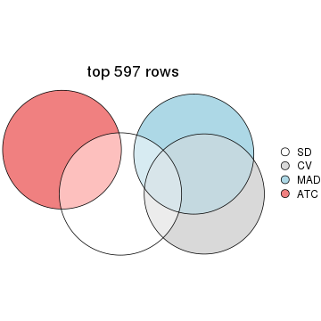</p>

</div>
<div id='tab-top-rows-overlap-by-euler-2'>
<pre><code class="r">top_rows_overlap(res_list, top_n = 1194, method = &quot;euler&quot;)
</code></pre>

<p></p>

</div>
<div id='tab-top-rows-overlap-by-euler-3'>
<pre><code class="r">top_rows_overlap(res_list, top_n = 1790, method = &quot;euler&quot;)
</code></pre>

<p></p>

</div>
<div id='tab-top-rows-overlap-by-euler-4'>
<pre><code class="r">top_rows_overlap(res_list, top_n = 2386, method = &quot;euler&quot;)
</code></pre>

<p></p>

</div>
<div id='tab-top-rows-overlap-by-euler-5'>
<pre><code class="r">top_rows_overlap(res_list, top_n = 2983, method = &quot;euler&quot;)
</code></pre>

<p></p>

</div>
</div>

Also visualize the correspondance of rankings between different top-row methods:


<script>
$( function() {
	$( '#tabs-top-rows-overlap-by-correspondance' ).tabs();
} );
</script>
<div id='tabs-top-rows-overlap-by-correspondance'>
<ul>
<li><a href='#tab-top-rows-overlap-by-correspondance-1'>top_n = 597</a></li>
<li><a href='#tab-top-rows-overlap-by-correspondance-2'>top_n = 1194</a></li>
<li><a href='#tab-top-rows-overlap-by-correspondance-3'>top_n = 1790</a></li>
<li><a href='#tab-top-rows-overlap-by-correspondance-4'>top_n = 2386</a></li>
<li><a href='#tab-top-rows-overlap-by-correspondance-5'>top_n = 2983</a></li>
</ul>
<div id='tab-top-rows-overlap-by-correspondance-1'>
<pre><code class="r">top_rows_overlap(res_list, top_n = 597, method = &quot;correspondance&quot;)
</code></pre>

<p></p>

</div>
<div id='tab-top-rows-overlap-by-correspondance-2'>
<pre><code class="r">top_rows_overlap(res_list, top_n = 1194, method = &quot;correspondance&quot;)
</code></pre>

<p></p>

</div>
<div id='tab-top-rows-overlap-by-correspondance-3'>
<pre><code class="r">top_rows_overlap(res_list, top_n = 1790, method = &quot;correspondance&quot;)
</code></pre>

<p></p>

</div>
<div id='tab-top-rows-overlap-by-correspondance-4'>
<pre><code class="r">top_rows_overlap(res_list, top_n = 2386, method = &quot;correspondance&quot;)
</code></pre>

<p></p>

</div>
<div id='tab-top-rows-overlap-by-correspondance-5'>
<pre><code class="r">top_rows_overlap(res_list, top_n = 2983, method = &quot;correspondance&quot;)
</code></pre>

<p></p>

</div>
</div>


Heatmaps of the top rows:


<script>
$( function() {
	$( '#tabs-top-rows-heatmap' ).tabs();
} );
</script>
<div id='tabs-top-rows-heatmap'>
<ul>
<li><a href='#tab-top-rows-heatmap-1'>top_n = 597</a></li>
<li><a href='#tab-top-rows-heatmap-2'>top_n = 1194</a></li>
<li><a href='#tab-top-rows-heatmap-3'>top_n = 1790</a></li>
<li><a href='#tab-top-rows-heatmap-4'>top_n = 2386</a></li>
<li><a href='#tab-top-rows-heatmap-5'>top_n = 2983</a></li>
</ul>
<div id='tab-top-rows-heatmap-1'>
<pre><code class="r">top_rows_heatmap(res_list, top_n = 597)
</code></pre>

<p></p>

</div>
<div id='tab-top-rows-heatmap-2'>
<pre><code class="r">top_rows_heatmap(res_list, top_n = 1194)
</code></pre>

<p></p>

</div>
<div id='tab-top-rows-heatmap-3'>
<pre><code class="r">top_rows_heatmap(res_list, top_n = 1790)
</code></pre>

<p></p>

</div>
<div id='tab-top-rows-heatmap-4'>
<pre><code class="r">top_rows_heatmap(res_list, top_n = 2386)
</code></pre>

<p></p>

</div>
<div id='tab-top-rows-heatmap-5'>
<pre><code class="r">top_rows_heatmap(res_list, top_n = 2983)
</code></pre>

<p></p>

</div>
</div>


 
## Results for each method


---------------------------------------------------


### SD:hclust**


The object with results only for a single top-value method and a single partition method 
can be extracted as:

```r
res = res_list["SD", "hclust"]
# you can also extract it by
# res = res_list["SD:hclust"]
```

A summary of `res` and all the functions that can be applied to it:

```r
res
```

```
#> A 'ConsensusPartition' object with k = 2, 3, 4, 5, 6.
#>   On a matrix with 5966 rows and 384 columns.
#>   Top rows (597, 1194, 1790, 2386, 2983) are extracted by 'SD' method.
#>   Subgroups are detected by 'hclust' method.
#>   Performed in total 1250 partitions by row resampling.
#>   Best k for subgroups seems to be 2.
#> 
#> Following methods can be applied to this 'ConsensusPartition' object:
#>  [1] "cola_report"             "collect_classes"         "collect_plots"          
#>  [4] "collect_stats"           "colnames"                "compare_signatures"     
#>  [7] "consensus_heatmap"       "dimension_reduction"     "functional_enrichment"  
#> [10] "get_anno_col"            "get_anno"                "get_classes"            
#> [13] "get_consensus"           "get_matrix"              "get_membership"         
#> [16] "get_param"               "get_signatures"          "get_stats"              
#> [19] "is_best_k"               "is_stable_k"             "membership_heatmap"     
#> [22] "ncol"                    "nrow"                    "plot_ecdf"              
#> [25] "rownames"                "select_partition_number" "show"                   
#> [28] "suggest_best_k"          "test_to_known_factors"
```

`collect_plots()` function collects all the plots made from `res` for all `k` (number of partitions)
into one single page to provide an easy and fast comparison between different `k`.

```r
collect_plots(res)
```


The plots are:

- The first row: a plot of the ECDF (Empirical cumulative distribution
  function) curves of the consensus matrix for each `k` and the heatmap of
  predicted classes for each `k`.
- The second row: heatmaps of the consensus matrix for each `k`.
- The third row: heatmaps of the membership matrix for each `k`.
- The fouth row: heatmaps of the signatures for each `k`.

All the plots in panels can be made by individual functions and they are
plotted later in this section.

`select_partition_number()` produces several plots showing different
statistics for choosing "optimized" `k`. There are following statistics:

- ECDF curves of the consensus matrix for each `k`;
- 1-PAC. [The PAC
  score](https://en.wikipedia.org/wiki/Consensus_clustering#Over-interpretation_potential_of_consensus_clustering)
  measures the proportion of the ambiguous subgrouping.
- Mean silhouette score.
- Concordance. The mean probability of fiting the consensus class ids in all
  partitions.
- Area increased. Denote $A_k$ as the area under the ECDF curve for current
  `k`, the area increased is defined as $A_k - A_{k-1}$.
- Rand index. The percent of pairs of samples that are both in a same cluster
  or both are not in a same cluster in the partition of k and k-1.
- Jaccard index. The ratio of pairs of samples are both in a same cluster in
  the partition of k and k-1 and the pairs of samples are both in a same
  cluster in the partition k or k-1.

The detailed explanations of these statistics can be found in [the cola
vignette](http://bioconductor.org/packages/devel/bioc/vignettes/cola/inst/doc/cola.html#toc_13).

Generally speaking, lower PAC score, higher mean silhouette score or higher
concordance corresponds to better partition. Rand index and Jaccard index
measure how similar the current partition is compared to partition with `k-1`.
If they are too similar, we won't accept `k` is better than `k-1`.

```r
select_partition_number(res)
```


The numeric values for all these statistics can be obtained by `get_stats()`.

```r
get_stats(res)
```

```
#>   k 1-PAC mean_silhouette concordance area_increased  Rand Jaccard
#> 2 2 1.000           0.982       0.991        0.16587 0.847   0.847
#> 3 3 0.867           0.920       0.965        0.79517 0.830   0.800
#> 4 4 0.832           0.898       0.953        0.02545 0.998   0.998
#> 5 5 0.870           0.909       0.956        0.00613 0.997   0.995
#> 6 6 0.836           0.896       0.946        0.06131 1.000   1.000
```

`suggest_best_k()` suggests the best $k$ based on these statistics. The rules are as follows:

- All $k$ with Jaccard index larger than 0.95 are removed because the increase of
  the partition number does not provides enough extra information. If all $k$ are removed,
  the best $k$ is assigned by `NA`.
- For $k$ with 1-PAC larger than 0.9, the maximal $k$ is taken as the "best k". Other $k$ is called "optional k".
- If it does not fit the second rule. The $k$ with the highest vote of highest
  1-PAC, mean silhouette and concordance is taken as the "best k".

```r
suggest_best_k(res)
```

```
#> [1] 2
```


Following shows the table of the partitions (You need to click the **show/hide
code output** link to see it). The membership matrix (columns with name `p*`)
is inferred by
[`clue::cl_consensus()`](https://www.rdocumentation.org/link/cl_consensus?package=clue)
function with the `SE` method. Basically the value in the membership matrix
represents the probability to belong to a certain group. The finall class
label for an item is determined with the group with highest probability it
belongs to.

In `get_classes()` function, the entropy is calculated from the membership
matrix and the silhouette score is calculated from the consensus matrix.


<script>
$( function() {
	$( '#tabs-SD-hclust-get-classes' ).tabs();
} );
</script>
<div id='tabs-SD-hclust-get-classes'>
<ul>
<li><a href='#tab-SD-hclust-get-classes-1'>k = 2</a></li>
<li><a href='#tab-SD-hclust-get-classes-2'>k = 3</a></li>
<li><a href='#tab-SD-hclust-get-classes-3'>k = 4</a></li>
<li><a href='#tab-SD-hclust-get-classes-4'>k = 5</a></li>
<li><a href='#tab-SD-hclust-get-classes-5'>k = 6</a></li>
</ul>

<div id='tab-SD-hclust-get-classes-1'>
<p><a id='tab-SD-hclust-get-classes-1-a' style='color:#0366d6' href='#'>show/hide code output</a></p>
<pre><code class="r">cbind(get_classes(res, k = 2), get_membership(res, k = 2))
</code></pre>

<pre><code>#&gt;           class entropy silhouette    p1    p2
#&gt; SRR490216     2   0.000      0.991 0.000 1.000
#&gt; SRR490217     2   0.000      0.991 0.000 1.000
#&gt; SRR490218     2   0.000      0.991 0.000 1.000
#&gt; SRR490219     2   0.000      0.991 0.000 1.000
#&gt; SRR490220     2   0.000      0.991 0.000 1.000
#&gt; SRR490221     2   0.000      0.991 0.000 1.000
#&gt; SRR490222     2   0.000      0.991 0.000 1.000
#&gt; SRR490223     2   0.000      0.991 0.000 1.000
#&gt; SRR490224     2   0.625      0.823 0.156 0.844
#&gt; SRR490225     2   0.625      0.823 0.156 0.844
#&gt; SRR490226     2   0.625      0.823 0.156 0.844
#&gt; SRR490227     2   0.625      0.823 0.156 0.844
#&gt; SRR490228     2   0.625      0.823 0.156 0.844
#&gt; SRR490229     2   0.625      0.823 0.156 0.844
#&gt; SRR490230     2   0.625      0.823 0.156 0.844
#&gt; SRR490231     2   0.625      0.823 0.156 0.844
#&gt; SRR490232     2   0.000      0.991 0.000 1.000
#&gt; SRR490233     2   0.000      0.991 0.000 1.000
#&gt; SRR490234     2   0.000      0.991 0.000 1.000
#&gt; SRR490235     2   0.000      0.991 0.000 1.000
#&gt; SRR490236     2   0.595      0.838 0.144 0.856
#&gt; SRR490237     2   0.595      0.838 0.144 0.856
#&gt; SRR490238     2   0.595      0.838 0.144 0.856
#&gt; SRR490239     2   0.595      0.838 0.144 0.856
#&gt; SRR490240     2   0.000      0.991 0.000 1.000
#&gt; SRR490241     2   0.000      0.991 0.000 1.000
#&gt; SRR490242     2   0.000      0.991 0.000 1.000
#&gt; SRR490243     2   0.000      0.991 0.000 1.000
#&gt; SRR490244     1   0.000      0.993 1.000 0.000
#&gt; SRR490245     1   0.000      0.993 1.000 0.000
#&gt; SRR490246     1   0.000      0.993 1.000 0.000
#&gt; SRR490247     1   0.000      0.993 1.000 0.000
#&gt; SRR490248     2   0.000      0.991 0.000 1.000
#&gt; SRR490249     2   0.000      0.991 0.000 1.000
#&gt; SRR490250     2   0.000      0.991 0.000 1.000
#&gt; SRR490251     2   0.000      0.991 0.000 1.000
#&gt; SRR490252     2   0.000      0.991 0.000 1.000
#&gt; SRR490253     2   0.000      0.991 0.000 1.000
#&gt; SRR490254     2   0.000      0.991 0.000 1.000
#&gt; SRR490255     2   0.000      0.991 0.000 1.000
#&gt; SRR490256     2   0.000      0.991 0.000 1.000
#&gt; SRR490257     2   0.000      0.991 0.000 1.000
#&gt; SRR490258     2   0.000      0.991 0.000 1.000
#&gt; SRR490259     2   0.000      0.991 0.000 1.000
#&gt; SRR490260     2   0.000      0.991 0.000 1.000
#&gt; SRR490261     2   0.000      0.991 0.000 1.000
#&gt; SRR490262     2   0.000      0.991 0.000 1.000
#&gt; SRR490263     2   0.000      0.991 0.000 1.000
#&gt; SRR490264     2   0.000      0.991 0.000 1.000
#&gt; SRR490265     2   0.000      0.991 0.000 1.000
#&gt; SRR490266     2   0.000      0.991 0.000 1.000
#&gt; SRR490267     2   0.000      0.991 0.000 1.000
#&gt; SRR490268     2   0.000      0.991 0.000 1.000
#&gt; SRR490269     2   0.000      0.991 0.000 1.000
#&gt; SRR490270     2   0.000      0.991 0.000 1.000
#&gt; SRR490271     2   0.000      0.991 0.000 1.000
#&gt; SRR490272     2   0.000      0.991 0.000 1.000
#&gt; SRR490273     2   0.000      0.991 0.000 1.000
#&gt; SRR490274     2   0.000      0.991 0.000 1.000
#&gt; SRR490275     2   0.000      0.991 0.000 1.000
#&gt; SRR490276     2   0.000      0.991 0.000 1.000
#&gt; SRR490277     2   0.000      0.991 0.000 1.000
#&gt; SRR490278     2   0.000      0.991 0.000 1.000
#&gt; SRR490279     2   0.000      0.991 0.000 1.000
#&gt; SRR490280     1   0.311      0.945 0.944 0.056
#&gt; SRR490281     1   0.311      0.945 0.944 0.056
#&gt; SRR490282     1   0.311      0.945 0.944 0.056
#&gt; SRR490283     1   0.311      0.945 0.944 0.056
#&gt; SRR490284     2   0.662      0.802 0.172 0.828
#&gt; SRR490285     2   0.662      0.802 0.172 0.828
#&gt; SRR490286     2   0.662      0.802 0.172 0.828
#&gt; SRR490287     2   0.662      0.802 0.172 0.828
#&gt; SRR490288     2   0.000      0.991 0.000 1.000
#&gt; SRR490289     2   0.000      0.991 0.000 1.000
#&gt; SRR490290     2   0.000      0.991 0.000 1.000
#&gt; SRR490291     2   0.000      0.991 0.000 1.000
#&gt; SRR490292     2   0.000      0.991 0.000 1.000
#&gt; SRR490293     2   0.000      0.991 0.000 1.000
#&gt; SRR490294     2   0.000      0.991 0.000 1.000
#&gt; SRR490295     2   0.000      0.991 0.000 1.000
#&gt; SRR490296     2   0.000      0.991 0.000 1.000
#&gt; SRR490297     2   0.000      0.991 0.000 1.000
#&gt; SRR490298     2   0.000      0.991 0.000 1.000
#&gt; SRR490299     2   0.000      0.991 0.000 1.000
#&gt; SRR490300     2   0.000      0.991 0.000 1.000
#&gt; SRR490301     2   0.000      0.991 0.000 1.000
#&gt; SRR490302     2   0.000      0.991 0.000 1.000
#&gt; SRR490303     2   0.000      0.991 0.000 1.000
#&gt; SRR490304     2   0.000      0.991 0.000 1.000
#&gt; SRR490305     2   0.000      0.991 0.000 1.000
#&gt; SRR490306     2   0.000      0.991 0.000 1.000
#&gt; SRR490307     2   0.000      0.991 0.000 1.000
#&gt; SRR490308     1   0.000      0.993 1.000 0.000
#&gt; SRR490309     1   0.000      0.993 1.000 0.000
#&gt; SRR490310     1   0.000      0.993 1.000 0.000
#&gt; SRR490311     1   0.000      0.993 1.000 0.000
#&gt; SRR490312     2   0.000      0.991 0.000 1.000
#&gt; SRR490313     2   0.000      0.991 0.000 1.000
#&gt; SRR490314     2   0.000      0.991 0.000 1.000
#&gt; SRR490315     2   0.000      0.991 0.000 1.000
#&gt; SRR490316     2   0.000      0.991 0.000 1.000
#&gt; SRR490317     2   0.000      0.991 0.000 1.000
#&gt; SRR490318     2   0.000      0.991 0.000 1.000
#&gt; SRR490319     2   0.000      0.991 0.000 1.000
#&gt; SRR490320     2   0.000      0.991 0.000 1.000
#&gt; SRR490321     2   0.000      0.991 0.000 1.000
#&gt; SRR490322     2   0.000      0.991 0.000 1.000
#&gt; SRR490323     2   0.000      0.991 0.000 1.000
#&gt; SRR490324     2   0.634      0.818 0.160 0.840
#&gt; SRR490325     2   0.634      0.818 0.160 0.840
#&gt; SRR490326     2   0.634      0.818 0.160 0.840
#&gt; SRR490327     2   0.634      0.818 0.160 0.840
#&gt; SRR490328     2   0.000      0.991 0.000 1.000
#&gt; SRR490329     2   0.000      0.991 0.000 1.000
#&gt; SRR490330     2   0.000      0.991 0.000 1.000
#&gt; SRR490331     2   0.000      0.991 0.000 1.000
#&gt; SRR490332     2   0.000      0.991 0.000 1.000
#&gt; SRR490333     2   0.000      0.991 0.000 1.000
#&gt; SRR490334     2   0.000      0.991 0.000 1.000
#&gt; SRR490335     2   0.000      0.991 0.000 1.000
#&gt; SRR490336     2   0.000      0.991 0.000 1.000
#&gt; SRR490337     2   0.000      0.991 0.000 1.000
#&gt; SRR490338     2   0.000      0.991 0.000 1.000
#&gt; SRR490339     2   0.000      0.991 0.000 1.000
#&gt; SRR490340     2   0.000      0.991 0.000 1.000
#&gt; SRR490341     2   0.000      0.991 0.000 1.000
#&gt; SRR490342     2   0.000      0.991 0.000 1.000
#&gt; SRR490343     2   0.000      0.991 0.000 1.000
#&gt; SRR490344     2   0.000      0.991 0.000 1.000
#&gt; SRR490345     2   0.000      0.991 0.000 1.000
#&gt; SRR490346     2   0.000      0.991 0.000 1.000
#&gt; SRR490347     2   0.000      0.991 0.000 1.000
#&gt; SRR490348     2   0.000      0.991 0.000 1.000
#&gt; SRR490349     2   0.000      0.991 0.000 1.000
#&gt; SRR490350     2   0.000      0.991 0.000 1.000
#&gt; SRR490351     2   0.000      0.991 0.000 1.000
#&gt; SRR490352     2   0.000      0.991 0.000 1.000
#&gt; SRR490353     2   0.000      0.991 0.000 1.000
#&gt; SRR490354     2   0.000      0.991 0.000 1.000
#&gt; SRR490355     2   0.000      0.991 0.000 1.000
#&gt; SRR490356     2   0.000      0.991 0.000 1.000
#&gt; SRR490357     2   0.000      0.991 0.000 1.000
#&gt; SRR490358     2   0.000      0.991 0.000 1.000
#&gt; SRR490359     2   0.000      0.991 0.000 1.000
#&gt; SRR490360     2   0.000      0.991 0.000 1.000
#&gt; SRR490361     2   0.000      0.991 0.000 1.000
#&gt; SRR490362     2   0.000      0.991 0.000 1.000
#&gt; SRR490363     2   0.000      0.991 0.000 1.000
#&gt; SRR490364     2   0.000      0.991 0.000 1.000
#&gt; SRR490365     2   0.000      0.991 0.000 1.000
#&gt; SRR490366     2   0.000      0.991 0.000 1.000
#&gt; SRR490367     2   0.000      0.991 0.000 1.000
#&gt; SRR490368     2   0.000      0.991 0.000 1.000
#&gt; SRR490369     2   0.000      0.991 0.000 1.000
#&gt; SRR490370     2   0.000      0.991 0.000 1.000
#&gt; SRR490371     2   0.000      0.991 0.000 1.000
#&gt; SRR490372     1   0.000      0.993 1.000 0.000
#&gt; SRR490373     1   0.000      0.993 1.000 0.000
#&gt; SRR490374     1   0.000      0.993 1.000 0.000
#&gt; SRR490375     1   0.000      0.993 1.000 0.000
#&gt; SRR490376     2   0.000      0.991 0.000 1.000
#&gt; SRR490377     2   0.000      0.991 0.000 1.000
#&gt; SRR490378     2   0.000      0.991 0.000 1.000
#&gt; SRR490379     2   0.000      0.991 0.000 1.000
#&gt; SRR490380     1   0.000      0.993 1.000 0.000
#&gt; SRR490381     1   0.000      0.993 1.000 0.000
#&gt; SRR490382     1   0.000      0.993 1.000 0.000
#&gt; SRR490383     1   0.000      0.993 1.000 0.000
#&gt; SRR490384     2   0.000      0.991 0.000 1.000
#&gt; SRR490385     2   0.000      0.991 0.000 1.000
#&gt; SRR490386     2   0.000      0.991 0.000 1.000
#&gt; SRR490387     2   0.000      0.991 0.000 1.000
#&gt; SRR490388     2   0.000      0.991 0.000 1.000
#&gt; SRR490389     2   0.000      0.991 0.000 1.000
#&gt; SRR490390     2   0.000      0.991 0.000 1.000
#&gt; SRR490391     2   0.000      0.991 0.000 1.000
#&gt; SRR490392     2   0.000      0.991 0.000 1.000
#&gt; SRR490393     2   0.000      0.991 0.000 1.000
#&gt; SRR490394     2   0.000      0.991 0.000 1.000
#&gt; SRR490395     2   0.000      0.991 0.000 1.000
#&gt; SRR490396     2   0.000      0.991 0.000 1.000
#&gt; SRR490397     2   0.000      0.991 0.000 1.000
#&gt; SRR490398     2   0.000      0.991 0.000 1.000
#&gt; SRR490399     2   0.000      0.991 0.000 1.000
#&gt; SRR490400     2   0.000      0.991 0.000 1.000
#&gt; SRR490401     2   0.000      0.991 0.000 1.000
#&gt; SRR490402     2   0.000      0.991 0.000 1.000
#&gt; SRR490403     2   0.000      0.991 0.000 1.000
#&gt; SRR490404     2   0.000      0.991 0.000 1.000
#&gt; SRR490405     2   0.000      0.991 0.000 1.000
#&gt; SRR490406     2   0.000      0.991 0.000 1.000
#&gt; SRR490407     2   0.000      0.991 0.000 1.000
#&gt; SRR490408     2   0.000      0.991 0.000 1.000
#&gt; SRR490409     2   0.000      0.991 0.000 1.000
#&gt; SRR490410     2   0.000      0.991 0.000 1.000
#&gt; SRR490411     2   0.000      0.991 0.000 1.000
#&gt; SRR490412     1   0.000      0.993 1.000 0.000
#&gt; SRR490413     1   0.000      0.993 1.000 0.000
#&gt; SRR490414     1   0.000      0.993 1.000 0.000
#&gt; SRR490415     1   0.000      0.993 1.000 0.000
#&gt; SRR490416     2   0.000      0.991 0.000 1.000
#&gt; SRR490417     2   0.000      0.991 0.000 1.000
#&gt; SRR490418     2   0.000      0.991 0.000 1.000
#&gt; SRR490419     2   0.000      0.991 0.000 1.000
#&gt; SRR490420     2   0.000      0.991 0.000 1.000
#&gt; SRR490421     2   0.000      0.991 0.000 1.000
#&gt; SRR490422     2   0.000      0.991 0.000 1.000
#&gt; SRR490423     2   0.000      0.991 0.000 1.000
#&gt; SRR490424     2   0.000      0.991 0.000 1.000
#&gt; SRR490425     2   0.000      0.991 0.000 1.000
#&gt; SRR490426     2   0.000      0.991 0.000 1.000
#&gt; SRR490427     2   0.000      0.991 0.000 1.000
#&gt; SRR490428     2   0.000      0.991 0.000 1.000
#&gt; SRR490429     2   0.000      0.991 0.000 1.000
#&gt; SRR490430     2   0.000      0.991 0.000 1.000
#&gt; SRR490431     2   0.000      0.991 0.000 1.000
#&gt; SRR490432     2   0.000      0.991 0.000 1.000
#&gt; SRR490433     2   0.000      0.991 0.000 1.000
#&gt; SRR490434     2   0.000      0.991 0.000 1.000
#&gt; SRR490435     2   0.000      0.991 0.000 1.000
#&gt; SRR490436     2   0.000      0.991 0.000 1.000
#&gt; SRR490437     2   0.000      0.991 0.000 1.000
#&gt; SRR490438     2   0.000      0.991 0.000 1.000
#&gt; SRR490439     2   0.000      0.991 0.000 1.000
#&gt; SRR490440     2   0.000      0.991 0.000 1.000
#&gt; SRR490441     2   0.000      0.991 0.000 1.000
#&gt; SRR490442     2   0.000      0.991 0.000 1.000
#&gt; SRR490443     2   0.000      0.991 0.000 1.000
#&gt; SRR490444     2   0.000      0.991 0.000 1.000
#&gt; SRR490445     2   0.000      0.991 0.000 1.000
#&gt; SRR490446     2   0.000      0.991 0.000 1.000
#&gt; SRR490447     2   0.000      0.991 0.000 1.000
#&gt; SRR490448     2   0.000      0.991 0.000 1.000
#&gt; SRR490449     2   0.000      0.991 0.000 1.000
#&gt; SRR490450     2   0.000      0.991 0.000 1.000
#&gt; SRR490451     2   0.000      0.991 0.000 1.000
#&gt; SRR490452     2   0.000      0.991 0.000 1.000
#&gt; SRR490453     2   0.000      0.991 0.000 1.000
#&gt; SRR490454     2   0.000      0.991 0.000 1.000
#&gt; SRR490455     2   0.000      0.991 0.000 1.000
#&gt; SRR490456     2   0.000      0.991 0.000 1.000
#&gt; SRR490457     2   0.000      0.991 0.000 1.000
#&gt; SRR490458     2   0.000      0.991 0.000 1.000
#&gt; SRR490459     2   0.000      0.991 0.000 1.000
#&gt; SRR490460     2   0.000      0.991 0.000 1.000
#&gt; SRR490461     2   0.000      0.991 0.000 1.000
#&gt; SRR490462     2   0.000      0.991 0.000 1.000
#&gt; SRR490463     2   0.000      0.991 0.000 1.000
#&gt; SRR490464     1   0.000      0.993 1.000 0.000
#&gt; SRR490465     1   0.000      0.993 1.000 0.000
#&gt; SRR490466     1   0.000      0.993 1.000 0.000
#&gt; SRR490467     1   0.000      0.993 1.000 0.000
#&gt; SRR490468     2   0.000      0.991 0.000 1.000
#&gt; SRR490469     2   0.000      0.991 0.000 1.000
#&gt; SRR490470     2   0.000      0.991 0.000 1.000
#&gt; SRR490471     2   0.000      0.991 0.000 1.000
#&gt; SRR490472     2   0.000      0.991 0.000 1.000
#&gt; SRR490473     2   0.000      0.991 0.000 1.000
#&gt; SRR490474     2   0.000      0.991 0.000 1.000
#&gt; SRR490475     2   0.000      0.991 0.000 1.000
#&gt; SRR490476     1   0.000      0.993 1.000 0.000
#&gt; SRR490477     1   0.000      0.993 1.000 0.000
#&gt; SRR490478     1   0.000      0.993 1.000 0.000
#&gt; SRR490479     1   0.000      0.993 1.000 0.000
#&gt; SRR490480     2   0.000      0.991 0.000 1.000
#&gt; SRR490481     2   0.000      0.991 0.000 1.000
#&gt; SRR490482     2   0.000      0.991 0.000 1.000
#&gt; SRR490483     2   0.000      0.991 0.000 1.000
#&gt; SRR490484     2   0.000      0.991 0.000 1.000
#&gt; SRR490485     2   0.000      0.991 0.000 1.000
#&gt; SRR490486     2   0.000      0.991 0.000 1.000
#&gt; SRR490487     2   0.000      0.991 0.000 1.000
#&gt; SRR490488     2   0.000      0.991 0.000 1.000
#&gt; SRR490489     2   0.000      0.991 0.000 1.000
#&gt; SRR490490     2   0.000      0.991 0.000 1.000
#&gt; SRR490491     2   0.000      0.991 0.000 1.000
#&gt; SRR490492     2   0.000      0.991 0.000 1.000
#&gt; SRR490493     2   0.000      0.991 0.000 1.000
#&gt; SRR490494     2   0.000      0.991 0.000 1.000
#&gt; SRR490495     2   0.000      0.991 0.000 1.000
#&gt; SRR490496     2   0.000      0.991 0.000 1.000
#&gt; SRR490497     2   0.000      0.991 0.000 1.000
#&gt; SRR490498     2   0.000      0.991 0.000 1.000
#&gt; SRR490499     2   0.000      0.991 0.000 1.000
#&gt; SRR490500     2   0.000      0.991 0.000 1.000
#&gt; SRR490501     2   0.000      0.991 0.000 1.000
#&gt; SRR490502     2   0.000      0.991 0.000 1.000
#&gt; SRR490503     2   0.000      0.991 0.000 1.000
#&gt; SRR490504     2   0.000      0.991 0.000 1.000
#&gt; SRR490505     2   0.000      0.991 0.000 1.000
#&gt; SRR490506     2   0.000      0.991 0.000 1.000
#&gt; SRR490507     2   0.000      0.991 0.000 1.000
#&gt; SRR490508     2   0.000      0.991 0.000 1.000
#&gt; SRR490509     2   0.000      0.991 0.000 1.000
#&gt; SRR490510     2   0.000      0.991 0.000 1.000
#&gt; SRR490511     2   0.000      0.991 0.000 1.000
#&gt; SRR490512     2   0.000      0.991 0.000 1.000
#&gt; SRR490513     2   0.000      0.991 0.000 1.000
#&gt; SRR490514     2   0.000      0.991 0.000 1.000
#&gt; SRR490515     2   0.000      0.991 0.000 1.000
#&gt; SRR490516     2   0.000      0.991 0.000 1.000
#&gt; SRR490517     2   0.000      0.991 0.000 1.000
#&gt; SRR490518     2   0.000      0.991 0.000 1.000
#&gt; SRR490519     2   0.000      0.991 0.000 1.000
#&gt; SRR490520     2   0.000      0.991 0.000 1.000
#&gt; SRR490521     2   0.000      0.991 0.000 1.000
#&gt; SRR490522     2   0.000      0.991 0.000 1.000
#&gt; SRR490523     2   0.000      0.991 0.000 1.000
#&gt; SRR490524     2   0.000      0.991 0.000 1.000
#&gt; SRR490525     2   0.000      0.991 0.000 1.000
#&gt; SRR490526     2   0.000      0.991 0.000 1.000
#&gt; SRR490527     2   0.000      0.991 0.000 1.000
#&gt; SRR490528     2   0.000      0.991 0.000 1.000
#&gt; SRR490529     2   0.000      0.991 0.000 1.000
#&gt; SRR490530     2   0.000      0.991 0.000 1.000
#&gt; SRR490531     2   0.000      0.991 0.000 1.000
#&gt; SRR490532     2   0.000      0.991 0.000 1.000
#&gt; SRR490533     2   0.000      0.991 0.000 1.000
#&gt; SRR490534     2   0.000      0.991 0.000 1.000
#&gt; SRR490535     2   0.000      0.991 0.000 1.000
#&gt; SRR490536     2   0.000      0.991 0.000 1.000
#&gt; SRR490537     2   0.000      0.991 0.000 1.000
#&gt; SRR490538     2   0.000      0.991 0.000 1.000
#&gt; SRR490539     2   0.000      0.991 0.000 1.000
#&gt; SRR490540     2   0.000      0.991 0.000 1.000
#&gt; SRR490541     2   0.000      0.991 0.000 1.000
#&gt; SRR490542     2   0.000      0.991 0.000 1.000
#&gt; SRR490543     2   0.000      0.991 0.000 1.000
#&gt; SRR490544     2   0.000      0.991 0.000 1.000
#&gt; SRR490545     2   0.000      0.991 0.000 1.000
#&gt; SRR490546     2   0.000      0.991 0.000 1.000
#&gt; SRR490547     2   0.000      0.991 0.000 1.000
#&gt; SRR490548     2   0.000      0.991 0.000 1.000
#&gt; SRR490549     2   0.000      0.991 0.000 1.000
#&gt; SRR490550     2   0.000      0.991 0.000 1.000
#&gt; SRR490551     2   0.000      0.991 0.000 1.000
#&gt; SRR490552     2   0.000      0.991 0.000 1.000
#&gt; SRR490553     2   0.000      0.991 0.000 1.000
#&gt; SRR490554     2   0.000      0.991 0.000 1.000
#&gt; SRR490555     2   0.000      0.991 0.000 1.000
#&gt; SRR490556     2   0.000      0.991 0.000 1.000
#&gt; SRR490557     2   0.000      0.991 0.000 1.000
#&gt; SRR490558     2   0.000      0.991 0.000 1.000
#&gt; SRR490559     2   0.000      0.991 0.000 1.000
#&gt; SRR490560     2   0.000      0.991 0.000 1.000
#&gt; SRR490561     2   0.000      0.991 0.000 1.000
#&gt; SRR490562     2   0.000      0.991 0.000 1.000
#&gt; SRR490563     2   0.000      0.991 0.000 1.000
#&gt; SRR490564     2   0.000      0.991 0.000 1.000
#&gt; SRR490565     2   0.000      0.991 0.000 1.000
#&gt; SRR490566     2   0.000      0.991 0.000 1.000
#&gt; SRR490567     2   0.000      0.991 0.000 1.000
#&gt; SRR490568     2   0.000      0.991 0.000 1.000
#&gt; SRR490569     2   0.000      0.991 0.000 1.000
#&gt; SRR490570     2   0.000      0.991 0.000 1.000
#&gt; SRR490571     2   0.000      0.991 0.000 1.000
#&gt; SRR490572     2   0.000      0.991 0.000 1.000
#&gt; SRR490573     2   0.000      0.991 0.000 1.000
#&gt; SRR490574     2   0.000      0.991 0.000 1.000
#&gt; SRR490575     2   0.000      0.991 0.000 1.000
#&gt; SRR490576     2   0.000      0.991 0.000 1.000
#&gt; SRR490577     2   0.000      0.991 0.000 1.000
#&gt; SRR490578     2   0.000      0.991 0.000 1.000
#&gt; SRR490579     2   0.000      0.991 0.000 1.000
#&gt; SRR490580     2   0.000      0.991 0.000 1.000
#&gt; SRR490581     2   0.000      0.991 0.000 1.000
#&gt; SRR490582     2   0.000      0.991 0.000 1.000
#&gt; SRR490583     2   0.000      0.991 0.000 1.000
#&gt; SRR490584     2   0.000      0.991 0.000 1.000
#&gt; SRR490585     2   0.000      0.991 0.000 1.000
#&gt; SRR490586     2   0.000      0.991 0.000 1.000
#&gt; SRR490587     2   0.000      0.991 0.000 1.000
#&gt; SRR490588     2   0.000      0.991 0.000 1.000
#&gt; SRR490589     2   0.000      0.991 0.000 1.000
#&gt; SRR490590     2   0.000      0.991 0.000 1.000
#&gt; SRR490591     2   0.000      0.991 0.000 1.000
#&gt; SRR490592     2   0.000      0.991 0.000 1.000
#&gt; SRR490593     2   0.000      0.991 0.000 1.000
#&gt; SRR490594     2   0.000      0.991 0.000 1.000
#&gt; SRR490595     2   0.000      0.991 0.000 1.000
#&gt; SRR490596     2   0.000      0.991 0.000 1.000
#&gt; SRR490597     2   0.000      0.991 0.000 1.000
#&gt; SRR490598     2   0.000      0.991 0.000 1.000
#&gt; SRR490599     2   0.000      0.991 0.000 1.000
</code></pre>

<script>
$('#tab-SD-hclust-get-classes-1-a').parent().next().next().hide();
$('#tab-SD-hclust-get-classes-1-a').click(function(){
  $('#tab-SD-hclust-get-classes-1-a').parent().next().next().toggle();
  return(false);
});
</script>
</div>

<div id='tab-SD-hclust-get-classes-2'>
<p><a id='tab-SD-hclust-get-classes-2-a' style='color:#0366d6' href='#'>show/hide code output</a></p>
<pre><code class="r">cbind(get_classes(res, k = 3), get_membership(res, k = 3))
</code></pre>

<pre><code>#&gt;           class entropy silhouette    p1    p2    p3
#&gt; SRR490216     2  0.0000      0.986 0.000 1.000 0.000
#&gt; SRR490217     2  0.0000      0.986 0.000 1.000 0.000
#&gt; SRR490218     2  0.0000      0.986 0.000 1.000 0.000
#&gt; SRR490219     2  0.0000      0.986 0.000 1.000 0.000
#&gt; SRR490220     2  0.0237      0.983 0.004 0.996 0.000
#&gt; SRR490221     2  0.0237      0.983 0.004 0.996 0.000
#&gt; SRR490222     2  0.0237      0.983 0.004 0.996 0.000
#&gt; SRR490223     2  0.0237      0.983 0.004 0.996 0.000
#&gt; SRR490224     1  0.0747      0.423 0.984 0.016 0.000
#&gt; SRR490225     1  0.0747      0.423 0.984 0.016 0.000
#&gt; SRR490226     1  0.0747      0.423 0.984 0.016 0.000
#&gt; SRR490227     1  0.0747      0.423 0.984 0.016 0.000
#&gt; SRR490228     1  0.0747      0.423 0.984 0.016 0.000
#&gt; SRR490229     1  0.0747      0.423 0.984 0.016 0.000
#&gt; SRR490230     1  0.0747      0.423 0.984 0.016 0.000
#&gt; SRR490231     1  0.0747      0.423 0.984 0.016 0.000
#&gt; SRR490232     2  0.5397      0.450 0.280 0.720 0.000
#&gt; SRR490233     2  0.5397      0.450 0.280 0.720 0.000
#&gt; SRR490234     2  0.5397      0.450 0.280 0.720 0.000
#&gt; SRR490235     2  0.5397      0.450 0.280 0.720 0.000
#&gt; SRR490236     1  0.1163      0.431 0.972 0.028 0.000
#&gt; SRR490237     1  0.1163      0.431 0.972 0.028 0.000
#&gt; SRR490238     1  0.1163      0.431 0.972 0.028 0.000
#&gt; SRR490239     1  0.1163      0.431 0.972 0.028 0.000
#&gt; SRR490240     2  0.0424      0.979 0.008 0.992 0.000
#&gt; SRR490241     2  0.0424      0.979 0.008 0.992 0.000
#&gt; SRR490242     2  0.0424      0.979 0.008 0.992 0.000
#&gt; SRR490243     2  0.0424      0.979 0.008 0.992 0.000
#&gt; SRR490244     3  0.0000      0.978 0.000 0.000 1.000
#&gt; SRR490245     3  0.0000      0.978 0.000 0.000 1.000
#&gt; SRR490246     3  0.0000      0.978 0.000 0.000 1.000
#&gt; SRR490247     3  0.0000      0.978 0.000 0.000 1.000
#&gt; SRR490248     2  0.0000      0.986 0.000 1.000 0.000
#&gt; SRR490249     2  0.0000      0.986 0.000 1.000 0.000
#&gt; SRR490250     2  0.0000      0.986 0.000 1.000 0.000
#&gt; SRR490251     2  0.0000      0.986 0.000 1.000 0.000
#&gt; SRR490252     2  0.0000      0.986 0.000 1.000 0.000
#&gt; SRR490253     2  0.0000      0.986 0.000 1.000 0.000
#&gt; SRR490254     2  0.0000      0.986 0.000 1.000 0.000
#&gt; SRR490255     2  0.0000      0.986 0.000 1.000 0.000
#&gt; SRR490256     2  0.2878      0.864 0.096 0.904 0.000
#&gt; SRR490257     2  0.2878      0.864 0.096 0.904 0.000
#&gt; SRR490258     2  0.2878      0.864 0.096 0.904 0.000
#&gt; SRR490259     2  0.2878      0.864 0.096 0.904 0.000
#&gt; SRR490260     1  0.6252      0.576 0.556 0.444 0.000
#&gt; SRR490261     1  0.6252      0.576 0.556 0.444 0.000
#&gt; SRR490262     1  0.6252      0.576 0.556 0.444 0.000
#&gt; SRR490263     1  0.6252      0.576 0.556 0.444 0.000
#&gt; SRR490264     1  0.6244      0.584 0.560 0.440 0.000
#&gt; SRR490265     1  0.6244      0.584 0.560 0.440 0.000
#&gt; SRR490266     1  0.6244      0.584 0.560 0.440 0.000
#&gt; SRR490267     1  0.6244      0.584 0.560 0.440 0.000
#&gt; SRR490268     2  0.2796      0.870 0.092 0.908 0.000
#&gt; SRR490269     2  0.2796      0.870 0.092 0.908 0.000
#&gt; SRR490270     2  0.2796      0.870 0.092 0.908 0.000
#&gt; SRR490271     2  0.2796      0.870 0.092 0.908 0.000
#&gt; SRR490272     1  0.6244      0.584 0.560 0.440 0.000
#&gt; SRR490273     1  0.6244      0.584 0.560 0.440 0.000
#&gt; SRR490274     1  0.6244      0.584 0.560 0.440 0.000
#&gt; SRR490275     1  0.6244      0.584 0.560 0.440 0.000
#&gt; SRR490276     1  0.6244      0.584 0.560 0.440 0.000
#&gt; SRR490277     1  0.6244      0.584 0.560 0.440 0.000
#&gt; SRR490278     1  0.6244      0.584 0.560 0.440 0.000
#&gt; SRR490279     1  0.6244      0.584 0.560 0.440 0.000
#&gt; SRR490280     3  0.4887      0.825 0.228 0.000 0.772
#&gt; SRR490281     3  0.4887      0.825 0.228 0.000 0.772
#&gt; SRR490282     3  0.4887      0.825 0.228 0.000 0.772
#&gt; SRR490283     3  0.4887      0.825 0.228 0.000 0.772
#&gt; SRR490284     1  0.0000      0.388 1.000 0.000 0.000
#&gt; SRR490285     1  0.0000      0.388 1.000 0.000 0.000
#&gt; SRR490286     1  0.0000      0.388 1.000 0.000 0.000
#&gt; SRR490287     1  0.0000      0.388 1.000 0.000 0.000
#&gt; SRR490288     2  0.0237      0.983 0.004 0.996 0.000
#&gt; SRR490289     2  0.0237      0.983 0.004 0.996 0.000
#&gt; SRR490290     2  0.0237      0.983 0.004 0.996 0.000
#&gt; SRR490291     2  0.0237      0.983 0.004 0.996 0.000
#&gt; SRR490292     2  0.0000      0.986 0.000 1.000 0.000
#&gt; SRR490293     2  0.0000      0.986 0.000 1.000 0.000
#&gt; SRR490294     2  0.0000      0.986 0.000 1.000 0.000
#&gt; SRR490295     2  0.0000      0.986 0.000 1.000 0.000
#&gt; SRR490296     2  0.0000      0.986 0.000 1.000 0.000
#&gt; SRR490297     2  0.0000      0.986 0.000 1.000 0.000
#&gt; SRR490298     2  0.0000      0.986 0.000 1.000 0.000
#&gt; SRR490299     2  0.0000      0.986 0.000 1.000 0.000
#&gt; SRR490300     2  0.0000      0.986 0.000 1.000 0.000
#&gt; SRR490301     2  0.0000      0.986 0.000 1.000 0.000
#&gt; SRR490302     2  0.0000      0.986 0.000 1.000 0.000
#&gt; SRR490303     2  0.0000      0.986 0.000 1.000 0.000
#&gt; SRR490304     2  0.0000      0.986 0.000 1.000 0.000
#&gt; SRR490305     2  0.0000      0.986 0.000 1.000 0.000
#&gt; SRR490306     2  0.0000      0.986 0.000 1.000 0.000
#&gt; SRR490307     2  0.0000      0.986 0.000 1.000 0.000
#&gt; SRR490308     3  0.0000      0.978 0.000 0.000 1.000
#&gt; SRR490309     3  0.0000      0.978 0.000 0.000 1.000
#&gt; SRR490310     3  0.0000      0.978 0.000 0.000 1.000
#&gt; SRR490311     3  0.0000      0.978 0.000 0.000 1.000
#&gt; SRR490312     2  0.0000      0.986 0.000 1.000 0.000
#&gt; SRR490313     2  0.0000      0.986 0.000 1.000 0.000
#&gt; SRR490314     2  0.0000      0.986 0.000 1.000 0.000
#&gt; SRR490315     2  0.0000      0.986 0.000 1.000 0.000
#&gt; SRR490316     2  0.0000      0.986 0.000 1.000 0.000
#&gt; SRR490317     2  0.0000      0.986 0.000 1.000 0.000
#&gt; SRR490318     2  0.0000      0.986 0.000 1.000 0.000
#&gt; SRR490319     2  0.0000      0.986 0.000 1.000 0.000
#&gt; SRR490320     2  0.3551      0.798 0.132 0.868 0.000
#&gt; SRR490321     2  0.3551      0.798 0.132 0.868 0.000
#&gt; SRR490322     2  0.3551      0.798 0.132 0.868 0.000
#&gt; SRR490323     2  0.3551      0.798 0.132 0.868 0.000
#&gt; SRR490324     1  0.0592      0.415 0.988 0.012 0.000
#&gt; SRR490325     1  0.0592      0.415 0.988 0.012 0.000
#&gt; SRR490326     1  0.0592      0.415 0.988 0.012 0.000
#&gt; SRR490327     1  0.0592      0.415 0.988 0.012 0.000
#&gt; SRR490328     2  0.0000      0.986 0.000 1.000 0.000
#&gt; SRR490329     2  0.0000      0.986 0.000 1.000 0.000
#&gt; SRR490330     2  0.0000      0.986 0.000 1.000 0.000
#&gt; SRR490331     2  0.0000      0.986 0.000 1.000 0.000
#&gt; SRR490332     2  0.0000      0.986 0.000 1.000 0.000
#&gt; SRR490333     2  0.0000      0.986 0.000 1.000 0.000
#&gt; SRR490334     2  0.0000      0.986 0.000 1.000 0.000
#&gt; SRR490335     2  0.0000      0.986 0.000 1.000 0.000
#&gt; SRR490336     2  0.0000      0.986 0.000 1.000 0.000
#&gt; SRR490337     2  0.0000      0.986 0.000 1.000 0.000
#&gt; SRR490338     2  0.0000      0.986 0.000 1.000 0.000
#&gt; SRR490339     2  0.0000      0.986 0.000 1.000 0.000
#&gt; SRR490340     2  0.0000      0.986 0.000 1.000 0.000
#&gt; SRR490341     2  0.0000      0.986 0.000 1.000 0.000
#&gt; SRR490342     2  0.0000      0.986 0.000 1.000 0.000
#&gt; SRR490343     2  0.0000      0.986 0.000 1.000 0.000
#&gt; SRR490344     2  0.0000      0.986 0.000 1.000 0.000
#&gt; SRR490345     2  0.0000      0.986 0.000 1.000 0.000
#&gt; SRR490346     2  0.0000      0.986 0.000 1.000 0.000
#&gt; SRR490347     2  0.0000      0.986 0.000 1.000 0.000
#&gt; SRR490348     2  0.0000      0.986 0.000 1.000 0.000
#&gt; SRR490349     2  0.0000      0.986 0.000 1.000 0.000
#&gt; SRR490350     2  0.0000      0.986 0.000 1.000 0.000
#&gt; SRR490351     2  0.0000      0.986 0.000 1.000 0.000
#&gt; SRR490352     2  0.0000      0.986 0.000 1.000 0.000
#&gt; SRR490353     2  0.0000      0.986 0.000 1.000 0.000
#&gt; SRR490354     2  0.0000      0.986 0.000 1.000 0.000
#&gt; SRR490355     2  0.0000      0.986 0.000 1.000 0.000
#&gt; SRR490356     2  0.0000      0.986 0.000 1.000 0.000
#&gt; SRR490357     2  0.0000      0.986 0.000 1.000 0.000
#&gt; SRR490358     2  0.0000      0.986 0.000 1.000 0.000
#&gt; SRR490359     2  0.0000      0.986 0.000 1.000 0.000
#&gt; SRR490360     2  0.0000      0.986 0.000 1.000 0.000
#&gt; SRR490361     2  0.0000      0.986 0.000 1.000 0.000
#&gt; SRR490362     2  0.0000      0.986 0.000 1.000 0.000
#&gt; SRR490363     2  0.0000      0.986 0.000 1.000 0.000
#&gt; SRR490364     2  0.0000      0.986 0.000 1.000 0.000
#&gt; SRR490365     2  0.0000      0.986 0.000 1.000 0.000
#&gt; SRR490366     2  0.0000      0.986 0.000 1.000 0.000
#&gt; SRR490367     2  0.0000      0.986 0.000 1.000 0.000
#&gt; SRR490368     2  0.0000      0.986 0.000 1.000 0.000
#&gt; SRR490369     2  0.0000      0.986 0.000 1.000 0.000
#&gt; SRR490370     2  0.0000      0.986 0.000 1.000 0.000
#&gt; SRR490371     2  0.0000      0.986 0.000 1.000 0.000
#&gt; SRR490372     3  0.0000      0.978 0.000 0.000 1.000
#&gt; SRR490373     3  0.0000      0.978 0.000 0.000 1.000
#&gt; SRR490374     3  0.0000      0.978 0.000 0.000 1.000
#&gt; SRR490375     3  0.0000      0.978 0.000 0.000 1.000
#&gt; SRR490376     2  0.0000      0.986 0.000 1.000 0.000
#&gt; SRR490377     2  0.0000      0.986 0.000 1.000 0.000
#&gt; SRR490378     2  0.0000      0.986 0.000 1.000 0.000
#&gt; SRR490379     2  0.0000      0.986 0.000 1.000 0.000
#&gt; SRR490380     3  0.0000      0.978 0.000 0.000 1.000
#&gt; SRR490381     3  0.0000      0.978 0.000 0.000 1.000
#&gt; SRR490382     3  0.0000      0.978 0.000 0.000 1.000
#&gt; SRR490383     3  0.0000      0.978 0.000 0.000 1.000
#&gt; SRR490384     2  0.0000      0.986 0.000 1.000 0.000
#&gt; SRR490385     2  0.0000      0.986 0.000 1.000 0.000
#&gt; SRR490386     2  0.0000      0.986 0.000 1.000 0.000
#&gt; SRR490387     2  0.0000      0.986 0.000 1.000 0.000
#&gt; SRR490388     2  0.0000      0.986 0.000 1.000 0.000
#&gt; SRR490389     2  0.0000      0.986 0.000 1.000 0.000
#&gt; SRR490390     2  0.0000      0.986 0.000 1.000 0.000
#&gt; SRR490391     2  0.0000      0.986 0.000 1.000 0.000
#&gt; SRR490392     2  0.0000      0.986 0.000 1.000 0.000
#&gt; SRR490393     2  0.0000      0.986 0.000 1.000 0.000
#&gt; SRR490394     2  0.0000      0.986 0.000 1.000 0.000
#&gt; SRR490395     2  0.0000      0.986 0.000 1.000 0.000
#&gt; SRR490396     2  0.0000      0.986 0.000 1.000 0.000
#&gt; SRR490397     2  0.0000      0.986 0.000 1.000 0.000
#&gt; SRR490398     2  0.0000      0.986 0.000 1.000 0.000
#&gt; SRR490399     2  0.0000      0.986 0.000 1.000 0.000
#&gt; SRR490400     2  0.0000      0.986 0.000 1.000 0.000
#&gt; SRR490401     2  0.0000      0.986 0.000 1.000 0.000
#&gt; SRR490402     2  0.0000      0.986 0.000 1.000 0.000
#&gt; SRR490403     2  0.0000      0.986 0.000 1.000 0.000
#&gt; SRR490404     2  0.0000      0.986 0.000 1.000 0.000
#&gt; SRR490405     2  0.0000      0.986 0.000 1.000 0.000
#&gt; SRR490406     2  0.0000      0.986 0.000 1.000 0.000
#&gt; SRR490407     2  0.0000      0.986 0.000 1.000 0.000
#&gt; SRR490408     2  0.0000      0.986 0.000 1.000 0.000
#&gt; SRR490409     2  0.0000      0.986 0.000 1.000 0.000
#&gt; SRR490410     2  0.0000      0.986 0.000 1.000 0.000
#&gt; SRR490411     2  0.0000      0.986 0.000 1.000 0.000
#&gt; SRR490412     3  0.0000      0.978 0.000 0.000 1.000
#&gt; SRR490413     3  0.0000      0.978 0.000 0.000 1.000
#&gt; SRR490414     3  0.0000      0.978 0.000 0.000 1.000
#&gt; SRR490415     3  0.0000      0.978 0.000 0.000 1.000
#&gt; SRR490416     2  0.0000      0.986 0.000 1.000 0.000
#&gt; SRR490417     2  0.0000      0.986 0.000 1.000 0.000
#&gt; SRR490418     2  0.0000      0.986 0.000 1.000 0.000
#&gt; SRR490419     2  0.0000      0.986 0.000 1.000 0.000
#&gt; SRR490420     2  0.0892      0.966 0.020 0.980 0.000
#&gt; SRR490421     2  0.0892      0.966 0.020 0.980 0.000
#&gt; SRR490422     2  0.0892      0.966 0.020 0.980 0.000
#&gt; SRR490423     2  0.0892      0.966 0.020 0.980 0.000
#&gt; SRR490424     1  0.6305      0.481 0.516 0.484 0.000
#&gt; SRR490425     1  0.6305      0.481 0.516 0.484 0.000
#&gt; SRR490426     1  0.6305      0.481 0.516 0.484 0.000
#&gt; SRR490427     1  0.6305      0.481 0.516 0.484 0.000
#&gt; SRR490428     2  0.2165      0.910 0.064 0.936 0.000
#&gt; SRR490429     2  0.2165      0.910 0.064 0.936 0.000
#&gt; SRR490430     2  0.2165      0.910 0.064 0.936 0.000
#&gt; SRR490431     2  0.2165      0.910 0.064 0.936 0.000
#&gt; SRR490432     2  0.0424      0.979 0.008 0.992 0.000
#&gt; SRR490433     2  0.0424      0.979 0.008 0.992 0.000
#&gt; SRR490434     2  0.0424      0.979 0.008 0.992 0.000
#&gt; SRR490435     2  0.0424      0.979 0.008 0.992 0.000
#&gt; SRR490436     2  0.0424      0.979 0.008 0.992 0.000
#&gt; SRR490437     2  0.0424      0.979 0.008 0.992 0.000
#&gt; SRR490438     2  0.0424      0.979 0.008 0.992 0.000
#&gt; SRR490439     2  0.0424      0.979 0.008 0.992 0.000
#&gt; SRR490440     2  0.0000      0.986 0.000 1.000 0.000
#&gt; SRR490441     2  0.0000      0.986 0.000 1.000 0.000
#&gt; SRR490442     2  0.0000      0.986 0.000 1.000 0.000
#&gt; SRR490443     2  0.0000      0.986 0.000 1.000 0.000
#&gt; SRR490444     2  0.0000      0.986 0.000 1.000 0.000
#&gt; SRR490445     2  0.0000      0.986 0.000 1.000 0.000
#&gt; SRR490446     2  0.0000      0.986 0.000 1.000 0.000
#&gt; SRR490447     2  0.0000      0.986 0.000 1.000 0.000
#&gt; SRR490448     2  0.0592      0.975 0.012 0.988 0.000
#&gt; SRR490449     2  0.0592      0.975 0.012 0.988 0.000
#&gt; SRR490450     2  0.0592      0.975 0.012 0.988 0.000
#&gt; SRR490451     2  0.0592      0.975 0.012 0.988 0.000
#&gt; SRR490452     2  0.2165      0.911 0.064 0.936 0.000
#&gt; SRR490453     2  0.2165      0.911 0.064 0.936 0.000
#&gt; SRR490454     2  0.2165      0.911 0.064 0.936 0.000
#&gt; SRR490455     2  0.2165      0.911 0.064 0.936 0.000
#&gt; SRR490456     2  0.0424      0.979 0.008 0.992 0.000
#&gt; SRR490457     2  0.0424      0.979 0.008 0.992 0.000
#&gt; SRR490458     2  0.0424      0.979 0.008 0.992 0.000
#&gt; SRR490459     2  0.0424      0.979 0.008 0.992 0.000
#&gt; SRR490460     2  0.0424      0.979 0.008 0.992 0.000
#&gt; SRR490461     2  0.0424      0.979 0.008 0.992 0.000
#&gt; SRR490462     2  0.0424      0.979 0.008 0.992 0.000
#&gt; SRR490463     2  0.0424      0.979 0.008 0.992 0.000
#&gt; SRR490464     3  0.0000      0.978 0.000 0.000 1.000
#&gt; SRR490465     3  0.0000      0.978 0.000 0.000 1.000
#&gt; SRR490466     3  0.0000      0.978 0.000 0.000 1.000
#&gt; SRR490467     3  0.0000      0.978 0.000 0.000 1.000
#&gt; SRR490468     2  0.0000      0.986 0.000 1.000 0.000
#&gt; SRR490469     2  0.0000      0.986 0.000 1.000 0.000
#&gt; SRR490470     2  0.0000      0.986 0.000 1.000 0.000
#&gt; SRR490471     2  0.0000      0.986 0.000 1.000 0.000
#&gt; SRR490472     2  0.0000      0.986 0.000 1.000 0.000
#&gt; SRR490473     2  0.0000      0.986 0.000 1.000 0.000
#&gt; SRR490474     2  0.0000      0.986 0.000 1.000 0.000
#&gt; SRR490475     2  0.0000      0.986 0.000 1.000 0.000
#&gt; SRR490476     3  0.0000      0.978 0.000 0.000 1.000
#&gt; SRR490477     3  0.0000      0.978 0.000 0.000 1.000
#&gt; SRR490478     3  0.0000      0.978 0.000 0.000 1.000
#&gt; SRR490479     3  0.0000      0.978 0.000 0.000 1.000
#&gt; SRR490480     2  0.0000      0.986 0.000 1.000 0.000
#&gt; SRR490481     2  0.0000      0.986 0.000 1.000 0.000
#&gt; SRR490482     2  0.0000      0.986 0.000 1.000 0.000
#&gt; SRR490483     2  0.0000      0.986 0.000 1.000 0.000
#&gt; SRR490484     2  0.0000      0.986 0.000 1.000 0.000
#&gt; SRR490485     2  0.0000      0.986 0.000 1.000 0.000
#&gt; SRR490486     2  0.0000      0.986 0.000 1.000 0.000
#&gt; SRR490487     2  0.0000      0.986 0.000 1.000 0.000
#&gt; SRR490488     2  0.0000      0.986 0.000 1.000 0.000
#&gt; SRR490489     2  0.0000      0.986 0.000 1.000 0.000
#&gt; SRR490490     2  0.0000      0.986 0.000 1.000 0.000
#&gt; SRR490491     2  0.0000      0.986 0.000 1.000 0.000
#&gt; SRR490492     2  0.0000      0.986 0.000 1.000 0.000
#&gt; SRR490493     2  0.0000      0.986 0.000 1.000 0.000
#&gt; SRR490494     2  0.0000      0.986 0.000 1.000 0.000
#&gt; SRR490495     2  0.0000      0.986 0.000 1.000 0.000
#&gt; SRR490496     2  0.0000      0.986 0.000 1.000 0.000
#&gt; SRR490497     2  0.0000      0.986 0.000 1.000 0.000
#&gt; SRR490498     2  0.0000      0.986 0.000 1.000 0.000
#&gt; SRR490499     2  0.0000      0.986 0.000 1.000 0.000
#&gt; SRR490500     2  0.0000      0.986 0.000 1.000 0.000
#&gt; SRR490501     2  0.0000      0.986 0.000 1.000 0.000
#&gt; SRR490502     2  0.0000      0.986 0.000 1.000 0.000
#&gt; SRR490503     2  0.0000      0.986 0.000 1.000 0.000
#&gt; SRR490504     2  0.0000      0.986 0.000 1.000 0.000
#&gt; SRR490505     2  0.0000      0.986 0.000 1.000 0.000
#&gt; SRR490506     2  0.0000      0.986 0.000 1.000 0.000
#&gt; SRR490507     2  0.0000      0.986 0.000 1.000 0.000
#&gt; SRR490508     2  0.0000      0.986 0.000 1.000 0.000
#&gt; SRR490509     2  0.0000      0.986 0.000 1.000 0.000
#&gt; SRR490510     2  0.0000      0.986 0.000 1.000 0.000
#&gt; SRR490511     2  0.0000      0.986 0.000 1.000 0.000
#&gt; SRR490512     2  0.0000      0.986 0.000 1.000 0.000
#&gt; SRR490513     2  0.0000      0.986 0.000 1.000 0.000
#&gt; SRR490514     2  0.0000      0.986 0.000 1.000 0.000
#&gt; SRR490515     2  0.0000      0.986 0.000 1.000 0.000
#&gt; SRR490516     2  0.0000      0.986 0.000 1.000 0.000
#&gt; SRR490517     2  0.0000      0.986 0.000 1.000 0.000
#&gt; SRR490518     2  0.0000      0.986 0.000 1.000 0.000
#&gt; SRR490519     2  0.0000      0.986 0.000 1.000 0.000
#&gt; SRR490520     2  0.0000      0.986 0.000 1.000 0.000
#&gt; SRR490521     2  0.0000      0.986 0.000 1.000 0.000
#&gt; SRR490522     2  0.0000      0.986 0.000 1.000 0.000
#&gt; SRR490523     2  0.0000      0.986 0.000 1.000 0.000
#&gt; SRR490524     2  0.0000      0.986 0.000 1.000 0.000
#&gt; SRR490525     2  0.0000      0.986 0.000 1.000 0.000
#&gt; SRR490526     2  0.0000      0.986 0.000 1.000 0.000
#&gt; SRR490527     2  0.0000      0.986 0.000 1.000 0.000
#&gt; SRR490528     2  0.0000      0.986 0.000 1.000 0.000
#&gt; SRR490529     2  0.0000      0.986 0.000 1.000 0.000
#&gt; SRR490530     2  0.0000      0.986 0.000 1.000 0.000
#&gt; SRR490531     2  0.0000      0.986 0.000 1.000 0.000
#&gt; SRR490532     2  0.0000      0.986 0.000 1.000 0.000
#&gt; SRR490533     2  0.0000      0.986 0.000 1.000 0.000
#&gt; SRR490534     2  0.0000      0.986 0.000 1.000 0.000
#&gt; SRR490535     2  0.0000      0.986 0.000 1.000 0.000
#&gt; SRR490536     2  0.0000      0.986 0.000 1.000 0.000
#&gt; SRR490537     2  0.0000      0.986 0.000 1.000 0.000
#&gt; SRR490538     2  0.0000      0.986 0.000 1.000 0.000
#&gt; SRR490539     2  0.0000      0.986 0.000 1.000 0.000
#&gt; SRR490540     2  0.0000      0.986 0.000 1.000 0.000
#&gt; SRR490541     2  0.0000      0.986 0.000 1.000 0.000
#&gt; SRR490542     2  0.0000      0.986 0.000 1.000 0.000
#&gt; SRR490543     2  0.0000      0.986 0.000 1.000 0.000
#&gt; SRR490544     2  0.0000      0.986 0.000 1.000 0.000
#&gt; SRR490545     2  0.0000      0.986 0.000 1.000 0.000
#&gt; SRR490546     2  0.0000      0.986 0.000 1.000 0.000
#&gt; SRR490547     2  0.0000      0.986 0.000 1.000 0.000
#&gt; SRR490548     2  0.0000      0.986 0.000 1.000 0.000
#&gt; SRR490549     2  0.0000      0.986 0.000 1.000 0.000
#&gt; SRR490550     2  0.0000      0.986 0.000 1.000 0.000
#&gt; SRR490551     2  0.0000      0.986 0.000 1.000 0.000
#&gt; SRR490552     2  0.0000      0.986 0.000 1.000 0.000
#&gt; SRR490553     2  0.0000      0.986 0.000 1.000 0.000
#&gt; SRR490554     2  0.0000      0.986 0.000 1.000 0.000
#&gt; SRR490555     2  0.0000      0.986 0.000 1.000 0.000
#&gt; SRR490556     2  0.0000      0.986 0.000 1.000 0.000
#&gt; SRR490557     2  0.0000      0.986 0.000 1.000 0.000
#&gt; SRR490558     2  0.0000      0.986 0.000 1.000 0.000
#&gt; SRR490559     2  0.0000      0.986 0.000 1.000 0.000
#&gt; SRR490560     2  0.0000      0.986 0.000 1.000 0.000
#&gt; SRR490561     2  0.0000      0.986 0.000 1.000 0.000
#&gt; SRR490562     2  0.0000      0.986 0.000 1.000 0.000
#&gt; SRR490563     2  0.0000      0.986 0.000 1.000 0.000
#&gt; SRR490564     2  0.0000      0.986 0.000 1.000 0.000
#&gt; SRR490565     2  0.0000      0.986 0.000 1.000 0.000
#&gt; SRR490566     2  0.0000      0.986 0.000 1.000 0.000
#&gt; SRR490567     2  0.0000      0.986 0.000 1.000 0.000
#&gt; SRR490568     2  0.0000      0.986 0.000 1.000 0.000
#&gt; SRR490569     2  0.0000      0.986 0.000 1.000 0.000
#&gt; SRR490570     2  0.0000      0.986 0.000 1.000 0.000
#&gt; SRR490571     2  0.0000      0.986 0.000 1.000 0.000
#&gt; SRR490572     2  0.0000      0.986 0.000 1.000 0.000
#&gt; SRR490573     2  0.0000      0.986 0.000 1.000 0.000
#&gt; SRR490574     2  0.0000      0.986 0.000 1.000 0.000
#&gt; SRR490575     2  0.0000      0.986 0.000 1.000 0.000
#&gt; SRR490576     2  0.0000      0.986 0.000 1.000 0.000
#&gt; SRR490577     2  0.0000      0.986 0.000 1.000 0.000
#&gt; SRR490578     2  0.0000      0.986 0.000 1.000 0.000
#&gt; SRR490579     2  0.0000      0.986 0.000 1.000 0.000
#&gt; SRR490580     2  0.0000      0.986 0.000 1.000 0.000
#&gt; SRR490581     2  0.0000      0.986 0.000 1.000 0.000
#&gt; SRR490582     2  0.0000      0.986 0.000 1.000 0.000
#&gt; SRR490583     2  0.0000      0.986 0.000 1.000 0.000
#&gt; SRR490584     2  0.0000      0.986 0.000 1.000 0.000
#&gt; SRR490585     2  0.0000      0.986 0.000 1.000 0.000
#&gt; SRR490586     2  0.0000      0.986 0.000 1.000 0.000
#&gt; SRR490587     2  0.0000      0.986 0.000 1.000 0.000
#&gt; SRR490588     2  0.0000      0.986 0.000 1.000 0.000
#&gt; SRR490589     2  0.0000      0.986 0.000 1.000 0.000
#&gt; SRR490590     2  0.0000      0.986 0.000 1.000 0.000
#&gt; SRR490591     2  0.0000      0.986 0.000 1.000 0.000
#&gt; SRR490592     2  0.0000      0.986 0.000 1.000 0.000
#&gt; SRR490593     2  0.0000      0.986 0.000 1.000 0.000
#&gt; SRR490594     2  0.0000      0.986 0.000 1.000 0.000
#&gt; SRR490595     2  0.0000      0.986 0.000 1.000 0.000
#&gt; SRR490596     2  0.0000      0.986 0.000 1.000 0.000
#&gt; SRR490597     2  0.0000      0.986 0.000 1.000 0.000
#&gt; SRR490598     2  0.0000      0.986 0.000 1.000 0.000
#&gt; SRR490599     2  0.0000      0.986 0.000 1.000 0.000
</code></pre>

<script>
$('#tab-SD-hclust-get-classes-2-a').parent().next().next().hide();
$('#tab-SD-hclust-get-classes-2-a').click(function(){
  $('#tab-SD-hclust-get-classes-2-a').parent().next().next().toggle();
  return(false);
});
</script>
</div>

<div id='tab-SD-hclust-get-classes-3'>
<p><a id='tab-SD-hclust-get-classes-3-a' style='color:#0366d6' href='#'>show/hide code output</a></p>
<pre><code class="r">cbind(get_classes(res, k = 4), get_membership(res, k = 4))
</code></pre>

<pre><code>#&gt;           class entropy silhouette    p1    p2    p3    p4
#&gt; SRR490216     2  0.0000      0.985 0.000 1.000 0.000 0.000
#&gt; SRR490217     2  0.0000      0.985 0.000 1.000 0.000 0.000
#&gt; SRR490218     2  0.0000      0.985 0.000 1.000 0.000 0.000
#&gt; SRR490219     2  0.0000      0.985 0.000 1.000 0.000 0.000
#&gt; SRR490220     2  0.0188      0.981 0.004 0.996 0.000 0.000
#&gt; SRR490221     2  0.0188      0.981 0.004 0.996 0.000 0.000
#&gt; SRR490222     2  0.0188      0.981 0.004 0.996 0.000 0.000
#&gt; SRR490223     2  0.0188      0.981 0.004 0.996 0.000 0.000
#&gt; SRR490224     1  0.1211      0.129 0.960 0.000 0.000 0.040
#&gt; SRR490225     1  0.1211      0.129 0.960 0.000 0.000 0.040
#&gt; SRR490226     1  0.1211      0.129 0.960 0.000 0.000 0.040
#&gt; SRR490227     1  0.1211      0.129 0.960 0.000 0.000 0.040
#&gt; SRR490228     1  0.1867      0.105 0.928 0.000 0.000 0.072
#&gt; SRR490229     1  0.1867      0.105 0.928 0.000 0.000 0.072
#&gt; SRR490230     1  0.1867      0.105 0.928 0.000 0.000 0.072
#&gt; SRR490231     1  0.1867      0.105 0.928 0.000 0.000 0.072
#&gt; SRR490232     2  0.4431      0.407 0.304 0.696 0.000 0.000
#&gt; SRR490233     2  0.4431      0.407 0.304 0.696 0.000 0.000
#&gt; SRR490234     2  0.4431      0.407 0.304 0.696 0.000 0.000
#&gt; SRR490235     2  0.4431      0.407 0.304 0.696 0.000 0.000
#&gt; SRR490236     1  0.1118      0.126 0.964 0.000 0.000 0.036
#&gt; SRR490237     1  0.1118      0.126 0.964 0.000 0.000 0.036
#&gt; SRR490238     1  0.1118      0.126 0.964 0.000 0.000 0.036
#&gt; SRR490239     1  0.1118      0.126 0.964 0.000 0.000 0.036
#&gt; SRR490240     2  0.0336      0.978 0.008 0.992 0.000 0.000
#&gt; SRR490241     2  0.0336      0.978 0.008 0.992 0.000 0.000
#&gt; SRR490242     2  0.0336      0.978 0.008 0.992 0.000 0.000
#&gt; SRR490243     2  0.0336      0.978 0.008 0.992 0.000 0.000
#&gt; SRR490244     3  0.0000      1.000 0.000 0.000 1.000 0.000
#&gt; SRR490245     3  0.0000      1.000 0.000 0.000 1.000 0.000
#&gt; SRR490246     3  0.0000      1.000 0.000 0.000 1.000 0.000
#&gt; SRR490247     3  0.0000      1.000 0.000 0.000 1.000 0.000
#&gt; SRR490248     2  0.0000      0.985 0.000 1.000 0.000 0.000
#&gt; SRR490249     2  0.0000      0.985 0.000 1.000 0.000 0.000
#&gt; SRR490250     2  0.0000      0.985 0.000 1.000 0.000 0.000
#&gt; SRR490251     2  0.0000      0.985 0.000 1.000 0.000 0.000
#&gt; SRR490252     2  0.0000      0.985 0.000 1.000 0.000 0.000
#&gt; SRR490253     2  0.0000      0.985 0.000 1.000 0.000 0.000
#&gt; SRR490254     2  0.0000      0.985 0.000 1.000 0.000 0.000
#&gt; SRR490255     2  0.0000      0.985 0.000 1.000 0.000 0.000
#&gt; SRR490256     2  0.2589      0.837 0.116 0.884 0.000 0.000
#&gt; SRR490257     2  0.2589      0.837 0.116 0.884 0.000 0.000
#&gt; SRR490258     2  0.2589      0.837 0.116 0.884 0.000 0.000
#&gt; SRR490259     2  0.2589      0.837 0.116 0.884 0.000 0.000
#&gt; SRR490260     1  0.4898      0.556 0.584 0.416 0.000 0.000
#&gt; SRR490261     1  0.4898      0.556 0.584 0.416 0.000 0.000
#&gt; SRR490262     1  0.4898      0.556 0.584 0.416 0.000 0.000
#&gt; SRR490263     1  0.4898      0.556 0.584 0.416 0.000 0.000
#&gt; SRR490264     1  0.4888      0.558 0.588 0.412 0.000 0.000
#&gt; SRR490265     1  0.4888      0.558 0.588 0.412 0.000 0.000
#&gt; SRR490266     1  0.4888      0.558 0.588 0.412 0.000 0.000
#&gt; SRR490267     1  0.4888      0.558 0.588 0.412 0.000 0.000
#&gt; SRR490268     2  0.2530      0.844 0.112 0.888 0.000 0.000
#&gt; SRR490269     2  0.2530      0.844 0.112 0.888 0.000 0.000
#&gt; SRR490270     2  0.2530      0.844 0.112 0.888 0.000 0.000
#&gt; SRR490271     2  0.2530      0.844 0.112 0.888 0.000 0.000
#&gt; SRR490272     1  0.4888      0.558 0.588 0.412 0.000 0.000
#&gt; SRR490273     1  0.4888      0.558 0.588 0.412 0.000 0.000
#&gt; SRR490274     1  0.4888      0.558 0.588 0.412 0.000 0.000
#&gt; SRR490275     1  0.4888      0.558 0.588 0.412 0.000 0.000
#&gt; SRR490276     1  0.4888      0.558 0.588 0.412 0.000 0.000
#&gt; SRR490277     1  0.4888      0.558 0.588 0.412 0.000 0.000
#&gt; SRR490278     1  0.4888      0.558 0.588 0.412 0.000 0.000
#&gt; SRR490279     1  0.4888      0.558 0.588 0.412 0.000 0.000
#&gt; SRR490280     4  0.4866      1.000 0.000 0.000 0.404 0.596
#&gt; SRR490281     4  0.4866      1.000 0.000 0.000 0.404 0.596
#&gt; SRR490282     4  0.4866      1.000 0.000 0.000 0.404 0.596
#&gt; SRR490283     4  0.4866      1.000 0.000 0.000 0.404 0.596
#&gt; SRR490284     1  0.4998     -0.177 0.512 0.000 0.000 0.488
#&gt; SRR490285     1  0.4998     -0.177 0.512 0.000 0.000 0.488
#&gt; SRR490286     1  0.4998     -0.177 0.512 0.000 0.000 0.488
#&gt; SRR490287     1  0.4998     -0.177 0.512 0.000 0.000 0.488
#&gt; SRR490288     2  0.0188      0.981 0.004 0.996 0.000 0.000
#&gt; SRR490289     2  0.0188      0.981 0.004 0.996 0.000 0.000
#&gt; SRR490290     2  0.0188      0.981 0.004 0.996 0.000 0.000
#&gt; SRR490291     2  0.0188      0.981 0.004 0.996 0.000 0.000
#&gt; SRR490292     2  0.0000      0.985 0.000 1.000 0.000 0.000
#&gt; SRR490293     2  0.0000      0.985 0.000 1.000 0.000 0.000
#&gt; SRR490294     2  0.0000      0.985 0.000 1.000 0.000 0.000
#&gt; SRR490295     2  0.0000      0.985 0.000 1.000 0.000 0.000
#&gt; SRR490296     2  0.0000      0.985 0.000 1.000 0.000 0.000
#&gt; SRR490297     2  0.0000      0.985 0.000 1.000 0.000 0.000
#&gt; SRR490298     2  0.0000      0.985 0.000 1.000 0.000 0.000
#&gt; SRR490299     2  0.0000      0.985 0.000 1.000 0.000 0.000
#&gt; SRR490300     2  0.0000      0.985 0.000 1.000 0.000 0.000
#&gt; SRR490301     2  0.0000      0.985 0.000 1.000 0.000 0.000
#&gt; SRR490302     2  0.0000      0.985 0.000 1.000 0.000 0.000
#&gt; SRR490303     2  0.0000      0.985 0.000 1.000 0.000 0.000
#&gt; SRR490304     2  0.0000      0.985 0.000 1.000 0.000 0.000
#&gt; SRR490305     2  0.0000      0.985 0.000 1.000 0.000 0.000
#&gt; SRR490306     2  0.0000      0.985 0.000 1.000 0.000 0.000
#&gt; SRR490307     2  0.0000      0.985 0.000 1.000 0.000 0.000
#&gt; SRR490308     3  0.0000      1.000 0.000 0.000 1.000 0.000
#&gt; SRR490309     3  0.0000      1.000 0.000 0.000 1.000 0.000
#&gt; SRR490310     3  0.0000      1.000 0.000 0.000 1.000 0.000
#&gt; SRR490311     3  0.0000      1.000 0.000 0.000 1.000 0.000
#&gt; SRR490312     2  0.0000      0.985 0.000 1.000 0.000 0.000
#&gt; SRR490313     2  0.0000      0.985 0.000 1.000 0.000 0.000
#&gt; SRR490314     2  0.0000      0.985 0.000 1.000 0.000 0.000
#&gt; SRR490315     2  0.0000      0.985 0.000 1.000 0.000 0.000
#&gt; SRR490316     2  0.0000      0.985 0.000 1.000 0.000 0.000
#&gt; SRR490317     2  0.0000      0.985 0.000 1.000 0.000 0.000
#&gt; SRR490318     2  0.0000      0.985 0.000 1.000 0.000 0.000
#&gt; SRR490319     2  0.0000      0.985 0.000 1.000 0.000 0.000
#&gt; SRR490320     2  0.3024      0.777 0.148 0.852 0.000 0.000
#&gt; SRR490321     2  0.3024      0.777 0.148 0.852 0.000 0.000
#&gt; SRR490322     2  0.3024      0.777 0.148 0.852 0.000 0.000
#&gt; SRR490323     2  0.3024      0.777 0.148 0.852 0.000 0.000
#&gt; SRR490324     1  0.4925     -0.143 0.572 0.000 0.000 0.428
#&gt; SRR490325     1  0.4925     -0.143 0.572 0.000 0.000 0.428
#&gt; SRR490326     1  0.4925     -0.143 0.572 0.000 0.000 0.428
#&gt; SRR490327     1  0.4925     -0.143 0.572 0.000 0.000 0.428
#&gt; SRR490328     2  0.0000      0.985 0.000 1.000 0.000 0.000
#&gt; SRR490329     2  0.0000      0.985 0.000 1.000 0.000 0.000
#&gt; SRR490330     2  0.0000      0.985 0.000 1.000 0.000 0.000
#&gt; SRR490331     2  0.0000      0.985 0.000 1.000 0.000 0.000
#&gt; SRR490332     2  0.0000      0.985 0.000 1.000 0.000 0.000
#&gt; SRR490333     2  0.0000      0.985 0.000 1.000 0.000 0.000
#&gt; SRR490334     2  0.0000      0.985 0.000 1.000 0.000 0.000
#&gt; SRR490335     2  0.0000      0.985 0.000 1.000 0.000 0.000
#&gt; SRR490336     2  0.0000      0.985 0.000 1.000 0.000 0.000
#&gt; SRR490337     2  0.0000      0.985 0.000 1.000 0.000 0.000
#&gt; SRR490338     2  0.0000      0.985 0.000 1.000 0.000 0.000
#&gt; SRR490339     2  0.0000      0.985 0.000 1.000 0.000 0.000
#&gt; SRR490340     2  0.0000      0.985 0.000 1.000 0.000 0.000
#&gt; SRR490341     2  0.0000      0.985 0.000 1.000 0.000 0.000
#&gt; SRR490342     2  0.0000      0.985 0.000 1.000 0.000 0.000
#&gt; SRR490343     2  0.0000      0.985 0.000 1.000 0.000 0.000
#&gt; SRR490344     2  0.0000      0.985 0.000 1.000 0.000 0.000
#&gt; SRR490345     2  0.0000      0.985 0.000 1.000 0.000 0.000
#&gt; SRR490346     2  0.0000      0.985 0.000 1.000 0.000 0.000
#&gt; SRR490347     2  0.0000      0.985 0.000 1.000 0.000 0.000
#&gt; SRR490348     2  0.0000      0.985 0.000 1.000 0.000 0.000
#&gt; SRR490349     2  0.0000      0.985 0.000 1.000 0.000 0.000
#&gt; SRR490350     2  0.0000      0.985 0.000 1.000 0.000 0.000
#&gt; SRR490351     2  0.0000      0.985 0.000 1.000 0.000 0.000
#&gt; SRR490352     2  0.0000      0.985 0.000 1.000 0.000 0.000
#&gt; SRR490353     2  0.0000      0.985 0.000 1.000 0.000 0.000
#&gt; SRR490354     2  0.0000      0.985 0.000 1.000 0.000 0.000
#&gt; SRR490355     2  0.0000      0.985 0.000 1.000 0.000 0.000
#&gt; SRR490356     2  0.0000      0.985 0.000 1.000 0.000 0.000
#&gt; SRR490357     2  0.0000      0.985 0.000 1.000 0.000 0.000
#&gt; SRR490358     2  0.0000      0.985 0.000 1.000 0.000 0.000
#&gt; SRR490359     2  0.0000      0.985 0.000 1.000 0.000 0.000
#&gt; SRR490360     2  0.0000      0.985 0.000 1.000 0.000 0.000
#&gt; SRR490361     2  0.0000      0.985 0.000 1.000 0.000 0.000
#&gt; SRR490362     2  0.0000      0.985 0.000 1.000 0.000 0.000
#&gt; SRR490363     2  0.0000      0.985 0.000 1.000 0.000 0.000
#&gt; SRR490364     2  0.0000      0.985 0.000 1.000 0.000 0.000
#&gt; SRR490365     2  0.0000      0.985 0.000 1.000 0.000 0.000
#&gt; SRR490366     2  0.0000      0.985 0.000 1.000 0.000 0.000
#&gt; SRR490367     2  0.0000      0.985 0.000 1.000 0.000 0.000
#&gt; SRR490368     2  0.0000      0.985 0.000 1.000 0.000 0.000
#&gt; SRR490369     2  0.0000      0.985 0.000 1.000 0.000 0.000
#&gt; SRR490370     2  0.0000      0.985 0.000 1.000 0.000 0.000
#&gt; SRR490371     2  0.0000      0.985 0.000 1.000 0.000 0.000
#&gt; SRR490372     3  0.0000      1.000 0.000 0.000 1.000 0.000
#&gt; SRR490373     3  0.0000      1.000 0.000 0.000 1.000 0.000
#&gt; SRR490374     3  0.0000      1.000 0.000 0.000 1.000 0.000
#&gt; SRR490375     3  0.0000      1.000 0.000 0.000 1.000 0.000
#&gt; SRR490376     2  0.0000      0.985 0.000 1.000 0.000 0.000
#&gt; SRR490377     2  0.0000      0.985 0.000 1.000 0.000 0.000
#&gt; SRR490378     2  0.0000      0.985 0.000 1.000 0.000 0.000
#&gt; SRR490379     2  0.0000      0.985 0.000 1.000 0.000 0.000
#&gt; SRR490380     3  0.0000      1.000 0.000 0.000 1.000 0.000
#&gt; SRR490381     3  0.0000      1.000 0.000 0.000 1.000 0.000
#&gt; SRR490382     3  0.0000      1.000 0.000 0.000 1.000 0.000
#&gt; SRR490383     3  0.0000      1.000 0.000 0.000 1.000 0.000
#&gt; SRR490384     2  0.0000      0.985 0.000 1.000 0.000 0.000
#&gt; SRR490385     2  0.0000      0.985 0.000 1.000 0.000 0.000
#&gt; SRR490386     2  0.0000      0.985 0.000 1.000 0.000 0.000
#&gt; SRR490387     2  0.0000      0.985 0.000 1.000 0.000 0.000
#&gt; SRR490388     2  0.0000      0.985 0.000 1.000 0.000 0.000
#&gt; SRR490389     2  0.0000      0.985 0.000 1.000 0.000 0.000
#&gt; SRR490390     2  0.0000      0.985 0.000 1.000 0.000 0.000
#&gt; SRR490391     2  0.0000      0.985 0.000 1.000 0.000 0.000
#&gt; SRR490392     2  0.0000      0.985 0.000 1.000 0.000 0.000
#&gt; SRR490393     2  0.0000      0.985 0.000 1.000 0.000 0.000
#&gt; SRR490394     2  0.0000      0.985 0.000 1.000 0.000 0.000
#&gt; SRR490395     2  0.0000      0.985 0.000 1.000 0.000 0.000
#&gt; SRR490396     2  0.0000      0.985 0.000 1.000 0.000 0.000
#&gt; SRR490397     2  0.0000      0.985 0.000 1.000 0.000 0.000
#&gt; SRR490398     2  0.0000      0.985 0.000 1.000 0.000 0.000
#&gt; SRR490399     2  0.0000      0.985 0.000 1.000 0.000 0.000
#&gt; SRR490400     2  0.0000      0.985 0.000 1.000 0.000 0.000
#&gt; SRR490401     2  0.0000      0.985 0.000 1.000 0.000 0.000
#&gt; SRR490402     2  0.0000      0.985 0.000 1.000 0.000 0.000
#&gt; SRR490403     2  0.0000      0.985 0.000 1.000 0.000 0.000
#&gt; SRR490404     2  0.0000      0.985 0.000 1.000 0.000 0.000
#&gt; SRR490405     2  0.0000      0.985 0.000 1.000 0.000 0.000
#&gt; SRR490406     2  0.0000      0.985 0.000 1.000 0.000 0.000
#&gt; SRR490407     2  0.0000      0.985 0.000 1.000 0.000 0.000
#&gt; SRR490408     2  0.0000      0.985 0.000 1.000 0.000 0.000
#&gt; SRR490409     2  0.0000      0.985 0.000 1.000 0.000 0.000
#&gt; SRR490410     2  0.0000      0.985 0.000 1.000 0.000 0.000
#&gt; SRR490411     2  0.0000      0.985 0.000 1.000 0.000 0.000
#&gt; SRR490412     3  0.0000      1.000 0.000 0.000 1.000 0.000
#&gt; SRR490413     3  0.0000      1.000 0.000 0.000 1.000 0.000
#&gt; SRR490414     3  0.0000      1.000 0.000 0.000 1.000 0.000
#&gt; SRR490415     3  0.0000      1.000 0.000 0.000 1.000 0.000
#&gt; SRR490416     2  0.0000      0.985 0.000 1.000 0.000 0.000
#&gt; SRR490417     2  0.0000      0.985 0.000 1.000 0.000 0.000
#&gt; SRR490418     2  0.0000      0.985 0.000 1.000 0.000 0.000
#&gt; SRR490419     2  0.0000      0.985 0.000 1.000 0.000 0.000
#&gt; SRR490420     2  0.0817      0.961 0.024 0.976 0.000 0.000
#&gt; SRR490421     2  0.0817      0.961 0.024 0.976 0.000 0.000
#&gt; SRR490422     2  0.0817      0.961 0.024 0.976 0.000 0.000
#&gt; SRR490423     2  0.0817      0.961 0.024 0.976 0.000 0.000
#&gt; SRR490424     1  0.4972      0.506 0.544 0.456 0.000 0.000
#&gt; SRR490425     1  0.4972      0.506 0.544 0.456 0.000 0.000
#&gt; SRR490426     1  0.4972      0.506 0.544 0.456 0.000 0.000
#&gt; SRR490427     1  0.4972      0.506 0.544 0.456 0.000 0.000
#&gt; SRR490428     2  0.2081      0.884 0.084 0.916 0.000 0.000
#&gt; SRR490429     2  0.2081      0.884 0.084 0.916 0.000 0.000
#&gt; SRR490430     2  0.2081      0.884 0.084 0.916 0.000 0.000
#&gt; SRR490431     2  0.2081      0.884 0.084 0.916 0.000 0.000
#&gt; SRR490432     2  0.0336      0.978 0.008 0.992 0.000 0.000
#&gt; SRR490433     2  0.0336      0.978 0.008 0.992 0.000 0.000
#&gt; SRR490434     2  0.0336      0.978 0.008 0.992 0.000 0.000
#&gt; SRR490435     2  0.0336      0.978 0.008 0.992 0.000 0.000
#&gt; SRR490436     2  0.0336      0.978 0.008 0.992 0.000 0.000
#&gt; SRR490437     2  0.0336      0.978 0.008 0.992 0.000 0.000
#&gt; SRR490438     2  0.0336      0.978 0.008 0.992 0.000 0.000
#&gt; SRR490439     2  0.0336      0.978 0.008 0.992 0.000 0.000
#&gt; SRR490440     2  0.0000      0.985 0.000 1.000 0.000 0.000
#&gt; SRR490441     2  0.0000      0.985 0.000 1.000 0.000 0.000
#&gt; SRR490442     2  0.0000      0.985 0.000 1.000 0.000 0.000
#&gt; SRR490443     2  0.0000      0.985 0.000 1.000 0.000 0.000
#&gt; SRR490444     2  0.0000      0.985 0.000 1.000 0.000 0.000
#&gt; SRR490445     2  0.0000      0.985 0.000 1.000 0.000 0.000
#&gt; SRR490446     2  0.0000      0.985 0.000 1.000 0.000 0.000
#&gt; SRR490447     2  0.0000      0.985 0.000 1.000 0.000 0.000
#&gt; SRR490448     2  0.0469      0.973 0.012 0.988 0.000 0.000
#&gt; SRR490449     2  0.0469      0.973 0.012 0.988 0.000 0.000
#&gt; SRR490450     2  0.0469      0.973 0.012 0.988 0.000 0.000
#&gt; SRR490451     2  0.0469      0.973 0.012 0.988 0.000 0.000
#&gt; SRR490452     2  0.2081      0.885 0.084 0.916 0.000 0.000
#&gt; SRR490453     2  0.2081      0.885 0.084 0.916 0.000 0.000
#&gt; SRR490454     2  0.2081      0.885 0.084 0.916 0.000 0.000
#&gt; SRR490455     2  0.2081      0.885 0.084 0.916 0.000 0.000
#&gt; SRR490456     2  0.0336      0.978 0.008 0.992 0.000 0.000
#&gt; SRR490457     2  0.0336      0.978 0.008 0.992 0.000 0.000
#&gt; SRR490458     2  0.0336      0.978 0.008 0.992 0.000 0.000
#&gt; SRR490459     2  0.0336      0.978 0.008 0.992 0.000 0.000
#&gt; SRR490460     2  0.0336      0.978 0.008 0.992 0.000 0.000
#&gt; SRR490461     2  0.0336      0.978 0.008 0.992 0.000 0.000
#&gt; SRR490462     2  0.0336      0.978 0.008 0.992 0.000 0.000
#&gt; SRR490463     2  0.0336      0.978 0.008 0.992 0.000 0.000
#&gt; SRR490464     3  0.0000      1.000 0.000 0.000 1.000 0.000
#&gt; SRR490465     3  0.0000      1.000 0.000 0.000 1.000 0.000
#&gt; SRR490466     3  0.0000      1.000 0.000 0.000 1.000 0.000
#&gt; SRR490467     3  0.0000      1.000 0.000 0.000 1.000 0.000
#&gt; SRR490468     2  0.0000      0.985 0.000 1.000 0.000 0.000
#&gt; SRR490469     2  0.0000      0.985 0.000 1.000 0.000 0.000
#&gt; SRR490470     2  0.0000      0.985 0.000 1.000 0.000 0.000
#&gt; SRR490471     2  0.0000      0.985 0.000 1.000 0.000 0.000
#&gt; SRR490472     2  0.0000      0.985 0.000 1.000 0.000 0.000
#&gt; SRR490473     2  0.0000      0.985 0.000 1.000 0.000 0.000
#&gt; SRR490474     2  0.0000      0.985 0.000 1.000 0.000 0.000
#&gt; SRR490475     2  0.0000      0.985 0.000 1.000 0.000 0.000
#&gt; SRR490476     3  0.0000      1.000 0.000 0.000 1.000 0.000
#&gt; SRR490477     3  0.0000      1.000 0.000 0.000 1.000 0.000
#&gt; SRR490478     3  0.0000      1.000 0.000 0.000 1.000 0.000
#&gt; SRR490479     3  0.0000      1.000 0.000 0.000 1.000 0.000
#&gt; SRR490480     2  0.0000      0.985 0.000 1.000 0.000 0.000
#&gt; SRR490481     2  0.0000      0.985 0.000 1.000 0.000 0.000
#&gt; SRR490482     2  0.0000      0.985 0.000 1.000 0.000 0.000
#&gt; SRR490483     2  0.0000      0.985 0.000 1.000 0.000 0.000
#&gt; SRR490484     2  0.0000      0.985 0.000 1.000 0.000 0.000
#&gt; SRR490485     2  0.0000      0.985 0.000 1.000 0.000 0.000
#&gt; SRR490486     2  0.0000      0.985 0.000 1.000 0.000 0.000
#&gt; SRR490487     2  0.0000      0.985 0.000 1.000 0.000 0.000
#&gt; SRR490488     2  0.0000      0.985 0.000 1.000 0.000 0.000
#&gt; SRR490489     2  0.0000      0.985 0.000 1.000 0.000 0.000
#&gt; SRR490490     2  0.0000      0.985 0.000 1.000 0.000 0.000
#&gt; SRR490491     2  0.0000      0.985 0.000 1.000 0.000 0.000
#&gt; SRR490492     2  0.0000      0.985 0.000 1.000 0.000 0.000
#&gt; SRR490493     2  0.0000      0.985 0.000 1.000 0.000 0.000
#&gt; SRR490494     2  0.0000      0.985 0.000 1.000 0.000 0.000
#&gt; SRR490495     2  0.0000      0.985 0.000 1.000 0.000 0.000
#&gt; SRR490496     2  0.0000      0.985 0.000 1.000 0.000 0.000
#&gt; SRR490497     2  0.0000      0.985 0.000 1.000 0.000 0.000
#&gt; SRR490498     2  0.0000      0.985 0.000 1.000 0.000 0.000
#&gt; SRR490499     2  0.0000      0.985 0.000 1.000 0.000 0.000
#&gt; SRR490500     2  0.0000      0.985 0.000 1.000 0.000 0.000
#&gt; SRR490501     2  0.0000      0.985 0.000 1.000 0.000 0.000
#&gt; SRR490502     2  0.0000      0.985 0.000 1.000 0.000 0.000
#&gt; SRR490503     2  0.0000      0.985 0.000 1.000 0.000 0.000
#&gt; SRR490504     2  0.0000      0.985 0.000 1.000 0.000 0.000
#&gt; SRR490505     2  0.0000      0.985 0.000 1.000 0.000 0.000
#&gt; SRR490506     2  0.0000      0.985 0.000 1.000 0.000 0.000
#&gt; SRR490507     2  0.0000      0.985 0.000 1.000 0.000 0.000
#&gt; SRR490508     2  0.0000      0.985 0.000 1.000 0.000 0.000
#&gt; SRR490509     2  0.0000      0.985 0.000 1.000 0.000 0.000
#&gt; SRR490510     2  0.0000      0.985 0.000 1.000 0.000 0.000
#&gt; SRR490511     2  0.0000      0.985 0.000 1.000 0.000 0.000
#&gt; SRR490512     2  0.0000      0.985 0.000 1.000 0.000 0.000
#&gt; SRR490513     2  0.0000      0.985 0.000 1.000 0.000 0.000
#&gt; SRR490514     2  0.0000      0.985 0.000 1.000 0.000 0.000
#&gt; SRR490515     2  0.0000      0.985 0.000 1.000 0.000 0.000
#&gt; SRR490516     2  0.0000      0.985 0.000 1.000 0.000 0.000
#&gt; SRR490517     2  0.0000      0.985 0.000 1.000 0.000 0.000
#&gt; SRR490518     2  0.0000      0.985 0.000 1.000 0.000 0.000
#&gt; SRR490519     2  0.0000      0.985 0.000 1.000 0.000 0.000
#&gt; SRR490520     2  0.0000      0.985 0.000 1.000 0.000 0.000
#&gt; SRR490521     2  0.0000      0.985 0.000 1.000 0.000 0.000
#&gt; SRR490522     2  0.0000      0.985 0.000 1.000 0.000 0.000
#&gt; SRR490523     2  0.0000      0.985 0.000 1.000 0.000 0.000
#&gt; SRR490524     2  0.0000      0.985 0.000 1.000 0.000 0.000
#&gt; SRR490525     2  0.0000      0.985 0.000 1.000 0.000 0.000
#&gt; SRR490526     2  0.0000      0.985 0.000 1.000 0.000 0.000
#&gt; SRR490527     2  0.0000      0.985 0.000 1.000 0.000 0.000
#&gt; SRR490528     2  0.0000      0.985 0.000 1.000 0.000 0.000
#&gt; SRR490529     2  0.0000      0.985 0.000 1.000 0.000 0.000
#&gt; SRR490530     2  0.0000      0.985 0.000 1.000 0.000 0.000
#&gt; SRR490531     2  0.0000      0.985 0.000 1.000 0.000 0.000
#&gt; SRR490532     2  0.0000      0.985 0.000 1.000 0.000 0.000
#&gt; SRR490533     2  0.0000      0.985 0.000 1.000 0.000 0.000
#&gt; SRR490534     2  0.0000      0.985 0.000 1.000 0.000 0.000
#&gt; SRR490535     2  0.0000      0.985 0.000 1.000 0.000 0.000
#&gt; SRR490536     2  0.0000      0.985 0.000 1.000 0.000 0.000
#&gt; SRR490537     2  0.0000      0.985 0.000 1.000 0.000 0.000
#&gt; SRR490538     2  0.0000      0.985 0.000 1.000 0.000 0.000
#&gt; SRR490539     2  0.0000      0.985 0.000 1.000 0.000 0.000
#&gt; SRR490540     2  0.0000      0.985 0.000 1.000 0.000 0.000
#&gt; SRR490541     2  0.0000      0.985 0.000 1.000 0.000 0.000
#&gt; SRR490542     2  0.0000      0.985 0.000 1.000 0.000 0.000
#&gt; SRR490543     2  0.0000      0.985 0.000 1.000 0.000 0.000
#&gt; SRR490544     2  0.0000      0.985 0.000 1.000 0.000 0.000
#&gt; SRR490545     2  0.0000      0.985 0.000 1.000 0.000 0.000
#&gt; SRR490546     2  0.0000      0.985 0.000 1.000 0.000 0.000
#&gt; SRR490547     2  0.0000      0.985 0.000 1.000 0.000 0.000
#&gt; SRR490548     2  0.0000      0.985 0.000 1.000 0.000 0.000
#&gt; SRR490549     2  0.0000      0.985 0.000 1.000 0.000 0.000
#&gt; SRR490550     2  0.0000      0.985 0.000 1.000 0.000 0.000
#&gt; SRR490551     2  0.0000      0.985 0.000 1.000 0.000 0.000
#&gt; SRR490552     2  0.0000      0.985 0.000 1.000 0.000 0.000
#&gt; SRR490553     2  0.0000      0.985 0.000 1.000 0.000 0.000
#&gt; SRR490554     2  0.0000      0.985 0.000 1.000 0.000 0.000
#&gt; SRR490555     2  0.0000      0.985 0.000 1.000 0.000 0.000
#&gt; SRR490556     2  0.0000      0.985 0.000 1.000 0.000 0.000
#&gt; SRR490557     2  0.0000      0.985 0.000 1.000 0.000 0.000
#&gt; SRR490558     2  0.0000      0.985 0.000 1.000 0.000 0.000
#&gt; SRR490559     2  0.0000      0.985 0.000 1.000 0.000 0.000
#&gt; SRR490560     2  0.0000      0.985 0.000 1.000 0.000 0.000
#&gt; SRR490561     2  0.0000      0.985 0.000 1.000 0.000 0.000
#&gt; SRR490562     2  0.0000      0.985 0.000 1.000 0.000 0.000
#&gt; SRR490563     2  0.0000      0.985 0.000 1.000 0.000 0.000
#&gt; SRR490564     2  0.0000      0.985 0.000 1.000 0.000 0.000
#&gt; SRR490565     2  0.0000      0.985 0.000 1.000 0.000 0.000
#&gt; SRR490566     2  0.0000      0.985 0.000 1.000 0.000 0.000
#&gt; SRR490567     2  0.0000      0.985 0.000 1.000 0.000 0.000
#&gt; SRR490568     2  0.0000      0.985 0.000 1.000 0.000 0.000
#&gt; SRR490569     2  0.0000      0.985 0.000 1.000 0.000 0.000
#&gt; SRR490570     2  0.0000      0.985 0.000 1.000 0.000 0.000
#&gt; SRR490571     2  0.0000      0.985 0.000 1.000 0.000 0.000
#&gt; SRR490572     2  0.0000      0.985 0.000 1.000 0.000 0.000
#&gt; SRR490573     2  0.0000      0.985 0.000 1.000 0.000 0.000
#&gt; SRR490574     2  0.0000      0.985 0.000 1.000 0.000 0.000
#&gt; SRR490575     2  0.0000      0.985 0.000 1.000 0.000 0.000
#&gt; SRR490576     2  0.0000      0.985 0.000 1.000 0.000 0.000
#&gt; SRR490577     2  0.0000      0.985 0.000 1.000 0.000 0.000
#&gt; SRR490578     2  0.0000      0.985 0.000 1.000 0.000 0.000
#&gt; SRR490579     2  0.0000      0.985 0.000 1.000 0.000 0.000
#&gt; SRR490580     2  0.0000      0.985 0.000 1.000 0.000 0.000
#&gt; SRR490581     2  0.0000      0.985 0.000 1.000 0.000 0.000
#&gt; SRR490582     2  0.0000      0.985 0.000 1.000 0.000 0.000
#&gt; SRR490583     2  0.0000      0.985 0.000 1.000 0.000 0.000
#&gt; SRR490584     2  0.0000      0.985 0.000 1.000 0.000 0.000
#&gt; SRR490585     2  0.0000      0.985 0.000 1.000 0.000 0.000
#&gt; SRR490586     2  0.0000      0.985 0.000 1.000 0.000 0.000
#&gt; SRR490587     2  0.0000      0.985 0.000 1.000 0.000 0.000
#&gt; SRR490588     2  0.0000      0.985 0.000 1.000 0.000 0.000
#&gt; SRR490589     2  0.0000      0.985 0.000 1.000 0.000 0.000
#&gt; SRR490590     2  0.0000      0.985 0.000 1.000 0.000 0.000
#&gt; SRR490591     2  0.0000      0.985 0.000 1.000 0.000 0.000
#&gt; SRR490592     2  0.0000      0.985 0.000 1.000 0.000 0.000
#&gt; SRR490593     2  0.0000      0.985 0.000 1.000 0.000 0.000
#&gt; SRR490594     2  0.0000      0.985 0.000 1.000 0.000 0.000
#&gt; SRR490595     2  0.0000      0.985 0.000 1.000 0.000 0.000
#&gt; SRR490596     2  0.0000      0.985 0.000 1.000 0.000 0.000
#&gt; SRR490597     2  0.0000      0.985 0.000 1.000 0.000 0.000
#&gt; SRR490598     2  0.0000      0.985 0.000 1.000 0.000 0.000
#&gt; SRR490599     2  0.0000      0.985 0.000 1.000 0.000 0.000
</code></pre>

<script>
$('#tab-SD-hclust-get-classes-3-a').parent().next().next().hide();
$('#tab-SD-hclust-get-classes-3-a').click(function(){
  $('#tab-SD-hclust-get-classes-3-a').parent().next().next().toggle();
  return(false);
});
</script>
</div>

<div id='tab-SD-hclust-get-classes-4'>
<p><a id='tab-SD-hclust-get-classes-4-a' style='color:#0366d6' href='#'>show/hide code output</a></p>
<pre><code class="r">cbind(get_classes(res, k = 5), get_membership(res, k = 5))
</code></pre>

<pre><code>#&gt;           class entropy silhouette    p1    p2    p3    p4   p5
#&gt; SRR490216     4  0.0000      0.984 0.000 0.000 0.000 1.000 0.00
#&gt; SRR490217     4  0.0000      0.984 0.000 0.000 0.000 1.000 0.00
#&gt; SRR490218     4  0.0000      0.984 0.000 0.000 0.000 1.000 0.00
#&gt; SRR490219     4  0.0000      0.984 0.000 0.000 0.000 1.000 0.00
#&gt; SRR490220     4  0.0162      0.980 0.000 0.000 0.004 0.996 0.00
#&gt; SRR490221     4  0.0162      0.980 0.000 0.000 0.004 0.996 0.00
#&gt; SRR490222     4  0.0162      0.980 0.000 0.000 0.004 0.996 0.00
#&gt; SRR490223     4  0.0162      0.980 0.000 0.000 0.004 0.996 0.00
#&gt; SRR490224     3  0.1908     -0.256 0.000 0.092 0.908 0.000 0.00
#&gt; SRR490225     3  0.1908     -0.256 0.000 0.092 0.908 0.000 0.00
#&gt; SRR490226     3  0.1908     -0.256 0.000 0.092 0.908 0.000 0.00
#&gt; SRR490227     3  0.1908     -0.256 0.000 0.092 0.908 0.000 0.00
#&gt; SRR490228     3  0.3339     -0.299 0.040 0.124 0.836 0.000 0.00
#&gt; SRR490229     3  0.3339     -0.299 0.040 0.124 0.836 0.000 0.00
#&gt; SRR490230     3  0.3339     -0.299 0.040 0.124 0.836 0.000 0.00
#&gt; SRR490231     3  0.3339     -0.299 0.040 0.124 0.836 0.000 0.00
#&gt; SRR490232     4  0.3949      0.337 0.000 0.004 0.300 0.696 0.00
#&gt; SRR490233     4  0.3949      0.337 0.000 0.004 0.300 0.696 0.00
#&gt; SRR490234     4  0.3949      0.337 0.000 0.004 0.300 0.696 0.00
#&gt; SRR490235     4  0.3949      0.337 0.000 0.004 0.300 0.696 0.00
#&gt; SRR490236     3  0.1668     -0.214 0.028 0.032 0.940 0.000 0.00
#&gt; SRR490237     3  0.1668     -0.214 0.028 0.032 0.940 0.000 0.00
#&gt; SRR490238     3  0.1668     -0.214 0.028 0.032 0.940 0.000 0.00
#&gt; SRR490239     3  0.1668     -0.214 0.028 0.032 0.940 0.000 0.00
#&gt; SRR490240     4  0.0290      0.976 0.000 0.000 0.008 0.992 0.00
#&gt; SRR490241     4  0.0290      0.976 0.000 0.000 0.008 0.992 0.00
#&gt; SRR490242     4  0.0290      0.976 0.000 0.000 0.008 0.992 0.00
#&gt; SRR490243     4  0.0290      0.976 0.000 0.000 0.008 0.992 0.00
#&gt; SRR490244     5  0.0000      1.000 0.000 0.000 0.000 0.000 1.00
#&gt; SRR490245     5  0.0000      1.000 0.000 0.000 0.000 0.000 1.00
#&gt; SRR490246     5  0.0000      1.000 0.000 0.000 0.000 0.000 1.00
#&gt; SRR490247     5  0.0000      1.000 0.000 0.000 0.000 0.000 1.00
#&gt; SRR490248     4  0.0000      0.984 0.000 0.000 0.000 1.000 0.00
#&gt; SRR490249     4  0.0000      0.984 0.000 0.000 0.000 1.000 0.00
#&gt; SRR490250     4  0.0000      0.984 0.000 0.000 0.000 1.000 0.00
#&gt; SRR490251     4  0.0000      0.984 0.000 0.000 0.000 1.000 0.00
#&gt; SRR490252     4  0.0000      0.984 0.000 0.000 0.000 1.000 0.00
#&gt; SRR490253     4  0.0000      0.984 0.000 0.000 0.000 1.000 0.00
#&gt; SRR490254     4  0.0000      0.984 0.000 0.000 0.000 1.000 0.00
#&gt; SRR490255     4  0.0000      0.984 0.000 0.000 0.000 1.000 0.00
#&gt; SRR490256     4  0.2338      0.824 0.000 0.004 0.112 0.884 0.00
#&gt; SRR490257     4  0.2338      0.824 0.000 0.004 0.112 0.884 0.00
#&gt; SRR490258     4  0.2338      0.824 0.000 0.004 0.112 0.884 0.00
#&gt; SRR490259     4  0.2338      0.824 0.000 0.004 0.112 0.884 0.00
#&gt; SRR490260     3  0.4481      0.645 0.000 0.008 0.576 0.416 0.00
#&gt; SRR490261     3  0.4481      0.645 0.000 0.008 0.576 0.416 0.00
#&gt; SRR490262     3  0.4481      0.645 0.000 0.008 0.576 0.416 0.00
#&gt; SRR490263     3  0.4481      0.645 0.000 0.008 0.576 0.416 0.00
#&gt; SRR490264     3  0.4473      0.647 0.000 0.008 0.580 0.412 0.00
#&gt; SRR490265     3  0.4473      0.647 0.000 0.008 0.580 0.412 0.00
#&gt; SRR490266     3  0.4473      0.647 0.000 0.008 0.580 0.412 0.00
#&gt; SRR490267     3  0.4473      0.647 0.000 0.008 0.580 0.412 0.00
#&gt; SRR490268     4  0.2286      0.831 0.000 0.004 0.108 0.888 0.00
#&gt; SRR490269     4  0.2286      0.831 0.000 0.004 0.108 0.888 0.00
#&gt; SRR490270     4  0.2286      0.831 0.000 0.004 0.108 0.888 0.00
#&gt; SRR490271     4  0.2286      0.831 0.000 0.004 0.108 0.888 0.00
#&gt; SRR490272     3  0.4473      0.647 0.000 0.008 0.580 0.412 0.00
#&gt; SRR490273     3  0.4473      0.647 0.000 0.008 0.580 0.412 0.00
#&gt; SRR490274     3  0.4473      0.647 0.000 0.008 0.580 0.412 0.00
#&gt; SRR490275     3  0.4473      0.647 0.000 0.008 0.580 0.412 0.00
#&gt; SRR490276     3  0.4473      0.647 0.000 0.008 0.580 0.412 0.00
#&gt; SRR490277     3  0.4473      0.647 0.000 0.008 0.580 0.412 0.00
#&gt; SRR490278     3  0.4473      0.647 0.000 0.008 0.580 0.412 0.00
#&gt; SRR490279     3  0.4473      0.647 0.000 0.008 0.580 0.412 0.00
#&gt; SRR490280     1  0.3561      1.000 0.740 0.000 0.000 0.000 0.26
#&gt; SRR490281     1  0.3561      1.000 0.740 0.000 0.000 0.000 0.26
#&gt; SRR490282     1  0.3561      1.000 0.740 0.000 0.000 0.000 0.26
#&gt; SRR490283     1  0.3561      1.000 0.740 0.000 0.000 0.000 0.26
#&gt; SRR490284     2  0.4104      0.777 0.088 0.788 0.124 0.000 0.00
#&gt; SRR490285     2  0.4104      0.777 0.088 0.788 0.124 0.000 0.00
#&gt; SRR490286     2  0.4104      0.777 0.088 0.788 0.124 0.000 0.00
#&gt; SRR490287     2  0.4104      0.777 0.088 0.788 0.124 0.000 0.00
#&gt; SRR490288     4  0.0162      0.980 0.000 0.000 0.004 0.996 0.00
#&gt; SRR490289     4  0.0162      0.980 0.000 0.000 0.004 0.996 0.00
#&gt; SRR490290     4  0.0162      0.980 0.000 0.000 0.004 0.996 0.00
#&gt; SRR490291     4  0.0162      0.980 0.000 0.000 0.004 0.996 0.00
#&gt; SRR490292     4  0.0000      0.984 0.000 0.000 0.000 1.000 0.00
#&gt; SRR490293     4  0.0000      0.984 0.000 0.000 0.000 1.000 0.00
#&gt; SRR490294     4  0.0000      0.984 0.000 0.000 0.000 1.000 0.00
#&gt; SRR490295     4  0.0000      0.984 0.000 0.000 0.000 1.000 0.00
#&gt; SRR490296     4  0.0000      0.984 0.000 0.000 0.000 1.000 0.00
#&gt; SRR490297     4  0.0000      0.984 0.000 0.000 0.000 1.000 0.00
#&gt; SRR490298     4  0.0000      0.984 0.000 0.000 0.000 1.000 0.00
#&gt; SRR490299     4  0.0000      0.984 0.000 0.000 0.000 1.000 0.00
#&gt; SRR490300     4  0.0000      0.984 0.000 0.000 0.000 1.000 0.00
#&gt; SRR490301     4  0.0000      0.984 0.000 0.000 0.000 1.000 0.00
#&gt; SRR490302     4  0.0000      0.984 0.000 0.000 0.000 1.000 0.00
#&gt; SRR490303     4  0.0000      0.984 0.000 0.000 0.000 1.000 0.00
#&gt; SRR490304     4  0.0000      0.984 0.000 0.000 0.000 1.000 0.00
#&gt; SRR490305     4  0.0000      0.984 0.000 0.000 0.000 1.000 0.00
#&gt; SRR490306     4  0.0000      0.984 0.000 0.000 0.000 1.000 0.00
#&gt; SRR490307     4  0.0000      0.984 0.000 0.000 0.000 1.000 0.00
#&gt; SRR490308     5  0.0000      1.000 0.000 0.000 0.000 0.000 1.00
#&gt; SRR490309     5  0.0000      1.000 0.000 0.000 0.000 0.000 1.00
#&gt; SRR490310     5  0.0000      1.000 0.000 0.000 0.000 0.000 1.00
#&gt; SRR490311     5  0.0000      1.000 0.000 0.000 0.000 0.000 1.00
#&gt; SRR490312     4  0.0000      0.984 0.000 0.000 0.000 1.000 0.00
#&gt; SRR490313     4  0.0000      0.984 0.000 0.000 0.000 1.000 0.00
#&gt; SRR490314     4  0.0000      0.984 0.000 0.000 0.000 1.000 0.00
#&gt; SRR490315     4  0.0000      0.984 0.000 0.000 0.000 1.000 0.00
#&gt; SRR490316     4  0.0000      0.984 0.000 0.000 0.000 1.000 0.00
#&gt; SRR490317     4  0.0000      0.984 0.000 0.000 0.000 1.000 0.00
#&gt; SRR490318     4  0.0000      0.984 0.000 0.000 0.000 1.000 0.00
#&gt; SRR490319     4  0.0000      0.984 0.000 0.000 0.000 1.000 0.00
#&gt; SRR490320     4  0.2798      0.760 0.000 0.008 0.140 0.852 0.00
#&gt; SRR490321     4  0.2798      0.760 0.000 0.008 0.140 0.852 0.00
#&gt; SRR490322     4  0.2798      0.760 0.000 0.008 0.140 0.852 0.00
#&gt; SRR490323     4  0.2798      0.760 0.000 0.008 0.140 0.852 0.00
#&gt; SRR490324     2  0.4394      0.783 0.220 0.732 0.048 0.000 0.00
#&gt; SRR490325     2  0.4394      0.783 0.220 0.732 0.048 0.000 0.00
#&gt; SRR490326     2  0.4394      0.783 0.220 0.732 0.048 0.000 0.00
#&gt; SRR490327     2  0.4394      0.783 0.220 0.732 0.048 0.000 0.00
#&gt; SRR490328     4  0.0000      0.984 0.000 0.000 0.000 1.000 0.00
#&gt; SRR490329     4  0.0000      0.984 0.000 0.000 0.000 1.000 0.00
#&gt; SRR490330     4  0.0000      0.984 0.000 0.000 0.000 1.000 0.00
#&gt; SRR490331     4  0.0000      0.984 0.000 0.000 0.000 1.000 0.00
#&gt; SRR490332     4  0.0000      0.984 0.000 0.000 0.000 1.000 0.00
#&gt; SRR490333     4  0.0000      0.984 0.000 0.000 0.000 1.000 0.00
#&gt; SRR490334     4  0.0000      0.984 0.000 0.000 0.000 1.000 0.00
#&gt; SRR490335     4  0.0000      0.984 0.000 0.000 0.000 1.000 0.00
#&gt; SRR490336     4  0.0000      0.984 0.000 0.000 0.000 1.000 0.00
#&gt; SRR490337     4  0.0000      0.984 0.000 0.000 0.000 1.000 0.00
#&gt; SRR490338     4  0.0000      0.984 0.000 0.000 0.000 1.000 0.00
#&gt; SRR490339     4  0.0000      0.984 0.000 0.000 0.000 1.000 0.00
#&gt; SRR490340     4  0.0000      0.984 0.000 0.000 0.000 1.000 0.00
#&gt; SRR490341     4  0.0000      0.984 0.000 0.000 0.000 1.000 0.00
#&gt; SRR490342     4  0.0000      0.984 0.000 0.000 0.000 1.000 0.00
#&gt; SRR490343     4  0.0000      0.984 0.000 0.000 0.000 1.000 0.00
#&gt; SRR490344     4  0.0000      0.984 0.000 0.000 0.000 1.000 0.00
#&gt; SRR490345     4  0.0000      0.984 0.000 0.000 0.000 1.000 0.00
#&gt; SRR490346     4  0.0000      0.984 0.000 0.000 0.000 1.000 0.00
#&gt; SRR490347     4  0.0000      0.984 0.000 0.000 0.000 1.000 0.00
#&gt; SRR490348     4  0.0000      0.984 0.000 0.000 0.000 1.000 0.00
#&gt; SRR490349     4  0.0000      0.984 0.000 0.000 0.000 1.000 0.00
#&gt; SRR490350     4  0.0000      0.984 0.000 0.000 0.000 1.000 0.00
#&gt; SRR490351     4  0.0000      0.984 0.000 0.000 0.000 1.000 0.00
#&gt; SRR490352     4  0.0000      0.984 0.000 0.000 0.000 1.000 0.00
#&gt; SRR490353     4  0.0000      0.984 0.000 0.000 0.000 1.000 0.00
#&gt; SRR490354     4  0.0000      0.984 0.000 0.000 0.000 1.000 0.00
#&gt; SRR490355     4  0.0000      0.984 0.000 0.000 0.000 1.000 0.00
#&gt; SRR490356     4  0.0000      0.984 0.000 0.000 0.000 1.000 0.00
#&gt; SRR490357     4  0.0000      0.984 0.000 0.000 0.000 1.000 0.00
#&gt; SRR490358     4  0.0000      0.984 0.000 0.000 0.000 1.000 0.00
#&gt; SRR490359     4  0.0000      0.984 0.000 0.000 0.000 1.000 0.00
#&gt; SRR490360     4  0.0000      0.984 0.000 0.000 0.000 1.000 0.00
#&gt; SRR490361     4  0.0000      0.984 0.000 0.000 0.000 1.000 0.00
#&gt; SRR490362     4  0.0000      0.984 0.000 0.000 0.000 1.000 0.00
#&gt; SRR490363     4  0.0000      0.984 0.000 0.000 0.000 1.000 0.00
#&gt; SRR490364     4  0.0000      0.984 0.000 0.000 0.000 1.000 0.00
#&gt; SRR490365     4  0.0000      0.984 0.000 0.000 0.000 1.000 0.00
#&gt; SRR490366     4  0.0000      0.984 0.000 0.000 0.000 1.000 0.00
#&gt; SRR490367     4  0.0000      0.984 0.000 0.000 0.000 1.000 0.00
#&gt; SRR490368     4  0.0000      0.984 0.000 0.000 0.000 1.000 0.00
#&gt; SRR490369     4  0.0000      0.984 0.000 0.000 0.000 1.000 0.00
#&gt; SRR490370     4  0.0000      0.984 0.000 0.000 0.000 1.000 0.00
#&gt; SRR490371     4  0.0000      0.984 0.000 0.000 0.000 1.000 0.00
#&gt; SRR490372     5  0.0000      1.000 0.000 0.000 0.000 0.000 1.00
#&gt; SRR490373     5  0.0000      1.000 0.000 0.000 0.000 0.000 1.00
#&gt; SRR490374     5  0.0000      1.000 0.000 0.000 0.000 0.000 1.00
#&gt; SRR490375     5  0.0000      1.000 0.000 0.000 0.000 0.000 1.00
#&gt; SRR490376     4  0.0000      0.984 0.000 0.000 0.000 1.000 0.00
#&gt; SRR490377     4  0.0000      0.984 0.000 0.000 0.000 1.000 0.00
#&gt; SRR490378     4  0.0000      0.984 0.000 0.000 0.000 1.000 0.00
#&gt; SRR490379     4  0.0000      0.984 0.000 0.000 0.000 1.000 0.00
#&gt; SRR490380     5  0.0000      1.000 0.000 0.000 0.000 0.000 1.00
#&gt; SRR490381     5  0.0000      1.000 0.000 0.000 0.000 0.000 1.00
#&gt; SRR490382     5  0.0000      1.000 0.000 0.000 0.000 0.000 1.00
#&gt; SRR490383     5  0.0000      1.000 0.000 0.000 0.000 0.000 1.00
#&gt; SRR490384     4  0.0000      0.984 0.000 0.000 0.000 1.000 0.00
#&gt; SRR490385     4  0.0000      0.984 0.000 0.000 0.000 1.000 0.00
#&gt; SRR490386     4  0.0000      0.984 0.000 0.000 0.000 1.000 0.00
#&gt; SRR490387     4  0.0000      0.984 0.000 0.000 0.000 1.000 0.00
#&gt; SRR490388     4  0.0000      0.984 0.000 0.000 0.000 1.000 0.00
#&gt; SRR490389     4  0.0000      0.984 0.000 0.000 0.000 1.000 0.00
#&gt; SRR490390     4  0.0000      0.984 0.000 0.000 0.000 1.000 0.00
#&gt; SRR490391     4  0.0000      0.984 0.000 0.000 0.000 1.000 0.00
#&gt; SRR490392     4  0.0000      0.984 0.000 0.000 0.000 1.000 0.00
#&gt; SRR490393     4  0.0000      0.984 0.000 0.000 0.000 1.000 0.00
#&gt; SRR490394     4  0.0000      0.984 0.000 0.000 0.000 1.000 0.00
#&gt; SRR490395     4  0.0000      0.984 0.000 0.000 0.000 1.000 0.00
#&gt; SRR490396     4  0.0000      0.984 0.000 0.000 0.000 1.000 0.00
#&gt; SRR490397     4  0.0000      0.984 0.000 0.000 0.000 1.000 0.00
#&gt; SRR490398     4  0.0000      0.984 0.000 0.000 0.000 1.000 0.00
#&gt; SRR490399     4  0.0000      0.984 0.000 0.000 0.000 1.000 0.00
#&gt; SRR490400     4  0.0000      0.984 0.000 0.000 0.000 1.000 0.00
#&gt; SRR490401     4  0.0000      0.984 0.000 0.000 0.000 1.000 0.00
#&gt; SRR490402     4  0.0000      0.984 0.000 0.000 0.000 1.000 0.00
#&gt; SRR490403     4  0.0000      0.984 0.000 0.000 0.000 1.000 0.00
#&gt; SRR490404     4  0.0000      0.984 0.000 0.000 0.000 1.000 0.00
#&gt; SRR490405     4  0.0000      0.984 0.000 0.000 0.000 1.000 0.00
#&gt; SRR490406     4  0.0000      0.984 0.000 0.000 0.000 1.000 0.00
#&gt; SRR490407     4  0.0000      0.984 0.000 0.000 0.000 1.000 0.00
#&gt; SRR490408     4  0.0000      0.984 0.000 0.000 0.000 1.000 0.00
#&gt; SRR490409     4  0.0000      0.984 0.000 0.000 0.000 1.000 0.00
#&gt; SRR490410     4  0.0000      0.984 0.000 0.000 0.000 1.000 0.00
#&gt; SRR490411     4  0.0000      0.984 0.000 0.000 0.000 1.000 0.00
#&gt; SRR490412     5  0.0000      1.000 0.000 0.000 0.000 0.000 1.00
#&gt; SRR490413     5  0.0000      1.000 0.000 0.000 0.000 0.000 1.00
#&gt; SRR490414     5  0.0000      1.000 0.000 0.000 0.000 0.000 1.00
#&gt; SRR490415     5  0.0000      1.000 0.000 0.000 0.000 0.000 1.00
#&gt; SRR490416     4  0.0000      0.984 0.000 0.000 0.000 1.000 0.00
#&gt; SRR490417     4  0.0000      0.984 0.000 0.000 0.000 1.000 0.00
#&gt; SRR490418     4  0.0000      0.984 0.000 0.000 0.000 1.000 0.00
#&gt; SRR490419     4  0.0000      0.984 0.000 0.000 0.000 1.000 0.00
#&gt; SRR490420     4  0.0771      0.958 0.000 0.004 0.020 0.976 0.00
#&gt; SRR490421     4  0.0771      0.958 0.000 0.004 0.020 0.976 0.00
#&gt; SRR490422     4  0.0771      0.958 0.000 0.004 0.020 0.976 0.00
#&gt; SRR490423     4  0.0771      0.958 0.000 0.004 0.020 0.976 0.00
#&gt; SRR490424     3  0.4641      0.608 0.000 0.012 0.532 0.456 0.00
#&gt; SRR490425     3  0.4641      0.608 0.000 0.012 0.532 0.456 0.00
#&gt; SRR490426     3  0.4641      0.608 0.000 0.012 0.532 0.456 0.00
#&gt; SRR490427     3  0.4641      0.608 0.000 0.012 0.532 0.456 0.00
#&gt; SRR490428     4  0.1892      0.875 0.000 0.004 0.080 0.916 0.00
#&gt; SRR490429     4  0.1892      0.875 0.000 0.004 0.080 0.916 0.00
#&gt; SRR490430     4  0.1892      0.875 0.000 0.004 0.080 0.916 0.00
#&gt; SRR490431     4  0.1892      0.875 0.000 0.004 0.080 0.916 0.00
#&gt; SRR490432     4  0.0290      0.976 0.000 0.000 0.008 0.992 0.00
#&gt; SRR490433     4  0.0290      0.976 0.000 0.000 0.008 0.992 0.00
#&gt; SRR490434     4  0.0290      0.976 0.000 0.000 0.008 0.992 0.00
#&gt; SRR490435     4  0.0290      0.976 0.000 0.000 0.008 0.992 0.00
#&gt; SRR490436     4  0.0290      0.976 0.000 0.000 0.008 0.992 0.00
#&gt; SRR490437     4  0.0290      0.976 0.000 0.000 0.008 0.992 0.00
#&gt; SRR490438     4  0.0290      0.976 0.000 0.000 0.008 0.992 0.00
#&gt; SRR490439     4  0.0290      0.976 0.000 0.000 0.008 0.992 0.00
#&gt; SRR490440     4  0.0000      0.984 0.000 0.000 0.000 1.000 0.00
#&gt; SRR490441     4  0.0000      0.984 0.000 0.000 0.000 1.000 0.00
#&gt; SRR490442     4  0.0000      0.984 0.000 0.000 0.000 1.000 0.00
#&gt; SRR490443     4  0.0000      0.984 0.000 0.000 0.000 1.000 0.00
#&gt; SRR490444     4  0.0000      0.984 0.000 0.000 0.000 1.000 0.00
#&gt; SRR490445     4  0.0000      0.984 0.000 0.000 0.000 1.000 0.00
#&gt; SRR490446     4  0.0000      0.984 0.000 0.000 0.000 1.000 0.00
#&gt; SRR490447     4  0.0000      0.984 0.000 0.000 0.000 1.000 0.00
#&gt; SRR490448     4  0.0404      0.972 0.000 0.000 0.012 0.988 0.00
#&gt; SRR490449     4  0.0404      0.972 0.000 0.000 0.012 0.988 0.00
#&gt; SRR490450     4  0.0404      0.972 0.000 0.000 0.012 0.988 0.00
#&gt; SRR490451     4  0.0404      0.972 0.000 0.000 0.012 0.988 0.00
#&gt; SRR490452     4  0.1892      0.876 0.000 0.004 0.080 0.916 0.00
#&gt; SRR490453     4  0.1892      0.876 0.000 0.004 0.080 0.916 0.00
#&gt; SRR490454     4  0.1892      0.876 0.000 0.004 0.080 0.916 0.00
#&gt; SRR490455     4  0.1892      0.876 0.000 0.004 0.080 0.916 0.00
#&gt; SRR490456     4  0.0290      0.976 0.000 0.000 0.008 0.992 0.00
#&gt; SRR490457     4  0.0290      0.976 0.000 0.000 0.008 0.992 0.00
#&gt; SRR490458     4  0.0290      0.976 0.000 0.000 0.008 0.992 0.00
#&gt; SRR490459     4  0.0290      0.976 0.000 0.000 0.008 0.992 0.00
#&gt; SRR490460     4  0.0290      0.976 0.000 0.000 0.008 0.992 0.00
#&gt; SRR490461     4  0.0290      0.976 0.000 0.000 0.008 0.992 0.00
#&gt; SRR490462     4  0.0290      0.976 0.000 0.000 0.008 0.992 0.00
#&gt; SRR490463     4  0.0290      0.976 0.000 0.000 0.008 0.992 0.00
#&gt; SRR490464     5  0.0000      1.000 0.000 0.000 0.000 0.000 1.00
#&gt; SRR490465     5  0.0000      1.000 0.000 0.000 0.000 0.000 1.00
#&gt; SRR490466     5  0.0000      1.000 0.000 0.000 0.000 0.000 1.00
#&gt; SRR490467     5  0.0000      1.000 0.000 0.000 0.000 0.000 1.00
#&gt; SRR490468     4  0.0000      0.984 0.000 0.000 0.000 1.000 0.00
#&gt; SRR490469     4  0.0000      0.984 0.000 0.000 0.000 1.000 0.00
#&gt; SRR490470     4  0.0000      0.984 0.000 0.000 0.000 1.000 0.00
#&gt; SRR490471     4  0.0000      0.984 0.000 0.000 0.000 1.000 0.00
#&gt; SRR490472     4  0.0000      0.984 0.000 0.000 0.000 1.000 0.00
#&gt; SRR490473     4  0.0000      0.984 0.000 0.000 0.000 1.000 0.00
#&gt; SRR490474     4  0.0000      0.984 0.000 0.000 0.000 1.000 0.00
#&gt; SRR490475     4  0.0000      0.984 0.000 0.000 0.000 1.000 0.00
#&gt; SRR490476     5  0.0000      1.000 0.000 0.000 0.000 0.000 1.00
#&gt; SRR490477     5  0.0000      1.000 0.000 0.000 0.000 0.000 1.00
#&gt; SRR490478     5  0.0000      1.000 0.000 0.000 0.000 0.000 1.00
#&gt; SRR490479     5  0.0000      1.000 0.000 0.000 0.000 0.000 1.00
#&gt; SRR490480     4  0.0000      0.984 0.000 0.000 0.000 1.000 0.00
#&gt; SRR490481     4  0.0000      0.984 0.000 0.000 0.000 1.000 0.00
#&gt; SRR490482     4  0.0000      0.984 0.000 0.000 0.000 1.000 0.00
#&gt; SRR490483     4  0.0000      0.984 0.000 0.000 0.000 1.000 0.00
#&gt; SRR490484     4  0.0000      0.984 0.000 0.000 0.000 1.000 0.00
#&gt; SRR490485     4  0.0000      0.984 0.000 0.000 0.000 1.000 0.00
#&gt; SRR490486     4  0.0000      0.984 0.000 0.000 0.000 1.000 0.00
#&gt; SRR490487     4  0.0000      0.984 0.000 0.000 0.000 1.000 0.00
#&gt; SRR490488     4  0.0000      0.984 0.000 0.000 0.000 1.000 0.00
#&gt; SRR490489     4  0.0000      0.984 0.000 0.000 0.000 1.000 0.00
#&gt; SRR490490     4  0.0000      0.984 0.000 0.000 0.000 1.000 0.00
#&gt; SRR490491     4  0.0000      0.984 0.000 0.000 0.000 1.000 0.00
#&gt; SRR490492     4  0.0000      0.984 0.000 0.000 0.000 1.000 0.00
#&gt; SRR490493     4  0.0000      0.984 0.000 0.000 0.000 1.000 0.00
#&gt; SRR490494     4  0.0000      0.984 0.000 0.000 0.000 1.000 0.00
#&gt; SRR490495     4  0.0000      0.984 0.000 0.000 0.000 1.000 0.00
#&gt; SRR490496     4  0.0000      0.984 0.000 0.000 0.000 1.000 0.00
#&gt; SRR490497     4  0.0000      0.984 0.000 0.000 0.000 1.000 0.00
#&gt; SRR490498     4  0.0000      0.984 0.000 0.000 0.000 1.000 0.00
#&gt; SRR490499     4  0.0000      0.984 0.000 0.000 0.000 1.000 0.00
#&gt; SRR490500     4  0.0000      0.984 0.000 0.000 0.000 1.000 0.00
#&gt; SRR490501     4  0.0000      0.984 0.000 0.000 0.000 1.000 0.00
#&gt; SRR490502     4  0.0000      0.984 0.000 0.000 0.000 1.000 0.00
#&gt; SRR490503     4  0.0000      0.984 0.000 0.000 0.000 1.000 0.00
#&gt; SRR490504     4  0.0000      0.984 0.000 0.000 0.000 1.000 0.00
#&gt; SRR490505     4  0.0000      0.984 0.000 0.000 0.000 1.000 0.00
#&gt; SRR490506     4  0.0000      0.984 0.000 0.000 0.000 1.000 0.00
#&gt; SRR490507     4  0.0000      0.984 0.000 0.000 0.000 1.000 0.00
#&gt; SRR490508     4  0.0000      0.984 0.000 0.000 0.000 1.000 0.00
#&gt; SRR490509     4  0.0000      0.984 0.000 0.000 0.000 1.000 0.00
#&gt; SRR490510     4  0.0000      0.984 0.000 0.000 0.000 1.000 0.00
#&gt; SRR490511     4  0.0000      0.984 0.000 0.000 0.000 1.000 0.00
#&gt; SRR490512     4  0.0000      0.984 0.000 0.000 0.000 1.000 0.00
#&gt; SRR490513     4  0.0000      0.984 0.000 0.000 0.000 1.000 0.00
#&gt; SRR490514     4  0.0000      0.984 0.000 0.000 0.000 1.000 0.00
#&gt; SRR490515     4  0.0000      0.984 0.000 0.000 0.000 1.000 0.00
#&gt; SRR490516     4  0.0000      0.984 0.000 0.000 0.000 1.000 0.00
#&gt; SRR490517     4  0.0000      0.984 0.000 0.000 0.000 1.000 0.00
#&gt; SRR490518     4  0.0000      0.984 0.000 0.000 0.000 1.000 0.00
#&gt; SRR490519     4  0.0000      0.984 0.000 0.000 0.000 1.000 0.00
#&gt; SRR490520     4  0.0000      0.984 0.000 0.000 0.000 1.000 0.00
#&gt; SRR490521     4  0.0000      0.984 0.000 0.000 0.000 1.000 0.00
#&gt; SRR490522     4  0.0000      0.984 0.000 0.000 0.000 1.000 0.00
#&gt; SRR490523     4  0.0000      0.984 0.000 0.000 0.000 1.000 0.00
#&gt; SRR490524     4  0.0000      0.984 0.000 0.000 0.000 1.000 0.00
#&gt; SRR490525     4  0.0000      0.984 0.000 0.000 0.000 1.000 0.00
#&gt; SRR490526     4  0.0000      0.984 0.000 0.000 0.000 1.000 0.00
#&gt; SRR490527     4  0.0000      0.984 0.000 0.000 0.000 1.000 0.00
#&gt; SRR490528     4  0.0000      0.984 0.000 0.000 0.000 1.000 0.00
#&gt; SRR490529     4  0.0000      0.984 0.000 0.000 0.000 1.000 0.00
#&gt; SRR490530     4  0.0000      0.984 0.000 0.000 0.000 1.000 0.00
#&gt; SRR490531     4  0.0000      0.984 0.000 0.000 0.000 1.000 0.00
#&gt; SRR490532     4  0.0000      0.984 0.000 0.000 0.000 1.000 0.00
#&gt; SRR490533     4  0.0000      0.984 0.000 0.000 0.000 1.000 0.00
#&gt; SRR490534     4  0.0000      0.984 0.000 0.000 0.000 1.000 0.00
#&gt; SRR490535     4  0.0000      0.984 0.000 0.000 0.000 1.000 0.00
#&gt; SRR490536     4  0.0000      0.984 0.000 0.000 0.000 1.000 0.00
#&gt; SRR490537     4  0.0000      0.984 0.000 0.000 0.000 1.000 0.00
#&gt; SRR490538     4  0.0000      0.984 0.000 0.000 0.000 1.000 0.00
#&gt; SRR490539     4  0.0000      0.984 0.000 0.000 0.000 1.000 0.00
#&gt; SRR490540     4  0.0000      0.984 0.000 0.000 0.000 1.000 0.00
#&gt; SRR490541     4  0.0000      0.984 0.000 0.000 0.000 1.000 0.00
#&gt; SRR490542     4  0.0000      0.984 0.000 0.000 0.000 1.000 0.00
#&gt; SRR490543     4  0.0000      0.984 0.000 0.000 0.000 1.000 0.00
#&gt; SRR490544     4  0.0000      0.984 0.000 0.000 0.000 1.000 0.00
#&gt; SRR490545     4  0.0000      0.984 0.000 0.000 0.000 1.000 0.00
#&gt; SRR490546     4  0.0000      0.984 0.000 0.000 0.000 1.000 0.00
#&gt; SRR490547     4  0.0000      0.984 0.000 0.000 0.000 1.000 0.00
#&gt; SRR490548     4  0.0000      0.984 0.000 0.000 0.000 1.000 0.00
#&gt; SRR490549     4  0.0000      0.984 0.000 0.000 0.000 1.000 0.00
#&gt; SRR490550     4  0.0000      0.984 0.000 0.000 0.000 1.000 0.00
#&gt; SRR490551     4  0.0000      0.984 0.000 0.000 0.000 1.000 0.00
#&gt; SRR490552     4  0.0000      0.984 0.000 0.000 0.000 1.000 0.00
#&gt; SRR490553     4  0.0000      0.984 0.000 0.000 0.000 1.000 0.00
#&gt; SRR490554     4  0.0000      0.984 0.000 0.000 0.000 1.000 0.00
#&gt; SRR490555     4  0.0000      0.984 0.000 0.000 0.000 1.000 0.00
#&gt; SRR490556     4  0.0000      0.984 0.000 0.000 0.000 1.000 0.00
#&gt; SRR490557     4  0.0000      0.984 0.000 0.000 0.000 1.000 0.00
#&gt; SRR490558     4  0.0000      0.984 0.000 0.000 0.000 1.000 0.00
#&gt; SRR490559     4  0.0000      0.984 0.000 0.000 0.000 1.000 0.00
#&gt; SRR490560     4  0.0000      0.984 0.000 0.000 0.000 1.000 0.00
#&gt; SRR490561     4  0.0000      0.984 0.000 0.000 0.000 1.000 0.00
#&gt; SRR490562     4  0.0000      0.984 0.000 0.000 0.000 1.000 0.00
#&gt; SRR490563     4  0.0000      0.984 0.000 0.000 0.000 1.000 0.00
#&gt; SRR490564     4  0.0000      0.984 0.000 0.000 0.000 1.000 0.00
#&gt; SRR490565     4  0.0000      0.984 0.000 0.000 0.000 1.000 0.00
#&gt; SRR490566     4  0.0000      0.984 0.000 0.000 0.000 1.000 0.00
#&gt; SRR490567     4  0.0000      0.984 0.000 0.000 0.000 1.000 0.00
#&gt; SRR490568     4  0.0000      0.984 0.000 0.000 0.000 1.000 0.00
#&gt; SRR490569     4  0.0000      0.984 0.000 0.000 0.000 1.000 0.00
#&gt; SRR490570     4  0.0000      0.984 0.000 0.000 0.000 1.000 0.00
#&gt; SRR490571     4  0.0000      0.984 0.000 0.000 0.000 1.000 0.00
#&gt; SRR490572     4  0.0000      0.984 0.000 0.000 0.000 1.000 0.00
#&gt; SRR490573     4  0.0000      0.984 0.000 0.000 0.000 1.000 0.00
#&gt; SRR490574     4  0.0000      0.984 0.000 0.000 0.000 1.000 0.00
#&gt; SRR490575     4  0.0000      0.984 0.000 0.000 0.000 1.000 0.00
#&gt; SRR490576     4  0.0000      0.984 0.000 0.000 0.000 1.000 0.00
#&gt; SRR490577     4  0.0000      0.984 0.000 0.000 0.000 1.000 0.00
#&gt; SRR490578     4  0.0000      0.984 0.000 0.000 0.000 1.000 0.00
#&gt; SRR490579     4  0.0000      0.984 0.000 0.000 0.000 1.000 0.00
#&gt; SRR490580     4  0.0000      0.984 0.000 0.000 0.000 1.000 0.00
#&gt; SRR490581     4  0.0000      0.984 0.000 0.000 0.000 1.000 0.00
#&gt; SRR490582     4  0.0000      0.984 0.000 0.000 0.000 1.000 0.00
#&gt; SRR490583     4  0.0000      0.984 0.000 0.000 0.000 1.000 0.00
#&gt; SRR490584     4  0.0000      0.984 0.000 0.000 0.000 1.000 0.00
#&gt; SRR490585     4  0.0000      0.984 0.000 0.000 0.000 1.000 0.00
#&gt; SRR490586     4  0.0000      0.984 0.000 0.000 0.000 1.000 0.00
#&gt; SRR490587     4  0.0000      0.984 0.000 0.000 0.000 1.000 0.00
#&gt; SRR490588     4  0.0000      0.984 0.000 0.000 0.000 1.000 0.00
#&gt; SRR490589     4  0.0000      0.984 0.000 0.000 0.000 1.000 0.00
#&gt; SRR490590     4  0.0000      0.984 0.000 0.000 0.000 1.000 0.00
#&gt; SRR490591     4  0.0000      0.984 0.000 0.000 0.000 1.000 0.00
#&gt; SRR490592     4  0.0000      0.984 0.000 0.000 0.000 1.000 0.00
#&gt; SRR490593     4  0.0000      0.984 0.000 0.000 0.000 1.000 0.00
#&gt; SRR490594     4  0.0000      0.984 0.000 0.000 0.000 1.000 0.00
#&gt; SRR490595     4  0.0000      0.984 0.000 0.000 0.000 1.000 0.00
#&gt; SRR490596     4  0.0000      0.984 0.000 0.000 0.000 1.000 0.00
#&gt; SRR490597     4  0.0000      0.984 0.000 0.000 0.000 1.000 0.00
#&gt; SRR490598     4  0.0000      0.984 0.000 0.000 0.000 1.000 0.00
#&gt; SRR490599     4  0.0000      0.984 0.000 0.000 0.000 1.000 0.00
</code></pre>

<script>
$('#tab-SD-hclust-get-classes-4-a').parent().next().next().hide();
$('#tab-SD-hclust-get-classes-4-a').click(function(){
  $('#tab-SD-hclust-get-classes-4-a').parent().next().next().toggle();
  return(false);
});
</script>
</div>

<div id='tab-SD-hclust-get-classes-5'>
<p><a id='tab-SD-hclust-get-classes-5-a' style='color:#0366d6' href='#'>show/hide code output</a></p>
<pre><code class="r">cbind(get_classes(res, k = 6), get_membership(res, k = 6))
</code></pre>

<pre><code>#&gt;           class entropy silhouette    p1    p2    p3    p4    p5    p6
#&gt; SRR490216     2  0.0000      0.974 0.000 1.000 0.000 0.000 0.000 0.000
#&gt; SRR490217     2  0.0000      0.974 0.000 1.000 0.000 0.000 0.000 0.000
#&gt; SRR490218     2  0.0000      0.974 0.000 1.000 0.000 0.000 0.000 0.000
#&gt; SRR490219     2  0.0000      0.974 0.000 1.000 0.000 0.000 0.000 0.000
#&gt; SRR490220     2  0.0363      0.966 0.000 0.988 0.000 0.000 0.012 0.000
#&gt; SRR490221     2  0.0363      0.966 0.000 0.988 0.000 0.000 0.012 0.000
#&gt; SRR490222     2  0.0363      0.966 0.000 0.988 0.000 0.000 0.012 0.000
#&gt; SRR490223     2  0.0363      0.966 0.000 0.988 0.000 0.000 0.012 0.000
#&gt; SRR490224     5  0.5020     -0.226 0.044 0.000 0.000 0.120 0.708 0.128
#&gt; SRR490225     5  0.5020     -0.226 0.044 0.000 0.000 0.120 0.708 0.128
#&gt; SRR490226     5  0.5020     -0.226 0.044 0.000 0.000 0.120 0.708 0.128
#&gt; SRR490227     5  0.5020     -0.226 0.044 0.000 0.000 0.120 0.708 0.128
#&gt; SRR490228     5  0.7092     -0.393 0.232 0.000 0.000 0.104 0.440 0.224
#&gt; SRR490229     5  0.7092     -0.393 0.232 0.000 0.000 0.104 0.440 0.224
#&gt; SRR490230     5  0.7092     -0.393 0.232 0.000 0.000 0.104 0.440 0.224
#&gt; SRR490231     5  0.7092     -0.393 0.232 0.000 0.000 0.104 0.440 0.224
#&gt; SRR490232     2  0.3737      0.137 0.000 0.608 0.000 0.000 0.392 0.000
#&gt; SRR490233     2  0.3737      0.137 0.000 0.608 0.000 0.000 0.392 0.000
#&gt; SRR490234     2  0.3737      0.137 0.000 0.608 0.000 0.000 0.392 0.000
#&gt; SRR490235     2  0.3737      0.137 0.000 0.608 0.000 0.000 0.392 0.000
#&gt; SRR490236     5  0.4907     -0.206 0.132 0.000 0.000 0.024 0.704 0.140
#&gt; SRR490237     5  0.4907     -0.206 0.132 0.000 0.000 0.024 0.704 0.140
#&gt; SRR490238     5  0.4907     -0.206 0.132 0.000 0.000 0.024 0.704 0.140
#&gt; SRR490239     5  0.4907     -0.206 0.132 0.000 0.000 0.024 0.704 0.140
#&gt; SRR490240     2  0.0713      0.953 0.000 0.972 0.000 0.000 0.028 0.000
#&gt; SRR490241     2  0.0713      0.953 0.000 0.972 0.000 0.000 0.028 0.000
#&gt; SRR490242     2  0.0713      0.953 0.000 0.972 0.000 0.000 0.028 0.000
#&gt; SRR490243     2  0.0713      0.953 0.000 0.972 0.000 0.000 0.028 0.000
#&gt; SRR490244     3  0.0000      1.000 0.000 0.000 1.000 0.000 0.000 0.000
#&gt; SRR490245     3  0.0000      1.000 0.000 0.000 1.000 0.000 0.000 0.000
#&gt; SRR490246     3  0.0000      1.000 0.000 0.000 1.000 0.000 0.000 0.000
#&gt; SRR490247     3  0.0000      1.000 0.000 0.000 1.000 0.000 0.000 0.000
#&gt; SRR490248     2  0.0146      0.972 0.000 0.996 0.000 0.000 0.004 0.000
#&gt; SRR490249     2  0.0146      0.972 0.000 0.996 0.000 0.000 0.004 0.000
#&gt; SRR490250     2  0.0146      0.972 0.000 0.996 0.000 0.000 0.004 0.000
#&gt; SRR490251     2  0.0146      0.972 0.000 0.996 0.000 0.000 0.004 0.000
#&gt; SRR490252     2  0.0363      0.966 0.000 0.988 0.000 0.000 0.012 0.000
#&gt; SRR490253     2  0.0363      0.966 0.000 0.988 0.000 0.000 0.012 0.000
#&gt; SRR490254     2  0.0363      0.966 0.000 0.988 0.000 0.000 0.012 0.000
#&gt; SRR490255     2  0.0363      0.966 0.000 0.988 0.000 0.000 0.012 0.000
#&gt; SRR490256     2  0.2631      0.741 0.000 0.820 0.000 0.000 0.180 0.000
#&gt; SRR490257     2  0.2631      0.741 0.000 0.820 0.000 0.000 0.180 0.000
#&gt; SRR490258     2  0.2631      0.741 0.000 0.820 0.000 0.000 0.180 0.000
#&gt; SRR490259     2  0.2631      0.741 0.000 0.820 0.000 0.000 0.180 0.000
#&gt; SRR490260     5  0.3482      0.642 0.000 0.316 0.000 0.000 0.684 0.000
#&gt; SRR490261     5  0.3482      0.642 0.000 0.316 0.000 0.000 0.684 0.000
#&gt; SRR490262     5  0.3482      0.642 0.000 0.316 0.000 0.000 0.684 0.000
#&gt; SRR490263     5  0.3482      0.642 0.000 0.316 0.000 0.000 0.684 0.000
#&gt; SRR490264     5  0.3464      0.644 0.000 0.312 0.000 0.000 0.688 0.000
#&gt; SRR490265     5  0.3464      0.644 0.000 0.312 0.000 0.000 0.688 0.000
#&gt; SRR490266     5  0.3464      0.644 0.000 0.312 0.000 0.000 0.688 0.000
#&gt; SRR490267     5  0.3464      0.644 0.000 0.312 0.000 0.000 0.688 0.000
#&gt; SRR490268     2  0.2597      0.749 0.000 0.824 0.000 0.000 0.176 0.000
#&gt; SRR490269     2  0.2597      0.749 0.000 0.824 0.000 0.000 0.176 0.000
#&gt; SRR490270     2  0.2597      0.749 0.000 0.824 0.000 0.000 0.176 0.000
#&gt; SRR490271     2  0.2597      0.749 0.000 0.824 0.000 0.000 0.176 0.000
#&gt; SRR490272     5  0.3464      0.644 0.000 0.312 0.000 0.000 0.688 0.000
#&gt; SRR490273     5  0.3464      0.644 0.000 0.312 0.000 0.000 0.688 0.000
#&gt; SRR490274     5  0.3464      0.644 0.000 0.312 0.000 0.000 0.688 0.000
#&gt; SRR490275     5  0.3464      0.644 0.000 0.312 0.000 0.000 0.688 0.000
#&gt; SRR490276     5  0.3464      0.644 0.000 0.312 0.000 0.000 0.688 0.000
#&gt; SRR490277     5  0.3464      0.644 0.000 0.312 0.000 0.000 0.688 0.000
#&gt; SRR490278     5  0.3464      0.644 0.000 0.312 0.000 0.000 0.688 0.000
#&gt; SRR490279     5  0.3464      0.644 0.000 0.312 0.000 0.000 0.688 0.000
#&gt; SRR490280     1  0.3454      1.000 0.768 0.000 0.208 0.024 0.000 0.000
#&gt; SRR490281     1  0.3454      1.000 0.768 0.000 0.208 0.024 0.000 0.000
#&gt; SRR490282     1  0.3454      1.000 0.768 0.000 0.208 0.024 0.000 0.000
#&gt; SRR490283     1  0.3454      1.000 0.768 0.000 0.208 0.024 0.000 0.000
#&gt; SRR490284     4  0.0632      1.000 0.000 0.000 0.000 0.976 0.024 0.000
#&gt; SRR490285     4  0.0632      1.000 0.000 0.000 0.000 0.976 0.024 0.000
#&gt; SRR490286     4  0.0632      1.000 0.000 0.000 0.000 0.976 0.024 0.000
#&gt; SRR490287     4  0.0632      1.000 0.000 0.000 0.000 0.976 0.024 0.000
#&gt; SRR490288     2  0.0547      0.960 0.000 0.980 0.000 0.000 0.020 0.000
#&gt; SRR490289     2  0.0547      0.960 0.000 0.980 0.000 0.000 0.020 0.000
#&gt; SRR490290     2  0.0547      0.960 0.000 0.980 0.000 0.000 0.020 0.000
#&gt; SRR490291     2  0.0547      0.960 0.000 0.980 0.000 0.000 0.020 0.000
#&gt; SRR490292     2  0.0146      0.972 0.000 0.996 0.000 0.000 0.004 0.000
#&gt; SRR490293     2  0.0146      0.972 0.000 0.996 0.000 0.000 0.004 0.000
#&gt; SRR490294     2  0.0146      0.972 0.000 0.996 0.000 0.000 0.004 0.000
#&gt; SRR490295     2  0.0146      0.972 0.000 0.996 0.000 0.000 0.004 0.000
#&gt; SRR490296     2  0.0000      0.974 0.000 1.000 0.000 0.000 0.000 0.000
#&gt; SRR490297     2  0.0000      0.974 0.000 1.000 0.000 0.000 0.000 0.000
#&gt; SRR490298     2  0.0000      0.974 0.000 1.000 0.000 0.000 0.000 0.000
#&gt; SRR490299     2  0.0000      0.974 0.000 1.000 0.000 0.000 0.000 0.000
#&gt; SRR490300     2  0.0146      0.972 0.000 0.996 0.000 0.000 0.004 0.000
#&gt; SRR490301     2  0.0146      0.972 0.000 0.996 0.000 0.000 0.004 0.000
#&gt; SRR490302     2  0.0146      0.972 0.000 0.996 0.000 0.000 0.004 0.000
#&gt; SRR490303     2  0.0146      0.972 0.000 0.996 0.000 0.000 0.004 0.000
#&gt; SRR490304     2  0.0000      0.974 0.000 1.000 0.000 0.000 0.000 0.000
#&gt; SRR490305     2  0.0000      0.974 0.000 1.000 0.000 0.000 0.000 0.000
#&gt; SRR490306     2  0.0000      0.974 0.000 1.000 0.000 0.000 0.000 0.000
#&gt; SRR490307     2  0.0000      0.974 0.000 1.000 0.000 0.000 0.000 0.000
#&gt; SRR490308     3  0.0000      1.000 0.000 0.000 1.000 0.000 0.000 0.000
#&gt; SRR490309     3  0.0000      1.000 0.000 0.000 1.000 0.000 0.000 0.000
#&gt; SRR490310     3  0.0000      1.000 0.000 0.000 1.000 0.000 0.000 0.000
#&gt; SRR490311     3  0.0000      1.000 0.000 0.000 1.000 0.000 0.000 0.000
#&gt; SRR490312     2  0.0000      0.974 0.000 1.000 0.000 0.000 0.000 0.000
#&gt; SRR490313     2  0.0000      0.974 0.000 1.000 0.000 0.000 0.000 0.000
#&gt; SRR490314     2  0.0000      0.974 0.000 1.000 0.000 0.000 0.000 0.000
#&gt; SRR490315     2  0.0000      0.974 0.000 1.000 0.000 0.000 0.000 0.000
#&gt; SRR490316     2  0.0260      0.969 0.000 0.992 0.000 0.000 0.008 0.000
#&gt; SRR490317     2  0.0260      0.969 0.000 0.992 0.000 0.000 0.008 0.000
#&gt; SRR490318     2  0.0260      0.969 0.000 0.992 0.000 0.000 0.008 0.000
#&gt; SRR490319     2  0.0260      0.969 0.000 0.992 0.000 0.000 0.008 0.000
#&gt; SRR490320     2  0.3050      0.623 0.000 0.764 0.000 0.000 0.236 0.000
#&gt; SRR490321     2  0.3050      0.623 0.000 0.764 0.000 0.000 0.236 0.000
#&gt; SRR490322     2  0.3050      0.623 0.000 0.764 0.000 0.000 0.236 0.000
#&gt; SRR490323     2  0.3050      0.623 0.000 0.764 0.000 0.000 0.236 0.000
#&gt; SRR490324     6  0.2996      1.000 0.000 0.000 0.000 0.228 0.000 0.772
#&gt; SRR490325     6  0.2996      1.000 0.000 0.000 0.000 0.228 0.000 0.772
#&gt; SRR490326     6  0.2996      1.000 0.000 0.000 0.000 0.228 0.000 0.772
#&gt; SRR490327     6  0.2996      1.000 0.000 0.000 0.000 0.228 0.000 0.772
#&gt; SRR490328     2  0.0000      0.974 0.000 1.000 0.000 0.000 0.000 0.000
#&gt; SRR490329     2  0.0000      0.974 0.000 1.000 0.000 0.000 0.000 0.000
#&gt; SRR490330     2  0.0000      0.974 0.000 1.000 0.000 0.000 0.000 0.000
#&gt; SRR490331     2  0.0000      0.974 0.000 1.000 0.000 0.000 0.000 0.000
#&gt; SRR490332     2  0.0000      0.974 0.000 1.000 0.000 0.000 0.000 0.000
#&gt; SRR490333     2  0.0000      0.974 0.000 1.000 0.000 0.000 0.000 0.000
#&gt; SRR490334     2  0.0000      0.974 0.000 1.000 0.000 0.000 0.000 0.000
#&gt; SRR490335     2  0.0000      0.974 0.000 1.000 0.000 0.000 0.000 0.000
#&gt; SRR490336     2  0.0000      0.974 0.000 1.000 0.000 0.000 0.000 0.000
#&gt; SRR490337     2  0.0000      0.974 0.000 1.000 0.000 0.000 0.000 0.000
#&gt; SRR490338     2  0.0000      0.974 0.000 1.000 0.000 0.000 0.000 0.000
#&gt; SRR490339     2  0.0000      0.974 0.000 1.000 0.000 0.000 0.000 0.000
#&gt; SRR490340     2  0.0000      0.974 0.000 1.000 0.000 0.000 0.000 0.000
#&gt; SRR490341     2  0.0000      0.974 0.000 1.000 0.000 0.000 0.000 0.000
#&gt; SRR490342     2  0.0000      0.974 0.000 1.000 0.000 0.000 0.000 0.000
#&gt; SRR490343     2  0.0000      0.974 0.000 1.000 0.000 0.000 0.000 0.000
#&gt; SRR490344     2  0.0000      0.974 0.000 1.000 0.000 0.000 0.000 0.000
#&gt; SRR490345     2  0.0000      0.974 0.000 1.000 0.000 0.000 0.000 0.000
#&gt; SRR490346     2  0.0000      0.974 0.000 1.000 0.000 0.000 0.000 0.000
#&gt; SRR490347     2  0.0000      0.974 0.000 1.000 0.000 0.000 0.000 0.000
#&gt; SRR490348     2  0.0000      0.974 0.000 1.000 0.000 0.000 0.000 0.000
#&gt; SRR490349     2  0.0000      0.974 0.000 1.000 0.000 0.000 0.000 0.000
#&gt; SRR490350     2  0.0000      0.974 0.000 1.000 0.000 0.000 0.000 0.000
#&gt; SRR490351     2  0.0000      0.974 0.000 1.000 0.000 0.000 0.000 0.000
#&gt; SRR490352     2  0.0000      0.974 0.000 1.000 0.000 0.000 0.000 0.000
#&gt; SRR490353     2  0.0000      0.974 0.000 1.000 0.000 0.000 0.000 0.000
#&gt; SRR490354     2  0.0000      0.974 0.000 1.000 0.000 0.000 0.000 0.000
#&gt; SRR490355     2  0.0000      0.974 0.000 1.000 0.000 0.000 0.000 0.000
#&gt; SRR490356     2  0.0000      0.974 0.000 1.000 0.000 0.000 0.000 0.000
#&gt; SRR490357     2  0.0000      0.974 0.000 1.000 0.000 0.000 0.000 0.000
#&gt; SRR490358     2  0.0000      0.974 0.000 1.000 0.000 0.000 0.000 0.000
#&gt; SRR490359     2  0.0000      0.974 0.000 1.000 0.000 0.000 0.000 0.000
#&gt; SRR490360     2  0.0000      0.974 0.000 1.000 0.000 0.000 0.000 0.000
#&gt; SRR490361     2  0.0000      0.974 0.000 1.000 0.000 0.000 0.000 0.000
#&gt; SRR490362     2  0.0000      0.974 0.000 1.000 0.000 0.000 0.000 0.000
#&gt; SRR490363     2  0.0000      0.974 0.000 1.000 0.000 0.000 0.000 0.000
#&gt; SRR490364     2  0.0000      0.974 0.000 1.000 0.000 0.000 0.000 0.000
#&gt; SRR490365     2  0.0000      0.974 0.000 1.000 0.000 0.000 0.000 0.000
#&gt; SRR490366     2  0.0000      0.974 0.000 1.000 0.000 0.000 0.000 0.000
#&gt; SRR490367     2  0.0000      0.974 0.000 1.000 0.000 0.000 0.000 0.000
#&gt; SRR490368     2  0.0000      0.974 0.000 1.000 0.000 0.000 0.000 0.000
#&gt; SRR490369     2  0.0000      0.974 0.000 1.000 0.000 0.000 0.000 0.000
#&gt; SRR490370     2  0.0000      0.974 0.000 1.000 0.000 0.000 0.000 0.000
#&gt; SRR490371     2  0.0000      0.974 0.000 1.000 0.000 0.000 0.000 0.000
#&gt; SRR490372     3  0.0000      1.000 0.000 0.000 1.000 0.000 0.000 0.000
#&gt; SRR490373     3  0.0000      1.000 0.000 0.000 1.000 0.000 0.000 0.000
#&gt; SRR490374     3  0.0000      1.000 0.000 0.000 1.000 0.000 0.000 0.000
#&gt; SRR490375     3  0.0000      1.000 0.000 0.000 1.000 0.000 0.000 0.000
#&gt; SRR490376     2  0.0000      0.974 0.000 1.000 0.000 0.000 0.000 0.000
#&gt; SRR490377     2  0.0000      0.974 0.000 1.000 0.000 0.000 0.000 0.000
#&gt; SRR490378     2  0.0000      0.974 0.000 1.000 0.000 0.000 0.000 0.000
#&gt; SRR490379     2  0.0000      0.974 0.000 1.000 0.000 0.000 0.000 0.000
#&gt; SRR490380     3  0.0000      1.000 0.000 0.000 1.000 0.000 0.000 0.000
#&gt; SRR490381     3  0.0000      1.000 0.000 0.000 1.000 0.000 0.000 0.000
#&gt; SRR490382     3  0.0000      1.000 0.000 0.000 1.000 0.000 0.000 0.000
#&gt; SRR490383     3  0.0000      1.000 0.000 0.000 1.000 0.000 0.000 0.000
#&gt; SRR490384     2  0.0000      0.974 0.000 1.000 0.000 0.000 0.000 0.000
#&gt; SRR490385     2  0.0000      0.974 0.000 1.000 0.000 0.000 0.000 0.000
#&gt; SRR490386     2  0.0000      0.974 0.000 1.000 0.000 0.000 0.000 0.000
#&gt; SRR490387     2  0.0000      0.974 0.000 1.000 0.000 0.000 0.000 0.000
#&gt; SRR490388     2  0.0000      0.974 0.000 1.000 0.000 0.000 0.000 0.000
#&gt; SRR490389     2  0.0000      0.974 0.000 1.000 0.000 0.000 0.000 0.000
#&gt; SRR490390     2  0.0000      0.974 0.000 1.000 0.000 0.000 0.000 0.000
#&gt; SRR490391     2  0.0000      0.974 0.000 1.000 0.000 0.000 0.000 0.000
#&gt; SRR490392     2  0.0000      0.974 0.000 1.000 0.000 0.000 0.000 0.000
#&gt; SRR490393     2  0.0000      0.974 0.000 1.000 0.000 0.000 0.000 0.000
#&gt; SRR490394     2  0.0000      0.974 0.000 1.000 0.000 0.000 0.000 0.000
#&gt; SRR490395     2  0.0000      0.974 0.000 1.000 0.000 0.000 0.000 0.000
#&gt; SRR490396     2  0.0000      0.974 0.000 1.000 0.000 0.000 0.000 0.000
#&gt; SRR490397     2  0.0000      0.974 0.000 1.000 0.000 0.000 0.000 0.000
#&gt; SRR490398     2  0.0000      0.974 0.000 1.000 0.000 0.000 0.000 0.000
#&gt; SRR490399     2  0.0000      0.974 0.000 1.000 0.000 0.000 0.000 0.000
#&gt; SRR490400     2  0.0000      0.974 0.000 1.000 0.000 0.000 0.000 0.000
#&gt; SRR490401     2  0.0000      0.974 0.000 1.000 0.000 0.000 0.000 0.000
#&gt; SRR490402     2  0.0000      0.974 0.000 1.000 0.000 0.000 0.000 0.000
#&gt; SRR490403     2  0.0000      0.974 0.000 1.000 0.000 0.000 0.000 0.000
#&gt; SRR490404     2  0.0000      0.974 0.000 1.000 0.000 0.000 0.000 0.000
#&gt; SRR490405     2  0.0000      0.974 0.000 1.000 0.000 0.000 0.000 0.000
#&gt; SRR490406     2  0.0000      0.974 0.000 1.000 0.000 0.000 0.000 0.000
#&gt; SRR490407     2  0.0000      0.974 0.000 1.000 0.000 0.000 0.000 0.000
#&gt; SRR490408     2  0.0000      0.974 0.000 1.000 0.000 0.000 0.000 0.000
#&gt; SRR490409     2  0.0000      0.974 0.000 1.000 0.000 0.000 0.000 0.000
#&gt; SRR490410     2  0.0000      0.974 0.000 1.000 0.000 0.000 0.000 0.000
#&gt; SRR490411     2  0.0000      0.974 0.000 1.000 0.000 0.000 0.000 0.000
#&gt; SRR490412     3  0.0000      1.000 0.000 0.000 1.000 0.000 0.000 0.000
#&gt; SRR490413     3  0.0000      1.000 0.000 0.000 1.000 0.000 0.000 0.000
#&gt; SRR490414     3  0.0000      1.000 0.000 0.000 1.000 0.000 0.000 0.000
#&gt; SRR490415     3  0.0000      1.000 0.000 0.000 1.000 0.000 0.000 0.000
#&gt; SRR490416     2  0.0363      0.966 0.000 0.988 0.000 0.000 0.012 0.000
#&gt; SRR490417     2  0.0363      0.966 0.000 0.988 0.000 0.000 0.012 0.000
#&gt; SRR490418     2  0.0363      0.966 0.000 0.988 0.000 0.000 0.012 0.000
#&gt; SRR490419     2  0.0363      0.966 0.000 0.988 0.000 0.000 0.012 0.000
#&gt; SRR490420     2  0.1327      0.913 0.000 0.936 0.000 0.000 0.064 0.000
#&gt; SRR490421     2  0.1327      0.913 0.000 0.936 0.000 0.000 0.064 0.000
#&gt; SRR490422     2  0.1327      0.913 0.000 0.936 0.000 0.000 0.064 0.000
#&gt; SRR490423     2  0.1327      0.913 0.000 0.936 0.000 0.000 0.064 0.000
#&gt; SRR490424     5  0.3769      0.602 0.000 0.356 0.000 0.004 0.640 0.000
#&gt; SRR490425     5  0.3769      0.602 0.000 0.356 0.000 0.004 0.640 0.000
#&gt; SRR490426     5  0.3769      0.602 0.000 0.356 0.000 0.004 0.640 0.000
#&gt; SRR490427     5  0.3769      0.602 0.000 0.356 0.000 0.004 0.640 0.000
#&gt; SRR490428     2  0.2340      0.795 0.000 0.852 0.000 0.000 0.148 0.000
#&gt; SRR490429     2  0.2340      0.795 0.000 0.852 0.000 0.000 0.148 0.000
#&gt; SRR490430     2  0.2340      0.795 0.000 0.852 0.000 0.000 0.148 0.000
#&gt; SRR490431     2  0.2340      0.795 0.000 0.852 0.000 0.000 0.148 0.000
#&gt; SRR490432     2  0.0790      0.949 0.000 0.968 0.000 0.000 0.032 0.000
#&gt; SRR490433     2  0.0790      0.949 0.000 0.968 0.000 0.000 0.032 0.000
#&gt; SRR490434     2  0.0790      0.949 0.000 0.968 0.000 0.000 0.032 0.000
#&gt; SRR490435     2  0.0790      0.949 0.000 0.968 0.000 0.000 0.032 0.000
#&gt; SRR490436     2  0.0790      0.949 0.000 0.968 0.000 0.000 0.032 0.000
#&gt; SRR490437     2  0.0790      0.949 0.000 0.968 0.000 0.000 0.032 0.000
#&gt; SRR490438     2  0.0790      0.949 0.000 0.968 0.000 0.000 0.032 0.000
#&gt; SRR490439     2  0.0790      0.949 0.000 0.968 0.000 0.000 0.032 0.000
#&gt; SRR490440     2  0.0000      0.974 0.000 1.000 0.000 0.000 0.000 0.000
#&gt; SRR490441     2  0.0000      0.974 0.000 1.000 0.000 0.000 0.000 0.000
#&gt; SRR490442     2  0.0000      0.974 0.000 1.000 0.000 0.000 0.000 0.000
#&gt; SRR490443     2  0.0000      0.974 0.000 1.000 0.000 0.000 0.000 0.000
#&gt; SRR490444     2  0.0146      0.972 0.000 0.996 0.000 0.000 0.004 0.000
#&gt; SRR490445     2  0.0146      0.972 0.000 0.996 0.000 0.000 0.004 0.000
#&gt; SRR490446     2  0.0146      0.972 0.000 0.996 0.000 0.000 0.004 0.000
#&gt; SRR490447     2  0.0146      0.972 0.000 0.996 0.000 0.000 0.004 0.000
#&gt; SRR490448     2  0.0790      0.949 0.000 0.968 0.000 0.000 0.032 0.000
#&gt; SRR490449     2  0.0790      0.949 0.000 0.968 0.000 0.000 0.032 0.000
#&gt; SRR490450     2  0.0790      0.949 0.000 0.968 0.000 0.000 0.032 0.000
#&gt; SRR490451     2  0.0790      0.949 0.000 0.968 0.000 0.000 0.032 0.000
#&gt; SRR490452     2  0.2340      0.796 0.000 0.852 0.000 0.000 0.148 0.000
#&gt; SRR490453     2  0.2340      0.796 0.000 0.852 0.000 0.000 0.148 0.000
#&gt; SRR490454     2  0.2340      0.796 0.000 0.852 0.000 0.000 0.148 0.000
#&gt; SRR490455     2  0.2340      0.796 0.000 0.852 0.000 0.000 0.148 0.000
#&gt; SRR490456     2  0.0790      0.949 0.000 0.968 0.000 0.000 0.032 0.000
#&gt; SRR490457     2  0.0790      0.949 0.000 0.968 0.000 0.000 0.032 0.000
#&gt; SRR490458     2  0.0790      0.949 0.000 0.968 0.000 0.000 0.032 0.000
#&gt; SRR490459     2  0.0790      0.949 0.000 0.968 0.000 0.000 0.032 0.000
#&gt; SRR490460     2  0.0790      0.949 0.000 0.968 0.000 0.000 0.032 0.000
#&gt; SRR490461     2  0.0790      0.949 0.000 0.968 0.000 0.000 0.032 0.000
#&gt; SRR490462     2  0.0790      0.949 0.000 0.968 0.000 0.000 0.032 0.000
#&gt; SRR490463     2  0.0790      0.949 0.000 0.968 0.000 0.000 0.032 0.000
#&gt; SRR490464     3  0.0000      1.000 0.000 0.000 1.000 0.000 0.000 0.000
#&gt; SRR490465     3  0.0000      1.000 0.000 0.000 1.000 0.000 0.000 0.000
#&gt; SRR490466     3  0.0000      1.000 0.000 0.000 1.000 0.000 0.000 0.000
#&gt; SRR490467     3  0.0000      1.000 0.000 0.000 1.000 0.000 0.000 0.000
#&gt; SRR490468     2  0.0363      0.966 0.000 0.988 0.000 0.000 0.012 0.000
#&gt; SRR490469     2  0.0363      0.966 0.000 0.988 0.000 0.000 0.012 0.000
#&gt; SRR490470     2  0.0363      0.966 0.000 0.988 0.000 0.000 0.012 0.000
#&gt; SRR490471     2  0.0363      0.966 0.000 0.988 0.000 0.000 0.012 0.000
#&gt; SRR490472     2  0.0000      0.974 0.000 1.000 0.000 0.000 0.000 0.000
#&gt; SRR490473     2  0.0000      0.974 0.000 1.000 0.000 0.000 0.000 0.000
#&gt; SRR490474     2  0.0000      0.974 0.000 1.000 0.000 0.000 0.000 0.000
#&gt; SRR490475     2  0.0000      0.974 0.000 1.000 0.000 0.000 0.000 0.000
#&gt; SRR490476     3  0.0000      1.000 0.000 0.000 1.000 0.000 0.000 0.000
#&gt; SRR490477     3  0.0000      1.000 0.000 0.000 1.000 0.000 0.000 0.000
#&gt; SRR490478     3  0.0000      1.000 0.000 0.000 1.000 0.000 0.000 0.000
#&gt; SRR490479     3  0.0000      1.000 0.000 0.000 1.000 0.000 0.000 0.000
#&gt; SRR490480     2  0.0000      0.974 0.000 1.000 0.000 0.000 0.000 0.000
#&gt; SRR490481     2  0.0000      0.974 0.000 1.000 0.000 0.000 0.000 0.000
#&gt; SRR490482     2  0.0000      0.974 0.000 1.000 0.000 0.000 0.000 0.000
#&gt; SRR490483     2  0.0000      0.974 0.000 1.000 0.000 0.000 0.000 0.000
#&gt; SRR490484     2  0.0000      0.974 0.000 1.000 0.000 0.000 0.000 0.000
#&gt; SRR490485     2  0.0000      0.974 0.000 1.000 0.000 0.000 0.000 0.000
#&gt; SRR490486     2  0.0000      0.974 0.000 1.000 0.000 0.000 0.000 0.000
#&gt; SRR490487     2  0.0000      0.974 0.000 1.000 0.000 0.000 0.000 0.000
#&gt; SRR490488     2  0.0000      0.974 0.000 1.000 0.000 0.000 0.000 0.000
#&gt; SRR490489     2  0.0000      0.974 0.000 1.000 0.000 0.000 0.000 0.000
#&gt; SRR490490     2  0.0000      0.974 0.000 1.000 0.000 0.000 0.000 0.000
#&gt; SRR490491     2  0.0000      0.974 0.000 1.000 0.000 0.000 0.000 0.000
#&gt; SRR490492     2  0.0000      0.974 0.000 1.000 0.000 0.000 0.000 0.000
#&gt; SRR490493     2  0.0000      0.974 0.000 1.000 0.000 0.000 0.000 0.000
#&gt; SRR490494     2  0.0000      0.974 0.000 1.000 0.000 0.000 0.000 0.000
#&gt; SRR490495     2  0.0000      0.974 0.000 1.000 0.000 0.000 0.000 0.000
#&gt; SRR490496     2  0.0000      0.974 0.000 1.000 0.000 0.000 0.000 0.000
#&gt; SRR490497     2  0.0000      0.974 0.000 1.000 0.000 0.000 0.000 0.000
#&gt; SRR490498     2  0.0000      0.974 0.000 1.000 0.000 0.000 0.000 0.000
#&gt; SRR490499     2  0.0000      0.974 0.000 1.000 0.000 0.000 0.000 0.000
#&gt; SRR490500     2  0.0146      0.972 0.000 0.996 0.000 0.000 0.004 0.000
#&gt; SRR490501     2  0.0146      0.972 0.000 0.996 0.000 0.000 0.004 0.000
#&gt; SRR490502     2  0.0146      0.972 0.000 0.996 0.000 0.000 0.004 0.000
#&gt; SRR490503     2  0.0146      0.972 0.000 0.996 0.000 0.000 0.004 0.000
#&gt; SRR490504     2  0.0000      0.974 0.000 1.000 0.000 0.000 0.000 0.000
#&gt; SRR490505     2  0.0000      0.974 0.000 1.000 0.000 0.000 0.000 0.000
#&gt; SRR490506     2  0.0000      0.974 0.000 1.000 0.000 0.000 0.000 0.000
#&gt; SRR490507     2  0.0000      0.974 0.000 1.000 0.000 0.000 0.000 0.000
#&gt; SRR490508     2  0.0000      0.974 0.000 1.000 0.000 0.000 0.000 0.000
#&gt; SRR490509     2  0.0000      0.974 0.000 1.000 0.000 0.000 0.000 0.000
#&gt; SRR490510     2  0.0000      0.974 0.000 1.000 0.000 0.000 0.000 0.000
#&gt; SRR490511     2  0.0000      0.974 0.000 1.000 0.000 0.000 0.000 0.000
#&gt; SRR490512     2  0.0000      0.974 0.000 1.000 0.000 0.000 0.000 0.000
#&gt; SRR490513     2  0.0000      0.974 0.000 1.000 0.000 0.000 0.000 0.000
#&gt; SRR490514     2  0.0000      0.974 0.000 1.000 0.000 0.000 0.000 0.000
#&gt; SRR490515     2  0.0000      0.974 0.000 1.000 0.000 0.000 0.000 0.000
#&gt; SRR490516     2  0.0000      0.974 0.000 1.000 0.000 0.000 0.000 0.000
#&gt; SRR490517     2  0.0000      0.974 0.000 1.000 0.000 0.000 0.000 0.000
#&gt; SRR490518     2  0.0000      0.974 0.000 1.000 0.000 0.000 0.000 0.000
#&gt; SRR490519     2  0.0000      0.974 0.000 1.000 0.000 0.000 0.000 0.000
#&gt; SRR490520     2  0.0000      0.974 0.000 1.000 0.000 0.000 0.000 0.000
#&gt; SRR490521     2  0.0000      0.974 0.000 1.000 0.000 0.000 0.000 0.000
#&gt; SRR490522     2  0.0000      0.974 0.000 1.000 0.000 0.000 0.000 0.000
#&gt; SRR490523     2  0.0000      0.974 0.000 1.000 0.000 0.000 0.000 0.000
#&gt; SRR490524     2  0.0000      0.974 0.000 1.000 0.000 0.000 0.000 0.000
#&gt; SRR490525     2  0.0000      0.974 0.000 1.000 0.000 0.000 0.000 0.000
#&gt; SRR490526     2  0.0000      0.974 0.000 1.000 0.000 0.000 0.000 0.000
#&gt; SRR490527     2  0.0000      0.974 0.000 1.000 0.000 0.000 0.000 0.000
#&gt; SRR490528     2  0.0000      0.974 0.000 1.000 0.000 0.000 0.000 0.000
#&gt; SRR490529     2  0.0000      0.974 0.000 1.000 0.000 0.000 0.000 0.000
#&gt; SRR490530     2  0.0000      0.974 0.000 1.000 0.000 0.000 0.000 0.000
#&gt; SRR490531     2  0.0000      0.974 0.000 1.000 0.000 0.000 0.000 0.000
#&gt; SRR490532     2  0.0146      0.972 0.000 0.996 0.000 0.000 0.004 0.000
#&gt; SRR490533     2  0.0146      0.972 0.000 0.996 0.000 0.000 0.004 0.000
#&gt; SRR490534     2  0.0146      0.972 0.000 0.996 0.000 0.000 0.004 0.000
#&gt; SRR490535     2  0.0146      0.972 0.000 0.996 0.000 0.000 0.004 0.000
#&gt; SRR490536     2  0.0000      0.974 0.000 1.000 0.000 0.000 0.000 0.000
#&gt; SRR490537     2  0.0000      0.974 0.000 1.000 0.000 0.000 0.000 0.000
#&gt; SRR490538     2  0.0000      0.974 0.000 1.000 0.000 0.000 0.000 0.000
#&gt; SRR490539     2  0.0000      0.974 0.000 1.000 0.000 0.000 0.000 0.000
#&gt; SRR490540     2  0.0000      0.974 0.000 1.000 0.000 0.000 0.000 0.000
#&gt; SRR490541     2  0.0000      0.974 0.000 1.000 0.000 0.000 0.000 0.000
#&gt; SRR490542     2  0.0000      0.974 0.000 1.000 0.000 0.000 0.000 0.000
#&gt; SRR490543     2  0.0000      0.974 0.000 1.000 0.000 0.000 0.000 0.000
#&gt; SRR490544     2  0.0000      0.974 0.000 1.000 0.000 0.000 0.000 0.000
#&gt; SRR490545     2  0.0000      0.974 0.000 1.000 0.000 0.000 0.000 0.000
#&gt; SRR490546     2  0.0000      0.974 0.000 1.000 0.000 0.000 0.000 0.000
#&gt; SRR490547     2  0.0000      0.974 0.000 1.000 0.000 0.000 0.000 0.000
#&gt; SRR490548     2  0.0000      0.974 0.000 1.000 0.000 0.000 0.000 0.000
#&gt; SRR490549     2  0.0000      0.974 0.000 1.000 0.000 0.000 0.000 0.000
#&gt; SRR490550     2  0.0000      0.974 0.000 1.000 0.000 0.000 0.000 0.000
#&gt; SRR490551     2  0.0000      0.974 0.000 1.000 0.000 0.000 0.000 0.000
#&gt; SRR490552     2  0.0000      0.974 0.000 1.000 0.000 0.000 0.000 0.000
#&gt; SRR490553     2  0.0000      0.974 0.000 1.000 0.000 0.000 0.000 0.000
#&gt; SRR490554     2  0.0000      0.974 0.000 1.000 0.000 0.000 0.000 0.000
#&gt; SRR490555     2  0.0000      0.974 0.000 1.000 0.000 0.000 0.000 0.000
#&gt; SRR490556     2  0.0000      0.974 0.000 1.000 0.000 0.000 0.000 0.000
#&gt; SRR490557     2  0.0000      0.974 0.000 1.000 0.000 0.000 0.000 0.000
#&gt; SRR490558     2  0.0000      0.974 0.000 1.000 0.000 0.000 0.000 0.000
#&gt; SRR490559     2  0.0000      0.974 0.000 1.000 0.000 0.000 0.000 0.000
#&gt; SRR490560     2  0.0000      0.974 0.000 1.000 0.000 0.000 0.000 0.000
#&gt; SRR490561     2  0.0000      0.974 0.000 1.000 0.000 0.000 0.000 0.000
#&gt; SRR490562     2  0.0000      0.974 0.000 1.000 0.000 0.000 0.000 0.000
#&gt; SRR490563     2  0.0000      0.974 0.000 1.000 0.000 0.000 0.000 0.000
#&gt; SRR490564     2  0.0000      0.974 0.000 1.000 0.000 0.000 0.000 0.000
#&gt; SRR490565     2  0.0000      0.974 0.000 1.000 0.000 0.000 0.000 0.000
#&gt; SRR490566     2  0.0000      0.974 0.000 1.000 0.000 0.000 0.000 0.000
#&gt; SRR490567     2  0.0000      0.974 0.000 1.000 0.000 0.000 0.000 0.000
#&gt; SRR490568     2  0.0000      0.974 0.000 1.000 0.000 0.000 0.000 0.000
#&gt; SRR490569     2  0.0000      0.974 0.000 1.000 0.000 0.000 0.000 0.000
#&gt; SRR490570     2  0.0000      0.974 0.000 1.000 0.000 0.000 0.000 0.000
#&gt; SRR490571     2  0.0000      0.974 0.000 1.000 0.000 0.000 0.000 0.000
#&gt; SRR490572     2  0.0000      0.974 0.000 1.000 0.000 0.000 0.000 0.000
#&gt; SRR490573     2  0.0000      0.974 0.000 1.000 0.000 0.000 0.000 0.000
#&gt; SRR490574     2  0.0000      0.974 0.000 1.000 0.000 0.000 0.000 0.000
#&gt; SRR490575     2  0.0000      0.974 0.000 1.000 0.000 0.000 0.000 0.000
#&gt; SRR490576     2  0.0000      0.974 0.000 1.000 0.000 0.000 0.000 0.000
#&gt; SRR490577     2  0.0000      0.974 0.000 1.000 0.000 0.000 0.000 0.000
#&gt; SRR490578     2  0.0000      0.974 0.000 1.000 0.000 0.000 0.000 0.000
#&gt; SRR490579     2  0.0000      0.974 0.000 1.000 0.000 0.000 0.000 0.000
#&gt; SRR490580     2  0.0000      0.974 0.000 1.000 0.000 0.000 0.000 0.000
#&gt; SRR490581     2  0.0000      0.974 0.000 1.000 0.000 0.000 0.000 0.000
#&gt; SRR490582     2  0.0000      0.974 0.000 1.000 0.000 0.000 0.000 0.000
#&gt; SRR490583     2  0.0000      0.974 0.000 1.000 0.000 0.000 0.000 0.000
#&gt; SRR490584     2  0.0000      0.974 0.000 1.000 0.000 0.000 0.000 0.000
#&gt; SRR490585     2  0.0000      0.974 0.000 1.000 0.000 0.000 0.000 0.000
#&gt; SRR490586     2  0.0000      0.974 0.000 1.000 0.000 0.000 0.000 0.000
#&gt; SRR490587     2  0.0000      0.974 0.000 1.000 0.000 0.000 0.000 0.000
#&gt; SRR490588     2  0.0000      0.974 0.000 1.000 0.000 0.000 0.000 0.000
#&gt; SRR490589     2  0.0000      0.974 0.000 1.000 0.000 0.000 0.000 0.000
#&gt; SRR490590     2  0.0000      0.974 0.000 1.000 0.000 0.000 0.000 0.000
#&gt; SRR490591     2  0.0000      0.974 0.000 1.000 0.000 0.000 0.000 0.000
#&gt; SRR490592     2  0.0000      0.974 0.000 1.000 0.000 0.000 0.000 0.000
#&gt; SRR490593     2  0.0000      0.974 0.000 1.000 0.000 0.000 0.000 0.000
#&gt; SRR490594     2  0.0000      0.974 0.000 1.000 0.000 0.000 0.000 0.000
#&gt; SRR490595     2  0.0000      0.974 0.000 1.000 0.000 0.000 0.000 0.000
#&gt; SRR490596     2  0.0000      0.974 0.000 1.000 0.000 0.000 0.000 0.000
#&gt; SRR490597     2  0.0000      0.974 0.000 1.000 0.000 0.000 0.000 0.000
#&gt; SRR490598     2  0.0000      0.974 0.000 1.000 0.000 0.000 0.000 0.000
#&gt; SRR490599     2  0.0000      0.974 0.000 1.000 0.000 0.000 0.000 0.000
</code></pre>

<script>
$('#tab-SD-hclust-get-classes-5-a').parent().next().next().hide();
$('#tab-SD-hclust-get-classes-5-a').click(function(){
  $('#tab-SD-hclust-get-classes-5-a').parent().next().next().toggle();
  return(false);
});
</script>
</div>
</div>

Heatmaps for the consensus matrix. It visualizes the probability of two
samples to be in a same group.


<script>
$( function() {
	$( '#tabs-SD-hclust-consensus-heatmap' ).tabs();
} );
</script>
<div id='tabs-SD-hclust-consensus-heatmap'>
<ul>
<li><a href='#tab-SD-hclust-consensus-heatmap-1'>k = 2</a></li>
<li><a href='#tab-SD-hclust-consensus-heatmap-2'>k = 3</a></li>
<li><a href='#tab-SD-hclust-consensus-heatmap-3'>k = 4</a></li>
<li><a href='#tab-SD-hclust-consensus-heatmap-4'>k = 5</a></li>
<li><a href='#tab-SD-hclust-consensus-heatmap-5'>k = 6</a></li>
</ul>
<div id='tab-SD-hclust-consensus-heatmap-1'>
<pre><code class="r">consensus_heatmap(res, k = 2)
</code></pre>

<p></p>

</div>
<div id='tab-SD-hclust-consensus-heatmap-2'>
<pre><code class="r">consensus_heatmap(res, k = 3)
</code></pre>

<p></p>

</div>
<div id='tab-SD-hclust-consensus-heatmap-3'>
<pre><code class="r">consensus_heatmap(res, k = 4)
</code></pre>

<p></p>

</div>
<div id='tab-SD-hclust-consensus-heatmap-4'>
<pre><code class="r">consensus_heatmap(res, k = 5)
</code></pre>

<p>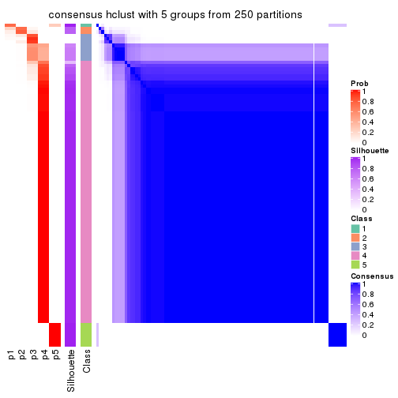</p>

</div>
<div id='tab-SD-hclust-consensus-heatmap-5'>
<pre><code class="r">consensus_heatmap(res, k = 6)
</code></pre>

<p></p>

</div>
</div>

Heatmaps for the membership of samples in all partitions to see how consistent they are:


<script>
$( function() {
	$( '#tabs-SD-hclust-membership-heatmap' ).tabs();
} );
</script>
<div id='tabs-SD-hclust-membership-heatmap'>
<ul>
<li><a href='#tab-SD-hclust-membership-heatmap-1'>k = 2</a></li>
<li><a href='#tab-SD-hclust-membership-heatmap-2'>k = 3</a></li>
<li><a href='#tab-SD-hclust-membership-heatmap-3'>k = 4</a></li>
<li><a href='#tab-SD-hclust-membership-heatmap-4'>k = 5</a></li>
<li><a href='#tab-SD-hclust-membership-heatmap-5'>k = 6</a></li>
</ul>
<div id='tab-SD-hclust-membership-heatmap-1'>
<pre><code class="r">membership_heatmap(res, k = 2)
</code></pre>

<p></p>

</div>
<div id='tab-SD-hclust-membership-heatmap-2'>
<pre><code class="r">membership_heatmap(res, k = 3)
</code></pre>

<p></p>

</div>
<div id='tab-SD-hclust-membership-heatmap-3'>
<pre><code class="r">membership_heatmap(res, k = 4)
</code></pre>

<p></p>

</div>
<div id='tab-SD-hclust-membership-heatmap-4'>
<pre><code class="r">membership_heatmap(res, k = 5)
</code></pre>

<p></p>

</div>
<div id='tab-SD-hclust-membership-heatmap-5'>
<pre><code class="r">membership_heatmap(res, k = 6)
</code></pre>

<p></p>

</div>
</div>

As soon as we have had the classes for columns, we can look for signatures
which are significantly different between classes which can be candidate marks
for certain classes. Following are the heatmaps for signatures.


Signature heatmaps where rows are scaled:


<script>
$( function() {
	$( '#tabs-SD-hclust-get-signatures' ).tabs();
} );
</script>
<div id='tabs-SD-hclust-get-signatures'>
<ul>
<li><a href='#tab-SD-hclust-get-signatures-1'>k = 2</a></li>
<li><a href='#tab-SD-hclust-get-signatures-2'>k = 3</a></li>
<li><a href='#tab-SD-hclust-get-signatures-3'>k = 4</a></li>
<li><a href='#tab-SD-hclust-get-signatures-4'>k = 5</a></li>
<li><a href='#tab-SD-hclust-get-signatures-5'>k = 6</a></li>
</ul>
<div id='tab-SD-hclust-get-signatures-1'>
<pre><code class="r">get_signatures(res, k = 2)
</code></pre>

<p></p>

</div>
<div id='tab-SD-hclust-get-signatures-2'>
<pre><code class="r">get_signatures(res, k = 3)
</code></pre>

<p></p>

</div>
<div id='tab-SD-hclust-get-signatures-3'>
<pre><code class="r">get_signatures(res, k = 4)
</code></pre>

<p></p>

</div>
<div id='tab-SD-hclust-get-signatures-4'>
<pre><code class="r">get_signatures(res, k = 5)
</code></pre>

<p></p>

</div>
<div id='tab-SD-hclust-get-signatures-5'>
<pre><code class="r">get_signatures(res, k = 6)
</code></pre>

<p></p>

</div>
</div>


Signature heatmaps where rows are not scaled:


<script>
$( function() {
	$( '#tabs-SD-hclust-get-signatures-no-scale' ).tabs();
} );
</script>
<div id='tabs-SD-hclust-get-signatures-no-scale'>
<ul>
<li><a href='#tab-SD-hclust-get-signatures-no-scale-1'>k = 2</a></li>
<li><a href='#tab-SD-hclust-get-signatures-no-scale-2'>k = 3</a></li>
<li><a href='#tab-SD-hclust-get-signatures-no-scale-3'>k = 4</a></li>
<li><a href='#tab-SD-hclust-get-signatures-no-scale-4'>k = 5</a></li>
<li><a href='#tab-SD-hclust-get-signatures-no-scale-5'>k = 6</a></li>
</ul>
<div id='tab-SD-hclust-get-signatures-no-scale-1'>
<pre><code class="r">get_signatures(res, k = 2, scale_rows = FALSE)
</code></pre>

<p></p>

</div>
<div id='tab-SD-hclust-get-signatures-no-scale-2'>
<pre><code class="r">get_signatures(res, k = 3, scale_rows = FALSE)
</code></pre>

<p></p>

</div>
<div id='tab-SD-hclust-get-signatures-no-scale-3'>
<pre><code class="r">get_signatures(res, k = 4, scale_rows = FALSE)
</code></pre>

<p></p>

</div>
<div id='tab-SD-hclust-get-signatures-no-scale-4'>
<pre><code class="r">get_signatures(res, k = 5, scale_rows = FALSE)
</code></pre>

<p></p>

</div>
<div id='tab-SD-hclust-get-signatures-no-scale-5'>
<pre><code class="r">get_signatures(res, k = 6, scale_rows = FALSE)
</code></pre>

<p></p>

</div>
</div>


Compare the overlap of signatures from different k:

```r
compare_signatures(res)
```


`get_signature()` returns a data frame invisibly. TO get the list of signatures, the function
call should be assigned to a variable explicitly. In following code, if `plot` argument is set
to `FALSE`, no heatmap is plotted while only the differential analysis is performed.

```r
# code only for demonstration
tb = get_signature(res, k = ..., plot = FALSE)
```

An example of the output of `tb` is:

```
#>   which_row         fdr    mean_1    mean_2 scaled_mean_1 scaled_mean_2 km
#> 1        38 0.042760348  8.373488  9.131774    -0.5533452     0.5164555  1
#> 2        40 0.018707592  7.106213  8.469186    -0.6173731     0.5762149  1
#> 3        55 0.019134737 10.221463 11.207825    -0.6159697     0.5749050  1
#> 4        59 0.006059896  5.921854  7.869574    -0.6899429     0.6439467  1
#> 5        60 0.018055526  8.928898 10.211722    -0.6204761     0.5791110  1
#> 6        98 0.009384629 15.714769 14.887706     0.6635654    -0.6193277  2
...
```

The columns in `tb` are:

1. `which_row`: row indices corresponding to the input matrix.
2. `fdr`: FDR for the differential test. 
3. `mean_x`: The mean value in group x.
4. `scaled_mean_x`: The mean value in group x after rows are scaled.
5. `km`: Row groups if k-means clustering is applied to rows.


UMAP plot which shows how samples are separated.


<script>
$( function() {
	$( '#tabs-SD-hclust-dimension-reduction' ).tabs();
} );
</script>
<div id='tabs-SD-hclust-dimension-reduction'>
<ul>
<li><a href='#tab-SD-hclust-dimension-reduction-1'>k = 2</a></li>
<li><a href='#tab-SD-hclust-dimension-reduction-2'>k = 3</a></li>
<li><a href='#tab-SD-hclust-dimension-reduction-3'>k = 4</a></li>
<li><a href='#tab-SD-hclust-dimension-reduction-4'>k = 5</a></li>
<li><a href='#tab-SD-hclust-dimension-reduction-5'>k = 6</a></li>
</ul>
<div id='tab-SD-hclust-dimension-reduction-1'>
<pre><code class="r">dimension_reduction(res, k = 2, method = &quot;UMAP&quot;)
</code></pre>

<p></p>

</div>
<div id='tab-SD-hclust-dimension-reduction-2'>
<pre><code class="r">dimension_reduction(res, k = 3, method = &quot;UMAP&quot;)
</code></pre>

<p></p>

</div>
<div id='tab-SD-hclust-dimension-reduction-3'>
<pre><code class="r">dimension_reduction(res, k = 4, method = &quot;UMAP&quot;)
</code></pre>

<p></p>

</div>
<div id='tab-SD-hclust-dimension-reduction-4'>
<pre><code class="r">dimension_reduction(res, k = 5, method = &quot;UMAP&quot;)
</code></pre>

<p></p>

</div>
<div id='tab-SD-hclust-dimension-reduction-5'>
<pre><code class="r">dimension_reduction(res, k = 6, method = &quot;UMAP&quot;)
</code></pre>

<p></p>

</div>
</div>


Following heatmap shows how subgroups are split when increasing `k`:

```r
collect_classes(res)
```


If matrix rows can be associated to genes, consider to use `GO_Enrichment(res,
...)` to perform function enrichment for the signature genes.


 

---------------------------------------------------


### SD:kmeans**


The object with results only for a single top-value method and a single partition method 
can be extracted as:

```r
res = res_list["SD", "kmeans"]
# you can also extract it by
# res = res_list["SD:kmeans"]
```

A summary of `res` and all the functions that can be applied to it:

```r
res
```

```
#> A 'ConsensusPartition' object with k = 2, 3, 4, 5, 6.
#>   On a matrix with 5966 rows and 384 columns.
#>   Top rows (597, 1194, 1790, 2386, 2983) are extracted by 'SD' method.
#>   Subgroups are detected by 'kmeans' method.
#>   Performed in total 1250 partitions by row resampling.
#>   Best k for subgroups seems to be 2.
#> 
#> Following methods can be applied to this 'ConsensusPartition' object:
#>  [1] "cola_report"             "collect_classes"         "collect_plots"          
#>  [4] "collect_stats"           "colnames"                "compare_signatures"     
#>  [7] "consensus_heatmap"       "dimension_reduction"     "functional_enrichment"  
#> [10] "get_anno_col"            "get_anno"                "get_classes"            
#> [13] "get_consensus"           "get_matrix"              "get_membership"         
#> [16] "get_param"               "get_signatures"          "get_stats"              
#> [19] "is_best_k"               "is_stable_k"             "membership_heatmap"     
#> [22] "ncol"                    "nrow"                    "plot_ecdf"              
#> [25] "rownames"                "select_partition_number" "show"                   
#> [28] "suggest_best_k"          "test_to_known_factors"
```

`collect_plots()` function collects all the plots made from `res` for all `k` (number of partitions)
into one single page to provide an easy and fast comparison between different `k`.

```r
collect_plots(res)
```


The plots are:

- The first row: a plot of the ECDF (Empirical cumulative distribution
  function) curves of the consensus matrix for each `k` and the heatmap of
  predicted classes for each `k`.
- The second row: heatmaps of the consensus matrix for each `k`.
- The third row: heatmaps of the membership matrix for each `k`.
- The fouth row: heatmaps of the signatures for each `k`.

All the plots in panels can be made by individual functions and they are
plotted later in this section.

`select_partition_number()` produces several plots showing different
statistics for choosing "optimized" `k`. There are following statistics:

- ECDF curves of the consensus matrix for each `k`;
- 1-PAC. [The PAC
  score](https://en.wikipedia.org/wiki/Consensus_clustering#Over-interpretation_potential_of_consensus_clustering)
  measures the proportion of the ambiguous subgrouping.
- Mean silhouette score.
- Concordance. The mean probability of fiting the consensus class ids in all
  partitions.
- Area increased. Denote $A_k$ as the area under the ECDF curve for current
  `k`, the area increased is defined as $A_k - A_{k-1}$.
- Rand index. The percent of pairs of samples that are both in a same cluster
  or both are not in a same cluster in the partition of k and k-1.
- Jaccard index. The ratio of pairs of samples are both in a same cluster in
  the partition of k and k-1 and the pairs of samples are both in a same
  cluster in the partition k or k-1.

The detailed explanations of these statistics can be found in [the cola
vignette](http://bioconductor.org/packages/devel/bioc/vignettes/cola/inst/doc/cola.html#toc_13).

Generally speaking, lower PAC score, higher mean silhouette score or higher
concordance corresponds to better partition. Rand index and Jaccard index
measure how similar the current partition is compared to partition with `k-1`.
If they are too similar, we won't accept `k` is better than `k-1`.

```r
select_partition_number(res)
```


The numeric values for all these statistics can be obtained by `get_stats()`.

```r
get_stats(res)
```

```
#>   k 1-PAC mean_silhouette concordance area_increased  Rand Jaccard
#> 2 2 1.000           0.957       0.982         0.1818 0.847   0.847
#> 3 3 0.788           0.845       0.942         1.5088 0.701   0.649
#> 4 4 0.599           0.825       0.857         0.3816 0.721   0.530
#> 5 5 0.654           0.573       0.796         0.1149 0.974   0.929
#> 6 6 0.627           0.577       0.747         0.0743 0.842   0.574
```

`suggest_best_k()` suggests the best $k$ based on these statistics. The rules are as follows:

- All $k$ with Jaccard index larger than 0.95 are removed because the increase of
  the partition number does not provides enough extra information. If all $k$ are removed,
  the best $k$ is assigned by `NA`.
- For $k$ with 1-PAC larger than 0.9, the maximal $k$ is taken as the "best k". Other $k$ is called "optional k".
- If it does not fit the second rule. The $k$ with the highest vote of highest
  1-PAC, mean silhouette and concordance is taken as the "best k".

```r
suggest_best_k(res)
```

```
#> [1] 2
```


Following shows the table of the partitions (You need to click the **show/hide
code output** link to see it). The membership matrix (columns with name `p*`)
is inferred by
[`clue::cl_consensus()`](https://www.rdocumentation.org/link/cl_consensus?package=clue)
function with the `SE` method. Basically the value in the membership matrix
represents the probability to belong to a certain group. The finall class
label for an item is determined with the group with highest probability it
belongs to.

In `get_classes()` function, the entropy is calculated from the membership
matrix and the silhouette score is calculated from the consensus matrix.


<script>
$( function() {
	$( '#tabs-SD-kmeans-get-classes' ).tabs();
} );
</script>
<div id='tabs-SD-kmeans-get-classes'>
<ul>
<li><a href='#tab-SD-kmeans-get-classes-1'>k = 2</a></li>
<li><a href='#tab-SD-kmeans-get-classes-2'>k = 3</a></li>
<li><a href='#tab-SD-kmeans-get-classes-3'>k = 4</a></li>
<li><a href='#tab-SD-kmeans-get-classes-4'>k = 5</a></li>
<li><a href='#tab-SD-kmeans-get-classes-5'>k = 6</a></li>
</ul>

<div id='tab-SD-kmeans-get-classes-1'>
<p><a id='tab-SD-kmeans-get-classes-1-a' style='color:#0366d6' href='#'>show/hide code output</a></p>
<pre><code class="r">cbind(get_classes(res, k = 2), get_membership(res, k = 2))
</code></pre>

<pre><code>#&gt;           class entropy silhouette    p1    p2
#&gt; SRR490216     2   0.000      0.980 0.000 1.000
#&gt; SRR490217     2   0.000      0.980 0.000 1.000
#&gt; SRR490218     2   0.000      0.980 0.000 1.000
#&gt; SRR490219     2   0.000      0.980 0.000 1.000
#&gt; SRR490220     2   0.000      0.980 0.000 1.000
#&gt; SRR490221     2   0.000      0.980 0.000 1.000
#&gt; SRR490222     2   0.000      0.980 0.000 1.000
#&gt; SRR490223     2   0.000      0.980 0.000 1.000
#&gt; SRR490224     2   0.932      0.496 0.348 0.652
#&gt; SRR490225     2   0.929      0.504 0.344 0.656
#&gt; SRR490226     2   0.925      0.512 0.340 0.660
#&gt; SRR490227     2   0.929      0.504 0.344 0.656
#&gt; SRR490228     2   0.932      0.496 0.348 0.652
#&gt; SRR490229     2   0.932      0.496 0.348 0.652
#&gt; SRR490230     2   0.932      0.496 0.348 0.652
#&gt; SRR490231     2   0.932      0.496 0.348 0.652
#&gt; SRR490232     2   0.000      0.980 0.000 1.000
#&gt; SRR490233     2   0.000      0.980 0.000 1.000
#&gt; SRR490234     2   0.000      0.980 0.000 1.000
#&gt; SRR490235     2   0.000      0.980 0.000 1.000
#&gt; SRR490236     2   0.932      0.496 0.348 0.652
#&gt; SRR490237     2   0.921      0.520 0.336 0.664
#&gt; SRR490238     2   0.921      0.520 0.336 0.664
#&gt; SRR490239     2   0.932      0.496 0.348 0.652
#&gt; SRR490240     2   0.000      0.980 0.000 1.000
#&gt; SRR490241     2   0.000      0.980 0.000 1.000
#&gt; SRR490242     2   0.000      0.980 0.000 1.000
#&gt; SRR490243     2   0.000      0.980 0.000 1.000
#&gt; SRR490244     1   0.000      1.000 1.000 0.000
#&gt; SRR490245     1   0.000      1.000 1.000 0.000
#&gt; SRR490246     1   0.000      1.000 1.000 0.000
#&gt; SRR490247     1   0.000      1.000 1.000 0.000
#&gt; SRR490248     2   0.000      0.980 0.000 1.000
#&gt; SRR490249     2   0.000      0.980 0.000 1.000
#&gt; SRR490250     2   0.000      0.980 0.000 1.000
#&gt; SRR490251     2   0.000      0.980 0.000 1.000
#&gt; SRR490252     2   0.000      0.980 0.000 1.000
#&gt; SRR490253     2   0.000      0.980 0.000 1.000
#&gt; SRR490254     2   0.000      0.980 0.000 1.000
#&gt; SRR490255     2   0.000      0.980 0.000 1.000
#&gt; SRR490256     2   0.000      0.980 0.000 1.000
#&gt; SRR490257     2   0.000      0.980 0.000 1.000
#&gt; SRR490258     2   0.000      0.980 0.000 1.000
#&gt; SRR490259     2   0.000      0.980 0.000 1.000
#&gt; SRR490260     2   0.000      0.980 0.000 1.000
#&gt; SRR490261     2   0.000      0.980 0.000 1.000
#&gt; SRR490262     2   0.000      0.980 0.000 1.000
#&gt; SRR490263     2   0.000      0.980 0.000 1.000
#&gt; SRR490264     2   0.000      0.980 0.000 1.000
#&gt; SRR490265     2   0.000      0.980 0.000 1.000
#&gt; SRR490266     2   0.000      0.980 0.000 1.000
#&gt; SRR490267     2   0.000      0.980 0.000 1.000
#&gt; SRR490268     2   0.000      0.980 0.000 1.000
#&gt; SRR490269     2   0.000      0.980 0.000 1.000
#&gt; SRR490270     2   0.000      0.980 0.000 1.000
#&gt; SRR490271     2   0.000      0.980 0.000 1.000
#&gt; SRR490272     2   0.000      0.980 0.000 1.000
#&gt; SRR490273     2   0.000      0.980 0.000 1.000
#&gt; SRR490274     2   0.000      0.980 0.000 1.000
#&gt; SRR490275     2   0.000      0.980 0.000 1.000
#&gt; SRR490276     2   0.000      0.980 0.000 1.000
#&gt; SRR490277     2   0.000      0.980 0.000 1.000
#&gt; SRR490278     2   0.000      0.980 0.000 1.000
#&gt; SRR490279     2   0.000      0.980 0.000 1.000
#&gt; SRR490280     1   0.000      1.000 1.000 0.000
#&gt; SRR490281     1   0.000      1.000 1.000 0.000
#&gt; SRR490282     1   0.000      1.000 1.000 0.000
#&gt; SRR490283     1   0.000      1.000 1.000 0.000
#&gt; SRR490284     2   0.932      0.496 0.348 0.652
#&gt; SRR490285     2   0.932      0.496 0.348 0.652
#&gt; SRR490286     2   0.932      0.496 0.348 0.652
#&gt; SRR490287     2   0.929      0.504 0.344 0.656
#&gt; SRR490288     2   0.000      0.980 0.000 1.000
#&gt; SRR490289     2   0.000      0.980 0.000 1.000
#&gt; SRR490290     2   0.000      0.980 0.000 1.000
#&gt; SRR490291     2   0.000      0.980 0.000 1.000
#&gt; SRR490292     2   0.000      0.980 0.000 1.000
#&gt; SRR490293     2   0.000      0.980 0.000 1.000
#&gt; SRR490294     2   0.000      0.980 0.000 1.000
#&gt; SRR490295     2   0.000      0.980 0.000 1.000
#&gt; SRR490296     2   0.000      0.980 0.000 1.000
#&gt; SRR490297     2   0.000      0.980 0.000 1.000
#&gt; SRR490298     2   0.000      0.980 0.000 1.000
#&gt; SRR490299     2   0.000      0.980 0.000 1.000
#&gt; SRR490300     2   0.000      0.980 0.000 1.000
#&gt; SRR490301     2   0.000      0.980 0.000 1.000
#&gt; SRR490302     2   0.000      0.980 0.000 1.000
#&gt; SRR490303     2   0.000      0.980 0.000 1.000
#&gt; SRR490304     2   0.000      0.980 0.000 1.000
#&gt; SRR490305     2   0.000      0.980 0.000 1.000
#&gt; SRR490306     2   0.000      0.980 0.000 1.000
#&gt; SRR490307     2   0.000      0.980 0.000 1.000
#&gt; SRR490308     1   0.000      1.000 1.000 0.000
#&gt; SRR490309     1   0.000      1.000 1.000 0.000
#&gt; SRR490310     1   0.000      1.000 1.000 0.000
#&gt; SRR490311     1   0.000      1.000 1.000 0.000
#&gt; SRR490312     2   0.000      0.980 0.000 1.000
#&gt; SRR490313     2   0.000      0.980 0.000 1.000
#&gt; SRR490314     2   0.000      0.980 0.000 1.000
#&gt; SRR490315     2   0.000      0.980 0.000 1.000
#&gt; SRR490316     2   0.000      0.980 0.000 1.000
#&gt; SRR490317     2   0.000      0.980 0.000 1.000
#&gt; SRR490318     2   0.000      0.980 0.000 1.000
#&gt; SRR490319     2   0.000      0.980 0.000 1.000
#&gt; SRR490320     2   0.000      0.980 0.000 1.000
#&gt; SRR490321     2   0.000      0.980 0.000 1.000
#&gt; SRR490322     2   0.000      0.980 0.000 1.000
#&gt; SRR490323     2   0.000      0.980 0.000 1.000
#&gt; SRR490324     2   0.904      0.552 0.320 0.680
#&gt; SRR490325     2   0.895      0.567 0.312 0.688
#&gt; SRR490326     2   0.891      0.575 0.308 0.692
#&gt; SRR490327     2   0.929      0.504 0.344 0.656
#&gt; SRR490328     2   0.000      0.980 0.000 1.000
#&gt; SRR490329     2   0.000      0.980 0.000 1.000
#&gt; SRR490330     2   0.000      0.980 0.000 1.000
#&gt; SRR490331     2   0.000      0.980 0.000 1.000
#&gt; SRR490332     2   0.000      0.980 0.000 1.000
#&gt; SRR490333     2   0.000      0.980 0.000 1.000
#&gt; SRR490334     2   0.000      0.980 0.000 1.000
#&gt; SRR490335     2   0.000      0.980 0.000 1.000
#&gt; SRR490336     2   0.000      0.980 0.000 1.000
#&gt; SRR490337     2   0.000      0.980 0.000 1.000
#&gt; SRR490338     2   0.000      0.980 0.000 1.000
#&gt; SRR490339     2   0.000      0.980 0.000 1.000
#&gt; SRR490340     2   0.000      0.980 0.000 1.000
#&gt; SRR490341     2   0.000      0.980 0.000 1.000
#&gt; SRR490342     2   0.000      0.980 0.000 1.000
#&gt; SRR490343     2   0.000      0.980 0.000 1.000
#&gt; SRR490344     2   0.000      0.980 0.000 1.000
#&gt; SRR490345     2   0.000      0.980 0.000 1.000
#&gt; SRR490346     2   0.000      0.980 0.000 1.000
#&gt; SRR490347     2   0.000      0.980 0.000 1.000
#&gt; SRR490348     2   0.000      0.980 0.000 1.000
#&gt; SRR490349     2   0.000      0.980 0.000 1.000
#&gt; SRR490350     2   0.000      0.980 0.000 1.000
#&gt; SRR490351     2   0.000      0.980 0.000 1.000
#&gt; SRR490352     2   0.000      0.980 0.000 1.000
#&gt; SRR490353     2   0.000      0.980 0.000 1.000
#&gt; SRR490354     2   0.000      0.980 0.000 1.000
#&gt; SRR490355     2   0.000      0.980 0.000 1.000
#&gt; SRR490356     2   0.000      0.980 0.000 1.000
#&gt; SRR490357     2   0.000      0.980 0.000 1.000
#&gt; SRR490358     2   0.000      0.980 0.000 1.000
#&gt; SRR490359     2   0.000      0.980 0.000 1.000
#&gt; SRR490360     2   0.000      0.980 0.000 1.000
#&gt; SRR490361     2   0.000      0.980 0.000 1.000
#&gt; SRR490362     2   0.000      0.980 0.000 1.000
#&gt; SRR490363     2   0.000      0.980 0.000 1.000
#&gt; SRR490364     2   0.000      0.980 0.000 1.000
#&gt; SRR490365     2   0.000      0.980 0.000 1.000
#&gt; SRR490366     2   0.000      0.980 0.000 1.000
#&gt; SRR490367     2   0.000      0.980 0.000 1.000
#&gt; SRR490368     2   0.000      0.980 0.000 1.000
#&gt; SRR490369     2   0.000      0.980 0.000 1.000
#&gt; SRR490370     2   0.000      0.980 0.000 1.000
#&gt; SRR490371     2   0.000      0.980 0.000 1.000
#&gt; SRR490372     1   0.000      1.000 1.000 0.000
#&gt; SRR490373     1   0.000      1.000 1.000 0.000
#&gt; SRR490374     1   0.000      1.000 1.000 0.000
#&gt; SRR490375     1   0.000      1.000 1.000 0.000
#&gt; SRR490376     2   0.000      0.980 0.000 1.000
#&gt; SRR490377     2   0.000      0.980 0.000 1.000
#&gt; SRR490378     2   0.000      0.980 0.000 1.000
#&gt; SRR490379     2   0.000      0.980 0.000 1.000
#&gt; SRR490380     1   0.000      1.000 1.000 0.000
#&gt; SRR490381     1   0.000      1.000 1.000 0.000
#&gt; SRR490382     1   0.000      1.000 1.000 0.000
#&gt; SRR490383     1   0.000      1.000 1.000 0.000
#&gt; SRR490384     2   0.000      0.980 0.000 1.000
#&gt; SRR490385     2   0.000      0.980 0.000 1.000
#&gt; SRR490386     2   0.000      0.980 0.000 1.000
#&gt; SRR490387     2   0.000      0.980 0.000 1.000
#&gt; SRR490388     2   0.000      0.980 0.000 1.000
#&gt; SRR490389     2   0.000      0.980 0.000 1.000
#&gt; SRR490390     2   0.000      0.980 0.000 1.000
#&gt; SRR490391     2   0.000      0.980 0.000 1.000
#&gt; SRR490392     2   0.000      0.980 0.000 1.000
#&gt; SRR490393     2   0.000      0.980 0.000 1.000
#&gt; SRR490394     2   0.000      0.980 0.000 1.000
#&gt; SRR490395     2   0.000      0.980 0.000 1.000
#&gt; SRR490396     2   0.000      0.980 0.000 1.000
#&gt; SRR490397     2   0.000      0.980 0.000 1.000
#&gt; SRR490398     2   0.000      0.980 0.000 1.000
#&gt; SRR490399     2   0.000      0.980 0.000 1.000
#&gt; SRR490400     2   0.000      0.980 0.000 1.000
#&gt; SRR490401     2   0.000      0.980 0.000 1.000
#&gt; SRR490402     2   0.000      0.980 0.000 1.000
#&gt; SRR490403     2   0.000      0.980 0.000 1.000
#&gt; SRR490404     2   0.000      0.980 0.000 1.000
#&gt; SRR490405     2   0.000      0.980 0.000 1.000
#&gt; SRR490406     2   0.000      0.980 0.000 1.000
#&gt; SRR490407     2   0.000      0.980 0.000 1.000
#&gt; SRR490408     2   0.000      0.980 0.000 1.000
#&gt; SRR490409     2   0.000      0.980 0.000 1.000
#&gt; SRR490410     2   0.000      0.980 0.000 1.000
#&gt; SRR490411     2   0.000      0.980 0.000 1.000
#&gt; SRR490412     1   0.000      1.000 1.000 0.000
#&gt; SRR490413     1   0.000      1.000 1.000 0.000
#&gt; SRR490414     1   0.000      1.000 1.000 0.000
#&gt; SRR490415     1   0.000      1.000 1.000 0.000
#&gt; SRR490416     2   0.000      0.980 0.000 1.000
#&gt; SRR490417     2   0.000      0.980 0.000 1.000
#&gt; SRR490418     2   0.000      0.980 0.000 1.000
#&gt; SRR490419     2   0.000      0.980 0.000 1.000
#&gt; SRR490420     2   0.000      0.980 0.000 1.000
#&gt; SRR490421     2   0.000      0.980 0.000 1.000
#&gt; SRR490422     2   0.000      0.980 0.000 1.000
#&gt; SRR490423     2   0.000      0.980 0.000 1.000
#&gt; SRR490424     2   0.000      0.980 0.000 1.000
#&gt; SRR490425     2   0.000      0.980 0.000 1.000
#&gt; SRR490426     2   0.000      0.980 0.000 1.000
#&gt; SRR490427     2   0.000      0.980 0.000 1.000
#&gt; SRR490428     2   0.000      0.980 0.000 1.000
#&gt; SRR490429     2   0.000      0.980 0.000 1.000
#&gt; SRR490430     2   0.000      0.980 0.000 1.000
#&gt; SRR490431     2   0.000      0.980 0.000 1.000
#&gt; SRR490432     2   0.000      0.980 0.000 1.000
#&gt; SRR490433     2   0.000      0.980 0.000 1.000
#&gt; SRR490434     2   0.000      0.980 0.000 1.000
#&gt; SRR490435     2   0.000      0.980 0.000 1.000
#&gt; SRR490436     2   0.000      0.980 0.000 1.000
#&gt; SRR490437     2   0.000      0.980 0.000 1.000
#&gt; SRR490438     2   0.000      0.980 0.000 1.000
#&gt; SRR490439     2   0.000      0.980 0.000 1.000
#&gt; SRR490440     2   0.000      0.980 0.000 1.000
#&gt; SRR490441     2   0.000      0.980 0.000 1.000
#&gt; SRR490442     2   0.000      0.980 0.000 1.000
#&gt; SRR490443     2   0.000      0.980 0.000 1.000
#&gt; SRR490444     2   0.000      0.980 0.000 1.000
#&gt; SRR490445     2   0.000      0.980 0.000 1.000
#&gt; SRR490446     2   0.000      0.980 0.000 1.000
#&gt; SRR490447     2   0.000      0.980 0.000 1.000
#&gt; SRR490448     2   0.000      0.980 0.000 1.000
#&gt; SRR490449     2   0.000      0.980 0.000 1.000
#&gt; SRR490450     2   0.000      0.980 0.000 1.000
#&gt; SRR490451     2   0.000      0.980 0.000 1.000
#&gt; SRR490452     2   0.000      0.980 0.000 1.000
#&gt; SRR490453     2   0.000      0.980 0.000 1.000
#&gt; SRR490454     2   0.000      0.980 0.000 1.000
#&gt; SRR490455     2   0.000      0.980 0.000 1.000
#&gt; SRR490456     2   0.000      0.980 0.000 1.000
#&gt; SRR490457     2   0.000      0.980 0.000 1.000
#&gt; SRR490458     2   0.000      0.980 0.000 1.000
#&gt; SRR490459     2   0.000      0.980 0.000 1.000
#&gt; SRR490460     2   0.000      0.980 0.000 1.000
#&gt; SRR490461     2   0.000      0.980 0.000 1.000
#&gt; SRR490462     2   0.000      0.980 0.000 1.000
#&gt; SRR490463     2   0.000      0.980 0.000 1.000
#&gt; SRR490464     1   0.000      1.000 1.000 0.000
#&gt; SRR490465     1   0.000      1.000 1.000 0.000
#&gt; SRR490466     1   0.000      1.000 1.000 0.000
#&gt; SRR490467     1   0.000      1.000 1.000 0.000
#&gt; SRR490468     2   0.000      0.980 0.000 1.000
#&gt; SRR490469     2   0.000      0.980 0.000 1.000
#&gt; SRR490470     2   0.000      0.980 0.000 1.000
#&gt; SRR490471     2   0.000      0.980 0.000 1.000
#&gt; SRR490472     2   0.000      0.980 0.000 1.000
#&gt; SRR490473     2   0.000      0.980 0.000 1.000
#&gt; SRR490474     2   0.000      0.980 0.000 1.000
#&gt; SRR490475     2   0.000      0.980 0.000 1.000
#&gt; SRR490476     1   0.000      1.000 1.000 0.000
#&gt; SRR490477     1   0.000      1.000 1.000 0.000
#&gt; SRR490478     1   0.000      1.000 1.000 0.000
#&gt; SRR490479     1   0.000      1.000 1.000 0.000
#&gt; SRR490480     2   0.000      0.980 0.000 1.000
#&gt; SRR490481     2   0.000      0.980 0.000 1.000
#&gt; SRR490482     2   0.000      0.980 0.000 1.000
#&gt; SRR490483     2   0.000      0.980 0.000 1.000
#&gt; SRR490484     2   0.000      0.980 0.000 1.000
#&gt; SRR490485     2   0.000      0.980 0.000 1.000
#&gt; SRR490486     2   0.000      0.980 0.000 1.000
#&gt; SRR490487     2   0.000      0.980 0.000 1.000
#&gt; SRR490488     2   0.000      0.980 0.000 1.000
#&gt; SRR490489     2   0.000      0.980 0.000 1.000
#&gt; SRR490490     2   0.000      0.980 0.000 1.000
#&gt; SRR490491     2   0.000      0.980 0.000 1.000
#&gt; SRR490492     2   0.000      0.980 0.000 1.000
#&gt; SRR490493     2   0.000      0.980 0.000 1.000
#&gt; SRR490494     2   0.000      0.980 0.000 1.000
#&gt; SRR490495     2   0.000      0.980 0.000 1.000
#&gt; SRR490496     2   0.000      0.980 0.000 1.000
#&gt; SRR490497     2   0.000      0.980 0.000 1.000
#&gt; SRR490498     2   0.000      0.980 0.000 1.000
#&gt; SRR490499     2   0.000      0.980 0.000 1.000
#&gt; SRR490500     2   0.000      0.980 0.000 1.000
#&gt; SRR490501     2   0.000      0.980 0.000 1.000
#&gt; SRR490502     2   0.000      0.980 0.000 1.000
#&gt; SRR490503     2   0.000      0.980 0.000 1.000
#&gt; SRR490504     2   0.000      0.980 0.000 1.000
#&gt; SRR490505     2   0.000      0.980 0.000 1.000
#&gt; SRR490506     2   0.000      0.980 0.000 1.000
#&gt; SRR490507     2   0.000      0.980 0.000 1.000
#&gt; SRR490508     2   0.000      0.980 0.000 1.000
#&gt; SRR490509     2   0.000      0.980 0.000 1.000
#&gt; SRR490510     2   0.000      0.980 0.000 1.000
#&gt; SRR490511     2   0.000      0.980 0.000 1.000
#&gt; SRR490512     2   0.000      0.980 0.000 1.000
#&gt; SRR490513     2   0.000      0.980 0.000 1.000
#&gt; SRR490514     2   0.000      0.980 0.000 1.000
#&gt; SRR490515     2   0.000      0.980 0.000 1.000
#&gt; SRR490516     2   0.000      0.980 0.000 1.000
#&gt; SRR490517     2   0.000      0.980 0.000 1.000
#&gt; SRR490518     2   0.000      0.980 0.000 1.000
#&gt; SRR490519     2   0.000      0.980 0.000 1.000
#&gt; SRR490520     2   0.000      0.980 0.000 1.000
#&gt; SRR490521     2   0.000      0.980 0.000 1.000
#&gt; SRR490522     2   0.000      0.980 0.000 1.000
#&gt; SRR490523     2   0.000      0.980 0.000 1.000
#&gt; SRR490524     2   0.000      0.980 0.000 1.000
#&gt; SRR490525     2   0.000      0.980 0.000 1.000
#&gt; SRR490526     2   0.000      0.980 0.000 1.000
#&gt; SRR490527     2   0.000      0.980 0.000 1.000
#&gt; SRR490528     2   0.000      0.980 0.000 1.000
#&gt; SRR490529     2   0.000      0.980 0.000 1.000
#&gt; SRR490530     2   0.000      0.980 0.000 1.000
#&gt; SRR490531     2   0.000      0.980 0.000 1.000
#&gt; SRR490532     2   0.000      0.980 0.000 1.000
#&gt; SRR490533     2   0.000      0.980 0.000 1.000
#&gt; SRR490534     2   0.000      0.980 0.000 1.000
#&gt; SRR490535     2   0.000      0.980 0.000 1.000
#&gt; SRR490536     2   0.000      0.980 0.000 1.000
#&gt; SRR490537     2   0.000      0.980 0.000 1.000
#&gt; SRR490538     2   0.000      0.980 0.000 1.000
#&gt; SRR490539     2   0.000      0.980 0.000 1.000
#&gt; SRR490540     2   0.000      0.980 0.000 1.000
#&gt; SRR490541     2   0.000      0.980 0.000 1.000
#&gt; SRR490542     2   0.000      0.980 0.000 1.000
#&gt; SRR490543     2   0.000      0.980 0.000 1.000
#&gt; SRR490544     2   0.000      0.980 0.000 1.000
#&gt; SRR490545     2   0.000      0.980 0.000 1.000
#&gt; SRR490546     2   0.000      0.980 0.000 1.000
#&gt; SRR490547     2   0.000      0.980 0.000 1.000
#&gt; SRR490548     2   0.000      0.980 0.000 1.000
#&gt; SRR490549     2   0.000      0.980 0.000 1.000
#&gt; SRR490550     2   0.000      0.980 0.000 1.000
#&gt; SRR490551     2   0.000      0.980 0.000 1.000
#&gt; SRR490552     2   0.000      0.980 0.000 1.000
#&gt; SRR490553     2   0.000      0.980 0.000 1.000
#&gt; SRR490554     2   0.000      0.980 0.000 1.000
#&gt; SRR490555     2   0.000      0.980 0.000 1.000
#&gt; SRR490556     2   0.000      0.980 0.000 1.000
#&gt; SRR490557     2   0.000      0.980 0.000 1.000
#&gt; SRR490558     2   0.000      0.980 0.000 1.000
#&gt; SRR490559     2   0.000      0.980 0.000 1.000
#&gt; SRR490560     2   0.000      0.980 0.000 1.000
#&gt; SRR490561     2   0.000      0.980 0.000 1.000
#&gt; SRR490562     2   0.000      0.980 0.000 1.000
#&gt; SRR490563     2   0.000      0.980 0.000 1.000
#&gt; SRR490564     2   0.000      0.980 0.000 1.000
#&gt; SRR490565     2   0.000      0.980 0.000 1.000
#&gt; SRR490566     2   0.000      0.980 0.000 1.000
#&gt; SRR490567     2   0.000      0.980 0.000 1.000
#&gt; SRR490568     2   0.000      0.980 0.000 1.000
#&gt; SRR490569     2   0.000      0.980 0.000 1.000
#&gt; SRR490570     2   0.000      0.980 0.000 1.000
#&gt; SRR490571     2   0.000      0.980 0.000 1.000
#&gt; SRR490572     2   0.000      0.980 0.000 1.000
#&gt; SRR490573     2   0.000      0.980 0.000 1.000
#&gt; SRR490574     2   0.000      0.980 0.000 1.000
#&gt; SRR490575     2   0.000      0.980 0.000 1.000
#&gt; SRR490576     2   0.000      0.980 0.000 1.000
#&gt; SRR490577     2   0.000      0.980 0.000 1.000
#&gt; SRR490578     2   0.000      0.980 0.000 1.000
#&gt; SRR490579     2   0.000      0.980 0.000 1.000
#&gt; SRR490580     2   0.000      0.980 0.000 1.000
#&gt; SRR490581     2   0.000      0.980 0.000 1.000
#&gt; SRR490582     2   0.000      0.980 0.000 1.000
#&gt; SRR490583     2   0.000      0.980 0.000 1.000
#&gt; SRR490584     2   0.000      0.980 0.000 1.000
#&gt; SRR490585     2   0.000      0.980 0.000 1.000
#&gt; SRR490586     2   0.000      0.980 0.000 1.000
#&gt; SRR490587     2   0.000      0.980 0.000 1.000
#&gt; SRR490588     2   0.000      0.980 0.000 1.000
#&gt; SRR490589     2   0.000      0.980 0.000 1.000
#&gt; SRR490590     2   0.000      0.980 0.000 1.000
#&gt; SRR490591     2   0.000      0.980 0.000 1.000
#&gt; SRR490592     2   0.000      0.980 0.000 1.000
#&gt; SRR490593     2   0.000      0.980 0.000 1.000
#&gt; SRR490594     2   0.000      0.980 0.000 1.000
#&gt; SRR490595     2   0.000      0.980 0.000 1.000
#&gt; SRR490596     2   0.000      0.980 0.000 1.000
#&gt; SRR490597     2   0.000      0.980 0.000 1.000
#&gt; SRR490598     2   0.000      0.980 0.000 1.000
#&gt; SRR490599     2   0.000      0.980 0.000 1.000
</code></pre>

<script>
$('#tab-SD-kmeans-get-classes-1-a').parent().next().next().hide();
$('#tab-SD-kmeans-get-classes-1-a').click(function(){
  $('#tab-SD-kmeans-get-classes-1-a').parent().next().next().toggle();
  return(false);
});
</script>
</div>

<div id='tab-SD-kmeans-get-classes-2'>
<p><a id='tab-SD-kmeans-get-classes-2-a' style='color:#0366d6' href='#'>show/hide code output</a></p>
<pre><code class="r">cbind(get_classes(res, k = 3), get_membership(res, k = 3))
</code></pre>

<pre><code>#&gt;           class entropy silhouette    p1    p2    p3
#&gt; SRR490216     2  0.6126    0.32178 0.400 0.600 0.000
#&gt; SRR490217     2  0.6111    0.33332 0.396 0.604 0.000
#&gt; SRR490218     2  0.6079    0.35758 0.388 0.612 0.000
#&gt; SRR490219     2  0.6225    0.22955 0.432 0.568 0.000
#&gt; SRR490220     2  0.6204    0.25622 0.424 0.576 0.000
#&gt; SRR490221     2  0.5948    0.43214 0.360 0.640 0.000
#&gt; SRR490222     2  0.6026    0.39184 0.376 0.624 0.000
#&gt; SRR490223     2  0.6154    0.30470 0.408 0.592 0.000
#&gt; SRR490224     1  0.0424    0.82773 0.992 0.000 0.008
#&gt; SRR490225     1  0.0424    0.82773 0.992 0.000 0.008
#&gt; SRR490226     1  0.0424    0.82773 0.992 0.000 0.008
#&gt; SRR490227     1  0.0424    0.82773 0.992 0.000 0.008
#&gt; SRR490228     1  0.0424    0.82773 0.992 0.000 0.008
#&gt; SRR490229     1  0.0424    0.82773 0.992 0.000 0.008
#&gt; SRR490230     1  0.0424    0.82773 0.992 0.000 0.008
#&gt; SRR490231     1  0.0424    0.82773 0.992 0.000 0.008
#&gt; SRR490232     1  0.0424    0.83476 0.992 0.008 0.000
#&gt; SRR490233     1  0.0424    0.83476 0.992 0.008 0.000
#&gt; SRR490234     1  0.0424    0.83476 0.992 0.008 0.000
#&gt; SRR490235     1  0.0424    0.83476 0.992 0.008 0.000
#&gt; SRR490236     1  0.0424    0.82773 0.992 0.000 0.008
#&gt; SRR490237     1  0.0424    0.82773 0.992 0.000 0.008
#&gt; SRR490238     1  0.0424    0.82773 0.992 0.000 0.008
#&gt; SRR490239     1  0.0424    0.82773 0.992 0.000 0.008
#&gt; SRR490240     2  0.6307    0.02242 0.488 0.512 0.000
#&gt; SRR490241     2  0.6192    0.26851 0.420 0.580 0.000
#&gt; SRR490242     2  0.6235    0.21716 0.436 0.564 0.000
#&gt; SRR490243     2  0.6244    0.20350 0.440 0.560 0.000
#&gt; SRR490244     3  0.0000    1.00000 0.000 0.000 1.000
#&gt; SRR490245     3  0.0000    1.00000 0.000 0.000 1.000
#&gt; SRR490246     3  0.0000    1.00000 0.000 0.000 1.000
#&gt; SRR490247     3  0.0000    1.00000 0.000 0.000 1.000
#&gt; SRR490248     2  0.3941    0.78859 0.156 0.844 0.000
#&gt; SRR490249     2  0.3192    0.83921 0.112 0.888 0.000
#&gt; SRR490250     2  0.1753    0.90150 0.048 0.952 0.000
#&gt; SRR490251     2  0.3941    0.78873 0.156 0.844 0.000
#&gt; SRR490252     2  0.0000    0.94215 0.000 1.000 0.000
#&gt; SRR490253     2  0.0000    0.94215 0.000 1.000 0.000
#&gt; SRR490254     2  0.0000    0.94215 0.000 1.000 0.000
#&gt; SRR490255     2  0.0000    0.94215 0.000 1.000 0.000
#&gt; SRR490256     1  0.0424    0.83476 0.992 0.008 0.000
#&gt; SRR490257     1  0.0424    0.83476 0.992 0.008 0.000
#&gt; SRR490258     1  0.0424    0.83476 0.992 0.008 0.000
#&gt; SRR490259     1  0.0424    0.83476 0.992 0.008 0.000
#&gt; SRR490260     1  0.0424    0.83476 0.992 0.008 0.000
#&gt; SRR490261     1  0.0424    0.83476 0.992 0.008 0.000
#&gt; SRR490262     1  0.0424    0.83476 0.992 0.008 0.000
#&gt; SRR490263     1  0.0424    0.83476 0.992 0.008 0.000
#&gt; SRR490264     1  0.0424    0.83476 0.992 0.008 0.000
#&gt; SRR490265     1  0.0424    0.83476 0.992 0.008 0.000
#&gt; SRR490266     1  0.0424    0.83476 0.992 0.008 0.000
#&gt; SRR490267     1  0.0424    0.83476 0.992 0.008 0.000
#&gt; SRR490268     1  0.0424    0.83476 0.992 0.008 0.000
#&gt; SRR490269     1  0.0424    0.83476 0.992 0.008 0.000
#&gt; SRR490270     1  0.0424    0.83476 0.992 0.008 0.000
#&gt; SRR490271     1  0.0424    0.83476 0.992 0.008 0.000
#&gt; SRR490272     1  0.0424    0.83476 0.992 0.008 0.000
#&gt; SRR490273     1  0.0424    0.83476 0.992 0.008 0.000
#&gt; SRR490274     1  0.0424    0.83476 0.992 0.008 0.000
#&gt; SRR490275     1  0.0424    0.83476 0.992 0.008 0.000
#&gt; SRR490276     1  0.0424    0.83476 0.992 0.008 0.000
#&gt; SRR490277     1  0.0424    0.83476 0.992 0.008 0.000
#&gt; SRR490278     1  0.0424    0.83476 0.992 0.008 0.000
#&gt; SRR490279     1  0.0424    0.83476 0.992 0.008 0.000
#&gt; SRR490280     1  0.6168    0.10300 0.588 0.000 0.412
#&gt; SRR490281     1  0.5835    0.30764 0.660 0.000 0.340
#&gt; SRR490282     1  0.5706    0.35700 0.680 0.000 0.320
#&gt; SRR490283     1  0.5760    0.33738 0.672 0.000 0.328
#&gt; SRR490284     1  0.0424    0.82773 0.992 0.000 0.008
#&gt; SRR490285     1  0.0424    0.82773 0.992 0.000 0.008
#&gt; SRR490286     1  0.0424    0.82773 0.992 0.000 0.008
#&gt; SRR490287     1  0.0424    0.82773 0.992 0.000 0.008
#&gt; SRR490288     1  0.2959    0.74004 0.900 0.100 0.000
#&gt; SRR490289     1  0.5968    0.44561 0.636 0.364 0.000
#&gt; SRR490290     1  0.6126    0.36039 0.600 0.400 0.000
#&gt; SRR490291     1  0.6095    0.37926 0.608 0.392 0.000
#&gt; SRR490292     1  0.6274    0.18694 0.544 0.456 0.000
#&gt; SRR490293     1  0.6295    0.12961 0.528 0.472 0.000
#&gt; SRR490294     1  0.6291    0.14477 0.532 0.468 0.000
#&gt; SRR490295     1  0.6291    0.14477 0.532 0.468 0.000
#&gt; SRR490296     2  0.0000    0.94215 0.000 1.000 0.000
#&gt; SRR490297     2  0.0000    0.94215 0.000 1.000 0.000
#&gt; SRR490298     2  0.0000    0.94215 0.000 1.000 0.000
#&gt; SRR490299     2  0.0000    0.94215 0.000 1.000 0.000
#&gt; SRR490300     2  0.5760    0.50508 0.328 0.672 0.000
#&gt; SRR490301     2  0.5621    0.54649 0.308 0.692 0.000
#&gt; SRR490302     2  0.5706    0.52222 0.320 0.680 0.000
#&gt; SRR490303     2  0.5650    0.53896 0.312 0.688 0.000
#&gt; SRR490304     2  0.0000    0.94215 0.000 1.000 0.000
#&gt; SRR490305     2  0.0000    0.94215 0.000 1.000 0.000
#&gt; SRR490306     2  0.0000    0.94215 0.000 1.000 0.000
#&gt; SRR490307     2  0.0000    0.94215 0.000 1.000 0.000
#&gt; SRR490308     3  0.0000    1.00000 0.000 0.000 1.000
#&gt; SRR490309     3  0.0000    1.00000 0.000 0.000 1.000
#&gt; SRR490310     3  0.0000    1.00000 0.000 0.000 1.000
#&gt; SRR490311     3  0.0000    1.00000 0.000 0.000 1.000
#&gt; SRR490312     2  0.6235    0.21593 0.436 0.564 0.000
#&gt; SRR490313     2  0.6192    0.26678 0.420 0.580 0.000
#&gt; SRR490314     2  0.6204    0.25502 0.424 0.576 0.000
#&gt; SRR490315     2  0.6215    0.24226 0.428 0.572 0.000
#&gt; SRR490316     2  0.6215    0.24320 0.428 0.572 0.000
#&gt; SRR490317     2  0.5988    0.41165 0.368 0.632 0.000
#&gt; SRR490318     2  0.6079    0.35958 0.388 0.612 0.000
#&gt; SRR490319     2  0.5948    0.42900 0.360 0.640 0.000
#&gt; SRR490320     1  0.0424    0.83476 0.992 0.008 0.000
#&gt; SRR490321     1  0.0424    0.83476 0.992 0.008 0.000
#&gt; SRR490322     1  0.0424    0.83476 0.992 0.008 0.000
#&gt; SRR490323     1  0.0424    0.83476 0.992 0.008 0.000
#&gt; SRR490324     1  0.0424    0.82773 0.992 0.000 0.008
#&gt; SRR490325     1  0.0424    0.82773 0.992 0.000 0.008
#&gt; SRR490326     1  0.0424    0.82773 0.992 0.000 0.008
#&gt; SRR490327     1  0.0424    0.82773 0.992 0.000 0.008
#&gt; SRR490328     2  0.0000    0.94215 0.000 1.000 0.000
#&gt; SRR490329     2  0.0000    0.94215 0.000 1.000 0.000
#&gt; SRR490330     2  0.0000    0.94215 0.000 1.000 0.000
#&gt; SRR490331     2  0.0000    0.94215 0.000 1.000 0.000
#&gt; SRR490332     2  0.0000    0.94215 0.000 1.000 0.000
#&gt; SRR490333     2  0.0000    0.94215 0.000 1.000 0.000
#&gt; SRR490334     2  0.0000    0.94215 0.000 1.000 0.000
#&gt; SRR490335     2  0.0000    0.94215 0.000 1.000 0.000
#&gt; SRR490336     2  0.0000    0.94215 0.000 1.000 0.000
#&gt; SRR490337     2  0.0000    0.94215 0.000 1.000 0.000
#&gt; SRR490338     2  0.0000    0.94215 0.000 1.000 0.000
#&gt; SRR490339     2  0.0000    0.94215 0.000 1.000 0.000
#&gt; SRR490340     2  0.0000    0.94215 0.000 1.000 0.000
#&gt; SRR490341     2  0.0000    0.94215 0.000 1.000 0.000
#&gt; SRR490342     2  0.0000    0.94215 0.000 1.000 0.000
#&gt; SRR490343     2  0.0000    0.94215 0.000 1.000 0.000
#&gt; SRR490344     2  0.0000    0.94215 0.000 1.000 0.000
#&gt; SRR490345     2  0.0000    0.94215 0.000 1.000 0.000
#&gt; SRR490346     2  0.0000    0.94215 0.000 1.000 0.000
#&gt; SRR490347     2  0.0000    0.94215 0.000 1.000 0.000
#&gt; SRR490348     2  0.0000    0.94215 0.000 1.000 0.000
#&gt; SRR490349     2  0.0000    0.94215 0.000 1.000 0.000
#&gt; SRR490350     2  0.0000    0.94215 0.000 1.000 0.000
#&gt; SRR490351     2  0.0000    0.94215 0.000 1.000 0.000
#&gt; SRR490352     2  0.0000    0.94215 0.000 1.000 0.000
#&gt; SRR490353     2  0.0000    0.94215 0.000 1.000 0.000
#&gt; SRR490354     2  0.0000    0.94215 0.000 1.000 0.000
#&gt; SRR490355     2  0.0000    0.94215 0.000 1.000 0.000
#&gt; SRR490356     2  0.0000    0.94215 0.000 1.000 0.000
#&gt; SRR490357     2  0.0000    0.94215 0.000 1.000 0.000
#&gt; SRR490358     2  0.0000    0.94215 0.000 1.000 0.000
#&gt; SRR490359     2  0.0000    0.94215 0.000 1.000 0.000
#&gt; SRR490360     2  0.0000    0.94215 0.000 1.000 0.000
#&gt; SRR490361     2  0.0000    0.94215 0.000 1.000 0.000
#&gt; SRR490362     2  0.0000    0.94215 0.000 1.000 0.000
#&gt; SRR490363     2  0.0000    0.94215 0.000 1.000 0.000
#&gt; SRR490364     2  0.0000    0.94215 0.000 1.000 0.000
#&gt; SRR490365     2  0.0000    0.94215 0.000 1.000 0.000
#&gt; SRR490366     2  0.0000    0.94215 0.000 1.000 0.000
#&gt; SRR490367     2  0.0000    0.94215 0.000 1.000 0.000
#&gt; SRR490368     2  0.0000    0.94215 0.000 1.000 0.000
#&gt; SRR490369     2  0.0000    0.94215 0.000 1.000 0.000
#&gt; SRR490370     2  0.0000    0.94215 0.000 1.000 0.000
#&gt; SRR490371     2  0.0000    0.94215 0.000 1.000 0.000
#&gt; SRR490372     3  0.0000    1.00000 0.000 0.000 1.000
#&gt; SRR490373     3  0.0000    1.00000 0.000 0.000 1.000
#&gt; SRR490374     3  0.0000    1.00000 0.000 0.000 1.000
#&gt; SRR490375     3  0.0000    1.00000 0.000 0.000 1.000
#&gt; SRR490376     2  0.0000    0.94215 0.000 1.000 0.000
#&gt; SRR490377     2  0.0000    0.94215 0.000 1.000 0.000
#&gt; SRR490378     2  0.0000    0.94215 0.000 1.000 0.000
#&gt; SRR490379     2  0.0000    0.94215 0.000 1.000 0.000
#&gt; SRR490380     3  0.0000    1.00000 0.000 0.000 1.000
#&gt; SRR490381     3  0.0000    1.00000 0.000 0.000 1.000
#&gt; SRR490382     3  0.0000    1.00000 0.000 0.000 1.000
#&gt; SRR490383     3  0.0000    1.00000 0.000 0.000 1.000
#&gt; SRR490384     2  0.0000    0.94215 0.000 1.000 0.000
#&gt; SRR490385     2  0.0000    0.94215 0.000 1.000 0.000
#&gt; SRR490386     2  0.0000    0.94215 0.000 1.000 0.000
#&gt; SRR490387     2  0.0000    0.94215 0.000 1.000 0.000
#&gt; SRR490388     2  0.0000    0.94215 0.000 1.000 0.000
#&gt; SRR490389     2  0.0000    0.94215 0.000 1.000 0.000
#&gt; SRR490390     2  0.0000    0.94215 0.000 1.000 0.000
#&gt; SRR490391     2  0.0000    0.94215 0.000 1.000 0.000
#&gt; SRR490392     2  0.0000    0.94215 0.000 1.000 0.000
#&gt; SRR490393     2  0.0000    0.94215 0.000 1.000 0.000
#&gt; SRR490394     2  0.0000    0.94215 0.000 1.000 0.000
#&gt; SRR490395     2  0.0000    0.94215 0.000 1.000 0.000
#&gt; SRR490396     2  0.0000    0.94215 0.000 1.000 0.000
#&gt; SRR490397     2  0.0000    0.94215 0.000 1.000 0.000
#&gt; SRR490398     2  0.0000    0.94215 0.000 1.000 0.000
#&gt; SRR490399     2  0.0000    0.94215 0.000 1.000 0.000
#&gt; SRR490400     2  0.0000    0.94215 0.000 1.000 0.000
#&gt; SRR490401     2  0.0000    0.94215 0.000 1.000 0.000
#&gt; SRR490402     2  0.0000    0.94215 0.000 1.000 0.000
#&gt; SRR490403     2  0.0000    0.94215 0.000 1.000 0.000
#&gt; SRR490404     2  0.0000    0.94215 0.000 1.000 0.000
#&gt; SRR490405     2  0.0000    0.94215 0.000 1.000 0.000
#&gt; SRR490406     2  0.0000    0.94215 0.000 1.000 0.000
#&gt; SRR490407     2  0.0000    0.94215 0.000 1.000 0.000
#&gt; SRR490408     2  0.0000    0.94215 0.000 1.000 0.000
#&gt; SRR490409     2  0.0000    0.94215 0.000 1.000 0.000
#&gt; SRR490410     2  0.0000    0.94215 0.000 1.000 0.000
#&gt; SRR490411     2  0.0000    0.94215 0.000 1.000 0.000
#&gt; SRR490412     3  0.0000    1.00000 0.000 0.000 1.000
#&gt; SRR490413     3  0.0000    1.00000 0.000 0.000 1.000
#&gt; SRR490414     3  0.0000    1.00000 0.000 0.000 1.000
#&gt; SRR490415     3  0.0000    1.00000 0.000 0.000 1.000
#&gt; SRR490416     2  0.0000    0.94215 0.000 1.000 0.000
#&gt; SRR490417     2  0.0000    0.94215 0.000 1.000 0.000
#&gt; SRR490418     2  0.0000    0.94215 0.000 1.000 0.000
#&gt; SRR490419     2  0.0000    0.94215 0.000 1.000 0.000
#&gt; SRR490420     1  0.6192    0.29890 0.580 0.420 0.000
#&gt; SRR490421     1  0.6267    0.20014 0.548 0.452 0.000
#&gt; SRR490422     2  0.6308    0.00557 0.492 0.508 0.000
#&gt; SRR490423     1  0.6267    0.19955 0.548 0.452 0.000
#&gt; SRR490424     1  0.0424    0.83476 0.992 0.008 0.000
#&gt; SRR490425     1  0.0424    0.83476 0.992 0.008 0.000
#&gt; SRR490426     1  0.0424    0.83476 0.992 0.008 0.000
#&gt; SRR490427     1  0.0424    0.83476 0.992 0.008 0.000
#&gt; SRR490428     1  0.0892    0.82380 0.980 0.020 0.000
#&gt; SRR490429     1  0.5254    0.56932 0.736 0.264 0.000
#&gt; SRR490430     1  0.3267    0.72275 0.884 0.116 0.000
#&gt; SRR490431     1  0.5216    0.57311 0.740 0.260 0.000
#&gt; SRR490432     2  0.4235    0.76257 0.176 0.824 0.000
#&gt; SRR490433     2  0.3941    0.78756 0.156 0.844 0.000
#&gt; SRR490434     2  0.1964    0.89346 0.056 0.944 0.000
#&gt; SRR490435     2  0.0592    0.93238 0.012 0.988 0.000
#&gt; SRR490436     2  0.4346    0.75201 0.184 0.816 0.000
#&gt; SRR490437     2  0.4346    0.75201 0.184 0.816 0.000
#&gt; SRR490438     2  0.4346    0.75201 0.184 0.816 0.000
#&gt; SRR490439     2  0.4346    0.75201 0.184 0.816 0.000
#&gt; SRR490440     2  0.0000    0.94215 0.000 1.000 0.000
#&gt; SRR490441     2  0.0000    0.94215 0.000 1.000 0.000
#&gt; SRR490442     2  0.0000    0.94215 0.000 1.000 0.000
#&gt; SRR490443     2  0.0000    0.94215 0.000 1.000 0.000
#&gt; SRR490444     2  0.0000    0.94215 0.000 1.000 0.000
#&gt; SRR490445     2  0.0000    0.94215 0.000 1.000 0.000
#&gt; SRR490446     2  0.0000    0.94215 0.000 1.000 0.000
#&gt; SRR490447     2  0.0000    0.94215 0.000 1.000 0.000
#&gt; SRR490448     2  0.5254    0.62924 0.264 0.736 0.000
#&gt; SRR490449     2  0.4887    0.68861 0.228 0.772 0.000
#&gt; SRR490450     2  0.4974    0.67605 0.236 0.764 0.000
#&gt; SRR490451     2  0.5254    0.62924 0.264 0.736 0.000
#&gt; SRR490452     1  0.0424    0.83476 0.992 0.008 0.000
#&gt; SRR490453     1  0.0592    0.83146 0.988 0.012 0.000
#&gt; SRR490454     1  0.0592    0.83146 0.988 0.012 0.000
#&gt; SRR490455     1  0.0424    0.83476 0.992 0.008 0.000
#&gt; SRR490456     2  0.3879    0.79226 0.152 0.848 0.000
#&gt; SRR490457     2  0.3482    0.82001 0.128 0.872 0.000
#&gt; SRR490458     2  0.3752    0.80166 0.144 0.856 0.000
#&gt; SRR490459     2  0.3412    0.82446 0.124 0.876 0.000
#&gt; SRR490460     2  0.4346    0.75201 0.184 0.816 0.000
#&gt; SRR490461     2  0.4002    0.78265 0.160 0.840 0.000
#&gt; SRR490462     2  0.4235    0.76256 0.176 0.824 0.000
#&gt; SRR490463     2  0.4235    0.76256 0.176 0.824 0.000
#&gt; SRR490464     3  0.0000    1.00000 0.000 0.000 1.000
#&gt; SRR490465     3  0.0000    1.00000 0.000 0.000 1.000
#&gt; SRR490466     3  0.0000    1.00000 0.000 0.000 1.000
#&gt; SRR490467     3  0.0000    1.00000 0.000 0.000 1.000
#&gt; SRR490468     2  0.0000    0.94215 0.000 1.000 0.000
#&gt; SRR490469     2  0.0000    0.94215 0.000 1.000 0.000
#&gt; SRR490470     2  0.0000    0.94215 0.000 1.000 0.000
#&gt; SRR490471     2  0.0000    0.94215 0.000 1.000 0.000
#&gt; SRR490472     2  0.0000    0.94215 0.000 1.000 0.000
#&gt; SRR490473     2  0.0000    0.94215 0.000 1.000 0.000
#&gt; SRR490474     2  0.0000    0.94215 0.000 1.000 0.000
#&gt; SRR490475     2  0.0000    0.94215 0.000 1.000 0.000
#&gt; SRR490476     3  0.0000    1.00000 0.000 0.000 1.000
#&gt; SRR490477     3  0.0000    1.00000 0.000 0.000 1.000
#&gt; SRR490478     3  0.0000    1.00000 0.000 0.000 1.000
#&gt; SRR490479     3  0.0000    1.00000 0.000 0.000 1.000
#&gt; SRR490480     2  0.0000    0.94215 0.000 1.000 0.000
#&gt; SRR490481     2  0.0000    0.94215 0.000 1.000 0.000
#&gt; SRR490482     2  0.0000    0.94215 0.000 1.000 0.000
#&gt; SRR490483     2  0.0000    0.94215 0.000 1.000 0.000
#&gt; SRR490484     2  0.0000    0.94215 0.000 1.000 0.000
#&gt; SRR490485     2  0.0000    0.94215 0.000 1.000 0.000
#&gt; SRR490486     2  0.0000    0.94215 0.000 1.000 0.000
#&gt; SRR490487     2  0.0000    0.94215 0.000 1.000 0.000
#&gt; SRR490488     2  0.0000    0.94215 0.000 1.000 0.000
#&gt; SRR490489     2  0.0000    0.94215 0.000 1.000 0.000
#&gt; SRR490490     2  0.0000    0.94215 0.000 1.000 0.000
#&gt; SRR490491     2  0.0000    0.94215 0.000 1.000 0.000
#&gt; SRR490492     2  0.0000    0.94215 0.000 1.000 0.000
#&gt; SRR490493     2  0.0000    0.94215 0.000 1.000 0.000
#&gt; SRR490494     2  0.0000    0.94215 0.000 1.000 0.000
#&gt; SRR490495     2  0.0000    0.94215 0.000 1.000 0.000
#&gt; SRR490496     2  0.0000    0.94215 0.000 1.000 0.000
#&gt; SRR490497     2  0.0000    0.94215 0.000 1.000 0.000
#&gt; SRR490498     2  0.0000    0.94215 0.000 1.000 0.000
#&gt; SRR490499     2  0.0000    0.94215 0.000 1.000 0.000
#&gt; SRR490500     2  0.0000    0.94215 0.000 1.000 0.000
#&gt; SRR490501     2  0.0000    0.94215 0.000 1.000 0.000
#&gt; SRR490502     2  0.0000    0.94215 0.000 1.000 0.000
#&gt; SRR490503     2  0.0000    0.94215 0.000 1.000 0.000
#&gt; SRR490504     2  0.0000    0.94215 0.000 1.000 0.000
#&gt; SRR490505     2  0.0000    0.94215 0.000 1.000 0.000
#&gt; SRR490506     2  0.0000    0.94215 0.000 1.000 0.000
#&gt; SRR490507     2  0.0000    0.94215 0.000 1.000 0.000
#&gt; SRR490508     2  0.0000    0.94215 0.000 1.000 0.000
#&gt; SRR490509     2  0.0000    0.94215 0.000 1.000 0.000
#&gt; SRR490510     2  0.0000    0.94215 0.000 1.000 0.000
#&gt; SRR490511     2  0.0000    0.94215 0.000 1.000 0.000
#&gt; SRR490512     2  0.0000    0.94215 0.000 1.000 0.000
#&gt; SRR490513     2  0.0000    0.94215 0.000 1.000 0.000
#&gt; SRR490514     2  0.0000    0.94215 0.000 1.000 0.000
#&gt; SRR490515     2  0.0000    0.94215 0.000 1.000 0.000
#&gt; SRR490516     2  0.0000    0.94215 0.000 1.000 0.000
#&gt; SRR490517     2  0.0000    0.94215 0.000 1.000 0.000
#&gt; SRR490518     2  0.0000    0.94215 0.000 1.000 0.000
#&gt; SRR490519     2  0.0000    0.94215 0.000 1.000 0.000
#&gt; SRR490520     2  0.0000    0.94215 0.000 1.000 0.000
#&gt; SRR490521     2  0.0000    0.94215 0.000 1.000 0.000
#&gt; SRR490522     2  0.0000    0.94215 0.000 1.000 0.000
#&gt; SRR490523     2  0.0000    0.94215 0.000 1.000 0.000
#&gt; SRR490524     2  0.0000    0.94215 0.000 1.000 0.000
#&gt; SRR490525     2  0.0000    0.94215 0.000 1.000 0.000
#&gt; SRR490526     2  0.0000    0.94215 0.000 1.000 0.000
#&gt; SRR490527     2  0.0000    0.94215 0.000 1.000 0.000
#&gt; SRR490528     2  0.0000    0.94215 0.000 1.000 0.000
#&gt; SRR490529     2  0.0000    0.94215 0.000 1.000 0.000
#&gt; SRR490530     2  0.0000    0.94215 0.000 1.000 0.000
#&gt; SRR490531     2  0.0000    0.94215 0.000 1.000 0.000
#&gt; SRR490532     1  0.5465    0.54525 0.712 0.288 0.000
#&gt; SRR490533     1  0.5859    0.49230 0.656 0.344 0.000
#&gt; SRR490534     1  0.6111    0.37466 0.604 0.396 0.000
#&gt; SRR490535     1  0.5882    0.48858 0.652 0.348 0.000
#&gt; SRR490536     2  0.0000    0.94215 0.000 1.000 0.000
#&gt; SRR490537     2  0.0000    0.94215 0.000 1.000 0.000
#&gt; SRR490538     2  0.0000    0.94215 0.000 1.000 0.000
#&gt; SRR490539     2  0.0000    0.94215 0.000 1.000 0.000
#&gt; SRR490540     2  0.0237    0.93879 0.004 0.996 0.000
#&gt; SRR490541     2  0.0237    0.93879 0.004 0.996 0.000
#&gt; SRR490542     2  0.0237    0.93879 0.004 0.996 0.000
#&gt; SRR490543     2  0.0237    0.93879 0.004 0.996 0.000
#&gt; SRR490544     2  0.0000    0.94215 0.000 1.000 0.000
#&gt; SRR490545     2  0.0000    0.94215 0.000 1.000 0.000
#&gt; SRR490546     2  0.0000    0.94215 0.000 1.000 0.000
#&gt; SRR490547     2  0.0000    0.94215 0.000 1.000 0.000
#&gt; SRR490548     2  0.0000    0.94215 0.000 1.000 0.000
#&gt; SRR490549     2  0.0000    0.94215 0.000 1.000 0.000
#&gt; SRR490550     2  0.0000    0.94215 0.000 1.000 0.000
#&gt; SRR490551     2  0.0000    0.94215 0.000 1.000 0.000
#&gt; SRR490552     2  0.0000    0.94215 0.000 1.000 0.000
#&gt; SRR490553     2  0.0000    0.94215 0.000 1.000 0.000
#&gt; SRR490554     2  0.0000    0.94215 0.000 1.000 0.000
#&gt; SRR490555     2  0.0000    0.94215 0.000 1.000 0.000
#&gt; SRR490556     2  0.0000    0.94215 0.000 1.000 0.000
#&gt; SRR490557     2  0.0000    0.94215 0.000 1.000 0.000
#&gt; SRR490558     2  0.0000    0.94215 0.000 1.000 0.000
#&gt; SRR490559     2  0.0000    0.94215 0.000 1.000 0.000
#&gt; SRR490560     2  0.0000    0.94215 0.000 1.000 0.000
#&gt; SRR490561     2  0.0000    0.94215 0.000 1.000 0.000
#&gt; SRR490562     2  0.0000    0.94215 0.000 1.000 0.000
#&gt; SRR490563     2  0.0000    0.94215 0.000 1.000 0.000
#&gt; SRR490564     2  0.0000    0.94215 0.000 1.000 0.000
#&gt; SRR490565     2  0.0000    0.94215 0.000 1.000 0.000
#&gt; SRR490566     2  0.0000    0.94215 0.000 1.000 0.000
#&gt; SRR490567     2  0.0000    0.94215 0.000 1.000 0.000
#&gt; SRR490568     2  0.0237    0.93879 0.004 0.996 0.000
#&gt; SRR490569     2  0.0237    0.93879 0.004 0.996 0.000
#&gt; SRR490570     2  0.0237    0.93879 0.004 0.996 0.000
#&gt; SRR490571     2  0.0237    0.93879 0.004 0.996 0.000
#&gt; SRR490572     2  0.0000    0.94215 0.000 1.000 0.000
#&gt; SRR490573     2  0.0000    0.94215 0.000 1.000 0.000
#&gt; SRR490574     2  0.0000    0.94215 0.000 1.000 0.000
#&gt; SRR490575     2  0.0000    0.94215 0.000 1.000 0.000
#&gt; SRR490576     2  0.0000    0.94215 0.000 1.000 0.000
#&gt; SRR490577     2  0.0000    0.94215 0.000 1.000 0.000
#&gt; SRR490578     2  0.0000    0.94215 0.000 1.000 0.000
#&gt; SRR490579     2  0.0000    0.94215 0.000 1.000 0.000
#&gt; SRR490580     2  0.0000    0.94215 0.000 1.000 0.000
#&gt; SRR490581     2  0.0000    0.94215 0.000 1.000 0.000
#&gt; SRR490582     2  0.0000    0.94215 0.000 1.000 0.000
#&gt; SRR490583     2  0.0000    0.94215 0.000 1.000 0.000
#&gt; SRR490584     2  0.0000    0.94215 0.000 1.000 0.000
#&gt; SRR490585     2  0.0000    0.94215 0.000 1.000 0.000
#&gt; SRR490586     2  0.0000    0.94215 0.000 1.000 0.000
#&gt; SRR490587     2  0.0000    0.94215 0.000 1.000 0.000
#&gt; SRR490588     2  0.0000    0.94215 0.000 1.000 0.000
#&gt; SRR490589     2  0.0000    0.94215 0.000 1.000 0.000
#&gt; SRR490590     2  0.0000    0.94215 0.000 1.000 0.000
#&gt; SRR490591     2  0.0000    0.94215 0.000 1.000 0.000
#&gt; SRR490592     2  0.0000    0.94215 0.000 1.000 0.000
#&gt; SRR490593     2  0.0000    0.94215 0.000 1.000 0.000
#&gt; SRR490594     2  0.0000    0.94215 0.000 1.000 0.000
#&gt; SRR490595     2  0.0000    0.94215 0.000 1.000 0.000
#&gt; SRR490596     2  0.0000    0.94215 0.000 1.000 0.000
#&gt; SRR490597     2  0.0000    0.94215 0.000 1.000 0.000
#&gt; SRR490598     2  0.0000    0.94215 0.000 1.000 0.000
#&gt; SRR490599     2  0.0000    0.94215 0.000 1.000 0.000
</code></pre>

<script>
$('#tab-SD-kmeans-get-classes-2-a').parent().next().next().hide();
$('#tab-SD-kmeans-get-classes-2-a').click(function(){
  $('#tab-SD-kmeans-get-classes-2-a').parent().next().next().toggle();
  return(false);
});
</script>
</div>

<div id='tab-SD-kmeans-get-classes-3'>
<p><a id='tab-SD-kmeans-get-classes-3-a' style='color:#0366d6' href='#'>show/hide code output</a></p>
<pre><code class="r">cbind(get_classes(res, k = 4), get_membership(res, k = 4))
</code></pre>

<pre><code>#&gt;           class entropy silhouette    p1    p2    p3    p4
#&gt; SRR490216     1  0.4364     0.7515 0.764 0.220 0.000 0.016
#&gt; SRR490217     1  0.4284     0.7528 0.764 0.224 0.000 0.012
#&gt; SRR490218     1  0.4319     0.7535 0.760 0.228 0.000 0.012
#&gt; SRR490219     1  0.4364     0.7515 0.764 0.220 0.000 0.016
#&gt; SRR490220     1  0.2593     0.8338 0.904 0.080 0.000 0.016
#&gt; SRR490221     1  0.2542     0.8355 0.904 0.084 0.000 0.012
#&gt; SRR490222     1  0.2412     0.8363 0.908 0.084 0.000 0.008
#&gt; SRR490223     1  0.2542     0.8355 0.904 0.084 0.000 0.012
#&gt; SRR490224     4  0.0921     0.9023 0.028 0.000 0.000 0.972
#&gt; SRR490225     4  0.0921     0.9023 0.028 0.000 0.000 0.972
#&gt; SRR490226     4  0.0921     0.9023 0.028 0.000 0.000 0.972
#&gt; SRR490227     4  0.0921     0.9023 0.028 0.000 0.000 0.972
#&gt; SRR490228     4  0.0817     0.9027 0.024 0.000 0.000 0.976
#&gt; SRR490229     4  0.0817     0.9027 0.024 0.000 0.000 0.976
#&gt; SRR490230     4  0.0817     0.9027 0.024 0.000 0.000 0.976
#&gt; SRR490231     4  0.0817     0.9027 0.024 0.000 0.000 0.976
#&gt; SRR490232     4  0.4382     0.7008 0.296 0.000 0.000 0.704
#&gt; SRR490233     4  0.4624     0.6340 0.340 0.000 0.000 0.660
#&gt; SRR490234     4  0.4697     0.6022 0.356 0.000 0.000 0.644
#&gt; SRR490235     4  0.4713     0.5937 0.360 0.000 0.000 0.640
#&gt; SRR490236     4  0.0817     0.9027 0.024 0.000 0.000 0.976
#&gt; SRR490237     4  0.0817     0.9027 0.024 0.000 0.000 0.976
#&gt; SRR490238     4  0.0817     0.9027 0.024 0.000 0.000 0.976
#&gt; SRR490239     4  0.0817     0.9027 0.024 0.000 0.000 0.976
#&gt; SRR490240     1  0.2282     0.8177 0.924 0.052 0.000 0.024
#&gt; SRR490241     1  0.2335     0.8231 0.920 0.060 0.000 0.020
#&gt; SRR490242     1  0.2335     0.8231 0.920 0.060 0.000 0.020
#&gt; SRR490243     1  0.2363     0.8205 0.920 0.056 0.000 0.024
#&gt; SRR490244     3  0.0000     0.9971 0.000 0.000 1.000 0.000
#&gt; SRR490245     3  0.0000     0.9971 0.000 0.000 1.000 0.000
#&gt; SRR490246     3  0.0000     0.9971 0.000 0.000 1.000 0.000
#&gt; SRR490247     3  0.0000     0.9971 0.000 0.000 1.000 0.000
#&gt; SRR490248     1  0.4134     0.7408 0.740 0.260 0.000 0.000
#&gt; SRR490249     1  0.4134     0.7408 0.740 0.260 0.000 0.000
#&gt; SRR490250     1  0.4164     0.7396 0.736 0.264 0.000 0.000
#&gt; SRR490251     1  0.4134     0.7408 0.740 0.260 0.000 0.000
#&gt; SRR490252     1  0.3172     0.8145 0.840 0.160 0.000 0.000
#&gt; SRR490253     1  0.3266     0.8124 0.832 0.168 0.000 0.000
#&gt; SRR490254     1  0.3266     0.8124 0.832 0.168 0.000 0.000
#&gt; SRR490255     1  0.3266     0.8124 0.832 0.168 0.000 0.000
#&gt; SRR490256     1  0.4008     0.5436 0.756 0.000 0.000 0.244
#&gt; SRR490257     1  0.3873     0.5726 0.772 0.000 0.000 0.228
#&gt; SRR490258     1  0.4008     0.5436 0.756 0.000 0.000 0.244
#&gt; SRR490259     1  0.3975     0.5510 0.760 0.000 0.000 0.240
#&gt; SRR490260     4  0.2345     0.9083 0.100 0.000 0.000 0.900
#&gt; SRR490261     4  0.2345     0.9083 0.100 0.000 0.000 0.900
#&gt; SRR490262     4  0.2345     0.9083 0.100 0.000 0.000 0.900
#&gt; SRR490263     4  0.2345     0.9083 0.100 0.000 0.000 0.900
#&gt; SRR490264     4  0.2345     0.9083 0.100 0.000 0.000 0.900
#&gt; SRR490265     4  0.2345     0.9083 0.100 0.000 0.000 0.900
#&gt; SRR490266     4  0.2345     0.9083 0.100 0.000 0.000 0.900
#&gt; SRR490267     4  0.2345     0.9083 0.100 0.000 0.000 0.900
#&gt; SRR490268     1  0.3837     0.5791 0.776 0.000 0.000 0.224
#&gt; SRR490269     1  0.3649     0.6112 0.796 0.000 0.000 0.204
#&gt; SRR490270     1  0.3764     0.5923 0.784 0.000 0.000 0.216
#&gt; SRR490271     1  0.2647     0.7187 0.880 0.000 0.000 0.120
#&gt; SRR490272     4  0.3123     0.8698 0.156 0.000 0.000 0.844
#&gt; SRR490273     4  0.3123     0.8698 0.156 0.000 0.000 0.844
#&gt; SRR490274     4  0.3123     0.8698 0.156 0.000 0.000 0.844
#&gt; SRR490275     4  0.3123     0.8698 0.156 0.000 0.000 0.844
#&gt; SRR490276     4  0.2345     0.9083 0.100 0.000 0.000 0.900
#&gt; SRR490277     4  0.2345     0.9083 0.100 0.000 0.000 0.900
#&gt; SRR490278     4  0.2345     0.9083 0.100 0.000 0.000 0.900
#&gt; SRR490279     4  0.2345     0.9083 0.100 0.000 0.000 0.900
#&gt; SRR490280     4  0.1520     0.8587 0.020 0.000 0.024 0.956
#&gt; SRR490281     4  0.1411     0.8630 0.020 0.000 0.020 0.960
#&gt; SRR490282     4  0.1411     0.8630 0.020 0.000 0.020 0.960
#&gt; SRR490283     4  0.1411     0.8630 0.020 0.000 0.020 0.960
#&gt; SRR490284     4  0.0336     0.8927 0.008 0.000 0.000 0.992
#&gt; SRR490285     4  0.0336     0.8927 0.008 0.000 0.000 0.992
#&gt; SRR490286     4  0.0336     0.8927 0.008 0.000 0.000 0.992
#&gt; SRR490287     4  0.0336     0.8927 0.008 0.000 0.000 0.992
#&gt; SRR490288     1  0.2179     0.7747 0.924 0.012 0.000 0.064
#&gt; SRR490289     1  0.2319     0.8036 0.924 0.036 0.000 0.040
#&gt; SRR490290     1  0.2227     0.8056 0.928 0.036 0.000 0.036
#&gt; SRR490291     1  0.2319     0.8036 0.924 0.036 0.000 0.040
#&gt; SRR490292     1  0.2300     0.8146 0.924 0.048 0.000 0.028
#&gt; SRR490293     1  0.2300     0.8146 0.924 0.048 0.000 0.028
#&gt; SRR490294     1  0.2300     0.8146 0.924 0.048 0.000 0.028
#&gt; SRR490295     1  0.2300     0.8146 0.924 0.048 0.000 0.028
#&gt; SRR490296     2  0.3311     0.8198 0.172 0.828 0.000 0.000
#&gt; SRR490297     2  0.3311     0.8198 0.172 0.828 0.000 0.000
#&gt; SRR490298     2  0.3311     0.8198 0.172 0.828 0.000 0.000
#&gt; SRR490299     2  0.3311     0.8198 0.172 0.828 0.000 0.000
#&gt; SRR490300     1  0.2805     0.8392 0.888 0.100 0.000 0.012
#&gt; SRR490301     1  0.2805     0.8392 0.888 0.100 0.000 0.012
#&gt; SRR490302     1  0.2805     0.8392 0.888 0.100 0.000 0.012
#&gt; SRR490303     1  0.2805     0.8392 0.888 0.100 0.000 0.012
#&gt; SRR490304     2  0.3311     0.8198 0.172 0.828 0.000 0.000
#&gt; SRR490305     2  0.3311     0.8198 0.172 0.828 0.000 0.000
#&gt; SRR490306     2  0.3311     0.8198 0.172 0.828 0.000 0.000
#&gt; SRR490307     2  0.3311     0.8198 0.172 0.828 0.000 0.000
#&gt; SRR490308     3  0.0000     0.9971 0.000 0.000 1.000 0.000
#&gt; SRR490309     3  0.0000     0.9971 0.000 0.000 1.000 0.000
#&gt; SRR490310     3  0.0000     0.9971 0.000 0.000 1.000 0.000
#&gt; SRR490311     3  0.0000     0.9971 0.000 0.000 1.000 0.000
#&gt; SRR490312     1  0.4327     0.7449 0.768 0.216 0.000 0.016
#&gt; SRR490313     1  0.4434     0.7486 0.756 0.228 0.000 0.016
#&gt; SRR490314     1  0.4353     0.7495 0.756 0.232 0.000 0.012
#&gt; SRR490315     1  0.4434     0.7486 0.756 0.228 0.000 0.016
#&gt; SRR490316     1  0.2376     0.8290 0.916 0.068 0.000 0.016
#&gt; SRR490317     1  0.2473     0.8348 0.908 0.080 0.000 0.012
#&gt; SRR490318     1  0.2412     0.8363 0.908 0.084 0.000 0.008
#&gt; SRR490319     1  0.2473     0.8348 0.908 0.080 0.000 0.012
#&gt; SRR490320     4  0.3024     0.8763 0.148 0.000 0.000 0.852
#&gt; SRR490321     4  0.3172     0.8660 0.160 0.000 0.000 0.840
#&gt; SRR490322     4  0.3172     0.8660 0.160 0.000 0.000 0.840
#&gt; SRR490323     4  0.3172     0.8660 0.160 0.000 0.000 0.840
#&gt; SRR490324     4  0.0188     0.8944 0.004 0.000 0.000 0.996
#&gt; SRR490325     4  0.0188     0.8944 0.004 0.000 0.000 0.996
#&gt; SRR490326     4  0.0188     0.8944 0.004 0.000 0.000 0.996
#&gt; SRR490327     4  0.0188     0.8944 0.004 0.000 0.000 0.996
#&gt; SRR490328     1  0.3219     0.8121 0.836 0.164 0.000 0.000
#&gt; SRR490329     1  0.3266     0.8096 0.832 0.168 0.000 0.000
#&gt; SRR490330     1  0.3219     0.8121 0.836 0.164 0.000 0.000
#&gt; SRR490331     1  0.3688     0.7760 0.792 0.208 0.000 0.000
#&gt; SRR490332     1  0.3172     0.8145 0.840 0.160 0.000 0.000
#&gt; SRR490333     1  0.3942     0.7397 0.764 0.236 0.000 0.000
#&gt; SRR490334     1  0.4331     0.6612 0.712 0.288 0.000 0.000
#&gt; SRR490335     1  0.3400     0.8013 0.820 0.180 0.000 0.000
#&gt; SRR490336     2  0.3311     0.8198 0.172 0.828 0.000 0.000
#&gt; SRR490337     2  0.3311     0.8198 0.172 0.828 0.000 0.000
#&gt; SRR490338     2  0.3311     0.8198 0.172 0.828 0.000 0.000
#&gt; SRR490339     2  0.3311     0.8198 0.172 0.828 0.000 0.000
#&gt; SRR490340     1  0.2469     0.8369 0.892 0.108 0.000 0.000
#&gt; SRR490341     1  0.2704     0.8315 0.876 0.124 0.000 0.000
#&gt; SRR490342     1  0.2973     0.8227 0.856 0.144 0.000 0.000
#&gt; SRR490343     1  0.2530     0.8358 0.888 0.112 0.000 0.000
#&gt; SRR490344     1  0.4564     0.6979 0.672 0.328 0.000 0.000
#&gt; SRR490345     1  0.4776     0.6247 0.624 0.376 0.000 0.000
#&gt; SRR490346     1  0.4564     0.6979 0.672 0.328 0.000 0.000
#&gt; SRR490347     1  0.4643     0.6766 0.656 0.344 0.000 0.000
#&gt; SRR490348     2  0.0336     0.8943 0.008 0.992 0.000 0.000
#&gt; SRR490349     2  0.0336     0.8943 0.008 0.992 0.000 0.000
#&gt; SRR490350     2  0.0336     0.8943 0.008 0.992 0.000 0.000
#&gt; SRR490351     2  0.0336     0.8943 0.008 0.992 0.000 0.000
#&gt; SRR490352     2  0.0336     0.8943 0.008 0.992 0.000 0.000
#&gt; SRR490353     2  0.0336     0.8943 0.008 0.992 0.000 0.000
#&gt; SRR490354     2  0.0336     0.8943 0.008 0.992 0.000 0.000
#&gt; SRR490355     2  0.0336     0.8943 0.008 0.992 0.000 0.000
#&gt; SRR490356     1  0.4661     0.6725 0.652 0.348 0.000 0.000
#&gt; SRR490357     1  0.4697     0.6610 0.644 0.356 0.000 0.000
#&gt; SRR490358     1  0.4661     0.6725 0.652 0.348 0.000 0.000
#&gt; SRR490359     1  0.4679     0.6668 0.648 0.352 0.000 0.000
#&gt; SRR490360     2  0.0592     0.8908 0.016 0.984 0.000 0.000
#&gt; SRR490361     2  0.0592     0.8908 0.016 0.984 0.000 0.000
#&gt; SRR490362     2  0.0592     0.8908 0.016 0.984 0.000 0.000
#&gt; SRR490363     2  0.0592     0.8908 0.016 0.984 0.000 0.000
#&gt; SRR490364     2  0.1118     0.8773 0.036 0.964 0.000 0.000
#&gt; SRR490365     2  0.1118     0.8773 0.036 0.964 0.000 0.000
#&gt; SRR490366     2  0.1022     0.8803 0.032 0.968 0.000 0.000
#&gt; SRR490367     2  0.1022     0.8803 0.032 0.968 0.000 0.000
#&gt; SRR490368     2  0.0336     0.8943 0.008 0.992 0.000 0.000
#&gt; SRR490369     2  0.0336     0.8943 0.008 0.992 0.000 0.000
#&gt; SRR490370     2  0.0336     0.8943 0.008 0.992 0.000 0.000
#&gt; SRR490371     2  0.0336     0.8943 0.008 0.992 0.000 0.000
#&gt; SRR490372     3  0.1059     0.9823 0.016 0.000 0.972 0.012
#&gt; SRR490373     3  0.1059     0.9823 0.016 0.000 0.972 0.012
#&gt; SRR490374     3  0.1059     0.9823 0.016 0.000 0.972 0.012
#&gt; SRR490375     3  0.1059     0.9823 0.016 0.000 0.972 0.012
#&gt; SRR490376     1  0.4933     0.5151 0.568 0.432 0.000 0.000
#&gt; SRR490377     2  0.4855     0.0692 0.400 0.600 0.000 0.000
#&gt; SRR490378     2  0.4804     0.1394 0.384 0.616 0.000 0.000
#&gt; SRR490379     2  0.4454     0.4079 0.308 0.692 0.000 0.000
#&gt; SRR490380     3  0.0000     0.9971 0.000 0.000 1.000 0.000
#&gt; SRR490381     3  0.0000     0.9971 0.000 0.000 1.000 0.000
#&gt; SRR490382     3  0.0000     0.9971 0.000 0.000 1.000 0.000
#&gt; SRR490383     3  0.0000     0.9971 0.000 0.000 1.000 0.000
#&gt; SRR490384     2  0.0336     0.8943 0.008 0.992 0.000 0.000
#&gt; SRR490385     2  0.0336     0.8943 0.008 0.992 0.000 0.000
#&gt; SRR490386     2  0.0336     0.8943 0.008 0.992 0.000 0.000
#&gt; SRR490387     2  0.0336     0.8943 0.008 0.992 0.000 0.000
#&gt; SRR490388     2  0.0336     0.8943 0.008 0.992 0.000 0.000
#&gt; SRR490389     2  0.0336     0.8943 0.008 0.992 0.000 0.000
#&gt; SRR490390     2  0.0336     0.8943 0.008 0.992 0.000 0.000
#&gt; SRR490391     2  0.0336     0.8943 0.008 0.992 0.000 0.000
#&gt; SRR490392     2  0.0336     0.8943 0.008 0.992 0.000 0.000
#&gt; SRR490393     2  0.0336     0.8943 0.008 0.992 0.000 0.000
#&gt; SRR490394     2  0.0336     0.8943 0.008 0.992 0.000 0.000
#&gt; SRR490395     2  0.0336     0.8943 0.008 0.992 0.000 0.000
#&gt; SRR490396     2  0.0336     0.8943 0.008 0.992 0.000 0.000
#&gt; SRR490397     2  0.0336     0.8943 0.008 0.992 0.000 0.000
#&gt; SRR490398     2  0.0336     0.8943 0.008 0.992 0.000 0.000
#&gt; SRR490399     2  0.0336     0.8943 0.008 0.992 0.000 0.000
#&gt; SRR490400     2  0.0336     0.8943 0.008 0.992 0.000 0.000
#&gt; SRR490401     2  0.0336     0.8943 0.008 0.992 0.000 0.000
#&gt; SRR490402     2  0.0336     0.8943 0.008 0.992 0.000 0.000
#&gt; SRR490403     2  0.0336     0.8943 0.008 0.992 0.000 0.000
#&gt; SRR490404     2  0.3764     0.6321 0.216 0.784 0.000 0.000
#&gt; SRR490405     2  0.3726     0.6399 0.212 0.788 0.000 0.000
#&gt; SRR490406     2  0.3528     0.6783 0.192 0.808 0.000 0.000
#&gt; SRR490407     2  0.3172     0.7328 0.160 0.840 0.000 0.000
#&gt; SRR490408     2  0.0336     0.8960 0.008 0.992 0.000 0.000
#&gt; SRR490409     2  0.0336     0.8960 0.008 0.992 0.000 0.000
#&gt; SRR490410     2  0.0336     0.8960 0.008 0.992 0.000 0.000
#&gt; SRR490411     2  0.0336     0.8960 0.008 0.992 0.000 0.000
#&gt; SRR490412     3  0.0000     0.9971 0.000 0.000 1.000 0.000
#&gt; SRR490413     3  0.0000     0.9971 0.000 0.000 1.000 0.000
#&gt; SRR490414     3  0.0000     0.9971 0.000 0.000 1.000 0.000
#&gt; SRR490415     3  0.0000     0.9971 0.000 0.000 1.000 0.000
#&gt; SRR490416     1  0.3219     0.8145 0.836 0.164 0.000 0.000
#&gt; SRR490417     1  0.3356     0.8068 0.824 0.176 0.000 0.000
#&gt; SRR490418     1  0.3764     0.7718 0.784 0.216 0.000 0.000
#&gt; SRR490419     1  0.3528     0.7955 0.808 0.192 0.000 0.000
#&gt; SRR490420     1  0.2670     0.7994 0.908 0.040 0.000 0.052
#&gt; SRR490421     1  0.2408     0.8094 0.920 0.044 0.000 0.036
#&gt; SRR490422     1  0.2399     0.8129 0.920 0.048 0.000 0.032
#&gt; SRR490423     1  0.2408     0.8094 0.920 0.044 0.000 0.036
#&gt; SRR490424     4  0.2345     0.9089 0.100 0.000 0.000 0.900
#&gt; SRR490425     4  0.2345     0.9089 0.100 0.000 0.000 0.900
#&gt; SRR490426     4  0.2345     0.9089 0.100 0.000 0.000 0.900
#&gt; SRR490427     4  0.2345     0.9089 0.100 0.000 0.000 0.900
#&gt; SRR490428     1  0.2647     0.7190 0.880 0.000 0.000 0.120
#&gt; SRR490429     1  0.2385     0.7925 0.920 0.028 0.000 0.052
#&gt; SRR490430     1  0.2198     0.7660 0.920 0.008 0.000 0.072
#&gt; SRR490431     1  0.2385     0.7924 0.920 0.028 0.000 0.052
#&gt; SRR490432     1  0.2593     0.8383 0.892 0.104 0.000 0.004
#&gt; SRR490433     1  0.2593     0.8383 0.892 0.104 0.000 0.004
#&gt; SRR490434     1  0.2530     0.8367 0.888 0.112 0.000 0.000
#&gt; SRR490435     1  0.2530     0.8367 0.888 0.112 0.000 0.000
#&gt; SRR490436     1  0.2530     0.8387 0.896 0.100 0.000 0.004
#&gt; SRR490437     1  0.2530     0.8387 0.896 0.100 0.000 0.004
#&gt; SRR490438     1  0.2530     0.8387 0.896 0.100 0.000 0.004
#&gt; SRR490439     1  0.2530     0.8387 0.896 0.100 0.000 0.004
#&gt; SRR490440     2  0.0336     0.8960 0.008 0.992 0.000 0.000
#&gt; SRR490441     2  0.0336     0.8960 0.008 0.992 0.000 0.000
#&gt; SRR490442     2  0.0336     0.8960 0.008 0.992 0.000 0.000
#&gt; SRR490443     2  0.0336     0.8960 0.008 0.992 0.000 0.000
#&gt; SRR490444     2  0.3311     0.8198 0.172 0.828 0.000 0.000
#&gt; SRR490445     2  0.3311     0.8198 0.172 0.828 0.000 0.000
#&gt; SRR490446     2  0.3356     0.8155 0.176 0.824 0.000 0.000
#&gt; SRR490447     2  0.3311     0.8198 0.172 0.828 0.000 0.000
#&gt; SRR490448     1  0.2334     0.8363 0.908 0.088 0.000 0.004
#&gt; SRR490449     1  0.2334     0.8363 0.908 0.088 0.000 0.004
#&gt; SRR490450     1  0.2334     0.8363 0.908 0.088 0.000 0.004
#&gt; SRR490451     1  0.2334     0.8363 0.908 0.088 0.000 0.004
#&gt; SRR490452     1  0.3873     0.5723 0.772 0.000 0.000 0.228
#&gt; SRR490453     1  0.3074     0.6835 0.848 0.000 0.000 0.152
#&gt; SRR490454     1  0.2973     0.6930 0.856 0.000 0.000 0.144
#&gt; SRR490455     1  0.3311     0.6574 0.828 0.000 0.000 0.172
#&gt; SRR490456     1  0.2593     0.8383 0.892 0.104 0.000 0.004
#&gt; SRR490457     1  0.2469     0.8376 0.892 0.108 0.000 0.000
#&gt; SRR490458     1  0.2469     0.8376 0.892 0.108 0.000 0.000
#&gt; SRR490459     1  0.2469     0.8376 0.892 0.108 0.000 0.000
#&gt; SRR490460     1  0.2401     0.8372 0.904 0.092 0.000 0.004
#&gt; SRR490461     1  0.2530     0.8384 0.896 0.100 0.000 0.004
#&gt; SRR490462     1  0.2593     0.8383 0.892 0.104 0.000 0.004
#&gt; SRR490463     1  0.2530     0.8384 0.896 0.100 0.000 0.004
#&gt; SRR490464     3  0.0000     0.9971 0.000 0.000 1.000 0.000
#&gt; SRR490465     3  0.0000     0.9971 0.000 0.000 1.000 0.000
#&gt; SRR490466     3  0.0000     0.9971 0.000 0.000 1.000 0.000
#&gt; SRR490467     3  0.0000     0.9971 0.000 0.000 1.000 0.000
#&gt; SRR490468     1  0.4522     0.6038 0.680 0.320 0.000 0.000
#&gt; SRR490469     1  0.4406     0.6428 0.700 0.300 0.000 0.000
#&gt; SRR490470     1  0.4585     0.5785 0.668 0.332 0.000 0.000
#&gt; SRR490471     1  0.4585     0.5785 0.668 0.332 0.000 0.000
#&gt; SRR490472     2  0.0336     0.8960 0.008 0.992 0.000 0.000
#&gt; SRR490473     2  0.0336     0.8960 0.008 0.992 0.000 0.000
#&gt; SRR490474     2  0.0336     0.8960 0.008 0.992 0.000 0.000
#&gt; SRR490475     2  0.0336     0.8960 0.008 0.992 0.000 0.000
#&gt; SRR490476     3  0.0000     0.9971 0.000 0.000 1.000 0.000
#&gt; SRR490477     3  0.0000     0.9971 0.000 0.000 1.000 0.000
#&gt; SRR490478     3  0.0000     0.9971 0.000 0.000 1.000 0.000
#&gt; SRR490479     3  0.0000     0.9971 0.000 0.000 1.000 0.000
#&gt; SRR490480     2  0.3311     0.8198 0.172 0.828 0.000 0.000
#&gt; SRR490481     2  0.3311     0.8198 0.172 0.828 0.000 0.000
#&gt; SRR490482     2  0.3311     0.8198 0.172 0.828 0.000 0.000
#&gt; SRR490483     2  0.3311     0.8198 0.172 0.828 0.000 0.000
#&gt; SRR490484     2  0.3486     0.8019 0.188 0.812 0.000 0.000
#&gt; SRR490485     2  0.3311     0.8198 0.172 0.828 0.000 0.000
#&gt; SRR490486     2  0.3311     0.8198 0.172 0.828 0.000 0.000
#&gt; SRR490487     2  0.3311     0.8198 0.172 0.828 0.000 0.000
#&gt; SRR490488     2  0.3311     0.8198 0.172 0.828 0.000 0.000
#&gt; SRR490489     2  0.3311     0.8198 0.172 0.828 0.000 0.000
#&gt; SRR490490     2  0.3311     0.8198 0.172 0.828 0.000 0.000
#&gt; SRR490491     2  0.3311     0.8198 0.172 0.828 0.000 0.000
#&gt; SRR490492     2  0.3311     0.8198 0.172 0.828 0.000 0.000
#&gt; SRR490493     2  0.3311     0.8198 0.172 0.828 0.000 0.000
#&gt; SRR490494     2  0.3311     0.8198 0.172 0.828 0.000 0.000
#&gt; SRR490495     2  0.3311     0.8198 0.172 0.828 0.000 0.000
#&gt; SRR490496     2  0.3311     0.8198 0.172 0.828 0.000 0.000
#&gt; SRR490497     2  0.3311     0.8198 0.172 0.828 0.000 0.000
#&gt; SRR490498     2  0.3311     0.8198 0.172 0.828 0.000 0.000
#&gt; SRR490499     2  0.3311     0.8198 0.172 0.828 0.000 0.000
#&gt; SRR490500     1  0.4955     0.2603 0.556 0.444 0.000 0.000
#&gt; SRR490501     1  0.4955     0.2603 0.556 0.444 0.000 0.000
#&gt; SRR490502     1  0.4955     0.2603 0.556 0.444 0.000 0.000
#&gt; SRR490503     1  0.4955     0.2603 0.556 0.444 0.000 0.000
#&gt; SRR490504     2  0.0336     0.8960 0.008 0.992 0.000 0.000
#&gt; SRR490505     2  0.0336     0.8960 0.008 0.992 0.000 0.000
#&gt; SRR490506     2  0.0336     0.8960 0.008 0.992 0.000 0.000
#&gt; SRR490507     2  0.0336     0.8960 0.008 0.992 0.000 0.000
#&gt; SRR490508     2  0.3074     0.8315 0.152 0.848 0.000 0.000
#&gt; SRR490509     2  0.3074     0.8315 0.152 0.848 0.000 0.000
#&gt; SRR490510     2  0.3074     0.8315 0.152 0.848 0.000 0.000
#&gt; SRR490511     2  0.3074     0.8315 0.152 0.848 0.000 0.000
#&gt; SRR490512     2  0.3311     0.8198 0.172 0.828 0.000 0.000
#&gt; SRR490513     2  0.3311     0.8198 0.172 0.828 0.000 0.000
#&gt; SRR490514     2  0.3311     0.8198 0.172 0.828 0.000 0.000
#&gt; SRR490515     2  0.3311     0.8198 0.172 0.828 0.000 0.000
#&gt; SRR490516     2  0.3311     0.8198 0.172 0.828 0.000 0.000
#&gt; SRR490517     2  0.3311     0.8198 0.172 0.828 0.000 0.000
#&gt; SRR490518     2  0.3311     0.8198 0.172 0.828 0.000 0.000
#&gt; SRR490519     2  0.3311     0.8198 0.172 0.828 0.000 0.000
#&gt; SRR490520     2  0.3311     0.8198 0.172 0.828 0.000 0.000
#&gt; SRR490521     2  0.3311     0.8198 0.172 0.828 0.000 0.000
#&gt; SRR490522     2  0.3311     0.8198 0.172 0.828 0.000 0.000
#&gt; SRR490523     2  0.3311     0.8198 0.172 0.828 0.000 0.000
#&gt; SRR490524     2  0.3311     0.8198 0.172 0.828 0.000 0.000
#&gt; SRR490525     2  0.3311     0.8198 0.172 0.828 0.000 0.000
#&gt; SRR490526     2  0.3311     0.8198 0.172 0.828 0.000 0.000
#&gt; SRR490527     2  0.3311     0.8198 0.172 0.828 0.000 0.000
#&gt; SRR490528     2  0.3311     0.8198 0.172 0.828 0.000 0.000
#&gt; SRR490529     2  0.3311     0.8198 0.172 0.828 0.000 0.000
#&gt; SRR490530     2  0.3311     0.8198 0.172 0.828 0.000 0.000
#&gt; SRR490531     2  0.3311     0.8198 0.172 0.828 0.000 0.000
#&gt; SRR490532     1  0.2060     0.7794 0.932 0.016 0.000 0.052
#&gt; SRR490533     1  0.2111     0.7895 0.932 0.024 0.000 0.044
#&gt; SRR490534     1  0.2036     0.8004 0.936 0.032 0.000 0.032
#&gt; SRR490535     1  0.2089     0.7845 0.932 0.020 0.000 0.048
#&gt; SRR490536     2  0.0336     0.8960 0.008 0.992 0.000 0.000
#&gt; SRR490537     2  0.0336     0.8960 0.008 0.992 0.000 0.000
#&gt; SRR490538     2  0.0336     0.8960 0.008 0.992 0.000 0.000
#&gt; SRR490539     2  0.0336     0.8960 0.008 0.992 0.000 0.000
#&gt; SRR490540     2  0.0336     0.8928 0.008 0.992 0.000 0.000
#&gt; SRR490541     2  0.0336     0.8928 0.008 0.992 0.000 0.000
#&gt; SRR490542     2  0.0336     0.8928 0.008 0.992 0.000 0.000
#&gt; SRR490543     2  0.0336     0.8928 0.008 0.992 0.000 0.000
#&gt; SRR490544     2  0.0000     0.8963 0.000 1.000 0.000 0.000
#&gt; SRR490545     2  0.0000     0.8963 0.000 1.000 0.000 0.000
#&gt; SRR490546     2  0.0000     0.8963 0.000 1.000 0.000 0.000
#&gt; SRR490547     2  0.0000     0.8963 0.000 1.000 0.000 0.000
#&gt; SRR490548     2  0.0000     0.8963 0.000 1.000 0.000 0.000
#&gt; SRR490549     2  0.0000     0.8963 0.000 1.000 0.000 0.000
#&gt; SRR490550     2  0.0000     0.8963 0.000 1.000 0.000 0.000
#&gt; SRR490551     2  0.0000     0.8963 0.000 1.000 0.000 0.000
#&gt; SRR490552     2  0.0000     0.8963 0.000 1.000 0.000 0.000
#&gt; SRR490553     2  0.0000     0.8963 0.000 1.000 0.000 0.000
#&gt; SRR490554     2  0.0000     0.8963 0.000 1.000 0.000 0.000
#&gt; SRR490555     2  0.0000     0.8963 0.000 1.000 0.000 0.000
#&gt; SRR490556     2  0.0000     0.8963 0.000 1.000 0.000 0.000
#&gt; SRR490557     2  0.0000     0.8963 0.000 1.000 0.000 0.000
#&gt; SRR490558     2  0.0000     0.8963 0.000 1.000 0.000 0.000
#&gt; SRR490559     2  0.0000     0.8963 0.000 1.000 0.000 0.000
#&gt; SRR490560     2  0.0000     0.8963 0.000 1.000 0.000 0.000
#&gt; SRR490561     2  0.0000     0.8963 0.000 1.000 0.000 0.000
#&gt; SRR490562     2  0.0000     0.8963 0.000 1.000 0.000 0.000
#&gt; SRR490563     2  0.0000     0.8963 0.000 1.000 0.000 0.000
#&gt; SRR490564     2  0.3726     0.6401 0.212 0.788 0.000 0.000
#&gt; SRR490565     2  0.3074     0.7447 0.152 0.848 0.000 0.000
#&gt; SRR490566     2  0.3569     0.6708 0.196 0.804 0.000 0.000
#&gt; SRR490567     2  0.3486     0.6854 0.188 0.812 0.000 0.000
#&gt; SRR490568     2  0.1118     0.8872 0.036 0.964 0.000 0.000
#&gt; SRR490569     2  0.0921     0.8863 0.028 0.972 0.000 0.000
#&gt; SRR490570     2  0.1022     0.8871 0.032 0.968 0.000 0.000
#&gt; SRR490571     2  0.0921     0.8863 0.028 0.972 0.000 0.000
#&gt; SRR490572     2  0.0000     0.8963 0.000 1.000 0.000 0.000
#&gt; SRR490573     2  0.0000     0.8963 0.000 1.000 0.000 0.000
#&gt; SRR490574     2  0.0000     0.8963 0.000 1.000 0.000 0.000
#&gt; SRR490575     2  0.0000     0.8963 0.000 1.000 0.000 0.000
#&gt; SRR490576     2  0.0000     0.8963 0.000 1.000 0.000 0.000
#&gt; SRR490577     2  0.0000     0.8963 0.000 1.000 0.000 0.000
#&gt; SRR490578     2  0.0000     0.8963 0.000 1.000 0.000 0.000
#&gt; SRR490579     2  0.0000     0.8963 0.000 1.000 0.000 0.000
#&gt; SRR490580     2  0.0000     0.8963 0.000 1.000 0.000 0.000
#&gt; SRR490581     2  0.0000     0.8963 0.000 1.000 0.000 0.000
#&gt; SRR490582     2  0.0000     0.8963 0.000 1.000 0.000 0.000
#&gt; SRR490583     2  0.0000     0.8963 0.000 1.000 0.000 0.000
#&gt; SRR490584     2  0.0000     0.8963 0.000 1.000 0.000 0.000
#&gt; SRR490585     2  0.0000     0.8963 0.000 1.000 0.000 0.000
#&gt; SRR490586     2  0.0000     0.8963 0.000 1.000 0.000 0.000
#&gt; SRR490587     2  0.0000     0.8963 0.000 1.000 0.000 0.000
#&gt; SRR490588     2  0.0000     0.8963 0.000 1.000 0.000 0.000
#&gt; SRR490589     2  0.0000     0.8963 0.000 1.000 0.000 0.000
#&gt; SRR490590     2  0.0000     0.8963 0.000 1.000 0.000 0.000
#&gt; SRR490591     2  0.0000     0.8963 0.000 1.000 0.000 0.000
#&gt; SRR490592     2  0.0000     0.8963 0.000 1.000 0.000 0.000
#&gt; SRR490593     2  0.0000     0.8963 0.000 1.000 0.000 0.000
#&gt; SRR490594     2  0.0000     0.8963 0.000 1.000 0.000 0.000
#&gt; SRR490595     2  0.0000     0.8963 0.000 1.000 0.000 0.000
#&gt; SRR490596     1  0.5168     0.3438 0.504 0.492 0.000 0.004
#&gt; SRR490597     2  0.5004     0.0926 0.392 0.604 0.000 0.004
#&gt; SRR490598     2  0.5004     0.0920 0.392 0.604 0.000 0.004
#&gt; SRR490599     2  0.5004     0.0920 0.392 0.604 0.000 0.004
</code></pre>

<script>
$('#tab-SD-kmeans-get-classes-3-a').parent().next().next().hide();
$('#tab-SD-kmeans-get-classes-3-a').click(function(){
  $('#tab-SD-kmeans-get-classes-3-a').parent().next().next().toggle();
  return(false);
});
</script>
</div>

<div id='tab-SD-kmeans-get-classes-4'>
<p><a id='tab-SD-kmeans-get-classes-4-a' style='color:#0366d6' href='#'>show/hide code output</a></p>
<pre><code class="r">cbind(get_classes(res, k = 5), get_membership(res, k = 5))
</code></pre>

<pre><code>#&gt;           class entropy silhouette    p1    p2    p3    p4    p5
#&gt; SRR490216     1   0.443    0.53035 0.732 0.216 0.000 0.052 0.000
#&gt; SRR490217     1   0.443    0.53035 0.732 0.216 0.000 0.052 0.000
#&gt; SRR490218     1   0.443    0.53035 0.732 0.216 0.000 0.052 0.000
#&gt; SRR490219     1   0.437    0.54366 0.740 0.208 0.000 0.052 0.000
#&gt; SRR490220     1   0.194    0.70943 0.924 0.056 0.000 0.020 0.000
#&gt; SRR490221     1   0.194    0.70943 0.924 0.056 0.000 0.020 0.000
#&gt; SRR490222     1   0.194    0.70943 0.924 0.056 0.000 0.020 0.000
#&gt; SRR490223     1   0.194    0.70943 0.924 0.056 0.000 0.020 0.000
#&gt; SRR490224     3   0.230    0.82965 0.008 0.100 0.892 0.000 0.000
#&gt; SRR490225     3   0.230    0.82965 0.008 0.100 0.892 0.000 0.000
#&gt; SRR490226     3   0.230    0.82965 0.008 0.100 0.892 0.000 0.000
#&gt; SRR490227     3   0.230    0.82965 0.008 0.100 0.892 0.000 0.000
#&gt; SRR490228     3   0.223    0.82732 0.004 0.104 0.892 0.000 0.000
#&gt; SRR490229     3   0.218    0.82827 0.004 0.100 0.896 0.000 0.000
#&gt; SRR490230     3   0.218    0.82827 0.004 0.100 0.896 0.000 0.000
#&gt; SRR490231     3   0.218    0.82827 0.004 0.100 0.896 0.000 0.000
#&gt; SRR490232     3   0.482    0.29550 0.456 0.020 0.524 0.000 0.000
#&gt; SRR490233     3   0.483    0.22343 0.480 0.020 0.500 0.000 0.000
#&gt; SRR490234     3   0.483    0.19699 0.488 0.020 0.492 0.000 0.000
#&gt; SRR490235     1   0.483   -0.20476 0.492 0.020 0.488 0.000 0.000
#&gt; SRR490236     3   0.208    0.83133 0.008 0.084 0.908 0.000 0.000
#&gt; SRR490237     3   0.208    0.83133 0.008 0.084 0.908 0.000 0.000
#&gt; SRR490238     3   0.208    0.83133 0.008 0.084 0.908 0.000 0.000
#&gt; SRR490239     3   0.208    0.83133 0.008 0.084 0.908 0.000 0.000
#&gt; SRR490240     1   0.131    0.71179 0.960 0.012 0.012 0.016 0.000
#&gt; SRR490241     1   0.120    0.71240 0.964 0.008 0.012 0.016 0.000
#&gt; SRR490242     1   0.131    0.71179 0.960 0.012 0.012 0.016 0.000
#&gt; SRR490243     1   0.131    0.71179 0.960 0.012 0.012 0.016 0.000
#&gt; SRR490244     5   0.000    0.99146 0.000 0.000 0.000 0.000 1.000
#&gt; SRR490245     5   0.000    0.99146 0.000 0.000 0.000 0.000 1.000
#&gt; SRR490246     5   0.000    0.99146 0.000 0.000 0.000 0.000 1.000
#&gt; SRR490247     5   0.000    0.99146 0.000 0.000 0.000 0.000 1.000
#&gt; SRR490248     1   0.462    0.50320 0.716 0.224 0.000 0.060 0.000
#&gt; SRR490249     1   0.473    0.47800 0.704 0.232 0.000 0.064 0.000
#&gt; SRR490250     1   0.482    0.45895 0.696 0.236 0.000 0.068 0.000
#&gt; SRR490251     1   0.471    0.48586 0.708 0.228 0.000 0.064 0.000
#&gt; SRR490252     1   0.369    0.63565 0.816 0.124 0.000 0.060 0.000
#&gt; SRR490253     1   0.385    0.61220 0.800 0.144 0.000 0.056 0.000
#&gt; SRR490254     1   0.389    0.60540 0.796 0.148 0.000 0.056 0.000
#&gt; SRR490255     1   0.389    0.60540 0.796 0.148 0.000 0.056 0.000
#&gt; SRR490256     1   0.353    0.57605 0.784 0.012 0.204 0.000 0.000
#&gt; SRR490257     1   0.350    0.58049 0.788 0.012 0.200 0.000 0.000
#&gt; SRR490258     1   0.353    0.57605 0.784 0.012 0.204 0.000 0.000
#&gt; SRR490259     1   0.353    0.57605 0.784 0.012 0.204 0.000 0.000
#&gt; SRR490260     3   0.236    0.83042 0.096 0.012 0.892 0.000 0.000
#&gt; SRR490261     3   0.242    0.82909 0.100 0.012 0.888 0.000 0.000
#&gt; SRR490262     3   0.242    0.82909 0.100 0.012 0.888 0.000 0.000
#&gt; SRR490263     3   0.247    0.82738 0.104 0.012 0.884 0.000 0.000
#&gt; SRR490264     3   0.167    0.83738 0.076 0.000 0.924 0.000 0.000
#&gt; SRR490265     3   0.167    0.83738 0.076 0.000 0.924 0.000 0.000
#&gt; SRR490266     3   0.167    0.83738 0.076 0.000 0.924 0.000 0.000
#&gt; SRR490267     3   0.167    0.83738 0.076 0.000 0.924 0.000 0.000
#&gt; SRR490268     1   0.346    0.58420 0.792 0.012 0.196 0.000 0.000
#&gt; SRR490269     1   0.339    0.59276 0.800 0.012 0.188 0.000 0.000
#&gt; SRR490270     1   0.346    0.58420 0.792 0.012 0.196 0.000 0.000
#&gt; SRR490271     1   0.332    0.60088 0.808 0.012 0.180 0.000 0.000
#&gt; SRR490272     3   0.343    0.76876 0.192 0.012 0.796 0.000 0.000
#&gt; SRR490273     3   0.346    0.76550 0.196 0.012 0.792 0.000 0.000
#&gt; SRR490274     3   0.346    0.76550 0.196 0.012 0.792 0.000 0.000
#&gt; SRR490275     3   0.346    0.76550 0.196 0.012 0.792 0.000 0.000
#&gt; SRR490276     3   0.208    0.83411 0.084 0.008 0.908 0.000 0.000
#&gt; SRR490277     3   0.241    0.82561 0.108 0.008 0.884 0.000 0.000
#&gt; SRR490278     3   0.246    0.82389 0.112 0.008 0.880 0.000 0.000
#&gt; SRR490279     3   0.214    0.83306 0.088 0.008 0.904 0.000 0.000
#&gt; SRR490280     3   0.352    0.76040 0.000 0.232 0.764 0.000 0.004
#&gt; SRR490281     3   0.352    0.76040 0.000 0.232 0.764 0.000 0.004
#&gt; SRR490282     3   0.352    0.76040 0.000 0.232 0.764 0.000 0.004
#&gt; SRR490283     3   0.352    0.76040 0.000 0.232 0.764 0.000 0.004
#&gt; SRR490284     3   0.309    0.79854 0.004 0.180 0.816 0.000 0.000
#&gt; SRR490285     3   0.309    0.79854 0.004 0.180 0.816 0.000 0.000
#&gt; SRR490286     3   0.309    0.79854 0.004 0.180 0.816 0.000 0.000
#&gt; SRR490287     3   0.309    0.79854 0.004 0.180 0.816 0.000 0.000
#&gt; SRR490288     1   0.239    0.69651 0.900 0.072 0.028 0.000 0.000
#&gt; SRR490289     1   0.224    0.69947 0.908 0.068 0.024 0.000 0.000
#&gt; SRR490290     1   0.224    0.69947 0.908 0.068 0.024 0.000 0.000
#&gt; SRR490291     1   0.224    0.69947 0.908 0.068 0.024 0.000 0.000
#&gt; SRR490292     1   0.206    0.71347 0.924 0.052 0.008 0.016 0.000
#&gt; SRR490293     1   0.206    0.71347 0.924 0.052 0.008 0.016 0.000
#&gt; SRR490294     1   0.206    0.71347 0.924 0.052 0.008 0.016 0.000
#&gt; SRR490295     1   0.206    0.71347 0.924 0.052 0.008 0.016 0.000
#&gt; SRR490296     4   0.347    0.55687 0.092 0.072 0.000 0.836 0.000
#&gt; SRR490297     4   0.336    0.56766 0.084 0.072 0.000 0.844 0.000
#&gt; SRR490298     4   0.336    0.56766 0.084 0.072 0.000 0.844 0.000
#&gt; SRR490299     4   0.336    0.56766 0.084 0.072 0.000 0.844 0.000
#&gt; SRR490300     1   0.263    0.70749 0.884 0.088 0.000 0.028 0.000
#&gt; SRR490301     1   0.263    0.70749 0.884 0.088 0.000 0.028 0.000
#&gt; SRR490302     1   0.263    0.70749 0.884 0.088 0.000 0.028 0.000
#&gt; SRR490303     1   0.263    0.70749 0.884 0.088 0.000 0.028 0.000
#&gt; SRR490304     4   0.336    0.56766 0.084 0.072 0.000 0.844 0.000
#&gt; SRR490305     4   0.336    0.56766 0.084 0.072 0.000 0.844 0.000
#&gt; SRR490306     4   0.336    0.56766 0.084 0.072 0.000 0.844 0.000
#&gt; SRR490307     4   0.336    0.56766 0.084 0.072 0.000 0.844 0.000
#&gt; SRR490308     5   0.000    0.99146 0.000 0.000 0.000 0.000 1.000
#&gt; SRR490309     5   0.000    0.99146 0.000 0.000 0.000 0.000 1.000
#&gt; SRR490310     5   0.000    0.99146 0.000 0.000 0.000 0.000 1.000
#&gt; SRR490311     5   0.000    0.99146 0.000 0.000 0.000 0.000 1.000
#&gt; SRR490312     1   0.433    0.54356 0.740 0.212 0.000 0.048 0.000
#&gt; SRR490313     1   0.450    0.52762 0.728 0.216 0.000 0.056 0.000
#&gt; SRR490314     1   0.443    0.54181 0.736 0.208 0.000 0.056 0.000
#&gt; SRR490315     1   0.443    0.54181 0.736 0.208 0.000 0.056 0.000
#&gt; SRR490316     1   0.241    0.69784 0.892 0.092 0.000 0.016 0.000
#&gt; SRR490317     1   0.251    0.69735 0.888 0.092 0.000 0.020 0.000
#&gt; SRR490318     1   0.251    0.69735 0.888 0.092 0.000 0.020 0.000
#&gt; SRR490319     1   0.256    0.69773 0.884 0.096 0.000 0.020 0.000
#&gt; SRR490320     3   0.388    0.73970 0.224 0.020 0.756 0.000 0.000
#&gt; SRR490321     3   0.397    0.73731 0.224 0.024 0.752 0.000 0.000
#&gt; SRR490322     3   0.397    0.73731 0.224 0.024 0.752 0.000 0.000
#&gt; SRR490323     3   0.397    0.73731 0.224 0.024 0.752 0.000 0.000
#&gt; SRR490324     3   0.267    0.81387 0.004 0.140 0.856 0.000 0.000
#&gt; SRR490325     3   0.267    0.81387 0.004 0.140 0.856 0.000 0.000
#&gt; SRR490326     3   0.267    0.81387 0.004 0.140 0.856 0.000 0.000
#&gt; SRR490327     3   0.267    0.81387 0.004 0.140 0.856 0.000 0.000
#&gt; SRR490328     1   0.528    0.45707 0.672 0.124 0.000 0.204 0.000
#&gt; SRR490329     1   0.552    0.39677 0.636 0.124 0.000 0.240 0.000
#&gt; SRR490330     1   0.542    0.42235 0.652 0.124 0.000 0.224 0.000
#&gt; SRR490331     1   0.578    0.30030 0.596 0.132 0.000 0.272 0.000
#&gt; SRR490332     1   0.535    0.41296 0.656 0.112 0.000 0.232 0.000
#&gt; SRR490333     1   0.579    0.22666 0.568 0.112 0.000 0.320 0.000
#&gt; SRR490334     1   0.586    0.14021 0.532 0.108 0.000 0.360 0.000
#&gt; SRR490335     1   0.554    0.35748 0.624 0.112 0.000 0.264 0.000
#&gt; SRR490336     4   0.336    0.56766 0.084 0.072 0.000 0.844 0.000
#&gt; SRR490337     4   0.336    0.56766 0.084 0.072 0.000 0.844 0.000
#&gt; SRR490338     4   0.336    0.56766 0.084 0.072 0.000 0.844 0.000
#&gt; SRR490339     4   0.336    0.56766 0.084 0.072 0.000 0.844 0.000
#&gt; SRR490340     1   0.339    0.67025 0.840 0.100 0.000 0.060 0.000
#&gt; SRR490341     1   0.345    0.66667 0.836 0.100 0.000 0.064 0.000
#&gt; SRR490342     1   0.369    0.64619 0.820 0.104 0.000 0.076 0.000
#&gt; SRR490343     1   0.339    0.67025 0.840 0.100 0.000 0.060 0.000
#&gt; SRR490344     1   0.567    0.12453 0.592 0.300 0.000 0.108 0.000
#&gt; SRR490345     1   0.583   -0.03025 0.564 0.320 0.000 0.116 0.000
#&gt; SRR490346     1   0.571    0.10415 0.588 0.300 0.000 0.112 0.000
#&gt; SRR490347     1   0.581   -0.00725 0.568 0.316 0.000 0.116 0.000
#&gt; SRR490348     4   0.382    0.56190 0.000 0.304 0.000 0.696 0.000
#&gt; SRR490349     4   0.382    0.56190 0.000 0.304 0.000 0.696 0.000
#&gt; SRR490350     4   0.382    0.56190 0.000 0.304 0.000 0.696 0.000
#&gt; SRR490351     4   0.382    0.56190 0.000 0.304 0.000 0.696 0.000
#&gt; SRR490352     4   0.361    0.57360 0.000 0.268 0.000 0.732 0.000
#&gt; SRR490353     4   0.361    0.57360 0.000 0.268 0.000 0.732 0.000
#&gt; SRR490354     4   0.361    0.57360 0.000 0.268 0.000 0.732 0.000
#&gt; SRR490355     4   0.361    0.57360 0.000 0.268 0.000 0.732 0.000
#&gt; SRR490356     1   0.644   -0.57191 0.468 0.344 0.000 0.188 0.000
#&gt; SRR490357     1   0.653   -0.62589 0.448 0.348 0.000 0.204 0.000
#&gt; SRR490358     1   0.646   -0.58257 0.464 0.344 0.000 0.192 0.000
#&gt; SRR490359     1   0.651   -0.61656 0.452 0.348 0.000 0.200 0.000
#&gt; SRR490360     4   0.384    0.53467 0.000 0.308 0.000 0.692 0.000
#&gt; SRR490361     4   0.384    0.53467 0.000 0.308 0.000 0.692 0.000
#&gt; SRR490362     4   0.384    0.53467 0.000 0.308 0.000 0.692 0.000
#&gt; SRR490363     4   0.382    0.54057 0.000 0.304 0.000 0.696 0.000
#&gt; SRR490364     4   0.533    0.20684 0.064 0.352 0.000 0.584 0.000
#&gt; SRR490365     4   0.521    0.24044 0.056 0.352 0.000 0.592 0.000
#&gt; SRR490366     4   0.521    0.24044 0.056 0.352 0.000 0.592 0.000
#&gt; SRR490367     4   0.521    0.24044 0.056 0.352 0.000 0.592 0.000
#&gt; SRR490368     4   0.359    0.57438 0.000 0.264 0.000 0.736 0.000
#&gt; SRR490369     4   0.359    0.57438 0.000 0.264 0.000 0.736 0.000
#&gt; SRR490370     4   0.359    0.57438 0.000 0.264 0.000 0.736 0.000
#&gt; SRR490371     4   0.359    0.57438 0.000 0.264 0.000 0.736 0.000
#&gt; SRR490372     5   0.199    0.94695 0.004 0.068 0.008 0.000 0.920
#&gt; SRR490373     5   0.199    0.94695 0.004 0.068 0.008 0.000 0.920
#&gt; SRR490374     5   0.199    0.94695 0.004 0.068 0.008 0.000 0.920
#&gt; SRR490375     5   0.199    0.94695 0.004 0.068 0.008 0.000 0.920
#&gt; SRR490376     1   0.634   -0.47337 0.476 0.356 0.000 0.168 0.000
#&gt; SRR490377     2   0.676    0.90353 0.340 0.388 0.000 0.272 0.000
#&gt; SRR490378     2   0.676    0.90932 0.336 0.392 0.000 0.272 0.000
#&gt; SRR490379     2   0.672    0.83124 0.264 0.412 0.000 0.324 0.000
#&gt; SRR490380     5   0.000    0.99146 0.000 0.000 0.000 0.000 1.000
#&gt; SRR490381     5   0.000    0.99146 0.000 0.000 0.000 0.000 1.000
#&gt; SRR490382     5   0.000    0.99146 0.000 0.000 0.000 0.000 1.000
#&gt; SRR490383     5   0.000    0.99146 0.000 0.000 0.000 0.000 1.000
#&gt; SRR490384     4   0.368    0.55796 0.000 0.280 0.000 0.720 0.000
#&gt; SRR490385     4   0.364    0.56766 0.000 0.272 0.000 0.728 0.000
#&gt; SRR490386     4   0.364    0.56766 0.000 0.272 0.000 0.728 0.000
#&gt; SRR490387     4   0.364    0.56766 0.000 0.272 0.000 0.728 0.000
#&gt; SRR490388     4   0.386    0.49527 0.000 0.312 0.000 0.688 0.000
#&gt; SRR490389     4   0.386    0.49527 0.000 0.312 0.000 0.688 0.000
#&gt; SRR490390     4   0.386    0.49527 0.000 0.312 0.000 0.688 0.000
#&gt; SRR490391     4   0.386    0.49527 0.000 0.312 0.000 0.688 0.000
#&gt; SRR490392     4   0.361    0.57232 0.000 0.268 0.000 0.732 0.000
#&gt; SRR490393     4   0.361    0.57232 0.000 0.268 0.000 0.732 0.000
#&gt; SRR490394     4   0.361    0.57232 0.000 0.268 0.000 0.732 0.000
#&gt; SRR490395     4   0.361    0.57232 0.000 0.268 0.000 0.732 0.000
#&gt; SRR490396     4   0.382    0.50948 0.000 0.304 0.000 0.696 0.000
#&gt; SRR490397     4   0.377    0.52367 0.000 0.296 0.000 0.704 0.000
#&gt; SRR490398     4   0.377    0.52367 0.000 0.296 0.000 0.704 0.000
#&gt; SRR490399     4   0.377    0.52367 0.000 0.296 0.000 0.704 0.000
#&gt; SRR490400     4   0.361    0.57232 0.000 0.268 0.000 0.732 0.000
#&gt; SRR490401     4   0.361    0.57232 0.000 0.268 0.000 0.732 0.000
#&gt; SRR490402     4   0.361    0.57232 0.000 0.268 0.000 0.732 0.000
#&gt; SRR490403     4   0.361    0.57232 0.000 0.268 0.000 0.732 0.000
#&gt; SRR490404     4   0.639   -0.38516 0.176 0.352 0.000 0.472 0.000
#&gt; SRR490405     4   0.630   -0.31976 0.164 0.348 0.000 0.488 0.000
#&gt; SRR490406     4   0.624   -0.28206 0.156 0.348 0.000 0.496 0.000
#&gt; SRR490407     4   0.609   -0.18367 0.136 0.348 0.000 0.516 0.000
#&gt; SRR490408     4   0.127    0.59819 0.000 0.052 0.000 0.948 0.000
#&gt; SRR490409     4   0.127    0.59819 0.000 0.052 0.000 0.948 0.000
#&gt; SRR490410     4   0.127    0.59819 0.000 0.052 0.000 0.948 0.000
#&gt; SRR490411     4   0.127    0.59819 0.000 0.052 0.000 0.948 0.000
#&gt; SRR490412     5   0.000    0.99146 0.000 0.000 0.000 0.000 1.000
#&gt; SRR490413     5   0.000    0.99146 0.000 0.000 0.000 0.000 1.000
#&gt; SRR490414     5   0.000    0.99146 0.000 0.000 0.000 0.000 1.000
#&gt; SRR490415     5   0.000    0.99146 0.000 0.000 0.000 0.000 1.000
#&gt; SRR490416     1   0.511    0.39048 0.660 0.076 0.000 0.264 0.000
#&gt; SRR490417     1   0.531    0.31446 0.620 0.076 0.000 0.304 0.000
#&gt; SRR490418     1   0.533    0.30795 0.616 0.076 0.000 0.308 0.000
#&gt; SRR490419     1   0.533    0.30628 0.616 0.076 0.000 0.308 0.000
#&gt; SRR490420     1   0.181    0.70460 0.936 0.008 0.044 0.012 0.000
#&gt; SRR490421     1   0.140    0.71154 0.956 0.008 0.020 0.016 0.000
#&gt; SRR490422     1   0.140    0.71154 0.956 0.008 0.020 0.016 0.000
#&gt; SRR490423     1   0.150    0.71087 0.952 0.008 0.024 0.016 0.000
#&gt; SRR490424     3   0.217    0.83813 0.064 0.024 0.912 0.000 0.000
#&gt; SRR490425     3   0.224    0.83817 0.068 0.024 0.908 0.000 0.000
#&gt; SRR490426     3   0.224    0.83817 0.068 0.024 0.908 0.000 0.000
#&gt; SRR490427     3   0.224    0.83817 0.068 0.024 0.908 0.000 0.000
#&gt; SRR490428     1   0.219    0.67503 0.900 0.008 0.092 0.000 0.000
#&gt; SRR490429     1   0.148    0.69949 0.944 0.008 0.048 0.000 0.000
#&gt; SRR490430     1   0.170    0.69434 0.932 0.008 0.060 0.000 0.000
#&gt; SRR490431     1   0.148    0.69949 0.944 0.008 0.048 0.000 0.000
#&gt; SRR490432     1   0.192    0.70910 0.928 0.036 0.000 0.036 0.000
#&gt; SRR490433     1   0.200    0.70750 0.924 0.040 0.000 0.036 0.000
#&gt; SRR490434     1   0.259    0.68856 0.892 0.056 0.000 0.052 0.000
#&gt; SRR490435     1   0.279    0.67881 0.880 0.056 0.000 0.064 0.000
#&gt; SRR490436     1   0.221    0.70862 0.912 0.056 0.000 0.032 0.000
#&gt; SRR490437     1   0.229    0.70689 0.908 0.056 0.000 0.036 0.000
#&gt; SRR490438     1   0.229    0.70689 0.908 0.056 0.000 0.036 0.000
#&gt; SRR490439     1   0.229    0.70689 0.908 0.056 0.000 0.036 0.000
#&gt; SRR490440     4   0.127    0.59819 0.000 0.052 0.000 0.948 0.000
#&gt; SRR490441     4   0.127    0.59819 0.000 0.052 0.000 0.948 0.000
#&gt; SRR490442     4   0.127    0.59819 0.000 0.052 0.000 0.948 0.000
#&gt; SRR490443     4   0.127    0.59819 0.000 0.052 0.000 0.948 0.000
#&gt; SRR490444     4   0.386    0.54823 0.084 0.108 0.000 0.808 0.000
#&gt; SRR490445     4   0.386    0.54823 0.084 0.108 0.000 0.808 0.000
#&gt; SRR490446     4   0.386    0.54823 0.084 0.108 0.000 0.808 0.000
#&gt; SRR490447     4   0.386    0.54823 0.084 0.108 0.000 0.808 0.000
#&gt; SRR490448     1   0.175    0.71449 0.936 0.032 0.000 0.032 0.000
#&gt; SRR490449     1   0.175    0.71449 0.936 0.032 0.000 0.032 0.000
#&gt; SRR490450     1   0.167    0.71505 0.940 0.032 0.000 0.028 0.000
#&gt; SRR490451     1   0.167    0.71505 0.940 0.032 0.000 0.028 0.000
#&gt; SRR490452     1   0.334    0.60338 0.812 0.016 0.172 0.000 0.000
#&gt; SRR490453     1   0.263    0.66028 0.876 0.016 0.108 0.000 0.000
#&gt; SRR490454     1   0.263    0.66028 0.876 0.016 0.108 0.000 0.000
#&gt; SRR490455     1   0.273    0.65394 0.868 0.016 0.116 0.000 0.000
#&gt; SRR490456     1   0.215    0.70385 0.916 0.044 0.000 0.040 0.000
#&gt; SRR490457     1   0.215    0.70385 0.916 0.044 0.000 0.040 0.000
#&gt; SRR490458     1   0.215    0.70385 0.916 0.044 0.000 0.040 0.000
#&gt; SRR490459     1   0.215    0.70385 0.916 0.044 0.000 0.040 0.000
#&gt; SRR490460     1   0.158    0.71470 0.944 0.028 0.000 0.028 0.000
#&gt; SRR490461     1   0.167    0.71397 0.940 0.032 0.000 0.028 0.000
#&gt; SRR490462     1   0.175    0.71238 0.936 0.032 0.000 0.032 0.000
#&gt; SRR490463     1   0.167    0.71397 0.940 0.032 0.000 0.028 0.000
#&gt; SRR490464     5   0.000    0.99146 0.000 0.000 0.000 0.000 1.000
#&gt; SRR490465     5   0.000    0.99146 0.000 0.000 0.000 0.000 1.000
#&gt; SRR490466     5   0.000    0.99146 0.000 0.000 0.000 0.000 1.000
#&gt; SRR490467     5   0.000    0.99146 0.000 0.000 0.000 0.000 1.000
#&gt; SRR490468     1   0.584    0.07033 0.516 0.100 0.000 0.384 0.000
#&gt; SRR490469     1   0.581    0.10412 0.528 0.100 0.000 0.372 0.000
#&gt; SRR490470     1   0.584    0.05813 0.512 0.100 0.000 0.388 0.000
#&gt; SRR490471     1   0.584    0.05813 0.512 0.100 0.000 0.388 0.000
#&gt; SRR490472     4   0.127    0.59819 0.000 0.052 0.000 0.948 0.000
#&gt; SRR490473     4   0.127    0.59819 0.000 0.052 0.000 0.948 0.000
#&gt; SRR490474     4   0.127    0.59819 0.000 0.052 0.000 0.948 0.000
#&gt; SRR490475     4   0.127    0.59819 0.000 0.052 0.000 0.948 0.000
#&gt; SRR490476     5   0.000    0.99146 0.000 0.000 0.000 0.000 1.000
#&gt; SRR490477     5   0.000    0.99146 0.000 0.000 0.000 0.000 1.000
#&gt; SRR490478     5   0.000    0.99146 0.000 0.000 0.000 0.000 1.000
#&gt; SRR490479     5   0.000    0.99146 0.000 0.000 0.000 0.000 1.000
#&gt; SRR490480     4   0.336    0.56766 0.084 0.072 0.000 0.844 0.000
#&gt; SRR490481     4   0.336    0.56766 0.084 0.072 0.000 0.844 0.000
#&gt; SRR490482     4   0.336    0.56766 0.084 0.072 0.000 0.844 0.000
#&gt; SRR490483     4   0.336    0.56766 0.084 0.072 0.000 0.844 0.000
#&gt; SRR490484     4   0.363    0.53945 0.104 0.072 0.000 0.824 0.000
#&gt; SRR490485     4   0.336    0.56766 0.084 0.072 0.000 0.844 0.000
#&gt; SRR490486     4   0.336    0.56766 0.084 0.072 0.000 0.844 0.000
#&gt; SRR490487     4   0.336    0.56766 0.084 0.072 0.000 0.844 0.000
#&gt; SRR490488     4   0.342    0.56435 0.084 0.076 0.000 0.840 0.000
#&gt; SRR490489     4   0.342    0.56435 0.084 0.076 0.000 0.840 0.000
#&gt; SRR490490     4   0.342    0.56435 0.084 0.076 0.000 0.840 0.000
#&gt; SRR490491     4   0.342    0.56435 0.084 0.076 0.000 0.840 0.000
#&gt; SRR490492     4   0.336    0.56766 0.084 0.072 0.000 0.844 0.000
#&gt; SRR490493     4   0.336    0.56766 0.084 0.072 0.000 0.844 0.000
#&gt; SRR490494     4   0.336    0.56766 0.084 0.072 0.000 0.844 0.000
#&gt; SRR490495     4   0.336    0.56766 0.084 0.072 0.000 0.844 0.000
#&gt; SRR490496     4   0.336    0.56766 0.084 0.072 0.000 0.844 0.000
#&gt; SRR490497     4   0.336    0.56766 0.084 0.072 0.000 0.844 0.000
#&gt; SRR490498     4   0.336    0.56766 0.084 0.072 0.000 0.844 0.000
#&gt; SRR490499     4   0.336    0.56766 0.084 0.072 0.000 0.844 0.000
#&gt; SRR490500     4   0.600   -0.26674 0.432 0.112 0.000 0.456 0.000
#&gt; SRR490501     4   0.600   -0.26096 0.428 0.112 0.000 0.460 0.000
#&gt; SRR490502     4   0.600   -0.26096 0.428 0.112 0.000 0.460 0.000
#&gt; SRR490503     4   0.600   -0.26096 0.428 0.112 0.000 0.460 0.000
#&gt; SRR490504     4   0.127    0.59819 0.000 0.052 0.000 0.948 0.000
#&gt; SRR490505     4   0.127    0.59819 0.000 0.052 0.000 0.948 0.000
#&gt; SRR490506     4   0.127    0.59819 0.000 0.052 0.000 0.948 0.000
#&gt; SRR490507     4   0.143    0.59679 0.004 0.052 0.000 0.944 0.000
#&gt; SRR490508     4   0.337    0.56374 0.044 0.120 0.000 0.836 0.000
#&gt; SRR490509     4   0.344    0.56295 0.048 0.120 0.000 0.832 0.000
#&gt; SRR490510     4   0.344    0.56295 0.048 0.120 0.000 0.832 0.000
#&gt; SRR490511     4   0.344    0.56295 0.048 0.120 0.000 0.832 0.000
#&gt; SRR490512     4   0.342    0.56518 0.084 0.076 0.000 0.840 0.000
#&gt; SRR490513     4   0.336    0.56766 0.084 0.072 0.000 0.844 0.000
#&gt; SRR490514     4   0.336    0.56766 0.084 0.072 0.000 0.844 0.000
#&gt; SRR490515     4   0.336    0.56766 0.084 0.072 0.000 0.844 0.000
#&gt; SRR490516     4   0.336    0.56766 0.084 0.072 0.000 0.844 0.000
#&gt; SRR490517     4   0.336    0.56766 0.084 0.072 0.000 0.844 0.000
#&gt; SRR490518     4   0.330    0.56928 0.080 0.072 0.000 0.848 0.000
#&gt; SRR490519     4   0.330    0.56928 0.080 0.072 0.000 0.848 0.000
#&gt; SRR490520     4   0.336    0.56766 0.084 0.072 0.000 0.844 0.000
#&gt; SRR490521     4   0.336    0.56766 0.084 0.072 0.000 0.844 0.000
#&gt; SRR490522     4   0.336    0.56766 0.084 0.072 0.000 0.844 0.000
#&gt; SRR490523     4   0.336    0.56766 0.084 0.072 0.000 0.844 0.000
#&gt; SRR490524     4   0.336    0.56766 0.084 0.072 0.000 0.844 0.000
#&gt; SRR490525     4   0.336    0.56766 0.084 0.072 0.000 0.844 0.000
#&gt; SRR490526     4   0.336    0.56766 0.084 0.072 0.000 0.844 0.000
#&gt; SRR490527     4   0.336    0.56766 0.084 0.072 0.000 0.844 0.000
#&gt; SRR490528     4   0.336    0.56766 0.084 0.072 0.000 0.844 0.000
#&gt; SRR490529     4   0.336    0.56766 0.084 0.072 0.000 0.844 0.000
#&gt; SRR490530     4   0.336    0.56766 0.084 0.072 0.000 0.844 0.000
#&gt; SRR490531     4   0.336    0.56766 0.084 0.072 0.000 0.844 0.000
#&gt; SRR490532     1   0.250    0.70112 0.900 0.064 0.032 0.004 0.000
#&gt; SRR490533     1   0.263    0.70263 0.892 0.072 0.032 0.004 0.000
#&gt; SRR490534     1   0.263    0.70263 0.892 0.072 0.032 0.004 0.000
#&gt; SRR490535     1   0.297    0.70135 0.880 0.072 0.032 0.016 0.000
#&gt; SRR490536     4   0.127    0.59819 0.000 0.052 0.000 0.948 0.000
#&gt; SRR490537     4   0.127    0.59819 0.000 0.052 0.000 0.948 0.000
#&gt; SRR490538     4   0.127    0.59819 0.000 0.052 0.000 0.948 0.000
#&gt; SRR490539     4   0.127    0.59819 0.000 0.052 0.000 0.948 0.000
#&gt; SRR490540     4   0.397    0.56984 0.004 0.276 0.004 0.716 0.000
#&gt; SRR490541     4   0.397    0.56984 0.004 0.276 0.004 0.716 0.000
#&gt; SRR490542     4   0.397    0.56984 0.004 0.276 0.004 0.716 0.000
#&gt; SRR490543     4   0.397    0.56984 0.004 0.276 0.004 0.716 0.000
#&gt; SRR490544     4   0.345    0.59186 0.000 0.244 0.000 0.756 0.000
#&gt; SRR490545     4   0.345    0.59186 0.000 0.244 0.000 0.756 0.000
#&gt; SRR490546     4   0.345    0.59186 0.000 0.244 0.000 0.756 0.000
#&gt; SRR490547     4   0.345    0.59186 0.000 0.244 0.000 0.756 0.000
#&gt; SRR490548     4   0.337    0.59286 0.000 0.232 0.000 0.768 0.000
#&gt; SRR490549     4   0.337    0.59286 0.000 0.232 0.000 0.768 0.000
#&gt; SRR490550     4   0.337    0.59286 0.000 0.232 0.000 0.768 0.000
#&gt; SRR490551     4   0.337    0.59286 0.000 0.232 0.000 0.768 0.000
#&gt; SRR490552     4   0.342    0.59322 0.000 0.240 0.000 0.760 0.000
#&gt; SRR490553     4   0.342    0.59322 0.000 0.240 0.000 0.760 0.000
#&gt; SRR490554     4   0.342    0.59322 0.000 0.240 0.000 0.760 0.000
#&gt; SRR490555     4   0.342    0.59322 0.000 0.240 0.000 0.760 0.000
#&gt; SRR490556     4   0.334    0.59473 0.000 0.228 0.000 0.772 0.000
#&gt; SRR490557     4   0.334    0.59473 0.000 0.228 0.000 0.772 0.000
#&gt; SRR490558     4   0.334    0.59473 0.000 0.228 0.000 0.772 0.000
#&gt; SRR490559     4   0.334    0.59473 0.000 0.228 0.000 0.772 0.000
#&gt; SRR490560     4   0.340    0.59394 0.000 0.236 0.000 0.764 0.000
#&gt; SRR490561     4   0.340    0.59394 0.000 0.236 0.000 0.764 0.000
#&gt; SRR490562     4   0.340    0.59394 0.000 0.236 0.000 0.764 0.000
#&gt; SRR490563     4   0.340    0.59394 0.000 0.236 0.000 0.764 0.000
#&gt; SRR490564     4   0.642   -0.35285 0.188 0.336 0.000 0.476 0.000
#&gt; SRR490565     4   0.626   -0.22227 0.164 0.332 0.000 0.504 0.000
#&gt; SRR490566     4   0.634   -0.28173 0.176 0.332 0.000 0.492 0.000
#&gt; SRR490567     4   0.634   -0.28173 0.176 0.332 0.000 0.492 0.000
#&gt; SRR490568     4   0.273    0.53983 0.016 0.116 0.000 0.868 0.000
#&gt; SRR490569     4   0.251    0.54262 0.008 0.116 0.000 0.876 0.000
#&gt; SRR490570     4   0.273    0.53983 0.016 0.116 0.000 0.868 0.000
#&gt; SRR490571     4   0.273    0.53983 0.016 0.116 0.000 0.868 0.000
#&gt; SRR490572     4   0.356    0.58477 0.000 0.260 0.000 0.740 0.000
#&gt; SRR490573     4   0.356    0.58477 0.000 0.260 0.000 0.740 0.000
#&gt; SRR490574     4   0.356    0.58477 0.000 0.260 0.000 0.740 0.000
#&gt; SRR490575     4   0.356    0.58477 0.000 0.260 0.000 0.740 0.000
#&gt; SRR490576     4   0.345    0.59221 0.000 0.244 0.000 0.756 0.000
#&gt; SRR490577     4   0.345    0.59221 0.000 0.244 0.000 0.756 0.000
#&gt; SRR490578     4   0.345    0.59221 0.000 0.244 0.000 0.756 0.000
#&gt; SRR490579     4   0.345    0.59221 0.000 0.244 0.000 0.756 0.000
#&gt; SRR490580     4   0.342    0.58756 0.000 0.240 0.000 0.760 0.000
#&gt; SRR490581     4   0.342    0.58756 0.000 0.240 0.000 0.760 0.000
#&gt; SRR490582     4   0.342    0.58756 0.000 0.240 0.000 0.760 0.000
#&gt; SRR490583     4   0.342    0.58756 0.000 0.240 0.000 0.760 0.000
#&gt; SRR490584     4   0.342    0.59322 0.000 0.240 0.000 0.760 0.000
#&gt; SRR490585     4   0.342    0.59322 0.000 0.240 0.000 0.760 0.000
#&gt; SRR490586     4   0.342    0.59322 0.000 0.240 0.000 0.760 0.000
#&gt; SRR490587     4   0.342    0.59322 0.000 0.240 0.000 0.760 0.000
#&gt; SRR490588     4   0.337    0.59286 0.000 0.232 0.000 0.768 0.000
#&gt; SRR490589     4   0.337    0.59286 0.000 0.232 0.000 0.768 0.000
#&gt; SRR490590     4   0.337    0.59286 0.000 0.232 0.000 0.768 0.000
#&gt; SRR490591     4   0.337    0.59286 0.000 0.232 0.000 0.768 0.000
#&gt; SRR490592     4   0.356    0.57627 0.000 0.260 0.000 0.740 0.000
#&gt; SRR490593     4   0.356    0.57627 0.000 0.260 0.000 0.740 0.000
#&gt; SRR490594     4   0.356    0.57627 0.000 0.260 0.000 0.740 0.000
#&gt; SRR490595     4   0.356    0.57627 0.000 0.260 0.000 0.740 0.000
#&gt; SRR490596     1   0.682   -0.78389 0.340 0.336 0.000 0.324 0.000
#&gt; SRR490597     4   0.680   -0.71197 0.296 0.336 0.000 0.368 0.000
#&gt; SRR490598     4   0.679   -0.69523 0.288 0.336 0.000 0.376 0.000
#&gt; SRR490599     4   0.679   -0.69523 0.288 0.336 0.000 0.376 0.000
</code></pre>

<script>
$('#tab-SD-kmeans-get-classes-4-a').parent().next().next().hide();
$('#tab-SD-kmeans-get-classes-4-a').click(function(){
  $('#tab-SD-kmeans-get-classes-4-a').parent().next().next().toggle();
  return(false);
});
</script>
</div>

<div id='tab-SD-kmeans-get-classes-5'>
<p><a id='tab-SD-kmeans-get-classes-5-a' style='color:#0366d6' href='#'>show/hide code output</a></p>
<pre><code class="r">cbind(get_classes(res, k = 6), get_membership(res, k = 6))
</code></pre>

<pre><code>#&gt;           class entropy silhouette    p1    p2    p3    p4    p5    p6
#&gt; SRR490216     1  0.5263   -0.06085 0.552 0.060 0.000 0.020 0.000 0.368
#&gt; SRR490217     1  0.5263   -0.06085 0.552 0.060 0.000 0.020 0.000 0.368
#&gt; SRR490218     1  0.5212   -0.04214 0.556 0.056 0.000 0.020 0.000 0.368
#&gt; SRR490219     1  0.5263   -0.06085 0.552 0.060 0.000 0.020 0.000 0.368
#&gt; SRR490220     1  0.2923    0.61589 0.848 0.000 0.000 0.052 0.000 0.100
#&gt; SRR490221     1  0.2923    0.61589 0.848 0.000 0.000 0.052 0.000 0.100
#&gt; SRR490222     1  0.2971    0.61302 0.844 0.000 0.000 0.052 0.000 0.104
#&gt; SRR490223     1  0.2923    0.61589 0.848 0.000 0.000 0.052 0.000 0.100
#&gt; SRR490224     5  0.1092    0.81287 0.000 0.000 0.000 0.020 0.960 0.020
#&gt; SRR490225     5  0.1092    0.81287 0.000 0.000 0.000 0.020 0.960 0.020
#&gt; SRR490226     5  0.1092    0.81287 0.000 0.000 0.000 0.020 0.960 0.020
#&gt; SRR490227     5  0.1092    0.81287 0.000 0.000 0.000 0.020 0.960 0.020
#&gt; SRR490228     5  0.1572    0.80606 0.000 0.000 0.000 0.028 0.936 0.036
#&gt; SRR490229     5  0.1572    0.80606 0.000 0.000 0.000 0.028 0.936 0.036
#&gt; SRR490230     5  0.1572    0.80606 0.000 0.000 0.000 0.028 0.936 0.036
#&gt; SRR490231     5  0.1572    0.80606 0.000 0.000 0.000 0.028 0.936 0.036
#&gt; SRR490232     1  0.6287   -0.05483 0.488 0.000 0.000 0.028 0.292 0.192
#&gt; SRR490233     1  0.6237    0.00521 0.504 0.000 0.000 0.028 0.276 0.192
#&gt; SRR490234     1  0.6148    0.09019 0.528 0.000 0.000 0.028 0.252 0.192
#&gt; SRR490235     1  0.6195    0.04754 0.516 0.000 0.000 0.028 0.264 0.192
#&gt; SRR490236     5  0.1296    0.81277 0.004 0.000 0.000 0.032 0.952 0.012
#&gt; SRR490237     5  0.1194    0.81323 0.004 0.000 0.000 0.032 0.956 0.008
#&gt; SRR490238     5  0.1194    0.81323 0.004 0.000 0.000 0.032 0.956 0.008
#&gt; SRR490239     5  0.1194    0.81323 0.004 0.000 0.000 0.032 0.956 0.008
#&gt; SRR490240     1  0.1492    0.64284 0.940 0.000 0.000 0.036 0.000 0.024
#&gt; SRR490241     1  0.1492    0.64284 0.940 0.000 0.000 0.036 0.000 0.024
#&gt; SRR490242     1  0.1408    0.64297 0.944 0.000 0.000 0.036 0.000 0.020
#&gt; SRR490243     1  0.1492    0.64284 0.940 0.000 0.000 0.036 0.000 0.024
#&gt; SRR490244     3  0.0000    0.99182 0.000 0.000 1.000 0.000 0.000 0.000
#&gt; SRR490245     3  0.0000    0.99182 0.000 0.000 1.000 0.000 0.000 0.000
#&gt; SRR490246     3  0.0000    0.99182 0.000 0.000 1.000 0.000 0.000 0.000
#&gt; SRR490247     3  0.0000    0.99182 0.000 0.000 1.000 0.000 0.000 0.000
#&gt; SRR490248     1  0.5375   -0.12222 0.536 0.068 0.000 0.020 0.000 0.376
#&gt; SRR490249     1  0.5375   -0.12222 0.536 0.068 0.000 0.020 0.000 0.376
#&gt; SRR490250     1  0.5375   -0.12222 0.536 0.068 0.000 0.020 0.000 0.376
#&gt; SRR490251     1  0.5375   -0.12222 0.536 0.068 0.000 0.020 0.000 0.376
#&gt; SRR490252     1  0.4166    0.58016 0.760 0.012 0.000 0.148 0.000 0.080
#&gt; SRR490253     1  0.4734    0.53569 0.728 0.040 0.000 0.152 0.000 0.080
#&gt; SRR490254     1  0.4763    0.53516 0.728 0.044 0.000 0.148 0.000 0.080
#&gt; SRR490255     1  0.4832    0.52826 0.720 0.044 0.000 0.156 0.000 0.080
#&gt; SRR490256     1  0.4557    0.45872 0.724 0.000 0.000 0.020 0.076 0.180
#&gt; SRR490257     1  0.4454    0.46707 0.732 0.000 0.000 0.020 0.068 0.180
#&gt; SRR490258     1  0.4506    0.46273 0.728 0.000 0.000 0.020 0.072 0.180
#&gt; SRR490259     1  0.4506    0.46273 0.728 0.000 0.000 0.020 0.072 0.180
#&gt; SRR490260     5  0.5010    0.78734 0.112 0.000 0.000 0.024 0.688 0.176
#&gt; SRR490261     5  0.5010    0.78734 0.112 0.000 0.000 0.024 0.688 0.176
#&gt; SRR490262     5  0.5010    0.78734 0.112 0.000 0.000 0.024 0.688 0.176
#&gt; SRR490263     5  0.5010    0.78734 0.112 0.000 0.000 0.024 0.688 0.176
#&gt; SRR490264     5  0.4442    0.80834 0.076 0.000 0.000 0.028 0.748 0.148
#&gt; SRR490265     5  0.4442    0.80834 0.076 0.000 0.000 0.028 0.748 0.148
#&gt; SRR490266     5  0.4442    0.80834 0.076 0.000 0.000 0.028 0.748 0.148
#&gt; SRR490267     5  0.4442    0.80834 0.076 0.000 0.000 0.028 0.748 0.148
#&gt; SRR490268     1  0.4422    0.47113 0.736 0.000 0.000 0.020 0.068 0.176
#&gt; SRR490269     1  0.4422    0.47113 0.736 0.000 0.000 0.020 0.068 0.176
#&gt; SRR490270     1  0.4475    0.46709 0.732 0.000 0.000 0.020 0.072 0.176
#&gt; SRR490271     1  0.4313    0.47926 0.744 0.000 0.000 0.020 0.060 0.176
#&gt; SRR490272     5  0.5912    0.70396 0.204 0.000 0.000 0.024 0.568 0.204
#&gt; SRR490273     5  0.5912    0.70396 0.204 0.000 0.000 0.024 0.568 0.204
#&gt; SRR490274     5  0.5912    0.70396 0.204 0.000 0.000 0.024 0.568 0.204
#&gt; SRR490275     5  0.5912    0.70396 0.204 0.000 0.000 0.024 0.568 0.204
#&gt; SRR490276     5  0.4959    0.79091 0.092 0.000 0.000 0.028 0.692 0.188
#&gt; SRR490277     5  0.5324    0.77404 0.128 0.000 0.000 0.028 0.656 0.188
#&gt; SRR490278     5  0.5324    0.77404 0.128 0.000 0.000 0.028 0.656 0.188
#&gt; SRR490279     5  0.5047    0.78821 0.100 0.000 0.000 0.028 0.684 0.188
#&gt; SRR490280     5  0.2826    0.77172 0.000 0.000 0.000 0.052 0.856 0.092
#&gt; SRR490281     5  0.2826    0.77172 0.000 0.000 0.000 0.052 0.856 0.092
#&gt; SRR490282     5  0.2826    0.77172 0.000 0.000 0.000 0.052 0.856 0.092
#&gt; SRR490283     5  0.2826    0.77172 0.000 0.000 0.000 0.052 0.856 0.092
#&gt; SRR490284     5  0.2457    0.78129 0.000 0.000 0.000 0.036 0.880 0.084
#&gt; SRR490285     5  0.2457    0.78129 0.000 0.000 0.000 0.036 0.880 0.084
#&gt; SRR490286     5  0.2457    0.78129 0.000 0.000 0.000 0.036 0.880 0.084
#&gt; SRR490287     5  0.2457    0.78129 0.000 0.000 0.000 0.036 0.880 0.084
#&gt; SRR490288     1  0.2662    0.60459 0.856 0.000 0.000 0.024 0.000 0.120
#&gt; SRR490289     1  0.2815    0.60839 0.848 0.000 0.000 0.032 0.000 0.120
#&gt; SRR490290     1  0.2815    0.60839 0.848 0.000 0.000 0.032 0.000 0.120
#&gt; SRR490291     1  0.2815    0.60839 0.848 0.000 0.000 0.032 0.000 0.120
#&gt; SRR490292     1  0.2745    0.62548 0.864 0.000 0.000 0.068 0.000 0.068
#&gt; SRR490293     1  0.2745    0.62548 0.864 0.000 0.000 0.068 0.000 0.068
#&gt; SRR490294     1  0.2745    0.62548 0.864 0.000 0.000 0.068 0.000 0.068
#&gt; SRR490295     1  0.2745    0.62548 0.864 0.000 0.000 0.068 0.000 0.068
#&gt; SRR490296     4  0.4166    0.80316 0.028 0.324 0.000 0.648 0.000 0.000
#&gt; SRR490297     4  0.4109    0.80611 0.024 0.328 0.000 0.648 0.000 0.000
#&gt; SRR490298     4  0.4109    0.80611 0.024 0.328 0.000 0.648 0.000 0.000
#&gt; SRR490299     4  0.4109    0.80611 0.024 0.328 0.000 0.648 0.000 0.000
#&gt; SRR490300     1  0.3341    0.62312 0.816 0.000 0.000 0.116 0.000 0.068
#&gt; SRR490301     1  0.3341    0.62312 0.816 0.000 0.000 0.116 0.000 0.068
#&gt; SRR490302     1  0.3341    0.62312 0.816 0.000 0.000 0.116 0.000 0.068
#&gt; SRR490303     1  0.3341    0.62312 0.816 0.000 0.000 0.116 0.000 0.068
#&gt; SRR490304     4  0.3969    0.80660 0.016 0.332 0.000 0.652 0.000 0.000
#&gt; SRR490305     4  0.3969    0.80660 0.016 0.332 0.000 0.652 0.000 0.000
#&gt; SRR490306     4  0.3969    0.80660 0.016 0.332 0.000 0.652 0.000 0.000
#&gt; SRR490307     4  0.3969    0.80660 0.016 0.332 0.000 0.652 0.000 0.000
#&gt; SRR490308     3  0.0146    0.99029 0.000 0.000 0.996 0.004 0.000 0.000
#&gt; SRR490309     3  0.0146    0.99029 0.000 0.000 0.996 0.004 0.000 0.000
#&gt; SRR490310     3  0.0146    0.99029 0.000 0.000 0.996 0.004 0.000 0.000
#&gt; SRR490311     3  0.0146    0.99029 0.000 0.000 0.996 0.004 0.000 0.000
#&gt; SRR490312     1  0.5203   -0.03296 0.560 0.056 0.000 0.020 0.000 0.364
#&gt; SRR490313     1  0.5302   -0.06975 0.552 0.064 0.000 0.020 0.000 0.364
#&gt; SRR490314     1  0.5253   -0.05055 0.556 0.060 0.000 0.020 0.000 0.364
#&gt; SRR490315     1  0.5253   -0.05055 0.556 0.060 0.000 0.020 0.000 0.364
#&gt; SRR490316     1  0.3202    0.58811 0.816 0.000 0.000 0.040 0.000 0.144
#&gt; SRR490317     1  0.3240    0.58480 0.812 0.000 0.000 0.040 0.000 0.148
#&gt; SRR490318     1  0.3240    0.58480 0.812 0.000 0.000 0.040 0.000 0.148
#&gt; SRR490319     1  0.3240    0.58480 0.812 0.000 0.000 0.040 0.000 0.148
#&gt; SRR490320     5  0.6012    0.69494 0.216 0.000 0.000 0.040 0.576 0.168
#&gt; SRR490321     5  0.6034    0.68969 0.220 0.000 0.000 0.040 0.572 0.168
#&gt; SRR490322     5  0.6012    0.69494 0.216 0.000 0.000 0.040 0.576 0.168
#&gt; SRR490323     5  0.6012    0.69494 0.216 0.000 0.000 0.040 0.576 0.168
#&gt; SRR490324     5  0.2009    0.79315 0.000 0.000 0.000 0.024 0.908 0.068
#&gt; SRR490325     5  0.2009    0.79315 0.000 0.000 0.000 0.024 0.908 0.068
#&gt; SRR490326     5  0.2009    0.79315 0.000 0.000 0.000 0.024 0.908 0.068
#&gt; SRR490327     5  0.2009    0.79315 0.000 0.000 0.000 0.024 0.908 0.068
#&gt; SRR490328     1  0.5004    0.25829 0.516 0.004 0.000 0.420 0.000 0.060
#&gt; SRR490329     1  0.4985    0.21169 0.472 0.004 0.000 0.468 0.000 0.056
#&gt; SRR490330     1  0.5025    0.22724 0.492 0.004 0.000 0.444 0.000 0.060
#&gt; SRR490331     1  0.5127    0.20403 0.480 0.008 0.000 0.452 0.000 0.060
#&gt; SRR490332     1  0.4634    0.22384 0.496 0.008 0.000 0.472 0.000 0.024
#&gt; SRR490333     4  0.5077    0.08448 0.404 0.036 0.000 0.536 0.000 0.024
#&gt; SRR490334     4  0.5086    0.15731 0.384 0.044 0.000 0.552 0.000 0.020
#&gt; SRR490335     4  0.4627   -0.11332 0.456 0.008 0.000 0.512 0.000 0.024
#&gt; SRR490336     4  0.4034    0.80791 0.020 0.328 0.000 0.652 0.000 0.000
#&gt; SRR490337     4  0.3969    0.80660 0.016 0.332 0.000 0.652 0.000 0.000
#&gt; SRR490338     4  0.4034    0.80791 0.020 0.328 0.000 0.652 0.000 0.000
#&gt; SRR490339     4  0.4034    0.80791 0.020 0.328 0.000 0.652 0.000 0.000
#&gt; SRR490340     1  0.3852    0.58670 0.760 0.000 0.000 0.176 0.000 0.064
#&gt; SRR490341     1  0.3916    0.58145 0.752 0.000 0.000 0.184 0.000 0.064
#&gt; SRR490342     1  0.4229    0.54087 0.712 0.000 0.000 0.220 0.000 0.068
#&gt; SRR490343     1  0.3916    0.58145 0.752 0.000 0.000 0.184 0.000 0.064
#&gt; SRR490344     1  0.5964   -0.38577 0.480 0.124 0.000 0.024 0.000 0.372
#&gt; SRR490345     1  0.6134   -0.50273 0.452 0.148 0.000 0.024 0.000 0.376
#&gt; SRR490346     1  0.5964   -0.38577 0.480 0.124 0.000 0.024 0.000 0.372
#&gt; SRR490347     1  0.6027   -0.43197 0.468 0.132 0.000 0.024 0.000 0.376
#&gt; SRR490348     2  0.1564    0.72575 0.000 0.936 0.000 0.024 0.000 0.040
#&gt; SRR490349     2  0.1492    0.72772 0.000 0.940 0.000 0.024 0.000 0.036
#&gt; SRR490350     2  0.1492    0.72772 0.000 0.940 0.000 0.024 0.000 0.036
#&gt; SRR490351     2  0.1492    0.72772 0.000 0.940 0.000 0.024 0.000 0.036
#&gt; SRR490352     2  0.0405    0.74177 0.000 0.988 0.000 0.008 0.000 0.004
#&gt; SRR490353     2  0.0405    0.74177 0.000 0.988 0.000 0.008 0.000 0.004
#&gt; SRR490354     2  0.0405    0.74177 0.000 0.988 0.000 0.008 0.000 0.004
#&gt; SRR490355     2  0.0405    0.74177 0.000 0.988 0.000 0.008 0.000 0.004
#&gt; SRR490356     2  0.6694   -0.58737 0.280 0.460 0.000 0.056 0.000 0.204
#&gt; SRR490357     2  0.6694   -0.58737 0.280 0.460 0.000 0.056 0.000 0.204
#&gt; SRR490358     2  0.6704   -0.59548 0.284 0.456 0.000 0.056 0.000 0.204
#&gt; SRR490359     2  0.6694   -0.58737 0.280 0.460 0.000 0.056 0.000 0.204
#&gt; SRR490360     2  0.1257    0.72514 0.000 0.952 0.000 0.020 0.000 0.028
#&gt; SRR490361     2  0.1257    0.72514 0.000 0.952 0.000 0.020 0.000 0.028
#&gt; SRR490362     2  0.1257    0.72514 0.000 0.952 0.000 0.020 0.000 0.028
#&gt; SRR490363     2  0.1257    0.72514 0.000 0.952 0.000 0.020 0.000 0.028
#&gt; SRR490364     2  0.4090    0.49652 0.044 0.784 0.000 0.048 0.000 0.124
#&gt; SRR490365     2  0.3983    0.51244 0.040 0.792 0.000 0.048 0.000 0.120
#&gt; SRR490366     2  0.3983    0.51244 0.040 0.792 0.000 0.048 0.000 0.120
#&gt; SRR490367     2  0.3983    0.51244 0.040 0.792 0.000 0.048 0.000 0.120
#&gt; SRR490368     2  0.0146    0.74236 0.000 0.996 0.000 0.000 0.000 0.004
#&gt; SRR490369     2  0.0146    0.74236 0.000 0.996 0.000 0.000 0.000 0.004
#&gt; SRR490370     2  0.0146    0.74236 0.000 0.996 0.000 0.000 0.000 0.004
#&gt; SRR490371     2  0.0146    0.74236 0.000 0.996 0.000 0.000 0.000 0.004
#&gt; SRR490372     3  0.1679    0.95247 0.000 0.000 0.936 0.016 0.036 0.012
#&gt; SRR490373     3  0.1750    0.94908 0.000 0.000 0.932 0.016 0.040 0.012
#&gt; SRR490374     3  0.1679    0.95247 0.000 0.000 0.936 0.016 0.036 0.012
#&gt; SRR490375     3  0.1679    0.95247 0.000 0.000 0.936 0.016 0.036 0.012
#&gt; SRR490376     6  0.6525    0.80666 0.356 0.244 0.000 0.024 0.000 0.376
#&gt; SRR490377     6  0.6589    0.92120 0.304 0.300 0.000 0.024 0.000 0.372
#&gt; SRR490378     6  0.6589    0.92148 0.300 0.304 0.000 0.024 0.000 0.372
#&gt; SRR490379     6  0.6572    0.87999 0.272 0.332 0.000 0.024 0.000 0.372
#&gt; SRR490380     3  0.0000    0.99182 0.000 0.000 1.000 0.000 0.000 0.000
#&gt; SRR490381     3  0.0000    0.99182 0.000 0.000 1.000 0.000 0.000 0.000
#&gt; SRR490382     3  0.0000    0.99182 0.000 0.000 1.000 0.000 0.000 0.000
#&gt; SRR490383     3  0.0000    0.99182 0.000 0.000 1.000 0.000 0.000 0.000
#&gt; SRR490384     2  0.0363    0.73757 0.000 0.988 0.000 0.000 0.000 0.012
#&gt; SRR490385     2  0.0146    0.74236 0.000 0.996 0.000 0.000 0.000 0.004
#&gt; SRR490386     2  0.0260    0.74032 0.000 0.992 0.000 0.000 0.000 0.008
#&gt; SRR490387     2  0.0146    0.74236 0.000 0.996 0.000 0.000 0.000 0.004
#&gt; SRR490388     2  0.2066    0.66887 0.000 0.904 0.000 0.024 0.000 0.072
#&gt; SRR490389     2  0.2066    0.66887 0.000 0.904 0.000 0.024 0.000 0.072
#&gt; SRR490390     2  0.2066    0.66887 0.000 0.904 0.000 0.024 0.000 0.072
#&gt; SRR490391     2  0.2066    0.66887 0.000 0.904 0.000 0.024 0.000 0.072
#&gt; SRR490392     2  0.0146    0.74236 0.000 0.996 0.000 0.000 0.000 0.004
#&gt; SRR490393     2  0.0146    0.74236 0.000 0.996 0.000 0.000 0.000 0.004
#&gt; SRR490394     2  0.0146    0.74236 0.000 0.996 0.000 0.000 0.000 0.004
#&gt; SRR490395     2  0.0146    0.74236 0.000 0.996 0.000 0.000 0.000 0.004
#&gt; SRR490396     2  0.1950    0.67474 0.000 0.912 0.000 0.024 0.000 0.064
#&gt; SRR490397     2  0.1867    0.67948 0.000 0.916 0.000 0.020 0.000 0.064
#&gt; SRR490398     2  0.1867    0.67948 0.000 0.916 0.000 0.020 0.000 0.064
#&gt; SRR490399     2  0.1867    0.67948 0.000 0.916 0.000 0.020 0.000 0.064
#&gt; SRR490400     2  0.0260    0.74131 0.000 0.992 0.000 0.000 0.000 0.008
#&gt; SRR490401     2  0.0260    0.74131 0.000 0.992 0.000 0.000 0.000 0.008
#&gt; SRR490402     2  0.0260    0.74131 0.000 0.992 0.000 0.000 0.000 0.008
#&gt; SRR490403     2  0.0260    0.74131 0.000 0.992 0.000 0.000 0.000 0.008
#&gt; SRR490404     2  0.5070    0.19163 0.140 0.704 0.000 0.048 0.000 0.108
#&gt; SRR490405     2  0.4959    0.23256 0.128 0.716 0.000 0.048 0.000 0.108
#&gt; SRR490406     2  0.4837    0.27280 0.120 0.728 0.000 0.048 0.000 0.104
#&gt; SRR490407     2  0.4712    0.31122 0.108 0.740 0.000 0.048 0.000 0.104
#&gt; SRR490408     2  0.4933   -0.19889 0.000 0.504 0.000 0.432 0.000 0.064
#&gt; SRR490409     2  0.4933   -0.19889 0.000 0.504 0.000 0.432 0.000 0.064
#&gt; SRR490410     2  0.4933   -0.19889 0.000 0.504 0.000 0.432 0.000 0.064
#&gt; SRR490411     2  0.4933   -0.19889 0.000 0.504 0.000 0.432 0.000 0.064
#&gt; SRR490412     3  0.0000    0.99182 0.000 0.000 1.000 0.000 0.000 0.000
#&gt; SRR490413     3  0.0000    0.99182 0.000 0.000 1.000 0.000 0.000 0.000
#&gt; SRR490414     3  0.0000    0.99182 0.000 0.000 1.000 0.000 0.000 0.000
#&gt; SRR490415     3  0.0000    0.99182 0.000 0.000 1.000 0.000 0.000 0.000
#&gt; SRR490416     4  0.3868   -0.15265 0.496 0.000 0.000 0.504 0.000 0.000
#&gt; SRR490417     4  0.4141    0.06629 0.432 0.012 0.000 0.556 0.000 0.000
#&gt; SRR490418     4  0.4282    0.10911 0.420 0.020 0.000 0.560 0.000 0.000
#&gt; SRR490419     4  0.4129    0.09247 0.424 0.012 0.000 0.564 0.000 0.000
#&gt; SRR490420     1  0.1720    0.64205 0.928 0.000 0.000 0.040 0.000 0.032
#&gt; SRR490421     1  0.1720    0.64205 0.928 0.000 0.000 0.040 0.000 0.032
#&gt; SRR490422     1  0.1720    0.64205 0.928 0.000 0.000 0.040 0.000 0.032
#&gt; SRR490423     1  0.1720    0.64205 0.928 0.000 0.000 0.040 0.000 0.032
#&gt; SRR490424     5  0.4132    0.81294 0.056 0.000 0.000 0.028 0.772 0.144
#&gt; SRR490425     5  0.4132    0.81294 0.056 0.000 0.000 0.028 0.772 0.144
#&gt; SRR490426     5  0.4132    0.81294 0.056 0.000 0.000 0.028 0.772 0.144
#&gt; SRR490427     5  0.4132    0.81294 0.056 0.000 0.000 0.028 0.772 0.144
#&gt; SRR490428     1  0.2728    0.59110 0.860 0.000 0.000 0.040 0.000 0.100
#&gt; SRR490429     1  0.2404    0.61307 0.884 0.000 0.000 0.036 0.000 0.080
#&gt; SRR490430     1  0.2404    0.60787 0.884 0.000 0.000 0.036 0.000 0.080
#&gt; SRR490431     1  0.2404    0.61307 0.884 0.000 0.000 0.036 0.000 0.080
#&gt; SRR490432     1  0.2491    0.63155 0.836 0.000 0.000 0.164 0.000 0.000
#&gt; SRR490433     1  0.2562    0.62616 0.828 0.000 0.000 0.172 0.000 0.000
#&gt; SRR490434     1  0.2730    0.60995 0.808 0.000 0.000 0.192 0.000 0.000
#&gt; SRR490435     1  0.2823    0.59873 0.796 0.000 0.000 0.204 0.000 0.000
#&gt; SRR490436     1  0.3053    0.62951 0.812 0.000 0.000 0.168 0.000 0.020
#&gt; SRR490437     1  0.3088    0.62718 0.808 0.000 0.000 0.172 0.000 0.020
#&gt; SRR490438     1  0.3088    0.62718 0.808 0.000 0.000 0.172 0.000 0.020
#&gt; SRR490439     1  0.3088    0.62718 0.808 0.000 0.000 0.172 0.000 0.020
#&gt; SRR490440     2  0.4933   -0.19889 0.000 0.504 0.000 0.432 0.000 0.064
#&gt; SRR490441     2  0.4933   -0.19889 0.000 0.504 0.000 0.432 0.000 0.064
#&gt; SRR490442     2  0.4933   -0.19889 0.000 0.504 0.000 0.432 0.000 0.064
#&gt; SRR490443     2  0.4933   -0.19889 0.000 0.504 0.000 0.432 0.000 0.064
#&gt; SRR490444     4  0.4677    0.74557 0.016 0.272 0.000 0.664 0.000 0.048
#&gt; SRR490445     4  0.4677    0.74557 0.016 0.272 0.000 0.664 0.000 0.048
#&gt; SRR490446     4  0.4677    0.74557 0.016 0.272 0.000 0.664 0.000 0.048
#&gt; SRR490447     4  0.4677    0.74557 0.016 0.272 0.000 0.664 0.000 0.048
#&gt; SRR490448     1  0.2653    0.64180 0.844 0.000 0.000 0.144 0.000 0.012
#&gt; SRR490449     1  0.2653    0.64180 0.844 0.000 0.000 0.144 0.000 0.012
#&gt; SRR490450     1  0.2653    0.64180 0.844 0.000 0.000 0.144 0.000 0.012
#&gt; SRR490451     1  0.2653    0.64180 0.844 0.000 0.000 0.144 0.000 0.012
#&gt; SRR490452     1  0.3811    0.53123 0.796 0.000 0.000 0.032 0.036 0.136
#&gt; SRR490453     1  0.3586    0.54612 0.812 0.000 0.000 0.032 0.028 0.128
#&gt; SRR490454     1  0.3509    0.54991 0.816 0.000 0.000 0.032 0.024 0.128
#&gt; SRR490455     1  0.3586    0.54612 0.812 0.000 0.000 0.032 0.028 0.128
#&gt; SRR490456     1  0.2562    0.62616 0.828 0.000 0.000 0.172 0.000 0.000
#&gt; SRR490457     1  0.2562    0.62616 0.828 0.000 0.000 0.172 0.000 0.000
#&gt; SRR490458     1  0.2562    0.62616 0.828 0.000 0.000 0.172 0.000 0.000
#&gt; SRR490459     1  0.2562    0.62616 0.828 0.000 0.000 0.172 0.000 0.000
#&gt; SRR490460     1  0.2558    0.63594 0.840 0.000 0.000 0.156 0.000 0.004
#&gt; SRR490461     1  0.2668    0.62919 0.828 0.000 0.000 0.168 0.000 0.004
#&gt; SRR490462     1  0.2595    0.63386 0.836 0.000 0.000 0.160 0.000 0.004
#&gt; SRR490463     1  0.2593    0.64003 0.844 0.000 0.000 0.148 0.000 0.008
#&gt; SRR490464     3  0.0000    0.99182 0.000 0.000 1.000 0.000 0.000 0.000
#&gt; SRR490465     3  0.0000    0.99182 0.000 0.000 1.000 0.000 0.000 0.000
#&gt; SRR490466     3  0.0000    0.99182 0.000 0.000 1.000 0.000 0.000 0.000
#&gt; SRR490467     3  0.0000    0.99182 0.000 0.000 1.000 0.000 0.000 0.000
#&gt; SRR490468     4  0.4916    0.03645 0.436 0.044 0.000 0.512 0.000 0.008
#&gt; SRR490469     4  0.4916    0.03645 0.436 0.044 0.000 0.512 0.000 0.008
#&gt; SRR490470     4  0.4916    0.03645 0.436 0.044 0.000 0.512 0.000 0.008
#&gt; SRR490471     4  0.4916    0.03645 0.436 0.044 0.000 0.512 0.000 0.008
#&gt; SRR490472     2  0.4933   -0.19889 0.000 0.504 0.000 0.432 0.000 0.064
#&gt; SRR490473     2  0.4933   -0.19889 0.000 0.504 0.000 0.432 0.000 0.064
#&gt; SRR490474     2  0.4933   -0.19889 0.000 0.504 0.000 0.432 0.000 0.064
#&gt; SRR490475     2  0.4933   -0.19889 0.000 0.504 0.000 0.432 0.000 0.064
#&gt; SRR490476     3  0.0000    0.99182 0.000 0.000 1.000 0.000 0.000 0.000
#&gt; SRR490477     3  0.0000    0.99182 0.000 0.000 1.000 0.000 0.000 0.000
#&gt; SRR490478     3  0.0000    0.99182 0.000 0.000 1.000 0.000 0.000 0.000
#&gt; SRR490479     3  0.0000    0.99182 0.000 0.000 1.000 0.000 0.000 0.000
#&gt; SRR490480     4  0.4034    0.80791 0.020 0.328 0.000 0.652 0.000 0.000
#&gt; SRR490481     4  0.3969    0.80660 0.016 0.332 0.000 0.652 0.000 0.000
#&gt; SRR490482     4  0.3969    0.80660 0.016 0.332 0.000 0.652 0.000 0.000
#&gt; SRR490483     4  0.4034    0.80791 0.020 0.328 0.000 0.652 0.000 0.000
#&gt; SRR490484     4  0.4408    0.77727 0.052 0.292 0.000 0.656 0.000 0.000
#&gt; SRR490485     4  0.4034    0.80791 0.020 0.328 0.000 0.652 0.000 0.000
#&gt; SRR490486     4  0.4034    0.80791 0.020 0.328 0.000 0.652 0.000 0.000
#&gt; SRR490487     4  0.4094    0.80585 0.024 0.324 0.000 0.652 0.000 0.000
#&gt; SRR490488     4  0.4018    0.80677 0.020 0.324 0.000 0.656 0.000 0.000
#&gt; SRR490489     4  0.4018    0.80677 0.020 0.324 0.000 0.656 0.000 0.000
#&gt; SRR490490     4  0.4018    0.80677 0.020 0.324 0.000 0.656 0.000 0.000
#&gt; SRR490491     4  0.4018    0.80677 0.020 0.324 0.000 0.656 0.000 0.000
#&gt; SRR490492     4  0.4034    0.80791 0.020 0.328 0.000 0.652 0.000 0.000
#&gt; SRR490493     4  0.4034    0.80791 0.020 0.328 0.000 0.652 0.000 0.000
#&gt; SRR490494     4  0.4034    0.80791 0.020 0.328 0.000 0.652 0.000 0.000
#&gt; SRR490495     4  0.4034    0.80791 0.020 0.328 0.000 0.652 0.000 0.000
#&gt; SRR490496     4  0.3969    0.80660 0.016 0.332 0.000 0.652 0.000 0.000
#&gt; SRR490497     4  0.3969    0.80660 0.016 0.332 0.000 0.652 0.000 0.000
#&gt; SRR490498     4  0.3969    0.80660 0.016 0.332 0.000 0.652 0.000 0.000
#&gt; SRR490499     4  0.3969    0.80660 0.016 0.332 0.000 0.652 0.000 0.000
#&gt; SRR490500     4  0.5379    0.34004 0.312 0.084 0.000 0.584 0.000 0.020
#&gt; SRR490501     4  0.5379    0.34004 0.312 0.084 0.000 0.584 0.000 0.020
#&gt; SRR490502     4  0.5365    0.34844 0.308 0.084 0.000 0.588 0.000 0.020
#&gt; SRR490503     4  0.5379    0.34004 0.312 0.084 0.000 0.584 0.000 0.020
#&gt; SRR490504     2  0.4933   -0.19889 0.000 0.504 0.000 0.432 0.000 0.064
#&gt; SRR490505     2  0.4933   -0.19889 0.000 0.504 0.000 0.432 0.000 0.064
#&gt; SRR490506     2  0.4933   -0.19889 0.000 0.504 0.000 0.432 0.000 0.064
#&gt; SRR490507     2  0.4933   -0.19889 0.000 0.504 0.000 0.432 0.000 0.064
#&gt; SRR490508     4  0.4959    0.70699 0.008 0.304 0.000 0.616 0.000 0.072
#&gt; SRR490509     4  0.4974    0.69993 0.008 0.308 0.000 0.612 0.000 0.072
#&gt; SRR490510     4  0.4959    0.70699 0.008 0.304 0.000 0.616 0.000 0.072
#&gt; SRR490511     4  0.4959    0.70699 0.008 0.304 0.000 0.616 0.000 0.072
#&gt; SRR490512     4  0.4034    0.80791 0.020 0.328 0.000 0.652 0.000 0.000
#&gt; SRR490513     4  0.4034    0.80791 0.020 0.328 0.000 0.652 0.000 0.000
#&gt; SRR490514     4  0.4034    0.80791 0.020 0.328 0.000 0.652 0.000 0.000
#&gt; SRR490515     4  0.4034    0.80791 0.020 0.328 0.000 0.652 0.000 0.000
#&gt; SRR490516     4  0.3969    0.80660 0.016 0.332 0.000 0.652 0.000 0.000
#&gt; SRR490517     4  0.3969    0.80660 0.016 0.332 0.000 0.652 0.000 0.000
#&gt; SRR490518     4  0.3984    0.80037 0.016 0.336 0.000 0.648 0.000 0.000
#&gt; SRR490519     4  0.3984    0.80037 0.016 0.336 0.000 0.648 0.000 0.000
#&gt; SRR490520     4  0.3969    0.80660 0.016 0.332 0.000 0.652 0.000 0.000
#&gt; SRR490521     4  0.3969    0.80660 0.016 0.332 0.000 0.652 0.000 0.000
#&gt; SRR490522     4  0.3969    0.80660 0.016 0.332 0.000 0.652 0.000 0.000
#&gt; SRR490523     4  0.3969    0.80660 0.016 0.332 0.000 0.652 0.000 0.000
#&gt; SRR490524     4  0.3969    0.80660 0.016 0.332 0.000 0.652 0.000 0.000
#&gt; SRR490525     4  0.3969    0.80660 0.016 0.332 0.000 0.652 0.000 0.000
#&gt; SRR490526     4  0.3969    0.80660 0.016 0.332 0.000 0.652 0.000 0.000
#&gt; SRR490527     4  0.3969    0.80660 0.016 0.332 0.000 0.652 0.000 0.000
#&gt; SRR490528     4  0.3969    0.80660 0.016 0.332 0.000 0.652 0.000 0.000
#&gt; SRR490529     4  0.3969    0.80660 0.016 0.332 0.000 0.652 0.000 0.000
#&gt; SRR490530     4  0.3969    0.80660 0.016 0.332 0.000 0.652 0.000 0.000
#&gt; SRR490531     4  0.3969    0.80660 0.016 0.332 0.000 0.652 0.000 0.000
#&gt; SRR490532     1  0.3439    0.62488 0.808 0.000 0.000 0.120 0.000 0.072
#&gt; SRR490533     1  0.3439    0.62488 0.808 0.000 0.000 0.120 0.000 0.072
#&gt; SRR490534     1  0.3439    0.62488 0.808 0.000 0.000 0.120 0.000 0.072
#&gt; SRR490535     1  0.3563    0.61901 0.796 0.000 0.000 0.132 0.000 0.072
#&gt; SRR490536     2  0.4933   -0.19889 0.000 0.504 0.000 0.432 0.000 0.064
#&gt; SRR490537     2  0.4933   -0.19889 0.000 0.504 0.000 0.432 0.000 0.064
#&gt; SRR490538     2  0.4933   -0.19889 0.000 0.504 0.000 0.432 0.000 0.064
#&gt; SRR490539     2  0.4933   -0.19889 0.000 0.504 0.000 0.432 0.000 0.064
#&gt; SRR490540     2  0.3423    0.67177 0.000 0.812 0.000 0.088 0.000 0.100
#&gt; SRR490541     2  0.3423    0.67177 0.000 0.812 0.000 0.088 0.000 0.100
#&gt; SRR490542     2  0.3423    0.67177 0.000 0.812 0.000 0.088 0.000 0.100
#&gt; SRR490543     2  0.3423    0.67177 0.000 0.812 0.000 0.088 0.000 0.100
#&gt; SRR490544     2  0.1265    0.75020 0.000 0.948 0.000 0.044 0.000 0.008
#&gt; SRR490545     2  0.1265    0.75020 0.000 0.948 0.000 0.044 0.000 0.008
#&gt; SRR490546     2  0.1265    0.75020 0.000 0.948 0.000 0.044 0.000 0.008
#&gt; SRR490547     2  0.1265    0.75020 0.000 0.948 0.000 0.044 0.000 0.008
#&gt; SRR490548     2  0.1196    0.75130 0.000 0.952 0.000 0.040 0.000 0.008
#&gt; SRR490549     2  0.1196    0.75130 0.000 0.952 0.000 0.040 0.000 0.008
#&gt; SRR490550     2  0.1196    0.75130 0.000 0.952 0.000 0.040 0.000 0.008
#&gt; SRR490551     2  0.1196    0.75130 0.000 0.952 0.000 0.040 0.000 0.008
#&gt; SRR490552     2  0.1219    0.75005 0.000 0.948 0.000 0.048 0.000 0.004
#&gt; SRR490553     2  0.1219    0.75005 0.000 0.948 0.000 0.048 0.000 0.004
#&gt; SRR490554     2  0.1219    0.75005 0.000 0.948 0.000 0.048 0.000 0.004
#&gt; SRR490555     2  0.1219    0.75005 0.000 0.948 0.000 0.048 0.000 0.004
#&gt; SRR490556     2  0.1196    0.75130 0.000 0.952 0.000 0.040 0.000 0.008
#&gt; SRR490557     2  0.1196    0.75130 0.000 0.952 0.000 0.040 0.000 0.008
#&gt; SRR490558     2  0.1196    0.75130 0.000 0.952 0.000 0.040 0.000 0.008
#&gt; SRR490559     2  0.1196    0.75130 0.000 0.952 0.000 0.040 0.000 0.008
#&gt; SRR490560     2  0.1082    0.75050 0.000 0.956 0.000 0.040 0.000 0.004
#&gt; SRR490561     2  0.1082    0.75050 0.000 0.956 0.000 0.040 0.000 0.004
#&gt; SRR490562     2  0.1082    0.75050 0.000 0.956 0.000 0.040 0.000 0.004
#&gt; SRR490563     2  0.1082    0.75050 0.000 0.956 0.000 0.040 0.000 0.004
#&gt; SRR490564     2  0.5147    0.22613 0.132 0.704 0.000 0.068 0.000 0.096
#&gt; SRR490565     2  0.4990    0.28525 0.116 0.720 0.000 0.068 0.000 0.096
#&gt; SRR490566     2  0.5109    0.24234 0.128 0.708 0.000 0.068 0.000 0.096
#&gt; SRR490567     2  0.5031    0.27410 0.120 0.716 0.000 0.068 0.000 0.096
#&gt; SRR490568     4  0.5503    0.28020 0.000 0.416 0.000 0.456 0.000 0.128
#&gt; SRR490569     4  0.5503    0.28020 0.000 0.416 0.000 0.456 0.000 0.128
#&gt; SRR490570     4  0.5503    0.28020 0.000 0.416 0.000 0.456 0.000 0.128
#&gt; SRR490571     4  0.5503    0.28020 0.000 0.416 0.000 0.456 0.000 0.128
#&gt; SRR490572     2  0.3493    0.62746 0.000 0.800 0.000 0.136 0.000 0.064
#&gt; SRR490573     2  0.3493    0.62746 0.000 0.800 0.000 0.136 0.000 0.064
#&gt; SRR490574     2  0.3493    0.62746 0.000 0.800 0.000 0.136 0.000 0.064
#&gt; SRR490575     2  0.3493    0.62746 0.000 0.800 0.000 0.136 0.000 0.064
#&gt; SRR490576     2  0.1219    0.75005 0.000 0.948 0.000 0.048 0.000 0.004
#&gt; SRR490577     2  0.1219    0.75005 0.000 0.948 0.000 0.048 0.000 0.004
#&gt; SRR490578     2  0.1219    0.75005 0.000 0.948 0.000 0.048 0.000 0.004
#&gt; SRR490579     2  0.1219    0.75005 0.000 0.948 0.000 0.048 0.000 0.004
#&gt; SRR490580     2  0.1049    0.75139 0.000 0.960 0.000 0.032 0.000 0.008
#&gt; SRR490581     2  0.1049    0.75139 0.000 0.960 0.000 0.032 0.000 0.008
#&gt; SRR490582     2  0.1049    0.75139 0.000 0.960 0.000 0.032 0.000 0.008
#&gt; SRR490583     2  0.1049    0.75139 0.000 0.960 0.000 0.032 0.000 0.008
#&gt; SRR490584     2  0.1219    0.75005 0.000 0.948 0.000 0.048 0.000 0.004
#&gt; SRR490585     2  0.1219    0.75005 0.000 0.948 0.000 0.048 0.000 0.004
#&gt; SRR490586     2  0.1219    0.75005 0.000 0.948 0.000 0.048 0.000 0.004
#&gt; SRR490587     2  0.1219    0.75005 0.000 0.948 0.000 0.048 0.000 0.004
#&gt; SRR490588     2  0.1196    0.75130 0.000 0.952 0.000 0.040 0.000 0.008
#&gt; SRR490589     2  0.1196    0.75130 0.000 0.952 0.000 0.040 0.000 0.008
#&gt; SRR490590     2  0.1196    0.75130 0.000 0.952 0.000 0.040 0.000 0.008
#&gt; SRR490591     2  0.1196    0.75130 0.000 0.952 0.000 0.040 0.000 0.008
#&gt; SRR490592     2  0.0508    0.74753 0.000 0.984 0.000 0.012 0.000 0.004
#&gt; SRR490593     2  0.0603    0.74874 0.000 0.980 0.000 0.016 0.000 0.004
#&gt; SRR490594     2  0.0603    0.74874 0.000 0.980 0.000 0.016 0.000 0.004
#&gt; SRR490595     2  0.0603    0.74874 0.000 0.980 0.000 0.016 0.000 0.004
#&gt; SRR490596     2  0.6091   -0.21973 0.204 0.592 0.000 0.072 0.000 0.132
#&gt; SRR490597     2  0.5910   -0.08984 0.176 0.620 0.000 0.072 0.000 0.132
#&gt; SRR490598     2  0.5910   -0.08984 0.176 0.620 0.000 0.072 0.000 0.132
#&gt; SRR490599     2  0.5910   -0.08984 0.176 0.620 0.000 0.072 0.000 0.132
</code></pre>

<script>
$('#tab-SD-kmeans-get-classes-5-a').parent().next().next().hide();
$('#tab-SD-kmeans-get-classes-5-a').click(function(){
  $('#tab-SD-kmeans-get-classes-5-a').parent().next().next().toggle();
  return(false);
});
</script>
</div>
</div>

Heatmaps for the consensus matrix. It visualizes the probability of two
samples to be in a same group.


<script>
$( function() {
	$( '#tabs-SD-kmeans-consensus-heatmap' ).tabs();
} );
</script>
<div id='tabs-SD-kmeans-consensus-heatmap'>
<ul>
<li><a href='#tab-SD-kmeans-consensus-heatmap-1'>k = 2</a></li>
<li><a href='#tab-SD-kmeans-consensus-heatmap-2'>k = 3</a></li>
<li><a href='#tab-SD-kmeans-consensus-heatmap-3'>k = 4</a></li>
<li><a href='#tab-SD-kmeans-consensus-heatmap-4'>k = 5</a></li>
<li><a href='#tab-SD-kmeans-consensus-heatmap-5'>k = 6</a></li>
</ul>
<div id='tab-SD-kmeans-consensus-heatmap-1'>
<pre><code class="r">consensus_heatmap(res, k = 2)
</code></pre>

<p></p>

</div>
<div id='tab-SD-kmeans-consensus-heatmap-2'>
<pre><code class="r">consensus_heatmap(res, k = 3)
</code></pre>

<p></p>

</div>
<div id='tab-SD-kmeans-consensus-heatmap-3'>
<pre><code class="r">consensus_heatmap(res, k = 4)
</code></pre>

<p></p>

</div>
<div id='tab-SD-kmeans-consensus-heatmap-4'>
<pre><code class="r">consensus_heatmap(res, k = 5)
</code></pre>

<p></p>

</div>
<div id='tab-SD-kmeans-consensus-heatmap-5'>
<pre><code class="r">consensus_heatmap(res, k = 6)
</code></pre>

<p></p>

</div>
</div>

Heatmaps for the membership of samples in all partitions to see how consistent they are:


<script>
$( function() {
	$( '#tabs-SD-kmeans-membership-heatmap' ).tabs();
} );
</script>
<div id='tabs-SD-kmeans-membership-heatmap'>
<ul>
<li><a href='#tab-SD-kmeans-membership-heatmap-1'>k = 2</a></li>
<li><a href='#tab-SD-kmeans-membership-heatmap-2'>k = 3</a></li>
<li><a href='#tab-SD-kmeans-membership-heatmap-3'>k = 4</a></li>
<li><a href='#tab-SD-kmeans-membership-heatmap-4'>k = 5</a></li>
<li><a href='#tab-SD-kmeans-membership-heatmap-5'>k = 6</a></li>
</ul>
<div id='tab-SD-kmeans-membership-heatmap-1'>
<pre><code class="r">membership_heatmap(res, k = 2)
</code></pre>

<p></p>

</div>
<div id='tab-SD-kmeans-membership-heatmap-2'>
<pre><code class="r">membership_heatmap(res, k = 3)
</code></pre>

<p></p>

</div>
<div id='tab-SD-kmeans-membership-heatmap-3'>
<pre><code class="r">membership_heatmap(res, k = 4)
</code></pre>

<p></p>

</div>
<div id='tab-SD-kmeans-membership-heatmap-4'>
<pre><code class="r">membership_heatmap(res, k = 5)
</code></pre>

<p></p>

</div>
<div id='tab-SD-kmeans-membership-heatmap-5'>
<pre><code class="r">membership_heatmap(res, k = 6)
</code></pre>

<p></p>

</div>
</div>

As soon as we have had the classes for columns, we can look for signatures
which are significantly different between classes which can be candidate marks
for certain classes. Following are the heatmaps for signatures.


Signature heatmaps where rows are scaled:


<script>
$( function() {
	$( '#tabs-SD-kmeans-get-signatures' ).tabs();
} );
</script>
<div id='tabs-SD-kmeans-get-signatures'>
<ul>
<li><a href='#tab-SD-kmeans-get-signatures-1'>k = 2</a></li>
<li><a href='#tab-SD-kmeans-get-signatures-2'>k = 3</a></li>
<li><a href='#tab-SD-kmeans-get-signatures-3'>k = 4</a></li>
<li><a href='#tab-SD-kmeans-get-signatures-4'>k = 5</a></li>
<li><a href='#tab-SD-kmeans-get-signatures-5'>k = 6</a></li>
</ul>
<div id='tab-SD-kmeans-get-signatures-1'>
<pre><code class="r">get_signatures(res, k = 2)
</code></pre>

<p></p>

</div>
<div id='tab-SD-kmeans-get-signatures-2'>
<pre><code class="r">get_signatures(res, k = 3)
</code></pre>

<p></p>

</div>
<div id='tab-SD-kmeans-get-signatures-3'>
<pre><code class="r">get_signatures(res, k = 4)
</code></pre>

<p></p>

</div>
<div id='tab-SD-kmeans-get-signatures-4'>
<pre><code class="r">get_signatures(res, k = 5)
</code></pre>

<p></p>

</div>
<div id='tab-SD-kmeans-get-signatures-5'>
<pre><code class="r">get_signatures(res, k = 6)
</code></pre>

<p>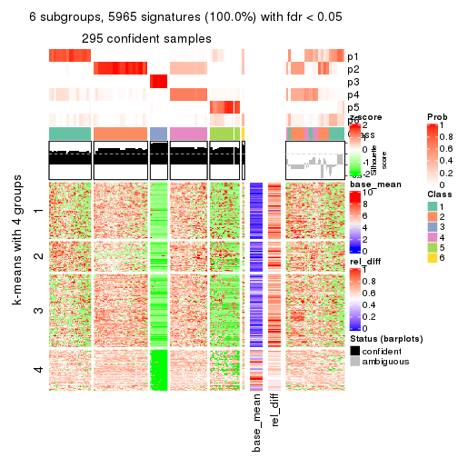</p>

</div>
</div>


Signature heatmaps where rows are not scaled:


<script>
$( function() {
	$( '#tabs-SD-kmeans-get-signatures-no-scale' ).tabs();
} );
</script>
<div id='tabs-SD-kmeans-get-signatures-no-scale'>
<ul>
<li><a href='#tab-SD-kmeans-get-signatures-no-scale-1'>k = 2</a></li>
<li><a href='#tab-SD-kmeans-get-signatures-no-scale-2'>k = 3</a></li>
<li><a href='#tab-SD-kmeans-get-signatures-no-scale-3'>k = 4</a></li>
<li><a href='#tab-SD-kmeans-get-signatures-no-scale-4'>k = 5</a></li>
<li><a href='#tab-SD-kmeans-get-signatures-no-scale-5'>k = 6</a></li>
</ul>
<div id='tab-SD-kmeans-get-signatures-no-scale-1'>
<pre><code class="r">get_signatures(res, k = 2, scale_rows = FALSE)
</code></pre>

<p></p>

</div>
<div id='tab-SD-kmeans-get-signatures-no-scale-2'>
<pre><code class="r">get_signatures(res, k = 3, scale_rows = FALSE)
</code></pre>

<p></p>

</div>
<div id='tab-SD-kmeans-get-signatures-no-scale-3'>
<pre><code class="r">get_signatures(res, k = 4, scale_rows = FALSE)
</code></pre>

<p></p>

</div>
<div id='tab-SD-kmeans-get-signatures-no-scale-4'>
<pre><code class="r">get_signatures(res, k = 5, scale_rows = FALSE)
</code></pre>

<p></p>

</div>
<div id='tab-SD-kmeans-get-signatures-no-scale-5'>
<pre><code class="r">get_signatures(res, k = 6, scale_rows = FALSE)
</code></pre>

<p></p>

</div>
</div>


Compare the overlap of signatures from different k:

```r
compare_signatures(res)
```


`get_signature()` returns a data frame invisibly. TO get the list of signatures, the function
call should be assigned to a variable explicitly. In following code, if `plot` argument is set
to `FALSE`, no heatmap is plotted while only the differential analysis is performed.

```r
# code only for demonstration
tb = get_signature(res, k = ..., plot = FALSE)
```

An example of the output of `tb` is:

```
#>   which_row         fdr    mean_1    mean_2 scaled_mean_1 scaled_mean_2 km
#> 1        38 0.042760348  8.373488  9.131774    -0.5533452     0.5164555  1
#> 2        40 0.018707592  7.106213  8.469186    -0.6173731     0.5762149  1
#> 3        55 0.019134737 10.221463 11.207825    -0.6159697     0.5749050  1
#> 4        59 0.006059896  5.921854  7.869574    -0.6899429     0.6439467  1
#> 5        60 0.018055526  8.928898 10.211722    -0.6204761     0.5791110  1
#> 6        98 0.009384629 15.714769 14.887706     0.6635654    -0.6193277  2
...
```

The columns in `tb` are:

1. `which_row`: row indices corresponding to the input matrix.
2. `fdr`: FDR for the differential test. 
3. `mean_x`: The mean value in group x.
4. `scaled_mean_x`: The mean value in group x after rows are scaled.
5. `km`: Row groups if k-means clustering is applied to rows.


UMAP plot which shows how samples are separated.


<script>
$( function() {
	$( '#tabs-SD-kmeans-dimension-reduction' ).tabs();
} );
</script>
<div id='tabs-SD-kmeans-dimension-reduction'>
<ul>
<li><a href='#tab-SD-kmeans-dimension-reduction-1'>k = 2</a></li>
<li><a href='#tab-SD-kmeans-dimension-reduction-2'>k = 3</a></li>
<li><a href='#tab-SD-kmeans-dimension-reduction-3'>k = 4</a></li>
<li><a href='#tab-SD-kmeans-dimension-reduction-4'>k = 5</a></li>
<li><a href='#tab-SD-kmeans-dimension-reduction-5'>k = 6</a></li>
</ul>
<div id='tab-SD-kmeans-dimension-reduction-1'>
<pre><code class="r">dimension_reduction(res, k = 2, method = &quot;UMAP&quot;)
</code></pre>

<p></p>

</div>
<div id='tab-SD-kmeans-dimension-reduction-2'>
<pre><code class="r">dimension_reduction(res, k = 3, method = &quot;UMAP&quot;)
</code></pre>

<p></p>

</div>
<div id='tab-SD-kmeans-dimension-reduction-3'>
<pre><code class="r">dimension_reduction(res, k = 4, method = &quot;UMAP&quot;)
</code></pre>

<p></p>

</div>
<div id='tab-SD-kmeans-dimension-reduction-4'>
<pre><code class="r">dimension_reduction(res, k = 5, method = &quot;UMAP&quot;)
</code></pre>

<p></p>

</div>
<div id='tab-SD-kmeans-dimension-reduction-5'>
<pre><code class="r">dimension_reduction(res, k = 6, method = &quot;UMAP&quot;)
</code></pre>

<p></p>

</div>
</div>


Following heatmap shows how subgroups are split when increasing `k`:

```r
collect_classes(res)
```


If matrix rows can be associated to genes, consider to use `GO_Enrichment(res,
...)` to perform function enrichment for the signature genes.


 

---------------------------------------------------


### SD:skmeans**


The object with results only for a single top-value method and a single partition method 
can be extracted as:

```r
res = res_list["SD", "skmeans"]
# you can also extract it by
# res = res_list["SD:skmeans"]
```

A summary of `res` and all the functions that can be applied to it:

```r
res
```

```
#> A 'ConsensusPartition' object with k = 2, 3, 4, 5, 6.
#>   On a matrix with 5966 rows and 384 columns.
#>   Top rows (597, 1194, 1790, 2386, 2983) are extracted by 'SD' method.
#>   Subgroups are detected by 'skmeans' method.
#>   Performed in total 1250 partitions by row resampling.
#>   Best k for subgroups seems to be 2.
#> 
#> Following methods can be applied to this 'ConsensusPartition' object:
#>  [1] "cola_report"             "collect_classes"         "collect_plots"          
#>  [4] "collect_stats"           "colnames"                "compare_signatures"     
#>  [7] "consensus_heatmap"       "dimension_reduction"     "functional_enrichment"  
#> [10] "get_anno_col"            "get_anno"                "get_classes"            
#> [13] "get_consensus"           "get_matrix"              "get_membership"         
#> [16] "get_param"               "get_signatures"          "get_stats"              
#> [19] "is_best_k"               "is_stable_k"             "membership_heatmap"     
#> [22] "ncol"                    "nrow"                    "plot_ecdf"              
#> [25] "rownames"                "select_partition_number" "show"                   
#> [28] "suggest_best_k"          "test_to_known_factors"
```

`collect_plots()` function collects all the plots made from `res` for all `k` (number of partitions)
into one single page to provide an easy and fast comparison between different `k`.

```r
collect_plots(res)
```


The plots are:

- The first row: a plot of the ECDF (Empirical cumulative distribution
  function) curves of the consensus matrix for each `k` and the heatmap of
  predicted classes for each `k`.
- The second row: heatmaps of the consensus matrix for each `k`.
- The third row: heatmaps of the membership matrix for each `k`.
- The fouth row: heatmaps of the signatures for each `k`.

All the plots in panels can be made by individual functions and they are
plotted later in this section.

`select_partition_number()` produces several plots showing different
statistics for choosing "optimized" `k`. There are following statistics:

- ECDF curves of the consensus matrix for each `k`;
- 1-PAC. [The PAC
  score](https://en.wikipedia.org/wiki/Consensus_clustering#Over-interpretation_potential_of_consensus_clustering)
  measures the proportion of the ambiguous subgrouping.
- Mean silhouette score.
- Concordance. The mean probability of fiting the consensus class ids in all
  partitions.
- Area increased. Denote $A_k$ as the area under the ECDF curve for current
  `k`, the area increased is defined as $A_k - A_{k-1}$.
- Rand index. The percent of pairs of samples that are both in a same cluster
  or both are not in a same cluster in the partition of k and k-1.
- Jaccard index. The ratio of pairs of samples are both in a same cluster in
  the partition of k and k-1 and the pairs of samples are both in a same
  cluster in the partition k or k-1.

The detailed explanations of these statistics can be found in [the cola
vignette](http://bioconductor.org/packages/devel/bioc/vignettes/cola/inst/doc/cola.html#toc_13).

Generally speaking, lower PAC score, higher mean silhouette score or higher
concordance corresponds to better partition. Rand index and Jaccard index
measure how similar the current partition is compared to partition with `k-1`.
If they are too similar, we won't accept `k` is better than `k-1`.

```r
select_partition_number(res)
```


The numeric values for all these statistics can be obtained by `get_stats()`.

```r
get_stats(res)
```

```
#>   k 1-PAC mean_silhouette concordance area_increased  Rand Jaccard
#> 2 2 0.957           0.944       0.977         0.4436 0.563   0.563
#> 3 3 0.704           0.746       0.876         0.4244 0.782   0.628
#> 4 4 0.858           0.887       0.940         0.1691 0.800   0.527
#> 5 5 0.826           0.825       0.906         0.0534 0.961   0.851
#> 6 6 0.830           0.659       0.817         0.0389 0.965   0.851
```

`suggest_best_k()` suggests the best $k$ based on these statistics. The rules are as follows:

- All $k$ with Jaccard index larger than 0.95 are removed because the increase of
  the partition number does not provides enough extra information. If all $k$ are removed,
  the best $k$ is assigned by `NA`.
- For $k$ with 1-PAC larger than 0.9, the maximal $k$ is taken as the "best k". Other $k$ is called "optional k".
- If it does not fit the second rule. The $k$ with the highest vote of highest
  1-PAC, mean silhouette and concordance is taken as the "best k".

```r
suggest_best_k(res)
```

```
#> [1] 2
```


Following shows the table of the partitions (You need to click the **show/hide
code output** link to see it). The membership matrix (columns with name `p*`)
is inferred by
[`clue::cl_consensus()`](https://www.rdocumentation.org/link/cl_consensus?package=clue)
function with the `SE` method. Basically the value in the membership matrix
represents the probability to belong to a certain group. The finall class
label for an item is determined with the group with highest probability it
belongs to.

In `get_classes()` function, the entropy is calculated from the membership
matrix and the silhouette score is calculated from the consensus matrix.


<script>
$( function() {
	$( '#tabs-SD-skmeans-get-classes' ).tabs();
} );
</script>
<div id='tabs-SD-skmeans-get-classes'>
<ul>
<li><a href='#tab-SD-skmeans-get-classes-1'>k = 2</a></li>
<li><a href='#tab-SD-skmeans-get-classes-2'>k = 3</a></li>
<li><a href='#tab-SD-skmeans-get-classes-3'>k = 4</a></li>
<li><a href='#tab-SD-skmeans-get-classes-4'>k = 5</a></li>
<li><a href='#tab-SD-skmeans-get-classes-5'>k = 6</a></li>
</ul>

<div id='tab-SD-skmeans-get-classes-1'>
<p><a id='tab-SD-skmeans-get-classes-1-a' style='color:#0366d6' href='#'>show/hide code output</a></p>
<pre><code class="r">cbind(get_classes(res, k = 2), get_membership(res, k = 2))
</code></pre>

<pre><code>#&gt;           class entropy silhouette    p1    p2
#&gt; SRR490216     1  0.3879    0.90996 0.924 0.076
#&gt; SRR490217     1  0.4431    0.89279 0.908 0.092
#&gt; SRR490218     1  0.3431    0.92219 0.936 0.064
#&gt; SRR490219     1  0.0000    0.97860 1.000 0.000
#&gt; SRR490220     1  0.9635    0.35467 0.612 0.388
#&gt; SRR490221     2  0.9393    0.46331 0.356 0.644
#&gt; SRR490222     2  0.8955    0.55683 0.312 0.688
#&gt; SRR490223     2  0.9661    0.37534 0.392 0.608
#&gt; SRR490224     1  0.0000    0.97860 1.000 0.000
#&gt; SRR490225     1  0.0000    0.97860 1.000 0.000
#&gt; SRR490226     1  0.0000    0.97860 1.000 0.000
#&gt; SRR490227     1  0.0000    0.97860 1.000 0.000
#&gt; SRR490228     1  0.0000    0.97860 1.000 0.000
#&gt; SRR490229     1  0.0000    0.97860 1.000 0.000
#&gt; SRR490230     1  0.0000    0.97860 1.000 0.000
#&gt; SRR490231     1  0.0000    0.97860 1.000 0.000
#&gt; SRR490232     1  0.0000    0.97860 1.000 0.000
#&gt; SRR490233     1  0.0000    0.97860 1.000 0.000
#&gt; SRR490234     1  0.0000    0.97860 1.000 0.000
#&gt; SRR490235     1  0.0000    0.97860 1.000 0.000
#&gt; SRR490236     1  0.0000    0.97860 1.000 0.000
#&gt; SRR490237     1  0.0000    0.97860 1.000 0.000
#&gt; SRR490238     1  0.0000    0.97860 1.000 0.000
#&gt; SRR490239     1  0.0000    0.97860 1.000 0.000
#&gt; SRR490240     1  0.9286    0.46926 0.656 0.344
#&gt; SRR490241     2  0.8608    0.61164 0.284 0.716
#&gt; SRR490242     2  0.9427    0.45416 0.360 0.640
#&gt; SRR490243     2  0.9998    0.05226 0.492 0.508
#&gt; SRR490244     1  0.0000    0.97860 1.000 0.000
#&gt; SRR490245     1  0.0000    0.97860 1.000 0.000
#&gt; SRR490246     1  0.0000    0.97860 1.000 0.000
#&gt; SRR490247     1  0.0000    0.97860 1.000 0.000
#&gt; SRR490248     2  0.9866    0.23961 0.432 0.568
#&gt; SRR490249     2  0.2423    0.93890 0.040 0.960
#&gt; SRR490250     2  0.0672    0.96812 0.008 0.992
#&gt; SRR490251     2  0.6973    0.76261 0.188 0.812
#&gt; SRR490252     2  0.0000    0.97481 0.000 1.000
#&gt; SRR490253     2  0.0000    0.97481 0.000 1.000
#&gt; SRR490254     2  0.0000    0.97481 0.000 1.000
#&gt; SRR490255     2  0.0000    0.97481 0.000 1.000
#&gt; SRR490256     1  0.0000    0.97860 1.000 0.000
#&gt; SRR490257     1  0.0000    0.97860 1.000 0.000
#&gt; SRR490258     1  0.0000    0.97860 1.000 0.000
#&gt; SRR490259     1  0.0000    0.97860 1.000 0.000
#&gt; SRR490260     1  0.0000    0.97860 1.000 0.000
#&gt; SRR490261     1  0.0000    0.97860 1.000 0.000
#&gt; SRR490262     1  0.0000    0.97860 1.000 0.000
#&gt; SRR490263     1  0.0000    0.97860 1.000 0.000
#&gt; SRR490264     1  0.0000    0.97860 1.000 0.000
#&gt; SRR490265     1  0.0000    0.97860 1.000 0.000
#&gt; SRR490266     1  0.0000    0.97860 1.000 0.000
#&gt; SRR490267     1  0.0000    0.97860 1.000 0.000
#&gt; SRR490268     1  0.0000    0.97860 1.000 0.000
#&gt; SRR490269     1  0.0000    0.97860 1.000 0.000
#&gt; SRR490270     1  0.0000    0.97860 1.000 0.000
#&gt; SRR490271     1  0.0000    0.97860 1.000 0.000
#&gt; SRR490272     1  0.0000    0.97860 1.000 0.000
#&gt; SRR490273     1  0.0000    0.97860 1.000 0.000
#&gt; SRR490274     1  0.0000    0.97860 1.000 0.000
#&gt; SRR490275     1  0.0000    0.97860 1.000 0.000
#&gt; SRR490276     1  0.0000    0.97860 1.000 0.000
#&gt; SRR490277     1  0.0000    0.97860 1.000 0.000
#&gt; SRR490278     1  0.0000    0.97860 1.000 0.000
#&gt; SRR490279     1  0.0000    0.97860 1.000 0.000
#&gt; SRR490280     1  0.0000    0.97860 1.000 0.000
#&gt; SRR490281     1  0.0000    0.97860 1.000 0.000
#&gt; SRR490282     1  0.0000    0.97860 1.000 0.000
#&gt; SRR490283     1  0.0000    0.97860 1.000 0.000
#&gt; SRR490284     1  0.0000    0.97860 1.000 0.000
#&gt; SRR490285     1  0.0000    0.97860 1.000 0.000
#&gt; SRR490286     1  0.0000    0.97860 1.000 0.000
#&gt; SRR490287     1  0.0000    0.97860 1.000 0.000
#&gt; SRR490288     1  0.0000    0.97860 1.000 0.000
#&gt; SRR490289     1  0.0000    0.97860 1.000 0.000
#&gt; SRR490290     1  0.0672    0.97241 0.992 0.008
#&gt; SRR490291     1  0.0000    0.97860 1.000 0.000
#&gt; SRR490292     1  0.0000    0.97860 1.000 0.000
#&gt; SRR490293     1  0.0938    0.96912 0.988 0.012
#&gt; SRR490294     1  0.0000    0.97860 1.000 0.000
#&gt; SRR490295     1  0.0672    0.97237 0.992 0.008
#&gt; SRR490296     2  0.0000    0.97481 0.000 1.000
#&gt; SRR490297     2  0.0000    0.97481 0.000 1.000
#&gt; SRR490298     2  0.0000    0.97481 0.000 1.000
#&gt; SRR490299     2  0.0000    0.97481 0.000 1.000
#&gt; SRR490300     2  0.9686    0.36442 0.396 0.604
#&gt; SRR490301     2  0.9580    0.40584 0.380 0.620
#&gt; SRR490302     2  0.9661    0.37505 0.392 0.608
#&gt; SRR490303     2  0.9661    0.37505 0.392 0.608
#&gt; SRR490304     2  0.0000    0.97481 0.000 1.000
#&gt; SRR490305     2  0.0000    0.97481 0.000 1.000
#&gt; SRR490306     2  0.0000    0.97481 0.000 1.000
#&gt; SRR490307     2  0.0000    0.97481 0.000 1.000
#&gt; SRR490308     1  0.0000    0.97860 1.000 0.000
#&gt; SRR490309     1  0.0000    0.97860 1.000 0.000
#&gt; SRR490310     1  0.0000    0.97860 1.000 0.000
#&gt; SRR490311     1  0.0000    0.97860 1.000 0.000
#&gt; SRR490312     1  0.0000    0.97860 1.000 0.000
#&gt; SRR490313     1  0.2236    0.94805 0.964 0.036
#&gt; SRR490314     1  0.5408    0.85359 0.876 0.124
#&gt; SRR490315     1  0.1633    0.95891 0.976 0.024
#&gt; SRR490316     1  0.1633    0.95925 0.976 0.024
#&gt; SRR490317     2  0.9323    0.47990 0.348 0.652
#&gt; SRR490318     2  0.8861    0.57094 0.304 0.696
#&gt; SRR490319     2  1.0000   -0.00775 0.500 0.500
#&gt; SRR490320     1  0.0000    0.97860 1.000 0.000
#&gt; SRR490321     1  0.0000    0.97860 1.000 0.000
#&gt; SRR490322     1  0.0000    0.97860 1.000 0.000
#&gt; SRR490323     1  0.0000    0.97860 1.000 0.000
#&gt; SRR490324     1  0.0000    0.97860 1.000 0.000
#&gt; SRR490325     1  0.0000    0.97860 1.000 0.000
#&gt; SRR490326     1  0.0000    0.97860 1.000 0.000
#&gt; SRR490327     1  0.0000    0.97860 1.000 0.000
#&gt; SRR490328     2  0.0000    0.97481 0.000 1.000
#&gt; SRR490329     2  0.0000    0.97481 0.000 1.000
#&gt; SRR490330     2  0.0000    0.97481 0.000 1.000
#&gt; SRR490331     2  0.0000    0.97481 0.000 1.000
#&gt; SRR490332     2  0.0000    0.97481 0.000 1.000
#&gt; SRR490333     2  0.0000    0.97481 0.000 1.000
#&gt; SRR490334     2  0.0000    0.97481 0.000 1.000
#&gt; SRR490335     2  0.0000    0.97481 0.000 1.000
#&gt; SRR490336     2  0.0000    0.97481 0.000 1.000
#&gt; SRR490337     2  0.0000    0.97481 0.000 1.000
#&gt; SRR490338     2  0.0000    0.97481 0.000 1.000
#&gt; SRR490339     2  0.0000    0.97481 0.000 1.000
#&gt; SRR490340     2  0.0000    0.97481 0.000 1.000
#&gt; SRR490341     2  0.0000    0.97481 0.000 1.000
#&gt; SRR490342     2  0.0000    0.97481 0.000 1.000
#&gt; SRR490343     2  0.0000    0.97481 0.000 1.000
#&gt; SRR490344     2  0.0000    0.97481 0.000 1.000
#&gt; SRR490345     2  0.0000    0.97481 0.000 1.000
#&gt; SRR490346     2  0.0000    0.97481 0.000 1.000
#&gt; SRR490347     2  0.0000    0.97481 0.000 1.000
#&gt; SRR490348     2  0.0000    0.97481 0.000 1.000
#&gt; SRR490349     2  0.0000    0.97481 0.000 1.000
#&gt; SRR490350     2  0.0000    0.97481 0.000 1.000
#&gt; SRR490351     2  0.0000    0.97481 0.000 1.000
#&gt; SRR490352     2  0.0000    0.97481 0.000 1.000
#&gt; SRR490353     2  0.0000    0.97481 0.000 1.000
#&gt; SRR490354     2  0.0000    0.97481 0.000 1.000
#&gt; SRR490355     2  0.0000    0.97481 0.000 1.000
#&gt; SRR490356     2  0.0000    0.97481 0.000 1.000
#&gt; SRR490357     2  0.0000    0.97481 0.000 1.000
#&gt; SRR490358     2  0.0000    0.97481 0.000 1.000
#&gt; SRR490359     2  0.0000    0.97481 0.000 1.000
#&gt; SRR490360     2  0.0000    0.97481 0.000 1.000
#&gt; SRR490361     2  0.0000    0.97481 0.000 1.000
#&gt; SRR490362     2  0.0000    0.97481 0.000 1.000
#&gt; SRR490363     2  0.0000    0.97481 0.000 1.000
#&gt; SRR490364     2  0.0000    0.97481 0.000 1.000
#&gt; SRR490365     2  0.0000    0.97481 0.000 1.000
#&gt; SRR490366     2  0.0000    0.97481 0.000 1.000
#&gt; SRR490367     2  0.0000    0.97481 0.000 1.000
#&gt; SRR490368     2  0.0000    0.97481 0.000 1.000
#&gt; SRR490369     2  0.0000    0.97481 0.000 1.000
#&gt; SRR490370     2  0.0000    0.97481 0.000 1.000
#&gt; SRR490371     2  0.0000    0.97481 0.000 1.000
#&gt; SRR490372     1  0.0000    0.97860 1.000 0.000
#&gt; SRR490373     1  0.0000    0.97860 1.000 0.000
#&gt; SRR490374     1  0.0000    0.97860 1.000 0.000
#&gt; SRR490375     1  0.0000    0.97860 1.000 0.000
#&gt; SRR490376     2  0.0000    0.97481 0.000 1.000
#&gt; SRR490377     2  0.0000    0.97481 0.000 1.000
#&gt; SRR490378     2  0.0000    0.97481 0.000 1.000
#&gt; SRR490379     2  0.0000    0.97481 0.000 1.000
#&gt; SRR490380     1  0.0000    0.97860 1.000 0.000
#&gt; SRR490381     1  0.0000    0.97860 1.000 0.000
#&gt; SRR490382     1  0.0000    0.97860 1.000 0.000
#&gt; SRR490383     1  0.0000    0.97860 1.000 0.000
#&gt; SRR490384     2  0.0000    0.97481 0.000 1.000
#&gt; SRR490385     2  0.0000    0.97481 0.000 1.000
#&gt; SRR490386     2  0.0000    0.97481 0.000 1.000
#&gt; SRR490387     2  0.0000    0.97481 0.000 1.000
#&gt; SRR490388     2  0.0000    0.97481 0.000 1.000
#&gt; SRR490389     2  0.0000    0.97481 0.000 1.000
#&gt; SRR490390     2  0.0000    0.97481 0.000 1.000
#&gt; SRR490391     2  0.0000    0.97481 0.000 1.000
#&gt; SRR490392     2  0.0000    0.97481 0.000 1.000
#&gt; SRR490393     2  0.0000    0.97481 0.000 1.000
#&gt; SRR490394     2  0.0000    0.97481 0.000 1.000
#&gt; SRR490395     2  0.0000    0.97481 0.000 1.000
#&gt; SRR490396     2  0.0000    0.97481 0.000 1.000
#&gt; SRR490397     2  0.0000    0.97481 0.000 1.000
#&gt; SRR490398     2  0.0000    0.97481 0.000 1.000
#&gt; SRR490399     2  0.0000    0.97481 0.000 1.000
#&gt; SRR490400     2  0.0000    0.97481 0.000 1.000
#&gt; SRR490401     2  0.0000    0.97481 0.000 1.000
#&gt; SRR490402     2  0.0000    0.97481 0.000 1.000
#&gt; SRR490403     2  0.0000    0.97481 0.000 1.000
#&gt; SRR490404     2  0.0000    0.97481 0.000 1.000
#&gt; SRR490405     2  0.0000    0.97481 0.000 1.000
#&gt; SRR490406     2  0.0000    0.97481 0.000 1.000
#&gt; SRR490407     2  0.0000    0.97481 0.000 1.000
#&gt; SRR490408     2  0.0000    0.97481 0.000 1.000
#&gt; SRR490409     2  0.0000    0.97481 0.000 1.000
#&gt; SRR490410     2  0.0000    0.97481 0.000 1.000
#&gt; SRR490411     2  0.0000    0.97481 0.000 1.000
#&gt; SRR490412     1  0.0000    0.97860 1.000 0.000
#&gt; SRR490413     1  0.0000    0.97860 1.000 0.000
#&gt; SRR490414     1  0.0000    0.97860 1.000 0.000
#&gt; SRR490415     1  0.0000    0.97860 1.000 0.000
#&gt; SRR490416     2  0.0000    0.97481 0.000 1.000
#&gt; SRR490417     2  0.0000    0.97481 0.000 1.000
#&gt; SRR490418     2  0.0000    0.97481 0.000 1.000
#&gt; SRR490419     2  0.0000    0.97481 0.000 1.000
#&gt; SRR490420     1  0.0000    0.97860 1.000 0.000
#&gt; SRR490421     1  0.6438    0.80055 0.836 0.164
#&gt; SRR490422     1  0.9248    0.47917 0.660 0.340
#&gt; SRR490423     1  0.6048    0.82235 0.852 0.148
#&gt; SRR490424     1  0.0000    0.97860 1.000 0.000
#&gt; SRR490425     1  0.0000    0.97860 1.000 0.000
#&gt; SRR490426     1  0.0000    0.97860 1.000 0.000
#&gt; SRR490427     1  0.0000    0.97860 1.000 0.000
#&gt; SRR490428     1  0.0000    0.97860 1.000 0.000
#&gt; SRR490429     1  0.0000    0.97860 1.000 0.000
#&gt; SRR490430     1  0.0000    0.97860 1.000 0.000
#&gt; SRR490431     1  0.0000    0.97860 1.000 0.000
#&gt; SRR490432     2  0.2603    0.93534 0.044 0.956
#&gt; SRR490433     2  0.0000    0.97481 0.000 1.000
#&gt; SRR490434     2  0.0000    0.97481 0.000 1.000
#&gt; SRR490435     2  0.0000    0.97481 0.000 1.000
#&gt; SRR490436     2  0.5408    0.84907 0.124 0.876
#&gt; SRR490437     2  0.3114    0.92338 0.056 0.944
#&gt; SRR490438     2  0.1633    0.95402 0.024 0.976
#&gt; SRR490439     2  0.1184    0.96105 0.016 0.984
#&gt; SRR490440     2  0.0000    0.97481 0.000 1.000
#&gt; SRR490441     2  0.0000    0.97481 0.000 1.000
#&gt; SRR490442     2  0.0000    0.97481 0.000 1.000
#&gt; SRR490443     2  0.0000    0.97481 0.000 1.000
#&gt; SRR490444     2  0.0000    0.97481 0.000 1.000
#&gt; SRR490445     2  0.0000    0.97481 0.000 1.000
#&gt; SRR490446     2  0.0000    0.97481 0.000 1.000
#&gt; SRR490447     2  0.0000    0.97481 0.000 1.000
#&gt; SRR490448     2  0.4939    0.86749 0.108 0.892
#&gt; SRR490449     2  0.3274    0.91938 0.060 0.940
#&gt; SRR490450     2  0.5737    0.83445 0.136 0.864
#&gt; SRR490451     2  0.6247    0.80933 0.156 0.844
#&gt; SRR490452     1  0.0000    0.97860 1.000 0.000
#&gt; SRR490453     1  0.0000    0.97860 1.000 0.000
#&gt; SRR490454     1  0.0000    0.97860 1.000 0.000
#&gt; SRR490455     1  0.0000    0.97860 1.000 0.000
#&gt; SRR490456     2  0.0000    0.97481 0.000 1.000
#&gt; SRR490457     2  0.0000    0.97481 0.000 1.000
#&gt; SRR490458     2  0.0000    0.97481 0.000 1.000
#&gt; SRR490459     2  0.0000    0.97481 0.000 1.000
#&gt; SRR490460     2  0.1633    0.95406 0.024 0.976
#&gt; SRR490461     2  0.0000    0.97481 0.000 1.000
#&gt; SRR490462     2  0.1633    0.95413 0.024 0.976
#&gt; SRR490463     2  0.1633    0.95406 0.024 0.976
#&gt; SRR490464     1  0.0000    0.97860 1.000 0.000
#&gt; SRR490465     1  0.0000    0.97860 1.000 0.000
#&gt; SRR490466     1  0.0000    0.97860 1.000 0.000
#&gt; SRR490467     1  0.0000    0.97860 1.000 0.000
#&gt; SRR490468     2  0.0000    0.97481 0.000 1.000
#&gt; SRR490469     2  0.0000    0.97481 0.000 1.000
#&gt; SRR490470     2  0.0000    0.97481 0.000 1.000
#&gt; SRR490471     2  0.0000    0.97481 0.000 1.000
#&gt; SRR490472     2  0.0000    0.97481 0.000 1.000
#&gt; SRR490473     2  0.0000    0.97481 0.000 1.000
#&gt; SRR490474     2  0.0000    0.97481 0.000 1.000
#&gt; SRR490475     2  0.0000    0.97481 0.000 1.000
#&gt; SRR490476     1  0.0000    0.97860 1.000 0.000
#&gt; SRR490477     1  0.0000    0.97860 1.000 0.000
#&gt; SRR490478     1  0.0000    0.97860 1.000 0.000
#&gt; SRR490479     1  0.0000    0.97860 1.000 0.000
#&gt; SRR490480     2  0.0000    0.97481 0.000 1.000
#&gt; SRR490481     2  0.0000    0.97481 0.000 1.000
#&gt; SRR490482     2  0.0000    0.97481 0.000 1.000
#&gt; SRR490483     2  0.0000    0.97481 0.000 1.000
#&gt; SRR490484     2  0.0000    0.97481 0.000 1.000
#&gt; SRR490485     2  0.0000    0.97481 0.000 1.000
#&gt; SRR490486     2  0.0000    0.97481 0.000 1.000
#&gt; SRR490487     2  0.0000    0.97481 0.000 1.000
#&gt; SRR490488     2  0.0000    0.97481 0.000 1.000
#&gt; SRR490489     2  0.0000    0.97481 0.000 1.000
#&gt; SRR490490     2  0.0000    0.97481 0.000 1.000
#&gt; SRR490491     2  0.0000    0.97481 0.000 1.000
#&gt; SRR490492     2  0.0000    0.97481 0.000 1.000
#&gt; SRR490493     2  0.0000    0.97481 0.000 1.000
#&gt; SRR490494     2  0.0000    0.97481 0.000 1.000
#&gt; SRR490495     2  0.0000    0.97481 0.000 1.000
#&gt; SRR490496     2  0.0000    0.97481 0.000 1.000
#&gt; SRR490497     2  0.0000    0.97481 0.000 1.000
#&gt; SRR490498     2  0.0000    0.97481 0.000 1.000
#&gt; SRR490499     2  0.0000    0.97481 0.000 1.000
#&gt; SRR490500     2  0.0000    0.97481 0.000 1.000
#&gt; SRR490501     2  0.0000    0.97481 0.000 1.000
#&gt; SRR490502     2  0.0000    0.97481 0.000 1.000
#&gt; SRR490503     2  0.0000    0.97481 0.000 1.000
#&gt; SRR490504     2  0.0000    0.97481 0.000 1.000
#&gt; SRR490505     2  0.0000    0.97481 0.000 1.000
#&gt; SRR490506     2  0.0000    0.97481 0.000 1.000
#&gt; SRR490507     2  0.0000    0.97481 0.000 1.000
#&gt; SRR490508     2  0.0000    0.97481 0.000 1.000
#&gt; SRR490509     2  0.0000    0.97481 0.000 1.000
#&gt; SRR490510     2  0.0000    0.97481 0.000 1.000
#&gt; SRR490511     2  0.0000    0.97481 0.000 1.000
#&gt; SRR490512     2  0.0000    0.97481 0.000 1.000
#&gt; SRR490513     2  0.0000    0.97481 0.000 1.000
#&gt; SRR490514     2  0.0000    0.97481 0.000 1.000
#&gt; SRR490515     2  0.0000    0.97481 0.000 1.000
#&gt; SRR490516     2  0.0000    0.97481 0.000 1.000
#&gt; SRR490517     2  0.0000    0.97481 0.000 1.000
#&gt; SRR490518     2  0.0000    0.97481 0.000 1.000
#&gt; SRR490519     2  0.0000    0.97481 0.000 1.000
#&gt; SRR490520     2  0.0000    0.97481 0.000 1.000
#&gt; SRR490521     2  0.0000    0.97481 0.000 1.000
#&gt; SRR490522     2  0.0000    0.97481 0.000 1.000
#&gt; SRR490523     2  0.0000    0.97481 0.000 1.000
#&gt; SRR490524     2  0.0000    0.97481 0.000 1.000
#&gt; SRR490525     2  0.0000    0.97481 0.000 1.000
#&gt; SRR490526     2  0.0000    0.97481 0.000 1.000
#&gt; SRR490527     2  0.0000    0.97481 0.000 1.000
#&gt; SRR490528     2  0.0000    0.97481 0.000 1.000
#&gt; SRR490529     2  0.0000    0.97481 0.000 1.000
#&gt; SRR490530     2  0.0000    0.97481 0.000 1.000
#&gt; SRR490531     2  0.0000    0.97481 0.000 1.000
#&gt; SRR490532     1  0.3114    0.92972 0.944 0.056
#&gt; SRR490533     1  0.6343    0.81005 0.840 0.160
#&gt; SRR490534     1  0.8016    0.68242 0.756 0.244
#&gt; SRR490535     1  0.7056    0.76535 0.808 0.192
#&gt; SRR490536     2  0.0000    0.97481 0.000 1.000
#&gt; SRR490537     2  0.0000    0.97481 0.000 1.000
#&gt; SRR490538     2  0.0000    0.97481 0.000 1.000
#&gt; SRR490539     2  0.0000    0.97481 0.000 1.000
#&gt; SRR490540     2  0.0000    0.97481 0.000 1.000
#&gt; SRR490541     2  0.0000    0.97481 0.000 1.000
#&gt; SRR490542     2  0.0000    0.97481 0.000 1.000
#&gt; SRR490543     2  0.0000    0.97481 0.000 1.000
#&gt; SRR490544     2  0.0000    0.97481 0.000 1.000
#&gt; SRR490545     2  0.0000    0.97481 0.000 1.000
#&gt; SRR490546     2  0.0000    0.97481 0.000 1.000
#&gt; SRR490547     2  0.0000    0.97481 0.000 1.000
#&gt; SRR490548     2  0.0000    0.97481 0.000 1.000
#&gt; SRR490549     2  0.0000    0.97481 0.000 1.000
#&gt; SRR490550     2  0.0000    0.97481 0.000 1.000
#&gt; SRR490551     2  0.0000    0.97481 0.000 1.000
#&gt; SRR490552     2  0.0000    0.97481 0.000 1.000
#&gt; SRR490553     2  0.0000    0.97481 0.000 1.000
#&gt; SRR490554     2  0.0000    0.97481 0.000 1.000
#&gt; SRR490555     2  0.0000    0.97481 0.000 1.000
#&gt; SRR490556     2  0.0000    0.97481 0.000 1.000
#&gt; SRR490557     2  0.0000    0.97481 0.000 1.000
#&gt; SRR490558     2  0.0000    0.97481 0.000 1.000
#&gt; SRR490559     2  0.0000    0.97481 0.000 1.000
#&gt; SRR490560     2  0.0000    0.97481 0.000 1.000
#&gt; SRR490561     2  0.0000    0.97481 0.000 1.000
#&gt; SRR490562     2  0.0000    0.97481 0.000 1.000
#&gt; SRR490563     2  0.0000    0.97481 0.000 1.000
#&gt; SRR490564     2  0.0000    0.97481 0.000 1.000
#&gt; SRR490565     2  0.0000    0.97481 0.000 1.000
#&gt; SRR490566     2  0.0000    0.97481 0.000 1.000
#&gt; SRR490567     2  0.0000    0.97481 0.000 1.000
#&gt; SRR490568     2  0.0000    0.97481 0.000 1.000
#&gt; SRR490569     2  0.0000    0.97481 0.000 1.000
#&gt; SRR490570     2  0.0000    0.97481 0.000 1.000
#&gt; SRR490571     2  0.0000    0.97481 0.000 1.000
#&gt; SRR490572     2  0.0000    0.97481 0.000 1.000
#&gt; SRR490573     2  0.0000    0.97481 0.000 1.000
#&gt; SRR490574     2  0.0000    0.97481 0.000 1.000
#&gt; SRR490575     2  0.0000    0.97481 0.000 1.000
#&gt; SRR490576     2  0.0000    0.97481 0.000 1.000
#&gt; SRR490577     2  0.0000    0.97481 0.000 1.000
#&gt; SRR490578     2  0.0000    0.97481 0.000 1.000
#&gt; SRR490579     2  0.0000    0.97481 0.000 1.000
#&gt; SRR490580     2  0.0000    0.97481 0.000 1.000
#&gt; SRR490581     2  0.0000    0.97481 0.000 1.000
#&gt; SRR490582     2  0.0000    0.97481 0.000 1.000
#&gt; SRR490583     2  0.0000    0.97481 0.000 1.000
#&gt; SRR490584     2  0.0000    0.97481 0.000 1.000
#&gt; SRR490585     2  0.0000    0.97481 0.000 1.000
#&gt; SRR490586     2  0.0000    0.97481 0.000 1.000
#&gt; SRR490587     2  0.0000    0.97481 0.000 1.000
#&gt; SRR490588     2  0.0000    0.97481 0.000 1.000
#&gt; SRR490589     2  0.0000    0.97481 0.000 1.000
#&gt; SRR490590     2  0.0000    0.97481 0.000 1.000
#&gt; SRR490591     2  0.0000    0.97481 0.000 1.000
#&gt; SRR490592     2  0.0000    0.97481 0.000 1.000
#&gt; SRR490593     2  0.0000    0.97481 0.000 1.000
#&gt; SRR490594     2  0.0000    0.97481 0.000 1.000
#&gt; SRR490595     2  0.0000    0.97481 0.000 1.000
#&gt; SRR490596     2  0.0000    0.97481 0.000 1.000
#&gt; SRR490597     2  0.0000    0.97481 0.000 1.000
#&gt; SRR490598     2  0.0000    0.97481 0.000 1.000
#&gt; SRR490599     2  0.0000    0.97481 0.000 1.000
</code></pre>

<script>
$('#tab-SD-skmeans-get-classes-1-a').parent().next().next().hide();
$('#tab-SD-skmeans-get-classes-1-a').click(function(){
  $('#tab-SD-skmeans-get-classes-1-a').parent().next().next().toggle();
  return(false);
});
</script>
</div>

<div id='tab-SD-skmeans-get-classes-2'>
<p><a id='tab-SD-skmeans-get-classes-2-a' style='color:#0366d6' href='#'>show/hide code output</a></p>
<pre><code class="r">cbind(get_classes(res, k = 3), get_membership(res, k = 3))
</code></pre>

<pre><code>#&gt;           class entropy silhouette    p1    p2    p3
#&gt; SRR490216     1  0.5327     0.5917 0.728 0.272 0.000
#&gt; SRR490217     1  0.5835     0.5010 0.660 0.340 0.000
#&gt; SRR490218     1  0.6126     0.4179 0.600 0.400 0.000
#&gt; SRR490219     1  0.4346     0.7107 0.816 0.184 0.000
#&gt; SRR490220     3  0.4346     0.7377 0.184 0.000 0.816
#&gt; SRR490221     3  0.4002     0.7557 0.160 0.000 0.840
#&gt; SRR490222     3  0.3148     0.8025 0.048 0.036 0.916
#&gt; SRR490223     3  0.4235     0.7441 0.176 0.000 0.824
#&gt; SRR490224     1  0.0000     0.9349 1.000 0.000 0.000
#&gt; SRR490225     1  0.0000     0.9349 1.000 0.000 0.000
#&gt; SRR490226     1  0.0000     0.9349 1.000 0.000 0.000
#&gt; SRR490227     1  0.0000     0.9349 1.000 0.000 0.000
#&gt; SRR490228     1  0.0000     0.9349 1.000 0.000 0.000
#&gt; SRR490229     1  0.0000     0.9349 1.000 0.000 0.000
#&gt; SRR490230     1  0.0000     0.9349 1.000 0.000 0.000
#&gt; SRR490231     1  0.0000     0.9349 1.000 0.000 0.000
#&gt; SRR490232     1  0.0747     0.9214 0.984 0.000 0.016
#&gt; SRR490233     1  0.1163     0.9097 0.972 0.000 0.028
#&gt; SRR490234     1  0.1289     0.9056 0.968 0.000 0.032
#&gt; SRR490235     1  0.1031     0.9137 0.976 0.000 0.024
#&gt; SRR490236     1  0.0000     0.9349 1.000 0.000 0.000
#&gt; SRR490237     1  0.0000     0.9349 1.000 0.000 0.000
#&gt; SRR490238     1  0.0000     0.9349 1.000 0.000 0.000
#&gt; SRR490239     1  0.0000     0.9349 1.000 0.000 0.000
#&gt; SRR490240     3  0.4291     0.7408 0.180 0.000 0.820
#&gt; SRR490241     3  0.0747     0.8189 0.016 0.000 0.984
#&gt; SRR490242     3  0.0747     0.8189 0.016 0.000 0.984
#&gt; SRR490243     3  0.1289     0.8156 0.032 0.000 0.968
#&gt; SRR490244     1  0.0000     0.9349 1.000 0.000 0.000
#&gt; SRR490245     1  0.0000     0.9349 1.000 0.000 0.000
#&gt; SRR490246     1  0.0000     0.9349 1.000 0.000 0.000
#&gt; SRR490247     1  0.0000     0.9349 1.000 0.000 0.000
#&gt; SRR490248     2  0.3482     0.7054 0.128 0.872 0.000
#&gt; SRR490249     2  0.0592     0.8198 0.012 0.988 0.000
#&gt; SRR490250     2  0.0000     0.8282 0.000 1.000 0.000
#&gt; SRR490251     2  0.2261     0.7703 0.068 0.932 0.000
#&gt; SRR490252     3  0.2625     0.7887 0.000 0.084 0.916
#&gt; SRR490253     3  0.2796     0.7850 0.000 0.092 0.908
#&gt; SRR490254     3  0.2796     0.7850 0.000 0.092 0.908
#&gt; SRR490255     3  0.2796     0.7850 0.000 0.092 0.908
#&gt; SRR490256     1  0.6260     0.0516 0.552 0.000 0.448
#&gt; SRR490257     1  0.6295    -0.0339 0.528 0.000 0.472
#&gt; SRR490258     1  0.6291    -0.0193 0.532 0.000 0.468
#&gt; SRR490259     1  0.6295    -0.0339 0.528 0.000 0.472
#&gt; SRR490260     1  0.0000     0.9349 1.000 0.000 0.000
#&gt; SRR490261     1  0.0000     0.9349 1.000 0.000 0.000
#&gt; SRR490262     1  0.0000     0.9349 1.000 0.000 0.000
#&gt; SRR490263     1  0.0000     0.9349 1.000 0.000 0.000
#&gt; SRR490264     1  0.0000     0.9349 1.000 0.000 0.000
#&gt; SRR490265     1  0.0000     0.9349 1.000 0.000 0.000
#&gt; SRR490266     1  0.0000     0.9349 1.000 0.000 0.000
#&gt; SRR490267     1  0.0000     0.9349 1.000 0.000 0.000
#&gt; SRR490268     3  0.6260     0.2596 0.448 0.000 0.552
#&gt; SRR490269     3  0.6260     0.2596 0.448 0.000 0.552
#&gt; SRR490270     3  0.6260     0.2596 0.448 0.000 0.552
#&gt; SRR490271     3  0.6260     0.2596 0.448 0.000 0.552
#&gt; SRR490272     1  0.0237     0.9317 0.996 0.000 0.004
#&gt; SRR490273     1  0.0424     0.9284 0.992 0.000 0.008
#&gt; SRR490274     1  0.0424     0.9284 0.992 0.000 0.008
#&gt; SRR490275     1  0.0424     0.9284 0.992 0.000 0.008
#&gt; SRR490276     1  0.0000     0.9349 1.000 0.000 0.000
#&gt; SRR490277     1  0.0000     0.9349 1.000 0.000 0.000
#&gt; SRR490278     1  0.0000     0.9349 1.000 0.000 0.000
#&gt; SRR490279     1  0.0000     0.9349 1.000 0.000 0.000
#&gt; SRR490280     1  0.0000     0.9349 1.000 0.000 0.000
#&gt; SRR490281     1  0.0000     0.9349 1.000 0.000 0.000
#&gt; SRR490282     1  0.0000     0.9349 1.000 0.000 0.000
#&gt; SRR490283     1  0.0000     0.9349 1.000 0.000 0.000
#&gt; SRR490284     1  0.0000     0.9349 1.000 0.000 0.000
#&gt; SRR490285     1  0.0000     0.9349 1.000 0.000 0.000
#&gt; SRR490286     1  0.0000     0.9349 1.000 0.000 0.000
#&gt; SRR490287     1  0.0000     0.9349 1.000 0.000 0.000
#&gt; SRR490288     1  0.4702     0.6574 0.788 0.000 0.212
#&gt; SRR490289     3  0.6309     0.1310 0.496 0.000 0.504
#&gt; SRR490290     3  0.6079     0.4126 0.388 0.000 0.612
#&gt; SRR490291     3  0.6308     0.1438 0.492 0.000 0.508
#&gt; SRR490292     3  0.4931     0.6840 0.232 0.000 0.768
#&gt; SRR490293     3  0.4605     0.7172 0.204 0.000 0.796
#&gt; SRR490294     3  0.4654     0.7130 0.208 0.000 0.792
#&gt; SRR490295     3  0.4654     0.7130 0.208 0.000 0.792
#&gt; SRR490296     2  0.6260     0.5023 0.000 0.552 0.448
#&gt; SRR490297     2  0.6260     0.5023 0.000 0.552 0.448
#&gt; SRR490298     2  0.6260     0.5023 0.000 0.552 0.448
#&gt; SRR490299     2  0.6260     0.5023 0.000 0.552 0.448
#&gt; SRR490300     3  0.4399     0.7337 0.188 0.000 0.812
#&gt; SRR490301     3  0.4235     0.7444 0.176 0.000 0.824
#&gt; SRR490302     3  0.4346     0.7373 0.184 0.000 0.816
#&gt; SRR490303     3  0.4399     0.7337 0.188 0.000 0.812
#&gt; SRR490304     2  0.6260     0.5023 0.000 0.552 0.448
#&gt; SRR490305     2  0.6260     0.5023 0.000 0.552 0.448
#&gt; SRR490306     2  0.6260     0.5023 0.000 0.552 0.448
#&gt; SRR490307     2  0.6260     0.5023 0.000 0.552 0.448
#&gt; SRR490308     1  0.0000     0.9349 1.000 0.000 0.000
#&gt; SRR490309     1  0.0000     0.9349 1.000 0.000 0.000
#&gt; SRR490310     1  0.0000     0.9349 1.000 0.000 0.000
#&gt; SRR490311     1  0.0000     0.9349 1.000 0.000 0.000
#&gt; SRR490312     1  0.0747     0.9177 0.984 0.016 0.000
#&gt; SRR490313     1  0.5859     0.4918 0.656 0.344 0.000
#&gt; SRR490314     1  0.5678     0.5206 0.684 0.316 0.000
#&gt; SRR490315     1  0.5216     0.6047 0.740 0.260 0.000
#&gt; SRR490316     3  0.4233     0.7527 0.160 0.004 0.836
#&gt; SRR490317     3  0.1482     0.8173 0.020 0.012 0.968
#&gt; SRR490318     3  0.1337     0.8177 0.012 0.016 0.972
#&gt; SRR490319     3  0.1015     0.8191 0.008 0.012 0.980
#&gt; SRR490320     1  0.0000     0.9349 1.000 0.000 0.000
#&gt; SRR490321     1  0.0000     0.9349 1.000 0.000 0.000
#&gt; SRR490322     1  0.0000     0.9349 1.000 0.000 0.000
#&gt; SRR490323     1  0.0000     0.9349 1.000 0.000 0.000
#&gt; SRR490324     1  0.0000     0.9349 1.000 0.000 0.000
#&gt; SRR490325     1  0.0000     0.9349 1.000 0.000 0.000
#&gt; SRR490326     1  0.0000     0.9349 1.000 0.000 0.000
#&gt; SRR490327     1  0.0000     0.9349 1.000 0.000 0.000
#&gt; SRR490328     2  0.6305     0.4253 0.000 0.516 0.484
#&gt; SRR490329     2  0.6291     0.4612 0.000 0.532 0.468
#&gt; SRR490330     2  0.6305     0.4253 0.000 0.516 0.484
#&gt; SRR490331     2  0.6260     0.5023 0.000 0.552 0.448
#&gt; SRR490332     3  0.2625     0.7479 0.000 0.084 0.916
#&gt; SRR490333     3  0.4555     0.5579 0.000 0.200 0.800
#&gt; SRR490334     3  0.5216     0.4113 0.000 0.260 0.740
#&gt; SRR490335     3  0.4235     0.6069 0.000 0.176 0.824
#&gt; SRR490336     2  0.6260     0.5023 0.000 0.552 0.448
#&gt; SRR490337     2  0.6260     0.5023 0.000 0.552 0.448
#&gt; SRR490338     2  0.6260     0.5023 0.000 0.552 0.448
#&gt; SRR490339     2  0.6260     0.5023 0.000 0.552 0.448
#&gt; SRR490340     3  0.0000     0.8205 0.000 0.000 1.000
#&gt; SRR490341     3  0.0000     0.8205 0.000 0.000 1.000
#&gt; SRR490342     3  0.0000     0.8205 0.000 0.000 1.000
#&gt; SRR490343     3  0.0000     0.8205 0.000 0.000 1.000
#&gt; SRR490344     2  0.0000     0.8282 0.000 1.000 0.000
#&gt; SRR490345     2  0.0000     0.8282 0.000 1.000 0.000
#&gt; SRR490346     2  0.0000     0.8282 0.000 1.000 0.000
#&gt; SRR490347     2  0.0000     0.8282 0.000 1.000 0.000
#&gt; SRR490348     2  0.0000     0.8282 0.000 1.000 0.000
#&gt; SRR490349     2  0.0000     0.8282 0.000 1.000 0.000
#&gt; SRR490350     2  0.0000     0.8282 0.000 1.000 0.000
#&gt; SRR490351     2  0.0000     0.8282 0.000 1.000 0.000
#&gt; SRR490352     2  0.0000     0.8282 0.000 1.000 0.000
#&gt; SRR490353     2  0.0000     0.8282 0.000 1.000 0.000
#&gt; SRR490354     2  0.0000     0.8282 0.000 1.000 0.000
#&gt; SRR490355     2  0.0000     0.8282 0.000 1.000 0.000
#&gt; SRR490356     2  0.0424     0.8236 0.000 0.992 0.008
#&gt; SRR490357     2  0.0424     0.8236 0.000 0.992 0.008
#&gt; SRR490358     2  0.0424     0.8236 0.000 0.992 0.008
#&gt; SRR490359     2  0.0424     0.8236 0.000 0.992 0.008
#&gt; SRR490360     2  0.0000     0.8282 0.000 1.000 0.000
#&gt; SRR490361     2  0.0000     0.8282 0.000 1.000 0.000
#&gt; SRR490362     2  0.0000     0.8282 0.000 1.000 0.000
#&gt; SRR490363     2  0.0000     0.8282 0.000 1.000 0.000
#&gt; SRR490364     2  0.0000     0.8282 0.000 1.000 0.000
#&gt; SRR490365     2  0.0000     0.8282 0.000 1.000 0.000
#&gt; SRR490366     2  0.0000     0.8282 0.000 1.000 0.000
#&gt; SRR490367     2  0.0000     0.8282 0.000 1.000 0.000
#&gt; SRR490368     2  0.0000     0.8282 0.000 1.000 0.000
#&gt; SRR490369     2  0.0000     0.8282 0.000 1.000 0.000
#&gt; SRR490370     2  0.0000     0.8282 0.000 1.000 0.000
#&gt; SRR490371     2  0.0000     0.8282 0.000 1.000 0.000
#&gt; SRR490372     1  0.0000     0.9349 1.000 0.000 0.000
#&gt; SRR490373     1  0.0000     0.9349 1.000 0.000 0.000
#&gt; SRR490374     1  0.0000     0.9349 1.000 0.000 0.000
#&gt; SRR490375     1  0.0000     0.9349 1.000 0.000 0.000
#&gt; SRR490376     2  0.0000     0.8282 0.000 1.000 0.000
#&gt; SRR490377     2  0.0000     0.8282 0.000 1.000 0.000
#&gt; SRR490378     2  0.0000     0.8282 0.000 1.000 0.000
#&gt; SRR490379     2  0.0000     0.8282 0.000 1.000 0.000
#&gt; SRR490380     1  0.0000     0.9349 1.000 0.000 0.000
#&gt; SRR490381     1  0.0000     0.9349 1.000 0.000 0.000
#&gt; SRR490382     1  0.0000     0.9349 1.000 0.000 0.000
#&gt; SRR490383     1  0.0000     0.9349 1.000 0.000 0.000
#&gt; SRR490384     2  0.0000     0.8282 0.000 1.000 0.000
#&gt; SRR490385     2  0.0000     0.8282 0.000 1.000 0.000
#&gt; SRR490386     2  0.0000     0.8282 0.000 1.000 0.000
#&gt; SRR490387     2  0.0000     0.8282 0.000 1.000 0.000
#&gt; SRR490388     2  0.0000     0.8282 0.000 1.000 0.000
#&gt; SRR490389     2  0.0000     0.8282 0.000 1.000 0.000
#&gt; SRR490390     2  0.0000     0.8282 0.000 1.000 0.000
#&gt; SRR490391     2  0.0000     0.8282 0.000 1.000 0.000
#&gt; SRR490392     2  0.0000     0.8282 0.000 1.000 0.000
#&gt; SRR490393     2  0.0000     0.8282 0.000 1.000 0.000
#&gt; SRR490394     2  0.0000     0.8282 0.000 1.000 0.000
#&gt; SRR490395     2  0.0000     0.8282 0.000 1.000 0.000
#&gt; SRR490396     2  0.0000     0.8282 0.000 1.000 0.000
#&gt; SRR490397     2  0.0000     0.8282 0.000 1.000 0.000
#&gt; SRR490398     2  0.0000     0.8282 0.000 1.000 0.000
#&gt; SRR490399     2  0.0000     0.8282 0.000 1.000 0.000
#&gt; SRR490400     2  0.0000     0.8282 0.000 1.000 0.000
#&gt; SRR490401     2  0.0000     0.8282 0.000 1.000 0.000
#&gt; SRR490402     2  0.0000     0.8282 0.000 1.000 0.000
#&gt; SRR490403     2  0.0000     0.8282 0.000 1.000 0.000
#&gt; SRR490404     2  0.0000     0.8282 0.000 1.000 0.000
#&gt; SRR490405     2  0.0000     0.8282 0.000 1.000 0.000
#&gt; SRR490406     2  0.0000     0.8282 0.000 1.000 0.000
#&gt; SRR490407     2  0.0000     0.8282 0.000 1.000 0.000
#&gt; SRR490408     2  0.2356     0.8041 0.000 0.928 0.072
#&gt; SRR490409     2  0.2356     0.8041 0.000 0.928 0.072
#&gt; SRR490410     2  0.2356     0.8041 0.000 0.928 0.072
#&gt; SRR490411     2  0.2356     0.8041 0.000 0.928 0.072
#&gt; SRR490412     1  0.0000     0.9349 1.000 0.000 0.000
#&gt; SRR490413     1  0.0000     0.9349 1.000 0.000 0.000
#&gt; SRR490414     1  0.0000     0.9349 1.000 0.000 0.000
#&gt; SRR490415     1  0.0000     0.9349 1.000 0.000 0.000
#&gt; SRR490416     3  0.0000     0.8205 0.000 0.000 1.000
#&gt; SRR490417     3  0.0592     0.8160 0.000 0.012 0.988
#&gt; SRR490418     3  0.0892     0.8114 0.000 0.020 0.980
#&gt; SRR490419     3  0.0747     0.8137 0.000 0.016 0.984
#&gt; SRR490420     3  0.4654     0.7125 0.208 0.000 0.792
#&gt; SRR490421     3  0.3619     0.7709 0.136 0.000 0.864
#&gt; SRR490422     3  0.4121     0.7505 0.168 0.000 0.832
#&gt; SRR490423     3  0.4452     0.7298 0.192 0.000 0.808
#&gt; SRR490424     1  0.0000     0.9349 1.000 0.000 0.000
#&gt; SRR490425     1  0.0000     0.9349 1.000 0.000 0.000
#&gt; SRR490426     1  0.0000     0.9349 1.000 0.000 0.000
#&gt; SRR490427     1  0.0000     0.9349 1.000 0.000 0.000
#&gt; SRR490428     3  0.6260     0.2596 0.448 0.000 0.552
#&gt; SRR490429     3  0.4842     0.6782 0.224 0.000 0.776
#&gt; SRR490430     3  0.6045     0.4195 0.380 0.000 0.620
#&gt; SRR490431     3  0.5327     0.6180 0.272 0.000 0.728
#&gt; SRR490432     3  0.0000     0.8205 0.000 0.000 1.000
#&gt; SRR490433     3  0.0000     0.8205 0.000 0.000 1.000
#&gt; SRR490434     3  0.0000     0.8205 0.000 0.000 1.000
#&gt; SRR490435     3  0.0000     0.8205 0.000 0.000 1.000
#&gt; SRR490436     3  0.0000     0.8205 0.000 0.000 1.000
#&gt; SRR490437     3  0.0000     0.8205 0.000 0.000 1.000
#&gt; SRR490438     3  0.0000     0.8205 0.000 0.000 1.000
#&gt; SRR490439     3  0.0000     0.8205 0.000 0.000 1.000
#&gt; SRR490440     2  0.2356     0.8041 0.000 0.928 0.072
#&gt; SRR490441     2  0.2356     0.8041 0.000 0.928 0.072
#&gt; SRR490442     2  0.2356     0.8041 0.000 0.928 0.072
#&gt; SRR490443     2  0.2356     0.8041 0.000 0.928 0.072
#&gt; SRR490444     2  0.6252     0.5067 0.000 0.556 0.444
#&gt; SRR490445     2  0.6252     0.5067 0.000 0.556 0.444
#&gt; SRR490446     2  0.6252     0.5067 0.000 0.556 0.444
#&gt; SRR490447     2  0.6252     0.5067 0.000 0.556 0.444
#&gt; SRR490448     3  0.0000     0.8205 0.000 0.000 1.000
#&gt; SRR490449     3  0.0000     0.8205 0.000 0.000 1.000
#&gt; SRR490450     3  0.0000     0.8205 0.000 0.000 1.000
#&gt; SRR490451     3  0.0000     0.8205 0.000 0.000 1.000
#&gt; SRR490452     1  0.5835     0.3801 0.660 0.000 0.340
#&gt; SRR490453     3  0.6280     0.2293 0.460 0.000 0.540
#&gt; SRR490454     3  0.6280     0.2293 0.460 0.000 0.540
#&gt; SRR490455     3  0.6280     0.2293 0.460 0.000 0.540
#&gt; SRR490456     3  0.0000     0.8205 0.000 0.000 1.000
#&gt; SRR490457     3  0.0000     0.8205 0.000 0.000 1.000
#&gt; SRR490458     3  0.0000     0.8205 0.000 0.000 1.000
#&gt; SRR490459     3  0.0000     0.8205 0.000 0.000 1.000
#&gt; SRR490460     3  0.0000     0.8205 0.000 0.000 1.000
#&gt; SRR490461     3  0.0000     0.8205 0.000 0.000 1.000
#&gt; SRR490462     3  0.0000     0.8205 0.000 0.000 1.000
#&gt; SRR490463     3  0.0000     0.8205 0.000 0.000 1.000
#&gt; SRR490464     1  0.0000     0.9349 1.000 0.000 0.000
#&gt; SRR490465     1  0.0000     0.9349 1.000 0.000 0.000
#&gt; SRR490466     1  0.0000     0.9349 1.000 0.000 0.000
#&gt; SRR490467     1  0.0000     0.9349 1.000 0.000 0.000
#&gt; SRR490468     3  0.0592     0.8160 0.000 0.012 0.988
#&gt; SRR490469     3  0.0592     0.8160 0.000 0.012 0.988
#&gt; SRR490470     3  0.0592     0.8160 0.000 0.012 0.988
#&gt; SRR490471     3  0.0592     0.8160 0.000 0.012 0.988
#&gt; SRR490472     2  0.2356     0.8041 0.000 0.928 0.072
#&gt; SRR490473     2  0.2356     0.8041 0.000 0.928 0.072
#&gt; SRR490474     2  0.2356     0.8041 0.000 0.928 0.072
#&gt; SRR490475     2  0.2356     0.8041 0.000 0.928 0.072
#&gt; SRR490476     1  0.0000     0.9349 1.000 0.000 0.000
#&gt; SRR490477     1  0.0000     0.9349 1.000 0.000 0.000
#&gt; SRR490478     1  0.0000     0.9349 1.000 0.000 0.000
#&gt; SRR490479     1  0.0000     0.9349 1.000 0.000 0.000
#&gt; SRR490480     2  0.6260     0.5023 0.000 0.552 0.448
#&gt; SRR490481     2  0.6260     0.5023 0.000 0.552 0.448
#&gt; SRR490482     2  0.6260     0.5023 0.000 0.552 0.448
#&gt; SRR490483     2  0.6260     0.5023 0.000 0.552 0.448
#&gt; SRR490484     2  0.6260     0.5023 0.000 0.552 0.448
#&gt; SRR490485     2  0.6260     0.5023 0.000 0.552 0.448
#&gt; SRR490486     2  0.6260     0.5023 0.000 0.552 0.448
#&gt; SRR490487     2  0.6260     0.5023 0.000 0.552 0.448
#&gt; SRR490488     2  0.6260     0.5023 0.000 0.552 0.448
#&gt; SRR490489     2  0.6260     0.5023 0.000 0.552 0.448
#&gt; SRR490490     2  0.6260     0.5023 0.000 0.552 0.448
#&gt; SRR490491     2  0.6260     0.5023 0.000 0.552 0.448
#&gt; SRR490492     2  0.6260     0.5023 0.000 0.552 0.448
#&gt; SRR490493     2  0.6260     0.5023 0.000 0.552 0.448
#&gt; SRR490494     2  0.6260     0.5023 0.000 0.552 0.448
#&gt; SRR490495     2  0.6260     0.5023 0.000 0.552 0.448
#&gt; SRR490496     2  0.6260     0.5023 0.000 0.552 0.448
#&gt; SRR490497     2  0.6260     0.5023 0.000 0.552 0.448
#&gt; SRR490498     2  0.6260     0.5023 0.000 0.552 0.448
#&gt; SRR490499     2  0.6260     0.5023 0.000 0.552 0.448
#&gt; SRR490500     3  0.4178     0.6148 0.000 0.172 0.828
#&gt; SRR490501     3  0.4178     0.6148 0.000 0.172 0.828
#&gt; SRR490502     3  0.4235     0.6074 0.000 0.176 0.824
#&gt; SRR490503     3  0.4235     0.6074 0.000 0.176 0.824
#&gt; SRR490504     2  0.2356     0.8041 0.000 0.928 0.072
#&gt; SRR490505     2  0.2356     0.8041 0.000 0.928 0.072
#&gt; SRR490506     2  0.2356     0.8041 0.000 0.928 0.072
#&gt; SRR490507     2  0.2356     0.8041 0.000 0.928 0.072
#&gt; SRR490508     2  0.6168     0.5398 0.000 0.588 0.412
#&gt; SRR490509     2  0.6168     0.5398 0.000 0.588 0.412
#&gt; SRR490510     2  0.6168     0.5398 0.000 0.588 0.412
#&gt; SRR490511     2  0.6168     0.5398 0.000 0.588 0.412
#&gt; SRR490512     2  0.6260     0.5023 0.000 0.552 0.448
#&gt; SRR490513     2  0.6260     0.5023 0.000 0.552 0.448
#&gt; SRR490514     2  0.6260     0.5023 0.000 0.552 0.448
#&gt; SRR490515     2  0.6260     0.5023 0.000 0.552 0.448
#&gt; SRR490516     2  0.6260     0.5023 0.000 0.552 0.448
#&gt; SRR490517     2  0.6260     0.5023 0.000 0.552 0.448
#&gt; SRR490518     2  0.6260     0.5023 0.000 0.552 0.448
#&gt; SRR490519     2  0.6260     0.5023 0.000 0.552 0.448
#&gt; SRR490520     2  0.6260     0.5023 0.000 0.552 0.448
#&gt; SRR490521     2  0.6260     0.5023 0.000 0.552 0.448
#&gt; SRR490522     2  0.6260     0.5023 0.000 0.552 0.448
#&gt; SRR490523     2  0.6260     0.5023 0.000 0.552 0.448
#&gt; SRR490524     2  0.6260     0.5023 0.000 0.552 0.448
#&gt; SRR490525     2  0.6260     0.5023 0.000 0.552 0.448
#&gt; SRR490526     2  0.6260     0.5023 0.000 0.552 0.448
#&gt; SRR490527     2  0.6260     0.5023 0.000 0.552 0.448
#&gt; SRR490528     2  0.6260     0.5023 0.000 0.552 0.448
#&gt; SRR490529     2  0.6260     0.5023 0.000 0.552 0.448
#&gt; SRR490530     2  0.6260     0.5023 0.000 0.552 0.448
#&gt; SRR490531     2  0.6260     0.5023 0.000 0.552 0.448
#&gt; SRR490532     3  0.5678     0.5461 0.316 0.000 0.684
#&gt; SRR490533     3  0.5621     0.5606 0.308 0.000 0.692
#&gt; SRR490534     3  0.5591     0.5661 0.304 0.000 0.696
#&gt; SRR490535     3  0.5621     0.5606 0.308 0.000 0.692
#&gt; SRR490536     2  0.2356     0.8041 0.000 0.928 0.072
#&gt; SRR490537     2  0.2356     0.8041 0.000 0.928 0.072
#&gt; SRR490538     2  0.2356     0.8041 0.000 0.928 0.072
#&gt; SRR490539     2  0.2356     0.8041 0.000 0.928 0.072
#&gt; SRR490540     2  0.0000     0.8282 0.000 1.000 0.000
#&gt; SRR490541     2  0.0000     0.8282 0.000 1.000 0.000
#&gt; SRR490542     2  0.0000     0.8282 0.000 1.000 0.000
#&gt; SRR490543     2  0.0000     0.8282 0.000 1.000 0.000
#&gt; SRR490544     2  0.0000     0.8282 0.000 1.000 0.000
#&gt; SRR490545     2  0.0000     0.8282 0.000 1.000 0.000
#&gt; SRR490546     2  0.0000     0.8282 0.000 1.000 0.000
#&gt; SRR490547     2  0.0000     0.8282 0.000 1.000 0.000
#&gt; SRR490548     2  0.0000     0.8282 0.000 1.000 0.000
#&gt; SRR490549     2  0.0000     0.8282 0.000 1.000 0.000
#&gt; SRR490550     2  0.0000     0.8282 0.000 1.000 0.000
#&gt; SRR490551     2  0.0000     0.8282 0.000 1.000 0.000
#&gt; SRR490552     2  0.0000     0.8282 0.000 1.000 0.000
#&gt; SRR490553     2  0.0000     0.8282 0.000 1.000 0.000
#&gt; SRR490554     2  0.0000     0.8282 0.000 1.000 0.000
#&gt; SRR490555     2  0.0000     0.8282 0.000 1.000 0.000
#&gt; SRR490556     2  0.0000     0.8282 0.000 1.000 0.000
#&gt; SRR490557     2  0.0000     0.8282 0.000 1.000 0.000
#&gt; SRR490558     2  0.0000     0.8282 0.000 1.000 0.000
#&gt; SRR490559     2  0.0000     0.8282 0.000 1.000 0.000
#&gt; SRR490560     2  0.0000     0.8282 0.000 1.000 0.000
#&gt; SRR490561     2  0.0000     0.8282 0.000 1.000 0.000
#&gt; SRR490562     2  0.0000     0.8282 0.000 1.000 0.000
#&gt; SRR490563     2  0.0000     0.8282 0.000 1.000 0.000
#&gt; SRR490564     2  0.0237     0.8260 0.000 0.996 0.004
#&gt; SRR490565     2  0.0237     0.8260 0.000 0.996 0.004
#&gt; SRR490566     2  0.0237     0.8260 0.000 0.996 0.004
#&gt; SRR490567     2  0.0237     0.8260 0.000 0.996 0.004
#&gt; SRR490568     2  0.2261     0.8056 0.000 0.932 0.068
#&gt; SRR490569     2  0.2261     0.8056 0.000 0.932 0.068
#&gt; SRR490570     2  0.2261     0.8056 0.000 0.932 0.068
#&gt; SRR490571     2  0.2261     0.8056 0.000 0.932 0.068
#&gt; SRR490572     2  0.0000     0.8282 0.000 1.000 0.000
#&gt; SRR490573     2  0.0000     0.8282 0.000 1.000 0.000
#&gt; SRR490574     2  0.0000     0.8282 0.000 1.000 0.000
#&gt; SRR490575     2  0.0000     0.8282 0.000 1.000 0.000
#&gt; SRR490576     2  0.0000     0.8282 0.000 1.000 0.000
#&gt; SRR490577     2  0.0000     0.8282 0.000 1.000 0.000
#&gt; SRR490578     2  0.0000     0.8282 0.000 1.000 0.000
#&gt; SRR490579     2  0.0000     0.8282 0.000 1.000 0.000
#&gt; SRR490580     2  0.0000     0.8282 0.000 1.000 0.000
#&gt; SRR490581     2  0.0000     0.8282 0.000 1.000 0.000
#&gt; SRR490582     2  0.0000     0.8282 0.000 1.000 0.000
#&gt; SRR490583     2  0.0000     0.8282 0.000 1.000 0.000
#&gt; SRR490584     2  0.0000     0.8282 0.000 1.000 0.000
#&gt; SRR490585     2  0.0000     0.8282 0.000 1.000 0.000
#&gt; SRR490586     2  0.0000     0.8282 0.000 1.000 0.000
#&gt; SRR490587     2  0.0000     0.8282 0.000 1.000 0.000
#&gt; SRR490588     2  0.0000     0.8282 0.000 1.000 0.000
#&gt; SRR490589     2  0.0000     0.8282 0.000 1.000 0.000
#&gt; SRR490590     2  0.0000     0.8282 0.000 1.000 0.000
#&gt; SRR490591     2  0.0000     0.8282 0.000 1.000 0.000
#&gt; SRR490592     2  0.0000     0.8282 0.000 1.000 0.000
#&gt; SRR490593     2  0.0000     0.8282 0.000 1.000 0.000
#&gt; SRR490594     2  0.0000     0.8282 0.000 1.000 0.000
#&gt; SRR490595     2  0.0000     0.8282 0.000 1.000 0.000
#&gt; SRR490596     2  0.0237     0.8260 0.000 0.996 0.004
#&gt; SRR490597     2  0.0000     0.8282 0.000 1.000 0.000
#&gt; SRR490598     2  0.0000     0.8282 0.000 1.000 0.000
#&gt; SRR490599     2  0.0000     0.8282 0.000 1.000 0.000
</code></pre>

<script>
$('#tab-SD-skmeans-get-classes-2-a').parent().next().next().hide();
$('#tab-SD-skmeans-get-classes-2-a').click(function(){
  $('#tab-SD-skmeans-get-classes-2-a').parent().next().next().toggle();
  return(false);
});
</script>
</div>

<div id='tab-SD-skmeans-get-classes-3'>
<p><a id='tab-SD-skmeans-get-classes-3-a' style='color:#0366d6' href='#'>show/hide code output</a></p>
<pre><code class="r">cbind(get_classes(res, k = 4), get_membership(res, k = 4))
</code></pre>

<pre><code>#&gt;           class entropy silhouette    p1    p2    p3    p4
#&gt; SRR490216     3  0.6095     0.5951 0.072 0.252 0.668 0.008
#&gt; SRR490217     3  0.6905     0.2737 0.084 0.400 0.508 0.008
#&gt; SRR490218     2  0.6916     0.1565 0.088 0.524 0.380 0.008
#&gt; SRR490219     3  0.5376     0.6935 0.076 0.164 0.752 0.008
#&gt; SRR490220     1  0.0336     0.9013 0.992 0.008 0.000 0.000
#&gt; SRR490221     1  0.0336     0.9013 0.992 0.008 0.000 0.000
#&gt; SRR490222     1  0.0336     0.9013 0.992 0.008 0.000 0.000
#&gt; SRR490223     1  0.0336     0.9013 0.992 0.008 0.000 0.000
#&gt; SRR490224     3  0.0000     0.9106 0.000 0.000 1.000 0.000
#&gt; SRR490225     3  0.0000     0.9106 0.000 0.000 1.000 0.000
#&gt; SRR490226     3  0.0000     0.9106 0.000 0.000 1.000 0.000
#&gt; SRR490227     3  0.0000     0.9106 0.000 0.000 1.000 0.000
#&gt; SRR490228     3  0.0000     0.9106 0.000 0.000 1.000 0.000
#&gt; SRR490229     3  0.0000     0.9106 0.000 0.000 1.000 0.000
#&gt; SRR490230     3  0.0000     0.9106 0.000 0.000 1.000 0.000
#&gt; SRR490231     3  0.0000     0.9106 0.000 0.000 1.000 0.000
#&gt; SRR490232     3  0.4967     0.2293 0.452 0.000 0.548 0.000
#&gt; SRR490233     3  0.4998     0.1051 0.488 0.000 0.512 0.000
#&gt; SRR490234     1  0.4999    -0.0493 0.508 0.000 0.492 0.000
#&gt; SRR490235     3  0.4998     0.1058 0.488 0.000 0.512 0.000
#&gt; SRR490236     3  0.0000     0.9106 0.000 0.000 1.000 0.000
#&gt; SRR490237     3  0.0000     0.9106 0.000 0.000 1.000 0.000
#&gt; SRR490238     3  0.0000     0.9106 0.000 0.000 1.000 0.000
#&gt; SRR490239     3  0.0000     0.9106 0.000 0.000 1.000 0.000
#&gt; SRR490240     1  0.0000     0.9021 1.000 0.000 0.000 0.000
#&gt; SRR490241     1  0.0000     0.9021 1.000 0.000 0.000 0.000
#&gt; SRR490242     1  0.0000     0.9021 1.000 0.000 0.000 0.000
#&gt; SRR490243     1  0.0000     0.9021 1.000 0.000 0.000 0.000
#&gt; SRR490244     3  0.0000     0.9106 0.000 0.000 1.000 0.000
#&gt; SRR490245     3  0.0000     0.9106 0.000 0.000 1.000 0.000
#&gt; SRR490246     3  0.0000     0.9106 0.000 0.000 1.000 0.000
#&gt; SRR490247     3  0.0000     0.9106 0.000 0.000 1.000 0.000
#&gt; SRR490248     2  0.2124     0.9116 0.068 0.924 0.000 0.008
#&gt; SRR490249     2  0.2124     0.9116 0.068 0.924 0.000 0.008
#&gt; SRR490250     2  0.2124     0.9116 0.068 0.924 0.000 0.008
#&gt; SRR490251     2  0.2124     0.9116 0.068 0.924 0.000 0.008
#&gt; SRR490252     2  0.6778     0.2815 0.336 0.552 0.000 0.112
#&gt; SRR490253     2  0.6375     0.4633 0.272 0.624 0.000 0.104
#&gt; SRR490254     2  0.6399     0.4542 0.276 0.620 0.000 0.104
#&gt; SRR490255     2  0.6402     0.4641 0.268 0.624 0.000 0.108
#&gt; SRR490256     1  0.2469     0.8497 0.892 0.000 0.108 0.000
#&gt; SRR490257     1  0.2408     0.8533 0.896 0.000 0.104 0.000
#&gt; SRR490258     1  0.2469     0.8497 0.892 0.000 0.108 0.000
#&gt; SRR490259     1  0.2408     0.8534 0.896 0.000 0.104 0.000
#&gt; SRR490260     3  0.3266     0.7862 0.168 0.000 0.832 0.000
#&gt; SRR490261     3  0.3400     0.7730 0.180 0.000 0.820 0.000
#&gt; SRR490262     3  0.3266     0.7862 0.168 0.000 0.832 0.000
#&gt; SRR490263     3  0.3400     0.7730 0.180 0.000 0.820 0.000
#&gt; SRR490264     3  0.1716     0.8759 0.064 0.000 0.936 0.000
#&gt; SRR490265     3  0.2011     0.8647 0.080 0.000 0.920 0.000
#&gt; SRR490266     3  0.2011     0.8648 0.080 0.000 0.920 0.000
#&gt; SRR490267     3  0.2216     0.8557 0.092 0.000 0.908 0.000
#&gt; SRR490268     1  0.1118     0.8975 0.964 0.000 0.036 0.000
#&gt; SRR490269     1  0.1118     0.8975 0.964 0.000 0.036 0.000
#&gt; SRR490270     1  0.1118     0.8975 0.964 0.000 0.036 0.000
#&gt; SRR490271     1  0.1118     0.8975 0.964 0.000 0.036 0.000
#&gt; SRR490272     3  0.4040     0.6814 0.248 0.000 0.752 0.000
#&gt; SRR490273     3  0.4134     0.6624 0.260 0.000 0.740 0.000
#&gt; SRR490274     3  0.4193     0.6492 0.268 0.000 0.732 0.000
#&gt; SRR490275     3  0.4331     0.6139 0.288 0.000 0.712 0.000
#&gt; SRR490276     3  0.2281     0.8527 0.096 0.000 0.904 0.000
#&gt; SRR490277     3  0.3444     0.7684 0.184 0.000 0.816 0.000
#&gt; SRR490278     3  0.3444     0.7684 0.184 0.000 0.816 0.000
#&gt; SRR490279     3  0.3024     0.8063 0.148 0.000 0.852 0.000
#&gt; SRR490280     3  0.0000     0.9106 0.000 0.000 1.000 0.000
#&gt; SRR490281     3  0.0000     0.9106 0.000 0.000 1.000 0.000
#&gt; SRR490282     3  0.0000     0.9106 0.000 0.000 1.000 0.000
#&gt; SRR490283     3  0.0000     0.9106 0.000 0.000 1.000 0.000
#&gt; SRR490284     3  0.0000     0.9106 0.000 0.000 1.000 0.000
#&gt; SRR490285     3  0.0000     0.9106 0.000 0.000 1.000 0.000
#&gt; SRR490286     3  0.0000     0.9106 0.000 0.000 1.000 0.000
#&gt; SRR490287     3  0.0000     0.9106 0.000 0.000 1.000 0.000
#&gt; SRR490288     1  0.2860     0.8416 0.888 0.004 0.100 0.008
#&gt; SRR490289     1  0.2528     0.8599 0.908 0.004 0.080 0.008
#&gt; SRR490290     1  0.2528     0.8599 0.908 0.004 0.080 0.008
#&gt; SRR490291     1  0.2528     0.8599 0.908 0.004 0.080 0.008
#&gt; SRR490292     1  0.0188     0.9018 0.996 0.004 0.000 0.000
#&gt; SRR490293     1  0.0188     0.9018 0.996 0.004 0.000 0.000
#&gt; SRR490294     1  0.0188     0.9018 0.996 0.004 0.000 0.000
#&gt; SRR490295     1  0.0188     0.9018 0.996 0.004 0.000 0.000
#&gt; SRR490296     4  0.0336     0.9404 0.000 0.008 0.000 0.992
#&gt; SRR490297     4  0.0336     0.9404 0.000 0.008 0.000 0.992
#&gt; SRR490298     4  0.0336     0.9404 0.000 0.008 0.000 0.992
#&gt; SRR490299     4  0.0336     0.9404 0.000 0.008 0.000 0.992
#&gt; SRR490300     1  0.4131     0.8524 0.836 0.004 0.064 0.096
#&gt; SRR490301     1  0.4179     0.8494 0.832 0.004 0.060 0.104
#&gt; SRR490302     1  0.4102     0.8522 0.836 0.004 0.056 0.104
#&gt; SRR490303     1  0.4254     0.8464 0.828 0.004 0.064 0.104
#&gt; SRR490304     4  0.0336     0.9404 0.000 0.008 0.000 0.992
#&gt; SRR490305     4  0.0336     0.9404 0.000 0.008 0.000 0.992
#&gt; SRR490306     4  0.0336     0.9404 0.000 0.008 0.000 0.992
#&gt; SRR490307     4  0.0336     0.9404 0.000 0.008 0.000 0.992
#&gt; SRR490308     3  0.0000     0.9106 0.000 0.000 1.000 0.000
#&gt; SRR490309     3  0.0000     0.9106 0.000 0.000 1.000 0.000
#&gt; SRR490310     3  0.0000     0.9106 0.000 0.000 1.000 0.000
#&gt; SRR490311     3  0.0000     0.9106 0.000 0.000 1.000 0.000
#&gt; SRR490312     3  0.2744     0.8522 0.064 0.020 0.908 0.008
#&gt; SRR490313     3  0.6743     0.0859 0.068 0.452 0.472 0.008
#&gt; SRR490314     3  0.6679     0.1297 0.064 0.440 0.488 0.008
#&gt; SRR490315     3  0.6717     0.1910 0.068 0.420 0.504 0.008
#&gt; SRR490316     1  0.1059     0.8991 0.972 0.012 0.000 0.016
#&gt; SRR490317     1  0.1388     0.8990 0.960 0.012 0.000 0.028
#&gt; SRR490318     1  0.1174     0.8994 0.968 0.012 0.000 0.020
#&gt; SRR490319     1  0.1975     0.8934 0.936 0.016 0.000 0.048
#&gt; SRR490320     3  0.0592     0.9042 0.016 0.000 0.984 0.000
#&gt; SRR490321     3  0.0592     0.9042 0.016 0.000 0.984 0.000
#&gt; SRR490322     3  0.0592     0.9042 0.016 0.000 0.984 0.000
#&gt; SRR490323     3  0.0592     0.9042 0.016 0.000 0.984 0.000
#&gt; SRR490324     3  0.0000     0.9106 0.000 0.000 1.000 0.000
#&gt; SRR490325     3  0.0000     0.9106 0.000 0.000 1.000 0.000
#&gt; SRR490326     3  0.0000     0.9106 0.000 0.000 1.000 0.000
#&gt; SRR490327     3  0.0000     0.9106 0.000 0.000 1.000 0.000
#&gt; SRR490328     4  0.0336     0.9404 0.000 0.008 0.000 0.992
#&gt; SRR490329     4  0.0336     0.9404 0.000 0.008 0.000 0.992
#&gt; SRR490330     4  0.0336     0.9404 0.000 0.008 0.000 0.992
#&gt; SRR490331     4  0.0336     0.9404 0.000 0.008 0.000 0.992
#&gt; SRR490332     4  0.0592     0.9291 0.016 0.000 0.000 0.984
#&gt; SRR490333     4  0.0469     0.9314 0.012 0.000 0.000 0.988
#&gt; SRR490334     4  0.0469     0.9314 0.012 0.000 0.000 0.988
#&gt; SRR490335     4  0.0469     0.9314 0.012 0.000 0.000 0.988
#&gt; SRR490336     4  0.0336     0.9404 0.000 0.008 0.000 0.992
#&gt; SRR490337     4  0.0336     0.9404 0.000 0.008 0.000 0.992
#&gt; SRR490338     4  0.0336     0.9404 0.000 0.008 0.000 0.992
#&gt; SRR490339     4  0.0336     0.9404 0.000 0.008 0.000 0.992
#&gt; SRR490340     1  0.4699     0.6050 0.676 0.004 0.000 0.320
#&gt; SRR490341     1  0.4699     0.6050 0.676 0.004 0.000 0.320
#&gt; SRR490342     1  0.5004     0.4455 0.604 0.004 0.000 0.392
#&gt; SRR490343     1  0.4699     0.6050 0.676 0.004 0.000 0.320
#&gt; SRR490344     2  0.1452     0.9403 0.036 0.956 0.000 0.008
#&gt; SRR490345     2  0.1452     0.9403 0.036 0.956 0.000 0.008
#&gt; SRR490346     2  0.1452     0.9403 0.036 0.956 0.000 0.008
#&gt; SRR490347     2  0.1452     0.9403 0.036 0.956 0.000 0.008
#&gt; SRR490348     2  0.0336     0.9742 0.000 0.992 0.000 0.008
#&gt; SRR490349     2  0.0336     0.9742 0.000 0.992 0.000 0.008
#&gt; SRR490350     2  0.0336     0.9742 0.000 0.992 0.000 0.008
#&gt; SRR490351     2  0.0336     0.9742 0.000 0.992 0.000 0.008
#&gt; SRR490352     2  0.0336     0.9742 0.000 0.992 0.000 0.008
#&gt; SRR490353     2  0.0336     0.9742 0.000 0.992 0.000 0.008
#&gt; SRR490354     2  0.0336     0.9742 0.000 0.992 0.000 0.008
#&gt; SRR490355     2  0.0336     0.9742 0.000 0.992 0.000 0.008
#&gt; SRR490356     2  0.0336     0.9659 0.008 0.992 0.000 0.000
#&gt; SRR490357     2  0.0336     0.9659 0.008 0.992 0.000 0.000
#&gt; SRR490358     2  0.0336     0.9659 0.008 0.992 0.000 0.000
#&gt; SRR490359     2  0.0336     0.9659 0.008 0.992 0.000 0.000
#&gt; SRR490360     2  0.0336     0.9742 0.000 0.992 0.000 0.008
#&gt; SRR490361     2  0.0336     0.9742 0.000 0.992 0.000 0.008
#&gt; SRR490362     2  0.0336     0.9742 0.000 0.992 0.000 0.008
#&gt; SRR490363     2  0.0336     0.9742 0.000 0.992 0.000 0.008
#&gt; SRR490364     2  0.0188     0.9730 0.000 0.996 0.000 0.004
#&gt; SRR490365     2  0.0188     0.9730 0.000 0.996 0.000 0.004
#&gt; SRR490366     2  0.0188     0.9730 0.000 0.996 0.000 0.004
#&gt; SRR490367     2  0.0188     0.9730 0.000 0.996 0.000 0.004
#&gt; SRR490368     2  0.0336     0.9742 0.000 0.992 0.000 0.008
#&gt; SRR490369     2  0.0336     0.9742 0.000 0.992 0.000 0.008
#&gt; SRR490370     2  0.0336     0.9742 0.000 0.992 0.000 0.008
#&gt; SRR490371     2  0.0336     0.9742 0.000 0.992 0.000 0.008
#&gt; SRR490372     3  0.0000     0.9106 0.000 0.000 1.000 0.000
#&gt; SRR490373     3  0.0000     0.9106 0.000 0.000 1.000 0.000
#&gt; SRR490374     3  0.0000     0.9106 0.000 0.000 1.000 0.000
#&gt; SRR490375     3  0.0000     0.9106 0.000 0.000 1.000 0.000
#&gt; SRR490376     2  0.0927     0.9549 0.016 0.976 0.000 0.008
#&gt; SRR490377     2  0.0927     0.9549 0.016 0.976 0.000 0.008
#&gt; SRR490378     2  0.0927     0.9549 0.016 0.976 0.000 0.008
#&gt; SRR490379     2  0.0927     0.9549 0.016 0.976 0.000 0.008
#&gt; SRR490380     3  0.0000     0.9106 0.000 0.000 1.000 0.000
#&gt; SRR490381     3  0.0000     0.9106 0.000 0.000 1.000 0.000
#&gt; SRR490382     3  0.0000     0.9106 0.000 0.000 1.000 0.000
#&gt; SRR490383     3  0.0000     0.9106 0.000 0.000 1.000 0.000
#&gt; SRR490384     2  0.0336     0.9742 0.000 0.992 0.000 0.008
#&gt; SRR490385     2  0.0336     0.9742 0.000 0.992 0.000 0.008
#&gt; SRR490386     2  0.0336     0.9742 0.000 0.992 0.000 0.008
#&gt; SRR490387     2  0.0336     0.9742 0.000 0.992 0.000 0.008
#&gt; SRR490388     2  0.0188     0.9730 0.000 0.996 0.000 0.004
#&gt; SRR490389     2  0.0188     0.9730 0.000 0.996 0.000 0.004
#&gt; SRR490390     2  0.0188     0.9730 0.000 0.996 0.000 0.004
#&gt; SRR490391     2  0.0188     0.9730 0.000 0.996 0.000 0.004
#&gt; SRR490392     2  0.0336     0.9742 0.000 0.992 0.000 0.008
#&gt; SRR490393     2  0.0336     0.9742 0.000 0.992 0.000 0.008
#&gt; SRR490394     2  0.0336     0.9742 0.000 0.992 0.000 0.008
#&gt; SRR490395     2  0.0336     0.9742 0.000 0.992 0.000 0.008
#&gt; SRR490396     2  0.0188     0.9730 0.000 0.996 0.000 0.004
#&gt; SRR490397     2  0.0188     0.9730 0.000 0.996 0.000 0.004
#&gt; SRR490398     2  0.0188     0.9730 0.000 0.996 0.000 0.004
#&gt; SRR490399     2  0.0188     0.9730 0.000 0.996 0.000 0.004
#&gt; SRR490400     2  0.0336     0.9742 0.000 0.992 0.000 0.008
#&gt; SRR490401     2  0.0336     0.9742 0.000 0.992 0.000 0.008
#&gt; SRR490402     2  0.0336     0.9742 0.000 0.992 0.000 0.008
#&gt; SRR490403     2  0.0336     0.9742 0.000 0.992 0.000 0.008
#&gt; SRR490404     2  0.0188     0.9730 0.000 0.996 0.000 0.004
#&gt; SRR490405     2  0.0188     0.9730 0.000 0.996 0.000 0.004
#&gt; SRR490406     2  0.0188     0.9730 0.000 0.996 0.000 0.004
#&gt; SRR490407     2  0.0188     0.9730 0.000 0.996 0.000 0.004
#&gt; SRR490408     4  0.3356     0.8244 0.000 0.176 0.000 0.824
#&gt; SRR490409     4  0.3356     0.8244 0.000 0.176 0.000 0.824
#&gt; SRR490410     4  0.3356     0.8244 0.000 0.176 0.000 0.824
#&gt; SRR490411     4  0.3356     0.8244 0.000 0.176 0.000 0.824
#&gt; SRR490412     3  0.0000     0.9106 0.000 0.000 1.000 0.000
#&gt; SRR490413     3  0.0000     0.9106 0.000 0.000 1.000 0.000
#&gt; SRR490414     3  0.0000     0.9106 0.000 0.000 1.000 0.000
#&gt; SRR490415     3  0.0000     0.9106 0.000 0.000 1.000 0.000
#&gt; SRR490416     4  0.2081     0.8724 0.084 0.000 0.000 0.916
#&gt; SRR490417     4  0.1867     0.8840 0.072 0.000 0.000 0.928
#&gt; SRR490418     4  0.1867     0.8840 0.072 0.000 0.000 0.928
#&gt; SRR490419     4  0.1867     0.8840 0.072 0.000 0.000 0.928
#&gt; SRR490420     1  0.0469     0.9044 0.988 0.000 0.000 0.012
#&gt; SRR490421     1  0.0469     0.9044 0.988 0.000 0.000 0.012
#&gt; SRR490422     1  0.0469     0.9044 0.988 0.000 0.000 0.012
#&gt; SRR490423     1  0.0469     0.9044 0.988 0.000 0.000 0.012
#&gt; SRR490424     3  0.0592     0.9039 0.016 0.000 0.984 0.000
#&gt; SRR490425     3  0.0469     0.9056 0.012 0.000 0.988 0.000
#&gt; SRR490426     3  0.0921     0.8976 0.028 0.000 0.972 0.000
#&gt; SRR490427     3  0.1118     0.8930 0.036 0.000 0.964 0.000
#&gt; SRR490428     1  0.0469     0.9026 0.988 0.000 0.012 0.000
#&gt; SRR490429     1  0.0469     0.9026 0.988 0.000 0.012 0.000
#&gt; SRR490430     1  0.0469     0.9026 0.988 0.000 0.012 0.000
#&gt; SRR490431     1  0.0469     0.9026 0.988 0.000 0.012 0.000
#&gt; SRR490432     1  0.2149     0.8904 0.912 0.000 0.000 0.088
#&gt; SRR490433     1  0.2408     0.8821 0.896 0.000 0.000 0.104
#&gt; SRR490434     1  0.2868     0.8593 0.864 0.000 0.000 0.136
#&gt; SRR490435     1  0.3486     0.8076 0.812 0.000 0.000 0.188
#&gt; SRR490436     1  0.2011     0.8941 0.920 0.000 0.000 0.080
#&gt; SRR490437     1  0.2011     0.8941 0.920 0.000 0.000 0.080
#&gt; SRR490438     1  0.2011     0.8941 0.920 0.000 0.000 0.080
#&gt; SRR490439     1  0.2011     0.8941 0.920 0.000 0.000 0.080
#&gt; SRR490440     4  0.3356     0.8244 0.000 0.176 0.000 0.824
#&gt; SRR490441     4  0.3356     0.8244 0.000 0.176 0.000 0.824
#&gt; SRR490442     4  0.3356     0.8244 0.000 0.176 0.000 0.824
#&gt; SRR490443     4  0.3356     0.8244 0.000 0.176 0.000 0.824
#&gt; SRR490444     4  0.0336     0.9404 0.000 0.008 0.000 0.992
#&gt; SRR490445     4  0.0336     0.9404 0.000 0.008 0.000 0.992
#&gt; SRR490446     4  0.0336     0.9404 0.000 0.008 0.000 0.992
#&gt; SRR490447     4  0.0336     0.9404 0.000 0.008 0.000 0.992
#&gt; SRR490448     1  0.1557     0.9016 0.944 0.000 0.000 0.056
#&gt; SRR490449     1  0.1637     0.9009 0.940 0.000 0.000 0.060
#&gt; SRR490450     1  0.1637     0.9009 0.940 0.000 0.000 0.060
#&gt; SRR490451     1  0.1637     0.9009 0.940 0.000 0.000 0.060
#&gt; SRR490452     1  0.2921     0.8162 0.860 0.000 0.140 0.000
#&gt; SRR490453     1  0.1022     0.8988 0.968 0.000 0.032 0.000
#&gt; SRR490454     1  0.1022     0.8988 0.968 0.000 0.032 0.000
#&gt; SRR490455     1  0.1022     0.8988 0.968 0.000 0.032 0.000
#&gt; SRR490456     1  0.2469     0.8797 0.892 0.000 0.000 0.108
#&gt; SRR490457     1  0.2469     0.8797 0.892 0.000 0.000 0.108
#&gt; SRR490458     1  0.2469     0.8797 0.892 0.000 0.000 0.108
#&gt; SRR490459     1  0.2469     0.8797 0.892 0.000 0.000 0.108
#&gt; SRR490460     1  0.1940     0.8958 0.924 0.000 0.000 0.076
#&gt; SRR490461     1  0.2011     0.8944 0.920 0.000 0.000 0.080
#&gt; SRR490462     1  0.2011     0.8944 0.920 0.000 0.000 0.080
#&gt; SRR490463     1  0.2011     0.8944 0.920 0.000 0.000 0.080
#&gt; SRR490464     3  0.0000     0.9106 0.000 0.000 1.000 0.000
#&gt; SRR490465     3  0.0000     0.9106 0.000 0.000 1.000 0.000
#&gt; SRR490466     3  0.0000     0.9106 0.000 0.000 1.000 0.000
#&gt; SRR490467     3  0.0000     0.9106 0.000 0.000 1.000 0.000
#&gt; SRR490468     4  0.2647     0.8334 0.120 0.000 0.000 0.880
#&gt; SRR490469     4  0.2647     0.8334 0.120 0.000 0.000 0.880
#&gt; SRR490470     4  0.2647     0.8334 0.120 0.000 0.000 0.880
#&gt; SRR490471     4  0.2647     0.8334 0.120 0.000 0.000 0.880
#&gt; SRR490472     4  0.3356     0.8244 0.000 0.176 0.000 0.824
#&gt; SRR490473     4  0.3356     0.8244 0.000 0.176 0.000 0.824
#&gt; SRR490474     4  0.3356     0.8244 0.000 0.176 0.000 0.824
#&gt; SRR490475     4  0.3356     0.8244 0.000 0.176 0.000 0.824
#&gt; SRR490476     3  0.0000     0.9106 0.000 0.000 1.000 0.000
#&gt; SRR490477     3  0.0000     0.9106 0.000 0.000 1.000 0.000
#&gt; SRR490478     3  0.0000     0.9106 0.000 0.000 1.000 0.000
#&gt; SRR490479     3  0.0000     0.9106 0.000 0.000 1.000 0.000
#&gt; SRR490480     4  0.0336     0.9404 0.000 0.008 0.000 0.992
#&gt; SRR490481     4  0.0336     0.9404 0.000 0.008 0.000 0.992
#&gt; SRR490482     4  0.0336     0.9404 0.000 0.008 0.000 0.992
#&gt; SRR490483     4  0.0336     0.9404 0.000 0.008 0.000 0.992
#&gt; SRR490484     4  0.0336     0.9404 0.000 0.008 0.000 0.992
#&gt; SRR490485     4  0.0336     0.9404 0.000 0.008 0.000 0.992
#&gt; SRR490486     4  0.0336     0.9404 0.000 0.008 0.000 0.992
#&gt; SRR490487     4  0.0336     0.9404 0.000 0.008 0.000 0.992
#&gt; SRR490488     4  0.0336     0.9404 0.000 0.008 0.000 0.992
#&gt; SRR490489     4  0.0336     0.9404 0.000 0.008 0.000 0.992
#&gt; SRR490490     4  0.0336     0.9404 0.000 0.008 0.000 0.992
#&gt; SRR490491     4  0.0336     0.9404 0.000 0.008 0.000 0.992
#&gt; SRR490492     4  0.0336     0.9404 0.000 0.008 0.000 0.992
#&gt; SRR490493     4  0.0336     0.9404 0.000 0.008 0.000 0.992
#&gt; SRR490494     4  0.0336     0.9404 0.000 0.008 0.000 0.992
#&gt; SRR490495     4  0.0336     0.9404 0.000 0.008 0.000 0.992
#&gt; SRR490496     4  0.0336     0.9404 0.000 0.008 0.000 0.992
#&gt; SRR490497     4  0.0336     0.9404 0.000 0.008 0.000 0.992
#&gt; SRR490498     4  0.0336     0.9404 0.000 0.008 0.000 0.992
#&gt; SRR490499     4  0.0336     0.9404 0.000 0.008 0.000 0.992
#&gt; SRR490500     4  0.0592     0.9280 0.016 0.000 0.000 0.984
#&gt; SRR490501     4  0.0592     0.9280 0.016 0.000 0.000 0.984
#&gt; SRR490502     4  0.0592     0.9280 0.016 0.000 0.000 0.984
#&gt; SRR490503     4  0.0592     0.9280 0.016 0.000 0.000 0.984
#&gt; SRR490504     4  0.3311     0.8275 0.000 0.172 0.000 0.828
#&gt; SRR490505     4  0.3311     0.8275 0.000 0.172 0.000 0.828
#&gt; SRR490506     4  0.3311     0.8275 0.000 0.172 0.000 0.828
#&gt; SRR490507     4  0.3266     0.8305 0.000 0.168 0.000 0.832
#&gt; SRR490508     4  0.0336     0.9404 0.000 0.008 0.000 0.992
#&gt; SRR490509     4  0.0336     0.9404 0.000 0.008 0.000 0.992
#&gt; SRR490510     4  0.0336     0.9404 0.000 0.008 0.000 0.992
#&gt; SRR490511     4  0.0336     0.9404 0.000 0.008 0.000 0.992
#&gt; SRR490512     4  0.0336     0.9404 0.000 0.008 0.000 0.992
#&gt; SRR490513     4  0.0336     0.9404 0.000 0.008 0.000 0.992
#&gt; SRR490514     4  0.0336     0.9404 0.000 0.008 0.000 0.992
#&gt; SRR490515     4  0.0336     0.9404 0.000 0.008 0.000 0.992
#&gt; SRR490516     4  0.0336     0.9404 0.000 0.008 0.000 0.992
#&gt; SRR490517     4  0.0336     0.9404 0.000 0.008 0.000 0.992
#&gt; SRR490518     4  0.0336     0.9404 0.000 0.008 0.000 0.992
#&gt; SRR490519     4  0.0336     0.9404 0.000 0.008 0.000 0.992
#&gt; SRR490520     4  0.0336     0.9404 0.000 0.008 0.000 0.992
#&gt; SRR490521     4  0.0336     0.9404 0.000 0.008 0.000 0.992
#&gt; SRR490522     4  0.0336     0.9404 0.000 0.008 0.000 0.992
#&gt; SRR490523     4  0.0336     0.9404 0.000 0.008 0.000 0.992
#&gt; SRR490524     4  0.0336     0.9404 0.000 0.008 0.000 0.992
#&gt; SRR490525     4  0.0336     0.9404 0.000 0.008 0.000 0.992
#&gt; SRR490526     4  0.0336     0.9404 0.000 0.008 0.000 0.992
#&gt; SRR490527     4  0.0336     0.9404 0.000 0.008 0.000 0.992
#&gt; SRR490528     4  0.0336     0.9404 0.000 0.008 0.000 0.992
#&gt; SRR490529     4  0.0336     0.9404 0.000 0.008 0.000 0.992
#&gt; SRR490530     4  0.0336     0.9404 0.000 0.008 0.000 0.992
#&gt; SRR490531     4  0.0336     0.9404 0.000 0.008 0.000 0.992
#&gt; SRR490532     1  0.4139     0.7748 0.800 0.000 0.176 0.024
#&gt; SRR490533     1  0.4832     0.7669 0.768 0.000 0.176 0.056
#&gt; SRR490534     1  0.4532     0.7954 0.792 0.000 0.156 0.052
#&gt; SRR490535     1  0.5972     0.7142 0.692 0.000 0.176 0.132
#&gt; SRR490536     4  0.3356     0.8244 0.000 0.176 0.000 0.824
#&gt; SRR490537     4  0.3356     0.8244 0.000 0.176 0.000 0.824
#&gt; SRR490538     4  0.3356     0.8244 0.000 0.176 0.000 0.824
#&gt; SRR490539     4  0.3356     0.8244 0.000 0.176 0.000 0.824
#&gt; SRR490540     2  0.0592     0.9708 0.000 0.984 0.000 0.016
#&gt; SRR490541     2  0.0592     0.9708 0.000 0.984 0.000 0.016
#&gt; SRR490542     2  0.0592     0.9708 0.000 0.984 0.000 0.016
#&gt; SRR490543     2  0.0592     0.9708 0.000 0.984 0.000 0.016
#&gt; SRR490544     2  0.0469     0.9734 0.000 0.988 0.000 0.012
#&gt; SRR490545     2  0.0469     0.9734 0.000 0.988 0.000 0.012
#&gt; SRR490546     2  0.0469     0.9734 0.000 0.988 0.000 0.012
#&gt; SRR490547     2  0.0469     0.9734 0.000 0.988 0.000 0.012
#&gt; SRR490548     2  0.0469     0.9734 0.000 0.988 0.000 0.012
#&gt; SRR490549     2  0.0469     0.9734 0.000 0.988 0.000 0.012
#&gt; SRR490550     2  0.0469     0.9734 0.000 0.988 0.000 0.012
#&gt; SRR490551     2  0.0469     0.9734 0.000 0.988 0.000 0.012
#&gt; SRR490552     2  0.0469     0.9734 0.000 0.988 0.000 0.012
#&gt; SRR490553     2  0.0469     0.9734 0.000 0.988 0.000 0.012
#&gt; SRR490554     2  0.0469     0.9734 0.000 0.988 0.000 0.012
#&gt; SRR490555     2  0.0469     0.9734 0.000 0.988 0.000 0.012
#&gt; SRR490556     2  0.0469     0.9734 0.000 0.988 0.000 0.012
#&gt; SRR490557     2  0.0469     0.9734 0.000 0.988 0.000 0.012
#&gt; SRR490558     2  0.0469     0.9734 0.000 0.988 0.000 0.012
#&gt; SRR490559     2  0.0469     0.9734 0.000 0.988 0.000 0.012
#&gt; SRR490560     2  0.0469     0.9734 0.000 0.988 0.000 0.012
#&gt; SRR490561     2  0.0469     0.9734 0.000 0.988 0.000 0.012
#&gt; SRR490562     2  0.0469     0.9734 0.000 0.988 0.000 0.012
#&gt; SRR490563     2  0.0469     0.9734 0.000 0.988 0.000 0.012
#&gt; SRR490564     2  0.0188     0.9730 0.000 0.996 0.000 0.004
#&gt; SRR490565     2  0.0188     0.9730 0.000 0.996 0.000 0.004
#&gt; SRR490566     2  0.0188     0.9730 0.000 0.996 0.000 0.004
#&gt; SRR490567     2  0.0188     0.9730 0.000 0.996 0.000 0.004
#&gt; SRR490568     4  0.3356     0.8244 0.000 0.176 0.000 0.824
#&gt; SRR490569     4  0.3356     0.8244 0.000 0.176 0.000 0.824
#&gt; SRR490570     4  0.3356     0.8244 0.000 0.176 0.000 0.824
#&gt; SRR490571     4  0.3356     0.8244 0.000 0.176 0.000 0.824
#&gt; SRR490572     2  0.1022     0.9571 0.000 0.968 0.000 0.032
#&gt; SRR490573     2  0.1022     0.9571 0.000 0.968 0.000 0.032
#&gt; SRR490574     2  0.1022     0.9571 0.000 0.968 0.000 0.032
#&gt; SRR490575     2  0.1022     0.9571 0.000 0.968 0.000 0.032
#&gt; SRR490576     2  0.0469     0.9734 0.000 0.988 0.000 0.012
#&gt; SRR490577     2  0.0469     0.9734 0.000 0.988 0.000 0.012
#&gt; SRR490578     2  0.0469     0.9734 0.000 0.988 0.000 0.012
#&gt; SRR490579     2  0.0469     0.9734 0.000 0.988 0.000 0.012
#&gt; SRR490580     2  0.0336     0.9742 0.000 0.992 0.000 0.008
#&gt; SRR490581     2  0.0336     0.9742 0.000 0.992 0.000 0.008
#&gt; SRR490582     2  0.0336     0.9742 0.000 0.992 0.000 0.008
#&gt; SRR490583     2  0.0336     0.9742 0.000 0.992 0.000 0.008
#&gt; SRR490584     2  0.0469     0.9734 0.000 0.988 0.000 0.012
#&gt; SRR490585     2  0.0469     0.9734 0.000 0.988 0.000 0.012
#&gt; SRR490586     2  0.0469     0.9734 0.000 0.988 0.000 0.012
#&gt; SRR490587     2  0.0469     0.9734 0.000 0.988 0.000 0.012
#&gt; SRR490588     2  0.0469     0.9734 0.000 0.988 0.000 0.012
#&gt; SRR490589     2  0.0469     0.9734 0.000 0.988 0.000 0.012
#&gt; SRR490590     2  0.0469     0.9734 0.000 0.988 0.000 0.012
#&gt; SRR490591     2  0.0469     0.9734 0.000 0.988 0.000 0.012
#&gt; SRR490592     2  0.0336     0.9742 0.000 0.992 0.000 0.008
#&gt; SRR490593     2  0.0336     0.9742 0.000 0.992 0.000 0.008
#&gt; SRR490594     2  0.0336     0.9742 0.000 0.992 0.000 0.008
#&gt; SRR490595     2  0.0336     0.9742 0.000 0.992 0.000 0.008
#&gt; SRR490596     2  0.0188     0.9730 0.000 0.996 0.000 0.004
#&gt; SRR490597     2  0.0188     0.9730 0.000 0.996 0.000 0.004
#&gt; SRR490598     2  0.0188     0.9730 0.000 0.996 0.000 0.004
#&gt; SRR490599     2  0.0188     0.9730 0.000 0.996 0.000 0.004
</code></pre>

<script>
$('#tab-SD-skmeans-get-classes-3-a').parent().next().next().hide();
$('#tab-SD-skmeans-get-classes-3-a').click(function(){
  $('#tab-SD-skmeans-get-classes-3-a').parent().next().next().toggle();
  return(false);
});
</script>
</div>

<div id='tab-SD-skmeans-get-classes-4'>
<p><a id='tab-SD-skmeans-get-classes-4-a' style='color:#0366d6' href='#'>show/hide code output</a></p>
<pre><code class="r">cbind(get_classes(res, k = 5), get_membership(res, k = 5))
</code></pre>

<pre><code>#&gt;           class entropy silhouette    p1    p2    p3    p4    p5
#&gt; SRR490216     5  0.3073      0.799 0.008 0.068 0.052 0.000 0.872
#&gt; SRR490217     5  0.2879      0.804 0.008 0.080 0.032 0.000 0.880
#&gt; SRR490218     5  0.2879      0.803 0.008 0.080 0.032 0.000 0.880
#&gt; SRR490219     5  0.3096      0.782 0.008 0.040 0.084 0.000 0.868
#&gt; SRR490220     1  0.4300      0.127 0.524 0.000 0.000 0.000 0.476
#&gt; SRR490221     1  0.4300      0.127 0.524 0.000 0.000 0.000 0.476
#&gt; SRR490222     1  0.4300      0.127 0.524 0.000 0.000 0.000 0.476
#&gt; SRR490223     1  0.4300      0.127 0.524 0.000 0.000 0.000 0.476
#&gt; SRR490224     3  0.0000      0.921 0.000 0.000 1.000 0.000 0.000
#&gt; SRR490225     3  0.0000      0.921 0.000 0.000 1.000 0.000 0.000
#&gt; SRR490226     3  0.0000      0.921 0.000 0.000 1.000 0.000 0.000
#&gt; SRR490227     3  0.0000      0.921 0.000 0.000 1.000 0.000 0.000
#&gt; SRR490228     3  0.0000      0.921 0.000 0.000 1.000 0.000 0.000
#&gt; SRR490229     3  0.0000      0.921 0.000 0.000 1.000 0.000 0.000
#&gt; SRR490230     3  0.0000      0.921 0.000 0.000 1.000 0.000 0.000
#&gt; SRR490231     3  0.0000      0.921 0.000 0.000 1.000 0.000 0.000
#&gt; SRR490232     3  0.5447      0.323 0.400 0.000 0.536 0.000 0.064
#&gt; SRR490233     3  0.5478      0.266 0.420 0.000 0.516 0.000 0.064
#&gt; SRR490234     3  0.5501      0.188 0.444 0.000 0.492 0.000 0.064
#&gt; SRR490235     3  0.5483      0.253 0.424 0.000 0.512 0.000 0.064
#&gt; SRR490236     3  0.0000      0.921 0.000 0.000 1.000 0.000 0.000
#&gt; SRR490237     3  0.0000      0.921 0.000 0.000 1.000 0.000 0.000
#&gt; SRR490238     3  0.0000      0.921 0.000 0.000 1.000 0.000 0.000
#&gt; SRR490239     3  0.0000      0.921 0.000 0.000 1.000 0.000 0.000
#&gt; SRR490240     1  0.0703      0.812 0.976 0.000 0.000 0.000 0.024
#&gt; SRR490241     1  0.0703      0.812 0.976 0.000 0.000 0.000 0.024
#&gt; SRR490242     1  0.0703      0.812 0.976 0.000 0.000 0.000 0.024
#&gt; SRR490243     1  0.0703      0.812 0.976 0.000 0.000 0.000 0.024
#&gt; SRR490244     3  0.0000      0.921 0.000 0.000 1.000 0.000 0.000
#&gt; SRR490245     3  0.0000      0.921 0.000 0.000 1.000 0.000 0.000
#&gt; SRR490246     3  0.0000      0.921 0.000 0.000 1.000 0.000 0.000
#&gt; SRR490247     3  0.0000      0.921 0.000 0.000 1.000 0.000 0.000
#&gt; SRR490248     5  0.2806      0.805 0.004 0.152 0.000 0.000 0.844
#&gt; SRR490249     5  0.2848      0.804 0.004 0.156 0.000 0.000 0.840
#&gt; SRR490250     5  0.2806      0.805 0.004 0.152 0.000 0.000 0.844
#&gt; SRR490251     5  0.2848      0.804 0.004 0.156 0.000 0.000 0.840
#&gt; SRR490252     2  0.6015      0.228 0.380 0.536 0.000 0.040 0.044
#&gt; SRR490253     2  0.5894      0.330 0.336 0.580 0.000 0.040 0.044
#&gt; SRR490254     2  0.5907      0.321 0.340 0.576 0.000 0.040 0.044
#&gt; SRR490255     2  0.5894      0.330 0.336 0.580 0.000 0.040 0.044
#&gt; SRR490256     1  0.3558      0.714 0.828 0.000 0.108 0.000 0.064
#&gt; SRR490257     1  0.3291      0.735 0.848 0.000 0.088 0.000 0.064
#&gt; SRR490258     1  0.3291      0.735 0.848 0.000 0.088 0.000 0.064
#&gt; SRR490259     1  0.3291      0.735 0.848 0.000 0.088 0.000 0.064
#&gt; SRR490260     3  0.3578      0.814 0.132 0.000 0.820 0.000 0.048
#&gt; SRR490261     3  0.3710      0.802 0.144 0.000 0.808 0.000 0.048
#&gt; SRR490262     3  0.3578      0.814 0.132 0.000 0.820 0.000 0.048
#&gt; SRR490263     3  0.3710      0.802 0.144 0.000 0.808 0.000 0.048
#&gt; SRR490264     3  0.2754      0.862 0.080 0.000 0.880 0.000 0.040
#&gt; SRR490265     3  0.2754      0.862 0.080 0.000 0.880 0.000 0.040
#&gt; SRR490266     3  0.2871      0.856 0.088 0.000 0.872 0.000 0.040
#&gt; SRR490267     3  0.2871      0.856 0.088 0.000 0.872 0.000 0.040
#&gt; SRR490268     1  0.1410      0.802 0.940 0.000 0.000 0.000 0.060
#&gt; SRR490269     1  0.1410      0.802 0.940 0.000 0.000 0.000 0.060
#&gt; SRR490270     1  0.1410      0.802 0.940 0.000 0.000 0.000 0.060
#&gt; SRR490271     1  0.1410      0.802 0.940 0.000 0.000 0.000 0.060
#&gt; SRR490272     3  0.4615      0.664 0.252 0.000 0.700 0.000 0.048
#&gt; SRR490273     3  0.4712      0.639 0.268 0.000 0.684 0.000 0.048
#&gt; SRR490274     3  0.4689      0.645 0.264 0.000 0.688 0.000 0.048
#&gt; SRR490275     3  0.4822      0.603 0.288 0.000 0.664 0.000 0.048
#&gt; SRR490276     3  0.3058      0.847 0.096 0.000 0.860 0.000 0.044
#&gt; SRR490277     3  0.3764      0.793 0.156 0.000 0.800 0.000 0.044
#&gt; SRR490278     3  0.3723      0.798 0.152 0.000 0.804 0.000 0.044
#&gt; SRR490279     3  0.3317      0.831 0.116 0.000 0.840 0.000 0.044
#&gt; SRR490280     3  0.0000      0.921 0.000 0.000 1.000 0.000 0.000
#&gt; SRR490281     3  0.0000      0.921 0.000 0.000 1.000 0.000 0.000
#&gt; SRR490282     3  0.0000      0.921 0.000 0.000 1.000 0.000 0.000
#&gt; SRR490283     3  0.0000      0.921 0.000 0.000 1.000 0.000 0.000
#&gt; SRR490284     3  0.0000      0.921 0.000 0.000 1.000 0.000 0.000
#&gt; SRR490285     3  0.0000      0.921 0.000 0.000 1.000 0.000 0.000
#&gt; SRR490286     3  0.0000      0.921 0.000 0.000 1.000 0.000 0.000
#&gt; SRR490287     3  0.0000      0.921 0.000 0.000 1.000 0.000 0.000
#&gt; SRR490288     5  0.4270      0.444 0.320 0.000 0.012 0.000 0.668
#&gt; SRR490289     5  0.4127      0.463 0.312 0.000 0.008 0.000 0.680
#&gt; SRR490290     5  0.4251      0.452 0.316 0.000 0.012 0.000 0.672
#&gt; SRR490291     5  0.4270      0.444 0.320 0.000 0.012 0.000 0.668
#&gt; SRR490292     1  0.3424      0.636 0.760 0.000 0.000 0.000 0.240
#&gt; SRR490293     1  0.3424      0.636 0.760 0.000 0.000 0.000 0.240
#&gt; SRR490294     1  0.3424      0.636 0.760 0.000 0.000 0.000 0.240
#&gt; SRR490295     1  0.3424      0.636 0.760 0.000 0.000 0.000 0.240
#&gt; SRR490296     4  0.0000      0.898 0.000 0.000 0.000 1.000 0.000
#&gt; SRR490297     4  0.0000      0.898 0.000 0.000 0.000 1.000 0.000
#&gt; SRR490298     4  0.0000      0.898 0.000 0.000 0.000 1.000 0.000
#&gt; SRR490299     4  0.0000      0.898 0.000 0.000 0.000 1.000 0.000
#&gt; SRR490300     1  0.5621      0.460 0.608 0.000 0.028 0.044 0.320
#&gt; SRR490301     1  0.5621      0.460 0.608 0.000 0.028 0.044 0.320
#&gt; SRR490302     1  0.5543      0.466 0.612 0.000 0.024 0.044 0.320
#&gt; SRR490303     1  0.5621      0.460 0.608 0.000 0.028 0.044 0.320
#&gt; SRR490304     4  0.0000      0.898 0.000 0.000 0.000 1.000 0.000
#&gt; SRR490305     4  0.0000      0.898 0.000 0.000 0.000 1.000 0.000
#&gt; SRR490306     4  0.0000      0.898 0.000 0.000 0.000 1.000 0.000
#&gt; SRR490307     4  0.0000      0.898 0.000 0.000 0.000 1.000 0.000
#&gt; SRR490308     3  0.0000      0.921 0.000 0.000 1.000 0.000 0.000
#&gt; SRR490309     3  0.0000      0.921 0.000 0.000 1.000 0.000 0.000
#&gt; SRR490310     3  0.0000      0.921 0.000 0.000 1.000 0.000 0.000
#&gt; SRR490311     3  0.0000      0.921 0.000 0.000 1.000 0.000 0.000
#&gt; SRR490312     5  0.3001      0.732 0.008 0.004 0.144 0.000 0.844
#&gt; SRR490313     5  0.3371      0.774 0.008 0.040 0.104 0.000 0.848
#&gt; SRR490314     5  0.3317      0.766 0.008 0.032 0.112 0.000 0.848
#&gt; SRR490315     5  0.3233      0.764 0.008 0.028 0.112 0.000 0.852
#&gt; SRR490316     5  0.2930      0.688 0.164 0.000 0.000 0.004 0.832
#&gt; SRR490317     5  0.2971      0.696 0.156 0.000 0.000 0.008 0.836
#&gt; SRR490318     5  0.2890      0.694 0.160 0.000 0.000 0.004 0.836
#&gt; SRR490319     5  0.3039      0.698 0.152 0.000 0.000 0.012 0.836
#&gt; SRR490320     3  0.1965      0.889 0.024 0.000 0.924 0.000 0.052
#&gt; SRR490321     3  0.1965      0.889 0.024 0.000 0.924 0.000 0.052
#&gt; SRR490322     3  0.1965      0.889 0.024 0.000 0.924 0.000 0.052
#&gt; SRR490323     3  0.2054      0.887 0.028 0.000 0.920 0.000 0.052
#&gt; SRR490324     3  0.0000      0.921 0.000 0.000 1.000 0.000 0.000
#&gt; SRR490325     3  0.0000      0.921 0.000 0.000 1.000 0.000 0.000
#&gt; SRR490326     3  0.0000      0.921 0.000 0.000 1.000 0.000 0.000
#&gt; SRR490327     3  0.0000      0.921 0.000 0.000 1.000 0.000 0.000
#&gt; SRR490328     4  0.0963      0.880 0.000 0.000 0.000 0.964 0.036
#&gt; SRR490329     4  0.0794      0.885 0.000 0.000 0.000 0.972 0.028
#&gt; SRR490330     4  0.0963      0.880 0.000 0.000 0.000 0.964 0.036
#&gt; SRR490331     4  0.1043      0.878 0.000 0.000 0.000 0.960 0.040
#&gt; SRR490332     4  0.0794      0.884 0.028 0.000 0.000 0.972 0.000
#&gt; SRR490333     4  0.0794      0.884 0.028 0.000 0.000 0.972 0.000
#&gt; SRR490334     4  0.0703      0.887 0.024 0.000 0.000 0.976 0.000
#&gt; SRR490335     4  0.0794      0.884 0.028 0.000 0.000 0.972 0.000
#&gt; SRR490336     4  0.0000      0.898 0.000 0.000 0.000 1.000 0.000
#&gt; SRR490337     4  0.0000      0.898 0.000 0.000 0.000 1.000 0.000
#&gt; SRR490338     4  0.0000      0.898 0.000 0.000 0.000 1.000 0.000
#&gt; SRR490339     4  0.0000      0.898 0.000 0.000 0.000 1.000 0.000
#&gt; SRR490340     1  0.6408      0.357 0.508 0.000 0.000 0.272 0.220
#&gt; SRR490341     1  0.6402      0.357 0.508 0.000 0.000 0.276 0.216
#&gt; SRR490342     1  0.6545      0.278 0.460 0.000 0.000 0.324 0.216
#&gt; SRR490343     1  0.6402      0.357 0.508 0.000 0.000 0.276 0.216
#&gt; SRR490344     5  0.2929      0.794 0.000 0.180 0.000 0.000 0.820
#&gt; SRR490345     5  0.3039      0.786 0.000 0.192 0.000 0.000 0.808
#&gt; SRR490346     5  0.2966      0.792 0.000 0.184 0.000 0.000 0.816
#&gt; SRR490347     5  0.2966      0.792 0.000 0.184 0.000 0.000 0.816
#&gt; SRR490348     2  0.1410      0.905 0.000 0.940 0.000 0.000 0.060
#&gt; SRR490349     2  0.1410      0.905 0.000 0.940 0.000 0.000 0.060
#&gt; SRR490350     2  0.1410      0.905 0.000 0.940 0.000 0.000 0.060
#&gt; SRR490351     2  0.1410      0.905 0.000 0.940 0.000 0.000 0.060
#&gt; SRR490352     2  0.0290      0.949 0.000 0.992 0.000 0.000 0.008
#&gt; SRR490353     2  0.0290      0.949 0.000 0.992 0.000 0.000 0.008
#&gt; SRR490354     2  0.0290      0.949 0.000 0.992 0.000 0.000 0.008
#&gt; SRR490355     2  0.0290      0.949 0.000 0.992 0.000 0.000 0.008
#&gt; SRR490356     2  0.2561      0.830 0.000 0.856 0.000 0.000 0.144
#&gt; SRR490357     2  0.2561      0.830 0.000 0.856 0.000 0.000 0.144
#&gt; SRR490358     2  0.2561      0.830 0.000 0.856 0.000 0.000 0.144
#&gt; SRR490359     2  0.2561      0.830 0.000 0.856 0.000 0.000 0.144
#&gt; SRR490360     2  0.0290      0.949 0.000 0.992 0.000 0.000 0.008
#&gt; SRR490361     2  0.0290      0.949 0.000 0.992 0.000 0.000 0.008
#&gt; SRR490362     2  0.0290      0.949 0.000 0.992 0.000 0.000 0.008
#&gt; SRR490363     2  0.0290      0.949 0.000 0.992 0.000 0.000 0.008
#&gt; SRR490364     2  0.1341      0.925 0.000 0.944 0.000 0.000 0.056
#&gt; SRR490365     2  0.1270      0.929 0.000 0.948 0.000 0.000 0.052
#&gt; SRR490366     2  0.1270      0.929 0.000 0.948 0.000 0.000 0.052
#&gt; SRR490367     2  0.1270      0.929 0.000 0.948 0.000 0.000 0.052
#&gt; SRR490368     2  0.0290      0.949 0.000 0.992 0.000 0.000 0.008
#&gt; SRR490369     2  0.0290      0.949 0.000 0.992 0.000 0.000 0.008
#&gt; SRR490370     2  0.0290      0.949 0.000 0.992 0.000 0.000 0.008
#&gt; SRR490371     2  0.0290      0.949 0.000 0.992 0.000 0.000 0.008
#&gt; SRR490372     3  0.0000      0.921 0.000 0.000 1.000 0.000 0.000
#&gt; SRR490373     3  0.0000      0.921 0.000 0.000 1.000 0.000 0.000
#&gt; SRR490374     3  0.0000      0.921 0.000 0.000 1.000 0.000 0.000
#&gt; SRR490375     3  0.0000      0.921 0.000 0.000 1.000 0.000 0.000
#&gt; SRR490376     5  0.3424      0.738 0.000 0.240 0.000 0.000 0.760
#&gt; SRR490377     5  0.3452      0.734 0.000 0.244 0.000 0.000 0.756
#&gt; SRR490378     5  0.3452      0.734 0.000 0.244 0.000 0.000 0.756
#&gt; SRR490379     5  0.3424      0.735 0.000 0.240 0.000 0.000 0.760
#&gt; SRR490380     3  0.0000      0.921 0.000 0.000 1.000 0.000 0.000
#&gt; SRR490381     3  0.0000      0.921 0.000 0.000 1.000 0.000 0.000
#&gt; SRR490382     3  0.0000      0.921 0.000 0.000 1.000 0.000 0.000
#&gt; SRR490383     3  0.0000      0.921 0.000 0.000 1.000 0.000 0.000
#&gt; SRR490384     2  0.0290      0.949 0.000 0.992 0.000 0.000 0.008
#&gt; SRR490385     2  0.0290      0.949 0.000 0.992 0.000 0.000 0.008
#&gt; SRR490386     2  0.0290      0.949 0.000 0.992 0.000 0.000 0.008
#&gt; SRR490387     2  0.0290      0.949 0.000 0.992 0.000 0.000 0.008
#&gt; SRR490388     2  0.0963      0.938 0.000 0.964 0.000 0.000 0.036
#&gt; SRR490389     2  0.0963      0.938 0.000 0.964 0.000 0.000 0.036
#&gt; SRR490390     2  0.0963      0.938 0.000 0.964 0.000 0.000 0.036
#&gt; SRR490391     2  0.0963      0.938 0.000 0.964 0.000 0.000 0.036
#&gt; SRR490392     2  0.0290      0.949 0.000 0.992 0.000 0.000 0.008
#&gt; SRR490393     2  0.0290      0.949 0.000 0.992 0.000 0.000 0.008
#&gt; SRR490394     2  0.0290      0.949 0.000 0.992 0.000 0.000 0.008
#&gt; SRR490395     2  0.0290      0.949 0.000 0.992 0.000 0.000 0.008
#&gt; SRR490396     2  0.0880      0.939 0.000 0.968 0.000 0.000 0.032
#&gt; SRR490397     2  0.0880      0.939 0.000 0.968 0.000 0.000 0.032
#&gt; SRR490398     2  0.0880      0.939 0.000 0.968 0.000 0.000 0.032
#&gt; SRR490399     2  0.0880      0.939 0.000 0.968 0.000 0.000 0.032
#&gt; SRR490400     2  0.0290      0.949 0.000 0.992 0.000 0.000 0.008
#&gt; SRR490401     2  0.0290      0.949 0.000 0.992 0.000 0.000 0.008
#&gt; SRR490402     2  0.0290      0.949 0.000 0.992 0.000 0.000 0.008
#&gt; SRR490403     2  0.0290      0.949 0.000 0.992 0.000 0.000 0.008
#&gt; SRR490404     2  0.1043      0.936 0.000 0.960 0.000 0.000 0.040
#&gt; SRR490405     2  0.1043      0.936 0.000 0.960 0.000 0.000 0.040
#&gt; SRR490406     2  0.1043      0.936 0.000 0.960 0.000 0.000 0.040
#&gt; SRR490407     2  0.1043      0.936 0.000 0.960 0.000 0.000 0.040
#&gt; SRR490408     4  0.4457      0.773 0.000 0.124 0.000 0.760 0.116
#&gt; SRR490409     4  0.4457      0.773 0.000 0.124 0.000 0.760 0.116
#&gt; SRR490410     4  0.4457      0.773 0.000 0.124 0.000 0.760 0.116
#&gt; SRR490411     4  0.4457      0.773 0.000 0.124 0.000 0.760 0.116
#&gt; SRR490412     3  0.0000      0.921 0.000 0.000 1.000 0.000 0.000
#&gt; SRR490413     3  0.0000      0.921 0.000 0.000 1.000 0.000 0.000
#&gt; SRR490414     3  0.0000      0.921 0.000 0.000 1.000 0.000 0.000
#&gt; SRR490415     3  0.0000      0.921 0.000 0.000 1.000 0.000 0.000
#&gt; SRR490416     4  0.3242      0.688 0.216 0.000 0.000 0.784 0.000
#&gt; SRR490417     4  0.2020      0.832 0.100 0.000 0.000 0.900 0.000
#&gt; SRR490418     4  0.1908      0.839 0.092 0.000 0.000 0.908 0.000
#&gt; SRR490419     4  0.2020      0.832 0.100 0.000 0.000 0.900 0.000
#&gt; SRR490420     1  0.0794      0.812 0.972 0.000 0.000 0.000 0.028
#&gt; SRR490421     1  0.0794      0.812 0.972 0.000 0.000 0.000 0.028
#&gt; SRR490422     1  0.0794      0.812 0.972 0.000 0.000 0.000 0.028
#&gt; SRR490423     1  0.0794      0.812 0.972 0.000 0.000 0.000 0.028
#&gt; SRR490424     3  0.1493      0.900 0.024 0.000 0.948 0.000 0.028
#&gt; SRR490425     3  0.1579      0.898 0.024 0.000 0.944 0.000 0.032
#&gt; SRR490426     3  0.2426      0.875 0.064 0.000 0.900 0.000 0.036
#&gt; SRR490427     3  0.2491      0.872 0.068 0.000 0.896 0.000 0.036
#&gt; SRR490428     1  0.1341      0.803 0.944 0.000 0.000 0.000 0.056
#&gt; SRR490429     1  0.1270      0.805 0.948 0.000 0.000 0.000 0.052
#&gt; SRR490430     1  0.1341      0.803 0.944 0.000 0.000 0.000 0.056
#&gt; SRR490431     1  0.1270      0.805 0.948 0.000 0.000 0.000 0.052
#&gt; SRR490432     1  0.0794      0.813 0.972 0.000 0.000 0.028 0.000
#&gt; SRR490433     1  0.1121      0.806 0.956 0.000 0.000 0.044 0.000
#&gt; SRR490434     1  0.1908      0.768 0.908 0.000 0.000 0.092 0.000
#&gt; SRR490435     1  0.2179      0.748 0.888 0.000 0.000 0.112 0.000
#&gt; SRR490436     1  0.1012      0.812 0.968 0.000 0.000 0.020 0.012
#&gt; SRR490437     1  0.1012      0.812 0.968 0.000 0.000 0.020 0.012
#&gt; SRR490438     1  0.1012      0.812 0.968 0.000 0.000 0.020 0.012
#&gt; SRR490439     1  0.1012      0.812 0.968 0.000 0.000 0.020 0.012
#&gt; SRR490440     4  0.4457      0.773 0.000 0.124 0.000 0.760 0.116
#&gt; SRR490441     4  0.4457      0.773 0.000 0.124 0.000 0.760 0.116
#&gt; SRR490442     4  0.4457      0.773 0.000 0.124 0.000 0.760 0.116
#&gt; SRR490443     4  0.4457      0.773 0.000 0.124 0.000 0.760 0.116
#&gt; SRR490444     4  0.2624      0.847 0.000 0.012 0.000 0.872 0.116
#&gt; SRR490445     4  0.2624      0.847 0.000 0.012 0.000 0.872 0.116
#&gt; SRR490446     4  0.2624      0.847 0.000 0.012 0.000 0.872 0.116
#&gt; SRR490447     4  0.2624      0.847 0.000 0.012 0.000 0.872 0.116
#&gt; SRR490448     1  0.0703      0.813 0.976 0.000 0.000 0.024 0.000
#&gt; SRR490449     1  0.0703      0.813 0.976 0.000 0.000 0.024 0.000
#&gt; SRR490450     1  0.0609      0.813 0.980 0.000 0.000 0.020 0.000
#&gt; SRR490451     1  0.0609      0.813 0.980 0.000 0.000 0.020 0.000
#&gt; SRR490452     1  0.3569      0.712 0.828 0.000 0.104 0.000 0.068
#&gt; SRR490453     1  0.1544      0.799 0.932 0.000 0.000 0.000 0.068
#&gt; SRR490454     1  0.1544      0.799 0.932 0.000 0.000 0.000 0.068
#&gt; SRR490455     1  0.1544      0.799 0.932 0.000 0.000 0.000 0.068
#&gt; SRR490456     1  0.1197      0.804 0.952 0.000 0.000 0.048 0.000
#&gt; SRR490457     1  0.1197      0.804 0.952 0.000 0.000 0.048 0.000
#&gt; SRR490458     1  0.1197      0.804 0.952 0.000 0.000 0.048 0.000
#&gt; SRR490459     1  0.1197      0.804 0.952 0.000 0.000 0.048 0.000
#&gt; SRR490460     1  0.0794      0.813 0.972 0.000 0.000 0.028 0.000
#&gt; SRR490461     1  0.0794      0.813 0.972 0.000 0.000 0.028 0.000
#&gt; SRR490462     1  0.0794      0.813 0.972 0.000 0.000 0.028 0.000
#&gt; SRR490463     1  0.0794      0.813 0.972 0.000 0.000 0.028 0.000
#&gt; SRR490464     3  0.0000      0.921 0.000 0.000 1.000 0.000 0.000
#&gt; SRR490465     3  0.0000      0.921 0.000 0.000 1.000 0.000 0.000
#&gt; SRR490466     3  0.0000      0.921 0.000 0.000 1.000 0.000 0.000
#&gt; SRR490467     3  0.0000      0.921 0.000 0.000 1.000 0.000 0.000
#&gt; SRR490468     4  0.4375      0.228 0.420 0.000 0.000 0.576 0.004
#&gt; SRR490469     4  0.4390      0.203 0.428 0.000 0.000 0.568 0.004
#&gt; SRR490470     4  0.4375      0.228 0.420 0.000 0.000 0.576 0.004
#&gt; SRR490471     4  0.4375      0.228 0.420 0.000 0.000 0.576 0.004
#&gt; SRR490472     4  0.4457      0.773 0.000 0.124 0.000 0.760 0.116
#&gt; SRR490473     4  0.4457      0.773 0.000 0.124 0.000 0.760 0.116
#&gt; SRR490474     4  0.4457      0.773 0.000 0.124 0.000 0.760 0.116
#&gt; SRR490475     4  0.4457      0.773 0.000 0.124 0.000 0.760 0.116
#&gt; SRR490476     3  0.0000      0.921 0.000 0.000 1.000 0.000 0.000
#&gt; SRR490477     3  0.0000      0.921 0.000 0.000 1.000 0.000 0.000
#&gt; SRR490478     3  0.0000      0.921 0.000 0.000 1.000 0.000 0.000
#&gt; SRR490479     3  0.0000      0.921 0.000 0.000 1.000 0.000 0.000
#&gt; SRR490480     4  0.0000      0.898 0.000 0.000 0.000 1.000 0.000
#&gt; SRR490481     4  0.0000      0.898 0.000 0.000 0.000 1.000 0.000
#&gt; SRR490482     4  0.0000      0.898 0.000 0.000 0.000 1.000 0.000
#&gt; SRR490483     4  0.0000      0.898 0.000 0.000 0.000 1.000 0.000
#&gt; SRR490484     4  0.0000      0.898 0.000 0.000 0.000 1.000 0.000
#&gt; SRR490485     4  0.0000      0.898 0.000 0.000 0.000 1.000 0.000
#&gt; SRR490486     4  0.0000      0.898 0.000 0.000 0.000 1.000 0.000
#&gt; SRR490487     4  0.0000      0.898 0.000 0.000 0.000 1.000 0.000
#&gt; SRR490488     4  0.0000      0.898 0.000 0.000 0.000 1.000 0.000
#&gt; SRR490489     4  0.0000      0.898 0.000 0.000 0.000 1.000 0.000
#&gt; SRR490490     4  0.0000      0.898 0.000 0.000 0.000 1.000 0.000
#&gt; SRR490491     4  0.0000      0.898 0.000 0.000 0.000 1.000 0.000
#&gt; SRR490492     4  0.0000      0.898 0.000 0.000 0.000 1.000 0.000
#&gt; SRR490493     4  0.0000      0.898 0.000 0.000 0.000 1.000 0.000
#&gt; SRR490494     4  0.0000      0.898 0.000 0.000 0.000 1.000 0.000
#&gt; SRR490495     4  0.0000      0.898 0.000 0.000 0.000 1.000 0.000
#&gt; SRR490496     4  0.0000      0.898 0.000 0.000 0.000 1.000 0.000
#&gt; SRR490497     4  0.0000      0.898 0.000 0.000 0.000 1.000 0.000
#&gt; SRR490498     4  0.0000      0.898 0.000 0.000 0.000 1.000 0.000
#&gt; SRR490499     4  0.0000      0.898 0.000 0.000 0.000 1.000 0.000
#&gt; SRR490500     4  0.1764      0.856 0.064 0.000 0.000 0.928 0.008
#&gt; SRR490501     4  0.1764      0.856 0.064 0.000 0.000 0.928 0.008
#&gt; SRR490502     4  0.1764      0.856 0.064 0.000 0.000 0.928 0.008
#&gt; SRR490503     4  0.1764      0.856 0.064 0.000 0.000 0.928 0.008
#&gt; SRR490504     4  0.4457      0.773 0.000 0.124 0.000 0.760 0.116
#&gt; SRR490505     4  0.4457      0.773 0.000 0.124 0.000 0.760 0.116
#&gt; SRR490506     4  0.4457      0.773 0.000 0.124 0.000 0.760 0.116
#&gt; SRR490507     4  0.4457      0.773 0.000 0.124 0.000 0.760 0.116
#&gt; SRR490508     4  0.2624      0.847 0.000 0.012 0.000 0.872 0.116
#&gt; SRR490509     4  0.2624      0.847 0.000 0.012 0.000 0.872 0.116
#&gt; SRR490510     4  0.2624      0.847 0.000 0.012 0.000 0.872 0.116
#&gt; SRR490511     4  0.2624      0.847 0.000 0.012 0.000 0.872 0.116
#&gt; SRR490512     4  0.0000      0.898 0.000 0.000 0.000 1.000 0.000
#&gt; SRR490513     4  0.0000      0.898 0.000 0.000 0.000 1.000 0.000
#&gt; SRR490514     4  0.0000      0.898 0.000 0.000 0.000 1.000 0.000
#&gt; SRR490515     4  0.0000      0.898 0.000 0.000 0.000 1.000 0.000
#&gt; SRR490516     4  0.0000      0.898 0.000 0.000 0.000 1.000 0.000
#&gt; SRR490517     4  0.0000      0.898 0.000 0.000 0.000 1.000 0.000
#&gt; SRR490518     4  0.0000      0.898 0.000 0.000 0.000 1.000 0.000
#&gt; SRR490519     4  0.0000      0.898 0.000 0.000 0.000 1.000 0.000
#&gt; SRR490520     4  0.0000      0.898 0.000 0.000 0.000 1.000 0.000
#&gt; SRR490521     4  0.0000      0.898 0.000 0.000 0.000 1.000 0.000
#&gt; SRR490522     4  0.0000      0.898 0.000 0.000 0.000 1.000 0.000
#&gt; SRR490523     4  0.0000      0.898 0.000 0.000 0.000 1.000 0.000
#&gt; SRR490524     4  0.0000      0.898 0.000 0.000 0.000 1.000 0.000
#&gt; SRR490525     4  0.0000      0.898 0.000 0.000 0.000 1.000 0.000
#&gt; SRR490526     4  0.0000      0.898 0.000 0.000 0.000 1.000 0.000
#&gt; SRR490527     4  0.0000      0.898 0.000 0.000 0.000 1.000 0.000
#&gt; SRR490528     4  0.0000      0.898 0.000 0.000 0.000 1.000 0.000
#&gt; SRR490529     4  0.0000      0.898 0.000 0.000 0.000 1.000 0.000
#&gt; SRR490530     4  0.0000      0.898 0.000 0.000 0.000 1.000 0.000
#&gt; SRR490531     4  0.0000      0.898 0.000 0.000 0.000 1.000 0.000
#&gt; SRR490532     1  0.5614      0.606 0.696 0.000 0.176 0.084 0.044
#&gt; SRR490533     1  0.5873      0.594 0.676 0.000 0.172 0.108 0.044
#&gt; SRR490534     1  0.5538      0.627 0.708 0.000 0.156 0.092 0.044
#&gt; SRR490535     1  0.6121      0.571 0.652 0.000 0.176 0.128 0.044
#&gt; SRR490536     4  0.4457      0.773 0.000 0.124 0.000 0.760 0.116
#&gt; SRR490537     4  0.4457      0.773 0.000 0.124 0.000 0.760 0.116
#&gt; SRR490538     4  0.4457      0.773 0.000 0.124 0.000 0.760 0.116
#&gt; SRR490539     4  0.4457      0.773 0.000 0.124 0.000 0.760 0.116
#&gt; SRR490540     2  0.2230      0.847 0.000 0.884 0.000 0.000 0.116
#&gt; SRR490541     2  0.2230      0.847 0.000 0.884 0.000 0.000 0.116
#&gt; SRR490542     2  0.2230      0.847 0.000 0.884 0.000 0.000 0.116
#&gt; SRR490543     2  0.2230      0.847 0.000 0.884 0.000 0.000 0.116
#&gt; SRR490544     2  0.0162      0.947 0.000 0.996 0.000 0.000 0.004
#&gt; SRR490545     2  0.0162      0.947 0.000 0.996 0.000 0.000 0.004
#&gt; SRR490546     2  0.0162      0.947 0.000 0.996 0.000 0.000 0.004
#&gt; SRR490547     2  0.0162      0.947 0.000 0.996 0.000 0.000 0.004
#&gt; SRR490548     2  0.0162      0.949 0.000 0.996 0.000 0.000 0.004
#&gt; SRR490549     2  0.0162      0.949 0.000 0.996 0.000 0.000 0.004
#&gt; SRR490550     2  0.0162      0.949 0.000 0.996 0.000 0.000 0.004
#&gt; SRR490551     2  0.0162      0.949 0.000 0.996 0.000 0.000 0.004
#&gt; SRR490552     2  0.0162      0.947 0.000 0.996 0.000 0.000 0.004
#&gt; SRR490553     2  0.0162      0.947 0.000 0.996 0.000 0.000 0.004
#&gt; SRR490554     2  0.0162      0.947 0.000 0.996 0.000 0.000 0.004
#&gt; SRR490555     2  0.0162      0.947 0.000 0.996 0.000 0.000 0.004
#&gt; SRR490556     2  0.0162      0.949 0.000 0.996 0.000 0.000 0.004
#&gt; SRR490557     2  0.0162      0.949 0.000 0.996 0.000 0.000 0.004
#&gt; SRR490558     2  0.0162      0.949 0.000 0.996 0.000 0.000 0.004
#&gt; SRR490559     2  0.0162      0.949 0.000 0.996 0.000 0.000 0.004
#&gt; SRR490560     2  0.0000      0.948 0.000 1.000 0.000 0.000 0.000
#&gt; SRR490561     2  0.0000      0.948 0.000 1.000 0.000 0.000 0.000
#&gt; SRR490562     2  0.0000      0.948 0.000 1.000 0.000 0.000 0.000
#&gt; SRR490563     2  0.0000      0.948 0.000 1.000 0.000 0.000 0.000
#&gt; SRR490564     2  0.1121      0.935 0.000 0.956 0.000 0.000 0.044
#&gt; SRR490565     2  0.1121      0.935 0.000 0.956 0.000 0.000 0.044
#&gt; SRR490566     2  0.1121      0.935 0.000 0.956 0.000 0.000 0.044
#&gt; SRR490567     2  0.1121      0.935 0.000 0.956 0.000 0.000 0.044
#&gt; SRR490568     4  0.4548      0.766 0.000 0.128 0.000 0.752 0.120
#&gt; SRR490569     4  0.4548      0.766 0.000 0.128 0.000 0.752 0.120
#&gt; SRR490570     4  0.4548      0.766 0.000 0.128 0.000 0.752 0.120
#&gt; SRR490571     4  0.4548      0.766 0.000 0.128 0.000 0.752 0.120
#&gt; SRR490572     2  0.2824      0.824 0.000 0.864 0.000 0.020 0.116
#&gt; SRR490573     2  0.2915      0.819 0.000 0.860 0.000 0.024 0.116
#&gt; SRR490574     2  0.3002      0.813 0.000 0.856 0.000 0.028 0.116
#&gt; SRR490575     2  0.2915      0.819 0.000 0.860 0.000 0.024 0.116
#&gt; SRR490576     2  0.0404      0.943 0.000 0.988 0.000 0.000 0.012
#&gt; SRR490577     2  0.0404      0.943 0.000 0.988 0.000 0.000 0.012
#&gt; SRR490578     2  0.0404      0.943 0.000 0.988 0.000 0.000 0.012
#&gt; SRR490579     2  0.0404      0.943 0.000 0.988 0.000 0.000 0.012
#&gt; SRR490580     2  0.0162      0.949 0.000 0.996 0.000 0.000 0.004
#&gt; SRR490581     2  0.0162      0.949 0.000 0.996 0.000 0.000 0.004
#&gt; SRR490582     2  0.0162      0.949 0.000 0.996 0.000 0.000 0.004
#&gt; SRR490583     2  0.0162      0.949 0.000 0.996 0.000 0.000 0.004
#&gt; SRR490584     2  0.0162      0.947 0.000 0.996 0.000 0.000 0.004
#&gt; SRR490585     2  0.0162      0.947 0.000 0.996 0.000 0.000 0.004
#&gt; SRR490586     2  0.0162      0.947 0.000 0.996 0.000 0.000 0.004
#&gt; SRR490587     2  0.0162      0.947 0.000 0.996 0.000 0.000 0.004
#&gt; SRR490588     2  0.0162      0.949 0.000 0.996 0.000 0.000 0.004
#&gt; SRR490589     2  0.0162      0.949 0.000 0.996 0.000 0.000 0.004
#&gt; SRR490590     2  0.0162      0.949 0.000 0.996 0.000 0.000 0.004
#&gt; SRR490591     2  0.0162      0.949 0.000 0.996 0.000 0.000 0.004
#&gt; SRR490592     2  0.0162      0.949 0.000 0.996 0.000 0.000 0.004
#&gt; SRR490593     2  0.0162      0.949 0.000 0.996 0.000 0.000 0.004
#&gt; SRR490594     2  0.0162      0.949 0.000 0.996 0.000 0.000 0.004
#&gt; SRR490595     2  0.0162      0.949 0.000 0.996 0.000 0.000 0.004
#&gt; SRR490596     2  0.1043      0.937 0.000 0.960 0.000 0.000 0.040
#&gt; SRR490597     2  0.1043      0.937 0.000 0.960 0.000 0.000 0.040
#&gt; SRR490598     2  0.1043      0.937 0.000 0.960 0.000 0.000 0.040
#&gt; SRR490599     2  0.1043      0.937 0.000 0.960 0.000 0.000 0.040
</code></pre>

<script>
$('#tab-SD-skmeans-get-classes-4-a').parent().next().next().hide();
$('#tab-SD-skmeans-get-classes-4-a').click(function(){
  $('#tab-SD-skmeans-get-classes-4-a').parent().next().next().toggle();
  return(false);
});
</script>
</div>

<div id='tab-SD-skmeans-get-classes-5'>
<p><a id='tab-SD-skmeans-get-classes-5-a' style='color:#0366d6' href='#'>show/hide code output</a></p>
<pre><code class="r">cbind(get_classes(res, k = 6), get_membership(res, k = 6))
</code></pre>

<pre><code>#&gt;           class entropy silhouette    p1    p2    p3    p4    p5    p6
#&gt; SRR490216     6  0.0000    0.81293 0.000 0.000 0.000 0.000 0.000 1.000
#&gt; SRR490217     6  0.0000    0.81293 0.000 0.000 0.000 0.000 0.000 1.000
#&gt; SRR490218     6  0.0000    0.81293 0.000 0.000 0.000 0.000 0.000 1.000
#&gt; SRR490219     6  0.0146    0.81303 0.000 0.000 0.004 0.000 0.000 0.996
#&gt; SRR490220     6  0.5692    0.22182 0.320 0.000 0.000 0.000 0.180 0.500
#&gt; SRR490221     6  0.5704    0.22216 0.316 0.000 0.000 0.000 0.184 0.500
#&gt; SRR490222     6  0.5694    0.22711 0.312 0.000 0.000 0.000 0.184 0.504
#&gt; SRR490223     6  0.5682    0.23107 0.316 0.000 0.000 0.000 0.180 0.504
#&gt; SRR490224     3  0.0363    0.88399 0.012 0.000 0.988 0.000 0.000 0.000
#&gt; SRR490225     3  0.0547    0.88080 0.020 0.000 0.980 0.000 0.000 0.000
#&gt; SRR490226     3  0.0547    0.88080 0.020 0.000 0.980 0.000 0.000 0.000
#&gt; SRR490227     3  0.0547    0.88080 0.020 0.000 0.980 0.000 0.000 0.000
#&gt; SRR490228     3  0.0260    0.88549 0.008 0.000 0.992 0.000 0.000 0.000
#&gt; SRR490229     3  0.0260    0.88549 0.008 0.000 0.992 0.000 0.000 0.000
#&gt; SRR490230     3  0.0260    0.88549 0.008 0.000 0.992 0.000 0.000 0.000
#&gt; SRR490231     3  0.0260    0.88549 0.008 0.000 0.992 0.000 0.000 0.000
#&gt; SRR490232     1  0.3606    0.39088 0.724 0.000 0.264 0.000 0.004 0.008
#&gt; SRR490233     1  0.3463    0.42265 0.748 0.000 0.240 0.000 0.004 0.008
#&gt; SRR490234     1  0.3357    0.43320 0.764 0.000 0.224 0.000 0.004 0.008
#&gt; SRR490235     1  0.3411    0.42802 0.756 0.000 0.232 0.000 0.004 0.008
#&gt; SRR490236     3  0.0713    0.87694 0.028 0.000 0.972 0.000 0.000 0.000
#&gt; SRR490237     3  0.0790    0.87488 0.032 0.000 0.968 0.000 0.000 0.000
#&gt; SRR490238     3  0.0713    0.87694 0.028 0.000 0.972 0.000 0.000 0.000
#&gt; SRR490239     3  0.0713    0.87694 0.028 0.000 0.972 0.000 0.000 0.000
#&gt; SRR490240     1  0.3136    0.44678 0.768 0.000 0.000 0.000 0.228 0.004
#&gt; SRR490241     1  0.3023    0.44384 0.768 0.000 0.000 0.000 0.232 0.000
#&gt; SRR490242     1  0.3163    0.44310 0.764 0.000 0.000 0.000 0.232 0.004
#&gt; SRR490243     1  0.3163    0.44310 0.764 0.000 0.000 0.000 0.232 0.004
#&gt; SRR490244     3  0.0000    0.88787 0.000 0.000 1.000 0.000 0.000 0.000
#&gt; SRR490245     3  0.0000    0.88787 0.000 0.000 1.000 0.000 0.000 0.000
#&gt; SRR490246     3  0.0000    0.88787 0.000 0.000 1.000 0.000 0.000 0.000
#&gt; SRR490247     3  0.0000    0.88787 0.000 0.000 1.000 0.000 0.000 0.000
#&gt; SRR490248     6  0.0146    0.81367 0.000 0.004 0.000 0.000 0.000 0.996
#&gt; SRR490249     6  0.0146    0.81367 0.000 0.004 0.000 0.000 0.000 0.996
#&gt; SRR490250     6  0.0146    0.81367 0.000 0.004 0.000 0.000 0.000 0.996
#&gt; SRR490251     6  0.0146    0.81367 0.000 0.004 0.000 0.000 0.000 0.996
#&gt; SRR490252     5  0.5803    0.34118 0.112 0.392 0.000 0.004 0.480 0.012
#&gt; SRR490253     5  0.5714    0.34050 0.100 0.404 0.000 0.004 0.480 0.012
#&gt; SRR490254     5  0.5714    0.34050 0.100 0.404 0.000 0.004 0.480 0.012
#&gt; SRR490255     5  0.5714    0.34050 0.100 0.404 0.000 0.004 0.480 0.012
#&gt; SRR490256     1  0.1887    0.52924 0.924 0.000 0.048 0.000 0.016 0.012
#&gt; SRR490257     1  0.1820    0.53129 0.928 0.000 0.044 0.000 0.016 0.012
#&gt; SRR490258     1  0.1820    0.53129 0.928 0.000 0.044 0.000 0.016 0.012
#&gt; SRR490259     1  0.1750    0.53278 0.932 0.000 0.040 0.000 0.016 0.012
#&gt; SRR490260     3  0.3867    0.30143 0.488 0.000 0.512 0.000 0.000 0.000
#&gt; SRR490261     1  0.3869   -0.29049 0.500 0.000 0.500 0.000 0.000 0.000
#&gt; SRR490262     3  0.3867    0.30143 0.488 0.000 0.512 0.000 0.000 0.000
#&gt; SRR490263     3  0.3868    0.27853 0.496 0.000 0.504 0.000 0.000 0.000
#&gt; SRR490264     3  0.3578    0.59386 0.340 0.000 0.660 0.000 0.000 0.000
#&gt; SRR490265     3  0.3592    0.58752 0.344 0.000 0.656 0.000 0.000 0.000
#&gt; SRR490266     3  0.3620    0.57422 0.352 0.000 0.648 0.000 0.000 0.000
#&gt; SRR490267     3  0.3620    0.57433 0.352 0.000 0.648 0.000 0.000 0.000
#&gt; SRR490268     1  0.0508    0.54518 0.984 0.000 0.000 0.000 0.012 0.004
#&gt; SRR490269     1  0.0508    0.54518 0.984 0.000 0.000 0.000 0.012 0.004
#&gt; SRR490270     1  0.0508    0.54518 0.984 0.000 0.000 0.000 0.012 0.004
#&gt; SRR490271     1  0.0508    0.54518 0.984 0.000 0.000 0.000 0.012 0.004
#&gt; SRR490272     1  0.3810   -0.05785 0.572 0.000 0.428 0.000 0.000 0.000
#&gt; SRR490273     1  0.3789   -0.01223 0.584 0.000 0.416 0.000 0.000 0.000
#&gt; SRR490274     1  0.3789   -0.01223 0.584 0.000 0.416 0.000 0.000 0.000
#&gt; SRR490275     1  0.3782    0.00275 0.588 0.000 0.412 0.000 0.000 0.000
#&gt; SRR490276     3  0.3843    0.38888 0.452 0.000 0.548 0.000 0.000 0.000
#&gt; SRR490277     3  0.3868    0.28757 0.492 0.000 0.508 0.000 0.000 0.000
#&gt; SRR490278     3  0.3868    0.28757 0.492 0.000 0.508 0.000 0.000 0.000
#&gt; SRR490279     3  0.3864    0.32039 0.480 0.000 0.520 0.000 0.000 0.000
#&gt; SRR490280     3  0.0000    0.88787 0.000 0.000 1.000 0.000 0.000 0.000
#&gt; SRR490281     3  0.0000    0.88787 0.000 0.000 1.000 0.000 0.000 0.000
#&gt; SRR490282     3  0.0000    0.88787 0.000 0.000 1.000 0.000 0.000 0.000
#&gt; SRR490283     3  0.0000    0.88787 0.000 0.000 1.000 0.000 0.000 0.000
#&gt; SRR490284     3  0.0000    0.88787 0.000 0.000 1.000 0.000 0.000 0.000
#&gt; SRR490285     3  0.0000    0.88787 0.000 0.000 1.000 0.000 0.000 0.000
#&gt; SRR490286     3  0.0000    0.88787 0.000 0.000 1.000 0.000 0.000 0.000
#&gt; SRR490287     3  0.0000    0.88787 0.000 0.000 1.000 0.000 0.000 0.000
#&gt; SRR490288     6  0.4921    0.38212 0.436 0.000 0.004 0.000 0.052 0.508
#&gt; SRR490289     6  0.4910    0.40616 0.424 0.000 0.004 0.000 0.052 0.520
#&gt; SRR490290     6  0.4905    0.41418 0.420 0.000 0.004 0.000 0.052 0.524
#&gt; SRR490291     6  0.4910    0.40616 0.424 0.000 0.004 0.000 0.052 0.520
#&gt; SRR490292     5  0.5779    0.28456 0.392 0.000 0.000 0.000 0.432 0.176
#&gt; SRR490293     5  0.5779    0.28456 0.392 0.000 0.000 0.000 0.432 0.176
#&gt; SRR490294     5  0.5779    0.28456 0.392 0.000 0.000 0.000 0.432 0.176
#&gt; SRR490295     5  0.5779    0.28456 0.392 0.000 0.000 0.000 0.432 0.176
#&gt; SRR490296     4  0.0260    0.75398 0.000 0.000 0.000 0.992 0.008 0.000
#&gt; SRR490297     4  0.0260    0.75398 0.000 0.000 0.000 0.992 0.008 0.000
#&gt; SRR490298     4  0.0260    0.75398 0.000 0.000 0.000 0.992 0.008 0.000
#&gt; SRR490299     4  0.0260    0.75398 0.000 0.000 0.000 0.992 0.008 0.000
#&gt; SRR490300     5  0.6838    0.46192 0.184 0.000 0.012 0.068 0.512 0.224
#&gt; SRR490301     5  0.6838    0.46192 0.184 0.000 0.012 0.068 0.512 0.224
#&gt; SRR490302     5  0.6773    0.46045 0.188 0.000 0.008 0.068 0.512 0.224
#&gt; SRR490303     5  0.6838    0.46192 0.184 0.000 0.012 0.068 0.512 0.224
#&gt; SRR490304     4  0.0260    0.75398 0.000 0.000 0.000 0.992 0.008 0.000
#&gt; SRR490305     4  0.0260    0.75398 0.000 0.000 0.000 0.992 0.008 0.000
#&gt; SRR490306     4  0.0260    0.75398 0.000 0.000 0.000 0.992 0.008 0.000
#&gt; SRR490307     4  0.0260    0.75398 0.000 0.000 0.000 0.992 0.008 0.000
#&gt; SRR490308     3  0.0000    0.88787 0.000 0.000 1.000 0.000 0.000 0.000
#&gt; SRR490309     3  0.0000    0.88787 0.000 0.000 1.000 0.000 0.000 0.000
#&gt; SRR490310     3  0.0000    0.88787 0.000 0.000 1.000 0.000 0.000 0.000
#&gt; SRR490311     3  0.0000    0.88787 0.000 0.000 1.000 0.000 0.000 0.000
#&gt; SRR490312     6  0.0260    0.81110 0.000 0.000 0.008 0.000 0.000 0.992
#&gt; SRR490313     6  0.0146    0.81303 0.000 0.000 0.004 0.000 0.000 0.996
#&gt; SRR490314     6  0.0146    0.81303 0.000 0.000 0.004 0.000 0.000 0.996
#&gt; SRR490315     6  0.0146    0.81303 0.000 0.000 0.004 0.000 0.000 0.996
#&gt; SRR490316     6  0.2837    0.76139 0.088 0.000 0.000 0.000 0.056 0.856
#&gt; SRR490317     6  0.2680    0.76861 0.076 0.000 0.000 0.000 0.056 0.868
#&gt; SRR490318     6  0.2837    0.76139 0.088 0.000 0.000 0.000 0.056 0.856
#&gt; SRR490319     6  0.2733    0.76636 0.080 0.000 0.000 0.000 0.056 0.864
#&gt; SRR490320     3  0.3518    0.69119 0.256 0.000 0.732 0.000 0.000 0.012
#&gt; SRR490321     3  0.3494    0.69551 0.252 0.000 0.736 0.000 0.000 0.012
#&gt; SRR490322     3  0.3541    0.68690 0.260 0.000 0.728 0.000 0.000 0.012
#&gt; SRR490323     3  0.3518    0.69119 0.256 0.000 0.732 0.000 0.000 0.012
#&gt; SRR490324     3  0.0000    0.88787 0.000 0.000 1.000 0.000 0.000 0.000
#&gt; SRR490325     3  0.0000    0.88787 0.000 0.000 1.000 0.000 0.000 0.000
#&gt; SRR490326     3  0.0000    0.88787 0.000 0.000 1.000 0.000 0.000 0.000
#&gt; SRR490327     3  0.0000    0.88787 0.000 0.000 1.000 0.000 0.000 0.000
#&gt; SRR490328     4  0.1391    0.72523 0.000 0.000 0.000 0.944 0.040 0.016
#&gt; SRR490329     4  0.1391    0.72523 0.000 0.000 0.000 0.944 0.040 0.016
#&gt; SRR490330     4  0.1391    0.72523 0.000 0.000 0.000 0.944 0.040 0.016
#&gt; SRR490331     4  0.1320    0.72811 0.000 0.000 0.000 0.948 0.036 0.016
#&gt; SRR490332     4  0.3050    0.50915 0.000 0.000 0.000 0.764 0.236 0.000
#&gt; SRR490333     4  0.2883    0.54647 0.000 0.000 0.000 0.788 0.212 0.000
#&gt; SRR490334     4  0.2823    0.55781 0.000 0.000 0.000 0.796 0.204 0.000
#&gt; SRR490335     4  0.2883    0.54572 0.000 0.000 0.000 0.788 0.212 0.000
#&gt; SRR490336     4  0.0260    0.75398 0.000 0.000 0.000 0.992 0.008 0.000
#&gt; SRR490337     4  0.0260    0.75398 0.000 0.000 0.000 0.992 0.008 0.000
#&gt; SRR490338     4  0.0260    0.75398 0.000 0.000 0.000 0.992 0.008 0.000
#&gt; SRR490339     4  0.0260    0.75398 0.000 0.000 0.000 0.992 0.008 0.000
#&gt; SRR490340     5  0.6073    0.42314 0.060 0.000 0.000 0.316 0.532 0.092
#&gt; SRR490341     5  0.5913    0.41437 0.056 0.000 0.000 0.336 0.532 0.076
#&gt; SRR490342     5  0.5687    0.40128 0.036 0.000 0.000 0.356 0.532 0.076
#&gt; SRR490343     5  0.5946    0.41684 0.056 0.000 0.000 0.332 0.532 0.080
#&gt; SRR490344     6  0.0458    0.80899 0.000 0.016 0.000 0.000 0.000 0.984
#&gt; SRR490345     6  0.0632    0.80347 0.000 0.024 0.000 0.000 0.000 0.976
#&gt; SRR490346     6  0.0458    0.80899 0.000 0.016 0.000 0.000 0.000 0.984
#&gt; SRR490347     6  0.0547    0.80646 0.000 0.020 0.000 0.000 0.000 0.980
#&gt; SRR490348     2  0.3534    0.67343 0.000 0.740 0.000 0.000 0.244 0.016
#&gt; SRR490349     2  0.3290    0.71804 0.000 0.776 0.000 0.000 0.208 0.016
#&gt; SRR490350     2  0.3320    0.71342 0.000 0.772 0.000 0.000 0.212 0.016
#&gt; SRR490351     2  0.3320    0.71342 0.000 0.772 0.000 0.000 0.212 0.016
#&gt; SRR490352     2  0.0547    0.91459 0.000 0.980 0.000 0.000 0.020 0.000
#&gt; SRR490353     2  0.0547    0.91459 0.000 0.980 0.000 0.000 0.020 0.000
#&gt; SRR490354     2  0.0547    0.91459 0.000 0.980 0.000 0.000 0.020 0.000
#&gt; SRR490355     2  0.0547    0.91459 0.000 0.980 0.000 0.000 0.020 0.000
#&gt; SRR490356     2  0.3961    0.71235 0.000 0.764 0.000 0.000 0.124 0.112
#&gt; SRR490357     2  0.3961    0.71235 0.000 0.764 0.000 0.000 0.124 0.112
#&gt; SRR490358     2  0.3961    0.71235 0.000 0.764 0.000 0.000 0.124 0.112
#&gt; SRR490359     2  0.3961    0.71235 0.000 0.764 0.000 0.000 0.124 0.112
#&gt; SRR490360     2  0.0260    0.91922 0.000 0.992 0.000 0.000 0.008 0.000
#&gt; SRR490361     2  0.0260    0.91922 0.000 0.992 0.000 0.000 0.008 0.000
#&gt; SRR490362     2  0.0260    0.91922 0.000 0.992 0.000 0.000 0.008 0.000
#&gt; SRR490363     2  0.0260    0.91922 0.000 0.992 0.000 0.000 0.008 0.000
#&gt; SRR490364     2  0.2605    0.82451 0.000 0.864 0.000 0.000 0.108 0.028
#&gt; SRR490365     2  0.2605    0.82451 0.000 0.864 0.000 0.000 0.108 0.028
#&gt; SRR490366     2  0.2605    0.82451 0.000 0.864 0.000 0.000 0.108 0.028
#&gt; SRR490367     2  0.2605    0.82451 0.000 0.864 0.000 0.000 0.108 0.028
#&gt; SRR490368     2  0.0000    0.92087 0.000 1.000 0.000 0.000 0.000 0.000
#&gt; SRR490369     2  0.0000    0.92087 0.000 1.000 0.000 0.000 0.000 0.000
#&gt; SRR490370     2  0.0000    0.92087 0.000 1.000 0.000 0.000 0.000 0.000
#&gt; SRR490371     2  0.0000    0.92087 0.000 1.000 0.000 0.000 0.000 0.000
#&gt; SRR490372     3  0.0000    0.88787 0.000 0.000 1.000 0.000 0.000 0.000
#&gt; SRR490373     3  0.0000    0.88787 0.000 0.000 1.000 0.000 0.000 0.000
#&gt; SRR490374     3  0.0000    0.88787 0.000 0.000 1.000 0.000 0.000 0.000
#&gt; SRR490375     3  0.0000    0.88787 0.000 0.000 1.000 0.000 0.000 0.000
#&gt; SRR490376     6  0.2134    0.75497 0.000 0.052 0.000 0.000 0.044 0.904
#&gt; SRR490377     6  0.2190    0.74998 0.000 0.060 0.000 0.000 0.040 0.900
#&gt; SRR490378     6  0.2190    0.74998 0.000 0.060 0.000 0.000 0.040 0.900
#&gt; SRR490379     6  0.2318    0.74236 0.000 0.064 0.000 0.000 0.044 0.892
#&gt; SRR490380     3  0.0000    0.88787 0.000 0.000 1.000 0.000 0.000 0.000
#&gt; SRR490381     3  0.0000    0.88787 0.000 0.000 1.000 0.000 0.000 0.000
#&gt; SRR490382     3  0.0000    0.88787 0.000 0.000 1.000 0.000 0.000 0.000
#&gt; SRR490383     3  0.0000    0.88787 0.000 0.000 1.000 0.000 0.000 0.000
#&gt; SRR490384     2  0.0000    0.92087 0.000 1.000 0.000 0.000 0.000 0.000
#&gt; SRR490385     2  0.0000    0.92087 0.000 1.000 0.000 0.000 0.000 0.000
#&gt; SRR490386     2  0.0000    0.92087 0.000 1.000 0.000 0.000 0.000 0.000
#&gt; SRR490387     2  0.0000    0.92087 0.000 1.000 0.000 0.000 0.000 0.000
#&gt; SRR490388     2  0.0520    0.91447 0.000 0.984 0.000 0.000 0.008 0.008
#&gt; SRR490389     2  0.0520    0.91447 0.000 0.984 0.000 0.000 0.008 0.008
#&gt; SRR490390     2  0.0520    0.91447 0.000 0.984 0.000 0.000 0.008 0.008
#&gt; SRR490391     2  0.0520    0.91447 0.000 0.984 0.000 0.000 0.008 0.008
#&gt; SRR490392     2  0.0000    0.92087 0.000 1.000 0.000 0.000 0.000 0.000
#&gt; SRR490393     2  0.0000    0.92087 0.000 1.000 0.000 0.000 0.000 0.000
#&gt; SRR490394     2  0.0000    0.92087 0.000 1.000 0.000 0.000 0.000 0.000
#&gt; SRR490395     2  0.0000    0.92087 0.000 1.000 0.000 0.000 0.000 0.000
#&gt; SRR490396     2  0.0405    0.91598 0.000 0.988 0.000 0.000 0.008 0.004
#&gt; SRR490397     2  0.0405    0.91598 0.000 0.988 0.000 0.000 0.008 0.004
#&gt; SRR490398     2  0.0405    0.91598 0.000 0.988 0.000 0.000 0.008 0.004
#&gt; SRR490399     2  0.0405    0.91598 0.000 0.988 0.000 0.000 0.008 0.004
#&gt; SRR490400     2  0.0000    0.92087 0.000 1.000 0.000 0.000 0.000 0.000
#&gt; SRR490401     2  0.0000    0.92087 0.000 1.000 0.000 0.000 0.000 0.000
#&gt; SRR490402     2  0.0000    0.92087 0.000 1.000 0.000 0.000 0.000 0.000
#&gt; SRR490403     2  0.0000    0.92087 0.000 1.000 0.000 0.000 0.000 0.000
#&gt; SRR490404     2  0.1003    0.90341 0.000 0.964 0.000 0.000 0.020 0.016
#&gt; SRR490405     2  0.1003    0.90341 0.000 0.964 0.000 0.000 0.020 0.016
#&gt; SRR490406     2  0.1003    0.90341 0.000 0.964 0.000 0.000 0.020 0.016
#&gt; SRR490407     2  0.1003    0.90341 0.000 0.964 0.000 0.000 0.020 0.016
#&gt; SRR490408     4  0.5291    0.55561 0.000 0.076 0.000 0.544 0.368 0.012
#&gt; SRR490409     4  0.5291    0.55561 0.000 0.076 0.000 0.544 0.368 0.012
#&gt; SRR490410     4  0.5291    0.55561 0.000 0.076 0.000 0.544 0.368 0.012
#&gt; SRR490411     4  0.5291    0.55561 0.000 0.076 0.000 0.544 0.368 0.012
#&gt; SRR490412     3  0.0000    0.88787 0.000 0.000 1.000 0.000 0.000 0.000
#&gt; SRR490413     3  0.0000    0.88787 0.000 0.000 1.000 0.000 0.000 0.000
#&gt; SRR490414     3  0.0000    0.88787 0.000 0.000 1.000 0.000 0.000 0.000
#&gt; SRR490415     3  0.0000    0.88787 0.000 0.000 1.000 0.000 0.000 0.000
#&gt; SRR490416     4  0.5255    0.02812 0.112 0.000 0.000 0.548 0.340 0.000
#&gt; SRR490417     4  0.4654    0.31464 0.080 0.000 0.000 0.652 0.268 0.000
#&gt; SRR490418     4  0.4586    0.33349 0.076 0.000 0.000 0.660 0.264 0.000
#&gt; SRR490419     4  0.4577    0.32576 0.072 0.000 0.000 0.656 0.272 0.000
#&gt; SRR490420     1  0.2762    0.47100 0.804 0.000 0.000 0.000 0.196 0.000
#&gt; SRR490421     1  0.2793    0.46773 0.800 0.000 0.000 0.000 0.200 0.000
#&gt; SRR490422     1  0.2823    0.46496 0.796 0.000 0.000 0.000 0.204 0.000
#&gt; SRR490423     1  0.2793    0.46773 0.800 0.000 0.000 0.000 0.200 0.000
#&gt; SRR490424     3  0.3076    0.71464 0.240 0.000 0.760 0.000 0.000 0.000
#&gt; SRR490425     3  0.3101    0.71102 0.244 0.000 0.756 0.000 0.000 0.000
#&gt; SRR490426     3  0.3351    0.66171 0.288 0.000 0.712 0.000 0.000 0.000
#&gt; SRR490427     3  0.3446    0.63475 0.308 0.000 0.692 0.000 0.000 0.000
#&gt; SRR490428     1  0.0865    0.54544 0.964 0.000 0.000 0.000 0.036 0.000
#&gt; SRR490429     1  0.1141    0.54186 0.948 0.000 0.000 0.000 0.052 0.000
#&gt; SRR490430     1  0.1007    0.54433 0.956 0.000 0.000 0.000 0.044 0.000
#&gt; SRR490431     1  0.1141    0.54186 0.948 0.000 0.000 0.000 0.052 0.000
#&gt; SRR490432     1  0.4835    0.14403 0.540 0.000 0.000 0.048 0.408 0.004
#&gt; SRR490433     1  0.4989    0.12286 0.528 0.000 0.000 0.060 0.408 0.004
#&gt; SRR490434     1  0.5537   -0.00100 0.472 0.000 0.000 0.116 0.408 0.004
#&gt; SRR490435     1  0.5655   -0.03644 0.456 0.000 0.000 0.132 0.408 0.004
#&gt; SRR490436     5  0.4587    0.05449 0.456 0.000 0.000 0.036 0.508 0.000
#&gt; SRR490437     5  0.4587    0.05449 0.456 0.000 0.000 0.036 0.508 0.000
#&gt; SRR490438     5  0.4587    0.05449 0.456 0.000 0.000 0.036 0.508 0.000
#&gt; SRR490439     5  0.4587    0.05449 0.456 0.000 0.000 0.036 0.508 0.000
#&gt; SRR490440     4  0.5291    0.55561 0.000 0.076 0.000 0.544 0.368 0.012
#&gt; SRR490441     4  0.5291    0.55561 0.000 0.076 0.000 0.544 0.368 0.012
#&gt; SRR490442     4  0.5291    0.55561 0.000 0.076 0.000 0.544 0.368 0.012
#&gt; SRR490443     4  0.5291    0.55561 0.000 0.076 0.000 0.544 0.368 0.012
#&gt; SRR490444     4  0.4161    0.59020 0.000 0.004 0.000 0.608 0.376 0.012
#&gt; SRR490445     4  0.4161    0.59020 0.000 0.004 0.000 0.608 0.376 0.012
#&gt; SRR490446     4  0.4161    0.59020 0.000 0.004 0.000 0.608 0.376 0.012
#&gt; SRR490447     4  0.4161    0.59020 0.000 0.004 0.000 0.608 0.376 0.012
#&gt; SRR490448     1  0.4552    0.20251 0.572 0.000 0.000 0.040 0.388 0.000
#&gt; SRR490449     1  0.4610    0.19608 0.568 0.000 0.000 0.044 0.388 0.000
#&gt; SRR490450     1  0.4610    0.19608 0.568 0.000 0.000 0.044 0.388 0.000
#&gt; SRR490451     1  0.4428    0.21313 0.580 0.000 0.000 0.032 0.388 0.000
#&gt; SRR490452     1  0.1194    0.54156 0.956 0.000 0.032 0.000 0.004 0.008
#&gt; SRR490453     1  0.0622    0.54720 0.980 0.000 0.000 0.000 0.012 0.008
#&gt; SRR490454     1  0.0622    0.54720 0.980 0.000 0.000 0.000 0.012 0.008
#&gt; SRR490455     1  0.0622    0.54720 0.980 0.000 0.000 0.000 0.012 0.008
#&gt; SRR490456     1  0.5045    0.08957 0.512 0.000 0.000 0.076 0.412 0.000
#&gt; SRR490457     1  0.5087    0.08022 0.508 0.000 0.000 0.080 0.412 0.000
#&gt; SRR490458     1  0.5045    0.08957 0.512 0.000 0.000 0.076 0.412 0.000
#&gt; SRR490459     1  0.5045    0.08957 0.512 0.000 0.000 0.076 0.412 0.000
#&gt; SRR490460     1  0.4569    0.18114 0.564 0.000 0.000 0.040 0.396 0.000
#&gt; SRR490461     1  0.4619    0.18400 0.564 0.000 0.000 0.044 0.392 0.000
#&gt; SRR490462     1  0.4619    0.18400 0.564 0.000 0.000 0.044 0.392 0.000
#&gt; SRR490463     1  0.4619    0.18400 0.564 0.000 0.000 0.044 0.392 0.000
#&gt; SRR490464     3  0.0000    0.88787 0.000 0.000 1.000 0.000 0.000 0.000
#&gt; SRR490465     3  0.0000    0.88787 0.000 0.000 1.000 0.000 0.000 0.000
#&gt; SRR490466     3  0.0000    0.88787 0.000 0.000 1.000 0.000 0.000 0.000
#&gt; SRR490467     3  0.0000    0.88787 0.000 0.000 1.000 0.000 0.000 0.000
#&gt; SRR490468     4  0.5535   -0.26496 0.132 0.000 0.000 0.440 0.428 0.000
#&gt; SRR490469     4  0.5535   -0.26496 0.132 0.000 0.000 0.440 0.428 0.000
#&gt; SRR490470     4  0.5535   -0.26496 0.132 0.000 0.000 0.440 0.428 0.000
#&gt; SRR490471     4  0.5535   -0.26496 0.132 0.000 0.000 0.440 0.428 0.000
#&gt; SRR490472     4  0.5291    0.55561 0.000 0.076 0.000 0.544 0.368 0.012
#&gt; SRR490473     4  0.5291    0.55561 0.000 0.076 0.000 0.544 0.368 0.012
#&gt; SRR490474     4  0.5291    0.55561 0.000 0.076 0.000 0.544 0.368 0.012
#&gt; SRR490475     4  0.5291    0.55561 0.000 0.076 0.000 0.544 0.368 0.012
#&gt; SRR490476     3  0.0000    0.88787 0.000 0.000 1.000 0.000 0.000 0.000
#&gt; SRR490477     3  0.0000    0.88787 0.000 0.000 1.000 0.000 0.000 0.000
#&gt; SRR490478     3  0.0000    0.88787 0.000 0.000 1.000 0.000 0.000 0.000
#&gt; SRR490479     3  0.0000    0.88787 0.000 0.000 1.000 0.000 0.000 0.000
#&gt; SRR490480     4  0.0000    0.75594 0.000 0.000 0.000 1.000 0.000 0.000
#&gt; SRR490481     4  0.0000    0.75594 0.000 0.000 0.000 1.000 0.000 0.000
#&gt; SRR490482     4  0.0000    0.75594 0.000 0.000 0.000 1.000 0.000 0.000
#&gt; SRR490483     4  0.0000    0.75594 0.000 0.000 0.000 1.000 0.000 0.000
#&gt; SRR490484     4  0.0000    0.75594 0.000 0.000 0.000 1.000 0.000 0.000
#&gt; SRR490485     4  0.0000    0.75594 0.000 0.000 0.000 1.000 0.000 0.000
#&gt; SRR490486     4  0.0000    0.75594 0.000 0.000 0.000 1.000 0.000 0.000
#&gt; SRR490487     4  0.0000    0.75594 0.000 0.000 0.000 1.000 0.000 0.000
#&gt; SRR490488     4  0.0000    0.75594 0.000 0.000 0.000 1.000 0.000 0.000
#&gt; SRR490489     4  0.0000    0.75594 0.000 0.000 0.000 1.000 0.000 0.000
#&gt; SRR490490     4  0.0000    0.75594 0.000 0.000 0.000 1.000 0.000 0.000
#&gt; SRR490491     4  0.0000    0.75594 0.000 0.000 0.000 1.000 0.000 0.000
#&gt; SRR490492     4  0.0146    0.75533 0.000 0.000 0.000 0.996 0.004 0.000
#&gt; SRR490493     4  0.0146    0.75533 0.000 0.000 0.000 0.996 0.004 0.000
#&gt; SRR490494     4  0.0146    0.75533 0.000 0.000 0.000 0.996 0.004 0.000
#&gt; SRR490495     4  0.0146    0.75533 0.000 0.000 0.000 0.996 0.004 0.000
#&gt; SRR490496     4  0.0146    0.75533 0.000 0.000 0.000 0.996 0.004 0.000
#&gt; SRR490497     4  0.0146    0.75533 0.000 0.000 0.000 0.996 0.004 0.000
#&gt; SRR490498     4  0.0146    0.75533 0.000 0.000 0.000 0.996 0.004 0.000
#&gt; SRR490499     4  0.0146    0.75533 0.000 0.000 0.000 0.996 0.004 0.000
#&gt; SRR490500     4  0.3804    0.12240 0.000 0.000 0.000 0.576 0.424 0.000
#&gt; SRR490501     4  0.3804    0.12240 0.000 0.000 0.000 0.576 0.424 0.000
#&gt; SRR490502     4  0.3797    0.13316 0.000 0.000 0.000 0.580 0.420 0.000
#&gt; SRR490503     4  0.3804    0.12240 0.000 0.000 0.000 0.576 0.424 0.000
#&gt; SRR490504     4  0.5291    0.55561 0.000 0.076 0.000 0.544 0.368 0.012
#&gt; SRR490505     4  0.5291    0.55561 0.000 0.076 0.000 0.544 0.368 0.012
#&gt; SRR490506     4  0.5291    0.55561 0.000 0.076 0.000 0.544 0.368 0.012
#&gt; SRR490507     4  0.5291    0.55561 0.000 0.076 0.000 0.544 0.368 0.012
#&gt; SRR490508     4  0.4046    0.59551 0.000 0.004 0.000 0.620 0.368 0.008
#&gt; SRR490509     4  0.4046    0.59551 0.000 0.004 0.000 0.620 0.368 0.008
#&gt; SRR490510     4  0.4046    0.59551 0.000 0.004 0.000 0.620 0.368 0.008
#&gt; SRR490511     4  0.4046    0.59551 0.000 0.004 0.000 0.620 0.368 0.008
#&gt; SRR490512     4  0.0000    0.75594 0.000 0.000 0.000 1.000 0.000 0.000
#&gt; SRR490513     4  0.0000    0.75594 0.000 0.000 0.000 1.000 0.000 0.000
#&gt; SRR490514     4  0.0000    0.75594 0.000 0.000 0.000 1.000 0.000 0.000
#&gt; SRR490515     4  0.0000    0.75594 0.000 0.000 0.000 1.000 0.000 0.000
#&gt; SRR490516     4  0.0000    0.75594 0.000 0.000 0.000 1.000 0.000 0.000
#&gt; SRR490517     4  0.0000    0.75594 0.000 0.000 0.000 1.000 0.000 0.000
#&gt; SRR490518     4  0.0000    0.75594 0.000 0.000 0.000 1.000 0.000 0.000
#&gt; SRR490519     4  0.0000    0.75594 0.000 0.000 0.000 1.000 0.000 0.000
#&gt; SRR490520     4  0.0000    0.75594 0.000 0.000 0.000 1.000 0.000 0.000
#&gt; SRR490521     4  0.0000    0.75594 0.000 0.000 0.000 1.000 0.000 0.000
#&gt; SRR490522     4  0.0000    0.75594 0.000 0.000 0.000 1.000 0.000 0.000
#&gt; SRR490523     4  0.0000    0.75594 0.000 0.000 0.000 1.000 0.000 0.000
#&gt; SRR490524     4  0.0146    0.75533 0.000 0.000 0.000 0.996 0.004 0.000
#&gt; SRR490525     4  0.0146    0.75533 0.000 0.000 0.000 0.996 0.004 0.000
#&gt; SRR490526     4  0.0146    0.75533 0.000 0.000 0.000 0.996 0.004 0.000
#&gt; SRR490527     4  0.0146    0.75533 0.000 0.000 0.000 0.996 0.004 0.000
#&gt; SRR490528     4  0.0146    0.75533 0.000 0.000 0.000 0.996 0.004 0.000
#&gt; SRR490529     4  0.0146    0.75533 0.000 0.000 0.000 0.996 0.004 0.000
#&gt; SRR490530     4  0.0146    0.75533 0.000 0.000 0.000 0.996 0.004 0.000
#&gt; SRR490531     4  0.0146    0.75533 0.000 0.000 0.000 0.996 0.004 0.000
#&gt; SRR490532     1  0.5285    0.42018 0.700 0.000 0.084 0.076 0.136 0.004
#&gt; SRR490533     1  0.5720    0.37199 0.660 0.000 0.084 0.112 0.140 0.004
#&gt; SRR490534     1  0.5521    0.38516 0.676 0.000 0.072 0.100 0.148 0.004
#&gt; SRR490535     1  0.6019    0.32665 0.628 0.000 0.088 0.136 0.144 0.004
#&gt; SRR490536     4  0.5291    0.55561 0.000 0.076 0.000 0.544 0.368 0.012
#&gt; SRR490537     4  0.5291    0.55561 0.000 0.076 0.000 0.544 0.368 0.012
#&gt; SRR490538     4  0.5291    0.55561 0.000 0.076 0.000 0.544 0.368 0.012
#&gt; SRR490539     4  0.5291    0.55561 0.000 0.076 0.000 0.544 0.368 0.012
#&gt; SRR490540     2  0.4334    0.49159 0.000 0.608 0.000 0.012 0.368 0.012
#&gt; SRR490541     2  0.4334    0.49159 0.000 0.608 0.000 0.012 0.368 0.012
#&gt; SRR490542     2  0.4334    0.49159 0.000 0.608 0.000 0.012 0.368 0.012
#&gt; SRR490543     2  0.4334    0.49159 0.000 0.608 0.000 0.012 0.368 0.012
#&gt; SRR490544     2  0.0547    0.91459 0.000 0.980 0.000 0.000 0.020 0.000
#&gt; SRR490545     2  0.0547    0.91459 0.000 0.980 0.000 0.000 0.020 0.000
#&gt; SRR490546     2  0.0547    0.91459 0.000 0.980 0.000 0.000 0.020 0.000
#&gt; SRR490547     2  0.0547    0.91459 0.000 0.980 0.000 0.000 0.020 0.000
#&gt; SRR490548     2  0.0000    0.92087 0.000 1.000 0.000 0.000 0.000 0.000
#&gt; SRR490549     2  0.0000    0.92087 0.000 1.000 0.000 0.000 0.000 0.000
#&gt; SRR490550     2  0.0000    0.92087 0.000 1.000 0.000 0.000 0.000 0.000
#&gt; SRR490551     2  0.0000    0.92087 0.000 1.000 0.000 0.000 0.000 0.000
#&gt; SRR490552     2  0.0458    0.91638 0.000 0.984 0.000 0.000 0.016 0.000
#&gt; SRR490553     2  0.0458    0.91638 0.000 0.984 0.000 0.000 0.016 0.000
#&gt; SRR490554     2  0.0458    0.91638 0.000 0.984 0.000 0.000 0.016 0.000
#&gt; SRR490555     2  0.0458    0.91638 0.000 0.984 0.000 0.000 0.016 0.000
#&gt; SRR490556     2  0.0000    0.92087 0.000 1.000 0.000 0.000 0.000 0.000
#&gt; SRR490557     2  0.0000    0.92087 0.000 1.000 0.000 0.000 0.000 0.000
#&gt; SRR490558     2  0.0000    0.92087 0.000 1.000 0.000 0.000 0.000 0.000
#&gt; SRR490559     2  0.0000    0.92087 0.000 1.000 0.000 0.000 0.000 0.000
#&gt; SRR490560     2  0.0000    0.92087 0.000 1.000 0.000 0.000 0.000 0.000
#&gt; SRR490561     2  0.0000    0.92087 0.000 1.000 0.000 0.000 0.000 0.000
#&gt; SRR490562     2  0.0000    0.92087 0.000 1.000 0.000 0.000 0.000 0.000
#&gt; SRR490563     2  0.0000    0.92087 0.000 1.000 0.000 0.000 0.000 0.000
#&gt; SRR490564     2  0.2431    0.81676 0.000 0.860 0.000 0.000 0.132 0.008
#&gt; SRR490565     2  0.2431    0.81676 0.000 0.860 0.000 0.000 0.132 0.008
#&gt; SRR490566     2  0.2431    0.81676 0.000 0.860 0.000 0.000 0.132 0.008
#&gt; SRR490567     2  0.2431    0.81676 0.000 0.860 0.000 0.000 0.132 0.008
#&gt; SRR490568     4  0.5457    0.54620 0.000 0.076 0.000 0.532 0.372 0.020
#&gt; SRR490569     4  0.5457    0.54620 0.000 0.076 0.000 0.532 0.372 0.020
#&gt; SRR490570     4  0.5457    0.54620 0.000 0.076 0.000 0.532 0.372 0.020
#&gt; SRR490571     4  0.5457    0.54620 0.000 0.076 0.000 0.532 0.372 0.020
#&gt; SRR490572     2  0.5200    0.40168 0.000 0.552 0.000 0.068 0.368 0.012
#&gt; SRR490573     2  0.5200    0.40168 0.000 0.552 0.000 0.068 0.368 0.012
#&gt; SRR490574     2  0.5246    0.39462 0.000 0.548 0.000 0.072 0.368 0.012
#&gt; SRR490575     2  0.5200    0.40168 0.000 0.552 0.000 0.068 0.368 0.012
#&gt; SRR490576     2  0.0777    0.91000 0.000 0.972 0.000 0.000 0.024 0.004
#&gt; SRR490577     2  0.0777    0.91000 0.000 0.972 0.000 0.000 0.024 0.004
#&gt; SRR490578     2  0.0777    0.91000 0.000 0.972 0.000 0.000 0.024 0.004
#&gt; SRR490579     2  0.0777    0.91000 0.000 0.972 0.000 0.000 0.024 0.004
#&gt; SRR490580     2  0.0000    0.92087 0.000 1.000 0.000 0.000 0.000 0.000
#&gt; SRR490581     2  0.0000    0.92087 0.000 1.000 0.000 0.000 0.000 0.000
#&gt; SRR490582     2  0.0000    0.92087 0.000 1.000 0.000 0.000 0.000 0.000
#&gt; SRR490583     2  0.0000    0.92087 0.000 1.000 0.000 0.000 0.000 0.000
#&gt; SRR490584     2  0.0363    0.91796 0.000 0.988 0.000 0.000 0.012 0.000
#&gt; SRR490585     2  0.0363    0.91796 0.000 0.988 0.000 0.000 0.012 0.000
#&gt; SRR490586     2  0.0363    0.91796 0.000 0.988 0.000 0.000 0.012 0.000
#&gt; SRR490587     2  0.0363    0.91796 0.000 0.988 0.000 0.000 0.012 0.000
#&gt; SRR490588     2  0.0000    0.92087 0.000 1.000 0.000 0.000 0.000 0.000
#&gt; SRR490589     2  0.0000    0.92087 0.000 1.000 0.000 0.000 0.000 0.000
#&gt; SRR490590     2  0.0000    0.92087 0.000 1.000 0.000 0.000 0.000 0.000
#&gt; SRR490591     2  0.0000    0.92087 0.000 1.000 0.000 0.000 0.000 0.000
#&gt; SRR490592     2  0.0000    0.92087 0.000 1.000 0.000 0.000 0.000 0.000
#&gt; SRR490593     2  0.0000    0.92087 0.000 1.000 0.000 0.000 0.000 0.000
#&gt; SRR490594     2  0.0000    0.92087 0.000 1.000 0.000 0.000 0.000 0.000
#&gt; SRR490595     2  0.0000    0.92087 0.000 1.000 0.000 0.000 0.000 0.000
#&gt; SRR490596     2  0.1528    0.88512 0.000 0.936 0.000 0.000 0.048 0.016
#&gt; SRR490597     2  0.1528    0.88512 0.000 0.936 0.000 0.000 0.048 0.016
#&gt; SRR490598     2  0.1528    0.88512 0.000 0.936 0.000 0.000 0.048 0.016
#&gt; SRR490599     2  0.1528    0.88512 0.000 0.936 0.000 0.000 0.048 0.016
</code></pre>

<script>
$('#tab-SD-skmeans-get-classes-5-a').parent().next().next().hide();
$('#tab-SD-skmeans-get-classes-5-a').click(function(){
  $('#tab-SD-skmeans-get-classes-5-a').parent().next().next().toggle();
  return(false);
});
</script>
</div>
</div>

Heatmaps for the consensus matrix. It visualizes the probability of two
samples to be in a same group.


<script>
$( function() {
	$( '#tabs-SD-skmeans-consensus-heatmap' ).tabs();
} );
</script>
<div id='tabs-SD-skmeans-consensus-heatmap'>
<ul>
<li><a href='#tab-SD-skmeans-consensus-heatmap-1'>k = 2</a></li>
<li><a href='#tab-SD-skmeans-consensus-heatmap-2'>k = 3</a></li>
<li><a href='#tab-SD-skmeans-consensus-heatmap-3'>k = 4</a></li>
<li><a href='#tab-SD-skmeans-consensus-heatmap-4'>k = 5</a></li>
<li><a href='#tab-SD-skmeans-consensus-heatmap-5'>k = 6</a></li>
</ul>
<div id='tab-SD-skmeans-consensus-heatmap-1'>
<pre><code class="r">consensus_heatmap(res, k = 2)
</code></pre>

<p></p>

</div>
<div id='tab-SD-skmeans-consensus-heatmap-2'>
<pre><code class="r">consensus_heatmap(res, k = 3)
</code></pre>

<p></p>

</div>
<div id='tab-SD-skmeans-consensus-heatmap-3'>
<pre><code class="r">consensus_heatmap(res, k = 4)
</code></pre>

<p></p>

</div>
<div id='tab-SD-skmeans-consensus-heatmap-4'>
<pre><code class="r">consensus_heatmap(res, k = 5)
</code></pre>

<p></p>

</div>
<div id='tab-SD-skmeans-consensus-heatmap-5'>
<pre><code class="r">consensus_heatmap(res, k = 6)
</code></pre>

<p>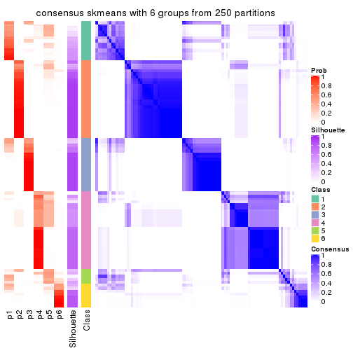</p>

</div>
</div>

Heatmaps for the membership of samples in all partitions to see how consistent they are:


<script>
$( function() {
	$( '#tabs-SD-skmeans-membership-heatmap' ).tabs();
} );
</script>
<div id='tabs-SD-skmeans-membership-heatmap'>
<ul>
<li><a href='#tab-SD-skmeans-membership-heatmap-1'>k = 2</a></li>
<li><a href='#tab-SD-skmeans-membership-heatmap-2'>k = 3</a></li>
<li><a href='#tab-SD-skmeans-membership-heatmap-3'>k = 4</a></li>
<li><a href='#tab-SD-skmeans-membership-heatmap-4'>k = 5</a></li>
<li><a href='#tab-SD-skmeans-membership-heatmap-5'>k = 6</a></li>
</ul>
<div id='tab-SD-skmeans-membership-heatmap-1'>
<pre><code class="r">membership_heatmap(res, k = 2)
</code></pre>

<p></p>

</div>
<div id='tab-SD-skmeans-membership-heatmap-2'>
<pre><code class="r">membership_heatmap(res, k = 3)
</code></pre>

<p></p>

</div>
<div id='tab-SD-skmeans-membership-heatmap-3'>
<pre><code class="r">membership_heatmap(res, k = 4)
</code></pre>

<p></p>

</div>
<div id='tab-SD-skmeans-membership-heatmap-4'>
<pre><code class="r">membership_heatmap(res, k = 5)
</code></pre>

<p></p>

</div>
<div id='tab-SD-skmeans-membership-heatmap-5'>
<pre><code class="r">membership_heatmap(res, k = 6)
</code></pre>

<p></p>

</div>
</div>

As soon as we have had the classes for columns, we can look for signatures
which are significantly different between classes which can be candidate marks
for certain classes. Following are the heatmaps for signatures.


Signature heatmaps where rows are scaled:


<script>
$( function() {
	$( '#tabs-SD-skmeans-get-signatures' ).tabs();
} );
</script>
<div id='tabs-SD-skmeans-get-signatures'>
<ul>
<li><a href='#tab-SD-skmeans-get-signatures-1'>k = 2</a></li>
<li><a href='#tab-SD-skmeans-get-signatures-2'>k = 3</a></li>
<li><a href='#tab-SD-skmeans-get-signatures-3'>k = 4</a></li>
<li><a href='#tab-SD-skmeans-get-signatures-4'>k = 5</a></li>
<li><a href='#tab-SD-skmeans-get-signatures-5'>k = 6</a></li>
</ul>
<div id='tab-SD-skmeans-get-signatures-1'>
<pre><code class="r">get_signatures(res, k = 2)
</code></pre>

<p></p>

</div>
<div id='tab-SD-skmeans-get-signatures-2'>
<pre><code class="r">get_signatures(res, k = 3)
</code></pre>

<p></p>

</div>
<div id='tab-SD-skmeans-get-signatures-3'>
<pre><code class="r">get_signatures(res, k = 4)
</code></pre>

<p></p>

</div>
<div id='tab-SD-skmeans-get-signatures-4'>
<pre><code class="r">get_signatures(res, k = 5)
</code></pre>

<p></p>

</div>
<div id='tab-SD-skmeans-get-signatures-5'>
<pre><code class="r">get_signatures(res, k = 6)
</code></pre>

<p></p>

</div>
</div>


Signature heatmaps where rows are not scaled:


<script>
$( function() {
	$( '#tabs-SD-skmeans-get-signatures-no-scale' ).tabs();
} );
</script>
<div id='tabs-SD-skmeans-get-signatures-no-scale'>
<ul>
<li><a href='#tab-SD-skmeans-get-signatures-no-scale-1'>k = 2</a></li>
<li><a href='#tab-SD-skmeans-get-signatures-no-scale-2'>k = 3</a></li>
<li><a href='#tab-SD-skmeans-get-signatures-no-scale-3'>k = 4</a></li>
<li><a href='#tab-SD-skmeans-get-signatures-no-scale-4'>k = 5</a></li>
<li><a href='#tab-SD-skmeans-get-signatures-no-scale-5'>k = 6</a></li>
</ul>
<div id='tab-SD-skmeans-get-signatures-no-scale-1'>
<pre><code class="r">get_signatures(res, k = 2, scale_rows = FALSE)
</code></pre>

<p></p>

</div>
<div id='tab-SD-skmeans-get-signatures-no-scale-2'>
<pre><code class="r">get_signatures(res, k = 3, scale_rows = FALSE)
</code></pre>

<p></p>

</div>
<div id='tab-SD-skmeans-get-signatures-no-scale-3'>
<pre><code class="r">get_signatures(res, k = 4, scale_rows = FALSE)
</code></pre>

<p></p>

</div>
<div id='tab-SD-skmeans-get-signatures-no-scale-4'>
<pre><code class="r">get_signatures(res, k = 5, scale_rows = FALSE)
</code></pre>

<p></p>

</div>
<div id='tab-SD-skmeans-get-signatures-no-scale-5'>
<pre><code class="r">get_signatures(res, k = 6, scale_rows = FALSE)
</code></pre>

<p></p>

</div>
</div>


Compare the overlap of signatures from different k:

```r
compare_signatures(res)
```


`get_signature()` returns a data frame invisibly. TO get the list of signatures, the function
call should be assigned to a variable explicitly. In following code, if `plot` argument is set
to `FALSE`, no heatmap is plotted while only the differential analysis is performed.

```r
# code only for demonstration
tb = get_signature(res, k = ..., plot = FALSE)
```

An example of the output of `tb` is:

```
#>   which_row         fdr    mean_1    mean_2 scaled_mean_1 scaled_mean_2 km
#> 1        38 0.042760348  8.373488  9.131774    -0.5533452     0.5164555  1
#> 2        40 0.018707592  7.106213  8.469186    -0.6173731     0.5762149  1
#> 3        55 0.019134737 10.221463 11.207825    -0.6159697     0.5749050  1
#> 4        59 0.006059896  5.921854  7.869574    -0.6899429     0.6439467  1
#> 5        60 0.018055526  8.928898 10.211722    -0.6204761     0.5791110  1
#> 6        98 0.009384629 15.714769 14.887706     0.6635654    -0.6193277  2
...
```

The columns in `tb` are:

1. `which_row`: row indices corresponding to the input matrix.
2. `fdr`: FDR for the differential test. 
3. `mean_x`: The mean value in group x.
4. `scaled_mean_x`: The mean value in group x after rows are scaled.
5. `km`: Row groups if k-means clustering is applied to rows.


UMAP plot which shows how samples are separated.


<script>
$( function() {
	$( '#tabs-SD-skmeans-dimension-reduction' ).tabs();
} );
</script>
<div id='tabs-SD-skmeans-dimension-reduction'>
<ul>
<li><a href='#tab-SD-skmeans-dimension-reduction-1'>k = 2</a></li>
<li><a href='#tab-SD-skmeans-dimension-reduction-2'>k = 3</a></li>
<li><a href='#tab-SD-skmeans-dimension-reduction-3'>k = 4</a></li>
<li><a href='#tab-SD-skmeans-dimension-reduction-4'>k = 5</a></li>
<li><a href='#tab-SD-skmeans-dimension-reduction-5'>k = 6</a></li>
</ul>
<div id='tab-SD-skmeans-dimension-reduction-1'>
<pre><code class="r">dimension_reduction(res, k = 2, method = &quot;UMAP&quot;)
</code></pre>

<p></p>

</div>
<div id='tab-SD-skmeans-dimension-reduction-2'>
<pre><code class="r">dimension_reduction(res, k = 3, method = &quot;UMAP&quot;)
</code></pre>

<p></p>

</div>
<div id='tab-SD-skmeans-dimension-reduction-3'>
<pre><code class="r">dimension_reduction(res, k = 4, method = &quot;UMAP&quot;)
</code></pre>

<p></p>

</div>
<div id='tab-SD-skmeans-dimension-reduction-4'>
<pre><code class="r">dimension_reduction(res, k = 5, method = &quot;UMAP&quot;)
</code></pre>

<p></p>

</div>
<div id='tab-SD-skmeans-dimension-reduction-5'>
<pre><code class="r">dimension_reduction(res, k = 6, method = &quot;UMAP&quot;)
</code></pre>

<p></p>

</div>
</div>


Following heatmap shows how subgroups are split when increasing `k`:

```r
collect_classes(res)
```


If matrix rows can be associated to genes, consider to use `GO_Enrichment(res,
...)` to perform function enrichment for the signature genes.


 

---------------------------------------------------


### SD:pam**


The object with results only for a single top-value method and a single partition method 
can be extracted as:

```r
res = res_list["SD", "pam"]
# you can also extract it by
# res = res_list["SD:pam"]
```

A summary of `res` and all the functions that can be applied to it:

```r
res
```

```
#> A 'ConsensusPartition' object with k = 2, 3, 4, 5, 6.
#>   On a matrix with 5966 rows and 384 columns.
#>   Top rows (597, 1194, 1790, 2386, 2983) are extracted by 'SD' method.
#>   Subgroups are detected by 'pam' method.
#>   Performed in total 1250 partitions by row resampling.
#>   Best k for subgroups seems to be 2.
#> 
#> Following methods can be applied to this 'ConsensusPartition' object:
#>  [1] "cola_report"             "collect_classes"         "collect_plots"          
#>  [4] "collect_stats"           "colnames"                "compare_signatures"     
#>  [7] "consensus_heatmap"       "dimension_reduction"     "functional_enrichment"  
#> [10] "get_anno_col"            "get_anno"                "get_classes"            
#> [13] "get_consensus"           "get_matrix"              "get_membership"         
#> [16] "get_param"               "get_signatures"          "get_stats"              
#> [19] "is_best_k"               "is_stable_k"             "membership_heatmap"     
#> [22] "ncol"                    "nrow"                    "plot_ecdf"              
#> [25] "rownames"                "select_partition_number" "show"                   
#> [28] "suggest_best_k"          "test_to_known_factors"
```

`collect_plots()` function collects all the plots made from `res` for all `k` (number of partitions)
into one single page to provide an easy and fast comparison between different `k`.

```r
collect_plots(res)
```


The plots are:

- The first row: a plot of the ECDF (Empirical cumulative distribution
  function) curves of the consensus matrix for each `k` and the heatmap of
  predicted classes for each `k`.
- The second row: heatmaps of the consensus matrix for each `k`.
- The third row: heatmaps of the membership matrix for each `k`.
- The fouth row: heatmaps of the signatures for each `k`.

All the plots in panels can be made by individual functions and they are
plotted later in this section.

`select_partition_number()` produces several plots showing different
statistics for choosing "optimized" `k`. There are following statistics:

- ECDF curves of the consensus matrix for each `k`;
- 1-PAC. [The PAC
  score](https://en.wikipedia.org/wiki/Consensus_clustering#Over-interpretation_potential_of_consensus_clustering)
  measures the proportion of the ambiguous subgrouping.
- Mean silhouette score.
- Concordance. The mean probability of fiting the consensus class ids in all
  partitions.
- Area increased. Denote $A_k$ as the area under the ECDF curve for current
  `k`, the area increased is defined as $A_k - A_{k-1}$.
- Rand index. The percent of pairs of samples that are both in a same cluster
  or both are not in a same cluster in the partition of k and k-1.
- Jaccard index. The ratio of pairs of samples are both in a same cluster in
  the partition of k and k-1 and the pairs of samples are both in a same
  cluster in the partition k or k-1.

The detailed explanations of these statistics can be found in [the cola
vignette](http://bioconductor.org/packages/devel/bioc/vignettes/cola/inst/doc/cola.html#toc_13).

Generally speaking, lower PAC score, higher mean silhouette score or higher
concordance corresponds to better partition. Rand index and Jaccard index
measure how similar the current partition is compared to partition with `k-1`.
If they are too similar, we won't accept `k` is better than `k-1`.

```r
select_partition_number(res)
```


The numeric values for all these statistics can be obtained by `get_stats()`.

```r
get_stats(res)
```

```
#>   k 1-PAC mean_silhouette concordance area_increased  Rand Jaccard
#> 2 2 1.000           1.000       1.000         0.1540 0.847   0.847
#> 3 3 0.439           0.593       0.820         2.6586 0.595   0.522
#> 4 4 0.859           0.868       0.943         0.2498 0.826   0.619
#> 5 5 0.760           0.690       0.783         0.0883 0.869   0.603
#> 6 6 0.861           0.844       0.913         0.0644 0.917   0.666
```

`suggest_best_k()` suggests the best $k$ based on these statistics. The rules are as follows:

- All $k$ with Jaccard index larger than 0.95 are removed because the increase of
  the partition number does not provides enough extra information. If all $k$ are removed,
  the best $k$ is assigned by `NA`.
- For $k$ with 1-PAC larger than 0.9, the maximal $k$ is taken as the "best k". Other $k$ is called "optional k".
- If it does not fit the second rule. The $k$ with the highest vote of highest
  1-PAC, mean silhouette and concordance is taken as the "best k".

```r
suggest_best_k(res)
```

```
#> [1] 2
```


Following shows the table of the partitions (You need to click the **show/hide
code output** link to see it). The membership matrix (columns with name `p*`)
is inferred by
[`clue::cl_consensus()`](https://www.rdocumentation.org/link/cl_consensus?package=clue)
function with the `SE` method. Basically the value in the membership matrix
represents the probability to belong to a certain group. The finall class
label for an item is determined with the group with highest probability it
belongs to.

In `get_classes()` function, the entropy is calculated from the membership
matrix and the silhouette score is calculated from the consensus matrix.


<script>
$( function() {
	$( '#tabs-SD-pam-get-classes' ).tabs();
} );
</script>
<div id='tabs-SD-pam-get-classes'>
<ul>
<li><a href='#tab-SD-pam-get-classes-1'>k = 2</a></li>
<li><a href='#tab-SD-pam-get-classes-2'>k = 3</a></li>
<li><a href='#tab-SD-pam-get-classes-3'>k = 4</a></li>
<li><a href='#tab-SD-pam-get-classes-4'>k = 5</a></li>
<li><a href='#tab-SD-pam-get-classes-5'>k = 6</a></li>
</ul>

<div id='tab-SD-pam-get-classes-1'>
<p><a id='tab-SD-pam-get-classes-1-a' style='color:#0366d6' href='#'>show/hide code output</a></p>
<pre><code class="r">cbind(get_classes(res, k = 2), get_membership(res, k = 2))
</code></pre>

<pre><code>#&gt;           class entropy silhouette    p1    p2
#&gt; SRR490216     2  0.0000      1.000 0.000 1.000
#&gt; SRR490217     2  0.0000      1.000 0.000 1.000
#&gt; SRR490218     2  0.0000      1.000 0.000 1.000
#&gt; SRR490219     2  0.0000      1.000 0.000 1.000
#&gt; SRR490220     2  0.0000      1.000 0.000 1.000
#&gt; SRR490221     2  0.0000      1.000 0.000 1.000
#&gt; SRR490222     2  0.0000      1.000 0.000 1.000
#&gt; SRR490223     2  0.0000      1.000 0.000 1.000
#&gt; SRR490224     2  0.0000      1.000 0.000 1.000
#&gt; SRR490225     2  0.0000      1.000 0.000 1.000
#&gt; SRR490226     2  0.0000      1.000 0.000 1.000
#&gt; SRR490227     2  0.0000      1.000 0.000 1.000
#&gt; SRR490228     2  0.0376      0.996 0.004 0.996
#&gt; SRR490229     2  0.0000      1.000 0.000 1.000
#&gt; SRR490230     2  0.0000      1.000 0.000 1.000
#&gt; SRR490231     2  0.0000      1.000 0.000 1.000
#&gt; SRR490232     2  0.0000      1.000 0.000 1.000
#&gt; SRR490233     2  0.0000      1.000 0.000 1.000
#&gt; SRR490234     2  0.0000      1.000 0.000 1.000
#&gt; SRR490235     2  0.0000      1.000 0.000 1.000
#&gt; SRR490236     2  0.0000      1.000 0.000 1.000
#&gt; SRR490237     2  0.0000      1.000 0.000 1.000
#&gt; SRR490238     2  0.0000      1.000 0.000 1.000
#&gt; SRR490239     2  0.0000      1.000 0.000 1.000
#&gt; SRR490240     2  0.0000      1.000 0.000 1.000
#&gt; SRR490241     2  0.0000      1.000 0.000 1.000
#&gt; SRR490242     2  0.0000      1.000 0.000 1.000
#&gt; SRR490243     2  0.0000      1.000 0.000 1.000
#&gt; SRR490244     1  0.0000      1.000 1.000 0.000
#&gt; SRR490245     1  0.0000      1.000 1.000 0.000
#&gt; SRR490246     1  0.0000      1.000 1.000 0.000
#&gt; SRR490247     1  0.0000      1.000 1.000 0.000
#&gt; SRR490248     2  0.0000      1.000 0.000 1.000
#&gt; SRR490249     2  0.0000      1.000 0.000 1.000
#&gt; SRR490250     2  0.0000      1.000 0.000 1.000
#&gt; SRR490251     2  0.0000      1.000 0.000 1.000
#&gt; SRR490252     2  0.0000      1.000 0.000 1.000
#&gt; SRR490253     2  0.0000      1.000 0.000 1.000
#&gt; SRR490254     2  0.0000      1.000 0.000 1.000
#&gt; SRR490255     2  0.0000      1.000 0.000 1.000
#&gt; SRR490256     2  0.0000      1.000 0.000 1.000
#&gt; SRR490257     2  0.0000      1.000 0.000 1.000
#&gt; SRR490258     2  0.0000      1.000 0.000 1.000
#&gt; SRR490259     2  0.0000      1.000 0.000 1.000
#&gt; SRR490260     2  0.0000      1.000 0.000 1.000
#&gt; SRR490261     2  0.0000      1.000 0.000 1.000
#&gt; SRR490262     2  0.0000      1.000 0.000 1.000
#&gt; SRR490263     2  0.0000      1.000 0.000 1.000
#&gt; SRR490264     2  0.0000      1.000 0.000 1.000
#&gt; SRR490265     2  0.0000      1.000 0.000 1.000
#&gt; SRR490266     2  0.0000      1.000 0.000 1.000
#&gt; SRR490267     2  0.0000      1.000 0.000 1.000
#&gt; SRR490268     2  0.0000      1.000 0.000 1.000
#&gt; SRR490269     2  0.0000      1.000 0.000 1.000
#&gt; SRR490270     2  0.0000      1.000 0.000 1.000
#&gt; SRR490271     2  0.0000      1.000 0.000 1.000
#&gt; SRR490272     2  0.0000      1.000 0.000 1.000
#&gt; SRR490273     2  0.0000      1.000 0.000 1.000
#&gt; SRR490274     2  0.0000      1.000 0.000 1.000
#&gt; SRR490275     2  0.0000      1.000 0.000 1.000
#&gt; SRR490276     2  0.0000      1.000 0.000 1.000
#&gt; SRR490277     2  0.0000      1.000 0.000 1.000
#&gt; SRR490278     2  0.0000      1.000 0.000 1.000
#&gt; SRR490279     2  0.0000      1.000 0.000 1.000
#&gt; SRR490280     1  0.0000      1.000 1.000 0.000
#&gt; SRR490281     1  0.0000      1.000 1.000 0.000
#&gt; SRR490282     1  0.0000      1.000 1.000 0.000
#&gt; SRR490283     1  0.0000      1.000 1.000 0.000
#&gt; SRR490284     2  0.0000      1.000 0.000 1.000
#&gt; SRR490285     2  0.0000      1.000 0.000 1.000
#&gt; SRR490286     2  0.0000      1.000 0.000 1.000
#&gt; SRR490287     2  0.0000      1.000 0.000 1.000
#&gt; SRR490288     2  0.0000      1.000 0.000 1.000
#&gt; SRR490289     2  0.0000      1.000 0.000 1.000
#&gt; SRR490290     2  0.0000      1.000 0.000 1.000
#&gt; SRR490291     2  0.0000      1.000 0.000 1.000
#&gt; SRR490292     2  0.0000      1.000 0.000 1.000
#&gt; SRR490293     2  0.0000      1.000 0.000 1.000
#&gt; SRR490294     2  0.0000      1.000 0.000 1.000
#&gt; SRR490295     2  0.0000      1.000 0.000 1.000
#&gt; SRR490296     2  0.0000      1.000 0.000 1.000
#&gt; SRR490297     2  0.0000      1.000 0.000 1.000
#&gt; SRR490298     2  0.0000      1.000 0.000 1.000
#&gt; SRR490299     2  0.0000      1.000 0.000 1.000
#&gt; SRR490300     2  0.0000      1.000 0.000 1.000
#&gt; SRR490301     2  0.0000      1.000 0.000 1.000
#&gt; SRR490302     2  0.0000      1.000 0.000 1.000
#&gt; SRR490303     2  0.0000      1.000 0.000 1.000
#&gt; SRR490304     2  0.0000      1.000 0.000 1.000
#&gt; SRR490305     2  0.0000      1.000 0.000 1.000
#&gt; SRR490306     2  0.0000      1.000 0.000 1.000
#&gt; SRR490307     2  0.0000      1.000 0.000 1.000
#&gt; SRR490308     1  0.0000      1.000 1.000 0.000
#&gt; SRR490309     1  0.0000      1.000 1.000 0.000
#&gt; SRR490310     1  0.0000      1.000 1.000 0.000
#&gt; SRR490311     1  0.0000      1.000 1.000 0.000
#&gt; SRR490312     2  0.0000      1.000 0.000 1.000
#&gt; SRR490313     2  0.0000      1.000 0.000 1.000
#&gt; SRR490314     2  0.0000      1.000 0.000 1.000
#&gt; SRR490315     2  0.0000      1.000 0.000 1.000
#&gt; SRR490316     2  0.0000      1.000 0.000 1.000
#&gt; SRR490317     2  0.0000      1.000 0.000 1.000
#&gt; SRR490318     2  0.0000      1.000 0.000 1.000
#&gt; SRR490319     2  0.0000      1.000 0.000 1.000
#&gt; SRR490320     2  0.0000      1.000 0.000 1.000
#&gt; SRR490321     2  0.0000      1.000 0.000 1.000
#&gt; SRR490322     2  0.0000      1.000 0.000 1.000
#&gt; SRR490323     2  0.0000      1.000 0.000 1.000
#&gt; SRR490324     2  0.0000      1.000 0.000 1.000
#&gt; SRR490325     2  0.0000      1.000 0.000 1.000
#&gt; SRR490326     2  0.0000      1.000 0.000 1.000
#&gt; SRR490327     2  0.0000      1.000 0.000 1.000
#&gt; SRR490328     2  0.0000      1.000 0.000 1.000
#&gt; SRR490329     2  0.0000      1.000 0.000 1.000
#&gt; SRR490330     2  0.0000      1.000 0.000 1.000
#&gt; SRR490331     2  0.0000      1.000 0.000 1.000
#&gt; SRR490332     2  0.0000      1.000 0.000 1.000
#&gt; SRR490333     2  0.0000      1.000 0.000 1.000
#&gt; SRR490334     2  0.0000      1.000 0.000 1.000
#&gt; SRR490335     2  0.0000      1.000 0.000 1.000
#&gt; SRR490336     2  0.0000      1.000 0.000 1.000
#&gt; SRR490337     2  0.0000      1.000 0.000 1.000
#&gt; SRR490338     2  0.0000      1.000 0.000 1.000
#&gt; SRR490339     2  0.0000      1.000 0.000 1.000
#&gt; SRR490340     2  0.0000      1.000 0.000 1.000
#&gt; SRR490341     2  0.0000      1.000 0.000 1.000
#&gt; SRR490342     2  0.0000      1.000 0.000 1.000
#&gt; SRR490343     2  0.0000      1.000 0.000 1.000
#&gt; SRR490344     2  0.0000      1.000 0.000 1.000
#&gt; SRR490345     2  0.0000      1.000 0.000 1.000
#&gt; SRR490346     2  0.0000      1.000 0.000 1.000
#&gt; SRR490347     2  0.0000      1.000 0.000 1.000
#&gt; SRR490348     2  0.0000      1.000 0.000 1.000
#&gt; SRR490349     2  0.0000      1.000 0.000 1.000
#&gt; SRR490350     2  0.0000      1.000 0.000 1.000
#&gt; SRR490351     2  0.0000      1.000 0.000 1.000
#&gt; SRR490352     2  0.0000      1.000 0.000 1.000
#&gt; SRR490353     2  0.0000      1.000 0.000 1.000
#&gt; SRR490354     2  0.0000      1.000 0.000 1.000
#&gt; SRR490355     2  0.0000      1.000 0.000 1.000
#&gt; SRR490356     2  0.0000      1.000 0.000 1.000
#&gt; SRR490357     2  0.0000      1.000 0.000 1.000
#&gt; SRR490358     2  0.0000      1.000 0.000 1.000
#&gt; SRR490359     2  0.0000      1.000 0.000 1.000
#&gt; SRR490360     2  0.0000      1.000 0.000 1.000
#&gt; SRR490361     2  0.0000      1.000 0.000 1.000
#&gt; SRR490362     2  0.0000      1.000 0.000 1.000
#&gt; SRR490363     2  0.0000      1.000 0.000 1.000
#&gt; SRR490364     2  0.0000      1.000 0.000 1.000
#&gt; SRR490365     2  0.0000      1.000 0.000 1.000
#&gt; SRR490366     2  0.0000      1.000 0.000 1.000
#&gt; SRR490367     2  0.0000      1.000 0.000 1.000
#&gt; SRR490368     2  0.0000      1.000 0.000 1.000
#&gt; SRR490369     2  0.0000      1.000 0.000 1.000
#&gt; SRR490370     2  0.0000      1.000 0.000 1.000
#&gt; SRR490371     2  0.0000      1.000 0.000 1.000
#&gt; SRR490372     1  0.0000      1.000 1.000 0.000
#&gt; SRR490373     1  0.0000      1.000 1.000 0.000
#&gt; SRR490374     1  0.0000      1.000 1.000 0.000
#&gt; SRR490375     1  0.0000      1.000 1.000 0.000
#&gt; SRR490376     2  0.0000      1.000 0.000 1.000
#&gt; SRR490377     2  0.0000      1.000 0.000 1.000
#&gt; SRR490378     2  0.0000      1.000 0.000 1.000
#&gt; SRR490379     2  0.0000      1.000 0.000 1.000
#&gt; SRR490380     1  0.0000      1.000 1.000 0.000
#&gt; SRR490381     1  0.0000      1.000 1.000 0.000
#&gt; SRR490382     1  0.0000      1.000 1.000 0.000
#&gt; SRR490383     1  0.0000      1.000 1.000 0.000
#&gt; SRR490384     2  0.0000      1.000 0.000 1.000
#&gt; SRR490385     2  0.0000      1.000 0.000 1.000
#&gt; SRR490386     2  0.0000      1.000 0.000 1.000
#&gt; SRR490387     2  0.0000      1.000 0.000 1.000
#&gt; SRR490388     2  0.0000      1.000 0.000 1.000
#&gt; SRR490389     2  0.0000      1.000 0.000 1.000
#&gt; SRR490390     2  0.0000      1.000 0.000 1.000
#&gt; SRR490391     2  0.0000      1.000 0.000 1.000
#&gt; SRR490392     2  0.0000      1.000 0.000 1.000
#&gt; SRR490393     2  0.0000      1.000 0.000 1.000
#&gt; SRR490394     2  0.0000      1.000 0.000 1.000
#&gt; SRR490395     2  0.0000      1.000 0.000 1.000
#&gt; SRR490396     2  0.0000      1.000 0.000 1.000
#&gt; SRR490397     2  0.0000      1.000 0.000 1.000
#&gt; SRR490398     2  0.0000      1.000 0.000 1.000
#&gt; SRR490399     2  0.0000      1.000 0.000 1.000
#&gt; SRR490400     2  0.0000      1.000 0.000 1.000
#&gt; SRR490401     2  0.0000      1.000 0.000 1.000
#&gt; SRR490402     2  0.0000      1.000 0.000 1.000
#&gt; SRR490403     2  0.0000      1.000 0.000 1.000
#&gt; SRR490404     2  0.0000      1.000 0.000 1.000
#&gt; SRR490405     2  0.0000      1.000 0.000 1.000
#&gt; SRR490406     2  0.0000      1.000 0.000 1.000
#&gt; SRR490407     2  0.0000      1.000 0.000 1.000
#&gt; SRR490408     2  0.0000      1.000 0.000 1.000
#&gt; SRR490409     2  0.0000      1.000 0.000 1.000
#&gt; SRR490410     2  0.0000      1.000 0.000 1.000
#&gt; SRR490411     2  0.0000      1.000 0.000 1.000
#&gt; SRR490412     1  0.0000      1.000 1.000 0.000
#&gt; SRR490413     1  0.0000      1.000 1.000 0.000
#&gt; SRR490414     1  0.0000      1.000 1.000 0.000
#&gt; SRR490415     1  0.0000      1.000 1.000 0.000
#&gt; SRR490416     2  0.0000      1.000 0.000 1.000
#&gt; SRR490417     2  0.0000      1.000 0.000 1.000
#&gt; SRR490418     2  0.0000      1.000 0.000 1.000
#&gt; SRR490419     2  0.0000      1.000 0.000 1.000
#&gt; SRR490420     2  0.0000      1.000 0.000 1.000
#&gt; SRR490421     2  0.0000      1.000 0.000 1.000
#&gt; SRR490422     2  0.0000      1.000 0.000 1.000
#&gt; SRR490423     2  0.0000      1.000 0.000 1.000
#&gt; SRR490424     2  0.0000      1.000 0.000 1.000
#&gt; SRR490425     2  0.0000      1.000 0.000 1.000
#&gt; SRR490426     2  0.0000      1.000 0.000 1.000
#&gt; SRR490427     2  0.0000      1.000 0.000 1.000
#&gt; SRR490428     2  0.0000      1.000 0.000 1.000
#&gt; SRR490429     2  0.0000      1.000 0.000 1.000
#&gt; SRR490430     2  0.0000      1.000 0.000 1.000
#&gt; SRR490431     2  0.0000      1.000 0.000 1.000
#&gt; SRR490432     2  0.0000      1.000 0.000 1.000
#&gt; SRR490433     2  0.0000      1.000 0.000 1.000
#&gt; SRR490434     2  0.0000      1.000 0.000 1.000
#&gt; SRR490435     2  0.0000      1.000 0.000 1.000
#&gt; SRR490436     2  0.0000      1.000 0.000 1.000
#&gt; SRR490437     2  0.0000      1.000 0.000 1.000
#&gt; SRR490438     2  0.0000      1.000 0.000 1.000
#&gt; SRR490439     2  0.0000      1.000 0.000 1.000
#&gt; SRR490440     2  0.0000      1.000 0.000 1.000
#&gt; SRR490441     2  0.0000      1.000 0.000 1.000
#&gt; SRR490442     2  0.0000      1.000 0.000 1.000
#&gt; SRR490443     2  0.0000      1.000 0.000 1.000
#&gt; SRR490444     2  0.0000      1.000 0.000 1.000
#&gt; SRR490445     2  0.0000      1.000 0.000 1.000
#&gt; SRR490446     2  0.0000      1.000 0.000 1.000
#&gt; SRR490447     2  0.0000      1.000 0.000 1.000
#&gt; SRR490448     2  0.0000      1.000 0.000 1.000
#&gt; SRR490449     2  0.0000      1.000 0.000 1.000
#&gt; SRR490450     2  0.0000      1.000 0.000 1.000
#&gt; SRR490451     2  0.0000      1.000 0.000 1.000
#&gt; SRR490452     2  0.0000      1.000 0.000 1.000
#&gt; SRR490453     2  0.0000      1.000 0.000 1.000
#&gt; SRR490454     2  0.0000      1.000 0.000 1.000
#&gt; SRR490455     2  0.0000      1.000 0.000 1.000
#&gt; SRR490456     2  0.0000      1.000 0.000 1.000
#&gt; SRR490457     2  0.0000      1.000 0.000 1.000
#&gt; SRR490458     2  0.0000      1.000 0.000 1.000
#&gt; SRR490459     2  0.0000      1.000 0.000 1.000
#&gt; SRR490460     2  0.0000      1.000 0.000 1.000
#&gt; SRR490461     2  0.0000      1.000 0.000 1.000
#&gt; SRR490462     2  0.0000      1.000 0.000 1.000
#&gt; SRR490463     2  0.0000      1.000 0.000 1.000
#&gt; SRR490464     1  0.0000      1.000 1.000 0.000
#&gt; SRR490465     1  0.0000      1.000 1.000 0.000
#&gt; SRR490466     1  0.0000      1.000 1.000 0.000
#&gt; SRR490467     1  0.0000      1.000 1.000 0.000
#&gt; SRR490468     2  0.0000      1.000 0.000 1.000
#&gt; SRR490469     2  0.0000      1.000 0.000 1.000
#&gt; SRR490470     2  0.0000      1.000 0.000 1.000
#&gt; SRR490471     2  0.0000      1.000 0.000 1.000
#&gt; SRR490472     2  0.0000      1.000 0.000 1.000
#&gt; SRR490473     2  0.0000      1.000 0.000 1.000
#&gt; SRR490474     2  0.0000      1.000 0.000 1.000
#&gt; SRR490475     2  0.0000      1.000 0.000 1.000
#&gt; SRR490476     1  0.0000      1.000 1.000 0.000
#&gt; SRR490477     1  0.0000      1.000 1.000 0.000
#&gt; SRR490478     1  0.0000      1.000 1.000 0.000
#&gt; SRR490479     1  0.0000      1.000 1.000 0.000
#&gt; SRR490480     2  0.0000      1.000 0.000 1.000
#&gt; SRR490481     2  0.0000      1.000 0.000 1.000
#&gt; SRR490482     2  0.0000      1.000 0.000 1.000
#&gt; SRR490483     2  0.0000      1.000 0.000 1.000
#&gt; SRR490484     2  0.0000      1.000 0.000 1.000
#&gt; SRR490485     2  0.0000      1.000 0.000 1.000
#&gt; SRR490486     2  0.0000      1.000 0.000 1.000
#&gt; SRR490487     2  0.0000      1.000 0.000 1.000
#&gt; SRR490488     2  0.0000      1.000 0.000 1.000
#&gt; SRR490489     2  0.0000      1.000 0.000 1.000
#&gt; SRR490490     2  0.0000      1.000 0.000 1.000
#&gt; SRR490491     2  0.0000      1.000 0.000 1.000
#&gt; SRR490492     2  0.0000      1.000 0.000 1.000
#&gt; SRR490493     2  0.0000      1.000 0.000 1.000
#&gt; SRR490494     2  0.0000      1.000 0.000 1.000
#&gt; SRR490495     2  0.0000      1.000 0.000 1.000
#&gt; SRR490496     2  0.0000      1.000 0.000 1.000
#&gt; SRR490497     2  0.0000      1.000 0.000 1.000
#&gt; SRR490498     2  0.0000      1.000 0.000 1.000
#&gt; SRR490499     2  0.0000      1.000 0.000 1.000
#&gt; SRR490500     2  0.0000      1.000 0.000 1.000
#&gt; SRR490501     2  0.0000      1.000 0.000 1.000
#&gt; SRR490502     2  0.0000      1.000 0.000 1.000
#&gt; SRR490503     2  0.0000      1.000 0.000 1.000
#&gt; SRR490504     2  0.0000      1.000 0.000 1.000
#&gt; SRR490505     2  0.0000      1.000 0.000 1.000
#&gt; SRR490506     2  0.0000      1.000 0.000 1.000
#&gt; SRR490507     2  0.0000      1.000 0.000 1.000
#&gt; SRR490508     2  0.0000      1.000 0.000 1.000
#&gt; SRR490509     2  0.0000      1.000 0.000 1.000
#&gt; SRR490510     2  0.0000      1.000 0.000 1.000
#&gt; SRR490511     2  0.0000      1.000 0.000 1.000
#&gt; SRR490512     2  0.0000      1.000 0.000 1.000
#&gt; SRR490513     2  0.0000      1.000 0.000 1.000
#&gt; SRR490514     2  0.0000      1.000 0.000 1.000
#&gt; SRR490515     2  0.0000      1.000 0.000 1.000
#&gt; SRR490516     2  0.0000      1.000 0.000 1.000
#&gt; SRR490517     2  0.0000      1.000 0.000 1.000
#&gt; SRR490518     2  0.0000      1.000 0.000 1.000
#&gt; SRR490519     2  0.0000      1.000 0.000 1.000
#&gt; SRR490520     2  0.0000      1.000 0.000 1.000
#&gt; SRR490521     2  0.0000      1.000 0.000 1.000
#&gt; SRR490522     2  0.0000      1.000 0.000 1.000
#&gt; SRR490523     2  0.0000      1.000 0.000 1.000
#&gt; SRR490524     2  0.0000      1.000 0.000 1.000
#&gt; SRR490525     2  0.0000      1.000 0.000 1.000
#&gt; SRR490526     2  0.0000      1.000 0.000 1.000
#&gt; SRR490527     2  0.0000      1.000 0.000 1.000
#&gt; SRR490528     2  0.0000      1.000 0.000 1.000
#&gt; SRR490529     2  0.0000      1.000 0.000 1.000
#&gt; SRR490530     2  0.0000      1.000 0.000 1.000
#&gt; SRR490531     2  0.0000      1.000 0.000 1.000
#&gt; SRR490532     2  0.0000      1.000 0.000 1.000
#&gt; SRR490533     2  0.0000      1.000 0.000 1.000
#&gt; SRR490534     2  0.0000      1.000 0.000 1.000
#&gt; SRR490535     2  0.0000      1.000 0.000 1.000
#&gt; SRR490536     2  0.0000      1.000 0.000 1.000
#&gt; SRR490537     2  0.0000      1.000 0.000 1.000
#&gt; SRR490538     2  0.0000      1.000 0.000 1.000
#&gt; SRR490539     2  0.0000      1.000 0.000 1.000
#&gt; SRR490540     2  0.0000      1.000 0.000 1.000
#&gt; SRR490541     2  0.0000      1.000 0.000 1.000
#&gt; SRR490542     2  0.0000      1.000 0.000 1.000
#&gt; SRR490543     2  0.0000      1.000 0.000 1.000
#&gt; SRR490544     2  0.0000      1.000 0.000 1.000
#&gt; SRR490545     2  0.0000      1.000 0.000 1.000
#&gt; SRR490546     2  0.0000      1.000 0.000 1.000
#&gt; SRR490547     2  0.0000      1.000 0.000 1.000
#&gt; SRR490548     2  0.0000      1.000 0.000 1.000
#&gt; SRR490549     2  0.0000      1.000 0.000 1.000
#&gt; SRR490550     2  0.0000      1.000 0.000 1.000
#&gt; SRR490551     2  0.0000      1.000 0.000 1.000
#&gt; SRR490552     2  0.0000      1.000 0.000 1.000
#&gt; SRR490553     2  0.0000      1.000 0.000 1.000
#&gt; SRR490554     2  0.0000      1.000 0.000 1.000
#&gt; SRR490555     2  0.0000      1.000 0.000 1.000
#&gt; SRR490556     2  0.0000      1.000 0.000 1.000
#&gt; SRR490557     2  0.0000      1.000 0.000 1.000
#&gt; SRR490558     2  0.0000      1.000 0.000 1.000
#&gt; SRR490559     2  0.0000      1.000 0.000 1.000
#&gt; SRR490560     2  0.0000      1.000 0.000 1.000
#&gt; SRR490561     2  0.0000      1.000 0.000 1.000
#&gt; SRR490562     2  0.0000      1.000 0.000 1.000
#&gt; SRR490563     2  0.0000      1.000 0.000 1.000
#&gt; SRR490564     2  0.0000      1.000 0.000 1.000
#&gt; SRR490565     2  0.0000      1.000 0.000 1.000
#&gt; SRR490566     2  0.0000      1.000 0.000 1.000
#&gt; SRR490567     2  0.0000      1.000 0.000 1.000
#&gt; SRR490568     2  0.0000      1.000 0.000 1.000
#&gt; SRR490569     2  0.0000      1.000 0.000 1.000
#&gt; SRR490570     2  0.0000      1.000 0.000 1.000
#&gt; SRR490571     2  0.0000      1.000 0.000 1.000
#&gt; SRR490572     2  0.0000      1.000 0.000 1.000
#&gt; SRR490573     2  0.0000      1.000 0.000 1.000
#&gt; SRR490574     2  0.0000      1.000 0.000 1.000
#&gt; SRR490575     2  0.0000      1.000 0.000 1.000
#&gt; SRR490576     2  0.0000      1.000 0.000 1.000
#&gt; SRR490577     2  0.0000      1.000 0.000 1.000
#&gt; SRR490578     2  0.0000      1.000 0.000 1.000
#&gt; SRR490579     2  0.0000      1.000 0.000 1.000
#&gt; SRR490580     2  0.0000      1.000 0.000 1.000
#&gt; SRR490581     2  0.0000      1.000 0.000 1.000
#&gt; SRR490582     2  0.0000      1.000 0.000 1.000
#&gt; SRR490583     2  0.0000      1.000 0.000 1.000
#&gt; SRR490584     2  0.0000      1.000 0.000 1.000
#&gt; SRR490585     2  0.0000      1.000 0.000 1.000
#&gt; SRR490586     2  0.0000      1.000 0.000 1.000
#&gt; SRR490587     2  0.0000      1.000 0.000 1.000
#&gt; SRR490588     2  0.0000      1.000 0.000 1.000
#&gt; SRR490589     2  0.0000      1.000 0.000 1.000
#&gt; SRR490590     2  0.0000      1.000 0.000 1.000
#&gt; SRR490591     2  0.0000      1.000 0.000 1.000
#&gt; SRR490592     2  0.0000      1.000 0.000 1.000
#&gt; SRR490593     2  0.0000      1.000 0.000 1.000
#&gt; SRR490594     2  0.0000      1.000 0.000 1.000
#&gt; SRR490595     2  0.0000      1.000 0.000 1.000
#&gt; SRR490596     2  0.0000      1.000 0.000 1.000
#&gt; SRR490597     2  0.0000      1.000 0.000 1.000
#&gt; SRR490598     2  0.0000      1.000 0.000 1.000
#&gt; SRR490599     2  0.0000      1.000 0.000 1.000
</code></pre>

<script>
$('#tab-SD-pam-get-classes-1-a').parent().next().next().hide();
$('#tab-SD-pam-get-classes-1-a').click(function(){
  $('#tab-SD-pam-get-classes-1-a').parent().next().next().toggle();
  return(false);
});
</script>
</div>

<div id='tab-SD-pam-get-classes-2'>
<p><a id='tab-SD-pam-get-classes-2-a' style='color:#0366d6' href='#'>show/hide code output</a></p>
<pre><code class="r">cbind(get_classes(res, k = 3), get_membership(res, k = 3))
</code></pre>

<pre><code>#&gt;           class entropy silhouette    p1    p2 p3
#&gt; SRR490216     2  0.2878    0.78020 0.096 0.904  0
#&gt; SRR490217     2  0.3412    0.74187 0.124 0.876  0
#&gt; SRR490218     2  0.3551    0.72954 0.132 0.868  0
#&gt; SRR490219     2  0.2878    0.77628 0.096 0.904  0
#&gt; SRR490220     2  0.6308   -0.05238 0.492 0.508  0
#&gt; SRR490221     2  0.6307   -0.03989 0.488 0.512  0
#&gt; SRR490222     2  0.6305   -0.02335 0.484 0.516  0
#&gt; SRR490223     2  0.6280    0.04604 0.460 0.540  0
#&gt; SRR490224     1  0.6126    0.29436 0.600 0.400  0
#&gt; SRR490225     1  0.6140    0.28817 0.596 0.404  0
#&gt; SRR490226     1  0.6154    0.28186 0.592 0.408  0
#&gt; SRR490227     1  0.6180    0.26811 0.584 0.416  0
#&gt; SRR490228     1  0.6126    0.29436 0.600 0.400  0
#&gt; SRR490229     1  0.6126    0.29436 0.600 0.400  0
#&gt; SRR490230     1  0.6111    0.30035 0.604 0.396  0
#&gt; SRR490231     1  0.6154    0.28210 0.592 0.408  0
#&gt; SRR490232     1  0.6299    0.13548 0.524 0.476  0
#&gt; SRR490233     1  0.6308    0.09006 0.508 0.492  0
#&gt; SRR490234     1  0.6280    0.17619 0.540 0.460  0
#&gt; SRR490235     1  0.6192    0.26102 0.580 0.420  0
#&gt; SRR490236     1  0.6244    0.22106 0.560 0.440  0
#&gt; SRR490237     1  0.6235    0.22951 0.564 0.436  0
#&gt; SRR490238     1  0.6260    0.20363 0.552 0.448  0
#&gt; SRR490239     1  0.6192    0.26087 0.580 0.420  0
#&gt; SRR490240     1  0.6274    0.18374 0.544 0.456  0
#&gt; SRR490241     1  0.6154    0.27917 0.592 0.408  0
#&gt; SRR490242     1  0.6267    0.19352 0.548 0.452  0
#&gt; SRR490243     1  0.6299    0.13465 0.524 0.476  0
#&gt; SRR490244     3  0.0000    1.00000 0.000 0.000  1
#&gt; SRR490245     3  0.0000    1.00000 0.000 0.000  1
#&gt; SRR490246     3  0.0000    1.00000 0.000 0.000  1
#&gt; SRR490247     3  0.0000    1.00000 0.000 0.000  1
#&gt; SRR490248     2  0.2625    0.79407 0.084 0.916  0
#&gt; SRR490249     2  0.0892    0.85154 0.020 0.980  0
#&gt; SRR490250     2  0.1289    0.84268 0.032 0.968  0
#&gt; SRR490251     2  0.2711    0.79153 0.088 0.912  0
#&gt; SRR490252     2  0.6235    0.09148 0.436 0.564  0
#&gt; SRR490253     2  0.6225    0.10077 0.432 0.568  0
#&gt; SRR490254     2  0.6235    0.09148 0.436 0.564  0
#&gt; SRR490255     2  0.6235    0.09148 0.436 0.564  0
#&gt; SRR490256     1  0.6126    0.29459 0.600 0.400  0
#&gt; SRR490257     1  0.6215    0.24609 0.572 0.428  0
#&gt; SRR490258     1  0.6215    0.24584 0.572 0.428  0
#&gt; SRR490259     1  0.6192    0.26130 0.580 0.420  0
#&gt; SRR490260     1  0.6235    0.22942 0.564 0.436  0
#&gt; SRR490261     1  0.6291    0.15664 0.532 0.468  0
#&gt; SRR490262     1  0.6260    0.20407 0.552 0.448  0
#&gt; SRR490263     1  0.6215    0.24580 0.572 0.428  0
#&gt; SRR490264     1  0.6302    0.12471 0.520 0.480  0
#&gt; SRR490265     2  0.6295    0.00968 0.472 0.528  0
#&gt; SRR490266     1  0.6291    0.15658 0.532 0.468  0
#&gt; SRR490267     1  0.6308    0.09023 0.508 0.492  0
#&gt; SRR490268     1  0.6154    0.28195 0.592 0.408  0
#&gt; SRR490269     1  0.6111    0.29891 0.604 0.396  0
#&gt; SRR490270     1  0.6045    0.32409 0.620 0.380  0
#&gt; SRR490271     1  0.6079    0.31085 0.612 0.388  0
#&gt; SRR490272     1  0.6291    0.15140 0.532 0.468  0
#&gt; SRR490273     1  0.6267    0.19219 0.548 0.452  0
#&gt; SRR490274     1  0.6295    0.14636 0.528 0.472  0
#&gt; SRR490275     1  0.6140    0.27606 0.596 0.404  0
#&gt; SRR490276     1  0.6295    0.14628 0.528 0.472  0
#&gt; SRR490277     1  0.6267    0.19476 0.548 0.452  0
#&gt; SRR490278     1  0.6286    0.16655 0.536 0.464  0
#&gt; SRR490279     1  0.6154    0.28192 0.592 0.408  0
#&gt; SRR490280     3  0.0000    1.00000 0.000 0.000  1
#&gt; SRR490281     3  0.0000    1.00000 0.000 0.000  1
#&gt; SRR490282     3  0.0000    1.00000 0.000 0.000  1
#&gt; SRR490283     3  0.0000    1.00000 0.000 0.000  1
#&gt; SRR490284     1  0.6286    0.16671 0.536 0.464  0
#&gt; SRR490285     1  0.6308    0.09024 0.508 0.492  0
#&gt; SRR490286     1  0.6286    0.16671 0.536 0.464  0
#&gt; SRR490287     1  0.6299    0.13588 0.524 0.476  0
#&gt; SRR490288     1  0.6215    0.24282 0.572 0.428  0
#&gt; SRR490289     1  0.5291    0.46385 0.732 0.268  0
#&gt; SRR490290     1  0.5988    0.33577 0.632 0.368  0
#&gt; SRR490291     1  0.5859    0.37876 0.656 0.344  0
#&gt; SRR490292     1  0.4702    0.51275 0.788 0.212  0
#&gt; SRR490293     1  0.2625    0.59212 0.916 0.084  0
#&gt; SRR490294     1  0.4399    0.53146 0.812 0.188  0
#&gt; SRR490295     1  0.3038    0.58718 0.896 0.104  0
#&gt; SRR490296     1  0.5621    0.49216 0.692 0.308  0
#&gt; SRR490297     1  0.5560    0.49821 0.700 0.300  0
#&gt; SRR490298     1  0.5591    0.49521 0.696 0.304  0
#&gt; SRR490299     1  0.5098    0.53428 0.752 0.248  0
#&gt; SRR490300     1  0.1289    0.62333 0.968 0.032  0
#&gt; SRR490301     1  0.1163    0.62380 0.972 0.028  0
#&gt; SRR490302     1  0.0892    0.62529 0.980 0.020  0
#&gt; SRR490303     1  0.1163    0.62381 0.972 0.028  0
#&gt; SRR490304     1  0.5926    0.45068 0.644 0.356  0
#&gt; SRR490305     1  0.5760    0.47600 0.672 0.328  0
#&gt; SRR490306     1  0.5882    0.45869 0.652 0.348  0
#&gt; SRR490307     1  0.5859    0.46244 0.656 0.344  0
#&gt; SRR490308     3  0.0000    1.00000 0.000 0.000  1
#&gt; SRR490309     3  0.0000    1.00000 0.000 0.000  1
#&gt; SRR490310     3  0.0000    1.00000 0.000 0.000  1
#&gt; SRR490311     3  0.0000    1.00000 0.000 0.000  1
#&gt; SRR490312     2  0.4178    0.67359 0.172 0.828  0
#&gt; SRR490313     2  0.3412    0.74571 0.124 0.876  0
#&gt; SRR490314     2  0.4504    0.62972 0.196 0.804  0
#&gt; SRR490315     2  0.4702    0.59972 0.212 0.788  0
#&gt; SRR490316     2  0.6244    0.08655 0.440 0.560  0
#&gt; SRR490317     2  0.6244    0.07688 0.440 0.560  0
#&gt; SRR490318     2  0.6252    0.08341 0.444 0.556  0
#&gt; SRR490319     2  0.6235    0.09025 0.436 0.564  0
#&gt; SRR490320     1  0.6168    0.27515 0.588 0.412  0
#&gt; SRR490321     1  0.6225    0.23566 0.568 0.432  0
#&gt; SRR490322     1  0.6079    0.30696 0.612 0.388  0
#&gt; SRR490323     1  0.6062    0.31103 0.616 0.384  0
#&gt; SRR490324     1  0.6168    0.27513 0.588 0.412  0
#&gt; SRR490325     1  0.6299    0.13575 0.524 0.476  0
#&gt; SRR490326     1  0.6180    0.26804 0.584 0.416  0
#&gt; SRR490327     1  0.6168    0.27513 0.588 0.412  0
#&gt; SRR490328     1  0.5835    0.39060 0.660 0.340  0
#&gt; SRR490329     1  0.6045    0.34022 0.620 0.380  0
#&gt; SRR490330     1  0.2711    0.61579 0.912 0.088  0
#&gt; SRR490331     1  0.6299    0.15506 0.524 0.476  0
#&gt; SRR490332     1  0.0592    0.62622 0.988 0.012  0
#&gt; SRR490333     1  0.0592    0.62622 0.988 0.012  0
#&gt; SRR490334     1  0.0592    0.62622 0.988 0.012  0
#&gt; SRR490335     1  0.0592    0.62622 0.988 0.012  0
#&gt; SRR490336     1  0.5948    0.44629 0.640 0.360  0
#&gt; SRR490337     1  0.5948    0.44629 0.640 0.360  0
#&gt; SRR490338     1  0.5905    0.45481 0.648 0.352  0
#&gt; SRR490339     1  0.5835    0.46655 0.660 0.340  0
#&gt; SRR490340     1  0.0892    0.62532 0.980 0.020  0
#&gt; SRR490341     1  0.1289    0.62307 0.968 0.032  0
#&gt; SRR490342     1  0.1031    0.62485 0.976 0.024  0
#&gt; SRR490343     1  0.0592    0.62622 0.988 0.012  0
#&gt; SRR490344     2  0.2711    0.78456 0.088 0.912  0
#&gt; SRR490345     2  0.2711    0.78456 0.088 0.912  0
#&gt; SRR490346     2  0.2711    0.78456 0.088 0.912  0
#&gt; SRR490347     2  0.2625    0.78972 0.084 0.916  0
#&gt; SRR490348     2  0.0000    0.85867 0.000 1.000  0
#&gt; SRR490349     2  0.0000    0.85867 0.000 1.000  0
#&gt; SRR490350     2  0.0000    0.85867 0.000 1.000  0
#&gt; SRR490351     2  0.0237    0.85762 0.004 0.996  0
#&gt; SRR490352     2  0.0000    0.85867 0.000 1.000  0
#&gt; SRR490353     2  0.0000    0.85867 0.000 1.000  0
#&gt; SRR490354     2  0.0000    0.85867 0.000 1.000  0
#&gt; SRR490355     2  0.0000    0.85867 0.000 1.000  0
#&gt; SRR490356     2  0.0000    0.85867 0.000 1.000  0
#&gt; SRR490357     2  0.0424    0.85636 0.008 0.992  0
#&gt; SRR490358     2  0.1860    0.83081 0.052 0.948  0
#&gt; SRR490359     2  0.0747    0.85361 0.016 0.984  0
#&gt; SRR490360     2  0.0000    0.85867 0.000 1.000  0
#&gt; SRR490361     2  0.0000    0.85867 0.000 1.000  0
#&gt; SRR490362     2  0.0000    0.85867 0.000 1.000  0
#&gt; SRR490363     2  0.0000    0.85867 0.000 1.000  0
#&gt; SRR490364     2  0.0000    0.85867 0.000 1.000  0
#&gt; SRR490365     2  0.0000    0.85867 0.000 1.000  0
#&gt; SRR490366     2  0.0000    0.85867 0.000 1.000  0
#&gt; SRR490367     2  0.0000    0.85867 0.000 1.000  0
#&gt; SRR490368     2  0.0000    0.85867 0.000 1.000  0
#&gt; SRR490369     2  0.0000    0.85867 0.000 1.000  0
#&gt; SRR490370     2  0.0000    0.85867 0.000 1.000  0
#&gt; SRR490371     2  0.0000    0.85867 0.000 1.000  0
#&gt; SRR490372     3  0.0000    1.00000 0.000 0.000  1
#&gt; SRR490373     3  0.0000    1.00000 0.000 0.000  1
#&gt; SRR490374     3  0.0000    1.00000 0.000 0.000  1
#&gt; SRR490375     3  0.0000    1.00000 0.000 0.000  1
#&gt; SRR490376     2  0.2261    0.80871 0.068 0.932  0
#&gt; SRR490377     2  0.2261    0.80869 0.068 0.932  0
#&gt; SRR490378     2  0.1411    0.83936 0.036 0.964  0
#&gt; SRR490379     2  0.2165    0.81304 0.064 0.936  0
#&gt; SRR490380     3  0.0000    1.00000 0.000 0.000  1
#&gt; SRR490381     3  0.0000    1.00000 0.000 0.000  1
#&gt; SRR490382     3  0.0000    1.00000 0.000 0.000  1
#&gt; SRR490383     3  0.0000    1.00000 0.000 0.000  1
#&gt; SRR490384     2  0.0000    0.85867 0.000 1.000  0
#&gt; SRR490385     2  0.0000    0.85867 0.000 1.000  0
#&gt; SRR490386     2  0.0000    0.85867 0.000 1.000  0
#&gt; SRR490387     2  0.0000    0.85867 0.000 1.000  0
#&gt; SRR490388     2  0.0000    0.85867 0.000 1.000  0
#&gt; SRR490389     2  0.0000    0.85867 0.000 1.000  0
#&gt; SRR490390     2  0.0000    0.85867 0.000 1.000  0
#&gt; SRR490391     2  0.0000    0.85867 0.000 1.000  0
#&gt; SRR490392     2  0.0000    0.85867 0.000 1.000  0
#&gt; SRR490393     2  0.0000    0.85867 0.000 1.000  0
#&gt; SRR490394     2  0.0000    0.85867 0.000 1.000  0
#&gt; SRR490395     2  0.0000    0.85867 0.000 1.000  0
#&gt; SRR490396     2  0.0000    0.85867 0.000 1.000  0
#&gt; SRR490397     2  0.0000    0.85867 0.000 1.000  0
#&gt; SRR490398     2  0.0000    0.85867 0.000 1.000  0
#&gt; SRR490399     2  0.0000    0.85867 0.000 1.000  0
#&gt; SRR490400     2  0.0000    0.85867 0.000 1.000  0
#&gt; SRR490401     2  0.0000    0.85867 0.000 1.000  0
#&gt; SRR490402     2  0.0000    0.85867 0.000 1.000  0
#&gt; SRR490403     2  0.0000    0.85867 0.000 1.000  0
#&gt; SRR490404     2  0.0000    0.85867 0.000 1.000  0
#&gt; SRR490405     2  0.0000    0.85867 0.000 1.000  0
#&gt; SRR490406     2  0.0000    0.85867 0.000 1.000  0
#&gt; SRR490407     2  0.0000    0.85867 0.000 1.000  0
#&gt; SRR490408     1  0.6260    0.32199 0.552 0.448  0
#&gt; SRR490409     1  0.6260    0.32199 0.552 0.448  0
#&gt; SRR490410     1  0.6260    0.32199 0.552 0.448  0
#&gt; SRR490411     1  0.6260    0.32199 0.552 0.448  0
#&gt; SRR490412     3  0.0000    1.00000 0.000 0.000  1
#&gt; SRR490413     3  0.0000    1.00000 0.000 0.000  1
#&gt; SRR490414     3  0.0000    1.00000 0.000 0.000  1
#&gt; SRR490415     3  0.0000    1.00000 0.000 0.000  1
#&gt; SRR490416     1  0.0592    0.62622 0.988 0.012  0
#&gt; SRR490417     1  0.0592    0.62622 0.988 0.012  0
#&gt; SRR490418     1  0.0592    0.62622 0.988 0.012  0
#&gt; SRR490419     1  0.0592    0.62622 0.988 0.012  0
#&gt; SRR490420     1  0.0237    0.62220 0.996 0.004  0
#&gt; SRR490421     1  0.0000    0.62239 1.000 0.000  0
#&gt; SRR490422     1  0.0237    0.62220 0.996 0.004  0
#&gt; SRR490423     1  0.0592    0.62066 0.988 0.012  0
#&gt; SRR490424     1  0.4121    0.54447 0.832 0.168  0
#&gt; SRR490425     1  0.5254    0.45629 0.736 0.264  0
#&gt; SRR490426     1  0.5327    0.45324 0.728 0.272  0
#&gt; SRR490427     1  0.5216    0.46163 0.740 0.260  0
#&gt; SRR490428     1  0.1753    0.61107 0.952 0.048  0
#&gt; SRR490429     1  0.0000    0.62239 1.000 0.000  0
#&gt; SRR490430     1  0.0747    0.62002 0.984 0.016  0
#&gt; SRR490431     1  0.0592    0.62093 0.988 0.012  0
#&gt; SRR490432     1  0.0424    0.62521 0.992 0.008  0
#&gt; SRR490433     1  0.0424    0.62517 0.992 0.008  0
#&gt; SRR490434     1  0.0592    0.62622 0.988 0.012  0
#&gt; SRR490435     1  0.0592    0.62622 0.988 0.012  0
#&gt; SRR490436     1  0.0237    0.62220 0.996 0.004  0
#&gt; SRR490437     1  0.0237    0.62389 0.996 0.004  0
#&gt; SRR490438     1  0.0237    0.62389 0.996 0.004  0
#&gt; SRR490439     1  0.0592    0.62505 0.988 0.012  0
#&gt; SRR490440     1  0.6252    0.32830 0.556 0.444  0
#&gt; SRR490441     1  0.6260    0.32199 0.552 0.448  0
#&gt; SRR490442     1  0.6252    0.32822 0.556 0.444  0
#&gt; SRR490443     1  0.6260    0.32199 0.552 0.448  0
#&gt; SRR490444     1  0.3482    0.59756 0.872 0.128  0
#&gt; SRR490445     1  0.4452    0.57335 0.808 0.192  0
#&gt; SRR490446     1  0.2537    0.61288 0.920 0.080  0
#&gt; SRR490447     1  0.1964    0.61874 0.944 0.056  0
#&gt; SRR490448     1  0.0592    0.62622 0.988 0.012  0
#&gt; SRR490449     1  0.0592    0.62622 0.988 0.012  0
#&gt; SRR490450     1  0.0592    0.62622 0.988 0.012  0
#&gt; SRR490451     1  0.0592    0.62622 0.988 0.012  0
#&gt; SRR490452     1  0.1163    0.61757 0.972 0.028  0
#&gt; SRR490453     1  0.0424    0.62172 0.992 0.008  0
#&gt; SRR490454     1  0.0000    0.62239 1.000 0.000  0
#&gt; SRR490455     1  0.0237    0.62235 0.996 0.004  0
#&gt; SRR490456     1  0.0592    0.62622 0.988 0.012  0
#&gt; SRR490457     1  0.0592    0.62622 0.988 0.012  0
#&gt; SRR490458     1  0.0592    0.62622 0.988 0.012  0
#&gt; SRR490459     1  0.0592    0.62622 0.988 0.012  0
#&gt; SRR490460     1  0.0424    0.62521 0.992 0.008  0
#&gt; SRR490461     1  0.0592    0.62622 0.988 0.012  0
#&gt; SRR490462     1  0.0592    0.62622 0.988 0.012  0
#&gt; SRR490463     1  0.0592    0.62622 0.988 0.012  0
#&gt; SRR490464     3  0.0000    1.00000 0.000 0.000  1
#&gt; SRR490465     3  0.0000    1.00000 0.000 0.000  1
#&gt; SRR490466     3  0.0000    1.00000 0.000 0.000  1
#&gt; SRR490467     3  0.0000    1.00000 0.000 0.000  1
#&gt; SRR490468     1  0.0592    0.62622 0.988 0.012  0
#&gt; SRR490469     1  0.0592    0.62622 0.988 0.012  0
#&gt; SRR490470     1  0.0592    0.62622 0.988 0.012  0
#&gt; SRR490471     1  0.0592    0.62622 0.988 0.012  0
#&gt; SRR490472     1  0.6260    0.32199 0.552 0.448  0
#&gt; SRR490473     1  0.6260    0.32199 0.552 0.448  0
#&gt; SRR490474     1  0.6260    0.32199 0.552 0.448  0
#&gt; SRR490475     1  0.6260    0.32199 0.552 0.448  0
#&gt; SRR490476     3  0.0000    1.00000 0.000 0.000  1
#&gt; SRR490477     3  0.0000    1.00000 0.000 0.000  1
#&gt; SRR490478     3  0.0000    1.00000 0.000 0.000  1
#&gt; SRR490479     3  0.0000    1.00000 0.000 0.000  1
#&gt; SRR490480     1  0.5926    0.45104 0.644 0.356  0
#&gt; SRR490481     1  0.5948    0.44629 0.640 0.360  0
#&gt; SRR490482     1  0.5948    0.44629 0.640 0.360  0
#&gt; SRR490483     1  0.5926    0.45086 0.644 0.356  0
#&gt; SRR490484     1  0.3038    0.60451 0.896 0.104  0
#&gt; SRR490485     1  0.4796    0.55246 0.780 0.220  0
#&gt; SRR490486     1  0.3752    0.59000 0.856 0.144  0
#&gt; SRR490487     1  0.3482    0.59629 0.872 0.128  0
#&gt; SRR490488     1  0.5948    0.44629 0.640 0.360  0
#&gt; SRR490489     1  0.5882    0.45874 0.652 0.348  0
#&gt; SRR490490     1  0.5926    0.45068 0.644 0.356  0
#&gt; SRR490491     1  0.5882    0.45874 0.652 0.348  0
#&gt; SRR490492     1  0.5733    0.47914 0.676 0.324  0
#&gt; SRR490493     1  0.5706    0.48235 0.680 0.320  0
#&gt; SRR490494     1  0.5733    0.47914 0.676 0.324  0
#&gt; SRR490495     1  0.5733    0.47914 0.676 0.324  0
#&gt; SRR490496     1  0.5948    0.44629 0.640 0.360  0
#&gt; SRR490497     1  0.6026    0.42787 0.624 0.376  0
#&gt; SRR490498     1  0.6008    0.43275 0.628 0.372  0
#&gt; SRR490499     1  0.5948    0.44629 0.640 0.360  0
#&gt; SRR490500     1  0.0592    0.62622 0.988 0.012  0
#&gt; SRR490501     1  0.0592    0.62622 0.988 0.012  0
#&gt; SRR490502     1  0.0592    0.62622 0.988 0.012  0
#&gt; SRR490503     1  0.0592    0.62622 0.988 0.012  0
#&gt; SRR490504     1  0.6244    0.33445 0.560 0.440  0
#&gt; SRR490505     1  0.6260    0.32199 0.552 0.448  0
#&gt; SRR490506     1  0.6260    0.32199 0.552 0.448  0
#&gt; SRR490507     1  0.6260    0.32199 0.552 0.448  0
#&gt; SRR490508     1  0.6079    0.41104 0.612 0.388  0
#&gt; SRR490509     1  0.6062    0.41652 0.616 0.384  0
#&gt; SRR490510     1  0.5968    0.44183 0.636 0.364  0
#&gt; SRR490511     1  0.5968    0.44183 0.636 0.364  0
#&gt; SRR490512     1  0.4750    0.55446 0.784 0.216  0
#&gt; SRR490513     1  0.5363    0.51704 0.724 0.276  0
#&gt; SRR490514     1  0.5291    0.52193 0.732 0.268  0
#&gt; SRR490515     1  0.4796    0.55262 0.780 0.220  0
#&gt; SRR490516     1  0.5968    0.44203 0.636 0.364  0
#&gt; SRR490517     1  0.5988    0.43725 0.632 0.368  0
#&gt; SRR490518     1  0.6045    0.42261 0.620 0.380  0
#&gt; SRR490519     1  0.6026    0.42775 0.624 0.376  0
#&gt; SRR490520     1  0.5948    0.44629 0.640 0.360  0
#&gt; SRR490521     1  0.5948    0.44629 0.640 0.360  0
#&gt; SRR490522     1  0.5948    0.44629 0.640 0.360  0
#&gt; SRR490523     1  0.5926    0.45068 0.644 0.356  0
#&gt; SRR490524     1  0.5785    0.47428 0.668 0.332  0
#&gt; SRR490525     1  0.5810    0.47088 0.664 0.336  0
#&gt; SRR490526     1  0.5835    0.46694 0.660 0.340  0
#&gt; SRR490527     1  0.5859    0.46323 0.656 0.344  0
#&gt; SRR490528     1  0.5948    0.44625 0.640 0.360  0
#&gt; SRR490529     1  0.6026    0.42837 0.624 0.376  0
#&gt; SRR490530     1  0.6079    0.41234 0.612 0.388  0
#&gt; SRR490531     1  0.6095    0.40694 0.608 0.392  0
#&gt; SRR490532     1  0.0592    0.62622 0.988 0.012  0
#&gt; SRR490533     1  0.0592    0.62622 0.988 0.012  0
#&gt; SRR490534     1  0.0592    0.62622 0.988 0.012  0
#&gt; SRR490535     1  0.0592    0.62622 0.988 0.012  0
#&gt; SRR490536     1  0.6260    0.32199 0.552 0.448  0
#&gt; SRR490537     1  0.6260    0.32199 0.552 0.448  0
#&gt; SRR490538     1  0.6260    0.32199 0.552 0.448  0
#&gt; SRR490539     1  0.6260    0.32199 0.552 0.448  0
#&gt; SRR490540     2  0.2066    0.82537 0.060 0.940  0
#&gt; SRR490541     2  0.2165    0.81946 0.064 0.936  0
#&gt; SRR490542     2  0.2165    0.82053 0.064 0.936  0
#&gt; SRR490543     2  0.2165    0.82059 0.064 0.936  0
#&gt; SRR490544     2  0.2165    0.81973 0.064 0.936  0
#&gt; SRR490545     2  0.1753    0.83395 0.048 0.952  0
#&gt; SRR490546     2  0.2448    0.80535 0.076 0.924  0
#&gt; SRR490547     2  0.2066    0.82374 0.060 0.940  0
#&gt; SRR490548     2  0.2711    0.79741 0.088 0.912  0
#&gt; SRR490549     2  0.0747    0.85370 0.016 0.984  0
#&gt; SRR490550     2  0.0747    0.85371 0.016 0.984  0
#&gt; SRR490551     2  0.2066    0.82340 0.060 0.940  0
#&gt; SRR490552     2  0.2066    0.82326 0.060 0.940  0
#&gt; SRR490553     2  0.2066    0.82328 0.060 0.940  0
#&gt; SRR490554     2  0.1529    0.84005 0.040 0.960  0
#&gt; SRR490555     2  0.2066    0.82333 0.060 0.940  0
#&gt; SRR490556     2  0.0237    0.85752 0.004 0.996  0
#&gt; SRR490557     2  0.2711    0.78477 0.088 0.912  0
#&gt; SRR490558     2  0.3116    0.75304 0.108 0.892  0
#&gt; SRR490559     2  0.1964    0.82130 0.056 0.944  0
#&gt; SRR490560     2  0.2356    0.81030 0.072 0.928  0
#&gt; SRR490561     2  0.2448    0.80535 0.076 0.924  0
#&gt; SRR490562     2  0.2448    0.80535 0.076 0.924  0
#&gt; SRR490563     2  0.2356    0.81032 0.072 0.928  0
#&gt; SRR490564     2  0.0892    0.84909 0.020 0.980  0
#&gt; SRR490565     2  0.1411    0.83799 0.036 0.964  0
#&gt; SRR490566     2  0.1411    0.83758 0.036 0.964  0
#&gt; SRR490567     2  0.1529    0.83427 0.040 0.960  0
#&gt; SRR490568     2  0.5859    0.25598 0.344 0.656  0
#&gt; SRR490569     2  0.5560    0.37088 0.300 0.700  0
#&gt; SRR490570     2  0.6026    0.13660 0.376 0.624  0
#&gt; SRR490571     2  0.5591    0.36023 0.304 0.696  0
#&gt; SRR490572     2  0.4555    0.61338 0.200 0.800  0
#&gt; SRR490573     2  0.4605    0.60435 0.204 0.796  0
#&gt; SRR490574     2  0.5431    0.41902 0.284 0.716  0
#&gt; SRR490575     2  0.4605    0.60362 0.204 0.796  0
#&gt; SRR490576     2  0.2537    0.80017 0.080 0.920  0
#&gt; SRR490577     2  0.2537    0.80017 0.080 0.920  0
#&gt; SRR490578     2  0.2537    0.80017 0.080 0.920  0
#&gt; SRR490579     2  0.2711    0.79190 0.088 0.912  0
#&gt; SRR490580     2  0.0000    0.85867 0.000 1.000  0
#&gt; SRR490581     2  0.0237    0.85763 0.004 0.996  0
#&gt; SRR490582     2  0.0592    0.85525 0.012 0.988  0
#&gt; SRR490583     2  0.0000    0.85867 0.000 1.000  0
#&gt; SRR490584     2  0.1860    0.83030 0.052 0.948  0
#&gt; SRR490585     2  0.1529    0.83971 0.040 0.960  0
#&gt; SRR490586     2  0.1411    0.84240 0.036 0.964  0
#&gt; SRR490587     2  0.1289    0.84506 0.032 0.968  0
#&gt; SRR490588     2  0.1163    0.84752 0.028 0.972  0
#&gt; SRR490589     2  0.1031    0.84951 0.024 0.976  0
#&gt; SRR490590     2  0.1529    0.83981 0.040 0.960  0
#&gt; SRR490591     2  0.1163    0.84759 0.028 0.972  0
#&gt; SRR490592     2  0.0000    0.85867 0.000 1.000  0
#&gt; SRR490593     2  0.0000    0.85867 0.000 1.000  0
#&gt; SRR490594     2  0.0000    0.85867 0.000 1.000  0
#&gt; SRR490595     2  0.0000    0.85867 0.000 1.000  0
#&gt; SRR490596     2  0.1643    0.83152 0.044 0.956  0
#&gt; SRR490597     2  0.1163    0.84427 0.028 0.972  0
#&gt; SRR490598     2  0.1163    0.84524 0.028 0.972  0
#&gt; SRR490599     2  0.1031    0.84682 0.024 0.976  0
</code></pre>

<script>
$('#tab-SD-pam-get-classes-2-a').parent().next().next().hide();
$('#tab-SD-pam-get-classes-2-a').click(function(){
  $('#tab-SD-pam-get-classes-2-a').parent().next().next().toggle();
  return(false);
});
</script>
</div>

<div id='tab-SD-pam-get-classes-3'>
<p><a id='tab-SD-pam-get-classes-3-a' style='color:#0366d6' href='#'>show/hide code output</a></p>
<pre><code class="r">cbind(get_classes(res, k = 4), get_membership(res, k = 4))
</code></pre>

<pre><code>#&gt;           class entropy silhouette    p1    p2    p3    p4
#&gt; SRR490216     2  0.1398     0.9337 0.040 0.956 0.000 0.004
#&gt; SRR490217     2  0.0672     0.9573 0.008 0.984 0.000 0.008
#&gt; SRR490218     2  0.0657     0.9570 0.012 0.984 0.000 0.004
#&gt; SRR490219     2  0.0469     0.9587 0.012 0.988 0.000 0.000
#&gt; SRR490220     1  0.2589     0.8065 0.884 0.116 0.000 0.000
#&gt; SRR490221     1  0.3801     0.6683 0.780 0.220 0.000 0.000
#&gt; SRR490222     1  0.2868     0.7817 0.864 0.136 0.000 0.000
#&gt; SRR490223     1  0.3569     0.7025 0.804 0.196 0.000 0.000
#&gt; SRR490224     1  0.0000     0.9258 1.000 0.000 0.000 0.000
#&gt; SRR490225     1  0.0000     0.9258 1.000 0.000 0.000 0.000
#&gt; SRR490226     1  0.0000     0.9258 1.000 0.000 0.000 0.000
#&gt; SRR490227     1  0.0000     0.9258 1.000 0.000 0.000 0.000
#&gt; SRR490228     1  0.0000     0.9258 1.000 0.000 0.000 0.000
#&gt; SRR490229     1  0.0000     0.9258 1.000 0.000 0.000 0.000
#&gt; SRR490230     1  0.0000     0.9258 1.000 0.000 0.000 0.000
#&gt; SRR490231     1  0.0000     0.9258 1.000 0.000 0.000 0.000
#&gt; SRR490232     1  0.0000     0.9258 1.000 0.000 0.000 0.000
#&gt; SRR490233     1  0.0000     0.9258 1.000 0.000 0.000 0.000
#&gt; SRR490234     1  0.0000     0.9258 1.000 0.000 0.000 0.000
#&gt; SRR490235     1  0.0000     0.9258 1.000 0.000 0.000 0.000
#&gt; SRR490236     1  0.0000     0.9258 1.000 0.000 0.000 0.000
#&gt; SRR490237     1  0.0000     0.9258 1.000 0.000 0.000 0.000
#&gt; SRR490238     1  0.0000     0.9258 1.000 0.000 0.000 0.000
#&gt; SRR490239     1  0.0000     0.9258 1.000 0.000 0.000 0.000
#&gt; SRR490240     1  0.0000     0.9258 1.000 0.000 0.000 0.000
#&gt; SRR490241     1  0.0000     0.9258 1.000 0.000 0.000 0.000
#&gt; SRR490242     1  0.0000     0.9258 1.000 0.000 0.000 0.000
#&gt; SRR490243     1  0.0000     0.9258 1.000 0.000 0.000 0.000
#&gt; SRR490244     3  0.0000     0.9971 0.000 0.000 1.000 0.000
#&gt; SRR490245     3  0.0000     0.9971 0.000 0.000 1.000 0.000
#&gt; SRR490246     3  0.0000     0.9971 0.000 0.000 1.000 0.000
#&gt; SRR490247     3  0.0000     0.9971 0.000 0.000 1.000 0.000
#&gt; SRR490248     2  0.0000     0.9663 0.000 1.000 0.000 0.000
#&gt; SRR490249     2  0.0000     0.9663 0.000 1.000 0.000 0.000
#&gt; SRR490250     2  0.0000     0.9663 0.000 1.000 0.000 0.000
#&gt; SRR490251     2  0.0336     0.9612 0.008 0.992 0.000 0.000
#&gt; SRR490252     2  0.5878     0.4306 0.312 0.632 0.000 0.056
#&gt; SRR490253     2  0.3958     0.7632 0.160 0.816 0.000 0.024
#&gt; SRR490254     2  0.3658     0.7904 0.144 0.836 0.000 0.020
#&gt; SRR490255     2  0.4831     0.6731 0.208 0.752 0.000 0.040
#&gt; SRR490256     1  0.0000     0.9258 1.000 0.000 0.000 0.000
#&gt; SRR490257     1  0.0000     0.9258 1.000 0.000 0.000 0.000
#&gt; SRR490258     1  0.0000     0.9258 1.000 0.000 0.000 0.000
#&gt; SRR490259     1  0.0000     0.9258 1.000 0.000 0.000 0.000
#&gt; SRR490260     1  0.0000     0.9258 1.000 0.000 0.000 0.000
#&gt; SRR490261     1  0.0000     0.9258 1.000 0.000 0.000 0.000
#&gt; SRR490262     1  0.0000     0.9258 1.000 0.000 0.000 0.000
#&gt; SRR490263     1  0.0000     0.9258 1.000 0.000 0.000 0.000
#&gt; SRR490264     1  0.0000     0.9258 1.000 0.000 0.000 0.000
#&gt; SRR490265     1  0.0000     0.9258 1.000 0.000 0.000 0.000
#&gt; SRR490266     1  0.0000     0.9258 1.000 0.000 0.000 0.000
#&gt; SRR490267     1  0.0000     0.9258 1.000 0.000 0.000 0.000
#&gt; SRR490268     1  0.0000     0.9258 1.000 0.000 0.000 0.000
#&gt; SRR490269     1  0.0000     0.9258 1.000 0.000 0.000 0.000
#&gt; SRR490270     1  0.0000     0.9258 1.000 0.000 0.000 0.000
#&gt; SRR490271     1  0.0000     0.9258 1.000 0.000 0.000 0.000
#&gt; SRR490272     1  0.0000     0.9258 1.000 0.000 0.000 0.000
#&gt; SRR490273     1  0.0000     0.9258 1.000 0.000 0.000 0.000
#&gt; SRR490274     1  0.0000     0.9258 1.000 0.000 0.000 0.000
#&gt; SRR490275     1  0.0000     0.9258 1.000 0.000 0.000 0.000
#&gt; SRR490276     1  0.0000     0.9258 1.000 0.000 0.000 0.000
#&gt; SRR490277     1  0.0000     0.9258 1.000 0.000 0.000 0.000
#&gt; SRR490278     1  0.0000     0.9258 1.000 0.000 0.000 0.000
#&gt; SRR490279     1  0.0000     0.9258 1.000 0.000 0.000 0.000
#&gt; SRR490280     3  0.0000     0.9971 0.000 0.000 1.000 0.000
#&gt; SRR490281     3  0.0000     0.9971 0.000 0.000 1.000 0.000
#&gt; SRR490282     3  0.1302     0.9545 0.044 0.000 0.956 0.000
#&gt; SRR490283     3  0.1302     0.9544 0.044 0.000 0.956 0.000
#&gt; SRR490284     1  0.0000     0.9258 1.000 0.000 0.000 0.000
#&gt; SRR490285     1  0.0000     0.9258 1.000 0.000 0.000 0.000
#&gt; SRR490286     1  0.0000     0.9258 1.000 0.000 0.000 0.000
#&gt; SRR490287     1  0.0000     0.9258 1.000 0.000 0.000 0.000
#&gt; SRR490288     1  0.1109     0.9002 0.968 0.028 0.000 0.004
#&gt; SRR490289     1  0.5897     0.2793 0.588 0.044 0.000 0.368
#&gt; SRR490290     1  0.7890     0.0167 0.372 0.292 0.000 0.336
#&gt; SRR490291     1  0.7442     0.0931 0.456 0.176 0.000 0.368
#&gt; SRR490292     1  0.2730     0.8428 0.896 0.016 0.000 0.088
#&gt; SRR490293     1  0.2760     0.8084 0.872 0.000 0.000 0.128
#&gt; SRR490294     1  0.2466     0.8403 0.900 0.004 0.000 0.096
#&gt; SRR490295     1  0.2999     0.8026 0.864 0.004 0.000 0.132
#&gt; SRR490296     4  0.0000     0.8797 0.000 0.000 0.000 1.000
#&gt; SRR490297     4  0.0000     0.8797 0.000 0.000 0.000 1.000
#&gt; SRR490298     4  0.0000     0.8797 0.000 0.000 0.000 1.000
#&gt; SRR490299     4  0.0000     0.8797 0.000 0.000 0.000 1.000
#&gt; SRR490300     4  0.4804     0.4743 0.384 0.000 0.000 0.616
#&gt; SRR490301     4  0.3123     0.7798 0.156 0.000 0.000 0.844
#&gt; SRR490302     4  0.4500     0.6069 0.316 0.000 0.000 0.684
#&gt; SRR490303     4  0.4250     0.6598 0.276 0.000 0.000 0.724
#&gt; SRR490304     4  0.0000     0.8797 0.000 0.000 0.000 1.000
#&gt; SRR490305     4  0.0000     0.8797 0.000 0.000 0.000 1.000
#&gt; SRR490306     4  0.0000     0.8797 0.000 0.000 0.000 1.000
#&gt; SRR490307     4  0.0000     0.8797 0.000 0.000 0.000 1.000
#&gt; SRR490308     3  0.0000     0.9971 0.000 0.000 1.000 0.000
#&gt; SRR490309     3  0.0000     0.9971 0.000 0.000 1.000 0.000
#&gt; SRR490310     3  0.0000     0.9971 0.000 0.000 1.000 0.000
#&gt; SRR490311     3  0.0000     0.9971 0.000 0.000 1.000 0.000
#&gt; SRR490312     2  0.0592     0.9558 0.016 0.984 0.000 0.000
#&gt; SRR490313     2  0.0707     0.9527 0.020 0.980 0.000 0.000
#&gt; SRR490314     2  0.1867     0.9043 0.072 0.928 0.000 0.000
#&gt; SRR490315     2  0.0817     0.9494 0.024 0.976 0.000 0.000
#&gt; SRR490316     2  0.2943     0.8769 0.076 0.892 0.000 0.032
#&gt; SRR490317     2  0.2670     0.8924 0.040 0.908 0.000 0.052
#&gt; SRR490318     2  0.2949     0.8704 0.088 0.888 0.000 0.024
#&gt; SRR490319     2  0.2483     0.8991 0.032 0.916 0.000 0.052
#&gt; SRR490320     1  0.0188     0.9222 0.996 0.004 0.000 0.000
#&gt; SRR490321     1  0.2589     0.7812 0.884 0.116 0.000 0.000
#&gt; SRR490322     1  0.0000     0.9258 1.000 0.000 0.000 0.000
#&gt; SRR490323     1  0.0000     0.9258 1.000 0.000 0.000 0.000
#&gt; SRR490324     1  0.0188     0.9222 0.996 0.004 0.000 0.000
#&gt; SRR490325     1  0.0188     0.9222 0.996 0.004 0.000 0.000
#&gt; SRR490326     1  0.0469     0.9143 0.988 0.012 0.000 0.000
#&gt; SRR490327     1  0.0000     0.9258 1.000 0.000 0.000 0.000
#&gt; SRR490328     4  0.4948     0.2330 0.000 0.440 0.000 0.560
#&gt; SRR490329     4  0.4888     0.3067 0.000 0.412 0.000 0.588
#&gt; SRR490330     4  0.0188     0.8779 0.000 0.004 0.000 0.996
#&gt; SRR490331     4  0.4843     0.3241 0.000 0.396 0.000 0.604
#&gt; SRR490332     4  0.0336     0.8771 0.008 0.000 0.000 0.992
#&gt; SRR490333     4  0.0000     0.8797 0.000 0.000 0.000 1.000
#&gt; SRR490334     4  0.0000     0.8797 0.000 0.000 0.000 1.000
#&gt; SRR490335     4  0.0188     0.8785 0.004 0.000 0.000 0.996
#&gt; SRR490336     4  0.0000     0.8797 0.000 0.000 0.000 1.000
#&gt; SRR490337     4  0.0000     0.8797 0.000 0.000 0.000 1.000
#&gt; SRR490338     4  0.0000     0.8797 0.000 0.000 0.000 1.000
#&gt; SRR490339     4  0.0000     0.8797 0.000 0.000 0.000 1.000
#&gt; SRR490340     4  0.4250     0.6597 0.276 0.000 0.000 0.724
#&gt; SRR490341     4  0.4122     0.7032 0.236 0.004 0.000 0.760
#&gt; SRR490342     4  0.4072     0.6874 0.252 0.000 0.000 0.748
#&gt; SRR490343     4  0.4277     0.6547 0.280 0.000 0.000 0.720
#&gt; SRR490344     2  0.0336     0.9609 0.000 0.992 0.000 0.008
#&gt; SRR490345     2  0.0188     0.9637 0.000 0.996 0.000 0.004
#&gt; SRR490346     2  0.0000     0.9663 0.000 1.000 0.000 0.000
#&gt; SRR490347     2  0.0469     0.9579 0.000 0.988 0.000 0.012
#&gt; SRR490348     2  0.0000     0.9663 0.000 1.000 0.000 0.000
#&gt; SRR490349     2  0.0000     0.9663 0.000 1.000 0.000 0.000
#&gt; SRR490350     2  0.0000     0.9663 0.000 1.000 0.000 0.000
#&gt; SRR490351     2  0.0000     0.9663 0.000 1.000 0.000 0.000
#&gt; SRR490352     2  0.0000     0.9663 0.000 1.000 0.000 0.000
#&gt; SRR490353     2  0.0000     0.9663 0.000 1.000 0.000 0.000
#&gt; SRR490354     2  0.0000     0.9663 0.000 1.000 0.000 0.000
#&gt; SRR490355     2  0.0000     0.9663 0.000 1.000 0.000 0.000
#&gt; SRR490356     2  0.0000     0.9663 0.000 1.000 0.000 0.000
#&gt; SRR490357     2  0.0000     0.9663 0.000 1.000 0.000 0.000
#&gt; SRR490358     2  0.0000     0.9663 0.000 1.000 0.000 0.000
#&gt; SRR490359     2  0.0000     0.9663 0.000 1.000 0.000 0.000
#&gt; SRR490360     2  0.0000     0.9663 0.000 1.000 0.000 0.000
#&gt; SRR490361     2  0.0000     0.9663 0.000 1.000 0.000 0.000
#&gt; SRR490362     2  0.0000     0.9663 0.000 1.000 0.000 0.000
#&gt; SRR490363     2  0.0000     0.9663 0.000 1.000 0.000 0.000
#&gt; SRR490364     2  0.0000     0.9663 0.000 1.000 0.000 0.000
#&gt; SRR490365     2  0.0000     0.9663 0.000 1.000 0.000 0.000
#&gt; SRR490366     2  0.0000     0.9663 0.000 1.000 0.000 0.000
#&gt; SRR490367     2  0.0000     0.9663 0.000 1.000 0.000 0.000
#&gt; SRR490368     2  0.0000     0.9663 0.000 1.000 0.000 0.000
#&gt; SRR490369     2  0.0000     0.9663 0.000 1.000 0.000 0.000
#&gt; SRR490370     2  0.0000     0.9663 0.000 1.000 0.000 0.000
#&gt; SRR490371     2  0.0000     0.9663 0.000 1.000 0.000 0.000
#&gt; SRR490372     3  0.0000     0.9971 0.000 0.000 1.000 0.000
#&gt; SRR490373     3  0.0000     0.9971 0.000 0.000 1.000 0.000
#&gt; SRR490374     3  0.0000     0.9971 0.000 0.000 1.000 0.000
#&gt; SRR490375     3  0.0000     0.9971 0.000 0.000 1.000 0.000
#&gt; SRR490376     2  0.1302     0.9277 0.000 0.956 0.000 0.044
#&gt; SRR490377     2  0.0469     0.9576 0.000 0.988 0.000 0.012
#&gt; SRR490378     2  0.0000     0.9663 0.000 1.000 0.000 0.000
#&gt; SRR490379     2  0.0000     0.9663 0.000 1.000 0.000 0.000
#&gt; SRR490380     3  0.0000     0.9971 0.000 0.000 1.000 0.000
#&gt; SRR490381     3  0.0000     0.9971 0.000 0.000 1.000 0.000
#&gt; SRR490382     3  0.0000     0.9971 0.000 0.000 1.000 0.000
#&gt; SRR490383     3  0.0000     0.9971 0.000 0.000 1.000 0.000
#&gt; SRR490384     2  0.0000     0.9663 0.000 1.000 0.000 0.000
#&gt; SRR490385     2  0.0000     0.9663 0.000 1.000 0.000 0.000
#&gt; SRR490386     2  0.0000     0.9663 0.000 1.000 0.000 0.000
#&gt; SRR490387     2  0.0000     0.9663 0.000 1.000 0.000 0.000
#&gt; SRR490388     2  0.0000     0.9663 0.000 1.000 0.000 0.000
#&gt; SRR490389     2  0.0000     0.9663 0.000 1.000 0.000 0.000
#&gt; SRR490390     2  0.0000     0.9663 0.000 1.000 0.000 0.000
#&gt; SRR490391     2  0.0000     0.9663 0.000 1.000 0.000 0.000
#&gt; SRR490392     2  0.0000     0.9663 0.000 1.000 0.000 0.000
#&gt; SRR490393     2  0.0000     0.9663 0.000 1.000 0.000 0.000
#&gt; SRR490394     2  0.0000     0.9663 0.000 1.000 0.000 0.000
#&gt; SRR490395     2  0.0000     0.9663 0.000 1.000 0.000 0.000
#&gt; SRR490396     2  0.0000     0.9663 0.000 1.000 0.000 0.000
#&gt; SRR490397     2  0.0000     0.9663 0.000 1.000 0.000 0.000
#&gt; SRR490398     2  0.0000     0.9663 0.000 1.000 0.000 0.000
#&gt; SRR490399     2  0.0000     0.9663 0.000 1.000 0.000 0.000
#&gt; SRR490400     2  0.0000     0.9663 0.000 1.000 0.000 0.000
#&gt; SRR490401     2  0.0000     0.9663 0.000 1.000 0.000 0.000
#&gt; SRR490402     2  0.0000     0.9663 0.000 1.000 0.000 0.000
#&gt; SRR490403     2  0.0000     0.9663 0.000 1.000 0.000 0.000
#&gt; SRR490404     2  0.0000     0.9663 0.000 1.000 0.000 0.000
#&gt; SRR490405     2  0.0000     0.9663 0.000 1.000 0.000 0.000
#&gt; SRR490406     2  0.0000     0.9663 0.000 1.000 0.000 0.000
#&gt; SRR490407     2  0.0000     0.9663 0.000 1.000 0.000 0.000
#&gt; SRR490408     4  0.0817     0.8655 0.000 0.024 0.000 0.976
#&gt; SRR490409     4  0.0707     0.8685 0.000 0.020 0.000 0.980
#&gt; SRR490410     4  0.0817     0.8655 0.000 0.024 0.000 0.976
#&gt; SRR490411     4  0.0817     0.8655 0.000 0.024 0.000 0.976
#&gt; SRR490412     3  0.0000     0.9971 0.000 0.000 1.000 0.000
#&gt; SRR490413     3  0.0000     0.9971 0.000 0.000 1.000 0.000
#&gt; SRR490414     3  0.0000     0.9971 0.000 0.000 1.000 0.000
#&gt; SRR490415     3  0.0000     0.9971 0.000 0.000 1.000 0.000
#&gt; SRR490416     4  0.4222     0.6648 0.272 0.000 0.000 0.728
#&gt; SRR490417     4  0.1637     0.8501 0.060 0.000 0.000 0.940
#&gt; SRR490418     4  0.1022     0.8657 0.032 0.000 0.000 0.968
#&gt; SRR490419     4  0.1867     0.8430 0.072 0.000 0.000 0.928
#&gt; SRR490420     1  0.1474     0.8830 0.948 0.000 0.000 0.052
#&gt; SRR490421     1  0.3486     0.7317 0.812 0.000 0.000 0.188
#&gt; SRR490422     1  0.3024     0.7857 0.852 0.000 0.000 0.148
#&gt; SRR490423     1  0.2530     0.8254 0.888 0.000 0.000 0.112
#&gt; SRR490424     1  0.0000     0.9258 1.000 0.000 0.000 0.000
#&gt; SRR490425     1  0.0000     0.9258 1.000 0.000 0.000 0.000
#&gt; SRR490426     1  0.0000     0.9258 1.000 0.000 0.000 0.000
#&gt; SRR490427     1  0.0000     0.9258 1.000 0.000 0.000 0.000
#&gt; SRR490428     1  0.0000     0.9258 1.000 0.000 0.000 0.000
#&gt; SRR490429     1  0.0921     0.9043 0.972 0.000 0.000 0.028
#&gt; SRR490430     1  0.0000     0.9258 1.000 0.000 0.000 0.000
#&gt; SRR490431     1  0.0188     0.9230 0.996 0.000 0.000 0.004
#&gt; SRR490432     4  0.4907     0.3880 0.420 0.000 0.000 0.580
#&gt; SRR490433     4  0.4830     0.4560 0.392 0.000 0.000 0.608
#&gt; SRR490434     4  0.4477     0.6130 0.312 0.000 0.000 0.688
#&gt; SRR490435     4  0.4500     0.6070 0.316 0.000 0.000 0.684
#&gt; SRR490436     1  0.4431     0.5120 0.696 0.000 0.000 0.304
#&gt; SRR490437     1  0.4967     0.0572 0.548 0.000 0.000 0.452
#&gt; SRR490438     1  0.4898     0.1931 0.584 0.000 0.000 0.416
#&gt; SRR490439     1  0.4941     0.1198 0.564 0.000 0.000 0.436
#&gt; SRR490440     4  0.0336     0.8762 0.000 0.008 0.000 0.992
#&gt; SRR490441     4  0.0469     0.8740 0.000 0.012 0.000 0.988
#&gt; SRR490442     4  0.0469     0.8742 0.000 0.012 0.000 0.988
#&gt; SRR490443     4  0.0469     0.8740 0.000 0.012 0.000 0.988
#&gt; SRR490444     4  0.0000     0.8797 0.000 0.000 0.000 1.000
#&gt; SRR490445     4  0.0657     0.8745 0.004 0.012 0.000 0.984
#&gt; SRR490446     4  0.0000     0.8797 0.000 0.000 0.000 1.000
#&gt; SRR490447     4  0.0817     0.8697 0.024 0.000 0.000 0.976
#&gt; SRR490448     4  0.4500     0.6069 0.316 0.000 0.000 0.684
#&gt; SRR490449     4  0.4500     0.6069 0.316 0.000 0.000 0.684
#&gt; SRR490450     4  0.4477     0.6130 0.312 0.000 0.000 0.688
#&gt; SRR490451     4  0.4500     0.6067 0.316 0.000 0.000 0.684
#&gt; SRR490452     1  0.0000     0.9258 1.000 0.000 0.000 0.000
#&gt; SRR490453     1  0.0707     0.9106 0.980 0.000 0.000 0.020
#&gt; SRR490454     1  0.0000     0.9258 1.000 0.000 0.000 0.000
#&gt; SRR490455     1  0.0000     0.9258 1.000 0.000 0.000 0.000
#&gt; SRR490456     4  0.4477     0.6130 0.312 0.000 0.000 0.688
#&gt; SRR490457     4  0.4477     0.6130 0.312 0.000 0.000 0.688
#&gt; SRR490458     4  0.4477     0.6130 0.312 0.000 0.000 0.688
#&gt; SRR490459     4  0.4477     0.6130 0.312 0.000 0.000 0.688
#&gt; SRR490460     4  0.4877     0.4188 0.408 0.000 0.000 0.592
#&gt; SRR490461     4  0.4522     0.6002 0.320 0.000 0.000 0.680
#&gt; SRR490462     4  0.4713     0.5270 0.360 0.000 0.000 0.640
#&gt; SRR490463     4  0.4916     0.3758 0.424 0.000 0.000 0.576
#&gt; SRR490464     3  0.0000     0.9971 0.000 0.000 1.000 0.000
#&gt; SRR490465     3  0.0000     0.9971 0.000 0.000 1.000 0.000
#&gt; SRR490466     3  0.0000     0.9971 0.000 0.000 1.000 0.000
#&gt; SRR490467     3  0.0000     0.9971 0.000 0.000 1.000 0.000
#&gt; SRR490468     4  0.4477     0.6130 0.312 0.000 0.000 0.688
#&gt; SRR490469     4  0.4477     0.6130 0.312 0.000 0.000 0.688
#&gt; SRR490470     4  0.4477     0.6130 0.312 0.000 0.000 0.688
#&gt; SRR490471     4  0.4477     0.6130 0.312 0.000 0.000 0.688
#&gt; SRR490472     4  0.0469     0.8739 0.000 0.012 0.000 0.988
#&gt; SRR490473     4  0.0336     0.8762 0.000 0.008 0.000 0.992
#&gt; SRR490474     4  0.0592     0.8713 0.000 0.016 0.000 0.984
#&gt; SRR490475     4  0.0336     0.8762 0.000 0.008 0.000 0.992
#&gt; SRR490476     3  0.0000     0.9971 0.000 0.000 1.000 0.000
#&gt; SRR490477     3  0.0000     0.9971 0.000 0.000 1.000 0.000
#&gt; SRR490478     3  0.0000     0.9971 0.000 0.000 1.000 0.000
#&gt; SRR490479     3  0.0000     0.9971 0.000 0.000 1.000 0.000
#&gt; SRR490480     4  0.0000     0.8797 0.000 0.000 0.000 1.000
#&gt; SRR490481     4  0.0000     0.8797 0.000 0.000 0.000 1.000
#&gt; SRR490482     4  0.0000     0.8797 0.000 0.000 0.000 1.000
#&gt; SRR490483     4  0.0000     0.8797 0.000 0.000 0.000 1.000
#&gt; SRR490484     4  0.0000     0.8797 0.000 0.000 0.000 1.000
#&gt; SRR490485     4  0.0000     0.8797 0.000 0.000 0.000 1.000
#&gt; SRR490486     4  0.0000     0.8797 0.000 0.000 0.000 1.000
#&gt; SRR490487     4  0.0000     0.8797 0.000 0.000 0.000 1.000
#&gt; SRR490488     4  0.0000     0.8797 0.000 0.000 0.000 1.000
#&gt; SRR490489     4  0.0000     0.8797 0.000 0.000 0.000 1.000
#&gt; SRR490490     4  0.0000     0.8797 0.000 0.000 0.000 1.000
#&gt; SRR490491     4  0.0000     0.8797 0.000 0.000 0.000 1.000
#&gt; SRR490492     4  0.0000     0.8797 0.000 0.000 0.000 1.000
#&gt; SRR490493     4  0.0000     0.8797 0.000 0.000 0.000 1.000
#&gt; SRR490494     4  0.0000     0.8797 0.000 0.000 0.000 1.000
#&gt; SRR490495     4  0.0000     0.8797 0.000 0.000 0.000 1.000
#&gt; SRR490496     4  0.0000     0.8797 0.000 0.000 0.000 1.000
#&gt; SRR490497     4  0.0000     0.8797 0.000 0.000 0.000 1.000
#&gt; SRR490498     4  0.0000     0.8797 0.000 0.000 0.000 1.000
#&gt; SRR490499     4  0.0000     0.8797 0.000 0.000 0.000 1.000
#&gt; SRR490500     4  0.0000     0.8797 0.000 0.000 0.000 1.000
#&gt; SRR490501     4  0.0000     0.8797 0.000 0.000 0.000 1.000
#&gt; SRR490502     4  0.0000     0.8797 0.000 0.000 0.000 1.000
#&gt; SRR490503     4  0.0000     0.8797 0.000 0.000 0.000 1.000
#&gt; SRR490504     4  0.0336     0.8762 0.000 0.008 0.000 0.992
#&gt; SRR490505     4  0.0336     0.8762 0.000 0.008 0.000 0.992
#&gt; SRR490506     4  0.0592     0.8715 0.000 0.016 0.000 0.984
#&gt; SRR490507     4  0.0336     0.8762 0.000 0.008 0.000 0.992
#&gt; SRR490508     4  0.0000     0.8797 0.000 0.000 0.000 1.000
#&gt; SRR490509     4  0.0000     0.8797 0.000 0.000 0.000 1.000
#&gt; SRR490510     4  0.0000     0.8797 0.000 0.000 0.000 1.000
#&gt; SRR490511     4  0.0000     0.8797 0.000 0.000 0.000 1.000
#&gt; SRR490512     4  0.0000     0.8797 0.000 0.000 0.000 1.000
#&gt; SRR490513     4  0.0000     0.8797 0.000 0.000 0.000 1.000
#&gt; SRR490514     4  0.0000     0.8797 0.000 0.000 0.000 1.000
#&gt; SRR490515     4  0.0000     0.8797 0.000 0.000 0.000 1.000
#&gt; SRR490516     4  0.0000     0.8797 0.000 0.000 0.000 1.000
#&gt; SRR490517     4  0.0000     0.8797 0.000 0.000 0.000 1.000
#&gt; SRR490518     4  0.0000     0.8797 0.000 0.000 0.000 1.000
#&gt; SRR490519     4  0.0000     0.8797 0.000 0.000 0.000 1.000
#&gt; SRR490520     4  0.0000     0.8797 0.000 0.000 0.000 1.000
#&gt; SRR490521     4  0.0000     0.8797 0.000 0.000 0.000 1.000
#&gt; SRR490522     4  0.0000     0.8797 0.000 0.000 0.000 1.000
#&gt; SRR490523     4  0.0000     0.8797 0.000 0.000 0.000 1.000
#&gt; SRR490524     4  0.0000     0.8797 0.000 0.000 0.000 1.000
#&gt; SRR490525     4  0.0000     0.8797 0.000 0.000 0.000 1.000
#&gt; SRR490526     4  0.0000     0.8797 0.000 0.000 0.000 1.000
#&gt; SRR490527     4  0.0000     0.8797 0.000 0.000 0.000 1.000
#&gt; SRR490528     4  0.0000     0.8797 0.000 0.000 0.000 1.000
#&gt; SRR490529     4  0.0000     0.8797 0.000 0.000 0.000 1.000
#&gt; SRR490530     4  0.0000     0.8797 0.000 0.000 0.000 1.000
#&gt; SRR490531     4  0.0000     0.8797 0.000 0.000 0.000 1.000
#&gt; SRR490532     4  0.4477     0.6130 0.312 0.000 0.000 0.688
#&gt; SRR490533     4  0.4477     0.6130 0.312 0.000 0.000 0.688
#&gt; SRR490534     4  0.4477     0.6130 0.312 0.000 0.000 0.688
#&gt; SRR490535     4  0.4477     0.6130 0.312 0.000 0.000 0.688
#&gt; SRR490536     4  0.0469     0.8739 0.000 0.012 0.000 0.988
#&gt; SRR490537     4  0.0469     0.8739 0.000 0.012 0.000 0.988
#&gt; SRR490538     4  0.0336     0.8762 0.000 0.008 0.000 0.992
#&gt; SRR490539     4  0.0592     0.8713 0.000 0.016 0.000 0.984
#&gt; SRR490540     2  0.0000     0.9663 0.000 1.000 0.000 0.000
#&gt; SRR490541     2  0.0000     0.9663 0.000 1.000 0.000 0.000
#&gt; SRR490542     2  0.0000     0.9663 0.000 1.000 0.000 0.000
#&gt; SRR490543     2  0.0188     0.9637 0.000 0.996 0.000 0.004
#&gt; SRR490544     2  0.0000     0.9663 0.000 1.000 0.000 0.000
#&gt; SRR490545     2  0.0000     0.9663 0.000 1.000 0.000 0.000
#&gt; SRR490546     2  0.0000     0.9663 0.000 1.000 0.000 0.000
#&gt; SRR490547     2  0.0000     0.9663 0.000 1.000 0.000 0.000
#&gt; SRR490548     2  0.0817     0.9465 0.000 0.976 0.000 0.024
#&gt; SRR490549     2  0.0000     0.9663 0.000 1.000 0.000 0.000
#&gt; SRR490550     2  0.0000     0.9663 0.000 1.000 0.000 0.000
#&gt; SRR490551     2  0.0336     0.9607 0.000 0.992 0.000 0.008
#&gt; SRR490552     2  0.0000     0.9663 0.000 1.000 0.000 0.000
#&gt; SRR490553     2  0.0000     0.9663 0.000 1.000 0.000 0.000
#&gt; SRR490554     2  0.0000     0.9663 0.000 1.000 0.000 0.000
#&gt; SRR490555     2  0.0000     0.9663 0.000 1.000 0.000 0.000
#&gt; SRR490556     2  0.0000     0.9663 0.000 1.000 0.000 0.000
#&gt; SRR490557     2  0.2281     0.8688 0.000 0.904 0.000 0.096
#&gt; SRR490558     2  0.1211     0.9325 0.000 0.960 0.000 0.040
#&gt; SRR490559     2  0.1211     0.9313 0.000 0.960 0.000 0.040
#&gt; SRR490560     2  0.0000     0.9663 0.000 1.000 0.000 0.000
#&gt; SRR490561     2  0.0000     0.9663 0.000 1.000 0.000 0.000
#&gt; SRR490562     2  0.0000     0.9663 0.000 1.000 0.000 0.000
#&gt; SRR490563     2  0.0000     0.9663 0.000 1.000 0.000 0.000
#&gt; SRR490564     2  0.2345     0.8653 0.100 0.900 0.000 0.000
#&gt; SRR490565     2  0.1389     0.9245 0.048 0.952 0.000 0.000
#&gt; SRR490566     2  0.2647     0.8404 0.120 0.880 0.000 0.000
#&gt; SRR490567     2  0.2081     0.8851 0.084 0.916 0.000 0.000
#&gt; SRR490568     4  0.3486     0.7100 0.000 0.188 0.000 0.812
#&gt; SRR490569     4  0.4008     0.6395 0.000 0.244 0.000 0.756
#&gt; SRR490570     4  0.3266     0.7331 0.000 0.168 0.000 0.832
#&gt; SRR490571     4  0.4431     0.5520 0.000 0.304 0.000 0.696
#&gt; SRR490572     2  0.4356     0.5619 0.000 0.708 0.000 0.292
#&gt; SRR490573     2  0.4522     0.5016 0.000 0.680 0.000 0.320
#&gt; SRR490574     2  0.4855     0.2939 0.000 0.600 0.000 0.400
#&gt; SRR490575     2  0.4585     0.4729 0.000 0.668 0.000 0.332
#&gt; SRR490576     2  0.0000     0.9663 0.000 1.000 0.000 0.000
#&gt; SRR490577     2  0.0000     0.9663 0.000 1.000 0.000 0.000
#&gt; SRR490578     2  0.0000     0.9663 0.000 1.000 0.000 0.000
#&gt; SRR490579     2  0.0188     0.9636 0.000 0.996 0.000 0.004
#&gt; SRR490580     2  0.0000     0.9663 0.000 1.000 0.000 0.000
#&gt; SRR490581     2  0.0000     0.9663 0.000 1.000 0.000 0.000
#&gt; SRR490582     2  0.0000     0.9663 0.000 1.000 0.000 0.000
#&gt; SRR490583     2  0.0000     0.9663 0.000 1.000 0.000 0.000
#&gt; SRR490584     2  0.0000     0.9663 0.000 1.000 0.000 0.000
#&gt; SRR490585     2  0.0000     0.9663 0.000 1.000 0.000 0.000
#&gt; SRR490586     2  0.0000     0.9663 0.000 1.000 0.000 0.000
#&gt; SRR490587     2  0.0000     0.9663 0.000 1.000 0.000 0.000
#&gt; SRR490588     2  0.0000     0.9663 0.000 1.000 0.000 0.000
#&gt; SRR490589     2  0.0000     0.9663 0.000 1.000 0.000 0.000
#&gt; SRR490590     2  0.0000     0.9663 0.000 1.000 0.000 0.000
#&gt; SRR490591     2  0.0000     0.9663 0.000 1.000 0.000 0.000
#&gt; SRR490592     2  0.0000     0.9663 0.000 1.000 0.000 0.000
#&gt; SRR490593     2  0.0000     0.9663 0.000 1.000 0.000 0.000
#&gt; SRR490594     2  0.0000     0.9663 0.000 1.000 0.000 0.000
#&gt; SRR490595     2  0.0000     0.9663 0.000 1.000 0.000 0.000
#&gt; SRR490596     2  0.1724     0.9268 0.020 0.948 0.000 0.032
#&gt; SRR490597     2  0.0336     0.9609 0.008 0.992 0.000 0.000
#&gt; SRR490598     2  0.0592     0.9549 0.016 0.984 0.000 0.000
#&gt; SRR490599     2  0.0592     0.9546 0.016 0.984 0.000 0.000
</code></pre>

<script>
$('#tab-SD-pam-get-classes-3-a').parent().next().next().hide();
$('#tab-SD-pam-get-classes-3-a').click(function(){
  $('#tab-SD-pam-get-classes-3-a').parent().next().next().toggle();
  return(false);
});
</script>
</div>

<div id='tab-SD-pam-get-classes-4'>
<p><a id='tab-SD-pam-get-classes-4-a' style='color:#0366d6' href='#'>show/hide code output</a></p>
<pre><code class="r">cbind(get_classes(res, k = 5), get_membership(res, k = 5))
</code></pre>

<pre><code>#&gt;           class entropy silhouette    p1    p2    p3    p4    p5
#&gt; SRR490216     2  0.0693    0.75615 0.008 0.980 0.000 0.000 0.012
#&gt; SRR490217     2  0.0510    0.76466 0.000 0.984 0.000 0.000 0.016
#&gt; SRR490218     2  0.0000    0.77269 0.000 1.000 0.000 0.000 0.000
#&gt; SRR490219     2  0.0162    0.76999 0.000 0.996 0.000 0.000 0.004
#&gt; SRR490220     1  0.3596    0.44188 0.776 0.212 0.000 0.000 0.012
#&gt; SRR490221     1  0.3300    0.44530 0.792 0.204 0.000 0.000 0.004
#&gt; SRR490222     1  0.3663    0.44770 0.776 0.208 0.000 0.000 0.016
#&gt; SRR490223     1  0.3596    0.45394 0.784 0.200 0.000 0.000 0.016
#&gt; SRR490224     1  0.4283    0.60528 0.544 0.000 0.000 0.000 0.456
#&gt; SRR490225     1  0.4283    0.60528 0.544 0.000 0.000 0.000 0.456
#&gt; SRR490226     1  0.4283    0.60528 0.544 0.000 0.000 0.000 0.456
#&gt; SRR490227     1  0.4283    0.60528 0.544 0.000 0.000 0.000 0.456
#&gt; SRR490228     1  0.4283    0.60528 0.544 0.000 0.000 0.000 0.456
#&gt; SRR490229     1  0.4283    0.60528 0.544 0.000 0.000 0.000 0.456
#&gt; SRR490230     1  0.4283    0.60528 0.544 0.000 0.000 0.000 0.456
#&gt; SRR490231     1  0.4283    0.60528 0.544 0.000 0.000 0.000 0.456
#&gt; SRR490232     1  0.4283    0.60528 0.544 0.000 0.000 0.000 0.456
#&gt; SRR490233     1  0.4283    0.60528 0.544 0.000 0.000 0.000 0.456
#&gt; SRR490234     1  0.4283    0.60528 0.544 0.000 0.000 0.000 0.456
#&gt; SRR490235     1  0.4283    0.60528 0.544 0.000 0.000 0.000 0.456
#&gt; SRR490236     1  0.4283    0.60528 0.544 0.000 0.000 0.000 0.456
#&gt; SRR490237     1  0.4283    0.60528 0.544 0.000 0.000 0.000 0.456
#&gt; SRR490238     1  0.4283    0.60528 0.544 0.000 0.000 0.000 0.456
#&gt; SRR490239     1  0.4283    0.60528 0.544 0.000 0.000 0.000 0.456
#&gt; SRR490240     1  0.4283    0.60528 0.544 0.000 0.000 0.000 0.456
#&gt; SRR490241     1  0.4283    0.60528 0.544 0.000 0.000 0.000 0.456
#&gt; SRR490242     1  0.4283    0.60528 0.544 0.000 0.000 0.000 0.456
#&gt; SRR490243     1  0.4283    0.60528 0.544 0.000 0.000 0.000 0.456
#&gt; SRR490244     3  0.0000    0.99683 0.000 0.000 1.000 0.000 0.000
#&gt; SRR490245     3  0.0000    0.99683 0.000 0.000 1.000 0.000 0.000
#&gt; SRR490246     3  0.0000    0.99683 0.000 0.000 1.000 0.000 0.000
#&gt; SRR490247     3  0.0000    0.99683 0.000 0.000 1.000 0.000 0.000
#&gt; SRR490248     2  0.0000    0.77269 0.000 1.000 0.000 0.000 0.000
#&gt; SRR490249     2  0.0000    0.77269 0.000 1.000 0.000 0.000 0.000
#&gt; SRR490250     2  0.0000    0.77269 0.000 1.000 0.000 0.000 0.000
#&gt; SRR490251     2  0.0000    0.77269 0.000 1.000 0.000 0.000 0.000
#&gt; SRR490252     1  0.4287    0.04318 0.540 0.460 0.000 0.000 0.000
#&gt; SRR490253     2  0.3857    0.37162 0.312 0.688 0.000 0.000 0.000
#&gt; SRR490254     2  0.3774    0.38868 0.296 0.704 0.000 0.000 0.000
#&gt; SRR490255     2  0.3983    0.34292 0.340 0.660 0.000 0.000 0.000
#&gt; SRR490256     1  0.2852    0.58580 0.828 0.000 0.000 0.000 0.172
#&gt; SRR490257     1  0.3837    0.59621 0.692 0.000 0.000 0.000 0.308
#&gt; SRR490258     1  0.3452    0.59223 0.756 0.000 0.000 0.000 0.244
#&gt; SRR490259     1  0.3274    0.59014 0.780 0.000 0.000 0.000 0.220
#&gt; SRR490260     1  0.4283    0.60528 0.544 0.000 0.000 0.000 0.456
#&gt; SRR490261     1  0.4273    0.60517 0.552 0.000 0.000 0.000 0.448
#&gt; SRR490262     1  0.4283    0.60528 0.544 0.000 0.000 0.000 0.456
#&gt; SRR490263     1  0.4283    0.60528 0.544 0.000 0.000 0.000 0.456
#&gt; SRR490264     1  0.4283    0.60528 0.544 0.000 0.000 0.000 0.456
#&gt; SRR490265     1  0.4283    0.60528 0.544 0.000 0.000 0.000 0.456
#&gt; SRR490266     1  0.4283    0.60528 0.544 0.000 0.000 0.000 0.456
#&gt; SRR490267     1  0.4283    0.60528 0.544 0.000 0.000 0.000 0.456
#&gt; SRR490268     1  0.2648    0.58358 0.848 0.000 0.000 0.000 0.152
#&gt; SRR490269     1  0.0000    0.55745 1.000 0.000 0.000 0.000 0.000
#&gt; SRR490270     1  0.2179    0.57805 0.888 0.000 0.000 0.000 0.112
#&gt; SRR490271     1  0.1478    0.57065 0.936 0.000 0.000 0.000 0.064
#&gt; SRR490272     1  0.4283    0.60528 0.544 0.000 0.000 0.000 0.456
#&gt; SRR490273     1  0.4283    0.60528 0.544 0.000 0.000 0.000 0.456
#&gt; SRR490274     1  0.4283    0.60528 0.544 0.000 0.000 0.000 0.456
#&gt; SRR490275     1  0.4283    0.60528 0.544 0.000 0.000 0.000 0.456
#&gt; SRR490276     1  0.4283    0.60528 0.544 0.000 0.000 0.000 0.456
#&gt; SRR490277     1  0.4283    0.60528 0.544 0.000 0.000 0.000 0.456
#&gt; SRR490278     1  0.4278    0.60525 0.548 0.000 0.000 0.000 0.452
#&gt; SRR490279     1  0.4283    0.60528 0.544 0.000 0.000 0.000 0.456
#&gt; SRR490280     3  0.0000    0.99683 0.000 0.000 1.000 0.000 0.000
#&gt; SRR490281     3  0.0000    0.99683 0.000 0.000 1.000 0.000 0.000
#&gt; SRR490282     3  0.1205    0.95081 0.040 0.000 0.956 0.000 0.004
#&gt; SRR490283     3  0.1121    0.94970 0.044 0.000 0.956 0.000 0.000
#&gt; SRR490284     1  0.4283    0.60528 0.544 0.000 0.000 0.000 0.456
#&gt; SRR490285     1  0.4283    0.60528 0.544 0.000 0.000 0.000 0.456
#&gt; SRR490286     1  0.4283    0.60528 0.544 0.000 0.000 0.000 0.456
#&gt; SRR490287     1  0.4283    0.60528 0.544 0.000 0.000 0.000 0.456
#&gt; SRR490288     1  0.4273    0.58248 0.748 0.036 0.000 0.004 0.212
#&gt; SRR490289     1  0.5696    0.44752 0.676 0.084 0.000 0.204 0.036
#&gt; SRR490290     1  0.6054    0.29085 0.568 0.172 0.000 0.260 0.000
#&gt; SRR490291     1  0.6029    0.34696 0.596 0.172 0.000 0.228 0.004
#&gt; SRR490292     1  0.2608    0.52076 0.888 0.088 0.000 0.020 0.004
#&gt; SRR490293     1  0.2569    0.52872 0.896 0.068 0.000 0.032 0.004
#&gt; SRR490294     1  0.2482    0.53824 0.904 0.064 0.000 0.016 0.016
#&gt; SRR490295     1  0.2344    0.52917 0.904 0.064 0.000 0.032 0.000
#&gt; SRR490296     4  0.0000    0.91379 0.000 0.000 0.000 1.000 0.000
#&gt; SRR490297     4  0.0000    0.91379 0.000 0.000 0.000 1.000 0.000
#&gt; SRR490298     4  0.0000    0.91379 0.000 0.000 0.000 1.000 0.000
#&gt; SRR490299     4  0.0000    0.91379 0.000 0.000 0.000 1.000 0.000
#&gt; SRR490300     1  0.4570    0.26691 0.632 0.020 0.000 0.348 0.000
#&gt; SRR490301     4  0.5168    0.36694 0.356 0.052 0.000 0.592 0.000
#&gt; SRR490302     1  0.5028    0.14530 0.564 0.036 0.000 0.400 0.000
#&gt; SRR490303     4  0.5176    0.07909 0.468 0.040 0.000 0.492 0.000
#&gt; SRR490304     4  0.0000    0.91379 0.000 0.000 0.000 1.000 0.000
#&gt; SRR490305     4  0.0000    0.91379 0.000 0.000 0.000 1.000 0.000
#&gt; SRR490306     4  0.0000    0.91379 0.000 0.000 0.000 1.000 0.000
#&gt; SRR490307     4  0.0000    0.91379 0.000 0.000 0.000 1.000 0.000
#&gt; SRR490308     3  0.0000    0.99683 0.000 0.000 1.000 0.000 0.000
#&gt; SRR490309     3  0.0000    0.99683 0.000 0.000 1.000 0.000 0.000
#&gt; SRR490310     3  0.0000    0.99683 0.000 0.000 1.000 0.000 0.000
#&gt; SRR490311     3  0.0000    0.99683 0.000 0.000 1.000 0.000 0.000
#&gt; SRR490312     2  0.0162    0.76999 0.000 0.996 0.000 0.000 0.004
#&gt; SRR490313     2  0.0162    0.76999 0.000 0.996 0.000 0.000 0.004
#&gt; SRR490314     2  0.0451    0.76318 0.004 0.988 0.000 0.000 0.008
#&gt; SRR490315     2  0.0162    0.76999 0.000 0.996 0.000 0.000 0.004
#&gt; SRR490316     2  0.1704    0.70118 0.068 0.928 0.000 0.000 0.004
#&gt; SRR490317     2  0.1270    0.71898 0.052 0.948 0.000 0.000 0.000
#&gt; SRR490318     2  0.2329    0.61921 0.124 0.876 0.000 0.000 0.000
#&gt; SRR490319     2  0.1357    0.71850 0.048 0.948 0.000 0.004 0.000
#&gt; SRR490320     1  0.4430    0.60238 0.540 0.004 0.000 0.000 0.456
#&gt; SRR490321     1  0.5779    0.52296 0.456 0.088 0.000 0.000 0.456
#&gt; SRR490322     1  0.4273    0.60517 0.552 0.000 0.000 0.000 0.448
#&gt; SRR490323     1  0.4283    0.60528 0.544 0.000 0.000 0.000 0.456
#&gt; SRR490324     1  0.4542    0.59927 0.536 0.008 0.000 0.000 0.456
#&gt; SRR490325     1  0.4731    0.59261 0.528 0.016 0.000 0.000 0.456
#&gt; SRR490326     1  0.5106    0.57504 0.508 0.036 0.000 0.000 0.456
#&gt; SRR490327     1  0.4283    0.60528 0.544 0.000 0.000 0.000 0.456
#&gt; SRR490328     4  0.4273    0.18371 0.000 0.448 0.000 0.552 0.000
#&gt; SRR490329     4  0.4268    0.20391 0.000 0.444 0.000 0.556 0.000
#&gt; SRR490330     4  0.0510    0.90437 0.000 0.016 0.000 0.984 0.000
#&gt; SRR490331     4  0.4192    0.33401 0.000 0.404 0.000 0.596 0.000
#&gt; SRR490332     4  0.1121    0.88280 0.044 0.000 0.000 0.956 0.000
#&gt; SRR490333     4  0.0000    0.91379 0.000 0.000 0.000 1.000 0.000
#&gt; SRR490334     4  0.0404    0.90667 0.012 0.000 0.000 0.988 0.000
#&gt; SRR490335     4  0.0290    0.90930 0.008 0.000 0.000 0.992 0.000
#&gt; SRR490336     4  0.0000    0.91379 0.000 0.000 0.000 1.000 0.000
#&gt; SRR490337     4  0.0000    0.91379 0.000 0.000 0.000 1.000 0.000
#&gt; SRR490338     4  0.0000    0.91379 0.000 0.000 0.000 1.000 0.000
#&gt; SRR490339     4  0.0000    0.91379 0.000 0.000 0.000 1.000 0.000
#&gt; SRR490340     1  0.4555   -0.01678 0.520 0.008 0.000 0.472 0.000
#&gt; SRR490341     4  0.4505    0.34416 0.384 0.012 0.000 0.604 0.000
#&gt; SRR490342     4  0.4403    0.34948 0.384 0.008 0.000 0.608 0.000
#&gt; SRR490343     1  0.4306   -0.06170 0.508 0.000 0.000 0.492 0.000
#&gt; SRR490344     2  0.0000    0.77269 0.000 1.000 0.000 0.000 0.000
#&gt; SRR490345     2  0.0000    0.77269 0.000 1.000 0.000 0.000 0.000
#&gt; SRR490346     2  0.0000    0.77269 0.000 1.000 0.000 0.000 0.000
#&gt; SRR490347     2  0.0000    0.77269 0.000 1.000 0.000 0.000 0.000
#&gt; SRR490348     2  0.2230    0.67193 0.000 0.884 0.000 0.000 0.116
#&gt; SRR490349     2  0.2377    0.65175 0.000 0.872 0.000 0.000 0.128
#&gt; SRR490350     2  0.2891    0.56576 0.000 0.824 0.000 0.000 0.176
#&gt; SRR490351     2  0.2329    0.65989 0.000 0.876 0.000 0.000 0.124
#&gt; SRR490352     2  0.3210    0.46599 0.000 0.788 0.000 0.000 0.212
#&gt; SRR490353     2  0.3210    0.46599 0.000 0.788 0.000 0.000 0.212
#&gt; SRR490354     2  0.3177    0.47853 0.000 0.792 0.000 0.000 0.208
#&gt; SRR490355     2  0.3999   -0.23710 0.000 0.656 0.000 0.000 0.344
#&gt; SRR490356     2  0.0000    0.77269 0.000 1.000 0.000 0.000 0.000
#&gt; SRR490357     2  0.0000    0.77269 0.000 1.000 0.000 0.000 0.000
#&gt; SRR490358     2  0.0000    0.77269 0.000 1.000 0.000 0.000 0.000
#&gt; SRR490359     2  0.0000    0.77269 0.000 1.000 0.000 0.000 0.000
#&gt; SRR490360     2  0.2966    0.54567 0.000 0.816 0.000 0.000 0.184
#&gt; SRR490361     2  0.2929    0.55440 0.000 0.820 0.000 0.000 0.180
#&gt; SRR490362     2  0.2966    0.54496 0.000 0.816 0.000 0.000 0.184
#&gt; SRR490363     2  0.3039    0.52433 0.000 0.808 0.000 0.000 0.192
#&gt; SRR490364     2  0.0000    0.77269 0.000 1.000 0.000 0.000 0.000
#&gt; SRR490365     2  0.0000    0.77269 0.000 1.000 0.000 0.000 0.000
#&gt; SRR490366     2  0.0000    0.77269 0.000 1.000 0.000 0.000 0.000
#&gt; SRR490367     2  0.0000    0.77269 0.000 1.000 0.000 0.000 0.000
#&gt; SRR490368     2  0.3074    0.51326 0.000 0.804 0.000 0.000 0.196
#&gt; SRR490369     2  0.3816    0.00283 0.000 0.696 0.000 0.000 0.304
#&gt; SRR490370     2  0.3210    0.46622 0.000 0.788 0.000 0.000 0.212
#&gt; SRR490371     2  0.3424    0.35980 0.000 0.760 0.000 0.000 0.240
#&gt; SRR490372     3  0.0000    0.99683 0.000 0.000 1.000 0.000 0.000
#&gt; SRR490373     3  0.0000    0.99683 0.000 0.000 1.000 0.000 0.000
#&gt; SRR490374     3  0.0000    0.99683 0.000 0.000 1.000 0.000 0.000
#&gt; SRR490375     3  0.0000    0.99683 0.000 0.000 1.000 0.000 0.000
#&gt; SRR490376     2  0.0451    0.76460 0.000 0.988 0.000 0.008 0.004
#&gt; SRR490377     2  0.0324    0.76841 0.000 0.992 0.000 0.004 0.004
#&gt; SRR490378     2  0.0404    0.76551 0.000 0.988 0.000 0.000 0.012
#&gt; SRR490379     2  0.0609    0.75925 0.000 0.980 0.000 0.000 0.020
#&gt; SRR490380     3  0.0000    0.99683 0.000 0.000 1.000 0.000 0.000
#&gt; SRR490381     3  0.0000    0.99683 0.000 0.000 1.000 0.000 0.000
#&gt; SRR490382     3  0.0000    0.99683 0.000 0.000 1.000 0.000 0.000
#&gt; SRR490383     3  0.0000    0.99683 0.000 0.000 1.000 0.000 0.000
#&gt; SRR490384     2  0.1851    0.70198 0.000 0.912 0.000 0.000 0.088
#&gt; SRR490385     2  0.2230    0.66920 0.000 0.884 0.000 0.000 0.116
#&gt; SRR490386     2  0.1965    0.69389 0.000 0.904 0.000 0.000 0.096
#&gt; SRR490387     2  0.1121    0.74322 0.000 0.956 0.000 0.000 0.044
#&gt; SRR490388     2  0.0000    0.77269 0.000 1.000 0.000 0.000 0.000
#&gt; SRR490389     2  0.0000    0.77269 0.000 1.000 0.000 0.000 0.000
#&gt; SRR490390     2  0.0000    0.77269 0.000 1.000 0.000 0.000 0.000
#&gt; SRR490391     2  0.0000    0.77269 0.000 1.000 0.000 0.000 0.000
#&gt; SRR490392     2  0.2813    0.58127 0.000 0.832 0.000 0.000 0.168
#&gt; SRR490393     2  0.2813    0.58148 0.000 0.832 0.000 0.000 0.168
#&gt; SRR490394     2  0.2852    0.57240 0.000 0.828 0.000 0.000 0.172
#&gt; SRR490395     2  0.2773    0.58947 0.000 0.836 0.000 0.000 0.164
#&gt; SRR490396     2  0.0000    0.77269 0.000 1.000 0.000 0.000 0.000
#&gt; SRR490397     2  0.0000    0.77269 0.000 1.000 0.000 0.000 0.000
#&gt; SRR490398     2  0.0000    0.77269 0.000 1.000 0.000 0.000 0.000
#&gt; SRR490399     2  0.0000    0.77269 0.000 1.000 0.000 0.000 0.000
#&gt; SRR490400     2  0.2648    0.61271 0.000 0.848 0.000 0.000 0.152
#&gt; SRR490401     2  0.2605    0.61937 0.000 0.852 0.000 0.000 0.148
#&gt; SRR490402     2  0.2424    0.64583 0.000 0.868 0.000 0.000 0.132
#&gt; SRR490403     2  0.2280    0.66343 0.000 0.880 0.000 0.000 0.120
#&gt; SRR490404     2  0.0000    0.77269 0.000 1.000 0.000 0.000 0.000
#&gt; SRR490405     2  0.0000    0.77269 0.000 1.000 0.000 0.000 0.000
#&gt; SRR490406     2  0.0000    0.77269 0.000 1.000 0.000 0.000 0.000
#&gt; SRR490407     2  0.0000    0.77269 0.000 1.000 0.000 0.000 0.000
#&gt; SRR490408     4  0.2230    0.83028 0.000 0.000 0.000 0.884 0.116
#&gt; SRR490409     4  0.1965    0.85018 0.000 0.000 0.000 0.904 0.096
#&gt; SRR490410     4  0.2471    0.80891 0.000 0.000 0.000 0.864 0.136
#&gt; SRR490411     4  0.2230    0.83028 0.000 0.000 0.000 0.884 0.116
#&gt; SRR490412     3  0.0000    0.99683 0.000 0.000 1.000 0.000 0.000
#&gt; SRR490413     3  0.0000    0.99683 0.000 0.000 1.000 0.000 0.000
#&gt; SRR490414     3  0.0000    0.99683 0.000 0.000 1.000 0.000 0.000
#&gt; SRR490415     3  0.0000    0.99683 0.000 0.000 1.000 0.000 0.000
#&gt; SRR490416     4  0.4305    0.09929 0.488 0.000 0.000 0.512 0.000
#&gt; SRR490417     4  0.2377    0.79675 0.128 0.000 0.000 0.872 0.000
#&gt; SRR490418     4  0.2127    0.82200 0.108 0.000 0.000 0.892 0.000
#&gt; SRR490419     4  0.2852    0.74393 0.172 0.000 0.000 0.828 0.000
#&gt; SRR490420     1  0.0290    0.55690 0.992 0.000 0.000 0.008 0.000
#&gt; SRR490421     1  0.1410    0.54626 0.940 0.000 0.000 0.060 0.000
#&gt; SRR490422     1  0.0963    0.55234 0.964 0.000 0.000 0.036 0.000
#&gt; SRR490423     1  0.0794    0.55397 0.972 0.000 0.000 0.028 0.000
#&gt; SRR490424     1  0.4283    0.60528 0.544 0.000 0.000 0.000 0.456
#&gt; SRR490425     1  0.4283    0.60528 0.544 0.000 0.000 0.000 0.456
#&gt; SRR490426     1  0.4283    0.60528 0.544 0.000 0.000 0.000 0.456
#&gt; SRR490427     1  0.4283    0.60528 0.544 0.000 0.000 0.000 0.456
#&gt; SRR490428     1  0.0794    0.56445 0.972 0.000 0.000 0.000 0.028
#&gt; SRR490429     1  0.0609    0.55569 0.980 0.000 0.000 0.020 0.000
#&gt; SRR490430     1  0.0000    0.55745 1.000 0.000 0.000 0.000 0.000
#&gt; SRR490431     1  0.0000    0.55745 1.000 0.000 0.000 0.000 0.000
#&gt; SRR490432     1  0.3949    0.29400 0.668 0.000 0.000 0.332 0.000
#&gt; SRR490433     1  0.4138    0.20420 0.616 0.000 0.000 0.384 0.000
#&gt; SRR490434     1  0.4249    0.10216 0.568 0.000 0.000 0.432 0.000
#&gt; SRR490435     1  0.4242    0.11173 0.572 0.000 0.000 0.428 0.000
#&gt; SRR490436     1  0.2020    0.53318 0.900 0.000 0.000 0.100 0.000
#&gt; SRR490437     1  0.3336    0.44846 0.772 0.000 0.000 0.228 0.000
#&gt; SRR490438     1  0.3074    0.48287 0.804 0.000 0.000 0.196 0.000
#&gt; SRR490439     1  0.3300    0.47345 0.792 0.004 0.000 0.204 0.000
#&gt; SRR490440     4  0.1341    0.88248 0.000 0.000 0.000 0.944 0.056
#&gt; SRR490441     4  0.1341    0.88248 0.000 0.000 0.000 0.944 0.056
#&gt; SRR490442     4  0.1410    0.88010 0.000 0.000 0.000 0.940 0.060
#&gt; SRR490443     4  0.1410    0.88010 0.000 0.000 0.000 0.940 0.060
#&gt; SRR490444     4  0.0000    0.91379 0.000 0.000 0.000 1.000 0.000
#&gt; SRR490445     4  0.0981    0.90262 0.012 0.008 0.000 0.972 0.008
#&gt; SRR490446     4  0.0566    0.90597 0.012 0.000 0.000 0.984 0.004
#&gt; SRR490447     4  0.1732    0.84993 0.080 0.000 0.000 0.920 0.000
#&gt; SRR490448     1  0.4242    0.11216 0.572 0.000 0.000 0.428 0.000
#&gt; SRR490449     1  0.4242    0.11216 0.572 0.000 0.000 0.428 0.000
#&gt; SRR490450     1  0.4249    0.10216 0.568 0.000 0.000 0.432 0.000
#&gt; SRR490451     1  0.4242    0.11177 0.572 0.000 0.000 0.428 0.000
#&gt; SRR490452     1  0.0404    0.56065 0.988 0.000 0.000 0.000 0.012
#&gt; SRR490453     1  0.0451    0.55863 0.988 0.000 0.000 0.008 0.004
#&gt; SRR490454     1  0.0404    0.56066 0.988 0.000 0.000 0.000 0.012
#&gt; SRR490455     1  0.0609    0.56249 0.980 0.000 0.000 0.000 0.020
#&gt; SRR490456     1  0.4249    0.10216 0.568 0.000 0.000 0.432 0.000
#&gt; SRR490457     1  0.4249    0.10216 0.568 0.000 0.000 0.432 0.000
#&gt; SRR490458     1  0.4249    0.10216 0.568 0.000 0.000 0.432 0.000
#&gt; SRR490459     1  0.4249    0.10216 0.568 0.000 0.000 0.432 0.000
#&gt; SRR490460     1  0.3999    0.27653 0.656 0.000 0.000 0.344 0.000
#&gt; SRR490461     1  0.4227    0.12794 0.580 0.000 0.000 0.420 0.000
#&gt; SRR490462     1  0.4138    0.20320 0.616 0.000 0.000 0.384 0.000
#&gt; SRR490463     1  0.3895    0.31588 0.680 0.000 0.000 0.320 0.000
#&gt; SRR490464     3  0.0000    0.99683 0.000 0.000 1.000 0.000 0.000
#&gt; SRR490465     3  0.0000    0.99683 0.000 0.000 1.000 0.000 0.000
#&gt; SRR490466     3  0.0000    0.99683 0.000 0.000 1.000 0.000 0.000
#&gt; SRR490467     3  0.0000    0.99683 0.000 0.000 1.000 0.000 0.000
#&gt; SRR490468     1  0.4249    0.10216 0.568 0.000 0.000 0.432 0.000
#&gt; SRR490469     1  0.4249    0.10216 0.568 0.000 0.000 0.432 0.000
#&gt; SRR490470     1  0.4249    0.10216 0.568 0.000 0.000 0.432 0.000
#&gt; SRR490471     1  0.4249    0.10216 0.568 0.000 0.000 0.432 0.000
#&gt; SRR490472     4  0.1478    0.87716 0.000 0.000 0.000 0.936 0.064
#&gt; SRR490473     4  0.1341    0.88248 0.000 0.000 0.000 0.944 0.056
#&gt; SRR490474     4  0.1732    0.86463 0.000 0.000 0.000 0.920 0.080
#&gt; SRR490475     4  0.1908    0.85518 0.000 0.000 0.000 0.908 0.092
#&gt; SRR490476     3  0.0000    0.99683 0.000 0.000 1.000 0.000 0.000
#&gt; SRR490477     3  0.0000    0.99683 0.000 0.000 1.000 0.000 0.000
#&gt; SRR490478     3  0.0000    0.99683 0.000 0.000 1.000 0.000 0.000
#&gt; SRR490479     3  0.0000    0.99683 0.000 0.000 1.000 0.000 0.000
#&gt; SRR490480     4  0.0000    0.91379 0.000 0.000 0.000 1.000 0.000
#&gt; SRR490481     4  0.0000    0.91379 0.000 0.000 0.000 1.000 0.000
#&gt; SRR490482     4  0.0000    0.91379 0.000 0.000 0.000 1.000 0.000
#&gt; SRR490483     4  0.0000    0.91379 0.000 0.000 0.000 1.000 0.000
#&gt; SRR490484     4  0.0000    0.91379 0.000 0.000 0.000 1.000 0.000
#&gt; SRR490485     4  0.0000    0.91379 0.000 0.000 0.000 1.000 0.000
#&gt; SRR490486     4  0.0000    0.91379 0.000 0.000 0.000 1.000 0.000
#&gt; SRR490487     4  0.0000    0.91379 0.000 0.000 0.000 1.000 0.000
#&gt; SRR490488     4  0.0000    0.91379 0.000 0.000 0.000 1.000 0.000
#&gt; SRR490489     4  0.0000    0.91379 0.000 0.000 0.000 1.000 0.000
#&gt; SRR490490     4  0.0000    0.91379 0.000 0.000 0.000 1.000 0.000
#&gt; SRR490491     4  0.0000    0.91379 0.000 0.000 0.000 1.000 0.000
#&gt; SRR490492     4  0.0000    0.91379 0.000 0.000 0.000 1.000 0.000
#&gt; SRR490493     4  0.0000    0.91379 0.000 0.000 0.000 1.000 0.000
#&gt; SRR490494     4  0.0000    0.91379 0.000 0.000 0.000 1.000 0.000
#&gt; SRR490495     4  0.0000    0.91379 0.000 0.000 0.000 1.000 0.000
#&gt; SRR490496     4  0.0000    0.91379 0.000 0.000 0.000 1.000 0.000
#&gt; SRR490497     4  0.0000    0.91379 0.000 0.000 0.000 1.000 0.000
#&gt; SRR490498     4  0.0000    0.91379 0.000 0.000 0.000 1.000 0.000
#&gt; SRR490499     4  0.0000    0.91379 0.000 0.000 0.000 1.000 0.000
#&gt; SRR490500     4  0.0162    0.91157 0.004 0.000 0.000 0.996 0.000
#&gt; SRR490501     4  0.0510    0.90416 0.016 0.000 0.000 0.984 0.000
#&gt; SRR490502     4  0.0000    0.91379 0.000 0.000 0.000 1.000 0.000
#&gt; SRR490503     4  0.0000    0.91379 0.000 0.000 0.000 1.000 0.000
#&gt; SRR490504     4  0.1341    0.88248 0.000 0.000 0.000 0.944 0.056
#&gt; SRR490505     4  0.1478    0.87755 0.000 0.000 0.000 0.936 0.064
#&gt; SRR490506     4  0.1410    0.87993 0.000 0.000 0.000 0.940 0.060
#&gt; SRR490507     4  0.1341    0.88248 0.000 0.000 0.000 0.944 0.056
#&gt; SRR490508     4  0.0000    0.91379 0.000 0.000 0.000 1.000 0.000
#&gt; SRR490509     4  0.0000    0.91379 0.000 0.000 0.000 1.000 0.000
#&gt; SRR490510     4  0.0000    0.91379 0.000 0.000 0.000 1.000 0.000
#&gt; SRR490511     4  0.0000    0.91379 0.000 0.000 0.000 1.000 0.000
#&gt; SRR490512     4  0.0000    0.91379 0.000 0.000 0.000 1.000 0.000
#&gt; SRR490513     4  0.0000    0.91379 0.000 0.000 0.000 1.000 0.000
#&gt; SRR490514     4  0.0000    0.91379 0.000 0.000 0.000 1.000 0.000
#&gt; SRR490515     4  0.0000    0.91379 0.000 0.000 0.000 1.000 0.000
#&gt; SRR490516     4  0.0000    0.91379 0.000 0.000 0.000 1.000 0.000
#&gt; SRR490517     4  0.0000    0.91379 0.000 0.000 0.000 1.000 0.000
#&gt; SRR490518     4  0.0000    0.91379 0.000 0.000 0.000 1.000 0.000
#&gt; SRR490519     4  0.0000    0.91379 0.000 0.000 0.000 1.000 0.000
#&gt; SRR490520     4  0.0000    0.91379 0.000 0.000 0.000 1.000 0.000
#&gt; SRR490521     4  0.0000    0.91379 0.000 0.000 0.000 1.000 0.000
#&gt; SRR490522     4  0.0000    0.91379 0.000 0.000 0.000 1.000 0.000
#&gt; SRR490523     4  0.0000    0.91379 0.000 0.000 0.000 1.000 0.000
#&gt; SRR490524     4  0.0000    0.91379 0.000 0.000 0.000 1.000 0.000
#&gt; SRR490525     4  0.0000    0.91379 0.000 0.000 0.000 1.000 0.000
#&gt; SRR490526     4  0.0000    0.91379 0.000 0.000 0.000 1.000 0.000
#&gt; SRR490527     4  0.0000    0.91379 0.000 0.000 0.000 1.000 0.000
#&gt; SRR490528     4  0.0000    0.91379 0.000 0.000 0.000 1.000 0.000
#&gt; SRR490529     4  0.0000    0.91379 0.000 0.000 0.000 1.000 0.000
#&gt; SRR490530     4  0.0000    0.91379 0.000 0.000 0.000 1.000 0.000
#&gt; SRR490531     4  0.0000    0.91379 0.000 0.000 0.000 1.000 0.000
#&gt; SRR490532     1  0.4262    0.08567 0.560 0.000 0.000 0.440 0.000
#&gt; SRR490533     1  0.4249    0.10216 0.568 0.000 0.000 0.432 0.000
#&gt; SRR490534     1  0.4256    0.09390 0.564 0.000 0.000 0.436 0.000
#&gt; SRR490535     1  0.4256    0.09355 0.564 0.000 0.000 0.436 0.000
#&gt; SRR490536     4  0.2280    0.83421 0.000 0.000 0.000 0.880 0.120
#&gt; SRR490537     4  0.1792    0.86548 0.000 0.000 0.000 0.916 0.084
#&gt; SRR490538     4  0.3074    0.75509 0.000 0.000 0.000 0.804 0.196
#&gt; SRR490539     4  0.3242    0.73462 0.000 0.000 0.000 0.784 0.216
#&gt; SRR490540     5  0.4294    0.95251 0.000 0.468 0.000 0.000 0.532
#&gt; SRR490541     5  0.4283    0.96842 0.000 0.456 0.000 0.000 0.544
#&gt; SRR490542     5  0.4283    0.96842 0.000 0.456 0.000 0.000 0.544
#&gt; SRR490543     5  0.4283    0.96842 0.000 0.456 0.000 0.000 0.544
#&gt; SRR490544     5  0.4283    0.96842 0.000 0.456 0.000 0.000 0.544
#&gt; SRR490545     5  0.4283    0.96842 0.000 0.456 0.000 0.000 0.544
#&gt; SRR490546     5  0.4283    0.96842 0.000 0.456 0.000 0.000 0.544
#&gt; SRR490547     5  0.4283    0.96842 0.000 0.456 0.000 0.000 0.544
#&gt; SRR490548     5  0.4287    0.96928 0.000 0.460 0.000 0.000 0.540
#&gt; SRR490549     5  0.4287    0.96928 0.000 0.460 0.000 0.000 0.540
#&gt; SRR490550     5  0.4287    0.96928 0.000 0.460 0.000 0.000 0.540
#&gt; SRR490551     5  0.4287    0.96928 0.000 0.460 0.000 0.000 0.540
#&gt; SRR490552     5  0.4283    0.96842 0.000 0.456 0.000 0.000 0.544
#&gt; SRR490553     5  0.4283    0.96842 0.000 0.456 0.000 0.000 0.544
#&gt; SRR490554     5  0.4283    0.96842 0.000 0.456 0.000 0.000 0.544
#&gt; SRR490555     5  0.4283    0.96842 0.000 0.456 0.000 0.000 0.544
#&gt; SRR490556     5  0.4287    0.96928 0.000 0.460 0.000 0.000 0.540
#&gt; SRR490557     5  0.5568    0.79072 0.000 0.384 0.000 0.076 0.540
#&gt; SRR490558     5  0.4942    0.91405 0.000 0.432 0.000 0.028 0.540
#&gt; SRR490559     5  0.4942    0.91400 0.000 0.432 0.000 0.028 0.540
#&gt; SRR490560     5  0.4287    0.96928 0.000 0.460 0.000 0.000 0.540
#&gt; SRR490561     5  0.4287    0.96928 0.000 0.460 0.000 0.000 0.540
#&gt; SRR490562     5  0.4287    0.96928 0.000 0.460 0.000 0.000 0.540
#&gt; SRR490563     5  0.4287    0.96928 0.000 0.460 0.000 0.000 0.540
#&gt; SRR490564     2  0.6275   -0.10365 0.176 0.516 0.000 0.000 0.308
#&gt; SRR490565     2  0.6367   -0.27436 0.168 0.460 0.000 0.000 0.372
#&gt; SRR490566     2  0.6593   -0.17458 0.216 0.432 0.000 0.000 0.352
#&gt; SRR490567     2  0.6532   -0.26418 0.196 0.420 0.000 0.000 0.384
#&gt; SRR490568     4  0.5403    0.53020 0.000 0.108 0.000 0.644 0.248
#&gt; SRR490569     4  0.6021    0.30418 0.000 0.144 0.000 0.552 0.304
#&gt; SRR490570     4  0.5116    0.57494 0.000 0.084 0.000 0.668 0.248
#&gt; SRR490571     4  0.6287    0.26009 0.000 0.240 0.000 0.536 0.224
#&gt; SRR490572     5  0.5182    0.87298 0.000 0.412 0.000 0.044 0.544
#&gt; SRR490573     5  0.5182    0.87298 0.000 0.412 0.000 0.044 0.544
#&gt; SRR490574     5  0.5535    0.80576 0.000 0.392 0.000 0.072 0.536
#&gt; SRR490575     5  0.5288    0.85309 0.000 0.404 0.000 0.052 0.544
#&gt; SRR490576     5  0.4283    0.96842 0.000 0.456 0.000 0.000 0.544
#&gt; SRR490577     5  0.4283    0.96842 0.000 0.456 0.000 0.000 0.544
#&gt; SRR490578     5  0.4283    0.96842 0.000 0.456 0.000 0.000 0.544
#&gt; SRR490579     5  0.4283    0.96842 0.000 0.456 0.000 0.000 0.544
#&gt; SRR490580     5  0.4287    0.96928 0.000 0.460 0.000 0.000 0.540
#&gt; SRR490581     5  0.4287    0.96928 0.000 0.460 0.000 0.000 0.540
#&gt; SRR490582     5  0.4287    0.96928 0.000 0.460 0.000 0.000 0.540
#&gt; SRR490583     5  0.4287    0.96928 0.000 0.460 0.000 0.000 0.540
#&gt; SRR490584     5  0.4287    0.96928 0.000 0.460 0.000 0.000 0.540
#&gt; SRR490585     5  0.4287    0.96928 0.000 0.460 0.000 0.000 0.540
#&gt; SRR490586     5  0.4287    0.96928 0.000 0.460 0.000 0.000 0.540
#&gt; SRR490587     5  0.4287    0.96928 0.000 0.460 0.000 0.000 0.540
#&gt; SRR490588     5  0.4297    0.94941 0.000 0.472 0.000 0.000 0.528
#&gt; SRR490589     5  0.4294    0.95767 0.000 0.468 0.000 0.000 0.532
#&gt; SRR490590     5  0.4294    0.95767 0.000 0.468 0.000 0.000 0.532
#&gt; SRR490591     5  0.4297    0.94941 0.000 0.472 0.000 0.000 0.528
#&gt; SRR490592     5  0.4294    0.95767 0.000 0.468 0.000 0.000 0.532
#&gt; SRR490593     5  0.4297    0.94941 0.000 0.472 0.000 0.000 0.528
#&gt; SRR490594     5  0.4294    0.95767 0.000 0.468 0.000 0.000 0.532
#&gt; SRR490595     5  0.4294    0.95767 0.000 0.468 0.000 0.000 0.532
#&gt; SRR490596     2  0.4522    0.34386 0.068 0.736 0.000 0.000 0.196
#&gt; SRR490597     2  0.4846   -0.50563 0.028 0.588 0.000 0.000 0.384
#&gt; SRR490598     2  0.4787   -0.23245 0.036 0.640 0.000 0.000 0.324
#&gt; SRR490599     2  0.4862   -0.43158 0.032 0.604 0.000 0.000 0.364
</code></pre>

<script>
$('#tab-SD-pam-get-classes-4-a').parent().next().next().hide();
$('#tab-SD-pam-get-classes-4-a').click(function(){
  $('#tab-SD-pam-get-classes-4-a').parent().next().next().toggle();
  return(false);
});
</script>
</div>

<div id='tab-SD-pam-get-classes-5'>
<p><a id='tab-SD-pam-get-classes-5-a' style='color:#0366d6' href='#'>show/hide code output</a></p>
<pre><code class="r">cbind(get_classes(res, k = 6), get_membership(res, k = 6))
</code></pre>

<pre><code>#&gt;           class entropy silhouette    p1    p2    p3    p4    p5    p6
#&gt; SRR490216     6  0.0436    0.90104 0.004 0.004 0.000 0.000 0.004 0.988
#&gt; SRR490217     6  0.0547    0.89816 0.000 0.020 0.000 0.000 0.000 0.980
#&gt; SRR490218     6  0.0000    0.90535 0.000 0.000 0.000 0.000 0.000 1.000
#&gt; SRR490219     6  0.0000    0.90535 0.000 0.000 0.000 0.000 0.000 1.000
#&gt; SRR490220     1  0.4174    0.71809 0.732 0.000 0.000 0.000 0.084 0.184
#&gt; SRR490221     1  0.3869    0.75118 0.772 0.000 0.000 0.000 0.100 0.128
#&gt; SRR490222     1  0.4269    0.71084 0.724 0.000 0.000 0.000 0.092 0.184
#&gt; SRR490223     1  0.4449    0.70180 0.712 0.000 0.000 0.000 0.124 0.164
#&gt; SRR490224     5  0.0363    0.91645 0.012 0.000 0.000 0.000 0.988 0.000
#&gt; SRR490225     5  0.0363    0.91645 0.012 0.000 0.000 0.000 0.988 0.000
#&gt; SRR490226     5  0.0363    0.91645 0.012 0.000 0.000 0.000 0.988 0.000
#&gt; SRR490227     5  0.0363    0.91645 0.012 0.000 0.000 0.000 0.988 0.000
#&gt; SRR490228     5  0.0790    0.90238 0.032 0.000 0.000 0.000 0.968 0.000
#&gt; SRR490229     5  0.0363    0.91645 0.012 0.000 0.000 0.000 0.988 0.000
#&gt; SRR490230     5  0.0547    0.91119 0.020 0.000 0.000 0.000 0.980 0.000
#&gt; SRR490231     5  0.0363    0.91645 0.012 0.000 0.000 0.000 0.988 0.000
#&gt; SRR490232     5  0.1327    0.92878 0.064 0.000 0.000 0.000 0.936 0.000
#&gt; SRR490233     5  0.1007    0.93500 0.044 0.000 0.000 0.000 0.956 0.000
#&gt; SRR490234     5  0.1387    0.92648 0.068 0.000 0.000 0.000 0.932 0.000
#&gt; SRR490235     5  0.1267    0.93070 0.060 0.000 0.000 0.000 0.940 0.000
#&gt; SRR490236     5  0.0790    0.93225 0.032 0.000 0.000 0.000 0.968 0.000
#&gt; SRR490237     5  0.0937    0.93407 0.040 0.000 0.000 0.000 0.960 0.000
#&gt; SRR490238     5  0.0865    0.93284 0.036 0.000 0.000 0.000 0.964 0.000
#&gt; SRR490239     5  0.0632    0.93023 0.024 0.000 0.000 0.000 0.976 0.000
#&gt; SRR490240     5  0.1663    0.91247 0.088 0.000 0.000 0.000 0.912 0.000
#&gt; SRR490241     5  0.1663    0.91247 0.088 0.000 0.000 0.000 0.912 0.000
#&gt; SRR490242     5  0.1663    0.91247 0.088 0.000 0.000 0.000 0.912 0.000
#&gt; SRR490243     5  0.1663    0.91247 0.088 0.000 0.000 0.000 0.912 0.000
#&gt; SRR490244     3  0.0000    0.98471 0.000 0.000 1.000 0.000 0.000 0.000
#&gt; SRR490245     3  0.0000    0.98471 0.000 0.000 1.000 0.000 0.000 0.000
#&gt; SRR490246     3  0.0000    0.98471 0.000 0.000 1.000 0.000 0.000 0.000
#&gt; SRR490247     3  0.0000    0.98471 0.000 0.000 1.000 0.000 0.000 0.000
#&gt; SRR490248     6  0.0000    0.90535 0.000 0.000 0.000 0.000 0.000 1.000
#&gt; SRR490249     6  0.0000    0.90535 0.000 0.000 0.000 0.000 0.000 1.000
#&gt; SRR490250     6  0.0000    0.90535 0.000 0.000 0.000 0.000 0.000 1.000
#&gt; SRR490251     6  0.0000    0.90535 0.000 0.000 0.000 0.000 0.000 1.000
#&gt; SRR490252     1  0.2178    0.78373 0.868 0.000 0.000 0.000 0.000 0.132
#&gt; SRR490253     1  0.3851    0.15168 0.540 0.000 0.000 0.000 0.000 0.460
#&gt; SRR490254     6  0.3866   -0.00368 0.484 0.000 0.000 0.000 0.000 0.516
#&gt; SRR490255     1  0.3828    0.21528 0.560 0.000 0.000 0.000 0.000 0.440
#&gt; SRR490256     5  0.3862    0.10013 0.476 0.000 0.000 0.000 0.524 0.000
#&gt; SRR490257     5  0.3464    0.57103 0.312 0.000 0.000 0.000 0.688 0.000
#&gt; SRR490258     5  0.3747    0.37118 0.396 0.000 0.000 0.000 0.604 0.000
#&gt; SRR490259     5  0.3817    0.26245 0.432 0.000 0.000 0.000 0.568 0.000
#&gt; SRR490260     5  0.1007    0.93500 0.044 0.000 0.000 0.000 0.956 0.000
#&gt; SRR490261     5  0.1444    0.92178 0.072 0.000 0.000 0.000 0.928 0.000
#&gt; SRR490262     5  0.1007    0.93500 0.044 0.000 0.000 0.000 0.956 0.000
#&gt; SRR490263     5  0.1007    0.93500 0.044 0.000 0.000 0.000 0.956 0.000
#&gt; SRR490264     5  0.1007    0.93500 0.044 0.000 0.000 0.000 0.956 0.000
#&gt; SRR490265     5  0.1007    0.93500 0.044 0.000 0.000 0.000 0.956 0.000
#&gt; SRR490266     5  0.1007    0.93500 0.044 0.000 0.000 0.000 0.956 0.000
#&gt; SRR490267     5  0.1007    0.93500 0.044 0.000 0.000 0.000 0.956 0.000
#&gt; SRR490268     1  0.3867   -0.01572 0.512 0.000 0.000 0.000 0.488 0.000
#&gt; SRR490269     1  0.1863    0.80521 0.896 0.000 0.000 0.000 0.104 0.000
#&gt; SRR490270     1  0.3684    0.37343 0.628 0.000 0.000 0.000 0.372 0.000
#&gt; SRR490271     1  0.3175    0.62407 0.744 0.000 0.000 0.000 0.256 0.000
#&gt; SRR490272     5  0.1141    0.93388 0.052 0.000 0.000 0.000 0.948 0.000
#&gt; SRR490273     5  0.1204    0.93301 0.056 0.000 0.000 0.000 0.944 0.000
#&gt; SRR490274     5  0.1075    0.93454 0.048 0.000 0.000 0.000 0.952 0.000
#&gt; SRR490275     5  0.1267    0.93094 0.060 0.000 0.000 0.000 0.940 0.000
#&gt; SRR490276     5  0.1007    0.93500 0.044 0.000 0.000 0.000 0.956 0.000
#&gt; SRR490277     5  0.1556    0.91956 0.080 0.000 0.000 0.000 0.920 0.000
#&gt; SRR490278     5  0.1501    0.92200 0.076 0.000 0.000 0.000 0.924 0.000
#&gt; SRR490279     5  0.1007    0.93500 0.044 0.000 0.000 0.000 0.956 0.000
#&gt; SRR490280     3  0.2706    0.92683 0.060 0.016 0.880 0.000 0.044 0.000
#&gt; SRR490281     3  0.2836    0.92141 0.060 0.016 0.872 0.000 0.052 0.000
#&gt; SRR490282     3  0.3341    0.89000 0.060 0.016 0.836 0.000 0.088 0.000
#&gt; SRR490283     3  0.3290    0.89401 0.060 0.016 0.840 0.000 0.084 0.000
#&gt; SRR490284     5  0.1285    0.88245 0.052 0.004 0.000 0.000 0.944 0.000
#&gt; SRR490285     5  0.0363    0.91645 0.012 0.000 0.000 0.000 0.988 0.000
#&gt; SRR490286     5  0.0363    0.91645 0.012 0.000 0.000 0.000 0.988 0.000
#&gt; SRR490287     5  0.0363    0.91645 0.012 0.000 0.000 0.000 0.988 0.000
#&gt; SRR490288     5  0.4819    0.16204 0.440 0.000 0.000 0.004 0.512 0.044
#&gt; SRR490289     1  0.4550    0.78662 0.756 0.000 0.000 0.108 0.080 0.056
#&gt; SRR490290     1  0.3927    0.79846 0.780 0.000 0.000 0.128 0.008 0.084
#&gt; SRR490291     1  0.4613    0.76595 0.736 0.000 0.000 0.084 0.032 0.148
#&gt; SRR490292     1  0.2752    0.79185 0.856 0.000 0.000 0.000 0.108 0.036
#&gt; SRR490293     1  0.1908    0.82389 0.916 0.000 0.000 0.000 0.056 0.028
#&gt; SRR490294     1  0.3062    0.76778 0.824 0.000 0.000 0.000 0.144 0.032
#&gt; SRR490295     1  0.2066    0.82091 0.904 0.000 0.000 0.000 0.072 0.024
#&gt; SRR490296     4  0.0000    0.93280 0.000 0.000 0.000 1.000 0.000 0.000
#&gt; SRR490297     4  0.0000    0.93280 0.000 0.000 0.000 1.000 0.000 0.000
#&gt; SRR490298     4  0.0000    0.93280 0.000 0.000 0.000 1.000 0.000 0.000
#&gt; SRR490299     4  0.0000    0.93280 0.000 0.000 0.000 1.000 0.000 0.000
#&gt; SRR490300     1  0.3802    0.78251 0.772 0.000 0.000 0.180 0.036 0.012
#&gt; SRR490301     1  0.4695    0.28579 0.508 0.000 0.000 0.448 0.000 0.044
#&gt; SRR490302     1  0.2973    0.82604 0.836 0.000 0.000 0.136 0.004 0.024
#&gt; SRR490303     1  0.3907    0.69439 0.704 0.000 0.000 0.268 0.000 0.028
#&gt; SRR490304     4  0.0000    0.93280 0.000 0.000 0.000 1.000 0.000 0.000
#&gt; SRR490305     4  0.0000    0.93280 0.000 0.000 0.000 1.000 0.000 0.000
#&gt; SRR490306     4  0.0000    0.93280 0.000 0.000 0.000 1.000 0.000 0.000
#&gt; SRR490307     4  0.0000    0.93280 0.000 0.000 0.000 1.000 0.000 0.000
#&gt; SRR490308     3  0.0000    0.98471 0.000 0.000 1.000 0.000 0.000 0.000
#&gt; SRR490309     3  0.0000    0.98471 0.000 0.000 1.000 0.000 0.000 0.000
#&gt; SRR490310     3  0.0000    0.98471 0.000 0.000 1.000 0.000 0.000 0.000
#&gt; SRR490311     3  0.0000    0.98471 0.000 0.000 1.000 0.000 0.000 0.000
#&gt; SRR490312     6  0.0000    0.90535 0.000 0.000 0.000 0.000 0.000 1.000
#&gt; SRR490313     6  0.0000    0.90535 0.000 0.000 0.000 0.000 0.000 1.000
#&gt; SRR490314     6  0.0291    0.90016 0.004 0.000 0.000 0.000 0.004 0.992
#&gt; SRR490315     6  0.0000    0.90535 0.000 0.000 0.000 0.000 0.000 1.000
#&gt; SRR490316     6  0.0806    0.88772 0.020 0.000 0.000 0.000 0.008 0.972
#&gt; SRR490317     6  0.0777    0.88674 0.024 0.000 0.000 0.000 0.004 0.972
#&gt; SRR490318     6  0.2558    0.75362 0.156 0.000 0.000 0.000 0.004 0.840
#&gt; SRR490319     6  0.0748    0.89087 0.016 0.000 0.000 0.004 0.004 0.976
#&gt; SRR490320     5  0.1007    0.93500 0.044 0.000 0.000 0.000 0.956 0.000
#&gt; SRR490321     5  0.1075    0.93465 0.048 0.000 0.000 0.000 0.952 0.000
#&gt; SRR490322     5  0.1387    0.92564 0.068 0.000 0.000 0.000 0.932 0.000
#&gt; SRR490323     5  0.1075    0.93468 0.048 0.000 0.000 0.000 0.952 0.000
#&gt; SRR490324     5  0.0713    0.92913 0.028 0.000 0.000 0.000 0.972 0.000
#&gt; SRR490325     5  0.0363    0.91645 0.012 0.000 0.000 0.000 0.988 0.000
#&gt; SRR490326     5  0.0260    0.91824 0.008 0.000 0.000 0.000 0.992 0.000
#&gt; SRR490327     5  0.0363    0.91645 0.012 0.000 0.000 0.000 0.988 0.000
#&gt; SRR490328     4  0.3838    0.16814 0.000 0.000 0.000 0.552 0.000 0.448
#&gt; SRR490329     4  0.3868    0.00967 0.000 0.000 0.000 0.508 0.000 0.492
#&gt; SRR490330     4  0.0632    0.91749 0.000 0.000 0.000 0.976 0.000 0.024
#&gt; SRR490331     4  0.3854    0.11765 0.000 0.000 0.000 0.536 0.000 0.464
#&gt; SRR490332     4  0.1957    0.83157 0.112 0.000 0.000 0.888 0.000 0.000
#&gt; SRR490333     4  0.0000    0.93280 0.000 0.000 0.000 1.000 0.000 0.000
#&gt; SRR490334     4  0.0790    0.91183 0.032 0.000 0.000 0.968 0.000 0.000
#&gt; SRR490335     4  0.0458    0.92388 0.016 0.000 0.000 0.984 0.000 0.000
#&gt; SRR490336     4  0.0000    0.93280 0.000 0.000 0.000 1.000 0.000 0.000
#&gt; SRR490337     4  0.0000    0.93280 0.000 0.000 0.000 1.000 0.000 0.000
#&gt; SRR490338     4  0.0000    0.93280 0.000 0.000 0.000 1.000 0.000 0.000
#&gt; SRR490339     4  0.0000    0.93280 0.000 0.000 0.000 1.000 0.000 0.000
#&gt; SRR490340     1  0.3221    0.71719 0.736 0.000 0.000 0.264 0.000 0.000
#&gt; SRR490341     1  0.3833    0.34304 0.556 0.000 0.000 0.444 0.000 0.000
#&gt; SRR490342     1  0.4067    0.33151 0.548 0.000 0.000 0.444 0.000 0.008
#&gt; SRR490343     1  0.3244    0.70728 0.732 0.000 0.000 0.268 0.000 0.000
#&gt; SRR490344     6  0.0000    0.90535 0.000 0.000 0.000 0.000 0.000 1.000
#&gt; SRR490345     6  0.0000    0.90535 0.000 0.000 0.000 0.000 0.000 1.000
#&gt; SRR490346     6  0.0000    0.90535 0.000 0.000 0.000 0.000 0.000 1.000
#&gt; SRR490347     6  0.0000    0.90535 0.000 0.000 0.000 0.000 0.000 1.000
#&gt; SRR490348     6  0.2135    0.85712 0.000 0.128 0.000 0.000 0.000 0.872
#&gt; SRR490349     6  0.2092    0.85672 0.000 0.124 0.000 0.000 0.000 0.876
#&gt; SRR490350     6  0.2562    0.82497 0.000 0.172 0.000 0.000 0.000 0.828
#&gt; SRR490351     6  0.2219    0.85177 0.000 0.136 0.000 0.000 0.000 0.864
#&gt; SRR490352     6  0.2941    0.77787 0.000 0.220 0.000 0.000 0.000 0.780
#&gt; SRR490353     6  0.2969    0.77310 0.000 0.224 0.000 0.000 0.000 0.776
#&gt; SRR490354     6  0.2883    0.78708 0.000 0.212 0.000 0.000 0.000 0.788
#&gt; SRR490355     2  0.3866   -0.11019 0.000 0.516 0.000 0.000 0.000 0.484
#&gt; SRR490356     6  0.0000    0.90535 0.000 0.000 0.000 0.000 0.000 1.000
#&gt; SRR490357     6  0.0000    0.90535 0.000 0.000 0.000 0.000 0.000 1.000
#&gt; SRR490358     6  0.0000    0.90535 0.000 0.000 0.000 0.000 0.000 1.000
#&gt; SRR490359     6  0.0000    0.90535 0.000 0.000 0.000 0.000 0.000 1.000
#&gt; SRR490360     6  0.2854    0.79385 0.000 0.208 0.000 0.000 0.000 0.792
#&gt; SRR490361     6  0.2697    0.81187 0.000 0.188 0.000 0.000 0.000 0.812
#&gt; SRR490362     6  0.2730    0.80791 0.000 0.192 0.000 0.000 0.000 0.808
#&gt; SRR490363     6  0.2793    0.80064 0.000 0.200 0.000 0.000 0.000 0.800
#&gt; SRR490364     6  0.0000    0.90535 0.000 0.000 0.000 0.000 0.000 1.000
#&gt; SRR490365     6  0.0000    0.90535 0.000 0.000 0.000 0.000 0.000 1.000
#&gt; SRR490366     6  0.0000    0.90535 0.000 0.000 0.000 0.000 0.000 1.000
#&gt; SRR490367     6  0.0000    0.90535 0.000 0.000 0.000 0.000 0.000 1.000
#&gt; SRR490368     6  0.2854    0.79177 0.000 0.208 0.000 0.000 0.000 0.792
#&gt; SRR490369     6  0.3866    0.17962 0.000 0.484 0.000 0.000 0.000 0.516
#&gt; SRR490370     6  0.2996    0.76882 0.000 0.228 0.000 0.000 0.000 0.772
#&gt; SRR490371     6  0.3390    0.66532 0.000 0.296 0.000 0.000 0.000 0.704
#&gt; SRR490372     3  0.0865    0.97157 0.036 0.000 0.964 0.000 0.000 0.000
#&gt; SRR490373     3  0.0865    0.97157 0.036 0.000 0.964 0.000 0.000 0.000
#&gt; SRR490374     3  0.0865    0.97157 0.036 0.000 0.964 0.000 0.000 0.000
#&gt; SRR490375     3  0.0865    0.97157 0.036 0.000 0.964 0.000 0.000 0.000
#&gt; SRR490376     6  0.0405    0.90108 0.000 0.008 0.000 0.004 0.000 0.988
#&gt; SRR490377     6  0.0146    0.90414 0.000 0.004 0.000 0.000 0.000 0.996
#&gt; SRR490378     6  0.0363    0.90175 0.000 0.012 0.000 0.000 0.000 0.988
#&gt; SRR490379     6  0.0458    0.90049 0.000 0.016 0.000 0.000 0.000 0.984
#&gt; SRR490380     3  0.0000    0.98471 0.000 0.000 1.000 0.000 0.000 0.000
#&gt; SRR490381     3  0.0000    0.98471 0.000 0.000 1.000 0.000 0.000 0.000
#&gt; SRR490382     3  0.0000    0.98471 0.000 0.000 1.000 0.000 0.000 0.000
#&gt; SRR490383     3  0.0000    0.98471 0.000 0.000 1.000 0.000 0.000 0.000
#&gt; SRR490384     6  0.1556    0.87939 0.000 0.080 0.000 0.000 0.000 0.920
#&gt; SRR490385     6  0.2092    0.85843 0.000 0.124 0.000 0.000 0.000 0.876
#&gt; SRR490386     6  0.1863    0.86861 0.000 0.104 0.000 0.000 0.000 0.896
#&gt; SRR490387     6  0.1267    0.88753 0.000 0.060 0.000 0.000 0.000 0.940
#&gt; SRR490388     6  0.0000    0.90535 0.000 0.000 0.000 0.000 0.000 1.000
#&gt; SRR490389     6  0.0000    0.90535 0.000 0.000 0.000 0.000 0.000 1.000
#&gt; SRR490390     6  0.0000    0.90535 0.000 0.000 0.000 0.000 0.000 1.000
#&gt; SRR490391     6  0.0000    0.90535 0.000 0.000 0.000 0.000 0.000 1.000
#&gt; SRR490392     6  0.2631    0.81855 0.000 0.180 0.000 0.000 0.000 0.820
#&gt; SRR490393     6  0.2562    0.82562 0.000 0.172 0.000 0.000 0.000 0.828
#&gt; SRR490394     6  0.2664    0.81491 0.000 0.184 0.000 0.000 0.000 0.816
#&gt; SRR490395     6  0.2597    0.82210 0.000 0.176 0.000 0.000 0.000 0.824
#&gt; SRR490396     6  0.0000    0.90535 0.000 0.000 0.000 0.000 0.000 1.000
#&gt; SRR490397     6  0.0000    0.90535 0.000 0.000 0.000 0.000 0.000 1.000
#&gt; SRR490398     6  0.0000    0.90535 0.000 0.000 0.000 0.000 0.000 1.000
#&gt; SRR490399     6  0.0000    0.90535 0.000 0.000 0.000 0.000 0.000 1.000
#&gt; SRR490400     6  0.2491    0.83162 0.000 0.164 0.000 0.000 0.000 0.836
#&gt; SRR490401     6  0.2416    0.83747 0.000 0.156 0.000 0.000 0.000 0.844
#&gt; SRR490402     6  0.2300    0.84592 0.000 0.144 0.000 0.000 0.000 0.856
#&gt; SRR490403     6  0.2178    0.85350 0.000 0.132 0.000 0.000 0.000 0.868
#&gt; SRR490404     6  0.0000    0.90535 0.000 0.000 0.000 0.000 0.000 1.000
#&gt; SRR490405     6  0.0000    0.90535 0.000 0.000 0.000 0.000 0.000 1.000
#&gt; SRR490406     6  0.0000    0.90535 0.000 0.000 0.000 0.000 0.000 1.000
#&gt; SRR490407     6  0.0000    0.90535 0.000 0.000 0.000 0.000 0.000 1.000
#&gt; SRR490408     4  0.2092    0.84591 0.000 0.124 0.000 0.876 0.000 0.000
#&gt; SRR490409     4  0.1814    0.86960 0.000 0.100 0.000 0.900 0.000 0.000
#&gt; SRR490410     4  0.2300    0.82388 0.000 0.144 0.000 0.856 0.000 0.000
#&gt; SRR490411     4  0.2092    0.84591 0.000 0.124 0.000 0.876 0.000 0.000
#&gt; SRR490412     3  0.0000    0.98471 0.000 0.000 1.000 0.000 0.000 0.000
#&gt; SRR490413     3  0.0000    0.98471 0.000 0.000 1.000 0.000 0.000 0.000
#&gt; SRR490414     3  0.0000    0.98471 0.000 0.000 1.000 0.000 0.000 0.000
#&gt; SRR490415     3  0.0000    0.98471 0.000 0.000 1.000 0.000 0.000 0.000
#&gt; SRR490416     1  0.2631    0.79258 0.820 0.000 0.000 0.180 0.000 0.000
#&gt; SRR490417     4  0.3330    0.55291 0.284 0.000 0.000 0.716 0.000 0.000
#&gt; SRR490418     4  0.3198    0.60850 0.260 0.000 0.000 0.740 0.000 0.000
#&gt; SRR490419     4  0.3563    0.42920 0.336 0.000 0.000 0.664 0.000 0.000
#&gt; SRR490420     1  0.1610    0.81686 0.916 0.000 0.000 0.000 0.084 0.000
#&gt; SRR490421     1  0.1267    0.82422 0.940 0.000 0.000 0.000 0.060 0.000
#&gt; SRR490422     1  0.1327    0.82346 0.936 0.000 0.000 0.000 0.064 0.000
#&gt; SRR490423     1  0.1387    0.82256 0.932 0.000 0.000 0.000 0.068 0.000
#&gt; SRR490424     5  0.1007    0.93500 0.044 0.000 0.000 0.000 0.956 0.000
#&gt; SRR490425     5  0.1204    0.93273 0.056 0.000 0.000 0.000 0.944 0.000
#&gt; SRR490426     5  0.1007    0.93500 0.044 0.000 0.000 0.000 0.956 0.000
#&gt; SRR490427     5  0.1007    0.93500 0.044 0.000 0.000 0.000 0.956 0.000
#&gt; SRR490428     1  0.2178    0.78492 0.868 0.000 0.000 0.000 0.132 0.000
#&gt; SRR490429     1  0.1267    0.82422 0.940 0.000 0.000 0.000 0.060 0.000
#&gt; SRR490430     1  0.1387    0.82256 0.932 0.000 0.000 0.000 0.068 0.000
#&gt; SRR490431     1  0.1327    0.82351 0.936 0.000 0.000 0.000 0.064 0.000
#&gt; SRR490432     1  0.1745    0.84673 0.924 0.000 0.000 0.056 0.020 0.000
#&gt; SRR490433     1  0.1663    0.84669 0.912 0.000 0.000 0.088 0.000 0.000
#&gt; SRR490434     1  0.1765    0.84487 0.904 0.000 0.000 0.096 0.000 0.000
#&gt; SRR490435     1  0.1765    0.84487 0.904 0.000 0.000 0.096 0.000 0.000
#&gt; SRR490436     1  0.1267    0.82422 0.940 0.000 0.000 0.000 0.060 0.000
#&gt; SRR490437     1  0.1644    0.84251 0.932 0.000 0.000 0.040 0.028 0.000
#&gt; SRR490438     1  0.1564    0.83722 0.936 0.000 0.000 0.024 0.040 0.000
#&gt; SRR490439     1  0.1564    0.83701 0.936 0.000 0.000 0.024 0.040 0.000
#&gt; SRR490440     4  0.1387    0.89448 0.000 0.068 0.000 0.932 0.000 0.000
#&gt; SRR490441     4  0.1387    0.89448 0.000 0.068 0.000 0.932 0.000 0.000
#&gt; SRR490442     4  0.1444    0.89231 0.000 0.072 0.000 0.928 0.000 0.000
#&gt; SRR490443     4  0.1444    0.89231 0.000 0.072 0.000 0.928 0.000 0.000
#&gt; SRR490444     4  0.0717    0.92252 0.016 0.008 0.000 0.976 0.000 0.000
#&gt; SRR490445     4  0.1616    0.90416 0.028 0.020 0.000 0.940 0.000 0.012
#&gt; SRR490446     4  0.1398    0.89568 0.052 0.008 0.000 0.940 0.000 0.000
#&gt; SRR490447     4  0.1858    0.85341 0.092 0.004 0.000 0.904 0.000 0.000
#&gt; SRR490448     1  0.1858    0.84609 0.904 0.000 0.000 0.092 0.004 0.000
#&gt; SRR490449     1  0.1858    0.84609 0.904 0.000 0.000 0.092 0.004 0.000
#&gt; SRR490450     1  0.1765    0.84487 0.904 0.000 0.000 0.096 0.000 0.000
#&gt; SRR490451     1  0.1858    0.84618 0.904 0.000 0.000 0.092 0.004 0.000
#&gt; SRR490452     1  0.2092    0.79180 0.876 0.000 0.000 0.000 0.124 0.000
#&gt; SRR490453     1  0.1610    0.81701 0.916 0.000 0.000 0.000 0.084 0.000
#&gt; SRR490454     1  0.1814    0.80844 0.900 0.000 0.000 0.000 0.100 0.000
#&gt; SRR490455     1  0.2762    0.71517 0.804 0.000 0.000 0.000 0.196 0.000
#&gt; SRR490456     1  0.1765    0.84487 0.904 0.000 0.000 0.096 0.000 0.000
#&gt; SRR490457     1  0.1765    0.84487 0.904 0.000 0.000 0.096 0.000 0.000
#&gt; SRR490458     1  0.1765    0.84487 0.904 0.000 0.000 0.096 0.000 0.000
#&gt; SRR490459     1  0.1765    0.84487 0.904 0.000 0.000 0.096 0.000 0.000
#&gt; SRR490460     1  0.1745    0.84764 0.920 0.000 0.000 0.068 0.012 0.000
#&gt; SRR490461     1  0.1858    0.84609 0.904 0.000 0.000 0.092 0.004 0.000
#&gt; SRR490462     1  0.1812    0.84742 0.912 0.000 0.000 0.080 0.008 0.000
#&gt; SRR490463     1  0.1926    0.84799 0.912 0.000 0.000 0.068 0.020 0.000
#&gt; SRR490464     3  0.0000    0.98471 0.000 0.000 1.000 0.000 0.000 0.000
#&gt; SRR490465     3  0.0000    0.98471 0.000 0.000 1.000 0.000 0.000 0.000
#&gt; SRR490466     3  0.0000    0.98471 0.000 0.000 1.000 0.000 0.000 0.000
#&gt; SRR490467     3  0.0000    0.98471 0.000 0.000 1.000 0.000 0.000 0.000
#&gt; SRR490468     1  0.1765    0.84487 0.904 0.000 0.000 0.096 0.000 0.000
#&gt; SRR490469     1  0.1765    0.84487 0.904 0.000 0.000 0.096 0.000 0.000
#&gt; SRR490470     1  0.1765    0.84487 0.904 0.000 0.000 0.096 0.000 0.000
#&gt; SRR490471     1  0.1765    0.84487 0.904 0.000 0.000 0.096 0.000 0.000
#&gt; SRR490472     4  0.1556    0.88610 0.000 0.080 0.000 0.920 0.000 0.000
#&gt; SRR490473     4  0.1387    0.89448 0.000 0.068 0.000 0.932 0.000 0.000
#&gt; SRR490474     4  0.1714    0.87598 0.000 0.092 0.000 0.908 0.000 0.000
#&gt; SRR490475     4  0.2378    0.82143 0.000 0.152 0.000 0.848 0.000 0.000
#&gt; SRR490476     3  0.0000    0.98471 0.000 0.000 1.000 0.000 0.000 0.000
#&gt; SRR490477     3  0.0000    0.98471 0.000 0.000 1.000 0.000 0.000 0.000
#&gt; SRR490478     3  0.0000    0.98471 0.000 0.000 1.000 0.000 0.000 0.000
#&gt; SRR490479     3  0.0000    0.98471 0.000 0.000 1.000 0.000 0.000 0.000
#&gt; SRR490480     4  0.0000    0.93280 0.000 0.000 0.000 1.000 0.000 0.000
#&gt; SRR490481     4  0.0000    0.93280 0.000 0.000 0.000 1.000 0.000 0.000
#&gt; SRR490482     4  0.0000    0.93280 0.000 0.000 0.000 1.000 0.000 0.000
#&gt; SRR490483     4  0.0000    0.93280 0.000 0.000 0.000 1.000 0.000 0.000
#&gt; SRR490484     4  0.0000    0.93280 0.000 0.000 0.000 1.000 0.000 0.000
#&gt; SRR490485     4  0.0000    0.93280 0.000 0.000 0.000 1.000 0.000 0.000
#&gt; SRR490486     4  0.0000    0.93280 0.000 0.000 0.000 1.000 0.000 0.000
#&gt; SRR490487     4  0.0000    0.93280 0.000 0.000 0.000 1.000 0.000 0.000
#&gt; SRR490488     4  0.0000    0.93280 0.000 0.000 0.000 1.000 0.000 0.000
#&gt; SRR490489     4  0.0000    0.93280 0.000 0.000 0.000 1.000 0.000 0.000
#&gt; SRR490490     4  0.0000    0.93280 0.000 0.000 0.000 1.000 0.000 0.000
#&gt; SRR490491     4  0.0000    0.93280 0.000 0.000 0.000 1.000 0.000 0.000
#&gt; SRR490492     4  0.0000    0.93280 0.000 0.000 0.000 1.000 0.000 0.000
#&gt; SRR490493     4  0.0000    0.93280 0.000 0.000 0.000 1.000 0.000 0.000
#&gt; SRR490494     4  0.0000    0.93280 0.000 0.000 0.000 1.000 0.000 0.000
#&gt; SRR490495     4  0.0000    0.93280 0.000 0.000 0.000 1.000 0.000 0.000
#&gt; SRR490496     4  0.0000    0.93280 0.000 0.000 0.000 1.000 0.000 0.000
#&gt; SRR490497     4  0.0000    0.93280 0.000 0.000 0.000 1.000 0.000 0.000
#&gt; SRR490498     4  0.0000    0.93280 0.000 0.000 0.000 1.000 0.000 0.000
#&gt; SRR490499     4  0.0000    0.93280 0.000 0.000 0.000 1.000 0.000 0.000
#&gt; SRR490500     4  0.0632    0.91924 0.024 0.000 0.000 0.976 0.000 0.000
#&gt; SRR490501     4  0.0937    0.90566 0.040 0.000 0.000 0.960 0.000 0.000
#&gt; SRR490502     4  0.0146    0.93056 0.004 0.000 0.000 0.996 0.000 0.000
#&gt; SRR490503     4  0.0632    0.91944 0.024 0.000 0.000 0.976 0.000 0.000
#&gt; SRR490504     4  0.1444    0.89243 0.000 0.072 0.000 0.928 0.000 0.000
#&gt; SRR490505     4  0.1501    0.88941 0.000 0.076 0.000 0.924 0.000 0.000
#&gt; SRR490506     4  0.1501    0.88899 0.000 0.076 0.000 0.924 0.000 0.000
#&gt; SRR490507     4  0.1387    0.89448 0.000 0.068 0.000 0.932 0.000 0.000
#&gt; SRR490508     4  0.0000    0.93280 0.000 0.000 0.000 1.000 0.000 0.000
#&gt; SRR490509     4  0.0000    0.93280 0.000 0.000 0.000 1.000 0.000 0.000
#&gt; SRR490510     4  0.0000    0.93280 0.000 0.000 0.000 1.000 0.000 0.000
#&gt; SRR490511     4  0.0000    0.93280 0.000 0.000 0.000 1.000 0.000 0.000
#&gt; SRR490512     4  0.0000    0.93280 0.000 0.000 0.000 1.000 0.000 0.000
#&gt; SRR490513     4  0.0000    0.93280 0.000 0.000 0.000 1.000 0.000 0.000
#&gt; SRR490514     4  0.0000    0.93280 0.000 0.000 0.000 1.000 0.000 0.000
#&gt; SRR490515     4  0.0000    0.93280 0.000 0.000 0.000 1.000 0.000 0.000
#&gt; SRR490516     4  0.0000    0.93280 0.000 0.000 0.000 1.000 0.000 0.000
#&gt; SRR490517     4  0.0000    0.93280 0.000 0.000 0.000 1.000 0.000 0.000
#&gt; SRR490518     4  0.0000    0.93280 0.000 0.000 0.000 1.000 0.000 0.000
#&gt; SRR490519     4  0.0000    0.93280 0.000 0.000 0.000 1.000 0.000 0.000
#&gt; SRR490520     4  0.0000    0.93280 0.000 0.000 0.000 1.000 0.000 0.000
#&gt; SRR490521     4  0.0000    0.93280 0.000 0.000 0.000 1.000 0.000 0.000
#&gt; SRR490522     4  0.0000    0.93280 0.000 0.000 0.000 1.000 0.000 0.000
#&gt; SRR490523     4  0.0000    0.93280 0.000 0.000 0.000 1.000 0.000 0.000
#&gt; SRR490524     4  0.0000    0.93280 0.000 0.000 0.000 1.000 0.000 0.000
#&gt; SRR490525     4  0.0000    0.93280 0.000 0.000 0.000 1.000 0.000 0.000
#&gt; SRR490526     4  0.0000    0.93280 0.000 0.000 0.000 1.000 0.000 0.000
#&gt; SRR490527     4  0.0000    0.93280 0.000 0.000 0.000 1.000 0.000 0.000
#&gt; SRR490528     4  0.0000    0.93280 0.000 0.000 0.000 1.000 0.000 0.000
#&gt; SRR490529     4  0.0000    0.93280 0.000 0.000 0.000 1.000 0.000 0.000
#&gt; SRR490530     4  0.0000    0.93280 0.000 0.000 0.000 1.000 0.000 0.000
#&gt; SRR490531     4  0.0000    0.93280 0.000 0.000 0.000 1.000 0.000 0.000
#&gt; SRR490532     1  0.2378    0.81916 0.848 0.000 0.000 0.152 0.000 0.000
#&gt; SRR490533     1  0.2631    0.79983 0.820 0.000 0.000 0.180 0.000 0.000
#&gt; SRR490534     1  0.2219    0.82838 0.864 0.000 0.000 0.136 0.000 0.000
#&gt; SRR490535     1  0.2491    0.81118 0.836 0.000 0.000 0.164 0.000 0.000
#&gt; SRR490536     4  0.3076    0.69786 0.000 0.240 0.000 0.760 0.000 0.000
#&gt; SRR490537     4  0.2178    0.84232 0.000 0.132 0.000 0.868 0.000 0.000
#&gt; SRR490538     4  0.3854    0.16797 0.000 0.464 0.000 0.536 0.000 0.000
#&gt; SRR490539     4  0.3847    0.19850 0.000 0.456 0.000 0.544 0.000 0.000
#&gt; SRR490540     2  0.1204    0.89434 0.000 0.944 0.000 0.000 0.000 0.056
#&gt; SRR490541     2  0.0458    0.92103 0.000 0.984 0.000 0.000 0.000 0.016
#&gt; SRR490542     2  0.0937    0.90755 0.000 0.960 0.000 0.000 0.000 0.040
#&gt; SRR490543     2  0.0458    0.92103 0.000 0.984 0.000 0.000 0.000 0.016
#&gt; SRR490544     2  0.0458    0.92103 0.000 0.984 0.000 0.000 0.000 0.016
#&gt; SRR490545     2  0.0458    0.92103 0.000 0.984 0.000 0.000 0.000 0.016
#&gt; SRR490546     2  0.0458    0.92103 0.000 0.984 0.000 0.000 0.000 0.016
#&gt; SRR490547     2  0.0458    0.92103 0.000 0.984 0.000 0.000 0.000 0.016
#&gt; SRR490548     2  0.0547    0.92206 0.000 0.980 0.000 0.000 0.000 0.020
#&gt; SRR490549     2  0.0547    0.92206 0.000 0.980 0.000 0.000 0.000 0.020
#&gt; SRR490550     2  0.0547    0.92206 0.000 0.980 0.000 0.000 0.000 0.020
#&gt; SRR490551     2  0.0547    0.92206 0.000 0.980 0.000 0.000 0.000 0.020
#&gt; SRR490552     2  0.0458    0.92103 0.000 0.984 0.000 0.000 0.000 0.016
#&gt; SRR490553     2  0.0458    0.92103 0.000 0.984 0.000 0.000 0.000 0.016
#&gt; SRR490554     2  0.0458    0.92103 0.000 0.984 0.000 0.000 0.000 0.016
#&gt; SRR490555     2  0.0458    0.92103 0.000 0.984 0.000 0.000 0.000 0.016
#&gt; SRR490556     2  0.0547    0.92206 0.000 0.980 0.000 0.000 0.000 0.020
#&gt; SRR490557     2  0.0547    0.92206 0.000 0.980 0.000 0.000 0.000 0.020
#&gt; SRR490558     2  0.0547    0.92206 0.000 0.980 0.000 0.000 0.000 0.020
#&gt; SRR490559     2  0.0547    0.92206 0.000 0.980 0.000 0.000 0.000 0.020
#&gt; SRR490560     2  0.0547    0.92206 0.000 0.980 0.000 0.000 0.000 0.020
#&gt; SRR490561     2  0.0547    0.92206 0.000 0.980 0.000 0.000 0.000 0.020
#&gt; SRR490562     2  0.0547    0.92206 0.000 0.980 0.000 0.000 0.000 0.020
#&gt; SRR490563     2  0.0547    0.92206 0.000 0.980 0.000 0.000 0.000 0.020
#&gt; SRR490564     2  0.3360    0.67888 0.004 0.732 0.000 0.000 0.000 0.264
#&gt; SRR490565     2  0.2980    0.76504 0.008 0.800 0.000 0.000 0.000 0.192
#&gt; SRR490566     2  0.3345    0.73821 0.020 0.776 0.000 0.000 0.000 0.204
#&gt; SRR490567     2  0.2968    0.77954 0.016 0.816 0.000 0.000 0.000 0.168
#&gt; SRR490568     2  0.4417    0.21990 0.000 0.556 0.000 0.416 0.000 0.028
#&gt; SRR490569     2  0.3508    0.55092 0.000 0.704 0.000 0.292 0.000 0.004
#&gt; SRR490570     2  0.3684    0.37083 0.000 0.628 0.000 0.372 0.000 0.000
#&gt; SRR490571     2  0.5529    0.33034 0.000 0.516 0.000 0.336 0.000 0.148
#&gt; SRR490572     2  0.0458    0.92103 0.000 0.984 0.000 0.000 0.000 0.016
#&gt; SRR490573     2  0.0458    0.92103 0.000 0.984 0.000 0.000 0.000 0.016
#&gt; SRR490574     2  0.0622    0.91452 0.000 0.980 0.000 0.008 0.000 0.012
#&gt; SRR490575     2  0.0508    0.91749 0.000 0.984 0.000 0.004 0.000 0.012
#&gt; SRR490576     2  0.0458    0.92103 0.000 0.984 0.000 0.000 0.000 0.016
#&gt; SRR490577     2  0.0458    0.92103 0.000 0.984 0.000 0.000 0.000 0.016
#&gt; SRR490578     2  0.0458    0.92103 0.000 0.984 0.000 0.000 0.000 0.016
#&gt; SRR490579     2  0.0458    0.92103 0.000 0.984 0.000 0.000 0.000 0.016
#&gt; SRR490580     2  0.0547    0.92206 0.000 0.980 0.000 0.000 0.000 0.020
#&gt; SRR490581     2  0.0547    0.92206 0.000 0.980 0.000 0.000 0.000 0.020
#&gt; SRR490582     2  0.0547    0.92206 0.000 0.980 0.000 0.000 0.000 0.020
#&gt; SRR490583     2  0.0547    0.92206 0.000 0.980 0.000 0.000 0.000 0.020
#&gt; SRR490584     2  0.0547    0.92206 0.000 0.980 0.000 0.000 0.000 0.020
#&gt; SRR490585     2  0.0547    0.92206 0.000 0.980 0.000 0.000 0.000 0.020
#&gt; SRR490586     2  0.0547    0.92206 0.000 0.980 0.000 0.000 0.000 0.020
#&gt; SRR490587     2  0.0547    0.92206 0.000 0.980 0.000 0.000 0.000 0.020
#&gt; SRR490588     2  0.0790    0.91584 0.000 0.968 0.000 0.000 0.000 0.032
#&gt; SRR490589     2  0.0865    0.91333 0.000 0.964 0.000 0.000 0.000 0.036
#&gt; SRR490590     2  0.0790    0.91584 0.000 0.968 0.000 0.000 0.000 0.032
#&gt; SRR490591     2  0.0790    0.91584 0.000 0.968 0.000 0.000 0.000 0.032
#&gt; SRR490592     2  0.0937    0.91050 0.000 0.960 0.000 0.000 0.000 0.040
#&gt; SRR490593     2  0.0937    0.91050 0.000 0.960 0.000 0.000 0.000 0.040
#&gt; SRR490594     2  0.0937    0.91050 0.000 0.960 0.000 0.000 0.000 0.040
#&gt; SRR490595     2  0.0937    0.91050 0.000 0.960 0.000 0.000 0.000 0.040
#&gt; SRR490596     6  0.4399   -0.01258 0.024 0.460 0.000 0.000 0.000 0.516
#&gt; SRR490597     2  0.2871    0.76858 0.004 0.804 0.000 0.000 0.000 0.192
#&gt; SRR490598     2  0.3795    0.45259 0.004 0.632 0.000 0.000 0.000 0.364
#&gt; SRR490599     2  0.3136    0.72712 0.004 0.768 0.000 0.000 0.000 0.228
</code></pre>

<script>
$('#tab-SD-pam-get-classes-5-a').parent().next().next().hide();
$('#tab-SD-pam-get-classes-5-a').click(function(){
  $('#tab-SD-pam-get-classes-5-a').parent().next().next().toggle();
  return(false);
});
</script>
</div>
</div>

Heatmaps for the consensus matrix. It visualizes the probability of two
samples to be in a same group.


<script>
$( function() {
	$( '#tabs-SD-pam-consensus-heatmap' ).tabs();
} );
</script>
<div id='tabs-SD-pam-consensus-heatmap'>
<ul>
<li><a href='#tab-SD-pam-consensus-heatmap-1'>k = 2</a></li>
<li><a href='#tab-SD-pam-consensus-heatmap-2'>k = 3</a></li>
<li><a href='#tab-SD-pam-consensus-heatmap-3'>k = 4</a></li>
<li><a href='#tab-SD-pam-consensus-heatmap-4'>k = 5</a></li>
<li><a href='#tab-SD-pam-consensus-heatmap-5'>k = 6</a></li>
</ul>
<div id='tab-SD-pam-consensus-heatmap-1'>
<pre><code class="r">consensus_heatmap(res, k = 2)
</code></pre>

<p></p>

</div>
<div id='tab-SD-pam-consensus-heatmap-2'>
<pre><code class="r">consensus_heatmap(res, k = 3)
</code></pre>

<p></p>

</div>
<div id='tab-SD-pam-consensus-heatmap-3'>
<pre><code class="r">consensus_heatmap(res, k = 4)
</code></pre>

<p></p>

</div>
<div id='tab-SD-pam-consensus-heatmap-4'>
<pre><code class="r">consensus_heatmap(res, k = 5)
</code></pre>

<p></p>

</div>
<div id='tab-SD-pam-consensus-heatmap-5'>
<pre><code class="r">consensus_heatmap(res, k = 6)
</code></pre>

<p></p>

</div>
</div>

Heatmaps for the membership of samples in all partitions to see how consistent they are:


<script>
$( function() {
	$( '#tabs-SD-pam-membership-heatmap' ).tabs();
} );
</script>
<div id='tabs-SD-pam-membership-heatmap'>
<ul>
<li><a href='#tab-SD-pam-membership-heatmap-1'>k = 2</a></li>
<li><a href='#tab-SD-pam-membership-heatmap-2'>k = 3</a></li>
<li><a href='#tab-SD-pam-membership-heatmap-3'>k = 4</a></li>
<li><a href='#tab-SD-pam-membership-heatmap-4'>k = 5</a></li>
<li><a href='#tab-SD-pam-membership-heatmap-5'>k = 6</a></li>
</ul>
<div id='tab-SD-pam-membership-heatmap-1'>
<pre><code class="r">membership_heatmap(res, k = 2)
</code></pre>

<p></p>

</div>
<div id='tab-SD-pam-membership-heatmap-2'>
<pre><code class="r">membership_heatmap(res, k = 3)
</code></pre>

<p></p>

</div>
<div id='tab-SD-pam-membership-heatmap-3'>
<pre><code class="r">membership_heatmap(res, k = 4)
</code></pre>

<p></p>

</div>
<div id='tab-SD-pam-membership-heatmap-4'>
<pre><code class="r">membership_heatmap(res, k = 5)
</code></pre>

<p></p>

</div>
<div id='tab-SD-pam-membership-heatmap-5'>
<pre><code class="r">membership_heatmap(res, k = 6)
</code></pre>

<p></p>

</div>
</div>

As soon as we have had the classes for columns, we can look for signatures
which are significantly different between classes which can be candidate marks
for certain classes. Following are the heatmaps for signatures.


Signature heatmaps where rows are scaled:


<script>
$( function() {
	$( '#tabs-SD-pam-get-signatures' ).tabs();
} );
</script>
<div id='tabs-SD-pam-get-signatures'>
<ul>
<li><a href='#tab-SD-pam-get-signatures-1'>k = 2</a></li>
<li><a href='#tab-SD-pam-get-signatures-2'>k = 3</a></li>
<li><a href='#tab-SD-pam-get-signatures-3'>k = 4</a></li>
<li><a href='#tab-SD-pam-get-signatures-4'>k = 5</a></li>
<li><a href='#tab-SD-pam-get-signatures-5'>k = 6</a></li>
</ul>
<div id='tab-SD-pam-get-signatures-1'>
<pre><code class="r">get_signatures(res, k = 2)
</code></pre>

<p></p>

</div>
<div id='tab-SD-pam-get-signatures-2'>
<pre><code class="r">get_signatures(res, k = 3)
</code></pre>

<p></p>

</div>
<div id='tab-SD-pam-get-signatures-3'>
<pre><code class="r">get_signatures(res, k = 4)
</code></pre>

<p></p>

</div>
<div id='tab-SD-pam-get-signatures-4'>
<pre><code class="r">get_signatures(res, k = 5)
</code></pre>

<p></p>

</div>
<div id='tab-SD-pam-get-signatures-5'>
<pre><code class="r">get_signatures(res, k = 6)
</code></pre>

<p></p>

</div>
</div>


Signature heatmaps where rows are not scaled:


<script>
$( function() {
	$( '#tabs-SD-pam-get-signatures-no-scale' ).tabs();
} );
</script>
<div id='tabs-SD-pam-get-signatures-no-scale'>
<ul>
<li><a href='#tab-SD-pam-get-signatures-no-scale-1'>k = 2</a></li>
<li><a href='#tab-SD-pam-get-signatures-no-scale-2'>k = 3</a></li>
<li><a href='#tab-SD-pam-get-signatures-no-scale-3'>k = 4</a></li>
<li><a href='#tab-SD-pam-get-signatures-no-scale-4'>k = 5</a></li>
<li><a href='#tab-SD-pam-get-signatures-no-scale-5'>k = 6</a></li>
</ul>
<div id='tab-SD-pam-get-signatures-no-scale-1'>
<pre><code class="r">get_signatures(res, k = 2, scale_rows = FALSE)
</code></pre>

<p></p>

</div>
<div id='tab-SD-pam-get-signatures-no-scale-2'>
<pre><code class="r">get_signatures(res, k = 3, scale_rows = FALSE)
</code></pre>

<p></p>

</div>
<div id='tab-SD-pam-get-signatures-no-scale-3'>
<pre><code class="r">get_signatures(res, k = 4, scale_rows = FALSE)
</code></pre>

<p></p>

</div>
<div id='tab-SD-pam-get-signatures-no-scale-4'>
<pre><code class="r">get_signatures(res, k = 5, scale_rows = FALSE)
</code></pre>

<p></p>

</div>
<div id='tab-SD-pam-get-signatures-no-scale-5'>
<pre><code class="r">get_signatures(res, k = 6, scale_rows = FALSE)
</code></pre>

<p></p>

</div>
</div>


Compare the overlap of signatures from different k:

```r
compare_signatures(res)
```


`get_signature()` returns a data frame invisibly. TO get the list of signatures, the function
call should be assigned to a variable explicitly. In following code, if `plot` argument is set
to `FALSE`, no heatmap is plotted while only the differential analysis is performed.

```r
# code only for demonstration
tb = get_signature(res, k = ..., plot = FALSE)
```

An example of the output of `tb` is:

```
#>   which_row         fdr    mean_1    mean_2 scaled_mean_1 scaled_mean_2 km
#> 1        38 0.042760348  8.373488  9.131774    -0.5533452     0.5164555  1
#> 2        40 0.018707592  7.106213  8.469186    -0.6173731     0.5762149  1
#> 3        55 0.019134737 10.221463 11.207825    -0.6159697     0.5749050  1
#> 4        59 0.006059896  5.921854  7.869574    -0.6899429     0.6439467  1
#> 5        60 0.018055526  8.928898 10.211722    -0.6204761     0.5791110  1
#> 6        98 0.009384629 15.714769 14.887706     0.6635654    -0.6193277  2
...
```

The columns in `tb` are:

1. `which_row`: row indices corresponding to the input matrix.
2. `fdr`: FDR for the differential test. 
3. `mean_x`: The mean value in group x.
4. `scaled_mean_x`: The mean value in group x after rows are scaled.
5. `km`: Row groups if k-means clustering is applied to rows.


UMAP plot which shows how samples are separated.


<script>
$( function() {
	$( '#tabs-SD-pam-dimension-reduction' ).tabs();
} );
</script>
<div id='tabs-SD-pam-dimension-reduction'>
<ul>
<li><a href='#tab-SD-pam-dimension-reduction-1'>k = 2</a></li>
<li><a href='#tab-SD-pam-dimension-reduction-2'>k = 3</a></li>
<li><a href='#tab-SD-pam-dimension-reduction-3'>k = 4</a></li>
<li><a href='#tab-SD-pam-dimension-reduction-4'>k = 5</a></li>
<li><a href='#tab-SD-pam-dimension-reduction-5'>k = 6</a></li>
</ul>
<div id='tab-SD-pam-dimension-reduction-1'>
<pre><code class="r">dimension_reduction(res, k = 2, method = &quot;UMAP&quot;)
</code></pre>

<p></p>

</div>
<div id='tab-SD-pam-dimension-reduction-2'>
<pre><code class="r">dimension_reduction(res, k = 3, method = &quot;UMAP&quot;)
</code></pre>

<p>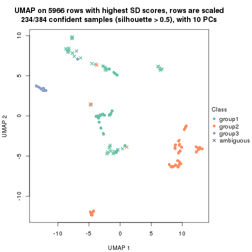</p>

</div>
<div id='tab-SD-pam-dimension-reduction-3'>
<pre><code class="r">dimension_reduction(res, k = 4, method = &quot;UMAP&quot;)
</code></pre>

<p></p>

</div>
<div id='tab-SD-pam-dimension-reduction-4'>
<pre><code class="r">dimension_reduction(res, k = 5, method = &quot;UMAP&quot;)
</code></pre>

<p></p>

</div>
<div id='tab-SD-pam-dimension-reduction-5'>
<pre><code class="r">dimension_reduction(res, k = 6, method = &quot;UMAP&quot;)
</code></pre>

<p></p>

</div>
</div>


Following heatmap shows how subgroups are split when increasing `k`:

```r
collect_classes(res)
```


If matrix rows can be associated to genes, consider to use `GO_Enrichment(res,
...)` to perform function enrichment for the signature genes.


 

---------------------------------------------------


### SD:mclust


The object with results only for a single top-value method and a single partition method 
can be extracted as:

```r
res = res_list["SD", "mclust"]
# you can also extract it by
# res = res_list["SD:mclust"]
```

A summary of `res` and all the functions that can be applied to it:

```r
res
```

```
#> A 'ConsensusPartition' object with k = 2, 3, 4, 5, 6.
#>   On a matrix with 5966 rows and 384 columns.
#>   Top rows (597, 1194, 1790, 2386, 2983) are extracted by 'SD' method.
#>   Subgroups are detected by 'mclust' method.
#>   Performed in total 1250 partitions by row resampling.
#>   Best k for subgroups seems to be 3.
#> 
#> Following methods can be applied to this 'ConsensusPartition' object:
#>  [1] "cola_report"             "collect_classes"         "collect_plots"          
#>  [4] "collect_stats"           "colnames"                "compare_signatures"     
#>  [7] "consensus_heatmap"       "dimension_reduction"     "functional_enrichment"  
#> [10] "get_anno_col"            "get_anno"                "get_classes"            
#> [13] "get_consensus"           "get_matrix"              "get_membership"         
#> [16] "get_param"               "get_signatures"          "get_stats"              
#> [19] "is_best_k"               "is_stable_k"             "membership_heatmap"     
#> [22] "ncol"                    "nrow"                    "plot_ecdf"              
#> [25] "rownames"                "select_partition_number" "show"                   
#> [28] "suggest_best_k"          "test_to_known_factors"
```

`collect_plots()` function collects all the plots made from `res` for all `k` (number of partitions)
into one single page to provide an easy and fast comparison between different `k`.

```r
collect_plots(res)
```


The plots are:

- The first row: a plot of the ECDF (Empirical cumulative distribution
  function) curves of the consensus matrix for each `k` and the heatmap of
  predicted classes for each `k`.
- The second row: heatmaps of the consensus matrix for each `k`.
- The third row: heatmaps of the membership matrix for each `k`.
- The fouth row: heatmaps of the signatures for each `k`.

All the plots in panels can be made by individual functions and they are
plotted later in this section.

`select_partition_number()` produces several plots showing different
statistics for choosing "optimized" `k`. There are following statistics:

- ECDF curves of the consensus matrix for each `k`;
- 1-PAC. [The PAC
  score](https://en.wikipedia.org/wiki/Consensus_clustering#Over-interpretation_potential_of_consensus_clustering)
  measures the proportion of the ambiguous subgrouping.
- Mean silhouette score.
- Concordance. The mean probability of fiting the consensus class ids in all
  partitions.
- Area increased. Denote $A_k$ as the area under the ECDF curve for current
  `k`, the area increased is defined as $A_k - A_{k-1}$.
- Rand index. The percent of pairs of samples that are both in a same cluster
  or both are not in a same cluster in the partition of k and k-1.
- Jaccard index. The ratio of pairs of samples are both in a same cluster in
  the partition of k and k-1 and the pairs of samples are both in a same
  cluster in the partition k or k-1.

The detailed explanations of these statistics can be found in [the cola
vignette](http://bioconductor.org/packages/devel/bioc/vignettes/cola/inst/doc/cola.html#toc_13).

Generally speaking, lower PAC score, higher mean silhouette score or higher
concordance corresponds to better partition. Rand index and Jaccard index
measure how similar the current partition is compared to partition with `k-1`.
If they are too similar, we won't accept `k` is better than `k-1`.

```r
select_partition_number(res)
```


The numeric values for all these statistics can be obtained by `get_stats()`.

```r
get_stats(res)
```

```
#>   k 1-PAC mean_silhouette concordance area_increased  Rand Jaccard
#> 2 2 0.886           0.936       0.972         0.2577 0.736   0.736
#> 3 3 0.554           0.815       0.889         0.6164 0.874   0.832
#> 4 4 0.554           0.855       0.883         0.4772 0.671   0.497
#> 5 5 0.586           0.622       0.754         0.1498 0.901   0.721
#> 6 6 0.620           0.757       0.774         0.0916 0.875   0.582
```

`suggest_best_k()` suggests the best $k$ based on these statistics. The rules are as follows:

- All $k$ with Jaccard index larger than 0.95 are removed because the increase of
  the partition number does not provides enough extra information. If all $k$ are removed,
  the best $k$ is assigned by `NA`.
- For $k$ with 1-PAC larger than 0.9, the maximal $k$ is taken as the "best k". Other $k$ is called "optional k".
- If it does not fit the second rule. The $k$ with the highest vote of highest
  1-PAC, mean silhouette and concordance is taken as the "best k".

```r
suggest_best_k(res)
```

```
#> [1] 3
```


Following shows the table of the partitions (You need to click the **show/hide
code output** link to see it). The membership matrix (columns with name `p*`)
is inferred by
[`clue::cl_consensus()`](https://www.rdocumentation.org/link/cl_consensus?package=clue)
function with the `SE` method. Basically the value in the membership matrix
represents the probability to belong to a certain group. The finall class
label for an item is determined with the group with highest probability it
belongs to.

In `get_classes()` function, the entropy is calculated from the membership
matrix and the silhouette score is calculated from the consensus matrix.


<script>
$( function() {
	$( '#tabs-SD-mclust-get-classes' ).tabs();
} );
</script>
<div id='tabs-SD-mclust-get-classes'>
<ul>
<li><a href='#tab-SD-mclust-get-classes-1'>k = 2</a></li>
<li><a href='#tab-SD-mclust-get-classes-2'>k = 3</a></li>
<li><a href='#tab-SD-mclust-get-classes-3'>k = 4</a></li>
<li><a href='#tab-SD-mclust-get-classes-4'>k = 5</a></li>
<li><a href='#tab-SD-mclust-get-classes-5'>k = 6</a></li>
</ul>

<div id='tab-SD-mclust-get-classes-1'>
<p><a id='tab-SD-mclust-get-classes-1-a' style='color:#0366d6' href='#'>show/hide code output</a></p>
<pre><code class="r">cbind(get_classes(res, k = 2), get_membership(res, k = 2))
</code></pre>

<pre><code>#&gt;           class entropy silhouette    p1    p2
#&gt; SRR490216     2  0.0000     0.9837 0.000 1.000
#&gt; SRR490217     2  0.0000     0.9837 0.000 1.000
#&gt; SRR490218     2  0.0000     0.9837 0.000 1.000
#&gt; SRR490219     2  0.0000     0.9837 0.000 1.000
#&gt; SRR490220     2  0.0000     0.9837 0.000 1.000
#&gt; SRR490221     2  0.0000     0.9837 0.000 1.000
#&gt; SRR490222     2  0.0000     0.9837 0.000 1.000
#&gt; SRR490223     2  0.0000     0.9837 0.000 1.000
#&gt; SRR490224     1  0.7299     0.8160 0.796 0.204
#&gt; SRR490225     1  0.7299     0.8160 0.796 0.204
#&gt; SRR490226     1  0.7299     0.8160 0.796 0.204
#&gt; SRR490227     1  0.7299     0.8160 0.796 0.204
#&gt; SRR490228     1  0.7299     0.8160 0.796 0.204
#&gt; SRR490229     1  0.7299     0.8160 0.796 0.204
#&gt; SRR490230     1  0.7299     0.8160 0.796 0.204
#&gt; SRR490231     1  0.7299     0.8160 0.796 0.204
#&gt; SRR490232     2  0.1184     0.9674 0.016 0.984
#&gt; SRR490233     2  0.1184     0.9674 0.016 0.984
#&gt; SRR490234     2  0.0938     0.9716 0.012 0.988
#&gt; SRR490235     2  0.0938     0.9716 0.012 0.988
#&gt; SRR490236     1  0.7299     0.8160 0.796 0.204
#&gt; SRR490237     1  0.7299     0.8160 0.796 0.204
#&gt; SRR490238     1  0.7299     0.8160 0.796 0.204
#&gt; SRR490239     1  0.7299     0.8160 0.796 0.204
#&gt; SRR490240     2  0.0000     0.9837 0.000 1.000
#&gt; SRR490241     2  0.0000     0.9837 0.000 1.000
#&gt; SRR490242     2  0.0000     0.9837 0.000 1.000
#&gt; SRR490243     2  0.0000     0.9837 0.000 1.000
#&gt; SRR490244     1  0.0000     0.8939 1.000 0.000
#&gt; SRR490245     1  0.0000     0.8939 1.000 0.000
#&gt; SRR490246     1  0.0000     0.8939 1.000 0.000
#&gt; SRR490247     1  0.0000     0.8939 1.000 0.000
#&gt; SRR490248     2  0.0000     0.9837 0.000 1.000
#&gt; SRR490249     2  0.0000     0.9837 0.000 1.000
#&gt; SRR490250     2  0.0000     0.9837 0.000 1.000
#&gt; SRR490251     2  0.0000     0.9837 0.000 1.000
#&gt; SRR490252     2  0.0000     0.9837 0.000 1.000
#&gt; SRR490253     2  0.0000     0.9837 0.000 1.000
#&gt; SRR490254     2  0.0000     0.9837 0.000 1.000
#&gt; SRR490255     2  0.0000     0.9837 0.000 1.000
#&gt; SRR490256     2  0.0000     0.9837 0.000 1.000
#&gt; SRR490257     2  0.0000     0.9837 0.000 1.000
#&gt; SRR490258     2  0.0000     0.9837 0.000 1.000
#&gt; SRR490259     2  0.0000     0.9837 0.000 1.000
#&gt; SRR490260     1  0.9775     0.4491 0.588 0.412
#&gt; SRR490261     2  1.0000    -0.1776 0.496 0.504
#&gt; SRR490262     2  0.9970    -0.0686 0.468 0.532
#&gt; SRR490263     2  0.9970    -0.0686 0.468 0.532
#&gt; SRR490264     1  0.8016     0.7676 0.756 0.244
#&gt; SRR490265     1  0.8443     0.7289 0.728 0.272
#&gt; SRR490266     1  0.8443     0.7289 0.728 0.272
#&gt; SRR490267     1  0.8813     0.6843 0.700 0.300
#&gt; SRR490268     2  0.0376     0.9797 0.004 0.996
#&gt; SRR490269     2  0.0000     0.9837 0.000 1.000
#&gt; SRR490270     2  0.0376     0.9797 0.004 0.996
#&gt; SRR490271     2  0.0000     0.9837 0.000 1.000
#&gt; SRR490272     2  0.8661     0.5266 0.288 0.712
#&gt; SRR490273     2  0.5408     0.8304 0.124 0.876
#&gt; SRR490274     2  0.8661     0.5267 0.288 0.712
#&gt; SRR490275     2  0.5519     0.8245 0.128 0.872
#&gt; SRR490276     1  0.9000     0.6562 0.684 0.316
#&gt; SRR490277     2  0.9996    -0.1478 0.488 0.512
#&gt; SRR490278     2  0.9944    -0.0180 0.456 0.544
#&gt; SRR490279     1  0.9850     0.4067 0.572 0.428
#&gt; SRR490280     1  0.0000     0.8939 1.000 0.000
#&gt; SRR490281     1  0.0000     0.8939 1.000 0.000
#&gt; SRR490282     1  0.0000     0.8939 1.000 0.000
#&gt; SRR490283     1  0.0000     0.8939 1.000 0.000
#&gt; SRR490284     1  0.4939     0.8722 0.892 0.108
#&gt; SRR490285     1  0.4939     0.8722 0.892 0.108
#&gt; SRR490286     1  0.4939     0.8722 0.892 0.108
#&gt; SRR490287     1  0.4939     0.8722 0.892 0.108
#&gt; SRR490288     2  0.0000     0.9837 0.000 1.000
#&gt; SRR490289     2  0.0000     0.9837 0.000 1.000
#&gt; SRR490290     2  0.0000     0.9837 0.000 1.000
#&gt; SRR490291     2  0.0000     0.9837 0.000 1.000
#&gt; SRR490292     2  0.0000     0.9837 0.000 1.000
#&gt; SRR490293     2  0.0000     0.9837 0.000 1.000
#&gt; SRR490294     2  0.0000     0.9837 0.000 1.000
#&gt; SRR490295     2  0.0000     0.9837 0.000 1.000
#&gt; SRR490296     2  0.0000     0.9837 0.000 1.000
#&gt; SRR490297     2  0.0000     0.9837 0.000 1.000
#&gt; SRR490298     2  0.0000     0.9837 0.000 1.000
#&gt; SRR490299     2  0.0000     0.9837 0.000 1.000
#&gt; SRR490300     2  0.0000     0.9837 0.000 1.000
#&gt; SRR490301     2  0.0000     0.9837 0.000 1.000
#&gt; SRR490302     2  0.0000     0.9837 0.000 1.000
#&gt; SRR490303     2  0.0000     0.9837 0.000 1.000
#&gt; SRR490304     2  0.0000     0.9837 0.000 1.000
#&gt; SRR490305     2  0.0000     0.9837 0.000 1.000
#&gt; SRR490306     2  0.0000     0.9837 0.000 1.000
#&gt; SRR490307     2  0.0000     0.9837 0.000 1.000
#&gt; SRR490308     1  0.0000     0.8939 1.000 0.000
#&gt; SRR490309     1  0.0000     0.8939 1.000 0.000
#&gt; SRR490310     1  0.0000     0.8939 1.000 0.000
#&gt; SRR490311     1  0.0000     0.8939 1.000 0.000
#&gt; SRR490312     2  0.0000     0.9837 0.000 1.000
#&gt; SRR490313     2  0.0000     0.9837 0.000 1.000
#&gt; SRR490314     2  0.0000     0.9837 0.000 1.000
#&gt; SRR490315     2  0.0000     0.9837 0.000 1.000
#&gt; SRR490316     2  0.0000     0.9837 0.000 1.000
#&gt; SRR490317     2  0.0000     0.9837 0.000 1.000
#&gt; SRR490318     2  0.0000     0.9837 0.000 1.000
#&gt; SRR490319     2  0.0000     0.9837 0.000 1.000
#&gt; SRR490320     2  0.2043     0.9497 0.032 0.968
#&gt; SRR490321     2  0.1184     0.9674 0.016 0.984
#&gt; SRR490322     2  0.1414     0.9631 0.020 0.980
#&gt; SRR490323     2  0.1414     0.9631 0.020 0.980
#&gt; SRR490324     1  0.4939     0.8722 0.892 0.108
#&gt; SRR490325     1  0.4939     0.8722 0.892 0.108
#&gt; SRR490326     1  0.4939     0.8722 0.892 0.108
#&gt; SRR490327     1  0.4939     0.8722 0.892 0.108
#&gt; SRR490328     2  0.0000     0.9837 0.000 1.000
#&gt; SRR490329     2  0.0000     0.9837 0.000 1.000
#&gt; SRR490330     2  0.0000     0.9837 0.000 1.000
#&gt; SRR490331     2  0.0000     0.9837 0.000 1.000
#&gt; SRR490332     2  0.0000     0.9837 0.000 1.000
#&gt; SRR490333     2  0.0000     0.9837 0.000 1.000
#&gt; SRR490334     2  0.0000     0.9837 0.000 1.000
#&gt; SRR490335     2  0.0000     0.9837 0.000 1.000
#&gt; SRR490336     2  0.0000     0.9837 0.000 1.000
#&gt; SRR490337     2  0.0000     0.9837 0.000 1.000
#&gt; SRR490338     2  0.0000     0.9837 0.000 1.000
#&gt; SRR490339     2  0.0000     0.9837 0.000 1.000
#&gt; SRR490340     2  0.0000     0.9837 0.000 1.000
#&gt; SRR490341     2  0.0000     0.9837 0.000 1.000
#&gt; SRR490342     2  0.0000     0.9837 0.000 1.000
#&gt; SRR490343     2  0.0000     0.9837 0.000 1.000
#&gt; SRR490344     2  0.0000     0.9837 0.000 1.000
#&gt; SRR490345     2  0.0000     0.9837 0.000 1.000
#&gt; SRR490346     2  0.0000     0.9837 0.000 1.000
#&gt; SRR490347     2  0.0000     0.9837 0.000 1.000
#&gt; SRR490348     2  0.0000     0.9837 0.000 1.000
#&gt; SRR490349     2  0.0000     0.9837 0.000 1.000
#&gt; SRR490350     2  0.0000     0.9837 0.000 1.000
#&gt; SRR490351     2  0.0000     0.9837 0.000 1.000
#&gt; SRR490352     2  0.0000     0.9837 0.000 1.000
#&gt; SRR490353     2  0.0000     0.9837 0.000 1.000
#&gt; SRR490354     2  0.0000     0.9837 0.000 1.000
#&gt; SRR490355     2  0.0000     0.9837 0.000 1.000
#&gt; SRR490356     2  0.0000     0.9837 0.000 1.000
#&gt; SRR490357     2  0.0000     0.9837 0.000 1.000
#&gt; SRR490358     2  0.0000     0.9837 0.000 1.000
#&gt; SRR490359     2  0.0000     0.9837 0.000 1.000
#&gt; SRR490360     2  0.0000     0.9837 0.000 1.000
#&gt; SRR490361     2  0.0000     0.9837 0.000 1.000
#&gt; SRR490362     2  0.0000     0.9837 0.000 1.000
#&gt; SRR490363     2  0.0000     0.9837 0.000 1.000
#&gt; SRR490364     2  0.0000     0.9837 0.000 1.000
#&gt; SRR490365     2  0.0000     0.9837 0.000 1.000
#&gt; SRR490366     2  0.0000     0.9837 0.000 1.000
#&gt; SRR490367     2  0.0000     0.9837 0.000 1.000
#&gt; SRR490368     2  0.0000     0.9837 0.000 1.000
#&gt; SRR490369     2  0.0000     0.9837 0.000 1.000
#&gt; SRR490370     2  0.0000     0.9837 0.000 1.000
#&gt; SRR490371     2  0.0000     0.9837 0.000 1.000
#&gt; SRR490372     1  0.0000     0.8939 1.000 0.000
#&gt; SRR490373     1  0.0000     0.8939 1.000 0.000
#&gt; SRR490374     1  0.0000     0.8939 1.000 0.000
#&gt; SRR490375     1  0.0000     0.8939 1.000 0.000
#&gt; SRR490376     2  0.0000     0.9837 0.000 1.000
#&gt; SRR490377     2  0.0000     0.9837 0.000 1.000
#&gt; SRR490378     2  0.0000     0.9837 0.000 1.000
#&gt; SRR490379     2  0.0000     0.9837 0.000 1.000
#&gt; SRR490380     1  0.0000     0.8939 1.000 0.000
#&gt; SRR490381     1  0.0000     0.8939 1.000 0.000
#&gt; SRR490382     1  0.0000     0.8939 1.000 0.000
#&gt; SRR490383     1  0.0000     0.8939 1.000 0.000
#&gt; SRR490384     2  0.0000     0.9837 0.000 1.000
#&gt; SRR490385     2  0.0000     0.9837 0.000 1.000
#&gt; SRR490386     2  0.0000     0.9837 0.000 1.000
#&gt; SRR490387     2  0.0000     0.9837 0.000 1.000
#&gt; SRR490388     2  0.0000     0.9837 0.000 1.000
#&gt; SRR490389     2  0.0000     0.9837 0.000 1.000
#&gt; SRR490390     2  0.0000     0.9837 0.000 1.000
#&gt; SRR490391     2  0.0000     0.9837 0.000 1.000
#&gt; SRR490392     2  0.0000     0.9837 0.000 1.000
#&gt; SRR490393     2  0.0000     0.9837 0.000 1.000
#&gt; SRR490394     2  0.0000     0.9837 0.000 1.000
#&gt; SRR490395     2  0.0000     0.9837 0.000 1.000
#&gt; SRR490396     2  0.0000     0.9837 0.000 1.000
#&gt; SRR490397     2  0.0000     0.9837 0.000 1.000
#&gt; SRR490398     2  0.0000     0.9837 0.000 1.000
#&gt; SRR490399     2  0.0000     0.9837 0.000 1.000
#&gt; SRR490400     2  0.0000     0.9837 0.000 1.000
#&gt; SRR490401     2  0.0000     0.9837 0.000 1.000
#&gt; SRR490402     2  0.0000     0.9837 0.000 1.000
#&gt; SRR490403     2  0.0000     0.9837 0.000 1.000
#&gt; SRR490404     2  0.0000     0.9837 0.000 1.000
#&gt; SRR490405     2  0.0000     0.9837 0.000 1.000
#&gt; SRR490406     2  0.0000     0.9837 0.000 1.000
#&gt; SRR490407     2  0.0000     0.9837 0.000 1.000
#&gt; SRR490408     2  0.0000     0.9837 0.000 1.000
#&gt; SRR490409     2  0.0000     0.9837 0.000 1.000
#&gt; SRR490410     2  0.0000     0.9837 0.000 1.000
#&gt; SRR490411     2  0.0000     0.9837 0.000 1.000
#&gt; SRR490412     1  0.0000     0.8939 1.000 0.000
#&gt; SRR490413     1  0.0000     0.8939 1.000 0.000
#&gt; SRR490414     1  0.0000     0.8939 1.000 0.000
#&gt; SRR490415     1  0.0000     0.8939 1.000 0.000
#&gt; SRR490416     2  0.0000     0.9837 0.000 1.000
#&gt; SRR490417     2  0.0000     0.9837 0.000 1.000
#&gt; SRR490418     2  0.0000     0.9837 0.000 1.000
#&gt; SRR490419     2  0.0000     0.9837 0.000 1.000
#&gt; SRR490420     2  0.0000     0.9837 0.000 1.000
#&gt; SRR490421     2  0.0000     0.9837 0.000 1.000
#&gt; SRR490422     2  0.0000     0.9837 0.000 1.000
#&gt; SRR490423     2  0.0000     0.9837 0.000 1.000
#&gt; SRR490424     1  0.9983     0.2612 0.524 0.476
#&gt; SRR490425     2  0.9896     0.0509 0.440 0.560
#&gt; SRR490426     2  0.9608     0.2585 0.384 0.616
#&gt; SRR490427     2  0.9795     0.1459 0.416 0.584
#&gt; SRR490428     2  0.0000     0.9837 0.000 1.000
#&gt; SRR490429     2  0.0000     0.9837 0.000 1.000
#&gt; SRR490430     2  0.0000     0.9837 0.000 1.000
#&gt; SRR490431     2  0.0000     0.9837 0.000 1.000
#&gt; SRR490432     2  0.0000     0.9837 0.000 1.000
#&gt; SRR490433     2  0.0000     0.9837 0.000 1.000
#&gt; SRR490434     2  0.0000     0.9837 0.000 1.000
#&gt; SRR490435     2  0.0000     0.9837 0.000 1.000
#&gt; SRR490436     2  0.0000     0.9837 0.000 1.000
#&gt; SRR490437     2  0.0000     0.9837 0.000 1.000
#&gt; SRR490438     2  0.0000     0.9837 0.000 1.000
#&gt; SRR490439     2  0.0000     0.9837 0.000 1.000
#&gt; SRR490440     2  0.0000     0.9837 0.000 1.000
#&gt; SRR490441     2  0.0000     0.9837 0.000 1.000
#&gt; SRR490442     2  0.0000     0.9837 0.000 1.000
#&gt; SRR490443     2  0.0000     0.9837 0.000 1.000
#&gt; SRR490444     2  0.0000     0.9837 0.000 1.000
#&gt; SRR490445     2  0.0000     0.9837 0.000 1.000
#&gt; SRR490446     2  0.0000     0.9837 0.000 1.000
#&gt; SRR490447     2  0.0000     0.9837 0.000 1.000
#&gt; SRR490448     2  0.0000     0.9837 0.000 1.000
#&gt; SRR490449     2  0.0000     0.9837 0.000 1.000
#&gt; SRR490450     2  0.0000     0.9837 0.000 1.000
#&gt; SRR490451     2  0.0000     0.9837 0.000 1.000
#&gt; SRR490452     2  0.0672     0.9757 0.008 0.992
#&gt; SRR490453     2  0.0000     0.9837 0.000 1.000
#&gt; SRR490454     2  0.0000     0.9837 0.000 1.000
#&gt; SRR490455     2  0.0000     0.9837 0.000 1.000
#&gt; SRR490456     2  0.0000     0.9837 0.000 1.000
#&gt; SRR490457     2  0.0000     0.9837 0.000 1.000
#&gt; SRR490458     2  0.0000     0.9837 0.000 1.000
#&gt; SRR490459     2  0.0000     0.9837 0.000 1.000
#&gt; SRR490460     2  0.0000     0.9837 0.000 1.000
#&gt; SRR490461     2  0.0000     0.9837 0.000 1.000
#&gt; SRR490462     2  0.0000     0.9837 0.000 1.000
#&gt; SRR490463     2  0.0000     0.9837 0.000 1.000
#&gt; SRR490464     1  0.0000     0.8939 1.000 0.000
#&gt; SRR490465     1  0.0000     0.8939 1.000 0.000
#&gt; SRR490466     1  0.0000     0.8939 1.000 0.000
#&gt; SRR490467     1  0.0000     0.8939 1.000 0.000
#&gt; SRR490468     2  0.0000     0.9837 0.000 1.000
#&gt; SRR490469     2  0.0000     0.9837 0.000 1.000
#&gt; SRR490470     2  0.0000     0.9837 0.000 1.000
#&gt; SRR490471     2  0.0000     0.9837 0.000 1.000
#&gt; SRR490472     2  0.0000     0.9837 0.000 1.000
#&gt; SRR490473     2  0.0000     0.9837 0.000 1.000
#&gt; SRR490474     2  0.0000     0.9837 0.000 1.000
#&gt; SRR490475     2  0.0000     0.9837 0.000 1.000
#&gt; SRR490476     1  0.0000     0.8939 1.000 0.000
#&gt; SRR490477     1  0.0000     0.8939 1.000 0.000
#&gt; SRR490478     1  0.0000     0.8939 1.000 0.000
#&gt; SRR490479     1  0.0000     0.8939 1.000 0.000
#&gt; SRR490480     2  0.0000     0.9837 0.000 1.000
#&gt; SRR490481     2  0.0000     0.9837 0.000 1.000
#&gt; SRR490482     2  0.0000     0.9837 0.000 1.000
#&gt; SRR490483     2  0.0000     0.9837 0.000 1.000
#&gt; SRR490484     2  0.0000     0.9837 0.000 1.000
#&gt; SRR490485     2  0.0000     0.9837 0.000 1.000
#&gt; SRR490486     2  0.0000     0.9837 0.000 1.000
#&gt; SRR490487     2  0.0000     0.9837 0.000 1.000
#&gt; SRR490488     2  0.0000     0.9837 0.000 1.000
#&gt; SRR490489     2  0.0000     0.9837 0.000 1.000
#&gt; SRR490490     2  0.0000     0.9837 0.000 1.000
#&gt; SRR490491     2  0.0000     0.9837 0.000 1.000
#&gt; SRR490492     2  0.0000     0.9837 0.000 1.000
#&gt; SRR490493     2  0.0000     0.9837 0.000 1.000
#&gt; SRR490494     2  0.0000     0.9837 0.000 1.000
#&gt; SRR490495     2  0.0000     0.9837 0.000 1.000
#&gt; SRR490496     2  0.0000     0.9837 0.000 1.000
#&gt; SRR490497     2  0.0000     0.9837 0.000 1.000
#&gt; SRR490498     2  0.0000     0.9837 0.000 1.000
#&gt; SRR490499     2  0.0000     0.9837 0.000 1.000
#&gt; SRR490500     2  0.0000     0.9837 0.000 1.000
#&gt; SRR490501     2  0.0000     0.9837 0.000 1.000
#&gt; SRR490502     2  0.0000     0.9837 0.000 1.000
#&gt; SRR490503     2  0.0000     0.9837 0.000 1.000
#&gt; SRR490504     2  0.0000     0.9837 0.000 1.000
#&gt; SRR490505     2  0.0000     0.9837 0.000 1.000
#&gt; SRR490506     2  0.0000     0.9837 0.000 1.000
#&gt; SRR490507     2  0.0000     0.9837 0.000 1.000
#&gt; SRR490508     2  0.0000     0.9837 0.000 1.000
#&gt; SRR490509     2  0.0000     0.9837 0.000 1.000
#&gt; SRR490510     2  0.0000     0.9837 0.000 1.000
#&gt; SRR490511     2  0.0000     0.9837 0.000 1.000
#&gt; SRR490512     2  0.0000     0.9837 0.000 1.000
#&gt; SRR490513     2  0.0000     0.9837 0.000 1.000
#&gt; SRR490514     2  0.0000     0.9837 0.000 1.000
#&gt; SRR490515     2  0.0000     0.9837 0.000 1.000
#&gt; SRR490516     2  0.0000     0.9837 0.000 1.000
#&gt; SRR490517     2  0.0000     0.9837 0.000 1.000
#&gt; SRR490518     2  0.0000     0.9837 0.000 1.000
#&gt; SRR490519     2  0.0000     0.9837 0.000 1.000
#&gt; SRR490520     2  0.0000     0.9837 0.000 1.000
#&gt; SRR490521     2  0.0000     0.9837 0.000 1.000
#&gt; SRR490522     2  0.0000     0.9837 0.000 1.000
#&gt; SRR490523     2  0.0000     0.9837 0.000 1.000
#&gt; SRR490524     2  0.0000     0.9837 0.000 1.000
#&gt; SRR490525     2  0.0000     0.9837 0.000 1.000
#&gt; SRR490526     2  0.0000     0.9837 0.000 1.000
#&gt; SRR490527     2  0.0000     0.9837 0.000 1.000
#&gt; SRR490528     2  0.0000     0.9837 0.000 1.000
#&gt; SRR490529     2  0.0000     0.9837 0.000 1.000
#&gt; SRR490530     2  0.0000     0.9837 0.000 1.000
#&gt; SRR490531     2  0.0000     0.9837 0.000 1.000
#&gt; SRR490532     2  0.0672     0.9757 0.008 0.992
#&gt; SRR490533     2  0.0672     0.9757 0.008 0.992
#&gt; SRR490534     2  0.0672     0.9757 0.008 0.992
#&gt; SRR490535     2  0.0672     0.9757 0.008 0.992
#&gt; SRR490536     2  0.0000     0.9837 0.000 1.000
#&gt; SRR490537     2  0.0000     0.9837 0.000 1.000
#&gt; SRR490538     2  0.0000     0.9837 0.000 1.000
#&gt; SRR490539     2  0.0000     0.9837 0.000 1.000
#&gt; SRR490540     2  0.0000     0.9837 0.000 1.000
#&gt; SRR490541     2  0.0000     0.9837 0.000 1.000
#&gt; SRR490542     2  0.0000     0.9837 0.000 1.000
#&gt; SRR490543     2  0.0000     0.9837 0.000 1.000
#&gt; SRR490544     2  0.0000     0.9837 0.000 1.000
#&gt; SRR490545     2  0.0000     0.9837 0.000 1.000
#&gt; SRR490546     2  0.0000     0.9837 0.000 1.000
#&gt; SRR490547     2  0.0000     0.9837 0.000 1.000
#&gt; SRR490548     2  0.0000     0.9837 0.000 1.000
#&gt; SRR490549     2  0.0000     0.9837 0.000 1.000
#&gt; SRR490550     2  0.0000     0.9837 0.000 1.000
#&gt; SRR490551     2  0.0000     0.9837 0.000 1.000
#&gt; SRR490552     2  0.0000     0.9837 0.000 1.000
#&gt; SRR490553     2  0.0000     0.9837 0.000 1.000
#&gt; SRR490554     2  0.0000     0.9837 0.000 1.000
#&gt; SRR490555     2  0.0000     0.9837 0.000 1.000
#&gt; SRR490556     2  0.0000     0.9837 0.000 1.000
#&gt; SRR490557     2  0.0000     0.9837 0.000 1.000
#&gt; SRR490558     2  0.0000     0.9837 0.000 1.000
#&gt; SRR490559     2  0.0000     0.9837 0.000 1.000
#&gt; SRR490560     2  0.0000     0.9837 0.000 1.000
#&gt; SRR490561     2  0.0000     0.9837 0.000 1.000
#&gt; SRR490562     2  0.0000     0.9837 0.000 1.000
#&gt; SRR490563     2  0.0000     0.9837 0.000 1.000
#&gt; SRR490564     2  0.0000     0.9837 0.000 1.000
#&gt; SRR490565     2  0.0000     0.9837 0.000 1.000
#&gt; SRR490566     2  0.0000     0.9837 0.000 1.000
#&gt; SRR490567     2  0.0000     0.9837 0.000 1.000
#&gt; SRR490568     2  0.0000     0.9837 0.000 1.000
#&gt; SRR490569     2  0.0000     0.9837 0.000 1.000
#&gt; SRR490570     2  0.0000     0.9837 0.000 1.000
#&gt; SRR490571     2  0.0000     0.9837 0.000 1.000
#&gt; SRR490572     2  0.0000     0.9837 0.000 1.000
#&gt; SRR490573     2  0.0000     0.9837 0.000 1.000
#&gt; SRR490574     2  0.0000     0.9837 0.000 1.000
#&gt; SRR490575     2  0.0000     0.9837 0.000 1.000
#&gt; SRR490576     2  0.0000     0.9837 0.000 1.000
#&gt; SRR490577     2  0.0000     0.9837 0.000 1.000
#&gt; SRR490578     2  0.0000     0.9837 0.000 1.000
#&gt; SRR490579     2  0.0000     0.9837 0.000 1.000
#&gt; SRR490580     2  0.0000     0.9837 0.000 1.000
#&gt; SRR490581     2  0.0000     0.9837 0.000 1.000
#&gt; SRR490582     2  0.0000     0.9837 0.000 1.000
#&gt; SRR490583     2  0.0000     0.9837 0.000 1.000
#&gt; SRR490584     2  0.0000     0.9837 0.000 1.000
#&gt; SRR490585     2  0.0000     0.9837 0.000 1.000
#&gt; SRR490586     2  0.0000     0.9837 0.000 1.000
#&gt; SRR490587     2  0.0000     0.9837 0.000 1.000
#&gt; SRR490588     2  0.0000     0.9837 0.000 1.000
#&gt; SRR490589     2  0.0000     0.9837 0.000 1.000
#&gt; SRR490590     2  0.0000     0.9837 0.000 1.000
#&gt; SRR490591     2  0.0000     0.9837 0.000 1.000
#&gt; SRR490592     2  0.0000     0.9837 0.000 1.000
#&gt; SRR490593     2  0.0000     0.9837 0.000 1.000
#&gt; SRR490594     2  0.0000     0.9837 0.000 1.000
#&gt; SRR490595     2  0.0000     0.9837 0.000 1.000
#&gt; SRR490596     2  0.0000     0.9837 0.000 1.000
#&gt; SRR490597     2  0.0000     0.9837 0.000 1.000
#&gt; SRR490598     2  0.0000     0.9837 0.000 1.000
#&gt; SRR490599     2  0.0000     0.9837 0.000 1.000
</code></pre>

<script>
$('#tab-SD-mclust-get-classes-1-a').parent().next().next().hide();
$('#tab-SD-mclust-get-classes-1-a').click(function(){
  $('#tab-SD-mclust-get-classes-1-a').parent().next().next().toggle();
  return(false);
});
</script>
</div>

<div id='tab-SD-mclust-get-classes-2'>
<p><a id='tab-SD-mclust-get-classes-2-a' style='color:#0366d6' href='#'>show/hide code output</a></p>
<pre><code class="r">cbind(get_classes(res, k = 3), get_membership(res, k = 3))
</code></pre>

<pre><code>#&gt;           class entropy silhouette    p1    p2    p3
#&gt; SRR490216     2  0.1163     0.8705 0.028 0.972 0.000
#&gt; SRR490217     2  0.1163     0.8705 0.028 0.972 0.000
#&gt; SRR490218     2  0.1163     0.8705 0.028 0.972 0.000
#&gt; SRR490219     2  0.1163     0.8705 0.028 0.972 0.000
#&gt; SRR490220     2  0.4062     0.8743 0.164 0.836 0.000
#&gt; SRR490221     2  0.3941     0.8757 0.156 0.844 0.000
#&gt; SRR490222     2  0.3879     0.8763 0.152 0.848 0.000
#&gt; SRR490223     2  0.4002     0.8752 0.160 0.840 0.000
#&gt; SRR490224     1  0.3886     0.6993 0.880 0.024 0.096
#&gt; SRR490225     1  0.3805     0.7032 0.884 0.024 0.092
#&gt; SRR490226     1  0.3886     0.6993 0.880 0.024 0.096
#&gt; SRR490227     1  0.3805     0.7032 0.884 0.024 0.092
#&gt; SRR490228     1  0.4045     0.6898 0.872 0.024 0.104
#&gt; SRR490229     1  0.3805     0.7032 0.884 0.024 0.092
#&gt; SRR490230     1  0.3805     0.7032 0.884 0.024 0.092
#&gt; SRR490231     1  0.3805     0.7032 0.884 0.024 0.092
#&gt; SRR490232     1  0.1031     0.7248 0.976 0.024 0.000
#&gt; SRR490233     1  0.1753     0.6994 0.952 0.048 0.000
#&gt; SRR490234     1  0.2796     0.6425 0.908 0.092 0.000
#&gt; SRR490235     1  0.5098     0.4490 0.752 0.248 0.000
#&gt; SRR490236     1  0.3805     0.7032 0.884 0.024 0.092
#&gt; SRR490237     1  0.3528     0.7065 0.892 0.016 0.092
#&gt; SRR490238     1  0.3805     0.7032 0.884 0.024 0.092
#&gt; SRR490239     1  0.3805     0.7032 0.884 0.024 0.092
#&gt; SRR490240     2  0.6192     0.5370 0.420 0.580 0.000
#&gt; SRR490241     2  0.5760     0.7078 0.328 0.672 0.000
#&gt; SRR490242     2  0.5560     0.7481 0.300 0.700 0.000
#&gt; SRR490243     2  0.6079     0.6040 0.388 0.612 0.000
#&gt; SRR490244     3  0.0000     1.0000 0.000 0.000 1.000
#&gt; SRR490245     3  0.0000     1.0000 0.000 0.000 1.000
#&gt; SRR490246     3  0.0000     1.0000 0.000 0.000 1.000
#&gt; SRR490247     3  0.0000     1.0000 0.000 0.000 1.000
#&gt; SRR490248     2  0.1031     0.8728 0.024 0.976 0.000
#&gt; SRR490249     2  0.1031     0.8728 0.024 0.976 0.000
#&gt; SRR490250     2  0.0892     0.8751 0.020 0.980 0.000
#&gt; SRR490251     2  0.1163     0.8705 0.028 0.972 0.000
#&gt; SRR490252     2  0.3816     0.8762 0.148 0.852 0.000
#&gt; SRR490253     2  0.3879     0.8763 0.152 0.848 0.000
#&gt; SRR490254     2  0.3879     0.8763 0.152 0.848 0.000
#&gt; SRR490255     2  0.3879     0.8763 0.152 0.848 0.000
#&gt; SRR490256     1  0.6079     0.0787 0.612 0.388 0.000
#&gt; SRR490257     2  0.6291     0.4214 0.468 0.532 0.000
#&gt; SRR490258     2  0.6309     0.3408 0.496 0.504 0.000
#&gt; SRR490259     2  0.6307     0.3648 0.488 0.512 0.000
#&gt; SRR490260     1  0.0983     0.7427 0.980 0.004 0.016
#&gt; SRR490261     1  0.0661     0.7420 0.988 0.004 0.008
#&gt; SRR490262     1  0.0661     0.7420 0.988 0.004 0.008
#&gt; SRR490263     1  0.0237     0.7385 0.996 0.004 0.000
#&gt; SRR490264     1  0.1525     0.7397 0.964 0.004 0.032
#&gt; SRR490265     1  0.1399     0.7410 0.968 0.004 0.028
#&gt; SRR490266     1  0.1399     0.7410 0.968 0.004 0.028
#&gt; SRR490267     1  0.0983     0.7427 0.980 0.004 0.016
#&gt; SRR490268     1  0.6252    -0.1485 0.556 0.444 0.000
#&gt; SRR490269     1  0.6299    -0.2618 0.524 0.476 0.000
#&gt; SRR490270     1  0.6295    -0.2481 0.528 0.472 0.000
#&gt; SRR490271     2  0.6291     0.4186 0.468 0.532 0.000
#&gt; SRR490272     1  0.0237     0.7385 0.996 0.004 0.000
#&gt; SRR490273     1  0.0424     0.7369 0.992 0.008 0.000
#&gt; SRR490274     1  0.0237     0.7385 0.996 0.004 0.000
#&gt; SRR490275     1  0.0424     0.7369 0.992 0.008 0.000
#&gt; SRR490276     1  0.1267     0.7420 0.972 0.004 0.024
#&gt; SRR490277     1  0.0661     0.7420 0.988 0.004 0.008
#&gt; SRR490278     1  0.0237     0.7385 0.996 0.004 0.000
#&gt; SRR490279     1  0.0829     0.7430 0.984 0.004 0.012
#&gt; SRR490280     1  0.6286     0.1528 0.536 0.000 0.464
#&gt; SRR490281     1  0.6286     0.1528 0.536 0.000 0.464
#&gt; SRR490282     1  0.6286     0.1528 0.536 0.000 0.464
#&gt; SRR490283     1  0.6286     0.1528 0.536 0.000 0.464
#&gt; SRR490284     1  0.5723     0.5643 0.744 0.016 0.240
#&gt; SRR490285     1  0.5849     0.5878 0.756 0.028 0.216
#&gt; SRR490286     1  0.5967     0.5831 0.752 0.032 0.216
#&gt; SRR490287     1  0.5967     0.5831 0.752 0.032 0.216
#&gt; SRR490288     2  0.5098     0.8124 0.248 0.752 0.000
#&gt; SRR490289     2  0.4178     0.8712 0.172 0.828 0.000
#&gt; SRR490290     2  0.4178     0.8717 0.172 0.828 0.000
#&gt; SRR490291     2  0.4291     0.8679 0.180 0.820 0.000
#&gt; SRR490292     2  0.5706     0.7214 0.320 0.680 0.000
#&gt; SRR490293     2  0.5678     0.7262 0.316 0.684 0.000
#&gt; SRR490294     2  0.5591     0.7431 0.304 0.696 0.000
#&gt; SRR490295     2  0.5327     0.7837 0.272 0.728 0.000
#&gt; SRR490296     2  0.4121     0.8719 0.168 0.832 0.000
#&gt; SRR490297     2  0.4121     0.8719 0.168 0.832 0.000
#&gt; SRR490298     2  0.4121     0.8719 0.168 0.832 0.000
#&gt; SRR490299     2  0.4121     0.8719 0.168 0.832 0.000
#&gt; SRR490300     2  0.4235     0.8694 0.176 0.824 0.000
#&gt; SRR490301     2  0.4235     0.8694 0.176 0.824 0.000
#&gt; SRR490302     2  0.4235     0.8694 0.176 0.824 0.000
#&gt; SRR490303     2  0.4235     0.8694 0.176 0.824 0.000
#&gt; SRR490304     2  0.4121     0.8719 0.168 0.832 0.000
#&gt; SRR490305     2  0.4121     0.8719 0.168 0.832 0.000
#&gt; SRR490306     2  0.4121     0.8719 0.168 0.832 0.000
#&gt; SRR490307     2  0.4121     0.8719 0.168 0.832 0.000
#&gt; SRR490308     3  0.0000     1.0000 0.000 0.000 1.000
#&gt; SRR490309     3  0.0000     1.0000 0.000 0.000 1.000
#&gt; SRR490310     3  0.0000     1.0000 0.000 0.000 1.000
#&gt; SRR490311     3  0.0000     1.0000 0.000 0.000 1.000
#&gt; SRR490312     2  0.1163     0.8705 0.028 0.972 0.000
#&gt; SRR490313     2  0.1163     0.8705 0.028 0.972 0.000
#&gt; SRR490314     2  0.1163     0.8705 0.028 0.972 0.000
#&gt; SRR490315     2  0.1163     0.8705 0.028 0.972 0.000
#&gt; SRR490316     2  0.3941     0.8759 0.156 0.844 0.000
#&gt; SRR490317     2  0.3879     0.8767 0.152 0.848 0.000
#&gt; SRR490318     2  0.3941     0.8759 0.156 0.844 0.000
#&gt; SRR490319     2  0.3941     0.8759 0.156 0.844 0.000
#&gt; SRR490320     1  0.0592     0.7341 0.988 0.012 0.000
#&gt; SRR490321     1  0.1163     0.7212 0.972 0.028 0.000
#&gt; SRR490322     1  0.1163     0.7210 0.972 0.028 0.000
#&gt; SRR490323     1  0.1753     0.6993 0.952 0.048 0.000
#&gt; SRR490324     1  0.5239     0.6547 0.808 0.032 0.160
#&gt; SRR490325     1  0.5298     0.6514 0.804 0.032 0.164
#&gt; SRR490326     1  0.5239     0.6547 0.808 0.032 0.160
#&gt; SRR490327     1  0.5355     0.6467 0.800 0.032 0.168
#&gt; SRR490328     2  0.4062     0.8730 0.164 0.836 0.000
#&gt; SRR490329     2  0.4002     0.8740 0.160 0.840 0.000
#&gt; SRR490330     2  0.4121     0.8719 0.168 0.832 0.000
#&gt; SRR490331     2  0.3816     0.8762 0.148 0.852 0.000
#&gt; SRR490332     2  0.4121     0.8719 0.168 0.832 0.000
#&gt; SRR490333     2  0.4121     0.8719 0.168 0.832 0.000
#&gt; SRR490334     2  0.4121     0.8719 0.168 0.832 0.000
#&gt; SRR490335     2  0.4121     0.8719 0.168 0.832 0.000
#&gt; SRR490336     2  0.3816     0.8762 0.148 0.852 0.000
#&gt; SRR490337     2  0.3816     0.8762 0.148 0.852 0.000
#&gt; SRR490338     2  0.3816     0.8762 0.148 0.852 0.000
#&gt; SRR490339     2  0.3816     0.8762 0.148 0.852 0.000
#&gt; SRR490340     2  0.4121     0.8719 0.168 0.832 0.000
#&gt; SRR490341     2  0.4121     0.8719 0.168 0.832 0.000
#&gt; SRR490342     2  0.4121     0.8719 0.168 0.832 0.000
#&gt; SRR490343     2  0.4121     0.8719 0.168 0.832 0.000
#&gt; SRR490344     2  0.0424     0.8805 0.008 0.992 0.000
#&gt; SRR490345     2  0.0424     0.8805 0.008 0.992 0.000
#&gt; SRR490346     2  0.0424     0.8805 0.008 0.992 0.000
#&gt; SRR490347     2  0.0424     0.8805 0.008 0.992 0.000
#&gt; SRR490348     2  0.0424     0.8805 0.008 0.992 0.000
#&gt; SRR490349     2  0.0424     0.8805 0.008 0.992 0.000
#&gt; SRR490350     2  0.0237     0.8810 0.004 0.996 0.000
#&gt; SRR490351     2  0.0424     0.8805 0.008 0.992 0.000
#&gt; SRR490352     2  0.0237     0.8810 0.004 0.996 0.000
#&gt; SRR490353     2  0.0424     0.8805 0.008 0.992 0.000
#&gt; SRR490354     2  0.0424     0.8805 0.008 0.992 0.000
#&gt; SRR490355     2  0.0424     0.8805 0.008 0.992 0.000
#&gt; SRR490356     2  0.0424     0.8805 0.008 0.992 0.000
#&gt; SRR490357     2  0.0424     0.8805 0.008 0.992 0.000
#&gt; SRR490358     2  0.0424     0.8805 0.008 0.992 0.000
#&gt; SRR490359     2  0.0424     0.8805 0.008 0.992 0.000
#&gt; SRR490360     2  0.0424     0.8805 0.008 0.992 0.000
#&gt; SRR490361     2  0.0424     0.8805 0.008 0.992 0.000
#&gt; SRR490362     2  0.0424     0.8805 0.008 0.992 0.000
#&gt; SRR490363     2  0.0424     0.8805 0.008 0.992 0.000
#&gt; SRR490364     2  0.0424     0.8805 0.008 0.992 0.000
#&gt; SRR490365     2  0.0424     0.8805 0.008 0.992 0.000
#&gt; SRR490366     2  0.0424     0.8805 0.008 0.992 0.000
#&gt; SRR490367     2  0.0424     0.8805 0.008 0.992 0.000
#&gt; SRR490368     2  0.0237     0.8810 0.004 0.996 0.000
#&gt; SRR490369     2  0.0424     0.8805 0.008 0.992 0.000
#&gt; SRR490370     2  0.0424     0.8805 0.008 0.992 0.000
#&gt; SRR490371     2  0.0237     0.8810 0.004 0.996 0.000
#&gt; SRR490372     1  0.6286     0.1528 0.536 0.000 0.464
#&gt; SRR490373     1  0.6286     0.1528 0.536 0.000 0.464
#&gt; SRR490374     1  0.6286     0.1528 0.536 0.000 0.464
#&gt; SRR490375     1  0.6286     0.1528 0.536 0.000 0.464
#&gt; SRR490376     2  0.0424     0.8805 0.008 0.992 0.000
#&gt; SRR490377     2  0.0424     0.8805 0.008 0.992 0.000
#&gt; SRR490378     2  0.0424     0.8805 0.008 0.992 0.000
#&gt; SRR490379     2  0.0424     0.8805 0.008 0.992 0.000
#&gt; SRR490380     3  0.0000     1.0000 0.000 0.000 1.000
#&gt; SRR490381     3  0.0000     1.0000 0.000 0.000 1.000
#&gt; SRR490382     3  0.0000     1.0000 0.000 0.000 1.000
#&gt; SRR490383     3  0.0000     1.0000 0.000 0.000 1.000
#&gt; SRR490384     2  0.0424     0.8805 0.008 0.992 0.000
#&gt; SRR490385     2  0.0424     0.8805 0.008 0.992 0.000
#&gt; SRR490386     2  0.0424     0.8805 0.008 0.992 0.000
#&gt; SRR490387     2  0.0424     0.8805 0.008 0.992 0.000
#&gt; SRR490388     2  0.0424     0.8805 0.008 0.992 0.000
#&gt; SRR490389     2  0.0424     0.8805 0.008 0.992 0.000
#&gt; SRR490390     2  0.0424     0.8805 0.008 0.992 0.000
#&gt; SRR490391     2  0.0424     0.8805 0.008 0.992 0.000
#&gt; SRR490392     2  0.0424     0.8805 0.008 0.992 0.000
#&gt; SRR490393     2  0.0424     0.8805 0.008 0.992 0.000
#&gt; SRR490394     2  0.0424     0.8805 0.008 0.992 0.000
#&gt; SRR490395     2  0.0424     0.8805 0.008 0.992 0.000
#&gt; SRR490396     2  0.0424     0.8805 0.008 0.992 0.000
#&gt; SRR490397     2  0.0424     0.8805 0.008 0.992 0.000
#&gt; SRR490398     2  0.0424     0.8805 0.008 0.992 0.000
#&gt; SRR490399     2  0.0424     0.8805 0.008 0.992 0.000
#&gt; SRR490400     2  0.0237     0.8810 0.004 0.996 0.000
#&gt; SRR490401     2  0.0424     0.8805 0.008 0.992 0.000
#&gt; SRR490402     2  0.0424     0.8805 0.008 0.992 0.000
#&gt; SRR490403     2  0.0424     0.8805 0.008 0.992 0.000
#&gt; SRR490404     2  0.0424     0.8805 0.008 0.992 0.000
#&gt; SRR490405     2  0.0424     0.8805 0.008 0.992 0.000
#&gt; SRR490406     2  0.0424     0.8805 0.008 0.992 0.000
#&gt; SRR490407     2  0.0424     0.8805 0.008 0.992 0.000
#&gt; SRR490408     2  0.0747     0.8843 0.016 0.984 0.000
#&gt; SRR490409     2  0.0747     0.8843 0.016 0.984 0.000
#&gt; SRR490410     2  0.0747     0.8843 0.016 0.984 0.000
#&gt; SRR490411     2  0.0747     0.8843 0.016 0.984 0.000
#&gt; SRR490412     3  0.0000     1.0000 0.000 0.000 1.000
#&gt; SRR490413     3  0.0000     1.0000 0.000 0.000 1.000
#&gt; SRR490414     3  0.0000     1.0000 0.000 0.000 1.000
#&gt; SRR490415     3  0.0000     1.0000 0.000 0.000 1.000
#&gt; SRR490416     2  0.4121     0.8719 0.168 0.832 0.000
#&gt; SRR490417     2  0.4121     0.8719 0.168 0.832 0.000
#&gt; SRR490418     2  0.4121     0.8719 0.168 0.832 0.000
#&gt; SRR490419     2  0.4121     0.8719 0.168 0.832 0.000
#&gt; SRR490420     2  0.5650     0.7264 0.312 0.688 0.000
#&gt; SRR490421     2  0.5363     0.7737 0.276 0.724 0.000
#&gt; SRR490422     2  0.5327     0.7783 0.272 0.728 0.000
#&gt; SRR490423     2  0.5497     0.7538 0.292 0.708 0.000
#&gt; SRR490424     1  0.0829     0.7430 0.984 0.004 0.012
#&gt; SRR490425     1  0.0829     0.7430 0.984 0.004 0.012
#&gt; SRR490426     1  0.0829     0.7430 0.984 0.004 0.012
#&gt; SRR490427     1  0.0829     0.7430 0.984 0.004 0.012
#&gt; SRR490428     2  0.6244     0.4899 0.440 0.560 0.000
#&gt; SRR490429     2  0.5621     0.7320 0.308 0.692 0.000
#&gt; SRR490430     2  0.6192     0.5298 0.420 0.580 0.000
#&gt; SRR490431     2  0.5810     0.6903 0.336 0.664 0.000
#&gt; SRR490432     2  0.4346     0.8625 0.184 0.816 0.000
#&gt; SRR490433     2  0.4346     0.8625 0.184 0.816 0.000
#&gt; SRR490434     2  0.4291     0.8653 0.180 0.820 0.000
#&gt; SRR490435     2  0.4291     0.8653 0.180 0.820 0.000
#&gt; SRR490436     2  0.4555     0.8508 0.200 0.800 0.000
#&gt; SRR490437     2  0.4504     0.8539 0.196 0.804 0.000
#&gt; SRR490438     2  0.4399     0.8599 0.188 0.812 0.000
#&gt; SRR490439     2  0.4452     0.8572 0.192 0.808 0.000
#&gt; SRR490440     2  0.0747     0.8843 0.016 0.984 0.000
#&gt; SRR490441     2  0.0747     0.8843 0.016 0.984 0.000
#&gt; SRR490442     2  0.0747     0.8843 0.016 0.984 0.000
#&gt; SRR490443     2  0.0747     0.8843 0.016 0.984 0.000
#&gt; SRR490444     2  0.4121     0.8719 0.168 0.832 0.000
#&gt; SRR490445     2  0.4062     0.8730 0.164 0.836 0.000
#&gt; SRR490446     2  0.4062     0.8730 0.164 0.836 0.000
#&gt; SRR490447     2  0.4121     0.8719 0.168 0.832 0.000
#&gt; SRR490448     2  0.4842     0.8297 0.224 0.776 0.000
#&gt; SRR490449     2  0.4555     0.8509 0.200 0.800 0.000
#&gt; SRR490450     2  0.4654     0.8443 0.208 0.792 0.000
#&gt; SRR490451     2  0.4931     0.8219 0.232 0.768 0.000
#&gt; SRR490452     1  0.6140     0.0218 0.596 0.404 0.000
#&gt; SRR490453     2  0.5810     0.6903 0.336 0.664 0.000
#&gt; SRR490454     2  0.6045     0.6134 0.380 0.620 0.000
#&gt; SRR490455     2  0.6095     0.5898 0.392 0.608 0.000
#&gt; SRR490456     2  0.4291     0.8651 0.180 0.820 0.000
#&gt; SRR490457     2  0.4291     0.8651 0.180 0.820 0.000
#&gt; SRR490458     2  0.4291     0.8651 0.180 0.820 0.000
#&gt; SRR490459     2  0.4291     0.8651 0.180 0.820 0.000
#&gt; SRR490460     2  0.4452     0.8571 0.192 0.808 0.000
#&gt; SRR490461     2  0.4399     0.8599 0.188 0.812 0.000
#&gt; SRR490462     2  0.4346     0.8627 0.184 0.816 0.000
#&gt; SRR490463     2  0.4346     0.8627 0.184 0.816 0.000
#&gt; SRR490464     3  0.0000     1.0000 0.000 0.000 1.000
#&gt; SRR490465     3  0.0000     1.0000 0.000 0.000 1.000
#&gt; SRR490466     3  0.0000     1.0000 0.000 0.000 1.000
#&gt; SRR490467     3  0.0000     1.0000 0.000 0.000 1.000
#&gt; SRR490468     2  0.4235     0.8676 0.176 0.824 0.000
#&gt; SRR490469     2  0.4291     0.8651 0.180 0.820 0.000
#&gt; SRR490470     2  0.4291     0.8651 0.180 0.820 0.000
#&gt; SRR490471     2  0.4235     0.8676 0.176 0.824 0.000
#&gt; SRR490472     2  0.0747     0.8843 0.016 0.984 0.000
#&gt; SRR490473     2  0.0747     0.8843 0.016 0.984 0.000
#&gt; SRR490474     2  0.0747     0.8843 0.016 0.984 0.000
#&gt; SRR490475     2  0.0747     0.8843 0.016 0.984 0.000
#&gt; SRR490476     3  0.0000     1.0000 0.000 0.000 1.000
#&gt; SRR490477     3  0.0000     1.0000 0.000 0.000 1.000
#&gt; SRR490478     3  0.0000     1.0000 0.000 0.000 1.000
#&gt; SRR490479     3  0.0000     1.0000 0.000 0.000 1.000
#&gt; SRR490480     2  0.4121     0.8719 0.168 0.832 0.000
#&gt; SRR490481     2  0.4121     0.8719 0.168 0.832 0.000
#&gt; SRR490482     2  0.4121     0.8719 0.168 0.832 0.000
#&gt; SRR490483     2  0.4121     0.8719 0.168 0.832 0.000
#&gt; SRR490484     2  0.4121     0.8719 0.168 0.832 0.000
#&gt; SRR490485     2  0.4121     0.8719 0.168 0.832 0.000
#&gt; SRR490486     2  0.4121     0.8719 0.168 0.832 0.000
#&gt; SRR490487     2  0.4121     0.8719 0.168 0.832 0.000
#&gt; SRR490488     2  0.4121     0.8719 0.168 0.832 0.000
#&gt; SRR490489     2  0.4121     0.8719 0.168 0.832 0.000
#&gt; SRR490490     2  0.4121     0.8719 0.168 0.832 0.000
#&gt; SRR490491     2  0.4121     0.8719 0.168 0.832 0.000
#&gt; SRR490492     2  0.4121     0.8719 0.168 0.832 0.000
#&gt; SRR490493     2  0.4121     0.8719 0.168 0.832 0.000
#&gt; SRR490494     2  0.4121     0.8719 0.168 0.832 0.000
#&gt; SRR490495     2  0.4121     0.8719 0.168 0.832 0.000
#&gt; SRR490496     2  0.4121     0.8719 0.168 0.832 0.000
#&gt; SRR490497     2  0.4121     0.8719 0.168 0.832 0.000
#&gt; SRR490498     2  0.4121     0.8719 0.168 0.832 0.000
#&gt; SRR490499     2  0.4121     0.8719 0.168 0.832 0.000
#&gt; SRR490500     2  0.4121     0.8719 0.168 0.832 0.000
#&gt; SRR490501     2  0.4121     0.8719 0.168 0.832 0.000
#&gt; SRR490502     2  0.4121     0.8719 0.168 0.832 0.000
#&gt; SRR490503     2  0.4121     0.8719 0.168 0.832 0.000
#&gt; SRR490504     2  0.0747     0.8843 0.016 0.984 0.000
#&gt; SRR490505     2  0.0747     0.8843 0.016 0.984 0.000
#&gt; SRR490506     2  0.0747     0.8843 0.016 0.984 0.000
#&gt; SRR490507     2  0.0747     0.8843 0.016 0.984 0.000
#&gt; SRR490508     2  0.3340     0.8796 0.120 0.880 0.000
#&gt; SRR490509     2  0.3686     0.8775 0.140 0.860 0.000
#&gt; SRR490510     2  0.3816     0.8762 0.148 0.852 0.000
#&gt; SRR490511     2  0.3816     0.8762 0.148 0.852 0.000
#&gt; SRR490512     2  0.4121     0.8719 0.168 0.832 0.000
#&gt; SRR490513     2  0.4121     0.8719 0.168 0.832 0.000
#&gt; SRR490514     2  0.4121     0.8719 0.168 0.832 0.000
#&gt; SRR490515     2  0.4121     0.8719 0.168 0.832 0.000
#&gt; SRR490516     2  0.4121     0.8719 0.168 0.832 0.000
#&gt; SRR490517     2  0.4121     0.8719 0.168 0.832 0.000
#&gt; SRR490518     2  0.4121     0.8719 0.168 0.832 0.000
#&gt; SRR490519     2  0.4121     0.8719 0.168 0.832 0.000
#&gt; SRR490520     2  0.4121     0.8719 0.168 0.832 0.000
#&gt; SRR490521     2  0.4121     0.8719 0.168 0.832 0.000
#&gt; SRR490522     2  0.4121     0.8719 0.168 0.832 0.000
#&gt; SRR490523     2  0.4121     0.8719 0.168 0.832 0.000
#&gt; SRR490524     2  0.4121     0.8719 0.168 0.832 0.000
#&gt; SRR490525     2  0.4121     0.8719 0.168 0.832 0.000
#&gt; SRR490526     2  0.4121     0.8719 0.168 0.832 0.000
#&gt; SRR490527     2  0.4121     0.8719 0.168 0.832 0.000
#&gt; SRR490528     2  0.4121     0.8719 0.168 0.832 0.000
#&gt; SRR490529     2  0.4121     0.8719 0.168 0.832 0.000
#&gt; SRR490530     2  0.4121     0.8719 0.168 0.832 0.000
#&gt; SRR490531     2  0.4121     0.8719 0.168 0.832 0.000
#&gt; SRR490532     2  0.6235     0.4869 0.436 0.564 0.000
#&gt; SRR490533     2  0.6244     0.4785 0.440 0.560 0.000
#&gt; SRR490534     2  0.6204     0.5162 0.424 0.576 0.000
#&gt; SRR490535     2  0.6235     0.4869 0.436 0.564 0.000
#&gt; SRR490536     2  0.0747     0.8843 0.016 0.984 0.000
#&gt; SRR490537     2  0.0747     0.8843 0.016 0.984 0.000
#&gt; SRR490538     2  0.0747     0.8843 0.016 0.984 0.000
#&gt; SRR490539     2  0.0747     0.8843 0.016 0.984 0.000
#&gt; SRR490540     2  0.0237     0.8810 0.004 0.996 0.000
#&gt; SRR490541     2  0.0237     0.8810 0.004 0.996 0.000
#&gt; SRR490542     2  0.0237     0.8810 0.004 0.996 0.000
#&gt; SRR490543     2  0.0237     0.8810 0.004 0.996 0.000
#&gt; SRR490544     2  0.0237     0.8810 0.004 0.996 0.000
#&gt; SRR490545     2  0.0237     0.8810 0.004 0.996 0.000
#&gt; SRR490546     2  0.0237     0.8810 0.004 0.996 0.000
#&gt; SRR490547     2  0.0237     0.8810 0.004 0.996 0.000
#&gt; SRR490548     2  0.0000     0.8820 0.000 1.000 0.000
#&gt; SRR490549     2  0.0237     0.8810 0.004 0.996 0.000
#&gt; SRR490550     2  0.0237     0.8810 0.004 0.996 0.000
#&gt; SRR490551     2  0.0237     0.8810 0.004 0.996 0.000
#&gt; SRR490552     2  0.0237     0.8810 0.004 0.996 0.000
#&gt; SRR490553     2  0.0237     0.8810 0.004 0.996 0.000
#&gt; SRR490554     2  0.0237     0.8810 0.004 0.996 0.000
#&gt; SRR490555     2  0.0237     0.8810 0.004 0.996 0.000
#&gt; SRR490556     2  0.0237     0.8810 0.004 0.996 0.000
#&gt; SRR490557     2  0.0237     0.8830 0.004 0.996 0.000
#&gt; SRR490558     2  0.0000     0.8820 0.000 1.000 0.000
#&gt; SRR490559     2  0.0000     0.8820 0.000 1.000 0.000
#&gt; SRR490560     2  0.0237     0.8810 0.004 0.996 0.000
#&gt; SRR490561     2  0.0237     0.8810 0.004 0.996 0.000
#&gt; SRR490562     2  0.0237     0.8810 0.004 0.996 0.000
#&gt; SRR490563     2  0.0237     0.8810 0.004 0.996 0.000
#&gt; SRR490564     2  0.0747     0.8848 0.016 0.984 0.000
#&gt; SRR490565     2  0.1163     0.8851 0.028 0.972 0.000
#&gt; SRR490566     2  0.1163     0.8850 0.028 0.972 0.000
#&gt; SRR490567     2  0.0592     0.8844 0.012 0.988 0.000
#&gt; SRR490568     2  0.1163     0.8847 0.028 0.972 0.000
#&gt; SRR490569     2  0.0747     0.8843 0.016 0.984 0.000
#&gt; SRR490570     2  0.0747     0.8843 0.016 0.984 0.000
#&gt; SRR490571     2  0.0892     0.8846 0.020 0.980 0.000
#&gt; SRR490572     2  0.0000     0.8820 0.000 1.000 0.000
#&gt; SRR490573     2  0.0000     0.8820 0.000 1.000 0.000
#&gt; SRR490574     2  0.0000     0.8820 0.000 1.000 0.000
#&gt; SRR490575     2  0.0000     0.8820 0.000 1.000 0.000
#&gt; SRR490576     2  0.0237     0.8810 0.004 0.996 0.000
#&gt; SRR490577     2  0.0237     0.8810 0.004 0.996 0.000
#&gt; SRR490578     2  0.0237     0.8810 0.004 0.996 0.000
#&gt; SRR490579     2  0.0237     0.8810 0.004 0.996 0.000
#&gt; SRR490580     2  0.0237     0.8810 0.004 0.996 0.000
#&gt; SRR490581     2  0.0237     0.8810 0.004 0.996 0.000
#&gt; SRR490582     2  0.0237     0.8810 0.004 0.996 0.000
#&gt; SRR490583     2  0.0237     0.8810 0.004 0.996 0.000
#&gt; SRR490584     2  0.0237     0.8810 0.004 0.996 0.000
#&gt; SRR490585     2  0.0237     0.8810 0.004 0.996 0.000
#&gt; SRR490586     2  0.0237     0.8810 0.004 0.996 0.000
#&gt; SRR490587     2  0.0237     0.8810 0.004 0.996 0.000
#&gt; SRR490588     2  0.0237     0.8810 0.004 0.996 0.000
#&gt; SRR490589     2  0.0237     0.8810 0.004 0.996 0.000
#&gt; SRR490590     2  0.0237     0.8810 0.004 0.996 0.000
#&gt; SRR490591     2  0.0237     0.8810 0.004 0.996 0.000
#&gt; SRR490592     2  0.0237     0.8810 0.004 0.996 0.000
#&gt; SRR490593     2  0.0237     0.8810 0.004 0.996 0.000
#&gt; SRR490594     2  0.0237     0.8810 0.004 0.996 0.000
#&gt; SRR490595     2  0.0237     0.8810 0.004 0.996 0.000
#&gt; SRR490596     2  0.0892     0.8851 0.020 0.980 0.000
#&gt; SRR490597     2  0.0237     0.8830 0.004 0.996 0.000
#&gt; SRR490598     2  0.0237     0.8831 0.004 0.996 0.000
#&gt; SRR490599     2  0.0424     0.8838 0.008 0.992 0.000
</code></pre>

<script>
$('#tab-SD-mclust-get-classes-2-a').parent().next().next().hide();
$('#tab-SD-mclust-get-classes-2-a').click(function(){
  $('#tab-SD-mclust-get-classes-2-a').parent().next().next().toggle();
  return(false);
});
</script>
</div>

<div id='tab-SD-mclust-get-classes-3'>
<p><a id='tab-SD-mclust-get-classes-3-a' style='color:#0366d6' href='#'>show/hide code output</a></p>
<pre><code class="r">cbind(get_classes(res, k = 4), get_membership(res, k = 4))
</code></pre>

<pre><code>#&gt;           class entropy silhouette    p1    p2    p3    p4
#&gt; SRR490216     2  0.1902     0.9186 0.004 0.932 0.000 0.064
#&gt; SRR490217     2  0.1902     0.9186 0.004 0.932 0.000 0.064
#&gt; SRR490218     2  0.1902     0.9186 0.004 0.932 0.000 0.064
#&gt; SRR490219     2  0.1902     0.9186 0.004 0.932 0.000 0.064
#&gt; SRR490220     4  0.4590     0.8439 0.036 0.192 0.000 0.772
#&gt; SRR490221     4  0.4590     0.8439 0.036 0.192 0.000 0.772
#&gt; SRR490222     4  0.4590     0.8439 0.036 0.192 0.000 0.772
#&gt; SRR490223     4  0.4590     0.8439 0.036 0.192 0.000 0.772
#&gt; SRR490224     1  0.0707     0.8867 0.980 0.000 0.000 0.020
#&gt; SRR490225     1  0.0707     0.8867 0.980 0.000 0.000 0.020
#&gt; SRR490226     1  0.0707     0.8867 0.980 0.000 0.000 0.020
#&gt; SRR490227     1  0.0707     0.8867 0.980 0.000 0.000 0.020
#&gt; SRR490228     1  0.0895     0.8859 0.976 0.000 0.004 0.020
#&gt; SRR490229     1  0.0707     0.8867 0.980 0.000 0.000 0.020
#&gt; SRR490230     1  0.0707     0.8867 0.980 0.000 0.000 0.020
#&gt; SRR490231     1  0.0707     0.8867 0.980 0.000 0.000 0.020
#&gt; SRR490232     4  0.5080     0.2678 0.420 0.004 0.000 0.576
#&gt; SRR490233     4  0.5291     0.5155 0.324 0.024 0.000 0.652
#&gt; SRR490234     4  0.5308     0.6075 0.280 0.036 0.000 0.684
#&gt; SRR490235     4  0.5646     0.6165 0.272 0.056 0.000 0.672
#&gt; SRR490236     1  0.0707     0.8867 0.980 0.000 0.000 0.020
#&gt; SRR490237     1  0.0707     0.8867 0.980 0.000 0.000 0.020
#&gt; SRR490238     1  0.0707     0.8867 0.980 0.000 0.000 0.020
#&gt; SRR490239     1  0.0707     0.8867 0.980 0.000 0.000 0.020
#&gt; SRR490240     4  0.4378     0.8533 0.040 0.164 0.000 0.796
#&gt; SRR490241     4  0.4104     0.8589 0.028 0.164 0.000 0.808
#&gt; SRR490242     4  0.4332     0.8510 0.032 0.176 0.000 0.792
#&gt; SRR490243     4  0.4289     0.8511 0.032 0.172 0.000 0.796
#&gt; SRR490244     3  0.0000     1.0000 0.000 0.000 1.000 0.000
#&gt; SRR490245     3  0.0000     1.0000 0.000 0.000 1.000 0.000
#&gt; SRR490246     3  0.0000     1.0000 0.000 0.000 1.000 0.000
#&gt; SRR490247     3  0.0000     1.0000 0.000 0.000 1.000 0.000
#&gt; SRR490248     2  0.1716     0.9200 0.000 0.936 0.000 0.064
#&gt; SRR490249     2  0.1716     0.9200 0.000 0.936 0.000 0.064
#&gt; SRR490250     2  0.1792     0.9230 0.000 0.932 0.000 0.068
#&gt; SRR490251     2  0.1716     0.9200 0.000 0.936 0.000 0.064
#&gt; SRR490252     4  0.4500     0.8454 0.032 0.192 0.000 0.776
#&gt; SRR490253     4  0.4500     0.8454 0.032 0.192 0.000 0.776
#&gt; SRR490254     4  0.4500     0.8454 0.032 0.192 0.000 0.776
#&gt; SRR490255     4  0.4500     0.8454 0.032 0.192 0.000 0.776
#&gt; SRR490256     4  0.5326     0.8062 0.136 0.116 0.000 0.748
#&gt; SRR490257     4  0.5092     0.8401 0.096 0.140 0.000 0.764
#&gt; SRR490258     4  0.5522     0.7975 0.148 0.120 0.000 0.732
#&gt; SRR490259     4  0.5167     0.8313 0.108 0.132 0.000 0.760
#&gt; SRR490260     1  0.0817     0.8870 0.976 0.000 0.000 0.024
#&gt; SRR490261     1  0.1716     0.8618 0.936 0.000 0.000 0.064
#&gt; SRR490262     1  0.1389     0.8747 0.952 0.000 0.000 0.048
#&gt; SRR490263     1  0.1867     0.8544 0.928 0.000 0.000 0.072
#&gt; SRR490264     1  0.0707     0.8867 0.980 0.000 0.000 0.020
#&gt; SRR490265     1  0.0817     0.8870 0.976 0.000 0.000 0.024
#&gt; SRR490266     1  0.0817     0.8870 0.976 0.000 0.000 0.024
#&gt; SRR490267     1  0.0921     0.8861 0.972 0.000 0.000 0.028
#&gt; SRR490268     4  0.4856     0.8130 0.136 0.084 0.000 0.780
#&gt; SRR490269     4  0.4599     0.8411 0.112 0.088 0.000 0.800
#&gt; SRR490270     4  0.4547     0.8482 0.104 0.092 0.000 0.804
#&gt; SRR490271     4  0.4285     0.8644 0.076 0.104 0.000 0.820
#&gt; SRR490272     1  0.3257     0.7607 0.844 0.004 0.000 0.152
#&gt; SRR490273     1  0.4608     0.5573 0.692 0.004 0.000 0.304
#&gt; SRR490274     1  0.3945     0.6737 0.780 0.004 0.000 0.216
#&gt; SRR490275     1  0.4936     0.4476 0.624 0.004 0.000 0.372
#&gt; SRR490276     1  0.0817     0.8870 0.976 0.000 0.000 0.024
#&gt; SRR490277     1  0.1940     0.8525 0.924 0.000 0.000 0.076
#&gt; SRR490278     1  0.1940     0.8504 0.924 0.000 0.000 0.076
#&gt; SRR490279     1  0.0817     0.8870 0.976 0.000 0.000 0.024
#&gt; SRR490280     1  0.3508     0.8246 0.872 0.064 0.060 0.004
#&gt; SRR490281     1  0.3508     0.8246 0.872 0.064 0.060 0.004
#&gt; SRR490282     1  0.3508     0.8246 0.872 0.064 0.060 0.004
#&gt; SRR490283     1  0.3508     0.8246 0.872 0.064 0.060 0.004
#&gt; SRR490284     1  0.1305     0.8750 0.960 0.036 0.000 0.004
#&gt; SRR490285     1  0.1305     0.8750 0.960 0.036 0.000 0.004
#&gt; SRR490286     1  0.1305     0.8750 0.960 0.036 0.000 0.004
#&gt; SRR490287     1  0.1305     0.8750 0.960 0.036 0.000 0.004
#&gt; SRR490288     4  0.4553     0.8523 0.040 0.180 0.000 0.780
#&gt; SRR490289     4  0.4267     0.8507 0.024 0.188 0.000 0.788
#&gt; SRR490290     4  0.4267     0.8507 0.024 0.188 0.000 0.788
#&gt; SRR490291     4  0.4459     0.8484 0.032 0.188 0.000 0.780
#&gt; SRR490292     4  0.4008     0.8658 0.032 0.148 0.000 0.820
#&gt; SRR490293     4  0.4057     0.8661 0.032 0.152 0.000 0.816
#&gt; SRR490294     4  0.4057     0.8662 0.032 0.152 0.000 0.816
#&gt; SRR490295     4  0.4105     0.8661 0.032 0.156 0.000 0.812
#&gt; SRR490296     4  0.3895     0.8535 0.012 0.184 0.000 0.804
#&gt; SRR490297     4  0.3895     0.8535 0.012 0.184 0.000 0.804
#&gt; SRR490298     4  0.3895     0.8535 0.012 0.184 0.000 0.804
#&gt; SRR490299     4  0.3895     0.8535 0.012 0.184 0.000 0.804
#&gt; SRR490300     4  0.4004     0.8663 0.024 0.164 0.000 0.812
#&gt; SRR490301     4  0.3900     0.8666 0.020 0.164 0.000 0.816
#&gt; SRR490302     4  0.3900     0.8666 0.020 0.164 0.000 0.816
#&gt; SRR490303     4  0.4004     0.8663 0.024 0.164 0.000 0.812
#&gt; SRR490304     4  0.3895     0.8535 0.012 0.184 0.000 0.804
#&gt; SRR490305     4  0.3895     0.8535 0.012 0.184 0.000 0.804
#&gt; SRR490306     4  0.3895     0.8535 0.012 0.184 0.000 0.804
#&gt; SRR490307     4  0.3895     0.8535 0.012 0.184 0.000 0.804
#&gt; SRR490308     3  0.0000     1.0000 0.000 0.000 1.000 0.000
#&gt; SRR490309     3  0.0000     1.0000 0.000 0.000 1.000 0.000
#&gt; SRR490310     3  0.0000     1.0000 0.000 0.000 1.000 0.000
#&gt; SRR490311     3  0.0000     1.0000 0.000 0.000 1.000 0.000
#&gt; SRR490312     2  0.1902     0.9186 0.004 0.932 0.000 0.064
#&gt; SRR490313     2  0.1902     0.9186 0.004 0.932 0.000 0.064
#&gt; SRR490314     2  0.1902     0.9186 0.004 0.932 0.000 0.064
#&gt; SRR490315     2  0.1902     0.9186 0.004 0.932 0.000 0.064
#&gt; SRR490316     4  0.4590     0.8439 0.036 0.192 0.000 0.772
#&gt; SRR490317     4  0.4590     0.8439 0.036 0.192 0.000 0.772
#&gt; SRR490318     4  0.4590     0.8439 0.036 0.192 0.000 0.772
#&gt; SRR490319     4  0.4630     0.8400 0.036 0.196 0.000 0.768
#&gt; SRR490320     1  0.4122     0.6391 0.760 0.004 0.000 0.236
#&gt; SRR490321     1  0.5371     0.4177 0.616 0.020 0.000 0.364
#&gt; SRR490322     1  0.5018     0.5003 0.656 0.012 0.000 0.332
#&gt; SRR490323     1  0.5127     0.4558 0.632 0.012 0.000 0.356
#&gt; SRR490324     1  0.1305     0.8750 0.960 0.036 0.000 0.004
#&gt; SRR490325     1  0.1305     0.8750 0.960 0.036 0.000 0.004
#&gt; SRR490326     1  0.1305     0.8750 0.960 0.036 0.000 0.004
#&gt; SRR490327     1  0.1305     0.8750 0.960 0.036 0.000 0.004
#&gt; SRR490328     4  0.3937     0.8528 0.012 0.188 0.000 0.800
#&gt; SRR490329     4  0.3937     0.8528 0.012 0.188 0.000 0.800
#&gt; SRR490330     4  0.3978     0.8504 0.012 0.192 0.000 0.796
#&gt; SRR490331     4  0.3978     0.8504 0.012 0.192 0.000 0.796
#&gt; SRR490332     4  0.3808     0.8615 0.012 0.176 0.000 0.812
#&gt; SRR490333     4  0.3852     0.8589 0.012 0.180 0.000 0.808
#&gt; SRR490334     4  0.3808     0.8615 0.012 0.176 0.000 0.812
#&gt; SRR490335     4  0.3852     0.8589 0.012 0.180 0.000 0.808
#&gt; SRR490336     4  0.3810     0.8508 0.008 0.188 0.000 0.804
#&gt; SRR490337     4  0.3810     0.8508 0.008 0.188 0.000 0.804
#&gt; SRR490338     4  0.3810     0.8508 0.008 0.188 0.000 0.804
#&gt; SRR490339     4  0.3895     0.8535 0.012 0.184 0.000 0.804
#&gt; SRR490340     4  0.3836     0.8657 0.016 0.168 0.000 0.816
#&gt; SRR490341     4  0.3764     0.8637 0.012 0.172 0.000 0.816
#&gt; SRR490342     4  0.3836     0.8657 0.016 0.168 0.000 0.816
#&gt; SRR490343     4  0.3764     0.8637 0.012 0.172 0.000 0.816
#&gt; SRR490344     2  0.1792     0.9230 0.000 0.932 0.000 0.068
#&gt; SRR490345     2  0.1792     0.9230 0.000 0.932 0.000 0.068
#&gt; SRR490346     2  0.1792     0.9230 0.000 0.932 0.000 0.068
#&gt; SRR490347     2  0.1792     0.9230 0.000 0.932 0.000 0.068
#&gt; SRR490348     2  0.1792     0.9230 0.000 0.932 0.000 0.068
#&gt; SRR490349     2  0.1792     0.9230 0.000 0.932 0.000 0.068
#&gt; SRR490350     2  0.1792     0.9230 0.000 0.932 0.000 0.068
#&gt; SRR490351     2  0.1867     0.9226 0.000 0.928 0.000 0.072
#&gt; SRR490352     2  0.1867     0.9226 0.000 0.928 0.000 0.072
#&gt; SRR490353     2  0.1792     0.9230 0.000 0.932 0.000 0.068
#&gt; SRR490354     2  0.1792     0.9230 0.000 0.932 0.000 0.068
#&gt; SRR490355     2  0.1792     0.9230 0.000 0.932 0.000 0.068
#&gt; SRR490356     2  0.1792     0.9230 0.000 0.932 0.000 0.068
#&gt; SRR490357     2  0.1792     0.9230 0.000 0.932 0.000 0.068
#&gt; SRR490358     2  0.1792     0.9230 0.000 0.932 0.000 0.068
#&gt; SRR490359     2  0.1792     0.9230 0.000 0.932 0.000 0.068
#&gt; SRR490360     2  0.1792     0.9230 0.000 0.932 0.000 0.068
#&gt; SRR490361     2  0.1792     0.9230 0.000 0.932 0.000 0.068
#&gt; SRR490362     2  0.1792     0.9230 0.000 0.932 0.000 0.068
#&gt; SRR490363     2  0.1792     0.9230 0.000 0.932 0.000 0.068
#&gt; SRR490364     2  0.1792     0.9230 0.000 0.932 0.000 0.068
#&gt; SRR490365     2  0.1792     0.9230 0.000 0.932 0.000 0.068
#&gt; SRR490366     2  0.1792     0.9230 0.000 0.932 0.000 0.068
#&gt; SRR490367     2  0.1792     0.9230 0.000 0.932 0.000 0.068
#&gt; SRR490368     2  0.1716     0.9206 0.000 0.936 0.000 0.064
#&gt; SRR490369     2  0.1716     0.9206 0.000 0.936 0.000 0.064
#&gt; SRR490370     2  0.1716     0.9206 0.000 0.936 0.000 0.064
#&gt; SRR490371     2  0.1716     0.9206 0.000 0.936 0.000 0.064
#&gt; SRR490372     1  0.3508     0.8246 0.872 0.064 0.060 0.004
#&gt; SRR490373     1  0.3508     0.8246 0.872 0.064 0.060 0.004
#&gt; SRR490374     1  0.3508     0.8246 0.872 0.064 0.060 0.004
#&gt; SRR490375     1  0.3508     0.8246 0.872 0.064 0.060 0.004
#&gt; SRR490376     2  0.1792     0.9230 0.000 0.932 0.000 0.068
#&gt; SRR490377     2  0.1792     0.9230 0.000 0.932 0.000 0.068
#&gt; SRR490378     2  0.1792     0.9230 0.000 0.932 0.000 0.068
#&gt; SRR490379     2  0.1792     0.9230 0.000 0.932 0.000 0.068
#&gt; SRR490380     3  0.0000     1.0000 0.000 0.000 1.000 0.000
#&gt; SRR490381     3  0.0000     1.0000 0.000 0.000 1.000 0.000
#&gt; SRR490382     3  0.0000     1.0000 0.000 0.000 1.000 0.000
#&gt; SRR490383     3  0.0000     1.0000 0.000 0.000 1.000 0.000
#&gt; SRR490384     2  0.1792     0.9230 0.000 0.932 0.000 0.068
#&gt; SRR490385     2  0.1792     0.9230 0.000 0.932 0.000 0.068
#&gt; SRR490386     2  0.1792     0.9230 0.000 0.932 0.000 0.068
#&gt; SRR490387     2  0.1792     0.9230 0.000 0.932 0.000 0.068
#&gt; SRR490388     2  0.1792     0.9230 0.000 0.932 0.000 0.068
#&gt; SRR490389     2  0.1792     0.9230 0.000 0.932 0.000 0.068
#&gt; SRR490390     2  0.1792     0.9230 0.000 0.932 0.000 0.068
#&gt; SRR490391     2  0.1792     0.9230 0.000 0.932 0.000 0.068
#&gt; SRR490392     2  0.1792     0.9230 0.000 0.932 0.000 0.068
#&gt; SRR490393     2  0.1792     0.9230 0.000 0.932 0.000 0.068
#&gt; SRR490394     2  0.1792     0.9230 0.000 0.932 0.000 0.068
#&gt; SRR490395     2  0.1792     0.9230 0.000 0.932 0.000 0.068
#&gt; SRR490396     2  0.1792     0.9230 0.000 0.932 0.000 0.068
#&gt; SRR490397     2  0.1792     0.9230 0.000 0.932 0.000 0.068
#&gt; SRR490398     2  0.1792     0.9230 0.000 0.932 0.000 0.068
#&gt; SRR490399     2  0.1792     0.9230 0.000 0.932 0.000 0.068
#&gt; SRR490400     2  0.1716     0.9206 0.000 0.936 0.000 0.064
#&gt; SRR490401     2  0.1716     0.9206 0.000 0.936 0.000 0.064
#&gt; SRR490402     2  0.1716     0.9206 0.000 0.936 0.000 0.064
#&gt; SRR490403     2  0.1716     0.9206 0.000 0.936 0.000 0.064
#&gt; SRR490404     2  0.1792     0.9230 0.000 0.932 0.000 0.068
#&gt; SRR490405     2  0.1792     0.9230 0.000 0.932 0.000 0.068
#&gt; SRR490406     2  0.1792     0.9230 0.000 0.932 0.000 0.068
#&gt; SRR490407     2  0.1792     0.9230 0.000 0.932 0.000 0.068
#&gt; SRR490408     2  0.4632     0.6658 0.004 0.688 0.000 0.308
#&gt; SRR490409     2  0.4632     0.6658 0.004 0.688 0.000 0.308
#&gt; SRR490410     2  0.4632     0.6658 0.004 0.688 0.000 0.308
#&gt; SRR490411     2  0.4632     0.6658 0.004 0.688 0.000 0.308
#&gt; SRR490412     3  0.0000     1.0000 0.000 0.000 1.000 0.000
#&gt; SRR490413     3  0.0000     1.0000 0.000 0.000 1.000 0.000
#&gt; SRR490414     3  0.0000     1.0000 0.000 0.000 1.000 0.000
#&gt; SRR490415     3  0.0000     1.0000 0.000 0.000 1.000 0.000
#&gt; SRR490416     4  0.1722     0.8831 0.008 0.048 0.000 0.944
#&gt; SRR490417     4  0.1722     0.8831 0.008 0.048 0.000 0.944
#&gt; SRR490418     4  0.1722     0.8831 0.008 0.048 0.000 0.944
#&gt; SRR490419     4  0.1722     0.8831 0.008 0.048 0.000 0.944
#&gt; SRR490420     4  0.1584     0.8775 0.012 0.036 0.000 0.952
#&gt; SRR490421     4  0.1767     0.8813 0.012 0.044 0.000 0.944
#&gt; SRR490422     4  0.1584     0.8775 0.012 0.036 0.000 0.952
#&gt; SRR490423     4  0.1584     0.8775 0.012 0.036 0.000 0.952
#&gt; SRR490424     1  0.1118     0.8842 0.964 0.000 0.000 0.036
#&gt; SRR490425     1  0.1118     0.8842 0.964 0.000 0.000 0.036
#&gt; SRR490426     1  0.1211     0.8827 0.960 0.000 0.000 0.040
#&gt; SRR490427     1  0.1118     0.8842 0.964 0.000 0.000 0.036
#&gt; SRR490428     4  0.3271     0.8765 0.012 0.132 0.000 0.856
#&gt; SRR490429     4  0.3166     0.8809 0.016 0.116 0.000 0.868
#&gt; SRR490430     4  0.3547     0.8712 0.016 0.144 0.000 0.840
#&gt; SRR490431     4  0.2300     0.8847 0.016 0.064 0.000 0.920
#&gt; SRR490432     4  0.1854     0.8829 0.012 0.048 0.000 0.940
#&gt; SRR490433     4  0.1938     0.8848 0.012 0.052 0.000 0.936
#&gt; SRR490434     4  0.2021     0.8852 0.012 0.056 0.000 0.932
#&gt; SRR490435     4  0.1854     0.8829 0.012 0.048 0.000 0.940
#&gt; SRR490436     4  0.1854     0.8829 0.012 0.048 0.000 0.940
#&gt; SRR490437     4  0.1854     0.8829 0.012 0.048 0.000 0.940
#&gt; SRR490438     4  0.1854     0.8829 0.012 0.048 0.000 0.940
#&gt; SRR490439     4  0.2222     0.8860 0.016 0.060 0.000 0.924
#&gt; SRR490440     2  0.4608     0.6682 0.004 0.692 0.000 0.304
#&gt; SRR490441     2  0.4608     0.6682 0.004 0.692 0.000 0.304
#&gt; SRR490442     2  0.4608     0.6682 0.004 0.692 0.000 0.304
#&gt; SRR490443     2  0.4608     0.6682 0.004 0.692 0.000 0.304
#&gt; SRR490444     4  0.3219     0.8629 0.000 0.164 0.000 0.836
#&gt; SRR490445     4  0.3356     0.8560 0.000 0.176 0.000 0.824
#&gt; SRR490446     4  0.3636     0.8605 0.008 0.172 0.000 0.820
#&gt; SRR490447     4  0.3266     0.8606 0.000 0.168 0.000 0.832
#&gt; SRR490448     4  0.2179     0.8867 0.012 0.064 0.000 0.924
#&gt; SRR490449     4  0.1854     0.8834 0.012 0.048 0.000 0.940
#&gt; SRR490450     4  0.2676     0.8860 0.012 0.092 0.000 0.896
#&gt; SRR490451     4  0.2988     0.8826 0.012 0.112 0.000 0.876
#&gt; SRR490452     4  0.4093     0.8649 0.072 0.096 0.000 0.832
#&gt; SRR490453     4  0.1854     0.8819 0.012 0.048 0.000 0.940
#&gt; SRR490454     4  0.2402     0.8866 0.012 0.076 0.000 0.912
#&gt; SRR490455     4  0.2329     0.8864 0.012 0.072 0.000 0.916
#&gt; SRR490456     4  0.1854     0.8829 0.012 0.048 0.000 0.940
#&gt; SRR490457     4  0.2101     0.8862 0.012 0.060 0.000 0.928
#&gt; SRR490458     4  0.2179     0.8868 0.012 0.064 0.000 0.924
#&gt; SRR490459     4  0.1938     0.8844 0.012 0.052 0.000 0.936
#&gt; SRR490460     4  0.1767     0.8816 0.012 0.044 0.000 0.944
#&gt; SRR490461     4  0.1854     0.8829 0.012 0.048 0.000 0.940
#&gt; SRR490462     4  0.1854     0.8829 0.012 0.048 0.000 0.940
#&gt; SRR490463     4  0.1854     0.8829 0.012 0.048 0.000 0.940
#&gt; SRR490464     3  0.0000     1.0000 0.000 0.000 1.000 0.000
#&gt; SRR490465     3  0.0000     1.0000 0.000 0.000 1.000 0.000
#&gt; SRR490466     3  0.0000     1.0000 0.000 0.000 1.000 0.000
#&gt; SRR490467     3  0.0000     1.0000 0.000 0.000 1.000 0.000
#&gt; SRR490468     4  0.1975     0.8834 0.016 0.048 0.000 0.936
#&gt; SRR490469     4  0.1975     0.8834 0.016 0.048 0.000 0.936
#&gt; SRR490470     4  0.1975     0.8834 0.016 0.048 0.000 0.936
#&gt; SRR490471     4  0.1975     0.8834 0.016 0.048 0.000 0.936
#&gt; SRR490472     2  0.4608     0.6682 0.004 0.692 0.000 0.304
#&gt; SRR490473     2  0.4632     0.6658 0.004 0.688 0.000 0.308
#&gt; SRR490474     2  0.4608     0.6682 0.004 0.692 0.000 0.304
#&gt; SRR490475     2  0.4608     0.6682 0.004 0.692 0.000 0.304
#&gt; SRR490476     3  0.0000     1.0000 0.000 0.000 1.000 0.000
#&gt; SRR490477     3  0.0000     1.0000 0.000 0.000 1.000 0.000
#&gt; SRR490478     3  0.0000     1.0000 0.000 0.000 1.000 0.000
#&gt; SRR490479     3  0.0000     1.0000 0.000 0.000 1.000 0.000
#&gt; SRR490480     4  0.0592     0.8648 0.000 0.016 0.000 0.984
#&gt; SRR490481     4  0.0592     0.8648 0.000 0.016 0.000 0.984
#&gt; SRR490482     4  0.0592     0.8648 0.000 0.016 0.000 0.984
#&gt; SRR490483     4  0.0592     0.8648 0.000 0.016 0.000 0.984
#&gt; SRR490484     4  0.0921     0.8727 0.000 0.028 0.000 0.972
#&gt; SRR490485     4  0.0921     0.8729 0.000 0.028 0.000 0.972
#&gt; SRR490486     4  0.0921     0.8730 0.000 0.028 0.000 0.972
#&gt; SRR490487     4  0.0779     0.8653 0.004 0.016 0.000 0.980
#&gt; SRR490488     4  0.0707     0.8676 0.000 0.020 0.000 0.980
#&gt; SRR490489     4  0.0592     0.8648 0.000 0.016 0.000 0.984
#&gt; SRR490490     4  0.0592     0.8648 0.000 0.016 0.000 0.984
#&gt; SRR490491     4  0.0817     0.8700 0.000 0.024 0.000 0.976
#&gt; SRR490492     4  0.0592     0.8648 0.000 0.016 0.000 0.984
#&gt; SRR490493     4  0.0592     0.8648 0.000 0.016 0.000 0.984
#&gt; SRR490494     4  0.0592     0.8648 0.000 0.016 0.000 0.984
#&gt; SRR490495     4  0.0592     0.8648 0.000 0.016 0.000 0.984
#&gt; SRR490496     4  0.0592     0.8648 0.000 0.016 0.000 0.984
#&gt; SRR490497     4  0.0592     0.8648 0.000 0.016 0.000 0.984
#&gt; SRR490498     4  0.0592     0.8648 0.000 0.016 0.000 0.984
#&gt; SRR490499     4  0.0592     0.8648 0.000 0.016 0.000 0.984
#&gt; SRR490500     4  0.1635     0.8819 0.008 0.044 0.000 0.948
#&gt; SRR490501     4  0.1635     0.8819 0.008 0.044 0.000 0.948
#&gt; SRR490502     4  0.1635     0.8819 0.008 0.044 0.000 0.948
#&gt; SRR490503     4  0.1635     0.8819 0.008 0.044 0.000 0.948
#&gt; SRR490504     2  0.4632     0.6658 0.004 0.688 0.000 0.308
#&gt; SRR490505     2  0.4632     0.6605 0.004 0.688 0.000 0.308
#&gt; SRR490506     2  0.4608     0.6682 0.004 0.692 0.000 0.304
#&gt; SRR490507     2  0.4632     0.6605 0.004 0.688 0.000 0.308
#&gt; SRR490508     4  0.4072     0.7613 0.000 0.252 0.000 0.748
#&gt; SRR490509     4  0.4477     0.6434 0.000 0.312 0.000 0.688
#&gt; SRR490510     4  0.4222     0.7255 0.000 0.272 0.000 0.728
#&gt; SRR490511     4  0.4250     0.7184 0.000 0.276 0.000 0.724
#&gt; SRR490512     4  0.0592     0.8648 0.000 0.016 0.000 0.984
#&gt; SRR490513     4  0.0592     0.8648 0.000 0.016 0.000 0.984
#&gt; SRR490514     4  0.0592     0.8648 0.000 0.016 0.000 0.984
#&gt; SRR490515     4  0.0592     0.8648 0.000 0.016 0.000 0.984
#&gt; SRR490516     4  0.1118     0.8772 0.000 0.036 0.000 0.964
#&gt; SRR490517     4  0.1022     0.8748 0.000 0.032 0.000 0.968
#&gt; SRR490518     4  0.1118     0.8770 0.000 0.036 0.000 0.964
#&gt; SRR490519     4  0.1302     0.8808 0.000 0.044 0.000 0.956
#&gt; SRR490520     4  0.0592     0.8648 0.000 0.016 0.000 0.984
#&gt; SRR490521     4  0.0592     0.8648 0.000 0.016 0.000 0.984
#&gt; SRR490522     4  0.0592     0.8648 0.000 0.016 0.000 0.984
#&gt; SRR490523     4  0.0592     0.8648 0.000 0.016 0.000 0.984
#&gt; SRR490524     4  0.0592     0.8648 0.000 0.016 0.000 0.984
#&gt; SRR490525     4  0.0592     0.8648 0.000 0.016 0.000 0.984
#&gt; SRR490526     4  0.0592     0.8648 0.000 0.016 0.000 0.984
#&gt; SRR490527     4  0.0592     0.8648 0.000 0.016 0.000 0.984
#&gt; SRR490528     4  0.0592     0.8648 0.000 0.016 0.000 0.984
#&gt; SRR490529     4  0.0592     0.8648 0.000 0.016 0.000 0.984
#&gt; SRR490530     4  0.0592     0.8648 0.000 0.016 0.000 0.984
#&gt; SRR490531     4  0.0592     0.8648 0.000 0.016 0.000 0.984
#&gt; SRR490532     4  0.4171     0.8684 0.060 0.116 0.000 0.824
#&gt; SRR490533     4  0.3996     0.8718 0.060 0.104 0.000 0.836
#&gt; SRR490534     4  0.4055     0.8708 0.060 0.108 0.000 0.832
#&gt; SRR490535     4  0.4055     0.8708 0.060 0.108 0.000 0.832
#&gt; SRR490536     2  0.4608     0.6682 0.004 0.692 0.000 0.304
#&gt; SRR490537     2  0.4608     0.6682 0.004 0.692 0.000 0.304
#&gt; SRR490538     2  0.4608     0.6682 0.004 0.692 0.000 0.304
#&gt; SRR490539     2  0.4608     0.6682 0.004 0.692 0.000 0.304
#&gt; SRR490540     2  0.2081     0.9223 0.000 0.916 0.000 0.084
#&gt; SRR490541     2  0.2081     0.9223 0.000 0.916 0.000 0.084
#&gt; SRR490542     2  0.2081     0.9223 0.000 0.916 0.000 0.084
#&gt; SRR490543     2  0.2081     0.9223 0.000 0.916 0.000 0.084
#&gt; SRR490544     2  0.2197     0.9216 0.004 0.916 0.000 0.080
#&gt; SRR490545     2  0.2197     0.9216 0.004 0.916 0.000 0.080
#&gt; SRR490546     2  0.2197     0.9216 0.004 0.916 0.000 0.080
#&gt; SRR490547     2  0.2197     0.9216 0.004 0.916 0.000 0.080
#&gt; SRR490548     2  0.2593     0.9076 0.004 0.892 0.000 0.104
#&gt; SRR490549     2  0.2401     0.9171 0.004 0.904 0.000 0.092
#&gt; SRR490550     2  0.2334     0.9198 0.004 0.908 0.000 0.088
#&gt; SRR490551     2  0.2466     0.9142 0.004 0.900 0.000 0.096
#&gt; SRR490552     2  0.2197     0.9216 0.004 0.916 0.000 0.080
#&gt; SRR490553     2  0.2197     0.9216 0.004 0.916 0.000 0.080
#&gt; SRR490554     2  0.2197     0.9216 0.004 0.916 0.000 0.080
#&gt; SRR490555     2  0.2197     0.9216 0.004 0.916 0.000 0.080
#&gt; SRR490556     2  0.3494     0.8414 0.004 0.824 0.000 0.172
#&gt; SRR490557     2  0.4401     0.6966 0.004 0.724 0.000 0.272
#&gt; SRR490558     2  0.3982     0.7820 0.004 0.776 0.000 0.220
#&gt; SRR490559     2  0.3751     0.8136 0.004 0.800 0.000 0.196
#&gt; SRR490560     2  0.2266     0.9219 0.004 0.912 0.000 0.084
#&gt; SRR490561     2  0.2266     0.9219 0.004 0.912 0.000 0.084
#&gt; SRR490562     2  0.2266     0.9219 0.004 0.912 0.000 0.084
#&gt; SRR490563     2  0.2266     0.9219 0.004 0.912 0.000 0.084
#&gt; SRR490564     4  0.4933     0.3688 0.000 0.432 0.000 0.568
#&gt; SRR490565     4  0.4697     0.5866 0.000 0.356 0.000 0.644
#&gt; SRR490566     4  0.4920     0.5556 0.004 0.368 0.000 0.628
#&gt; SRR490567     4  0.4888     0.4345 0.000 0.412 0.000 0.588
#&gt; SRR490568     2  0.4543     0.6344 0.000 0.676 0.000 0.324
#&gt; SRR490569     2  0.4632     0.6658 0.004 0.688 0.000 0.308
#&gt; SRR490570     2  0.4632     0.6658 0.004 0.688 0.000 0.308
#&gt; SRR490571     2  0.4632     0.6658 0.004 0.688 0.000 0.308
#&gt; SRR490572     2  0.2197     0.9216 0.004 0.916 0.000 0.080
#&gt; SRR490573     2  0.2197     0.9216 0.004 0.916 0.000 0.080
#&gt; SRR490574     2  0.2466     0.9124 0.004 0.900 0.000 0.096
#&gt; SRR490575     2  0.2197     0.9216 0.004 0.916 0.000 0.080
#&gt; SRR490576     2  0.2266     0.9219 0.004 0.912 0.000 0.084
#&gt; SRR490577     2  0.2266     0.9219 0.004 0.912 0.000 0.084
#&gt; SRR490578     2  0.2266     0.9219 0.004 0.912 0.000 0.084
#&gt; SRR490579     2  0.2266     0.9219 0.004 0.912 0.000 0.084
#&gt; SRR490580     2  0.2266     0.9219 0.004 0.912 0.000 0.084
#&gt; SRR490581     2  0.2266     0.9219 0.004 0.912 0.000 0.084
#&gt; SRR490582     2  0.2266     0.9219 0.004 0.912 0.000 0.084
#&gt; SRR490583     2  0.2266     0.9219 0.004 0.912 0.000 0.084
#&gt; SRR490584     2  0.2197     0.9216 0.004 0.916 0.000 0.080
#&gt; SRR490585     2  0.2197     0.9216 0.004 0.916 0.000 0.080
#&gt; SRR490586     2  0.2197     0.9216 0.004 0.916 0.000 0.080
#&gt; SRR490587     2  0.2197     0.9216 0.004 0.916 0.000 0.080
#&gt; SRR490588     2  0.2266     0.9219 0.004 0.912 0.000 0.084
#&gt; SRR490589     2  0.2266     0.9219 0.004 0.912 0.000 0.084
#&gt; SRR490590     2  0.2266     0.9219 0.004 0.912 0.000 0.084
#&gt; SRR490591     2  0.2266     0.9219 0.004 0.912 0.000 0.084
#&gt; SRR490592     2  0.2266     0.9219 0.004 0.912 0.000 0.084
#&gt; SRR490593     2  0.2197     0.9216 0.004 0.916 0.000 0.080
#&gt; SRR490594     2  0.2197     0.9216 0.004 0.916 0.000 0.080
#&gt; SRR490595     2  0.2197     0.9216 0.004 0.916 0.000 0.080
#&gt; SRR490596     4  0.4817     0.5062 0.000 0.388 0.000 0.612
#&gt; SRR490597     2  0.4925     0.2389 0.000 0.572 0.000 0.428
#&gt; SRR490598     2  0.4977     0.1003 0.000 0.540 0.000 0.460
#&gt; SRR490599     2  0.4996    -0.0223 0.000 0.516 0.000 0.484
</code></pre>

<script>
$('#tab-SD-mclust-get-classes-3-a').parent().next().next().hide();
$('#tab-SD-mclust-get-classes-3-a').click(function(){
  $('#tab-SD-mclust-get-classes-3-a').parent().next().next().toggle();
  return(false);
});
</script>
</div>

<div id='tab-SD-mclust-get-classes-4'>
<p><a id='tab-SD-mclust-get-classes-4-a' style='color:#0366d6' href='#'>show/hide code output</a></p>
<pre><code class="r">cbind(get_classes(res, k = 5), get_membership(res, k = 5))
</code></pre>

<pre><code>#&gt;           class entropy silhouette    p1    p2    p3    p4    p5
#&gt; SRR490216     2  0.1485     0.7886 0.020 0.948 0.000 0.032 0.000
#&gt; SRR490217     2  0.1485     0.7886 0.020 0.948 0.000 0.032 0.000
#&gt; SRR490218     2  0.1399     0.7917 0.020 0.952 0.000 0.028 0.000
#&gt; SRR490219     2  0.1485     0.7886 0.020 0.948 0.000 0.032 0.000
#&gt; SRR490220     1  0.6983     0.6650 0.488 0.056 0.112 0.344 0.000
#&gt; SRR490221     1  0.6983     0.6650 0.488 0.056 0.112 0.344 0.000
#&gt; SRR490222     1  0.6983     0.6650 0.488 0.056 0.112 0.344 0.000
#&gt; SRR490223     1  0.6983     0.6650 0.488 0.056 0.112 0.344 0.000
#&gt; SRR490224     3  0.0000     0.8086 0.000 0.000 1.000 0.000 0.000
#&gt; SRR490225     3  0.0000     0.8086 0.000 0.000 1.000 0.000 0.000
#&gt; SRR490226     3  0.0000     0.8086 0.000 0.000 1.000 0.000 0.000
#&gt; SRR490227     3  0.0000     0.8086 0.000 0.000 1.000 0.000 0.000
#&gt; SRR490228     3  0.0000     0.8086 0.000 0.000 1.000 0.000 0.000
#&gt; SRR490229     3  0.0000     0.8086 0.000 0.000 1.000 0.000 0.000
#&gt; SRR490230     3  0.0000     0.8086 0.000 0.000 1.000 0.000 0.000
#&gt; SRR490231     3  0.0000     0.8086 0.000 0.000 1.000 0.000 0.000
#&gt; SRR490232     3  0.6085     0.2070 0.280 0.000 0.556 0.164 0.000
#&gt; SRR490233     3  0.6584    -0.1260 0.344 0.004 0.464 0.188 0.000
#&gt; SRR490234     1  0.6925     0.3808 0.388 0.008 0.368 0.236 0.000
#&gt; SRR490235     3  0.6730    -0.2705 0.364 0.004 0.420 0.212 0.000
#&gt; SRR490236     3  0.0000     0.8086 0.000 0.000 1.000 0.000 0.000
#&gt; SRR490237     3  0.0000     0.8086 0.000 0.000 1.000 0.000 0.000
#&gt; SRR490238     3  0.0000     0.8086 0.000 0.000 1.000 0.000 0.000
#&gt; SRR490239     3  0.0000     0.8086 0.000 0.000 1.000 0.000 0.000
#&gt; SRR490240     1  0.6836     0.6722 0.488 0.036 0.128 0.348 0.000
#&gt; SRR490241     1  0.6811     0.6725 0.488 0.036 0.124 0.352 0.000
#&gt; SRR490242     1  0.6866     0.6719 0.488 0.040 0.124 0.348 0.000
#&gt; SRR490243     1  0.6836     0.6722 0.488 0.036 0.128 0.348 0.000
#&gt; SRR490244     5  0.0000     1.0000 0.000 0.000 0.000 0.000 1.000
#&gt; SRR490245     5  0.0000     1.0000 0.000 0.000 0.000 0.000 1.000
#&gt; SRR490246     5  0.0000     1.0000 0.000 0.000 0.000 0.000 1.000
#&gt; SRR490247     5  0.0000     1.0000 0.000 0.000 0.000 0.000 1.000
#&gt; SRR490248     2  0.1485     0.7886 0.020 0.948 0.000 0.032 0.000
#&gt; SRR490249     2  0.1485     0.7886 0.020 0.948 0.000 0.032 0.000
#&gt; SRR490250     2  0.1485     0.7886 0.020 0.948 0.000 0.032 0.000
#&gt; SRR490251     2  0.1485     0.7886 0.020 0.948 0.000 0.032 0.000
#&gt; SRR490252     4  0.6430    -0.5868 0.432 0.056 0.052 0.460 0.000
#&gt; SRR490253     4  0.6368    -0.5619 0.420 0.056 0.048 0.476 0.000
#&gt; SRR490254     4  0.6368    -0.5619 0.420 0.056 0.048 0.476 0.000
#&gt; SRR490255     4  0.6368    -0.5619 0.420 0.056 0.048 0.476 0.000
#&gt; SRR490256     1  0.6972     0.6554 0.472 0.024 0.188 0.316 0.000
#&gt; SRR490257     1  0.6910     0.6625 0.480 0.024 0.176 0.320 0.000
#&gt; SRR490258     1  0.6949     0.6581 0.476 0.024 0.184 0.316 0.000
#&gt; SRR490259     1  0.6925     0.6616 0.480 0.024 0.180 0.316 0.000
#&gt; SRR490260     3  0.0955     0.8042 0.004 0.000 0.968 0.028 0.000
#&gt; SRR490261     3  0.2580     0.7689 0.064 0.000 0.892 0.044 0.000
#&gt; SRR490262     3  0.2504     0.7710 0.064 0.000 0.896 0.040 0.000
#&gt; SRR490263     3  0.2719     0.7627 0.068 0.000 0.884 0.048 0.000
#&gt; SRR490264     3  0.0000     0.8086 0.000 0.000 1.000 0.000 0.000
#&gt; SRR490265     3  0.0162     0.8087 0.004 0.000 0.996 0.000 0.000
#&gt; SRR490266     3  0.0324     0.8088 0.004 0.000 0.992 0.004 0.000
#&gt; SRR490267     3  0.0162     0.8087 0.004 0.000 0.996 0.000 0.000
#&gt; SRR490268     1  0.6848     0.6652 0.484 0.020 0.180 0.316 0.000
#&gt; SRR490269     1  0.6727     0.6789 0.500 0.020 0.160 0.320 0.000
#&gt; SRR490270     1  0.6727     0.6790 0.500 0.020 0.160 0.320 0.000
#&gt; SRR490271     1  0.6716     0.6848 0.508 0.024 0.148 0.320 0.000
#&gt; SRR490272     3  0.4155     0.6714 0.144 0.000 0.780 0.076 0.000
#&gt; SRR490273     3  0.5929     0.2992 0.260 0.000 0.584 0.156 0.000
#&gt; SRR490274     3  0.5345     0.5072 0.196 0.000 0.668 0.136 0.000
#&gt; SRR490275     3  0.6109     0.2235 0.272 0.000 0.556 0.172 0.000
#&gt; SRR490276     3  0.0162     0.8088 0.000 0.000 0.996 0.004 0.000
#&gt; SRR490277     3  0.2359     0.7759 0.060 0.000 0.904 0.036 0.000
#&gt; SRR490278     3  0.2632     0.7648 0.072 0.000 0.888 0.040 0.000
#&gt; SRR490279     3  0.1041     0.8030 0.004 0.000 0.964 0.032 0.000
#&gt; SRR490280     3  0.4395     0.6752 0.000 0.000 0.748 0.188 0.064
#&gt; SRR490281     3  0.4395     0.6752 0.000 0.000 0.748 0.188 0.064
#&gt; SRR490282     3  0.4395     0.6752 0.000 0.000 0.748 0.188 0.064
#&gt; SRR490283     3  0.4395     0.6752 0.000 0.000 0.748 0.188 0.064
#&gt; SRR490284     3  0.1638     0.7892 0.000 0.000 0.932 0.064 0.004
#&gt; SRR490285     3  0.1478     0.7915 0.000 0.000 0.936 0.064 0.000
#&gt; SRR490286     3  0.1478     0.7915 0.000 0.000 0.936 0.064 0.000
#&gt; SRR490287     3  0.1478     0.7915 0.000 0.000 0.936 0.064 0.000
#&gt; SRR490288     1  0.6916     0.6694 0.488 0.048 0.116 0.348 0.000
#&gt; SRR490289     1  0.6890     0.6717 0.496 0.052 0.108 0.344 0.000
#&gt; SRR490290     1  0.6851     0.6713 0.492 0.048 0.108 0.352 0.000
#&gt; SRR490291     1  0.6851     0.6713 0.492 0.048 0.108 0.352 0.000
#&gt; SRR490292     1  0.6836     0.6721 0.488 0.036 0.128 0.348 0.000
#&gt; SRR490293     1  0.6836     0.6721 0.488 0.036 0.128 0.348 0.000
#&gt; SRR490294     1  0.6836     0.6721 0.488 0.036 0.128 0.348 0.000
#&gt; SRR490295     1  0.6866     0.6715 0.488 0.040 0.124 0.348 0.000
#&gt; SRR490296     1  0.5729     0.6496 0.572 0.060 0.016 0.352 0.000
#&gt; SRR490297     1  0.5704     0.6555 0.580 0.060 0.016 0.344 0.000
#&gt; SRR490298     1  0.5704     0.6555 0.580 0.060 0.016 0.344 0.000
#&gt; SRR490299     1  0.5717     0.6531 0.576 0.060 0.016 0.348 0.000
#&gt; SRR490300     1  0.6861     0.6730 0.496 0.052 0.104 0.348 0.000
#&gt; SRR490301     1  0.6781     0.6761 0.504 0.052 0.096 0.348 0.000
#&gt; SRR490302     1  0.6781     0.6761 0.504 0.052 0.096 0.348 0.000
#&gt; SRR490303     1  0.6861     0.6730 0.496 0.052 0.104 0.348 0.000
#&gt; SRR490304     1  0.5717     0.6531 0.576 0.060 0.016 0.348 0.000
#&gt; SRR490305     1  0.5717     0.6531 0.576 0.060 0.016 0.348 0.000
#&gt; SRR490306     1  0.5803     0.6541 0.572 0.060 0.020 0.348 0.000
#&gt; SRR490307     1  0.5717     0.6531 0.576 0.060 0.016 0.348 0.000
#&gt; SRR490308     5  0.0000     1.0000 0.000 0.000 0.000 0.000 1.000
#&gt; SRR490309     5  0.0000     1.0000 0.000 0.000 0.000 0.000 1.000
#&gt; SRR490310     5  0.0000     1.0000 0.000 0.000 0.000 0.000 1.000
#&gt; SRR490311     5  0.0000     1.0000 0.000 0.000 0.000 0.000 1.000
#&gt; SRR490312     2  0.1485     0.7886 0.020 0.948 0.000 0.032 0.000
#&gt; SRR490313     2  0.1485     0.7886 0.020 0.948 0.000 0.032 0.000
#&gt; SRR490314     2  0.1485     0.7886 0.020 0.948 0.000 0.032 0.000
#&gt; SRR490315     2  0.1485     0.7886 0.020 0.948 0.000 0.032 0.000
#&gt; SRR490316     1  0.6983     0.6650 0.488 0.056 0.112 0.344 0.000
#&gt; SRR490317     1  0.6983     0.6650 0.488 0.056 0.112 0.344 0.000
#&gt; SRR490318     1  0.6983     0.6650 0.488 0.056 0.112 0.344 0.000
#&gt; SRR490319     1  0.6983     0.6650 0.488 0.056 0.112 0.344 0.000
#&gt; SRR490320     3  0.5083     0.5813 0.140 0.000 0.700 0.160 0.000
#&gt; SRR490321     3  0.5572     0.4694 0.192 0.000 0.644 0.164 0.000
#&gt; SRR490322     3  0.5413     0.5162 0.172 0.000 0.664 0.164 0.000
#&gt; SRR490323     3  0.5478     0.4994 0.180 0.000 0.656 0.164 0.000
#&gt; SRR490324     3  0.1197     0.7968 0.000 0.000 0.952 0.048 0.000
#&gt; SRR490325     3  0.1197     0.7968 0.000 0.000 0.952 0.048 0.000
#&gt; SRR490326     3  0.1197     0.7968 0.000 0.000 0.952 0.048 0.000
#&gt; SRR490327     3  0.1197     0.7968 0.000 0.000 0.952 0.048 0.000
#&gt; SRR490328     1  0.5883     0.6499 0.516 0.056 0.020 0.408 0.000
#&gt; SRR490329     1  0.5883     0.6499 0.516 0.056 0.020 0.408 0.000
#&gt; SRR490330     1  0.5883     0.6499 0.516 0.056 0.020 0.408 0.000
#&gt; SRR490331     1  0.6045     0.6402 0.500 0.056 0.028 0.416 0.000
#&gt; SRR490332     1  0.5893     0.6624 0.524 0.052 0.024 0.400 0.000
#&gt; SRR490333     1  0.5814     0.6629 0.528 0.052 0.020 0.400 0.000
#&gt; SRR490334     1  0.5814     0.6629 0.528 0.052 0.020 0.400 0.000
#&gt; SRR490335     1  0.5814     0.6629 0.528 0.052 0.020 0.400 0.000
#&gt; SRR490336     1  0.5763     0.6386 0.560 0.060 0.016 0.364 0.000
#&gt; SRR490337     1  0.5774     0.6345 0.556 0.060 0.016 0.368 0.000
#&gt; SRR490338     1  0.5763     0.6386 0.560 0.060 0.016 0.364 0.000
#&gt; SRR490339     1  0.5763     0.6386 0.560 0.060 0.016 0.364 0.000
#&gt; SRR490340     1  0.5980     0.6558 0.512 0.052 0.028 0.408 0.000
#&gt; SRR490341     1  0.5980     0.6558 0.512 0.052 0.028 0.408 0.000
#&gt; SRR490342     1  0.5980     0.6558 0.512 0.052 0.028 0.408 0.000
#&gt; SRR490343     1  0.6050     0.6550 0.508 0.052 0.032 0.408 0.000
#&gt; SRR490344     2  0.0898     0.8034 0.020 0.972 0.000 0.008 0.000
#&gt; SRR490345     2  0.0898     0.8034 0.020 0.972 0.000 0.008 0.000
#&gt; SRR490346     2  0.0898     0.8034 0.020 0.972 0.000 0.008 0.000
#&gt; SRR490347     2  0.0898     0.8034 0.020 0.972 0.000 0.008 0.000
#&gt; SRR490348     2  0.0798     0.8026 0.016 0.976 0.000 0.008 0.000
#&gt; SRR490349     2  0.0510     0.8051 0.016 0.984 0.000 0.000 0.000
#&gt; SRR490350     2  0.0510     0.8051 0.016 0.984 0.000 0.000 0.000
#&gt; SRR490351     2  0.0609     0.8056 0.020 0.980 0.000 0.000 0.000
#&gt; SRR490352     2  0.0510     0.8051 0.016 0.984 0.000 0.000 0.000
#&gt; SRR490353     2  0.0404     0.8052 0.012 0.988 0.000 0.000 0.000
#&gt; SRR490354     2  0.0404     0.8052 0.012 0.988 0.000 0.000 0.000
#&gt; SRR490355     2  0.0290     0.8040 0.008 0.992 0.000 0.000 0.000
#&gt; SRR490356     2  0.1082     0.7967 0.028 0.964 0.000 0.008 0.000
#&gt; SRR490357     2  0.0898     0.8034 0.020 0.972 0.000 0.008 0.000
#&gt; SRR490358     2  0.0992     0.8004 0.024 0.968 0.000 0.008 0.000
#&gt; SRR490359     2  0.1082     0.7967 0.028 0.964 0.000 0.008 0.000
#&gt; SRR490360     2  0.0609     0.8056 0.020 0.980 0.000 0.000 0.000
#&gt; SRR490361     2  0.0609     0.8056 0.020 0.980 0.000 0.000 0.000
#&gt; SRR490362     2  0.0609     0.8056 0.020 0.980 0.000 0.000 0.000
#&gt; SRR490363     2  0.0609     0.8056 0.020 0.980 0.000 0.000 0.000
#&gt; SRR490364     2  0.1701     0.7660 0.016 0.936 0.000 0.048 0.000
#&gt; SRR490365     2  0.1914     0.7500 0.016 0.924 0.000 0.060 0.000
#&gt; SRR490366     2  0.2069     0.7257 0.012 0.912 0.000 0.076 0.000
#&gt; SRR490367     2  0.2233     0.7147 0.016 0.904 0.000 0.080 0.000
#&gt; SRR490368     2  0.0000     0.7984 0.000 1.000 0.000 0.000 0.000
#&gt; SRR490369     2  0.0162     0.7969 0.000 0.996 0.000 0.004 0.000
#&gt; SRR490370     2  0.0000     0.7984 0.000 1.000 0.000 0.000 0.000
#&gt; SRR490371     2  0.0290     0.7947 0.000 0.992 0.000 0.008 0.000
#&gt; SRR490372     3  0.4395     0.6752 0.000 0.000 0.748 0.188 0.064
#&gt; SRR490373     3  0.4395     0.6752 0.000 0.000 0.748 0.188 0.064
#&gt; SRR490374     3  0.4395     0.6752 0.000 0.000 0.748 0.188 0.064
#&gt; SRR490375     3  0.4395     0.6752 0.000 0.000 0.748 0.188 0.064
#&gt; SRR490376     2  0.0898     0.8034 0.020 0.972 0.000 0.008 0.000
#&gt; SRR490377     2  0.0898     0.8034 0.020 0.972 0.000 0.008 0.000
#&gt; SRR490378     2  0.0898     0.8034 0.020 0.972 0.000 0.008 0.000
#&gt; SRR490379     2  0.0898     0.8034 0.020 0.972 0.000 0.008 0.000
#&gt; SRR490380     5  0.0000     1.0000 0.000 0.000 0.000 0.000 1.000
#&gt; SRR490381     5  0.0000     1.0000 0.000 0.000 0.000 0.000 1.000
#&gt; SRR490382     5  0.0000     1.0000 0.000 0.000 0.000 0.000 1.000
#&gt; SRR490383     5  0.0000     1.0000 0.000 0.000 0.000 0.000 1.000
#&gt; SRR490384     2  0.0404     0.8053 0.012 0.988 0.000 0.000 0.000
#&gt; SRR490385     2  0.0290     0.8040 0.008 0.992 0.000 0.000 0.000
#&gt; SRR490386     2  0.0290     0.8040 0.008 0.992 0.000 0.000 0.000
#&gt; SRR490387     2  0.0162     0.8017 0.004 0.996 0.000 0.000 0.000
#&gt; SRR490388     2  0.0566     0.8055 0.012 0.984 0.000 0.004 0.000
#&gt; SRR490389     2  0.0671     0.8057 0.016 0.980 0.000 0.004 0.000
#&gt; SRR490390     2  0.0566     0.8055 0.012 0.984 0.000 0.004 0.000
#&gt; SRR490391     2  0.0771     0.8043 0.020 0.976 0.000 0.004 0.000
#&gt; SRR490392     2  0.0290     0.8040 0.008 0.992 0.000 0.000 0.000
#&gt; SRR490393     2  0.0000     0.7984 0.000 1.000 0.000 0.000 0.000
#&gt; SRR490394     2  0.0000     0.7984 0.000 1.000 0.000 0.000 0.000
#&gt; SRR490395     2  0.0000     0.7984 0.000 1.000 0.000 0.000 0.000
#&gt; SRR490396     2  0.0451     0.8032 0.008 0.988 0.000 0.004 0.000
#&gt; SRR490397     2  0.0451     0.8032 0.008 0.988 0.000 0.004 0.000
#&gt; SRR490398     2  0.0451     0.8032 0.008 0.988 0.000 0.004 0.000
#&gt; SRR490399     2  0.0451     0.8032 0.008 0.988 0.000 0.004 0.000
#&gt; SRR490400     2  0.0000     0.7984 0.000 1.000 0.000 0.000 0.000
#&gt; SRR490401     2  0.0404     0.7923 0.000 0.988 0.000 0.012 0.000
#&gt; SRR490402     2  0.0000     0.7984 0.000 1.000 0.000 0.000 0.000
#&gt; SRR490403     2  0.0000     0.7984 0.000 1.000 0.000 0.000 0.000
#&gt; SRR490404     2  0.0898     0.8034 0.020 0.972 0.000 0.008 0.000
#&gt; SRR490405     2  0.0898     0.8034 0.020 0.972 0.000 0.008 0.000
#&gt; SRR490406     2  0.0898     0.8034 0.020 0.972 0.000 0.008 0.000
#&gt; SRR490407     2  0.0898     0.8034 0.020 0.972 0.000 0.008 0.000
#&gt; SRR490408     4  0.6326     0.6627 0.172 0.336 0.000 0.492 0.000
#&gt; SRR490409     4  0.6326     0.6627 0.172 0.336 0.000 0.492 0.000
#&gt; SRR490410     4  0.6326     0.6627 0.172 0.336 0.000 0.492 0.000
#&gt; SRR490411     4  0.6377     0.6568 0.180 0.336 0.000 0.484 0.000
#&gt; SRR490412     5  0.0000     1.0000 0.000 0.000 0.000 0.000 1.000
#&gt; SRR490413     5  0.0000     1.0000 0.000 0.000 0.000 0.000 1.000
#&gt; SRR490414     5  0.0000     1.0000 0.000 0.000 0.000 0.000 1.000
#&gt; SRR490415     5  0.0000     1.0000 0.000 0.000 0.000 0.000 1.000
#&gt; SRR490416     1  0.4629     0.7348 0.740 0.036 0.020 0.204 0.000
#&gt; SRR490417     1  0.4537     0.7344 0.744 0.036 0.016 0.204 0.000
#&gt; SRR490418     1  0.4504     0.7343 0.748 0.036 0.016 0.200 0.000
#&gt; SRR490419     1  0.4504     0.7343 0.748 0.036 0.016 0.200 0.000
#&gt; SRR490420     1  0.4911     0.7377 0.708 0.020 0.040 0.232 0.000
#&gt; SRR490421     1  0.4911     0.7376 0.708 0.020 0.040 0.232 0.000
#&gt; SRR490422     1  0.4796     0.7357 0.724 0.020 0.040 0.216 0.000
#&gt; SRR490423     1  0.4883     0.7373 0.712 0.020 0.040 0.228 0.000
#&gt; SRR490424     3  0.1399     0.8024 0.020 0.000 0.952 0.028 0.000
#&gt; SRR490425     3  0.1872     0.7953 0.020 0.000 0.928 0.052 0.000
#&gt; SRR490426     3  0.2769     0.7669 0.032 0.000 0.876 0.092 0.000
#&gt; SRR490427     3  0.1943     0.7937 0.020 0.000 0.924 0.056 0.000
#&gt; SRR490428     1  0.6427     0.7086 0.556 0.036 0.096 0.312 0.000
#&gt; SRR490429     1  0.6002     0.7206 0.592 0.032 0.068 0.308 0.000
#&gt; SRR490430     1  0.6392     0.7048 0.548 0.036 0.088 0.328 0.000
#&gt; SRR490431     1  0.5228     0.7380 0.672 0.020 0.048 0.260 0.000
#&gt; SRR490432     1  0.4748     0.7352 0.732 0.024 0.036 0.208 0.000
#&gt; SRR490433     1  0.4716     0.7339 0.736 0.024 0.036 0.204 0.000
#&gt; SRR490434     1  0.4716     0.7339 0.736 0.024 0.036 0.204 0.000
#&gt; SRR490435     1  0.4716     0.7339 0.736 0.024 0.036 0.204 0.000
#&gt; SRR490436     1  0.4765     0.7350 0.728 0.020 0.040 0.212 0.000
#&gt; SRR490437     1  0.4703     0.7329 0.736 0.020 0.040 0.204 0.000
#&gt; SRR490438     1  0.4703     0.7329 0.736 0.020 0.040 0.204 0.000
#&gt; SRR490439     1  0.4734     0.7344 0.732 0.020 0.040 0.208 0.000
#&gt; SRR490440     4  0.6300     0.6648 0.168 0.336 0.000 0.496 0.000
#&gt; SRR490441     4  0.6300     0.6648 0.168 0.336 0.000 0.496 0.000
#&gt; SRR490442     4  0.6300     0.6648 0.168 0.336 0.000 0.496 0.000
#&gt; SRR490443     4  0.6300     0.6648 0.168 0.336 0.000 0.496 0.000
#&gt; SRR490444     1  0.4987     0.6684 0.648 0.044 0.004 0.304 0.000
#&gt; SRR490445     1  0.5207     0.6625 0.620 0.044 0.008 0.328 0.000
#&gt; SRR490446     1  0.5294     0.6678 0.620 0.044 0.012 0.324 0.000
#&gt; SRR490447     1  0.4880     0.6743 0.660 0.040 0.004 0.296 0.000
#&gt; SRR490448     1  0.4911     0.7377 0.708 0.020 0.040 0.232 0.000
#&gt; SRR490449     1  0.4734     0.7343 0.732 0.020 0.040 0.208 0.000
#&gt; SRR490450     1  0.4966     0.7380 0.700 0.020 0.040 0.240 0.000
#&gt; SRR490451     1  0.5153     0.7371 0.680 0.024 0.040 0.256 0.000
#&gt; SRR490452     1  0.6248     0.7161 0.572 0.024 0.104 0.300 0.000
#&gt; SRR490453     1  0.5318     0.7354 0.656 0.020 0.048 0.276 0.000
#&gt; SRR490454     1  0.5641     0.7301 0.624 0.020 0.064 0.292 0.000
#&gt; SRR490455     1  0.5641     0.7302 0.624 0.020 0.064 0.292 0.000
#&gt; SRR490456     1  0.4723     0.7346 0.736 0.028 0.032 0.204 0.000
#&gt; SRR490457     1  0.4979     0.7383 0.708 0.028 0.036 0.228 0.000
#&gt; SRR490458     1  0.4892     0.7376 0.720 0.028 0.036 0.216 0.000
#&gt; SRR490459     1  0.4895     0.7374 0.720 0.032 0.032 0.216 0.000
#&gt; SRR490460     1  0.4703     0.7329 0.736 0.020 0.040 0.204 0.000
#&gt; SRR490461     1  0.4716     0.7339 0.736 0.024 0.036 0.204 0.000
#&gt; SRR490462     1  0.4716     0.7339 0.736 0.024 0.036 0.204 0.000
#&gt; SRR490463     1  0.4716     0.7339 0.736 0.024 0.036 0.204 0.000
#&gt; SRR490464     5  0.0000     1.0000 0.000 0.000 0.000 0.000 1.000
#&gt; SRR490465     5  0.0000     1.0000 0.000 0.000 0.000 0.000 1.000
#&gt; SRR490466     5  0.0000     1.0000 0.000 0.000 0.000 0.000 1.000
#&gt; SRR490467     5  0.0000     1.0000 0.000 0.000 0.000 0.000 1.000
#&gt; SRR490468     1  0.4691     0.7349 0.740 0.032 0.028 0.200 0.000
#&gt; SRR490469     1  0.4716     0.7356 0.736 0.024 0.036 0.204 0.000
#&gt; SRR490470     1  0.4716     0.7356 0.736 0.024 0.036 0.204 0.000
#&gt; SRR490471     1  0.4691     0.7348 0.740 0.028 0.032 0.200 0.000
#&gt; SRR490472     4  0.6300     0.6648 0.168 0.336 0.000 0.496 0.000
#&gt; SRR490473     4  0.6300     0.6648 0.168 0.336 0.000 0.496 0.000
#&gt; SRR490474     4  0.6300     0.6648 0.168 0.336 0.000 0.496 0.000
#&gt; SRR490475     4  0.6300     0.6648 0.168 0.336 0.000 0.496 0.000
#&gt; SRR490476     5  0.0000     1.0000 0.000 0.000 0.000 0.000 1.000
#&gt; SRR490477     5  0.0000     1.0000 0.000 0.000 0.000 0.000 1.000
#&gt; SRR490478     5  0.0000     1.0000 0.000 0.000 0.000 0.000 1.000
#&gt; SRR490479     5  0.0000     1.0000 0.000 0.000 0.000 0.000 1.000
#&gt; SRR490480     1  0.1041     0.6242 0.964 0.004 0.000 0.032 0.000
#&gt; SRR490481     1  0.1041     0.6242 0.964 0.004 0.000 0.032 0.000
#&gt; SRR490482     1  0.1041     0.6242 0.964 0.004 0.000 0.032 0.000
#&gt; SRR490483     1  0.1041     0.6242 0.964 0.004 0.000 0.032 0.000
#&gt; SRR490484     1  0.2734     0.6860 0.888 0.028 0.008 0.076 0.000
#&gt; SRR490485     1  0.1469     0.6314 0.948 0.016 0.000 0.036 0.000
#&gt; SRR490486     1  0.1444     0.6327 0.948 0.012 0.000 0.040 0.000
#&gt; SRR490487     1  0.1731     0.6510 0.940 0.012 0.008 0.040 0.000
#&gt; SRR490488     1  0.1205     0.6207 0.956 0.004 0.000 0.040 0.000
#&gt; SRR490489     1  0.1124     0.6209 0.960 0.004 0.000 0.036 0.000
#&gt; SRR490490     1  0.1124     0.6209 0.960 0.004 0.000 0.036 0.000
#&gt; SRR490491     1  0.1124     0.6209 0.960 0.004 0.000 0.036 0.000
#&gt; SRR490492     1  0.1124     0.6262 0.960 0.004 0.000 0.036 0.000
#&gt; SRR490493     1  0.1124     0.6262 0.960 0.004 0.000 0.036 0.000
#&gt; SRR490494     1  0.1124     0.6262 0.960 0.004 0.000 0.036 0.000
#&gt; SRR490495     1  0.1124     0.6262 0.960 0.004 0.000 0.036 0.000
#&gt; SRR490496     1  0.0955     0.6268 0.968 0.004 0.000 0.028 0.000
#&gt; SRR490497     1  0.0955     0.6268 0.968 0.004 0.000 0.028 0.000
#&gt; SRR490498     1  0.0955     0.6268 0.968 0.004 0.000 0.028 0.000
#&gt; SRR490499     1  0.0955     0.6268 0.968 0.004 0.000 0.028 0.000
#&gt; SRR490500     1  0.4360     0.7302 0.760 0.032 0.016 0.192 0.000
#&gt; SRR490501     1  0.4326     0.7291 0.764 0.032 0.016 0.188 0.000
#&gt; SRR490502     1  0.4326     0.7291 0.764 0.032 0.016 0.188 0.000
#&gt; SRR490503     1  0.4326     0.7291 0.764 0.032 0.016 0.188 0.000
#&gt; SRR490504     4  0.6300     0.6648 0.168 0.336 0.000 0.496 0.000
#&gt; SRR490505     4  0.6300     0.6648 0.168 0.336 0.000 0.496 0.000
#&gt; SRR490506     4  0.6300     0.6648 0.168 0.336 0.000 0.496 0.000
#&gt; SRR490507     4  0.6300     0.6648 0.168 0.336 0.000 0.496 0.000
#&gt; SRR490508     1  0.6759    -0.1212 0.416 0.220 0.004 0.360 0.000
#&gt; SRR490509     1  0.6868    -0.2570 0.392 0.256 0.004 0.348 0.000
#&gt; SRR490510     1  0.6637    -0.1056 0.424 0.228 0.000 0.348 0.000
#&gt; SRR490511     1  0.6706    -0.2091 0.404 0.248 0.000 0.348 0.000
#&gt; SRR490512     1  0.1124     0.6209 0.960 0.004 0.000 0.036 0.000
#&gt; SRR490513     1  0.1124     0.6209 0.960 0.004 0.000 0.036 0.000
#&gt; SRR490514     1  0.1041     0.6242 0.964 0.004 0.000 0.032 0.000
#&gt; SRR490515     1  0.1124     0.6209 0.960 0.004 0.000 0.036 0.000
#&gt; SRR490516     1  0.1012     0.6444 0.968 0.020 0.000 0.012 0.000
#&gt; SRR490517     1  0.0898     0.6423 0.972 0.020 0.000 0.008 0.000
#&gt; SRR490518     1  0.0771     0.6446 0.976 0.020 0.000 0.004 0.000
#&gt; SRR490519     1  0.1830     0.6665 0.932 0.028 0.000 0.040 0.000
#&gt; SRR490520     1  0.1041     0.6242 0.964 0.004 0.000 0.032 0.000
#&gt; SRR490521     1  0.1041     0.6242 0.964 0.004 0.000 0.032 0.000
#&gt; SRR490522     1  0.1041     0.6242 0.964 0.004 0.000 0.032 0.000
#&gt; SRR490523     1  0.1124     0.6209 0.960 0.004 0.000 0.036 0.000
#&gt; SRR490524     1  0.1041     0.6242 0.964 0.004 0.000 0.032 0.000
#&gt; SRR490525     1  0.1041     0.6242 0.964 0.004 0.000 0.032 0.000
#&gt; SRR490526     1  0.1041     0.6242 0.964 0.004 0.000 0.032 0.000
#&gt; SRR490527     1  0.1041     0.6242 0.964 0.004 0.000 0.032 0.000
#&gt; SRR490528     1  0.1041     0.6242 0.964 0.004 0.000 0.032 0.000
#&gt; SRR490529     1  0.1041     0.6242 0.964 0.004 0.000 0.032 0.000
#&gt; SRR490530     1  0.1041     0.6242 0.964 0.004 0.000 0.032 0.000
#&gt; SRR490531     1  0.1041     0.6242 0.964 0.004 0.000 0.032 0.000
#&gt; SRR490532     1  0.5507     0.7316 0.640 0.024 0.052 0.284 0.000
#&gt; SRR490533     1  0.5507     0.7316 0.640 0.024 0.052 0.284 0.000
#&gt; SRR490534     1  0.5444     0.7341 0.652 0.024 0.052 0.272 0.000
#&gt; SRR490535     1  0.5507     0.7316 0.640 0.024 0.052 0.284 0.000
#&gt; SRR490536     4  0.6300     0.6648 0.168 0.336 0.000 0.496 0.000
#&gt; SRR490537     4  0.6300     0.6648 0.168 0.336 0.000 0.496 0.000
#&gt; SRR490538     4  0.6300     0.6648 0.168 0.336 0.000 0.496 0.000
#&gt; SRR490539     4  0.6300     0.6648 0.168 0.336 0.000 0.496 0.000
#&gt; SRR490540     2  0.4996     0.1667 0.052 0.664 0.004 0.280 0.000
#&gt; SRR490541     2  0.4691     0.2008 0.044 0.680 0.000 0.276 0.000
#&gt; SRR490542     2  0.4887     0.1574 0.044 0.668 0.004 0.284 0.000
#&gt; SRR490543     2  0.4974     0.1282 0.048 0.660 0.004 0.288 0.000
#&gt; SRR490544     2  0.4443    -0.3386 0.004 0.524 0.000 0.472 0.000
#&gt; SRR490545     2  0.4448    -0.3556 0.004 0.516 0.000 0.480 0.000
#&gt; SRR490546     2  0.4300    -0.3402 0.000 0.524 0.000 0.476 0.000
#&gt; SRR490547     2  0.4443    -0.3336 0.004 0.524 0.000 0.472 0.000
#&gt; SRR490548     4  0.5083     0.5431 0.036 0.432 0.000 0.532 0.000
#&gt; SRR490549     4  0.4882     0.5228 0.024 0.444 0.000 0.532 0.000
#&gt; SRR490550     4  0.4546     0.4960 0.008 0.460 0.000 0.532 0.000
#&gt; SRR490551     4  0.4953     0.5355 0.028 0.440 0.000 0.532 0.000
#&gt; SRR490552     2  0.4451    -0.3825 0.004 0.504 0.000 0.492 0.000
#&gt; SRR490553     2  0.4451    -0.3796 0.004 0.504 0.000 0.492 0.000
#&gt; SRR490554     2  0.4305    -0.3613 0.000 0.512 0.000 0.488 0.000
#&gt; SRR490555     2  0.4306    -0.3751 0.000 0.508 0.000 0.492 0.000
#&gt; SRR490556     4  0.5715     0.5878 0.088 0.388 0.000 0.524 0.000
#&gt; SRR490557     4  0.6226     0.5797 0.156 0.340 0.000 0.504 0.000
#&gt; SRR490558     4  0.5900     0.5890 0.108 0.376 0.000 0.516 0.000
#&gt; SRR490559     4  0.5766     0.5850 0.092 0.392 0.000 0.516 0.000
#&gt; SRR490560     4  0.4448     0.4495 0.004 0.480 0.000 0.516 0.000
#&gt; SRR490561     4  0.4559     0.4413 0.008 0.480 0.000 0.512 0.000
#&gt; SRR490562     4  0.4449     0.4376 0.004 0.484 0.000 0.512 0.000
#&gt; SRR490563     4  0.4562     0.4031 0.008 0.496 0.000 0.496 0.000
#&gt; SRR490564     1  0.6362     0.4557 0.444 0.104 0.016 0.436 0.000
#&gt; SRR490565     4  0.6362    -0.4479 0.432 0.104 0.016 0.448 0.000
#&gt; SRR490566     4  0.6363    -0.4640 0.440 0.104 0.016 0.440 0.000
#&gt; SRR490567     1  0.6363     0.4510 0.440 0.104 0.016 0.440 0.000
#&gt; SRR490568     4  0.6837     0.6052 0.236 0.304 0.008 0.452 0.000
#&gt; SRR490569     4  0.6745     0.6070 0.240 0.304 0.004 0.452 0.000
#&gt; SRR490570     4  0.6596     0.6132 0.236 0.308 0.000 0.456 0.000
#&gt; SRR490571     4  0.6745     0.6070 0.240 0.304 0.004 0.452 0.000
#&gt; SRR490572     4  0.5111     0.5198 0.036 0.464 0.000 0.500 0.000
#&gt; SRR490573     4  0.5046     0.5177 0.032 0.468 0.000 0.500 0.000
#&gt; SRR490574     4  0.5289     0.5537 0.048 0.452 0.000 0.500 0.000
#&gt; SRR490575     4  0.5046     0.5177 0.032 0.468 0.000 0.500 0.000
#&gt; SRR490576     4  0.4448     0.4449 0.004 0.480 0.000 0.516 0.000
#&gt; SRR490577     2  0.4307    -0.4040 0.000 0.500 0.000 0.500 0.000
#&gt; SRR490578     4  0.4306     0.4159 0.000 0.492 0.000 0.508 0.000
#&gt; SRR490579     4  0.4307     0.4017 0.000 0.496 0.000 0.504 0.000
#&gt; SRR490580     4  0.4656     0.4495 0.012 0.480 0.000 0.508 0.000
#&gt; SRR490581     4  0.4743     0.4598 0.016 0.472 0.000 0.512 0.000
#&gt; SRR490582     4  0.4653     0.4670 0.012 0.472 0.000 0.516 0.000
#&gt; SRR490583     4  0.4740     0.4703 0.016 0.468 0.000 0.516 0.000
#&gt; SRR490584     2  0.4306    -0.3751 0.000 0.508 0.000 0.492 0.000
#&gt; SRR490585     2  0.4306    -0.3751 0.000 0.508 0.000 0.492 0.000
#&gt; SRR490586     2  0.4305    -0.3613 0.000 0.512 0.000 0.488 0.000
#&gt; SRR490587     2  0.4306    -0.3751 0.000 0.508 0.000 0.492 0.000
#&gt; SRR490588     4  0.4546     0.4960 0.008 0.460 0.000 0.532 0.000
#&gt; SRR490589     4  0.4648     0.4840 0.012 0.464 0.000 0.524 0.000
#&gt; SRR490590     4  0.4546     0.4960 0.008 0.460 0.000 0.532 0.000
#&gt; SRR490591     4  0.4641     0.4991 0.012 0.456 0.000 0.532 0.000
#&gt; SRR490592     2  0.4045     0.0596 0.000 0.644 0.000 0.356 0.000
#&gt; SRR490593     2  0.4126    -0.0247 0.000 0.620 0.000 0.380 0.000
#&gt; SRR490594     2  0.4210    -0.1520 0.000 0.588 0.000 0.412 0.000
#&gt; SRR490595     2  0.4219    -0.1649 0.000 0.584 0.000 0.416 0.000
#&gt; SRR490596     1  0.6498     0.4206 0.436 0.120 0.016 0.428 0.000
#&gt; SRR490597     1  0.7131    -0.0109 0.372 0.248 0.016 0.364 0.000
#&gt; SRR490598     1  0.7015     0.1301 0.404 0.212 0.016 0.368 0.000
#&gt; SRR490599     1  0.6971     0.1941 0.404 0.200 0.016 0.380 0.000
</code></pre>

<script>
$('#tab-SD-mclust-get-classes-4-a').parent().next().next().hide();
$('#tab-SD-mclust-get-classes-4-a').click(function(){
  $('#tab-SD-mclust-get-classes-4-a').parent().next().next().toggle();
  return(false);
});
</script>
</div>

<div id='tab-SD-mclust-get-classes-5'>
<p><a id='tab-SD-mclust-get-classes-5-a' style='color:#0366d6' href='#'>show/hide code output</a></p>
<pre><code class="r">cbind(get_classes(res, k = 6), get_membership(res, k = 6))
</code></pre>

<pre><code>#&gt;           class entropy silhouette    p1    p2    p3    p4    p5    p6
#&gt; SRR490216     6  0.3370     0.9559 0.064 0.124 0.000 0.000 0.000 0.812
#&gt; SRR490217     6  0.3370     0.9559 0.064 0.124 0.000 0.000 0.000 0.812
#&gt; SRR490218     6  0.3426     0.9515 0.068 0.124 0.000 0.000 0.000 0.808
#&gt; SRR490219     6  0.3370     0.9559 0.064 0.124 0.000 0.000 0.000 0.812
#&gt; SRR490220     1  0.5874     0.6929 0.636 0.136 0.000 0.100 0.128 0.000
#&gt; SRR490221     1  0.5874     0.6929 0.636 0.136 0.000 0.100 0.128 0.000
#&gt; SRR490222     1  0.5874     0.6929 0.636 0.136 0.000 0.100 0.128 0.000
#&gt; SRR490223     1  0.5874     0.6929 0.636 0.136 0.000 0.100 0.128 0.000
#&gt; SRR490224     5  0.0146     0.7962 0.000 0.000 0.000 0.004 0.996 0.000
#&gt; SRR490225     5  0.0000     0.7962 0.000 0.000 0.000 0.000 1.000 0.000
#&gt; SRR490226     5  0.0000     0.7962 0.000 0.000 0.000 0.000 1.000 0.000
#&gt; SRR490227     5  0.0146     0.7974 0.004 0.000 0.000 0.000 0.996 0.000
#&gt; SRR490228     5  0.0551     0.7950 0.004 0.008 0.000 0.004 0.984 0.000
#&gt; SRR490229     5  0.0291     0.7960 0.000 0.004 0.000 0.004 0.992 0.000
#&gt; SRR490230     5  0.0291     0.7960 0.000 0.004 0.000 0.004 0.992 0.000
#&gt; SRR490231     5  0.0291     0.7960 0.000 0.004 0.000 0.004 0.992 0.000
#&gt; SRR490232     5  0.4187     0.4298 0.356 0.016 0.000 0.004 0.624 0.000
#&gt; SRR490233     5  0.4486     0.3274 0.384 0.028 0.000 0.004 0.584 0.000
#&gt; SRR490234     5  0.4937    -0.0518 0.472 0.052 0.000 0.004 0.472 0.000
#&gt; SRR490235     5  0.5063     0.0312 0.432 0.064 0.000 0.004 0.500 0.000
#&gt; SRR490236     5  0.0000     0.7962 0.000 0.000 0.000 0.000 1.000 0.000
#&gt; SRR490237     5  0.0000     0.7962 0.000 0.000 0.000 0.000 1.000 0.000
#&gt; SRR490238     5  0.0000     0.7962 0.000 0.000 0.000 0.000 1.000 0.000
#&gt; SRR490239     5  0.0000     0.7962 0.000 0.000 0.000 0.000 1.000 0.000
#&gt; SRR490240     1  0.5413     0.6552 0.652 0.120 0.000 0.036 0.192 0.000
#&gt; SRR490241     1  0.5385     0.6749 0.660 0.136 0.000 0.036 0.168 0.000
#&gt; SRR490242     1  0.5445     0.6670 0.652 0.136 0.000 0.036 0.176 0.000
#&gt; SRR490243     1  0.5467     0.6610 0.648 0.132 0.000 0.036 0.184 0.000
#&gt; SRR490244     3  0.0000     1.0000 0.000 0.000 1.000 0.000 0.000 0.000
#&gt; SRR490245     3  0.0000     1.0000 0.000 0.000 1.000 0.000 0.000 0.000
#&gt; SRR490246     3  0.0000     1.0000 0.000 0.000 1.000 0.000 0.000 0.000
#&gt; SRR490247     3  0.0000     1.0000 0.000 0.000 1.000 0.000 0.000 0.000
#&gt; SRR490248     6  0.3370     0.9559 0.064 0.124 0.000 0.000 0.000 0.812
#&gt; SRR490249     6  0.3370     0.9559 0.064 0.124 0.000 0.000 0.000 0.812
#&gt; SRR490250     6  0.3370     0.9559 0.064 0.124 0.000 0.000 0.000 0.812
#&gt; SRR490251     6  0.3370     0.9559 0.064 0.124 0.000 0.000 0.000 0.812
#&gt; SRR490252     1  0.5746     0.6817 0.612 0.236 0.000 0.092 0.060 0.000
#&gt; SRR490253     1  0.5775     0.6681 0.600 0.252 0.000 0.092 0.056 0.000
#&gt; SRR490254     1  0.5794     0.6637 0.596 0.256 0.000 0.092 0.056 0.000
#&gt; SRR490255     1  0.5813     0.6617 0.592 0.260 0.000 0.092 0.056 0.000
#&gt; SRR490256     1  0.5057     0.5301 0.612 0.096 0.000 0.004 0.288 0.000
#&gt; SRR490257     1  0.5249     0.5591 0.608 0.112 0.000 0.008 0.272 0.000
#&gt; SRR490258     1  0.5263     0.5379 0.600 0.108 0.000 0.008 0.284 0.000
#&gt; SRR490259     1  0.5095     0.5832 0.632 0.104 0.000 0.008 0.256 0.000
#&gt; SRR490260     5  0.1556     0.7979 0.080 0.000 0.000 0.000 0.920 0.000
#&gt; SRR490261     5  0.2300     0.7808 0.144 0.000 0.000 0.000 0.856 0.000
#&gt; SRR490262     5  0.2454     0.7713 0.160 0.000 0.000 0.000 0.840 0.000
#&gt; SRR490263     5  0.2378     0.7768 0.152 0.000 0.000 0.000 0.848 0.000
#&gt; SRR490264     5  0.0547     0.8006 0.020 0.000 0.000 0.000 0.980 0.000
#&gt; SRR490265     5  0.0713     0.8014 0.028 0.000 0.000 0.000 0.972 0.000
#&gt; SRR490266     5  0.0713     0.8010 0.028 0.000 0.000 0.000 0.972 0.000
#&gt; SRR490267     5  0.1007     0.8022 0.044 0.000 0.000 0.000 0.956 0.000
#&gt; SRR490268     1  0.4843     0.5949 0.656 0.096 0.000 0.004 0.244 0.000
#&gt; SRR490269     1  0.4988     0.6187 0.668 0.096 0.000 0.016 0.220 0.000
#&gt; SRR490270     1  0.5069     0.6200 0.664 0.096 0.000 0.020 0.220 0.000
#&gt; SRR490271     1  0.4966     0.6343 0.680 0.096 0.000 0.020 0.204 0.000
#&gt; SRR490272     5  0.3052     0.7114 0.216 0.004 0.000 0.000 0.780 0.000
#&gt; SRR490273     5  0.3670     0.5990 0.284 0.012 0.000 0.000 0.704 0.000
#&gt; SRR490274     5  0.3470     0.6579 0.248 0.012 0.000 0.000 0.740 0.000
#&gt; SRR490275     5  0.3766     0.5717 0.304 0.012 0.000 0.000 0.684 0.000
#&gt; SRR490276     5  0.1204     0.8003 0.056 0.000 0.000 0.000 0.944 0.000
#&gt; SRR490277     5  0.2260     0.7824 0.140 0.000 0.000 0.000 0.860 0.000
#&gt; SRR490278     5  0.2340     0.7789 0.148 0.000 0.000 0.000 0.852 0.000
#&gt; SRR490279     5  0.1714     0.7954 0.092 0.000 0.000 0.000 0.908 0.000
#&gt; SRR490280     5  0.5877     0.6299 0.004 0.040 0.076 0.040 0.664 0.176
#&gt; SRR490281     5  0.5877     0.6299 0.004 0.040 0.076 0.040 0.664 0.176
#&gt; SRR490282     5  0.5877     0.6299 0.004 0.040 0.076 0.040 0.664 0.176
#&gt; SRR490283     5  0.5877     0.6299 0.004 0.040 0.076 0.040 0.664 0.176
#&gt; SRR490284     5  0.2969     0.7661 0.008 0.036 0.000 0.020 0.872 0.064
#&gt; SRR490285     5  0.2969     0.7661 0.008 0.036 0.000 0.020 0.872 0.064
#&gt; SRR490286     5  0.2969     0.7661 0.008 0.036 0.000 0.020 0.872 0.064
#&gt; SRR490287     5  0.2969     0.7661 0.008 0.036 0.000 0.020 0.872 0.064
#&gt; SRR490288     1  0.5633     0.6916 0.660 0.116 0.000 0.088 0.136 0.000
#&gt; SRR490289     1  0.5633     0.6916 0.660 0.116 0.000 0.088 0.136 0.000
#&gt; SRR490290     1  0.5642     0.6935 0.660 0.116 0.000 0.092 0.132 0.000
#&gt; SRR490291     1  0.5633     0.6916 0.660 0.116 0.000 0.088 0.136 0.000
#&gt; SRR490292     1  0.5304     0.6790 0.680 0.100 0.000 0.056 0.164 0.000
#&gt; SRR490293     1  0.5252     0.6726 0.680 0.100 0.000 0.048 0.172 0.000
#&gt; SRR490294     1  0.5279     0.6759 0.680 0.100 0.000 0.052 0.168 0.000
#&gt; SRR490295     1  0.5304     0.6790 0.680 0.100 0.000 0.056 0.164 0.000
#&gt; SRR490296     1  0.5386     0.6312 0.604 0.204 0.000 0.188 0.004 0.000
#&gt; SRR490297     1  0.5386     0.6312 0.604 0.204 0.000 0.188 0.004 0.000
#&gt; SRR490298     1  0.5386     0.6312 0.604 0.204 0.000 0.188 0.004 0.000
#&gt; SRR490299     1  0.5386     0.6312 0.604 0.204 0.000 0.188 0.004 0.000
#&gt; SRR490300     1  0.5680     0.6962 0.656 0.120 0.000 0.092 0.132 0.000
#&gt; SRR490301     1  0.5688     0.6977 0.656 0.120 0.000 0.096 0.128 0.000
#&gt; SRR490302     1  0.5680     0.6962 0.656 0.120 0.000 0.092 0.132 0.000
#&gt; SRR490303     1  0.5680     0.6962 0.656 0.120 0.000 0.092 0.132 0.000
#&gt; SRR490304     1  0.5337     0.6373 0.612 0.196 0.000 0.188 0.004 0.000
#&gt; SRR490305     1  0.5337     0.6373 0.612 0.196 0.000 0.188 0.004 0.000
#&gt; SRR490306     1  0.5337     0.6373 0.612 0.196 0.000 0.188 0.004 0.000
#&gt; SRR490307     1  0.5337     0.6373 0.612 0.196 0.000 0.188 0.004 0.000
#&gt; SRR490308     3  0.0000     1.0000 0.000 0.000 1.000 0.000 0.000 0.000
#&gt; SRR490309     3  0.0000     1.0000 0.000 0.000 1.000 0.000 0.000 0.000
#&gt; SRR490310     3  0.0000     1.0000 0.000 0.000 1.000 0.000 0.000 0.000
#&gt; SRR490311     3  0.0000     1.0000 0.000 0.000 1.000 0.000 0.000 0.000
#&gt; SRR490312     6  0.3370     0.9559 0.064 0.124 0.000 0.000 0.000 0.812
#&gt; SRR490313     6  0.3370     0.9559 0.064 0.124 0.000 0.000 0.000 0.812
#&gt; SRR490314     6  0.3370     0.9559 0.064 0.124 0.000 0.000 0.000 0.812
#&gt; SRR490315     6  0.3370     0.9559 0.064 0.124 0.000 0.000 0.000 0.812
#&gt; SRR490316     1  0.5868     0.6911 0.636 0.136 0.000 0.096 0.132 0.000
#&gt; SRR490317     1  0.6044     0.6911 0.628 0.140 0.000 0.100 0.128 0.004
#&gt; SRR490318     1  0.5874     0.6929 0.636 0.136 0.000 0.100 0.128 0.000
#&gt; SRR490319     1  0.5908     0.6920 0.632 0.140 0.000 0.100 0.128 0.000
#&gt; SRR490320     5  0.4109     0.6221 0.268 0.024 0.000 0.004 0.700 0.004
#&gt; SRR490321     5  0.4191     0.5928 0.284 0.024 0.000 0.004 0.684 0.004
#&gt; SRR490322     5  0.4130     0.6153 0.272 0.024 0.000 0.004 0.696 0.004
#&gt; SRR490323     5  0.4130     0.6155 0.272 0.024 0.000 0.004 0.696 0.004
#&gt; SRR490324     5  0.2649     0.7742 0.008 0.032 0.000 0.020 0.892 0.048
#&gt; SRR490325     5  0.2649     0.7742 0.008 0.032 0.000 0.020 0.892 0.048
#&gt; SRR490326     5  0.2649     0.7742 0.008 0.032 0.000 0.020 0.892 0.048
#&gt; SRR490327     5  0.2649     0.7742 0.008 0.032 0.000 0.020 0.892 0.048
#&gt; SRR490328     1  0.5155     0.6839 0.668 0.180 0.000 0.132 0.020 0.000
#&gt; SRR490329     1  0.5232     0.6852 0.664 0.180 0.000 0.132 0.024 0.000
#&gt; SRR490330     1  0.5195     0.6856 0.668 0.180 0.000 0.128 0.024 0.000
#&gt; SRR490331     1  0.5558     0.6869 0.644 0.192 0.000 0.116 0.048 0.000
#&gt; SRR490332     1  0.4795     0.6924 0.696 0.180 0.000 0.112 0.012 0.000
#&gt; SRR490333     1  0.4981     0.6886 0.680 0.188 0.000 0.116 0.016 0.000
#&gt; SRR490334     1  0.4780     0.6841 0.684 0.184 0.000 0.128 0.004 0.000
#&gt; SRR490335     1  0.4952     0.6897 0.684 0.184 0.000 0.116 0.016 0.000
#&gt; SRR490336     1  0.5531     0.6108 0.576 0.240 0.000 0.180 0.004 0.000
#&gt; SRR490337     1  0.5537     0.6101 0.576 0.236 0.000 0.184 0.004 0.000
#&gt; SRR490338     1  0.5531     0.6108 0.576 0.240 0.000 0.180 0.004 0.000
#&gt; SRR490339     1  0.5521     0.6124 0.580 0.228 0.000 0.188 0.004 0.000
#&gt; SRR490340     1  0.5085     0.7001 0.696 0.156 0.000 0.108 0.040 0.000
#&gt; SRR490341     1  0.5000     0.7037 0.704 0.156 0.000 0.100 0.040 0.000
#&gt; SRR490342     1  0.5000     0.7040 0.704 0.156 0.000 0.100 0.040 0.000
#&gt; SRR490343     1  0.5118     0.6995 0.692 0.160 0.000 0.108 0.040 0.000
#&gt; SRR490344     6  0.3370     0.9559 0.064 0.124 0.000 0.000 0.000 0.812
#&gt; SRR490345     6  0.3370     0.9559 0.064 0.124 0.000 0.000 0.000 0.812
#&gt; SRR490346     6  0.3370     0.9559 0.064 0.124 0.000 0.000 0.000 0.812
#&gt; SRR490347     6  0.3370     0.9559 0.064 0.124 0.000 0.000 0.000 0.812
#&gt; SRR490348     6  0.3139     0.9561 0.032 0.152 0.000 0.000 0.000 0.816
#&gt; SRR490349     6  0.3139     0.9561 0.032 0.152 0.000 0.000 0.000 0.816
#&gt; SRR490350     6  0.3139     0.9561 0.032 0.152 0.000 0.000 0.000 0.816
#&gt; SRR490351     6  0.3139     0.9561 0.032 0.152 0.000 0.000 0.000 0.816
#&gt; SRR490352     6  0.3139     0.9558 0.032 0.152 0.000 0.000 0.000 0.816
#&gt; SRR490353     6  0.3139     0.9558 0.032 0.152 0.000 0.000 0.000 0.816
#&gt; SRR490354     6  0.3139     0.9558 0.032 0.152 0.000 0.000 0.000 0.816
#&gt; SRR490355     6  0.3139     0.9558 0.032 0.152 0.000 0.000 0.000 0.816
#&gt; SRR490356     6  0.3481     0.9464 0.072 0.124 0.000 0.000 0.000 0.804
#&gt; SRR490357     6  0.3370     0.9559 0.064 0.124 0.000 0.000 0.000 0.812
#&gt; SRR490358     6  0.3426     0.9515 0.068 0.124 0.000 0.000 0.000 0.808
#&gt; SRR490359     6  0.3481     0.9464 0.072 0.124 0.000 0.000 0.000 0.804
#&gt; SRR490360     6  0.3134     0.9572 0.036 0.144 0.000 0.000 0.000 0.820
#&gt; SRR490361     6  0.3101     0.9566 0.032 0.148 0.000 0.000 0.000 0.820
#&gt; SRR490362     6  0.3101     0.9566 0.032 0.148 0.000 0.000 0.000 0.820
#&gt; SRR490363     6  0.3101     0.9566 0.032 0.148 0.000 0.000 0.000 0.820
#&gt; SRR490364     6  0.4198     0.8299 0.060 0.232 0.000 0.000 0.000 0.708
#&gt; SRR490365     6  0.4357     0.8116 0.072 0.232 0.000 0.000 0.000 0.696
#&gt; SRR490366     6  0.4451     0.7764 0.072 0.248 0.000 0.000 0.000 0.680
#&gt; SRR490367     6  0.4495     0.7580 0.072 0.256 0.000 0.000 0.000 0.672
#&gt; SRR490368     6  0.3102     0.9526 0.028 0.156 0.000 0.000 0.000 0.816
#&gt; SRR490369     6  0.3102     0.9526 0.028 0.156 0.000 0.000 0.000 0.816
#&gt; SRR490370     6  0.3102     0.9526 0.028 0.156 0.000 0.000 0.000 0.816
#&gt; SRR490371     6  0.3102     0.9526 0.028 0.156 0.000 0.000 0.000 0.816
#&gt; SRR490372     5  0.5925     0.6257 0.004 0.040 0.080 0.040 0.660 0.176
#&gt; SRR490373     5  0.5925     0.6257 0.004 0.040 0.080 0.040 0.660 0.176
#&gt; SRR490374     5  0.5925     0.6257 0.004 0.040 0.080 0.040 0.660 0.176
#&gt; SRR490375     5  0.5925     0.6257 0.004 0.040 0.080 0.040 0.660 0.176
#&gt; SRR490376     6  0.3370     0.9559 0.064 0.124 0.000 0.000 0.000 0.812
#&gt; SRR490377     6  0.3370     0.9559 0.064 0.124 0.000 0.000 0.000 0.812
#&gt; SRR490378     6  0.3370     0.9559 0.064 0.124 0.000 0.000 0.000 0.812
#&gt; SRR490379     6  0.3412     0.9558 0.064 0.128 0.000 0.000 0.000 0.808
#&gt; SRR490380     3  0.0000     1.0000 0.000 0.000 1.000 0.000 0.000 0.000
#&gt; SRR490381     3  0.0000     1.0000 0.000 0.000 1.000 0.000 0.000 0.000
#&gt; SRR490382     3  0.0000     1.0000 0.000 0.000 1.000 0.000 0.000 0.000
#&gt; SRR490383     3  0.0000     1.0000 0.000 0.000 1.000 0.000 0.000 0.000
#&gt; SRR490384     6  0.3065     0.9546 0.028 0.152 0.000 0.000 0.000 0.820
#&gt; SRR490385     6  0.3065     0.9546 0.028 0.152 0.000 0.000 0.000 0.820
#&gt; SRR490386     6  0.3065     0.9546 0.028 0.152 0.000 0.000 0.000 0.820
#&gt; SRR490387     6  0.3065     0.9546 0.028 0.152 0.000 0.000 0.000 0.820
#&gt; SRR490388     6  0.3377     0.9579 0.056 0.136 0.000 0.000 0.000 0.808
#&gt; SRR490389     6  0.3377     0.9579 0.056 0.136 0.000 0.000 0.000 0.808
#&gt; SRR490390     6  0.3332     0.9581 0.048 0.144 0.000 0.000 0.000 0.808
#&gt; SRR490391     6  0.3377     0.9579 0.056 0.136 0.000 0.000 0.000 0.808
#&gt; SRR490392     6  0.3065     0.9546 0.028 0.152 0.000 0.000 0.000 0.820
#&gt; SRR490393     6  0.3065     0.9546 0.028 0.152 0.000 0.000 0.000 0.820
#&gt; SRR490394     6  0.3065     0.9546 0.028 0.152 0.000 0.000 0.000 0.820
#&gt; SRR490395     6  0.3065     0.9546 0.028 0.152 0.000 0.000 0.000 0.820
#&gt; SRR490396     6  0.3283     0.9512 0.036 0.160 0.000 0.000 0.000 0.804
#&gt; SRR490397     6  0.3176     0.9538 0.032 0.156 0.000 0.000 0.000 0.812
#&gt; SRR490398     6  0.3318     0.9393 0.032 0.172 0.000 0.000 0.000 0.796
#&gt; SRR490399     6  0.3213     0.9506 0.032 0.160 0.000 0.000 0.000 0.808
#&gt; SRR490400     6  0.3065     0.9546 0.028 0.152 0.000 0.000 0.000 0.820
#&gt; SRR490401     6  0.3102     0.9529 0.028 0.156 0.000 0.000 0.000 0.816
#&gt; SRR490402     6  0.3065     0.9546 0.028 0.152 0.000 0.000 0.000 0.820
#&gt; SRR490403     6  0.3065     0.9546 0.028 0.152 0.000 0.000 0.000 0.820
#&gt; SRR490404     6  0.3370     0.9559 0.064 0.124 0.000 0.000 0.000 0.812
#&gt; SRR490405     6  0.3370     0.9559 0.064 0.124 0.000 0.000 0.000 0.812
#&gt; SRR490406     6  0.3370     0.9559 0.064 0.124 0.000 0.000 0.000 0.812
#&gt; SRR490407     6  0.3412     0.9558 0.064 0.128 0.000 0.000 0.000 0.808
#&gt; SRR490408     2  0.3843     0.7391 0.104 0.784 0.000 0.108 0.000 0.004
#&gt; SRR490409     2  0.3843     0.7391 0.104 0.784 0.000 0.108 0.000 0.004
#&gt; SRR490410     2  0.3843     0.7391 0.104 0.784 0.000 0.108 0.000 0.004
#&gt; SRR490411     2  0.3974     0.7311 0.116 0.772 0.000 0.108 0.000 0.004
#&gt; SRR490412     3  0.0000     1.0000 0.000 0.000 1.000 0.000 0.000 0.000
#&gt; SRR490413     3  0.0000     1.0000 0.000 0.000 1.000 0.000 0.000 0.000
#&gt; SRR490414     3  0.0000     1.0000 0.000 0.000 1.000 0.000 0.000 0.000
#&gt; SRR490415     3  0.0000     1.0000 0.000 0.000 1.000 0.000 0.000 0.000
#&gt; SRR490416     1  0.2830     0.6230 0.836 0.020 0.000 0.144 0.000 0.000
#&gt; SRR490417     1  0.3088     0.6211 0.808 0.020 0.000 0.172 0.000 0.000
#&gt; SRR490418     1  0.3189     0.6153 0.796 0.020 0.000 0.184 0.000 0.000
#&gt; SRR490419     1  0.3088     0.6205 0.808 0.020 0.000 0.172 0.000 0.000
#&gt; SRR490420     1  0.2538     0.6326 0.860 0.016 0.000 0.124 0.000 0.000
#&gt; SRR490421     1  0.2624     0.6333 0.856 0.020 0.000 0.124 0.000 0.000
#&gt; SRR490422     1  0.2624     0.6333 0.856 0.020 0.000 0.124 0.000 0.000
#&gt; SRR490423     1  0.2766     0.6352 0.852 0.020 0.000 0.124 0.004 0.000
#&gt; SRR490424     5  0.2404     0.7908 0.112 0.000 0.000 0.016 0.872 0.000
#&gt; SRR490425     5  0.2613     0.7820 0.140 0.000 0.000 0.012 0.848 0.000
#&gt; SRR490426     5  0.2915     0.7516 0.184 0.000 0.000 0.008 0.808 0.000
#&gt; SRR490427     5  0.2841     0.7695 0.164 0.000 0.000 0.012 0.824 0.000
#&gt; SRR490428     1  0.4295     0.6903 0.772 0.076 0.000 0.040 0.112 0.000
#&gt; SRR490429     1  0.3025     0.6765 0.856 0.052 0.000 0.080 0.012 0.000
#&gt; SRR490430     1  0.4298     0.7061 0.776 0.092 0.000 0.048 0.084 0.000
#&gt; SRR490431     1  0.2308     0.6413 0.880 0.004 0.000 0.108 0.008 0.000
#&gt; SRR490432     1  0.2494     0.6288 0.864 0.016 0.000 0.120 0.000 0.000
#&gt; SRR490433     1  0.2494     0.6288 0.864 0.016 0.000 0.120 0.000 0.000
#&gt; SRR490434     1  0.2494     0.6288 0.864 0.016 0.000 0.120 0.000 0.000
#&gt; SRR490435     1  0.2494     0.6288 0.864 0.016 0.000 0.120 0.000 0.000
#&gt; SRR490436     1  0.2538     0.6305 0.860 0.016 0.000 0.124 0.000 0.000
#&gt; SRR490437     1  0.2494     0.6288 0.864 0.016 0.000 0.120 0.000 0.000
#&gt; SRR490438     1  0.2538     0.6305 0.860 0.016 0.000 0.124 0.000 0.000
#&gt; SRR490439     1  0.2538     0.6305 0.860 0.016 0.000 0.124 0.000 0.000
#&gt; SRR490440     2  0.3464     0.7492 0.084 0.808 0.000 0.108 0.000 0.000
#&gt; SRR490441     2  0.3464     0.7492 0.084 0.808 0.000 0.108 0.000 0.000
#&gt; SRR490442     2  0.3464     0.7492 0.084 0.808 0.000 0.108 0.000 0.000
#&gt; SRR490443     2  0.3464     0.7492 0.084 0.808 0.000 0.108 0.000 0.000
#&gt; SRR490444     1  0.5906     0.2963 0.424 0.208 0.000 0.368 0.000 0.000
#&gt; SRR490445     1  0.5863     0.4842 0.480 0.236 0.000 0.284 0.000 0.000
#&gt; SRR490446     1  0.5819     0.4855 0.488 0.220 0.000 0.292 0.000 0.000
#&gt; SRR490447     1  0.5855     0.2287 0.412 0.192 0.000 0.396 0.000 0.000
#&gt; SRR490448     1  0.2402     0.6274 0.868 0.012 0.000 0.120 0.000 0.000
#&gt; SRR490449     1  0.2494     0.6288 0.864 0.016 0.000 0.120 0.000 0.000
#&gt; SRR490450     1  0.2494     0.6288 0.864 0.016 0.000 0.120 0.000 0.000
#&gt; SRR490451     1  0.2402     0.6274 0.868 0.012 0.000 0.120 0.000 0.000
#&gt; SRR490452     1  0.4413     0.6464 0.752 0.024 0.000 0.092 0.132 0.000
#&gt; SRR490453     1  0.3048     0.6429 0.844 0.012 0.000 0.116 0.028 0.000
#&gt; SRR490454     1  0.3196     0.6512 0.840 0.016 0.000 0.108 0.036 0.000
#&gt; SRR490455     1  0.2833     0.6454 0.860 0.012 0.000 0.104 0.024 0.000
#&gt; SRR490456     1  0.2494     0.6288 0.864 0.016 0.000 0.120 0.000 0.000
#&gt; SRR490457     1  0.2667     0.6353 0.852 0.020 0.000 0.128 0.000 0.000
#&gt; SRR490458     1  0.2581     0.6321 0.856 0.016 0.000 0.128 0.000 0.000
#&gt; SRR490459     1  0.2538     0.6308 0.860 0.016 0.000 0.124 0.000 0.000
#&gt; SRR490460     1  0.2494     0.6288 0.864 0.016 0.000 0.120 0.000 0.000
#&gt; SRR490461     1  0.2494     0.6288 0.864 0.016 0.000 0.120 0.000 0.000
#&gt; SRR490462     1  0.2494     0.6288 0.864 0.016 0.000 0.120 0.000 0.000
#&gt; SRR490463     1  0.2494     0.6288 0.864 0.016 0.000 0.120 0.000 0.000
#&gt; SRR490464     3  0.0000     1.0000 0.000 0.000 1.000 0.000 0.000 0.000
#&gt; SRR490465     3  0.0000     1.0000 0.000 0.000 1.000 0.000 0.000 0.000
#&gt; SRR490466     3  0.0000     1.0000 0.000 0.000 1.000 0.000 0.000 0.000
#&gt; SRR490467     3  0.0000     1.0000 0.000 0.000 1.000 0.000 0.000 0.000
#&gt; SRR490468     1  0.2706     0.6366 0.852 0.024 0.000 0.124 0.000 0.000
#&gt; SRR490469     1  0.2766     0.6387 0.852 0.020 0.000 0.124 0.004 0.000
#&gt; SRR490470     1  0.2766     0.6387 0.852 0.020 0.000 0.124 0.004 0.000
#&gt; SRR490471     1  0.2766     0.6387 0.852 0.020 0.000 0.124 0.004 0.000
#&gt; SRR490472     2  0.3464     0.7492 0.084 0.808 0.000 0.108 0.000 0.000
#&gt; SRR490473     2  0.3464     0.7492 0.084 0.808 0.000 0.108 0.000 0.000
#&gt; SRR490474     2  0.3464     0.7492 0.084 0.808 0.000 0.108 0.000 0.000
#&gt; SRR490475     2  0.3464     0.7492 0.084 0.808 0.000 0.108 0.000 0.000
#&gt; SRR490476     3  0.0000     1.0000 0.000 0.000 1.000 0.000 0.000 0.000
#&gt; SRR490477     3  0.0000     1.0000 0.000 0.000 1.000 0.000 0.000 0.000
#&gt; SRR490478     3  0.0000     1.0000 0.000 0.000 1.000 0.000 0.000 0.000
#&gt; SRR490479     3  0.0000     1.0000 0.000 0.000 1.000 0.000 0.000 0.000
#&gt; SRR490480     4  0.1644     0.9514 0.076 0.004 0.000 0.920 0.000 0.000
#&gt; SRR490481     4  0.1531     0.9530 0.068 0.004 0.000 0.928 0.000 0.000
#&gt; SRR490482     4  0.1471     0.9529 0.064 0.004 0.000 0.932 0.000 0.000
#&gt; SRR490483     4  0.1588     0.9525 0.072 0.004 0.000 0.924 0.000 0.000
#&gt; SRR490484     4  0.4153     0.4540 0.340 0.024 0.000 0.636 0.000 0.000
#&gt; SRR490485     4  0.2572     0.8866 0.136 0.012 0.000 0.852 0.000 0.000
#&gt; SRR490486     4  0.2730     0.8683 0.152 0.012 0.000 0.836 0.000 0.000
#&gt; SRR490487     4  0.3136     0.8086 0.188 0.016 0.000 0.796 0.000 0.000
#&gt; SRR490488     4  0.1866     0.9456 0.084 0.008 0.000 0.908 0.000 0.000
#&gt; SRR490489     4  0.1866     0.9456 0.084 0.008 0.000 0.908 0.000 0.000
#&gt; SRR490490     4  0.1918     0.9419 0.088 0.008 0.000 0.904 0.000 0.000
#&gt; SRR490491     4  0.1866     0.9456 0.084 0.008 0.000 0.908 0.000 0.000
#&gt; SRR490492     4  0.1588     0.9525 0.072 0.004 0.000 0.924 0.000 0.000
#&gt; SRR490493     4  0.1588     0.9525 0.072 0.004 0.000 0.924 0.000 0.000
#&gt; SRR490494     4  0.1644     0.9519 0.076 0.004 0.000 0.920 0.000 0.000
#&gt; SRR490495     4  0.1588     0.9525 0.072 0.004 0.000 0.924 0.000 0.000
#&gt; SRR490496     4  0.1471     0.9529 0.064 0.004 0.000 0.932 0.000 0.000
#&gt; SRR490497     4  0.1471     0.9529 0.064 0.004 0.000 0.932 0.000 0.000
#&gt; SRR490498     4  0.1471     0.9529 0.064 0.004 0.000 0.932 0.000 0.000
#&gt; SRR490499     4  0.1471     0.9529 0.064 0.004 0.000 0.932 0.000 0.000
#&gt; SRR490500     1  0.3460     0.6028 0.760 0.020 0.000 0.220 0.000 0.000
#&gt; SRR490501     1  0.3487     0.6023 0.756 0.020 0.000 0.224 0.000 0.000
#&gt; SRR490502     1  0.3619     0.6007 0.744 0.024 0.000 0.232 0.000 0.000
#&gt; SRR490503     1  0.3539     0.6036 0.756 0.024 0.000 0.220 0.000 0.000
#&gt; SRR490504     2  0.3703     0.7470 0.092 0.796 0.000 0.108 0.000 0.004
#&gt; SRR490505     2  0.3464     0.7492 0.084 0.808 0.000 0.108 0.000 0.000
#&gt; SRR490506     2  0.3464     0.7492 0.084 0.808 0.000 0.108 0.000 0.000
#&gt; SRR490507     2  0.3514     0.7484 0.088 0.804 0.000 0.108 0.000 0.000
#&gt; SRR490508     2  0.4931     0.5778 0.200 0.652 0.000 0.148 0.000 0.000
#&gt; SRR490509     2  0.4950     0.5797 0.184 0.652 0.000 0.164 0.000 0.000
#&gt; SRR490510     2  0.5078     0.5379 0.208 0.632 0.000 0.160 0.000 0.000
#&gt; SRR490511     2  0.4942     0.5801 0.192 0.652 0.000 0.156 0.000 0.000
#&gt; SRR490512     4  0.1866     0.9456 0.084 0.008 0.000 0.908 0.000 0.000
#&gt; SRR490513     4  0.1753     0.9473 0.084 0.004 0.000 0.912 0.000 0.000
#&gt; SRR490514     4  0.1806     0.9441 0.088 0.004 0.000 0.908 0.000 0.000
#&gt; SRR490515     4  0.1700     0.9496 0.080 0.004 0.000 0.916 0.000 0.000
#&gt; SRR490516     4  0.2442     0.8672 0.144 0.004 0.000 0.852 0.000 0.000
#&gt; SRR490517     4  0.2558     0.8489 0.156 0.004 0.000 0.840 0.000 0.000
#&gt; SRR490518     4  0.2558     0.8489 0.156 0.004 0.000 0.840 0.000 0.000
#&gt; SRR490519     4  0.3487     0.6845 0.224 0.020 0.000 0.756 0.000 0.000
#&gt; SRR490520     4  0.1531     0.9530 0.068 0.004 0.000 0.928 0.000 0.000
#&gt; SRR490521     4  0.1471     0.9529 0.064 0.004 0.000 0.932 0.000 0.000
#&gt; SRR490522     4  0.1471     0.9529 0.064 0.004 0.000 0.932 0.000 0.000
#&gt; SRR490523     4  0.1531     0.9530 0.068 0.004 0.000 0.928 0.000 0.000
#&gt; SRR490524     4  0.1471     0.9529 0.064 0.004 0.000 0.932 0.000 0.000
#&gt; SRR490525     4  0.1471     0.9529 0.064 0.004 0.000 0.932 0.000 0.000
#&gt; SRR490526     4  0.1471     0.9529 0.064 0.004 0.000 0.932 0.000 0.000
#&gt; SRR490527     4  0.1471     0.9529 0.064 0.004 0.000 0.932 0.000 0.000
#&gt; SRR490528     4  0.1471     0.9529 0.064 0.004 0.000 0.932 0.000 0.000
#&gt; SRR490529     4  0.1471     0.9529 0.064 0.004 0.000 0.932 0.000 0.000
#&gt; SRR490530     4  0.1471     0.9529 0.064 0.004 0.000 0.932 0.000 0.000
#&gt; SRR490531     4  0.1471     0.9529 0.064 0.004 0.000 0.932 0.000 0.000
#&gt; SRR490532     1  0.3583     0.6242 0.820 0.040 0.000 0.108 0.032 0.000
#&gt; SRR490533     1  0.3583     0.6257 0.820 0.040 0.000 0.108 0.032 0.000
#&gt; SRR490534     1  0.3514     0.6206 0.824 0.036 0.000 0.108 0.032 0.000
#&gt; SRR490535     1  0.3443     0.6180 0.828 0.032 0.000 0.108 0.032 0.000
#&gt; SRR490536     2  0.3464     0.7492 0.084 0.808 0.000 0.108 0.000 0.000
#&gt; SRR490537     2  0.3464     0.7492 0.084 0.808 0.000 0.108 0.000 0.000
#&gt; SRR490538     2  0.3464     0.7492 0.084 0.808 0.000 0.108 0.000 0.000
#&gt; SRR490539     2  0.3464     0.7492 0.084 0.808 0.000 0.108 0.000 0.000
#&gt; SRR490540     2  0.5557     0.1820 0.080 0.488 0.000 0.020 0.000 0.412
#&gt; SRR490541     2  0.5408     0.1601 0.072 0.492 0.000 0.016 0.000 0.420
#&gt; SRR490542     2  0.5404     0.1746 0.072 0.496 0.000 0.016 0.000 0.416
#&gt; SRR490543     2  0.5539     0.2324 0.080 0.504 0.000 0.020 0.000 0.396
#&gt; SRR490544     2  0.3403     0.6809 0.020 0.768 0.000 0.000 0.000 0.212
#&gt; SRR490545     2  0.2871     0.7073 0.004 0.804 0.000 0.000 0.000 0.192
#&gt; SRR490546     2  0.3320     0.6832 0.016 0.772 0.000 0.000 0.000 0.212
#&gt; SRR490547     2  0.3217     0.6690 0.008 0.768 0.000 0.000 0.000 0.224
#&gt; SRR490548     2  0.3227     0.7645 0.088 0.828 0.000 0.000 0.000 0.084
#&gt; SRR490549     2  0.3372     0.7588 0.084 0.816 0.000 0.000 0.000 0.100
#&gt; SRR490550     2  0.3268     0.7632 0.076 0.824 0.000 0.000 0.000 0.100
#&gt; SRR490551     2  0.3175     0.7653 0.080 0.832 0.000 0.000 0.000 0.088
#&gt; SRR490552     2  0.2631     0.7375 0.008 0.840 0.000 0.000 0.000 0.152
#&gt; SRR490553     2  0.2669     0.7345 0.008 0.836 0.000 0.000 0.000 0.156
#&gt; SRR490554     2  0.2669     0.7345 0.008 0.836 0.000 0.000 0.000 0.156
#&gt; SRR490555     2  0.2669     0.7345 0.008 0.836 0.000 0.000 0.000 0.156
#&gt; SRR490556     2  0.3551     0.7277 0.148 0.792 0.000 0.000 0.000 0.060
#&gt; SRR490557     2  0.3773     0.6507 0.204 0.752 0.000 0.000 0.000 0.044
#&gt; SRR490558     2  0.3679     0.6965 0.176 0.772 0.000 0.000 0.000 0.052
#&gt; SRR490559     2  0.3730     0.7091 0.168 0.772 0.000 0.000 0.000 0.060
#&gt; SRR490560     2  0.2748     0.7612 0.024 0.848 0.000 0.000 0.000 0.128
#&gt; SRR490561     2  0.2868     0.7600 0.028 0.840 0.000 0.000 0.000 0.132
#&gt; SRR490562     2  0.2831     0.7573 0.024 0.840 0.000 0.000 0.000 0.136
#&gt; SRR490563     2  0.2988     0.7485 0.024 0.824 0.000 0.000 0.000 0.152
#&gt; SRR490564     1  0.6932     0.5634 0.500 0.288 0.000 0.120 0.052 0.040
#&gt; SRR490565     1  0.6965     0.5206 0.472 0.320 0.000 0.120 0.048 0.040
#&gt; SRR490566     1  0.6966     0.5476 0.488 0.300 0.000 0.120 0.052 0.040
#&gt; SRR490567     1  0.6987     0.5331 0.480 0.308 0.000 0.120 0.052 0.040
#&gt; SRR490568     2  0.5774     0.6040 0.216 0.628 0.000 0.112 0.028 0.016
#&gt; SRR490569     2  0.5842     0.5992 0.216 0.624 0.000 0.112 0.032 0.016
#&gt; SRR490570     2  0.5774     0.6040 0.216 0.628 0.000 0.112 0.028 0.016
#&gt; SRR490571     2  0.5798     0.5984 0.220 0.624 0.000 0.112 0.028 0.016
#&gt; SRR490572     2  0.3165     0.7695 0.040 0.836 0.000 0.008 0.000 0.116
#&gt; SRR490573     2  0.3036     0.7646 0.028 0.840 0.000 0.008 0.000 0.124
#&gt; SRR490574     2  0.2933     0.7743 0.040 0.856 0.000 0.008 0.000 0.096
#&gt; SRR490575     2  0.3139     0.7676 0.036 0.836 0.000 0.008 0.000 0.120
#&gt; SRR490576     2  0.2473     0.7502 0.008 0.856 0.000 0.000 0.000 0.136
#&gt; SRR490577     2  0.2692     0.7454 0.012 0.840 0.000 0.000 0.000 0.148
#&gt; SRR490578     2  0.2473     0.7502 0.008 0.856 0.000 0.000 0.000 0.136
#&gt; SRR490579     2  0.2513     0.7482 0.008 0.852 0.000 0.000 0.000 0.140
#&gt; SRR490580     2  0.3626     0.7423 0.068 0.788 0.000 0.000 0.000 0.144
#&gt; SRR490581     2  0.3548     0.7483 0.068 0.796 0.000 0.000 0.000 0.136
#&gt; SRR490582     2  0.3493     0.7509 0.064 0.800 0.000 0.000 0.000 0.136
#&gt; SRR490583     2  0.3548     0.7471 0.068 0.796 0.000 0.000 0.000 0.136
#&gt; SRR490584     2  0.2706     0.7317 0.008 0.832 0.000 0.000 0.000 0.160
#&gt; SRR490585     2  0.2669     0.7345 0.008 0.836 0.000 0.000 0.000 0.156
#&gt; SRR490586     2  0.2669     0.7345 0.008 0.836 0.000 0.000 0.000 0.156
#&gt; SRR490587     2  0.2743     0.7297 0.008 0.828 0.000 0.000 0.000 0.164
#&gt; SRR490588     2  0.3315     0.7614 0.076 0.820 0.000 0.000 0.000 0.104
#&gt; SRR490589     2  0.3439     0.7578 0.072 0.808 0.000 0.000 0.000 0.120
#&gt; SRR490590     2  0.3396     0.7593 0.072 0.812 0.000 0.000 0.000 0.116
#&gt; SRR490591     2  0.3396     0.7593 0.072 0.812 0.000 0.000 0.000 0.116
#&gt; SRR490592     2  0.4721     0.1808 0.048 0.532 0.000 0.000 0.000 0.420
#&gt; SRR490593     2  0.4395     0.2756 0.028 0.568 0.000 0.000 0.000 0.404
#&gt; SRR490594     2  0.4420     0.4488 0.040 0.620 0.000 0.000 0.000 0.340
#&gt; SRR490595     2  0.4446     0.4332 0.040 0.612 0.000 0.000 0.000 0.348
#&gt; SRR490596     1  0.6879     0.5463 0.504 0.292 0.000 0.112 0.052 0.040
#&gt; SRR490597     1  0.6975     0.3808 0.444 0.360 0.000 0.100 0.052 0.044
#&gt; SRR490598     1  0.6946     0.4421 0.464 0.340 0.000 0.100 0.052 0.044
#&gt; SRR490599     1  0.6990     0.4595 0.468 0.328 0.000 0.108 0.052 0.044
</code></pre>

<script>
$('#tab-SD-mclust-get-classes-5-a').parent().next().next().hide();
$('#tab-SD-mclust-get-classes-5-a').click(function(){
  $('#tab-SD-mclust-get-classes-5-a').parent().next().next().toggle();
  return(false);
});
</script>
</div>
</div>

Heatmaps for the consensus matrix. It visualizes the probability of two
samples to be in a same group.


<script>
$( function() {
	$( '#tabs-SD-mclust-consensus-heatmap' ).tabs();
} );
</script>
<div id='tabs-SD-mclust-consensus-heatmap'>
<ul>
<li><a href='#tab-SD-mclust-consensus-heatmap-1'>k = 2</a></li>
<li><a href='#tab-SD-mclust-consensus-heatmap-2'>k = 3</a></li>
<li><a href='#tab-SD-mclust-consensus-heatmap-3'>k = 4</a></li>
<li><a href='#tab-SD-mclust-consensus-heatmap-4'>k = 5</a></li>
<li><a href='#tab-SD-mclust-consensus-heatmap-5'>k = 6</a></li>
</ul>
<div id='tab-SD-mclust-consensus-heatmap-1'>
<pre><code class="r">consensus_heatmap(res, k = 2)
</code></pre>

<p></p>

</div>
<div id='tab-SD-mclust-consensus-heatmap-2'>
<pre><code class="r">consensus_heatmap(res, k = 3)
</code></pre>

<p></p>

</div>
<div id='tab-SD-mclust-consensus-heatmap-3'>
<pre><code class="r">consensus_heatmap(res, k = 4)
</code></pre>

<p></p>

</div>
<div id='tab-SD-mclust-consensus-heatmap-4'>
<pre><code class="r">consensus_heatmap(res, k = 5)
</code></pre>

<p></p>

</div>
<div id='tab-SD-mclust-consensus-heatmap-5'>
<pre><code class="r">consensus_heatmap(res, k = 6)
</code></pre>

<p></p>

</div>
</div>

Heatmaps for the membership of samples in all partitions to see how consistent they are:


<script>
$( function() {
	$( '#tabs-SD-mclust-membership-heatmap' ).tabs();
} );
</script>
<div id='tabs-SD-mclust-membership-heatmap'>
<ul>
<li><a href='#tab-SD-mclust-membership-heatmap-1'>k = 2</a></li>
<li><a href='#tab-SD-mclust-membership-heatmap-2'>k = 3</a></li>
<li><a href='#tab-SD-mclust-membership-heatmap-3'>k = 4</a></li>
<li><a href='#tab-SD-mclust-membership-heatmap-4'>k = 5</a></li>
<li><a href='#tab-SD-mclust-membership-heatmap-5'>k = 6</a></li>
</ul>
<div id='tab-SD-mclust-membership-heatmap-1'>
<pre><code class="r">membership_heatmap(res, k = 2)
</code></pre>

<p></p>

</div>
<div id='tab-SD-mclust-membership-heatmap-2'>
<pre><code class="r">membership_heatmap(res, k = 3)
</code></pre>

<p></p>

</div>
<div id='tab-SD-mclust-membership-heatmap-3'>
<pre><code class="r">membership_heatmap(res, k = 4)
</code></pre>

<p></p>

</div>
<div id='tab-SD-mclust-membership-heatmap-4'>
<pre><code class="r">membership_heatmap(res, k = 5)
</code></pre>

<p></p>

</div>
<div id='tab-SD-mclust-membership-heatmap-5'>
<pre><code class="r">membership_heatmap(res, k = 6)
</code></pre>

<p></p>

</div>
</div>

As soon as we have had the classes for columns, we can look for signatures
which are significantly different between classes which can be candidate marks
for certain classes. Following are the heatmaps for signatures.


Signature heatmaps where rows are scaled:


<script>
$( function() {
	$( '#tabs-SD-mclust-get-signatures' ).tabs();
} );
</script>
<div id='tabs-SD-mclust-get-signatures'>
<ul>
<li><a href='#tab-SD-mclust-get-signatures-1'>k = 2</a></li>
<li><a href='#tab-SD-mclust-get-signatures-2'>k = 3</a></li>
<li><a href='#tab-SD-mclust-get-signatures-3'>k = 4</a></li>
<li><a href='#tab-SD-mclust-get-signatures-4'>k = 5</a></li>
<li><a href='#tab-SD-mclust-get-signatures-5'>k = 6</a></li>
</ul>
<div id='tab-SD-mclust-get-signatures-1'>
<pre><code class="r">get_signatures(res, k = 2)
</code></pre>

<p></p>

</div>
<div id='tab-SD-mclust-get-signatures-2'>
<pre><code class="r">get_signatures(res, k = 3)
</code></pre>

<p></p>

</div>
<div id='tab-SD-mclust-get-signatures-3'>
<pre><code class="r">get_signatures(res, k = 4)
</code></pre>

<p></p>

</div>
<div id='tab-SD-mclust-get-signatures-4'>
<pre><code class="r">get_signatures(res, k = 5)
</code></pre>

<p></p>

</div>
<div id='tab-SD-mclust-get-signatures-5'>
<pre><code class="r">get_signatures(res, k = 6)
</code></pre>

<p></p>

</div>
</div>


Signature heatmaps where rows are not scaled:


<script>
$( function() {
	$( '#tabs-SD-mclust-get-signatures-no-scale' ).tabs();
} );
</script>
<div id='tabs-SD-mclust-get-signatures-no-scale'>
<ul>
<li><a href='#tab-SD-mclust-get-signatures-no-scale-1'>k = 2</a></li>
<li><a href='#tab-SD-mclust-get-signatures-no-scale-2'>k = 3</a></li>
<li><a href='#tab-SD-mclust-get-signatures-no-scale-3'>k = 4</a></li>
<li><a href='#tab-SD-mclust-get-signatures-no-scale-4'>k = 5</a></li>
<li><a href='#tab-SD-mclust-get-signatures-no-scale-5'>k = 6</a></li>
</ul>
<div id='tab-SD-mclust-get-signatures-no-scale-1'>
<pre><code class="r">get_signatures(res, k = 2, scale_rows = FALSE)
</code></pre>

<p></p>

</div>
<div id='tab-SD-mclust-get-signatures-no-scale-2'>
<pre><code class="r">get_signatures(res, k = 3, scale_rows = FALSE)
</code></pre>

<p></p>

</div>
<div id='tab-SD-mclust-get-signatures-no-scale-3'>
<pre><code class="r">get_signatures(res, k = 4, scale_rows = FALSE)
</code></pre>

<p></p>

</div>
<div id='tab-SD-mclust-get-signatures-no-scale-4'>
<pre><code class="r">get_signatures(res, k = 5, scale_rows = FALSE)
</code></pre>

<p></p>

</div>
<div id='tab-SD-mclust-get-signatures-no-scale-5'>
<pre><code class="r">get_signatures(res, k = 6, scale_rows = FALSE)
</code></pre>

<p></p>

</div>
</div>


Compare the overlap of signatures from different k:

```r
compare_signatures(res)
```


`get_signature()` returns a data frame invisibly. TO get the list of signatures, the function
call should be assigned to a variable explicitly. In following code, if `plot` argument is set
to `FALSE`, no heatmap is plotted while only the differential analysis is performed.

```r
# code only for demonstration
tb = get_signature(res, k = ..., plot = FALSE)
```

An example of the output of `tb` is:

```
#>   which_row         fdr    mean_1    mean_2 scaled_mean_1 scaled_mean_2 km
#> 1        38 0.042760348  8.373488  9.131774    -0.5533452     0.5164555  1
#> 2        40 0.018707592  7.106213  8.469186    -0.6173731     0.5762149  1
#> 3        55 0.019134737 10.221463 11.207825    -0.6159697     0.5749050  1
#> 4        59 0.006059896  5.921854  7.869574    -0.6899429     0.6439467  1
#> 5        60 0.018055526  8.928898 10.211722    -0.6204761     0.5791110  1
#> 6        98 0.009384629 15.714769 14.887706     0.6635654    -0.6193277  2
...
```

The columns in `tb` are:

1. `which_row`: row indices corresponding to the input matrix.
2. `fdr`: FDR for the differential test. 
3. `mean_x`: The mean value in group x.
4. `scaled_mean_x`: The mean value in group x after rows are scaled.
5. `km`: Row groups if k-means clustering is applied to rows.


UMAP plot which shows how samples are separated.


<script>
$( function() {
	$( '#tabs-SD-mclust-dimension-reduction' ).tabs();
} );
</script>
<div id='tabs-SD-mclust-dimension-reduction'>
<ul>
<li><a href='#tab-SD-mclust-dimension-reduction-1'>k = 2</a></li>
<li><a href='#tab-SD-mclust-dimension-reduction-2'>k = 3</a></li>
<li><a href='#tab-SD-mclust-dimension-reduction-3'>k = 4</a></li>
<li><a href='#tab-SD-mclust-dimension-reduction-4'>k = 5</a></li>
<li><a href='#tab-SD-mclust-dimension-reduction-5'>k = 6</a></li>
</ul>
<div id='tab-SD-mclust-dimension-reduction-1'>
<pre><code class="r">dimension_reduction(res, k = 2, method = &quot;UMAP&quot;)
</code></pre>

<p></p>

</div>
<div id='tab-SD-mclust-dimension-reduction-2'>
<pre><code class="r">dimension_reduction(res, k = 3, method = &quot;UMAP&quot;)
</code></pre>

<p></p>

</div>
<div id='tab-SD-mclust-dimension-reduction-3'>
<pre><code class="r">dimension_reduction(res, k = 4, method = &quot;UMAP&quot;)
</code></pre>

<p></p>

</div>
<div id='tab-SD-mclust-dimension-reduction-4'>
<pre><code class="r">dimension_reduction(res, k = 5, method = &quot;UMAP&quot;)
</code></pre>

<p></p>

</div>
<div id='tab-SD-mclust-dimension-reduction-5'>
<pre><code class="r">dimension_reduction(res, k = 6, method = &quot;UMAP&quot;)
</code></pre>

<p></p>

</div>
</div>


Following heatmap shows how subgroups are split when increasing `k`:

```r
collect_classes(res)
```


If matrix rows can be associated to genes, consider to use `GO_Enrichment(res,
...)` to perform function enrichment for the signature genes.


 

---------------------------------------------------


### SD:NMF**


The object with results only for a single top-value method and a single partition method 
can be extracted as:

```r
res = res_list["SD", "NMF"]
# you can also extract it by
# res = res_list["SD:NMF"]
```

A summary of `res` and all the functions that can be applied to it:

```r
res
```

```
#> A 'ConsensusPartition' object with k = 2, 3, 4, 5, 6.
#>   On a matrix with 5966 rows and 384 columns.
#>   Top rows (597, 1194, 1790, 2386, 2983) are extracted by 'SD' method.
#>   Subgroups are detected by 'NMF' method.
#>   Performed in total 1250 partitions by row resampling.
#>   Best k for subgroups seems to be 2.
#> 
#> Following methods can be applied to this 'ConsensusPartition' object:
#>  [1] "cola_report"             "collect_classes"         "collect_plots"          
#>  [4] "collect_stats"           "colnames"                "compare_signatures"     
#>  [7] "consensus_heatmap"       "dimension_reduction"     "functional_enrichment"  
#> [10] "get_anno_col"            "get_anno"                "get_classes"            
#> [13] "get_consensus"           "get_matrix"              "get_membership"         
#> [16] "get_param"               "get_signatures"          "get_stats"              
#> [19] "is_best_k"               "is_stable_k"             "membership_heatmap"     
#> [22] "ncol"                    "nrow"                    "plot_ecdf"              
#> [25] "rownames"                "select_partition_number" "show"                   
#> [28] "suggest_best_k"          "test_to_known_factors"
```

`collect_plots()` function collects all the plots made from `res` for all `k` (number of partitions)
into one single page to provide an easy and fast comparison between different `k`.

```r
collect_plots(res)
```


The plots are:

- The first row: a plot of the ECDF (Empirical cumulative distribution
  function) curves of the consensus matrix for each `k` and the heatmap of
  predicted classes for each `k`.
- The second row: heatmaps of the consensus matrix for each `k`.
- The third row: heatmaps of the membership matrix for each `k`.
- The fouth row: heatmaps of the signatures for each `k`.

All the plots in panels can be made by individual functions and they are
plotted later in this section.

`select_partition_number()` produces several plots showing different
statistics for choosing "optimized" `k`. There are following statistics:

- ECDF curves of the consensus matrix for each `k`;
- 1-PAC. [The PAC
  score](https://en.wikipedia.org/wiki/Consensus_clustering#Over-interpretation_potential_of_consensus_clustering)
  measures the proportion of the ambiguous subgrouping.
- Mean silhouette score.
- Concordance. The mean probability of fiting the consensus class ids in all
  partitions.
- Area increased. Denote $A_k$ as the area under the ECDF curve for current
  `k`, the area increased is defined as $A_k - A_{k-1}$.
- Rand index. The percent of pairs of samples that are both in a same cluster
  or both are not in a same cluster in the partition of k and k-1.
- Jaccard index. The ratio of pairs of samples are both in a same cluster in
  the partition of k and k-1 and the pairs of samples are both in a same
  cluster in the partition k or k-1.

The detailed explanations of these statistics can be found in [the cola
vignette](http://bioconductor.org/packages/devel/bioc/vignettes/cola/inst/doc/cola.html#toc_13).

Generally speaking, lower PAC score, higher mean silhouette score or higher
concordance corresponds to better partition. Rand index and Jaccard index
measure how similar the current partition is compared to partition with `k-1`.
If they are too similar, we won't accept `k` is better than `k-1`.

```r
select_partition_number(res)
```


The numeric values for all these statistics can be obtained by `get_stats()`.

```r
get_stats(res)
```

```
#>   k 1-PAC mean_silhouette concordance area_increased  Rand Jaccard
#> 2 2 0.998           0.963       0.984         0.4742 0.525   0.525
#> 3 3 0.751           0.861       0.912         0.2496 0.838   0.707
#> 4 4 0.572           0.740       0.809         0.1807 0.792   0.539
#> 5 5 0.586           0.584       0.767         0.0695 0.924   0.753
#> 6 6 0.609           0.577       0.729         0.0384 0.948   0.807
```

`suggest_best_k()` suggests the best $k$ based on these statistics. The rules are as follows:

- All $k$ with Jaccard index larger than 0.95 are removed because the increase of
  the partition number does not provides enough extra information. If all $k$ are removed,
  the best $k$ is assigned by `NA`.
- For $k$ with 1-PAC larger than 0.9, the maximal $k$ is taken as the "best k". Other $k$ is called "optional k".
- If it does not fit the second rule. The $k$ with the highest vote of highest
  1-PAC, mean silhouette and concordance is taken as the "best k".

```r
suggest_best_k(res)
```

```
#> [1] 2
```


Following shows the table of the partitions (You need to click the **show/hide
code output** link to see it). The membership matrix (columns with name `p*`)
is inferred by
[`clue::cl_consensus()`](https://www.rdocumentation.org/link/cl_consensus?package=clue)
function with the `SE` method. Basically the value in the membership matrix
represents the probability to belong to a certain group. The finall class
label for an item is determined with the group with highest probability it
belongs to.

In `get_classes()` function, the entropy is calculated from the membership
matrix and the silhouette score is calculated from the consensus matrix.


<script>
$( function() {
	$( '#tabs-SD-NMF-get-classes' ).tabs();
} );
</script>
<div id='tabs-SD-NMF-get-classes'>
<ul>
<li><a href='#tab-SD-NMF-get-classes-1'>k = 2</a></li>
<li><a href='#tab-SD-NMF-get-classes-2'>k = 3</a></li>
<li><a href='#tab-SD-NMF-get-classes-3'>k = 4</a></li>
<li><a href='#tab-SD-NMF-get-classes-4'>k = 5</a></li>
<li><a href='#tab-SD-NMF-get-classes-5'>k = 6</a></li>
</ul>

<div id='tab-SD-NMF-get-classes-1'>
<p><a id='tab-SD-NMF-get-classes-1-a' style='color:#0366d6' href='#'>show/hide code output</a></p>
<pre><code class="r">cbind(get_classes(res, k = 2), get_membership(res, k = 2))
</code></pre>

<pre><code>#&gt;           class entropy silhouette    p1    p2
#&gt; SRR490216     2  0.2043     0.9594 0.032 0.968
#&gt; SRR490217     2  0.6887     0.7729 0.184 0.816
#&gt; SRR490218     2  0.2043     0.9595 0.032 0.968
#&gt; SRR490219     2  0.4298     0.9006 0.088 0.912
#&gt; SRR490220     1  0.0376     0.9737 0.996 0.004
#&gt; SRR490221     1  0.0000     0.9762 1.000 0.000
#&gt; SRR490222     1  0.0938     0.9682 0.988 0.012
#&gt; SRR490223     1  0.0000     0.9762 1.000 0.000
#&gt; SRR490224     1  0.0000     0.9762 1.000 0.000
#&gt; SRR490225     1  0.0000     0.9762 1.000 0.000
#&gt; SRR490226     1  0.0000     0.9762 1.000 0.000
#&gt; SRR490227     1  0.0000     0.9762 1.000 0.000
#&gt; SRR490228     1  0.0000     0.9762 1.000 0.000
#&gt; SRR490229     1  0.0000     0.9762 1.000 0.000
#&gt; SRR490230     1  0.0000     0.9762 1.000 0.000
#&gt; SRR490231     1  0.0000     0.9762 1.000 0.000
#&gt; SRR490232     1  0.0000     0.9762 1.000 0.000
#&gt; SRR490233     1  0.0000     0.9762 1.000 0.000
#&gt; SRR490234     1  0.0000     0.9762 1.000 0.000
#&gt; SRR490235     1  0.0000     0.9762 1.000 0.000
#&gt; SRR490236     1  0.0000     0.9762 1.000 0.000
#&gt; SRR490237     1  0.0000     0.9762 1.000 0.000
#&gt; SRR490238     1  0.0000     0.9762 1.000 0.000
#&gt; SRR490239     1  0.0000     0.9762 1.000 0.000
#&gt; SRR490240     1  0.0000     0.9762 1.000 0.000
#&gt; SRR490241     1  0.0000     0.9762 1.000 0.000
#&gt; SRR490242     1  0.0000     0.9762 1.000 0.000
#&gt; SRR490243     1  0.0000     0.9762 1.000 0.000
#&gt; SRR490244     1  0.0000     0.9762 1.000 0.000
#&gt; SRR490245     1  0.0000     0.9762 1.000 0.000
#&gt; SRR490246     1  0.0000     0.9762 1.000 0.000
#&gt; SRR490247     1  0.0000     0.9762 1.000 0.000
#&gt; SRR490248     2  0.2043     0.9597 0.032 0.968
#&gt; SRR490249     2  0.0000     0.9886 0.000 1.000
#&gt; SRR490250     2  0.0000     0.9886 0.000 1.000
#&gt; SRR490251     2  0.0000     0.9886 0.000 1.000
#&gt; SRR490252     2  0.3274     0.9311 0.060 0.940
#&gt; SRR490253     2  0.0000     0.9886 0.000 1.000
#&gt; SRR490254     2  0.0672     0.9817 0.008 0.992
#&gt; SRR490255     2  0.0000     0.9886 0.000 1.000
#&gt; SRR490256     1  0.0000     0.9762 1.000 0.000
#&gt; SRR490257     1  0.0000     0.9762 1.000 0.000
#&gt; SRR490258     1  0.0000     0.9762 1.000 0.000
#&gt; SRR490259     1  0.0000     0.9762 1.000 0.000
#&gt; SRR490260     1  0.0000     0.9762 1.000 0.000
#&gt; SRR490261     1  0.0000     0.9762 1.000 0.000
#&gt; SRR490262     1  0.0000     0.9762 1.000 0.000
#&gt; SRR490263     1  0.0000     0.9762 1.000 0.000
#&gt; SRR490264     1  0.0000     0.9762 1.000 0.000
#&gt; SRR490265     1  0.0000     0.9762 1.000 0.000
#&gt; SRR490266     1  0.0000     0.9762 1.000 0.000
#&gt; SRR490267     1  0.0000     0.9762 1.000 0.000
#&gt; SRR490268     1  0.0000     0.9762 1.000 0.000
#&gt; SRR490269     1  0.0000     0.9762 1.000 0.000
#&gt; SRR490270     1  0.0000     0.9762 1.000 0.000
#&gt; SRR490271     1  0.0000     0.9762 1.000 0.000
#&gt; SRR490272     1  0.0000     0.9762 1.000 0.000
#&gt; SRR490273     1  0.0000     0.9762 1.000 0.000
#&gt; SRR490274     1  0.0000     0.9762 1.000 0.000
#&gt; SRR490275     1  0.0000     0.9762 1.000 0.000
#&gt; SRR490276     1  0.0000     0.9762 1.000 0.000
#&gt; SRR490277     1  0.0000     0.9762 1.000 0.000
#&gt; SRR490278     1  0.0000     0.9762 1.000 0.000
#&gt; SRR490279     1  0.0000     0.9762 1.000 0.000
#&gt; SRR490280     1  0.0000     0.9762 1.000 0.000
#&gt; SRR490281     1  0.0000     0.9762 1.000 0.000
#&gt; SRR490282     1  0.0000     0.9762 1.000 0.000
#&gt; SRR490283     1  0.0000     0.9762 1.000 0.000
#&gt; SRR490284     1  0.0000     0.9762 1.000 0.000
#&gt; SRR490285     1  0.0000     0.9762 1.000 0.000
#&gt; SRR490286     1  0.0000     0.9762 1.000 0.000
#&gt; SRR490287     1  0.0000     0.9762 1.000 0.000
#&gt; SRR490288     1  0.0000     0.9762 1.000 0.000
#&gt; SRR490289     1  0.0000     0.9762 1.000 0.000
#&gt; SRR490290     1  0.1184     0.9652 0.984 0.016
#&gt; SRR490291     1  0.0000     0.9762 1.000 0.000
#&gt; SRR490292     1  0.0000     0.9762 1.000 0.000
#&gt; SRR490293     1  0.0000     0.9762 1.000 0.000
#&gt; SRR490294     1  0.0000     0.9762 1.000 0.000
#&gt; SRR490295     1  0.0000     0.9762 1.000 0.000
#&gt; SRR490296     2  0.0000     0.9886 0.000 1.000
#&gt; SRR490297     2  0.0000     0.9886 0.000 1.000
#&gt; SRR490298     2  0.0000     0.9886 0.000 1.000
#&gt; SRR490299     2  0.0000     0.9886 0.000 1.000
#&gt; SRR490300     1  0.3584     0.9191 0.932 0.068
#&gt; SRR490301     1  0.8016     0.6914 0.756 0.244
#&gt; SRR490302     1  0.2043     0.9522 0.968 0.032
#&gt; SRR490303     1  0.5059     0.8724 0.888 0.112
#&gt; SRR490304     2  0.0000     0.9886 0.000 1.000
#&gt; SRR490305     2  0.0000     0.9886 0.000 1.000
#&gt; SRR490306     2  0.0000     0.9886 0.000 1.000
#&gt; SRR490307     2  0.0000     0.9886 0.000 1.000
#&gt; SRR490308     1  0.0000     0.9762 1.000 0.000
#&gt; SRR490309     1  0.0000     0.9762 1.000 0.000
#&gt; SRR490310     1  0.0000     0.9762 1.000 0.000
#&gt; SRR490311     1  0.0000     0.9762 1.000 0.000
#&gt; SRR490312     2  0.9988     0.0557 0.480 0.520
#&gt; SRR490313     2  0.5408     0.8568 0.124 0.876
#&gt; SRR490314     2  0.5294     0.8617 0.120 0.880
#&gt; SRR490315     2  0.3584     0.9224 0.068 0.932
#&gt; SRR490316     1  0.0376     0.9737 0.996 0.004
#&gt; SRR490317     1  0.2423     0.9453 0.960 0.040
#&gt; SRR490318     1  0.0000     0.9762 1.000 0.000
#&gt; SRR490319     1  0.4022     0.9069 0.920 0.080
#&gt; SRR490320     1  0.0000     0.9762 1.000 0.000
#&gt; SRR490321     1  0.0000     0.9762 1.000 0.000
#&gt; SRR490322     1  0.0000     0.9762 1.000 0.000
#&gt; SRR490323     1  0.0000     0.9762 1.000 0.000
#&gt; SRR490324     1  0.0000     0.9762 1.000 0.000
#&gt; SRR490325     1  0.0000     0.9762 1.000 0.000
#&gt; SRR490326     1  0.0000     0.9762 1.000 0.000
#&gt; SRR490327     1  0.0000     0.9762 1.000 0.000
#&gt; SRR490328     2  0.2603     0.9475 0.044 0.956
#&gt; SRR490329     2  0.0672     0.9817 0.008 0.992
#&gt; SRR490330     2  0.4690     0.8861 0.100 0.900
#&gt; SRR490331     2  0.0000     0.9886 0.000 1.000
#&gt; SRR490332     2  0.4298     0.9001 0.088 0.912
#&gt; SRR490333     2  0.0000     0.9886 0.000 1.000
#&gt; SRR490334     2  0.0000     0.9886 0.000 1.000
#&gt; SRR490335     2  0.0000     0.9886 0.000 1.000
#&gt; SRR490336     2  0.0000     0.9886 0.000 1.000
#&gt; SRR490337     2  0.0000     0.9886 0.000 1.000
#&gt; SRR490338     2  0.0000     0.9886 0.000 1.000
#&gt; SRR490339     2  0.0000     0.9886 0.000 1.000
#&gt; SRR490340     1  0.9427     0.4607 0.640 0.360
#&gt; SRR490341     1  0.5294     0.8642 0.880 0.120
#&gt; SRR490342     2  0.5408     0.8561 0.124 0.876
#&gt; SRR490343     1  0.8327     0.6578 0.736 0.264
#&gt; SRR490344     2  0.0000     0.9886 0.000 1.000
#&gt; SRR490345     2  0.0000     0.9886 0.000 1.000
#&gt; SRR490346     2  0.0000     0.9886 0.000 1.000
#&gt; SRR490347     2  0.0000     0.9886 0.000 1.000
#&gt; SRR490348     2  0.0000     0.9886 0.000 1.000
#&gt; SRR490349     2  0.0000     0.9886 0.000 1.000
#&gt; SRR490350     2  0.0000     0.9886 0.000 1.000
#&gt; SRR490351     2  0.0000     0.9886 0.000 1.000
#&gt; SRR490352     2  0.0000     0.9886 0.000 1.000
#&gt; SRR490353     2  0.0000     0.9886 0.000 1.000
#&gt; SRR490354     2  0.0000     0.9886 0.000 1.000
#&gt; SRR490355     2  0.0000     0.9886 0.000 1.000
#&gt; SRR490356     2  0.0000     0.9886 0.000 1.000
#&gt; SRR490357     2  0.0000     0.9886 0.000 1.000
#&gt; SRR490358     2  0.0000     0.9886 0.000 1.000
#&gt; SRR490359     2  0.0000     0.9886 0.000 1.000
#&gt; SRR490360     2  0.0000     0.9886 0.000 1.000
#&gt; SRR490361     2  0.0000     0.9886 0.000 1.000
#&gt; SRR490362     2  0.0000     0.9886 0.000 1.000
#&gt; SRR490363     2  0.0000     0.9886 0.000 1.000
#&gt; SRR490364     2  0.0000     0.9886 0.000 1.000
#&gt; SRR490365     2  0.0000     0.9886 0.000 1.000
#&gt; SRR490366     2  0.0000     0.9886 0.000 1.000
#&gt; SRR490367     2  0.0000     0.9886 0.000 1.000
#&gt; SRR490368     2  0.0000     0.9886 0.000 1.000
#&gt; SRR490369     2  0.0000     0.9886 0.000 1.000
#&gt; SRR490370     2  0.0000     0.9886 0.000 1.000
#&gt; SRR490371     2  0.0000     0.9886 0.000 1.000
#&gt; SRR490372     1  0.0000     0.9762 1.000 0.000
#&gt; SRR490373     1  0.0000     0.9762 1.000 0.000
#&gt; SRR490374     1  0.0000     0.9762 1.000 0.000
#&gt; SRR490375     1  0.0000     0.9762 1.000 0.000
#&gt; SRR490376     2  0.0000     0.9886 0.000 1.000
#&gt; SRR490377     2  0.0000     0.9886 0.000 1.000
#&gt; SRR490378     2  0.0000     0.9886 0.000 1.000
#&gt; SRR490379     2  0.0000     0.9886 0.000 1.000
#&gt; SRR490380     1  0.0000     0.9762 1.000 0.000
#&gt; SRR490381     1  0.0000     0.9762 1.000 0.000
#&gt; SRR490382     1  0.0000     0.9762 1.000 0.000
#&gt; SRR490383     1  0.0000     0.9762 1.000 0.000
#&gt; SRR490384     2  0.0000     0.9886 0.000 1.000
#&gt; SRR490385     2  0.0000     0.9886 0.000 1.000
#&gt; SRR490386     2  0.0000     0.9886 0.000 1.000
#&gt; SRR490387     2  0.0000     0.9886 0.000 1.000
#&gt; SRR490388     2  0.0000     0.9886 0.000 1.000
#&gt; SRR490389     2  0.0000     0.9886 0.000 1.000
#&gt; SRR490390     2  0.0000     0.9886 0.000 1.000
#&gt; SRR490391     2  0.0000     0.9886 0.000 1.000
#&gt; SRR490392     2  0.0000     0.9886 0.000 1.000
#&gt; SRR490393     2  0.0000     0.9886 0.000 1.000
#&gt; SRR490394     2  0.0000     0.9886 0.000 1.000
#&gt; SRR490395     2  0.0000     0.9886 0.000 1.000
#&gt; SRR490396     2  0.0000     0.9886 0.000 1.000
#&gt; SRR490397     2  0.0000     0.9886 0.000 1.000
#&gt; SRR490398     2  0.0000     0.9886 0.000 1.000
#&gt; SRR490399     2  0.0000     0.9886 0.000 1.000
#&gt; SRR490400     2  0.0000     0.9886 0.000 1.000
#&gt; SRR490401     2  0.0000     0.9886 0.000 1.000
#&gt; SRR490402     2  0.0000     0.9886 0.000 1.000
#&gt; SRR490403     2  0.0000     0.9886 0.000 1.000
#&gt; SRR490404     2  0.0000     0.9886 0.000 1.000
#&gt; SRR490405     2  0.0000     0.9886 0.000 1.000
#&gt; SRR490406     2  0.0000     0.9886 0.000 1.000
#&gt; SRR490407     2  0.0000     0.9886 0.000 1.000
#&gt; SRR490408     2  0.0000     0.9886 0.000 1.000
#&gt; SRR490409     2  0.0000     0.9886 0.000 1.000
#&gt; SRR490410     2  0.0000     0.9886 0.000 1.000
#&gt; SRR490411     2  0.0000     0.9886 0.000 1.000
#&gt; SRR490412     2  0.9996     0.0233 0.488 0.512
#&gt; SRR490413     1  0.0000     0.9762 1.000 0.000
#&gt; SRR490414     1  0.0376     0.9737 0.996 0.004
#&gt; SRR490415     1  0.0000     0.9762 1.000 0.000
#&gt; SRR490416     2  0.2236     0.9556 0.036 0.964
#&gt; SRR490417     2  0.0000     0.9886 0.000 1.000
#&gt; SRR490418     2  0.0000     0.9886 0.000 1.000
#&gt; SRR490419     2  0.0376     0.9852 0.004 0.996
#&gt; SRR490420     1  0.0000     0.9762 1.000 0.000
#&gt; SRR490421     1  0.0000     0.9762 1.000 0.000
#&gt; SRR490422     1  0.0000     0.9762 1.000 0.000
#&gt; SRR490423     1  0.0000     0.9762 1.000 0.000
#&gt; SRR490424     1  0.0000     0.9762 1.000 0.000
#&gt; SRR490425     1  0.0000     0.9762 1.000 0.000
#&gt; SRR490426     1  0.0000     0.9762 1.000 0.000
#&gt; SRR490427     1  0.0000     0.9762 1.000 0.000
#&gt; SRR490428     1  0.0000     0.9762 1.000 0.000
#&gt; SRR490429     1  0.0000     0.9762 1.000 0.000
#&gt; SRR490430     1  0.0000     0.9762 1.000 0.000
#&gt; SRR490431     1  0.0000     0.9762 1.000 0.000
#&gt; SRR490432     1  0.0000     0.9762 1.000 0.000
#&gt; SRR490433     1  0.0000     0.9762 1.000 0.000
#&gt; SRR490434     1  0.3114     0.9312 0.944 0.056
#&gt; SRR490435     1  0.4562     0.8907 0.904 0.096
#&gt; SRR490436     1  0.0000     0.9762 1.000 0.000
#&gt; SRR490437     1  0.0938     0.9681 0.988 0.012
#&gt; SRR490438     1  0.2423     0.9453 0.960 0.040
#&gt; SRR490439     1  0.2778     0.9382 0.952 0.048
#&gt; SRR490440     2  0.0000     0.9886 0.000 1.000
#&gt; SRR490441     2  0.0000     0.9886 0.000 1.000
#&gt; SRR490442     2  0.0000     0.9886 0.000 1.000
#&gt; SRR490443     2  0.0000     0.9886 0.000 1.000
#&gt; SRR490444     2  0.0000     0.9886 0.000 1.000
#&gt; SRR490445     2  0.0000     0.9886 0.000 1.000
#&gt; SRR490446     2  0.0000     0.9886 0.000 1.000
#&gt; SRR490447     2  0.0000     0.9886 0.000 1.000
#&gt; SRR490448     1  0.0376     0.9737 0.996 0.004
#&gt; SRR490449     1  0.0000     0.9762 1.000 0.000
#&gt; SRR490450     1  0.0672     0.9710 0.992 0.008
#&gt; SRR490451     1  0.0000     0.9762 1.000 0.000
#&gt; SRR490452     1  0.0000     0.9762 1.000 0.000
#&gt; SRR490453     1  0.0000     0.9762 1.000 0.000
#&gt; SRR490454     1  0.0000     0.9762 1.000 0.000
#&gt; SRR490455     1  0.0000     0.9762 1.000 0.000
#&gt; SRR490456     1  0.9522     0.4304 0.628 0.372
#&gt; SRR490457     1  0.7950     0.6977 0.760 0.240
#&gt; SRR490458     1  0.9580     0.4097 0.620 0.380
#&gt; SRR490459     1  0.9248     0.5062 0.660 0.340
#&gt; SRR490460     1  0.0000     0.9762 1.000 0.000
#&gt; SRR490461     1  0.0000     0.9762 1.000 0.000
#&gt; SRR490462     1  0.1414     0.9621 0.980 0.020
#&gt; SRR490463     1  0.0672     0.9710 0.992 0.008
#&gt; SRR490464     1  0.0000     0.9762 1.000 0.000
#&gt; SRR490465     1  0.0376     0.9737 0.996 0.004
#&gt; SRR490466     1  0.0000     0.9762 1.000 0.000
#&gt; SRR490467     1  0.0000     0.9762 1.000 0.000
#&gt; SRR490468     2  0.0000     0.9886 0.000 1.000
#&gt; SRR490469     2  0.0938     0.9780 0.012 0.988
#&gt; SRR490470     2  0.0000     0.9886 0.000 1.000
#&gt; SRR490471     2  0.0376     0.9852 0.004 0.996
#&gt; SRR490472     2  0.0000     0.9886 0.000 1.000
#&gt; SRR490473     2  0.0000     0.9886 0.000 1.000
#&gt; SRR490474     2  0.0000     0.9886 0.000 1.000
#&gt; SRR490475     2  0.0000     0.9886 0.000 1.000
#&gt; SRR490476     2  0.5737     0.8403 0.136 0.864
#&gt; SRR490477     1  0.5842     0.8381 0.860 0.140
#&gt; SRR490478     1  0.8144     0.6755 0.748 0.252
#&gt; SRR490479     2  0.9209     0.4875 0.336 0.664
#&gt; SRR490480     2  0.0000     0.9886 0.000 1.000
#&gt; SRR490481     2  0.0000     0.9886 0.000 1.000
#&gt; SRR490482     2  0.0000     0.9886 0.000 1.000
#&gt; SRR490483     2  0.0000     0.9886 0.000 1.000
#&gt; SRR490484     2  0.0000     0.9886 0.000 1.000
#&gt; SRR490485     2  0.0000     0.9886 0.000 1.000
#&gt; SRR490486     2  0.0000     0.9886 0.000 1.000
#&gt; SRR490487     2  0.0000     0.9886 0.000 1.000
#&gt; SRR490488     2  0.0000     0.9886 0.000 1.000
#&gt; SRR490489     2  0.0000     0.9886 0.000 1.000
#&gt; SRR490490     2  0.0000     0.9886 0.000 1.000
#&gt; SRR490491     2  0.0000     0.9886 0.000 1.000
#&gt; SRR490492     2  0.0000     0.9886 0.000 1.000
#&gt; SRR490493     2  0.0000     0.9886 0.000 1.000
#&gt; SRR490494     2  0.0000     0.9886 0.000 1.000
#&gt; SRR490495     2  0.0000     0.9886 0.000 1.000
#&gt; SRR490496     2  0.0000     0.9886 0.000 1.000
#&gt; SRR490497     2  0.0000     0.9886 0.000 1.000
#&gt; SRR490498     2  0.0000     0.9886 0.000 1.000
#&gt; SRR490499     2  0.0000     0.9886 0.000 1.000
#&gt; SRR490500     2  0.0000     0.9886 0.000 1.000
#&gt; SRR490501     2  0.0000     0.9886 0.000 1.000
#&gt; SRR490502     2  0.0000     0.9886 0.000 1.000
#&gt; SRR490503     2  0.0000     0.9886 0.000 1.000
#&gt; SRR490504     2  0.0000     0.9886 0.000 1.000
#&gt; SRR490505     2  0.0000     0.9886 0.000 1.000
#&gt; SRR490506     2  0.0000     0.9886 0.000 1.000
#&gt; SRR490507     2  0.0000     0.9886 0.000 1.000
#&gt; SRR490508     2  0.0000     0.9886 0.000 1.000
#&gt; SRR490509     2  0.0000     0.9886 0.000 1.000
#&gt; SRR490510     2  0.0000     0.9886 0.000 1.000
#&gt; SRR490511     2  0.0000     0.9886 0.000 1.000
#&gt; SRR490512     2  0.0000     0.9886 0.000 1.000
#&gt; SRR490513     2  0.0000     0.9886 0.000 1.000
#&gt; SRR490514     2  0.0000     0.9886 0.000 1.000
#&gt; SRR490515     2  0.0000     0.9886 0.000 1.000
#&gt; SRR490516     2  0.0000     0.9886 0.000 1.000
#&gt; SRR490517     2  0.0000     0.9886 0.000 1.000
#&gt; SRR490518     2  0.0000     0.9886 0.000 1.000
#&gt; SRR490519     2  0.0000     0.9886 0.000 1.000
#&gt; SRR490520     2  0.0000     0.9886 0.000 1.000
#&gt; SRR490521     2  0.0000     0.9886 0.000 1.000
#&gt; SRR490522     2  0.0000     0.9886 0.000 1.000
#&gt; SRR490523     2  0.0000     0.9886 0.000 1.000
#&gt; SRR490524     2  0.0000     0.9886 0.000 1.000
#&gt; SRR490525     2  0.0000     0.9886 0.000 1.000
#&gt; SRR490526     2  0.0000     0.9886 0.000 1.000
#&gt; SRR490527     2  0.0000     0.9886 0.000 1.000
#&gt; SRR490528     2  0.0000     0.9886 0.000 1.000
#&gt; SRR490529     2  0.0000     0.9886 0.000 1.000
#&gt; SRR490530     2  0.0000     0.9886 0.000 1.000
#&gt; SRR490531     2  0.0000     0.9886 0.000 1.000
#&gt; SRR490532     1  0.0000     0.9762 1.000 0.000
#&gt; SRR490533     1  0.1184     0.9653 0.984 0.016
#&gt; SRR490534     1  0.1184     0.9652 0.984 0.016
#&gt; SRR490535     1  0.2043     0.9523 0.968 0.032
#&gt; SRR490536     2  0.0000     0.9886 0.000 1.000
#&gt; SRR490537     2  0.0000     0.9886 0.000 1.000
#&gt; SRR490538     2  0.0000     0.9886 0.000 1.000
#&gt; SRR490539     2  0.0000     0.9886 0.000 1.000
#&gt; SRR490540     2  0.0000     0.9886 0.000 1.000
#&gt; SRR490541     2  0.0000     0.9886 0.000 1.000
#&gt; SRR490542     2  0.0000     0.9886 0.000 1.000
#&gt; SRR490543     2  0.0000     0.9886 0.000 1.000
#&gt; SRR490544     2  0.0000     0.9886 0.000 1.000
#&gt; SRR490545     2  0.0000     0.9886 0.000 1.000
#&gt; SRR490546     2  0.0000     0.9886 0.000 1.000
#&gt; SRR490547     2  0.0000     0.9886 0.000 1.000
#&gt; SRR490548     2  0.0000     0.9886 0.000 1.000
#&gt; SRR490549     2  0.0000     0.9886 0.000 1.000
#&gt; SRR490550     2  0.0000     0.9886 0.000 1.000
#&gt; SRR490551     2  0.0000     0.9886 0.000 1.000
#&gt; SRR490552     2  0.0000     0.9886 0.000 1.000
#&gt; SRR490553     2  0.0000     0.9886 0.000 1.000
#&gt; SRR490554     2  0.0000     0.9886 0.000 1.000
#&gt; SRR490555     2  0.0000     0.9886 0.000 1.000
#&gt; SRR490556     2  0.0000     0.9886 0.000 1.000
#&gt; SRR490557     2  0.0000     0.9886 0.000 1.000
#&gt; SRR490558     2  0.0000     0.9886 0.000 1.000
#&gt; SRR490559     2  0.0000     0.9886 0.000 1.000
#&gt; SRR490560     2  0.0000     0.9886 0.000 1.000
#&gt; SRR490561     2  0.0000     0.9886 0.000 1.000
#&gt; SRR490562     2  0.0000     0.9886 0.000 1.000
#&gt; SRR490563     2  0.0000     0.9886 0.000 1.000
#&gt; SRR490564     2  0.0000     0.9886 0.000 1.000
#&gt; SRR490565     2  0.0000     0.9886 0.000 1.000
#&gt; SRR490566     2  0.0000     0.9886 0.000 1.000
#&gt; SRR490567     2  0.0000     0.9886 0.000 1.000
#&gt; SRR490568     2  0.0000     0.9886 0.000 1.000
#&gt; SRR490569     2  0.0000     0.9886 0.000 1.000
#&gt; SRR490570     2  0.0000     0.9886 0.000 1.000
#&gt; SRR490571     2  0.0000     0.9886 0.000 1.000
#&gt; SRR490572     2  0.0000     0.9886 0.000 1.000
#&gt; SRR490573     2  0.0000     0.9886 0.000 1.000
#&gt; SRR490574     2  0.0000     0.9886 0.000 1.000
#&gt; SRR490575     2  0.0000     0.9886 0.000 1.000
#&gt; SRR490576     2  0.0000     0.9886 0.000 1.000
#&gt; SRR490577     2  0.0000     0.9886 0.000 1.000
#&gt; SRR490578     2  0.0000     0.9886 0.000 1.000
#&gt; SRR490579     2  0.0000     0.9886 0.000 1.000
#&gt; SRR490580     2  0.0000     0.9886 0.000 1.000
#&gt; SRR490581     2  0.0000     0.9886 0.000 1.000
#&gt; SRR490582     2  0.0000     0.9886 0.000 1.000
#&gt; SRR490583     2  0.0000     0.9886 0.000 1.000
#&gt; SRR490584     2  0.0000     0.9886 0.000 1.000
#&gt; SRR490585     2  0.0000     0.9886 0.000 1.000
#&gt; SRR490586     2  0.0000     0.9886 0.000 1.000
#&gt; SRR490587     2  0.0000     0.9886 0.000 1.000
#&gt; SRR490588     2  0.0000     0.9886 0.000 1.000
#&gt; SRR490589     2  0.0000     0.9886 0.000 1.000
#&gt; SRR490590     2  0.0000     0.9886 0.000 1.000
#&gt; SRR490591     2  0.0000     0.9886 0.000 1.000
#&gt; SRR490592     2  0.0000     0.9886 0.000 1.000
#&gt; SRR490593     2  0.0000     0.9886 0.000 1.000
#&gt; SRR490594     2  0.0000     0.9886 0.000 1.000
#&gt; SRR490595     2  0.0000     0.9886 0.000 1.000
#&gt; SRR490596     2  0.0000     0.9886 0.000 1.000
#&gt; SRR490597     2  0.0000     0.9886 0.000 1.000
#&gt; SRR490598     2  0.0000     0.9886 0.000 1.000
#&gt; SRR490599     2  0.0000     0.9886 0.000 1.000
</code></pre>

<script>
$('#tab-SD-NMF-get-classes-1-a').parent().next().next().hide();
$('#tab-SD-NMF-get-classes-1-a').click(function(){
  $('#tab-SD-NMF-get-classes-1-a').parent().next().next().toggle();
  return(false);
});
</script>
</div>

<div id='tab-SD-NMF-get-classes-2'>
<p><a id='tab-SD-NMF-get-classes-2-a' style='color:#0366d6' href='#'>show/hide code output</a></p>
<pre><code class="r">cbind(get_classes(res, k = 3), get_membership(res, k = 3))
</code></pre>

<pre><code>#&gt;           class entropy silhouette    p1    p2    p3
#&gt; SRR490216     3  0.4326     0.7512 0.012 0.144 0.844
#&gt; SRR490217     3  0.3771     0.7771 0.012 0.112 0.876
#&gt; SRR490218     3  0.5315     0.6814 0.012 0.216 0.772
#&gt; SRR490219     3  0.3459     0.7869 0.012 0.096 0.892
#&gt; SRR490220     1  0.3682     0.8704 0.876 0.008 0.116
#&gt; SRR490221     1  0.5884     0.7929 0.788 0.064 0.148
#&gt; SRR490222     1  0.5497     0.8038 0.804 0.048 0.148
#&gt; SRR490223     1  0.4121     0.8440 0.832 0.000 0.168
#&gt; SRR490224     1  0.3551     0.8527 0.868 0.000 0.132
#&gt; SRR490225     1  0.3816     0.8414 0.852 0.000 0.148
#&gt; SRR490226     1  0.4178     0.8176 0.828 0.000 0.172
#&gt; SRR490227     1  0.4887     0.7503 0.772 0.000 0.228
#&gt; SRR490228     1  0.5138     0.7156 0.748 0.000 0.252
#&gt; SRR490229     1  0.5363     0.6760 0.724 0.000 0.276
#&gt; SRR490230     1  0.5098     0.7216 0.752 0.000 0.248
#&gt; SRR490231     1  0.4842     0.7558 0.776 0.000 0.224
#&gt; SRR490232     1  0.2711     0.8906 0.912 0.000 0.088
#&gt; SRR490233     1  0.2066     0.8955 0.940 0.000 0.060
#&gt; SRR490234     1  0.2356     0.8927 0.928 0.000 0.072
#&gt; SRR490235     1  0.2356     0.8938 0.928 0.000 0.072
#&gt; SRR490236     1  0.4504     0.7938 0.804 0.000 0.196
#&gt; SRR490237     1  0.4002     0.8326 0.840 0.000 0.160
#&gt; SRR490238     1  0.4062     0.8269 0.836 0.000 0.164
#&gt; SRR490239     1  0.3941     0.8365 0.844 0.000 0.156
#&gt; SRR490240     1  0.1860     0.8912 0.948 0.000 0.052
#&gt; SRR490241     1  0.1647     0.8948 0.960 0.004 0.036
#&gt; SRR490242     1  0.1860     0.8887 0.948 0.000 0.052
#&gt; SRR490243     1  0.1860     0.8888 0.948 0.000 0.052
#&gt; SRR490244     3  0.2537     0.8635 0.080 0.000 0.920
#&gt; SRR490245     3  0.3038     0.8598 0.104 0.000 0.896
#&gt; SRR490246     3  0.2796     0.8623 0.092 0.000 0.908
#&gt; SRR490247     3  0.4702     0.7545 0.212 0.000 0.788
#&gt; SRR490248     3  0.5884     0.5840 0.012 0.272 0.716
#&gt; SRR490249     3  0.5450     0.6626 0.012 0.228 0.760
#&gt; SRR490250     3  0.6282     0.4683 0.012 0.324 0.664
#&gt; SRR490251     3  0.5360     0.6760 0.012 0.220 0.768
#&gt; SRR490252     1  0.6518     0.6287 0.752 0.168 0.080
#&gt; SRR490253     2  0.8143     0.3793 0.360 0.560 0.080
#&gt; SRR490254     2  0.7825     0.5064 0.300 0.620 0.080
#&gt; SRR490255     2  0.6778     0.7089 0.188 0.732 0.080
#&gt; SRR490256     1  0.1753     0.8956 0.952 0.000 0.048
#&gt; SRR490257     1  0.1753     0.8909 0.952 0.000 0.048
#&gt; SRR490258     1  0.1860     0.8958 0.948 0.000 0.052
#&gt; SRR490259     1  0.2066     0.8924 0.940 0.000 0.060
#&gt; SRR490260     1  0.1860     0.8943 0.948 0.000 0.052
#&gt; SRR490261     1  0.1860     0.8941 0.948 0.000 0.052
#&gt; SRR490262     1  0.1289     0.8980 0.968 0.000 0.032
#&gt; SRR490263     1  0.1529     0.8969 0.960 0.000 0.040
#&gt; SRR490264     1  0.3412     0.8750 0.876 0.000 0.124
#&gt; SRR490265     1  0.2959     0.8773 0.900 0.000 0.100
#&gt; SRR490266     1  0.2711     0.8809 0.912 0.000 0.088
#&gt; SRR490267     1  0.3116     0.8776 0.892 0.000 0.108
#&gt; SRR490268     1  0.1289     0.8967 0.968 0.000 0.032
#&gt; SRR490269     1  0.1411     0.8959 0.964 0.000 0.036
#&gt; SRR490270     1  0.1529     0.8960 0.960 0.000 0.040
#&gt; SRR490271     1  0.1529     0.8946 0.960 0.000 0.040
#&gt; SRR490272     1  0.2066     0.8956 0.940 0.000 0.060
#&gt; SRR490273     1  0.1529     0.8981 0.960 0.000 0.040
#&gt; SRR490274     1  0.1964     0.8951 0.944 0.000 0.056
#&gt; SRR490275     1  0.1529     0.8985 0.960 0.000 0.040
#&gt; SRR490276     1  0.2261     0.8887 0.932 0.000 0.068
#&gt; SRR490277     1  0.1860     0.8960 0.948 0.000 0.052
#&gt; SRR490278     1  0.1860     0.8976 0.948 0.000 0.052
#&gt; SRR490279     1  0.2066     0.8939 0.940 0.000 0.060
#&gt; SRR490280     3  0.2711     0.8631 0.088 0.000 0.912
#&gt; SRR490281     3  0.2625     0.8634 0.084 0.000 0.916
#&gt; SRR490282     3  0.2625     0.8634 0.084 0.000 0.916
#&gt; SRR490283     3  0.2625     0.8634 0.084 0.000 0.916
#&gt; SRR490284     3  0.2625     0.8634 0.084 0.000 0.916
#&gt; SRR490285     3  0.2625     0.8634 0.084 0.000 0.916
#&gt; SRR490286     3  0.2711     0.8631 0.088 0.000 0.912
#&gt; SRR490287     3  0.2625     0.8634 0.084 0.000 0.916
#&gt; SRR490288     1  0.3116     0.8875 0.892 0.000 0.108
#&gt; SRR490289     1  0.3377     0.8788 0.896 0.012 0.092
#&gt; SRR490290     1  0.3276     0.8910 0.908 0.024 0.068
#&gt; SRR490291     1  0.4172     0.8697 0.868 0.028 0.104
#&gt; SRR490292     1  0.2590     0.8947 0.924 0.004 0.072
#&gt; SRR490293     1  0.2096     0.8934 0.944 0.004 0.052
#&gt; SRR490294     1  0.2711     0.8896 0.912 0.000 0.088
#&gt; SRR490295     1  0.2356     0.8961 0.928 0.000 0.072
#&gt; SRR490296     2  0.1129     0.9260 0.020 0.976 0.004
#&gt; SRR490297     2  0.1129     0.9260 0.020 0.976 0.004
#&gt; SRR490298     2  0.0892     0.9266 0.020 0.980 0.000
#&gt; SRR490299     2  0.1267     0.9244 0.024 0.972 0.004
#&gt; SRR490300     1  0.4058     0.8761 0.880 0.044 0.076
#&gt; SRR490301     1  0.7106     0.5795 0.696 0.232 0.072
#&gt; SRR490302     1  0.4174     0.8735 0.872 0.036 0.092
#&gt; SRR490303     1  0.6372     0.7181 0.764 0.152 0.084
#&gt; SRR490304     2  0.1129     0.9260 0.020 0.976 0.004
#&gt; SRR490305     2  0.0983     0.9277 0.016 0.980 0.004
#&gt; SRR490306     2  0.0829     0.9287 0.012 0.984 0.004
#&gt; SRR490307     2  0.0983     0.9274 0.016 0.980 0.004
#&gt; SRR490308     3  0.2878     0.8615 0.096 0.000 0.904
#&gt; SRR490309     3  0.3340     0.8500 0.120 0.000 0.880
#&gt; SRR490310     3  0.3116     0.8574 0.108 0.000 0.892
#&gt; SRR490311     3  0.3116     0.8580 0.108 0.000 0.892
#&gt; SRR490312     3  0.2446     0.8104 0.012 0.052 0.936
#&gt; SRR490313     3  0.3120     0.7963 0.012 0.080 0.908
#&gt; SRR490314     3  0.3845     0.7736 0.012 0.116 0.872
#&gt; SRR490315     3  0.3918     0.7704 0.012 0.120 0.868
#&gt; SRR490316     1  0.7841     0.5643 0.636 0.092 0.272
#&gt; SRR490317     1  0.9963    -0.0811 0.360 0.292 0.348
#&gt; SRR490318     1  0.8312     0.4438 0.576 0.100 0.324
#&gt; SRR490319     2  0.9667     0.0920 0.264 0.464 0.272
#&gt; SRR490320     1  0.3686     0.8637 0.860 0.000 0.140
#&gt; SRR490321     1  0.3482     0.8660 0.872 0.000 0.128
#&gt; SRR490322     1  0.3340     0.8636 0.880 0.000 0.120
#&gt; SRR490323     1  0.3482     0.8562 0.872 0.000 0.128
#&gt; SRR490324     3  0.3619     0.8342 0.136 0.000 0.864
#&gt; SRR490325     3  0.3267     0.8515 0.116 0.000 0.884
#&gt; SRR490326     3  0.3192     0.8546 0.112 0.000 0.888
#&gt; SRR490327     3  0.3267     0.8519 0.116 0.000 0.884
#&gt; SRR490328     2  0.3500     0.8625 0.116 0.880 0.004
#&gt; SRR490329     2  0.2537     0.8944 0.080 0.920 0.000
#&gt; SRR490330     2  0.3482     0.8526 0.128 0.872 0.000
#&gt; SRR490331     2  0.1453     0.9306 0.024 0.968 0.008
#&gt; SRR490332     1  0.4805     0.7015 0.812 0.176 0.012
#&gt; SRR490333     2  0.6804     0.1224 0.460 0.528 0.012
#&gt; SRR490334     2  0.5698     0.6375 0.252 0.736 0.012
#&gt; SRR490335     1  0.6724     0.2780 0.568 0.420 0.012
#&gt; SRR490336     2  0.0829     0.9287 0.012 0.984 0.004
#&gt; SRR490337     2  0.0424     0.9298 0.008 0.992 0.000
#&gt; SRR490338     2  0.0661     0.9297 0.008 0.988 0.004
#&gt; SRR490339     2  0.0829     0.9287 0.012 0.984 0.004
#&gt; SRR490340     1  0.2187     0.8805 0.948 0.028 0.024
#&gt; SRR490341     1  0.1620     0.8886 0.964 0.012 0.024
#&gt; SRR490342     1  0.5581     0.6647 0.788 0.176 0.036
#&gt; SRR490343     1  0.1919     0.8862 0.956 0.020 0.024
#&gt; SRR490344     2  0.6082     0.6440 0.012 0.692 0.296
#&gt; SRR490345     2  0.4514     0.8484 0.012 0.832 0.156
#&gt; SRR490346     2  0.5450     0.7573 0.012 0.760 0.228
#&gt; SRR490347     2  0.5578     0.7393 0.012 0.748 0.240
#&gt; SRR490348     2  0.2590     0.9208 0.004 0.924 0.072
#&gt; SRR490349     2  0.2590     0.9199 0.004 0.924 0.072
#&gt; SRR490350     2  0.2590     0.9208 0.004 0.924 0.072
#&gt; SRR490351     2  0.2590     0.9208 0.004 0.924 0.072
#&gt; SRR490352     2  0.2590     0.9199 0.004 0.924 0.072
#&gt; SRR490353     2  0.2356     0.9216 0.000 0.928 0.072
#&gt; SRR490354     2  0.2590     0.9199 0.004 0.924 0.072
#&gt; SRR490355     2  0.2356     0.9216 0.000 0.928 0.072
#&gt; SRR490356     2  0.3587     0.9051 0.020 0.892 0.088
#&gt; SRR490357     2  0.4209     0.8812 0.020 0.860 0.120
#&gt; SRR490358     2  0.4921     0.8366 0.020 0.816 0.164
#&gt; SRR490359     2  0.3832     0.8973 0.020 0.880 0.100
#&gt; SRR490360     2  0.3043     0.9124 0.008 0.908 0.084
#&gt; SRR490361     2  0.2955     0.9144 0.008 0.912 0.080
#&gt; SRR490362     2  0.2774     0.9179 0.008 0.920 0.072
#&gt; SRR490363     2  0.2866     0.9164 0.008 0.916 0.076
#&gt; SRR490364     2  0.2866     0.9172 0.008 0.916 0.076
#&gt; SRR490365     2  0.2866     0.9172 0.008 0.916 0.076
#&gt; SRR490366     2  0.2774     0.9189 0.008 0.920 0.072
#&gt; SRR490367     2  0.2774     0.9189 0.008 0.920 0.072
#&gt; SRR490368     2  0.2165     0.9233 0.000 0.936 0.064
#&gt; SRR490369     2  0.2165     0.9233 0.000 0.936 0.064
#&gt; SRR490370     2  0.2165     0.9233 0.000 0.936 0.064
#&gt; SRR490371     2  0.2165     0.9233 0.000 0.936 0.064
#&gt; SRR490372     3  0.2165     0.8608 0.064 0.000 0.936
#&gt; SRR490373     3  0.1964     0.8577 0.056 0.000 0.944
#&gt; SRR490374     3  0.2066     0.8595 0.060 0.000 0.940
#&gt; SRR490375     3  0.2165     0.8608 0.064 0.000 0.936
#&gt; SRR490376     2  0.5797     0.6754 0.008 0.712 0.280
#&gt; SRR490377     2  0.4963     0.7991 0.008 0.792 0.200
#&gt; SRR490378     2  0.4861     0.8087 0.008 0.800 0.192
#&gt; SRR490379     2  0.4808     0.8141 0.008 0.804 0.188
#&gt; SRR490380     3  0.2165     0.8602 0.064 0.000 0.936
#&gt; SRR490381     3  0.3116     0.8577 0.108 0.000 0.892
#&gt; SRR490382     3  0.3192     0.8557 0.112 0.000 0.888
#&gt; SRR490383     3  0.3038     0.8595 0.104 0.000 0.896
#&gt; SRR490384     2  0.2774     0.9179 0.008 0.920 0.072
#&gt; SRR490385     2  0.2680     0.9190 0.008 0.924 0.068
#&gt; SRR490386     2  0.2680     0.9190 0.008 0.924 0.068
#&gt; SRR490387     2  0.2680     0.9190 0.008 0.924 0.068
#&gt; SRR490388     2  0.3031     0.9151 0.012 0.912 0.076
#&gt; SRR490389     2  0.3031     0.9151 0.012 0.912 0.076
#&gt; SRR490390     2  0.2939     0.9173 0.012 0.916 0.072
#&gt; SRR490391     2  0.3031     0.9151 0.012 0.912 0.076
#&gt; SRR490392     2  0.2774     0.9179 0.008 0.920 0.072
#&gt; SRR490393     2  0.2680     0.9190 0.008 0.924 0.068
#&gt; SRR490394     2  0.2680     0.9190 0.008 0.924 0.068
#&gt; SRR490395     2  0.2680     0.9190 0.008 0.924 0.068
#&gt; SRR490396     2  0.3031     0.9151 0.012 0.912 0.076
#&gt; SRR490397     2  0.3031     0.9151 0.012 0.912 0.076
#&gt; SRR490398     2  0.2866     0.9172 0.008 0.916 0.076
#&gt; SRR490399     2  0.2866     0.9172 0.008 0.916 0.076
#&gt; SRR490400     2  0.2584     0.9204 0.008 0.928 0.064
#&gt; SRR490401     2  0.2680     0.9190 0.008 0.924 0.068
#&gt; SRR490402     2  0.2584     0.9204 0.008 0.928 0.064
#&gt; SRR490403     2  0.2680     0.9190 0.008 0.924 0.068
#&gt; SRR490404     2  0.3359     0.9098 0.016 0.900 0.084
#&gt; SRR490405     2  0.3272     0.9118 0.016 0.904 0.080
#&gt; SRR490406     2  0.3272     0.9118 0.016 0.904 0.080
#&gt; SRR490407     2  0.3272     0.9118 0.016 0.904 0.080
#&gt; SRR490408     2  0.0237     0.9303 0.000 0.996 0.004
#&gt; SRR490409     2  0.0237     0.9303 0.000 0.996 0.004
#&gt; SRR490410     2  0.0237     0.9303 0.000 0.996 0.004
#&gt; SRR490411     2  0.0237     0.9303 0.000 0.996 0.004
#&gt; SRR490412     3  0.7228     0.6974 0.104 0.188 0.708
#&gt; SRR490413     3  0.5733     0.5459 0.324 0.000 0.676
#&gt; SRR490414     3  0.5443     0.6725 0.260 0.004 0.736
#&gt; SRR490415     3  0.5560     0.5988 0.300 0.000 0.700
#&gt; SRR490416     1  0.2804     0.8606 0.924 0.060 0.016
#&gt; SRR490417     1  0.4453     0.7570 0.836 0.152 0.012
#&gt; SRR490418     1  0.5122     0.6843 0.788 0.200 0.012
#&gt; SRR490419     1  0.5406     0.6402 0.764 0.224 0.012
#&gt; SRR490420     1  0.0592     0.8966 0.988 0.000 0.012
#&gt; SRR490421     1  0.0592     0.8966 0.988 0.000 0.012
#&gt; SRR490422     1  0.0592     0.8966 0.988 0.000 0.012
#&gt; SRR490423     1  0.0592     0.8966 0.988 0.000 0.012
#&gt; SRR490424     1  0.3482     0.8557 0.872 0.000 0.128
#&gt; SRR490425     1  0.3482     0.8557 0.872 0.000 0.128
#&gt; SRR490426     1  0.3412     0.8581 0.876 0.000 0.124
#&gt; SRR490427     1  0.3340     0.8607 0.880 0.000 0.120
#&gt; SRR490428     1  0.1031     0.8968 0.976 0.000 0.024
#&gt; SRR490429     1  0.0424     0.8970 0.992 0.000 0.008
#&gt; SRR490430     1  0.0747     0.8987 0.984 0.000 0.016
#&gt; SRR490431     1  0.0424     0.8970 0.992 0.000 0.008
#&gt; SRR490432     1  0.0892     0.8954 0.980 0.000 0.020
#&gt; SRR490433     1  0.0892     0.8954 0.980 0.000 0.020
#&gt; SRR490434     1  0.1315     0.8948 0.972 0.008 0.020
#&gt; SRR490435     1  0.1129     0.8955 0.976 0.004 0.020
#&gt; SRR490436     1  0.0983     0.8944 0.980 0.004 0.016
#&gt; SRR490437     1  0.1129     0.8945 0.976 0.004 0.020
#&gt; SRR490438     1  0.1129     0.8945 0.976 0.004 0.020
#&gt; SRR490439     1  0.1267     0.8935 0.972 0.004 0.024
#&gt; SRR490440     2  0.0237     0.9303 0.000 0.996 0.004
#&gt; SRR490441     2  0.0237     0.9303 0.000 0.996 0.004
#&gt; SRR490442     2  0.0237     0.9303 0.000 0.996 0.004
#&gt; SRR490443     2  0.0237     0.9303 0.000 0.996 0.004
#&gt; SRR490444     2  0.0983     0.9269 0.016 0.980 0.004
#&gt; SRR490445     2  0.0983     0.9269 0.016 0.980 0.004
#&gt; SRR490446     2  0.0983     0.9269 0.016 0.980 0.004
#&gt; SRR490447     2  0.0983     0.9269 0.016 0.980 0.004
#&gt; SRR490448     1  0.0747     0.8962 0.984 0.000 0.016
#&gt; SRR490449     1  0.0892     0.8954 0.980 0.000 0.020
#&gt; SRR490450     1  0.0892     0.8954 0.980 0.000 0.020
#&gt; SRR490451     1  0.0592     0.8966 0.988 0.000 0.012
#&gt; SRR490452     1  0.1411     0.8956 0.964 0.000 0.036
#&gt; SRR490453     1  0.1289     0.8962 0.968 0.000 0.032
#&gt; SRR490454     1  0.1031     0.8968 0.976 0.000 0.024
#&gt; SRR490455     1  0.1411     0.8956 0.964 0.000 0.036
#&gt; SRR490456     1  0.1482     0.8924 0.968 0.012 0.020
#&gt; SRR490457     1  0.1315     0.8936 0.972 0.008 0.020
#&gt; SRR490458     1  0.1337     0.8926 0.972 0.012 0.016
#&gt; SRR490459     1  0.1337     0.8926 0.972 0.012 0.016
#&gt; SRR490460     1  0.1129     0.8955 0.976 0.004 0.020
#&gt; SRR490461     1  0.1129     0.8945 0.976 0.004 0.020
#&gt; SRR490462     1  0.1267     0.8943 0.972 0.004 0.024
#&gt; SRR490463     1  0.1031     0.8948 0.976 0.000 0.024
#&gt; SRR490464     3  0.2959     0.8605 0.100 0.000 0.900
#&gt; SRR490465     3  0.2625     0.8641 0.084 0.000 0.916
#&gt; SRR490466     3  0.3116     0.8574 0.108 0.000 0.892
#&gt; SRR490467     3  0.3038     0.8592 0.104 0.000 0.896
#&gt; SRR490468     1  0.3031     0.8447 0.912 0.076 0.012
#&gt; SRR490469     1  0.2845     0.8523 0.920 0.068 0.012
#&gt; SRR490470     1  0.3120     0.8405 0.908 0.080 0.012
#&gt; SRR490471     1  0.3031     0.8447 0.912 0.076 0.012
#&gt; SRR490472     2  0.0237     0.9303 0.000 0.996 0.004
#&gt; SRR490473     2  0.0237     0.9303 0.000 0.996 0.004
#&gt; SRR490474     2  0.0237     0.9303 0.000 0.996 0.004
#&gt; SRR490475     2  0.0237     0.9303 0.000 0.996 0.004
#&gt; SRR490476     2  0.8109     0.4177 0.108 0.620 0.272
#&gt; SRR490477     3  0.7031     0.7267 0.196 0.088 0.716
#&gt; SRR490478     3  0.5492     0.8100 0.080 0.104 0.816
#&gt; SRR490479     3  0.8535     0.4873 0.112 0.332 0.556
#&gt; SRR490480     2  0.1129     0.9256 0.020 0.976 0.004
#&gt; SRR490481     2  0.1129     0.9256 0.020 0.976 0.004
#&gt; SRR490482     2  0.1129     0.9256 0.020 0.976 0.004
#&gt; SRR490483     2  0.1129     0.9256 0.020 0.976 0.004
#&gt; SRR490484     2  0.3272     0.8576 0.104 0.892 0.004
#&gt; SRR490485     2  0.1267     0.9243 0.024 0.972 0.004
#&gt; SRR490486     2  0.1267     0.9243 0.024 0.972 0.004
#&gt; SRR490487     2  0.1647     0.9188 0.036 0.960 0.004
#&gt; SRR490488     2  0.1129     0.9256 0.020 0.976 0.004
#&gt; SRR490489     2  0.1129     0.9256 0.020 0.976 0.004
#&gt; SRR490490     2  0.1267     0.9242 0.024 0.972 0.004
#&gt; SRR490491     2  0.1399     0.9228 0.028 0.968 0.004
#&gt; SRR490492     2  0.1832     0.9158 0.036 0.956 0.008
#&gt; SRR490493     2  0.1711     0.9185 0.032 0.960 0.008
#&gt; SRR490494     2  0.1765     0.9156 0.040 0.956 0.004
#&gt; SRR490495     2  0.1647     0.9180 0.036 0.960 0.004
#&gt; SRR490496     2  0.1129     0.9260 0.020 0.976 0.004
#&gt; SRR490497     2  0.1129     0.9260 0.020 0.976 0.004
#&gt; SRR490498     2  0.1267     0.9244 0.024 0.972 0.004
#&gt; SRR490499     2  0.1129     0.9260 0.020 0.976 0.004
#&gt; SRR490500     2  0.6816     0.0687 0.472 0.516 0.012
#&gt; SRR490501     2  0.6381     0.4787 0.340 0.648 0.012
#&gt; SRR490502     2  0.5659     0.6465 0.248 0.740 0.012
#&gt; SRR490503     2  0.6675     0.3079 0.404 0.584 0.012
#&gt; SRR490504     2  0.0237     0.9303 0.000 0.996 0.004
#&gt; SRR490505     2  0.0237     0.9303 0.000 0.996 0.004
#&gt; SRR490506     2  0.0237     0.9303 0.000 0.996 0.004
#&gt; SRR490507     2  0.0237     0.9303 0.000 0.996 0.004
#&gt; SRR490508     2  0.0475     0.9297 0.004 0.992 0.004
#&gt; SRR490509     2  0.0237     0.9303 0.000 0.996 0.004
#&gt; SRR490510     2  0.0237     0.9303 0.000 0.996 0.004
#&gt; SRR490511     2  0.0237     0.9303 0.000 0.996 0.004
#&gt; SRR490512     2  0.1129     0.9256 0.020 0.976 0.004
#&gt; SRR490513     2  0.1267     0.9242 0.024 0.972 0.004
#&gt; SRR490514     2  0.1267     0.9242 0.024 0.972 0.004
#&gt; SRR490515     2  0.1129     0.9256 0.020 0.976 0.004
#&gt; SRR490516     2  0.0983     0.9269 0.016 0.980 0.004
#&gt; SRR490517     2  0.1129     0.9256 0.020 0.976 0.004
#&gt; SRR490518     2  0.0983     0.9269 0.016 0.980 0.004
#&gt; SRR490519     2  0.0983     0.9269 0.016 0.980 0.004
#&gt; SRR490520     2  0.1129     0.9256 0.020 0.976 0.004
#&gt; SRR490521     2  0.1129     0.9256 0.020 0.976 0.004
#&gt; SRR490522     2  0.1129     0.9256 0.020 0.976 0.004
#&gt; SRR490523     2  0.1129     0.9256 0.020 0.976 0.004
#&gt; SRR490524     2  0.1647     0.9180 0.036 0.960 0.004
#&gt; SRR490525     2  0.1647     0.9180 0.036 0.960 0.004
#&gt; SRR490526     2  0.1647     0.9180 0.036 0.960 0.004
#&gt; SRR490527     2  0.1399     0.9226 0.028 0.968 0.004
#&gt; SRR490528     2  0.1525     0.9204 0.032 0.964 0.004
#&gt; SRR490529     2  0.1267     0.9245 0.024 0.972 0.004
#&gt; SRR490530     2  0.1399     0.9226 0.028 0.968 0.004
#&gt; SRR490531     2  0.1129     0.9260 0.020 0.976 0.004
#&gt; SRR490532     1  0.0892     0.8967 0.980 0.000 0.020
#&gt; SRR490533     1  0.0892     0.8967 0.980 0.000 0.020
#&gt; SRR490534     1  0.0892     0.8954 0.980 0.000 0.020
#&gt; SRR490535     1  0.1267     0.8968 0.972 0.004 0.024
#&gt; SRR490536     2  0.0237     0.9303 0.000 0.996 0.004
#&gt; SRR490537     2  0.0237     0.9303 0.000 0.996 0.004
#&gt; SRR490538     2  0.0237     0.9303 0.000 0.996 0.004
#&gt; SRR490539     2  0.0237     0.9303 0.000 0.996 0.004
#&gt; SRR490540     2  0.1289     0.9317 0.000 0.968 0.032
#&gt; SRR490541     2  0.1289     0.9319 0.000 0.968 0.032
#&gt; SRR490542     2  0.1163     0.9318 0.000 0.972 0.028
#&gt; SRR490543     2  0.0892     0.9317 0.000 0.980 0.020
#&gt; SRR490544     2  0.1031     0.9313 0.000 0.976 0.024
#&gt; SRR490545     2  0.0892     0.9315 0.000 0.980 0.020
#&gt; SRR490546     2  0.1163     0.9310 0.000 0.972 0.028
#&gt; SRR490547     2  0.1031     0.9313 0.000 0.976 0.024
#&gt; SRR490548     2  0.1163     0.9318 0.000 0.972 0.028
#&gt; SRR490549     2  0.2165     0.9233 0.000 0.936 0.064
#&gt; SRR490550     2  0.1860     0.9267 0.000 0.948 0.052
#&gt; SRR490551     2  0.1753     0.9277 0.000 0.952 0.048
#&gt; SRR490552     2  0.0592     0.9315 0.000 0.988 0.012
#&gt; SRR490553     2  0.0592     0.9315 0.000 0.988 0.012
#&gt; SRR490554     2  0.0892     0.9317 0.000 0.980 0.020
#&gt; SRR490555     2  0.0592     0.9315 0.000 0.988 0.012
#&gt; SRR490556     2  0.1643     0.9296 0.000 0.956 0.044
#&gt; SRR490557     2  0.0592     0.9317 0.000 0.988 0.012
#&gt; SRR490558     2  0.1411     0.9311 0.000 0.964 0.036
#&gt; SRR490559     2  0.1529     0.9304 0.000 0.960 0.040
#&gt; SRR490560     2  0.0592     0.9315 0.000 0.988 0.012
#&gt; SRR490561     2  0.0424     0.9314 0.000 0.992 0.008
#&gt; SRR490562     2  0.0592     0.9315 0.000 0.988 0.012
#&gt; SRR490563     2  0.0592     0.9315 0.000 0.988 0.012
#&gt; SRR490564     2  0.3325     0.9128 0.020 0.904 0.076
#&gt; SRR490565     2  0.3325     0.9128 0.020 0.904 0.076
#&gt; SRR490566     2  0.3325     0.9128 0.020 0.904 0.076
#&gt; SRR490567     2  0.3183     0.9149 0.016 0.908 0.076
#&gt; SRR490568     2  0.0592     0.9301 0.000 0.988 0.012
#&gt; SRR490569     2  0.0592     0.9301 0.000 0.988 0.012
#&gt; SRR490570     2  0.0592     0.9301 0.000 0.988 0.012
#&gt; SRR490571     2  0.0592     0.9301 0.000 0.988 0.012
#&gt; SRR490572     2  0.0237     0.9303 0.000 0.996 0.004
#&gt; SRR490573     2  0.0237     0.9303 0.000 0.996 0.004
#&gt; SRR490574     2  0.0237     0.9303 0.000 0.996 0.004
#&gt; SRR490575     2  0.0237     0.9303 0.000 0.996 0.004
#&gt; SRR490576     2  0.0747     0.9315 0.000 0.984 0.016
#&gt; SRR490577     2  0.0747     0.9315 0.000 0.984 0.016
#&gt; SRR490578     2  0.0747     0.9315 0.000 0.984 0.016
#&gt; SRR490579     2  0.0747     0.9315 0.000 0.984 0.016
#&gt; SRR490580     2  0.2165     0.9233 0.000 0.936 0.064
#&gt; SRR490581     2  0.2400     0.9220 0.004 0.932 0.064
#&gt; SRR490582     2  0.2165     0.9233 0.000 0.936 0.064
#&gt; SRR490583     2  0.2165     0.9233 0.000 0.936 0.064
#&gt; SRR490584     2  0.1163     0.9310 0.000 0.972 0.028
#&gt; SRR490585     2  0.1163     0.9311 0.000 0.972 0.028
#&gt; SRR490586     2  0.1289     0.9306 0.000 0.968 0.032
#&gt; SRR490587     2  0.1031     0.9313 0.000 0.976 0.024
#&gt; SRR490588     2  0.1860     0.9267 0.000 0.948 0.052
#&gt; SRR490589     2  0.1964     0.9269 0.000 0.944 0.056
#&gt; SRR490590     2  0.1753     0.9289 0.000 0.952 0.048
#&gt; SRR490591     2  0.2066     0.9258 0.000 0.940 0.060
#&gt; SRR490592     2  0.2680     0.9190 0.008 0.924 0.068
#&gt; SRR490593     2  0.2165     0.9233 0.000 0.936 0.064
#&gt; SRR490594     2  0.2165     0.9233 0.000 0.936 0.064
#&gt; SRR490595     2  0.2165     0.9233 0.000 0.936 0.064
#&gt; SRR490596     2  0.3234     0.9140 0.020 0.908 0.072
#&gt; SRR490597     2  0.3091     0.9158 0.016 0.912 0.072
#&gt; SRR490598     2  0.3234     0.9140 0.020 0.908 0.072
#&gt; SRR490599     2  0.3234     0.9140 0.020 0.908 0.072
</code></pre>

<script>
$('#tab-SD-NMF-get-classes-2-a').parent().next().next().hide();
$('#tab-SD-NMF-get-classes-2-a').click(function(){
  $('#tab-SD-NMF-get-classes-2-a').parent().next().next().toggle();
  return(false);
});
</script>
</div>

<div id='tab-SD-NMF-get-classes-3'>
<p><a id='tab-SD-NMF-get-classes-3-a' style='color:#0366d6' href='#'>show/hide code output</a></p>
<pre><code class="r">cbind(get_classes(res, k = 4), get_membership(res, k = 4))
</code></pre>

<pre><code>#&gt;           class entropy silhouette    p1    p2    p3    p4
#&gt; SRR490216     2  0.5581    0.04610 0.000 0.532 0.448 0.020
#&gt; SRR490217     3  0.5750    0.22434 0.000 0.440 0.532 0.028
#&gt; SRR490218     3  0.5392    0.15779 0.000 0.460 0.528 0.012
#&gt; SRR490219     3  0.5700    0.30884 0.000 0.412 0.560 0.028
#&gt; SRR490220     1  0.6311    0.24482 0.492 0.456 0.004 0.048
#&gt; SRR490221     2  0.6570    0.15279 0.368 0.564 0.016 0.052
#&gt; SRR490222     2  0.6394    0.26310 0.316 0.612 0.012 0.060
#&gt; SRR490223     2  0.6325    0.24981 0.340 0.600 0.016 0.044
#&gt; SRR490224     1  0.3170    0.81903 0.892 0.008 0.044 0.056
#&gt; SRR490225     1  0.3069    0.82117 0.896 0.008 0.060 0.036
#&gt; SRR490226     1  0.3424    0.81622 0.884 0.016 0.048 0.052
#&gt; SRR490227     1  0.4001    0.78729 0.844 0.008 0.104 0.044
#&gt; SRR490228     1  0.4493    0.78387 0.820 0.008 0.080 0.092
#&gt; SRR490229     1  0.4651    0.76209 0.804 0.004 0.112 0.080
#&gt; SRR490230     1  0.4535    0.76998 0.812 0.004 0.104 0.080
#&gt; SRR490231     1  0.4354    0.78300 0.824 0.004 0.088 0.084
#&gt; SRR490232     1  0.3089    0.82255 0.896 0.052 0.008 0.044
#&gt; SRR490233     1  0.3417    0.81836 0.880 0.060 0.008 0.052
#&gt; SRR490234     1  0.2920    0.82413 0.904 0.044 0.008 0.044
#&gt; SRR490235     1  0.3349    0.81762 0.880 0.064 0.004 0.052
#&gt; SRR490236     1  0.5081    0.77363 0.800 0.036 0.064 0.100
#&gt; SRR490237     1  0.4689    0.78856 0.820 0.036 0.044 0.100
#&gt; SRR490238     1  0.4861    0.78379 0.812 0.040 0.048 0.100
#&gt; SRR490239     1  0.4666    0.78644 0.820 0.028 0.052 0.100
#&gt; SRR490240     1  0.3380    0.81645 0.876 0.088 0.008 0.028
#&gt; SRR490241     1  0.3543    0.81428 0.868 0.092 0.008 0.032
#&gt; SRR490242     1  0.4075    0.78823 0.832 0.128 0.008 0.032
#&gt; SRR490243     1  0.3924    0.79174 0.840 0.124 0.008 0.028
#&gt; SRR490244     3  0.2555    0.84855 0.032 0.008 0.920 0.040
#&gt; SRR490245     3  0.1369    0.84721 0.016 0.004 0.964 0.016
#&gt; SRR490246     3  0.1284    0.84538 0.012 0.000 0.964 0.024
#&gt; SRR490247     3  0.3732    0.81218 0.092 0.000 0.852 0.056
#&gt; SRR490248     2  0.4542    0.58670 0.004 0.768 0.208 0.020
#&gt; SRR490249     2  0.4737    0.52123 0.000 0.728 0.252 0.020
#&gt; SRR490250     2  0.3870    0.61670 0.000 0.788 0.208 0.004
#&gt; SRR490251     2  0.4391    0.54862 0.000 0.740 0.252 0.008
#&gt; SRR490252     2  0.5172    0.48163 0.220 0.736 0.008 0.036
#&gt; SRR490253     2  0.4356    0.61538 0.140 0.812 0.004 0.044
#&gt; SRR490254     2  0.4025    0.64346 0.128 0.832 0.004 0.036
#&gt; SRR490255     2  0.3556    0.70155 0.096 0.864 0.004 0.036
#&gt; SRR490256     1  0.2855    0.82890 0.904 0.052 0.004 0.040
#&gt; SRR490257     1  0.3342    0.82253 0.880 0.080 0.008 0.032
#&gt; SRR490258     1  0.2896    0.82748 0.904 0.056 0.008 0.032
#&gt; SRR490259     1  0.2613    0.82937 0.916 0.052 0.008 0.024
#&gt; SRR490260     1  0.2007    0.83368 0.940 0.020 0.004 0.036
#&gt; SRR490261     1  0.2019    0.83377 0.940 0.024 0.004 0.032
#&gt; SRR490262     1  0.2115    0.83327 0.936 0.024 0.004 0.036
#&gt; SRR490263     1  0.2007    0.83368 0.940 0.020 0.004 0.036
#&gt; SRR490264     1  0.3781    0.81300 0.864 0.064 0.012 0.060
#&gt; SRR490265     1  0.3540    0.81829 0.876 0.064 0.012 0.048
#&gt; SRR490266     1  0.3574    0.81588 0.872 0.064 0.008 0.056
#&gt; SRR490267     1  0.3703    0.81444 0.868 0.064 0.012 0.056
#&gt; SRR490268     1  0.2467    0.83293 0.920 0.052 0.004 0.024
#&gt; SRR490269     1  0.2456    0.83458 0.924 0.040 0.008 0.028
#&gt; SRR490270     1  0.1811    0.83531 0.948 0.028 0.004 0.020
#&gt; SRR490271     1  0.2904    0.82859 0.904 0.060 0.012 0.024
#&gt; SRR490272     1  0.2774    0.82463 0.908 0.044 0.004 0.044
#&gt; SRR490273     1  0.2946    0.82342 0.900 0.048 0.004 0.048
#&gt; SRR490274     1  0.2860    0.82357 0.904 0.048 0.004 0.044
#&gt; SRR490275     1  0.2772    0.82498 0.908 0.040 0.004 0.048
#&gt; SRR490276     1  0.3257    0.81999 0.888 0.052 0.008 0.052
#&gt; SRR490277     1  0.3540    0.81794 0.876 0.048 0.012 0.064
#&gt; SRR490278     1  0.3005    0.82387 0.900 0.048 0.008 0.044
#&gt; SRR490279     1  0.3174    0.82101 0.892 0.048 0.008 0.052
#&gt; SRR490280     3  0.0524    0.84457 0.008 0.000 0.988 0.004
#&gt; SRR490281     3  0.0524    0.84457 0.008 0.000 0.988 0.004
#&gt; SRR490282     3  0.0524    0.84457 0.008 0.000 0.988 0.004
#&gt; SRR490283     3  0.0524    0.84457 0.008 0.000 0.988 0.004
#&gt; SRR490284     3  0.2814    0.84424 0.032 0.008 0.908 0.052
#&gt; SRR490285     3  0.2954    0.84406 0.028 0.008 0.900 0.064
#&gt; SRR490286     3  0.4200    0.81902 0.088 0.012 0.840 0.060
#&gt; SRR490287     3  0.4134    0.82295 0.084 0.012 0.844 0.060
#&gt; SRR490288     1  0.6835    0.67718 0.688 0.152 0.076 0.084
#&gt; SRR490289     1  0.5166    0.76932 0.776 0.008 0.108 0.108
#&gt; SRR490290     1  0.5423    0.77384 0.776 0.104 0.028 0.092
#&gt; SRR490291     1  0.6602    0.70854 0.708 0.064 0.120 0.108
#&gt; SRR490292     1  0.6843    0.25806 0.488 0.432 0.012 0.068
#&gt; SRR490293     1  0.6322    0.49932 0.616 0.312 0.008 0.064
#&gt; SRR490294     1  0.6863    0.30732 0.512 0.404 0.012 0.072
#&gt; SRR490295     1  0.6307    0.48143 0.620 0.312 0.012 0.056
#&gt; SRR490296     4  0.3610    0.89204 0.000 0.200 0.000 0.800
#&gt; SRR490297     4  0.3972    0.89210 0.008 0.204 0.000 0.788
#&gt; SRR490298     4  0.3791    0.89197 0.004 0.200 0.000 0.796
#&gt; SRR490299     4  0.3791    0.89241 0.004 0.200 0.000 0.796
#&gt; SRR490300     1  0.4747    0.81138 0.808 0.044 0.024 0.124
#&gt; SRR490301     1  0.5871    0.73743 0.732 0.108 0.016 0.144
#&gt; SRR490302     1  0.4502    0.81342 0.820 0.040 0.020 0.120
#&gt; SRR490303     1  0.5267    0.78687 0.784 0.072 0.028 0.116
#&gt; SRR490304     4  0.3975    0.89540 0.000 0.240 0.000 0.760
#&gt; SRR490305     4  0.4008    0.89479 0.000 0.244 0.000 0.756
#&gt; SRR490306     4  0.4008    0.89479 0.000 0.244 0.000 0.756
#&gt; SRR490307     4  0.4072    0.89298 0.000 0.252 0.000 0.748
#&gt; SRR490308     3  0.2686    0.84906 0.040 0.012 0.916 0.032
#&gt; SRR490309     3  0.3385    0.83941 0.072 0.008 0.880 0.040
#&gt; SRR490310     3  0.3077    0.84116 0.068 0.004 0.892 0.036
#&gt; SRR490311     3  0.2954    0.84378 0.064 0.008 0.900 0.028
#&gt; SRR490312     3  0.5764    0.21298 0.000 0.452 0.520 0.028
#&gt; SRR490313     3  0.5407    0.12082 0.000 0.484 0.504 0.012
#&gt; SRR490314     2  0.5497   -0.00717 0.000 0.524 0.460 0.016
#&gt; SRR490315     2  0.5600    0.22179 0.000 0.596 0.376 0.028
#&gt; SRR490316     2  0.8180    0.15508 0.236 0.544 0.160 0.060
#&gt; SRR490317     2  0.7821    0.22432 0.092 0.584 0.240 0.084
#&gt; SRR490318     2  0.8495    0.08302 0.172 0.520 0.232 0.076
#&gt; SRR490319     2  0.8812   -0.00199 0.152 0.464 0.292 0.092
#&gt; SRR490320     1  0.5620    0.75982 0.760 0.048 0.144 0.048
#&gt; SRR490321     1  0.6510    0.70845 0.708 0.088 0.148 0.056
#&gt; SRR490322     1  0.4176    0.82522 0.848 0.024 0.076 0.052
#&gt; SRR490323     1  0.5878    0.73933 0.740 0.044 0.160 0.056
#&gt; SRR490324     3  0.5165    0.78529 0.112 0.016 0.784 0.088
#&gt; SRR490325     3  0.5390    0.77589 0.124 0.016 0.768 0.092
#&gt; SRR490326     3  0.4814    0.80054 0.096 0.012 0.804 0.088
#&gt; SRR490327     3  0.5344    0.77699 0.116 0.016 0.772 0.096
#&gt; SRR490328     4  0.6780    0.41047 0.296 0.112 0.004 0.588
#&gt; SRR490329     4  0.6273    0.64028 0.184 0.136 0.004 0.676
#&gt; SRR490330     4  0.7369    0.45876 0.296 0.156 0.008 0.540
#&gt; SRR490331     4  0.5546    0.83132 0.052 0.268 0.000 0.680
#&gt; SRR490332     1  0.4634    0.77514 0.792 0.048 0.004 0.156
#&gt; SRR490333     1  0.5981    0.65306 0.696 0.104 0.004 0.196
#&gt; SRR490334     1  0.6653    0.43852 0.568 0.104 0.000 0.328
#&gt; SRR490335     1  0.5493    0.72490 0.744 0.108 0.004 0.144
#&gt; SRR490336     4  0.4040    0.89414 0.000 0.248 0.000 0.752
#&gt; SRR490337     4  0.4134    0.88919 0.000 0.260 0.000 0.740
#&gt; SRR490338     4  0.4008    0.89490 0.000 0.244 0.000 0.756
#&gt; SRR490339     4  0.4040    0.89400 0.000 0.248 0.000 0.752
#&gt; SRR490340     1  0.6608    0.59264 0.624 0.268 0.008 0.100
#&gt; SRR490341     1  0.6282    0.64023 0.660 0.244 0.008 0.088
#&gt; SRR490342     2  0.7391   -0.06099 0.400 0.464 0.008 0.128
#&gt; SRR490343     1  0.6056    0.67488 0.692 0.208 0.008 0.092
#&gt; SRR490344     2  0.3958    0.71069 0.000 0.816 0.160 0.024
#&gt; SRR490345     2  0.2973    0.76455 0.000 0.884 0.096 0.020
#&gt; SRR490346     2  0.2750    0.76749 0.004 0.908 0.056 0.032
#&gt; SRR490347     2  0.3278    0.74918 0.000 0.864 0.116 0.020
#&gt; SRR490348     2  0.4775    0.72891 0.000 0.784 0.076 0.140
#&gt; SRR490349     2  0.4352    0.75907 0.000 0.816 0.080 0.104
#&gt; SRR490350     2  0.4764    0.74099 0.000 0.788 0.088 0.124
#&gt; SRR490351     2  0.4477    0.75343 0.000 0.808 0.084 0.108
#&gt; SRR490352     2  0.3047    0.77695 0.000 0.872 0.012 0.116
#&gt; SRR490353     2  0.3271    0.76303 0.000 0.856 0.012 0.132
#&gt; SRR490354     2  0.2988    0.78011 0.000 0.876 0.012 0.112
#&gt; SRR490355     2  0.3161    0.77031 0.000 0.864 0.012 0.124
#&gt; SRR490356     2  0.2643    0.73144 0.016 0.916 0.016 0.052
#&gt; SRR490357     2  0.2392    0.73937 0.008 0.924 0.016 0.052
#&gt; SRR490358     2  0.2744    0.72536 0.012 0.912 0.024 0.052
#&gt; SRR490359     2  0.2075    0.74997 0.016 0.936 0.004 0.044
#&gt; SRR490360     2  0.2494    0.79449 0.000 0.916 0.036 0.048
#&gt; SRR490361     2  0.2623    0.79666 0.000 0.908 0.028 0.064
#&gt; SRR490362     2  0.3176    0.79074 0.000 0.880 0.036 0.084
#&gt; SRR490363     2  0.3080    0.78921 0.000 0.880 0.024 0.096
#&gt; SRR490364     2  0.1209    0.79293 0.000 0.964 0.004 0.032
#&gt; SRR490365     2  0.1118    0.79415 0.000 0.964 0.000 0.036
#&gt; SRR490366     2  0.1118    0.79415 0.000 0.964 0.000 0.036
#&gt; SRR490367     2  0.1211    0.79508 0.000 0.960 0.000 0.040
#&gt; SRR490368     2  0.2149    0.79295 0.000 0.912 0.000 0.088
#&gt; SRR490369     2  0.2149    0.79295 0.000 0.912 0.000 0.088
#&gt; SRR490370     2  0.2149    0.79295 0.000 0.912 0.000 0.088
#&gt; SRR490371     2  0.2149    0.79295 0.000 0.912 0.000 0.088
#&gt; SRR490372     3  0.2484    0.84654 0.012 0.024 0.924 0.040
#&gt; SRR490373     3  0.2484    0.84654 0.012 0.024 0.924 0.040
#&gt; SRR490374     3  0.2484    0.84654 0.012 0.024 0.924 0.040
#&gt; SRR490375     3  0.2484    0.84654 0.012 0.024 0.924 0.040
#&gt; SRR490376     2  0.4838    0.61852 0.000 0.724 0.252 0.024
#&gt; SRR490377     2  0.4244    0.73189 0.000 0.804 0.160 0.036
#&gt; SRR490378     2  0.4745    0.68456 0.000 0.756 0.208 0.036
#&gt; SRR490379     2  0.4904    0.68121 0.000 0.744 0.216 0.040
#&gt; SRR490380     3  0.2262    0.84737 0.012 0.016 0.932 0.040
#&gt; SRR490381     3  0.2742    0.84834 0.040 0.008 0.912 0.040
#&gt; SRR490382     3  0.2901    0.84785 0.036 0.016 0.908 0.040
#&gt; SRR490383     3  0.3047    0.84741 0.048 0.012 0.900 0.040
#&gt; SRR490384     2  0.2335    0.79748 0.000 0.920 0.020 0.060
#&gt; SRR490385     2  0.2197    0.79563 0.000 0.916 0.004 0.080
#&gt; SRR490386     2  0.1978    0.79691 0.000 0.928 0.004 0.068
#&gt; SRR490387     2  0.2342    0.79575 0.000 0.912 0.008 0.080
#&gt; SRR490388     2  0.1209    0.79272 0.000 0.964 0.004 0.032
#&gt; SRR490389     2  0.0921    0.79360 0.000 0.972 0.000 0.028
#&gt; SRR490390     2  0.0921    0.79360 0.000 0.972 0.000 0.028
#&gt; SRR490391     2  0.1305    0.79378 0.000 0.960 0.004 0.036
#&gt; SRR490392     2  0.2342    0.79595 0.000 0.912 0.008 0.080
#&gt; SRR490393     2  0.2197    0.79577 0.000 0.916 0.004 0.080
#&gt; SRR490394     2  0.2266    0.79465 0.000 0.912 0.004 0.084
#&gt; SRR490395     2  0.2266    0.79465 0.000 0.912 0.004 0.084
#&gt; SRR490396     2  0.0921    0.79360 0.000 0.972 0.000 0.028
#&gt; SRR490397     2  0.1118    0.79499 0.000 0.964 0.000 0.036
#&gt; SRR490398     2  0.1211    0.79501 0.000 0.960 0.000 0.040
#&gt; SRR490399     2  0.1118    0.79499 0.000 0.964 0.000 0.036
#&gt; SRR490400     2  0.2011    0.79496 0.000 0.920 0.000 0.080
#&gt; SRR490401     2  0.2081    0.79415 0.000 0.916 0.000 0.084
#&gt; SRR490402     2  0.2081    0.79415 0.000 0.916 0.000 0.084
#&gt; SRR490403     2  0.2081    0.79415 0.000 0.916 0.000 0.084
#&gt; SRR490404     2  0.1396    0.77278 0.004 0.960 0.004 0.032
#&gt; SRR490405     2  0.1191    0.77159 0.004 0.968 0.004 0.024
#&gt; SRR490406     2  0.1082    0.77372 0.004 0.972 0.004 0.020
#&gt; SRR490407     2  0.1082    0.77395 0.004 0.972 0.004 0.020
#&gt; SRR490408     4  0.4304    0.86994 0.000 0.284 0.000 0.716
#&gt; SRR490409     4  0.4277    0.87448 0.000 0.280 0.000 0.720
#&gt; SRR490410     4  0.4304    0.86994 0.000 0.284 0.000 0.716
#&gt; SRR490411     4  0.4250    0.87823 0.000 0.276 0.000 0.724
#&gt; SRR490412     3  0.8287    0.62497 0.132 0.208 0.560 0.100
#&gt; SRR490413     3  0.6399    0.43456 0.340 0.016 0.596 0.048
#&gt; SRR490414     3  0.5643    0.65463 0.232 0.012 0.708 0.048
#&gt; SRR490415     3  0.6232    0.52536 0.304 0.016 0.632 0.048
#&gt; SRR490416     1  0.3658    0.79812 0.836 0.020 0.000 0.144
#&gt; SRR490417     1  0.5291    0.65534 0.700 0.032 0.004 0.264
#&gt; SRR490418     1  0.5847    0.42759 0.560 0.036 0.000 0.404
#&gt; SRR490419     1  0.5773    0.53687 0.612 0.032 0.004 0.352
#&gt; SRR490420     1  0.1902    0.83990 0.932 0.000 0.004 0.064
#&gt; SRR490421     1  0.1978    0.83862 0.928 0.000 0.004 0.068
#&gt; SRR490422     1  0.1978    0.83913 0.928 0.000 0.004 0.068
#&gt; SRR490423     1  0.1970    0.83982 0.932 0.000 0.008 0.060
#&gt; SRR490424     1  0.2830    0.83144 0.900 0.000 0.060 0.040
#&gt; SRR490425     1  0.2983    0.82677 0.892 0.000 0.068 0.040
#&gt; SRR490426     1  0.2670    0.83186 0.908 0.000 0.052 0.040
#&gt; SRR490427     1  0.2660    0.83180 0.908 0.000 0.056 0.036
#&gt; SRR490428     1  0.1543    0.84070 0.956 0.008 0.004 0.032
#&gt; SRR490429     1  0.1909    0.84172 0.940 0.008 0.004 0.048
#&gt; SRR490430     1  0.1509    0.84007 0.960 0.012 0.008 0.020
#&gt; SRR490431     1  0.2140    0.84152 0.932 0.008 0.008 0.052
#&gt; SRR490432     1  0.1867    0.83756 0.928 0.000 0.000 0.072
#&gt; SRR490433     1  0.1867    0.83806 0.928 0.000 0.000 0.072
#&gt; SRR490434     1  0.2593    0.83020 0.892 0.000 0.004 0.104
#&gt; SRR490435     1  0.2899    0.82735 0.880 0.004 0.004 0.112
#&gt; SRR490436     1  0.1822    0.84168 0.944 0.004 0.008 0.044
#&gt; SRR490437     1  0.1489    0.84072 0.952 0.000 0.004 0.044
#&gt; SRR490438     1  0.1635    0.84052 0.948 0.000 0.008 0.044
#&gt; SRR490439     1  0.1732    0.84226 0.948 0.004 0.008 0.040
#&gt; SRR490440     4  0.4250    0.87823 0.000 0.276 0.000 0.724
#&gt; SRR490441     4  0.4250    0.87823 0.000 0.276 0.000 0.724
#&gt; SRR490442     4  0.4250    0.87823 0.000 0.276 0.000 0.724
#&gt; SRR490443     4  0.4250    0.87823 0.000 0.276 0.000 0.724
#&gt; SRR490444     4  0.4040    0.89323 0.000 0.248 0.000 0.752
#&gt; SRR490445     4  0.4072    0.89184 0.000 0.252 0.000 0.748
#&gt; SRR490446     4  0.4072    0.89184 0.000 0.252 0.000 0.748
#&gt; SRR490447     4  0.3873    0.89559 0.000 0.228 0.000 0.772
#&gt; SRR490448     1  0.2773    0.82655 0.880 0.000 0.004 0.116
#&gt; SRR490449     1  0.2831    0.82625 0.876 0.000 0.004 0.120
#&gt; SRR490450     1  0.3052    0.81924 0.860 0.000 0.004 0.136
#&gt; SRR490451     1  0.2944    0.82333 0.868 0.000 0.004 0.128
#&gt; SRR490452     1  0.1890    0.84060 0.936 0.000 0.008 0.056
#&gt; SRR490453     1  0.2124    0.83900 0.924 0.000 0.008 0.068
#&gt; SRR490454     1  0.1970    0.83919 0.932 0.000 0.008 0.060
#&gt; SRR490455     1  0.1807    0.84005 0.940 0.000 0.008 0.052
#&gt; SRR490456     1  0.2401    0.83325 0.904 0.000 0.004 0.092
#&gt; SRR490457     1  0.2530    0.83241 0.896 0.000 0.004 0.100
#&gt; SRR490458     1  0.2238    0.83764 0.920 0.004 0.004 0.072
#&gt; SRR490459     1  0.2520    0.83427 0.904 0.004 0.004 0.088
#&gt; SRR490460     1  0.1970    0.83891 0.932 0.000 0.008 0.060
#&gt; SRR490461     1  0.1970    0.83891 0.932 0.000 0.008 0.060
#&gt; SRR490462     1  0.2266    0.83526 0.912 0.000 0.004 0.084
#&gt; SRR490463     1  0.2266    0.83619 0.912 0.000 0.004 0.084
#&gt; SRR490464     3  0.2032    0.84863 0.036 0.000 0.936 0.028
#&gt; SRR490465     3  0.2131    0.84824 0.036 0.000 0.932 0.032
#&gt; SRR490466     3  0.2224    0.84718 0.040 0.000 0.928 0.032
#&gt; SRR490467     3  0.2123    0.84951 0.028 0.004 0.936 0.032
#&gt; SRR490468     1  0.3313    0.83470 0.880 0.028 0.008 0.084
#&gt; SRR490469     1  0.2774    0.84091 0.908 0.024 0.008 0.060
#&gt; SRR490470     1  0.3245    0.83598 0.884 0.028 0.008 0.080
#&gt; SRR490471     1  0.3174    0.83527 0.888 0.028 0.008 0.076
#&gt; SRR490472     4  0.4250    0.87823 0.000 0.276 0.000 0.724
#&gt; SRR490473     4  0.4250    0.87823 0.000 0.276 0.000 0.724
#&gt; SRR490474     4  0.4250    0.87823 0.000 0.276 0.000 0.724
#&gt; SRR490475     4  0.4250    0.87823 0.000 0.276 0.000 0.724
#&gt; SRR490476     4  0.9549   -0.01294 0.128 0.240 0.260 0.372
#&gt; SRR490477     3  0.7357    0.63794 0.208 0.072 0.632 0.088
#&gt; SRR490478     3  0.4377    0.80039 0.032 0.020 0.824 0.124
#&gt; SRR490479     3  0.9131    0.45763 0.124 0.212 0.464 0.200
#&gt; SRR490480     4  0.3925    0.87722 0.016 0.176 0.000 0.808
#&gt; SRR490481     4  0.3881    0.87398 0.016 0.172 0.000 0.812
#&gt; SRR490482     4  0.3768    0.88512 0.008 0.184 0.000 0.808
#&gt; SRR490483     4  0.3881    0.87398 0.016 0.172 0.000 0.812
#&gt; SRR490484     4  0.4171    0.79985 0.060 0.116 0.000 0.824
#&gt; SRR490485     4  0.4010    0.86066 0.028 0.156 0.000 0.816
#&gt; SRR490486     4  0.4105    0.85875 0.032 0.156 0.000 0.812
#&gt; SRR490487     4  0.3876    0.82265 0.040 0.124 0.000 0.836
#&gt; SRR490488     4  0.3940    0.85557 0.020 0.152 0.004 0.824
#&gt; SRR490489     4  0.3945    0.84535 0.024 0.144 0.004 0.828
#&gt; SRR490490     4  0.4038    0.83635 0.032 0.136 0.004 0.828
#&gt; SRR490491     4  0.4093    0.85777 0.024 0.156 0.004 0.816
#&gt; SRR490492     4  0.4008    0.84947 0.032 0.148 0.000 0.820
#&gt; SRR490493     4  0.4152    0.85847 0.032 0.160 0.000 0.808
#&gt; SRR490494     4  0.4057    0.85020 0.032 0.152 0.000 0.816
#&gt; SRR490495     4  0.4008    0.84625 0.032 0.148 0.000 0.820
#&gt; SRR490496     4  0.3852    0.88987 0.008 0.192 0.000 0.800
#&gt; SRR490497     4  0.3978    0.88793 0.012 0.192 0.000 0.796
#&gt; SRR490498     4  0.3978    0.88793 0.012 0.192 0.000 0.796
#&gt; SRR490499     4  0.3852    0.88987 0.008 0.192 0.000 0.800
#&gt; SRR490500     1  0.6499    0.53296 0.612 0.112 0.000 0.276
#&gt; SRR490501     1  0.6987    0.46301 0.576 0.136 0.004 0.284
#&gt; SRR490502     1  0.7028    0.22138 0.496 0.124 0.000 0.380
#&gt; SRR490503     1  0.6779    0.52637 0.612 0.136 0.004 0.248
#&gt; SRR490504     4  0.4428    0.87887 0.000 0.276 0.004 0.720
#&gt; SRR490505     4  0.4428    0.87887 0.000 0.276 0.004 0.720
#&gt; SRR490506     4  0.4428    0.87887 0.000 0.276 0.004 0.720
#&gt; SRR490507     4  0.4428    0.87887 0.000 0.276 0.004 0.720
#&gt; SRR490508     4  0.4134    0.88777 0.000 0.260 0.000 0.740
#&gt; SRR490509     4  0.4072    0.89144 0.000 0.252 0.000 0.748
#&gt; SRR490510     4  0.4252    0.89194 0.000 0.252 0.004 0.744
#&gt; SRR490511     4  0.4252    0.89194 0.000 0.252 0.004 0.744
#&gt; SRR490512     4  0.3937    0.88582 0.012 0.188 0.000 0.800
#&gt; SRR490513     4  0.3853    0.86356 0.020 0.160 0.000 0.820
#&gt; SRR490514     4  0.3812    0.84271 0.028 0.140 0.000 0.832
#&gt; SRR490515     4  0.3808    0.87719 0.012 0.176 0.000 0.812
#&gt; SRR490516     4  0.3764    0.89552 0.000 0.216 0.000 0.784
#&gt; SRR490517     4  0.3726    0.89518 0.000 0.212 0.000 0.788
#&gt; SRR490518     4  0.3764    0.89554 0.000 0.216 0.000 0.784
#&gt; SRR490519     4  0.3837    0.89564 0.000 0.224 0.000 0.776
#&gt; SRR490520     4  0.3688    0.89462 0.000 0.208 0.000 0.792
#&gt; SRR490521     4  0.3688    0.89462 0.000 0.208 0.000 0.792
#&gt; SRR490522     4  0.3610    0.89288 0.000 0.200 0.000 0.800
#&gt; SRR490523     4  0.3569    0.89184 0.000 0.196 0.000 0.804
#&gt; SRR490524     4  0.4035    0.87697 0.020 0.176 0.000 0.804
#&gt; SRR490525     4  0.3969    0.88017 0.016 0.180 0.000 0.804
#&gt; SRR490526     4  0.3969    0.88011 0.016 0.180 0.000 0.804
#&gt; SRR490527     4  0.3751    0.89167 0.004 0.196 0.000 0.800
#&gt; SRR490528     4  0.3791    0.89186 0.004 0.200 0.000 0.796
#&gt; SRR490529     4  0.3610    0.89282 0.000 0.200 0.000 0.800
#&gt; SRR490530     4  0.3610    0.89282 0.000 0.200 0.000 0.800
#&gt; SRR490531     4  0.3649    0.89399 0.000 0.204 0.000 0.796
#&gt; SRR490532     1  0.2814    0.82303 0.868 0.000 0.000 0.132
#&gt; SRR490533     1  0.3355    0.80923 0.836 0.000 0.004 0.160
#&gt; SRR490534     1  0.2814    0.82273 0.868 0.000 0.000 0.132
#&gt; SRR490535     1  0.3306    0.81144 0.840 0.000 0.004 0.156
#&gt; SRR490536     4  0.4428    0.87887 0.000 0.276 0.004 0.720
#&gt; SRR490537     4  0.4250    0.87823 0.000 0.276 0.000 0.724
#&gt; SRR490538     4  0.4250    0.87823 0.000 0.276 0.000 0.724
#&gt; SRR490539     4  0.4428    0.87887 0.000 0.276 0.004 0.720
#&gt; SRR490540     4  0.4605    0.79264 0.000 0.336 0.000 0.664
#&gt; SRR490541     4  0.4746    0.73196 0.000 0.368 0.000 0.632
#&gt; SRR490542     4  0.4624    0.78521 0.000 0.340 0.000 0.660
#&gt; SRR490543     4  0.4564    0.80691 0.000 0.328 0.000 0.672
#&gt; SRR490544     2  0.4406    0.47353 0.000 0.700 0.000 0.300
#&gt; SRR490545     2  0.4697    0.29517 0.000 0.644 0.000 0.356
#&gt; SRR490546     2  0.4164    0.56149 0.000 0.736 0.000 0.264
#&gt; SRR490547     2  0.4331    0.50308 0.000 0.712 0.000 0.288
#&gt; SRR490548     2  0.2704    0.77108 0.000 0.876 0.000 0.124
#&gt; SRR490549     2  0.2281    0.78950 0.000 0.904 0.000 0.096
#&gt; SRR490550     2  0.2647    0.77402 0.000 0.880 0.000 0.120
#&gt; SRR490551     2  0.2868    0.75958 0.000 0.864 0.000 0.136
#&gt; SRR490552     2  0.4999   -0.32663 0.000 0.508 0.000 0.492
#&gt; SRR490553     2  0.4830    0.14867 0.000 0.608 0.000 0.392
#&gt; SRR490554     2  0.4817    0.16079 0.000 0.612 0.000 0.388
#&gt; SRR490555     2  0.4989   -0.24336 0.000 0.528 0.000 0.472
#&gt; SRR490556     2  0.2408    0.78531 0.000 0.896 0.000 0.104
#&gt; SRR490557     2  0.2973    0.75100 0.000 0.856 0.000 0.144
#&gt; SRR490558     2  0.2589    0.77673 0.000 0.884 0.000 0.116
#&gt; SRR490559     2  0.2704    0.77067 0.000 0.876 0.000 0.124
#&gt; SRR490560     2  0.3726    0.66001 0.000 0.788 0.000 0.212
#&gt; SRR490561     2  0.3942    0.61868 0.000 0.764 0.000 0.236
#&gt; SRR490562     2  0.3907    0.62623 0.000 0.768 0.000 0.232
#&gt; SRR490563     2  0.3569    0.68472 0.000 0.804 0.000 0.196
#&gt; SRR490564     2  0.2275    0.77083 0.020 0.928 0.004 0.048
#&gt; SRR490565     2  0.2125    0.78065 0.012 0.932 0.004 0.052
#&gt; SRR490566     2  0.2189    0.76802 0.020 0.932 0.004 0.044
#&gt; SRR490567     2  0.1953    0.77698 0.012 0.940 0.004 0.044
#&gt; SRR490568     4  0.4428    0.87877 0.000 0.276 0.004 0.720
#&gt; SRR490569     4  0.4456    0.87478 0.000 0.280 0.004 0.716
#&gt; SRR490570     4  0.4456    0.87478 0.000 0.280 0.004 0.716
#&gt; SRR490571     4  0.4456    0.87478 0.000 0.280 0.004 0.716
#&gt; SRR490572     4  0.4522    0.82002 0.000 0.320 0.000 0.680
#&gt; SRR490573     4  0.4522    0.82236 0.000 0.320 0.000 0.680
#&gt; SRR490574     4  0.4454    0.83779 0.000 0.308 0.000 0.692
#&gt; SRR490575     4  0.4500    0.82862 0.000 0.316 0.000 0.684
#&gt; SRR490576     4  0.4998    0.39186 0.000 0.488 0.000 0.512
#&gt; SRR490577     2  0.4941   -0.07383 0.000 0.564 0.000 0.436
#&gt; SRR490578     2  0.4989   -0.24148 0.000 0.528 0.000 0.472
#&gt; SRR490579     2  0.4992   -0.25844 0.000 0.524 0.000 0.476
#&gt; SRR490580     2  0.2216    0.79136 0.000 0.908 0.000 0.092
#&gt; SRR490581     2  0.2216    0.79136 0.000 0.908 0.000 0.092
#&gt; SRR490582     2  0.2216    0.79136 0.000 0.908 0.000 0.092
#&gt; SRR490583     2  0.2281    0.78986 0.000 0.904 0.000 0.096
#&gt; SRR490584     2  0.3837    0.64108 0.000 0.776 0.000 0.224
#&gt; SRR490585     2  0.4222    0.54537 0.000 0.728 0.000 0.272
#&gt; SRR490586     2  0.3975    0.61118 0.000 0.760 0.000 0.240
#&gt; SRR490587     2  0.4134    0.57130 0.000 0.740 0.000 0.260
#&gt; SRR490588     2  0.2345    0.78749 0.000 0.900 0.000 0.100
#&gt; SRR490589     2  0.2345    0.78749 0.000 0.900 0.000 0.100
#&gt; SRR490590     2  0.2469    0.78254 0.000 0.892 0.000 0.108
#&gt; SRR490591     2  0.2469    0.78254 0.000 0.892 0.000 0.108
#&gt; SRR490592     2  0.2011    0.79525 0.000 0.920 0.000 0.080
#&gt; SRR490593     2  0.2216    0.79250 0.000 0.908 0.000 0.092
#&gt; SRR490594     2  0.2081    0.79479 0.000 0.916 0.000 0.084
#&gt; SRR490595     2  0.2081    0.79437 0.000 0.916 0.000 0.084
#&gt; SRR490596     2  0.1913    0.76466 0.020 0.940 0.000 0.040
#&gt; SRR490597     2  0.1305    0.78723 0.004 0.960 0.000 0.036
#&gt; SRR490598     2  0.1305    0.78708 0.004 0.960 0.000 0.036
#&gt; SRR490599     2  0.1452    0.78380 0.008 0.956 0.000 0.036
</code></pre>

<script>
$('#tab-SD-NMF-get-classes-3-a').parent().next().next().hide();
$('#tab-SD-NMF-get-classes-3-a').click(function(){
  $('#tab-SD-NMF-get-classes-3-a').parent().next().next().toggle();
  return(false);
});
</script>
</div>

<div id='tab-SD-NMF-get-classes-4'>
<p><a id='tab-SD-NMF-get-classes-4-a' style='color:#0366d6' href='#'>show/hide code output</a></p>
<pre><code class="r">cbind(get_classes(res, k = 5), get_membership(res, k = 5))
</code></pre>

<pre><code>#&gt;           class entropy silhouette    p1    p2    p3    p4    p5
#&gt; SRR490216     2   0.595   0.461574 0.000 0.600 0.296 0.024 0.080
#&gt; SRR490217     2   0.622   0.263169 0.000 0.504 0.396 0.028 0.072
#&gt; SRR490218     2   0.646   0.136398 0.000 0.448 0.440 0.040 0.072
#&gt; SRR490219     2   0.617   0.056204 0.000 0.456 0.444 0.016 0.084
#&gt; SRR490220     2   0.603   0.121113 0.356 0.536 0.008 0.000 0.100
#&gt; SRR490221     2   0.703   0.146973 0.312 0.508 0.016 0.020 0.144
#&gt; SRR490222     2   0.618   0.312236 0.252 0.580 0.008 0.000 0.160
#&gt; SRR490223     2   0.548   0.502256 0.216 0.672 0.012 0.000 0.100
#&gt; SRR490224     1   0.492   0.054192 0.692 0.012 0.044 0.000 0.252
#&gt; SRR490225     1   0.523   0.053576 0.688 0.012 0.076 0.000 0.224
#&gt; SRR490226     1   0.535  -0.024683 0.664 0.012 0.072 0.000 0.252
#&gt; SRR490227     1   0.585  -0.151738 0.628 0.012 0.120 0.000 0.240
#&gt; SRR490228     5   0.551   0.683755 0.468 0.000 0.064 0.000 0.468
#&gt; SRR490229     5   0.565   0.684323 0.460 0.000 0.076 0.000 0.464
#&gt; SRR490230     5   0.574   0.679284 0.452 0.000 0.084 0.000 0.464
#&gt; SRR490231     1   0.560  -0.691625 0.476 0.000 0.072 0.000 0.452
#&gt; SRR490232     1   0.420   0.306527 0.760 0.024 0.012 0.000 0.204
#&gt; SRR490233     1   0.388   0.348458 0.784 0.016 0.012 0.000 0.188
#&gt; SRR490234     1   0.397   0.362877 0.780 0.020 0.012 0.000 0.188
#&gt; SRR490235     1   0.415   0.355100 0.768 0.032 0.008 0.000 0.192
#&gt; SRR490236     5   0.563   0.701133 0.452 0.020 0.036 0.000 0.492
#&gt; SRR490237     5   0.556   0.690673 0.456 0.020 0.032 0.000 0.492
#&gt; SRR490238     5   0.556   0.685977 0.452 0.020 0.032 0.000 0.496
#&gt; SRR490239     5   0.541   0.700270 0.456 0.016 0.028 0.000 0.500
#&gt; SRR490240     1   0.373   0.406212 0.804 0.032 0.000 0.004 0.160
#&gt; SRR490241     1   0.380   0.412939 0.808 0.044 0.000 0.004 0.144
#&gt; SRR490242     1   0.425   0.376258 0.776 0.064 0.000 0.004 0.156
#&gt; SRR490243     1   0.415   0.411284 0.792 0.060 0.000 0.008 0.140
#&gt; SRR490244     3   0.340   0.753274 0.024 0.008 0.844 0.004 0.120
#&gt; SRR490245     3   0.245   0.749473 0.016 0.000 0.896 0.004 0.084
#&gt; SRR490246     3   0.284   0.751691 0.012 0.004 0.872 0.004 0.108
#&gt; SRR490247     3   0.377   0.742259 0.032 0.000 0.808 0.008 0.152
#&gt; SRR490248     2   0.415   0.760576 0.012 0.828 0.080 0.032 0.048
#&gt; SRR490249     2   0.389   0.773467 0.008 0.840 0.080 0.032 0.040
#&gt; SRR490250     2   0.371   0.772984 0.008 0.848 0.084 0.028 0.032
#&gt; SRR490251     2   0.387   0.757615 0.004 0.836 0.088 0.028 0.044
#&gt; SRR490252     2   0.465   0.652038 0.156 0.764 0.008 0.008 0.064
#&gt; SRR490253     2   0.382   0.718767 0.100 0.832 0.008 0.008 0.052
#&gt; SRR490254     2   0.390   0.727686 0.088 0.832 0.008 0.012 0.060
#&gt; SRR490255     2   0.376   0.761881 0.064 0.848 0.008 0.024 0.056
#&gt; SRR490256     1   0.356   0.440983 0.820 0.024 0.008 0.000 0.148
#&gt; SRR490257     1   0.394   0.451773 0.812 0.052 0.012 0.000 0.124
#&gt; SRR490258     1   0.361   0.443291 0.820 0.028 0.008 0.000 0.144
#&gt; SRR490259     1   0.325   0.460470 0.844 0.020 0.008 0.000 0.128
#&gt; SRR490260     1   0.288   0.472816 0.868 0.020 0.004 0.000 0.108
#&gt; SRR490261     1   0.298   0.465014 0.860 0.020 0.004 0.000 0.116
#&gt; SRR490262     1   0.303   0.459323 0.856 0.020 0.004 0.000 0.120
#&gt; SRR490263     1   0.298   0.467396 0.860 0.020 0.004 0.000 0.116
#&gt; SRR490264     1   0.511   0.244898 0.696 0.052 0.020 0.000 0.232
#&gt; SRR490265     1   0.499   0.259498 0.700 0.048 0.016 0.000 0.236
#&gt; SRR490266     1   0.493   0.266440 0.708 0.048 0.016 0.000 0.228
#&gt; SRR490267     1   0.509   0.203391 0.684 0.048 0.016 0.000 0.252
#&gt; SRR490268     1   0.301   0.467423 0.868 0.016 0.004 0.008 0.104
#&gt; SRR490269     1   0.354   0.437299 0.824 0.016 0.004 0.008 0.148
#&gt; SRR490270     1   0.328   0.456870 0.852 0.016 0.004 0.012 0.116
#&gt; SRR490271     1   0.353   0.443483 0.836 0.020 0.008 0.008 0.128
#&gt; SRR490272     1   0.381   0.402370 0.800 0.036 0.004 0.000 0.160
#&gt; SRR490273     1   0.400   0.376510 0.780 0.036 0.004 0.000 0.180
#&gt; SRR490274     1   0.385   0.384768 0.792 0.032 0.004 0.000 0.172
#&gt; SRR490275     1   0.377   0.393042 0.796 0.028 0.004 0.000 0.172
#&gt; SRR490276     1   0.377   0.392302 0.796 0.028 0.004 0.000 0.172
#&gt; SRR490277     1   0.383   0.372632 0.784 0.024 0.004 0.000 0.188
#&gt; SRR490278     1   0.361   0.397504 0.808 0.024 0.004 0.000 0.164
#&gt; SRR490279     1   0.365   0.399890 0.804 0.024 0.004 0.000 0.168
#&gt; SRR490280     3   0.165   0.744628 0.012 0.008 0.944 0.000 0.036
#&gt; SRR490281     3   0.165   0.744628 0.012 0.008 0.944 0.000 0.036
#&gt; SRR490282     3   0.165   0.744628 0.012 0.008 0.944 0.000 0.036
#&gt; SRR490283     3   0.165   0.744628 0.012 0.008 0.944 0.000 0.036
#&gt; SRR490284     3   0.432   0.708147 0.036 0.024 0.792 0.004 0.144
#&gt; SRR490285     3   0.444   0.704114 0.040 0.024 0.784 0.004 0.148
#&gt; SRR490286     3   0.503   0.687878 0.056 0.028 0.740 0.004 0.172
#&gt; SRR490287     3   0.494   0.691747 0.056 0.024 0.744 0.004 0.172
#&gt; SRR490288     1   0.820  -0.005171 0.468 0.088 0.132 0.040 0.272
#&gt; SRR490289     1   0.740   0.056387 0.508 0.016 0.132 0.052 0.292
#&gt; SRR490290     1   0.727   0.192166 0.572 0.072 0.048 0.060 0.248
#&gt; SRR490291     1   0.819   0.000599 0.456 0.052 0.136 0.064 0.292
#&gt; SRR490292     2   0.707   0.096859 0.292 0.488 0.004 0.024 0.192
#&gt; SRR490293     2   0.737  -0.111768 0.332 0.436 0.008 0.028 0.196
#&gt; SRR490294     2   0.751  -0.025178 0.264 0.452 0.012 0.028 0.244
#&gt; SRR490295     2   0.738  -0.111237 0.292 0.432 0.004 0.028 0.244
#&gt; SRR490296     4   0.451   0.793974 0.076 0.048 0.000 0.796 0.080
#&gt; SRR490297     4   0.473   0.783775 0.096 0.052 0.000 0.780 0.072
#&gt; SRR490298     4   0.442   0.788314 0.088 0.040 0.000 0.800 0.072
#&gt; SRR490299     4   0.480   0.782556 0.088 0.052 0.000 0.776 0.084
#&gt; SRR490300     5   0.690   0.358928 0.432 0.044 0.016 0.068 0.440
#&gt; SRR490301     5   0.802   0.373546 0.292 0.100 0.016 0.140 0.452
#&gt; SRR490302     1   0.701  -0.484604 0.432 0.052 0.016 0.068 0.432
#&gt; SRR490303     5   0.747   0.448626 0.372 0.088 0.020 0.068 0.452
#&gt; SRR490304     4   0.334   0.849521 0.040 0.068 0.000 0.864 0.028
#&gt; SRR490305     4   0.341   0.850169 0.040 0.072 0.000 0.860 0.028
#&gt; SRR490306     4   0.314   0.851340 0.028 0.076 0.000 0.872 0.024
#&gt; SRR490307     4   0.355   0.846587 0.040 0.076 0.000 0.852 0.032
#&gt; SRR490308     3   0.422   0.724023 0.032 0.008 0.760 0.000 0.200
#&gt; SRR490309     3   0.494   0.691828 0.060 0.012 0.712 0.000 0.216
#&gt; SRR490310     3   0.471   0.703555 0.044 0.012 0.724 0.000 0.220
#&gt; SRR490311     3   0.451   0.709720 0.044 0.008 0.740 0.000 0.208
#&gt; SRR490312     2   0.565   0.312206 0.000 0.548 0.376 0.004 0.072
#&gt; SRR490313     2   0.559   0.432642 0.000 0.600 0.320 0.008 0.072
#&gt; SRR490314     2   0.558   0.509284 0.000 0.636 0.276 0.016 0.072
#&gt; SRR490315     2   0.488   0.632272 0.000 0.720 0.212 0.016 0.052
#&gt; SRR490316     2   0.854  -0.035977 0.176 0.416 0.184 0.016 0.208
#&gt; SRR490317     2   0.846  -0.020490 0.124 0.424 0.228 0.020 0.204
#&gt; SRR490318     2   0.854  -0.134656 0.136 0.392 0.260 0.016 0.196
#&gt; SRR490319     3   0.885   0.180273 0.168 0.276 0.332 0.020 0.204
#&gt; SRR490320     1   0.758   0.036975 0.496 0.040 0.128 0.036 0.300
#&gt; SRR490321     1   0.776  -0.008847 0.472 0.044 0.140 0.036 0.308
#&gt; SRR490322     1   0.696   0.089609 0.540 0.024 0.104 0.028 0.304
#&gt; SRR490323     1   0.756  -0.017405 0.488 0.036 0.152 0.028 0.296
#&gt; SRR490324     3   0.699   0.491434 0.088 0.040 0.496 0.016 0.360
#&gt; SRR490325     3   0.678   0.519675 0.076 0.040 0.504 0.012 0.368
#&gt; SRR490326     3   0.636   0.561903 0.048 0.036 0.528 0.012 0.376
#&gt; SRR490327     3   0.686   0.500507 0.088 0.032 0.500 0.016 0.364
#&gt; SRR490328     1   0.789  -0.024673 0.348 0.024 0.024 0.312 0.292
#&gt; SRR490329     4   0.760   0.023390 0.292 0.024 0.016 0.424 0.244
#&gt; SRR490330     4   0.752  -0.030526 0.332 0.028 0.012 0.420 0.208
#&gt; SRR490331     4   0.833   0.436828 0.132 0.100 0.064 0.504 0.200
#&gt; SRR490332     1   0.608   0.301876 0.616 0.016 0.000 0.144 0.224
#&gt; SRR490333     1   0.674   0.213299 0.548 0.028 0.000 0.232 0.192
#&gt; SRR490334     1   0.684   0.152470 0.500 0.020 0.000 0.288 0.192
#&gt; SRR490335     1   0.676   0.265636 0.592 0.064 0.000 0.148 0.196
#&gt; SRR490336     4   0.400   0.833228 0.064 0.068 0.000 0.828 0.040
#&gt; SRR490337     4   0.261   0.854182 0.016 0.072 0.000 0.896 0.016
#&gt; SRR490338     4   0.420   0.832427 0.060 0.076 0.000 0.816 0.048
#&gt; SRR490339     4   0.422   0.828720 0.064 0.068 0.000 0.816 0.052
#&gt; SRR490340     1   0.778  -0.011860 0.440 0.252 0.000 0.084 0.224
#&gt; SRR490341     1   0.786  -0.069032 0.388 0.300 0.000 0.076 0.236
#&gt; SRR490342     2   0.785   0.001300 0.256 0.432 0.000 0.092 0.220
#&gt; SRR490343     1   0.774  -0.023389 0.440 0.268 0.000 0.080 0.212
#&gt; SRR490344     2   0.380   0.781935 0.000 0.836 0.088 0.040 0.036
#&gt; SRR490345     2   0.369   0.794287 0.004 0.852 0.056 0.048 0.040
#&gt; SRR490346     2   0.302   0.797079 0.000 0.884 0.036 0.036 0.044
#&gt; SRR490347     2   0.383   0.785474 0.004 0.844 0.060 0.040 0.052
#&gt; SRR490348     2   0.476   0.656418 0.000 0.696 0.032 0.260 0.012
#&gt; SRR490349     2   0.459   0.702494 0.000 0.728 0.036 0.224 0.012
#&gt; SRR490350     2   0.425   0.706856 0.000 0.744 0.024 0.224 0.008
#&gt; SRR490351     2   0.429   0.739151 0.000 0.760 0.032 0.196 0.012
#&gt; SRR490352     2   0.329   0.767390 0.000 0.816 0.008 0.172 0.004
#&gt; SRR490353     2   0.354   0.740723 0.000 0.788 0.008 0.200 0.004
#&gt; SRR490354     2   0.304   0.789040 0.000 0.840 0.008 0.148 0.004
#&gt; SRR490355     2   0.313   0.785141 0.000 0.832 0.004 0.156 0.008
#&gt; SRR490356     2   0.316   0.774686 0.032 0.880 0.008 0.020 0.060
#&gt; SRR490357     2   0.309   0.774308 0.032 0.884 0.008 0.020 0.056
#&gt; SRR490358     2   0.309   0.774308 0.032 0.884 0.008 0.020 0.056
#&gt; SRR490359     2   0.268   0.782881 0.032 0.900 0.000 0.024 0.044
#&gt; SRR490360     2   0.264   0.811497 0.000 0.888 0.016 0.088 0.008
#&gt; SRR490361     2   0.259   0.810735 0.000 0.888 0.012 0.092 0.008
#&gt; SRR490362     2   0.291   0.806461 0.000 0.868 0.016 0.108 0.008
#&gt; SRR490363     2   0.259   0.810035 0.000 0.884 0.008 0.100 0.008
#&gt; SRR490364     2   0.254   0.809745 0.004 0.900 0.000 0.052 0.044
#&gt; SRR490365     2   0.254   0.809745 0.004 0.900 0.000 0.052 0.044
#&gt; SRR490366     2   0.254   0.809745 0.004 0.900 0.000 0.052 0.044
#&gt; SRR490367     2   0.261   0.810575 0.004 0.896 0.000 0.056 0.044
#&gt; SRR490368     2   0.183   0.811555 0.000 0.920 0.000 0.076 0.004
#&gt; SRR490369     2   0.214   0.811436 0.000 0.904 0.000 0.088 0.008
#&gt; SRR490370     2   0.195   0.811345 0.000 0.912 0.000 0.084 0.004
#&gt; SRR490371     2   0.201   0.811452 0.000 0.908 0.000 0.088 0.004
#&gt; SRR490372     3   0.348   0.739346 0.008 0.012 0.812 0.000 0.168
#&gt; SRR490373     3   0.352   0.737688 0.008 0.012 0.808 0.000 0.172
#&gt; SRR490374     3   0.348   0.739069 0.008 0.012 0.812 0.000 0.168
#&gt; SRR490375     3   0.352   0.737207 0.008 0.012 0.808 0.000 0.172
#&gt; SRR490376     2   0.541   0.685973 0.000 0.708 0.184 0.052 0.056
#&gt; SRR490377     2   0.448   0.777972 0.000 0.796 0.096 0.060 0.048
#&gt; SRR490378     2   0.514   0.718126 0.000 0.716 0.188 0.076 0.020
#&gt; SRR490379     2   0.518   0.749131 0.000 0.740 0.136 0.080 0.044
#&gt; SRR490380     3   0.347   0.748660 0.020 0.012 0.840 0.004 0.124
#&gt; SRR490381     3   0.428   0.723273 0.040 0.008 0.776 0.004 0.172
#&gt; SRR490382     3   0.450   0.714793 0.044 0.008 0.756 0.004 0.188
#&gt; SRR490383     3   0.453   0.715601 0.044 0.008 0.752 0.004 0.192
#&gt; SRR490384     2   0.252   0.811407 0.000 0.900 0.024 0.068 0.008
#&gt; SRR490385     2   0.205   0.812008 0.000 0.916 0.008 0.072 0.004
#&gt; SRR490386     2   0.198   0.810672 0.000 0.924 0.008 0.060 0.008
#&gt; SRR490387     2   0.212   0.811845 0.000 0.912 0.008 0.076 0.004
#&gt; SRR490388     2   0.179   0.806218 0.004 0.936 0.000 0.044 0.016
#&gt; SRR490389     2   0.168   0.806863 0.004 0.940 0.000 0.044 0.012
#&gt; SRR490390     2   0.179   0.807060 0.004 0.936 0.000 0.044 0.016
#&gt; SRR490391     2   0.179   0.806218 0.004 0.936 0.000 0.044 0.016
#&gt; SRR490392     2   0.248   0.811378 0.000 0.892 0.008 0.092 0.008
#&gt; SRR490393     2   0.218   0.812545 0.000 0.912 0.008 0.072 0.008
#&gt; SRR490394     2   0.235   0.811211 0.000 0.896 0.008 0.092 0.004
#&gt; SRR490395     2   0.214   0.811123 0.000 0.904 0.008 0.088 0.000
#&gt; SRR490396     2   0.179   0.806321 0.004 0.936 0.000 0.044 0.016
#&gt; SRR490397     2   0.157   0.807009 0.004 0.944 0.000 0.044 0.008
#&gt; SRR490398     2   0.168   0.806315 0.004 0.940 0.000 0.044 0.012
#&gt; SRR490399     2   0.176   0.807440 0.004 0.936 0.000 0.048 0.012
#&gt; SRR490400     2   0.164   0.810645 0.000 0.932 0.000 0.064 0.004
#&gt; SRR490401     2   0.176   0.810792 0.000 0.928 0.000 0.064 0.008
#&gt; SRR490402     2   0.170   0.811141 0.000 0.928 0.000 0.068 0.004
#&gt; SRR490403     2   0.176   0.810764 0.000 0.928 0.000 0.064 0.008
#&gt; SRR490404     2   0.261   0.788964 0.024 0.904 0.000 0.032 0.040
#&gt; SRR490405     2   0.262   0.789329 0.028 0.904 0.000 0.032 0.036
#&gt; SRR490406     2   0.261   0.788964 0.024 0.904 0.000 0.032 0.040
#&gt; SRR490407     2   0.261   0.787765 0.024 0.904 0.000 0.032 0.040
#&gt; SRR490408     4   0.202   0.844092 0.000 0.100 0.000 0.900 0.000
#&gt; SRR490409     4   0.196   0.846584 0.000 0.096 0.000 0.904 0.000
#&gt; SRR490410     4   0.202   0.844092 0.000 0.100 0.000 0.900 0.000
#&gt; SRR490411     4   0.196   0.846584 0.000 0.096 0.000 0.904 0.000
#&gt; SRR490412     3   0.906   0.270764 0.128 0.176 0.336 0.056 0.304
#&gt; SRR490413     3   0.764   0.228126 0.224 0.032 0.408 0.012 0.324
#&gt; SRR490414     3   0.718   0.393233 0.180 0.028 0.492 0.008 0.292
#&gt; SRR490415     3   0.742   0.247233 0.208 0.028 0.428 0.008 0.328
#&gt; SRR490416     1   0.475   0.280449 0.660 0.000 0.000 0.300 0.040
#&gt; SRR490417     1   0.536   0.131711 0.532 0.000 0.000 0.412 0.056
#&gt; SRR490418     4   0.515   0.041594 0.396 0.000 0.000 0.560 0.044
#&gt; SRR490419     1   0.530   0.082583 0.480 0.000 0.000 0.472 0.048
#&gt; SRR490420     1   0.282   0.510254 0.884 0.000 0.004 0.052 0.060
#&gt; SRR490421     1   0.254   0.519820 0.900 0.004 0.000 0.052 0.044
#&gt; SRR490422     1   0.288   0.515374 0.880 0.004 0.000 0.064 0.052
#&gt; SRR490423     1   0.261   0.524701 0.896 0.004 0.000 0.052 0.048
#&gt; SRR490424     1   0.557   0.170353 0.672 0.004 0.072 0.020 0.232
#&gt; SRR490425     1   0.532   0.164359 0.688 0.004 0.072 0.012 0.224
#&gt; SRR490426     1   0.500   0.222792 0.716 0.004 0.056 0.012 0.212
#&gt; SRR490427     1   0.490   0.312844 0.740 0.004 0.052 0.020 0.184
#&gt; SRR490428     1   0.217   0.505422 0.924 0.004 0.008 0.020 0.044
#&gt; SRR490429     1   0.241   0.517294 0.916 0.008 0.008 0.032 0.036
#&gt; SRR490430     1   0.286   0.483888 0.884 0.008 0.008 0.016 0.084
#&gt; SRR490431     1   0.236   0.519958 0.916 0.008 0.004 0.036 0.036
#&gt; SRR490432     1   0.308   0.512758 0.868 0.004 0.000 0.072 0.056
#&gt; SRR490433     1   0.319   0.509670 0.860 0.004 0.000 0.084 0.052
#&gt; SRR490434     1   0.356   0.500835 0.828 0.000 0.000 0.108 0.064
#&gt; SRR490435     1   0.369   0.486135 0.812 0.000 0.000 0.136 0.052
#&gt; SRR490436     1   0.413   0.467571 0.808 0.024 0.000 0.052 0.116
#&gt; SRR490437     1   0.412   0.458133 0.796 0.008 0.000 0.064 0.132
#&gt; SRR490438     1   0.419   0.470440 0.796 0.012 0.000 0.064 0.128
#&gt; SRR490439     1   0.423   0.458347 0.800 0.024 0.000 0.052 0.124
#&gt; SRR490440     4   0.185   0.848880 0.000 0.088 0.000 0.912 0.000
#&gt; SRR490441     4   0.191   0.848083 0.000 0.092 0.000 0.908 0.000
#&gt; SRR490442     4   0.191   0.848083 0.000 0.092 0.000 0.908 0.000
#&gt; SRR490443     4   0.185   0.848880 0.000 0.088 0.000 0.912 0.000
#&gt; SRR490444     4   0.148   0.852986 0.000 0.064 0.000 0.936 0.000
#&gt; SRR490445     4   0.148   0.852986 0.000 0.064 0.000 0.936 0.000
#&gt; SRR490446     4   0.170   0.853303 0.004 0.068 0.000 0.928 0.000
#&gt; SRR490447     4   0.150   0.853767 0.004 0.056 0.000 0.940 0.000
#&gt; SRR490448     1   0.392   0.490341 0.804 0.000 0.000 0.104 0.092
#&gt; SRR490449     1   0.386   0.486883 0.808 0.000 0.000 0.100 0.092
#&gt; SRR490450     1   0.458   0.436046 0.748 0.000 0.000 0.140 0.112
#&gt; SRR490451     1   0.420   0.471763 0.780 0.000 0.000 0.128 0.092
#&gt; SRR490452     1   0.328   0.522209 0.864 0.004 0.008 0.048 0.076
#&gt; SRR490453     1   0.326   0.520004 0.860 0.000 0.008 0.052 0.080
#&gt; SRR490454     1   0.295   0.520599 0.876 0.000 0.004 0.056 0.064
#&gt; SRR490455     1   0.288   0.522091 0.888 0.004 0.008 0.040 0.060
#&gt; SRR490456     1   0.407   0.483841 0.800 0.004 0.000 0.104 0.092
#&gt; SRR490457     1   0.361   0.496996 0.824 0.000 0.000 0.112 0.064
#&gt; SRR490458     1   0.345   0.506563 0.844 0.004 0.000 0.088 0.064
#&gt; SRR490459     1   0.350   0.506232 0.840 0.004 0.000 0.092 0.064
#&gt; SRR490460     1   0.257   0.525450 0.896 0.004 0.000 0.068 0.032
#&gt; SRR490461     1   0.237   0.529795 0.908 0.004 0.000 0.056 0.032
#&gt; SRR490462     1   0.308   0.517925 0.868 0.004 0.000 0.072 0.056
#&gt; SRR490463     1   0.304   0.516397 0.864 0.000 0.000 0.080 0.056
#&gt; SRR490464     3   0.360   0.743114 0.024 0.000 0.796 0.000 0.180
#&gt; SRR490465     3   0.383   0.740073 0.024 0.004 0.784 0.000 0.188
#&gt; SRR490466     3   0.365   0.741532 0.028 0.000 0.796 0.000 0.176
#&gt; SRR490467     3   0.388   0.739376 0.028 0.004 0.784 0.000 0.184
#&gt; SRR490468     1   0.418   0.490538 0.808 0.020 0.004 0.120 0.048
#&gt; SRR490469     1   0.346   0.523153 0.860 0.020 0.004 0.072 0.044
#&gt; SRR490470     1   0.382   0.516124 0.840 0.032 0.004 0.084 0.040
#&gt; SRR490471     1   0.435   0.490139 0.800 0.028 0.004 0.120 0.048
#&gt; SRR490472     4   0.191   0.847565 0.000 0.092 0.000 0.908 0.000
#&gt; SRR490473     4   0.185   0.848880 0.000 0.088 0.000 0.912 0.000
#&gt; SRR490474     4   0.207   0.847180 0.000 0.092 0.000 0.904 0.004
#&gt; SRR490475     4   0.185   0.848880 0.000 0.088 0.000 0.912 0.000
#&gt; SRR490476     3   0.972   0.191301 0.112 0.188 0.272 0.172 0.256
#&gt; SRR490477     3   0.748   0.478234 0.140 0.048 0.480 0.016 0.316
#&gt; SRR490478     3   0.514   0.705007 0.024 0.024 0.724 0.024 0.204
#&gt; SRR490479     3   0.888   0.376387 0.104 0.116 0.404 0.092 0.284
#&gt; SRR490480     4   0.188   0.827938 0.032 0.012 0.000 0.936 0.020
#&gt; SRR490481     4   0.198   0.827407 0.032 0.012 0.000 0.932 0.024
#&gt; SRR490482     4   0.190   0.835098 0.028 0.016 0.000 0.936 0.020
#&gt; SRR490483     4   0.189   0.829962 0.028 0.012 0.000 0.936 0.024
#&gt; SRR490484     4   0.426   0.664642 0.124 0.000 0.000 0.776 0.100
#&gt; SRR490485     4   0.212   0.817999 0.040 0.008 0.000 0.924 0.028
#&gt; SRR490486     4   0.227   0.813041 0.048 0.008 0.000 0.916 0.028
#&gt; SRR490487     4   0.342   0.740318 0.088 0.000 0.000 0.840 0.072
#&gt; SRR490488     4   0.177   0.830274 0.020 0.008 0.000 0.940 0.032
#&gt; SRR490489     4   0.147   0.826629 0.024 0.004 0.000 0.952 0.020
#&gt; SRR490490     4   0.192   0.811630 0.036 0.000 0.000 0.928 0.036
#&gt; SRR490491     4   0.191   0.813119 0.028 0.000 0.000 0.928 0.044
#&gt; SRR490492     4   0.368   0.740754 0.096 0.004 0.000 0.828 0.072
#&gt; SRR490493     4   0.385   0.747147 0.096 0.012 0.000 0.824 0.068
#&gt; SRR490494     4   0.423   0.716754 0.116 0.012 0.000 0.796 0.076
#&gt; SRR490495     4   0.398   0.740724 0.096 0.012 0.000 0.816 0.076
#&gt; SRR490496     4   0.226   0.835939 0.024 0.020 0.000 0.920 0.036
#&gt; SRR490497     4   0.210   0.839034 0.024 0.020 0.000 0.928 0.028
#&gt; SRR490498     4   0.235   0.834401 0.028 0.020 0.000 0.916 0.036
#&gt; SRR490499     4   0.209   0.834220 0.028 0.016 0.000 0.928 0.028
#&gt; SRR490500     1   0.710   0.098285 0.492 0.036 0.000 0.276 0.196
#&gt; SRR490501     1   0.760   0.073281 0.472 0.088 0.000 0.268 0.172
#&gt; SRR490502     4   0.710  -0.221238 0.392 0.032 0.000 0.408 0.168
#&gt; SRR490503     1   0.756   0.083229 0.476 0.084 0.000 0.268 0.172
#&gt; SRR490504     4   0.201   0.848094 0.000 0.088 0.000 0.908 0.004
#&gt; SRR490505     4   0.201   0.848094 0.000 0.088 0.000 0.908 0.004
#&gt; SRR490506     4   0.201   0.848094 0.000 0.088 0.000 0.908 0.004
#&gt; SRR490507     4   0.195   0.849559 0.000 0.084 0.000 0.912 0.004
#&gt; SRR490508     4   0.154   0.852696 0.000 0.068 0.000 0.932 0.000
#&gt; SRR490509     4   0.170   0.852273 0.000 0.068 0.000 0.928 0.004
#&gt; SRR490510     4   0.170   0.852273 0.000 0.068 0.000 0.928 0.004
#&gt; SRR490511     4   0.154   0.852696 0.000 0.068 0.000 0.932 0.000
#&gt; SRR490512     4   0.142   0.839900 0.016 0.016 0.000 0.956 0.012
#&gt; SRR490513     4   0.210   0.838468 0.024 0.020 0.000 0.928 0.028
#&gt; SRR490514     4   0.212   0.818041 0.032 0.008 0.000 0.924 0.036
#&gt; SRR490515     4   0.199   0.834119 0.032 0.016 0.000 0.932 0.020
#&gt; SRR490516     4   0.141   0.850538 0.008 0.036 0.000 0.952 0.004
#&gt; SRR490517     4   0.157   0.852161 0.008 0.044 0.000 0.944 0.004
#&gt; SRR490518     4   0.172   0.853167 0.008 0.052 0.000 0.936 0.004
#&gt; SRR490519     4   0.172   0.853167 0.008 0.052 0.000 0.936 0.004
#&gt; SRR490520     4   0.124   0.848296 0.008 0.028 0.000 0.960 0.004
#&gt; SRR490521     4   0.133   0.849712 0.008 0.032 0.000 0.956 0.004
#&gt; SRR490522     4   0.133   0.849467 0.008 0.032 0.000 0.956 0.004
#&gt; SRR490523     4   0.146   0.849710 0.008 0.032 0.000 0.952 0.008
#&gt; SRR490524     4   0.297   0.825096 0.060 0.024 0.000 0.884 0.032
#&gt; SRR490525     4   0.294   0.818638 0.064 0.020 0.000 0.884 0.032
#&gt; SRR490526     4   0.327   0.817264 0.064 0.024 0.000 0.868 0.044
#&gt; SRR490527     4   0.261   0.834415 0.040 0.024 0.000 0.904 0.032
#&gt; SRR490528     4   0.200   0.839854 0.028 0.020 0.000 0.932 0.020
#&gt; SRR490529     4   0.181   0.844155 0.020 0.024 0.000 0.940 0.016
#&gt; SRR490530     4   0.190   0.846004 0.016 0.028 0.000 0.936 0.020
#&gt; SRR490531     4   0.180   0.846577 0.012 0.028 0.000 0.940 0.020
#&gt; SRR490532     1   0.463   0.437738 0.736 0.000 0.000 0.088 0.176
#&gt; SRR490533     1   0.529   0.371302 0.676 0.000 0.000 0.140 0.184
#&gt; SRR490534     1   0.462   0.436494 0.740 0.000 0.000 0.096 0.164
#&gt; SRR490535     1   0.513   0.371356 0.680 0.000 0.000 0.100 0.220
#&gt; SRR490536     4   0.207   0.847693 0.000 0.092 0.000 0.904 0.004
#&gt; SRR490537     4   0.195   0.848916 0.000 0.084 0.000 0.912 0.004
#&gt; SRR490538     4   0.201   0.848708 0.000 0.088 0.000 0.908 0.004
#&gt; SRR490539     4   0.201   0.848735 0.000 0.088 0.000 0.908 0.004
#&gt; SRR490540     4   0.289   0.791786 0.000 0.160 0.000 0.836 0.004
#&gt; SRR490541     4   0.320   0.754406 0.000 0.192 0.000 0.804 0.004
#&gt; SRR490542     4   0.293   0.787011 0.000 0.164 0.000 0.832 0.004
#&gt; SRR490543     4   0.281   0.799454 0.000 0.152 0.000 0.844 0.004
#&gt; SRR490544     2   0.445   0.092892 0.000 0.512 0.000 0.484 0.004
#&gt; SRR490545     4   0.453   0.157453 0.000 0.448 0.000 0.544 0.008
#&gt; SRR490546     2   0.440   0.280597 0.000 0.564 0.000 0.432 0.004
#&gt; SRR490547     2   0.445   0.072956 0.000 0.508 0.000 0.488 0.004
#&gt; SRR490548     2   0.330   0.771878 0.000 0.816 0.000 0.168 0.016
#&gt; SRR490549     2   0.292   0.808857 0.004 0.868 0.000 0.104 0.024
#&gt; SRR490550     2   0.301   0.780536 0.000 0.832 0.000 0.160 0.008
#&gt; SRR490551     2   0.342   0.760795 0.000 0.804 0.000 0.180 0.016
#&gt; SRR490552     4   0.432   0.341604 0.000 0.396 0.000 0.600 0.004
#&gt; SRR490553     4   0.444   0.085312 0.000 0.468 0.000 0.528 0.004
#&gt; SRR490554     4   0.445   0.020306 0.000 0.484 0.000 0.512 0.004
#&gt; SRR490555     4   0.437   0.277876 0.000 0.416 0.000 0.580 0.004
#&gt; SRR490556     2   0.268   0.809357 0.000 0.880 0.000 0.092 0.028
#&gt; SRR490557     2   0.361   0.779413 0.000 0.812 0.004 0.156 0.028
#&gt; SRR490558     2   0.300   0.802320 0.000 0.856 0.000 0.116 0.028
#&gt; SRR490559     2   0.286   0.804886 0.000 0.864 0.000 0.112 0.024
#&gt; SRR490560     2   0.422   0.535504 0.000 0.660 0.000 0.332 0.008
#&gt; SRR490561     2   0.433   0.475495 0.000 0.632 0.000 0.360 0.008
#&gt; SRR490562     2   0.424   0.526595 0.000 0.656 0.000 0.336 0.008
#&gt; SRR490563     2   0.417   0.561073 0.000 0.672 0.000 0.320 0.008
#&gt; SRR490564     2   0.317   0.782553 0.044 0.880 0.004 0.028 0.044
#&gt; SRR490565     2   0.302   0.789475 0.032 0.888 0.004 0.032 0.044
#&gt; SRR490566     2   0.322   0.785595 0.036 0.880 0.008 0.032 0.044
#&gt; SRR490567     2   0.284   0.793021 0.024 0.896 0.004 0.032 0.044
#&gt; SRR490568     4   0.202   0.848610 0.000 0.080 0.000 0.912 0.008
#&gt; SRR490569     4   0.219   0.845583 0.000 0.092 0.000 0.900 0.008
#&gt; SRR490570     4   0.214   0.847018 0.000 0.088 0.000 0.904 0.008
#&gt; SRR490571     4   0.214   0.847018 0.000 0.088 0.000 0.904 0.008
#&gt; SRR490572     4   0.263   0.815465 0.000 0.136 0.000 0.860 0.004
#&gt; SRR490573     4   0.254   0.822868 0.000 0.128 0.000 0.868 0.004
#&gt; SRR490574     4   0.249   0.825881 0.000 0.124 0.000 0.872 0.004
#&gt; SRR490575     4   0.254   0.822868 0.000 0.128 0.000 0.868 0.004
#&gt; SRR490576     4   0.422   0.497735 0.000 0.332 0.000 0.660 0.008
#&gt; SRR490577     4   0.439   0.233235 0.000 0.428 0.000 0.568 0.004
#&gt; SRR490578     4   0.432   0.336375 0.000 0.396 0.000 0.600 0.004
#&gt; SRR490579     4   0.430   0.361146 0.000 0.388 0.000 0.608 0.004
#&gt; SRR490580     2   0.236   0.810183 0.000 0.892 0.000 0.096 0.012
#&gt; SRR490581     2   0.219   0.810973 0.000 0.904 0.000 0.084 0.012
#&gt; SRR490582     2   0.229   0.811679 0.000 0.900 0.000 0.084 0.016
#&gt; SRR490583     2   0.246   0.810849 0.000 0.888 0.000 0.096 0.016
#&gt; SRR490584     2   0.421   0.478105 0.000 0.636 0.000 0.360 0.004
#&gt; SRR490585     2   0.433   0.375912 0.000 0.596 0.000 0.400 0.004
#&gt; SRR490586     2   0.431   0.399368 0.000 0.604 0.000 0.392 0.004
#&gt; SRR490587     2   0.437   0.330825 0.000 0.580 0.000 0.416 0.004
#&gt; SRR490588     2   0.263   0.806261 0.000 0.876 0.000 0.108 0.016
#&gt; SRR490589     2   0.267   0.807054 0.000 0.876 0.000 0.104 0.020
#&gt; SRR490590     2   0.273   0.803599 0.000 0.868 0.000 0.116 0.016
#&gt; SRR490591     2   0.256   0.809378 0.000 0.884 0.000 0.096 0.020
#&gt; SRR490592     2   0.263   0.808357 0.000 0.876 0.000 0.108 0.016
#&gt; SRR490593     2   0.242   0.798736 0.000 0.868 0.000 0.132 0.000
#&gt; SRR490594     2   0.229   0.808270 0.000 0.888 0.000 0.108 0.004
#&gt; SRR490595     2   0.241   0.808276 0.000 0.884 0.000 0.108 0.008
#&gt; SRR490596     2   0.364   0.760220 0.056 0.852 0.004 0.024 0.064
#&gt; SRR490597     2   0.316   0.790774 0.028 0.880 0.004 0.036 0.052
#&gt; SRR490598     2   0.321   0.790097 0.024 0.876 0.004 0.036 0.060
#&gt; SRR490599     2   0.323   0.780048 0.036 0.876 0.004 0.028 0.056
</code></pre>

<script>
$('#tab-SD-NMF-get-classes-4-a').parent().next().next().hide();
$('#tab-SD-NMF-get-classes-4-a').click(function(){
  $('#tab-SD-NMF-get-classes-4-a').parent().next().next().toggle();
  return(false);
});
</script>
</div>

<div id='tab-SD-NMF-get-classes-5'>
<p><a id='tab-SD-NMF-get-classes-5-a' style='color:#0366d6' href='#'>show/hide code output</a></p>
<pre><code class="r">cbind(get_classes(res, k = 6), get_membership(res, k = 6))
</code></pre>

<pre><code>#&gt;           class entropy silhouette    p1    p2    p3    p4    p5    p6
#&gt; SRR490216     2  0.5813     0.5197 0.000 0.616 0.256 0.024 0.064 0.040
#&gt; SRR490217     2  0.5896     0.4913 0.000 0.588 0.292 0.040 0.048 0.032
#&gt; SRR490218     2  0.6764     0.2976 0.000 0.488 0.336 0.052 0.076 0.048
#&gt; SRR490219     2  0.6022     0.2834 0.000 0.508 0.380 0.032 0.044 0.036
#&gt; SRR490220     2  0.5774     0.2517 0.308 0.572 0.004 0.000 0.060 0.056
#&gt; SRR490221     2  0.6100     0.3219 0.252 0.580 0.004 0.008 0.124 0.032
#&gt; SRR490222     2  0.5560     0.4853 0.184 0.656 0.008 0.000 0.116 0.036
#&gt; SRR490223     2  0.4926     0.5754 0.172 0.720 0.012 0.000 0.056 0.040
#&gt; SRR490224     1  0.5346     0.1141 0.652 0.008 0.032 0.000 0.236 0.072
#&gt; SRR490225     1  0.5380     0.1908 0.660 0.004 0.052 0.000 0.216 0.068
#&gt; SRR490226     1  0.5050     0.1719 0.684 0.008 0.036 0.000 0.220 0.052
#&gt; SRR490227     1  0.5570     0.1205 0.632 0.000 0.060 0.000 0.228 0.080
#&gt; SRR490228     5  0.6011     0.7074 0.312 0.000 0.056 0.000 0.540 0.092
#&gt; SRR490229     5  0.6061     0.7077 0.312 0.000 0.060 0.000 0.536 0.092
#&gt; SRR490230     5  0.6075     0.7055 0.304 0.000 0.060 0.000 0.540 0.096
#&gt; SRR490231     5  0.5953     0.7106 0.328 0.000 0.048 0.000 0.532 0.092
#&gt; SRR490232     1  0.3299     0.4842 0.844 0.024 0.008 0.000 0.100 0.024
#&gt; SRR490233     1  0.2989     0.4970 0.864 0.024 0.004 0.000 0.084 0.024
#&gt; SRR490234     1  0.2631     0.5403 0.884 0.020 0.004 0.000 0.076 0.016
#&gt; SRR490235     1  0.2727     0.5169 0.880 0.028 0.000 0.000 0.064 0.028
#&gt; SRR490236     5  0.5450     0.6974 0.376 0.004 0.028 0.000 0.540 0.052
#&gt; SRR490237     5  0.5359     0.6931 0.392 0.004 0.024 0.000 0.532 0.048
#&gt; SRR490238     5  0.5441     0.6922 0.392 0.008 0.020 0.000 0.528 0.052
#&gt; SRR490239     5  0.5412     0.6992 0.384 0.004 0.028 0.000 0.536 0.048
#&gt; SRR490240     1  0.2556     0.5865 0.892 0.032 0.000 0.000 0.048 0.028
#&gt; SRR490241     1  0.2265     0.5896 0.912 0.032 0.004 0.000 0.028 0.024
#&gt; SRR490242     1  0.2602     0.5749 0.888 0.040 0.000 0.000 0.052 0.020
#&gt; SRR490243     1  0.2466     0.5849 0.896 0.052 0.000 0.000 0.024 0.028
#&gt; SRR490244     3  0.4127     0.6584 0.020 0.004 0.784 0.000 0.108 0.084
#&gt; SRR490245     3  0.3065     0.6593 0.012 0.000 0.852 0.000 0.088 0.048
#&gt; SRR490246     3  0.2758     0.6605 0.012 0.000 0.872 0.000 0.080 0.036
#&gt; SRR490247     3  0.4072     0.6442 0.024 0.000 0.784 0.000 0.088 0.104
#&gt; SRR490248     2  0.3520     0.7565 0.000 0.840 0.084 0.020 0.036 0.020
#&gt; SRR490249     2  0.3573     0.7662 0.004 0.844 0.076 0.028 0.024 0.024
#&gt; SRR490250     2  0.3314     0.7663 0.000 0.856 0.068 0.020 0.032 0.024
#&gt; SRR490251     2  0.3592     0.7651 0.000 0.840 0.072 0.024 0.040 0.024
#&gt; SRR490252     2  0.4910     0.6243 0.156 0.728 0.004 0.004 0.060 0.048
#&gt; SRR490253     2  0.3510     0.7344 0.048 0.840 0.004 0.000 0.048 0.060
#&gt; SRR490254     2  0.3333     0.7516 0.040 0.856 0.004 0.004 0.044 0.052
#&gt; SRR490255     2  0.3576     0.7499 0.044 0.844 0.004 0.008 0.048 0.052
#&gt; SRR490256     1  0.2606     0.6226 0.888 0.020 0.000 0.000 0.048 0.044
#&gt; SRR490257     1  0.3682     0.6231 0.816 0.028 0.000 0.000 0.060 0.096
#&gt; SRR490258     1  0.2325     0.6241 0.900 0.008 0.000 0.000 0.044 0.048
#&gt; SRR490259     1  0.2680     0.6298 0.880 0.012 0.000 0.000 0.048 0.060
#&gt; SRR490260     1  0.3366     0.6259 0.832 0.016 0.000 0.000 0.052 0.100
#&gt; SRR490261     1  0.3191     0.6259 0.844 0.016 0.000 0.000 0.044 0.096
#&gt; SRR490262     1  0.3256     0.6237 0.840 0.016 0.000 0.000 0.048 0.096
#&gt; SRR490263     1  0.3147     0.6289 0.844 0.012 0.000 0.000 0.044 0.100
#&gt; SRR490264     1  0.4024     0.4724 0.800 0.040 0.004 0.000 0.100 0.056
#&gt; SRR490265     1  0.4057     0.5020 0.800 0.040 0.004 0.000 0.084 0.072
#&gt; SRR490266     1  0.4072     0.4884 0.796 0.036 0.004 0.000 0.100 0.064
#&gt; SRR490267     1  0.4193     0.4505 0.784 0.036 0.004 0.000 0.116 0.060
#&gt; SRR490268     1  0.2476     0.6229 0.892 0.004 0.004 0.000 0.040 0.060
#&gt; SRR490269     1  0.2784     0.6057 0.872 0.004 0.004 0.000 0.072 0.048
#&gt; SRR490270     1  0.2580     0.6292 0.884 0.004 0.004 0.000 0.036 0.072
#&gt; SRR490271     1  0.2194     0.6127 0.912 0.008 0.004 0.000 0.036 0.040
#&gt; SRR490272     1  0.2515     0.5810 0.892 0.016 0.000 0.000 0.052 0.040
#&gt; SRR490273     1  0.2358     0.5770 0.900 0.016 0.000 0.000 0.056 0.028
#&gt; SRR490274     1  0.2519     0.5691 0.892 0.016 0.000 0.000 0.048 0.044
#&gt; SRR490275     1  0.2295     0.5704 0.904 0.016 0.000 0.000 0.052 0.028
#&gt; SRR490276     1  0.2445     0.5752 0.896 0.020 0.000 0.000 0.056 0.028
#&gt; SRR490277     1  0.2239     0.5691 0.908 0.020 0.000 0.000 0.048 0.024
#&gt; SRR490278     1  0.2318     0.5754 0.904 0.020 0.000 0.000 0.048 0.028
#&gt; SRR490279     1  0.2303     0.5701 0.904 0.020 0.000 0.000 0.052 0.024
#&gt; SRR490280     3  0.1994     0.6550 0.008 0.004 0.920 0.000 0.052 0.016
#&gt; SRR490281     3  0.1994     0.6550 0.008 0.004 0.920 0.000 0.052 0.016
#&gt; SRR490282     3  0.1994     0.6550 0.008 0.004 0.920 0.000 0.052 0.016
#&gt; SRR490283     3  0.1994     0.6550 0.008 0.004 0.920 0.000 0.052 0.016
#&gt; SRR490284     3  0.5426     0.5768 0.016 0.012 0.660 0.000 0.168 0.144
#&gt; SRR490285     3  0.5807     0.5528 0.020 0.016 0.624 0.000 0.180 0.160
#&gt; SRR490286     3  0.5936     0.5485 0.032 0.012 0.616 0.000 0.180 0.160
#&gt; SRR490287     3  0.6106     0.5360 0.040 0.012 0.600 0.000 0.196 0.152
#&gt; SRR490288     6  0.8106     0.3101 0.264 0.068 0.140 0.004 0.120 0.404
#&gt; SRR490289     6  0.7309     0.3438 0.232 0.008 0.168 0.008 0.108 0.476
#&gt; SRR490290     6  0.7257     0.3388 0.308 0.072 0.040 0.016 0.080 0.484
#&gt; SRR490291     6  0.7800     0.3768 0.196 0.052 0.136 0.012 0.116 0.488
#&gt; SRR490292     2  0.7263    -0.0268 0.096 0.448 0.008 0.008 0.144 0.296
#&gt; SRR490293     2  0.7295    -0.1081 0.104 0.420 0.004 0.004 0.172 0.296
#&gt; SRR490294     2  0.7247     0.0136 0.092 0.460 0.004 0.008 0.192 0.244
#&gt; SRR490295     2  0.7651    -0.1535 0.128 0.404 0.008 0.008 0.184 0.268
#&gt; SRR490296     4  0.4360     0.4945 0.016 0.004 0.000 0.636 0.008 0.336
#&gt; SRR490297     4  0.4241     0.5143 0.016 0.004 0.000 0.644 0.004 0.332
#&gt; SRR490298     4  0.4179     0.5273 0.016 0.000 0.000 0.652 0.008 0.324
#&gt; SRR490299     4  0.4075     0.5555 0.012 0.004 0.000 0.668 0.004 0.312
#&gt; SRR490300     5  0.7218     0.5206 0.156 0.056 0.008 0.024 0.468 0.288
#&gt; SRR490301     5  0.7811     0.4414 0.116 0.112 0.012 0.040 0.428 0.292
#&gt; SRR490302     5  0.7341     0.4547 0.136 0.048 0.020 0.028 0.460 0.308
#&gt; SRR490303     5  0.7635     0.4943 0.124 0.120 0.008 0.032 0.460 0.256
#&gt; SRR490304     4  0.2642     0.7712 0.012 0.004 0.000 0.864 0.004 0.116
#&gt; SRR490305     4  0.2265     0.7847 0.008 0.008 0.000 0.896 0.004 0.084
#&gt; SRR490306     4  0.2211     0.7858 0.008 0.008 0.000 0.900 0.004 0.080
#&gt; SRR490307     4  0.2368     0.7828 0.008 0.008 0.000 0.888 0.004 0.092
#&gt; SRR490308     3  0.5012     0.6064 0.064 0.000 0.680 0.000 0.216 0.040
#&gt; SRR490309     3  0.5368     0.5814 0.080 0.000 0.644 0.000 0.232 0.044
#&gt; SRR490310     3  0.5285     0.5869 0.076 0.004 0.660 0.000 0.224 0.036
#&gt; SRR490311     3  0.4994     0.6097 0.060 0.000 0.684 0.000 0.212 0.044
#&gt; SRR490312     2  0.5417     0.4890 0.000 0.628 0.264 0.004 0.064 0.040
#&gt; SRR490313     2  0.5087     0.5354 0.000 0.648 0.272 0.008 0.044 0.028
#&gt; SRR490314     2  0.5045     0.5896 0.000 0.684 0.224 0.012 0.048 0.032
#&gt; SRR490315     2  0.4238     0.7203 0.000 0.784 0.128 0.016 0.036 0.036
#&gt; SRR490316     2  0.8587    -0.2693 0.100 0.328 0.200 0.000 0.156 0.216
#&gt; SRR490317     2  0.8181    -0.2816 0.044 0.340 0.248 0.000 0.148 0.220
#&gt; SRR490318     2  0.8533    -0.3672 0.076 0.296 0.252 0.000 0.164 0.212
#&gt; SRR490319     3  0.8582     0.2031 0.080 0.204 0.304 0.000 0.188 0.224
#&gt; SRR490320     6  0.7633     0.3657 0.264 0.040 0.132 0.000 0.124 0.440
#&gt; SRR490321     6  0.7817     0.3539 0.256 0.048 0.128 0.000 0.144 0.424
#&gt; SRR490322     6  0.7550     0.3344 0.284 0.036 0.100 0.000 0.148 0.432
#&gt; SRR490323     6  0.7786     0.3303 0.240 0.036 0.152 0.000 0.148 0.424
#&gt; SRR490324     3  0.7132     0.3762 0.048 0.016 0.376 0.000 0.216 0.344
#&gt; SRR490325     3  0.7526     0.3624 0.048 0.024 0.344 0.008 0.236 0.340
#&gt; SRR490326     3  0.7339     0.3952 0.040 0.024 0.364 0.004 0.236 0.332
#&gt; SRR490327     3  0.7178     0.3862 0.024 0.024 0.372 0.008 0.220 0.352
#&gt; SRR490328     6  0.7400     0.4583 0.132 0.016 0.036 0.148 0.124 0.544
#&gt; SRR490329     6  0.7268     0.4139 0.096 0.008 0.032 0.264 0.100 0.500
#&gt; SRR490330     6  0.7284     0.4327 0.132 0.000 0.028 0.280 0.096 0.464
#&gt; SRR490331     6  0.8272     0.2772 0.048 0.044 0.096 0.304 0.112 0.396
#&gt; SRR490332     6  0.5839     0.3539 0.292 0.032 0.000 0.044 0.040 0.592
#&gt; SRR490333     6  0.5968     0.4125 0.272 0.040 0.000 0.084 0.016 0.588
#&gt; SRR490334     6  0.6053     0.4544 0.232 0.028 0.000 0.124 0.020 0.596
#&gt; SRR490335     6  0.6211     0.4137 0.260 0.064 0.000 0.048 0.040 0.588
#&gt; SRR490336     4  0.3503     0.7317 0.016 0.008 0.004 0.808 0.008 0.156
#&gt; SRR490337     4  0.1578     0.7923 0.000 0.004 0.000 0.936 0.012 0.048
#&gt; SRR490338     4  0.3349     0.7506 0.004 0.016 0.004 0.828 0.016 0.132
#&gt; SRR490339     4  0.3980     0.7104 0.016 0.020 0.004 0.780 0.012 0.168
#&gt; SRR490340     6  0.6629     0.3562 0.140 0.224 0.004 0.012 0.064 0.556
#&gt; SRR490341     6  0.6722     0.2584 0.128 0.308 0.004 0.008 0.060 0.492
#&gt; SRR490342     6  0.6411     0.2266 0.088 0.348 0.004 0.012 0.048 0.500
#&gt; SRR490343     6  0.6731     0.2657 0.132 0.304 0.004 0.012 0.052 0.496
#&gt; SRR490344     2  0.3356     0.7720 0.000 0.852 0.072 0.024 0.036 0.016
#&gt; SRR490345     2  0.2864     0.7875 0.000 0.884 0.040 0.036 0.024 0.016
#&gt; SRR490346     2  0.2487     0.7886 0.000 0.904 0.020 0.020 0.036 0.020
#&gt; SRR490347     2  0.3300     0.7782 0.000 0.860 0.044 0.028 0.048 0.020
#&gt; SRR490348     2  0.4552     0.4370 0.000 0.568 0.012 0.404 0.004 0.012
#&gt; SRR490349     2  0.4132     0.5615 0.000 0.632 0.004 0.352 0.004 0.008
#&gt; SRR490350     2  0.4289     0.5807 0.000 0.636 0.012 0.340 0.004 0.008
#&gt; SRR490351     2  0.4408     0.5962 0.000 0.644 0.012 0.324 0.004 0.016
#&gt; SRR490352     2  0.3779     0.6780 0.000 0.708 0.000 0.276 0.008 0.008
#&gt; SRR490353     2  0.3672     0.6765 0.000 0.712 0.000 0.276 0.004 0.008
#&gt; SRR490354     2  0.3650     0.6872 0.000 0.716 0.000 0.272 0.004 0.008
#&gt; SRR490355     2  0.3799     0.6706 0.000 0.704 0.000 0.280 0.008 0.008
#&gt; SRR490356     2  0.2058     0.7822 0.000 0.916 0.000 0.012 0.024 0.048
#&gt; SRR490357     2  0.1729     0.7850 0.000 0.936 0.004 0.012 0.012 0.036
#&gt; SRR490358     2  0.2145     0.7811 0.000 0.916 0.004 0.012 0.028 0.040
#&gt; SRR490359     2  0.1767     0.7824 0.000 0.932 0.000 0.012 0.020 0.036
#&gt; SRR490360     2  0.3007     0.7880 0.000 0.836 0.004 0.140 0.008 0.012
#&gt; SRR490361     2  0.3061     0.7736 0.000 0.816 0.004 0.168 0.004 0.008
#&gt; SRR490362     2  0.3570     0.7306 0.000 0.752 0.000 0.228 0.004 0.016
#&gt; SRR490363     2  0.3121     0.7682 0.000 0.804 0.000 0.180 0.004 0.012
#&gt; SRR490364     2  0.2386     0.7873 0.000 0.900 0.000 0.024 0.024 0.052
#&gt; SRR490365     2  0.2252     0.7913 0.000 0.908 0.000 0.028 0.020 0.044
#&gt; SRR490366     2  0.2345     0.7910 0.000 0.904 0.000 0.028 0.028 0.040
#&gt; SRR490367     2  0.2427     0.7929 0.000 0.900 0.000 0.032 0.032 0.036
#&gt; SRR490368     2  0.2001     0.8014 0.000 0.900 0.000 0.092 0.004 0.004
#&gt; SRR490369     2  0.2101     0.8004 0.000 0.892 0.000 0.100 0.004 0.004
#&gt; SRR490370     2  0.2009     0.8018 0.000 0.904 0.000 0.084 0.004 0.008
#&gt; SRR490371     2  0.2051     0.8008 0.000 0.896 0.000 0.096 0.004 0.004
#&gt; SRR490372     3  0.4722     0.6214 0.020 0.016 0.720 0.000 0.196 0.048
#&gt; SRR490373     3  0.4779     0.6198 0.020 0.016 0.712 0.000 0.204 0.048
#&gt; SRR490374     3  0.4829     0.6193 0.024 0.016 0.712 0.000 0.200 0.048
#&gt; SRR490375     3  0.4829     0.6193 0.024 0.016 0.712 0.000 0.200 0.048
#&gt; SRR490376     2  0.5431     0.6811 0.000 0.692 0.164 0.080 0.036 0.028
#&gt; SRR490377     2  0.4307     0.7630 0.000 0.784 0.088 0.088 0.028 0.012
#&gt; SRR490378     2  0.5028     0.7303 0.000 0.720 0.116 0.124 0.024 0.016
#&gt; SRR490379     2  0.4818     0.7389 0.000 0.732 0.108 0.128 0.020 0.012
#&gt; SRR490380     3  0.3970     0.6243 0.012 0.004 0.740 0.000 0.224 0.020
#&gt; SRR490381     3  0.4642     0.5861 0.052 0.000 0.688 0.000 0.240 0.020
#&gt; SRR490382     3  0.4630     0.5859 0.048 0.000 0.684 0.000 0.248 0.020
#&gt; SRR490383     3  0.4523     0.5925 0.044 0.000 0.696 0.000 0.240 0.020
#&gt; SRR490384     2  0.2033     0.8019 0.000 0.916 0.004 0.056 0.020 0.004
#&gt; SRR490385     2  0.2149     0.8026 0.000 0.900 0.000 0.080 0.016 0.004
#&gt; SRR490386     2  0.1732     0.8011 0.000 0.920 0.000 0.072 0.004 0.004
#&gt; SRR490387     2  0.1901     0.8016 0.000 0.912 0.000 0.076 0.008 0.004
#&gt; SRR490388     2  0.1059     0.7899 0.000 0.964 0.000 0.016 0.004 0.016
#&gt; SRR490389     2  0.1262     0.7897 0.000 0.956 0.000 0.016 0.008 0.020
#&gt; SRR490390     2  0.1237     0.7911 0.000 0.956 0.000 0.020 0.004 0.020
#&gt; SRR490391     2  0.1232     0.7886 0.000 0.956 0.000 0.016 0.004 0.024
#&gt; SRR490392     2  0.2261     0.8002 0.000 0.884 0.000 0.104 0.008 0.004
#&gt; SRR490393     2  0.1901     0.8013 0.000 0.912 0.000 0.076 0.004 0.008
#&gt; SRR490394     2  0.2163     0.8009 0.000 0.892 0.000 0.096 0.004 0.008
#&gt; SRR490395     2  0.2051     0.8001 0.000 0.896 0.000 0.096 0.004 0.004
#&gt; SRR490396     2  0.0748     0.7910 0.000 0.976 0.000 0.016 0.004 0.004
#&gt; SRR490397     2  0.0951     0.7928 0.000 0.968 0.000 0.020 0.008 0.004
#&gt; SRR490398     2  0.0922     0.7937 0.000 0.968 0.000 0.024 0.004 0.004
#&gt; SRR490399     2  0.0837     0.7923 0.000 0.972 0.000 0.020 0.004 0.004
#&gt; SRR490400     2  0.1615     0.8012 0.000 0.928 0.000 0.064 0.004 0.004
#&gt; SRR490401     2  0.1674     0.8011 0.000 0.924 0.000 0.068 0.004 0.004
#&gt; SRR490402     2  0.1471     0.8007 0.000 0.932 0.000 0.064 0.000 0.004
#&gt; SRR490403     2  0.1674     0.8013 0.000 0.924 0.000 0.068 0.004 0.004
#&gt; SRR490404     2  0.1458     0.7877 0.000 0.948 0.000 0.016 0.020 0.016
#&gt; SRR490405     2  0.1458     0.7872 0.000 0.948 0.000 0.016 0.016 0.020
#&gt; SRR490406     2  0.1458     0.7871 0.000 0.948 0.000 0.016 0.016 0.020
#&gt; SRR490407     2  0.1369     0.7872 0.000 0.952 0.000 0.016 0.016 0.016
#&gt; SRR490408     4  0.0777     0.7913 0.000 0.024 0.000 0.972 0.004 0.000
#&gt; SRR490409     4  0.0858     0.7900 0.000 0.028 0.000 0.968 0.004 0.000
#&gt; SRR490410     4  0.0858     0.7900 0.000 0.028 0.000 0.968 0.004 0.000
#&gt; SRR490411     4  0.0858     0.7910 0.000 0.028 0.000 0.968 0.004 0.000
#&gt; SRR490412     3  0.9165     0.1477 0.148 0.080 0.308 0.072 0.276 0.116
#&gt; SRR490413     3  0.7635     0.0316 0.296 0.012 0.340 0.000 0.240 0.112
#&gt; SRR490414     3  0.7180     0.3120 0.216 0.012 0.476 0.004 0.216 0.076
#&gt; SRR490415     3  0.7539     0.0361 0.292 0.012 0.352 0.000 0.248 0.096
#&gt; SRR490416     1  0.6229    -0.0575 0.440 0.000 0.000 0.228 0.012 0.320
#&gt; SRR490417     6  0.6398     0.2249 0.332 0.000 0.000 0.292 0.012 0.364
#&gt; SRR490418     4  0.6319    -0.3614 0.244 0.000 0.000 0.388 0.012 0.356
#&gt; SRR490419     6  0.6461     0.2767 0.284 0.000 0.000 0.332 0.016 0.368
#&gt; SRR490420     1  0.4120     0.5693 0.692 0.000 0.000 0.008 0.024 0.276
#&gt; SRR490421     1  0.4319     0.5305 0.648 0.000 0.000 0.008 0.024 0.320
#&gt; SRR490422     1  0.4475     0.5329 0.636 0.000 0.000 0.008 0.032 0.324
#&gt; SRR490423     1  0.4124     0.5244 0.648 0.000 0.000 0.008 0.012 0.332
#&gt; SRR490424     1  0.6073     0.4093 0.588 0.004 0.044 0.000 0.156 0.208
#&gt; SRR490425     1  0.5898     0.3423 0.596 0.000 0.040 0.000 0.192 0.172
#&gt; SRR490426     1  0.5655     0.4578 0.644 0.000 0.056 0.000 0.140 0.160
#&gt; SRR490427     1  0.5201     0.5339 0.672 0.000 0.032 0.000 0.108 0.188
#&gt; SRR490428     1  0.3154     0.6214 0.800 0.000 0.000 0.004 0.012 0.184
#&gt; SRR490429     1  0.3761     0.6101 0.768 0.000 0.004 0.004 0.032 0.192
#&gt; SRR490430     1  0.2715     0.6418 0.860 0.000 0.004 0.000 0.024 0.112
#&gt; SRR490431     1  0.3837     0.6058 0.752 0.000 0.004 0.004 0.028 0.212
#&gt; SRR490432     1  0.4562     0.5241 0.640 0.000 0.000 0.020 0.024 0.316
#&gt; SRR490433     1  0.4643     0.5367 0.648 0.000 0.000 0.024 0.028 0.300
#&gt; SRR490434     1  0.5078     0.4798 0.608 0.000 0.000 0.052 0.024 0.316
#&gt; SRR490435     1  0.5593     0.3398 0.552 0.000 0.000 0.100 0.020 0.328
#&gt; SRR490436     1  0.6556     0.2363 0.468 0.068 0.000 0.008 0.100 0.356
#&gt; SRR490437     1  0.6324     0.2469 0.456 0.024 0.000 0.008 0.144 0.368
#&gt; SRR490438     1  0.6532     0.2652 0.476 0.056 0.000 0.008 0.116 0.344
#&gt; SRR490439     1  0.6411     0.3026 0.504 0.060 0.000 0.008 0.100 0.328
#&gt; SRR490440     4  0.0458     0.7933 0.000 0.016 0.000 0.984 0.000 0.000
#&gt; SRR490441     4  0.0547     0.7930 0.000 0.020 0.000 0.980 0.000 0.000
#&gt; SRR490442     4  0.0632     0.7924 0.000 0.024 0.000 0.976 0.000 0.000
#&gt; SRR490443     4  0.0777     0.7913 0.000 0.024 0.000 0.972 0.004 0.000
#&gt; SRR490444     4  0.1078     0.7941 0.000 0.008 0.000 0.964 0.012 0.016
#&gt; SRR490445     4  0.0976     0.7947 0.000 0.016 0.000 0.968 0.008 0.008
#&gt; SRR490446     4  0.1078     0.7947 0.000 0.008 0.000 0.964 0.012 0.016
#&gt; SRR490447     4  0.1167     0.7939 0.000 0.008 0.000 0.960 0.012 0.020
#&gt; SRR490448     1  0.5273     0.3092 0.524 0.000 0.000 0.056 0.020 0.400
#&gt; SRR490449     1  0.5381     0.2164 0.484 0.000 0.000 0.056 0.024 0.436
#&gt; SRR490450     6  0.5527    -0.0194 0.416 0.000 0.000 0.084 0.016 0.484
#&gt; SRR490451     1  0.5649     0.1068 0.456 0.000 0.000 0.088 0.020 0.436
#&gt; SRR490452     1  0.4105     0.5111 0.648 0.000 0.000 0.004 0.016 0.332
#&gt; SRR490453     1  0.4313     0.4652 0.604 0.000 0.000 0.004 0.020 0.372
#&gt; SRR490454     1  0.4291     0.4771 0.620 0.000 0.000 0.008 0.016 0.356
#&gt; SRR490455     1  0.3940     0.5176 0.652 0.000 0.000 0.004 0.008 0.336
#&gt; SRR490456     1  0.5126     0.2884 0.512 0.000 0.000 0.048 0.016 0.424
#&gt; SRR490457     1  0.5254     0.3982 0.560 0.000 0.000 0.068 0.016 0.356
#&gt; SRR490458     1  0.4795     0.4591 0.588 0.000 0.000 0.024 0.024 0.364
#&gt; SRR490459     1  0.4894     0.4477 0.584 0.000 0.000 0.040 0.016 0.360
#&gt; SRR490460     1  0.4636     0.5277 0.648 0.004 0.004 0.012 0.024 0.308
#&gt; SRR490461     1  0.4250     0.5305 0.664 0.000 0.004 0.008 0.016 0.308
#&gt; SRR490462     1  0.4611     0.4179 0.576 0.000 0.004 0.012 0.016 0.392
#&gt; SRR490463     1  0.4714     0.4439 0.592 0.000 0.004 0.020 0.016 0.368
#&gt; SRR490464     3  0.3800     0.6238 0.060 0.000 0.776 0.000 0.160 0.004
#&gt; SRR490465     3  0.4151     0.6210 0.060 0.008 0.756 0.000 0.172 0.004
#&gt; SRR490466     3  0.3786     0.6274 0.052 0.000 0.772 0.000 0.172 0.004
#&gt; SRR490467     3  0.3985     0.6203 0.056 0.004 0.764 0.000 0.172 0.004
#&gt; SRR490468     1  0.6219     0.3566 0.544 0.016 0.004 0.056 0.060 0.320
#&gt; SRR490469     1  0.5876     0.4569 0.588 0.016 0.004 0.032 0.068 0.292
#&gt; SRR490470     1  0.6054     0.4558 0.592 0.016 0.004 0.044 0.076 0.268
#&gt; SRR490471     1  0.6239     0.3620 0.544 0.020 0.004 0.048 0.064 0.320
#&gt; SRR490472     4  0.0777     0.7913 0.000 0.024 0.000 0.972 0.004 0.000
#&gt; SRR490473     4  0.0692     0.7922 0.000 0.020 0.000 0.976 0.004 0.000
#&gt; SRR490474     4  0.0777     0.7913 0.000 0.024 0.000 0.972 0.004 0.000
#&gt; SRR490475     4  0.0692     0.7922 0.000 0.020 0.000 0.976 0.004 0.000
#&gt; SRR490476     3  0.9533     0.1888 0.068 0.156 0.248 0.100 0.204 0.224
#&gt; SRR490477     3  0.8179     0.3985 0.108 0.052 0.392 0.008 0.232 0.208
#&gt; SRR490478     3  0.6563     0.5892 0.032 0.028 0.580 0.008 0.168 0.184
#&gt; SRR490479     3  0.9312     0.2619 0.080 0.128 0.288 0.068 0.240 0.196
#&gt; SRR490480     4  0.2778     0.7352 0.000 0.000 0.000 0.824 0.008 0.168
#&gt; SRR490481     4  0.2631     0.7480 0.000 0.000 0.000 0.840 0.008 0.152
#&gt; SRR490482     4  0.2821     0.7474 0.000 0.000 0.000 0.832 0.016 0.152
#&gt; SRR490483     4  0.2631     0.7481 0.000 0.000 0.000 0.840 0.008 0.152
#&gt; SRR490484     4  0.5186     0.2882 0.064 0.004 0.000 0.560 0.008 0.364
#&gt; SRR490485     4  0.3644     0.6252 0.008 0.000 0.000 0.732 0.008 0.252
#&gt; SRR490486     4  0.3667     0.6300 0.012 0.000 0.000 0.740 0.008 0.240
#&gt; SRR490487     4  0.4864     0.3866 0.036 0.000 0.000 0.600 0.020 0.344
#&gt; SRR490488     4  0.2669     0.7520 0.000 0.000 0.000 0.836 0.008 0.156
#&gt; SRR490489     4  0.2389     0.7634 0.000 0.000 0.000 0.864 0.008 0.128
#&gt; SRR490490     4  0.2706     0.7465 0.000 0.000 0.000 0.832 0.008 0.160
#&gt; SRR490491     4  0.2980     0.7179 0.000 0.000 0.000 0.800 0.008 0.192
#&gt; SRR490492     4  0.4911     0.3140 0.040 0.004 0.000 0.564 0.008 0.384
#&gt; SRR490493     4  0.5021     0.2817 0.056 0.004 0.000 0.556 0.004 0.380
#&gt; SRR490494     4  0.5214     0.1592 0.068 0.004 0.000 0.516 0.004 0.408
#&gt; SRR490495     4  0.5073     0.2183 0.048 0.004 0.000 0.528 0.008 0.412
#&gt; SRR490496     4  0.2768     0.7488 0.000 0.000 0.000 0.832 0.012 0.156
#&gt; SRR490497     4  0.2692     0.7522 0.000 0.000 0.000 0.840 0.012 0.148
#&gt; SRR490498     4  0.3018     0.7393 0.000 0.004 0.000 0.816 0.012 0.168
#&gt; SRR490499     4  0.2872     0.7495 0.000 0.004 0.000 0.832 0.012 0.152
#&gt; SRR490500     6  0.6664     0.4854 0.152 0.072 0.000 0.152 0.036 0.588
#&gt; SRR490501     6  0.6966     0.4665 0.132 0.108 0.000 0.140 0.048 0.572
#&gt; SRR490502     6  0.6632     0.4347 0.100 0.056 0.000 0.220 0.048 0.576
#&gt; SRR490503     6  0.6804     0.4697 0.136 0.120 0.000 0.132 0.032 0.580
#&gt; SRR490504     4  0.0632     0.7926 0.000 0.024 0.000 0.976 0.000 0.000
#&gt; SRR490505     4  0.0458     0.7933 0.000 0.016 0.000 0.984 0.000 0.000
#&gt; SRR490506     4  0.0547     0.7930 0.000 0.020 0.000 0.980 0.000 0.000
#&gt; SRR490507     4  0.0458     0.7933 0.000 0.016 0.000 0.984 0.000 0.000
#&gt; SRR490508     4  0.0725     0.7940 0.000 0.012 0.000 0.976 0.000 0.012
#&gt; SRR490509     4  0.0964     0.7945 0.000 0.016 0.000 0.968 0.004 0.012
#&gt; SRR490510     4  0.1059     0.7944 0.000 0.016 0.000 0.964 0.004 0.016
#&gt; SRR490511     4  0.0820     0.7941 0.000 0.016 0.000 0.972 0.000 0.012
#&gt; SRR490512     4  0.2218     0.7723 0.000 0.000 0.000 0.884 0.012 0.104
#&gt; SRR490513     4  0.2841     0.7426 0.000 0.000 0.000 0.824 0.012 0.164
#&gt; SRR490514     4  0.3171     0.7035 0.000 0.000 0.000 0.784 0.012 0.204
#&gt; SRR490515     4  0.2912     0.7360 0.000 0.000 0.000 0.816 0.012 0.172
#&gt; SRR490516     4  0.1913     0.7807 0.000 0.000 0.000 0.908 0.012 0.080
#&gt; SRR490517     4  0.1913     0.7814 0.000 0.000 0.000 0.908 0.012 0.080
#&gt; SRR490518     4  0.1625     0.7865 0.000 0.000 0.000 0.928 0.012 0.060
#&gt; SRR490519     4  0.1542     0.7893 0.000 0.004 0.000 0.936 0.008 0.052
#&gt; SRR490520     4  0.1686     0.7843 0.000 0.000 0.000 0.924 0.012 0.064
#&gt; SRR490521     4  0.1745     0.7837 0.000 0.000 0.000 0.920 0.012 0.068
#&gt; SRR490522     4  0.1625     0.7853 0.000 0.000 0.000 0.928 0.012 0.060
#&gt; SRR490523     4  0.1967     0.7805 0.000 0.000 0.000 0.904 0.012 0.084
#&gt; SRR490524     4  0.3452     0.7153 0.012 0.000 0.000 0.788 0.016 0.184
#&gt; SRR490525     4  0.3908     0.6893 0.024 0.004 0.000 0.764 0.016 0.192
#&gt; SRR490526     4  0.3605     0.7044 0.016 0.000 0.000 0.776 0.016 0.192
#&gt; SRR490527     4  0.3214     0.7378 0.004 0.004 0.000 0.812 0.016 0.164
#&gt; SRR490528     4  0.2680     0.7643 0.004 0.000 0.000 0.856 0.016 0.124
#&gt; SRR490529     4  0.2581     0.7632 0.000 0.000 0.000 0.856 0.016 0.128
#&gt; SRR490530     4  0.2450     0.7691 0.000 0.000 0.000 0.868 0.016 0.116
#&gt; SRR490531     4  0.2404     0.7712 0.000 0.000 0.000 0.872 0.016 0.112
#&gt; SRR490532     1  0.5300     0.1879 0.496 0.000 0.000 0.036 0.036 0.432
#&gt; SRR490533     6  0.5702     0.0512 0.420 0.000 0.004 0.068 0.028 0.480
#&gt; SRR490534     1  0.5303     0.1231 0.464 0.000 0.000 0.028 0.044 0.464
#&gt; SRR490535     6  0.5545     0.1000 0.388 0.000 0.004 0.036 0.048 0.524
#&gt; SRR490536     4  0.0858     0.7900 0.000 0.028 0.000 0.968 0.004 0.000
#&gt; SRR490537     4  0.0858     0.7900 0.000 0.028 0.000 0.968 0.004 0.000
#&gt; SRR490538     4  0.0858     0.7900 0.000 0.028 0.000 0.968 0.004 0.000
#&gt; SRR490539     4  0.0858     0.7900 0.000 0.028 0.000 0.968 0.004 0.000
#&gt; SRR490540     4  0.2101     0.7453 0.000 0.100 0.000 0.892 0.004 0.004
#&gt; SRR490541     4  0.2420     0.7201 0.000 0.128 0.000 0.864 0.004 0.004
#&gt; SRR490542     4  0.2163     0.7466 0.000 0.096 0.000 0.892 0.004 0.008
#&gt; SRR490543     4  0.2001     0.7506 0.000 0.092 0.000 0.900 0.004 0.004
#&gt; SRR490544     4  0.3996     0.2139 0.000 0.388 0.000 0.604 0.004 0.004
#&gt; SRR490545     4  0.3984     0.4051 0.000 0.320 0.000 0.664 0.008 0.008
#&gt; SRR490546     4  0.4062     0.0240 0.000 0.440 0.000 0.552 0.000 0.008
#&gt; SRR490547     4  0.3954     0.2657 0.000 0.372 0.000 0.620 0.004 0.004
#&gt; SRR490548     2  0.3607     0.7531 0.000 0.768 0.000 0.204 0.012 0.016
#&gt; SRR490549     2  0.3198     0.7812 0.004 0.816 0.000 0.160 0.012 0.008
#&gt; SRR490550     2  0.3264     0.7685 0.000 0.796 0.000 0.184 0.012 0.008
#&gt; SRR490551     2  0.3198     0.7649 0.000 0.796 0.000 0.188 0.008 0.008
#&gt; SRR490552     4  0.3360     0.5448 0.000 0.264 0.000 0.732 0.000 0.004
#&gt; SRR490553     4  0.3769     0.3262 0.000 0.356 0.000 0.640 0.000 0.004
#&gt; SRR490554     4  0.3830     0.2767 0.000 0.376 0.000 0.620 0.000 0.004
#&gt; SRR490555     4  0.3565     0.4593 0.000 0.304 0.000 0.692 0.000 0.004
#&gt; SRR490556     2  0.2933     0.7963 0.004 0.860 0.000 0.096 0.008 0.032
#&gt; SRR490557     2  0.3850     0.7472 0.004 0.764 0.000 0.196 0.012 0.024
#&gt; SRR490558     2  0.3401     0.7849 0.004 0.820 0.000 0.136 0.012 0.028
#&gt; SRR490559     2  0.3184     0.7856 0.004 0.828 0.000 0.140 0.008 0.020
#&gt; SRR490560     2  0.4199     0.3321 0.000 0.544 0.000 0.444 0.004 0.008
#&gt; SRR490561     2  0.4312     0.2935 0.000 0.528 0.000 0.456 0.008 0.008
#&gt; SRR490562     2  0.4274     0.3836 0.000 0.560 0.000 0.424 0.008 0.008
#&gt; SRR490563     2  0.4090     0.4786 0.000 0.604 0.000 0.384 0.004 0.008
#&gt; SRR490564     2  0.2856     0.7738 0.008 0.876 0.000 0.020 0.024 0.072
#&gt; SRR490565     2  0.2878     0.7735 0.008 0.876 0.000 0.020 0.028 0.068
#&gt; SRR490566     2  0.2683     0.7763 0.008 0.888 0.000 0.020 0.024 0.060
#&gt; SRR490567     2  0.2742     0.7765 0.008 0.884 0.000 0.020 0.024 0.064
#&gt; SRR490568     4  0.1218     0.7904 0.000 0.028 0.000 0.956 0.004 0.012
#&gt; SRR490569     4  0.1194     0.7866 0.000 0.032 0.000 0.956 0.004 0.008
#&gt; SRR490570     4  0.0632     0.7924 0.000 0.024 0.000 0.976 0.000 0.000
#&gt; SRR490571     4  0.1151     0.7902 0.000 0.032 0.000 0.956 0.000 0.012
#&gt; SRR490572     4  0.1588     0.7673 0.000 0.072 0.000 0.924 0.004 0.000
#&gt; SRR490573     4  0.1644     0.7647 0.000 0.076 0.000 0.920 0.004 0.000
#&gt; SRR490574     4  0.1471     0.7719 0.000 0.064 0.000 0.932 0.004 0.000
#&gt; SRR490575     4  0.1531     0.7698 0.000 0.068 0.000 0.928 0.004 0.000
#&gt; SRR490576     4  0.3126     0.5750 0.000 0.248 0.000 0.752 0.000 0.000
#&gt; SRR490577     4  0.3584     0.4476 0.000 0.308 0.000 0.688 0.000 0.004
#&gt; SRR490578     4  0.3330     0.5058 0.000 0.284 0.000 0.716 0.000 0.000
#&gt; SRR490579     4  0.3330     0.5070 0.000 0.284 0.000 0.716 0.000 0.000
#&gt; SRR490580     2  0.2544     0.7958 0.000 0.864 0.000 0.120 0.012 0.004
#&gt; SRR490581     2  0.2365     0.8011 0.004 0.892 0.000 0.084 0.012 0.008
#&gt; SRR490582     2  0.2512     0.7981 0.000 0.868 0.000 0.116 0.008 0.008
#&gt; SRR490583     2  0.2611     0.7974 0.000 0.864 0.000 0.116 0.012 0.008
#&gt; SRR490584     2  0.4096     0.2281 0.000 0.508 0.000 0.484 0.000 0.008
#&gt; SRR490585     4  0.4086    -0.0734 0.000 0.464 0.000 0.528 0.000 0.008
#&gt; SRR490586     2  0.4227     0.1935 0.000 0.496 0.000 0.492 0.004 0.008
#&gt; SRR490587     4  0.4062     0.0241 0.000 0.440 0.000 0.552 0.000 0.008
#&gt; SRR490588     2  0.3232     0.7844 0.000 0.824 0.000 0.140 0.020 0.016
#&gt; SRR490589     2  0.3058     0.7871 0.004 0.836 0.000 0.136 0.008 0.016
#&gt; SRR490590     2  0.3134     0.7812 0.000 0.824 0.000 0.148 0.012 0.016
#&gt; SRR490591     2  0.3058     0.7867 0.004 0.836 0.000 0.136 0.008 0.016
#&gt; SRR490592     2  0.3141     0.7885 0.000 0.828 0.000 0.140 0.020 0.012
#&gt; SRR490593     2  0.3002     0.7911 0.000 0.836 0.000 0.136 0.020 0.008
#&gt; SRR490594     2  0.3208     0.7914 0.004 0.832 0.000 0.132 0.016 0.016
#&gt; SRR490595     2  0.3101     0.7906 0.000 0.832 0.000 0.136 0.020 0.012
#&gt; SRR490596     2  0.3243     0.7645 0.024 0.864 0.004 0.012 0.056 0.040
#&gt; SRR490597     2  0.2545     0.7815 0.016 0.900 0.000 0.016 0.040 0.028
#&gt; SRR490598     2  0.2712     0.7789 0.008 0.892 0.004 0.016 0.036 0.044
#&gt; SRR490599     2  0.3403     0.7670 0.024 0.856 0.004 0.016 0.056 0.044
</code></pre>

<script>
$('#tab-SD-NMF-get-classes-5-a').parent().next().next().hide();
$('#tab-SD-NMF-get-classes-5-a').click(function(){
  $('#tab-SD-NMF-get-classes-5-a').parent().next().next().toggle();
  return(false);
});
</script>
</div>
</div>

Heatmaps for the consensus matrix. It visualizes the probability of two
samples to be in a same group.


<script>
$( function() {
	$( '#tabs-SD-NMF-consensus-heatmap' ).tabs();
} );
</script>
<div id='tabs-SD-NMF-consensus-heatmap'>
<ul>
<li><a href='#tab-SD-NMF-consensus-heatmap-1'>k = 2</a></li>
<li><a href='#tab-SD-NMF-consensus-heatmap-2'>k = 3</a></li>
<li><a href='#tab-SD-NMF-consensus-heatmap-3'>k = 4</a></li>
<li><a href='#tab-SD-NMF-consensus-heatmap-4'>k = 5</a></li>
<li><a href='#tab-SD-NMF-consensus-heatmap-5'>k = 6</a></li>
</ul>
<div id='tab-SD-NMF-consensus-heatmap-1'>
<pre><code class="r">consensus_heatmap(res, k = 2)
</code></pre>

<p></p>

</div>
<div id='tab-SD-NMF-consensus-heatmap-2'>
<pre><code class="r">consensus_heatmap(res, k = 3)
</code></pre>

<p></p>

</div>
<div id='tab-SD-NMF-consensus-heatmap-3'>
<pre><code class="r">consensus_heatmap(res, k = 4)
</code></pre>

<p></p>

</div>
<div id='tab-SD-NMF-consensus-heatmap-4'>
<pre><code class="r">consensus_heatmap(res, k = 5)
</code></pre>

<p></p>

</div>
<div id='tab-SD-NMF-consensus-heatmap-5'>
<pre><code class="r">consensus_heatmap(res, k = 6)
</code></pre>

<p></p>

</div>
</div>

Heatmaps for the membership of samples in all partitions to see how consistent they are:


<script>
$( function() {
	$( '#tabs-SD-NMF-membership-heatmap' ).tabs();
} );
</script>
<div id='tabs-SD-NMF-membership-heatmap'>
<ul>
<li><a href='#tab-SD-NMF-membership-heatmap-1'>k = 2</a></li>
<li><a href='#tab-SD-NMF-membership-heatmap-2'>k = 3</a></li>
<li><a href='#tab-SD-NMF-membership-heatmap-3'>k = 4</a></li>
<li><a href='#tab-SD-NMF-membership-heatmap-4'>k = 5</a></li>
<li><a href='#tab-SD-NMF-membership-heatmap-5'>k = 6</a></li>
</ul>
<div id='tab-SD-NMF-membership-heatmap-1'>
<pre><code class="r">membership_heatmap(res, k = 2)
</code></pre>

<p></p>

</div>
<div id='tab-SD-NMF-membership-heatmap-2'>
<pre><code class="r">membership_heatmap(res, k = 3)
</code></pre>

<p></p>

</div>
<div id='tab-SD-NMF-membership-heatmap-3'>
<pre><code class="r">membership_heatmap(res, k = 4)
</code></pre>

<p></p>

</div>
<div id='tab-SD-NMF-membership-heatmap-4'>
<pre><code class="r">membership_heatmap(res, k = 5)
</code></pre>

<p></p>

</div>
<div id='tab-SD-NMF-membership-heatmap-5'>
<pre><code class="r">membership_heatmap(res, k = 6)
</code></pre>

<p></p>

</div>
</div>

As soon as we have had the classes for columns, we can look for signatures
which are significantly different between classes which can be candidate marks
for certain classes. Following are the heatmaps for signatures.


Signature heatmaps where rows are scaled:


<script>
$( function() {
	$( '#tabs-SD-NMF-get-signatures' ).tabs();
} );
</script>
<div id='tabs-SD-NMF-get-signatures'>
<ul>
<li><a href='#tab-SD-NMF-get-signatures-1'>k = 2</a></li>
<li><a href='#tab-SD-NMF-get-signatures-2'>k = 3</a></li>
<li><a href='#tab-SD-NMF-get-signatures-3'>k = 4</a></li>
<li><a href='#tab-SD-NMF-get-signatures-4'>k = 5</a></li>
<li><a href='#tab-SD-NMF-get-signatures-5'>k = 6</a></li>
</ul>
<div id='tab-SD-NMF-get-signatures-1'>
<pre><code class="r">get_signatures(res, k = 2)
</code></pre>

<p></p>

</div>
<div id='tab-SD-NMF-get-signatures-2'>
<pre><code class="r">get_signatures(res, k = 3)
</code></pre>

<p></p>

</div>
<div id='tab-SD-NMF-get-signatures-3'>
<pre><code class="r">get_signatures(res, k = 4)
</code></pre>

<p></p>

</div>
<div id='tab-SD-NMF-get-signatures-4'>
<pre><code class="r">get_signatures(res, k = 5)
</code></pre>

<p></p>

</div>
<div id='tab-SD-NMF-get-signatures-5'>
<pre><code class="r">get_signatures(res, k = 6)
</code></pre>

<p></p>

</div>
</div>


Signature heatmaps where rows are not scaled:


<script>
$( function() {
	$( '#tabs-SD-NMF-get-signatures-no-scale' ).tabs();
} );
</script>
<div id='tabs-SD-NMF-get-signatures-no-scale'>
<ul>
<li><a href='#tab-SD-NMF-get-signatures-no-scale-1'>k = 2</a></li>
<li><a href='#tab-SD-NMF-get-signatures-no-scale-2'>k = 3</a></li>
<li><a href='#tab-SD-NMF-get-signatures-no-scale-3'>k = 4</a></li>
<li><a href='#tab-SD-NMF-get-signatures-no-scale-4'>k = 5</a></li>
<li><a href='#tab-SD-NMF-get-signatures-no-scale-5'>k = 6</a></li>
</ul>
<div id='tab-SD-NMF-get-signatures-no-scale-1'>
<pre><code class="r">get_signatures(res, k = 2, scale_rows = FALSE)
</code></pre>

<p></p>

</div>
<div id='tab-SD-NMF-get-signatures-no-scale-2'>
<pre><code class="r">get_signatures(res, k = 3, scale_rows = FALSE)
</code></pre>

<p></p>

</div>
<div id='tab-SD-NMF-get-signatures-no-scale-3'>
<pre><code class="r">get_signatures(res, k = 4, scale_rows = FALSE)
</code></pre>

<p></p>

</div>
<div id='tab-SD-NMF-get-signatures-no-scale-4'>
<pre><code class="r">get_signatures(res, k = 5, scale_rows = FALSE)
</code></pre>

<p>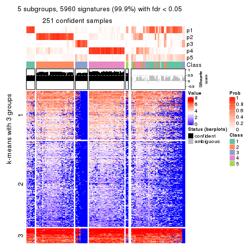</p>

</div>
<div id='tab-SD-NMF-get-signatures-no-scale-5'>
<pre><code class="r">get_signatures(res, k = 6, scale_rows = FALSE)
</code></pre>

<p></p>

</div>
</div>


Compare the overlap of signatures from different k:

```r
compare_signatures(res)
```


`get_signature()` returns a data frame invisibly. TO get the list of signatures, the function
call should be assigned to a variable explicitly. In following code, if `plot` argument is set
to `FALSE`, no heatmap is plotted while only the differential analysis is performed.

```r
# code only for demonstration
tb = get_signature(res, k = ..., plot = FALSE)
```

An example of the output of `tb` is:

```
#>   which_row         fdr    mean_1    mean_2 scaled_mean_1 scaled_mean_2 km
#> 1        38 0.042760348  8.373488  9.131774    -0.5533452     0.5164555  1
#> 2        40 0.018707592  7.106213  8.469186    -0.6173731     0.5762149  1
#> 3        55 0.019134737 10.221463 11.207825    -0.6159697     0.5749050  1
#> 4        59 0.006059896  5.921854  7.869574    -0.6899429     0.6439467  1
#> 5        60 0.018055526  8.928898 10.211722    -0.6204761     0.5791110  1
#> 6        98 0.009384629 15.714769 14.887706     0.6635654    -0.6193277  2
...
```

The columns in `tb` are:

1. `which_row`: row indices corresponding to the input matrix.
2. `fdr`: FDR for the differential test. 
3. `mean_x`: The mean value in group x.
4. `scaled_mean_x`: The mean value in group x after rows are scaled.
5. `km`: Row groups if k-means clustering is applied to rows.


UMAP plot which shows how samples are separated.


<script>
$( function() {
	$( '#tabs-SD-NMF-dimension-reduction' ).tabs();
} );
</script>
<div id='tabs-SD-NMF-dimension-reduction'>
<ul>
<li><a href='#tab-SD-NMF-dimension-reduction-1'>k = 2</a></li>
<li><a href='#tab-SD-NMF-dimension-reduction-2'>k = 3</a></li>
<li><a href='#tab-SD-NMF-dimension-reduction-3'>k = 4</a></li>
<li><a href='#tab-SD-NMF-dimension-reduction-4'>k = 5</a></li>
<li><a href='#tab-SD-NMF-dimension-reduction-5'>k = 6</a></li>
</ul>
<div id='tab-SD-NMF-dimension-reduction-1'>
<pre><code class="r">dimension_reduction(res, k = 2, method = &quot;UMAP&quot;)
</code></pre>

<p></p>

</div>
<div id='tab-SD-NMF-dimension-reduction-2'>
<pre><code class="r">dimension_reduction(res, k = 3, method = &quot;UMAP&quot;)
</code></pre>

<p></p>

</div>
<div id='tab-SD-NMF-dimension-reduction-3'>
<pre><code class="r">dimension_reduction(res, k = 4, method = &quot;UMAP&quot;)
</code></pre>

<p></p>

</div>
<div id='tab-SD-NMF-dimension-reduction-4'>
<pre><code class="r">dimension_reduction(res, k = 5, method = &quot;UMAP&quot;)
</code></pre>

<p></p>

</div>
<div id='tab-SD-NMF-dimension-reduction-5'>
<pre><code class="r">dimension_reduction(res, k = 6, method = &quot;UMAP&quot;)
</code></pre>

<p></p>

</div>
</div>


Following heatmap shows how subgroups are split when increasing `k`:

```r
collect_classes(res)
```


If matrix rows can be associated to genes, consider to use `GO_Enrichment(res,
...)` to perform function enrichment for the signature genes.


 

---------------------------------------------------


### CV:hclust


The object with results only for a single top-value method and a single partition method 
can be extracted as:

```r
res = res_list["CV", "hclust"]
# you can also extract it by
# res = res_list["CV:hclust"]
```

A summary of `res` and all the functions that can be applied to it:

```r
res
```

```
#> A 'ConsensusPartition' object with k = 2, 3, 4, 5, 6.
#>   On a matrix with 5966 rows and 384 columns.
#>   Top rows (597, 1194, 1790, 2386, 2983) are extracted by 'CV' method.
#>   Subgroups are detected by 'hclust' method.
#>   Performed in total 1250 partitions by row resampling.
#>   Best k for subgroups seems to be 2.
#> 
#> Following methods can be applied to this 'ConsensusPartition' object:
#>  [1] "cola_report"             "collect_classes"         "collect_plots"          
#>  [4] "collect_stats"           "colnames"                "compare_signatures"     
#>  [7] "consensus_heatmap"       "dimension_reduction"     "functional_enrichment"  
#> [10] "get_anno_col"            "get_anno"                "get_classes"            
#> [13] "get_consensus"           "get_matrix"              "get_membership"         
#> [16] "get_param"               "get_signatures"          "get_stats"              
#> [19] "is_best_k"               "is_stable_k"             "membership_heatmap"     
#> [22] "ncol"                    "nrow"                    "plot_ecdf"              
#> [25] "rownames"                "select_partition_number" "show"                   
#> [28] "suggest_best_k"          "test_to_known_factors"
```

`collect_plots()` function collects all the plots made from `res` for all `k` (number of partitions)
into one single page to provide an easy and fast comparison between different `k`.

```r
collect_plots(res)
```

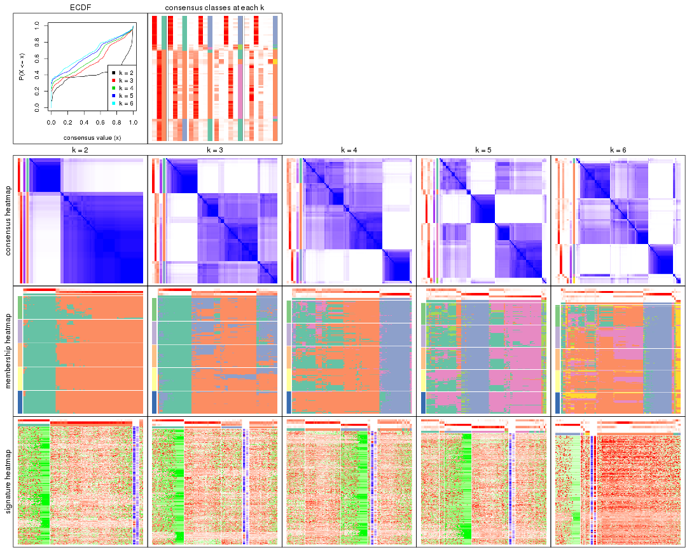

The plots are:

- The first row: a plot of the ECDF (Empirical cumulative distribution
  function) curves of the consensus matrix for each `k` and the heatmap of
  predicted classes for each `k`.
- The second row: heatmaps of the consensus matrix for each `k`.
- The third row: heatmaps of the membership matrix for each `k`.
- The fouth row: heatmaps of the signatures for each `k`.

All the plots in panels can be made by individual functions and they are
plotted later in this section.

`select_partition_number()` produces several plots showing different
statistics for choosing "optimized" `k`. There are following statistics:

- ECDF curves of the consensus matrix for each `k`;
- 1-PAC. [The PAC
  score](https://en.wikipedia.org/wiki/Consensus_clustering#Over-interpretation_potential_of_consensus_clustering)
  measures the proportion of the ambiguous subgrouping.
- Mean silhouette score.
- Concordance. The mean probability of fiting the consensus class ids in all
  partitions.
- Area increased. Denote $A_k$ as the area under the ECDF curve for current
  `k`, the area increased is defined as $A_k - A_{k-1}$.
- Rand index. The percent of pairs of samples that are both in a same cluster
  or both are not in a same cluster in the partition of k and k-1.
- Jaccard index. The ratio of pairs of samples are both in a same cluster in
  the partition of k and k-1 and the pairs of samples are both in a same
  cluster in the partition k or k-1.

The detailed explanations of these statistics can be found in [the cola
vignette](http://bioconductor.org/packages/devel/bioc/vignettes/cola/inst/doc/cola.html#toc_13).

Generally speaking, lower PAC score, higher mean silhouette score or higher
concordance corresponds to better partition. Rand index and Jaccard index
measure how similar the current partition is compared to partition with `k-1`.
If they are too similar, we won't accept `k` is better than `k-1`.

```r
select_partition_number(res)
```


The numeric values for all these statistics can be obtained by `get_stats()`.

```r
get_stats(res)
```

```
#>   k 1-PAC mean_silhouette concordance area_increased  Rand Jaccard
#> 2 2 0.728           0.915       0.949         0.4144 0.604   0.604
#> 3 3 0.480           0.596       0.781         0.3699 0.787   0.651
#> 4 4 0.473           0.556       0.764         0.0739 0.965   0.915
#> 5 5 0.514           0.599       0.760         0.0764 0.882   0.709
#> 6 6 0.503           0.187       0.678         0.0381 0.775   0.554
```

`suggest_best_k()` suggests the best $k$ based on these statistics. The rules are as follows:

- All $k$ with Jaccard index larger than 0.95 are removed because the increase of
  the partition number does not provides enough extra information. If all $k$ are removed,
  the best $k$ is assigned by `NA`.
- For $k$ with 1-PAC larger than 0.9, the maximal $k$ is taken as the "best k". Other $k$ is called "optional k".
- If it does not fit the second rule. The $k$ with the highest vote of highest
  1-PAC, mean silhouette and concordance is taken as the "best k".

```r
suggest_best_k(res)
```

```
#> [1] 2
```


Following shows the table of the partitions (You need to click the **show/hide
code output** link to see it). The membership matrix (columns with name `p*`)
is inferred by
[`clue::cl_consensus()`](https://www.rdocumentation.org/link/cl_consensus?package=clue)
function with the `SE` method. Basically the value in the membership matrix
represents the probability to belong to a certain group. The finall class
label for an item is determined with the group with highest probability it
belongs to.

In `get_classes()` function, the entropy is calculated from the membership
matrix and the silhouette score is calculated from the consensus matrix.


<script>
$( function() {
	$( '#tabs-CV-hclust-get-classes' ).tabs();
} );
</script>
<div id='tabs-CV-hclust-get-classes'>
<ul>
<li><a href='#tab-CV-hclust-get-classes-1'>k = 2</a></li>
<li><a href='#tab-CV-hclust-get-classes-2'>k = 3</a></li>
<li><a href='#tab-CV-hclust-get-classes-3'>k = 4</a></li>
<li><a href='#tab-CV-hclust-get-classes-4'>k = 5</a></li>
<li><a href='#tab-CV-hclust-get-classes-5'>k = 6</a></li>
</ul>

<div id='tab-CV-hclust-get-classes-1'>
<p><a id='tab-CV-hclust-get-classes-1-a' style='color:#0366d6' href='#'>show/hide code output</a></p>
<pre><code class="r">cbind(get_classes(res, k = 2), get_membership(res, k = 2))
</code></pre>

<pre><code>#&gt;           class entropy silhouette    p1    p2
#&gt; SRR490216     2  0.6048      0.868 0.148 0.852
#&gt; SRR490217     2  0.6048      0.868 0.148 0.852
#&gt; SRR490218     2  0.6048      0.868 0.148 0.852
#&gt; SRR490219     2  0.6048      0.868 0.148 0.852
#&gt; SRR490220     2  0.6712      0.843 0.176 0.824
#&gt; SRR490221     2  0.6712      0.843 0.176 0.824
#&gt; SRR490222     2  0.6712      0.843 0.176 0.824
#&gt; SRR490223     2  0.6712      0.843 0.176 0.824
#&gt; SRR490224     1  0.0000      0.973 1.000 0.000
#&gt; SRR490225     1  0.0000      0.973 1.000 0.000
#&gt; SRR490226     1  0.0000      0.973 1.000 0.000
#&gt; SRR490227     1  0.0000      0.973 1.000 0.000
#&gt; SRR490228     1  0.0000      0.973 1.000 0.000
#&gt; SRR490229     1  0.0000      0.973 1.000 0.000
#&gt; SRR490230     1  0.0000      0.973 1.000 0.000
#&gt; SRR490231     1  0.0000      0.973 1.000 0.000
#&gt; SRR490232     1  0.0376      0.971 0.996 0.004
#&gt; SRR490233     1  0.0376      0.971 0.996 0.004
#&gt; SRR490234     1  0.0376      0.971 0.996 0.004
#&gt; SRR490235     1  0.0376      0.971 0.996 0.004
#&gt; SRR490236     1  0.0000      0.973 1.000 0.000
#&gt; SRR490237     1  0.0000      0.973 1.000 0.000
#&gt; SRR490238     1  0.0000      0.973 1.000 0.000
#&gt; SRR490239     1  0.0000      0.973 1.000 0.000
#&gt; SRR490240     2  0.6048      0.866 0.148 0.852
#&gt; SRR490241     2  0.6048      0.866 0.148 0.852
#&gt; SRR490242     2  0.6048      0.866 0.148 0.852
#&gt; SRR490243     2  0.6048      0.866 0.148 0.852
#&gt; SRR490244     1  0.0000      0.973 1.000 0.000
#&gt; SRR490245     1  0.0000      0.973 1.000 0.000
#&gt; SRR490246     1  0.0000      0.973 1.000 0.000
#&gt; SRR490247     1  0.0000      0.973 1.000 0.000
#&gt; SRR490248     2  0.6048      0.868 0.148 0.852
#&gt; SRR490249     2  0.6048      0.868 0.148 0.852
#&gt; SRR490250     2  0.6048      0.868 0.148 0.852
#&gt; SRR490251     2  0.6048      0.868 0.148 0.852
#&gt; SRR490252     2  0.3584      0.926 0.068 0.932
#&gt; SRR490253     2  0.3584      0.926 0.068 0.932
#&gt; SRR490254     2  0.3584      0.926 0.068 0.932
#&gt; SRR490255     2  0.3584      0.926 0.068 0.932
#&gt; SRR490256     1  0.1184      0.964 0.984 0.016
#&gt; SRR490257     1  0.1184      0.964 0.984 0.016
#&gt; SRR490258     1  0.1184      0.964 0.984 0.016
#&gt; SRR490259     1  0.1184      0.964 0.984 0.016
#&gt; SRR490260     1  0.0000      0.973 1.000 0.000
#&gt; SRR490261     1  0.0000      0.973 1.000 0.000
#&gt; SRR490262     1  0.0000      0.973 1.000 0.000
#&gt; SRR490263     1  0.0000      0.973 1.000 0.000
#&gt; SRR490264     1  0.0000      0.973 1.000 0.000
#&gt; SRR490265     1  0.0000      0.973 1.000 0.000
#&gt; SRR490266     1  0.0000      0.973 1.000 0.000
#&gt; SRR490267     1  0.0000      0.973 1.000 0.000
#&gt; SRR490268     1  0.0000      0.973 1.000 0.000
#&gt; SRR490269     1  0.0000      0.973 1.000 0.000
#&gt; SRR490270     1  0.0000      0.973 1.000 0.000
#&gt; SRR490271     1  0.0000      0.973 1.000 0.000
#&gt; SRR490272     1  0.0376      0.971 0.996 0.004
#&gt; SRR490273     1  0.0376      0.971 0.996 0.004
#&gt; SRR490274     1  0.0376      0.971 0.996 0.004
#&gt; SRR490275     1  0.0376      0.971 0.996 0.004
#&gt; SRR490276     1  0.0376      0.971 0.996 0.004
#&gt; SRR490277     1  0.0376      0.971 0.996 0.004
#&gt; SRR490278     1  0.0376      0.971 0.996 0.004
#&gt; SRR490279     1  0.0376      0.971 0.996 0.004
#&gt; SRR490280     1  0.0000      0.973 1.000 0.000
#&gt; SRR490281     1  0.0000      0.973 1.000 0.000
#&gt; SRR490282     1  0.0000      0.973 1.000 0.000
#&gt; SRR490283     1  0.0000      0.973 1.000 0.000
#&gt; SRR490284     1  0.0000      0.973 1.000 0.000
#&gt; SRR490285     1  0.0000      0.973 1.000 0.000
#&gt; SRR490286     1  0.0000      0.973 1.000 0.000
#&gt; SRR490287     1  0.0000      0.973 1.000 0.000
#&gt; SRR490288     1  0.7056      0.765 0.808 0.192
#&gt; SRR490289     1  0.7056      0.765 0.808 0.192
#&gt; SRR490290     1  0.7056      0.765 0.808 0.192
#&gt; SRR490291     1  0.7056      0.765 0.808 0.192
#&gt; SRR490292     2  0.4815      0.906 0.104 0.896
#&gt; SRR490293     2  0.4815      0.906 0.104 0.896
#&gt; SRR490294     2  0.4815      0.906 0.104 0.896
#&gt; SRR490295     2  0.4815      0.906 0.104 0.896
#&gt; SRR490296     2  0.1184      0.944 0.016 0.984
#&gt; SRR490297     2  0.1184      0.944 0.016 0.984
#&gt; SRR490298     2  0.1184      0.944 0.016 0.984
#&gt; SRR490299     2  0.1184      0.944 0.016 0.984
#&gt; SRR490300     2  0.4562      0.911 0.096 0.904
#&gt; SRR490301     2  0.4562      0.911 0.096 0.904
#&gt; SRR490302     2  0.4562      0.911 0.096 0.904
#&gt; SRR490303     2  0.4562      0.911 0.096 0.904
#&gt; SRR490304     2  0.1184      0.944 0.016 0.984
#&gt; SRR490305     2  0.1184      0.944 0.016 0.984
#&gt; SRR490306     2  0.1184      0.944 0.016 0.984
#&gt; SRR490307     2  0.1184      0.944 0.016 0.984
#&gt; SRR490308     1  0.0000      0.973 1.000 0.000
#&gt; SRR490309     1  0.0000      0.973 1.000 0.000
#&gt; SRR490310     1  0.0000      0.973 1.000 0.000
#&gt; SRR490311     1  0.0000      0.973 1.000 0.000
#&gt; SRR490312     2  0.6048      0.868 0.148 0.852
#&gt; SRR490313     2  0.6048      0.868 0.148 0.852
#&gt; SRR490314     2  0.6048      0.868 0.148 0.852
#&gt; SRR490315     2  0.6048      0.868 0.148 0.852
#&gt; SRR490316     2  0.9922      0.323 0.448 0.552
#&gt; SRR490317     2  0.9922      0.323 0.448 0.552
#&gt; SRR490318     2  0.9922      0.323 0.448 0.552
#&gt; SRR490319     2  0.9922      0.323 0.448 0.552
#&gt; SRR490320     1  0.2236      0.948 0.964 0.036
#&gt; SRR490321     1  0.2236      0.948 0.964 0.036
#&gt; SRR490322     1  0.2236      0.948 0.964 0.036
#&gt; SRR490323     1  0.2236      0.948 0.964 0.036
#&gt; SRR490324     1  0.0000      0.973 1.000 0.000
#&gt; SRR490325     1  0.0000      0.973 1.000 0.000
#&gt; SRR490326     1  0.0000      0.973 1.000 0.000
#&gt; SRR490327     1  0.0000      0.973 1.000 0.000
#&gt; SRR490328     2  0.4161      0.919 0.084 0.916
#&gt; SRR490329     2  0.4161      0.919 0.084 0.916
#&gt; SRR490330     2  0.4161      0.919 0.084 0.916
#&gt; SRR490331     2  0.4161      0.919 0.084 0.916
#&gt; SRR490332     2  0.3431      0.928 0.064 0.936
#&gt; SRR490333     2  0.3431      0.928 0.064 0.936
#&gt; SRR490334     2  0.3431      0.928 0.064 0.936
#&gt; SRR490335     2  0.3431      0.928 0.064 0.936
#&gt; SRR490336     2  0.2236      0.939 0.036 0.964
#&gt; SRR490337     2  0.2236      0.939 0.036 0.964
#&gt; SRR490338     2  0.2236      0.939 0.036 0.964
#&gt; SRR490339     2  0.2236      0.939 0.036 0.964
#&gt; SRR490340     2  0.4690      0.909 0.100 0.900
#&gt; SRR490341     2  0.4690      0.909 0.100 0.900
#&gt; SRR490342     2  0.4690      0.909 0.100 0.900
#&gt; SRR490343     2  0.4690      0.909 0.100 0.900
#&gt; SRR490344     2  0.5519      0.886 0.128 0.872
#&gt; SRR490345     2  0.5519      0.886 0.128 0.872
#&gt; SRR490346     2  0.5519      0.886 0.128 0.872
#&gt; SRR490347     2  0.5519      0.886 0.128 0.872
#&gt; SRR490348     2  0.0000      0.941 0.000 1.000
#&gt; SRR490349     2  0.0000      0.941 0.000 1.000
#&gt; SRR490350     2  0.0000      0.941 0.000 1.000
#&gt; SRR490351     2  0.0000      0.941 0.000 1.000
#&gt; SRR490352     2  0.0000      0.941 0.000 1.000
#&gt; SRR490353     2  0.0000      0.941 0.000 1.000
#&gt; SRR490354     2  0.0000      0.941 0.000 1.000
#&gt; SRR490355     2  0.0000      0.941 0.000 1.000
#&gt; SRR490356     2  0.2948      0.934 0.052 0.948
#&gt; SRR490357     2  0.2948      0.934 0.052 0.948
#&gt; SRR490358     2  0.2948      0.934 0.052 0.948
#&gt; SRR490359     2  0.2948      0.934 0.052 0.948
#&gt; SRR490360     2  0.0000      0.941 0.000 1.000
#&gt; SRR490361     2  0.0000      0.941 0.000 1.000
#&gt; SRR490362     2  0.0000      0.941 0.000 1.000
#&gt; SRR490363     2  0.0000      0.941 0.000 1.000
#&gt; SRR490364     2  0.2236      0.939 0.036 0.964
#&gt; SRR490365     2  0.2236      0.939 0.036 0.964
#&gt; SRR490366     2  0.2236      0.939 0.036 0.964
#&gt; SRR490367     2  0.2236      0.939 0.036 0.964
#&gt; SRR490368     2  0.0672      0.943 0.008 0.992
#&gt; SRR490369     2  0.0672      0.943 0.008 0.992
#&gt; SRR490370     2  0.0672      0.943 0.008 0.992
#&gt; SRR490371     2  0.0672      0.943 0.008 0.992
#&gt; SRR490372     1  0.0000      0.973 1.000 0.000
#&gt; SRR490373     1  0.0000      0.973 1.000 0.000
#&gt; SRR490374     1  0.0000      0.973 1.000 0.000
#&gt; SRR490375     1  0.0000      0.973 1.000 0.000
#&gt; SRR490376     2  0.4562      0.909 0.096 0.904
#&gt; SRR490377     2  0.4562      0.909 0.096 0.904
#&gt; SRR490378     2  0.4562      0.909 0.096 0.904
#&gt; SRR490379     2  0.4562      0.909 0.096 0.904
#&gt; SRR490380     1  0.0000      0.973 1.000 0.000
#&gt; SRR490381     1  0.0000      0.973 1.000 0.000
#&gt; SRR490382     1  0.0000      0.973 1.000 0.000
#&gt; SRR490383     1  0.0000      0.973 1.000 0.000
#&gt; SRR490384     2  0.0000      0.941 0.000 1.000
#&gt; SRR490385     2  0.0000      0.941 0.000 1.000
#&gt; SRR490386     2  0.0000      0.941 0.000 1.000
#&gt; SRR490387     2  0.0000      0.941 0.000 1.000
#&gt; SRR490388     2  0.0938      0.944 0.012 0.988
#&gt; SRR490389     2  0.0938      0.944 0.012 0.988
#&gt; SRR490390     2  0.0938      0.944 0.012 0.988
#&gt; SRR490391     2  0.0938      0.944 0.012 0.988
#&gt; SRR490392     2  0.0938      0.944 0.012 0.988
#&gt; SRR490393     2  0.0938      0.944 0.012 0.988
#&gt; SRR490394     2  0.0938      0.944 0.012 0.988
#&gt; SRR490395     2  0.0938      0.944 0.012 0.988
#&gt; SRR490396     2  0.0938      0.944 0.012 0.988
#&gt; SRR490397     2  0.0938      0.944 0.012 0.988
#&gt; SRR490398     2  0.0938      0.944 0.012 0.988
#&gt; SRR490399     2  0.0938      0.944 0.012 0.988
#&gt; SRR490400     2  0.0672      0.943 0.008 0.992
#&gt; SRR490401     2  0.0672      0.943 0.008 0.992
#&gt; SRR490402     2  0.0672      0.943 0.008 0.992
#&gt; SRR490403     2  0.0672      0.943 0.008 0.992
#&gt; SRR490404     2  0.3114      0.932 0.056 0.944
#&gt; SRR490405     2  0.3114      0.932 0.056 0.944
#&gt; SRR490406     2  0.3114      0.932 0.056 0.944
#&gt; SRR490407     2  0.3114      0.932 0.056 0.944
#&gt; SRR490408     2  0.0000      0.941 0.000 1.000
#&gt; SRR490409     2  0.0000      0.941 0.000 1.000
#&gt; SRR490410     2  0.0000      0.941 0.000 1.000
#&gt; SRR490411     2  0.0000      0.941 0.000 1.000
#&gt; SRR490412     1  0.0000      0.973 1.000 0.000
#&gt; SRR490413     1  0.0000      0.973 1.000 0.000
#&gt; SRR490414     1  0.0000      0.973 1.000 0.000
#&gt; SRR490415     1  0.0000      0.973 1.000 0.000
#&gt; SRR490416     2  0.6531      0.846 0.168 0.832
#&gt; SRR490417     2  0.6531      0.846 0.168 0.832
#&gt; SRR490418     2  0.6531      0.846 0.168 0.832
#&gt; SRR490419     2  0.6531      0.846 0.168 0.832
#&gt; SRR490420     2  0.9754      0.424 0.408 0.592
#&gt; SRR490421     2  0.9754      0.424 0.408 0.592
#&gt; SRR490422     2  0.9754      0.424 0.408 0.592
#&gt; SRR490423     2  0.9754      0.424 0.408 0.592
#&gt; SRR490424     1  0.0000      0.973 1.000 0.000
#&gt; SRR490425     1  0.0000      0.973 1.000 0.000
#&gt; SRR490426     1  0.0000      0.973 1.000 0.000
#&gt; SRR490427     1  0.0000      0.973 1.000 0.000
#&gt; SRR490428     1  0.7139      0.764 0.804 0.196
#&gt; SRR490429     1  0.7139      0.764 0.804 0.196
#&gt; SRR490430     1  0.7139      0.764 0.804 0.196
#&gt; SRR490431     1  0.7139      0.764 0.804 0.196
#&gt; SRR490432     2  0.6148      0.862 0.152 0.848
#&gt; SRR490433     2  0.6148      0.862 0.152 0.848
#&gt; SRR490434     2  0.6148      0.862 0.152 0.848
#&gt; SRR490435     2  0.6148      0.862 0.152 0.848
#&gt; SRR490436     2  0.5059      0.898 0.112 0.888
#&gt; SRR490437     2  0.5059      0.898 0.112 0.888
#&gt; SRR490438     2  0.5059      0.898 0.112 0.888
#&gt; SRR490439     2  0.5059      0.898 0.112 0.888
#&gt; SRR490440     2  0.0000      0.941 0.000 1.000
#&gt; SRR490441     2  0.0000      0.941 0.000 1.000
#&gt; SRR490442     2  0.0000      0.941 0.000 1.000
#&gt; SRR490443     2  0.0000      0.941 0.000 1.000
#&gt; SRR490444     2  0.0000      0.941 0.000 1.000
#&gt; SRR490445     2  0.0000      0.941 0.000 1.000
#&gt; SRR490446     2  0.0000      0.941 0.000 1.000
#&gt; SRR490447     2  0.0000      0.941 0.000 1.000
#&gt; SRR490448     2  0.9754      0.421 0.408 0.592
#&gt; SRR490449     2  0.9754      0.421 0.408 0.592
#&gt; SRR490450     2  0.9754      0.421 0.408 0.592
#&gt; SRR490451     2  0.9754      0.421 0.408 0.592
#&gt; SRR490452     1  0.2778      0.938 0.952 0.048
#&gt; SRR490453     1  0.2778      0.938 0.952 0.048
#&gt; SRR490454     1  0.2778      0.938 0.952 0.048
#&gt; SRR490455     1  0.2778      0.938 0.952 0.048
#&gt; SRR490456     2  0.6247      0.858 0.156 0.844
#&gt; SRR490457     2  0.6247      0.858 0.156 0.844
#&gt; SRR490458     2  0.6247      0.858 0.156 0.844
#&gt; SRR490459     2  0.6247      0.858 0.156 0.844
#&gt; SRR490460     2  0.6887      0.828 0.184 0.816
#&gt; SRR490461     2  0.6887      0.828 0.184 0.816
#&gt; SRR490462     2  0.6887      0.828 0.184 0.816
#&gt; SRR490463     2  0.6887      0.828 0.184 0.816
#&gt; SRR490464     1  0.0000      0.973 1.000 0.000
#&gt; SRR490465     1  0.0000      0.973 1.000 0.000
#&gt; SRR490466     1  0.0000      0.973 1.000 0.000
#&gt; SRR490467     1  0.0000      0.973 1.000 0.000
#&gt; SRR490468     2  0.2603      0.937 0.044 0.956
#&gt; SRR490469     2  0.2603      0.937 0.044 0.956
#&gt; SRR490470     2  0.2603      0.937 0.044 0.956
#&gt; SRR490471     2  0.2603      0.937 0.044 0.956
#&gt; SRR490472     2  0.0000      0.941 0.000 1.000
#&gt; SRR490473     2  0.0000      0.941 0.000 1.000
#&gt; SRR490474     2  0.0000      0.941 0.000 1.000
#&gt; SRR490475     2  0.0000      0.941 0.000 1.000
#&gt; SRR490476     1  0.0000      0.973 1.000 0.000
#&gt; SRR490477     1  0.0000      0.973 1.000 0.000
#&gt; SRR490478     1  0.0000      0.973 1.000 0.000
#&gt; SRR490479     1  0.0000      0.973 1.000 0.000
#&gt; SRR490480     2  0.1184      0.944 0.016 0.984
#&gt; SRR490481     2  0.1184      0.944 0.016 0.984
#&gt; SRR490482     2  0.1184      0.944 0.016 0.984
#&gt; SRR490483     2  0.1184      0.944 0.016 0.984
#&gt; SRR490484     2  0.1414      0.943 0.020 0.980
#&gt; SRR490485     2  0.1414      0.943 0.020 0.980
#&gt; SRR490486     2  0.1414      0.943 0.020 0.980
#&gt; SRR490487     2  0.1414      0.943 0.020 0.980
#&gt; SRR490488     2  0.1184      0.944 0.016 0.984
#&gt; SRR490489     2  0.1184      0.944 0.016 0.984
#&gt; SRR490490     2  0.1184      0.944 0.016 0.984
#&gt; SRR490491     2  0.1184      0.944 0.016 0.984
#&gt; SRR490492     2  0.1184      0.944 0.016 0.984
#&gt; SRR490493     2  0.1184      0.944 0.016 0.984
#&gt; SRR490494     2  0.1184      0.944 0.016 0.984
#&gt; SRR490495     2  0.1184      0.944 0.016 0.984
#&gt; SRR490496     2  0.1184      0.944 0.016 0.984
#&gt; SRR490497     2  0.1184      0.944 0.016 0.984
#&gt; SRR490498     2  0.1184      0.944 0.016 0.984
#&gt; SRR490499     2  0.1184      0.944 0.016 0.984
#&gt; SRR490500     2  0.2043      0.940 0.032 0.968
#&gt; SRR490501     2  0.2043      0.940 0.032 0.968
#&gt; SRR490502     2  0.2043      0.940 0.032 0.968
#&gt; SRR490503     2  0.2043      0.940 0.032 0.968
#&gt; SRR490504     2  0.0000      0.941 0.000 1.000
#&gt; SRR490505     2  0.0000      0.941 0.000 1.000
#&gt; SRR490506     2  0.0000      0.941 0.000 1.000
#&gt; SRR490507     2  0.0000      0.941 0.000 1.000
#&gt; SRR490508     2  0.0000      0.941 0.000 1.000
#&gt; SRR490509     2  0.0000      0.941 0.000 1.000
#&gt; SRR490510     2  0.0000      0.941 0.000 1.000
#&gt; SRR490511     2  0.0000      0.941 0.000 1.000
#&gt; SRR490512     2  0.0938      0.944 0.012 0.988
#&gt; SRR490513     2  0.0938      0.944 0.012 0.988
#&gt; SRR490514     2  0.0938      0.944 0.012 0.988
#&gt; SRR490515     2  0.0938      0.944 0.012 0.988
#&gt; SRR490516     2  0.1184      0.944 0.016 0.984
#&gt; SRR490517     2  0.1184      0.944 0.016 0.984
#&gt; SRR490518     2  0.1184      0.944 0.016 0.984
#&gt; SRR490519     2  0.1184      0.944 0.016 0.984
#&gt; SRR490520     2  0.1184      0.944 0.016 0.984
#&gt; SRR490521     2  0.1184      0.944 0.016 0.984
#&gt; SRR490522     2  0.1184      0.944 0.016 0.984
#&gt; SRR490523     2  0.1184      0.944 0.016 0.984
#&gt; SRR490524     2  0.1184      0.944 0.016 0.984
#&gt; SRR490525     2  0.1184      0.944 0.016 0.984
#&gt; SRR490526     2  0.1184      0.944 0.016 0.984
#&gt; SRR490527     2  0.1184      0.944 0.016 0.984
#&gt; SRR490528     2  0.1184      0.944 0.016 0.984
#&gt; SRR490529     2  0.1184      0.944 0.016 0.984
#&gt; SRR490530     2  0.1184      0.944 0.016 0.984
#&gt; SRR490531     2  0.1184      0.944 0.016 0.984
#&gt; SRR490532     1  0.5842      0.845 0.860 0.140
#&gt; SRR490533     1  0.5842      0.845 0.860 0.140
#&gt; SRR490534     1  0.5842      0.845 0.860 0.140
#&gt; SRR490535     1  0.5842      0.845 0.860 0.140
#&gt; SRR490536     2  0.0000      0.941 0.000 1.000
#&gt; SRR490537     2  0.0000      0.941 0.000 1.000
#&gt; SRR490538     2  0.0000      0.941 0.000 1.000
#&gt; SRR490539     2  0.0000      0.941 0.000 1.000
#&gt; SRR490540     2  0.0000      0.941 0.000 1.000
#&gt; SRR490541     2  0.0000      0.941 0.000 1.000
#&gt; SRR490542     2  0.0000      0.941 0.000 1.000
#&gt; SRR490543     2  0.0000      0.941 0.000 1.000
#&gt; SRR490544     2  0.0000      0.941 0.000 1.000
#&gt; SRR490545     2  0.0000      0.941 0.000 1.000
#&gt; SRR490546     2  0.0000      0.941 0.000 1.000
#&gt; SRR490547     2  0.0000      0.941 0.000 1.000
#&gt; SRR490548     2  0.0938      0.944 0.012 0.988
#&gt; SRR490549     2  0.0938      0.944 0.012 0.988
#&gt; SRR490550     2  0.0938      0.944 0.012 0.988
#&gt; SRR490551     2  0.0938      0.944 0.012 0.988
#&gt; SRR490552     2  0.0000      0.941 0.000 1.000
#&gt; SRR490553     2  0.0000      0.941 0.000 1.000
#&gt; SRR490554     2  0.0000      0.941 0.000 1.000
#&gt; SRR490555     2  0.0000      0.941 0.000 1.000
#&gt; SRR490556     2  0.0672      0.943 0.008 0.992
#&gt; SRR490557     2  0.0672      0.943 0.008 0.992
#&gt; SRR490558     2  0.0672      0.943 0.008 0.992
#&gt; SRR490559     2  0.0672      0.943 0.008 0.992
#&gt; SRR490560     2  0.0376      0.942 0.004 0.996
#&gt; SRR490561     2  0.0376      0.942 0.004 0.996
#&gt; SRR490562     2  0.0376      0.942 0.004 0.996
#&gt; SRR490563     2  0.0376      0.942 0.004 0.996
#&gt; SRR490564     2  0.2948      0.934 0.052 0.948
#&gt; SRR490565     2  0.2948      0.934 0.052 0.948
#&gt; SRR490566     2  0.2948      0.934 0.052 0.948
#&gt; SRR490567     2  0.2948      0.934 0.052 0.948
#&gt; SRR490568     2  0.0000      0.941 0.000 1.000
#&gt; SRR490569     2  0.0000      0.941 0.000 1.000
#&gt; SRR490570     2  0.0000      0.941 0.000 1.000
#&gt; SRR490571     2  0.0000      0.941 0.000 1.000
#&gt; SRR490572     2  0.0000      0.941 0.000 1.000
#&gt; SRR490573     2  0.0000      0.941 0.000 1.000
#&gt; SRR490574     2  0.0000      0.941 0.000 1.000
#&gt; SRR490575     2  0.0000      0.941 0.000 1.000
#&gt; SRR490576     2  0.0000      0.941 0.000 1.000
#&gt; SRR490577     2  0.0000      0.941 0.000 1.000
#&gt; SRR490578     2  0.0000      0.941 0.000 1.000
#&gt; SRR490579     2  0.0000      0.941 0.000 1.000
#&gt; SRR490580     2  0.0938      0.944 0.012 0.988
#&gt; SRR490581     2  0.0938      0.944 0.012 0.988
#&gt; SRR490582     2  0.0938      0.944 0.012 0.988
#&gt; SRR490583     2  0.0938      0.944 0.012 0.988
#&gt; SRR490584     2  0.0000      0.941 0.000 1.000
#&gt; SRR490585     2  0.0000      0.941 0.000 1.000
#&gt; SRR490586     2  0.0000      0.941 0.000 1.000
#&gt; SRR490587     2  0.0000      0.941 0.000 1.000
#&gt; SRR490588     2  0.0672      0.943 0.008 0.992
#&gt; SRR490589     2  0.0672      0.943 0.008 0.992
#&gt; SRR490590     2  0.0672      0.943 0.008 0.992
#&gt; SRR490591     2  0.0672      0.943 0.008 0.992
#&gt; SRR490592     2  0.0000      0.941 0.000 1.000
#&gt; SRR490593     2  0.0000      0.941 0.000 1.000
#&gt; SRR490594     2  0.0000      0.941 0.000 1.000
#&gt; SRR490595     2  0.0000      0.941 0.000 1.000
#&gt; SRR490596     2  0.5737      0.881 0.136 0.864
#&gt; SRR490597     2  0.5737      0.881 0.136 0.864
#&gt; SRR490598     2  0.5737      0.881 0.136 0.864
#&gt; SRR490599     2  0.5737      0.881 0.136 0.864
</code></pre>

<script>
$('#tab-CV-hclust-get-classes-1-a').parent().next().next().hide();
$('#tab-CV-hclust-get-classes-1-a').click(function(){
  $('#tab-CV-hclust-get-classes-1-a').parent().next().next().toggle();
  return(false);
});
</script>
</div>

<div id='tab-CV-hclust-get-classes-2'>
<p><a id='tab-CV-hclust-get-classes-2-a' style='color:#0366d6' href='#'>show/hide code output</a></p>
<pre><code class="r">cbind(get_classes(res, k = 3), get_membership(res, k = 3))
</code></pre>

<pre><code>#&gt;           class entropy silhouette    p1    p2    p3
#&gt; SRR490216     2  0.7273    0.42823 0.132 0.712 0.156
#&gt; SRR490217     2  0.7273    0.42823 0.132 0.712 0.156
#&gt; SRR490218     2  0.7273    0.42823 0.132 0.712 0.156
#&gt; SRR490219     2  0.7273    0.42823 0.132 0.712 0.156
#&gt; SRR490220     3  0.8918    0.70379 0.128 0.380 0.492
#&gt; SRR490221     3  0.8918    0.70379 0.128 0.380 0.492
#&gt; SRR490222     3  0.8918    0.70379 0.128 0.380 0.492
#&gt; SRR490223     3  0.8918    0.70379 0.128 0.380 0.492
#&gt; SRR490224     1  0.0000    0.92114 1.000 0.000 0.000
#&gt; SRR490225     1  0.0000    0.92114 1.000 0.000 0.000
#&gt; SRR490226     1  0.0000    0.92114 1.000 0.000 0.000
#&gt; SRR490227     1  0.0000    0.92114 1.000 0.000 0.000
#&gt; SRR490228     1  0.0000    0.92114 1.000 0.000 0.000
#&gt; SRR490229     1  0.0000    0.92114 1.000 0.000 0.000
#&gt; SRR490230     1  0.0000    0.92114 1.000 0.000 0.000
#&gt; SRR490231     1  0.0000    0.92114 1.000 0.000 0.000
#&gt; SRR490232     1  0.2796    0.89377 0.908 0.000 0.092
#&gt; SRR490233     1  0.2796    0.89377 0.908 0.000 0.092
#&gt; SRR490234     1  0.2796    0.89377 0.908 0.000 0.092
#&gt; SRR490235     1  0.2796    0.89377 0.908 0.000 0.092
#&gt; SRR490236     1  0.0000    0.92114 1.000 0.000 0.000
#&gt; SRR490237     1  0.0000    0.92114 1.000 0.000 0.000
#&gt; SRR490238     1  0.0000    0.92114 1.000 0.000 0.000
#&gt; SRR490239     1  0.0000    0.92114 1.000 0.000 0.000
#&gt; SRR490240     3  0.8196    0.77030 0.084 0.356 0.560
#&gt; SRR490241     3  0.8196    0.77030 0.084 0.356 0.560
#&gt; SRR490242     3  0.8196    0.77030 0.084 0.356 0.560
#&gt; SRR490243     3  0.8196    0.77030 0.084 0.356 0.560
#&gt; SRR490244     1  0.0000    0.92114 1.000 0.000 0.000
#&gt; SRR490245     1  0.0000    0.92114 1.000 0.000 0.000
#&gt; SRR490246     1  0.0000    0.92114 1.000 0.000 0.000
#&gt; SRR490247     1  0.0000    0.92114 1.000 0.000 0.000
#&gt; SRR490248     2  0.7327    0.42013 0.132 0.708 0.160
#&gt; SRR490249     2  0.7327    0.42013 0.132 0.708 0.160
#&gt; SRR490250     2  0.7327    0.42013 0.132 0.708 0.160
#&gt; SRR490251     2  0.7327    0.42013 0.132 0.708 0.160
#&gt; SRR490252     2  0.6890    0.12462 0.028 0.632 0.340
#&gt; SRR490253     2  0.6890    0.12462 0.028 0.632 0.340
#&gt; SRR490254     2  0.6890    0.12462 0.028 0.632 0.340
#&gt; SRR490255     2  0.6890    0.12462 0.028 0.632 0.340
#&gt; SRR490256     1  0.3482    0.87527 0.872 0.000 0.128
#&gt; SRR490257     1  0.3482    0.87527 0.872 0.000 0.128
#&gt; SRR490258     1  0.3482    0.87527 0.872 0.000 0.128
#&gt; SRR490259     1  0.3482    0.87527 0.872 0.000 0.128
#&gt; SRR490260     1  0.1411    0.91326 0.964 0.000 0.036
#&gt; SRR490261     1  0.1411    0.91326 0.964 0.000 0.036
#&gt; SRR490262     1  0.1411    0.91326 0.964 0.000 0.036
#&gt; SRR490263     1  0.1411    0.91326 0.964 0.000 0.036
#&gt; SRR490264     1  0.0237    0.92021 0.996 0.000 0.004
#&gt; SRR490265     1  0.0237    0.92021 0.996 0.000 0.004
#&gt; SRR490266     1  0.0237    0.92021 0.996 0.000 0.004
#&gt; SRR490267     1  0.0237    0.92021 0.996 0.000 0.004
#&gt; SRR490268     1  0.2537    0.89798 0.920 0.000 0.080
#&gt; SRR490269     1  0.2537    0.89798 0.920 0.000 0.080
#&gt; SRR490270     1  0.2537    0.89798 0.920 0.000 0.080
#&gt; SRR490271     1  0.2537    0.89798 0.920 0.000 0.080
#&gt; SRR490272     1  0.1031    0.91688 0.976 0.000 0.024
#&gt; SRR490273     1  0.1031    0.91688 0.976 0.000 0.024
#&gt; SRR490274     1  0.1031    0.91688 0.976 0.000 0.024
#&gt; SRR490275     1  0.1031    0.91688 0.976 0.000 0.024
#&gt; SRR490276     1  0.0592    0.91931 0.988 0.000 0.012
#&gt; SRR490277     1  0.0592    0.91931 0.988 0.000 0.012
#&gt; SRR490278     1  0.0592    0.91931 0.988 0.000 0.012
#&gt; SRR490279     1  0.0592    0.91931 0.988 0.000 0.012
#&gt; SRR490280     1  0.0000    0.92114 1.000 0.000 0.000
#&gt; SRR490281     1  0.0000    0.92114 1.000 0.000 0.000
#&gt; SRR490282     1  0.0000    0.92114 1.000 0.000 0.000
#&gt; SRR490283     1  0.0000    0.92114 1.000 0.000 0.000
#&gt; SRR490284     1  0.0000    0.92114 1.000 0.000 0.000
#&gt; SRR490285     1  0.0000    0.92114 1.000 0.000 0.000
#&gt; SRR490286     1  0.0000    0.92114 1.000 0.000 0.000
#&gt; SRR490287     1  0.0000    0.92114 1.000 0.000 0.000
#&gt; SRR490288     1  0.7084    0.63530 0.628 0.036 0.336
#&gt; SRR490289     1  0.7084    0.63530 0.628 0.036 0.336
#&gt; SRR490290     1  0.7084    0.63530 0.628 0.036 0.336
#&gt; SRR490291     1  0.7084    0.63530 0.628 0.036 0.336
#&gt; SRR490292     3  0.6625    0.73517 0.024 0.316 0.660
#&gt; SRR490293     3  0.6625    0.73517 0.024 0.316 0.660
#&gt; SRR490294     3  0.6625    0.73517 0.024 0.316 0.660
#&gt; SRR490295     3  0.6625    0.73517 0.024 0.316 0.660
#&gt; SRR490296     2  0.5905    0.24201 0.000 0.648 0.352
#&gt; SRR490297     2  0.5905    0.24201 0.000 0.648 0.352
#&gt; SRR490298     2  0.5905    0.24201 0.000 0.648 0.352
#&gt; SRR490299     2  0.5905    0.24201 0.000 0.648 0.352
#&gt; SRR490300     3  0.6255    0.73162 0.012 0.320 0.668
#&gt; SRR490301     3  0.6255    0.73162 0.012 0.320 0.668
#&gt; SRR490302     3  0.6255    0.73162 0.012 0.320 0.668
#&gt; SRR490303     3  0.6255    0.73162 0.012 0.320 0.668
#&gt; SRR490304     2  0.5905    0.24201 0.000 0.648 0.352
#&gt; SRR490305     2  0.5905    0.24201 0.000 0.648 0.352
#&gt; SRR490306     2  0.5905    0.24201 0.000 0.648 0.352
#&gt; SRR490307     2  0.5905    0.24201 0.000 0.648 0.352
#&gt; SRR490308     1  0.0000    0.92114 1.000 0.000 0.000
#&gt; SRR490309     1  0.0000    0.92114 1.000 0.000 0.000
#&gt; SRR490310     1  0.0000    0.92114 1.000 0.000 0.000
#&gt; SRR490311     1  0.0000    0.92114 1.000 0.000 0.000
#&gt; SRR490312     2  0.7273    0.42823 0.132 0.712 0.156
#&gt; SRR490313     2  0.7273    0.42823 0.132 0.712 0.156
#&gt; SRR490314     2  0.7273    0.42823 0.132 0.712 0.156
#&gt; SRR490315     2  0.7273    0.42823 0.132 0.712 0.156
#&gt; SRR490316     1  0.9940   -0.47738 0.364 0.280 0.356
#&gt; SRR490317     1  0.9940   -0.47738 0.364 0.280 0.356
#&gt; SRR490318     1  0.9940   -0.47738 0.364 0.280 0.356
#&gt; SRR490319     1  0.9940   -0.47738 0.364 0.280 0.356
#&gt; SRR490320     1  0.2537    0.88974 0.920 0.000 0.080
#&gt; SRR490321     1  0.2537    0.88974 0.920 0.000 0.080
#&gt; SRR490322     1  0.2537    0.88974 0.920 0.000 0.080
#&gt; SRR490323     1  0.2537    0.88974 0.920 0.000 0.080
#&gt; SRR490324     1  0.0000    0.92114 1.000 0.000 0.000
#&gt; SRR490325     1  0.0000    0.92114 1.000 0.000 0.000
#&gt; SRR490326     1  0.0000    0.92114 1.000 0.000 0.000
#&gt; SRR490327     1  0.0000    0.92114 1.000 0.000 0.000
#&gt; SRR490328     3  0.7487    0.56438 0.036 0.464 0.500
#&gt; SRR490329     3  0.7487    0.56438 0.036 0.464 0.500
#&gt; SRR490330     3  0.7487    0.56438 0.036 0.464 0.500
#&gt; SRR490331     3  0.7487    0.56438 0.036 0.464 0.500
#&gt; SRR490332     3  0.6553    0.66735 0.008 0.412 0.580
#&gt; SRR490333     3  0.6553    0.66735 0.008 0.412 0.580
#&gt; SRR490334     3  0.6553    0.66735 0.008 0.412 0.580
#&gt; SRR490335     3  0.6553    0.66735 0.008 0.412 0.580
#&gt; SRR490336     2  0.6295   -0.31238 0.000 0.528 0.472
#&gt; SRR490337     2  0.6295   -0.31238 0.000 0.528 0.472
#&gt; SRR490338     2  0.6295   -0.31238 0.000 0.528 0.472
#&gt; SRR490339     2  0.6295   -0.31238 0.000 0.528 0.472
#&gt; SRR490340     3  0.6422    0.73332 0.016 0.324 0.660
#&gt; SRR490341     3  0.6422    0.73332 0.016 0.324 0.660
#&gt; SRR490342     3  0.6422    0.73332 0.016 0.324 0.660
#&gt; SRR490343     3  0.6422    0.73332 0.016 0.324 0.660
#&gt; SRR490344     2  0.7635    0.35586 0.112 0.676 0.212
#&gt; SRR490345     2  0.7635    0.35586 0.112 0.676 0.212
#&gt; SRR490346     2  0.7635    0.35586 0.112 0.676 0.212
#&gt; SRR490347     2  0.7635    0.35586 0.112 0.676 0.212
#&gt; SRR490348     2  0.0592    0.67800 0.000 0.988 0.012
#&gt; SRR490349     2  0.0592    0.67800 0.000 0.988 0.012
#&gt; SRR490350     2  0.0592    0.67800 0.000 0.988 0.012
#&gt; SRR490351     2  0.0592    0.67800 0.000 0.988 0.012
#&gt; SRR490352     2  0.0592    0.67800 0.000 0.988 0.012
#&gt; SRR490353     2  0.0592    0.67800 0.000 0.988 0.012
#&gt; SRR490354     2  0.0592    0.67800 0.000 0.988 0.012
#&gt; SRR490355     2  0.0592    0.67800 0.000 0.988 0.012
#&gt; SRR490356     2  0.6783   -0.01355 0.016 0.588 0.396
#&gt; SRR490357     2  0.6783   -0.01355 0.016 0.588 0.396
#&gt; SRR490358     2  0.6783   -0.01355 0.016 0.588 0.396
#&gt; SRR490359     2  0.6783   -0.01355 0.016 0.588 0.396
#&gt; SRR490360     2  0.2959    0.66284 0.000 0.900 0.100
#&gt; SRR490361     2  0.2959    0.66284 0.000 0.900 0.100
#&gt; SRR490362     2  0.2959    0.66284 0.000 0.900 0.100
#&gt; SRR490363     2  0.2959    0.66284 0.000 0.900 0.100
#&gt; SRR490364     2  0.6641   -0.32042 0.008 0.544 0.448
#&gt; SRR490365     2  0.6641   -0.32042 0.008 0.544 0.448
#&gt; SRR490366     2  0.6641   -0.32042 0.008 0.544 0.448
#&gt; SRR490367     2  0.6641   -0.32042 0.008 0.544 0.448
#&gt; SRR490368     2  0.1860    0.68593 0.000 0.948 0.052
#&gt; SRR490369     2  0.1860    0.68593 0.000 0.948 0.052
#&gt; SRR490370     2  0.1860    0.68593 0.000 0.948 0.052
#&gt; SRR490371     2  0.1860    0.68593 0.000 0.948 0.052
#&gt; SRR490372     1  0.0000    0.92114 1.000 0.000 0.000
#&gt; SRR490373     1  0.0000    0.92114 1.000 0.000 0.000
#&gt; SRR490374     1  0.0000    0.92114 1.000 0.000 0.000
#&gt; SRR490375     1  0.0000    0.92114 1.000 0.000 0.000
#&gt; SRR490376     2  0.6332    0.53033 0.088 0.768 0.144
#&gt; SRR490377     2  0.6332    0.53033 0.088 0.768 0.144
#&gt; SRR490378     2  0.6332    0.53033 0.088 0.768 0.144
#&gt; SRR490379     2  0.6332    0.53033 0.088 0.768 0.144
#&gt; SRR490380     1  0.0000    0.92114 1.000 0.000 0.000
#&gt; SRR490381     1  0.0000    0.92114 1.000 0.000 0.000
#&gt; SRR490382     1  0.0000    0.92114 1.000 0.000 0.000
#&gt; SRR490383     1  0.0000    0.92114 1.000 0.000 0.000
#&gt; SRR490384     2  0.0747    0.68405 0.000 0.984 0.016
#&gt; SRR490385     2  0.0747    0.68405 0.000 0.984 0.016
#&gt; SRR490386     2  0.0747    0.68405 0.000 0.984 0.016
#&gt; SRR490387     2  0.0747    0.68405 0.000 0.984 0.016
#&gt; SRR490388     2  0.2711    0.67334 0.000 0.912 0.088
#&gt; SRR490389     2  0.2711    0.67334 0.000 0.912 0.088
#&gt; SRR490390     2  0.2711    0.67334 0.000 0.912 0.088
#&gt; SRR490391     2  0.2711    0.67334 0.000 0.912 0.088
#&gt; SRR490392     2  0.1643    0.68796 0.000 0.956 0.044
#&gt; SRR490393     2  0.1643    0.68796 0.000 0.956 0.044
#&gt; SRR490394     2  0.1643    0.68796 0.000 0.956 0.044
#&gt; SRR490395     2  0.1643    0.68796 0.000 0.956 0.044
#&gt; SRR490396     2  0.2711    0.67334 0.000 0.912 0.088
#&gt; SRR490397     2  0.2711    0.67334 0.000 0.912 0.088
#&gt; SRR490398     2  0.2711    0.67334 0.000 0.912 0.088
#&gt; SRR490399     2  0.2711    0.67334 0.000 0.912 0.088
#&gt; SRR490400     2  0.1860    0.68593 0.000 0.948 0.052
#&gt; SRR490401     2  0.1860    0.68593 0.000 0.948 0.052
#&gt; SRR490402     2  0.1860    0.68593 0.000 0.948 0.052
#&gt; SRR490403     2  0.1860    0.68593 0.000 0.948 0.052
#&gt; SRR490404     2  0.6881    0.00144 0.020 0.592 0.388
#&gt; SRR490405     2  0.6881    0.00144 0.020 0.592 0.388
#&gt; SRR490406     2  0.6881    0.00144 0.020 0.592 0.388
#&gt; SRR490407     2  0.6881    0.00144 0.020 0.592 0.388
#&gt; SRR490408     2  0.0592    0.68509 0.000 0.988 0.012
#&gt; SRR490409     2  0.0592    0.68509 0.000 0.988 0.012
#&gt; SRR490410     2  0.0592    0.68509 0.000 0.988 0.012
#&gt; SRR490411     2  0.0592    0.68509 0.000 0.988 0.012
#&gt; SRR490412     1  0.0000    0.92114 1.000 0.000 0.000
#&gt; SRR490413     1  0.0000    0.92114 1.000 0.000 0.000
#&gt; SRR490414     1  0.0000    0.92114 1.000 0.000 0.000
#&gt; SRR490415     1  0.0000    0.92114 1.000 0.000 0.000
#&gt; SRR490416     3  0.8442    0.76422 0.100 0.352 0.548
#&gt; SRR490417     3  0.8442    0.76422 0.100 0.352 0.548
#&gt; SRR490418     3  0.8442    0.76422 0.100 0.352 0.548
#&gt; SRR490419     3  0.8442    0.76422 0.100 0.352 0.548
#&gt; SRR490420     3  0.9686    0.50053 0.308 0.240 0.452
#&gt; SRR490421     3  0.9686    0.50053 0.308 0.240 0.452
#&gt; SRR490422     3  0.9686    0.50053 0.308 0.240 0.452
#&gt; SRR490423     3  0.9686    0.50053 0.308 0.240 0.452
#&gt; SRR490424     1  0.0892    0.91791 0.980 0.000 0.020
#&gt; SRR490425     1  0.0892    0.91791 0.980 0.000 0.020
#&gt; SRR490426     1  0.0892    0.91791 0.980 0.000 0.020
#&gt; SRR490427     1  0.0892    0.91791 0.980 0.000 0.020
#&gt; SRR490428     1  0.7143    0.59589 0.576 0.028 0.396
#&gt; SRR490429     1  0.7143    0.59589 0.576 0.028 0.396
#&gt; SRR490430     1  0.7143    0.59589 0.576 0.028 0.396
#&gt; SRR490431     1  0.7143    0.59589 0.576 0.028 0.396
#&gt; SRR490432     3  0.8280    0.76814 0.088 0.360 0.552
#&gt; SRR490433     3  0.8280    0.76814 0.088 0.360 0.552
#&gt; SRR490434     3  0.8280    0.76814 0.088 0.360 0.552
#&gt; SRR490435     3  0.8280    0.76814 0.088 0.360 0.552
#&gt; SRR490436     3  0.7656    0.75154 0.052 0.376 0.572
#&gt; SRR490437     3  0.7656    0.75154 0.052 0.376 0.572
#&gt; SRR490438     3  0.7656    0.75154 0.052 0.376 0.572
#&gt; SRR490439     3  0.7656    0.75154 0.052 0.376 0.572
#&gt; SRR490440     2  0.0592    0.68509 0.000 0.988 0.012
#&gt; SRR490441     2  0.0592    0.68509 0.000 0.988 0.012
#&gt; SRR490442     2  0.0592    0.68509 0.000 0.988 0.012
#&gt; SRR490443     2  0.0592    0.68509 0.000 0.988 0.012
#&gt; SRR490444     2  0.2796    0.65993 0.000 0.908 0.092
#&gt; SRR490445     2  0.2796    0.65993 0.000 0.908 0.092
#&gt; SRR490446     2  0.2796    0.65993 0.000 0.908 0.092
#&gt; SRR490447     2  0.2796    0.65993 0.000 0.908 0.092
#&gt; SRR490448     3  0.9672    0.50385 0.304 0.240 0.456
#&gt; SRR490449     3  0.9672    0.50385 0.304 0.240 0.456
#&gt; SRR490450     3  0.9672    0.50385 0.304 0.240 0.456
#&gt; SRR490451     3  0.9672    0.50385 0.304 0.240 0.456
#&gt; SRR490452     1  0.4605    0.83116 0.796 0.000 0.204
#&gt; SRR490453     1  0.4605    0.83116 0.796 0.000 0.204
#&gt; SRR490454     1  0.4605    0.83116 0.796 0.000 0.204
#&gt; SRR490455     1  0.4605    0.83116 0.796 0.000 0.204
#&gt; SRR490456     3  0.8346    0.76681 0.092 0.360 0.548
#&gt; SRR490457     3  0.8346    0.76681 0.092 0.360 0.548
#&gt; SRR490458     3  0.8346    0.76681 0.092 0.360 0.548
#&gt; SRR490459     3  0.8346    0.76681 0.092 0.360 0.548
#&gt; SRR490460     3  0.8588    0.75488 0.112 0.344 0.544
#&gt; SRR490461     3  0.8588    0.75488 0.112 0.344 0.544
#&gt; SRR490462     3  0.8588    0.75488 0.112 0.344 0.544
#&gt; SRR490463     3  0.8588    0.75488 0.112 0.344 0.544
#&gt; SRR490464     1  0.0000    0.92114 1.000 0.000 0.000
#&gt; SRR490465     1  0.0000    0.92114 1.000 0.000 0.000
#&gt; SRR490466     1  0.0000    0.92114 1.000 0.000 0.000
#&gt; SRR490467     1  0.0000    0.92114 1.000 0.000 0.000
#&gt; SRR490468     2  0.6783   -0.02672 0.016 0.588 0.396
#&gt; SRR490469     2  0.6783   -0.02672 0.016 0.588 0.396
#&gt; SRR490470     2  0.6783   -0.02672 0.016 0.588 0.396
#&gt; SRR490471     2  0.6783   -0.02672 0.016 0.588 0.396
#&gt; SRR490472     2  0.0592    0.67800 0.000 0.988 0.012
#&gt; SRR490473     2  0.0592    0.67800 0.000 0.988 0.012
#&gt; SRR490474     2  0.0592    0.67800 0.000 0.988 0.012
#&gt; SRR490475     2  0.0592    0.67800 0.000 0.988 0.012
#&gt; SRR490476     1  0.0000    0.92114 1.000 0.000 0.000
#&gt; SRR490477     1  0.0000    0.92114 1.000 0.000 0.000
#&gt; SRR490478     1  0.0000    0.92114 1.000 0.000 0.000
#&gt; SRR490479     1  0.0000    0.92114 1.000 0.000 0.000
#&gt; SRR490480     2  0.5882    0.24774 0.000 0.652 0.348
#&gt; SRR490481     2  0.5882    0.24774 0.000 0.652 0.348
#&gt; SRR490482     2  0.5882    0.24774 0.000 0.652 0.348
#&gt; SRR490483     2  0.5882    0.24774 0.000 0.652 0.348
#&gt; SRR490484     2  0.6235   -0.15498 0.000 0.564 0.436
#&gt; SRR490485     2  0.6235   -0.15498 0.000 0.564 0.436
#&gt; SRR490486     2  0.6235   -0.15498 0.000 0.564 0.436
#&gt; SRR490487     2  0.6235   -0.15498 0.000 0.564 0.436
#&gt; SRR490488     2  0.6204   -0.09735 0.000 0.576 0.424
#&gt; SRR490489     2  0.6204   -0.09735 0.000 0.576 0.424
#&gt; SRR490490     2  0.6204   -0.09735 0.000 0.576 0.424
#&gt; SRR490491     2  0.6204   -0.09735 0.000 0.576 0.424
#&gt; SRR490492     2  0.5905    0.24201 0.000 0.648 0.352
#&gt; SRR490493     2  0.5905    0.24201 0.000 0.648 0.352
#&gt; SRR490494     2  0.5905    0.24201 0.000 0.648 0.352
#&gt; SRR490495     2  0.5905    0.24201 0.000 0.648 0.352
#&gt; SRR490496     2  0.5905    0.24201 0.000 0.648 0.352
#&gt; SRR490497     2  0.5905    0.24201 0.000 0.648 0.352
#&gt; SRR490498     2  0.5905    0.24201 0.000 0.648 0.352
#&gt; SRR490499     2  0.5905    0.24201 0.000 0.648 0.352
#&gt; SRR490500     3  0.6291    0.53938 0.000 0.468 0.532
#&gt; SRR490501     3  0.6291    0.53938 0.000 0.468 0.532
#&gt; SRR490502     3  0.6291    0.53938 0.000 0.468 0.532
#&gt; SRR490503     3  0.6291    0.53938 0.000 0.468 0.532
#&gt; SRR490504     2  0.0592    0.67800 0.000 0.988 0.012
#&gt; SRR490505     2  0.0592    0.67800 0.000 0.988 0.012
#&gt; SRR490506     2  0.0592    0.67800 0.000 0.988 0.012
#&gt; SRR490507     2  0.0592    0.67800 0.000 0.988 0.012
#&gt; SRR490508     2  0.3116    0.65813 0.000 0.892 0.108
#&gt; SRR490509     2  0.3116    0.65813 0.000 0.892 0.108
#&gt; SRR490510     2  0.3116    0.65813 0.000 0.892 0.108
#&gt; SRR490511     2  0.3116    0.65813 0.000 0.892 0.108
#&gt; SRR490512     2  0.5760    0.29827 0.000 0.672 0.328
#&gt; SRR490513     2  0.5760    0.29827 0.000 0.672 0.328
#&gt; SRR490514     2  0.5760    0.29827 0.000 0.672 0.328
#&gt; SRR490515     2  0.5760    0.29827 0.000 0.672 0.328
#&gt; SRR490516     2  0.5905    0.24201 0.000 0.648 0.352
#&gt; SRR490517     2  0.5905    0.24201 0.000 0.648 0.352
#&gt; SRR490518     2  0.5905    0.24201 0.000 0.648 0.352
#&gt; SRR490519     2  0.5905    0.24201 0.000 0.648 0.352
#&gt; SRR490520     2  0.5882    0.24774 0.000 0.652 0.348
#&gt; SRR490521     2  0.5882    0.24774 0.000 0.652 0.348
#&gt; SRR490522     2  0.5882    0.24774 0.000 0.652 0.348
#&gt; SRR490523     2  0.5882    0.24774 0.000 0.652 0.348
#&gt; SRR490524     2  0.5905    0.24201 0.000 0.648 0.352
#&gt; SRR490525     2  0.5905    0.24201 0.000 0.648 0.352
#&gt; SRR490526     2  0.5905    0.24201 0.000 0.648 0.352
#&gt; SRR490527     2  0.5905    0.24201 0.000 0.648 0.352
#&gt; SRR490528     2  0.5882    0.24774 0.000 0.652 0.348
#&gt; SRR490529     2  0.5882    0.24774 0.000 0.652 0.348
#&gt; SRR490530     2  0.5882    0.24774 0.000 0.652 0.348
#&gt; SRR490531     2  0.5882    0.24774 0.000 0.652 0.348
#&gt; SRR490532     1  0.6579    0.68307 0.652 0.020 0.328
#&gt; SRR490533     1  0.6579    0.68307 0.652 0.020 0.328
#&gt; SRR490534     1  0.6579    0.68307 0.652 0.020 0.328
#&gt; SRR490535     1  0.6579    0.68307 0.652 0.020 0.328
#&gt; SRR490536     2  0.0592    0.67800 0.000 0.988 0.012
#&gt; SRR490537     2  0.0592    0.67800 0.000 0.988 0.012
#&gt; SRR490538     2  0.0592    0.67800 0.000 0.988 0.012
#&gt; SRR490539     2  0.0592    0.67800 0.000 0.988 0.012
#&gt; SRR490540     2  0.2066    0.63600 0.000 0.940 0.060
#&gt; SRR490541     2  0.2066    0.63600 0.000 0.940 0.060
#&gt; SRR490542     2  0.2066    0.63600 0.000 0.940 0.060
#&gt; SRR490543     2  0.2066    0.63600 0.000 0.940 0.060
#&gt; SRR490544     2  0.0592    0.68225 0.000 0.988 0.012
#&gt; SRR490545     2  0.0592    0.68225 0.000 0.988 0.012
#&gt; SRR490546     2  0.0592    0.68225 0.000 0.988 0.012
#&gt; SRR490547     2  0.0592    0.68225 0.000 0.988 0.012
#&gt; SRR490548     2  0.4452    0.57132 0.000 0.808 0.192
#&gt; SRR490549     2  0.4452    0.57132 0.000 0.808 0.192
#&gt; SRR490550     2  0.4452    0.57132 0.000 0.808 0.192
#&gt; SRR490551     2  0.4452    0.57132 0.000 0.808 0.192
#&gt; SRR490552     2  0.1031    0.68732 0.000 0.976 0.024
#&gt; SRR490553     2  0.1031    0.68732 0.000 0.976 0.024
#&gt; SRR490554     2  0.1031    0.68732 0.000 0.976 0.024
#&gt; SRR490555     2  0.1031    0.68732 0.000 0.976 0.024
#&gt; SRR490556     2  0.2448    0.67886 0.000 0.924 0.076
#&gt; SRR490557     2  0.2448    0.67886 0.000 0.924 0.076
#&gt; SRR490558     2  0.2448    0.67886 0.000 0.924 0.076
#&gt; SRR490559     2  0.2448    0.67886 0.000 0.924 0.076
#&gt; SRR490560     2  0.2261    0.68207 0.000 0.932 0.068
#&gt; SRR490561     2  0.2261    0.68207 0.000 0.932 0.068
#&gt; SRR490562     2  0.2261    0.68207 0.000 0.932 0.068
#&gt; SRR490563     2  0.2261    0.68207 0.000 0.932 0.068
#&gt; SRR490564     3  0.6944    0.54444 0.016 0.468 0.516
#&gt; SRR490565     3  0.6944    0.54444 0.016 0.468 0.516
#&gt; SRR490566     3  0.6944    0.54444 0.016 0.468 0.516
#&gt; SRR490567     3  0.6944    0.54444 0.016 0.468 0.516
#&gt; SRR490568     2  0.2356    0.62337 0.000 0.928 0.072
#&gt; SRR490569     2  0.2356    0.62337 0.000 0.928 0.072
#&gt; SRR490570     2  0.2356    0.62337 0.000 0.928 0.072
#&gt; SRR490571     2  0.2356    0.62337 0.000 0.928 0.072
#&gt; SRR490572     2  0.0892    0.68672 0.000 0.980 0.020
#&gt; SRR490573     2  0.0892    0.68672 0.000 0.980 0.020
#&gt; SRR490574     2  0.0892    0.68672 0.000 0.980 0.020
#&gt; SRR490575     2  0.0892    0.68672 0.000 0.980 0.020
#&gt; SRR490576     2  0.0892    0.68672 0.000 0.980 0.020
#&gt; SRR490577     2  0.0892    0.68672 0.000 0.980 0.020
#&gt; SRR490578     2  0.0892    0.68672 0.000 0.980 0.020
#&gt; SRR490579     2  0.0892    0.68672 0.000 0.980 0.020
#&gt; SRR490580     2  0.2537    0.67695 0.000 0.920 0.080
#&gt; SRR490581     2  0.2537    0.67695 0.000 0.920 0.080
#&gt; SRR490582     2  0.2537    0.67695 0.000 0.920 0.080
#&gt; SRR490583     2  0.2537    0.67695 0.000 0.920 0.080
#&gt; SRR490584     2  0.0892    0.68691 0.000 0.980 0.020
#&gt; SRR490585     2  0.0892    0.68691 0.000 0.980 0.020
#&gt; SRR490586     2  0.0892    0.68691 0.000 0.980 0.020
#&gt; SRR490587     2  0.0892    0.68691 0.000 0.980 0.020
#&gt; SRR490588     2  0.2448    0.67907 0.000 0.924 0.076
#&gt; SRR490589     2  0.2448    0.67907 0.000 0.924 0.076
#&gt; SRR490590     2  0.2448    0.67907 0.000 0.924 0.076
#&gt; SRR490591     2  0.2448    0.67907 0.000 0.924 0.076
#&gt; SRR490592     2  0.0747    0.68405 0.000 0.984 0.016
#&gt; SRR490593     2  0.0747    0.68405 0.000 0.984 0.016
#&gt; SRR490594     2  0.0747    0.68405 0.000 0.984 0.016
#&gt; SRR490595     2  0.0747    0.68405 0.000 0.984 0.016
#&gt; SRR490596     3  0.7945    0.71156 0.064 0.388 0.548
#&gt; SRR490597     3  0.7945    0.71156 0.064 0.388 0.548
#&gt; SRR490598     3  0.7945    0.71156 0.064 0.388 0.548
#&gt; SRR490599     3  0.7945    0.71156 0.064 0.388 0.548
</code></pre>

<script>
$('#tab-CV-hclust-get-classes-2-a').parent().next().next().hide();
$('#tab-CV-hclust-get-classes-2-a').click(function(){
  $('#tab-CV-hclust-get-classes-2-a').parent().next().next().toggle();
  return(false);
});
</script>
</div>

<div id='tab-CV-hclust-get-classes-3'>
<p><a id='tab-CV-hclust-get-classes-3-a' style='color:#0366d6' href='#'>show/hide code output</a></p>
<pre><code class="r">cbind(get_classes(res, k = 4), get_membership(res, k = 4))
</code></pre>

<pre><code>#&gt;           class entropy silhouette    p1    p2    p3    p4
#&gt; SRR490216     2  0.8034     0.2903 0.120 0.592 0.108 0.180
#&gt; SRR490217     2  0.8034     0.2903 0.120 0.592 0.108 0.180
#&gt; SRR490218     2  0.8034     0.2903 0.120 0.592 0.108 0.180
#&gt; SRR490219     2  0.8034     0.2903 0.120 0.592 0.108 0.180
#&gt; SRR490220     1  0.8220     0.6691 0.500 0.324 0.088 0.088
#&gt; SRR490221     1  0.8220     0.6691 0.500 0.324 0.088 0.088
#&gt; SRR490222     1  0.8220     0.6691 0.500 0.324 0.088 0.088
#&gt; SRR490223     1  0.8220     0.6691 0.500 0.324 0.088 0.088
#&gt; SRR490224     3  0.0000     0.9044 0.000 0.000 1.000 0.000
#&gt; SRR490225     3  0.0000     0.9044 0.000 0.000 1.000 0.000
#&gt; SRR490226     3  0.0000     0.9044 0.000 0.000 1.000 0.000
#&gt; SRR490227     3  0.0000     0.9044 0.000 0.000 1.000 0.000
#&gt; SRR490228     3  0.0000     0.9044 0.000 0.000 1.000 0.000
#&gt; SRR490229     3  0.0000     0.9044 0.000 0.000 1.000 0.000
#&gt; SRR490230     3  0.0000     0.9044 0.000 0.000 1.000 0.000
#&gt; SRR490231     3  0.0000     0.9044 0.000 0.000 1.000 0.000
#&gt; SRR490232     3  0.3392     0.7891 0.020 0.000 0.856 0.124
#&gt; SRR490233     3  0.3392     0.7891 0.020 0.000 0.856 0.124
#&gt; SRR490234     3  0.3392     0.7891 0.020 0.000 0.856 0.124
#&gt; SRR490235     3  0.3392     0.7891 0.020 0.000 0.856 0.124
#&gt; SRR490236     3  0.0000     0.9044 0.000 0.000 1.000 0.000
#&gt; SRR490237     3  0.0000     0.9044 0.000 0.000 1.000 0.000
#&gt; SRR490238     3  0.0000     0.9044 0.000 0.000 1.000 0.000
#&gt; SRR490239     3  0.0000     0.9044 0.000 0.000 1.000 0.000
#&gt; SRR490240     1  0.7227     0.7191 0.568 0.304 0.020 0.108
#&gt; SRR490241     1  0.7227     0.7191 0.568 0.304 0.020 0.108
#&gt; SRR490242     1  0.7227     0.7191 0.568 0.304 0.020 0.108
#&gt; SRR490243     1  0.7227     0.7191 0.568 0.304 0.020 0.108
#&gt; SRR490244     3  0.0000     0.9044 0.000 0.000 1.000 0.000
#&gt; SRR490245     3  0.0000     0.9044 0.000 0.000 1.000 0.000
#&gt; SRR490246     3  0.0000     0.9044 0.000 0.000 1.000 0.000
#&gt; SRR490247     3  0.0000     0.9044 0.000 0.000 1.000 0.000
#&gt; SRR490248     2  0.8068     0.2823 0.120 0.588 0.108 0.184
#&gt; SRR490249     2  0.8068     0.2823 0.120 0.588 0.108 0.184
#&gt; SRR490250     2  0.8068     0.2823 0.120 0.588 0.108 0.184
#&gt; SRR490251     2  0.8068     0.2823 0.120 0.588 0.108 0.184
#&gt; SRR490252     2  0.6313     0.1109 0.340 0.592 0.004 0.064
#&gt; SRR490253     2  0.6313     0.1109 0.340 0.592 0.004 0.064
#&gt; SRR490254     2  0.6313     0.1109 0.340 0.592 0.004 0.064
#&gt; SRR490255     2  0.6313     0.1109 0.340 0.592 0.004 0.064
#&gt; SRR490256     3  0.4532     0.6922 0.052 0.000 0.792 0.156
#&gt; SRR490257     3  0.4532     0.6922 0.052 0.000 0.792 0.156
#&gt; SRR490258     3  0.4532     0.6922 0.052 0.000 0.792 0.156
#&gt; SRR490259     3  0.4532     0.6922 0.052 0.000 0.792 0.156
#&gt; SRR490260     3  0.1722     0.8718 0.008 0.000 0.944 0.048
#&gt; SRR490261     3  0.1722     0.8718 0.008 0.000 0.944 0.048
#&gt; SRR490262     3  0.1722     0.8718 0.008 0.000 0.944 0.048
#&gt; SRR490263     3  0.1722     0.8718 0.008 0.000 0.944 0.048
#&gt; SRR490264     3  0.0188     0.9019 0.004 0.000 0.996 0.000
#&gt; SRR490265     3  0.0188     0.9019 0.004 0.000 0.996 0.000
#&gt; SRR490266     3  0.0188     0.9019 0.004 0.000 0.996 0.000
#&gt; SRR490267     3  0.0188     0.9019 0.004 0.000 0.996 0.000
#&gt; SRR490268     3  0.3224     0.7980 0.016 0.000 0.864 0.120
#&gt; SRR490269     3  0.3224     0.7980 0.016 0.000 0.864 0.120
#&gt; SRR490270     3  0.3224     0.7980 0.016 0.000 0.864 0.120
#&gt; SRR490271     3  0.3224     0.7980 0.016 0.000 0.864 0.120
#&gt; SRR490272     3  0.1256     0.8865 0.008 0.000 0.964 0.028
#&gt; SRR490273     3  0.1256     0.8865 0.008 0.000 0.964 0.028
#&gt; SRR490274     3  0.1256     0.8865 0.008 0.000 0.964 0.028
#&gt; SRR490275     3  0.1256     0.8865 0.008 0.000 0.964 0.028
#&gt; SRR490276     3  0.0592     0.8977 0.000 0.000 0.984 0.016
#&gt; SRR490277     3  0.0592     0.8977 0.000 0.000 0.984 0.016
#&gt; SRR490278     3  0.0592     0.8977 0.000 0.000 0.984 0.016
#&gt; SRR490279     3  0.0592     0.8977 0.000 0.000 0.984 0.016
#&gt; SRR490280     3  0.0000     0.9044 0.000 0.000 1.000 0.000
#&gt; SRR490281     3  0.0000     0.9044 0.000 0.000 1.000 0.000
#&gt; SRR490282     3  0.0000     0.9044 0.000 0.000 1.000 0.000
#&gt; SRR490283     3  0.0000     0.9044 0.000 0.000 1.000 0.000
#&gt; SRR490284     3  0.0000     0.9044 0.000 0.000 1.000 0.000
#&gt; SRR490285     3  0.0000     0.9044 0.000 0.000 1.000 0.000
#&gt; SRR490286     3  0.0000     0.9044 0.000 0.000 1.000 0.000
#&gt; SRR490287     3  0.0000     0.9044 0.000 0.000 1.000 0.000
#&gt; SRR490288     3  0.7711    -0.5300 0.168 0.008 0.416 0.408
#&gt; SRR490289     3  0.7711    -0.5300 0.168 0.008 0.416 0.408
#&gt; SRR490290     3  0.7711    -0.5300 0.168 0.008 0.416 0.408
#&gt; SRR490291     3  0.7711    -0.5300 0.168 0.008 0.416 0.408
#&gt; SRR490292     1  0.6762     0.6805 0.628 0.256 0.016 0.100
#&gt; SRR490293     1  0.6762     0.6805 0.628 0.256 0.016 0.100
#&gt; SRR490294     1  0.6762     0.6805 0.628 0.256 0.016 0.100
#&gt; SRR490295     1  0.6762     0.6805 0.628 0.256 0.016 0.100
#&gt; SRR490296     2  0.5231     0.2049 0.384 0.604 0.000 0.012
#&gt; SRR490297     2  0.5231     0.2049 0.384 0.604 0.000 0.012
#&gt; SRR490298     2  0.5231     0.2049 0.384 0.604 0.000 0.012
#&gt; SRR490299     2  0.5231     0.2049 0.384 0.604 0.000 0.012
#&gt; SRR490300     1  0.6230     0.6820 0.652 0.256 0.004 0.088
#&gt; SRR490301     1  0.6230     0.6820 0.652 0.256 0.004 0.088
#&gt; SRR490302     1  0.6230     0.6820 0.652 0.256 0.004 0.088
#&gt; SRR490303     1  0.6230     0.6820 0.652 0.256 0.004 0.088
#&gt; SRR490304     2  0.5231     0.2049 0.384 0.604 0.000 0.012
#&gt; SRR490305     2  0.5231     0.2049 0.384 0.604 0.000 0.012
#&gt; SRR490306     2  0.5231     0.2049 0.384 0.604 0.000 0.012
#&gt; SRR490307     2  0.5231     0.2049 0.384 0.604 0.000 0.012
#&gt; SRR490308     3  0.0000     0.9044 0.000 0.000 1.000 0.000
#&gt; SRR490309     3  0.0000     0.9044 0.000 0.000 1.000 0.000
#&gt; SRR490310     3  0.0000     0.9044 0.000 0.000 1.000 0.000
#&gt; SRR490311     3  0.0000     0.9044 0.000 0.000 1.000 0.000
#&gt; SRR490312     2  0.8034     0.2903 0.120 0.592 0.108 0.180
#&gt; SRR490313     2  0.8034     0.2903 0.120 0.592 0.108 0.180
#&gt; SRR490314     2  0.8034     0.2903 0.120 0.592 0.108 0.180
#&gt; SRR490315     2  0.8034     0.2903 0.120 0.592 0.108 0.180
#&gt; SRR490316     1  0.9699     0.2106 0.332 0.216 0.300 0.152
#&gt; SRR490317     1  0.9699     0.2106 0.332 0.216 0.300 0.152
#&gt; SRR490318     1  0.9699     0.2106 0.332 0.216 0.300 0.152
#&gt; SRR490319     1  0.9699     0.2106 0.332 0.216 0.300 0.152
#&gt; SRR490320     3  0.3279     0.7928 0.032 0.000 0.872 0.096
#&gt; SRR490321     3  0.3279     0.7928 0.032 0.000 0.872 0.096
#&gt; SRR490322     3  0.3279     0.7928 0.032 0.000 0.872 0.096
#&gt; SRR490323     3  0.3279     0.7928 0.032 0.000 0.872 0.096
#&gt; SRR490324     3  0.0000     0.9044 0.000 0.000 1.000 0.000
#&gt; SRR490325     3  0.0000     0.9044 0.000 0.000 1.000 0.000
#&gt; SRR490326     3  0.0000     0.9044 0.000 0.000 1.000 0.000
#&gt; SRR490327     3  0.0000     0.9044 0.000 0.000 1.000 0.000
#&gt; SRR490328     1  0.6673     0.5563 0.536 0.396 0.020 0.048
#&gt; SRR490329     1  0.6673     0.5563 0.536 0.396 0.020 0.048
#&gt; SRR490330     1  0.6673     0.5563 0.536 0.396 0.020 0.048
#&gt; SRR490331     1  0.6673     0.5563 0.536 0.396 0.020 0.048
#&gt; SRR490332     1  0.5513     0.6370 0.628 0.348 0.008 0.016
#&gt; SRR490333     1  0.5513     0.6370 0.628 0.348 0.008 0.016
#&gt; SRR490334     1  0.5513     0.6370 0.628 0.348 0.008 0.016
#&gt; SRR490335     1  0.5513     0.6370 0.628 0.348 0.008 0.016
#&gt; SRR490336     1  0.5399     0.3451 0.520 0.468 0.000 0.012
#&gt; SRR490337     1  0.5399     0.3451 0.520 0.468 0.000 0.012
#&gt; SRR490338     1  0.5399     0.3451 0.520 0.468 0.000 0.012
#&gt; SRR490339     1  0.5399     0.3451 0.520 0.468 0.000 0.012
#&gt; SRR490340     1  0.6334     0.6822 0.648 0.260 0.008 0.084
#&gt; SRR490341     1  0.6334     0.6822 0.648 0.260 0.008 0.084
#&gt; SRR490342     1  0.6334     0.6822 0.648 0.260 0.008 0.084
#&gt; SRR490343     1  0.6334     0.6822 0.648 0.260 0.008 0.084
#&gt; SRR490344     2  0.8346     0.1997 0.200 0.552 0.088 0.160
#&gt; SRR490345     2  0.8346     0.1997 0.200 0.552 0.088 0.160
#&gt; SRR490346     2  0.8346     0.1997 0.200 0.552 0.088 0.160
#&gt; SRR490347     2  0.8346     0.1997 0.200 0.552 0.088 0.160
#&gt; SRR490348     2  0.0524     0.6633 0.008 0.988 0.000 0.004
#&gt; SRR490349     2  0.0524     0.6633 0.008 0.988 0.000 0.004
#&gt; SRR490350     2  0.0524     0.6633 0.008 0.988 0.000 0.004
#&gt; SRR490351     2  0.0524     0.6633 0.008 0.988 0.000 0.004
#&gt; SRR490352     2  0.0524     0.6633 0.008 0.988 0.000 0.004
#&gt; SRR490353     2  0.0524     0.6633 0.008 0.988 0.000 0.004
#&gt; SRR490354     2  0.0524     0.6633 0.008 0.988 0.000 0.004
#&gt; SRR490355     2  0.0524     0.6633 0.008 0.988 0.000 0.004
#&gt; SRR490356     2  0.6783    -0.1213 0.404 0.508 0.004 0.084
#&gt; SRR490357     2  0.6783    -0.1213 0.404 0.508 0.004 0.084
#&gt; SRR490358     2  0.6783    -0.1213 0.404 0.508 0.004 0.084
#&gt; SRR490359     2  0.6783    -0.1213 0.404 0.508 0.004 0.084
#&gt; SRR490360     2  0.3271     0.6304 0.132 0.856 0.000 0.012
#&gt; SRR490361     2  0.3271     0.6304 0.132 0.856 0.000 0.012
#&gt; SRR490362     2  0.3271     0.6304 0.132 0.856 0.000 0.012
#&gt; SRR490363     2  0.3271     0.6304 0.132 0.856 0.000 0.012
#&gt; SRR490364     2  0.6273    -0.3012 0.456 0.488 0.000 0.056
#&gt; SRR490365     2  0.6273    -0.3012 0.456 0.488 0.000 0.056
#&gt; SRR490366     2  0.6273    -0.3012 0.456 0.488 0.000 0.056
#&gt; SRR490367     2  0.6273    -0.3012 0.456 0.488 0.000 0.056
#&gt; SRR490368     2  0.1890     0.6698 0.056 0.936 0.000 0.008
#&gt; SRR490369     2  0.1890     0.6698 0.056 0.936 0.000 0.008
#&gt; SRR490370     2  0.1890     0.6698 0.056 0.936 0.000 0.008
#&gt; SRR490371     2  0.1890     0.6698 0.056 0.936 0.000 0.008
#&gt; SRR490372     3  0.0000     0.9044 0.000 0.000 1.000 0.000
#&gt; SRR490373     3  0.0000     0.9044 0.000 0.000 1.000 0.000
#&gt; SRR490374     3  0.0000     0.9044 0.000 0.000 1.000 0.000
#&gt; SRR490375     3  0.0000     0.9044 0.000 0.000 1.000 0.000
#&gt; SRR490376     2  0.7044     0.4314 0.144 0.672 0.064 0.120
#&gt; SRR490377     2  0.7044     0.4314 0.144 0.672 0.064 0.120
#&gt; SRR490378     2  0.7044     0.4314 0.144 0.672 0.064 0.120
#&gt; SRR490379     2  0.7044     0.4314 0.144 0.672 0.064 0.120
#&gt; SRR490380     3  0.0000     0.9044 0.000 0.000 1.000 0.000
#&gt; SRR490381     3  0.0000     0.9044 0.000 0.000 1.000 0.000
#&gt; SRR490382     3  0.0000     0.9044 0.000 0.000 1.000 0.000
#&gt; SRR490383     3  0.0000     0.9044 0.000 0.000 1.000 0.000
#&gt; SRR490384     2  0.0895     0.6689 0.020 0.976 0.000 0.004
#&gt; SRR490385     2  0.0895     0.6689 0.020 0.976 0.000 0.004
#&gt; SRR490386     2  0.0895     0.6689 0.020 0.976 0.000 0.004
#&gt; SRR490387     2  0.0895     0.6689 0.020 0.976 0.000 0.004
#&gt; SRR490388     2  0.2861     0.6545 0.096 0.888 0.000 0.016
#&gt; SRR490389     2  0.2861     0.6545 0.096 0.888 0.000 0.016
#&gt; SRR490390     2  0.2861     0.6545 0.096 0.888 0.000 0.016
#&gt; SRR490391     2  0.2861     0.6545 0.096 0.888 0.000 0.016
#&gt; SRR490392     2  0.1938     0.6711 0.052 0.936 0.000 0.012
#&gt; SRR490393     2  0.1938     0.6711 0.052 0.936 0.000 0.012
#&gt; SRR490394     2  0.1938     0.6711 0.052 0.936 0.000 0.012
#&gt; SRR490395     2  0.1938     0.6711 0.052 0.936 0.000 0.012
#&gt; SRR490396     2  0.2861     0.6545 0.096 0.888 0.000 0.016
#&gt; SRR490397     2  0.2861     0.6545 0.096 0.888 0.000 0.016
#&gt; SRR490398     2  0.2861     0.6545 0.096 0.888 0.000 0.016
#&gt; SRR490399     2  0.2861     0.6545 0.096 0.888 0.000 0.016
#&gt; SRR490400     2  0.1890     0.6698 0.056 0.936 0.000 0.008
#&gt; SRR490401     2  0.1890     0.6698 0.056 0.936 0.000 0.008
#&gt; SRR490402     2  0.1890     0.6698 0.056 0.936 0.000 0.008
#&gt; SRR490403     2  0.1890     0.6698 0.056 0.936 0.000 0.008
#&gt; SRR490404     2  0.6821    -0.1076 0.396 0.512 0.004 0.088
#&gt; SRR490405     2  0.6821    -0.1076 0.396 0.512 0.004 0.088
#&gt; SRR490406     2  0.6821    -0.1076 0.396 0.512 0.004 0.088
#&gt; SRR490407     2  0.6821    -0.1076 0.396 0.512 0.004 0.088
#&gt; SRR490408     2  0.0592     0.6719 0.016 0.984 0.000 0.000
#&gt; SRR490409     2  0.0592     0.6719 0.016 0.984 0.000 0.000
#&gt; SRR490410     2  0.0592     0.6719 0.016 0.984 0.000 0.000
#&gt; SRR490411     2  0.0592     0.6719 0.016 0.984 0.000 0.000
#&gt; SRR490412     3  0.0000     0.9044 0.000 0.000 1.000 0.000
#&gt; SRR490413     3  0.0000     0.9044 0.000 0.000 1.000 0.000
#&gt; SRR490414     3  0.0000     0.9044 0.000 0.000 1.000 0.000
#&gt; SRR490415     3  0.0000     0.9044 0.000 0.000 1.000 0.000
#&gt; SRR490416     1  0.7439     0.7177 0.560 0.300 0.028 0.112
#&gt; SRR490417     1  0.7439     0.7177 0.560 0.300 0.028 0.112
#&gt; SRR490418     1  0.7439     0.7177 0.560 0.300 0.028 0.112
#&gt; SRR490419     1  0.7439     0.7177 0.560 0.300 0.028 0.112
#&gt; SRR490420     1  0.9522     0.3227 0.412 0.192 0.172 0.224
#&gt; SRR490421     1  0.9522     0.3227 0.412 0.192 0.172 0.224
#&gt; SRR490422     1  0.9522     0.3227 0.412 0.192 0.172 0.224
#&gt; SRR490423     1  0.9522     0.3227 0.412 0.192 0.172 0.224
#&gt; SRR490424     3  0.1118     0.8871 0.000 0.000 0.964 0.036
#&gt; SRR490425     3  0.1118     0.8871 0.000 0.000 0.964 0.036
#&gt; SRR490426     3  0.1118     0.8871 0.000 0.000 0.964 0.036
#&gt; SRR490427     3  0.1118     0.8871 0.000 0.000 0.964 0.036
#&gt; SRR490428     4  0.7156     0.8667 0.184 0.004 0.236 0.576
#&gt; SRR490429     4  0.7156     0.8667 0.184 0.004 0.236 0.576
#&gt; SRR490430     4  0.7156     0.8667 0.184 0.004 0.236 0.576
#&gt; SRR490431     4  0.7156     0.8667 0.184 0.004 0.236 0.576
#&gt; SRR490432     1  0.7254     0.7189 0.572 0.300 0.024 0.104
#&gt; SRR490433     1  0.7254     0.7189 0.572 0.300 0.024 0.104
#&gt; SRR490434     1  0.7254     0.7189 0.572 0.300 0.024 0.104
#&gt; SRR490435     1  0.7254     0.7189 0.572 0.300 0.024 0.104
#&gt; SRR490436     1  0.6730     0.7044 0.588 0.324 0.016 0.072
#&gt; SRR490437     1  0.6730     0.7044 0.588 0.324 0.016 0.072
#&gt; SRR490438     1  0.6730     0.7044 0.588 0.324 0.016 0.072
#&gt; SRR490439     1  0.6730     0.7044 0.588 0.324 0.016 0.072
#&gt; SRR490440     2  0.0592     0.6719 0.016 0.984 0.000 0.000
#&gt; SRR490441     2  0.0592     0.6719 0.016 0.984 0.000 0.000
#&gt; SRR490442     2  0.0592     0.6719 0.016 0.984 0.000 0.000
#&gt; SRR490443     2  0.0592     0.6719 0.016 0.984 0.000 0.000
#&gt; SRR490444     2  0.2589     0.6319 0.116 0.884 0.000 0.000
#&gt; SRR490445     2  0.2589     0.6319 0.116 0.884 0.000 0.000
#&gt; SRR490446     2  0.2589     0.6319 0.116 0.884 0.000 0.000
#&gt; SRR490447     2  0.2589     0.6319 0.116 0.884 0.000 0.000
#&gt; SRR490448     1  0.9488     0.3354 0.416 0.192 0.164 0.228
#&gt; SRR490449     1  0.9488     0.3354 0.416 0.192 0.164 0.228
#&gt; SRR490450     1  0.9488     0.3354 0.416 0.192 0.164 0.228
#&gt; SRR490451     1  0.9488     0.3354 0.416 0.192 0.164 0.228
#&gt; SRR490452     3  0.5883     0.0568 0.040 0.000 0.572 0.388
#&gt; SRR490453     3  0.5883     0.0568 0.040 0.000 0.572 0.388
#&gt; SRR490454     3  0.5883     0.0568 0.040 0.000 0.572 0.388
#&gt; SRR490455     3  0.5883     0.0568 0.040 0.000 0.572 0.388
#&gt; SRR490456     1  0.7272     0.7166 0.568 0.304 0.024 0.104
#&gt; SRR490457     1  0.7272     0.7166 0.568 0.304 0.024 0.104
#&gt; SRR490458     1  0.7272     0.7166 0.568 0.304 0.024 0.104
#&gt; SRR490459     1  0.7272     0.7166 0.568 0.304 0.024 0.104
#&gt; SRR490460     1  0.7691     0.7148 0.552 0.296 0.044 0.108
#&gt; SRR490461     1  0.7691     0.7148 0.552 0.296 0.044 0.108
#&gt; SRR490462     1  0.7691     0.7148 0.552 0.296 0.044 0.108
#&gt; SRR490463     1  0.7691     0.7148 0.552 0.296 0.044 0.108
#&gt; SRR490464     3  0.0000     0.9044 0.000 0.000 1.000 0.000
#&gt; SRR490465     3  0.0000     0.9044 0.000 0.000 1.000 0.000
#&gt; SRR490466     3  0.0000     0.9044 0.000 0.000 1.000 0.000
#&gt; SRR490467     3  0.0000     0.9044 0.000 0.000 1.000 0.000
#&gt; SRR490468     2  0.5955    -0.0238 0.412 0.552 0.004 0.032
#&gt; SRR490469     2  0.5955    -0.0238 0.412 0.552 0.004 0.032
#&gt; SRR490470     2  0.5955    -0.0238 0.412 0.552 0.004 0.032
#&gt; SRR490471     2  0.5955    -0.0238 0.412 0.552 0.004 0.032
#&gt; SRR490472     2  0.0336     0.6638 0.008 0.992 0.000 0.000
#&gt; SRR490473     2  0.0336     0.6638 0.008 0.992 0.000 0.000
#&gt; SRR490474     2  0.0336     0.6638 0.008 0.992 0.000 0.000
#&gt; SRR490475     2  0.0336     0.6638 0.008 0.992 0.000 0.000
#&gt; SRR490476     3  0.0000     0.9044 0.000 0.000 1.000 0.000
#&gt; SRR490477     3  0.0000     0.9044 0.000 0.000 1.000 0.000
#&gt; SRR490478     3  0.0000     0.9044 0.000 0.000 1.000 0.000
#&gt; SRR490479     3  0.0000     0.9044 0.000 0.000 1.000 0.000
#&gt; SRR490480     2  0.5217     0.2099 0.380 0.608 0.000 0.012
#&gt; SRR490481     2  0.5217     0.2099 0.380 0.608 0.000 0.012
#&gt; SRR490482     2  0.5217     0.2099 0.380 0.608 0.000 0.012
#&gt; SRR490483     2  0.5217     0.2099 0.380 0.608 0.000 0.012
#&gt; SRR490484     2  0.5407    -0.2270 0.484 0.504 0.000 0.012
#&gt; SRR490485     2  0.5407    -0.2270 0.484 0.504 0.000 0.012
#&gt; SRR490486     2  0.5407    -0.2270 0.484 0.504 0.000 0.012
#&gt; SRR490487     2  0.5407    -0.2270 0.484 0.504 0.000 0.012
#&gt; SRR490488     2  0.5402    -0.1790 0.472 0.516 0.000 0.012
#&gt; SRR490489     2  0.5402    -0.1790 0.472 0.516 0.000 0.012
#&gt; SRR490490     2  0.5402    -0.1790 0.472 0.516 0.000 0.012
#&gt; SRR490491     2  0.5402    -0.1790 0.472 0.516 0.000 0.012
#&gt; SRR490492     2  0.5231     0.2049 0.384 0.604 0.000 0.012
#&gt; SRR490493     2  0.5231     0.2049 0.384 0.604 0.000 0.012
#&gt; SRR490494     2  0.5231     0.2049 0.384 0.604 0.000 0.012
#&gt; SRR490495     2  0.5231     0.2049 0.384 0.604 0.000 0.012
#&gt; SRR490496     2  0.5231     0.2049 0.384 0.604 0.000 0.012
#&gt; SRR490497     2  0.5231     0.2049 0.384 0.604 0.000 0.012
#&gt; SRR490498     2  0.5231     0.2049 0.384 0.604 0.000 0.012
#&gt; SRR490499     2  0.5231     0.2049 0.384 0.604 0.000 0.012
#&gt; SRR490500     1  0.5628     0.5080 0.556 0.420 0.000 0.024
#&gt; SRR490501     1  0.5628     0.5080 0.556 0.420 0.000 0.024
#&gt; SRR490502     1  0.5628     0.5080 0.556 0.420 0.000 0.024
#&gt; SRR490503     1  0.5628     0.5080 0.556 0.420 0.000 0.024
#&gt; SRR490504     2  0.0336     0.6638 0.008 0.992 0.000 0.000
#&gt; SRR490505     2  0.0336     0.6638 0.008 0.992 0.000 0.000
#&gt; SRR490506     2  0.0336     0.6638 0.008 0.992 0.000 0.000
#&gt; SRR490507     2  0.0336     0.6638 0.008 0.992 0.000 0.000
#&gt; SRR490508     2  0.2814     0.6285 0.132 0.868 0.000 0.000
#&gt; SRR490509     2  0.2814     0.6285 0.132 0.868 0.000 0.000
#&gt; SRR490510     2  0.2814     0.6285 0.132 0.868 0.000 0.000
#&gt; SRR490511     2  0.2814     0.6285 0.132 0.868 0.000 0.000
#&gt; SRR490512     2  0.5174     0.2362 0.368 0.620 0.000 0.012
#&gt; SRR490513     2  0.5174     0.2362 0.368 0.620 0.000 0.012
#&gt; SRR490514     2  0.5174     0.2362 0.368 0.620 0.000 0.012
#&gt; SRR490515     2  0.5174     0.2362 0.368 0.620 0.000 0.012
#&gt; SRR490516     2  0.5231     0.2049 0.384 0.604 0.000 0.012
#&gt; SRR490517     2  0.5231     0.2049 0.384 0.604 0.000 0.012
#&gt; SRR490518     2  0.5231     0.2049 0.384 0.604 0.000 0.012
#&gt; SRR490519     2  0.5231     0.2049 0.384 0.604 0.000 0.012
#&gt; SRR490520     2  0.5217     0.2099 0.380 0.608 0.000 0.012
#&gt; SRR490521     2  0.5217     0.2099 0.380 0.608 0.000 0.012
#&gt; SRR490522     2  0.5217     0.2099 0.380 0.608 0.000 0.012
#&gt; SRR490523     2  0.5217     0.2099 0.380 0.608 0.000 0.012
#&gt; SRR490524     2  0.5231     0.2049 0.384 0.604 0.000 0.012
#&gt; SRR490525     2  0.5231     0.2049 0.384 0.604 0.000 0.012
#&gt; SRR490526     2  0.5231     0.2049 0.384 0.604 0.000 0.012
#&gt; SRR490527     2  0.5231     0.2049 0.384 0.604 0.000 0.012
#&gt; SRR490528     2  0.5217     0.2099 0.380 0.608 0.000 0.012
#&gt; SRR490529     2  0.5217     0.2099 0.380 0.608 0.000 0.012
#&gt; SRR490530     2  0.5217     0.2099 0.380 0.608 0.000 0.012
#&gt; SRR490531     2  0.5217     0.2099 0.380 0.608 0.000 0.012
#&gt; SRR490532     4  0.7091     0.8710 0.208 0.000 0.224 0.568
#&gt; SRR490533     4  0.7091     0.8710 0.208 0.000 0.224 0.568
#&gt; SRR490534     4  0.7091     0.8710 0.208 0.000 0.224 0.568
#&gt; SRR490535     4  0.7091     0.8710 0.208 0.000 0.224 0.568
#&gt; SRR490536     2  0.0336     0.6638 0.008 0.992 0.000 0.000
#&gt; SRR490537     2  0.0336     0.6638 0.008 0.992 0.000 0.000
#&gt; SRR490538     2  0.0336     0.6638 0.008 0.992 0.000 0.000
#&gt; SRR490539     2  0.0336     0.6638 0.008 0.992 0.000 0.000
#&gt; SRR490540     2  0.1824     0.6191 0.060 0.936 0.000 0.004
#&gt; SRR490541     2  0.1824     0.6191 0.060 0.936 0.000 0.004
#&gt; SRR490542     2  0.1824     0.6191 0.060 0.936 0.000 0.004
#&gt; SRR490543     2  0.1824     0.6191 0.060 0.936 0.000 0.004
#&gt; SRR490544     2  0.0779     0.6674 0.016 0.980 0.000 0.004
#&gt; SRR490545     2  0.0779     0.6674 0.016 0.980 0.000 0.004
#&gt; SRR490546     2  0.0779     0.6674 0.016 0.980 0.000 0.004
#&gt; SRR490547     2  0.0779     0.6674 0.016 0.980 0.000 0.004
#&gt; SRR490548     2  0.4214     0.5564 0.204 0.780 0.000 0.016
#&gt; SRR490549     2  0.4214     0.5564 0.204 0.780 0.000 0.016
#&gt; SRR490550     2  0.4214     0.5564 0.204 0.780 0.000 0.016
#&gt; SRR490551     2  0.4214     0.5564 0.204 0.780 0.000 0.016
#&gt; SRR490552     2  0.0707     0.6722 0.020 0.980 0.000 0.000
#&gt; SRR490553     2  0.0707     0.6722 0.020 0.980 0.000 0.000
#&gt; SRR490554     2  0.0707     0.6722 0.020 0.980 0.000 0.000
#&gt; SRR490555     2  0.0707     0.6722 0.020 0.980 0.000 0.000
#&gt; SRR490556     2  0.2334     0.6624 0.088 0.908 0.000 0.004
#&gt; SRR490557     2  0.2334     0.6624 0.088 0.908 0.000 0.004
#&gt; SRR490558     2  0.2334     0.6624 0.088 0.908 0.000 0.004
#&gt; SRR490559     2  0.2334     0.6624 0.088 0.908 0.000 0.004
#&gt; SRR490560     2  0.2197     0.6656 0.080 0.916 0.000 0.004
#&gt; SRR490561     2  0.2197     0.6656 0.080 0.916 0.000 0.004
#&gt; SRR490562     2  0.2197     0.6656 0.080 0.916 0.000 0.004
#&gt; SRR490563     2  0.2197     0.6656 0.080 0.916 0.000 0.004
#&gt; SRR490564     1  0.6661     0.5336 0.524 0.396 0.004 0.076
#&gt; SRR490565     1  0.6661     0.5336 0.524 0.396 0.004 0.076
#&gt; SRR490566     1  0.6661     0.5336 0.524 0.396 0.004 0.076
#&gt; SRR490567     1  0.6661     0.5336 0.524 0.396 0.004 0.076
#&gt; SRR490568     2  0.2412     0.5895 0.084 0.908 0.000 0.008
#&gt; SRR490569     2  0.2412     0.5895 0.084 0.908 0.000 0.008
#&gt; SRR490570     2  0.2412     0.5895 0.084 0.908 0.000 0.008
#&gt; SRR490571     2  0.2412     0.5895 0.084 0.908 0.000 0.008
#&gt; SRR490572     2  0.0707     0.6722 0.020 0.980 0.000 0.000
#&gt; SRR490573     2  0.0707     0.6722 0.020 0.980 0.000 0.000
#&gt; SRR490574     2  0.0707     0.6722 0.020 0.980 0.000 0.000
#&gt; SRR490575     2  0.0707     0.6722 0.020 0.980 0.000 0.000
#&gt; SRR490576     2  0.0707     0.6722 0.020 0.980 0.000 0.000
#&gt; SRR490577     2  0.0707     0.6722 0.020 0.980 0.000 0.000
#&gt; SRR490578     2  0.0707     0.6722 0.020 0.980 0.000 0.000
#&gt; SRR490579     2  0.0707     0.6722 0.020 0.980 0.000 0.000
#&gt; SRR490580     2  0.2676     0.6577 0.092 0.896 0.000 0.012
#&gt; SRR490581     2  0.2676     0.6577 0.092 0.896 0.000 0.012
#&gt; SRR490582     2  0.2676     0.6577 0.092 0.896 0.000 0.012
#&gt; SRR490583     2  0.2676     0.6577 0.092 0.896 0.000 0.012
#&gt; SRR490584     2  0.0592     0.6718 0.016 0.984 0.000 0.000
#&gt; SRR490585     2  0.0592     0.6718 0.016 0.984 0.000 0.000
#&gt; SRR490586     2  0.0592     0.6718 0.016 0.984 0.000 0.000
#&gt; SRR490587     2  0.0592     0.6718 0.016 0.984 0.000 0.000
#&gt; SRR490588     2  0.2334     0.6627 0.088 0.908 0.000 0.004
#&gt; SRR490589     2  0.2334     0.6627 0.088 0.908 0.000 0.004
#&gt; SRR490590     2  0.2334     0.6627 0.088 0.908 0.000 0.004
#&gt; SRR490591     2  0.2334     0.6627 0.088 0.908 0.000 0.004
#&gt; SRR490592     2  0.0817     0.6702 0.024 0.976 0.000 0.000
#&gt; SRR490593     2  0.0817     0.6702 0.024 0.976 0.000 0.000
#&gt; SRR490594     2  0.0817     0.6702 0.024 0.976 0.000 0.000
#&gt; SRR490595     2  0.0817     0.6702 0.024 0.976 0.000 0.000
#&gt; SRR490596     1  0.7394     0.6734 0.548 0.304 0.016 0.132
#&gt; SRR490597     1  0.7394     0.6734 0.548 0.304 0.016 0.132
#&gt; SRR490598     1  0.7394     0.6734 0.548 0.304 0.016 0.132
#&gt; SRR490599     1  0.7394     0.6734 0.548 0.304 0.016 0.132
</code></pre>

<script>
$('#tab-CV-hclust-get-classes-3-a').parent().next().next().hide();
$('#tab-CV-hclust-get-classes-3-a').click(function(){
  $('#tab-CV-hclust-get-classes-3-a').parent().next().next().toggle();
  return(false);
});
</script>
</div>

<div id='tab-CV-hclust-get-classes-4'>
<p><a id='tab-CV-hclust-get-classes-4-a' style='color:#0366d6' href='#'>show/hide code output</a></p>
<pre><code class="r">cbind(get_classes(res, k = 5), get_membership(res, k = 5))
</code></pre>

<pre><code>#&gt;           class entropy silhouette    p1    p2    p3    p4    p5
#&gt; SRR490216     2  0.5961     0.8974 0.084 0.572 0.016 0.328 0.000
#&gt; SRR490217     2  0.5961     0.8974 0.084 0.572 0.016 0.328 0.000
#&gt; SRR490218     2  0.5961     0.8974 0.084 0.572 0.016 0.328 0.000
#&gt; SRR490219     2  0.5961     0.8974 0.084 0.572 0.016 0.328 0.000
#&gt; SRR490220     1  0.7503     0.5802 0.556 0.036 0.076 0.236 0.096
#&gt; SRR490221     1  0.7503     0.5802 0.556 0.036 0.076 0.236 0.096
#&gt; SRR490222     1  0.7503     0.5802 0.556 0.036 0.076 0.236 0.096
#&gt; SRR490223     1  0.7503     0.5802 0.556 0.036 0.076 0.236 0.096
#&gt; SRR490224     3  0.0000     0.9365 0.000 0.000 1.000 0.000 0.000
#&gt; SRR490225     3  0.0000     0.9365 0.000 0.000 1.000 0.000 0.000
#&gt; SRR490226     3  0.0000     0.9365 0.000 0.000 1.000 0.000 0.000
#&gt; SRR490227     3  0.0000     0.9365 0.000 0.000 1.000 0.000 0.000
#&gt; SRR490228     3  0.0324     0.9329 0.000 0.004 0.992 0.000 0.004
#&gt; SRR490229     3  0.0324     0.9329 0.000 0.004 0.992 0.000 0.004
#&gt; SRR490230     3  0.0324     0.9329 0.000 0.004 0.992 0.000 0.004
#&gt; SRR490231     3  0.0324     0.9329 0.000 0.004 0.992 0.000 0.004
#&gt; SRR490232     3  0.3475     0.7616 0.012 0.004 0.804 0.000 0.180
#&gt; SRR490233     3  0.3475     0.7616 0.012 0.004 0.804 0.000 0.180
#&gt; SRR490234     3  0.3475     0.7616 0.012 0.004 0.804 0.000 0.180
#&gt; SRR490235     3  0.3475     0.7616 0.012 0.004 0.804 0.000 0.180
#&gt; SRR490236     3  0.0324     0.9329 0.000 0.004 0.992 0.000 0.004
#&gt; SRR490237     3  0.0324     0.9329 0.000 0.004 0.992 0.000 0.004
#&gt; SRR490238     3  0.0324     0.9329 0.000 0.004 0.992 0.000 0.004
#&gt; SRR490239     3  0.0324     0.9329 0.000 0.004 0.992 0.000 0.004
#&gt; SRR490240     1  0.5956     0.6492 0.628 0.016 0.000 0.228 0.128
#&gt; SRR490241     1  0.5956     0.6492 0.628 0.016 0.000 0.228 0.128
#&gt; SRR490242     1  0.5956     0.6492 0.628 0.016 0.000 0.228 0.128
#&gt; SRR490243     1  0.5956     0.6492 0.628 0.016 0.000 0.228 0.128
#&gt; SRR490244     3  0.0000     0.9365 0.000 0.000 1.000 0.000 0.000
#&gt; SRR490245     3  0.0000     0.9365 0.000 0.000 1.000 0.000 0.000
#&gt; SRR490246     3  0.0000     0.9365 0.000 0.000 1.000 0.000 0.000
#&gt; SRR490247     3  0.0000     0.9365 0.000 0.000 1.000 0.000 0.000
#&gt; SRR490248     2  0.5994     0.8947 0.088 0.572 0.016 0.324 0.000
#&gt; SRR490249     2  0.5994     0.8947 0.088 0.572 0.016 0.324 0.000
#&gt; SRR490250     2  0.5994     0.8947 0.088 0.572 0.016 0.324 0.000
#&gt; SRR490251     2  0.5994     0.8947 0.088 0.572 0.016 0.324 0.000
#&gt; SRR490252     4  0.5918     0.0578 0.360 0.024 0.000 0.556 0.060
#&gt; SRR490253     4  0.5918     0.0578 0.360 0.024 0.000 0.556 0.060
#&gt; SRR490254     4  0.5918     0.0578 0.360 0.024 0.000 0.556 0.060
#&gt; SRR490255     4  0.5918     0.0578 0.360 0.024 0.000 0.556 0.060
#&gt; SRR490256     3  0.4240     0.6272 0.024 0.004 0.732 0.000 0.240
#&gt; SRR490257     3  0.4240     0.6272 0.024 0.004 0.732 0.000 0.240
#&gt; SRR490258     3  0.4240     0.6272 0.024 0.004 0.732 0.000 0.240
#&gt; SRR490259     3  0.4240     0.6272 0.024 0.004 0.732 0.000 0.240
#&gt; SRR490260     3  0.2069     0.8791 0.012 0.000 0.912 0.000 0.076
#&gt; SRR490261     3  0.2069     0.8791 0.012 0.000 0.912 0.000 0.076
#&gt; SRR490262     3  0.2069     0.8791 0.012 0.000 0.912 0.000 0.076
#&gt; SRR490263     3  0.2069     0.8791 0.012 0.000 0.912 0.000 0.076
#&gt; SRR490264     3  0.0162     0.9349 0.000 0.000 0.996 0.000 0.004
#&gt; SRR490265     3  0.0162     0.9349 0.000 0.000 0.996 0.000 0.004
#&gt; SRR490266     3  0.0162     0.9349 0.000 0.000 0.996 0.000 0.004
#&gt; SRR490267     3  0.0162     0.9349 0.000 0.000 0.996 0.000 0.004
#&gt; SRR490268     3  0.3391     0.7541 0.012 0.000 0.800 0.000 0.188
#&gt; SRR490269     3  0.3391     0.7541 0.012 0.000 0.800 0.000 0.188
#&gt; SRR490270     3  0.3391     0.7541 0.012 0.000 0.800 0.000 0.188
#&gt; SRR490271     3  0.3391     0.7541 0.012 0.000 0.800 0.000 0.188
#&gt; SRR490272     3  0.1522     0.9070 0.012 0.000 0.944 0.000 0.044
#&gt; SRR490273     3  0.1522     0.9070 0.012 0.000 0.944 0.000 0.044
#&gt; SRR490274     3  0.1522     0.9070 0.012 0.000 0.944 0.000 0.044
#&gt; SRR490275     3  0.1522     0.9070 0.012 0.000 0.944 0.000 0.044
#&gt; SRR490276     3  0.0880     0.9219 0.000 0.000 0.968 0.000 0.032
#&gt; SRR490277     3  0.0880     0.9219 0.000 0.000 0.968 0.000 0.032
#&gt; SRR490278     3  0.0880     0.9219 0.000 0.000 0.968 0.000 0.032
#&gt; SRR490279     3  0.0880     0.9219 0.000 0.000 0.968 0.000 0.032
#&gt; SRR490280     3  0.0000     0.9365 0.000 0.000 1.000 0.000 0.000
#&gt; SRR490281     3  0.0000     0.9365 0.000 0.000 1.000 0.000 0.000
#&gt; SRR490282     3  0.0000     0.9365 0.000 0.000 1.000 0.000 0.000
#&gt; SRR490283     3  0.0000     0.9365 0.000 0.000 1.000 0.000 0.000
#&gt; SRR490284     3  0.0000     0.9365 0.000 0.000 1.000 0.000 0.000
#&gt; SRR490285     3  0.0000     0.9365 0.000 0.000 1.000 0.000 0.000
#&gt; SRR490286     3  0.0000     0.9365 0.000 0.000 1.000 0.000 0.000
#&gt; SRR490287     3  0.0000     0.9365 0.000 0.000 1.000 0.000 0.000
#&gt; SRR490288     5  0.6538     0.6984 0.088 0.072 0.240 0.000 0.600
#&gt; SRR490289     5  0.6538     0.6984 0.088 0.072 0.240 0.000 0.600
#&gt; SRR490290     5  0.6538     0.6984 0.088 0.072 0.240 0.000 0.600
#&gt; SRR490291     5  0.6538     0.6984 0.088 0.072 0.240 0.000 0.600
#&gt; SRR490292     1  0.5707     0.5290 0.716 0.072 0.008 0.140 0.064
#&gt; SRR490293     1  0.5707     0.5290 0.716 0.072 0.008 0.140 0.064
#&gt; SRR490294     1  0.5707     0.5290 0.716 0.072 0.008 0.140 0.064
#&gt; SRR490295     1  0.5707     0.5290 0.716 0.072 0.008 0.140 0.064
#&gt; SRR490296     4  0.4651     0.1871 0.428 0.004 0.000 0.560 0.008
#&gt; SRR490297     4  0.4651     0.1871 0.428 0.004 0.000 0.560 0.008
#&gt; SRR490298     4  0.4651     0.1871 0.428 0.004 0.000 0.560 0.008
#&gt; SRR490299     4  0.4651     0.1871 0.428 0.004 0.000 0.560 0.008
#&gt; SRR490300     1  0.5191     0.5429 0.740 0.064 0.000 0.140 0.056
#&gt; SRR490301     1  0.5191     0.5429 0.740 0.064 0.000 0.140 0.056
#&gt; SRR490302     1  0.5191     0.5429 0.740 0.064 0.000 0.140 0.056
#&gt; SRR490303     1  0.5191     0.5429 0.740 0.064 0.000 0.140 0.056
#&gt; SRR490304     4  0.4651     0.1871 0.428 0.004 0.000 0.560 0.008
#&gt; SRR490305     4  0.4651     0.1871 0.428 0.004 0.000 0.560 0.008
#&gt; SRR490306     4  0.4651     0.1871 0.428 0.004 0.000 0.560 0.008
#&gt; SRR490307     4  0.4651     0.1871 0.428 0.004 0.000 0.560 0.008
#&gt; SRR490308     3  0.0000     0.9365 0.000 0.000 1.000 0.000 0.000
#&gt; SRR490309     3  0.0000     0.9365 0.000 0.000 1.000 0.000 0.000
#&gt; SRR490310     3  0.0000     0.9365 0.000 0.000 1.000 0.000 0.000
#&gt; SRR490311     3  0.0000     0.9365 0.000 0.000 1.000 0.000 0.000
#&gt; SRR490312     2  0.5961     0.8974 0.084 0.572 0.016 0.328 0.000
#&gt; SRR490313     2  0.5961     0.8974 0.084 0.572 0.016 0.328 0.000
#&gt; SRR490314     2  0.5961     0.8974 0.084 0.572 0.016 0.328 0.000
#&gt; SRR490315     2  0.5961     0.8974 0.084 0.572 0.016 0.328 0.000
#&gt; SRR490316     1  0.9175     0.0199 0.400 0.164 0.220 0.104 0.112
#&gt; SRR490317     1  0.9175     0.0199 0.400 0.164 0.220 0.104 0.112
#&gt; SRR490318     1  0.9175     0.0199 0.400 0.164 0.220 0.104 0.112
#&gt; SRR490319     1  0.9175     0.0199 0.400 0.164 0.220 0.104 0.112
#&gt; SRR490320     3  0.4716     0.6733 0.028 0.112 0.772 0.000 0.088
#&gt; SRR490321     3  0.4716     0.6733 0.028 0.112 0.772 0.000 0.088
#&gt; SRR490322     3  0.4716     0.6733 0.028 0.112 0.772 0.000 0.088
#&gt; SRR490323     3  0.4716     0.6733 0.028 0.112 0.772 0.000 0.088
#&gt; SRR490324     3  0.0000     0.9365 0.000 0.000 1.000 0.000 0.000
#&gt; SRR490325     3  0.0000     0.9365 0.000 0.000 1.000 0.000 0.000
#&gt; SRR490326     3  0.0000     0.9365 0.000 0.000 1.000 0.000 0.000
#&gt; SRR490327     3  0.0000     0.9365 0.000 0.000 1.000 0.000 0.000
#&gt; SRR490328     1  0.5707     0.6058 0.616 0.048 0.004 0.308 0.024
#&gt; SRR490329     1  0.5707     0.6058 0.616 0.048 0.004 0.308 0.024
#&gt; SRR490330     1  0.5707     0.6058 0.616 0.048 0.004 0.308 0.024
#&gt; SRR490331     1  0.5707     0.6058 0.616 0.048 0.004 0.308 0.024
#&gt; SRR490332     1  0.4335     0.6382 0.708 0.004 0.000 0.268 0.020
#&gt; SRR490333     1  0.4335     0.6382 0.708 0.004 0.000 0.268 0.020
#&gt; SRR490334     1  0.4335     0.6382 0.708 0.004 0.000 0.268 0.020
#&gt; SRR490335     1  0.4335     0.6382 0.708 0.004 0.000 0.268 0.020
#&gt; SRR490336     1  0.4657     0.4822 0.604 0.008 0.000 0.380 0.008
#&gt; SRR490337     1  0.4657     0.4822 0.604 0.008 0.000 0.380 0.008
#&gt; SRR490338     1  0.4657     0.4822 0.604 0.008 0.000 0.380 0.008
#&gt; SRR490339     1  0.4657     0.4822 0.604 0.008 0.000 0.380 0.008
#&gt; SRR490340     1  0.5284     0.5399 0.740 0.056 0.004 0.140 0.060
#&gt; SRR490341     1  0.5284     0.5399 0.740 0.056 0.004 0.140 0.060
#&gt; SRR490342     1  0.5284     0.5399 0.740 0.056 0.004 0.140 0.060
#&gt; SRR490343     1  0.5284     0.5399 0.740 0.056 0.004 0.140 0.060
#&gt; SRR490344     2  0.6884     0.6029 0.228 0.416 0.008 0.348 0.000
#&gt; SRR490345     2  0.6884     0.6029 0.228 0.416 0.008 0.348 0.000
#&gt; SRR490346     2  0.6884     0.6029 0.228 0.416 0.008 0.348 0.000
#&gt; SRR490347     2  0.6884     0.6029 0.228 0.416 0.008 0.348 0.000
#&gt; SRR490348     4  0.0162     0.6652 0.000 0.004 0.000 0.996 0.000
#&gt; SRR490349     4  0.0162     0.6652 0.000 0.004 0.000 0.996 0.000
#&gt; SRR490350     4  0.0162     0.6652 0.000 0.004 0.000 0.996 0.000
#&gt; SRR490351     4  0.0162     0.6652 0.000 0.004 0.000 0.996 0.000
#&gt; SRR490352     4  0.0162     0.6652 0.000 0.004 0.000 0.996 0.000
#&gt; SRR490353     4  0.0162     0.6652 0.000 0.004 0.000 0.996 0.000
#&gt; SRR490354     4  0.0162     0.6652 0.000 0.004 0.000 0.996 0.000
#&gt; SRR490355     4  0.0162     0.6652 0.000 0.004 0.000 0.996 0.000
#&gt; SRR490356     1  0.6846     0.2615 0.456 0.152 0.000 0.368 0.024
#&gt; SRR490357     1  0.6846     0.2615 0.456 0.152 0.000 0.368 0.024
#&gt; SRR490358     1  0.6846     0.2615 0.456 0.152 0.000 0.368 0.024
#&gt; SRR490359     1  0.6846     0.2615 0.456 0.152 0.000 0.368 0.024
#&gt; SRR490360     4  0.4293     0.4746 0.160 0.064 0.000 0.772 0.004
#&gt; SRR490361     4  0.4293     0.4746 0.160 0.064 0.000 0.772 0.004
#&gt; SRR490362     4  0.4293     0.4746 0.160 0.064 0.000 0.772 0.004
#&gt; SRR490363     4  0.4293     0.4746 0.160 0.064 0.000 0.772 0.004
#&gt; SRR490364     1  0.6168     0.4664 0.512 0.068 0.000 0.392 0.028
#&gt; SRR490365     1  0.6168     0.4664 0.512 0.068 0.000 0.392 0.028
#&gt; SRR490366     1  0.6168     0.4664 0.512 0.068 0.000 0.392 0.028
#&gt; SRR490367     1  0.6168     0.4664 0.512 0.068 0.000 0.392 0.028
#&gt; SRR490368     4  0.2037     0.6834 0.064 0.012 0.000 0.920 0.004
#&gt; SRR490369     4  0.2037     0.6834 0.064 0.012 0.000 0.920 0.004
#&gt; SRR490370     4  0.2037     0.6834 0.064 0.012 0.000 0.920 0.004
#&gt; SRR490371     4  0.2037     0.6834 0.064 0.012 0.000 0.920 0.004
#&gt; SRR490372     3  0.0000     0.9365 0.000 0.000 1.000 0.000 0.000
#&gt; SRR490373     3  0.0000     0.9365 0.000 0.000 1.000 0.000 0.000
#&gt; SRR490374     3  0.0000     0.9365 0.000 0.000 1.000 0.000 0.000
#&gt; SRR490375     3  0.0000     0.9365 0.000 0.000 1.000 0.000 0.000
#&gt; SRR490376     4  0.6398    -0.1810 0.176 0.272 0.008 0.544 0.000
#&gt; SRR490377     4  0.6398    -0.1810 0.176 0.272 0.008 0.544 0.000
#&gt; SRR490378     4  0.6398    -0.1810 0.176 0.272 0.008 0.544 0.000
#&gt; SRR490379     4  0.6398    -0.1810 0.176 0.272 0.008 0.544 0.000
#&gt; SRR490380     3  0.0000     0.9365 0.000 0.000 1.000 0.000 0.000
#&gt; SRR490381     3  0.0000     0.9365 0.000 0.000 1.000 0.000 0.000
#&gt; SRR490382     3  0.0000     0.9365 0.000 0.000 1.000 0.000 0.000
#&gt; SRR490383     3  0.0000     0.9365 0.000 0.000 1.000 0.000 0.000
#&gt; SRR490384     4  0.0693     0.6753 0.012 0.008 0.000 0.980 0.000
#&gt; SRR490385     4  0.0693     0.6753 0.012 0.008 0.000 0.980 0.000
#&gt; SRR490386     4  0.0693     0.6753 0.012 0.008 0.000 0.980 0.000
#&gt; SRR490387     4  0.0693     0.6753 0.012 0.008 0.000 0.980 0.000
#&gt; SRR490388     4  0.2866     0.6660 0.100 0.024 0.000 0.872 0.004
#&gt; SRR490389     4  0.2866     0.6660 0.100 0.024 0.000 0.872 0.004
#&gt; SRR490390     4  0.2866     0.6660 0.100 0.024 0.000 0.872 0.004
#&gt; SRR490391     4  0.2866     0.6660 0.100 0.024 0.000 0.872 0.004
#&gt; SRR490392     4  0.1728     0.6764 0.036 0.020 0.000 0.940 0.004
#&gt; SRR490393     4  0.1728     0.6764 0.036 0.020 0.000 0.940 0.004
#&gt; SRR490394     4  0.1728     0.6764 0.036 0.020 0.000 0.940 0.004
#&gt; SRR490395     4  0.1728     0.6764 0.036 0.020 0.000 0.940 0.004
#&gt; SRR490396     4  0.2866     0.6660 0.100 0.024 0.000 0.872 0.004
#&gt; SRR490397     4  0.2866     0.6660 0.100 0.024 0.000 0.872 0.004
#&gt; SRR490398     4  0.2866     0.6660 0.100 0.024 0.000 0.872 0.004
#&gt; SRR490399     4  0.2866     0.6660 0.100 0.024 0.000 0.872 0.004
#&gt; SRR490400     4  0.2037     0.6834 0.064 0.012 0.000 0.920 0.004
#&gt; SRR490401     4  0.2037     0.6834 0.064 0.012 0.000 0.920 0.004
#&gt; SRR490402     4  0.2037     0.6834 0.064 0.012 0.000 0.920 0.004
#&gt; SRR490403     4  0.2037     0.6834 0.064 0.012 0.000 0.920 0.004
#&gt; SRR490404     1  0.6944     0.2506 0.448 0.156 0.000 0.368 0.028
#&gt; SRR490405     1  0.6944     0.2506 0.448 0.156 0.000 0.368 0.028
#&gt; SRR490406     1  0.6944     0.2506 0.448 0.156 0.000 0.368 0.028
#&gt; SRR490407     1  0.6944     0.2506 0.448 0.156 0.000 0.368 0.028
#&gt; SRR490408     4  0.0963     0.6830 0.036 0.000 0.000 0.964 0.000
#&gt; SRR490409     4  0.0963     0.6830 0.036 0.000 0.000 0.964 0.000
#&gt; SRR490410     4  0.0963     0.6830 0.036 0.000 0.000 0.964 0.000
#&gt; SRR490411     4  0.0963     0.6830 0.036 0.000 0.000 0.964 0.000
#&gt; SRR490412     3  0.0000     0.9365 0.000 0.000 1.000 0.000 0.000
#&gt; SRR490413     3  0.0000     0.9365 0.000 0.000 1.000 0.000 0.000
#&gt; SRR490414     3  0.0000     0.9365 0.000 0.000 1.000 0.000 0.000
#&gt; SRR490415     3  0.0000     0.9365 0.000 0.000 1.000 0.000 0.000
#&gt; SRR490416     1  0.6023     0.6411 0.616 0.012 0.000 0.224 0.148
#&gt; SRR490417     1  0.6023     0.6411 0.616 0.012 0.000 0.224 0.148
#&gt; SRR490418     1  0.6023     0.6411 0.616 0.012 0.000 0.224 0.148
#&gt; SRR490419     1  0.6023     0.6411 0.616 0.012 0.000 0.224 0.148
#&gt; SRR490420     1  0.7703     0.2386 0.476 0.020 0.088 0.100 0.316
#&gt; SRR490421     1  0.7703     0.2386 0.476 0.020 0.088 0.100 0.316
#&gt; SRR490422     1  0.7703     0.2386 0.476 0.020 0.088 0.100 0.316
#&gt; SRR490423     1  0.7703     0.2386 0.476 0.020 0.088 0.100 0.316
#&gt; SRR490424     3  0.1518     0.9074 0.004 0.004 0.944 0.000 0.048
#&gt; SRR490425     3  0.1518     0.9074 0.004 0.004 0.944 0.000 0.048
#&gt; SRR490426     3  0.1518     0.9074 0.004 0.004 0.944 0.000 0.048
#&gt; SRR490427     3  0.1518     0.9074 0.004 0.004 0.944 0.000 0.048
#&gt; SRR490428     5  0.3566     0.6981 0.080 0.020 0.052 0.000 0.848
#&gt; SRR490429     5  0.3566     0.6981 0.080 0.020 0.052 0.000 0.848
#&gt; SRR490430     5  0.3566     0.6981 0.080 0.020 0.052 0.000 0.848
#&gt; SRR490431     5  0.3566     0.6981 0.080 0.020 0.052 0.000 0.848
#&gt; SRR490432     1  0.5887     0.6444 0.632 0.012 0.000 0.220 0.136
#&gt; SRR490433     1  0.5887     0.6444 0.632 0.012 0.000 0.220 0.136
#&gt; SRR490434     1  0.5887     0.6444 0.632 0.012 0.000 0.220 0.136
#&gt; SRR490435     1  0.5887     0.6444 0.632 0.012 0.000 0.220 0.136
#&gt; SRR490436     1  0.5589     0.6549 0.648 0.012 0.000 0.248 0.092
#&gt; SRR490437     1  0.5589     0.6549 0.648 0.012 0.000 0.248 0.092
#&gt; SRR490438     1  0.5589     0.6549 0.648 0.012 0.000 0.248 0.092
#&gt; SRR490439     1  0.5589     0.6549 0.648 0.012 0.000 0.248 0.092
#&gt; SRR490440     4  0.0963     0.6830 0.036 0.000 0.000 0.964 0.000
#&gt; SRR490441     4  0.0963     0.6830 0.036 0.000 0.000 0.964 0.000
#&gt; SRR490442     4  0.0963     0.6830 0.036 0.000 0.000 0.964 0.000
#&gt; SRR490443     4  0.0963     0.6830 0.036 0.000 0.000 0.964 0.000
#&gt; SRR490444     4  0.2648     0.6244 0.152 0.000 0.000 0.848 0.000
#&gt; SRR490445     4  0.2648     0.6244 0.152 0.000 0.000 0.848 0.000
#&gt; SRR490446     4  0.2648     0.6244 0.152 0.000 0.000 0.848 0.000
#&gt; SRR490447     4  0.2648     0.6244 0.152 0.000 0.000 0.848 0.000
#&gt; SRR490448     1  0.7627     0.2474 0.480 0.020 0.080 0.100 0.320
#&gt; SRR490449     1  0.7627     0.2474 0.480 0.020 0.080 0.100 0.320
#&gt; SRR490450     1  0.7627     0.2474 0.480 0.020 0.080 0.100 0.320
#&gt; SRR490451     1  0.7627     0.2474 0.480 0.020 0.080 0.100 0.320
#&gt; SRR490452     5  0.6322     0.3749 0.044 0.056 0.444 0.000 0.456
#&gt; SRR490453     5  0.6322     0.3749 0.044 0.056 0.444 0.000 0.456
#&gt; SRR490454     5  0.6322     0.3749 0.044 0.056 0.444 0.000 0.456
#&gt; SRR490455     5  0.6322     0.3749 0.044 0.056 0.444 0.000 0.456
#&gt; SRR490456     1  0.5939     0.6467 0.624 0.012 0.000 0.228 0.136
#&gt; SRR490457     1  0.5939     0.6467 0.624 0.012 0.000 0.228 0.136
#&gt; SRR490458     1  0.5939     0.6467 0.624 0.012 0.000 0.228 0.136
#&gt; SRR490459     1  0.5939     0.6467 0.624 0.012 0.000 0.228 0.136
#&gt; SRR490460     1  0.6323     0.6353 0.604 0.012 0.008 0.224 0.152
#&gt; SRR490461     1  0.6323     0.6353 0.604 0.012 0.008 0.224 0.152
#&gt; SRR490462     1  0.6323     0.6353 0.604 0.012 0.008 0.224 0.152
#&gt; SRR490463     1  0.6323     0.6353 0.604 0.012 0.008 0.224 0.152
#&gt; SRR490464     3  0.0000     0.9365 0.000 0.000 1.000 0.000 0.000
#&gt; SRR490465     3  0.0000     0.9365 0.000 0.000 1.000 0.000 0.000
#&gt; SRR490466     3  0.0000     0.9365 0.000 0.000 1.000 0.000 0.000
#&gt; SRR490467     3  0.0000     0.9365 0.000 0.000 1.000 0.000 0.000
#&gt; SRR490468     4  0.5289    -0.0479 0.448 0.008 0.000 0.512 0.032
#&gt; SRR490469     4  0.5289    -0.0479 0.448 0.008 0.000 0.512 0.032
#&gt; SRR490470     4  0.5289    -0.0479 0.448 0.008 0.000 0.512 0.032
#&gt; SRR490471     4  0.5289    -0.0479 0.448 0.008 0.000 0.512 0.032
#&gt; SRR490472     4  0.0162     0.6689 0.004 0.000 0.000 0.996 0.000
#&gt; SRR490473     4  0.0162     0.6689 0.004 0.000 0.000 0.996 0.000
#&gt; SRR490474     4  0.0162     0.6689 0.004 0.000 0.000 0.996 0.000
#&gt; SRR490475     4  0.0162     0.6689 0.004 0.000 0.000 0.996 0.000
#&gt; SRR490476     3  0.0000     0.9365 0.000 0.000 1.000 0.000 0.000
#&gt; SRR490477     3  0.0000     0.9365 0.000 0.000 1.000 0.000 0.000
#&gt; SRR490478     3  0.0000     0.9365 0.000 0.000 1.000 0.000 0.000
#&gt; SRR490479     3  0.0000     0.9365 0.000 0.000 1.000 0.000 0.000
#&gt; SRR490480     4  0.4645     0.1913 0.424 0.004 0.000 0.564 0.008
#&gt; SRR490481     4  0.4645     0.1913 0.424 0.004 0.000 0.564 0.008
#&gt; SRR490482     4  0.4645     0.1913 0.424 0.004 0.000 0.564 0.008
#&gt; SRR490483     4  0.4645     0.1913 0.424 0.004 0.000 0.564 0.008
#&gt; SRR490484     1  0.4637     0.3949 0.568 0.004 0.000 0.420 0.008
#&gt; SRR490485     1  0.4637     0.3949 0.568 0.004 0.000 0.420 0.008
#&gt; SRR490486     1  0.4637     0.3949 0.568 0.004 0.000 0.420 0.008
#&gt; SRR490487     1  0.4637     0.3949 0.568 0.004 0.000 0.420 0.008
#&gt; SRR490488     1  0.4670     0.3338 0.548 0.004 0.000 0.440 0.008
#&gt; SRR490489     1  0.4670     0.3338 0.548 0.004 0.000 0.440 0.008
#&gt; SRR490490     1  0.4670     0.3338 0.548 0.004 0.000 0.440 0.008
#&gt; SRR490491     1  0.4670     0.3338 0.548 0.004 0.000 0.440 0.008
#&gt; SRR490492     4  0.4651     0.1871 0.428 0.004 0.000 0.560 0.008
#&gt; SRR490493     4  0.4651     0.1871 0.428 0.004 0.000 0.560 0.008
#&gt; SRR490494     4  0.4651     0.1871 0.428 0.004 0.000 0.560 0.008
#&gt; SRR490495     4  0.4651     0.1871 0.428 0.004 0.000 0.560 0.008
#&gt; SRR490496     4  0.4651     0.1871 0.428 0.004 0.000 0.560 0.008
#&gt; SRR490497     4  0.4651     0.1871 0.428 0.004 0.000 0.560 0.008
#&gt; SRR490498     4  0.4651     0.1871 0.428 0.004 0.000 0.560 0.008
#&gt; SRR490499     4  0.4651     0.1871 0.428 0.004 0.000 0.560 0.008
#&gt; SRR490500     1  0.5007     0.6042 0.640 0.024 0.000 0.320 0.016
#&gt; SRR490501     1  0.5007     0.6042 0.640 0.024 0.000 0.320 0.016
#&gt; SRR490502     1  0.5007     0.6042 0.640 0.024 0.000 0.320 0.016
#&gt; SRR490503     1  0.5007     0.6042 0.640 0.024 0.000 0.320 0.016
#&gt; SRR490504     4  0.0162     0.6689 0.004 0.000 0.000 0.996 0.000
#&gt; SRR490505     4  0.0162     0.6689 0.004 0.000 0.000 0.996 0.000
#&gt; SRR490506     4  0.0162     0.6689 0.004 0.000 0.000 0.996 0.000
#&gt; SRR490507     4  0.0162     0.6689 0.004 0.000 0.000 0.996 0.000
#&gt; SRR490508     4  0.2732     0.6338 0.160 0.000 0.000 0.840 0.000
#&gt; SRR490509     4  0.2732     0.6338 0.160 0.000 0.000 0.840 0.000
#&gt; SRR490510     4  0.2732     0.6338 0.160 0.000 0.000 0.840 0.000
#&gt; SRR490511     4  0.2732     0.6338 0.160 0.000 0.000 0.840 0.000
#&gt; SRR490512     4  0.4630     0.2003 0.416 0.004 0.000 0.572 0.008
#&gt; SRR490513     4  0.4630     0.2003 0.416 0.004 0.000 0.572 0.008
#&gt; SRR490514     4  0.4630     0.2003 0.416 0.004 0.000 0.572 0.008
#&gt; SRR490515     4  0.4630     0.2003 0.416 0.004 0.000 0.572 0.008
#&gt; SRR490516     4  0.4651     0.1871 0.428 0.004 0.000 0.560 0.008
#&gt; SRR490517     4  0.4651     0.1871 0.428 0.004 0.000 0.560 0.008
#&gt; SRR490518     4  0.4651     0.1871 0.428 0.004 0.000 0.560 0.008
#&gt; SRR490519     4  0.4651     0.1871 0.428 0.004 0.000 0.560 0.008
#&gt; SRR490520     4  0.4645     0.1913 0.424 0.004 0.000 0.564 0.008
#&gt; SRR490521     4  0.4645     0.1913 0.424 0.004 0.000 0.564 0.008
#&gt; SRR490522     4  0.4645     0.1913 0.424 0.004 0.000 0.564 0.008
#&gt; SRR490523     4  0.4645     0.1913 0.424 0.004 0.000 0.564 0.008
#&gt; SRR490524     4  0.4651     0.1871 0.428 0.004 0.000 0.560 0.008
#&gt; SRR490525     4  0.4651     0.1871 0.428 0.004 0.000 0.560 0.008
#&gt; SRR490526     4  0.4651     0.1871 0.428 0.004 0.000 0.560 0.008
#&gt; SRR490527     4  0.4651     0.1871 0.428 0.004 0.000 0.560 0.008
#&gt; SRR490528     4  0.4645     0.1913 0.424 0.004 0.000 0.564 0.008
#&gt; SRR490529     4  0.4645     0.1913 0.424 0.004 0.000 0.564 0.008
#&gt; SRR490530     4  0.4645     0.1913 0.424 0.004 0.000 0.564 0.008
#&gt; SRR490531     4  0.4645     0.1913 0.424 0.004 0.000 0.564 0.008
#&gt; SRR490532     5  0.6425     0.6463 0.072 0.304 0.056 0.000 0.568
#&gt; SRR490533     5  0.6425     0.6463 0.072 0.304 0.056 0.000 0.568
#&gt; SRR490534     5  0.6425     0.6463 0.072 0.304 0.056 0.000 0.568
#&gt; SRR490535     5  0.6425     0.6463 0.072 0.304 0.056 0.000 0.568
#&gt; SRR490536     4  0.0162     0.6689 0.004 0.000 0.000 0.996 0.000
#&gt; SRR490537     4  0.0162     0.6689 0.004 0.000 0.000 0.996 0.000
#&gt; SRR490538     4  0.0162     0.6689 0.004 0.000 0.000 0.996 0.000
#&gt; SRR490539     4  0.0162     0.6689 0.004 0.000 0.000 0.996 0.000
#&gt; SRR490540     4  0.2125     0.5366 0.052 0.024 0.000 0.920 0.004
#&gt; SRR490541     4  0.2125     0.5366 0.052 0.024 0.000 0.920 0.004
#&gt; SRR490542     4  0.2125     0.5366 0.052 0.024 0.000 0.920 0.004
#&gt; SRR490543     4  0.2125     0.5366 0.052 0.024 0.000 0.920 0.004
#&gt; SRR490544     4  0.0566     0.6743 0.012 0.004 0.000 0.984 0.000
#&gt; SRR490545     4  0.0566     0.6743 0.012 0.004 0.000 0.984 0.000
#&gt; SRR490546     4  0.0566     0.6743 0.012 0.004 0.000 0.984 0.000
#&gt; SRR490547     4  0.0566     0.6743 0.012 0.004 0.000 0.984 0.000
#&gt; SRR490548     4  0.4305     0.5556 0.216 0.036 0.000 0.744 0.004
#&gt; SRR490549     4  0.4305     0.5556 0.216 0.036 0.000 0.744 0.004
#&gt; SRR490550     4  0.4305     0.5556 0.216 0.036 0.000 0.744 0.004
#&gt; SRR490551     4  0.4305     0.5556 0.216 0.036 0.000 0.744 0.004
#&gt; SRR490552     4  0.0880     0.6859 0.032 0.000 0.000 0.968 0.000
#&gt; SRR490553     4  0.0880     0.6859 0.032 0.000 0.000 0.968 0.000
#&gt; SRR490554     4  0.0880     0.6859 0.032 0.000 0.000 0.968 0.000
#&gt; SRR490555     4  0.0880     0.6859 0.032 0.000 0.000 0.968 0.000
#&gt; SRR490556     4  0.2408     0.6788 0.096 0.008 0.000 0.892 0.004
#&gt; SRR490557     4  0.2408     0.6788 0.096 0.008 0.000 0.892 0.004
#&gt; SRR490558     4  0.2408     0.6788 0.096 0.008 0.000 0.892 0.004
#&gt; SRR490559     4  0.2408     0.6788 0.096 0.008 0.000 0.892 0.004
#&gt; SRR490560     4  0.2295     0.6825 0.088 0.008 0.000 0.900 0.004
#&gt; SRR490561     4  0.2295     0.6825 0.088 0.008 0.000 0.900 0.004
#&gt; SRR490562     4  0.2295     0.6825 0.088 0.008 0.000 0.900 0.004
#&gt; SRR490563     4  0.2295     0.6825 0.088 0.008 0.000 0.900 0.004
#&gt; SRR490564     1  0.6187     0.5746 0.588 0.096 0.000 0.288 0.028
#&gt; SRR490565     1  0.6187     0.5746 0.588 0.096 0.000 0.288 0.028
#&gt; SRR490566     1  0.6187     0.5746 0.588 0.096 0.000 0.288 0.028
#&gt; SRR490567     1  0.6187     0.5746 0.588 0.096 0.000 0.288 0.028
#&gt; SRR490568     4  0.2835     0.4510 0.080 0.036 0.000 0.880 0.004
#&gt; SRR490569     4  0.2835     0.4510 0.080 0.036 0.000 0.880 0.004
#&gt; SRR490570     4  0.2835     0.4510 0.080 0.036 0.000 0.880 0.004
#&gt; SRR490571     4  0.2835     0.4510 0.080 0.036 0.000 0.880 0.004
#&gt; SRR490572     4  0.0880     0.6837 0.032 0.000 0.000 0.968 0.000
#&gt; SRR490573     4  0.0880     0.6837 0.032 0.000 0.000 0.968 0.000
#&gt; SRR490574     4  0.0880     0.6837 0.032 0.000 0.000 0.968 0.000
#&gt; SRR490575     4  0.0880     0.6837 0.032 0.000 0.000 0.968 0.000
#&gt; SRR490576     4  0.0794     0.6832 0.028 0.000 0.000 0.972 0.000
#&gt; SRR490577     4  0.0794     0.6832 0.028 0.000 0.000 0.972 0.000
#&gt; SRR490578     4  0.0794     0.6832 0.028 0.000 0.000 0.972 0.000
#&gt; SRR490579     4  0.0794     0.6832 0.028 0.000 0.000 0.972 0.000
#&gt; SRR490580     4  0.2720     0.6699 0.096 0.020 0.000 0.880 0.004
#&gt; SRR490581     4  0.2720     0.6699 0.096 0.020 0.000 0.880 0.004
#&gt; SRR490582     4  0.2720     0.6699 0.096 0.020 0.000 0.880 0.004
#&gt; SRR490583     4  0.2720     0.6699 0.096 0.020 0.000 0.880 0.004
#&gt; SRR490584     4  0.0703     0.6830 0.024 0.000 0.000 0.976 0.000
#&gt; SRR490585     4  0.0703     0.6830 0.024 0.000 0.000 0.976 0.000
#&gt; SRR490586     4  0.0703     0.6830 0.024 0.000 0.000 0.976 0.000
#&gt; SRR490587     4  0.0703     0.6830 0.024 0.000 0.000 0.976 0.000
#&gt; SRR490588     4  0.2408     0.6802 0.096 0.008 0.000 0.892 0.004
#&gt; SRR490589     4  0.2408     0.6802 0.096 0.008 0.000 0.892 0.004
#&gt; SRR490590     4  0.2408     0.6802 0.096 0.008 0.000 0.892 0.004
#&gt; SRR490591     4  0.2408     0.6802 0.096 0.008 0.000 0.892 0.004
#&gt; SRR490592     4  0.0671     0.6786 0.016 0.004 0.000 0.980 0.000
#&gt; SRR490593     4  0.0671     0.6786 0.016 0.004 0.000 0.980 0.000
#&gt; SRR490594     4  0.0671     0.6786 0.016 0.004 0.000 0.980 0.000
#&gt; SRR490595     4  0.0671     0.6786 0.016 0.004 0.000 0.980 0.000
#&gt; SRR490596     1  0.6344     0.5357 0.648 0.084 0.000 0.164 0.104
#&gt; SRR490597     1  0.6344     0.5357 0.648 0.084 0.000 0.164 0.104
#&gt; SRR490598     1  0.6344     0.5357 0.648 0.084 0.000 0.164 0.104
#&gt; SRR490599     1  0.6344     0.5357 0.648 0.084 0.000 0.164 0.104
</code></pre>

<script>
$('#tab-CV-hclust-get-classes-4-a').parent().next().next().hide();
$('#tab-CV-hclust-get-classes-4-a').click(function(){
  $('#tab-CV-hclust-get-classes-4-a').parent().next().next().toggle();
  return(false);
});
</script>
</div>

<div id='tab-CV-hclust-get-classes-5'>
<p><a id='tab-CV-hclust-get-classes-5-a' style='color:#0366d6' href='#'>show/hide code output</a></p>
<pre><code class="r">cbind(get_classes(res, k = 6), get_membership(res, k = 6))
</code></pre>

<pre><code>#&gt;           class entropy silhouette    p1    p2    p3    p4    p5    p6
#&gt; SRR490216     6  0.2988    0.84027 0.000 0.144 0.000 0.028 0.000 0.828
#&gt; SRR490217     6  0.2988    0.84027 0.000 0.144 0.000 0.028 0.000 0.828
#&gt; SRR490218     6  0.2988    0.84027 0.000 0.144 0.000 0.028 0.000 0.828
#&gt; SRR490219     6  0.2988    0.84027 0.000 0.144 0.000 0.028 0.000 0.828
#&gt; SRR490220     2  0.7814    0.00998 0.144 0.492 0.072 0.212 0.028 0.052
#&gt; SRR490221     2  0.7814    0.00998 0.144 0.492 0.072 0.212 0.028 0.052
#&gt; SRR490222     2  0.7814    0.00998 0.144 0.492 0.072 0.212 0.028 0.052
#&gt; SRR490223     2  0.7814    0.00998 0.144 0.492 0.072 0.212 0.028 0.052
#&gt; SRR490224     3  0.0000    0.90560 0.000 0.000 1.000 0.000 0.000 0.000
#&gt; SRR490225     3  0.0000    0.90560 0.000 0.000 1.000 0.000 0.000 0.000
#&gt; SRR490226     3  0.0000    0.90560 0.000 0.000 1.000 0.000 0.000 0.000
#&gt; SRR490227     3  0.0000    0.90560 0.000 0.000 1.000 0.000 0.000 0.000
#&gt; SRR490228     3  0.0291    0.90292 0.004 0.000 0.992 0.000 0.004 0.000
#&gt; SRR490229     3  0.0291    0.90292 0.004 0.000 0.992 0.000 0.004 0.000
#&gt; SRR490230     3  0.0291    0.90292 0.004 0.000 0.992 0.000 0.004 0.000
#&gt; SRR490231     3  0.0291    0.90292 0.004 0.000 0.992 0.000 0.004 0.000
#&gt; SRR490232     3  0.4063    0.74615 0.184 0.000 0.760 0.004 0.016 0.036
#&gt; SRR490233     3  0.4063    0.74615 0.184 0.000 0.760 0.004 0.016 0.036
#&gt; SRR490234     3  0.4063    0.74615 0.184 0.000 0.760 0.004 0.016 0.036
#&gt; SRR490235     3  0.4063    0.74615 0.184 0.000 0.760 0.004 0.016 0.036
#&gt; SRR490236     3  0.0291    0.90292 0.004 0.000 0.992 0.000 0.004 0.000
#&gt; SRR490237     3  0.0291    0.90292 0.004 0.000 0.992 0.000 0.004 0.000
#&gt; SRR490238     3  0.0291    0.90292 0.004 0.000 0.992 0.000 0.004 0.000
#&gt; SRR490239     3  0.0291    0.90292 0.004 0.000 0.992 0.000 0.004 0.000
#&gt; SRR490240     2  0.6015    0.09612 0.188 0.576 0.000 0.208 0.012 0.016
#&gt; SRR490241     2  0.6015    0.09612 0.188 0.576 0.000 0.208 0.012 0.016
#&gt; SRR490242     2  0.6015    0.09612 0.188 0.576 0.000 0.208 0.012 0.016
#&gt; SRR490243     2  0.6015    0.09612 0.188 0.576 0.000 0.208 0.012 0.016
#&gt; SRR490244     3  0.0000    0.90560 0.000 0.000 1.000 0.000 0.000 0.000
#&gt; SRR490245     3  0.0000    0.90560 0.000 0.000 1.000 0.000 0.000 0.000
#&gt; SRR490246     3  0.0000    0.90560 0.000 0.000 1.000 0.000 0.000 0.000
#&gt; SRR490247     3  0.0000    0.90560 0.000 0.000 1.000 0.000 0.000 0.000
#&gt; SRR490248     6  0.3383    0.83756 0.004 0.148 0.000 0.032 0.004 0.812
#&gt; SRR490249     6  0.3383    0.83756 0.004 0.148 0.000 0.032 0.004 0.812
#&gt; SRR490250     6  0.3383    0.83756 0.004 0.148 0.000 0.032 0.004 0.812
#&gt; SRR490251     6  0.3383    0.83756 0.004 0.148 0.000 0.032 0.004 0.812
#&gt; SRR490252     2  0.5848    0.25444 0.080 0.604 0.000 0.264 0.028 0.024
#&gt; SRR490253     2  0.5848    0.25444 0.080 0.604 0.000 0.264 0.028 0.024
#&gt; SRR490254     2  0.5848    0.25444 0.080 0.604 0.000 0.264 0.028 0.024
#&gt; SRR490255     2  0.5848    0.25444 0.080 0.604 0.000 0.264 0.028 0.024
#&gt; SRR490256     3  0.4753    0.65221 0.240 0.000 0.688 0.004 0.032 0.036
#&gt; SRR490257     3  0.4753    0.65221 0.240 0.000 0.688 0.004 0.032 0.036
#&gt; SRR490258     3  0.4753    0.65221 0.240 0.000 0.688 0.004 0.032 0.036
#&gt; SRR490259     3  0.4753    0.65221 0.240 0.000 0.688 0.004 0.032 0.036
#&gt; SRR490260     3  0.2405    0.85243 0.080 0.000 0.892 0.004 0.008 0.016
#&gt; SRR490261     3  0.2405    0.85243 0.080 0.000 0.892 0.004 0.008 0.016
#&gt; SRR490262     3  0.2405    0.85243 0.080 0.000 0.892 0.004 0.008 0.016
#&gt; SRR490263     3  0.2405    0.85243 0.080 0.000 0.892 0.004 0.008 0.016
#&gt; SRR490264     3  0.0146    0.90441 0.004 0.000 0.996 0.000 0.000 0.000
#&gt; SRR490265     3  0.0146    0.90441 0.004 0.000 0.996 0.000 0.000 0.000
#&gt; SRR490266     3  0.0146    0.90441 0.004 0.000 0.996 0.000 0.000 0.000
#&gt; SRR490267     3  0.0146    0.90441 0.004 0.000 0.996 0.000 0.000 0.000
#&gt; SRR490268     3  0.4066    0.73739 0.196 0.000 0.752 0.004 0.012 0.036
#&gt; SRR490269     3  0.4066    0.73739 0.196 0.000 0.752 0.004 0.012 0.036
#&gt; SRR490270     3  0.4066    0.73739 0.196 0.000 0.752 0.004 0.012 0.036
#&gt; SRR490271     3  0.4066    0.73739 0.196 0.000 0.752 0.004 0.012 0.036
#&gt; SRR490272     3  0.1542    0.88105 0.052 0.000 0.936 0.004 0.000 0.008
#&gt; SRR490273     3  0.1542    0.88105 0.052 0.000 0.936 0.004 0.000 0.008
#&gt; SRR490274     3  0.1542    0.88105 0.052 0.000 0.936 0.004 0.000 0.008
#&gt; SRR490275     3  0.1542    0.88105 0.052 0.000 0.936 0.004 0.000 0.008
#&gt; SRR490276     3  0.0935    0.89343 0.032 0.000 0.964 0.000 0.000 0.004
#&gt; SRR490277     3  0.0935    0.89343 0.032 0.000 0.964 0.000 0.000 0.004
#&gt; SRR490278     3  0.0935    0.89343 0.032 0.000 0.964 0.000 0.000 0.004
#&gt; SRR490279     3  0.0935    0.89343 0.032 0.000 0.964 0.000 0.000 0.004
#&gt; SRR490280     3  0.0000    0.90560 0.000 0.000 1.000 0.000 0.000 0.000
#&gt; SRR490281     3  0.0000    0.90560 0.000 0.000 1.000 0.000 0.000 0.000
#&gt; SRR490282     3  0.0000    0.90560 0.000 0.000 1.000 0.000 0.000 0.000
#&gt; SRR490283     3  0.0000    0.90560 0.000 0.000 1.000 0.000 0.000 0.000
#&gt; SRR490284     3  0.0000    0.90560 0.000 0.000 1.000 0.000 0.000 0.000
#&gt; SRR490285     3  0.0000    0.90560 0.000 0.000 1.000 0.000 0.000 0.000
#&gt; SRR490286     3  0.0000    0.90560 0.000 0.000 1.000 0.000 0.000 0.000
#&gt; SRR490287     3  0.0000    0.90560 0.000 0.000 1.000 0.000 0.000 0.000
#&gt; SRR490288     1  0.4637   -0.11865 0.780 0.036 0.104 0.012 0.040 0.028
#&gt; SRR490289     1  0.4637   -0.11865 0.780 0.036 0.104 0.012 0.040 0.028
#&gt; SRR490290     1  0.4637   -0.11865 0.780 0.036 0.104 0.012 0.040 0.028
#&gt; SRR490291     1  0.4637   -0.11865 0.780 0.036 0.104 0.012 0.040 0.028
#&gt; SRR490292     2  0.7494   -0.23320 0.060 0.384 0.004 0.364 0.144 0.044
#&gt; SRR490293     2  0.7494   -0.23320 0.060 0.384 0.004 0.364 0.144 0.044
#&gt; SRR490294     2  0.7494   -0.23320 0.060 0.384 0.004 0.364 0.144 0.044
#&gt; SRR490295     2  0.7494   -0.23320 0.060 0.384 0.004 0.364 0.144 0.044
#&gt; SRR490296     2  0.0000    0.35557 0.000 1.000 0.000 0.000 0.000 0.000
#&gt; SRR490297     2  0.0000    0.35557 0.000 1.000 0.000 0.000 0.000 0.000
#&gt; SRR490298     2  0.0000    0.35557 0.000 1.000 0.000 0.000 0.000 0.000
#&gt; SRR490299     2  0.0000    0.35557 0.000 1.000 0.000 0.000 0.000 0.000
#&gt; SRR490300     2  0.6860   -0.20310 0.032 0.424 0.000 0.380 0.124 0.040
#&gt; SRR490301     2  0.6860   -0.20310 0.032 0.424 0.000 0.380 0.124 0.040
#&gt; SRR490302     2  0.6860   -0.20310 0.032 0.424 0.000 0.380 0.124 0.040
#&gt; SRR490303     2  0.6860   -0.20310 0.032 0.424 0.000 0.380 0.124 0.040
#&gt; SRR490304     2  0.0000    0.35557 0.000 1.000 0.000 0.000 0.000 0.000
#&gt; SRR490305     2  0.0000    0.35557 0.000 1.000 0.000 0.000 0.000 0.000
#&gt; SRR490306     2  0.0000    0.35557 0.000 1.000 0.000 0.000 0.000 0.000
#&gt; SRR490307     2  0.0000    0.35557 0.000 1.000 0.000 0.000 0.000 0.000
#&gt; SRR490308     3  0.0000    0.90560 0.000 0.000 1.000 0.000 0.000 0.000
#&gt; SRR490309     3  0.0000    0.90560 0.000 0.000 1.000 0.000 0.000 0.000
#&gt; SRR490310     3  0.0000    0.90560 0.000 0.000 1.000 0.000 0.000 0.000
#&gt; SRR490311     3  0.0000    0.90560 0.000 0.000 1.000 0.000 0.000 0.000
#&gt; SRR490312     6  0.2988    0.84027 0.000 0.144 0.000 0.028 0.000 0.828
#&gt; SRR490313     6  0.2988    0.84027 0.000 0.144 0.000 0.028 0.000 0.828
#&gt; SRR490314     6  0.2988    0.84027 0.000 0.144 0.000 0.028 0.000 0.828
#&gt; SRR490315     6  0.2988    0.84027 0.000 0.144 0.000 0.028 0.000 0.828
#&gt; SRR490316     2  0.9697   -0.50310 0.220 0.248 0.124 0.188 0.112 0.108
#&gt; SRR490317     2  0.9697   -0.50310 0.220 0.248 0.124 0.188 0.112 0.108
#&gt; SRR490318     2  0.9697   -0.50310 0.220 0.248 0.124 0.188 0.112 0.108
#&gt; SRR490319     2  0.9697   -0.50310 0.220 0.248 0.124 0.188 0.112 0.108
#&gt; SRR490320     3  0.6447    0.40135 0.216 0.000 0.576 0.012 0.084 0.112
#&gt; SRR490321     3  0.6447    0.40135 0.216 0.000 0.576 0.012 0.084 0.112
#&gt; SRR490322     3  0.6447    0.40135 0.216 0.000 0.576 0.012 0.084 0.112
#&gt; SRR490323     3  0.6447    0.40135 0.216 0.000 0.576 0.012 0.084 0.112
#&gt; SRR490324     3  0.0000    0.90560 0.000 0.000 1.000 0.000 0.000 0.000
#&gt; SRR490325     3  0.0000    0.90560 0.000 0.000 1.000 0.000 0.000 0.000
#&gt; SRR490326     3  0.0000    0.90560 0.000 0.000 1.000 0.000 0.000 0.000
#&gt; SRR490327     3  0.0000    0.90560 0.000 0.000 1.000 0.000 0.000 0.000
#&gt; SRR490328     2  0.4987    0.31403 0.040 0.708 0.004 0.200 0.016 0.032
#&gt; SRR490329     2  0.4987    0.31403 0.040 0.708 0.004 0.200 0.016 0.032
#&gt; SRR490330     2  0.4987    0.31403 0.040 0.708 0.004 0.200 0.016 0.032
#&gt; SRR490331     2  0.4987    0.31403 0.040 0.708 0.004 0.200 0.016 0.032
#&gt; SRR490332     2  0.4428    0.26375 0.036 0.688 0.000 0.260 0.000 0.016
#&gt; SRR490333     2  0.4428    0.26375 0.036 0.688 0.000 0.260 0.000 0.016
#&gt; SRR490334     2  0.4428    0.26375 0.036 0.688 0.000 0.260 0.000 0.016
#&gt; SRR490335     2  0.4428    0.26375 0.036 0.688 0.000 0.260 0.000 0.016
#&gt; SRR490336     2  0.3178    0.40531 0.004 0.804 0.000 0.176 0.000 0.016
#&gt; SRR490337     2  0.3178    0.40531 0.004 0.804 0.000 0.176 0.000 0.016
#&gt; SRR490338     2  0.3178    0.40531 0.004 0.804 0.000 0.176 0.000 0.016
#&gt; SRR490339     2  0.3178    0.40531 0.004 0.804 0.000 0.176 0.000 0.016
#&gt; SRR490340     2  0.6882   -0.18919 0.044 0.420 0.000 0.392 0.104 0.040
#&gt; SRR490341     2  0.6882   -0.18919 0.044 0.420 0.000 0.392 0.104 0.040
#&gt; SRR490342     2  0.6882   -0.18919 0.044 0.420 0.000 0.392 0.104 0.040
#&gt; SRR490343     2  0.6882   -0.18919 0.044 0.420 0.000 0.392 0.104 0.040
#&gt; SRR490344     6  0.5463    0.58975 0.012 0.308 0.000 0.096 0.004 0.580
#&gt; SRR490345     6  0.5463    0.58975 0.012 0.308 0.000 0.096 0.004 0.580
#&gt; SRR490346     6  0.5463    0.58975 0.012 0.308 0.000 0.096 0.004 0.580
#&gt; SRR490347     6  0.5463    0.58975 0.012 0.308 0.000 0.096 0.004 0.580
#&gt; SRR490348     2  0.3989   -0.64107 0.000 0.528 0.000 0.468 0.000 0.004
#&gt; SRR490349     2  0.3989   -0.64107 0.000 0.528 0.000 0.468 0.000 0.004
#&gt; SRR490350     2  0.3989   -0.64107 0.000 0.528 0.000 0.468 0.000 0.004
#&gt; SRR490351     2  0.3989   -0.64107 0.000 0.528 0.000 0.468 0.000 0.004
#&gt; SRR490352     2  0.3989   -0.64107 0.000 0.528 0.000 0.468 0.000 0.004
#&gt; SRR490353     2  0.3989   -0.64107 0.000 0.528 0.000 0.468 0.000 0.004
#&gt; SRR490354     2  0.3989   -0.64107 0.000 0.528 0.000 0.468 0.000 0.004
#&gt; SRR490355     2  0.3989   -0.64107 0.000 0.528 0.000 0.468 0.000 0.004
#&gt; SRR490356     2  0.7285    0.02505 0.032 0.456 0.000 0.256 0.060 0.196
#&gt; SRR490357     2  0.7285    0.02505 0.032 0.456 0.000 0.256 0.060 0.196
#&gt; SRR490358     2  0.7285    0.02505 0.032 0.456 0.000 0.256 0.060 0.196
#&gt; SRR490359     2  0.7285    0.02505 0.032 0.456 0.000 0.256 0.060 0.196
#&gt; SRR490360     2  0.5419   -0.42548 0.004 0.484 0.000 0.428 0.008 0.076
#&gt; SRR490361     2  0.5419   -0.42548 0.004 0.484 0.000 0.428 0.008 0.076
#&gt; SRR490362     2  0.5419   -0.42548 0.004 0.484 0.000 0.428 0.008 0.076
#&gt; SRR490363     2  0.5419   -0.42548 0.004 0.484 0.000 0.428 0.008 0.076
#&gt; SRR490364     2  0.6234    0.31479 0.020 0.544 0.000 0.312 0.056 0.068
#&gt; SRR490365     2  0.6234    0.31479 0.020 0.544 0.000 0.312 0.056 0.068
#&gt; SRR490366     2  0.6234    0.31479 0.020 0.544 0.000 0.312 0.056 0.068
#&gt; SRR490367     2  0.6234    0.31479 0.020 0.544 0.000 0.312 0.056 0.068
#&gt; SRR490368     2  0.4419   -0.49103 0.000 0.568 0.000 0.408 0.008 0.016
#&gt; SRR490369     2  0.4419   -0.49103 0.000 0.568 0.000 0.408 0.008 0.016
#&gt; SRR490370     2  0.4419   -0.49103 0.000 0.568 0.000 0.408 0.008 0.016
#&gt; SRR490371     2  0.4419   -0.49103 0.000 0.568 0.000 0.408 0.008 0.016
#&gt; SRR490372     3  0.0000    0.90560 0.000 0.000 1.000 0.000 0.000 0.000
#&gt; SRR490373     3  0.0000    0.90560 0.000 0.000 1.000 0.000 0.000 0.000
#&gt; SRR490374     3  0.0000    0.90560 0.000 0.000 1.000 0.000 0.000 0.000
#&gt; SRR490375     3  0.0000    0.90560 0.000 0.000 1.000 0.000 0.000 0.000
#&gt; SRR490376     2  0.5977    0.03835 0.004 0.456 0.000 0.204 0.000 0.336
#&gt; SRR490377     2  0.5977    0.03835 0.004 0.456 0.000 0.204 0.000 0.336
#&gt; SRR490378     2  0.5977    0.03835 0.004 0.456 0.000 0.204 0.000 0.336
#&gt; SRR490379     2  0.5977    0.03835 0.004 0.456 0.000 0.204 0.000 0.336
#&gt; SRR490380     3  0.0000    0.90560 0.000 0.000 1.000 0.000 0.000 0.000
#&gt; SRR490381     3  0.0000    0.90560 0.000 0.000 1.000 0.000 0.000 0.000
#&gt; SRR490382     3  0.0000    0.90560 0.000 0.000 1.000 0.000 0.000 0.000
#&gt; SRR490383     3  0.0000    0.90560 0.000 0.000 1.000 0.000 0.000 0.000
#&gt; SRR490384     2  0.4080   -0.60909 0.000 0.536 0.000 0.456 0.000 0.008
#&gt; SRR490385     2  0.4080   -0.60909 0.000 0.536 0.000 0.456 0.000 0.008
#&gt; SRR490386     2  0.4080   -0.60909 0.000 0.536 0.000 0.456 0.000 0.008
#&gt; SRR490387     2  0.4080   -0.60909 0.000 0.536 0.000 0.456 0.000 0.008
#&gt; SRR490388     2  0.4589   -0.40287 0.000 0.580 0.000 0.384 0.008 0.028
#&gt; SRR490389     2  0.4589   -0.40287 0.000 0.580 0.000 0.384 0.008 0.028
#&gt; SRR490390     2  0.4589   -0.40287 0.000 0.580 0.000 0.384 0.008 0.028
#&gt; SRR490391     2  0.4589   -0.40287 0.000 0.580 0.000 0.384 0.008 0.028
#&gt; SRR490392     2  0.4588   -0.54505 0.000 0.548 0.000 0.420 0.008 0.024
#&gt; SRR490393     2  0.4588   -0.54505 0.000 0.548 0.000 0.420 0.008 0.024
#&gt; SRR490394     2  0.4588   -0.54505 0.000 0.548 0.000 0.420 0.008 0.024
#&gt; SRR490395     2  0.4588   -0.54505 0.000 0.548 0.000 0.420 0.008 0.024
#&gt; SRR490396     2  0.4589   -0.40287 0.000 0.580 0.000 0.384 0.008 0.028
#&gt; SRR490397     2  0.4589   -0.40287 0.000 0.580 0.000 0.384 0.008 0.028
#&gt; SRR490398     2  0.4589   -0.40287 0.000 0.580 0.000 0.384 0.008 0.028
#&gt; SRR490399     2  0.4589   -0.40287 0.000 0.580 0.000 0.384 0.008 0.028
#&gt; SRR490400     2  0.4419   -0.49103 0.000 0.568 0.000 0.408 0.008 0.016
#&gt; SRR490401     2  0.4419   -0.49103 0.000 0.568 0.000 0.408 0.008 0.016
#&gt; SRR490402     2  0.4419   -0.49103 0.000 0.568 0.000 0.408 0.008 0.016
#&gt; SRR490403     2  0.4419   -0.49103 0.000 0.568 0.000 0.408 0.008 0.016
#&gt; SRR490404     2  0.7348    0.01873 0.036 0.452 0.000 0.252 0.060 0.200
#&gt; SRR490405     2  0.7348    0.01873 0.036 0.452 0.000 0.252 0.060 0.200
#&gt; SRR490406     2  0.7348    0.01873 0.036 0.452 0.000 0.252 0.060 0.200
#&gt; SRR490407     2  0.7348    0.01873 0.036 0.452 0.000 0.252 0.060 0.200
#&gt; SRR490408     2  0.3789   -0.54038 0.000 0.584 0.000 0.416 0.000 0.000
#&gt; SRR490409     2  0.3789   -0.54038 0.000 0.584 0.000 0.416 0.000 0.000
#&gt; SRR490410     2  0.3789   -0.54038 0.000 0.584 0.000 0.416 0.000 0.000
#&gt; SRR490411     2  0.3789   -0.54038 0.000 0.584 0.000 0.416 0.000 0.000
#&gt; SRR490412     3  0.0000    0.90560 0.000 0.000 1.000 0.000 0.000 0.000
#&gt; SRR490413     3  0.0000    0.90560 0.000 0.000 1.000 0.000 0.000 0.000
#&gt; SRR490414     3  0.0000    0.90560 0.000 0.000 1.000 0.000 0.000 0.000
#&gt; SRR490415     3  0.0000    0.90560 0.000 0.000 1.000 0.000 0.000 0.000
#&gt; SRR490416     2  0.6064    0.07019 0.208 0.568 0.000 0.196 0.012 0.016
#&gt; SRR490417     2  0.6064    0.07019 0.208 0.568 0.000 0.196 0.012 0.016
#&gt; SRR490418     2  0.6064    0.07019 0.208 0.568 0.000 0.196 0.012 0.016
#&gt; SRR490419     2  0.6064    0.07019 0.208 0.568 0.000 0.196 0.012 0.016
#&gt; SRR490420     1  0.8476    0.49437 0.320 0.304 0.080 0.200 0.080 0.016
#&gt; SRR490421     1  0.8476    0.49437 0.320 0.304 0.080 0.200 0.080 0.016
#&gt; SRR490422     1  0.8476    0.49437 0.320 0.304 0.080 0.200 0.080 0.016
#&gt; SRR490423     1  0.8476    0.49437 0.320 0.304 0.080 0.200 0.080 0.016
#&gt; SRR490424     3  0.1933    0.87133 0.032 0.000 0.920 0.004 0.000 0.044
#&gt; SRR490425     3  0.1933    0.87133 0.032 0.000 0.920 0.004 0.000 0.044
#&gt; SRR490426     3  0.1933    0.87133 0.032 0.000 0.920 0.004 0.000 0.044
#&gt; SRR490427     3  0.1933    0.87133 0.032 0.000 0.920 0.004 0.000 0.044
#&gt; SRR490428     1  0.4631   -0.30166 0.720 0.036 0.012 0.008 0.212 0.012
#&gt; SRR490429     1  0.4631   -0.30166 0.720 0.036 0.012 0.008 0.212 0.012
#&gt; SRR490430     1  0.4631   -0.30166 0.720 0.036 0.012 0.008 0.212 0.012
#&gt; SRR490431     1  0.4631   -0.30166 0.720 0.036 0.012 0.008 0.212 0.012
#&gt; SRR490432     2  0.6041    0.07549 0.196 0.572 0.000 0.204 0.012 0.016
#&gt; SRR490433     2  0.6041    0.07549 0.196 0.572 0.000 0.204 0.012 0.016
#&gt; SRR490434     2  0.6041    0.07549 0.196 0.572 0.000 0.204 0.012 0.016
#&gt; SRR490435     2  0.6041    0.07549 0.196 0.572 0.000 0.204 0.012 0.016
#&gt; SRR490436     2  0.5852    0.17251 0.124 0.604 0.000 0.236 0.016 0.020
#&gt; SRR490437     2  0.5852    0.17251 0.124 0.604 0.000 0.236 0.016 0.020
#&gt; SRR490438     2  0.5852    0.17251 0.124 0.604 0.000 0.236 0.016 0.020
#&gt; SRR490439     2  0.5852    0.17251 0.124 0.604 0.000 0.236 0.016 0.020
#&gt; SRR490440     2  0.3789   -0.54038 0.000 0.584 0.000 0.416 0.000 0.000
#&gt; SRR490441     2  0.3789   -0.54038 0.000 0.584 0.000 0.416 0.000 0.000
#&gt; SRR490442     2  0.3789   -0.54038 0.000 0.584 0.000 0.416 0.000 0.000
#&gt; SRR490443     2  0.3789   -0.54038 0.000 0.584 0.000 0.416 0.000 0.000
#&gt; SRR490444     2  0.4033   -0.30880 0.004 0.588 0.000 0.404 0.000 0.004
#&gt; SRR490445     2  0.4033   -0.30880 0.004 0.588 0.000 0.404 0.000 0.004
#&gt; SRR490446     2  0.4033   -0.30880 0.004 0.588 0.000 0.404 0.000 0.004
#&gt; SRR490447     2  0.4033   -0.30880 0.004 0.588 0.000 0.404 0.000 0.004
#&gt; SRR490448     1  0.8453    0.49351 0.320 0.304 0.072 0.204 0.084 0.016
#&gt; SRR490449     1  0.8453    0.49351 0.320 0.304 0.072 0.204 0.084 0.016
#&gt; SRR490450     1  0.8453    0.49351 0.320 0.304 0.072 0.204 0.084 0.016
#&gt; SRR490451     1  0.8453    0.49351 0.320 0.304 0.072 0.204 0.084 0.016
#&gt; SRR490452     3  0.7292   -0.13136 0.340 0.016 0.388 0.008 0.200 0.048
#&gt; SRR490453     3  0.7292   -0.13136 0.340 0.016 0.388 0.008 0.200 0.048
#&gt; SRR490454     3  0.7292   -0.13136 0.340 0.016 0.388 0.008 0.200 0.048
#&gt; SRR490455     3  0.7292   -0.13136 0.340 0.016 0.388 0.008 0.200 0.048
#&gt; SRR490456     2  0.5911    0.10185 0.196 0.584 0.000 0.196 0.012 0.012
#&gt; SRR490457     2  0.5911    0.10185 0.196 0.584 0.000 0.196 0.012 0.012
#&gt; SRR490458     2  0.5911    0.10185 0.196 0.584 0.000 0.196 0.012 0.012
#&gt; SRR490459     2  0.5911    0.10185 0.196 0.584 0.000 0.196 0.012 0.012
#&gt; SRR490460     2  0.6149    0.04969 0.208 0.564 0.008 0.200 0.008 0.012
#&gt; SRR490461     2  0.6149    0.04969 0.208 0.564 0.008 0.200 0.008 0.012
#&gt; SRR490462     2  0.6149    0.04969 0.208 0.564 0.008 0.200 0.008 0.012
#&gt; SRR490463     2  0.6149    0.04969 0.208 0.564 0.008 0.200 0.008 0.012
#&gt; SRR490464     3  0.0000    0.90560 0.000 0.000 1.000 0.000 0.000 0.000
#&gt; SRR490465     3  0.0000    0.90560 0.000 0.000 1.000 0.000 0.000 0.000
#&gt; SRR490466     3  0.0000    0.90560 0.000 0.000 1.000 0.000 0.000 0.000
#&gt; SRR490467     3  0.0000    0.90560 0.000 0.000 1.000 0.000 0.000 0.000
#&gt; SRR490468     2  0.2696    0.37231 0.032 0.884 0.000 0.052 0.032 0.000
#&gt; SRR490469     2  0.2696    0.37231 0.032 0.884 0.000 0.052 0.032 0.000
#&gt; SRR490470     2  0.2696    0.37231 0.032 0.884 0.000 0.052 0.032 0.000
#&gt; SRR490471     2  0.2696    0.37231 0.032 0.884 0.000 0.052 0.032 0.000
#&gt; SRR490472     2  0.3847   -0.62449 0.000 0.544 0.000 0.456 0.000 0.000
#&gt; SRR490473     2  0.3847   -0.62449 0.000 0.544 0.000 0.456 0.000 0.000
#&gt; SRR490474     2  0.3847   -0.62449 0.000 0.544 0.000 0.456 0.000 0.000
#&gt; SRR490475     2  0.3847   -0.62449 0.000 0.544 0.000 0.456 0.000 0.000
#&gt; SRR490476     3  0.0000    0.90560 0.000 0.000 1.000 0.000 0.000 0.000
#&gt; SRR490477     3  0.0000    0.90560 0.000 0.000 1.000 0.000 0.000 0.000
#&gt; SRR490478     3  0.0000    0.90560 0.000 0.000 1.000 0.000 0.000 0.000
#&gt; SRR490479     3  0.0000    0.90560 0.000 0.000 1.000 0.000 0.000 0.000
#&gt; SRR490480     2  0.0146    0.35329 0.000 0.996 0.000 0.004 0.000 0.000
#&gt; SRR490481     2  0.0146    0.35329 0.000 0.996 0.000 0.004 0.000 0.000
#&gt; SRR490482     2  0.0146    0.35329 0.000 0.996 0.000 0.004 0.000 0.000
#&gt; SRR490483     2  0.0146    0.35329 0.000 0.996 0.000 0.004 0.000 0.000
#&gt; SRR490484     2  0.2768    0.40355 0.000 0.832 0.000 0.156 0.000 0.012
#&gt; SRR490485     2  0.2768    0.40355 0.000 0.832 0.000 0.156 0.000 0.012
#&gt; SRR490486     2  0.2768    0.40355 0.000 0.832 0.000 0.156 0.000 0.012
#&gt; SRR490487     2  0.2768    0.40355 0.000 0.832 0.000 0.156 0.000 0.012
#&gt; SRR490488     2  0.2653    0.39929 0.000 0.844 0.000 0.144 0.000 0.012
#&gt; SRR490489     2  0.2653    0.39929 0.000 0.844 0.000 0.144 0.000 0.012
#&gt; SRR490490     2  0.2653    0.39929 0.000 0.844 0.000 0.144 0.000 0.012
#&gt; SRR490491     2  0.2653    0.39929 0.000 0.844 0.000 0.144 0.000 0.012
#&gt; SRR490492     2  0.0000    0.35557 0.000 1.000 0.000 0.000 0.000 0.000
#&gt; SRR490493     2  0.0000    0.35557 0.000 1.000 0.000 0.000 0.000 0.000
#&gt; SRR490494     2  0.0000    0.35557 0.000 1.000 0.000 0.000 0.000 0.000
#&gt; SRR490495     2  0.0000    0.35557 0.000 1.000 0.000 0.000 0.000 0.000
#&gt; SRR490496     2  0.0000    0.35557 0.000 1.000 0.000 0.000 0.000 0.000
#&gt; SRR490497     2  0.0000    0.35557 0.000 1.000 0.000 0.000 0.000 0.000
#&gt; SRR490498     2  0.0000    0.35557 0.000 1.000 0.000 0.000 0.000 0.000
#&gt; SRR490499     2  0.0000    0.35557 0.000 1.000 0.000 0.000 0.000 0.000
#&gt; SRR490500     2  0.4944    0.33726 0.020 0.684 0.000 0.236 0.040 0.020
#&gt; SRR490501     2  0.4944    0.33726 0.020 0.684 0.000 0.236 0.040 0.020
#&gt; SRR490502     2  0.4944    0.33726 0.020 0.684 0.000 0.236 0.040 0.020
#&gt; SRR490503     2  0.4944    0.33726 0.020 0.684 0.000 0.236 0.040 0.020
#&gt; SRR490504     2  0.3847   -0.62449 0.000 0.544 0.000 0.456 0.000 0.000
#&gt; SRR490505     2  0.3847   -0.62449 0.000 0.544 0.000 0.456 0.000 0.000
#&gt; SRR490506     2  0.3847   -0.62449 0.000 0.544 0.000 0.456 0.000 0.000
#&gt; SRR490507     2  0.3847   -0.62449 0.000 0.544 0.000 0.456 0.000 0.000
#&gt; SRR490508     2  0.3409   -0.20154 0.000 0.700 0.000 0.300 0.000 0.000
#&gt; SRR490509     2  0.3409   -0.20154 0.000 0.700 0.000 0.300 0.000 0.000
#&gt; SRR490510     2  0.3409   -0.20154 0.000 0.700 0.000 0.300 0.000 0.000
#&gt; SRR490511     2  0.3409   -0.20154 0.000 0.700 0.000 0.300 0.000 0.000
#&gt; SRR490512     2  0.1007    0.34541 0.000 0.956 0.000 0.044 0.000 0.000
#&gt; SRR490513     2  0.1007    0.34541 0.000 0.956 0.000 0.044 0.000 0.000
#&gt; SRR490514     2  0.1007    0.34541 0.000 0.956 0.000 0.044 0.000 0.000
#&gt; SRR490515     2  0.1007    0.34541 0.000 0.956 0.000 0.044 0.000 0.000
#&gt; SRR490516     2  0.0000    0.35557 0.000 1.000 0.000 0.000 0.000 0.000
#&gt; SRR490517     2  0.0000    0.35557 0.000 1.000 0.000 0.000 0.000 0.000
#&gt; SRR490518     2  0.0000    0.35557 0.000 1.000 0.000 0.000 0.000 0.000
#&gt; SRR490519     2  0.0000    0.35557 0.000 1.000 0.000 0.000 0.000 0.000
#&gt; SRR490520     2  0.0146    0.35329 0.000 0.996 0.000 0.004 0.000 0.000
#&gt; SRR490521     2  0.0146    0.35329 0.000 0.996 0.000 0.004 0.000 0.000
#&gt; SRR490522     2  0.0146    0.35329 0.000 0.996 0.000 0.004 0.000 0.000
#&gt; SRR490523     2  0.0146    0.35329 0.000 0.996 0.000 0.004 0.000 0.000
#&gt; SRR490524     2  0.0000    0.35557 0.000 1.000 0.000 0.000 0.000 0.000
#&gt; SRR490525     2  0.0000    0.35557 0.000 1.000 0.000 0.000 0.000 0.000
#&gt; SRR490526     2  0.0000    0.35557 0.000 1.000 0.000 0.000 0.000 0.000
#&gt; SRR490527     2  0.0000    0.35557 0.000 1.000 0.000 0.000 0.000 0.000
#&gt; SRR490528     2  0.0146    0.35329 0.000 0.996 0.000 0.004 0.000 0.000
#&gt; SRR490529     2  0.0146    0.35329 0.000 0.996 0.000 0.004 0.000 0.000
#&gt; SRR490530     2  0.0146    0.35329 0.000 0.996 0.000 0.004 0.000 0.000
#&gt; SRR490531     2  0.0146    0.35329 0.000 0.996 0.000 0.004 0.000 0.000
#&gt; SRR490532     5  0.4444    1.00000 0.176 0.040 0.036 0.004 0.744 0.000
#&gt; SRR490533     5  0.4444    1.00000 0.176 0.040 0.036 0.004 0.744 0.000
#&gt; SRR490534     5  0.4444    1.00000 0.176 0.040 0.036 0.004 0.744 0.000
#&gt; SRR490535     5  0.4444    1.00000 0.176 0.040 0.036 0.004 0.744 0.000
#&gt; SRR490536     2  0.3847   -0.62449 0.000 0.544 0.000 0.456 0.000 0.000
#&gt; SRR490537     2  0.3847   -0.62449 0.000 0.544 0.000 0.456 0.000 0.000
#&gt; SRR490538     2  0.3847   -0.62449 0.000 0.544 0.000 0.456 0.000 0.000
#&gt; SRR490539     2  0.3847   -0.62449 0.000 0.544 0.000 0.456 0.000 0.000
#&gt; SRR490540     4  0.4103    0.91925 0.000 0.448 0.000 0.544 0.004 0.004
#&gt; SRR490541     4  0.4103    0.91925 0.000 0.448 0.000 0.544 0.004 0.004
#&gt; SRR490542     4  0.4103    0.91925 0.000 0.448 0.000 0.544 0.004 0.004
#&gt; SRR490543     4  0.4103    0.91925 0.000 0.448 0.000 0.544 0.004 0.004
#&gt; SRR490544     2  0.3982   -0.61587 0.000 0.536 0.000 0.460 0.000 0.004
#&gt; SRR490545     2  0.3982   -0.61587 0.000 0.536 0.000 0.460 0.000 0.004
#&gt; SRR490546     2  0.3982   -0.61587 0.000 0.536 0.000 0.460 0.000 0.004
#&gt; SRR490547     2  0.3982   -0.61587 0.000 0.536 0.000 0.460 0.000 0.004
#&gt; SRR490548     2  0.4778   -0.12602 0.000 0.588 0.000 0.360 0.008 0.044
#&gt; SRR490549     2  0.4778   -0.12602 0.000 0.588 0.000 0.360 0.008 0.044
#&gt; SRR490550     2  0.4778   -0.12602 0.000 0.588 0.000 0.360 0.008 0.044
#&gt; SRR490551     2  0.4778   -0.12602 0.000 0.588 0.000 0.360 0.008 0.044
#&gt; SRR490552     2  0.3817   -0.55653 0.000 0.568 0.000 0.432 0.000 0.000
#&gt; SRR490553     2  0.3817   -0.55653 0.000 0.568 0.000 0.432 0.000 0.000
#&gt; SRR490554     2  0.3817   -0.55653 0.000 0.568 0.000 0.432 0.000 0.000
#&gt; SRR490555     2  0.3817   -0.55653 0.000 0.568 0.000 0.432 0.000 0.000
#&gt; SRR490556     2  0.4303   -0.42328 0.000 0.588 0.000 0.392 0.008 0.012
#&gt; SRR490557     2  0.4303   -0.42328 0.000 0.588 0.000 0.392 0.008 0.012
#&gt; SRR490558     2  0.4303   -0.42328 0.000 0.588 0.000 0.392 0.008 0.012
#&gt; SRR490559     2  0.4303   -0.42328 0.000 0.588 0.000 0.392 0.008 0.012
#&gt; SRR490560     2  0.4200   -0.42612 0.000 0.592 0.000 0.392 0.004 0.012
#&gt; SRR490561     2  0.4200   -0.42612 0.000 0.592 0.000 0.392 0.004 0.012
#&gt; SRR490562     2  0.4200   -0.42612 0.000 0.592 0.000 0.392 0.004 0.012
#&gt; SRR490563     2  0.4200   -0.42612 0.000 0.592 0.000 0.392 0.004 0.012
#&gt; SRR490564     2  0.6490    0.24866 0.032 0.564 0.000 0.256 0.056 0.092
#&gt; SRR490565     2  0.6490    0.24866 0.032 0.564 0.000 0.256 0.056 0.092
#&gt; SRR490566     2  0.6490    0.24866 0.032 0.564 0.000 0.256 0.056 0.092
#&gt; SRR490567     2  0.6490    0.24866 0.032 0.564 0.000 0.256 0.056 0.092
#&gt; SRR490568     4  0.4594    0.92338 0.000 0.404 0.000 0.560 0.004 0.032
#&gt; SRR490569     4  0.4594    0.92338 0.000 0.404 0.000 0.560 0.004 0.032
#&gt; SRR490570     4  0.4594    0.92338 0.000 0.404 0.000 0.560 0.004 0.032
#&gt; SRR490571     4  0.4594    0.92338 0.000 0.404 0.000 0.560 0.004 0.032
#&gt; SRR490572     2  0.3810   -0.56679 0.000 0.572 0.000 0.428 0.000 0.000
#&gt; SRR490573     2  0.3810   -0.56679 0.000 0.572 0.000 0.428 0.000 0.000
#&gt; SRR490574     2  0.3810   -0.56679 0.000 0.572 0.000 0.428 0.000 0.000
#&gt; SRR490575     2  0.3810   -0.56679 0.000 0.572 0.000 0.428 0.000 0.000
#&gt; SRR490576     2  0.3823   -0.57050 0.000 0.564 0.000 0.436 0.000 0.000
#&gt; SRR490577     2  0.3823   -0.57050 0.000 0.564 0.000 0.436 0.000 0.000
#&gt; SRR490578     2  0.3823   -0.57050 0.000 0.564 0.000 0.436 0.000 0.000
#&gt; SRR490579     2  0.3823   -0.57050 0.000 0.564 0.000 0.436 0.000 0.000
#&gt; SRR490580     2  0.4537   -0.42223 0.000 0.576 0.000 0.392 0.008 0.024
#&gt; SRR490581     2  0.4537   -0.42223 0.000 0.576 0.000 0.392 0.008 0.024
#&gt; SRR490582     2  0.4537   -0.42223 0.000 0.576 0.000 0.392 0.008 0.024
#&gt; SRR490583     2  0.4537   -0.42223 0.000 0.576 0.000 0.392 0.008 0.024
#&gt; SRR490584     2  0.3828   -0.57312 0.000 0.560 0.000 0.440 0.000 0.000
#&gt; SRR490585     2  0.3828   -0.57312 0.000 0.560 0.000 0.440 0.000 0.000
#&gt; SRR490586     2  0.3828   -0.57312 0.000 0.560 0.000 0.440 0.000 0.000
#&gt; SRR490587     2  0.3828   -0.57312 0.000 0.560 0.000 0.440 0.000 0.000
#&gt; SRR490588     2  0.4284   -0.41592 0.000 0.596 0.000 0.384 0.008 0.012
#&gt; SRR490589     2  0.4284   -0.41592 0.000 0.596 0.000 0.384 0.008 0.012
#&gt; SRR490590     2  0.4284   -0.41592 0.000 0.596 0.000 0.384 0.008 0.012
#&gt; SRR490591     2  0.4284   -0.41592 0.000 0.596 0.000 0.384 0.008 0.012
#&gt; SRR490592     2  0.3975   -0.59497 0.000 0.544 0.000 0.452 0.000 0.004
#&gt; SRR490593     2  0.3975   -0.59497 0.000 0.544 0.000 0.452 0.000 0.004
#&gt; SRR490594     2  0.3975   -0.59497 0.000 0.544 0.000 0.452 0.000 0.004
#&gt; SRR490595     2  0.3975   -0.59497 0.000 0.544 0.000 0.452 0.000 0.004
#&gt; SRR490596     2  0.7615   -0.15036 0.152 0.444 0.000 0.268 0.060 0.076
#&gt; SRR490597     2  0.7615   -0.15036 0.152 0.444 0.000 0.268 0.060 0.076
#&gt; SRR490598     2  0.7615   -0.15036 0.152 0.444 0.000 0.268 0.060 0.076
#&gt; SRR490599     2  0.7615   -0.15036 0.152 0.444 0.000 0.268 0.060 0.076
</code></pre>

<script>
$('#tab-CV-hclust-get-classes-5-a').parent().next().next().hide();
$('#tab-CV-hclust-get-classes-5-a').click(function(){
  $('#tab-CV-hclust-get-classes-5-a').parent().next().next().toggle();
  return(false);
});
</script>
</div>
</div>

Heatmaps for the consensus matrix. It visualizes the probability of two
samples to be in a same group.


<script>
$( function() {
	$( '#tabs-CV-hclust-consensus-heatmap' ).tabs();
} );
</script>
<div id='tabs-CV-hclust-consensus-heatmap'>
<ul>
<li><a href='#tab-CV-hclust-consensus-heatmap-1'>k = 2</a></li>
<li><a href='#tab-CV-hclust-consensus-heatmap-2'>k = 3</a></li>
<li><a href='#tab-CV-hclust-consensus-heatmap-3'>k = 4</a></li>
<li><a href='#tab-CV-hclust-consensus-heatmap-4'>k = 5</a></li>
<li><a href='#tab-CV-hclust-consensus-heatmap-5'>k = 6</a></li>
</ul>
<div id='tab-CV-hclust-consensus-heatmap-1'>
<pre><code class="r">consensus_heatmap(res, k = 2)
</code></pre>

<p></p>

</div>
<div id='tab-CV-hclust-consensus-heatmap-2'>
<pre><code class="r">consensus_heatmap(res, k = 3)
</code></pre>

<p></p>

</div>
<div id='tab-CV-hclust-consensus-heatmap-3'>
<pre><code class="r">consensus_heatmap(res, k = 4)
</code></pre>

<p>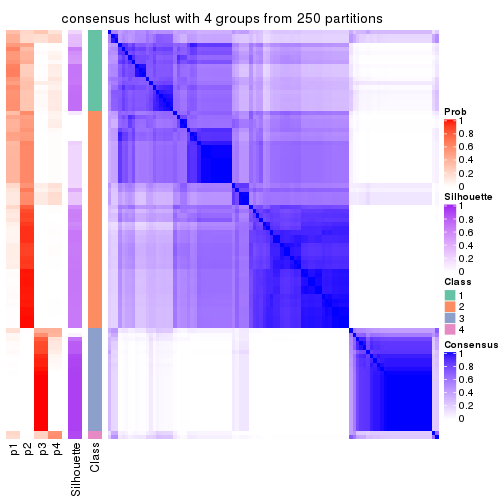</p>

</div>
<div id='tab-CV-hclust-consensus-heatmap-4'>
<pre><code class="r">consensus_heatmap(res, k = 5)
</code></pre>

<p></p>

</div>
<div id='tab-CV-hclust-consensus-heatmap-5'>
<pre><code class="r">consensus_heatmap(res, k = 6)
</code></pre>

<p></p>

</div>
</div>

Heatmaps for the membership of samples in all partitions to see how consistent they are:


<script>
$( function() {
	$( '#tabs-CV-hclust-membership-heatmap' ).tabs();
} );
</script>
<div id='tabs-CV-hclust-membership-heatmap'>
<ul>
<li><a href='#tab-CV-hclust-membership-heatmap-1'>k = 2</a></li>
<li><a href='#tab-CV-hclust-membership-heatmap-2'>k = 3</a></li>
<li><a href='#tab-CV-hclust-membership-heatmap-3'>k = 4</a></li>
<li><a href='#tab-CV-hclust-membership-heatmap-4'>k = 5</a></li>
<li><a href='#tab-CV-hclust-membership-heatmap-5'>k = 6</a></li>
</ul>
<div id='tab-CV-hclust-membership-heatmap-1'>
<pre><code class="r">membership_heatmap(res, k = 2)
</code></pre>

<p></p>

</div>
<div id='tab-CV-hclust-membership-heatmap-2'>
<pre><code class="r">membership_heatmap(res, k = 3)
</code></pre>

<p></p>

</div>
<div id='tab-CV-hclust-membership-heatmap-3'>
<pre><code class="r">membership_heatmap(res, k = 4)
</code></pre>

<p></p>

</div>
<div id='tab-CV-hclust-membership-heatmap-4'>
<pre><code class="r">membership_heatmap(res, k = 5)
</code></pre>

<p></p>

</div>
<div id='tab-CV-hclust-membership-heatmap-5'>
<pre><code class="r">membership_heatmap(res, k = 6)
</code></pre>

<p>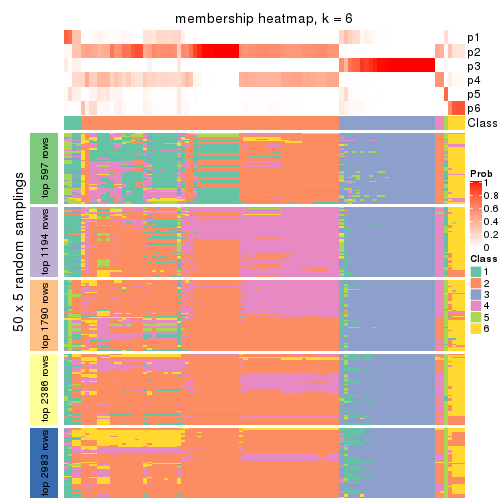</p>

</div>
</div>

As soon as we have had the classes for columns, we can look for signatures
which are significantly different between classes which can be candidate marks
for certain classes. Following are the heatmaps for signatures.


Signature heatmaps where rows are scaled:


<script>
$( function() {
	$( '#tabs-CV-hclust-get-signatures' ).tabs();
} );
</script>
<div id='tabs-CV-hclust-get-signatures'>
<ul>
<li><a href='#tab-CV-hclust-get-signatures-1'>k = 2</a></li>
<li><a href='#tab-CV-hclust-get-signatures-2'>k = 3</a></li>
<li><a href='#tab-CV-hclust-get-signatures-3'>k = 4</a></li>
<li><a href='#tab-CV-hclust-get-signatures-4'>k = 5</a></li>
<li><a href='#tab-CV-hclust-get-signatures-5'>k = 6</a></li>
</ul>
<div id='tab-CV-hclust-get-signatures-1'>
<pre><code class="r">get_signatures(res, k = 2)
</code></pre>

<p></p>

</div>
<div id='tab-CV-hclust-get-signatures-2'>
<pre><code class="r">get_signatures(res, k = 3)
</code></pre>

<p></p>

</div>
<div id='tab-CV-hclust-get-signatures-3'>
<pre><code class="r">get_signatures(res, k = 4)
</code></pre>

<p></p>

</div>
<div id='tab-CV-hclust-get-signatures-4'>
<pre><code class="r">get_signatures(res, k = 5)
</code></pre>

<p></p>

</div>
<div id='tab-CV-hclust-get-signatures-5'>
<pre><code class="r">get_signatures(res, k = 6)
</code></pre>

<p></p>

</div>
</div>


Signature heatmaps where rows are not scaled:


<script>
$( function() {
	$( '#tabs-CV-hclust-get-signatures-no-scale' ).tabs();
} );
</script>
<div id='tabs-CV-hclust-get-signatures-no-scale'>
<ul>
<li><a href='#tab-CV-hclust-get-signatures-no-scale-1'>k = 2</a></li>
<li><a href='#tab-CV-hclust-get-signatures-no-scale-2'>k = 3</a></li>
<li><a href='#tab-CV-hclust-get-signatures-no-scale-3'>k = 4</a></li>
<li><a href='#tab-CV-hclust-get-signatures-no-scale-4'>k = 5</a></li>
<li><a href='#tab-CV-hclust-get-signatures-no-scale-5'>k = 6</a></li>
</ul>
<div id='tab-CV-hclust-get-signatures-no-scale-1'>
<pre><code class="r">get_signatures(res, k = 2, scale_rows = FALSE)
</code></pre>

<p></p>

</div>
<div id='tab-CV-hclust-get-signatures-no-scale-2'>
<pre><code class="r">get_signatures(res, k = 3, scale_rows = FALSE)
</code></pre>

<p></p>

</div>
<div id='tab-CV-hclust-get-signatures-no-scale-3'>
<pre><code class="r">get_signatures(res, k = 4, scale_rows = FALSE)
</code></pre>

<p></p>

</div>
<div id='tab-CV-hclust-get-signatures-no-scale-4'>
<pre><code class="r">get_signatures(res, k = 5, scale_rows = FALSE)
</code></pre>

<p></p>

</div>
<div id='tab-CV-hclust-get-signatures-no-scale-5'>
<pre><code class="r">get_signatures(res, k = 6, scale_rows = FALSE)
</code></pre>

<p></p>

</div>
</div>


Compare the overlap of signatures from different k:

```r
compare_signatures(res)
```


`get_signature()` returns a data frame invisibly. TO get the list of signatures, the function
call should be assigned to a variable explicitly. In following code, if `plot` argument is set
to `FALSE`, no heatmap is plotted while only the differential analysis is performed.

```r
# code only for demonstration
tb = get_signature(res, k = ..., plot = FALSE)
```

An example of the output of `tb` is:

```
#>   which_row         fdr    mean_1    mean_2 scaled_mean_1 scaled_mean_2 km
#> 1        38 0.042760348  8.373488  9.131774    -0.5533452     0.5164555  1
#> 2        40 0.018707592  7.106213  8.469186    -0.6173731     0.5762149  1
#> 3        55 0.019134737 10.221463 11.207825    -0.6159697     0.5749050  1
#> 4        59 0.006059896  5.921854  7.869574    -0.6899429     0.6439467  1
#> 5        60 0.018055526  8.928898 10.211722    -0.6204761     0.5791110  1
#> 6        98 0.009384629 15.714769 14.887706     0.6635654    -0.6193277  2
...
```

The columns in `tb` are:

1. `which_row`: row indices corresponding to the input matrix.
2. `fdr`: FDR for the differential test. 
3. `mean_x`: The mean value in group x.
4. `scaled_mean_x`: The mean value in group x after rows are scaled.
5. `km`: Row groups if k-means clustering is applied to rows.


UMAP plot which shows how samples are separated.


<script>
$( function() {
	$( '#tabs-CV-hclust-dimension-reduction' ).tabs();
} );
</script>
<div id='tabs-CV-hclust-dimension-reduction'>
<ul>
<li><a href='#tab-CV-hclust-dimension-reduction-1'>k = 2</a></li>
<li><a href='#tab-CV-hclust-dimension-reduction-2'>k = 3</a></li>
<li><a href='#tab-CV-hclust-dimension-reduction-3'>k = 4</a></li>
<li><a href='#tab-CV-hclust-dimension-reduction-4'>k = 5</a></li>
<li><a href='#tab-CV-hclust-dimension-reduction-5'>k = 6</a></li>
</ul>
<div id='tab-CV-hclust-dimension-reduction-1'>
<pre><code class="r">dimension_reduction(res, k = 2, method = &quot;UMAP&quot;)
</code></pre>

<p></p>

</div>
<div id='tab-CV-hclust-dimension-reduction-2'>
<pre><code class="r">dimension_reduction(res, k = 3, method = &quot;UMAP&quot;)
</code></pre>

<p>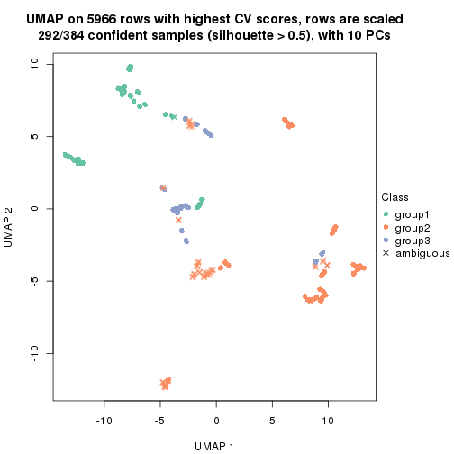</p>

</div>
<div id='tab-CV-hclust-dimension-reduction-3'>
<pre><code class="r">dimension_reduction(res, k = 4, method = &quot;UMAP&quot;)
</code></pre>

<p></p>

</div>
<div id='tab-CV-hclust-dimension-reduction-4'>
<pre><code class="r">dimension_reduction(res, k = 5, method = &quot;UMAP&quot;)
</code></pre>

<p></p>

</div>
<div id='tab-CV-hclust-dimension-reduction-5'>
<pre><code class="r">dimension_reduction(res, k = 6, method = &quot;UMAP&quot;)
</code></pre>

<p></p>

</div>
</div>


Following heatmap shows how subgroups are split when increasing `k`:

```r
collect_classes(res)
```


If matrix rows can be associated to genes, consider to use `GO_Enrichment(res,
...)` to perform function enrichment for the signature genes.


 

---------------------------------------------------


### CV:kmeans


The object with results only for a single top-value method and a single partition method 
can be extracted as:

```r
res = res_list["CV", "kmeans"]
# you can also extract it by
# res = res_list["CV:kmeans"]
```

A summary of `res` and all the functions that can be applied to it:

```r
res
```

```
#> A 'ConsensusPartition' object with k = 2, 3, 4, 5, 6.
#>   On a matrix with 5966 rows and 384 columns.
#>   Top rows (597, 1194, 1790, 2386, 2983) are extracted by 'CV' method.
#>   Subgroups are detected by 'kmeans' method.
#>   Performed in total 1250 partitions by row resampling.
#>   There is no best k.
#> 
#> Following methods can be applied to this 'ConsensusPartition' object:
#>  [1] "cola_report"             "collect_classes"         "collect_plots"          
#>  [4] "collect_stats"           "colnames"                "compare_signatures"     
#>  [7] "consensus_heatmap"       "dimension_reduction"     "functional_enrichment"  
#> [10] "get_anno_col"            "get_anno"                "get_classes"            
#> [13] "get_consensus"           "get_matrix"              "get_membership"         
#> [16] "get_param"               "get_signatures"          "get_stats"              
#> [19] "is_best_k"               "is_stable_k"             "membership_heatmap"     
#> [22] "ncol"                    "nrow"                    "plot_ecdf"              
#> [25] "rownames"                "select_partition_number" "show"                   
#> [28] "suggest_best_k"          "test_to_known_factors"
```

`collect_plots()` function collects all the plots made from `res` for all `k` (number of partitions)
into one single page to provide an easy and fast comparison between different `k`.

```r
collect_plots(res)
```


The plots are:

- The first row: a plot of the ECDF (Empirical cumulative distribution
  function) curves of the consensus matrix for each `k` and the heatmap of
  predicted classes for each `k`.
- The second row: heatmaps of the consensus matrix for each `k`.
- The third row: heatmaps of the membership matrix for each `k`.
- The fouth row: heatmaps of the signatures for each `k`.

All the plots in panels can be made by individual functions and they are
plotted later in this section.

`select_partition_number()` produces several plots showing different
statistics for choosing "optimized" `k`. There are following statistics:

- ECDF curves of the consensus matrix for each `k`;
- 1-PAC. [The PAC
  score](https://en.wikipedia.org/wiki/Consensus_clustering#Over-interpretation_potential_of_consensus_clustering)
  measures the proportion of the ambiguous subgrouping.
- Mean silhouette score.
- Concordance. The mean probability of fiting the consensus class ids in all
  partitions.
- Area increased. Denote $A_k$ as the area under the ECDF curve for current
  `k`, the area increased is defined as $A_k - A_{k-1}$.
- Rand index. The percent of pairs of samples that are both in a same cluster
  or both are not in a same cluster in the partition of k and k-1.
- Jaccard index. The ratio of pairs of samples are both in a same cluster in
  the partition of k and k-1 and the pairs of samples are both in a same
  cluster in the partition k or k-1.

The detailed explanations of these statistics can be found in [the cola
vignette](http://bioconductor.org/packages/devel/bioc/vignettes/cola/inst/doc/cola.html#toc_13).

Generally speaking, lower PAC score, higher mean silhouette score or higher
concordance corresponds to better partition. Rand index and Jaccard index
measure how similar the current partition is compared to partition with `k-1`.
If they are too similar, we won't accept `k` is better than `k-1`.

```r
select_partition_number(res)
```


The numeric values for all these statistics can be obtained by `get_stats()`.

```r
get_stats(res)
```

```
#>   k 1-PAC mean_silhouette concordance area_increased  Rand Jaccard
#> 2 2 0.896           0.939       0.968         0.3998 0.606   0.606
#> 3 3 0.625           0.857       0.870         0.4303 0.699   0.530
#> 4 4 0.512           0.847       0.851         0.1123 0.993   0.982
#> 5 5 0.606           0.771       0.790         0.0793 0.996   0.989
#> 6 6 0.644           0.732       0.751         0.0548 0.996   0.989
```

`suggest_best_k()` suggests the best $k$ based on these statistics. The rules are as follows:

- All $k$ with Jaccard index larger than 0.95 are removed because the increase of
  the partition number does not provides enough extra information. If all $k$ are removed,
  the best $k$ is assigned by `NA`.
- For $k$ with 1-PAC larger than 0.9, the maximal $k$ is taken as the "best k". Other $k$ is called "optional k".
- If it does not fit the second rule. The $k$ with the highest vote of highest
  1-PAC, mean silhouette and concordance is taken as the "best k".

```r
suggest_best_k(res)
```

```
#> [1] NA
```


Following shows the table of the partitions (You need to click the **show/hide
code output** link to see it). The membership matrix (columns with name `p*`)
is inferred by
[`clue::cl_consensus()`](https://www.rdocumentation.org/link/cl_consensus?package=clue)
function with the `SE` method. Basically the value in the membership matrix
represents the probability to belong to a certain group. The finall class
label for an item is determined with the group with highest probability it
belongs to.

In `get_classes()` function, the entropy is calculated from the membership
matrix and the silhouette score is calculated from the consensus matrix.


<script>
$( function() {
	$( '#tabs-CV-kmeans-get-classes' ).tabs();
} );
</script>
<div id='tabs-CV-kmeans-get-classes'>
<ul>
<li><a href='#tab-CV-kmeans-get-classes-1'>k = 2</a></li>
<li><a href='#tab-CV-kmeans-get-classes-2'>k = 3</a></li>
<li><a href='#tab-CV-kmeans-get-classes-3'>k = 4</a></li>
<li><a href='#tab-CV-kmeans-get-classes-4'>k = 5</a></li>
<li><a href='#tab-CV-kmeans-get-classes-5'>k = 6</a></li>
</ul>

<div id='tab-CV-kmeans-get-classes-1'>
<p><a id='tab-CV-kmeans-get-classes-1-a' style='color:#0366d6' href='#'>show/hide code output</a></p>
<pre><code class="r">cbind(get_classes(res, k = 2), get_membership(res, k = 2))
</code></pre>

<pre><code>#&gt;           class entropy silhouette    p1    p2
#&gt; SRR490216     2  0.8661     0.6169 0.288 0.712
#&gt; SRR490217     2  0.8081     0.6871 0.248 0.752
#&gt; SRR490218     2  0.8016     0.6937 0.244 0.756
#&gt; SRR490219     2  0.7815     0.7123 0.232 0.768
#&gt; SRR490220     2  0.7219     0.7590 0.200 0.800
#&gt; SRR490221     2  0.6973     0.7753 0.188 0.812
#&gt; SRR490222     2  0.7219     0.7590 0.200 0.800
#&gt; SRR490223     2  0.7219     0.7590 0.200 0.800
#&gt; SRR490224     1  0.1414     0.9824 0.980 0.020
#&gt; SRR490225     1  0.1414     0.9824 0.980 0.020
#&gt; SRR490226     1  0.1414     0.9824 0.980 0.020
#&gt; SRR490227     1  0.1414     0.9824 0.980 0.020
#&gt; SRR490228     1  0.1414     0.9824 0.980 0.020
#&gt; SRR490229     1  0.1414     0.9824 0.980 0.020
#&gt; SRR490230     1  0.1414     0.9824 0.980 0.020
#&gt; SRR490231     1  0.1414     0.9824 0.980 0.020
#&gt; SRR490232     1  0.1414     0.9824 0.980 0.020
#&gt; SRR490233     1  0.1414     0.9824 0.980 0.020
#&gt; SRR490234     1  0.1414     0.9824 0.980 0.020
#&gt; SRR490235     1  0.1414     0.9824 0.980 0.020
#&gt; SRR490236     1  0.1414     0.9824 0.980 0.020
#&gt; SRR490237     1  0.1414     0.9824 0.980 0.020
#&gt; SRR490238     1  0.1414     0.9824 0.980 0.020
#&gt; SRR490239     1  0.1414     0.9824 0.980 0.020
#&gt; SRR490240     2  0.3584     0.9095 0.068 0.932
#&gt; SRR490241     2  0.1633     0.9492 0.024 0.976
#&gt; SRR490242     2  0.1633     0.9492 0.024 0.976
#&gt; SRR490243     2  0.2423     0.9354 0.040 0.960
#&gt; SRR490244     1  0.1414     0.9824 0.980 0.020
#&gt; SRR490245     1  0.1414     0.9824 0.980 0.020
#&gt; SRR490246     1  0.1414     0.9824 0.980 0.020
#&gt; SRR490247     1  0.1414     0.9824 0.980 0.020
#&gt; SRR490248     2  0.9552     0.4303 0.376 0.624
#&gt; SRR490249     2  0.8081     0.6911 0.248 0.752
#&gt; SRR490250     2  0.7674     0.7281 0.224 0.776
#&gt; SRR490251     2  0.8016     0.6974 0.244 0.756
#&gt; SRR490252     2  0.0000     0.9684 0.000 1.000
#&gt; SRR490253     2  0.0000     0.9684 0.000 1.000
#&gt; SRR490254     2  0.0000     0.9684 0.000 1.000
#&gt; SRR490255     2  0.0000     0.9684 0.000 1.000
#&gt; SRR490256     1  0.1414     0.9824 0.980 0.020
#&gt; SRR490257     1  0.1414     0.9824 0.980 0.020
#&gt; SRR490258     1  0.1414     0.9824 0.980 0.020
#&gt; SRR490259     1  0.1414     0.9824 0.980 0.020
#&gt; SRR490260     1  0.1414     0.9824 0.980 0.020
#&gt; SRR490261     1  0.1414     0.9824 0.980 0.020
#&gt; SRR490262     1  0.1414     0.9824 0.980 0.020
#&gt; SRR490263     1  0.1414     0.9824 0.980 0.020
#&gt; SRR490264     1  0.1414     0.9824 0.980 0.020
#&gt; SRR490265     1  0.1414     0.9824 0.980 0.020
#&gt; SRR490266     1  0.1414     0.9824 0.980 0.020
#&gt; SRR490267     1  0.1414     0.9824 0.980 0.020
#&gt; SRR490268     1  0.1414     0.9824 0.980 0.020
#&gt; SRR490269     1  0.1414     0.9824 0.980 0.020
#&gt; SRR490270     1  0.1414     0.9824 0.980 0.020
#&gt; SRR490271     1  0.1414     0.9824 0.980 0.020
#&gt; SRR490272     1  0.1414     0.9824 0.980 0.020
#&gt; SRR490273     1  0.1414     0.9824 0.980 0.020
#&gt; SRR490274     1  0.1414     0.9824 0.980 0.020
#&gt; SRR490275     1  0.1414     0.9824 0.980 0.020
#&gt; SRR490276     1  0.1414     0.9824 0.980 0.020
#&gt; SRR490277     1  0.1414     0.9824 0.980 0.020
#&gt; SRR490278     1  0.1414     0.9824 0.980 0.020
#&gt; SRR490279     1  0.1414     0.9824 0.980 0.020
#&gt; SRR490280     1  0.1414     0.9824 0.980 0.020
#&gt; SRR490281     1  0.1414     0.9824 0.980 0.020
#&gt; SRR490282     1  0.1414     0.9824 0.980 0.020
#&gt; SRR490283     1  0.1414     0.9824 0.980 0.020
#&gt; SRR490284     1  0.1414     0.9824 0.980 0.020
#&gt; SRR490285     1  0.1414     0.9824 0.980 0.020
#&gt; SRR490286     1  0.1414     0.9824 0.980 0.020
#&gt; SRR490287     1  0.1414     0.9824 0.980 0.020
#&gt; SRR490288     1  0.1414     0.9824 0.980 0.020
#&gt; SRR490289     1  0.9661     0.3544 0.608 0.392
#&gt; SRR490290     1  0.9881     0.2170 0.564 0.436
#&gt; SRR490291     2  0.9993     0.0822 0.484 0.516
#&gt; SRR490292     2  0.7139     0.7646 0.196 0.804
#&gt; SRR490293     2  0.4690     0.8777 0.100 0.900
#&gt; SRR490294     2  0.4815     0.8735 0.104 0.896
#&gt; SRR490295     2  0.5408     0.8522 0.124 0.876
#&gt; SRR490296     2  0.0000     0.9684 0.000 1.000
#&gt; SRR490297     2  0.0000     0.9684 0.000 1.000
#&gt; SRR490298     2  0.0000     0.9684 0.000 1.000
#&gt; SRR490299     2  0.0000     0.9684 0.000 1.000
#&gt; SRR490300     2  0.0376     0.9652 0.004 0.996
#&gt; SRR490301     2  0.0376     0.9652 0.004 0.996
#&gt; SRR490302     2  0.0672     0.9636 0.008 0.992
#&gt; SRR490303     2  0.0376     0.9652 0.004 0.996
#&gt; SRR490304     2  0.0000     0.9684 0.000 1.000
#&gt; SRR490305     2  0.0000     0.9684 0.000 1.000
#&gt; SRR490306     2  0.0000     0.9684 0.000 1.000
#&gt; SRR490307     2  0.0000     0.9684 0.000 1.000
#&gt; SRR490308     1  0.1414     0.9824 0.980 0.020
#&gt; SRR490309     1  0.1414     0.9824 0.980 0.020
#&gt; SRR490310     1  0.1414     0.9824 0.980 0.020
#&gt; SRR490311     1  0.1414     0.9824 0.980 0.020
#&gt; SRR490312     2  0.9661     0.3824 0.392 0.608
#&gt; SRR490313     2  0.9635     0.3931 0.388 0.612
#&gt; SRR490314     2  0.9460     0.4544 0.364 0.636
#&gt; SRR490315     2  0.9427     0.4640 0.360 0.640
#&gt; SRR490316     2  0.8267     0.6670 0.260 0.740
#&gt; SRR490317     2  0.8713     0.6093 0.292 0.708
#&gt; SRR490318     2  0.7883     0.7063 0.236 0.764
#&gt; SRR490319     2  0.6712     0.7909 0.176 0.824
#&gt; SRR490320     1  0.1414     0.9824 0.980 0.020
#&gt; SRR490321     1  0.1414     0.9824 0.980 0.020
#&gt; SRR490322     1  0.1414     0.9824 0.980 0.020
#&gt; SRR490323     1  0.1414     0.9824 0.980 0.020
#&gt; SRR490324     1  0.1414     0.9824 0.980 0.020
#&gt; SRR490325     1  0.1414     0.9824 0.980 0.020
#&gt; SRR490326     1  0.1414     0.9824 0.980 0.020
#&gt; SRR490327     1  0.1414     0.9824 0.980 0.020
#&gt; SRR490328     2  0.0376     0.9652 0.004 0.996
#&gt; SRR490329     2  0.0376     0.9652 0.004 0.996
#&gt; SRR490330     2  0.0376     0.9652 0.004 0.996
#&gt; SRR490331     2  0.0376     0.9652 0.004 0.996
#&gt; SRR490332     2  0.0000     0.9684 0.000 1.000
#&gt; SRR490333     2  0.0000     0.9684 0.000 1.000
#&gt; SRR490334     2  0.0000     0.9684 0.000 1.000
#&gt; SRR490335     2  0.0000     0.9684 0.000 1.000
#&gt; SRR490336     2  0.0672     0.9617 0.008 0.992
#&gt; SRR490337     2  0.0672     0.9617 0.008 0.992
#&gt; SRR490338     2  0.0672     0.9617 0.008 0.992
#&gt; SRR490339     2  0.0672     0.9617 0.008 0.992
#&gt; SRR490340     2  0.0000     0.9684 0.000 1.000
#&gt; SRR490341     2  0.0000     0.9684 0.000 1.000
#&gt; SRR490342     2  0.0000     0.9684 0.000 1.000
#&gt; SRR490343     2  0.0000     0.9684 0.000 1.000
#&gt; SRR490344     2  0.2778     0.9284 0.048 0.952
#&gt; SRR490345     2  0.2236     0.9391 0.036 0.964
#&gt; SRR490346     2  0.6712     0.7909 0.176 0.824
#&gt; SRR490347     2  0.1633     0.9493 0.024 0.976
#&gt; SRR490348     2  0.0000     0.9684 0.000 1.000
#&gt; SRR490349     2  0.0000     0.9684 0.000 1.000
#&gt; SRR490350     2  0.0000     0.9684 0.000 1.000
#&gt; SRR490351     2  0.0000     0.9684 0.000 1.000
#&gt; SRR490352     2  0.0000     0.9684 0.000 1.000
#&gt; SRR490353     2  0.0000     0.9684 0.000 1.000
#&gt; SRR490354     2  0.0000     0.9684 0.000 1.000
#&gt; SRR490355     2  0.0000     0.9684 0.000 1.000
#&gt; SRR490356     2  0.0000     0.9684 0.000 1.000
#&gt; SRR490357     2  0.0000     0.9684 0.000 1.000
#&gt; SRR490358     2  0.0000     0.9684 0.000 1.000
#&gt; SRR490359     2  0.0000     0.9684 0.000 1.000
#&gt; SRR490360     2  0.0000     0.9684 0.000 1.000
#&gt; SRR490361     2  0.0000     0.9684 0.000 1.000
#&gt; SRR490362     2  0.0000     0.9684 0.000 1.000
#&gt; SRR490363     2  0.0000     0.9684 0.000 1.000
#&gt; SRR490364     2  0.0000     0.9684 0.000 1.000
#&gt; SRR490365     2  0.0000     0.9684 0.000 1.000
#&gt; SRR490366     2  0.0000     0.9684 0.000 1.000
#&gt; SRR490367     2  0.0000     0.9684 0.000 1.000
#&gt; SRR490368     2  0.0000     0.9684 0.000 1.000
#&gt; SRR490369     2  0.0000     0.9684 0.000 1.000
#&gt; SRR490370     2  0.0000     0.9684 0.000 1.000
#&gt; SRR490371     2  0.0000     0.9684 0.000 1.000
#&gt; SRR490372     1  0.1414     0.9824 0.980 0.020
#&gt; SRR490373     1  0.1414     0.9824 0.980 0.020
#&gt; SRR490374     1  0.1414     0.9824 0.980 0.020
#&gt; SRR490375     1  0.1414     0.9824 0.980 0.020
#&gt; SRR490376     2  0.0000     0.9684 0.000 1.000
#&gt; SRR490377     2  0.0000     0.9684 0.000 1.000
#&gt; SRR490378     2  0.0000     0.9684 0.000 1.000
#&gt; SRR490379     2  0.0000     0.9684 0.000 1.000
#&gt; SRR490380     1  0.1414     0.9824 0.980 0.020
#&gt; SRR490381     1  0.1414     0.9824 0.980 0.020
#&gt; SRR490382     1  0.1414     0.9824 0.980 0.020
#&gt; SRR490383     1  0.1414     0.9824 0.980 0.020
#&gt; SRR490384     2  0.0000     0.9684 0.000 1.000
#&gt; SRR490385     2  0.0000     0.9684 0.000 1.000
#&gt; SRR490386     2  0.0000     0.9684 0.000 1.000
#&gt; SRR490387     2  0.0000     0.9684 0.000 1.000
#&gt; SRR490388     2  0.0000     0.9684 0.000 1.000
#&gt; SRR490389     2  0.0000     0.9684 0.000 1.000
#&gt; SRR490390     2  0.0000     0.9684 0.000 1.000
#&gt; SRR490391     2  0.0000     0.9684 0.000 1.000
#&gt; SRR490392     2  0.0000     0.9684 0.000 1.000
#&gt; SRR490393     2  0.0000     0.9684 0.000 1.000
#&gt; SRR490394     2  0.0000     0.9684 0.000 1.000
#&gt; SRR490395     2  0.0000     0.9684 0.000 1.000
#&gt; SRR490396     2  0.0000     0.9684 0.000 1.000
#&gt; SRR490397     2  0.0000     0.9684 0.000 1.000
#&gt; SRR490398     2  0.0000     0.9684 0.000 1.000
#&gt; SRR490399     2  0.0000     0.9684 0.000 1.000
#&gt; SRR490400     2  0.0000     0.9684 0.000 1.000
#&gt; SRR490401     2  0.0000     0.9684 0.000 1.000
#&gt; SRR490402     2  0.0000     0.9684 0.000 1.000
#&gt; SRR490403     2  0.0000     0.9684 0.000 1.000
#&gt; SRR490404     2  0.0000     0.9684 0.000 1.000
#&gt; SRR490405     2  0.0000     0.9684 0.000 1.000
#&gt; SRR490406     2  0.0000     0.9684 0.000 1.000
#&gt; SRR490407     2  0.0000     0.9684 0.000 1.000
#&gt; SRR490408     2  0.0000     0.9684 0.000 1.000
#&gt; SRR490409     2  0.0000     0.9684 0.000 1.000
#&gt; SRR490410     2  0.0000     0.9684 0.000 1.000
#&gt; SRR490411     2  0.0000     0.9684 0.000 1.000
#&gt; SRR490412     1  0.1414     0.9824 0.980 0.020
#&gt; SRR490413     1  0.1414     0.9824 0.980 0.020
#&gt; SRR490414     1  0.1414     0.9824 0.980 0.020
#&gt; SRR490415     1  0.1414     0.9824 0.980 0.020
#&gt; SRR490416     2  0.0000     0.9684 0.000 1.000
#&gt; SRR490417     2  0.0000     0.9684 0.000 1.000
#&gt; SRR490418     2  0.0000     0.9684 0.000 1.000
#&gt; SRR490419     2  0.0000     0.9684 0.000 1.000
#&gt; SRR490420     2  0.9129     0.5367 0.328 0.672
#&gt; SRR490421     2  0.7299     0.7535 0.204 0.796
#&gt; SRR490422     2  0.6973     0.7753 0.188 0.812
#&gt; SRR490423     2  0.7056     0.7699 0.192 0.808
#&gt; SRR490424     1  0.1414     0.9824 0.980 0.020
#&gt; SRR490425     1  0.1414     0.9824 0.980 0.020
#&gt; SRR490426     1  0.1414     0.9824 0.980 0.020
#&gt; SRR490427     1  0.1414     0.9824 0.980 0.020
#&gt; SRR490428     1  0.6973     0.7800 0.812 0.188
#&gt; SRR490429     1  0.7950     0.6971 0.760 0.240
#&gt; SRR490430     1  0.7883     0.7044 0.764 0.236
#&gt; SRR490431     1  0.8267     0.6611 0.740 0.260
#&gt; SRR490432     2  0.0000     0.9684 0.000 1.000
#&gt; SRR490433     2  0.0000     0.9684 0.000 1.000
#&gt; SRR490434     2  0.0000     0.9684 0.000 1.000
#&gt; SRR490435     2  0.0000     0.9684 0.000 1.000
#&gt; SRR490436     2  0.0000     0.9684 0.000 1.000
#&gt; SRR490437     2  0.0000     0.9684 0.000 1.000
#&gt; SRR490438     2  0.0000     0.9684 0.000 1.000
#&gt; SRR490439     2  0.0000     0.9684 0.000 1.000
#&gt; SRR490440     2  0.0000     0.9684 0.000 1.000
#&gt; SRR490441     2  0.0000     0.9684 0.000 1.000
#&gt; SRR490442     2  0.0000     0.9684 0.000 1.000
#&gt; SRR490443     2  0.0000     0.9684 0.000 1.000
#&gt; SRR490444     2  0.0000     0.9684 0.000 1.000
#&gt; SRR490445     2  0.0000     0.9684 0.000 1.000
#&gt; SRR490446     2  0.0000     0.9684 0.000 1.000
#&gt; SRR490447     2  0.0000     0.9684 0.000 1.000
#&gt; SRR490448     2  0.7219     0.7591 0.200 0.800
#&gt; SRR490449     2  0.5737     0.8388 0.136 0.864
#&gt; SRR490450     2  0.5737     0.8388 0.136 0.864
#&gt; SRR490451     2  0.5842     0.8343 0.140 0.860
#&gt; SRR490452     1  0.1414     0.9824 0.980 0.020
#&gt; SRR490453     1  0.1414     0.9824 0.980 0.020
#&gt; SRR490454     1  0.1414     0.9824 0.980 0.020
#&gt; SRR490455     1  0.1414     0.9824 0.980 0.020
#&gt; SRR490456     2  0.0000     0.9684 0.000 1.000
#&gt; SRR490457     2  0.0000     0.9684 0.000 1.000
#&gt; SRR490458     2  0.0000     0.9684 0.000 1.000
#&gt; SRR490459     2  0.0000     0.9684 0.000 1.000
#&gt; SRR490460     2  0.0000     0.9684 0.000 1.000
#&gt; SRR490461     2  0.0000     0.9684 0.000 1.000
#&gt; SRR490462     2  0.0000     0.9684 0.000 1.000
#&gt; SRR490463     2  0.0000     0.9684 0.000 1.000
#&gt; SRR490464     1  0.1414     0.9824 0.980 0.020
#&gt; SRR490465     1  0.1414     0.9824 0.980 0.020
#&gt; SRR490466     1  0.1414     0.9824 0.980 0.020
#&gt; SRR490467     1  0.1414     0.9824 0.980 0.020
#&gt; SRR490468     2  0.0000     0.9684 0.000 1.000
#&gt; SRR490469     2  0.0000     0.9684 0.000 1.000
#&gt; SRR490470     2  0.0000     0.9684 0.000 1.000
#&gt; SRR490471     2  0.0000     0.9684 0.000 1.000
#&gt; SRR490472     2  0.0000     0.9684 0.000 1.000
#&gt; SRR490473     2  0.0000     0.9684 0.000 1.000
#&gt; SRR490474     2  0.0000     0.9684 0.000 1.000
#&gt; SRR490475     2  0.0000     0.9684 0.000 1.000
#&gt; SRR490476     1  0.1414     0.9824 0.980 0.020
#&gt; SRR490477     1  0.1414     0.9824 0.980 0.020
#&gt; SRR490478     1  0.1414     0.9824 0.980 0.020
#&gt; SRR490479     1  0.1414     0.9824 0.980 0.020
#&gt; SRR490480     2  0.0000     0.9684 0.000 1.000
#&gt; SRR490481     2  0.0000     0.9684 0.000 1.000
#&gt; SRR490482     2  0.0000     0.9684 0.000 1.000
#&gt; SRR490483     2  0.0000     0.9684 0.000 1.000
#&gt; SRR490484     2  0.0000     0.9684 0.000 1.000
#&gt; SRR490485     2  0.0000     0.9684 0.000 1.000
#&gt; SRR490486     2  0.0000     0.9684 0.000 1.000
#&gt; SRR490487     2  0.0000     0.9684 0.000 1.000
#&gt; SRR490488     2  0.0000     0.9684 0.000 1.000
#&gt; SRR490489     2  0.0000     0.9684 0.000 1.000
#&gt; SRR490490     2  0.0000     0.9684 0.000 1.000
#&gt; SRR490491     2  0.0000     0.9684 0.000 1.000
#&gt; SRR490492     2  0.0000     0.9684 0.000 1.000
#&gt; SRR490493     2  0.0000     0.9684 0.000 1.000
#&gt; SRR490494     2  0.0000     0.9684 0.000 1.000
#&gt; SRR490495     2  0.0000     0.9684 0.000 1.000
#&gt; SRR490496     2  0.0000     0.9684 0.000 1.000
#&gt; SRR490497     2  0.0000     0.9684 0.000 1.000
#&gt; SRR490498     2  0.0000     0.9684 0.000 1.000
#&gt; SRR490499     2  0.0000     0.9684 0.000 1.000
#&gt; SRR490500     2  0.0000     0.9684 0.000 1.000
#&gt; SRR490501     2  0.0000     0.9684 0.000 1.000
#&gt; SRR490502     2  0.0000     0.9684 0.000 1.000
#&gt; SRR490503     2  0.0000     0.9684 0.000 1.000
#&gt; SRR490504     2  0.0000     0.9684 0.000 1.000
#&gt; SRR490505     2  0.0000     0.9684 0.000 1.000
#&gt; SRR490506     2  0.0000     0.9684 0.000 1.000
#&gt; SRR490507     2  0.0000     0.9684 0.000 1.000
#&gt; SRR490508     2  0.0000     0.9684 0.000 1.000
#&gt; SRR490509     2  0.0000     0.9684 0.000 1.000
#&gt; SRR490510     2  0.0000     0.9684 0.000 1.000
#&gt; SRR490511     2  0.0000     0.9684 0.000 1.000
#&gt; SRR490512     2  0.0000     0.9684 0.000 1.000
#&gt; SRR490513     2  0.0000     0.9684 0.000 1.000
#&gt; SRR490514     2  0.0000     0.9684 0.000 1.000
#&gt; SRR490515     2  0.0000     0.9684 0.000 1.000
#&gt; SRR490516     2  0.0000     0.9684 0.000 1.000
#&gt; SRR490517     2  0.0000     0.9684 0.000 1.000
#&gt; SRR490518     2  0.0000     0.9684 0.000 1.000
#&gt; SRR490519     2  0.0000     0.9684 0.000 1.000
#&gt; SRR490520     2  0.0000     0.9684 0.000 1.000
#&gt; SRR490521     2  0.0000     0.9684 0.000 1.000
#&gt; SRR490522     2  0.0000     0.9684 0.000 1.000
#&gt; SRR490523     2  0.0000     0.9684 0.000 1.000
#&gt; SRR490524     2  0.0000     0.9684 0.000 1.000
#&gt; SRR490525     2  0.0000     0.9684 0.000 1.000
#&gt; SRR490526     2  0.0000     0.9684 0.000 1.000
#&gt; SRR490527     2  0.0000     0.9684 0.000 1.000
#&gt; SRR490528     2  0.0000     0.9684 0.000 1.000
#&gt; SRR490529     2  0.0000     0.9684 0.000 1.000
#&gt; SRR490530     2  0.0000     0.9684 0.000 1.000
#&gt; SRR490531     2  0.0000     0.9684 0.000 1.000
#&gt; SRR490532     1  0.1414     0.9824 0.980 0.020
#&gt; SRR490533     1  0.1843     0.9747 0.972 0.028
#&gt; SRR490534     1  0.1843     0.9747 0.972 0.028
#&gt; SRR490535     1  0.1414     0.9824 0.980 0.020
#&gt; SRR490536     2  0.0000     0.9684 0.000 1.000
#&gt; SRR490537     2  0.0000     0.9684 0.000 1.000
#&gt; SRR490538     2  0.0000     0.9684 0.000 1.000
#&gt; SRR490539     2  0.0000     0.9684 0.000 1.000
#&gt; SRR490540     2  0.0000     0.9684 0.000 1.000
#&gt; SRR490541     2  0.0000     0.9684 0.000 1.000
#&gt; SRR490542     2  0.0000     0.9684 0.000 1.000
#&gt; SRR490543     2  0.0000     0.9684 0.000 1.000
#&gt; SRR490544     2  0.0000     0.9684 0.000 1.000
#&gt; SRR490545     2  0.0000     0.9684 0.000 1.000
#&gt; SRR490546     2  0.0000     0.9684 0.000 1.000
#&gt; SRR490547     2  0.0000     0.9684 0.000 1.000
#&gt; SRR490548     2  0.0000     0.9684 0.000 1.000
#&gt; SRR490549     2  0.0000     0.9684 0.000 1.000
#&gt; SRR490550     2  0.0000     0.9684 0.000 1.000
#&gt; SRR490551     2  0.0000     0.9684 0.000 1.000
#&gt; SRR490552     2  0.0000     0.9684 0.000 1.000
#&gt; SRR490553     2  0.0000     0.9684 0.000 1.000
#&gt; SRR490554     2  0.0000     0.9684 0.000 1.000
#&gt; SRR490555     2  0.0000     0.9684 0.000 1.000
#&gt; SRR490556     2  0.0000     0.9684 0.000 1.000
#&gt; SRR490557     2  0.0000     0.9684 0.000 1.000
#&gt; SRR490558     2  0.0000     0.9684 0.000 1.000
#&gt; SRR490559     2  0.0000     0.9684 0.000 1.000
#&gt; SRR490560     2  0.0000     0.9684 0.000 1.000
#&gt; SRR490561     2  0.0000     0.9684 0.000 1.000
#&gt; SRR490562     2  0.0000     0.9684 0.000 1.000
#&gt; SRR490563     2  0.0000     0.9684 0.000 1.000
#&gt; SRR490564     2  0.0000     0.9684 0.000 1.000
#&gt; SRR490565     2  0.0000     0.9684 0.000 1.000
#&gt; SRR490566     2  0.0000     0.9684 0.000 1.000
#&gt; SRR490567     2  0.0000     0.9684 0.000 1.000
#&gt; SRR490568     2  0.0000     0.9684 0.000 1.000
#&gt; SRR490569     2  0.0000     0.9684 0.000 1.000
#&gt; SRR490570     2  0.0000     0.9684 0.000 1.000
#&gt; SRR490571     2  0.0000     0.9684 0.000 1.000
#&gt; SRR490572     2  0.0000     0.9684 0.000 1.000
#&gt; SRR490573     2  0.0000     0.9684 0.000 1.000
#&gt; SRR490574     2  0.0000     0.9684 0.000 1.000
#&gt; SRR490575     2  0.0000     0.9684 0.000 1.000
#&gt; SRR490576     2  0.0000     0.9684 0.000 1.000
#&gt; SRR490577     2  0.0000     0.9684 0.000 1.000
#&gt; SRR490578     2  0.0000     0.9684 0.000 1.000
#&gt; SRR490579     2  0.0000     0.9684 0.000 1.000
#&gt; SRR490580     2  0.0000     0.9684 0.000 1.000
#&gt; SRR490581     2  0.0000     0.9684 0.000 1.000
#&gt; SRR490582     2  0.0000     0.9684 0.000 1.000
#&gt; SRR490583     2  0.0000     0.9684 0.000 1.000
#&gt; SRR490584     2  0.0000     0.9684 0.000 1.000
#&gt; SRR490585     2  0.0000     0.9684 0.000 1.000
#&gt; SRR490586     2  0.0000     0.9684 0.000 1.000
#&gt; SRR490587     2  0.0000     0.9684 0.000 1.000
#&gt; SRR490588     2  0.0000     0.9684 0.000 1.000
#&gt; SRR490589     2  0.0000     0.9684 0.000 1.000
#&gt; SRR490590     2  0.0000     0.9684 0.000 1.000
#&gt; SRR490591     2  0.0000     0.9684 0.000 1.000
#&gt; SRR490592     2  0.0000     0.9684 0.000 1.000
#&gt; SRR490593     2  0.0000     0.9684 0.000 1.000
#&gt; SRR490594     2  0.0000     0.9684 0.000 1.000
#&gt; SRR490595     2  0.0000     0.9684 0.000 1.000
#&gt; SRR490596     2  0.0376     0.9654 0.004 0.996
#&gt; SRR490597     2  0.0000     0.9684 0.000 1.000
#&gt; SRR490598     2  0.0000     0.9684 0.000 1.000
#&gt; SRR490599     2  0.0000     0.9684 0.000 1.000
</code></pre>

<script>
$('#tab-CV-kmeans-get-classes-1-a').parent().next().next().hide();
$('#tab-CV-kmeans-get-classes-1-a').click(function(){
  $('#tab-CV-kmeans-get-classes-1-a').parent().next().next().toggle();
  return(false);
});
</script>
</div>

<div id='tab-CV-kmeans-get-classes-2'>
<p><a id='tab-CV-kmeans-get-classes-2-a' style='color:#0366d6' href='#'>show/hide code output</a></p>
<pre><code class="r">cbind(get_classes(res, k = 3), get_membership(res, k = 3))
</code></pre>

<pre><code>#&gt;           class entropy silhouette    p1    p2    p3
#&gt; SRR490216     3  0.7710     0.8063 0.100 0.240 0.660
#&gt; SRR490217     3  0.7523     0.8140 0.080 0.260 0.660
#&gt; SRR490218     3  0.7523     0.8140 0.080 0.260 0.660
#&gt; SRR490219     3  0.7384     0.8157 0.068 0.272 0.660
#&gt; SRR490220     3  0.6834     0.8299 0.048 0.260 0.692
#&gt; SRR490221     3  0.6217     0.8320 0.024 0.264 0.712
#&gt; SRR490222     3  0.6526     0.8314 0.036 0.260 0.704
#&gt; SRR490223     3  0.7022     0.8282 0.056 0.260 0.684
#&gt; SRR490224     1  0.0747     0.9761 0.984 0.000 0.016
#&gt; SRR490225     1  0.0747     0.9761 0.984 0.000 0.016
#&gt; SRR490226     1  0.0747     0.9761 0.984 0.000 0.016
#&gt; SRR490227     1  0.0747     0.9761 0.984 0.000 0.016
#&gt; SRR490228     1  0.0892     0.9750 0.980 0.000 0.020
#&gt; SRR490229     1  0.1031     0.9737 0.976 0.000 0.024
#&gt; SRR490230     1  0.1031     0.9737 0.976 0.000 0.024
#&gt; SRR490231     1  0.1031     0.9737 0.976 0.000 0.024
#&gt; SRR490232     1  0.6302     0.0261 0.520 0.000 0.480
#&gt; SRR490233     3  0.6192     0.2813 0.420 0.000 0.580
#&gt; SRR490234     3  0.6095     0.3498 0.392 0.000 0.608
#&gt; SRR490235     3  0.5905     0.4326 0.352 0.000 0.648
#&gt; SRR490236     1  0.1163     0.9747 0.972 0.000 0.028
#&gt; SRR490237     1  0.1163     0.9747 0.972 0.000 0.028
#&gt; SRR490238     1  0.1163     0.9747 0.972 0.000 0.028
#&gt; SRR490239     1  0.1163     0.9747 0.972 0.000 0.028
#&gt; SRR490240     3  0.5480     0.8288 0.004 0.264 0.732
#&gt; SRR490241     3  0.5291     0.8276 0.000 0.268 0.732
#&gt; SRR490242     3  0.5291     0.8276 0.000 0.268 0.732
#&gt; SRR490243     3  0.5480     0.8288 0.004 0.264 0.732
#&gt; SRR490244     1  0.0000     0.9783 1.000 0.000 0.000
#&gt; SRR490245     1  0.0000     0.9783 1.000 0.000 0.000
#&gt; SRR490246     1  0.0000     0.9783 1.000 0.000 0.000
#&gt; SRR490247     1  0.0000     0.9783 1.000 0.000 0.000
#&gt; SRR490248     3  0.7778     0.8057 0.104 0.240 0.656
#&gt; SRR490249     3  0.7363     0.8160 0.064 0.280 0.656
#&gt; SRR490250     3  0.7250     0.8174 0.056 0.288 0.656
#&gt; SRR490251     3  0.7308     0.8146 0.060 0.284 0.656
#&gt; SRR490252     3  0.5621     0.8116 0.000 0.308 0.692
#&gt; SRR490253     3  0.5650     0.8113 0.000 0.312 0.688
#&gt; SRR490254     3  0.5650     0.8113 0.000 0.312 0.688
#&gt; SRR490255     3  0.5650     0.8113 0.000 0.312 0.688
#&gt; SRR490256     3  0.5882     0.4356 0.348 0.000 0.652
#&gt; SRR490257     3  0.5882     0.4356 0.348 0.000 0.652
#&gt; SRR490258     3  0.5882     0.4356 0.348 0.000 0.652
#&gt; SRR490259     3  0.5882     0.4356 0.348 0.000 0.652
#&gt; SRR490260     1  0.1289     0.9698 0.968 0.000 0.032
#&gt; SRR490261     1  0.1289     0.9698 0.968 0.000 0.032
#&gt; SRR490262     1  0.1289     0.9698 0.968 0.000 0.032
#&gt; SRR490263     1  0.1289     0.9698 0.968 0.000 0.032
#&gt; SRR490264     1  0.0892     0.9763 0.980 0.000 0.020
#&gt; SRR490265     1  0.0892     0.9763 0.980 0.000 0.020
#&gt; SRR490266     1  0.0892     0.9763 0.980 0.000 0.020
#&gt; SRR490267     1  0.0892     0.9763 0.980 0.000 0.020
#&gt; SRR490268     3  0.5905     0.4326 0.352 0.000 0.648
#&gt; SRR490269     3  0.5905     0.4326 0.352 0.000 0.648
#&gt; SRR490270     3  0.5905     0.4326 0.352 0.000 0.648
#&gt; SRR490271     3  0.5905     0.4326 0.352 0.000 0.648
#&gt; SRR490272     1  0.1529     0.9680 0.960 0.000 0.040
#&gt; SRR490273     1  0.1529     0.9680 0.960 0.000 0.040
#&gt; SRR490274     1  0.1529     0.9680 0.960 0.000 0.040
#&gt; SRR490275     1  0.1529     0.9680 0.960 0.000 0.040
#&gt; SRR490276     1  0.1753     0.9658 0.952 0.000 0.048
#&gt; SRR490277     1  0.1753     0.9658 0.952 0.000 0.048
#&gt; SRR490278     1  0.2448     0.9389 0.924 0.000 0.076
#&gt; SRR490279     1  0.1753     0.9658 0.952 0.000 0.048
#&gt; SRR490280     1  0.0000     0.9783 1.000 0.000 0.000
#&gt; SRR490281     1  0.0000     0.9783 1.000 0.000 0.000
#&gt; SRR490282     1  0.0000     0.9783 1.000 0.000 0.000
#&gt; SRR490283     1  0.0000     0.9783 1.000 0.000 0.000
#&gt; SRR490284     1  0.0000     0.9783 1.000 0.000 0.000
#&gt; SRR490285     1  0.0000     0.9783 1.000 0.000 0.000
#&gt; SRR490286     1  0.0000     0.9783 1.000 0.000 0.000
#&gt; SRR490287     1  0.0000     0.9783 1.000 0.000 0.000
#&gt; SRR490288     3  0.5882     0.4358 0.348 0.000 0.652
#&gt; SRR490289     3  0.7676     0.6776 0.216 0.112 0.672
#&gt; SRR490290     3  0.7750     0.7215 0.184 0.140 0.676
#&gt; SRR490291     3  0.7721     0.7603 0.152 0.168 0.680
#&gt; SRR490292     3  0.5551     0.8213 0.020 0.212 0.768
#&gt; SRR490293     3  0.5070     0.8232 0.004 0.224 0.772
#&gt; SRR490294     3  0.5070     0.8232 0.004 0.224 0.772
#&gt; SRR490295     3  0.5070     0.8232 0.004 0.224 0.772
#&gt; SRR490296     2  0.2625     0.9084 0.000 0.916 0.084
#&gt; SRR490297     2  0.2625     0.9084 0.000 0.916 0.084
#&gt; SRR490298     2  0.2625     0.9084 0.000 0.916 0.084
#&gt; SRR490299     2  0.2625     0.9084 0.000 0.916 0.084
#&gt; SRR490300     3  0.5431     0.8182 0.000 0.284 0.716
#&gt; SRR490301     3  0.5431     0.8182 0.000 0.284 0.716
#&gt; SRR490302     3  0.5431     0.8182 0.000 0.284 0.716
#&gt; SRR490303     3  0.5431     0.8182 0.000 0.284 0.716
#&gt; SRR490304     2  0.2625     0.9084 0.000 0.916 0.084
#&gt; SRR490305     2  0.2625     0.9084 0.000 0.916 0.084
#&gt; SRR490306     2  0.2625     0.9084 0.000 0.916 0.084
#&gt; SRR490307     2  0.2625     0.9084 0.000 0.916 0.084
#&gt; SRR490308     1  0.0000     0.9783 1.000 0.000 0.000
#&gt; SRR490309     1  0.0000     0.9783 1.000 0.000 0.000
#&gt; SRR490310     1  0.0000     0.9783 1.000 0.000 0.000
#&gt; SRR490311     1  0.0000     0.9783 1.000 0.000 0.000
#&gt; SRR490312     3  0.8043     0.7952 0.128 0.228 0.644
#&gt; SRR490313     3  0.8024     0.7926 0.132 0.220 0.648
#&gt; SRR490314     3  0.7814     0.8078 0.104 0.244 0.652
#&gt; SRR490315     3  0.7844     0.8058 0.108 0.240 0.652
#&gt; SRR490316     3  0.6546     0.8292 0.044 0.240 0.716
#&gt; SRR490317     3  0.6796     0.8267 0.056 0.236 0.708
#&gt; SRR490318     3  0.6546     0.8292 0.044 0.240 0.716
#&gt; SRR490319     3  0.5977     0.8316 0.020 0.252 0.728
#&gt; SRR490320     1  0.2537     0.9276 0.920 0.000 0.080
#&gt; SRR490321     1  0.2537     0.9276 0.920 0.000 0.080
#&gt; SRR490322     1  0.2448     0.9321 0.924 0.000 0.076
#&gt; SRR490323     1  0.2537     0.9276 0.920 0.000 0.080
#&gt; SRR490324     1  0.0000     0.9783 1.000 0.000 0.000
#&gt; SRR490325     1  0.0000     0.9783 1.000 0.000 0.000
#&gt; SRR490326     1  0.0000     0.9783 1.000 0.000 0.000
#&gt; SRR490327     1  0.0000     0.9783 1.000 0.000 0.000
#&gt; SRR490328     3  0.5560     0.8108 0.000 0.300 0.700
#&gt; SRR490329     3  0.5560     0.8108 0.000 0.300 0.700
#&gt; SRR490330     3  0.5560     0.8108 0.000 0.300 0.700
#&gt; SRR490331     3  0.5560     0.8108 0.000 0.300 0.700
#&gt; SRR490332     3  0.5760     0.7763 0.000 0.328 0.672
#&gt; SRR490333     2  0.6260    -0.1334 0.000 0.552 0.448
#&gt; SRR490334     2  0.6062     0.1884 0.000 0.616 0.384
#&gt; SRR490335     3  0.6267     0.5051 0.000 0.452 0.548
#&gt; SRR490336     2  0.2796     0.9057 0.000 0.908 0.092
#&gt; SRR490337     2  0.2796     0.9057 0.000 0.908 0.092
#&gt; SRR490338     2  0.2796     0.9057 0.000 0.908 0.092
#&gt; SRR490339     2  0.2796     0.9057 0.000 0.908 0.092
#&gt; SRR490340     3  0.5363     0.8240 0.000 0.276 0.724
#&gt; SRR490341     3  0.5397     0.8220 0.000 0.280 0.720
#&gt; SRR490342     3  0.5397     0.8220 0.000 0.280 0.720
#&gt; SRR490343     3  0.5397     0.8220 0.000 0.280 0.720
#&gt; SRR490344     3  0.5835     0.8008 0.000 0.340 0.660
#&gt; SRR490345     3  0.6081     0.7988 0.004 0.344 0.652
#&gt; SRR490346     3  0.6651     0.8108 0.024 0.320 0.656
#&gt; SRR490347     3  0.5882     0.7964 0.000 0.348 0.652
#&gt; SRR490348     2  0.0000     0.9332 0.000 1.000 0.000
#&gt; SRR490349     2  0.0000     0.9332 0.000 1.000 0.000
#&gt; SRR490350     2  0.0000     0.9332 0.000 1.000 0.000
#&gt; SRR490351     2  0.0000     0.9332 0.000 1.000 0.000
#&gt; SRR490352     2  0.0237     0.9315 0.000 0.996 0.004
#&gt; SRR490353     2  0.0237     0.9315 0.000 0.996 0.004
#&gt; SRR490354     2  0.0237     0.9315 0.000 0.996 0.004
#&gt; SRR490355     2  0.0237     0.9315 0.000 0.996 0.004
#&gt; SRR490356     3  0.6045     0.7710 0.000 0.380 0.620
#&gt; SRR490357     3  0.6045     0.7710 0.000 0.380 0.620
#&gt; SRR490358     3  0.6045     0.7710 0.000 0.380 0.620
#&gt; SRR490359     3  0.6045     0.7710 0.000 0.380 0.620
#&gt; SRR490360     2  0.5529     0.3100 0.000 0.704 0.296
#&gt; SRR490361     2  0.2796     0.8356 0.000 0.908 0.092
#&gt; SRR490362     2  0.1643     0.8982 0.000 0.956 0.044
#&gt; SRR490363     2  0.2625     0.8475 0.000 0.916 0.084
#&gt; SRR490364     2  0.0237     0.9317 0.000 0.996 0.004
#&gt; SRR490365     2  0.0237     0.9317 0.000 0.996 0.004
#&gt; SRR490366     2  0.0237     0.9317 0.000 0.996 0.004
#&gt; SRR490367     2  0.0237     0.9317 0.000 0.996 0.004
#&gt; SRR490368     2  0.0000     0.9332 0.000 1.000 0.000
#&gt; SRR490369     2  0.0000     0.9332 0.000 1.000 0.000
#&gt; SRR490370     2  0.0000     0.9332 0.000 1.000 0.000
#&gt; SRR490371     2  0.0000     0.9332 0.000 1.000 0.000
#&gt; SRR490372     1  0.0000     0.9783 1.000 0.000 0.000
#&gt; SRR490373     1  0.0000     0.9783 1.000 0.000 0.000
#&gt; SRR490374     1  0.0000     0.9783 1.000 0.000 0.000
#&gt; SRR490375     1  0.0000     0.9783 1.000 0.000 0.000
#&gt; SRR490376     3  0.6062     0.7684 0.000 0.384 0.616
#&gt; SRR490377     3  0.6062     0.7684 0.000 0.384 0.616
#&gt; SRR490378     3  0.6140     0.7408 0.000 0.404 0.596
#&gt; SRR490379     3  0.6095     0.7581 0.000 0.392 0.608
#&gt; SRR490380     1  0.0000     0.9783 1.000 0.000 0.000
#&gt; SRR490381     1  0.0000     0.9783 1.000 0.000 0.000
#&gt; SRR490382     1  0.0000     0.9783 1.000 0.000 0.000
#&gt; SRR490383     1  0.0000     0.9783 1.000 0.000 0.000
#&gt; SRR490384     2  0.0000     0.9332 0.000 1.000 0.000
#&gt; SRR490385     2  0.0000     0.9332 0.000 1.000 0.000
#&gt; SRR490386     2  0.0000     0.9332 0.000 1.000 0.000
#&gt; SRR490387     2  0.0000     0.9332 0.000 1.000 0.000
#&gt; SRR490388     2  0.0000     0.9332 0.000 1.000 0.000
#&gt; SRR490389     2  0.0000     0.9332 0.000 1.000 0.000
#&gt; SRR490390     2  0.0000     0.9332 0.000 1.000 0.000
#&gt; SRR490391     2  0.0000     0.9332 0.000 1.000 0.000
#&gt; SRR490392     2  0.0000     0.9332 0.000 1.000 0.000
#&gt; SRR490393     2  0.0000     0.9332 0.000 1.000 0.000
#&gt; SRR490394     2  0.0000     0.9332 0.000 1.000 0.000
#&gt; SRR490395     2  0.0000     0.9332 0.000 1.000 0.000
#&gt; SRR490396     2  0.0000     0.9332 0.000 1.000 0.000
#&gt; SRR490397     2  0.0000     0.9332 0.000 1.000 0.000
#&gt; SRR490398     2  0.0000     0.9332 0.000 1.000 0.000
#&gt; SRR490399     2  0.0000     0.9332 0.000 1.000 0.000
#&gt; SRR490400     2  0.0000     0.9332 0.000 1.000 0.000
#&gt; SRR490401     2  0.0000     0.9332 0.000 1.000 0.000
#&gt; SRR490402     2  0.0000     0.9332 0.000 1.000 0.000
#&gt; SRR490403     2  0.0000     0.9332 0.000 1.000 0.000
#&gt; SRR490404     3  0.6026     0.7766 0.000 0.376 0.624
#&gt; SRR490405     3  0.6062     0.7684 0.000 0.384 0.616
#&gt; SRR490406     3  0.6062     0.7684 0.000 0.384 0.616
#&gt; SRR490407     3  0.6062     0.7684 0.000 0.384 0.616
#&gt; SRR490408     2  0.0592     0.9324 0.000 0.988 0.012
#&gt; SRR490409     2  0.0592     0.9324 0.000 0.988 0.012
#&gt; SRR490410     2  0.0592     0.9324 0.000 0.988 0.012
#&gt; SRR490411     2  0.0592     0.9324 0.000 0.988 0.012
#&gt; SRR490412     1  0.0000     0.9783 1.000 0.000 0.000
#&gt; SRR490413     1  0.0000     0.9783 1.000 0.000 0.000
#&gt; SRR490414     1  0.0000     0.9783 1.000 0.000 0.000
#&gt; SRR490415     1  0.0000     0.9783 1.000 0.000 0.000
#&gt; SRR490416     3  0.5560     0.8108 0.000 0.300 0.700
#&gt; SRR490417     3  0.5560     0.8108 0.000 0.300 0.700
#&gt; SRR490418     3  0.5621     0.8024 0.000 0.308 0.692
#&gt; SRR490419     3  0.5560     0.8108 0.000 0.300 0.700
#&gt; SRR490420     3  0.6662     0.8271 0.052 0.232 0.716
#&gt; SRR490421     3  0.5977     0.8306 0.020 0.252 0.728
#&gt; SRR490422     3  0.5881     0.8305 0.016 0.256 0.728
#&gt; SRR490423     3  0.5775     0.8302 0.012 0.260 0.728
#&gt; SRR490424     1  0.1411     0.9714 0.964 0.000 0.036
#&gt; SRR490425     1  0.1529     0.9692 0.960 0.000 0.040
#&gt; SRR490426     1  0.1529     0.9692 0.960 0.000 0.040
#&gt; SRR490427     1  0.1529     0.9692 0.960 0.000 0.040
#&gt; SRR490428     3  0.6999     0.5825 0.268 0.052 0.680
#&gt; SRR490429     3  0.7184     0.6272 0.240 0.072 0.688
#&gt; SRR490430     3  0.6710     0.6677 0.196 0.072 0.732
#&gt; SRR490431     3  0.6977     0.6571 0.212 0.076 0.712
#&gt; SRR490432     3  0.5497     0.8171 0.000 0.292 0.708
#&gt; SRR490433     3  0.5497     0.8171 0.000 0.292 0.708
#&gt; SRR490434     3  0.5529     0.8143 0.000 0.296 0.704
#&gt; SRR490435     3  0.5529     0.8143 0.000 0.296 0.704
#&gt; SRR490436     3  0.5529     0.8130 0.000 0.296 0.704
#&gt; SRR490437     3  0.5529     0.8130 0.000 0.296 0.704
#&gt; SRR490438     3  0.5529     0.8130 0.000 0.296 0.704
#&gt; SRR490439     3  0.5529     0.8130 0.000 0.296 0.704
#&gt; SRR490440     2  0.0592     0.9324 0.000 0.988 0.012
#&gt; SRR490441     2  0.0592     0.9324 0.000 0.988 0.012
#&gt; SRR490442     2  0.0592     0.9324 0.000 0.988 0.012
#&gt; SRR490443     2  0.0592     0.9324 0.000 0.988 0.012
#&gt; SRR490444     2  0.2261     0.9184 0.000 0.932 0.068
#&gt; SRR490445     2  0.2356     0.9168 0.000 0.928 0.072
#&gt; SRR490446     2  0.2356     0.9168 0.000 0.928 0.072
#&gt; SRR490447     2  0.2356     0.9168 0.000 0.928 0.072
#&gt; SRR490448     3  0.5977     0.8306 0.020 0.252 0.728
#&gt; SRR490449     3  0.5480     0.8288 0.004 0.264 0.732
#&gt; SRR490450     3  0.5480     0.8288 0.004 0.264 0.732
#&gt; SRR490451     3  0.5480     0.8288 0.004 0.264 0.732
#&gt; SRR490452     3  0.5988     0.3972 0.368 0.000 0.632
#&gt; SRR490453     3  0.5882     0.4357 0.348 0.000 0.652
#&gt; SRR490454     3  0.5905     0.4285 0.352 0.000 0.648
#&gt; SRR490455     3  0.5882     0.4357 0.348 0.000 0.652
#&gt; SRR490456     3  0.5497     0.8171 0.000 0.292 0.708
#&gt; SRR490457     3  0.5497     0.8171 0.000 0.292 0.708
#&gt; SRR490458     3  0.5560     0.8108 0.000 0.300 0.700
#&gt; SRR490459     3  0.5560     0.8108 0.000 0.300 0.700
#&gt; SRR490460     3  0.5327     0.8266 0.000 0.272 0.728
#&gt; SRR490461     3  0.5327     0.8266 0.000 0.272 0.728
#&gt; SRR490462     3  0.5397     0.8236 0.000 0.280 0.720
#&gt; SRR490463     3  0.5363     0.8252 0.000 0.276 0.724
#&gt; SRR490464     1  0.0000     0.9783 1.000 0.000 0.000
#&gt; SRR490465     1  0.0000     0.9783 1.000 0.000 0.000
#&gt; SRR490466     1  0.0000     0.9783 1.000 0.000 0.000
#&gt; SRR490467     1  0.0000     0.9783 1.000 0.000 0.000
#&gt; SRR490468     2  0.4002     0.8168 0.000 0.840 0.160
#&gt; SRR490469     2  0.5291     0.5915 0.000 0.732 0.268
#&gt; SRR490470     2  0.4062     0.8105 0.000 0.836 0.164
#&gt; SRR490471     2  0.4062     0.8104 0.000 0.836 0.164
#&gt; SRR490472     2  0.0592     0.9324 0.000 0.988 0.012
#&gt; SRR490473     2  0.0592     0.9324 0.000 0.988 0.012
#&gt; SRR490474     2  0.0592     0.9324 0.000 0.988 0.012
#&gt; SRR490475     2  0.0592     0.9324 0.000 0.988 0.012
#&gt; SRR490476     1  0.0000     0.9783 1.000 0.000 0.000
#&gt; SRR490477     1  0.0000     0.9783 1.000 0.000 0.000
#&gt; SRR490478     1  0.0000     0.9783 1.000 0.000 0.000
#&gt; SRR490479     1  0.0000     0.9783 1.000 0.000 0.000
#&gt; SRR490480     2  0.2625     0.9084 0.000 0.916 0.084
#&gt; SRR490481     2  0.2625     0.9084 0.000 0.916 0.084
#&gt; SRR490482     2  0.2625     0.9084 0.000 0.916 0.084
#&gt; SRR490483     2  0.2625     0.9084 0.000 0.916 0.084
#&gt; SRR490484     2  0.2711     0.9075 0.000 0.912 0.088
#&gt; SRR490485     2  0.2711     0.9075 0.000 0.912 0.088
#&gt; SRR490486     2  0.2711     0.9075 0.000 0.912 0.088
#&gt; SRR490487     2  0.2711     0.9075 0.000 0.912 0.088
#&gt; SRR490488     2  0.2878     0.9035 0.000 0.904 0.096
#&gt; SRR490489     2  0.2878     0.9035 0.000 0.904 0.096
#&gt; SRR490490     2  0.2878     0.9035 0.000 0.904 0.096
#&gt; SRR490491     2  0.2878     0.9035 0.000 0.904 0.096
#&gt; SRR490492     2  0.2625     0.9084 0.000 0.916 0.084
#&gt; SRR490493     2  0.2625     0.9084 0.000 0.916 0.084
#&gt; SRR490494     2  0.2625     0.9084 0.000 0.916 0.084
#&gt; SRR490495     2  0.2625     0.9084 0.000 0.916 0.084
#&gt; SRR490496     2  0.2625     0.9084 0.000 0.916 0.084
#&gt; SRR490497     2  0.2625     0.9084 0.000 0.916 0.084
#&gt; SRR490498     2  0.2625     0.9084 0.000 0.916 0.084
#&gt; SRR490499     2  0.2625     0.9084 0.000 0.916 0.084
#&gt; SRR490500     2  0.2711     0.9072 0.000 0.912 0.088
#&gt; SRR490501     2  0.2711     0.9072 0.000 0.912 0.088
#&gt; SRR490502     2  0.2711     0.9072 0.000 0.912 0.088
#&gt; SRR490503     2  0.2711     0.9072 0.000 0.912 0.088
#&gt; SRR490504     2  0.1031     0.9293 0.000 0.976 0.024
#&gt; SRR490505     2  0.1031     0.9293 0.000 0.976 0.024
#&gt; SRR490506     2  0.1031     0.9293 0.000 0.976 0.024
#&gt; SRR490507     2  0.1031     0.9293 0.000 0.976 0.024
#&gt; SRR490508     2  0.1860     0.9220 0.000 0.948 0.052
#&gt; SRR490509     2  0.1753     0.9232 0.000 0.952 0.048
#&gt; SRR490510     2  0.1860     0.9220 0.000 0.948 0.052
#&gt; SRR490511     2  0.1860     0.9220 0.000 0.948 0.052
#&gt; SRR490512     2  0.2711     0.9075 0.000 0.912 0.088
#&gt; SRR490513     2  0.2711     0.9075 0.000 0.912 0.088
#&gt; SRR490514     2  0.2711     0.9075 0.000 0.912 0.088
#&gt; SRR490515     2  0.2711     0.9075 0.000 0.912 0.088
#&gt; SRR490516     2  0.2625     0.9084 0.000 0.916 0.084
#&gt; SRR490517     2  0.2625     0.9084 0.000 0.916 0.084
#&gt; SRR490518     2  0.2625     0.9084 0.000 0.916 0.084
#&gt; SRR490519     2  0.2625     0.9084 0.000 0.916 0.084
#&gt; SRR490520     2  0.2625     0.9084 0.000 0.916 0.084
#&gt; SRR490521     2  0.2625     0.9084 0.000 0.916 0.084
#&gt; SRR490522     2  0.2625     0.9084 0.000 0.916 0.084
#&gt; SRR490523     2  0.2625     0.9084 0.000 0.916 0.084
#&gt; SRR490524     2  0.2625     0.9084 0.000 0.916 0.084
#&gt; SRR490525     2  0.2625     0.9084 0.000 0.916 0.084
#&gt; SRR490526     2  0.2625     0.9084 0.000 0.916 0.084
#&gt; SRR490527     2  0.2625     0.9084 0.000 0.916 0.084
#&gt; SRR490528     2  0.2625     0.9084 0.000 0.916 0.084
#&gt; SRR490529     2  0.2625     0.9084 0.000 0.916 0.084
#&gt; SRR490530     2  0.2625     0.9084 0.000 0.916 0.084
#&gt; SRR490531     2  0.2625     0.9084 0.000 0.916 0.084
#&gt; SRR490532     3  0.5497     0.5092 0.292 0.000 0.708
#&gt; SRR490533     3  0.5690     0.5178 0.288 0.004 0.708
#&gt; SRR490534     3  0.5588     0.5337 0.276 0.004 0.720
#&gt; SRR490535     3  0.5706     0.4735 0.320 0.000 0.680
#&gt; SRR490536     2  0.0892     0.9311 0.000 0.980 0.020
#&gt; SRR490537     2  0.0892     0.9311 0.000 0.980 0.020
#&gt; SRR490538     2  0.0892     0.9311 0.000 0.980 0.020
#&gt; SRR490539     2  0.0892     0.9311 0.000 0.980 0.020
#&gt; SRR490540     2  0.0747     0.9243 0.000 0.984 0.016
#&gt; SRR490541     2  0.0747     0.9243 0.000 0.984 0.016
#&gt; SRR490542     2  0.0747     0.9243 0.000 0.984 0.016
#&gt; SRR490543     2  0.0747     0.9243 0.000 0.984 0.016
#&gt; SRR490544     2  0.0747     0.9236 0.000 0.984 0.016
#&gt; SRR490545     2  0.0747     0.9236 0.000 0.984 0.016
#&gt; SRR490546     2  0.0747     0.9236 0.000 0.984 0.016
#&gt; SRR490547     2  0.0747     0.9236 0.000 0.984 0.016
#&gt; SRR490548     2  0.0000     0.9332 0.000 1.000 0.000
#&gt; SRR490549     2  0.0000     0.9332 0.000 1.000 0.000
#&gt; SRR490550     2  0.0000     0.9332 0.000 1.000 0.000
#&gt; SRR490551     2  0.0000     0.9332 0.000 1.000 0.000
#&gt; SRR490552     2  0.0000     0.9332 0.000 1.000 0.000
#&gt; SRR490553     2  0.0000     0.9332 0.000 1.000 0.000
#&gt; SRR490554     2  0.0000     0.9332 0.000 1.000 0.000
#&gt; SRR490555     2  0.0000     0.9332 0.000 1.000 0.000
#&gt; SRR490556     2  0.0000     0.9332 0.000 1.000 0.000
#&gt; SRR490557     2  0.0000     0.9332 0.000 1.000 0.000
#&gt; SRR490558     2  0.0000     0.9332 0.000 1.000 0.000
#&gt; SRR490559     2  0.0000     0.9332 0.000 1.000 0.000
#&gt; SRR490560     2  0.0000     0.9332 0.000 1.000 0.000
#&gt; SRR490561     2  0.0000     0.9332 0.000 1.000 0.000
#&gt; SRR490562     2  0.0000     0.9332 0.000 1.000 0.000
#&gt; SRR490563     2  0.0000     0.9332 0.000 1.000 0.000
#&gt; SRR490564     2  0.5138     0.4806 0.000 0.748 0.252
#&gt; SRR490565     2  0.4002     0.7184 0.000 0.840 0.160
#&gt; SRR490566     2  0.4702     0.5962 0.000 0.788 0.212
#&gt; SRR490567     2  0.4346     0.6656 0.000 0.816 0.184
#&gt; SRR490568     2  0.5733     0.3120 0.000 0.676 0.324
#&gt; SRR490569     2  0.3752     0.7892 0.000 0.856 0.144
#&gt; SRR490570     2  0.4235     0.7316 0.000 0.824 0.176
#&gt; SRR490571     2  0.4346     0.7156 0.000 0.816 0.184
#&gt; SRR490572     2  0.0000     0.9332 0.000 1.000 0.000
#&gt; SRR490573     2  0.0000     0.9332 0.000 1.000 0.000
#&gt; SRR490574     2  0.0000     0.9332 0.000 1.000 0.000
#&gt; SRR490575     2  0.0000     0.9332 0.000 1.000 0.000
#&gt; SRR490576     2  0.0000     0.9332 0.000 1.000 0.000
#&gt; SRR490577     2  0.0000     0.9332 0.000 1.000 0.000
#&gt; SRR490578     2  0.0000     0.9332 0.000 1.000 0.000
#&gt; SRR490579     2  0.0000     0.9332 0.000 1.000 0.000
#&gt; SRR490580     2  0.0000     0.9332 0.000 1.000 0.000
#&gt; SRR490581     2  0.0000     0.9332 0.000 1.000 0.000
#&gt; SRR490582     2  0.0000     0.9332 0.000 1.000 0.000
#&gt; SRR490583     2  0.0000     0.9332 0.000 1.000 0.000
#&gt; SRR490584     2  0.0000     0.9332 0.000 1.000 0.000
#&gt; SRR490585     2  0.0000     0.9332 0.000 1.000 0.000
#&gt; SRR490586     2  0.0000     0.9332 0.000 1.000 0.000
#&gt; SRR490587     2  0.0000     0.9332 0.000 1.000 0.000
#&gt; SRR490588     2  0.0000     0.9332 0.000 1.000 0.000
#&gt; SRR490589     2  0.0000     0.9332 0.000 1.000 0.000
#&gt; SRR490590     2  0.0000     0.9332 0.000 1.000 0.000
#&gt; SRR490591     2  0.0000     0.9332 0.000 1.000 0.000
#&gt; SRR490592     2  0.0000     0.9332 0.000 1.000 0.000
#&gt; SRR490593     2  0.0000     0.9332 0.000 1.000 0.000
#&gt; SRR490594     2  0.0000     0.9332 0.000 1.000 0.000
#&gt; SRR490595     2  0.0000     0.9332 0.000 1.000 0.000
#&gt; SRR490596     3  0.5859     0.8025 0.000 0.344 0.656
#&gt; SRR490597     3  0.6008     0.7803 0.000 0.372 0.628
#&gt; SRR490598     3  0.6008     0.7803 0.000 0.372 0.628
#&gt; SRR490599     3  0.6008     0.7803 0.000 0.372 0.628
</code></pre>

<script>
$('#tab-CV-kmeans-get-classes-2-a').parent().next().next().hide();
$('#tab-CV-kmeans-get-classes-2-a').click(function(){
  $('#tab-CV-kmeans-get-classes-2-a').parent().next().next().toggle();
  return(false);
});
</script>
</div>

<div id='tab-CV-kmeans-get-classes-3'>
<p><a id='tab-CV-kmeans-get-classes-3-a' style='color:#0366d6' href='#'>show/hide code output</a></p>
<pre><code class="r">cbind(get_classes(res, k = 4), get_membership(res, k = 4))
</code></pre>

<pre><code>#&gt;           class entropy silhouette    p1 p2    p3    p4
#&gt; SRR490216     1  0.6023      0.834 0.712 NA 0.012 0.108
#&gt; SRR490217     1  0.5878      0.837 0.712 NA 0.004 0.120
#&gt; SRR490218     1  0.5878      0.837 0.712 NA 0.004 0.120
#&gt; SRR490219     1  0.5878      0.837 0.712 NA 0.004 0.120
#&gt; SRR490220     1  0.3443      0.873 0.848 NA 0.000 0.136
#&gt; SRR490221     1  0.3443      0.873 0.848 NA 0.000 0.136
#&gt; SRR490222     1  0.3443      0.873 0.848 NA 0.000 0.136
#&gt; SRR490223     1  0.3443      0.873 0.848 NA 0.000 0.136
#&gt; SRR490224     3  0.2587      0.944 0.012 NA 0.908 0.004
#&gt; SRR490225     3  0.2587      0.944 0.012 NA 0.908 0.004
#&gt; SRR490226     3  0.2587      0.944 0.012 NA 0.908 0.004
#&gt; SRR490227     3  0.2658      0.943 0.012 NA 0.904 0.004
#&gt; SRR490228     3  0.3160      0.935 0.008 NA 0.868 0.004
#&gt; SRR490229     3  0.3519      0.931 0.020 NA 0.856 0.004
#&gt; SRR490230     3  0.3519      0.931 0.020 NA 0.856 0.004
#&gt; SRR490231     3  0.3519      0.931 0.020 NA 0.856 0.004
#&gt; SRR490232     1  0.7107      0.326 0.544 NA 0.320 0.004
#&gt; SRR490233     1  0.6471      0.566 0.652 NA 0.212 0.004
#&gt; SRR490234     1  0.6188      0.616 0.684 NA 0.180 0.004
#&gt; SRR490235     1  0.5712      0.674 0.728 NA 0.136 0.004
#&gt; SRR490236     3  0.2796      0.940 0.008 NA 0.892 0.004
#&gt; SRR490237     3  0.2926      0.939 0.012 NA 0.888 0.004
#&gt; SRR490238     3  0.2926      0.939 0.012 NA 0.888 0.004
#&gt; SRR490239     3  0.2926      0.939 0.012 NA 0.888 0.004
#&gt; SRR490240     1  0.3324      0.872 0.852 NA 0.000 0.136
#&gt; SRR490241     1  0.3324      0.872 0.852 NA 0.000 0.136
#&gt; SRR490242     1  0.3324      0.872 0.852 NA 0.000 0.136
#&gt; SRR490243     1  0.3324      0.872 0.852 NA 0.000 0.136
#&gt; SRR490244     3  0.0188      0.951 0.000 NA 0.996 0.004
#&gt; SRR490245     3  0.0188      0.951 0.000 NA 0.996 0.004
#&gt; SRR490246     3  0.0188      0.951 0.000 NA 0.996 0.004
#&gt; SRR490247     3  0.0188      0.951 0.000 NA 0.996 0.004
#&gt; SRR490248     1  0.5884      0.845 0.732 NA 0.016 0.116
#&gt; SRR490249     1  0.5662      0.849 0.732 NA 0.004 0.128
#&gt; SRR490250     1  0.5662      0.849 0.732 NA 0.004 0.128
#&gt; SRR490251     1  0.5662      0.849 0.732 NA 0.004 0.128
#&gt; SRR490252     1  0.4452      0.866 0.796 NA 0.000 0.156
#&gt; SRR490253     1  0.4685      0.864 0.784 NA 0.000 0.156
#&gt; SRR490254     1  0.4898      0.860 0.772 NA 0.000 0.156
#&gt; SRR490255     1  0.4898      0.860 0.772 NA 0.000 0.156
#&gt; SRR490256     1  0.5347      0.694 0.756 NA 0.132 0.004
#&gt; SRR490257     1  0.5347      0.694 0.756 NA 0.132 0.004
#&gt; SRR490258     1  0.5347      0.694 0.756 NA 0.132 0.004
#&gt; SRR490259     1  0.5347      0.694 0.756 NA 0.132 0.004
#&gt; SRR490260     3  0.3587      0.926 0.032 NA 0.860 0.004
#&gt; SRR490261     3  0.3587      0.926 0.032 NA 0.860 0.004
#&gt; SRR490262     3  0.3587      0.926 0.032 NA 0.860 0.004
#&gt; SRR490263     3  0.3587      0.926 0.032 NA 0.860 0.004
#&gt; SRR490264     3  0.2658      0.942 0.012 NA 0.904 0.004
#&gt; SRR490265     3  0.2658      0.942 0.012 NA 0.904 0.004
#&gt; SRR490266     3  0.2658      0.942 0.012 NA 0.904 0.004
#&gt; SRR490267     3  0.2658      0.942 0.012 NA 0.904 0.004
#&gt; SRR490268     1  0.5406      0.690 0.752 NA 0.128 0.004
#&gt; SRR490269     1  0.5406      0.690 0.752 NA 0.128 0.004
#&gt; SRR490270     1  0.5406      0.690 0.752 NA 0.128 0.004
#&gt; SRR490271     1  0.5406      0.690 0.752 NA 0.128 0.004
#&gt; SRR490272     3  0.4001      0.916 0.048 NA 0.840 0.004
#&gt; SRR490273     3  0.4001      0.916 0.048 NA 0.840 0.004
#&gt; SRR490274     3  0.4001      0.916 0.048 NA 0.840 0.004
#&gt; SRR490275     3  0.4001      0.916 0.048 NA 0.840 0.004
#&gt; SRR490276     3  0.4179      0.913 0.060 NA 0.832 0.004
#&gt; SRR490277     3  0.4102      0.916 0.056 NA 0.836 0.004
#&gt; SRR490278     3  0.5134      0.851 0.120 NA 0.772 0.004
#&gt; SRR490279     3  0.4179      0.913 0.060 NA 0.832 0.004
#&gt; SRR490280     3  0.0376      0.950 0.000 NA 0.992 0.004
#&gt; SRR490281     3  0.0376      0.950 0.000 NA 0.992 0.004
#&gt; SRR490282     3  0.0376      0.950 0.000 NA 0.992 0.004
#&gt; SRR490283     3  0.0376      0.950 0.000 NA 0.992 0.004
#&gt; SRR490284     3  0.0188      0.951 0.000 NA 0.996 0.004
#&gt; SRR490285     3  0.0188      0.951 0.000 NA 0.996 0.004
#&gt; SRR490286     3  0.0188      0.951 0.000 NA 0.996 0.004
#&gt; SRR490287     3  0.0188      0.951 0.000 NA 0.996 0.004
#&gt; SRR490288     1  0.5611      0.695 0.736 NA 0.124 0.004
#&gt; SRR490289     1  0.5914      0.805 0.748 NA 0.044 0.080
#&gt; SRR490290     1  0.5894      0.809 0.748 NA 0.040 0.084
#&gt; SRR490291     1  0.5843      0.817 0.748 NA 0.032 0.092
#&gt; SRR490292     1  0.3787      0.873 0.840 NA 0.000 0.124
#&gt; SRR490293     1  0.3787      0.873 0.840 NA 0.000 0.124
#&gt; SRR490294     1  0.3787      0.873 0.840 NA 0.000 0.124
#&gt; SRR490295     1  0.3787      0.873 0.840 NA 0.000 0.124
#&gt; SRR490296     4  0.2799      0.877 0.008 NA 0.000 0.884
#&gt; SRR490297     4  0.2799      0.877 0.008 NA 0.000 0.884
#&gt; SRR490298     4  0.2799      0.877 0.008 NA 0.000 0.884
#&gt; SRR490299     4  0.2799      0.877 0.008 NA 0.000 0.884
#&gt; SRR490300     1  0.5325      0.854 0.744 NA 0.000 0.160
#&gt; SRR490301     1  0.5325      0.854 0.744 NA 0.000 0.160
#&gt; SRR490302     1  0.5325      0.854 0.744 NA 0.000 0.160
#&gt; SRR490303     1  0.5325      0.854 0.744 NA 0.000 0.160
#&gt; SRR490304     4  0.2799      0.877 0.008 NA 0.000 0.884
#&gt; SRR490305     4  0.2799      0.877 0.008 NA 0.000 0.884
#&gt; SRR490306     4  0.2799      0.877 0.008 NA 0.000 0.884
#&gt; SRR490307     4  0.2799      0.877 0.008 NA 0.000 0.884
#&gt; SRR490308     3  0.0188      0.951 0.000 NA 0.996 0.004
#&gt; SRR490309     3  0.0188      0.951 0.000 NA 0.996 0.004
#&gt; SRR490310     3  0.0188      0.951 0.000 NA 0.996 0.004
#&gt; SRR490311     3  0.0188      0.951 0.000 NA 0.996 0.004
#&gt; SRR490312     1  0.6127      0.833 0.728 NA 0.036 0.092
#&gt; SRR490313     1  0.5882      0.837 0.728 NA 0.016 0.096
#&gt; SRR490314     1  0.5826      0.840 0.728 NA 0.012 0.100
#&gt; SRR490315     1  0.5882      0.837 0.728 NA 0.016 0.096
#&gt; SRR490316     1  0.4059      0.872 0.832 NA 0.004 0.124
#&gt; SRR490317     1  0.4147      0.871 0.832 NA 0.008 0.120
#&gt; SRR490318     1  0.4059      0.872 0.832 NA 0.004 0.124
#&gt; SRR490319     1  0.3931      0.873 0.832 NA 0.000 0.128
#&gt; SRR490320     3  0.4900      0.870 0.092 NA 0.788 0.004
#&gt; SRR490321     3  0.4837      0.874 0.088 NA 0.792 0.004
#&gt; SRR490322     3  0.4773      0.879 0.084 NA 0.796 0.004
#&gt; SRR490323     3  0.4837      0.874 0.088 NA 0.792 0.004
#&gt; SRR490324     3  0.0967      0.949 0.004 NA 0.976 0.004
#&gt; SRR490325     3  0.0967      0.949 0.004 NA 0.976 0.004
#&gt; SRR490326     3  0.0967      0.949 0.004 NA 0.976 0.004
#&gt; SRR490327     3  0.0967      0.949 0.004 NA 0.976 0.004
#&gt; SRR490328     1  0.4804      0.865 0.776 NA 0.000 0.160
#&gt; SRR490329     1  0.4804      0.865 0.776 NA 0.000 0.160
#&gt; SRR490330     1  0.4804      0.865 0.776 NA 0.000 0.160
#&gt; SRR490331     1  0.4804      0.865 0.776 NA 0.000 0.160
#&gt; SRR490332     1  0.6033      0.775 0.680 NA 0.000 0.204
#&gt; SRR490333     1  0.6988      0.369 0.500 NA 0.000 0.380
#&gt; SRR490334     4  0.7047     -0.155 0.440 NA 0.000 0.440
#&gt; SRR490335     1  0.6720      0.592 0.580 NA 0.000 0.300
#&gt; SRR490336     4  0.2918      0.875 0.008 NA 0.000 0.876
#&gt; SRR490337     4  0.2918      0.875 0.008 NA 0.000 0.876
#&gt; SRR490338     4  0.2918      0.875 0.008 NA 0.000 0.876
#&gt; SRR490339     4  0.2918      0.875 0.008 NA 0.000 0.876
#&gt; SRR490340     1  0.4735      0.869 0.784 NA 0.000 0.148
#&gt; SRR490341     1  0.4735      0.869 0.784 NA 0.000 0.148
#&gt; SRR490342     1  0.4735      0.869 0.784 NA 0.000 0.148
#&gt; SRR490343     1  0.4735      0.869 0.784 NA 0.000 0.148
#&gt; SRR490344     1  0.5581      0.846 0.728 NA 0.000 0.140
#&gt; SRR490345     1  0.5767      0.839 0.712 NA 0.000 0.152
#&gt; SRR490346     1  0.5674      0.843 0.720 NA 0.000 0.148
#&gt; SRR490347     1  0.5719      0.841 0.716 NA 0.000 0.152
#&gt; SRR490348     4  0.2530      0.866 0.004 NA 0.000 0.896
#&gt; SRR490349     4  0.2530      0.866 0.004 NA 0.000 0.896
#&gt; SRR490350     4  0.2530      0.866 0.004 NA 0.000 0.896
#&gt; SRR490351     4  0.2530      0.866 0.004 NA 0.000 0.896
#&gt; SRR490352     4  0.2401      0.869 0.004 NA 0.000 0.904
#&gt; SRR490353     4  0.2401      0.869 0.004 NA 0.000 0.904
#&gt; SRR490354     4  0.2401      0.869 0.004 NA 0.000 0.904
#&gt; SRR490355     4  0.2401      0.869 0.004 NA 0.000 0.904
#&gt; SRR490356     1  0.6061      0.826 0.696 NA 0.004 0.172
#&gt; SRR490357     1  0.6216      0.811 0.680 NA 0.004 0.188
#&gt; SRR490358     1  0.6061      0.826 0.696 NA 0.004 0.172
#&gt; SRR490359     1  0.6061      0.826 0.696 NA 0.004 0.172
#&gt; SRR490360     4  0.7134      0.138 0.312 NA 0.000 0.532
#&gt; SRR490361     4  0.5859      0.639 0.140 NA 0.000 0.704
#&gt; SRR490362     4  0.5613      0.676 0.120 NA 0.000 0.724
#&gt; SRR490363     4  0.5812      0.647 0.136 NA 0.000 0.708
#&gt; SRR490364     4  0.2342      0.873 0.008 NA 0.000 0.912
#&gt; SRR490365     4  0.2342      0.873 0.008 NA 0.000 0.912
#&gt; SRR490366     4  0.2342      0.873 0.008 NA 0.000 0.912
#&gt; SRR490367     4  0.2342      0.873 0.008 NA 0.000 0.912
#&gt; SRR490368     4  0.2053      0.874 0.004 NA 0.000 0.924
#&gt; SRR490369     4  0.1902      0.877 0.004 NA 0.000 0.932
#&gt; SRR490370     4  0.2053      0.874 0.004 NA 0.000 0.924
#&gt; SRR490371     4  0.1902      0.877 0.004 NA 0.000 0.932
#&gt; SRR490372     3  0.0188      0.951 0.000 NA 0.996 0.004
#&gt; SRR490373     3  0.0188      0.951 0.000 NA 0.996 0.004
#&gt; SRR490374     3  0.0188      0.951 0.000 NA 0.996 0.004
#&gt; SRR490375     3  0.0188      0.951 0.000 NA 0.996 0.004
#&gt; SRR490376     1  0.6357      0.803 0.656 NA 0.000 0.184
#&gt; SRR490377     1  0.6563      0.777 0.632 NA 0.000 0.208
#&gt; SRR490378     1  0.6860      0.726 0.592 NA 0.000 0.244
#&gt; SRR490379     1  0.6685      0.757 0.616 NA 0.000 0.224
#&gt; SRR490380     3  0.0188      0.951 0.000 NA 0.996 0.004
#&gt; SRR490381     3  0.0188      0.951 0.000 NA 0.996 0.004
#&gt; SRR490382     3  0.0188      0.951 0.000 NA 0.996 0.004
#&gt; SRR490383     3  0.0188      0.951 0.000 NA 0.996 0.004
#&gt; SRR490384     4  0.2480      0.866 0.008 NA 0.000 0.904
#&gt; SRR490385     4  0.2480      0.866 0.008 NA 0.000 0.904
#&gt; SRR490386     4  0.2480      0.866 0.008 NA 0.000 0.904
#&gt; SRR490387     4  0.2480      0.866 0.008 NA 0.000 0.904
#&gt; SRR490388     4  0.2480      0.866 0.008 NA 0.000 0.904
#&gt; SRR490389     4  0.2480      0.866 0.008 NA 0.000 0.904
#&gt; SRR490390     4  0.2480      0.866 0.008 NA 0.000 0.904
#&gt; SRR490391     4  0.2480      0.866 0.008 NA 0.000 0.904
#&gt; SRR490392     4  0.2401      0.867 0.004 NA 0.000 0.904
#&gt; SRR490393     4  0.2334      0.868 0.004 NA 0.000 0.908
#&gt; SRR490394     4  0.2334      0.868 0.004 NA 0.000 0.908
#&gt; SRR490395     4  0.2334      0.868 0.004 NA 0.000 0.908
#&gt; SRR490396     4  0.2480      0.866 0.008 NA 0.000 0.904
#&gt; SRR490397     4  0.2480      0.866 0.008 NA 0.000 0.904
#&gt; SRR490398     4  0.2480      0.866 0.008 NA 0.000 0.904
#&gt; SRR490399     4  0.2480      0.866 0.008 NA 0.000 0.904
#&gt; SRR490400     4  0.2125      0.872 0.004 NA 0.000 0.920
#&gt; SRR490401     4  0.2125      0.872 0.004 NA 0.000 0.920
#&gt; SRR490402     4  0.2125      0.872 0.004 NA 0.000 0.920
#&gt; SRR490403     4  0.2125      0.872 0.004 NA 0.000 0.920
#&gt; SRR490404     1  0.5911      0.816 0.692 NA 0.000 0.196
#&gt; SRR490405     1  0.5982      0.808 0.684 NA 0.000 0.204
#&gt; SRR490406     1  0.5982      0.808 0.684 NA 0.000 0.204
#&gt; SRR490407     1  0.5982      0.808 0.684 NA 0.000 0.204
#&gt; SRR490408     4  0.1474      0.889 0.000 NA 0.000 0.948
#&gt; SRR490409     4  0.1474      0.889 0.000 NA 0.000 0.948
#&gt; SRR490410     4  0.1474      0.889 0.000 NA 0.000 0.948
#&gt; SRR490411     4  0.1474      0.889 0.000 NA 0.000 0.948
#&gt; SRR490412     3  0.0188      0.951 0.000 NA 0.996 0.004
#&gt; SRR490413     3  0.0188      0.951 0.000 NA 0.996 0.004
#&gt; SRR490414     3  0.0188      0.951 0.000 NA 0.996 0.004
#&gt; SRR490415     3  0.0188      0.951 0.000 NA 0.996 0.004
#&gt; SRR490416     1  0.4405      0.864 0.800 NA 0.000 0.152
#&gt; SRR490417     1  0.4405      0.864 0.800 NA 0.000 0.152
#&gt; SRR490418     1  0.4829      0.853 0.776 NA 0.000 0.156
#&gt; SRR490419     1  0.4711      0.858 0.784 NA 0.000 0.152
#&gt; SRR490420     1  0.3847      0.866 0.844 NA 0.012 0.124
#&gt; SRR490421     1  0.3495      0.871 0.844 NA 0.000 0.140
#&gt; SRR490422     1  0.3495      0.871 0.844 NA 0.000 0.140
#&gt; SRR490423     1  0.3495      0.871 0.844 NA 0.000 0.140
#&gt; SRR490424     3  0.3610      0.929 0.028 NA 0.856 0.004
#&gt; SRR490425     3  0.3610      0.929 0.028 NA 0.856 0.004
#&gt; SRR490426     3  0.3610      0.929 0.028 NA 0.856 0.004
#&gt; SRR490427     3  0.3668      0.927 0.028 NA 0.852 0.004
#&gt; SRR490428     1  0.5578      0.744 0.768 NA 0.104 0.032
#&gt; SRR490429     1  0.5679      0.764 0.768 NA 0.088 0.048
#&gt; SRR490430     1  0.5637      0.754 0.768 NA 0.096 0.040
#&gt; SRR490431     1  0.5679      0.764 0.768 NA 0.088 0.048
#&gt; SRR490432     1  0.4452      0.863 0.796 NA 0.000 0.156
#&gt; SRR490433     1  0.4452      0.863 0.796 NA 0.000 0.156
#&gt; SRR490434     1  0.4452      0.863 0.796 NA 0.000 0.156
#&gt; SRR490435     1  0.4452      0.863 0.796 NA 0.000 0.156
#&gt; SRR490436     1  0.4776      0.855 0.776 NA 0.000 0.164
#&gt; SRR490437     1  0.4776      0.855 0.776 NA 0.000 0.164
#&gt; SRR490438     1  0.4776      0.855 0.776 NA 0.000 0.164
#&gt; SRR490439     1  0.4776      0.855 0.776 NA 0.000 0.164
#&gt; SRR490440     4  0.1474      0.889 0.000 NA 0.000 0.948
#&gt; SRR490441     4  0.1474      0.889 0.000 NA 0.000 0.948
#&gt; SRR490442     4  0.1474      0.889 0.000 NA 0.000 0.948
#&gt; SRR490443     4  0.1474      0.889 0.000 NA 0.000 0.948
#&gt; SRR490444     4  0.3581      0.869 0.032 NA 0.000 0.852
#&gt; SRR490445     4  0.3581      0.869 0.032 NA 0.000 0.852
#&gt; SRR490446     4  0.3581      0.869 0.032 NA 0.000 0.852
#&gt; SRR490447     4  0.3581      0.869 0.032 NA 0.000 0.852
#&gt; SRR490448     1  0.3760      0.872 0.836 NA 0.000 0.136
#&gt; SRR490449     1  0.3760      0.872 0.836 NA 0.000 0.136
#&gt; SRR490450     1  0.3760      0.872 0.836 NA 0.000 0.136
#&gt; SRR490451     1  0.3760      0.872 0.836 NA 0.000 0.136
#&gt; SRR490452     1  0.5707      0.665 0.728 NA 0.144 0.004
#&gt; SRR490453     1  0.5512      0.685 0.744 NA 0.128 0.004
#&gt; SRR490454     1  0.5512      0.685 0.744 NA 0.128 0.004
#&gt; SRR490455     1  0.5512      0.685 0.744 NA 0.128 0.004
#&gt; SRR490456     1  0.4285      0.865 0.804 NA 0.000 0.156
#&gt; SRR490457     1  0.4370      0.863 0.800 NA 0.000 0.156
#&gt; SRR490458     1  0.4370      0.863 0.800 NA 0.000 0.156
#&gt; SRR490459     1  0.4370      0.863 0.800 NA 0.000 0.156
#&gt; SRR490460     1  0.3606      0.872 0.840 NA 0.000 0.140
#&gt; SRR490461     1  0.3708      0.871 0.832 NA 0.000 0.148
#&gt; SRR490462     1  0.3708      0.871 0.832 NA 0.000 0.148
#&gt; SRR490463     1  0.3708      0.871 0.832 NA 0.000 0.148
#&gt; SRR490464     3  0.0188      0.951 0.000 NA 0.996 0.004
#&gt; SRR490465     3  0.0188      0.951 0.000 NA 0.996 0.004
#&gt; SRR490466     3  0.0188      0.951 0.000 NA 0.996 0.004
#&gt; SRR490467     3  0.0188      0.951 0.000 NA 0.996 0.004
#&gt; SRR490468     4  0.6521      0.534 0.256 NA 0.000 0.620
#&gt; SRR490469     4  0.6764      0.339 0.332 NA 0.000 0.556
#&gt; SRR490470     4  0.6547      0.527 0.260 NA 0.000 0.616
#&gt; SRR490471     4  0.6547      0.525 0.260 NA 0.000 0.616
#&gt; SRR490472     4  0.1557      0.890 0.000 NA 0.000 0.944
#&gt; SRR490473     4  0.1557      0.890 0.000 NA 0.000 0.944
#&gt; SRR490474     4  0.1557      0.890 0.000 NA 0.000 0.944
#&gt; SRR490475     4  0.1557      0.890 0.000 NA 0.000 0.944
#&gt; SRR490476     3  0.0188      0.951 0.000 NA 0.996 0.004
#&gt; SRR490477     3  0.0188      0.951 0.000 NA 0.996 0.004
#&gt; SRR490478     3  0.0188      0.951 0.000 NA 0.996 0.004
#&gt; SRR490479     3  0.0188      0.951 0.000 NA 0.996 0.004
#&gt; SRR490480     4  0.2799      0.877 0.008 NA 0.000 0.884
#&gt; SRR490481     4  0.2799      0.877 0.008 NA 0.000 0.884
#&gt; SRR490482     4  0.2799      0.877 0.008 NA 0.000 0.884
#&gt; SRR490483     4  0.2799      0.877 0.008 NA 0.000 0.884
#&gt; SRR490484     4  0.3217      0.869 0.012 NA 0.000 0.860
#&gt; SRR490485     4  0.3032      0.873 0.008 NA 0.000 0.868
#&gt; SRR490486     4  0.3032      0.873 0.008 NA 0.000 0.868
#&gt; SRR490487     4  0.3088      0.871 0.008 NA 0.000 0.864
#&gt; SRR490488     4  0.3142      0.871 0.008 NA 0.000 0.860
#&gt; SRR490489     4  0.3142      0.871 0.008 NA 0.000 0.860
#&gt; SRR490490     4  0.3142      0.871 0.008 NA 0.000 0.860
#&gt; SRR490491     4  0.3142      0.871 0.008 NA 0.000 0.860
#&gt; SRR490492     4  0.2799      0.877 0.008 NA 0.000 0.884
#&gt; SRR490493     4  0.2799      0.877 0.008 NA 0.000 0.884
#&gt; SRR490494     4  0.2799      0.877 0.008 NA 0.000 0.884
#&gt; SRR490495     4  0.2799      0.877 0.008 NA 0.000 0.884
#&gt; SRR490496     4  0.2799      0.877 0.008 NA 0.000 0.884
#&gt; SRR490497     4  0.2799      0.877 0.008 NA 0.000 0.884
#&gt; SRR490498     4  0.2799      0.877 0.008 NA 0.000 0.884
#&gt; SRR490499     4  0.2799      0.877 0.008 NA 0.000 0.884
#&gt; SRR490500     4  0.2976      0.873 0.008 NA 0.000 0.872
#&gt; SRR490501     4  0.3224      0.870 0.016 NA 0.000 0.864
#&gt; SRR490502     4  0.2976      0.873 0.008 NA 0.000 0.872
#&gt; SRR490503     4  0.3224      0.870 0.016 NA 0.000 0.864
#&gt; SRR490504     4  0.2125      0.884 0.004 NA 0.000 0.920
#&gt; SRR490505     4  0.2125      0.884 0.004 NA 0.000 0.920
#&gt; SRR490506     4  0.2125      0.884 0.004 NA 0.000 0.920
#&gt; SRR490507     4  0.2125      0.884 0.004 NA 0.000 0.920
#&gt; SRR490508     4  0.3088      0.875 0.008 NA 0.000 0.864
#&gt; SRR490509     4  0.2976      0.878 0.008 NA 0.000 0.872
#&gt; SRR490510     4  0.2976      0.878 0.008 NA 0.000 0.872
#&gt; SRR490511     4  0.2976      0.878 0.008 NA 0.000 0.872
#&gt; SRR490512     4  0.2976      0.874 0.008 NA 0.000 0.872
#&gt; SRR490513     4  0.2976      0.874 0.008 NA 0.000 0.872
#&gt; SRR490514     4  0.2976      0.874 0.008 NA 0.000 0.872
#&gt; SRR490515     4  0.2976      0.874 0.008 NA 0.000 0.872
#&gt; SRR490516     4  0.2799      0.877 0.008 NA 0.000 0.884
#&gt; SRR490517     4  0.2799      0.877 0.008 NA 0.000 0.884
#&gt; SRR490518     4  0.2799      0.877 0.008 NA 0.000 0.884
#&gt; SRR490519     4  0.2799      0.877 0.008 NA 0.000 0.884
#&gt; SRR490520     4  0.2859      0.876 0.008 NA 0.000 0.880
#&gt; SRR490521     4  0.2859      0.876 0.008 NA 0.000 0.880
#&gt; SRR490522     4  0.2859      0.876 0.008 NA 0.000 0.880
#&gt; SRR490523     4  0.2859      0.876 0.008 NA 0.000 0.880
#&gt; SRR490524     4  0.2799      0.877 0.008 NA 0.000 0.884
#&gt; SRR490525     4  0.2799      0.877 0.008 NA 0.000 0.884
#&gt; SRR490526     4  0.2799      0.877 0.008 NA 0.000 0.884
#&gt; SRR490527     4  0.2799      0.877 0.008 NA 0.000 0.884
#&gt; SRR490528     4  0.2799      0.877 0.008 NA 0.000 0.884
#&gt; SRR490529     4  0.2799      0.877 0.008 NA 0.000 0.884
#&gt; SRR490530     4  0.2799      0.877 0.008 NA 0.000 0.884
#&gt; SRR490531     4  0.2799      0.877 0.008 NA 0.000 0.884
#&gt; SRR490532     1  0.5354      0.698 0.756 NA 0.124 0.004
#&gt; SRR490533     1  0.5354      0.698 0.756 NA 0.124 0.004
#&gt; SRR490534     1  0.5354      0.698 0.756 NA 0.124 0.004
#&gt; SRR490535     1  0.5354      0.698 0.756 NA 0.124 0.004
#&gt; SRR490536     4  0.1557      0.890 0.000 NA 0.000 0.944
#&gt; SRR490537     4  0.1557      0.890 0.000 NA 0.000 0.944
#&gt; SRR490538     4  0.1557      0.890 0.000 NA 0.000 0.944
#&gt; SRR490539     4  0.1557      0.890 0.000 NA 0.000 0.944
#&gt; SRR490540     4  0.2124      0.880 0.008 NA 0.000 0.924
#&gt; SRR490541     4  0.2124      0.880 0.008 NA 0.000 0.924
#&gt; SRR490542     4  0.2124      0.880 0.008 NA 0.000 0.924
#&gt; SRR490543     4  0.2048      0.881 0.008 NA 0.000 0.928
#&gt; SRR490544     4  0.0524      0.890 0.004 NA 0.000 0.988
#&gt; SRR490545     4  0.0524      0.890 0.004 NA 0.000 0.988
#&gt; SRR490546     4  0.0524      0.890 0.004 NA 0.000 0.988
#&gt; SRR490547     4  0.1109      0.887 0.004 NA 0.000 0.968
#&gt; SRR490548     4  0.1978      0.875 0.004 NA 0.000 0.928
#&gt; SRR490549     4  0.1978      0.875 0.004 NA 0.000 0.928
#&gt; SRR490550     4  0.1978      0.875 0.004 NA 0.000 0.928
#&gt; SRR490551     4  0.1978      0.875 0.004 NA 0.000 0.928
#&gt; SRR490552     4  0.0188      0.891 0.004 NA 0.000 0.996
#&gt; SRR490553     4  0.0188      0.891 0.004 NA 0.000 0.996
#&gt; SRR490554     4  0.0188      0.891 0.004 NA 0.000 0.996
#&gt; SRR490555     4  0.0188      0.891 0.004 NA 0.000 0.996
#&gt; SRR490556     4  0.0188      0.891 0.004 NA 0.000 0.996
#&gt; SRR490557     4  0.0188      0.891 0.004 NA 0.000 0.996
#&gt; SRR490558     4  0.0188      0.891 0.004 NA 0.000 0.996
#&gt; SRR490559     4  0.0188      0.891 0.004 NA 0.000 0.996
#&gt; SRR490560     4  0.0188      0.891 0.004 NA 0.000 0.996
#&gt; SRR490561     4  0.0188      0.891 0.004 NA 0.000 0.996
#&gt; SRR490562     4  0.0188      0.891 0.004 NA 0.000 0.996
#&gt; SRR490563     4  0.0188      0.891 0.004 NA 0.000 0.996
#&gt; SRR490564     4  0.6794      0.242 0.328 NA 0.000 0.556
#&gt; SRR490565     4  0.6477      0.446 0.264 NA 0.000 0.620
#&gt; SRR490566     4  0.6674      0.336 0.300 NA 0.000 0.584
#&gt; SRR490567     4  0.6592      0.385 0.284 NA 0.000 0.600
#&gt; SRR490568     4  0.7149      0.154 0.316 NA 0.000 0.528
#&gt; SRR490569     4  0.6563      0.506 0.208 NA 0.000 0.632
#&gt; SRR490570     4  0.6656      0.474 0.220 NA 0.000 0.620
#&gt; SRR490571     4  0.6656      0.474 0.220 NA 0.000 0.620
#&gt; SRR490572     4  0.0592      0.890 0.000 NA 0.000 0.984
#&gt; SRR490573     4  0.0592      0.890 0.000 NA 0.000 0.984
#&gt; SRR490574     4  0.0592      0.890 0.000 NA 0.000 0.984
#&gt; SRR490575     4  0.0592      0.890 0.000 NA 0.000 0.984
#&gt; SRR490576     4  0.0188      0.891 0.004 NA 0.000 0.996
#&gt; SRR490577     4  0.0188      0.891 0.004 NA 0.000 0.996
#&gt; SRR490578     4  0.0188      0.891 0.004 NA 0.000 0.996
#&gt; SRR490579     4  0.0188      0.891 0.004 NA 0.000 0.996
#&gt; SRR490580     4  0.1978      0.875 0.004 NA 0.000 0.928
#&gt; SRR490581     4  0.1978      0.875 0.004 NA 0.000 0.928
#&gt; SRR490582     4  0.1978      0.875 0.004 NA 0.000 0.928
#&gt; SRR490583     4  0.1978      0.875 0.004 NA 0.000 0.928
#&gt; SRR490584     4  0.0188      0.891 0.004 NA 0.000 0.996
#&gt; SRR490585     4  0.0188      0.891 0.004 NA 0.000 0.996
#&gt; SRR490586     4  0.0188      0.891 0.004 NA 0.000 0.996
#&gt; SRR490587     4  0.0188      0.891 0.004 NA 0.000 0.996
#&gt; SRR490588     4  0.1305      0.885 0.004 NA 0.000 0.960
#&gt; SRR490589     4  0.1209      0.886 0.004 NA 0.000 0.964
#&gt; SRR490590     4  0.1109      0.887 0.004 NA 0.000 0.968
#&gt; SRR490591     4  0.1209      0.886 0.004 NA 0.000 0.964
#&gt; SRR490592     4  0.2334      0.869 0.004 NA 0.000 0.908
#&gt; SRR490593     4  0.2401      0.867 0.004 NA 0.000 0.904
#&gt; SRR490594     4  0.2334      0.869 0.004 NA 0.000 0.908
#&gt; SRR490595     4  0.2334      0.869 0.004 NA 0.000 0.908
#&gt; SRR490596     1  0.5080      0.857 0.764 NA 0.000 0.144
#&gt; SRR490597     1  0.5369      0.844 0.740 NA 0.000 0.164
#&gt; SRR490598     1  0.5234      0.851 0.752 NA 0.000 0.152
#&gt; SRR490599     1  0.5280      0.849 0.748 NA 0.000 0.156
</code></pre>

<script>
$('#tab-CV-kmeans-get-classes-3-a').parent().next().next().hide();
$('#tab-CV-kmeans-get-classes-3-a').click(function(){
  $('#tab-CV-kmeans-get-classes-3-a').parent().next().next().toggle();
  return(false);
});
</script>
</div>

<div id='tab-CV-kmeans-get-classes-4'>
<p><a id='tab-CV-kmeans-get-classes-4-a' style='color:#0366d6' href='#'>show/hide code output</a></p>
<pre><code class="r">cbind(get_classes(res, k = 5), get_membership(res, k = 5))
</code></pre>

<pre><code>#&gt;           class entropy silhouette    p1 p2    p3    p4    p5
#&gt; SRR490216     1  0.6375     0.7579 0.668 NA 0.016 0.056 0.144
#&gt; SRR490217     1  0.6340     0.7603 0.668 NA 0.012 0.060 0.144
#&gt; SRR490218     1  0.6340     0.7603 0.668 NA 0.012 0.060 0.144
#&gt; SRR490219     1  0.6294     0.7605 0.668 NA 0.008 0.064 0.144
#&gt; SRR490220     1  0.3135     0.8076 0.876 NA 0.004 0.064 0.044
#&gt; SRR490221     1  0.3135     0.8076 0.876 NA 0.004 0.064 0.044
#&gt; SRR490222     1  0.3135     0.8076 0.876 NA 0.004 0.064 0.044
#&gt; SRR490223     1  0.3135     0.8076 0.876 NA 0.004 0.064 0.044
#&gt; SRR490224     3  0.3759     0.8794 0.028 NA 0.812 0.000 0.148
#&gt; SRR490225     3  0.3759     0.8794 0.028 NA 0.812 0.000 0.148
#&gt; SRR490226     3  0.3759     0.8794 0.028 NA 0.812 0.000 0.148
#&gt; SRR490227     3  0.3801     0.8786 0.028 NA 0.808 0.000 0.152
#&gt; SRR490228     3  0.4307     0.8666 0.044 NA 0.764 0.000 0.184
#&gt; SRR490229     3  0.4307     0.8666 0.044 NA 0.764 0.000 0.184
#&gt; SRR490230     3  0.4307     0.8666 0.044 NA 0.764 0.000 0.184
#&gt; SRR490231     3  0.4307     0.8666 0.044 NA 0.764 0.000 0.184
#&gt; SRR490232     1  0.6910     0.3192 0.476 NA 0.224 0.000 0.284
#&gt; SRR490233     1  0.6460     0.4842 0.548 NA 0.152 0.000 0.284
#&gt; SRR490234     1  0.6289     0.5242 0.568 NA 0.132 0.000 0.284
#&gt; SRR490235     1  0.5780     0.5957 0.616 NA 0.084 0.000 0.284
#&gt; SRR490236     3  0.4220     0.8687 0.032 NA 0.760 0.000 0.200
#&gt; SRR490237     3  0.4404     0.8645 0.040 NA 0.748 0.000 0.204
#&gt; SRR490238     3  0.4297     0.8674 0.036 NA 0.756 0.000 0.200
#&gt; SRR490239     3  0.4404     0.8646 0.040 NA 0.748 0.000 0.204
#&gt; SRR490240     1  0.2476     0.8059 0.904 NA 0.000 0.064 0.012
#&gt; SRR490241     1  0.2541     0.8068 0.900 NA 0.000 0.068 0.012
#&gt; SRR490242     1  0.2476     0.8059 0.904 NA 0.000 0.064 0.012
#&gt; SRR490243     1  0.2476     0.8059 0.904 NA 0.000 0.064 0.012
#&gt; SRR490244     3  0.0000     0.8976 0.000 NA 1.000 0.000 0.000
#&gt; SRR490245     3  0.0000     0.8976 0.000 NA 1.000 0.000 0.000
#&gt; SRR490246     3  0.0000     0.8976 0.000 NA 1.000 0.000 0.000
#&gt; SRR490247     3  0.0000     0.8976 0.000 NA 1.000 0.000 0.000
#&gt; SRR490248     1  0.6341     0.7605 0.672 NA 0.012 0.068 0.128
#&gt; SRR490249     1  0.6293     0.7623 0.672 NA 0.008 0.072 0.128
#&gt; SRR490250     1  0.6293     0.7623 0.672 NA 0.008 0.072 0.128
#&gt; SRR490251     1  0.6293     0.7623 0.672 NA 0.008 0.072 0.128
#&gt; SRR490252     1  0.4068     0.8039 0.816 NA 0.000 0.108 0.036
#&gt; SRR490253     1  0.4063     0.8040 0.816 NA 0.000 0.108 0.032
#&gt; SRR490254     1  0.4282     0.8014 0.804 NA 0.000 0.108 0.036
#&gt; SRR490255     1  0.4282     0.8014 0.804 NA 0.000 0.108 0.036
#&gt; SRR490256     1  0.5609     0.6150 0.648 NA 0.084 0.000 0.252
#&gt; SRR490257     1  0.5609     0.6150 0.648 NA 0.084 0.000 0.252
#&gt; SRR490258     1  0.5609     0.6150 0.648 NA 0.084 0.000 0.252
#&gt; SRR490259     1  0.5609     0.6150 0.648 NA 0.084 0.000 0.252
#&gt; SRR490260     3  0.4480     0.8497 0.044 NA 0.732 0.000 0.220
#&gt; SRR490261     3  0.4480     0.8497 0.044 NA 0.732 0.000 0.220
#&gt; SRR490262     3  0.4480     0.8497 0.044 NA 0.732 0.000 0.220
#&gt; SRR490263     3  0.4480     0.8497 0.044 NA 0.732 0.000 0.220
#&gt; SRR490264     3  0.3969     0.8754 0.040 NA 0.796 0.000 0.156
#&gt; SRR490265     3  0.3969     0.8754 0.040 NA 0.796 0.000 0.156
#&gt; SRR490266     3  0.4122     0.8721 0.044 NA 0.784 0.000 0.164
#&gt; SRR490267     3  0.3969     0.8754 0.040 NA 0.796 0.000 0.156
#&gt; SRR490268     1  0.5632     0.6016 0.636 NA 0.088 0.000 0.264
#&gt; SRR490269     1  0.5632     0.6016 0.636 NA 0.088 0.000 0.264
#&gt; SRR490270     1  0.5632     0.6016 0.636 NA 0.088 0.000 0.264
#&gt; SRR490271     1  0.5632     0.6016 0.636 NA 0.088 0.000 0.264
#&gt; SRR490272     3  0.4490     0.8460 0.052 NA 0.724 0.000 0.224
#&gt; SRR490273     3  0.4490     0.8460 0.052 NA 0.724 0.000 0.224
#&gt; SRR490274     3  0.4490     0.8460 0.052 NA 0.724 0.000 0.224
#&gt; SRR490275     3  0.4490     0.8460 0.052 NA 0.724 0.000 0.224
#&gt; SRR490276     3  0.4585     0.8466 0.052 NA 0.728 0.000 0.216
#&gt; SRR490277     3  0.4585     0.8466 0.052 NA 0.728 0.000 0.216
#&gt; SRR490278     3  0.5436     0.7839 0.116 NA 0.664 0.000 0.216
#&gt; SRR490279     3  0.4650     0.8439 0.056 NA 0.724 0.000 0.216
#&gt; SRR490280     3  0.0162     0.8966 0.000 NA 0.996 0.000 0.004
#&gt; SRR490281     3  0.0162     0.8966 0.000 NA 0.996 0.000 0.004
#&gt; SRR490282     3  0.0162     0.8966 0.000 NA 0.996 0.000 0.004
#&gt; SRR490283     3  0.0162     0.8966 0.000 NA 0.996 0.000 0.004
#&gt; SRR490284     3  0.0451     0.8942 0.000 NA 0.988 0.000 0.008
#&gt; SRR490285     3  0.0566     0.8954 0.000 NA 0.984 0.000 0.012
#&gt; SRR490286     3  0.0566     0.8954 0.000 NA 0.984 0.000 0.012
#&gt; SRR490287     3  0.0566     0.8954 0.000 NA 0.984 0.000 0.012
#&gt; SRR490288     1  0.5224     0.6740 0.704 NA 0.084 0.000 0.196
#&gt; SRR490289     1  0.5206     0.7451 0.732 NA 0.028 0.036 0.184
#&gt; SRR490290     1  0.5193     0.7427 0.732 NA 0.032 0.036 0.184
#&gt; SRR490291     1  0.5187     0.7467 0.732 NA 0.028 0.040 0.184
#&gt; SRR490292     1  0.3960     0.8036 0.828 NA 0.000 0.060 0.032
#&gt; SRR490293     1  0.3960     0.8036 0.828 NA 0.000 0.060 0.032
#&gt; SRR490294     1  0.3960     0.8036 0.828 NA 0.000 0.060 0.032
#&gt; SRR490295     1  0.3960     0.8036 0.828 NA 0.000 0.060 0.032
#&gt; SRR490296     4  0.4010     0.7959 0.032 NA 0.000 0.760 0.000
#&gt; SRR490297     4  0.4010     0.7959 0.032 NA 0.000 0.760 0.000
#&gt; SRR490298     4  0.4010     0.7959 0.032 NA 0.000 0.760 0.000
#&gt; SRR490299     4  0.4010     0.7959 0.032 NA 0.000 0.760 0.000
#&gt; SRR490300     1  0.5070     0.7759 0.732 NA 0.000 0.092 0.020
#&gt; SRR490301     1  0.5070     0.7759 0.732 NA 0.000 0.092 0.020
#&gt; SRR490302     1  0.5070     0.7759 0.732 NA 0.000 0.092 0.020
#&gt; SRR490303     1  0.5070     0.7759 0.732 NA 0.000 0.092 0.020
#&gt; SRR490304     4  0.4010     0.7959 0.032 NA 0.000 0.760 0.000
#&gt; SRR490305     4  0.4010     0.7959 0.032 NA 0.000 0.760 0.000
#&gt; SRR490306     4  0.4010     0.7959 0.032 NA 0.000 0.760 0.000
#&gt; SRR490307     4  0.4010     0.7959 0.032 NA 0.000 0.760 0.000
#&gt; SRR490308     3  0.0000     0.8976 0.000 NA 1.000 0.000 0.000
#&gt; SRR490309     3  0.0000     0.8976 0.000 NA 1.000 0.000 0.000
#&gt; SRR490310     3  0.0000     0.8976 0.000 NA 1.000 0.000 0.000
#&gt; SRR490311     3  0.0000     0.8976 0.000 NA 1.000 0.000 0.000
#&gt; SRR490312     1  0.6718     0.7541 0.652 NA 0.032 0.068 0.156
#&gt; SRR490313     1  0.6591     0.7577 0.656 NA 0.020 0.068 0.148
#&gt; SRR490314     1  0.6501     0.7595 0.660 NA 0.016 0.068 0.148
#&gt; SRR490315     1  0.6501     0.7595 0.660 NA 0.016 0.068 0.148
#&gt; SRR490316     1  0.4055     0.8051 0.832 NA 0.008 0.056 0.072
#&gt; SRR490317     1  0.4055     0.8051 0.832 NA 0.008 0.056 0.072
#&gt; SRR490318     1  0.4055     0.8051 0.832 NA 0.008 0.056 0.072
#&gt; SRR490319     1  0.3841     0.8079 0.836 NA 0.000 0.060 0.072
#&gt; SRR490320     3  0.5830     0.7509 0.120 NA 0.632 0.000 0.236
#&gt; SRR490321     3  0.5830     0.7509 0.120 NA 0.632 0.000 0.236
#&gt; SRR490322     3  0.5788     0.7563 0.116 NA 0.636 0.000 0.236
#&gt; SRR490323     3  0.5830     0.7509 0.120 NA 0.632 0.000 0.236
#&gt; SRR490324     3  0.0613     0.8961 0.004 NA 0.984 0.000 0.004
#&gt; SRR490325     3  0.0613     0.8961 0.004 NA 0.984 0.000 0.004
#&gt; SRR490326     3  0.0613     0.8961 0.004 NA 0.984 0.000 0.004
#&gt; SRR490327     3  0.0613     0.8961 0.004 NA 0.984 0.000 0.004
#&gt; SRR490328     1  0.3905     0.8072 0.828 NA 0.000 0.088 0.024
#&gt; SRR490329     1  0.4153     0.8037 0.812 NA 0.000 0.088 0.024
#&gt; SRR490330     1  0.4153     0.8037 0.812 NA 0.000 0.088 0.024
#&gt; SRR490331     1  0.4153     0.8037 0.812 NA 0.000 0.088 0.024
#&gt; SRR490332     1  0.5487     0.6924 0.664 NA 0.000 0.132 0.004
#&gt; SRR490333     1  0.6537     0.3657 0.508 NA 0.000 0.268 0.004
#&gt; SRR490334     1  0.6731     0.1928 0.452 NA 0.000 0.312 0.004
#&gt; SRR490335     1  0.6327     0.4866 0.552 NA 0.000 0.224 0.004
#&gt; SRR490336     4  0.4180     0.7916 0.036 NA 0.000 0.744 0.000
#&gt; SRR490337     4  0.4180     0.7916 0.036 NA 0.000 0.744 0.000
#&gt; SRR490338     4  0.4180     0.7916 0.036 NA 0.000 0.744 0.000
#&gt; SRR490339     4  0.4180     0.7916 0.036 NA 0.000 0.744 0.000
#&gt; SRR490340     1  0.4389     0.8014 0.792 NA 0.000 0.084 0.020
#&gt; SRR490341     1  0.4389     0.8014 0.792 NA 0.000 0.084 0.020
#&gt; SRR490342     1  0.4439     0.8000 0.788 NA 0.000 0.084 0.020
#&gt; SRR490343     1  0.4439     0.8000 0.788 NA 0.000 0.084 0.020
#&gt; SRR490344     1  0.6166     0.7644 0.672 NA 0.000 0.100 0.116
#&gt; SRR490345     1  0.6345     0.7592 0.656 NA 0.000 0.108 0.120
#&gt; SRR490346     1  0.6319     0.7649 0.668 NA 0.004 0.100 0.116
#&gt; SRR490347     1  0.6259     0.7633 0.664 NA 0.000 0.108 0.116
#&gt; SRR490348     4  0.2563     0.7937 0.000 NA 0.000 0.872 0.008
#&gt; SRR490349     4  0.2563     0.7937 0.000 NA 0.000 0.872 0.008
#&gt; SRR490350     4  0.2563     0.7937 0.000 NA 0.000 0.872 0.008
#&gt; SRR490351     4  0.2563     0.7937 0.000 NA 0.000 0.872 0.008
#&gt; SRR490352     4  0.2462     0.7949 0.000 NA 0.000 0.880 0.008
#&gt; SRR490353     4  0.2462     0.7949 0.000 NA 0.000 0.880 0.008
#&gt; SRR490354     4  0.2462     0.7949 0.000 NA 0.000 0.880 0.008
#&gt; SRR490355     4  0.2462     0.7949 0.000 NA 0.000 0.880 0.008
#&gt; SRR490356     1  0.7235     0.6818 0.544 NA 0.000 0.176 0.084
#&gt; SRR490357     1  0.7290     0.6721 0.536 NA 0.000 0.184 0.084
#&gt; SRR490358     1  0.7235     0.6818 0.544 NA 0.000 0.176 0.084
#&gt; SRR490359     1  0.7235     0.6818 0.544 NA 0.000 0.176 0.084
#&gt; SRR490360     4  0.7494     0.0818 0.260 NA 0.000 0.480 0.072
#&gt; SRR490361     4  0.6882     0.4198 0.156 NA 0.000 0.584 0.072
#&gt; SRR490362     4  0.6670     0.4763 0.132 NA 0.000 0.608 0.072
#&gt; SRR490363     4  0.6882     0.4198 0.156 NA 0.000 0.584 0.072
#&gt; SRR490364     4  0.3238     0.7813 0.000 NA 0.000 0.836 0.028
#&gt; SRR490365     4  0.3238     0.7813 0.000 NA 0.000 0.836 0.028
#&gt; SRR490366     4  0.3238     0.7813 0.000 NA 0.000 0.836 0.028
#&gt; SRR490367     4  0.3238     0.7813 0.000 NA 0.000 0.836 0.028
#&gt; SRR490368     4  0.2017     0.8047 0.000 NA 0.000 0.912 0.008
#&gt; SRR490369     4  0.1956     0.8065 0.000 NA 0.000 0.916 0.008
#&gt; SRR490370     4  0.2017     0.8047 0.000 NA 0.000 0.912 0.008
#&gt; SRR490371     4  0.1956     0.8065 0.000 NA 0.000 0.916 0.008
#&gt; SRR490372     3  0.0000     0.8976 0.000 NA 1.000 0.000 0.000
#&gt; SRR490373     3  0.0000     0.8976 0.000 NA 1.000 0.000 0.000
#&gt; SRR490374     3  0.0000     0.8976 0.000 NA 1.000 0.000 0.000
#&gt; SRR490375     3  0.0000     0.8976 0.000 NA 1.000 0.000 0.000
#&gt; SRR490376     1  0.7426     0.6760 0.536 NA 0.000 0.184 0.128
#&gt; SRR490377     1  0.7538     0.6474 0.516 NA 0.000 0.208 0.124
#&gt; SRR490378     1  0.7623     0.6248 0.500 NA 0.000 0.224 0.124
#&gt; SRR490379     1  0.7582     0.6358 0.508 NA 0.000 0.216 0.124
#&gt; SRR490380     3  0.0000     0.8976 0.000 NA 1.000 0.000 0.000
#&gt; SRR490381     3  0.0000     0.8976 0.000 NA 1.000 0.000 0.000
#&gt; SRR490382     3  0.0000     0.8976 0.000 NA 1.000 0.000 0.000
#&gt; SRR490383     3  0.0000     0.8976 0.000 NA 1.000 0.000 0.000
#&gt; SRR490384     4  0.3007     0.7874 0.004 NA 0.000 0.864 0.028
#&gt; SRR490385     4  0.2953     0.7893 0.004 NA 0.000 0.868 0.028
#&gt; SRR490386     4  0.3007     0.7874 0.004 NA 0.000 0.864 0.028
#&gt; SRR490387     4  0.2953     0.7893 0.004 NA 0.000 0.868 0.028
#&gt; SRR490388     4  0.3366     0.7769 0.008 NA 0.000 0.844 0.032
#&gt; SRR490389     4  0.3059     0.7864 0.004 NA 0.000 0.860 0.028
#&gt; SRR490390     4  0.3059     0.7864 0.004 NA 0.000 0.860 0.028
#&gt; SRR490391     4  0.3059     0.7864 0.004 NA 0.000 0.860 0.028
#&gt; SRR490392     4  0.2568     0.7958 0.004 NA 0.000 0.888 0.016
#&gt; SRR490393     4  0.2775     0.7918 0.004 NA 0.000 0.876 0.020
#&gt; SRR490394     4  0.2568     0.7958 0.004 NA 0.000 0.888 0.016
#&gt; SRR490395     4  0.2568     0.7958 0.004 NA 0.000 0.888 0.016
#&gt; SRR490396     4  0.2972     0.7874 0.004 NA 0.000 0.864 0.024
#&gt; SRR490397     4  0.2972     0.7874 0.004 NA 0.000 0.864 0.024
#&gt; SRR490398     4  0.2972     0.7874 0.004 NA 0.000 0.864 0.024
#&gt; SRR490399     4  0.2972     0.7874 0.004 NA 0.000 0.864 0.024
#&gt; SRR490400     4  0.2293     0.8001 0.000 NA 0.000 0.900 0.016
#&gt; SRR490401     4  0.2293     0.8001 0.000 NA 0.000 0.900 0.016
#&gt; SRR490402     4  0.2293     0.8001 0.000 NA 0.000 0.900 0.016
#&gt; SRR490403     4  0.2293     0.8001 0.000 NA 0.000 0.900 0.016
#&gt; SRR490404     1  0.7120     0.6653 0.552 NA 0.000 0.212 0.076
#&gt; SRR490405     1  0.7143     0.6604 0.548 NA 0.000 0.216 0.076
#&gt; SRR490406     1  0.7096     0.6704 0.556 NA 0.000 0.208 0.076
#&gt; SRR490407     1  0.7096     0.6704 0.556 NA 0.000 0.208 0.076
#&gt; SRR490408     4  0.2964     0.8178 0.000 NA 0.000 0.856 0.024
#&gt; SRR490409     4  0.2964     0.8178 0.000 NA 0.000 0.856 0.024
#&gt; SRR490410     4  0.2964     0.8178 0.000 NA 0.000 0.856 0.024
#&gt; SRR490411     4  0.2964     0.8178 0.000 NA 0.000 0.856 0.024
#&gt; SRR490412     3  0.0000     0.8976 0.000 NA 1.000 0.000 0.000
#&gt; SRR490413     3  0.0000     0.8976 0.000 NA 1.000 0.000 0.000
#&gt; SRR490414     3  0.0000     0.8976 0.000 NA 1.000 0.000 0.000
#&gt; SRR490415     3  0.0000     0.8976 0.000 NA 1.000 0.000 0.000
#&gt; SRR490416     1  0.4139     0.7978 0.808 NA 0.000 0.088 0.016
#&gt; SRR490417     1  0.4350     0.7924 0.792 NA 0.000 0.088 0.016
#&gt; SRR490418     1  0.4817     0.7725 0.752 NA 0.000 0.092 0.016
#&gt; SRR490419     1  0.4590     0.7847 0.772 NA 0.000 0.088 0.016
#&gt; SRR490420     1  0.3841     0.7962 0.848 NA 0.012 0.052 0.056
#&gt; SRR490421     1  0.3510     0.8035 0.856 NA 0.000 0.064 0.048
#&gt; SRR490422     1  0.3510     0.8035 0.856 NA 0.000 0.064 0.048
#&gt; SRR490423     1  0.3510     0.8035 0.856 NA 0.000 0.064 0.048
#&gt; SRR490424     3  0.4615     0.8572 0.044 NA 0.736 0.000 0.208
#&gt; SRR490425     3  0.4646     0.8553 0.044 NA 0.732 0.000 0.212
#&gt; SRR490426     3  0.4646     0.8553 0.044 NA 0.732 0.000 0.212
#&gt; SRR490427     3  0.4676     0.8531 0.044 NA 0.728 0.000 0.216
#&gt; SRR490428     1  0.5436     0.7147 0.724 NA 0.048 0.024 0.176
#&gt; SRR490429     1  0.5459     0.7241 0.724 NA 0.040 0.032 0.176
#&gt; SRR490430     1  0.5194     0.7343 0.740 NA 0.028 0.032 0.172
#&gt; SRR490431     1  0.5459     0.7241 0.724 NA 0.040 0.032 0.176
#&gt; SRR490432     1  0.3750     0.7998 0.824 NA 0.000 0.084 0.004
#&gt; SRR490433     1  0.3750     0.7998 0.824 NA 0.000 0.084 0.004
#&gt; SRR490434     1  0.3750     0.7998 0.824 NA 0.000 0.084 0.004
#&gt; SRR490435     1  0.3750     0.7998 0.824 NA 0.000 0.084 0.004
#&gt; SRR490436     1  0.4624     0.7815 0.752 NA 0.000 0.096 0.004
#&gt; SRR490437     1  0.4624     0.7815 0.752 NA 0.000 0.096 0.004
#&gt; SRR490438     1  0.4624     0.7815 0.752 NA 0.000 0.096 0.004
#&gt; SRR490439     1  0.4624     0.7815 0.752 NA 0.000 0.096 0.004
#&gt; SRR490440     4  0.2964     0.8178 0.000 NA 0.000 0.856 0.024
#&gt; SRR490441     4  0.2964     0.8178 0.000 NA 0.000 0.856 0.024
#&gt; SRR490442     4  0.2964     0.8178 0.000 NA 0.000 0.856 0.024
#&gt; SRR490443     4  0.2964     0.8178 0.000 NA 0.000 0.856 0.024
#&gt; SRR490444     4  0.5192     0.7751 0.080 NA 0.000 0.724 0.028
#&gt; SRR490445     4  0.5192     0.7751 0.080 NA 0.000 0.724 0.028
#&gt; SRR490446     4  0.5192     0.7751 0.080 NA 0.000 0.724 0.028
#&gt; SRR490447     4  0.5192     0.7751 0.080 NA 0.000 0.724 0.028
#&gt; SRR490448     1  0.3274     0.8047 0.868 NA 0.000 0.060 0.048
#&gt; SRR490449     1  0.3274     0.8047 0.868 NA 0.000 0.060 0.048
#&gt; SRR490450     1  0.3274     0.8047 0.868 NA 0.000 0.060 0.048
#&gt; SRR490451     1  0.3274     0.8047 0.868 NA 0.000 0.060 0.048
#&gt; SRR490452     1  0.5927     0.5980 0.628 NA 0.096 0.000 0.252
#&gt; SRR490453     1  0.5832     0.6070 0.636 NA 0.088 0.000 0.252
#&gt; SRR490454     1  0.5832     0.6070 0.636 NA 0.088 0.000 0.252
#&gt; SRR490455     1  0.5832     0.6070 0.636 NA 0.088 0.000 0.252
#&gt; SRR490456     1  0.3439     0.8009 0.844 NA 0.000 0.092 0.004
#&gt; SRR490457     1  0.3439     0.8009 0.844 NA 0.000 0.092 0.004
#&gt; SRR490458     1  0.3439     0.8009 0.844 NA 0.000 0.092 0.004
#&gt; SRR490459     1  0.3439     0.8009 0.844 NA 0.000 0.092 0.004
#&gt; SRR490460     1  0.3093     0.8072 0.872 NA 0.000 0.080 0.016
#&gt; SRR490461     1  0.3209     0.8075 0.864 NA 0.000 0.088 0.016
#&gt; SRR490462     1  0.3265     0.8071 0.860 NA 0.000 0.092 0.016
#&gt; SRR490463     1  0.3209     0.8075 0.864 NA 0.000 0.088 0.016
#&gt; SRR490464     3  0.0000     0.8976 0.000 NA 1.000 0.000 0.000
#&gt; SRR490465     3  0.0000     0.8976 0.000 NA 1.000 0.000 0.000
#&gt; SRR490466     3  0.0000     0.8976 0.000 NA 1.000 0.000 0.000
#&gt; SRR490467     3  0.0000     0.8976 0.000 NA 1.000 0.000 0.000
#&gt; SRR490468     4  0.6612     0.3352 0.308 NA 0.000 0.452 0.000
#&gt; SRR490469     4  0.6625     0.1664 0.368 NA 0.000 0.412 0.000
#&gt; SRR490470     4  0.6602     0.3471 0.304 NA 0.000 0.456 0.000
#&gt; SRR490471     4  0.6612     0.3352 0.308 NA 0.000 0.452 0.000
#&gt; SRR490472     4  0.3309     0.8159 0.000 NA 0.000 0.836 0.036
#&gt; SRR490473     4  0.3309     0.8159 0.000 NA 0.000 0.836 0.036
#&gt; SRR490474     4  0.3309     0.8159 0.000 NA 0.000 0.836 0.036
#&gt; SRR490475     4  0.3309     0.8159 0.000 NA 0.000 0.836 0.036
#&gt; SRR490476     3  0.0000     0.8976 0.000 NA 1.000 0.000 0.000
#&gt; SRR490477     3  0.0000     0.8976 0.000 NA 1.000 0.000 0.000
#&gt; SRR490478     3  0.0000     0.8976 0.000 NA 1.000 0.000 0.000
#&gt; SRR490479     3  0.0000     0.8976 0.000 NA 1.000 0.000 0.000
#&gt; SRR490480     4  0.4073     0.7939 0.032 NA 0.000 0.752 0.000
#&gt; SRR490481     4  0.4073     0.7939 0.032 NA 0.000 0.752 0.000
#&gt; SRR490482     4  0.4073     0.7939 0.032 NA 0.000 0.752 0.000
#&gt; SRR490483     4  0.4073     0.7939 0.032 NA 0.000 0.752 0.000
#&gt; SRR490484     4  0.4365     0.7884 0.036 NA 0.000 0.736 0.004
#&gt; SRR490485     4  0.4288     0.7904 0.032 NA 0.000 0.740 0.004
#&gt; SRR490486     4  0.4258     0.7922 0.032 NA 0.000 0.744 0.004
#&gt; SRR490487     4  0.4365     0.7884 0.036 NA 0.000 0.736 0.004
#&gt; SRR490488     4  0.4429     0.7808 0.028 NA 0.000 0.712 0.004
#&gt; SRR490489     4  0.4429     0.7808 0.028 NA 0.000 0.712 0.004
#&gt; SRR490490     4  0.4429     0.7808 0.028 NA 0.000 0.712 0.004
#&gt; SRR490491     4  0.4429     0.7808 0.028 NA 0.000 0.712 0.004
#&gt; SRR490492     4  0.4010     0.7959 0.032 NA 0.000 0.760 0.000
#&gt; SRR490493     4  0.4010     0.7959 0.032 NA 0.000 0.760 0.000
#&gt; SRR490494     4  0.4010     0.7959 0.032 NA 0.000 0.760 0.000
#&gt; SRR490495     4  0.4010     0.7959 0.032 NA 0.000 0.760 0.000
#&gt; SRR490496     4  0.4010     0.7959 0.032 NA 0.000 0.760 0.000
#&gt; SRR490497     4  0.4010     0.7959 0.032 NA 0.000 0.760 0.000
#&gt; SRR490498     4  0.4010     0.7959 0.032 NA 0.000 0.760 0.000
#&gt; SRR490499     4  0.4010     0.7959 0.032 NA 0.000 0.760 0.000
#&gt; SRR490500     4  0.4689     0.7576 0.048 NA 0.000 0.688 0.000
#&gt; SRR490501     4  0.4689     0.7576 0.048 NA 0.000 0.688 0.000
#&gt; SRR490502     4  0.4689     0.7576 0.048 NA 0.000 0.688 0.000
#&gt; SRR490503     4  0.4689     0.7576 0.048 NA 0.000 0.688 0.000
#&gt; SRR490504     4  0.3355     0.8144 0.000 NA 0.000 0.832 0.036
#&gt; SRR490505     4  0.3355     0.8144 0.000 NA 0.000 0.832 0.036
#&gt; SRR490506     4  0.3355     0.8144 0.000 NA 0.000 0.832 0.036
#&gt; SRR490507     4  0.3355     0.8144 0.000 NA 0.000 0.832 0.036
#&gt; SRR490508     4  0.4196     0.8022 0.016 NA 0.000 0.768 0.024
#&gt; SRR490509     4  0.4161     0.8034 0.016 NA 0.000 0.772 0.024
#&gt; SRR490510     4  0.4125     0.8045 0.016 NA 0.000 0.776 0.024
#&gt; SRR490511     4  0.4125     0.8045 0.016 NA 0.000 0.776 0.024
#&gt; SRR490512     4  0.4197     0.7944 0.032 NA 0.000 0.752 0.004
#&gt; SRR490513     4  0.4197     0.7944 0.032 NA 0.000 0.752 0.004
#&gt; SRR490514     4  0.4197     0.7944 0.032 NA 0.000 0.752 0.004
#&gt; SRR490515     4  0.4197     0.7944 0.032 NA 0.000 0.752 0.004
#&gt; SRR490516     4  0.4010     0.7959 0.032 NA 0.000 0.760 0.000
#&gt; SRR490517     4  0.4010     0.7959 0.032 NA 0.000 0.760 0.000
#&gt; SRR490518     4  0.3929     0.7975 0.028 NA 0.000 0.764 0.000
#&gt; SRR490519     4  0.3929     0.7975 0.028 NA 0.000 0.764 0.000
#&gt; SRR490520     4  0.4042     0.7953 0.032 NA 0.000 0.756 0.000
#&gt; SRR490521     4  0.4042     0.7953 0.032 NA 0.000 0.756 0.000
#&gt; SRR490522     4  0.4042     0.7953 0.032 NA 0.000 0.756 0.000
#&gt; SRR490523     4  0.4042     0.7953 0.032 NA 0.000 0.756 0.000
#&gt; SRR490524     4  0.4010     0.7959 0.032 NA 0.000 0.760 0.000
#&gt; SRR490525     4  0.4010     0.7959 0.032 NA 0.000 0.760 0.000
#&gt; SRR490526     4  0.4010     0.7959 0.032 NA 0.000 0.760 0.000
#&gt; SRR490527     4  0.4010     0.7959 0.032 NA 0.000 0.760 0.000
#&gt; SRR490528     4  0.4010     0.7959 0.032 NA 0.000 0.760 0.000
#&gt; SRR490529     4  0.4010     0.7959 0.032 NA 0.000 0.760 0.000
#&gt; SRR490530     4  0.4010     0.7959 0.032 NA 0.000 0.760 0.000
#&gt; SRR490531     4  0.4010     0.7959 0.032 NA 0.000 0.760 0.000
#&gt; SRR490532     1  0.5603     0.6515 0.676 NA 0.076 0.000 0.216
#&gt; SRR490533     1  0.5656     0.6478 0.672 NA 0.080 0.000 0.216
#&gt; SRR490534     1  0.5433     0.6649 0.688 NA 0.064 0.000 0.216
#&gt; SRR490535     1  0.5708     0.6433 0.668 NA 0.084 0.000 0.216
#&gt; SRR490536     4  0.3327     0.8123 0.000 NA 0.000 0.828 0.028
#&gt; SRR490537     4  0.3327     0.8123 0.000 NA 0.000 0.828 0.028
#&gt; SRR490538     4  0.3327     0.8123 0.000 NA 0.000 0.828 0.028
#&gt; SRR490539     4  0.3327     0.8123 0.000 NA 0.000 0.828 0.028
#&gt; SRR490540     4  0.3464     0.7897 0.000 NA 0.000 0.836 0.068
#&gt; SRR490541     4  0.3464     0.7897 0.000 NA 0.000 0.836 0.068
#&gt; SRR490542     4  0.3464     0.7897 0.000 NA 0.000 0.836 0.068
#&gt; SRR490543     4  0.3464     0.7897 0.000 NA 0.000 0.836 0.068
#&gt; SRR490544     4  0.1818     0.8194 0.000 NA 0.000 0.932 0.024
#&gt; SRR490545     4  0.1661     0.8209 0.000 NA 0.000 0.940 0.024
#&gt; SRR490546     4  0.1741     0.8202 0.000 NA 0.000 0.936 0.024
#&gt; SRR490547     4  0.1965     0.8176 0.000 NA 0.000 0.924 0.024
#&gt; SRR490548     4  0.2172     0.8059 0.000 NA 0.000 0.908 0.016
#&gt; SRR490549     4  0.2110     0.8072 0.000 NA 0.000 0.912 0.016
#&gt; SRR490550     4  0.2110     0.8072 0.000 NA 0.000 0.912 0.016
#&gt; SRR490551     4  0.2006     0.8081 0.000 NA 0.000 0.916 0.012
#&gt; SRR490552     4  0.0451     0.8239 0.000 NA 0.000 0.988 0.008
#&gt; SRR490553     4  0.0451     0.8239 0.000 NA 0.000 0.988 0.008
#&gt; SRR490554     4  0.0451     0.8239 0.000 NA 0.000 0.988 0.008
#&gt; SRR490555     4  0.0451     0.8239 0.000 NA 0.000 0.988 0.008
#&gt; SRR490556     4  0.0807     0.8238 0.000 NA 0.000 0.976 0.012
#&gt; SRR490557     4  0.0807     0.8238 0.000 NA 0.000 0.976 0.012
#&gt; SRR490558     4  0.0807     0.8238 0.000 NA 0.000 0.976 0.012
#&gt; SRR490559     4  0.0807     0.8238 0.000 NA 0.000 0.976 0.012
#&gt; SRR490560     4  0.0451     0.8239 0.000 NA 0.000 0.988 0.008
#&gt; SRR490561     4  0.0451     0.8239 0.000 NA 0.000 0.988 0.008
#&gt; SRR490562     4  0.0451     0.8239 0.000 NA 0.000 0.988 0.008
#&gt; SRR490563     4  0.0451     0.8239 0.000 NA 0.000 0.988 0.008
#&gt; SRR490564     4  0.6852     0.2901 0.272 NA 0.000 0.532 0.036
#&gt; SRR490565     4  0.6799     0.3233 0.260 NA 0.000 0.544 0.036
#&gt; SRR490566     4  0.6835     0.3002 0.268 NA 0.000 0.536 0.036
#&gt; SRR490567     4  0.6817     0.3105 0.264 NA 0.000 0.540 0.036
#&gt; SRR490568     4  0.7811    -0.0162 0.296 NA 0.000 0.428 0.096
#&gt; SRR490569     4  0.7466     0.3263 0.208 NA 0.000 0.516 0.096
#&gt; SRR490570     4  0.7488     0.3136 0.212 NA 0.000 0.512 0.096
#&gt; SRR490571     4  0.7510     0.3007 0.216 NA 0.000 0.508 0.096
#&gt; SRR490572     4  0.1893     0.8223 0.000 NA 0.000 0.928 0.024
#&gt; SRR490573     4  0.1893     0.8223 0.000 NA 0.000 0.928 0.024
#&gt; SRR490574     4  0.1893     0.8223 0.000 NA 0.000 0.928 0.024
#&gt; SRR490575     4  0.1893     0.8223 0.000 NA 0.000 0.928 0.024
#&gt; SRR490576     4  0.0451     0.8239 0.000 NA 0.000 0.988 0.008
#&gt; SRR490577     4  0.0451     0.8239 0.000 NA 0.000 0.988 0.008
#&gt; SRR490578     4  0.0451     0.8239 0.000 NA 0.000 0.988 0.008
#&gt; SRR490579     4  0.0451     0.8239 0.000 NA 0.000 0.988 0.008
#&gt; SRR490580     4  0.2069     0.8063 0.000 NA 0.000 0.912 0.012
#&gt; SRR490581     4  0.2069     0.8063 0.000 NA 0.000 0.912 0.012
#&gt; SRR490582     4  0.2069     0.8063 0.000 NA 0.000 0.912 0.012
#&gt; SRR490583     4  0.2069     0.8063 0.000 NA 0.000 0.912 0.012
#&gt; SRR490584     4  0.0451     0.8239 0.000 NA 0.000 0.988 0.008
#&gt; SRR490585     4  0.0451     0.8239 0.000 NA 0.000 0.988 0.008
#&gt; SRR490586     4  0.0451     0.8239 0.000 NA 0.000 0.988 0.008
#&gt; SRR490587     4  0.0451     0.8239 0.000 NA 0.000 0.988 0.008
#&gt; SRR490588     4  0.1408     0.8156 0.000 NA 0.000 0.948 0.008
#&gt; SRR490589     4  0.1331     0.8166 0.000 NA 0.000 0.952 0.008
#&gt; SRR490590     4  0.1331     0.8166 0.000 NA 0.000 0.952 0.008
#&gt; SRR490591     4  0.1331     0.8166 0.000 NA 0.000 0.952 0.008
#&gt; SRR490592     4  0.2616     0.7972 0.000 NA 0.000 0.880 0.020
#&gt; SRR490593     4  0.2616     0.7972 0.000 NA 0.000 0.880 0.020
#&gt; SRR490594     4  0.2616     0.7972 0.000 NA 0.000 0.880 0.020
#&gt; SRR490595     4  0.2616     0.7972 0.000 NA 0.000 0.880 0.020
#&gt; SRR490596     1  0.5769     0.7774 0.704 NA 0.000 0.108 0.076
#&gt; SRR490597     1  0.5947     0.7691 0.688 NA 0.000 0.124 0.076
#&gt; SRR490598     1  0.5904     0.7717 0.692 NA 0.000 0.120 0.076
#&gt; SRR490599     1  0.5904     0.7717 0.692 NA 0.000 0.120 0.076
</code></pre>

<script>
$('#tab-CV-kmeans-get-classes-4-a').parent().next().next().hide();
$('#tab-CV-kmeans-get-classes-4-a').click(function(){
  $('#tab-CV-kmeans-get-classes-4-a').parent().next().next().toggle();
  return(false);
});
</script>
</div>

<div id='tab-CV-kmeans-get-classes-5'>
<p><a id='tab-CV-kmeans-get-classes-5-a' style='color:#0366d6' href='#'>show/hide code output</a></p>
<pre><code class="r">cbind(get_classes(res, k = 6), get_membership(res, k = 6))
</code></pre>

<pre><code>#&gt;           class entropy silhouette    p1    p2    p3    p4 p5 p6
#&gt; SRR490216     1  0.6000     0.6985 0.552 0.020 0.004 0.164 NA NA
#&gt; SRR490217     1  0.6010     0.6983 0.552 0.020 0.004 0.168 NA NA
#&gt; SRR490218     1  0.6010     0.6983 0.552 0.020 0.004 0.168 NA NA
#&gt; SRR490219     1  0.6010     0.6983 0.552 0.020 0.004 0.168 NA NA
#&gt; SRR490220     1  0.3082     0.7797 0.864 0.016 0.004 0.036 NA NA
#&gt; SRR490221     1  0.3135     0.7796 0.860 0.016 0.004 0.036 NA NA
#&gt; SRR490222     1  0.3082     0.7797 0.864 0.016 0.004 0.036 NA NA
#&gt; SRR490223     1  0.3082     0.7797 0.864 0.016 0.004 0.036 NA NA
#&gt; SRR490224     3  0.3074     0.8462 0.004 0.000 0.792 0.000 NA NA
#&gt; SRR490225     3  0.3074     0.8462 0.004 0.000 0.792 0.000 NA NA
#&gt; SRR490226     3  0.3074     0.8462 0.004 0.000 0.792 0.000 NA NA
#&gt; SRR490227     3  0.3104     0.8453 0.004 0.000 0.788 0.000 NA NA
#&gt; SRR490228     3  0.4480     0.8259 0.024 0.000 0.712 0.016 NA NA
#&gt; SRR490229     3  0.4624     0.8220 0.032 0.000 0.704 0.016 NA NA
#&gt; SRR490230     3  0.4624     0.8220 0.032 0.000 0.704 0.016 NA NA
#&gt; SRR490231     3  0.4624     0.8220 0.032 0.000 0.704 0.016 NA NA
#&gt; SRR490232     1  0.5641     0.4395 0.504 0.000 0.124 0.008 NA NA
#&gt; SRR490233     1  0.5004     0.5546 0.568 0.000 0.060 0.008 NA NA
#&gt; SRR490234     1  0.4845     0.5717 0.580 0.000 0.048 0.008 NA NA
#&gt; SRR490235     1  0.4348     0.6082 0.600 0.000 0.016 0.008 NA NA
#&gt; SRR490236     3  0.3927     0.8387 0.008 0.000 0.748 0.020 NA NA
#&gt; SRR490237     3  0.4113     0.8362 0.016 0.000 0.740 0.020 NA NA
#&gt; SRR490238     3  0.3927     0.8387 0.008 0.000 0.748 0.020 NA NA
#&gt; SRR490239     3  0.4113     0.8362 0.016 0.000 0.740 0.020 NA NA
#&gt; SRR490240     1  0.1508     0.7762 0.948 0.020 0.000 0.012 NA NA
#&gt; SRR490241     1  0.1508     0.7762 0.948 0.020 0.000 0.012 NA NA
#&gt; SRR490242     1  0.1508     0.7762 0.948 0.020 0.000 0.012 NA NA
#&gt; SRR490243     1  0.1508     0.7762 0.948 0.020 0.000 0.012 NA NA
#&gt; SRR490244     3  0.0000     0.8702 0.000 0.000 1.000 0.000 NA NA
#&gt; SRR490245     3  0.0000     0.8702 0.000 0.000 1.000 0.000 NA NA
#&gt; SRR490246     3  0.0000     0.8702 0.000 0.000 1.000 0.000 NA NA
#&gt; SRR490247     3  0.0000     0.8702 0.000 0.000 1.000 0.000 NA NA
#&gt; SRR490248     1  0.5875     0.7066 0.564 0.020 0.004 0.140 NA NA
#&gt; SRR490249     1  0.5875     0.7066 0.564 0.020 0.004 0.140 NA NA
#&gt; SRR490250     1  0.5875     0.7066 0.564 0.020 0.004 0.140 NA NA
#&gt; SRR490251     1  0.5875     0.7066 0.564 0.020 0.004 0.140 NA NA
#&gt; SRR490252     1  0.3851     0.7716 0.808 0.032 0.000 0.028 NA NA
#&gt; SRR490253     1  0.3808     0.7726 0.812 0.032 0.000 0.028 NA NA
#&gt; SRR490254     1  0.3935     0.7699 0.800 0.032 0.000 0.028 NA NA
#&gt; SRR490255     1  0.4015     0.7678 0.792 0.032 0.000 0.028 NA NA
#&gt; SRR490256     1  0.4241     0.6360 0.644 0.000 0.016 0.004 NA NA
#&gt; SRR490257     1  0.4241     0.6360 0.644 0.000 0.016 0.004 NA NA
#&gt; SRR490258     1  0.4241     0.6360 0.644 0.000 0.016 0.004 NA NA
#&gt; SRR490259     1  0.4241     0.6360 0.644 0.000 0.016 0.004 NA NA
#&gt; SRR490260     3  0.4579     0.7870 0.036 0.000 0.652 0.008 NA NA
#&gt; SRR490261     3  0.4579     0.7870 0.036 0.000 0.652 0.008 NA NA
#&gt; SRR490262     3  0.4579     0.7870 0.036 0.000 0.652 0.008 NA NA
#&gt; SRR490263     3  0.4579     0.7870 0.036 0.000 0.652 0.008 NA NA
#&gt; SRR490264     3  0.3134     0.8442 0.004 0.000 0.784 0.004 NA NA
#&gt; SRR490265     3  0.3134     0.8442 0.004 0.000 0.784 0.004 NA NA
#&gt; SRR490266     3  0.3370     0.8408 0.012 0.000 0.772 0.004 NA NA
#&gt; SRR490267     3  0.3370     0.8408 0.012 0.000 0.772 0.004 NA NA
#&gt; SRR490268     1  0.4076     0.6228 0.636 0.000 0.012 0.000 NA NA
#&gt; SRR490269     1  0.4076     0.6228 0.636 0.000 0.012 0.000 NA NA
#&gt; SRR490270     1  0.4076     0.6228 0.636 0.000 0.012 0.000 NA NA
#&gt; SRR490271     1  0.4076     0.6228 0.636 0.000 0.012 0.000 NA NA
#&gt; SRR490272     3  0.4299     0.7840 0.040 0.000 0.652 0.000 NA NA
#&gt; SRR490273     3  0.4299     0.7840 0.040 0.000 0.652 0.000 NA NA
#&gt; SRR490274     3  0.4299     0.7840 0.040 0.000 0.652 0.000 NA NA
#&gt; SRR490275     3  0.4299     0.7840 0.040 0.000 0.652 0.000 NA NA
#&gt; SRR490276     3  0.4424     0.7708 0.044 0.000 0.632 0.000 NA NA
#&gt; SRR490277     3  0.4424     0.7710 0.044 0.000 0.632 0.000 NA NA
#&gt; SRR490278     3  0.5209     0.6912 0.112 0.000 0.564 0.000 NA NA
#&gt; SRR490279     3  0.4482     0.7669 0.048 0.000 0.628 0.000 NA NA
#&gt; SRR490280     3  0.0405     0.8679 0.000 0.000 0.988 0.008 NA NA
#&gt; SRR490281     3  0.0405     0.8679 0.000 0.000 0.988 0.008 NA NA
#&gt; SRR490282     3  0.0405     0.8679 0.000 0.000 0.988 0.008 NA NA
#&gt; SRR490283     3  0.0405     0.8679 0.000 0.000 0.988 0.008 NA NA
#&gt; SRR490284     3  0.0603     0.8681 0.000 0.000 0.980 0.000 NA NA
#&gt; SRR490285     3  0.0603     0.8681 0.000 0.000 0.980 0.000 NA NA
#&gt; SRR490286     3  0.0603     0.8681 0.000 0.000 0.980 0.000 NA NA
#&gt; SRR490287     3  0.0603     0.8681 0.000 0.000 0.980 0.000 NA NA
#&gt; SRR490288     1  0.4724     0.6719 0.640 0.000 0.016 0.020 NA NA
#&gt; SRR490289     1  0.4515     0.6968 0.672 0.000 0.012 0.020 NA NA
#&gt; SRR490290     1  0.4558     0.7011 0.672 0.004 0.008 0.020 NA NA
#&gt; SRR490291     1  0.4558     0.7011 0.672 0.004 0.008 0.020 NA NA
#&gt; SRR490292     1  0.3387     0.7759 0.852 0.012 0.000 0.048 NA NA
#&gt; SRR490293     1  0.3479     0.7765 0.848 0.016 0.000 0.048 NA NA
#&gt; SRR490294     1  0.3479     0.7765 0.848 0.016 0.000 0.048 NA NA
#&gt; SRR490295     1  0.3479     0.7765 0.848 0.016 0.000 0.048 NA NA
#&gt; SRR490296     2  0.3729     0.7542 0.012 0.692 0.000 0.000 NA NA
#&gt; SRR490297     2  0.3729     0.7542 0.012 0.692 0.000 0.000 NA NA
#&gt; SRR490298     2  0.3729     0.7542 0.012 0.692 0.000 0.000 NA NA
#&gt; SRR490299     2  0.3729     0.7542 0.012 0.692 0.000 0.000 NA NA
#&gt; SRR490300     1  0.5394     0.7416 0.700 0.028 0.000 0.044 NA NA
#&gt; SRR490301     1  0.5394     0.7416 0.700 0.028 0.000 0.044 NA NA
#&gt; SRR490302     1  0.5394     0.7416 0.700 0.028 0.000 0.044 NA NA
#&gt; SRR490303     1  0.5394     0.7416 0.700 0.028 0.000 0.044 NA NA
#&gt; SRR490304     2  0.3729     0.7542 0.012 0.692 0.000 0.000 NA NA
#&gt; SRR490305     2  0.3729     0.7542 0.012 0.692 0.000 0.000 NA NA
#&gt; SRR490306     2  0.3729     0.7542 0.012 0.692 0.000 0.000 NA NA
#&gt; SRR490307     2  0.3729     0.7542 0.012 0.692 0.000 0.000 NA NA
#&gt; SRR490308     3  0.0000     0.8702 0.000 0.000 1.000 0.000 NA NA
#&gt; SRR490309     3  0.0000     0.8702 0.000 0.000 1.000 0.000 NA NA
#&gt; SRR490310     3  0.0000     0.8702 0.000 0.000 1.000 0.000 NA NA
#&gt; SRR490311     3  0.0000     0.8702 0.000 0.000 1.000 0.000 NA NA
#&gt; SRR490312     1  0.5740     0.7162 0.596 0.020 0.008 0.120 NA NA
#&gt; SRR490313     1  0.5656     0.7163 0.596 0.020 0.004 0.120 NA NA
#&gt; SRR490314     1  0.5656     0.7163 0.596 0.020 0.004 0.120 NA NA
#&gt; SRR490315     1  0.5656     0.7163 0.596 0.020 0.004 0.120 NA NA
#&gt; SRR490316     1  0.4637     0.7712 0.748 0.016 0.004 0.092 NA NA
#&gt; SRR490317     1  0.4675     0.7706 0.744 0.016 0.004 0.092 NA NA
#&gt; SRR490318     1  0.4637     0.7712 0.748 0.016 0.004 0.092 NA NA
#&gt; SRR490319     1  0.4498     0.7726 0.752 0.016 0.000 0.092 NA NA
#&gt; SRR490320     3  0.6047     0.6275 0.140 0.000 0.524 0.012 NA NA
#&gt; SRR490321     3  0.6017     0.6348 0.136 0.000 0.528 0.012 NA NA
#&gt; SRR490322     3  0.5986     0.6417 0.132 0.000 0.532 0.012 NA NA
#&gt; SRR490323     3  0.6017     0.6348 0.136 0.000 0.528 0.012 NA NA
#&gt; SRR490324     3  0.0665     0.8690 0.000 0.000 0.980 0.004 NA NA
#&gt; SRR490325     3  0.0665     0.8690 0.000 0.000 0.980 0.004 NA NA
#&gt; SRR490326     3  0.0665     0.8690 0.000 0.000 0.980 0.004 NA NA
#&gt; SRR490327     3  0.0665     0.8690 0.000 0.000 0.980 0.004 NA NA
#&gt; SRR490328     1  0.4677     0.7746 0.764 0.012 0.000 0.064 NA NA
#&gt; SRR490329     1  0.4818     0.7721 0.756 0.016 0.000 0.064 NA NA
#&gt; SRR490330     1  0.4818     0.7721 0.756 0.016 0.000 0.064 NA NA
#&gt; SRR490331     1  0.4872     0.7715 0.752 0.016 0.000 0.068 NA NA
#&gt; SRR490332     1  0.5975     0.6384 0.620 0.076 0.000 0.036 NA NA
#&gt; SRR490333     1  0.7046     0.2926 0.468 0.220 0.000 0.036 NA NA
#&gt; SRR490334     1  0.7107     0.2470 0.452 0.232 0.000 0.036 NA NA
#&gt; SRR490335     1  0.6883     0.4156 0.508 0.176 0.000 0.036 NA NA
#&gt; SRR490336     2  0.4363     0.7500 0.012 0.660 0.000 0.008 NA NA
#&gt; SRR490337     2  0.4363     0.7500 0.012 0.660 0.000 0.008 NA NA
#&gt; SRR490338     2  0.4363     0.7500 0.012 0.660 0.000 0.008 NA NA
#&gt; SRR490339     2  0.4363     0.7500 0.012 0.660 0.000 0.008 NA NA
#&gt; SRR490340     1  0.4058     0.7753 0.808 0.016 0.000 0.044 NA NA
#&gt; SRR490341     1  0.4171     0.7744 0.800 0.016 0.000 0.044 NA NA
#&gt; SRR490342     1  0.4171     0.7744 0.800 0.016 0.000 0.044 NA NA
#&gt; SRR490343     1  0.4122     0.7752 0.804 0.016 0.000 0.044 NA NA
#&gt; SRR490344     1  0.5901     0.7150 0.580 0.032 0.000 0.124 NA NA
#&gt; SRR490345     1  0.5918     0.7131 0.576 0.032 0.000 0.124 NA NA
#&gt; SRR490346     1  0.5901     0.7150 0.580 0.032 0.000 0.124 NA NA
#&gt; SRR490347     1  0.5901     0.7150 0.580 0.032 0.000 0.124 NA NA
#&gt; SRR490348     2  0.3652     0.7439 0.000 0.820 0.000 0.072 NA NA
#&gt; SRR490349     2  0.3652     0.7439 0.000 0.820 0.000 0.072 NA NA
#&gt; SRR490350     2  0.3652     0.7439 0.000 0.820 0.000 0.072 NA NA
#&gt; SRR490351     2  0.3652     0.7439 0.000 0.820 0.000 0.072 NA NA
#&gt; SRR490352     2  0.3376     0.7491 0.000 0.836 0.000 0.060 NA NA
#&gt; SRR490353     2  0.3376     0.7491 0.000 0.836 0.000 0.060 NA NA
#&gt; SRR490354     2  0.3376     0.7491 0.000 0.836 0.000 0.060 NA NA
#&gt; SRR490355     2  0.3376     0.7491 0.000 0.836 0.000 0.060 NA NA
#&gt; SRR490356     1  0.7288     0.6506 0.500 0.120 0.000 0.096 NA NA
#&gt; SRR490357     1  0.7437     0.6308 0.480 0.140 0.000 0.096 NA NA
#&gt; SRR490358     1  0.7288     0.6506 0.500 0.120 0.000 0.096 NA NA
#&gt; SRR490359     1  0.7288     0.6506 0.500 0.120 0.000 0.096 NA NA
#&gt; SRR490360     2  0.7530     0.0267 0.220 0.416 0.000 0.196 NA NA
#&gt; SRR490361     2  0.7014     0.3324 0.136 0.512 0.000 0.188 NA NA
#&gt; SRR490362     2  0.6921     0.3632 0.124 0.524 0.000 0.188 NA NA
#&gt; SRR490363     2  0.7036     0.3233 0.136 0.508 0.000 0.192 NA NA
#&gt; SRR490364     2  0.3446     0.7443 0.004 0.832 0.000 0.020 NA NA
#&gt; SRR490365     2  0.3446     0.7443 0.004 0.832 0.000 0.020 NA NA
#&gt; SRR490366     2  0.3446     0.7443 0.004 0.832 0.000 0.020 NA NA
#&gt; SRR490367     2  0.3446     0.7443 0.004 0.832 0.000 0.020 NA NA
#&gt; SRR490368     2  0.2126     0.7636 0.000 0.904 0.000 0.020 NA NA
#&gt; SRR490369     2  0.2011     0.7665 0.000 0.912 0.000 0.020 NA NA
#&gt; SRR490370     2  0.2126     0.7636 0.000 0.904 0.000 0.020 NA NA
#&gt; SRR490371     2  0.2011     0.7665 0.000 0.912 0.000 0.020 NA NA
#&gt; SRR490372     3  0.0436     0.8676 0.000 0.000 0.988 0.004 NA NA
#&gt; SRR490373     3  0.0436     0.8676 0.000 0.000 0.988 0.004 NA NA
#&gt; SRR490374     3  0.0436     0.8676 0.000 0.000 0.988 0.004 NA NA
#&gt; SRR490375     3  0.0436     0.8676 0.000 0.000 0.988 0.004 NA NA
#&gt; SRR490376     1  0.6850     0.6529 0.488 0.092 0.000 0.148 NA NA
#&gt; SRR490377     1  0.6990     0.6387 0.472 0.108 0.000 0.148 NA NA
#&gt; SRR490378     1  0.7023     0.6349 0.468 0.112 0.000 0.148 NA NA
#&gt; SRR490379     1  0.6990     0.6387 0.472 0.108 0.000 0.148 NA NA
#&gt; SRR490380     3  0.0000     0.8702 0.000 0.000 1.000 0.000 NA NA
#&gt; SRR490381     3  0.0000     0.8702 0.000 0.000 1.000 0.000 NA NA
#&gt; SRR490382     3  0.0000     0.8702 0.000 0.000 1.000 0.000 NA NA
#&gt; SRR490383     3  0.0000     0.8702 0.000 0.000 1.000 0.000 NA NA
#&gt; SRR490384     2  0.3393     0.7391 0.008 0.828 0.000 0.048 NA NA
#&gt; SRR490385     2  0.3328     0.7403 0.008 0.832 0.000 0.044 NA NA
#&gt; SRR490386     2  0.3328     0.7403 0.008 0.832 0.000 0.044 NA NA
#&gt; SRR490387     2  0.3218     0.7430 0.004 0.836 0.000 0.044 NA NA
#&gt; SRR490388     2  0.3338     0.7389 0.012 0.840 0.000 0.032 NA NA
#&gt; SRR490389     2  0.3338     0.7389 0.012 0.840 0.000 0.032 NA NA
#&gt; SRR490390     2  0.3338     0.7389 0.012 0.840 0.000 0.032 NA NA
#&gt; SRR490391     2  0.3338     0.7389 0.012 0.840 0.000 0.032 NA NA
#&gt; SRR490392     2  0.2964     0.7454 0.004 0.856 0.000 0.040 NA NA
#&gt; SRR490393     2  0.3012     0.7446 0.004 0.852 0.000 0.040 NA NA
#&gt; SRR490394     2  0.2964     0.7454 0.004 0.856 0.000 0.040 NA NA
#&gt; SRR490395     2  0.2964     0.7454 0.004 0.856 0.000 0.040 NA NA
#&gt; SRR490396     2  0.3338     0.7389 0.012 0.840 0.000 0.032 NA NA
#&gt; SRR490397     2  0.3239     0.7410 0.008 0.844 0.000 0.032 NA NA
#&gt; SRR490398     2  0.3338     0.7389 0.012 0.840 0.000 0.032 NA NA
#&gt; SRR490399     2  0.3239     0.7410 0.008 0.844 0.000 0.032 NA NA
#&gt; SRR490400     2  0.2630     0.7525 0.000 0.872 0.000 0.032 NA NA
#&gt; SRR490401     2  0.2630     0.7525 0.000 0.872 0.000 0.032 NA NA
#&gt; SRR490402     2  0.2630     0.7525 0.000 0.872 0.000 0.032 NA NA
#&gt; SRR490403     2  0.2630     0.7525 0.000 0.872 0.000 0.032 NA NA
#&gt; SRR490404     1  0.6900     0.6589 0.532 0.140 0.000 0.088 NA NA
#&gt; SRR490405     1  0.7012     0.6440 0.516 0.156 0.000 0.088 NA NA
#&gt; SRR490406     1  0.6958     0.6512 0.524 0.148 0.000 0.088 NA NA
#&gt; SRR490407     1  0.6958     0.6512 0.524 0.148 0.000 0.088 NA NA
#&gt; SRR490408     2  0.3715     0.7698 0.000 0.764 0.000 0.048 NA NA
#&gt; SRR490409     2  0.3715     0.7698 0.000 0.764 0.000 0.048 NA NA
#&gt; SRR490410     2  0.3715     0.7698 0.000 0.764 0.000 0.048 NA NA
#&gt; SRR490411     2  0.3715     0.7698 0.000 0.764 0.000 0.048 NA NA
#&gt; SRR490412     3  0.0000     0.8702 0.000 0.000 1.000 0.000 NA NA
#&gt; SRR490413     3  0.0000     0.8702 0.000 0.000 1.000 0.000 NA NA
#&gt; SRR490414     3  0.0000     0.8702 0.000 0.000 1.000 0.000 NA NA
#&gt; SRR490415     3  0.0000     0.8702 0.000 0.000 1.000 0.000 NA NA
#&gt; SRR490416     1  0.3057     0.7640 0.856 0.020 0.000 0.012 NA NA
#&gt; SRR490417     1  0.3149     0.7639 0.852 0.020 0.000 0.012 NA NA
#&gt; SRR490418     1  0.3659     0.7466 0.804 0.020 0.000 0.012 NA NA
#&gt; SRR490419     1  0.3376     0.7581 0.832 0.020 0.000 0.012 NA NA
#&gt; SRR490420     1  0.2907     0.7645 0.872 0.008 0.004 0.008 NA NA
#&gt; SRR490421     1  0.2756     0.7682 0.880 0.012 0.000 0.008 NA NA
#&gt; SRR490422     1  0.2756     0.7682 0.880 0.012 0.000 0.008 NA NA
#&gt; SRR490423     1  0.2756     0.7682 0.880 0.012 0.000 0.008 NA NA
#&gt; SRR490424     3  0.4637     0.8115 0.024 0.000 0.684 0.012 NA NA
#&gt; SRR490425     3  0.4780     0.8067 0.032 0.000 0.676 0.012 NA NA
#&gt; SRR490426     3  0.4780     0.8067 0.032 0.000 0.676 0.012 NA NA
#&gt; SRR490427     3  0.4780     0.8067 0.032 0.000 0.676 0.012 NA NA
#&gt; SRR490428     1  0.4534     0.6838 0.692 0.000 0.012 0.016 NA NA
#&gt; SRR490429     1  0.4534     0.6838 0.692 0.000 0.012 0.016 NA NA
#&gt; SRR490430     1  0.4346     0.6945 0.712 0.000 0.008 0.016 NA NA
#&gt; SRR490431     1  0.4534     0.6838 0.692 0.000 0.012 0.016 NA NA
#&gt; SRR490432     1  0.3220     0.7710 0.856 0.016 0.000 0.040 NA NA
#&gt; SRR490433     1  0.3220     0.7710 0.856 0.016 0.000 0.040 NA NA
#&gt; SRR490434     1  0.3273     0.7706 0.852 0.016 0.000 0.040 NA NA
#&gt; SRR490435     1  0.3273     0.7706 0.852 0.016 0.000 0.040 NA NA
#&gt; SRR490436     1  0.4380     0.7473 0.772 0.032 0.000 0.016 NA NA
#&gt; SRR490437     1  0.4380     0.7473 0.772 0.032 0.000 0.016 NA NA
#&gt; SRR490438     1  0.4380     0.7473 0.772 0.032 0.000 0.016 NA NA
#&gt; SRR490439     1  0.4380     0.7473 0.772 0.032 0.000 0.016 NA NA
#&gt; SRR490440     2  0.3776     0.7692 0.000 0.760 0.000 0.052 NA NA
#&gt; SRR490441     2  0.3776     0.7692 0.000 0.760 0.000 0.052 NA NA
#&gt; SRR490442     2  0.3776     0.7692 0.000 0.760 0.000 0.052 NA NA
#&gt; SRR490443     2  0.3776     0.7692 0.000 0.760 0.000 0.052 NA NA
#&gt; SRR490444     2  0.6042     0.7139 0.072 0.612 0.000 0.072 NA NA
#&gt; SRR490445     2  0.6089     0.7130 0.072 0.608 0.000 0.076 NA NA
#&gt; SRR490446     2  0.6089     0.7130 0.072 0.608 0.000 0.076 NA NA
#&gt; SRR490447     2  0.6089     0.7130 0.072 0.608 0.000 0.076 NA NA
#&gt; SRR490448     1  0.2717     0.7725 0.884 0.012 0.000 0.008 NA NA
#&gt; SRR490449     1  0.2717     0.7725 0.884 0.012 0.000 0.008 NA NA
#&gt; SRR490450     1  0.2717     0.7725 0.884 0.012 0.000 0.008 NA NA
#&gt; SRR490451     1  0.2717     0.7725 0.884 0.012 0.000 0.008 NA NA
#&gt; SRR490452     1  0.5070     0.6131 0.612 0.000 0.028 0.012 NA NA
#&gt; SRR490453     1  0.4831     0.6298 0.628 0.000 0.016 0.012 NA NA
#&gt; SRR490454     1  0.4910     0.6264 0.624 0.000 0.020 0.012 NA NA
#&gt; SRR490455     1  0.4831     0.6298 0.628 0.000 0.016 0.012 NA NA
#&gt; SRR490456     1  0.2332     0.7716 0.904 0.016 0.000 0.008 NA NA
#&gt; SRR490457     1  0.2332     0.7716 0.904 0.016 0.000 0.008 NA NA
#&gt; SRR490458     1  0.2332     0.7716 0.904 0.016 0.000 0.008 NA NA
#&gt; SRR490459     1  0.2332     0.7716 0.904 0.016 0.000 0.008 NA NA
#&gt; SRR490460     1  0.2005     0.7736 0.924 0.016 0.000 0.004 NA NA
#&gt; SRR490461     1  0.2005     0.7736 0.924 0.016 0.000 0.004 NA NA
#&gt; SRR490462     1  0.2005     0.7736 0.924 0.016 0.000 0.004 NA NA
#&gt; SRR490463     1  0.2005     0.7736 0.924 0.016 0.000 0.004 NA NA
#&gt; SRR490464     3  0.0000     0.8702 0.000 0.000 1.000 0.000 NA NA
#&gt; SRR490465     3  0.0000     0.8702 0.000 0.000 1.000 0.000 NA NA
#&gt; SRR490466     3  0.0000     0.8702 0.000 0.000 1.000 0.000 NA NA
#&gt; SRR490467     3  0.0000     0.8702 0.000 0.000 1.000 0.000 NA NA
#&gt; SRR490468     2  0.6599     0.2627 0.352 0.384 0.000 0.008 NA NA
#&gt; SRR490469     1  0.6555    -0.1042 0.408 0.340 0.000 0.008 NA NA
#&gt; SRR490470     2  0.6597     0.2747 0.348 0.388 0.000 0.008 NA NA
#&gt; SRR490471     2  0.6599     0.2627 0.352 0.384 0.000 0.008 NA NA
#&gt; SRR490472     2  0.4121     0.7632 0.000 0.732 0.000 0.056 NA NA
#&gt; SRR490473     2  0.4121     0.7632 0.000 0.732 0.000 0.056 NA NA
#&gt; SRR490474     2  0.4121     0.7632 0.000 0.732 0.000 0.056 NA NA
#&gt; SRR490475     2  0.4121     0.7632 0.000 0.732 0.000 0.056 NA NA
#&gt; SRR490476     3  0.0000     0.8702 0.000 0.000 1.000 0.000 NA NA
#&gt; SRR490477     3  0.0000     0.8702 0.000 0.000 1.000 0.000 NA NA
#&gt; SRR490478     3  0.0000     0.8702 0.000 0.000 1.000 0.000 NA NA
#&gt; SRR490479     3  0.0000     0.8702 0.000 0.000 1.000 0.000 NA NA
#&gt; SRR490480     2  0.3885     0.7526 0.012 0.684 0.000 0.004 NA NA
#&gt; SRR490481     2  0.3885     0.7526 0.012 0.684 0.000 0.004 NA NA
#&gt; SRR490482     2  0.3885     0.7526 0.012 0.684 0.000 0.004 NA NA
#&gt; SRR490483     2  0.3885     0.7526 0.012 0.684 0.000 0.004 NA NA
#&gt; SRR490484     2  0.4042     0.7482 0.016 0.664 0.000 0.000 NA NA
#&gt; SRR490485     2  0.4042     0.7482 0.016 0.664 0.000 0.000 NA NA
#&gt; SRR490486     2  0.4042     0.7482 0.016 0.664 0.000 0.000 NA NA
#&gt; SRR490487     2  0.4042     0.7482 0.016 0.664 0.000 0.000 NA NA
#&gt; SRR490488     2  0.4525     0.7238 0.012 0.616 0.000 0.008 NA NA
#&gt; SRR490489     2  0.4525     0.7238 0.012 0.616 0.000 0.008 NA NA
#&gt; SRR490490     2  0.4525     0.7238 0.012 0.616 0.000 0.008 NA NA
#&gt; SRR490491     2  0.4525     0.7238 0.012 0.616 0.000 0.008 NA NA
#&gt; SRR490492     2  0.3729     0.7542 0.012 0.692 0.000 0.000 NA NA
#&gt; SRR490493     2  0.3729     0.7542 0.012 0.692 0.000 0.000 NA NA
#&gt; SRR490494     2  0.3729     0.7542 0.012 0.692 0.000 0.000 NA NA
#&gt; SRR490495     2  0.3729     0.7542 0.012 0.692 0.000 0.000 NA NA
#&gt; SRR490496     2  0.3729     0.7542 0.012 0.692 0.000 0.000 NA NA
#&gt; SRR490497     2  0.3729     0.7542 0.012 0.692 0.000 0.000 NA NA
#&gt; SRR490498     2  0.3729     0.7542 0.012 0.692 0.000 0.000 NA NA
#&gt; SRR490499     2  0.3729     0.7542 0.012 0.692 0.000 0.000 NA NA
#&gt; SRR490500     2  0.4975     0.7160 0.044 0.612 0.000 0.004 NA NA
#&gt; SRR490501     2  0.4975     0.7160 0.044 0.612 0.000 0.004 NA NA
#&gt; SRR490502     2  0.4975     0.7160 0.044 0.612 0.000 0.004 NA NA
#&gt; SRR490503     2  0.4975     0.7160 0.044 0.612 0.000 0.004 NA NA
#&gt; SRR490504     2  0.4008     0.7635 0.000 0.740 0.000 0.064 NA NA
#&gt; SRR490505     2  0.4008     0.7635 0.000 0.740 0.000 0.064 NA NA
#&gt; SRR490506     2  0.4008     0.7635 0.000 0.740 0.000 0.064 NA NA
#&gt; SRR490507     2  0.4008     0.7635 0.000 0.740 0.000 0.064 NA NA
#&gt; SRR490508     2  0.4449     0.7529 0.004 0.664 0.000 0.048 NA NA
#&gt; SRR490509     2  0.4430     0.7534 0.004 0.668 0.000 0.048 NA NA
#&gt; SRR490510     2  0.4430     0.7534 0.004 0.668 0.000 0.048 NA NA
#&gt; SRR490511     2  0.4430     0.7534 0.004 0.668 0.000 0.048 NA NA
#&gt; SRR490512     2  0.3835     0.7483 0.012 0.668 0.000 0.000 NA NA
#&gt; SRR490513     2  0.3819     0.7491 0.012 0.672 0.000 0.000 NA NA
#&gt; SRR490514     2  0.3819     0.7491 0.012 0.672 0.000 0.000 NA NA
#&gt; SRR490515     2  0.3819     0.7491 0.012 0.672 0.000 0.000 NA NA
#&gt; SRR490516     2  0.3748     0.7540 0.012 0.688 0.000 0.000 NA NA
#&gt; SRR490517     2  0.3748     0.7540 0.012 0.688 0.000 0.000 NA NA
#&gt; SRR490518     2  0.3748     0.7540 0.012 0.688 0.000 0.000 NA NA
#&gt; SRR490519     2  0.3748     0.7540 0.012 0.688 0.000 0.000 NA NA
#&gt; SRR490520     2  0.3867     0.7548 0.012 0.688 0.000 0.004 NA NA
#&gt; SRR490521     2  0.3867     0.7548 0.012 0.688 0.000 0.004 NA NA
#&gt; SRR490522     2  0.3867     0.7548 0.012 0.688 0.000 0.004 NA NA
#&gt; SRR490523     2  0.3867     0.7548 0.012 0.688 0.000 0.004 NA NA
#&gt; SRR490524     2  0.3729     0.7542 0.012 0.692 0.000 0.000 NA NA
#&gt; SRR490525     2  0.3729     0.7542 0.012 0.692 0.000 0.000 NA NA
#&gt; SRR490526     2  0.3729     0.7542 0.012 0.692 0.000 0.000 NA NA
#&gt; SRR490527     2  0.3729     0.7542 0.012 0.692 0.000 0.000 NA NA
#&gt; SRR490528     2  0.3729     0.7542 0.012 0.692 0.000 0.000 NA NA
#&gt; SRR490529     2  0.3729     0.7542 0.012 0.692 0.000 0.000 NA NA
#&gt; SRR490530     2  0.3729     0.7542 0.012 0.692 0.000 0.000 NA NA
#&gt; SRR490531     2  0.3729     0.7542 0.012 0.692 0.000 0.000 NA NA
#&gt; SRR490532     1  0.4835     0.6745 0.676 0.000 0.012 0.024 NA NA
#&gt; SRR490533     1  0.4835     0.6745 0.676 0.000 0.012 0.024 NA NA
#&gt; SRR490534     1  0.4835     0.6745 0.676 0.000 0.012 0.024 NA NA
#&gt; SRR490535     1  0.4835     0.6745 0.676 0.000 0.012 0.024 NA NA
#&gt; SRR490536     2  0.4136     0.7625 0.000 0.732 0.000 0.076 NA NA
#&gt; SRR490537     2  0.4136     0.7625 0.000 0.732 0.000 0.076 NA NA
#&gt; SRR490538     2  0.4136     0.7625 0.000 0.732 0.000 0.076 NA NA
#&gt; SRR490539     2  0.4136     0.7625 0.000 0.732 0.000 0.076 NA NA
#&gt; SRR490540     2  0.3962     0.7454 0.000 0.796 0.000 0.104 NA NA
#&gt; SRR490541     2  0.3962     0.7454 0.000 0.796 0.000 0.104 NA NA
#&gt; SRR490542     2  0.3962     0.7454 0.000 0.796 0.000 0.104 NA NA
#&gt; SRR490543     2  0.3962     0.7454 0.000 0.796 0.000 0.104 NA NA
#&gt; SRR490544     2  0.1630     0.7816 0.000 0.940 0.000 0.024 NA NA
#&gt; SRR490545     2  0.1448     0.7829 0.000 0.948 0.000 0.024 NA NA
#&gt; SRR490546     2  0.1536     0.7822 0.000 0.944 0.000 0.024 NA NA
#&gt; SRR490547     2  0.1944     0.7785 0.000 0.924 0.000 0.036 NA NA
#&gt; SRR490548     2  0.2585     0.7583 0.000 0.880 0.000 0.024 NA NA
#&gt; SRR490549     2  0.2532     0.7601 0.000 0.884 0.000 0.024 NA NA
#&gt; SRR490550     2  0.2532     0.7601 0.000 0.884 0.000 0.024 NA NA
#&gt; SRR490551     2  0.2532     0.7601 0.000 0.884 0.000 0.024 NA NA
#&gt; SRR490552     2  0.0363     0.7844 0.000 0.988 0.000 0.000 NA NA
#&gt; SRR490553     2  0.0363     0.7844 0.000 0.988 0.000 0.000 NA NA
#&gt; SRR490554     2  0.0363     0.7844 0.000 0.988 0.000 0.000 NA NA
#&gt; SRR490555     2  0.0363     0.7844 0.000 0.988 0.000 0.000 NA NA
#&gt; SRR490556     2  0.0146     0.7848 0.000 0.996 0.000 0.000 NA NA
#&gt; SRR490557     2  0.0146     0.7848 0.000 0.996 0.000 0.000 NA NA
#&gt; SRR490558     2  0.0146     0.7848 0.000 0.996 0.000 0.000 NA NA
#&gt; SRR490559     2  0.0146     0.7848 0.000 0.996 0.000 0.000 NA NA
#&gt; SRR490560     2  0.0000     0.7848 0.000 1.000 0.000 0.000 NA NA
#&gt; SRR490561     2  0.0000     0.7848 0.000 1.000 0.000 0.000 NA NA
#&gt; SRR490562     2  0.0000     0.7848 0.000 1.000 0.000 0.000 NA NA
#&gt; SRR490563     2  0.0000     0.7848 0.000 1.000 0.000 0.000 NA NA
#&gt; SRR490564     2  0.7196     0.1686 0.284 0.468 0.000 0.040 NA NA
#&gt; SRR490565     2  0.7090     0.2622 0.252 0.500 0.000 0.040 NA NA
#&gt; SRR490566     2  0.7160     0.2056 0.272 0.480 0.000 0.040 NA NA
#&gt; SRR490567     2  0.7134     0.2290 0.264 0.488 0.000 0.040 NA NA
#&gt; SRR490568     2  0.8536    -0.1118 0.272 0.316 0.000 0.160 NA NA
#&gt; SRR490569     2  0.8180     0.2823 0.172 0.424 0.000 0.160 NA NA
#&gt; SRR490570     2  0.8252     0.2509 0.180 0.412 0.000 0.160 NA NA
#&gt; SRR490571     2  0.8287     0.2245 0.188 0.404 0.000 0.160 NA NA
#&gt; SRR490572     2  0.1984     0.7815 0.000 0.912 0.000 0.032 NA NA
#&gt; SRR490573     2  0.1984     0.7815 0.000 0.912 0.000 0.032 NA NA
#&gt; SRR490574     2  0.1984     0.7815 0.000 0.912 0.000 0.032 NA NA
#&gt; SRR490575     2  0.1984     0.7815 0.000 0.912 0.000 0.032 NA NA
#&gt; SRR490576     2  0.0260     0.7844 0.000 0.992 0.000 0.000 NA NA
#&gt; SRR490577     2  0.0260     0.7844 0.000 0.992 0.000 0.000 NA NA
#&gt; SRR490578     2  0.0260     0.7844 0.000 0.992 0.000 0.000 NA NA
#&gt; SRR490579     2  0.0260     0.7844 0.000 0.992 0.000 0.000 NA NA
#&gt; SRR490580     2  0.2151     0.7661 0.000 0.904 0.000 0.016 NA NA
#&gt; SRR490581     2  0.2151     0.7661 0.000 0.904 0.000 0.016 NA NA
#&gt; SRR490582     2  0.2151     0.7661 0.000 0.904 0.000 0.016 NA NA
#&gt; SRR490583     2  0.2151     0.7661 0.000 0.904 0.000 0.016 NA NA
#&gt; SRR490584     2  0.0260     0.7844 0.000 0.992 0.000 0.000 NA NA
#&gt; SRR490585     2  0.0260     0.7844 0.000 0.992 0.000 0.000 NA NA
#&gt; SRR490586     2  0.0260     0.7844 0.000 0.992 0.000 0.000 NA NA
#&gt; SRR490587     2  0.0260     0.7844 0.000 0.992 0.000 0.000 NA NA
#&gt; SRR490588     2  0.1340     0.7778 0.000 0.948 0.000 0.004 NA NA
#&gt; SRR490589     2  0.1340     0.7778 0.000 0.948 0.000 0.004 NA NA
#&gt; SRR490590     2  0.1340     0.7778 0.000 0.948 0.000 0.004 NA NA
#&gt; SRR490591     2  0.1340     0.7778 0.000 0.948 0.000 0.004 NA NA
#&gt; SRR490592     2  0.3095     0.7429 0.000 0.844 0.000 0.044 NA NA
#&gt; SRR490593     2  0.3095     0.7429 0.000 0.844 0.000 0.044 NA NA
#&gt; SRR490594     2  0.3095     0.7429 0.000 0.844 0.000 0.044 NA NA
#&gt; SRR490595     2  0.3095     0.7429 0.000 0.844 0.000 0.044 NA NA
#&gt; SRR490596     1  0.5358     0.7484 0.696 0.036 0.000 0.080 NA NA
#&gt; SRR490597     1  0.5768     0.7350 0.668 0.064 0.000 0.080 NA NA
#&gt; SRR490598     1  0.5604     0.7412 0.680 0.052 0.000 0.080 NA NA
#&gt; SRR490599     1  0.5768     0.7350 0.668 0.064 0.000 0.080 NA NA
</code></pre>

<script>
$('#tab-CV-kmeans-get-classes-5-a').parent().next().next().hide();
$('#tab-CV-kmeans-get-classes-5-a').click(function(){
  $('#tab-CV-kmeans-get-classes-5-a').parent().next().next().toggle();
  return(false);
});
</script>
</div>
</div>

Heatmaps for the consensus matrix. It visualizes the probability of two
samples to be in a same group.


<script>
$( function() {
	$( '#tabs-CV-kmeans-consensus-heatmap' ).tabs();
} );
</script>
<div id='tabs-CV-kmeans-consensus-heatmap'>
<ul>
<li><a href='#tab-CV-kmeans-consensus-heatmap-1'>k = 2</a></li>
<li><a href='#tab-CV-kmeans-consensus-heatmap-2'>k = 3</a></li>
<li><a href='#tab-CV-kmeans-consensus-heatmap-3'>k = 4</a></li>
<li><a href='#tab-CV-kmeans-consensus-heatmap-4'>k = 5</a></li>
<li><a href='#tab-CV-kmeans-consensus-heatmap-5'>k = 6</a></li>
</ul>
<div id='tab-CV-kmeans-consensus-heatmap-1'>
<pre><code class="r">consensus_heatmap(res, k = 2)
</code></pre>

<p></p>

</div>
<div id='tab-CV-kmeans-consensus-heatmap-2'>
<pre><code class="r">consensus_heatmap(res, k = 3)
</code></pre>

<p></p>

</div>
<div id='tab-CV-kmeans-consensus-heatmap-3'>
<pre><code class="r">consensus_heatmap(res, k = 4)
</code></pre>

<p></p>

</div>
<div id='tab-CV-kmeans-consensus-heatmap-4'>
<pre><code class="r">consensus_heatmap(res, k = 5)
</code></pre>

<p></p>

</div>
<div id='tab-CV-kmeans-consensus-heatmap-5'>
<pre><code class="r">consensus_heatmap(res, k = 6)
</code></pre>

<p></p>

</div>
</div>

Heatmaps for the membership of samples in all partitions to see how consistent they are:


<script>
$( function() {
	$( '#tabs-CV-kmeans-membership-heatmap' ).tabs();
} );
</script>
<div id='tabs-CV-kmeans-membership-heatmap'>
<ul>
<li><a href='#tab-CV-kmeans-membership-heatmap-1'>k = 2</a></li>
<li><a href='#tab-CV-kmeans-membership-heatmap-2'>k = 3</a></li>
<li><a href='#tab-CV-kmeans-membership-heatmap-3'>k = 4</a></li>
<li><a href='#tab-CV-kmeans-membership-heatmap-4'>k = 5</a></li>
<li><a href='#tab-CV-kmeans-membership-heatmap-5'>k = 6</a></li>
</ul>
<div id='tab-CV-kmeans-membership-heatmap-1'>
<pre><code class="r">membership_heatmap(res, k = 2)
</code></pre>

<p></p>

</div>
<div id='tab-CV-kmeans-membership-heatmap-2'>
<pre><code class="r">membership_heatmap(res, k = 3)
</code></pre>

<p></p>

</div>
<div id='tab-CV-kmeans-membership-heatmap-3'>
<pre><code class="r">membership_heatmap(res, k = 4)
</code></pre>

<p></p>

</div>
<div id='tab-CV-kmeans-membership-heatmap-4'>
<pre><code class="r">membership_heatmap(res, k = 5)
</code></pre>

<p></p>

</div>
<div id='tab-CV-kmeans-membership-heatmap-5'>
<pre><code class="r">membership_heatmap(res, k = 6)
</code></pre>

<p></p>

</div>
</div>

As soon as we have had the classes for columns, we can look for signatures
which are significantly different between classes which can be candidate marks
for certain classes. Following are the heatmaps for signatures.


Signature heatmaps where rows are scaled:


<script>
$( function() {
	$( '#tabs-CV-kmeans-get-signatures' ).tabs();
} );
</script>
<div id='tabs-CV-kmeans-get-signatures'>
<ul>
<li><a href='#tab-CV-kmeans-get-signatures-1'>k = 2</a></li>
<li><a href='#tab-CV-kmeans-get-signatures-2'>k = 3</a></li>
<li><a href='#tab-CV-kmeans-get-signatures-3'>k = 4</a></li>
<li><a href='#tab-CV-kmeans-get-signatures-4'>k = 5</a></li>
<li><a href='#tab-CV-kmeans-get-signatures-5'>k = 6</a></li>
</ul>
<div id='tab-CV-kmeans-get-signatures-1'>
<pre><code class="r">get_signatures(res, k = 2)
</code></pre>

<p></p>

</div>
<div id='tab-CV-kmeans-get-signatures-2'>
<pre><code class="r">get_signatures(res, k = 3)
</code></pre>

<p></p>

</div>
<div id='tab-CV-kmeans-get-signatures-3'>
<pre><code class="r">get_signatures(res, k = 4)
</code></pre>

<p></p>

</div>
<div id='tab-CV-kmeans-get-signatures-4'>
<pre><code class="r">get_signatures(res, k = 5)
</code></pre>

<p></p>

</div>
<div id='tab-CV-kmeans-get-signatures-5'>
<pre><code class="r">get_signatures(res, k = 6)
</code></pre>

<p></p>

</div>
</div>


Signature heatmaps where rows are not scaled:


<script>
$( function() {
	$( '#tabs-CV-kmeans-get-signatures-no-scale' ).tabs();
} );
</script>
<div id='tabs-CV-kmeans-get-signatures-no-scale'>
<ul>
<li><a href='#tab-CV-kmeans-get-signatures-no-scale-1'>k = 2</a></li>
<li><a href='#tab-CV-kmeans-get-signatures-no-scale-2'>k = 3</a></li>
<li><a href='#tab-CV-kmeans-get-signatures-no-scale-3'>k = 4</a></li>
<li><a href='#tab-CV-kmeans-get-signatures-no-scale-4'>k = 5</a></li>
<li><a href='#tab-CV-kmeans-get-signatures-no-scale-5'>k = 6</a></li>
</ul>
<div id='tab-CV-kmeans-get-signatures-no-scale-1'>
<pre><code class="r">get_signatures(res, k = 2, scale_rows = FALSE)
</code></pre>

<p></p>

</div>
<div id='tab-CV-kmeans-get-signatures-no-scale-2'>
<pre><code class="r">get_signatures(res, k = 3, scale_rows = FALSE)
</code></pre>

<p></p>

</div>
<div id='tab-CV-kmeans-get-signatures-no-scale-3'>
<pre><code class="r">get_signatures(res, k = 4, scale_rows = FALSE)
</code></pre>

<p></p>

</div>
<div id='tab-CV-kmeans-get-signatures-no-scale-4'>
<pre><code class="r">get_signatures(res, k = 5, scale_rows = FALSE)
</code></pre>

<p></p>

</div>
<div id='tab-CV-kmeans-get-signatures-no-scale-5'>
<pre><code class="r">get_signatures(res, k = 6, scale_rows = FALSE)
</code></pre>

<p></p>

</div>
</div>


Compare the overlap of signatures from different k:

```r
compare_signatures(res)
```


`get_signature()` returns a data frame invisibly. TO get the list of signatures, the function
call should be assigned to a variable explicitly. In following code, if `plot` argument is set
to `FALSE`, no heatmap is plotted while only the differential analysis is performed.

```r
# code only for demonstration
tb = get_signature(res, k = ..., plot = FALSE)
```

An example of the output of `tb` is:

```
#>   which_row         fdr    mean_1    mean_2 scaled_mean_1 scaled_mean_2 km
#> 1        38 0.042760348  8.373488  9.131774    -0.5533452     0.5164555  1
#> 2        40 0.018707592  7.106213  8.469186    -0.6173731     0.5762149  1
#> 3        55 0.019134737 10.221463 11.207825    -0.6159697     0.5749050  1
#> 4        59 0.006059896  5.921854  7.869574    -0.6899429     0.6439467  1
#> 5        60 0.018055526  8.928898 10.211722    -0.6204761     0.5791110  1
#> 6        98 0.009384629 15.714769 14.887706     0.6635654    -0.6193277  2
...
```

The columns in `tb` are:

1. `which_row`: row indices corresponding to the input matrix.
2. `fdr`: FDR for the differential test. 
3. `mean_x`: The mean value in group x.
4. `scaled_mean_x`: The mean value in group x after rows are scaled.
5. `km`: Row groups if k-means clustering is applied to rows.


UMAP plot which shows how samples are separated.


<script>
$( function() {
	$( '#tabs-CV-kmeans-dimension-reduction' ).tabs();
} );
</script>
<div id='tabs-CV-kmeans-dimension-reduction'>
<ul>
<li><a href='#tab-CV-kmeans-dimension-reduction-1'>k = 2</a></li>
<li><a href='#tab-CV-kmeans-dimension-reduction-2'>k = 3</a></li>
<li><a href='#tab-CV-kmeans-dimension-reduction-3'>k = 4</a></li>
<li><a href='#tab-CV-kmeans-dimension-reduction-4'>k = 5</a></li>
<li><a href='#tab-CV-kmeans-dimension-reduction-5'>k = 6</a></li>
</ul>
<div id='tab-CV-kmeans-dimension-reduction-1'>
<pre><code class="r">dimension_reduction(res, k = 2, method = &quot;UMAP&quot;)
</code></pre>

<p></p>

</div>
<div id='tab-CV-kmeans-dimension-reduction-2'>
<pre><code class="r">dimension_reduction(res, k = 3, method = &quot;UMAP&quot;)
</code></pre>

<p></p>

</div>
<div id='tab-CV-kmeans-dimension-reduction-3'>
<pre><code class="r">dimension_reduction(res, k = 4, method = &quot;UMAP&quot;)
</code></pre>

<p></p>

</div>
<div id='tab-CV-kmeans-dimension-reduction-4'>
<pre><code class="r">dimension_reduction(res, k = 5, method = &quot;UMAP&quot;)
</code></pre>

<p></p>

</div>
<div id='tab-CV-kmeans-dimension-reduction-5'>
<pre><code class="r">dimension_reduction(res, k = 6, method = &quot;UMAP&quot;)
</code></pre>

<p></p>

</div>
</div>


Following heatmap shows how subgroups are split when increasing `k`:

```r
collect_classes(res)
```


If matrix rows can be associated to genes, consider to use `GO_Enrichment(res,
...)` to perform function enrichment for the signature genes.


 

---------------------------------------------------


### CV:skmeans**


The object with results only for a single top-value method and a single partition method 
can be extracted as:

```r
res = res_list["CV", "skmeans"]
# you can also extract it by
# res = res_list["CV:skmeans"]
```

A summary of `res` and all the functions that can be applied to it:

```r
res
```

```
#> A 'ConsensusPartition' object with k = 2, 3, 4, 5, 6.
#>   On a matrix with 5966 rows and 384 columns.
#>   Top rows (597, 1194, 1790, 2386, 2983) are extracted by 'CV' method.
#>   Subgroups are detected by 'skmeans' method.
#>   Performed in total 1250 partitions by row resampling.
#>   Best k for subgroups seems to be 2.
#> 
#> Following methods can be applied to this 'ConsensusPartition' object:
#>  [1] "cola_report"             "collect_classes"         "collect_plots"          
#>  [4] "collect_stats"           "colnames"                "compare_signatures"     
#>  [7] "consensus_heatmap"       "dimension_reduction"     "functional_enrichment"  
#> [10] "get_anno_col"            "get_anno"                "get_classes"            
#> [13] "get_consensus"           "get_matrix"              "get_membership"         
#> [16] "get_param"               "get_signatures"          "get_stats"              
#> [19] "is_best_k"               "is_stable_k"             "membership_heatmap"     
#> [22] "ncol"                    "nrow"                    "plot_ecdf"              
#> [25] "rownames"                "select_partition_number" "show"                   
#> [28] "suggest_best_k"          "test_to_known_factors"
```

`collect_plots()` function collects all the plots made from `res` for all `k` (number of partitions)
into one single page to provide an easy and fast comparison between different `k`.

```r
collect_plots(res)
```


The plots are:

- The first row: a plot of the ECDF (Empirical cumulative distribution
  function) curves of the consensus matrix for each `k` and the heatmap of
  predicted classes for each `k`.
- The second row: heatmaps of the consensus matrix for each `k`.
- The third row: heatmaps of the membership matrix for each `k`.
- The fouth row: heatmaps of the signatures for each `k`.

All the plots in panels can be made by individual functions and they are
plotted later in this section.

`select_partition_number()` produces several plots showing different
statistics for choosing "optimized" `k`. There are following statistics:

- ECDF curves of the consensus matrix for each `k`;
- 1-PAC. [The PAC
  score](https://en.wikipedia.org/wiki/Consensus_clustering#Over-interpretation_potential_of_consensus_clustering)
  measures the proportion of the ambiguous subgrouping.
- Mean silhouette score.
- Concordance. The mean probability of fiting the consensus class ids in all
  partitions.
- Area increased. Denote $A_k$ as the area under the ECDF curve for current
  `k`, the area increased is defined as $A_k - A_{k-1}$.
- Rand index. The percent of pairs of samples that are both in a same cluster
  or both are not in a same cluster in the partition of k and k-1.
- Jaccard index. The ratio of pairs of samples are both in a same cluster in
  the partition of k and k-1 and the pairs of samples are both in a same
  cluster in the partition k or k-1.

The detailed explanations of these statistics can be found in [the cola
vignette](http://bioconductor.org/packages/devel/bioc/vignettes/cola/inst/doc/cola.html#toc_13).

Generally speaking, lower PAC score, higher mean silhouette score or higher
concordance corresponds to better partition. Rand index and Jaccard index
measure how similar the current partition is compared to partition with `k-1`.
If they are too similar, we won't accept `k` is better than `k-1`.

```r
select_partition_number(res)
```


The numeric values for all these statistics can be obtained by `get_stats()`.

```r
get_stats(res)
```

```
#>   k 1-PAC mean_silhouette concordance area_increased  Rand Jaccard
#> 2 2 0.957           0.953       0.980         0.4796 0.524   0.524
#> 3 3 0.729           0.844       0.920         0.3728 0.790   0.607
#> 4 4 0.816           0.890       0.926         0.1075 0.862   0.627
#> 5 5 0.795           0.775       0.869         0.0548 0.964   0.866
#> 6 6 0.779           0.698       0.829         0.0324 0.979   0.912
```

`suggest_best_k()` suggests the best $k$ based on these statistics. The rules are as follows:

- All $k$ with Jaccard index larger than 0.95 are removed because the increase of
  the partition number does not provides enough extra information. If all $k$ are removed,
  the best $k$ is assigned by `NA`.
- For $k$ with 1-PAC larger than 0.9, the maximal $k$ is taken as the "best k". Other $k$ is called "optional k".
- If it does not fit the second rule. The $k$ with the highest vote of highest
  1-PAC, mean silhouette and concordance is taken as the "best k".

```r
suggest_best_k(res)
```

```
#> [1] 2
```


Following shows the table of the partitions (You need to click the **show/hide
code output** link to see it). The membership matrix (columns with name `p*`)
is inferred by
[`clue::cl_consensus()`](https://www.rdocumentation.org/link/cl_consensus?package=clue)
function with the `SE` method. Basically the value in the membership matrix
represents the probability to belong to a certain group. The finall class
label for an item is determined with the group with highest probability it
belongs to.

In `get_classes()` function, the entropy is calculated from the membership
matrix and the silhouette score is calculated from the consensus matrix.


<script>
$( function() {
	$( '#tabs-CV-skmeans-get-classes' ).tabs();
} );
</script>
<div id='tabs-CV-skmeans-get-classes'>
<ul>
<li><a href='#tab-CV-skmeans-get-classes-1'>k = 2</a></li>
<li><a href='#tab-CV-skmeans-get-classes-2'>k = 3</a></li>
<li><a href='#tab-CV-skmeans-get-classes-3'>k = 4</a></li>
<li><a href='#tab-CV-skmeans-get-classes-4'>k = 5</a></li>
<li><a href='#tab-CV-skmeans-get-classes-5'>k = 6</a></li>
</ul>

<div id='tab-CV-skmeans-get-classes-1'>
<p><a id='tab-CV-skmeans-get-classes-1-a' style='color:#0366d6' href='#'>show/hide code output</a></p>
<pre><code class="r">cbind(get_classes(res, k = 2), get_membership(res, k = 2))
</code></pre>

<pre><code>#&gt;           class entropy silhouette    p1    p2
#&gt; SRR490216     1  0.0000      0.984 1.000 0.000
#&gt; SRR490217     1  0.0000      0.984 1.000 0.000
#&gt; SRR490218     1  0.0000      0.984 1.000 0.000
#&gt; SRR490219     1  0.0000      0.984 1.000 0.000
#&gt; SRR490220     1  0.0000      0.984 1.000 0.000
#&gt; SRR490221     1  0.0000      0.984 1.000 0.000
#&gt; SRR490222     1  0.0000      0.984 1.000 0.000
#&gt; SRR490223     1  0.0000      0.984 1.000 0.000
#&gt; SRR490224     1  0.0000      0.984 1.000 0.000
#&gt; SRR490225     1  0.0000      0.984 1.000 0.000
#&gt; SRR490226     1  0.0000      0.984 1.000 0.000
#&gt; SRR490227     1  0.0000      0.984 1.000 0.000
#&gt; SRR490228     1  0.0000      0.984 1.000 0.000
#&gt; SRR490229     1  0.0000      0.984 1.000 0.000
#&gt; SRR490230     1  0.0000      0.984 1.000 0.000
#&gt; SRR490231     1  0.0000      0.984 1.000 0.000
#&gt; SRR490232     1  0.0000      0.984 1.000 0.000
#&gt; SRR490233     1  0.0000      0.984 1.000 0.000
#&gt; SRR490234     1  0.0000      0.984 1.000 0.000
#&gt; SRR490235     1  0.0000      0.984 1.000 0.000
#&gt; SRR490236     1  0.0000      0.984 1.000 0.000
#&gt; SRR490237     1  0.0000      0.984 1.000 0.000
#&gt; SRR490238     1  0.0000      0.984 1.000 0.000
#&gt; SRR490239     1  0.0000      0.984 1.000 0.000
#&gt; SRR490240     1  0.0000      0.984 1.000 0.000
#&gt; SRR490241     1  0.7883      0.683 0.764 0.236
#&gt; SRR490242     1  0.0000      0.984 1.000 0.000
#&gt; SRR490243     1  0.1184      0.969 0.984 0.016
#&gt; SRR490244     1  0.0000      0.984 1.000 0.000
#&gt; SRR490245     1  0.0000      0.984 1.000 0.000
#&gt; SRR490246     1  0.0000      0.984 1.000 0.000
#&gt; SRR490247     1  0.0000      0.984 1.000 0.000
#&gt; SRR490248     1  0.0000      0.984 1.000 0.000
#&gt; SRR490249     1  0.0000      0.984 1.000 0.000
#&gt; SRR490250     1  0.0000      0.984 1.000 0.000
#&gt; SRR490251     1  0.0000      0.984 1.000 0.000
#&gt; SRR490252     2  0.0000      0.976 0.000 1.000
#&gt; SRR490253     2  0.0000      0.976 0.000 1.000
#&gt; SRR490254     2  0.0000      0.976 0.000 1.000
#&gt; SRR490255     2  0.0000      0.976 0.000 1.000
#&gt; SRR490256     1  0.0000      0.984 1.000 0.000
#&gt; SRR490257     1  0.0000      0.984 1.000 0.000
#&gt; SRR490258     1  0.0000      0.984 1.000 0.000
#&gt; SRR490259     1  0.0000      0.984 1.000 0.000
#&gt; SRR490260     1  0.0000      0.984 1.000 0.000
#&gt; SRR490261     1  0.0000      0.984 1.000 0.000
#&gt; SRR490262     1  0.0000      0.984 1.000 0.000
#&gt; SRR490263     1  0.0000      0.984 1.000 0.000
#&gt; SRR490264     1  0.0000      0.984 1.000 0.000
#&gt; SRR490265     1  0.0000      0.984 1.000 0.000
#&gt; SRR490266     1  0.0000      0.984 1.000 0.000
#&gt; SRR490267     1  0.0000      0.984 1.000 0.000
#&gt; SRR490268     1  0.0000      0.984 1.000 0.000
#&gt; SRR490269     1  0.0000      0.984 1.000 0.000
#&gt; SRR490270     1  0.0000      0.984 1.000 0.000
#&gt; SRR490271     1  0.0000      0.984 1.000 0.000
#&gt; SRR490272     1  0.0000      0.984 1.000 0.000
#&gt; SRR490273     1  0.0000      0.984 1.000 0.000
#&gt; SRR490274     1  0.0000      0.984 1.000 0.000
#&gt; SRR490275     1  0.0000      0.984 1.000 0.000
#&gt; SRR490276     1  0.0000      0.984 1.000 0.000
#&gt; SRR490277     1  0.0000      0.984 1.000 0.000
#&gt; SRR490278     1  0.0000      0.984 1.000 0.000
#&gt; SRR490279     1  0.0000      0.984 1.000 0.000
#&gt; SRR490280     1  0.0000      0.984 1.000 0.000
#&gt; SRR490281     1  0.0000      0.984 1.000 0.000
#&gt; SRR490282     1  0.0000      0.984 1.000 0.000
#&gt; SRR490283     1  0.0000      0.984 1.000 0.000
#&gt; SRR490284     1  0.0000      0.984 1.000 0.000
#&gt; SRR490285     1  0.0000      0.984 1.000 0.000
#&gt; SRR490286     1  0.0000      0.984 1.000 0.000
#&gt; SRR490287     1  0.0000      0.984 1.000 0.000
#&gt; SRR490288     1  0.0000      0.984 1.000 0.000
#&gt; SRR490289     1  0.0000      0.984 1.000 0.000
#&gt; SRR490290     1  0.0000      0.984 1.000 0.000
#&gt; SRR490291     1  0.0000      0.984 1.000 0.000
#&gt; SRR490292     1  0.0000      0.984 1.000 0.000
#&gt; SRR490293     1  0.0000      0.984 1.000 0.000
#&gt; SRR490294     1  0.0000      0.984 1.000 0.000
#&gt; SRR490295     1  0.0000      0.984 1.000 0.000
#&gt; SRR490296     2  0.0000      0.976 0.000 1.000
#&gt; SRR490297     2  0.0000      0.976 0.000 1.000
#&gt; SRR490298     2  0.0000      0.976 0.000 1.000
#&gt; SRR490299     2  0.0000      0.976 0.000 1.000
#&gt; SRR490300     2  0.5178      0.870 0.116 0.884
#&gt; SRR490301     2  0.2043      0.952 0.032 0.968
#&gt; SRR490302     2  0.7139      0.767 0.196 0.804
#&gt; SRR490303     2  0.5059      0.874 0.112 0.888
#&gt; SRR490304     2  0.0000      0.976 0.000 1.000
#&gt; SRR490305     2  0.0000      0.976 0.000 1.000
#&gt; SRR490306     2  0.0000      0.976 0.000 1.000
#&gt; SRR490307     2  0.0000      0.976 0.000 1.000
#&gt; SRR490308     1  0.0000      0.984 1.000 0.000
#&gt; SRR490309     1  0.0000      0.984 1.000 0.000
#&gt; SRR490310     1  0.0000      0.984 1.000 0.000
#&gt; SRR490311     1  0.0000      0.984 1.000 0.000
#&gt; SRR490312     1  0.0000      0.984 1.000 0.000
#&gt; SRR490313     1  0.0000      0.984 1.000 0.000
#&gt; SRR490314     1  0.0000      0.984 1.000 0.000
#&gt; SRR490315     1  0.0000      0.984 1.000 0.000
#&gt; SRR490316     1  0.0000      0.984 1.000 0.000
#&gt; SRR490317     1  0.0000      0.984 1.000 0.000
#&gt; SRR490318     1  0.0000      0.984 1.000 0.000
#&gt; SRR490319     1  0.0000      0.984 1.000 0.000
#&gt; SRR490320     1  0.0000      0.984 1.000 0.000
#&gt; SRR490321     1  0.0000      0.984 1.000 0.000
#&gt; SRR490322     1  0.0000      0.984 1.000 0.000
#&gt; SRR490323     1  0.0000      0.984 1.000 0.000
#&gt; SRR490324     1  0.0000      0.984 1.000 0.000
#&gt; SRR490325     1  0.0000      0.984 1.000 0.000
#&gt; SRR490326     1  0.0000      0.984 1.000 0.000
#&gt; SRR490327     1  0.0000      0.984 1.000 0.000
#&gt; SRR490328     2  0.9286      0.502 0.344 0.656
#&gt; SRR490329     2  0.2423      0.945 0.040 0.960
#&gt; SRR490330     2  0.2778      0.938 0.048 0.952
#&gt; SRR490331     2  0.2948      0.935 0.052 0.948
#&gt; SRR490332     2  0.0000      0.976 0.000 1.000
#&gt; SRR490333     2  0.0000      0.976 0.000 1.000
#&gt; SRR490334     2  0.0000      0.976 0.000 1.000
#&gt; SRR490335     2  0.0000      0.976 0.000 1.000
#&gt; SRR490336     2  0.0000      0.976 0.000 1.000
#&gt; SRR490337     2  0.0000      0.976 0.000 1.000
#&gt; SRR490338     2  0.0000      0.976 0.000 1.000
#&gt; SRR490339     2  0.0000      0.976 0.000 1.000
#&gt; SRR490340     2  0.9427      0.466 0.360 0.640
#&gt; SRR490341     2  0.9044      0.554 0.320 0.680
#&gt; SRR490342     2  0.6148      0.827 0.152 0.848
#&gt; SRR490343     2  0.7139      0.768 0.196 0.804
#&gt; SRR490344     1  0.0672      0.977 0.992 0.008
#&gt; SRR490345     1  0.6973      0.761 0.812 0.188
#&gt; SRR490346     1  0.5737      0.834 0.864 0.136
#&gt; SRR490347     1  0.6438      0.796 0.836 0.164
#&gt; SRR490348     2  0.0000      0.976 0.000 1.000
#&gt; SRR490349     2  0.0000      0.976 0.000 1.000
#&gt; SRR490350     2  0.0000      0.976 0.000 1.000
#&gt; SRR490351     2  0.0000      0.976 0.000 1.000
#&gt; SRR490352     2  0.0000      0.976 0.000 1.000
#&gt; SRR490353     2  0.0000      0.976 0.000 1.000
#&gt; SRR490354     2  0.0000      0.976 0.000 1.000
#&gt; SRR490355     2  0.0000      0.976 0.000 1.000
#&gt; SRR490356     2  0.2603      0.942 0.044 0.956
#&gt; SRR490357     2  0.0376      0.973 0.004 0.996
#&gt; SRR490358     2  0.4022      0.908 0.080 0.920
#&gt; SRR490359     2  0.4431      0.896 0.092 0.908
#&gt; SRR490360     2  0.0000      0.976 0.000 1.000
#&gt; SRR490361     2  0.0000      0.976 0.000 1.000
#&gt; SRR490362     2  0.0000      0.976 0.000 1.000
#&gt; SRR490363     2  0.0000      0.976 0.000 1.000
#&gt; SRR490364     2  0.0000      0.976 0.000 1.000
#&gt; SRR490365     2  0.0000      0.976 0.000 1.000
#&gt; SRR490366     2  0.0000      0.976 0.000 1.000
#&gt; SRR490367     2  0.0000      0.976 0.000 1.000
#&gt; SRR490368     2  0.0000      0.976 0.000 1.000
#&gt; SRR490369     2  0.0000      0.976 0.000 1.000
#&gt; SRR490370     2  0.0000      0.976 0.000 1.000
#&gt; SRR490371     2  0.0000      0.976 0.000 1.000
#&gt; SRR490372     1  0.0000      0.984 1.000 0.000
#&gt; SRR490373     1  0.0000      0.984 1.000 0.000
#&gt; SRR490374     1  0.0000      0.984 1.000 0.000
#&gt; SRR490375     1  0.0000      0.984 1.000 0.000
#&gt; SRR490376     2  0.9000      0.560 0.316 0.684
#&gt; SRR490377     2  0.1414      0.961 0.020 0.980
#&gt; SRR490378     2  0.0376      0.973 0.004 0.996
#&gt; SRR490379     2  0.3114      0.931 0.056 0.944
#&gt; SRR490380     1  0.0000      0.984 1.000 0.000
#&gt; SRR490381     1  0.0000      0.984 1.000 0.000
#&gt; SRR490382     1  0.0000      0.984 1.000 0.000
#&gt; SRR490383     1  0.0000      0.984 1.000 0.000
#&gt; SRR490384     2  0.0000      0.976 0.000 1.000
#&gt; SRR490385     2  0.0000      0.976 0.000 1.000
#&gt; SRR490386     2  0.0000      0.976 0.000 1.000
#&gt; SRR490387     2  0.0000      0.976 0.000 1.000
#&gt; SRR490388     2  0.0000      0.976 0.000 1.000
#&gt; SRR490389     2  0.0000      0.976 0.000 1.000
#&gt; SRR490390     2  0.0000      0.976 0.000 1.000
#&gt; SRR490391     2  0.0000      0.976 0.000 1.000
#&gt; SRR490392     2  0.0000      0.976 0.000 1.000
#&gt; SRR490393     2  0.0000      0.976 0.000 1.000
#&gt; SRR490394     2  0.0000      0.976 0.000 1.000
#&gt; SRR490395     2  0.0000      0.976 0.000 1.000
#&gt; SRR490396     2  0.0000      0.976 0.000 1.000
#&gt; SRR490397     2  0.0000      0.976 0.000 1.000
#&gt; SRR490398     2  0.0000      0.976 0.000 1.000
#&gt; SRR490399     2  0.0000      0.976 0.000 1.000
#&gt; SRR490400     2  0.0000      0.976 0.000 1.000
#&gt; SRR490401     2  0.0000      0.976 0.000 1.000
#&gt; SRR490402     2  0.0000      0.976 0.000 1.000
#&gt; SRR490403     2  0.0000      0.976 0.000 1.000
#&gt; SRR490404     2  0.9608      0.380 0.384 0.616
#&gt; SRR490405     2  0.0938      0.967 0.012 0.988
#&gt; SRR490406     2  0.3114      0.931 0.056 0.944
#&gt; SRR490407     2  0.4690      0.888 0.100 0.900
#&gt; SRR490408     2  0.0000      0.976 0.000 1.000
#&gt; SRR490409     2  0.0000      0.976 0.000 1.000
#&gt; SRR490410     2  0.0000      0.976 0.000 1.000
#&gt; SRR490411     2  0.0000      0.976 0.000 1.000
#&gt; SRR490412     1  0.0000      0.984 1.000 0.000
#&gt; SRR490413     1  0.0000      0.984 1.000 0.000
#&gt; SRR490414     1  0.0000      0.984 1.000 0.000
#&gt; SRR490415     1  0.0000      0.984 1.000 0.000
#&gt; SRR490416     2  0.3431      0.924 0.064 0.936
#&gt; SRR490417     2  0.0376      0.973 0.004 0.996
#&gt; SRR490418     2  0.0000      0.976 0.000 1.000
#&gt; SRR490419     2  0.0000      0.976 0.000 1.000
#&gt; SRR490420     1  0.0000      0.984 1.000 0.000
#&gt; SRR490421     1  0.0000      0.984 1.000 0.000
#&gt; SRR490422     1  0.0000      0.984 1.000 0.000
#&gt; SRR490423     1  0.0000      0.984 1.000 0.000
#&gt; SRR490424     1  0.0000      0.984 1.000 0.000
#&gt; SRR490425     1  0.0000      0.984 1.000 0.000
#&gt; SRR490426     1  0.0000      0.984 1.000 0.000
#&gt; SRR490427     1  0.0000      0.984 1.000 0.000
#&gt; SRR490428     1  0.0000      0.984 1.000 0.000
#&gt; SRR490429     1  0.0000      0.984 1.000 0.000
#&gt; SRR490430     1  0.0000      0.984 1.000 0.000
#&gt; SRR490431     1  0.0000      0.984 1.000 0.000
#&gt; SRR490432     2  0.6531      0.806 0.168 0.832
#&gt; SRR490433     2  0.5408      0.860 0.124 0.876
#&gt; SRR490434     2  0.3431      0.923 0.064 0.936
#&gt; SRR490435     2  0.2948      0.934 0.052 0.948
#&gt; SRR490436     2  0.0376      0.973 0.004 0.996
#&gt; SRR490437     2  0.0376      0.973 0.004 0.996
#&gt; SRR490438     2  0.0672      0.970 0.008 0.992
#&gt; SRR490439     2  0.0376      0.973 0.004 0.996
#&gt; SRR490440     2  0.0000      0.976 0.000 1.000
#&gt; SRR490441     2  0.0000      0.976 0.000 1.000
#&gt; SRR490442     2  0.0000      0.976 0.000 1.000
#&gt; SRR490443     2  0.0000      0.976 0.000 1.000
#&gt; SRR490444     2  0.0000      0.976 0.000 1.000
#&gt; SRR490445     2  0.0000      0.976 0.000 1.000
#&gt; SRR490446     2  0.0000      0.976 0.000 1.000
#&gt; SRR490447     2  0.0000      0.976 0.000 1.000
#&gt; SRR490448     1  0.0000      0.984 1.000 0.000
#&gt; SRR490449     1  0.0000      0.984 1.000 0.000
#&gt; SRR490450     1  0.0000      0.984 1.000 0.000
#&gt; SRR490451     1  0.0000      0.984 1.000 0.000
#&gt; SRR490452     1  0.0000      0.984 1.000 0.000
#&gt; SRR490453     1  0.0000      0.984 1.000 0.000
#&gt; SRR490454     1  0.0000      0.984 1.000 0.000
#&gt; SRR490455     1  0.0000      0.984 1.000 0.000
#&gt; SRR490456     2  0.6247      0.822 0.156 0.844
#&gt; SRR490457     2  0.5408      0.860 0.124 0.876
#&gt; SRR490458     2  0.4022      0.908 0.080 0.920
#&gt; SRR490459     2  0.5629      0.851 0.132 0.868
#&gt; SRR490460     1  0.9732      0.306 0.596 0.404
#&gt; SRR490461     2  0.9988      0.108 0.480 0.520
#&gt; SRR490462     2  0.8861      0.585 0.304 0.696
#&gt; SRR490463     1  0.9909      0.174 0.556 0.444
#&gt; SRR490464     1  0.0000      0.984 1.000 0.000
#&gt; SRR490465     1  0.0000      0.984 1.000 0.000
#&gt; SRR490466     1  0.0000      0.984 1.000 0.000
#&gt; SRR490467     1  0.0000      0.984 1.000 0.000
#&gt; SRR490468     2  0.0000      0.976 0.000 1.000
#&gt; SRR490469     2  0.0000      0.976 0.000 1.000
#&gt; SRR490470     2  0.0000      0.976 0.000 1.000
#&gt; SRR490471     2  0.0000      0.976 0.000 1.000
#&gt; SRR490472     2  0.0000      0.976 0.000 1.000
#&gt; SRR490473     2  0.0000      0.976 0.000 1.000
#&gt; SRR490474     2  0.0000      0.976 0.000 1.000
#&gt; SRR490475     2  0.0000      0.976 0.000 1.000
#&gt; SRR490476     1  0.0000      0.984 1.000 0.000
#&gt; SRR490477     1  0.0000      0.984 1.000 0.000
#&gt; SRR490478     1  0.0000      0.984 1.000 0.000
#&gt; SRR490479     1  0.0000      0.984 1.000 0.000
#&gt; SRR490480     2  0.0000      0.976 0.000 1.000
#&gt; SRR490481     2  0.0000      0.976 0.000 1.000
#&gt; SRR490482     2  0.0000      0.976 0.000 1.000
#&gt; SRR490483     2  0.0000      0.976 0.000 1.000
#&gt; SRR490484     2  0.0000      0.976 0.000 1.000
#&gt; SRR490485     2  0.0000      0.976 0.000 1.000
#&gt; SRR490486     2  0.0000      0.976 0.000 1.000
#&gt; SRR490487     2  0.0000      0.976 0.000 1.000
#&gt; SRR490488     2  0.0000      0.976 0.000 1.000
#&gt; SRR490489     2  0.0000      0.976 0.000 1.000
#&gt; SRR490490     2  0.0000      0.976 0.000 1.000
#&gt; SRR490491     2  0.0000      0.976 0.000 1.000
#&gt; SRR490492     2  0.0000      0.976 0.000 1.000
#&gt; SRR490493     2  0.0000      0.976 0.000 1.000
#&gt; SRR490494     2  0.0000      0.976 0.000 1.000
#&gt; SRR490495     2  0.0000      0.976 0.000 1.000
#&gt; SRR490496     2  0.0000      0.976 0.000 1.000
#&gt; SRR490497     2  0.0000      0.976 0.000 1.000
#&gt; SRR490498     2  0.0000      0.976 0.000 1.000
#&gt; SRR490499     2  0.0000      0.976 0.000 1.000
#&gt; SRR490500     2  0.0000      0.976 0.000 1.000
#&gt; SRR490501     2  0.0000      0.976 0.000 1.000
#&gt; SRR490502     2  0.0000      0.976 0.000 1.000
#&gt; SRR490503     2  0.0000      0.976 0.000 1.000
#&gt; SRR490504     2  0.0000      0.976 0.000 1.000
#&gt; SRR490505     2  0.0000      0.976 0.000 1.000
#&gt; SRR490506     2  0.0000      0.976 0.000 1.000
#&gt; SRR490507     2  0.0000      0.976 0.000 1.000
#&gt; SRR490508     2  0.0000      0.976 0.000 1.000
#&gt; SRR490509     2  0.0000      0.976 0.000 1.000
#&gt; SRR490510     2  0.0000      0.976 0.000 1.000
#&gt; SRR490511     2  0.0000      0.976 0.000 1.000
#&gt; SRR490512     2  0.0000      0.976 0.000 1.000
#&gt; SRR490513     2  0.0000      0.976 0.000 1.000
#&gt; SRR490514     2  0.0000      0.976 0.000 1.000
#&gt; SRR490515     2  0.0000      0.976 0.000 1.000
#&gt; SRR490516     2  0.0000      0.976 0.000 1.000
#&gt; SRR490517     2  0.0000      0.976 0.000 1.000
#&gt; SRR490518     2  0.0000      0.976 0.000 1.000
#&gt; SRR490519     2  0.0000      0.976 0.000 1.000
#&gt; SRR490520     2  0.0000      0.976 0.000 1.000
#&gt; SRR490521     2  0.0000      0.976 0.000 1.000
#&gt; SRR490522     2  0.0000      0.976 0.000 1.000
#&gt; SRR490523     2  0.0000      0.976 0.000 1.000
#&gt; SRR490524     2  0.0000      0.976 0.000 1.000
#&gt; SRR490525     2  0.0000      0.976 0.000 1.000
#&gt; SRR490526     2  0.0000      0.976 0.000 1.000
#&gt; SRR490527     2  0.0000      0.976 0.000 1.000
#&gt; SRR490528     2  0.0000      0.976 0.000 1.000
#&gt; SRR490529     2  0.0000      0.976 0.000 1.000
#&gt; SRR490530     2  0.0000      0.976 0.000 1.000
#&gt; SRR490531     2  0.0000      0.976 0.000 1.000
#&gt; SRR490532     1  0.0000      0.984 1.000 0.000
#&gt; SRR490533     1  0.0000      0.984 1.000 0.000
#&gt; SRR490534     1  0.0000      0.984 1.000 0.000
#&gt; SRR490535     1  0.0000      0.984 1.000 0.000
#&gt; SRR490536     2  0.0000      0.976 0.000 1.000
#&gt; SRR490537     2  0.0000      0.976 0.000 1.000
#&gt; SRR490538     2  0.0000      0.976 0.000 1.000
#&gt; SRR490539     2  0.0000      0.976 0.000 1.000
#&gt; SRR490540     2  0.0000      0.976 0.000 1.000
#&gt; SRR490541     2  0.0000      0.976 0.000 1.000
#&gt; SRR490542     2  0.0000      0.976 0.000 1.000
#&gt; SRR490543     2  0.0000      0.976 0.000 1.000
#&gt; SRR490544     2  0.0000      0.976 0.000 1.000
#&gt; SRR490545     2  0.0000      0.976 0.000 1.000
#&gt; SRR490546     2  0.0000      0.976 0.000 1.000
#&gt; SRR490547     2  0.0000      0.976 0.000 1.000
#&gt; SRR490548     2  0.0000      0.976 0.000 1.000
#&gt; SRR490549     2  0.0000      0.976 0.000 1.000
#&gt; SRR490550     2  0.0000      0.976 0.000 1.000
#&gt; SRR490551     2  0.0000      0.976 0.000 1.000
#&gt; SRR490552     2  0.0000      0.976 0.000 1.000
#&gt; SRR490553     2  0.0000      0.976 0.000 1.000
#&gt; SRR490554     2  0.0000      0.976 0.000 1.000
#&gt; SRR490555     2  0.0000      0.976 0.000 1.000
#&gt; SRR490556     2  0.0000      0.976 0.000 1.000
#&gt; SRR490557     2  0.0000      0.976 0.000 1.000
#&gt; SRR490558     2  0.0000      0.976 0.000 1.000
#&gt; SRR490559     2  0.0000      0.976 0.000 1.000
#&gt; SRR490560     2  0.0000      0.976 0.000 1.000
#&gt; SRR490561     2  0.0000      0.976 0.000 1.000
#&gt; SRR490562     2  0.0000      0.976 0.000 1.000
#&gt; SRR490563     2  0.0000      0.976 0.000 1.000
#&gt; SRR490564     2  0.0000      0.976 0.000 1.000
#&gt; SRR490565     2  0.0000      0.976 0.000 1.000
#&gt; SRR490566     2  0.0000      0.976 0.000 1.000
#&gt; SRR490567     2  0.0000      0.976 0.000 1.000
#&gt; SRR490568     2  0.4690      0.883 0.100 0.900
#&gt; SRR490569     2  0.0000      0.976 0.000 1.000
#&gt; SRR490570     2  0.0000      0.976 0.000 1.000
#&gt; SRR490571     2  0.0000      0.976 0.000 1.000
#&gt; SRR490572     2  0.0000      0.976 0.000 1.000
#&gt; SRR490573     2  0.0000      0.976 0.000 1.000
#&gt; SRR490574     2  0.0000      0.976 0.000 1.000
#&gt; SRR490575     2  0.0000      0.976 0.000 1.000
#&gt; SRR490576     2  0.0000      0.976 0.000 1.000
#&gt; SRR490577     2  0.0000      0.976 0.000 1.000
#&gt; SRR490578     2  0.0000      0.976 0.000 1.000
#&gt; SRR490579     2  0.0000      0.976 0.000 1.000
#&gt; SRR490580     2  0.0000      0.976 0.000 1.000
#&gt; SRR490581     2  0.0000      0.976 0.000 1.000
#&gt; SRR490582     2  0.0000      0.976 0.000 1.000
#&gt; SRR490583     2  0.0000      0.976 0.000 1.000
#&gt; SRR490584     2  0.0000      0.976 0.000 1.000
#&gt; SRR490585     2  0.0000      0.976 0.000 1.000
#&gt; SRR490586     2  0.0000      0.976 0.000 1.000
#&gt; SRR490587     2  0.0000      0.976 0.000 1.000
#&gt; SRR490588     2  0.0000      0.976 0.000 1.000
#&gt; SRR490589     2  0.0000      0.976 0.000 1.000
#&gt; SRR490590     2  0.0000      0.976 0.000 1.000
#&gt; SRR490591     2  0.0000      0.976 0.000 1.000
#&gt; SRR490592     2  0.0000      0.976 0.000 1.000
#&gt; SRR490593     2  0.0000      0.976 0.000 1.000
#&gt; SRR490594     2  0.0000      0.976 0.000 1.000
#&gt; SRR490595     2  0.0000      0.976 0.000 1.000
#&gt; SRR490596     1  0.1414      0.966 0.980 0.020
#&gt; SRR490597     1  0.9129      0.522 0.672 0.328
#&gt; SRR490598     2  0.9933      0.182 0.452 0.548
#&gt; SRR490599     1  0.8861      0.570 0.696 0.304
</code></pre>

<script>
$('#tab-CV-skmeans-get-classes-1-a').parent().next().next().hide();
$('#tab-CV-skmeans-get-classes-1-a').click(function(){
  $('#tab-CV-skmeans-get-classes-1-a').parent().next().next().toggle();
  return(false);
});
</script>
</div>

<div id='tab-CV-skmeans-get-classes-2'>
<p><a id='tab-CV-skmeans-get-classes-2-a' style='color:#0366d6' href='#'>show/hide code output</a></p>
<pre><code class="r">cbind(get_classes(res, k = 3), get_membership(res, k = 3))
</code></pre>

<pre><code>#&gt;           class entropy silhouette    p1    p2    p3
#&gt; SRR490216     1  0.0000     0.9613 1.000 0.000 0.000
#&gt; SRR490217     1  0.0000     0.9613 1.000 0.000 0.000
#&gt; SRR490218     1  0.0000     0.9613 1.000 0.000 0.000
#&gt; SRR490219     1  0.0000     0.9613 1.000 0.000 0.000
#&gt; SRR490220     1  0.2959     0.8874 0.900 0.000 0.100
#&gt; SRR490221     1  0.2959     0.8874 0.900 0.000 0.100
#&gt; SRR490222     1  0.2959     0.8874 0.900 0.000 0.100
#&gt; SRR490223     1  0.2959     0.8874 0.900 0.000 0.100
#&gt; SRR490224     1  0.0000     0.9613 1.000 0.000 0.000
#&gt; SRR490225     1  0.0000     0.9613 1.000 0.000 0.000
#&gt; SRR490226     1  0.0000     0.9613 1.000 0.000 0.000
#&gt; SRR490227     1  0.0000     0.9613 1.000 0.000 0.000
#&gt; SRR490228     1  0.0000     0.9613 1.000 0.000 0.000
#&gt; SRR490229     1  0.0000     0.9613 1.000 0.000 0.000
#&gt; SRR490230     1  0.0000     0.9613 1.000 0.000 0.000
#&gt; SRR490231     1  0.0000     0.9613 1.000 0.000 0.000
#&gt; SRR490232     1  0.0000     0.9613 1.000 0.000 0.000
#&gt; SRR490233     1  0.0000     0.9613 1.000 0.000 0.000
#&gt; SRR490234     1  0.0000     0.9613 1.000 0.000 0.000
#&gt; SRR490235     1  0.0000     0.9613 1.000 0.000 0.000
#&gt; SRR490236     1  0.0000     0.9613 1.000 0.000 0.000
#&gt; SRR490237     1  0.0000     0.9613 1.000 0.000 0.000
#&gt; SRR490238     1  0.0000     0.9613 1.000 0.000 0.000
#&gt; SRR490239     1  0.0000     0.9613 1.000 0.000 0.000
#&gt; SRR490240     1  0.6309     0.1938 0.500 0.000 0.500
#&gt; SRR490241     3  0.5882     0.3144 0.348 0.000 0.652
#&gt; SRR490242     3  0.6286    -0.0835 0.464 0.000 0.536
#&gt; SRR490243     3  0.6235     0.0246 0.436 0.000 0.564
#&gt; SRR490244     1  0.0000     0.9613 1.000 0.000 0.000
#&gt; SRR490245     1  0.0000     0.9613 1.000 0.000 0.000
#&gt; SRR490246     1  0.0000     0.9613 1.000 0.000 0.000
#&gt; SRR490247     1  0.0000     0.9613 1.000 0.000 0.000
#&gt; SRR490248     1  0.0000     0.9613 1.000 0.000 0.000
#&gt; SRR490249     1  0.0000     0.9613 1.000 0.000 0.000
#&gt; SRR490250     1  0.0000     0.9613 1.000 0.000 0.000
#&gt; SRR490251     1  0.0000     0.9613 1.000 0.000 0.000
#&gt; SRR490252     3  0.6140     0.1928 0.000 0.404 0.596
#&gt; SRR490253     3  0.6192     0.1447 0.000 0.420 0.580
#&gt; SRR490254     3  0.6267     0.0373 0.000 0.452 0.548
#&gt; SRR490255     3  0.6192     0.1447 0.000 0.420 0.580
#&gt; SRR490256     1  0.0000     0.9613 1.000 0.000 0.000
#&gt; SRR490257     1  0.0000     0.9613 1.000 0.000 0.000
#&gt; SRR490258     1  0.0000     0.9613 1.000 0.000 0.000
#&gt; SRR490259     1  0.0000     0.9613 1.000 0.000 0.000
#&gt; SRR490260     1  0.0000     0.9613 1.000 0.000 0.000
#&gt; SRR490261     1  0.0000     0.9613 1.000 0.000 0.000
#&gt; SRR490262     1  0.0000     0.9613 1.000 0.000 0.000
#&gt; SRR490263     1  0.0000     0.9613 1.000 0.000 0.000
#&gt; SRR490264     1  0.0000     0.9613 1.000 0.000 0.000
#&gt; SRR490265     1  0.0000     0.9613 1.000 0.000 0.000
#&gt; SRR490266     1  0.0000     0.9613 1.000 0.000 0.000
#&gt; SRR490267     1  0.0000     0.9613 1.000 0.000 0.000
#&gt; SRR490268     1  0.0000     0.9613 1.000 0.000 0.000
#&gt; SRR490269     1  0.0000     0.9613 1.000 0.000 0.000
#&gt; SRR490270     1  0.0000     0.9613 1.000 0.000 0.000
#&gt; SRR490271     1  0.0000     0.9613 1.000 0.000 0.000
#&gt; SRR490272     1  0.0000     0.9613 1.000 0.000 0.000
#&gt; SRR490273     1  0.0000     0.9613 1.000 0.000 0.000
#&gt; SRR490274     1  0.0000     0.9613 1.000 0.000 0.000
#&gt; SRR490275     1  0.0000     0.9613 1.000 0.000 0.000
#&gt; SRR490276     1  0.0000     0.9613 1.000 0.000 0.000
#&gt; SRR490277     1  0.0000     0.9613 1.000 0.000 0.000
#&gt; SRR490278     1  0.0000     0.9613 1.000 0.000 0.000
#&gt; SRR490279     1  0.0000     0.9613 1.000 0.000 0.000
#&gt; SRR490280     1  0.0000     0.9613 1.000 0.000 0.000
#&gt; SRR490281     1  0.0000     0.9613 1.000 0.000 0.000
#&gt; SRR490282     1  0.0000     0.9613 1.000 0.000 0.000
#&gt; SRR490283     1  0.0000     0.9613 1.000 0.000 0.000
#&gt; SRR490284     1  0.0000     0.9613 1.000 0.000 0.000
#&gt; SRR490285     1  0.0000     0.9613 1.000 0.000 0.000
#&gt; SRR490286     1  0.0000     0.9613 1.000 0.000 0.000
#&gt; SRR490287     1  0.0000     0.9613 1.000 0.000 0.000
#&gt; SRR490288     1  0.0000     0.9613 1.000 0.000 0.000
#&gt; SRR490289     1  0.0000     0.9613 1.000 0.000 0.000
#&gt; SRR490290     1  0.0000     0.9613 1.000 0.000 0.000
#&gt; SRR490291     1  0.0000     0.9613 1.000 0.000 0.000
#&gt; SRR490292     1  0.5465     0.6741 0.712 0.000 0.288
#&gt; SRR490293     1  0.6274     0.3268 0.544 0.000 0.456
#&gt; SRR490294     1  0.6286     0.3044 0.536 0.000 0.464
#&gt; SRR490295     1  0.6274     0.3264 0.544 0.000 0.456
#&gt; SRR490296     3  0.4121     0.8726 0.000 0.168 0.832
#&gt; SRR490297     3  0.4121     0.8726 0.000 0.168 0.832
#&gt; SRR490298     3  0.4121     0.8726 0.000 0.168 0.832
#&gt; SRR490299     3  0.4121     0.8726 0.000 0.168 0.832
#&gt; SRR490300     3  0.0000     0.8315 0.000 0.000 1.000
#&gt; SRR490301     3  0.0000     0.8315 0.000 0.000 1.000
#&gt; SRR490302     3  0.0000     0.8315 0.000 0.000 1.000
#&gt; SRR490303     3  0.0000     0.8315 0.000 0.000 1.000
#&gt; SRR490304     3  0.4121     0.8726 0.000 0.168 0.832
#&gt; SRR490305     3  0.4121     0.8726 0.000 0.168 0.832
#&gt; SRR490306     3  0.4121     0.8726 0.000 0.168 0.832
#&gt; SRR490307     3  0.4121     0.8726 0.000 0.168 0.832
#&gt; SRR490308     1  0.0000     0.9613 1.000 0.000 0.000
#&gt; SRR490309     1  0.0000     0.9613 1.000 0.000 0.000
#&gt; SRR490310     1  0.0000     0.9613 1.000 0.000 0.000
#&gt; SRR490311     1  0.0000     0.9613 1.000 0.000 0.000
#&gt; SRR490312     1  0.0000     0.9613 1.000 0.000 0.000
#&gt; SRR490313     1  0.0000     0.9613 1.000 0.000 0.000
#&gt; SRR490314     1  0.0000     0.9613 1.000 0.000 0.000
#&gt; SRR490315     1  0.0000     0.9613 1.000 0.000 0.000
#&gt; SRR490316     1  0.0000     0.9613 1.000 0.000 0.000
#&gt; SRR490317     1  0.0000     0.9613 1.000 0.000 0.000
#&gt; SRR490318     1  0.0000     0.9613 1.000 0.000 0.000
#&gt; SRR490319     1  0.0000     0.9613 1.000 0.000 0.000
#&gt; SRR490320     1  0.0000     0.9613 1.000 0.000 0.000
#&gt; SRR490321     1  0.0000     0.9613 1.000 0.000 0.000
#&gt; SRR490322     1  0.0000     0.9613 1.000 0.000 0.000
#&gt; SRR490323     1  0.0000     0.9613 1.000 0.000 0.000
#&gt; SRR490324     1  0.0000     0.9613 1.000 0.000 0.000
#&gt; SRR490325     1  0.0000     0.9613 1.000 0.000 0.000
#&gt; SRR490326     1  0.0000     0.9613 1.000 0.000 0.000
#&gt; SRR490327     1  0.0000     0.9613 1.000 0.000 0.000
#&gt; SRR490328     3  0.4551     0.8658 0.020 0.140 0.840
#&gt; SRR490329     3  0.3941     0.8714 0.000 0.156 0.844
#&gt; SRR490330     3  0.3941     0.8714 0.000 0.156 0.844
#&gt; SRR490331     3  0.3941     0.8714 0.000 0.156 0.844
#&gt; SRR490332     3  0.1163     0.8416 0.000 0.028 0.972
#&gt; SRR490333     3  0.1860     0.8494 0.000 0.052 0.948
#&gt; SRR490334     3  0.2261     0.8543 0.000 0.068 0.932
#&gt; SRR490335     3  0.1643     0.8468 0.000 0.044 0.956
#&gt; SRR490336     3  0.4121     0.8726 0.000 0.168 0.832
#&gt; SRR490337     3  0.4121     0.8726 0.000 0.168 0.832
#&gt; SRR490338     3  0.4121     0.8726 0.000 0.168 0.832
#&gt; SRR490339     3  0.4121     0.8726 0.000 0.168 0.832
#&gt; SRR490340     3  0.1529     0.8061 0.040 0.000 0.960
#&gt; SRR490341     3  0.0592     0.8253 0.012 0.000 0.988
#&gt; SRR490342     3  0.0000     0.8315 0.000 0.000 1.000
#&gt; SRR490343     3  0.0747     0.8226 0.016 0.000 0.984
#&gt; SRR490344     1  0.4349     0.8290 0.852 0.128 0.020
#&gt; SRR490345     1  0.6673     0.4727 0.636 0.344 0.020
#&gt; SRR490346     1  0.6195     0.6110 0.704 0.276 0.020
#&gt; SRR490347     1  0.6357     0.5735 0.684 0.296 0.020
#&gt; SRR490348     2  0.0000     0.9017 0.000 1.000 0.000
#&gt; SRR490349     2  0.0000     0.9017 0.000 1.000 0.000
#&gt; SRR490350     2  0.0000     0.9017 0.000 1.000 0.000
#&gt; SRR490351     2  0.0000     0.9017 0.000 1.000 0.000
#&gt; SRR490352     2  0.0000     0.9017 0.000 1.000 0.000
#&gt; SRR490353     2  0.0000     0.9017 0.000 1.000 0.000
#&gt; SRR490354     2  0.0000     0.9017 0.000 1.000 0.000
#&gt; SRR490355     2  0.0000     0.9017 0.000 1.000 0.000
#&gt; SRR490356     2  0.3752     0.7714 0.000 0.856 0.144
#&gt; SRR490357     2  0.3752     0.7714 0.000 0.856 0.144
#&gt; SRR490358     2  0.3752     0.7714 0.000 0.856 0.144
#&gt; SRR490359     2  0.3752     0.7714 0.000 0.856 0.144
#&gt; SRR490360     2  0.0000     0.9017 0.000 1.000 0.000
#&gt; SRR490361     2  0.0000     0.9017 0.000 1.000 0.000
#&gt; SRR490362     2  0.0000     0.9017 0.000 1.000 0.000
#&gt; SRR490363     2  0.0000     0.9017 0.000 1.000 0.000
#&gt; SRR490364     2  0.0000     0.9017 0.000 1.000 0.000
#&gt; SRR490365     2  0.0000     0.9017 0.000 1.000 0.000
#&gt; SRR490366     2  0.0000     0.9017 0.000 1.000 0.000
#&gt; SRR490367     2  0.0000     0.9017 0.000 1.000 0.000
#&gt; SRR490368     2  0.0000     0.9017 0.000 1.000 0.000
#&gt; SRR490369     2  0.0000     0.9017 0.000 1.000 0.000
#&gt; SRR490370     2  0.0000     0.9017 0.000 1.000 0.000
#&gt; SRR490371     2  0.0000     0.9017 0.000 1.000 0.000
#&gt; SRR490372     1  0.0000     0.9613 1.000 0.000 0.000
#&gt; SRR490373     1  0.0000     0.9613 1.000 0.000 0.000
#&gt; SRR490374     1  0.0000     0.9613 1.000 0.000 0.000
#&gt; SRR490375     1  0.0000     0.9613 1.000 0.000 0.000
#&gt; SRR490376     2  0.1753     0.8583 0.048 0.952 0.000
#&gt; SRR490377     2  0.0000     0.9017 0.000 1.000 0.000
#&gt; SRR490378     2  0.0000     0.9017 0.000 1.000 0.000
#&gt; SRR490379     2  0.0000     0.9017 0.000 1.000 0.000
#&gt; SRR490380     1  0.0000     0.9613 1.000 0.000 0.000
#&gt; SRR490381     1  0.0000     0.9613 1.000 0.000 0.000
#&gt; SRR490382     1  0.0000     0.9613 1.000 0.000 0.000
#&gt; SRR490383     1  0.0000     0.9613 1.000 0.000 0.000
#&gt; SRR490384     2  0.0000     0.9017 0.000 1.000 0.000
#&gt; SRR490385     2  0.0000     0.9017 0.000 1.000 0.000
#&gt; SRR490386     2  0.0000     0.9017 0.000 1.000 0.000
#&gt; SRR490387     2  0.0000     0.9017 0.000 1.000 0.000
#&gt; SRR490388     2  0.0000     0.9017 0.000 1.000 0.000
#&gt; SRR490389     2  0.0000     0.9017 0.000 1.000 0.000
#&gt; SRR490390     2  0.0000     0.9017 0.000 1.000 0.000
#&gt; SRR490391     2  0.0000     0.9017 0.000 1.000 0.000
#&gt; SRR490392     2  0.0000     0.9017 0.000 1.000 0.000
#&gt; SRR490393     2  0.0000     0.9017 0.000 1.000 0.000
#&gt; SRR490394     2  0.0000     0.9017 0.000 1.000 0.000
#&gt; SRR490395     2  0.0000     0.9017 0.000 1.000 0.000
#&gt; SRR490396     2  0.0000     0.9017 0.000 1.000 0.000
#&gt; SRR490397     2  0.0000     0.9017 0.000 1.000 0.000
#&gt; SRR490398     2  0.0000     0.9017 0.000 1.000 0.000
#&gt; SRR490399     2  0.0000     0.9017 0.000 1.000 0.000
#&gt; SRR490400     2  0.0000     0.9017 0.000 1.000 0.000
#&gt; SRR490401     2  0.0000     0.9017 0.000 1.000 0.000
#&gt; SRR490402     2  0.0000     0.9017 0.000 1.000 0.000
#&gt; SRR490403     2  0.0000     0.9017 0.000 1.000 0.000
#&gt; SRR490404     2  0.3589     0.8170 0.052 0.900 0.048
#&gt; SRR490405     2  0.1753     0.8630 0.000 0.952 0.048
#&gt; SRR490406     2  0.2173     0.8576 0.008 0.944 0.048
#&gt; SRR490407     2  0.1753     0.8630 0.000 0.952 0.048
#&gt; SRR490408     2  0.5948     0.3868 0.000 0.640 0.360
#&gt; SRR490409     2  0.5948     0.3868 0.000 0.640 0.360
#&gt; SRR490410     2  0.5948     0.3868 0.000 0.640 0.360
#&gt; SRR490411     2  0.5948     0.3868 0.000 0.640 0.360
#&gt; SRR490412     1  0.0000     0.9613 1.000 0.000 0.000
#&gt; SRR490413     1  0.0000     0.9613 1.000 0.000 0.000
#&gt; SRR490414     1  0.0000     0.9613 1.000 0.000 0.000
#&gt; SRR490415     1  0.0000     0.9613 1.000 0.000 0.000
#&gt; SRR490416     3  0.0000     0.8315 0.000 0.000 1.000
#&gt; SRR490417     3  0.0000     0.8315 0.000 0.000 1.000
#&gt; SRR490418     3  0.0000     0.8315 0.000 0.000 1.000
#&gt; SRR490419     3  0.0000     0.8315 0.000 0.000 1.000
#&gt; SRR490420     1  0.3879     0.8414 0.848 0.000 0.152
#&gt; SRR490421     1  0.4931     0.7533 0.768 0.000 0.232
#&gt; SRR490422     1  0.5397     0.6864 0.720 0.000 0.280
#&gt; SRR490423     1  0.5138     0.7269 0.748 0.000 0.252
#&gt; SRR490424     1  0.0000     0.9613 1.000 0.000 0.000
#&gt; SRR490425     1  0.0000     0.9613 1.000 0.000 0.000
#&gt; SRR490426     1  0.0000     0.9613 1.000 0.000 0.000
#&gt; SRR490427     1  0.0000     0.9613 1.000 0.000 0.000
#&gt; SRR490428     1  0.0000     0.9613 1.000 0.000 0.000
#&gt; SRR490429     1  0.0000     0.9613 1.000 0.000 0.000
#&gt; SRR490430     1  0.0000     0.9613 1.000 0.000 0.000
#&gt; SRR490431     1  0.0000     0.9613 1.000 0.000 0.000
#&gt; SRR490432     3  0.0000     0.8315 0.000 0.000 1.000
#&gt; SRR490433     3  0.0000     0.8315 0.000 0.000 1.000
#&gt; SRR490434     3  0.0000     0.8315 0.000 0.000 1.000
#&gt; SRR490435     3  0.0000     0.8315 0.000 0.000 1.000
#&gt; SRR490436     3  0.0000     0.8315 0.000 0.000 1.000
#&gt; SRR490437     3  0.0000     0.8315 0.000 0.000 1.000
#&gt; SRR490438     3  0.0000     0.8315 0.000 0.000 1.000
#&gt; SRR490439     3  0.0000     0.8315 0.000 0.000 1.000
#&gt; SRR490440     2  0.5948     0.3868 0.000 0.640 0.360
#&gt; SRR490441     2  0.5948     0.3868 0.000 0.640 0.360
#&gt; SRR490442     2  0.5948     0.3868 0.000 0.640 0.360
#&gt; SRR490443     2  0.5948     0.3868 0.000 0.640 0.360
#&gt; SRR490444     3  0.5254     0.7578 0.000 0.264 0.736
#&gt; SRR490445     3  0.5327     0.7452 0.000 0.272 0.728
#&gt; SRR490446     3  0.5291     0.7515 0.000 0.268 0.732
#&gt; SRR490447     3  0.5291     0.7515 0.000 0.268 0.732
#&gt; SRR490448     1  0.3686     0.8526 0.860 0.000 0.140
#&gt; SRR490449     1  0.4178     0.8214 0.828 0.000 0.172
#&gt; SRR490450     1  0.3879     0.8421 0.848 0.000 0.152
#&gt; SRR490451     1  0.4235     0.8175 0.824 0.000 0.176
#&gt; SRR490452     1  0.0000     0.9613 1.000 0.000 0.000
#&gt; SRR490453     1  0.0000     0.9613 1.000 0.000 0.000
#&gt; SRR490454     1  0.0000     0.9613 1.000 0.000 0.000
#&gt; SRR490455     1  0.0000     0.9613 1.000 0.000 0.000
#&gt; SRR490456     3  0.0000     0.8315 0.000 0.000 1.000
#&gt; SRR490457     3  0.0000     0.8315 0.000 0.000 1.000
#&gt; SRR490458     3  0.0000     0.8315 0.000 0.000 1.000
#&gt; SRR490459     3  0.0000     0.8315 0.000 0.000 1.000
#&gt; SRR490460     3  0.0237     0.8295 0.004 0.000 0.996
#&gt; SRR490461     3  0.0892     0.8211 0.020 0.000 0.980
#&gt; SRR490462     3  0.0237     0.8295 0.004 0.000 0.996
#&gt; SRR490463     3  0.0424     0.8277 0.008 0.000 0.992
#&gt; SRR490464     1  0.0000     0.9613 1.000 0.000 0.000
#&gt; SRR490465     1  0.0000     0.9613 1.000 0.000 0.000
#&gt; SRR490466     1  0.0000     0.9613 1.000 0.000 0.000
#&gt; SRR490467     1  0.0000     0.9613 1.000 0.000 0.000
#&gt; SRR490468     3  0.0000     0.8315 0.000 0.000 1.000
#&gt; SRR490469     3  0.0000     0.8315 0.000 0.000 1.000
#&gt; SRR490470     3  0.0000     0.8315 0.000 0.000 1.000
#&gt; SRR490471     3  0.0000     0.8315 0.000 0.000 1.000
#&gt; SRR490472     2  0.5948     0.3868 0.000 0.640 0.360
#&gt; SRR490473     2  0.5948     0.3868 0.000 0.640 0.360
#&gt; SRR490474     2  0.5948     0.3868 0.000 0.640 0.360
#&gt; SRR490475     2  0.5948     0.3868 0.000 0.640 0.360
#&gt; SRR490476     1  0.0000     0.9613 1.000 0.000 0.000
#&gt; SRR490477     1  0.0000     0.9613 1.000 0.000 0.000
#&gt; SRR490478     1  0.0000     0.9613 1.000 0.000 0.000
#&gt; SRR490479     1  0.0000     0.9613 1.000 0.000 0.000
#&gt; SRR490480     3  0.4121     0.8726 0.000 0.168 0.832
#&gt; SRR490481     3  0.4121     0.8726 0.000 0.168 0.832
#&gt; SRR490482     3  0.4121     0.8726 0.000 0.168 0.832
#&gt; SRR490483     3  0.4121     0.8726 0.000 0.168 0.832
#&gt; SRR490484     3  0.4121     0.8726 0.000 0.168 0.832
#&gt; SRR490485     3  0.4121     0.8726 0.000 0.168 0.832
#&gt; SRR490486     3  0.4121     0.8726 0.000 0.168 0.832
#&gt; SRR490487     3  0.4121     0.8726 0.000 0.168 0.832
#&gt; SRR490488     3  0.4121     0.8726 0.000 0.168 0.832
#&gt; SRR490489     3  0.4121     0.8726 0.000 0.168 0.832
#&gt; SRR490490     3  0.4121     0.8726 0.000 0.168 0.832
#&gt; SRR490491     3  0.4121     0.8726 0.000 0.168 0.832
#&gt; SRR490492     3  0.4121     0.8726 0.000 0.168 0.832
#&gt; SRR490493     3  0.4121     0.8726 0.000 0.168 0.832
#&gt; SRR490494     3  0.4121     0.8726 0.000 0.168 0.832
#&gt; SRR490495     3  0.4121     0.8726 0.000 0.168 0.832
#&gt; SRR490496     3  0.4121     0.8726 0.000 0.168 0.832
#&gt; SRR490497     3  0.4121     0.8726 0.000 0.168 0.832
#&gt; SRR490498     3  0.4121     0.8726 0.000 0.168 0.832
#&gt; SRR490499     3  0.4121     0.8726 0.000 0.168 0.832
#&gt; SRR490500     3  0.2448     0.8562 0.000 0.076 0.924
#&gt; SRR490501     3  0.2448     0.8562 0.000 0.076 0.924
#&gt; SRR490502     3  0.2448     0.8562 0.000 0.076 0.924
#&gt; SRR490503     3  0.2448     0.8562 0.000 0.076 0.924
#&gt; SRR490504     2  0.5948     0.3868 0.000 0.640 0.360
#&gt; SRR490505     2  0.5948     0.3868 0.000 0.640 0.360
#&gt; SRR490506     2  0.5948     0.3868 0.000 0.640 0.360
#&gt; SRR490507     2  0.5948     0.3868 0.000 0.640 0.360
#&gt; SRR490508     3  0.4887     0.8062 0.000 0.228 0.772
#&gt; SRR490509     3  0.5098     0.7798 0.000 0.248 0.752
#&gt; SRR490510     3  0.5098     0.7798 0.000 0.248 0.752
#&gt; SRR490511     3  0.5098     0.7798 0.000 0.248 0.752
#&gt; SRR490512     3  0.4121     0.8726 0.000 0.168 0.832
#&gt; SRR490513     3  0.4121     0.8726 0.000 0.168 0.832
#&gt; SRR490514     3  0.4121     0.8726 0.000 0.168 0.832
#&gt; SRR490515     3  0.4121     0.8726 0.000 0.168 0.832
#&gt; SRR490516     3  0.4121     0.8726 0.000 0.168 0.832
#&gt; SRR490517     3  0.4121     0.8726 0.000 0.168 0.832
#&gt; SRR490518     3  0.4121     0.8726 0.000 0.168 0.832
#&gt; SRR490519     3  0.4121     0.8726 0.000 0.168 0.832
#&gt; SRR490520     3  0.4121     0.8726 0.000 0.168 0.832
#&gt; SRR490521     3  0.4121     0.8726 0.000 0.168 0.832
#&gt; SRR490522     3  0.4121     0.8726 0.000 0.168 0.832
#&gt; SRR490523     3  0.4121     0.8726 0.000 0.168 0.832
#&gt; SRR490524     3  0.4121     0.8726 0.000 0.168 0.832
#&gt; SRR490525     3  0.4121     0.8726 0.000 0.168 0.832
#&gt; SRR490526     3  0.4121     0.8726 0.000 0.168 0.832
#&gt; SRR490527     3  0.4121     0.8726 0.000 0.168 0.832
#&gt; SRR490528     3  0.4121     0.8726 0.000 0.168 0.832
#&gt; SRR490529     3  0.4121     0.8726 0.000 0.168 0.832
#&gt; SRR490530     3  0.4121     0.8726 0.000 0.168 0.832
#&gt; SRR490531     3  0.4121     0.8726 0.000 0.168 0.832
#&gt; SRR490532     1  0.0000     0.9613 1.000 0.000 0.000
#&gt; SRR490533     1  0.0000     0.9613 1.000 0.000 0.000
#&gt; SRR490534     1  0.0000     0.9613 1.000 0.000 0.000
#&gt; SRR490535     1  0.0000     0.9613 1.000 0.000 0.000
#&gt; SRR490536     2  0.5948     0.3868 0.000 0.640 0.360
#&gt; SRR490537     2  0.5948     0.3868 0.000 0.640 0.360
#&gt; SRR490538     2  0.5948     0.3868 0.000 0.640 0.360
#&gt; SRR490539     2  0.5948     0.3868 0.000 0.640 0.360
#&gt; SRR490540     2  0.0000     0.9017 0.000 1.000 0.000
#&gt; SRR490541     2  0.0000     0.9017 0.000 1.000 0.000
#&gt; SRR490542     2  0.0000     0.9017 0.000 1.000 0.000
#&gt; SRR490543     2  0.0000     0.9017 0.000 1.000 0.000
#&gt; SRR490544     2  0.0000     0.9017 0.000 1.000 0.000
#&gt; SRR490545     2  0.0000     0.9017 0.000 1.000 0.000
#&gt; SRR490546     2  0.0000     0.9017 0.000 1.000 0.000
#&gt; SRR490547     2  0.0000     0.9017 0.000 1.000 0.000
#&gt; SRR490548     2  0.0000     0.9017 0.000 1.000 0.000
#&gt; SRR490549     2  0.0000     0.9017 0.000 1.000 0.000
#&gt; SRR490550     2  0.0000     0.9017 0.000 1.000 0.000
#&gt; SRR490551     2  0.0000     0.9017 0.000 1.000 0.000
#&gt; SRR490552     2  0.0000     0.9017 0.000 1.000 0.000
#&gt; SRR490553     2  0.0000     0.9017 0.000 1.000 0.000
#&gt; SRR490554     2  0.0000     0.9017 0.000 1.000 0.000
#&gt; SRR490555     2  0.0000     0.9017 0.000 1.000 0.000
#&gt; SRR490556     2  0.0000     0.9017 0.000 1.000 0.000
#&gt; SRR490557     2  0.0000     0.9017 0.000 1.000 0.000
#&gt; SRR490558     2  0.0000     0.9017 0.000 1.000 0.000
#&gt; SRR490559     2  0.0000     0.9017 0.000 1.000 0.000
#&gt; SRR490560     2  0.0000     0.9017 0.000 1.000 0.000
#&gt; SRR490561     2  0.0000     0.9017 0.000 1.000 0.000
#&gt; SRR490562     2  0.0000     0.9017 0.000 1.000 0.000
#&gt; SRR490563     2  0.0000     0.9017 0.000 1.000 0.000
#&gt; SRR490564     2  0.3879     0.7627 0.000 0.848 0.152
#&gt; SRR490565     2  0.3879     0.7627 0.000 0.848 0.152
#&gt; SRR490566     2  0.3879     0.7627 0.000 0.848 0.152
#&gt; SRR490567     2  0.3879     0.7627 0.000 0.848 0.152
#&gt; SRR490568     2  0.6142     0.6451 0.040 0.748 0.212
#&gt; SRR490569     2  0.4842     0.6494 0.000 0.776 0.224
#&gt; SRR490570     2  0.4555     0.6852 0.000 0.800 0.200
#&gt; SRR490571     2  0.4887     0.6432 0.000 0.772 0.228
#&gt; SRR490572     2  0.0000     0.9017 0.000 1.000 0.000
#&gt; SRR490573     2  0.0000     0.9017 0.000 1.000 0.000
#&gt; SRR490574     2  0.0000     0.9017 0.000 1.000 0.000
#&gt; SRR490575     2  0.0000     0.9017 0.000 1.000 0.000
#&gt; SRR490576     2  0.0000     0.9017 0.000 1.000 0.000
#&gt; SRR490577     2  0.0000     0.9017 0.000 1.000 0.000
#&gt; SRR490578     2  0.0000     0.9017 0.000 1.000 0.000
#&gt; SRR490579     2  0.0000     0.9017 0.000 1.000 0.000
#&gt; SRR490580     2  0.0000     0.9017 0.000 1.000 0.000
#&gt; SRR490581     2  0.0000     0.9017 0.000 1.000 0.000
#&gt; SRR490582     2  0.0000     0.9017 0.000 1.000 0.000
#&gt; SRR490583     2  0.0000     0.9017 0.000 1.000 0.000
#&gt; SRR490584     2  0.0000     0.9017 0.000 1.000 0.000
#&gt; SRR490585     2  0.0000     0.9017 0.000 1.000 0.000
#&gt; SRR490586     2  0.0000     0.9017 0.000 1.000 0.000
#&gt; SRR490587     2  0.0000     0.9017 0.000 1.000 0.000
#&gt; SRR490588     2  0.0000     0.9017 0.000 1.000 0.000
#&gt; SRR490589     2  0.0000     0.9017 0.000 1.000 0.000
#&gt; SRR490590     2  0.0000     0.9017 0.000 1.000 0.000
#&gt; SRR490591     2  0.0000     0.9017 0.000 1.000 0.000
#&gt; SRR490592     2  0.0000     0.9017 0.000 1.000 0.000
#&gt; SRR490593     2  0.0000     0.9017 0.000 1.000 0.000
#&gt; SRR490594     2  0.0000     0.9017 0.000 1.000 0.000
#&gt; SRR490595     2  0.0000     0.9017 0.000 1.000 0.000
#&gt; SRR490596     1  0.8821     0.3199 0.524 0.348 0.128
#&gt; SRR490597     2  0.6025     0.7047 0.076 0.784 0.140
#&gt; SRR490598     2  0.4931     0.7485 0.032 0.828 0.140
#&gt; SRR490599     2  0.5241     0.7414 0.048 0.820 0.132
</code></pre>

<script>
$('#tab-CV-skmeans-get-classes-2-a').parent().next().next().hide();
$('#tab-CV-skmeans-get-classes-2-a').click(function(){
  $('#tab-CV-skmeans-get-classes-2-a').parent().next().next().toggle();
  return(false);
});
</script>
</div>

<div id='tab-CV-skmeans-get-classes-3'>
<p><a id='tab-CV-skmeans-get-classes-3-a' style='color:#0366d6' href='#'>show/hide code output</a></p>
<pre><code class="r">cbind(get_classes(res, k = 4), get_membership(res, k = 4))
</code></pre>

<pre><code>#&gt;           class entropy silhouette    p1    p2    p3    p4
#&gt; SRR490216     3  0.2282      0.919 0.024 0.052 0.924 0.000
#&gt; SRR490217     3  0.2282      0.919 0.024 0.052 0.924 0.000
#&gt; SRR490218     3  0.2282      0.919 0.024 0.052 0.924 0.000
#&gt; SRR490219     3  0.2282      0.919 0.024 0.052 0.924 0.000
#&gt; SRR490220     1  0.4963      0.583 0.696 0.020 0.284 0.000
#&gt; SRR490221     1  0.4882      0.607 0.708 0.020 0.272 0.000
#&gt; SRR490222     1  0.4882      0.606 0.708 0.020 0.272 0.000
#&gt; SRR490223     1  0.4936      0.591 0.700 0.020 0.280 0.000
#&gt; SRR490224     3  0.0000      0.970 0.000 0.000 1.000 0.000
#&gt; SRR490225     3  0.0000      0.970 0.000 0.000 1.000 0.000
#&gt; SRR490226     3  0.0000      0.970 0.000 0.000 1.000 0.000
#&gt; SRR490227     3  0.0000      0.970 0.000 0.000 1.000 0.000
#&gt; SRR490228     3  0.0000      0.970 0.000 0.000 1.000 0.000
#&gt; SRR490229     3  0.0000      0.970 0.000 0.000 1.000 0.000
#&gt; SRR490230     3  0.0000      0.970 0.000 0.000 1.000 0.000
#&gt; SRR490231     3  0.0000      0.970 0.000 0.000 1.000 0.000
#&gt; SRR490232     3  0.0000      0.970 0.000 0.000 1.000 0.000
#&gt; SRR490233     3  0.0000      0.970 0.000 0.000 1.000 0.000
#&gt; SRR490234     3  0.0000      0.970 0.000 0.000 1.000 0.000
#&gt; SRR490235     3  0.0000      0.970 0.000 0.000 1.000 0.000
#&gt; SRR490236     3  0.0000      0.970 0.000 0.000 1.000 0.000
#&gt; SRR490237     3  0.0000      0.970 0.000 0.000 1.000 0.000
#&gt; SRR490238     3  0.0000      0.970 0.000 0.000 1.000 0.000
#&gt; SRR490239     3  0.0000      0.970 0.000 0.000 1.000 0.000
#&gt; SRR490240     1  0.0469      0.892 0.988 0.000 0.012 0.000
#&gt; SRR490241     1  0.0469      0.894 0.988 0.000 0.000 0.012
#&gt; SRR490242     1  0.0524      0.894 0.988 0.000 0.004 0.008
#&gt; SRR490243     1  0.0524      0.894 0.988 0.000 0.004 0.008
#&gt; SRR490244     3  0.0000      0.970 0.000 0.000 1.000 0.000
#&gt; SRR490245     3  0.0000      0.970 0.000 0.000 1.000 0.000
#&gt; SRR490246     3  0.0000      0.970 0.000 0.000 1.000 0.000
#&gt; SRR490247     3  0.0000      0.970 0.000 0.000 1.000 0.000
#&gt; SRR490248     3  0.2363      0.916 0.024 0.056 0.920 0.000
#&gt; SRR490249     3  0.2363      0.916 0.024 0.056 0.920 0.000
#&gt; SRR490250     3  0.2363      0.916 0.024 0.056 0.920 0.000
#&gt; SRR490251     3  0.2363      0.916 0.024 0.056 0.920 0.000
#&gt; SRR490252     1  0.1661      0.876 0.944 0.052 0.000 0.004
#&gt; SRR490253     1  0.1743      0.874 0.940 0.056 0.000 0.004
#&gt; SRR490254     1  0.1902      0.869 0.932 0.064 0.000 0.004
#&gt; SRR490255     1  0.1902      0.869 0.932 0.064 0.000 0.004
#&gt; SRR490256     3  0.1211      0.940 0.040 0.000 0.960 0.000
#&gt; SRR490257     3  0.1118      0.944 0.036 0.000 0.964 0.000
#&gt; SRR490258     3  0.1118      0.944 0.036 0.000 0.964 0.000
#&gt; SRR490259     3  0.1118      0.944 0.036 0.000 0.964 0.000
#&gt; SRR490260     3  0.0000      0.970 0.000 0.000 1.000 0.000
#&gt; SRR490261     3  0.0000      0.970 0.000 0.000 1.000 0.000
#&gt; SRR490262     3  0.0000      0.970 0.000 0.000 1.000 0.000
#&gt; SRR490263     3  0.0000      0.970 0.000 0.000 1.000 0.000
#&gt; SRR490264     3  0.0000      0.970 0.000 0.000 1.000 0.000
#&gt; SRR490265     3  0.0000      0.970 0.000 0.000 1.000 0.000
#&gt; SRR490266     3  0.0000      0.970 0.000 0.000 1.000 0.000
#&gt; SRR490267     3  0.0000      0.970 0.000 0.000 1.000 0.000
#&gt; SRR490268     3  0.2408      0.875 0.104 0.000 0.896 0.000
#&gt; SRR490269     3  0.2589      0.861 0.116 0.000 0.884 0.000
#&gt; SRR490270     3  0.2647      0.857 0.120 0.000 0.880 0.000
#&gt; SRR490271     3  0.2589      0.861 0.116 0.000 0.884 0.000
#&gt; SRR490272     3  0.0000      0.970 0.000 0.000 1.000 0.000
#&gt; SRR490273     3  0.0000      0.970 0.000 0.000 1.000 0.000
#&gt; SRR490274     3  0.0000      0.970 0.000 0.000 1.000 0.000
#&gt; SRR490275     3  0.0000      0.970 0.000 0.000 1.000 0.000
#&gt; SRR490276     3  0.0000      0.970 0.000 0.000 1.000 0.000
#&gt; SRR490277     3  0.0000      0.970 0.000 0.000 1.000 0.000
#&gt; SRR490278     3  0.0000      0.970 0.000 0.000 1.000 0.000
#&gt; SRR490279     3  0.0000      0.970 0.000 0.000 1.000 0.000
#&gt; SRR490280     3  0.0000      0.970 0.000 0.000 1.000 0.000
#&gt; SRR490281     3  0.0000      0.970 0.000 0.000 1.000 0.000
#&gt; SRR490282     3  0.0000      0.970 0.000 0.000 1.000 0.000
#&gt; SRR490283     3  0.0000      0.970 0.000 0.000 1.000 0.000
#&gt; SRR490284     3  0.0000      0.970 0.000 0.000 1.000 0.000
#&gt; SRR490285     3  0.0000      0.970 0.000 0.000 1.000 0.000
#&gt; SRR490286     3  0.0000      0.970 0.000 0.000 1.000 0.000
#&gt; SRR490287     3  0.0000      0.970 0.000 0.000 1.000 0.000
#&gt; SRR490288     3  0.0000      0.970 0.000 0.000 1.000 0.000
#&gt; SRR490289     3  0.0000      0.970 0.000 0.000 1.000 0.000
#&gt; SRR490290     3  0.0000      0.970 0.000 0.000 1.000 0.000
#&gt; SRR490291     3  0.0000      0.970 0.000 0.000 1.000 0.000
#&gt; SRR490292     1  0.0657      0.892 0.984 0.004 0.012 0.000
#&gt; SRR490293     1  0.0657      0.892 0.984 0.004 0.012 0.000
#&gt; SRR490294     1  0.0657      0.892 0.984 0.004 0.012 0.000
#&gt; SRR490295     1  0.0657      0.892 0.984 0.004 0.012 0.000
#&gt; SRR490296     4  0.0188      0.903 0.004 0.000 0.000 0.996
#&gt; SRR490297     4  0.0188      0.903 0.004 0.000 0.000 0.996
#&gt; SRR490298     4  0.0188      0.903 0.004 0.000 0.000 0.996
#&gt; SRR490299     4  0.0188      0.903 0.004 0.000 0.000 0.996
#&gt; SRR490300     1  0.3870      0.782 0.788 0.004 0.000 0.208
#&gt; SRR490301     1  0.3870      0.782 0.788 0.004 0.000 0.208
#&gt; SRR490302     1  0.3870      0.782 0.788 0.004 0.000 0.208
#&gt; SRR490303     1  0.3870      0.782 0.788 0.004 0.000 0.208
#&gt; SRR490304     4  0.0188      0.903 0.004 0.000 0.000 0.996
#&gt; SRR490305     4  0.0188      0.903 0.004 0.000 0.000 0.996
#&gt; SRR490306     4  0.0188      0.903 0.004 0.000 0.000 0.996
#&gt; SRR490307     4  0.0188      0.903 0.004 0.000 0.000 0.996
#&gt; SRR490308     3  0.0000      0.970 0.000 0.000 1.000 0.000
#&gt; SRR490309     3  0.0000      0.970 0.000 0.000 1.000 0.000
#&gt; SRR490310     3  0.0000      0.970 0.000 0.000 1.000 0.000
#&gt; SRR490311     3  0.0000      0.970 0.000 0.000 1.000 0.000
#&gt; SRR490312     3  0.2282      0.919 0.024 0.052 0.924 0.000
#&gt; SRR490313     3  0.2282      0.919 0.024 0.052 0.924 0.000
#&gt; SRR490314     3  0.2282      0.919 0.024 0.052 0.924 0.000
#&gt; SRR490315     3  0.2282      0.919 0.024 0.052 0.924 0.000
#&gt; SRR490316     3  0.1151      0.951 0.008 0.024 0.968 0.000
#&gt; SRR490317     3  0.1284      0.950 0.012 0.024 0.964 0.000
#&gt; SRR490318     3  0.1284      0.950 0.012 0.024 0.964 0.000
#&gt; SRR490319     3  0.1406      0.948 0.016 0.024 0.960 0.000
#&gt; SRR490320     3  0.0000      0.970 0.000 0.000 1.000 0.000
#&gt; SRR490321     3  0.0000      0.970 0.000 0.000 1.000 0.000
#&gt; SRR490322     3  0.0000      0.970 0.000 0.000 1.000 0.000
#&gt; SRR490323     3  0.0000      0.970 0.000 0.000 1.000 0.000
#&gt; SRR490324     3  0.0000      0.970 0.000 0.000 1.000 0.000
#&gt; SRR490325     3  0.0000      0.970 0.000 0.000 1.000 0.000
#&gt; SRR490326     3  0.0000      0.970 0.000 0.000 1.000 0.000
#&gt; SRR490327     3  0.0000      0.970 0.000 0.000 1.000 0.000
#&gt; SRR490328     4  0.2861      0.824 0.092 0.012 0.004 0.892
#&gt; SRR490329     4  0.2021      0.859 0.056 0.012 0.000 0.932
#&gt; SRR490330     4  0.2021      0.859 0.056 0.012 0.000 0.932
#&gt; SRR490331     4  0.2021      0.859 0.056 0.012 0.000 0.932
#&gt; SRR490332     4  0.4866      0.201 0.404 0.000 0.000 0.596
#&gt; SRR490333     4  0.4331      0.527 0.288 0.000 0.000 0.712
#&gt; SRR490334     4  0.4164      0.577 0.264 0.000 0.000 0.736
#&gt; SRR490335     4  0.4331      0.524 0.288 0.000 0.000 0.712
#&gt; SRR490336     4  0.0188      0.903 0.004 0.000 0.000 0.996
#&gt; SRR490337     4  0.0188      0.903 0.004 0.000 0.000 0.996
#&gt; SRR490338     4  0.0188      0.903 0.004 0.000 0.000 0.996
#&gt; SRR490339     4  0.0188      0.903 0.004 0.000 0.000 0.996
#&gt; SRR490340     1  0.2334      0.889 0.908 0.004 0.000 0.088
#&gt; SRR490341     1  0.2197      0.891 0.916 0.004 0.000 0.080
#&gt; SRR490342     1  0.2334      0.889 0.908 0.004 0.000 0.088
#&gt; SRR490343     1  0.2334      0.889 0.908 0.004 0.000 0.088
#&gt; SRR490344     3  0.5879      0.599 0.080 0.248 0.672 0.000
#&gt; SRR490345     3  0.6621      0.269 0.084 0.408 0.508 0.000
#&gt; SRR490346     3  0.6391      0.457 0.084 0.328 0.588 0.000
#&gt; SRR490347     3  0.6468      0.422 0.084 0.348 0.568 0.000
#&gt; SRR490348     2  0.1978      0.929 0.004 0.928 0.000 0.068
#&gt; SRR490349     2  0.1978      0.929 0.004 0.928 0.000 0.068
#&gt; SRR490350     2  0.1978      0.929 0.004 0.928 0.000 0.068
#&gt; SRR490351     2  0.1978      0.929 0.004 0.928 0.000 0.068
#&gt; SRR490352     2  0.1792      0.929 0.000 0.932 0.000 0.068
#&gt; SRR490353     2  0.1792      0.929 0.000 0.932 0.000 0.068
#&gt; SRR490354     2  0.1716      0.929 0.000 0.936 0.000 0.064
#&gt; SRR490355     2  0.1792      0.929 0.000 0.932 0.000 0.068
#&gt; SRR490356     2  0.2868      0.792 0.136 0.864 0.000 0.000
#&gt; SRR490357     2  0.2647      0.809 0.120 0.880 0.000 0.000
#&gt; SRR490358     2  0.3024      0.780 0.148 0.852 0.000 0.000
#&gt; SRR490359     2  0.2760      0.800 0.128 0.872 0.000 0.000
#&gt; SRR490360     2  0.0376      0.893 0.004 0.992 0.000 0.004
#&gt; SRR490361     2  0.0524      0.896 0.004 0.988 0.000 0.008
#&gt; SRR490362     2  0.0524      0.896 0.004 0.988 0.000 0.008
#&gt; SRR490363     2  0.0524      0.896 0.004 0.988 0.000 0.008
#&gt; SRR490364     2  0.1716      0.929 0.000 0.936 0.000 0.064
#&gt; SRR490365     2  0.1716      0.929 0.000 0.936 0.000 0.064
#&gt; SRR490366     2  0.1716      0.929 0.000 0.936 0.000 0.064
#&gt; SRR490367     2  0.1716      0.929 0.000 0.936 0.000 0.064
#&gt; SRR490368     2  0.1637      0.929 0.000 0.940 0.000 0.060
#&gt; SRR490369     2  0.1637      0.929 0.000 0.940 0.000 0.060
#&gt; SRR490370     2  0.1637      0.929 0.000 0.940 0.000 0.060
#&gt; SRR490371     2  0.1637      0.929 0.000 0.940 0.000 0.060
#&gt; SRR490372     3  0.0000      0.970 0.000 0.000 1.000 0.000
#&gt; SRR490373     3  0.0000      0.970 0.000 0.000 1.000 0.000
#&gt; SRR490374     3  0.0000      0.970 0.000 0.000 1.000 0.000
#&gt; SRR490375     3  0.0000      0.970 0.000 0.000 1.000 0.000
#&gt; SRR490376     2  0.1854      0.874 0.020 0.948 0.024 0.008
#&gt; SRR490377     2  0.1042      0.888 0.020 0.972 0.000 0.008
#&gt; SRR490378     2  0.1042      0.888 0.020 0.972 0.000 0.008
#&gt; SRR490379     2  0.1229      0.886 0.020 0.968 0.004 0.008
#&gt; SRR490380     3  0.0000      0.970 0.000 0.000 1.000 0.000
#&gt; SRR490381     3  0.0000      0.970 0.000 0.000 1.000 0.000
#&gt; SRR490382     3  0.0000      0.970 0.000 0.000 1.000 0.000
#&gt; SRR490383     3  0.0000      0.970 0.000 0.000 1.000 0.000
#&gt; SRR490384     2  0.1557      0.928 0.000 0.944 0.000 0.056
#&gt; SRR490385     2  0.1557      0.928 0.000 0.944 0.000 0.056
#&gt; SRR490386     2  0.1557      0.928 0.000 0.944 0.000 0.056
#&gt; SRR490387     2  0.1557      0.928 0.000 0.944 0.000 0.056
#&gt; SRR490388     2  0.1557      0.928 0.000 0.944 0.000 0.056
#&gt; SRR490389     2  0.1557      0.928 0.000 0.944 0.000 0.056
#&gt; SRR490390     2  0.1557      0.928 0.000 0.944 0.000 0.056
#&gt; SRR490391     2  0.1557      0.928 0.000 0.944 0.000 0.056
#&gt; SRR490392     2  0.1557      0.928 0.000 0.944 0.000 0.056
#&gt; SRR490393     2  0.1557      0.928 0.000 0.944 0.000 0.056
#&gt; SRR490394     2  0.1557      0.928 0.000 0.944 0.000 0.056
#&gt; SRR490395     2  0.1557      0.928 0.000 0.944 0.000 0.056
#&gt; SRR490396     2  0.1557      0.928 0.000 0.944 0.000 0.056
#&gt; SRR490397     2  0.1557      0.928 0.000 0.944 0.000 0.056
#&gt; SRR490398     2  0.1557      0.928 0.000 0.944 0.000 0.056
#&gt; SRR490399     2  0.1557      0.928 0.000 0.944 0.000 0.056
#&gt; SRR490400     2  0.1557      0.928 0.000 0.944 0.000 0.056
#&gt; SRR490401     2  0.1557      0.928 0.000 0.944 0.000 0.056
#&gt; SRR490402     2  0.1557      0.928 0.000 0.944 0.000 0.056
#&gt; SRR490403     2  0.1557      0.928 0.000 0.944 0.000 0.056
#&gt; SRR490404     2  0.1716      0.853 0.064 0.936 0.000 0.000
#&gt; SRR490405     2  0.1716      0.853 0.064 0.936 0.000 0.000
#&gt; SRR490406     2  0.1716      0.853 0.064 0.936 0.000 0.000
#&gt; SRR490407     2  0.1716      0.853 0.064 0.936 0.000 0.000
#&gt; SRR490408     4  0.3751      0.771 0.004 0.196 0.000 0.800
#&gt; SRR490409     4  0.3751      0.771 0.004 0.196 0.000 0.800
#&gt; SRR490410     4  0.3751      0.771 0.004 0.196 0.000 0.800
#&gt; SRR490411     4  0.3751      0.771 0.004 0.196 0.000 0.800
#&gt; SRR490412     3  0.0000      0.970 0.000 0.000 1.000 0.000
#&gt; SRR490413     3  0.0000      0.970 0.000 0.000 1.000 0.000
#&gt; SRR490414     3  0.0000      0.970 0.000 0.000 1.000 0.000
#&gt; SRR490415     3  0.0000      0.970 0.000 0.000 1.000 0.000
#&gt; SRR490416     1  0.3024      0.862 0.852 0.000 0.000 0.148
#&gt; SRR490417     1  0.3074      0.860 0.848 0.000 0.000 0.152
#&gt; SRR490418     1  0.3219      0.850 0.836 0.000 0.000 0.164
#&gt; SRR490419     1  0.3172      0.854 0.840 0.000 0.000 0.160
#&gt; SRR490420     1  0.2081      0.870 0.916 0.000 0.084 0.000
#&gt; SRR490421     1  0.1716      0.881 0.936 0.000 0.064 0.000
#&gt; SRR490422     1  0.1661      0.887 0.944 0.000 0.052 0.004
#&gt; SRR490423     1  0.1824      0.884 0.936 0.000 0.060 0.004
#&gt; SRR490424     3  0.0000      0.970 0.000 0.000 1.000 0.000
#&gt; SRR490425     3  0.0000      0.970 0.000 0.000 1.000 0.000
#&gt; SRR490426     3  0.0000      0.970 0.000 0.000 1.000 0.000
#&gt; SRR490427     3  0.0000      0.970 0.000 0.000 1.000 0.000
#&gt; SRR490428     3  0.1022      0.947 0.032 0.000 0.968 0.000
#&gt; SRR490429     3  0.1211      0.941 0.040 0.000 0.960 0.000
#&gt; SRR490430     3  0.3356      0.781 0.176 0.000 0.824 0.000
#&gt; SRR490431     3  0.1474      0.931 0.052 0.000 0.948 0.000
#&gt; SRR490432     1  0.2281      0.893 0.904 0.000 0.000 0.096
#&gt; SRR490433     1  0.2281      0.893 0.904 0.000 0.000 0.096
#&gt; SRR490434     1  0.2281      0.893 0.904 0.000 0.000 0.096
#&gt; SRR490435     1  0.2281      0.893 0.904 0.000 0.000 0.096
#&gt; SRR490436     1  0.1302      0.900 0.956 0.000 0.000 0.044
#&gt; SRR490437     1  0.1302      0.900 0.956 0.000 0.000 0.044
#&gt; SRR490438     1  0.1302      0.900 0.956 0.000 0.000 0.044
#&gt; SRR490439     1  0.1302      0.900 0.956 0.000 0.000 0.044
#&gt; SRR490440     4  0.3751      0.771 0.004 0.196 0.000 0.800
#&gt; SRR490441     4  0.3751      0.771 0.004 0.196 0.000 0.800
#&gt; SRR490442     4  0.3751      0.771 0.004 0.196 0.000 0.800
#&gt; SRR490443     4  0.3751      0.771 0.004 0.196 0.000 0.800
#&gt; SRR490444     4  0.1489      0.881 0.004 0.044 0.000 0.952
#&gt; SRR490445     4  0.1489      0.881 0.004 0.044 0.000 0.952
#&gt; SRR490446     4  0.1489      0.881 0.004 0.044 0.000 0.952
#&gt; SRR490447     4  0.1398      0.883 0.004 0.040 0.000 0.956
#&gt; SRR490448     1  0.2704      0.842 0.876 0.000 0.124 0.000
#&gt; SRR490449     1  0.2345      0.860 0.900 0.000 0.100 0.000
#&gt; SRR490450     1  0.2530      0.852 0.888 0.000 0.112 0.000
#&gt; SRR490451     1  0.2469      0.855 0.892 0.000 0.108 0.000
#&gt; SRR490452     3  0.0000      0.970 0.000 0.000 1.000 0.000
#&gt; SRR490453     3  0.0000      0.970 0.000 0.000 1.000 0.000
#&gt; SRR490454     3  0.0000      0.970 0.000 0.000 1.000 0.000
#&gt; SRR490455     3  0.0000      0.970 0.000 0.000 1.000 0.000
#&gt; SRR490456     1  0.2216      0.893 0.908 0.000 0.000 0.092
#&gt; SRR490457     1  0.2281      0.892 0.904 0.000 0.000 0.096
#&gt; SRR490458     1  0.2281      0.892 0.904 0.000 0.000 0.096
#&gt; SRR490459     1  0.2281      0.892 0.904 0.000 0.000 0.096
#&gt; SRR490460     1  0.1557      0.900 0.944 0.000 0.000 0.056
#&gt; SRR490461     1  0.1661      0.901 0.944 0.000 0.004 0.052
#&gt; SRR490462     1  0.1557      0.900 0.944 0.000 0.000 0.056
#&gt; SRR490463     1  0.1661      0.901 0.944 0.000 0.004 0.052
#&gt; SRR490464     3  0.0000      0.970 0.000 0.000 1.000 0.000
#&gt; SRR490465     3  0.0000      0.970 0.000 0.000 1.000 0.000
#&gt; SRR490466     3  0.0000      0.970 0.000 0.000 1.000 0.000
#&gt; SRR490467     3  0.0000      0.970 0.000 0.000 1.000 0.000
#&gt; SRR490468     1  0.3356      0.842 0.824 0.000 0.000 0.176
#&gt; SRR490469     1  0.3311      0.846 0.828 0.000 0.000 0.172
#&gt; SRR490470     1  0.3356      0.842 0.824 0.000 0.000 0.176
#&gt; SRR490471     1  0.3356      0.842 0.824 0.000 0.000 0.176
#&gt; SRR490472     4  0.3751      0.771 0.004 0.196 0.000 0.800
#&gt; SRR490473     4  0.3751      0.771 0.004 0.196 0.000 0.800
#&gt; SRR490474     4  0.3751      0.771 0.004 0.196 0.000 0.800
#&gt; SRR490475     4  0.3751      0.771 0.004 0.196 0.000 0.800
#&gt; SRR490476     3  0.0000      0.970 0.000 0.000 1.000 0.000
#&gt; SRR490477     3  0.0000      0.970 0.000 0.000 1.000 0.000
#&gt; SRR490478     3  0.0000      0.970 0.000 0.000 1.000 0.000
#&gt; SRR490479     3  0.0000      0.970 0.000 0.000 1.000 0.000
#&gt; SRR490480     4  0.0188      0.903 0.004 0.000 0.000 0.996
#&gt; SRR490481     4  0.0188      0.903 0.004 0.000 0.000 0.996
#&gt; SRR490482     4  0.0188      0.903 0.004 0.000 0.000 0.996
#&gt; SRR490483     4  0.0188      0.903 0.004 0.000 0.000 0.996
#&gt; SRR490484     4  0.0188      0.903 0.004 0.000 0.000 0.996
#&gt; SRR490485     4  0.0188      0.903 0.004 0.000 0.000 0.996
#&gt; SRR490486     4  0.0188      0.903 0.004 0.000 0.000 0.996
#&gt; SRR490487     4  0.0188      0.903 0.004 0.000 0.000 0.996
#&gt; SRR490488     4  0.0188      0.903 0.004 0.000 0.000 0.996
#&gt; SRR490489     4  0.0188      0.903 0.004 0.000 0.000 0.996
#&gt; SRR490490     4  0.0188      0.903 0.004 0.000 0.000 0.996
#&gt; SRR490491     4  0.0188      0.903 0.004 0.000 0.000 0.996
#&gt; SRR490492     4  0.0188      0.903 0.004 0.000 0.000 0.996
#&gt; SRR490493     4  0.0188      0.903 0.004 0.000 0.000 0.996
#&gt; SRR490494     4  0.0188      0.903 0.004 0.000 0.000 0.996
#&gt; SRR490495     4  0.0188      0.903 0.004 0.000 0.000 0.996
#&gt; SRR490496     4  0.0188      0.903 0.004 0.000 0.000 0.996
#&gt; SRR490497     4  0.0188      0.903 0.004 0.000 0.000 0.996
#&gt; SRR490498     4  0.0188      0.903 0.004 0.000 0.000 0.996
#&gt; SRR490499     4  0.0188      0.903 0.004 0.000 0.000 0.996
#&gt; SRR490500     4  0.2704      0.796 0.124 0.000 0.000 0.876
#&gt; SRR490501     4  0.2760      0.792 0.128 0.000 0.000 0.872
#&gt; SRR490502     4  0.2704      0.796 0.124 0.000 0.000 0.876
#&gt; SRR490503     4  0.2760      0.792 0.128 0.000 0.000 0.872
#&gt; SRR490504     4  0.3751      0.771 0.004 0.196 0.000 0.800
#&gt; SRR490505     4  0.3710      0.775 0.004 0.192 0.000 0.804
#&gt; SRR490506     4  0.3751      0.771 0.004 0.196 0.000 0.800
#&gt; SRR490507     4  0.3710      0.775 0.004 0.192 0.000 0.804
#&gt; SRR490508     4  0.0657      0.896 0.004 0.012 0.000 0.984
#&gt; SRR490509     4  0.0779      0.894 0.004 0.016 0.000 0.980
#&gt; SRR490510     4  0.0779      0.894 0.004 0.016 0.000 0.980
#&gt; SRR490511     4  0.0779      0.894 0.004 0.016 0.000 0.980
#&gt; SRR490512     4  0.0188      0.903 0.004 0.000 0.000 0.996
#&gt; SRR490513     4  0.0188      0.903 0.004 0.000 0.000 0.996
#&gt; SRR490514     4  0.0188      0.903 0.004 0.000 0.000 0.996
#&gt; SRR490515     4  0.0188      0.903 0.004 0.000 0.000 0.996
#&gt; SRR490516     4  0.0188      0.903 0.004 0.000 0.000 0.996
#&gt; SRR490517     4  0.0188      0.903 0.004 0.000 0.000 0.996
#&gt; SRR490518     4  0.0188      0.903 0.004 0.000 0.000 0.996
#&gt; SRR490519     4  0.0188      0.903 0.004 0.000 0.000 0.996
#&gt; SRR490520     4  0.0188      0.903 0.004 0.000 0.000 0.996
#&gt; SRR490521     4  0.0188      0.903 0.004 0.000 0.000 0.996
#&gt; SRR490522     4  0.0188      0.903 0.004 0.000 0.000 0.996
#&gt; SRR490523     4  0.0188      0.903 0.004 0.000 0.000 0.996
#&gt; SRR490524     4  0.0188      0.903 0.004 0.000 0.000 0.996
#&gt; SRR490525     4  0.0188      0.903 0.004 0.000 0.000 0.996
#&gt; SRR490526     4  0.0188      0.903 0.004 0.000 0.000 0.996
#&gt; SRR490527     4  0.0188      0.903 0.004 0.000 0.000 0.996
#&gt; SRR490528     4  0.0188      0.903 0.004 0.000 0.000 0.996
#&gt; SRR490529     4  0.0188      0.903 0.004 0.000 0.000 0.996
#&gt; SRR490530     4  0.0188      0.903 0.004 0.000 0.000 0.996
#&gt; SRR490531     4  0.0188      0.903 0.004 0.000 0.000 0.996
#&gt; SRR490532     3  0.0000      0.970 0.000 0.000 1.000 0.000
#&gt; SRR490533     3  0.0000      0.970 0.000 0.000 1.000 0.000
#&gt; SRR490534     3  0.0000      0.970 0.000 0.000 1.000 0.000
#&gt; SRR490535     3  0.0000      0.970 0.000 0.000 1.000 0.000
#&gt; SRR490536     4  0.3751      0.771 0.004 0.196 0.000 0.800
#&gt; SRR490537     4  0.3751      0.771 0.004 0.196 0.000 0.800
#&gt; SRR490538     4  0.3751      0.771 0.004 0.196 0.000 0.800
#&gt; SRR490539     4  0.3751      0.771 0.004 0.196 0.000 0.800
#&gt; SRR490540     2  0.2944      0.912 0.004 0.868 0.000 0.128
#&gt; SRR490541     2  0.2831      0.917 0.004 0.876 0.000 0.120
#&gt; SRR490542     2  0.2944      0.912 0.004 0.868 0.000 0.128
#&gt; SRR490543     2  0.2944      0.912 0.004 0.868 0.000 0.128
#&gt; SRR490544     2  0.2868      0.911 0.000 0.864 0.000 0.136
#&gt; SRR490545     2  0.2868      0.911 0.000 0.864 0.000 0.136
#&gt; SRR490546     2  0.2814      0.914 0.000 0.868 0.000 0.132
#&gt; SRR490547     2  0.2760      0.916 0.000 0.872 0.000 0.128
#&gt; SRR490548     2  0.2589      0.920 0.000 0.884 0.000 0.116
#&gt; SRR490549     2  0.2589      0.920 0.000 0.884 0.000 0.116
#&gt; SRR490550     2  0.2589      0.920 0.000 0.884 0.000 0.116
#&gt; SRR490551     2  0.2589      0.920 0.000 0.884 0.000 0.116
#&gt; SRR490552     2  0.2921      0.909 0.000 0.860 0.000 0.140
#&gt; SRR490553     2  0.2921      0.909 0.000 0.860 0.000 0.140
#&gt; SRR490554     2  0.2921      0.909 0.000 0.860 0.000 0.140
#&gt; SRR490555     2  0.2921      0.909 0.000 0.860 0.000 0.140
#&gt; SRR490556     2  0.2868      0.910 0.000 0.864 0.000 0.136
#&gt; SRR490557     2  0.2868      0.910 0.000 0.864 0.000 0.136
#&gt; SRR490558     2  0.2868      0.910 0.000 0.864 0.000 0.136
#&gt; SRR490559     2  0.2868      0.910 0.000 0.864 0.000 0.136
#&gt; SRR490560     2  0.2868      0.910 0.000 0.864 0.000 0.136
#&gt; SRR490561     2  0.2868      0.910 0.000 0.864 0.000 0.136
#&gt; SRR490562     2  0.2868      0.910 0.000 0.864 0.000 0.136
#&gt; SRR490563     2  0.2868      0.910 0.000 0.864 0.000 0.136
#&gt; SRR490564     2  0.4485      0.823 0.152 0.796 0.000 0.052
#&gt; SRR490565     2  0.4485      0.823 0.152 0.796 0.000 0.052
#&gt; SRR490566     2  0.4485      0.823 0.152 0.796 0.000 0.052
#&gt; SRR490567     2  0.4485      0.823 0.152 0.796 0.000 0.052
#&gt; SRR490568     4  0.5072      0.715 0.012 0.252 0.016 0.720
#&gt; SRR490569     4  0.4546      0.723 0.012 0.256 0.000 0.732
#&gt; SRR490570     4  0.4576      0.717 0.012 0.260 0.000 0.728
#&gt; SRR490571     4  0.4516      0.729 0.012 0.252 0.000 0.736
#&gt; SRR490572     2  0.3355      0.887 0.004 0.836 0.000 0.160
#&gt; SRR490573     2  0.3355      0.887 0.004 0.836 0.000 0.160
#&gt; SRR490574     2  0.3355      0.887 0.004 0.836 0.000 0.160
#&gt; SRR490575     2  0.3355      0.887 0.004 0.836 0.000 0.160
#&gt; SRR490576     2  0.2921      0.909 0.000 0.860 0.000 0.140
#&gt; SRR490577     2  0.2921      0.909 0.000 0.860 0.000 0.140
#&gt; SRR490578     2  0.2921      0.909 0.000 0.860 0.000 0.140
#&gt; SRR490579     2  0.2921      0.909 0.000 0.860 0.000 0.140
#&gt; SRR490580     2  0.2408      0.923 0.000 0.896 0.000 0.104
#&gt; SRR490581     2  0.2408      0.923 0.000 0.896 0.000 0.104
#&gt; SRR490582     2  0.2408      0.923 0.000 0.896 0.000 0.104
#&gt; SRR490583     2  0.2469      0.922 0.000 0.892 0.000 0.108
#&gt; SRR490584     2  0.2921      0.909 0.000 0.860 0.000 0.140
#&gt; SRR490585     2  0.2921      0.909 0.000 0.860 0.000 0.140
#&gt; SRR490586     2  0.2921      0.909 0.000 0.860 0.000 0.140
#&gt; SRR490587     2  0.2921      0.909 0.000 0.860 0.000 0.140
#&gt; SRR490588     2  0.2589      0.920 0.000 0.884 0.000 0.116
#&gt; SRR490589     2  0.2589      0.920 0.000 0.884 0.000 0.116
#&gt; SRR490590     2  0.2589      0.920 0.000 0.884 0.000 0.116
#&gt; SRR490591     2  0.2589      0.920 0.000 0.884 0.000 0.116
#&gt; SRR490592     2  0.1557      0.928 0.000 0.944 0.000 0.056
#&gt; SRR490593     2  0.1557      0.928 0.000 0.944 0.000 0.056
#&gt; SRR490594     2  0.1557      0.928 0.000 0.944 0.000 0.056
#&gt; SRR490595     2  0.1557      0.928 0.000 0.944 0.000 0.056
#&gt; SRR490596     2  0.7289      0.247 0.200 0.532 0.268 0.000
#&gt; SRR490597     2  0.4098      0.690 0.204 0.784 0.012 0.000
#&gt; SRR490598     2  0.4011      0.690 0.208 0.784 0.008 0.000
#&gt; SRR490599     2  0.3893      0.707 0.196 0.796 0.008 0.000
</code></pre>

<script>
$('#tab-CV-skmeans-get-classes-3-a').parent().next().next().hide();
$('#tab-CV-skmeans-get-classes-3-a').click(function(){
  $('#tab-CV-skmeans-get-classes-3-a').parent().next().next().toggle();
  return(false);
});
</script>
</div>

<div id='tab-CV-skmeans-get-classes-4'>
<p><a id='tab-CV-skmeans-get-classes-4-a' style='color:#0366d6' href='#'>show/hide code output</a></p>
<pre><code class="r">cbind(get_classes(res, k = 5), get_membership(res, k = 5))
</code></pre>

<pre><code>#&gt;           class entropy silhouette    p1    p2    p3    p4    p5
#&gt; SRR490216     5  0.4306     0.2040 0.000 0.000 0.492 0.000 0.508
#&gt; SRR490217     5  0.4306     0.2040 0.000 0.000 0.492 0.000 0.508
#&gt; SRR490218     5  0.4306     0.2040 0.000 0.000 0.492 0.000 0.508
#&gt; SRR490219     5  0.4306     0.2040 0.000 0.000 0.492 0.000 0.508
#&gt; SRR490220     1  0.6018     0.4459 0.568 0.000 0.160 0.000 0.272
#&gt; SRR490221     1  0.5972     0.4551 0.572 0.000 0.152 0.000 0.276
#&gt; SRR490222     1  0.5886     0.4787 0.584 0.000 0.144 0.000 0.272
#&gt; SRR490223     1  0.6036     0.4402 0.564 0.000 0.160 0.000 0.276
#&gt; SRR490224     3  0.0000     0.9509 0.000 0.000 1.000 0.000 0.000
#&gt; SRR490225     3  0.0000     0.9509 0.000 0.000 1.000 0.000 0.000
#&gt; SRR490226     3  0.0000     0.9509 0.000 0.000 1.000 0.000 0.000
#&gt; SRR490227     3  0.0000     0.9509 0.000 0.000 1.000 0.000 0.000
#&gt; SRR490228     3  0.0000     0.9509 0.000 0.000 1.000 0.000 0.000
#&gt; SRR490229     3  0.0000     0.9509 0.000 0.000 1.000 0.000 0.000
#&gt; SRR490230     3  0.0000     0.9509 0.000 0.000 1.000 0.000 0.000
#&gt; SRR490231     3  0.0000     0.9509 0.000 0.000 1.000 0.000 0.000
#&gt; SRR490232     3  0.0451     0.9436 0.004 0.000 0.988 0.000 0.008
#&gt; SRR490233     3  0.0451     0.9436 0.004 0.000 0.988 0.000 0.008
#&gt; SRR490234     3  0.0451     0.9436 0.004 0.000 0.988 0.000 0.008
#&gt; SRR490235     3  0.0451     0.9436 0.004 0.000 0.988 0.000 0.008
#&gt; SRR490236     3  0.0000     0.9509 0.000 0.000 1.000 0.000 0.000
#&gt; SRR490237     3  0.0000     0.9509 0.000 0.000 1.000 0.000 0.000
#&gt; SRR490238     3  0.0000     0.9509 0.000 0.000 1.000 0.000 0.000
#&gt; SRR490239     3  0.0000     0.9509 0.000 0.000 1.000 0.000 0.000
#&gt; SRR490240     1  0.0963     0.8341 0.964 0.000 0.000 0.000 0.036
#&gt; SRR490241     1  0.0963     0.8341 0.964 0.000 0.000 0.000 0.036
#&gt; SRR490242     1  0.0963     0.8341 0.964 0.000 0.000 0.000 0.036
#&gt; SRR490243     1  0.0963     0.8341 0.964 0.000 0.000 0.000 0.036
#&gt; SRR490244     3  0.0000     0.9509 0.000 0.000 1.000 0.000 0.000
#&gt; SRR490245     3  0.0000     0.9509 0.000 0.000 1.000 0.000 0.000
#&gt; SRR490246     3  0.0000     0.9509 0.000 0.000 1.000 0.000 0.000
#&gt; SRR490247     3  0.0000     0.9509 0.000 0.000 1.000 0.000 0.000
#&gt; SRR490248     5  0.4305     0.2174 0.000 0.000 0.488 0.000 0.512
#&gt; SRR490249     5  0.4300     0.2474 0.000 0.000 0.476 0.000 0.524
#&gt; SRR490250     5  0.4300     0.2474 0.000 0.000 0.476 0.000 0.524
#&gt; SRR490251     5  0.4304     0.2281 0.000 0.000 0.484 0.000 0.516
#&gt; SRR490252     1  0.4309     0.7276 0.768 0.084 0.000 0.000 0.148
#&gt; SRR490253     1  0.4390     0.7221 0.760 0.084 0.000 0.000 0.156
#&gt; SRR490254     1  0.4428     0.7178 0.756 0.084 0.000 0.000 0.160
#&gt; SRR490255     1  0.4428     0.7178 0.756 0.084 0.000 0.000 0.160
#&gt; SRR490256     3  0.2006     0.8694 0.072 0.000 0.916 0.000 0.012
#&gt; SRR490257     3  0.1809     0.8828 0.060 0.000 0.928 0.000 0.012
#&gt; SRR490258     3  0.1942     0.8739 0.068 0.000 0.920 0.000 0.012
#&gt; SRR490259     3  0.1942     0.8739 0.068 0.000 0.920 0.000 0.012
#&gt; SRR490260     3  0.0000     0.9509 0.000 0.000 1.000 0.000 0.000
#&gt; SRR490261     3  0.0000     0.9509 0.000 0.000 1.000 0.000 0.000
#&gt; SRR490262     3  0.0000     0.9509 0.000 0.000 1.000 0.000 0.000
#&gt; SRR490263     3  0.0162     0.9483 0.000 0.000 0.996 0.000 0.004
#&gt; SRR490264     3  0.0000     0.9509 0.000 0.000 1.000 0.000 0.000
#&gt; SRR490265     3  0.0000     0.9509 0.000 0.000 1.000 0.000 0.000
#&gt; SRR490266     3  0.0000     0.9509 0.000 0.000 1.000 0.000 0.000
#&gt; SRR490267     3  0.0000     0.9509 0.000 0.000 1.000 0.000 0.000
#&gt; SRR490268     3  0.2707     0.7936 0.132 0.000 0.860 0.000 0.008
#&gt; SRR490269     3  0.2798     0.7827 0.140 0.000 0.852 0.000 0.008
#&gt; SRR490270     3  0.2843     0.7766 0.144 0.000 0.848 0.000 0.008
#&gt; SRR490271     3  0.2843     0.7766 0.144 0.000 0.848 0.000 0.008
#&gt; SRR490272     3  0.0000     0.9509 0.000 0.000 1.000 0.000 0.000
#&gt; SRR490273     3  0.0000     0.9509 0.000 0.000 1.000 0.000 0.000
#&gt; SRR490274     3  0.0000     0.9509 0.000 0.000 1.000 0.000 0.000
#&gt; SRR490275     3  0.0000     0.9509 0.000 0.000 1.000 0.000 0.000
#&gt; SRR490276     3  0.0000     0.9509 0.000 0.000 1.000 0.000 0.000
#&gt; SRR490277     3  0.0000     0.9509 0.000 0.000 1.000 0.000 0.000
#&gt; SRR490278     3  0.0000     0.9509 0.000 0.000 1.000 0.000 0.000
#&gt; SRR490279     3  0.0000     0.9509 0.000 0.000 1.000 0.000 0.000
#&gt; SRR490280     3  0.0000     0.9509 0.000 0.000 1.000 0.000 0.000
#&gt; SRR490281     3  0.0000     0.9509 0.000 0.000 1.000 0.000 0.000
#&gt; SRR490282     3  0.0000     0.9509 0.000 0.000 1.000 0.000 0.000
#&gt; SRR490283     3  0.0000     0.9509 0.000 0.000 1.000 0.000 0.000
#&gt; SRR490284     3  0.0000     0.9509 0.000 0.000 1.000 0.000 0.000
#&gt; SRR490285     3  0.0000     0.9509 0.000 0.000 1.000 0.000 0.000
#&gt; SRR490286     3  0.0000     0.9509 0.000 0.000 1.000 0.000 0.000
#&gt; SRR490287     3  0.0000     0.9509 0.000 0.000 1.000 0.000 0.000
#&gt; SRR490288     3  0.0290     0.9469 0.000 0.000 0.992 0.000 0.008
#&gt; SRR490289     3  0.0290     0.9469 0.000 0.000 0.992 0.000 0.008
#&gt; SRR490290     3  0.0290     0.9469 0.000 0.000 0.992 0.000 0.008
#&gt; SRR490291     3  0.0404     0.9448 0.000 0.000 0.988 0.000 0.012
#&gt; SRR490292     1  0.3305     0.7711 0.776 0.000 0.000 0.000 0.224
#&gt; SRR490293     1  0.3305     0.7711 0.776 0.000 0.000 0.000 0.224
#&gt; SRR490294     1  0.3305     0.7711 0.776 0.000 0.000 0.000 0.224
#&gt; SRR490295     1  0.3305     0.7711 0.776 0.000 0.000 0.000 0.224
#&gt; SRR490296     4  0.0486     0.8350 0.004 0.004 0.000 0.988 0.004
#&gt; SRR490297     4  0.0486     0.8350 0.004 0.004 0.000 0.988 0.004
#&gt; SRR490298     4  0.0486     0.8350 0.004 0.004 0.000 0.988 0.004
#&gt; SRR490299     4  0.0486     0.8350 0.004 0.004 0.000 0.988 0.004
#&gt; SRR490300     1  0.6133     0.6091 0.564 0.000 0.000 0.216 0.220
#&gt; SRR490301     1  0.6180     0.5994 0.556 0.000 0.000 0.224 0.220
#&gt; SRR490302     1  0.6180     0.5994 0.556 0.000 0.000 0.224 0.220
#&gt; SRR490303     1  0.6180     0.5994 0.556 0.000 0.000 0.224 0.220
#&gt; SRR490304     4  0.0324     0.8362 0.004 0.004 0.000 0.992 0.000
#&gt; SRR490305     4  0.0324     0.8362 0.004 0.004 0.000 0.992 0.000
#&gt; SRR490306     4  0.0324     0.8362 0.004 0.004 0.000 0.992 0.000
#&gt; SRR490307     4  0.0324     0.8362 0.004 0.004 0.000 0.992 0.000
#&gt; SRR490308     3  0.0000     0.9509 0.000 0.000 1.000 0.000 0.000
#&gt; SRR490309     3  0.0000     0.9509 0.000 0.000 1.000 0.000 0.000
#&gt; SRR490310     3  0.0000     0.9509 0.000 0.000 1.000 0.000 0.000
#&gt; SRR490311     3  0.0000     0.9509 0.000 0.000 1.000 0.000 0.000
#&gt; SRR490312     3  0.4249     0.0256 0.000 0.000 0.568 0.000 0.432
#&gt; SRR490313     3  0.4256     0.0097 0.000 0.000 0.564 0.000 0.436
#&gt; SRR490314     3  0.4256     0.0097 0.000 0.000 0.564 0.000 0.436
#&gt; SRR490315     3  0.4256     0.0097 0.000 0.000 0.564 0.000 0.436
#&gt; SRR490316     3  0.4067     0.6117 0.020 0.000 0.748 0.004 0.228
#&gt; SRR490317     3  0.4155     0.6057 0.024 0.000 0.744 0.004 0.228
#&gt; SRR490318     3  0.4155     0.6057 0.024 0.000 0.744 0.004 0.228
#&gt; SRR490319     3  0.4375     0.5775 0.032 0.000 0.728 0.004 0.236
#&gt; SRR490320     3  0.0000     0.9509 0.000 0.000 1.000 0.000 0.000
#&gt; SRR490321     3  0.0000     0.9509 0.000 0.000 1.000 0.000 0.000
#&gt; SRR490322     3  0.0000     0.9509 0.000 0.000 1.000 0.000 0.000
#&gt; SRR490323     3  0.0000     0.9509 0.000 0.000 1.000 0.000 0.000
#&gt; SRR490324     3  0.0000     0.9509 0.000 0.000 1.000 0.000 0.000
#&gt; SRR490325     3  0.0000     0.9509 0.000 0.000 1.000 0.000 0.000
#&gt; SRR490326     3  0.0000     0.9509 0.000 0.000 1.000 0.000 0.000
#&gt; SRR490327     3  0.0000     0.9509 0.000 0.000 1.000 0.000 0.000
#&gt; SRR490328     4  0.3804     0.6887 0.044 0.000 0.000 0.796 0.160
#&gt; SRR490329     4  0.3691     0.6957 0.040 0.000 0.000 0.804 0.156
#&gt; SRR490330     4  0.3655     0.6975 0.036 0.000 0.000 0.804 0.160
#&gt; SRR490331     4  0.3577     0.7019 0.032 0.000 0.000 0.808 0.160
#&gt; SRR490332     4  0.4771     0.5126 0.224 0.004 0.000 0.712 0.060
#&gt; SRR490333     4  0.3978     0.6596 0.148 0.004 0.000 0.796 0.052
#&gt; SRR490334     4  0.3758     0.6868 0.128 0.004 0.000 0.816 0.052
#&gt; SRR490335     4  0.3960     0.6654 0.140 0.004 0.000 0.800 0.056
#&gt; SRR490336     4  0.0613     0.8334 0.004 0.004 0.000 0.984 0.008
#&gt; SRR490337     4  0.0613     0.8334 0.004 0.004 0.000 0.984 0.008
#&gt; SRR490338     4  0.0613     0.8334 0.004 0.004 0.000 0.984 0.008
#&gt; SRR490339     4  0.0613     0.8334 0.004 0.004 0.000 0.984 0.008
#&gt; SRR490340     1  0.5185     0.7204 0.672 0.000 0.000 0.100 0.228
#&gt; SRR490341     1  0.5211     0.7182 0.668 0.000 0.000 0.100 0.232
#&gt; SRR490342     1  0.5211     0.7182 0.668 0.000 0.000 0.100 0.232
#&gt; SRR490343     1  0.5211     0.7182 0.668 0.000 0.000 0.100 0.232
#&gt; SRR490344     5  0.4481     0.4662 0.024 0.016 0.228 0.000 0.732
#&gt; SRR490345     5  0.4837     0.4751 0.020 0.060 0.180 0.000 0.740
#&gt; SRR490346     5  0.4734     0.4771 0.020 0.040 0.208 0.000 0.732
#&gt; SRR490347     5  0.4845     0.4770 0.020 0.052 0.196 0.000 0.732
#&gt; SRR490348     2  0.2719     0.8161 0.000 0.852 0.000 0.004 0.144
#&gt; SRR490349     2  0.2674     0.8199 0.000 0.856 0.000 0.004 0.140
#&gt; SRR490350     2  0.2719     0.8161 0.000 0.852 0.000 0.004 0.144
#&gt; SRR490351     2  0.2719     0.8161 0.000 0.852 0.000 0.004 0.144
#&gt; SRR490352     2  0.1732     0.8571 0.000 0.920 0.000 0.000 0.080
#&gt; SRR490353     2  0.1732     0.8571 0.000 0.920 0.000 0.000 0.080
#&gt; SRR490354     2  0.1732     0.8571 0.000 0.920 0.000 0.000 0.080
#&gt; SRR490355     2  0.1732     0.8571 0.000 0.920 0.000 0.000 0.080
#&gt; SRR490356     5  0.4977     0.1246 0.028 0.472 0.000 0.000 0.500
#&gt; SRR490357     5  0.4907     0.0949 0.024 0.484 0.000 0.000 0.492
#&gt; SRR490358     5  0.5048     0.1135 0.032 0.476 0.000 0.000 0.492
#&gt; SRR490359     5  0.4979     0.1051 0.028 0.480 0.000 0.000 0.492
#&gt; SRR490360     2  0.2690     0.7935 0.000 0.844 0.000 0.000 0.156
#&gt; SRR490361     2  0.2732     0.7959 0.000 0.840 0.000 0.000 0.160
#&gt; SRR490362     2  0.2605     0.7969 0.000 0.852 0.000 0.000 0.148
#&gt; SRR490363     2  0.2690     0.7957 0.000 0.844 0.000 0.000 0.156
#&gt; SRR490364     2  0.2351     0.8295 0.000 0.896 0.000 0.016 0.088
#&gt; SRR490365     2  0.2351     0.8295 0.000 0.896 0.000 0.016 0.088
#&gt; SRR490366     2  0.2351     0.8295 0.000 0.896 0.000 0.016 0.088
#&gt; SRR490367     2  0.2351     0.8295 0.000 0.896 0.000 0.016 0.088
#&gt; SRR490368     2  0.0609     0.8603 0.000 0.980 0.000 0.000 0.020
#&gt; SRR490369     2  0.0510     0.8615 0.000 0.984 0.000 0.000 0.016
#&gt; SRR490370     2  0.0609     0.8603 0.000 0.980 0.000 0.000 0.020
#&gt; SRR490371     2  0.0510     0.8615 0.000 0.984 0.000 0.000 0.016
#&gt; SRR490372     3  0.0000     0.9509 0.000 0.000 1.000 0.000 0.000
#&gt; SRR490373     3  0.0000     0.9509 0.000 0.000 1.000 0.000 0.000
#&gt; SRR490374     3  0.0000     0.9509 0.000 0.000 1.000 0.000 0.000
#&gt; SRR490375     3  0.0000     0.9509 0.000 0.000 1.000 0.000 0.000
#&gt; SRR490376     5  0.3816     0.3340 0.000 0.304 0.000 0.000 0.696
#&gt; SRR490377     5  0.3796     0.3372 0.000 0.300 0.000 0.000 0.700
#&gt; SRR490378     5  0.3774     0.3352 0.000 0.296 0.000 0.000 0.704
#&gt; SRR490379     5  0.3816     0.3278 0.000 0.304 0.000 0.000 0.696
#&gt; SRR490380     3  0.0000     0.9509 0.000 0.000 1.000 0.000 0.000
#&gt; SRR490381     3  0.0000     0.9509 0.000 0.000 1.000 0.000 0.000
#&gt; SRR490382     3  0.0000     0.9509 0.000 0.000 1.000 0.000 0.000
#&gt; SRR490383     3  0.0000     0.9509 0.000 0.000 1.000 0.000 0.000
#&gt; SRR490384     2  0.1197     0.8507 0.000 0.952 0.000 0.000 0.048
#&gt; SRR490385     2  0.1197     0.8507 0.000 0.952 0.000 0.000 0.048
#&gt; SRR490386     2  0.1197     0.8507 0.000 0.952 0.000 0.000 0.048
#&gt; SRR490387     2  0.1197     0.8507 0.000 0.952 0.000 0.000 0.048
#&gt; SRR490388     2  0.1478     0.8375 0.000 0.936 0.000 0.000 0.064
#&gt; SRR490389     2  0.1478     0.8375 0.000 0.936 0.000 0.000 0.064
#&gt; SRR490390     2  0.1478     0.8375 0.000 0.936 0.000 0.000 0.064
#&gt; SRR490391     2  0.1478     0.8375 0.000 0.936 0.000 0.000 0.064
#&gt; SRR490392     2  0.0880     0.8566 0.000 0.968 0.000 0.000 0.032
#&gt; SRR490393     2  0.0880     0.8566 0.000 0.968 0.000 0.000 0.032
#&gt; SRR490394     2  0.0880     0.8566 0.000 0.968 0.000 0.000 0.032
#&gt; SRR490395     2  0.0880     0.8566 0.000 0.968 0.000 0.000 0.032
#&gt; SRR490396     2  0.1544     0.8352 0.000 0.932 0.000 0.000 0.068
#&gt; SRR490397     2  0.1544     0.8352 0.000 0.932 0.000 0.000 0.068
#&gt; SRR490398     2  0.1478     0.8375 0.000 0.936 0.000 0.000 0.064
#&gt; SRR490399     2  0.1544     0.8352 0.000 0.932 0.000 0.000 0.068
#&gt; SRR490400     2  0.0880     0.8566 0.000 0.968 0.000 0.000 0.032
#&gt; SRR490401     2  0.0880     0.8566 0.000 0.968 0.000 0.000 0.032
#&gt; SRR490402     2  0.0880     0.8566 0.000 0.968 0.000 0.000 0.032
#&gt; SRR490403     2  0.0880     0.8566 0.000 0.968 0.000 0.000 0.032
#&gt; SRR490404     2  0.4331     0.2051 0.004 0.596 0.000 0.000 0.400
#&gt; SRR490405     2  0.4321     0.2175 0.004 0.600 0.000 0.000 0.396
#&gt; SRR490406     2  0.4321     0.2175 0.004 0.600 0.000 0.000 0.396
#&gt; SRR490407     2  0.4321     0.2175 0.004 0.600 0.000 0.000 0.396
#&gt; SRR490408     4  0.5792     0.6228 0.000 0.224 0.000 0.612 0.164
#&gt; SRR490409     4  0.5792     0.6228 0.000 0.224 0.000 0.612 0.164
#&gt; SRR490410     4  0.5792     0.6228 0.000 0.224 0.000 0.612 0.164
#&gt; SRR490411     4  0.5792     0.6228 0.000 0.224 0.000 0.612 0.164
#&gt; SRR490412     3  0.0000     0.9509 0.000 0.000 1.000 0.000 0.000
#&gt; SRR490413     3  0.0000     0.9509 0.000 0.000 1.000 0.000 0.000
#&gt; SRR490414     3  0.0000     0.9509 0.000 0.000 1.000 0.000 0.000
#&gt; SRR490415     3  0.0000     0.9509 0.000 0.000 1.000 0.000 0.000
#&gt; SRR490416     1  0.2677     0.8034 0.872 0.000 0.000 0.112 0.016
#&gt; SRR490417     1  0.2677     0.8036 0.872 0.000 0.000 0.112 0.016
#&gt; SRR490418     1  0.3011     0.7844 0.844 0.000 0.000 0.140 0.016
#&gt; SRR490419     1  0.2966     0.7874 0.848 0.000 0.000 0.136 0.016
#&gt; SRR490420     1  0.1493     0.8267 0.948 0.000 0.028 0.000 0.024
#&gt; SRR490421     1  0.1211     0.8316 0.960 0.000 0.016 0.000 0.024
#&gt; SRR490422     1  0.0992     0.8338 0.968 0.000 0.008 0.000 0.024
#&gt; SRR490423     1  0.0992     0.8338 0.968 0.000 0.008 0.000 0.024
#&gt; SRR490424     3  0.0000     0.9509 0.000 0.000 1.000 0.000 0.000
#&gt; SRR490425     3  0.0000     0.9509 0.000 0.000 1.000 0.000 0.000
#&gt; SRR490426     3  0.0000     0.9509 0.000 0.000 1.000 0.000 0.000
#&gt; SRR490427     3  0.0000     0.9509 0.000 0.000 1.000 0.000 0.000
#&gt; SRR490428     3  0.1522     0.9038 0.044 0.000 0.944 0.000 0.012
#&gt; SRR490429     3  0.1740     0.8908 0.056 0.000 0.932 0.000 0.012
#&gt; SRR490430     3  0.3427     0.6942 0.192 0.000 0.796 0.000 0.012
#&gt; SRR490431     3  0.2189     0.8576 0.084 0.000 0.904 0.000 0.012
#&gt; SRR490432     1  0.1205     0.8366 0.956 0.000 0.000 0.040 0.004
#&gt; SRR490433     1  0.1205     0.8366 0.956 0.000 0.000 0.040 0.004
#&gt; SRR490434     1  0.1205     0.8366 0.956 0.000 0.000 0.040 0.004
#&gt; SRR490435     1  0.1205     0.8366 0.956 0.000 0.000 0.040 0.004
#&gt; SRR490436     1  0.1809     0.8342 0.928 0.000 0.000 0.012 0.060
#&gt; SRR490437     1  0.1877     0.8337 0.924 0.000 0.000 0.012 0.064
#&gt; SRR490438     1  0.1877     0.8337 0.924 0.000 0.000 0.012 0.064
#&gt; SRR490439     1  0.1877     0.8337 0.924 0.000 0.000 0.012 0.064
#&gt; SRR490440     4  0.5792     0.6228 0.000 0.224 0.000 0.612 0.164
#&gt; SRR490441     4  0.5792     0.6228 0.000 0.224 0.000 0.612 0.164
#&gt; SRR490442     4  0.5792     0.6228 0.000 0.224 0.000 0.612 0.164
#&gt; SRR490443     4  0.5792     0.6228 0.000 0.224 0.000 0.612 0.164
#&gt; SRR490444     4  0.4992     0.7210 0.012 0.092 0.000 0.728 0.168
#&gt; SRR490445     4  0.5042     0.7184 0.012 0.096 0.000 0.724 0.168
#&gt; SRR490446     4  0.5042     0.7184 0.012 0.096 0.000 0.724 0.168
#&gt; SRR490447     4  0.5042     0.7184 0.012 0.096 0.000 0.724 0.168
#&gt; SRR490448     1  0.2125     0.8093 0.920 0.000 0.052 0.004 0.024
#&gt; SRR490449     1  0.2053     0.8127 0.924 0.000 0.048 0.004 0.024
#&gt; SRR490450     1  0.2053     0.8127 0.924 0.000 0.048 0.004 0.024
#&gt; SRR490451     1  0.2053     0.8127 0.924 0.000 0.048 0.004 0.024
#&gt; SRR490452     3  0.0579     0.9404 0.008 0.000 0.984 0.000 0.008
#&gt; SRR490453     3  0.0693     0.9376 0.008 0.000 0.980 0.000 0.012
#&gt; SRR490454     3  0.0693     0.9376 0.008 0.000 0.980 0.000 0.012
#&gt; SRR490455     3  0.0693     0.9376 0.008 0.000 0.980 0.000 0.012
#&gt; SRR490456     1  0.1041     0.8374 0.964 0.000 0.000 0.032 0.004
#&gt; SRR490457     1  0.1041     0.8374 0.964 0.000 0.000 0.032 0.004
#&gt; SRR490458     1  0.1041     0.8374 0.964 0.000 0.000 0.032 0.004
#&gt; SRR490459     1  0.1041     0.8374 0.964 0.000 0.000 0.032 0.004
#&gt; SRR490460     1  0.0162     0.8353 0.996 0.000 0.000 0.004 0.000
#&gt; SRR490461     1  0.0162     0.8353 0.996 0.000 0.000 0.004 0.000
#&gt; SRR490462     1  0.0162     0.8353 0.996 0.000 0.000 0.004 0.000
#&gt; SRR490463     1  0.0162     0.8353 0.996 0.000 0.000 0.004 0.000
#&gt; SRR490464     3  0.0000     0.9509 0.000 0.000 1.000 0.000 0.000
#&gt; SRR490465     3  0.0000     0.9509 0.000 0.000 1.000 0.000 0.000
#&gt; SRR490466     3  0.0000     0.9509 0.000 0.000 1.000 0.000 0.000
#&gt; SRR490467     3  0.0000     0.9509 0.000 0.000 1.000 0.000 0.000
#&gt; SRR490468     1  0.3789     0.7320 0.768 0.000 0.000 0.212 0.020
#&gt; SRR490469     1  0.3724     0.7395 0.776 0.000 0.000 0.204 0.020
#&gt; SRR490470     1  0.3789     0.7320 0.768 0.000 0.000 0.212 0.020
#&gt; SRR490471     1  0.3789     0.7320 0.768 0.000 0.000 0.212 0.020
#&gt; SRR490472     4  0.5792     0.6228 0.000 0.224 0.000 0.612 0.164
#&gt; SRR490473     4  0.5792     0.6228 0.000 0.224 0.000 0.612 0.164
#&gt; SRR490474     4  0.5792     0.6228 0.000 0.224 0.000 0.612 0.164
#&gt; SRR490475     4  0.5792     0.6228 0.000 0.224 0.000 0.612 0.164
#&gt; SRR490476     3  0.0000     0.9509 0.000 0.000 1.000 0.000 0.000
#&gt; SRR490477     3  0.0000     0.9509 0.000 0.000 1.000 0.000 0.000
#&gt; SRR490478     3  0.0000     0.9509 0.000 0.000 1.000 0.000 0.000
#&gt; SRR490479     3  0.0000     0.9509 0.000 0.000 1.000 0.000 0.000
#&gt; SRR490480     4  0.0162     0.8370 0.000 0.004 0.000 0.996 0.000
#&gt; SRR490481     4  0.0162     0.8370 0.000 0.004 0.000 0.996 0.000
#&gt; SRR490482     4  0.0162     0.8370 0.000 0.004 0.000 0.996 0.000
#&gt; SRR490483     4  0.0162     0.8370 0.000 0.004 0.000 0.996 0.000
#&gt; SRR490484     4  0.0324     0.8362 0.004 0.004 0.000 0.992 0.000
#&gt; SRR490485     4  0.0324     0.8362 0.004 0.004 0.000 0.992 0.000
#&gt; SRR490486     4  0.0324     0.8362 0.004 0.004 0.000 0.992 0.000
#&gt; SRR490487     4  0.0324     0.8362 0.004 0.004 0.000 0.992 0.000
#&gt; SRR490488     4  0.0324     0.8362 0.004 0.004 0.000 0.992 0.000
#&gt; SRR490489     4  0.0324     0.8362 0.004 0.004 0.000 0.992 0.000
#&gt; SRR490490     4  0.0324     0.8362 0.004 0.004 0.000 0.992 0.000
#&gt; SRR490491     4  0.0324     0.8362 0.004 0.004 0.000 0.992 0.000
#&gt; SRR490492     4  0.0324     0.8362 0.004 0.004 0.000 0.992 0.000
#&gt; SRR490493     4  0.0324     0.8362 0.004 0.004 0.000 0.992 0.000
#&gt; SRR490494     4  0.0324     0.8362 0.004 0.004 0.000 0.992 0.000
#&gt; SRR490495     4  0.0324     0.8362 0.004 0.004 0.000 0.992 0.000
#&gt; SRR490496     4  0.0162     0.8370 0.000 0.004 0.000 0.996 0.000
#&gt; SRR490497     4  0.0162     0.8370 0.000 0.004 0.000 0.996 0.000
#&gt; SRR490498     4  0.0162     0.8370 0.000 0.004 0.000 0.996 0.000
#&gt; SRR490499     4  0.0162     0.8370 0.000 0.004 0.000 0.996 0.000
#&gt; SRR490500     4  0.2237     0.7878 0.040 0.004 0.000 0.916 0.040
#&gt; SRR490501     4  0.2387     0.7809 0.048 0.004 0.000 0.908 0.040
#&gt; SRR490502     4  0.2313     0.7845 0.044 0.004 0.000 0.912 0.040
#&gt; SRR490503     4  0.2387     0.7809 0.048 0.004 0.000 0.908 0.040
#&gt; SRR490504     4  0.5792     0.6228 0.000 0.224 0.000 0.612 0.164
#&gt; SRR490505     4  0.5792     0.6228 0.000 0.224 0.000 0.612 0.164
#&gt; SRR490506     4  0.5792     0.6228 0.000 0.224 0.000 0.612 0.164
#&gt; SRR490507     4  0.5792     0.6228 0.000 0.224 0.000 0.612 0.164
#&gt; SRR490508     4  0.3495     0.7662 0.000 0.028 0.000 0.812 0.160
#&gt; SRR490509     4  0.3655     0.7624 0.000 0.036 0.000 0.804 0.160
#&gt; SRR490510     4  0.3655     0.7624 0.000 0.036 0.000 0.804 0.160
#&gt; SRR490511     4  0.3655     0.7624 0.000 0.036 0.000 0.804 0.160
#&gt; SRR490512     4  0.0162     0.8370 0.000 0.004 0.000 0.996 0.000
#&gt; SRR490513     4  0.0162     0.8370 0.000 0.004 0.000 0.996 0.000
#&gt; SRR490514     4  0.0162     0.8370 0.000 0.004 0.000 0.996 0.000
#&gt; SRR490515     4  0.0162     0.8370 0.000 0.004 0.000 0.996 0.000
#&gt; SRR490516     4  0.0162     0.8370 0.000 0.004 0.000 0.996 0.000
#&gt; SRR490517     4  0.0162     0.8370 0.000 0.004 0.000 0.996 0.000
#&gt; SRR490518     4  0.0162     0.8370 0.000 0.004 0.000 0.996 0.000
#&gt; SRR490519     4  0.0162     0.8370 0.000 0.004 0.000 0.996 0.000
#&gt; SRR490520     4  0.0162     0.8370 0.000 0.004 0.000 0.996 0.000
#&gt; SRR490521     4  0.0162     0.8370 0.000 0.004 0.000 0.996 0.000
#&gt; SRR490522     4  0.0162     0.8370 0.000 0.004 0.000 0.996 0.000
#&gt; SRR490523     4  0.0162     0.8370 0.000 0.004 0.000 0.996 0.000
#&gt; SRR490524     4  0.0162     0.8370 0.000 0.004 0.000 0.996 0.000
#&gt; SRR490525     4  0.0162     0.8370 0.000 0.004 0.000 0.996 0.000
#&gt; SRR490526     4  0.0162     0.8370 0.000 0.004 0.000 0.996 0.000
#&gt; SRR490527     4  0.0162     0.8370 0.000 0.004 0.000 0.996 0.000
#&gt; SRR490528     4  0.0162     0.8370 0.000 0.004 0.000 0.996 0.000
#&gt; SRR490529     4  0.0162     0.8370 0.000 0.004 0.000 0.996 0.000
#&gt; SRR490530     4  0.0162     0.8370 0.000 0.004 0.000 0.996 0.000
#&gt; SRR490531     4  0.0162     0.8370 0.000 0.004 0.000 0.996 0.000
#&gt; SRR490532     3  0.0566     0.9412 0.004 0.000 0.984 0.000 0.012
#&gt; SRR490533     3  0.0566     0.9412 0.004 0.000 0.984 0.000 0.012
#&gt; SRR490534     3  0.0566     0.9412 0.004 0.000 0.984 0.000 0.012
#&gt; SRR490535     3  0.0566     0.9412 0.004 0.000 0.984 0.000 0.012
#&gt; SRR490536     4  0.5792     0.6228 0.000 0.224 0.000 0.612 0.164
#&gt; SRR490537     4  0.5792     0.6228 0.000 0.224 0.000 0.612 0.164
#&gt; SRR490538     4  0.5792     0.6228 0.000 0.224 0.000 0.612 0.164
#&gt; SRR490539     4  0.5792     0.6228 0.000 0.224 0.000 0.612 0.164
#&gt; SRR490540     2  0.3639     0.7516 0.000 0.792 0.000 0.024 0.184
#&gt; SRR490541     2  0.3550     0.7564 0.000 0.796 0.000 0.020 0.184
#&gt; SRR490542     2  0.3550     0.7564 0.000 0.796 0.000 0.020 0.184
#&gt; SRR490543     2  0.3639     0.7516 0.000 0.792 0.000 0.024 0.184
#&gt; SRR490544     2  0.2438     0.8569 0.000 0.900 0.000 0.040 0.060
#&gt; SRR490545     2  0.2438     0.8569 0.000 0.900 0.000 0.040 0.060
#&gt; SRR490546     2  0.2438     0.8569 0.000 0.900 0.000 0.040 0.060
#&gt; SRR490547     2  0.2438     0.8569 0.000 0.900 0.000 0.040 0.060
#&gt; SRR490548     2  0.1121     0.8694 0.000 0.956 0.000 0.044 0.000
#&gt; SRR490549     2  0.1197     0.8684 0.000 0.952 0.000 0.048 0.000
#&gt; SRR490550     2  0.1357     0.8682 0.000 0.948 0.000 0.048 0.004
#&gt; SRR490551     2  0.1357     0.8682 0.000 0.948 0.000 0.048 0.004
#&gt; SRR490552     2  0.2588     0.8541 0.000 0.892 0.000 0.048 0.060
#&gt; SRR490553     2  0.2588     0.8541 0.000 0.892 0.000 0.048 0.060
#&gt; SRR490554     2  0.2588     0.8541 0.000 0.892 0.000 0.048 0.060
#&gt; SRR490555     2  0.2588     0.8541 0.000 0.892 0.000 0.048 0.060
#&gt; SRR490556     2  0.1430     0.8669 0.000 0.944 0.000 0.052 0.004
#&gt; SRR490557     2  0.1430     0.8669 0.000 0.944 0.000 0.052 0.004
#&gt; SRR490558     2  0.1430     0.8669 0.000 0.944 0.000 0.052 0.004
#&gt; SRR490559     2  0.1430     0.8669 0.000 0.944 0.000 0.052 0.004
#&gt; SRR490560     2  0.2522     0.8559 0.000 0.896 0.000 0.052 0.052
#&gt; SRR490561     2  0.2522     0.8559 0.000 0.896 0.000 0.052 0.052
#&gt; SRR490562     2  0.2522     0.8559 0.000 0.896 0.000 0.052 0.052
#&gt; SRR490563     2  0.2522     0.8559 0.000 0.896 0.000 0.052 0.052
#&gt; SRR490564     2  0.4570     0.6037 0.044 0.732 0.000 0.008 0.216
#&gt; SRR490565     2  0.4498     0.6112 0.040 0.736 0.000 0.008 0.216
#&gt; SRR490566     2  0.4570     0.6037 0.044 0.732 0.000 0.008 0.216
#&gt; SRR490567     2  0.4498     0.6112 0.040 0.736 0.000 0.008 0.216
#&gt; SRR490568     4  0.7045     0.3209 0.004 0.204 0.012 0.392 0.388
#&gt; SRR490569     4  0.6756     0.3391 0.004 0.216 0.000 0.400 0.380
#&gt; SRR490570     4  0.6756     0.3391 0.004 0.216 0.000 0.400 0.380
#&gt; SRR490571     4  0.6756     0.3391 0.004 0.216 0.000 0.400 0.380
#&gt; SRR490572     2  0.3863     0.7691 0.000 0.796 0.000 0.052 0.152
#&gt; SRR490573     2  0.3863     0.7691 0.000 0.796 0.000 0.052 0.152
#&gt; SRR490574     2  0.3863     0.7691 0.000 0.796 0.000 0.052 0.152
#&gt; SRR490575     2  0.3863     0.7691 0.000 0.796 0.000 0.052 0.152
#&gt; SRR490576     2  0.2592     0.8539 0.000 0.892 0.000 0.052 0.056
#&gt; SRR490577     2  0.2592     0.8539 0.000 0.892 0.000 0.052 0.056
#&gt; SRR490578     2  0.2592     0.8539 0.000 0.892 0.000 0.052 0.056
#&gt; SRR490579     2  0.2592     0.8539 0.000 0.892 0.000 0.052 0.056
#&gt; SRR490580     2  0.1357     0.8682 0.000 0.948 0.000 0.048 0.004
#&gt; SRR490581     2  0.1484     0.8679 0.000 0.944 0.000 0.048 0.008
#&gt; SRR490582     2  0.1357     0.8682 0.000 0.948 0.000 0.048 0.004
#&gt; SRR490583     2  0.1357     0.8682 0.000 0.948 0.000 0.048 0.004
#&gt; SRR490584     2  0.2522     0.8559 0.000 0.896 0.000 0.052 0.052
#&gt; SRR490585     2  0.2592     0.8542 0.000 0.892 0.000 0.052 0.056
#&gt; SRR490586     2  0.2522     0.8559 0.000 0.896 0.000 0.052 0.052
#&gt; SRR490587     2  0.2592     0.8542 0.000 0.892 0.000 0.052 0.056
#&gt; SRR490588     2  0.1197     0.8684 0.000 0.952 0.000 0.048 0.000
#&gt; SRR490589     2  0.1197     0.8684 0.000 0.952 0.000 0.048 0.000
#&gt; SRR490590     2  0.1197     0.8684 0.000 0.952 0.000 0.048 0.000
#&gt; SRR490591     2  0.1197     0.8684 0.000 0.952 0.000 0.048 0.000
#&gt; SRR490592     2  0.0404     0.8626 0.000 0.988 0.000 0.000 0.012
#&gt; SRR490593     2  0.0404     0.8626 0.000 0.988 0.000 0.000 0.012
#&gt; SRR490594     2  0.0404     0.8626 0.000 0.988 0.000 0.000 0.012
#&gt; SRR490595     2  0.0404     0.8626 0.000 0.988 0.000 0.000 0.012
#&gt; SRR490596     5  0.7323     0.4100 0.064 0.324 0.128 0.004 0.480
#&gt; SRR490597     5  0.5648     0.1744 0.064 0.448 0.000 0.004 0.484
#&gt; SRR490598     5  0.5648     0.1744 0.064 0.448 0.000 0.004 0.484
#&gt; SRR490599     5  0.5649     0.1638 0.064 0.452 0.000 0.004 0.480
</code></pre>

<script>
$('#tab-CV-skmeans-get-classes-4-a').parent().next().next().hide();
$('#tab-CV-skmeans-get-classes-4-a').click(function(){
  $('#tab-CV-skmeans-get-classes-4-a').parent().next().next().toggle();
  return(false);
});
</script>
</div>

<div id='tab-CV-skmeans-get-classes-5'>
<p><a id='tab-CV-skmeans-get-classes-5-a' style='color:#0366d6' href='#'>show/hide code output</a></p>
<pre><code class="r">cbind(get_classes(res, k = 6), get_membership(res, k = 6))
</code></pre>

<pre><code>#&gt;           class entropy silhouette    p1    p2    p3    p4    p5    p6
#&gt; SRR490216     6  0.3734     0.6303 0.000 0.000 0.264 0.000 0.020 0.716
#&gt; SRR490217     6  0.3711     0.6318 0.000 0.000 0.260 0.000 0.020 0.720
#&gt; SRR490218     6  0.3734     0.6303 0.000 0.000 0.264 0.000 0.020 0.716
#&gt; SRR490219     6  0.3688     0.6322 0.000 0.000 0.256 0.000 0.020 0.724
#&gt; SRR490220     1  0.6869     0.2449 0.452 0.000 0.072 0.000 0.224 0.252
#&gt; SRR490221     1  0.6909     0.2281 0.440 0.000 0.072 0.000 0.228 0.260
#&gt; SRR490222     1  0.6856     0.2400 0.448 0.000 0.068 0.000 0.228 0.256
#&gt; SRR490223     1  0.6925     0.2342 0.444 0.000 0.076 0.000 0.228 0.252
#&gt; SRR490224     3  0.0000     0.9445 0.000 0.000 1.000 0.000 0.000 0.000
#&gt; SRR490225     3  0.0000     0.9445 0.000 0.000 1.000 0.000 0.000 0.000
#&gt; SRR490226     3  0.0000     0.9445 0.000 0.000 1.000 0.000 0.000 0.000
#&gt; SRR490227     3  0.0000     0.9445 0.000 0.000 1.000 0.000 0.000 0.000
#&gt; SRR490228     3  0.0000     0.9445 0.000 0.000 1.000 0.000 0.000 0.000
#&gt; SRR490229     3  0.0000     0.9445 0.000 0.000 1.000 0.000 0.000 0.000
#&gt; SRR490230     3  0.0000     0.9445 0.000 0.000 1.000 0.000 0.000 0.000
#&gt; SRR490231     3  0.0000     0.9445 0.000 0.000 1.000 0.000 0.000 0.000
#&gt; SRR490232     3  0.1218     0.9256 0.004 0.000 0.956 0.000 0.012 0.028
#&gt; SRR490233     3  0.1218     0.9256 0.004 0.000 0.956 0.000 0.012 0.028
#&gt; SRR490234     3  0.1218     0.9256 0.004 0.000 0.956 0.000 0.012 0.028
#&gt; SRR490235     3  0.1218     0.9256 0.004 0.000 0.956 0.000 0.012 0.028
#&gt; SRR490236     3  0.0000     0.9445 0.000 0.000 1.000 0.000 0.000 0.000
#&gt; SRR490237     3  0.0000     0.9445 0.000 0.000 1.000 0.000 0.000 0.000
#&gt; SRR490238     3  0.0000     0.9445 0.000 0.000 1.000 0.000 0.000 0.000
#&gt; SRR490239     3  0.0000     0.9445 0.000 0.000 1.000 0.000 0.000 0.000
#&gt; SRR490240     1  0.1745     0.6931 0.920 0.000 0.000 0.000 0.068 0.012
#&gt; SRR490241     1  0.1745     0.6931 0.920 0.000 0.000 0.000 0.068 0.012
#&gt; SRR490242     1  0.1686     0.6941 0.924 0.000 0.000 0.000 0.064 0.012
#&gt; SRR490243     1  0.1745     0.6931 0.920 0.000 0.000 0.000 0.068 0.012
#&gt; SRR490244     3  0.0000     0.9445 0.000 0.000 1.000 0.000 0.000 0.000
#&gt; SRR490245     3  0.0000     0.9445 0.000 0.000 1.000 0.000 0.000 0.000
#&gt; SRR490246     3  0.0000     0.9445 0.000 0.000 1.000 0.000 0.000 0.000
#&gt; SRR490247     3  0.0000     0.9445 0.000 0.000 1.000 0.000 0.000 0.000
#&gt; SRR490248     6  0.3622     0.6323 0.004 0.000 0.236 0.000 0.016 0.744
#&gt; SRR490249     6  0.3622     0.6323 0.004 0.000 0.236 0.000 0.016 0.744
#&gt; SRR490250     6  0.3622     0.6323 0.004 0.000 0.236 0.000 0.016 0.744
#&gt; SRR490251     6  0.3622     0.6323 0.004 0.000 0.236 0.000 0.016 0.744
#&gt; SRR490252     1  0.6122     0.2716 0.548 0.064 0.000 0.004 0.300 0.084
#&gt; SRR490253     1  0.6228     0.2445 0.536 0.072 0.000 0.004 0.304 0.084
#&gt; SRR490254     1  0.6272     0.2347 0.532 0.076 0.000 0.004 0.304 0.084
#&gt; SRR490255     1  0.6272     0.2347 0.532 0.076 0.000 0.004 0.304 0.084
#&gt; SRR490256     3  0.2763     0.8582 0.072 0.000 0.876 0.000 0.024 0.028
#&gt; SRR490257     3  0.2706     0.8623 0.068 0.000 0.880 0.000 0.024 0.028
#&gt; SRR490258     3  0.2893     0.8505 0.076 0.000 0.868 0.000 0.024 0.032
#&gt; SRR490259     3  0.2872     0.8498 0.080 0.000 0.868 0.000 0.024 0.028
#&gt; SRR490260     3  0.0632     0.9352 0.000 0.000 0.976 0.000 0.000 0.024
#&gt; SRR490261     3  0.0547     0.9370 0.000 0.000 0.980 0.000 0.000 0.020
#&gt; SRR490262     3  0.0632     0.9352 0.000 0.000 0.976 0.000 0.000 0.024
#&gt; SRR490263     3  0.0632     0.9352 0.000 0.000 0.976 0.000 0.000 0.024
#&gt; SRR490264     3  0.0000     0.9445 0.000 0.000 1.000 0.000 0.000 0.000
#&gt; SRR490265     3  0.0000     0.9445 0.000 0.000 1.000 0.000 0.000 0.000
#&gt; SRR490266     3  0.0000     0.9445 0.000 0.000 1.000 0.000 0.000 0.000
#&gt; SRR490267     3  0.0000     0.9445 0.000 0.000 1.000 0.000 0.000 0.000
#&gt; SRR490268     3  0.3351     0.8017 0.120 0.000 0.828 0.000 0.024 0.028
#&gt; SRR490269     3  0.3435     0.7915 0.128 0.000 0.820 0.000 0.024 0.028
#&gt; SRR490270     3  0.3435     0.7915 0.128 0.000 0.820 0.000 0.024 0.028
#&gt; SRR490271     3  0.3435     0.7915 0.128 0.000 0.820 0.000 0.024 0.028
#&gt; SRR490272     3  0.0632     0.9352 0.000 0.000 0.976 0.000 0.000 0.024
#&gt; SRR490273     3  0.0632     0.9352 0.000 0.000 0.976 0.000 0.000 0.024
#&gt; SRR490274     3  0.0632     0.9352 0.000 0.000 0.976 0.000 0.000 0.024
#&gt; SRR490275     3  0.0632     0.9352 0.000 0.000 0.976 0.000 0.000 0.024
#&gt; SRR490276     3  0.0547     0.9370 0.000 0.000 0.980 0.000 0.000 0.020
#&gt; SRR490277     3  0.0547     0.9370 0.000 0.000 0.980 0.000 0.000 0.020
#&gt; SRR490278     3  0.0547     0.9370 0.000 0.000 0.980 0.000 0.000 0.020
#&gt; SRR490279     3  0.0547     0.9370 0.000 0.000 0.980 0.000 0.000 0.020
#&gt; SRR490280     3  0.0000     0.9445 0.000 0.000 1.000 0.000 0.000 0.000
#&gt; SRR490281     3  0.0000     0.9445 0.000 0.000 1.000 0.000 0.000 0.000
#&gt; SRR490282     3  0.0000     0.9445 0.000 0.000 1.000 0.000 0.000 0.000
#&gt; SRR490283     3  0.0000     0.9445 0.000 0.000 1.000 0.000 0.000 0.000
#&gt; SRR490284     3  0.0000     0.9445 0.000 0.000 1.000 0.000 0.000 0.000
#&gt; SRR490285     3  0.0000     0.9445 0.000 0.000 1.000 0.000 0.000 0.000
#&gt; SRR490286     3  0.0000     0.9445 0.000 0.000 1.000 0.000 0.000 0.000
#&gt; SRR490287     3  0.0000     0.9445 0.000 0.000 1.000 0.000 0.000 0.000
#&gt; SRR490288     3  0.1590     0.9149 0.008 0.000 0.936 0.000 0.008 0.048
#&gt; SRR490289     3  0.1655     0.9128 0.008 0.000 0.932 0.000 0.008 0.052
#&gt; SRR490290     3  0.1655     0.9128 0.008 0.000 0.932 0.000 0.008 0.052
#&gt; SRR490291     3  0.1655     0.9128 0.008 0.000 0.932 0.000 0.008 0.052
#&gt; SRR490292     1  0.5248     0.1938 0.512 0.000 0.000 0.000 0.388 0.100
#&gt; SRR490293     1  0.5248     0.1938 0.512 0.000 0.000 0.000 0.388 0.100
#&gt; SRR490294     1  0.5278     0.1940 0.512 0.000 0.000 0.000 0.384 0.104
#&gt; SRR490295     1  0.5278     0.1940 0.512 0.000 0.000 0.000 0.384 0.104
#&gt; SRR490296     4  0.0291     0.7932 0.000 0.004 0.000 0.992 0.004 0.000
#&gt; SRR490297     4  0.0291     0.7932 0.000 0.004 0.000 0.992 0.004 0.000
#&gt; SRR490298     4  0.0291     0.7932 0.000 0.004 0.000 0.992 0.004 0.000
#&gt; SRR490299     4  0.0291     0.7932 0.000 0.004 0.000 0.992 0.004 0.000
#&gt; SRR490300     5  0.6950     0.1932 0.320 0.000 0.000 0.216 0.396 0.068
#&gt; SRR490301     5  0.6901     0.1915 0.324 0.000 0.000 0.212 0.400 0.064
#&gt; SRR490302     5  0.6941     0.1908 0.324 0.000 0.000 0.212 0.396 0.068
#&gt; SRR490303     5  0.6950     0.1932 0.320 0.000 0.000 0.216 0.396 0.068
#&gt; SRR490304     4  0.0146     0.7951 0.000 0.004 0.000 0.996 0.000 0.000
#&gt; SRR490305     4  0.0146     0.7951 0.000 0.004 0.000 0.996 0.000 0.000
#&gt; SRR490306     4  0.0146     0.7951 0.000 0.004 0.000 0.996 0.000 0.000
#&gt; SRR490307     4  0.0146     0.7951 0.000 0.004 0.000 0.996 0.000 0.000
#&gt; SRR490308     3  0.0000     0.9445 0.000 0.000 1.000 0.000 0.000 0.000
#&gt; SRR490309     3  0.0000     0.9445 0.000 0.000 1.000 0.000 0.000 0.000
#&gt; SRR490310     3  0.0000     0.9445 0.000 0.000 1.000 0.000 0.000 0.000
#&gt; SRR490311     3  0.0000     0.9445 0.000 0.000 1.000 0.000 0.000 0.000
#&gt; SRR490312     6  0.3867     0.5863 0.000 0.000 0.328 0.000 0.012 0.660
#&gt; SRR490313     6  0.3852     0.5906 0.000 0.000 0.324 0.000 0.012 0.664
#&gt; SRR490314     6  0.3852     0.5906 0.000 0.000 0.324 0.000 0.012 0.664
#&gt; SRR490315     6  0.3852     0.5906 0.000 0.000 0.324 0.000 0.012 0.664
#&gt; SRR490316     3  0.6354     0.0976 0.036 0.000 0.512 0.004 0.164 0.284
#&gt; SRR490317     3  0.6354     0.0960 0.036 0.000 0.512 0.004 0.164 0.284
#&gt; SRR490318     3  0.6367     0.0834 0.036 0.000 0.508 0.004 0.164 0.288
#&gt; SRR490319     3  0.6412     0.0831 0.040 0.000 0.508 0.004 0.164 0.284
#&gt; SRR490320     3  0.0000     0.9445 0.000 0.000 1.000 0.000 0.000 0.000
#&gt; SRR490321     3  0.0000     0.9445 0.000 0.000 1.000 0.000 0.000 0.000
#&gt; SRR490322     3  0.0000     0.9445 0.000 0.000 1.000 0.000 0.000 0.000
#&gt; SRR490323     3  0.0000     0.9445 0.000 0.000 1.000 0.000 0.000 0.000
#&gt; SRR490324     3  0.0000     0.9445 0.000 0.000 1.000 0.000 0.000 0.000
#&gt; SRR490325     3  0.0000     0.9445 0.000 0.000 1.000 0.000 0.000 0.000
#&gt; SRR490326     3  0.0000     0.9445 0.000 0.000 1.000 0.000 0.000 0.000
#&gt; SRR490327     3  0.0000     0.9445 0.000 0.000 1.000 0.000 0.000 0.000
#&gt; SRR490328     4  0.6218     0.2802 0.036 0.000 0.004 0.556 0.196 0.208
#&gt; SRR490329     4  0.5863     0.3345 0.028 0.000 0.000 0.584 0.196 0.192
#&gt; SRR490330     4  0.5887     0.3279 0.028 0.000 0.000 0.580 0.196 0.196
#&gt; SRR490331     4  0.5887     0.3268 0.028 0.000 0.000 0.580 0.200 0.192
#&gt; SRR490332     4  0.4564     0.5263 0.092 0.000 0.000 0.740 0.140 0.028
#&gt; SRR490333     4  0.4094     0.5877 0.076 0.000 0.000 0.780 0.120 0.024
#&gt; SRR490334     4  0.4042     0.5935 0.072 0.000 0.000 0.784 0.120 0.024
#&gt; SRR490335     4  0.4170     0.5823 0.076 0.000 0.000 0.776 0.120 0.028
#&gt; SRR490336     4  0.0603     0.7881 0.000 0.004 0.000 0.980 0.016 0.000
#&gt; SRR490337     4  0.0603     0.7881 0.000 0.004 0.000 0.980 0.016 0.000
#&gt; SRR490338     4  0.0603     0.7881 0.000 0.004 0.000 0.980 0.016 0.000
#&gt; SRR490339     4  0.0603     0.7881 0.000 0.004 0.000 0.980 0.016 0.000
#&gt; SRR490340     5  0.6624     0.1012 0.384 0.000 0.000 0.092 0.420 0.104
#&gt; SRR490341     5  0.6655     0.1126 0.380 0.000 0.000 0.096 0.420 0.104
#&gt; SRR490342     5  0.6685     0.1189 0.376 0.000 0.000 0.100 0.420 0.104
#&gt; SRR490343     5  0.6624     0.1038 0.384 0.000 0.000 0.092 0.420 0.104
#&gt; SRR490344     6  0.3552     0.4879 0.008 0.016 0.068 0.000 0.076 0.832
#&gt; SRR490345     6  0.3413     0.4758 0.004 0.020 0.060 0.000 0.076 0.840
#&gt; SRR490346     6  0.3527     0.4889 0.004 0.020 0.068 0.000 0.076 0.832
#&gt; SRR490347     6  0.3385     0.4850 0.004 0.016 0.064 0.000 0.076 0.840
#&gt; SRR490348     2  0.3312     0.7460 0.000 0.792 0.000 0.000 0.180 0.028
#&gt; SRR490349     2  0.3312     0.7460 0.000 0.792 0.000 0.000 0.180 0.028
#&gt; SRR490350     2  0.3377     0.7387 0.000 0.784 0.000 0.000 0.188 0.028
#&gt; SRR490351     2  0.3312     0.7460 0.000 0.792 0.000 0.000 0.180 0.028
#&gt; SRR490352     2  0.2748     0.7881 0.000 0.848 0.000 0.000 0.128 0.024
#&gt; SRR490353     2  0.2748     0.7849 0.000 0.848 0.000 0.000 0.128 0.024
#&gt; SRR490354     2  0.2748     0.7881 0.000 0.848 0.000 0.000 0.128 0.024
#&gt; SRR490355     2  0.2748     0.7881 0.000 0.848 0.000 0.000 0.128 0.024
#&gt; SRR490356     5  0.6524     0.3996 0.024 0.248 0.000 0.000 0.392 0.336
#&gt; SRR490357     5  0.6481     0.4019 0.020 0.260 0.000 0.000 0.392 0.328
#&gt; SRR490358     5  0.6536     0.4044 0.024 0.256 0.000 0.000 0.392 0.328
#&gt; SRR490359     5  0.6536     0.4044 0.024 0.256 0.000 0.000 0.392 0.328
#&gt; SRR490360     2  0.4896     0.5801 0.000 0.652 0.000 0.000 0.132 0.216
#&gt; SRR490361     2  0.4819     0.6022 0.000 0.664 0.000 0.000 0.132 0.204
#&gt; SRR490362     2  0.4756     0.6093 0.000 0.672 0.000 0.000 0.128 0.200
#&gt; SRR490363     2  0.4783     0.6030 0.000 0.668 0.000 0.000 0.128 0.204
#&gt; SRR490364     2  0.3633     0.6888 0.004 0.784 0.000 0.004 0.176 0.032
#&gt; SRR490365     2  0.3633     0.6888 0.004 0.784 0.000 0.004 0.176 0.032
#&gt; SRR490366     2  0.3633     0.6888 0.004 0.784 0.000 0.004 0.176 0.032
#&gt; SRR490367     2  0.3633     0.6888 0.004 0.784 0.000 0.004 0.176 0.032
#&gt; SRR490368     2  0.0909     0.8193 0.000 0.968 0.000 0.000 0.020 0.012
#&gt; SRR490369     2  0.0909     0.8193 0.000 0.968 0.000 0.000 0.020 0.012
#&gt; SRR490370     2  0.0909     0.8193 0.000 0.968 0.000 0.000 0.020 0.012
#&gt; SRR490371     2  0.0909     0.8193 0.000 0.968 0.000 0.000 0.020 0.012
#&gt; SRR490372     3  0.0000     0.9445 0.000 0.000 1.000 0.000 0.000 0.000
#&gt; SRR490373     3  0.0000     0.9445 0.000 0.000 1.000 0.000 0.000 0.000
#&gt; SRR490374     3  0.0000     0.9445 0.000 0.000 1.000 0.000 0.000 0.000
#&gt; SRR490375     3  0.0000     0.9445 0.000 0.000 1.000 0.000 0.000 0.000
#&gt; SRR490376     6  0.4401     0.4318 0.000 0.112 0.008 0.000 0.144 0.736
#&gt; SRR490377     6  0.4382     0.4147 0.000 0.124 0.000 0.000 0.156 0.720
#&gt; SRR490378     6  0.4382     0.4147 0.000 0.124 0.000 0.000 0.156 0.720
#&gt; SRR490379     6  0.4382     0.4147 0.000 0.124 0.000 0.000 0.156 0.720
#&gt; SRR490380     3  0.0000     0.9445 0.000 0.000 1.000 0.000 0.000 0.000
#&gt; SRR490381     3  0.0000     0.9445 0.000 0.000 1.000 0.000 0.000 0.000
#&gt; SRR490382     3  0.0000     0.9445 0.000 0.000 1.000 0.000 0.000 0.000
#&gt; SRR490383     3  0.0000     0.9445 0.000 0.000 1.000 0.000 0.000 0.000
#&gt; SRR490384     2  0.1984     0.8037 0.000 0.912 0.000 0.000 0.056 0.032
#&gt; SRR490385     2  0.1984     0.8037 0.000 0.912 0.000 0.000 0.056 0.032
#&gt; SRR490386     2  0.1984     0.8037 0.000 0.912 0.000 0.000 0.056 0.032
#&gt; SRR490387     2  0.1984     0.8037 0.000 0.912 0.000 0.000 0.056 0.032
#&gt; SRR490388     2  0.2726     0.7555 0.000 0.856 0.000 0.000 0.112 0.032
#&gt; SRR490389     2  0.2726     0.7555 0.000 0.856 0.000 0.000 0.112 0.032
#&gt; SRR490390     2  0.2726     0.7555 0.000 0.856 0.000 0.000 0.112 0.032
#&gt; SRR490391     2  0.2726     0.7555 0.000 0.856 0.000 0.000 0.112 0.032
#&gt; SRR490392     2  0.1461     0.8168 0.000 0.940 0.000 0.000 0.044 0.016
#&gt; SRR490393     2  0.1320     0.8114 0.000 0.948 0.000 0.000 0.036 0.016
#&gt; SRR490394     2  0.1391     0.8159 0.000 0.944 0.000 0.000 0.040 0.016
#&gt; SRR490395     2  0.1391     0.8159 0.000 0.944 0.000 0.000 0.040 0.016
#&gt; SRR490396     2  0.2798     0.7540 0.000 0.852 0.000 0.000 0.112 0.036
#&gt; SRR490397     2  0.2798     0.7540 0.000 0.852 0.000 0.000 0.112 0.036
#&gt; SRR490398     2  0.2798     0.7540 0.000 0.852 0.000 0.000 0.112 0.036
#&gt; SRR490399     2  0.2798     0.7540 0.000 0.852 0.000 0.000 0.112 0.036
#&gt; SRR490400     2  0.1320     0.8106 0.000 0.948 0.000 0.000 0.036 0.016
#&gt; SRR490401     2  0.1320     0.8106 0.000 0.948 0.000 0.000 0.036 0.016
#&gt; SRR490402     2  0.1320     0.8106 0.000 0.948 0.000 0.000 0.036 0.016
#&gt; SRR490403     2  0.1320     0.8106 0.000 0.948 0.000 0.000 0.036 0.016
#&gt; SRR490404     2  0.6398    -0.3382 0.012 0.364 0.000 0.000 0.332 0.292
#&gt; SRR490405     2  0.6371    -0.2914 0.012 0.384 0.000 0.000 0.328 0.276
#&gt; SRR490406     2  0.6371    -0.2914 0.012 0.384 0.000 0.000 0.328 0.276
#&gt; SRR490407     2  0.6371    -0.2914 0.012 0.384 0.000 0.000 0.328 0.276
#&gt; SRR490408     4  0.5685     0.4899 0.000 0.240 0.000 0.528 0.232 0.000
#&gt; SRR490409     4  0.5685     0.4899 0.000 0.240 0.000 0.528 0.232 0.000
#&gt; SRR490410     4  0.5685     0.4899 0.000 0.240 0.000 0.528 0.232 0.000
#&gt; SRR490411     4  0.5685     0.4899 0.000 0.240 0.000 0.528 0.232 0.000
#&gt; SRR490412     3  0.0000     0.9445 0.000 0.000 1.000 0.000 0.000 0.000
#&gt; SRR490413     3  0.0000     0.9445 0.000 0.000 1.000 0.000 0.000 0.000
#&gt; SRR490414     3  0.0000     0.9445 0.000 0.000 1.000 0.000 0.000 0.000
#&gt; SRR490415     3  0.0000     0.9445 0.000 0.000 1.000 0.000 0.000 0.000
#&gt; SRR490416     1  0.3370     0.6308 0.812 0.000 0.000 0.140 0.044 0.004
#&gt; SRR490417     1  0.3370     0.6303 0.812 0.000 0.000 0.140 0.044 0.004
#&gt; SRR490418     1  0.3593     0.6029 0.788 0.000 0.000 0.164 0.044 0.004
#&gt; SRR490419     1  0.3521     0.6124 0.796 0.000 0.000 0.156 0.044 0.004
#&gt; SRR490420     1  0.2755     0.6879 0.876 0.000 0.016 0.000 0.068 0.040
#&gt; SRR490421     1  0.2698     0.6888 0.880 0.000 0.016 0.000 0.064 0.040
#&gt; SRR490422     1  0.2663     0.6900 0.880 0.000 0.012 0.000 0.068 0.040
#&gt; SRR490423     1  0.2755     0.6879 0.876 0.000 0.016 0.000 0.068 0.040
#&gt; SRR490424     3  0.0000     0.9445 0.000 0.000 1.000 0.000 0.000 0.000
#&gt; SRR490425     3  0.0000     0.9445 0.000 0.000 1.000 0.000 0.000 0.000
#&gt; SRR490426     3  0.0000     0.9445 0.000 0.000 1.000 0.000 0.000 0.000
#&gt; SRR490427     3  0.0000     0.9445 0.000 0.000 1.000 0.000 0.000 0.000
#&gt; SRR490428     3  0.3883     0.7515 0.144 0.000 0.788 0.000 0.028 0.040
#&gt; SRR490429     3  0.4030     0.7354 0.152 0.000 0.776 0.000 0.032 0.040
#&gt; SRR490430     3  0.4792     0.5523 0.260 0.000 0.668 0.000 0.032 0.040
#&gt; SRR490431     3  0.4196     0.6986 0.180 0.000 0.752 0.000 0.028 0.040
#&gt; SRR490432     1  0.1716     0.7079 0.932 0.000 0.000 0.036 0.028 0.004
#&gt; SRR490433     1  0.1642     0.7088 0.936 0.000 0.000 0.032 0.028 0.004
#&gt; SRR490434     1  0.1716     0.7079 0.932 0.000 0.000 0.036 0.028 0.004
#&gt; SRR490435     1  0.1716     0.7079 0.932 0.000 0.000 0.036 0.028 0.004
#&gt; SRR490436     1  0.3733     0.6158 0.784 0.000 0.000 0.028 0.168 0.020
#&gt; SRR490437     1  0.3733     0.6158 0.784 0.000 0.000 0.028 0.168 0.020
#&gt; SRR490438     1  0.3733     0.6158 0.784 0.000 0.000 0.028 0.168 0.020
#&gt; SRR490439     1  0.3733     0.6158 0.784 0.000 0.000 0.028 0.168 0.020
#&gt; SRR490440     4  0.5685     0.4899 0.000 0.240 0.000 0.528 0.232 0.000
#&gt; SRR490441     4  0.5685     0.4899 0.000 0.240 0.000 0.528 0.232 0.000
#&gt; SRR490442     4  0.5685     0.4899 0.000 0.240 0.000 0.528 0.232 0.000
#&gt; SRR490443     4  0.5685     0.4899 0.000 0.240 0.000 0.528 0.232 0.000
#&gt; SRR490444     4  0.5615     0.5709 0.016 0.088 0.000 0.604 0.276 0.016
#&gt; SRR490445     4  0.5615     0.5709 0.016 0.088 0.000 0.604 0.276 0.016
#&gt; SRR490446     4  0.5615     0.5709 0.016 0.088 0.000 0.604 0.276 0.016
#&gt; SRR490447     4  0.5615     0.5709 0.016 0.088 0.000 0.604 0.276 0.016
#&gt; SRR490448     1  0.2937     0.6808 0.864 0.000 0.020 0.000 0.080 0.036
#&gt; SRR490449     1  0.2937     0.6808 0.864 0.000 0.020 0.000 0.080 0.036
#&gt; SRR490450     1  0.2937     0.6808 0.864 0.000 0.020 0.000 0.080 0.036
#&gt; SRR490451     1  0.2937     0.6808 0.864 0.000 0.020 0.000 0.080 0.036
#&gt; SRR490452     3  0.1401     0.9213 0.004 0.000 0.948 0.000 0.020 0.028
#&gt; SRR490453     3  0.1693     0.9139 0.012 0.000 0.936 0.000 0.020 0.032
#&gt; SRR490454     3  0.1616     0.9163 0.012 0.000 0.940 0.000 0.020 0.028
#&gt; SRR490455     3  0.1616     0.9163 0.012 0.000 0.940 0.000 0.020 0.028
#&gt; SRR490456     1  0.1552     0.7088 0.940 0.000 0.000 0.036 0.020 0.004
#&gt; SRR490457     1  0.1536     0.7085 0.940 0.000 0.000 0.040 0.016 0.004
#&gt; SRR490458     1  0.1605     0.7072 0.936 0.000 0.000 0.044 0.016 0.004
#&gt; SRR490459     1  0.1605     0.7072 0.936 0.000 0.000 0.044 0.016 0.004
#&gt; SRR490460     1  0.1578     0.7081 0.936 0.000 0.000 0.012 0.048 0.004
#&gt; SRR490461     1  0.1578     0.7081 0.936 0.000 0.000 0.012 0.048 0.004
#&gt; SRR490462     1  0.1578     0.7081 0.936 0.000 0.000 0.012 0.048 0.004
#&gt; SRR490463     1  0.1578     0.7081 0.936 0.000 0.000 0.012 0.048 0.004
#&gt; SRR490464     3  0.0000     0.9445 0.000 0.000 1.000 0.000 0.000 0.000
#&gt; SRR490465     3  0.0000     0.9445 0.000 0.000 1.000 0.000 0.000 0.000
#&gt; SRR490466     3  0.0000     0.9445 0.000 0.000 1.000 0.000 0.000 0.000
#&gt; SRR490467     3  0.0000     0.9445 0.000 0.000 1.000 0.000 0.000 0.000
#&gt; SRR490468     1  0.4435     0.3924 0.648 0.000 0.000 0.308 0.040 0.004
#&gt; SRR490469     1  0.4347     0.4228 0.668 0.000 0.000 0.288 0.040 0.004
#&gt; SRR490470     1  0.4419     0.3983 0.652 0.000 0.000 0.304 0.040 0.004
#&gt; SRR490471     1  0.4435     0.3924 0.648 0.000 0.000 0.308 0.040 0.004
#&gt; SRR490472     4  0.5703     0.4864 0.000 0.240 0.000 0.524 0.236 0.000
#&gt; SRR490473     4  0.5703     0.4864 0.000 0.240 0.000 0.524 0.236 0.000
#&gt; SRR490474     4  0.5703     0.4864 0.000 0.240 0.000 0.524 0.236 0.000
#&gt; SRR490475     4  0.5703     0.4864 0.000 0.240 0.000 0.524 0.236 0.000
#&gt; SRR490476     3  0.0000     0.9445 0.000 0.000 1.000 0.000 0.000 0.000
#&gt; SRR490477     3  0.0000     0.9445 0.000 0.000 1.000 0.000 0.000 0.000
#&gt; SRR490478     3  0.0000     0.9445 0.000 0.000 1.000 0.000 0.000 0.000
#&gt; SRR490479     3  0.0000     0.9445 0.000 0.000 1.000 0.000 0.000 0.000
#&gt; SRR490480     4  0.0146     0.7951 0.000 0.004 0.000 0.996 0.000 0.000
#&gt; SRR490481     4  0.0146     0.7951 0.000 0.004 0.000 0.996 0.000 0.000
#&gt; SRR490482     4  0.0146     0.7951 0.000 0.004 0.000 0.996 0.000 0.000
#&gt; SRR490483     4  0.0146     0.7951 0.000 0.004 0.000 0.996 0.000 0.000
#&gt; SRR490484     4  0.0146     0.7951 0.000 0.004 0.000 0.996 0.000 0.000
#&gt; SRR490485     4  0.0146     0.7951 0.000 0.004 0.000 0.996 0.000 0.000
#&gt; SRR490486     4  0.0146     0.7951 0.000 0.004 0.000 0.996 0.000 0.000
#&gt; SRR490487     4  0.0146     0.7951 0.000 0.004 0.000 0.996 0.000 0.000
#&gt; SRR490488     4  0.0405     0.7928 0.000 0.004 0.000 0.988 0.008 0.000
#&gt; SRR490489     4  0.0405     0.7928 0.000 0.004 0.000 0.988 0.008 0.000
#&gt; SRR490490     4  0.0291     0.7939 0.000 0.004 0.000 0.992 0.004 0.000
#&gt; SRR490491     4  0.0405     0.7928 0.000 0.004 0.000 0.988 0.008 0.000
#&gt; SRR490492     4  0.0146     0.7951 0.000 0.004 0.000 0.996 0.000 0.000
#&gt; SRR490493     4  0.0146     0.7951 0.000 0.004 0.000 0.996 0.000 0.000
#&gt; SRR490494     4  0.0146     0.7951 0.000 0.004 0.000 0.996 0.000 0.000
#&gt; SRR490495     4  0.0146     0.7951 0.000 0.004 0.000 0.996 0.000 0.000
#&gt; SRR490496     4  0.0146     0.7951 0.000 0.004 0.000 0.996 0.000 0.000
#&gt; SRR490497     4  0.0146     0.7951 0.000 0.004 0.000 0.996 0.000 0.000
#&gt; SRR490498     4  0.0146     0.7951 0.000 0.004 0.000 0.996 0.000 0.000
#&gt; SRR490499     4  0.0146     0.7951 0.000 0.004 0.000 0.996 0.000 0.000
#&gt; SRR490500     4  0.2822     0.6929 0.032 0.004 0.000 0.864 0.096 0.004
#&gt; SRR490501     4  0.2822     0.6929 0.032 0.004 0.000 0.864 0.096 0.004
#&gt; SRR490502     4  0.2822     0.6929 0.032 0.004 0.000 0.864 0.096 0.004
#&gt; SRR490503     4  0.2822     0.6929 0.032 0.004 0.000 0.864 0.096 0.004
#&gt; SRR490504     4  0.5834     0.4834 0.000 0.236 0.000 0.520 0.240 0.004
#&gt; SRR490505     4  0.5834     0.4834 0.000 0.236 0.000 0.520 0.240 0.004
#&gt; SRR490506     4  0.5834     0.4834 0.000 0.236 0.000 0.520 0.240 0.004
#&gt; SRR490507     4  0.5834     0.4834 0.000 0.236 0.000 0.520 0.240 0.004
#&gt; SRR490508     4  0.3912     0.6582 0.000 0.044 0.000 0.732 0.224 0.000
#&gt; SRR490509     4  0.4091     0.6506 0.000 0.056 0.000 0.720 0.224 0.000
#&gt; SRR490510     4  0.4142     0.6452 0.000 0.056 0.000 0.712 0.232 0.000
#&gt; SRR490511     4  0.4091     0.6506 0.000 0.056 0.000 0.720 0.224 0.000
#&gt; SRR490512     4  0.0146     0.7951 0.000 0.004 0.000 0.996 0.000 0.000
#&gt; SRR490513     4  0.0146     0.7951 0.000 0.004 0.000 0.996 0.000 0.000
#&gt; SRR490514     4  0.0146     0.7951 0.000 0.004 0.000 0.996 0.000 0.000
#&gt; SRR490515     4  0.0146     0.7951 0.000 0.004 0.000 0.996 0.000 0.000
#&gt; SRR490516     4  0.0146     0.7951 0.000 0.004 0.000 0.996 0.000 0.000
#&gt; SRR490517     4  0.0146     0.7951 0.000 0.004 0.000 0.996 0.000 0.000
#&gt; SRR490518     4  0.0146     0.7951 0.000 0.004 0.000 0.996 0.000 0.000
#&gt; SRR490519     4  0.0146     0.7951 0.000 0.004 0.000 0.996 0.000 0.000
#&gt; SRR490520     4  0.0146     0.7951 0.000 0.004 0.000 0.996 0.000 0.000
#&gt; SRR490521     4  0.0146     0.7951 0.000 0.004 0.000 0.996 0.000 0.000
#&gt; SRR490522     4  0.0146     0.7951 0.000 0.004 0.000 0.996 0.000 0.000
#&gt; SRR490523     4  0.0146     0.7951 0.000 0.004 0.000 0.996 0.000 0.000
#&gt; SRR490524     4  0.0146     0.7951 0.000 0.004 0.000 0.996 0.000 0.000
#&gt; SRR490525     4  0.0146     0.7951 0.000 0.004 0.000 0.996 0.000 0.000
#&gt; SRR490526     4  0.0146     0.7951 0.000 0.004 0.000 0.996 0.000 0.000
#&gt; SRR490527     4  0.0146     0.7951 0.000 0.004 0.000 0.996 0.000 0.000
#&gt; SRR490528     4  0.0146     0.7951 0.000 0.004 0.000 0.996 0.000 0.000
#&gt; SRR490529     4  0.0146     0.7951 0.000 0.004 0.000 0.996 0.000 0.000
#&gt; SRR490530     4  0.0146     0.7951 0.000 0.004 0.000 0.996 0.000 0.000
#&gt; SRR490531     4  0.0146     0.7951 0.000 0.004 0.000 0.996 0.000 0.000
#&gt; SRR490532     3  0.1930     0.9056 0.012 0.000 0.924 0.000 0.028 0.036
#&gt; SRR490533     3  0.1829     0.9087 0.008 0.000 0.928 0.000 0.028 0.036
#&gt; SRR490534     3  0.1930     0.9056 0.012 0.000 0.924 0.000 0.028 0.036
#&gt; SRR490535     3  0.1930     0.9056 0.012 0.000 0.924 0.000 0.028 0.036
#&gt; SRR490536     4  0.5703     0.4864 0.000 0.240 0.000 0.524 0.236 0.000
#&gt; SRR490537     4  0.5703     0.4864 0.000 0.240 0.000 0.524 0.236 0.000
#&gt; SRR490538     4  0.5703     0.4864 0.000 0.240 0.000 0.524 0.236 0.000
#&gt; SRR490539     4  0.5703     0.4864 0.000 0.240 0.000 0.524 0.236 0.000
#&gt; SRR490540     2  0.4449     0.6031 0.000 0.672 0.000 0.004 0.272 0.052
#&gt; SRR490541     2  0.4449     0.6031 0.000 0.672 0.000 0.004 0.272 0.052
#&gt; SRR490542     2  0.4449     0.6031 0.000 0.672 0.000 0.004 0.272 0.052
#&gt; SRR490543     2  0.4449     0.6031 0.000 0.672 0.000 0.004 0.272 0.052
#&gt; SRR490544     2  0.2147     0.8043 0.000 0.896 0.000 0.020 0.084 0.000
#&gt; SRR490545     2  0.2147     0.8043 0.000 0.896 0.000 0.020 0.084 0.000
#&gt; SRR490546     2  0.2147     0.8043 0.000 0.896 0.000 0.020 0.084 0.000
#&gt; SRR490547     2  0.2147     0.8043 0.000 0.896 0.000 0.020 0.084 0.000
#&gt; SRR490548     2  0.1405     0.8190 0.000 0.948 0.000 0.024 0.024 0.004
#&gt; SRR490549     2  0.1405     0.8190 0.000 0.948 0.000 0.024 0.024 0.004
#&gt; SRR490550     2  0.1405     0.8190 0.000 0.948 0.000 0.024 0.024 0.004
#&gt; SRR490551     2  0.1405     0.8190 0.000 0.948 0.000 0.024 0.024 0.004
#&gt; SRR490552     2  0.2122     0.8064 0.000 0.900 0.000 0.024 0.076 0.000
#&gt; SRR490553     2  0.2122     0.8064 0.000 0.900 0.000 0.024 0.076 0.000
#&gt; SRR490554     2  0.2122     0.8064 0.000 0.900 0.000 0.024 0.076 0.000
#&gt; SRR490555     2  0.2122     0.8064 0.000 0.900 0.000 0.024 0.076 0.000
#&gt; SRR490556     2  0.1485     0.8192 0.000 0.944 0.000 0.024 0.028 0.004
#&gt; SRR490557     2  0.1562     0.8192 0.000 0.940 0.000 0.024 0.032 0.004
#&gt; SRR490558     2  0.1562     0.8192 0.000 0.940 0.000 0.024 0.032 0.004
#&gt; SRR490559     2  0.1562     0.8192 0.000 0.940 0.000 0.024 0.032 0.004
#&gt; SRR490560     2  0.1765     0.8136 0.000 0.924 0.000 0.024 0.052 0.000
#&gt; SRR490561     2  0.1765     0.8136 0.000 0.924 0.000 0.024 0.052 0.000
#&gt; SRR490562     2  0.1765     0.8136 0.000 0.924 0.000 0.024 0.052 0.000
#&gt; SRR490563     2  0.1765     0.8136 0.000 0.924 0.000 0.024 0.052 0.000
#&gt; SRR490564     2  0.5529     0.1475 0.036 0.536 0.000 0.000 0.368 0.060
#&gt; SRR490565     2  0.5520     0.1600 0.036 0.540 0.000 0.000 0.364 0.060
#&gt; SRR490566     2  0.5520     0.1600 0.036 0.540 0.000 0.000 0.364 0.060
#&gt; SRR490567     2  0.5529     0.1475 0.036 0.536 0.000 0.000 0.368 0.060
#&gt; SRR490568     6  0.7478     0.2420 0.000 0.172 0.008 0.132 0.312 0.376
#&gt; SRR490569     6  0.7382     0.2268 0.000 0.180 0.000 0.148 0.312 0.360
#&gt; SRR490570     6  0.7366     0.2302 0.000 0.176 0.000 0.148 0.312 0.364
#&gt; SRR490571     6  0.7369     0.2294 0.000 0.172 0.000 0.152 0.312 0.364
#&gt; SRR490572     2  0.3744     0.6928 0.000 0.756 0.000 0.044 0.200 0.000
#&gt; SRR490573     2  0.3744     0.6928 0.000 0.756 0.000 0.044 0.200 0.000
#&gt; SRR490574     2  0.3744     0.6928 0.000 0.756 0.000 0.044 0.200 0.000
#&gt; SRR490575     2  0.3744     0.6928 0.000 0.756 0.000 0.044 0.200 0.000
#&gt; SRR490576     2  0.2066     0.8078 0.000 0.904 0.000 0.024 0.072 0.000
#&gt; SRR490577     2  0.2066     0.8078 0.000 0.904 0.000 0.024 0.072 0.000
#&gt; SRR490578     2  0.2066     0.8078 0.000 0.904 0.000 0.024 0.072 0.000
#&gt; SRR490579     2  0.2066     0.8078 0.000 0.904 0.000 0.024 0.072 0.000
#&gt; SRR490580     2  0.1518     0.8183 0.000 0.944 0.000 0.024 0.024 0.008
#&gt; SRR490581     2  0.1518     0.8183 0.000 0.944 0.000 0.024 0.024 0.008
#&gt; SRR490582     2  0.1518     0.8183 0.000 0.944 0.000 0.024 0.024 0.008
#&gt; SRR490583     2  0.1518     0.8183 0.000 0.944 0.000 0.024 0.024 0.008
#&gt; SRR490584     2  0.2066     0.8078 0.000 0.904 0.000 0.024 0.072 0.000
#&gt; SRR490585     2  0.2066     0.8078 0.000 0.904 0.000 0.024 0.072 0.000
#&gt; SRR490586     2  0.2066     0.8078 0.000 0.904 0.000 0.024 0.072 0.000
#&gt; SRR490587     2  0.2066     0.8078 0.000 0.904 0.000 0.024 0.072 0.000
#&gt; SRR490588     2  0.1405     0.8190 0.000 0.948 0.000 0.024 0.024 0.004
#&gt; SRR490589     2  0.1405     0.8190 0.000 0.948 0.000 0.024 0.024 0.004
#&gt; SRR490590     2  0.1405     0.8190 0.000 0.948 0.000 0.024 0.024 0.004
#&gt; SRR490591     2  0.1405     0.8190 0.000 0.948 0.000 0.024 0.024 0.004
#&gt; SRR490592     2  0.1003     0.8169 0.000 0.964 0.000 0.000 0.020 0.016
#&gt; SRR490593     2  0.1003     0.8169 0.000 0.964 0.000 0.000 0.020 0.016
#&gt; SRR490594     2  0.1003     0.8169 0.000 0.964 0.000 0.000 0.020 0.016
#&gt; SRR490595     2  0.1003     0.8169 0.000 0.964 0.000 0.000 0.020 0.016
#&gt; SRR490596     5  0.7764     0.3089 0.064 0.216 0.052 0.000 0.360 0.308
#&gt; SRR490597     5  0.7049     0.3695 0.064 0.292 0.000 0.000 0.348 0.296
#&gt; SRR490598     5  0.7052     0.3657 0.064 0.288 0.000 0.000 0.344 0.304
#&gt; SRR490599     5  0.7017     0.3663 0.060 0.304 0.000 0.000 0.344 0.292
</code></pre>

<script>
$('#tab-CV-skmeans-get-classes-5-a').parent().next().next().hide();
$('#tab-CV-skmeans-get-classes-5-a').click(function(){
  $('#tab-CV-skmeans-get-classes-5-a').parent().next().next().toggle();
  return(false);
});
</script>
</div>
</div>

Heatmaps for the consensus matrix. It visualizes the probability of two
samples to be in a same group.


<script>
$( function() {
	$( '#tabs-CV-skmeans-consensus-heatmap' ).tabs();
} );
</script>
<div id='tabs-CV-skmeans-consensus-heatmap'>
<ul>
<li><a href='#tab-CV-skmeans-consensus-heatmap-1'>k = 2</a></li>
<li><a href='#tab-CV-skmeans-consensus-heatmap-2'>k = 3</a></li>
<li><a href='#tab-CV-skmeans-consensus-heatmap-3'>k = 4</a></li>
<li><a href='#tab-CV-skmeans-consensus-heatmap-4'>k = 5</a></li>
<li><a href='#tab-CV-skmeans-consensus-heatmap-5'>k = 6</a></li>
</ul>
<div id='tab-CV-skmeans-consensus-heatmap-1'>
<pre><code class="r">consensus_heatmap(res, k = 2)
</code></pre>

<p></p>

</div>
<div id='tab-CV-skmeans-consensus-heatmap-2'>
<pre><code class="r">consensus_heatmap(res, k = 3)
</code></pre>

<p></p>

</div>
<div id='tab-CV-skmeans-consensus-heatmap-3'>
<pre><code class="r">consensus_heatmap(res, k = 4)
</code></pre>

<p></p>

</div>
<div id='tab-CV-skmeans-consensus-heatmap-4'>
<pre><code class="r">consensus_heatmap(res, k = 5)
</code></pre>

<p></p>

</div>
<div id='tab-CV-skmeans-consensus-heatmap-5'>
<pre><code class="r">consensus_heatmap(res, k = 6)
</code></pre>

<p></p>

</div>
</div>

Heatmaps for the membership of samples in all partitions to see how consistent they are:


<script>
$( function() {
	$( '#tabs-CV-skmeans-membership-heatmap' ).tabs();
} );
</script>
<div id='tabs-CV-skmeans-membership-heatmap'>
<ul>
<li><a href='#tab-CV-skmeans-membership-heatmap-1'>k = 2</a></li>
<li><a href='#tab-CV-skmeans-membership-heatmap-2'>k = 3</a></li>
<li><a href='#tab-CV-skmeans-membership-heatmap-3'>k = 4</a></li>
<li><a href='#tab-CV-skmeans-membership-heatmap-4'>k = 5</a></li>
<li><a href='#tab-CV-skmeans-membership-heatmap-5'>k = 6</a></li>
</ul>
<div id='tab-CV-skmeans-membership-heatmap-1'>
<pre><code class="r">membership_heatmap(res, k = 2)
</code></pre>

<p></p>

</div>
<div id='tab-CV-skmeans-membership-heatmap-2'>
<pre><code class="r">membership_heatmap(res, k = 3)
</code></pre>

<p></p>

</div>
<div id='tab-CV-skmeans-membership-heatmap-3'>
<pre><code class="r">membership_heatmap(res, k = 4)
</code></pre>

<p></p>

</div>
<div id='tab-CV-skmeans-membership-heatmap-4'>
<pre><code class="r">membership_heatmap(res, k = 5)
</code></pre>

<p></p>

</div>
<div id='tab-CV-skmeans-membership-heatmap-5'>
<pre><code class="r">membership_heatmap(res, k = 6)
</code></pre>

<p></p>

</div>
</div>

As soon as we have had the classes for columns, we can look for signatures
which are significantly different between classes which can be candidate marks
for certain classes. Following are the heatmaps for signatures.


Signature heatmaps where rows are scaled:


<script>
$( function() {
	$( '#tabs-CV-skmeans-get-signatures' ).tabs();
} );
</script>
<div id='tabs-CV-skmeans-get-signatures'>
<ul>
<li><a href='#tab-CV-skmeans-get-signatures-1'>k = 2</a></li>
<li><a href='#tab-CV-skmeans-get-signatures-2'>k = 3</a></li>
<li><a href='#tab-CV-skmeans-get-signatures-3'>k = 4</a></li>
<li><a href='#tab-CV-skmeans-get-signatures-4'>k = 5</a></li>
<li><a href='#tab-CV-skmeans-get-signatures-5'>k = 6</a></li>
</ul>
<div id='tab-CV-skmeans-get-signatures-1'>
<pre><code class="r">get_signatures(res, k = 2)
</code></pre>

<p></p>

</div>
<div id='tab-CV-skmeans-get-signatures-2'>
<pre><code class="r">get_signatures(res, k = 3)
</code></pre>

<p></p>

</div>
<div id='tab-CV-skmeans-get-signatures-3'>
<pre><code class="r">get_signatures(res, k = 4)
</code></pre>

<p></p>

</div>
<div id='tab-CV-skmeans-get-signatures-4'>
<pre><code class="r">get_signatures(res, k = 5)
</code></pre>

<p></p>

</div>
<div id='tab-CV-skmeans-get-signatures-5'>
<pre><code class="r">get_signatures(res, k = 6)
</code></pre>

<p></p>

</div>
</div>


Signature heatmaps where rows are not scaled:


<script>
$( function() {
	$( '#tabs-CV-skmeans-get-signatures-no-scale' ).tabs();
} );
</script>
<div id='tabs-CV-skmeans-get-signatures-no-scale'>
<ul>
<li><a href='#tab-CV-skmeans-get-signatures-no-scale-1'>k = 2</a></li>
<li><a href='#tab-CV-skmeans-get-signatures-no-scale-2'>k = 3</a></li>
<li><a href='#tab-CV-skmeans-get-signatures-no-scale-3'>k = 4</a></li>
<li><a href='#tab-CV-skmeans-get-signatures-no-scale-4'>k = 5</a></li>
<li><a href='#tab-CV-skmeans-get-signatures-no-scale-5'>k = 6</a></li>
</ul>
<div id='tab-CV-skmeans-get-signatures-no-scale-1'>
<pre><code class="r">get_signatures(res, k = 2, scale_rows = FALSE)
</code></pre>

<p></p>

</div>
<div id='tab-CV-skmeans-get-signatures-no-scale-2'>
<pre><code class="r">get_signatures(res, k = 3, scale_rows = FALSE)
</code></pre>

<p>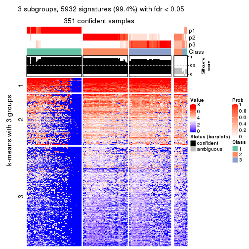</p>

</div>
<div id='tab-CV-skmeans-get-signatures-no-scale-3'>
<pre><code class="r">get_signatures(res, k = 4, scale_rows = FALSE)
</code></pre>

<p></p>

</div>
<div id='tab-CV-skmeans-get-signatures-no-scale-4'>
<pre><code class="r">get_signatures(res, k = 5, scale_rows = FALSE)
</code></pre>

<p></p>

</div>
<div id='tab-CV-skmeans-get-signatures-no-scale-5'>
<pre><code class="r">get_signatures(res, k = 6, scale_rows = FALSE)
</code></pre>

<p></p>

</div>
</div>


Compare the overlap of signatures from different k:

```r
compare_signatures(res)
```


`get_signature()` returns a data frame invisibly. TO get the list of signatures, the function
call should be assigned to a variable explicitly. In following code, if `plot` argument is set
to `FALSE`, no heatmap is plotted while only the differential analysis is performed.

```r
# code only for demonstration
tb = get_signature(res, k = ..., plot = FALSE)
```

An example of the output of `tb` is:

```
#>   which_row         fdr    mean_1    mean_2 scaled_mean_1 scaled_mean_2 km
#> 1        38 0.042760348  8.373488  9.131774    -0.5533452     0.5164555  1
#> 2        40 0.018707592  7.106213  8.469186    -0.6173731     0.5762149  1
#> 3        55 0.019134737 10.221463 11.207825    -0.6159697     0.5749050  1
#> 4        59 0.006059896  5.921854  7.869574    -0.6899429     0.6439467  1
#> 5        60 0.018055526  8.928898 10.211722    -0.6204761     0.5791110  1
#> 6        98 0.009384629 15.714769 14.887706     0.6635654    -0.6193277  2
...
```

The columns in `tb` are:

1. `which_row`: row indices corresponding to the input matrix.
2. `fdr`: FDR for the differential test. 
3. `mean_x`: The mean value in group x.
4. `scaled_mean_x`: The mean value in group x after rows are scaled.
5. `km`: Row groups if k-means clustering is applied to rows.


UMAP plot which shows how samples are separated.


<script>
$( function() {
	$( '#tabs-CV-skmeans-dimension-reduction' ).tabs();
} );
</script>
<div id='tabs-CV-skmeans-dimension-reduction'>
<ul>
<li><a href='#tab-CV-skmeans-dimension-reduction-1'>k = 2</a></li>
<li><a href='#tab-CV-skmeans-dimension-reduction-2'>k = 3</a></li>
<li><a href='#tab-CV-skmeans-dimension-reduction-3'>k = 4</a></li>
<li><a href='#tab-CV-skmeans-dimension-reduction-4'>k = 5</a></li>
<li><a href='#tab-CV-skmeans-dimension-reduction-5'>k = 6</a></li>
</ul>
<div id='tab-CV-skmeans-dimension-reduction-1'>
<pre><code class="r">dimension_reduction(res, k = 2, method = &quot;UMAP&quot;)
</code></pre>

<p></p>

</div>
<div id='tab-CV-skmeans-dimension-reduction-2'>
<pre><code class="r">dimension_reduction(res, k = 3, method = &quot;UMAP&quot;)
</code></pre>

<p></p>

</div>
<div id='tab-CV-skmeans-dimension-reduction-3'>
<pre><code class="r">dimension_reduction(res, k = 4, method = &quot;UMAP&quot;)
</code></pre>

<p></p>

</div>
<div id='tab-CV-skmeans-dimension-reduction-4'>
<pre><code class="r">dimension_reduction(res, k = 5, method = &quot;UMAP&quot;)
</code></pre>

<p></p>

</div>
<div id='tab-CV-skmeans-dimension-reduction-5'>
<pre><code class="r">dimension_reduction(res, k = 6, method = &quot;UMAP&quot;)
</code></pre>

<p></p>

</div>
</div>


Following heatmap shows how subgroups are split when increasing `k`:

```r
collect_classes(res)
```


If matrix rows can be associated to genes, consider to use `GO_Enrichment(res,
...)` to perform function enrichment for the signature genes.


 

---------------------------------------------------


### CV:pam


The object with results only for a single top-value method and a single partition method 
can be extracted as:

```r
res = res_list["CV", "pam"]
# you can also extract it by
# res = res_list["CV:pam"]
```

A summary of `res` and all the functions that can be applied to it:

```r
res
```

```
#> A 'ConsensusPartition' object with k = 2, 3, 4, 5, 6.
#>   On a matrix with 5966 rows and 384 columns.
#>   Top rows (597, 1194, 1790, 2386, 2983) are extracted by 'CV' method.
#>   Subgroups are detected by 'pam' method.
#>   Performed in total 1250 partitions by row resampling.
#>   Best k for subgroups seems to be 3.
#> 
#> Following methods can be applied to this 'ConsensusPartition' object:
#>  [1] "cola_report"             "collect_classes"         "collect_plots"          
#>  [4] "collect_stats"           "colnames"                "compare_signatures"     
#>  [7] "consensus_heatmap"       "dimension_reduction"     "functional_enrichment"  
#> [10] "get_anno_col"            "get_anno"                "get_classes"            
#> [13] "get_consensus"           "get_matrix"              "get_membership"         
#> [16] "get_param"               "get_signatures"          "get_stats"              
#> [19] "is_best_k"               "is_stable_k"             "membership_heatmap"     
#> [22] "ncol"                    "nrow"                    "plot_ecdf"              
#> [25] "rownames"                "select_partition_number" "show"                   
#> [28] "suggest_best_k"          "test_to_known_factors"
```

`collect_plots()` function collects all the plots made from `res` for all `k` (number of partitions)
into one single page to provide an easy and fast comparison between different `k`.

```r
collect_plots(res)
```


The plots are:

- The first row: a plot of the ECDF (Empirical cumulative distribution
  function) curves of the consensus matrix for each `k` and the heatmap of
  predicted classes for each `k`.
- The second row: heatmaps of the consensus matrix for each `k`.
- The third row: heatmaps of the membership matrix for each `k`.
- The fouth row: heatmaps of the signatures for each `k`.

All the plots in panels can be made by individual functions and they are
plotted later in this section.

`select_partition_number()` produces several plots showing different
statistics for choosing "optimized" `k`. There are following statistics:

- ECDF curves of the consensus matrix for each `k`;
- 1-PAC. [The PAC
  score](https://en.wikipedia.org/wiki/Consensus_clustering#Over-interpretation_potential_of_consensus_clustering)
  measures the proportion of the ambiguous subgrouping.
- Mean silhouette score.
- Concordance. The mean probability of fiting the consensus class ids in all
  partitions.
- Area increased. Denote $A_k$ as the area under the ECDF curve for current
  `k`, the area increased is defined as $A_k - A_{k-1}$.
- Rand index. The percent of pairs of samples that are both in a same cluster
  or both are not in a same cluster in the partition of k and k-1.
- Jaccard index. The ratio of pairs of samples are both in a same cluster in
  the partition of k and k-1 and the pairs of samples are both in a same
  cluster in the partition k or k-1.

The detailed explanations of these statistics can be found in [the cola
vignette](http://bioconductor.org/packages/devel/bioc/vignettes/cola/inst/doc/cola.html#toc_13).

Generally speaking, lower PAC score, higher mean silhouette score or higher
concordance corresponds to better partition. Rand index and Jaccard index
measure how similar the current partition is compared to partition with `k-1`.
If they are too similar, we won't accept `k` is better than `k-1`.

```r
select_partition_number(res)
```


The numeric values for all these statistics can be obtained by `get_stats()`.

```r
get_stats(res)
```

```
#>   k 1-PAC mean_silhouette concordance area_increased  Rand Jaccard
#> 2 2 0.895           0.941       0.975        0.38412 0.621   0.621
#> 3 3 0.541           0.778       0.866        0.65344 0.725   0.562
#> 4 4 0.696           0.752       0.865        0.16905 0.825   0.554
#> 5 5 0.871           0.852       0.935        0.07311 0.912   0.676
#> 6 6 0.866           0.841       0.925        0.00583 0.998   0.990
```

`suggest_best_k()` suggests the best $k$ based on these statistics. The rules are as follows:

- All $k$ with Jaccard index larger than 0.95 are removed because the increase of
  the partition number does not provides enough extra information. If all $k$ are removed,
  the best $k$ is assigned by `NA`.
- For $k$ with 1-PAC larger than 0.9, the maximal $k$ is taken as the "best k". Other $k$ is called "optional k".
- If it does not fit the second rule. The $k$ with the highest vote of highest
  1-PAC, mean silhouette and concordance is taken as the "best k".

```r
suggest_best_k(res)
```

```
#> [1] 3
```


Following shows the table of the partitions (You need to click the **show/hide
code output** link to see it). The membership matrix (columns with name `p*`)
is inferred by
[`clue::cl_consensus()`](https://www.rdocumentation.org/link/cl_consensus?package=clue)
function with the `SE` method. Basically the value in the membership matrix
represents the probability to belong to a certain group. The finall class
label for an item is determined with the group with highest probability it
belongs to.

In `get_classes()` function, the entropy is calculated from the membership
matrix and the silhouette score is calculated from the consensus matrix.


<script>
$( function() {
	$( '#tabs-CV-pam-get-classes' ).tabs();
} );
</script>
<div id='tabs-CV-pam-get-classes'>
<ul>
<li><a href='#tab-CV-pam-get-classes-1'>k = 2</a></li>
<li><a href='#tab-CV-pam-get-classes-2'>k = 3</a></li>
<li><a href='#tab-CV-pam-get-classes-3'>k = 4</a></li>
<li><a href='#tab-CV-pam-get-classes-4'>k = 5</a></li>
<li><a href='#tab-CV-pam-get-classes-5'>k = 6</a></li>
</ul>

<div id='tab-CV-pam-get-classes-1'>
<p><a id='tab-CV-pam-get-classes-1-a' style='color:#0366d6' href='#'>show/hide code output</a></p>
<pre><code class="r">cbind(get_classes(res, k = 2), get_membership(res, k = 2))
</code></pre>

<pre><code>#&gt;           class entropy silhouette    p1    p2
#&gt; SRR490216     2  0.9580     0.3881 0.380 0.620
#&gt; SRR490217     2  0.7299     0.7446 0.204 0.796
#&gt; SRR490218     2  0.4562     0.8839 0.096 0.904
#&gt; SRR490219     2  0.6148     0.8174 0.152 0.848
#&gt; SRR490220     2  0.5946     0.8273 0.144 0.856
#&gt; SRR490221     2  0.1414     0.9598 0.020 0.980
#&gt; SRR490222     2  0.3274     0.9216 0.060 0.940
#&gt; SRR490223     2  0.5842     0.8323 0.140 0.860
#&gt; SRR490224     1  0.0000     0.9621 1.000 0.000
#&gt; SRR490225     1  0.0000     0.9621 1.000 0.000
#&gt; SRR490226     1  0.0000     0.9621 1.000 0.000
#&gt; SRR490227     1  0.0000     0.9621 1.000 0.000
#&gt; SRR490228     1  0.0000     0.9621 1.000 0.000
#&gt; SRR490229     1  0.0000     0.9621 1.000 0.000
#&gt; SRR490230     1  0.0000     0.9621 1.000 0.000
#&gt; SRR490231     1  0.0000     0.9621 1.000 0.000
#&gt; SRR490232     1  0.0000     0.9621 1.000 0.000
#&gt; SRR490233     1  0.0000     0.9621 1.000 0.000
#&gt; SRR490234     1  0.0000     0.9621 1.000 0.000
#&gt; SRR490235     1  0.0000     0.9621 1.000 0.000
#&gt; SRR490236     1  0.0000     0.9621 1.000 0.000
#&gt; SRR490237     1  0.0000     0.9621 1.000 0.000
#&gt; SRR490238     1  0.0000     0.9621 1.000 0.000
#&gt; SRR490239     1  0.0000     0.9621 1.000 0.000
#&gt; SRR490240     2  0.0000     0.9774 0.000 1.000
#&gt; SRR490241     2  0.0000     0.9774 0.000 1.000
#&gt; SRR490242     2  0.0000     0.9774 0.000 1.000
#&gt; SRR490243     2  0.0000     0.9774 0.000 1.000
#&gt; SRR490244     1  0.0000     0.9621 1.000 0.000
#&gt; SRR490245     1  0.0000     0.9621 1.000 0.000
#&gt; SRR490246     1  0.0000     0.9621 1.000 0.000
#&gt; SRR490247     1  0.0000     0.9621 1.000 0.000
#&gt; SRR490248     2  0.9323     0.4684 0.348 0.652
#&gt; SRR490249     2  0.5519     0.8469 0.128 0.872
#&gt; SRR490250     2  0.5294     0.8565 0.120 0.880
#&gt; SRR490251     2  0.4815     0.8750 0.104 0.896
#&gt; SRR490252     2  0.0000     0.9774 0.000 1.000
#&gt; SRR490253     2  0.0000     0.9774 0.000 1.000
#&gt; SRR490254     2  0.0000     0.9774 0.000 1.000
#&gt; SRR490255     2  0.0000     0.9774 0.000 1.000
#&gt; SRR490256     1  0.1414     0.9469 0.980 0.020
#&gt; SRR490257     1  0.8081     0.6885 0.752 0.248
#&gt; SRR490258     1  0.5629     0.8445 0.868 0.132
#&gt; SRR490259     1  0.7139     0.7688 0.804 0.196
#&gt; SRR490260     1  0.0000     0.9621 1.000 0.000
#&gt; SRR490261     1  0.0000     0.9621 1.000 0.000
#&gt; SRR490262     1  0.0000     0.9621 1.000 0.000
#&gt; SRR490263     1  0.0000     0.9621 1.000 0.000
#&gt; SRR490264     1  0.0000     0.9621 1.000 0.000
#&gt; SRR490265     1  0.0000     0.9621 1.000 0.000
#&gt; SRR490266     1  0.0000     0.9621 1.000 0.000
#&gt; SRR490267     1  0.0000     0.9621 1.000 0.000
#&gt; SRR490268     1  0.6148     0.8226 0.848 0.152
#&gt; SRR490269     1  0.5519     0.8488 0.872 0.128
#&gt; SRR490270     1  0.9608     0.3973 0.616 0.384
#&gt; SRR490271     1  0.7219     0.7635 0.800 0.200
#&gt; SRR490272     1  0.0000     0.9621 1.000 0.000
#&gt; SRR490273     1  0.0000     0.9621 1.000 0.000
#&gt; SRR490274     1  0.0000     0.9621 1.000 0.000
#&gt; SRR490275     1  0.0000     0.9621 1.000 0.000
#&gt; SRR490276     1  0.0000     0.9621 1.000 0.000
#&gt; SRR490277     1  0.0000     0.9621 1.000 0.000
#&gt; SRR490278     1  0.0000     0.9621 1.000 0.000
#&gt; SRR490279     1  0.0000     0.9621 1.000 0.000
#&gt; SRR490280     1  0.0000     0.9621 1.000 0.000
#&gt; SRR490281     1  0.0000     0.9621 1.000 0.000
#&gt; SRR490282     1  0.0000     0.9621 1.000 0.000
#&gt; SRR490283     1  0.0000     0.9621 1.000 0.000
#&gt; SRR490284     1  0.0000     0.9621 1.000 0.000
#&gt; SRR490285     1  0.0000     0.9621 1.000 0.000
#&gt; SRR490286     1  0.0000     0.9621 1.000 0.000
#&gt; SRR490287     1  0.0000     0.9621 1.000 0.000
#&gt; SRR490288     1  0.7139     0.7689 0.804 0.196
#&gt; SRR490289     2  0.9552     0.3985 0.376 0.624
#&gt; SRR490290     2  0.8661     0.5992 0.288 0.712
#&gt; SRR490291     2  0.9044     0.5325 0.320 0.680
#&gt; SRR490292     2  0.2236     0.9451 0.036 0.964
#&gt; SRR490293     2  0.0000     0.9774 0.000 1.000
#&gt; SRR490294     2  0.0000     0.9774 0.000 1.000
#&gt; SRR490295     2  0.0000     0.9774 0.000 1.000
#&gt; SRR490296     2  0.0000     0.9774 0.000 1.000
#&gt; SRR490297     2  0.0000     0.9774 0.000 1.000
#&gt; SRR490298     2  0.0000     0.9774 0.000 1.000
#&gt; SRR490299     2  0.0000     0.9774 0.000 1.000
#&gt; SRR490300     2  0.0000     0.9774 0.000 1.000
#&gt; SRR490301     2  0.0000     0.9774 0.000 1.000
#&gt; SRR490302     2  0.0000     0.9774 0.000 1.000
#&gt; SRR490303     2  0.0000     0.9774 0.000 1.000
#&gt; SRR490304     2  0.0000     0.9774 0.000 1.000
#&gt; SRR490305     2  0.0000     0.9774 0.000 1.000
#&gt; SRR490306     2  0.0000     0.9774 0.000 1.000
#&gt; SRR490307     2  0.0000     0.9774 0.000 1.000
#&gt; SRR490308     1  0.0000     0.9621 1.000 0.000
#&gt; SRR490309     1  0.0000     0.9621 1.000 0.000
#&gt; SRR490310     1  0.0000     0.9621 1.000 0.000
#&gt; SRR490311     1  0.0000     0.9621 1.000 0.000
#&gt; SRR490312     2  0.9866     0.2346 0.432 0.568
#&gt; SRR490313     2  0.9608     0.3773 0.384 0.616
#&gt; SRR490314     2  0.7602     0.7197 0.220 0.780
#&gt; SRR490315     2  0.7219     0.7503 0.200 0.800
#&gt; SRR490316     2  0.6531     0.7962 0.168 0.832
#&gt; SRR490317     2  0.6887     0.7739 0.184 0.816
#&gt; SRR490318     2  0.5946     0.8273 0.144 0.856
#&gt; SRR490319     2  0.0672     0.9705 0.008 0.992
#&gt; SRR490320     1  0.0000     0.9621 1.000 0.000
#&gt; SRR490321     1  0.0000     0.9621 1.000 0.000
#&gt; SRR490322     1  0.0000     0.9621 1.000 0.000
#&gt; SRR490323     1  0.0000     0.9621 1.000 0.000
#&gt; SRR490324     1  0.0000     0.9621 1.000 0.000
#&gt; SRR490325     1  0.0000     0.9621 1.000 0.000
#&gt; SRR490326     1  0.0000     0.9621 1.000 0.000
#&gt; SRR490327     1  0.0000     0.9621 1.000 0.000
#&gt; SRR490328     2  0.0000     0.9774 0.000 1.000
#&gt; SRR490329     2  0.0000     0.9774 0.000 1.000
#&gt; SRR490330     2  0.0000     0.9774 0.000 1.000
#&gt; SRR490331     2  0.0000     0.9774 0.000 1.000
#&gt; SRR490332     2  0.0000     0.9774 0.000 1.000
#&gt; SRR490333     2  0.0000     0.9774 0.000 1.000
#&gt; SRR490334     2  0.0000     0.9774 0.000 1.000
#&gt; SRR490335     2  0.0000     0.9774 0.000 1.000
#&gt; SRR490336     2  0.0000     0.9774 0.000 1.000
#&gt; SRR490337     2  0.0000     0.9774 0.000 1.000
#&gt; SRR490338     2  0.0000     0.9774 0.000 1.000
#&gt; SRR490339     2  0.0000     0.9774 0.000 1.000
#&gt; SRR490340     2  0.0000     0.9774 0.000 1.000
#&gt; SRR490341     2  0.0000     0.9774 0.000 1.000
#&gt; SRR490342     2  0.0000     0.9774 0.000 1.000
#&gt; SRR490343     2  0.0000     0.9774 0.000 1.000
#&gt; SRR490344     2  0.0000     0.9774 0.000 1.000
#&gt; SRR490345     2  0.0000     0.9774 0.000 1.000
#&gt; SRR490346     2  0.0938     0.9670 0.012 0.988
#&gt; SRR490347     2  0.0000     0.9774 0.000 1.000
#&gt; SRR490348     2  0.0000     0.9774 0.000 1.000
#&gt; SRR490349     2  0.0000     0.9774 0.000 1.000
#&gt; SRR490350     2  0.0000     0.9774 0.000 1.000
#&gt; SRR490351     2  0.0000     0.9774 0.000 1.000
#&gt; SRR490352     2  0.0000     0.9774 0.000 1.000
#&gt; SRR490353     2  0.0000     0.9774 0.000 1.000
#&gt; SRR490354     2  0.0000     0.9774 0.000 1.000
#&gt; SRR490355     2  0.0000     0.9774 0.000 1.000
#&gt; SRR490356     2  0.0000     0.9774 0.000 1.000
#&gt; SRR490357     2  0.0000     0.9774 0.000 1.000
#&gt; SRR490358     2  0.0000     0.9774 0.000 1.000
#&gt; SRR490359     2  0.0000     0.9774 0.000 1.000
#&gt; SRR490360     2  0.0000     0.9774 0.000 1.000
#&gt; SRR490361     2  0.0000     0.9774 0.000 1.000
#&gt; SRR490362     2  0.0000     0.9774 0.000 1.000
#&gt; SRR490363     2  0.0000     0.9774 0.000 1.000
#&gt; SRR490364     2  0.0000     0.9774 0.000 1.000
#&gt; SRR490365     2  0.0000     0.9774 0.000 1.000
#&gt; SRR490366     2  0.0000     0.9774 0.000 1.000
#&gt; SRR490367     2  0.0000     0.9774 0.000 1.000
#&gt; SRR490368     2  0.0000     0.9774 0.000 1.000
#&gt; SRR490369     2  0.0000     0.9774 0.000 1.000
#&gt; SRR490370     2  0.0000     0.9774 0.000 1.000
#&gt; SRR490371     2  0.0000     0.9774 0.000 1.000
#&gt; SRR490372     1  0.0000     0.9621 1.000 0.000
#&gt; SRR490373     1  0.0000     0.9621 1.000 0.000
#&gt; SRR490374     1  0.0000     0.9621 1.000 0.000
#&gt; SRR490375     1  0.0000     0.9621 1.000 0.000
#&gt; SRR490376     2  0.0000     0.9774 0.000 1.000
#&gt; SRR490377     2  0.0000     0.9774 0.000 1.000
#&gt; SRR490378     2  0.0000     0.9774 0.000 1.000
#&gt; SRR490379     2  0.0000     0.9774 0.000 1.000
#&gt; SRR490380     1  0.0000     0.9621 1.000 0.000
#&gt; SRR490381     1  0.0000     0.9621 1.000 0.000
#&gt; SRR490382     1  0.0000     0.9621 1.000 0.000
#&gt; SRR490383     1  0.0000     0.9621 1.000 0.000
#&gt; SRR490384     2  0.0000     0.9774 0.000 1.000
#&gt; SRR490385     2  0.0000     0.9774 0.000 1.000
#&gt; SRR490386     2  0.0000     0.9774 0.000 1.000
#&gt; SRR490387     2  0.0000     0.9774 0.000 1.000
#&gt; SRR490388     2  0.0000     0.9774 0.000 1.000
#&gt; SRR490389     2  0.0000     0.9774 0.000 1.000
#&gt; SRR490390     2  0.0000     0.9774 0.000 1.000
#&gt; SRR490391     2  0.0000     0.9774 0.000 1.000
#&gt; SRR490392     2  0.0000     0.9774 0.000 1.000
#&gt; SRR490393     2  0.0000     0.9774 0.000 1.000
#&gt; SRR490394     2  0.0000     0.9774 0.000 1.000
#&gt; SRR490395     2  0.0000     0.9774 0.000 1.000
#&gt; SRR490396     2  0.0000     0.9774 0.000 1.000
#&gt; SRR490397     2  0.0000     0.9774 0.000 1.000
#&gt; SRR490398     2  0.0000     0.9774 0.000 1.000
#&gt; SRR490399     2  0.0000     0.9774 0.000 1.000
#&gt; SRR490400     2  0.0000     0.9774 0.000 1.000
#&gt; SRR490401     2  0.0000     0.9774 0.000 1.000
#&gt; SRR490402     2  0.0000     0.9774 0.000 1.000
#&gt; SRR490403     2  0.0000     0.9774 0.000 1.000
#&gt; SRR490404     2  0.0000     0.9774 0.000 1.000
#&gt; SRR490405     2  0.0000     0.9774 0.000 1.000
#&gt; SRR490406     2  0.0000     0.9774 0.000 1.000
#&gt; SRR490407     2  0.0000     0.9774 0.000 1.000
#&gt; SRR490408     2  0.0000     0.9774 0.000 1.000
#&gt; SRR490409     2  0.0000     0.9774 0.000 1.000
#&gt; SRR490410     2  0.0000     0.9774 0.000 1.000
#&gt; SRR490411     2  0.0000     0.9774 0.000 1.000
#&gt; SRR490412     1  0.0000     0.9621 1.000 0.000
#&gt; SRR490413     1  0.0000     0.9621 1.000 0.000
#&gt; SRR490414     1  0.0000     0.9621 1.000 0.000
#&gt; SRR490415     1  0.0000     0.9621 1.000 0.000
#&gt; SRR490416     2  0.0000     0.9774 0.000 1.000
#&gt; SRR490417     2  0.0000     0.9774 0.000 1.000
#&gt; SRR490418     2  0.0000     0.9774 0.000 1.000
#&gt; SRR490419     2  0.0000     0.9774 0.000 1.000
#&gt; SRR490420     2  0.7602     0.7202 0.220 0.780
#&gt; SRR490421     2  0.1414     0.9598 0.020 0.980
#&gt; SRR490422     2  0.0672     0.9705 0.008 0.992
#&gt; SRR490423     2  0.0376     0.9739 0.004 0.996
#&gt; SRR490424     1  0.0000     0.9621 1.000 0.000
#&gt; SRR490425     1  0.0000     0.9621 1.000 0.000
#&gt; SRR490426     1  0.0000     0.9621 1.000 0.000
#&gt; SRR490427     1  0.0000     0.9621 1.000 0.000
#&gt; SRR490428     1  0.9922     0.2043 0.552 0.448
#&gt; SRR490429     2  0.9129     0.5153 0.328 0.672
#&gt; SRR490430     2  0.5178     0.8620 0.116 0.884
#&gt; SRR490431     2  0.7950     0.6867 0.240 0.760
#&gt; SRR490432     2  0.0000     0.9774 0.000 1.000
#&gt; SRR490433     2  0.0000     0.9774 0.000 1.000
#&gt; SRR490434     2  0.0000     0.9774 0.000 1.000
#&gt; SRR490435     2  0.0000     0.9774 0.000 1.000
#&gt; SRR490436     2  0.0000     0.9774 0.000 1.000
#&gt; SRR490437     2  0.0000     0.9774 0.000 1.000
#&gt; SRR490438     2  0.0000     0.9774 0.000 1.000
#&gt; SRR490439     2  0.0000     0.9774 0.000 1.000
#&gt; SRR490440     2  0.0000     0.9774 0.000 1.000
#&gt; SRR490441     2  0.0000     0.9774 0.000 1.000
#&gt; SRR490442     2  0.0000     0.9774 0.000 1.000
#&gt; SRR490443     2  0.0000     0.9774 0.000 1.000
#&gt; SRR490444     2  0.0000     0.9774 0.000 1.000
#&gt; SRR490445     2  0.0000     0.9774 0.000 1.000
#&gt; SRR490446     2  0.0000     0.9774 0.000 1.000
#&gt; SRR490447     2  0.0000     0.9774 0.000 1.000
#&gt; SRR490448     2  0.4562     0.8847 0.096 0.904
#&gt; SRR490449     2  0.0000     0.9774 0.000 1.000
#&gt; SRR490450     2  0.0000     0.9774 0.000 1.000
#&gt; SRR490451     2  0.0000     0.9774 0.000 1.000
#&gt; SRR490452     1  0.0000     0.9621 1.000 0.000
#&gt; SRR490453     1  0.7219     0.7632 0.800 0.200
#&gt; SRR490454     1  0.7219     0.7632 0.800 0.200
#&gt; SRR490455     1  0.6887     0.7843 0.816 0.184
#&gt; SRR490456     2  0.0000     0.9774 0.000 1.000
#&gt; SRR490457     2  0.0000     0.9774 0.000 1.000
#&gt; SRR490458     2  0.0000     0.9774 0.000 1.000
#&gt; SRR490459     2  0.0000     0.9774 0.000 1.000
#&gt; SRR490460     2  0.0000     0.9774 0.000 1.000
#&gt; SRR490461     2  0.0000     0.9774 0.000 1.000
#&gt; SRR490462     2  0.0000     0.9774 0.000 1.000
#&gt; SRR490463     2  0.0000     0.9774 0.000 1.000
#&gt; SRR490464     1  0.0000     0.9621 1.000 0.000
#&gt; SRR490465     1  0.0000     0.9621 1.000 0.000
#&gt; SRR490466     1  0.0000     0.9621 1.000 0.000
#&gt; SRR490467     1  0.0000     0.9621 1.000 0.000
#&gt; SRR490468     2  0.0000     0.9774 0.000 1.000
#&gt; SRR490469     2  0.0000     0.9774 0.000 1.000
#&gt; SRR490470     2  0.0000     0.9774 0.000 1.000
#&gt; SRR490471     2  0.0000     0.9774 0.000 1.000
#&gt; SRR490472     2  0.0000     0.9774 0.000 1.000
#&gt; SRR490473     2  0.0000     0.9774 0.000 1.000
#&gt; SRR490474     2  0.0000     0.9774 0.000 1.000
#&gt; SRR490475     2  0.0000     0.9774 0.000 1.000
#&gt; SRR490476     1  0.0000     0.9621 1.000 0.000
#&gt; SRR490477     1  0.0000     0.9621 1.000 0.000
#&gt; SRR490478     1  0.0000     0.9621 1.000 0.000
#&gt; SRR490479     1  0.0000     0.9621 1.000 0.000
#&gt; SRR490480     2  0.0000     0.9774 0.000 1.000
#&gt; SRR490481     2  0.0000     0.9774 0.000 1.000
#&gt; SRR490482     2  0.0000     0.9774 0.000 1.000
#&gt; SRR490483     2  0.0000     0.9774 0.000 1.000
#&gt; SRR490484     2  0.0000     0.9774 0.000 1.000
#&gt; SRR490485     2  0.0000     0.9774 0.000 1.000
#&gt; SRR490486     2  0.0000     0.9774 0.000 1.000
#&gt; SRR490487     2  0.0000     0.9774 0.000 1.000
#&gt; SRR490488     2  0.0000     0.9774 0.000 1.000
#&gt; SRR490489     2  0.0000     0.9774 0.000 1.000
#&gt; SRR490490     2  0.0000     0.9774 0.000 1.000
#&gt; SRR490491     2  0.0000     0.9774 0.000 1.000
#&gt; SRR490492     2  0.0000     0.9774 0.000 1.000
#&gt; SRR490493     2  0.0000     0.9774 0.000 1.000
#&gt; SRR490494     2  0.0000     0.9774 0.000 1.000
#&gt; SRR490495     2  0.0000     0.9774 0.000 1.000
#&gt; SRR490496     2  0.0000     0.9774 0.000 1.000
#&gt; SRR490497     2  0.0000     0.9774 0.000 1.000
#&gt; SRR490498     2  0.0000     0.9774 0.000 1.000
#&gt; SRR490499     2  0.0000     0.9774 0.000 1.000
#&gt; SRR490500     2  0.0000     0.9774 0.000 1.000
#&gt; SRR490501     2  0.0000     0.9774 0.000 1.000
#&gt; SRR490502     2  0.0000     0.9774 0.000 1.000
#&gt; SRR490503     2  0.0000     0.9774 0.000 1.000
#&gt; SRR490504     2  0.0000     0.9774 0.000 1.000
#&gt; SRR490505     2  0.0000     0.9774 0.000 1.000
#&gt; SRR490506     2  0.0000     0.9774 0.000 1.000
#&gt; SRR490507     2  0.0000     0.9774 0.000 1.000
#&gt; SRR490508     2  0.0000     0.9774 0.000 1.000
#&gt; SRR490509     2  0.0000     0.9774 0.000 1.000
#&gt; SRR490510     2  0.0000     0.9774 0.000 1.000
#&gt; SRR490511     2  0.0000     0.9774 0.000 1.000
#&gt; SRR490512     2  0.0000     0.9774 0.000 1.000
#&gt; SRR490513     2  0.0000     0.9774 0.000 1.000
#&gt; SRR490514     2  0.0000     0.9774 0.000 1.000
#&gt; SRR490515     2  0.0000     0.9774 0.000 1.000
#&gt; SRR490516     2  0.0000     0.9774 0.000 1.000
#&gt; SRR490517     2  0.0000     0.9774 0.000 1.000
#&gt; SRR490518     2  0.0000     0.9774 0.000 1.000
#&gt; SRR490519     2  0.0000     0.9774 0.000 1.000
#&gt; SRR490520     2  0.0000     0.9774 0.000 1.000
#&gt; SRR490521     2  0.0000     0.9774 0.000 1.000
#&gt; SRR490522     2  0.0000     0.9774 0.000 1.000
#&gt; SRR490523     2  0.0000     0.9774 0.000 1.000
#&gt; SRR490524     2  0.0000     0.9774 0.000 1.000
#&gt; SRR490525     2  0.0000     0.9774 0.000 1.000
#&gt; SRR490526     2  0.0000     0.9774 0.000 1.000
#&gt; SRR490527     2  0.0000     0.9774 0.000 1.000
#&gt; SRR490528     2  0.0000     0.9774 0.000 1.000
#&gt; SRR490529     2  0.0000     0.9774 0.000 1.000
#&gt; SRR490530     2  0.0000     0.9774 0.000 1.000
#&gt; SRR490531     2  0.0000     0.9774 0.000 1.000
#&gt; SRR490532     1  0.8327     0.6679 0.736 0.264
#&gt; SRR490533     1  0.9044     0.5512 0.680 0.320
#&gt; SRR490534     2  0.9977     0.0859 0.472 0.528
#&gt; SRR490535     1  0.7139     0.7690 0.804 0.196
#&gt; SRR490536     2  0.0000     0.9774 0.000 1.000
#&gt; SRR490537     2  0.0000     0.9774 0.000 1.000
#&gt; SRR490538     2  0.0000     0.9774 0.000 1.000
#&gt; SRR490539     2  0.0000     0.9774 0.000 1.000
#&gt; SRR490540     2  0.0000     0.9774 0.000 1.000
#&gt; SRR490541     2  0.0000     0.9774 0.000 1.000
#&gt; SRR490542     2  0.0000     0.9774 0.000 1.000
#&gt; SRR490543     2  0.0000     0.9774 0.000 1.000
#&gt; SRR490544     2  0.0000     0.9774 0.000 1.000
#&gt; SRR490545     2  0.0000     0.9774 0.000 1.000
#&gt; SRR490546     2  0.0000     0.9774 0.000 1.000
#&gt; SRR490547     2  0.0000     0.9774 0.000 1.000
#&gt; SRR490548     2  0.0000     0.9774 0.000 1.000
#&gt; SRR490549     2  0.0000     0.9774 0.000 1.000
#&gt; SRR490550     2  0.0000     0.9774 0.000 1.000
#&gt; SRR490551     2  0.0000     0.9774 0.000 1.000
#&gt; SRR490552     2  0.0000     0.9774 0.000 1.000
#&gt; SRR490553     2  0.0000     0.9774 0.000 1.000
#&gt; SRR490554     2  0.0000     0.9774 0.000 1.000
#&gt; SRR490555     2  0.0000     0.9774 0.000 1.000
#&gt; SRR490556     2  0.0000     0.9774 0.000 1.000
#&gt; SRR490557     2  0.0000     0.9774 0.000 1.000
#&gt; SRR490558     2  0.0000     0.9774 0.000 1.000
#&gt; SRR490559     2  0.0000     0.9774 0.000 1.000
#&gt; SRR490560     2  0.0000     0.9774 0.000 1.000
#&gt; SRR490561     2  0.0000     0.9774 0.000 1.000
#&gt; SRR490562     2  0.0000     0.9774 0.000 1.000
#&gt; SRR490563     2  0.0000     0.9774 0.000 1.000
#&gt; SRR490564     2  0.0000     0.9774 0.000 1.000
#&gt; SRR490565     2  0.0000     0.9774 0.000 1.000
#&gt; SRR490566     2  0.0000     0.9774 0.000 1.000
#&gt; SRR490567     2  0.0000     0.9774 0.000 1.000
#&gt; SRR490568     2  0.0000     0.9774 0.000 1.000
#&gt; SRR490569     2  0.0000     0.9774 0.000 1.000
#&gt; SRR490570     2  0.0000     0.9774 0.000 1.000
#&gt; SRR490571     2  0.0000     0.9774 0.000 1.000
#&gt; SRR490572     2  0.0000     0.9774 0.000 1.000
#&gt; SRR490573     2  0.0000     0.9774 0.000 1.000
#&gt; SRR490574     2  0.0000     0.9774 0.000 1.000
#&gt; SRR490575     2  0.0000     0.9774 0.000 1.000
#&gt; SRR490576     2  0.0000     0.9774 0.000 1.000
#&gt; SRR490577     2  0.0000     0.9774 0.000 1.000
#&gt; SRR490578     2  0.0000     0.9774 0.000 1.000
#&gt; SRR490579     2  0.0000     0.9774 0.000 1.000
#&gt; SRR490580     2  0.0000     0.9774 0.000 1.000
#&gt; SRR490581     2  0.0000     0.9774 0.000 1.000
#&gt; SRR490582     2  0.0000     0.9774 0.000 1.000
#&gt; SRR490583     2  0.0000     0.9774 0.000 1.000
#&gt; SRR490584     2  0.0000     0.9774 0.000 1.000
#&gt; SRR490585     2  0.0000     0.9774 0.000 1.000
#&gt; SRR490586     2  0.0000     0.9774 0.000 1.000
#&gt; SRR490587     2  0.0000     0.9774 0.000 1.000
#&gt; SRR490588     2  0.0000     0.9774 0.000 1.000
#&gt; SRR490589     2  0.0000     0.9774 0.000 1.000
#&gt; SRR490590     2  0.0000     0.9774 0.000 1.000
#&gt; SRR490591     2  0.0000     0.9774 0.000 1.000
#&gt; SRR490592     2  0.0000     0.9774 0.000 1.000
#&gt; SRR490593     2  0.0000     0.9774 0.000 1.000
#&gt; SRR490594     2  0.0000     0.9774 0.000 1.000
#&gt; SRR490595     2  0.0000     0.9774 0.000 1.000
#&gt; SRR490596     2  0.0000     0.9774 0.000 1.000
#&gt; SRR490597     2  0.0000     0.9774 0.000 1.000
#&gt; SRR490598     2  0.0000     0.9774 0.000 1.000
#&gt; SRR490599     2  0.0000     0.9774 0.000 1.000
</code></pre>

<script>
$('#tab-CV-pam-get-classes-1-a').parent().next().next().hide();
$('#tab-CV-pam-get-classes-1-a').click(function(){
  $('#tab-CV-pam-get-classes-1-a').parent().next().next().toggle();
  return(false);
});
</script>
</div>

<div id='tab-CV-pam-get-classes-2'>
<p><a id='tab-CV-pam-get-classes-2-a' style='color:#0366d6' href='#'>show/hide code output</a></p>
<pre><code class="r">cbind(get_classes(res, k = 3), get_membership(res, k = 3))
</code></pre>

<pre><code>#&gt;           class entropy silhouette    p1    p2    p3
#&gt; SRR490216     2  0.4178     0.7014 0.172 0.828 0.000
#&gt; SRR490217     2  0.2356     0.7885 0.072 0.928 0.000
#&gt; SRR490218     2  0.0000     0.8194 0.000 1.000 0.000
#&gt; SRR490219     2  0.0892     0.8147 0.020 0.980 0.000
#&gt; SRR490220     2  0.4602     0.7430 0.040 0.852 0.108
#&gt; SRR490221     2  0.2796     0.7729 0.000 0.908 0.092
#&gt; SRR490222     2  0.2878     0.7726 0.000 0.904 0.096
#&gt; SRR490223     2  0.4045     0.7510 0.024 0.872 0.104
#&gt; SRR490224     1  0.0000     0.9412 1.000 0.000 0.000
#&gt; SRR490225     1  0.0000     0.9412 1.000 0.000 0.000
#&gt; SRR490226     1  0.0000     0.9412 1.000 0.000 0.000
#&gt; SRR490227     1  0.0000     0.9412 1.000 0.000 0.000
#&gt; SRR490228     1  0.0000     0.9412 1.000 0.000 0.000
#&gt; SRR490229     1  0.0000     0.9412 1.000 0.000 0.000
#&gt; SRR490230     1  0.0000     0.9412 1.000 0.000 0.000
#&gt; SRR490231     1  0.0000     0.9412 1.000 0.000 0.000
#&gt; SRR490232     1  0.0000     0.9412 1.000 0.000 0.000
#&gt; SRR490233     1  0.1163     0.9227 0.972 0.000 0.028
#&gt; SRR490234     1  0.0000     0.9412 1.000 0.000 0.000
#&gt; SRR490235     1  0.2356     0.8914 0.928 0.000 0.072
#&gt; SRR490236     1  0.0000     0.9412 1.000 0.000 0.000
#&gt; SRR490237     1  0.0000     0.9412 1.000 0.000 0.000
#&gt; SRR490238     1  0.0000     0.9412 1.000 0.000 0.000
#&gt; SRR490239     1  0.0000     0.9412 1.000 0.000 0.000
#&gt; SRR490240     2  0.3116     0.7604 0.000 0.892 0.108
#&gt; SRR490241     2  0.3116     0.7604 0.000 0.892 0.108
#&gt; SRR490242     2  0.3192     0.7592 0.000 0.888 0.112
#&gt; SRR490243     2  0.3116     0.7604 0.000 0.892 0.108
#&gt; SRR490244     1  0.0000     0.9412 1.000 0.000 0.000
#&gt; SRR490245     1  0.0000     0.9412 1.000 0.000 0.000
#&gt; SRR490246     1  0.0000     0.9412 1.000 0.000 0.000
#&gt; SRR490247     1  0.0000     0.9412 1.000 0.000 0.000
#&gt; SRR490248     2  0.3038     0.7647 0.104 0.896 0.000
#&gt; SRR490249     2  0.0237     0.8186 0.004 0.996 0.000
#&gt; SRR490250     2  0.0237     0.8186 0.004 0.996 0.000
#&gt; SRR490251     2  0.0237     0.8186 0.004 0.996 0.000
#&gt; SRR490252     2  0.1643     0.8012 0.000 0.956 0.044
#&gt; SRR490253     2  0.3038     0.7617 0.000 0.896 0.104
#&gt; SRR490254     2  0.1964     0.7946 0.000 0.944 0.056
#&gt; SRR490255     2  0.2537     0.7795 0.000 0.920 0.080
#&gt; SRR490256     1  0.6299     0.7620 0.772 0.132 0.096
#&gt; SRR490257     1  0.8691     0.0919 0.452 0.444 0.104
#&gt; SRR490258     1  0.7959     0.5156 0.620 0.288 0.092
#&gt; SRR490259     1  0.7948     0.5548 0.632 0.268 0.100
#&gt; SRR490260     1  0.0000     0.9412 1.000 0.000 0.000
#&gt; SRR490261     1  0.0000     0.9412 1.000 0.000 0.000
#&gt; SRR490262     1  0.0000     0.9412 1.000 0.000 0.000
#&gt; SRR490263     1  0.0000     0.9412 1.000 0.000 0.000
#&gt; SRR490264     1  0.0000     0.9412 1.000 0.000 0.000
#&gt; SRR490265     1  0.0000     0.9412 1.000 0.000 0.000
#&gt; SRR490266     1  0.0000     0.9412 1.000 0.000 0.000
#&gt; SRR490267     1  0.0000     0.9412 1.000 0.000 0.000
#&gt; SRR490268     1  0.8040     0.4872 0.608 0.300 0.092
#&gt; SRR490269     1  0.8104     0.5147 0.616 0.280 0.104
#&gt; SRR490270     2  0.8586     0.1610 0.376 0.520 0.104
#&gt; SRR490271     1  0.8262     0.4647 0.592 0.304 0.104
#&gt; SRR490272     1  0.0000     0.9412 1.000 0.000 0.000
#&gt; SRR490273     1  0.0000     0.9412 1.000 0.000 0.000
#&gt; SRR490274     1  0.0000     0.9412 1.000 0.000 0.000
#&gt; SRR490275     1  0.0000     0.9412 1.000 0.000 0.000
#&gt; SRR490276     1  0.0000     0.9412 1.000 0.000 0.000
#&gt; SRR490277     1  0.0000     0.9412 1.000 0.000 0.000
#&gt; SRR490278     1  0.0000     0.9412 1.000 0.000 0.000
#&gt; SRR490279     1  0.0000     0.9412 1.000 0.000 0.000
#&gt; SRR490280     1  0.0000     0.9412 1.000 0.000 0.000
#&gt; SRR490281     1  0.0000     0.9412 1.000 0.000 0.000
#&gt; SRR490282     1  0.0000     0.9412 1.000 0.000 0.000
#&gt; SRR490283     1  0.0000     0.9412 1.000 0.000 0.000
#&gt; SRR490284     1  0.0000     0.9412 1.000 0.000 0.000
#&gt; SRR490285     1  0.0000     0.9412 1.000 0.000 0.000
#&gt; SRR490286     1  0.0000     0.9412 1.000 0.000 0.000
#&gt; SRR490287     1  0.0000     0.9412 1.000 0.000 0.000
#&gt; SRR490288     1  0.8338     0.2665 0.516 0.400 0.084
#&gt; SRR490289     2  0.6510     0.6534 0.156 0.756 0.088
#&gt; SRR490290     2  0.6986     0.6165 0.180 0.724 0.096
#&gt; SRR490291     2  0.5137     0.7259 0.064 0.832 0.104
#&gt; SRR490292     2  0.3412     0.7565 0.000 0.876 0.124
#&gt; SRR490293     2  0.4291     0.7282 0.000 0.820 0.180
#&gt; SRR490294     2  0.3192     0.7592 0.000 0.888 0.112
#&gt; SRR490295     2  0.5560     0.5916 0.000 0.700 0.300
#&gt; SRR490296     3  0.4399     0.8290 0.000 0.188 0.812
#&gt; SRR490297     3  0.3752     0.8655 0.000 0.144 0.856
#&gt; SRR490298     3  0.3192     0.8859 0.000 0.112 0.888
#&gt; SRR490299     3  0.4654     0.8082 0.000 0.208 0.792
#&gt; SRR490300     2  0.3816     0.7586 0.000 0.852 0.148
#&gt; SRR490301     2  0.6225     0.1055 0.000 0.568 0.432
#&gt; SRR490302     3  0.6267     0.2678 0.000 0.452 0.548
#&gt; SRR490303     3  0.6291     0.2907 0.000 0.468 0.532
#&gt; SRR490304     3  0.3192     0.8857 0.000 0.112 0.888
#&gt; SRR490305     3  0.3038     0.8884 0.000 0.104 0.896
#&gt; SRR490306     3  0.3038     0.8884 0.000 0.104 0.896
#&gt; SRR490307     3  0.3038     0.8884 0.000 0.104 0.896
#&gt; SRR490308     1  0.0000     0.9412 1.000 0.000 0.000
#&gt; SRR490309     1  0.0000     0.9412 1.000 0.000 0.000
#&gt; SRR490310     1  0.0000     0.9412 1.000 0.000 0.000
#&gt; SRR490311     1  0.0000     0.9412 1.000 0.000 0.000
#&gt; SRR490312     2  0.5706     0.4642 0.320 0.680 0.000
#&gt; SRR490313     2  0.4178     0.7001 0.172 0.828 0.000
#&gt; SRR490314     2  0.1163     0.8116 0.028 0.972 0.000
#&gt; SRR490315     2  0.0892     0.8154 0.020 0.980 0.000
#&gt; SRR490316     2  0.3116     0.7604 0.000 0.892 0.108
#&gt; SRR490317     2  0.1751     0.8084 0.028 0.960 0.012
#&gt; SRR490318     2  0.3038     0.7637 0.000 0.896 0.104
#&gt; SRR490319     2  0.2356     0.7865 0.000 0.928 0.072
#&gt; SRR490320     1  0.0000     0.9412 1.000 0.000 0.000
#&gt; SRR490321     1  0.0000     0.9412 1.000 0.000 0.000
#&gt; SRR490322     1  0.0000     0.9412 1.000 0.000 0.000
#&gt; SRR490323     1  0.0000     0.9412 1.000 0.000 0.000
#&gt; SRR490324     1  0.0000     0.9412 1.000 0.000 0.000
#&gt; SRR490325     1  0.0000     0.9412 1.000 0.000 0.000
#&gt; SRR490326     1  0.0000     0.9412 1.000 0.000 0.000
#&gt; SRR490327     1  0.0000     0.9412 1.000 0.000 0.000
#&gt; SRR490328     2  0.1031     0.8149 0.000 0.976 0.024
#&gt; SRR490329     2  0.1289     0.8120 0.000 0.968 0.032
#&gt; SRR490330     2  0.3412     0.7515 0.000 0.876 0.124
#&gt; SRR490331     2  0.0747     0.8178 0.000 0.984 0.016
#&gt; SRR490332     2  0.4452     0.7208 0.000 0.808 0.192
#&gt; SRR490333     2  0.6260    -0.0680 0.000 0.552 0.448
#&gt; SRR490334     2  0.4555     0.7051 0.000 0.800 0.200
#&gt; SRR490335     2  0.5465     0.4921 0.000 0.712 0.288
#&gt; SRR490336     3  0.5650     0.6729 0.000 0.312 0.688
#&gt; SRR490337     3  0.5733     0.6659 0.000 0.324 0.676
#&gt; SRR490338     3  0.6126     0.5577 0.000 0.400 0.600
#&gt; SRR490339     3  0.5497     0.7008 0.000 0.292 0.708
#&gt; SRR490340     2  0.6026     0.4391 0.000 0.624 0.376
#&gt; SRR490341     2  0.3482     0.7546 0.000 0.872 0.128
#&gt; SRR490342     2  0.6267     0.2407 0.000 0.548 0.452
#&gt; SRR490343     2  0.3879     0.7469 0.000 0.848 0.152
#&gt; SRR490344     2  0.0000     0.8194 0.000 1.000 0.000
#&gt; SRR490345     2  0.0000     0.8194 0.000 1.000 0.000
#&gt; SRR490346     2  0.0000     0.8194 0.000 1.000 0.000
#&gt; SRR490347     2  0.0000     0.8194 0.000 1.000 0.000
#&gt; SRR490348     2  0.0592     0.8196 0.000 0.988 0.012
#&gt; SRR490349     2  0.0424     0.8196 0.000 0.992 0.008
#&gt; SRR490350     2  0.0237     0.8195 0.000 0.996 0.004
#&gt; SRR490351     2  0.0424     0.8198 0.000 0.992 0.008
#&gt; SRR490352     2  0.4291     0.7641 0.000 0.820 0.180
#&gt; SRR490353     2  0.2796     0.8039 0.000 0.908 0.092
#&gt; SRR490354     2  0.1031     0.8190 0.000 0.976 0.024
#&gt; SRR490355     2  0.4399     0.7596 0.000 0.812 0.188
#&gt; SRR490356     2  0.0000     0.8194 0.000 1.000 0.000
#&gt; SRR490357     2  0.0000     0.8194 0.000 1.000 0.000
#&gt; SRR490358     2  0.0000     0.8194 0.000 1.000 0.000
#&gt; SRR490359     2  0.0000     0.8194 0.000 1.000 0.000
#&gt; SRR490360     2  0.0000     0.8194 0.000 1.000 0.000
#&gt; SRR490361     2  0.0000     0.8194 0.000 1.000 0.000
#&gt; SRR490362     2  0.0000     0.8194 0.000 1.000 0.000
#&gt; SRR490363     2  0.0000     0.8194 0.000 1.000 0.000
#&gt; SRR490364     2  0.0000     0.8194 0.000 1.000 0.000
#&gt; SRR490365     2  0.1964     0.8131 0.000 0.944 0.056
#&gt; SRR490366     2  0.1643     0.8153 0.000 0.956 0.044
#&gt; SRR490367     2  0.1529     0.8163 0.000 0.960 0.040
#&gt; SRR490368     2  0.3941     0.7777 0.000 0.844 0.156
#&gt; SRR490369     2  0.4002     0.7756 0.000 0.840 0.160
#&gt; SRR490370     2  0.3340     0.7932 0.000 0.880 0.120
#&gt; SRR490371     2  0.4555     0.7506 0.000 0.800 0.200
#&gt; SRR490372     1  0.0000     0.9412 1.000 0.000 0.000
#&gt; SRR490373     1  0.0000     0.9412 1.000 0.000 0.000
#&gt; SRR490374     1  0.0000     0.9412 1.000 0.000 0.000
#&gt; SRR490375     1  0.0000     0.9412 1.000 0.000 0.000
#&gt; SRR490376     2  0.0000     0.8194 0.000 1.000 0.000
#&gt; SRR490377     2  0.0000     0.8194 0.000 1.000 0.000
#&gt; SRR490378     2  0.0000     0.8194 0.000 1.000 0.000
#&gt; SRR490379     2  0.0000     0.8194 0.000 1.000 0.000
#&gt; SRR490380     1  0.0000     0.9412 1.000 0.000 0.000
#&gt; SRR490381     1  0.0000     0.9412 1.000 0.000 0.000
#&gt; SRR490382     1  0.0000     0.9412 1.000 0.000 0.000
#&gt; SRR490383     1  0.0000     0.9412 1.000 0.000 0.000
#&gt; SRR490384     2  0.0424     0.8198 0.000 0.992 0.008
#&gt; SRR490385     2  0.0237     0.8196 0.000 0.996 0.004
#&gt; SRR490386     2  0.0000     0.8194 0.000 1.000 0.000
#&gt; SRR490387     2  0.0000     0.8194 0.000 1.000 0.000
#&gt; SRR490388     2  0.0000     0.8194 0.000 1.000 0.000
#&gt; SRR490389     2  0.0000     0.8194 0.000 1.000 0.000
#&gt; SRR490390     2  0.0000     0.8194 0.000 1.000 0.000
#&gt; SRR490391     2  0.0000     0.8194 0.000 1.000 0.000
#&gt; SRR490392     2  0.0000     0.8194 0.000 1.000 0.000
#&gt; SRR490393     2  0.0000     0.8194 0.000 1.000 0.000
#&gt; SRR490394     2  0.0000     0.8194 0.000 1.000 0.000
#&gt; SRR490395     2  0.0000     0.8194 0.000 1.000 0.000
#&gt; SRR490396     2  0.0000     0.8194 0.000 1.000 0.000
#&gt; SRR490397     2  0.0000     0.8194 0.000 1.000 0.000
#&gt; SRR490398     2  0.0000     0.8194 0.000 1.000 0.000
#&gt; SRR490399     2  0.0000     0.8194 0.000 1.000 0.000
#&gt; SRR490400     2  0.0000     0.8194 0.000 1.000 0.000
#&gt; SRR490401     2  0.0000     0.8194 0.000 1.000 0.000
#&gt; SRR490402     2  0.0000     0.8194 0.000 1.000 0.000
#&gt; SRR490403     2  0.0000     0.8194 0.000 1.000 0.000
#&gt; SRR490404     2  0.0000     0.8194 0.000 1.000 0.000
#&gt; SRR490405     2  0.0000     0.8194 0.000 1.000 0.000
#&gt; SRR490406     2  0.0000     0.8194 0.000 1.000 0.000
#&gt; SRR490407     2  0.0000     0.8194 0.000 1.000 0.000
#&gt; SRR490408     3  0.3192     0.8850 0.000 0.112 0.888
#&gt; SRR490409     3  0.3192     0.8850 0.000 0.112 0.888
#&gt; SRR490410     3  0.3192     0.8850 0.000 0.112 0.888
#&gt; SRR490411     3  0.3192     0.8850 0.000 0.112 0.888
#&gt; SRR490412     1  0.0000     0.9412 1.000 0.000 0.000
#&gt; SRR490413     1  0.0000     0.9412 1.000 0.000 0.000
#&gt; SRR490414     1  0.0000     0.9412 1.000 0.000 0.000
#&gt; SRR490415     1  0.0000     0.9412 1.000 0.000 0.000
#&gt; SRR490416     3  0.0000     0.8110 0.000 0.000 1.000
#&gt; SRR490417     3  0.2165     0.8311 0.000 0.064 0.936
#&gt; SRR490418     3  0.1411     0.8425 0.000 0.036 0.964
#&gt; SRR490419     3  0.0747     0.8133 0.000 0.016 0.984
#&gt; SRR490420     3  0.9488     0.0596 0.208 0.312 0.480
#&gt; SRR490421     3  0.6527     0.1606 0.008 0.404 0.588
#&gt; SRR490422     2  0.6154     0.5044 0.000 0.592 0.408
#&gt; SRR490423     3  0.2625     0.7853 0.000 0.084 0.916
#&gt; SRR490424     1  0.0000     0.9412 1.000 0.000 0.000
#&gt; SRR490425     1  0.0000     0.9412 1.000 0.000 0.000
#&gt; SRR490426     1  0.0000     0.9412 1.000 0.000 0.000
#&gt; SRR490427     1  0.0000     0.9412 1.000 0.000 0.000
#&gt; SRR490428     2  0.8699     0.1463 0.376 0.512 0.112
#&gt; SRR490429     2  0.9743     0.3223 0.248 0.440 0.312
#&gt; SRR490430     2  0.5982     0.6640 0.028 0.744 0.228
#&gt; SRR490431     2  0.9321     0.4242 0.224 0.520 0.256
#&gt; SRR490432     3  0.3340     0.7494 0.000 0.120 0.880
#&gt; SRR490433     3  0.3686     0.7102 0.000 0.140 0.860
#&gt; SRR490434     3  0.0237     0.8102 0.000 0.004 0.996
#&gt; SRR490435     3  0.2625     0.7730 0.000 0.084 0.916
#&gt; SRR490436     3  0.2261     0.7990 0.000 0.068 0.932
#&gt; SRR490437     3  0.0892     0.8072 0.000 0.020 0.980
#&gt; SRR490438     3  0.2625     0.7907 0.000 0.084 0.916
#&gt; SRR490439     3  0.1163     0.8014 0.000 0.028 0.972
#&gt; SRR490440     3  0.3192     0.8850 0.000 0.112 0.888
#&gt; SRR490441     3  0.3619     0.8703 0.000 0.136 0.864
#&gt; SRR490442     3  0.4842     0.7744 0.000 0.224 0.776
#&gt; SRR490443     3  0.3551     0.8731 0.000 0.132 0.868
#&gt; SRR490444     2  0.5733     0.5733 0.000 0.676 0.324
#&gt; SRR490445     2  0.4235     0.7676 0.000 0.824 0.176
#&gt; SRR490446     2  0.5363     0.6525 0.000 0.724 0.276
#&gt; SRR490447     2  0.5098     0.6989 0.000 0.752 0.248
#&gt; SRR490448     2  0.7592     0.6429 0.112 0.680 0.208
#&gt; SRR490449     2  0.6111     0.5201 0.000 0.604 0.396
#&gt; SRR490450     3  0.6302    -0.1702 0.000 0.480 0.520
#&gt; SRR490451     2  0.5968     0.6338 0.000 0.636 0.364
#&gt; SRR490452     1  0.2537     0.8855 0.920 0.000 0.080
#&gt; SRR490453     1  0.7413     0.6557 0.692 0.204 0.104
#&gt; SRR490454     1  0.5944     0.7790 0.792 0.120 0.088
#&gt; SRR490455     1  0.6091     0.7725 0.784 0.124 0.092
#&gt; SRR490456     3  0.6267     0.1278 0.000 0.452 0.548
#&gt; SRR490457     2  0.6095     0.4322 0.000 0.608 0.392
#&gt; SRR490458     2  0.6252     0.2500 0.000 0.556 0.444
#&gt; SRR490459     3  0.5650     0.4923 0.000 0.312 0.688
#&gt; SRR490460     3  0.6111     0.0741 0.000 0.396 0.604
#&gt; SRR490461     2  0.5397     0.6794 0.000 0.720 0.280
#&gt; SRR490462     3  0.5327     0.5196 0.000 0.272 0.728
#&gt; SRR490463     2  0.6204     0.4265 0.000 0.576 0.424
#&gt; SRR490464     1  0.0000     0.9412 1.000 0.000 0.000
#&gt; SRR490465     1  0.0000     0.9412 1.000 0.000 0.000
#&gt; SRR490466     1  0.0000     0.9412 1.000 0.000 0.000
#&gt; SRR490467     1  0.0000     0.9412 1.000 0.000 0.000
#&gt; SRR490468     3  0.0424     0.8127 0.000 0.008 0.992
#&gt; SRR490469     3  0.0237     0.8118 0.000 0.004 0.996
#&gt; SRR490470     3  0.0000     0.8110 0.000 0.000 1.000
#&gt; SRR490471     3  0.1031     0.8141 0.000 0.024 0.976
#&gt; SRR490472     3  0.3412     0.8785 0.000 0.124 0.876
#&gt; SRR490473     3  0.3267     0.8829 0.000 0.116 0.884
#&gt; SRR490474     3  0.3267     0.8835 0.000 0.116 0.884
#&gt; SRR490475     3  0.3340     0.8804 0.000 0.120 0.880
#&gt; SRR490476     1  0.0000     0.9412 1.000 0.000 0.000
#&gt; SRR490477     1  0.0000     0.9412 1.000 0.000 0.000
#&gt; SRR490478     1  0.0000     0.9412 1.000 0.000 0.000
#&gt; SRR490479     1  0.0000     0.9412 1.000 0.000 0.000
#&gt; SRR490480     3  0.3038     0.8884 0.000 0.104 0.896
#&gt; SRR490481     3  0.3038     0.8884 0.000 0.104 0.896
#&gt; SRR490482     3  0.3038     0.8884 0.000 0.104 0.896
#&gt; SRR490483     3  0.3038     0.8884 0.000 0.104 0.896
#&gt; SRR490484     3  0.2711     0.8804 0.000 0.088 0.912
#&gt; SRR490485     3  0.3192     0.8857 0.000 0.112 0.888
#&gt; SRR490486     3  0.3038     0.8884 0.000 0.104 0.896
#&gt; SRR490487     3  0.2959     0.8869 0.000 0.100 0.900
#&gt; SRR490488     3  0.3038     0.8884 0.000 0.104 0.896
#&gt; SRR490489     3  0.3038     0.8884 0.000 0.104 0.896
#&gt; SRR490490     3  0.3038     0.8884 0.000 0.104 0.896
#&gt; SRR490491     3  0.3038     0.8884 0.000 0.104 0.896
#&gt; SRR490492     3  0.3038     0.8884 0.000 0.104 0.896
#&gt; SRR490493     3  0.3038     0.8884 0.000 0.104 0.896
#&gt; SRR490494     3  0.3038     0.8884 0.000 0.104 0.896
#&gt; SRR490495     3  0.3038     0.8884 0.000 0.104 0.896
#&gt; SRR490496     3  0.3038     0.8884 0.000 0.104 0.896
#&gt; SRR490497     3  0.3038     0.8884 0.000 0.104 0.896
#&gt; SRR490498     3  0.3038     0.8884 0.000 0.104 0.896
#&gt; SRR490499     3  0.3038     0.8884 0.000 0.104 0.896
#&gt; SRR490500     3  0.2959     0.8869 0.000 0.100 0.900
#&gt; SRR490501     3  0.2959     0.8869 0.000 0.100 0.900
#&gt; SRR490502     3  0.3038     0.8884 0.000 0.104 0.896
#&gt; SRR490503     3  0.2796     0.8827 0.000 0.092 0.908
#&gt; SRR490504     3  0.5835     0.5646 0.000 0.340 0.660
#&gt; SRR490505     3  0.4346     0.8236 0.000 0.184 0.816
#&gt; SRR490506     3  0.3816     0.8607 0.000 0.148 0.852
#&gt; SRR490507     3  0.4121     0.8422 0.000 0.168 0.832
#&gt; SRR490508     3  0.3192     0.8864 0.000 0.112 0.888
#&gt; SRR490509     3  0.3038     0.8884 0.000 0.104 0.896
#&gt; SRR490510     3  0.5216     0.7211 0.000 0.260 0.740
#&gt; SRR490511     3  0.3412     0.8784 0.000 0.124 0.876
#&gt; SRR490512     3  0.3038     0.8884 0.000 0.104 0.896
#&gt; SRR490513     3  0.3038     0.8884 0.000 0.104 0.896
#&gt; SRR490514     3  0.3038     0.8884 0.000 0.104 0.896
#&gt; SRR490515     3  0.3116     0.8873 0.000 0.108 0.892
#&gt; SRR490516     3  0.3038     0.8884 0.000 0.104 0.896
#&gt; SRR490517     3  0.3038     0.8884 0.000 0.104 0.896
#&gt; SRR490518     3  0.3038     0.8884 0.000 0.104 0.896
#&gt; SRR490519     3  0.3038     0.8884 0.000 0.104 0.896
#&gt; SRR490520     3  0.3038     0.8884 0.000 0.104 0.896
#&gt; SRR490521     3  0.3038     0.8884 0.000 0.104 0.896
#&gt; SRR490522     3  0.3038     0.8884 0.000 0.104 0.896
#&gt; SRR490523     3  0.3038     0.8884 0.000 0.104 0.896
#&gt; SRR490524     3  0.3038     0.8884 0.000 0.104 0.896
#&gt; SRR490525     3  0.3038     0.8884 0.000 0.104 0.896
#&gt; SRR490526     3  0.3038     0.8884 0.000 0.104 0.896
#&gt; SRR490527     3  0.3038     0.8884 0.000 0.104 0.896
#&gt; SRR490528     3  0.3038     0.8884 0.000 0.104 0.896
#&gt; SRR490529     3  0.3038     0.8884 0.000 0.104 0.896
#&gt; SRR490530     3  0.3038     0.8884 0.000 0.104 0.896
#&gt; SRR490531     3  0.3038     0.8884 0.000 0.104 0.896
#&gt; SRR490532     1  0.7525     0.6446 0.684 0.208 0.108
#&gt; SRR490533     1  0.8085     0.4272 0.584 0.332 0.084
#&gt; SRR490534     1  0.9531     0.1388 0.456 0.344 0.200
#&gt; SRR490535     1  0.5931     0.7812 0.792 0.084 0.124
#&gt; SRR490536     3  0.4605     0.8018 0.000 0.204 0.796
#&gt; SRR490537     3  0.3340     0.8804 0.000 0.120 0.880
#&gt; SRR490538     3  0.3482     0.8758 0.000 0.128 0.872
#&gt; SRR490539     3  0.4291     0.8297 0.000 0.180 0.820
#&gt; SRR490540     2  0.4555     0.7511 0.000 0.800 0.200
#&gt; SRR490541     2  0.4605     0.7481 0.000 0.796 0.204
#&gt; SRR490542     2  0.3941     0.7784 0.000 0.844 0.156
#&gt; SRR490543     2  0.4605     0.7481 0.000 0.796 0.204
#&gt; SRR490544     2  0.4605     0.7481 0.000 0.796 0.204
#&gt; SRR490545     2  0.4605     0.7481 0.000 0.796 0.204
#&gt; SRR490546     2  0.4605     0.7481 0.000 0.796 0.204
#&gt; SRR490547     2  0.4605     0.7481 0.000 0.796 0.204
#&gt; SRR490548     2  0.4605     0.7481 0.000 0.796 0.204
#&gt; SRR490549     2  0.4605     0.7481 0.000 0.796 0.204
#&gt; SRR490550     2  0.4605     0.7481 0.000 0.796 0.204
#&gt; SRR490551     2  0.4605     0.7481 0.000 0.796 0.204
#&gt; SRR490552     2  0.4605     0.7481 0.000 0.796 0.204
#&gt; SRR490553     2  0.4605     0.7481 0.000 0.796 0.204
#&gt; SRR490554     2  0.4605     0.7481 0.000 0.796 0.204
#&gt; SRR490555     2  0.4605     0.7481 0.000 0.796 0.204
#&gt; SRR490556     2  0.5905     0.4925 0.000 0.648 0.352
#&gt; SRR490557     3  0.6291     0.1754 0.000 0.468 0.532
#&gt; SRR490558     3  0.6308     0.0723 0.000 0.492 0.508
#&gt; SRR490559     3  0.6274     0.2220 0.000 0.456 0.544
#&gt; SRR490560     2  0.4605     0.7481 0.000 0.796 0.204
#&gt; SRR490561     2  0.4605     0.7481 0.000 0.796 0.204
#&gt; SRR490562     2  0.4605     0.7481 0.000 0.796 0.204
#&gt; SRR490563     2  0.4605     0.7481 0.000 0.796 0.204
#&gt; SRR490564     2  0.4504     0.7539 0.000 0.804 0.196
#&gt; SRR490565     2  0.4605     0.7481 0.000 0.796 0.204
#&gt; SRR490566     2  0.4605     0.7481 0.000 0.796 0.204
#&gt; SRR490567     2  0.4605     0.7481 0.000 0.796 0.204
#&gt; SRR490568     2  0.4605     0.7481 0.000 0.796 0.204
#&gt; SRR490569     2  0.4452     0.7570 0.000 0.808 0.192
#&gt; SRR490570     2  0.4452     0.7560 0.000 0.808 0.192
#&gt; SRR490571     2  0.4605     0.7481 0.000 0.796 0.204
#&gt; SRR490572     2  0.5859     0.5118 0.000 0.656 0.344
#&gt; SRR490573     2  0.6079     0.3942 0.000 0.612 0.388
#&gt; SRR490574     2  0.6235     0.2311 0.000 0.564 0.436
#&gt; SRR490575     2  0.5431     0.6362 0.000 0.716 0.284
#&gt; SRR490576     2  0.4750     0.7349 0.000 0.784 0.216
#&gt; SRR490577     2  0.4605     0.7481 0.000 0.796 0.204
#&gt; SRR490578     2  0.4605     0.7481 0.000 0.796 0.204
#&gt; SRR490579     2  0.5621     0.5933 0.000 0.692 0.308
#&gt; SRR490580     2  0.4605     0.7481 0.000 0.796 0.204
#&gt; SRR490581     2  0.4605     0.7481 0.000 0.796 0.204
#&gt; SRR490582     2  0.4605     0.7481 0.000 0.796 0.204
#&gt; SRR490583     2  0.4605     0.7481 0.000 0.796 0.204
#&gt; SRR490584     2  0.4605     0.7481 0.000 0.796 0.204
#&gt; SRR490585     2  0.4605     0.7481 0.000 0.796 0.204
#&gt; SRR490586     2  0.4605     0.7481 0.000 0.796 0.204
#&gt; SRR490587     2  0.4605     0.7481 0.000 0.796 0.204
#&gt; SRR490588     2  0.4605     0.7481 0.000 0.796 0.204
#&gt; SRR490589     2  0.4605     0.7481 0.000 0.796 0.204
#&gt; SRR490590     2  0.4605     0.7481 0.000 0.796 0.204
#&gt; SRR490591     2  0.4605     0.7481 0.000 0.796 0.204
#&gt; SRR490592     2  0.3879     0.7794 0.000 0.848 0.152
#&gt; SRR490593     2  0.4346     0.7614 0.000 0.816 0.184
#&gt; SRR490594     2  0.4002     0.7753 0.000 0.840 0.160
#&gt; SRR490595     2  0.3941     0.7770 0.000 0.844 0.156
#&gt; SRR490596     2  0.1860     0.8150 0.000 0.948 0.052
#&gt; SRR490597     2  0.1643     0.8164 0.000 0.956 0.044
#&gt; SRR490598     2  0.0000     0.8194 0.000 1.000 0.000
#&gt; SRR490599     2  0.0592     0.8196 0.000 0.988 0.012
</code></pre>

<script>
$('#tab-CV-pam-get-classes-2-a').parent().next().next().hide();
$('#tab-CV-pam-get-classes-2-a').click(function(){
  $('#tab-CV-pam-get-classes-2-a').parent().next().next().toggle();
  return(false);
});
</script>
</div>

<div id='tab-CV-pam-get-classes-3'>
<p><a id='tab-CV-pam-get-classes-3-a' style='color:#0366d6' href='#'>show/hide code output</a></p>
<pre><code class="r">cbind(get_classes(res, k = 4), get_membership(res, k = 4))
</code></pre>

<pre><code>#&gt;           class entropy silhouette    p1    p2    p3    p4
#&gt; SRR490216     1  0.5932     0.7029 0.696 0.132 0.172 0.000
#&gt; SRR490217     1  0.5050     0.7761 0.756 0.176 0.068 0.000
#&gt; SRR490218     1  0.3810     0.8004 0.804 0.188 0.008 0.000
#&gt; SRR490219     1  0.4281     0.7960 0.792 0.180 0.028 0.000
#&gt; SRR490220     1  0.1394     0.7217 0.964 0.008 0.016 0.012
#&gt; SRR490221     1  0.1716     0.7686 0.936 0.064 0.000 0.000
#&gt; SRR490222     1  0.1661     0.7575 0.944 0.052 0.000 0.004
#&gt; SRR490223     1  0.1585     0.7554 0.952 0.040 0.004 0.004
#&gt; SRR490224     3  0.0000     0.9452 0.000 0.000 1.000 0.000
#&gt; SRR490225     3  0.0000     0.9452 0.000 0.000 1.000 0.000
#&gt; SRR490226     3  0.0000     0.9452 0.000 0.000 1.000 0.000
#&gt; SRR490227     3  0.0000     0.9452 0.000 0.000 1.000 0.000
#&gt; SRR490228     3  0.0000     0.9452 0.000 0.000 1.000 0.000
#&gt; SRR490229     3  0.0000     0.9452 0.000 0.000 1.000 0.000
#&gt; SRR490230     3  0.0000     0.9452 0.000 0.000 1.000 0.000
#&gt; SRR490231     3  0.0000     0.9452 0.000 0.000 1.000 0.000
#&gt; SRR490232     3  0.0000     0.9452 0.000 0.000 1.000 0.000
#&gt; SRR490233     3  0.1209     0.9189 0.032 0.000 0.964 0.004
#&gt; SRR490234     3  0.0188     0.9424 0.004 0.000 0.996 0.000
#&gt; SRR490235     3  0.2401     0.8709 0.092 0.000 0.904 0.004
#&gt; SRR490236     3  0.0000     0.9452 0.000 0.000 1.000 0.000
#&gt; SRR490237     3  0.0000     0.9452 0.000 0.000 1.000 0.000
#&gt; SRR490238     3  0.0000     0.9452 0.000 0.000 1.000 0.000
#&gt; SRR490239     3  0.0000     0.9452 0.000 0.000 1.000 0.000
#&gt; SRR490240     1  0.0469     0.7273 0.988 0.000 0.000 0.012
#&gt; SRR490241     1  0.0469     0.7273 0.988 0.000 0.000 0.012
#&gt; SRR490242     1  0.0469     0.7273 0.988 0.000 0.000 0.012
#&gt; SRR490243     1  0.0469     0.7273 0.988 0.000 0.000 0.012
#&gt; SRR490244     3  0.0000     0.9452 0.000 0.000 1.000 0.000
#&gt; SRR490245     3  0.0000     0.9452 0.000 0.000 1.000 0.000
#&gt; SRR490246     3  0.0000     0.9452 0.000 0.000 1.000 0.000
#&gt; SRR490247     3  0.0000     0.9452 0.000 0.000 1.000 0.000
#&gt; SRR490248     1  0.5031     0.7679 0.768 0.140 0.092 0.000
#&gt; SRR490249     1  0.3852     0.8003 0.808 0.180 0.012 0.000
#&gt; SRR490250     1  0.3710     0.8008 0.804 0.192 0.004 0.000
#&gt; SRR490251     1  0.3895     0.7999 0.804 0.184 0.012 0.000
#&gt; SRR490252     1  0.2831     0.7883 0.876 0.120 0.000 0.004
#&gt; SRR490253     1  0.1716     0.7673 0.936 0.064 0.000 0.000
#&gt; SRR490254     1  0.2530     0.7862 0.888 0.112 0.000 0.000
#&gt; SRR490255     1  0.2197     0.7740 0.916 0.080 0.000 0.004
#&gt; SRR490256     3  0.4957     0.6164 0.320 0.000 0.668 0.012
#&gt; SRR490257     1  0.5150     0.1217 0.596 0.000 0.396 0.008
#&gt; SRR490258     3  0.5383     0.3291 0.452 0.000 0.536 0.012
#&gt; SRR490259     3  0.5392     0.3168 0.460 0.000 0.528 0.012
#&gt; SRR490260     3  0.0000     0.9452 0.000 0.000 1.000 0.000
#&gt; SRR490261     3  0.0000     0.9452 0.000 0.000 1.000 0.000
#&gt; SRR490262     3  0.0000     0.9452 0.000 0.000 1.000 0.000
#&gt; SRR490263     3  0.0000     0.9452 0.000 0.000 1.000 0.000
#&gt; SRR490264     3  0.0000     0.9452 0.000 0.000 1.000 0.000
#&gt; SRR490265     3  0.0000     0.9452 0.000 0.000 1.000 0.000
#&gt; SRR490266     3  0.0000     0.9452 0.000 0.000 1.000 0.000
#&gt; SRR490267     3  0.0000     0.9452 0.000 0.000 1.000 0.000
#&gt; SRR490268     3  0.5050     0.4274 0.408 0.000 0.588 0.004
#&gt; SRR490269     3  0.5383     0.3572 0.452 0.000 0.536 0.012
#&gt; SRR490270     1  0.4820     0.3771 0.692 0.000 0.296 0.012
#&gt; SRR490271     3  0.5402     0.2982 0.472 0.000 0.516 0.012
#&gt; SRR490272     3  0.0000     0.9452 0.000 0.000 1.000 0.000
#&gt; SRR490273     3  0.0000     0.9452 0.000 0.000 1.000 0.000
#&gt; SRR490274     3  0.0000     0.9452 0.000 0.000 1.000 0.000
#&gt; SRR490275     3  0.0000     0.9452 0.000 0.000 1.000 0.000
#&gt; SRR490276     3  0.0000     0.9452 0.000 0.000 1.000 0.000
#&gt; SRR490277     3  0.0000     0.9452 0.000 0.000 1.000 0.000
#&gt; SRR490278     3  0.0000     0.9452 0.000 0.000 1.000 0.000
#&gt; SRR490279     3  0.0000     0.9452 0.000 0.000 1.000 0.000
#&gt; SRR490280     3  0.0000     0.9452 0.000 0.000 1.000 0.000
#&gt; SRR490281     3  0.0000     0.9452 0.000 0.000 1.000 0.000
#&gt; SRR490282     3  0.0000     0.9452 0.000 0.000 1.000 0.000
#&gt; SRR490283     3  0.0000     0.9452 0.000 0.000 1.000 0.000
#&gt; SRR490284     3  0.0000     0.9452 0.000 0.000 1.000 0.000
#&gt; SRR490285     3  0.0000     0.9452 0.000 0.000 1.000 0.000
#&gt; SRR490286     3  0.0000     0.9452 0.000 0.000 1.000 0.000
#&gt; SRR490287     3  0.0000     0.9452 0.000 0.000 1.000 0.000
#&gt; SRR490288     3  0.5402     0.1684 0.472 0.012 0.516 0.000
#&gt; SRR490289     1  0.4499     0.6907 0.792 0.048 0.160 0.000
#&gt; SRR490290     1  0.4417     0.6807 0.796 0.044 0.160 0.000
#&gt; SRR490291     1  0.2860     0.7493 0.904 0.044 0.048 0.004
#&gt; SRR490292     1  0.0937     0.7352 0.976 0.012 0.000 0.012
#&gt; SRR490293     1  0.2060     0.7248 0.932 0.016 0.000 0.052
#&gt; SRR490294     1  0.1059     0.7376 0.972 0.016 0.000 0.012
#&gt; SRR490295     1  0.3172     0.6167 0.840 0.000 0.000 0.160
#&gt; SRR490296     4  0.0524     0.8788 0.008 0.004 0.000 0.988
#&gt; SRR490297     4  0.0524     0.8810 0.004 0.008 0.000 0.988
#&gt; SRR490298     4  0.0524     0.8810 0.004 0.008 0.000 0.988
#&gt; SRR490299     4  0.0657     0.8774 0.012 0.004 0.000 0.984
#&gt; SRR490300     1  0.5257     0.6995 0.752 0.104 0.000 0.144
#&gt; SRR490301     4  0.5512     0.4863 0.300 0.040 0.000 0.660
#&gt; SRR490302     4  0.5003     0.5722 0.308 0.016 0.000 0.676
#&gt; SRR490303     4  0.5432     0.6449 0.216 0.068 0.000 0.716
#&gt; SRR490304     4  0.0524     0.8810 0.004 0.008 0.000 0.988
#&gt; SRR490305     4  0.0469     0.8829 0.000 0.012 0.000 0.988
#&gt; SRR490306     4  0.0469     0.8829 0.000 0.012 0.000 0.988
#&gt; SRR490307     4  0.0469     0.8829 0.000 0.012 0.000 0.988
#&gt; SRR490308     3  0.0000     0.9452 0.000 0.000 1.000 0.000
#&gt; SRR490309     3  0.0000     0.9452 0.000 0.000 1.000 0.000
#&gt; SRR490310     3  0.0000     0.9452 0.000 0.000 1.000 0.000
#&gt; SRR490311     3  0.0000     0.9452 0.000 0.000 1.000 0.000
#&gt; SRR490312     1  0.6746     0.5122 0.568 0.116 0.316 0.000
#&gt; SRR490313     1  0.5800     0.7122 0.708 0.128 0.164 0.000
#&gt; SRR490314     1  0.4332     0.7953 0.792 0.176 0.032 0.000
#&gt; SRR490315     1  0.4182     0.7978 0.796 0.180 0.024 0.000
#&gt; SRR490316     1  0.1792     0.7688 0.932 0.068 0.000 0.000
#&gt; SRR490317     1  0.3757     0.7973 0.828 0.152 0.020 0.000
#&gt; SRR490318     1  0.1792     0.7692 0.932 0.068 0.000 0.000
#&gt; SRR490319     1  0.2345     0.7821 0.900 0.100 0.000 0.000
#&gt; SRR490320     3  0.0000     0.9452 0.000 0.000 1.000 0.000
#&gt; SRR490321     3  0.0000     0.9452 0.000 0.000 1.000 0.000
#&gt; SRR490322     3  0.0000     0.9452 0.000 0.000 1.000 0.000
#&gt; SRR490323     3  0.0000     0.9452 0.000 0.000 1.000 0.000
#&gt; SRR490324     3  0.0000     0.9452 0.000 0.000 1.000 0.000
#&gt; SRR490325     3  0.0000     0.9452 0.000 0.000 1.000 0.000
#&gt; SRR490326     3  0.0000     0.9452 0.000 0.000 1.000 0.000
#&gt; SRR490327     3  0.0000     0.9452 0.000 0.000 1.000 0.000
#&gt; SRR490328     1  0.4300     0.7684 0.820 0.088 0.000 0.092
#&gt; SRR490329     1  0.4292     0.7648 0.820 0.080 0.000 0.100
#&gt; SRR490330     1  0.5874     0.6931 0.696 0.112 0.000 0.192
#&gt; SRR490331     1  0.4656     0.7790 0.792 0.136 0.000 0.072
#&gt; SRR490332     1  0.4436     0.6993 0.800 0.052 0.000 0.148
#&gt; SRR490333     4  0.5396     0.0963 0.464 0.012 0.000 0.524
#&gt; SRR490334     1  0.6750     0.5818 0.612 0.208 0.000 0.180
#&gt; SRR490335     1  0.6000     0.1701 0.508 0.040 0.000 0.452
#&gt; SRR490336     4  0.0707     0.8730 0.020 0.000 0.000 0.980
#&gt; SRR490337     4  0.1792     0.8440 0.068 0.000 0.000 0.932
#&gt; SRR490338     4  0.2918     0.7993 0.116 0.008 0.000 0.876
#&gt; SRR490339     4  0.0657     0.8773 0.012 0.004 0.000 0.984
#&gt; SRR490340     1  0.5183     0.0473 0.584 0.008 0.000 0.408
#&gt; SRR490341     1  0.1610     0.7498 0.952 0.032 0.000 0.016
#&gt; SRR490342     4  0.5853     0.2099 0.460 0.032 0.000 0.508
#&gt; SRR490343     1  0.3707     0.6688 0.840 0.028 0.000 0.132
#&gt; SRR490344     1  0.3569     0.8008 0.804 0.196 0.000 0.000
#&gt; SRR490345     1  0.3569     0.8008 0.804 0.196 0.000 0.000
#&gt; SRR490346     1  0.3569     0.8008 0.804 0.196 0.000 0.000
#&gt; SRR490347     1  0.3569     0.8008 0.804 0.196 0.000 0.000
#&gt; SRR490348     1  0.3764     0.7890 0.784 0.216 0.000 0.000
#&gt; SRR490349     1  0.3688     0.7940 0.792 0.208 0.000 0.000
#&gt; SRR490350     1  0.3610     0.7986 0.800 0.200 0.000 0.000
#&gt; SRR490351     1  0.3726     0.7921 0.788 0.212 0.000 0.000
#&gt; SRR490352     2  0.3649     0.6237 0.204 0.796 0.000 0.000
#&gt; SRR490353     2  0.4855     0.0671 0.400 0.600 0.000 0.000
#&gt; SRR490354     1  0.4103     0.7558 0.744 0.256 0.000 0.000
#&gt; SRR490355     2  0.1716     0.8192 0.064 0.936 0.000 0.000
#&gt; SRR490356     1  0.3569     0.8008 0.804 0.196 0.000 0.000
#&gt; SRR490357     1  0.3569     0.8008 0.804 0.196 0.000 0.000
#&gt; SRR490358     1  0.3528     0.8009 0.808 0.192 0.000 0.000
#&gt; SRR490359     1  0.3569     0.8008 0.804 0.196 0.000 0.000
#&gt; SRR490360     1  0.3610     0.7988 0.800 0.200 0.000 0.000
#&gt; SRR490361     1  0.3569     0.8008 0.804 0.196 0.000 0.000
#&gt; SRR490362     1  0.3569     0.8008 0.804 0.196 0.000 0.000
#&gt; SRR490363     1  0.3569     0.8008 0.804 0.196 0.000 0.000
#&gt; SRR490364     1  0.3837     0.7816 0.776 0.224 0.000 0.000
#&gt; SRR490365     1  0.4898     0.4998 0.584 0.416 0.000 0.000
#&gt; SRR490366     1  0.4746     0.5957 0.632 0.368 0.000 0.000
#&gt; SRR490367     1  0.4855     0.5332 0.600 0.400 0.000 0.000
#&gt; SRR490368     2  0.4331     0.4548 0.288 0.712 0.000 0.000
#&gt; SRR490369     2  0.4431     0.4161 0.304 0.696 0.000 0.000
#&gt; SRR490370     2  0.4888     0.0509 0.412 0.588 0.000 0.000
#&gt; SRR490371     2  0.2011     0.8070 0.080 0.920 0.000 0.000
#&gt; SRR490372     3  0.0000     0.9452 0.000 0.000 1.000 0.000
#&gt; SRR490373     3  0.0000     0.9452 0.000 0.000 1.000 0.000
#&gt; SRR490374     3  0.0000     0.9452 0.000 0.000 1.000 0.000
#&gt; SRR490375     3  0.0000     0.9452 0.000 0.000 1.000 0.000
#&gt; SRR490376     1  0.3569     0.8008 0.804 0.196 0.000 0.000
#&gt; SRR490377     1  0.3569     0.8008 0.804 0.196 0.000 0.000
#&gt; SRR490378     1  0.3569     0.8008 0.804 0.196 0.000 0.000
#&gt; SRR490379     1  0.3569     0.8008 0.804 0.196 0.000 0.000
#&gt; SRR490380     3  0.0000     0.9452 0.000 0.000 1.000 0.000
#&gt; SRR490381     3  0.0000     0.9452 0.000 0.000 1.000 0.000
#&gt; SRR490382     3  0.0000     0.9452 0.000 0.000 1.000 0.000
#&gt; SRR490383     3  0.0000     0.9452 0.000 0.000 1.000 0.000
#&gt; SRR490384     1  0.3764     0.7897 0.784 0.216 0.000 0.000
#&gt; SRR490385     1  0.3726     0.7920 0.788 0.212 0.000 0.000
#&gt; SRR490386     1  0.3569     0.8008 0.804 0.196 0.000 0.000
#&gt; SRR490387     1  0.3569     0.8008 0.804 0.196 0.000 0.000
#&gt; SRR490388     1  0.3569     0.8008 0.804 0.196 0.000 0.000
#&gt; SRR490389     1  0.3569     0.8008 0.804 0.196 0.000 0.000
#&gt; SRR490390     1  0.3569     0.8008 0.804 0.196 0.000 0.000
#&gt; SRR490391     1  0.3569     0.8008 0.804 0.196 0.000 0.000
#&gt; SRR490392     1  0.3569     0.8008 0.804 0.196 0.000 0.000
#&gt; SRR490393     1  0.3569     0.8008 0.804 0.196 0.000 0.000
#&gt; SRR490394     1  0.3569     0.8008 0.804 0.196 0.000 0.000
#&gt; SRR490395     1  0.3569     0.8008 0.804 0.196 0.000 0.000
#&gt; SRR490396     1  0.3569     0.8008 0.804 0.196 0.000 0.000
#&gt; SRR490397     1  0.3569     0.8008 0.804 0.196 0.000 0.000
#&gt; SRR490398     1  0.3569     0.8008 0.804 0.196 0.000 0.000
#&gt; SRR490399     1  0.3569     0.8008 0.804 0.196 0.000 0.000
#&gt; SRR490400     1  0.3569     0.8008 0.804 0.196 0.000 0.000
#&gt; SRR490401     1  0.3569     0.8008 0.804 0.196 0.000 0.000
#&gt; SRR490402     1  0.3569     0.8008 0.804 0.196 0.000 0.000
#&gt; SRR490403     1  0.3569     0.8008 0.804 0.196 0.000 0.000
#&gt; SRR490404     1  0.3569     0.8008 0.804 0.196 0.000 0.000
#&gt; SRR490405     1  0.3569     0.8008 0.804 0.196 0.000 0.000
#&gt; SRR490406     1  0.3569     0.8008 0.804 0.196 0.000 0.000
#&gt; SRR490407     1  0.3569     0.8008 0.804 0.196 0.000 0.000
#&gt; SRR490408     2  0.4998     0.0246 0.000 0.512 0.000 0.488
#&gt; SRR490409     2  0.4888     0.2798 0.000 0.588 0.000 0.412
#&gt; SRR490410     4  0.4998     0.0501 0.000 0.488 0.000 0.512
#&gt; SRR490411     2  0.4999     0.0069 0.000 0.508 0.000 0.492
#&gt; SRR490412     3  0.0000     0.9452 0.000 0.000 1.000 0.000
#&gt; SRR490413     3  0.0000     0.9452 0.000 0.000 1.000 0.000
#&gt; SRR490414     3  0.0000     0.9452 0.000 0.000 1.000 0.000
#&gt; SRR490415     3  0.0000     0.9452 0.000 0.000 1.000 0.000
#&gt; SRR490416     4  0.6303     0.6451 0.192 0.148 0.000 0.660
#&gt; SRR490417     4  0.6956     0.4526 0.148 0.288 0.000 0.564
#&gt; SRR490418     4  0.5199     0.7288 0.100 0.144 0.000 0.756
#&gt; SRR490419     4  0.7313     0.3624 0.176 0.316 0.000 0.508
#&gt; SRR490420     1  0.9473    -0.0486 0.400 0.172 0.156 0.272
#&gt; SRR490421     1  0.6961    -0.0524 0.512 0.120 0.000 0.368
#&gt; SRR490422     1  0.6732     0.3346 0.612 0.220 0.000 0.168
#&gt; SRR490423     4  0.7625     0.1967 0.208 0.360 0.000 0.432
#&gt; SRR490424     3  0.0000     0.9452 0.000 0.000 1.000 0.000
#&gt; SRR490425     3  0.0000     0.9452 0.000 0.000 1.000 0.000
#&gt; SRR490426     3  0.0000     0.9452 0.000 0.000 1.000 0.000
#&gt; SRR490427     3  0.0000     0.9452 0.000 0.000 1.000 0.000
#&gt; SRR490428     1  0.4955     0.2974 0.648 0.000 0.344 0.008
#&gt; SRR490429     1  0.8823    -0.0840 0.384 0.352 0.208 0.056
#&gt; SRR490430     1  0.3002     0.6840 0.892 0.012 0.012 0.084
#&gt; SRR490431     1  0.7373     0.4287 0.632 0.160 0.160 0.048
#&gt; SRR490432     4  0.5753     0.6807 0.248 0.072 0.000 0.680
#&gt; SRR490433     4  0.3907     0.7395 0.232 0.000 0.000 0.768
#&gt; SRR490434     4  0.4540     0.7476 0.196 0.032 0.000 0.772
#&gt; SRR490435     4  0.4524     0.7565 0.204 0.028 0.000 0.768
#&gt; SRR490436     4  0.4295     0.7327 0.240 0.008 0.000 0.752
#&gt; SRR490437     4  0.3649     0.7587 0.204 0.000 0.000 0.796
#&gt; SRR490438     4  0.4456     0.6959 0.280 0.004 0.000 0.716
#&gt; SRR490439     4  0.3751     0.7608 0.196 0.004 0.000 0.800
#&gt; SRR490440     2  0.4989     0.0994 0.000 0.528 0.000 0.472
#&gt; SRR490441     2  0.4941     0.2079 0.000 0.564 0.000 0.436
#&gt; SRR490442     2  0.5016     0.3175 0.004 0.600 0.000 0.396
#&gt; SRR490443     2  0.2081     0.8134 0.000 0.916 0.000 0.084
#&gt; SRR490444     2  0.1256     0.8524 0.028 0.964 0.000 0.008
#&gt; SRR490445     2  0.2868     0.7428 0.136 0.864 0.000 0.000
#&gt; SRR490446     2  0.1474     0.8466 0.052 0.948 0.000 0.000
#&gt; SRR490447     2  0.2589     0.7873 0.116 0.884 0.000 0.000
#&gt; SRR490448     1  0.5626     0.5128 0.724 0.204 0.060 0.012
#&gt; SRR490449     1  0.6214     0.1498 0.576 0.360 0.000 0.064
#&gt; SRR490450     1  0.7382     0.1632 0.520 0.260 0.000 0.220
#&gt; SRR490451     2  0.5636     0.3851 0.424 0.552 0.000 0.024
#&gt; SRR490452     3  0.2266     0.8766 0.084 0.000 0.912 0.004
#&gt; SRR490453     3  0.5007     0.5487 0.356 0.000 0.636 0.008
#&gt; SRR490454     3  0.4089     0.7452 0.212 0.004 0.780 0.004
#&gt; SRR490455     3  0.4360     0.7063 0.248 0.000 0.744 0.008
#&gt; SRR490456     1  0.5273    -0.1654 0.536 0.008 0.000 0.456
#&gt; SRR490457     1  0.5213     0.2513 0.652 0.020 0.000 0.328
#&gt; SRR490458     1  0.4985    -0.1954 0.532 0.000 0.000 0.468
#&gt; SRR490459     4  0.4872     0.5880 0.356 0.004 0.000 0.640
#&gt; SRR490460     2  0.6464     0.5182 0.308 0.596 0.000 0.096
#&gt; SRR490461     1  0.5380     0.5457 0.744 0.136 0.000 0.120
#&gt; SRR490462     4  0.7746     0.2688 0.376 0.232 0.000 0.392
#&gt; SRR490463     1  0.6404     0.2630 0.608 0.296 0.000 0.096
#&gt; SRR490464     3  0.0000     0.9452 0.000 0.000 1.000 0.000
#&gt; SRR490465     3  0.0000     0.9452 0.000 0.000 1.000 0.000
#&gt; SRR490466     3  0.0000     0.9452 0.000 0.000 1.000 0.000
#&gt; SRR490467     3  0.0000     0.9452 0.000 0.000 1.000 0.000
#&gt; SRR490468     2  0.6973     0.4011 0.196 0.584 0.000 0.220
#&gt; SRR490469     2  0.7586    -0.0698 0.196 0.416 0.000 0.388
#&gt; SRR490470     4  0.6973     0.5405 0.196 0.220 0.000 0.584
#&gt; SRR490471     4  0.7589     0.1271 0.196 0.396 0.000 0.408
#&gt; SRR490472     2  0.3172     0.7459 0.000 0.840 0.000 0.160
#&gt; SRR490473     2  0.3688     0.6955 0.000 0.792 0.000 0.208
#&gt; SRR490474     2  0.4134     0.6049 0.000 0.740 0.000 0.260
#&gt; SRR490475     2  0.4222     0.6098 0.000 0.728 0.000 0.272
#&gt; SRR490476     3  0.0000     0.9452 0.000 0.000 1.000 0.000
#&gt; SRR490477     3  0.0000     0.9452 0.000 0.000 1.000 0.000
#&gt; SRR490478     3  0.0000     0.9452 0.000 0.000 1.000 0.000
#&gt; SRR490479     3  0.0000     0.9452 0.000 0.000 1.000 0.000
#&gt; SRR490480     4  0.0469     0.8829 0.000 0.012 0.000 0.988
#&gt; SRR490481     4  0.0469     0.8829 0.000 0.012 0.000 0.988
#&gt; SRR490482     4  0.0469     0.8829 0.000 0.012 0.000 0.988
#&gt; SRR490483     4  0.0469     0.8829 0.000 0.012 0.000 0.988
#&gt; SRR490484     4  0.0469     0.8829 0.000 0.012 0.000 0.988
#&gt; SRR490485     4  0.0524     0.8810 0.004 0.008 0.000 0.988
#&gt; SRR490486     4  0.0469     0.8829 0.000 0.012 0.000 0.988
#&gt; SRR490487     4  0.0469     0.8829 0.000 0.012 0.000 0.988
#&gt; SRR490488     4  0.0469     0.8829 0.000 0.012 0.000 0.988
#&gt; SRR490489     4  0.0469     0.8829 0.000 0.012 0.000 0.988
#&gt; SRR490490     4  0.0469     0.8829 0.000 0.012 0.000 0.988
#&gt; SRR490491     4  0.0469     0.8829 0.000 0.012 0.000 0.988
#&gt; SRR490492     4  0.0469     0.8829 0.000 0.012 0.000 0.988
#&gt; SRR490493     4  0.0469     0.8829 0.000 0.012 0.000 0.988
#&gt; SRR490494     4  0.0469     0.8829 0.000 0.012 0.000 0.988
#&gt; SRR490495     4  0.0469     0.8829 0.000 0.012 0.000 0.988
#&gt; SRR490496     4  0.0469     0.8829 0.000 0.012 0.000 0.988
#&gt; SRR490497     4  0.0469     0.8829 0.000 0.012 0.000 0.988
#&gt; SRR490498     4  0.0469     0.8829 0.000 0.012 0.000 0.988
#&gt; SRR490499     4  0.0469     0.8829 0.000 0.012 0.000 0.988
#&gt; SRR490500     4  0.0469     0.8829 0.000 0.012 0.000 0.988
#&gt; SRR490501     4  0.0188     0.8791 0.000 0.004 0.000 0.996
#&gt; SRR490502     4  0.0469     0.8829 0.000 0.012 0.000 0.988
#&gt; SRR490503     4  0.0336     0.8811 0.000 0.008 0.000 0.992
#&gt; SRR490504     2  0.1022     0.8497 0.000 0.968 0.000 0.032
#&gt; SRR490505     2  0.1637     0.8298 0.000 0.940 0.000 0.060
#&gt; SRR490506     2  0.1792     0.8268 0.000 0.932 0.000 0.068
#&gt; SRR490507     2  0.3942     0.6584 0.000 0.764 0.000 0.236
#&gt; SRR490508     4  0.2530     0.8210 0.004 0.100 0.000 0.896
#&gt; SRR490509     4  0.3172     0.7634 0.000 0.160 0.000 0.840
#&gt; SRR490510     4  0.5721     0.5362 0.056 0.284 0.000 0.660
#&gt; SRR490511     4  0.4454     0.5455 0.000 0.308 0.000 0.692
#&gt; SRR490512     4  0.0469     0.8829 0.000 0.012 0.000 0.988
#&gt; SRR490513     4  0.0469     0.8829 0.000 0.012 0.000 0.988
#&gt; SRR490514     4  0.0469     0.8829 0.000 0.012 0.000 0.988
#&gt; SRR490515     4  0.0469     0.8829 0.000 0.012 0.000 0.988
#&gt; SRR490516     4  0.0469     0.8829 0.000 0.012 0.000 0.988
#&gt; SRR490517     4  0.0469     0.8829 0.000 0.012 0.000 0.988
#&gt; SRR490518     4  0.0469     0.8829 0.000 0.012 0.000 0.988
#&gt; SRR490519     4  0.0469     0.8829 0.000 0.012 0.000 0.988
#&gt; SRR490520     4  0.0469     0.8829 0.000 0.012 0.000 0.988
#&gt; SRR490521     4  0.0469     0.8829 0.000 0.012 0.000 0.988
#&gt; SRR490522     4  0.0469     0.8829 0.000 0.012 0.000 0.988
#&gt; SRR490523     4  0.0469     0.8829 0.000 0.012 0.000 0.988
#&gt; SRR490524     4  0.0469     0.8829 0.000 0.012 0.000 0.988
#&gt; SRR490525     4  0.0469     0.8829 0.000 0.012 0.000 0.988
#&gt; SRR490526     4  0.0469     0.8829 0.000 0.012 0.000 0.988
#&gt; SRR490527     4  0.0469     0.8829 0.000 0.012 0.000 0.988
#&gt; SRR490528     4  0.0592     0.8806 0.000 0.016 0.000 0.984
#&gt; SRR490529     4  0.1302     0.8636 0.000 0.044 0.000 0.956
#&gt; SRR490530     4  0.0469     0.8829 0.000 0.012 0.000 0.988
#&gt; SRR490531     4  0.0469     0.8829 0.000 0.012 0.000 0.988
#&gt; SRR490532     3  0.5923     0.5947 0.296 0.040 0.652 0.012
#&gt; SRR490533     3  0.5268     0.3090 0.452 0.000 0.540 0.008
#&gt; SRR490534     1  0.8221    -0.1287 0.388 0.208 0.384 0.020
#&gt; SRR490535     3  0.5050     0.7635 0.132 0.088 0.776 0.004
#&gt; SRR490536     2  0.1557     0.8325 0.000 0.944 0.000 0.056
#&gt; SRR490537     2  0.1867     0.8220 0.000 0.928 0.000 0.072
#&gt; SRR490538     2  0.1792     0.8234 0.000 0.932 0.000 0.068
#&gt; SRR490539     2  0.1557     0.8324 0.000 0.944 0.000 0.056
#&gt; SRR490540     2  0.0469     0.8596 0.012 0.988 0.000 0.000
#&gt; SRR490541     2  0.0188     0.8629 0.004 0.996 0.000 0.000
#&gt; SRR490542     2  0.3649     0.6299 0.204 0.796 0.000 0.000
#&gt; SRR490543     2  0.0000     0.8642 0.000 1.000 0.000 0.000
#&gt; SRR490544     2  0.0000     0.8642 0.000 1.000 0.000 0.000
#&gt; SRR490545     2  0.0000     0.8642 0.000 1.000 0.000 0.000
#&gt; SRR490546     2  0.0000     0.8642 0.000 1.000 0.000 0.000
#&gt; SRR490547     2  0.0000     0.8642 0.000 1.000 0.000 0.000
#&gt; SRR490548     2  0.0188     0.8629 0.004 0.996 0.000 0.000
#&gt; SRR490549     2  0.0336     0.8614 0.008 0.992 0.000 0.000
#&gt; SRR490550     2  0.0188     0.8629 0.004 0.996 0.000 0.000
#&gt; SRR490551     2  0.0000     0.8642 0.000 1.000 0.000 0.000
#&gt; SRR490552     2  0.0000     0.8642 0.000 1.000 0.000 0.000
#&gt; SRR490553     2  0.0000     0.8642 0.000 1.000 0.000 0.000
#&gt; SRR490554     2  0.0000     0.8642 0.000 1.000 0.000 0.000
#&gt; SRR490555     2  0.0000     0.8642 0.000 1.000 0.000 0.000
#&gt; SRR490556     2  0.0000     0.8642 0.000 1.000 0.000 0.000
#&gt; SRR490557     2  0.0336     0.8611 0.000 0.992 0.000 0.008
#&gt; SRR490558     2  0.0188     0.8629 0.000 0.996 0.000 0.004
#&gt; SRR490559     2  0.0188     0.8629 0.000 0.996 0.000 0.004
#&gt; SRR490560     2  0.0000     0.8642 0.000 1.000 0.000 0.000
#&gt; SRR490561     2  0.0000     0.8642 0.000 1.000 0.000 0.000
#&gt; SRR490562     2  0.0000     0.8642 0.000 1.000 0.000 0.000
#&gt; SRR490563     2  0.0000     0.8642 0.000 1.000 0.000 0.000
#&gt; SRR490564     2  0.2281     0.7902 0.096 0.904 0.000 0.000
#&gt; SRR490565     2  0.0188     0.8628 0.004 0.996 0.000 0.000
#&gt; SRR490566     2  0.0817     0.8555 0.024 0.976 0.000 0.000
#&gt; SRR490567     2  0.0817     0.8529 0.024 0.976 0.000 0.000
#&gt; SRR490568     2  0.0921     0.8507 0.028 0.972 0.000 0.000
#&gt; SRR490569     2  0.1118     0.8437 0.036 0.964 0.000 0.000
#&gt; SRR490570     2  0.2281     0.7902 0.096 0.904 0.000 0.000
#&gt; SRR490571     2  0.0592     0.8572 0.016 0.984 0.000 0.000
#&gt; SRR490572     2  0.0000     0.8642 0.000 1.000 0.000 0.000
#&gt; SRR490573     2  0.0000     0.8642 0.000 1.000 0.000 0.000
#&gt; SRR490574     2  0.0000     0.8642 0.000 1.000 0.000 0.000
#&gt; SRR490575     2  0.0000     0.8642 0.000 1.000 0.000 0.000
#&gt; SRR490576     2  0.0000     0.8642 0.000 1.000 0.000 0.000
#&gt; SRR490577     2  0.0000     0.8642 0.000 1.000 0.000 0.000
#&gt; SRR490578     2  0.0000     0.8642 0.000 1.000 0.000 0.000
#&gt; SRR490579     2  0.0000     0.8642 0.000 1.000 0.000 0.000
#&gt; SRR490580     2  0.0188     0.8630 0.004 0.996 0.000 0.000
#&gt; SRR490581     2  0.0817     0.8531 0.024 0.976 0.000 0.000
#&gt; SRR490582     2  0.0336     0.8615 0.008 0.992 0.000 0.000
#&gt; SRR490583     2  0.0000     0.8642 0.000 1.000 0.000 0.000
#&gt; SRR490584     2  0.0000     0.8642 0.000 1.000 0.000 0.000
#&gt; SRR490585     2  0.0000     0.8642 0.000 1.000 0.000 0.000
#&gt; SRR490586     2  0.0000     0.8642 0.000 1.000 0.000 0.000
#&gt; SRR490587     2  0.0000     0.8642 0.000 1.000 0.000 0.000
#&gt; SRR490588     2  0.0000     0.8642 0.000 1.000 0.000 0.000
#&gt; SRR490589     2  0.0000     0.8642 0.000 1.000 0.000 0.000
#&gt; SRR490590     2  0.0000     0.8642 0.000 1.000 0.000 0.000
#&gt; SRR490591     2  0.0000     0.8642 0.000 1.000 0.000 0.000
#&gt; SRR490592     2  0.4406     0.4280 0.300 0.700 0.000 0.000
#&gt; SRR490593     2  0.2408     0.7823 0.104 0.896 0.000 0.000
#&gt; SRR490594     2  0.4134     0.5301 0.260 0.740 0.000 0.000
#&gt; SRR490595     2  0.4585     0.3376 0.332 0.668 0.000 0.000
#&gt; SRR490596     1  0.4790     0.5899 0.620 0.380 0.000 0.000
#&gt; SRR490597     1  0.4941     0.4740 0.564 0.436 0.000 0.000
#&gt; SRR490598     1  0.3610     0.7989 0.800 0.200 0.000 0.000
#&gt; SRR490599     1  0.4382     0.7127 0.704 0.296 0.000 0.000
</code></pre>

<script>
$('#tab-CV-pam-get-classes-3-a').parent().next().next().hide();
$('#tab-CV-pam-get-classes-3-a').click(function(){
  $('#tab-CV-pam-get-classes-3-a').parent().next().next().toggle();
  return(false);
});
</script>
</div>

<div id='tab-CV-pam-get-classes-4'>
<p><a id='tab-CV-pam-get-classes-4-a' style='color:#0366d6' href='#'>show/hide code output</a></p>
<pre><code class="r">cbind(get_classes(res, k = 5), get_membership(res, k = 5))
</code></pre>

<pre><code>#&gt;           class entropy silhouette    p1    p2    p3    p4    p5
#&gt; SRR490216     2  0.2516    0.79847 0.000 0.860 0.140 0.000 0.000
#&gt; SRR490217     2  0.1341    0.88008 0.000 0.944 0.056 0.000 0.000
#&gt; SRR490218     2  0.0000    0.91610 0.000 1.000 0.000 0.000 0.000
#&gt; SRR490219     2  0.0510    0.90887 0.000 0.984 0.016 0.000 0.000
#&gt; SRR490220     1  0.0703    0.89306 0.976 0.024 0.000 0.000 0.000
#&gt; SRR490221     2  0.2813    0.77373 0.168 0.832 0.000 0.000 0.000
#&gt; SRR490222     2  0.4415    0.37240 0.388 0.604 0.000 0.000 0.008
#&gt; SRR490223     2  0.2488    0.82299 0.124 0.872 0.004 0.000 0.000
#&gt; SRR490224     3  0.0000    0.96766 0.000 0.000 1.000 0.000 0.000
#&gt; SRR490225     3  0.0000    0.96766 0.000 0.000 1.000 0.000 0.000
#&gt; SRR490226     3  0.0000    0.96766 0.000 0.000 1.000 0.000 0.000
#&gt; SRR490227     3  0.0000    0.96766 0.000 0.000 1.000 0.000 0.000
#&gt; SRR490228     3  0.0000    0.96766 0.000 0.000 1.000 0.000 0.000
#&gt; SRR490229     3  0.0000    0.96766 0.000 0.000 1.000 0.000 0.000
#&gt; SRR490230     3  0.0000    0.96766 0.000 0.000 1.000 0.000 0.000
#&gt; SRR490231     3  0.0000    0.96766 0.000 0.000 1.000 0.000 0.000
#&gt; SRR490232     3  0.0000    0.96766 0.000 0.000 1.000 0.000 0.000
#&gt; SRR490233     3  0.1732    0.88440 0.080 0.000 0.920 0.000 0.000
#&gt; SRR490234     3  0.0609    0.94870 0.020 0.000 0.980 0.000 0.000
#&gt; SRR490235     3  0.4268    0.15987 0.444 0.000 0.556 0.000 0.000
#&gt; SRR490236     3  0.0000    0.96766 0.000 0.000 1.000 0.000 0.000
#&gt; SRR490237     3  0.0000    0.96766 0.000 0.000 1.000 0.000 0.000
#&gt; SRR490238     3  0.0000    0.96766 0.000 0.000 1.000 0.000 0.000
#&gt; SRR490239     3  0.0000    0.96766 0.000 0.000 1.000 0.000 0.000
#&gt; SRR490240     1  0.0000    0.90443 1.000 0.000 0.000 0.000 0.000
#&gt; SRR490241     1  0.0000    0.90443 1.000 0.000 0.000 0.000 0.000
#&gt; SRR490242     1  0.0000    0.90443 1.000 0.000 0.000 0.000 0.000
#&gt; SRR490243     1  0.0000    0.90443 1.000 0.000 0.000 0.000 0.000
#&gt; SRR490244     3  0.0000    0.96766 0.000 0.000 1.000 0.000 0.000
#&gt; SRR490245     3  0.0000    0.96766 0.000 0.000 1.000 0.000 0.000
#&gt; SRR490246     3  0.0000    0.96766 0.000 0.000 1.000 0.000 0.000
#&gt; SRR490247     3  0.0000    0.96766 0.000 0.000 1.000 0.000 0.000
#&gt; SRR490248     2  0.1270    0.88335 0.000 0.948 0.052 0.000 0.000
#&gt; SRR490249     2  0.0000    0.91610 0.000 1.000 0.000 0.000 0.000
#&gt; SRR490250     2  0.0000    0.91610 0.000 1.000 0.000 0.000 0.000
#&gt; SRR490251     2  0.0000    0.91610 0.000 1.000 0.000 0.000 0.000
#&gt; SRR490252     2  0.0609    0.90769 0.020 0.980 0.000 0.000 0.000
#&gt; SRR490253     2  0.0290    0.91328 0.008 0.992 0.000 0.000 0.000
#&gt; SRR490254     2  0.0000    0.91610 0.000 1.000 0.000 0.000 0.000
#&gt; SRR490255     2  0.0880    0.90112 0.032 0.968 0.000 0.000 0.000
#&gt; SRR490256     1  0.2773    0.78502 0.836 0.000 0.164 0.000 0.000
#&gt; SRR490257     1  0.2732    0.79041 0.840 0.000 0.160 0.000 0.000
#&gt; SRR490258     1  0.3336    0.70494 0.772 0.000 0.228 0.000 0.000
#&gt; SRR490259     1  0.3143    0.73819 0.796 0.000 0.204 0.000 0.000
#&gt; SRR490260     3  0.0000    0.96766 0.000 0.000 1.000 0.000 0.000
#&gt; SRR490261     3  0.0000    0.96766 0.000 0.000 1.000 0.000 0.000
#&gt; SRR490262     3  0.0000    0.96766 0.000 0.000 1.000 0.000 0.000
#&gt; SRR490263     3  0.0000    0.96766 0.000 0.000 1.000 0.000 0.000
#&gt; SRR490264     3  0.0000    0.96766 0.000 0.000 1.000 0.000 0.000
#&gt; SRR490265     3  0.0000    0.96766 0.000 0.000 1.000 0.000 0.000
#&gt; SRR490266     3  0.0000    0.96766 0.000 0.000 1.000 0.000 0.000
#&gt; SRR490267     3  0.0000    0.96766 0.000 0.000 1.000 0.000 0.000
#&gt; SRR490268     1  0.3949    0.52024 0.668 0.000 0.332 0.000 0.000
#&gt; SRR490269     1  0.0510    0.89875 0.984 0.000 0.016 0.000 0.000
#&gt; SRR490270     1  0.0880    0.89162 0.968 0.000 0.032 0.000 0.000
#&gt; SRR490271     1  0.1732    0.86532 0.920 0.000 0.080 0.000 0.000
#&gt; SRR490272     3  0.0000    0.96766 0.000 0.000 1.000 0.000 0.000
#&gt; SRR490273     3  0.0000    0.96766 0.000 0.000 1.000 0.000 0.000
#&gt; SRR490274     3  0.0000    0.96766 0.000 0.000 1.000 0.000 0.000
#&gt; SRR490275     3  0.0000    0.96766 0.000 0.000 1.000 0.000 0.000
#&gt; SRR490276     3  0.0000    0.96766 0.000 0.000 1.000 0.000 0.000
#&gt; SRR490277     3  0.0000    0.96766 0.000 0.000 1.000 0.000 0.000
#&gt; SRR490278     3  0.0000    0.96766 0.000 0.000 1.000 0.000 0.000
#&gt; SRR490279     3  0.0000    0.96766 0.000 0.000 1.000 0.000 0.000
#&gt; SRR490280     3  0.0000    0.96766 0.000 0.000 1.000 0.000 0.000
#&gt; SRR490281     3  0.0000    0.96766 0.000 0.000 1.000 0.000 0.000
#&gt; SRR490282     3  0.0000    0.96766 0.000 0.000 1.000 0.000 0.000
#&gt; SRR490283     3  0.0000    0.96766 0.000 0.000 1.000 0.000 0.000
#&gt; SRR490284     3  0.0000    0.96766 0.000 0.000 1.000 0.000 0.000
#&gt; SRR490285     3  0.0000    0.96766 0.000 0.000 1.000 0.000 0.000
#&gt; SRR490286     3  0.0000    0.96766 0.000 0.000 1.000 0.000 0.000
#&gt; SRR490287     3  0.0000    0.96766 0.000 0.000 1.000 0.000 0.000
#&gt; SRR490288     3  0.6245    0.28396 0.168 0.316 0.516 0.000 0.000
#&gt; SRR490289     2  0.4309    0.71669 0.084 0.768 0.148 0.000 0.000
#&gt; SRR490290     2  0.3098    0.77967 0.016 0.836 0.148 0.000 0.000
#&gt; SRR490291     2  0.2735    0.84114 0.084 0.880 0.036 0.000 0.000
#&gt; SRR490292     1  0.4192    0.29158 0.596 0.404 0.000 0.000 0.000
#&gt; SRR490293     1  0.2233    0.83104 0.892 0.104 0.000 0.004 0.000
#&gt; SRR490294     1  0.4161    0.33824 0.608 0.392 0.000 0.000 0.000
#&gt; SRR490295     1  0.1608    0.85973 0.928 0.072 0.000 0.000 0.000
#&gt; SRR490296     4  0.0000    0.96334 0.000 0.000 0.000 1.000 0.000
#&gt; SRR490297     4  0.0000    0.96334 0.000 0.000 0.000 1.000 0.000
#&gt; SRR490298     4  0.0000    0.96334 0.000 0.000 0.000 1.000 0.000
#&gt; SRR490299     4  0.0162    0.96001 0.000 0.004 0.000 0.996 0.000
#&gt; SRR490300     2  0.5408    0.70599 0.112 0.728 0.000 0.108 0.052
#&gt; SRR490301     4  0.5029    0.52718 0.060 0.292 0.000 0.648 0.000
#&gt; SRR490302     4  0.5928    0.48348 0.212 0.192 0.000 0.596 0.000
#&gt; SRR490303     4  0.5611    0.65492 0.104 0.172 0.000 0.692 0.032
#&gt; SRR490304     4  0.0000    0.96334 0.000 0.000 0.000 1.000 0.000
#&gt; SRR490305     4  0.0000    0.96334 0.000 0.000 0.000 1.000 0.000
#&gt; SRR490306     4  0.0000    0.96334 0.000 0.000 0.000 1.000 0.000
#&gt; SRR490307     4  0.0000    0.96334 0.000 0.000 0.000 1.000 0.000
#&gt; SRR490308     3  0.0000    0.96766 0.000 0.000 1.000 0.000 0.000
#&gt; SRR490309     3  0.0000    0.96766 0.000 0.000 1.000 0.000 0.000
#&gt; SRR490310     3  0.0000    0.96766 0.000 0.000 1.000 0.000 0.000
#&gt; SRR490311     3  0.0000    0.96766 0.000 0.000 1.000 0.000 0.000
#&gt; SRR490312     2  0.3837    0.55736 0.000 0.692 0.308 0.000 0.000
#&gt; SRR490313     2  0.2424    0.80870 0.000 0.868 0.132 0.000 0.000
#&gt; SRR490314     2  0.0609    0.90682 0.000 0.980 0.020 0.000 0.000
#&gt; SRR490315     2  0.0404    0.91124 0.000 0.988 0.012 0.000 0.000
#&gt; SRR490316     2  0.0000    0.91610 0.000 1.000 0.000 0.000 0.000
#&gt; SRR490317     2  0.0671    0.90831 0.004 0.980 0.016 0.000 0.000
#&gt; SRR490318     2  0.0609    0.90800 0.020 0.980 0.000 0.000 0.000
#&gt; SRR490319     2  0.0000    0.91610 0.000 1.000 0.000 0.000 0.000
#&gt; SRR490320     3  0.0000    0.96766 0.000 0.000 1.000 0.000 0.000
#&gt; SRR490321     3  0.0000    0.96766 0.000 0.000 1.000 0.000 0.000
#&gt; SRR490322     3  0.0000    0.96766 0.000 0.000 1.000 0.000 0.000
#&gt; SRR490323     3  0.0000    0.96766 0.000 0.000 1.000 0.000 0.000
#&gt; SRR490324     3  0.0000    0.96766 0.000 0.000 1.000 0.000 0.000
#&gt; SRR490325     3  0.0000    0.96766 0.000 0.000 1.000 0.000 0.000
#&gt; SRR490326     3  0.0000    0.96766 0.000 0.000 1.000 0.000 0.000
#&gt; SRR490327     3  0.0000    0.96766 0.000 0.000 1.000 0.000 0.000
#&gt; SRR490328     2  0.1082    0.90105 0.028 0.964 0.000 0.008 0.000
#&gt; SRR490329     2  0.0000    0.91610 0.000 1.000 0.000 0.000 0.000
#&gt; SRR490330     2  0.3055    0.79255 0.000 0.840 0.000 0.144 0.016
#&gt; SRR490331     2  0.0703    0.90627 0.000 0.976 0.000 0.000 0.024
#&gt; SRR490332     2  0.6230    0.13181 0.408 0.484 0.000 0.092 0.016
#&gt; SRR490333     2  0.5737    0.01774 0.084 0.460 0.000 0.456 0.000
#&gt; SRR490334     2  0.6950    0.54903 0.108 0.592 0.000 0.164 0.136
#&gt; SRR490335     2  0.4597    0.24584 0.012 0.564 0.000 0.424 0.000
#&gt; SRR490336     4  0.0404    0.95342 0.000 0.012 0.000 0.988 0.000
#&gt; SRR490337     4  0.1478    0.90351 0.000 0.064 0.000 0.936 0.000
#&gt; SRR490338     4  0.2127    0.85916 0.000 0.108 0.000 0.892 0.000
#&gt; SRR490339     4  0.0162    0.96009 0.000 0.004 0.000 0.996 0.000
#&gt; SRR490340     1  0.1830    0.86427 0.924 0.068 0.000 0.008 0.000
#&gt; SRR490341     2  0.4009    0.54450 0.312 0.684 0.000 0.004 0.000
#&gt; SRR490342     1  0.6410    0.32957 0.496 0.200 0.000 0.304 0.000
#&gt; SRR490343     1  0.4378    0.61773 0.716 0.248 0.000 0.036 0.000
#&gt; SRR490344     2  0.0000    0.91610 0.000 1.000 0.000 0.000 0.000
#&gt; SRR490345     2  0.0000    0.91610 0.000 1.000 0.000 0.000 0.000
#&gt; SRR490346     2  0.0000    0.91610 0.000 1.000 0.000 0.000 0.000
#&gt; SRR490347     2  0.0000    0.91610 0.000 1.000 0.000 0.000 0.000
#&gt; SRR490348     2  0.1341    0.88668 0.000 0.944 0.000 0.000 0.056
#&gt; SRR490349     2  0.0510    0.91051 0.000 0.984 0.000 0.000 0.016
#&gt; SRR490350     2  0.0404    0.91244 0.000 0.988 0.000 0.000 0.012
#&gt; SRR490351     2  0.0703    0.90663 0.000 0.976 0.000 0.000 0.024
#&gt; SRR490352     5  0.3424    0.67472 0.000 0.240 0.000 0.000 0.760
#&gt; SRR490353     5  0.4278    0.19367 0.000 0.452 0.000 0.000 0.548
#&gt; SRR490354     2  0.1608    0.87361 0.000 0.928 0.000 0.000 0.072
#&gt; SRR490355     5  0.2074    0.83848 0.000 0.104 0.000 0.000 0.896
#&gt; SRR490356     2  0.0000    0.91610 0.000 1.000 0.000 0.000 0.000
#&gt; SRR490357     2  0.0000    0.91610 0.000 1.000 0.000 0.000 0.000
#&gt; SRR490358     2  0.0000    0.91610 0.000 1.000 0.000 0.000 0.000
#&gt; SRR490359     2  0.0000    0.91610 0.000 1.000 0.000 0.000 0.000
#&gt; SRR490360     2  0.0000    0.91610 0.000 1.000 0.000 0.000 0.000
#&gt; SRR490361     2  0.0000    0.91610 0.000 1.000 0.000 0.000 0.000
#&gt; SRR490362     2  0.0000    0.91610 0.000 1.000 0.000 0.000 0.000
#&gt; SRR490363     2  0.0000    0.91610 0.000 1.000 0.000 0.000 0.000
#&gt; SRR490364     2  0.1341    0.88470 0.000 0.944 0.000 0.000 0.056
#&gt; SRR490365     2  0.3730    0.58024 0.000 0.712 0.000 0.000 0.288
#&gt; SRR490366     2  0.3305    0.69195 0.000 0.776 0.000 0.000 0.224
#&gt; SRR490367     2  0.3612    0.61836 0.000 0.732 0.000 0.000 0.268
#&gt; SRR490368     5  0.3932    0.52287 0.000 0.328 0.000 0.000 0.672
#&gt; SRR490369     5  0.4150    0.39194 0.000 0.388 0.000 0.000 0.612
#&gt; SRR490370     2  0.4300    0.04210 0.000 0.524 0.000 0.000 0.476
#&gt; SRR490371     5  0.2329    0.82347 0.000 0.124 0.000 0.000 0.876
#&gt; SRR490372     3  0.0000    0.96766 0.000 0.000 1.000 0.000 0.000
#&gt; SRR490373     3  0.0000    0.96766 0.000 0.000 1.000 0.000 0.000
#&gt; SRR490374     3  0.0000    0.96766 0.000 0.000 1.000 0.000 0.000
#&gt; SRR490375     3  0.0000    0.96766 0.000 0.000 1.000 0.000 0.000
#&gt; SRR490376     2  0.0000    0.91610 0.000 1.000 0.000 0.000 0.000
#&gt; SRR490377     2  0.0000    0.91610 0.000 1.000 0.000 0.000 0.000
#&gt; SRR490378     2  0.0000    0.91610 0.000 1.000 0.000 0.000 0.000
#&gt; SRR490379     2  0.0000    0.91610 0.000 1.000 0.000 0.000 0.000
#&gt; SRR490380     3  0.0000    0.96766 0.000 0.000 1.000 0.000 0.000
#&gt; SRR490381     3  0.0000    0.96766 0.000 0.000 1.000 0.000 0.000
#&gt; SRR490382     3  0.0000    0.96766 0.000 0.000 1.000 0.000 0.000
#&gt; SRR490383     3  0.0000    0.96766 0.000 0.000 1.000 0.000 0.000
#&gt; SRR490384     2  0.0794    0.90397 0.000 0.972 0.000 0.000 0.028
#&gt; SRR490385     2  0.0880    0.90172 0.000 0.968 0.000 0.000 0.032
#&gt; SRR490386     2  0.0290    0.91355 0.000 0.992 0.000 0.000 0.008
#&gt; SRR490387     2  0.0000    0.91610 0.000 1.000 0.000 0.000 0.000
#&gt; SRR490388     2  0.0000    0.91610 0.000 1.000 0.000 0.000 0.000
#&gt; SRR490389     2  0.0000    0.91610 0.000 1.000 0.000 0.000 0.000
#&gt; SRR490390     2  0.0000    0.91610 0.000 1.000 0.000 0.000 0.000
#&gt; SRR490391     2  0.0000    0.91610 0.000 1.000 0.000 0.000 0.000
#&gt; SRR490392     2  0.0000    0.91610 0.000 1.000 0.000 0.000 0.000
#&gt; SRR490393     2  0.0000    0.91610 0.000 1.000 0.000 0.000 0.000
#&gt; SRR490394     2  0.0000    0.91610 0.000 1.000 0.000 0.000 0.000
#&gt; SRR490395     2  0.0000    0.91610 0.000 1.000 0.000 0.000 0.000
#&gt; SRR490396     2  0.0000    0.91610 0.000 1.000 0.000 0.000 0.000
#&gt; SRR490397     2  0.0000    0.91610 0.000 1.000 0.000 0.000 0.000
#&gt; SRR490398     2  0.0000    0.91610 0.000 1.000 0.000 0.000 0.000
#&gt; SRR490399     2  0.0000    0.91610 0.000 1.000 0.000 0.000 0.000
#&gt; SRR490400     2  0.0000    0.91610 0.000 1.000 0.000 0.000 0.000
#&gt; SRR490401     2  0.0000    0.91610 0.000 1.000 0.000 0.000 0.000
#&gt; SRR490402     2  0.0000    0.91610 0.000 1.000 0.000 0.000 0.000
#&gt; SRR490403     2  0.0000    0.91610 0.000 1.000 0.000 0.000 0.000
#&gt; SRR490404     2  0.0000    0.91610 0.000 1.000 0.000 0.000 0.000
#&gt; SRR490405     2  0.0000    0.91610 0.000 1.000 0.000 0.000 0.000
#&gt; SRR490406     2  0.0000    0.91610 0.000 1.000 0.000 0.000 0.000
#&gt; SRR490407     2  0.0000    0.91610 0.000 1.000 0.000 0.000 0.000
#&gt; SRR490408     5  0.4268    0.23868 0.000 0.000 0.000 0.444 0.556
#&gt; SRR490409     5  0.4150    0.39278 0.000 0.000 0.000 0.388 0.612
#&gt; SRR490410     5  0.4302    0.11588 0.000 0.000 0.000 0.480 0.520
#&gt; SRR490411     5  0.4256    0.26108 0.000 0.000 0.000 0.436 0.564
#&gt; SRR490412     3  0.0000    0.96766 0.000 0.000 1.000 0.000 0.000
#&gt; SRR490413     3  0.0000    0.96766 0.000 0.000 1.000 0.000 0.000
#&gt; SRR490414     3  0.0000    0.96766 0.000 0.000 1.000 0.000 0.000
#&gt; SRR490415     3  0.0000    0.96766 0.000 0.000 1.000 0.000 0.000
#&gt; SRR490416     1  0.0794    0.88952 0.972 0.000 0.000 0.028 0.000
#&gt; SRR490417     1  0.5391    0.44377 0.616 0.000 0.000 0.300 0.084
#&gt; SRR490418     1  0.5091    0.34746 0.584 0.000 0.000 0.372 0.044
#&gt; SRR490419     1  0.2077    0.84150 0.908 0.000 0.000 0.084 0.008
#&gt; SRR490420     1  0.0000    0.90443 1.000 0.000 0.000 0.000 0.000
#&gt; SRR490421     1  0.0000    0.90443 1.000 0.000 0.000 0.000 0.000
#&gt; SRR490422     1  0.0000    0.90443 1.000 0.000 0.000 0.000 0.000
#&gt; SRR490423     1  0.0000    0.90443 1.000 0.000 0.000 0.000 0.000
#&gt; SRR490424     3  0.0000    0.96766 0.000 0.000 1.000 0.000 0.000
#&gt; SRR490425     3  0.0000    0.96766 0.000 0.000 1.000 0.000 0.000
#&gt; SRR490426     3  0.0000    0.96766 0.000 0.000 1.000 0.000 0.000
#&gt; SRR490427     3  0.0000    0.96766 0.000 0.000 1.000 0.000 0.000
#&gt; SRR490428     1  0.2966    0.76193 0.816 0.000 0.184 0.000 0.000
#&gt; SRR490429     1  0.1270    0.88108 0.948 0.000 0.052 0.000 0.000
#&gt; SRR490430     1  0.0000    0.90443 1.000 0.000 0.000 0.000 0.000
#&gt; SRR490431     1  0.0162    0.90318 0.996 0.000 0.004 0.000 0.000
#&gt; SRR490432     1  0.0000    0.90443 1.000 0.000 0.000 0.000 0.000
#&gt; SRR490433     1  0.0290    0.90059 0.992 0.000 0.000 0.008 0.000
#&gt; SRR490434     1  0.0162    0.90266 0.996 0.000 0.000 0.004 0.000
#&gt; SRR490435     1  0.1671    0.85025 0.924 0.000 0.000 0.076 0.000
#&gt; SRR490436     1  0.0000    0.90443 1.000 0.000 0.000 0.000 0.000
#&gt; SRR490437     1  0.0000    0.90443 1.000 0.000 0.000 0.000 0.000
#&gt; SRR490438     1  0.0000    0.90443 1.000 0.000 0.000 0.000 0.000
#&gt; SRR490439     1  0.0000    0.90443 1.000 0.000 0.000 0.000 0.000
#&gt; SRR490440     5  0.4256    0.27215 0.000 0.000 0.000 0.436 0.564
#&gt; SRR490441     5  0.4101    0.42911 0.000 0.000 0.000 0.372 0.628
#&gt; SRR490442     5  0.4306    0.51491 0.000 0.012 0.000 0.328 0.660
#&gt; SRR490443     5  0.0510    0.89212 0.000 0.000 0.000 0.016 0.984
#&gt; SRR490444     5  0.0404    0.89558 0.000 0.012 0.000 0.000 0.988
#&gt; SRR490445     5  0.2891    0.77036 0.000 0.176 0.000 0.000 0.824
#&gt; SRR490446     5  0.1557    0.87365 0.008 0.052 0.000 0.000 0.940
#&gt; SRR490447     5  0.2771    0.81416 0.012 0.128 0.000 0.000 0.860
#&gt; SRR490448     1  0.0000    0.90443 1.000 0.000 0.000 0.000 0.000
#&gt; SRR490449     1  0.0000    0.90443 1.000 0.000 0.000 0.000 0.000
#&gt; SRR490450     1  0.0000    0.90443 1.000 0.000 0.000 0.000 0.000
#&gt; SRR490451     1  0.0000    0.90443 1.000 0.000 0.000 0.000 0.000
#&gt; SRR490452     3  0.3143    0.71652 0.204 0.000 0.796 0.000 0.000
#&gt; SRR490453     1  0.2690    0.79457 0.844 0.000 0.156 0.000 0.000
#&gt; SRR490454     3  0.4262    0.17604 0.440 0.000 0.560 0.000 0.000
#&gt; SRR490455     1  0.4138    0.39895 0.616 0.000 0.384 0.000 0.000
#&gt; SRR490456     1  0.0000    0.90443 1.000 0.000 0.000 0.000 0.000
#&gt; SRR490457     1  0.0000    0.90443 1.000 0.000 0.000 0.000 0.000
#&gt; SRR490458     1  0.0000    0.90443 1.000 0.000 0.000 0.000 0.000
#&gt; SRR490459     1  0.0000    0.90443 1.000 0.000 0.000 0.000 0.000
#&gt; SRR490460     1  0.0000    0.90443 1.000 0.000 0.000 0.000 0.000
#&gt; SRR490461     1  0.0000    0.90443 1.000 0.000 0.000 0.000 0.000
#&gt; SRR490462     1  0.0000    0.90443 1.000 0.000 0.000 0.000 0.000
#&gt; SRR490463     1  0.0000    0.90443 1.000 0.000 0.000 0.000 0.000
#&gt; SRR490464     3  0.0000    0.96766 0.000 0.000 1.000 0.000 0.000
#&gt; SRR490465     3  0.0000    0.96766 0.000 0.000 1.000 0.000 0.000
#&gt; SRR490466     3  0.0000    0.96766 0.000 0.000 1.000 0.000 0.000
#&gt; SRR490467     3  0.0000    0.96766 0.000 0.000 1.000 0.000 0.000
#&gt; SRR490468     1  0.0000    0.90443 1.000 0.000 0.000 0.000 0.000
#&gt; SRR490469     1  0.0000    0.90443 1.000 0.000 0.000 0.000 0.000
#&gt; SRR490470     1  0.0000    0.90443 1.000 0.000 0.000 0.000 0.000
#&gt; SRR490471     1  0.0000    0.90443 1.000 0.000 0.000 0.000 0.000
#&gt; SRR490472     5  0.2074    0.83075 0.000 0.000 0.000 0.104 0.896
#&gt; SRR490473     5  0.2648    0.79085 0.000 0.000 0.000 0.152 0.848
#&gt; SRR490474     5  0.3210    0.70890 0.000 0.000 0.000 0.212 0.788
#&gt; SRR490475     5  0.3424    0.68587 0.000 0.000 0.000 0.240 0.760
#&gt; SRR490476     3  0.0000    0.96766 0.000 0.000 1.000 0.000 0.000
#&gt; SRR490477     3  0.0000    0.96766 0.000 0.000 1.000 0.000 0.000
#&gt; SRR490478     3  0.0000    0.96766 0.000 0.000 1.000 0.000 0.000
#&gt; SRR490479     3  0.0000    0.96766 0.000 0.000 1.000 0.000 0.000
#&gt; SRR490480     4  0.0000    0.96334 0.000 0.000 0.000 1.000 0.000
#&gt; SRR490481     4  0.0000    0.96334 0.000 0.000 0.000 1.000 0.000
#&gt; SRR490482     4  0.0000    0.96334 0.000 0.000 0.000 1.000 0.000
#&gt; SRR490483     4  0.0000    0.96334 0.000 0.000 0.000 1.000 0.000
#&gt; SRR490484     4  0.0000    0.96334 0.000 0.000 0.000 1.000 0.000
#&gt; SRR490485     4  0.0000    0.96334 0.000 0.000 0.000 1.000 0.000
#&gt; SRR490486     4  0.0000    0.96334 0.000 0.000 0.000 1.000 0.000
#&gt; SRR490487     4  0.0000    0.96334 0.000 0.000 0.000 1.000 0.000
#&gt; SRR490488     4  0.0000    0.96334 0.000 0.000 0.000 1.000 0.000
#&gt; SRR490489     4  0.0000    0.96334 0.000 0.000 0.000 1.000 0.000
#&gt; SRR490490     4  0.0000    0.96334 0.000 0.000 0.000 1.000 0.000
#&gt; SRR490491     4  0.0000    0.96334 0.000 0.000 0.000 1.000 0.000
#&gt; SRR490492     4  0.0000    0.96334 0.000 0.000 0.000 1.000 0.000
#&gt; SRR490493     4  0.0000    0.96334 0.000 0.000 0.000 1.000 0.000
#&gt; SRR490494     4  0.0000    0.96334 0.000 0.000 0.000 1.000 0.000
#&gt; SRR490495     4  0.0000    0.96334 0.000 0.000 0.000 1.000 0.000
#&gt; SRR490496     4  0.0000    0.96334 0.000 0.000 0.000 1.000 0.000
#&gt; SRR490497     4  0.0000    0.96334 0.000 0.000 0.000 1.000 0.000
#&gt; SRR490498     4  0.0000    0.96334 0.000 0.000 0.000 1.000 0.000
#&gt; SRR490499     4  0.0000    0.96334 0.000 0.000 0.000 1.000 0.000
#&gt; SRR490500     4  0.0000    0.96334 0.000 0.000 0.000 1.000 0.000
#&gt; SRR490501     4  0.0000    0.96334 0.000 0.000 0.000 1.000 0.000
#&gt; SRR490502     4  0.0000    0.96334 0.000 0.000 0.000 1.000 0.000
#&gt; SRR490503     4  0.0000    0.96334 0.000 0.000 0.000 1.000 0.000
#&gt; SRR490504     5  0.0290    0.89596 0.000 0.000 0.000 0.008 0.992
#&gt; SRR490505     5  0.0000    0.89827 0.000 0.000 0.000 0.000 1.000
#&gt; SRR490506     5  0.0290    0.89589 0.000 0.000 0.000 0.008 0.992
#&gt; SRR490507     5  0.2966    0.74961 0.000 0.000 0.000 0.184 0.816
#&gt; SRR490508     4  0.2074    0.86560 0.000 0.000 0.000 0.896 0.104
#&gt; SRR490509     4  0.2813    0.78244 0.000 0.000 0.000 0.832 0.168
#&gt; SRR490510     4  0.5187    0.53616 0.000 0.084 0.000 0.656 0.260
#&gt; SRR490511     4  0.3814    0.59561 0.000 0.004 0.000 0.720 0.276
#&gt; SRR490512     4  0.0000    0.96334 0.000 0.000 0.000 1.000 0.000
#&gt; SRR490513     4  0.0000    0.96334 0.000 0.000 0.000 1.000 0.000
#&gt; SRR490514     4  0.0000    0.96334 0.000 0.000 0.000 1.000 0.000
#&gt; SRR490515     4  0.0000    0.96334 0.000 0.000 0.000 1.000 0.000
#&gt; SRR490516     4  0.0000    0.96334 0.000 0.000 0.000 1.000 0.000
#&gt; SRR490517     4  0.0000    0.96334 0.000 0.000 0.000 1.000 0.000
#&gt; SRR490518     4  0.0000    0.96334 0.000 0.000 0.000 1.000 0.000
#&gt; SRR490519     4  0.0000    0.96334 0.000 0.000 0.000 1.000 0.000
#&gt; SRR490520     4  0.0000    0.96334 0.000 0.000 0.000 1.000 0.000
#&gt; SRR490521     4  0.0000    0.96334 0.000 0.000 0.000 1.000 0.000
#&gt; SRR490522     4  0.0000    0.96334 0.000 0.000 0.000 1.000 0.000
#&gt; SRR490523     4  0.0000    0.96334 0.000 0.000 0.000 1.000 0.000
#&gt; SRR490524     4  0.0000    0.96334 0.000 0.000 0.000 1.000 0.000
#&gt; SRR490525     4  0.0000    0.96334 0.000 0.000 0.000 1.000 0.000
#&gt; SRR490526     4  0.0000    0.96334 0.000 0.000 0.000 1.000 0.000
#&gt; SRR490527     4  0.0000    0.96334 0.000 0.000 0.000 1.000 0.000
#&gt; SRR490528     4  0.0000    0.96334 0.000 0.000 0.000 1.000 0.000
#&gt; SRR490529     4  0.0963    0.93149 0.000 0.000 0.000 0.964 0.036
#&gt; SRR490530     4  0.0162    0.95999 0.000 0.000 0.000 0.996 0.004
#&gt; SRR490531     4  0.0000    0.96334 0.000 0.000 0.000 1.000 0.000
#&gt; SRR490532     3  0.5047    0.00595 0.472 0.032 0.496 0.000 0.000
#&gt; SRR490533     1  0.4045    0.46158 0.644 0.000 0.356 0.000 0.000
#&gt; SRR490534     1  0.1792    0.86171 0.916 0.000 0.084 0.000 0.000
#&gt; SRR490535     3  0.4138    0.34698 0.384 0.000 0.616 0.000 0.000
#&gt; SRR490536     5  0.0000    0.89827 0.000 0.000 0.000 0.000 1.000
#&gt; SRR490537     5  0.0404    0.89441 0.000 0.000 0.000 0.012 0.988
#&gt; SRR490538     5  0.0000    0.89827 0.000 0.000 0.000 0.000 1.000
#&gt; SRR490539     5  0.0000    0.89827 0.000 0.000 0.000 0.000 1.000
#&gt; SRR490540     5  0.0703    0.89076 0.000 0.024 0.000 0.000 0.976
#&gt; SRR490541     5  0.0162    0.89754 0.000 0.004 0.000 0.000 0.996
#&gt; SRR490542     5  0.3452    0.67195 0.000 0.244 0.000 0.000 0.756
#&gt; SRR490543     5  0.0000    0.89827 0.000 0.000 0.000 0.000 1.000
#&gt; SRR490544     5  0.0000    0.89827 0.000 0.000 0.000 0.000 1.000
#&gt; SRR490545     5  0.0000    0.89827 0.000 0.000 0.000 0.000 1.000
#&gt; SRR490546     5  0.0000    0.89827 0.000 0.000 0.000 0.000 1.000
#&gt; SRR490547     5  0.0000    0.89827 0.000 0.000 0.000 0.000 1.000
#&gt; SRR490548     5  0.0290    0.89656 0.000 0.008 0.000 0.000 0.992
#&gt; SRR490549     5  0.0290    0.89654 0.000 0.008 0.000 0.000 0.992
#&gt; SRR490550     5  0.0162    0.89740 0.000 0.004 0.000 0.000 0.996
#&gt; SRR490551     5  0.0000    0.89827 0.000 0.000 0.000 0.000 1.000
#&gt; SRR490552     5  0.0000    0.89827 0.000 0.000 0.000 0.000 1.000
#&gt; SRR490553     5  0.0000    0.89827 0.000 0.000 0.000 0.000 1.000
#&gt; SRR490554     5  0.0000    0.89827 0.000 0.000 0.000 0.000 1.000
#&gt; SRR490555     5  0.0000    0.89827 0.000 0.000 0.000 0.000 1.000
#&gt; SRR490556     5  0.0000    0.89827 0.000 0.000 0.000 0.000 1.000
#&gt; SRR490557     5  0.0000    0.89827 0.000 0.000 0.000 0.000 1.000
#&gt; SRR490558     5  0.0000    0.89827 0.000 0.000 0.000 0.000 1.000
#&gt; SRR490559     5  0.0000    0.89827 0.000 0.000 0.000 0.000 1.000
#&gt; SRR490560     5  0.0000    0.89827 0.000 0.000 0.000 0.000 1.000
#&gt; SRR490561     5  0.0000    0.89827 0.000 0.000 0.000 0.000 1.000
#&gt; SRR490562     5  0.0000    0.89827 0.000 0.000 0.000 0.000 1.000
#&gt; SRR490563     5  0.0000    0.89827 0.000 0.000 0.000 0.000 1.000
#&gt; SRR490564     5  0.2563    0.82363 0.008 0.120 0.000 0.000 0.872
#&gt; SRR490565     5  0.0000    0.89827 0.000 0.000 0.000 0.000 1.000
#&gt; SRR490566     5  0.0794    0.88840 0.000 0.028 0.000 0.000 0.972
#&gt; SRR490567     5  0.0963    0.88466 0.000 0.036 0.000 0.000 0.964
#&gt; SRR490568     5  0.1121    0.88127 0.000 0.044 0.000 0.000 0.956
#&gt; SRR490569     5  0.0963    0.88441 0.000 0.036 0.000 0.000 0.964
#&gt; SRR490570     5  0.2471    0.81266 0.000 0.136 0.000 0.000 0.864
#&gt; SRR490571     5  0.0880    0.88764 0.000 0.032 0.000 0.000 0.968
#&gt; SRR490572     5  0.0000    0.89827 0.000 0.000 0.000 0.000 1.000
#&gt; SRR490573     5  0.0000    0.89827 0.000 0.000 0.000 0.000 1.000
#&gt; SRR490574     5  0.0000    0.89827 0.000 0.000 0.000 0.000 1.000
#&gt; SRR490575     5  0.0000    0.89827 0.000 0.000 0.000 0.000 1.000
#&gt; SRR490576     5  0.0000    0.89827 0.000 0.000 0.000 0.000 1.000
#&gt; SRR490577     5  0.0000    0.89827 0.000 0.000 0.000 0.000 1.000
#&gt; SRR490578     5  0.0000    0.89827 0.000 0.000 0.000 0.000 1.000
#&gt; SRR490579     5  0.0000    0.89827 0.000 0.000 0.000 0.000 1.000
#&gt; SRR490580     5  0.0290    0.89657 0.000 0.008 0.000 0.000 0.992
#&gt; SRR490581     5  0.1270    0.87634 0.000 0.052 0.000 0.000 0.948
#&gt; SRR490582     5  0.0404    0.89527 0.000 0.012 0.000 0.000 0.988
#&gt; SRR490583     5  0.0000    0.89827 0.000 0.000 0.000 0.000 1.000
#&gt; SRR490584     5  0.0000    0.89827 0.000 0.000 0.000 0.000 1.000
#&gt; SRR490585     5  0.0000    0.89827 0.000 0.000 0.000 0.000 1.000
#&gt; SRR490586     5  0.0000    0.89827 0.000 0.000 0.000 0.000 1.000
#&gt; SRR490587     5  0.0000    0.89827 0.000 0.000 0.000 0.000 1.000
#&gt; SRR490588     5  0.0000    0.89827 0.000 0.000 0.000 0.000 1.000
#&gt; SRR490589     5  0.0000    0.89827 0.000 0.000 0.000 0.000 1.000
#&gt; SRR490590     5  0.0162    0.89745 0.000 0.004 0.000 0.000 0.996
#&gt; SRR490591     5  0.0000    0.89827 0.000 0.000 0.000 0.000 1.000
#&gt; SRR490592     5  0.4227    0.31033 0.000 0.420 0.000 0.000 0.580
#&gt; SRR490593     5  0.2516    0.80766 0.000 0.140 0.000 0.000 0.860
#&gt; SRR490594     5  0.4088    0.45388 0.000 0.368 0.000 0.000 0.632
#&gt; SRR490595     5  0.4219    0.31733 0.000 0.416 0.000 0.000 0.584
#&gt; SRR490596     2  0.3336    0.69134 0.000 0.772 0.000 0.000 0.228
#&gt; SRR490597     2  0.3895    0.52645 0.000 0.680 0.000 0.000 0.320
#&gt; SRR490598     2  0.0404    0.91234 0.000 0.988 0.000 0.000 0.012
#&gt; SRR490599     2  0.2471    0.81276 0.000 0.864 0.000 0.000 0.136
</code></pre>

<script>
$('#tab-CV-pam-get-classes-4-a').parent().next().next().hide();
$('#tab-CV-pam-get-classes-4-a').click(function(){
  $('#tab-CV-pam-get-classes-4-a').parent().next().next().toggle();
  return(false);
});
</script>
</div>

<div id='tab-CV-pam-get-classes-5'>
<p><a id='tab-CV-pam-get-classes-5-a' style='color:#0366d6' href='#'>show/hide code output</a></p>
<pre><code class="r">cbind(get_classes(res, k = 6), get_membership(res, k = 6))
</code></pre>

<pre><code>#&gt;           class entropy silhouette    p1    p2    p3    p4 p5    p6
#&gt; SRR490216     6  0.2260    0.79302 0.000 0.000 0.140 0.000 NA 0.860
#&gt; SRR490217     6  0.1267    0.87150 0.000 0.000 0.060 0.000 NA 0.940
#&gt; SRR490218     6  0.0000    0.91062 0.000 0.000 0.000 0.000 NA 1.000
#&gt; SRR490219     6  0.0458    0.90342 0.000 0.000 0.016 0.000 NA 0.984
#&gt; SRR490220     1  0.0692    0.88592 0.976 0.000 0.000 0.000 NA 0.020
#&gt; SRR490221     6  0.2668    0.76833 0.168 0.000 0.000 0.000 NA 0.828
#&gt; SRR490222     6  0.4100    0.36710 0.388 0.008 0.000 0.000 NA 0.600
#&gt; SRR490223     6  0.2377    0.81654 0.124 0.000 0.004 0.000 NA 0.868
#&gt; SRR490224     3  0.0000    0.96266 0.000 0.000 1.000 0.000 NA 0.000
#&gt; SRR490225     3  0.0000    0.96266 0.000 0.000 1.000 0.000 NA 0.000
#&gt; SRR490226     3  0.0000    0.96266 0.000 0.000 1.000 0.000 NA 0.000
#&gt; SRR490227     3  0.0000    0.96266 0.000 0.000 1.000 0.000 NA 0.000
#&gt; SRR490228     3  0.0000    0.96266 0.000 0.000 1.000 0.000 NA 0.000
#&gt; SRR490229     3  0.0000    0.96266 0.000 0.000 1.000 0.000 NA 0.000
#&gt; SRR490230     3  0.0000    0.96266 0.000 0.000 1.000 0.000 NA 0.000
#&gt; SRR490231     3  0.0000    0.96266 0.000 0.000 1.000 0.000 NA 0.000
#&gt; SRR490232     3  0.2854    0.79296 0.000 0.000 0.792 0.000 NA 0.000
#&gt; SRR490233     3  0.2994    0.78887 0.004 0.000 0.788 0.000 NA 0.000
#&gt; SRR490234     3  0.2854    0.79296 0.000 0.000 0.792 0.000 NA 0.000
#&gt; SRR490235     3  0.5635    0.34074 0.256 0.000 0.536 0.000 NA 0.000
#&gt; SRR490236     3  0.0000    0.96266 0.000 0.000 1.000 0.000 NA 0.000
#&gt; SRR490237     3  0.0000    0.96266 0.000 0.000 1.000 0.000 NA 0.000
#&gt; SRR490238     3  0.0000    0.96266 0.000 0.000 1.000 0.000 NA 0.000
#&gt; SRR490239     3  0.0000    0.96266 0.000 0.000 1.000 0.000 NA 0.000
#&gt; SRR490240     1  0.0000    0.89486 1.000 0.000 0.000 0.000 NA 0.000
#&gt; SRR490241     1  0.0000    0.89486 1.000 0.000 0.000 0.000 NA 0.000
#&gt; SRR490242     1  0.0000    0.89486 1.000 0.000 0.000 0.000 NA 0.000
#&gt; SRR490243     1  0.0000    0.89486 1.000 0.000 0.000 0.000 NA 0.000
#&gt; SRR490244     3  0.0000    0.96266 0.000 0.000 1.000 0.000 NA 0.000
#&gt; SRR490245     3  0.0000    0.96266 0.000 0.000 1.000 0.000 NA 0.000
#&gt; SRR490246     3  0.0000    0.96266 0.000 0.000 1.000 0.000 NA 0.000
#&gt; SRR490247     3  0.0000    0.96266 0.000 0.000 1.000 0.000 NA 0.000
#&gt; SRR490248     6  0.1075    0.88111 0.000 0.000 0.048 0.000 NA 0.952
#&gt; SRR490249     6  0.0000    0.91062 0.000 0.000 0.000 0.000 NA 1.000
#&gt; SRR490250     6  0.0000    0.91062 0.000 0.000 0.000 0.000 NA 1.000
#&gt; SRR490251     6  0.0000    0.91062 0.000 0.000 0.000 0.000 NA 1.000
#&gt; SRR490252     6  0.0547    0.90248 0.020 0.000 0.000 0.000 NA 0.980
#&gt; SRR490253     6  0.0260    0.90793 0.008 0.000 0.000 0.000 NA 0.992
#&gt; SRR490254     6  0.0000    0.91062 0.000 0.000 0.000 0.000 NA 1.000
#&gt; SRR490255     6  0.0790    0.89597 0.032 0.000 0.000 0.000 NA 0.968
#&gt; SRR490256     1  0.3655    0.78439 0.788 0.000 0.136 0.000 NA 0.000
#&gt; SRR490257     1  0.3821    0.77224 0.772 0.000 0.148 0.000 NA 0.000
#&gt; SRR490258     1  0.4215    0.71058 0.724 0.000 0.196 0.000 NA 0.000
#&gt; SRR490259     1  0.4106    0.72351 0.736 0.000 0.188 0.000 NA 0.000
#&gt; SRR490260     3  0.0000    0.96266 0.000 0.000 1.000 0.000 NA 0.000
#&gt; SRR490261     3  0.0000    0.96266 0.000 0.000 1.000 0.000 NA 0.000
#&gt; SRR490262     3  0.0000    0.96266 0.000 0.000 1.000 0.000 NA 0.000
#&gt; SRR490263     3  0.0000    0.96266 0.000 0.000 1.000 0.000 NA 0.000
#&gt; SRR490264     3  0.0000    0.96266 0.000 0.000 1.000 0.000 NA 0.000
#&gt; SRR490265     3  0.0000    0.96266 0.000 0.000 1.000 0.000 NA 0.000
#&gt; SRR490266     3  0.0000    0.96266 0.000 0.000 1.000 0.000 NA 0.000
#&gt; SRR490267     3  0.0000    0.96266 0.000 0.000 1.000 0.000 NA 0.000
#&gt; SRR490268     1  0.5344    0.57909 0.588 0.000 0.240 0.000 NA 0.000
#&gt; SRR490269     1  0.2814    0.83098 0.820 0.000 0.008 0.000 NA 0.000
#&gt; SRR490270     1  0.2814    0.83098 0.820 0.000 0.008 0.000 NA 0.000
#&gt; SRR490271     1  0.3522    0.81490 0.784 0.000 0.044 0.000 NA 0.000
#&gt; SRR490272     3  0.0000    0.96266 0.000 0.000 1.000 0.000 NA 0.000
#&gt; SRR490273     3  0.0000    0.96266 0.000 0.000 1.000 0.000 NA 0.000
#&gt; SRR490274     3  0.0000    0.96266 0.000 0.000 1.000 0.000 NA 0.000
#&gt; SRR490275     3  0.0000    0.96266 0.000 0.000 1.000 0.000 NA 0.000
#&gt; SRR490276     3  0.0000    0.96266 0.000 0.000 1.000 0.000 NA 0.000
#&gt; SRR490277     3  0.0000    0.96266 0.000 0.000 1.000 0.000 NA 0.000
#&gt; SRR490278     3  0.0000    0.96266 0.000 0.000 1.000 0.000 NA 0.000
#&gt; SRR490279     3  0.0000    0.96266 0.000 0.000 1.000 0.000 NA 0.000
#&gt; SRR490280     3  0.0000    0.96266 0.000 0.000 1.000 0.000 NA 0.000
#&gt; SRR490281     3  0.0000    0.96266 0.000 0.000 1.000 0.000 NA 0.000
#&gt; SRR490282     3  0.0000    0.96266 0.000 0.000 1.000 0.000 NA 0.000
#&gt; SRR490283     3  0.0000    0.96266 0.000 0.000 1.000 0.000 NA 0.000
#&gt; SRR490284     3  0.0000    0.96266 0.000 0.000 1.000 0.000 NA 0.000
#&gt; SRR490285     3  0.0000    0.96266 0.000 0.000 1.000 0.000 NA 0.000
#&gt; SRR490286     3  0.0000    0.96266 0.000 0.000 1.000 0.000 NA 0.000
#&gt; SRR490287     3  0.0000    0.96266 0.000 0.000 1.000 0.000 NA 0.000
#&gt; SRR490288     3  0.6525    0.23050 0.172 0.000 0.480 0.000 NA 0.296
#&gt; SRR490289     6  0.4944    0.66985 0.088 0.000 0.144 0.000 NA 0.716
#&gt; SRR490290     6  0.3954    0.73906 0.020 0.000 0.148 0.000 NA 0.780
#&gt; SRR490291     6  0.3610    0.79905 0.088 0.000 0.036 0.000 NA 0.824
#&gt; SRR490292     1  0.5086    0.27315 0.532 0.000 0.000 0.000 NA 0.384
#&gt; SRR490293     1  0.3225    0.81326 0.828 0.000 0.000 0.000 NA 0.092
#&gt; SRR490294     1  0.5157    0.33837 0.544 0.000 0.000 0.000 NA 0.360
#&gt; SRR490295     1  0.3017    0.82895 0.844 0.000 0.000 0.000 NA 0.072
#&gt; SRR490296     4  0.0000    0.95074 0.000 0.000 0.000 1.000 NA 0.000
#&gt; SRR490297     4  0.0000    0.95074 0.000 0.000 0.000 1.000 NA 0.000
#&gt; SRR490298     4  0.0000    0.95074 0.000 0.000 0.000 1.000 NA 0.000
#&gt; SRR490299     4  0.0146    0.94746 0.000 0.000 0.000 0.996 NA 0.004
#&gt; SRR490300     6  0.7049    0.50592 0.088 0.052 0.000 0.104 NA 0.544
#&gt; SRR490301     4  0.6461    0.43438 0.048 0.000 0.000 0.508 NA 0.232
#&gt; SRR490302     4  0.6934    0.39732 0.160 0.000 0.000 0.492 NA 0.136
#&gt; SRR490303     4  0.6896    0.51546 0.084 0.032 0.000 0.548 NA 0.124
#&gt; SRR490304     4  0.0000    0.95074 0.000 0.000 0.000 1.000 NA 0.000
#&gt; SRR490305     4  0.0000    0.95074 0.000 0.000 0.000 1.000 NA 0.000
#&gt; SRR490306     4  0.0000    0.95074 0.000 0.000 0.000 1.000 NA 0.000
#&gt; SRR490307     4  0.0000    0.95074 0.000 0.000 0.000 1.000 NA 0.000
#&gt; SRR490308     3  0.0000    0.96266 0.000 0.000 1.000 0.000 NA 0.000
#&gt; SRR490309     3  0.0000    0.96266 0.000 0.000 1.000 0.000 NA 0.000
#&gt; SRR490310     3  0.0000    0.96266 0.000 0.000 1.000 0.000 NA 0.000
#&gt; SRR490311     3  0.0000    0.96266 0.000 0.000 1.000 0.000 NA 0.000
#&gt; SRR490312     6  0.3766    0.55600 0.000 0.000 0.304 0.000 NA 0.684
#&gt; SRR490313     6  0.2531    0.79843 0.000 0.000 0.132 0.000 NA 0.856
#&gt; SRR490314     6  0.0909    0.89842 0.000 0.000 0.020 0.000 NA 0.968
#&gt; SRR490315     6  0.0725    0.90318 0.000 0.000 0.012 0.000 NA 0.976
#&gt; SRR490316     6  0.0000    0.91062 0.000 0.000 0.000 0.000 NA 1.000
#&gt; SRR490317     6  0.0717    0.90148 0.008 0.000 0.016 0.000 NA 0.976
#&gt; SRR490318     6  0.0547    0.90283 0.020 0.000 0.000 0.000 NA 0.980
#&gt; SRR490319     6  0.0000    0.91062 0.000 0.000 0.000 0.000 NA 1.000
#&gt; SRR490320     3  0.0000    0.96266 0.000 0.000 1.000 0.000 NA 0.000
#&gt; SRR490321     3  0.0000    0.96266 0.000 0.000 1.000 0.000 NA 0.000
#&gt; SRR490322     3  0.0000    0.96266 0.000 0.000 1.000 0.000 NA 0.000
#&gt; SRR490323     3  0.0000    0.96266 0.000 0.000 1.000 0.000 NA 0.000
#&gt; SRR490324     3  0.0000    0.96266 0.000 0.000 1.000 0.000 NA 0.000
#&gt; SRR490325     3  0.0000    0.96266 0.000 0.000 1.000 0.000 NA 0.000
#&gt; SRR490326     3  0.0000    0.96266 0.000 0.000 1.000 0.000 NA 0.000
#&gt; SRR490327     3  0.0000    0.96266 0.000 0.000 1.000 0.000 NA 0.000
#&gt; SRR490328     6  0.1124    0.89119 0.036 0.000 0.000 0.008 NA 0.956
#&gt; SRR490329     6  0.0146    0.90934 0.000 0.000 0.000 0.004 NA 0.996
#&gt; SRR490330     6  0.2744    0.78750 0.000 0.016 0.000 0.144 NA 0.840
#&gt; SRR490331     6  0.0632    0.90076 0.000 0.024 0.000 0.000 NA 0.976
#&gt; SRR490332     6  0.5596    0.12591 0.408 0.016 0.000 0.092 NA 0.484
#&gt; SRR490333     4  0.5227   -0.00664 0.092 0.000 0.000 0.456 NA 0.452
#&gt; SRR490334     6  0.6204    0.54559 0.104 0.136 0.000 0.164 NA 0.596
#&gt; SRR490335     6  0.4136    0.22019 0.012 0.000 0.000 0.428 NA 0.560
#&gt; SRR490336     4  0.0363    0.94099 0.000 0.000 0.000 0.988 NA 0.012
#&gt; SRR490337     4  0.1387    0.88814 0.000 0.000 0.000 0.932 NA 0.068
#&gt; SRR490338     4  0.1957    0.84355 0.000 0.000 0.000 0.888 NA 0.112
#&gt; SRR490339     4  0.0146    0.94749 0.000 0.000 0.000 0.996 NA 0.004
#&gt; SRR490340     1  0.1701    0.85490 0.920 0.000 0.000 0.008 NA 0.072
#&gt; SRR490341     6  0.3601    0.54398 0.312 0.000 0.000 0.004 NA 0.684
#&gt; SRR490342     1  0.5737    0.34822 0.500 0.000 0.000 0.304 NA 0.196
#&gt; SRR490343     1  0.3933    0.62056 0.716 0.000 0.000 0.036 NA 0.248
#&gt; SRR490344     6  0.0000    0.91062 0.000 0.000 0.000 0.000 NA 1.000
#&gt; SRR490345     6  0.0000    0.91062 0.000 0.000 0.000 0.000 NA 1.000
#&gt; SRR490346     6  0.0000    0.91062 0.000 0.000 0.000 0.000 NA 1.000
#&gt; SRR490347     6  0.0000    0.91062 0.000 0.000 0.000 0.000 NA 1.000
#&gt; SRR490348     6  0.1204    0.88063 0.000 0.056 0.000 0.000 NA 0.944
#&gt; SRR490349     6  0.0458    0.90495 0.000 0.016 0.000 0.000 NA 0.984
#&gt; SRR490350     6  0.0363    0.90696 0.000 0.012 0.000 0.000 NA 0.988
#&gt; SRR490351     6  0.0632    0.90101 0.000 0.024 0.000 0.000 NA 0.976
#&gt; SRR490352     2  0.3076    0.67138 0.000 0.760 0.000 0.000 NA 0.240
#&gt; SRR490353     2  0.3847    0.17164 0.000 0.544 0.000 0.000 NA 0.456
#&gt; SRR490354     6  0.1444    0.86750 0.000 0.072 0.000 0.000 NA 0.928
#&gt; SRR490355     2  0.1863    0.83721 0.000 0.896 0.000 0.000 NA 0.104
#&gt; SRR490356     6  0.0000    0.91062 0.000 0.000 0.000 0.000 NA 1.000
#&gt; SRR490357     6  0.0000    0.91062 0.000 0.000 0.000 0.000 NA 1.000
#&gt; SRR490358     6  0.0000    0.91062 0.000 0.000 0.000 0.000 NA 1.000
#&gt; SRR490359     6  0.0547    0.90495 0.000 0.000 0.000 0.000 NA 0.980
#&gt; SRR490360     6  0.0000    0.91062 0.000 0.000 0.000 0.000 NA 1.000
#&gt; SRR490361     6  0.0000    0.91062 0.000 0.000 0.000 0.000 NA 1.000
#&gt; SRR490362     6  0.0000    0.91062 0.000 0.000 0.000 0.000 NA 1.000
#&gt; SRR490363     6  0.0000    0.91062 0.000 0.000 0.000 0.000 NA 1.000
#&gt; SRR490364     6  0.3983    0.73682 0.000 0.056 0.000 0.000 NA 0.736
#&gt; SRR490365     6  0.5697    0.37863 0.000 0.272 0.000 0.000 NA 0.520
#&gt; SRR490366     6  0.5444    0.50518 0.000 0.216 0.000 0.000 NA 0.576
#&gt; SRR490367     6  0.5635    0.41819 0.000 0.256 0.000 0.000 NA 0.536
#&gt; SRR490368     2  0.3531    0.52307 0.000 0.672 0.000 0.000 NA 0.328
#&gt; SRR490369     2  0.3737    0.38171 0.000 0.608 0.000 0.000 NA 0.392
#&gt; SRR490370     6  0.3862    0.04422 0.000 0.476 0.000 0.000 NA 0.524
#&gt; SRR490371     2  0.2092    0.82294 0.000 0.876 0.000 0.000 NA 0.124
#&gt; SRR490372     3  0.0000    0.96266 0.000 0.000 1.000 0.000 NA 0.000
#&gt; SRR490373     3  0.0000    0.96266 0.000 0.000 1.000 0.000 NA 0.000
#&gt; SRR490374     3  0.0000    0.96266 0.000 0.000 1.000 0.000 NA 0.000
#&gt; SRR490375     3  0.0000    0.96266 0.000 0.000 1.000 0.000 NA 0.000
#&gt; SRR490376     6  0.0000    0.91062 0.000 0.000 0.000 0.000 NA 1.000
#&gt; SRR490377     6  0.0000    0.91062 0.000 0.000 0.000 0.000 NA 1.000
#&gt; SRR490378     6  0.0000    0.91062 0.000 0.000 0.000 0.000 NA 1.000
#&gt; SRR490379     6  0.0000    0.91062 0.000 0.000 0.000 0.000 NA 1.000
#&gt; SRR490380     3  0.0000    0.96266 0.000 0.000 1.000 0.000 NA 0.000
#&gt; SRR490381     3  0.0000    0.96266 0.000 0.000 1.000 0.000 NA 0.000
#&gt; SRR490382     3  0.0000    0.96266 0.000 0.000 1.000 0.000 NA 0.000
#&gt; SRR490383     3  0.0000    0.96266 0.000 0.000 1.000 0.000 NA 0.000
#&gt; SRR490384     6  0.0713    0.89828 0.000 0.028 0.000 0.000 NA 0.972
#&gt; SRR490385     6  0.0790    0.89578 0.000 0.032 0.000 0.000 NA 0.968
#&gt; SRR490386     6  0.0260    0.90812 0.000 0.008 0.000 0.000 NA 0.992
#&gt; SRR490387     6  0.0000    0.91062 0.000 0.000 0.000 0.000 NA 1.000
#&gt; SRR490388     6  0.0000    0.91062 0.000 0.000 0.000 0.000 NA 1.000
#&gt; SRR490389     6  0.0000    0.91062 0.000 0.000 0.000 0.000 NA 1.000
#&gt; SRR490390     6  0.0000    0.91062 0.000 0.000 0.000 0.000 NA 1.000
#&gt; SRR490391     6  0.0000    0.91062 0.000 0.000 0.000 0.000 NA 1.000
#&gt; SRR490392     6  0.0000    0.91062 0.000 0.000 0.000 0.000 NA 1.000
#&gt; SRR490393     6  0.0000    0.91062 0.000 0.000 0.000 0.000 NA 1.000
#&gt; SRR490394     6  0.0000    0.91062 0.000 0.000 0.000 0.000 NA 1.000
#&gt; SRR490395     6  0.0000    0.91062 0.000 0.000 0.000 0.000 NA 1.000
#&gt; SRR490396     6  0.0000    0.91062 0.000 0.000 0.000 0.000 NA 1.000
#&gt; SRR490397     6  0.0000    0.91062 0.000 0.000 0.000 0.000 NA 1.000
#&gt; SRR490398     6  0.0000    0.91062 0.000 0.000 0.000 0.000 NA 1.000
#&gt; SRR490399     6  0.0000    0.91062 0.000 0.000 0.000 0.000 NA 1.000
#&gt; SRR490400     6  0.0000    0.91062 0.000 0.000 0.000 0.000 NA 1.000
#&gt; SRR490401     6  0.0000    0.91062 0.000 0.000 0.000 0.000 NA 1.000
#&gt; SRR490402     6  0.0000    0.91062 0.000 0.000 0.000 0.000 NA 1.000
#&gt; SRR490403     6  0.0000    0.91062 0.000 0.000 0.000 0.000 NA 1.000
#&gt; SRR490404     6  0.0000    0.91062 0.000 0.000 0.000 0.000 NA 1.000
#&gt; SRR490405     6  0.0000    0.91062 0.000 0.000 0.000 0.000 NA 1.000
#&gt; SRR490406     6  0.0000    0.91062 0.000 0.000 0.000 0.000 NA 1.000
#&gt; SRR490407     6  0.0000    0.91062 0.000 0.000 0.000 0.000 NA 1.000
#&gt; SRR490408     2  0.3833    0.23655 0.000 0.556 0.000 0.444 NA 0.000
#&gt; SRR490409     2  0.3717    0.40077 0.000 0.616 0.000 0.384 NA 0.000
#&gt; SRR490410     2  0.3862    0.12813 0.000 0.524 0.000 0.476 NA 0.000
#&gt; SRR490411     2  0.3817    0.27050 0.000 0.568 0.000 0.432 NA 0.000
#&gt; SRR490412     3  0.0000    0.96266 0.000 0.000 1.000 0.000 NA 0.000
#&gt; SRR490413     3  0.0000    0.96266 0.000 0.000 1.000 0.000 NA 0.000
#&gt; SRR490414     3  0.0000    0.96266 0.000 0.000 1.000 0.000 NA 0.000
#&gt; SRR490415     3  0.0000    0.96266 0.000 0.000 1.000 0.000 NA 0.000
#&gt; SRR490416     1  0.0632    0.88307 0.976 0.000 0.000 0.024 NA 0.000
#&gt; SRR490417     1  0.4827    0.46078 0.620 0.084 0.000 0.296 NA 0.000
#&gt; SRR490418     1  0.4583    0.34439 0.580 0.044 0.000 0.376 NA 0.000
#&gt; SRR490419     1  0.1866    0.83705 0.908 0.008 0.000 0.084 NA 0.000
#&gt; SRR490420     1  0.0000    0.89486 1.000 0.000 0.000 0.000 NA 0.000
#&gt; SRR490421     1  0.0000    0.89486 1.000 0.000 0.000 0.000 NA 0.000
#&gt; SRR490422     1  0.0000    0.89486 1.000 0.000 0.000 0.000 NA 0.000
#&gt; SRR490423     1  0.0000    0.89486 1.000 0.000 0.000 0.000 NA 0.000
#&gt; SRR490424     3  0.0000    0.96266 0.000 0.000 1.000 0.000 NA 0.000
#&gt; SRR490425     3  0.0000    0.96266 0.000 0.000 1.000 0.000 NA 0.000
#&gt; SRR490426     3  0.0000    0.96266 0.000 0.000 1.000 0.000 NA 0.000
#&gt; SRR490427     3  0.0000    0.96266 0.000 0.000 1.000 0.000 NA 0.000
#&gt; SRR490428     1  0.2664    0.75815 0.816 0.000 0.184 0.000 NA 0.000
#&gt; SRR490429     1  0.1141    0.87161 0.948 0.000 0.052 0.000 NA 0.000
#&gt; SRR490430     1  0.0000    0.89486 1.000 0.000 0.000 0.000 NA 0.000
#&gt; SRR490431     1  0.0146    0.89353 0.996 0.000 0.004 0.000 NA 0.000
#&gt; SRR490432     1  0.0000    0.89486 1.000 0.000 0.000 0.000 NA 0.000
#&gt; SRR490433     1  0.0260    0.89121 0.992 0.000 0.000 0.008 NA 0.000
#&gt; SRR490434     1  0.0146    0.89318 0.996 0.000 0.000 0.004 NA 0.000
#&gt; SRR490435     1  0.1501    0.84458 0.924 0.000 0.000 0.076 NA 0.000
#&gt; SRR490436     1  0.0000    0.89486 1.000 0.000 0.000 0.000 NA 0.000
#&gt; SRR490437     1  0.0000    0.89486 1.000 0.000 0.000 0.000 NA 0.000
#&gt; SRR490438     1  0.0000    0.89486 1.000 0.000 0.000 0.000 NA 0.000
#&gt; SRR490439     1  0.0000    0.89486 1.000 0.000 0.000 0.000 NA 0.000
#&gt; SRR490440     2  0.3823    0.27093 0.000 0.564 0.000 0.436 NA 0.000
#&gt; SRR490441     2  0.3672    0.43648 0.000 0.632 0.000 0.368 NA 0.000
#&gt; SRR490442     2  0.3953    0.50952 0.000 0.656 0.000 0.328 NA 0.016
#&gt; SRR490443     2  0.0458    0.89051 0.000 0.984 0.000 0.016 NA 0.000
#&gt; SRR490444     2  0.0363    0.89400 0.000 0.988 0.000 0.000 NA 0.012
#&gt; SRR490445     2  0.2597    0.76932 0.000 0.824 0.000 0.000 NA 0.176
#&gt; SRR490446     2  0.1398    0.87177 0.008 0.940 0.000 0.000 NA 0.052
#&gt; SRR490447     2  0.2446    0.81728 0.012 0.864 0.000 0.000 NA 0.124
#&gt; SRR490448     1  0.0000    0.89486 1.000 0.000 0.000 0.000 NA 0.000
#&gt; SRR490449     1  0.0000    0.89486 1.000 0.000 0.000 0.000 NA 0.000
#&gt; SRR490450     1  0.0000    0.89486 1.000 0.000 0.000 0.000 NA 0.000
#&gt; SRR490451     1  0.0000    0.89486 1.000 0.000 0.000 0.000 NA 0.000
#&gt; SRR490452     3  0.3261    0.70154 0.204 0.000 0.780 0.000 NA 0.000
#&gt; SRR490453     1  0.2859    0.78547 0.828 0.000 0.156 0.000 NA 0.000
#&gt; SRR490454     3  0.4212    0.19567 0.424 0.000 0.560 0.000 NA 0.000
#&gt; SRR490455     1  0.4131    0.38244 0.600 0.000 0.384 0.000 NA 0.000
#&gt; SRR490456     1  0.0000    0.89486 1.000 0.000 0.000 0.000 NA 0.000
#&gt; SRR490457     1  0.0000    0.89486 1.000 0.000 0.000 0.000 NA 0.000
#&gt; SRR490458     1  0.0000    0.89486 1.000 0.000 0.000 0.000 NA 0.000
#&gt; SRR490459     1  0.0000    0.89486 1.000 0.000 0.000 0.000 NA 0.000
#&gt; SRR490460     1  0.0000    0.89486 1.000 0.000 0.000 0.000 NA 0.000
#&gt; SRR490461     1  0.0000    0.89486 1.000 0.000 0.000 0.000 NA 0.000
#&gt; SRR490462     1  0.0000    0.89486 1.000 0.000 0.000 0.000 NA 0.000
#&gt; SRR490463     1  0.0000    0.89486 1.000 0.000 0.000 0.000 NA 0.000
#&gt; SRR490464     3  0.0000    0.96266 0.000 0.000 1.000 0.000 NA 0.000
#&gt; SRR490465     3  0.0000    0.96266 0.000 0.000 1.000 0.000 NA 0.000
#&gt; SRR490466     3  0.0000    0.96266 0.000 0.000 1.000 0.000 NA 0.000
#&gt; SRR490467     3  0.0000    0.96266 0.000 0.000 1.000 0.000 NA 0.000
#&gt; SRR490468     1  0.0000    0.89486 1.000 0.000 0.000 0.000 NA 0.000
#&gt; SRR490469     1  0.0000    0.89486 1.000 0.000 0.000 0.000 NA 0.000
#&gt; SRR490470     1  0.0000    0.89486 1.000 0.000 0.000 0.000 NA 0.000
#&gt; SRR490471     1  0.0000    0.89486 1.000 0.000 0.000 0.000 NA 0.000
#&gt; SRR490472     2  0.1863    0.83019 0.000 0.896 0.000 0.104 NA 0.000
#&gt; SRR490473     2  0.2378    0.79016 0.000 0.848 0.000 0.152 NA 0.000
#&gt; SRR490474     2  0.2883    0.70790 0.000 0.788 0.000 0.212 NA 0.000
#&gt; SRR490475     2  0.3076    0.68450 0.000 0.760 0.000 0.240 NA 0.000
#&gt; SRR490476     3  0.0000    0.96266 0.000 0.000 1.000 0.000 NA 0.000
#&gt; SRR490477     3  0.0000    0.96266 0.000 0.000 1.000 0.000 NA 0.000
#&gt; SRR490478     3  0.0000    0.96266 0.000 0.000 1.000 0.000 NA 0.000
#&gt; SRR490479     3  0.0000    0.96266 0.000 0.000 1.000 0.000 NA 0.000
#&gt; SRR490480     4  0.0000    0.95074 0.000 0.000 0.000 1.000 NA 0.000
#&gt; SRR490481     4  0.0000    0.95074 0.000 0.000 0.000 1.000 NA 0.000
#&gt; SRR490482     4  0.0000    0.95074 0.000 0.000 0.000 1.000 NA 0.000
#&gt; SRR490483     4  0.0000    0.95074 0.000 0.000 0.000 1.000 NA 0.000
#&gt; SRR490484     4  0.0000    0.95074 0.000 0.000 0.000 1.000 NA 0.000
#&gt; SRR490485     4  0.0000    0.95074 0.000 0.000 0.000 1.000 NA 0.000
#&gt; SRR490486     4  0.0000    0.95074 0.000 0.000 0.000 1.000 NA 0.000
#&gt; SRR490487     4  0.0000    0.95074 0.000 0.000 0.000 1.000 NA 0.000
#&gt; SRR490488     4  0.0000    0.95074 0.000 0.000 0.000 1.000 NA 0.000
#&gt; SRR490489     4  0.0000    0.95074 0.000 0.000 0.000 1.000 NA 0.000
#&gt; SRR490490     4  0.0000    0.95074 0.000 0.000 0.000 1.000 NA 0.000
#&gt; SRR490491     4  0.0000    0.95074 0.000 0.000 0.000 1.000 NA 0.000
#&gt; SRR490492     4  0.0000    0.95074 0.000 0.000 0.000 1.000 NA 0.000
#&gt; SRR490493     4  0.0000    0.95074 0.000 0.000 0.000 1.000 NA 0.000
#&gt; SRR490494     4  0.0000    0.95074 0.000 0.000 0.000 1.000 NA 0.000
#&gt; SRR490495     4  0.0000    0.95074 0.000 0.000 0.000 1.000 NA 0.000
#&gt; SRR490496     4  0.0000    0.95074 0.000 0.000 0.000 1.000 NA 0.000
#&gt; SRR490497     4  0.0000    0.95074 0.000 0.000 0.000 1.000 NA 0.000
#&gt; SRR490498     4  0.0000    0.95074 0.000 0.000 0.000 1.000 NA 0.000
#&gt; SRR490499     4  0.0000    0.95074 0.000 0.000 0.000 1.000 NA 0.000
#&gt; SRR490500     4  0.0000    0.95074 0.000 0.000 0.000 1.000 NA 0.000
#&gt; SRR490501     4  0.0000    0.95074 0.000 0.000 0.000 1.000 NA 0.000
#&gt; SRR490502     4  0.0000    0.95074 0.000 0.000 0.000 1.000 NA 0.000
#&gt; SRR490503     4  0.0000    0.95074 0.000 0.000 0.000 1.000 NA 0.000
#&gt; SRR490504     2  0.0260    0.89443 0.000 0.992 0.000 0.008 NA 0.000
#&gt; SRR490505     2  0.0000    0.89681 0.000 1.000 0.000 0.000 NA 0.000
#&gt; SRR490506     2  0.0260    0.89436 0.000 0.992 0.000 0.008 NA 0.000
#&gt; SRR490507     2  0.2697    0.74433 0.000 0.812 0.000 0.188 NA 0.000
#&gt; SRR490508     4  0.1863    0.85552 0.000 0.104 0.000 0.896 NA 0.000
#&gt; SRR490509     4  0.2527    0.77384 0.000 0.168 0.000 0.832 NA 0.000
#&gt; SRR490510     4  0.4684    0.53632 0.000 0.256 0.000 0.656 NA 0.088
#&gt; SRR490511     4  0.3426    0.59060 0.000 0.276 0.000 0.720 NA 0.004
#&gt; SRR490512     4  0.0000    0.95074 0.000 0.000 0.000 1.000 NA 0.000
#&gt; SRR490513     4  0.0000    0.95074 0.000 0.000 0.000 1.000 NA 0.000
#&gt; SRR490514     4  0.0000    0.95074 0.000 0.000 0.000 1.000 NA 0.000
#&gt; SRR490515     4  0.0000    0.95074 0.000 0.000 0.000 1.000 NA 0.000
#&gt; SRR490516     4  0.0000    0.95074 0.000 0.000 0.000 1.000 NA 0.000
#&gt; SRR490517     4  0.0000    0.95074 0.000 0.000 0.000 1.000 NA 0.000
#&gt; SRR490518     4  0.0000    0.95074 0.000 0.000 0.000 1.000 NA 0.000
#&gt; SRR490519     4  0.0000    0.95074 0.000 0.000 0.000 1.000 NA 0.000
#&gt; SRR490520     4  0.0000    0.95074 0.000 0.000 0.000 1.000 NA 0.000
#&gt; SRR490521     4  0.0000    0.95074 0.000 0.000 0.000 1.000 NA 0.000
#&gt; SRR490522     4  0.0000    0.95074 0.000 0.000 0.000 1.000 NA 0.000
#&gt; SRR490523     4  0.0000    0.95074 0.000 0.000 0.000 1.000 NA 0.000
#&gt; SRR490524     4  0.0000    0.95074 0.000 0.000 0.000 1.000 NA 0.000
#&gt; SRR490525     4  0.0000    0.95074 0.000 0.000 0.000 1.000 NA 0.000
#&gt; SRR490526     4  0.0000    0.95074 0.000 0.000 0.000 1.000 NA 0.000
#&gt; SRR490527     4  0.0000    0.95074 0.000 0.000 0.000 1.000 NA 0.000
#&gt; SRR490528     4  0.0000    0.95074 0.000 0.000 0.000 1.000 NA 0.000
#&gt; SRR490529     4  0.0865    0.91894 0.000 0.036 0.000 0.964 NA 0.000
#&gt; SRR490530     4  0.0146    0.94739 0.000 0.004 0.000 0.996 NA 0.000
#&gt; SRR490531     4  0.0000    0.95074 0.000 0.000 0.000 1.000 NA 0.000
#&gt; SRR490532     3  0.6124   -0.10501 0.404 0.000 0.412 0.000 NA 0.016
#&gt; SRR490533     1  0.5683    0.31753 0.484 0.000 0.348 0.000 NA 0.000
#&gt; SRR490534     1  0.4046    0.78462 0.748 0.000 0.084 0.000 NA 0.000
#&gt; SRR490535     3  0.5411    0.38848 0.260 0.000 0.572 0.000 NA 0.000
#&gt; SRR490536     2  0.0000    0.89681 0.000 1.000 0.000 0.000 NA 0.000
#&gt; SRR490537     2  0.0363    0.89285 0.000 0.988 0.000 0.012 NA 0.000
#&gt; SRR490538     2  0.0000    0.89681 0.000 1.000 0.000 0.000 NA 0.000
#&gt; SRR490539     2  0.0000    0.89681 0.000 1.000 0.000 0.000 NA 0.000
#&gt; SRR490540     2  0.0632    0.88915 0.000 0.976 0.000 0.000 NA 0.024
#&gt; SRR490541     2  0.0146    0.89606 0.000 0.996 0.000 0.000 NA 0.004
#&gt; SRR490542     2  0.3126    0.66462 0.000 0.752 0.000 0.000 NA 0.248
#&gt; SRR490543     2  0.0000    0.89681 0.000 1.000 0.000 0.000 NA 0.000
#&gt; SRR490544     2  0.0000    0.89681 0.000 1.000 0.000 0.000 NA 0.000
#&gt; SRR490545     2  0.0000    0.89681 0.000 1.000 0.000 0.000 NA 0.000
#&gt; SRR490546     2  0.0000    0.89681 0.000 1.000 0.000 0.000 NA 0.000
#&gt; SRR490547     2  0.0000    0.89681 0.000 1.000 0.000 0.000 NA 0.000
#&gt; SRR490548     2  0.0260    0.89502 0.000 0.992 0.000 0.000 NA 0.008
#&gt; SRR490549     2  0.0146    0.89593 0.000 0.996 0.000 0.000 NA 0.004
#&gt; SRR490550     2  0.0146    0.89593 0.000 0.996 0.000 0.000 NA 0.004
#&gt; SRR490551     2  0.0000    0.89681 0.000 1.000 0.000 0.000 NA 0.000
#&gt; SRR490552     2  0.0000    0.89681 0.000 1.000 0.000 0.000 NA 0.000
#&gt; SRR490553     2  0.0000    0.89681 0.000 1.000 0.000 0.000 NA 0.000
#&gt; SRR490554     2  0.0000    0.89681 0.000 1.000 0.000 0.000 NA 0.000
#&gt; SRR490555     2  0.0000    0.89681 0.000 1.000 0.000 0.000 NA 0.000
#&gt; SRR490556     2  0.0000    0.89681 0.000 1.000 0.000 0.000 NA 0.000
#&gt; SRR490557     2  0.0000    0.89681 0.000 1.000 0.000 0.000 NA 0.000
#&gt; SRR490558     2  0.0000    0.89681 0.000 1.000 0.000 0.000 NA 0.000
#&gt; SRR490559     2  0.0000    0.89681 0.000 1.000 0.000 0.000 NA 0.000
#&gt; SRR490560     2  0.0000    0.89681 0.000 1.000 0.000 0.000 NA 0.000
#&gt; SRR490561     2  0.0000    0.89681 0.000 1.000 0.000 0.000 NA 0.000
#&gt; SRR490562     2  0.0000    0.89681 0.000 1.000 0.000 0.000 NA 0.000
#&gt; SRR490563     2  0.0000    0.89681 0.000 1.000 0.000 0.000 NA 0.000
#&gt; SRR490564     2  0.2445    0.82086 0.008 0.868 0.000 0.000 NA 0.120
#&gt; SRR490565     2  0.0000    0.89681 0.000 1.000 0.000 0.000 NA 0.000
#&gt; SRR490566     2  0.0713    0.88683 0.000 0.972 0.000 0.000 NA 0.028
#&gt; SRR490567     2  0.0865    0.88303 0.000 0.964 0.000 0.000 NA 0.036
#&gt; SRR490568     2  0.1007    0.87951 0.000 0.956 0.000 0.000 NA 0.044
#&gt; SRR490569     2  0.0865    0.88283 0.000 0.964 0.000 0.000 NA 0.036
#&gt; SRR490570     2  0.2219    0.81225 0.000 0.864 0.000 0.000 NA 0.136
#&gt; SRR490571     2  0.0790    0.88605 0.000 0.968 0.000 0.000 NA 0.032
#&gt; SRR490572     2  0.0000    0.89681 0.000 1.000 0.000 0.000 NA 0.000
#&gt; SRR490573     2  0.0000    0.89681 0.000 1.000 0.000 0.000 NA 0.000
#&gt; SRR490574     2  0.0000    0.89681 0.000 1.000 0.000 0.000 NA 0.000
#&gt; SRR490575     2  0.0000    0.89681 0.000 1.000 0.000 0.000 NA 0.000
#&gt; SRR490576     2  0.0000    0.89681 0.000 1.000 0.000 0.000 NA 0.000
#&gt; SRR490577     2  0.0000    0.89681 0.000 1.000 0.000 0.000 NA 0.000
#&gt; SRR490578     2  0.0000    0.89681 0.000 1.000 0.000 0.000 NA 0.000
#&gt; SRR490579     2  0.0000    0.89681 0.000 1.000 0.000 0.000 NA 0.000
#&gt; SRR490580     2  0.0260    0.89501 0.000 0.992 0.000 0.000 NA 0.008
#&gt; SRR490581     2  0.1204    0.87202 0.000 0.944 0.000 0.000 NA 0.056
#&gt; SRR490582     2  0.0458    0.89223 0.000 0.984 0.000 0.000 NA 0.016
#&gt; SRR490583     2  0.0000    0.89681 0.000 1.000 0.000 0.000 NA 0.000
#&gt; SRR490584     2  0.0000    0.89681 0.000 1.000 0.000 0.000 NA 0.000
#&gt; SRR490585     2  0.0000    0.89681 0.000 1.000 0.000 0.000 NA 0.000
#&gt; SRR490586     2  0.0000    0.89681 0.000 1.000 0.000 0.000 NA 0.000
#&gt; SRR490587     2  0.0000    0.89681 0.000 1.000 0.000 0.000 NA 0.000
#&gt; SRR490588     2  0.0000    0.89681 0.000 1.000 0.000 0.000 NA 0.000
#&gt; SRR490589     2  0.0000    0.89681 0.000 1.000 0.000 0.000 NA 0.000
#&gt; SRR490590     2  0.0146    0.89595 0.000 0.996 0.000 0.000 NA 0.004
#&gt; SRR490591     2  0.0000    0.89681 0.000 1.000 0.000 0.000 NA 0.000
#&gt; SRR490592     2  0.3797    0.30595 0.000 0.580 0.000 0.000 NA 0.420
#&gt; SRR490593     2  0.2260    0.80785 0.000 0.860 0.000 0.000 NA 0.140
#&gt; SRR490594     2  0.3672    0.45184 0.000 0.632 0.000 0.000 NA 0.368
#&gt; SRR490595     2  0.3789    0.31564 0.000 0.584 0.000 0.000 NA 0.416
#&gt; SRR490596     6  0.2996    0.68988 0.000 0.228 0.000 0.000 NA 0.772
#&gt; SRR490597     6  0.3499    0.52888 0.000 0.320 0.000 0.000 NA 0.680
#&gt; SRR490598     6  0.0260    0.90815 0.000 0.008 0.000 0.000 NA 0.992
#&gt; SRR490599     6  0.2219    0.80973 0.000 0.136 0.000 0.000 NA 0.864
</code></pre>

<script>
$('#tab-CV-pam-get-classes-5-a').parent().next().next().hide();
$('#tab-CV-pam-get-classes-5-a').click(function(){
  $('#tab-CV-pam-get-classes-5-a').parent().next().next().toggle();
  return(false);
});
</script>
</div>
</div>

Heatmaps for the consensus matrix. It visualizes the probability of two
samples to be in a same group.


<script>
$( function() {
	$( '#tabs-CV-pam-consensus-heatmap' ).tabs();
} );
</script>
<div id='tabs-CV-pam-consensus-heatmap'>
<ul>
<li><a href='#tab-CV-pam-consensus-heatmap-1'>k = 2</a></li>
<li><a href='#tab-CV-pam-consensus-heatmap-2'>k = 3</a></li>
<li><a href='#tab-CV-pam-consensus-heatmap-3'>k = 4</a></li>
<li><a href='#tab-CV-pam-consensus-heatmap-4'>k = 5</a></li>
<li><a href='#tab-CV-pam-consensus-heatmap-5'>k = 6</a></li>
</ul>
<div id='tab-CV-pam-consensus-heatmap-1'>
<pre><code class="r">consensus_heatmap(res, k = 2)
</code></pre>

<p></p>

</div>
<div id='tab-CV-pam-consensus-heatmap-2'>
<pre><code class="r">consensus_heatmap(res, k = 3)
</code></pre>

<p></p>

</div>
<div id='tab-CV-pam-consensus-heatmap-3'>
<pre><code class="r">consensus_heatmap(res, k = 4)
</code></pre>

<p></p>

</div>
<div id='tab-CV-pam-consensus-heatmap-4'>
<pre><code class="r">consensus_heatmap(res, k = 5)
</code></pre>

<p></p>

</div>
<div id='tab-CV-pam-consensus-heatmap-5'>
<pre><code class="r">consensus_heatmap(res, k = 6)
</code></pre>

<p></p>

</div>
</div>

Heatmaps for the membership of samples in all partitions to see how consistent they are:


<script>
$( function() {
	$( '#tabs-CV-pam-membership-heatmap' ).tabs();
} );
</script>
<div id='tabs-CV-pam-membership-heatmap'>
<ul>
<li><a href='#tab-CV-pam-membership-heatmap-1'>k = 2</a></li>
<li><a href='#tab-CV-pam-membership-heatmap-2'>k = 3</a></li>
<li><a href='#tab-CV-pam-membership-heatmap-3'>k = 4</a></li>
<li><a href='#tab-CV-pam-membership-heatmap-4'>k = 5</a></li>
<li><a href='#tab-CV-pam-membership-heatmap-5'>k = 6</a></li>
</ul>
<div id='tab-CV-pam-membership-heatmap-1'>
<pre><code class="r">membership_heatmap(res, k = 2)
</code></pre>

<p></p>

</div>
<div id='tab-CV-pam-membership-heatmap-2'>
<pre><code class="r">membership_heatmap(res, k = 3)
</code></pre>

<p></p>

</div>
<div id='tab-CV-pam-membership-heatmap-3'>
<pre><code class="r">membership_heatmap(res, k = 4)
</code></pre>

<p></p>

</div>
<div id='tab-CV-pam-membership-heatmap-4'>
<pre><code class="r">membership_heatmap(res, k = 5)
</code></pre>

<p></p>

</div>
<div id='tab-CV-pam-membership-heatmap-5'>
<pre><code class="r">membership_heatmap(res, k = 6)
</code></pre>

<p></p>

</div>
</div>

As soon as we have had the classes for columns, we can look for signatures
which are significantly different between classes which can be candidate marks
for certain classes. Following are the heatmaps for signatures.


Signature heatmaps where rows are scaled:


<script>
$( function() {
	$( '#tabs-CV-pam-get-signatures' ).tabs();
} );
</script>
<div id='tabs-CV-pam-get-signatures'>
<ul>
<li><a href='#tab-CV-pam-get-signatures-1'>k = 2</a></li>
<li><a href='#tab-CV-pam-get-signatures-2'>k = 3</a></li>
<li><a href='#tab-CV-pam-get-signatures-3'>k = 4</a></li>
<li><a href='#tab-CV-pam-get-signatures-4'>k = 5</a></li>
<li><a href='#tab-CV-pam-get-signatures-5'>k = 6</a></li>
</ul>
<div id='tab-CV-pam-get-signatures-1'>
<pre><code class="r">get_signatures(res, k = 2)
</code></pre>

<p></p>

</div>
<div id='tab-CV-pam-get-signatures-2'>
<pre><code class="r">get_signatures(res, k = 3)
</code></pre>

<p></p>

</div>
<div id='tab-CV-pam-get-signatures-3'>
<pre><code class="r">get_signatures(res, k = 4)
</code></pre>

<p></p>

</div>
<div id='tab-CV-pam-get-signatures-4'>
<pre><code class="r">get_signatures(res, k = 5)
</code></pre>

<p></p>

</div>
<div id='tab-CV-pam-get-signatures-5'>
<pre><code class="r">get_signatures(res, k = 6)
</code></pre>

<p></p>

</div>
</div>


Signature heatmaps where rows are not scaled:


<script>
$( function() {
	$( '#tabs-CV-pam-get-signatures-no-scale' ).tabs();
} );
</script>
<div id='tabs-CV-pam-get-signatures-no-scale'>
<ul>
<li><a href='#tab-CV-pam-get-signatures-no-scale-1'>k = 2</a></li>
<li><a href='#tab-CV-pam-get-signatures-no-scale-2'>k = 3</a></li>
<li><a href='#tab-CV-pam-get-signatures-no-scale-3'>k = 4</a></li>
<li><a href='#tab-CV-pam-get-signatures-no-scale-4'>k = 5</a></li>
<li><a href='#tab-CV-pam-get-signatures-no-scale-5'>k = 6</a></li>
</ul>
<div id='tab-CV-pam-get-signatures-no-scale-1'>
<pre><code class="r">get_signatures(res, k = 2, scale_rows = FALSE)
</code></pre>

<p></p>

</div>
<div id='tab-CV-pam-get-signatures-no-scale-2'>
<pre><code class="r">get_signatures(res, k = 3, scale_rows = FALSE)
</code></pre>

<p></p>

</div>
<div id='tab-CV-pam-get-signatures-no-scale-3'>
<pre><code class="r">get_signatures(res, k = 4, scale_rows = FALSE)
</code></pre>

<p></p>

</div>
<div id='tab-CV-pam-get-signatures-no-scale-4'>
<pre><code class="r">get_signatures(res, k = 5, scale_rows = FALSE)
</code></pre>

<p></p>

</div>
<div id='tab-CV-pam-get-signatures-no-scale-5'>
<pre><code class="r">get_signatures(res, k = 6, scale_rows = FALSE)
</code></pre>

<p></p>

</div>
</div>


Compare the overlap of signatures from different k:

```r
compare_signatures(res)
```


`get_signature()` returns a data frame invisibly. TO get the list of signatures, the function
call should be assigned to a variable explicitly. In following code, if `plot` argument is set
to `FALSE`, no heatmap is plotted while only the differential analysis is performed.

```r
# code only for demonstration
tb = get_signature(res, k = ..., plot = FALSE)
```

An example of the output of `tb` is:

```
#>   which_row         fdr    mean_1    mean_2 scaled_mean_1 scaled_mean_2 km
#> 1        38 0.042760348  8.373488  9.131774    -0.5533452     0.5164555  1
#> 2        40 0.018707592  7.106213  8.469186    -0.6173731     0.5762149  1
#> 3        55 0.019134737 10.221463 11.207825    -0.6159697     0.5749050  1
#> 4        59 0.006059896  5.921854  7.869574    -0.6899429     0.6439467  1
#> 5        60 0.018055526  8.928898 10.211722    -0.6204761     0.5791110  1
#> 6        98 0.009384629 15.714769 14.887706     0.6635654    -0.6193277  2
...
```

The columns in `tb` are:

1. `which_row`: row indices corresponding to the input matrix.
2. `fdr`: FDR for the differential test. 
3. `mean_x`: The mean value in group x.
4. `scaled_mean_x`: The mean value in group x after rows are scaled.
5. `km`: Row groups if k-means clustering is applied to rows.


UMAP plot which shows how samples are separated.


<script>
$( function() {
	$( '#tabs-CV-pam-dimension-reduction' ).tabs();
} );
</script>
<div id='tabs-CV-pam-dimension-reduction'>
<ul>
<li><a href='#tab-CV-pam-dimension-reduction-1'>k = 2</a></li>
<li><a href='#tab-CV-pam-dimension-reduction-2'>k = 3</a></li>
<li><a href='#tab-CV-pam-dimension-reduction-3'>k = 4</a></li>
<li><a href='#tab-CV-pam-dimension-reduction-4'>k = 5</a></li>
<li><a href='#tab-CV-pam-dimension-reduction-5'>k = 6</a></li>
</ul>
<div id='tab-CV-pam-dimension-reduction-1'>
<pre><code class="r">dimension_reduction(res, k = 2, method = &quot;UMAP&quot;)
</code></pre>

<p></p>

</div>
<div id='tab-CV-pam-dimension-reduction-2'>
<pre><code class="r">dimension_reduction(res, k = 3, method = &quot;UMAP&quot;)
</code></pre>

<p></p>

</div>
<div id='tab-CV-pam-dimension-reduction-3'>
<pre><code class="r">dimension_reduction(res, k = 4, method = &quot;UMAP&quot;)
</code></pre>

<p></p>

</div>
<div id='tab-CV-pam-dimension-reduction-4'>
<pre><code class="r">dimension_reduction(res, k = 5, method = &quot;UMAP&quot;)
</code></pre>

<p></p>

</div>
<div id='tab-CV-pam-dimension-reduction-5'>
<pre><code class="r">dimension_reduction(res, k = 6, method = &quot;UMAP&quot;)
</code></pre>

<p></p>

</div>
</div>


Following heatmap shows how subgroups are split when increasing `k`:

```r
collect_classes(res)
```


If matrix rows can be associated to genes, consider to use `GO_Enrichment(res,
...)` to perform function enrichment for the signature genes.


 

---------------------------------------------------


### CV:mclust*


The object with results only for a single top-value method and a single partition method 
can be extracted as:

```r
res = res_list["CV", "mclust"]
# you can also extract it by
# res = res_list["CV:mclust"]
```

A summary of `res` and all the functions that can be applied to it:

```r
res
```

```
#> A 'ConsensusPartition' object with k = 2, 3, 4, 5, 6.
#>   On a matrix with 5966 rows and 384 columns.
#>   Top rows (597, 1194, 1790, 2386, 2983) are extracted by 'CV' method.
#>   Subgroups are detected by 'mclust' method.
#>   Performed in total 1250 partitions by row resampling.
#>   Best k for subgroups seems to be 4.
#> 
#> Following methods can be applied to this 'ConsensusPartition' object:
#>  [1] "cola_report"             "collect_classes"         "collect_plots"          
#>  [4] "collect_stats"           "colnames"                "compare_signatures"     
#>  [7] "consensus_heatmap"       "dimension_reduction"     "functional_enrichment"  
#> [10] "get_anno_col"            "get_anno"                "get_classes"            
#> [13] "get_consensus"           "get_matrix"              "get_membership"         
#> [16] "get_param"               "get_signatures"          "get_stats"              
#> [19] "is_best_k"               "is_stable_k"             "membership_heatmap"     
#> [22] "ncol"                    "nrow"                    "plot_ecdf"              
#> [25] "rownames"                "select_partition_number" "show"                   
#> [28] "suggest_best_k"          "test_to_known_factors"
```

`collect_plots()` function collects all the plots made from `res` for all `k` (number of partitions)
into one single page to provide an easy and fast comparison between different `k`.

```r
collect_plots(res)
```


The plots are:

- The first row: a plot of the ECDF (Empirical cumulative distribution
  function) curves of the consensus matrix for each `k` and the heatmap of
  predicted classes for each `k`.
- The second row: heatmaps of the consensus matrix for each `k`.
- The third row: heatmaps of the membership matrix for each `k`.
- The fouth row: heatmaps of the signatures for each `k`.

All the plots in panels can be made by individual functions and they are
plotted later in this section.

`select_partition_number()` produces several plots showing different
statistics for choosing "optimized" `k`. There are following statistics:

- ECDF curves of the consensus matrix for each `k`;
- 1-PAC. [The PAC
  score](https://en.wikipedia.org/wiki/Consensus_clustering#Over-interpretation_potential_of_consensus_clustering)
  measures the proportion of the ambiguous subgrouping.
- Mean silhouette score.
- Concordance. The mean probability of fiting the consensus class ids in all
  partitions.
- Area increased. Denote $A_k$ as the area under the ECDF curve for current
  `k`, the area increased is defined as $A_k - A_{k-1}$.
- Rand index. The percent of pairs of samples that are both in a same cluster
  or both are not in a same cluster in the partition of k and k-1.
- Jaccard index. The ratio of pairs of samples are both in a same cluster in
  the partition of k and k-1 and the pairs of samples are both in a same
  cluster in the partition k or k-1.

The detailed explanations of these statistics can be found in [the cola
vignette](http://bioconductor.org/packages/devel/bioc/vignettes/cola/inst/doc/cola.html#toc_13).

Generally speaking, lower PAC score, higher mean silhouette score or higher
concordance corresponds to better partition. Rand index and Jaccard index
measure how similar the current partition is compared to partition with `k-1`.
If they are too similar, we won't accept `k` is better than `k-1`.

```r
select_partition_number(res)
```


The numeric values for all these statistics can be obtained by `get_stats()`.

```r
get_stats(res)
```

```
#>   k 1-PAC mean_silhouette concordance area_increased  Rand Jaccard
#> 2 2 1.000           0.983       0.992         0.1297 0.883   0.883
#> 3 3 0.936           0.940       0.970         3.0371 0.595   0.541
#> 4 4 0.918           0.923       0.960         0.3256 0.823   0.634
#> 5 5 0.823           0.883       0.901         0.0482 0.980   0.936
#> 6 6 0.730           0.756       0.808         0.0663 0.934   0.774
```

`suggest_best_k()` suggests the best $k$ based on these statistics. The rules are as follows:

- All $k$ with Jaccard index larger than 0.95 are removed because the increase of
  the partition number does not provides enough extra information. If all $k$ are removed,
  the best $k$ is assigned by `NA`.
- For $k$ with 1-PAC larger than 0.9, the maximal $k$ is taken as the "best k". Other $k$ is called "optional k".
- If it does not fit the second rule. The $k$ with the highest vote of highest
  1-PAC, mean silhouette and concordance is taken as the "best k".

```r
suggest_best_k(res)
```

```
#> [1] 4
#> attr(,"optional")
#> [1] 2 3
```

There is also optional best $k$ = 2 3 that is worth to check.

Following shows the table of the partitions (You need to click the **show/hide
code output** link to see it). The membership matrix (columns with name `p*`)
is inferred by
[`clue::cl_consensus()`](https://www.rdocumentation.org/link/cl_consensus?package=clue)
function with the `SE` method. Basically the value in the membership matrix
represents the probability to belong to a certain group. The finall class
label for an item is determined with the group with highest probability it
belongs to.

In `get_classes()` function, the entropy is calculated from the membership
matrix and the silhouette score is calculated from the consensus matrix.


<script>
$( function() {
	$( '#tabs-CV-mclust-get-classes' ).tabs();
} );
</script>
<div id='tabs-CV-mclust-get-classes'>
<ul>
<li><a href='#tab-CV-mclust-get-classes-1'>k = 2</a></li>
<li><a href='#tab-CV-mclust-get-classes-2'>k = 3</a></li>
<li><a href='#tab-CV-mclust-get-classes-3'>k = 4</a></li>
<li><a href='#tab-CV-mclust-get-classes-4'>k = 5</a></li>
<li><a href='#tab-CV-mclust-get-classes-5'>k = 6</a></li>
</ul>

<div id='tab-CV-mclust-get-classes-1'>
<p><a id='tab-CV-mclust-get-classes-1-a' style='color:#0366d6' href='#'>show/hide code output</a></p>
<pre><code class="r">cbind(get_classes(res, k = 2), get_membership(res, k = 2))
</code></pre>

<pre><code>#&gt;           class entropy silhouette    p1    p2
#&gt; SRR490216     2  0.0000      0.992 0.000 1.000
#&gt; SRR490217     2  0.0000      0.992 0.000 1.000
#&gt; SRR490218     2  0.0000      0.992 0.000 1.000
#&gt; SRR490219     2  0.0000      0.992 0.000 1.000
#&gt; SRR490220     2  0.0000      0.992 0.000 1.000
#&gt; SRR490221     2  0.0000      0.992 0.000 1.000
#&gt; SRR490222     2  0.0000      0.992 0.000 1.000
#&gt; SRR490223     2  0.0000      0.992 0.000 1.000
#&gt; SRR490224     2  0.0376      0.990 0.004 0.996
#&gt; SRR490225     2  0.0376      0.990 0.004 0.996
#&gt; SRR490226     2  0.0376      0.990 0.004 0.996
#&gt; SRR490227     2  0.0376      0.990 0.004 0.996
#&gt; SRR490228     2  0.0376      0.990 0.004 0.996
#&gt; SRR490229     2  0.0376      0.990 0.004 0.996
#&gt; SRR490230     2  0.0376      0.990 0.004 0.996
#&gt; SRR490231     2  0.0376      0.990 0.004 0.996
#&gt; SRR490232     2  0.0376      0.990 0.004 0.996
#&gt; SRR490233     2  0.0376      0.990 0.004 0.996
#&gt; SRR490234     2  0.0376      0.990 0.004 0.996
#&gt; SRR490235     2  0.0376      0.990 0.004 0.996
#&gt; SRR490236     2  0.0376      0.990 0.004 0.996
#&gt; SRR490237     2  0.0376      0.990 0.004 0.996
#&gt; SRR490238     2  0.0376      0.990 0.004 0.996
#&gt; SRR490239     2  0.0376      0.990 0.004 0.996
#&gt; SRR490240     2  0.0376      0.990 0.004 0.996
#&gt; SRR490241     2  0.0376      0.990 0.004 0.996
#&gt; SRR490242     2  0.0376      0.990 0.004 0.996
#&gt; SRR490243     2  0.0376      0.990 0.004 0.996
#&gt; SRR490244     1  0.0000      0.995 1.000 0.000
#&gt; SRR490245     1  0.0938      0.984 0.988 0.012
#&gt; SRR490246     1  0.0000      0.995 1.000 0.000
#&gt; SRR490247     1  0.0000      0.995 1.000 0.000
#&gt; SRR490248     2  0.0000      0.992 0.000 1.000
#&gt; SRR490249     2  0.0000      0.992 0.000 1.000
#&gt; SRR490250     2  0.0000      0.992 0.000 1.000
#&gt; SRR490251     2  0.0000      0.992 0.000 1.000
#&gt; SRR490252     2  0.0000      0.992 0.000 1.000
#&gt; SRR490253     2  0.0000      0.992 0.000 1.000
#&gt; SRR490254     2  0.0000      0.992 0.000 1.000
#&gt; SRR490255     2  0.0000      0.992 0.000 1.000
#&gt; SRR490256     2  0.0376      0.990 0.004 0.996
#&gt; SRR490257     2  0.0376      0.990 0.004 0.996
#&gt; SRR490258     2  0.0376      0.990 0.004 0.996
#&gt; SRR490259     2  0.0376      0.990 0.004 0.996
#&gt; SRR490260     2  0.0376      0.990 0.004 0.996
#&gt; SRR490261     2  0.0376      0.990 0.004 0.996
#&gt; SRR490262     2  0.0376      0.990 0.004 0.996
#&gt; SRR490263     2  0.0376      0.990 0.004 0.996
#&gt; SRR490264     2  0.0376      0.990 0.004 0.996
#&gt; SRR490265     2  0.0376      0.990 0.004 0.996
#&gt; SRR490266     2  0.0376      0.990 0.004 0.996
#&gt; SRR490267     2  0.0376      0.990 0.004 0.996
#&gt; SRR490268     2  0.0376      0.990 0.004 0.996
#&gt; SRR490269     2  0.0376      0.990 0.004 0.996
#&gt; SRR490270     2  0.0376      0.990 0.004 0.996
#&gt; SRR490271     2  0.0376      0.990 0.004 0.996
#&gt; SRR490272     2  0.0376      0.990 0.004 0.996
#&gt; SRR490273     2  0.0376      0.990 0.004 0.996
#&gt; SRR490274     2  0.0376      0.990 0.004 0.996
#&gt; SRR490275     2  0.0376      0.990 0.004 0.996
#&gt; SRR490276     2  0.0376      0.990 0.004 0.996
#&gt; SRR490277     2  0.0376      0.990 0.004 0.996
#&gt; SRR490278     2  0.0376      0.990 0.004 0.996
#&gt; SRR490279     2  0.0376      0.990 0.004 0.996
#&gt; SRR490280     2  0.9209      0.505 0.336 0.664
#&gt; SRR490281     2  0.8955      0.556 0.312 0.688
#&gt; SRR490282     2  0.9044      0.539 0.320 0.680
#&gt; SRR490283     2  0.7219      0.753 0.200 0.800
#&gt; SRR490284     2  0.0938      0.984 0.012 0.988
#&gt; SRR490285     2  0.0376      0.990 0.004 0.996
#&gt; SRR490286     2  0.0672      0.987 0.008 0.992
#&gt; SRR490287     2  0.0376      0.990 0.004 0.996
#&gt; SRR490288     2  0.0376      0.990 0.004 0.996
#&gt; SRR490289     2  0.0376      0.990 0.004 0.996
#&gt; SRR490290     2  0.0376      0.990 0.004 0.996
#&gt; SRR490291     2  0.0376      0.990 0.004 0.996
#&gt; SRR490292     2  0.0376      0.990 0.004 0.996
#&gt; SRR490293     2  0.0376      0.990 0.004 0.996
#&gt; SRR490294     2  0.0376      0.990 0.004 0.996
#&gt; SRR490295     2  0.0376      0.990 0.004 0.996
#&gt; SRR490296     2  0.0000      0.992 0.000 1.000
#&gt; SRR490297     2  0.0000      0.992 0.000 1.000
#&gt; SRR490298     2  0.0000      0.992 0.000 1.000
#&gt; SRR490299     2  0.0000      0.992 0.000 1.000
#&gt; SRR490300     2  0.0000      0.992 0.000 1.000
#&gt; SRR490301     2  0.0000      0.992 0.000 1.000
#&gt; SRR490302     2  0.0000      0.992 0.000 1.000
#&gt; SRR490303     2  0.0000      0.992 0.000 1.000
#&gt; SRR490304     2  0.0000      0.992 0.000 1.000
#&gt; SRR490305     2  0.0000      0.992 0.000 1.000
#&gt; SRR490306     2  0.0000      0.992 0.000 1.000
#&gt; SRR490307     2  0.0000      0.992 0.000 1.000
#&gt; SRR490308     1  0.0000      0.995 1.000 0.000
#&gt; SRR490309     1  0.0000      0.995 1.000 0.000
#&gt; SRR490310     1  0.0000      0.995 1.000 0.000
#&gt; SRR490311     1  0.0000      0.995 1.000 0.000
#&gt; SRR490312     2  0.0000      0.992 0.000 1.000
#&gt; SRR490313     2  0.0000      0.992 0.000 1.000
#&gt; SRR490314     2  0.0000      0.992 0.000 1.000
#&gt; SRR490315     2  0.0000      0.992 0.000 1.000
#&gt; SRR490316     2  0.0000      0.992 0.000 1.000
#&gt; SRR490317     2  0.0000      0.992 0.000 1.000
#&gt; SRR490318     2  0.0000      0.992 0.000 1.000
#&gt; SRR490319     2  0.0000      0.992 0.000 1.000
#&gt; SRR490320     2  0.0376      0.990 0.004 0.996
#&gt; SRR490321     2  0.0376      0.990 0.004 0.996
#&gt; SRR490322     2  0.0376      0.990 0.004 0.996
#&gt; SRR490323     2  0.0376      0.990 0.004 0.996
#&gt; SRR490324     2  0.0672      0.987 0.008 0.992
#&gt; SRR490325     2  0.0376      0.990 0.004 0.996
#&gt; SRR490326     2  0.0672      0.987 0.008 0.992
#&gt; SRR490327     2  0.0672      0.987 0.008 0.992
#&gt; SRR490328     2  0.0000      0.992 0.000 1.000
#&gt; SRR490329     2  0.0000      0.992 0.000 1.000
#&gt; SRR490330     2  0.0000      0.992 0.000 1.000
#&gt; SRR490331     2  0.0000      0.992 0.000 1.000
#&gt; SRR490332     2  0.0000      0.992 0.000 1.000
#&gt; SRR490333     2  0.0000      0.992 0.000 1.000
#&gt; SRR490334     2  0.0000      0.992 0.000 1.000
#&gt; SRR490335     2  0.0000      0.992 0.000 1.000
#&gt; SRR490336     2  0.0000      0.992 0.000 1.000
#&gt; SRR490337     2  0.0000      0.992 0.000 1.000
#&gt; SRR490338     2  0.0000      0.992 0.000 1.000
#&gt; SRR490339     2  0.0000      0.992 0.000 1.000
#&gt; SRR490340     2  0.0376      0.990 0.004 0.996
#&gt; SRR490341     2  0.0376      0.990 0.004 0.996
#&gt; SRR490342     2  0.0376      0.990 0.004 0.996
#&gt; SRR490343     2  0.0376      0.990 0.004 0.996
#&gt; SRR490344     2  0.0000      0.992 0.000 1.000
#&gt; SRR490345     2  0.0000      0.992 0.000 1.000
#&gt; SRR490346     2  0.0000      0.992 0.000 1.000
#&gt; SRR490347     2  0.0000      0.992 0.000 1.000
#&gt; SRR490348     2  0.0000      0.992 0.000 1.000
#&gt; SRR490349     2  0.0000      0.992 0.000 1.000
#&gt; SRR490350     2  0.0000      0.992 0.000 1.000
#&gt; SRR490351     2  0.0000      0.992 0.000 1.000
#&gt; SRR490352     2  0.0000      0.992 0.000 1.000
#&gt; SRR490353     2  0.0000      0.992 0.000 1.000
#&gt; SRR490354     2  0.0000      0.992 0.000 1.000
#&gt; SRR490355     2  0.0000      0.992 0.000 1.000
#&gt; SRR490356     2  0.0000      0.992 0.000 1.000
#&gt; SRR490357     2  0.0000      0.992 0.000 1.000
#&gt; SRR490358     2  0.0000      0.992 0.000 1.000
#&gt; SRR490359     2  0.0000      0.992 0.000 1.000
#&gt; SRR490360     2  0.0000      0.992 0.000 1.000
#&gt; SRR490361     2  0.0000      0.992 0.000 1.000
#&gt; SRR490362     2  0.0000      0.992 0.000 1.000
#&gt; SRR490363     2  0.0000      0.992 0.000 1.000
#&gt; SRR490364     2  0.0000      0.992 0.000 1.000
#&gt; SRR490365     2  0.0000      0.992 0.000 1.000
#&gt; SRR490366     2  0.0000      0.992 0.000 1.000
#&gt; SRR490367     2  0.0000      0.992 0.000 1.000
#&gt; SRR490368     2  0.0000      0.992 0.000 1.000
#&gt; SRR490369     2  0.0000      0.992 0.000 1.000
#&gt; SRR490370     2  0.0000      0.992 0.000 1.000
#&gt; SRR490371     2  0.0000      0.992 0.000 1.000
#&gt; SRR490372     2  0.8144      0.669 0.252 0.748
#&gt; SRR490373     2  0.9209      0.505 0.336 0.664
#&gt; SRR490374     2  0.9087      0.531 0.324 0.676
#&gt; SRR490375     2  0.9209      0.505 0.336 0.664
#&gt; SRR490376     2  0.0000      0.992 0.000 1.000
#&gt; SRR490377     2  0.0000      0.992 0.000 1.000
#&gt; SRR490378     2  0.0000      0.992 0.000 1.000
#&gt; SRR490379     2  0.0000      0.992 0.000 1.000
#&gt; SRR490380     1  0.4815      0.882 0.896 0.104
#&gt; SRR490381     1  0.0000      0.995 1.000 0.000
#&gt; SRR490382     1  0.0000      0.995 1.000 0.000
#&gt; SRR490383     1  0.0000      0.995 1.000 0.000
#&gt; SRR490384     2  0.0000      0.992 0.000 1.000
#&gt; SRR490385     2  0.0000      0.992 0.000 1.000
#&gt; SRR490386     2  0.0000      0.992 0.000 1.000
#&gt; SRR490387     2  0.0000      0.992 0.000 1.000
#&gt; SRR490388     2  0.0000      0.992 0.000 1.000
#&gt; SRR490389     2  0.0000      0.992 0.000 1.000
#&gt; SRR490390     2  0.0000      0.992 0.000 1.000
#&gt; SRR490391     2  0.0000      0.992 0.000 1.000
#&gt; SRR490392     2  0.0000      0.992 0.000 1.000
#&gt; SRR490393     2  0.0000      0.992 0.000 1.000
#&gt; SRR490394     2  0.0000      0.992 0.000 1.000
#&gt; SRR490395     2  0.0000      0.992 0.000 1.000
#&gt; SRR490396     2  0.0000      0.992 0.000 1.000
#&gt; SRR490397     2  0.0000      0.992 0.000 1.000
#&gt; SRR490398     2  0.0000      0.992 0.000 1.000
#&gt; SRR490399     2  0.0000      0.992 0.000 1.000
#&gt; SRR490400     2  0.0000      0.992 0.000 1.000
#&gt; SRR490401     2  0.0000      0.992 0.000 1.000
#&gt; SRR490402     2  0.0000      0.992 0.000 1.000
#&gt; SRR490403     2  0.0000      0.992 0.000 1.000
#&gt; SRR490404     2  0.0000      0.992 0.000 1.000
#&gt; SRR490405     2  0.0000      0.992 0.000 1.000
#&gt; SRR490406     2  0.0000      0.992 0.000 1.000
#&gt; SRR490407     2  0.0000      0.992 0.000 1.000
#&gt; SRR490408     2  0.0000      0.992 0.000 1.000
#&gt; SRR490409     2  0.0000      0.992 0.000 1.000
#&gt; SRR490410     2  0.0000      0.992 0.000 1.000
#&gt; SRR490411     2  0.0000      0.992 0.000 1.000
#&gt; SRR490412     1  0.0000      0.995 1.000 0.000
#&gt; SRR490413     1  0.0000      0.995 1.000 0.000
#&gt; SRR490414     1  0.0000      0.995 1.000 0.000
#&gt; SRR490415     1  0.0000      0.995 1.000 0.000
#&gt; SRR490416     2  0.0000      0.992 0.000 1.000
#&gt; SRR490417     2  0.0000      0.992 0.000 1.000
#&gt; SRR490418     2  0.0000      0.992 0.000 1.000
#&gt; SRR490419     2  0.0000      0.992 0.000 1.000
#&gt; SRR490420     2  0.0376      0.990 0.004 0.996
#&gt; SRR490421     2  0.0376      0.990 0.004 0.996
#&gt; SRR490422     2  0.0376      0.990 0.004 0.996
#&gt; SRR490423     2  0.0376      0.990 0.004 0.996
#&gt; SRR490424     2  0.0376      0.990 0.004 0.996
#&gt; SRR490425     2  0.0376      0.990 0.004 0.996
#&gt; SRR490426     2  0.0376      0.990 0.004 0.996
#&gt; SRR490427     2  0.0376      0.990 0.004 0.996
#&gt; SRR490428     2  0.0376      0.990 0.004 0.996
#&gt; SRR490429     2  0.0376      0.990 0.004 0.996
#&gt; SRR490430     2  0.0376      0.990 0.004 0.996
#&gt; SRR490431     2  0.0376      0.990 0.004 0.996
#&gt; SRR490432     2  0.0376      0.990 0.004 0.996
#&gt; SRR490433     2  0.0376      0.990 0.004 0.996
#&gt; SRR490434     2  0.0376      0.990 0.004 0.996
#&gt; SRR490435     2  0.0376      0.990 0.004 0.996
#&gt; SRR490436     2  0.0376      0.990 0.004 0.996
#&gt; SRR490437     2  0.0376      0.990 0.004 0.996
#&gt; SRR490438     2  0.0376      0.990 0.004 0.996
#&gt; SRR490439     2  0.0376      0.990 0.004 0.996
#&gt; SRR490440     2  0.0000      0.992 0.000 1.000
#&gt; SRR490441     2  0.0000      0.992 0.000 1.000
#&gt; SRR490442     2  0.0000      0.992 0.000 1.000
#&gt; SRR490443     2  0.0000      0.992 0.000 1.000
#&gt; SRR490444     2  0.0000      0.992 0.000 1.000
#&gt; SRR490445     2  0.0000      0.992 0.000 1.000
#&gt; SRR490446     2  0.0000      0.992 0.000 1.000
#&gt; SRR490447     2  0.0000      0.992 0.000 1.000
#&gt; SRR490448     2  0.0376      0.990 0.004 0.996
#&gt; SRR490449     2  0.0376      0.990 0.004 0.996
#&gt; SRR490450     2  0.0376      0.990 0.004 0.996
#&gt; SRR490451     2  0.0376      0.990 0.004 0.996
#&gt; SRR490452     2  0.0376      0.990 0.004 0.996
#&gt; SRR490453     2  0.0376      0.990 0.004 0.996
#&gt; SRR490454     2  0.0376      0.990 0.004 0.996
#&gt; SRR490455     2  0.0376      0.990 0.004 0.996
#&gt; SRR490456     2  0.0376      0.990 0.004 0.996
#&gt; SRR490457     2  0.0376      0.990 0.004 0.996
#&gt; SRR490458     2  0.0376      0.990 0.004 0.996
#&gt; SRR490459     2  0.0376      0.990 0.004 0.996
#&gt; SRR490460     2  0.0376      0.990 0.004 0.996
#&gt; SRR490461     2  0.0376      0.990 0.004 0.996
#&gt; SRR490462     2  0.0376      0.990 0.004 0.996
#&gt; SRR490463     2  0.0376      0.990 0.004 0.996
#&gt; SRR490464     1  0.0000      0.995 1.000 0.000
#&gt; SRR490465     1  0.0000      0.995 1.000 0.000
#&gt; SRR490466     1  0.0000      0.995 1.000 0.000
#&gt; SRR490467     1  0.0000      0.995 1.000 0.000
#&gt; SRR490468     2  0.0376      0.990 0.004 0.996
#&gt; SRR490469     2  0.0376      0.990 0.004 0.996
#&gt; SRR490470     2  0.0376      0.990 0.004 0.996
#&gt; SRR490471     2  0.0376      0.990 0.004 0.996
#&gt; SRR490472     2  0.0000      0.992 0.000 1.000
#&gt; SRR490473     2  0.0000      0.992 0.000 1.000
#&gt; SRR490474     2  0.0000      0.992 0.000 1.000
#&gt; SRR490475     2  0.0000      0.992 0.000 1.000
#&gt; SRR490476     1  0.0000      0.995 1.000 0.000
#&gt; SRR490477     1  0.0000      0.995 1.000 0.000
#&gt; SRR490478     1  0.0000      0.995 1.000 0.000
#&gt; SRR490479     1  0.0000      0.995 1.000 0.000
#&gt; SRR490480     2  0.0000      0.992 0.000 1.000
#&gt; SRR490481     2  0.0000      0.992 0.000 1.000
#&gt; SRR490482     2  0.0000      0.992 0.000 1.000
#&gt; SRR490483     2  0.0000      0.992 0.000 1.000
#&gt; SRR490484     2  0.0000      0.992 0.000 1.000
#&gt; SRR490485     2  0.0000      0.992 0.000 1.000
#&gt; SRR490486     2  0.0000      0.992 0.000 1.000
#&gt; SRR490487     2  0.0000      0.992 0.000 1.000
#&gt; SRR490488     2  0.0000      0.992 0.000 1.000
#&gt; SRR490489     2  0.0000      0.992 0.000 1.000
#&gt; SRR490490     2  0.0000      0.992 0.000 1.000
#&gt; SRR490491     2  0.0000      0.992 0.000 1.000
#&gt; SRR490492     2  0.0000      0.992 0.000 1.000
#&gt; SRR490493     2  0.0000      0.992 0.000 1.000
#&gt; SRR490494     2  0.0000      0.992 0.000 1.000
#&gt; SRR490495     2  0.0000      0.992 0.000 1.000
#&gt; SRR490496     2  0.0000      0.992 0.000 1.000
#&gt; SRR490497     2  0.0000      0.992 0.000 1.000
#&gt; SRR490498     2  0.0000      0.992 0.000 1.000
#&gt; SRR490499     2  0.0000      0.992 0.000 1.000
#&gt; SRR490500     2  0.0376      0.990 0.004 0.996
#&gt; SRR490501     2  0.0376      0.990 0.004 0.996
#&gt; SRR490502     2  0.0000      0.992 0.000 1.000
#&gt; SRR490503     2  0.0000      0.992 0.000 1.000
#&gt; SRR490504     2  0.0000      0.992 0.000 1.000
#&gt; SRR490505     2  0.0000      0.992 0.000 1.000
#&gt; SRR490506     2  0.0000      0.992 0.000 1.000
#&gt; SRR490507     2  0.0000      0.992 0.000 1.000
#&gt; SRR490508     2  0.0000      0.992 0.000 1.000
#&gt; SRR490509     2  0.0000      0.992 0.000 1.000
#&gt; SRR490510     2  0.0000      0.992 0.000 1.000
#&gt; SRR490511     2  0.0000      0.992 0.000 1.000
#&gt; SRR490512     2  0.0000      0.992 0.000 1.000
#&gt; SRR490513     2  0.0000      0.992 0.000 1.000
#&gt; SRR490514     2  0.0000      0.992 0.000 1.000
#&gt; SRR490515     2  0.0000      0.992 0.000 1.000
#&gt; SRR490516     2  0.0000      0.992 0.000 1.000
#&gt; SRR490517     2  0.0000      0.992 0.000 1.000
#&gt; SRR490518     2  0.0000      0.992 0.000 1.000
#&gt; SRR490519     2  0.0000      0.992 0.000 1.000
#&gt; SRR490520     2  0.0000      0.992 0.000 1.000
#&gt; SRR490521     2  0.0000      0.992 0.000 1.000
#&gt; SRR490522     2  0.0000      0.992 0.000 1.000
#&gt; SRR490523     2  0.0000      0.992 0.000 1.000
#&gt; SRR490524     2  0.0000      0.992 0.000 1.000
#&gt; SRR490525     2  0.0000      0.992 0.000 1.000
#&gt; SRR490526     2  0.0000      0.992 0.000 1.000
#&gt; SRR490527     2  0.0000      0.992 0.000 1.000
#&gt; SRR490528     2  0.0000      0.992 0.000 1.000
#&gt; SRR490529     2  0.0000      0.992 0.000 1.000
#&gt; SRR490530     2  0.0000      0.992 0.000 1.000
#&gt; SRR490531     2  0.0000      0.992 0.000 1.000
#&gt; SRR490532     2  0.0376      0.990 0.004 0.996
#&gt; SRR490533     2  0.0376      0.990 0.004 0.996
#&gt; SRR490534     2  0.0376      0.990 0.004 0.996
#&gt; SRR490535     2  0.0376      0.990 0.004 0.996
#&gt; SRR490536     2  0.0000      0.992 0.000 1.000
#&gt; SRR490537     2  0.0000      0.992 0.000 1.000
#&gt; SRR490538     2  0.0000      0.992 0.000 1.000
#&gt; SRR490539     2  0.0000      0.992 0.000 1.000
#&gt; SRR490540     2  0.0000      0.992 0.000 1.000
#&gt; SRR490541     2  0.0000      0.992 0.000 1.000
#&gt; SRR490542     2  0.0000      0.992 0.000 1.000
#&gt; SRR490543     2  0.0000      0.992 0.000 1.000
#&gt; SRR490544     2  0.0000      0.992 0.000 1.000
#&gt; SRR490545     2  0.0000      0.992 0.000 1.000
#&gt; SRR490546     2  0.0000      0.992 0.000 1.000
#&gt; SRR490547     2  0.0000      0.992 0.000 1.000
#&gt; SRR490548     2  0.0000      0.992 0.000 1.000
#&gt; SRR490549     2  0.0000      0.992 0.000 1.000
#&gt; SRR490550     2  0.0000      0.992 0.000 1.000
#&gt; SRR490551     2  0.0000      0.992 0.000 1.000
#&gt; SRR490552     2  0.0000      0.992 0.000 1.000
#&gt; SRR490553     2  0.0000      0.992 0.000 1.000
#&gt; SRR490554     2  0.0000      0.992 0.000 1.000
#&gt; SRR490555     2  0.0000      0.992 0.000 1.000
#&gt; SRR490556     2  0.0000      0.992 0.000 1.000
#&gt; SRR490557     2  0.0000      0.992 0.000 1.000
#&gt; SRR490558     2  0.0000      0.992 0.000 1.000
#&gt; SRR490559     2  0.0000      0.992 0.000 1.000
#&gt; SRR490560     2  0.0000      0.992 0.000 1.000
#&gt; SRR490561     2  0.0000      0.992 0.000 1.000
#&gt; SRR490562     2  0.0000      0.992 0.000 1.000
#&gt; SRR490563     2  0.0000      0.992 0.000 1.000
#&gt; SRR490564     2  0.0000      0.992 0.000 1.000
#&gt; SRR490565     2  0.0000      0.992 0.000 1.000
#&gt; SRR490566     2  0.0000      0.992 0.000 1.000
#&gt; SRR490567     2  0.0000      0.992 0.000 1.000
#&gt; SRR490568     2  0.0000      0.992 0.000 1.000
#&gt; SRR490569     2  0.0000      0.992 0.000 1.000
#&gt; SRR490570     2  0.0000      0.992 0.000 1.000
#&gt; SRR490571     2  0.0000      0.992 0.000 1.000
#&gt; SRR490572     2  0.0000      0.992 0.000 1.000
#&gt; SRR490573     2  0.0000      0.992 0.000 1.000
#&gt; SRR490574     2  0.0000      0.992 0.000 1.000
#&gt; SRR490575     2  0.0000      0.992 0.000 1.000
#&gt; SRR490576     2  0.0000      0.992 0.000 1.000
#&gt; SRR490577     2  0.0000      0.992 0.000 1.000
#&gt; SRR490578     2  0.0000      0.992 0.000 1.000
#&gt; SRR490579     2  0.0000      0.992 0.000 1.000
#&gt; SRR490580     2  0.0000      0.992 0.000 1.000
#&gt; SRR490581     2  0.0000      0.992 0.000 1.000
#&gt; SRR490582     2  0.0000      0.992 0.000 1.000
#&gt; SRR490583     2  0.0000      0.992 0.000 1.000
#&gt; SRR490584     2  0.0000      0.992 0.000 1.000
#&gt; SRR490585     2  0.0000      0.992 0.000 1.000
#&gt; SRR490586     2  0.0000      0.992 0.000 1.000
#&gt; SRR490587     2  0.0000      0.992 0.000 1.000
#&gt; SRR490588     2  0.0000      0.992 0.000 1.000
#&gt; SRR490589     2  0.0000      0.992 0.000 1.000
#&gt; SRR490590     2  0.0000      0.992 0.000 1.000
#&gt; SRR490591     2  0.0000      0.992 0.000 1.000
#&gt; SRR490592     2  0.0000      0.992 0.000 1.000
#&gt; SRR490593     2  0.0000      0.992 0.000 1.000
#&gt; SRR490594     2  0.0000      0.992 0.000 1.000
#&gt; SRR490595     2  0.0000      0.992 0.000 1.000
#&gt; SRR490596     2  0.0000      0.992 0.000 1.000
#&gt; SRR490597     2  0.0000      0.992 0.000 1.000
#&gt; SRR490598     2  0.0000      0.992 0.000 1.000
#&gt; SRR490599     2  0.0000      0.992 0.000 1.000
</code></pre>

<script>
$('#tab-CV-mclust-get-classes-1-a').parent().next().next().hide();
$('#tab-CV-mclust-get-classes-1-a').click(function(){
  $('#tab-CV-mclust-get-classes-1-a').parent().next().next().toggle();
  return(false);
});
</script>
</div>

<div id='tab-CV-mclust-get-classes-2'>
<p><a id='tab-CV-mclust-get-classes-2-a' style='color:#0366d6' href='#'>show/hide code output</a></p>
<pre><code class="r">cbind(get_classes(res, k = 3), get_membership(res, k = 3))
</code></pre>

<pre><code>#&gt;           class entropy silhouette    p1    p2    p3
#&gt; SRR490216     2  0.2878    0.86886 0.096 0.904 0.000
#&gt; SRR490217     2  0.1964    0.93022 0.056 0.944 0.000
#&gt; SRR490218     2  0.4346    0.71638 0.184 0.816 0.000
#&gt; SRR490219     2  0.1031    0.97271 0.024 0.976 0.000
#&gt; SRR490220     1  0.0747    0.96466 0.984 0.016 0.000
#&gt; SRR490221     1  0.0747    0.96466 0.984 0.016 0.000
#&gt; SRR490222     1  0.0747    0.96466 0.984 0.016 0.000
#&gt; SRR490223     1  0.0747    0.96466 0.984 0.016 0.000
#&gt; SRR490224     1  0.0000    0.95897 1.000 0.000 0.000
#&gt; SRR490225     1  0.0000    0.95897 1.000 0.000 0.000
#&gt; SRR490226     1  0.0000    0.95897 1.000 0.000 0.000
#&gt; SRR490227     1  0.0000    0.95897 1.000 0.000 0.000
#&gt; SRR490228     1  0.0000    0.95897 1.000 0.000 0.000
#&gt; SRR490229     1  0.0000    0.95897 1.000 0.000 0.000
#&gt; SRR490230     1  0.0000    0.95897 1.000 0.000 0.000
#&gt; SRR490231     1  0.0000    0.95897 1.000 0.000 0.000
#&gt; SRR490232     1  0.0000    0.95897 1.000 0.000 0.000
#&gt; SRR490233     1  0.0000    0.95897 1.000 0.000 0.000
#&gt; SRR490234     1  0.0000    0.95897 1.000 0.000 0.000
#&gt; SRR490235     1  0.0000    0.95897 1.000 0.000 0.000
#&gt; SRR490236     1  0.0000    0.95897 1.000 0.000 0.000
#&gt; SRR490237     1  0.0000    0.95897 1.000 0.000 0.000
#&gt; SRR490238     1  0.0000    0.95897 1.000 0.000 0.000
#&gt; SRR490239     1  0.0000    0.95897 1.000 0.000 0.000
#&gt; SRR490240     1  0.0747    0.96466 0.984 0.016 0.000
#&gt; SRR490241     1  0.0747    0.96466 0.984 0.016 0.000
#&gt; SRR490242     1  0.0747    0.96466 0.984 0.016 0.000
#&gt; SRR490243     1  0.0747    0.96466 0.984 0.016 0.000
#&gt; SRR490244     3  0.0000    0.94749 0.000 0.000 1.000
#&gt; SRR490245     3  0.0424    0.94045 0.008 0.000 0.992
#&gt; SRR490246     3  0.0000    0.94749 0.000 0.000 1.000
#&gt; SRR490247     3  0.0000    0.94749 0.000 0.000 1.000
#&gt; SRR490248     2  0.0892    0.97614 0.020 0.980 0.000
#&gt; SRR490249     2  0.0892    0.97614 0.020 0.980 0.000
#&gt; SRR490250     2  0.0892    0.97614 0.020 0.980 0.000
#&gt; SRR490251     2  0.0892    0.97614 0.020 0.980 0.000
#&gt; SRR490252     1  0.3816    0.82561 0.852 0.148 0.000
#&gt; SRR490253     1  0.3551    0.84830 0.868 0.132 0.000
#&gt; SRR490254     1  0.6062    0.41490 0.616 0.384 0.000
#&gt; SRR490255     1  0.4002    0.80979 0.840 0.160 0.000
#&gt; SRR490256     1  0.0000    0.95897 1.000 0.000 0.000
#&gt; SRR490257     1  0.0000    0.95897 1.000 0.000 0.000
#&gt; SRR490258     1  0.0000    0.95897 1.000 0.000 0.000
#&gt; SRR490259     1  0.0000    0.95897 1.000 0.000 0.000
#&gt; SRR490260     1  0.0000    0.95897 1.000 0.000 0.000
#&gt; SRR490261     1  0.0000    0.95897 1.000 0.000 0.000
#&gt; SRR490262     1  0.0000    0.95897 1.000 0.000 0.000
#&gt; SRR490263     1  0.0000    0.95897 1.000 0.000 0.000
#&gt; SRR490264     1  0.0000    0.95897 1.000 0.000 0.000
#&gt; SRR490265     1  0.0000    0.95897 1.000 0.000 0.000
#&gt; SRR490266     1  0.0000    0.95897 1.000 0.000 0.000
#&gt; SRR490267     1  0.0000    0.95897 1.000 0.000 0.000
#&gt; SRR490268     1  0.0000    0.95897 1.000 0.000 0.000
#&gt; SRR490269     1  0.0000    0.95897 1.000 0.000 0.000
#&gt; SRR490270     1  0.0000    0.95897 1.000 0.000 0.000
#&gt; SRR490271     1  0.0000    0.95897 1.000 0.000 0.000
#&gt; SRR490272     1  0.0000    0.95897 1.000 0.000 0.000
#&gt; SRR490273     1  0.0000    0.95897 1.000 0.000 0.000
#&gt; SRR490274     1  0.0000    0.95897 1.000 0.000 0.000
#&gt; SRR490275     1  0.0000    0.95897 1.000 0.000 0.000
#&gt; SRR490276     1  0.0000    0.95897 1.000 0.000 0.000
#&gt; SRR490277     1  0.0000    0.95897 1.000 0.000 0.000
#&gt; SRR490278     1  0.0000    0.95897 1.000 0.000 0.000
#&gt; SRR490279     1  0.0000    0.95897 1.000 0.000 0.000
#&gt; SRR490280     1  0.6309   -0.06023 0.500 0.000 0.500
#&gt; SRR490281     1  0.6062    0.33965 0.616 0.000 0.384
#&gt; SRR490282     1  0.6252    0.15733 0.556 0.000 0.444
#&gt; SRR490283     1  0.5591    0.54661 0.696 0.000 0.304
#&gt; SRR490284     1  0.0424    0.95533 0.992 0.000 0.008
#&gt; SRR490285     1  0.0000    0.95897 1.000 0.000 0.000
#&gt; SRR490286     1  0.0237    0.95751 0.996 0.000 0.004
#&gt; SRR490287     1  0.0000    0.95897 1.000 0.000 0.000
#&gt; SRR490288     1  0.0000    0.95897 1.000 0.000 0.000
#&gt; SRR490289     1  0.0592    0.96357 0.988 0.012 0.000
#&gt; SRR490290     1  0.0747    0.96466 0.984 0.016 0.000
#&gt; SRR490291     1  0.0747    0.96466 0.984 0.016 0.000
#&gt; SRR490292     1  0.0747    0.96466 0.984 0.016 0.000
#&gt; SRR490293     1  0.0747    0.96466 0.984 0.016 0.000
#&gt; SRR490294     1  0.0747    0.96466 0.984 0.016 0.000
#&gt; SRR490295     1  0.0747    0.96466 0.984 0.016 0.000
#&gt; SRR490296     1  0.1031    0.96330 0.976 0.024 0.000
#&gt; SRR490297     1  0.1031    0.96330 0.976 0.024 0.000
#&gt; SRR490298     1  0.1031    0.96330 0.976 0.024 0.000
#&gt; SRR490299     1  0.1031    0.96330 0.976 0.024 0.000
#&gt; SRR490300     1  0.0747    0.96466 0.984 0.016 0.000
#&gt; SRR490301     1  0.0747    0.96466 0.984 0.016 0.000
#&gt; SRR490302     1  0.0747    0.96466 0.984 0.016 0.000
#&gt; SRR490303     1  0.0747    0.96466 0.984 0.016 0.000
#&gt; SRR490304     1  0.1031    0.96330 0.976 0.024 0.000
#&gt; SRR490305     1  0.1031    0.96330 0.976 0.024 0.000
#&gt; SRR490306     1  0.1031    0.96330 0.976 0.024 0.000
#&gt; SRR490307     1  0.1031    0.96330 0.976 0.024 0.000
#&gt; SRR490308     3  0.0000    0.94749 0.000 0.000 1.000
#&gt; SRR490309     3  0.0000    0.94749 0.000 0.000 1.000
#&gt; SRR490310     3  0.0000    0.94749 0.000 0.000 1.000
#&gt; SRR490311     3  0.0000    0.94749 0.000 0.000 1.000
#&gt; SRR490312     2  0.1529    0.95342 0.040 0.960 0.000
#&gt; SRR490313     2  0.0892    0.97614 0.020 0.980 0.000
#&gt; SRR490314     2  0.0892    0.97614 0.020 0.980 0.000
#&gt; SRR490315     2  0.1031    0.97266 0.024 0.976 0.000
#&gt; SRR490316     1  0.0747    0.96466 0.984 0.016 0.000
#&gt; SRR490317     1  0.0747    0.96466 0.984 0.016 0.000
#&gt; SRR490318     1  0.0747    0.96466 0.984 0.016 0.000
#&gt; SRR490319     1  0.0892    0.96394 0.980 0.020 0.000
#&gt; SRR490320     1  0.0000    0.95897 1.000 0.000 0.000
#&gt; SRR490321     1  0.0000    0.95897 1.000 0.000 0.000
#&gt; SRR490322     1  0.0000    0.95897 1.000 0.000 0.000
#&gt; SRR490323     1  0.0000    0.95897 1.000 0.000 0.000
#&gt; SRR490324     1  0.0237    0.95751 0.996 0.000 0.004
#&gt; SRR490325     1  0.0000    0.95897 1.000 0.000 0.000
#&gt; SRR490326     1  0.0237    0.95751 0.996 0.000 0.004
#&gt; SRR490327     1  0.0237    0.95751 0.996 0.000 0.004
#&gt; SRR490328     1  0.0747    0.96466 0.984 0.016 0.000
#&gt; SRR490329     1  0.0747    0.96466 0.984 0.016 0.000
#&gt; SRR490330     1  0.0892    0.96402 0.980 0.020 0.000
#&gt; SRR490331     1  0.0892    0.96402 0.980 0.020 0.000
#&gt; SRR490332     1  0.0747    0.96466 0.984 0.016 0.000
#&gt; SRR490333     1  0.0747    0.96466 0.984 0.016 0.000
#&gt; SRR490334     1  0.0892    0.96411 0.980 0.020 0.000
#&gt; SRR490335     1  0.0747    0.96466 0.984 0.016 0.000
#&gt; SRR490336     1  0.1031    0.96330 0.976 0.024 0.000
#&gt; SRR490337     1  0.1031    0.96330 0.976 0.024 0.000
#&gt; SRR490338     1  0.1031    0.96330 0.976 0.024 0.000
#&gt; SRR490339     1  0.1031    0.96330 0.976 0.024 0.000
#&gt; SRR490340     1  0.0747    0.96466 0.984 0.016 0.000
#&gt; SRR490341     1  0.0747    0.96466 0.984 0.016 0.000
#&gt; SRR490342     1  0.0747    0.96466 0.984 0.016 0.000
#&gt; SRR490343     1  0.0747    0.96466 0.984 0.016 0.000
#&gt; SRR490344     2  0.0892    0.97614 0.020 0.980 0.000
#&gt; SRR490345     2  0.0892    0.97614 0.020 0.980 0.000
#&gt; SRR490346     2  0.0892    0.97614 0.020 0.980 0.000
#&gt; SRR490347     2  0.0892    0.97614 0.020 0.980 0.000
#&gt; SRR490348     2  0.0000    0.97674 0.000 1.000 0.000
#&gt; SRR490349     2  0.0000    0.97674 0.000 1.000 0.000
#&gt; SRR490350     2  0.0000    0.97674 0.000 1.000 0.000
#&gt; SRR490351     2  0.0000    0.97674 0.000 1.000 0.000
#&gt; SRR490352     2  0.0000    0.97674 0.000 1.000 0.000
#&gt; SRR490353     2  0.0000    0.97674 0.000 1.000 0.000
#&gt; SRR490354     2  0.0000    0.97674 0.000 1.000 0.000
#&gt; SRR490355     2  0.0000    0.97674 0.000 1.000 0.000
#&gt; SRR490356     2  0.0747    0.97813 0.016 0.984 0.000
#&gt; SRR490357     2  0.0747    0.97813 0.016 0.984 0.000
#&gt; SRR490358     2  0.0747    0.97813 0.016 0.984 0.000
#&gt; SRR490359     2  0.0747    0.97813 0.016 0.984 0.000
#&gt; SRR490360     2  0.0747    0.97813 0.016 0.984 0.000
#&gt; SRR490361     2  0.0747    0.97813 0.016 0.984 0.000
#&gt; SRR490362     2  0.0747    0.97813 0.016 0.984 0.000
#&gt; SRR490363     2  0.0592    0.97838 0.012 0.988 0.000
#&gt; SRR490364     2  0.0747    0.97813 0.016 0.984 0.000
#&gt; SRR490365     2  0.0747    0.97813 0.016 0.984 0.000
#&gt; SRR490366     2  0.0747    0.97813 0.016 0.984 0.000
#&gt; SRR490367     2  0.0747    0.97813 0.016 0.984 0.000
#&gt; SRR490368     2  0.0000    0.97674 0.000 1.000 0.000
#&gt; SRR490369     2  0.0000    0.97674 0.000 1.000 0.000
#&gt; SRR490370     2  0.0000    0.97674 0.000 1.000 0.000
#&gt; SRR490371     2  0.0000    0.97674 0.000 1.000 0.000
#&gt; SRR490372     1  0.5650    0.51758 0.688 0.000 0.312
#&gt; SRR490373     3  0.6299    0.10848 0.476 0.000 0.524
#&gt; SRR490374     1  0.6305    0.00625 0.516 0.000 0.484
#&gt; SRR490375     3  0.6307    0.06416 0.488 0.000 0.512
#&gt; SRR490376     2  0.0892    0.97614 0.020 0.980 0.000
#&gt; SRR490377     2  0.0892    0.97614 0.020 0.980 0.000
#&gt; SRR490378     2  0.0747    0.97813 0.016 0.984 0.000
#&gt; SRR490379     2  0.0747    0.97813 0.016 0.984 0.000
#&gt; SRR490380     3  0.1289    0.91363 0.032 0.000 0.968
#&gt; SRR490381     3  0.0000    0.94749 0.000 0.000 1.000
#&gt; SRR490382     3  0.0000    0.94749 0.000 0.000 1.000
#&gt; SRR490383     3  0.0000    0.94749 0.000 0.000 1.000
#&gt; SRR490384     2  0.0000    0.97674 0.000 1.000 0.000
#&gt; SRR490385     2  0.0000    0.97674 0.000 1.000 0.000
#&gt; SRR490386     2  0.0000    0.97674 0.000 1.000 0.000
#&gt; SRR490387     2  0.0000    0.97674 0.000 1.000 0.000
#&gt; SRR490388     2  0.0747    0.97813 0.016 0.984 0.000
#&gt; SRR490389     2  0.0747    0.97813 0.016 0.984 0.000
#&gt; SRR490390     2  0.0747    0.97813 0.016 0.984 0.000
#&gt; SRR490391     2  0.0747    0.97813 0.016 0.984 0.000
#&gt; SRR490392     2  0.0000    0.97674 0.000 1.000 0.000
#&gt; SRR490393     2  0.0000    0.97674 0.000 1.000 0.000
#&gt; SRR490394     2  0.0000    0.97674 0.000 1.000 0.000
#&gt; SRR490395     2  0.0000    0.97674 0.000 1.000 0.000
#&gt; SRR490396     2  0.0747    0.97813 0.016 0.984 0.000
#&gt; SRR490397     2  0.0747    0.97813 0.016 0.984 0.000
#&gt; SRR490398     2  0.0747    0.97813 0.016 0.984 0.000
#&gt; SRR490399     2  0.0747    0.97813 0.016 0.984 0.000
#&gt; SRR490400     2  0.0000    0.97674 0.000 1.000 0.000
#&gt; SRR490401     2  0.0000    0.97674 0.000 1.000 0.000
#&gt; SRR490402     2  0.0000    0.97674 0.000 1.000 0.000
#&gt; SRR490403     2  0.0000    0.97674 0.000 1.000 0.000
#&gt; SRR490404     2  0.0747    0.97813 0.016 0.984 0.000
#&gt; SRR490405     2  0.0747    0.97813 0.016 0.984 0.000
#&gt; SRR490406     2  0.0747    0.97813 0.016 0.984 0.000
#&gt; SRR490407     2  0.0747    0.97813 0.016 0.984 0.000
#&gt; SRR490408     1  0.3116    0.88661 0.892 0.108 0.000
#&gt; SRR490409     1  0.3116    0.88661 0.892 0.108 0.000
#&gt; SRR490410     1  0.3116    0.88661 0.892 0.108 0.000
#&gt; SRR490411     1  0.3116    0.88661 0.892 0.108 0.000
#&gt; SRR490412     3  0.0000    0.94749 0.000 0.000 1.000
#&gt; SRR490413     3  0.0000    0.94749 0.000 0.000 1.000
#&gt; SRR490414     3  0.0000    0.94749 0.000 0.000 1.000
#&gt; SRR490415     3  0.0000    0.94749 0.000 0.000 1.000
#&gt; SRR490416     1  0.0747    0.96466 0.984 0.016 0.000
#&gt; SRR490417     1  0.0747    0.96466 0.984 0.016 0.000
#&gt; SRR490418     1  0.0747    0.96466 0.984 0.016 0.000
#&gt; SRR490419     1  0.0747    0.96466 0.984 0.016 0.000
#&gt; SRR490420     1  0.0747    0.96466 0.984 0.016 0.000
#&gt; SRR490421     1  0.0747    0.96466 0.984 0.016 0.000
#&gt; SRR490422     1  0.0747    0.96466 0.984 0.016 0.000
#&gt; SRR490423     1  0.0747    0.96466 0.984 0.016 0.000
#&gt; SRR490424     1  0.0000    0.95897 1.000 0.000 0.000
#&gt; SRR490425     1  0.0000    0.95897 1.000 0.000 0.000
#&gt; SRR490426     1  0.0000    0.95897 1.000 0.000 0.000
#&gt; SRR490427     1  0.0000    0.95897 1.000 0.000 0.000
#&gt; SRR490428     1  0.0000    0.95897 1.000 0.000 0.000
#&gt; SRR490429     1  0.0237    0.96066 0.996 0.004 0.000
#&gt; SRR490430     1  0.0424    0.96219 0.992 0.008 0.000
#&gt; SRR490431     1  0.0747    0.96466 0.984 0.016 0.000
#&gt; SRR490432     1  0.0747    0.96466 0.984 0.016 0.000
#&gt; SRR490433     1  0.0747    0.96466 0.984 0.016 0.000
#&gt; SRR490434     1  0.0747    0.96466 0.984 0.016 0.000
#&gt; SRR490435     1  0.0747    0.96466 0.984 0.016 0.000
#&gt; SRR490436     1  0.0747    0.96466 0.984 0.016 0.000
#&gt; SRR490437     1  0.0747    0.96466 0.984 0.016 0.000
#&gt; SRR490438     1  0.0747    0.96466 0.984 0.016 0.000
#&gt; SRR490439     1  0.0747    0.96466 0.984 0.016 0.000
#&gt; SRR490440     1  0.3116    0.88661 0.892 0.108 0.000
#&gt; SRR490441     1  0.3116    0.88661 0.892 0.108 0.000
#&gt; SRR490442     1  0.3116    0.88661 0.892 0.108 0.000
#&gt; SRR490443     1  0.3116    0.88661 0.892 0.108 0.000
#&gt; SRR490444     1  0.1289    0.95815 0.968 0.032 0.000
#&gt; SRR490445     1  0.1031    0.96330 0.976 0.024 0.000
#&gt; SRR490446     1  0.1163    0.96100 0.972 0.028 0.000
#&gt; SRR490447     1  0.1163    0.96095 0.972 0.028 0.000
#&gt; SRR490448     1  0.0747    0.96466 0.984 0.016 0.000
#&gt; SRR490449     1  0.0747    0.96466 0.984 0.016 0.000
#&gt; SRR490450     1  0.0747    0.96466 0.984 0.016 0.000
#&gt; SRR490451     1  0.0747    0.96466 0.984 0.016 0.000
#&gt; SRR490452     1  0.0000    0.95897 1.000 0.000 0.000
#&gt; SRR490453     1  0.0000    0.95897 1.000 0.000 0.000
#&gt; SRR490454     1  0.0000    0.95897 1.000 0.000 0.000
#&gt; SRR490455     1  0.0000    0.95897 1.000 0.000 0.000
#&gt; SRR490456     1  0.0747    0.96466 0.984 0.016 0.000
#&gt; SRR490457     1  0.0747    0.96466 0.984 0.016 0.000
#&gt; SRR490458     1  0.0747    0.96466 0.984 0.016 0.000
#&gt; SRR490459     1  0.0747    0.96466 0.984 0.016 0.000
#&gt; SRR490460     1  0.0747    0.96466 0.984 0.016 0.000
#&gt; SRR490461     1  0.0747    0.96466 0.984 0.016 0.000
#&gt; SRR490462     1  0.0747    0.96466 0.984 0.016 0.000
#&gt; SRR490463     1  0.0747    0.96466 0.984 0.016 0.000
#&gt; SRR490464     3  0.0000    0.94749 0.000 0.000 1.000
#&gt; SRR490465     3  0.0000    0.94749 0.000 0.000 1.000
#&gt; SRR490466     3  0.0237    0.94396 0.004 0.000 0.996
#&gt; SRR490467     3  0.0000    0.94749 0.000 0.000 1.000
#&gt; SRR490468     1  0.0892    0.96411 0.980 0.020 0.000
#&gt; SRR490469     1  0.0747    0.96466 0.984 0.016 0.000
#&gt; SRR490470     1  0.0892    0.96411 0.980 0.020 0.000
#&gt; SRR490471     1  0.0892    0.96411 0.980 0.020 0.000
#&gt; SRR490472     1  0.3116    0.88661 0.892 0.108 0.000
#&gt; SRR490473     1  0.3116    0.88661 0.892 0.108 0.000
#&gt; SRR490474     1  0.3116    0.88661 0.892 0.108 0.000
#&gt; SRR490475     1  0.3116    0.88661 0.892 0.108 0.000
#&gt; SRR490476     3  0.0000    0.94749 0.000 0.000 1.000
#&gt; SRR490477     3  0.0000    0.94749 0.000 0.000 1.000
#&gt; SRR490478     3  0.0000    0.94749 0.000 0.000 1.000
#&gt; SRR490479     3  0.0000    0.94749 0.000 0.000 1.000
#&gt; SRR490480     1  0.1031    0.96330 0.976 0.024 0.000
#&gt; SRR490481     1  0.1031    0.96330 0.976 0.024 0.000
#&gt; SRR490482     1  0.1031    0.96330 0.976 0.024 0.000
#&gt; SRR490483     1  0.1031    0.96330 0.976 0.024 0.000
#&gt; SRR490484     1  0.1031    0.96330 0.976 0.024 0.000
#&gt; SRR490485     1  0.1031    0.96330 0.976 0.024 0.000
#&gt; SRR490486     1  0.1031    0.96330 0.976 0.024 0.000
#&gt; SRR490487     1  0.1031    0.96330 0.976 0.024 0.000
#&gt; SRR490488     1  0.1031    0.96330 0.976 0.024 0.000
#&gt; SRR490489     1  0.1031    0.96330 0.976 0.024 0.000
#&gt; SRR490490     1  0.1031    0.96330 0.976 0.024 0.000
#&gt; SRR490491     1  0.1031    0.96330 0.976 0.024 0.000
#&gt; SRR490492     1  0.1031    0.96330 0.976 0.024 0.000
#&gt; SRR490493     1  0.1031    0.96330 0.976 0.024 0.000
#&gt; SRR490494     1  0.1031    0.96330 0.976 0.024 0.000
#&gt; SRR490495     1  0.1031    0.96330 0.976 0.024 0.000
#&gt; SRR490496     1  0.1031    0.96330 0.976 0.024 0.000
#&gt; SRR490497     1  0.1031    0.96330 0.976 0.024 0.000
#&gt; SRR490498     1  0.1031    0.96330 0.976 0.024 0.000
#&gt; SRR490499     1  0.1031    0.96330 0.976 0.024 0.000
#&gt; SRR490500     1  0.0892    0.96411 0.980 0.020 0.000
#&gt; SRR490501     1  0.0892    0.96411 0.980 0.020 0.000
#&gt; SRR490502     1  0.0892    0.96411 0.980 0.020 0.000
#&gt; SRR490503     1  0.0892    0.96411 0.980 0.020 0.000
#&gt; SRR490504     1  0.3116    0.88661 0.892 0.108 0.000
#&gt; SRR490505     1  0.3192    0.88195 0.888 0.112 0.000
#&gt; SRR490506     1  0.3116    0.88661 0.892 0.108 0.000
#&gt; SRR490507     1  0.3116    0.88661 0.892 0.108 0.000
#&gt; SRR490508     1  0.1031    0.96330 0.976 0.024 0.000
#&gt; SRR490509     1  0.2066    0.93417 0.940 0.060 0.000
#&gt; SRR490510     1  0.1411    0.95508 0.964 0.036 0.000
#&gt; SRR490511     1  0.1643    0.94847 0.956 0.044 0.000
#&gt; SRR490512     1  0.1031    0.96330 0.976 0.024 0.000
#&gt; SRR490513     1  0.1031    0.96330 0.976 0.024 0.000
#&gt; SRR490514     1  0.1031    0.96330 0.976 0.024 0.000
#&gt; SRR490515     1  0.1031    0.96330 0.976 0.024 0.000
#&gt; SRR490516     1  0.1031    0.96330 0.976 0.024 0.000
#&gt; SRR490517     1  0.1031    0.96330 0.976 0.024 0.000
#&gt; SRR490518     1  0.1031    0.96330 0.976 0.024 0.000
#&gt; SRR490519     1  0.1031    0.96330 0.976 0.024 0.000
#&gt; SRR490520     1  0.1031    0.96330 0.976 0.024 0.000
#&gt; SRR490521     1  0.1031    0.96330 0.976 0.024 0.000
#&gt; SRR490522     1  0.1031    0.96330 0.976 0.024 0.000
#&gt; SRR490523     1  0.1031    0.96330 0.976 0.024 0.000
#&gt; SRR490524     1  0.1031    0.96330 0.976 0.024 0.000
#&gt; SRR490525     1  0.1031    0.96330 0.976 0.024 0.000
#&gt; SRR490526     1  0.1031    0.96330 0.976 0.024 0.000
#&gt; SRR490527     1  0.1031    0.96330 0.976 0.024 0.000
#&gt; SRR490528     1  0.1031    0.96330 0.976 0.024 0.000
#&gt; SRR490529     1  0.1031    0.96330 0.976 0.024 0.000
#&gt; SRR490530     1  0.1031    0.96330 0.976 0.024 0.000
#&gt; SRR490531     1  0.1031    0.96330 0.976 0.024 0.000
#&gt; SRR490532     1  0.0000    0.95897 1.000 0.000 0.000
#&gt; SRR490533     1  0.0000    0.95897 1.000 0.000 0.000
#&gt; SRR490534     1  0.0237    0.96066 0.996 0.004 0.000
#&gt; SRR490535     1  0.0000    0.95897 1.000 0.000 0.000
#&gt; SRR490536     1  0.3116    0.88661 0.892 0.108 0.000
#&gt; SRR490537     1  0.3116    0.88661 0.892 0.108 0.000
#&gt; SRR490538     1  0.3116    0.88661 0.892 0.108 0.000
#&gt; SRR490539     1  0.3116    0.88661 0.892 0.108 0.000
#&gt; SRR490540     2  0.3941    0.76381 0.156 0.844 0.000
#&gt; SRR490541     2  0.1753    0.93882 0.048 0.952 0.000
#&gt; SRR490542     2  0.2066    0.92130 0.060 0.940 0.000
#&gt; SRR490543     2  0.3686    0.79194 0.140 0.860 0.000
#&gt; SRR490544     2  0.0000    0.97674 0.000 1.000 0.000
#&gt; SRR490545     2  0.0000    0.97674 0.000 1.000 0.000
#&gt; SRR490546     2  0.0000    0.97674 0.000 1.000 0.000
#&gt; SRR490547     2  0.0000    0.97674 0.000 1.000 0.000
#&gt; SRR490548     2  0.0747    0.97813 0.016 0.984 0.000
#&gt; SRR490549     2  0.0424    0.97813 0.008 0.992 0.000
#&gt; SRR490550     2  0.0424    0.97813 0.008 0.992 0.000
#&gt; SRR490551     2  0.0747    0.97813 0.016 0.984 0.000
#&gt; SRR490552     2  0.0000    0.97674 0.000 1.000 0.000
#&gt; SRR490553     2  0.0000    0.97674 0.000 1.000 0.000
#&gt; SRR490554     2  0.0000    0.97674 0.000 1.000 0.000
#&gt; SRR490555     2  0.0000    0.97674 0.000 1.000 0.000
#&gt; SRR490556     2  0.0747    0.97813 0.016 0.984 0.000
#&gt; SRR490557     2  0.0747    0.97813 0.016 0.984 0.000
#&gt; SRR490558     2  0.0747    0.97813 0.016 0.984 0.000
#&gt; SRR490559     2  0.0747    0.97813 0.016 0.984 0.000
#&gt; SRR490560     2  0.0000    0.97674 0.000 1.000 0.000
#&gt; SRR490561     2  0.0000    0.97674 0.000 1.000 0.000
#&gt; SRR490562     2  0.0000    0.97674 0.000 1.000 0.000
#&gt; SRR490563     2  0.0000    0.97674 0.000 1.000 0.000
#&gt; SRR490564     2  0.0892    0.97470 0.020 0.980 0.000
#&gt; SRR490565     2  0.1031    0.97050 0.024 0.976 0.000
#&gt; SRR490566     2  0.1031    0.97050 0.024 0.976 0.000
#&gt; SRR490567     2  0.0747    0.97813 0.016 0.984 0.000
#&gt; SRR490568     1  0.3116    0.88661 0.892 0.108 0.000
#&gt; SRR490569     1  0.3116    0.88661 0.892 0.108 0.000
#&gt; SRR490570     1  0.3116    0.88661 0.892 0.108 0.000
#&gt; SRR490571     1  0.3116    0.88661 0.892 0.108 0.000
#&gt; SRR490572     2  0.0747    0.97813 0.016 0.984 0.000
#&gt; SRR490573     2  0.0747    0.97813 0.016 0.984 0.000
#&gt; SRR490574     2  0.0747    0.97813 0.016 0.984 0.000
#&gt; SRR490575     2  0.0592    0.97837 0.012 0.988 0.000
#&gt; SRR490576     2  0.0000    0.97674 0.000 1.000 0.000
#&gt; SRR490577     2  0.0000    0.97674 0.000 1.000 0.000
#&gt; SRR490578     2  0.0000    0.97674 0.000 1.000 0.000
#&gt; SRR490579     2  0.0000    0.97674 0.000 1.000 0.000
#&gt; SRR490580     2  0.0237    0.97753 0.004 0.996 0.000
#&gt; SRR490581     2  0.0424    0.97814 0.008 0.992 0.000
#&gt; SRR490582     2  0.0237    0.97753 0.004 0.996 0.000
#&gt; SRR490583     2  0.0592    0.97838 0.012 0.988 0.000
#&gt; SRR490584     2  0.0000    0.97674 0.000 1.000 0.000
#&gt; SRR490585     2  0.0000    0.97674 0.000 1.000 0.000
#&gt; SRR490586     2  0.0000    0.97674 0.000 1.000 0.000
#&gt; SRR490587     2  0.0000    0.97674 0.000 1.000 0.000
#&gt; SRR490588     2  0.0000    0.97674 0.000 1.000 0.000
#&gt; SRR490589     2  0.0000    0.97674 0.000 1.000 0.000
#&gt; SRR490590     2  0.0000    0.97674 0.000 1.000 0.000
#&gt; SRR490591     2  0.0000    0.97674 0.000 1.000 0.000
#&gt; SRR490592     2  0.0000    0.97674 0.000 1.000 0.000
#&gt; SRR490593     2  0.0000    0.97674 0.000 1.000 0.000
#&gt; SRR490594     2  0.0000    0.97674 0.000 1.000 0.000
#&gt; SRR490595     2  0.0000    0.97674 0.000 1.000 0.000
#&gt; SRR490596     2  0.3267    0.83921 0.116 0.884 0.000
#&gt; SRR490597     2  0.1031    0.97266 0.024 0.976 0.000
#&gt; SRR490598     2  0.1411    0.95853 0.036 0.964 0.000
#&gt; SRR490599     2  0.1163    0.96828 0.028 0.972 0.000
</code></pre>

<script>
$('#tab-CV-mclust-get-classes-2-a').parent().next().next().hide();
$('#tab-CV-mclust-get-classes-2-a').click(function(){
  $('#tab-CV-mclust-get-classes-2-a').parent().next().next().toggle();
  return(false);
});
</script>
</div>

<div id='tab-CV-mclust-get-classes-3'>
<p><a id='tab-CV-mclust-get-classes-3-a' style='color:#0366d6' href='#'>show/hide code output</a></p>
<pre><code class="r">cbind(get_classes(res, k = 4), get_membership(res, k = 4))
</code></pre>

<pre><code>#&gt;           class entropy silhouette    p1    p2    p3    p4
#&gt; SRR490216     2  0.2081     0.9099 0.084 0.916 0.000 0.000
#&gt; SRR490217     2  0.2011     0.9137 0.080 0.920 0.000 0.000
#&gt; SRR490218     2  0.2281     0.8972 0.096 0.904 0.000 0.000
#&gt; SRR490219     2  0.1792     0.9246 0.068 0.932 0.000 0.000
#&gt; SRR490220     1  0.0188     0.9283 0.996 0.000 0.000 0.004
#&gt; SRR490221     1  0.0188     0.9283 0.996 0.000 0.000 0.004
#&gt; SRR490222     1  0.0188     0.9283 0.996 0.000 0.000 0.004
#&gt; SRR490223     1  0.0188     0.9283 0.996 0.000 0.000 0.004
#&gt; SRR490224     1  0.0188     0.9275 0.996 0.000 0.000 0.004
#&gt; SRR490225     1  0.0188     0.9275 0.996 0.000 0.000 0.004
#&gt; SRR490226     1  0.0188     0.9275 0.996 0.000 0.000 0.004
#&gt; SRR490227     1  0.0188     0.9275 0.996 0.000 0.000 0.004
#&gt; SRR490228     1  0.0188     0.9275 0.996 0.000 0.000 0.004
#&gt; SRR490229     1  0.0188     0.9275 0.996 0.000 0.000 0.004
#&gt; SRR490230     1  0.0188     0.9275 0.996 0.000 0.000 0.004
#&gt; SRR490231     1  0.0188     0.9275 0.996 0.000 0.000 0.004
#&gt; SRR490232     1  0.0188     0.9275 0.996 0.000 0.000 0.004
#&gt; SRR490233     1  0.0188     0.9275 0.996 0.000 0.000 0.004
#&gt; SRR490234     1  0.0000     0.9276 1.000 0.000 0.000 0.000
#&gt; SRR490235     1  0.0000     0.9276 1.000 0.000 0.000 0.000
#&gt; SRR490236     1  0.0188     0.9275 0.996 0.000 0.000 0.004
#&gt; SRR490237     1  0.0188     0.9275 0.996 0.000 0.000 0.004
#&gt; SRR490238     1  0.0188     0.9275 0.996 0.000 0.000 0.004
#&gt; SRR490239     1  0.0188     0.9275 0.996 0.000 0.000 0.004
#&gt; SRR490240     1  0.0188     0.9283 0.996 0.000 0.000 0.004
#&gt; SRR490241     1  0.0188     0.9283 0.996 0.000 0.000 0.004
#&gt; SRR490242     1  0.0188     0.9283 0.996 0.000 0.000 0.004
#&gt; SRR490243     1  0.0188     0.9283 0.996 0.000 0.000 0.004
#&gt; SRR490244     3  0.0000     0.9987 0.000 0.000 1.000 0.000
#&gt; SRR490245     3  0.0336     0.9899 0.008 0.000 0.992 0.000
#&gt; SRR490246     3  0.0000     0.9987 0.000 0.000 1.000 0.000
#&gt; SRR490247     3  0.0000     0.9987 0.000 0.000 1.000 0.000
#&gt; SRR490248     2  0.1792     0.9246 0.068 0.932 0.000 0.000
#&gt; SRR490249     2  0.1637     0.9312 0.060 0.940 0.000 0.000
#&gt; SRR490250     2  0.1557     0.9342 0.056 0.944 0.000 0.000
#&gt; SRR490251     2  0.1716     0.9279 0.064 0.936 0.000 0.000
#&gt; SRR490252     1  0.1824     0.8813 0.936 0.060 0.000 0.004
#&gt; SRR490253     1  0.1209     0.9083 0.964 0.032 0.000 0.004
#&gt; SRR490254     1  0.3945     0.6629 0.780 0.216 0.000 0.004
#&gt; SRR490255     1  0.2266     0.8546 0.912 0.084 0.000 0.004
#&gt; SRR490256     1  0.0000     0.9276 1.000 0.000 0.000 0.000
#&gt; SRR490257     1  0.0000     0.9276 1.000 0.000 0.000 0.000
#&gt; SRR490258     1  0.0000     0.9276 1.000 0.000 0.000 0.000
#&gt; SRR490259     1  0.0000     0.9276 1.000 0.000 0.000 0.000
#&gt; SRR490260     1  0.0188     0.9275 0.996 0.000 0.000 0.004
#&gt; SRR490261     1  0.0188     0.9275 0.996 0.000 0.000 0.004
#&gt; SRR490262     1  0.0188     0.9275 0.996 0.000 0.000 0.004
#&gt; SRR490263     1  0.0188     0.9275 0.996 0.000 0.000 0.004
#&gt; SRR490264     1  0.0188     0.9275 0.996 0.000 0.000 0.004
#&gt; SRR490265     1  0.0188     0.9275 0.996 0.000 0.000 0.004
#&gt; SRR490266     1  0.0188     0.9275 0.996 0.000 0.000 0.004
#&gt; SRR490267     1  0.0188     0.9275 0.996 0.000 0.000 0.004
#&gt; SRR490268     1  0.0000     0.9276 1.000 0.000 0.000 0.000
#&gt; SRR490269     1  0.0000     0.9276 1.000 0.000 0.000 0.000
#&gt; SRR490270     1  0.0000     0.9276 1.000 0.000 0.000 0.000
#&gt; SRR490271     1  0.0000     0.9276 1.000 0.000 0.000 0.000
#&gt; SRR490272     1  0.0188     0.9275 0.996 0.000 0.000 0.004
#&gt; SRR490273     1  0.0188     0.9275 0.996 0.000 0.000 0.004
#&gt; SRR490274     1  0.0188     0.9275 0.996 0.000 0.000 0.004
#&gt; SRR490275     1  0.0188     0.9275 0.996 0.000 0.000 0.004
#&gt; SRR490276     1  0.0188     0.9275 0.996 0.000 0.000 0.004
#&gt; SRR490277     1  0.0188     0.9275 0.996 0.000 0.000 0.004
#&gt; SRR490278     1  0.0188     0.9275 0.996 0.000 0.000 0.004
#&gt; SRR490279     1  0.0188     0.9275 0.996 0.000 0.000 0.004
#&gt; SRR490280     1  0.4677     0.5344 0.680 0.000 0.316 0.004
#&gt; SRR490281     1  0.4401     0.6185 0.724 0.000 0.272 0.004
#&gt; SRR490282     1  0.4560     0.5748 0.700 0.000 0.296 0.004
#&gt; SRR490283     1  0.4220     0.6586 0.748 0.000 0.248 0.004
#&gt; SRR490284     1  0.0895     0.9188 0.976 0.000 0.020 0.004
#&gt; SRR490285     1  0.0376     0.9263 0.992 0.000 0.004 0.004
#&gt; SRR490286     1  0.0657     0.9231 0.984 0.000 0.012 0.004
#&gt; SRR490287     1  0.0524     0.9248 0.988 0.000 0.008 0.004
#&gt; SRR490288     1  0.0469     0.9281 0.988 0.000 0.000 0.012
#&gt; SRR490289     1  0.1792     0.9150 0.932 0.000 0.000 0.068
#&gt; SRR490290     1  0.1389     0.9213 0.952 0.000 0.000 0.048
#&gt; SRR490291     1  0.1557     0.9190 0.944 0.000 0.000 0.056
#&gt; SRR490292     1  0.0188     0.9283 0.996 0.000 0.000 0.004
#&gt; SRR490293     1  0.0188     0.9283 0.996 0.000 0.000 0.004
#&gt; SRR490294     1  0.0188     0.9283 0.996 0.000 0.000 0.004
#&gt; SRR490295     1  0.0188     0.9283 0.996 0.000 0.000 0.004
#&gt; SRR490296     4  0.2466     0.8684 0.096 0.004 0.000 0.900
#&gt; SRR490297     4  0.1743     0.9199 0.056 0.004 0.000 0.940
#&gt; SRR490298     4  0.1824     0.9151 0.060 0.004 0.000 0.936
#&gt; SRR490299     4  0.1824     0.9151 0.060 0.004 0.000 0.936
#&gt; SRR490300     1  0.0188     0.9283 0.996 0.000 0.000 0.004
#&gt; SRR490301     1  0.0188     0.9283 0.996 0.000 0.000 0.004
#&gt; SRR490302     1  0.0188     0.9283 0.996 0.000 0.000 0.004
#&gt; SRR490303     1  0.0188     0.9283 0.996 0.000 0.000 0.004
#&gt; SRR490304     4  0.1489     0.9325 0.044 0.004 0.000 0.952
#&gt; SRR490305     4  0.1398     0.9365 0.040 0.004 0.000 0.956
#&gt; SRR490306     4  0.1489     0.9326 0.044 0.004 0.000 0.952
#&gt; SRR490307     4  0.1743     0.9199 0.056 0.004 0.000 0.940
#&gt; SRR490308     3  0.0000     0.9987 0.000 0.000 1.000 0.000
#&gt; SRR490309     3  0.0000     0.9987 0.000 0.000 1.000 0.000
#&gt; SRR490310     3  0.0000     0.9987 0.000 0.000 1.000 0.000
#&gt; SRR490311     3  0.0000     0.9987 0.000 0.000 1.000 0.000
#&gt; SRR490312     2  0.2011     0.9138 0.080 0.920 0.000 0.000
#&gt; SRR490313     2  0.1940     0.9173 0.076 0.924 0.000 0.000
#&gt; SRR490314     2  0.1867     0.9210 0.072 0.928 0.000 0.000
#&gt; SRR490315     2  0.2011     0.9136 0.080 0.920 0.000 0.000
#&gt; SRR490316     1  0.0188     0.9283 0.996 0.000 0.000 0.004
#&gt; SRR490317     1  0.0188     0.9283 0.996 0.000 0.000 0.004
#&gt; SRR490318     1  0.0188     0.9283 0.996 0.000 0.000 0.004
#&gt; SRR490319     1  0.0188     0.9283 0.996 0.000 0.000 0.004
#&gt; SRR490320     1  0.0188     0.9275 0.996 0.000 0.000 0.004
#&gt; SRR490321     1  0.0188     0.9275 0.996 0.000 0.000 0.004
#&gt; SRR490322     1  0.0188     0.9275 0.996 0.000 0.000 0.004
#&gt; SRR490323     1  0.0188     0.9275 0.996 0.000 0.000 0.004
#&gt; SRR490324     1  0.0779     0.9211 0.980 0.000 0.016 0.004
#&gt; SRR490325     1  0.0524     0.9248 0.988 0.000 0.008 0.004
#&gt; SRR490326     1  0.0779     0.9211 0.980 0.000 0.016 0.004
#&gt; SRR490327     1  0.0779     0.9211 0.980 0.000 0.016 0.004
#&gt; SRR490328     1  0.4697     0.5151 0.644 0.000 0.000 0.356
#&gt; SRR490329     1  0.4933     0.3133 0.568 0.000 0.000 0.432
#&gt; SRR490330     4  0.4996    -0.0247 0.484 0.000 0.000 0.516
#&gt; SRR490331     1  0.5143     0.2281 0.540 0.004 0.000 0.456
#&gt; SRR490332     1  0.1716     0.9160 0.936 0.000 0.000 0.064
#&gt; SRR490333     1  0.2281     0.9029 0.904 0.000 0.000 0.096
#&gt; SRR490334     1  0.2530     0.8977 0.896 0.004 0.000 0.100
#&gt; SRR490335     1  0.2011     0.9096 0.920 0.000 0.000 0.080
#&gt; SRR490336     4  0.2944     0.8213 0.128 0.004 0.000 0.868
#&gt; SRR490337     4  0.1576     0.9285 0.048 0.004 0.000 0.948
#&gt; SRR490338     4  0.3494     0.7524 0.172 0.004 0.000 0.824
#&gt; SRR490339     4  0.2334     0.8789 0.088 0.004 0.000 0.908
#&gt; SRR490340     1  0.0707     0.9271 0.980 0.000 0.000 0.020
#&gt; SRR490341     1  0.0336     0.9285 0.992 0.000 0.000 0.008
#&gt; SRR490342     1  0.0469     0.9282 0.988 0.000 0.000 0.012
#&gt; SRR490343     1  0.0188     0.9283 0.996 0.000 0.000 0.004
#&gt; SRR490344     2  0.1792     0.9249 0.068 0.932 0.000 0.000
#&gt; SRR490345     2  0.1557     0.9342 0.056 0.944 0.000 0.000
#&gt; SRR490346     2  0.1716     0.9280 0.064 0.936 0.000 0.000
#&gt; SRR490347     2  0.1637     0.9313 0.060 0.940 0.000 0.000
#&gt; SRR490348     2  0.0000     0.9685 0.000 1.000 0.000 0.000
#&gt; SRR490349     2  0.0000     0.9685 0.000 1.000 0.000 0.000
#&gt; SRR490350     2  0.0000     0.9685 0.000 1.000 0.000 0.000
#&gt; SRR490351     2  0.0000     0.9685 0.000 1.000 0.000 0.000
#&gt; SRR490352     2  0.0000     0.9685 0.000 1.000 0.000 0.000
#&gt; SRR490353     2  0.0000     0.9685 0.000 1.000 0.000 0.000
#&gt; SRR490354     2  0.0000     0.9685 0.000 1.000 0.000 0.000
#&gt; SRR490355     2  0.0000     0.9685 0.000 1.000 0.000 0.000
#&gt; SRR490356     2  0.0188     0.9668 0.004 0.996 0.000 0.000
#&gt; SRR490357     2  0.0188     0.9668 0.004 0.996 0.000 0.000
#&gt; SRR490358     2  0.0188     0.9668 0.004 0.996 0.000 0.000
#&gt; SRR490359     2  0.0188     0.9668 0.004 0.996 0.000 0.000
#&gt; SRR490360     2  0.0336     0.9658 0.008 0.992 0.000 0.000
#&gt; SRR490361     2  0.0188     0.9677 0.004 0.996 0.000 0.000
#&gt; SRR490362     2  0.0188     0.9677 0.004 0.996 0.000 0.000
#&gt; SRR490363     2  0.0188     0.9677 0.004 0.996 0.000 0.000
#&gt; SRR490364     2  0.0188     0.9677 0.004 0.996 0.000 0.000
#&gt; SRR490365     2  0.0188     0.9677 0.004 0.996 0.000 0.000
#&gt; SRR490366     2  0.0188     0.9677 0.004 0.996 0.000 0.000
#&gt; SRR490367     2  0.0188     0.9677 0.004 0.996 0.000 0.000
#&gt; SRR490368     2  0.0000     0.9685 0.000 1.000 0.000 0.000
#&gt; SRR490369     2  0.0000     0.9685 0.000 1.000 0.000 0.000
#&gt; SRR490370     2  0.0000     0.9685 0.000 1.000 0.000 0.000
#&gt; SRR490371     2  0.0000     0.9685 0.000 1.000 0.000 0.000
#&gt; SRR490372     1  0.3355     0.7867 0.836 0.000 0.160 0.004
#&gt; SRR490373     1  0.4781     0.4923 0.660 0.000 0.336 0.004
#&gt; SRR490374     1  0.4720     0.5187 0.672 0.000 0.324 0.004
#&gt; SRR490375     1  0.4800     0.4837 0.656 0.000 0.340 0.004
#&gt; SRR490376     2  0.1557     0.9344 0.056 0.944 0.000 0.000
#&gt; SRR490377     2  0.1557     0.9342 0.056 0.944 0.000 0.000
#&gt; SRR490378     2  0.0921     0.9537 0.028 0.972 0.000 0.000
#&gt; SRR490379     2  0.1302     0.9429 0.044 0.956 0.000 0.000
#&gt; SRR490380     3  0.0592     0.9796 0.016 0.000 0.984 0.000
#&gt; SRR490381     3  0.0000     0.9987 0.000 0.000 1.000 0.000
#&gt; SRR490382     3  0.0000     0.9987 0.000 0.000 1.000 0.000
#&gt; SRR490383     3  0.0000     0.9987 0.000 0.000 1.000 0.000
#&gt; SRR490384     2  0.0000     0.9685 0.000 1.000 0.000 0.000
#&gt; SRR490385     2  0.0000     0.9685 0.000 1.000 0.000 0.000
#&gt; SRR490386     2  0.0000     0.9685 0.000 1.000 0.000 0.000
#&gt; SRR490387     2  0.0000     0.9685 0.000 1.000 0.000 0.000
#&gt; SRR490388     2  0.0000     0.9685 0.000 1.000 0.000 0.000
#&gt; SRR490389     2  0.0000     0.9685 0.000 1.000 0.000 0.000
#&gt; SRR490390     2  0.0000     0.9685 0.000 1.000 0.000 0.000
#&gt; SRR490391     2  0.0000     0.9685 0.000 1.000 0.000 0.000
#&gt; SRR490392     2  0.0000     0.9685 0.000 1.000 0.000 0.000
#&gt; SRR490393     2  0.0000     0.9685 0.000 1.000 0.000 0.000
#&gt; SRR490394     2  0.0000     0.9685 0.000 1.000 0.000 0.000
#&gt; SRR490395     2  0.0000     0.9685 0.000 1.000 0.000 0.000
#&gt; SRR490396     2  0.0000     0.9685 0.000 1.000 0.000 0.000
#&gt; SRR490397     2  0.0000     0.9685 0.000 1.000 0.000 0.000
#&gt; SRR490398     2  0.0000     0.9685 0.000 1.000 0.000 0.000
#&gt; SRR490399     2  0.0000     0.9685 0.000 1.000 0.000 0.000
#&gt; SRR490400     2  0.0000     0.9685 0.000 1.000 0.000 0.000
#&gt; SRR490401     2  0.0000     0.9685 0.000 1.000 0.000 0.000
#&gt; SRR490402     2  0.0000     0.9685 0.000 1.000 0.000 0.000
#&gt; SRR490403     2  0.0000     0.9685 0.000 1.000 0.000 0.000
#&gt; SRR490404     2  0.0188     0.9668 0.004 0.996 0.000 0.000
#&gt; SRR490405     2  0.0188     0.9668 0.004 0.996 0.000 0.000
#&gt; SRR490406     2  0.0188     0.9668 0.004 0.996 0.000 0.000
#&gt; SRR490407     2  0.0188     0.9668 0.004 0.996 0.000 0.000
#&gt; SRR490408     4  0.0592     0.9598 0.000 0.016 0.000 0.984
#&gt; SRR490409     4  0.0592     0.9598 0.000 0.016 0.000 0.984
#&gt; SRR490410     4  0.0592     0.9598 0.000 0.016 0.000 0.984
#&gt; SRR490411     4  0.0592     0.9598 0.000 0.016 0.000 0.984
#&gt; SRR490412     3  0.0000     0.9987 0.000 0.000 1.000 0.000
#&gt; SRR490413     3  0.0000     0.9987 0.000 0.000 1.000 0.000
#&gt; SRR490414     3  0.0000     0.9987 0.000 0.000 1.000 0.000
#&gt; SRR490415     3  0.0000     0.9987 0.000 0.000 1.000 0.000
#&gt; SRR490416     1  0.2469     0.8938 0.892 0.000 0.000 0.108
#&gt; SRR490417     1  0.2704     0.8795 0.876 0.000 0.000 0.124
#&gt; SRR490418     1  0.3444     0.8147 0.816 0.000 0.000 0.184
#&gt; SRR490419     1  0.2868     0.8679 0.864 0.000 0.000 0.136
#&gt; SRR490420     1  0.2281     0.9017 0.904 0.000 0.000 0.096
#&gt; SRR490421     1  0.2281     0.9017 0.904 0.000 0.000 0.096
#&gt; SRR490422     1  0.2345     0.8995 0.900 0.000 0.000 0.100
#&gt; SRR490423     1  0.2345     0.8995 0.900 0.000 0.000 0.100
#&gt; SRR490424     1  0.1022     0.9260 0.968 0.000 0.000 0.032
#&gt; SRR490425     1  0.0707     0.9279 0.980 0.000 0.000 0.020
#&gt; SRR490426     1  0.0921     0.9268 0.972 0.000 0.000 0.028
#&gt; SRR490427     1  0.0921     0.9267 0.972 0.000 0.000 0.028
#&gt; SRR490428     1  0.1940     0.9117 0.924 0.000 0.000 0.076
#&gt; SRR490429     1  0.2216     0.9035 0.908 0.000 0.000 0.092
#&gt; SRR490430     1  0.2149     0.9059 0.912 0.000 0.000 0.088
#&gt; SRR490431     1  0.2216     0.9035 0.908 0.000 0.000 0.092
#&gt; SRR490432     1  0.2408     0.8969 0.896 0.000 0.000 0.104
#&gt; SRR490433     1  0.2408     0.8969 0.896 0.000 0.000 0.104
#&gt; SRR490434     1  0.2408     0.8969 0.896 0.000 0.000 0.104
#&gt; SRR490435     1  0.2408     0.8969 0.896 0.000 0.000 0.104
#&gt; SRR490436     1  0.1474     0.9199 0.948 0.000 0.000 0.052
#&gt; SRR490437     1  0.1792     0.9146 0.932 0.000 0.000 0.068
#&gt; SRR490438     1  0.1637     0.9175 0.940 0.000 0.000 0.060
#&gt; SRR490439     1  0.1118     0.9241 0.964 0.000 0.000 0.036
#&gt; SRR490440     4  0.0592     0.9598 0.000 0.016 0.000 0.984
#&gt; SRR490441     4  0.0592     0.9598 0.000 0.016 0.000 0.984
#&gt; SRR490442     4  0.0592     0.9598 0.000 0.016 0.000 0.984
#&gt; SRR490443     4  0.0592     0.9598 0.000 0.016 0.000 0.984
#&gt; SRR490444     4  0.0927     0.9566 0.016 0.008 0.000 0.976
#&gt; SRR490445     4  0.0927     0.9566 0.016 0.008 0.000 0.976
#&gt; SRR490446     4  0.1151     0.9510 0.024 0.008 0.000 0.968
#&gt; SRR490447     4  0.0927     0.9566 0.016 0.008 0.000 0.976
#&gt; SRR490448     1  0.2281     0.9017 0.904 0.000 0.000 0.096
#&gt; SRR490449     1  0.2345     0.8995 0.900 0.000 0.000 0.100
#&gt; SRR490450     1  0.2345     0.8995 0.900 0.000 0.000 0.100
#&gt; SRR490451     1  0.2345     0.8995 0.900 0.000 0.000 0.100
#&gt; SRR490452     1  0.2149     0.9059 0.912 0.000 0.000 0.088
#&gt; SRR490453     1  0.2149     0.9059 0.912 0.000 0.000 0.088
#&gt; SRR490454     1  0.2149     0.9059 0.912 0.000 0.000 0.088
#&gt; SRR490455     1  0.2149     0.9059 0.912 0.000 0.000 0.088
#&gt; SRR490456     1  0.2408     0.8969 0.896 0.000 0.000 0.104
#&gt; SRR490457     1  0.2408     0.8969 0.896 0.000 0.000 0.104
#&gt; SRR490458     1  0.2408     0.8969 0.896 0.000 0.000 0.104
#&gt; SRR490459     1  0.2408     0.8969 0.896 0.000 0.000 0.104
#&gt; SRR490460     1  0.2345     0.8995 0.900 0.000 0.000 0.100
#&gt; SRR490461     1  0.2345     0.8995 0.900 0.000 0.000 0.100
#&gt; SRR490462     1  0.2408     0.8969 0.896 0.000 0.000 0.104
#&gt; SRR490463     1  0.2408     0.8969 0.896 0.000 0.000 0.104
#&gt; SRR490464     3  0.0000     0.9987 0.000 0.000 1.000 0.000
#&gt; SRR490465     3  0.0000     0.9987 0.000 0.000 1.000 0.000
#&gt; SRR490466     3  0.0000     0.9987 0.000 0.000 1.000 0.000
#&gt; SRR490467     3  0.0000     0.9987 0.000 0.000 1.000 0.000
#&gt; SRR490468     1  0.2401     0.9027 0.904 0.004 0.000 0.092
#&gt; SRR490469     1  0.2149     0.9061 0.912 0.000 0.000 0.088
#&gt; SRR490470     1  0.2266     0.9069 0.912 0.004 0.000 0.084
#&gt; SRR490471     1  0.2334     0.9049 0.908 0.004 0.000 0.088
#&gt; SRR490472     4  0.0592     0.9598 0.000 0.016 0.000 0.984
#&gt; SRR490473     4  0.0592     0.9598 0.000 0.016 0.000 0.984
#&gt; SRR490474     4  0.0592     0.9598 0.000 0.016 0.000 0.984
#&gt; SRR490475     4  0.0592     0.9598 0.000 0.016 0.000 0.984
#&gt; SRR490476     3  0.0000     0.9987 0.000 0.000 1.000 0.000
#&gt; SRR490477     3  0.0000     0.9987 0.000 0.000 1.000 0.000
#&gt; SRR490478     3  0.0000     0.9987 0.000 0.000 1.000 0.000
#&gt; SRR490479     3  0.0000     0.9987 0.000 0.000 1.000 0.000
#&gt; SRR490480     4  0.0188     0.9623 0.000 0.004 0.000 0.996
#&gt; SRR490481     4  0.0188     0.9623 0.000 0.004 0.000 0.996
#&gt; SRR490482     4  0.0188     0.9623 0.000 0.004 0.000 0.996
#&gt; SRR490483     4  0.0188     0.9623 0.000 0.004 0.000 0.996
#&gt; SRR490484     4  0.1743     0.9198 0.056 0.004 0.000 0.940
#&gt; SRR490485     4  0.0779     0.9560 0.016 0.004 0.000 0.980
#&gt; SRR490486     4  0.0657     0.9584 0.012 0.004 0.000 0.984
#&gt; SRR490487     4  0.0895     0.9535 0.020 0.004 0.000 0.976
#&gt; SRR490488     4  0.1109     0.9477 0.028 0.004 0.000 0.968
#&gt; SRR490489     4  0.0657     0.9588 0.012 0.004 0.000 0.984
#&gt; SRR490490     4  0.1004     0.9508 0.024 0.004 0.000 0.972
#&gt; SRR490491     4  0.0657     0.9588 0.012 0.004 0.000 0.984
#&gt; SRR490492     4  0.0376     0.9616 0.004 0.004 0.000 0.992
#&gt; SRR490493     4  0.0524     0.9602 0.008 0.004 0.000 0.988
#&gt; SRR490494     4  0.0376     0.9616 0.004 0.004 0.000 0.992
#&gt; SRR490495     4  0.0188     0.9623 0.000 0.004 0.000 0.996
#&gt; SRR490496     4  0.0188     0.9623 0.000 0.004 0.000 0.996
#&gt; SRR490497     4  0.0188     0.9623 0.000 0.004 0.000 0.996
#&gt; SRR490498     4  0.0188     0.9623 0.000 0.004 0.000 0.996
#&gt; SRR490499     4  0.0188     0.9623 0.000 0.004 0.000 0.996
#&gt; SRR490500     1  0.2197     0.9088 0.916 0.004 0.000 0.080
#&gt; SRR490501     1  0.2197     0.9088 0.916 0.004 0.000 0.080
#&gt; SRR490502     1  0.2197     0.9088 0.916 0.004 0.000 0.080
#&gt; SRR490503     1  0.2197     0.9088 0.916 0.004 0.000 0.080
#&gt; SRR490504     4  0.0592     0.9598 0.000 0.016 0.000 0.984
#&gt; SRR490505     4  0.0592     0.9598 0.000 0.016 0.000 0.984
#&gt; SRR490506     4  0.0592     0.9598 0.000 0.016 0.000 0.984
#&gt; SRR490507     4  0.0592     0.9598 0.000 0.016 0.000 0.984
#&gt; SRR490508     4  0.0336     0.9619 0.000 0.008 0.000 0.992
#&gt; SRR490509     4  0.0469     0.9610 0.000 0.012 0.000 0.988
#&gt; SRR490510     4  0.0336     0.9619 0.000 0.008 0.000 0.992
#&gt; SRR490511     4  0.0336     0.9619 0.000 0.008 0.000 0.992
#&gt; SRR490512     4  0.0188     0.9623 0.000 0.004 0.000 0.996
#&gt; SRR490513     4  0.0188     0.9623 0.000 0.004 0.000 0.996
#&gt; SRR490514     4  0.0188     0.9623 0.000 0.004 0.000 0.996
#&gt; SRR490515     4  0.0188     0.9623 0.000 0.004 0.000 0.996
#&gt; SRR490516     4  0.0188     0.9623 0.000 0.004 0.000 0.996
#&gt; SRR490517     4  0.0188     0.9623 0.000 0.004 0.000 0.996
#&gt; SRR490518     4  0.0188     0.9623 0.000 0.004 0.000 0.996
#&gt; SRR490519     4  0.0188     0.9623 0.000 0.004 0.000 0.996
#&gt; SRR490520     4  0.0188     0.9623 0.000 0.004 0.000 0.996
#&gt; SRR490521     4  0.0188     0.9623 0.000 0.004 0.000 0.996
#&gt; SRR490522     4  0.0188     0.9623 0.000 0.004 0.000 0.996
#&gt; SRR490523     4  0.0188     0.9623 0.000 0.004 0.000 0.996
#&gt; SRR490524     4  0.0188     0.9623 0.000 0.004 0.000 0.996
#&gt; SRR490525     4  0.0188     0.9623 0.000 0.004 0.000 0.996
#&gt; SRR490526     4  0.0188     0.9623 0.000 0.004 0.000 0.996
#&gt; SRR490527     4  0.0188     0.9623 0.000 0.004 0.000 0.996
#&gt; SRR490528     4  0.0188     0.9623 0.000 0.004 0.000 0.996
#&gt; SRR490529     4  0.0188     0.9623 0.000 0.004 0.000 0.996
#&gt; SRR490530     4  0.0188     0.9623 0.000 0.004 0.000 0.996
#&gt; SRR490531     4  0.0188     0.9623 0.000 0.004 0.000 0.996
#&gt; SRR490532     1  0.2216     0.9035 0.908 0.000 0.000 0.092
#&gt; SRR490533     1  0.2216     0.9035 0.908 0.000 0.000 0.092
#&gt; SRR490534     1  0.2216     0.9035 0.908 0.000 0.000 0.092
#&gt; SRR490535     1  0.2216     0.9035 0.908 0.000 0.000 0.092
#&gt; SRR490536     4  0.0592     0.9598 0.000 0.016 0.000 0.984
#&gt; SRR490537     4  0.0592     0.9598 0.000 0.016 0.000 0.984
#&gt; SRR490538     4  0.0592     0.9598 0.000 0.016 0.000 0.984
#&gt; SRR490539     4  0.0592     0.9598 0.000 0.016 0.000 0.984
#&gt; SRR490540     2  0.4040     0.6577 0.000 0.752 0.000 0.248
#&gt; SRR490541     2  0.3024     0.8059 0.000 0.852 0.000 0.148
#&gt; SRR490542     2  0.3486     0.7488 0.000 0.812 0.000 0.188
#&gt; SRR490543     2  0.4103     0.6450 0.000 0.744 0.000 0.256
#&gt; SRR490544     2  0.0188     0.9675 0.000 0.996 0.000 0.004
#&gt; SRR490545     2  0.0188     0.9675 0.000 0.996 0.000 0.004
#&gt; SRR490546     2  0.0188     0.9675 0.000 0.996 0.000 0.004
#&gt; SRR490547     2  0.0000     0.9685 0.000 1.000 0.000 0.000
#&gt; SRR490548     2  0.0188     0.9676 0.004 0.996 0.000 0.000
#&gt; SRR490549     2  0.0188     0.9676 0.004 0.996 0.000 0.000
#&gt; SRR490550     2  0.0376     0.9665 0.004 0.992 0.000 0.004
#&gt; SRR490551     2  0.0376     0.9665 0.004 0.992 0.000 0.004
#&gt; SRR490552     2  0.0188     0.9675 0.000 0.996 0.000 0.004
#&gt; SRR490553     2  0.0188     0.9675 0.000 0.996 0.000 0.004
#&gt; SRR490554     2  0.0188     0.9675 0.000 0.996 0.000 0.004
#&gt; SRR490555     2  0.0188     0.9675 0.000 0.996 0.000 0.004
#&gt; SRR490556     2  0.0376     0.9669 0.004 0.992 0.000 0.004
#&gt; SRR490557     2  0.0376     0.9669 0.004 0.992 0.000 0.004
#&gt; SRR490558     2  0.0524     0.9648 0.004 0.988 0.000 0.008
#&gt; SRR490559     2  0.0376     0.9669 0.004 0.992 0.000 0.004
#&gt; SRR490560     2  0.0188     0.9675 0.000 0.996 0.000 0.004
#&gt; SRR490561     2  0.0188     0.9675 0.000 0.996 0.000 0.004
#&gt; SRR490562     2  0.0188     0.9675 0.000 0.996 0.000 0.004
#&gt; SRR490563     2  0.0188     0.9675 0.000 0.996 0.000 0.004
#&gt; SRR490564     2  0.2281     0.8970 0.096 0.904 0.000 0.000
#&gt; SRR490565     2  0.2149     0.9042 0.088 0.912 0.000 0.000
#&gt; SRR490566     2  0.2345     0.8921 0.100 0.900 0.000 0.000
#&gt; SRR490567     2  0.2081     0.9087 0.084 0.916 0.000 0.000
#&gt; SRR490568     4  0.2813     0.8811 0.024 0.080 0.000 0.896
#&gt; SRR490569     4  0.2813     0.8811 0.024 0.080 0.000 0.896
#&gt; SRR490570     4  0.3015     0.8645 0.024 0.092 0.000 0.884
#&gt; SRR490571     4  0.2813     0.8811 0.024 0.080 0.000 0.896
#&gt; SRR490572     2  0.0188     0.9675 0.000 0.996 0.000 0.004
#&gt; SRR490573     2  0.0188     0.9675 0.000 0.996 0.000 0.004
#&gt; SRR490574     2  0.0188     0.9675 0.000 0.996 0.000 0.004
#&gt; SRR490575     2  0.0188     0.9675 0.000 0.996 0.000 0.004
#&gt; SRR490576     2  0.0188     0.9675 0.000 0.996 0.000 0.004
#&gt; SRR490577     2  0.0188     0.9675 0.000 0.996 0.000 0.004
#&gt; SRR490578     2  0.0188     0.9675 0.000 0.996 0.000 0.004
#&gt; SRR490579     2  0.0188     0.9675 0.000 0.996 0.000 0.004
#&gt; SRR490580     2  0.0000     0.9685 0.000 1.000 0.000 0.000
#&gt; SRR490581     2  0.0000     0.9685 0.000 1.000 0.000 0.000
#&gt; SRR490582     2  0.0000     0.9685 0.000 1.000 0.000 0.000
#&gt; SRR490583     2  0.0188     0.9676 0.004 0.996 0.000 0.000
#&gt; SRR490584     2  0.0188     0.9675 0.000 0.996 0.000 0.004
#&gt; SRR490585     2  0.0188     0.9675 0.000 0.996 0.000 0.004
#&gt; SRR490586     2  0.0188     0.9675 0.000 0.996 0.000 0.004
#&gt; SRR490587     2  0.0188     0.9675 0.000 0.996 0.000 0.004
#&gt; SRR490588     2  0.0000     0.9685 0.000 1.000 0.000 0.000
#&gt; SRR490589     2  0.0000     0.9685 0.000 1.000 0.000 0.000
#&gt; SRR490590     2  0.0000     0.9685 0.000 1.000 0.000 0.000
#&gt; SRR490591     2  0.0000     0.9685 0.000 1.000 0.000 0.000
#&gt; SRR490592     2  0.0000     0.9685 0.000 1.000 0.000 0.000
#&gt; SRR490593     2  0.0000     0.9685 0.000 1.000 0.000 0.000
#&gt; SRR490594     2  0.0000     0.9685 0.000 1.000 0.000 0.000
#&gt; SRR490595     2  0.0000     0.9685 0.000 1.000 0.000 0.000
#&gt; SRR490596     2  0.3649     0.7378 0.204 0.796 0.000 0.000
#&gt; SRR490597     2  0.2345     0.8922 0.100 0.900 0.000 0.000
#&gt; SRR490598     2  0.2469     0.8826 0.108 0.892 0.000 0.000
#&gt; SRR490599     2  0.2345     0.8926 0.100 0.900 0.000 0.000
</code></pre>

<script>
$('#tab-CV-mclust-get-classes-3-a').parent().next().next().hide();
$('#tab-CV-mclust-get-classes-3-a').click(function(){
  $('#tab-CV-mclust-get-classes-3-a').parent().next().next().toggle();
  return(false);
});
</script>
</div>

<div id='tab-CV-mclust-get-classes-4'>
<p><a id='tab-CV-mclust-get-classes-4-a' style='color:#0366d6' href='#'>show/hide code output</a></p>
<pre><code class="r">cbind(get_classes(res, k = 5), get_membership(res, k = 5))
</code></pre>

<pre><code>#&gt;           class entropy silhouette    p1    p2    p3    p4    p5
#&gt; SRR490216     2  0.2719     0.8938 0.068 0.884 0.000 0.000 0.048
#&gt; SRR490217     2  0.2719     0.8938 0.068 0.884 0.000 0.000 0.048
#&gt; SRR490218     2  0.3130     0.8671 0.096 0.856 0.000 0.000 0.048
#&gt; SRR490219     2  0.2520     0.9017 0.056 0.896 0.000 0.000 0.048
#&gt; SRR490220     1  0.0865     0.8820 0.972 0.000 0.000 0.004 0.024
#&gt; SRR490221     1  0.1116     0.8806 0.964 0.004 0.000 0.004 0.028
#&gt; SRR490222     1  0.1243     0.8795 0.960 0.008 0.000 0.004 0.028
#&gt; SRR490223     1  0.1116     0.8806 0.964 0.004 0.000 0.004 0.028
#&gt; SRR490224     1  0.2813     0.8578 0.832 0.000 0.000 0.000 0.168
#&gt; SRR490225     1  0.2852     0.8560 0.828 0.000 0.000 0.000 0.172
#&gt; SRR490226     1  0.2852     0.8560 0.828 0.000 0.000 0.000 0.172
#&gt; SRR490227     1  0.2852     0.8560 0.828 0.000 0.000 0.000 0.172
#&gt; SRR490228     1  0.2852     0.8560 0.828 0.000 0.000 0.000 0.172
#&gt; SRR490229     1  0.2852     0.8560 0.828 0.000 0.000 0.000 0.172
#&gt; SRR490230     1  0.2852     0.8560 0.828 0.000 0.000 0.000 0.172
#&gt; SRR490231     1  0.2852     0.8560 0.828 0.000 0.000 0.000 0.172
#&gt; SRR490232     1  0.2773     0.8595 0.836 0.000 0.000 0.000 0.164
#&gt; SRR490233     1  0.2471     0.8684 0.864 0.000 0.000 0.000 0.136
#&gt; SRR490234     1  0.2516     0.8673 0.860 0.000 0.000 0.000 0.140
#&gt; SRR490235     1  0.2230     0.8743 0.884 0.000 0.000 0.000 0.116
#&gt; SRR490236     1  0.2852     0.8560 0.828 0.000 0.000 0.000 0.172
#&gt; SRR490237     1  0.2852     0.8560 0.828 0.000 0.000 0.000 0.172
#&gt; SRR490238     1  0.2852     0.8560 0.828 0.000 0.000 0.000 0.172
#&gt; SRR490239     1  0.2852     0.8560 0.828 0.000 0.000 0.000 0.172
#&gt; SRR490240     1  0.0771     0.8844 0.976 0.000 0.000 0.004 0.020
#&gt; SRR490241     1  0.0771     0.8844 0.976 0.000 0.000 0.004 0.020
#&gt; SRR490242     1  0.0771     0.8844 0.976 0.000 0.000 0.004 0.020
#&gt; SRR490243     1  0.0771     0.8844 0.976 0.000 0.000 0.004 0.020
#&gt; SRR490244     3  0.0000     0.9974 0.000 0.000 1.000 0.000 0.000
#&gt; SRR490245     3  0.0324     0.9883 0.004 0.000 0.992 0.000 0.004
#&gt; SRR490246     3  0.0000     0.9974 0.000 0.000 1.000 0.000 0.000
#&gt; SRR490247     3  0.0000     0.9974 0.000 0.000 1.000 0.000 0.000
#&gt; SRR490248     2  0.2520     0.9017 0.056 0.896 0.000 0.000 0.048
#&gt; SRR490249     2  0.2520     0.9017 0.056 0.896 0.000 0.000 0.048
#&gt; SRR490250     2  0.2520     0.9017 0.056 0.896 0.000 0.000 0.048
#&gt; SRR490251     2  0.2520     0.9017 0.056 0.896 0.000 0.000 0.048
#&gt; SRR490252     1  0.2234     0.8506 0.916 0.044 0.000 0.004 0.036
#&gt; SRR490253     1  0.2234     0.8514 0.916 0.044 0.000 0.004 0.036
#&gt; SRR490254     1  0.4251     0.6377 0.756 0.200 0.000 0.004 0.040
#&gt; SRR490255     1  0.2713     0.8236 0.888 0.072 0.000 0.004 0.036
#&gt; SRR490256     1  0.2230     0.8735 0.884 0.000 0.000 0.000 0.116
#&gt; SRR490257     1  0.2074     0.8782 0.896 0.000 0.000 0.000 0.104
#&gt; SRR490258     1  0.2127     0.8757 0.892 0.000 0.000 0.000 0.108
#&gt; SRR490259     1  0.2179     0.8746 0.888 0.000 0.000 0.000 0.112
#&gt; SRR490260     1  0.2852     0.8560 0.828 0.000 0.000 0.000 0.172
#&gt; SRR490261     1  0.2852     0.8560 0.828 0.000 0.000 0.000 0.172
#&gt; SRR490262     1  0.2852     0.8560 0.828 0.000 0.000 0.000 0.172
#&gt; SRR490263     1  0.2773     0.8597 0.836 0.000 0.000 0.000 0.164
#&gt; SRR490264     1  0.2852     0.8560 0.828 0.000 0.000 0.000 0.172
#&gt; SRR490265     1  0.2852     0.8560 0.828 0.000 0.000 0.000 0.172
#&gt; SRR490266     1  0.2852     0.8560 0.828 0.000 0.000 0.000 0.172
#&gt; SRR490267     1  0.2852     0.8560 0.828 0.000 0.000 0.000 0.172
#&gt; SRR490268     1  0.2230     0.8735 0.884 0.000 0.000 0.000 0.116
#&gt; SRR490269     1  0.2230     0.8735 0.884 0.000 0.000 0.000 0.116
#&gt; SRR490270     1  0.2230     0.8735 0.884 0.000 0.000 0.000 0.116
#&gt; SRR490271     1  0.2230     0.8735 0.884 0.000 0.000 0.000 0.116
#&gt; SRR490272     1  0.2852     0.8560 0.828 0.000 0.000 0.000 0.172
#&gt; SRR490273     1  0.2852     0.8560 0.828 0.000 0.000 0.000 0.172
#&gt; SRR490274     1  0.2852     0.8560 0.828 0.000 0.000 0.000 0.172
#&gt; SRR490275     1  0.2813     0.8579 0.832 0.000 0.000 0.000 0.168
#&gt; SRR490276     1  0.2773     0.8595 0.836 0.000 0.000 0.000 0.164
#&gt; SRR490277     1  0.2852     0.8560 0.828 0.000 0.000 0.000 0.172
#&gt; SRR490278     1  0.2690     0.8625 0.844 0.000 0.000 0.000 0.156
#&gt; SRR490279     1  0.2813     0.8579 0.832 0.000 0.000 0.000 0.168
#&gt; SRR490280     1  0.6162     0.4432 0.532 0.000 0.308 0.000 0.160
#&gt; SRR490281     1  0.6049     0.5168 0.564 0.000 0.272 0.000 0.164
#&gt; SRR490282     1  0.6133     0.4621 0.540 0.000 0.300 0.000 0.160
#&gt; SRR490283     1  0.5856     0.5960 0.604 0.000 0.224 0.000 0.172
#&gt; SRR490284     1  0.3419     0.8440 0.804 0.000 0.016 0.000 0.180
#&gt; SRR490285     1  0.3048     0.8534 0.820 0.000 0.004 0.000 0.176
#&gt; SRR490286     1  0.3048     0.8534 0.820 0.000 0.004 0.000 0.176
#&gt; SRR490287     1  0.3171     0.8512 0.816 0.000 0.008 0.000 0.176
#&gt; SRR490288     1  0.1106     0.8881 0.964 0.000 0.000 0.024 0.012
#&gt; SRR490289     1  0.1408     0.8865 0.948 0.000 0.000 0.044 0.008
#&gt; SRR490290     1  0.1444     0.8866 0.948 0.000 0.000 0.040 0.012
#&gt; SRR490291     1  0.1597     0.8848 0.940 0.000 0.000 0.048 0.012
#&gt; SRR490292     1  0.0771     0.8844 0.976 0.000 0.000 0.004 0.020
#&gt; SRR490293     1  0.0771     0.8844 0.976 0.000 0.000 0.004 0.020
#&gt; SRR490294     1  0.0771     0.8844 0.976 0.000 0.000 0.004 0.020
#&gt; SRR490295     1  0.0771     0.8844 0.976 0.000 0.000 0.004 0.020
#&gt; SRR490296     4  0.1478     0.8677 0.064 0.000 0.000 0.936 0.000
#&gt; SRR490297     4  0.1478     0.8677 0.064 0.000 0.000 0.936 0.000
#&gt; SRR490298     4  0.1478     0.8677 0.064 0.000 0.000 0.936 0.000
#&gt; SRR490299     4  0.1478     0.8677 0.064 0.000 0.000 0.936 0.000
#&gt; SRR490300     1  0.0898     0.8830 0.972 0.000 0.000 0.008 0.020
#&gt; SRR490301     1  0.0898     0.8830 0.972 0.000 0.000 0.008 0.020
#&gt; SRR490302     1  0.0771     0.8828 0.976 0.000 0.000 0.004 0.020
#&gt; SRR490303     1  0.0898     0.8830 0.972 0.000 0.000 0.008 0.020
#&gt; SRR490304     4  0.1197     0.8899 0.048 0.000 0.000 0.952 0.000
#&gt; SRR490305     4  0.1043     0.8990 0.040 0.000 0.000 0.960 0.000
#&gt; SRR490306     4  0.1121     0.8947 0.044 0.000 0.000 0.956 0.000
#&gt; SRR490307     4  0.1197     0.8902 0.048 0.000 0.000 0.952 0.000
#&gt; SRR490308     3  0.0000     0.9974 0.000 0.000 1.000 0.000 0.000
#&gt; SRR490309     3  0.0000     0.9974 0.000 0.000 1.000 0.000 0.000
#&gt; SRR490310     3  0.0000     0.9974 0.000 0.000 1.000 0.000 0.000
#&gt; SRR490311     3  0.0000     0.9974 0.000 0.000 1.000 0.000 0.000
#&gt; SRR490312     2  0.2654     0.8964 0.064 0.888 0.000 0.000 0.048
#&gt; SRR490313     2  0.2654     0.8963 0.064 0.888 0.000 0.000 0.048
#&gt; SRR490314     2  0.2588     0.8989 0.060 0.892 0.000 0.000 0.048
#&gt; SRR490315     2  0.2719     0.8937 0.068 0.884 0.000 0.000 0.048
#&gt; SRR490316     1  0.1329     0.8785 0.956 0.008 0.000 0.004 0.032
#&gt; SRR490317     1  0.1442     0.8771 0.952 0.012 0.000 0.004 0.032
#&gt; SRR490318     1  0.1329     0.8785 0.956 0.008 0.000 0.004 0.032
#&gt; SRR490319     1  0.1329     0.8785 0.956 0.008 0.000 0.004 0.032
#&gt; SRR490320     1  0.2516     0.8684 0.860 0.000 0.000 0.000 0.140
#&gt; SRR490321     1  0.2516     0.8696 0.860 0.000 0.000 0.000 0.140
#&gt; SRR490322     1  0.2773     0.8591 0.836 0.000 0.000 0.000 0.164
#&gt; SRR490323     1  0.2561     0.8671 0.856 0.000 0.000 0.000 0.144
#&gt; SRR490324     1  0.3318     0.8465 0.808 0.000 0.012 0.000 0.180
#&gt; SRR490325     1  0.3318     0.8466 0.808 0.000 0.012 0.000 0.180
#&gt; SRR490326     1  0.3355     0.8442 0.804 0.000 0.012 0.000 0.184
#&gt; SRR490327     1  0.3209     0.8491 0.812 0.000 0.008 0.000 0.180
#&gt; SRR490328     1  0.3730     0.6230 0.712 0.000 0.000 0.288 0.000
#&gt; SRR490329     1  0.4126     0.4409 0.620 0.000 0.000 0.380 0.000
#&gt; SRR490330     4  0.4300     0.0252 0.476 0.000 0.000 0.524 0.000
#&gt; SRR490331     1  0.4219     0.3382 0.584 0.000 0.000 0.416 0.000
#&gt; SRR490332     1  0.1282     0.8830 0.952 0.000 0.000 0.044 0.004
#&gt; SRR490333     1  0.1608     0.8795 0.928 0.000 0.000 0.072 0.000
#&gt; SRR490334     1  0.1671     0.8781 0.924 0.000 0.000 0.076 0.000
#&gt; SRR490335     1  0.1410     0.8818 0.940 0.000 0.000 0.060 0.000
#&gt; SRR490336     4  0.1792     0.8337 0.084 0.000 0.000 0.916 0.000
#&gt; SRR490337     4  0.1341     0.8792 0.056 0.000 0.000 0.944 0.000
#&gt; SRR490338     4  0.1792     0.8326 0.084 0.000 0.000 0.916 0.000
#&gt; SRR490339     4  0.1608     0.8538 0.072 0.000 0.000 0.928 0.000
#&gt; SRR490340     1  0.0798     0.8837 0.976 0.000 0.000 0.008 0.016
#&gt; SRR490341     1  0.0798     0.8837 0.976 0.000 0.000 0.008 0.016
#&gt; SRR490342     1  0.0798     0.8837 0.976 0.000 0.000 0.008 0.016
#&gt; SRR490343     1  0.0898     0.8830 0.972 0.000 0.000 0.008 0.020
#&gt; SRR490344     2  0.2520     0.9017 0.056 0.896 0.000 0.000 0.048
#&gt; SRR490345     2  0.2450     0.9038 0.052 0.900 0.000 0.000 0.048
#&gt; SRR490346     2  0.2520     0.9017 0.056 0.896 0.000 0.000 0.048
#&gt; SRR490347     2  0.2520     0.9017 0.056 0.896 0.000 0.000 0.048
#&gt; SRR490348     2  0.0162     0.9399 0.000 0.996 0.000 0.000 0.004
#&gt; SRR490349     2  0.0162     0.9399 0.000 0.996 0.000 0.000 0.004
#&gt; SRR490350     2  0.0162     0.9399 0.000 0.996 0.000 0.000 0.004
#&gt; SRR490351     2  0.0162     0.9399 0.000 0.996 0.000 0.000 0.004
#&gt; SRR490352     2  0.0162     0.9399 0.000 0.996 0.000 0.000 0.004
#&gt; SRR490353     2  0.0162     0.9399 0.000 0.996 0.000 0.000 0.004
#&gt; SRR490354     2  0.0162     0.9399 0.000 0.996 0.000 0.000 0.004
#&gt; SRR490355     2  0.0162     0.9399 0.000 0.996 0.000 0.000 0.004
#&gt; SRR490356     2  0.3141     0.8661 0.016 0.832 0.000 0.000 0.152
#&gt; SRR490357     2  0.3141     0.8661 0.016 0.832 0.000 0.000 0.152
#&gt; SRR490358     2  0.3141     0.8661 0.016 0.832 0.000 0.000 0.152
#&gt; SRR490359     2  0.3141     0.8661 0.016 0.832 0.000 0.000 0.152
#&gt; SRR490360     2  0.0324     0.9396 0.004 0.992 0.000 0.000 0.004
#&gt; SRR490361     2  0.0324     0.9396 0.004 0.992 0.000 0.000 0.004
#&gt; SRR490362     2  0.0324     0.9396 0.004 0.992 0.000 0.000 0.004
#&gt; SRR490363     2  0.0162     0.9399 0.000 0.996 0.000 0.000 0.004
#&gt; SRR490364     2  0.2886     0.8716 0.008 0.844 0.000 0.000 0.148
#&gt; SRR490365     2  0.2997     0.8695 0.012 0.840 0.000 0.000 0.148
#&gt; SRR490366     2  0.2886     0.8716 0.008 0.844 0.000 0.000 0.148
#&gt; SRR490367     2  0.2886     0.8716 0.008 0.844 0.000 0.000 0.148
#&gt; SRR490368     2  0.0162     0.9399 0.000 0.996 0.000 0.000 0.004
#&gt; SRR490369     2  0.0162     0.9399 0.000 0.996 0.000 0.000 0.004
#&gt; SRR490370     2  0.0162     0.9399 0.000 0.996 0.000 0.000 0.004
#&gt; SRR490371     2  0.0162     0.9399 0.000 0.996 0.000 0.000 0.004
#&gt; SRR490372     1  0.5478     0.6782 0.656 0.000 0.180 0.000 0.164
#&gt; SRR490373     1  0.6212     0.4049 0.516 0.000 0.324 0.000 0.160
#&gt; SRR490374     1  0.6170     0.4210 0.524 0.000 0.320 0.000 0.156
#&gt; SRR490375     1  0.6215     0.3806 0.508 0.000 0.336 0.000 0.156
#&gt; SRR490376     2  0.1741     0.9200 0.040 0.936 0.000 0.000 0.024
#&gt; SRR490377     2  0.1626     0.9206 0.044 0.940 0.000 0.000 0.016
#&gt; SRR490378     2  0.0898     0.9336 0.020 0.972 0.000 0.000 0.008
#&gt; SRR490379     2  0.0992     0.9319 0.024 0.968 0.000 0.000 0.008
#&gt; SRR490380     3  0.0794     0.9502 0.028 0.000 0.972 0.000 0.000
#&gt; SRR490381     3  0.0000     0.9974 0.000 0.000 1.000 0.000 0.000
#&gt; SRR490382     3  0.0000     0.9974 0.000 0.000 1.000 0.000 0.000
#&gt; SRR490383     3  0.0000     0.9974 0.000 0.000 1.000 0.000 0.000
#&gt; SRR490384     2  0.0162     0.9399 0.000 0.996 0.000 0.000 0.004
#&gt; SRR490385     2  0.0162     0.9399 0.000 0.996 0.000 0.000 0.004
#&gt; SRR490386     2  0.0162     0.9399 0.000 0.996 0.000 0.000 0.004
#&gt; SRR490387     2  0.0162     0.9399 0.000 0.996 0.000 0.000 0.004
#&gt; SRR490388     2  0.2536     0.8844 0.004 0.868 0.000 0.000 0.128
#&gt; SRR490389     2  0.2629     0.8791 0.004 0.860 0.000 0.000 0.136
#&gt; SRR490390     2  0.2439     0.8894 0.004 0.876 0.000 0.000 0.120
#&gt; SRR490391     2  0.2629     0.8791 0.004 0.860 0.000 0.000 0.136
#&gt; SRR490392     2  0.0162     0.9399 0.000 0.996 0.000 0.000 0.004
#&gt; SRR490393     2  0.0162     0.9399 0.000 0.996 0.000 0.000 0.004
#&gt; SRR490394     2  0.0162     0.9399 0.000 0.996 0.000 0.000 0.004
#&gt; SRR490395     2  0.0162     0.9399 0.000 0.996 0.000 0.000 0.004
#&gt; SRR490396     2  0.1908     0.9074 0.000 0.908 0.000 0.000 0.092
#&gt; SRR490397     2  0.1671     0.9148 0.000 0.924 0.000 0.000 0.076
#&gt; SRR490398     2  0.1197     0.9272 0.000 0.952 0.000 0.000 0.048
#&gt; SRR490399     2  0.1732     0.9136 0.000 0.920 0.000 0.000 0.080
#&gt; SRR490400     2  0.0162     0.9399 0.000 0.996 0.000 0.000 0.004
#&gt; SRR490401     2  0.0162     0.9399 0.000 0.996 0.000 0.000 0.004
#&gt; SRR490402     2  0.0162     0.9399 0.000 0.996 0.000 0.000 0.004
#&gt; SRR490403     2  0.0162     0.9399 0.000 0.996 0.000 0.000 0.004
#&gt; SRR490404     2  0.3326     0.8631 0.024 0.824 0.000 0.000 0.152
#&gt; SRR490405     2  0.3141     0.8661 0.016 0.832 0.000 0.000 0.152
#&gt; SRR490406     2  0.3141     0.8661 0.016 0.832 0.000 0.000 0.152
#&gt; SRR490407     2  0.3141     0.8661 0.016 0.832 0.000 0.000 0.152
#&gt; SRR490408     5  0.4015     0.9771 0.000 0.000 0.000 0.348 0.652
#&gt; SRR490409     5  0.4015     0.9771 0.000 0.000 0.000 0.348 0.652
#&gt; SRR490410     5  0.4015     0.9771 0.000 0.000 0.000 0.348 0.652
#&gt; SRR490411     5  0.4015     0.9771 0.000 0.000 0.000 0.348 0.652
#&gt; SRR490412     3  0.0000     0.9974 0.000 0.000 1.000 0.000 0.000
#&gt; SRR490413     3  0.0000     0.9974 0.000 0.000 1.000 0.000 0.000
#&gt; SRR490414     3  0.0000     0.9974 0.000 0.000 1.000 0.000 0.000
#&gt; SRR490415     3  0.0000     0.9974 0.000 0.000 1.000 0.000 0.000
#&gt; SRR490416     1  0.1908     0.8716 0.908 0.000 0.000 0.092 0.000
#&gt; SRR490417     1  0.2127     0.8615 0.892 0.000 0.000 0.108 0.000
#&gt; SRR490418     1  0.3003     0.7752 0.812 0.000 0.000 0.188 0.000
#&gt; SRR490419     1  0.2690     0.8170 0.844 0.000 0.000 0.156 0.000
#&gt; SRR490420     1  0.1638     0.8835 0.932 0.000 0.000 0.064 0.004
#&gt; SRR490421     1  0.1638     0.8835 0.932 0.000 0.000 0.064 0.004
#&gt; SRR490422     1  0.1831     0.8796 0.920 0.000 0.000 0.076 0.004
#&gt; SRR490423     1  0.1831     0.8796 0.920 0.000 0.000 0.076 0.004
#&gt; SRR490424     1  0.2378     0.8891 0.904 0.000 0.000 0.048 0.048
#&gt; SRR490425     1  0.2446     0.8874 0.900 0.000 0.000 0.044 0.056
#&gt; SRR490426     1  0.2370     0.8884 0.904 0.000 0.000 0.040 0.056
#&gt; SRR490427     1  0.2446     0.8874 0.900 0.000 0.000 0.044 0.056
#&gt; SRR490428     1  0.1430     0.8855 0.944 0.000 0.000 0.052 0.004
#&gt; SRR490429     1  0.1341     0.8848 0.944 0.000 0.000 0.056 0.000
#&gt; SRR490430     1  0.1430     0.8855 0.944 0.000 0.000 0.052 0.004
#&gt; SRR490431     1  0.1341     0.8848 0.944 0.000 0.000 0.056 0.000
#&gt; SRR490432     1  0.1851     0.8749 0.912 0.000 0.000 0.088 0.000
#&gt; SRR490433     1  0.1908     0.8733 0.908 0.000 0.000 0.092 0.000
#&gt; SRR490434     1  0.1851     0.8740 0.912 0.000 0.000 0.088 0.000
#&gt; SRR490435     1  0.1908     0.8733 0.908 0.000 0.000 0.092 0.000
#&gt; SRR490436     1  0.1281     0.8844 0.956 0.000 0.000 0.032 0.012
#&gt; SRR490437     1  0.1364     0.8848 0.952 0.000 0.000 0.036 0.012
#&gt; SRR490438     1  0.1281     0.8844 0.956 0.000 0.000 0.032 0.012
#&gt; SRR490439     1  0.1281     0.8844 0.956 0.000 0.000 0.032 0.012
#&gt; SRR490440     5  0.4015     0.9771 0.000 0.000 0.000 0.348 0.652
#&gt; SRR490441     5  0.4015     0.9771 0.000 0.000 0.000 0.348 0.652
#&gt; SRR490442     5  0.4166     0.9719 0.000 0.004 0.000 0.348 0.648
#&gt; SRR490443     5  0.4015     0.9771 0.000 0.000 0.000 0.348 0.652
#&gt; SRR490444     4  0.1901     0.8641 0.012 0.004 0.000 0.928 0.056
#&gt; SRR490445     4  0.1670     0.8691 0.012 0.000 0.000 0.936 0.052
#&gt; SRR490446     4  0.1725     0.8782 0.020 0.000 0.000 0.936 0.044
#&gt; SRR490447     4  0.1901     0.8641 0.012 0.004 0.000 0.928 0.056
#&gt; SRR490448     1  0.1768     0.8818 0.924 0.000 0.000 0.072 0.004
#&gt; SRR490449     1  0.1892     0.8787 0.916 0.000 0.000 0.080 0.004
#&gt; SRR490450     1  0.1892     0.8787 0.916 0.000 0.000 0.080 0.004
#&gt; SRR490451     1  0.1831     0.8795 0.920 0.000 0.000 0.076 0.004
#&gt; SRR490452     1  0.1502     0.8855 0.940 0.000 0.000 0.056 0.004
#&gt; SRR490453     1  0.1410     0.8849 0.940 0.000 0.000 0.060 0.000
#&gt; SRR490454     1  0.1410     0.8849 0.940 0.000 0.000 0.060 0.000
#&gt; SRR490455     1  0.1410     0.8849 0.940 0.000 0.000 0.060 0.000
#&gt; SRR490456     1  0.1908     0.8733 0.908 0.000 0.000 0.092 0.000
#&gt; SRR490457     1  0.1908     0.8733 0.908 0.000 0.000 0.092 0.000
#&gt; SRR490458     1  0.1851     0.8740 0.912 0.000 0.000 0.088 0.000
#&gt; SRR490459     1  0.1851     0.8740 0.912 0.000 0.000 0.088 0.000
#&gt; SRR490460     1  0.1831     0.8789 0.920 0.000 0.000 0.076 0.004
#&gt; SRR490461     1  0.1608     0.8800 0.928 0.000 0.000 0.072 0.000
#&gt; SRR490462     1  0.1732     0.8774 0.920 0.000 0.000 0.080 0.000
#&gt; SRR490463     1  0.1792     0.8755 0.916 0.000 0.000 0.084 0.000
#&gt; SRR490464     3  0.0000     0.9974 0.000 0.000 1.000 0.000 0.000
#&gt; SRR490465     3  0.0000     0.9974 0.000 0.000 1.000 0.000 0.000
#&gt; SRR490466     3  0.0000     0.9974 0.000 0.000 1.000 0.000 0.000
#&gt; SRR490467     3  0.0000     0.9974 0.000 0.000 1.000 0.000 0.000
#&gt; SRR490468     1  0.1608     0.8799 0.928 0.000 0.000 0.072 0.000
#&gt; SRR490469     1  0.1410     0.8829 0.940 0.000 0.000 0.060 0.000
#&gt; SRR490470     1  0.1478     0.8815 0.936 0.000 0.000 0.064 0.000
#&gt; SRR490471     1  0.1478     0.8815 0.936 0.000 0.000 0.064 0.000
#&gt; SRR490472     5  0.4015     0.9771 0.000 0.000 0.000 0.348 0.652
#&gt; SRR490473     5  0.4015     0.9771 0.000 0.000 0.000 0.348 0.652
#&gt; SRR490474     5  0.4015     0.9771 0.000 0.000 0.000 0.348 0.652
#&gt; SRR490475     5  0.4015     0.9771 0.000 0.000 0.000 0.348 0.652
#&gt; SRR490476     3  0.0000     0.9974 0.000 0.000 1.000 0.000 0.000
#&gt; SRR490477     3  0.0000     0.9974 0.000 0.000 1.000 0.000 0.000
#&gt; SRR490478     3  0.0000     0.9974 0.000 0.000 1.000 0.000 0.000
#&gt; SRR490479     3  0.0000     0.9974 0.000 0.000 1.000 0.000 0.000
#&gt; SRR490480     4  0.0510     0.9155 0.016 0.000 0.000 0.984 0.000
#&gt; SRR490481     4  0.0162     0.9183 0.004 0.000 0.000 0.996 0.000
#&gt; SRR490482     4  0.0000     0.9171 0.000 0.000 0.000 1.000 0.000
#&gt; SRR490483     4  0.0000     0.9171 0.000 0.000 0.000 1.000 0.000
#&gt; SRR490484     4  0.1544     0.8526 0.068 0.000 0.000 0.932 0.000
#&gt; SRR490485     4  0.0404     0.9169 0.012 0.000 0.000 0.988 0.000
#&gt; SRR490486     4  0.0290     0.9180 0.008 0.000 0.000 0.992 0.000
#&gt; SRR490487     4  0.0880     0.9019 0.032 0.000 0.000 0.968 0.000
#&gt; SRR490488     4  0.1082     0.9083 0.028 0.000 0.000 0.964 0.008
#&gt; SRR490489     4  0.0898     0.9136 0.020 0.000 0.000 0.972 0.008
#&gt; SRR490490     4  0.1168     0.9048 0.032 0.000 0.000 0.960 0.008
#&gt; SRR490491     4  0.0703     0.9107 0.024 0.000 0.000 0.976 0.000
#&gt; SRR490492     4  0.0162     0.9175 0.004 0.000 0.000 0.996 0.000
#&gt; SRR490493     4  0.0162     0.9175 0.004 0.000 0.000 0.996 0.000
#&gt; SRR490494     4  0.0290     0.9161 0.008 0.000 0.000 0.992 0.000
#&gt; SRR490495     4  0.0162     0.9175 0.004 0.000 0.000 0.996 0.000
#&gt; SRR490496     4  0.0000     0.9171 0.000 0.000 0.000 1.000 0.000
#&gt; SRR490497     4  0.0000     0.9171 0.000 0.000 0.000 1.000 0.000
#&gt; SRR490498     4  0.0000     0.9171 0.000 0.000 0.000 1.000 0.000
#&gt; SRR490499     4  0.0000     0.9171 0.000 0.000 0.000 1.000 0.000
#&gt; SRR490500     1  0.1732     0.8775 0.920 0.000 0.000 0.080 0.000
#&gt; SRR490501     1  0.1732     0.8775 0.920 0.000 0.000 0.080 0.000
#&gt; SRR490502     1  0.1732     0.8775 0.920 0.000 0.000 0.080 0.000
#&gt; SRR490503     1  0.1732     0.8775 0.920 0.000 0.000 0.080 0.000
#&gt; SRR490504     5  0.4015     0.9771 0.000 0.000 0.000 0.348 0.652
#&gt; SRR490505     5  0.4015     0.9771 0.000 0.000 0.000 0.348 0.652
#&gt; SRR490506     5  0.4015     0.9771 0.000 0.000 0.000 0.348 0.652
#&gt; SRR490507     5  0.4015     0.9771 0.000 0.000 0.000 0.348 0.652
#&gt; SRR490508     4  0.2891     0.6286 0.000 0.000 0.000 0.824 0.176
#&gt; SRR490509     4  0.3452     0.4265 0.000 0.000 0.000 0.756 0.244
#&gt; SRR490510     4  0.3109     0.5652 0.000 0.000 0.000 0.800 0.200
#&gt; SRR490511     4  0.3274     0.5074 0.000 0.000 0.000 0.780 0.220
#&gt; SRR490512     4  0.0290     0.9180 0.008 0.000 0.000 0.992 0.000
#&gt; SRR490513     4  0.0000     0.9171 0.000 0.000 0.000 1.000 0.000
#&gt; SRR490514     4  0.0000     0.9171 0.000 0.000 0.000 1.000 0.000
#&gt; SRR490515     4  0.0290     0.9179 0.008 0.000 0.000 0.992 0.000
#&gt; SRR490516     4  0.0000     0.9171 0.000 0.000 0.000 1.000 0.000
#&gt; SRR490517     4  0.0000     0.9171 0.000 0.000 0.000 1.000 0.000
#&gt; SRR490518     4  0.0000     0.9171 0.000 0.000 0.000 1.000 0.000
#&gt; SRR490519     4  0.0000     0.9171 0.000 0.000 0.000 1.000 0.000
#&gt; SRR490520     4  0.0693     0.9164 0.012 0.000 0.000 0.980 0.008
#&gt; SRR490521     4  0.0451     0.9176 0.008 0.000 0.000 0.988 0.004
#&gt; SRR490522     4  0.0693     0.9164 0.012 0.000 0.000 0.980 0.008
#&gt; SRR490523     4  0.0671     0.9159 0.016 0.000 0.000 0.980 0.004
#&gt; SRR490524     4  0.0000     0.9171 0.000 0.000 0.000 1.000 0.000
#&gt; SRR490525     4  0.0000     0.9171 0.000 0.000 0.000 1.000 0.000
#&gt; SRR490526     4  0.0162     0.9183 0.004 0.000 0.000 0.996 0.000
#&gt; SRR490527     4  0.0290     0.9183 0.008 0.000 0.000 0.992 0.000
#&gt; SRR490528     4  0.0000     0.9171 0.000 0.000 0.000 1.000 0.000
#&gt; SRR490529     4  0.0000     0.9171 0.000 0.000 0.000 1.000 0.000
#&gt; SRR490530     4  0.0000     0.9171 0.000 0.000 0.000 1.000 0.000
#&gt; SRR490531     4  0.0000     0.9171 0.000 0.000 0.000 1.000 0.000
#&gt; SRR490532     1  0.1638     0.8831 0.932 0.000 0.000 0.064 0.004
#&gt; SRR490533     1  0.1704     0.8829 0.928 0.000 0.000 0.068 0.004
#&gt; SRR490534     1  0.1638     0.8831 0.932 0.000 0.000 0.064 0.004
#&gt; SRR490535     1  0.1638     0.8831 0.932 0.000 0.000 0.064 0.004
#&gt; SRR490536     5  0.4015     0.9771 0.000 0.000 0.000 0.348 0.652
#&gt; SRR490537     5  0.4030     0.9717 0.000 0.000 0.000 0.352 0.648
#&gt; SRR490538     5  0.4015     0.9771 0.000 0.000 0.000 0.348 0.652
#&gt; SRR490539     5  0.4015     0.9771 0.000 0.000 0.000 0.348 0.652
#&gt; SRR490540     2  0.4752     0.6511 0.000 0.724 0.000 0.092 0.184
#&gt; SRR490541     2  0.3620     0.7984 0.000 0.824 0.000 0.068 0.108
#&gt; SRR490542     2  0.4036     0.7501 0.000 0.788 0.000 0.068 0.144
#&gt; SRR490543     2  0.4786     0.6439 0.000 0.720 0.000 0.092 0.188
#&gt; SRR490544     2  0.0451     0.9386 0.000 0.988 0.000 0.008 0.004
#&gt; SRR490545     2  0.0451     0.9386 0.000 0.988 0.000 0.008 0.004
#&gt; SRR490546     2  0.0324     0.9394 0.000 0.992 0.000 0.004 0.004
#&gt; SRR490547     2  0.0324     0.9394 0.000 0.992 0.000 0.004 0.004
#&gt; SRR490548     2  0.0727     0.9368 0.004 0.980 0.000 0.012 0.004
#&gt; SRR490549     2  0.0613     0.9379 0.004 0.984 0.000 0.008 0.004
#&gt; SRR490550     2  0.0566     0.9374 0.004 0.984 0.000 0.012 0.000
#&gt; SRR490551     2  0.0613     0.9379 0.004 0.984 0.000 0.008 0.004
#&gt; SRR490552     2  0.0162     0.9399 0.000 0.996 0.000 0.000 0.004
#&gt; SRR490553     2  0.0162     0.9399 0.000 0.996 0.000 0.000 0.004
#&gt; SRR490554     2  0.0162     0.9399 0.000 0.996 0.000 0.000 0.004
#&gt; SRR490555     2  0.0162     0.9399 0.000 0.996 0.000 0.000 0.004
#&gt; SRR490556     2  0.0671     0.9360 0.004 0.980 0.000 0.016 0.000
#&gt; SRR490557     2  0.0671     0.9360 0.004 0.980 0.000 0.016 0.000
#&gt; SRR490558     2  0.0671     0.9360 0.004 0.980 0.000 0.016 0.000
#&gt; SRR490559     2  0.0671     0.9360 0.004 0.980 0.000 0.016 0.000
#&gt; SRR490560     2  0.0451     0.9386 0.000 0.988 0.000 0.008 0.004
#&gt; SRR490561     2  0.0451     0.9386 0.000 0.988 0.000 0.008 0.004
#&gt; SRR490562     2  0.0451     0.9386 0.000 0.988 0.000 0.008 0.004
#&gt; SRR490563     2  0.0451     0.9386 0.000 0.988 0.000 0.008 0.004
#&gt; SRR490564     2  0.4766     0.7747 0.132 0.732 0.000 0.000 0.136
#&gt; SRR490565     2  0.4634     0.7908 0.120 0.744 0.000 0.000 0.136
#&gt; SRR490566     2  0.4634     0.7907 0.120 0.744 0.000 0.000 0.136
#&gt; SRR490567     2  0.4401     0.8140 0.104 0.764 0.000 0.000 0.132
#&gt; SRR490568     5  0.5394     0.8899 0.008 0.056 0.000 0.328 0.608
#&gt; SRR490569     5  0.5394     0.8899 0.008 0.056 0.000 0.328 0.608
#&gt; SRR490570     5  0.5394     0.8899 0.008 0.056 0.000 0.328 0.608
#&gt; SRR490571     5  0.5394     0.8899 0.008 0.056 0.000 0.328 0.608
#&gt; SRR490572     2  0.0290     0.9390 0.000 0.992 0.000 0.008 0.000
#&gt; SRR490573     2  0.0451     0.9384 0.000 0.988 0.000 0.008 0.004
#&gt; SRR490574     2  0.0451     0.9384 0.000 0.988 0.000 0.008 0.004
#&gt; SRR490575     2  0.0451     0.9384 0.000 0.988 0.000 0.008 0.004
#&gt; SRR490576     2  0.0162     0.9399 0.000 0.996 0.000 0.000 0.004
#&gt; SRR490577     2  0.0162     0.9399 0.000 0.996 0.000 0.000 0.004
#&gt; SRR490578     2  0.0162     0.9399 0.000 0.996 0.000 0.000 0.004
#&gt; SRR490579     2  0.0162     0.9399 0.000 0.996 0.000 0.000 0.004
#&gt; SRR490580     2  0.0613     0.9379 0.004 0.984 0.000 0.008 0.004
#&gt; SRR490581     2  0.0451     0.9385 0.004 0.988 0.000 0.008 0.000
#&gt; SRR490582     2  0.0451     0.9385 0.004 0.988 0.000 0.008 0.000
#&gt; SRR490583     2  0.0613     0.9379 0.004 0.984 0.000 0.008 0.004
#&gt; SRR490584     2  0.0162     0.9399 0.000 0.996 0.000 0.000 0.004
#&gt; SRR490585     2  0.0162     0.9399 0.000 0.996 0.000 0.000 0.004
#&gt; SRR490586     2  0.0162     0.9399 0.000 0.996 0.000 0.000 0.004
#&gt; SRR490587     2  0.0162     0.9399 0.000 0.996 0.000 0.000 0.004
#&gt; SRR490588     2  0.0451     0.9385 0.004 0.988 0.000 0.008 0.000
#&gt; SRR490589     2  0.0290     0.9387 0.000 0.992 0.000 0.008 0.000
#&gt; SRR490590     2  0.0566     0.9374 0.004 0.984 0.000 0.012 0.000
#&gt; SRR490591     2  0.0290     0.9387 0.000 0.992 0.000 0.008 0.000
#&gt; SRR490592     2  0.0162     0.9399 0.000 0.996 0.000 0.000 0.004
#&gt; SRR490593     2  0.0162     0.9399 0.000 0.996 0.000 0.000 0.004
#&gt; SRR490594     2  0.0162     0.9399 0.000 0.996 0.000 0.000 0.004
#&gt; SRR490595     2  0.0162     0.9399 0.000 0.996 0.000 0.000 0.004
#&gt; SRR490596     2  0.4840     0.6325 0.248 0.688 0.000 0.000 0.064
#&gt; SRR490597     2  0.3814     0.8275 0.124 0.808 0.000 0.000 0.068
#&gt; SRR490598     2  0.3780     0.8219 0.132 0.808 0.000 0.000 0.060
#&gt; SRR490599     2  0.3323     0.8608 0.100 0.844 0.000 0.000 0.056
</code></pre>

<script>
$('#tab-CV-mclust-get-classes-4-a').parent().next().next().hide();
$('#tab-CV-mclust-get-classes-4-a').click(function(){
  $('#tab-CV-mclust-get-classes-4-a').parent().next().next().toggle();
  return(false);
});
</script>
</div>

<div id='tab-CV-mclust-get-classes-5'>
<p><a id='tab-CV-mclust-get-classes-5-a' style='color:#0366d6' href='#'>show/hide code output</a></p>
<pre><code class="r">cbind(get_classes(res, k = 6), get_membership(res, k = 6))
</code></pre>

<pre><code>#&gt;           class entropy silhouette    p1    p2    p3    p4    p5    p6
#&gt; SRR490216     2  0.5785     0.7034 0.144 0.620 0.000 0.004 0.196 0.036
#&gt; SRR490217     2  0.5684     0.7128 0.132 0.632 0.000 0.004 0.196 0.036
#&gt; SRR490218     2  0.5823     0.6989 0.152 0.616 0.000 0.004 0.192 0.036
#&gt; SRR490219     2  0.5601     0.7233 0.116 0.644 0.000 0.004 0.196 0.040
#&gt; SRR490220     1  0.1945     0.6936 0.920 0.004 0.000 0.004 0.056 0.016
#&gt; SRR490221     1  0.2796     0.6501 0.876 0.016 0.000 0.008 0.080 0.020
#&gt; SRR490222     1  0.2687     0.6590 0.884 0.016 0.000 0.008 0.072 0.020
#&gt; SRR490223     1  0.2796     0.6502 0.876 0.016 0.000 0.008 0.080 0.020
#&gt; SRR490224     5  0.3774     0.8983 0.408 0.000 0.000 0.000 0.592 0.000
#&gt; SRR490225     5  0.3765     0.8997 0.404 0.000 0.000 0.000 0.596 0.000
#&gt; SRR490226     5  0.3765     0.8997 0.404 0.000 0.000 0.000 0.596 0.000
#&gt; SRR490227     5  0.3765     0.8997 0.404 0.000 0.000 0.000 0.596 0.000
#&gt; SRR490228     5  0.3765     0.8997 0.404 0.000 0.000 0.000 0.596 0.000
#&gt; SRR490229     5  0.3765     0.8997 0.404 0.000 0.000 0.000 0.596 0.000
#&gt; SRR490230     5  0.3765     0.8997 0.404 0.000 0.000 0.000 0.596 0.000
#&gt; SRR490231     5  0.3765     0.8997 0.404 0.000 0.000 0.000 0.596 0.000
#&gt; SRR490232     5  0.3857     0.7966 0.468 0.000 0.000 0.000 0.532 0.000
#&gt; SRR490233     1  0.3810    -0.5198 0.572 0.000 0.000 0.000 0.428 0.000
#&gt; SRR490234     1  0.3851    -0.5789 0.540 0.000 0.000 0.000 0.460 0.000
#&gt; SRR490235     1  0.3482    -0.0601 0.684 0.000 0.000 0.000 0.316 0.000
#&gt; SRR490236     5  0.3789     0.8922 0.416 0.000 0.000 0.000 0.584 0.000
#&gt; SRR490237     5  0.3765     0.8997 0.404 0.000 0.000 0.000 0.596 0.000
#&gt; SRR490238     5  0.3789     0.8922 0.416 0.000 0.000 0.000 0.584 0.000
#&gt; SRR490239     5  0.3765     0.8997 0.404 0.000 0.000 0.000 0.596 0.000
#&gt; SRR490240     1  0.1010     0.7182 0.960 0.000 0.000 0.000 0.036 0.004
#&gt; SRR490241     1  0.1155     0.7205 0.956 0.000 0.000 0.004 0.036 0.004
#&gt; SRR490242     1  0.1155     0.7205 0.956 0.000 0.000 0.004 0.036 0.004
#&gt; SRR490243     1  0.1010     0.7182 0.960 0.000 0.000 0.000 0.036 0.004
#&gt; SRR490244     3  0.0000     0.9949 0.000 0.000 1.000 0.000 0.000 0.000
#&gt; SRR490245     3  0.1152     0.9405 0.004 0.000 0.952 0.000 0.044 0.000
#&gt; SRR490246     3  0.0146     0.9902 0.000 0.000 0.996 0.000 0.004 0.000
#&gt; SRR490247     3  0.0000     0.9949 0.000 0.000 1.000 0.000 0.000 0.000
#&gt; SRR490248     2  0.5639     0.7201 0.120 0.640 0.000 0.004 0.196 0.040
#&gt; SRR490249     2  0.5601     0.7233 0.116 0.644 0.000 0.004 0.196 0.040
#&gt; SRR490250     2  0.5639     0.7201 0.120 0.640 0.000 0.004 0.196 0.040
#&gt; SRR490251     2  0.5639     0.7201 0.120 0.640 0.000 0.004 0.196 0.040
#&gt; SRR490252     1  0.4188     0.5161 0.776 0.056 0.000 0.008 0.140 0.020
#&gt; SRR490253     1  0.4067     0.5278 0.784 0.048 0.000 0.008 0.140 0.020
#&gt; SRR490254     1  0.5522     0.3382 0.652 0.148 0.000 0.008 0.168 0.024
#&gt; SRR490255     1  0.4571     0.4679 0.744 0.076 0.000 0.008 0.152 0.020
#&gt; SRR490256     1  0.3482    -0.0424 0.684 0.000 0.000 0.000 0.316 0.000
#&gt; SRR490257     1  0.3101     0.3265 0.756 0.000 0.000 0.000 0.244 0.000
#&gt; SRR490258     1  0.3371     0.1042 0.708 0.000 0.000 0.000 0.292 0.000
#&gt; SRR490259     1  0.3592    -0.0980 0.656 0.000 0.000 0.000 0.344 0.000
#&gt; SRR490260     5  0.3797     0.8842 0.420 0.000 0.000 0.000 0.580 0.000
#&gt; SRR490261     5  0.3789     0.8931 0.416 0.000 0.000 0.000 0.584 0.000
#&gt; SRR490262     5  0.3774     0.8974 0.408 0.000 0.000 0.000 0.592 0.000
#&gt; SRR490263     5  0.3828     0.8520 0.440 0.000 0.000 0.000 0.560 0.000
#&gt; SRR490264     5  0.3782     0.8955 0.412 0.000 0.000 0.000 0.588 0.000
#&gt; SRR490265     5  0.3765     0.8997 0.404 0.000 0.000 0.000 0.596 0.000
#&gt; SRR490266     5  0.3765     0.8997 0.404 0.000 0.000 0.000 0.596 0.000
#&gt; SRR490267     5  0.3765     0.8997 0.404 0.000 0.000 0.000 0.596 0.000
#&gt; SRR490268     1  0.3782    -0.3982 0.588 0.000 0.000 0.000 0.412 0.000
#&gt; SRR490269     1  0.3706    -0.2535 0.620 0.000 0.000 0.000 0.380 0.000
#&gt; SRR490270     1  0.3747    -0.3301 0.604 0.000 0.000 0.000 0.396 0.000
#&gt; SRR490271     1  0.3747    -0.3277 0.604 0.000 0.000 0.000 0.396 0.000
#&gt; SRR490272     5  0.3765     0.8997 0.404 0.000 0.000 0.000 0.596 0.000
#&gt; SRR490273     5  0.3782     0.8939 0.412 0.000 0.000 0.000 0.588 0.000
#&gt; SRR490274     5  0.3765     0.8997 0.404 0.000 0.000 0.000 0.596 0.000
#&gt; SRR490275     5  0.3774     0.8974 0.408 0.000 0.000 0.000 0.592 0.000
#&gt; SRR490276     5  0.3804     0.8782 0.424 0.000 0.000 0.000 0.576 0.000
#&gt; SRR490277     5  0.3782     0.8942 0.412 0.000 0.000 0.000 0.588 0.000
#&gt; SRR490278     5  0.3867     0.7320 0.488 0.000 0.000 0.000 0.512 0.000
#&gt; SRR490279     5  0.3797     0.8845 0.420 0.000 0.000 0.000 0.580 0.000
#&gt; SRR490280     5  0.6467     0.6600 0.292 0.000 0.204 0.000 0.468 0.036
#&gt; SRR490281     5  0.6305     0.7073 0.312 0.000 0.164 0.000 0.488 0.036
#&gt; SRR490282     5  0.6377     0.6891 0.304 0.000 0.180 0.000 0.480 0.036
#&gt; SRR490283     5  0.6137     0.7377 0.320 0.000 0.136 0.000 0.508 0.036
#&gt; SRR490284     5  0.4716     0.8775 0.404 0.000 0.004 0.000 0.552 0.040
#&gt; SRR490285     5  0.4716     0.8775 0.404 0.000 0.004 0.000 0.552 0.040
#&gt; SRR490286     5  0.4716     0.8775 0.404 0.000 0.004 0.000 0.552 0.040
#&gt; SRR490287     5  0.4716     0.8775 0.404 0.000 0.004 0.000 0.552 0.040
#&gt; SRR490288     1  0.3097     0.7358 0.852 0.000 0.000 0.072 0.064 0.012
#&gt; SRR490289     1  0.2916     0.7446 0.864 0.000 0.000 0.072 0.052 0.012
#&gt; SRR490290     1  0.3033     0.7419 0.856 0.000 0.000 0.076 0.056 0.012
#&gt; SRR490291     1  0.3033     0.7419 0.856 0.000 0.000 0.076 0.056 0.012
#&gt; SRR490292     1  0.1010     0.7182 0.960 0.000 0.000 0.000 0.036 0.004
#&gt; SRR490293     1  0.1155     0.7205 0.956 0.000 0.000 0.004 0.036 0.004
#&gt; SRR490294     1  0.1010     0.7182 0.960 0.000 0.000 0.000 0.036 0.004
#&gt; SRR490295     1  0.1010     0.7182 0.960 0.000 0.000 0.000 0.036 0.004
#&gt; SRR490296     4  0.1387     0.8877 0.068 0.000 0.000 0.932 0.000 0.000
#&gt; SRR490297     4  0.1204     0.8959 0.056 0.000 0.000 0.944 0.000 0.000
#&gt; SRR490298     4  0.1141     0.8989 0.052 0.000 0.000 0.948 0.000 0.000
#&gt; SRR490299     4  0.1267     0.8936 0.060 0.000 0.000 0.940 0.000 0.000
#&gt; SRR490300     1  0.1590     0.7210 0.936 0.000 0.000 0.008 0.048 0.008
#&gt; SRR490301     1  0.1477     0.7192 0.940 0.000 0.000 0.004 0.048 0.008
#&gt; SRR490302     1  0.1477     0.7271 0.940 0.000 0.000 0.008 0.048 0.004
#&gt; SRR490303     1  0.1523     0.7183 0.940 0.000 0.000 0.008 0.044 0.008
#&gt; SRR490304     4  0.1267     0.8936 0.060 0.000 0.000 0.940 0.000 0.000
#&gt; SRR490305     4  0.1075     0.9016 0.048 0.000 0.000 0.952 0.000 0.000
#&gt; SRR490306     4  0.1141     0.8993 0.052 0.000 0.000 0.948 0.000 0.000
#&gt; SRR490307     4  0.1204     0.8966 0.056 0.000 0.000 0.944 0.000 0.000
#&gt; SRR490308     3  0.0000     0.9949 0.000 0.000 1.000 0.000 0.000 0.000
#&gt; SRR490309     3  0.0000     0.9949 0.000 0.000 1.000 0.000 0.000 0.000
#&gt; SRR490310     3  0.0000     0.9949 0.000 0.000 1.000 0.000 0.000 0.000
#&gt; SRR490311     3  0.0000     0.9949 0.000 0.000 1.000 0.000 0.000 0.000
#&gt; SRR490312     2  0.5639     0.7201 0.120 0.640 0.000 0.004 0.196 0.040
#&gt; SRR490313     2  0.5639     0.7201 0.120 0.640 0.000 0.004 0.196 0.040
#&gt; SRR490314     2  0.5639     0.7201 0.120 0.640 0.000 0.004 0.196 0.040
#&gt; SRR490315     2  0.5639     0.7201 0.120 0.640 0.000 0.004 0.196 0.040
#&gt; SRR490316     1  0.3152     0.6261 0.860 0.040 0.000 0.008 0.072 0.020
#&gt; SRR490317     1  0.3430     0.6017 0.840 0.044 0.000 0.008 0.088 0.020
#&gt; SRR490318     1  0.3222     0.6185 0.852 0.032 0.000 0.008 0.088 0.020
#&gt; SRR490319     1  0.3363     0.6059 0.844 0.040 0.000 0.008 0.088 0.020
#&gt; SRR490320     1  0.3838    -0.5508 0.552 0.000 0.000 0.000 0.448 0.000
#&gt; SRR490321     1  0.3828    -0.5273 0.560 0.000 0.000 0.000 0.440 0.000
#&gt; SRR490322     5  0.3843     0.8323 0.452 0.000 0.000 0.000 0.548 0.000
#&gt; SRR490323     1  0.3838    -0.5502 0.552 0.000 0.000 0.000 0.448 0.000
#&gt; SRR490324     5  0.4716     0.8775 0.404 0.000 0.004 0.000 0.552 0.040
#&gt; SRR490325     5  0.4656     0.8799 0.404 0.000 0.004 0.000 0.556 0.036
#&gt; SRR490326     5  0.4656     0.8799 0.404 0.000 0.004 0.000 0.556 0.036
#&gt; SRR490327     5  0.4656     0.8799 0.404 0.000 0.004 0.000 0.556 0.036
#&gt; SRR490328     1  0.4529     0.4254 0.628 0.000 0.000 0.332 0.028 0.012
#&gt; SRR490329     1  0.4481     0.3452 0.572 0.000 0.000 0.400 0.020 0.008
#&gt; SRR490330     4  0.4400     0.0196 0.456 0.000 0.000 0.524 0.008 0.012
#&gt; SRR490331     1  0.4886     0.2337 0.520 0.000 0.000 0.432 0.036 0.012
#&gt; SRR490332     1  0.1421     0.7395 0.944 0.000 0.000 0.028 0.028 0.000
#&gt; SRR490333     1  0.1549     0.7451 0.936 0.000 0.000 0.044 0.020 0.000
#&gt; SRR490334     1  0.1760     0.7433 0.928 0.000 0.000 0.048 0.020 0.004
#&gt; SRR490335     1  0.1549     0.7469 0.936 0.000 0.000 0.044 0.020 0.000
#&gt; SRR490336     4  0.1814     0.8555 0.100 0.000 0.000 0.900 0.000 0.000
#&gt; SRR490337     4  0.1444     0.8846 0.072 0.000 0.000 0.928 0.000 0.000
#&gt; SRR490338     4  0.1957     0.8408 0.112 0.000 0.000 0.888 0.000 0.000
#&gt; SRR490339     4  0.1714     0.8649 0.092 0.000 0.000 0.908 0.000 0.000
#&gt; SRR490340     1  0.1218     0.7379 0.956 0.000 0.000 0.012 0.028 0.004
#&gt; SRR490341     1  0.1116     0.7303 0.960 0.000 0.000 0.008 0.028 0.004
#&gt; SRR490342     1  0.1036     0.7315 0.964 0.000 0.000 0.008 0.024 0.004
#&gt; SRR490343     1  0.1080     0.7260 0.960 0.000 0.000 0.004 0.032 0.004
#&gt; SRR490344     2  0.5665     0.7175 0.120 0.636 0.000 0.004 0.200 0.040
#&gt; SRR490345     2  0.5601     0.7233 0.116 0.644 0.000 0.004 0.196 0.040
#&gt; SRR490346     2  0.5639     0.7201 0.120 0.640 0.000 0.004 0.196 0.040
#&gt; SRR490347     2  0.5601     0.7235 0.116 0.644 0.000 0.004 0.196 0.040
#&gt; SRR490348     2  0.0363     0.8314 0.000 0.988 0.000 0.000 0.012 0.000
#&gt; SRR490349     2  0.0363     0.8314 0.000 0.988 0.000 0.000 0.012 0.000
#&gt; SRR490350     2  0.0603     0.8312 0.000 0.980 0.000 0.000 0.016 0.004
#&gt; SRR490351     2  0.0547     0.8319 0.000 0.980 0.000 0.000 0.020 0.000
#&gt; SRR490352     2  0.0806     0.8309 0.000 0.972 0.000 0.000 0.020 0.008
#&gt; SRR490353     2  0.0603     0.8312 0.000 0.980 0.000 0.000 0.016 0.004
#&gt; SRR490354     2  0.0891     0.8317 0.000 0.968 0.000 0.000 0.024 0.008
#&gt; SRR490355     2  0.0891     0.8304 0.000 0.968 0.000 0.000 0.024 0.008
#&gt; SRR490356     2  0.5944     0.6414 0.048 0.524 0.000 0.000 0.340 0.088
#&gt; SRR490357     2  0.5878     0.6559 0.048 0.548 0.000 0.000 0.316 0.088
#&gt; SRR490358     2  0.6006     0.6376 0.052 0.516 0.000 0.000 0.344 0.088
#&gt; SRR490359     2  0.5934     0.6427 0.048 0.528 0.000 0.000 0.336 0.088
#&gt; SRR490360     2  0.1750     0.8350 0.016 0.932 0.000 0.000 0.040 0.012
#&gt; SRR490361     2  0.1605     0.8351 0.016 0.940 0.000 0.000 0.032 0.012
#&gt; SRR490362     2  0.1585     0.8359 0.012 0.940 0.000 0.000 0.036 0.012
#&gt; SRR490363     2  0.1679     0.8352 0.016 0.936 0.000 0.000 0.036 0.012
#&gt; SRR490364     2  0.5467     0.6937 0.036 0.608 0.000 0.000 0.276 0.080
#&gt; SRR490365     2  0.5467     0.6937 0.036 0.608 0.000 0.000 0.276 0.080
#&gt; SRR490366     2  0.5467     0.6937 0.036 0.608 0.000 0.000 0.276 0.080
#&gt; SRR490367     2  0.5403     0.6949 0.032 0.612 0.000 0.000 0.276 0.080
#&gt; SRR490368     2  0.0858     0.8324 0.000 0.968 0.000 0.000 0.028 0.004
#&gt; SRR490369     2  0.0972     0.8314 0.000 0.964 0.000 0.000 0.028 0.008
#&gt; SRR490370     2  0.1049     0.8324 0.000 0.960 0.000 0.000 0.032 0.008
#&gt; SRR490371     2  0.0891     0.8310 0.000 0.968 0.000 0.000 0.024 0.008
#&gt; SRR490372     5  0.6014     0.7712 0.348 0.000 0.112 0.000 0.504 0.036
#&gt; SRR490373     5  0.6516     0.6400 0.284 0.000 0.220 0.000 0.460 0.036
#&gt; SRR490374     5  0.6532     0.6355 0.284 0.000 0.224 0.000 0.456 0.036
#&gt; SRR490375     5  0.6577     0.6210 0.284 0.000 0.236 0.000 0.444 0.036
#&gt; SRR490376     2  0.5046     0.7595 0.092 0.700 0.000 0.004 0.172 0.032
#&gt; SRR490377     2  0.4710     0.7733 0.084 0.728 0.000 0.004 0.160 0.024
#&gt; SRR490378     2  0.3189     0.8209 0.036 0.844 0.000 0.000 0.100 0.020
#&gt; SRR490379     2  0.3792     0.8092 0.048 0.808 0.000 0.004 0.116 0.024
#&gt; SRR490380     3  0.0891     0.9490 0.024 0.000 0.968 0.000 0.008 0.000
#&gt; SRR490381     3  0.0000     0.9949 0.000 0.000 1.000 0.000 0.000 0.000
#&gt; SRR490382     3  0.0000     0.9949 0.000 0.000 1.000 0.000 0.000 0.000
#&gt; SRR490383     3  0.0000     0.9949 0.000 0.000 1.000 0.000 0.000 0.000
#&gt; SRR490384     2  0.1124     0.8333 0.000 0.956 0.000 0.000 0.036 0.008
#&gt; SRR490385     2  0.1049     0.8327 0.000 0.960 0.000 0.000 0.032 0.008
#&gt; SRR490386     2  0.1124     0.8331 0.000 0.956 0.000 0.000 0.036 0.008
#&gt; SRR490387     2  0.1124     0.8331 0.000 0.956 0.000 0.000 0.036 0.008
#&gt; SRR490388     2  0.5338     0.7019 0.032 0.620 0.000 0.000 0.272 0.076
#&gt; SRR490389     2  0.5271     0.7031 0.028 0.624 0.000 0.000 0.272 0.076
#&gt; SRR490390     2  0.5252     0.7066 0.028 0.628 0.000 0.000 0.268 0.076
#&gt; SRR490391     2  0.5271     0.7031 0.028 0.624 0.000 0.000 0.272 0.076
#&gt; SRR490392     2  0.0891     0.8304 0.000 0.968 0.000 0.000 0.024 0.008
#&gt; SRR490393     2  0.0972     0.8317 0.000 0.964 0.000 0.000 0.028 0.008
#&gt; SRR490394     2  0.0891     0.8304 0.000 0.968 0.000 0.000 0.024 0.008
#&gt; SRR490395     2  0.0891     0.8304 0.000 0.968 0.000 0.000 0.024 0.008
#&gt; SRR490396     2  0.4726     0.7565 0.028 0.696 0.000 0.000 0.220 0.056
#&gt; SRR490397     2  0.4515     0.7726 0.024 0.724 0.000 0.000 0.192 0.060
#&gt; SRR490398     2  0.3686     0.8062 0.016 0.792 0.000 0.000 0.156 0.036
#&gt; SRR490399     2  0.4656     0.7627 0.024 0.708 0.000 0.000 0.204 0.064
#&gt; SRR490400     2  0.1124     0.8330 0.000 0.956 0.000 0.000 0.036 0.008
#&gt; SRR490401     2  0.1124     0.8330 0.000 0.956 0.000 0.000 0.036 0.008
#&gt; SRR490402     2  0.1196     0.8336 0.000 0.952 0.000 0.000 0.040 0.008
#&gt; SRR490403     2  0.1124     0.8330 0.000 0.956 0.000 0.000 0.036 0.008
#&gt; SRR490404     2  0.6256     0.6130 0.072 0.488 0.000 0.000 0.352 0.088
#&gt; SRR490405     2  0.5954     0.6370 0.048 0.520 0.000 0.000 0.344 0.088
#&gt; SRR490406     2  0.6113     0.6264 0.060 0.504 0.000 0.000 0.348 0.088
#&gt; SRR490407     2  0.5954     0.6370 0.048 0.520 0.000 0.000 0.344 0.088
#&gt; SRR490408     6  0.1957     0.9759 0.000 0.000 0.000 0.112 0.000 0.888
#&gt; SRR490409     6  0.1957     0.9759 0.000 0.000 0.000 0.112 0.000 0.888
#&gt; SRR490410     6  0.1957     0.9759 0.000 0.000 0.000 0.112 0.000 0.888
#&gt; SRR490411     6  0.1957     0.9759 0.000 0.000 0.000 0.112 0.000 0.888
#&gt; SRR490412     3  0.0000     0.9949 0.000 0.000 1.000 0.000 0.000 0.000
#&gt; SRR490413     3  0.0000     0.9949 0.000 0.000 1.000 0.000 0.000 0.000
#&gt; SRR490414     3  0.0000     0.9949 0.000 0.000 1.000 0.000 0.000 0.000
#&gt; SRR490415     3  0.0000     0.9949 0.000 0.000 1.000 0.000 0.000 0.000
#&gt; SRR490416     1  0.2917     0.7413 0.852 0.000 0.000 0.104 0.040 0.004
#&gt; SRR490417     1  0.2776     0.7431 0.860 0.000 0.000 0.104 0.032 0.004
#&gt; SRR490418     1  0.3029     0.7321 0.840 0.000 0.000 0.120 0.036 0.004
#&gt; SRR490419     1  0.2848     0.7424 0.856 0.000 0.000 0.104 0.036 0.004
#&gt; SRR490420     1  0.2876     0.7383 0.860 0.000 0.000 0.080 0.056 0.004
#&gt; SRR490421     1  0.2828     0.7431 0.864 0.000 0.000 0.072 0.060 0.004
#&gt; SRR490422     1  0.2928     0.7415 0.856 0.000 0.000 0.084 0.056 0.004
#&gt; SRR490423     1  0.2928     0.7415 0.856 0.000 0.000 0.084 0.056 0.004
#&gt; SRR490424     1  0.4286     0.4673 0.720 0.000 0.000 0.068 0.208 0.004
#&gt; SRR490425     1  0.4602     0.2832 0.668 0.000 0.000 0.068 0.260 0.004
#&gt; SRR490426     1  0.4443     0.3887 0.696 0.000 0.000 0.068 0.232 0.004
#&gt; SRR490427     1  0.4581     0.3022 0.672 0.000 0.000 0.068 0.256 0.004
#&gt; SRR490428     1  0.3161     0.7195 0.840 0.000 0.000 0.080 0.076 0.004
#&gt; SRR490429     1  0.2936     0.7356 0.856 0.000 0.000 0.080 0.060 0.004
#&gt; SRR490430     1  0.2994     0.7324 0.852 0.000 0.000 0.080 0.064 0.004
#&gt; SRR490431     1  0.2936     0.7356 0.856 0.000 0.000 0.080 0.060 0.004
#&gt; SRR490432     1  0.3002     0.7395 0.848 0.000 0.000 0.100 0.048 0.004
#&gt; SRR490433     1  0.3002     0.7423 0.848 0.000 0.000 0.100 0.048 0.004
#&gt; SRR490434     1  0.2917     0.7409 0.852 0.000 0.000 0.104 0.040 0.004
#&gt; SRR490435     1  0.2937     0.7414 0.852 0.000 0.000 0.100 0.044 0.004
#&gt; SRR490436     1  0.0725     0.7370 0.976 0.000 0.000 0.012 0.012 0.000
#&gt; SRR490437     1  0.0777     0.7437 0.972 0.000 0.000 0.024 0.004 0.000
#&gt; SRR490438     1  0.0603     0.7407 0.980 0.000 0.000 0.016 0.004 0.000
#&gt; SRR490439     1  0.0725     0.7369 0.976 0.000 0.000 0.012 0.012 0.000
#&gt; SRR490440     6  0.2003     0.9715 0.000 0.000 0.000 0.116 0.000 0.884
#&gt; SRR490441     6  0.1957     0.9759 0.000 0.000 0.000 0.112 0.000 0.888
#&gt; SRR490442     6  0.1957     0.9759 0.000 0.000 0.000 0.112 0.000 0.888
#&gt; SRR490443     6  0.1957     0.9759 0.000 0.000 0.000 0.112 0.000 0.888
#&gt; SRR490444     4  0.2680     0.8270 0.032 0.000 0.000 0.860 0.000 0.108
#&gt; SRR490445     4  0.2697     0.8373 0.044 0.000 0.000 0.864 0.000 0.092
#&gt; SRR490446     4  0.2608     0.8428 0.048 0.000 0.000 0.872 0.000 0.080
#&gt; SRR490447     4  0.2609     0.8388 0.036 0.000 0.000 0.868 0.000 0.096
#&gt; SRR490448     1  0.2889     0.7402 0.856 0.000 0.000 0.096 0.044 0.004
#&gt; SRR490449     1  0.2954     0.7416 0.852 0.000 0.000 0.096 0.048 0.004
#&gt; SRR490450     1  0.2870     0.7407 0.856 0.000 0.000 0.100 0.040 0.004
#&gt; SRR490451     1  0.2937     0.7418 0.852 0.000 0.000 0.100 0.044 0.004
#&gt; SRR490452     1  0.3052     0.7325 0.852 0.000 0.000 0.076 0.064 0.008
#&gt; SRR490453     1  0.2936     0.7356 0.856 0.000 0.000 0.080 0.060 0.004
#&gt; SRR490454     1  0.2994     0.7324 0.852 0.000 0.000 0.080 0.064 0.004
#&gt; SRR490455     1  0.3052     0.7285 0.848 0.000 0.000 0.080 0.068 0.004
#&gt; SRR490456     1  0.2622     0.7444 0.868 0.000 0.000 0.104 0.024 0.004
#&gt; SRR490457     1  0.2776     0.7426 0.860 0.000 0.000 0.104 0.032 0.004
#&gt; SRR490458     1  0.2622     0.7444 0.868 0.000 0.000 0.104 0.024 0.004
#&gt; SRR490459     1  0.2622     0.7444 0.868 0.000 0.000 0.104 0.024 0.004
#&gt; SRR490460     1  0.2679     0.7477 0.868 0.000 0.000 0.096 0.032 0.004
#&gt; SRR490461     1  0.2393     0.7493 0.884 0.000 0.000 0.092 0.020 0.004
#&gt; SRR490462     1  0.2679     0.7477 0.868 0.000 0.000 0.096 0.032 0.004
#&gt; SRR490463     1  0.2917     0.7409 0.852 0.000 0.000 0.104 0.040 0.004
#&gt; SRR490464     3  0.0000     0.9949 0.000 0.000 1.000 0.000 0.000 0.000
#&gt; SRR490465     3  0.0000     0.9949 0.000 0.000 1.000 0.000 0.000 0.000
#&gt; SRR490466     3  0.0000     0.9949 0.000 0.000 1.000 0.000 0.000 0.000
#&gt; SRR490467     3  0.0000     0.9949 0.000 0.000 1.000 0.000 0.000 0.000
#&gt; SRR490468     1  0.1265     0.7483 0.948 0.000 0.000 0.044 0.008 0.000
#&gt; SRR490469     1  0.1196     0.7476 0.952 0.000 0.000 0.040 0.008 0.000
#&gt; SRR490470     1  0.1196     0.7476 0.952 0.000 0.000 0.040 0.008 0.000
#&gt; SRR490471     1  0.1196     0.7476 0.952 0.000 0.000 0.040 0.008 0.000
#&gt; SRR490472     6  0.2003     0.9715 0.000 0.000 0.000 0.116 0.000 0.884
#&gt; SRR490473     6  0.1957     0.9759 0.000 0.000 0.000 0.112 0.000 0.888
#&gt; SRR490474     6  0.1957     0.9759 0.000 0.000 0.000 0.112 0.000 0.888
#&gt; SRR490475     6  0.1957     0.9759 0.000 0.000 0.000 0.112 0.000 0.888
#&gt; SRR490476     3  0.0000     0.9949 0.000 0.000 1.000 0.000 0.000 0.000
#&gt; SRR490477     3  0.0000     0.9949 0.000 0.000 1.000 0.000 0.000 0.000
#&gt; SRR490478     3  0.0000     0.9949 0.000 0.000 1.000 0.000 0.000 0.000
#&gt; SRR490479     3  0.0000     0.9949 0.000 0.000 1.000 0.000 0.000 0.000
#&gt; SRR490480     4  0.0520     0.9178 0.008 0.000 0.000 0.984 0.000 0.008
#&gt; SRR490481     4  0.0405     0.9178 0.004 0.000 0.000 0.988 0.000 0.008
#&gt; SRR490482     4  0.0405     0.9178 0.004 0.000 0.000 0.988 0.000 0.008
#&gt; SRR490483     4  0.0405     0.9178 0.004 0.000 0.000 0.988 0.000 0.008
#&gt; SRR490484     4  0.2003     0.8042 0.116 0.000 0.000 0.884 0.000 0.000
#&gt; SRR490485     4  0.0000     0.9170 0.000 0.000 0.000 1.000 0.000 0.000
#&gt; SRR490486     4  0.0000     0.9170 0.000 0.000 0.000 1.000 0.000 0.000
#&gt; SRR490487     4  0.0632     0.9102 0.024 0.000 0.000 0.976 0.000 0.000
#&gt; SRR490488     4  0.0891     0.9118 0.024 0.000 0.000 0.968 0.000 0.008
#&gt; SRR490489     4  0.0622     0.9154 0.012 0.000 0.000 0.980 0.000 0.008
#&gt; SRR490490     4  0.0891     0.9118 0.024 0.000 0.000 0.968 0.000 0.008
#&gt; SRR490491     4  0.0603     0.9146 0.016 0.000 0.000 0.980 0.000 0.004
#&gt; SRR490492     4  0.1320     0.9082 0.036 0.000 0.000 0.948 0.000 0.016
#&gt; SRR490493     4  0.1461     0.9033 0.044 0.000 0.000 0.940 0.000 0.016
#&gt; SRR490494     4  0.1320     0.9094 0.036 0.000 0.000 0.948 0.000 0.016
#&gt; SRR490495     4  0.1245     0.9100 0.032 0.000 0.000 0.952 0.000 0.016
#&gt; SRR490496     4  0.0458     0.9162 0.000 0.000 0.000 0.984 0.000 0.016
#&gt; SRR490497     4  0.0458     0.9162 0.000 0.000 0.000 0.984 0.000 0.016
#&gt; SRR490498     4  0.0458     0.9162 0.000 0.000 0.000 0.984 0.000 0.016
#&gt; SRR490499     4  0.0458     0.9162 0.000 0.000 0.000 0.984 0.000 0.016
#&gt; SRR490500     1  0.1462     0.7452 0.936 0.000 0.000 0.056 0.008 0.000
#&gt; SRR490501     1  0.1398     0.7446 0.940 0.000 0.000 0.052 0.008 0.000
#&gt; SRR490502     1  0.1462     0.7452 0.936 0.000 0.000 0.056 0.008 0.000
#&gt; SRR490503     1  0.1398     0.7446 0.940 0.000 0.000 0.052 0.008 0.000
#&gt; SRR490504     6  0.1957     0.9759 0.000 0.000 0.000 0.112 0.000 0.888
#&gt; SRR490505     6  0.1957     0.9759 0.000 0.000 0.000 0.112 0.000 0.888
#&gt; SRR490506     6  0.1957     0.9759 0.000 0.000 0.000 0.112 0.000 0.888
#&gt; SRR490507     6  0.1957     0.9759 0.000 0.000 0.000 0.112 0.000 0.888
#&gt; SRR490508     4  0.3668     0.4634 0.004 0.000 0.000 0.668 0.000 0.328
#&gt; SRR490509     4  0.3955     0.1205 0.004 0.000 0.000 0.560 0.000 0.436
#&gt; SRR490510     4  0.3862     0.2939 0.004 0.000 0.000 0.608 0.000 0.388
#&gt; SRR490511     4  0.3890     0.2545 0.004 0.000 0.000 0.596 0.000 0.400
#&gt; SRR490512     4  0.0405     0.9178 0.004 0.000 0.000 0.988 0.000 0.008
#&gt; SRR490513     4  0.0363     0.9168 0.000 0.000 0.000 0.988 0.000 0.012
#&gt; SRR490514     4  0.0363     0.9168 0.000 0.000 0.000 0.988 0.000 0.012
#&gt; SRR490515     4  0.0405     0.9178 0.004 0.000 0.000 0.988 0.000 0.008
#&gt; SRR490516     4  0.0458     0.9162 0.000 0.000 0.000 0.984 0.000 0.016
#&gt; SRR490517     4  0.0458     0.9162 0.000 0.000 0.000 0.984 0.000 0.016
#&gt; SRR490518     4  0.0458     0.9162 0.000 0.000 0.000 0.984 0.000 0.016
#&gt; SRR490519     4  0.0458     0.9162 0.000 0.000 0.000 0.984 0.000 0.016
#&gt; SRR490520     4  0.0603     0.9173 0.004 0.000 0.000 0.980 0.000 0.016
#&gt; SRR490521     4  0.0508     0.9179 0.004 0.000 0.000 0.984 0.000 0.012
#&gt; SRR490522     4  0.0603     0.9173 0.004 0.000 0.000 0.980 0.000 0.016
#&gt; SRR490523     4  0.0622     0.9182 0.008 0.000 0.000 0.980 0.000 0.012
#&gt; SRR490524     4  0.0363     0.9168 0.000 0.000 0.000 0.988 0.000 0.012
#&gt; SRR490525     4  0.0260     0.9174 0.000 0.000 0.000 0.992 0.000 0.008
#&gt; SRR490526     4  0.0260     0.9174 0.000 0.000 0.000 0.992 0.000 0.008
#&gt; SRR490527     4  0.0363     0.9168 0.000 0.000 0.000 0.988 0.000 0.012
#&gt; SRR490528     4  0.0260     0.9174 0.000 0.000 0.000 0.992 0.000 0.008
#&gt; SRR490529     4  0.0260     0.9175 0.000 0.000 0.000 0.992 0.000 0.008
#&gt; SRR490530     4  0.0458     0.9162 0.000 0.000 0.000 0.984 0.000 0.016
#&gt; SRR490531     4  0.0363     0.9168 0.000 0.000 0.000 0.988 0.000 0.012
#&gt; SRR490532     1  0.3090     0.7349 0.848 0.000 0.000 0.088 0.056 0.008
#&gt; SRR490533     1  0.3099     0.7334 0.848 0.000 0.000 0.084 0.060 0.008
#&gt; SRR490534     1  0.3099     0.7334 0.848 0.000 0.000 0.084 0.060 0.008
#&gt; SRR490535     1  0.3099     0.7334 0.848 0.000 0.000 0.084 0.060 0.008
#&gt; SRR490536     6  0.1957     0.9759 0.000 0.000 0.000 0.112 0.000 0.888
#&gt; SRR490537     6  0.1957     0.9759 0.000 0.000 0.000 0.112 0.000 0.888
#&gt; SRR490538     6  0.1957     0.9759 0.000 0.000 0.000 0.112 0.000 0.888
#&gt; SRR490539     6  0.1957     0.9759 0.000 0.000 0.000 0.112 0.000 0.888
#&gt; SRR490540     2  0.4678     0.2527 0.012 0.544 0.000 0.024 0.000 0.420
#&gt; SRR490541     2  0.4412     0.4990 0.012 0.644 0.000 0.024 0.000 0.320
#&gt; SRR490542     2  0.4524     0.4264 0.012 0.612 0.000 0.024 0.000 0.352
#&gt; SRR490543     2  0.4665     0.2694 0.012 0.552 0.000 0.024 0.000 0.412
#&gt; SRR490544     2  0.0291     0.8312 0.000 0.992 0.000 0.000 0.004 0.004
#&gt; SRR490545     2  0.0291     0.8312 0.000 0.992 0.000 0.000 0.004 0.004
#&gt; SRR490546     2  0.0146     0.8315 0.000 0.996 0.000 0.000 0.004 0.000
#&gt; SRR490547     2  0.0405     0.8310 0.000 0.988 0.000 0.000 0.008 0.004
#&gt; SRR490548     2  0.2848     0.8210 0.004 0.848 0.000 0.000 0.124 0.024
#&gt; SRR490549     2  0.2760     0.8227 0.004 0.856 0.000 0.000 0.116 0.024
#&gt; SRR490550     2  0.2618     0.8233 0.000 0.860 0.000 0.000 0.116 0.024
#&gt; SRR490551     2  0.2760     0.8228 0.004 0.856 0.000 0.000 0.116 0.024
#&gt; SRR490552     2  0.0260     0.8307 0.000 0.992 0.000 0.000 0.008 0.000
#&gt; SRR490553     2  0.0291     0.8311 0.000 0.992 0.000 0.000 0.004 0.004
#&gt; SRR490554     2  0.0291     0.8311 0.000 0.992 0.000 0.000 0.004 0.004
#&gt; SRR490555     2  0.0260     0.8307 0.000 0.992 0.000 0.000 0.008 0.000
#&gt; SRR490556     2  0.2432     0.8254 0.000 0.876 0.000 0.000 0.100 0.024
#&gt; SRR490557     2  0.2432     0.8254 0.000 0.876 0.000 0.000 0.100 0.024
#&gt; SRR490558     2  0.2432     0.8254 0.000 0.876 0.000 0.000 0.100 0.024
#&gt; SRR490559     2  0.2432     0.8254 0.000 0.876 0.000 0.000 0.100 0.024
#&gt; SRR490560     2  0.0508     0.8316 0.000 0.984 0.000 0.000 0.012 0.004
#&gt; SRR490561     2  0.0603     0.8325 0.000 0.980 0.000 0.000 0.016 0.004
#&gt; SRR490562     2  0.0508     0.8316 0.000 0.984 0.000 0.000 0.012 0.004
#&gt; SRR490563     2  0.0405     0.8305 0.000 0.988 0.000 0.000 0.008 0.004
#&gt; SRR490564     2  0.7009     0.5194 0.224 0.428 0.000 0.008 0.284 0.056
#&gt; SRR490565     2  0.6814     0.5612 0.200 0.456 0.000 0.004 0.284 0.056
#&gt; SRR490566     2  0.6948     0.5280 0.220 0.436 0.000 0.008 0.284 0.052
#&gt; SRR490567     2  0.6874     0.5681 0.192 0.460 0.000 0.008 0.284 0.056
#&gt; SRR490568     6  0.4156     0.8748 0.040 0.040 0.000 0.136 0.004 0.780
#&gt; SRR490569     6  0.4060     0.8785 0.040 0.044 0.000 0.120 0.004 0.792
#&gt; SRR490570     6  0.4060     0.8785 0.040 0.044 0.000 0.120 0.004 0.792
#&gt; SRR490571     6  0.4117     0.8773 0.040 0.040 0.000 0.132 0.004 0.784
#&gt; SRR490572     2  0.1588     0.8058 0.000 0.924 0.000 0.000 0.004 0.072
#&gt; SRR490573     2  0.1644     0.8030 0.000 0.920 0.000 0.000 0.004 0.076
#&gt; SRR490574     2  0.1588     0.8058 0.000 0.924 0.000 0.000 0.004 0.072
#&gt; SRR490575     2  0.1588     0.8058 0.000 0.924 0.000 0.000 0.004 0.072
#&gt; SRR490576     2  0.0291     0.8304 0.000 0.992 0.000 0.000 0.004 0.004
#&gt; SRR490577     2  0.0146     0.8304 0.000 0.996 0.000 0.000 0.004 0.000
#&gt; SRR490578     2  0.0146     0.8304 0.000 0.996 0.000 0.000 0.004 0.000
#&gt; SRR490579     2  0.0405     0.8305 0.000 0.988 0.000 0.000 0.008 0.004
#&gt; SRR490580     2  0.2432     0.8254 0.000 0.876 0.000 0.000 0.100 0.024
#&gt; SRR490581     2  0.2527     0.8251 0.000 0.868 0.000 0.000 0.108 0.024
#&gt; SRR490582     2  0.2432     0.8254 0.000 0.876 0.000 0.000 0.100 0.024
#&gt; SRR490583     2  0.2480     0.8246 0.000 0.872 0.000 0.000 0.104 0.024
#&gt; SRR490584     2  0.0146     0.8304 0.000 0.996 0.000 0.000 0.004 0.000
#&gt; SRR490585     2  0.0146     0.8304 0.000 0.996 0.000 0.000 0.004 0.000
#&gt; SRR490586     2  0.0146     0.8304 0.000 0.996 0.000 0.000 0.004 0.000
#&gt; SRR490587     2  0.0146     0.8304 0.000 0.996 0.000 0.000 0.004 0.000
#&gt; SRR490588     2  0.2333     0.8268 0.000 0.884 0.000 0.000 0.092 0.024
#&gt; SRR490589     2  0.2282     0.8284 0.000 0.888 0.000 0.000 0.088 0.024
#&gt; SRR490590     2  0.2333     0.8268 0.000 0.884 0.000 0.000 0.092 0.024
#&gt; SRR490591     2  0.2122     0.8294 0.000 0.900 0.000 0.000 0.076 0.024
#&gt; SRR490592     2  0.0363     0.8326 0.000 0.988 0.000 0.000 0.012 0.000
#&gt; SRR490593     2  0.0692     0.8313 0.000 0.976 0.000 0.000 0.020 0.004
#&gt; SRR490594     2  0.0291     0.8316 0.000 0.992 0.000 0.000 0.004 0.004
#&gt; SRR490595     2  0.0260     0.8316 0.000 0.992 0.000 0.000 0.008 0.000
#&gt; SRR490596     2  0.6595     0.5698 0.240 0.496 0.000 0.008 0.220 0.036
#&gt; SRR490597     2  0.6191     0.6709 0.160 0.576 0.000 0.008 0.216 0.040
#&gt; SRR490598     2  0.6261     0.6522 0.176 0.560 0.000 0.008 0.220 0.036
#&gt; SRR490599     2  0.6110     0.6789 0.152 0.588 0.000 0.008 0.212 0.040
</code></pre>

<script>
$('#tab-CV-mclust-get-classes-5-a').parent().next().next().hide();
$('#tab-CV-mclust-get-classes-5-a').click(function(){
  $('#tab-CV-mclust-get-classes-5-a').parent().next().next().toggle();
  return(false);
});
</script>
</div>
</div>

Heatmaps for the consensus matrix. It visualizes the probability of two
samples to be in a same group.


<script>
$( function() {
	$( '#tabs-CV-mclust-consensus-heatmap' ).tabs();
} );
</script>
<div id='tabs-CV-mclust-consensus-heatmap'>
<ul>
<li><a href='#tab-CV-mclust-consensus-heatmap-1'>k = 2</a></li>
<li><a href='#tab-CV-mclust-consensus-heatmap-2'>k = 3</a></li>
<li><a href='#tab-CV-mclust-consensus-heatmap-3'>k = 4</a></li>
<li><a href='#tab-CV-mclust-consensus-heatmap-4'>k = 5</a></li>
<li><a href='#tab-CV-mclust-consensus-heatmap-5'>k = 6</a></li>
</ul>
<div id='tab-CV-mclust-consensus-heatmap-1'>
<pre><code class="r">consensus_heatmap(res, k = 2)
</code></pre>

<p></p>

</div>
<div id='tab-CV-mclust-consensus-heatmap-2'>
<pre><code class="r">consensus_heatmap(res, k = 3)
</code></pre>

<p></p>

</div>
<div id='tab-CV-mclust-consensus-heatmap-3'>
<pre><code class="r">consensus_heatmap(res, k = 4)
</code></pre>

<p></p>

</div>
<div id='tab-CV-mclust-consensus-heatmap-4'>
<pre><code class="r">consensus_heatmap(res, k = 5)
</code></pre>

<p></p>

</div>
<div id='tab-CV-mclust-consensus-heatmap-5'>
<pre><code class="r">consensus_heatmap(res, k = 6)
</code></pre>

<p></p>

</div>
</div>

Heatmaps for the membership of samples in all partitions to see how consistent they are:


<script>
$( function() {
	$( '#tabs-CV-mclust-membership-heatmap' ).tabs();
} );
</script>
<div id='tabs-CV-mclust-membership-heatmap'>
<ul>
<li><a href='#tab-CV-mclust-membership-heatmap-1'>k = 2</a></li>
<li><a href='#tab-CV-mclust-membership-heatmap-2'>k = 3</a></li>
<li><a href='#tab-CV-mclust-membership-heatmap-3'>k = 4</a></li>
<li><a href='#tab-CV-mclust-membership-heatmap-4'>k = 5</a></li>
<li><a href='#tab-CV-mclust-membership-heatmap-5'>k = 6</a></li>
</ul>
<div id='tab-CV-mclust-membership-heatmap-1'>
<pre><code class="r">membership_heatmap(res, k = 2)
</code></pre>

<p></p>

</div>
<div id='tab-CV-mclust-membership-heatmap-2'>
<pre><code class="r">membership_heatmap(res, k = 3)
</code></pre>

<p></p>

</div>
<div id='tab-CV-mclust-membership-heatmap-3'>
<pre><code class="r">membership_heatmap(res, k = 4)
</code></pre>

<p>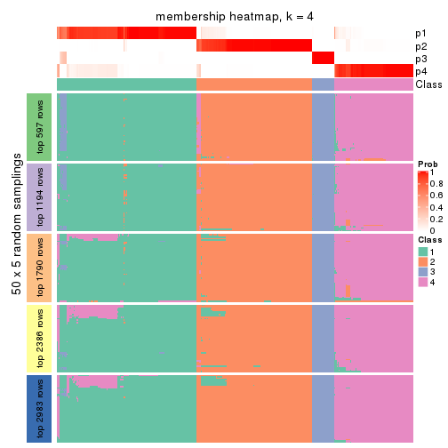</p>

</div>
<div id='tab-CV-mclust-membership-heatmap-4'>
<pre><code class="r">membership_heatmap(res, k = 5)
</code></pre>

<p></p>

</div>
<div id='tab-CV-mclust-membership-heatmap-5'>
<pre><code class="r">membership_heatmap(res, k = 6)
</code></pre>

<p></p>

</div>
</div>

As soon as we have had the classes for columns, we can look for signatures
which are significantly different between classes which can be candidate marks
for certain classes. Following are the heatmaps for signatures.


Signature heatmaps where rows are scaled:


<script>
$( function() {
	$( '#tabs-CV-mclust-get-signatures' ).tabs();
} );
</script>
<div id='tabs-CV-mclust-get-signatures'>
<ul>
<li><a href='#tab-CV-mclust-get-signatures-1'>k = 2</a></li>
<li><a href='#tab-CV-mclust-get-signatures-2'>k = 3</a></li>
<li><a href='#tab-CV-mclust-get-signatures-3'>k = 4</a></li>
<li><a href='#tab-CV-mclust-get-signatures-4'>k = 5</a></li>
<li><a href='#tab-CV-mclust-get-signatures-5'>k = 6</a></li>
</ul>
<div id='tab-CV-mclust-get-signatures-1'>
<pre><code class="r">get_signatures(res, k = 2)
</code></pre>

<p></p>

</div>
<div id='tab-CV-mclust-get-signatures-2'>
<pre><code class="r">get_signatures(res, k = 3)
</code></pre>

<p></p>

</div>
<div id='tab-CV-mclust-get-signatures-3'>
<pre><code class="r">get_signatures(res, k = 4)
</code></pre>

<p></p>

</div>
<div id='tab-CV-mclust-get-signatures-4'>
<pre><code class="r">get_signatures(res, k = 5)
</code></pre>

<p></p>

</div>
<div id='tab-CV-mclust-get-signatures-5'>
<pre><code class="r">get_signatures(res, k = 6)
</code></pre>

<p></p>

</div>
</div>


Signature heatmaps where rows are not scaled:


<script>
$( function() {
	$( '#tabs-CV-mclust-get-signatures-no-scale' ).tabs();
} );
</script>
<div id='tabs-CV-mclust-get-signatures-no-scale'>
<ul>
<li><a href='#tab-CV-mclust-get-signatures-no-scale-1'>k = 2</a></li>
<li><a href='#tab-CV-mclust-get-signatures-no-scale-2'>k = 3</a></li>
<li><a href='#tab-CV-mclust-get-signatures-no-scale-3'>k = 4</a></li>
<li><a href='#tab-CV-mclust-get-signatures-no-scale-4'>k = 5</a></li>
<li><a href='#tab-CV-mclust-get-signatures-no-scale-5'>k = 6</a></li>
</ul>
<div id='tab-CV-mclust-get-signatures-no-scale-1'>
<pre><code class="r">get_signatures(res, k = 2, scale_rows = FALSE)
</code></pre>

<p></p>

</div>
<div id='tab-CV-mclust-get-signatures-no-scale-2'>
<pre><code class="r">get_signatures(res, k = 3, scale_rows = FALSE)
</code></pre>

<p></p>

</div>
<div id='tab-CV-mclust-get-signatures-no-scale-3'>
<pre><code class="r">get_signatures(res, k = 4, scale_rows = FALSE)
</code></pre>

<p>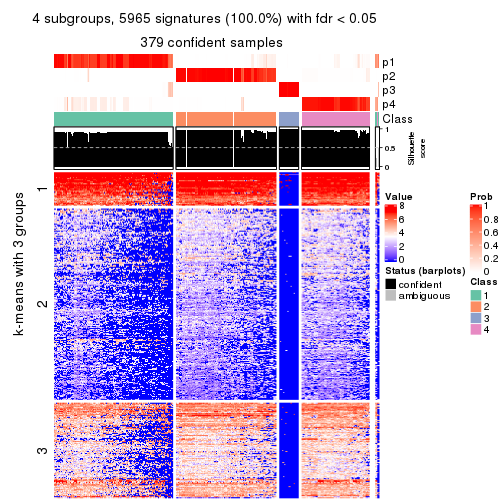</p>

</div>
<div id='tab-CV-mclust-get-signatures-no-scale-4'>
<pre><code class="r">get_signatures(res, k = 5, scale_rows = FALSE)
</code></pre>

<p></p>

</div>
<div id='tab-CV-mclust-get-signatures-no-scale-5'>
<pre><code class="r">get_signatures(res, k = 6, scale_rows = FALSE)
</code></pre>

<p></p>

</div>
</div>


Compare the overlap of signatures from different k:

```r
compare_signatures(res)
```


`get_signature()` returns a data frame invisibly. TO get the list of signatures, the function
call should be assigned to a variable explicitly. In following code, if `plot` argument is set
to `FALSE`, no heatmap is plotted while only the differential analysis is performed.

```r
# code only for demonstration
tb = get_signature(res, k = ..., plot = FALSE)
```

An example of the output of `tb` is:

```
#>   which_row         fdr    mean_1    mean_2 scaled_mean_1 scaled_mean_2 km
#> 1        38 0.042760348  8.373488  9.131774    -0.5533452     0.5164555  1
#> 2        40 0.018707592  7.106213  8.469186    -0.6173731     0.5762149  1
#> 3        55 0.019134737 10.221463 11.207825    -0.6159697     0.5749050  1
#> 4        59 0.006059896  5.921854  7.869574    -0.6899429     0.6439467  1
#> 5        60 0.018055526  8.928898 10.211722    -0.6204761     0.5791110  1
#> 6        98 0.009384629 15.714769 14.887706     0.6635654    -0.6193277  2
...
```

The columns in `tb` are:

1. `which_row`: row indices corresponding to the input matrix.
2. `fdr`: FDR for the differential test. 
3. `mean_x`: The mean value in group x.
4. `scaled_mean_x`: The mean value in group x after rows are scaled.
5. `km`: Row groups if k-means clustering is applied to rows.


UMAP plot which shows how samples are separated.


<script>
$( function() {
	$( '#tabs-CV-mclust-dimension-reduction' ).tabs();
} );
</script>
<div id='tabs-CV-mclust-dimension-reduction'>
<ul>
<li><a href='#tab-CV-mclust-dimension-reduction-1'>k = 2</a></li>
<li><a href='#tab-CV-mclust-dimension-reduction-2'>k = 3</a></li>
<li><a href='#tab-CV-mclust-dimension-reduction-3'>k = 4</a></li>
<li><a href='#tab-CV-mclust-dimension-reduction-4'>k = 5</a></li>
<li><a href='#tab-CV-mclust-dimension-reduction-5'>k = 6</a></li>
</ul>
<div id='tab-CV-mclust-dimension-reduction-1'>
<pre><code class="r">dimension_reduction(res, k = 2, method = &quot;UMAP&quot;)
</code></pre>

<p>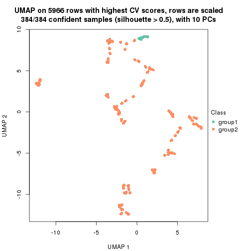</p>

</div>
<div id='tab-CV-mclust-dimension-reduction-2'>
<pre><code class="r">dimension_reduction(res, k = 3, method = &quot;UMAP&quot;)
</code></pre>

<p></p>

</div>
<div id='tab-CV-mclust-dimension-reduction-3'>
<pre><code class="r">dimension_reduction(res, k = 4, method = &quot;UMAP&quot;)
</code></pre>

<p></p>

</div>
<div id='tab-CV-mclust-dimension-reduction-4'>
<pre><code class="r">dimension_reduction(res, k = 5, method = &quot;UMAP&quot;)
</code></pre>

<p></p>

</div>
<div id='tab-CV-mclust-dimension-reduction-5'>
<pre><code class="r">dimension_reduction(res, k = 6, method = &quot;UMAP&quot;)
</code></pre>

<p></p>

</div>
</div>


Following heatmap shows how subgroups are split when increasing `k`:

```r
collect_classes(res)
```


If matrix rows can be associated to genes, consider to use `GO_Enrichment(res,
...)` to perform function enrichment for the signature genes.


 

---------------------------------------------------


### CV:NMF*


The object with results only for a single top-value method and a single partition method 
can be extracted as:

```r
res = res_list["CV", "NMF"]
# you can also extract it by
# res = res_list["CV:NMF"]
```

A summary of `res` and all the functions that can be applied to it:

```r
res
```

```
#> A 'ConsensusPartition' object with k = 2, 3, 4, 5, 6.
#>   On a matrix with 5966 rows and 384 columns.
#>   Top rows (597, 1194, 1790, 2386, 2983) are extracted by 'CV' method.
#>   Subgroups are detected by 'NMF' method.
#>   Performed in total 1250 partitions by row resampling.
#>   Best k for subgroups seems to be 2.
#> 
#> Following methods can be applied to this 'ConsensusPartition' object:
#>  [1] "cola_report"             "collect_classes"         "collect_plots"          
#>  [4] "collect_stats"           "colnames"                "compare_signatures"     
#>  [7] "consensus_heatmap"       "dimension_reduction"     "functional_enrichment"  
#> [10] "get_anno_col"            "get_anno"                "get_classes"            
#> [13] "get_consensus"           "get_matrix"              "get_membership"         
#> [16] "get_param"               "get_signatures"          "get_stats"              
#> [19] "is_best_k"               "is_stable_k"             "membership_heatmap"     
#> [22] "ncol"                    "nrow"                    "plot_ecdf"              
#> [25] "rownames"                "select_partition_number" "show"                   
#> [28] "suggest_best_k"          "test_to_known_factors"
```

`collect_plots()` function collects all the plots made from `res` for all `k` (number of partitions)
into one single page to provide an easy and fast comparison between different `k`.

```r
collect_plots(res)
```


The plots are:

- The first row: a plot of the ECDF (Empirical cumulative distribution
  function) curves of the consensus matrix for each `k` and the heatmap of
  predicted classes for each `k`.
- The second row: heatmaps of the consensus matrix for each `k`.
- The third row: heatmaps of the membership matrix for each `k`.
- The fouth row: heatmaps of the signatures for each `k`.

All the plots in panels can be made by individual functions and they are
plotted later in this section.

`select_partition_number()` produces several plots showing different
statistics for choosing "optimized" `k`. There are following statistics:

- ECDF curves of the consensus matrix for each `k`;
- 1-PAC. [The PAC
  score](https://en.wikipedia.org/wiki/Consensus_clustering#Over-interpretation_potential_of_consensus_clustering)
  measures the proportion of the ambiguous subgrouping.
- Mean silhouette score.
- Concordance. The mean probability of fiting the consensus class ids in all
  partitions.
- Area increased. Denote $A_k$ as the area under the ECDF curve for current
  `k`, the area increased is defined as $A_k - A_{k-1}$.
- Rand index. The percent of pairs of samples that are both in a same cluster
  or both are not in a same cluster in the partition of k and k-1.
- Jaccard index. The ratio of pairs of samples are both in a same cluster in
  the partition of k and k-1 and the pairs of samples are both in a same
  cluster in the partition k or k-1.

The detailed explanations of these statistics can be found in [the cola
vignette](http://bioconductor.org/packages/devel/bioc/vignettes/cola/inst/doc/cola.html#toc_13).

Generally speaking, lower PAC score, higher mean silhouette score or higher
concordance corresponds to better partition. Rand index and Jaccard index
measure how similar the current partition is compared to partition with `k-1`.
If they are too similar, we won't accept `k` is better than `k-1`.

```r
select_partition_number(res)
```


The numeric values for all these statistics can be obtained by `get_stats()`.

```r
get_stats(res)
```

```
#>   k 1-PAC mean_silhouette concordance area_increased  Rand Jaccard
#> 2 2 0.949           0.939       0.975         0.4733 0.531   0.531
#> 3 3 0.500           0.678       0.801         0.3311 0.770   0.581
#> 4 4 0.446           0.586       0.752         0.1235 0.867   0.646
#> 5 5 0.492           0.493       0.676         0.0663 0.916   0.718
#> 6 6 0.535           0.477       0.682         0.0377 0.937   0.753
```

`suggest_best_k()` suggests the best $k$ based on these statistics. The rules are as follows:

- All $k$ with Jaccard index larger than 0.95 are removed because the increase of
  the partition number does not provides enough extra information. If all $k$ are removed,
  the best $k$ is assigned by `NA`.
- For $k$ with 1-PAC larger than 0.9, the maximal $k$ is taken as the "best k". Other $k$ is called "optional k".
- If it does not fit the second rule. The $k$ with the highest vote of highest
  1-PAC, mean silhouette and concordance is taken as the "best k".

```r
suggest_best_k(res)
```

```
#> [1] 2
```


Following shows the table of the partitions (You need to click the **show/hide
code output** link to see it). The membership matrix (columns with name `p*`)
is inferred by
[`clue::cl_consensus()`](https://www.rdocumentation.org/link/cl_consensus?package=clue)
function with the `SE` method. Basically the value in the membership matrix
represents the probability to belong to a certain group. The finall class
label for an item is determined with the group with highest probability it
belongs to.

In `get_classes()` function, the entropy is calculated from the membership
matrix and the silhouette score is calculated from the consensus matrix.


<script>
$( function() {
	$( '#tabs-CV-NMF-get-classes' ).tabs();
} );
</script>
<div id='tabs-CV-NMF-get-classes'>
<ul>
<li><a href='#tab-CV-NMF-get-classes-1'>k = 2</a></li>
<li><a href='#tab-CV-NMF-get-classes-2'>k = 3</a></li>
<li><a href='#tab-CV-NMF-get-classes-3'>k = 4</a></li>
<li><a href='#tab-CV-NMF-get-classes-4'>k = 5</a></li>
<li><a href='#tab-CV-NMF-get-classes-5'>k = 6</a></li>
</ul>

<div id='tab-CV-NMF-get-classes-1'>
<p><a id='tab-CV-NMF-get-classes-1-a' style='color:#0366d6' href='#'>show/hide code output</a></p>
<pre><code class="r">cbind(get_classes(res, k = 2), get_membership(res, k = 2))
</code></pre>

<pre><code>#&gt;           class entropy silhouette    p1    p2
#&gt; SRR490216     2  0.0000     0.9717 0.000 1.000
#&gt; SRR490217     2  0.0000     0.9717 0.000 1.000
#&gt; SRR490218     2  0.0000     0.9717 0.000 1.000
#&gt; SRR490219     2  0.0000     0.9717 0.000 1.000
#&gt; SRR490220     1  0.0000     0.9774 1.000 0.000
#&gt; SRR490221     1  0.5178     0.8674 0.884 0.116
#&gt; SRR490222     1  0.0000     0.9774 1.000 0.000
#&gt; SRR490223     1  0.0938     0.9694 0.988 0.012
#&gt; SRR490224     1  0.0000     0.9774 1.000 0.000
#&gt; SRR490225     1  0.0000     0.9774 1.000 0.000
#&gt; SRR490226     1  0.0000     0.9774 1.000 0.000
#&gt; SRR490227     1  0.0000     0.9774 1.000 0.000
#&gt; SRR490228     1  0.0000     0.9774 1.000 0.000
#&gt; SRR490229     1  0.0000     0.9774 1.000 0.000
#&gt; SRR490230     1  0.0000     0.9774 1.000 0.000
#&gt; SRR490231     1  0.0000     0.9774 1.000 0.000
#&gt; SRR490232     1  0.0000     0.9774 1.000 0.000
#&gt; SRR490233     1  0.0000     0.9774 1.000 0.000
#&gt; SRR490234     1  0.0000     0.9774 1.000 0.000
#&gt; SRR490235     1  0.0000     0.9774 1.000 0.000
#&gt; SRR490236     1  0.0000     0.9774 1.000 0.000
#&gt; SRR490237     1  0.0000     0.9774 1.000 0.000
#&gt; SRR490238     1  0.0000     0.9774 1.000 0.000
#&gt; SRR490239     1  0.0000     0.9774 1.000 0.000
#&gt; SRR490240     1  0.0000     0.9774 1.000 0.000
#&gt; SRR490241     1  0.0000     0.9774 1.000 0.000
#&gt; SRR490242     1  0.0000     0.9774 1.000 0.000
#&gt; SRR490243     1  0.0000     0.9774 1.000 0.000
#&gt; SRR490244     1  0.1414     0.9636 0.980 0.020
#&gt; SRR490245     1  0.0672     0.9723 0.992 0.008
#&gt; SRR490246     1  0.5059     0.8736 0.888 0.112
#&gt; SRR490247     1  0.3274     0.9286 0.940 0.060
#&gt; SRR490248     2  0.0000     0.9717 0.000 1.000
#&gt; SRR490249     2  0.0000     0.9717 0.000 1.000
#&gt; SRR490250     2  0.0000     0.9717 0.000 1.000
#&gt; SRR490251     2  0.0000     0.9717 0.000 1.000
#&gt; SRR490252     1  0.2603     0.9433 0.956 0.044
#&gt; SRR490253     1  0.4298     0.9009 0.912 0.088
#&gt; SRR490254     2  0.8555     0.6191 0.280 0.720
#&gt; SRR490255     2  0.9833     0.2745 0.424 0.576
#&gt; SRR490256     1  0.0000     0.9774 1.000 0.000
#&gt; SRR490257     1  0.0000     0.9774 1.000 0.000
#&gt; SRR490258     1  0.0000     0.9774 1.000 0.000
#&gt; SRR490259     1  0.0000     0.9774 1.000 0.000
#&gt; SRR490260     1  0.0000     0.9774 1.000 0.000
#&gt; SRR490261     1  0.0000     0.9774 1.000 0.000
#&gt; SRR490262     1  0.0000     0.9774 1.000 0.000
#&gt; SRR490263     1  0.0000     0.9774 1.000 0.000
#&gt; SRR490264     1  0.0000     0.9774 1.000 0.000
#&gt; SRR490265     1  0.0000     0.9774 1.000 0.000
#&gt; SRR490266     1  0.0000     0.9774 1.000 0.000
#&gt; SRR490267     1  0.0000     0.9774 1.000 0.000
#&gt; SRR490268     1  0.0000     0.9774 1.000 0.000
#&gt; SRR490269     1  0.0000     0.9774 1.000 0.000
#&gt; SRR490270     1  0.0000     0.9774 1.000 0.000
#&gt; SRR490271     1  0.0000     0.9774 1.000 0.000
#&gt; SRR490272     1  0.0000     0.9774 1.000 0.000
#&gt; SRR490273     1  0.0000     0.9774 1.000 0.000
#&gt; SRR490274     1  0.0000     0.9774 1.000 0.000
#&gt; SRR490275     1  0.0000     0.9774 1.000 0.000
#&gt; SRR490276     1  0.0000     0.9774 1.000 0.000
#&gt; SRR490277     1  0.0000     0.9774 1.000 0.000
#&gt; SRR490278     1  0.0000     0.9774 1.000 0.000
#&gt; SRR490279     1  0.0000     0.9774 1.000 0.000
#&gt; SRR490280     2  0.0000     0.9717 0.000 1.000
#&gt; SRR490281     2  0.0000     0.9717 0.000 1.000
#&gt; SRR490282     2  0.0000     0.9717 0.000 1.000
#&gt; SRR490283     2  0.0938     0.9623 0.012 0.988
#&gt; SRR490284     1  0.5737     0.8439 0.864 0.136
#&gt; SRR490285     1  0.0000     0.9774 1.000 0.000
#&gt; SRR490286     1  0.0000     0.9774 1.000 0.000
#&gt; SRR490287     1  0.0000     0.9774 1.000 0.000
#&gt; SRR490288     1  0.0000     0.9774 1.000 0.000
#&gt; SRR490289     1  0.0000     0.9774 1.000 0.000
#&gt; SRR490290     1  0.0000     0.9774 1.000 0.000
#&gt; SRR490291     1  0.0000     0.9774 1.000 0.000
#&gt; SRR490292     1  0.0000     0.9774 1.000 0.000
#&gt; SRR490293     1  0.0000     0.9774 1.000 0.000
#&gt; SRR490294     1  0.0000     0.9774 1.000 0.000
#&gt; SRR490295     1  0.0000     0.9774 1.000 0.000
#&gt; SRR490296     2  0.0000     0.9717 0.000 1.000
#&gt; SRR490297     2  0.0376     0.9687 0.004 0.996
#&gt; SRR490298     2  0.0376     0.9687 0.004 0.996
#&gt; SRR490299     2  0.0000     0.9717 0.000 1.000
#&gt; SRR490300     1  0.0000     0.9774 1.000 0.000
#&gt; SRR490301     1  0.0000     0.9774 1.000 0.000
#&gt; SRR490302     1  0.0000     0.9774 1.000 0.000
#&gt; SRR490303     1  0.0000     0.9774 1.000 0.000
#&gt; SRR490304     2  0.0000     0.9717 0.000 1.000
#&gt; SRR490305     2  0.0000     0.9717 0.000 1.000
#&gt; SRR490306     2  0.0000     0.9717 0.000 1.000
#&gt; SRR490307     2  0.0000     0.9717 0.000 1.000
#&gt; SRR490308     1  0.4161     0.9037 0.916 0.084
#&gt; SRR490309     2  0.9881     0.2358 0.436 0.564
#&gt; SRR490310     2  0.7674     0.7172 0.224 0.776
#&gt; SRR490311     2  0.9710     0.3434 0.400 0.600
#&gt; SRR490312     2  0.0000     0.9717 0.000 1.000
#&gt; SRR490313     2  0.0000     0.9717 0.000 1.000
#&gt; SRR490314     2  0.0000     0.9717 0.000 1.000
#&gt; SRR490315     2  0.0000     0.9717 0.000 1.000
#&gt; SRR490316     2  0.9754     0.3280 0.408 0.592
#&gt; SRR490317     2  0.9954     0.1650 0.460 0.540
#&gt; SRR490318     2  0.9977     0.1224 0.472 0.528
#&gt; SRR490319     2  0.8813     0.5824 0.300 0.700
#&gt; SRR490320     1  0.0000     0.9774 1.000 0.000
#&gt; SRR490321     1  0.0000     0.9774 1.000 0.000
#&gt; SRR490322     1  0.0000     0.9774 1.000 0.000
#&gt; SRR490323     1  0.0000     0.9774 1.000 0.000
#&gt; SRR490324     1  0.1633     0.9601 0.976 0.024
#&gt; SRR490325     1  0.4431     0.8957 0.908 0.092
#&gt; SRR490326     1  0.4939     0.8775 0.892 0.108
#&gt; SRR490327     1  0.0672     0.9721 0.992 0.008
#&gt; SRR490328     2  0.6148     0.8161 0.152 0.848
#&gt; SRR490329     2  0.6887     0.7739 0.184 0.816
#&gt; SRR490330     2  0.2948     0.9266 0.052 0.948
#&gt; SRR490331     2  0.0000     0.9717 0.000 1.000
#&gt; SRR490332     1  0.3733     0.9161 0.928 0.072
#&gt; SRR490333     1  0.9608     0.3724 0.616 0.384
#&gt; SRR490334     1  0.8608     0.6045 0.716 0.284
#&gt; SRR490335     1  0.2236     0.9504 0.964 0.036
#&gt; SRR490336     2  0.0000     0.9717 0.000 1.000
#&gt; SRR490337     2  0.0000     0.9717 0.000 1.000
#&gt; SRR490338     2  0.0000     0.9717 0.000 1.000
#&gt; SRR490339     2  0.0000     0.9717 0.000 1.000
#&gt; SRR490340     1  0.0672     0.9722 0.992 0.008
#&gt; SRR490341     1  0.0000     0.9774 1.000 0.000
#&gt; SRR490342     1  0.0000     0.9774 1.000 0.000
#&gt; SRR490343     1  0.0000     0.9774 1.000 0.000
#&gt; SRR490344     2  0.0000     0.9717 0.000 1.000
#&gt; SRR490345     2  0.0000     0.9717 0.000 1.000
#&gt; SRR490346     2  0.0000     0.9717 0.000 1.000
#&gt; SRR490347     2  0.0000     0.9717 0.000 1.000
#&gt; SRR490348     2  0.0000     0.9717 0.000 1.000
#&gt; SRR490349     2  0.0000     0.9717 0.000 1.000
#&gt; SRR490350     2  0.0000     0.9717 0.000 1.000
#&gt; SRR490351     2  0.0000     0.9717 0.000 1.000
#&gt; SRR490352     2  0.0000     0.9717 0.000 1.000
#&gt; SRR490353     2  0.0000     0.9717 0.000 1.000
#&gt; SRR490354     2  0.0000     0.9717 0.000 1.000
#&gt; SRR490355     2  0.0000     0.9717 0.000 1.000
#&gt; SRR490356     2  0.0000     0.9717 0.000 1.000
#&gt; SRR490357     2  0.0000     0.9717 0.000 1.000
#&gt; SRR490358     2  0.0376     0.9687 0.004 0.996
#&gt; SRR490359     2  0.0376     0.9687 0.004 0.996
#&gt; SRR490360     2  0.0000     0.9717 0.000 1.000
#&gt; SRR490361     2  0.0000     0.9717 0.000 1.000
#&gt; SRR490362     2  0.0000     0.9717 0.000 1.000
#&gt; SRR490363     2  0.0000     0.9717 0.000 1.000
#&gt; SRR490364     2  0.0000     0.9717 0.000 1.000
#&gt; SRR490365     2  0.0000     0.9717 0.000 1.000
#&gt; SRR490366     2  0.0000     0.9717 0.000 1.000
#&gt; SRR490367     2  0.0000     0.9717 0.000 1.000
#&gt; SRR490368     2  0.0000     0.9717 0.000 1.000
#&gt; SRR490369     2  0.0000     0.9717 0.000 1.000
#&gt; SRR490370     2  0.0000     0.9717 0.000 1.000
#&gt; SRR490371     2  0.0000     0.9717 0.000 1.000
#&gt; SRR490372     2  0.7376     0.7406 0.208 0.792
#&gt; SRR490373     2  0.0376     0.9686 0.004 0.996
#&gt; SRR490374     2  0.1843     0.9492 0.028 0.972
#&gt; SRR490375     2  0.1184     0.9589 0.016 0.984
#&gt; SRR490376     2  0.0000     0.9717 0.000 1.000
#&gt; SRR490377     2  0.0000     0.9717 0.000 1.000
#&gt; SRR490378     2  0.0000     0.9717 0.000 1.000
#&gt; SRR490379     2  0.0000     0.9717 0.000 1.000
#&gt; SRR490380     2  0.2423     0.9382 0.040 0.960
#&gt; SRR490381     2  0.3733     0.9071 0.072 0.928
#&gt; SRR490382     1  0.8861     0.5652 0.696 0.304
#&gt; SRR490383     2  0.2603     0.9343 0.044 0.956
#&gt; SRR490384     2  0.0000     0.9717 0.000 1.000
#&gt; SRR490385     2  0.0000     0.9717 0.000 1.000
#&gt; SRR490386     2  0.0000     0.9717 0.000 1.000
#&gt; SRR490387     2  0.0000     0.9717 0.000 1.000
#&gt; SRR490388     2  0.0000     0.9717 0.000 1.000
#&gt; SRR490389     2  0.0000     0.9717 0.000 1.000
#&gt; SRR490390     2  0.0000     0.9717 0.000 1.000
#&gt; SRR490391     2  0.0000     0.9717 0.000 1.000
#&gt; SRR490392     2  0.0000     0.9717 0.000 1.000
#&gt; SRR490393     2  0.0000     0.9717 0.000 1.000
#&gt; SRR490394     2  0.0000     0.9717 0.000 1.000
#&gt; SRR490395     2  0.0000     0.9717 0.000 1.000
#&gt; SRR490396     2  0.0000     0.9717 0.000 1.000
#&gt; SRR490397     2  0.0000     0.9717 0.000 1.000
#&gt; SRR490398     2  0.0000     0.9717 0.000 1.000
#&gt; SRR490399     2  0.0000     0.9717 0.000 1.000
#&gt; SRR490400     2  0.0000     0.9717 0.000 1.000
#&gt; SRR490401     2  0.0000     0.9717 0.000 1.000
#&gt; SRR490402     2  0.0000     0.9717 0.000 1.000
#&gt; SRR490403     2  0.0000     0.9717 0.000 1.000
#&gt; SRR490404     2  0.0000     0.9717 0.000 1.000
#&gt; SRR490405     2  0.0000     0.9717 0.000 1.000
#&gt; SRR490406     2  0.0000     0.9717 0.000 1.000
#&gt; SRR490407     2  0.0000     0.9717 0.000 1.000
#&gt; SRR490408     2  0.0000     0.9717 0.000 1.000
#&gt; SRR490409     2  0.0000     0.9717 0.000 1.000
#&gt; SRR490410     2  0.0000     0.9717 0.000 1.000
#&gt; SRR490411     2  0.0000     0.9717 0.000 1.000
#&gt; SRR490412     2  0.4161     0.8947 0.084 0.916
#&gt; SRR490413     1  0.8661     0.6028 0.712 0.288
#&gt; SRR490414     2  0.4161     0.8937 0.084 0.916
#&gt; SRR490415     2  0.9460     0.4344 0.364 0.636
#&gt; SRR490416     1  0.0000     0.9774 1.000 0.000
#&gt; SRR490417     1  0.0000     0.9774 1.000 0.000
#&gt; SRR490418     1  0.2778     0.9394 0.952 0.048
#&gt; SRR490419     1  0.3584     0.9205 0.932 0.068
#&gt; SRR490420     1  0.0000     0.9774 1.000 0.000
#&gt; SRR490421     1  0.0000     0.9774 1.000 0.000
#&gt; SRR490422     1  0.0000     0.9774 1.000 0.000
#&gt; SRR490423     1  0.0000     0.9774 1.000 0.000
#&gt; SRR490424     1  0.0000     0.9774 1.000 0.000
#&gt; SRR490425     1  0.0000     0.9774 1.000 0.000
#&gt; SRR490426     1  0.0000     0.9774 1.000 0.000
#&gt; SRR490427     1  0.0000     0.9774 1.000 0.000
#&gt; SRR490428     1  0.0000     0.9774 1.000 0.000
#&gt; SRR490429     1  0.0000     0.9774 1.000 0.000
#&gt; SRR490430     1  0.0000     0.9774 1.000 0.000
#&gt; SRR490431     1  0.0000     0.9774 1.000 0.000
#&gt; SRR490432     1  0.0000     0.9774 1.000 0.000
#&gt; SRR490433     1  0.0000     0.9774 1.000 0.000
#&gt; SRR490434     1  0.0000     0.9774 1.000 0.000
#&gt; SRR490435     1  0.0000     0.9774 1.000 0.000
#&gt; SRR490436     1  0.0000     0.9774 1.000 0.000
#&gt; SRR490437     1  0.0000     0.9774 1.000 0.000
#&gt; SRR490438     1  0.0000     0.9774 1.000 0.000
#&gt; SRR490439     1  0.0000     0.9774 1.000 0.000
#&gt; SRR490440     2  0.0000     0.9717 0.000 1.000
#&gt; SRR490441     2  0.0000     0.9717 0.000 1.000
#&gt; SRR490442     2  0.0000     0.9717 0.000 1.000
#&gt; SRR490443     2  0.0000     0.9717 0.000 1.000
#&gt; SRR490444     2  0.0000     0.9717 0.000 1.000
#&gt; SRR490445     2  0.0000     0.9717 0.000 1.000
#&gt; SRR490446     2  0.0000     0.9717 0.000 1.000
#&gt; SRR490447     2  0.0000     0.9717 0.000 1.000
#&gt; SRR490448     1  0.0000     0.9774 1.000 0.000
#&gt; SRR490449     1  0.0000     0.9774 1.000 0.000
#&gt; SRR490450     1  0.0000     0.9774 1.000 0.000
#&gt; SRR490451     1  0.0000     0.9774 1.000 0.000
#&gt; SRR490452     1  0.0000     0.9774 1.000 0.000
#&gt; SRR490453     1  0.0000     0.9774 1.000 0.000
#&gt; SRR490454     1  0.0000     0.9774 1.000 0.000
#&gt; SRR490455     1  0.0000     0.9774 1.000 0.000
#&gt; SRR490456     1  0.0000     0.9774 1.000 0.000
#&gt; SRR490457     1  0.0000     0.9774 1.000 0.000
#&gt; SRR490458     1  0.0000     0.9774 1.000 0.000
#&gt; SRR490459     1  0.0000     0.9774 1.000 0.000
#&gt; SRR490460     1  0.0000     0.9774 1.000 0.000
#&gt; SRR490461     1  0.0000     0.9774 1.000 0.000
#&gt; SRR490462     1  0.0000     0.9774 1.000 0.000
#&gt; SRR490463     1  0.0000     0.9774 1.000 0.000
#&gt; SRR490464     1  0.5842     0.8380 0.860 0.140
#&gt; SRR490465     2  0.6531     0.7959 0.168 0.832
#&gt; SRR490466     2  0.7950     0.6912 0.240 0.760
#&gt; SRR490467     2  0.6623     0.7907 0.172 0.828
#&gt; SRR490468     1  0.0000     0.9774 1.000 0.000
#&gt; SRR490469     1  0.0000     0.9774 1.000 0.000
#&gt; SRR490470     1  0.0000     0.9774 1.000 0.000
#&gt; SRR490471     1  0.0000     0.9774 1.000 0.000
#&gt; SRR490472     2  0.0000     0.9717 0.000 1.000
#&gt; SRR490473     2  0.0000     0.9717 0.000 1.000
#&gt; SRR490474     2  0.0000     0.9717 0.000 1.000
#&gt; SRR490475     2  0.0000     0.9717 0.000 1.000
#&gt; SRR490476     2  0.9850     0.2677 0.428 0.572
#&gt; SRR490477     2  0.9815     0.2939 0.420 0.580
#&gt; SRR490478     1  0.9977     0.0892 0.528 0.472
#&gt; SRR490479     2  0.8608     0.6124 0.284 0.716
#&gt; SRR490480     2  0.0000     0.9717 0.000 1.000
#&gt; SRR490481     2  0.0000     0.9717 0.000 1.000
#&gt; SRR490482     2  0.0000     0.9717 0.000 1.000
#&gt; SRR490483     2  0.0000     0.9717 0.000 1.000
#&gt; SRR490484     2  0.0000     0.9717 0.000 1.000
#&gt; SRR490485     2  0.0000     0.9717 0.000 1.000
#&gt; SRR490486     2  0.0000     0.9717 0.000 1.000
#&gt; SRR490487     2  0.0376     0.9687 0.004 0.996
#&gt; SRR490488     2  0.0000     0.9717 0.000 1.000
#&gt; SRR490489     2  0.0000     0.9717 0.000 1.000
#&gt; SRR490490     2  0.0000     0.9717 0.000 1.000
#&gt; SRR490491     2  0.0000     0.9717 0.000 1.000
#&gt; SRR490492     2  0.1414     0.9557 0.020 0.980
#&gt; SRR490493     2  0.2236     0.9418 0.036 0.964
#&gt; SRR490494     2  0.2603     0.9344 0.044 0.956
#&gt; SRR490495     2  0.0376     0.9687 0.004 0.996
#&gt; SRR490496     2  0.0000     0.9717 0.000 1.000
#&gt; SRR490497     2  0.0000     0.9717 0.000 1.000
#&gt; SRR490498     2  0.0000     0.9717 0.000 1.000
#&gt; SRR490499     2  0.0000     0.9717 0.000 1.000
#&gt; SRR490500     1  0.1184     0.9664 0.984 0.016
#&gt; SRR490501     1  0.1184     0.9664 0.984 0.016
#&gt; SRR490502     1  0.1633     0.9600 0.976 0.024
#&gt; SRR490503     1  0.0376     0.9748 0.996 0.004
#&gt; SRR490504     2  0.0000     0.9717 0.000 1.000
#&gt; SRR490505     2  0.0000     0.9717 0.000 1.000
#&gt; SRR490506     2  0.0000     0.9717 0.000 1.000
#&gt; SRR490507     2  0.0000     0.9717 0.000 1.000
#&gt; SRR490508     2  0.0000     0.9717 0.000 1.000
#&gt; SRR490509     2  0.0000     0.9717 0.000 1.000
#&gt; SRR490510     2  0.0000     0.9717 0.000 1.000
#&gt; SRR490511     2  0.0000     0.9717 0.000 1.000
#&gt; SRR490512     2  0.0000     0.9717 0.000 1.000
#&gt; SRR490513     2  0.0000     0.9717 0.000 1.000
#&gt; SRR490514     2  0.0000     0.9717 0.000 1.000
#&gt; SRR490515     2  0.0000     0.9717 0.000 1.000
#&gt; SRR490516     2  0.0000     0.9717 0.000 1.000
#&gt; SRR490517     2  0.0000     0.9717 0.000 1.000
#&gt; SRR490518     2  0.0000     0.9717 0.000 1.000
#&gt; SRR490519     2  0.0000     0.9717 0.000 1.000
#&gt; SRR490520     2  0.0000     0.9717 0.000 1.000
#&gt; SRR490521     2  0.0000     0.9717 0.000 1.000
#&gt; SRR490522     2  0.0000     0.9717 0.000 1.000
#&gt; SRR490523     2  0.0000     0.9717 0.000 1.000
#&gt; SRR490524     2  0.0000     0.9717 0.000 1.000
#&gt; SRR490525     2  0.0000     0.9717 0.000 1.000
#&gt; SRR490526     2  0.0000     0.9717 0.000 1.000
#&gt; SRR490527     2  0.0000     0.9717 0.000 1.000
#&gt; SRR490528     2  0.0000     0.9717 0.000 1.000
#&gt; SRR490529     2  0.0000     0.9717 0.000 1.000
#&gt; SRR490530     2  0.0000     0.9717 0.000 1.000
#&gt; SRR490531     2  0.0000     0.9717 0.000 1.000
#&gt; SRR490532     1  0.0672     0.9722 0.992 0.008
#&gt; SRR490533     1  0.1184     0.9665 0.984 0.016
#&gt; SRR490534     1  0.0000     0.9774 1.000 0.000
#&gt; SRR490535     1  0.0376     0.9748 0.996 0.004
#&gt; SRR490536     2  0.0000     0.9717 0.000 1.000
#&gt; SRR490537     2  0.0000     0.9717 0.000 1.000
#&gt; SRR490538     2  0.0000     0.9717 0.000 1.000
#&gt; SRR490539     2  0.0000     0.9717 0.000 1.000
#&gt; SRR490540     2  0.0000     0.9717 0.000 1.000
#&gt; SRR490541     2  0.0000     0.9717 0.000 1.000
#&gt; SRR490542     2  0.0000     0.9717 0.000 1.000
#&gt; SRR490543     2  0.0000     0.9717 0.000 1.000
#&gt; SRR490544     2  0.0000     0.9717 0.000 1.000
#&gt; SRR490545     2  0.0000     0.9717 0.000 1.000
#&gt; SRR490546     2  0.0000     0.9717 0.000 1.000
#&gt; SRR490547     2  0.0000     0.9717 0.000 1.000
#&gt; SRR490548     2  0.0000     0.9717 0.000 1.000
#&gt; SRR490549     2  0.0000     0.9717 0.000 1.000
#&gt; SRR490550     2  0.0000     0.9717 0.000 1.000
#&gt; SRR490551     2  0.0000     0.9717 0.000 1.000
#&gt; SRR490552     2  0.0000     0.9717 0.000 1.000
#&gt; SRR490553     2  0.0000     0.9717 0.000 1.000
#&gt; SRR490554     2  0.0000     0.9717 0.000 1.000
#&gt; SRR490555     2  0.0000     0.9717 0.000 1.000
#&gt; SRR490556     2  0.0000     0.9717 0.000 1.000
#&gt; SRR490557     2  0.0000     0.9717 0.000 1.000
#&gt; SRR490558     2  0.0000     0.9717 0.000 1.000
#&gt; SRR490559     2  0.0000     0.9717 0.000 1.000
#&gt; SRR490560     2  0.0000     0.9717 0.000 1.000
#&gt; SRR490561     2  0.0000     0.9717 0.000 1.000
#&gt; SRR490562     2  0.0000     0.9717 0.000 1.000
#&gt; SRR490563     2  0.0000     0.9717 0.000 1.000
#&gt; SRR490564     2  0.1633     0.9522 0.024 0.976
#&gt; SRR490565     2  0.0000     0.9717 0.000 1.000
#&gt; SRR490566     2  0.0672     0.9655 0.008 0.992
#&gt; SRR490567     2  0.0000     0.9717 0.000 1.000
#&gt; SRR490568     2  0.0000     0.9717 0.000 1.000
#&gt; SRR490569     2  0.0000     0.9717 0.000 1.000
#&gt; SRR490570     2  0.0000     0.9717 0.000 1.000
#&gt; SRR490571     2  0.0000     0.9717 0.000 1.000
#&gt; SRR490572     2  0.0000     0.9717 0.000 1.000
#&gt; SRR490573     2  0.0000     0.9717 0.000 1.000
#&gt; SRR490574     2  0.0000     0.9717 0.000 1.000
#&gt; SRR490575     2  0.0000     0.9717 0.000 1.000
#&gt; SRR490576     2  0.0000     0.9717 0.000 1.000
#&gt; SRR490577     2  0.0000     0.9717 0.000 1.000
#&gt; SRR490578     2  0.0000     0.9717 0.000 1.000
#&gt; SRR490579     2  0.0000     0.9717 0.000 1.000
#&gt; SRR490580     2  0.0000     0.9717 0.000 1.000
#&gt; SRR490581     2  0.0000     0.9717 0.000 1.000
#&gt; SRR490582     2  0.0000     0.9717 0.000 1.000
#&gt; SRR490583     2  0.0000     0.9717 0.000 1.000
#&gt; SRR490584     2  0.0000     0.9717 0.000 1.000
#&gt; SRR490585     2  0.0000     0.9717 0.000 1.000
#&gt; SRR490586     2  0.0000     0.9717 0.000 1.000
#&gt; SRR490587     2  0.0000     0.9717 0.000 1.000
#&gt; SRR490588     2  0.0000     0.9717 0.000 1.000
#&gt; SRR490589     2  0.0000     0.9717 0.000 1.000
#&gt; SRR490590     2  0.0000     0.9717 0.000 1.000
#&gt; SRR490591     2  0.0000     0.9717 0.000 1.000
#&gt; SRR490592     2  0.0000     0.9717 0.000 1.000
#&gt; SRR490593     2  0.0000     0.9717 0.000 1.000
#&gt; SRR490594     2  0.0000     0.9717 0.000 1.000
#&gt; SRR490595     2  0.0000     0.9717 0.000 1.000
#&gt; SRR490596     2  0.0000     0.9717 0.000 1.000
#&gt; SRR490597     2  0.0000     0.9717 0.000 1.000
#&gt; SRR490598     2  0.0000     0.9717 0.000 1.000
#&gt; SRR490599     2  0.0000     0.9717 0.000 1.000
</code></pre>

<script>
$('#tab-CV-NMF-get-classes-1-a').parent().next().next().hide();
$('#tab-CV-NMF-get-classes-1-a').click(function(){
  $('#tab-CV-NMF-get-classes-1-a').parent().next().next().toggle();
  return(false);
});
</script>
</div>

<div id='tab-CV-NMF-get-classes-2'>
<p><a id='tab-CV-NMF-get-classes-2-a' style='color:#0366d6' href='#'>show/hide code output</a></p>
<pre><code class="r">cbind(get_classes(res, k = 3), get_membership(res, k = 3))
</code></pre>

<pre><code>#&gt;           class entropy silhouette    p1    p2    p3
#&gt; SRR490216     3  0.5733    0.73405 0.000 0.324 0.676
#&gt; SRR490217     3  0.5678    0.73545 0.000 0.316 0.684
#&gt; SRR490218     3  0.5760    0.73270 0.000 0.328 0.672
#&gt; SRR490219     3  0.5621    0.73441 0.000 0.308 0.692
#&gt; SRR490220     1  0.5678    0.72608 0.684 0.000 0.316
#&gt; SRR490221     3  0.7380    0.42656 0.228 0.088 0.684
#&gt; SRR490222     3  0.6359   -0.00277 0.364 0.008 0.628
#&gt; SRR490223     3  0.6161    0.25975 0.272 0.020 0.708
#&gt; SRR490224     1  0.4178    0.84641 0.828 0.000 0.172
#&gt; SRR490225     1  0.4291    0.84477 0.820 0.000 0.180
#&gt; SRR490226     1  0.4504    0.83718 0.804 0.000 0.196
#&gt; SRR490227     1  0.4121    0.84650 0.832 0.000 0.168
#&gt; SRR490228     1  0.5810    0.75009 0.664 0.000 0.336
#&gt; SRR490229     1  0.6154    0.67263 0.592 0.000 0.408
#&gt; SRR490230     1  0.5882    0.74828 0.652 0.000 0.348
#&gt; SRR490231     1  0.5905    0.74387 0.648 0.000 0.352
#&gt; SRR490232     1  0.3752    0.84980 0.856 0.000 0.144
#&gt; SRR490233     1  0.3686    0.85095 0.860 0.000 0.140
#&gt; SRR490234     1  0.3192    0.85685 0.888 0.000 0.112
#&gt; SRR490235     1  0.4062    0.84508 0.836 0.000 0.164
#&gt; SRR490236     3  0.6260   -0.43823 0.448 0.000 0.552
#&gt; SRR490237     1  0.6274    0.61672 0.544 0.000 0.456
#&gt; SRR490238     3  0.6235   -0.41000 0.436 0.000 0.564
#&gt; SRR490239     1  0.6225    0.65175 0.568 0.000 0.432
#&gt; SRR490240     1  0.4702    0.82402 0.788 0.000 0.212
#&gt; SRR490241     1  0.4291    0.84146 0.820 0.000 0.180
#&gt; SRR490242     1  0.4121    0.84591 0.832 0.000 0.168
#&gt; SRR490243     1  0.3879    0.84979 0.848 0.000 0.152
#&gt; SRR490244     1  0.6793    0.44349 0.536 0.012 0.452
#&gt; SRR490245     1  0.3918    0.83705 0.856 0.004 0.140
#&gt; SRR490246     1  0.7274    0.44132 0.520 0.028 0.452
#&gt; SRR490247     1  0.7301    0.59397 0.640 0.052 0.308
#&gt; SRR490248     3  0.5397    0.73360 0.000 0.280 0.720
#&gt; SRR490249     3  0.5621    0.73739 0.000 0.308 0.692
#&gt; SRR490250     3  0.5678    0.73568 0.000 0.316 0.684
#&gt; SRR490251     3  0.5810    0.73056 0.000 0.336 0.664
#&gt; SRR490252     3  0.6976    0.45492 0.236 0.064 0.700
#&gt; SRR490253     3  0.7101    0.47775 0.240 0.068 0.692
#&gt; SRR490254     3  0.7304    0.69362 0.084 0.228 0.688
#&gt; SRR490255     3  0.7851    0.68493 0.100 0.256 0.644
#&gt; SRR490256     1  0.3879    0.85216 0.848 0.000 0.152
#&gt; SRR490257     1  0.4178    0.84580 0.828 0.000 0.172
#&gt; SRR490258     1  0.3752    0.85513 0.856 0.000 0.144
#&gt; SRR490259     1  0.3192    0.85809 0.888 0.000 0.112
#&gt; SRR490260     1  0.3116    0.85798 0.892 0.000 0.108
#&gt; SRR490261     1  0.3038    0.85846 0.896 0.000 0.104
#&gt; SRR490262     1  0.3340    0.85644 0.880 0.000 0.120
#&gt; SRR490263     1  0.3340    0.85703 0.880 0.000 0.120
#&gt; SRR490264     1  0.3752    0.85552 0.856 0.000 0.144
#&gt; SRR490265     1  0.3619    0.85482 0.864 0.000 0.136
#&gt; SRR490266     1  0.4121    0.84886 0.832 0.000 0.168
#&gt; SRR490267     1  0.3686    0.85480 0.860 0.000 0.140
#&gt; SRR490268     1  0.3412    0.85508 0.876 0.000 0.124
#&gt; SRR490269     1  0.3482    0.85467 0.872 0.000 0.128
#&gt; SRR490270     1  0.3267    0.85653 0.884 0.000 0.116
#&gt; SRR490271     1  0.3551    0.85340 0.868 0.000 0.132
#&gt; SRR490272     1  0.3686    0.85303 0.860 0.000 0.140
#&gt; SRR490273     1  0.3340    0.85510 0.880 0.000 0.120
#&gt; SRR490274     1  0.3816    0.84929 0.852 0.000 0.148
#&gt; SRR490275     1  0.3752    0.85165 0.856 0.000 0.144
#&gt; SRR490276     1  0.4654    0.82941 0.792 0.000 0.208
#&gt; SRR490277     1  0.4452    0.83599 0.808 0.000 0.192
#&gt; SRR490278     1  0.4504    0.83481 0.804 0.000 0.196
#&gt; SRR490279     1  0.4504    0.83426 0.804 0.000 0.196
#&gt; SRR490280     3  0.6109    0.63201 0.048 0.192 0.760
#&gt; SRR490281     3  0.5940    0.62409 0.036 0.204 0.760
#&gt; SRR490282     3  0.5688    0.62335 0.044 0.168 0.788
#&gt; SRR490283     3  0.6380    0.60600 0.076 0.164 0.760
#&gt; SRR490284     1  0.7644    0.63998 0.604 0.060 0.336
#&gt; SRR490285     1  0.4504    0.81764 0.804 0.000 0.196
#&gt; SRR490286     1  0.4842    0.80661 0.776 0.000 0.224
#&gt; SRR490287     1  0.4887    0.80108 0.772 0.000 0.228
#&gt; SRR490288     1  0.1860    0.85472 0.948 0.000 0.052
#&gt; SRR490289     1  0.1643    0.86181 0.956 0.000 0.044
#&gt; SRR490290     1  0.2663    0.85450 0.932 0.024 0.044
#&gt; SRR490291     1  0.2066    0.86219 0.940 0.000 0.060
#&gt; SRR490292     3  0.6244   -0.28909 0.440 0.000 0.560
#&gt; SRR490293     1  0.6154    0.61910 0.592 0.000 0.408
#&gt; SRR490294     3  0.5968   -0.07025 0.364 0.000 0.636
#&gt; SRR490295     1  0.6180    0.60238 0.584 0.000 0.416
#&gt; SRR490296     2  0.1950    0.81665 0.040 0.952 0.008
#&gt; SRR490297     2  0.1129    0.83338 0.020 0.976 0.004
#&gt; SRR490298     2  0.1647    0.82097 0.036 0.960 0.004
#&gt; SRR490299     2  0.0237    0.83809 0.000 0.996 0.004
#&gt; SRR490300     1  0.6763    0.58664 0.552 0.012 0.436
#&gt; SRR490301     3  0.6308   -0.50149 0.492 0.000 0.508
#&gt; SRR490302     1  0.6483    0.67909 0.600 0.008 0.392
#&gt; SRR490303     3  0.6302   -0.49326 0.480 0.000 0.520
#&gt; SRR490304     2  0.0424    0.83739 0.000 0.992 0.008
#&gt; SRR490305     2  0.0424    0.83739 0.000 0.992 0.008
#&gt; SRR490306     2  0.0424    0.83739 0.000 0.992 0.008
#&gt; SRR490307     2  0.0424    0.83739 0.000 0.992 0.008
#&gt; SRR490308     3  0.7866   -0.08167 0.388 0.060 0.552
#&gt; SRR490309     2  0.9376    0.15892 0.260 0.512 0.228
#&gt; SRR490310     3  0.8071    0.51427 0.072 0.380 0.548
#&gt; SRR490311     3  0.8077    0.56640 0.176 0.172 0.652
#&gt; SRR490312     3  0.5465    0.72850 0.000 0.288 0.712
#&gt; SRR490313     3  0.5363    0.72585 0.000 0.276 0.724
#&gt; SRR490314     3  0.4931    0.70831 0.000 0.232 0.768
#&gt; SRR490315     3  0.5397    0.72843 0.000 0.280 0.720
#&gt; SRR490316     3  0.7190    0.72422 0.044 0.320 0.636
#&gt; SRR490317     3  0.6970    0.72192 0.048 0.276 0.676
#&gt; SRR490318     3  0.6341    0.73525 0.016 0.312 0.672
#&gt; SRR490319     3  0.6673    0.72474 0.020 0.344 0.636
#&gt; SRR490320     1  0.5948    0.60566 0.640 0.000 0.360
#&gt; SRR490321     1  0.5621    0.67813 0.692 0.000 0.308
#&gt; SRR490322     1  0.4178    0.83675 0.828 0.000 0.172
#&gt; SRR490323     1  0.5859    0.64370 0.656 0.000 0.344
#&gt; SRR490324     1  0.5848    0.73811 0.720 0.012 0.268
#&gt; SRR490325     1  0.6330    0.61691 0.600 0.004 0.396
#&gt; SRR490326     1  0.6195    0.72213 0.704 0.020 0.276
#&gt; SRR490327     1  0.5420    0.77511 0.752 0.008 0.240
#&gt; SRR490328     2  0.4629    0.62178 0.188 0.808 0.004
#&gt; SRR490329     2  0.5902    0.40831 0.316 0.680 0.004
#&gt; SRR490330     2  0.3816    0.68580 0.148 0.852 0.000
#&gt; SRR490331     2  0.0424    0.83782 0.008 0.992 0.000
#&gt; SRR490332     1  0.4280    0.77146 0.856 0.124 0.020
#&gt; SRR490333     1  0.5864    0.51117 0.704 0.288 0.008
#&gt; SRR490334     1  0.6217    0.53896 0.712 0.264 0.024
#&gt; SRR490335     1  0.3722    0.81051 0.888 0.088 0.024
#&gt; SRR490336     2  0.0424    0.83739 0.000 0.992 0.008
#&gt; SRR490337     2  0.0424    0.83739 0.000 0.992 0.008
#&gt; SRR490338     2  0.0424    0.83739 0.000 0.992 0.008
#&gt; SRR490339     2  0.0661    0.83810 0.004 0.988 0.008
#&gt; SRR490340     1  0.2982    0.85596 0.920 0.024 0.056
#&gt; SRR490341     1  0.3695    0.85539 0.880 0.012 0.108
#&gt; SRR490342     1  0.2955    0.85858 0.912 0.008 0.080
#&gt; SRR490343     1  0.6684    0.61022 0.676 0.032 0.292
#&gt; SRR490344     3  0.5327    0.72976 0.000 0.272 0.728
#&gt; SRR490345     3  0.5785    0.73272 0.000 0.332 0.668
#&gt; SRR490346     3  0.5397    0.73206 0.000 0.280 0.720
#&gt; SRR490347     3  0.5650    0.73531 0.000 0.312 0.688
#&gt; SRR490348     2  0.5968    0.07495 0.000 0.636 0.364
#&gt; SRR490349     2  0.5968    0.07649 0.000 0.636 0.364
#&gt; SRR490350     2  0.6235   -0.24949 0.000 0.564 0.436
#&gt; SRR490351     2  0.6225   -0.23376 0.000 0.568 0.432
#&gt; SRR490352     2  0.3816    0.68004 0.000 0.852 0.148
#&gt; SRR490353     2  0.3752    0.68373 0.000 0.856 0.144
#&gt; SRR490354     2  0.5678    0.27677 0.000 0.684 0.316
#&gt; SRR490355     2  0.5591    0.30597 0.000 0.696 0.304
#&gt; SRR490356     3  0.5291    0.72921 0.000 0.268 0.732
#&gt; SRR490357     3  0.5216    0.72629 0.000 0.260 0.740
#&gt; SRR490358     3  0.4887    0.71134 0.000 0.228 0.772
#&gt; SRR490359     3  0.4887    0.71134 0.000 0.228 0.772
#&gt; SRR490360     2  0.6302   -0.39622 0.000 0.520 0.480
#&gt; SRR490361     2  0.6126   -0.10066 0.000 0.600 0.400
#&gt; SRR490362     2  0.6305   -0.41003 0.000 0.516 0.484
#&gt; SRR490363     2  0.6168   -0.15294 0.000 0.588 0.412
#&gt; SRR490364     3  0.5785    0.73302 0.000 0.332 0.668
#&gt; SRR490365     3  0.5785    0.73302 0.000 0.332 0.668
#&gt; SRR490366     3  0.5810    0.73113 0.000 0.336 0.664
#&gt; SRR490367     3  0.5810    0.73113 0.000 0.336 0.664
#&gt; SRR490368     3  0.6126    0.67229 0.000 0.400 0.600
#&gt; SRR490369     3  0.6192    0.64060 0.000 0.420 0.580
#&gt; SRR490370     3  0.6192    0.64059 0.000 0.420 0.580
#&gt; SRR490371     3  0.6215    0.62678 0.000 0.428 0.572
#&gt; SRR490372     3  0.2681    0.54884 0.040 0.028 0.932
#&gt; SRR490373     3  0.3845    0.62877 0.012 0.116 0.872
#&gt; SRR490374     3  0.2846    0.58368 0.020 0.056 0.924
#&gt; SRR490375     3  0.3415    0.59693 0.020 0.080 0.900
#&gt; SRR490376     3  0.6008    0.70876 0.000 0.372 0.628
#&gt; SRR490377     3  0.6062    0.69815 0.000 0.384 0.616
#&gt; SRR490378     3  0.6252    0.60557 0.000 0.444 0.556
#&gt; SRR490379     3  0.6260    0.59691 0.000 0.448 0.552
#&gt; SRR490380     3  0.4228    0.64856 0.008 0.148 0.844
#&gt; SRR490381     3  0.5982    0.60300 0.004 0.328 0.668
#&gt; SRR490382     3  0.7164    0.43184 0.140 0.140 0.720
#&gt; SRR490383     3  0.6012    0.64629 0.032 0.220 0.748
#&gt; SRR490384     3  0.6095    0.68315 0.000 0.392 0.608
#&gt; SRR490385     3  0.6111    0.67787 0.000 0.396 0.604
#&gt; SRR490386     3  0.6111    0.67787 0.000 0.396 0.604
#&gt; SRR490387     3  0.6062    0.69255 0.000 0.384 0.616
#&gt; SRR490388     3  0.5810    0.73106 0.000 0.336 0.664
#&gt; SRR490389     3  0.5810    0.73106 0.000 0.336 0.664
#&gt; SRR490390     3  0.5905    0.72066 0.000 0.352 0.648
#&gt; SRR490391     3  0.5882    0.72368 0.000 0.348 0.652
#&gt; SRR490392     3  0.6215    0.62683 0.000 0.428 0.572
#&gt; SRR490393     3  0.6140    0.66636 0.000 0.404 0.596
#&gt; SRR490394     3  0.6286    0.55316 0.000 0.464 0.536
#&gt; SRR490395     3  0.6235    0.61092 0.000 0.436 0.564
#&gt; SRR490396     3  0.5988    0.70863 0.000 0.368 0.632
#&gt; SRR490397     3  0.5988    0.70863 0.000 0.368 0.632
#&gt; SRR490398     3  0.5988    0.70863 0.000 0.368 0.632
#&gt; SRR490399     3  0.5988    0.70863 0.000 0.368 0.632
#&gt; SRR490400     3  0.6045    0.69693 0.000 0.380 0.620
#&gt; SRR490401     3  0.6095    0.68315 0.000 0.392 0.608
#&gt; SRR490402     3  0.6111    0.67787 0.000 0.396 0.604
#&gt; SRR490403     3  0.6111    0.67787 0.000 0.396 0.604
#&gt; SRR490404     3  0.5560    0.73656 0.000 0.300 0.700
#&gt; SRR490405     3  0.5678    0.73621 0.000 0.316 0.684
#&gt; SRR490406     3  0.5706    0.73583 0.000 0.320 0.680
#&gt; SRR490407     3  0.5678    0.73650 0.000 0.316 0.684
#&gt; SRR490408     2  0.0000    0.83895 0.000 1.000 0.000
#&gt; SRR490409     2  0.0000    0.83895 0.000 1.000 0.000
#&gt; SRR490410     2  0.0000    0.83895 0.000 1.000 0.000
#&gt; SRR490411     2  0.0000    0.83895 0.000 1.000 0.000
#&gt; SRR490412     2  0.5181    0.69047 0.084 0.832 0.084
#&gt; SRR490413     1  0.9776    0.29732 0.440 0.284 0.276
#&gt; SRR490414     2  0.8705    0.12708 0.116 0.524 0.360
#&gt; SRR490415     3  0.9336    0.03933 0.164 0.412 0.424
#&gt; SRR490416     1  0.3263    0.84294 0.912 0.040 0.048
#&gt; SRR490417     1  0.3502    0.82020 0.896 0.084 0.020
#&gt; SRR490418     1  0.5348    0.73404 0.796 0.176 0.028
#&gt; SRR490419     1  0.4589    0.73854 0.820 0.172 0.008
#&gt; SRR490420     1  0.0747    0.86109 0.984 0.000 0.016
#&gt; SRR490421     1  0.1031    0.86284 0.976 0.000 0.024
#&gt; SRR490422     1  0.0747    0.86233 0.984 0.000 0.016
#&gt; SRR490423     1  0.0892    0.85992 0.980 0.000 0.020
#&gt; SRR490424     1  0.2066    0.85124 0.940 0.000 0.060
#&gt; SRR490425     1  0.2165    0.85249 0.936 0.000 0.064
#&gt; SRR490426     1  0.2066    0.85124 0.940 0.000 0.060
#&gt; SRR490427     1  0.2165    0.85249 0.936 0.000 0.064
#&gt; SRR490428     1  0.1031    0.86206 0.976 0.000 0.024
#&gt; SRR490429     1  0.1031    0.86000 0.976 0.000 0.024
#&gt; SRR490430     1  0.0592    0.86173 0.988 0.000 0.012
#&gt; SRR490431     1  0.0592    0.86131 0.988 0.000 0.012
#&gt; SRR490432     1  0.1031    0.86165 0.976 0.000 0.024
#&gt; SRR490433     1  0.0747    0.86073 0.984 0.000 0.016
#&gt; SRR490434     1  0.1031    0.85958 0.976 0.000 0.024
#&gt; SRR490435     1  0.0424    0.85980 0.992 0.000 0.008
#&gt; SRR490436     1  0.2537    0.86087 0.920 0.000 0.080
#&gt; SRR490437     1  0.2537    0.86299 0.920 0.000 0.080
#&gt; SRR490438     1  0.2625    0.86230 0.916 0.000 0.084
#&gt; SRR490439     1  0.2959    0.85991 0.900 0.000 0.100
#&gt; SRR490440     2  0.0000    0.83895 0.000 1.000 0.000
#&gt; SRR490441     2  0.0000    0.83895 0.000 1.000 0.000
#&gt; SRR490442     2  0.0000    0.83895 0.000 1.000 0.000
#&gt; SRR490443     2  0.0000    0.83895 0.000 1.000 0.000
#&gt; SRR490444     2  0.0000    0.83895 0.000 1.000 0.000
#&gt; SRR490445     2  0.0000    0.83895 0.000 1.000 0.000
#&gt; SRR490446     2  0.0000    0.83895 0.000 1.000 0.000
#&gt; SRR490447     2  0.0000    0.83895 0.000 1.000 0.000
#&gt; SRR490448     1  0.1529    0.85602 0.960 0.000 0.040
#&gt; SRR490449     1  0.1289    0.85802 0.968 0.000 0.032
#&gt; SRR490450     1  0.1411    0.85736 0.964 0.000 0.036
#&gt; SRR490451     1  0.0983    0.85995 0.980 0.004 0.016
#&gt; SRR490452     1  0.1163    0.85839 0.972 0.000 0.028
#&gt; SRR490453     1  0.1753    0.85425 0.952 0.000 0.048
#&gt; SRR490454     1  0.1289    0.85790 0.968 0.000 0.032
#&gt; SRR490455     1  0.1031    0.85887 0.976 0.000 0.024
#&gt; SRR490456     1  0.0424    0.85980 0.992 0.000 0.008
#&gt; SRR490457     1  0.1529    0.85546 0.960 0.000 0.040
#&gt; SRR490458     1  0.0237    0.86082 0.996 0.000 0.004
#&gt; SRR490459     1  0.0592    0.86062 0.988 0.000 0.012
#&gt; SRR490460     1  0.0747    0.86151 0.984 0.000 0.016
#&gt; SRR490461     1  0.0747    0.86184 0.984 0.000 0.016
#&gt; SRR490462     1  0.0237    0.86030 0.996 0.000 0.004
#&gt; SRR490463     1  0.0592    0.85997 0.988 0.000 0.012
#&gt; SRR490464     1  0.8620    0.41624 0.536 0.112 0.352
#&gt; SRR490465     2  0.9364    0.05360 0.184 0.484 0.332
#&gt; SRR490466     2  0.8911    0.28197 0.260 0.564 0.176
#&gt; SRR490467     2  0.9091    0.03765 0.152 0.504 0.344
#&gt; SRR490468     1  0.1989    0.86268 0.948 0.004 0.048
#&gt; SRR490469     1  0.2066    0.86236 0.940 0.000 0.060
#&gt; SRR490470     1  0.2066    0.86250 0.940 0.000 0.060
#&gt; SRR490471     1  0.2301    0.86281 0.936 0.004 0.060
#&gt; SRR490472     2  0.0000    0.83895 0.000 1.000 0.000
#&gt; SRR490473     2  0.0000    0.83895 0.000 1.000 0.000
#&gt; SRR490474     2  0.0000    0.83895 0.000 1.000 0.000
#&gt; SRR490475     2  0.0000    0.83895 0.000 1.000 0.000
#&gt; SRR490476     1  0.9992   -0.12096 0.352 0.328 0.320
#&gt; SRR490477     3  0.9659    0.37608 0.252 0.284 0.464
#&gt; SRR490478     3  0.9949    0.05159 0.356 0.284 0.360
#&gt; SRR490479     3  0.9589    0.34291 0.200 0.376 0.424
#&gt; SRR490480     2  0.2165    0.78955 0.064 0.936 0.000
#&gt; SRR490481     2  0.2200    0.79957 0.056 0.940 0.004
#&gt; SRR490482     2  0.1765    0.81626 0.040 0.956 0.004
#&gt; SRR490483     2  0.1878    0.81231 0.044 0.952 0.004
#&gt; SRR490484     2  0.3715    0.70011 0.128 0.868 0.004
#&gt; SRR490485     2  0.1163    0.82540 0.028 0.972 0.000
#&gt; SRR490486     2  0.1411    0.81885 0.036 0.964 0.000
#&gt; SRR490487     2  0.2878    0.75012 0.096 0.904 0.000
#&gt; SRR490488     2  0.1989    0.80427 0.048 0.948 0.004
#&gt; SRR490489     2  0.1765    0.81227 0.040 0.956 0.004
#&gt; SRR490490     2  0.2400    0.78605 0.064 0.932 0.004
#&gt; SRR490491     2  0.1878    0.80819 0.044 0.952 0.004
#&gt; SRR490492     2  0.3425    0.74438 0.112 0.884 0.004
#&gt; SRR490493     2  0.4473    0.67277 0.164 0.828 0.008
#&gt; SRR490494     2  0.3918    0.70893 0.140 0.856 0.004
#&gt; SRR490495     2  0.3272    0.74493 0.104 0.892 0.004
#&gt; SRR490496     2  0.1129    0.83169 0.020 0.976 0.004
#&gt; SRR490497     2  0.0983    0.83389 0.016 0.980 0.004
#&gt; SRR490498     2  0.1129    0.83169 0.020 0.976 0.004
#&gt; SRR490499     2  0.0829    0.83580 0.012 0.984 0.004
#&gt; SRR490500     1  0.4551    0.74945 0.840 0.140 0.020
#&gt; SRR490501     1  0.4586    0.79759 0.856 0.096 0.048
#&gt; SRR490502     1  0.4485    0.75561 0.844 0.136 0.020
#&gt; SRR490503     1  0.4289    0.80652 0.868 0.092 0.040
#&gt; SRR490504     2  0.0000    0.83895 0.000 1.000 0.000
#&gt; SRR490505     2  0.0000    0.83895 0.000 1.000 0.000
#&gt; SRR490506     2  0.0000    0.83895 0.000 1.000 0.000
#&gt; SRR490507     2  0.0000    0.83895 0.000 1.000 0.000
#&gt; SRR490508     2  0.0000    0.83895 0.000 1.000 0.000
#&gt; SRR490509     2  0.0000    0.83895 0.000 1.000 0.000
#&gt; SRR490510     2  0.0000    0.83895 0.000 1.000 0.000
#&gt; SRR490511     2  0.0000    0.83895 0.000 1.000 0.000
#&gt; SRR490512     2  0.1289    0.82225 0.032 0.968 0.000
#&gt; SRR490513     2  0.1399    0.82626 0.028 0.968 0.004
#&gt; SRR490514     2  0.1525    0.82309 0.032 0.964 0.004
#&gt; SRR490515     2  0.1031    0.82856 0.024 0.976 0.000
#&gt; SRR490516     2  0.0475    0.83826 0.004 0.992 0.004
#&gt; SRR490517     2  0.0661    0.83732 0.008 0.988 0.004
#&gt; SRR490518     2  0.0237    0.83818 0.004 0.996 0.000
#&gt; SRR490519     2  0.0475    0.83826 0.004 0.992 0.004
#&gt; SRR490520     2  0.0592    0.83530 0.012 0.988 0.000
#&gt; SRR490521     2  0.0592    0.83550 0.012 0.988 0.000
#&gt; SRR490522     2  0.0747    0.83329 0.016 0.984 0.000
#&gt; SRR490523     2  0.0892    0.83096 0.020 0.980 0.000
#&gt; SRR490524     2  0.1399    0.82626 0.028 0.968 0.004
#&gt; SRR490525     2  0.1267    0.82907 0.024 0.972 0.004
#&gt; SRR490526     2  0.1129    0.83176 0.020 0.976 0.004
#&gt; SRR490527     2  0.0829    0.83606 0.012 0.984 0.004
#&gt; SRR490528     2  0.1399    0.82626 0.028 0.968 0.004
#&gt; SRR490529     2  0.1129    0.83169 0.020 0.976 0.004
#&gt; SRR490530     2  0.0829    0.83596 0.012 0.984 0.004
#&gt; SRR490531     2  0.1267    0.82907 0.024 0.972 0.004
#&gt; SRR490532     1  0.5042    0.79632 0.836 0.104 0.060
#&gt; SRR490533     1  0.6722    0.66130 0.720 0.220 0.060
#&gt; SRR490534     1  0.2879    0.84825 0.924 0.024 0.052
#&gt; SRR490535     1  0.4902    0.80490 0.844 0.092 0.064
#&gt; SRR490536     2  0.0000    0.83895 0.000 1.000 0.000
#&gt; SRR490537     2  0.0000    0.83895 0.000 1.000 0.000
#&gt; SRR490538     2  0.0000    0.83895 0.000 1.000 0.000
#&gt; SRR490539     2  0.0000    0.83895 0.000 1.000 0.000
#&gt; SRR490540     2  0.0000    0.83895 0.000 1.000 0.000
#&gt; SRR490541     2  0.0000    0.83895 0.000 1.000 0.000
#&gt; SRR490542     2  0.0000    0.83895 0.000 1.000 0.000
#&gt; SRR490543     2  0.0000    0.83895 0.000 1.000 0.000
#&gt; SRR490544     2  0.1163    0.82621 0.000 0.972 0.028
#&gt; SRR490545     2  0.0892    0.83052 0.000 0.980 0.020
#&gt; SRR490546     2  0.1411    0.81993 0.000 0.964 0.036
#&gt; SRR490547     2  0.1031    0.82965 0.000 0.976 0.024
#&gt; SRR490548     2  0.6140   -0.09588 0.000 0.596 0.404
#&gt; SRR490549     2  0.5988    0.07757 0.000 0.632 0.368
#&gt; SRR490550     2  0.4399    0.61126 0.000 0.812 0.188
#&gt; SRR490551     2  0.5138    0.46934 0.000 0.748 0.252
#&gt; SRR490552     2  0.0424    0.83700 0.000 0.992 0.008
#&gt; SRR490553     2  0.1031    0.82910 0.000 0.976 0.024
#&gt; SRR490554     2  0.0592    0.83519 0.000 0.988 0.012
#&gt; SRR490555     2  0.0424    0.83700 0.000 0.992 0.008
#&gt; SRR490556     2  0.5905    0.14677 0.000 0.648 0.352
#&gt; SRR490557     2  0.4178    0.64149 0.000 0.828 0.172
#&gt; SRR490558     2  0.5178    0.46105 0.000 0.744 0.256
#&gt; SRR490559     2  0.5968    0.09385 0.000 0.636 0.364
#&gt; SRR490560     2  0.1031    0.82910 0.000 0.976 0.024
#&gt; SRR490561     2  0.1163    0.82621 0.000 0.972 0.028
#&gt; SRR490562     2  0.1031    0.82910 0.000 0.976 0.024
#&gt; SRR490563     2  0.1163    0.82621 0.000 0.972 0.028
#&gt; SRR490564     3  0.5815    0.73593 0.004 0.304 0.692
#&gt; SRR490565     3  0.5982    0.73349 0.004 0.328 0.668
#&gt; SRR490566     3  0.5982    0.73349 0.004 0.328 0.668
#&gt; SRR490567     3  0.5810    0.73073 0.000 0.336 0.664
#&gt; SRR490568     2  0.0237    0.83775 0.000 0.996 0.004
#&gt; SRR490569     2  0.0237    0.83775 0.000 0.996 0.004
#&gt; SRR490570     2  0.0237    0.83775 0.000 0.996 0.004
#&gt; SRR490571     2  0.0237    0.83775 0.000 0.996 0.004
#&gt; SRR490572     2  0.0237    0.83821 0.000 0.996 0.004
#&gt; SRR490573     2  0.0237    0.83821 0.000 0.996 0.004
#&gt; SRR490574     2  0.0237    0.83821 0.000 0.996 0.004
#&gt; SRR490575     2  0.0237    0.83821 0.000 0.996 0.004
#&gt; SRR490576     2  0.2356    0.78561 0.000 0.928 0.072
#&gt; SRR490577     2  0.1964    0.80207 0.000 0.944 0.056
#&gt; SRR490578     2  0.2448    0.78106 0.000 0.924 0.076
#&gt; SRR490579     2  0.1860    0.80599 0.000 0.948 0.052
#&gt; SRR490580     3  0.6302    0.50561 0.000 0.480 0.520
#&gt; SRR490581     3  0.6286    0.54738 0.000 0.464 0.536
#&gt; SRR490582     3  0.6299    0.51660 0.000 0.476 0.524
#&gt; SRR490583     2  0.6274   -0.31381 0.000 0.544 0.456
#&gt; SRR490584     2  0.3686    0.69343 0.000 0.860 0.140
#&gt; SRR490585     2  0.2066    0.79779 0.000 0.940 0.060
#&gt; SRR490586     2  0.2625    0.77166 0.000 0.916 0.084
#&gt; SRR490587     2  0.1643    0.81323 0.000 0.956 0.044
#&gt; SRR490588     2  0.6079   -0.01808 0.000 0.612 0.388
#&gt; SRR490589     2  0.6302   -0.39271 0.000 0.520 0.480
#&gt; SRR490590     2  0.6111   -0.05705 0.000 0.604 0.396
#&gt; SRR490591     2  0.6215   -0.19866 0.000 0.572 0.428
#&gt; SRR490592     2  0.5733    0.24861 0.000 0.676 0.324
#&gt; SRR490593     3  0.6291    0.53973 0.000 0.468 0.532
#&gt; SRR490594     2  0.5988    0.07127 0.000 0.632 0.368
#&gt; SRR490595     2  0.6204   -0.18567 0.000 0.576 0.424
#&gt; SRR490596     3  0.6026    0.70103 0.000 0.376 0.624
#&gt; SRR490597     3  0.6062    0.69234 0.000 0.384 0.616
#&gt; SRR490598     3  0.6168    0.65477 0.000 0.412 0.588
#&gt; SRR490599     3  0.6204    0.63131 0.000 0.424 0.576
</code></pre>

<script>
$('#tab-CV-NMF-get-classes-2-a').parent().next().next().hide();
$('#tab-CV-NMF-get-classes-2-a').click(function(){
  $('#tab-CV-NMF-get-classes-2-a').parent().next().next().toggle();
  return(false);
});
</script>
</div>

<div id='tab-CV-NMF-get-classes-3'>
<p><a id='tab-CV-NMF-get-classes-3-a' style='color:#0366d6' href='#'>show/hide code output</a></p>
<pre><code class="r">cbind(get_classes(res, k = 4), get_membership(res, k = 4))
</code></pre>

<pre><code>#&gt;           class entropy silhouette    p1    p2    p3    p4
#&gt; SRR490216     2  0.5875     0.5693 0.000 0.692 0.204 0.104
#&gt; SRR490217     2  0.5452     0.6363 0.000 0.736 0.156 0.108
#&gt; SRR490218     2  0.5929     0.5739 0.000 0.688 0.204 0.108
#&gt; SRR490219     2  0.5484     0.6173 0.000 0.732 0.164 0.104
#&gt; SRR490220     1  0.6558     0.4978 0.596 0.108 0.296 0.000
#&gt; SRR490221     2  0.8012     0.2057 0.156 0.556 0.236 0.052
#&gt; SRR490222     2  0.7793    -0.1766 0.260 0.492 0.240 0.008
#&gt; SRR490223     2  0.7965    -0.1633 0.200 0.476 0.308 0.016
#&gt; SRR490224     1  0.5452     0.5360 0.616 0.024 0.360 0.000
#&gt; SRR490225     1  0.5698     0.5278 0.608 0.036 0.356 0.000
#&gt; SRR490226     1  0.5827     0.3789 0.532 0.032 0.436 0.000
#&gt; SRR490227     1  0.5476     0.4788 0.584 0.020 0.396 0.000
#&gt; SRR490228     3  0.5753     0.4925 0.248 0.072 0.680 0.000
#&gt; SRR490229     3  0.5953     0.4695 0.268 0.076 0.656 0.000
#&gt; SRR490230     3  0.5990     0.4355 0.284 0.072 0.644 0.000
#&gt; SRR490231     3  0.5941     0.4437 0.276 0.072 0.652 0.000
#&gt; SRR490232     1  0.5036     0.6026 0.696 0.024 0.280 0.000
#&gt; SRR490233     1  0.5062     0.5977 0.692 0.024 0.284 0.000
#&gt; SRR490234     1  0.4882     0.6145 0.708 0.020 0.272 0.000
#&gt; SRR490235     1  0.5231     0.5895 0.676 0.028 0.296 0.000
#&gt; SRR490236     3  0.6251     0.5123 0.196 0.140 0.664 0.000
#&gt; SRR490237     3  0.6265     0.4765 0.220 0.124 0.656 0.000
#&gt; SRR490238     3  0.6303     0.5190 0.192 0.148 0.660 0.000
#&gt; SRR490239     3  0.6289     0.4557 0.236 0.116 0.648 0.000
#&gt; SRR490240     1  0.5548     0.5411 0.628 0.032 0.340 0.000
#&gt; SRR490241     1  0.5697     0.5850 0.656 0.052 0.292 0.000
#&gt; SRR490242     1  0.5742     0.5879 0.664 0.060 0.276 0.000
#&gt; SRR490243     1  0.5417     0.5935 0.676 0.040 0.284 0.000
#&gt; SRR490244     3  0.6961     0.5248 0.244 0.132 0.612 0.012
#&gt; SRR490245     1  0.6348     0.3286 0.600 0.060 0.332 0.008
#&gt; SRR490246     3  0.7016     0.5206 0.236 0.132 0.616 0.016
#&gt; SRR490247     1  0.8179     0.0809 0.508 0.176 0.276 0.040
#&gt; SRR490248     2  0.4773     0.6600 0.000 0.788 0.120 0.092
#&gt; SRR490249     2  0.4728     0.6795 0.000 0.792 0.104 0.104
#&gt; SRR490250     2  0.5171     0.6700 0.000 0.760 0.128 0.112
#&gt; SRR490251     2  0.4552     0.7221 0.000 0.800 0.072 0.128
#&gt; SRR490252     2  0.6891     0.3207 0.200 0.652 0.120 0.028
#&gt; SRR490253     2  0.6690     0.3951 0.184 0.680 0.096 0.040
#&gt; SRR490254     2  0.5794     0.6511 0.080 0.764 0.064 0.092
#&gt; SRR490255     2  0.6089     0.6626 0.104 0.736 0.040 0.120
#&gt; SRR490256     1  0.5361     0.6283 0.716 0.060 0.224 0.000
#&gt; SRR490257     1  0.5387     0.6179 0.696 0.048 0.256 0.000
#&gt; SRR490258     1  0.5448     0.6220 0.700 0.056 0.244 0.000
#&gt; SRR490259     1  0.4610     0.6394 0.744 0.020 0.236 0.000
#&gt; SRR490260     1  0.4319     0.6473 0.760 0.012 0.228 0.000
#&gt; SRR490261     1  0.4248     0.6512 0.768 0.012 0.220 0.000
#&gt; SRR490262     1  0.4353     0.6471 0.756 0.012 0.232 0.000
#&gt; SRR490263     1  0.4248     0.6500 0.768 0.012 0.220 0.000
#&gt; SRR490264     1  0.5557     0.5792 0.652 0.040 0.308 0.000
#&gt; SRR490265     1  0.5535     0.5853 0.656 0.040 0.304 0.000
#&gt; SRR490266     1  0.5733     0.5679 0.640 0.048 0.312 0.000
#&gt; SRR490267     1  0.5334     0.5988 0.680 0.036 0.284 0.000
#&gt; SRR490268     1  0.4767     0.6256 0.724 0.020 0.256 0.000
#&gt; SRR490269     1  0.4706     0.6270 0.732 0.020 0.248 0.000
#&gt; SRR490270     1  0.4675     0.6318 0.736 0.020 0.244 0.000
#&gt; SRR490271     1  0.4576     0.6262 0.728 0.012 0.260 0.000
#&gt; SRR490272     1  0.4797     0.6308 0.720 0.020 0.260 0.000
#&gt; SRR490273     1  0.4797     0.6283 0.720 0.020 0.260 0.000
#&gt; SRR490274     1  0.4898     0.6258 0.716 0.024 0.260 0.000
#&gt; SRR490275     1  0.4767     0.6301 0.724 0.020 0.256 0.000
#&gt; SRR490276     1  0.5565     0.5305 0.624 0.032 0.344 0.000
#&gt; SRR490277     1  0.5558     0.5445 0.640 0.036 0.324 0.000
#&gt; SRR490278     1  0.5492     0.5507 0.640 0.032 0.328 0.000
#&gt; SRR490279     1  0.5596     0.5419 0.632 0.036 0.332 0.000
#&gt; SRR490280     3  0.7671     0.3835 0.020 0.424 0.432 0.124
#&gt; SRR490281     3  0.7386     0.3878 0.016 0.432 0.448 0.104
#&gt; SRR490282     3  0.7392     0.3979 0.020 0.432 0.452 0.096
#&gt; SRR490283     3  0.7151     0.4008 0.020 0.436 0.468 0.076
#&gt; SRR490284     3  0.6750     0.5637 0.148 0.116 0.688 0.048
#&gt; SRR490285     3  0.6037     0.4829 0.244 0.072 0.676 0.008
#&gt; SRR490286     3  0.6098     0.5485 0.172 0.088 0.716 0.024
#&gt; SRR490287     3  0.6065     0.5331 0.196 0.084 0.704 0.016
#&gt; SRR490288     1  0.4241     0.6123 0.808 0.016 0.164 0.012
#&gt; SRR490289     1  0.4468     0.6274 0.780 0.012 0.196 0.012
#&gt; SRR490290     1  0.4025     0.6253 0.832 0.004 0.128 0.036
#&gt; SRR490291     1  0.4574     0.6092 0.768 0.016 0.208 0.008
#&gt; SRR490292     1  0.7877    -0.2548 0.360 0.280 0.360 0.000
#&gt; SRR490293     1  0.7740    -0.1265 0.404 0.232 0.364 0.000
#&gt; SRR490294     3  0.7860     0.4145 0.272 0.356 0.372 0.000
#&gt; SRR490295     1  0.7710    -0.0380 0.448 0.256 0.296 0.000
#&gt; SRR490296     4  0.4044     0.7689 0.152 0.024 0.004 0.820
#&gt; SRR490297     4  0.3575     0.7907 0.124 0.020 0.004 0.852
#&gt; SRR490298     4  0.3630     0.7881 0.128 0.020 0.004 0.848
#&gt; SRR490299     4  0.2856     0.8154 0.072 0.024 0.004 0.900
#&gt; SRR490300     3  0.7812     0.3362 0.340 0.196 0.456 0.008
#&gt; SRR490301     3  0.7505     0.4273 0.284 0.196 0.516 0.004
#&gt; SRR490302     3  0.7431     0.3021 0.344 0.144 0.504 0.008
#&gt; SRR490303     3  0.7329     0.4421 0.272 0.180 0.544 0.004
#&gt; SRR490304     4  0.1733     0.8269 0.024 0.028 0.000 0.948
#&gt; SRR490305     4  0.2036     0.8253 0.032 0.032 0.000 0.936
#&gt; SRR490306     4  0.1798     0.8244 0.016 0.040 0.000 0.944
#&gt; SRR490307     4  0.2586     0.8223 0.048 0.040 0.000 0.912
#&gt; SRR490308     1  0.8791    -0.2893 0.344 0.280 0.336 0.040
#&gt; SRR490309     4  0.8944     0.0978 0.272 0.128 0.132 0.468
#&gt; SRR490310     2  0.9229     0.0894 0.112 0.428 0.196 0.264
#&gt; SRR490311     2  0.9180    -0.2600 0.164 0.428 0.288 0.120
#&gt; SRR490312     2  0.5880     0.5163 0.000 0.680 0.232 0.088
#&gt; SRR490313     2  0.5727     0.5042 0.000 0.688 0.236 0.076
#&gt; SRR490314     2  0.5180     0.5532 0.000 0.740 0.196 0.064
#&gt; SRR490315     2  0.5458     0.5501 0.000 0.720 0.204 0.076
#&gt; SRR490316     2  0.5487     0.6666 0.036 0.776 0.088 0.100
#&gt; SRR490317     2  0.6144     0.5634 0.036 0.720 0.168 0.076
#&gt; SRR490318     2  0.5342     0.6703 0.012 0.768 0.120 0.100
#&gt; SRR490319     2  0.4535     0.7189 0.028 0.824 0.040 0.108
#&gt; SRR490320     3  0.7943     0.3403 0.360 0.244 0.392 0.004
#&gt; SRR490321     1  0.8113    -0.2797 0.392 0.268 0.332 0.008
#&gt; SRR490322     1  0.7143    -0.0144 0.484 0.136 0.380 0.000
#&gt; SRR490323     1  0.7983    -0.3360 0.372 0.256 0.368 0.004
#&gt; SRR490324     3  0.7739     0.3403 0.356 0.200 0.440 0.004
#&gt; SRR490325     3  0.8297     0.4434 0.296 0.284 0.404 0.016
#&gt; SRR490326     3  0.8282     0.3797 0.344 0.228 0.408 0.020
#&gt; SRR490327     3  0.7833     0.3332 0.368 0.192 0.432 0.008
#&gt; SRR490328     4  0.5251     0.6996 0.160 0.012 0.064 0.764
#&gt; SRR490329     4  0.6926     0.2814 0.360 0.012 0.084 0.544
#&gt; SRR490330     4  0.4912     0.7336 0.132 0.012 0.064 0.792
#&gt; SRR490331     4  0.3025     0.8042 0.016 0.024 0.060 0.900
#&gt; SRR490332     1  0.6254     0.5212 0.736 0.092 0.084 0.088
#&gt; SRR490333     1  0.7100     0.3541 0.640 0.080 0.056 0.224
#&gt; SRR490334     1  0.7552     0.3557 0.636 0.124 0.088 0.152
#&gt; SRR490335     1  0.5697     0.5779 0.764 0.052 0.120 0.064
#&gt; SRR490336     4  0.3700     0.8018 0.096 0.036 0.008 0.860
#&gt; SRR490337     4  0.1452     0.8247 0.008 0.036 0.000 0.956
#&gt; SRR490338     4  0.2759     0.8204 0.052 0.044 0.000 0.904
#&gt; SRR490339     4  0.3222     0.8170 0.076 0.036 0.004 0.884
#&gt; SRR490340     1  0.5509     0.6094 0.768 0.080 0.124 0.028
#&gt; SRR490341     1  0.5942     0.5902 0.732 0.116 0.132 0.020
#&gt; SRR490342     1  0.5942     0.5843 0.732 0.116 0.132 0.020
#&gt; SRR490343     1  0.7621     0.0486 0.508 0.360 0.096 0.036
#&gt; SRR490344     2  0.5457     0.6008 0.000 0.728 0.184 0.088
#&gt; SRR490345     2  0.5051     0.6677 0.000 0.768 0.132 0.100
#&gt; SRR490346     2  0.5690     0.5994 0.000 0.708 0.196 0.096
#&gt; SRR490347     2  0.5220     0.6386 0.000 0.752 0.156 0.092
#&gt; SRR490348     4  0.5284     0.2120 0.000 0.368 0.016 0.616
#&gt; SRR490349     4  0.5279     0.1349 0.000 0.400 0.012 0.588
#&gt; SRR490350     4  0.5294    -0.2246 0.000 0.484 0.008 0.508
#&gt; SRR490351     4  0.5548     0.1350 0.000 0.388 0.024 0.588
#&gt; SRR490352     4  0.4950     0.2394 0.000 0.376 0.004 0.620
#&gt; SRR490353     4  0.4500     0.4342 0.000 0.316 0.000 0.684
#&gt; SRR490354     4  0.5151    -0.1321 0.000 0.464 0.004 0.532
#&gt; SRR490355     4  0.5143    -0.1014 0.000 0.456 0.004 0.540
#&gt; SRR490356     2  0.3399     0.7128 0.004 0.872 0.032 0.092
#&gt; SRR490357     2  0.3302     0.7180 0.008 0.876 0.020 0.096
#&gt; SRR490358     2  0.3221     0.6890 0.008 0.888 0.036 0.068
#&gt; SRR490359     2  0.3614     0.7004 0.008 0.868 0.044 0.080
#&gt; SRR490360     2  0.4964     0.5617 0.000 0.616 0.004 0.380
#&gt; SRR490361     2  0.5257     0.4102 0.000 0.548 0.008 0.444
#&gt; SRR490362     2  0.5085     0.5689 0.000 0.616 0.008 0.376
#&gt; SRR490363     2  0.5268     0.5236 0.000 0.592 0.012 0.396
#&gt; SRR490364     2  0.3427     0.7364 0.000 0.860 0.028 0.112
#&gt; SRR490365     2  0.3787     0.7428 0.000 0.840 0.036 0.124
#&gt; SRR490366     2  0.3552     0.7464 0.000 0.848 0.024 0.128
#&gt; SRR490367     2  0.3598     0.7442 0.000 0.848 0.028 0.124
#&gt; SRR490368     2  0.3688     0.7542 0.000 0.792 0.000 0.208
#&gt; SRR490369     2  0.4008     0.7411 0.000 0.756 0.000 0.244
#&gt; SRR490370     2  0.3801     0.7507 0.000 0.780 0.000 0.220
#&gt; SRR490371     2  0.4040     0.7376 0.000 0.752 0.000 0.248
#&gt; SRR490372     3  0.5525     0.5716 0.020 0.328 0.644 0.008
#&gt; SRR490373     3  0.6731     0.5255 0.012 0.336 0.576 0.076
#&gt; SRR490374     3  0.5761     0.5603 0.012 0.332 0.632 0.024
#&gt; SRR490375     3  0.6633     0.5548 0.016 0.316 0.600 0.068
#&gt; SRR490376     2  0.6121     0.6599 0.000 0.680 0.164 0.156
#&gt; SRR490377     2  0.6316     0.6774 0.000 0.660 0.156 0.184
#&gt; SRR490378     2  0.6547     0.5908 0.000 0.568 0.092 0.340
#&gt; SRR490379     2  0.7023     0.6067 0.000 0.544 0.144 0.312
#&gt; SRR490380     3  0.5813     0.3561 0.012 0.472 0.504 0.012
#&gt; SRR490381     3  0.8000     0.3580 0.012 0.324 0.448 0.216
#&gt; SRR490382     3  0.7867     0.5857 0.104 0.172 0.608 0.116
#&gt; SRR490383     2  0.7796     0.0705 0.020 0.504 0.316 0.160
#&gt; SRR490384     2  0.3718     0.7582 0.000 0.820 0.012 0.168
#&gt; SRR490385     2  0.3895     0.7582 0.000 0.804 0.012 0.184
#&gt; SRR490386     2  0.3881     0.7588 0.000 0.812 0.016 0.172
#&gt; SRR490387     2  0.3764     0.7585 0.000 0.816 0.012 0.172
#&gt; SRR490388     2  0.3142     0.7490 0.000 0.860 0.008 0.132
#&gt; SRR490389     2  0.3142     0.7490 0.000 0.860 0.008 0.132
#&gt; SRR490390     2  0.3142     0.7502 0.000 0.860 0.008 0.132
#&gt; SRR490391     2  0.3032     0.7471 0.000 0.868 0.008 0.124
#&gt; SRR490392     2  0.4158     0.7516 0.000 0.768 0.008 0.224
#&gt; SRR490393     2  0.3810     0.7579 0.000 0.804 0.008 0.188
#&gt; SRR490394     2  0.4295     0.7466 0.000 0.752 0.008 0.240
#&gt; SRR490395     2  0.3945     0.7524 0.000 0.780 0.004 0.216
#&gt; SRR490396     2  0.3391     0.7548 0.004 0.844 0.004 0.148
#&gt; SRR490397     2  0.3377     0.7528 0.000 0.848 0.012 0.140
#&gt; SRR490398     2  0.3257     0.7555 0.004 0.844 0.000 0.152
#&gt; SRR490399     2  0.3208     0.7548 0.000 0.848 0.004 0.148
#&gt; SRR490400     2  0.3448     0.7585 0.000 0.828 0.004 0.168
#&gt; SRR490401     2  0.3808     0.7588 0.000 0.812 0.012 0.176
#&gt; SRR490402     2  0.3895     0.7582 0.000 0.804 0.012 0.184
#&gt; SRR490403     2  0.3583     0.7583 0.000 0.816 0.004 0.180
#&gt; SRR490404     2  0.3172     0.7390 0.004 0.872 0.012 0.112
#&gt; SRR490405     2  0.3172     0.7387 0.004 0.872 0.012 0.112
#&gt; SRR490406     2  0.2918     0.7414 0.000 0.876 0.008 0.116
#&gt; SRR490407     2  0.2859     0.7386 0.000 0.880 0.008 0.112
#&gt; SRR490408     4  0.1305     0.8203 0.000 0.036 0.004 0.960
#&gt; SRR490409     4  0.1209     0.8217 0.000 0.032 0.004 0.964
#&gt; SRR490410     4  0.1109     0.8228 0.000 0.028 0.004 0.968
#&gt; SRR490411     4  0.1109     0.8228 0.000 0.028 0.004 0.968
#&gt; SRR490412     2  0.8084     0.4793 0.072 0.552 0.120 0.256
#&gt; SRR490413     1  0.8755    -0.2650 0.380 0.276 0.304 0.040
#&gt; SRR490414     3  0.9460     0.3789 0.108 0.284 0.360 0.248
#&gt; SRR490415     3  0.8487     0.5276 0.096 0.152 0.536 0.216
#&gt; SRR490416     1  0.5037     0.5345 0.772 0.012 0.048 0.168
#&gt; SRR490417     1  0.5230     0.4756 0.736 0.016 0.028 0.220
#&gt; SRR490418     1  0.5800     0.3440 0.652 0.012 0.032 0.304
#&gt; SRR490419     1  0.5521     0.3712 0.672 0.008 0.028 0.292
#&gt; SRR490420     1  0.1543     0.6709 0.956 0.004 0.032 0.008
#&gt; SRR490421     1  0.1771     0.6731 0.948 0.004 0.036 0.012
#&gt; SRR490422     1  0.1953     0.6738 0.944 0.012 0.032 0.012
#&gt; SRR490423     1  0.1953     0.6674 0.940 0.004 0.044 0.012
#&gt; SRR490424     1  0.4279     0.6197 0.780 0.012 0.204 0.004
#&gt; SRR490425     1  0.5068     0.5143 0.676 0.012 0.308 0.004
#&gt; SRR490426     1  0.4429     0.6119 0.764 0.012 0.220 0.004
#&gt; SRR490427     1  0.4533     0.6016 0.752 0.012 0.232 0.004
#&gt; SRR490428     1  0.2483     0.6836 0.920 0.012 0.056 0.012
#&gt; SRR490429     1  0.2040     0.6816 0.936 0.004 0.048 0.012
#&gt; SRR490430     1  0.2483     0.6836 0.920 0.012 0.056 0.012
#&gt; SRR490431     1  0.2141     0.6823 0.936 0.012 0.040 0.012
#&gt; SRR490432     1  0.2635     0.6840 0.908 0.004 0.072 0.016
#&gt; SRR490433     1  0.2142     0.6818 0.928 0.000 0.056 0.016
#&gt; SRR490434     1  0.1820     0.6762 0.944 0.000 0.036 0.020
#&gt; SRR490435     1  0.1510     0.6790 0.956 0.000 0.028 0.016
#&gt; SRR490436     1  0.4561     0.6643 0.788 0.036 0.172 0.004
#&gt; SRR490437     1  0.4331     0.6696 0.800 0.028 0.168 0.004
#&gt; SRR490438     1  0.4190     0.6708 0.816 0.032 0.148 0.004
#&gt; SRR490439     1  0.4406     0.6627 0.788 0.024 0.184 0.004
#&gt; SRR490440     4  0.0921     0.8235 0.000 0.028 0.000 0.972
#&gt; SRR490441     4  0.1022     0.8227 0.000 0.032 0.000 0.968
#&gt; SRR490442     4  0.1109     0.8228 0.000 0.028 0.004 0.968
#&gt; SRR490443     4  0.0921     0.8235 0.000 0.028 0.000 0.972
#&gt; SRR490444     4  0.0779     0.8242 0.004 0.016 0.000 0.980
#&gt; SRR490445     4  0.0657     0.8238 0.004 0.012 0.000 0.984
#&gt; SRR490446     4  0.0592     0.8239 0.000 0.016 0.000 0.984
#&gt; SRR490447     4  0.0592     0.8239 0.000 0.016 0.000 0.984
#&gt; SRR490448     1  0.3104     0.6470 0.892 0.004 0.060 0.044
#&gt; SRR490449     1  0.3189     0.6433 0.888 0.004 0.060 0.048
#&gt; SRR490450     1  0.2860     0.6520 0.904 0.004 0.048 0.044
#&gt; SRR490451     1  0.3670     0.6219 0.860 0.004 0.044 0.092
#&gt; SRR490452     1  0.2731     0.6626 0.908 0.004 0.060 0.028
#&gt; SRR490453     1  0.2652     0.6563 0.912 0.004 0.056 0.028
#&gt; SRR490454     1  0.2521     0.6658 0.916 0.004 0.060 0.020
#&gt; SRR490455     1  0.2363     0.6663 0.920 0.000 0.056 0.024
#&gt; SRR490456     1  0.1706     0.6786 0.948 0.000 0.036 0.016
#&gt; SRR490457     1  0.2214     0.6712 0.928 0.000 0.044 0.028
#&gt; SRR490458     1  0.1798     0.6775 0.944 0.000 0.040 0.016
#&gt; SRR490459     1  0.1706     0.6805 0.948 0.000 0.036 0.016
#&gt; SRR490460     1  0.2307     0.6826 0.928 0.008 0.048 0.016
#&gt; SRR490461     1  0.1968     0.6831 0.940 0.008 0.044 0.008
#&gt; SRR490462     1  0.2089     0.6745 0.940 0.012 0.028 0.020
#&gt; SRR490463     1  0.1593     0.6703 0.956 0.004 0.024 0.016
#&gt; SRR490464     1  0.9150    -0.2031 0.400 0.248 0.272 0.080
#&gt; SRR490465     2  0.9711    -0.3302 0.148 0.332 0.288 0.232
#&gt; SRR490466     1  0.9903    -0.2593 0.296 0.188 0.244 0.272
#&gt; SRR490467     2  0.9537    -0.2770 0.124 0.364 0.280 0.232
#&gt; SRR490468     1  0.3377     0.6802 0.884 0.032 0.068 0.016
#&gt; SRR490469     1  0.4162     0.6755 0.844 0.052 0.088 0.016
#&gt; SRR490470     1  0.3974     0.6782 0.852 0.040 0.092 0.016
#&gt; SRR490471     1  0.3862     0.6782 0.860 0.044 0.080 0.016
#&gt; SRR490472     4  0.1109     0.8228 0.000 0.028 0.004 0.968
#&gt; SRR490473     4  0.1109     0.8228 0.000 0.028 0.004 0.968
#&gt; SRR490474     4  0.0921     0.8235 0.000 0.028 0.000 0.972
#&gt; SRR490475     4  0.0921     0.8235 0.000 0.028 0.000 0.972
#&gt; SRR490476     2  0.9921    -0.2953 0.244 0.308 0.204 0.244
#&gt; SRR490477     2  0.9466    -0.2461 0.156 0.416 0.236 0.192
#&gt; SRR490478     2  0.9964    -0.3645 0.248 0.292 0.232 0.228
#&gt; SRR490479     2  0.9131    -0.0901 0.124 0.464 0.212 0.200
#&gt; SRR490480     4  0.4119     0.7112 0.188 0.004 0.012 0.796
#&gt; SRR490481     4  0.3591     0.7449 0.168 0.000 0.008 0.824
#&gt; SRR490482     4  0.3498     0.7518 0.160 0.000 0.008 0.832
#&gt; SRR490483     4  0.3625     0.7496 0.160 0.000 0.012 0.828
#&gt; SRR490484     4  0.4664     0.6351 0.248 0.004 0.012 0.736
#&gt; SRR490485     4  0.2760     0.7820 0.128 0.000 0.000 0.872
#&gt; SRR490486     4  0.3182     0.7797 0.132 0.004 0.004 0.860
#&gt; SRR490487     4  0.4011     0.7004 0.208 0.000 0.008 0.784
#&gt; SRR490488     4  0.2053     0.7982 0.072 0.004 0.000 0.924
#&gt; SRR490489     4  0.2010     0.8041 0.060 0.004 0.004 0.932
#&gt; SRR490490     4  0.2715     0.7850 0.100 0.004 0.004 0.892
#&gt; SRR490491     4  0.1824     0.8060 0.060 0.004 0.000 0.936
#&gt; SRR490492     4  0.5345     0.5656 0.292 0.012 0.016 0.680
#&gt; SRR490493     4  0.5920     0.4073 0.368 0.016 0.020 0.596
#&gt; SRR490494     4  0.5542     0.5322 0.308 0.012 0.020 0.660
#&gt; SRR490495     4  0.5369     0.5619 0.296 0.012 0.016 0.676
#&gt; SRR490496     4  0.3048     0.7979 0.108 0.016 0.000 0.876
#&gt; SRR490497     4  0.3099     0.8019 0.104 0.020 0.000 0.876
#&gt; SRR490498     4  0.2867     0.7999 0.104 0.012 0.000 0.884
#&gt; SRR490499     4  0.3048     0.7977 0.108 0.016 0.000 0.876
#&gt; SRR490500     1  0.6947     0.4848 0.688 0.100 0.100 0.112
#&gt; SRR490501     1  0.7292     0.4219 0.656 0.156 0.092 0.096
#&gt; SRR490502     1  0.6451     0.5148 0.720 0.072 0.088 0.120
#&gt; SRR490503     1  0.7024     0.4656 0.680 0.132 0.100 0.088
#&gt; SRR490504     4  0.1109     0.8228 0.000 0.028 0.004 0.968
#&gt; SRR490505     4  0.1209     0.8217 0.000 0.032 0.004 0.964
#&gt; SRR490506     4  0.1109     0.8228 0.000 0.028 0.004 0.968
#&gt; SRR490507     4  0.1109     0.8228 0.000 0.028 0.004 0.968
#&gt; SRR490508     4  0.0817     0.8234 0.000 0.024 0.000 0.976
#&gt; SRR490509     4  0.0817     0.8234 0.000 0.024 0.000 0.976
#&gt; SRR490510     4  0.0817     0.8234 0.000 0.024 0.000 0.976
#&gt; SRR490511     4  0.0921     0.8235 0.000 0.028 0.000 0.972
#&gt; SRR490512     4  0.2011     0.8050 0.080 0.000 0.000 0.920
#&gt; SRR490513     4  0.2546     0.8051 0.092 0.008 0.000 0.900
#&gt; SRR490514     4  0.2831     0.7882 0.120 0.004 0.000 0.876
#&gt; SRR490515     4  0.2773     0.7860 0.116 0.000 0.004 0.880
#&gt; SRR490516     4  0.1624     0.8255 0.028 0.020 0.000 0.952
#&gt; SRR490517     4  0.1677     0.8232 0.040 0.012 0.000 0.948
#&gt; SRR490518     4  0.1610     0.8253 0.032 0.016 0.000 0.952
#&gt; SRR490519     4  0.1837     0.8256 0.028 0.028 0.000 0.944
#&gt; SRR490520     4  0.1004     0.8219 0.024 0.004 0.000 0.972
#&gt; SRR490521     4  0.1209     0.8226 0.032 0.004 0.000 0.964
#&gt; SRR490522     4  0.0895     0.8237 0.020 0.004 0.000 0.976
#&gt; SRR490523     4  0.1022     0.8210 0.032 0.000 0.000 0.968
#&gt; SRR490524     4  0.3523     0.7720 0.136 0.008 0.008 0.848
#&gt; SRR490525     4  0.3519     0.7839 0.120 0.020 0.004 0.856
#&gt; SRR490526     4  0.3328     0.8013 0.100 0.024 0.004 0.872
#&gt; SRR490527     4  0.3403     0.7895 0.112 0.020 0.004 0.864
#&gt; SRR490528     4  0.2266     0.8053 0.084 0.004 0.000 0.912
#&gt; SRR490529     4  0.2847     0.8058 0.084 0.016 0.004 0.896
#&gt; SRR490530     4  0.2256     0.8179 0.056 0.020 0.000 0.924
#&gt; SRR490531     4  0.2778     0.8090 0.080 0.016 0.004 0.900
#&gt; SRR490532     1  0.6101     0.3471 0.644 0.004 0.068 0.284
#&gt; SRR490533     1  0.6662     0.2686 0.588 0.008 0.084 0.320
#&gt; SRR490534     1  0.4681     0.5699 0.800 0.004 0.072 0.124
#&gt; SRR490535     1  0.5742     0.4270 0.696 0.004 0.068 0.232
#&gt; SRR490536     4  0.0817     0.8238 0.000 0.024 0.000 0.976
#&gt; SRR490537     4  0.0921     0.8235 0.000 0.028 0.000 0.972
#&gt; SRR490538     4  0.0817     0.8238 0.000 0.024 0.000 0.976
#&gt; SRR490539     4  0.0817     0.8238 0.000 0.024 0.000 0.976
#&gt; SRR490540     4  0.1302     0.8180 0.000 0.044 0.000 0.956
#&gt; SRR490541     4  0.1389     0.8173 0.000 0.048 0.000 0.952
#&gt; SRR490542     4  0.1302     0.8180 0.000 0.044 0.000 0.956
#&gt; SRR490543     4  0.1302     0.8180 0.000 0.044 0.000 0.956
#&gt; SRR490544     4  0.3873     0.6461 0.000 0.228 0.000 0.772
#&gt; SRR490545     4  0.3219     0.7252 0.000 0.164 0.000 0.836
#&gt; SRR490546     4  0.4277     0.5540 0.000 0.280 0.000 0.720
#&gt; SRR490547     4  0.3975     0.6246 0.000 0.240 0.000 0.760
#&gt; SRR490548     2  0.4543     0.6488 0.000 0.676 0.000 0.324
#&gt; SRR490549     2  0.4761     0.6361 0.000 0.664 0.004 0.332
#&gt; SRR490550     2  0.4855     0.5032 0.000 0.600 0.000 0.400
#&gt; SRR490551     2  0.4761     0.5630 0.000 0.628 0.000 0.372
#&gt; SRR490552     4  0.3123     0.7328 0.000 0.156 0.000 0.844
#&gt; SRR490553     4  0.3764     0.6539 0.000 0.216 0.000 0.784
#&gt; SRR490554     4  0.3356     0.7059 0.000 0.176 0.000 0.824
#&gt; SRR490555     4  0.3219     0.7195 0.000 0.164 0.000 0.836
#&gt; SRR490556     2  0.4741     0.6427 0.004 0.668 0.000 0.328
#&gt; SRR490557     2  0.4817     0.5269 0.000 0.612 0.000 0.388
#&gt; SRR490558     2  0.4855     0.6014 0.004 0.644 0.000 0.352
#&gt; SRR490559     2  0.4781     0.6298 0.004 0.660 0.000 0.336
#&gt; SRR490560     4  0.3837     0.6525 0.000 0.224 0.000 0.776
#&gt; SRR490561     4  0.4072     0.6043 0.000 0.252 0.000 0.748
#&gt; SRR490562     4  0.3837     0.6487 0.000 0.224 0.000 0.776
#&gt; SRR490563     4  0.4431     0.4993 0.000 0.304 0.000 0.696
#&gt; SRR490564     2  0.4524     0.7281 0.012 0.816 0.052 0.120
#&gt; SRR490565     2  0.4190     0.7500 0.004 0.816 0.032 0.148
#&gt; SRR490566     2  0.4551     0.7475 0.004 0.796 0.044 0.156
#&gt; SRR490567     2  0.4182     0.7462 0.004 0.820 0.036 0.140
#&gt; SRR490568     4  0.1004     0.8230 0.000 0.024 0.004 0.972
#&gt; SRR490569     4  0.1004     0.8230 0.000 0.024 0.004 0.972
#&gt; SRR490570     4  0.1004     0.8230 0.000 0.024 0.004 0.972
#&gt; SRR490571     4  0.1004     0.8230 0.000 0.024 0.004 0.972
#&gt; SRR490572     4  0.1716     0.8101 0.000 0.064 0.000 0.936
#&gt; SRR490573     4  0.1637     0.8118 0.000 0.060 0.000 0.940
#&gt; SRR490574     4  0.1716     0.8101 0.000 0.064 0.000 0.936
#&gt; SRR490575     4  0.1792     0.8075 0.000 0.068 0.000 0.932
#&gt; SRR490576     4  0.4564     0.4382 0.000 0.328 0.000 0.672
#&gt; SRR490577     4  0.4431     0.4876 0.000 0.304 0.000 0.696
#&gt; SRR490578     4  0.4746     0.3204 0.000 0.368 0.000 0.632
#&gt; SRR490579     4  0.4454     0.4850 0.000 0.308 0.000 0.692
#&gt; SRR490580     2  0.4356     0.6910 0.000 0.708 0.000 0.292
#&gt; SRR490581     2  0.4522     0.7244 0.004 0.728 0.004 0.264
#&gt; SRR490582     2  0.4509     0.6956 0.004 0.708 0.000 0.288
#&gt; SRR490583     2  0.4543     0.6544 0.000 0.676 0.000 0.324
#&gt; SRR490584     4  0.4985    -0.0797 0.000 0.468 0.000 0.532
#&gt; SRR490585     4  0.4605     0.4137 0.000 0.336 0.000 0.664
#&gt; SRR490586     4  0.4804     0.2748 0.000 0.384 0.000 0.616
#&gt; SRR490587     4  0.4331     0.5335 0.000 0.288 0.000 0.712
#&gt; SRR490588     2  0.4500     0.6591 0.000 0.684 0.000 0.316
#&gt; SRR490589     2  0.4500     0.6591 0.000 0.684 0.000 0.316
#&gt; SRR490590     2  0.4564     0.6414 0.000 0.672 0.000 0.328
#&gt; SRR490591     2  0.4500     0.6591 0.000 0.684 0.000 0.316
#&gt; SRR490592     2  0.4331     0.6943 0.000 0.712 0.000 0.288
#&gt; SRR490593     2  0.4053     0.7481 0.000 0.768 0.004 0.228
#&gt; SRR490594     2  0.4356     0.6934 0.000 0.708 0.000 0.292
#&gt; SRR490595     2  0.4331     0.6939 0.000 0.712 0.000 0.288
#&gt; SRR490596     2  0.3631     0.7564 0.004 0.824 0.004 0.168
#&gt; SRR490597     2  0.3585     0.7559 0.004 0.828 0.004 0.164
#&gt; SRR490598     2  0.3892     0.7555 0.004 0.800 0.004 0.192
#&gt; SRR490599     2  0.4089     0.7518 0.004 0.780 0.004 0.212
</code></pre>

<script>
$('#tab-CV-NMF-get-classes-3-a').parent().next().next().hide();
$('#tab-CV-NMF-get-classes-3-a').click(function(){
  $('#tab-CV-NMF-get-classes-3-a').parent().next().next().toggle();
  return(false);
});
</script>
</div>

<div id='tab-CV-NMF-get-classes-4'>
<p><a id='tab-CV-NMF-get-classes-4-a' style='color:#0366d6' href='#'>show/hide code output</a></p>
<pre><code class="r">cbind(get_classes(res, k = 5), get_membership(res, k = 5))
</code></pre>

<pre><code>#&gt;           class entropy silhouette    p1    p2    p3    p4    p5
#&gt; SRR490216     2  0.6343    0.15030 0.004 0.468 0.428 0.080 0.020
#&gt; SRR490217     2  0.6088    0.33942 0.004 0.536 0.372 0.072 0.016
#&gt; SRR490218     2  0.6301    0.17644 0.004 0.468 0.432 0.076 0.020
#&gt; SRR490219     2  0.6034    0.31373 0.004 0.536 0.380 0.060 0.020
#&gt; SRR490220     5  0.6551    0.48795 0.228 0.128 0.048 0.000 0.596
#&gt; SRR490221     2  0.7156    0.16729 0.084 0.536 0.068 0.016 0.296
#&gt; SRR490222     2  0.7116    0.00979 0.120 0.492 0.052 0.004 0.332
#&gt; SRR490223     2  0.7094   -0.01003 0.064 0.484 0.096 0.004 0.352
#&gt; SRR490224     5  0.6064    0.49485 0.252 0.020 0.116 0.000 0.612
#&gt; SRR490225     5  0.6347    0.48798 0.240 0.024 0.144 0.000 0.592
#&gt; SRR490226     5  0.6298    0.48933 0.228 0.020 0.156 0.000 0.596
#&gt; SRR490227     5  0.6013    0.49760 0.236 0.020 0.120 0.000 0.624
#&gt; SRR490228     5  0.6886    0.01316 0.132 0.040 0.328 0.000 0.500
#&gt; SRR490229     5  0.6918    0.06004 0.140 0.040 0.316 0.000 0.504
#&gt; SRR490230     5  0.6943    0.07951 0.140 0.044 0.304 0.000 0.512
#&gt; SRR490231     5  0.6872    0.11811 0.140 0.044 0.284 0.000 0.532
#&gt; SRR490232     5  0.4875    0.50040 0.336 0.008 0.024 0.000 0.632
#&gt; SRR490233     5  0.5325    0.50066 0.332 0.012 0.044 0.000 0.612
#&gt; SRR490234     5  0.4939    0.45559 0.380 0.008 0.020 0.000 0.592
#&gt; SRR490235     5  0.5561    0.49901 0.340 0.028 0.036 0.000 0.596
#&gt; SRR490236     5  0.6208    0.15141 0.064 0.064 0.256 0.000 0.616
#&gt; SRR490237     5  0.6284    0.17621 0.080 0.056 0.252 0.000 0.612
#&gt; SRR490238     5  0.6249    0.14310 0.068 0.060 0.264 0.000 0.608
#&gt; SRR490239     5  0.6284    0.17621 0.080 0.056 0.252 0.000 0.612
#&gt; SRR490240     5  0.4880    0.53427 0.256 0.040 0.012 0.000 0.692
#&gt; SRR490241     5  0.5259    0.52091 0.276 0.056 0.012 0.000 0.656
#&gt; SRR490242     5  0.5257    0.51107 0.284 0.060 0.008 0.000 0.648
#&gt; SRR490243     5  0.5034    0.50901 0.300 0.048 0.004 0.000 0.648
#&gt; SRR490244     3  0.6437    0.50529 0.164 0.028 0.612 0.004 0.192
#&gt; SRR490245     1  0.6694    0.01615 0.488 0.016 0.356 0.004 0.136
#&gt; SRR490246     3  0.6932    0.47269 0.140 0.028 0.572 0.020 0.240
#&gt; SRR490247     1  0.8372   -0.29234 0.348 0.140 0.336 0.008 0.168
#&gt; SRR490248     2  0.5109    0.47047 0.000 0.660 0.284 0.044 0.012
#&gt; SRR490249     2  0.5275    0.51536 0.000 0.660 0.268 0.060 0.012
#&gt; SRR490250     2  0.5477    0.48565 0.000 0.628 0.296 0.064 0.012
#&gt; SRR490251     2  0.5570    0.54299 0.000 0.656 0.248 0.076 0.020
#&gt; SRR490252     2  0.5092    0.48637 0.052 0.708 0.004 0.016 0.220
#&gt; SRR490253     2  0.4631    0.55691 0.048 0.760 0.004 0.016 0.172
#&gt; SRR490254     2  0.4172    0.64674 0.032 0.820 0.012 0.032 0.104
#&gt; SRR490255     2  0.4561    0.65617 0.036 0.796 0.008 0.052 0.108
#&gt; SRR490256     5  0.5564    0.46668 0.356 0.048 0.016 0.000 0.580
#&gt; SRR490257     5  0.5390    0.48767 0.332 0.048 0.012 0.000 0.608
#&gt; SRR490258     5  0.5600    0.47640 0.348 0.052 0.016 0.000 0.584
#&gt; SRR490259     5  0.5321    0.47121 0.364 0.032 0.016 0.000 0.588
#&gt; SRR490260     5  0.5643    0.41115 0.396 0.028 0.032 0.000 0.544
#&gt; SRR490261     5  0.5741    0.43660 0.376 0.036 0.032 0.000 0.556
#&gt; SRR490262     5  0.5710    0.45200 0.364 0.036 0.032 0.000 0.568
#&gt; SRR490263     5  0.5750    0.43153 0.380 0.032 0.036 0.000 0.552
#&gt; SRR490264     5  0.6842    0.35129 0.356 0.028 0.144 0.000 0.472
#&gt; SRR490265     5  0.6669    0.38375 0.352 0.024 0.132 0.000 0.492
#&gt; SRR490266     5  0.6691    0.39394 0.328 0.020 0.152 0.000 0.500
#&gt; SRR490267     5  0.6624    0.37040 0.352 0.020 0.136 0.000 0.492
#&gt; SRR490268     5  0.4570    0.47940 0.348 0.020 0.000 0.000 0.632
#&gt; SRR490269     5  0.4341    0.46553 0.364 0.008 0.000 0.000 0.628
#&gt; SRR490270     5  0.4402    0.47540 0.352 0.012 0.000 0.000 0.636
#&gt; SRR490271     5  0.4298    0.47383 0.352 0.008 0.000 0.000 0.640
#&gt; SRR490272     5  0.5419    0.46583 0.340 0.048 0.012 0.000 0.600
#&gt; SRR490273     5  0.5353    0.46674 0.332 0.040 0.016 0.000 0.612
#&gt; SRR490274     5  0.5104    0.48822 0.324 0.028 0.016 0.000 0.632
#&gt; SRR490275     5  0.5034    0.46601 0.348 0.020 0.016 0.000 0.616
#&gt; SRR490276     5  0.5493    0.52368 0.240 0.048 0.040 0.000 0.672
#&gt; SRR490277     5  0.5321    0.52317 0.236 0.048 0.032 0.000 0.684
#&gt; SRR490278     5  0.5279    0.52222 0.252 0.044 0.028 0.000 0.676
#&gt; SRR490279     5  0.5369    0.52254 0.232 0.048 0.036 0.000 0.684
#&gt; SRR490280     3  0.5926    0.61346 0.012 0.152 0.700 0.076 0.060
#&gt; SRR490281     3  0.5864    0.61259 0.012 0.152 0.704 0.076 0.056
#&gt; SRR490282     3  0.5637    0.60976 0.012 0.160 0.716 0.048 0.064
#&gt; SRR490283     3  0.5706    0.61277 0.012 0.160 0.712 0.060 0.056
#&gt; SRR490284     3  0.5123    0.57558 0.096 0.004 0.728 0.012 0.160
#&gt; SRR490285     3  0.5760    0.55122 0.152 0.004 0.660 0.008 0.176
#&gt; SRR490286     3  0.5032    0.57390 0.104 0.004 0.724 0.004 0.164
#&gt; SRR490287     3  0.5508    0.57025 0.140 0.004 0.688 0.008 0.160
#&gt; SRR490288     1  0.6562    0.29404 0.572 0.016 0.212 0.004 0.196
#&gt; SRR490289     1  0.6798    0.28263 0.548 0.008 0.208 0.016 0.220
#&gt; SRR490290     1  0.6174    0.43360 0.680 0.020 0.144 0.036 0.120
#&gt; SRR490291     1  0.7129    0.23228 0.500 0.016 0.236 0.012 0.236
#&gt; SRR490292     5  0.8523   -0.07901 0.228 0.284 0.192 0.000 0.296
#&gt; SRR490293     5  0.8332    0.02758 0.232 0.264 0.148 0.000 0.356
#&gt; SRR490294     5  0.8340   -0.14655 0.152 0.296 0.212 0.000 0.340
#&gt; SRR490295     5  0.8278    0.03117 0.276 0.288 0.120 0.000 0.316
#&gt; SRR490296     4  0.5370    0.60136 0.272 0.024 0.032 0.664 0.008
#&gt; SRR490297     4  0.4241    0.71062 0.176 0.016 0.020 0.780 0.008
#&gt; SRR490298     4  0.4243    0.69824 0.180 0.008 0.028 0.776 0.008
#&gt; SRR490299     4  0.4495    0.70155 0.176 0.016 0.032 0.768 0.008
#&gt; SRR490300     5  0.7936    0.10130 0.192 0.156 0.188 0.000 0.464
#&gt; SRR490301     5  0.7586    0.07496 0.128 0.148 0.216 0.000 0.508
#&gt; SRR490302     5  0.7560    0.17937 0.204 0.100 0.192 0.000 0.504
#&gt; SRR490303     5  0.7346    0.09696 0.116 0.120 0.236 0.000 0.528
#&gt; SRR490304     4  0.2550    0.75934 0.084 0.020 0.004 0.892 0.000
#&gt; SRR490305     4  0.2300    0.76201 0.072 0.024 0.000 0.904 0.000
#&gt; SRR490306     4  0.2270    0.76011 0.076 0.020 0.000 0.904 0.000
#&gt; SRR490307     4  0.3209    0.74844 0.120 0.028 0.000 0.848 0.004
#&gt; SRR490308     5  0.9024   -0.09375 0.200 0.264 0.188 0.028 0.320
#&gt; SRR490309     4  0.9365   -0.25589 0.280 0.148 0.100 0.336 0.136
#&gt; SRR490310     2  0.9451   -0.22247 0.088 0.332 0.140 0.212 0.228
#&gt; SRR490311     2  0.8835   -0.31532 0.156 0.352 0.160 0.032 0.300
#&gt; SRR490312     2  0.5956    0.27255 0.004 0.516 0.404 0.064 0.012
#&gt; SRR490313     2  0.6103    0.29191 0.004 0.524 0.388 0.064 0.020
#&gt; SRR490314     2  0.5773    0.36368 0.004 0.560 0.368 0.056 0.012
#&gt; SRR490315     2  0.6059    0.39062 0.004 0.560 0.348 0.068 0.020
#&gt; SRR490316     2  0.5944    0.39131 0.048 0.676 0.204 0.012 0.060
#&gt; SRR490317     2  0.6494   -0.01714 0.040 0.536 0.352 0.008 0.064
#&gt; SRR490318     2  0.5891    0.44407 0.048 0.684 0.204 0.024 0.040
#&gt; SRR490319     2  0.5070    0.59864 0.028 0.764 0.136 0.040 0.032
#&gt; SRR490320     3  0.7690    0.50731 0.244 0.128 0.484 0.000 0.144
#&gt; SRR490321     3  0.7938    0.49554 0.272 0.164 0.456 0.008 0.100
#&gt; SRR490322     3  0.7561    0.45769 0.288 0.096 0.472 0.000 0.144
#&gt; SRR490323     3  0.7638    0.51730 0.232 0.132 0.496 0.000 0.140
#&gt; SRR490324     3  0.7556    0.55711 0.224 0.088 0.524 0.008 0.156
#&gt; SRR490325     3  0.8343    0.53324 0.276 0.148 0.412 0.012 0.152
#&gt; SRR490326     3  0.7905    0.54794 0.272 0.124 0.456 0.004 0.144
#&gt; SRR490327     3  0.7671    0.52807 0.284 0.100 0.476 0.004 0.136
#&gt; SRR490328     4  0.7136    0.35473 0.220 0.004 0.164 0.552 0.060
#&gt; SRR490329     4  0.7697   -0.04088 0.372 0.008 0.156 0.400 0.064
#&gt; SRR490330     4  0.6666    0.41532 0.188 0.000 0.164 0.596 0.052
#&gt; SRR490331     4  0.5350    0.62957 0.068 0.016 0.152 0.736 0.028
#&gt; SRR490332     1  0.6741    0.39280 0.632 0.208 0.052 0.060 0.048
#&gt; SRR490333     1  0.6610    0.43178 0.656 0.156 0.036 0.108 0.044
#&gt; SRR490334     1  0.7692    0.21961 0.544 0.232 0.092 0.092 0.040
#&gt; SRR490335     1  0.7182    0.41682 0.632 0.116 0.112 0.060 0.080
#&gt; SRR490336     4  0.5460    0.66717 0.148 0.048 0.060 0.732 0.012
#&gt; SRR490337     4  0.2178    0.76307 0.048 0.024 0.008 0.920 0.000
#&gt; SRR490338     4  0.4380    0.72305 0.128 0.032 0.028 0.800 0.012
#&gt; SRR490339     4  0.4711    0.70503 0.160 0.024 0.036 0.768 0.012
#&gt; SRR490340     1  0.6344    0.43330 0.684 0.132 0.060 0.028 0.096
#&gt; SRR490341     1  0.7040    0.30781 0.584 0.216 0.104 0.008 0.088
#&gt; SRR490342     1  0.6789    0.33974 0.616 0.172 0.092 0.004 0.116
#&gt; SRR490343     2  0.7264   -0.12684 0.404 0.440 0.056 0.020 0.080
#&gt; SRR490344     2  0.5530    0.42634 0.000 0.604 0.328 0.052 0.016
#&gt; SRR490345     2  0.5288    0.53920 0.000 0.664 0.260 0.064 0.012
#&gt; SRR490346     2  0.5515    0.43595 0.000 0.608 0.324 0.052 0.016
#&gt; SRR490347     2  0.5446    0.51380 0.000 0.632 0.288 0.072 0.008
#&gt; SRR490348     4  0.4666    0.41927 0.000 0.284 0.040 0.676 0.000
#&gt; SRR490349     4  0.4687    0.33812 0.000 0.336 0.028 0.636 0.000
#&gt; SRR490350     4  0.4825    0.10367 0.000 0.408 0.024 0.568 0.000
#&gt; SRR490351     4  0.4546    0.40034 0.000 0.304 0.028 0.668 0.000
#&gt; SRR490352     4  0.4101    0.29980 0.000 0.372 0.000 0.628 0.000
#&gt; SRR490353     4  0.3796    0.46118 0.000 0.300 0.000 0.700 0.000
#&gt; SRR490354     4  0.4341    0.18445 0.000 0.404 0.004 0.592 0.000
#&gt; SRR490355     4  0.4383    0.11175 0.000 0.424 0.004 0.572 0.000
#&gt; SRR490356     2  0.2737    0.69253 0.004 0.900 0.040 0.040 0.016
#&gt; SRR490357     2  0.2555    0.70640 0.000 0.904 0.028 0.052 0.016
#&gt; SRR490358     2  0.2702    0.69559 0.008 0.904 0.032 0.040 0.016
#&gt; SRR490359     2  0.2911    0.69787 0.004 0.892 0.040 0.044 0.020
#&gt; SRR490360     2  0.4825    0.41213 0.000 0.568 0.024 0.408 0.000
#&gt; SRR490361     4  0.4304   -0.10573 0.000 0.484 0.000 0.516 0.000
#&gt; SRR490362     2  0.4464    0.39882 0.000 0.584 0.008 0.408 0.000
#&gt; SRR490363     2  0.4192    0.41507 0.000 0.596 0.000 0.404 0.000
#&gt; SRR490364     2  0.3191    0.72244 0.000 0.868 0.040 0.076 0.016
#&gt; SRR490365     2  0.3310    0.72677 0.000 0.860 0.040 0.084 0.016
#&gt; SRR490366     2  0.3297    0.72476 0.000 0.860 0.048 0.080 0.012
#&gt; SRR490367     2  0.3528    0.72447 0.000 0.848 0.052 0.084 0.016
#&gt; SRR490368     2  0.3123    0.73447 0.000 0.812 0.004 0.184 0.000
#&gt; SRR490369     2  0.3231    0.72932 0.000 0.800 0.004 0.196 0.000
#&gt; SRR490370     2  0.3231    0.72925 0.000 0.800 0.004 0.196 0.000
#&gt; SRR490371     2  0.3266    0.72832 0.000 0.796 0.004 0.200 0.000
#&gt; SRR490372     3  0.7028    0.50526 0.044 0.160 0.560 0.008 0.228
#&gt; SRR490373     3  0.7403    0.53802 0.036 0.188 0.556 0.036 0.184
#&gt; SRR490374     3  0.6880    0.52856 0.040 0.168 0.580 0.008 0.204
#&gt; SRR490375     3  0.6961    0.51418 0.040 0.172 0.568 0.008 0.212
#&gt; SRR490376     2  0.6674    0.41289 0.000 0.488 0.300 0.204 0.008
#&gt; SRR490377     2  0.6875    0.38908 0.000 0.448 0.276 0.268 0.008
#&gt; SRR490378     2  0.6842    0.31828 0.000 0.408 0.212 0.372 0.008
#&gt; SRR490379     4  0.6949   -0.30825 0.000 0.368 0.244 0.380 0.008
#&gt; SRR490380     3  0.7035    0.53455 0.028 0.264 0.536 0.012 0.160
#&gt; SRR490381     3  0.9003    0.44786 0.036 0.160 0.360 0.220 0.224
#&gt; SRR490382     5  0.7921   -0.35696 0.048 0.056 0.372 0.104 0.420
#&gt; SRR490383     2  0.8514   -0.03178 0.028 0.428 0.252 0.128 0.164
#&gt; SRR490384     2  0.3495    0.73953 0.000 0.812 0.028 0.160 0.000
#&gt; SRR490385     2  0.3280    0.73565 0.000 0.812 0.012 0.176 0.000
#&gt; SRR490386     2  0.3454    0.73916 0.000 0.816 0.028 0.156 0.000
#&gt; SRR490387     2  0.3098    0.74074 0.000 0.836 0.016 0.148 0.000
#&gt; SRR490388     2  0.2331    0.72957 0.000 0.900 0.020 0.080 0.000
#&gt; SRR490389     2  0.2233    0.72979 0.000 0.904 0.016 0.080 0.000
#&gt; SRR490390     2  0.2362    0.72749 0.000 0.900 0.024 0.076 0.000
#&gt; SRR490391     2  0.2293    0.73107 0.000 0.900 0.016 0.084 0.000
#&gt; SRR490392     2  0.3700    0.70338 0.000 0.752 0.008 0.240 0.000
#&gt; SRR490393     2  0.2890    0.73974 0.000 0.836 0.004 0.160 0.000
#&gt; SRR490394     2  0.3741    0.67830 0.000 0.732 0.004 0.264 0.000
#&gt; SRR490395     2  0.3196    0.73225 0.000 0.804 0.004 0.192 0.000
#&gt; SRR490396     2  0.2193    0.73437 0.000 0.900 0.008 0.092 0.000
#&gt; SRR490397     2  0.2249    0.73553 0.000 0.896 0.008 0.096 0.000
#&gt; SRR490398     2  0.2286    0.73784 0.000 0.888 0.004 0.108 0.000
#&gt; SRR490399     2  0.2233    0.73724 0.000 0.892 0.004 0.104 0.000
#&gt; SRR490400     2  0.2753    0.74081 0.000 0.856 0.008 0.136 0.000
#&gt; SRR490401     2  0.2753    0.74081 0.000 0.856 0.008 0.136 0.000
#&gt; SRR490402     2  0.2674    0.74048 0.000 0.856 0.004 0.140 0.000
#&gt; SRR490403     2  0.2674    0.74048 0.000 0.856 0.004 0.140 0.000
#&gt; SRR490404     2  0.1670    0.71292 0.000 0.936 0.012 0.052 0.000
#&gt; SRR490405     2  0.1857    0.71989 0.000 0.928 0.008 0.060 0.004
#&gt; SRR490406     2  0.1857    0.71989 0.000 0.928 0.008 0.060 0.004
#&gt; SRR490407     2  0.1502    0.71698 0.000 0.940 0.004 0.056 0.000
#&gt; SRR490408     4  0.0510    0.76186 0.000 0.016 0.000 0.984 0.000
#&gt; SRR490409     4  0.0510    0.76186 0.000 0.016 0.000 0.984 0.000
#&gt; SRR490410     4  0.0510    0.76186 0.000 0.016 0.000 0.984 0.000
#&gt; SRR490411     4  0.0510    0.76186 0.000 0.016 0.000 0.984 0.000
#&gt; SRR490412     2  0.8029    0.25970 0.116 0.552 0.152 0.112 0.068
#&gt; SRR490413     1  0.8827   -0.32457 0.352 0.204 0.268 0.024 0.152
#&gt; SRR490414     3  0.8602    0.59309 0.144 0.164 0.492 0.108 0.092
#&gt; SRR490415     3  0.8316    0.51958 0.068 0.072 0.496 0.164 0.200
#&gt; SRR490416     1  0.4795    0.50367 0.744 0.000 0.008 0.148 0.100
#&gt; SRR490417     1  0.4413    0.49870 0.776 0.016 0.004 0.164 0.040
#&gt; SRR490418     1  0.4834    0.43129 0.692 0.004 0.004 0.260 0.040
#&gt; SRR490419     1  0.4305    0.46379 0.744 0.000 0.004 0.216 0.036
#&gt; SRR490420     1  0.2800    0.51754 0.876 0.008 0.004 0.008 0.104
#&gt; SRR490421     1  0.3069    0.51379 0.848 0.008 0.004 0.004 0.136
#&gt; SRR490422     1  0.3348    0.50305 0.836 0.012 0.004 0.008 0.140
#&gt; SRR490423     1  0.3316    0.50890 0.840 0.008 0.008 0.008 0.136
#&gt; SRR490424     1  0.6264    0.20757 0.568 0.004 0.156 0.004 0.268
#&gt; SRR490425     1  0.6504    0.14441 0.532 0.004 0.184 0.004 0.276
#&gt; SRR490426     1  0.6237    0.17942 0.564 0.004 0.144 0.004 0.284
#&gt; SRR490427     1  0.6330    0.21753 0.564 0.004 0.172 0.004 0.256
#&gt; SRR490428     1  0.4686    0.26601 0.636 0.004 0.008 0.008 0.344
#&gt; SRR490429     1  0.4370    0.37327 0.700 0.004 0.012 0.004 0.280
#&gt; SRR490430     1  0.4588    0.35286 0.680 0.008 0.008 0.008 0.296
#&gt; SRR490431     1  0.4692    0.33400 0.672 0.004 0.016 0.008 0.300
#&gt; SRR490432     1  0.4428    0.33986 0.692 0.000 0.020 0.004 0.284
#&gt; SRR490433     1  0.4518    0.28754 0.660 0.000 0.004 0.016 0.320
#&gt; SRR490434     1  0.3914    0.44143 0.760 0.000 0.004 0.016 0.220
#&gt; SRR490435     1  0.3883    0.44329 0.764 0.000 0.004 0.016 0.216
#&gt; SRR490436     1  0.6135   -0.21234 0.484 0.068 0.024 0.000 0.424
#&gt; SRR490437     1  0.6260   -0.22950 0.468 0.056 0.040 0.000 0.436
#&gt; SRR490438     5  0.6216    0.27492 0.440 0.068 0.028 0.000 0.464
#&gt; SRR490439     5  0.5751    0.29513 0.448 0.044 0.020 0.000 0.488
#&gt; SRR490440     4  0.0290    0.76254 0.000 0.008 0.000 0.992 0.000
#&gt; SRR490441     4  0.0290    0.76254 0.000 0.008 0.000 0.992 0.000
#&gt; SRR490442     4  0.0510    0.76186 0.000 0.016 0.000 0.984 0.000
#&gt; SRR490443     4  0.0404    0.76232 0.000 0.012 0.000 0.988 0.000
#&gt; SRR490444     4  0.0693    0.76296 0.012 0.008 0.000 0.980 0.000
#&gt; SRR490445     4  0.0671    0.76120 0.016 0.004 0.000 0.980 0.000
#&gt; SRR490446     4  0.0798    0.76256 0.016 0.008 0.000 0.976 0.000
#&gt; SRR490447     4  0.0798    0.76228 0.016 0.008 0.000 0.976 0.000
#&gt; SRR490448     1  0.3446    0.52573 0.840 0.000 0.008 0.036 0.116
#&gt; SRR490449     1  0.3368    0.53365 0.856 0.004 0.008 0.040 0.092
#&gt; SRR490450     1  0.3187    0.53363 0.860 0.000 0.008 0.036 0.096
#&gt; SRR490451     1  0.4138    0.53070 0.808 0.008 0.004 0.084 0.096
#&gt; SRR490452     1  0.3063    0.53030 0.864 0.000 0.012 0.020 0.104
#&gt; SRR490453     1  0.2297    0.53214 0.912 0.000 0.008 0.020 0.060
#&gt; SRR490454     1  0.2811    0.52538 0.876 0.000 0.012 0.012 0.100
#&gt; SRR490455     1  0.2589    0.52847 0.888 0.000 0.008 0.012 0.092
#&gt; SRR490456     1  0.4288    0.39017 0.720 0.008 0.000 0.016 0.256
#&gt; SRR490457     1  0.3967    0.45567 0.772 0.000 0.008 0.020 0.200
#&gt; SRR490458     1  0.4520    0.33414 0.680 0.000 0.008 0.016 0.296
#&gt; SRR490459     1  0.4499    0.34147 0.684 0.000 0.008 0.016 0.292
#&gt; SRR490460     1  0.3873    0.45449 0.768 0.008 0.000 0.012 0.212
#&gt; SRR490461     1  0.4122    0.30792 0.688 0.004 0.000 0.004 0.304
#&gt; SRR490462     1  0.3163    0.52010 0.848 0.012 0.000 0.012 0.128
#&gt; SRR490463     1  0.3055    0.50921 0.840 0.000 0.000 0.016 0.144
#&gt; SRR490464     3  0.9326    0.35523 0.256 0.152 0.332 0.068 0.192
#&gt; SRR490465     3  0.9198    0.53740 0.116 0.148 0.416 0.184 0.136
#&gt; SRR490466     3  0.9038    0.50081 0.244 0.104 0.408 0.144 0.100
#&gt; SRR490467     3  0.9167    0.54240 0.092 0.176 0.412 0.176 0.144
#&gt; SRR490468     1  0.5819    0.25008 0.608 0.088 0.004 0.008 0.292
#&gt; SRR490469     1  0.5606    0.10698 0.564 0.072 0.004 0.000 0.360
#&gt; SRR490470     1  0.5726    0.04861 0.548 0.080 0.004 0.000 0.368
#&gt; SRR490471     1  0.5619    0.16714 0.584 0.080 0.004 0.000 0.332
#&gt; SRR490472     4  0.0727    0.76290 0.004 0.012 0.004 0.980 0.000
#&gt; SRR490473     4  0.0671    0.76291 0.004 0.016 0.000 0.980 0.000
#&gt; SRR490474     4  0.0566    0.76312 0.004 0.012 0.000 0.984 0.000
#&gt; SRR490475     4  0.0671    0.76292 0.004 0.016 0.000 0.980 0.000
#&gt; SRR490476     2  0.9894   -0.52576 0.156 0.244 0.240 0.164 0.196
#&gt; SRR490477     3  0.9459    0.47577 0.120 0.236 0.352 0.128 0.164
#&gt; SRR490478     3  0.9851    0.38489 0.148 0.236 0.260 0.156 0.200
#&gt; SRR490479     3  0.9374    0.48251 0.104 0.264 0.348 0.140 0.144
#&gt; SRR490480     4  0.3895    0.57084 0.320 0.000 0.000 0.680 0.000
#&gt; SRR490481     4  0.4218    0.56096 0.332 0.008 0.000 0.660 0.000
#&gt; SRR490482     4  0.4135    0.55297 0.340 0.004 0.000 0.656 0.000
#&gt; SRR490483     4  0.4066    0.58024 0.324 0.004 0.000 0.672 0.000
#&gt; SRR490484     4  0.4273    0.32452 0.448 0.000 0.000 0.552 0.000
#&gt; SRR490485     4  0.3561    0.64772 0.260 0.000 0.000 0.740 0.000
#&gt; SRR490486     4  0.3491    0.67864 0.228 0.004 0.000 0.768 0.000
#&gt; SRR490487     4  0.4276    0.47306 0.380 0.004 0.000 0.616 0.000
#&gt; SRR490488     4  0.2471    0.72490 0.136 0.000 0.000 0.864 0.000
#&gt; SRR490489     4  0.2471    0.72517 0.136 0.000 0.000 0.864 0.000
#&gt; SRR490490     4  0.3196    0.69496 0.192 0.000 0.004 0.804 0.000
#&gt; SRR490491     4  0.2674    0.72414 0.140 0.000 0.004 0.856 0.000
#&gt; SRR490492     4  0.4913    0.20067 0.488 0.012 0.008 0.492 0.000
#&gt; SRR490493     1  0.4837    0.00892 0.556 0.016 0.004 0.424 0.000
#&gt; SRR490494     1  0.4743   -0.16060 0.512 0.016 0.000 0.472 0.000
#&gt; SRR490495     1  0.4572   -0.07626 0.540 0.004 0.004 0.452 0.000
#&gt; SRR490496     4  0.3861    0.64622 0.264 0.008 0.000 0.728 0.000
#&gt; SRR490497     4  0.3916    0.65271 0.256 0.012 0.000 0.732 0.000
#&gt; SRR490498     4  0.4016    0.63893 0.272 0.012 0.000 0.716 0.000
#&gt; SRR490499     4  0.3835    0.65344 0.260 0.008 0.000 0.732 0.000
#&gt; SRR490500     1  0.5938    0.43488 0.688 0.176 0.012 0.080 0.044
#&gt; SRR490501     1  0.6212    0.35945 0.628 0.252 0.008 0.064 0.048
#&gt; SRR490502     1  0.5880    0.45102 0.700 0.152 0.008 0.076 0.064
#&gt; SRR490503     1  0.6358    0.38744 0.644 0.220 0.020 0.048 0.068
#&gt; SRR490504     4  0.0671    0.76114 0.000 0.016 0.004 0.980 0.000
#&gt; SRR490505     4  0.0671    0.76081 0.000 0.016 0.004 0.980 0.000
#&gt; SRR490506     4  0.0510    0.76186 0.000 0.016 0.000 0.984 0.000
#&gt; SRR490507     4  0.0671    0.76291 0.004 0.016 0.000 0.980 0.000
#&gt; SRR490508     4  0.0671    0.76201 0.016 0.004 0.000 0.980 0.000
#&gt; SRR490509     4  0.0693    0.76335 0.012 0.008 0.000 0.980 0.000
#&gt; SRR490510     4  0.0451    0.76278 0.008 0.004 0.000 0.988 0.000
#&gt; SRR490511     4  0.0693    0.76335 0.012 0.008 0.000 0.980 0.000
#&gt; SRR490512     4  0.2674    0.72136 0.140 0.004 0.000 0.856 0.000
#&gt; SRR490513     4  0.3160    0.69989 0.188 0.004 0.000 0.808 0.000
#&gt; SRR490514     4  0.3491    0.67291 0.228 0.004 0.000 0.768 0.000
#&gt; SRR490515     4  0.3491    0.66874 0.228 0.004 0.000 0.768 0.000
#&gt; SRR490516     4  0.2077    0.75202 0.084 0.008 0.000 0.908 0.000
#&gt; SRR490517     4  0.2136    0.74735 0.088 0.008 0.000 0.904 0.000
#&gt; SRR490518     4  0.2069    0.75588 0.076 0.012 0.000 0.912 0.000
#&gt; SRR490519     4  0.2069    0.75756 0.076 0.012 0.000 0.912 0.000
#&gt; SRR490520     4  0.1704    0.74823 0.068 0.004 0.000 0.928 0.000
#&gt; SRR490521     4  0.2011    0.74617 0.088 0.004 0.000 0.908 0.000
#&gt; SRR490522     4  0.1638    0.75041 0.064 0.004 0.000 0.932 0.000
#&gt; SRR490523     4  0.1831    0.74606 0.076 0.004 0.000 0.920 0.000
#&gt; SRR490524     4  0.4173    0.60501 0.300 0.012 0.000 0.688 0.000
#&gt; SRR490525     4  0.3942    0.64926 0.260 0.012 0.000 0.728 0.000
#&gt; SRR490526     4  0.3779    0.67282 0.236 0.012 0.000 0.752 0.000
#&gt; SRR490527     4  0.4380    0.64009 0.260 0.032 0.000 0.708 0.000
#&gt; SRR490528     4  0.3530    0.69356 0.204 0.012 0.000 0.784 0.000
#&gt; SRR490529     4  0.3849    0.67265 0.232 0.016 0.000 0.752 0.000
#&gt; SRR490530     4  0.3203    0.71878 0.168 0.012 0.000 0.820 0.000
#&gt; SRR490531     4  0.3462    0.69863 0.196 0.012 0.000 0.792 0.000
#&gt; SRR490532     1  0.4917    0.43854 0.728 0.012 0.020 0.212 0.028
#&gt; SRR490533     1  0.5384    0.39473 0.692 0.012 0.036 0.232 0.028
#&gt; SRR490534     1  0.4149    0.50626 0.816 0.016 0.016 0.116 0.036
#&gt; SRR490535     1  0.4691    0.45709 0.756 0.012 0.024 0.184 0.024
#&gt; SRR490536     4  0.0290    0.76254 0.000 0.008 0.000 0.992 0.000
#&gt; SRR490537     4  0.0579    0.76348 0.008 0.008 0.000 0.984 0.000
#&gt; SRR490538     4  0.0451    0.76296 0.004 0.008 0.000 0.988 0.000
#&gt; SRR490539     4  0.0290    0.76254 0.000 0.008 0.000 0.992 0.000
#&gt; SRR490540     4  0.0671    0.76081 0.000 0.016 0.004 0.980 0.000
#&gt; SRR490541     4  0.0865    0.76016 0.000 0.024 0.004 0.972 0.000
#&gt; SRR490542     4  0.0671    0.76081 0.000 0.016 0.004 0.980 0.000
#&gt; SRR490543     4  0.0671    0.76081 0.000 0.016 0.004 0.980 0.000
#&gt; SRR490544     4  0.3752    0.51731 0.000 0.292 0.000 0.708 0.000
#&gt; SRR490545     4  0.3242    0.61959 0.000 0.216 0.000 0.784 0.000
#&gt; SRR490546     4  0.3999    0.41277 0.000 0.344 0.000 0.656 0.000
#&gt; SRR490547     4  0.3796    0.50374 0.000 0.300 0.000 0.700 0.000
#&gt; SRR490548     2  0.3983    0.71244 0.008 0.760 0.008 0.220 0.004
#&gt; SRR490549     2  0.3889    0.69789 0.004 0.748 0.004 0.240 0.004
#&gt; SRR490550     2  0.4253    0.54676 0.004 0.660 0.000 0.332 0.004
#&gt; SRR490551     2  0.4111    0.63956 0.004 0.708 0.008 0.280 0.000
#&gt; SRR490552     4  0.2966    0.65245 0.000 0.184 0.000 0.816 0.000
#&gt; SRR490553     4  0.3480    0.56646 0.000 0.248 0.000 0.752 0.000
#&gt; SRR490554     4  0.3274    0.61272 0.000 0.220 0.000 0.780 0.000
#&gt; SRR490555     4  0.3039    0.64463 0.000 0.192 0.000 0.808 0.000
#&gt; SRR490556     2  0.4319    0.70810 0.008 0.748 0.012 0.220 0.012
#&gt; SRR490557     2  0.4159    0.65683 0.008 0.716 0.008 0.268 0.000
#&gt; SRR490558     2  0.4329    0.69551 0.012 0.736 0.008 0.236 0.008
#&gt; SRR490559     2  0.4091    0.70877 0.008 0.756 0.012 0.220 0.004
#&gt; SRR490560     4  0.4084    0.44992 0.004 0.328 0.000 0.668 0.000
#&gt; SRR490561     4  0.4375    0.22020 0.004 0.420 0.000 0.576 0.000
#&gt; SRR490562     4  0.4118    0.43456 0.004 0.336 0.000 0.660 0.000
#&gt; SRR490563     4  0.4425    0.10476 0.004 0.452 0.000 0.544 0.000
#&gt; SRR490564     2  0.3671    0.70741 0.024 0.860 0.032 0.056 0.028
#&gt; SRR490565     2  0.3572    0.71966 0.024 0.860 0.028 0.072 0.016
#&gt; SRR490566     2  0.3825    0.70621 0.028 0.852 0.028 0.060 0.032
#&gt; SRR490567     2  0.3606    0.71738 0.024 0.860 0.028 0.068 0.020
#&gt; SRR490568     4  0.0566    0.76175 0.000 0.012 0.004 0.984 0.000
#&gt; SRR490569     4  0.0693    0.76072 0.000 0.012 0.008 0.980 0.000
#&gt; SRR490570     4  0.0566    0.76175 0.000 0.012 0.004 0.984 0.000
#&gt; SRR490571     4  0.0566    0.76175 0.000 0.012 0.004 0.984 0.000
#&gt; SRR490572     4  0.0955    0.75813 0.000 0.028 0.004 0.968 0.000
#&gt; SRR490573     4  0.0955    0.75813 0.000 0.028 0.004 0.968 0.000
#&gt; SRR490574     4  0.0955    0.75813 0.000 0.028 0.004 0.968 0.000
#&gt; SRR490575     4  0.0955    0.75813 0.000 0.028 0.004 0.968 0.000
#&gt; SRR490576     4  0.4161    0.29955 0.000 0.392 0.000 0.608 0.000
#&gt; SRR490577     4  0.4030    0.39286 0.000 0.352 0.000 0.648 0.000
#&gt; SRR490578     4  0.4235    0.20301 0.000 0.424 0.000 0.576 0.000
#&gt; SRR490579     4  0.4210    0.24009 0.000 0.412 0.000 0.588 0.000
#&gt; SRR490580     2  0.3681    0.73106 0.008 0.796 0.004 0.184 0.008
#&gt; SRR490581     2  0.3373    0.73609 0.008 0.816 0.000 0.168 0.008
#&gt; SRR490582     2  0.3631    0.72808 0.008 0.792 0.004 0.192 0.004
#&gt; SRR490583     2  0.3675    0.71614 0.008 0.772 0.004 0.216 0.000
#&gt; SRR490584     4  0.4306   -0.06744 0.000 0.492 0.000 0.508 0.000
#&gt; SRR490585     4  0.4030    0.39082 0.000 0.352 0.000 0.648 0.000
#&gt; SRR490586     4  0.4235    0.20408 0.000 0.424 0.000 0.576 0.000
#&gt; SRR490587     4  0.3966    0.42779 0.000 0.336 0.000 0.664 0.000
#&gt; SRR490588     2  0.3952    0.70449 0.004 0.752 0.008 0.232 0.004
#&gt; SRR490589     2  0.3920    0.71691 0.008 0.768 0.008 0.212 0.004
#&gt; SRR490590     2  0.4043    0.70614 0.008 0.752 0.008 0.228 0.004
#&gt; SRR490591     2  0.4013    0.70942 0.008 0.756 0.008 0.224 0.004
#&gt; SRR490592     2  0.3398    0.71896 0.000 0.780 0.004 0.216 0.000
#&gt; SRR490593     2  0.3003    0.73236 0.000 0.812 0.000 0.188 0.000
#&gt; SRR490594     2  0.3578    0.72476 0.008 0.784 0.004 0.204 0.000
#&gt; SRR490595     2  0.3366    0.72039 0.004 0.784 0.000 0.212 0.000
#&gt; SRR490596     2  0.3030    0.73118 0.016 0.876 0.008 0.088 0.012
#&gt; SRR490597     2  0.3084    0.73043 0.016 0.876 0.012 0.084 0.012
#&gt; SRR490598     2  0.3238    0.73191 0.020 0.864 0.008 0.096 0.012
#&gt; SRR490599     2  0.3448    0.73373 0.020 0.848 0.008 0.112 0.012
</code></pre>

<script>
$('#tab-CV-NMF-get-classes-4-a').parent().next().next().hide();
$('#tab-CV-NMF-get-classes-4-a').click(function(){
  $('#tab-CV-NMF-get-classes-4-a').parent().next().next().toggle();
  return(false);
});
</script>
</div>

<div id='tab-CV-NMF-get-classes-5'>
<p><a id='tab-CV-NMF-get-classes-5-a' style='color:#0366d6' href='#'>show/hide code output</a></p>
<pre><code class="r">cbind(get_classes(res, k = 6), get_membership(res, k = 6))
</code></pre>

<pre><code>#&gt;           class entropy silhouette    p1    p2    p3    p4    p5    p6
#&gt; SRR490216     3  0.6197   0.111835 0.008 0.364 0.504 0.052 0.004 0.068
#&gt; SRR490217     2  0.6554   0.255970 0.012 0.476 0.364 0.064 0.004 0.080
#&gt; SRR490218     3  0.6360  -0.060047 0.016 0.408 0.448 0.048 0.000 0.080
#&gt; SRR490219     2  0.5844   0.229517 0.012 0.492 0.404 0.032 0.000 0.060
#&gt; SRR490220     5  0.5606   0.499638 0.032 0.092 0.040 0.000 0.684 0.152
#&gt; SRR490221     2  0.6693   0.123137 0.024 0.484 0.076 0.016 0.360 0.040
#&gt; SRR490222     2  0.7048  -0.113902 0.036 0.420 0.052 0.004 0.384 0.104
#&gt; SRR490223     2  0.7146  -0.177400 0.016 0.400 0.084 0.004 0.380 0.116
#&gt; SRR490224     5  0.5688   0.508193 0.076 0.004 0.076 0.000 0.644 0.200
#&gt; SRR490225     5  0.5903   0.467976 0.064 0.004 0.100 0.000 0.616 0.216
#&gt; SRR490226     5  0.5972   0.442182 0.060 0.008 0.104 0.000 0.616 0.212
#&gt; SRR490227     5  0.5771   0.491461 0.068 0.008 0.076 0.000 0.636 0.212
#&gt; SRR490228     6  0.5984   0.428272 0.076 0.016 0.116 0.000 0.144 0.648
#&gt; SRR490229     6  0.6053   0.429254 0.072 0.020 0.120 0.000 0.144 0.644
#&gt; SRR490230     6  0.6128   0.425782 0.080 0.016 0.116 0.000 0.156 0.632
#&gt; SRR490231     6  0.6204   0.429511 0.084 0.016 0.116 0.000 0.160 0.624
#&gt; SRR490232     5  0.4127   0.654656 0.068 0.004 0.036 0.000 0.792 0.100
#&gt; SRR490233     5  0.4099   0.636047 0.040 0.004 0.052 0.000 0.792 0.112
#&gt; SRR490234     5  0.3706   0.665300 0.068 0.004 0.032 0.000 0.824 0.072
#&gt; SRR490235     5  0.3695   0.655225 0.052 0.000 0.044 0.000 0.820 0.084
#&gt; SRR490236     6  0.5078   0.459274 0.028 0.028 0.048 0.000 0.192 0.704
#&gt; SRR490237     6  0.5156   0.457120 0.044 0.028 0.036 0.000 0.192 0.700
#&gt; SRR490238     6  0.5034   0.458126 0.028 0.024 0.052 0.000 0.188 0.708
#&gt; SRR490239     6  0.5088   0.458274 0.040 0.024 0.044 0.000 0.184 0.708
#&gt; SRR490240     5  0.3053   0.655281 0.036 0.004 0.008 0.000 0.852 0.100
#&gt; SRR490241     5  0.2644   0.666176 0.028 0.012 0.004 0.000 0.884 0.072
#&gt; SRR490242     5  0.2189   0.670188 0.032 0.004 0.000 0.000 0.904 0.060
#&gt; SRR490243     5  0.2588   0.670500 0.040 0.008 0.004 0.000 0.888 0.060
#&gt; SRR490244     3  0.7277   0.216864 0.152 0.008 0.480 0.004 0.136 0.220
#&gt; SRR490245     1  0.7173  -0.122205 0.408 0.000 0.332 0.008 0.156 0.096
#&gt; SRR490246     3  0.7549   0.196846 0.104 0.024 0.476 0.008 0.184 0.204
#&gt; SRR490247     3  0.8274   0.257705 0.288 0.056 0.360 0.012 0.184 0.100
#&gt; SRR490248     2  0.5466   0.381624 0.008 0.568 0.352 0.032 0.004 0.036
#&gt; SRR490249     2  0.5474   0.437814 0.008 0.596 0.316 0.032 0.004 0.044
#&gt; SRR490250     2  0.5407   0.419282 0.008 0.588 0.332 0.032 0.004 0.036
#&gt; SRR490251     2  0.5448   0.476556 0.008 0.616 0.292 0.040 0.004 0.040
#&gt; SRR490252     2  0.4833   0.434289 0.024 0.656 0.012 0.016 0.288 0.004
#&gt; SRR490253     2  0.4747   0.463303 0.024 0.676 0.016 0.008 0.268 0.008
#&gt; SRR490254     2  0.3570   0.655123 0.016 0.820 0.008 0.016 0.132 0.008
#&gt; SRR490255     2  0.3554   0.652211 0.020 0.812 0.004 0.016 0.144 0.004
#&gt; SRR490256     5  0.3831   0.666417 0.100 0.020 0.016 0.000 0.816 0.048
#&gt; SRR490257     5  0.3914   0.669597 0.088 0.024 0.020 0.000 0.816 0.052
#&gt; SRR490258     5  0.3889   0.665051 0.080 0.028 0.020 0.000 0.820 0.052
#&gt; SRR490259     5  0.3969   0.660588 0.124 0.004 0.012 0.000 0.788 0.072
#&gt; SRR490260     5  0.5002   0.631260 0.172 0.004 0.044 0.000 0.708 0.072
#&gt; SRR490261     5  0.5051   0.611846 0.188 0.000 0.036 0.000 0.688 0.088
#&gt; SRR490262     5  0.5001   0.626843 0.180 0.004 0.040 0.000 0.704 0.072
#&gt; SRR490263     5  0.5250   0.608744 0.192 0.004 0.044 0.000 0.680 0.080
#&gt; SRR490264     5  0.6326   0.492336 0.112 0.008 0.124 0.000 0.604 0.152
#&gt; SRR490265     5  0.5974   0.521795 0.104 0.008 0.116 0.000 0.644 0.128
#&gt; SRR490266     5  0.6181   0.492315 0.100 0.008 0.128 0.000 0.620 0.144
#&gt; SRR490267     5  0.6152   0.506438 0.112 0.008 0.112 0.000 0.624 0.144
#&gt; SRR490268     5  0.3952   0.665902 0.104 0.008 0.016 0.000 0.800 0.072
#&gt; SRR490269     5  0.3665   0.667738 0.104 0.008 0.016 0.000 0.820 0.052
#&gt; SRR490270     5  0.3887   0.668161 0.108 0.008 0.016 0.000 0.804 0.064
#&gt; SRR490271     5  0.3093   0.671572 0.092 0.004 0.008 0.000 0.852 0.044
#&gt; SRR490272     5  0.3866   0.661684 0.100 0.020 0.024 0.000 0.816 0.040
#&gt; SRR490273     5  0.3733   0.665311 0.108 0.008 0.020 0.000 0.816 0.048
#&gt; SRR490274     5  0.3495   0.666254 0.088 0.008 0.020 0.000 0.836 0.048
#&gt; SRR490275     5  0.3674   0.664220 0.096 0.008 0.024 0.000 0.824 0.048
#&gt; SRR490276     5  0.5812   0.489109 0.072 0.044 0.040 0.000 0.660 0.184
#&gt; SRR490277     5  0.5781   0.498720 0.068 0.044 0.036 0.000 0.656 0.196
#&gt; SRR490278     5  0.5566   0.539312 0.068 0.052 0.036 0.000 0.692 0.152
#&gt; SRR490279     5  0.5639   0.515501 0.068 0.044 0.036 0.000 0.676 0.176
#&gt; SRR490280     3  0.5711   0.292878 0.020 0.112 0.676 0.032 0.008 0.152
#&gt; SRR490281     3  0.5629   0.293342 0.020 0.104 0.684 0.032 0.008 0.152
#&gt; SRR490282     3  0.5641   0.291045 0.020 0.112 0.680 0.028 0.008 0.152
#&gt; SRR490283     3  0.5670   0.292654 0.020 0.108 0.680 0.032 0.008 0.152
#&gt; SRR490284     3  0.6629   0.272406 0.092 0.004 0.528 0.008 0.088 0.280
#&gt; SRR490285     3  0.6855   0.275714 0.128 0.004 0.484 0.000 0.104 0.280
#&gt; SRR490286     3  0.6601   0.264124 0.088 0.008 0.508 0.000 0.096 0.300
#&gt; SRR490287     3  0.6753   0.277905 0.124 0.004 0.488 0.000 0.092 0.292
#&gt; SRR490288     1  0.7348   0.038063 0.392 0.004 0.280 0.004 0.236 0.084
#&gt; SRR490289     1  0.7563   0.068677 0.368 0.004 0.252 0.008 0.272 0.096
#&gt; SRR490290     1  0.6861   0.362903 0.576 0.012 0.156 0.028 0.168 0.060
#&gt; SRR490291     1  0.7200  -0.103761 0.368 0.000 0.304 0.000 0.236 0.092
#&gt; SRR490292     6  0.8194   0.296937 0.188 0.252 0.088 0.000 0.096 0.376
#&gt; SRR490293     6  0.8066   0.293447 0.180 0.284 0.056 0.000 0.116 0.364
#&gt; SRR490294     6  0.7997   0.302823 0.152 0.284 0.084 0.000 0.088 0.392
#&gt; SRR490295     6  0.8252   0.230147 0.252 0.264 0.064 0.000 0.108 0.312
#&gt; SRR490296     4  0.5492   0.532824 0.268 0.008 0.052 0.632 0.008 0.032
#&gt; SRR490297     4  0.4786   0.629830 0.224 0.012 0.028 0.704 0.004 0.028
#&gt; SRR490298     4  0.5158   0.623172 0.204 0.012 0.048 0.696 0.008 0.032
#&gt; SRR490299     4  0.5113   0.621817 0.220 0.016 0.044 0.688 0.004 0.028
#&gt; SRR490300     6  0.6981   0.406642 0.148 0.136 0.044 0.004 0.092 0.576
#&gt; SRR490301     6  0.6298   0.458105 0.112 0.104 0.036 0.004 0.096 0.648
#&gt; SRR490302     6  0.6101   0.457500 0.128 0.076 0.032 0.000 0.112 0.652
#&gt; SRR490303     6  0.5992   0.459971 0.096 0.088 0.044 0.000 0.100 0.672
#&gt; SRR490304     4  0.2806   0.757396 0.084 0.028 0.004 0.872 0.000 0.012
#&gt; SRR490305     4  0.2487   0.762406 0.068 0.028 0.004 0.892 0.000 0.008
#&gt; SRR490306     4  0.2613   0.761394 0.056 0.028 0.008 0.892 0.000 0.016
#&gt; SRR490307     4  0.3436   0.740329 0.120 0.028 0.008 0.828 0.000 0.016
#&gt; SRR490308     6  0.8731   0.258042 0.216 0.216 0.052 0.020 0.176 0.320
#&gt; SRR490309     1  0.9577  -0.086196 0.232 0.184 0.068 0.220 0.196 0.100
#&gt; SRR490310     2  0.9535  -0.417337 0.060 0.256 0.120 0.172 0.164 0.228
#&gt; SRR490311     6  0.8499   0.278062 0.168 0.264 0.052 0.028 0.116 0.372
#&gt; SRR490312     2  0.6453   0.208095 0.008 0.472 0.372 0.052 0.004 0.092
#&gt; SRR490313     2  0.6354   0.168791 0.008 0.460 0.396 0.048 0.004 0.084
#&gt; SRR490314     2  0.6098   0.249021 0.008 0.500 0.368 0.044 0.000 0.080
#&gt; SRR490315     2  0.6013   0.281683 0.008 0.508 0.368 0.044 0.000 0.072
#&gt; SRR490316     2  0.6847   0.079156 0.076 0.496 0.328 0.008 0.032 0.060
#&gt; SRR490317     3  0.6798   0.161798 0.060 0.396 0.444 0.012 0.028 0.060
#&gt; SRR490318     2  0.6288   0.286730 0.048 0.568 0.292 0.012 0.020 0.060
#&gt; SRR490319     2  0.6409   0.369604 0.044 0.592 0.256 0.020 0.036 0.052
#&gt; SRR490320     3  0.7372   0.347439 0.220 0.060 0.512 0.004 0.068 0.136
#&gt; SRR490321     3  0.7270   0.352793 0.232 0.060 0.520 0.004 0.068 0.116
#&gt; SRR490322     3  0.7108   0.350309 0.224 0.036 0.532 0.004 0.080 0.124
#&gt; SRR490323     3  0.7386   0.349758 0.220 0.060 0.512 0.004 0.072 0.132
#&gt; SRR490324     3  0.7320   0.365716 0.236 0.048 0.496 0.000 0.080 0.140
#&gt; SRR490325     3  0.7484   0.351022 0.272 0.052 0.456 0.000 0.076 0.144
#&gt; SRR490326     3  0.7578   0.359415 0.264 0.056 0.460 0.004 0.068 0.148
#&gt; SRR490327     3  0.7298   0.355494 0.252 0.040 0.480 0.000 0.072 0.156
#&gt; SRR490328     4  0.7475   0.143385 0.200 0.008 0.248 0.456 0.044 0.044
#&gt; SRR490329     4  0.8282  -0.284187 0.276 0.004 0.264 0.300 0.096 0.060
#&gt; SRR490330     4  0.7530   0.216734 0.152 0.008 0.232 0.488 0.072 0.048
#&gt; SRR490331     4  0.6292   0.451973 0.080 0.012 0.236 0.604 0.024 0.044
#&gt; SRR490332     1  0.6915   0.296340 0.568 0.240 0.044 0.036 0.072 0.040
#&gt; SRR490333     1  0.7140   0.351088 0.584 0.164 0.044 0.112 0.064 0.032
#&gt; SRR490334     1  0.8018   0.152738 0.484 0.228 0.104 0.068 0.060 0.056
#&gt; SRR490335     1  0.7754   0.287684 0.548 0.112 0.136 0.048 0.072 0.084
#&gt; SRR490336     4  0.6556   0.536868 0.196 0.056 0.096 0.608 0.016 0.028
#&gt; SRR490337     4  0.3139   0.756731 0.068 0.036 0.024 0.864 0.004 0.004
#&gt; SRR490338     4  0.5844   0.629787 0.152 0.040 0.076 0.684 0.016 0.032
#&gt; SRR490339     4  0.5856   0.578711 0.200 0.028 0.088 0.648 0.004 0.032
#&gt; SRR490340     1  0.7436   0.364450 0.556 0.160 0.060 0.020 0.104 0.100
#&gt; SRR490341     1  0.7708   0.175612 0.488 0.240 0.088 0.012 0.080 0.092
#&gt; SRR490342     1  0.7594   0.279606 0.524 0.200 0.072 0.016 0.092 0.096
#&gt; SRR490343     2  0.7642  -0.124177 0.336 0.428 0.064 0.016 0.072 0.084
#&gt; SRR490344     2  0.5409   0.372801 0.004 0.572 0.336 0.020 0.000 0.068
#&gt; SRR490345     2  0.4848   0.481101 0.004 0.640 0.300 0.024 0.000 0.032
#&gt; SRR490346     2  0.5762   0.370117 0.012 0.572 0.304 0.020 0.000 0.092
#&gt; SRR490347     2  0.5068   0.436401 0.004 0.608 0.324 0.024 0.000 0.040
#&gt; SRR490348     4  0.4995   0.455796 0.004 0.252 0.076 0.656 0.000 0.012
#&gt; SRR490349     4  0.4858   0.401653 0.004 0.296 0.064 0.632 0.000 0.004
#&gt; SRR490350     4  0.5172   0.172526 0.008 0.380 0.052 0.552 0.000 0.008
#&gt; SRR490351     4  0.4814   0.456745 0.004 0.264 0.064 0.660 0.000 0.008
#&gt; SRR490352     4  0.4357   0.298396 0.004 0.368 0.016 0.608 0.000 0.004
#&gt; SRR490353     4  0.4114   0.475641 0.004 0.284 0.020 0.688 0.000 0.004
#&gt; SRR490354     4  0.4568   0.210076 0.004 0.392 0.024 0.576 0.000 0.004
#&gt; SRR490355     4  0.4443   0.185939 0.004 0.404 0.016 0.572 0.000 0.004
#&gt; SRR490356     2  0.3340   0.693352 0.020 0.860 0.040 0.020 0.004 0.056
#&gt; SRR490357     2  0.2612   0.720329 0.012 0.900 0.020 0.028 0.004 0.036
#&gt; SRR490358     2  0.2813   0.706668 0.020 0.892 0.020 0.020 0.008 0.040
#&gt; SRR490359     2  0.2636   0.714105 0.016 0.900 0.024 0.024 0.004 0.032
#&gt; SRR490360     2  0.4854   0.554032 0.004 0.632 0.040 0.308 0.000 0.016
#&gt; SRR490361     2  0.4748   0.230217 0.004 0.520 0.024 0.444 0.000 0.008
#&gt; SRR490362     2  0.4520   0.354878 0.004 0.568 0.020 0.404 0.000 0.004
#&gt; SRR490363     2  0.4447   0.428642 0.004 0.600 0.020 0.372 0.000 0.004
#&gt; SRR490364     2  0.2828   0.724391 0.016 0.884 0.016 0.036 0.000 0.048
#&gt; SRR490365     2  0.3074   0.720717 0.016 0.868 0.016 0.036 0.000 0.064
#&gt; SRR490366     2  0.2900   0.728441 0.016 0.876 0.008 0.044 0.000 0.056
#&gt; SRR490367     2  0.3144   0.721795 0.016 0.864 0.016 0.040 0.000 0.064
#&gt; SRR490368     2  0.2393   0.741435 0.004 0.884 0.020 0.092 0.000 0.000
#&gt; SRR490369     2  0.2563   0.739581 0.004 0.872 0.008 0.108 0.000 0.008
#&gt; SRR490370     2  0.2163   0.741601 0.004 0.892 0.008 0.096 0.000 0.000
#&gt; SRR490371     2  0.2386   0.739111 0.004 0.876 0.004 0.112 0.000 0.004
#&gt; SRR490372     6  0.7235   0.184351 0.048 0.092 0.368 0.008 0.056 0.428
#&gt; SRR490373     6  0.7326   0.130162 0.048 0.104 0.392 0.020 0.036 0.400
#&gt; SRR490374     6  0.6973   0.152757 0.044 0.088 0.396 0.008 0.040 0.424
#&gt; SRR490375     6  0.7133   0.165610 0.048 0.092 0.380 0.012 0.040 0.428
#&gt; SRR490376     2  0.6569   0.321971 0.008 0.480 0.324 0.140 0.000 0.048
#&gt; SRR490377     2  0.6810   0.256581 0.008 0.436 0.304 0.212 0.000 0.040
#&gt; SRR490378     2  0.6953   0.196083 0.008 0.396 0.272 0.284 0.000 0.040
#&gt; SRR490379     2  0.6953   0.176144 0.008 0.368 0.288 0.300 0.000 0.036
#&gt; SRR490380     6  0.6625   0.005996 0.016 0.184 0.388 0.004 0.012 0.396
#&gt; SRR490381     6  0.8403   0.219060 0.032 0.120 0.188 0.136 0.076 0.448
#&gt; SRR490382     6  0.7578   0.222977 0.028 0.016 0.200 0.084 0.184 0.488
#&gt; SRR490383     6  0.8678   0.149429 0.040 0.276 0.124 0.088 0.100 0.372
#&gt; SRR490384     2  0.2903   0.739737 0.004 0.868 0.052 0.068 0.000 0.008
#&gt; SRR490385     2  0.2794   0.740957 0.004 0.868 0.036 0.088 0.000 0.004
#&gt; SRR490386     2  0.2563   0.741397 0.004 0.884 0.032 0.076 0.000 0.004
#&gt; SRR490387     2  0.2718   0.741793 0.004 0.876 0.044 0.072 0.000 0.004
#&gt; SRR490388     2  0.1793   0.732811 0.000 0.928 0.032 0.036 0.000 0.004
#&gt; SRR490389     2  0.1649   0.732822 0.000 0.932 0.032 0.036 0.000 0.000
#&gt; SRR490390     2  0.2168   0.730198 0.004 0.916 0.028 0.036 0.000 0.016
#&gt; SRR490391     2  0.1492   0.733145 0.000 0.940 0.024 0.036 0.000 0.000
#&gt; SRR490392     2  0.3306   0.732186 0.004 0.828 0.044 0.120 0.000 0.004
#&gt; SRR490393     2  0.2519   0.741424 0.004 0.884 0.044 0.068 0.000 0.000
#&gt; SRR490394     2  0.3366   0.729292 0.004 0.824 0.036 0.128 0.000 0.008
#&gt; SRR490395     2  0.2492   0.739888 0.004 0.876 0.020 0.100 0.000 0.000
#&gt; SRR490396     2  0.1155   0.734396 0.000 0.956 0.004 0.036 0.000 0.004
#&gt; SRR490397     2  0.1297   0.735240 0.000 0.948 0.012 0.040 0.000 0.000
#&gt; SRR490398     2  0.1265   0.736794 0.000 0.948 0.008 0.044 0.000 0.000
#&gt; SRR490399     2  0.1442   0.735537 0.000 0.944 0.012 0.040 0.000 0.004
#&gt; SRR490400     2  0.1951   0.740201 0.004 0.916 0.020 0.060 0.000 0.000
#&gt; SRR490401     2  0.1972   0.739172 0.004 0.916 0.024 0.056 0.000 0.000
#&gt; SRR490402     2  0.2126   0.741689 0.004 0.904 0.020 0.072 0.000 0.000
#&gt; SRR490403     2  0.2152   0.741462 0.004 0.904 0.024 0.068 0.000 0.000
#&gt; SRR490404     2  0.1338   0.732077 0.004 0.952 0.000 0.032 0.004 0.008
#&gt; SRR490405     2  0.1557   0.733136 0.004 0.944 0.004 0.036 0.004 0.008
#&gt; SRR490406     2  0.1557   0.733572 0.004 0.944 0.008 0.036 0.004 0.004
#&gt; SRR490407     2  0.1514   0.733622 0.004 0.944 0.000 0.036 0.004 0.012
#&gt; SRR490408     4  0.1116   0.764756 0.000 0.028 0.004 0.960 0.000 0.008
#&gt; SRR490409     4  0.1116   0.764756 0.000 0.028 0.004 0.960 0.000 0.008
#&gt; SRR490410     4  0.1036   0.765562 0.000 0.024 0.004 0.964 0.000 0.008
#&gt; SRR490411     4  0.1036   0.765562 0.000 0.024 0.004 0.964 0.000 0.008
#&gt; SRR490412     2  0.8173   0.219136 0.136 0.492 0.164 0.084 0.044 0.080
#&gt; SRR490413     3  0.8781   0.217081 0.272 0.148 0.340 0.024 0.116 0.100
#&gt; SRR490414     3  0.8343   0.278400 0.160 0.112 0.460 0.052 0.048 0.168
#&gt; SRR490415     6  0.7694  -0.037725 0.032 0.028 0.368 0.136 0.056 0.380
#&gt; SRR490416     1  0.5574   0.473353 0.648 0.000 0.008 0.132 0.184 0.028
#&gt; SRR490417     1  0.5223   0.496010 0.696 0.012 0.004 0.128 0.144 0.016
#&gt; SRR490418     1  0.5623   0.446638 0.612 0.000 0.012 0.252 0.108 0.016
#&gt; SRR490419     1  0.5290   0.479948 0.668 0.004 0.008 0.196 0.112 0.012
#&gt; SRR490420     1  0.4167   0.412730 0.708 0.004 0.000 0.012 0.256 0.020
#&gt; SRR490421     1  0.4563   0.414636 0.692 0.004 0.008 0.012 0.256 0.028
#&gt; SRR490422     1  0.4764   0.414531 0.680 0.008 0.004 0.012 0.256 0.040
#&gt; SRR490423     1  0.4327   0.432183 0.720 0.004 0.004 0.016 0.232 0.024
#&gt; SRR490424     1  0.6995   0.018363 0.464 0.004 0.068 0.008 0.296 0.160
#&gt; SRR490425     1  0.7349  -0.018379 0.416 0.004 0.080 0.008 0.260 0.232
#&gt; SRR490426     1  0.7212  -0.036216 0.428 0.004 0.072 0.008 0.292 0.196
#&gt; SRR490427     1  0.7108   0.017881 0.456 0.004 0.080 0.008 0.292 0.160
#&gt; SRR490428     5  0.5516   0.123104 0.444 0.004 0.020 0.016 0.484 0.032
#&gt; SRR490429     1  0.5365  -0.019195 0.488 0.004 0.012 0.016 0.448 0.032
#&gt; SRR490430     1  0.5311  -0.023404 0.492 0.004 0.012 0.020 0.448 0.024
#&gt; SRR490431     5  0.4923   0.083278 0.476 0.004 0.008 0.008 0.484 0.020
#&gt; SRR490432     5  0.5179   0.190596 0.444 0.000 0.024 0.012 0.500 0.020
#&gt; SRR490433     5  0.5135   0.321108 0.372 0.004 0.016 0.020 0.572 0.016
#&gt; SRR490434     1  0.5298   0.038837 0.500 0.004 0.012 0.028 0.440 0.016
#&gt; SRR490435     1  0.5188   0.094855 0.532 0.004 0.008 0.020 0.412 0.024
#&gt; SRR490436     5  0.6989   0.126836 0.380 0.056 0.016 0.000 0.392 0.156
#&gt; SRR490437     1  0.7329  -0.074258 0.380 0.056 0.024 0.000 0.328 0.212
#&gt; SRR490438     1  0.6825  -0.094250 0.404 0.052 0.008 0.000 0.372 0.164
#&gt; SRR490439     5  0.6907   0.178725 0.372 0.040 0.020 0.000 0.404 0.164
#&gt; SRR490440     4  0.1036   0.765562 0.000 0.024 0.004 0.964 0.000 0.008
#&gt; SRR490441     4  0.1036   0.765562 0.000 0.024 0.004 0.964 0.000 0.008
#&gt; SRR490442     4  0.1036   0.765562 0.000 0.024 0.004 0.964 0.000 0.008
#&gt; SRR490443     4  0.1036   0.765562 0.000 0.024 0.004 0.964 0.000 0.008
#&gt; SRR490444     4  0.1096   0.762123 0.020 0.004 0.004 0.964 0.000 0.008
#&gt; SRR490445     4  0.0862   0.761243 0.016 0.000 0.004 0.972 0.000 0.008
#&gt; SRR490446     4  0.0810   0.765137 0.004 0.008 0.004 0.976 0.000 0.008
#&gt; SRR490447     4  0.0767   0.761311 0.012 0.000 0.004 0.976 0.000 0.008
#&gt; SRR490448     1  0.5120   0.435683 0.672 0.008 0.008 0.040 0.244 0.028
#&gt; SRR490449     1  0.4656   0.469271 0.708 0.004 0.004 0.056 0.216 0.012
#&gt; SRR490450     1  0.4888   0.460504 0.684 0.004 0.008 0.056 0.236 0.012
#&gt; SRR490451     1  0.5272   0.487617 0.688 0.004 0.004 0.100 0.172 0.032
#&gt; SRR490452     1  0.4671   0.430541 0.700 0.004 0.008 0.016 0.236 0.036
#&gt; SRR490453     1  0.4055   0.452927 0.744 0.000 0.004 0.016 0.212 0.024
#&gt; SRR490454     1  0.4769   0.443356 0.700 0.004 0.004 0.016 0.220 0.056
#&gt; SRR490455     1  0.4713   0.426976 0.688 0.004 0.004 0.012 0.244 0.048
#&gt; SRR490456     5  0.5308   0.074922 0.468 0.004 0.012 0.016 0.472 0.028
#&gt; SRR490457     1  0.5334   0.203052 0.548 0.000 0.008 0.036 0.380 0.028
#&gt; SRR490458     5  0.5087   0.219997 0.432 0.004 0.004 0.012 0.516 0.032
#&gt; SRR490459     5  0.5212   0.175323 0.432 0.004 0.008 0.020 0.512 0.024
#&gt; SRR490460     1  0.4739   0.157524 0.568 0.004 0.004 0.020 0.396 0.008
#&gt; SRR490461     5  0.5317   0.155751 0.440 0.008 0.012 0.012 0.500 0.028
#&gt; SRR490462     1  0.4825   0.403748 0.676 0.012 0.008 0.020 0.264 0.020
#&gt; SRR490463     1  0.4818   0.316001 0.624 0.004 0.008 0.024 0.328 0.012
#&gt; SRR490464     3  0.8382   0.308705 0.220 0.060 0.416 0.040 0.192 0.072
#&gt; SRR490465     3  0.8443   0.346629 0.164 0.088 0.476 0.112 0.084 0.076
#&gt; SRR490466     3  0.7814   0.376062 0.260 0.048 0.484 0.084 0.060 0.064
#&gt; SRR490467     3  0.8492   0.342560 0.136 0.104 0.480 0.100 0.100 0.080
#&gt; SRR490468     5  0.5910   0.147724 0.404 0.084 0.000 0.016 0.480 0.016
#&gt; SRR490469     5  0.5492   0.356181 0.344 0.060 0.004 0.008 0.568 0.016
#&gt; SRR490470     5  0.5500   0.350602 0.340 0.072 0.000 0.012 0.564 0.012
#&gt; SRR490471     5  0.5713   0.310362 0.340 0.084 0.000 0.016 0.548 0.012
#&gt; SRR490472     4  0.1036   0.765562 0.000 0.024 0.004 0.964 0.000 0.008
#&gt; SRR490473     4  0.1036   0.765562 0.000 0.024 0.004 0.964 0.000 0.008
#&gt; SRR490474     4  0.1036   0.765562 0.000 0.024 0.004 0.964 0.000 0.008
#&gt; SRR490475     4  0.1036   0.765562 0.000 0.024 0.004 0.964 0.000 0.008
#&gt; SRR490476     3  0.9860   0.152572 0.176 0.132 0.248 0.148 0.140 0.156
#&gt; SRR490477     3  0.9416   0.227786 0.168 0.168 0.336 0.096 0.096 0.136
#&gt; SRR490478     3  0.9777   0.155154 0.168 0.124 0.272 0.128 0.148 0.160
#&gt; SRR490479     3  0.9336   0.223316 0.140 0.208 0.340 0.100 0.092 0.120
#&gt; SRR490480     4  0.4121   0.406711 0.384 0.004 0.004 0.604 0.000 0.004
#&gt; SRR490481     4  0.3986   0.420393 0.384 0.000 0.004 0.608 0.000 0.004
#&gt; SRR490482     4  0.4151   0.368115 0.412 0.000 0.004 0.576 0.000 0.008
#&gt; SRR490483     4  0.4253   0.437082 0.372 0.000 0.008 0.608 0.000 0.012
#&gt; SRR490484     4  0.4412   0.124157 0.480 0.000 0.008 0.500 0.000 0.012
#&gt; SRR490485     4  0.3380   0.633728 0.244 0.000 0.004 0.748 0.000 0.004
#&gt; SRR490486     4  0.3437   0.643572 0.236 0.000 0.004 0.752 0.000 0.008
#&gt; SRR490487     4  0.4502   0.281470 0.428 0.004 0.008 0.548 0.000 0.012
#&gt; SRR490488     4  0.2445   0.723684 0.120 0.000 0.004 0.868 0.000 0.008
#&gt; SRR490489     4  0.2196   0.735340 0.108 0.000 0.004 0.884 0.000 0.004
#&gt; SRR490490     4  0.3023   0.690716 0.180 0.000 0.004 0.808 0.000 0.008
#&gt; SRR490491     4  0.2531   0.723848 0.128 0.000 0.004 0.860 0.000 0.008
#&gt; SRR490492     1  0.4652   0.000354 0.528 0.012 0.004 0.444 0.004 0.008
#&gt; SRR490493     1  0.4706   0.333164 0.620 0.008 0.012 0.340 0.016 0.004
#&gt; SRR490494     1  0.4628   0.107959 0.556 0.008 0.008 0.416 0.008 0.004
#&gt; SRR490495     1  0.4562   0.195179 0.584 0.012 0.004 0.388 0.004 0.008
#&gt; SRR490496     4  0.3861   0.544940 0.316 0.000 0.004 0.672 0.000 0.008
#&gt; SRR490497     4  0.3314   0.627480 0.256 0.000 0.004 0.740 0.000 0.000
#&gt; SRR490498     4  0.3626   0.584205 0.288 0.000 0.004 0.704 0.000 0.004
#&gt; SRR490499     4  0.3404   0.640175 0.248 0.004 0.004 0.744 0.000 0.000
#&gt; SRR490500     1  0.6527   0.382200 0.612 0.196 0.012 0.060 0.036 0.084
#&gt; SRR490501     1  0.6866   0.290706 0.544 0.260 0.012 0.036 0.048 0.100
#&gt; SRR490502     1  0.6418   0.437400 0.640 0.152 0.008 0.064 0.056 0.080
#&gt; SRR490503     1  0.6518   0.327810 0.580 0.240 0.008 0.028 0.048 0.096
#&gt; SRR490504     4  0.1036   0.765562 0.000 0.024 0.004 0.964 0.000 0.008
#&gt; SRR490505     4  0.1036   0.765562 0.000 0.024 0.004 0.964 0.000 0.008
#&gt; SRR490506     4  0.1036   0.765562 0.000 0.024 0.004 0.964 0.000 0.008
#&gt; SRR490507     4  0.1036   0.765562 0.000 0.024 0.004 0.964 0.000 0.008
#&gt; SRR490508     4  0.0810   0.763992 0.008 0.004 0.008 0.976 0.000 0.004
#&gt; SRR490509     4  0.1026   0.765550 0.004 0.012 0.008 0.968 0.000 0.008
#&gt; SRR490510     4  0.1026   0.765550 0.004 0.012 0.008 0.968 0.000 0.008
#&gt; SRR490511     4  0.1140   0.765314 0.008 0.012 0.008 0.964 0.000 0.008
#&gt; SRR490512     4  0.2333   0.727825 0.120 0.000 0.004 0.872 0.000 0.004
#&gt; SRR490513     4  0.2773   0.701465 0.164 0.000 0.004 0.828 0.000 0.004
#&gt; SRR490514     4  0.3043   0.680807 0.196 0.000 0.004 0.796 0.000 0.004
#&gt; SRR490515     4  0.3354   0.636807 0.240 0.000 0.004 0.752 0.000 0.004
#&gt; SRR490516     4  0.1788   0.751310 0.076 0.004 0.004 0.916 0.000 0.000
#&gt; SRR490517     4  0.1700   0.746015 0.080 0.000 0.004 0.916 0.000 0.000
#&gt; SRR490518     4  0.1843   0.749813 0.080 0.004 0.004 0.912 0.000 0.000
#&gt; SRR490519     4  0.1477   0.760314 0.048 0.008 0.004 0.940 0.000 0.000
#&gt; SRR490520     4  0.1644   0.748109 0.076 0.000 0.004 0.920 0.000 0.000
#&gt; SRR490521     4  0.1644   0.748406 0.076 0.000 0.004 0.920 0.000 0.000
#&gt; SRR490522     4  0.1285   0.755385 0.052 0.000 0.004 0.944 0.000 0.000
#&gt; SRR490523     4  0.1531   0.749238 0.068 0.000 0.004 0.928 0.000 0.000
#&gt; SRR490524     4  0.4105   0.510010 0.344 0.008 0.004 0.640 0.000 0.004
#&gt; SRR490525     4  0.3468   0.597424 0.284 0.000 0.004 0.712 0.000 0.000
#&gt; SRR490526     4  0.3560   0.628740 0.256 0.008 0.004 0.732 0.000 0.000
#&gt; SRR490527     4  0.3972   0.544084 0.320 0.012 0.000 0.664 0.000 0.004
#&gt; SRR490528     4  0.2964   0.672081 0.204 0.000 0.004 0.792 0.000 0.000
#&gt; SRR490529     4  0.3302   0.649203 0.232 0.000 0.004 0.760 0.000 0.004
#&gt; SRR490530     4  0.2544   0.719784 0.140 0.004 0.004 0.852 0.000 0.000
#&gt; SRR490531     4  0.2805   0.691753 0.184 0.004 0.000 0.812 0.000 0.000
#&gt; SRR490532     1  0.5358   0.476472 0.700 0.016 0.024 0.184 0.052 0.024
#&gt; SRR490533     1  0.5297   0.464213 0.700 0.016 0.024 0.192 0.044 0.024
#&gt; SRR490534     1  0.5059   0.500390 0.732 0.012 0.020 0.144 0.072 0.020
#&gt; SRR490535     1  0.5328   0.492144 0.716 0.024 0.024 0.160 0.052 0.024
#&gt; SRR490536     4  0.0951   0.766286 0.004 0.020 0.000 0.968 0.000 0.008
#&gt; SRR490537     4  0.1096   0.765810 0.004 0.020 0.004 0.964 0.000 0.008
#&gt; SRR490538     4  0.0951   0.766286 0.004 0.020 0.000 0.968 0.000 0.008
#&gt; SRR490539     4  0.1180   0.766133 0.004 0.024 0.004 0.960 0.000 0.008
#&gt; SRR490540     4  0.0935   0.763272 0.000 0.032 0.000 0.964 0.000 0.004
#&gt; SRR490541     4  0.1219   0.757394 0.000 0.048 0.000 0.948 0.000 0.004
#&gt; SRR490542     4  0.1364   0.756593 0.000 0.048 0.004 0.944 0.000 0.004
#&gt; SRR490543     4  0.1010   0.762127 0.000 0.036 0.000 0.960 0.000 0.004
#&gt; SRR490544     4  0.3464   0.499614 0.000 0.312 0.000 0.688 0.000 0.000
#&gt; SRR490545     4  0.2969   0.624686 0.000 0.224 0.000 0.776 0.000 0.000
#&gt; SRR490546     4  0.3607   0.423463 0.000 0.348 0.000 0.652 0.000 0.000
#&gt; SRR490547     4  0.3390   0.531501 0.000 0.296 0.000 0.704 0.000 0.000
#&gt; SRR490548     2  0.3645   0.711700 0.012 0.800 0.012 0.160 0.004 0.012
#&gt; SRR490549     2  0.3512   0.698723 0.008 0.792 0.004 0.180 0.004 0.012
#&gt; SRR490550     2  0.4146   0.635662 0.016 0.716 0.008 0.248 0.000 0.012
#&gt; SRR490551     2  0.3717   0.680474 0.016 0.768 0.004 0.200 0.000 0.012
#&gt; SRR490552     4  0.2883   0.634589 0.000 0.212 0.000 0.788 0.000 0.000
#&gt; SRR490553     4  0.3371   0.513802 0.000 0.292 0.000 0.708 0.000 0.000
#&gt; SRR490554     4  0.3151   0.583343 0.000 0.252 0.000 0.748 0.000 0.000
#&gt; SRR490555     4  0.2941   0.629315 0.000 0.220 0.000 0.780 0.000 0.000
#&gt; SRR490556     2  0.3513   0.716111 0.024 0.812 0.008 0.144 0.000 0.012
#&gt; SRR490557     2  0.3943   0.678886 0.020 0.760 0.004 0.196 0.000 0.020
#&gt; SRR490558     2  0.4016   0.692736 0.028 0.772 0.008 0.172 0.000 0.020
#&gt; SRR490559     2  0.3765   0.711163 0.028 0.800 0.008 0.144 0.000 0.020
#&gt; SRR490560     4  0.3930   0.250458 0.004 0.420 0.000 0.576 0.000 0.000
#&gt; SRR490561     2  0.4122   0.113201 0.004 0.520 0.000 0.472 0.000 0.004
#&gt; SRR490562     4  0.3950   0.207594 0.004 0.432 0.000 0.564 0.000 0.000
#&gt; SRR490563     2  0.4076   0.267060 0.004 0.564 0.000 0.428 0.000 0.004
#&gt; SRR490564     2  0.3912   0.689785 0.052 0.832 0.012 0.044 0.016 0.044
#&gt; SRR490565     2  0.3873   0.694215 0.056 0.832 0.012 0.052 0.012 0.036
#&gt; SRR490566     2  0.4039   0.690935 0.052 0.824 0.012 0.052 0.016 0.044
#&gt; SRR490567     2  0.3621   0.701489 0.044 0.848 0.012 0.048 0.012 0.036
#&gt; SRR490568     4  0.1121   0.763731 0.004 0.016 0.008 0.964 0.000 0.008
#&gt; SRR490569     4  0.0976   0.763588 0.000 0.016 0.008 0.968 0.000 0.008
#&gt; SRR490570     4  0.0976   0.763588 0.000 0.016 0.008 0.968 0.000 0.008
#&gt; SRR490571     4  0.1223   0.763910 0.004 0.016 0.012 0.960 0.000 0.008
#&gt; SRR490572     4  0.1285   0.755590 0.000 0.052 0.000 0.944 0.000 0.004
#&gt; SRR490573     4  0.1285   0.755590 0.000 0.052 0.000 0.944 0.000 0.004
#&gt; SRR490574     4  0.1285   0.755590 0.000 0.052 0.000 0.944 0.000 0.004
#&gt; SRR490575     4  0.1349   0.754168 0.000 0.056 0.000 0.940 0.000 0.004
#&gt; SRR490576     4  0.3833   0.182391 0.000 0.444 0.000 0.556 0.000 0.000
#&gt; SRR490577     4  0.3659   0.379152 0.000 0.364 0.000 0.636 0.000 0.000
#&gt; SRR490578     4  0.3828   0.182790 0.000 0.440 0.000 0.560 0.000 0.000
#&gt; SRR490579     4  0.3828   0.183757 0.000 0.440 0.000 0.560 0.000 0.000
#&gt; SRR490580     2  0.2754   0.733329 0.008 0.860 0.004 0.116 0.000 0.012
#&gt; SRR490581     2  0.2715   0.737318 0.012 0.868 0.004 0.104 0.000 0.012
#&gt; SRR490582     2  0.2841   0.730943 0.012 0.852 0.004 0.124 0.000 0.008
#&gt; SRR490583     2  0.3197   0.725386 0.016 0.828 0.000 0.140 0.004 0.012
#&gt; SRR490584     2  0.4107   0.194502 0.004 0.540 0.004 0.452 0.000 0.000
#&gt; SRR490585     4  0.4024   0.275667 0.004 0.400 0.004 0.592 0.000 0.000
#&gt; SRR490586     4  0.4117   0.083868 0.004 0.464 0.004 0.528 0.000 0.000
#&gt; SRR490587     4  0.3819   0.360180 0.004 0.372 0.000 0.624 0.000 0.000
#&gt; SRR490588     2  0.3030   0.707447 0.008 0.816 0.000 0.168 0.000 0.008
#&gt; SRR490589     2  0.2845   0.720652 0.008 0.836 0.000 0.148 0.000 0.008
#&gt; SRR490590     2  0.2921   0.716344 0.008 0.828 0.000 0.156 0.000 0.008
#&gt; SRR490591     2  0.2958   0.714480 0.008 0.824 0.000 0.160 0.000 0.008
#&gt; SRR490592     2  0.2765   0.732125 0.004 0.848 0.016 0.132 0.000 0.000
#&gt; SRR490593     2  0.2540   0.740628 0.004 0.872 0.020 0.104 0.000 0.000
#&gt; SRR490594     2  0.2988   0.727984 0.004 0.836 0.016 0.140 0.000 0.004
#&gt; SRR490595     2  0.2806   0.729567 0.004 0.844 0.016 0.136 0.000 0.000
#&gt; SRR490596     2  0.2918   0.725394 0.032 0.884 0.008 0.048 0.012 0.016
#&gt; SRR490597     2  0.2639   0.726867 0.032 0.896 0.008 0.044 0.004 0.016
#&gt; SRR490598     2  0.3044   0.727346 0.032 0.876 0.012 0.056 0.008 0.016
#&gt; SRR490599     2  0.2832   0.727973 0.032 0.884 0.004 0.056 0.008 0.016
</code></pre>

<script>
$('#tab-CV-NMF-get-classes-5-a').parent().next().next().hide();
$('#tab-CV-NMF-get-classes-5-a').click(function(){
  $('#tab-CV-NMF-get-classes-5-a').parent().next().next().toggle();
  return(false);
});
</script>
</div>
</div>

Heatmaps for the consensus matrix. It visualizes the probability of two
samples to be in a same group.


<script>
$( function() {
	$( '#tabs-CV-NMF-consensus-heatmap' ).tabs();
} );
</script>
<div id='tabs-CV-NMF-consensus-heatmap'>
<ul>
<li><a href='#tab-CV-NMF-consensus-heatmap-1'>k = 2</a></li>
<li><a href='#tab-CV-NMF-consensus-heatmap-2'>k = 3</a></li>
<li><a href='#tab-CV-NMF-consensus-heatmap-3'>k = 4</a></li>
<li><a href='#tab-CV-NMF-consensus-heatmap-4'>k = 5</a></li>
<li><a href='#tab-CV-NMF-consensus-heatmap-5'>k = 6</a></li>
</ul>
<div id='tab-CV-NMF-consensus-heatmap-1'>
<pre><code class="r">consensus_heatmap(res, k = 2)
</code></pre>

<p></p>

</div>
<div id='tab-CV-NMF-consensus-heatmap-2'>
<pre><code class="r">consensus_heatmap(res, k = 3)
</code></pre>

<p></p>

</div>
<div id='tab-CV-NMF-consensus-heatmap-3'>
<pre><code class="r">consensus_heatmap(res, k = 4)
</code></pre>

<p></p>

</div>
<div id='tab-CV-NMF-consensus-heatmap-4'>
<pre><code class="r">consensus_heatmap(res, k = 5)
</code></pre>

<p></p>

</div>
<div id='tab-CV-NMF-consensus-heatmap-5'>
<pre><code class="r">consensus_heatmap(res, k = 6)
</code></pre>

<p></p>

</div>
</div>

Heatmaps for the membership of samples in all partitions to see how consistent they are:


<script>
$( function() {
	$( '#tabs-CV-NMF-membership-heatmap' ).tabs();
} );
</script>
<div id='tabs-CV-NMF-membership-heatmap'>
<ul>
<li><a href='#tab-CV-NMF-membership-heatmap-1'>k = 2</a></li>
<li><a href='#tab-CV-NMF-membership-heatmap-2'>k = 3</a></li>
<li><a href='#tab-CV-NMF-membership-heatmap-3'>k = 4</a></li>
<li><a href='#tab-CV-NMF-membership-heatmap-4'>k = 5</a></li>
<li><a href='#tab-CV-NMF-membership-heatmap-5'>k = 6</a></li>
</ul>
<div id='tab-CV-NMF-membership-heatmap-1'>
<pre><code class="r">membership_heatmap(res, k = 2)
</code></pre>

<p></p>

</div>
<div id='tab-CV-NMF-membership-heatmap-2'>
<pre><code class="r">membership_heatmap(res, k = 3)
</code></pre>

<p></p>

</div>
<div id='tab-CV-NMF-membership-heatmap-3'>
<pre><code class="r">membership_heatmap(res, k = 4)
</code></pre>

<p></p>

</div>
<div id='tab-CV-NMF-membership-heatmap-4'>
<pre><code class="r">membership_heatmap(res, k = 5)
</code></pre>

<p>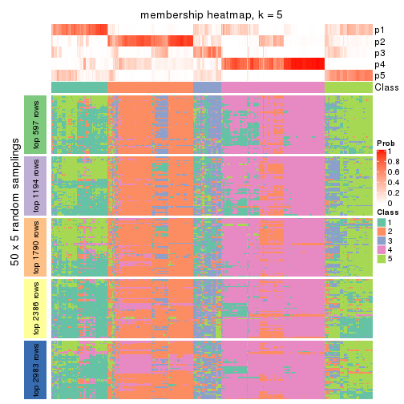</p>

</div>
<div id='tab-CV-NMF-membership-heatmap-5'>
<pre><code class="r">membership_heatmap(res, k = 6)
</code></pre>

<p></p>

</div>
</div>

As soon as we have had the classes for columns, we can look for signatures
which are significantly different between classes which can be candidate marks
for certain classes. Following are the heatmaps for signatures.


Signature heatmaps where rows are scaled:


<script>
$( function() {
	$( '#tabs-CV-NMF-get-signatures' ).tabs();
} );
</script>
<div id='tabs-CV-NMF-get-signatures'>
<ul>
<li><a href='#tab-CV-NMF-get-signatures-1'>k = 2</a></li>
<li><a href='#tab-CV-NMF-get-signatures-2'>k = 3</a></li>
<li><a href='#tab-CV-NMF-get-signatures-3'>k = 4</a></li>
<li><a href='#tab-CV-NMF-get-signatures-4'>k = 5</a></li>
<li><a href='#tab-CV-NMF-get-signatures-5'>k = 6</a></li>
</ul>
<div id='tab-CV-NMF-get-signatures-1'>
<pre><code class="r">get_signatures(res, k = 2)
</code></pre>

<p>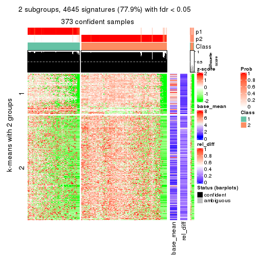</p>

</div>
<div id='tab-CV-NMF-get-signatures-2'>
<pre><code class="r">get_signatures(res, k = 3)
</code></pre>

<p></p>

</div>
<div id='tab-CV-NMF-get-signatures-3'>
<pre><code class="r">get_signatures(res, k = 4)
</code></pre>

<p></p>

</div>
<div id='tab-CV-NMF-get-signatures-4'>
<pre><code class="r">get_signatures(res, k = 5)
</code></pre>

<p></p>

</div>
<div id='tab-CV-NMF-get-signatures-5'>
<pre><code class="r">get_signatures(res, k = 6)
</code></pre>

<p></p>

</div>
</div>


Signature heatmaps where rows are not scaled:


<script>
$( function() {
	$( '#tabs-CV-NMF-get-signatures-no-scale' ).tabs();
} );
</script>
<div id='tabs-CV-NMF-get-signatures-no-scale'>
<ul>
<li><a href='#tab-CV-NMF-get-signatures-no-scale-1'>k = 2</a></li>
<li><a href='#tab-CV-NMF-get-signatures-no-scale-2'>k = 3</a></li>
<li><a href='#tab-CV-NMF-get-signatures-no-scale-3'>k = 4</a></li>
<li><a href='#tab-CV-NMF-get-signatures-no-scale-4'>k = 5</a></li>
<li><a href='#tab-CV-NMF-get-signatures-no-scale-5'>k = 6</a></li>
</ul>
<div id='tab-CV-NMF-get-signatures-no-scale-1'>
<pre><code class="r">get_signatures(res, k = 2, scale_rows = FALSE)
</code></pre>

<p></p>

</div>
<div id='tab-CV-NMF-get-signatures-no-scale-2'>
<pre><code class="r">get_signatures(res, k = 3, scale_rows = FALSE)
</code></pre>

<p></p>

</div>
<div id='tab-CV-NMF-get-signatures-no-scale-3'>
<pre><code class="r">get_signatures(res, k = 4, scale_rows = FALSE)
</code></pre>

<p></p>

</div>
<div id='tab-CV-NMF-get-signatures-no-scale-4'>
<pre><code class="r">get_signatures(res, k = 5, scale_rows = FALSE)
</code></pre>

<p></p>

</div>
<div id='tab-CV-NMF-get-signatures-no-scale-5'>
<pre><code class="r">get_signatures(res, k = 6, scale_rows = FALSE)
</code></pre>

<p></p>

</div>
</div>


Compare the overlap of signatures from different k:

```r
compare_signatures(res)
```


`get_signature()` returns a data frame invisibly. TO get the list of signatures, the function
call should be assigned to a variable explicitly. In following code, if `plot` argument is set
to `FALSE`, no heatmap is plotted while only the differential analysis is performed.

```r
# code only for demonstration
tb = get_signature(res, k = ..., plot = FALSE)
```

An example of the output of `tb` is:

```
#>   which_row         fdr    mean_1    mean_2 scaled_mean_1 scaled_mean_2 km
#> 1        38 0.042760348  8.373488  9.131774    -0.5533452     0.5164555  1
#> 2        40 0.018707592  7.106213  8.469186    -0.6173731     0.5762149  1
#> 3        55 0.019134737 10.221463 11.207825    -0.6159697     0.5749050  1
#> 4        59 0.006059896  5.921854  7.869574    -0.6899429     0.6439467  1
#> 5        60 0.018055526  8.928898 10.211722    -0.6204761     0.5791110  1
#> 6        98 0.009384629 15.714769 14.887706     0.6635654    -0.6193277  2
...
```

The columns in `tb` are:

1. `which_row`: row indices corresponding to the input matrix.
2. `fdr`: FDR for the differential test. 
3. `mean_x`: The mean value in group x.
4. `scaled_mean_x`: The mean value in group x after rows are scaled.
5. `km`: Row groups if k-means clustering is applied to rows.


UMAP plot which shows how samples are separated.


<script>
$( function() {
	$( '#tabs-CV-NMF-dimension-reduction' ).tabs();
} );
</script>
<div id='tabs-CV-NMF-dimension-reduction'>
<ul>
<li><a href='#tab-CV-NMF-dimension-reduction-1'>k = 2</a></li>
<li><a href='#tab-CV-NMF-dimension-reduction-2'>k = 3</a></li>
<li><a href='#tab-CV-NMF-dimension-reduction-3'>k = 4</a></li>
<li><a href='#tab-CV-NMF-dimension-reduction-4'>k = 5</a></li>
<li><a href='#tab-CV-NMF-dimension-reduction-5'>k = 6</a></li>
</ul>
<div id='tab-CV-NMF-dimension-reduction-1'>
<pre><code class="r">dimension_reduction(res, k = 2, method = &quot;UMAP&quot;)
</code></pre>

<p></p>

</div>
<div id='tab-CV-NMF-dimension-reduction-2'>
<pre><code class="r">dimension_reduction(res, k = 3, method = &quot;UMAP&quot;)
</code></pre>

<p></p>

</div>
<div id='tab-CV-NMF-dimension-reduction-3'>
<pre><code class="r">dimension_reduction(res, k = 4, method = &quot;UMAP&quot;)
</code></pre>

<p></p>

</div>
<div id='tab-CV-NMF-dimension-reduction-4'>
<pre><code class="r">dimension_reduction(res, k = 5, method = &quot;UMAP&quot;)
</code></pre>

<p></p>

</div>
<div id='tab-CV-NMF-dimension-reduction-5'>
<pre><code class="r">dimension_reduction(res, k = 6, method = &quot;UMAP&quot;)
</code></pre>

<p></p>

</div>
</div>


Following heatmap shows how subgroups are split when increasing `k`:

```r
collect_classes(res)
```


If matrix rows can be associated to genes, consider to use `GO_Enrichment(res,
...)` to perform function enrichment for the signature genes.


 

---------------------------------------------------


### MAD:hclust


The object with results only for a single top-value method and a single partition method 
can be extracted as:

```r
res = res_list["MAD", "hclust"]
# you can also extract it by
# res = res_list["MAD:hclust"]
```

A summary of `res` and all the functions that can be applied to it:

```r
res
```

```
#> A 'ConsensusPartition' object with k = 2, 3, 4, 5, 6.
#>   On a matrix with 5966 rows and 384 columns.
#>   Top rows (597, 1194, 1790, 2386, 2983) are extracted by 'MAD' method.
#>   Subgroups are detected by 'hclust' method.
#>   Performed in total 1250 partitions by row resampling.
#>   Best k for subgroups seems to be 2.
#> 
#> Following methods can be applied to this 'ConsensusPartition' object:
#>  [1] "cola_report"             "collect_classes"         "collect_plots"          
#>  [4] "collect_stats"           "colnames"                "compare_signatures"     
#>  [7] "consensus_heatmap"       "dimension_reduction"     "functional_enrichment"  
#> [10] "get_anno_col"            "get_anno"                "get_classes"            
#> [13] "get_consensus"           "get_matrix"              "get_membership"         
#> [16] "get_param"               "get_signatures"          "get_stats"              
#> [19] "is_best_k"               "is_stable_k"             "membership_heatmap"     
#> [22] "ncol"                    "nrow"                    "plot_ecdf"              
#> [25] "rownames"                "select_partition_number" "show"                   
#> [28] "suggest_best_k"          "test_to_known_factors"
```

`collect_plots()` function collects all the plots made from `res` for all `k` (number of partitions)
into one single page to provide an easy and fast comparison between different `k`.

```r
collect_plots(res)
```


The plots are:

- The first row: a plot of the ECDF (Empirical cumulative distribution
  function) curves of the consensus matrix for each `k` and the heatmap of
  predicted classes for each `k`.
- The second row: heatmaps of the consensus matrix for each `k`.
- The third row: heatmaps of the membership matrix for each `k`.
- The fouth row: heatmaps of the signatures for each `k`.

All the plots in panels can be made by individual functions and they are
plotted later in this section.

`select_partition_number()` produces several plots showing different
statistics for choosing "optimized" `k`. There are following statistics:

- ECDF curves of the consensus matrix for each `k`;
- 1-PAC. [The PAC
  score](https://en.wikipedia.org/wiki/Consensus_clustering#Over-interpretation_potential_of_consensus_clustering)
  measures the proportion of the ambiguous subgrouping.
- Mean silhouette score.
- Concordance. The mean probability of fiting the consensus class ids in all
  partitions.
- Area increased. Denote $A_k$ as the area under the ECDF curve for current
  `k`, the area increased is defined as $A_k - A_{k-1}$.
- Rand index. The percent of pairs of samples that are both in a same cluster
  or both are not in a same cluster in the partition of k and k-1.
- Jaccard index. The ratio of pairs of samples are both in a same cluster in
  the partition of k and k-1 and the pairs of samples are both in a same
  cluster in the partition k or k-1.

The detailed explanations of these statistics can be found in [the cola
vignette](http://bioconductor.org/packages/devel/bioc/vignettes/cola/inst/doc/cola.html#toc_13).

Generally speaking, lower PAC score, higher mean silhouette score or higher
concordance corresponds to better partition. Rand index and Jaccard index
measure how similar the current partition is compared to partition with `k-1`.
If they are too similar, we won't accept `k` is better than `k-1`.

```r
select_partition_number(res)
```


The numeric values for all these statistics can be obtained by `get_stats()`.

```r
get_stats(res)
```

```
#>   k 1-PAC mean_silhouette concordance area_increased  Rand Jaccard
#> 2 2 0.796           0.931       0.962         0.4090 0.604   0.604
#> 3 3 0.558           0.716       0.800         0.2889 0.954   0.924
#> 4 4 0.512           0.547       0.754         0.1436 0.782   0.618
#> 5 5 0.508           0.685       0.745         0.0648 0.844   0.625
#> 6 6 0.523           0.679       0.739         0.0495 0.911   0.741
```

`suggest_best_k()` suggests the best $k$ based on these statistics. The rules are as follows:

- All $k$ with Jaccard index larger than 0.95 are removed because the increase of
  the partition number does not provides enough extra information. If all $k$ are removed,
  the best $k$ is assigned by `NA`.
- For $k$ with 1-PAC larger than 0.9, the maximal $k$ is taken as the "best k". Other $k$ is called "optional k".
- If it does not fit the second rule. The $k$ with the highest vote of highest
  1-PAC, mean silhouette and concordance is taken as the "best k".

```r
suggest_best_k(res)
```

```
#> [1] 2
```


Following shows the table of the partitions (You need to click the **show/hide
code output** link to see it). The membership matrix (columns with name `p*`)
is inferred by
[`clue::cl_consensus()`](https://www.rdocumentation.org/link/cl_consensus?package=clue)
function with the `SE` method. Basically the value in the membership matrix
represents the probability to belong to a certain group. The finall class
label for an item is determined with the group with highest probability it
belongs to.

In `get_classes()` function, the entropy is calculated from the membership
matrix and the silhouette score is calculated from the consensus matrix.


<script>
$( function() {
	$( '#tabs-MAD-hclust-get-classes' ).tabs();
} );
</script>
<div id='tabs-MAD-hclust-get-classes'>
<ul>
<li><a href='#tab-MAD-hclust-get-classes-1'>k = 2</a></li>
<li><a href='#tab-MAD-hclust-get-classes-2'>k = 3</a></li>
<li><a href='#tab-MAD-hclust-get-classes-3'>k = 4</a></li>
<li><a href='#tab-MAD-hclust-get-classes-4'>k = 5</a></li>
<li><a href='#tab-MAD-hclust-get-classes-5'>k = 6</a></li>
</ul>

<div id='tab-MAD-hclust-get-classes-1'>
<p><a id='tab-MAD-hclust-get-classes-1-a' style='color:#0366d6' href='#'>show/hide code output</a></p>
<pre><code class="r">cbind(get_classes(res, k = 2), get_membership(res, k = 2))
</code></pre>

<pre><code>#&gt;           class entropy silhouette    p1    p2
#&gt; SRR490216     2  0.2236      0.944 0.036 0.964
#&gt; SRR490217     2  0.2236      0.944 0.036 0.964
#&gt; SRR490218     2  0.2236      0.944 0.036 0.964
#&gt; SRR490219     2  0.2236      0.944 0.036 0.964
#&gt; SRR490220     2  0.4815      0.895 0.104 0.896
#&gt; SRR490221     2  0.4815      0.895 0.104 0.896
#&gt; SRR490222     2  0.4815      0.895 0.104 0.896
#&gt; SRR490223     2  0.4815      0.895 0.104 0.896
#&gt; SRR490224     1  0.0000      0.971 1.000 0.000
#&gt; SRR490225     1  0.0000      0.971 1.000 0.000
#&gt; SRR490226     1  0.0000      0.971 1.000 0.000
#&gt; SRR490227     1  0.0000      0.971 1.000 0.000
#&gt; SRR490228     1  0.0000      0.971 1.000 0.000
#&gt; SRR490229     1  0.0000      0.971 1.000 0.000
#&gt; SRR490230     1  0.0000      0.971 1.000 0.000
#&gt; SRR490231     1  0.0000      0.971 1.000 0.000
#&gt; SRR490232     1  0.1633      0.960 0.976 0.024
#&gt; SRR490233     1  0.1633      0.960 0.976 0.024
#&gt; SRR490234     1  0.1633      0.960 0.976 0.024
#&gt; SRR490235     1  0.1633      0.960 0.976 0.024
#&gt; SRR490236     1  0.0000      0.971 1.000 0.000
#&gt; SRR490237     1  0.0000      0.971 1.000 0.000
#&gt; SRR490238     1  0.0000      0.971 1.000 0.000
#&gt; SRR490239     1  0.0000      0.971 1.000 0.000
#&gt; SRR490240     2  0.7139      0.797 0.196 0.804
#&gt; SRR490241     2  0.7139      0.797 0.196 0.804
#&gt; SRR490242     2  0.7139      0.797 0.196 0.804
#&gt; SRR490243     2  0.7139      0.797 0.196 0.804
#&gt; SRR490244     1  0.0000      0.971 1.000 0.000
#&gt; SRR490245     1  0.0000      0.971 1.000 0.000
#&gt; SRR490246     1  0.0000      0.971 1.000 0.000
#&gt; SRR490247     1  0.0000      0.971 1.000 0.000
#&gt; SRR490248     2  0.2423      0.942 0.040 0.960
#&gt; SRR490249     2  0.2423      0.942 0.040 0.960
#&gt; SRR490250     2  0.2423      0.942 0.040 0.960
#&gt; SRR490251     2  0.2423      0.942 0.040 0.960
#&gt; SRR490252     2  0.6048      0.851 0.148 0.852
#&gt; SRR490253     2  0.6048      0.851 0.148 0.852
#&gt; SRR490254     2  0.6048      0.851 0.148 0.852
#&gt; SRR490255     2  0.6048      0.851 0.148 0.852
#&gt; SRR490256     1  0.1843      0.957 0.972 0.028
#&gt; SRR490257     1  0.1843      0.957 0.972 0.028
#&gt; SRR490258     1  0.1843      0.957 0.972 0.028
#&gt; SRR490259     1  0.1843      0.957 0.972 0.028
#&gt; SRR490260     1  0.0000      0.971 1.000 0.000
#&gt; SRR490261     1  0.0000      0.971 1.000 0.000
#&gt; SRR490262     1  0.0000      0.971 1.000 0.000
#&gt; SRR490263     1  0.0000      0.971 1.000 0.000
#&gt; SRR490264     1  0.0000      0.971 1.000 0.000
#&gt; SRR490265     1  0.0000      0.971 1.000 0.000
#&gt; SRR490266     1  0.0000      0.971 1.000 0.000
#&gt; SRR490267     1  0.0000      0.971 1.000 0.000
#&gt; SRR490268     1  0.1843      0.957 0.972 0.028
#&gt; SRR490269     1  0.1843      0.957 0.972 0.028
#&gt; SRR490270     1  0.1843      0.957 0.972 0.028
#&gt; SRR490271     1  0.1843      0.957 0.972 0.028
#&gt; SRR490272     1  0.0000      0.971 1.000 0.000
#&gt; SRR490273     1  0.0000      0.971 1.000 0.000
#&gt; SRR490274     1  0.0000      0.971 1.000 0.000
#&gt; SRR490275     1  0.0000      0.971 1.000 0.000
#&gt; SRR490276     1  0.0000      0.971 1.000 0.000
#&gt; SRR490277     1  0.0000      0.971 1.000 0.000
#&gt; SRR490278     1  0.0000      0.971 1.000 0.000
#&gt; SRR490279     1  0.0000      0.971 1.000 0.000
#&gt; SRR490280     1  0.0000      0.971 1.000 0.000
#&gt; SRR490281     1  0.0000      0.971 1.000 0.000
#&gt; SRR490282     1  0.0000      0.971 1.000 0.000
#&gt; SRR490283     1  0.0000      0.971 1.000 0.000
#&gt; SRR490284     1  0.0000      0.971 1.000 0.000
#&gt; SRR490285     1  0.0000      0.971 1.000 0.000
#&gt; SRR490286     1  0.0000      0.971 1.000 0.000
#&gt; SRR490287     1  0.0000      0.971 1.000 0.000
#&gt; SRR490288     1  0.5946      0.845 0.856 0.144
#&gt; SRR490289     1  0.5946      0.845 0.856 0.144
#&gt; SRR490290     1  0.5946      0.845 0.856 0.144
#&gt; SRR490291     1  0.5946      0.845 0.856 0.144
#&gt; SRR490292     2  0.3584      0.923 0.068 0.932
#&gt; SRR490293     2  0.3584      0.923 0.068 0.932
#&gt; SRR490294     2  0.3584      0.923 0.068 0.932
#&gt; SRR490295     2  0.3584      0.923 0.068 0.932
#&gt; SRR490296     2  0.0000      0.958 0.000 1.000
#&gt; SRR490297     2  0.0000      0.958 0.000 1.000
#&gt; SRR490298     2  0.0000      0.958 0.000 1.000
#&gt; SRR490299     2  0.0000      0.958 0.000 1.000
#&gt; SRR490300     2  0.3584      0.923 0.068 0.932
#&gt; SRR490301     2  0.3584      0.923 0.068 0.932
#&gt; SRR490302     2  0.3584      0.923 0.068 0.932
#&gt; SRR490303     2  0.3584      0.923 0.068 0.932
#&gt; SRR490304     2  0.0000      0.958 0.000 1.000
#&gt; SRR490305     2  0.0000      0.958 0.000 1.000
#&gt; SRR490306     2  0.0000      0.958 0.000 1.000
#&gt; SRR490307     2  0.0000      0.958 0.000 1.000
#&gt; SRR490308     1  0.0000      0.971 1.000 0.000
#&gt; SRR490309     1  0.0000      0.971 1.000 0.000
#&gt; SRR490310     1  0.0000      0.971 1.000 0.000
#&gt; SRR490311     1  0.0000      0.971 1.000 0.000
#&gt; SRR490312     2  0.2236      0.944 0.036 0.964
#&gt; SRR490313     2  0.2236      0.944 0.036 0.964
#&gt; SRR490314     2  0.2236      0.944 0.036 0.964
#&gt; SRR490315     2  0.2236      0.944 0.036 0.964
#&gt; SRR490316     2  0.8016      0.728 0.244 0.756
#&gt; SRR490317     2  0.8016      0.728 0.244 0.756
#&gt; SRR490318     2  0.8016      0.728 0.244 0.756
#&gt; SRR490319     2  0.8016      0.728 0.244 0.756
#&gt; SRR490320     1  0.2043      0.955 0.968 0.032
#&gt; SRR490321     1  0.2043      0.955 0.968 0.032
#&gt; SRR490322     1  0.2043      0.955 0.968 0.032
#&gt; SRR490323     1  0.2043      0.955 0.968 0.032
#&gt; SRR490324     1  0.0000      0.971 1.000 0.000
#&gt; SRR490325     1  0.0000      0.971 1.000 0.000
#&gt; SRR490326     1  0.0000      0.971 1.000 0.000
#&gt; SRR490327     1  0.0000      0.971 1.000 0.000
#&gt; SRR490328     2  0.0672      0.956 0.008 0.992
#&gt; SRR490329     2  0.0672      0.956 0.008 0.992
#&gt; SRR490330     2  0.0672      0.956 0.008 0.992
#&gt; SRR490331     2  0.0672      0.956 0.008 0.992
#&gt; SRR490332     2  0.0938      0.954 0.012 0.988
#&gt; SRR490333     2  0.0938      0.954 0.012 0.988
#&gt; SRR490334     2  0.0938      0.954 0.012 0.988
#&gt; SRR490335     2  0.0938      0.954 0.012 0.988
#&gt; SRR490336     2  0.0376      0.957 0.004 0.996
#&gt; SRR490337     2  0.0376      0.957 0.004 0.996
#&gt; SRR490338     2  0.0376      0.957 0.004 0.996
#&gt; SRR490339     2  0.0376      0.957 0.004 0.996
#&gt; SRR490340     2  0.3584      0.923 0.068 0.932
#&gt; SRR490341     2  0.3584      0.923 0.068 0.932
#&gt; SRR490342     2  0.3584      0.923 0.068 0.932
#&gt; SRR490343     2  0.3584      0.923 0.068 0.932
#&gt; SRR490344     2  0.2236      0.944 0.036 0.964
#&gt; SRR490345     2  0.2236      0.944 0.036 0.964
#&gt; SRR490346     2  0.2236      0.944 0.036 0.964
#&gt; SRR490347     2  0.2236      0.944 0.036 0.964
#&gt; SRR490348     2  0.0000      0.958 0.000 1.000
#&gt; SRR490349     2  0.0000      0.958 0.000 1.000
#&gt; SRR490350     2  0.0000      0.958 0.000 1.000
#&gt; SRR490351     2  0.0000      0.958 0.000 1.000
#&gt; SRR490352     2  0.0000      0.958 0.000 1.000
#&gt; SRR490353     2  0.0000      0.958 0.000 1.000
#&gt; SRR490354     2  0.0000      0.958 0.000 1.000
#&gt; SRR490355     2  0.0000      0.958 0.000 1.000
#&gt; SRR490356     2  0.2603      0.939 0.044 0.956
#&gt; SRR490357     2  0.2603      0.939 0.044 0.956
#&gt; SRR490358     2  0.2603      0.939 0.044 0.956
#&gt; SRR490359     2  0.2603      0.939 0.044 0.956
#&gt; SRR490360     2  0.0000      0.958 0.000 1.000
#&gt; SRR490361     2  0.0000      0.958 0.000 1.000
#&gt; SRR490362     2  0.0000      0.958 0.000 1.000
#&gt; SRR490363     2  0.0000      0.958 0.000 1.000
#&gt; SRR490364     2  0.0376      0.957 0.004 0.996
#&gt; SRR490365     2  0.0376      0.957 0.004 0.996
#&gt; SRR490366     2  0.0376      0.957 0.004 0.996
#&gt; SRR490367     2  0.0376      0.957 0.004 0.996
#&gt; SRR490368     2  0.0376      0.957 0.004 0.996
#&gt; SRR490369     2  0.0376      0.957 0.004 0.996
#&gt; SRR490370     2  0.0376      0.957 0.004 0.996
#&gt; SRR490371     2  0.0376      0.957 0.004 0.996
#&gt; SRR490372     1  0.0000      0.971 1.000 0.000
#&gt; SRR490373     1  0.0000      0.971 1.000 0.000
#&gt; SRR490374     1  0.0000      0.971 1.000 0.000
#&gt; SRR490375     1  0.0000      0.971 1.000 0.000
#&gt; SRR490376     2  0.1633      0.949 0.024 0.976
#&gt; SRR490377     2  0.1633      0.949 0.024 0.976
#&gt; SRR490378     2  0.1633      0.949 0.024 0.976
#&gt; SRR490379     2  0.1633      0.949 0.024 0.976
#&gt; SRR490380     1  0.0000      0.971 1.000 0.000
#&gt; SRR490381     1  0.0000      0.971 1.000 0.000
#&gt; SRR490382     1  0.0000      0.971 1.000 0.000
#&gt; SRR490383     1  0.0000      0.971 1.000 0.000
#&gt; SRR490384     2  0.0000      0.958 0.000 1.000
#&gt; SRR490385     2  0.0000      0.958 0.000 1.000
#&gt; SRR490386     2  0.0000      0.958 0.000 1.000
#&gt; SRR490387     2  0.0000      0.958 0.000 1.000
#&gt; SRR490388     2  0.0376      0.957 0.004 0.996
#&gt; SRR490389     2  0.0376      0.957 0.004 0.996
#&gt; SRR490390     2  0.0376      0.957 0.004 0.996
#&gt; SRR490391     2  0.0376      0.957 0.004 0.996
#&gt; SRR490392     2  0.0376      0.957 0.004 0.996
#&gt; SRR490393     2  0.0376      0.957 0.004 0.996
#&gt; SRR490394     2  0.0376      0.957 0.004 0.996
#&gt; SRR490395     2  0.0376      0.957 0.004 0.996
#&gt; SRR490396     2  0.0376      0.957 0.004 0.996
#&gt; SRR490397     2  0.0376      0.957 0.004 0.996
#&gt; SRR490398     2  0.0376      0.957 0.004 0.996
#&gt; SRR490399     2  0.0376      0.957 0.004 0.996
#&gt; SRR490400     2  0.0376      0.957 0.004 0.996
#&gt; SRR490401     2  0.0376      0.957 0.004 0.996
#&gt; SRR490402     2  0.0376      0.957 0.004 0.996
#&gt; SRR490403     2  0.0376      0.957 0.004 0.996
#&gt; SRR490404     2  0.2603      0.939 0.044 0.956
#&gt; SRR490405     2  0.2603      0.939 0.044 0.956
#&gt; SRR490406     2  0.2603      0.939 0.044 0.956
#&gt; SRR490407     2  0.2603      0.939 0.044 0.956
#&gt; SRR490408     2  0.0000      0.958 0.000 1.000
#&gt; SRR490409     2  0.0000      0.958 0.000 1.000
#&gt; SRR490410     2  0.0000      0.958 0.000 1.000
#&gt; SRR490411     2  0.0000      0.958 0.000 1.000
#&gt; SRR490412     1  0.0000      0.971 1.000 0.000
#&gt; SRR490413     1  0.0000      0.971 1.000 0.000
#&gt; SRR490414     1  0.0000      0.971 1.000 0.000
#&gt; SRR490415     1  0.0000      0.971 1.000 0.000
#&gt; SRR490416     2  0.7139      0.798 0.196 0.804
#&gt; SRR490417     2  0.7139      0.798 0.196 0.804
#&gt; SRR490418     2  0.7139      0.798 0.196 0.804
#&gt; SRR490419     2  0.7139      0.798 0.196 0.804
#&gt; SRR490420     2  0.9044      0.598 0.320 0.680
#&gt; SRR490421     2  0.9044      0.598 0.320 0.680
#&gt; SRR490422     2  0.9044      0.598 0.320 0.680
#&gt; SRR490423     2  0.9044      0.598 0.320 0.680
#&gt; SRR490424     1  0.0000      0.971 1.000 0.000
#&gt; SRR490425     1  0.0000      0.971 1.000 0.000
#&gt; SRR490426     1  0.0000      0.971 1.000 0.000
#&gt; SRR490427     1  0.0000      0.971 1.000 0.000
#&gt; SRR490428     1  0.6712      0.801 0.824 0.176
#&gt; SRR490429     1  0.6712      0.801 0.824 0.176
#&gt; SRR490430     1  0.6712      0.801 0.824 0.176
#&gt; SRR490431     1  0.6712      0.801 0.824 0.176
#&gt; SRR490432     2  0.7139      0.797 0.196 0.804
#&gt; SRR490433     2  0.7139      0.797 0.196 0.804
#&gt; SRR490434     2  0.7139      0.797 0.196 0.804
#&gt; SRR490435     2  0.7139      0.797 0.196 0.804
#&gt; SRR490436     2  0.6623      0.825 0.172 0.828
#&gt; SRR490437     2  0.6623      0.825 0.172 0.828
#&gt; SRR490438     2  0.6623      0.825 0.172 0.828
#&gt; SRR490439     2  0.6623      0.825 0.172 0.828
#&gt; SRR490440     2  0.0000      0.958 0.000 1.000
#&gt; SRR490441     2  0.0000      0.958 0.000 1.000
#&gt; SRR490442     2  0.0000      0.958 0.000 1.000
#&gt; SRR490443     2  0.0000      0.958 0.000 1.000
#&gt; SRR490444     2  0.0000      0.958 0.000 1.000
#&gt; SRR490445     2  0.0000      0.958 0.000 1.000
#&gt; SRR490446     2  0.0000      0.958 0.000 1.000
#&gt; SRR490447     2  0.0000      0.958 0.000 1.000
#&gt; SRR490448     2  0.8909      0.621 0.308 0.692
#&gt; SRR490449     2  0.8909      0.621 0.308 0.692
#&gt; SRR490450     2  0.8909      0.621 0.308 0.692
#&gt; SRR490451     2  0.8909      0.621 0.308 0.692
#&gt; SRR490452     1  0.4562      0.898 0.904 0.096
#&gt; SRR490453     1  0.4562      0.898 0.904 0.096
#&gt; SRR490454     1  0.4562      0.898 0.904 0.096
#&gt; SRR490455     1  0.4562      0.898 0.904 0.096
#&gt; SRR490456     2  0.7139      0.797 0.196 0.804
#&gt; SRR490457     2  0.7139      0.797 0.196 0.804
#&gt; SRR490458     2  0.7139      0.797 0.196 0.804
#&gt; SRR490459     2  0.7139      0.797 0.196 0.804
#&gt; SRR490460     2  0.7219      0.792 0.200 0.800
#&gt; SRR490461     2  0.7219      0.792 0.200 0.800
#&gt; SRR490462     2  0.7219      0.792 0.200 0.800
#&gt; SRR490463     2  0.7219      0.792 0.200 0.800
#&gt; SRR490464     1  0.0000      0.971 1.000 0.000
#&gt; SRR490465     1  0.0000      0.971 1.000 0.000
#&gt; SRR490466     1  0.0000      0.971 1.000 0.000
#&gt; SRR490467     1  0.0000      0.971 1.000 0.000
#&gt; SRR490468     2  0.0000      0.958 0.000 1.000
#&gt; SRR490469     2  0.0000      0.958 0.000 1.000
#&gt; SRR490470     2  0.0000      0.958 0.000 1.000
#&gt; SRR490471     2  0.0000      0.958 0.000 1.000
#&gt; SRR490472     2  0.0000      0.958 0.000 1.000
#&gt; SRR490473     2  0.0000      0.958 0.000 1.000
#&gt; SRR490474     2  0.0000      0.958 0.000 1.000
#&gt; SRR490475     2  0.0000      0.958 0.000 1.000
#&gt; SRR490476     1  0.0000      0.971 1.000 0.000
#&gt; SRR490477     1  0.0000      0.971 1.000 0.000
#&gt; SRR490478     1  0.0000      0.971 1.000 0.000
#&gt; SRR490479     1  0.0000      0.971 1.000 0.000
#&gt; SRR490480     2  0.0000      0.958 0.000 1.000
#&gt; SRR490481     2  0.0000      0.958 0.000 1.000
#&gt; SRR490482     2  0.0000      0.958 0.000 1.000
#&gt; SRR490483     2  0.0000      0.958 0.000 1.000
#&gt; SRR490484     2  0.0000      0.958 0.000 1.000
#&gt; SRR490485     2  0.0000      0.958 0.000 1.000
#&gt; SRR490486     2  0.0000      0.958 0.000 1.000
#&gt; SRR490487     2  0.0000      0.958 0.000 1.000
#&gt; SRR490488     2  0.0000      0.958 0.000 1.000
#&gt; SRR490489     2  0.0000      0.958 0.000 1.000
#&gt; SRR490490     2  0.0000      0.958 0.000 1.000
#&gt; SRR490491     2  0.0000      0.958 0.000 1.000
#&gt; SRR490492     2  0.0000      0.958 0.000 1.000
#&gt; SRR490493     2  0.0000      0.958 0.000 1.000
#&gt; SRR490494     2  0.0000      0.958 0.000 1.000
#&gt; SRR490495     2  0.0000      0.958 0.000 1.000
#&gt; SRR490496     2  0.0000      0.958 0.000 1.000
#&gt; SRR490497     2  0.0000      0.958 0.000 1.000
#&gt; SRR490498     2  0.0000      0.958 0.000 1.000
#&gt; SRR490499     2  0.0000      0.958 0.000 1.000
#&gt; SRR490500     2  0.0000      0.958 0.000 1.000
#&gt; SRR490501     2  0.0000      0.958 0.000 1.000
#&gt; SRR490502     2  0.0000      0.958 0.000 1.000
#&gt; SRR490503     2  0.0000      0.958 0.000 1.000
#&gt; SRR490504     2  0.0000      0.958 0.000 1.000
#&gt; SRR490505     2  0.0000      0.958 0.000 1.000
#&gt; SRR490506     2  0.0000      0.958 0.000 1.000
#&gt; SRR490507     2  0.0000      0.958 0.000 1.000
#&gt; SRR490508     2  0.0000      0.958 0.000 1.000
#&gt; SRR490509     2  0.0000      0.958 0.000 1.000
#&gt; SRR490510     2  0.0000      0.958 0.000 1.000
#&gt; SRR490511     2  0.0000      0.958 0.000 1.000
#&gt; SRR490512     2  0.0000      0.958 0.000 1.000
#&gt; SRR490513     2  0.0000      0.958 0.000 1.000
#&gt; SRR490514     2  0.0000      0.958 0.000 1.000
#&gt; SRR490515     2  0.0000      0.958 0.000 1.000
#&gt; SRR490516     2  0.0000      0.958 0.000 1.000
#&gt; SRR490517     2  0.0000      0.958 0.000 1.000
#&gt; SRR490518     2  0.0000      0.958 0.000 1.000
#&gt; SRR490519     2  0.0000      0.958 0.000 1.000
#&gt; SRR490520     2  0.0000      0.958 0.000 1.000
#&gt; SRR490521     2  0.0000      0.958 0.000 1.000
#&gt; SRR490522     2  0.0000      0.958 0.000 1.000
#&gt; SRR490523     2  0.0000      0.958 0.000 1.000
#&gt; SRR490524     2  0.0000      0.958 0.000 1.000
#&gt; SRR490525     2  0.0000      0.958 0.000 1.000
#&gt; SRR490526     2  0.0000      0.958 0.000 1.000
#&gt; SRR490527     2  0.0000      0.958 0.000 1.000
#&gt; SRR490528     2  0.0000      0.958 0.000 1.000
#&gt; SRR490529     2  0.0000      0.958 0.000 1.000
#&gt; SRR490530     2  0.0000      0.958 0.000 1.000
#&gt; SRR490531     2  0.0000      0.958 0.000 1.000
#&gt; SRR490532     1  0.6343      0.824 0.840 0.160
#&gt; SRR490533     1  0.6343      0.824 0.840 0.160
#&gt; SRR490534     1  0.6343      0.824 0.840 0.160
#&gt; SRR490535     1  0.6343      0.824 0.840 0.160
#&gt; SRR490536     2  0.0000      0.958 0.000 1.000
#&gt; SRR490537     2  0.0000      0.958 0.000 1.000
#&gt; SRR490538     2  0.0000      0.958 0.000 1.000
#&gt; SRR490539     2  0.0000      0.958 0.000 1.000
#&gt; SRR490540     2  0.0000      0.958 0.000 1.000
#&gt; SRR490541     2  0.0000      0.958 0.000 1.000
#&gt; SRR490542     2  0.0000      0.958 0.000 1.000
#&gt; SRR490543     2  0.0000      0.958 0.000 1.000
#&gt; SRR490544     2  0.0000      0.958 0.000 1.000
#&gt; SRR490545     2  0.0000      0.958 0.000 1.000
#&gt; SRR490546     2  0.0000      0.958 0.000 1.000
#&gt; SRR490547     2  0.0000      0.958 0.000 1.000
#&gt; SRR490548     2  0.0000      0.958 0.000 1.000
#&gt; SRR490549     2  0.0000      0.958 0.000 1.000
#&gt; SRR490550     2  0.0000      0.958 0.000 1.000
#&gt; SRR490551     2  0.0000      0.958 0.000 1.000
#&gt; SRR490552     2  0.0000      0.958 0.000 1.000
#&gt; SRR490553     2  0.0000      0.958 0.000 1.000
#&gt; SRR490554     2  0.0000      0.958 0.000 1.000
#&gt; SRR490555     2  0.0000      0.958 0.000 1.000
#&gt; SRR490556     2  0.0376      0.957 0.004 0.996
#&gt; SRR490557     2  0.0376      0.957 0.004 0.996
#&gt; SRR490558     2  0.0376      0.957 0.004 0.996
#&gt; SRR490559     2  0.0376      0.957 0.004 0.996
#&gt; SRR490560     2  0.0376      0.957 0.004 0.996
#&gt; SRR490561     2  0.0376      0.957 0.004 0.996
#&gt; SRR490562     2  0.0376      0.957 0.004 0.996
#&gt; SRR490563     2  0.0376      0.957 0.004 0.996
#&gt; SRR490564     2  0.2778      0.936 0.048 0.952
#&gt; SRR490565     2  0.2778      0.936 0.048 0.952
#&gt; SRR490566     2  0.2778      0.936 0.048 0.952
#&gt; SRR490567     2  0.2778      0.936 0.048 0.952
#&gt; SRR490568     2  0.0000      0.958 0.000 1.000
#&gt; SRR490569     2  0.0000      0.958 0.000 1.000
#&gt; SRR490570     2  0.0000      0.958 0.000 1.000
#&gt; SRR490571     2  0.0000      0.958 0.000 1.000
#&gt; SRR490572     2  0.0000      0.958 0.000 1.000
#&gt; SRR490573     2  0.0000      0.958 0.000 1.000
#&gt; SRR490574     2  0.0000      0.958 0.000 1.000
#&gt; SRR490575     2  0.0000      0.958 0.000 1.000
#&gt; SRR490576     2  0.0000      0.958 0.000 1.000
#&gt; SRR490577     2  0.0000      0.958 0.000 1.000
#&gt; SRR490578     2  0.0000      0.958 0.000 1.000
#&gt; SRR490579     2  0.0000      0.958 0.000 1.000
#&gt; SRR490580     2  0.0376      0.957 0.004 0.996
#&gt; SRR490581     2  0.0376      0.957 0.004 0.996
#&gt; SRR490582     2  0.0376      0.957 0.004 0.996
#&gt; SRR490583     2  0.0376      0.957 0.004 0.996
#&gt; SRR490584     2  0.0000      0.958 0.000 1.000
#&gt; SRR490585     2  0.0000      0.958 0.000 1.000
#&gt; SRR490586     2  0.0000      0.958 0.000 1.000
#&gt; SRR490587     2  0.0000      0.958 0.000 1.000
#&gt; SRR490588     2  0.0376      0.957 0.004 0.996
#&gt; SRR490589     2  0.0376      0.957 0.004 0.996
#&gt; SRR490590     2  0.0376      0.957 0.004 0.996
#&gt; SRR490591     2  0.0376      0.957 0.004 0.996
#&gt; SRR490592     2  0.0000      0.958 0.000 1.000
#&gt; SRR490593     2  0.0000      0.958 0.000 1.000
#&gt; SRR490594     2  0.0000      0.958 0.000 1.000
#&gt; SRR490595     2  0.0000      0.958 0.000 1.000
#&gt; SRR490596     2  0.3733      0.920 0.072 0.928
#&gt; SRR490597     2  0.3733      0.920 0.072 0.928
#&gt; SRR490598     2  0.3733      0.920 0.072 0.928
#&gt; SRR490599     2  0.3733      0.920 0.072 0.928
</code></pre>

<script>
$('#tab-MAD-hclust-get-classes-1-a').parent().next().next().hide();
$('#tab-MAD-hclust-get-classes-1-a').click(function(){
  $('#tab-MAD-hclust-get-classes-1-a').parent().next().next().toggle();
  return(false);
});
</script>
</div>

<div id='tab-MAD-hclust-get-classes-2'>
<p><a id='tab-MAD-hclust-get-classes-2-a' style='color:#0366d6' href='#'>show/hide code output</a></p>
<pre><code class="r">cbind(get_classes(res, k = 3), get_membership(res, k = 3))
</code></pre>

<pre><code>#&gt;           class entropy silhouette    p1    p2    p3
#&gt; SRR490216     2  0.4099     0.7569 0.008 0.852 0.140
#&gt; SRR490217     2  0.4099     0.7569 0.008 0.852 0.140
#&gt; SRR490218     2  0.4099     0.7569 0.008 0.852 0.140
#&gt; SRR490219     2  0.4099     0.7569 0.008 0.852 0.140
#&gt; SRR490220     2  0.6931     0.6472 0.032 0.640 0.328
#&gt; SRR490221     2  0.6931     0.6472 0.032 0.640 0.328
#&gt; SRR490222     2  0.6931     0.6472 0.032 0.640 0.328
#&gt; SRR490223     2  0.6931     0.6472 0.032 0.640 0.328
#&gt; SRR490224     1  0.0000     0.9501 1.000 0.000 0.000
#&gt; SRR490225     1  0.0000     0.9501 1.000 0.000 0.000
#&gt; SRR490226     1  0.0000     0.9501 1.000 0.000 0.000
#&gt; SRR490227     1  0.0000     0.9501 1.000 0.000 0.000
#&gt; SRR490228     1  0.0000     0.9501 1.000 0.000 0.000
#&gt; SRR490229     1  0.0000     0.9501 1.000 0.000 0.000
#&gt; SRR490230     1  0.0000     0.9501 1.000 0.000 0.000
#&gt; SRR490231     1  0.0000     0.9501 1.000 0.000 0.000
#&gt; SRR490232     1  0.2537     0.8923 0.920 0.000 0.080
#&gt; SRR490233     1  0.2537     0.8923 0.920 0.000 0.080
#&gt; SRR490234     1  0.2537     0.8923 0.920 0.000 0.080
#&gt; SRR490235     1  0.2537     0.8923 0.920 0.000 0.080
#&gt; SRR490236     1  0.0000     0.9501 1.000 0.000 0.000
#&gt; SRR490237     1  0.0000     0.9501 1.000 0.000 0.000
#&gt; SRR490238     1  0.0000     0.9501 1.000 0.000 0.000
#&gt; SRR490239     1  0.0000     0.9501 1.000 0.000 0.000
#&gt; SRR490240     2  0.8338     0.3851 0.084 0.516 0.400
#&gt; SRR490241     2  0.8338     0.3851 0.084 0.516 0.400
#&gt; SRR490242     2  0.8338     0.3851 0.084 0.516 0.400
#&gt; SRR490243     2  0.8338     0.3851 0.084 0.516 0.400
#&gt; SRR490244     1  0.0000     0.9501 1.000 0.000 0.000
#&gt; SRR490245     1  0.0000     0.9501 1.000 0.000 0.000
#&gt; SRR490246     1  0.0000     0.9501 1.000 0.000 0.000
#&gt; SRR490247     1  0.0000     0.9501 1.000 0.000 0.000
#&gt; SRR490248     2  0.4261     0.7552 0.012 0.848 0.140
#&gt; SRR490249     2  0.4261     0.7552 0.012 0.848 0.140
#&gt; SRR490250     2  0.4261     0.7552 0.012 0.848 0.140
#&gt; SRR490251     2  0.4261     0.7552 0.012 0.848 0.140
#&gt; SRR490252     2  0.7724     0.5549 0.060 0.588 0.352
#&gt; SRR490253     2  0.7724     0.5549 0.060 0.588 0.352
#&gt; SRR490254     2  0.7724     0.5549 0.060 0.588 0.352
#&gt; SRR490255     2  0.7724     0.5549 0.060 0.588 0.352
#&gt; SRR490256     1  0.3482     0.8392 0.872 0.000 0.128
#&gt; SRR490257     1  0.3482     0.8392 0.872 0.000 0.128
#&gt; SRR490258     1  0.3482     0.8392 0.872 0.000 0.128
#&gt; SRR490259     1  0.3482     0.8392 0.872 0.000 0.128
#&gt; SRR490260     1  0.1163     0.9359 0.972 0.000 0.028
#&gt; SRR490261     1  0.1163     0.9359 0.972 0.000 0.028
#&gt; SRR490262     1  0.1163     0.9359 0.972 0.000 0.028
#&gt; SRR490263     1  0.1163     0.9359 0.972 0.000 0.028
#&gt; SRR490264     1  0.0237     0.9484 0.996 0.000 0.004
#&gt; SRR490265     1  0.0237     0.9484 0.996 0.000 0.004
#&gt; SRR490266     1  0.0237     0.9484 0.996 0.000 0.004
#&gt; SRR490267     1  0.0237     0.9484 0.996 0.000 0.004
#&gt; SRR490268     1  0.2590     0.8958 0.924 0.004 0.072
#&gt; SRR490269     1  0.2590     0.8958 0.924 0.004 0.072
#&gt; SRR490270     1  0.2590     0.8958 0.924 0.004 0.072
#&gt; SRR490271     1  0.2590     0.8958 0.924 0.004 0.072
#&gt; SRR490272     1  0.0747     0.9427 0.984 0.000 0.016
#&gt; SRR490273     1  0.0747     0.9427 0.984 0.000 0.016
#&gt; SRR490274     1  0.0747     0.9427 0.984 0.000 0.016
#&gt; SRR490275     1  0.0747     0.9427 0.984 0.000 0.016
#&gt; SRR490276     1  0.0237     0.9485 0.996 0.000 0.004
#&gt; SRR490277     1  0.0237     0.9485 0.996 0.000 0.004
#&gt; SRR490278     1  0.0237     0.9485 0.996 0.000 0.004
#&gt; SRR490279     1  0.0237     0.9485 0.996 0.000 0.004
#&gt; SRR490280     1  0.0000     0.9501 1.000 0.000 0.000
#&gt; SRR490281     1  0.0000     0.9501 1.000 0.000 0.000
#&gt; SRR490282     1  0.0000     0.9501 1.000 0.000 0.000
#&gt; SRR490283     1  0.0000     0.9501 1.000 0.000 0.000
#&gt; SRR490284     1  0.0000     0.9501 1.000 0.000 0.000
#&gt; SRR490285     1  0.0000     0.9501 1.000 0.000 0.000
#&gt; SRR490286     1  0.0000     0.9501 1.000 0.000 0.000
#&gt; SRR490287     1  0.0000     0.9501 1.000 0.000 0.000
#&gt; SRR490288     1  0.7329     0.0687 0.544 0.032 0.424
#&gt; SRR490289     1  0.7329     0.0687 0.544 0.032 0.424
#&gt; SRR490290     1  0.7329     0.0687 0.544 0.032 0.424
#&gt; SRR490291     1  0.7329     0.0687 0.544 0.032 0.424
#&gt; SRR490292     2  0.6235     0.5802 0.000 0.564 0.436
#&gt; SRR490293     2  0.6235     0.5802 0.000 0.564 0.436
#&gt; SRR490294     2  0.6235     0.5802 0.000 0.564 0.436
#&gt; SRR490295     2  0.6235     0.5802 0.000 0.564 0.436
#&gt; SRR490296     2  0.5363     0.7290 0.000 0.724 0.276
#&gt; SRR490297     2  0.5363     0.7290 0.000 0.724 0.276
#&gt; SRR490298     2  0.5363     0.7290 0.000 0.724 0.276
#&gt; SRR490299     2  0.5363     0.7290 0.000 0.724 0.276
#&gt; SRR490300     2  0.6235     0.5802 0.000 0.564 0.436
#&gt; SRR490301     2  0.6235     0.5802 0.000 0.564 0.436
#&gt; SRR490302     2  0.6235     0.5802 0.000 0.564 0.436
#&gt; SRR490303     2  0.6235     0.5802 0.000 0.564 0.436
#&gt; SRR490304     2  0.5363     0.7290 0.000 0.724 0.276
#&gt; SRR490305     2  0.5363     0.7290 0.000 0.724 0.276
#&gt; SRR490306     2  0.5363     0.7290 0.000 0.724 0.276
#&gt; SRR490307     2  0.5363     0.7290 0.000 0.724 0.276
#&gt; SRR490308     1  0.0000     0.9501 1.000 0.000 0.000
#&gt; SRR490309     1  0.0000     0.9501 1.000 0.000 0.000
#&gt; SRR490310     1  0.0000     0.9501 1.000 0.000 0.000
#&gt; SRR490311     1  0.0000     0.9501 1.000 0.000 0.000
#&gt; SRR490312     2  0.4099     0.7569 0.008 0.852 0.140
#&gt; SRR490313     2  0.4099     0.7569 0.008 0.852 0.140
#&gt; SRR490314     2  0.4099     0.7569 0.008 0.852 0.140
#&gt; SRR490315     2  0.4099     0.7569 0.008 0.852 0.140
#&gt; SRR490316     2  0.8826     0.2690 0.116 0.472 0.412
#&gt; SRR490317     2  0.8826     0.2690 0.116 0.472 0.412
#&gt; SRR490318     2  0.8826     0.2690 0.116 0.472 0.412
#&gt; SRR490319     2  0.8826     0.2690 0.116 0.472 0.412
#&gt; SRR490320     1  0.4121     0.7859 0.832 0.000 0.168
#&gt; SRR490321     1  0.4121     0.7859 0.832 0.000 0.168
#&gt; SRR490322     1  0.4121     0.7859 0.832 0.000 0.168
#&gt; SRR490323     1  0.4121     0.7859 0.832 0.000 0.168
#&gt; SRR490324     1  0.0000     0.9501 1.000 0.000 0.000
#&gt; SRR490325     1  0.0000     0.9501 1.000 0.000 0.000
#&gt; SRR490326     1  0.0000     0.9501 1.000 0.000 0.000
#&gt; SRR490327     1  0.0000     0.9501 1.000 0.000 0.000
#&gt; SRR490328     2  0.5621     0.7138 0.000 0.692 0.308
#&gt; SRR490329     2  0.5621     0.7138 0.000 0.692 0.308
#&gt; SRR490330     2  0.5621     0.7138 0.000 0.692 0.308
#&gt; SRR490331     2  0.5621     0.7138 0.000 0.692 0.308
#&gt; SRR490332     2  0.5678     0.7083 0.000 0.684 0.316
#&gt; SRR490333     2  0.5678     0.7083 0.000 0.684 0.316
#&gt; SRR490334     2  0.5678     0.7083 0.000 0.684 0.316
#&gt; SRR490335     2  0.5678     0.7083 0.000 0.684 0.316
#&gt; SRR490336     2  0.5560     0.7170 0.000 0.700 0.300
#&gt; SRR490337     2  0.5560     0.7170 0.000 0.700 0.300
#&gt; SRR490338     2  0.5560     0.7170 0.000 0.700 0.300
#&gt; SRR490339     2  0.5560     0.7170 0.000 0.700 0.300
#&gt; SRR490340     2  0.6235     0.5802 0.000 0.564 0.436
#&gt; SRR490341     2  0.6235     0.5802 0.000 0.564 0.436
#&gt; SRR490342     2  0.6235     0.5802 0.000 0.564 0.436
#&gt; SRR490343     2  0.6235     0.5802 0.000 0.564 0.436
#&gt; SRR490344     2  0.4473     0.7597 0.008 0.828 0.164
#&gt; SRR490345     2  0.4473     0.7597 0.008 0.828 0.164
#&gt; SRR490346     2  0.4473     0.7597 0.008 0.828 0.164
#&gt; SRR490347     2  0.4473     0.7597 0.008 0.828 0.164
#&gt; SRR490348     2  0.1031     0.7573 0.000 0.976 0.024
#&gt; SRR490349     2  0.1031     0.7573 0.000 0.976 0.024
#&gt; SRR490350     2  0.1031     0.7573 0.000 0.976 0.024
#&gt; SRR490351     2  0.1031     0.7573 0.000 0.976 0.024
#&gt; SRR490352     2  0.1031     0.7573 0.000 0.976 0.024
#&gt; SRR490353     2  0.1031     0.7573 0.000 0.976 0.024
#&gt; SRR490354     2  0.1031     0.7573 0.000 0.976 0.024
#&gt; SRR490355     2  0.1031     0.7573 0.000 0.976 0.024
#&gt; SRR490356     2  0.4974     0.7449 0.000 0.764 0.236
#&gt; SRR490357     2  0.4974     0.7449 0.000 0.764 0.236
#&gt; SRR490358     2  0.4974     0.7449 0.000 0.764 0.236
#&gt; SRR490359     2  0.4974     0.7449 0.000 0.764 0.236
#&gt; SRR490360     2  0.1753     0.7543 0.000 0.952 0.048
#&gt; SRR490361     2  0.1753     0.7543 0.000 0.952 0.048
#&gt; SRR490362     2  0.1753     0.7543 0.000 0.952 0.048
#&gt; SRR490363     2  0.1753     0.7543 0.000 0.952 0.048
#&gt; SRR490364     2  0.3482     0.7731 0.000 0.872 0.128
#&gt; SRR490365     2  0.3482     0.7731 0.000 0.872 0.128
#&gt; SRR490366     2  0.3482     0.7731 0.000 0.872 0.128
#&gt; SRR490367     2  0.3482     0.7731 0.000 0.872 0.128
#&gt; SRR490368     2  0.1163     0.7661 0.000 0.972 0.028
#&gt; SRR490369     2  0.1163     0.7661 0.000 0.972 0.028
#&gt; SRR490370     2  0.1163     0.7661 0.000 0.972 0.028
#&gt; SRR490371     2  0.1163     0.7661 0.000 0.972 0.028
#&gt; SRR490372     1  0.0000     0.9501 1.000 0.000 0.000
#&gt; SRR490373     1  0.0000     0.9501 1.000 0.000 0.000
#&gt; SRR490374     1  0.0000     0.9501 1.000 0.000 0.000
#&gt; SRR490375     1  0.0000     0.9501 1.000 0.000 0.000
#&gt; SRR490376     2  0.3192     0.7734 0.000 0.888 0.112
#&gt; SRR490377     2  0.3192     0.7734 0.000 0.888 0.112
#&gt; SRR490378     2  0.3192     0.7734 0.000 0.888 0.112
#&gt; SRR490379     2  0.3192     0.7734 0.000 0.888 0.112
#&gt; SRR490380     1  0.0000     0.9501 1.000 0.000 0.000
#&gt; SRR490381     1  0.0000     0.9501 1.000 0.000 0.000
#&gt; SRR490382     1  0.0000     0.9501 1.000 0.000 0.000
#&gt; SRR490383     1  0.0000     0.9501 1.000 0.000 0.000
#&gt; SRR490384     2  0.1031     0.7573 0.000 0.976 0.024
#&gt; SRR490385     2  0.1031     0.7573 0.000 0.976 0.024
#&gt; SRR490386     2  0.1031     0.7573 0.000 0.976 0.024
#&gt; SRR490387     2  0.1031     0.7573 0.000 0.976 0.024
#&gt; SRR490388     2  0.1860     0.7730 0.000 0.948 0.052
#&gt; SRR490389     2  0.1860     0.7730 0.000 0.948 0.052
#&gt; SRR490390     2  0.1860     0.7730 0.000 0.948 0.052
#&gt; SRR490391     2  0.1860     0.7730 0.000 0.948 0.052
#&gt; SRR490392     2  0.1860     0.7722 0.000 0.948 0.052
#&gt; SRR490393     2  0.1860     0.7722 0.000 0.948 0.052
#&gt; SRR490394     2  0.1860     0.7722 0.000 0.948 0.052
#&gt; SRR490395     2  0.1860     0.7722 0.000 0.948 0.052
#&gt; SRR490396     2  0.1860     0.7730 0.000 0.948 0.052
#&gt; SRR490397     2  0.1860     0.7730 0.000 0.948 0.052
#&gt; SRR490398     2  0.1860     0.7730 0.000 0.948 0.052
#&gt; SRR490399     2  0.1860     0.7730 0.000 0.948 0.052
#&gt; SRR490400     2  0.1163     0.7661 0.000 0.972 0.028
#&gt; SRR490401     2  0.1163     0.7661 0.000 0.972 0.028
#&gt; SRR490402     2  0.1163     0.7661 0.000 0.972 0.028
#&gt; SRR490403     2  0.1163     0.7661 0.000 0.972 0.028
#&gt; SRR490404     2  0.4974     0.7449 0.000 0.764 0.236
#&gt; SRR490405     2  0.4974     0.7449 0.000 0.764 0.236
#&gt; SRR490406     2  0.4974     0.7449 0.000 0.764 0.236
#&gt; SRR490407     2  0.4974     0.7449 0.000 0.764 0.236
#&gt; SRR490408     2  0.1289     0.7573 0.000 0.968 0.032
#&gt; SRR490409     2  0.1289     0.7573 0.000 0.968 0.032
#&gt; SRR490410     2  0.1289     0.7573 0.000 0.968 0.032
#&gt; SRR490411     2  0.1289     0.7573 0.000 0.968 0.032
#&gt; SRR490412     1  0.0000     0.9501 1.000 0.000 0.000
#&gt; SRR490413     1  0.0000     0.9501 1.000 0.000 0.000
#&gt; SRR490414     1  0.0000     0.9501 1.000 0.000 0.000
#&gt; SRR490415     1  0.0000     0.9501 1.000 0.000 0.000
#&gt; SRR490416     2  0.8373     0.3950 0.088 0.524 0.388
#&gt; SRR490417     2  0.8373     0.3950 0.088 0.524 0.388
#&gt; SRR490418     2  0.8373     0.3950 0.088 0.524 0.388
#&gt; SRR490419     2  0.8373     0.3950 0.088 0.524 0.388
#&gt; SRR490420     3  0.9110     0.0481 0.140 0.420 0.440
#&gt; SRR490421     3  0.9110     0.0481 0.140 0.420 0.440
#&gt; SRR490422     3  0.9110     0.0481 0.140 0.420 0.440
#&gt; SRR490423     3  0.9110     0.0481 0.140 0.420 0.440
#&gt; SRR490424     1  0.0747     0.9427 0.984 0.000 0.016
#&gt; SRR490425     1  0.0747     0.9427 0.984 0.000 0.016
#&gt; SRR490426     1  0.0747     0.9427 0.984 0.000 0.016
#&gt; SRR490427     1  0.0747     0.9427 0.984 0.000 0.016
#&gt; SRR490428     3  0.7251     0.3629 0.348 0.040 0.612
#&gt; SRR490429     3  0.7251     0.3629 0.348 0.040 0.612
#&gt; SRR490430     3  0.7251     0.3629 0.348 0.040 0.612
#&gt; SRR490431     3  0.7251     0.3629 0.348 0.040 0.612
#&gt; SRR490432     2  0.8328     0.3902 0.084 0.520 0.396
#&gt; SRR490433     2  0.8328     0.3902 0.084 0.520 0.396
#&gt; SRR490434     2  0.8328     0.3902 0.084 0.520 0.396
#&gt; SRR490435     2  0.8328     0.3902 0.084 0.520 0.396
#&gt; SRR490436     2  0.8120     0.4399 0.072 0.532 0.396
#&gt; SRR490437     2  0.8120     0.4399 0.072 0.532 0.396
#&gt; SRR490438     2  0.8120     0.4399 0.072 0.532 0.396
#&gt; SRR490439     2  0.8120     0.4399 0.072 0.532 0.396
#&gt; SRR490440     2  0.1289     0.7573 0.000 0.968 0.032
#&gt; SRR490441     2  0.1289     0.7573 0.000 0.968 0.032
#&gt; SRR490442     2  0.1289     0.7573 0.000 0.968 0.032
#&gt; SRR490443     2  0.1289     0.7573 0.000 0.968 0.032
#&gt; SRR490444     2  0.2878     0.7672 0.000 0.904 0.096
#&gt; SRR490445     2  0.2878     0.7672 0.000 0.904 0.096
#&gt; SRR490446     2  0.2878     0.7672 0.000 0.904 0.096
#&gt; SRR490447     2  0.2878     0.7672 0.000 0.904 0.096
#&gt; SRR490448     3  0.8932     0.0160 0.124 0.420 0.456
#&gt; SRR490449     3  0.8932     0.0160 0.124 0.420 0.456
#&gt; SRR490450     3  0.8932     0.0160 0.124 0.420 0.456
#&gt; SRR490451     3  0.8932     0.0160 0.124 0.420 0.456
#&gt; SRR490452     3  0.6678     0.0142 0.480 0.008 0.512
#&gt; SRR490453     3  0.6678     0.0142 0.480 0.008 0.512
#&gt; SRR490454     3  0.6678     0.0142 0.480 0.008 0.512
#&gt; SRR490455     3  0.6678     0.0142 0.480 0.008 0.512
#&gt; SRR490456     2  0.8328     0.3902 0.084 0.520 0.396
#&gt; SRR490457     2  0.8328     0.3902 0.084 0.520 0.396
#&gt; SRR490458     2  0.8328     0.3902 0.084 0.520 0.396
#&gt; SRR490459     2  0.8328     0.3902 0.084 0.520 0.396
#&gt; SRR490460     2  0.8384     0.3840 0.088 0.520 0.392
#&gt; SRR490461     2  0.8384     0.3840 0.088 0.520 0.392
#&gt; SRR490462     2  0.8384     0.3840 0.088 0.520 0.392
#&gt; SRR490463     2  0.8384     0.3840 0.088 0.520 0.392
#&gt; SRR490464     1  0.0000     0.9501 1.000 0.000 0.000
#&gt; SRR490465     1  0.0000     0.9501 1.000 0.000 0.000
#&gt; SRR490466     1  0.0000     0.9501 1.000 0.000 0.000
#&gt; SRR490467     1  0.0000     0.9501 1.000 0.000 0.000
#&gt; SRR490468     2  0.5497     0.7223 0.000 0.708 0.292
#&gt; SRR490469     2  0.5497     0.7223 0.000 0.708 0.292
#&gt; SRR490470     2  0.5497     0.7223 0.000 0.708 0.292
#&gt; SRR490471     2  0.5497     0.7223 0.000 0.708 0.292
#&gt; SRR490472     2  0.1163     0.7552 0.000 0.972 0.028
#&gt; SRR490473     2  0.1163     0.7552 0.000 0.972 0.028
#&gt; SRR490474     2  0.1163     0.7552 0.000 0.972 0.028
#&gt; SRR490475     2  0.1163     0.7552 0.000 0.972 0.028
#&gt; SRR490476     1  0.0000     0.9501 1.000 0.000 0.000
#&gt; SRR490477     1  0.0000     0.9501 1.000 0.000 0.000
#&gt; SRR490478     1  0.0000     0.9501 1.000 0.000 0.000
#&gt; SRR490479     1  0.0000     0.9501 1.000 0.000 0.000
#&gt; SRR490480     2  0.5363     0.7290 0.000 0.724 0.276
#&gt; SRR490481     2  0.5363     0.7290 0.000 0.724 0.276
#&gt; SRR490482     2  0.5363     0.7290 0.000 0.724 0.276
#&gt; SRR490483     2  0.5363     0.7290 0.000 0.724 0.276
#&gt; SRR490484     2  0.5560     0.7159 0.000 0.700 0.300
#&gt; SRR490485     2  0.5560     0.7159 0.000 0.700 0.300
#&gt; SRR490486     2  0.5560     0.7159 0.000 0.700 0.300
#&gt; SRR490487     2  0.5560     0.7159 0.000 0.700 0.300
#&gt; SRR490488     2  0.5560     0.7159 0.000 0.700 0.300
#&gt; SRR490489     2  0.5560     0.7159 0.000 0.700 0.300
#&gt; SRR490490     2  0.5560     0.7159 0.000 0.700 0.300
#&gt; SRR490491     2  0.5560     0.7159 0.000 0.700 0.300
#&gt; SRR490492     2  0.5363     0.7290 0.000 0.724 0.276
#&gt; SRR490493     2  0.5363     0.7290 0.000 0.724 0.276
#&gt; SRR490494     2  0.5363     0.7290 0.000 0.724 0.276
#&gt; SRR490495     2  0.5363     0.7290 0.000 0.724 0.276
#&gt; SRR490496     2  0.5363     0.7290 0.000 0.724 0.276
#&gt; SRR490497     2  0.5363     0.7290 0.000 0.724 0.276
#&gt; SRR490498     2  0.5363     0.7290 0.000 0.724 0.276
#&gt; SRR490499     2  0.5363     0.7290 0.000 0.724 0.276
#&gt; SRR490500     2  0.5497     0.7233 0.000 0.708 0.292
#&gt; SRR490501     2  0.5497     0.7233 0.000 0.708 0.292
#&gt; SRR490502     2  0.5497     0.7233 0.000 0.708 0.292
#&gt; SRR490503     2  0.5497     0.7233 0.000 0.708 0.292
#&gt; SRR490504     2  0.1163     0.7552 0.000 0.972 0.028
#&gt; SRR490505     2  0.1163     0.7552 0.000 0.972 0.028
#&gt; SRR490506     2  0.1163     0.7552 0.000 0.972 0.028
#&gt; SRR490507     2  0.1163     0.7552 0.000 0.972 0.028
#&gt; SRR490508     2  0.2165     0.7726 0.000 0.936 0.064
#&gt; SRR490509     2  0.2165     0.7726 0.000 0.936 0.064
#&gt; SRR490510     2  0.2165     0.7726 0.000 0.936 0.064
#&gt; SRR490511     2  0.2165     0.7726 0.000 0.936 0.064
#&gt; SRR490512     2  0.5291     0.7324 0.000 0.732 0.268
#&gt; SRR490513     2  0.5291     0.7324 0.000 0.732 0.268
#&gt; SRR490514     2  0.5291     0.7324 0.000 0.732 0.268
#&gt; SRR490515     2  0.5291     0.7324 0.000 0.732 0.268
#&gt; SRR490516     2  0.5363     0.7290 0.000 0.724 0.276
#&gt; SRR490517     2  0.5363     0.7290 0.000 0.724 0.276
#&gt; SRR490518     2  0.5363     0.7290 0.000 0.724 0.276
#&gt; SRR490519     2  0.5363     0.7290 0.000 0.724 0.276
#&gt; SRR490520     2  0.5363     0.7290 0.000 0.724 0.276
#&gt; SRR490521     2  0.5363     0.7290 0.000 0.724 0.276
#&gt; SRR490522     2  0.5363     0.7290 0.000 0.724 0.276
#&gt; SRR490523     2  0.5363     0.7290 0.000 0.724 0.276
#&gt; SRR490524     2  0.5363     0.7290 0.000 0.724 0.276
#&gt; SRR490525     2  0.5363     0.7290 0.000 0.724 0.276
#&gt; SRR490526     2  0.5363     0.7290 0.000 0.724 0.276
#&gt; SRR490527     2  0.5363     0.7290 0.000 0.724 0.276
#&gt; SRR490528     2  0.5363     0.7290 0.000 0.724 0.276
#&gt; SRR490529     2  0.5363     0.7290 0.000 0.724 0.276
#&gt; SRR490530     2  0.5363     0.7290 0.000 0.724 0.276
#&gt; SRR490531     2  0.5363     0.7290 0.000 0.724 0.276
#&gt; SRR490532     3  0.6075     0.3599 0.316 0.008 0.676
#&gt; SRR490533     3  0.6075     0.3599 0.316 0.008 0.676
#&gt; SRR490534     3  0.6075     0.3599 0.316 0.008 0.676
#&gt; SRR490535     3  0.6075     0.3599 0.316 0.008 0.676
#&gt; SRR490536     2  0.1163     0.7552 0.000 0.972 0.028
#&gt; SRR490537     2  0.1163     0.7552 0.000 0.972 0.028
#&gt; SRR490538     2  0.1163     0.7552 0.000 0.972 0.028
#&gt; SRR490539     2  0.1163     0.7552 0.000 0.972 0.028
#&gt; SRR490540     2  0.1753     0.7432 0.000 0.952 0.048
#&gt; SRR490541     2  0.1753     0.7432 0.000 0.952 0.048
#&gt; SRR490542     2  0.1753     0.7432 0.000 0.952 0.048
#&gt; SRR490543     2  0.1753     0.7432 0.000 0.952 0.048
#&gt; SRR490544     2  0.0892     0.7589 0.000 0.980 0.020
#&gt; SRR490545     2  0.0892     0.7589 0.000 0.980 0.020
#&gt; SRR490546     2  0.0892     0.7589 0.000 0.980 0.020
#&gt; SRR490547     2  0.0892     0.7589 0.000 0.980 0.020
#&gt; SRR490548     2  0.1411     0.7689 0.000 0.964 0.036
#&gt; SRR490549     2  0.1411     0.7689 0.000 0.964 0.036
#&gt; SRR490550     2  0.1411     0.7689 0.000 0.964 0.036
#&gt; SRR490551     2  0.1411     0.7689 0.000 0.964 0.036
#&gt; SRR490552     2  0.1163     0.7552 0.000 0.972 0.028
#&gt; SRR490553     2  0.1163     0.7552 0.000 0.972 0.028
#&gt; SRR490554     2  0.1163     0.7552 0.000 0.972 0.028
#&gt; SRR490555     2  0.1163     0.7552 0.000 0.972 0.028
#&gt; SRR490556     2  0.1753     0.7730 0.000 0.952 0.048
#&gt; SRR490557     2  0.1753     0.7730 0.000 0.952 0.048
#&gt; SRR490558     2  0.1753     0.7730 0.000 0.952 0.048
#&gt; SRR490559     2  0.1753     0.7730 0.000 0.952 0.048
#&gt; SRR490560     2  0.1860     0.7722 0.000 0.948 0.052
#&gt; SRR490561     2  0.1860     0.7722 0.000 0.948 0.052
#&gt; SRR490562     2  0.1860     0.7722 0.000 0.948 0.052
#&gt; SRR490563     2  0.1860     0.7722 0.000 0.948 0.052
#&gt; SRR490564     2  0.5591     0.7125 0.000 0.696 0.304
#&gt; SRR490565     2  0.5591     0.7125 0.000 0.696 0.304
#&gt; SRR490566     2  0.5591     0.7125 0.000 0.696 0.304
#&gt; SRR490567     2  0.5591     0.7125 0.000 0.696 0.304
#&gt; SRR490568     2  0.1753     0.7432 0.000 0.952 0.048
#&gt; SRR490569     2  0.1753     0.7432 0.000 0.952 0.048
#&gt; SRR490570     2  0.1753     0.7432 0.000 0.952 0.048
#&gt; SRR490571     2  0.1753     0.7432 0.000 0.952 0.048
#&gt; SRR490572     2  0.1163     0.7552 0.000 0.972 0.028
#&gt; SRR490573     2  0.1163     0.7552 0.000 0.972 0.028
#&gt; SRR490574     2  0.1163     0.7552 0.000 0.972 0.028
#&gt; SRR490575     2  0.1163     0.7552 0.000 0.972 0.028
#&gt; SRR490576     2  0.1163     0.7552 0.000 0.972 0.028
#&gt; SRR490577     2  0.1163     0.7552 0.000 0.972 0.028
#&gt; SRR490578     2  0.1163     0.7552 0.000 0.972 0.028
#&gt; SRR490579     2  0.1163     0.7552 0.000 0.972 0.028
#&gt; SRR490580     2  0.1964     0.7733 0.000 0.944 0.056
#&gt; SRR490581     2  0.1964     0.7733 0.000 0.944 0.056
#&gt; SRR490582     2  0.1964     0.7733 0.000 0.944 0.056
#&gt; SRR490583     2  0.1964     0.7733 0.000 0.944 0.056
#&gt; SRR490584     2  0.1163     0.7552 0.000 0.972 0.028
#&gt; SRR490585     2  0.1163     0.7552 0.000 0.972 0.028
#&gt; SRR490586     2  0.1163     0.7552 0.000 0.972 0.028
#&gt; SRR490587     2  0.1163     0.7552 0.000 0.972 0.028
#&gt; SRR490588     2  0.1753     0.7730 0.000 0.952 0.048
#&gt; SRR490589     2  0.1753     0.7730 0.000 0.952 0.048
#&gt; SRR490590     2  0.1753     0.7730 0.000 0.952 0.048
#&gt; SRR490591     2  0.1753     0.7730 0.000 0.952 0.048
#&gt; SRR490592     2  0.1031     0.7589 0.000 0.976 0.024
#&gt; SRR490593     2  0.1031     0.7589 0.000 0.976 0.024
#&gt; SRR490594     2  0.1031     0.7589 0.000 0.976 0.024
#&gt; SRR490595     2  0.1031     0.7589 0.000 0.976 0.024
#&gt; SRR490596     2  0.6839     0.6371 0.024 0.624 0.352
#&gt; SRR490597     2  0.6839     0.6371 0.024 0.624 0.352
#&gt; SRR490598     2  0.6839     0.6371 0.024 0.624 0.352
#&gt; SRR490599     2  0.6839     0.6371 0.024 0.624 0.352
</code></pre>

<script>
$('#tab-MAD-hclust-get-classes-2-a').parent().next().next().hide();
$('#tab-MAD-hclust-get-classes-2-a').click(function(){
  $('#tab-MAD-hclust-get-classes-2-a').parent().next().next().toggle();
  return(false);
});
</script>
</div>

<div id='tab-MAD-hclust-get-classes-3'>
<p><a id='tab-MAD-hclust-get-classes-3-a' style='color:#0366d6' href='#'>show/hide code output</a></p>
<pre><code class="r">cbind(get_classes(res, k = 4), get_membership(res, k = 4))
</code></pre>

<pre><code>#&gt;           class entropy silhouette    p1    p2    p3    p4
#&gt; SRR490216     2  0.5551      0.508 0.160 0.728 0.000 0.112
#&gt; SRR490217     2  0.5551      0.508 0.160 0.728 0.000 0.112
#&gt; SRR490218     2  0.5551      0.508 0.160 0.728 0.000 0.112
#&gt; SRR490219     2  0.5551      0.508 0.160 0.728 0.000 0.112
#&gt; SRR490220     1  0.7234      0.547 0.484 0.412 0.020 0.084
#&gt; SRR490221     1  0.7234      0.547 0.484 0.412 0.020 0.084
#&gt; SRR490222     1  0.7234      0.547 0.484 0.412 0.020 0.084
#&gt; SRR490223     1  0.7234      0.547 0.484 0.412 0.020 0.084
#&gt; SRR490224     3  0.0524      0.913 0.008 0.000 0.988 0.004
#&gt; SRR490225     3  0.0524      0.913 0.008 0.000 0.988 0.004
#&gt; SRR490226     3  0.0524      0.913 0.008 0.000 0.988 0.004
#&gt; SRR490227     3  0.0524      0.913 0.008 0.000 0.988 0.004
#&gt; SRR490228     3  0.0000      0.917 0.000 0.000 1.000 0.000
#&gt; SRR490229     3  0.0000      0.917 0.000 0.000 1.000 0.000
#&gt; SRR490230     3  0.0000      0.917 0.000 0.000 1.000 0.000
#&gt; SRR490231     3  0.0000      0.917 0.000 0.000 1.000 0.000
#&gt; SRR490232     3  0.4274      0.749 0.044 0.000 0.808 0.148
#&gt; SRR490233     3  0.4274      0.749 0.044 0.000 0.808 0.148
#&gt; SRR490234     3  0.4274      0.749 0.044 0.000 0.808 0.148
#&gt; SRR490235     3  0.4274      0.749 0.044 0.000 0.808 0.148
#&gt; SRR490236     3  0.0000      0.917 0.000 0.000 1.000 0.000
#&gt; SRR490237     3  0.0000      0.917 0.000 0.000 1.000 0.000
#&gt; SRR490238     3  0.0000      0.917 0.000 0.000 1.000 0.000
#&gt; SRR490239     3  0.0000      0.917 0.000 0.000 1.000 0.000
#&gt; SRR490240     1  0.7576      0.716 0.512 0.320 0.012 0.156
#&gt; SRR490241     1  0.7576      0.716 0.512 0.320 0.012 0.156
#&gt; SRR490242     1  0.7576      0.716 0.512 0.320 0.012 0.156
#&gt; SRR490243     1  0.7576      0.716 0.512 0.320 0.012 0.156
#&gt; SRR490244     3  0.0000      0.917 0.000 0.000 1.000 0.000
#&gt; SRR490245     3  0.0000      0.917 0.000 0.000 1.000 0.000
#&gt; SRR490246     3  0.0000      0.917 0.000 0.000 1.000 0.000
#&gt; SRR490247     3  0.0000      0.917 0.000 0.000 1.000 0.000
#&gt; SRR490248     2  0.5686      0.506 0.156 0.728 0.004 0.112
#&gt; SRR490249     2  0.5686      0.506 0.156 0.728 0.004 0.112
#&gt; SRR490250     2  0.5686      0.506 0.156 0.728 0.004 0.112
#&gt; SRR490251     2  0.5686      0.506 0.156 0.728 0.004 0.112
#&gt; SRR490252     1  0.7283      0.678 0.492 0.380 0.008 0.120
#&gt; SRR490253     1  0.7283      0.678 0.492 0.380 0.008 0.120
#&gt; SRR490254     1  0.7283      0.678 0.492 0.380 0.008 0.120
#&gt; SRR490255     1  0.7283      0.678 0.492 0.380 0.008 0.120
#&gt; SRR490256     3  0.5102      0.636 0.064 0.000 0.748 0.188
#&gt; SRR490257     3  0.5102      0.636 0.064 0.000 0.748 0.188
#&gt; SRR490258     3  0.5102      0.636 0.064 0.000 0.748 0.188
#&gt; SRR490259     3  0.5102      0.636 0.064 0.000 0.748 0.188
#&gt; SRR490260     3  0.3099      0.839 0.020 0.000 0.876 0.104
#&gt; SRR490261     3  0.3099      0.839 0.020 0.000 0.876 0.104
#&gt; SRR490262     3  0.3099      0.839 0.020 0.000 0.876 0.104
#&gt; SRR490263     3  0.3099      0.839 0.020 0.000 0.876 0.104
#&gt; SRR490264     3  0.1256      0.904 0.008 0.000 0.964 0.028
#&gt; SRR490265     3  0.1256      0.904 0.008 0.000 0.964 0.028
#&gt; SRR490266     3  0.1256      0.904 0.008 0.000 0.964 0.028
#&gt; SRR490267     3  0.1256      0.904 0.008 0.000 0.964 0.028
#&gt; SRR490268     3  0.4370      0.741 0.044 0.000 0.800 0.156
#&gt; SRR490269     3  0.4370      0.741 0.044 0.000 0.800 0.156
#&gt; SRR490270     3  0.4370      0.741 0.044 0.000 0.800 0.156
#&gt; SRR490271     3  0.4370      0.741 0.044 0.000 0.800 0.156
#&gt; SRR490272     3  0.2522      0.866 0.016 0.000 0.908 0.076
#&gt; SRR490273     3  0.2522      0.866 0.016 0.000 0.908 0.076
#&gt; SRR490274     3  0.2522      0.866 0.016 0.000 0.908 0.076
#&gt; SRR490275     3  0.2522      0.866 0.016 0.000 0.908 0.076
#&gt; SRR490276     3  0.2300      0.875 0.016 0.000 0.920 0.064
#&gt; SRR490277     3  0.2300      0.875 0.016 0.000 0.920 0.064
#&gt; SRR490278     3  0.2300      0.875 0.016 0.000 0.920 0.064
#&gt; SRR490279     3  0.2300      0.875 0.016 0.000 0.920 0.064
#&gt; SRR490280     3  0.0000      0.917 0.000 0.000 1.000 0.000
#&gt; SRR490281     3  0.0000      0.917 0.000 0.000 1.000 0.000
#&gt; SRR490282     3  0.0000      0.917 0.000 0.000 1.000 0.000
#&gt; SRR490283     3  0.0000      0.917 0.000 0.000 1.000 0.000
#&gt; SRR490284     3  0.0000      0.917 0.000 0.000 1.000 0.000
#&gt; SRR490285     3  0.0000      0.917 0.000 0.000 1.000 0.000
#&gt; SRR490286     3  0.0000      0.917 0.000 0.000 1.000 0.000
#&gt; SRR490287     3  0.0000      0.917 0.000 0.000 1.000 0.000
#&gt; SRR490288     4  0.7507      0.677 0.144 0.008 0.380 0.468
#&gt; SRR490289     4  0.7507      0.677 0.144 0.008 0.380 0.468
#&gt; SRR490290     4  0.7507      0.677 0.144 0.008 0.380 0.468
#&gt; SRR490291     4  0.7507      0.677 0.144 0.008 0.380 0.468
#&gt; SRR490292     1  0.5010      0.684 0.700 0.276 0.000 0.024
#&gt; SRR490293     1  0.5010      0.684 0.700 0.276 0.000 0.024
#&gt; SRR490294     1  0.5010      0.684 0.700 0.276 0.000 0.024
#&gt; SRR490295     1  0.5010      0.684 0.700 0.276 0.000 0.024
#&gt; SRR490296     2  0.4989     -0.318 0.472 0.528 0.000 0.000
#&gt; SRR490297     2  0.4989     -0.318 0.472 0.528 0.000 0.000
#&gt; SRR490298     2  0.4989     -0.318 0.472 0.528 0.000 0.000
#&gt; SRR490299     2  0.4989     -0.318 0.472 0.528 0.000 0.000
#&gt; SRR490300     1  0.4567      0.690 0.716 0.276 0.000 0.008
#&gt; SRR490301     1  0.4567      0.690 0.716 0.276 0.000 0.008
#&gt; SRR490302     1  0.4567      0.690 0.716 0.276 0.000 0.008
#&gt; SRR490303     1  0.4567      0.690 0.716 0.276 0.000 0.008
#&gt; SRR490304     2  0.4989     -0.318 0.472 0.528 0.000 0.000
#&gt; SRR490305     2  0.4989     -0.318 0.472 0.528 0.000 0.000
#&gt; SRR490306     2  0.4989     -0.318 0.472 0.528 0.000 0.000
#&gt; SRR490307     2  0.4989     -0.318 0.472 0.528 0.000 0.000
#&gt; SRR490308     3  0.0000      0.917 0.000 0.000 1.000 0.000
#&gt; SRR490309     3  0.0000      0.917 0.000 0.000 1.000 0.000
#&gt; SRR490310     3  0.0000      0.917 0.000 0.000 1.000 0.000
#&gt; SRR490311     3  0.0000      0.917 0.000 0.000 1.000 0.000
#&gt; SRR490312     2  0.5551      0.508 0.160 0.728 0.000 0.112
#&gt; SRR490313     2  0.5551      0.508 0.160 0.728 0.000 0.112
#&gt; SRR490314     2  0.5551      0.508 0.160 0.728 0.000 0.112
#&gt; SRR490315     2  0.5551      0.508 0.160 0.728 0.000 0.112
#&gt; SRR490316     1  0.8447      0.574 0.500 0.256 0.056 0.188
#&gt; SRR490317     1  0.8447      0.574 0.500 0.256 0.056 0.188
#&gt; SRR490318     1  0.8447      0.574 0.500 0.256 0.056 0.188
#&gt; SRR490319     1  0.8447      0.574 0.500 0.256 0.056 0.188
#&gt; SRR490320     3  0.6869      0.187 0.180 0.000 0.596 0.224
#&gt; SRR490321     3  0.6869      0.187 0.180 0.000 0.596 0.224
#&gt; SRR490322     3  0.6869      0.187 0.180 0.000 0.596 0.224
#&gt; SRR490323     3  0.6869      0.187 0.180 0.000 0.596 0.224
#&gt; SRR490324     3  0.0000      0.917 0.000 0.000 1.000 0.000
#&gt; SRR490325     3  0.0000      0.917 0.000 0.000 1.000 0.000
#&gt; SRR490326     3  0.0000      0.917 0.000 0.000 1.000 0.000
#&gt; SRR490327     3  0.0000      0.917 0.000 0.000 1.000 0.000
#&gt; SRR490328     1  0.4989      0.486 0.528 0.472 0.000 0.000
#&gt; SRR490329     1  0.4989      0.486 0.528 0.472 0.000 0.000
#&gt; SRR490330     1  0.4989      0.486 0.528 0.472 0.000 0.000
#&gt; SRR490331     1  0.4989      0.486 0.528 0.472 0.000 0.000
#&gt; SRR490332     1  0.5158      0.487 0.524 0.472 0.000 0.004
#&gt; SRR490333     1  0.5158      0.487 0.524 0.472 0.000 0.004
#&gt; SRR490334     1  0.5158      0.487 0.524 0.472 0.000 0.004
#&gt; SRR490335     1  0.5158      0.487 0.524 0.472 0.000 0.004
#&gt; SRR490336     1  0.4996      0.461 0.516 0.484 0.000 0.000
#&gt; SRR490337     1  0.4996      0.461 0.516 0.484 0.000 0.000
#&gt; SRR490338     1  0.4996      0.461 0.516 0.484 0.000 0.000
#&gt; SRR490339     1  0.4996      0.461 0.516 0.484 0.000 0.000
#&gt; SRR490340     1  0.4567      0.690 0.716 0.276 0.000 0.008
#&gt; SRR490341     1  0.4567      0.690 0.716 0.276 0.000 0.008
#&gt; SRR490342     1  0.4567      0.690 0.716 0.276 0.000 0.008
#&gt; SRR490343     1  0.4567      0.690 0.716 0.276 0.000 0.008
#&gt; SRR490344     2  0.6016      0.432 0.208 0.680 0.000 0.112
#&gt; SRR490345     2  0.6016      0.432 0.208 0.680 0.000 0.112
#&gt; SRR490346     2  0.6016      0.432 0.208 0.680 0.000 0.112
#&gt; SRR490347     2  0.6016      0.432 0.208 0.680 0.000 0.112
#&gt; SRR490348     2  0.0188      0.667 0.000 0.996 0.000 0.004
#&gt; SRR490349     2  0.0188      0.667 0.000 0.996 0.000 0.004
#&gt; SRR490350     2  0.0188      0.667 0.000 0.996 0.000 0.004
#&gt; SRR490351     2  0.0188      0.667 0.000 0.996 0.000 0.004
#&gt; SRR490352     2  0.0188      0.667 0.000 0.996 0.000 0.004
#&gt; SRR490353     2  0.0188      0.667 0.000 0.996 0.000 0.004
#&gt; SRR490354     2  0.0188      0.667 0.000 0.996 0.000 0.004
#&gt; SRR490355     2  0.0188      0.667 0.000 0.996 0.000 0.004
#&gt; SRR490356     2  0.5869      0.136 0.360 0.596 0.000 0.044
#&gt; SRR490357     2  0.5869      0.136 0.360 0.596 0.000 0.044
#&gt; SRR490358     2  0.5869      0.136 0.360 0.596 0.000 0.044
#&gt; SRR490359     2  0.5869      0.136 0.360 0.596 0.000 0.044
#&gt; SRR490360     2  0.2563      0.637 0.072 0.908 0.000 0.020
#&gt; SRR490361     2  0.2563      0.637 0.072 0.908 0.000 0.020
#&gt; SRR490362     2  0.2563      0.637 0.072 0.908 0.000 0.020
#&gt; SRR490363     2  0.2563      0.637 0.072 0.908 0.000 0.020
#&gt; SRR490364     2  0.5013      0.317 0.292 0.688 0.000 0.020
#&gt; SRR490365     2  0.5013      0.317 0.292 0.688 0.000 0.020
#&gt; SRR490366     2  0.5013      0.317 0.292 0.688 0.000 0.020
#&gt; SRR490367     2  0.5013      0.317 0.292 0.688 0.000 0.020
#&gt; SRR490368     2  0.1824      0.668 0.060 0.936 0.000 0.004
#&gt; SRR490369     2  0.1824      0.668 0.060 0.936 0.000 0.004
#&gt; SRR490370     2  0.1824      0.668 0.060 0.936 0.000 0.004
#&gt; SRR490371     2  0.1824      0.668 0.060 0.936 0.000 0.004
#&gt; SRR490372     3  0.0000      0.917 0.000 0.000 1.000 0.000
#&gt; SRR490373     3  0.0000      0.917 0.000 0.000 1.000 0.000
#&gt; SRR490374     3  0.0000      0.917 0.000 0.000 1.000 0.000
#&gt; SRR490375     3  0.0000      0.917 0.000 0.000 1.000 0.000
#&gt; SRR490376     2  0.4465      0.582 0.144 0.800 0.000 0.056
#&gt; SRR490377     2  0.4465      0.582 0.144 0.800 0.000 0.056
#&gt; SRR490378     2  0.4465      0.582 0.144 0.800 0.000 0.056
#&gt; SRR490379     2  0.4465      0.582 0.144 0.800 0.000 0.056
#&gt; SRR490380     3  0.0000      0.917 0.000 0.000 1.000 0.000
#&gt; SRR490381     3  0.0000      0.917 0.000 0.000 1.000 0.000
#&gt; SRR490382     3  0.0000      0.917 0.000 0.000 1.000 0.000
#&gt; SRR490383     3  0.0000      0.917 0.000 0.000 1.000 0.000
#&gt; SRR490384     2  0.0188      0.667 0.000 0.996 0.000 0.004
#&gt; SRR490385     2  0.0188      0.667 0.000 0.996 0.000 0.004
#&gt; SRR490386     2  0.0188      0.667 0.000 0.996 0.000 0.004
#&gt; SRR490387     2  0.0188      0.667 0.000 0.996 0.000 0.004
#&gt; SRR490388     2  0.3108      0.641 0.112 0.872 0.000 0.016
#&gt; SRR490389     2  0.3108      0.641 0.112 0.872 0.000 0.016
#&gt; SRR490390     2  0.3108      0.641 0.112 0.872 0.000 0.016
#&gt; SRR490391     2  0.3108      0.641 0.112 0.872 0.000 0.016
#&gt; SRR490392     2  0.2256      0.666 0.056 0.924 0.000 0.020
#&gt; SRR490393     2  0.2256      0.666 0.056 0.924 0.000 0.020
#&gt; SRR490394     2  0.2256      0.666 0.056 0.924 0.000 0.020
#&gt; SRR490395     2  0.2256      0.666 0.056 0.924 0.000 0.020
#&gt; SRR490396     2  0.3108      0.641 0.112 0.872 0.000 0.016
#&gt; SRR490397     2  0.3108      0.641 0.112 0.872 0.000 0.016
#&gt; SRR490398     2  0.3108      0.641 0.112 0.872 0.000 0.016
#&gt; SRR490399     2  0.3108      0.641 0.112 0.872 0.000 0.016
#&gt; SRR490400     2  0.1824      0.668 0.060 0.936 0.000 0.004
#&gt; SRR490401     2  0.1824      0.668 0.060 0.936 0.000 0.004
#&gt; SRR490402     2  0.1824      0.668 0.060 0.936 0.000 0.004
#&gt; SRR490403     2  0.1824      0.668 0.060 0.936 0.000 0.004
#&gt; SRR490404     2  0.5855      0.146 0.356 0.600 0.000 0.044
#&gt; SRR490405     2  0.5855      0.146 0.356 0.600 0.000 0.044
#&gt; SRR490406     2  0.5855      0.146 0.356 0.600 0.000 0.044
#&gt; SRR490407     2  0.5855      0.146 0.356 0.600 0.000 0.044
#&gt; SRR490408     2  0.0817      0.667 0.024 0.976 0.000 0.000
#&gt; SRR490409     2  0.0817      0.667 0.024 0.976 0.000 0.000
#&gt; SRR490410     2  0.0817      0.667 0.024 0.976 0.000 0.000
#&gt; SRR490411     2  0.0817      0.667 0.024 0.976 0.000 0.000
#&gt; SRR490412     3  0.0000      0.917 0.000 0.000 1.000 0.000
#&gt; SRR490413     3  0.0000      0.917 0.000 0.000 1.000 0.000
#&gt; SRR490414     3  0.0000      0.917 0.000 0.000 1.000 0.000
#&gt; SRR490415     3  0.0000      0.917 0.000 0.000 1.000 0.000
#&gt; SRR490416     1  0.7705      0.715 0.500 0.328 0.016 0.156
#&gt; SRR490417     1  0.7705      0.715 0.500 0.328 0.016 0.156
#&gt; SRR490418     1  0.7705      0.715 0.500 0.328 0.016 0.156
#&gt; SRR490419     1  0.7705      0.715 0.500 0.328 0.016 0.156
#&gt; SRR490420     1  0.8377      0.582 0.472 0.220 0.036 0.272
#&gt; SRR490421     1  0.8377      0.582 0.472 0.220 0.036 0.272
#&gt; SRR490422     1  0.8377      0.582 0.472 0.220 0.036 0.272
#&gt; SRR490423     1  0.8377      0.582 0.472 0.220 0.036 0.272
#&gt; SRR490424     3  0.1284      0.904 0.012 0.000 0.964 0.024
#&gt; SRR490425     3  0.1284      0.904 0.012 0.000 0.964 0.024
#&gt; SRR490426     3  0.1284      0.904 0.012 0.000 0.964 0.024
#&gt; SRR490427     3  0.1284      0.904 0.012 0.000 0.964 0.024
#&gt; SRR490428     4  0.6349      0.789 0.148 0.008 0.164 0.680
#&gt; SRR490429     4  0.6349      0.789 0.148 0.008 0.164 0.680
#&gt; SRR490430     4  0.6349      0.789 0.148 0.008 0.164 0.680
#&gt; SRR490431     4  0.6349      0.789 0.148 0.008 0.164 0.680
#&gt; SRR490432     1  0.7589      0.716 0.508 0.324 0.012 0.156
#&gt; SRR490433     1  0.7589      0.716 0.508 0.324 0.012 0.156
#&gt; SRR490434     1  0.7589      0.716 0.508 0.324 0.012 0.156
#&gt; SRR490435     1  0.7589      0.716 0.508 0.324 0.012 0.156
#&gt; SRR490436     1  0.7431      0.716 0.512 0.344 0.012 0.132
#&gt; SRR490437     1  0.7431      0.716 0.512 0.344 0.012 0.132
#&gt; SRR490438     1  0.7431      0.716 0.512 0.344 0.012 0.132
#&gt; SRR490439     1  0.7431      0.716 0.512 0.344 0.012 0.132
#&gt; SRR490440     2  0.0817      0.667 0.024 0.976 0.000 0.000
#&gt; SRR490441     2  0.0817      0.667 0.024 0.976 0.000 0.000
#&gt; SRR490442     2  0.0817      0.667 0.024 0.976 0.000 0.000
#&gt; SRR490443     2  0.0817      0.667 0.024 0.976 0.000 0.000
#&gt; SRR490444     2  0.2973      0.552 0.144 0.856 0.000 0.000
#&gt; SRR490445     2  0.2973      0.552 0.144 0.856 0.000 0.000
#&gt; SRR490446     2  0.2973      0.552 0.144 0.856 0.000 0.000
#&gt; SRR490447     2  0.2973      0.552 0.144 0.856 0.000 0.000
#&gt; SRR490448     1  0.8120      0.595 0.488 0.220 0.024 0.268
#&gt; SRR490449     1  0.8120      0.595 0.488 0.220 0.024 0.268
#&gt; SRR490450     1  0.8120      0.595 0.488 0.220 0.024 0.268
#&gt; SRR490451     1  0.8120      0.595 0.488 0.220 0.024 0.268
#&gt; SRR490452     4  0.6203      0.707 0.068 0.000 0.340 0.592
#&gt; SRR490453     4  0.6203      0.707 0.068 0.000 0.340 0.592
#&gt; SRR490454     4  0.6203      0.707 0.068 0.000 0.340 0.592
#&gt; SRR490455     4  0.6203      0.707 0.068 0.000 0.340 0.592
#&gt; SRR490456     1  0.7589      0.716 0.508 0.324 0.012 0.156
#&gt; SRR490457     1  0.7589      0.716 0.508 0.324 0.012 0.156
#&gt; SRR490458     1  0.7589      0.716 0.508 0.324 0.012 0.156
#&gt; SRR490459     1  0.7589      0.716 0.508 0.324 0.012 0.156
#&gt; SRR490460     1  0.7623      0.714 0.504 0.324 0.012 0.160
#&gt; SRR490461     1  0.7623      0.714 0.504 0.324 0.012 0.160
#&gt; SRR490462     1  0.7623      0.714 0.504 0.324 0.012 0.160
#&gt; SRR490463     1  0.7623      0.714 0.504 0.324 0.012 0.160
#&gt; SRR490464     3  0.0000      0.917 0.000 0.000 1.000 0.000
#&gt; SRR490465     3  0.0000      0.917 0.000 0.000 1.000 0.000
#&gt; SRR490466     3  0.0000      0.917 0.000 0.000 1.000 0.000
#&gt; SRR490467     3  0.0000      0.917 0.000 0.000 1.000 0.000
#&gt; SRR490468     2  0.4998     -0.372 0.488 0.512 0.000 0.000
#&gt; SRR490469     2  0.4998     -0.372 0.488 0.512 0.000 0.000
#&gt; SRR490470     2  0.4998     -0.372 0.488 0.512 0.000 0.000
#&gt; SRR490471     2  0.4998     -0.372 0.488 0.512 0.000 0.000
#&gt; SRR490472     2  0.0000      0.666 0.000 1.000 0.000 0.000
#&gt; SRR490473     2  0.0000      0.666 0.000 1.000 0.000 0.000
#&gt; SRR490474     2  0.0000      0.666 0.000 1.000 0.000 0.000
#&gt; SRR490475     2  0.0000      0.666 0.000 1.000 0.000 0.000
#&gt; SRR490476     3  0.0000      0.917 0.000 0.000 1.000 0.000
#&gt; SRR490477     3  0.0000      0.917 0.000 0.000 1.000 0.000
#&gt; SRR490478     3  0.0000      0.917 0.000 0.000 1.000 0.000
#&gt; SRR490479     3  0.0000      0.917 0.000 0.000 1.000 0.000
#&gt; SRR490480     2  0.4989     -0.318 0.472 0.528 0.000 0.000
#&gt; SRR490481     2  0.4989     -0.318 0.472 0.528 0.000 0.000
#&gt; SRR490482     2  0.4989     -0.318 0.472 0.528 0.000 0.000
#&gt; SRR490483     2  0.4989     -0.318 0.472 0.528 0.000 0.000
#&gt; SRR490484     1  0.4996      0.459 0.516 0.484 0.000 0.000
#&gt; SRR490485     1  0.4996      0.459 0.516 0.484 0.000 0.000
#&gt; SRR490486     1  0.4996      0.459 0.516 0.484 0.000 0.000
#&gt; SRR490487     1  0.4996      0.459 0.516 0.484 0.000 0.000
#&gt; SRR490488     1  0.4998      0.449 0.512 0.488 0.000 0.000
#&gt; SRR490489     1  0.4998      0.449 0.512 0.488 0.000 0.000
#&gt; SRR490490     1  0.4998      0.449 0.512 0.488 0.000 0.000
#&gt; SRR490491     1  0.4998      0.449 0.512 0.488 0.000 0.000
#&gt; SRR490492     2  0.4989     -0.318 0.472 0.528 0.000 0.000
#&gt; SRR490493     2  0.4989     -0.318 0.472 0.528 0.000 0.000
#&gt; SRR490494     2  0.4989     -0.318 0.472 0.528 0.000 0.000
#&gt; SRR490495     2  0.4989     -0.318 0.472 0.528 0.000 0.000
#&gt; SRR490496     2  0.4989     -0.318 0.472 0.528 0.000 0.000
#&gt; SRR490497     2  0.4989     -0.318 0.472 0.528 0.000 0.000
#&gt; SRR490498     2  0.4989     -0.318 0.472 0.528 0.000 0.000
#&gt; SRR490499     2  0.4989     -0.318 0.472 0.528 0.000 0.000
#&gt; SRR490500     2  0.5000     -0.407 0.496 0.504 0.000 0.000
#&gt; SRR490501     2  0.5000     -0.407 0.496 0.504 0.000 0.000
#&gt; SRR490502     2  0.5000     -0.407 0.496 0.504 0.000 0.000
#&gt; SRR490503     2  0.5000     -0.407 0.496 0.504 0.000 0.000
#&gt; SRR490504     2  0.0000      0.666 0.000 1.000 0.000 0.000
#&gt; SRR490505     2  0.0000      0.666 0.000 1.000 0.000 0.000
#&gt; SRR490506     2  0.0000      0.666 0.000 1.000 0.000 0.000
#&gt; SRR490507     2  0.0000      0.666 0.000 1.000 0.000 0.000
#&gt; SRR490508     2  0.1716      0.656 0.064 0.936 0.000 0.000
#&gt; SRR490509     2  0.1716      0.656 0.064 0.936 0.000 0.000
#&gt; SRR490510     2  0.1716      0.656 0.064 0.936 0.000 0.000
#&gt; SRR490511     2  0.1716      0.656 0.064 0.936 0.000 0.000
#&gt; SRR490512     2  0.4972     -0.298 0.456 0.544 0.000 0.000
#&gt; SRR490513     2  0.4972     -0.298 0.456 0.544 0.000 0.000
#&gt; SRR490514     2  0.4972     -0.298 0.456 0.544 0.000 0.000
#&gt; SRR490515     2  0.4972     -0.298 0.456 0.544 0.000 0.000
#&gt; SRR490516     2  0.4989     -0.318 0.472 0.528 0.000 0.000
#&gt; SRR490517     2  0.4989     -0.318 0.472 0.528 0.000 0.000
#&gt; SRR490518     2  0.4989     -0.318 0.472 0.528 0.000 0.000
#&gt; SRR490519     2  0.4989     -0.318 0.472 0.528 0.000 0.000
#&gt; SRR490520     2  0.4989     -0.318 0.472 0.528 0.000 0.000
#&gt; SRR490521     2  0.4989     -0.318 0.472 0.528 0.000 0.000
#&gt; SRR490522     2  0.4989     -0.318 0.472 0.528 0.000 0.000
#&gt; SRR490523     2  0.4989     -0.318 0.472 0.528 0.000 0.000
#&gt; SRR490524     2  0.4989     -0.318 0.472 0.528 0.000 0.000
#&gt; SRR490525     2  0.4989     -0.318 0.472 0.528 0.000 0.000
#&gt; SRR490526     2  0.4989     -0.318 0.472 0.528 0.000 0.000
#&gt; SRR490527     2  0.4989     -0.318 0.472 0.528 0.000 0.000
#&gt; SRR490528     2  0.4989     -0.318 0.472 0.528 0.000 0.000
#&gt; SRR490529     2  0.4989     -0.318 0.472 0.528 0.000 0.000
#&gt; SRR490530     2  0.4989     -0.318 0.472 0.528 0.000 0.000
#&gt; SRR490531     2  0.4989     -0.318 0.472 0.528 0.000 0.000
#&gt; SRR490532     4  0.5432      0.757 0.136 0.000 0.124 0.740
#&gt; SRR490533     4  0.5432      0.757 0.136 0.000 0.124 0.740
#&gt; SRR490534     4  0.5432      0.757 0.136 0.000 0.124 0.740
#&gt; SRR490535     4  0.5432      0.757 0.136 0.000 0.124 0.740
#&gt; SRR490536     2  0.0000      0.666 0.000 1.000 0.000 0.000
#&gt; SRR490537     2  0.0000      0.666 0.000 1.000 0.000 0.000
#&gt; SRR490538     2  0.0000      0.666 0.000 1.000 0.000 0.000
#&gt; SRR490539     2  0.0000      0.666 0.000 1.000 0.000 0.000
#&gt; SRR490540     2  0.1635      0.628 0.044 0.948 0.000 0.008
#&gt; SRR490541     2  0.1635      0.628 0.044 0.948 0.000 0.008
#&gt; SRR490542     2  0.1635      0.628 0.044 0.948 0.000 0.008
#&gt; SRR490543     2  0.1635      0.628 0.044 0.948 0.000 0.008
#&gt; SRR490544     2  0.0336      0.670 0.008 0.992 0.000 0.000
#&gt; SRR490545     2  0.0336      0.670 0.008 0.992 0.000 0.000
#&gt; SRR490546     2  0.0336      0.670 0.008 0.992 0.000 0.000
#&gt; SRR490547     2  0.0336      0.670 0.008 0.992 0.000 0.000
#&gt; SRR490548     2  0.1978      0.665 0.068 0.928 0.000 0.004
#&gt; SRR490549     2  0.1978      0.665 0.068 0.928 0.000 0.004
#&gt; SRR490550     2  0.1978      0.665 0.068 0.928 0.000 0.004
#&gt; SRR490551     2  0.1978      0.665 0.068 0.928 0.000 0.004
#&gt; SRR490552     2  0.0592      0.671 0.016 0.984 0.000 0.000
#&gt; SRR490553     2  0.0592      0.671 0.016 0.984 0.000 0.000
#&gt; SRR490554     2  0.0592      0.671 0.016 0.984 0.000 0.000
#&gt; SRR490555     2  0.0592      0.671 0.016 0.984 0.000 0.000
#&gt; SRR490556     2  0.3048      0.642 0.108 0.876 0.000 0.016
#&gt; SRR490557     2  0.3048      0.642 0.108 0.876 0.000 0.016
#&gt; SRR490558     2  0.3048      0.642 0.108 0.876 0.000 0.016
#&gt; SRR490559     2  0.3048      0.642 0.108 0.876 0.000 0.016
#&gt; SRR490560     2  0.2741      0.651 0.096 0.892 0.000 0.012
#&gt; SRR490561     2  0.2741      0.651 0.096 0.892 0.000 0.012
#&gt; SRR490562     2  0.2741      0.651 0.096 0.892 0.000 0.012
#&gt; SRR490563     2  0.2741      0.651 0.096 0.892 0.000 0.012
#&gt; SRR490564     1  0.6080      0.430 0.488 0.468 0.000 0.044
#&gt; SRR490565     1  0.6080      0.430 0.488 0.468 0.000 0.044
#&gt; SRR490566     1  0.6080      0.430 0.488 0.468 0.000 0.044
#&gt; SRR490567     1  0.6080      0.430 0.488 0.468 0.000 0.044
#&gt; SRR490568     2  0.1890      0.616 0.056 0.936 0.000 0.008
#&gt; SRR490569     2  0.1890      0.616 0.056 0.936 0.000 0.008
#&gt; SRR490570     2  0.1890      0.616 0.056 0.936 0.000 0.008
#&gt; SRR490571     2  0.1890      0.616 0.056 0.936 0.000 0.008
#&gt; SRR490572     2  0.0707      0.669 0.020 0.980 0.000 0.000
#&gt; SRR490573     2  0.0707      0.669 0.020 0.980 0.000 0.000
#&gt; SRR490574     2  0.0707      0.669 0.020 0.980 0.000 0.000
#&gt; SRR490575     2  0.0707      0.669 0.020 0.980 0.000 0.000
#&gt; SRR490576     2  0.0817      0.669 0.024 0.976 0.000 0.000
#&gt; SRR490577     2  0.0817      0.669 0.024 0.976 0.000 0.000
#&gt; SRR490578     2  0.0817      0.669 0.024 0.976 0.000 0.000
#&gt; SRR490579     2  0.0817      0.669 0.024 0.976 0.000 0.000
#&gt; SRR490580     2  0.3166      0.637 0.116 0.868 0.000 0.016
#&gt; SRR490581     2  0.3166      0.637 0.116 0.868 0.000 0.016
#&gt; SRR490582     2  0.3166      0.637 0.116 0.868 0.000 0.016
#&gt; SRR490583     2  0.3166      0.637 0.116 0.868 0.000 0.016
#&gt; SRR490584     2  0.0817      0.669 0.024 0.976 0.000 0.000
#&gt; SRR490585     2  0.0817      0.669 0.024 0.976 0.000 0.000
#&gt; SRR490586     2  0.0817      0.669 0.024 0.976 0.000 0.000
#&gt; SRR490587     2  0.0817      0.669 0.024 0.976 0.000 0.000
#&gt; SRR490588     2  0.3048      0.642 0.108 0.876 0.000 0.016
#&gt; SRR490589     2  0.3048      0.642 0.108 0.876 0.000 0.016
#&gt; SRR490590     2  0.3048      0.642 0.108 0.876 0.000 0.016
#&gt; SRR490591     2  0.3048      0.642 0.108 0.876 0.000 0.016
#&gt; SRR490592     2  0.0469      0.670 0.012 0.988 0.000 0.000
#&gt; SRR490593     2  0.0469      0.670 0.012 0.988 0.000 0.000
#&gt; SRR490594     2  0.0469      0.670 0.012 0.988 0.000 0.000
#&gt; SRR490595     2  0.0469      0.670 0.012 0.988 0.000 0.000
#&gt; SRR490596     1  0.6447      0.660 0.552 0.380 0.004 0.064
#&gt; SRR490597     1  0.6447      0.660 0.552 0.380 0.004 0.064
#&gt; SRR490598     1  0.6447      0.660 0.552 0.380 0.004 0.064
#&gt; SRR490599     1  0.6447      0.660 0.552 0.380 0.004 0.064
</code></pre>

<script>
$('#tab-MAD-hclust-get-classes-3-a').parent().next().next().hide();
$('#tab-MAD-hclust-get-classes-3-a').click(function(){
  $('#tab-MAD-hclust-get-classes-3-a').parent().next().next().toggle();
  return(false);
});
</script>
</div>

<div id='tab-MAD-hclust-get-classes-4'>
<p><a id='tab-MAD-hclust-get-classes-4-a' style='color:#0366d6' href='#'>show/hide code output</a></p>
<pre><code class="r">cbind(get_classes(res, k = 5), get_membership(res, k = 5))
</code></pre>

<pre><code>#&gt;           class entropy silhouette    p1    p2    p3    p4    p5
#&gt; SRR490216     2  0.5319     0.3679 0.004 0.492 0.000 0.040 0.464
#&gt; SRR490217     2  0.5319     0.3679 0.004 0.492 0.000 0.040 0.464
#&gt; SRR490218     2  0.5319     0.3679 0.004 0.492 0.000 0.040 0.464
#&gt; SRR490219     2  0.5319     0.3679 0.004 0.492 0.000 0.040 0.464
#&gt; SRR490220     4  0.7419     0.5285 0.060 0.336 0.016 0.480 0.108
#&gt; SRR490221     4  0.7419     0.5285 0.060 0.336 0.016 0.480 0.108
#&gt; SRR490222     4  0.7419     0.5285 0.060 0.336 0.016 0.480 0.108
#&gt; SRR490223     4  0.7419     0.5285 0.060 0.336 0.016 0.480 0.108
#&gt; SRR490224     3  0.0798     0.8910 0.008 0.000 0.976 0.000 0.016
#&gt; SRR490225     3  0.0798     0.8910 0.008 0.000 0.976 0.000 0.016
#&gt; SRR490226     3  0.0798     0.8910 0.008 0.000 0.976 0.000 0.016
#&gt; SRR490227     3  0.0798     0.8910 0.008 0.000 0.976 0.000 0.016
#&gt; SRR490228     3  0.0162     0.9003 0.000 0.000 0.996 0.000 0.004
#&gt; SRR490229     3  0.0162     0.9003 0.000 0.000 0.996 0.000 0.004
#&gt; SRR490230     3  0.0162     0.9003 0.000 0.000 0.996 0.000 0.004
#&gt; SRR490231     3  0.0162     0.9003 0.000 0.000 0.996 0.000 0.004
#&gt; SRR490232     3  0.4230     0.6244 0.196 0.000 0.764 0.016 0.024
#&gt; SRR490233     3  0.4230     0.6244 0.196 0.000 0.764 0.016 0.024
#&gt; SRR490234     3  0.4230     0.6244 0.196 0.000 0.764 0.016 0.024
#&gt; SRR490235     3  0.4230     0.6244 0.196 0.000 0.764 0.016 0.024
#&gt; SRR490236     3  0.0162     0.9003 0.000 0.000 0.996 0.000 0.004
#&gt; SRR490237     3  0.0162     0.9003 0.000 0.000 0.996 0.000 0.004
#&gt; SRR490238     3  0.0162     0.9003 0.000 0.000 0.996 0.000 0.004
#&gt; SRR490239     3  0.0162     0.9003 0.000 0.000 0.996 0.000 0.004
#&gt; SRR490240     4  0.6603     0.6636 0.192 0.272 0.000 0.524 0.012
#&gt; SRR490241     4  0.6603     0.6636 0.192 0.272 0.000 0.524 0.012
#&gt; SRR490242     4  0.6603     0.6636 0.192 0.272 0.000 0.524 0.012
#&gt; SRR490243     4  0.6603     0.6636 0.192 0.272 0.000 0.524 0.012
#&gt; SRR490244     3  0.0000     0.9013 0.000 0.000 1.000 0.000 0.000
#&gt; SRR490245     3  0.0000     0.9013 0.000 0.000 1.000 0.000 0.000
#&gt; SRR490246     3  0.0000     0.9013 0.000 0.000 1.000 0.000 0.000
#&gt; SRR490247     3  0.0000     0.9013 0.000 0.000 1.000 0.000 0.000
#&gt; SRR490248     2  0.5335     0.3667 0.004 0.492 0.004 0.032 0.468
#&gt; SRR490249     2  0.5335     0.3667 0.004 0.492 0.004 0.032 0.468
#&gt; SRR490250     2  0.5335     0.3667 0.004 0.492 0.004 0.032 0.468
#&gt; SRR490251     2  0.5335     0.3667 0.004 0.492 0.004 0.032 0.468
#&gt; SRR490252     4  0.7085     0.6540 0.136 0.324 0.000 0.488 0.052
#&gt; SRR490253     4  0.7085     0.6540 0.136 0.324 0.000 0.488 0.052
#&gt; SRR490254     4  0.7085     0.6540 0.136 0.324 0.000 0.488 0.052
#&gt; SRR490255     4  0.7085     0.6540 0.136 0.324 0.000 0.488 0.052
#&gt; SRR490256     3  0.4934     0.4711 0.244 0.000 0.700 0.028 0.028
#&gt; SRR490257     3  0.4934     0.4711 0.244 0.000 0.700 0.028 0.028
#&gt; SRR490258     3  0.4934     0.4711 0.244 0.000 0.700 0.028 0.028
#&gt; SRR490259     3  0.4934     0.4711 0.244 0.000 0.700 0.028 0.028
#&gt; SRR490260     3  0.3380     0.7652 0.124 0.000 0.840 0.008 0.028
#&gt; SRR490261     3  0.3380     0.7652 0.124 0.000 0.840 0.008 0.028
#&gt; SRR490262     3  0.3380     0.7652 0.124 0.000 0.840 0.008 0.028
#&gt; SRR490263     3  0.3380     0.7652 0.124 0.000 0.840 0.008 0.028
#&gt; SRR490264     3  0.1386     0.8783 0.032 0.000 0.952 0.000 0.016
#&gt; SRR490265     3  0.1386     0.8783 0.032 0.000 0.952 0.000 0.016
#&gt; SRR490266     3  0.1386     0.8783 0.032 0.000 0.952 0.000 0.016
#&gt; SRR490267     3  0.1386     0.8783 0.032 0.000 0.952 0.000 0.016
#&gt; SRR490268     3  0.4509     0.5916 0.208 0.000 0.744 0.024 0.024
#&gt; SRR490269     3  0.4509     0.5916 0.208 0.000 0.744 0.024 0.024
#&gt; SRR490270     3  0.4509     0.5916 0.208 0.000 0.744 0.024 0.024
#&gt; SRR490271     3  0.4509     0.5916 0.208 0.000 0.744 0.024 0.024
#&gt; SRR490272     3  0.2936     0.8043 0.096 0.000 0.872 0.008 0.024
#&gt; SRR490273     3  0.2936     0.8043 0.096 0.000 0.872 0.008 0.024
#&gt; SRR490274     3  0.2936     0.8043 0.096 0.000 0.872 0.008 0.024
#&gt; SRR490275     3  0.2936     0.8043 0.096 0.000 0.872 0.008 0.024
#&gt; SRR490276     3  0.2707     0.8216 0.080 0.000 0.888 0.008 0.024
#&gt; SRR490277     3  0.2707     0.8216 0.080 0.000 0.888 0.008 0.024
#&gt; SRR490278     3  0.2707     0.8216 0.080 0.000 0.888 0.008 0.024
#&gt; SRR490279     3  0.2707     0.8216 0.080 0.000 0.888 0.008 0.024
#&gt; SRR490280     3  0.0000     0.9013 0.000 0.000 1.000 0.000 0.000
#&gt; SRR490281     3  0.0000     0.9013 0.000 0.000 1.000 0.000 0.000
#&gt; SRR490282     3  0.0000     0.9013 0.000 0.000 1.000 0.000 0.000
#&gt; SRR490283     3  0.0000     0.9013 0.000 0.000 1.000 0.000 0.000
#&gt; SRR490284     3  0.0000     0.9013 0.000 0.000 1.000 0.000 0.000
#&gt; SRR490285     3  0.0000     0.9013 0.000 0.000 1.000 0.000 0.000
#&gt; SRR490286     3  0.0000     0.9013 0.000 0.000 1.000 0.000 0.000
#&gt; SRR490287     3  0.0000     0.9013 0.000 0.000 1.000 0.000 0.000
#&gt; SRR490288     1  0.8196     0.2865 0.436 0.008 0.220 0.120 0.216
#&gt; SRR490289     1  0.8196     0.2865 0.436 0.008 0.220 0.120 0.216
#&gt; SRR490290     1  0.8196     0.2865 0.436 0.008 0.220 0.120 0.216
#&gt; SRR490291     1  0.8196     0.2865 0.436 0.008 0.220 0.120 0.216
#&gt; SRR490292     4  0.4261     0.6568 0.012 0.212 0.000 0.752 0.024
#&gt; SRR490293     4  0.4261     0.6568 0.012 0.212 0.000 0.752 0.024
#&gt; SRR490294     4  0.4261     0.6568 0.012 0.212 0.000 0.752 0.024
#&gt; SRR490295     4  0.4261     0.6568 0.012 0.212 0.000 0.752 0.024
#&gt; SRR490296     4  0.4300     0.6859 0.000 0.476 0.000 0.524 0.000
#&gt; SRR490297     4  0.4300     0.6859 0.000 0.476 0.000 0.524 0.000
#&gt; SRR490298     4  0.4300     0.6859 0.000 0.476 0.000 0.524 0.000
#&gt; SRR490299     4  0.4300     0.6859 0.000 0.476 0.000 0.524 0.000
#&gt; SRR490300     4  0.3873     0.6631 0.008 0.212 0.000 0.768 0.012
#&gt; SRR490301     4  0.3873     0.6631 0.008 0.212 0.000 0.768 0.012
#&gt; SRR490302     4  0.3873     0.6631 0.008 0.212 0.000 0.768 0.012
#&gt; SRR490303     4  0.3873     0.6631 0.008 0.212 0.000 0.768 0.012
#&gt; SRR490304     4  0.4300     0.6859 0.000 0.476 0.000 0.524 0.000
#&gt; SRR490305     4  0.4300     0.6859 0.000 0.476 0.000 0.524 0.000
#&gt; SRR490306     4  0.4300     0.6859 0.000 0.476 0.000 0.524 0.000
#&gt; SRR490307     4  0.4300     0.6859 0.000 0.476 0.000 0.524 0.000
#&gt; SRR490308     3  0.0000     0.9013 0.000 0.000 1.000 0.000 0.000
#&gt; SRR490309     3  0.0000     0.9013 0.000 0.000 1.000 0.000 0.000
#&gt; SRR490310     3  0.0000     0.9013 0.000 0.000 1.000 0.000 0.000
#&gt; SRR490311     3  0.0000     0.9013 0.000 0.000 1.000 0.000 0.000
#&gt; SRR490312     2  0.5319     0.3679 0.004 0.492 0.000 0.040 0.464
#&gt; SRR490313     2  0.5319     0.3679 0.004 0.492 0.000 0.040 0.464
#&gt; SRR490314     2  0.5319     0.3679 0.004 0.492 0.000 0.040 0.464
#&gt; SRR490315     2  0.5319     0.3679 0.004 0.492 0.000 0.040 0.464
#&gt; SRR490316     4  0.8134     0.4664 0.104 0.192 0.036 0.508 0.160
#&gt; SRR490317     4  0.8134     0.4664 0.104 0.192 0.036 0.508 0.160
#&gt; SRR490318     4  0.8134     0.4664 0.104 0.192 0.036 0.508 0.160
#&gt; SRR490319     4  0.8134     0.4664 0.104 0.192 0.036 0.508 0.160
#&gt; SRR490320     5  0.7146     1.0000 0.132 0.000 0.376 0.052 0.440
#&gt; SRR490321     5  0.7146     1.0000 0.132 0.000 0.376 0.052 0.440
#&gt; SRR490322     5  0.7146     1.0000 0.132 0.000 0.376 0.052 0.440
#&gt; SRR490323     5  0.7146     1.0000 0.132 0.000 0.376 0.052 0.440
#&gt; SRR490324     3  0.0000     0.9013 0.000 0.000 1.000 0.000 0.000
#&gt; SRR490325     3  0.0000     0.9013 0.000 0.000 1.000 0.000 0.000
#&gt; SRR490326     3  0.0000     0.9013 0.000 0.000 1.000 0.000 0.000
#&gt; SRR490327     3  0.0000     0.9013 0.000 0.000 1.000 0.000 0.000
#&gt; SRR490328     4  0.4367     0.7167 0.000 0.416 0.000 0.580 0.004
#&gt; SRR490329     4  0.4367     0.7167 0.000 0.416 0.000 0.580 0.004
#&gt; SRR490330     4  0.4367     0.7167 0.000 0.416 0.000 0.580 0.004
#&gt; SRR490331     4  0.4367     0.7167 0.000 0.416 0.000 0.580 0.004
#&gt; SRR490332     4  0.4507     0.7185 0.004 0.412 0.000 0.580 0.004
#&gt; SRR490333     4  0.4507     0.7185 0.004 0.412 0.000 0.580 0.004
#&gt; SRR490334     4  0.4507     0.7185 0.004 0.412 0.000 0.580 0.004
#&gt; SRR490335     4  0.4507     0.7185 0.004 0.412 0.000 0.580 0.004
#&gt; SRR490336     4  0.4242     0.7156 0.000 0.428 0.000 0.572 0.000
#&gt; SRR490337     4  0.4242     0.7156 0.000 0.428 0.000 0.572 0.000
#&gt; SRR490338     4  0.4242     0.7156 0.000 0.428 0.000 0.572 0.000
#&gt; SRR490339     4  0.4242     0.7156 0.000 0.428 0.000 0.572 0.000
#&gt; SRR490340     4  0.3873     0.6631 0.008 0.212 0.000 0.768 0.012
#&gt; SRR490341     4  0.3873     0.6631 0.008 0.212 0.000 0.768 0.012
#&gt; SRR490342     4  0.3873     0.6631 0.008 0.212 0.000 0.768 0.012
#&gt; SRR490343     4  0.3873     0.6631 0.008 0.212 0.000 0.768 0.012
#&gt; SRR490344     2  0.6230     0.3420 0.012 0.516 0.000 0.108 0.364
#&gt; SRR490345     2  0.6230     0.3420 0.012 0.516 0.000 0.108 0.364
#&gt; SRR490346     2  0.6230     0.3420 0.012 0.516 0.000 0.108 0.364
#&gt; SRR490347     2  0.6230     0.3420 0.012 0.516 0.000 0.108 0.364
#&gt; SRR490348     2  0.0451     0.7812 0.000 0.988 0.000 0.008 0.004
#&gt; SRR490349     2  0.0451     0.7812 0.000 0.988 0.000 0.008 0.004
#&gt; SRR490350     2  0.0451     0.7812 0.000 0.988 0.000 0.008 0.004
#&gt; SRR490351     2  0.0451     0.7812 0.000 0.988 0.000 0.008 0.004
#&gt; SRR490352     2  0.0324     0.7807 0.000 0.992 0.000 0.004 0.004
#&gt; SRR490353     2  0.0324     0.7807 0.000 0.992 0.000 0.004 0.004
#&gt; SRR490354     2  0.0324     0.7807 0.000 0.992 0.000 0.004 0.004
#&gt; SRR490355     2  0.0324     0.7807 0.000 0.992 0.000 0.004 0.004
#&gt; SRR490356     2  0.6602     0.0364 0.008 0.488 0.000 0.324 0.180
#&gt; SRR490357     2  0.6602     0.0364 0.008 0.488 0.000 0.324 0.180
#&gt; SRR490358     2  0.6602     0.0364 0.008 0.488 0.000 0.324 0.180
#&gt; SRR490359     2  0.6602     0.0364 0.008 0.488 0.000 0.324 0.180
#&gt; SRR490360     2  0.3684     0.6925 0.004 0.824 0.000 0.056 0.116
#&gt; SRR490361     2  0.3684     0.6925 0.004 0.824 0.000 0.056 0.116
#&gt; SRR490362     2  0.3684     0.6925 0.004 0.824 0.000 0.056 0.116
#&gt; SRR490363     2  0.3684     0.6925 0.004 0.824 0.000 0.056 0.116
#&gt; SRR490364     2  0.5289     0.1099 0.004 0.620 0.000 0.316 0.060
#&gt; SRR490365     2  0.5289     0.1099 0.004 0.620 0.000 0.316 0.060
#&gt; SRR490366     2  0.5289     0.1099 0.004 0.620 0.000 0.316 0.060
#&gt; SRR490367     2  0.5289     0.1099 0.004 0.620 0.000 0.316 0.060
#&gt; SRR490368     2  0.1638     0.7720 0.000 0.932 0.000 0.064 0.004
#&gt; SRR490369     2  0.1638     0.7720 0.000 0.932 0.000 0.064 0.004
#&gt; SRR490370     2  0.1638     0.7720 0.000 0.932 0.000 0.064 0.004
#&gt; SRR490371     2  0.1638     0.7720 0.000 0.932 0.000 0.064 0.004
#&gt; SRR490372     3  0.0000     0.9013 0.000 0.000 1.000 0.000 0.000
#&gt; SRR490373     3  0.0000     0.9013 0.000 0.000 1.000 0.000 0.000
#&gt; SRR490374     3  0.0000     0.9013 0.000 0.000 1.000 0.000 0.000
#&gt; SRR490375     3  0.0000     0.9013 0.000 0.000 1.000 0.000 0.000
#&gt; SRR490376     2  0.4958     0.5679 0.000 0.692 0.000 0.084 0.224
#&gt; SRR490377     2  0.4958     0.5679 0.000 0.692 0.000 0.084 0.224
#&gt; SRR490378     2  0.4958     0.5679 0.000 0.692 0.000 0.084 0.224
#&gt; SRR490379     2  0.4958     0.5679 0.000 0.692 0.000 0.084 0.224
#&gt; SRR490380     3  0.0000     0.9013 0.000 0.000 1.000 0.000 0.000
#&gt; SRR490381     3  0.0000     0.9013 0.000 0.000 1.000 0.000 0.000
#&gt; SRR490382     3  0.0000     0.9013 0.000 0.000 1.000 0.000 0.000
#&gt; SRR490383     3  0.0000     0.9013 0.000 0.000 1.000 0.000 0.000
#&gt; SRR490384     2  0.0671     0.7822 0.000 0.980 0.000 0.004 0.016
#&gt; SRR490385     2  0.0671     0.7822 0.000 0.980 0.000 0.004 0.016
#&gt; SRR490386     2  0.0671     0.7822 0.000 0.980 0.000 0.004 0.016
#&gt; SRR490387     2  0.0671     0.7822 0.000 0.980 0.000 0.004 0.016
#&gt; SRR490388     2  0.3090     0.7316 0.000 0.856 0.000 0.104 0.040
#&gt; SRR490389     2  0.3090     0.7316 0.000 0.856 0.000 0.104 0.040
#&gt; SRR490390     2  0.3090     0.7316 0.000 0.856 0.000 0.104 0.040
#&gt; SRR490391     2  0.3090     0.7316 0.000 0.856 0.000 0.104 0.040
#&gt; SRR490392     2  0.2230     0.7727 0.000 0.912 0.000 0.044 0.044
#&gt; SRR490393     2  0.2230     0.7727 0.000 0.912 0.000 0.044 0.044
#&gt; SRR490394     2  0.2230     0.7727 0.000 0.912 0.000 0.044 0.044
#&gt; SRR490395     2  0.2230     0.7727 0.000 0.912 0.000 0.044 0.044
#&gt; SRR490396     2  0.3090     0.7316 0.000 0.856 0.000 0.104 0.040
#&gt; SRR490397     2  0.3090     0.7316 0.000 0.856 0.000 0.104 0.040
#&gt; SRR490398     2  0.3090     0.7316 0.000 0.856 0.000 0.104 0.040
#&gt; SRR490399     2  0.3090     0.7316 0.000 0.856 0.000 0.104 0.040
#&gt; SRR490400     2  0.1638     0.7720 0.000 0.932 0.000 0.064 0.004
#&gt; SRR490401     2  0.1638     0.7720 0.000 0.932 0.000 0.064 0.004
#&gt; SRR490402     2  0.1638     0.7720 0.000 0.932 0.000 0.064 0.004
#&gt; SRR490403     2  0.1638     0.7720 0.000 0.932 0.000 0.064 0.004
#&gt; SRR490404     2  0.6616     0.0414 0.008 0.488 0.000 0.320 0.184
#&gt; SRR490405     2  0.6616     0.0414 0.008 0.488 0.000 0.320 0.184
#&gt; SRR490406     2  0.6616     0.0414 0.008 0.488 0.000 0.320 0.184
#&gt; SRR490407     2  0.6616     0.0414 0.008 0.488 0.000 0.320 0.184
#&gt; SRR490408     2  0.0963     0.7674 0.000 0.964 0.000 0.036 0.000
#&gt; SRR490409     2  0.0963     0.7674 0.000 0.964 0.000 0.036 0.000
#&gt; SRR490410     2  0.0963     0.7674 0.000 0.964 0.000 0.036 0.000
#&gt; SRR490411     2  0.0963     0.7674 0.000 0.964 0.000 0.036 0.000
#&gt; SRR490412     3  0.0000     0.9013 0.000 0.000 1.000 0.000 0.000
#&gt; SRR490413     3  0.0000     0.9013 0.000 0.000 1.000 0.000 0.000
#&gt; SRR490414     3  0.0000     0.9013 0.000 0.000 1.000 0.000 0.000
#&gt; SRR490415     3  0.0000     0.9013 0.000 0.000 1.000 0.000 0.000
#&gt; SRR490416     4  0.6755     0.6625 0.188 0.280 0.004 0.516 0.012
#&gt; SRR490417     4  0.6755     0.6625 0.188 0.280 0.004 0.516 0.012
#&gt; SRR490418     4  0.6755     0.6625 0.188 0.280 0.004 0.516 0.012
#&gt; SRR490419     4  0.6755     0.6625 0.188 0.280 0.004 0.516 0.012
#&gt; SRR490420     4  0.7024     0.4260 0.320 0.164 0.016 0.488 0.012
#&gt; SRR490421     4  0.7024     0.4260 0.320 0.164 0.016 0.488 0.012
#&gt; SRR490422     4  0.7024     0.4260 0.320 0.164 0.016 0.488 0.012
#&gt; SRR490423     4  0.7024     0.4260 0.320 0.164 0.016 0.488 0.012
#&gt; SRR490424     3  0.1716     0.8725 0.024 0.000 0.944 0.016 0.016
#&gt; SRR490425     3  0.1716     0.8725 0.024 0.000 0.944 0.016 0.016
#&gt; SRR490426     3  0.1716     0.8725 0.024 0.000 0.944 0.016 0.016
#&gt; SRR490427     3  0.1716     0.8725 0.024 0.000 0.944 0.016 0.016
#&gt; SRR490428     1  0.5029     0.5875 0.752 0.008 0.108 0.116 0.016
#&gt; SRR490429     1  0.5029     0.5875 0.752 0.008 0.108 0.116 0.016
#&gt; SRR490430     1  0.5029     0.5875 0.752 0.008 0.108 0.116 0.016
#&gt; SRR490431     1  0.5029     0.5875 0.752 0.008 0.108 0.116 0.016
#&gt; SRR490432     4  0.6619     0.6624 0.192 0.276 0.000 0.520 0.012
#&gt; SRR490433     4  0.6619     0.6624 0.192 0.276 0.000 0.520 0.012
#&gt; SRR490434     4  0.6619     0.6624 0.192 0.276 0.000 0.520 0.012
#&gt; SRR490435     4  0.6619     0.6624 0.192 0.276 0.000 0.520 0.012
#&gt; SRR490436     4  0.6506     0.6811 0.164 0.296 0.000 0.528 0.012
#&gt; SRR490437     4  0.6506     0.6811 0.164 0.296 0.000 0.528 0.012
#&gt; SRR490438     4  0.6506     0.6811 0.164 0.296 0.000 0.528 0.012
#&gt; SRR490439     4  0.6506     0.6811 0.164 0.296 0.000 0.528 0.012
#&gt; SRR490440     2  0.0963     0.7674 0.000 0.964 0.000 0.036 0.000
#&gt; SRR490441     2  0.0963     0.7674 0.000 0.964 0.000 0.036 0.000
#&gt; SRR490442     2  0.0963     0.7674 0.000 0.964 0.000 0.036 0.000
#&gt; SRR490443     2  0.0963     0.7674 0.000 0.964 0.000 0.036 0.000
#&gt; SRR490444     2  0.2813     0.5503 0.000 0.832 0.000 0.168 0.000
#&gt; SRR490445     2  0.2813     0.5503 0.000 0.832 0.000 0.168 0.000
#&gt; SRR490446     2  0.2813     0.5503 0.000 0.832 0.000 0.168 0.000
#&gt; SRR490447     2  0.2813     0.5503 0.000 0.832 0.000 0.168 0.000
#&gt; SRR490448     4  0.6816     0.4487 0.312 0.164 0.008 0.504 0.012
#&gt; SRR490449     4  0.6816     0.4487 0.312 0.164 0.008 0.504 0.012
#&gt; SRR490450     4  0.6816     0.4487 0.312 0.164 0.008 0.504 0.012
#&gt; SRR490451     4  0.6816     0.4487 0.312 0.164 0.008 0.504 0.012
#&gt; SRR490452     1  0.4956     0.3209 0.664 0.000 0.292 0.028 0.016
#&gt; SRR490453     1  0.4956     0.3209 0.664 0.000 0.292 0.028 0.016
#&gt; SRR490454     1  0.4956     0.3209 0.664 0.000 0.292 0.028 0.016
#&gt; SRR490455     1  0.4956     0.3209 0.664 0.000 0.292 0.028 0.016
#&gt; SRR490456     4  0.6619     0.6624 0.192 0.276 0.000 0.520 0.012
#&gt; SRR490457     4  0.6619     0.6624 0.192 0.276 0.000 0.520 0.012
#&gt; SRR490458     4  0.6619     0.6624 0.192 0.276 0.000 0.520 0.012
#&gt; SRR490459     4  0.6619     0.6624 0.192 0.276 0.000 0.520 0.012
#&gt; SRR490460     4  0.6643     0.6599 0.196 0.276 0.000 0.516 0.012
#&gt; SRR490461     4  0.6643     0.6599 0.196 0.276 0.000 0.516 0.012
#&gt; SRR490462     4  0.6643     0.6599 0.196 0.276 0.000 0.516 0.012
#&gt; SRR490463     4  0.6643     0.6599 0.196 0.276 0.000 0.516 0.012
#&gt; SRR490464     3  0.0000     0.9013 0.000 0.000 1.000 0.000 0.000
#&gt; SRR490465     3  0.0000     0.9013 0.000 0.000 1.000 0.000 0.000
#&gt; SRR490466     3  0.0000     0.9013 0.000 0.000 1.000 0.000 0.000
#&gt; SRR490467     3  0.0000     0.9013 0.000 0.000 1.000 0.000 0.000
#&gt; SRR490468     4  0.4287     0.6980 0.000 0.460 0.000 0.540 0.000
#&gt; SRR490469     4  0.4287     0.6980 0.000 0.460 0.000 0.540 0.000
#&gt; SRR490470     4  0.4287     0.6980 0.000 0.460 0.000 0.540 0.000
#&gt; SRR490471     4  0.4287     0.6980 0.000 0.460 0.000 0.540 0.000
#&gt; SRR490472     2  0.0162     0.7800 0.000 0.996 0.000 0.004 0.000
#&gt; SRR490473     2  0.0162     0.7800 0.000 0.996 0.000 0.004 0.000
#&gt; SRR490474     2  0.0162     0.7800 0.000 0.996 0.000 0.004 0.000
#&gt; SRR490475     2  0.0162     0.7800 0.000 0.996 0.000 0.004 0.000
#&gt; SRR490476     3  0.0000     0.9013 0.000 0.000 1.000 0.000 0.000
#&gt; SRR490477     3  0.0000     0.9013 0.000 0.000 1.000 0.000 0.000
#&gt; SRR490478     3  0.0000     0.9013 0.000 0.000 1.000 0.000 0.000
#&gt; SRR490479     3  0.0000     0.9013 0.000 0.000 1.000 0.000 0.000
#&gt; SRR490480     4  0.4300     0.6859 0.000 0.476 0.000 0.524 0.000
#&gt; SRR490481     4  0.4300     0.6859 0.000 0.476 0.000 0.524 0.000
#&gt; SRR490482     4  0.4300     0.6859 0.000 0.476 0.000 0.524 0.000
#&gt; SRR490483     4  0.4300     0.6859 0.000 0.476 0.000 0.524 0.000
#&gt; SRR490484     4  0.4242     0.7156 0.000 0.428 0.000 0.572 0.000
#&gt; SRR490485     4  0.4242     0.7156 0.000 0.428 0.000 0.572 0.000
#&gt; SRR490486     4  0.4242     0.7156 0.000 0.428 0.000 0.572 0.000
#&gt; SRR490487     4  0.4242     0.7156 0.000 0.428 0.000 0.572 0.000
#&gt; SRR490488     4  0.4249     0.7148 0.000 0.432 0.000 0.568 0.000
#&gt; SRR490489     4  0.4249     0.7148 0.000 0.432 0.000 0.568 0.000
#&gt; SRR490490     4  0.4249     0.7148 0.000 0.432 0.000 0.568 0.000
#&gt; SRR490491     4  0.4249     0.7148 0.000 0.432 0.000 0.568 0.000
#&gt; SRR490492     4  0.4300     0.6859 0.000 0.476 0.000 0.524 0.000
#&gt; SRR490493     4  0.4300     0.6859 0.000 0.476 0.000 0.524 0.000
#&gt; SRR490494     4  0.4300     0.6859 0.000 0.476 0.000 0.524 0.000
#&gt; SRR490495     4  0.4300     0.6859 0.000 0.476 0.000 0.524 0.000
#&gt; SRR490496     4  0.4300     0.6859 0.000 0.476 0.000 0.524 0.000
#&gt; SRR490497     4  0.4300     0.6859 0.000 0.476 0.000 0.524 0.000
#&gt; SRR490498     4  0.4300     0.6859 0.000 0.476 0.000 0.524 0.000
#&gt; SRR490499     4  0.4300     0.6859 0.000 0.476 0.000 0.524 0.000
#&gt; SRR490500     4  0.4528     0.7052 0.000 0.444 0.000 0.548 0.008
#&gt; SRR490501     4  0.4528     0.7052 0.000 0.444 0.000 0.548 0.008
#&gt; SRR490502     4  0.4528     0.7052 0.000 0.444 0.000 0.548 0.008
#&gt; SRR490503     4  0.4528     0.7052 0.000 0.444 0.000 0.548 0.008
#&gt; SRR490504     2  0.0162     0.7800 0.000 0.996 0.000 0.004 0.000
#&gt; SRR490505     2  0.0162     0.7800 0.000 0.996 0.000 0.004 0.000
#&gt; SRR490506     2  0.0162     0.7800 0.000 0.996 0.000 0.004 0.000
#&gt; SRR490507     2  0.0162     0.7800 0.000 0.996 0.000 0.004 0.000
#&gt; SRR490508     2  0.1732     0.7359 0.000 0.920 0.000 0.080 0.000
#&gt; SRR490509     2  0.1732     0.7359 0.000 0.920 0.000 0.080 0.000
#&gt; SRR490510     2  0.1732     0.7359 0.000 0.920 0.000 0.080 0.000
#&gt; SRR490511     2  0.1732     0.7359 0.000 0.920 0.000 0.080 0.000
#&gt; SRR490512     4  0.4306     0.6653 0.000 0.492 0.000 0.508 0.000
#&gt; SRR490513     4  0.4306     0.6653 0.000 0.492 0.000 0.508 0.000
#&gt; SRR490514     4  0.4306     0.6653 0.000 0.492 0.000 0.508 0.000
#&gt; SRR490515     4  0.4306     0.6653 0.000 0.492 0.000 0.508 0.000
#&gt; SRR490516     4  0.4300     0.6859 0.000 0.476 0.000 0.524 0.000
#&gt; SRR490517     4  0.4300     0.6859 0.000 0.476 0.000 0.524 0.000
#&gt; SRR490518     4  0.4300     0.6859 0.000 0.476 0.000 0.524 0.000
#&gt; SRR490519     4  0.4300     0.6859 0.000 0.476 0.000 0.524 0.000
#&gt; SRR490520     4  0.4300     0.6859 0.000 0.476 0.000 0.524 0.000
#&gt; SRR490521     4  0.4300     0.6859 0.000 0.476 0.000 0.524 0.000
#&gt; SRR490522     4  0.4300     0.6859 0.000 0.476 0.000 0.524 0.000
#&gt; SRR490523     4  0.4300     0.6859 0.000 0.476 0.000 0.524 0.000
#&gt; SRR490524     4  0.4300     0.6859 0.000 0.476 0.000 0.524 0.000
#&gt; SRR490525     4  0.4300     0.6859 0.000 0.476 0.000 0.524 0.000
#&gt; SRR490526     4  0.4300     0.6859 0.000 0.476 0.000 0.524 0.000
#&gt; SRR490527     4  0.4300     0.6859 0.000 0.476 0.000 0.524 0.000
#&gt; SRR490528     4  0.4300     0.6859 0.000 0.476 0.000 0.524 0.000
#&gt; SRR490529     4  0.4300     0.6859 0.000 0.476 0.000 0.524 0.000
#&gt; SRR490530     4  0.4300     0.6859 0.000 0.476 0.000 0.524 0.000
#&gt; SRR490531     4  0.4300     0.6859 0.000 0.476 0.000 0.524 0.000
#&gt; SRR490532     1  0.5232     0.5037 0.732 0.000 0.032 0.108 0.128
#&gt; SRR490533     1  0.5232     0.5037 0.732 0.000 0.032 0.108 0.128
#&gt; SRR490534     1  0.5232     0.5037 0.732 0.000 0.032 0.108 0.128
#&gt; SRR490535     1  0.5232     0.5037 0.732 0.000 0.032 0.108 0.128
#&gt; SRR490536     2  0.0162     0.7800 0.000 0.996 0.000 0.004 0.000
#&gt; SRR490537     2  0.0162     0.7800 0.000 0.996 0.000 0.004 0.000
#&gt; SRR490538     2  0.0162     0.7800 0.000 0.996 0.000 0.004 0.000
#&gt; SRR490539     2  0.0162     0.7800 0.000 0.996 0.000 0.004 0.000
#&gt; SRR490540     2  0.2353     0.7157 0.004 0.908 0.000 0.028 0.060
#&gt; SRR490541     2  0.2353     0.7157 0.004 0.908 0.000 0.028 0.060
#&gt; SRR490542     2  0.2353     0.7157 0.004 0.908 0.000 0.028 0.060
#&gt; SRR490543     2  0.2353     0.7157 0.004 0.908 0.000 0.028 0.060
#&gt; SRR490544     2  0.0807     0.7838 0.000 0.976 0.000 0.012 0.012
#&gt; SRR490545     2  0.0807     0.7838 0.000 0.976 0.000 0.012 0.012
#&gt; SRR490546     2  0.0807     0.7838 0.000 0.976 0.000 0.012 0.012
#&gt; SRR490547     2  0.0807     0.7838 0.000 0.976 0.000 0.012 0.012
#&gt; SRR490548     2  0.2171     0.7675 0.000 0.912 0.000 0.064 0.024
#&gt; SRR490549     2  0.2171     0.7675 0.000 0.912 0.000 0.064 0.024
#&gt; SRR490550     2  0.2171     0.7675 0.000 0.912 0.000 0.064 0.024
#&gt; SRR490551     2  0.2171     0.7675 0.000 0.912 0.000 0.064 0.024
#&gt; SRR490552     2  0.0510     0.7822 0.000 0.984 0.000 0.016 0.000
#&gt; SRR490553     2  0.0510     0.7822 0.000 0.984 0.000 0.016 0.000
#&gt; SRR490554     2  0.0510     0.7822 0.000 0.984 0.000 0.016 0.000
#&gt; SRR490555     2  0.0510     0.7822 0.000 0.984 0.000 0.016 0.000
#&gt; SRR490556     2  0.3012     0.7317 0.000 0.860 0.000 0.104 0.036
#&gt; SRR490557     2  0.3012     0.7317 0.000 0.860 0.000 0.104 0.036
#&gt; SRR490558     2  0.3012     0.7317 0.000 0.860 0.000 0.104 0.036
#&gt; SRR490559     2  0.3012     0.7317 0.000 0.860 0.000 0.104 0.036
#&gt; SRR490560     2  0.2769     0.7450 0.000 0.876 0.000 0.092 0.032
#&gt; SRR490561     2  0.2769     0.7450 0.000 0.876 0.000 0.092 0.032
#&gt; SRR490562     2  0.2769     0.7450 0.000 0.876 0.000 0.092 0.032
#&gt; SRR490563     2  0.2769     0.7450 0.000 0.876 0.000 0.092 0.032
#&gt; SRR490564     4  0.6170     0.5478 0.008 0.384 0.000 0.500 0.108
#&gt; SRR490565     4  0.6170     0.5478 0.008 0.384 0.000 0.500 0.108
#&gt; SRR490566     4  0.6170     0.5478 0.008 0.384 0.000 0.500 0.108
#&gt; SRR490567     4  0.6170     0.5478 0.008 0.384 0.000 0.500 0.108
#&gt; SRR490568     2  0.2713     0.6945 0.004 0.888 0.000 0.036 0.072
#&gt; SRR490569     2  0.2713     0.6945 0.004 0.888 0.000 0.036 0.072
#&gt; SRR490570     2  0.2713     0.6945 0.004 0.888 0.000 0.036 0.072
#&gt; SRR490571     2  0.2713     0.6945 0.004 0.888 0.000 0.036 0.072
#&gt; SRR490572     2  0.0703     0.7766 0.000 0.976 0.000 0.024 0.000
#&gt; SRR490573     2  0.0703     0.7766 0.000 0.976 0.000 0.024 0.000
#&gt; SRR490574     2  0.0703     0.7766 0.000 0.976 0.000 0.024 0.000
#&gt; SRR490575     2  0.0703     0.7766 0.000 0.976 0.000 0.024 0.000
#&gt; SRR490576     2  0.0794     0.7764 0.000 0.972 0.000 0.028 0.000
#&gt; SRR490577     2  0.0794     0.7764 0.000 0.972 0.000 0.028 0.000
#&gt; SRR490578     2  0.0794     0.7764 0.000 0.972 0.000 0.028 0.000
#&gt; SRR490579     2  0.0794     0.7764 0.000 0.972 0.000 0.028 0.000
#&gt; SRR490580     2  0.3141     0.7263 0.000 0.852 0.000 0.108 0.040
#&gt; SRR490581     2  0.3141     0.7263 0.000 0.852 0.000 0.108 0.040
#&gt; SRR490582     2  0.3141     0.7263 0.000 0.852 0.000 0.108 0.040
#&gt; SRR490583     2  0.3141     0.7263 0.000 0.852 0.000 0.108 0.040
#&gt; SRR490584     2  0.0794     0.7764 0.000 0.972 0.000 0.028 0.000
#&gt; SRR490585     2  0.0794     0.7764 0.000 0.972 0.000 0.028 0.000
#&gt; SRR490586     2  0.0794     0.7764 0.000 0.972 0.000 0.028 0.000
#&gt; SRR490587     2  0.0794     0.7764 0.000 0.972 0.000 0.028 0.000
#&gt; SRR490588     2  0.3012     0.7317 0.000 0.860 0.000 0.104 0.036
#&gt; SRR490589     2  0.3012     0.7317 0.000 0.860 0.000 0.104 0.036
#&gt; SRR490590     2  0.3012     0.7317 0.000 0.860 0.000 0.104 0.036
#&gt; SRR490591     2  0.3012     0.7317 0.000 0.860 0.000 0.104 0.036
#&gt; SRR490592     2  0.0912     0.7838 0.000 0.972 0.000 0.016 0.012
#&gt; SRR490593     2  0.0912     0.7838 0.000 0.972 0.000 0.016 0.012
#&gt; SRR490594     2  0.0912     0.7838 0.000 0.972 0.000 0.016 0.012
#&gt; SRR490595     2  0.0912     0.7838 0.000 0.972 0.000 0.016 0.012
#&gt; SRR490596     4  0.6326     0.6613 0.044 0.288 0.000 0.584 0.084
#&gt; SRR490597     4  0.6326     0.6613 0.044 0.288 0.000 0.584 0.084
#&gt; SRR490598     4  0.6326     0.6613 0.044 0.288 0.000 0.584 0.084
#&gt; SRR490599     4  0.6326     0.6613 0.044 0.288 0.000 0.584 0.084
</code></pre>

<script>
$('#tab-MAD-hclust-get-classes-4-a').parent().next().next().hide();
$('#tab-MAD-hclust-get-classes-4-a').click(function(){
  $('#tab-MAD-hclust-get-classes-4-a').parent().next().next().toggle();
  return(false);
});
</script>
</div>

<div id='tab-MAD-hclust-get-classes-5'>
<p><a id='tab-MAD-hclust-get-classes-5-a' style='color:#0366d6' href='#'>show/hide code output</a></p>
<pre><code class="r">cbind(get_classes(res, k = 6), get_membership(res, k = 6))
</code></pre>

<pre><code>#&gt;           class entropy silhouette    p1    p2    p3    p4    p5    p6
#&gt; SRR490216     6  0.4169      0.732 0.000 0.140 0.000 0.104 0.004 0.752
#&gt; SRR490217     6  0.4169      0.732 0.000 0.140 0.000 0.104 0.004 0.752
#&gt; SRR490218     6  0.4169      0.732 0.000 0.140 0.000 0.104 0.004 0.752
#&gt; SRR490219     6  0.4169      0.732 0.000 0.140 0.000 0.104 0.004 0.752
#&gt; SRR490220     4  0.6204      0.411 0.084 0.076 0.016 0.640 0.012 0.172
#&gt; SRR490221     4  0.6204      0.411 0.084 0.076 0.016 0.640 0.012 0.172
#&gt; SRR490222     4  0.6204      0.411 0.084 0.076 0.016 0.640 0.012 0.172
#&gt; SRR490223     4  0.6204      0.411 0.084 0.076 0.016 0.640 0.012 0.172
#&gt; SRR490224     3  0.1668      0.871 0.060 0.008 0.928 0.000 0.004 0.000
#&gt; SRR490225     3  0.1668      0.871 0.060 0.008 0.928 0.000 0.004 0.000
#&gt; SRR490226     3  0.1668      0.871 0.060 0.008 0.928 0.000 0.004 0.000
#&gt; SRR490227     3  0.1668      0.871 0.060 0.008 0.928 0.000 0.004 0.000
#&gt; SRR490228     3  0.0291      0.891 0.004 0.000 0.992 0.000 0.000 0.004
#&gt; SRR490229     3  0.0291      0.891 0.004 0.000 0.992 0.000 0.000 0.004
#&gt; SRR490230     3  0.0291      0.891 0.004 0.000 0.992 0.000 0.000 0.004
#&gt; SRR490231     3  0.0291      0.891 0.004 0.000 0.992 0.000 0.000 0.004
#&gt; SRR490232     3  0.3725      0.625 0.316 0.008 0.676 0.000 0.000 0.000
#&gt; SRR490233     3  0.3725      0.625 0.316 0.008 0.676 0.000 0.000 0.000
#&gt; SRR490234     3  0.3725      0.625 0.316 0.008 0.676 0.000 0.000 0.000
#&gt; SRR490235     3  0.3725      0.625 0.316 0.008 0.676 0.000 0.000 0.000
#&gt; SRR490236     3  0.0458      0.890 0.016 0.000 0.984 0.000 0.000 0.000
#&gt; SRR490237     3  0.0458      0.890 0.016 0.000 0.984 0.000 0.000 0.000
#&gt; SRR490238     3  0.0458      0.890 0.016 0.000 0.984 0.000 0.000 0.000
#&gt; SRR490239     3  0.0458      0.890 0.016 0.000 0.984 0.000 0.000 0.000
#&gt; SRR490240     4  0.3887      0.594 0.224 0.004 0.000 0.744 0.012 0.016
#&gt; SRR490241     4  0.3887      0.594 0.224 0.004 0.000 0.744 0.012 0.016
#&gt; SRR490242     4  0.3887      0.594 0.224 0.004 0.000 0.744 0.012 0.016
#&gt; SRR490243     4  0.3887      0.594 0.224 0.004 0.000 0.744 0.012 0.016
#&gt; SRR490244     3  0.0000      0.893 0.000 0.000 1.000 0.000 0.000 0.000
#&gt; SRR490245     3  0.0000      0.893 0.000 0.000 1.000 0.000 0.000 0.000
#&gt; SRR490246     3  0.0000      0.893 0.000 0.000 1.000 0.000 0.000 0.000
#&gt; SRR490247     3  0.0000      0.893 0.000 0.000 1.000 0.000 0.000 0.000
#&gt; SRR490248     6  0.4199      0.728 0.004 0.148 0.000 0.100 0.000 0.748
#&gt; SRR490249     6  0.4199      0.728 0.004 0.148 0.000 0.100 0.000 0.748
#&gt; SRR490250     6  0.4199      0.728 0.004 0.148 0.000 0.100 0.000 0.748
#&gt; SRR490251     6  0.4199      0.728 0.004 0.148 0.000 0.100 0.000 0.748
#&gt; SRR490252     4  0.4491      0.608 0.152 0.024 0.000 0.752 0.008 0.064
#&gt; SRR490253     4  0.4491      0.608 0.152 0.024 0.000 0.752 0.008 0.064
#&gt; SRR490254     4  0.4491      0.608 0.152 0.024 0.000 0.752 0.008 0.064
#&gt; SRR490255     4  0.4491      0.608 0.152 0.024 0.000 0.752 0.008 0.064
#&gt; SRR490256     3  0.4571      0.516 0.344 0.008 0.620 0.008 0.020 0.000
#&gt; SRR490257     3  0.4571      0.516 0.344 0.008 0.620 0.008 0.020 0.000
#&gt; SRR490258     3  0.4571      0.516 0.344 0.008 0.620 0.008 0.020 0.000
#&gt; SRR490259     3  0.4571      0.516 0.344 0.008 0.620 0.008 0.020 0.000
#&gt; SRR490260     3  0.3479      0.760 0.212 0.008 0.768 0.000 0.012 0.000
#&gt; SRR490261     3  0.3479      0.760 0.212 0.008 0.768 0.000 0.012 0.000
#&gt; SRR490262     3  0.3479      0.760 0.212 0.008 0.768 0.000 0.012 0.000
#&gt; SRR490263     3  0.3479      0.760 0.212 0.008 0.768 0.000 0.012 0.000
#&gt; SRR490264     3  0.1866      0.863 0.084 0.008 0.908 0.000 0.000 0.000
#&gt; SRR490265     3  0.1866      0.863 0.084 0.008 0.908 0.000 0.000 0.000
#&gt; SRR490266     3  0.1866      0.863 0.084 0.008 0.908 0.000 0.000 0.000
#&gt; SRR490267     3  0.1866      0.863 0.084 0.008 0.908 0.000 0.000 0.000
#&gt; SRR490268     3  0.4091      0.585 0.340 0.004 0.644 0.000 0.008 0.004
#&gt; SRR490269     3  0.4091      0.585 0.340 0.004 0.644 0.000 0.008 0.004
#&gt; SRR490270     3  0.4091      0.585 0.340 0.004 0.644 0.000 0.008 0.004
#&gt; SRR490271     3  0.4091      0.585 0.340 0.004 0.644 0.000 0.008 0.004
#&gt; SRR490272     3  0.3166      0.791 0.184 0.008 0.800 0.000 0.008 0.000
#&gt; SRR490273     3  0.3166      0.791 0.184 0.008 0.800 0.000 0.008 0.000
#&gt; SRR490274     3  0.3166      0.791 0.184 0.008 0.800 0.000 0.008 0.000
#&gt; SRR490275     3  0.3166      0.791 0.184 0.008 0.800 0.000 0.008 0.000
#&gt; SRR490276     3  0.3030      0.804 0.168 0.008 0.816 0.000 0.008 0.000
#&gt; SRR490277     3  0.3030      0.804 0.168 0.008 0.816 0.000 0.008 0.000
#&gt; SRR490278     3  0.3030      0.804 0.168 0.008 0.816 0.000 0.008 0.000
#&gt; SRR490279     3  0.3030      0.804 0.168 0.008 0.816 0.000 0.008 0.000
#&gt; SRR490280     3  0.0000      0.893 0.000 0.000 1.000 0.000 0.000 0.000
#&gt; SRR490281     3  0.0000      0.893 0.000 0.000 1.000 0.000 0.000 0.000
#&gt; SRR490282     3  0.0000      0.893 0.000 0.000 1.000 0.000 0.000 0.000
#&gt; SRR490283     3  0.0000      0.893 0.000 0.000 1.000 0.000 0.000 0.000
#&gt; SRR490284     3  0.0000      0.893 0.000 0.000 1.000 0.000 0.000 0.000
#&gt; SRR490285     3  0.0000      0.893 0.000 0.000 1.000 0.000 0.000 0.000
#&gt; SRR490286     3  0.0000      0.893 0.000 0.000 1.000 0.000 0.000 0.000
#&gt; SRR490287     3  0.0000      0.893 0.000 0.000 1.000 0.000 0.000 0.000
#&gt; SRR490288     1  0.7397      0.347 0.580 0.064 0.104 0.040 0.132 0.080
#&gt; SRR490289     1  0.7397      0.347 0.580 0.064 0.104 0.040 0.132 0.080
#&gt; SRR490290     1  0.7397      0.347 0.580 0.064 0.104 0.040 0.132 0.080
#&gt; SRR490291     1  0.7397      0.347 0.580 0.064 0.104 0.040 0.132 0.080
#&gt; SRR490292     4  0.4420      0.569 0.072 0.068 0.000 0.784 0.012 0.064
#&gt; SRR490293     4  0.4420      0.569 0.072 0.068 0.000 0.784 0.012 0.064
#&gt; SRR490294     4  0.4420      0.569 0.072 0.068 0.000 0.784 0.012 0.064
#&gt; SRR490295     4  0.4420      0.569 0.072 0.068 0.000 0.784 0.012 0.064
#&gt; SRR490296     4  0.2048      0.652 0.000 0.120 0.000 0.880 0.000 0.000
#&gt; SRR490297     4  0.2048      0.652 0.000 0.120 0.000 0.880 0.000 0.000
#&gt; SRR490298     4  0.2048      0.652 0.000 0.120 0.000 0.880 0.000 0.000
#&gt; SRR490299     4  0.2048      0.652 0.000 0.120 0.000 0.880 0.000 0.000
#&gt; SRR490300     4  0.4040      0.583 0.056 0.068 0.000 0.808 0.008 0.060
#&gt; SRR490301     4  0.4040      0.583 0.056 0.068 0.000 0.808 0.008 0.060
#&gt; SRR490302     4  0.4040      0.583 0.056 0.068 0.000 0.808 0.008 0.060
#&gt; SRR490303     4  0.4040      0.583 0.056 0.068 0.000 0.808 0.008 0.060
#&gt; SRR490304     4  0.2048      0.652 0.000 0.120 0.000 0.880 0.000 0.000
#&gt; SRR490305     4  0.2048      0.652 0.000 0.120 0.000 0.880 0.000 0.000
#&gt; SRR490306     4  0.2048      0.652 0.000 0.120 0.000 0.880 0.000 0.000
#&gt; SRR490307     4  0.2048      0.652 0.000 0.120 0.000 0.880 0.000 0.000
#&gt; SRR490308     3  0.0000      0.893 0.000 0.000 1.000 0.000 0.000 0.000
#&gt; SRR490309     3  0.0000      0.893 0.000 0.000 1.000 0.000 0.000 0.000
#&gt; SRR490310     3  0.0000      0.893 0.000 0.000 1.000 0.000 0.000 0.000
#&gt; SRR490311     3  0.0000      0.893 0.000 0.000 1.000 0.000 0.000 0.000
#&gt; SRR490312     6  0.4309      0.732 0.004 0.140 0.000 0.104 0.004 0.748
#&gt; SRR490313     6  0.4309      0.732 0.004 0.140 0.000 0.104 0.004 0.748
#&gt; SRR490314     6  0.4309      0.732 0.004 0.140 0.000 0.104 0.004 0.748
#&gt; SRR490315     6  0.4309      0.732 0.004 0.140 0.000 0.104 0.004 0.748
#&gt; SRR490316     4  0.6833      0.331 0.204 0.048 0.004 0.576 0.072 0.096
#&gt; SRR490317     4  0.6833      0.331 0.204 0.048 0.004 0.576 0.072 0.096
#&gt; SRR490318     4  0.6833      0.331 0.204 0.048 0.004 0.576 0.072 0.096
#&gt; SRR490319     4  0.6833      0.331 0.204 0.048 0.004 0.576 0.072 0.096
#&gt; SRR490320     1  0.8697      0.316 0.312 0.128 0.232 0.000 0.168 0.160
#&gt; SRR490321     1  0.8697      0.316 0.312 0.128 0.232 0.000 0.168 0.160
#&gt; SRR490322     1  0.8697      0.316 0.312 0.128 0.232 0.000 0.168 0.160
#&gt; SRR490323     1  0.8697      0.316 0.312 0.128 0.232 0.000 0.168 0.160
#&gt; SRR490324     3  0.0000      0.893 0.000 0.000 1.000 0.000 0.000 0.000
#&gt; SRR490325     3  0.0000      0.893 0.000 0.000 1.000 0.000 0.000 0.000
#&gt; SRR490326     3  0.0000      0.893 0.000 0.000 1.000 0.000 0.000 0.000
#&gt; SRR490327     3  0.0000      0.893 0.000 0.000 1.000 0.000 0.000 0.000
#&gt; SRR490328     4  0.1411      0.689 0.000 0.060 0.000 0.936 0.000 0.004
#&gt; SRR490329     4  0.1411      0.689 0.000 0.060 0.000 0.936 0.000 0.004
#&gt; SRR490330     4  0.1411      0.689 0.000 0.060 0.000 0.936 0.000 0.004
#&gt; SRR490331     4  0.1411      0.689 0.000 0.060 0.000 0.936 0.000 0.004
#&gt; SRR490332     4  0.1493      0.690 0.004 0.056 0.000 0.936 0.000 0.004
#&gt; SRR490333     4  0.1493      0.690 0.004 0.056 0.000 0.936 0.000 0.004
#&gt; SRR490334     4  0.1493      0.690 0.004 0.056 0.000 0.936 0.000 0.004
#&gt; SRR490335     4  0.1493      0.690 0.004 0.056 0.000 0.936 0.000 0.004
#&gt; SRR490336     4  0.1267      0.686 0.000 0.060 0.000 0.940 0.000 0.000
#&gt; SRR490337     4  0.1267      0.686 0.000 0.060 0.000 0.940 0.000 0.000
#&gt; SRR490338     4  0.1267      0.686 0.000 0.060 0.000 0.940 0.000 0.000
#&gt; SRR490339     4  0.1267      0.686 0.000 0.060 0.000 0.940 0.000 0.000
#&gt; SRR490340     4  0.4040      0.583 0.056 0.068 0.000 0.808 0.008 0.060
#&gt; SRR490341     4  0.4040      0.583 0.056 0.068 0.000 0.808 0.008 0.060
#&gt; SRR490342     4  0.4040      0.583 0.056 0.068 0.000 0.808 0.008 0.060
#&gt; SRR490343     4  0.4040      0.583 0.056 0.068 0.000 0.808 0.008 0.060
#&gt; SRR490344     6  0.5700      0.676 0.012 0.136 0.000 0.276 0.004 0.572
#&gt; SRR490345     6  0.5700      0.676 0.012 0.136 0.000 0.276 0.004 0.572
#&gt; SRR490346     6  0.5700      0.676 0.012 0.136 0.000 0.276 0.004 0.572
#&gt; SRR490347     6  0.5700      0.676 0.012 0.136 0.000 0.276 0.004 0.572
#&gt; SRR490348     2  0.3699      0.883 0.000 0.660 0.000 0.336 0.000 0.004
#&gt; SRR490349     2  0.3699      0.883 0.000 0.660 0.000 0.336 0.000 0.004
#&gt; SRR490350     2  0.3699      0.883 0.000 0.660 0.000 0.336 0.000 0.004
#&gt; SRR490351     2  0.3699      0.883 0.000 0.660 0.000 0.336 0.000 0.004
#&gt; SRR490352     2  0.3684      0.883 0.000 0.664 0.000 0.332 0.000 0.004
#&gt; SRR490353     2  0.3684      0.883 0.000 0.664 0.000 0.332 0.000 0.004
#&gt; SRR490354     2  0.3684      0.883 0.000 0.664 0.000 0.332 0.000 0.004
#&gt; SRR490355     2  0.3684      0.883 0.000 0.664 0.000 0.332 0.000 0.004
#&gt; SRR490356     4  0.6323     -0.158 0.024 0.172 0.000 0.476 0.004 0.324
#&gt; SRR490357     4  0.6323     -0.158 0.024 0.172 0.000 0.476 0.004 0.324
#&gt; SRR490358     4  0.6323     -0.158 0.024 0.172 0.000 0.476 0.004 0.324
#&gt; SRR490359     4  0.6323     -0.158 0.024 0.172 0.000 0.476 0.004 0.324
#&gt; SRR490360     2  0.5325      0.525 0.000 0.584 0.000 0.260 0.000 0.156
#&gt; SRR490361     2  0.5325      0.525 0.000 0.584 0.000 0.260 0.000 0.156
#&gt; SRR490362     2  0.5325      0.525 0.000 0.584 0.000 0.260 0.000 0.156
#&gt; SRR490363     2  0.5325      0.525 0.000 0.584 0.000 0.260 0.000 0.156
#&gt; SRR490364     4  0.5054      0.153 0.008 0.256 0.000 0.636 0.000 0.100
#&gt; SRR490365     4  0.5054      0.153 0.008 0.256 0.000 0.636 0.000 0.100
#&gt; SRR490366     4  0.5054      0.153 0.008 0.256 0.000 0.636 0.000 0.100
#&gt; SRR490367     4  0.5054      0.153 0.008 0.256 0.000 0.636 0.000 0.100
#&gt; SRR490368     2  0.4015      0.875 0.000 0.616 0.000 0.372 0.000 0.012
#&gt; SRR490369     2  0.4015      0.875 0.000 0.616 0.000 0.372 0.000 0.012
#&gt; SRR490370     2  0.4015      0.875 0.000 0.616 0.000 0.372 0.000 0.012
#&gt; SRR490371     2  0.4015      0.875 0.000 0.616 0.000 0.372 0.000 0.012
#&gt; SRR490372     3  0.0000      0.893 0.000 0.000 1.000 0.000 0.000 0.000
#&gt; SRR490373     3  0.0000      0.893 0.000 0.000 1.000 0.000 0.000 0.000
#&gt; SRR490374     3  0.0000      0.893 0.000 0.000 1.000 0.000 0.000 0.000
#&gt; SRR490375     3  0.0000      0.893 0.000 0.000 1.000 0.000 0.000 0.000
#&gt; SRR490376     6  0.6237      0.220 0.004 0.304 0.000 0.328 0.000 0.364
#&gt; SRR490377     6  0.6237      0.220 0.004 0.304 0.000 0.328 0.000 0.364
#&gt; SRR490378     6  0.6237      0.220 0.004 0.304 0.000 0.328 0.000 0.364
#&gt; SRR490379     6  0.6237      0.220 0.004 0.304 0.000 0.328 0.000 0.364
#&gt; SRR490380     3  0.0000      0.893 0.000 0.000 1.000 0.000 0.000 0.000
#&gt; SRR490381     3  0.0000      0.893 0.000 0.000 1.000 0.000 0.000 0.000
#&gt; SRR490382     3  0.0000      0.893 0.000 0.000 1.000 0.000 0.000 0.000
#&gt; SRR490383     3  0.0000      0.893 0.000 0.000 1.000 0.000 0.000 0.000
#&gt; SRR490384     2  0.3758      0.883 0.000 0.668 0.000 0.324 0.000 0.008
#&gt; SRR490385     2  0.3758      0.883 0.000 0.668 0.000 0.324 0.000 0.008
#&gt; SRR490386     2  0.3758      0.883 0.000 0.668 0.000 0.324 0.000 0.008
#&gt; SRR490387     2  0.3758      0.883 0.000 0.668 0.000 0.324 0.000 0.008
#&gt; SRR490388     2  0.4773      0.814 0.004 0.548 0.000 0.404 0.000 0.044
#&gt; SRR490389     2  0.4773      0.814 0.004 0.548 0.000 0.404 0.000 0.044
#&gt; SRR490390     2  0.4773      0.814 0.004 0.548 0.000 0.404 0.000 0.044
#&gt; SRR490391     2  0.4773      0.814 0.004 0.548 0.000 0.404 0.000 0.044
#&gt; SRR490392     2  0.4628      0.859 0.004 0.608 0.000 0.344 0.000 0.044
#&gt; SRR490393     2  0.4628      0.859 0.004 0.608 0.000 0.344 0.000 0.044
#&gt; SRR490394     2  0.4628      0.859 0.004 0.608 0.000 0.344 0.000 0.044
#&gt; SRR490395     2  0.4628      0.859 0.004 0.608 0.000 0.344 0.000 0.044
#&gt; SRR490396     2  0.4773      0.814 0.004 0.548 0.000 0.404 0.000 0.044
#&gt; SRR490397     2  0.4773      0.814 0.004 0.548 0.000 0.404 0.000 0.044
#&gt; SRR490398     2  0.4773      0.814 0.004 0.548 0.000 0.404 0.000 0.044
#&gt; SRR490399     2  0.4773      0.814 0.004 0.548 0.000 0.404 0.000 0.044
#&gt; SRR490400     2  0.4015      0.875 0.000 0.616 0.000 0.372 0.000 0.012
#&gt; SRR490401     2  0.4015      0.875 0.000 0.616 0.000 0.372 0.000 0.012
#&gt; SRR490402     2  0.4015      0.875 0.000 0.616 0.000 0.372 0.000 0.012
#&gt; SRR490403     2  0.4015      0.875 0.000 0.616 0.000 0.372 0.000 0.012
#&gt; SRR490404     4  0.6336     -0.160 0.024 0.176 0.000 0.476 0.004 0.320
#&gt; SRR490405     4  0.6336     -0.160 0.024 0.176 0.000 0.476 0.004 0.320
#&gt; SRR490406     4  0.6336     -0.160 0.024 0.176 0.000 0.476 0.004 0.320
#&gt; SRR490407     4  0.6336     -0.160 0.024 0.176 0.000 0.476 0.004 0.320
#&gt; SRR490408     2  0.3659      0.873 0.000 0.636 0.000 0.364 0.000 0.000
#&gt; SRR490409     2  0.3659      0.873 0.000 0.636 0.000 0.364 0.000 0.000
#&gt; SRR490410     2  0.3659      0.873 0.000 0.636 0.000 0.364 0.000 0.000
#&gt; SRR490411     2  0.3659      0.873 0.000 0.636 0.000 0.364 0.000 0.000
#&gt; SRR490412     3  0.0000      0.893 0.000 0.000 1.000 0.000 0.000 0.000
#&gt; SRR490413     3  0.0000      0.893 0.000 0.000 1.000 0.000 0.000 0.000
#&gt; SRR490414     3  0.0000      0.893 0.000 0.000 1.000 0.000 0.000 0.000
#&gt; SRR490415     3  0.0000      0.893 0.000 0.000 1.000 0.000 0.000 0.000
#&gt; SRR490416     4  0.3995      0.594 0.224 0.008 0.000 0.740 0.012 0.016
#&gt; SRR490417     4  0.3995      0.594 0.224 0.008 0.000 0.740 0.012 0.016
#&gt; SRR490418     4  0.3995      0.594 0.224 0.008 0.000 0.740 0.012 0.016
#&gt; SRR490419     4  0.3995      0.594 0.224 0.008 0.000 0.740 0.012 0.016
#&gt; SRR490420     4  0.5757      0.362 0.328 0.000 0.008 0.560 0.068 0.036
#&gt; SRR490421     4  0.5757      0.362 0.328 0.000 0.008 0.560 0.068 0.036
#&gt; SRR490422     4  0.5757      0.362 0.328 0.000 0.008 0.560 0.068 0.036
#&gt; SRR490423     4  0.5757      0.362 0.328 0.000 0.008 0.560 0.068 0.036
#&gt; SRR490424     3  0.2214      0.857 0.092 0.012 0.892 0.000 0.000 0.004
#&gt; SRR490425     3  0.2214      0.857 0.092 0.012 0.892 0.000 0.000 0.004
#&gt; SRR490426     3  0.2214      0.857 0.092 0.012 0.892 0.000 0.000 0.004
#&gt; SRR490427     3  0.2214      0.857 0.092 0.012 0.892 0.000 0.000 0.004
#&gt; SRR490428     1  0.6250      0.199 0.584 0.012 0.068 0.044 0.272 0.020
#&gt; SRR490429     1  0.6250      0.199 0.584 0.012 0.068 0.044 0.272 0.020
#&gt; SRR490430     1  0.6250      0.199 0.584 0.012 0.068 0.044 0.272 0.020
#&gt; SRR490431     1  0.6250      0.199 0.584 0.012 0.068 0.044 0.272 0.020
#&gt; SRR490432     4  0.3995      0.593 0.224 0.008 0.000 0.740 0.012 0.016
#&gt; SRR490433     4  0.3995      0.593 0.224 0.008 0.000 0.740 0.012 0.016
#&gt; SRR490434     4  0.3995      0.593 0.224 0.008 0.000 0.740 0.012 0.016
#&gt; SRR490435     4  0.3995      0.593 0.224 0.008 0.000 0.740 0.012 0.016
#&gt; SRR490436     4  0.3888      0.621 0.184 0.016 0.000 0.772 0.012 0.016
#&gt; SRR490437     4  0.3888      0.621 0.184 0.016 0.000 0.772 0.012 0.016
#&gt; SRR490438     4  0.3888      0.621 0.184 0.016 0.000 0.772 0.012 0.016
#&gt; SRR490439     4  0.3888      0.621 0.184 0.016 0.000 0.772 0.012 0.016
#&gt; SRR490440     2  0.3659      0.873 0.000 0.636 0.000 0.364 0.000 0.000
#&gt; SRR490441     2  0.3659      0.873 0.000 0.636 0.000 0.364 0.000 0.000
#&gt; SRR490442     2  0.3659      0.873 0.000 0.636 0.000 0.364 0.000 0.000
#&gt; SRR490443     2  0.3659      0.873 0.000 0.636 0.000 0.364 0.000 0.000
#&gt; SRR490444     4  0.3862     -0.540 0.000 0.476 0.000 0.524 0.000 0.000
#&gt; SRR490445     4  0.3862     -0.540 0.000 0.476 0.000 0.524 0.000 0.000
#&gt; SRR490446     4  0.3862     -0.540 0.000 0.476 0.000 0.524 0.000 0.000
#&gt; SRR490447     4  0.3862     -0.540 0.000 0.476 0.000 0.524 0.000 0.000
#&gt; SRR490448     4  0.5617      0.379 0.316 0.000 0.004 0.576 0.068 0.036
#&gt; SRR490449     4  0.5617      0.379 0.316 0.000 0.004 0.576 0.068 0.036
#&gt; SRR490450     4  0.5617      0.379 0.316 0.000 0.004 0.576 0.068 0.036
#&gt; SRR490451     4  0.5617      0.379 0.316 0.000 0.004 0.576 0.068 0.036
#&gt; SRR490452     1  0.6399      0.336 0.372 0.008 0.260 0.004 0.356 0.000
#&gt; SRR490453     1  0.6399      0.336 0.372 0.008 0.260 0.004 0.356 0.000
#&gt; SRR490454     1  0.6399      0.336 0.372 0.008 0.260 0.004 0.356 0.000
#&gt; SRR490455     1  0.6399      0.336 0.372 0.008 0.260 0.004 0.356 0.000
#&gt; SRR490456     4  0.3995      0.593 0.224 0.008 0.000 0.740 0.012 0.016
#&gt; SRR490457     4  0.3995      0.593 0.224 0.008 0.000 0.740 0.012 0.016
#&gt; SRR490458     4  0.3995      0.593 0.224 0.008 0.000 0.740 0.012 0.016
#&gt; SRR490459     4  0.3995      0.593 0.224 0.008 0.000 0.740 0.012 0.016
#&gt; SRR490460     4  0.4021      0.590 0.228 0.008 0.000 0.736 0.012 0.016
#&gt; SRR490461     4  0.4021      0.590 0.228 0.008 0.000 0.736 0.012 0.016
#&gt; SRR490462     4  0.4021      0.590 0.228 0.008 0.000 0.736 0.012 0.016
#&gt; SRR490463     4  0.4021      0.590 0.228 0.008 0.000 0.736 0.012 0.016
#&gt; SRR490464     3  0.0000      0.893 0.000 0.000 1.000 0.000 0.000 0.000
#&gt; SRR490465     3  0.0000      0.893 0.000 0.000 1.000 0.000 0.000 0.000
#&gt; SRR490466     3  0.0000      0.893 0.000 0.000 1.000 0.000 0.000 0.000
#&gt; SRR490467     3  0.0000      0.893 0.000 0.000 1.000 0.000 0.000 0.000
#&gt; SRR490468     4  0.2118      0.664 0.008 0.104 0.000 0.888 0.000 0.000
#&gt; SRR490469     4  0.2118      0.664 0.008 0.104 0.000 0.888 0.000 0.000
#&gt; SRR490470     4  0.2118      0.664 0.008 0.104 0.000 0.888 0.000 0.000
#&gt; SRR490471     4  0.2118      0.664 0.008 0.104 0.000 0.888 0.000 0.000
#&gt; SRR490472     2  0.3547      0.882 0.000 0.668 0.000 0.332 0.000 0.000
#&gt; SRR490473     2  0.3547      0.882 0.000 0.668 0.000 0.332 0.000 0.000
#&gt; SRR490474     2  0.3547      0.882 0.000 0.668 0.000 0.332 0.000 0.000
#&gt; SRR490475     2  0.3547      0.882 0.000 0.668 0.000 0.332 0.000 0.000
#&gt; SRR490476     3  0.0000      0.893 0.000 0.000 1.000 0.000 0.000 0.000
#&gt; SRR490477     3  0.0000      0.893 0.000 0.000 1.000 0.000 0.000 0.000
#&gt; SRR490478     3  0.0000      0.893 0.000 0.000 1.000 0.000 0.000 0.000
#&gt; SRR490479     3  0.0000      0.893 0.000 0.000 1.000 0.000 0.000 0.000
#&gt; SRR490480     4  0.2048      0.652 0.000 0.120 0.000 0.880 0.000 0.000
#&gt; SRR490481     4  0.2048      0.652 0.000 0.120 0.000 0.880 0.000 0.000
#&gt; SRR490482     4  0.2048      0.652 0.000 0.120 0.000 0.880 0.000 0.000
#&gt; SRR490483     4  0.2048      0.652 0.000 0.120 0.000 0.880 0.000 0.000
#&gt; SRR490484     4  0.1267      0.686 0.000 0.060 0.000 0.940 0.000 0.000
#&gt; SRR490485     4  0.1267      0.686 0.000 0.060 0.000 0.940 0.000 0.000
#&gt; SRR490486     4  0.1267      0.686 0.000 0.060 0.000 0.940 0.000 0.000
#&gt; SRR490487     4  0.1267      0.686 0.000 0.060 0.000 0.940 0.000 0.000
#&gt; SRR490488     4  0.1327      0.685 0.000 0.064 0.000 0.936 0.000 0.000
#&gt; SRR490489     4  0.1327      0.685 0.000 0.064 0.000 0.936 0.000 0.000
#&gt; SRR490490     4  0.1327      0.685 0.000 0.064 0.000 0.936 0.000 0.000
#&gt; SRR490491     4  0.1327      0.685 0.000 0.064 0.000 0.936 0.000 0.000
#&gt; SRR490492     4  0.2048      0.652 0.000 0.120 0.000 0.880 0.000 0.000
#&gt; SRR490493     4  0.2048      0.652 0.000 0.120 0.000 0.880 0.000 0.000
#&gt; SRR490494     4  0.2048      0.652 0.000 0.120 0.000 0.880 0.000 0.000
#&gt; SRR490495     4  0.2048      0.652 0.000 0.120 0.000 0.880 0.000 0.000
#&gt; SRR490496     4  0.2048      0.652 0.000 0.120 0.000 0.880 0.000 0.000
#&gt; SRR490497     4  0.2048      0.652 0.000 0.120 0.000 0.880 0.000 0.000
#&gt; SRR490498     4  0.2048      0.652 0.000 0.120 0.000 0.880 0.000 0.000
#&gt; SRR490499     4  0.2048      0.652 0.000 0.120 0.000 0.880 0.000 0.000
#&gt; SRR490500     4  0.2322      0.681 0.008 0.072 0.000 0.896 0.000 0.024
#&gt; SRR490501     4  0.2322      0.681 0.008 0.072 0.000 0.896 0.000 0.024
#&gt; SRR490502     4  0.2322      0.681 0.008 0.072 0.000 0.896 0.000 0.024
#&gt; SRR490503     4  0.2322      0.681 0.008 0.072 0.000 0.896 0.000 0.024
#&gt; SRR490504     2  0.3547      0.882 0.000 0.668 0.000 0.332 0.000 0.000
#&gt; SRR490505     2  0.3547      0.882 0.000 0.668 0.000 0.332 0.000 0.000
#&gt; SRR490506     2  0.3547      0.882 0.000 0.668 0.000 0.332 0.000 0.000
#&gt; SRR490507     2  0.3547      0.882 0.000 0.668 0.000 0.332 0.000 0.000
#&gt; SRR490508     2  0.3782      0.826 0.000 0.588 0.000 0.412 0.000 0.000
#&gt; SRR490509     2  0.3782      0.826 0.000 0.588 0.000 0.412 0.000 0.000
#&gt; SRR490510     2  0.3782      0.826 0.000 0.588 0.000 0.412 0.000 0.000
#&gt; SRR490511     2  0.3782      0.826 0.000 0.588 0.000 0.412 0.000 0.000
#&gt; SRR490512     4  0.2219      0.635 0.000 0.136 0.000 0.864 0.000 0.000
#&gt; SRR490513     4  0.2219      0.635 0.000 0.136 0.000 0.864 0.000 0.000
#&gt; SRR490514     4  0.2219      0.635 0.000 0.136 0.000 0.864 0.000 0.000
#&gt; SRR490515     4  0.2219      0.635 0.000 0.136 0.000 0.864 0.000 0.000
#&gt; SRR490516     4  0.2048      0.652 0.000 0.120 0.000 0.880 0.000 0.000
#&gt; SRR490517     4  0.2048      0.652 0.000 0.120 0.000 0.880 0.000 0.000
#&gt; SRR490518     4  0.2048      0.652 0.000 0.120 0.000 0.880 0.000 0.000
#&gt; SRR490519     4  0.2048      0.652 0.000 0.120 0.000 0.880 0.000 0.000
#&gt; SRR490520     4  0.2048      0.652 0.000 0.120 0.000 0.880 0.000 0.000
#&gt; SRR490521     4  0.2048      0.652 0.000 0.120 0.000 0.880 0.000 0.000
#&gt; SRR490522     4  0.2048      0.652 0.000 0.120 0.000 0.880 0.000 0.000
#&gt; SRR490523     4  0.2048      0.652 0.000 0.120 0.000 0.880 0.000 0.000
#&gt; SRR490524     4  0.2048      0.652 0.000 0.120 0.000 0.880 0.000 0.000
#&gt; SRR490525     4  0.2048      0.652 0.000 0.120 0.000 0.880 0.000 0.000
#&gt; SRR490526     4  0.2048      0.652 0.000 0.120 0.000 0.880 0.000 0.000
#&gt; SRR490527     4  0.2048      0.652 0.000 0.120 0.000 0.880 0.000 0.000
#&gt; SRR490528     4  0.2048      0.652 0.000 0.120 0.000 0.880 0.000 0.000
#&gt; SRR490529     4  0.2048      0.652 0.000 0.120 0.000 0.880 0.000 0.000
#&gt; SRR490530     4  0.2048      0.652 0.000 0.120 0.000 0.880 0.000 0.000
#&gt; SRR490531     4  0.2048      0.652 0.000 0.120 0.000 0.880 0.000 0.000
#&gt; SRR490532     5  0.2213      1.000 0.100 0.000 0.008 0.004 0.888 0.000
#&gt; SRR490533     5  0.2213      1.000 0.100 0.000 0.008 0.004 0.888 0.000
#&gt; SRR490534     5  0.2213      1.000 0.100 0.000 0.008 0.004 0.888 0.000
#&gt; SRR490535     5  0.2213      1.000 0.100 0.000 0.008 0.004 0.888 0.000
#&gt; SRR490536     2  0.3547      0.882 0.000 0.668 0.000 0.332 0.000 0.000
#&gt; SRR490537     2  0.3547      0.882 0.000 0.668 0.000 0.332 0.000 0.000
#&gt; SRR490538     2  0.3547      0.882 0.000 0.668 0.000 0.332 0.000 0.000
#&gt; SRR490539     2  0.3547      0.882 0.000 0.668 0.000 0.332 0.000 0.000
#&gt; SRR490540     2  0.3766      0.732 0.000 0.736 0.000 0.232 0.000 0.032
#&gt; SRR490541     2  0.3766      0.732 0.000 0.736 0.000 0.232 0.000 0.032
#&gt; SRR490542     2  0.3766      0.732 0.000 0.736 0.000 0.232 0.000 0.032
#&gt; SRR490543     2  0.3766      0.732 0.000 0.736 0.000 0.232 0.000 0.032
#&gt; SRR490544     2  0.3774      0.885 0.000 0.664 0.000 0.328 0.000 0.008
#&gt; SRR490545     2  0.3774      0.885 0.000 0.664 0.000 0.328 0.000 0.008
#&gt; SRR490546     2  0.3774      0.885 0.000 0.664 0.000 0.328 0.000 0.008
#&gt; SRR490547     2  0.3774      0.885 0.000 0.664 0.000 0.328 0.000 0.008
#&gt; SRR490548     2  0.4453      0.859 0.000 0.592 0.000 0.372 0.000 0.036
#&gt; SRR490549     2  0.4453      0.859 0.000 0.592 0.000 0.372 0.000 0.036
#&gt; SRR490550     2  0.4453      0.859 0.000 0.592 0.000 0.372 0.000 0.036
#&gt; SRR490551     2  0.4453      0.859 0.000 0.592 0.000 0.372 0.000 0.036
#&gt; SRR490552     2  0.3728      0.888 0.000 0.652 0.000 0.344 0.000 0.004
#&gt; SRR490553     2  0.3728      0.888 0.000 0.652 0.000 0.344 0.000 0.004
#&gt; SRR490554     2  0.3728      0.888 0.000 0.652 0.000 0.344 0.000 0.004
#&gt; SRR490555     2  0.3728      0.888 0.000 0.652 0.000 0.344 0.000 0.004
#&gt; SRR490556     2  0.4716      0.817 0.004 0.552 0.000 0.404 0.000 0.040
#&gt; SRR490557     2  0.4716      0.817 0.004 0.552 0.000 0.404 0.000 0.040
#&gt; SRR490558     2  0.4716      0.817 0.004 0.552 0.000 0.404 0.000 0.040
#&gt; SRR490559     2  0.4716      0.817 0.004 0.552 0.000 0.404 0.000 0.040
#&gt; SRR490560     2  0.4633      0.831 0.004 0.568 0.000 0.392 0.000 0.036
#&gt; SRR490561     2  0.4633      0.831 0.004 0.568 0.000 0.392 0.000 0.036
#&gt; SRR490562     2  0.4633      0.831 0.004 0.568 0.000 0.392 0.000 0.036
#&gt; SRR490563     2  0.4633      0.831 0.004 0.568 0.000 0.392 0.000 0.036
#&gt; SRR490564     4  0.4487      0.529 0.024 0.064 0.000 0.744 0.004 0.164
#&gt; SRR490565     4  0.4487      0.529 0.024 0.064 0.000 0.744 0.004 0.164
#&gt; SRR490566     4  0.4487      0.529 0.024 0.064 0.000 0.744 0.004 0.164
#&gt; SRR490567     4  0.4487      0.529 0.024 0.064 0.000 0.744 0.004 0.164
#&gt; SRR490568     2  0.3867      0.637 0.000 0.748 0.000 0.200 0.000 0.052
#&gt; SRR490569     2  0.3867      0.637 0.000 0.748 0.000 0.200 0.000 0.052
#&gt; SRR490570     2  0.3867      0.637 0.000 0.748 0.000 0.200 0.000 0.052
#&gt; SRR490571     2  0.3867      0.637 0.000 0.748 0.000 0.200 0.000 0.052
#&gt; SRR490572     2  0.3756      0.884 0.000 0.644 0.000 0.352 0.000 0.004
#&gt; SRR490573     2  0.3756      0.884 0.000 0.644 0.000 0.352 0.000 0.004
#&gt; SRR490574     2  0.3756      0.884 0.000 0.644 0.000 0.352 0.000 0.004
#&gt; SRR490575     2  0.3756      0.884 0.000 0.644 0.000 0.352 0.000 0.004
#&gt; SRR490576     2  0.3769      0.884 0.000 0.640 0.000 0.356 0.000 0.004
#&gt; SRR490577     2  0.3769      0.884 0.000 0.640 0.000 0.356 0.000 0.004
#&gt; SRR490578     2  0.3769      0.884 0.000 0.640 0.000 0.356 0.000 0.004
#&gt; SRR490579     2  0.3769      0.884 0.000 0.640 0.000 0.356 0.000 0.004
#&gt; SRR490580     2  0.4780      0.809 0.004 0.544 0.000 0.408 0.000 0.044
#&gt; SRR490581     2  0.4780      0.809 0.004 0.544 0.000 0.408 0.000 0.044
#&gt; SRR490582     2  0.4780      0.809 0.004 0.544 0.000 0.408 0.000 0.044
#&gt; SRR490583     2  0.4780      0.809 0.004 0.544 0.000 0.408 0.000 0.044
#&gt; SRR490584     2  0.3769      0.884 0.000 0.640 0.000 0.356 0.000 0.004
#&gt; SRR490585     2  0.3769      0.884 0.000 0.640 0.000 0.356 0.000 0.004
#&gt; SRR490586     2  0.3769      0.884 0.000 0.640 0.000 0.356 0.000 0.004
#&gt; SRR490587     2  0.3769      0.884 0.000 0.640 0.000 0.356 0.000 0.004
#&gt; SRR490588     2  0.4716      0.817 0.004 0.552 0.000 0.404 0.000 0.040
#&gt; SRR490589     2  0.4716      0.817 0.004 0.552 0.000 0.404 0.000 0.040
#&gt; SRR490590     2  0.4716      0.817 0.004 0.552 0.000 0.404 0.000 0.040
#&gt; SRR490591     2  0.4716      0.817 0.004 0.552 0.000 0.404 0.000 0.040
#&gt; SRR490592     2  0.3758      0.885 0.000 0.668 0.000 0.324 0.000 0.008
#&gt; SRR490593     2  0.3758      0.885 0.000 0.668 0.000 0.324 0.000 0.008
#&gt; SRR490594     2  0.3758      0.885 0.000 0.668 0.000 0.324 0.000 0.008
#&gt; SRR490595     2  0.3758      0.885 0.000 0.668 0.000 0.324 0.000 0.008
#&gt; SRR490596     4  0.4648      0.584 0.092 0.036 0.000 0.748 0.004 0.120
#&gt; SRR490597     4  0.4648      0.584 0.092 0.036 0.000 0.748 0.004 0.120
#&gt; SRR490598     4  0.4648      0.584 0.092 0.036 0.000 0.748 0.004 0.120
#&gt; SRR490599     4  0.4648      0.584 0.092 0.036 0.000 0.748 0.004 0.120
</code></pre>

<script>
$('#tab-MAD-hclust-get-classes-5-a').parent().next().next().hide();
$('#tab-MAD-hclust-get-classes-5-a').click(function(){
  $('#tab-MAD-hclust-get-classes-5-a').parent().next().next().toggle();
  return(false);
});
</script>
</div>
</div>

Heatmaps for the consensus matrix. It visualizes the probability of two
samples to be in a same group.


<script>
$( function() {
	$( '#tabs-MAD-hclust-consensus-heatmap' ).tabs();
} );
</script>
<div id='tabs-MAD-hclust-consensus-heatmap'>
<ul>
<li><a href='#tab-MAD-hclust-consensus-heatmap-1'>k = 2</a></li>
<li><a href='#tab-MAD-hclust-consensus-heatmap-2'>k = 3</a></li>
<li><a href='#tab-MAD-hclust-consensus-heatmap-3'>k = 4</a></li>
<li><a href='#tab-MAD-hclust-consensus-heatmap-4'>k = 5</a></li>
<li><a href='#tab-MAD-hclust-consensus-heatmap-5'>k = 6</a></li>
</ul>
<div id='tab-MAD-hclust-consensus-heatmap-1'>
<pre><code class="r">consensus_heatmap(res, k = 2)
</code></pre>

<p></p>

</div>
<div id='tab-MAD-hclust-consensus-heatmap-2'>
<pre><code class="r">consensus_heatmap(res, k = 3)
</code></pre>

<p></p>

</div>
<div id='tab-MAD-hclust-consensus-heatmap-3'>
<pre><code class="r">consensus_heatmap(res, k = 4)
</code></pre>

<p></p>

</div>
<div id='tab-MAD-hclust-consensus-heatmap-4'>
<pre><code class="r">consensus_heatmap(res, k = 5)
</code></pre>

<p></p>

</div>
<div id='tab-MAD-hclust-consensus-heatmap-5'>
<pre><code class="r">consensus_heatmap(res, k = 6)
</code></pre>

<p></p>

</div>
</div>

Heatmaps for the membership of samples in all partitions to see how consistent they are:


<script>
$( function() {
	$( '#tabs-MAD-hclust-membership-heatmap' ).tabs();
} );
</script>
<div id='tabs-MAD-hclust-membership-heatmap'>
<ul>
<li><a href='#tab-MAD-hclust-membership-heatmap-1'>k = 2</a></li>
<li><a href='#tab-MAD-hclust-membership-heatmap-2'>k = 3</a></li>
<li><a href='#tab-MAD-hclust-membership-heatmap-3'>k = 4</a></li>
<li><a href='#tab-MAD-hclust-membership-heatmap-4'>k = 5</a></li>
<li><a href='#tab-MAD-hclust-membership-heatmap-5'>k = 6</a></li>
</ul>
<div id='tab-MAD-hclust-membership-heatmap-1'>
<pre><code class="r">membership_heatmap(res, k = 2)
</code></pre>

<p>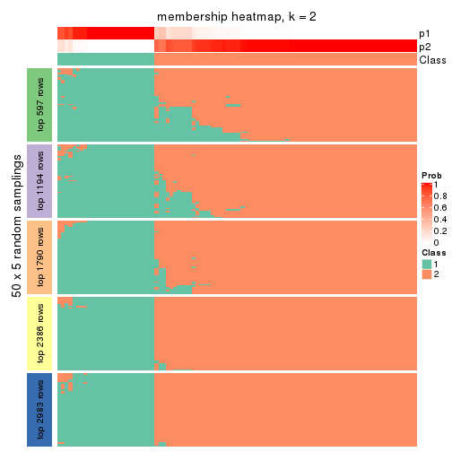</p>

</div>
<div id='tab-MAD-hclust-membership-heatmap-2'>
<pre><code class="r">membership_heatmap(res, k = 3)
</code></pre>

<p></p>

</div>
<div id='tab-MAD-hclust-membership-heatmap-3'>
<pre><code class="r">membership_heatmap(res, k = 4)
</code></pre>

<p></p>

</div>
<div id='tab-MAD-hclust-membership-heatmap-4'>
<pre><code class="r">membership_heatmap(res, k = 5)
</code></pre>

<p></p>

</div>
<div id='tab-MAD-hclust-membership-heatmap-5'>
<pre><code class="r">membership_heatmap(res, k = 6)
</code></pre>

<p></p>

</div>
</div>

As soon as we have had the classes for columns, we can look for signatures
which are significantly different between classes which can be candidate marks
for certain classes. Following are the heatmaps for signatures.


Signature heatmaps where rows are scaled:


<script>
$( function() {
	$( '#tabs-MAD-hclust-get-signatures' ).tabs();
} );
</script>
<div id='tabs-MAD-hclust-get-signatures'>
<ul>
<li><a href='#tab-MAD-hclust-get-signatures-1'>k = 2</a></li>
<li><a href='#tab-MAD-hclust-get-signatures-2'>k = 3</a></li>
<li><a href='#tab-MAD-hclust-get-signatures-3'>k = 4</a></li>
<li><a href='#tab-MAD-hclust-get-signatures-4'>k = 5</a></li>
<li><a href='#tab-MAD-hclust-get-signatures-5'>k = 6</a></li>
</ul>
<div id='tab-MAD-hclust-get-signatures-1'>
<pre><code class="r">get_signatures(res, k = 2)
</code></pre>

<p></p>

</div>
<div id='tab-MAD-hclust-get-signatures-2'>
<pre><code class="r">get_signatures(res, k = 3)
</code></pre>

<p></p>

</div>
<div id='tab-MAD-hclust-get-signatures-3'>
<pre><code class="r">get_signatures(res, k = 4)
</code></pre>

<p></p>

</div>
<div id='tab-MAD-hclust-get-signatures-4'>
<pre><code class="r">get_signatures(res, k = 5)
</code></pre>

<p></p>

</div>
<div id='tab-MAD-hclust-get-signatures-5'>
<pre><code class="r">get_signatures(res, k = 6)
</code></pre>

<p></p>

</div>
</div>


Signature heatmaps where rows are not scaled:


<script>
$( function() {
	$( '#tabs-MAD-hclust-get-signatures-no-scale' ).tabs();
} );
</script>
<div id='tabs-MAD-hclust-get-signatures-no-scale'>
<ul>
<li><a href='#tab-MAD-hclust-get-signatures-no-scale-1'>k = 2</a></li>
<li><a href='#tab-MAD-hclust-get-signatures-no-scale-2'>k = 3</a></li>
<li><a href='#tab-MAD-hclust-get-signatures-no-scale-3'>k = 4</a></li>
<li><a href='#tab-MAD-hclust-get-signatures-no-scale-4'>k = 5</a></li>
<li><a href='#tab-MAD-hclust-get-signatures-no-scale-5'>k = 6</a></li>
</ul>
<div id='tab-MAD-hclust-get-signatures-no-scale-1'>
<pre><code class="r">get_signatures(res, k = 2, scale_rows = FALSE)
</code></pre>

<p></p>

</div>
<div id='tab-MAD-hclust-get-signatures-no-scale-2'>
<pre><code class="r">get_signatures(res, k = 3, scale_rows = FALSE)
</code></pre>

<p></p>

</div>
<div id='tab-MAD-hclust-get-signatures-no-scale-3'>
<pre><code class="r">get_signatures(res, k = 4, scale_rows = FALSE)
</code></pre>

<p></p>

</div>
<div id='tab-MAD-hclust-get-signatures-no-scale-4'>
<pre><code class="r">get_signatures(res, k = 5, scale_rows = FALSE)
</code></pre>

<p></p>

</div>
<div id='tab-MAD-hclust-get-signatures-no-scale-5'>
<pre><code class="r">get_signatures(res, k = 6, scale_rows = FALSE)
</code></pre>

<p></p>

</div>
</div>


Compare the overlap of signatures from different k:

```r
compare_signatures(res)
```


`get_signature()` returns a data frame invisibly. TO get the list of signatures, the function
call should be assigned to a variable explicitly. In following code, if `plot` argument is set
to `FALSE`, no heatmap is plotted while only the differential analysis is performed.

```r
# code only for demonstration
tb = get_signature(res, k = ..., plot = FALSE)
```

An example of the output of `tb` is:

```
#>   which_row         fdr    mean_1    mean_2 scaled_mean_1 scaled_mean_2 km
#> 1        38 0.042760348  8.373488  9.131774    -0.5533452     0.5164555  1
#> 2        40 0.018707592  7.106213  8.469186    -0.6173731     0.5762149  1
#> 3        55 0.019134737 10.221463 11.207825    -0.6159697     0.5749050  1
#> 4        59 0.006059896  5.921854  7.869574    -0.6899429     0.6439467  1
#> 5        60 0.018055526  8.928898 10.211722    -0.6204761     0.5791110  1
#> 6        98 0.009384629 15.714769 14.887706     0.6635654    -0.6193277  2
...
```

The columns in `tb` are:

1. `which_row`: row indices corresponding to the input matrix.
2. `fdr`: FDR for the differential test. 
3. `mean_x`: The mean value in group x.
4. `scaled_mean_x`: The mean value in group x after rows are scaled.
5. `km`: Row groups if k-means clustering is applied to rows.


UMAP plot which shows how samples are separated.


<script>
$( function() {
	$( '#tabs-MAD-hclust-dimension-reduction' ).tabs();
} );
</script>
<div id='tabs-MAD-hclust-dimension-reduction'>
<ul>
<li><a href='#tab-MAD-hclust-dimension-reduction-1'>k = 2</a></li>
<li><a href='#tab-MAD-hclust-dimension-reduction-2'>k = 3</a></li>
<li><a href='#tab-MAD-hclust-dimension-reduction-3'>k = 4</a></li>
<li><a href='#tab-MAD-hclust-dimension-reduction-4'>k = 5</a></li>
<li><a href='#tab-MAD-hclust-dimension-reduction-5'>k = 6</a></li>
</ul>
<div id='tab-MAD-hclust-dimension-reduction-1'>
<pre><code class="r">dimension_reduction(res, k = 2, method = &quot;UMAP&quot;)
</code></pre>

<p></p>

</div>
<div id='tab-MAD-hclust-dimension-reduction-2'>
<pre><code class="r">dimension_reduction(res, k = 3, method = &quot;UMAP&quot;)
</code></pre>

<p></p>

</div>
<div id='tab-MAD-hclust-dimension-reduction-3'>
<pre><code class="r">dimension_reduction(res, k = 4, method = &quot;UMAP&quot;)
</code></pre>

<p></p>

</div>
<div id='tab-MAD-hclust-dimension-reduction-4'>
<pre><code class="r">dimension_reduction(res, k = 5, method = &quot;UMAP&quot;)
</code></pre>

<p>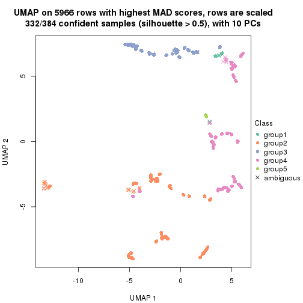</p>

</div>
<div id='tab-MAD-hclust-dimension-reduction-5'>
<pre><code class="r">dimension_reduction(res, k = 6, method = &quot;UMAP&quot;)
</code></pre>

<p></p>

</div>
</div>


Following heatmap shows how subgroups are split when increasing `k`:

```r
collect_classes(res)
```


If matrix rows can be associated to genes, consider to use `GO_Enrichment(res,
...)` to perform function enrichment for the signature genes.


 

---------------------------------------------------


### MAD:kmeans


The object with results only for a single top-value method and a single partition method 
can be extracted as:

```r
res = res_list["MAD", "kmeans"]
# you can also extract it by
# res = res_list["MAD:kmeans"]
```

A summary of `res` and all the functions that can be applied to it:

```r
res
```

```
#> A 'ConsensusPartition' object with k = 2, 3, 4, 5, 6.
#>   On a matrix with 5966 rows and 384 columns.
#>   Top rows (597, 1194, 1790, 2386, 2983) are extracted by 'MAD' method.
#>   Subgroups are detected by 'kmeans' method.
#>   Performed in total 1250 partitions by row resampling.
#>   Best k for subgroups seems to be 3.
#> 
#> Following methods can be applied to this 'ConsensusPartition' object:
#>  [1] "cola_report"             "collect_classes"         "collect_plots"          
#>  [4] "collect_stats"           "colnames"                "compare_signatures"     
#>  [7] "consensus_heatmap"       "dimension_reduction"     "functional_enrichment"  
#> [10] "get_anno_col"            "get_anno"                "get_classes"            
#> [13] "get_consensus"           "get_matrix"              "get_membership"         
#> [16] "get_param"               "get_signatures"          "get_stats"              
#> [19] "is_best_k"               "is_stable_k"             "membership_heatmap"     
#> [22] "ncol"                    "nrow"                    "plot_ecdf"              
#> [25] "rownames"                "select_partition_number" "show"                   
#> [28] "suggest_best_k"          "test_to_known_factors"
```

`collect_plots()` function collects all the plots made from `res` for all `k` (number of partitions)
into one single page to provide an easy and fast comparison between different `k`.

```r
collect_plots(res)
```


The plots are:

- The first row: a plot of the ECDF (Empirical cumulative distribution
  function) curves of the consensus matrix for each `k` and the heatmap of
  predicted classes for each `k`.
- The second row: heatmaps of the consensus matrix for each `k`.
- The third row: heatmaps of the membership matrix for each `k`.
- The fouth row: heatmaps of the signatures for each `k`.

All the plots in panels can be made by individual functions and they are
plotted later in this section.

`select_partition_number()` produces several plots showing different
statistics for choosing "optimized" `k`. There are following statistics:

- ECDF curves of the consensus matrix for each `k`;
- 1-PAC. [The PAC
  score](https://en.wikipedia.org/wiki/Consensus_clustering#Over-interpretation_potential_of_consensus_clustering)
  measures the proportion of the ambiguous subgrouping.
- Mean silhouette score.
- Concordance. The mean probability of fiting the consensus class ids in all
  partitions.
- Area increased. Denote $A_k$ as the area under the ECDF curve for current
  `k`, the area increased is defined as $A_k - A_{k-1}$.
- Rand index. The percent of pairs of samples that are both in a same cluster
  or both are not in a same cluster in the partition of k and k-1.
- Jaccard index. The ratio of pairs of samples are both in a same cluster in
  the partition of k and k-1 and the pairs of samples are both in a same
  cluster in the partition k or k-1.

The detailed explanations of these statistics can be found in [the cola
vignette](http://bioconductor.org/packages/devel/bioc/vignettes/cola/inst/doc/cola.html#toc_13).

Generally speaking, lower PAC score, higher mean silhouette score or higher
concordance corresponds to better partition. Rand index and Jaccard index
measure how similar the current partition is compared to partition with `k-1`.
If they are too similar, we won't accept `k` is better than `k-1`.

```r
select_partition_number(res)
```


The numeric values for all these statistics can be obtained by `get_stats()`.

```r
get_stats(res)
```

```
#>   k 1-PAC mean_silhouette concordance area_increased  Rand Jaccard
#> 2 2 0.896           0.948       0.975         0.3865 0.611   0.611
#> 3 3 0.646           0.885       0.882         0.4765 0.696   0.528
#> 4 4 0.529           0.790       0.823         0.1393 0.996   0.989
#> 5 5 0.565           0.693       0.749         0.0684 0.979   0.946
#> 6 6 0.611           0.670       0.726         0.0390 1.000   1.000
```

`suggest_best_k()` suggests the best $k$ based on these statistics. The rules are as follows:

- All $k$ with Jaccard index larger than 0.95 are removed because the increase of
  the partition number does not provides enough extra information. If all $k$ are removed,
  the best $k$ is assigned by `NA`.
- For $k$ with 1-PAC larger than 0.9, the maximal $k$ is taken as the "best k". Other $k$ is called "optional k".
- If it does not fit the second rule. The $k$ with the highest vote of highest
  1-PAC, mean silhouette and concordance is taken as the "best k".

```r
suggest_best_k(res)
```

```
#> [1] 3
```


Following shows the table of the partitions (You need to click the **show/hide
code output** link to see it). The membership matrix (columns with name `p*`)
is inferred by
[`clue::cl_consensus()`](https://www.rdocumentation.org/link/cl_consensus?package=clue)
function with the `SE` method. Basically the value in the membership matrix
represents the probability to belong to a certain group. The finall class
label for an item is determined with the group with highest probability it
belongs to.

In `get_classes()` function, the entropy is calculated from the membership
matrix and the silhouette score is calculated from the consensus matrix.


<script>
$( function() {
	$( '#tabs-MAD-kmeans-get-classes' ).tabs();
} );
</script>
<div id='tabs-MAD-kmeans-get-classes'>
<ul>
<li><a href='#tab-MAD-kmeans-get-classes-1'>k = 2</a></li>
<li><a href='#tab-MAD-kmeans-get-classes-2'>k = 3</a></li>
<li><a href='#tab-MAD-kmeans-get-classes-3'>k = 4</a></li>
<li><a href='#tab-MAD-kmeans-get-classes-4'>k = 5</a></li>
<li><a href='#tab-MAD-kmeans-get-classes-5'>k = 6</a></li>
</ul>

<div id='tab-MAD-kmeans-get-classes-1'>
<p><a id='tab-MAD-kmeans-get-classes-1-a' style='color:#0366d6' href='#'>show/hide code output</a></p>
<pre><code class="r">cbind(get_classes(res, k = 2), get_membership(res, k = 2))
</code></pre>

<pre><code>#&gt;           class entropy silhouette    p1    p2
#&gt; SRR490216     2  0.6247      0.814 0.156 0.844
#&gt; SRR490217     2  0.5737      0.839 0.136 0.864
#&gt; SRR490218     2  0.6438      0.803 0.164 0.836
#&gt; SRR490219     2  0.5946      0.829 0.144 0.856
#&gt; SRR490220     2  0.5629      0.847 0.132 0.868
#&gt; SRR490221     2  0.0938      0.973 0.012 0.988
#&gt; SRR490222     2  0.5842      0.837 0.140 0.860
#&gt; SRR490223     2  0.5519      0.852 0.128 0.872
#&gt; SRR490224     1  0.0938      0.962 0.988 0.012
#&gt; SRR490225     1  0.0938      0.962 0.988 0.012
#&gt; SRR490226     1  0.0938      0.962 0.988 0.012
#&gt; SRR490227     1  0.0938      0.962 0.988 0.012
#&gt; SRR490228     1  0.0938      0.962 0.988 0.012
#&gt; SRR490229     1  0.0938      0.962 0.988 0.012
#&gt; SRR490230     1  0.0938      0.962 0.988 0.012
#&gt; SRR490231     1  0.0938      0.962 0.988 0.012
#&gt; SRR490232     1  0.0938      0.962 0.988 0.012
#&gt; SRR490233     1  0.0938      0.962 0.988 0.012
#&gt; SRR490234     1  0.0938      0.962 0.988 0.012
#&gt; SRR490235     1  0.0938      0.962 0.988 0.012
#&gt; SRR490236     1  0.0938      0.962 0.988 0.012
#&gt; SRR490237     1  0.0938      0.962 0.988 0.012
#&gt; SRR490238     1  0.0938      0.962 0.988 0.012
#&gt; SRR490239     1  0.0938      0.962 0.988 0.012
#&gt; SRR490240     2  0.0000      0.981 0.000 1.000
#&gt; SRR490241     2  0.0000      0.981 0.000 1.000
#&gt; SRR490242     2  0.0000      0.981 0.000 1.000
#&gt; SRR490243     2  0.0000      0.981 0.000 1.000
#&gt; SRR490244     1  0.0938      0.962 0.988 0.012
#&gt; SRR490245     1  0.0938      0.962 0.988 0.012
#&gt; SRR490246     1  0.0938      0.962 0.988 0.012
#&gt; SRR490247     1  0.0938      0.962 0.988 0.012
#&gt; SRR490248     2  0.6887      0.774 0.184 0.816
#&gt; SRR490249     2  0.6531      0.797 0.168 0.832
#&gt; SRR490250     2  0.5519      0.849 0.128 0.872
#&gt; SRR490251     2  0.6712      0.786 0.176 0.824
#&gt; SRR490252     2  0.0000      0.981 0.000 1.000
#&gt; SRR490253     2  0.0000      0.981 0.000 1.000
#&gt; SRR490254     2  0.0000      0.981 0.000 1.000
#&gt; SRR490255     2  0.0000      0.981 0.000 1.000
#&gt; SRR490256     1  0.4562      0.899 0.904 0.096
#&gt; SRR490257     1  0.4939      0.888 0.892 0.108
#&gt; SRR490258     1  0.4815      0.892 0.896 0.104
#&gt; SRR490259     1  0.4815      0.892 0.896 0.104
#&gt; SRR490260     1  0.0938      0.962 0.988 0.012
#&gt; SRR490261     1  0.0938      0.962 0.988 0.012
#&gt; SRR490262     1  0.0938      0.962 0.988 0.012
#&gt; SRR490263     1  0.0938      0.962 0.988 0.012
#&gt; SRR490264     1  0.0938      0.962 0.988 0.012
#&gt; SRR490265     1  0.0938      0.962 0.988 0.012
#&gt; SRR490266     1  0.0938      0.962 0.988 0.012
#&gt; SRR490267     1  0.0938      0.962 0.988 0.012
#&gt; SRR490268     1  0.4690      0.896 0.900 0.100
#&gt; SRR490269     1  0.4690      0.896 0.900 0.100
#&gt; SRR490270     1  0.4815      0.892 0.896 0.104
#&gt; SRR490271     1  0.4690      0.896 0.900 0.100
#&gt; SRR490272     1  0.0938      0.962 0.988 0.012
#&gt; SRR490273     1  0.0938      0.962 0.988 0.012
#&gt; SRR490274     1  0.0938      0.962 0.988 0.012
#&gt; SRR490275     1  0.0938      0.962 0.988 0.012
#&gt; SRR490276     1  0.0938      0.962 0.988 0.012
#&gt; SRR490277     1  0.0938      0.962 0.988 0.012
#&gt; SRR490278     1  0.0938      0.962 0.988 0.012
#&gt; SRR490279     1  0.0938      0.962 0.988 0.012
#&gt; SRR490280     1  0.0938      0.962 0.988 0.012
#&gt; SRR490281     1  0.0938      0.962 0.988 0.012
#&gt; SRR490282     1  0.0938      0.962 0.988 0.012
#&gt; SRR490283     1  0.0938      0.962 0.988 0.012
#&gt; SRR490284     1  0.0938      0.962 0.988 0.012
#&gt; SRR490285     1  0.0938      0.962 0.988 0.012
#&gt; SRR490286     1  0.0938      0.962 0.988 0.012
#&gt; SRR490287     1  0.0938      0.962 0.988 0.012
#&gt; SRR490288     1  0.6712      0.807 0.824 0.176
#&gt; SRR490289     2  0.9815      0.252 0.420 0.580
#&gt; SRR490290     2  0.9491      0.405 0.368 0.632
#&gt; SRR490291     2  0.9393      0.437 0.356 0.644
#&gt; SRR490292     2  0.1633      0.960 0.024 0.976
#&gt; SRR490293     2  0.0938      0.971 0.012 0.988
#&gt; SRR490294     2  0.1184      0.967 0.016 0.984
#&gt; SRR490295     2  0.1633      0.960 0.024 0.976
#&gt; SRR490296     2  0.0000      0.981 0.000 1.000
#&gt; SRR490297     2  0.0000      0.981 0.000 1.000
#&gt; SRR490298     2  0.0000      0.981 0.000 1.000
#&gt; SRR490299     2  0.0000      0.981 0.000 1.000
#&gt; SRR490300     2  0.0000      0.981 0.000 1.000
#&gt; SRR490301     2  0.0000      0.981 0.000 1.000
#&gt; SRR490302     2  0.0000      0.981 0.000 1.000
#&gt; SRR490303     2  0.0000      0.981 0.000 1.000
#&gt; SRR490304     2  0.0000      0.981 0.000 1.000
#&gt; SRR490305     2  0.0000      0.981 0.000 1.000
#&gt; SRR490306     2  0.0000      0.981 0.000 1.000
#&gt; SRR490307     2  0.0000      0.981 0.000 1.000
#&gt; SRR490308     1  0.0938      0.962 0.988 0.012
#&gt; SRR490309     1  0.0938      0.962 0.988 0.012
#&gt; SRR490310     1  0.0938      0.962 0.988 0.012
#&gt; SRR490311     1  0.0938      0.962 0.988 0.012
#&gt; SRR490312     2  0.8955      0.542 0.312 0.688
#&gt; SRR490313     2  0.8443      0.624 0.272 0.728
#&gt; SRR490314     2  0.7950      0.684 0.240 0.760
#&gt; SRR490315     2  0.7056      0.762 0.192 0.808
#&gt; SRR490316     2  0.6531      0.797 0.168 0.832
#&gt; SRR490317     2  0.6531      0.797 0.168 0.832
#&gt; SRR490318     2  0.6048      0.824 0.148 0.852
#&gt; SRR490319     2  0.2423      0.945 0.040 0.960
#&gt; SRR490320     1  0.0938      0.962 0.988 0.012
#&gt; SRR490321     1  0.0938      0.962 0.988 0.012
#&gt; SRR490322     1  0.0938      0.962 0.988 0.012
#&gt; SRR490323     1  0.0938      0.962 0.988 0.012
#&gt; SRR490324     1  0.0938      0.962 0.988 0.012
#&gt; SRR490325     1  0.0938      0.962 0.988 0.012
#&gt; SRR490326     1  0.0938      0.962 0.988 0.012
#&gt; SRR490327     1  0.0938      0.962 0.988 0.012
#&gt; SRR490328     2  0.0000      0.981 0.000 1.000
#&gt; SRR490329     2  0.0000      0.981 0.000 1.000
#&gt; SRR490330     2  0.0000      0.981 0.000 1.000
#&gt; SRR490331     2  0.0000      0.981 0.000 1.000
#&gt; SRR490332     2  0.0000      0.981 0.000 1.000
#&gt; SRR490333     2  0.0000      0.981 0.000 1.000
#&gt; SRR490334     2  0.0000      0.981 0.000 1.000
#&gt; SRR490335     2  0.0000      0.981 0.000 1.000
#&gt; SRR490336     2  0.0376      0.978 0.004 0.996
#&gt; SRR490337     2  0.0376      0.978 0.004 0.996
#&gt; SRR490338     2  0.0376      0.978 0.004 0.996
#&gt; SRR490339     2  0.0376      0.978 0.004 0.996
#&gt; SRR490340     2  0.0000      0.981 0.000 1.000
#&gt; SRR490341     2  0.0000      0.981 0.000 1.000
#&gt; SRR490342     2  0.0000      0.981 0.000 1.000
#&gt; SRR490343     2  0.0000      0.981 0.000 1.000
#&gt; SRR490344     2  0.0376      0.978 0.004 0.996
#&gt; SRR490345     2  0.0000      0.981 0.000 1.000
#&gt; SRR490346     2  0.0000      0.981 0.000 1.000
#&gt; SRR490347     2  0.0000      0.981 0.000 1.000
#&gt; SRR490348     2  0.0000      0.981 0.000 1.000
#&gt; SRR490349     2  0.0000      0.981 0.000 1.000
#&gt; SRR490350     2  0.0000      0.981 0.000 1.000
#&gt; SRR490351     2  0.0000      0.981 0.000 1.000
#&gt; SRR490352     2  0.0000      0.981 0.000 1.000
#&gt; SRR490353     2  0.0000      0.981 0.000 1.000
#&gt; SRR490354     2  0.0000      0.981 0.000 1.000
#&gt; SRR490355     2  0.0000      0.981 0.000 1.000
#&gt; SRR490356     2  0.0000      0.981 0.000 1.000
#&gt; SRR490357     2  0.0000      0.981 0.000 1.000
#&gt; SRR490358     2  0.0000      0.981 0.000 1.000
#&gt; SRR490359     2  0.0000      0.981 0.000 1.000
#&gt; SRR490360     2  0.0000      0.981 0.000 1.000
#&gt; SRR490361     2  0.0000      0.981 0.000 1.000
#&gt; SRR490362     2  0.0000      0.981 0.000 1.000
#&gt; SRR490363     2  0.0000      0.981 0.000 1.000
#&gt; SRR490364     2  0.0000      0.981 0.000 1.000
#&gt; SRR490365     2  0.0000      0.981 0.000 1.000
#&gt; SRR490366     2  0.0000      0.981 0.000 1.000
#&gt; SRR490367     2  0.0000      0.981 0.000 1.000
#&gt; SRR490368     2  0.0000      0.981 0.000 1.000
#&gt; SRR490369     2  0.0000      0.981 0.000 1.000
#&gt; SRR490370     2  0.0000      0.981 0.000 1.000
#&gt; SRR490371     2  0.0000      0.981 0.000 1.000
#&gt; SRR490372     1  0.0938      0.962 0.988 0.012
#&gt; SRR490373     1  0.0938      0.962 0.988 0.012
#&gt; SRR490374     1  0.0938      0.962 0.988 0.012
#&gt; SRR490375     1  0.0938      0.962 0.988 0.012
#&gt; SRR490376     2  0.0000      0.981 0.000 1.000
#&gt; SRR490377     2  0.0000      0.981 0.000 1.000
#&gt; SRR490378     2  0.0000      0.981 0.000 1.000
#&gt; SRR490379     2  0.0000      0.981 0.000 1.000
#&gt; SRR490380     1  0.0938      0.962 0.988 0.012
#&gt; SRR490381     1  0.0938      0.962 0.988 0.012
#&gt; SRR490382     1  0.0938      0.962 0.988 0.012
#&gt; SRR490383     1  0.0938      0.962 0.988 0.012
#&gt; SRR490384     2  0.0000      0.981 0.000 1.000
#&gt; SRR490385     2  0.0000      0.981 0.000 1.000
#&gt; SRR490386     2  0.0000      0.981 0.000 1.000
#&gt; SRR490387     2  0.0000      0.981 0.000 1.000
#&gt; SRR490388     2  0.0000      0.981 0.000 1.000
#&gt; SRR490389     2  0.0000      0.981 0.000 1.000
#&gt; SRR490390     2  0.0000      0.981 0.000 1.000
#&gt; SRR490391     2  0.0000      0.981 0.000 1.000
#&gt; SRR490392     2  0.0000      0.981 0.000 1.000
#&gt; SRR490393     2  0.0000      0.981 0.000 1.000
#&gt; SRR490394     2  0.0000      0.981 0.000 1.000
#&gt; SRR490395     2  0.0000      0.981 0.000 1.000
#&gt; SRR490396     2  0.0000      0.981 0.000 1.000
#&gt; SRR490397     2  0.0000      0.981 0.000 1.000
#&gt; SRR490398     2  0.0000      0.981 0.000 1.000
#&gt; SRR490399     2  0.0000      0.981 0.000 1.000
#&gt; SRR490400     2  0.0000      0.981 0.000 1.000
#&gt; SRR490401     2  0.0000      0.981 0.000 1.000
#&gt; SRR490402     2  0.0000      0.981 0.000 1.000
#&gt; SRR490403     2  0.0000      0.981 0.000 1.000
#&gt; SRR490404     2  0.0000      0.981 0.000 1.000
#&gt; SRR490405     2  0.0000      0.981 0.000 1.000
#&gt; SRR490406     2  0.0000      0.981 0.000 1.000
#&gt; SRR490407     2  0.0000      0.981 0.000 1.000
#&gt; SRR490408     2  0.0000      0.981 0.000 1.000
#&gt; SRR490409     2  0.0000      0.981 0.000 1.000
#&gt; SRR490410     2  0.0000      0.981 0.000 1.000
#&gt; SRR490411     2  0.0000      0.981 0.000 1.000
#&gt; SRR490412     1  0.0938      0.962 0.988 0.012
#&gt; SRR490413     1  0.0938      0.962 0.988 0.012
#&gt; SRR490414     1  0.0938      0.962 0.988 0.012
#&gt; SRR490415     1  0.0938      0.962 0.988 0.012
#&gt; SRR490416     2  0.0000      0.981 0.000 1.000
#&gt; SRR490417     2  0.0000      0.981 0.000 1.000
#&gt; SRR490418     2  0.0000      0.981 0.000 1.000
#&gt; SRR490419     2  0.0000      0.981 0.000 1.000
#&gt; SRR490420     2  0.6973      0.768 0.188 0.812
#&gt; SRR490421     2  0.5519      0.850 0.128 0.872
#&gt; SRR490422     2  0.4022      0.904 0.080 0.920
#&gt; SRR490423     2  0.3879      0.908 0.076 0.924
#&gt; SRR490424     1  0.0938      0.962 0.988 0.012
#&gt; SRR490425     1  0.0938      0.962 0.988 0.012
#&gt; SRR490426     1  0.0938      0.962 0.988 0.012
#&gt; SRR490427     1  0.0938      0.962 0.988 0.012
#&gt; SRR490428     1  0.9881      0.267 0.564 0.436
#&gt; SRR490429     1  0.9983      0.133 0.524 0.476
#&gt; SRR490430     1  0.9944      0.203 0.544 0.456
#&gt; SRR490431     1  1.0000      0.056 0.504 0.496
#&gt; SRR490432     2  0.0000      0.981 0.000 1.000
#&gt; SRR490433     2  0.0000      0.981 0.000 1.000
#&gt; SRR490434     2  0.0000      0.981 0.000 1.000
#&gt; SRR490435     2  0.0000      0.981 0.000 1.000
#&gt; SRR490436     2  0.0000      0.981 0.000 1.000
#&gt; SRR490437     2  0.0000      0.981 0.000 1.000
#&gt; SRR490438     2  0.0000      0.981 0.000 1.000
#&gt; SRR490439     2  0.0000      0.981 0.000 1.000
#&gt; SRR490440     2  0.0000      0.981 0.000 1.000
#&gt; SRR490441     2  0.0000      0.981 0.000 1.000
#&gt; SRR490442     2  0.0000      0.981 0.000 1.000
#&gt; SRR490443     2  0.0000      0.981 0.000 1.000
#&gt; SRR490444     2  0.0000      0.981 0.000 1.000
#&gt; SRR490445     2  0.0000      0.981 0.000 1.000
#&gt; SRR490446     2  0.0000      0.981 0.000 1.000
#&gt; SRR490447     2  0.0000      0.981 0.000 1.000
#&gt; SRR490448     2  0.0000      0.981 0.000 1.000
#&gt; SRR490449     2  0.0000      0.981 0.000 1.000
#&gt; SRR490450     2  0.0000      0.981 0.000 1.000
#&gt; SRR490451     2  0.0000      0.981 0.000 1.000
#&gt; SRR490452     1  0.0938      0.962 0.988 0.012
#&gt; SRR490453     1  0.5059      0.884 0.888 0.112
#&gt; SRR490454     1  0.4815      0.892 0.896 0.104
#&gt; SRR490455     1  0.4815      0.892 0.896 0.104
#&gt; SRR490456     2  0.0000      0.981 0.000 1.000
#&gt; SRR490457     2  0.0000      0.981 0.000 1.000
#&gt; SRR490458     2  0.0000      0.981 0.000 1.000
#&gt; SRR490459     2  0.0000      0.981 0.000 1.000
#&gt; SRR490460     2  0.0000      0.981 0.000 1.000
#&gt; SRR490461     2  0.0000      0.981 0.000 1.000
#&gt; SRR490462     2  0.0000      0.981 0.000 1.000
#&gt; SRR490463     2  0.0000      0.981 0.000 1.000
#&gt; SRR490464     1  0.0938      0.962 0.988 0.012
#&gt; SRR490465     1  0.0938      0.962 0.988 0.012
#&gt; SRR490466     1  0.0938      0.962 0.988 0.012
#&gt; SRR490467     1  0.0938      0.962 0.988 0.012
#&gt; SRR490468     2  0.0000      0.981 0.000 1.000
#&gt; SRR490469     2  0.0000      0.981 0.000 1.000
#&gt; SRR490470     2  0.0000      0.981 0.000 1.000
#&gt; SRR490471     2  0.0000      0.981 0.000 1.000
#&gt; SRR490472     2  0.0000      0.981 0.000 1.000
#&gt; SRR490473     2  0.0000      0.981 0.000 1.000
#&gt; SRR490474     2  0.0000      0.981 0.000 1.000
#&gt; SRR490475     2  0.0000      0.981 0.000 1.000
#&gt; SRR490476     1  0.0938      0.962 0.988 0.012
#&gt; SRR490477     1  0.0938      0.962 0.988 0.012
#&gt; SRR490478     1  0.0938      0.962 0.988 0.012
#&gt; SRR490479     1  0.0938      0.962 0.988 0.012
#&gt; SRR490480     2  0.0000      0.981 0.000 1.000
#&gt; SRR490481     2  0.0000      0.981 0.000 1.000
#&gt; SRR490482     2  0.0000      0.981 0.000 1.000
#&gt; SRR490483     2  0.0000      0.981 0.000 1.000
#&gt; SRR490484     2  0.0000      0.981 0.000 1.000
#&gt; SRR490485     2  0.0000      0.981 0.000 1.000
#&gt; SRR490486     2  0.0000      0.981 0.000 1.000
#&gt; SRR490487     2  0.0000      0.981 0.000 1.000
#&gt; SRR490488     2  0.0000      0.981 0.000 1.000
#&gt; SRR490489     2  0.0000      0.981 0.000 1.000
#&gt; SRR490490     2  0.0000      0.981 0.000 1.000
#&gt; SRR490491     2  0.0000      0.981 0.000 1.000
#&gt; SRR490492     2  0.0000      0.981 0.000 1.000
#&gt; SRR490493     2  0.0000      0.981 0.000 1.000
#&gt; SRR490494     2  0.0000      0.981 0.000 1.000
#&gt; SRR490495     2  0.0000      0.981 0.000 1.000
#&gt; SRR490496     2  0.0000      0.981 0.000 1.000
#&gt; SRR490497     2  0.0000      0.981 0.000 1.000
#&gt; SRR490498     2  0.0000      0.981 0.000 1.000
#&gt; SRR490499     2  0.0000      0.981 0.000 1.000
#&gt; SRR490500     2  0.0000      0.981 0.000 1.000
#&gt; SRR490501     2  0.0000      0.981 0.000 1.000
#&gt; SRR490502     2  0.0000      0.981 0.000 1.000
#&gt; SRR490503     2  0.0000      0.981 0.000 1.000
#&gt; SRR490504     2  0.0000      0.981 0.000 1.000
#&gt; SRR490505     2  0.0000      0.981 0.000 1.000
#&gt; SRR490506     2  0.0000      0.981 0.000 1.000
#&gt; SRR490507     2  0.0000      0.981 0.000 1.000
#&gt; SRR490508     2  0.0000      0.981 0.000 1.000
#&gt; SRR490509     2  0.0000      0.981 0.000 1.000
#&gt; SRR490510     2  0.0000      0.981 0.000 1.000
#&gt; SRR490511     2  0.0000      0.981 0.000 1.000
#&gt; SRR490512     2  0.0000      0.981 0.000 1.000
#&gt; SRR490513     2  0.0000      0.981 0.000 1.000
#&gt; SRR490514     2  0.0000      0.981 0.000 1.000
#&gt; SRR490515     2  0.0000      0.981 0.000 1.000
#&gt; SRR490516     2  0.0000      0.981 0.000 1.000
#&gt; SRR490517     2  0.0000      0.981 0.000 1.000
#&gt; SRR490518     2  0.0000      0.981 0.000 1.000
#&gt; SRR490519     2  0.0000      0.981 0.000 1.000
#&gt; SRR490520     2  0.0000      0.981 0.000 1.000
#&gt; SRR490521     2  0.0000      0.981 0.000 1.000
#&gt; SRR490522     2  0.0000      0.981 0.000 1.000
#&gt; SRR490523     2  0.0000      0.981 0.000 1.000
#&gt; SRR490524     2  0.0000      0.981 0.000 1.000
#&gt; SRR490525     2  0.0000      0.981 0.000 1.000
#&gt; SRR490526     2  0.0000      0.981 0.000 1.000
#&gt; SRR490527     2  0.0000      0.981 0.000 1.000
#&gt; SRR490528     2  0.0000      0.981 0.000 1.000
#&gt; SRR490529     2  0.0000      0.981 0.000 1.000
#&gt; SRR490530     2  0.0000      0.981 0.000 1.000
#&gt; SRR490531     2  0.0000      0.981 0.000 1.000
#&gt; SRR490532     1  0.5408      0.871 0.876 0.124
#&gt; SRR490533     1  0.6712      0.807 0.824 0.176
#&gt; SRR490534     1  0.7056      0.785 0.808 0.192
#&gt; SRR490535     1  0.5737      0.857 0.864 0.136
#&gt; SRR490536     2  0.0000      0.981 0.000 1.000
#&gt; SRR490537     2  0.0000      0.981 0.000 1.000
#&gt; SRR490538     2  0.0000      0.981 0.000 1.000
#&gt; SRR490539     2  0.0000      0.981 0.000 1.000
#&gt; SRR490540     2  0.0000      0.981 0.000 1.000
#&gt; SRR490541     2  0.0000      0.981 0.000 1.000
#&gt; SRR490542     2  0.0000      0.981 0.000 1.000
#&gt; SRR490543     2  0.0000      0.981 0.000 1.000
#&gt; SRR490544     2  0.0000      0.981 0.000 1.000
#&gt; SRR490545     2  0.0000      0.981 0.000 1.000
#&gt; SRR490546     2  0.0000      0.981 0.000 1.000
#&gt; SRR490547     2  0.0000      0.981 0.000 1.000
#&gt; SRR490548     2  0.0000      0.981 0.000 1.000
#&gt; SRR490549     2  0.0000      0.981 0.000 1.000
#&gt; SRR490550     2  0.0000      0.981 0.000 1.000
#&gt; SRR490551     2  0.0000      0.981 0.000 1.000
#&gt; SRR490552     2  0.0000      0.981 0.000 1.000
#&gt; SRR490553     2  0.0000      0.981 0.000 1.000
#&gt; SRR490554     2  0.0000      0.981 0.000 1.000
#&gt; SRR490555     2  0.0000      0.981 0.000 1.000
#&gt; SRR490556     2  0.0000      0.981 0.000 1.000
#&gt; SRR490557     2  0.0000      0.981 0.000 1.000
#&gt; SRR490558     2  0.0000      0.981 0.000 1.000
#&gt; SRR490559     2  0.0000      0.981 0.000 1.000
#&gt; SRR490560     2  0.0000      0.981 0.000 1.000
#&gt; SRR490561     2  0.0000      0.981 0.000 1.000
#&gt; SRR490562     2  0.0000      0.981 0.000 1.000
#&gt; SRR490563     2  0.0000      0.981 0.000 1.000
#&gt; SRR490564     2  0.0000      0.981 0.000 1.000
#&gt; SRR490565     2  0.0000      0.981 0.000 1.000
#&gt; SRR490566     2  0.0000      0.981 0.000 1.000
#&gt; SRR490567     2  0.0000      0.981 0.000 1.000
#&gt; SRR490568     2  0.0376      0.978 0.004 0.996
#&gt; SRR490569     2  0.0376      0.978 0.004 0.996
#&gt; SRR490570     2  0.0376      0.978 0.004 0.996
#&gt; SRR490571     2  0.0376      0.978 0.004 0.996
#&gt; SRR490572     2  0.0000      0.981 0.000 1.000
#&gt; SRR490573     2  0.0000      0.981 0.000 1.000
#&gt; SRR490574     2  0.0000      0.981 0.000 1.000
#&gt; SRR490575     2  0.0000      0.981 0.000 1.000
#&gt; SRR490576     2  0.0000      0.981 0.000 1.000
#&gt; SRR490577     2  0.0000      0.981 0.000 1.000
#&gt; SRR490578     2  0.0000      0.981 0.000 1.000
#&gt; SRR490579     2  0.0000      0.981 0.000 1.000
#&gt; SRR490580     2  0.0000      0.981 0.000 1.000
#&gt; SRR490581     2  0.0000      0.981 0.000 1.000
#&gt; SRR490582     2  0.0000      0.981 0.000 1.000
#&gt; SRR490583     2  0.0000      0.981 0.000 1.000
#&gt; SRR490584     2  0.0000      0.981 0.000 1.000
#&gt; SRR490585     2  0.0000      0.981 0.000 1.000
#&gt; SRR490586     2  0.0000      0.981 0.000 1.000
#&gt; SRR490587     2  0.0000      0.981 0.000 1.000
#&gt; SRR490588     2  0.0000      0.981 0.000 1.000
#&gt; SRR490589     2  0.0000      0.981 0.000 1.000
#&gt; SRR490590     2  0.0000      0.981 0.000 1.000
#&gt; SRR490591     2  0.0000      0.981 0.000 1.000
#&gt; SRR490592     2  0.0000      0.981 0.000 1.000
#&gt; SRR490593     2  0.0000      0.981 0.000 1.000
#&gt; SRR490594     2  0.0000      0.981 0.000 1.000
#&gt; SRR490595     2  0.0000      0.981 0.000 1.000
#&gt; SRR490596     2  0.0000      0.981 0.000 1.000
#&gt; SRR490597     2  0.0000      0.981 0.000 1.000
#&gt; SRR490598     2  0.0000      0.981 0.000 1.000
#&gt; SRR490599     2  0.0000      0.981 0.000 1.000
</code></pre>

<script>
$('#tab-MAD-kmeans-get-classes-1-a').parent().next().next().hide();
$('#tab-MAD-kmeans-get-classes-1-a').click(function(){
  $('#tab-MAD-kmeans-get-classes-1-a').parent().next().next().toggle();
  return(false);
});
</script>
</div>

<div id='tab-MAD-kmeans-get-classes-2'>
<p><a id='tab-MAD-kmeans-get-classes-2-a' style='color:#0366d6' href='#'>show/hide code output</a></p>
<pre><code class="r">cbind(get_classes(res, k = 3), get_membership(res, k = 3))
</code></pre>

<pre><code>#&gt;           class entropy silhouette    p1    p2    p3
#&gt; SRR490216     3  0.6026      0.864 0.024 0.244 0.732
#&gt; SRR490217     3  0.5977      0.866 0.020 0.252 0.728
#&gt; SRR490218     3  0.6066      0.865 0.024 0.248 0.728
#&gt; SRR490219     3  0.5977      0.866 0.020 0.252 0.728
#&gt; SRR490220     3  0.5595      0.876 0.016 0.228 0.756
#&gt; SRR490221     3  0.5058      0.878 0.000 0.244 0.756
#&gt; SRR490222     3  0.5639      0.877 0.016 0.232 0.752
#&gt; SRR490223     3  0.5639      0.877 0.016 0.232 0.752
#&gt; SRR490224     1  0.2772      0.945 0.916 0.004 0.080
#&gt; SRR490225     1  0.2772      0.945 0.916 0.004 0.080
#&gt; SRR490226     1  0.2772      0.945 0.916 0.004 0.080
#&gt; SRR490227     1  0.2772      0.945 0.916 0.004 0.080
#&gt; SRR490228     1  0.2860      0.946 0.912 0.004 0.084
#&gt; SRR490229     1  0.2945      0.945 0.908 0.004 0.088
#&gt; SRR490230     1  0.2945      0.945 0.908 0.004 0.088
#&gt; SRR490231     1  0.2945      0.945 0.908 0.004 0.088
#&gt; SRR490232     3  0.5956      0.383 0.324 0.004 0.672
#&gt; SRR490233     3  0.5553      0.489 0.272 0.004 0.724
#&gt; SRR490234     3  0.5553      0.489 0.272 0.004 0.724
#&gt; SRR490235     3  0.5443      0.510 0.260 0.004 0.736
#&gt; SRR490236     1  0.2590      0.947 0.924 0.004 0.072
#&gt; SRR490237     1  0.2772      0.945 0.916 0.004 0.080
#&gt; SRR490238     1  0.2772      0.945 0.916 0.004 0.080
#&gt; SRR490239     1  0.2772      0.945 0.916 0.004 0.080
#&gt; SRR490240     3  0.5016      0.877 0.000 0.240 0.760
#&gt; SRR490241     3  0.5016      0.877 0.000 0.240 0.760
#&gt; SRR490242     3  0.5016      0.877 0.000 0.240 0.760
#&gt; SRR490243     3  0.5016      0.877 0.000 0.240 0.760
#&gt; SRR490244     1  0.0237      0.952 0.996 0.004 0.000
#&gt; SRR490245     1  0.0237      0.952 0.996 0.004 0.000
#&gt; SRR490246     1  0.0237      0.952 0.996 0.004 0.000
#&gt; SRR490247     1  0.0237      0.952 0.996 0.004 0.000
#&gt; SRR490248     3  0.6252      0.865 0.024 0.268 0.708
#&gt; SRR490249     3  0.6252      0.865 0.024 0.268 0.708
#&gt; SRR490250     3  0.6027      0.866 0.016 0.272 0.712
#&gt; SRR490251     3  0.6252      0.865 0.024 0.268 0.708
#&gt; SRR490252     3  0.5465      0.861 0.000 0.288 0.712
#&gt; SRR490253     3  0.5465      0.861 0.000 0.288 0.712
#&gt; SRR490254     3  0.5465      0.861 0.000 0.288 0.712
#&gt; SRR490255     3  0.5465      0.861 0.000 0.288 0.712
#&gt; SRR490256     3  0.6034      0.612 0.212 0.036 0.752
#&gt; SRR490257     3  0.6254      0.659 0.188 0.056 0.756
#&gt; SRR490258     3  0.6304      0.654 0.192 0.056 0.752
#&gt; SRR490259     3  0.6304      0.654 0.192 0.056 0.752
#&gt; SRR490260     1  0.3030      0.940 0.904 0.004 0.092
#&gt; SRR490261     1  0.3030      0.940 0.904 0.004 0.092
#&gt; SRR490262     1  0.3030      0.940 0.904 0.004 0.092
#&gt; SRR490263     1  0.3030      0.940 0.904 0.004 0.092
#&gt; SRR490264     1  0.2772      0.946 0.916 0.004 0.080
#&gt; SRR490265     1  0.2772      0.946 0.916 0.004 0.080
#&gt; SRR490266     1  0.2772      0.946 0.916 0.004 0.080
#&gt; SRR490267     1  0.2772      0.946 0.916 0.004 0.080
#&gt; SRR490268     3  0.6258      0.646 0.196 0.052 0.752
#&gt; SRR490269     3  0.6304      0.654 0.192 0.056 0.752
#&gt; SRR490270     3  0.6254      0.659 0.188 0.056 0.756
#&gt; SRR490271     3  0.6304      0.654 0.192 0.056 0.752
#&gt; SRR490272     1  0.3349      0.930 0.888 0.004 0.108
#&gt; SRR490273     1  0.3500      0.923 0.880 0.004 0.116
#&gt; SRR490274     1  0.3425      0.927 0.884 0.004 0.112
#&gt; SRR490275     1  0.3644      0.916 0.872 0.004 0.124
#&gt; SRR490276     1  0.3272      0.933 0.892 0.004 0.104
#&gt; SRR490277     1  0.3272      0.933 0.892 0.004 0.104
#&gt; SRR490278     1  0.3349      0.930 0.888 0.004 0.108
#&gt; SRR490279     1  0.3272      0.933 0.892 0.004 0.104
#&gt; SRR490280     1  0.0237      0.952 0.996 0.004 0.000
#&gt; SRR490281     1  0.0237      0.952 0.996 0.004 0.000
#&gt; SRR490282     1  0.0237      0.952 0.996 0.004 0.000
#&gt; SRR490283     1  0.0237      0.952 0.996 0.004 0.000
#&gt; SRR490284     1  0.0237      0.952 0.996 0.004 0.000
#&gt; SRR490285     1  0.0237      0.952 0.996 0.004 0.000
#&gt; SRR490286     1  0.0237      0.952 0.996 0.004 0.000
#&gt; SRR490287     1  0.0237      0.952 0.996 0.004 0.000
#&gt; SRR490288     3  0.6181      0.701 0.156 0.072 0.772
#&gt; SRR490289     3  0.5944      0.818 0.064 0.152 0.784
#&gt; SRR490290     3  0.5835      0.831 0.052 0.164 0.784
#&gt; SRR490291     3  0.5911      0.823 0.060 0.156 0.784
#&gt; SRR490292     3  0.4887      0.877 0.000 0.228 0.772
#&gt; SRR490293     3  0.4931      0.878 0.000 0.232 0.768
#&gt; SRR490294     3  0.4931      0.878 0.000 0.232 0.768
#&gt; SRR490295     3  0.4931      0.878 0.000 0.232 0.768
#&gt; SRR490296     2  0.1964      0.931 0.000 0.944 0.056
#&gt; SRR490297     2  0.1964      0.931 0.000 0.944 0.056
#&gt; SRR490298     2  0.1964      0.931 0.000 0.944 0.056
#&gt; SRR490299     2  0.1964      0.931 0.000 0.944 0.056
#&gt; SRR490300     3  0.5327      0.865 0.000 0.272 0.728
#&gt; SRR490301     3  0.5327      0.865 0.000 0.272 0.728
#&gt; SRR490302     3  0.5327      0.865 0.000 0.272 0.728
#&gt; SRR490303     3  0.5327      0.865 0.000 0.272 0.728
#&gt; SRR490304     2  0.1964      0.931 0.000 0.944 0.056
#&gt; SRR490305     2  0.1964      0.931 0.000 0.944 0.056
#&gt; SRR490306     2  0.1964      0.931 0.000 0.944 0.056
#&gt; SRR490307     2  0.1964      0.931 0.000 0.944 0.056
#&gt; SRR490308     1  0.0237      0.952 0.996 0.004 0.000
#&gt; SRR490309     1  0.0237      0.952 0.996 0.004 0.000
#&gt; SRR490310     1  0.0237      0.952 0.996 0.004 0.000
#&gt; SRR490311     1  0.0237      0.952 0.996 0.004 0.000
#&gt; SRR490312     3  0.6481      0.843 0.048 0.224 0.728
#&gt; SRR490313     3  0.6523      0.846 0.048 0.228 0.724
#&gt; SRR490314     3  0.6465      0.850 0.044 0.232 0.724
#&gt; SRR490315     3  0.6105      0.860 0.024 0.252 0.724
#&gt; SRR490316     3  0.5450      0.877 0.012 0.228 0.760
#&gt; SRR490317     3  0.5595      0.877 0.016 0.228 0.756
#&gt; SRR490318     3  0.5450      0.877 0.012 0.228 0.760
#&gt; SRR490319     3  0.5016      0.878 0.000 0.240 0.760
#&gt; SRR490320     1  0.5982      0.616 0.668 0.004 0.328
#&gt; SRR490321     1  0.5365      0.751 0.744 0.004 0.252
#&gt; SRR490322     1  0.5365      0.751 0.744 0.004 0.252
#&gt; SRR490323     1  0.5929      0.632 0.676 0.004 0.320
#&gt; SRR490324     1  0.1267      0.951 0.972 0.004 0.024
#&gt; SRR490325     1  0.1267      0.951 0.972 0.004 0.024
#&gt; SRR490326     1  0.1267      0.951 0.972 0.004 0.024
#&gt; SRR490327     1  0.1267      0.951 0.972 0.004 0.024
#&gt; SRR490328     3  0.5497      0.856 0.000 0.292 0.708
#&gt; SRR490329     3  0.5497      0.856 0.000 0.292 0.708
#&gt; SRR490330     3  0.5529      0.852 0.000 0.296 0.704
#&gt; SRR490331     3  0.5529      0.852 0.000 0.296 0.704
#&gt; SRR490332     3  0.5810      0.801 0.000 0.336 0.664
#&gt; SRR490333     2  0.6280     -0.250 0.000 0.540 0.460
#&gt; SRR490334     2  0.5785      0.343 0.000 0.668 0.332
#&gt; SRR490335     3  0.5968      0.753 0.000 0.364 0.636
#&gt; SRR490336     2  0.2165      0.929 0.000 0.936 0.064
#&gt; SRR490337     2  0.2165      0.929 0.000 0.936 0.064
#&gt; SRR490338     2  0.2165      0.929 0.000 0.936 0.064
#&gt; SRR490339     2  0.2165      0.929 0.000 0.936 0.064
#&gt; SRR490340     3  0.5216      0.874 0.000 0.260 0.740
#&gt; SRR490341     3  0.5254      0.873 0.000 0.264 0.736
#&gt; SRR490342     3  0.5291      0.871 0.000 0.268 0.732
#&gt; SRR490343     3  0.5254      0.873 0.000 0.264 0.736
#&gt; SRR490344     3  0.5529      0.863 0.000 0.296 0.704
#&gt; SRR490345     3  0.5678      0.854 0.000 0.316 0.684
#&gt; SRR490346     3  0.5650      0.856 0.000 0.312 0.688
#&gt; SRR490347     3  0.5706      0.851 0.000 0.320 0.680
#&gt; SRR490348     2  0.0747      0.942 0.000 0.984 0.016
#&gt; SRR490349     2  0.0747      0.942 0.000 0.984 0.016
#&gt; SRR490350     2  0.0747      0.942 0.000 0.984 0.016
#&gt; SRR490351     2  0.0747      0.942 0.000 0.984 0.016
#&gt; SRR490352     2  0.0747      0.942 0.000 0.984 0.016
#&gt; SRR490353     2  0.0747      0.942 0.000 0.984 0.016
#&gt; SRR490354     2  0.0747      0.942 0.000 0.984 0.016
#&gt; SRR490355     2  0.0747      0.942 0.000 0.984 0.016
#&gt; SRR490356     3  0.6033      0.832 0.004 0.336 0.660
#&gt; SRR490357     3  0.6057      0.827 0.004 0.340 0.656
#&gt; SRR490358     3  0.6057      0.827 0.004 0.340 0.656
#&gt; SRR490359     3  0.6057      0.827 0.004 0.340 0.656
#&gt; SRR490360     2  0.1643      0.925 0.000 0.956 0.044
#&gt; SRR490361     2  0.1289      0.929 0.000 0.968 0.032
#&gt; SRR490362     2  0.1289      0.929 0.000 0.968 0.032
#&gt; SRR490363     2  0.1289      0.929 0.000 0.968 0.032
#&gt; SRR490364     2  0.0424      0.947 0.000 0.992 0.008
#&gt; SRR490365     2  0.0424      0.947 0.000 0.992 0.008
#&gt; SRR490366     2  0.0424      0.947 0.000 0.992 0.008
#&gt; SRR490367     2  0.0424      0.947 0.000 0.992 0.008
#&gt; SRR490368     2  0.0237      0.949 0.000 0.996 0.004
#&gt; SRR490369     2  0.0237      0.949 0.000 0.996 0.004
#&gt; SRR490370     2  0.0237      0.949 0.000 0.996 0.004
#&gt; SRR490371     2  0.0237      0.949 0.000 0.996 0.004
#&gt; SRR490372     1  0.0237      0.952 0.996 0.004 0.000
#&gt; SRR490373     1  0.0237      0.952 0.996 0.004 0.000
#&gt; SRR490374     1  0.0237      0.952 0.996 0.004 0.000
#&gt; SRR490375     1  0.0237      0.952 0.996 0.004 0.000
#&gt; SRR490376     3  0.5859      0.831 0.000 0.344 0.656
#&gt; SRR490377     3  0.6026      0.789 0.000 0.376 0.624
#&gt; SRR490378     3  0.6045      0.783 0.000 0.380 0.620
#&gt; SRR490379     3  0.6045      0.783 0.000 0.380 0.620
#&gt; SRR490380     1  0.0237      0.952 0.996 0.004 0.000
#&gt; SRR490381     1  0.0237      0.952 0.996 0.004 0.000
#&gt; SRR490382     1  0.0237      0.952 0.996 0.004 0.000
#&gt; SRR490383     1  0.0237      0.952 0.996 0.004 0.000
#&gt; SRR490384     2  0.0237      0.949 0.000 0.996 0.004
#&gt; SRR490385     2  0.0237      0.949 0.000 0.996 0.004
#&gt; SRR490386     2  0.0237      0.949 0.000 0.996 0.004
#&gt; SRR490387     2  0.0237      0.949 0.000 0.996 0.004
#&gt; SRR490388     2  0.0237      0.949 0.000 0.996 0.004
#&gt; SRR490389     2  0.0237      0.949 0.000 0.996 0.004
#&gt; SRR490390     2  0.0237      0.949 0.000 0.996 0.004
#&gt; SRR490391     2  0.0237      0.949 0.000 0.996 0.004
#&gt; SRR490392     2  0.0237      0.949 0.000 0.996 0.004
#&gt; SRR490393     2  0.0237      0.949 0.000 0.996 0.004
#&gt; SRR490394     2  0.0237      0.949 0.000 0.996 0.004
#&gt; SRR490395     2  0.0237      0.949 0.000 0.996 0.004
#&gt; SRR490396     2  0.0237      0.949 0.000 0.996 0.004
#&gt; SRR490397     2  0.0237      0.949 0.000 0.996 0.004
#&gt; SRR490398     2  0.0237      0.949 0.000 0.996 0.004
#&gt; SRR490399     2  0.0237      0.949 0.000 0.996 0.004
#&gt; SRR490400     2  0.0237      0.949 0.000 0.996 0.004
#&gt; SRR490401     2  0.0237      0.949 0.000 0.996 0.004
#&gt; SRR490402     2  0.0237      0.949 0.000 0.996 0.004
#&gt; SRR490403     2  0.0237      0.949 0.000 0.996 0.004
#&gt; SRR490404     3  0.5882      0.826 0.000 0.348 0.652
#&gt; SRR490405     3  0.5905      0.821 0.000 0.352 0.648
#&gt; SRR490406     3  0.5905      0.821 0.000 0.352 0.648
#&gt; SRR490407     3  0.5905      0.821 0.000 0.352 0.648
#&gt; SRR490408     2  0.0237      0.948 0.000 0.996 0.004
#&gt; SRR490409     2  0.0237      0.948 0.000 0.996 0.004
#&gt; SRR490410     2  0.0237      0.948 0.000 0.996 0.004
#&gt; SRR490411     2  0.0237      0.948 0.000 0.996 0.004
#&gt; SRR490412     1  0.0237      0.952 0.996 0.004 0.000
#&gt; SRR490413     1  0.0237      0.952 0.996 0.004 0.000
#&gt; SRR490414     1  0.0237      0.952 0.996 0.004 0.000
#&gt; SRR490415     1  0.0237      0.952 0.996 0.004 0.000
#&gt; SRR490416     3  0.5397      0.866 0.000 0.280 0.720
#&gt; SRR490417     3  0.5529      0.852 0.000 0.296 0.704
#&gt; SRR490418     3  0.5529      0.852 0.000 0.296 0.704
#&gt; SRR490419     3  0.5529      0.852 0.000 0.296 0.704
#&gt; SRR490420     3  0.5305      0.857 0.020 0.192 0.788
#&gt; SRR490421     3  0.5109      0.869 0.008 0.212 0.780
#&gt; SRR490422     3  0.4978      0.871 0.004 0.216 0.780
#&gt; SRR490423     3  0.4978      0.871 0.004 0.216 0.780
#&gt; SRR490424     1  0.3112      0.940 0.900 0.004 0.096
#&gt; SRR490425     1  0.3112      0.940 0.900 0.004 0.096
#&gt; SRR490426     1  0.3112      0.940 0.900 0.004 0.096
#&gt; SRR490427     1  0.3112      0.940 0.900 0.004 0.096
#&gt; SRR490428     3  0.6144      0.793 0.088 0.132 0.780
#&gt; SRR490429     3  0.6144      0.793 0.088 0.132 0.780
#&gt; SRR490430     3  0.6144      0.793 0.088 0.132 0.780
#&gt; SRR490431     3  0.6144      0.793 0.088 0.132 0.780
#&gt; SRR490432     3  0.5327      0.870 0.000 0.272 0.728
#&gt; SRR490433     3  0.5363      0.868 0.000 0.276 0.724
#&gt; SRR490434     3  0.5397      0.866 0.000 0.280 0.720
#&gt; SRR490435     3  0.5397      0.866 0.000 0.280 0.720
#&gt; SRR490436     3  0.5497      0.856 0.000 0.292 0.708
#&gt; SRR490437     3  0.5497      0.856 0.000 0.292 0.708
#&gt; SRR490438     3  0.5497      0.856 0.000 0.292 0.708
#&gt; SRR490439     3  0.5497      0.856 0.000 0.292 0.708
#&gt; SRR490440     2  0.0237      0.948 0.000 0.996 0.004
#&gt; SRR490441     2  0.0237      0.948 0.000 0.996 0.004
#&gt; SRR490442     2  0.0237      0.948 0.000 0.996 0.004
#&gt; SRR490443     2  0.0237      0.948 0.000 0.996 0.004
#&gt; SRR490444     2  0.2261      0.927 0.000 0.932 0.068
#&gt; SRR490445     2  0.2261      0.927 0.000 0.932 0.068
#&gt; SRR490446     2  0.2261      0.927 0.000 0.932 0.068
#&gt; SRR490447     2  0.2261      0.927 0.000 0.932 0.068
#&gt; SRR490448     3  0.5016      0.877 0.000 0.240 0.760
#&gt; SRR490449     3  0.5016      0.877 0.000 0.240 0.760
#&gt; SRR490450     3  0.5016      0.877 0.000 0.240 0.760
#&gt; SRR490451     3  0.5016      0.877 0.000 0.240 0.760
#&gt; SRR490452     3  0.5815      0.423 0.304 0.004 0.692
#&gt; SRR490453     3  0.6254      0.656 0.188 0.056 0.756
#&gt; SRR490454     3  0.6354      0.633 0.204 0.052 0.744
#&gt; SRR490455     3  0.6258      0.643 0.196 0.052 0.752
#&gt; SRR490456     3  0.5363      0.868 0.000 0.276 0.724
#&gt; SRR490457     3  0.5363      0.868 0.000 0.276 0.724
#&gt; SRR490458     3  0.5363      0.868 0.000 0.276 0.724
#&gt; SRR490459     3  0.5363      0.868 0.000 0.276 0.724
#&gt; SRR490460     3  0.5216      0.874 0.000 0.260 0.740
#&gt; SRR490461     3  0.5216      0.874 0.000 0.260 0.740
#&gt; SRR490462     3  0.5291      0.872 0.000 0.268 0.732
#&gt; SRR490463     3  0.5254      0.873 0.000 0.264 0.736
#&gt; SRR490464     1  0.0237      0.952 0.996 0.004 0.000
#&gt; SRR490465     1  0.0237      0.952 0.996 0.004 0.000
#&gt; SRR490466     1  0.0237      0.952 0.996 0.004 0.000
#&gt; SRR490467     1  0.0237      0.952 0.996 0.004 0.000
#&gt; SRR490468     2  0.5178      0.583 0.000 0.744 0.256
#&gt; SRR490469     2  0.5810      0.331 0.000 0.664 0.336
#&gt; SRR490470     2  0.5291      0.551 0.000 0.732 0.268
#&gt; SRR490471     2  0.4974      0.634 0.000 0.764 0.236
#&gt; SRR490472     2  0.0237      0.948 0.000 0.996 0.004
#&gt; SRR490473     2  0.0237      0.948 0.000 0.996 0.004
#&gt; SRR490474     2  0.0237      0.948 0.000 0.996 0.004
#&gt; SRR490475     2  0.0237      0.948 0.000 0.996 0.004
#&gt; SRR490476     1  0.0237      0.952 0.996 0.004 0.000
#&gt; SRR490477     1  0.0237      0.952 0.996 0.004 0.000
#&gt; SRR490478     1  0.0237      0.952 0.996 0.004 0.000
#&gt; SRR490479     1  0.0237      0.952 0.996 0.004 0.000
#&gt; SRR490480     2  0.1964      0.931 0.000 0.944 0.056
#&gt; SRR490481     2  0.1964      0.931 0.000 0.944 0.056
#&gt; SRR490482     2  0.1964      0.931 0.000 0.944 0.056
#&gt; SRR490483     2  0.1964      0.931 0.000 0.944 0.056
#&gt; SRR490484     2  0.3686      0.836 0.000 0.860 0.140
#&gt; SRR490485     2  0.2165      0.929 0.000 0.936 0.064
#&gt; SRR490486     2  0.2165      0.929 0.000 0.936 0.064
#&gt; SRR490487     2  0.2165      0.929 0.000 0.936 0.064
#&gt; SRR490488     2  0.2066      0.930 0.000 0.940 0.060
#&gt; SRR490489     2  0.2066      0.930 0.000 0.940 0.060
#&gt; SRR490490     2  0.2066      0.930 0.000 0.940 0.060
#&gt; SRR490491     2  0.2066      0.930 0.000 0.940 0.060
#&gt; SRR490492     2  0.1964      0.931 0.000 0.944 0.056
#&gt; SRR490493     2  0.1964      0.931 0.000 0.944 0.056
#&gt; SRR490494     2  0.1964      0.931 0.000 0.944 0.056
#&gt; SRR490495     2  0.1964      0.931 0.000 0.944 0.056
#&gt; SRR490496     2  0.1964      0.931 0.000 0.944 0.056
#&gt; SRR490497     2  0.1964      0.931 0.000 0.944 0.056
#&gt; SRR490498     2  0.1964      0.931 0.000 0.944 0.056
#&gt; SRR490499     2  0.1964      0.931 0.000 0.944 0.056
#&gt; SRR490500     2  0.1964      0.931 0.000 0.944 0.056
#&gt; SRR490501     2  0.1964      0.931 0.000 0.944 0.056
#&gt; SRR490502     2  0.1964      0.931 0.000 0.944 0.056
#&gt; SRR490503     2  0.1964      0.931 0.000 0.944 0.056
#&gt; SRR490504     2  0.0424      0.948 0.000 0.992 0.008
#&gt; SRR490505     2  0.0424      0.948 0.000 0.992 0.008
#&gt; SRR490506     2  0.0424      0.948 0.000 0.992 0.008
#&gt; SRR490507     2  0.0424      0.948 0.000 0.992 0.008
#&gt; SRR490508     2  0.1860      0.936 0.000 0.948 0.052
#&gt; SRR490509     2  0.1529      0.940 0.000 0.960 0.040
#&gt; SRR490510     2  0.1643      0.939 0.000 0.956 0.044
#&gt; SRR490511     2  0.1643      0.939 0.000 0.956 0.044
#&gt; SRR490512     2  0.1964      0.931 0.000 0.944 0.056
#&gt; SRR490513     2  0.1964      0.931 0.000 0.944 0.056
#&gt; SRR490514     2  0.1964      0.931 0.000 0.944 0.056
#&gt; SRR490515     2  0.1964      0.931 0.000 0.944 0.056
#&gt; SRR490516     2  0.1860      0.933 0.000 0.948 0.052
#&gt; SRR490517     2  0.1860      0.933 0.000 0.948 0.052
#&gt; SRR490518     2  0.1860      0.933 0.000 0.948 0.052
#&gt; SRR490519     2  0.1860      0.933 0.000 0.948 0.052
#&gt; SRR490520     2  0.1964      0.931 0.000 0.944 0.056
#&gt; SRR490521     2  0.1964      0.931 0.000 0.944 0.056
#&gt; SRR490522     2  0.1964      0.931 0.000 0.944 0.056
#&gt; SRR490523     2  0.1964      0.931 0.000 0.944 0.056
#&gt; SRR490524     2  0.1964      0.931 0.000 0.944 0.056
#&gt; SRR490525     2  0.1964      0.931 0.000 0.944 0.056
#&gt; SRR490526     2  0.1964      0.931 0.000 0.944 0.056
#&gt; SRR490527     2  0.1964      0.931 0.000 0.944 0.056
#&gt; SRR490528     2  0.1964      0.931 0.000 0.944 0.056
#&gt; SRR490529     2  0.1964      0.931 0.000 0.944 0.056
#&gt; SRR490530     2  0.1964      0.931 0.000 0.944 0.056
#&gt; SRR490531     2  0.1964      0.931 0.000 0.944 0.056
#&gt; SRR490532     3  0.5835      0.675 0.164 0.052 0.784
#&gt; SRR490533     3  0.5974      0.702 0.148 0.068 0.784
#&gt; SRR490534     3  0.5974      0.702 0.148 0.068 0.784
#&gt; SRR490535     3  0.5875      0.682 0.160 0.056 0.784
#&gt; SRR490536     2  0.0237      0.948 0.000 0.996 0.004
#&gt; SRR490537     2  0.0237      0.948 0.000 0.996 0.004
#&gt; SRR490538     2  0.0237      0.948 0.000 0.996 0.004
#&gt; SRR490539     2  0.0237      0.948 0.000 0.996 0.004
#&gt; SRR490540     2  0.1529      0.922 0.000 0.960 0.040
#&gt; SRR490541     2  0.1529      0.922 0.000 0.960 0.040
#&gt; SRR490542     2  0.1529      0.922 0.000 0.960 0.040
#&gt; SRR490543     2  0.1529      0.922 0.000 0.960 0.040
#&gt; SRR490544     2  0.0424      0.948 0.000 0.992 0.008
#&gt; SRR490545     2  0.0424      0.948 0.000 0.992 0.008
#&gt; SRR490546     2  0.0424      0.948 0.000 0.992 0.008
#&gt; SRR490547     2  0.0424      0.948 0.000 0.992 0.008
#&gt; SRR490548     2  0.0237      0.949 0.000 0.996 0.004
#&gt; SRR490549     2  0.0237      0.949 0.000 0.996 0.004
#&gt; SRR490550     2  0.0237      0.949 0.000 0.996 0.004
#&gt; SRR490551     2  0.0237      0.949 0.000 0.996 0.004
#&gt; SRR490552     2  0.0237      0.949 0.000 0.996 0.004
#&gt; SRR490553     2  0.0237      0.949 0.000 0.996 0.004
#&gt; SRR490554     2  0.0237      0.949 0.000 0.996 0.004
#&gt; SRR490555     2  0.0237      0.949 0.000 0.996 0.004
#&gt; SRR490556     2  0.0237      0.949 0.000 0.996 0.004
#&gt; SRR490557     2  0.0237      0.949 0.000 0.996 0.004
#&gt; SRR490558     2  0.0237      0.949 0.000 0.996 0.004
#&gt; SRR490559     2  0.0237      0.949 0.000 0.996 0.004
#&gt; SRR490560     2  0.0237      0.949 0.000 0.996 0.004
#&gt; SRR490561     2  0.0237      0.949 0.000 0.996 0.004
#&gt; SRR490562     2  0.0237      0.949 0.000 0.996 0.004
#&gt; SRR490563     2  0.0237      0.949 0.000 0.996 0.004
#&gt; SRR490564     2  0.5465      0.411 0.000 0.712 0.288
#&gt; SRR490565     2  0.4702      0.631 0.000 0.788 0.212
#&gt; SRR490566     2  0.4974      0.569 0.000 0.764 0.236
#&gt; SRR490567     2  0.4974      0.569 0.000 0.764 0.236
#&gt; SRR490568     2  0.1411      0.934 0.000 0.964 0.036
#&gt; SRR490569     2  0.0892      0.944 0.000 0.980 0.020
#&gt; SRR490570     2  0.1031      0.942 0.000 0.976 0.024
#&gt; SRR490571     2  0.1031      0.942 0.000 0.976 0.024
#&gt; SRR490572     2  0.0000      0.949 0.000 1.000 0.000
#&gt; SRR490573     2  0.0000      0.949 0.000 1.000 0.000
#&gt; SRR490574     2  0.0000      0.949 0.000 1.000 0.000
#&gt; SRR490575     2  0.0000      0.949 0.000 1.000 0.000
#&gt; SRR490576     2  0.0237      0.949 0.000 0.996 0.004
#&gt; SRR490577     2  0.0237      0.949 0.000 0.996 0.004
#&gt; SRR490578     2  0.0237      0.949 0.000 0.996 0.004
#&gt; SRR490579     2  0.0237      0.949 0.000 0.996 0.004
#&gt; SRR490580     2  0.0237      0.949 0.000 0.996 0.004
#&gt; SRR490581     2  0.0237      0.949 0.000 0.996 0.004
#&gt; SRR490582     2  0.0237      0.949 0.000 0.996 0.004
#&gt; SRR490583     2  0.0237      0.949 0.000 0.996 0.004
#&gt; SRR490584     2  0.0237      0.949 0.000 0.996 0.004
#&gt; SRR490585     2  0.0237      0.949 0.000 0.996 0.004
#&gt; SRR490586     2  0.0237      0.949 0.000 0.996 0.004
#&gt; SRR490587     2  0.0237      0.949 0.000 0.996 0.004
#&gt; SRR490588     2  0.0237      0.949 0.000 0.996 0.004
#&gt; SRR490589     2  0.0237      0.949 0.000 0.996 0.004
#&gt; SRR490590     2  0.0237      0.949 0.000 0.996 0.004
#&gt; SRR490591     2  0.0237      0.949 0.000 0.996 0.004
#&gt; SRR490592     2  0.0424      0.947 0.000 0.992 0.008
#&gt; SRR490593     2  0.0424      0.947 0.000 0.992 0.008
#&gt; SRR490594     2  0.0424      0.947 0.000 0.992 0.008
#&gt; SRR490595     2  0.0424      0.947 0.000 0.992 0.008
#&gt; SRR490596     3  0.5650      0.853 0.000 0.312 0.688
#&gt; SRR490597     3  0.5650      0.853 0.000 0.312 0.688
#&gt; SRR490598     3  0.5706      0.845 0.000 0.320 0.680
#&gt; SRR490599     3  0.5650      0.853 0.000 0.312 0.688
</code></pre>

<script>
$('#tab-MAD-kmeans-get-classes-2-a').parent().next().next().hide();
$('#tab-MAD-kmeans-get-classes-2-a').click(function(){
  $('#tab-MAD-kmeans-get-classes-2-a').parent().next().next().toggle();
  return(false);
});
</script>
</div>

<div id='tab-MAD-kmeans-get-classes-3'>
<p><a id='tab-MAD-kmeans-get-classes-3-a' style='color:#0366d6' href='#'>show/hide code output</a></p>
<pre><code class="r">cbind(get_classes(res, k = 4), get_membership(res, k = 4))
</code></pre>

<pre><code>#&gt;           class entropy silhouette    p1 p2    p3    p4
#&gt; SRR490216     1  0.5944     0.7736 0.700 NA 0.004 0.104
#&gt; SRR490217     1  0.5944     0.7736 0.700 NA 0.004 0.104
#&gt; SRR490218     1  0.5944     0.7736 0.700 NA 0.004 0.104
#&gt; SRR490219     1  0.5944     0.7736 0.700 NA 0.004 0.104
#&gt; SRR490220     1  0.3919     0.8137 0.840 NA 0.000 0.104
#&gt; SRR490221     1  0.3919     0.8137 0.840 NA 0.000 0.104
#&gt; SRR490222     1  0.3919     0.8137 0.840 NA 0.000 0.104
#&gt; SRR490223     1  0.3919     0.8137 0.840 NA 0.000 0.104
#&gt; SRR490224     3  0.2266     0.8424 0.084 NA 0.912 0.000
#&gt; SRR490225     3  0.2266     0.8424 0.084 NA 0.912 0.000
#&gt; SRR490226     3  0.2266     0.8424 0.084 NA 0.912 0.000
#&gt; SRR490227     3  0.2266     0.8424 0.084 NA 0.912 0.000
#&gt; SRR490228     3  0.2149     0.8426 0.088 NA 0.912 0.000
#&gt; SRR490229     3  0.2281     0.8399 0.096 NA 0.904 0.000
#&gt; SRR490230     3  0.2281     0.8399 0.096 NA 0.904 0.000
#&gt; SRR490231     3  0.2281     0.8399 0.096 NA 0.904 0.000
#&gt; SRR490232     1  0.4804     0.5420 0.708 NA 0.276 0.000
#&gt; SRR490233     1  0.4690     0.5676 0.724 NA 0.260 0.000
#&gt; SRR490234     1  0.4690     0.5676 0.724 NA 0.260 0.000
#&gt; SRR490235     1  0.4661     0.5738 0.728 NA 0.256 0.000
#&gt; SRR490236     3  0.2635     0.8428 0.076 NA 0.904 0.000
#&gt; SRR490237     3  0.2635     0.8428 0.076 NA 0.904 0.000
#&gt; SRR490238     3  0.2635     0.8428 0.076 NA 0.904 0.000
#&gt; SRR490239     3  0.2635     0.8428 0.076 NA 0.904 0.000
#&gt; SRR490240     1  0.2611     0.8107 0.896 NA 0.000 0.096
#&gt; SRR490241     1  0.2611     0.8107 0.896 NA 0.000 0.096
#&gt; SRR490242     1  0.2611     0.8107 0.896 NA 0.000 0.096
#&gt; SRR490243     1  0.2611     0.8107 0.896 NA 0.000 0.096
#&gt; SRR490244     3  0.3266     0.8657 0.000 NA 0.832 0.000
#&gt; SRR490245     3  0.3266     0.8657 0.000 NA 0.832 0.000
#&gt; SRR490246     3  0.3266     0.8657 0.000 NA 0.832 0.000
#&gt; SRR490247     3  0.3266     0.8657 0.000 NA 0.832 0.000
#&gt; SRR490248     1  0.6118     0.7712 0.692 NA 0.008 0.104
#&gt; SRR490249     1  0.6118     0.7712 0.692 NA 0.008 0.104
#&gt; SRR490250     1  0.6118     0.7712 0.692 NA 0.008 0.104
#&gt; SRR490251     1  0.6186     0.7692 0.692 NA 0.012 0.100
#&gt; SRR490252     1  0.4782     0.8102 0.780 NA 0.000 0.152
#&gt; SRR490253     1  0.4852     0.8098 0.776 NA 0.000 0.152
#&gt; SRR490254     1  0.4852     0.8098 0.776 NA 0.000 0.152
#&gt; SRR490255     1  0.4852     0.8098 0.776 NA 0.000 0.152
#&gt; SRR490256     1  0.4739     0.6060 0.740 NA 0.240 0.012
#&gt; SRR490257     1  0.4895     0.6213 0.740 NA 0.232 0.020
#&gt; SRR490258     1  0.4895     0.6213 0.740 NA 0.232 0.020
#&gt; SRR490259     1  0.4895     0.6213 0.740 NA 0.232 0.020
#&gt; SRR490260     3  0.3032     0.8223 0.124 NA 0.868 0.000
#&gt; SRR490261     3  0.3088     0.8199 0.128 NA 0.864 0.000
#&gt; SRR490262     3  0.3088     0.8199 0.128 NA 0.864 0.000
#&gt; SRR490263     3  0.3088     0.8199 0.128 NA 0.864 0.000
#&gt; SRR490264     3  0.2676     0.8404 0.092 NA 0.896 0.000
#&gt; SRR490265     3  0.2676     0.8404 0.092 NA 0.896 0.000
#&gt; SRR490266     3  0.2676     0.8404 0.092 NA 0.896 0.000
#&gt; SRR490267     3  0.2676     0.8404 0.092 NA 0.896 0.000
#&gt; SRR490268     1  0.4756     0.6218 0.744 NA 0.232 0.020
#&gt; SRR490269     1  0.4756     0.6218 0.744 NA 0.232 0.020
#&gt; SRR490270     1  0.4722     0.6268 0.748 NA 0.228 0.020
#&gt; SRR490271     1  0.4756     0.6218 0.744 NA 0.232 0.020
#&gt; SRR490272     3  0.3306     0.7986 0.156 NA 0.840 0.000
#&gt; SRR490273     3  0.3355     0.7944 0.160 NA 0.836 0.000
#&gt; SRR490274     3  0.3306     0.7986 0.156 NA 0.840 0.000
#&gt; SRR490275     3  0.3402     0.7906 0.164 NA 0.832 0.000
#&gt; SRR490276     3  0.3390     0.8142 0.132 NA 0.852 0.000
#&gt; SRR490277     3  0.3443     0.8112 0.136 NA 0.848 0.000
#&gt; SRR490278     3  0.3495     0.8077 0.140 NA 0.844 0.000
#&gt; SRR490279     3  0.3443     0.8112 0.136 NA 0.848 0.000
#&gt; SRR490280     3  0.3311     0.8639 0.000 NA 0.828 0.000
#&gt; SRR490281     3  0.3311     0.8639 0.000 NA 0.828 0.000
#&gt; SRR490282     3  0.3311     0.8639 0.000 NA 0.828 0.000
#&gt; SRR490283     3  0.3311     0.8639 0.000 NA 0.828 0.000
#&gt; SRR490284     3  0.3219     0.8659 0.000 NA 0.836 0.000
#&gt; SRR490285     3  0.3219     0.8659 0.000 NA 0.836 0.000
#&gt; SRR490286     3  0.3219     0.8659 0.000 NA 0.836 0.000
#&gt; SRR490287     3  0.3219     0.8659 0.000 NA 0.836 0.000
#&gt; SRR490288     1  0.4955     0.6502 0.760 NA 0.200 0.020
#&gt; SRR490289     1  0.5064     0.7267 0.788 NA 0.132 0.060
#&gt; SRR490290     1  0.5064     0.7267 0.788 NA 0.132 0.060
#&gt; SRR490291     1  0.5138     0.7283 0.784 NA 0.132 0.064
#&gt; SRR490292     1  0.3966     0.8133 0.840 NA 0.000 0.088
#&gt; SRR490293     1  0.4163     0.8157 0.828 NA 0.000 0.096
#&gt; SRR490294     1  0.4163     0.8157 0.828 NA 0.000 0.096
#&gt; SRR490295     1  0.4163     0.8157 0.828 NA 0.000 0.096
#&gt; SRR490296     4  0.4462     0.8310 0.044 NA 0.000 0.792
#&gt; SRR490297     4  0.4462     0.8310 0.044 NA 0.000 0.792
#&gt; SRR490298     4  0.4462     0.8310 0.044 NA 0.000 0.792
#&gt; SRR490299     4  0.4462     0.8310 0.044 NA 0.000 0.792
#&gt; SRR490300     1  0.5923     0.7859 0.696 NA 0.000 0.128
#&gt; SRR490301     1  0.5972     0.7835 0.692 NA 0.000 0.132
#&gt; SRR490302     1  0.5972     0.7835 0.692 NA 0.000 0.132
#&gt; SRR490303     1  0.5972     0.7835 0.692 NA 0.000 0.132
#&gt; SRR490304     4  0.4462     0.8310 0.044 NA 0.000 0.792
#&gt; SRR490305     4  0.4462     0.8310 0.044 NA 0.000 0.792
#&gt; SRR490306     4  0.4462     0.8310 0.044 NA 0.000 0.792
#&gt; SRR490307     4  0.4462     0.8310 0.044 NA 0.000 0.792
#&gt; SRR490308     3  0.3266     0.8657 0.000 NA 0.832 0.000
#&gt; SRR490309     3  0.3266     0.8657 0.000 NA 0.832 0.000
#&gt; SRR490310     3  0.3266     0.8657 0.000 NA 0.832 0.000
#&gt; SRR490311     3  0.3266     0.8657 0.000 NA 0.832 0.000
#&gt; SRR490312     1  0.6057     0.7578 0.712 NA 0.020 0.084
#&gt; SRR490313     1  0.5950     0.7601 0.716 NA 0.016 0.084
#&gt; SRR490314     1  0.5937     0.7614 0.712 NA 0.012 0.088
#&gt; SRR490315     1  0.5898     0.7632 0.716 NA 0.012 0.088
#&gt; SRR490316     1  0.4213     0.8114 0.832 NA 0.004 0.092
#&gt; SRR490317     1  0.4292     0.8082 0.832 NA 0.008 0.088
#&gt; SRR490318     1  0.4163     0.8130 0.828 NA 0.000 0.096
#&gt; SRR490319     1  0.4163     0.8130 0.828 NA 0.000 0.096
#&gt; SRR490320     3  0.5599     0.4363 0.352 NA 0.616 0.000
#&gt; SRR490321     3  0.5389     0.5360 0.308 NA 0.660 0.000
#&gt; SRR490322     3  0.5389     0.5360 0.308 NA 0.660 0.000
#&gt; SRR490323     3  0.5659     0.3945 0.368 NA 0.600 0.000
#&gt; SRR490324     3  0.3427     0.8633 0.028 NA 0.860 0.000
#&gt; SRR490325     3  0.3427     0.8633 0.028 NA 0.860 0.000
#&gt; SRR490326     3  0.3427     0.8633 0.028 NA 0.860 0.000
#&gt; SRR490327     3  0.3427     0.8633 0.028 NA 0.860 0.000
#&gt; SRR490328     1  0.5816     0.7824 0.708 NA 0.000 0.144
#&gt; SRR490329     1  0.5862     0.7785 0.704 NA 0.000 0.148
#&gt; SRR490330     1  0.5994     0.7702 0.692 NA 0.000 0.152
#&gt; SRR490331     1  0.5994     0.7702 0.692 NA 0.000 0.152
#&gt; SRR490332     1  0.6583     0.6792 0.632 NA 0.000 0.192
#&gt; SRR490333     1  0.7554     0.1504 0.432 NA 0.000 0.376
#&gt; SRR490334     4  0.7526     0.1150 0.372 NA 0.000 0.440
#&gt; SRR490335     1  0.6903     0.6095 0.592 NA 0.000 0.224
#&gt; SRR490336     4  0.4638     0.8249 0.044 NA 0.000 0.776
#&gt; SRR490337     4  0.4638     0.8249 0.044 NA 0.000 0.776
#&gt; SRR490338     4  0.4638     0.8249 0.044 NA 0.000 0.776
#&gt; SRR490339     4  0.4638     0.8249 0.044 NA 0.000 0.776
#&gt; SRR490340     1  0.4667     0.8127 0.796 NA 0.000 0.108
#&gt; SRR490341     1  0.4667     0.8127 0.796 NA 0.000 0.108
#&gt; SRR490342     1  0.4724     0.8120 0.792 NA 0.000 0.112
#&gt; SRR490343     1  0.4667     0.8127 0.796 NA 0.000 0.108
#&gt; SRR490344     1  0.5883     0.7803 0.700 NA 0.000 0.128
#&gt; SRR490345     1  0.6071     0.7775 0.684 NA 0.000 0.144
#&gt; SRR490346     1  0.6025     0.7788 0.688 NA 0.000 0.140
#&gt; SRR490347     1  0.6115     0.7763 0.680 NA 0.000 0.148
#&gt; SRR490348     4  0.1637     0.8460 0.000 NA 0.000 0.940
#&gt; SRR490349     4  0.1637     0.8460 0.000 NA 0.000 0.940
#&gt; SRR490350     4  0.1637     0.8460 0.000 NA 0.000 0.940
#&gt; SRR490351     4  0.1716     0.8443 0.000 NA 0.000 0.936
#&gt; SRR490352     4  0.1389     0.8507 0.000 NA 0.000 0.952
#&gt; SRR490353     4  0.1389     0.8507 0.000 NA 0.000 0.952
#&gt; SRR490354     4  0.1389     0.8507 0.000 NA 0.000 0.952
#&gt; SRR490355     4  0.1389     0.8507 0.000 NA 0.000 0.952
#&gt; SRR490356     1  0.7188     0.6604 0.536 NA 0.000 0.292
#&gt; SRR490357     1  0.7253     0.6374 0.520 NA 0.000 0.308
#&gt; SRR490358     1  0.7205     0.6539 0.532 NA 0.000 0.296
#&gt; SRR490359     1  0.7205     0.6539 0.532 NA 0.000 0.296
#&gt; SRR490360     4  0.4746     0.6929 0.056 NA 0.000 0.776
#&gt; SRR490361     4  0.4290     0.7261 0.036 NA 0.000 0.800
#&gt; SRR490362     4  0.3900     0.7461 0.020 NA 0.000 0.816
#&gt; SRR490363     4  0.4290     0.7261 0.036 NA 0.000 0.800
#&gt; SRR490364     4  0.2149     0.8364 0.000 NA 0.000 0.912
#&gt; SRR490365     4  0.2149     0.8364 0.000 NA 0.000 0.912
#&gt; SRR490366     4  0.2149     0.8364 0.000 NA 0.000 0.912
#&gt; SRR490367     4  0.2149     0.8364 0.000 NA 0.000 0.912
#&gt; SRR490368     4  0.1118     0.8533 0.000 NA 0.000 0.964
#&gt; SRR490369     4  0.1118     0.8533 0.000 NA 0.000 0.964
#&gt; SRR490370     4  0.1118     0.8533 0.000 NA 0.000 0.964
#&gt; SRR490371     4  0.1118     0.8533 0.000 NA 0.000 0.964
#&gt; SRR490372     3  0.3266     0.8657 0.000 NA 0.832 0.000
#&gt; SRR490373     3  0.3266     0.8657 0.000 NA 0.832 0.000
#&gt; SRR490374     3  0.3266     0.8657 0.000 NA 0.832 0.000
#&gt; SRR490375     3  0.3266     0.8657 0.000 NA 0.832 0.000
#&gt; SRR490376     1  0.7203     0.6622 0.536 NA 0.000 0.288
#&gt; SRR490377     1  0.7327     0.6127 0.504 NA 0.000 0.320
#&gt; SRR490378     1  0.7327     0.6127 0.504 NA 0.000 0.320
#&gt; SRR490379     1  0.7327     0.6127 0.504 NA 0.000 0.320
#&gt; SRR490380     3  0.3266     0.8657 0.000 NA 0.832 0.000
#&gt; SRR490381     3  0.3266     0.8657 0.000 NA 0.832 0.000
#&gt; SRR490382     3  0.3266     0.8657 0.000 NA 0.832 0.000
#&gt; SRR490383     3  0.3266     0.8657 0.000 NA 0.832 0.000
#&gt; SRR490384     4  0.1716     0.8427 0.000 NA 0.000 0.936
#&gt; SRR490385     4  0.1716     0.8427 0.000 NA 0.000 0.936
#&gt; SRR490386     4  0.1716     0.8427 0.000 NA 0.000 0.936
#&gt; SRR490387     4  0.1716     0.8427 0.000 NA 0.000 0.936
#&gt; SRR490388     4  0.1716     0.8424 0.000 NA 0.000 0.936
#&gt; SRR490389     4  0.1716     0.8424 0.000 NA 0.000 0.936
#&gt; SRR490390     4  0.1716     0.8424 0.000 NA 0.000 0.936
#&gt; SRR490391     4  0.1716     0.8424 0.000 NA 0.000 0.936
#&gt; SRR490392     4  0.1637     0.8448 0.000 NA 0.000 0.940
#&gt; SRR490393     4  0.1637     0.8448 0.000 NA 0.000 0.940
#&gt; SRR490394     4  0.1637     0.8448 0.000 NA 0.000 0.940
#&gt; SRR490395     4  0.1637     0.8448 0.000 NA 0.000 0.940
#&gt; SRR490396     4  0.1716     0.8424 0.000 NA 0.000 0.936
#&gt; SRR490397     4  0.1716     0.8424 0.000 NA 0.000 0.936
#&gt; SRR490398     4  0.1716     0.8424 0.000 NA 0.000 0.936
#&gt; SRR490399     4  0.1716     0.8424 0.000 NA 0.000 0.936
#&gt; SRR490400     4  0.1118     0.8533 0.000 NA 0.000 0.964
#&gt; SRR490401     4  0.1118     0.8533 0.000 NA 0.000 0.964
#&gt; SRR490402     4  0.1118     0.8533 0.000 NA 0.000 0.964
#&gt; SRR490403     4  0.1118     0.8533 0.000 NA 0.000 0.964
#&gt; SRR490404     1  0.6915     0.6724 0.564 NA 0.000 0.296
#&gt; SRR490405     1  0.6951     0.6595 0.556 NA 0.000 0.304
#&gt; SRR490406     1  0.6985     0.6493 0.548 NA 0.000 0.312
#&gt; SRR490407     1  0.6951     0.6595 0.556 NA 0.000 0.304
#&gt; SRR490408     4  0.2473     0.8608 0.012 NA 0.000 0.908
#&gt; SRR490409     4  0.2473     0.8608 0.012 NA 0.000 0.908
#&gt; SRR490410     4  0.2473     0.8608 0.012 NA 0.000 0.908
#&gt; SRR490411     4  0.2473     0.8608 0.012 NA 0.000 0.908
#&gt; SRR490412     3  0.3266     0.8657 0.000 NA 0.832 0.000
#&gt; SRR490413     3  0.3266     0.8657 0.000 NA 0.832 0.000
#&gt; SRR490414     3  0.3266     0.8657 0.000 NA 0.832 0.000
#&gt; SRR490415     3  0.3266     0.8657 0.000 NA 0.832 0.000
#&gt; SRR490416     1  0.4969     0.7911 0.772 NA 0.000 0.140
#&gt; SRR490417     1  0.5407     0.7672 0.740 NA 0.000 0.152
#&gt; SRR490418     1  0.5361     0.7714 0.744 NA 0.000 0.148
#&gt; SRR490419     1  0.5407     0.7672 0.740 NA 0.000 0.152
#&gt; SRR490420     1  0.2179     0.7921 0.924 NA 0.012 0.064
#&gt; SRR490421     1  0.2271     0.7999 0.916 NA 0.008 0.076
#&gt; SRR490422     1  0.2125     0.8006 0.920 NA 0.004 0.076
#&gt; SRR490423     1  0.2125     0.8006 0.920 NA 0.004 0.076
#&gt; SRR490424     3  0.3032     0.8238 0.124 NA 0.868 0.000
#&gt; SRR490425     3  0.3142     0.8190 0.132 NA 0.860 0.000
#&gt; SRR490426     3  0.3142     0.8190 0.132 NA 0.860 0.000
#&gt; SRR490427     3  0.3142     0.8190 0.132 NA 0.860 0.000
#&gt; SRR490428     1  0.5071     0.6892 0.772 NA 0.168 0.044
#&gt; SRR490429     1  0.5063     0.6973 0.776 NA 0.160 0.048
#&gt; SRR490430     1  0.5027     0.6924 0.776 NA 0.164 0.044
#&gt; SRR490431     1  0.5063     0.6973 0.776 NA 0.160 0.048
#&gt; SRR490432     1  0.4072     0.8101 0.828 NA 0.000 0.120
#&gt; SRR490433     1  0.4205     0.8085 0.820 NA 0.000 0.124
#&gt; SRR490434     1  0.4388     0.8053 0.808 NA 0.000 0.132
#&gt; SRR490435     1  0.4388     0.8053 0.808 NA 0.000 0.132
#&gt; SRR490436     1  0.5257     0.7909 0.752 NA 0.000 0.144
#&gt; SRR490437     1  0.5369     0.7860 0.744 NA 0.000 0.144
#&gt; SRR490438     1  0.5369     0.7860 0.744 NA 0.000 0.144
#&gt; SRR490439     1  0.5369     0.7860 0.744 NA 0.000 0.144
#&gt; SRR490440     4  0.2473     0.8608 0.012 NA 0.000 0.908
#&gt; SRR490441     4  0.2473     0.8608 0.012 NA 0.000 0.908
#&gt; SRR490442     4  0.2473     0.8608 0.012 NA 0.000 0.908
#&gt; SRR490443     4  0.2473     0.8608 0.012 NA 0.000 0.908
#&gt; SRR490444     4  0.5033     0.8153 0.072 NA 0.000 0.760
#&gt; SRR490445     4  0.5033     0.8153 0.072 NA 0.000 0.760
#&gt; SRR490446     4  0.5033     0.8153 0.072 NA 0.000 0.760
#&gt; SRR490447     4  0.5033     0.8153 0.072 NA 0.000 0.760
#&gt; SRR490448     1  0.2843     0.8101 0.892 NA 0.000 0.088
#&gt; SRR490449     1  0.3182     0.8125 0.876 NA 0.000 0.096
#&gt; SRR490450     1  0.3182     0.8125 0.876 NA 0.000 0.096
#&gt; SRR490451     1  0.3182     0.8125 0.876 NA 0.000 0.096
#&gt; SRR490452     1  0.4663     0.5535 0.716 NA 0.272 0.000
#&gt; SRR490453     1  0.5020     0.6238 0.736 NA 0.232 0.020
#&gt; SRR490454     1  0.5085     0.6139 0.728 NA 0.240 0.020
#&gt; SRR490455     1  0.5020     0.6238 0.736 NA 0.232 0.020
#&gt; SRR490456     1  0.4234     0.8076 0.816 NA 0.000 0.132
#&gt; SRR490457     1  0.4234     0.8076 0.816 NA 0.000 0.132
#&gt; SRR490458     1  0.4234     0.8076 0.816 NA 0.000 0.132
#&gt; SRR490459     1  0.4234     0.8076 0.816 NA 0.000 0.132
#&gt; SRR490460     1  0.3818     0.8117 0.844 NA 0.000 0.108
#&gt; SRR490461     1  0.3877     0.8117 0.840 NA 0.000 0.112
#&gt; SRR490462     1  0.3877     0.8117 0.840 NA 0.000 0.112
#&gt; SRR490463     1  0.3818     0.8117 0.844 NA 0.000 0.108
#&gt; SRR490464     3  0.3266     0.8657 0.000 NA 0.832 0.000
#&gt; SRR490465     3  0.3266     0.8657 0.000 NA 0.832 0.000
#&gt; SRR490466     3  0.3266     0.8657 0.000 NA 0.832 0.000
#&gt; SRR490467     3  0.3266     0.8657 0.000 NA 0.832 0.000
#&gt; SRR490468     4  0.7478     0.2541 0.344 NA 0.000 0.468
#&gt; SRR490469     4  0.7545     0.0477 0.396 NA 0.000 0.416
#&gt; SRR490470     4  0.7494     0.2291 0.352 NA 0.000 0.460
#&gt; SRR490471     4  0.7486     0.2396 0.348 NA 0.000 0.464
#&gt; SRR490472     4  0.2473     0.8608 0.012 NA 0.000 0.908
#&gt; SRR490473     4  0.2473     0.8608 0.012 NA 0.000 0.908
#&gt; SRR490474     4  0.2473     0.8608 0.012 NA 0.000 0.908
#&gt; SRR490475     4  0.2473     0.8608 0.012 NA 0.000 0.908
#&gt; SRR490476     3  0.3266     0.8657 0.000 NA 0.832 0.000
#&gt; SRR490477     3  0.3266     0.8657 0.000 NA 0.832 0.000
#&gt; SRR490478     3  0.3266     0.8657 0.000 NA 0.832 0.000
#&gt; SRR490479     3  0.3266     0.8657 0.000 NA 0.832 0.000
#&gt; SRR490480     4  0.4462     0.8310 0.044 NA 0.000 0.792
#&gt; SRR490481     4  0.4462     0.8310 0.044 NA 0.000 0.792
#&gt; SRR490482     4  0.4462     0.8310 0.044 NA 0.000 0.792
#&gt; SRR490483     4  0.4462     0.8310 0.044 NA 0.000 0.792
#&gt; SRR490484     4  0.5582     0.7730 0.108 NA 0.000 0.724
#&gt; SRR490485     4  0.4746     0.8222 0.056 NA 0.000 0.776
#&gt; SRR490486     4  0.4746     0.8222 0.056 NA 0.000 0.776
#&gt; SRR490487     4  0.4746     0.8222 0.056 NA 0.000 0.776
#&gt; SRR490488     4  0.4552     0.8285 0.044 NA 0.000 0.784
#&gt; SRR490489     4  0.4552     0.8285 0.044 NA 0.000 0.784
#&gt; SRR490490     4  0.4552     0.8285 0.044 NA 0.000 0.784
#&gt; SRR490491     4  0.4552     0.8285 0.044 NA 0.000 0.784
#&gt; SRR490492     4  0.4462     0.8310 0.044 NA 0.000 0.792
#&gt; SRR490493     4  0.4462     0.8310 0.044 NA 0.000 0.792
#&gt; SRR490494     4  0.4462     0.8310 0.044 NA 0.000 0.792
#&gt; SRR490495     4  0.4462     0.8310 0.044 NA 0.000 0.792
#&gt; SRR490496     4  0.4462     0.8310 0.044 NA 0.000 0.792
#&gt; SRR490497     4  0.4462     0.8310 0.044 NA 0.000 0.792
#&gt; SRR490498     4  0.4462     0.8310 0.044 NA 0.000 0.792
#&gt; SRR490499     4  0.4462     0.8310 0.044 NA 0.000 0.792
#&gt; SRR490500     4  0.4998     0.8067 0.052 NA 0.000 0.748
#&gt; SRR490501     4  0.4998     0.8067 0.052 NA 0.000 0.748
#&gt; SRR490502     4  0.4998     0.8067 0.052 NA 0.000 0.748
#&gt; SRR490503     4  0.4998     0.8067 0.052 NA 0.000 0.748
#&gt; SRR490504     4  0.2676     0.8602 0.012 NA 0.000 0.896
#&gt; SRR490505     4  0.2676     0.8602 0.012 NA 0.000 0.896
#&gt; SRR490506     4  0.2676     0.8602 0.012 NA 0.000 0.896
#&gt; SRR490507     4  0.2676     0.8602 0.012 NA 0.000 0.896
#&gt; SRR490508     4  0.4199     0.8375 0.032 NA 0.000 0.804
#&gt; SRR490509     4  0.4104     0.8388 0.028 NA 0.000 0.808
#&gt; SRR490510     4  0.4199     0.8375 0.032 NA 0.000 0.804
#&gt; SRR490511     4  0.4199     0.8375 0.032 NA 0.000 0.804
#&gt; SRR490512     4  0.4507     0.8300 0.044 NA 0.000 0.788
#&gt; SRR490513     4  0.4507     0.8300 0.044 NA 0.000 0.788
#&gt; SRR490514     4  0.4507     0.8300 0.044 NA 0.000 0.788
#&gt; SRR490515     4  0.4507     0.8300 0.044 NA 0.000 0.788
#&gt; SRR490516     4  0.4378     0.8324 0.040 NA 0.000 0.796
#&gt; SRR490517     4  0.4378     0.8324 0.040 NA 0.000 0.796
#&gt; SRR490518     4  0.4378     0.8324 0.040 NA 0.000 0.796
#&gt; SRR490519     4  0.4378     0.8324 0.040 NA 0.000 0.796
#&gt; SRR490520     4  0.4378     0.8324 0.040 NA 0.000 0.796
#&gt; SRR490521     4  0.4378     0.8324 0.040 NA 0.000 0.796
#&gt; SRR490522     4  0.4378     0.8324 0.040 NA 0.000 0.796
#&gt; SRR490523     4  0.4462     0.8310 0.044 NA 0.000 0.792
#&gt; SRR490524     4  0.4462     0.8310 0.044 NA 0.000 0.792
#&gt; SRR490525     4  0.4462     0.8310 0.044 NA 0.000 0.792
#&gt; SRR490526     4  0.4462     0.8310 0.044 NA 0.000 0.792
#&gt; SRR490527     4  0.4462     0.8310 0.044 NA 0.000 0.792
#&gt; SRR490528     4  0.4462     0.8310 0.044 NA 0.000 0.792
#&gt; SRR490529     4  0.4462     0.8310 0.044 NA 0.000 0.792
#&gt; SRR490530     4  0.4462     0.8310 0.044 NA 0.000 0.792
#&gt; SRR490531     4  0.4462     0.8310 0.044 NA 0.000 0.792
#&gt; SRR490532     1  0.5155     0.6424 0.752 NA 0.200 0.020
#&gt; SRR490533     1  0.5155     0.6424 0.752 NA 0.200 0.020
#&gt; SRR490534     1  0.5155     0.6424 0.752 NA 0.200 0.020
#&gt; SRR490535     1  0.5155     0.6424 0.752 NA 0.200 0.020
#&gt; SRR490536     4  0.2676     0.8602 0.012 NA 0.000 0.896
#&gt; SRR490537     4  0.2676     0.8602 0.012 NA 0.000 0.896
#&gt; SRR490538     4  0.2676     0.8602 0.012 NA 0.000 0.896
#&gt; SRR490539     4  0.2676     0.8602 0.012 NA 0.000 0.896
#&gt; SRR490540     4  0.2179     0.8384 0.012 NA 0.000 0.924
#&gt; SRR490541     4  0.2179     0.8384 0.012 NA 0.000 0.924
#&gt; SRR490542     4  0.2179     0.8384 0.012 NA 0.000 0.924
#&gt; SRR490543     4  0.2179     0.8384 0.012 NA 0.000 0.924
#&gt; SRR490544     4  0.0188     0.8623 0.000 NA 0.000 0.996
#&gt; SRR490545     4  0.0000     0.8628 0.000 NA 0.000 1.000
#&gt; SRR490546     4  0.0188     0.8623 0.000 NA 0.000 0.996
#&gt; SRR490547     4  0.0188     0.8623 0.000 NA 0.000 0.996
#&gt; SRR490548     4  0.0817     0.8587 0.000 NA 0.000 0.976
#&gt; SRR490549     4  0.0707     0.8598 0.000 NA 0.000 0.980
#&gt; SRR490550     4  0.0707     0.8598 0.000 NA 0.000 0.980
#&gt; SRR490551     4  0.0707     0.8598 0.000 NA 0.000 0.980
#&gt; SRR490552     4  0.0000     0.8628 0.000 NA 0.000 1.000
#&gt; SRR490553     4  0.0000     0.8628 0.000 NA 0.000 1.000
#&gt; SRR490554     4  0.0000     0.8628 0.000 NA 0.000 1.000
#&gt; SRR490555     4  0.0000     0.8628 0.000 NA 0.000 1.000
#&gt; SRR490556     4  0.0000     0.8628 0.000 NA 0.000 1.000
#&gt; SRR490557     4  0.0000     0.8628 0.000 NA 0.000 1.000
#&gt; SRR490558     4  0.0000     0.8628 0.000 NA 0.000 1.000
#&gt; SRR490559     4  0.0000     0.8628 0.000 NA 0.000 1.000
#&gt; SRR490560     4  0.0000     0.8628 0.000 NA 0.000 1.000
#&gt; SRR490561     4  0.0000     0.8628 0.000 NA 0.000 1.000
#&gt; SRR490562     4  0.0000     0.8628 0.000 NA 0.000 1.000
#&gt; SRR490563     4  0.0000     0.8628 0.000 NA 0.000 1.000
#&gt; SRR490564     4  0.6813     0.2401 0.292 NA 0.000 0.576
#&gt; SRR490565     4  0.6432     0.4279 0.236 NA 0.000 0.636
#&gt; SRR490566     4  0.6617     0.3405 0.264 NA 0.000 0.608
#&gt; SRR490567     4  0.6661     0.3299 0.264 NA 0.000 0.604
#&gt; SRR490568     4  0.5609     0.6962 0.088 NA 0.000 0.712
#&gt; SRR490569     4  0.5288     0.7256 0.068 NA 0.000 0.732
#&gt; SRR490570     4  0.5421     0.7144 0.076 NA 0.000 0.724
#&gt; SRR490571     4  0.5486     0.7087 0.080 NA 0.000 0.720
#&gt; SRR490572     4  0.0592     0.8634 0.000 NA 0.000 0.984
#&gt; SRR490573     4  0.0592     0.8634 0.000 NA 0.000 0.984
#&gt; SRR490574     4  0.0592     0.8634 0.000 NA 0.000 0.984
#&gt; SRR490575     4  0.0592     0.8634 0.000 NA 0.000 0.984
#&gt; SRR490576     4  0.0000     0.8628 0.000 NA 0.000 1.000
#&gt; SRR490577     4  0.0000     0.8628 0.000 NA 0.000 1.000
#&gt; SRR490578     4  0.0000     0.8628 0.000 NA 0.000 1.000
#&gt; SRR490579     4  0.0000     0.8628 0.000 NA 0.000 1.000
#&gt; SRR490580     4  0.0592     0.8599 0.000 NA 0.000 0.984
#&gt; SRR490581     4  0.0592     0.8599 0.000 NA 0.000 0.984
#&gt; SRR490582     4  0.0592     0.8599 0.000 NA 0.000 0.984
#&gt; SRR490583     4  0.0592     0.8599 0.000 NA 0.000 0.984
#&gt; SRR490584     4  0.0000     0.8628 0.000 NA 0.000 1.000
#&gt; SRR490585     4  0.0000     0.8628 0.000 NA 0.000 1.000
#&gt; SRR490586     4  0.0000     0.8628 0.000 NA 0.000 1.000
#&gt; SRR490587     4  0.0000     0.8628 0.000 NA 0.000 1.000
#&gt; SRR490588     4  0.0188     0.8623 0.000 NA 0.000 0.996
#&gt; SRR490589     4  0.0188     0.8623 0.000 NA 0.000 0.996
#&gt; SRR490590     4  0.0188     0.8623 0.000 NA 0.000 0.996
#&gt; SRR490591     4  0.0188     0.8623 0.000 NA 0.000 0.996
#&gt; SRR490592     4  0.1211     0.8531 0.000 NA 0.000 0.960
#&gt; SRR490593     4  0.1211     0.8531 0.000 NA 0.000 0.960
#&gt; SRR490594     4  0.1211     0.8531 0.000 NA 0.000 0.960
#&gt; SRR490595     4  0.1211     0.8531 0.000 NA 0.000 0.960
#&gt; SRR490596     1  0.6179     0.7775 0.672 NA 0.000 0.188
#&gt; SRR490597     1  0.6260     0.7753 0.664 NA 0.000 0.192
#&gt; SRR490598     1  0.6260     0.7753 0.664 NA 0.000 0.192
#&gt; SRR490599     1  0.6224     0.7773 0.668 NA 0.000 0.188
</code></pre>

<script>
$('#tab-MAD-kmeans-get-classes-3-a').parent().next().next().hide();
$('#tab-MAD-kmeans-get-classes-3-a').click(function(){
  $('#tab-MAD-kmeans-get-classes-3-a').parent().next().next().toggle();
  return(false);
});
</script>
</div>

<div id='tab-MAD-kmeans-get-classes-4'>
<p><a id='tab-MAD-kmeans-get-classes-4-a' style='color:#0366d6' href='#'>show/hide code output</a></p>
<pre><code class="r">cbind(get_classes(res, k = 5), get_membership(res, k = 5))
</code></pre>

<pre><code>#&gt;           class entropy silhouette    p1 p2    p3    p4 p5
#&gt; SRR490216     1  0.6479     0.6590 0.656 NA 0.036 0.064 NA
#&gt; SRR490217     1  0.6463     0.6588 0.656 NA 0.032 0.068 NA
#&gt; SRR490218     1  0.6479     0.6590 0.656 NA 0.036 0.064 NA
#&gt; SRR490219     1  0.6463     0.6588 0.656 NA 0.032 0.068 NA
#&gt; SRR490220     1  0.4032     0.7191 0.840 NA 0.040 0.052 NA
#&gt; SRR490221     1  0.3943     0.7220 0.844 NA 0.032 0.056 NA
#&gt; SRR490222     1  0.4032     0.7191 0.840 NA 0.040 0.052 NA
#&gt; SRR490223     1  0.4032     0.7191 0.840 NA 0.040 0.052 NA
#&gt; SRR490224     3  0.1507     0.7459 0.024 NA 0.952 0.000 NA
#&gt; SRR490225     3  0.1507     0.7459 0.024 NA 0.952 0.000 NA
#&gt; SRR490226     3  0.1507     0.7459 0.024 NA 0.952 0.000 NA
#&gt; SRR490227     3  0.1507     0.7459 0.024 NA 0.952 0.000 NA
#&gt; SRR490228     3  0.1507     0.7458 0.024 NA 0.952 0.000 NA
#&gt; SRR490229     3  0.1507     0.7458 0.024 NA 0.952 0.000 NA
#&gt; SRR490230     3  0.1507     0.7458 0.024 NA 0.952 0.000 NA
#&gt; SRR490231     3  0.1507     0.7458 0.024 NA 0.952 0.000 NA
#&gt; SRR490232     1  0.4783     0.3703 0.532 NA 0.452 0.000 NA
#&gt; SRR490233     1  0.4774     0.3856 0.540 NA 0.444 0.000 NA
#&gt; SRR490234     1  0.4769     0.3924 0.544 NA 0.440 0.000 NA
#&gt; SRR490235     1  0.4764     0.4002 0.548 NA 0.436 0.000 NA
#&gt; SRR490236     3  0.1612     0.7457 0.024 NA 0.948 0.000 NA
#&gt; SRR490237     3  0.1612     0.7457 0.024 NA 0.948 0.000 NA
#&gt; SRR490238     3  0.1612     0.7457 0.024 NA 0.948 0.000 NA
#&gt; SRR490239     3  0.1612     0.7457 0.024 NA 0.948 0.000 NA
#&gt; SRR490240     1  0.3048     0.7234 0.880 NA 0.036 0.060 NA
#&gt; SRR490241     1  0.2882     0.7249 0.888 NA 0.028 0.060 NA
#&gt; SRR490242     1  0.2967     0.7243 0.884 NA 0.032 0.060 NA
#&gt; SRR490243     1  0.2967     0.7243 0.884 NA 0.032 0.060 NA
#&gt; SRR490244     3  0.4192     0.7813 0.000 NA 0.596 0.000 NA
#&gt; SRR490245     3  0.4192     0.7813 0.000 NA 0.596 0.000 NA
#&gt; SRR490246     3  0.4192     0.7813 0.000 NA 0.596 0.000 NA
#&gt; SRR490247     3  0.4192     0.7813 0.000 NA 0.596 0.000 NA
#&gt; SRR490248     1  0.6687     0.6532 0.640 NA 0.036 0.060 NA
#&gt; SRR490249     1  0.6673     0.6532 0.640 NA 0.032 0.064 NA
#&gt; SRR490250     1  0.6653     0.6558 0.640 NA 0.028 0.068 NA
#&gt; SRR490251     1  0.6673     0.6532 0.640 NA 0.032 0.064 NA
#&gt; SRR490252     1  0.3684     0.7307 0.840 NA 0.000 0.092 NA
#&gt; SRR490253     1  0.3593     0.7305 0.844 NA 0.000 0.092 NA
#&gt; SRR490254     1  0.3666     0.7301 0.840 NA 0.000 0.092 NA
#&gt; SRR490255     1  0.3666     0.7301 0.840 NA 0.000 0.092 NA
#&gt; SRR490256     1  0.4464     0.4465 0.584 NA 0.408 0.000 NA
#&gt; SRR490257     1  0.4604     0.4547 0.584 NA 0.404 0.004 NA
#&gt; SRR490258     1  0.4604     0.4547 0.584 NA 0.404 0.004 NA
#&gt; SRR490259     1  0.4604     0.4547 0.584 NA 0.404 0.004 NA
#&gt; SRR490260     3  0.1430     0.7261 0.052 NA 0.944 0.000 NA
#&gt; SRR490261     3  0.1502     0.7230 0.056 NA 0.940 0.000 NA
#&gt; SRR490262     3  0.1502     0.7230 0.056 NA 0.940 0.000 NA
#&gt; SRR490263     3  0.1502     0.7230 0.056 NA 0.940 0.000 NA
#&gt; SRR490264     3  0.0992     0.7461 0.024 NA 0.968 0.000 NA
#&gt; SRR490265     3  0.0992     0.7461 0.024 NA 0.968 0.000 NA
#&gt; SRR490266     3  0.0992     0.7461 0.024 NA 0.968 0.000 NA
#&gt; SRR490267     3  0.0992     0.7461 0.024 NA 0.968 0.000 NA
#&gt; SRR490268     1  0.4367     0.4401 0.580 NA 0.416 0.000 NA
#&gt; SRR490269     1  0.4507     0.4486 0.580 NA 0.412 0.004 NA
#&gt; SRR490270     1  0.4507     0.4486 0.580 NA 0.412 0.004 NA
#&gt; SRR490271     1  0.4507     0.4486 0.580 NA 0.412 0.004 NA
#&gt; SRR490272     3  0.1908     0.6921 0.092 NA 0.908 0.000 NA
#&gt; SRR490273     3  0.2020     0.6831 0.100 NA 0.900 0.000 NA
#&gt; SRR490274     3  0.1908     0.6921 0.092 NA 0.908 0.000 NA
#&gt; SRR490275     3  0.2020     0.6831 0.100 NA 0.900 0.000 NA
#&gt; SRR490276     3  0.2006     0.7142 0.072 NA 0.916 0.000 NA
#&gt; SRR490277     3  0.2006     0.7142 0.072 NA 0.916 0.000 NA
#&gt; SRR490278     3  0.2069     0.7103 0.076 NA 0.912 0.000 NA
#&gt; SRR490279     3  0.2006     0.7142 0.072 NA 0.916 0.000 NA
#&gt; SRR490280     3  0.4341     0.7796 0.000 NA 0.592 0.000 NA
#&gt; SRR490281     3  0.4341     0.7796 0.000 NA 0.592 0.000 NA
#&gt; SRR490282     3  0.4341     0.7796 0.000 NA 0.592 0.000 NA
#&gt; SRR490283     3  0.4341     0.7796 0.000 NA 0.592 0.000 NA
#&gt; SRR490284     3  0.4060     0.7823 0.000 NA 0.640 0.000 NA
#&gt; SRR490285     3  0.4015     0.7826 0.000 NA 0.652 0.000 NA
#&gt; SRR490286     3  0.4015     0.7826 0.000 NA 0.652 0.000 NA
#&gt; SRR490287     3  0.4030     0.7826 0.000 NA 0.648 0.000 NA
#&gt; SRR490288     1  0.5326     0.5129 0.612 NA 0.340 0.004 NA
#&gt; SRR490289     1  0.5311     0.5486 0.640 NA 0.308 0.008 NA
#&gt; SRR490290     1  0.5311     0.5486 0.640 NA 0.308 0.008 NA
#&gt; SRR490291     1  0.5311     0.5486 0.640 NA 0.308 0.008 NA
#&gt; SRR490292     1  0.4898     0.7220 0.792 NA 0.032 0.060 NA
#&gt; SRR490293     1  0.4795     0.7241 0.796 NA 0.024 0.064 NA
#&gt; SRR490294     1  0.4795     0.7241 0.796 NA 0.024 0.064 NA
#&gt; SRR490295     1  0.4795     0.7241 0.796 NA 0.024 0.064 NA
#&gt; SRR490296     4  0.4930     0.7300 0.052 NA 0.000 0.676 NA
#&gt; SRR490297     4  0.4930     0.7300 0.052 NA 0.000 0.676 NA
#&gt; SRR490298     4  0.4930     0.7300 0.052 NA 0.000 0.676 NA
#&gt; SRR490299     4  0.4930     0.7300 0.052 NA 0.000 0.676 NA
#&gt; SRR490300     1  0.5462     0.7057 0.704 NA 0.000 0.104 NA
#&gt; SRR490301     1  0.5498     0.7042 0.700 NA 0.000 0.104 NA
#&gt; SRR490302     1  0.5498     0.7042 0.700 NA 0.000 0.104 NA
#&gt; SRR490303     1  0.5498     0.7042 0.700 NA 0.000 0.104 NA
#&gt; SRR490304     4  0.4930     0.7300 0.052 NA 0.000 0.676 NA
#&gt; SRR490305     4  0.4930     0.7300 0.052 NA 0.000 0.676 NA
#&gt; SRR490306     4  0.4930     0.7300 0.052 NA 0.000 0.676 NA
#&gt; SRR490307     4  0.4930     0.7300 0.052 NA 0.000 0.676 NA
#&gt; SRR490308     3  0.4192     0.7813 0.000 NA 0.596 0.000 NA
#&gt; SRR490309     3  0.4192     0.7813 0.000 NA 0.596 0.000 NA
#&gt; SRR490310     3  0.4192     0.7813 0.000 NA 0.596 0.000 NA
#&gt; SRR490311     3  0.4192     0.7813 0.000 NA 0.596 0.000 NA
#&gt; SRR490312     1  0.6306     0.6313 0.660 NA 0.060 0.032 NA
#&gt; SRR490313     1  0.6319     0.6348 0.660 NA 0.056 0.036 NA
#&gt; SRR490314     1  0.6328     0.6386 0.660 NA 0.052 0.040 NA
#&gt; SRR490315     1  0.6328     0.6386 0.660 NA 0.052 0.040 NA
#&gt; SRR490316     1  0.4405     0.7154 0.824 NA 0.044 0.044 NA
#&gt; SRR490317     1  0.4476     0.7168 0.820 NA 0.044 0.048 NA
#&gt; SRR490318     1  0.4402     0.7175 0.824 NA 0.040 0.048 NA
#&gt; SRR490319     1  0.4396     0.7198 0.824 NA 0.036 0.052 NA
#&gt; SRR490320     3  0.4742     0.4270 0.228 NA 0.720 0.000 NA
#&gt; SRR490321     3  0.4528     0.4866 0.200 NA 0.748 0.000 NA
#&gt; SRR490322     3  0.4528     0.4866 0.200 NA 0.748 0.000 NA
#&gt; SRR490323     3  0.4798     0.4071 0.236 NA 0.712 0.000 NA
#&gt; SRR490324     3  0.4137     0.7766 0.008 NA 0.732 0.000 NA
#&gt; SRR490325     3  0.4137     0.7766 0.008 NA 0.732 0.000 NA
#&gt; SRR490326     3  0.4137     0.7766 0.008 NA 0.732 0.000 NA
#&gt; SRR490327     3  0.4137     0.7766 0.008 NA 0.732 0.000 NA
#&gt; SRR490328     1  0.6103     0.6886 0.652 NA 0.000 0.100 NA
#&gt; SRR490329     1  0.6133     0.6854 0.648 NA 0.000 0.100 NA
#&gt; SRR490330     1  0.6207     0.6787 0.640 NA 0.000 0.104 NA
#&gt; SRR490331     1  0.6207     0.6787 0.640 NA 0.000 0.104 NA
#&gt; SRR490332     1  0.6556     0.5350 0.548 NA 0.000 0.160 NA
#&gt; SRR490333     1  0.7232     0.1678 0.396 NA 0.000 0.292 NA
#&gt; SRR490334     1  0.7193     0.0869 0.376 NA 0.000 0.312 NA
#&gt; SRR490335     1  0.6938     0.4110 0.480 NA 0.000 0.208 NA
#&gt; SRR490336     4  0.5028     0.7281 0.048 NA 0.000 0.668 NA
#&gt; SRR490337     4  0.5028     0.7281 0.048 NA 0.000 0.668 NA
#&gt; SRR490338     4  0.5028     0.7281 0.048 NA 0.000 0.668 NA
#&gt; SRR490339     4  0.5028     0.7281 0.048 NA 0.000 0.668 NA
#&gt; SRR490340     1  0.4649     0.7237 0.772 NA 0.000 0.096 NA
#&gt; SRR490341     1  0.4649     0.7237 0.772 NA 0.000 0.096 NA
#&gt; SRR490342     1  0.4649     0.7237 0.772 NA 0.000 0.096 NA
#&gt; SRR490343     1  0.4649     0.7237 0.772 NA 0.000 0.096 NA
#&gt; SRR490344     1  0.6155     0.6683 0.668 NA 0.012 0.084 NA
#&gt; SRR490345     1  0.6200     0.6702 0.660 NA 0.008 0.096 NA
#&gt; SRR490346     1  0.6101     0.6702 0.668 NA 0.008 0.088 NA
#&gt; SRR490347     1  0.6247     0.6703 0.656 NA 0.008 0.100 NA
#&gt; SRR490348     4  0.3110     0.7555 0.020 NA 0.000 0.876 NA
#&gt; SRR490349     4  0.3110     0.7555 0.020 NA 0.000 0.876 NA
#&gt; SRR490350     4  0.3110     0.7555 0.020 NA 0.000 0.876 NA
#&gt; SRR490351     4  0.3248     0.7504 0.020 NA 0.000 0.868 NA
#&gt; SRR490352     4  0.2747     0.7638 0.020 NA 0.000 0.896 NA
#&gt; SRR490353     4  0.2747     0.7638 0.020 NA 0.000 0.896 NA
#&gt; SRR490354     4  0.2747     0.7638 0.020 NA 0.000 0.896 NA
#&gt; SRR490355     4  0.2747     0.7638 0.020 NA 0.000 0.896 NA
#&gt; SRR490356     1  0.7005     0.5626 0.544 NA 0.000 0.260 NA
#&gt; SRR490357     1  0.7023     0.5566 0.540 NA 0.000 0.264 NA
#&gt; SRR490358     1  0.7005     0.5626 0.544 NA 0.000 0.260 NA
#&gt; SRR490359     1  0.7005     0.5626 0.544 NA 0.000 0.260 NA
#&gt; SRR490360     4  0.6007     0.5426 0.092 NA 0.000 0.676 NA
#&gt; SRR490361     4  0.5513     0.6071 0.064 NA 0.000 0.716 NA
#&gt; SRR490362     4  0.5513     0.6071 0.064 NA 0.000 0.716 NA
#&gt; SRR490363     4  0.5513     0.6071 0.064 NA 0.000 0.716 NA
#&gt; SRR490364     4  0.2584     0.7735 0.008 NA 0.000 0.900 NA
#&gt; SRR490365     4  0.2584     0.7735 0.008 NA 0.000 0.900 NA
#&gt; SRR490366     4  0.2584     0.7735 0.008 NA 0.000 0.900 NA
#&gt; SRR490367     4  0.2584     0.7735 0.008 NA 0.000 0.900 NA
#&gt; SRR490368     4  0.2537     0.7681 0.024 NA 0.000 0.904 NA
#&gt; SRR490369     4  0.2445     0.7703 0.020 NA 0.000 0.908 NA
#&gt; SRR490370     4  0.2445     0.7703 0.020 NA 0.000 0.908 NA
#&gt; SRR490371     4  0.2445     0.7703 0.020 NA 0.000 0.908 NA
#&gt; SRR490372     3  0.4192     0.7813 0.000 NA 0.596 0.000 NA
#&gt; SRR490373     3  0.4192     0.7813 0.000 NA 0.596 0.000 NA
#&gt; SRR490374     3  0.4192     0.7813 0.000 NA 0.596 0.000 NA
#&gt; SRR490375     3  0.4192     0.7813 0.000 NA 0.596 0.000 NA
#&gt; SRR490376     1  0.7240     0.5813 0.524 NA 0.000 0.212 NA
#&gt; SRR490377     1  0.7432     0.5386 0.492 NA 0.000 0.240 NA
#&gt; SRR490378     1  0.7432     0.5386 0.492 NA 0.000 0.240 NA
#&gt; SRR490379     1  0.7432     0.5386 0.492 NA 0.000 0.240 NA
#&gt; SRR490380     3  0.4192     0.7813 0.000 NA 0.596 0.000 NA
#&gt; SRR490381     3  0.4192     0.7813 0.000 NA 0.596 0.000 NA
#&gt; SRR490382     3  0.4192     0.7813 0.000 NA 0.596 0.000 NA
#&gt; SRR490383     3  0.4192     0.7813 0.000 NA 0.596 0.000 NA
#&gt; SRR490384     4  0.2857     0.7629 0.028 NA 0.000 0.888 NA
#&gt; SRR490385     4  0.2857     0.7629 0.028 NA 0.000 0.888 NA
#&gt; SRR490386     4  0.2857     0.7629 0.028 NA 0.000 0.888 NA
#&gt; SRR490387     4  0.2857     0.7629 0.028 NA 0.000 0.888 NA
#&gt; SRR490388     4  0.2882     0.7638 0.028 NA 0.000 0.888 NA
#&gt; SRR490389     4  0.2882     0.7638 0.028 NA 0.000 0.888 NA
#&gt; SRR490390     4  0.2882     0.7638 0.028 NA 0.000 0.888 NA
#&gt; SRR490391     4  0.2882     0.7638 0.028 NA 0.000 0.888 NA
#&gt; SRR490392     4  0.2861     0.7633 0.024 NA 0.000 0.888 NA
#&gt; SRR490393     4  0.2769     0.7639 0.024 NA 0.000 0.892 NA
#&gt; SRR490394     4  0.2861     0.7633 0.024 NA 0.000 0.888 NA
#&gt; SRR490395     4  0.2769     0.7639 0.024 NA 0.000 0.892 NA
#&gt; SRR490396     4  0.2857     0.7632 0.028 NA 0.000 0.888 NA
#&gt; SRR490397     4  0.2857     0.7632 0.028 NA 0.000 0.888 NA
#&gt; SRR490398     4  0.2857     0.7632 0.028 NA 0.000 0.888 NA
#&gt; SRR490399     4  0.2857     0.7632 0.028 NA 0.000 0.888 NA
#&gt; SRR490400     4  0.2605     0.7675 0.024 NA 0.000 0.900 NA
#&gt; SRR490401     4  0.2605     0.7675 0.024 NA 0.000 0.900 NA
#&gt; SRR490402     4  0.2605     0.7675 0.024 NA 0.000 0.900 NA
#&gt; SRR490403     4  0.2605     0.7675 0.024 NA 0.000 0.900 NA
#&gt; SRR490404     1  0.6982     0.5210 0.516 NA 0.000 0.288 NA
#&gt; SRR490405     1  0.6936     0.5401 0.528 NA 0.000 0.276 NA
#&gt; SRR490406     1  0.6982     0.5209 0.516 NA 0.000 0.288 NA
#&gt; SRR490407     1  0.6936     0.5401 0.528 NA 0.000 0.276 NA
#&gt; SRR490408     4  0.3081     0.7826 0.000 NA 0.000 0.832 NA
#&gt; SRR490409     4  0.3081     0.7826 0.000 NA 0.000 0.832 NA
#&gt; SRR490410     4  0.3081     0.7826 0.000 NA 0.000 0.832 NA
#&gt; SRR490411     4  0.3081     0.7826 0.000 NA 0.000 0.832 NA
#&gt; SRR490412     3  0.4192     0.7813 0.000 NA 0.596 0.000 NA
#&gt; SRR490413     3  0.4192     0.7813 0.000 NA 0.596 0.000 NA
#&gt; SRR490414     3  0.4192     0.7813 0.000 NA 0.596 0.000 NA
#&gt; SRR490415     3  0.4192     0.7813 0.000 NA 0.596 0.000 NA
#&gt; SRR490416     1  0.4897     0.7014 0.728 NA 0.000 0.112 NA
#&gt; SRR490417     1  0.5257     0.6753 0.688 NA 0.000 0.116 NA
#&gt; SRR490418     1  0.5289     0.6718 0.684 NA 0.000 0.116 NA
#&gt; SRR490419     1  0.5257     0.6753 0.688 NA 0.000 0.116 NA
#&gt; SRR490420     1  0.3715     0.6903 0.832 NA 0.112 0.024 NA
#&gt; SRR490421     1  0.3883     0.7103 0.832 NA 0.084 0.052 NA
#&gt; SRR490422     1  0.3883     0.7103 0.832 NA 0.084 0.052 NA
#&gt; SRR490423     1  0.3883     0.7103 0.832 NA 0.084 0.052 NA
#&gt; SRR490424     3  0.1770     0.7335 0.048 NA 0.936 0.000 NA
#&gt; SRR490425     3  0.1883     0.7317 0.048 NA 0.932 0.000 NA
#&gt; SRR490426     3  0.1883     0.7317 0.048 NA 0.932 0.000 NA
#&gt; SRR490427     3  0.1883     0.7317 0.048 NA 0.932 0.000 NA
#&gt; SRR490428     1  0.5294     0.5460 0.632 NA 0.320 0.012 NA
#&gt; SRR490429     1  0.5277     0.5503 0.636 NA 0.316 0.012 NA
#&gt; SRR490430     1  0.5294     0.5460 0.632 NA 0.320 0.012 NA
#&gt; SRR490431     1  0.5311     0.5429 0.628 NA 0.324 0.012 NA
#&gt; SRR490432     1  0.4091     0.7233 0.804 NA 0.008 0.092 NA
#&gt; SRR490433     1  0.4178     0.7200 0.792 NA 0.004 0.104 NA
#&gt; SRR490434     1  0.4178     0.7200 0.792 NA 0.004 0.104 NA
#&gt; SRR490435     1  0.4228     0.7192 0.788 NA 0.004 0.108 NA
#&gt; SRR490436     1  0.5052     0.7050 0.724 NA 0.004 0.112 NA
#&gt; SRR490437     1  0.4935     0.7035 0.724 NA 0.000 0.112 NA
#&gt; SRR490438     1  0.4935     0.7035 0.724 NA 0.000 0.112 NA
#&gt; SRR490439     1  0.4935     0.7035 0.724 NA 0.000 0.112 NA
#&gt; SRR490440     4  0.3141     0.7827 0.000 NA 0.000 0.832 NA
#&gt; SRR490441     4  0.3141     0.7827 0.000 NA 0.000 0.832 NA
#&gt; SRR490442     4  0.3141     0.7827 0.000 NA 0.000 0.832 NA
#&gt; SRR490443     4  0.3141     0.7827 0.000 NA 0.000 0.832 NA
#&gt; SRR490444     4  0.5935     0.6703 0.072 NA 0.000 0.588 NA
#&gt; SRR490445     4  0.5935     0.6703 0.072 NA 0.000 0.588 NA
#&gt; SRR490446     4  0.5935     0.6703 0.072 NA 0.000 0.588 NA
#&gt; SRR490447     4  0.5935     0.6703 0.072 NA 0.000 0.588 NA
#&gt; SRR490448     1  0.3823     0.7245 0.836 NA 0.028 0.064 NA
#&gt; SRR490449     1  0.3765     0.7245 0.836 NA 0.020 0.064 NA
#&gt; SRR490450     1  0.3765     0.7245 0.836 NA 0.020 0.064 NA
#&gt; SRR490451     1  0.3765     0.7245 0.836 NA 0.020 0.064 NA
#&gt; SRR490452     1  0.5021     0.4180 0.556 NA 0.416 0.000 NA
#&gt; SRR490453     1  0.5119     0.4562 0.576 NA 0.392 0.004 NA
#&gt; SRR490454     1  0.5128     0.4499 0.572 NA 0.396 0.004 NA
#&gt; SRR490455     1  0.5119     0.4562 0.576 NA 0.392 0.004 NA
#&gt; SRR490456     1  0.4249     0.7204 0.792 NA 0.008 0.100 NA
#&gt; SRR490457     1  0.4249     0.7204 0.792 NA 0.008 0.100 NA
#&gt; SRR490458     1  0.4249     0.7204 0.792 NA 0.008 0.100 NA
#&gt; SRR490459     1  0.4249     0.7204 0.792 NA 0.008 0.100 NA
#&gt; SRR490460     1  0.4204     0.7253 0.808 NA 0.008 0.096 NA
#&gt; SRR490461     1  0.4256     0.7253 0.804 NA 0.008 0.100 NA
#&gt; SRR490462     1  0.4256     0.7253 0.804 NA 0.008 0.100 NA
#&gt; SRR490463     1  0.4204     0.7253 0.808 NA 0.008 0.096 NA
#&gt; SRR490464     3  0.4192     0.7813 0.000 NA 0.596 0.000 NA
#&gt; SRR490465     3  0.4192     0.7813 0.000 NA 0.596 0.000 NA
#&gt; SRR490466     3  0.4192     0.7813 0.000 NA 0.596 0.000 NA
#&gt; SRR490467     3  0.4192     0.7813 0.000 NA 0.596 0.000 NA
#&gt; SRR490468     1  0.6915     0.0792 0.388 NA 0.000 0.316 NA
#&gt; SRR490469     1  0.6897     0.1243 0.400 NA 0.000 0.304 NA
#&gt; SRR490470     1  0.6910     0.0953 0.392 NA 0.000 0.312 NA
#&gt; SRR490471     1  0.6924     0.0481 0.380 NA 0.000 0.324 NA
#&gt; SRR490472     4  0.3264     0.7805 0.000 NA 0.000 0.820 NA
#&gt; SRR490473     4  0.3264     0.7805 0.000 NA 0.000 0.820 NA
#&gt; SRR490474     4  0.3264     0.7805 0.000 NA 0.000 0.820 NA
#&gt; SRR490475     4  0.3264     0.7805 0.000 NA 0.000 0.820 NA
#&gt; SRR490476     3  0.4192     0.7813 0.000 NA 0.596 0.000 NA
#&gt; SRR490477     3  0.4192     0.7813 0.000 NA 0.596 0.000 NA
#&gt; SRR490478     3  0.4192     0.7813 0.000 NA 0.596 0.000 NA
#&gt; SRR490479     3  0.4192     0.7813 0.000 NA 0.596 0.000 NA
#&gt; SRR490480     4  0.4800     0.7307 0.052 NA 0.000 0.676 NA
#&gt; SRR490481     4  0.4800     0.7307 0.052 NA 0.000 0.676 NA
#&gt; SRR490482     4  0.4800     0.7307 0.052 NA 0.000 0.676 NA
#&gt; SRR490483     4  0.4800     0.7307 0.052 NA 0.000 0.676 NA
#&gt; SRR490484     4  0.5882     0.6600 0.112 NA 0.000 0.600 NA
#&gt; SRR490485     4  0.5273     0.7155 0.064 NA 0.000 0.652 NA
#&gt; SRR490486     4  0.5273     0.7155 0.064 NA 0.000 0.652 NA
#&gt; SRR490487     4  0.5330     0.7118 0.068 NA 0.000 0.648 NA
#&gt; SRR490488     4  0.4817     0.7253 0.044 NA 0.000 0.656 NA
#&gt; SRR490489     4  0.4817     0.7253 0.044 NA 0.000 0.656 NA
#&gt; SRR490490     4  0.4817     0.7253 0.044 NA 0.000 0.656 NA
#&gt; SRR490491     4  0.4817     0.7253 0.044 NA 0.000 0.656 NA
#&gt; SRR490492     4  0.4930     0.7300 0.052 NA 0.000 0.676 NA
#&gt; SRR490493     4  0.4930     0.7300 0.052 NA 0.000 0.676 NA
#&gt; SRR490494     4  0.4930     0.7300 0.052 NA 0.000 0.676 NA
#&gt; SRR490495     4  0.4930     0.7300 0.052 NA 0.000 0.676 NA
#&gt; SRR490496     4  0.4800     0.7307 0.052 NA 0.000 0.676 NA
#&gt; SRR490497     4  0.4800     0.7307 0.052 NA 0.000 0.676 NA
#&gt; SRR490498     4  0.4800     0.7307 0.052 NA 0.000 0.676 NA
#&gt; SRR490499     4  0.4800     0.7307 0.052 NA 0.000 0.676 NA
#&gt; SRR490500     4  0.5607     0.6836 0.080 NA 0.000 0.612 NA
#&gt; SRR490501     4  0.5607     0.6836 0.080 NA 0.000 0.612 NA
#&gt; SRR490502     4  0.5556     0.6880 0.076 NA 0.000 0.616 NA
#&gt; SRR490503     4  0.5607     0.6836 0.080 NA 0.000 0.612 NA
#&gt; SRR490504     4  0.3318     0.7769 0.000 NA 0.000 0.808 NA
#&gt; SRR490505     4  0.3318     0.7769 0.000 NA 0.000 0.808 NA
#&gt; SRR490506     4  0.3318     0.7769 0.000 NA 0.000 0.808 NA
#&gt; SRR490507     4  0.3318     0.7769 0.000 NA 0.000 0.808 NA
#&gt; SRR490508     4  0.4900     0.7314 0.028 NA 0.000 0.660 NA
#&gt; SRR490509     4  0.4880     0.7335 0.028 NA 0.000 0.664 NA
#&gt; SRR490510     4  0.4880     0.7335 0.028 NA 0.000 0.664 NA
#&gt; SRR490511     4  0.4880     0.7335 0.028 NA 0.000 0.664 NA
#&gt; SRR490512     4  0.4844     0.7279 0.052 NA 0.000 0.668 NA
#&gt; SRR490513     4  0.4844     0.7279 0.052 NA 0.000 0.668 NA
#&gt; SRR490514     4  0.4844     0.7279 0.052 NA 0.000 0.668 NA
#&gt; SRR490515     4  0.4844     0.7279 0.052 NA 0.000 0.668 NA
#&gt; SRR490516     4  0.4800     0.7307 0.052 NA 0.000 0.676 NA
#&gt; SRR490517     4  0.4800     0.7307 0.052 NA 0.000 0.676 NA
#&gt; SRR490518     4  0.4800     0.7307 0.052 NA 0.000 0.676 NA
#&gt; SRR490519     4  0.4800     0.7307 0.052 NA 0.000 0.676 NA
#&gt; SRR490520     4  0.4823     0.7296 0.052 NA 0.000 0.672 NA
#&gt; SRR490521     4  0.4823     0.7296 0.052 NA 0.000 0.672 NA
#&gt; SRR490522     4  0.4823     0.7296 0.052 NA 0.000 0.672 NA
#&gt; SRR490523     4  0.4823     0.7296 0.052 NA 0.000 0.672 NA
#&gt; SRR490524     4  0.4800     0.7307 0.052 NA 0.000 0.676 NA
#&gt; SRR490525     4  0.4800     0.7307 0.052 NA 0.000 0.676 NA
#&gt; SRR490526     4  0.4800     0.7307 0.052 NA 0.000 0.676 NA
#&gt; SRR490527     4  0.4800     0.7307 0.052 NA 0.000 0.676 NA
#&gt; SRR490528     4  0.4800     0.7307 0.052 NA 0.000 0.676 NA
#&gt; SRR490529     4  0.4800     0.7307 0.052 NA 0.000 0.676 NA
#&gt; SRR490530     4  0.4800     0.7307 0.052 NA 0.000 0.676 NA
#&gt; SRR490531     4  0.4800     0.7307 0.052 NA 0.000 0.676 NA
#&gt; SRR490532     1  0.5533     0.4774 0.580 NA 0.356 0.000 NA
#&gt; SRR490533     1  0.5656     0.4898 0.584 NA 0.348 0.004 NA
#&gt; SRR490534     1  0.5669     0.4852 0.580 NA 0.352 0.004 NA
#&gt; SRR490535     1  0.5669     0.4852 0.580 NA 0.352 0.004 NA
#&gt; SRR490536     4  0.3236     0.7824 0.000 NA 0.000 0.828 NA
#&gt; SRR490537     4  0.3236     0.7824 0.000 NA 0.000 0.828 NA
#&gt; SRR490538     4  0.3236     0.7824 0.000 NA 0.000 0.828 NA
#&gt; SRR490539     4  0.3236     0.7824 0.000 NA 0.000 0.828 NA
#&gt; SRR490540     4  0.3934     0.7351 0.020 NA 0.000 0.824 NA
#&gt; SRR490541     4  0.3934     0.7351 0.020 NA 0.000 0.824 NA
#&gt; SRR490542     4  0.3934     0.7351 0.020 NA 0.000 0.824 NA
#&gt; SRR490543     4  0.3934     0.7351 0.020 NA 0.000 0.824 NA
#&gt; SRR490544     4  0.0740     0.7937 0.004 NA 0.000 0.980 NA
#&gt; SRR490545     4  0.0740     0.7937 0.004 NA 0.000 0.980 NA
#&gt; SRR490546     4  0.0740     0.7937 0.004 NA 0.000 0.980 NA
#&gt; SRR490547     4  0.0740     0.7937 0.004 NA 0.000 0.980 NA
#&gt; SRR490548     4  0.1026     0.7914 0.004 NA 0.000 0.968 NA
#&gt; SRR490549     4  0.1026     0.7914 0.004 NA 0.000 0.968 NA
#&gt; SRR490550     4  0.1026     0.7914 0.004 NA 0.000 0.968 NA
#&gt; SRR490551     4  0.1026     0.7914 0.004 NA 0.000 0.968 NA
#&gt; SRR490552     4  0.0162     0.7945 0.000 NA 0.000 0.996 NA
#&gt; SRR490553     4  0.0162     0.7945 0.000 NA 0.000 0.996 NA
#&gt; SRR490554     4  0.0162     0.7945 0.000 NA 0.000 0.996 NA
#&gt; SRR490555     4  0.0162     0.7945 0.000 NA 0.000 0.996 NA
#&gt; SRR490556     4  0.0451     0.7945 0.004 NA 0.000 0.988 NA
#&gt; SRR490557     4  0.0451     0.7945 0.004 NA 0.000 0.988 NA
#&gt; SRR490558     4  0.0451     0.7945 0.004 NA 0.000 0.988 NA
#&gt; SRR490559     4  0.0451     0.7945 0.004 NA 0.000 0.988 NA
#&gt; SRR490560     4  0.0162     0.7948 0.000 NA 0.000 0.996 NA
#&gt; SRR490561     4  0.0162     0.7948 0.000 NA 0.000 0.996 NA
#&gt; SRR490562     4  0.0162     0.7948 0.000 NA 0.000 0.996 NA
#&gt; SRR490563     4  0.0162     0.7948 0.000 NA 0.000 0.996 NA
#&gt; SRR490564     4  0.6683     0.1433 0.332 NA 0.000 0.528 NA
#&gt; SRR490565     4  0.6575     0.2567 0.300 NA 0.000 0.560 NA
#&gt; SRR490566     4  0.6619     0.2135 0.312 NA 0.000 0.548 NA
#&gt; SRR490567     4  0.6619     0.2135 0.312 NA 0.000 0.548 NA
#&gt; SRR490568     4  0.6866     0.5383 0.092 NA 0.000 0.584 NA
#&gt; SRR490569     4  0.6722     0.5615 0.080 NA 0.000 0.596 NA
#&gt; SRR490570     4  0.6722     0.5615 0.080 NA 0.000 0.596 NA
#&gt; SRR490571     4  0.6764     0.5547 0.080 NA 0.000 0.592 NA
#&gt; SRR490572     4  0.1557     0.7917 0.000 NA 0.000 0.940 NA
#&gt; SRR490573     4  0.1557     0.7917 0.000 NA 0.000 0.940 NA
#&gt; SRR490574     4  0.1557     0.7917 0.000 NA 0.000 0.940 NA
#&gt; SRR490575     4  0.1557     0.7917 0.000 NA 0.000 0.940 NA
#&gt; SRR490576     4  0.0290     0.7942 0.000 NA 0.000 0.992 NA
#&gt; SRR490577     4  0.0290     0.7942 0.000 NA 0.000 0.992 NA
#&gt; SRR490578     4  0.0290     0.7942 0.000 NA 0.000 0.992 NA
#&gt; SRR490579     4  0.0290     0.7942 0.000 NA 0.000 0.992 NA
#&gt; SRR490580     4  0.1243     0.7893 0.004 NA 0.000 0.960 NA
#&gt; SRR490581     4  0.1243     0.7893 0.004 NA 0.000 0.960 NA
#&gt; SRR490582     4  0.1243     0.7893 0.004 NA 0.000 0.960 NA
#&gt; SRR490583     4  0.1329     0.7880 0.004 NA 0.000 0.956 NA
#&gt; SRR490584     4  0.0162     0.7945 0.000 NA 0.000 0.996 NA
#&gt; SRR490585     4  0.0162     0.7945 0.000 NA 0.000 0.996 NA
#&gt; SRR490586     4  0.0162     0.7945 0.000 NA 0.000 0.996 NA
#&gt; SRR490587     4  0.0162     0.7945 0.000 NA 0.000 0.996 NA
#&gt; SRR490588     4  0.0727     0.7933 0.004 NA 0.000 0.980 NA
#&gt; SRR490589     4  0.0613     0.7940 0.004 NA 0.000 0.984 NA
#&gt; SRR490590     4  0.0613     0.7940 0.004 NA 0.000 0.984 NA
#&gt; SRR490591     4  0.0613     0.7940 0.004 NA 0.000 0.984 NA
#&gt; SRR490592     4  0.2605     0.7675 0.024 NA 0.000 0.900 NA
#&gt; SRR490593     4  0.2605     0.7675 0.024 NA 0.000 0.900 NA
#&gt; SRR490594     4  0.2605     0.7675 0.024 NA 0.000 0.900 NA
#&gt; SRR490595     4  0.2605     0.7675 0.024 NA 0.000 0.900 NA
#&gt; SRR490596     1  0.5581     0.6806 0.696 NA 0.000 0.148 NA
#&gt; SRR490597     1  0.5693     0.6747 0.684 NA 0.000 0.160 NA
#&gt; SRR490598     1  0.5729     0.6723 0.680 NA 0.000 0.164 NA
#&gt; SRR490599     1  0.5693     0.6747 0.684 NA 0.000 0.160 NA
</code></pre>

<script>
$('#tab-MAD-kmeans-get-classes-4-a').parent().next().next().hide();
$('#tab-MAD-kmeans-get-classes-4-a').click(function(){
  $('#tab-MAD-kmeans-get-classes-4-a').parent().next().next().toggle();
  return(false);
});
</script>
</div>

<div id='tab-MAD-kmeans-get-classes-5'>
<p><a id='tab-MAD-kmeans-get-classes-5-a' style='color:#0366d6' href='#'>show/hide code output</a></p>
<pre><code class="r">cbind(get_classes(res, k = 6), get_membership(res, k = 6))
</code></pre>

<pre><code>#&gt;           class entropy silhouette    p1    p2    p3    p4 p5    p6
#&gt; SRR490216     1  0.5052    0.64978 0.620 0.048 0.004 0.308 NA 0.000
#&gt; SRR490217     1  0.5052    0.64978 0.620 0.048 0.004 0.308 NA 0.000
#&gt; SRR490218     1  0.5052    0.64978 0.620 0.048 0.004 0.308 NA 0.000
#&gt; SRR490219     1  0.5052    0.64978 0.620 0.048 0.004 0.308 NA 0.000
#&gt; SRR490220     1  0.2750    0.72154 0.888 0.036 0.012 0.052 NA 0.008
#&gt; SRR490221     1  0.2649    0.72239 0.892 0.036 0.008 0.052 NA 0.008
#&gt; SRR490222     1  0.2750    0.72154 0.888 0.036 0.012 0.052 NA 0.008
#&gt; SRR490223     1  0.2750    0.72154 0.888 0.036 0.012 0.052 NA 0.008
#&gt; SRR490224     3  0.1015    0.73401 0.012 0.000 0.968 0.012 NA 0.004
#&gt; SRR490225     3  0.1015    0.73401 0.012 0.000 0.968 0.012 NA 0.004
#&gt; SRR490226     3  0.1015    0.73401 0.012 0.000 0.968 0.012 NA 0.004
#&gt; SRR490227     3  0.1015    0.73401 0.012 0.000 0.968 0.012 NA 0.004
#&gt; SRR490228     3  0.1353    0.73379 0.012 0.000 0.952 0.024 NA 0.000
#&gt; SRR490229     3  0.1448    0.73251 0.016 0.000 0.948 0.024 NA 0.000
#&gt; SRR490230     3  0.1448    0.73251 0.016 0.000 0.948 0.024 NA 0.000
#&gt; SRR490231     3  0.1448    0.73251 0.016 0.000 0.948 0.024 NA 0.000
#&gt; SRR490232     1  0.4972    0.35531 0.500 0.000 0.452 0.032 NA 0.004
#&gt; SRR490233     1  0.4966    0.37154 0.508 0.000 0.444 0.032 NA 0.004
#&gt; SRR490234     1  0.4963    0.37931 0.512 0.000 0.440 0.032 NA 0.004
#&gt; SRR490235     1  0.4960    0.38497 0.516 0.000 0.436 0.032 NA 0.004
#&gt; SRR490236     3  0.1508    0.73340 0.012 0.000 0.948 0.016 NA 0.004
#&gt; SRR490237     3  0.1508    0.73340 0.012 0.000 0.948 0.016 NA 0.004
#&gt; SRR490238     3  0.1508    0.73340 0.012 0.000 0.948 0.016 NA 0.004
#&gt; SRR490239     3  0.1508    0.73340 0.012 0.000 0.948 0.016 NA 0.004
#&gt; SRR490240     1  0.2265    0.72327 0.912 0.032 0.024 0.004 NA 0.028
#&gt; SRR490241     1  0.2265    0.72327 0.912 0.032 0.024 0.004 NA 0.028
#&gt; SRR490242     1  0.2265    0.72327 0.912 0.032 0.024 0.004 NA 0.028
#&gt; SRR490243     1  0.2265    0.72327 0.912 0.032 0.024 0.004 NA 0.028
#&gt; SRR490244     3  0.3810    0.77520 0.000 0.000 0.572 0.000 NA 0.000
#&gt; SRR490245     3  0.3810    0.77520 0.000 0.000 0.572 0.000 NA 0.000
#&gt; SRR490246     3  0.3810    0.77520 0.000 0.000 0.572 0.000 NA 0.000
#&gt; SRR490247     3  0.3810    0.77520 0.000 0.000 0.572 0.000 NA 0.000
#&gt; SRR490248     1  0.4888    0.65926 0.644 0.048 0.004 0.288 NA 0.000
#&gt; SRR490249     1  0.4888    0.65926 0.644 0.048 0.004 0.288 NA 0.000
#&gt; SRR490250     1  0.4888    0.65926 0.644 0.048 0.004 0.288 NA 0.000
#&gt; SRR490251     1  0.4888    0.65926 0.644 0.048 0.004 0.288 NA 0.000
#&gt; SRR490252     1  0.2701    0.72949 0.888 0.056 0.000 0.020 NA 0.028
#&gt; SRR490253     1  0.2701    0.72949 0.888 0.056 0.000 0.020 NA 0.028
#&gt; SRR490254     1  0.2701    0.72949 0.888 0.056 0.000 0.020 NA 0.028
#&gt; SRR490255     1  0.2701    0.72949 0.888 0.056 0.000 0.020 NA 0.028
#&gt; SRR490256     1  0.4694    0.46435 0.572 0.004 0.392 0.016 NA 0.016
#&gt; SRR490257     1  0.4694    0.46435 0.572 0.004 0.392 0.016 NA 0.016
#&gt; SRR490258     1  0.4694    0.46435 0.572 0.004 0.392 0.016 NA 0.016
#&gt; SRR490259     1  0.4694    0.46435 0.572 0.004 0.392 0.016 NA 0.016
#&gt; SRR490260     3  0.1413    0.71814 0.036 0.000 0.948 0.008 NA 0.004
#&gt; SRR490261     3  0.1484    0.71567 0.040 0.000 0.944 0.008 NA 0.004
#&gt; SRR490262     3  0.1554    0.71318 0.044 0.000 0.940 0.008 NA 0.004
#&gt; SRR490263     3  0.1484    0.71567 0.040 0.000 0.944 0.008 NA 0.004
#&gt; SRR490264     3  0.1439    0.73107 0.012 0.000 0.952 0.016 NA 0.008
#&gt; SRR490265     3  0.1439    0.73107 0.012 0.000 0.952 0.016 NA 0.008
#&gt; SRR490266     3  0.1439    0.73107 0.012 0.000 0.952 0.016 NA 0.008
#&gt; SRR490267     3  0.1439    0.73107 0.012 0.000 0.952 0.016 NA 0.008
#&gt; SRR490268     1  0.4656    0.43779 0.552 0.004 0.416 0.016 NA 0.000
#&gt; SRR490269     1  0.4656    0.43779 0.552 0.004 0.416 0.016 NA 0.000
#&gt; SRR490270     1  0.4656    0.43779 0.552 0.004 0.416 0.016 NA 0.000
#&gt; SRR490271     1  0.4656    0.43779 0.552 0.004 0.416 0.016 NA 0.000
#&gt; SRR490272     3  0.1674    0.69590 0.068 0.000 0.924 0.004 NA 0.000
#&gt; SRR490273     3  0.1732    0.69276 0.072 0.000 0.920 0.004 NA 0.000
#&gt; SRR490274     3  0.1674    0.69590 0.068 0.000 0.924 0.004 NA 0.000
#&gt; SRR490275     3  0.1843    0.68437 0.080 0.000 0.912 0.004 NA 0.000
#&gt; SRR490276     3  0.1769    0.69825 0.060 0.000 0.924 0.012 NA 0.000
#&gt; SRR490277     3  0.1829    0.69436 0.064 0.000 0.920 0.012 NA 0.000
#&gt; SRR490278     3  0.1829    0.69436 0.064 0.000 0.920 0.012 NA 0.000
#&gt; SRR490279     3  0.1829    0.69436 0.064 0.000 0.920 0.012 NA 0.000
#&gt; SRR490280     3  0.3950    0.77225 0.000 0.000 0.564 0.004 NA 0.000
#&gt; SRR490281     3  0.3950    0.77225 0.000 0.000 0.564 0.004 NA 0.000
#&gt; SRR490282     3  0.3950    0.77225 0.000 0.000 0.564 0.004 NA 0.000
#&gt; SRR490283     3  0.3950    0.77225 0.000 0.000 0.564 0.004 NA 0.000
#&gt; SRR490284     3  0.4002    0.77366 0.000 0.000 0.588 0.008 NA 0.000
#&gt; SRR490285     3  0.4066    0.77372 0.000 0.000 0.596 0.012 NA 0.000
#&gt; SRR490286     3  0.4066    0.77372 0.000 0.000 0.596 0.012 NA 0.000
#&gt; SRR490287     3  0.4066    0.77372 0.000 0.000 0.596 0.012 NA 0.000
#&gt; SRR490288     1  0.5619    0.54562 0.608 0.004 0.284 0.032 NA 0.008
#&gt; SRR490289     1  0.5581    0.57150 0.632 0.004 0.256 0.032 NA 0.012
#&gt; SRR490290     1  0.5581    0.57150 0.632 0.004 0.256 0.032 NA 0.012
#&gt; SRR490291     1  0.5581    0.57150 0.632 0.004 0.256 0.032 NA 0.012
#&gt; SRR490292     1  0.4120    0.72347 0.820 0.028 0.016 0.036 NA 0.072
#&gt; SRR490293     1  0.4120    0.72347 0.820 0.028 0.016 0.036 NA 0.072
#&gt; SRR490294     1  0.4120    0.72347 0.820 0.028 0.016 0.036 NA 0.072
#&gt; SRR490295     1  0.4120    0.72347 0.820 0.028 0.016 0.036 NA 0.072
#&gt; SRR490296     2  0.4379    0.68187 0.020 0.576 0.000 0.000 NA 0.400
#&gt; SRR490297     2  0.4379    0.68187 0.020 0.576 0.000 0.000 NA 0.400
#&gt; SRR490298     2  0.4379    0.68187 0.020 0.576 0.000 0.000 NA 0.400
#&gt; SRR490299     2  0.4379    0.68187 0.020 0.576 0.000 0.000 NA 0.400
#&gt; SRR490300     1  0.5440    0.70622 0.692 0.068 0.000 0.044 NA 0.168
#&gt; SRR490301     1  0.5502    0.70269 0.684 0.068 0.000 0.044 NA 0.176
#&gt; SRR490302     1  0.5472    0.70421 0.688 0.068 0.000 0.044 NA 0.172
#&gt; SRR490303     1  0.5472    0.70421 0.688 0.068 0.000 0.044 NA 0.172
#&gt; SRR490304     2  0.4362    0.68616 0.020 0.584 0.000 0.000 NA 0.392
#&gt; SRR490305     2  0.4362    0.68616 0.020 0.584 0.000 0.000 NA 0.392
#&gt; SRR490306     2  0.4362    0.68616 0.020 0.584 0.000 0.000 NA 0.392
#&gt; SRR490307     2  0.4362    0.68616 0.020 0.584 0.000 0.000 NA 0.392
#&gt; SRR490308     3  0.3810    0.77520 0.000 0.000 0.572 0.000 NA 0.000
#&gt; SRR490309     3  0.3810    0.77520 0.000 0.000 0.572 0.000 NA 0.000
#&gt; SRR490310     3  0.3810    0.77520 0.000 0.000 0.572 0.000 NA 0.000
#&gt; SRR490311     3  0.3810    0.77520 0.000 0.000 0.572 0.000 NA 0.000
#&gt; SRR490312     1  0.5168    0.64841 0.644 0.024 0.024 0.284 NA 0.012
#&gt; SRR490313     1  0.5153    0.65358 0.644 0.032 0.016 0.284 NA 0.012
#&gt; SRR490314     1  0.5153    0.65358 0.644 0.032 0.016 0.284 NA 0.012
#&gt; SRR490315     1  0.5153    0.65358 0.644 0.032 0.016 0.284 NA 0.012
#&gt; SRR490316     1  0.4107    0.72103 0.820 0.036 0.016 0.072 NA 0.036
#&gt; SRR490317     1  0.4161    0.72000 0.816 0.036 0.016 0.076 NA 0.036
#&gt; SRR490318     1  0.4107    0.72103 0.820 0.036 0.016 0.072 NA 0.036
#&gt; SRR490319     1  0.4107    0.72103 0.820 0.036 0.016 0.072 NA 0.036
#&gt; SRR490320     3  0.5006    0.30897 0.256 0.000 0.656 0.056 NA 0.000
#&gt; SRR490321     3  0.4726    0.39908 0.220 0.000 0.696 0.056 NA 0.000
#&gt; SRR490322     3  0.4726    0.39908 0.220 0.000 0.696 0.056 NA 0.000
#&gt; SRR490323     3  0.5006    0.30819 0.256 0.000 0.656 0.056 NA 0.000
#&gt; SRR490324     3  0.3876    0.76712 0.000 0.000 0.700 0.024 NA 0.000
#&gt; SRR490325     3  0.3876    0.76712 0.000 0.000 0.700 0.024 NA 0.000
#&gt; SRR490326     3  0.3876    0.76712 0.000 0.000 0.700 0.024 NA 0.000
#&gt; SRR490327     3  0.3876    0.76712 0.000 0.000 0.700 0.024 NA 0.000
#&gt; SRR490328     1  0.5312    0.68157 0.668 0.060 0.000 0.028 NA 0.224
#&gt; SRR490329     1  0.5360    0.67617 0.660 0.060 0.000 0.028 NA 0.232
#&gt; SRR490330     1  0.5449    0.66627 0.644 0.060 0.000 0.028 NA 0.248
#&gt; SRR490331     1  0.5428    0.66891 0.648 0.060 0.000 0.028 NA 0.244
#&gt; SRR490332     1  0.5439    0.56207 0.572 0.100 0.000 0.004 NA 0.316
#&gt; SRR490333     1  0.6261    0.26645 0.436 0.220 0.000 0.004 NA 0.332
#&gt; SRR490334     1  0.6358    0.17347 0.404 0.248 0.000 0.004 NA 0.336
#&gt; SRR490335     1  0.5915    0.44932 0.508 0.156 0.000 0.004 NA 0.324
#&gt; SRR490336     2  0.5050    0.66481 0.020 0.540 0.000 0.008 NA 0.408
#&gt; SRR490337     2  0.5050    0.66481 0.020 0.540 0.000 0.008 NA 0.408
#&gt; SRR490338     2  0.5050    0.66481 0.020 0.540 0.000 0.008 NA 0.408
#&gt; SRR490339     2  0.5050    0.66481 0.020 0.540 0.000 0.008 NA 0.408
#&gt; SRR490340     1  0.4421    0.72634 0.780 0.044 0.000 0.044 NA 0.112
#&gt; SRR490341     1  0.4484    0.72601 0.776 0.048 0.000 0.044 NA 0.112
#&gt; SRR490342     1  0.4484    0.72601 0.776 0.048 0.000 0.044 NA 0.112
#&gt; SRR490343     1  0.4484    0.72601 0.776 0.048 0.000 0.044 NA 0.112
#&gt; SRR490344     1  0.4928    0.65984 0.636 0.064 0.004 0.288 NA 0.008
#&gt; SRR490345     1  0.4892    0.65679 0.632 0.072 0.000 0.288 NA 0.008
#&gt; SRR490346     1  0.4892    0.65679 0.632 0.072 0.000 0.288 NA 0.008
#&gt; SRR490347     1  0.4892    0.65679 0.632 0.072 0.000 0.288 NA 0.008
#&gt; SRR490348     2  0.2748    0.72094 0.020 0.872 0.000 0.092 NA 0.012
#&gt; SRR490349     2  0.2748    0.72094 0.020 0.872 0.000 0.092 NA 0.012
#&gt; SRR490350     2  0.2748    0.72094 0.020 0.872 0.000 0.092 NA 0.012
#&gt; SRR490351     2  0.2798    0.71864 0.020 0.868 0.000 0.096 NA 0.012
#&gt; SRR490352     2  0.2538    0.72712 0.020 0.888 0.000 0.076 NA 0.012
#&gt; SRR490353     2  0.2538    0.72712 0.020 0.888 0.000 0.076 NA 0.012
#&gt; SRR490354     2  0.2538    0.72712 0.020 0.888 0.000 0.076 NA 0.012
#&gt; SRR490355     2  0.2538    0.72712 0.020 0.888 0.000 0.076 NA 0.012
#&gt; SRR490356     1  0.6774    0.54232 0.488 0.244 0.000 0.216 NA 0.032
#&gt; SRR490357     1  0.6774    0.54232 0.488 0.244 0.000 0.216 NA 0.032
#&gt; SRR490358     1  0.6774    0.54232 0.488 0.244 0.000 0.216 NA 0.032
#&gt; SRR490359     1  0.6774    0.54232 0.488 0.244 0.000 0.216 NA 0.032
#&gt; SRR490360     2  0.5251    0.52603 0.084 0.668 0.000 0.216 NA 0.016
#&gt; SRR490361     2  0.4950    0.56579 0.060 0.692 0.000 0.216 NA 0.016
#&gt; SRR490362     2  0.4895    0.57175 0.056 0.696 0.000 0.216 NA 0.016
#&gt; SRR490363     2  0.4950    0.56579 0.060 0.692 0.000 0.216 NA 0.016
#&gt; SRR490364     2  0.2170    0.73562 0.016 0.912 0.000 0.056 NA 0.008
#&gt; SRR490365     2  0.2170    0.73562 0.016 0.912 0.000 0.056 NA 0.008
#&gt; SRR490366     2  0.2170    0.73562 0.016 0.912 0.000 0.056 NA 0.008
#&gt; SRR490367     2  0.2170    0.73562 0.016 0.912 0.000 0.056 NA 0.008
#&gt; SRR490368     2  0.1461    0.73542 0.016 0.940 0.000 0.044 NA 0.000
#&gt; SRR490369     2  0.1367    0.73726 0.012 0.944 0.000 0.044 NA 0.000
#&gt; SRR490370     2  0.1367    0.73726 0.012 0.944 0.000 0.044 NA 0.000
#&gt; SRR490371     2  0.1367    0.73726 0.012 0.944 0.000 0.044 NA 0.000
#&gt; SRR490372     3  0.3810    0.77520 0.000 0.000 0.572 0.000 NA 0.000
#&gt; SRR490373     3  0.3810    0.77520 0.000 0.000 0.572 0.000 NA 0.000
#&gt; SRR490374     3  0.3810    0.77520 0.000 0.000 0.572 0.000 NA 0.000
#&gt; SRR490375     3  0.3810    0.77520 0.000 0.000 0.572 0.000 NA 0.000
#&gt; SRR490376     1  0.5743    0.59210 0.520 0.176 0.000 0.300 NA 0.004
#&gt; SRR490377     1  0.5987    0.53495 0.472 0.224 0.000 0.300 NA 0.004
#&gt; SRR490378     1  0.5987    0.53495 0.472 0.224 0.000 0.300 NA 0.004
#&gt; SRR490379     1  0.5987    0.53495 0.472 0.224 0.000 0.300 NA 0.004
#&gt; SRR490380     3  0.3810    0.77520 0.000 0.000 0.572 0.000 NA 0.000
#&gt; SRR490381     3  0.3810    0.77520 0.000 0.000 0.572 0.000 NA 0.000
#&gt; SRR490382     3  0.3810    0.77520 0.000 0.000 0.572 0.000 NA 0.000
#&gt; SRR490383     3  0.3810    0.77520 0.000 0.000 0.572 0.000 NA 0.000
#&gt; SRR490384     2  0.2320    0.72039 0.024 0.892 0.000 0.080 NA 0.004
#&gt; SRR490385     2  0.2265    0.72236 0.024 0.896 0.000 0.076 NA 0.004
#&gt; SRR490386     2  0.2265    0.72236 0.024 0.896 0.000 0.076 NA 0.004
#&gt; SRR490387     2  0.2265    0.72236 0.024 0.896 0.000 0.076 NA 0.004
#&gt; SRR490388     2  0.2277    0.71979 0.032 0.892 0.000 0.076 NA 0.000
#&gt; SRR490389     2  0.2277    0.71979 0.032 0.892 0.000 0.076 NA 0.000
#&gt; SRR490390     2  0.2277    0.71979 0.032 0.892 0.000 0.076 NA 0.000
#&gt; SRR490391     2  0.2277    0.71979 0.032 0.892 0.000 0.076 NA 0.000
#&gt; SRR490392     2  0.2325    0.72287 0.020 0.896 0.000 0.076 NA 0.004
#&gt; SRR490393     2  0.2325    0.72287 0.020 0.896 0.000 0.076 NA 0.004
#&gt; SRR490394     2  0.2325    0.72287 0.020 0.896 0.000 0.076 NA 0.004
#&gt; SRR490395     2  0.2325    0.72287 0.020 0.896 0.000 0.076 NA 0.004
#&gt; SRR490396     2  0.2277    0.71979 0.032 0.892 0.000 0.076 NA 0.000
#&gt; SRR490397     2  0.2201    0.72139 0.028 0.896 0.000 0.076 NA 0.000
#&gt; SRR490398     2  0.2201    0.72139 0.028 0.896 0.000 0.076 NA 0.000
#&gt; SRR490399     2  0.2277    0.71979 0.032 0.892 0.000 0.076 NA 0.000
#&gt; SRR490400     2  0.1807    0.72987 0.020 0.920 0.000 0.060 NA 0.000
#&gt; SRR490401     2  0.1807    0.72987 0.020 0.920 0.000 0.060 NA 0.000
#&gt; SRR490402     2  0.1807    0.72987 0.020 0.920 0.000 0.060 NA 0.000
#&gt; SRR490403     2  0.1807    0.72987 0.020 0.920 0.000 0.060 NA 0.000
#&gt; SRR490404     1  0.6356    0.50764 0.484 0.288 0.000 0.204 NA 0.016
#&gt; SRR490405     1  0.6356    0.50764 0.484 0.288 0.000 0.204 NA 0.016
#&gt; SRR490406     1  0.6356    0.50764 0.484 0.288 0.000 0.204 NA 0.016
#&gt; SRR490407     1  0.6356    0.50764 0.484 0.288 0.000 0.204 NA 0.016
#&gt; SRR490408     2  0.3940    0.73397 0.004 0.736 0.000 0.016 NA 0.232
#&gt; SRR490409     2  0.3940    0.73397 0.004 0.736 0.000 0.016 NA 0.232
#&gt; SRR490410     2  0.3940    0.73397 0.004 0.736 0.000 0.016 NA 0.232
#&gt; SRR490411     2  0.3940    0.73397 0.004 0.736 0.000 0.016 NA 0.232
#&gt; SRR490412     3  0.3810    0.77520 0.000 0.000 0.572 0.000 NA 0.000
#&gt; SRR490413     3  0.3810    0.77520 0.000 0.000 0.572 0.000 NA 0.000
#&gt; SRR490414     3  0.3810    0.77520 0.000 0.000 0.572 0.000 NA 0.000
#&gt; SRR490415     3  0.3810    0.77520 0.000 0.000 0.572 0.000 NA 0.000
#&gt; SRR490416     1  0.4089    0.70288 0.768 0.068 0.000 0.004 NA 0.152
#&gt; SRR490417     1  0.4293    0.69280 0.744 0.068 0.000 0.004 NA 0.176
#&gt; SRR490418     1  0.4357    0.68909 0.736 0.068 0.000 0.004 NA 0.184
#&gt; SRR490419     1  0.4325    0.69086 0.740 0.068 0.000 0.004 NA 0.180
#&gt; SRR490420     1  0.3225    0.70168 0.856 0.012 0.080 0.000 NA 0.024
#&gt; SRR490421     1  0.3264    0.71123 0.860 0.024 0.064 0.000 NA 0.024
#&gt; SRR490422     1  0.3264    0.71123 0.860 0.024 0.064 0.000 NA 0.024
#&gt; SRR490423     1  0.3264    0.71123 0.860 0.024 0.064 0.000 NA 0.024
#&gt; SRR490424     3  0.2228    0.70962 0.044 0.000 0.912 0.004 NA 0.024
#&gt; SRR490425     3  0.2228    0.70962 0.044 0.000 0.912 0.004 NA 0.024
#&gt; SRR490426     3  0.2228    0.70962 0.044 0.000 0.912 0.004 NA 0.024
#&gt; SRR490427     3  0.2228    0.70962 0.044 0.000 0.912 0.004 NA 0.024
#&gt; SRR490428     1  0.5036    0.56525 0.644 0.004 0.288 0.024 NA 0.008
#&gt; SRR490429     1  0.5036    0.56525 0.644 0.004 0.288 0.024 NA 0.008
#&gt; SRR490430     1  0.5036    0.56525 0.644 0.004 0.288 0.024 NA 0.008
#&gt; SRR490431     1  0.5017    0.56947 0.648 0.004 0.284 0.024 NA 0.008
#&gt; SRR490432     1  0.3935    0.71808 0.792 0.056 0.000 0.008 NA 0.132
#&gt; SRR490433     1  0.3975    0.71670 0.788 0.056 0.000 0.008 NA 0.136
#&gt; SRR490434     1  0.4033    0.71606 0.784 0.060 0.000 0.008 NA 0.136
#&gt; SRR490435     1  0.4033    0.71606 0.784 0.060 0.000 0.008 NA 0.136
#&gt; SRR490436     1  0.4294    0.70852 0.760 0.068 0.000 0.008 NA 0.152
#&gt; SRR490437     1  0.4330    0.70709 0.756 0.068 0.000 0.008 NA 0.156
#&gt; SRR490438     1  0.4330    0.70709 0.756 0.068 0.000 0.008 NA 0.156
#&gt; SRR490439     1  0.4330    0.70709 0.756 0.068 0.000 0.008 NA 0.156
#&gt; SRR490440     2  0.3940    0.73397 0.004 0.736 0.000 0.016 NA 0.232
#&gt; SRR490441     2  0.3940    0.73397 0.004 0.736 0.000 0.016 NA 0.232
#&gt; SRR490442     2  0.3940    0.73397 0.004 0.736 0.000 0.016 NA 0.232
#&gt; SRR490443     2  0.3940    0.73397 0.004 0.736 0.000 0.016 NA 0.232
#&gt; SRR490444     2  0.6171    0.59607 0.092 0.480 0.000 0.016 NA 0.384
#&gt; SRR490445     2  0.6171    0.59607 0.092 0.480 0.000 0.016 NA 0.384
#&gt; SRR490446     2  0.6171    0.59607 0.092 0.480 0.000 0.016 NA 0.384
#&gt; SRR490447     2  0.6171    0.59607 0.092 0.480 0.000 0.016 NA 0.384
#&gt; SRR490448     1  0.3098    0.72510 0.872 0.028 0.008 0.008 NA 0.060
#&gt; SRR490449     1  0.3506    0.72399 0.844 0.032 0.008 0.008 NA 0.084
#&gt; SRR490450     1  0.3453    0.72442 0.848 0.032 0.008 0.008 NA 0.080
#&gt; SRR490451     1  0.3453    0.72442 0.848 0.032 0.008 0.008 NA 0.080
#&gt; SRR490452     1  0.5297    0.42278 0.536 0.000 0.396 0.016 NA 0.012
#&gt; SRR490453     1  0.5407    0.44432 0.544 0.004 0.384 0.016 NA 0.012
#&gt; SRR490454     1  0.5490    0.43803 0.536 0.004 0.388 0.020 NA 0.012
#&gt; SRR490455     1  0.5407    0.44432 0.544 0.004 0.384 0.016 NA 0.012
#&gt; SRR490456     1  0.3389    0.71846 0.824 0.060 0.000 0.000 NA 0.108
#&gt; SRR490457     1  0.3389    0.71846 0.824 0.060 0.000 0.000 NA 0.108
#&gt; SRR490458     1  0.3389    0.71846 0.824 0.060 0.000 0.000 NA 0.108
#&gt; SRR490459     1  0.3389    0.71846 0.824 0.060 0.000 0.000 NA 0.108
#&gt; SRR490460     1  0.3325    0.72204 0.836 0.044 0.000 0.000 NA 0.100
#&gt; SRR490461     1  0.3325    0.72204 0.836 0.044 0.000 0.000 NA 0.100
#&gt; SRR490462     1  0.3371    0.72142 0.832 0.044 0.000 0.000 NA 0.104
#&gt; SRR490463     1  0.3325    0.72204 0.836 0.044 0.000 0.000 NA 0.100
#&gt; SRR490464     3  0.3810    0.77520 0.000 0.000 0.572 0.000 NA 0.000
#&gt; SRR490465     3  0.3810    0.77520 0.000 0.000 0.572 0.000 NA 0.000
#&gt; SRR490466     3  0.3810    0.77520 0.000 0.000 0.572 0.000 NA 0.000
#&gt; SRR490467     3  0.3810    0.77520 0.000 0.000 0.572 0.000 NA 0.000
#&gt; SRR490468     1  0.6225    0.13813 0.428 0.272 0.000 0.000 NA 0.292
#&gt; SRR490469     1  0.6145    0.22639 0.456 0.248 0.000 0.000 NA 0.288
#&gt; SRR490470     1  0.6206    0.15936 0.436 0.268 0.000 0.000 NA 0.288
#&gt; SRR490471     1  0.6225    0.13813 0.428 0.272 0.000 0.000 NA 0.292
#&gt; SRR490472     2  0.4193    0.73176 0.004 0.724 0.000 0.020 NA 0.232
#&gt; SRR490473     2  0.4193    0.73176 0.004 0.724 0.000 0.020 NA 0.232
#&gt; SRR490474     2  0.4193    0.73176 0.004 0.724 0.000 0.020 NA 0.232
#&gt; SRR490475     2  0.4193    0.73176 0.004 0.724 0.000 0.020 NA 0.232
#&gt; SRR490476     3  0.3810    0.77520 0.000 0.000 0.572 0.000 NA 0.000
#&gt; SRR490477     3  0.3810    0.77520 0.000 0.000 0.572 0.000 NA 0.000
#&gt; SRR490478     3  0.3810    0.77520 0.000 0.000 0.572 0.000 NA 0.000
#&gt; SRR490479     3  0.3810    0.77520 0.000 0.000 0.572 0.000 NA 0.000
#&gt; SRR490480     2  0.4176    0.68726 0.016 0.580 0.000 0.000 NA 0.404
#&gt; SRR490481     2  0.4176    0.68726 0.016 0.580 0.000 0.000 NA 0.404
#&gt; SRR490482     2  0.4176    0.68726 0.016 0.580 0.000 0.000 NA 0.404
#&gt; SRR490483     2  0.4176    0.68726 0.016 0.580 0.000 0.000 NA 0.404
#&gt; SRR490484     2  0.5259    0.62430 0.052 0.496 0.000 0.000 NA 0.432
#&gt; SRR490485     2  0.4917    0.64976 0.028 0.520 0.000 0.000 NA 0.432
#&gt; SRR490486     2  0.4850    0.65361 0.024 0.524 0.000 0.000 NA 0.432
#&gt; SRR490487     2  0.4981    0.64582 0.032 0.516 0.000 0.000 NA 0.432
#&gt; SRR490488     2  0.4478    0.65868 0.016 0.524 0.000 0.000 NA 0.452
#&gt; SRR490489     2  0.4478    0.65868 0.016 0.524 0.000 0.000 NA 0.452
#&gt; SRR490490     2  0.4478    0.65868 0.016 0.524 0.000 0.000 NA 0.452
#&gt; SRR490491     2  0.4478    0.65868 0.016 0.524 0.000 0.000 NA 0.452
#&gt; SRR490492     2  0.4237    0.68666 0.020 0.584 0.000 0.000 NA 0.396
#&gt; SRR490493     2  0.4237    0.68666 0.020 0.584 0.000 0.000 NA 0.396
#&gt; SRR490494     2  0.4237    0.68666 0.020 0.584 0.000 0.000 NA 0.396
#&gt; SRR490495     2  0.4237    0.68666 0.020 0.584 0.000 0.000 NA 0.396
#&gt; SRR490496     2  0.4237    0.68666 0.020 0.584 0.000 0.000 NA 0.396
#&gt; SRR490497     2  0.4237    0.68666 0.020 0.584 0.000 0.000 NA 0.396
#&gt; SRR490498     2  0.4237    0.68666 0.020 0.584 0.000 0.000 NA 0.396
#&gt; SRR490499     2  0.4237    0.68666 0.020 0.584 0.000 0.000 NA 0.396
#&gt; SRR490500     2  0.4930    0.65695 0.048 0.540 0.000 0.000 NA 0.404
#&gt; SRR490501     2  0.4930    0.65695 0.048 0.540 0.000 0.000 NA 0.404
#&gt; SRR490502     2  0.4930    0.65695 0.048 0.540 0.000 0.000 NA 0.404
#&gt; SRR490503     2  0.4930    0.65695 0.048 0.540 0.000 0.000 NA 0.404
#&gt; SRR490504     2  0.4288    0.72978 0.004 0.716 0.000 0.028 NA 0.236
#&gt; SRR490505     2  0.4288    0.72978 0.004 0.716 0.000 0.028 NA 0.236
#&gt; SRR490506     2  0.4288    0.72978 0.004 0.716 0.000 0.028 NA 0.236
#&gt; SRR490507     2  0.4288    0.72978 0.004 0.716 0.000 0.028 NA 0.236
#&gt; SRR490508     2  0.5400    0.67559 0.012 0.544 0.000 0.044 NA 0.380
#&gt; SRR490509     2  0.5392    0.67733 0.012 0.548 0.000 0.044 NA 0.376
#&gt; SRR490510     2  0.5392    0.67733 0.012 0.548 0.000 0.044 NA 0.376
#&gt; SRR490511     2  0.5392    0.67733 0.012 0.548 0.000 0.044 NA 0.376
#&gt; SRR490512     2  0.4234    0.68620 0.012 0.576 0.000 0.000 NA 0.408
#&gt; SRR490513     2  0.4234    0.68620 0.012 0.576 0.000 0.000 NA 0.408
#&gt; SRR490514     2  0.4234    0.68620 0.012 0.576 0.000 0.000 NA 0.408
#&gt; SRR490515     2  0.4234    0.68620 0.012 0.576 0.000 0.000 NA 0.408
#&gt; SRR490516     2  0.4237    0.68666 0.020 0.584 0.000 0.000 NA 0.396
#&gt; SRR490517     2  0.4237    0.68666 0.020 0.584 0.000 0.000 NA 0.396
#&gt; SRR490518     2  0.4237    0.68666 0.020 0.584 0.000 0.000 NA 0.396
#&gt; SRR490519     2  0.4237    0.68666 0.020 0.584 0.000 0.000 NA 0.396
#&gt; SRR490520     2  0.4379    0.68559 0.020 0.576 0.000 0.000 NA 0.400
#&gt; SRR490521     2  0.4379    0.68559 0.020 0.576 0.000 0.000 NA 0.400
#&gt; SRR490522     2  0.4379    0.68559 0.020 0.576 0.000 0.000 NA 0.400
#&gt; SRR490523     2  0.4379    0.68559 0.020 0.576 0.000 0.000 NA 0.400
#&gt; SRR490524     2  0.4237    0.68666 0.020 0.584 0.000 0.000 NA 0.396
#&gt; SRR490525     2  0.4237    0.68666 0.020 0.584 0.000 0.000 NA 0.396
#&gt; SRR490526     2  0.4237    0.68666 0.020 0.584 0.000 0.000 NA 0.396
#&gt; SRR490527     2  0.4237    0.68666 0.020 0.584 0.000 0.000 NA 0.396
#&gt; SRR490528     2  0.4237    0.68666 0.020 0.584 0.000 0.000 NA 0.396
#&gt; SRR490529     2  0.4237    0.68666 0.020 0.584 0.000 0.000 NA 0.396
#&gt; SRR490530     2  0.4237    0.68666 0.020 0.584 0.000 0.000 NA 0.396
#&gt; SRR490531     2  0.4237    0.68666 0.020 0.584 0.000 0.000 NA 0.396
#&gt; SRR490532     1  0.5845    0.52977 0.588 0.004 0.296 0.012 NA 0.048
#&gt; SRR490533     1  0.5829    0.53416 0.592 0.004 0.292 0.012 NA 0.048
#&gt; SRR490534     1  0.5829    0.53416 0.592 0.004 0.292 0.012 NA 0.048
#&gt; SRR490535     1  0.5829    0.53416 0.592 0.004 0.292 0.012 NA 0.048
#&gt; SRR490536     2  0.4314    0.72492 0.004 0.704 0.000 0.020 NA 0.252
#&gt; SRR490537     2  0.4314    0.72492 0.004 0.704 0.000 0.020 NA 0.252
#&gt; SRR490538     2  0.4314    0.72492 0.004 0.704 0.000 0.020 NA 0.252
#&gt; SRR490539     2  0.4314    0.72492 0.004 0.704 0.000 0.020 NA 0.252
#&gt; SRR490540     2  0.3710    0.71436 0.020 0.832 0.000 0.076 NA 0.028
#&gt; SRR490541     2  0.3710    0.71436 0.020 0.832 0.000 0.076 NA 0.028
#&gt; SRR490542     2  0.3710    0.71436 0.020 0.832 0.000 0.076 NA 0.028
#&gt; SRR490543     2  0.3710    0.71436 0.020 0.832 0.000 0.076 NA 0.028
#&gt; SRR490544     2  0.1346    0.75090 0.000 0.952 0.000 0.024 NA 0.016
#&gt; SRR490545     2  0.1346    0.75090 0.000 0.952 0.000 0.024 NA 0.016
#&gt; SRR490546     2  0.1346    0.75090 0.000 0.952 0.000 0.024 NA 0.016
#&gt; SRR490547     2  0.1346    0.75090 0.000 0.952 0.000 0.024 NA 0.016
#&gt; SRR490548     2  0.0632    0.74964 0.000 0.976 0.000 0.024 NA 0.000
#&gt; SRR490549     2  0.0632    0.74964 0.000 0.976 0.000 0.024 NA 0.000
#&gt; SRR490550     2  0.0632    0.74964 0.000 0.976 0.000 0.024 NA 0.000
#&gt; SRR490551     2  0.0632    0.74964 0.000 0.976 0.000 0.024 NA 0.000
#&gt; SRR490552     2  0.0622    0.75404 0.000 0.980 0.000 0.008 NA 0.012
#&gt; SRR490553     2  0.0622    0.75404 0.000 0.980 0.000 0.008 NA 0.012
#&gt; SRR490554     2  0.0622    0.75404 0.000 0.980 0.000 0.008 NA 0.012
#&gt; SRR490555     2  0.0622    0.75404 0.000 0.980 0.000 0.008 NA 0.012
#&gt; SRR490556     2  0.0520    0.75386 0.000 0.984 0.000 0.008 NA 0.008
#&gt; SRR490557     2  0.0520    0.75386 0.000 0.984 0.000 0.008 NA 0.008
#&gt; SRR490558     2  0.0520    0.75386 0.000 0.984 0.000 0.008 NA 0.008
#&gt; SRR490559     2  0.0520    0.75386 0.000 0.984 0.000 0.008 NA 0.008
#&gt; SRR490560     2  0.0260    0.75407 0.000 0.992 0.000 0.000 NA 0.008
#&gt; SRR490561     2  0.0260    0.75407 0.000 0.992 0.000 0.000 NA 0.008
#&gt; SRR490562     2  0.0260    0.75407 0.000 0.992 0.000 0.000 NA 0.008
#&gt; SRR490563     2  0.0260    0.75407 0.000 0.992 0.000 0.000 NA 0.008
#&gt; SRR490564     2  0.6396   -0.00118 0.360 0.480 0.000 0.104 NA 0.044
#&gt; SRR490565     2  0.6252    0.10797 0.332 0.512 0.000 0.104 NA 0.044
#&gt; SRR490566     2  0.6279    0.06638 0.344 0.500 0.000 0.104 NA 0.044
#&gt; SRR490567     2  0.6271    0.07633 0.340 0.504 0.000 0.104 NA 0.044
#&gt; SRR490568     2  0.7599    0.43966 0.116 0.484 0.000 0.192 NA 0.156
#&gt; SRR490569     2  0.7463    0.47463 0.100 0.500 0.000 0.192 NA 0.156
#&gt; SRR490570     2  0.7499    0.46605 0.104 0.496 0.000 0.192 NA 0.156
#&gt; SRR490571     2  0.7499    0.46605 0.104 0.496 0.000 0.192 NA 0.156
#&gt; SRR490572     2  0.2362    0.74974 0.000 0.892 0.000 0.016 NA 0.080
#&gt; SRR490573     2  0.2362    0.74974 0.000 0.892 0.000 0.016 NA 0.080
#&gt; SRR490574     2  0.2362    0.74974 0.000 0.892 0.000 0.016 NA 0.080
#&gt; SRR490575     2  0.2362    0.74974 0.000 0.892 0.000 0.016 NA 0.080
#&gt; SRR490576     2  0.0767    0.75420 0.000 0.976 0.000 0.008 NA 0.012
#&gt; SRR490577     2  0.0767    0.75420 0.000 0.976 0.000 0.008 NA 0.012
#&gt; SRR490578     2  0.0767    0.75420 0.000 0.976 0.000 0.008 NA 0.012
#&gt; SRR490579     2  0.0767    0.75420 0.000 0.976 0.000 0.008 NA 0.012
#&gt; SRR490580     2  0.0632    0.74970 0.000 0.976 0.000 0.024 NA 0.000
#&gt; SRR490581     2  0.0632    0.74970 0.000 0.976 0.000 0.024 NA 0.000
#&gt; SRR490582     2  0.0632    0.74970 0.000 0.976 0.000 0.024 NA 0.000
#&gt; SRR490583     2  0.0632    0.74970 0.000 0.976 0.000 0.024 NA 0.000
#&gt; SRR490584     2  0.0622    0.75404 0.000 0.980 0.000 0.008 NA 0.012
#&gt; SRR490585     2  0.0622    0.75404 0.000 0.980 0.000 0.008 NA 0.012
#&gt; SRR490586     2  0.0622    0.75404 0.000 0.980 0.000 0.008 NA 0.012
#&gt; SRR490587     2  0.0622    0.75404 0.000 0.980 0.000 0.008 NA 0.012
#&gt; SRR490588     2  0.0260    0.75244 0.000 0.992 0.000 0.008 NA 0.000
#&gt; SRR490589     2  0.0260    0.75244 0.000 0.992 0.000 0.008 NA 0.000
#&gt; SRR490590     2  0.0260    0.75244 0.000 0.992 0.000 0.008 NA 0.000
#&gt; SRR490591     2  0.0260    0.75244 0.000 0.992 0.000 0.008 NA 0.000
#&gt; SRR490592     2  0.2247    0.72668 0.024 0.904 0.000 0.060 NA 0.012
#&gt; SRR490593     2  0.2247    0.72668 0.024 0.904 0.000 0.060 NA 0.012
#&gt; SRR490594     2  0.2247    0.72668 0.024 0.904 0.000 0.060 NA 0.012
#&gt; SRR490595     2  0.2247    0.72668 0.024 0.904 0.000 0.060 NA 0.012
#&gt; SRR490596     1  0.5587    0.66944 0.664 0.128 0.000 0.160 NA 0.012
#&gt; SRR490597     1  0.5760    0.65774 0.644 0.148 0.000 0.160 NA 0.012
#&gt; SRR490598     1  0.5793    0.65511 0.640 0.152 0.000 0.160 NA 0.012
#&gt; SRR490599     1  0.5760    0.65774 0.644 0.148 0.000 0.160 NA 0.012
</code></pre>

<script>
$('#tab-MAD-kmeans-get-classes-5-a').parent().next().next().hide();
$('#tab-MAD-kmeans-get-classes-5-a').click(function(){
  $('#tab-MAD-kmeans-get-classes-5-a').parent().next().next().toggle();
  return(false);
});
</script>
</div>
</div>

Heatmaps for the consensus matrix. It visualizes the probability of two
samples to be in a same group.


<script>
$( function() {
	$( '#tabs-MAD-kmeans-consensus-heatmap' ).tabs();
} );
</script>
<div id='tabs-MAD-kmeans-consensus-heatmap'>
<ul>
<li><a href='#tab-MAD-kmeans-consensus-heatmap-1'>k = 2</a></li>
<li><a href='#tab-MAD-kmeans-consensus-heatmap-2'>k = 3</a></li>
<li><a href='#tab-MAD-kmeans-consensus-heatmap-3'>k = 4</a></li>
<li><a href='#tab-MAD-kmeans-consensus-heatmap-4'>k = 5</a></li>
<li><a href='#tab-MAD-kmeans-consensus-heatmap-5'>k = 6</a></li>
</ul>
<div id='tab-MAD-kmeans-consensus-heatmap-1'>
<pre><code class="r">consensus_heatmap(res, k = 2)
</code></pre>

<p></p>

</div>
<div id='tab-MAD-kmeans-consensus-heatmap-2'>
<pre><code class="r">consensus_heatmap(res, k = 3)
</code></pre>

<p></p>

</div>
<div id='tab-MAD-kmeans-consensus-heatmap-3'>
<pre><code class="r">consensus_heatmap(res, k = 4)
</code></pre>

<p></p>

</div>
<div id='tab-MAD-kmeans-consensus-heatmap-4'>
<pre><code class="r">consensus_heatmap(res, k = 5)
</code></pre>

<p></p>

</div>
<div id='tab-MAD-kmeans-consensus-heatmap-5'>
<pre><code class="r">consensus_heatmap(res, k = 6)
</code></pre>

<p></p>

</div>
</div>

Heatmaps for the membership of samples in all partitions to see how consistent they are:


<script>
$( function() {
	$( '#tabs-MAD-kmeans-membership-heatmap' ).tabs();
} );
</script>
<div id='tabs-MAD-kmeans-membership-heatmap'>
<ul>
<li><a href='#tab-MAD-kmeans-membership-heatmap-1'>k = 2</a></li>
<li><a href='#tab-MAD-kmeans-membership-heatmap-2'>k = 3</a></li>
<li><a href='#tab-MAD-kmeans-membership-heatmap-3'>k = 4</a></li>
<li><a href='#tab-MAD-kmeans-membership-heatmap-4'>k = 5</a></li>
<li><a href='#tab-MAD-kmeans-membership-heatmap-5'>k = 6</a></li>
</ul>
<div id='tab-MAD-kmeans-membership-heatmap-1'>
<pre><code class="r">membership_heatmap(res, k = 2)
</code></pre>

<p></p>

</div>
<div id='tab-MAD-kmeans-membership-heatmap-2'>
<pre><code class="r">membership_heatmap(res, k = 3)
</code></pre>

<p></p>

</div>
<div id='tab-MAD-kmeans-membership-heatmap-3'>
<pre><code class="r">membership_heatmap(res, k = 4)
</code></pre>

<p></p>

</div>
<div id='tab-MAD-kmeans-membership-heatmap-4'>
<pre><code class="r">membership_heatmap(res, k = 5)
</code></pre>

<p></p>

</div>
<div id='tab-MAD-kmeans-membership-heatmap-5'>
<pre><code class="r">membership_heatmap(res, k = 6)
</code></pre>

<p></p>

</div>
</div>

As soon as we have had the classes for columns, we can look for signatures
which are significantly different between classes which can be candidate marks
for certain classes. Following are the heatmaps for signatures.


Signature heatmaps where rows are scaled:


<script>
$( function() {
	$( '#tabs-MAD-kmeans-get-signatures' ).tabs();
} );
</script>
<div id='tabs-MAD-kmeans-get-signatures'>
<ul>
<li><a href='#tab-MAD-kmeans-get-signatures-1'>k = 2</a></li>
<li><a href='#tab-MAD-kmeans-get-signatures-2'>k = 3</a></li>
<li><a href='#tab-MAD-kmeans-get-signatures-3'>k = 4</a></li>
<li><a href='#tab-MAD-kmeans-get-signatures-4'>k = 5</a></li>
<li><a href='#tab-MAD-kmeans-get-signatures-5'>k = 6</a></li>
</ul>
<div id='tab-MAD-kmeans-get-signatures-1'>
<pre><code class="r">get_signatures(res, k = 2)
</code></pre>

<p></p>

</div>
<div id='tab-MAD-kmeans-get-signatures-2'>
<pre><code class="r">get_signatures(res, k = 3)
</code></pre>

<p></p>

</div>
<div id='tab-MAD-kmeans-get-signatures-3'>
<pre><code class="r">get_signatures(res, k = 4)
</code></pre>

<p></p>

</div>
<div id='tab-MAD-kmeans-get-signatures-4'>
<pre><code class="r">get_signatures(res, k = 5)
</code></pre>

<p></p>

</div>
<div id='tab-MAD-kmeans-get-signatures-5'>
<pre><code class="r">get_signatures(res, k = 6)
</code></pre>

<p></p>

</div>
</div>


Signature heatmaps where rows are not scaled:


<script>
$( function() {
	$( '#tabs-MAD-kmeans-get-signatures-no-scale' ).tabs();
} );
</script>
<div id='tabs-MAD-kmeans-get-signatures-no-scale'>
<ul>
<li><a href='#tab-MAD-kmeans-get-signatures-no-scale-1'>k = 2</a></li>
<li><a href='#tab-MAD-kmeans-get-signatures-no-scale-2'>k = 3</a></li>
<li><a href='#tab-MAD-kmeans-get-signatures-no-scale-3'>k = 4</a></li>
<li><a href='#tab-MAD-kmeans-get-signatures-no-scale-4'>k = 5</a></li>
<li><a href='#tab-MAD-kmeans-get-signatures-no-scale-5'>k = 6</a></li>
</ul>
<div id='tab-MAD-kmeans-get-signatures-no-scale-1'>
<pre><code class="r">get_signatures(res, k = 2, scale_rows = FALSE)
</code></pre>

<p></p>

</div>
<div id='tab-MAD-kmeans-get-signatures-no-scale-2'>
<pre><code class="r">get_signatures(res, k = 3, scale_rows = FALSE)
</code></pre>

<p></p>

</div>
<div id='tab-MAD-kmeans-get-signatures-no-scale-3'>
<pre><code class="r">get_signatures(res, k = 4, scale_rows = FALSE)
</code></pre>

<p></p>

</div>
<div id='tab-MAD-kmeans-get-signatures-no-scale-4'>
<pre><code class="r">get_signatures(res, k = 5, scale_rows = FALSE)
</code></pre>

<p></p>

</div>
<div id='tab-MAD-kmeans-get-signatures-no-scale-5'>
<pre><code class="r">get_signatures(res, k = 6, scale_rows = FALSE)
</code></pre>

<p></p>

</div>
</div>


Compare the overlap of signatures from different k:

```r
compare_signatures(res)
```


`get_signature()` returns a data frame invisibly. TO get the list of signatures, the function
call should be assigned to a variable explicitly. In following code, if `plot` argument is set
to `FALSE`, no heatmap is plotted while only the differential analysis is performed.

```r
# code only for demonstration
tb = get_signature(res, k = ..., plot = FALSE)
```

An example of the output of `tb` is:

```
#>   which_row         fdr    mean_1    mean_2 scaled_mean_1 scaled_mean_2 km
#> 1        38 0.042760348  8.373488  9.131774    -0.5533452     0.5164555  1
#> 2        40 0.018707592  7.106213  8.469186    -0.6173731     0.5762149  1
#> 3        55 0.019134737 10.221463 11.207825    -0.6159697     0.5749050  1
#> 4        59 0.006059896  5.921854  7.869574    -0.6899429     0.6439467  1
#> 5        60 0.018055526  8.928898 10.211722    -0.6204761     0.5791110  1
#> 6        98 0.009384629 15.714769 14.887706     0.6635654    -0.6193277  2
...
```

The columns in `tb` are:

1. `which_row`: row indices corresponding to the input matrix.
2. `fdr`: FDR for the differential test. 
3. `mean_x`: The mean value in group x.
4. `scaled_mean_x`: The mean value in group x after rows are scaled.
5. `km`: Row groups if k-means clustering is applied to rows.


UMAP plot which shows how samples are separated.


<script>
$( function() {
	$( '#tabs-MAD-kmeans-dimension-reduction' ).tabs();
} );
</script>
<div id='tabs-MAD-kmeans-dimension-reduction'>
<ul>
<li><a href='#tab-MAD-kmeans-dimension-reduction-1'>k = 2</a></li>
<li><a href='#tab-MAD-kmeans-dimension-reduction-2'>k = 3</a></li>
<li><a href='#tab-MAD-kmeans-dimension-reduction-3'>k = 4</a></li>
<li><a href='#tab-MAD-kmeans-dimension-reduction-4'>k = 5</a></li>
<li><a href='#tab-MAD-kmeans-dimension-reduction-5'>k = 6</a></li>
</ul>
<div id='tab-MAD-kmeans-dimension-reduction-1'>
<pre><code class="r">dimension_reduction(res, k = 2, method = &quot;UMAP&quot;)
</code></pre>

<p></p>

</div>
<div id='tab-MAD-kmeans-dimension-reduction-2'>
<pre><code class="r">dimension_reduction(res, k = 3, method = &quot;UMAP&quot;)
</code></pre>

<p></p>

</div>
<div id='tab-MAD-kmeans-dimension-reduction-3'>
<pre><code class="r">dimension_reduction(res, k = 4, method = &quot;UMAP&quot;)
</code></pre>

<p></p>

</div>
<div id='tab-MAD-kmeans-dimension-reduction-4'>
<pre><code class="r">dimension_reduction(res, k = 5, method = &quot;UMAP&quot;)
</code></pre>

<p></p>

</div>
<div id='tab-MAD-kmeans-dimension-reduction-5'>
<pre><code class="r">dimension_reduction(res, k = 6, method = &quot;UMAP&quot;)
</code></pre>

<p></p>

</div>
</div>


Following heatmap shows how subgroups are split when increasing `k`:

```r
collect_classes(res)
```


If matrix rows can be associated to genes, consider to use `GO_Enrichment(res,
...)` to perform function enrichment for the signature genes.


 

---------------------------------------------------


### MAD:skmeans*


The object with results only for a single top-value method and a single partition method 
can be extracted as:

```r
res = res_list["MAD", "skmeans"]
# you can also extract it by
# res = res_list["MAD:skmeans"]
```

A summary of `res` and all the functions that can be applied to it:

```r
res
```

```
#> A 'ConsensusPartition' object with k = 2, 3, 4, 5, 6.
#>   On a matrix with 5966 rows and 384 columns.
#>   Top rows (597, 1194, 1790, 2386, 2983) are extracted by 'MAD' method.
#>   Subgroups are detected by 'skmeans' method.
#>   Performed in total 1250 partitions by row resampling.
#>   Best k for subgroups seems to be 4.
#> 
#> Following methods can be applied to this 'ConsensusPartition' object:
#>  [1] "cola_report"             "collect_classes"         "collect_plots"          
#>  [4] "collect_stats"           "colnames"                "compare_signatures"     
#>  [7] "consensus_heatmap"       "dimension_reduction"     "functional_enrichment"  
#> [10] "get_anno_col"            "get_anno"                "get_classes"            
#> [13] "get_consensus"           "get_matrix"              "get_membership"         
#> [16] "get_param"               "get_signatures"          "get_stats"              
#> [19] "is_best_k"               "is_stable_k"             "membership_heatmap"     
#> [22] "ncol"                    "nrow"                    "plot_ecdf"              
#> [25] "rownames"                "select_partition_number" "show"                   
#> [28] "suggest_best_k"          "test_to_known_factors"
```

`collect_plots()` function collects all the plots made from `res` for all `k` (number of partitions)
into one single page to provide an easy and fast comparison between different `k`.

```r
collect_plots(res)
```


The plots are:

- The first row: a plot of the ECDF (Empirical cumulative distribution
  function) curves of the consensus matrix for each `k` and the heatmap of
  predicted classes for each `k`.
- The second row: heatmaps of the consensus matrix for each `k`.
- The third row: heatmaps of the membership matrix for each `k`.
- The fouth row: heatmaps of the signatures for each `k`.

All the plots in panels can be made by individual functions and they are
plotted later in this section.

`select_partition_number()` produces several plots showing different
statistics for choosing "optimized" `k`. There are following statistics:

- ECDF curves of the consensus matrix for each `k`;
- 1-PAC. [The PAC
  score](https://en.wikipedia.org/wiki/Consensus_clustering#Over-interpretation_potential_of_consensus_clustering)
  measures the proportion of the ambiguous subgrouping.
- Mean silhouette score.
- Concordance. The mean probability of fiting the consensus class ids in all
  partitions.
- Area increased. Denote $A_k$ as the area under the ECDF curve for current
  `k`, the area increased is defined as $A_k - A_{k-1}$.
- Rand index. The percent of pairs of samples that are both in a same cluster
  or both are not in a same cluster in the partition of k and k-1.
- Jaccard index. The ratio of pairs of samples are both in a same cluster in
  the partition of k and k-1 and the pairs of samples are both in a same
  cluster in the partition k or k-1.

The detailed explanations of these statistics can be found in [the cola
vignette](http://bioconductor.org/packages/devel/bioc/vignettes/cola/inst/doc/cola.html#toc_13).

Generally speaking, lower PAC score, higher mean silhouette score or higher
concordance corresponds to better partition. Rand index and Jaccard index
measure how similar the current partition is compared to partition with `k-1`.
If they are too similar, we won't accept `k` is better than `k-1`.

```r
select_partition_number(res)
```


The numeric values for all these statistics can be obtained by `get_stats()`.

```r
get_stats(res)
```

```
#>   k 1-PAC mean_silhouette concordance area_increased  Rand Jaccard
#> 2 2 1.000           0.972       0.987         0.4736 0.530   0.530
#> 3 3 0.871           0.898       0.950         0.4031 0.759   0.564
#> 4 4 0.914           0.932       0.958         0.1034 0.874   0.651
#> 5 5 0.847           0.800       0.886         0.0514 0.970   0.886
#> 6 6 0.797           0.719       0.844         0.0321 0.982   0.923
```

`suggest_best_k()` suggests the best $k$ based on these statistics. The rules are as follows:

- All $k$ with Jaccard index larger than 0.95 are removed because the increase of
  the partition number does not provides enough extra information. If all $k$ are removed,
  the best $k$ is assigned by `NA`.
- For $k$ with 1-PAC larger than 0.9, the maximal $k$ is taken as the "best k". Other $k$ is called "optional k".
- If it does not fit the second rule. The $k$ with the highest vote of highest
  1-PAC, mean silhouette and concordance is taken as the "best k".

```r
suggest_best_k(res)
```

```
#> [1] 4
#> attr(,"optional")
#> [1] 2
```

There is also optional best $k$ = 2 that is worth to check.

Following shows the table of the partitions (You need to click the **show/hide
code output** link to see it). The membership matrix (columns with name `p*`)
is inferred by
[`clue::cl_consensus()`](https://www.rdocumentation.org/link/cl_consensus?package=clue)
function with the `SE` method. Basically the value in the membership matrix
represents the probability to belong to a certain group. The finall class
label for an item is determined with the group with highest probability it
belongs to.

In `get_classes()` function, the entropy is calculated from the membership
matrix and the silhouette score is calculated from the consensus matrix.


<script>
$( function() {
	$( '#tabs-MAD-skmeans-get-classes' ).tabs();
} );
</script>
<div id='tabs-MAD-skmeans-get-classes'>
<ul>
<li><a href='#tab-MAD-skmeans-get-classes-1'>k = 2</a></li>
<li><a href='#tab-MAD-skmeans-get-classes-2'>k = 3</a></li>
<li><a href='#tab-MAD-skmeans-get-classes-3'>k = 4</a></li>
<li><a href='#tab-MAD-skmeans-get-classes-4'>k = 5</a></li>
<li><a href='#tab-MAD-skmeans-get-classes-5'>k = 6</a></li>
</ul>

<div id='tab-MAD-skmeans-get-classes-1'>
<p><a id='tab-MAD-skmeans-get-classes-1-a' style='color:#0366d6' href='#'>show/hide code output</a></p>
<pre><code class="r">cbind(get_classes(res, k = 2), get_membership(res, k = 2))
</code></pre>

<pre><code>#&gt;           class entropy silhouette    p1    p2
#&gt; SRR490216     1  0.0000      0.993 1.000 0.000
#&gt; SRR490217     1  0.0000      0.993 1.000 0.000
#&gt; SRR490218     1  0.0000      0.993 1.000 0.000
#&gt; SRR490219     1  0.0000      0.993 1.000 0.000
#&gt; SRR490220     1  0.0000      0.993 1.000 0.000
#&gt; SRR490221     1  0.0000      0.993 1.000 0.000
#&gt; SRR490222     1  0.0000      0.993 1.000 0.000
#&gt; SRR490223     1  0.0000      0.993 1.000 0.000
#&gt; SRR490224     1  0.0000      0.993 1.000 0.000
#&gt; SRR490225     1  0.0000      0.993 1.000 0.000
#&gt; SRR490226     1  0.0000      0.993 1.000 0.000
#&gt; SRR490227     1  0.0000      0.993 1.000 0.000
#&gt; SRR490228     1  0.0000      0.993 1.000 0.000
#&gt; SRR490229     1  0.0000      0.993 1.000 0.000
#&gt; SRR490230     1  0.0000      0.993 1.000 0.000
#&gt; SRR490231     1  0.0000      0.993 1.000 0.000
#&gt; SRR490232     1  0.0000      0.993 1.000 0.000
#&gt; SRR490233     1  0.0000      0.993 1.000 0.000
#&gt; SRR490234     1  0.0000      0.993 1.000 0.000
#&gt; SRR490235     1  0.0000      0.993 1.000 0.000
#&gt; SRR490236     1  0.0000      0.993 1.000 0.000
#&gt; SRR490237     1  0.0000      0.993 1.000 0.000
#&gt; SRR490238     1  0.0000      0.993 1.000 0.000
#&gt; SRR490239     1  0.0000      0.993 1.000 0.000
#&gt; SRR490240     1  0.0000      0.993 1.000 0.000
#&gt; SRR490241     1  0.8608      0.597 0.716 0.284
#&gt; SRR490242     1  0.0000      0.993 1.000 0.000
#&gt; SRR490243     1  0.0000      0.993 1.000 0.000
#&gt; SRR490244     1  0.0000      0.993 1.000 0.000
#&gt; SRR490245     1  0.0000      0.993 1.000 0.000
#&gt; SRR490246     1  0.0000      0.993 1.000 0.000
#&gt; SRR490247     1  0.0000      0.993 1.000 0.000
#&gt; SRR490248     1  0.0000      0.993 1.000 0.000
#&gt; SRR490249     1  0.0000      0.993 1.000 0.000
#&gt; SRR490250     1  0.0000      0.993 1.000 0.000
#&gt; SRR490251     1  0.0000      0.993 1.000 0.000
#&gt; SRR490252     2  0.0000      0.984 0.000 1.000
#&gt; SRR490253     2  0.0000      0.984 0.000 1.000
#&gt; SRR490254     2  0.0376      0.981 0.004 0.996
#&gt; SRR490255     2  0.0000      0.984 0.000 1.000
#&gt; SRR490256     1  0.0000      0.993 1.000 0.000
#&gt; SRR490257     1  0.0000      0.993 1.000 0.000
#&gt; SRR490258     1  0.0000      0.993 1.000 0.000
#&gt; SRR490259     1  0.0000      0.993 1.000 0.000
#&gt; SRR490260     1  0.0000      0.993 1.000 0.000
#&gt; SRR490261     1  0.0000      0.993 1.000 0.000
#&gt; SRR490262     1  0.0000      0.993 1.000 0.000
#&gt; SRR490263     1  0.0000      0.993 1.000 0.000
#&gt; SRR490264     1  0.0000      0.993 1.000 0.000
#&gt; SRR490265     1  0.0000      0.993 1.000 0.000
#&gt; SRR490266     1  0.0000      0.993 1.000 0.000
#&gt; SRR490267     1  0.0000      0.993 1.000 0.000
#&gt; SRR490268     1  0.0000      0.993 1.000 0.000
#&gt; SRR490269     1  0.0000      0.993 1.000 0.000
#&gt; SRR490270     1  0.0000      0.993 1.000 0.000
#&gt; SRR490271     1  0.0000      0.993 1.000 0.000
#&gt; SRR490272     1  0.0000      0.993 1.000 0.000
#&gt; SRR490273     1  0.0000      0.993 1.000 0.000
#&gt; SRR490274     1  0.0000      0.993 1.000 0.000
#&gt; SRR490275     1  0.0000      0.993 1.000 0.000
#&gt; SRR490276     1  0.0000      0.993 1.000 0.000
#&gt; SRR490277     1  0.0000      0.993 1.000 0.000
#&gt; SRR490278     1  0.0000      0.993 1.000 0.000
#&gt; SRR490279     1  0.0000      0.993 1.000 0.000
#&gt; SRR490280     1  0.0000      0.993 1.000 0.000
#&gt; SRR490281     1  0.0000      0.993 1.000 0.000
#&gt; SRR490282     1  0.0000      0.993 1.000 0.000
#&gt; SRR490283     1  0.0000      0.993 1.000 0.000
#&gt; SRR490284     1  0.0000      0.993 1.000 0.000
#&gt; SRR490285     1  0.0000      0.993 1.000 0.000
#&gt; SRR490286     1  0.0000      0.993 1.000 0.000
#&gt; SRR490287     1  0.0000      0.993 1.000 0.000
#&gt; SRR490288     1  0.0000      0.993 1.000 0.000
#&gt; SRR490289     1  0.0000      0.993 1.000 0.000
#&gt; SRR490290     1  0.0000      0.993 1.000 0.000
#&gt; SRR490291     1  0.0000      0.993 1.000 0.000
#&gt; SRR490292     1  0.0000      0.993 1.000 0.000
#&gt; SRR490293     1  0.0000      0.993 1.000 0.000
#&gt; SRR490294     1  0.0000      0.993 1.000 0.000
#&gt; SRR490295     1  0.0000      0.993 1.000 0.000
#&gt; SRR490296     2  0.0000      0.984 0.000 1.000
#&gt; SRR490297     2  0.0000      0.984 0.000 1.000
#&gt; SRR490298     2  0.0000      0.984 0.000 1.000
#&gt; SRR490299     2  0.0000      0.984 0.000 1.000
#&gt; SRR490300     2  0.5629      0.852 0.132 0.868
#&gt; SRR490301     2  0.0000      0.984 0.000 1.000
#&gt; SRR490302     2  0.3431      0.928 0.064 0.936
#&gt; SRR490303     2  0.2236      0.954 0.036 0.964
#&gt; SRR490304     2  0.0000      0.984 0.000 1.000
#&gt; SRR490305     2  0.0000      0.984 0.000 1.000
#&gt; SRR490306     2  0.0000      0.984 0.000 1.000
#&gt; SRR490307     2  0.0000      0.984 0.000 1.000
#&gt; SRR490308     1  0.0000      0.993 1.000 0.000
#&gt; SRR490309     1  0.0000      0.993 1.000 0.000
#&gt; SRR490310     1  0.0000      0.993 1.000 0.000
#&gt; SRR490311     1  0.0000      0.993 1.000 0.000
#&gt; SRR490312     1  0.0000      0.993 1.000 0.000
#&gt; SRR490313     1  0.0000      0.993 1.000 0.000
#&gt; SRR490314     1  0.0000      0.993 1.000 0.000
#&gt; SRR490315     1  0.0000      0.993 1.000 0.000
#&gt; SRR490316     1  0.0000      0.993 1.000 0.000
#&gt; SRR490317     1  0.0000      0.993 1.000 0.000
#&gt; SRR490318     1  0.0000      0.993 1.000 0.000
#&gt; SRR490319     1  0.0000      0.993 1.000 0.000
#&gt; SRR490320     1  0.0000      0.993 1.000 0.000
#&gt; SRR490321     1  0.0000      0.993 1.000 0.000
#&gt; SRR490322     1  0.0000      0.993 1.000 0.000
#&gt; SRR490323     1  0.0000      0.993 1.000 0.000
#&gt; SRR490324     1  0.0000      0.993 1.000 0.000
#&gt; SRR490325     1  0.0000      0.993 1.000 0.000
#&gt; SRR490326     1  0.0000      0.993 1.000 0.000
#&gt; SRR490327     1  0.0000      0.993 1.000 0.000
#&gt; SRR490328     2  0.2778      0.943 0.048 0.952
#&gt; SRR490329     2  0.0938      0.975 0.012 0.988
#&gt; SRR490330     2  0.0000      0.984 0.000 1.000
#&gt; SRR490331     2  0.0000      0.984 0.000 1.000
#&gt; SRR490332     2  0.0000      0.984 0.000 1.000
#&gt; SRR490333     2  0.0000      0.984 0.000 1.000
#&gt; SRR490334     2  0.0000      0.984 0.000 1.000
#&gt; SRR490335     2  0.0000      0.984 0.000 1.000
#&gt; SRR490336     2  0.0000      0.984 0.000 1.000
#&gt; SRR490337     2  0.0000      0.984 0.000 1.000
#&gt; SRR490338     2  0.0000      0.984 0.000 1.000
#&gt; SRR490339     2  0.0000      0.984 0.000 1.000
#&gt; SRR490340     2  0.9087      0.540 0.324 0.676
#&gt; SRR490341     2  0.9460      0.449 0.364 0.636
#&gt; SRR490342     2  0.8499      0.635 0.276 0.724
#&gt; SRR490343     2  0.9087      0.540 0.324 0.676
#&gt; SRR490344     1  0.1633      0.969 0.976 0.024
#&gt; SRR490345     1  0.8499      0.612 0.724 0.276
#&gt; SRR490346     1  0.7219      0.745 0.800 0.200
#&gt; SRR490347     1  0.7950      0.680 0.760 0.240
#&gt; SRR490348     2  0.0000      0.984 0.000 1.000
#&gt; SRR490349     2  0.0000      0.984 0.000 1.000
#&gt; SRR490350     2  0.0000      0.984 0.000 1.000
#&gt; SRR490351     2  0.0000      0.984 0.000 1.000
#&gt; SRR490352     2  0.0000      0.984 0.000 1.000
#&gt; SRR490353     2  0.0000      0.984 0.000 1.000
#&gt; SRR490354     2  0.0000      0.984 0.000 1.000
#&gt; SRR490355     2  0.0000      0.984 0.000 1.000
#&gt; SRR490356     2  0.0672      0.978 0.008 0.992
#&gt; SRR490357     2  0.0000      0.984 0.000 1.000
#&gt; SRR490358     2  0.0000      0.984 0.000 1.000
#&gt; SRR490359     2  0.0000      0.984 0.000 1.000
#&gt; SRR490360     2  0.0000      0.984 0.000 1.000
#&gt; SRR490361     2  0.0000      0.984 0.000 1.000
#&gt; SRR490362     2  0.0000      0.984 0.000 1.000
#&gt; SRR490363     2  0.0000      0.984 0.000 1.000
#&gt; SRR490364     2  0.0000      0.984 0.000 1.000
#&gt; SRR490365     2  0.0000      0.984 0.000 1.000
#&gt; SRR490366     2  0.0000      0.984 0.000 1.000
#&gt; SRR490367     2  0.0000      0.984 0.000 1.000
#&gt; SRR490368     2  0.0000      0.984 0.000 1.000
#&gt; SRR490369     2  0.0000      0.984 0.000 1.000
#&gt; SRR490370     2  0.0000      0.984 0.000 1.000
#&gt; SRR490371     2  0.0000      0.984 0.000 1.000
#&gt; SRR490372     1  0.0000      0.993 1.000 0.000
#&gt; SRR490373     1  0.0000      0.993 1.000 0.000
#&gt; SRR490374     1  0.0000      0.993 1.000 0.000
#&gt; SRR490375     1  0.0000      0.993 1.000 0.000
#&gt; SRR490376     2  0.6343      0.817 0.160 0.840
#&gt; SRR490377     2  0.0376      0.981 0.004 0.996
#&gt; SRR490378     2  0.0672      0.978 0.008 0.992
#&gt; SRR490379     2  0.1843      0.961 0.028 0.972
#&gt; SRR490380     1  0.0000      0.993 1.000 0.000
#&gt; SRR490381     1  0.0000      0.993 1.000 0.000
#&gt; SRR490382     1  0.0000      0.993 1.000 0.000
#&gt; SRR490383     1  0.0000      0.993 1.000 0.000
#&gt; SRR490384     2  0.0000      0.984 0.000 1.000
#&gt; SRR490385     2  0.0000      0.984 0.000 1.000
#&gt; SRR490386     2  0.0000      0.984 0.000 1.000
#&gt; SRR490387     2  0.0000      0.984 0.000 1.000
#&gt; SRR490388     2  0.0000      0.984 0.000 1.000
#&gt; SRR490389     2  0.0000      0.984 0.000 1.000
#&gt; SRR490390     2  0.0000      0.984 0.000 1.000
#&gt; SRR490391     2  0.0000      0.984 0.000 1.000
#&gt; SRR490392     2  0.0000      0.984 0.000 1.000
#&gt; SRR490393     2  0.0000      0.984 0.000 1.000
#&gt; SRR490394     2  0.0000      0.984 0.000 1.000
#&gt; SRR490395     2  0.0000      0.984 0.000 1.000
#&gt; SRR490396     2  0.0000      0.984 0.000 1.000
#&gt; SRR490397     2  0.0000      0.984 0.000 1.000
#&gt; SRR490398     2  0.0000      0.984 0.000 1.000
#&gt; SRR490399     2  0.0000      0.984 0.000 1.000
#&gt; SRR490400     2  0.0000      0.984 0.000 1.000
#&gt; SRR490401     2  0.0000      0.984 0.000 1.000
#&gt; SRR490402     2  0.0000      0.984 0.000 1.000
#&gt; SRR490403     2  0.0000      0.984 0.000 1.000
#&gt; SRR490404     2  0.7528      0.730 0.216 0.784
#&gt; SRR490405     2  0.0672      0.978 0.008 0.992
#&gt; SRR490406     2  0.0672      0.978 0.008 0.992
#&gt; SRR490407     2  0.1414      0.968 0.020 0.980
#&gt; SRR490408     2  0.0000      0.984 0.000 1.000
#&gt; SRR490409     2  0.0000      0.984 0.000 1.000
#&gt; SRR490410     2  0.0000      0.984 0.000 1.000
#&gt; SRR490411     2  0.0000      0.984 0.000 1.000
#&gt; SRR490412     1  0.0000      0.993 1.000 0.000
#&gt; SRR490413     1  0.0000      0.993 1.000 0.000
#&gt; SRR490414     1  0.0000      0.993 1.000 0.000
#&gt; SRR490415     1  0.0000      0.993 1.000 0.000
#&gt; SRR490416     2  0.3584      0.924 0.068 0.932
#&gt; SRR490417     2  0.0000      0.984 0.000 1.000
#&gt; SRR490418     2  0.0000      0.984 0.000 1.000
#&gt; SRR490419     2  0.0000      0.984 0.000 1.000
#&gt; SRR490420     1  0.0000      0.993 1.000 0.000
#&gt; SRR490421     1  0.0000      0.993 1.000 0.000
#&gt; SRR490422     1  0.0000      0.993 1.000 0.000
#&gt; SRR490423     1  0.0000      0.993 1.000 0.000
#&gt; SRR490424     1  0.0000      0.993 1.000 0.000
#&gt; SRR490425     1  0.0000      0.993 1.000 0.000
#&gt; SRR490426     1  0.0000      0.993 1.000 0.000
#&gt; SRR490427     1  0.0000      0.993 1.000 0.000
#&gt; SRR490428     1  0.0000      0.993 1.000 0.000
#&gt; SRR490429     1  0.0000      0.993 1.000 0.000
#&gt; SRR490430     1  0.0000      0.993 1.000 0.000
#&gt; SRR490431     1  0.0000      0.993 1.000 0.000
#&gt; SRR490432     2  0.7950      0.697 0.240 0.760
#&gt; SRR490433     2  0.1414      0.968 0.020 0.980
#&gt; SRR490434     2  0.1633      0.965 0.024 0.976
#&gt; SRR490435     2  0.0000      0.984 0.000 1.000
#&gt; SRR490436     2  0.3733      0.920 0.072 0.928
#&gt; SRR490437     2  0.0000      0.984 0.000 1.000
#&gt; SRR490438     2  0.0000      0.984 0.000 1.000
#&gt; SRR490439     2  0.0000      0.984 0.000 1.000
#&gt; SRR490440     2  0.0000      0.984 0.000 1.000
#&gt; SRR490441     2  0.0000      0.984 0.000 1.000
#&gt; SRR490442     2  0.0000      0.984 0.000 1.000
#&gt; SRR490443     2  0.0000      0.984 0.000 1.000
#&gt; SRR490444     2  0.0000      0.984 0.000 1.000
#&gt; SRR490445     2  0.0000      0.984 0.000 1.000
#&gt; SRR490446     2  0.0000      0.984 0.000 1.000
#&gt; SRR490447     2  0.0000      0.984 0.000 1.000
#&gt; SRR490448     1  0.0000      0.993 1.000 0.000
#&gt; SRR490449     1  0.0000      0.993 1.000 0.000
#&gt; SRR490450     1  0.0000      0.993 1.000 0.000
#&gt; SRR490451     1  0.0376      0.989 0.996 0.004
#&gt; SRR490452     1  0.0000      0.993 1.000 0.000
#&gt; SRR490453     1  0.0000      0.993 1.000 0.000
#&gt; SRR490454     1  0.0000      0.993 1.000 0.000
#&gt; SRR490455     1  0.0000      0.993 1.000 0.000
#&gt; SRR490456     2  0.4815      0.886 0.104 0.896
#&gt; SRR490457     2  0.3584      0.924 0.068 0.932
#&gt; SRR490458     2  0.0376      0.981 0.004 0.996
#&gt; SRR490459     2  0.4161      0.907 0.084 0.916
#&gt; SRR490460     2  0.3733      0.920 0.072 0.928
#&gt; SRR490461     2  0.5059      0.876 0.112 0.888
#&gt; SRR490462     2  0.1633      0.965 0.024 0.976
#&gt; SRR490463     2  0.6343      0.816 0.160 0.840
#&gt; SRR490464     1  0.0000      0.993 1.000 0.000
#&gt; SRR490465     1  0.0000      0.993 1.000 0.000
#&gt; SRR490466     1  0.0000      0.993 1.000 0.000
#&gt; SRR490467     1  0.0000      0.993 1.000 0.000
#&gt; SRR490468     2  0.0000      0.984 0.000 1.000
#&gt; SRR490469     2  0.0000      0.984 0.000 1.000
#&gt; SRR490470     2  0.0000      0.984 0.000 1.000
#&gt; SRR490471     2  0.0000      0.984 0.000 1.000
#&gt; SRR490472     2  0.0000      0.984 0.000 1.000
#&gt; SRR490473     2  0.0000      0.984 0.000 1.000
#&gt; SRR490474     2  0.0000      0.984 0.000 1.000
#&gt; SRR490475     2  0.0000      0.984 0.000 1.000
#&gt; SRR490476     1  0.0000      0.993 1.000 0.000
#&gt; SRR490477     1  0.0000      0.993 1.000 0.000
#&gt; SRR490478     1  0.0000      0.993 1.000 0.000
#&gt; SRR490479     1  0.0000      0.993 1.000 0.000
#&gt; SRR490480     2  0.0000      0.984 0.000 1.000
#&gt; SRR490481     2  0.0000      0.984 0.000 1.000
#&gt; SRR490482     2  0.0000      0.984 0.000 1.000
#&gt; SRR490483     2  0.0000      0.984 0.000 1.000
#&gt; SRR490484     2  0.0000      0.984 0.000 1.000
#&gt; SRR490485     2  0.0000      0.984 0.000 1.000
#&gt; SRR490486     2  0.0000      0.984 0.000 1.000
#&gt; SRR490487     2  0.0000      0.984 0.000 1.000
#&gt; SRR490488     2  0.0000      0.984 0.000 1.000
#&gt; SRR490489     2  0.0000      0.984 0.000 1.000
#&gt; SRR490490     2  0.0000      0.984 0.000 1.000
#&gt; SRR490491     2  0.0000      0.984 0.000 1.000
#&gt; SRR490492     2  0.0000      0.984 0.000 1.000
#&gt; SRR490493     2  0.0000      0.984 0.000 1.000
#&gt; SRR490494     2  0.0000      0.984 0.000 1.000
#&gt; SRR490495     2  0.0000      0.984 0.000 1.000
#&gt; SRR490496     2  0.0000      0.984 0.000 1.000
#&gt; SRR490497     2  0.0000      0.984 0.000 1.000
#&gt; SRR490498     2  0.0000      0.984 0.000 1.000
#&gt; SRR490499     2  0.0000      0.984 0.000 1.000
#&gt; SRR490500     2  0.0000      0.984 0.000 1.000
#&gt; SRR490501     2  0.0000      0.984 0.000 1.000
#&gt; SRR490502     2  0.0000      0.984 0.000 1.000
#&gt; SRR490503     2  0.0000      0.984 0.000 1.000
#&gt; SRR490504     2  0.0000      0.984 0.000 1.000
#&gt; SRR490505     2  0.0000      0.984 0.000 1.000
#&gt; SRR490506     2  0.0000      0.984 0.000 1.000
#&gt; SRR490507     2  0.0000      0.984 0.000 1.000
#&gt; SRR490508     2  0.0000      0.984 0.000 1.000
#&gt; SRR490509     2  0.0000      0.984 0.000 1.000
#&gt; SRR490510     2  0.0000      0.984 0.000 1.000
#&gt; SRR490511     2  0.0000      0.984 0.000 1.000
#&gt; SRR490512     2  0.0000      0.984 0.000 1.000
#&gt; SRR490513     2  0.0000      0.984 0.000 1.000
#&gt; SRR490514     2  0.0000      0.984 0.000 1.000
#&gt; SRR490515     2  0.0000      0.984 0.000 1.000
#&gt; SRR490516     2  0.0000      0.984 0.000 1.000
#&gt; SRR490517     2  0.0000      0.984 0.000 1.000
#&gt; SRR490518     2  0.0000      0.984 0.000 1.000
#&gt; SRR490519     2  0.0000      0.984 0.000 1.000
#&gt; SRR490520     2  0.0000      0.984 0.000 1.000
#&gt; SRR490521     2  0.0000      0.984 0.000 1.000
#&gt; SRR490522     2  0.0000      0.984 0.000 1.000
#&gt; SRR490523     2  0.0000      0.984 0.000 1.000
#&gt; SRR490524     2  0.0000      0.984 0.000 1.000
#&gt; SRR490525     2  0.0000      0.984 0.000 1.000
#&gt; SRR490526     2  0.0000      0.984 0.000 1.000
#&gt; SRR490527     2  0.0000      0.984 0.000 1.000
#&gt; SRR490528     2  0.0000      0.984 0.000 1.000
#&gt; SRR490529     2  0.0000      0.984 0.000 1.000
#&gt; SRR490530     2  0.0000      0.984 0.000 1.000
#&gt; SRR490531     2  0.0000      0.984 0.000 1.000
#&gt; SRR490532     1  0.0000      0.993 1.000 0.000
#&gt; SRR490533     1  0.0000      0.993 1.000 0.000
#&gt; SRR490534     1  0.0000      0.993 1.000 0.000
#&gt; SRR490535     1  0.0000      0.993 1.000 0.000
#&gt; SRR490536     2  0.0000      0.984 0.000 1.000
#&gt; SRR490537     2  0.0000      0.984 0.000 1.000
#&gt; SRR490538     2  0.0000      0.984 0.000 1.000
#&gt; SRR490539     2  0.0000      0.984 0.000 1.000
#&gt; SRR490540     2  0.0000      0.984 0.000 1.000
#&gt; SRR490541     2  0.0000      0.984 0.000 1.000
#&gt; SRR490542     2  0.0000      0.984 0.000 1.000
#&gt; SRR490543     2  0.0000      0.984 0.000 1.000
#&gt; SRR490544     2  0.0000      0.984 0.000 1.000
#&gt; SRR490545     2  0.0000      0.984 0.000 1.000
#&gt; SRR490546     2  0.0000      0.984 0.000 1.000
#&gt; SRR490547     2  0.0000      0.984 0.000 1.000
#&gt; SRR490548     2  0.0000      0.984 0.000 1.000
#&gt; SRR490549     2  0.0000      0.984 0.000 1.000
#&gt; SRR490550     2  0.0000      0.984 0.000 1.000
#&gt; SRR490551     2  0.0000      0.984 0.000 1.000
#&gt; SRR490552     2  0.0000      0.984 0.000 1.000
#&gt; SRR490553     2  0.0000      0.984 0.000 1.000
#&gt; SRR490554     2  0.0000      0.984 0.000 1.000
#&gt; SRR490555     2  0.0000      0.984 0.000 1.000
#&gt; SRR490556     2  0.0000      0.984 0.000 1.000
#&gt; SRR490557     2  0.0000      0.984 0.000 1.000
#&gt; SRR490558     2  0.0000      0.984 0.000 1.000
#&gt; SRR490559     2  0.0000      0.984 0.000 1.000
#&gt; SRR490560     2  0.0000      0.984 0.000 1.000
#&gt; SRR490561     2  0.0000      0.984 0.000 1.000
#&gt; SRR490562     2  0.0000      0.984 0.000 1.000
#&gt; SRR490563     2  0.0000      0.984 0.000 1.000
#&gt; SRR490564     2  0.0000      0.984 0.000 1.000
#&gt; SRR490565     2  0.0000      0.984 0.000 1.000
#&gt; SRR490566     2  0.0000      0.984 0.000 1.000
#&gt; SRR490567     2  0.0000      0.984 0.000 1.000
#&gt; SRR490568     2  0.0376      0.981 0.004 0.996
#&gt; SRR490569     2  0.0000      0.984 0.000 1.000
#&gt; SRR490570     2  0.0000      0.984 0.000 1.000
#&gt; SRR490571     2  0.0000      0.984 0.000 1.000
#&gt; SRR490572     2  0.0000      0.984 0.000 1.000
#&gt; SRR490573     2  0.0000      0.984 0.000 1.000
#&gt; SRR490574     2  0.0000      0.984 0.000 1.000
#&gt; SRR490575     2  0.0000      0.984 0.000 1.000
#&gt; SRR490576     2  0.0000      0.984 0.000 1.000
#&gt; SRR490577     2  0.0000      0.984 0.000 1.000
#&gt; SRR490578     2  0.0000      0.984 0.000 1.000
#&gt; SRR490579     2  0.0000      0.984 0.000 1.000
#&gt; SRR490580     2  0.0000      0.984 0.000 1.000
#&gt; SRR490581     2  0.0000      0.984 0.000 1.000
#&gt; SRR490582     2  0.0000      0.984 0.000 1.000
#&gt; SRR490583     2  0.0000      0.984 0.000 1.000
#&gt; SRR490584     2  0.0000      0.984 0.000 1.000
#&gt; SRR490585     2  0.0000      0.984 0.000 1.000
#&gt; SRR490586     2  0.0000      0.984 0.000 1.000
#&gt; SRR490587     2  0.0000      0.984 0.000 1.000
#&gt; SRR490588     2  0.0000      0.984 0.000 1.000
#&gt; SRR490589     2  0.0000      0.984 0.000 1.000
#&gt; SRR490590     2  0.0000      0.984 0.000 1.000
#&gt; SRR490591     2  0.0000      0.984 0.000 1.000
#&gt; SRR490592     2  0.0000      0.984 0.000 1.000
#&gt; SRR490593     2  0.0000      0.984 0.000 1.000
#&gt; SRR490594     2  0.0000      0.984 0.000 1.000
#&gt; SRR490595     2  0.0000      0.984 0.000 1.000
#&gt; SRR490596     2  0.9896      0.237 0.440 0.560
#&gt; SRR490597     2  0.5178      0.871 0.116 0.884
#&gt; SRR490598     2  0.0672      0.978 0.008 0.992
#&gt; SRR490599     2  0.5294      0.865 0.120 0.880
</code></pre>

<script>
$('#tab-MAD-skmeans-get-classes-1-a').parent().next().next().hide();
$('#tab-MAD-skmeans-get-classes-1-a').click(function(){
  $('#tab-MAD-skmeans-get-classes-1-a').parent().next().next().toggle();
  return(false);
});
</script>
</div>

<div id='tab-MAD-skmeans-get-classes-2'>
<p><a id='tab-MAD-skmeans-get-classes-2-a' style='color:#0366d6' href='#'>show/hide code output</a></p>
<pre><code class="r">cbind(get_classes(res, k = 3), get_membership(res, k = 3))
</code></pre>

<pre><code>#&gt;           class entropy silhouette    p1    p2    p3
#&gt; SRR490216     1  0.0000      0.984 1.000 0.000 0.000
#&gt; SRR490217     1  0.0000      0.984 1.000 0.000 0.000
#&gt; SRR490218     1  0.0000      0.984 1.000 0.000 0.000
#&gt; SRR490219     1  0.0000      0.984 1.000 0.000 0.000
#&gt; SRR490220     1  0.1753      0.943 0.952 0.000 0.048
#&gt; SRR490221     1  0.1753      0.943 0.952 0.000 0.048
#&gt; SRR490222     1  0.1753      0.943 0.952 0.000 0.048
#&gt; SRR490223     1  0.1753      0.943 0.952 0.000 0.048
#&gt; SRR490224     1  0.0000      0.984 1.000 0.000 0.000
#&gt; SRR490225     1  0.0000      0.984 1.000 0.000 0.000
#&gt; SRR490226     1  0.0000      0.984 1.000 0.000 0.000
#&gt; SRR490227     1  0.0000      0.984 1.000 0.000 0.000
#&gt; SRR490228     1  0.0000      0.984 1.000 0.000 0.000
#&gt; SRR490229     1  0.0000      0.984 1.000 0.000 0.000
#&gt; SRR490230     1  0.0000      0.984 1.000 0.000 0.000
#&gt; SRR490231     1  0.0000      0.984 1.000 0.000 0.000
#&gt; SRR490232     1  0.0000      0.984 1.000 0.000 0.000
#&gt; SRR490233     1  0.0000      0.984 1.000 0.000 0.000
#&gt; SRR490234     1  0.0000      0.984 1.000 0.000 0.000
#&gt; SRR490235     1  0.0000      0.984 1.000 0.000 0.000
#&gt; SRR490236     1  0.0000      0.984 1.000 0.000 0.000
#&gt; SRR490237     1  0.0000      0.984 1.000 0.000 0.000
#&gt; SRR490238     1  0.0000      0.984 1.000 0.000 0.000
#&gt; SRR490239     1  0.0000      0.984 1.000 0.000 0.000
#&gt; SRR490240     3  0.6225      0.228 0.432 0.000 0.568
#&gt; SRR490241     3  0.4931      0.682 0.232 0.000 0.768
#&gt; SRR490242     3  0.5678      0.530 0.316 0.000 0.684
#&gt; SRR490243     3  0.5363      0.607 0.276 0.000 0.724
#&gt; SRR490244     1  0.0000      0.984 1.000 0.000 0.000
#&gt; SRR490245     1  0.0000      0.984 1.000 0.000 0.000
#&gt; SRR490246     1  0.0000      0.984 1.000 0.000 0.000
#&gt; SRR490247     1  0.0000      0.984 1.000 0.000 0.000
#&gt; SRR490248     1  0.0000      0.984 1.000 0.000 0.000
#&gt; SRR490249     1  0.0000      0.984 1.000 0.000 0.000
#&gt; SRR490250     1  0.0000      0.984 1.000 0.000 0.000
#&gt; SRR490251     1  0.0000      0.984 1.000 0.000 0.000
#&gt; SRR490252     3  0.5138      0.643 0.000 0.252 0.748
#&gt; SRR490253     3  0.5591      0.545 0.000 0.304 0.696
#&gt; SRR490254     3  0.5591      0.545 0.000 0.304 0.696
#&gt; SRR490255     3  0.5591      0.545 0.000 0.304 0.696
#&gt; SRR490256     1  0.0000      0.984 1.000 0.000 0.000
#&gt; SRR490257     1  0.0000      0.984 1.000 0.000 0.000
#&gt; SRR490258     1  0.0000      0.984 1.000 0.000 0.000
#&gt; SRR490259     1  0.0000      0.984 1.000 0.000 0.000
#&gt; SRR490260     1  0.0000      0.984 1.000 0.000 0.000
#&gt; SRR490261     1  0.0000      0.984 1.000 0.000 0.000
#&gt; SRR490262     1  0.0000      0.984 1.000 0.000 0.000
#&gt; SRR490263     1  0.0000      0.984 1.000 0.000 0.000
#&gt; SRR490264     1  0.0000      0.984 1.000 0.000 0.000
#&gt; SRR490265     1  0.0000      0.984 1.000 0.000 0.000
#&gt; SRR490266     1  0.0000      0.984 1.000 0.000 0.000
#&gt; SRR490267     1  0.0000      0.984 1.000 0.000 0.000
#&gt; SRR490268     1  0.0000      0.984 1.000 0.000 0.000
#&gt; SRR490269     1  0.0000      0.984 1.000 0.000 0.000
#&gt; SRR490270     1  0.0000      0.984 1.000 0.000 0.000
#&gt; SRR490271     1  0.0000      0.984 1.000 0.000 0.000
#&gt; SRR490272     1  0.0000      0.984 1.000 0.000 0.000
#&gt; SRR490273     1  0.0000      0.984 1.000 0.000 0.000
#&gt; SRR490274     1  0.0000      0.984 1.000 0.000 0.000
#&gt; SRR490275     1  0.0000      0.984 1.000 0.000 0.000
#&gt; SRR490276     1  0.0000      0.984 1.000 0.000 0.000
#&gt; SRR490277     1  0.0000      0.984 1.000 0.000 0.000
#&gt; SRR490278     1  0.0000      0.984 1.000 0.000 0.000
#&gt; SRR490279     1  0.0000      0.984 1.000 0.000 0.000
#&gt; SRR490280     1  0.0000      0.984 1.000 0.000 0.000
#&gt; SRR490281     1  0.0000      0.984 1.000 0.000 0.000
#&gt; SRR490282     1  0.0000      0.984 1.000 0.000 0.000
#&gt; SRR490283     1  0.0000      0.984 1.000 0.000 0.000
#&gt; SRR490284     1  0.0000      0.984 1.000 0.000 0.000
#&gt; SRR490285     1  0.0000      0.984 1.000 0.000 0.000
#&gt; SRR490286     1  0.0000      0.984 1.000 0.000 0.000
#&gt; SRR490287     1  0.0000      0.984 1.000 0.000 0.000
#&gt; SRR490288     1  0.0000      0.984 1.000 0.000 0.000
#&gt; SRR490289     1  0.0000      0.984 1.000 0.000 0.000
#&gt; SRR490290     1  0.0000      0.984 1.000 0.000 0.000
#&gt; SRR490291     1  0.0000      0.984 1.000 0.000 0.000
#&gt; SRR490292     1  0.5760      0.526 0.672 0.000 0.328
#&gt; SRR490293     3  0.5529      0.570 0.296 0.000 0.704
#&gt; SRR490294     3  0.5621      0.547 0.308 0.000 0.692
#&gt; SRR490295     3  0.5810      0.488 0.336 0.000 0.664
#&gt; SRR490296     3  0.1964      0.935 0.000 0.056 0.944
#&gt; SRR490297     3  0.1964      0.935 0.000 0.056 0.944
#&gt; SRR490298     3  0.1964      0.935 0.000 0.056 0.944
#&gt; SRR490299     3  0.1964      0.935 0.000 0.056 0.944
#&gt; SRR490300     3  0.0237      0.922 0.004 0.000 0.996
#&gt; SRR490301     3  0.0000      0.924 0.000 0.000 1.000
#&gt; SRR490302     3  0.0000      0.924 0.000 0.000 1.000
#&gt; SRR490303     3  0.0000      0.924 0.000 0.000 1.000
#&gt; SRR490304     3  0.1964      0.935 0.000 0.056 0.944
#&gt; SRR490305     3  0.1964      0.935 0.000 0.056 0.944
#&gt; SRR490306     3  0.1964      0.935 0.000 0.056 0.944
#&gt; SRR490307     3  0.1964      0.935 0.000 0.056 0.944
#&gt; SRR490308     1  0.0000      0.984 1.000 0.000 0.000
#&gt; SRR490309     1  0.0000      0.984 1.000 0.000 0.000
#&gt; SRR490310     1  0.0000      0.984 1.000 0.000 0.000
#&gt; SRR490311     1  0.0000      0.984 1.000 0.000 0.000
#&gt; SRR490312     1  0.0000      0.984 1.000 0.000 0.000
#&gt; SRR490313     1  0.0000      0.984 1.000 0.000 0.000
#&gt; SRR490314     1  0.0000      0.984 1.000 0.000 0.000
#&gt; SRR490315     1  0.0000      0.984 1.000 0.000 0.000
#&gt; SRR490316     1  0.0000      0.984 1.000 0.000 0.000
#&gt; SRR490317     1  0.0000      0.984 1.000 0.000 0.000
#&gt; SRR490318     1  0.0000      0.984 1.000 0.000 0.000
#&gt; SRR490319     1  0.0000      0.984 1.000 0.000 0.000
#&gt; SRR490320     1  0.0000      0.984 1.000 0.000 0.000
#&gt; SRR490321     1  0.0000      0.984 1.000 0.000 0.000
#&gt; SRR490322     1  0.0000      0.984 1.000 0.000 0.000
#&gt; SRR490323     1  0.0000      0.984 1.000 0.000 0.000
#&gt; SRR490324     1  0.0000      0.984 1.000 0.000 0.000
#&gt; SRR490325     1  0.0000      0.984 1.000 0.000 0.000
#&gt; SRR490326     1  0.0000      0.984 1.000 0.000 0.000
#&gt; SRR490327     1  0.0000      0.984 1.000 0.000 0.000
#&gt; SRR490328     3  0.1753      0.934 0.000 0.048 0.952
#&gt; SRR490329     3  0.1753      0.934 0.000 0.048 0.952
#&gt; SRR490330     3  0.1753      0.934 0.000 0.048 0.952
#&gt; SRR490331     3  0.1753      0.934 0.000 0.048 0.952
#&gt; SRR490332     3  0.0592      0.927 0.000 0.012 0.988
#&gt; SRR490333     3  0.0592      0.927 0.000 0.012 0.988
#&gt; SRR490334     3  0.0592      0.927 0.000 0.012 0.988
#&gt; SRR490335     3  0.0592      0.927 0.000 0.012 0.988
#&gt; SRR490336     3  0.1964      0.935 0.000 0.056 0.944
#&gt; SRR490337     3  0.1964      0.935 0.000 0.056 0.944
#&gt; SRR490338     3  0.1964      0.935 0.000 0.056 0.944
#&gt; SRR490339     3  0.1964      0.935 0.000 0.056 0.944
#&gt; SRR490340     3  0.1163      0.909 0.028 0.000 0.972
#&gt; SRR490341     3  0.1289      0.906 0.032 0.000 0.968
#&gt; SRR490342     3  0.1289      0.906 0.032 0.000 0.968
#&gt; SRR490343     3  0.1289      0.906 0.032 0.000 0.968
#&gt; SRR490344     1  0.5956      0.621 0.720 0.264 0.016
#&gt; SRR490345     2  0.6579      0.474 0.328 0.652 0.020
#&gt; SRR490346     2  0.6962      0.261 0.412 0.568 0.020
#&gt; SRR490347     2  0.5731      0.662 0.228 0.752 0.020
#&gt; SRR490348     2  0.0000      0.925 0.000 1.000 0.000
#&gt; SRR490349     2  0.0000      0.925 0.000 1.000 0.000
#&gt; SRR490350     2  0.0000      0.925 0.000 1.000 0.000
#&gt; SRR490351     2  0.0000      0.925 0.000 1.000 0.000
#&gt; SRR490352     2  0.0000      0.925 0.000 1.000 0.000
#&gt; SRR490353     2  0.0000      0.925 0.000 1.000 0.000
#&gt; SRR490354     2  0.0000      0.925 0.000 1.000 0.000
#&gt; SRR490355     2  0.0000      0.925 0.000 1.000 0.000
#&gt; SRR490356     2  0.1529      0.896 0.000 0.960 0.040
#&gt; SRR490357     2  0.1411      0.899 0.000 0.964 0.036
#&gt; SRR490358     2  0.1529      0.896 0.000 0.960 0.040
#&gt; SRR490359     2  0.1411      0.899 0.000 0.964 0.036
#&gt; SRR490360     2  0.0000      0.925 0.000 1.000 0.000
#&gt; SRR490361     2  0.0000      0.925 0.000 1.000 0.000
#&gt; SRR490362     2  0.0000      0.925 0.000 1.000 0.000
#&gt; SRR490363     2  0.0000      0.925 0.000 1.000 0.000
#&gt; SRR490364     2  0.0000      0.925 0.000 1.000 0.000
#&gt; SRR490365     2  0.0000      0.925 0.000 1.000 0.000
#&gt; SRR490366     2  0.0000      0.925 0.000 1.000 0.000
#&gt; SRR490367     2  0.0000      0.925 0.000 1.000 0.000
#&gt; SRR490368     2  0.0000      0.925 0.000 1.000 0.000
#&gt; SRR490369     2  0.0000      0.925 0.000 1.000 0.000
#&gt; SRR490370     2  0.0000      0.925 0.000 1.000 0.000
#&gt; SRR490371     2  0.0000      0.925 0.000 1.000 0.000
#&gt; SRR490372     1  0.0000      0.984 1.000 0.000 0.000
#&gt; SRR490373     1  0.0000      0.984 1.000 0.000 0.000
#&gt; SRR490374     1  0.0000      0.984 1.000 0.000 0.000
#&gt; SRR490375     1  0.0000      0.984 1.000 0.000 0.000
#&gt; SRR490376     2  0.0747      0.913 0.016 0.984 0.000
#&gt; SRR490377     2  0.0000      0.925 0.000 1.000 0.000
#&gt; SRR490378     2  0.0000      0.925 0.000 1.000 0.000
#&gt; SRR490379     2  0.0000      0.925 0.000 1.000 0.000
#&gt; SRR490380     1  0.0000      0.984 1.000 0.000 0.000
#&gt; SRR490381     1  0.0000      0.984 1.000 0.000 0.000
#&gt; SRR490382     1  0.0000      0.984 1.000 0.000 0.000
#&gt; SRR490383     1  0.0000      0.984 1.000 0.000 0.000
#&gt; SRR490384     2  0.0000      0.925 0.000 1.000 0.000
#&gt; SRR490385     2  0.0000      0.925 0.000 1.000 0.000
#&gt; SRR490386     2  0.0000      0.925 0.000 1.000 0.000
#&gt; SRR490387     2  0.0000      0.925 0.000 1.000 0.000
#&gt; SRR490388     2  0.0000      0.925 0.000 1.000 0.000
#&gt; SRR490389     2  0.0000      0.925 0.000 1.000 0.000
#&gt; SRR490390     2  0.0000      0.925 0.000 1.000 0.000
#&gt; SRR490391     2  0.0000      0.925 0.000 1.000 0.000
#&gt; SRR490392     2  0.0000      0.925 0.000 1.000 0.000
#&gt; SRR490393     2  0.0000      0.925 0.000 1.000 0.000
#&gt; SRR490394     2  0.0000      0.925 0.000 1.000 0.000
#&gt; SRR490395     2  0.0000      0.925 0.000 1.000 0.000
#&gt; SRR490396     2  0.0000      0.925 0.000 1.000 0.000
#&gt; SRR490397     2  0.0000      0.925 0.000 1.000 0.000
#&gt; SRR490398     2  0.0000      0.925 0.000 1.000 0.000
#&gt; SRR490399     2  0.0000      0.925 0.000 1.000 0.000
#&gt; SRR490400     2  0.0000      0.925 0.000 1.000 0.000
#&gt; SRR490401     2  0.0000      0.925 0.000 1.000 0.000
#&gt; SRR490402     2  0.0000      0.925 0.000 1.000 0.000
#&gt; SRR490403     2  0.0000      0.925 0.000 1.000 0.000
#&gt; SRR490404     2  0.0747      0.912 0.016 0.984 0.000
#&gt; SRR490405     2  0.0000      0.925 0.000 1.000 0.000
#&gt; SRR490406     2  0.0000      0.925 0.000 1.000 0.000
#&gt; SRR490407     2  0.0000      0.925 0.000 1.000 0.000
#&gt; SRR490408     2  0.5882      0.515 0.000 0.652 0.348
#&gt; SRR490409     2  0.5882      0.515 0.000 0.652 0.348
#&gt; SRR490410     2  0.5882      0.515 0.000 0.652 0.348
#&gt; SRR490411     2  0.5882      0.515 0.000 0.652 0.348
#&gt; SRR490412     1  0.0000      0.984 1.000 0.000 0.000
#&gt; SRR490413     1  0.0000      0.984 1.000 0.000 0.000
#&gt; SRR490414     1  0.0000      0.984 1.000 0.000 0.000
#&gt; SRR490415     1  0.0000      0.984 1.000 0.000 0.000
#&gt; SRR490416     3  0.0000      0.924 0.000 0.000 1.000
#&gt; SRR490417     3  0.0000      0.924 0.000 0.000 1.000
#&gt; SRR490418     3  0.0000      0.924 0.000 0.000 1.000
#&gt; SRR490419     3  0.0000      0.924 0.000 0.000 1.000
#&gt; SRR490420     1  0.4235      0.793 0.824 0.000 0.176
#&gt; SRR490421     1  0.6026      0.411 0.624 0.000 0.376
#&gt; SRR490422     1  0.6168      0.312 0.588 0.000 0.412
#&gt; SRR490423     1  0.5835      0.498 0.660 0.000 0.340
#&gt; SRR490424     1  0.0000      0.984 1.000 0.000 0.000
#&gt; SRR490425     1  0.0000      0.984 1.000 0.000 0.000
#&gt; SRR490426     1  0.0000      0.984 1.000 0.000 0.000
#&gt; SRR490427     1  0.0000      0.984 1.000 0.000 0.000
#&gt; SRR490428     1  0.0000      0.984 1.000 0.000 0.000
#&gt; SRR490429     1  0.0000      0.984 1.000 0.000 0.000
#&gt; SRR490430     1  0.0000      0.984 1.000 0.000 0.000
#&gt; SRR490431     1  0.0000      0.984 1.000 0.000 0.000
#&gt; SRR490432     3  0.0000      0.924 0.000 0.000 1.000
#&gt; SRR490433     3  0.0000      0.924 0.000 0.000 1.000
#&gt; SRR490434     3  0.0000      0.924 0.000 0.000 1.000
#&gt; SRR490435     3  0.0000      0.924 0.000 0.000 1.000
#&gt; SRR490436     3  0.0000      0.924 0.000 0.000 1.000
#&gt; SRR490437     3  0.0000      0.924 0.000 0.000 1.000
#&gt; SRR490438     3  0.0000      0.924 0.000 0.000 1.000
#&gt; SRR490439     3  0.0000      0.924 0.000 0.000 1.000
#&gt; SRR490440     2  0.5882      0.515 0.000 0.652 0.348
#&gt; SRR490441     2  0.5882      0.515 0.000 0.652 0.348
#&gt; SRR490442     2  0.5882      0.515 0.000 0.652 0.348
#&gt; SRR490443     2  0.5882      0.515 0.000 0.652 0.348
#&gt; SRR490444     3  0.1964      0.935 0.000 0.056 0.944
#&gt; SRR490445     3  0.2066      0.932 0.000 0.060 0.940
#&gt; SRR490446     3  0.1964      0.935 0.000 0.056 0.944
#&gt; SRR490447     3  0.2165      0.929 0.000 0.064 0.936
#&gt; SRR490448     3  0.6111      0.332 0.396 0.000 0.604
#&gt; SRR490449     3  0.2796      0.857 0.092 0.000 0.908
#&gt; SRR490450     3  0.4121      0.774 0.168 0.000 0.832
#&gt; SRR490451     3  0.3412      0.826 0.124 0.000 0.876
#&gt; SRR490452     1  0.0000      0.984 1.000 0.000 0.000
#&gt; SRR490453     1  0.0000      0.984 1.000 0.000 0.000
#&gt; SRR490454     1  0.0000      0.984 1.000 0.000 0.000
#&gt; SRR490455     1  0.0000      0.984 1.000 0.000 0.000
#&gt; SRR490456     3  0.0000      0.924 0.000 0.000 1.000
#&gt; SRR490457     3  0.0000      0.924 0.000 0.000 1.000
#&gt; SRR490458     3  0.0000      0.924 0.000 0.000 1.000
#&gt; SRR490459     3  0.0000      0.924 0.000 0.000 1.000
#&gt; SRR490460     3  0.0000      0.924 0.000 0.000 1.000
#&gt; SRR490461     3  0.0000      0.924 0.000 0.000 1.000
#&gt; SRR490462     3  0.0000      0.924 0.000 0.000 1.000
#&gt; SRR490463     3  0.0000      0.924 0.000 0.000 1.000
#&gt; SRR490464     1  0.0000      0.984 1.000 0.000 0.000
#&gt; SRR490465     1  0.0000      0.984 1.000 0.000 0.000
#&gt; SRR490466     1  0.0000      0.984 1.000 0.000 0.000
#&gt; SRR490467     1  0.0000      0.984 1.000 0.000 0.000
#&gt; SRR490468     3  0.0000      0.924 0.000 0.000 1.000
#&gt; SRR490469     3  0.0000      0.924 0.000 0.000 1.000
#&gt; SRR490470     3  0.0000      0.924 0.000 0.000 1.000
#&gt; SRR490471     3  0.0000      0.924 0.000 0.000 1.000
#&gt; SRR490472     2  0.5882      0.515 0.000 0.652 0.348
#&gt; SRR490473     2  0.5882      0.515 0.000 0.652 0.348
#&gt; SRR490474     2  0.5882      0.515 0.000 0.652 0.348
#&gt; SRR490475     2  0.5882      0.515 0.000 0.652 0.348
#&gt; SRR490476     1  0.0000      0.984 1.000 0.000 0.000
#&gt; SRR490477     1  0.0000      0.984 1.000 0.000 0.000
#&gt; SRR490478     1  0.0000      0.984 1.000 0.000 0.000
#&gt; SRR490479     1  0.0000      0.984 1.000 0.000 0.000
#&gt; SRR490480     3  0.1964      0.935 0.000 0.056 0.944
#&gt; SRR490481     3  0.1964      0.935 0.000 0.056 0.944
#&gt; SRR490482     3  0.1964      0.935 0.000 0.056 0.944
#&gt; SRR490483     3  0.1964      0.935 0.000 0.056 0.944
#&gt; SRR490484     3  0.1964      0.935 0.000 0.056 0.944
#&gt; SRR490485     3  0.1964      0.935 0.000 0.056 0.944
#&gt; SRR490486     3  0.1964      0.935 0.000 0.056 0.944
#&gt; SRR490487     3  0.1964      0.935 0.000 0.056 0.944
#&gt; SRR490488     3  0.1964      0.935 0.000 0.056 0.944
#&gt; SRR490489     3  0.1964      0.935 0.000 0.056 0.944
#&gt; SRR490490     3  0.1964      0.935 0.000 0.056 0.944
#&gt; SRR490491     3  0.1964      0.935 0.000 0.056 0.944
#&gt; SRR490492     3  0.1964      0.935 0.000 0.056 0.944
#&gt; SRR490493     3  0.1964      0.935 0.000 0.056 0.944
#&gt; SRR490494     3  0.1964      0.935 0.000 0.056 0.944
#&gt; SRR490495     3  0.1964      0.935 0.000 0.056 0.944
#&gt; SRR490496     3  0.1964      0.935 0.000 0.056 0.944
#&gt; SRR490497     3  0.1964      0.935 0.000 0.056 0.944
#&gt; SRR490498     3  0.1964      0.935 0.000 0.056 0.944
#&gt; SRR490499     3  0.1964      0.935 0.000 0.056 0.944
#&gt; SRR490500     3  0.0592      0.927 0.000 0.012 0.988
#&gt; SRR490501     3  0.0592      0.927 0.000 0.012 0.988
#&gt; SRR490502     3  0.0592      0.927 0.000 0.012 0.988
#&gt; SRR490503     3  0.0592      0.927 0.000 0.012 0.988
#&gt; SRR490504     2  0.5882      0.515 0.000 0.652 0.348
#&gt; SRR490505     2  0.5882      0.515 0.000 0.652 0.348
#&gt; SRR490506     2  0.5859      0.522 0.000 0.656 0.344
#&gt; SRR490507     2  0.5882      0.515 0.000 0.652 0.348
#&gt; SRR490508     3  0.1964      0.935 0.000 0.056 0.944
#&gt; SRR490509     3  0.2165      0.929 0.000 0.064 0.936
#&gt; SRR490510     3  0.2165      0.929 0.000 0.064 0.936
#&gt; SRR490511     3  0.2165      0.929 0.000 0.064 0.936
#&gt; SRR490512     3  0.1964      0.935 0.000 0.056 0.944
#&gt; SRR490513     3  0.1964      0.935 0.000 0.056 0.944
#&gt; SRR490514     3  0.1964      0.935 0.000 0.056 0.944
#&gt; SRR490515     3  0.1964      0.935 0.000 0.056 0.944
#&gt; SRR490516     3  0.1964      0.935 0.000 0.056 0.944
#&gt; SRR490517     3  0.1964      0.935 0.000 0.056 0.944
#&gt; SRR490518     3  0.1964      0.935 0.000 0.056 0.944
#&gt; SRR490519     3  0.1964      0.935 0.000 0.056 0.944
#&gt; SRR490520     3  0.1964      0.935 0.000 0.056 0.944
#&gt; SRR490521     3  0.1964      0.935 0.000 0.056 0.944
#&gt; SRR490522     3  0.1964      0.935 0.000 0.056 0.944
#&gt; SRR490523     3  0.1964      0.935 0.000 0.056 0.944
#&gt; SRR490524     3  0.1964      0.935 0.000 0.056 0.944
#&gt; SRR490525     3  0.1964      0.935 0.000 0.056 0.944
#&gt; SRR490526     3  0.1964      0.935 0.000 0.056 0.944
#&gt; SRR490527     3  0.1964      0.935 0.000 0.056 0.944
#&gt; SRR490528     3  0.1964      0.935 0.000 0.056 0.944
#&gt; SRR490529     3  0.1964      0.935 0.000 0.056 0.944
#&gt; SRR490530     3  0.1964      0.935 0.000 0.056 0.944
#&gt; SRR490531     3  0.1964      0.935 0.000 0.056 0.944
#&gt; SRR490532     1  0.0000      0.984 1.000 0.000 0.000
#&gt; SRR490533     1  0.0000      0.984 1.000 0.000 0.000
#&gt; SRR490534     1  0.0000      0.984 1.000 0.000 0.000
#&gt; SRR490535     1  0.0000      0.984 1.000 0.000 0.000
#&gt; SRR490536     2  0.5859      0.523 0.000 0.656 0.344
#&gt; SRR490537     2  0.5859      0.523 0.000 0.656 0.344
#&gt; SRR490538     2  0.5835      0.530 0.000 0.660 0.340
#&gt; SRR490539     2  0.5859      0.523 0.000 0.656 0.344
#&gt; SRR490540     2  0.0000      0.925 0.000 1.000 0.000
#&gt; SRR490541     2  0.0000      0.925 0.000 1.000 0.000
#&gt; SRR490542     2  0.0000      0.925 0.000 1.000 0.000
#&gt; SRR490543     2  0.0000      0.925 0.000 1.000 0.000
#&gt; SRR490544     2  0.0000      0.925 0.000 1.000 0.000
#&gt; SRR490545     2  0.0000      0.925 0.000 1.000 0.000
#&gt; SRR490546     2  0.0000      0.925 0.000 1.000 0.000
#&gt; SRR490547     2  0.0000      0.925 0.000 1.000 0.000
#&gt; SRR490548     2  0.0000      0.925 0.000 1.000 0.000
#&gt; SRR490549     2  0.0000      0.925 0.000 1.000 0.000
#&gt; SRR490550     2  0.0000      0.925 0.000 1.000 0.000
#&gt; SRR490551     2  0.0000      0.925 0.000 1.000 0.000
#&gt; SRR490552     2  0.0000      0.925 0.000 1.000 0.000
#&gt; SRR490553     2  0.0000      0.925 0.000 1.000 0.000
#&gt; SRR490554     2  0.0000      0.925 0.000 1.000 0.000
#&gt; SRR490555     2  0.0000      0.925 0.000 1.000 0.000
#&gt; SRR490556     2  0.0000      0.925 0.000 1.000 0.000
#&gt; SRR490557     2  0.0000      0.925 0.000 1.000 0.000
#&gt; SRR490558     2  0.0000      0.925 0.000 1.000 0.000
#&gt; SRR490559     2  0.0000      0.925 0.000 1.000 0.000
#&gt; SRR490560     2  0.0000      0.925 0.000 1.000 0.000
#&gt; SRR490561     2  0.0000      0.925 0.000 1.000 0.000
#&gt; SRR490562     2  0.0000      0.925 0.000 1.000 0.000
#&gt; SRR490563     2  0.0000      0.925 0.000 1.000 0.000
#&gt; SRR490564     2  0.1529      0.896 0.000 0.960 0.040
#&gt; SRR490565     2  0.1529      0.896 0.000 0.960 0.040
#&gt; SRR490566     2  0.1529      0.896 0.000 0.960 0.040
#&gt; SRR490567     2  0.1529      0.896 0.000 0.960 0.040
#&gt; SRR490568     2  0.3752      0.803 0.000 0.856 0.144
#&gt; SRR490569     2  0.3752      0.803 0.000 0.856 0.144
#&gt; SRR490570     2  0.3752      0.803 0.000 0.856 0.144
#&gt; SRR490571     2  0.3816      0.799 0.000 0.852 0.148
#&gt; SRR490572     2  0.0000      0.925 0.000 1.000 0.000
#&gt; SRR490573     2  0.0000      0.925 0.000 1.000 0.000
#&gt; SRR490574     2  0.0000      0.925 0.000 1.000 0.000
#&gt; SRR490575     2  0.0000      0.925 0.000 1.000 0.000
#&gt; SRR490576     2  0.0000      0.925 0.000 1.000 0.000
#&gt; SRR490577     2  0.0000      0.925 0.000 1.000 0.000
#&gt; SRR490578     2  0.0000      0.925 0.000 1.000 0.000
#&gt; SRR490579     2  0.0000      0.925 0.000 1.000 0.000
#&gt; SRR490580     2  0.0000      0.925 0.000 1.000 0.000
#&gt; SRR490581     2  0.0000      0.925 0.000 1.000 0.000
#&gt; SRR490582     2  0.0000      0.925 0.000 1.000 0.000
#&gt; SRR490583     2  0.0000      0.925 0.000 1.000 0.000
#&gt; SRR490584     2  0.0000      0.925 0.000 1.000 0.000
#&gt; SRR490585     2  0.0000      0.925 0.000 1.000 0.000
#&gt; SRR490586     2  0.0000      0.925 0.000 1.000 0.000
#&gt; SRR490587     2  0.0000      0.925 0.000 1.000 0.000
#&gt; SRR490588     2  0.0000      0.925 0.000 1.000 0.000
#&gt; SRR490589     2  0.0000      0.925 0.000 1.000 0.000
#&gt; SRR490590     2  0.0000      0.925 0.000 1.000 0.000
#&gt; SRR490591     2  0.0000      0.925 0.000 1.000 0.000
#&gt; SRR490592     2  0.0000      0.925 0.000 1.000 0.000
#&gt; SRR490593     2  0.0000      0.925 0.000 1.000 0.000
#&gt; SRR490594     2  0.0000      0.925 0.000 1.000 0.000
#&gt; SRR490595     2  0.0000      0.925 0.000 1.000 0.000
#&gt; SRR490596     2  0.3967      0.837 0.072 0.884 0.044
#&gt; SRR490597     2  0.1878      0.891 0.004 0.952 0.044
#&gt; SRR490598     2  0.1643      0.893 0.000 0.956 0.044
#&gt; SRR490599     2  0.1878      0.891 0.004 0.952 0.044
</code></pre>

<script>
$('#tab-MAD-skmeans-get-classes-2-a').parent().next().next().hide();
$('#tab-MAD-skmeans-get-classes-2-a').click(function(){
  $('#tab-MAD-skmeans-get-classes-2-a').parent().next().next().toggle();
  return(false);
});
</script>
</div>

<div id='tab-MAD-skmeans-get-classes-3'>
<p><a id='tab-MAD-skmeans-get-classes-3-a' style='color:#0366d6' href='#'>show/hide code output</a></p>
<pre><code class="r">cbind(get_classes(res, k = 4), get_membership(res, k = 4))
</code></pre>

<pre><code>#&gt;           class entropy silhouette    p1    p2    p3    p4
#&gt; SRR490216     3  0.1211      0.954 0.040 0.000 0.960 0.000
#&gt; SRR490217     3  0.1211      0.954 0.040 0.000 0.960 0.000
#&gt; SRR490218     3  0.1211      0.954 0.040 0.000 0.960 0.000
#&gt; SRR490219     3  0.1211      0.954 0.040 0.000 0.960 0.000
#&gt; SRR490220     1  0.2868      0.822 0.864 0.000 0.136 0.000
#&gt; SRR490221     1  0.2704      0.836 0.876 0.000 0.124 0.000
#&gt; SRR490222     1  0.2704      0.836 0.876 0.000 0.124 0.000
#&gt; SRR490223     1  0.2868      0.822 0.864 0.000 0.136 0.000
#&gt; SRR490224     3  0.0000      0.981 0.000 0.000 1.000 0.000
#&gt; SRR490225     3  0.0000      0.981 0.000 0.000 1.000 0.000
#&gt; SRR490226     3  0.0000      0.981 0.000 0.000 1.000 0.000
#&gt; SRR490227     3  0.0000      0.981 0.000 0.000 1.000 0.000
#&gt; SRR490228     3  0.0000      0.981 0.000 0.000 1.000 0.000
#&gt; SRR490229     3  0.0000      0.981 0.000 0.000 1.000 0.000
#&gt; SRR490230     3  0.0000      0.981 0.000 0.000 1.000 0.000
#&gt; SRR490231     3  0.0000      0.981 0.000 0.000 1.000 0.000
#&gt; SRR490232     3  0.0000      0.981 0.000 0.000 1.000 0.000
#&gt; SRR490233     3  0.0000      0.981 0.000 0.000 1.000 0.000
#&gt; SRR490234     3  0.0000      0.981 0.000 0.000 1.000 0.000
#&gt; SRR490235     3  0.0000      0.981 0.000 0.000 1.000 0.000
#&gt; SRR490236     3  0.0000      0.981 0.000 0.000 1.000 0.000
#&gt; SRR490237     3  0.0000      0.981 0.000 0.000 1.000 0.000
#&gt; SRR490238     3  0.0000      0.981 0.000 0.000 1.000 0.000
#&gt; SRR490239     3  0.0000      0.981 0.000 0.000 1.000 0.000
#&gt; SRR490240     1  0.0336      0.927 0.992 0.000 0.000 0.008
#&gt; SRR490241     1  0.0336      0.927 0.992 0.000 0.000 0.008
#&gt; SRR490242     1  0.0336      0.927 0.992 0.000 0.000 0.008
#&gt; SRR490243     1  0.0336      0.927 0.992 0.000 0.000 0.008
#&gt; SRR490244     3  0.0000      0.981 0.000 0.000 1.000 0.000
#&gt; SRR490245     3  0.0000      0.981 0.000 0.000 1.000 0.000
#&gt; SRR490246     3  0.0000      0.981 0.000 0.000 1.000 0.000
#&gt; SRR490247     3  0.0000      0.981 0.000 0.000 1.000 0.000
#&gt; SRR490248     3  0.1545      0.949 0.040 0.008 0.952 0.000
#&gt; SRR490249     3  0.1545      0.949 0.040 0.008 0.952 0.000
#&gt; SRR490250     3  0.1545      0.949 0.040 0.008 0.952 0.000
#&gt; SRR490251     3  0.1545      0.949 0.040 0.008 0.952 0.000
#&gt; SRR490252     1  0.0376      0.924 0.992 0.004 0.000 0.004
#&gt; SRR490253     1  0.0376      0.924 0.992 0.004 0.000 0.004
#&gt; SRR490254     1  0.0376      0.924 0.992 0.004 0.000 0.004
#&gt; SRR490255     1  0.0376      0.924 0.992 0.004 0.000 0.004
#&gt; SRR490256     3  0.0469      0.974 0.012 0.000 0.988 0.000
#&gt; SRR490257     3  0.0469      0.974 0.012 0.000 0.988 0.000
#&gt; SRR490258     3  0.0469      0.974 0.012 0.000 0.988 0.000
#&gt; SRR490259     3  0.0469      0.974 0.012 0.000 0.988 0.000
#&gt; SRR490260     3  0.0000      0.981 0.000 0.000 1.000 0.000
#&gt; SRR490261     3  0.0000      0.981 0.000 0.000 1.000 0.000
#&gt; SRR490262     3  0.0000      0.981 0.000 0.000 1.000 0.000
#&gt; SRR490263     3  0.0000      0.981 0.000 0.000 1.000 0.000
#&gt; SRR490264     3  0.0000      0.981 0.000 0.000 1.000 0.000
#&gt; SRR490265     3  0.0000      0.981 0.000 0.000 1.000 0.000
#&gt; SRR490266     3  0.0000      0.981 0.000 0.000 1.000 0.000
#&gt; SRR490267     3  0.0000      0.981 0.000 0.000 1.000 0.000
#&gt; SRR490268     3  0.0469      0.974 0.012 0.000 0.988 0.000
#&gt; SRR490269     3  0.0592      0.971 0.016 0.000 0.984 0.000
#&gt; SRR490270     3  0.0707      0.968 0.020 0.000 0.980 0.000
#&gt; SRR490271     3  0.0592      0.971 0.016 0.000 0.984 0.000
#&gt; SRR490272     3  0.0000      0.981 0.000 0.000 1.000 0.000
#&gt; SRR490273     3  0.0000      0.981 0.000 0.000 1.000 0.000
#&gt; SRR490274     3  0.0000      0.981 0.000 0.000 1.000 0.000
#&gt; SRR490275     3  0.0000      0.981 0.000 0.000 1.000 0.000
#&gt; SRR490276     3  0.0000      0.981 0.000 0.000 1.000 0.000
#&gt; SRR490277     3  0.0000      0.981 0.000 0.000 1.000 0.000
#&gt; SRR490278     3  0.0000      0.981 0.000 0.000 1.000 0.000
#&gt; SRR490279     3  0.0000      0.981 0.000 0.000 1.000 0.000
#&gt; SRR490280     3  0.0000      0.981 0.000 0.000 1.000 0.000
#&gt; SRR490281     3  0.0000      0.981 0.000 0.000 1.000 0.000
#&gt; SRR490282     3  0.0000      0.981 0.000 0.000 1.000 0.000
#&gt; SRR490283     3  0.0000      0.981 0.000 0.000 1.000 0.000
#&gt; SRR490284     3  0.0000      0.981 0.000 0.000 1.000 0.000
#&gt; SRR490285     3  0.0000      0.981 0.000 0.000 1.000 0.000
#&gt; SRR490286     3  0.0000      0.981 0.000 0.000 1.000 0.000
#&gt; SRR490287     3  0.0000      0.981 0.000 0.000 1.000 0.000
#&gt; SRR490288     3  0.0000      0.981 0.000 0.000 1.000 0.000
#&gt; SRR490289     3  0.0000      0.981 0.000 0.000 1.000 0.000
#&gt; SRR490290     3  0.0000      0.981 0.000 0.000 1.000 0.000
#&gt; SRR490291     3  0.0000      0.981 0.000 0.000 1.000 0.000
#&gt; SRR490292     1  0.0336      0.927 0.992 0.000 0.000 0.008
#&gt; SRR490293     1  0.0336      0.927 0.992 0.000 0.000 0.008
#&gt; SRR490294     1  0.0336      0.927 0.992 0.000 0.000 0.008
#&gt; SRR490295     1  0.0336      0.927 0.992 0.000 0.000 0.008
#&gt; SRR490296     4  0.0188      0.938 0.004 0.000 0.000 0.996
#&gt; SRR490297     4  0.0188      0.938 0.004 0.000 0.000 0.996
#&gt; SRR490298     4  0.0188      0.938 0.004 0.000 0.000 0.996
#&gt; SRR490299     4  0.0188      0.938 0.004 0.000 0.000 0.996
#&gt; SRR490300     1  0.3726      0.808 0.788 0.000 0.000 0.212
#&gt; SRR490301     1  0.3764      0.803 0.784 0.000 0.000 0.216
#&gt; SRR490302     1  0.3764      0.803 0.784 0.000 0.000 0.216
#&gt; SRR490303     1  0.3801      0.798 0.780 0.000 0.000 0.220
#&gt; SRR490304     4  0.0188      0.938 0.004 0.000 0.000 0.996
#&gt; SRR490305     4  0.0188      0.938 0.004 0.000 0.000 0.996
#&gt; SRR490306     4  0.0188      0.938 0.004 0.000 0.000 0.996
#&gt; SRR490307     4  0.0188      0.938 0.004 0.000 0.000 0.996
#&gt; SRR490308     3  0.0000      0.981 0.000 0.000 1.000 0.000
#&gt; SRR490309     3  0.0000      0.981 0.000 0.000 1.000 0.000
#&gt; SRR490310     3  0.0000      0.981 0.000 0.000 1.000 0.000
#&gt; SRR490311     3  0.0000      0.981 0.000 0.000 1.000 0.000
#&gt; SRR490312     3  0.0707      0.969 0.020 0.000 0.980 0.000
#&gt; SRR490313     3  0.0707      0.969 0.020 0.000 0.980 0.000
#&gt; SRR490314     3  0.0707      0.969 0.020 0.000 0.980 0.000
#&gt; SRR490315     3  0.0707      0.969 0.020 0.000 0.980 0.000
#&gt; SRR490316     3  0.1867      0.929 0.072 0.000 0.928 0.000
#&gt; SRR490317     3  0.1867      0.929 0.072 0.000 0.928 0.000
#&gt; SRR490318     3  0.1867      0.929 0.072 0.000 0.928 0.000
#&gt; SRR490319     3  0.1867      0.929 0.072 0.000 0.928 0.000
#&gt; SRR490320     3  0.0000      0.981 0.000 0.000 1.000 0.000
#&gt; SRR490321     3  0.0000      0.981 0.000 0.000 1.000 0.000
#&gt; SRR490322     3  0.0000      0.981 0.000 0.000 1.000 0.000
#&gt; SRR490323     3  0.0000      0.981 0.000 0.000 1.000 0.000
#&gt; SRR490324     3  0.0000      0.981 0.000 0.000 1.000 0.000
#&gt; SRR490325     3  0.0000      0.981 0.000 0.000 1.000 0.000
#&gt; SRR490326     3  0.0000      0.981 0.000 0.000 1.000 0.000
#&gt; SRR490327     3  0.0000      0.981 0.000 0.000 1.000 0.000
#&gt; SRR490328     4  0.0707      0.930 0.020 0.000 0.000 0.980
#&gt; SRR490329     4  0.0592      0.932 0.016 0.000 0.000 0.984
#&gt; SRR490330     4  0.0592      0.932 0.016 0.000 0.000 0.984
#&gt; SRR490331     4  0.0592      0.932 0.016 0.000 0.000 0.984
#&gt; SRR490332     4  0.1940      0.874 0.076 0.000 0.000 0.924
#&gt; SRR490333     4  0.1474      0.899 0.052 0.000 0.000 0.948
#&gt; SRR490334     4  0.1474      0.899 0.052 0.000 0.000 0.948
#&gt; SRR490335     4  0.1474      0.899 0.052 0.000 0.000 0.948
#&gt; SRR490336     4  0.0188      0.938 0.004 0.000 0.000 0.996
#&gt; SRR490337     4  0.0188      0.938 0.004 0.000 0.000 0.996
#&gt; SRR490338     4  0.0188      0.938 0.004 0.000 0.000 0.996
#&gt; SRR490339     4  0.0188      0.938 0.004 0.000 0.000 0.996
#&gt; SRR490340     1  0.2888      0.896 0.872 0.000 0.004 0.124
#&gt; SRR490341     1  0.2888      0.896 0.872 0.000 0.004 0.124
#&gt; SRR490342     1  0.2888      0.896 0.872 0.000 0.004 0.124
#&gt; SRR490343     1  0.2831      0.897 0.876 0.000 0.004 0.120
#&gt; SRR490344     3  0.6466      0.418 0.092 0.320 0.588 0.000
#&gt; SRR490345     2  0.6229      0.501 0.088 0.628 0.284 0.000
#&gt; SRR490346     2  0.6575      0.352 0.092 0.560 0.348 0.000
#&gt; SRR490347     2  0.5809      0.607 0.092 0.692 0.216 0.000
#&gt; SRR490348     2  0.0000      0.955 0.000 1.000 0.000 0.000
#&gt; SRR490349     2  0.0000      0.955 0.000 1.000 0.000 0.000
#&gt; SRR490350     2  0.0000      0.955 0.000 1.000 0.000 0.000
#&gt; SRR490351     2  0.0000      0.955 0.000 1.000 0.000 0.000
#&gt; SRR490352     2  0.0000      0.955 0.000 1.000 0.000 0.000
#&gt; SRR490353     2  0.0000      0.955 0.000 1.000 0.000 0.000
#&gt; SRR490354     2  0.0000      0.955 0.000 1.000 0.000 0.000
#&gt; SRR490355     2  0.0000      0.955 0.000 1.000 0.000 0.000
#&gt; SRR490356     2  0.1867      0.916 0.072 0.928 0.000 0.000
#&gt; SRR490357     2  0.1867      0.916 0.072 0.928 0.000 0.000
#&gt; SRR490358     2  0.1867      0.916 0.072 0.928 0.000 0.000
#&gt; SRR490359     2  0.1867      0.916 0.072 0.928 0.000 0.000
#&gt; SRR490360     2  0.0000      0.955 0.000 1.000 0.000 0.000
#&gt; SRR490361     2  0.0000      0.955 0.000 1.000 0.000 0.000
#&gt; SRR490362     2  0.0000      0.955 0.000 1.000 0.000 0.000
#&gt; SRR490363     2  0.0000      0.955 0.000 1.000 0.000 0.000
#&gt; SRR490364     2  0.0000      0.955 0.000 1.000 0.000 0.000
#&gt; SRR490365     2  0.0000      0.955 0.000 1.000 0.000 0.000
#&gt; SRR490366     2  0.0000      0.955 0.000 1.000 0.000 0.000
#&gt; SRR490367     2  0.0000      0.955 0.000 1.000 0.000 0.000
#&gt; SRR490368     2  0.0000      0.955 0.000 1.000 0.000 0.000
#&gt; SRR490369     2  0.0000      0.955 0.000 1.000 0.000 0.000
#&gt; SRR490370     2  0.0000      0.955 0.000 1.000 0.000 0.000
#&gt; SRR490371     2  0.0000      0.955 0.000 1.000 0.000 0.000
#&gt; SRR490372     3  0.0000      0.981 0.000 0.000 1.000 0.000
#&gt; SRR490373     3  0.0000      0.981 0.000 0.000 1.000 0.000
#&gt; SRR490374     3  0.0000      0.981 0.000 0.000 1.000 0.000
#&gt; SRR490375     3  0.0000      0.981 0.000 0.000 1.000 0.000
#&gt; SRR490376     2  0.1510      0.936 0.028 0.956 0.016 0.000
#&gt; SRR490377     2  0.0921      0.945 0.028 0.972 0.000 0.000
#&gt; SRR490378     2  0.0921      0.945 0.028 0.972 0.000 0.000
#&gt; SRR490379     2  0.0817      0.947 0.024 0.976 0.000 0.000
#&gt; SRR490380     3  0.0000      0.981 0.000 0.000 1.000 0.000
#&gt; SRR490381     3  0.0000      0.981 0.000 0.000 1.000 0.000
#&gt; SRR490382     3  0.0000      0.981 0.000 0.000 1.000 0.000
#&gt; SRR490383     3  0.0000      0.981 0.000 0.000 1.000 0.000
#&gt; SRR490384     2  0.0000      0.955 0.000 1.000 0.000 0.000
#&gt; SRR490385     2  0.0000      0.955 0.000 1.000 0.000 0.000
#&gt; SRR490386     2  0.0000      0.955 0.000 1.000 0.000 0.000
#&gt; SRR490387     2  0.0000      0.955 0.000 1.000 0.000 0.000
#&gt; SRR490388     2  0.0000      0.955 0.000 1.000 0.000 0.000
#&gt; SRR490389     2  0.0000      0.955 0.000 1.000 0.000 0.000
#&gt; SRR490390     2  0.0000      0.955 0.000 1.000 0.000 0.000
#&gt; SRR490391     2  0.0000      0.955 0.000 1.000 0.000 0.000
#&gt; SRR490392     2  0.0000      0.955 0.000 1.000 0.000 0.000
#&gt; SRR490393     2  0.0000      0.955 0.000 1.000 0.000 0.000
#&gt; SRR490394     2  0.0000      0.955 0.000 1.000 0.000 0.000
#&gt; SRR490395     2  0.0000      0.955 0.000 1.000 0.000 0.000
#&gt; SRR490396     2  0.0188      0.954 0.004 0.996 0.000 0.000
#&gt; SRR490397     2  0.0188      0.954 0.004 0.996 0.000 0.000
#&gt; SRR490398     2  0.0188      0.954 0.004 0.996 0.000 0.000
#&gt; SRR490399     2  0.0188      0.954 0.004 0.996 0.000 0.000
#&gt; SRR490400     2  0.0000      0.955 0.000 1.000 0.000 0.000
#&gt; SRR490401     2  0.0000      0.955 0.000 1.000 0.000 0.000
#&gt; SRR490402     2  0.0000      0.955 0.000 1.000 0.000 0.000
#&gt; SRR490403     2  0.0000      0.955 0.000 1.000 0.000 0.000
#&gt; SRR490404     2  0.1211      0.937 0.040 0.960 0.000 0.000
#&gt; SRR490405     2  0.1211      0.937 0.040 0.960 0.000 0.000
#&gt; SRR490406     2  0.1211      0.937 0.040 0.960 0.000 0.000
#&gt; SRR490407     2  0.1211      0.937 0.040 0.960 0.000 0.000
#&gt; SRR490408     4  0.3219      0.831 0.000 0.164 0.000 0.836
#&gt; SRR490409     4  0.3219      0.831 0.000 0.164 0.000 0.836
#&gt; SRR490410     4  0.3219      0.831 0.000 0.164 0.000 0.836
#&gt; SRR490411     4  0.3219      0.831 0.000 0.164 0.000 0.836
#&gt; SRR490412     3  0.0000      0.981 0.000 0.000 1.000 0.000
#&gt; SRR490413     3  0.0000      0.981 0.000 0.000 1.000 0.000
#&gt; SRR490414     3  0.0000      0.981 0.000 0.000 1.000 0.000
#&gt; SRR490415     3  0.0000      0.981 0.000 0.000 1.000 0.000
#&gt; SRR490416     1  0.2408      0.922 0.896 0.000 0.000 0.104
#&gt; SRR490417     1  0.2469      0.920 0.892 0.000 0.000 0.108
#&gt; SRR490418     1  0.2530      0.918 0.888 0.000 0.000 0.112
#&gt; SRR490419     1  0.2530      0.918 0.888 0.000 0.000 0.112
#&gt; SRR490420     1  0.1637      0.908 0.940 0.000 0.060 0.000
#&gt; SRR490421     1  0.1854      0.918 0.940 0.000 0.048 0.012
#&gt; SRR490422     1  0.1888      0.921 0.940 0.000 0.044 0.016
#&gt; SRR490423     1  0.1854      0.918 0.940 0.000 0.048 0.012
#&gt; SRR490424     3  0.0000      0.981 0.000 0.000 1.000 0.000
#&gt; SRR490425     3  0.0000      0.981 0.000 0.000 1.000 0.000
#&gt; SRR490426     3  0.0000      0.981 0.000 0.000 1.000 0.000
#&gt; SRR490427     3  0.0000      0.981 0.000 0.000 1.000 0.000
#&gt; SRR490428     3  0.3975      0.690 0.240 0.000 0.760 0.000
#&gt; SRR490429     3  0.4040      0.676 0.248 0.000 0.752 0.000
#&gt; SRR490430     3  0.4164      0.648 0.264 0.000 0.736 0.000
#&gt; SRR490431     3  0.4008      0.683 0.244 0.000 0.756 0.000
#&gt; SRR490432     1  0.1867      0.937 0.928 0.000 0.000 0.072
#&gt; SRR490433     1  0.1867      0.937 0.928 0.000 0.000 0.072
#&gt; SRR490434     1  0.1867      0.937 0.928 0.000 0.000 0.072
#&gt; SRR490435     1  0.1867      0.937 0.928 0.000 0.000 0.072
#&gt; SRR490436     1  0.1389      0.937 0.952 0.000 0.000 0.048
#&gt; SRR490437     1  0.1389      0.937 0.952 0.000 0.000 0.048
#&gt; SRR490438     1  0.1389      0.937 0.952 0.000 0.000 0.048
#&gt; SRR490439     1  0.1389      0.937 0.952 0.000 0.000 0.048
#&gt; SRR490440     4  0.3219      0.831 0.000 0.164 0.000 0.836
#&gt; SRR490441     4  0.3219      0.831 0.000 0.164 0.000 0.836
#&gt; SRR490442     4  0.3219      0.831 0.000 0.164 0.000 0.836
#&gt; SRR490443     4  0.3219      0.831 0.000 0.164 0.000 0.836
#&gt; SRR490444     4  0.0524      0.934 0.008 0.004 0.000 0.988
#&gt; SRR490445     4  0.0524      0.934 0.008 0.004 0.000 0.988
#&gt; SRR490446     4  0.0336      0.935 0.008 0.000 0.000 0.992
#&gt; SRR490447     4  0.0524      0.934 0.008 0.004 0.000 0.988
#&gt; SRR490448     1  0.2131      0.930 0.932 0.000 0.032 0.036
#&gt; SRR490449     1  0.2048      0.938 0.928 0.000 0.008 0.064
#&gt; SRR490450     1  0.2142      0.936 0.928 0.000 0.016 0.056
#&gt; SRR490451     1  0.2142      0.936 0.928 0.000 0.016 0.056
#&gt; SRR490452     3  0.0000      0.981 0.000 0.000 1.000 0.000
#&gt; SRR490453     3  0.0000      0.981 0.000 0.000 1.000 0.000
#&gt; SRR490454     3  0.0000      0.981 0.000 0.000 1.000 0.000
#&gt; SRR490455     3  0.0000      0.981 0.000 0.000 1.000 0.000
#&gt; SRR490456     1  0.1867      0.937 0.928 0.000 0.000 0.072
#&gt; SRR490457     1  0.1867      0.937 0.928 0.000 0.000 0.072
#&gt; SRR490458     1  0.1867      0.937 0.928 0.000 0.000 0.072
#&gt; SRR490459     1  0.1867      0.937 0.928 0.000 0.000 0.072
#&gt; SRR490460     1  0.1792      0.937 0.932 0.000 0.000 0.068
#&gt; SRR490461     1  0.1792      0.937 0.932 0.000 0.000 0.068
#&gt; SRR490462     1  0.1792      0.937 0.932 0.000 0.000 0.068
#&gt; SRR490463     1  0.1792      0.937 0.932 0.000 0.000 0.068
#&gt; SRR490464     3  0.0000      0.981 0.000 0.000 1.000 0.000
#&gt; SRR490465     3  0.0000      0.981 0.000 0.000 1.000 0.000
#&gt; SRR490466     3  0.0000      0.981 0.000 0.000 1.000 0.000
#&gt; SRR490467     3  0.0000      0.981 0.000 0.000 1.000 0.000
#&gt; SRR490468     1  0.2647      0.915 0.880 0.000 0.000 0.120
#&gt; SRR490469     1  0.2589      0.917 0.884 0.000 0.000 0.116
#&gt; SRR490470     1  0.2647      0.915 0.880 0.000 0.000 0.120
#&gt; SRR490471     1  0.2647      0.915 0.880 0.000 0.000 0.120
#&gt; SRR490472     4  0.3219      0.831 0.000 0.164 0.000 0.836
#&gt; SRR490473     4  0.3219      0.831 0.000 0.164 0.000 0.836
#&gt; SRR490474     4  0.3219      0.831 0.000 0.164 0.000 0.836
#&gt; SRR490475     4  0.3219      0.831 0.000 0.164 0.000 0.836
#&gt; SRR490476     3  0.0000      0.981 0.000 0.000 1.000 0.000
#&gt; SRR490477     3  0.0000      0.981 0.000 0.000 1.000 0.000
#&gt; SRR490478     3  0.0000      0.981 0.000 0.000 1.000 0.000
#&gt; SRR490479     3  0.0000      0.981 0.000 0.000 1.000 0.000
#&gt; SRR490480     4  0.0188      0.938 0.004 0.000 0.000 0.996
#&gt; SRR490481     4  0.0188      0.938 0.004 0.000 0.000 0.996
#&gt; SRR490482     4  0.0188      0.938 0.004 0.000 0.000 0.996
#&gt; SRR490483     4  0.0188      0.938 0.004 0.000 0.000 0.996
#&gt; SRR490484     4  0.0188      0.938 0.004 0.000 0.000 0.996
#&gt; SRR490485     4  0.0188      0.938 0.004 0.000 0.000 0.996
#&gt; SRR490486     4  0.0188      0.938 0.004 0.000 0.000 0.996
#&gt; SRR490487     4  0.0188      0.938 0.004 0.000 0.000 0.996
#&gt; SRR490488     4  0.0188      0.938 0.004 0.000 0.000 0.996
#&gt; SRR490489     4  0.0188      0.938 0.004 0.000 0.000 0.996
#&gt; SRR490490     4  0.0188      0.938 0.004 0.000 0.000 0.996
#&gt; SRR490491     4  0.0188      0.938 0.004 0.000 0.000 0.996
#&gt; SRR490492     4  0.0188      0.938 0.004 0.000 0.000 0.996
#&gt; SRR490493     4  0.0188      0.938 0.004 0.000 0.000 0.996
#&gt; SRR490494     4  0.0188      0.938 0.004 0.000 0.000 0.996
#&gt; SRR490495     4  0.0188      0.938 0.004 0.000 0.000 0.996
#&gt; SRR490496     4  0.0188      0.938 0.004 0.000 0.000 0.996
#&gt; SRR490497     4  0.0188      0.938 0.004 0.000 0.000 0.996
#&gt; SRR490498     4  0.0188      0.938 0.004 0.000 0.000 0.996
#&gt; SRR490499     4  0.0188      0.938 0.004 0.000 0.000 0.996
#&gt; SRR490500     4  0.1118      0.915 0.036 0.000 0.000 0.964
#&gt; SRR490501     4  0.1118      0.915 0.036 0.000 0.000 0.964
#&gt; SRR490502     4  0.1118      0.915 0.036 0.000 0.000 0.964
#&gt; SRR490503     4  0.1118      0.915 0.036 0.000 0.000 0.964
#&gt; SRR490504     4  0.3219      0.831 0.000 0.164 0.000 0.836
#&gt; SRR490505     4  0.3219      0.831 0.000 0.164 0.000 0.836
#&gt; SRR490506     4  0.3219      0.831 0.000 0.164 0.000 0.836
#&gt; SRR490507     4  0.3219      0.831 0.000 0.164 0.000 0.836
#&gt; SRR490508     4  0.0336      0.934 0.000 0.008 0.000 0.992
#&gt; SRR490509     4  0.0336      0.934 0.000 0.008 0.000 0.992
#&gt; SRR490510     4  0.0336      0.934 0.000 0.008 0.000 0.992
#&gt; SRR490511     4  0.0336      0.934 0.000 0.008 0.000 0.992
#&gt; SRR490512     4  0.0188      0.938 0.004 0.000 0.000 0.996
#&gt; SRR490513     4  0.0188      0.938 0.004 0.000 0.000 0.996
#&gt; SRR490514     4  0.0188      0.938 0.004 0.000 0.000 0.996
#&gt; SRR490515     4  0.0188      0.938 0.004 0.000 0.000 0.996
#&gt; SRR490516     4  0.0188      0.938 0.004 0.000 0.000 0.996
#&gt; SRR490517     4  0.0188      0.938 0.004 0.000 0.000 0.996
#&gt; SRR490518     4  0.0188      0.938 0.004 0.000 0.000 0.996
#&gt; SRR490519     4  0.0188      0.938 0.004 0.000 0.000 0.996
#&gt; SRR490520     4  0.0188      0.938 0.004 0.000 0.000 0.996
#&gt; SRR490521     4  0.0188      0.938 0.004 0.000 0.000 0.996
#&gt; SRR490522     4  0.0188      0.938 0.004 0.000 0.000 0.996
#&gt; SRR490523     4  0.0188      0.938 0.004 0.000 0.000 0.996
#&gt; SRR490524     4  0.0188      0.938 0.004 0.000 0.000 0.996
#&gt; SRR490525     4  0.0188      0.938 0.004 0.000 0.000 0.996
#&gt; SRR490526     4  0.0188      0.938 0.004 0.000 0.000 0.996
#&gt; SRR490527     4  0.0188      0.938 0.004 0.000 0.000 0.996
#&gt; SRR490528     4  0.0188      0.938 0.004 0.000 0.000 0.996
#&gt; SRR490529     4  0.0188      0.938 0.004 0.000 0.000 0.996
#&gt; SRR490530     4  0.0188      0.938 0.004 0.000 0.000 0.996
#&gt; SRR490531     4  0.0188      0.938 0.004 0.000 0.000 0.996
#&gt; SRR490532     3  0.0000      0.981 0.000 0.000 1.000 0.000
#&gt; SRR490533     3  0.0000      0.981 0.000 0.000 1.000 0.000
#&gt; SRR490534     3  0.0000      0.981 0.000 0.000 1.000 0.000
#&gt; SRR490535     3  0.0000      0.981 0.000 0.000 1.000 0.000
#&gt; SRR490536     4  0.3219      0.831 0.000 0.164 0.000 0.836
#&gt; SRR490537     4  0.3219      0.831 0.000 0.164 0.000 0.836
#&gt; SRR490538     4  0.3219      0.831 0.000 0.164 0.000 0.836
#&gt; SRR490539     4  0.3219      0.831 0.000 0.164 0.000 0.836
#&gt; SRR490540     2  0.1211      0.951 0.000 0.960 0.000 0.040
#&gt; SRR490541     2  0.1118      0.951 0.000 0.964 0.000 0.036
#&gt; SRR490542     2  0.1118      0.951 0.000 0.964 0.000 0.036
#&gt; SRR490543     2  0.1211      0.951 0.000 0.960 0.000 0.040
#&gt; SRR490544     2  0.1474      0.946 0.000 0.948 0.000 0.052
#&gt; SRR490545     2  0.1474      0.946 0.000 0.948 0.000 0.052
#&gt; SRR490546     2  0.1474      0.946 0.000 0.948 0.000 0.052
#&gt; SRR490547     2  0.1474      0.946 0.000 0.948 0.000 0.052
#&gt; SRR490548     2  0.1389      0.948 0.000 0.952 0.000 0.048
#&gt; SRR490549     2  0.1474      0.946 0.000 0.948 0.000 0.052
#&gt; SRR490550     2  0.1474      0.946 0.000 0.948 0.000 0.052
#&gt; SRR490551     2  0.1474      0.946 0.000 0.948 0.000 0.052
#&gt; SRR490552     2  0.1557      0.944 0.000 0.944 0.000 0.056
#&gt; SRR490553     2  0.1557      0.944 0.000 0.944 0.000 0.056
#&gt; SRR490554     2  0.1557      0.944 0.000 0.944 0.000 0.056
#&gt; SRR490555     2  0.1557      0.944 0.000 0.944 0.000 0.056
#&gt; SRR490556     2  0.1557      0.944 0.000 0.944 0.000 0.056
#&gt; SRR490557     2  0.1557      0.944 0.000 0.944 0.000 0.056
#&gt; SRR490558     2  0.1557      0.944 0.000 0.944 0.000 0.056
#&gt; SRR490559     2  0.1557      0.944 0.000 0.944 0.000 0.056
#&gt; SRR490560     2  0.1557      0.944 0.000 0.944 0.000 0.056
#&gt; SRR490561     2  0.1557      0.944 0.000 0.944 0.000 0.056
#&gt; SRR490562     2  0.1557      0.944 0.000 0.944 0.000 0.056
#&gt; SRR490563     2  0.1557      0.944 0.000 0.944 0.000 0.056
#&gt; SRR490564     2  0.1637      0.927 0.060 0.940 0.000 0.000
#&gt; SRR490565     2  0.1637      0.927 0.060 0.940 0.000 0.000
#&gt; SRR490566     2  0.1637      0.927 0.060 0.940 0.000 0.000
#&gt; SRR490567     2  0.1637      0.927 0.060 0.940 0.000 0.000
#&gt; SRR490568     4  0.3539      0.815 0.004 0.176 0.000 0.820
#&gt; SRR490569     4  0.3356      0.818 0.000 0.176 0.000 0.824
#&gt; SRR490570     4  0.3539      0.815 0.004 0.176 0.000 0.820
#&gt; SRR490571     4  0.3539      0.815 0.004 0.176 0.000 0.820
#&gt; SRR490572     2  0.2011      0.925 0.000 0.920 0.000 0.080
#&gt; SRR490573     2  0.2011      0.925 0.000 0.920 0.000 0.080
#&gt; SRR490574     2  0.2011      0.925 0.000 0.920 0.000 0.080
#&gt; SRR490575     2  0.2011      0.925 0.000 0.920 0.000 0.080
#&gt; SRR490576     2  0.1557      0.944 0.000 0.944 0.000 0.056
#&gt; SRR490577     2  0.1557      0.944 0.000 0.944 0.000 0.056
#&gt; SRR490578     2  0.1557      0.944 0.000 0.944 0.000 0.056
#&gt; SRR490579     2  0.1557      0.944 0.000 0.944 0.000 0.056
#&gt; SRR490580     2  0.1302      0.949 0.000 0.956 0.000 0.044
#&gt; SRR490581     2  0.1302      0.949 0.000 0.956 0.000 0.044
#&gt; SRR490582     2  0.1302      0.949 0.000 0.956 0.000 0.044
#&gt; SRR490583     2  0.1302      0.949 0.000 0.956 0.000 0.044
#&gt; SRR490584     2  0.1557      0.944 0.000 0.944 0.000 0.056
#&gt; SRR490585     2  0.1557      0.944 0.000 0.944 0.000 0.056
#&gt; SRR490586     2  0.1557      0.944 0.000 0.944 0.000 0.056
#&gt; SRR490587     2  0.1557      0.944 0.000 0.944 0.000 0.056
#&gt; SRR490588     2  0.1474      0.946 0.000 0.948 0.000 0.052
#&gt; SRR490589     2  0.1474      0.946 0.000 0.948 0.000 0.052
#&gt; SRR490590     2  0.1474      0.946 0.000 0.948 0.000 0.052
#&gt; SRR490591     2  0.1474      0.946 0.000 0.948 0.000 0.052
#&gt; SRR490592     2  0.0000      0.955 0.000 1.000 0.000 0.000
#&gt; SRR490593     2  0.0000      0.955 0.000 1.000 0.000 0.000
#&gt; SRR490594     2  0.0000      0.955 0.000 1.000 0.000 0.000
#&gt; SRR490595     2  0.0000      0.955 0.000 1.000 0.000 0.000
#&gt; SRR490596     2  0.2473      0.899 0.080 0.908 0.012 0.000
#&gt; SRR490597     2  0.1716      0.922 0.064 0.936 0.000 0.000
#&gt; SRR490598     2  0.1637      0.925 0.060 0.940 0.000 0.000
#&gt; SRR490599     2  0.1716      0.922 0.064 0.936 0.000 0.000
</code></pre>

<script>
$('#tab-MAD-skmeans-get-classes-3-a').parent().next().next().hide();
$('#tab-MAD-skmeans-get-classes-3-a').click(function(){
  $('#tab-MAD-skmeans-get-classes-3-a').parent().next().next().toggle();
  return(false);
});
</script>
</div>

<div id='tab-MAD-skmeans-get-classes-4'>
<p><a id='tab-MAD-skmeans-get-classes-4-a' style='color:#0366d6' href='#'>show/hide code output</a></p>
<pre><code class="r">cbind(get_classes(res, k = 5), get_membership(res, k = 5))
</code></pre>

<pre><code>#&gt;           class entropy silhouette    p1    p2    p3    p4    p5
#&gt; SRR490216     5  0.4114      0.692 0.000 0.000 0.376 0.000 0.624
#&gt; SRR490217     5  0.4114      0.692 0.000 0.000 0.376 0.000 0.624
#&gt; SRR490218     5  0.4114      0.692 0.000 0.000 0.376 0.000 0.624
#&gt; SRR490219     5  0.4101      0.692 0.000 0.000 0.372 0.000 0.628
#&gt; SRR490220     1  0.5376      0.536 0.612 0.000 0.080 0.000 0.308
#&gt; SRR490221     1  0.5306      0.540 0.612 0.000 0.072 0.000 0.316
#&gt; SRR490222     1  0.5342      0.540 0.612 0.000 0.076 0.000 0.312
#&gt; SRR490223     1  0.5342      0.540 0.612 0.000 0.076 0.000 0.312
#&gt; SRR490224     3  0.0162      0.946 0.000 0.000 0.996 0.000 0.004
#&gt; SRR490225     3  0.0162      0.946 0.000 0.000 0.996 0.000 0.004
#&gt; SRR490226     3  0.0162      0.946 0.000 0.000 0.996 0.000 0.004
#&gt; SRR490227     3  0.0162      0.946 0.000 0.000 0.996 0.000 0.004
#&gt; SRR490228     3  0.0000      0.947 0.000 0.000 1.000 0.000 0.000
#&gt; SRR490229     3  0.0162      0.946 0.000 0.000 0.996 0.000 0.004
#&gt; SRR490230     3  0.0162      0.946 0.000 0.000 0.996 0.000 0.004
#&gt; SRR490231     3  0.0162      0.946 0.000 0.000 0.996 0.000 0.004
#&gt; SRR490232     3  0.0404      0.943 0.000 0.000 0.988 0.000 0.012
#&gt; SRR490233     3  0.0404      0.943 0.000 0.000 0.988 0.000 0.012
#&gt; SRR490234     3  0.0404      0.943 0.000 0.000 0.988 0.000 0.012
#&gt; SRR490235     3  0.0404      0.943 0.000 0.000 0.988 0.000 0.012
#&gt; SRR490236     3  0.0162      0.946 0.000 0.000 0.996 0.000 0.004
#&gt; SRR490237     3  0.0162      0.946 0.000 0.000 0.996 0.000 0.004
#&gt; SRR490238     3  0.0162      0.946 0.000 0.000 0.996 0.000 0.004
#&gt; SRR490239     3  0.0162      0.946 0.000 0.000 0.996 0.000 0.004
#&gt; SRR490240     1  0.1124      0.848 0.960 0.000 0.004 0.000 0.036
#&gt; SRR490241     1  0.1124      0.850 0.960 0.000 0.000 0.004 0.036
#&gt; SRR490242     1  0.1124      0.850 0.960 0.000 0.000 0.004 0.036
#&gt; SRR490243     1  0.1124      0.850 0.960 0.000 0.000 0.004 0.036
#&gt; SRR490244     3  0.0000      0.947 0.000 0.000 1.000 0.000 0.000
#&gt; SRR490245     3  0.0000      0.947 0.000 0.000 1.000 0.000 0.000
#&gt; SRR490246     3  0.0000      0.947 0.000 0.000 1.000 0.000 0.000
#&gt; SRR490247     3  0.0000      0.947 0.000 0.000 1.000 0.000 0.000
#&gt; SRR490248     5  0.4210      0.665 0.000 0.000 0.412 0.000 0.588
#&gt; SRR490249     5  0.4192      0.672 0.000 0.000 0.404 0.000 0.596
#&gt; SRR490250     5  0.4210      0.665 0.000 0.000 0.412 0.000 0.588
#&gt; SRR490251     5  0.4210      0.665 0.000 0.000 0.412 0.000 0.588
#&gt; SRR490252     1  0.3010      0.788 0.824 0.004 0.000 0.000 0.172
#&gt; SRR490253     1  0.3171      0.784 0.816 0.008 0.000 0.000 0.176
#&gt; SRR490254     1  0.3171      0.784 0.816 0.008 0.000 0.000 0.176
#&gt; SRR490255     1  0.3171      0.784 0.816 0.008 0.000 0.000 0.176
#&gt; SRR490256     3  0.1216      0.915 0.020 0.000 0.960 0.000 0.020
#&gt; SRR490257     3  0.1310      0.911 0.024 0.000 0.956 0.000 0.020
#&gt; SRR490258     3  0.1310      0.911 0.024 0.000 0.956 0.000 0.020
#&gt; SRR490259     3  0.1310      0.911 0.024 0.000 0.956 0.000 0.020
#&gt; SRR490260     3  0.0404      0.943 0.000 0.000 0.988 0.000 0.012
#&gt; SRR490261     3  0.0290      0.945 0.000 0.000 0.992 0.000 0.008
#&gt; SRR490262     3  0.0404      0.943 0.000 0.000 0.988 0.000 0.012
#&gt; SRR490263     3  0.0404      0.943 0.000 0.000 0.988 0.000 0.012
#&gt; SRR490264     3  0.0162      0.946 0.000 0.000 0.996 0.000 0.004
#&gt; SRR490265     3  0.0162      0.946 0.000 0.000 0.996 0.000 0.004
#&gt; SRR490266     3  0.0162      0.946 0.000 0.000 0.996 0.000 0.004
#&gt; SRR490267     3  0.0162      0.946 0.000 0.000 0.996 0.000 0.004
#&gt; SRR490268     3  0.1485      0.900 0.032 0.000 0.948 0.000 0.020
#&gt; SRR490269     3  0.1568      0.895 0.036 0.000 0.944 0.000 0.020
#&gt; SRR490270     3  0.1568      0.895 0.036 0.000 0.944 0.000 0.020
#&gt; SRR490271     3  0.1568      0.895 0.036 0.000 0.944 0.000 0.020
#&gt; SRR490272     3  0.0290      0.944 0.000 0.000 0.992 0.000 0.008
#&gt; SRR490273     3  0.0290      0.944 0.000 0.000 0.992 0.000 0.008
#&gt; SRR490274     3  0.0290      0.944 0.000 0.000 0.992 0.000 0.008
#&gt; SRR490275     3  0.0290      0.944 0.000 0.000 0.992 0.000 0.008
#&gt; SRR490276     3  0.0290      0.944 0.000 0.000 0.992 0.000 0.008
#&gt; SRR490277     3  0.0290      0.944 0.000 0.000 0.992 0.000 0.008
#&gt; SRR490278     3  0.0290      0.944 0.000 0.000 0.992 0.000 0.008
#&gt; SRR490279     3  0.0290      0.944 0.000 0.000 0.992 0.000 0.008
#&gt; SRR490280     3  0.0000      0.947 0.000 0.000 1.000 0.000 0.000
#&gt; SRR490281     3  0.0000      0.947 0.000 0.000 1.000 0.000 0.000
#&gt; SRR490282     3  0.0000      0.947 0.000 0.000 1.000 0.000 0.000
#&gt; SRR490283     3  0.0000      0.947 0.000 0.000 1.000 0.000 0.000
#&gt; SRR490284     3  0.0000      0.947 0.000 0.000 1.000 0.000 0.000
#&gt; SRR490285     3  0.0000      0.947 0.000 0.000 1.000 0.000 0.000
#&gt; SRR490286     3  0.0000      0.947 0.000 0.000 1.000 0.000 0.000
#&gt; SRR490287     3  0.0000      0.947 0.000 0.000 1.000 0.000 0.000
#&gt; SRR490288     3  0.0290      0.943 0.000 0.000 0.992 0.000 0.008
#&gt; SRR490289     3  0.0290      0.943 0.000 0.000 0.992 0.000 0.008
#&gt; SRR490290     3  0.0290      0.943 0.000 0.000 0.992 0.000 0.008
#&gt; SRR490291     3  0.0290      0.943 0.000 0.000 0.992 0.000 0.008
#&gt; SRR490292     1  0.3398      0.776 0.780 0.000 0.004 0.000 0.216
#&gt; SRR490293     1  0.3398      0.778 0.780 0.000 0.000 0.004 0.216
#&gt; SRR490294     1  0.3398      0.778 0.780 0.000 0.000 0.004 0.216
#&gt; SRR490295     1  0.3398      0.778 0.780 0.000 0.000 0.004 0.216
#&gt; SRR490296     4  0.0404      0.847 0.000 0.000 0.000 0.988 0.012
#&gt; SRR490297     4  0.0404      0.847 0.000 0.000 0.000 0.988 0.012
#&gt; SRR490298     4  0.0404      0.847 0.000 0.000 0.000 0.988 0.012
#&gt; SRR490299     4  0.0404      0.847 0.000 0.000 0.000 0.988 0.012
#&gt; SRR490300     1  0.6292      0.565 0.532 0.000 0.000 0.260 0.208
#&gt; SRR490301     1  0.6342      0.549 0.520 0.000 0.000 0.272 0.208
#&gt; SRR490302     1  0.6342      0.549 0.520 0.000 0.000 0.272 0.208
#&gt; SRR490303     1  0.6342      0.549 0.520 0.000 0.000 0.272 0.208
#&gt; SRR490304     4  0.0404      0.847 0.000 0.000 0.000 0.988 0.012
#&gt; SRR490305     4  0.0404      0.847 0.000 0.000 0.000 0.988 0.012
#&gt; SRR490306     4  0.0404      0.847 0.000 0.000 0.000 0.988 0.012
#&gt; SRR490307     4  0.0404      0.847 0.000 0.000 0.000 0.988 0.012
#&gt; SRR490308     3  0.0000      0.947 0.000 0.000 1.000 0.000 0.000
#&gt; SRR490309     3  0.0000      0.947 0.000 0.000 1.000 0.000 0.000
#&gt; SRR490310     3  0.0000      0.947 0.000 0.000 1.000 0.000 0.000
#&gt; SRR490311     3  0.0000      0.947 0.000 0.000 1.000 0.000 0.000
#&gt; SRR490312     5  0.4249      0.639 0.000 0.000 0.432 0.000 0.568
#&gt; SRR490313     5  0.4249      0.639 0.000 0.000 0.432 0.000 0.568
#&gt; SRR490314     5  0.4249      0.639 0.000 0.000 0.432 0.000 0.568
#&gt; SRR490315     5  0.4249      0.639 0.000 0.000 0.432 0.000 0.568
#&gt; SRR490316     3  0.5236     -0.158 0.048 0.000 0.544 0.000 0.408
#&gt; SRR490317     3  0.5236     -0.158 0.048 0.000 0.544 0.000 0.408
#&gt; SRR490318     3  0.5250     -0.181 0.048 0.000 0.536 0.000 0.416
#&gt; SRR490319     3  0.5250     -0.181 0.048 0.000 0.536 0.000 0.416
#&gt; SRR490320     3  0.0000      0.947 0.000 0.000 1.000 0.000 0.000
#&gt; SRR490321     3  0.0000      0.947 0.000 0.000 1.000 0.000 0.000
#&gt; SRR490322     3  0.0000      0.947 0.000 0.000 1.000 0.000 0.000
#&gt; SRR490323     3  0.0000      0.947 0.000 0.000 1.000 0.000 0.000
#&gt; SRR490324     3  0.0000      0.947 0.000 0.000 1.000 0.000 0.000
#&gt; SRR490325     3  0.0000      0.947 0.000 0.000 1.000 0.000 0.000
#&gt; SRR490326     3  0.0000      0.947 0.000 0.000 1.000 0.000 0.000
#&gt; SRR490327     3  0.0000      0.947 0.000 0.000 1.000 0.000 0.000
#&gt; SRR490328     4  0.2886      0.754 0.008 0.000 0.000 0.844 0.148
#&gt; SRR490329     4  0.2886      0.754 0.008 0.000 0.000 0.844 0.148
#&gt; SRR490330     4  0.2886      0.754 0.008 0.000 0.000 0.844 0.148
#&gt; SRR490331     4  0.2763      0.757 0.004 0.000 0.000 0.848 0.148
#&gt; SRR490332     4  0.2514      0.787 0.060 0.000 0.000 0.896 0.044
#&gt; SRR490333     4  0.2376      0.794 0.052 0.000 0.000 0.904 0.044
#&gt; SRR490334     4  0.2376      0.794 0.052 0.000 0.000 0.904 0.044
#&gt; SRR490335     4  0.2376      0.794 0.052 0.000 0.000 0.904 0.044
#&gt; SRR490336     4  0.0794      0.840 0.000 0.000 0.000 0.972 0.028
#&gt; SRR490337     4  0.0794      0.840 0.000 0.000 0.000 0.972 0.028
#&gt; SRR490338     4  0.0794      0.840 0.000 0.000 0.000 0.972 0.028
#&gt; SRR490339     4  0.0794      0.840 0.000 0.000 0.000 0.972 0.028
#&gt; SRR490340     1  0.5856      0.647 0.604 0.000 0.000 0.172 0.224
#&gt; SRR490341     1  0.5816      0.652 0.608 0.000 0.000 0.164 0.228
#&gt; SRR490342     1  0.5816      0.652 0.608 0.000 0.000 0.164 0.228
#&gt; SRR490343     1  0.5816      0.652 0.608 0.000 0.000 0.164 0.228
#&gt; SRR490344     5  0.3243      0.574 0.004 0.032 0.116 0.000 0.848
#&gt; SRR490345     5  0.3215      0.539 0.004 0.068 0.068 0.000 0.860
#&gt; SRR490346     5  0.3209      0.547 0.004 0.060 0.076 0.000 0.860
#&gt; SRR490347     5  0.2989      0.515 0.004 0.080 0.044 0.000 0.872
#&gt; SRR490348     2  0.1732      0.869 0.000 0.920 0.000 0.000 0.080
#&gt; SRR490349     2  0.1732      0.869 0.000 0.920 0.000 0.000 0.080
#&gt; SRR490350     2  0.1732      0.869 0.000 0.920 0.000 0.000 0.080
#&gt; SRR490351     2  0.1732      0.869 0.000 0.920 0.000 0.000 0.080
#&gt; SRR490352     2  0.1341      0.879 0.000 0.944 0.000 0.000 0.056
#&gt; SRR490353     2  0.1341      0.879 0.000 0.944 0.000 0.000 0.056
#&gt; SRR490354     2  0.1341      0.879 0.000 0.944 0.000 0.000 0.056
#&gt; SRR490355     2  0.1341      0.879 0.000 0.944 0.000 0.000 0.056
#&gt; SRR490356     2  0.4622      0.404 0.012 0.548 0.000 0.000 0.440
#&gt; SRR490357     2  0.4610      0.422 0.012 0.556 0.000 0.000 0.432
#&gt; SRR490358     2  0.4610      0.422 0.012 0.556 0.000 0.000 0.432
#&gt; SRR490359     2  0.4610      0.422 0.012 0.556 0.000 0.000 0.432
#&gt; SRR490360     2  0.2848      0.823 0.004 0.840 0.000 0.000 0.156
#&gt; SRR490361     2  0.2763      0.830 0.004 0.848 0.000 0.000 0.148
#&gt; SRR490362     2  0.2763      0.830 0.004 0.848 0.000 0.000 0.148
#&gt; SRR490363     2  0.2763      0.830 0.004 0.848 0.000 0.000 0.148
#&gt; SRR490364     2  0.2011      0.862 0.004 0.908 0.000 0.000 0.088
#&gt; SRR490365     2  0.2011      0.862 0.004 0.908 0.000 0.000 0.088
#&gt; SRR490366     2  0.2011      0.862 0.004 0.908 0.000 0.000 0.088
#&gt; SRR490367     2  0.2011      0.862 0.004 0.908 0.000 0.000 0.088
#&gt; SRR490368     2  0.0671      0.890 0.004 0.980 0.000 0.000 0.016
#&gt; SRR490369     2  0.0671      0.890 0.004 0.980 0.000 0.000 0.016
#&gt; SRR490370     2  0.0671      0.890 0.004 0.980 0.000 0.000 0.016
#&gt; SRR490371     2  0.0671      0.890 0.004 0.980 0.000 0.000 0.016
#&gt; SRR490372     3  0.0000      0.947 0.000 0.000 1.000 0.000 0.000
#&gt; SRR490373     3  0.0000      0.947 0.000 0.000 1.000 0.000 0.000
#&gt; SRR490374     3  0.0000      0.947 0.000 0.000 1.000 0.000 0.000
#&gt; SRR490375     3  0.0000      0.947 0.000 0.000 1.000 0.000 0.000
#&gt; SRR490376     5  0.4046      0.358 0.000 0.296 0.008 0.000 0.696
#&gt; SRR490377     5  0.3816      0.337 0.000 0.304 0.000 0.000 0.696
#&gt; SRR490378     5  0.3816      0.337 0.000 0.304 0.000 0.000 0.696
#&gt; SRR490379     5  0.3816      0.337 0.000 0.304 0.000 0.000 0.696
#&gt; SRR490380     3  0.0000      0.947 0.000 0.000 1.000 0.000 0.000
#&gt; SRR490381     3  0.0000      0.947 0.000 0.000 1.000 0.000 0.000
#&gt; SRR490382     3  0.0000      0.947 0.000 0.000 1.000 0.000 0.000
#&gt; SRR490383     3  0.0000      0.947 0.000 0.000 1.000 0.000 0.000
#&gt; SRR490384     2  0.0865      0.888 0.004 0.972 0.000 0.000 0.024
#&gt; SRR490385     2  0.0865      0.888 0.004 0.972 0.000 0.000 0.024
#&gt; SRR490386     2  0.0955      0.887 0.004 0.968 0.000 0.000 0.028
#&gt; SRR490387     2  0.0865      0.888 0.004 0.972 0.000 0.000 0.024
#&gt; SRR490388     2  0.1892      0.865 0.004 0.916 0.000 0.000 0.080
#&gt; SRR490389     2  0.1892      0.865 0.004 0.916 0.000 0.000 0.080
#&gt; SRR490390     2  0.1892      0.865 0.004 0.916 0.000 0.000 0.080
#&gt; SRR490391     2  0.1892      0.865 0.004 0.916 0.000 0.000 0.080
#&gt; SRR490392     2  0.0771      0.889 0.004 0.976 0.000 0.000 0.020
#&gt; SRR490393     2  0.0771      0.889 0.004 0.976 0.000 0.000 0.020
#&gt; SRR490394     2  0.0771      0.889 0.004 0.976 0.000 0.000 0.020
#&gt; SRR490395     2  0.0771      0.889 0.004 0.976 0.000 0.000 0.020
#&gt; SRR490396     2  0.1831      0.868 0.004 0.920 0.000 0.000 0.076
#&gt; SRR490397     2  0.1831      0.868 0.004 0.920 0.000 0.000 0.076
#&gt; SRR490398     2  0.1831      0.868 0.004 0.920 0.000 0.000 0.076
#&gt; SRR490399     2  0.1831      0.868 0.004 0.920 0.000 0.000 0.076
#&gt; SRR490400     2  0.0955      0.888 0.004 0.968 0.000 0.000 0.028
#&gt; SRR490401     2  0.0955      0.888 0.004 0.968 0.000 0.000 0.028
#&gt; SRR490402     2  0.0955      0.888 0.004 0.968 0.000 0.000 0.028
#&gt; SRR490403     2  0.0955      0.888 0.004 0.968 0.000 0.000 0.028
#&gt; SRR490404     2  0.4582      0.444 0.012 0.572 0.000 0.000 0.416
#&gt; SRR490405     2  0.4582      0.444 0.012 0.572 0.000 0.000 0.416
#&gt; SRR490406     2  0.4582      0.444 0.012 0.572 0.000 0.000 0.416
#&gt; SRR490407     2  0.4582      0.444 0.012 0.572 0.000 0.000 0.416
#&gt; SRR490408     4  0.5359      0.589 0.000 0.304 0.000 0.616 0.080
#&gt; SRR490409     4  0.5359      0.589 0.000 0.304 0.000 0.616 0.080
#&gt; SRR490410     4  0.5359      0.589 0.000 0.304 0.000 0.616 0.080
#&gt; SRR490411     4  0.5359      0.589 0.000 0.304 0.000 0.616 0.080
#&gt; SRR490412     3  0.0000      0.947 0.000 0.000 1.000 0.000 0.000
#&gt; SRR490413     3  0.0000      0.947 0.000 0.000 1.000 0.000 0.000
#&gt; SRR490414     3  0.0000      0.947 0.000 0.000 1.000 0.000 0.000
#&gt; SRR490415     3  0.0000      0.947 0.000 0.000 1.000 0.000 0.000
#&gt; SRR490416     1  0.1831      0.844 0.920 0.000 0.000 0.076 0.004
#&gt; SRR490417     1  0.2068      0.836 0.904 0.000 0.000 0.092 0.004
#&gt; SRR490418     1  0.2124      0.834 0.900 0.000 0.000 0.096 0.004
#&gt; SRR490419     1  0.2124      0.834 0.900 0.000 0.000 0.096 0.004
#&gt; SRR490420     1  0.1106      0.845 0.964 0.000 0.012 0.000 0.024
#&gt; SRR490421     1  0.1012      0.846 0.968 0.000 0.012 0.000 0.020
#&gt; SRR490422     1  0.1012      0.846 0.968 0.000 0.012 0.000 0.020
#&gt; SRR490423     1  0.1106      0.845 0.964 0.000 0.012 0.000 0.024
#&gt; SRR490424     3  0.0162      0.946 0.000 0.000 0.996 0.000 0.004
#&gt; SRR490425     3  0.0162      0.946 0.000 0.000 0.996 0.000 0.004
#&gt; SRR490426     3  0.0162      0.946 0.000 0.000 0.996 0.000 0.004
#&gt; SRR490427     3  0.0162      0.946 0.000 0.000 0.996 0.000 0.004
#&gt; SRR490428     3  0.4824      0.245 0.376 0.000 0.596 0.000 0.028
#&gt; SRR490429     3  0.4909      0.228 0.380 0.000 0.588 0.000 0.032
#&gt; SRR490430     3  0.4930      0.210 0.388 0.000 0.580 0.000 0.032
#&gt; SRR490431     3  0.4886      0.245 0.372 0.000 0.596 0.000 0.032
#&gt; SRR490432     1  0.0963      0.857 0.964 0.000 0.000 0.036 0.000
#&gt; SRR490433     1  0.0963      0.857 0.964 0.000 0.000 0.036 0.000
#&gt; SRR490434     1  0.0963      0.857 0.964 0.000 0.000 0.036 0.000
#&gt; SRR490435     1  0.0963      0.857 0.964 0.000 0.000 0.036 0.000
#&gt; SRR490436     1  0.1568      0.858 0.944 0.000 0.000 0.036 0.020
#&gt; SRR490437     1  0.1568      0.858 0.944 0.000 0.000 0.036 0.020
#&gt; SRR490438     1  0.1568      0.858 0.944 0.000 0.000 0.036 0.020
#&gt; SRR490439     1  0.1568      0.858 0.944 0.000 0.000 0.036 0.020
#&gt; SRR490440     4  0.5359      0.589 0.000 0.304 0.000 0.616 0.080
#&gt; SRR490441     4  0.5359      0.589 0.000 0.304 0.000 0.616 0.080
#&gt; SRR490442     4  0.5359      0.589 0.000 0.304 0.000 0.616 0.080
#&gt; SRR490443     4  0.5359      0.589 0.000 0.304 0.000 0.616 0.080
#&gt; SRR490444     4  0.3561      0.785 0.012 0.060 0.000 0.844 0.084
#&gt; SRR490445     4  0.3494      0.787 0.012 0.056 0.000 0.848 0.084
#&gt; SRR490446     4  0.3282      0.794 0.012 0.044 0.000 0.860 0.084
#&gt; SRR490447     4  0.3561      0.785 0.012 0.060 0.000 0.844 0.084
#&gt; SRR490448     1  0.0968      0.854 0.972 0.000 0.004 0.012 0.012
#&gt; SRR490449     1  0.0912      0.855 0.972 0.000 0.000 0.016 0.012
#&gt; SRR490450     1  0.0912      0.855 0.972 0.000 0.000 0.016 0.012
#&gt; SRR490451     1  0.0912      0.855 0.972 0.000 0.000 0.016 0.012
#&gt; SRR490452     3  0.0290      0.945 0.000 0.000 0.992 0.000 0.008
#&gt; SRR490453     3  0.0693      0.936 0.008 0.000 0.980 0.000 0.012
#&gt; SRR490454     3  0.0579      0.939 0.008 0.000 0.984 0.000 0.008
#&gt; SRR490455     3  0.0290      0.945 0.000 0.000 0.992 0.000 0.008
#&gt; SRR490456     1  0.0880      0.858 0.968 0.000 0.000 0.032 0.000
#&gt; SRR490457     1  0.0880      0.858 0.968 0.000 0.000 0.032 0.000
#&gt; SRR490458     1  0.0880      0.858 0.968 0.000 0.000 0.032 0.000
#&gt; SRR490459     1  0.0880      0.858 0.968 0.000 0.000 0.032 0.000
#&gt; SRR490460     1  0.0609      0.857 0.980 0.000 0.000 0.020 0.000
#&gt; SRR490461     1  0.0609      0.857 0.980 0.000 0.000 0.020 0.000
#&gt; SRR490462     1  0.0609      0.857 0.980 0.000 0.000 0.020 0.000
#&gt; SRR490463     1  0.0609      0.857 0.980 0.000 0.000 0.020 0.000
#&gt; SRR490464     3  0.0000      0.947 0.000 0.000 1.000 0.000 0.000
#&gt; SRR490465     3  0.0000      0.947 0.000 0.000 1.000 0.000 0.000
#&gt; SRR490466     3  0.0000      0.947 0.000 0.000 1.000 0.000 0.000
#&gt; SRR490467     3  0.0000      0.947 0.000 0.000 1.000 0.000 0.000
#&gt; SRR490468     1  0.2798      0.805 0.852 0.000 0.000 0.140 0.008
#&gt; SRR490469     1  0.2753      0.808 0.856 0.000 0.000 0.136 0.008
#&gt; SRR490470     1  0.2798      0.805 0.852 0.000 0.000 0.140 0.008
#&gt; SRR490471     1  0.2798      0.805 0.852 0.000 0.000 0.140 0.008
#&gt; SRR490472     4  0.5359      0.589 0.000 0.304 0.000 0.616 0.080
#&gt; SRR490473     4  0.5359      0.589 0.000 0.304 0.000 0.616 0.080
#&gt; SRR490474     4  0.5359      0.589 0.000 0.304 0.000 0.616 0.080
#&gt; SRR490475     4  0.5359      0.589 0.000 0.304 0.000 0.616 0.080
#&gt; SRR490476     3  0.0000      0.947 0.000 0.000 1.000 0.000 0.000
#&gt; SRR490477     3  0.0000      0.947 0.000 0.000 1.000 0.000 0.000
#&gt; SRR490478     3  0.0000      0.947 0.000 0.000 1.000 0.000 0.000
#&gt; SRR490479     3  0.0000      0.947 0.000 0.000 1.000 0.000 0.000
#&gt; SRR490480     4  0.0000      0.849 0.000 0.000 0.000 1.000 0.000
#&gt; SRR490481     4  0.0000      0.849 0.000 0.000 0.000 1.000 0.000
#&gt; SRR490482     4  0.0000      0.849 0.000 0.000 0.000 1.000 0.000
#&gt; SRR490483     4  0.0000      0.849 0.000 0.000 0.000 1.000 0.000
#&gt; SRR490484     4  0.0404      0.847 0.000 0.000 0.000 0.988 0.012
#&gt; SRR490485     4  0.0404      0.847 0.000 0.000 0.000 0.988 0.012
#&gt; SRR490486     4  0.0404      0.847 0.000 0.000 0.000 0.988 0.012
#&gt; SRR490487     4  0.0404      0.847 0.000 0.000 0.000 0.988 0.012
#&gt; SRR490488     4  0.0162      0.848 0.000 0.000 0.000 0.996 0.004
#&gt; SRR490489     4  0.0162      0.848 0.000 0.000 0.000 0.996 0.004
#&gt; SRR490490     4  0.0162      0.848 0.000 0.000 0.000 0.996 0.004
#&gt; SRR490491     4  0.0162      0.848 0.000 0.000 0.000 0.996 0.004
#&gt; SRR490492     4  0.0290      0.848 0.000 0.000 0.000 0.992 0.008
#&gt; SRR490493     4  0.0290      0.848 0.000 0.000 0.000 0.992 0.008
#&gt; SRR490494     4  0.0290      0.848 0.000 0.000 0.000 0.992 0.008
#&gt; SRR490495     4  0.0290      0.848 0.000 0.000 0.000 0.992 0.008
#&gt; SRR490496     4  0.0000      0.849 0.000 0.000 0.000 1.000 0.000
#&gt; SRR490497     4  0.0000      0.849 0.000 0.000 0.000 1.000 0.000
#&gt; SRR490498     4  0.0000      0.849 0.000 0.000 0.000 1.000 0.000
#&gt; SRR490499     4  0.0000      0.849 0.000 0.000 0.000 1.000 0.000
#&gt; SRR490500     4  0.1981      0.806 0.048 0.000 0.000 0.924 0.028
#&gt; SRR490501     4  0.1981      0.806 0.048 0.000 0.000 0.924 0.028
#&gt; SRR490502     4  0.1981      0.806 0.048 0.000 0.000 0.924 0.028
#&gt; SRR490503     4  0.1981      0.806 0.048 0.000 0.000 0.924 0.028
#&gt; SRR490504     4  0.5359      0.589 0.000 0.304 0.000 0.616 0.080
#&gt; SRR490505     4  0.5359      0.589 0.000 0.304 0.000 0.616 0.080
#&gt; SRR490506     4  0.5359      0.589 0.000 0.304 0.000 0.616 0.080
#&gt; SRR490507     4  0.5359      0.589 0.000 0.304 0.000 0.616 0.080
#&gt; SRR490508     4  0.2046      0.820 0.000 0.016 0.000 0.916 0.068
#&gt; SRR490509     4  0.2236      0.816 0.000 0.024 0.000 0.908 0.068
#&gt; SRR490510     4  0.2046      0.820 0.000 0.016 0.000 0.916 0.068
#&gt; SRR490511     4  0.2046      0.820 0.000 0.016 0.000 0.916 0.068
#&gt; SRR490512     4  0.0000      0.849 0.000 0.000 0.000 1.000 0.000
#&gt; SRR490513     4  0.0000      0.849 0.000 0.000 0.000 1.000 0.000
#&gt; SRR490514     4  0.0000      0.849 0.000 0.000 0.000 1.000 0.000
#&gt; SRR490515     4  0.0000      0.849 0.000 0.000 0.000 1.000 0.000
#&gt; SRR490516     4  0.0000      0.849 0.000 0.000 0.000 1.000 0.000
#&gt; SRR490517     4  0.0000      0.849 0.000 0.000 0.000 1.000 0.000
#&gt; SRR490518     4  0.0000      0.849 0.000 0.000 0.000 1.000 0.000
#&gt; SRR490519     4  0.0000      0.849 0.000 0.000 0.000 1.000 0.000
#&gt; SRR490520     4  0.0000      0.849 0.000 0.000 0.000 1.000 0.000
#&gt; SRR490521     4  0.0000      0.849 0.000 0.000 0.000 1.000 0.000
#&gt; SRR490522     4  0.0000      0.849 0.000 0.000 0.000 1.000 0.000
#&gt; SRR490523     4  0.0000      0.849 0.000 0.000 0.000 1.000 0.000
#&gt; SRR490524     4  0.0000      0.849 0.000 0.000 0.000 1.000 0.000
#&gt; SRR490525     4  0.0000      0.849 0.000 0.000 0.000 1.000 0.000
#&gt; SRR490526     4  0.0000      0.849 0.000 0.000 0.000 1.000 0.000
#&gt; SRR490527     4  0.0000      0.849 0.000 0.000 0.000 1.000 0.000
#&gt; SRR490528     4  0.0000      0.849 0.000 0.000 0.000 1.000 0.000
#&gt; SRR490529     4  0.0000      0.849 0.000 0.000 0.000 1.000 0.000
#&gt; SRR490530     4  0.0000      0.849 0.000 0.000 0.000 1.000 0.000
#&gt; SRR490531     4  0.0000      0.849 0.000 0.000 0.000 1.000 0.000
#&gt; SRR490532     3  0.0290      0.943 0.000 0.000 0.992 0.000 0.008
#&gt; SRR490533     3  0.0290      0.943 0.000 0.000 0.992 0.000 0.008
#&gt; SRR490534     3  0.0290      0.943 0.000 0.000 0.992 0.000 0.008
#&gt; SRR490535     3  0.0290      0.943 0.000 0.000 0.992 0.000 0.008
#&gt; SRR490536     4  0.5359      0.589 0.000 0.304 0.000 0.616 0.080
#&gt; SRR490537     4  0.5359      0.589 0.000 0.304 0.000 0.616 0.080
#&gt; SRR490538     4  0.5359      0.589 0.000 0.304 0.000 0.616 0.080
#&gt; SRR490539     4  0.5359      0.589 0.000 0.304 0.000 0.616 0.080
#&gt; SRR490540     2  0.2411      0.836 0.000 0.884 0.000 0.008 0.108
#&gt; SRR490541     2  0.2411      0.836 0.000 0.884 0.000 0.008 0.108
#&gt; SRR490542     2  0.2411      0.836 0.000 0.884 0.000 0.008 0.108
#&gt; SRR490543     2  0.2470      0.835 0.000 0.884 0.000 0.012 0.104
#&gt; SRR490544     2  0.1082      0.884 0.000 0.964 0.000 0.008 0.028
#&gt; SRR490545     2  0.1082      0.884 0.000 0.964 0.000 0.008 0.028
#&gt; SRR490546     2  0.1082      0.884 0.000 0.964 0.000 0.008 0.028
#&gt; SRR490547     2  0.1082      0.884 0.000 0.964 0.000 0.008 0.028
#&gt; SRR490548     2  0.0912      0.891 0.000 0.972 0.000 0.012 0.016
#&gt; SRR490549     2  0.0912      0.891 0.000 0.972 0.000 0.012 0.016
#&gt; SRR490550     2  0.0912      0.891 0.000 0.972 0.000 0.012 0.016
#&gt; SRR490551     2  0.0912      0.891 0.000 0.972 0.000 0.012 0.016
#&gt; SRR490552     2  0.1106      0.885 0.000 0.964 0.000 0.012 0.024
#&gt; SRR490553     2  0.1106      0.885 0.000 0.964 0.000 0.012 0.024
#&gt; SRR490554     2  0.1106      0.885 0.000 0.964 0.000 0.012 0.024
#&gt; SRR490555     2  0.1106      0.885 0.000 0.964 0.000 0.012 0.024
#&gt; SRR490556     2  0.0912      0.891 0.000 0.972 0.000 0.012 0.016
#&gt; SRR490557     2  0.0912      0.891 0.000 0.972 0.000 0.012 0.016
#&gt; SRR490558     2  0.0912      0.891 0.000 0.972 0.000 0.012 0.016
#&gt; SRR490559     2  0.0912      0.891 0.000 0.972 0.000 0.012 0.016
#&gt; SRR490560     2  0.0566      0.889 0.000 0.984 0.000 0.012 0.004
#&gt; SRR490561     2  0.0566      0.889 0.000 0.984 0.000 0.012 0.004
#&gt; SRR490562     2  0.0566      0.889 0.000 0.984 0.000 0.012 0.004
#&gt; SRR490563     2  0.0566      0.889 0.000 0.984 0.000 0.012 0.004
#&gt; SRR490564     2  0.4862      0.676 0.068 0.708 0.000 0.004 0.220
#&gt; SRR490565     2  0.4742      0.685 0.060 0.716 0.000 0.004 0.220
#&gt; SRR490566     2  0.4803      0.681 0.064 0.712 0.000 0.004 0.220
#&gt; SRR490567     2  0.4803      0.681 0.064 0.712 0.000 0.004 0.220
#&gt; SRR490568     4  0.6758      0.269 0.000 0.272 0.000 0.392 0.336
#&gt; SRR490569     4  0.6744      0.293 0.000 0.272 0.000 0.404 0.324
#&gt; SRR490570     4  0.6749      0.285 0.000 0.272 0.000 0.400 0.328
#&gt; SRR490571     4  0.6754      0.277 0.000 0.272 0.000 0.396 0.332
#&gt; SRR490572     2  0.2482      0.838 0.000 0.892 0.000 0.024 0.084
#&gt; SRR490573     2  0.2482      0.838 0.000 0.892 0.000 0.024 0.084
#&gt; SRR490574     2  0.2482      0.838 0.000 0.892 0.000 0.024 0.084
#&gt; SRR490575     2  0.2482      0.838 0.000 0.892 0.000 0.024 0.084
#&gt; SRR490576     2  0.1195      0.883 0.000 0.960 0.000 0.012 0.028
#&gt; SRR490577     2  0.1195      0.883 0.000 0.960 0.000 0.012 0.028
#&gt; SRR490578     2  0.1195      0.883 0.000 0.960 0.000 0.012 0.028
#&gt; SRR490579     2  0.1195      0.883 0.000 0.960 0.000 0.012 0.028
#&gt; SRR490580     2  0.0912      0.891 0.000 0.972 0.000 0.012 0.016
#&gt; SRR490581     2  0.0912      0.891 0.000 0.972 0.000 0.012 0.016
#&gt; SRR490582     2  0.0912      0.891 0.000 0.972 0.000 0.012 0.016
#&gt; SRR490583     2  0.0912      0.891 0.000 0.972 0.000 0.012 0.016
#&gt; SRR490584     2  0.1106      0.885 0.000 0.964 0.000 0.012 0.024
#&gt; SRR490585     2  0.1106      0.885 0.000 0.964 0.000 0.012 0.024
#&gt; SRR490586     2  0.1106      0.885 0.000 0.964 0.000 0.012 0.024
#&gt; SRR490587     2  0.1106      0.885 0.000 0.964 0.000 0.012 0.024
#&gt; SRR490588     2  0.0912      0.891 0.000 0.972 0.000 0.012 0.016
#&gt; SRR490589     2  0.0912      0.891 0.000 0.972 0.000 0.012 0.016
#&gt; SRR490590     2  0.0912      0.891 0.000 0.972 0.000 0.012 0.016
#&gt; SRR490591     2  0.0912      0.891 0.000 0.972 0.000 0.012 0.016
#&gt; SRR490592     2  0.0671      0.890 0.004 0.980 0.000 0.000 0.016
#&gt; SRR490593     2  0.0671      0.890 0.004 0.980 0.000 0.000 0.016
#&gt; SRR490594     2  0.0671      0.890 0.004 0.980 0.000 0.000 0.016
#&gt; SRR490595     2  0.0671      0.890 0.004 0.980 0.000 0.000 0.016
#&gt; SRR490596     2  0.4886      0.362 0.024 0.528 0.000 0.000 0.448
#&gt; SRR490597     2  0.4940      0.387 0.020 0.540 0.004 0.000 0.436
#&gt; SRR490598     2  0.4793      0.396 0.020 0.544 0.000 0.000 0.436
#&gt; SRR490599     2  0.4798      0.388 0.020 0.540 0.000 0.000 0.440
</code></pre>

<script>
$('#tab-MAD-skmeans-get-classes-4-a').parent().next().next().hide();
$('#tab-MAD-skmeans-get-classes-4-a').click(function(){
  $('#tab-MAD-skmeans-get-classes-4-a').parent().next().next().toggle();
  return(false);
});
</script>
</div>

<div id='tab-MAD-skmeans-get-classes-5'>
<p><a id='tab-MAD-skmeans-get-classes-5-a' style='color:#0366d6' href='#'>show/hide code output</a></p>
<pre><code class="r">cbind(get_classes(res, k = 6), get_membership(res, k = 6))
</code></pre>

<pre><code>#&gt;           class entropy silhouette    p1    p2    p3    p4    p5    p6
#&gt; SRR490216     6  0.2877      0.740 0.000 0.000 0.168 0.000 0.012 0.820
#&gt; SRR490217     6  0.2841      0.739 0.000 0.000 0.164 0.000 0.012 0.824
#&gt; SRR490218     6  0.2877      0.740 0.000 0.000 0.168 0.000 0.012 0.820
#&gt; SRR490219     6  0.2877      0.740 0.000 0.000 0.168 0.000 0.012 0.820
#&gt; SRR490220     1  0.6446      0.129 0.400 0.000 0.040 0.000 0.160 0.400
#&gt; SRR490221     6  0.6359     -0.190 0.400 0.000 0.032 0.000 0.164 0.404
#&gt; SRR490222     1  0.6446      0.129 0.400 0.000 0.040 0.000 0.160 0.400
#&gt; SRR490223     1  0.6446      0.129 0.400 0.000 0.040 0.000 0.160 0.400
#&gt; SRR490224     3  0.0146      0.956 0.000 0.000 0.996 0.000 0.000 0.004
#&gt; SRR490225     3  0.0146      0.956 0.000 0.000 0.996 0.000 0.000 0.004
#&gt; SRR490226     3  0.0146      0.956 0.000 0.000 0.996 0.000 0.000 0.004
#&gt; SRR490227     3  0.0146      0.956 0.000 0.000 0.996 0.000 0.000 0.004
#&gt; SRR490228     3  0.0146      0.957 0.000 0.000 0.996 0.000 0.004 0.000
#&gt; SRR490229     3  0.0000      0.957 0.000 0.000 1.000 0.000 0.000 0.000
#&gt; SRR490230     3  0.0000      0.957 0.000 0.000 1.000 0.000 0.000 0.000
#&gt; SRR490231     3  0.0000      0.957 0.000 0.000 1.000 0.000 0.000 0.000
#&gt; SRR490232     3  0.1262      0.936 0.008 0.000 0.956 0.000 0.016 0.020
#&gt; SRR490233     3  0.1364      0.933 0.012 0.000 0.952 0.000 0.016 0.020
#&gt; SRR490234     3  0.1364      0.933 0.012 0.000 0.952 0.000 0.016 0.020
#&gt; SRR490235     3  0.1269      0.936 0.012 0.000 0.956 0.000 0.012 0.020
#&gt; SRR490236     3  0.0146      0.957 0.000 0.000 0.996 0.000 0.004 0.000
#&gt; SRR490237     3  0.0146      0.957 0.000 0.000 0.996 0.000 0.004 0.000
#&gt; SRR490238     3  0.0146      0.957 0.000 0.000 0.996 0.000 0.004 0.000
#&gt; SRR490239     3  0.0146      0.957 0.000 0.000 0.996 0.000 0.004 0.000
#&gt; SRR490240     1  0.2277      0.766 0.892 0.000 0.000 0.000 0.076 0.032
#&gt; SRR490241     1  0.2277      0.766 0.892 0.000 0.000 0.000 0.076 0.032
#&gt; SRR490242     1  0.2277      0.766 0.892 0.000 0.000 0.000 0.076 0.032
#&gt; SRR490243     1  0.2277      0.766 0.892 0.000 0.000 0.000 0.076 0.032
#&gt; SRR490244     3  0.0146      0.957 0.000 0.000 0.996 0.000 0.004 0.000
#&gt; SRR490245     3  0.0146      0.957 0.000 0.000 0.996 0.000 0.004 0.000
#&gt; SRR490246     3  0.0146      0.957 0.000 0.000 0.996 0.000 0.004 0.000
#&gt; SRR490247     3  0.0146      0.957 0.000 0.000 0.996 0.000 0.004 0.000
#&gt; SRR490248     6  0.2980      0.741 0.000 0.000 0.192 0.000 0.008 0.800
#&gt; SRR490249     6  0.2980      0.741 0.000 0.000 0.192 0.000 0.008 0.800
#&gt; SRR490250     6  0.2980      0.741 0.000 0.000 0.192 0.000 0.008 0.800
#&gt; SRR490251     6  0.2980      0.741 0.000 0.000 0.192 0.000 0.008 0.800
#&gt; SRR490252     1  0.5061      0.546 0.620 0.000 0.000 0.000 0.252 0.128
#&gt; SRR490253     1  0.5284      0.529 0.604 0.004 0.000 0.000 0.256 0.136
#&gt; SRR490254     1  0.5317      0.523 0.600 0.004 0.000 0.000 0.256 0.140
#&gt; SRR490255     1  0.5317      0.523 0.600 0.004 0.000 0.000 0.256 0.140
#&gt; SRR490256     3  0.2643      0.874 0.040 0.000 0.888 0.000 0.036 0.036
#&gt; SRR490257     3  0.2781      0.866 0.044 0.000 0.880 0.000 0.040 0.036
#&gt; SRR490258     3  0.2781      0.866 0.044 0.000 0.880 0.000 0.040 0.036
#&gt; SRR490259     3  0.2781      0.866 0.044 0.000 0.880 0.000 0.040 0.036
#&gt; SRR490260     3  0.0622      0.950 0.000 0.000 0.980 0.000 0.008 0.012
#&gt; SRR490261     3  0.0622      0.950 0.000 0.000 0.980 0.000 0.008 0.012
#&gt; SRR490262     3  0.0622      0.950 0.000 0.000 0.980 0.000 0.008 0.012
#&gt; SRR490263     3  0.0622      0.950 0.000 0.000 0.980 0.000 0.008 0.012
#&gt; SRR490264     3  0.0146      0.956 0.000 0.000 0.996 0.000 0.000 0.004
#&gt; SRR490265     3  0.0146      0.956 0.000 0.000 0.996 0.000 0.000 0.004
#&gt; SRR490266     3  0.0146      0.956 0.000 0.000 0.996 0.000 0.000 0.004
#&gt; SRR490267     3  0.0146      0.956 0.000 0.000 0.996 0.000 0.000 0.004
#&gt; SRR490268     3  0.2841      0.853 0.072 0.000 0.872 0.000 0.028 0.028
#&gt; SRR490269     3  0.2841      0.853 0.072 0.000 0.872 0.000 0.028 0.028
#&gt; SRR490270     3  0.2841      0.853 0.072 0.000 0.872 0.000 0.028 0.028
#&gt; SRR490271     3  0.2841      0.853 0.072 0.000 0.872 0.000 0.028 0.028
#&gt; SRR490272     3  0.0622      0.950 0.000 0.000 0.980 0.000 0.008 0.012
#&gt; SRR490273     3  0.0622      0.950 0.000 0.000 0.980 0.000 0.008 0.012
#&gt; SRR490274     3  0.0622      0.950 0.000 0.000 0.980 0.000 0.008 0.012
#&gt; SRR490275     3  0.0622      0.950 0.000 0.000 0.980 0.000 0.008 0.012
#&gt; SRR490276     3  0.0508      0.952 0.000 0.000 0.984 0.000 0.004 0.012
#&gt; SRR490277     3  0.0508      0.952 0.000 0.000 0.984 0.000 0.004 0.012
#&gt; SRR490278     3  0.0508      0.952 0.000 0.000 0.984 0.000 0.004 0.012
#&gt; SRR490279     3  0.0508      0.952 0.000 0.000 0.984 0.000 0.004 0.012
#&gt; SRR490280     3  0.0146      0.957 0.000 0.000 0.996 0.000 0.004 0.000
#&gt; SRR490281     3  0.0146      0.957 0.000 0.000 0.996 0.000 0.004 0.000
#&gt; SRR490282     3  0.0146      0.957 0.000 0.000 0.996 0.000 0.004 0.000
#&gt; SRR490283     3  0.0146      0.957 0.000 0.000 0.996 0.000 0.004 0.000
#&gt; SRR490284     3  0.0146      0.957 0.000 0.000 0.996 0.000 0.004 0.000
#&gt; SRR490285     3  0.0146      0.957 0.000 0.000 0.996 0.000 0.004 0.000
#&gt; SRR490286     3  0.0146      0.957 0.000 0.000 0.996 0.000 0.004 0.000
#&gt; SRR490287     3  0.0146      0.957 0.000 0.000 0.996 0.000 0.004 0.000
#&gt; SRR490288     3  0.1599      0.922 0.008 0.000 0.940 0.000 0.024 0.028
#&gt; SRR490289     3  0.1700      0.919 0.012 0.000 0.936 0.000 0.024 0.028
#&gt; SRR490290     3  0.1700      0.919 0.012 0.000 0.936 0.000 0.024 0.028
#&gt; SRR490291     3  0.1700      0.919 0.012 0.000 0.936 0.000 0.024 0.028
#&gt; SRR490292     1  0.5153      0.248 0.464 0.000 0.000 0.000 0.452 0.084
#&gt; SRR490293     1  0.5153      0.248 0.464 0.000 0.000 0.000 0.452 0.084
#&gt; SRR490294     1  0.5153      0.248 0.464 0.000 0.000 0.000 0.452 0.084
#&gt; SRR490295     1  0.5153      0.248 0.464 0.000 0.000 0.000 0.452 0.084
#&gt; SRR490296     4  0.0547      0.743 0.000 0.000 0.000 0.980 0.020 0.000
#&gt; SRR490297     4  0.0547      0.743 0.000 0.000 0.000 0.980 0.020 0.000
#&gt; SRR490298     4  0.0458      0.745 0.000 0.000 0.000 0.984 0.016 0.000
#&gt; SRR490299     4  0.0547      0.743 0.000 0.000 0.000 0.980 0.020 0.000
#&gt; SRR490300     5  0.6927      0.483 0.232 0.000 0.000 0.248 0.444 0.076
#&gt; SRR490301     5  0.6927      0.483 0.232 0.000 0.000 0.248 0.444 0.076
#&gt; SRR490302     5  0.6927      0.483 0.232 0.000 0.000 0.248 0.444 0.076
#&gt; SRR490303     5  0.6927      0.483 0.232 0.000 0.000 0.248 0.444 0.076
#&gt; SRR490304     4  0.0458      0.745 0.000 0.000 0.000 0.984 0.016 0.000
#&gt; SRR490305     4  0.0458      0.745 0.000 0.000 0.000 0.984 0.016 0.000
#&gt; SRR490306     4  0.0458      0.745 0.000 0.000 0.000 0.984 0.016 0.000
#&gt; SRR490307     4  0.0458      0.745 0.000 0.000 0.000 0.984 0.016 0.000
#&gt; SRR490308     3  0.0146      0.957 0.000 0.000 0.996 0.000 0.004 0.000
#&gt; SRR490309     3  0.0146      0.957 0.000 0.000 0.996 0.000 0.004 0.000
#&gt; SRR490310     3  0.0146      0.957 0.000 0.000 0.996 0.000 0.004 0.000
#&gt; SRR490311     3  0.0146      0.957 0.000 0.000 0.996 0.000 0.004 0.000
#&gt; SRR490312     6  0.3201      0.732 0.000 0.000 0.208 0.000 0.012 0.780
#&gt; SRR490313     6  0.3171      0.735 0.000 0.000 0.204 0.000 0.012 0.784
#&gt; SRR490314     6  0.3171      0.735 0.000 0.000 0.204 0.000 0.012 0.784
#&gt; SRR490315     6  0.3201      0.732 0.000 0.000 0.208 0.000 0.012 0.780
#&gt; SRR490316     6  0.6665      0.414 0.032 0.000 0.332 0.000 0.260 0.376
#&gt; SRR490317     6  0.6659      0.417 0.032 0.000 0.324 0.000 0.260 0.384
#&gt; SRR490318     6  0.6659      0.413 0.032 0.000 0.324 0.000 0.260 0.384
#&gt; SRR490319     6  0.6667      0.413 0.032 0.000 0.324 0.000 0.264 0.380
#&gt; SRR490320     3  0.0000      0.957 0.000 0.000 1.000 0.000 0.000 0.000
#&gt; SRR490321     3  0.0000      0.957 0.000 0.000 1.000 0.000 0.000 0.000
#&gt; SRR490322     3  0.0000      0.957 0.000 0.000 1.000 0.000 0.000 0.000
#&gt; SRR490323     3  0.0000      0.957 0.000 0.000 1.000 0.000 0.000 0.000
#&gt; SRR490324     3  0.0146      0.957 0.000 0.000 0.996 0.000 0.004 0.000
#&gt; SRR490325     3  0.0146      0.957 0.000 0.000 0.996 0.000 0.004 0.000
#&gt; SRR490326     3  0.0146      0.957 0.000 0.000 0.996 0.000 0.004 0.000
#&gt; SRR490327     3  0.0146      0.957 0.000 0.000 0.996 0.000 0.004 0.000
#&gt; SRR490328     4  0.4385      0.434 0.016 0.000 0.000 0.724 0.204 0.056
#&gt; SRR490329     4  0.4356      0.442 0.016 0.000 0.000 0.728 0.200 0.056
#&gt; SRR490330     4  0.4356      0.442 0.016 0.000 0.000 0.728 0.200 0.056
#&gt; SRR490331     4  0.4356      0.442 0.016 0.000 0.000 0.728 0.200 0.056
#&gt; SRR490332     4  0.3280      0.559 0.032 0.000 0.000 0.812 0.152 0.004
#&gt; SRR490333     4  0.3242      0.565 0.032 0.000 0.000 0.816 0.148 0.004
#&gt; SRR490334     4  0.3242      0.565 0.032 0.000 0.000 0.816 0.148 0.004
#&gt; SRR490335     4  0.3242      0.565 0.032 0.000 0.000 0.816 0.148 0.004
#&gt; SRR490336     4  0.0790      0.734 0.000 0.000 0.000 0.968 0.032 0.000
#&gt; SRR490337     4  0.0790      0.734 0.000 0.000 0.000 0.968 0.032 0.000
#&gt; SRR490338     4  0.0790      0.734 0.000 0.000 0.000 0.968 0.032 0.000
#&gt; SRR490339     4  0.0790      0.734 0.000 0.000 0.000 0.968 0.032 0.000
#&gt; SRR490340     5  0.6718      0.465 0.220 0.000 0.000 0.200 0.500 0.080
#&gt; SRR490341     5  0.6718      0.465 0.220 0.000 0.000 0.200 0.500 0.080
#&gt; SRR490342     5  0.6718      0.465 0.220 0.000 0.000 0.200 0.500 0.080
#&gt; SRR490343     5  0.6697      0.459 0.220 0.000 0.000 0.196 0.504 0.080
#&gt; SRR490344     6  0.2018      0.633 0.004 0.016 0.028 0.000 0.028 0.924
#&gt; SRR490345     6  0.1844      0.617 0.004 0.024 0.012 0.000 0.028 0.932
#&gt; SRR490346     6  0.1844      0.617 0.004 0.024 0.012 0.000 0.028 0.932
#&gt; SRR490347     6  0.1823      0.612 0.004 0.028 0.008 0.000 0.028 0.932
#&gt; SRR490348     2  0.3582      0.733 0.000 0.768 0.000 0.000 0.196 0.036
#&gt; SRR490349     2  0.3649      0.734 0.000 0.764 0.000 0.000 0.196 0.040
#&gt; SRR490350     2  0.3582      0.733 0.000 0.768 0.000 0.000 0.196 0.036
#&gt; SRR490351     2  0.3649      0.734 0.000 0.764 0.000 0.000 0.196 0.040
#&gt; SRR490352     2  0.2531      0.789 0.000 0.856 0.000 0.000 0.132 0.012
#&gt; SRR490353     2  0.2531      0.789 0.000 0.856 0.000 0.000 0.132 0.012
#&gt; SRR490354     2  0.2489      0.792 0.000 0.860 0.000 0.000 0.128 0.012
#&gt; SRR490355     2  0.2531      0.789 0.000 0.856 0.000 0.000 0.132 0.012
#&gt; SRR490356     2  0.6130      0.210 0.004 0.412 0.000 0.000 0.340 0.244
#&gt; SRR490357     2  0.6093      0.233 0.004 0.424 0.000 0.000 0.340 0.232
#&gt; SRR490358     2  0.6093      0.233 0.004 0.424 0.000 0.000 0.340 0.232
#&gt; SRR490359     2  0.6093      0.233 0.004 0.424 0.000 0.000 0.340 0.232
#&gt; SRR490360     2  0.4369      0.704 0.000 0.720 0.000 0.000 0.116 0.164
#&gt; SRR490361     2  0.4232      0.719 0.000 0.736 0.000 0.000 0.116 0.148
#&gt; SRR490362     2  0.4196      0.723 0.000 0.740 0.000 0.000 0.116 0.144
#&gt; SRR490363     2  0.4154      0.726 0.000 0.744 0.000 0.000 0.112 0.144
#&gt; SRR490364     2  0.3041      0.768 0.000 0.832 0.000 0.000 0.128 0.040
#&gt; SRR490365     2  0.3041      0.768 0.000 0.832 0.000 0.000 0.128 0.040
#&gt; SRR490366     2  0.3041      0.768 0.000 0.832 0.000 0.000 0.128 0.040
#&gt; SRR490367     2  0.3041      0.768 0.000 0.832 0.000 0.000 0.128 0.040
#&gt; SRR490368     2  0.1168      0.824 0.000 0.956 0.000 0.000 0.028 0.016
#&gt; SRR490369     2  0.1168      0.824 0.000 0.956 0.000 0.000 0.028 0.016
#&gt; SRR490370     2  0.1168      0.824 0.000 0.956 0.000 0.000 0.028 0.016
#&gt; SRR490371     2  0.1168      0.824 0.000 0.956 0.000 0.000 0.028 0.016
#&gt; SRR490372     3  0.0146      0.957 0.000 0.000 0.996 0.000 0.004 0.000
#&gt; SRR490373     3  0.0146      0.957 0.000 0.000 0.996 0.000 0.004 0.000
#&gt; SRR490374     3  0.0146      0.957 0.000 0.000 0.996 0.000 0.004 0.000
#&gt; SRR490375     3  0.0146      0.957 0.000 0.000 0.996 0.000 0.004 0.000
#&gt; SRR490376     6  0.3701      0.533 0.000 0.100 0.000 0.000 0.112 0.788
#&gt; SRR490377     6  0.3745      0.532 0.000 0.100 0.000 0.000 0.116 0.784
#&gt; SRR490378     6  0.3745      0.532 0.000 0.100 0.000 0.000 0.116 0.784
#&gt; SRR490379     6  0.3745      0.532 0.000 0.100 0.000 0.000 0.116 0.784
#&gt; SRR490380     3  0.0146      0.957 0.000 0.000 0.996 0.000 0.004 0.000
#&gt; SRR490381     3  0.0146      0.957 0.000 0.000 0.996 0.000 0.004 0.000
#&gt; SRR490382     3  0.0146      0.957 0.000 0.000 0.996 0.000 0.004 0.000
#&gt; SRR490383     3  0.0146      0.957 0.000 0.000 0.996 0.000 0.004 0.000
#&gt; SRR490384     2  0.1564      0.822 0.000 0.936 0.000 0.000 0.040 0.024
#&gt; SRR490385     2  0.1564      0.822 0.000 0.936 0.000 0.000 0.040 0.024
#&gt; SRR490386     2  0.1492      0.821 0.000 0.940 0.000 0.000 0.036 0.024
#&gt; SRR490387     2  0.1564      0.822 0.000 0.936 0.000 0.000 0.040 0.024
#&gt; SRR490388     2  0.2376      0.801 0.000 0.888 0.000 0.000 0.068 0.044
#&gt; SRR490389     2  0.2376      0.801 0.000 0.888 0.000 0.000 0.068 0.044
#&gt; SRR490390     2  0.2376      0.801 0.000 0.888 0.000 0.000 0.068 0.044
#&gt; SRR490391     2  0.2376      0.801 0.000 0.888 0.000 0.000 0.068 0.044
#&gt; SRR490392     2  0.1492      0.822 0.000 0.940 0.000 0.000 0.036 0.024
#&gt; SRR490393     2  0.1492      0.822 0.000 0.940 0.000 0.000 0.036 0.024
#&gt; SRR490394     2  0.1492      0.822 0.000 0.940 0.000 0.000 0.036 0.024
#&gt; SRR490395     2  0.1492      0.822 0.000 0.940 0.000 0.000 0.036 0.024
#&gt; SRR490396     2  0.2433      0.799 0.000 0.884 0.000 0.000 0.072 0.044
#&gt; SRR490397     2  0.2433      0.799 0.000 0.884 0.000 0.000 0.072 0.044
#&gt; SRR490398     2  0.2433      0.799 0.000 0.884 0.000 0.000 0.072 0.044
#&gt; SRR490399     2  0.2433      0.799 0.000 0.884 0.000 0.000 0.072 0.044
#&gt; SRR490400     2  0.1492      0.818 0.000 0.940 0.000 0.000 0.036 0.024
#&gt; SRR490401     2  0.1492      0.818 0.000 0.940 0.000 0.000 0.036 0.024
#&gt; SRR490402     2  0.1492      0.818 0.000 0.940 0.000 0.000 0.036 0.024
#&gt; SRR490403     2  0.1492      0.818 0.000 0.940 0.000 0.000 0.036 0.024
#&gt; SRR490404     2  0.5571      0.461 0.000 0.552 0.000 0.000 0.224 0.224
#&gt; SRR490405     2  0.5571      0.461 0.000 0.552 0.000 0.000 0.224 0.224
#&gt; SRR490406     2  0.5571      0.463 0.000 0.552 0.000 0.000 0.228 0.220
#&gt; SRR490407     2  0.5571      0.463 0.000 0.552 0.000 0.000 0.228 0.220
#&gt; SRR490408     4  0.5900      0.291 0.000 0.220 0.000 0.500 0.276 0.004
#&gt; SRR490409     4  0.5900      0.291 0.000 0.220 0.000 0.500 0.276 0.004
#&gt; SRR490410     4  0.5900      0.291 0.000 0.220 0.000 0.500 0.276 0.004
#&gt; SRR490411     4  0.5900      0.291 0.000 0.220 0.000 0.500 0.276 0.004
#&gt; SRR490412     3  0.0146      0.957 0.000 0.000 0.996 0.000 0.004 0.000
#&gt; SRR490413     3  0.0146      0.957 0.000 0.000 0.996 0.000 0.004 0.000
#&gt; SRR490414     3  0.0146      0.957 0.000 0.000 0.996 0.000 0.004 0.000
#&gt; SRR490415     3  0.0146      0.957 0.000 0.000 0.996 0.000 0.004 0.000
#&gt; SRR490416     1  0.2110      0.741 0.900 0.000 0.000 0.084 0.012 0.004
#&gt; SRR490417     1  0.2361      0.720 0.880 0.000 0.000 0.104 0.012 0.004
#&gt; SRR490418     1  0.2361      0.720 0.880 0.000 0.000 0.104 0.012 0.004
#&gt; SRR490419     1  0.2361      0.720 0.880 0.000 0.000 0.104 0.012 0.004
#&gt; SRR490420     1  0.1625      0.774 0.928 0.000 0.000 0.000 0.060 0.012
#&gt; SRR490421     1  0.1625      0.774 0.928 0.000 0.000 0.000 0.060 0.012
#&gt; SRR490422     1  0.1625      0.774 0.928 0.000 0.000 0.000 0.060 0.012
#&gt; SRR490423     1  0.1625      0.774 0.928 0.000 0.000 0.000 0.060 0.012
#&gt; SRR490424     3  0.0000      0.957 0.000 0.000 1.000 0.000 0.000 0.000
#&gt; SRR490425     3  0.0000      0.957 0.000 0.000 1.000 0.000 0.000 0.000
#&gt; SRR490426     3  0.0000      0.957 0.000 0.000 1.000 0.000 0.000 0.000
#&gt; SRR490427     3  0.0000      0.957 0.000 0.000 1.000 0.000 0.000 0.000
#&gt; SRR490428     3  0.5200      0.283 0.372 0.000 0.556 0.000 0.044 0.028
#&gt; SRR490429     3  0.5200      0.283 0.372 0.000 0.556 0.000 0.044 0.028
#&gt; SRR490430     3  0.5225      0.255 0.384 0.000 0.544 0.000 0.044 0.028
#&gt; SRR490431     3  0.5237      0.292 0.364 0.000 0.560 0.000 0.048 0.028
#&gt; SRR490432     1  0.0692      0.783 0.976 0.000 0.000 0.020 0.004 0.000
#&gt; SRR490433     1  0.0692      0.783 0.976 0.000 0.000 0.020 0.004 0.000
#&gt; SRR490434     1  0.0692      0.783 0.976 0.000 0.000 0.020 0.004 0.000
#&gt; SRR490435     1  0.0692      0.783 0.976 0.000 0.000 0.020 0.004 0.000
#&gt; SRR490436     1  0.2968      0.729 0.840 0.000 0.000 0.028 0.128 0.004
#&gt; SRR490437     1  0.2968      0.729 0.840 0.000 0.000 0.028 0.128 0.004
#&gt; SRR490438     1  0.2968      0.729 0.840 0.000 0.000 0.028 0.128 0.004
#&gt; SRR490439     1  0.2968      0.729 0.840 0.000 0.000 0.028 0.128 0.004
#&gt; SRR490440     4  0.5881      0.296 0.000 0.216 0.000 0.504 0.276 0.004
#&gt; SRR490441     4  0.5900      0.291 0.000 0.220 0.000 0.500 0.276 0.004
#&gt; SRR490442     4  0.5881      0.296 0.000 0.216 0.000 0.504 0.276 0.004
#&gt; SRR490443     4  0.5900      0.291 0.000 0.220 0.000 0.500 0.276 0.004
#&gt; SRR490444     4  0.4958      0.459 0.016 0.032 0.000 0.640 0.296 0.016
#&gt; SRR490445     4  0.5024      0.455 0.016 0.036 0.000 0.636 0.296 0.016
#&gt; SRR490446     4  0.4958      0.459 0.016 0.032 0.000 0.640 0.296 0.016
#&gt; SRR490447     4  0.5024      0.455 0.016 0.036 0.000 0.636 0.296 0.016
#&gt; SRR490448     1  0.1296      0.778 0.948 0.000 0.000 0.004 0.044 0.004
#&gt; SRR490449     1  0.1296      0.778 0.948 0.000 0.000 0.004 0.044 0.004
#&gt; SRR490450     1  0.1296      0.778 0.948 0.000 0.000 0.004 0.044 0.004
#&gt; SRR490451     1  0.1226      0.779 0.952 0.000 0.000 0.004 0.040 0.004
#&gt; SRR490452     3  0.1511      0.929 0.012 0.000 0.944 0.000 0.032 0.012
#&gt; SRR490453     3  0.1699      0.923 0.016 0.000 0.936 0.000 0.032 0.016
#&gt; SRR490454     3  0.1511      0.929 0.012 0.000 0.944 0.000 0.032 0.012
#&gt; SRR490455     3  0.1511      0.929 0.012 0.000 0.944 0.000 0.032 0.012
#&gt; SRR490456     1  0.0862      0.784 0.972 0.000 0.000 0.016 0.004 0.008
#&gt; SRR490457     1  0.0862      0.784 0.972 0.000 0.000 0.016 0.004 0.008
#&gt; SRR490458     1  0.0862      0.784 0.972 0.000 0.000 0.016 0.004 0.008
#&gt; SRR490459     1  0.0862      0.784 0.972 0.000 0.000 0.016 0.004 0.008
#&gt; SRR490460     1  0.0436      0.783 0.988 0.000 0.000 0.004 0.004 0.004
#&gt; SRR490461     1  0.0436      0.783 0.988 0.000 0.000 0.004 0.004 0.004
#&gt; SRR490462     1  0.0436      0.783 0.988 0.000 0.000 0.004 0.004 0.004
#&gt; SRR490463     1  0.0436      0.783 0.988 0.000 0.000 0.004 0.004 0.004
#&gt; SRR490464     3  0.0146      0.957 0.000 0.000 0.996 0.000 0.004 0.000
#&gt; SRR490465     3  0.0146      0.957 0.000 0.000 0.996 0.000 0.004 0.000
#&gt; SRR490466     3  0.0146      0.957 0.000 0.000 0.996 0.000 0.004 0.000
#&gt; SRR490467     3  0.0146      0.957 0.000 0.000 0.996 0.000 0.004 0.000
#&gt; SRR490468     1  0.3694      0.520 0.740 0.000 0.000 0.232 0.028 0.000
#&gt; SRR490469     1  0.3668      0.528 0.744 0.000 0.000 0.228 0.028 0.000
#&gt; SRR490470     1  0.3694      0.520 0.740 0.000 0.000 0.232 0.028 0.000
#&gt; SRR490471     1  0.3694      0.520 0.740 0.000 0.000 0.232 0.028 0.000
#&gt; SRR490472     4  0.5900      0.291 0.000 0.220 0.000 0.500 0.276 0.004
#&gt; SRR490473     4  0.5900      0.291 0.000 0.220 0.000 0.500 0.276 0.004
#&gt; SRR490474     4  0.5900      0.291 0.000 0.220 0.000 0.500 0.276 0.004
#&gt; SRR490475     4  0.5900      0.291 0.000 0.220 0.000 0.500 0.276 0.004
#&gt; SRR490476     3  0.0146      0.957 0.000 0.000 0.996 0.000 0.004 0.000
#&gt; SRR490477     3  0.0146      0.957 0.000 0.000 0.996 0.000 0.004 0.000
#&gt; SRR490478     3  0.0146      0.957 0.000 0.000 0.996 0.000 0.004 0.000
#&gt; SRR490479     3  0.0146      0.957 0.000 0.000 0.996 0.000 0.004 0.000
#&gt; SRR490480     4  0.0000      0.752 0.000 0.000 0.000 1.000 0.000 0.000
#&gt; SRR490481     4  0.0000      0.752 0.000 0.000 0.000 1.000 0.000 0.000
#&gt; SRR490482     4  0.0000      0.752 0.000 0.000 0.000 1.000 0.000 0.000
#&gt; SRR490483     4  0.0000      0.752 0.000 0.000 0.000 1.000 0.000 0.000
#&gt; SRR490484     4  0.0260      0.749 0.000 0.000 0.000 0.992 0.008 0.000
#&gt; SRR490485     4  0.0260      0.749 0.000 0.000 0.000 0.992 0.008 0.000
#&gt; SRR490486     4  0.0260      0.749 0.000 0.000 0.000 0.992 0.008 0.000
#&gt; SRR490487     4  0.0260      0.749 0.000 0.000 0.000 0.992 0.008 0.000
#&gt; SRR490488     4  0.0146      0.750 0.000 0.000 0.000 0.996 0.004 0.000
#&gt; SRR490489     4  0.0146      0.750 0.000 0.000 0.000 0.996 0.004 0.000
#&gt; SRR490490     4  0.0146      0.750 0.000 0.000 0.000 0.996 0.004 0.000
#&gt; SRR490491     4  0.0146      0.750 0.000 0.000 0.000 0.996 0.004 0.000
#&gt; SRR490492     4  0.0000      0.752 0.000 0.000 0.000 1.000 0.000 0.000
#&gt; SRR490493     4  0.0000      0.752 0.000 0.000 0.000 1.000 0.000 0.000
#&gt; SRR490494     4  0.0000      0.752 0.000 0.000 0.000 1.000 0.000 0.000
#&gt; SRR490495     4  0.0000      0.752 0.000 0.000 0.000 1.000 0.000 0.000
#&gt; SRR490496     4  0.0000      0.752 0.000 0.000 0.000 1.000 0.000 0.000
#&gt; SRR490497     4  0.0000      0.752 0.000 0.000 0.000 1.000 0.000 0.000
#&gt; SRR490498     4  0.0000      0.752 0.000 0.000 0.000 1.000 0.000 0.000
#&gt; SRR490499     4  0.0000      0.752 0.000 0.000 0.000 1.000 0.000 0.000
#&gt; SRR490500     4  0.2702      0.627 0.036 0.000 0.000 0.868 0.092 0.004
#&gt; SRR490501     4  0.2702      0.627 0.036 0.000 0.000 0.868 0.092 0.004
#&gt; SRR490502     4  0.2702      0.627 0.036 0.000 0.000 0.868 0.092 0.004
#&gt; SRR490503     4  0.2702      0.627 0.036 0.000 0.000 0.868 0.092 0.004
#&gt; SRR490504     4  0.6017      0.281 0.000 0.224 0.000 0.492 0.276 0.008
#&gt; SRR490505     4  0.6017      0.281 0.000 0.224 0.000 0.492 0.276 0.008
#&gt; SRR490506     4  0.6017      0.281 0.000 0.224 0.000 0.492 0.276 0.008
#&gt; SRR490507     4  0.6017      0.281 0.000 0.224 0.000 0.492 0.276 0.008
#&gt; SRR490508     4  0.3656      0.548 0.000 0.012 0.000 0.728 0.256 0.004
#&gt; SRR490509     4  0.3744      0.544 0.000 0.016 0.000 0.724 0.256 0.004
#&gt; SRR490510     4  0.3656      0.548 0.000 0.012 0.000 0.728 0.256 0.004
#&gt; SRR490511     4  0.3656      0.548 0.000 0.012 0.000 0.728 0.256 0.004
#&gt; SRR490512     4  0.0000      0.752 0.000 0.000 0.000 1.000 0.000 0.000
#&gt; SRR490513     4  0.0000      0.752 0.000 0.000 0.000 1.000 0.000 0.000
#&gt; SRR490514     4  0.0000      0.752 0.000 0.000 0.000 1.000 0.000 0.000
#&gt; SRR490515     4  0.0000      0.752 0.000 0.000 0.000 1.000 0.000 0.000
#&gt; SRR490516     4  0.0000      0.752 0.000 0.000 0.000 1.000 0.000 0.000
#&gt; SRR490517     4  0.0000      0.752 0.000 0.000 0.000 1.000 0.000 0.000
#&gt; SRR490518     4  0.0000      0.752 0.000 0.000 0.000 1.000 0.000 0.000
#&gt; SRR490519     4  0.0000      0.752 0.000 0.000 0.000 1.000 0.000 0.000
#&gt; SRR490520     4  0.0000      0.752 0.000 0.000 0.000 1.000 0.000 0.000
#&gt; SRR490521     4  0.0000      0.752 0.000 0.000 0.000 1.000 0.000 0.000
#&gt; SRR490522     4  0.0000      0.752 0.000 0.000 0.000 1.000 0.000 0.000
#&gt; SRR490523     4  0.0000      0.752 0.000 0.000 0.000 1.000 0.000 0.000
#&gt; SRR490524     4  0.0000      0.752 0.000 0.000 0.000 1.000 0.000 0.000
#&gt; SRR490525     4  0.0000      0.752 0.000 0.000 0.000 1.000 0.000 0.000
#&gt; SRR490526     4  0.0000      0.752 0.000 0.000 0.000 1.000 0.000 0.000
#&gt; SRR490527     4  0.0000      0.752 0.000 0.000 0.000 1.000 0.000 0.000
#&gt; SRR490528     4  0.0000      0.752 0.000 0.000 0.000 1.000 0.000 0.000
#&gt; SRR490529     4  0.0000      0.752 0.000 0.000 0.000 1.000 0.000 0.000
#&gt; SRR490530     4  0.0000      0.752 0.000 0.000 0.000 1.000 0.000 0.000
#&gt; SRR490531     4  0.0000      0.752 0.000 0.000 0.000 1.000 0.000 0.000
#&gt; SRR490532     3  0.0692      0.949 0.000 0.000 0.976 0.000 0.020 0.004
#&gt; SRR490533     3  0.0692      0.949 0.000 0.000 0.976 0.000 0.020 0.004
#&gt; SRR490534     3  0.0692      0.949 0.000 0.000 0.976 0.000 0.020 0.004
#&gt; SRR490535     3  0.0692      0.949 0.000 0.000 0.976 0.000 0.020 0.004
#&gt; SRR490536     4  0.6029      0.276 0.000 0.224 0.000 0.488 0.280 0.008
#&gt; SRR490537     4  0.6029      0.276 0.000 0.224 0.000 0.488 0.280 0.008
#&gt; SRR490538     4  0.6017      0.281 0.000 0.224 0.000 0.492 0.276 0.008
#&gt; SRR490539     4  0.6029      0.276 0.000 0.224 0.000 0.488 0.280 0.008
#&gt; SRR490540     2  0.4586      0.562 0.000 0.640 0.000 0.012 0.312 0.036
#&gt; SRR490541     2  0.4586      0.562 0.000 0.640 0.000 0.012 0.312 0.036
#&gt; SRR490542     2  0.4586      0.562 0.000 0.640 0.000 0.012 0.312 0.036
#&gt; SRR490543     2  0.4586      0.562 0.000 0.640 0.000 0.012 0.312 0.036
#&gt; SRR490544     2  0.2163      0.799 0.000 0.892 0.000 0.016 0.092 0.000
#&gt; SRR490545     2  0.2163      0.799 0.000 0.892 0.000 0.016 0.092 0.000
#&gt; SRR490546     2  0.2163      0.799 0.000 0.892 0.000 0.016 0.092 0.000
#&gt; SRR490547     2  0.2163      0.799 0.000 0.892 0.000 0.016 0.092 0.000
#&gt; SRR490548     2  0.1053      0.826 0.000 0.964 0.000 0.012 0.020 0.004
#&gt; SRR490549     2  0.1148      0.825 0.000 0.960 0.000 0.016 0.020 0.004
#&gt; SRR490550     2  0.1148      0.825 0.000 0.960 0.000 0.016 0.020 0.004
#&gt; SRR490551     2  0.1148      0.825 0.000 0.960 0.000 0.016 0.020 0.004
#&gt; SRR490552     2  0.2163      0.800 0.000 0.892 0.000 0.016 0.092 0.000
#&gt; SRR490553     2  0.2163      0.800 0.000 0.892 0.000 0.016 0.092 0.000
#&gt; SRR490554     2  0.2163      0.800 0.000 0.892 0.000 0.016 0.092 0.000
#&gt; SRR490555     2  0.2163      0.800 0.000 0.892 0.000 0.016 0.092 0.000
#&gt; SRR490556     2  0.1148      0.825 0.000 0.960 0.000 0.016 0.020 0.004
#&gt; SRR490557     2  0.1148      0.825 0.000 0.960 0.000 0.016 0.020 0.004
#&gt; SRR490558     2  0.1148      0.825 0.000 0.960 0.000 0.016 0.020 0.004
#&gt; SRR490559     2  0.1148      0.825 0.000 0.960 0.000 0.016 0.020 0.004
#&gt; SRR490560     2  0.1003      0.822 0.000 0.964 0.000 0.016 0.020 0.000
#&gt; SRR490561     2  0.1003      0.822 0.000 0.964 0.000 0.016 0.020 0.000
#&gt; SRR490562     2  0.1003      0.822 0.000 0.964 0.000 0.016 0.020 0.000
#&gt; SRR490563     2  0.1003      0.822 0.000 0.964 0.000 0.016 0.020 0.000
#&gt; SRR490564     2  0.5148      0.516 0.028 0.604 0.000 0.000 0.316 0.052
#&gt; SRR490565     2  0.5148      0.516 0.028 0.604 0.000 0.000 0.316 0.052
#&gt; SRR490566     2  0.5148      0.516 0.028 0.604 0.000 0.000 0.316 0.052
#&gt; SRR490567     2  0.5148      0.516 0.028 0.604 0.000 0.000 0.316 0.052
#&gt; SRR490568     5  0.7680      0.240 0.004 0.164 0.000 0.236 0.336 0.260
#&gt; SRR490569     5  0.7700      0.233 0.004 0.172 0.000 0.240 0.336 0.248
#&gt; SRR490570     5  0.7700      0.233 0.004 0.172 0.000 0.240 0.336 0.248
#&gt; SRR490571     5  0.7682      0.236 0.004 0.164 0.000 0.240 0.336 0.256
#&gt; SRR490572     2  0.3817      0.643 0.000 0.720 0.000 0.028 0.252 0.000
#&gt; SRR490573     2  0.3817      0.643 0.000 0.720 0.000 0.028 0.252 0.000
#&gt; SRR490574     2  0.3817      0.643 0.000 0.720 0.000 0.028 0.252 0.000
#&gt; SRR490575     2  0.3817      0.643 0.000 0.720 0.000 0.028 0.252 0.000
#&gt; SRR490576     2  0.2263      0.796 0.000 0.884 0.000 0.016 0.100 0.000
#&gt; SRR490577     2  0.2263      0.796 0.000 0.884 0.000 0.016 0.100 0.000
#&gt; SRR490578     2  0.2263      0.796 0.000 0.884 0.000 0.016 0.100 0.000
#&gt; SRR490579     2  0.2263      0.796 0.000 0.884 0.000 0.016 0.100 0.000
#&gt; SRR490580     2  0.1053      0.826 0.000 0.964 0.000 0.012 0.020 0.004
#&gt; SRR490581     2  0.1053      0.826 0.000 0.964 0.000 0.012 0.020 0.004
#&gt; SRR490582     2  0.1148      0.825 0.000 0.960 0.000 0.016 0.020 0.004
#&gt; SRR490583     2  0.1148      0.825 0.000 0.960 0.000 0.016 0.020 0.004
#&gt; SRR490584     2  0.2006      0.805 0.000 0.904 0.000 0.016 0.080 0.000
#&gt; SRR490585     2  0.2006      0.805 0.000 0.904 0.000 0.016 0.080 0.000
#&gt; SRR490586     2  0.2006      0.805 0.000 0.904 0.000 0.016 0.080 0.000
#&gt; SRR490587     2  0.2006      0.805 0.000 0.904 0.000 0.016 0.080 0.000
#&gt; SRR490588     2  0.1148      0.825 0.000 0.960 0.000 0.016 0.020 0.004
#&gt; SRR490589     2  0.1148      0.825 0.000 0.960 0.000 0.016 0.020 0.004
#&gt; SRR490590     2  0.1148      0.825 0.000 0.960 0.000 0.016 0.020 0.004
#&gt; SRR490591     2  0.1148      0.825 0.000 0.960 0.000 0.016 0.020 0.004
#&gt; SRR490592     2  0.0820      0.825 0.000 0.972 0.000 0.000 0.016 0.012
#&gt; SRR490593     2  0.0820      0.825 0.000 0.972 0.000 0.000 0.016 0.012
#&gt; SRR490594     2  0.0820      0.825 0.000 0.972 0.000 0.000 0.016 0.012
#&gt; SRR490595     2  0.0820      0.825 0.000 0.972 0.000 0.000 0.016 0.012
#&gt; SRR490596     2  0.6007      0.391 0.012 0.512 0.000 0.000 0.264 0.212
#&gt; SRR490597     2  0.5976      0.404 0.012 0.520 0.000 0.000 0.256 0.212
#&gt; SRR490598     2  0.5956      0.412 0.012 0.524 0.000 0.000 0.256 0.208
#&gt; SRR490599     2  0.5972      0.405 0.012 0.520 0.000 0.000 0.260 0.208
</code></pre>

<script>
$('#tab-MAD-skmeans-get-classes-5-a').parent().next().next().hide();
$('#tab-MAD-skmeans-get-classes-5-a').click(function(){
  $('#tab-MAD-skmeans-get-classes-5-a').parent().next().next().toggle();
  return(false);
});
</script>
</div>
</div>

Heatmaps for the consensus matrix. It visualizes the probability of two
samples to be in a same group.


<script>
$( function() {
	$( '#tabs-MAD-skmeans-consensus-heatmap' ).tabs();
} );
</script>
<div id='tabs-MAD-skmeans-consensus-heatmap'>
<ul>
<li><a href='#tab-MAD-skmeans-consensus-heatmap-1'>k = 2</a></li>
<li><a href='#tab-MAD-skmeans-consensus-heatmap-2'>k = 3</a></li>
<li><a href='#tab-MAD-skmeans-consensus-heatmap-3'>k = 4</a></li>
<li><a href='#tab-MAD-skmeans-consensus-heatmap-4'>k = 5</a></li>
<li><a href='#tab-MAD-skmeans-consensus-heatmap-5'>k = 6</a></li>
</ul>
<div id='tab-MAD-skmeans-consensus-heatmap-1'>
<pre><code class="r">consensus_heatmap(res, k = 2)
</code></pre>

<p></p>

</div>
<div id='tab-MAD-skmeans-consensus-heatmap-2'>
<pre><code class="r">consensus_heatmap(res, k = 3)
</code></pre>

<p></p>

</div>
<div id='tab-MAD-skmeans-consensus-heatmap-3'>
<pre><code class="r">consensus_heatmap(res, k = 4)
</code></pre>

<p>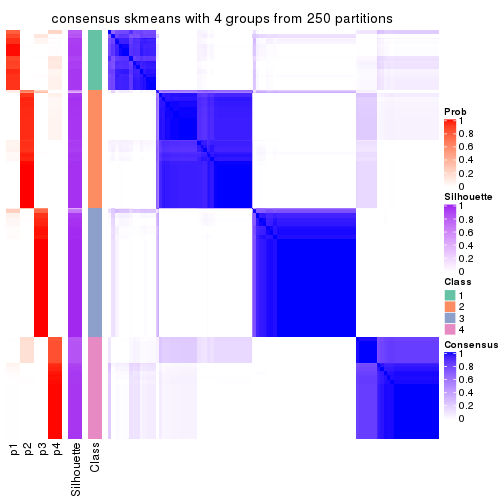</p>

</div>
<div id='tab-MAD-skmeans-consensus-heatmap-4'>
<pre><code class="r">consensus_heatmap(res, k = 5)
</code></pre>

<p></p>

</div>
<div id='tab-MAD-skmeans-consensus-heatmap-5'>
<pre><code class="r">consensus_heatmap(res, k = 6)
</code></pre>

<p></p>

</div>
</div>

Heatmaps for the membership of samples in all partitions to see how consistent they are:


<script>
$( function() {
	$( '#tabs-MAD-skmeans-membership-heatmap' ).tabs();
} );
</script>
<div id='tabs-MAD-skmeans-membership-heatmap'>
<ul>
<li><a href='#tab-MAD-skmeans-membership-heatmap-1'>k = 2</a></li>
<li><a href='#tab-MAD-skmeans-membership-heatmap-2'>k = 3</a></li>
<li><a href='#tab-MAD-skmeans-membership-heatmap-3'>k = 4</a></li>
<li><a href='#tab-MAD-skmeans-membership-heatmap-4'>k = 5</a></li>
<li><a href='#tab-MAD-skmeans-membership-heatmap-5'>k = 6</a></li>
</ul>
<div id='tab-MAD-skmeans-membership-heatmap-1'>
<pre><code class="r">membership_heatmap(res, k = 2)
</code></pre>

<p></p>

</div>
<div id='tab-MAD-skmeans-membership-heatmap-2'>
<pre><code class="r">membership_heatmap(res, k = 3)
</code></pre>

<p></p>

</div>
<div id='tab-MAD-skmeans-membership-heatmap-3'>
<pre><code class="r">membership_heatmap(res, k = 4)
</code></pre>

<p></p>

</div>
<div id='tab-MAD-skmeans-membership-heatmap-4'>
<pre><code class="r">membership_heatmap(res, k = 5)
</code></pre>

<p>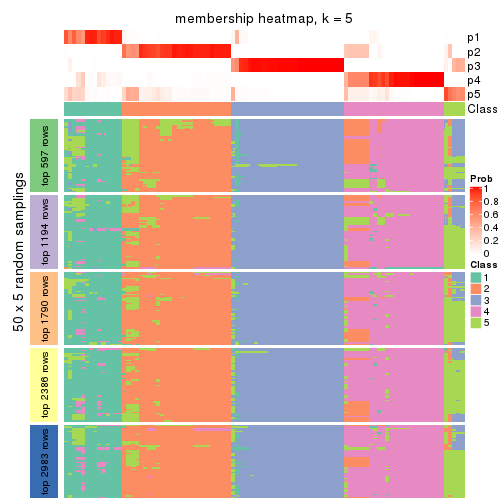</p>

</div>
<div id='tab-MAD-skmeans-membership-heatmap-5'>
<pre><code class="r">membership_heatmap(res, k = 6)
</code></pre>

<p></p>

</div>
</div>

As soon as we have had the classes for columns, we can look for signatures
which are significantly different between classes which can be candidate marks
for certain classes. Following are the heatmaps for signatures.


Signature heatmaps where rows are scaled:


<script>
$( function() {
	$( '#tabs-MAD-skmeans-get-signatures' ).tabs();
} );
</script>
<div id='tabs-MAD-skmeans-get-signatures'>
<ul>
<li><a href='#tab-MAD-skmeans-get-signatures-1'>k = 2</a></li>
<li><a href='#tab-MAD-skmeans-get-signatures-2'>k = 3</a></li>
<li><a href='#tab-MAD-skmeans-get-signatures-3'>k = 4</a></li>
<li><a href='#tab-MAD-skmeans-get-signatures-4'>k = 5</a></li>
<li><a href='#tab-MAD-skmeans-get-signatures-5'>k = 6</a></li>
</ul>
<div id='tab-MAD-skmeans-get-signatures-1'>
<pre><code class="r">get_signatures(res, k = 2)
</code></pre>

<p>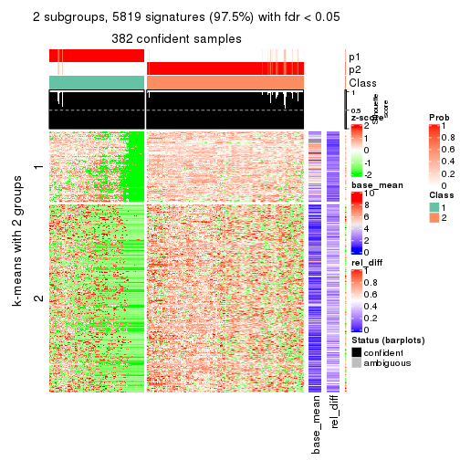</p>

</div>
<div id='tab-MAD-skmeans-get-signatures-2'>
<pre><code class="r">get_signatures(res, k = 3)
</code></pre>

<p></p>

</div>
<div id='tab-MAD-skmeans-get-signatures-3'>
<pre><code class="r">get_signatures(res, k = 4)
</code></pre>

<p>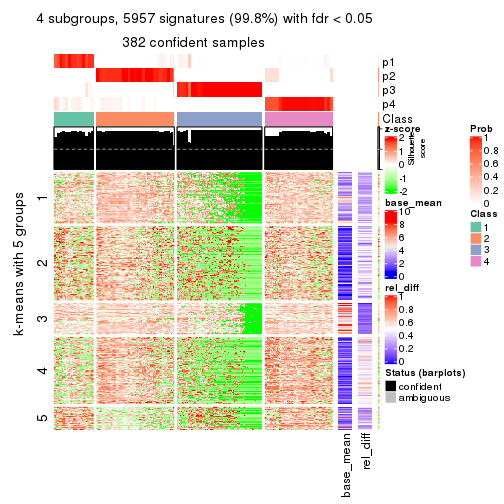</p>

</div>
<div id='tab-MAD-skmeans-get-signatures-4'>
<pre><code class="r">get_signatures(res, k = 5)
</code></pre>

<p></p>

</div>
<div id='tab-MAD-skmeans-get-signatures-5'>
<pre><code class="r">get_signatures(res, k = 6)
</code></pre>

<p>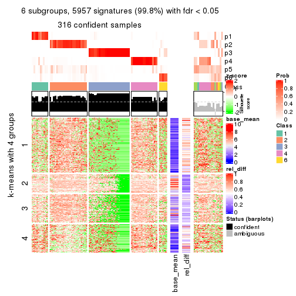</p>

</div>
</div>


Signature heatmaps where rows are not scaled:


<script>
$( function() {
	$( '#tabs-MAD-skmeans-get-signatures-no-scale' ).tabs();
} );
</script>
<div id='tabs-MAD-skmeans-get-signatures-no-scale'>
<ul>
<li><a href='#tab-MAD-skmeans-get-signatures-no-scale-1'>k = 2</a></li>
<li><a href='#tab-MAD-skmeans-get-signatures-no-scale-2'>k = 3</a></li>
<li><a href='#tab-MAD-skmeans-get-signatures-no-scale-3'>k = 4</a></li>
<li><a href='#tab-MAD-skmeans-get-signatures-no-scale-4'>k = 5</a></li>
<li><a href='#tab-MAD-skmeans-get-signatures-no-scale-5'>k = 6</a></li>
</ul>
<div id='tab-MAD-skmeans-get-signatures-no-scale-1'>
<pre><code class="r">get_signatures(res, k = 2, scale_rows = FALSE)
</code></pre>

<p></p>

</div>
<div id='tab-MAD-skmeans-get-signatures-no-scale-2'>
<pre><code class="r">get_signatures(res, k = 3, scale_rows = FALSE)
</code></pre>

<p></p>

</div>
<div id='tab-MAD-skmeans-get-signatures-no-scale-3'>
<pre><code class="r">get_signatures(res, k = 4, scale_rows = FALSE)
</code></pre>

<p></p>

</div>
<div id='tab-MAD-skmeans-get-signatures-no-scale-4'>
<pre><code class="r">get_signatures(res, k = 5, scale_rows = FALSE)
</code></pre>

<p></p>

</div>
<div id='tab-MAD-skmeans-get-signatures-no-scale-5'>
<pre><code class="r">get_signatures(res, k = 6, scale_rows = FALSE)
</code></pre>

<p></p>

</div>
</div>


Compare the overlap of signatures from different k:

```r
compare_signatures(res)
```


`get_signature()` returns a data frame invisibly. TO get the list of signatures, the function
call should be assigned to a variable explicitly. In following code, if `plot` argument is set
to `FALSE`, no heatmap is plotted while only the differential analysis is performed.

```r
# code only for demonstration
tb = get_signature(res, k = ..., plot = FALSE)
```

An example of the output of `tb` is:

```
#>   which_row         fdr    mean_1    mean_2 scaled_mean_1 scaled_mean_2 km
#> 1        38 0.042760348  8.373488  9.131774    -0.5533452     0.5164555  1
#> 2        40 0.018707592  7.106213  8.469186    -0.6173731     0.5762149  1
#> 3        55 0.019134737 10.221463 11.207825    -0.6159697     0.5749050  1
#> 4        59 0.006059896  5.921854  7.869574    -0.6899429     0.6439467  1
#> 5        60 0.018055526  8.928898 10.211722    -0.6204761     0.5791110  1
#> 6        98 0.009384629 15.714769 14.887706     0.6635654    -0.6193277  2
...
```

The columns in `tb` are:

1. `which_row`: row indices corresponding to the input matrix.
2. `fdr`: FDR for the differential test. 
3. `mean_x`: The mean value in group x.
4. `scaled_mean_x`: The mean value in group x after rows are scaled.
5. `km`: Row groups if k-means clustering is applied to rows.


UMAP plot which shows how samples are separated.


<script>
$( function() {
	$( '#tabs-MAD-skmeans-dimension-reduction' ).tabs();
} );
</script>
<div id='tabs-MAD-skmeans-dimension-reduction'>
<ul>
<li><a href='#tab-MAD-skmeans-dimension-reduction-1'>k = 2</a></li>
<li><a href='#tab-MAD-skmeans-dimension-reduction-2'>k = 3</a></li>
<li><a href='#tab-MAD-skmeans-dimension-reduction-3'>k = 4</a></li>
<li><a href='#tab-MAD-skmeans-dimension-reduction-4'>k = 5</a></li>
<li><a href='#tab-MAD-skmeans-dimension-reduction-5'>k = 6</a></li>
</ul>
<div id='tab-MAD-skmeans-dimension-reduction-1'>
<pre><code class="r">dimension_reduction(res, k = 2, method = &quot;UMAP&quot;)
</code></pre>

<p></p>

</div>
<div id='tab-MAD-skmeans-dimension-reduction-2'>
<pre><code class="r">dimension_reduction(res, k = 3, method = &quot;UMAP&quot;)
</code></pre>

<p></p>

</div>
<div id='tab-MAD-skmeans-dimension-reduction-3'>
<pre><code class="r">dimension_reduction(res, k = 4, method = &quot;UMAP&quot;)
</code></pre>

<p></p>

</div>
<div id='tab-MAD-skmeans-dimension-reduction-4'>
<pre><code class="r">dimension_reduction(res, k = 5, method = &quot;UMAP&quot;)
</code></pre>

<p></p>

</div>
<div id='tab-MAD-skmeans-dimension-reduction-5'>
<pre><code class="r">dimension_reduction(res, k = 6, method = &quot;UMAP&quot;)
</code></pre>

<p></p>

</div>
</div>


Following heatmap shows how subgroups are split when increasing `k`:

```r
collect_classes(res)
```

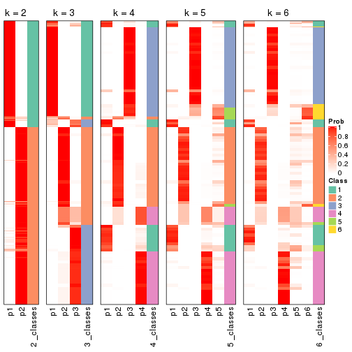


If matrix rows can be associated to genes, consider to use `GO_Enrichment(res,
...)` to perform function enrichment for the signature genes.


 

---------------------------------------------------


### MAD:pam**


The object with results only for a single top-value method and a single partition method 
can be extracted as:

```r
res = res_list["MAD", "pam"]
# you can also extract it by
# res = res_list["MAD:pam"]
```

A summary of `res` and all the functions that can be applied to it:

```r
res
```

```
#> A 'ConsensusPartition' object with k = 2, 3, 4, 5, 6.
#>   On a matrix with 5966 rows and 384 columns.
#>   Top rows (597, 1194, 1790, 2386, 2983) are extracted by 'MAD' method.
#>   Subgroups are detected by 'pam' method.
#>   Performed in total 1250 partitions by row resampling.
#>   Best k for subgroups seems to be 2.
#> 
#> Following methods can be applied to this 'ConsensusPartition' object:
#>  [1] "cola_report"             "collect_classes"         "collect_plots"          
#>  [4] "collect_stats"           "colnames"                "compare_signatures"     
#>  [7] "consensus_heatmap"       "dimension_reduction"     "functional_enrichment"  
#> [10] "get_anno_col"            "get_anno"                "get_classes"            
#> [13] "get_consensus"           "get_matrix"              "get_membership"         
#> [16] "get_param"               "get_signatures"          "get_stats"              
#> [19] "is_best_k"               "is_stable_k"             "membership_heatmap"     
#> [22] "ncol"                    "nrow"                    "plot_ecdf"              
#> [25] "rownames"                "select_partition_number" "show"                   
#> [28] "suggest_best_k"          "test_to_known_factors"
```

`collect_plots()` function collects all the plots made from `res` for all `k` (number of partitions)
into one single page to provide an easy and fast comparison between different `k`.

```r
collect_plots(res)
```


The plots are:

- The first row: a plot of the ECDF (Empirical cumulative distribution
  function) curves of the consensus matrix for each `k` and the heatmap of
  predicted classes for each `k`.
- The second row: heatmaps of the consensus matrix for each `k`.
- The third row: heatmaps of the membership matrix for each `k`.
- The fouth row: heatmaps of the signatures for each `k`.

All the plots in panels can be made by individual functions and they are
plotted later in this section.

`select_partition_number()` produces several plots showing different
statistics for choosing "optimized" `k`. There are following statistics:

- ECDF curves of the consensus matrix for each `k`;
- 1-PAC. [The PAC
  score](https://en.wikipedia.org/wiki/Consensus_clustering#Over-interpretation_potential_of_consensus_clustering)
  measures the proportion of the ambiguous subgrouping.
- Mean silhouette score.
- Concordance. The mean probability of fiting the consensus class ids in all
  partitions.
- Area increased. Denote $A_k$ as the area under the ECDF curve for current
  `k`, the area increased is defined as $A_k - A_{k-1}$.
- Rand index. The percent of pairs of samples that are both in a same cluster
  or both are not in a same cluster in the partition of k and k-1.
- Jaccard index. The ratio of pairs of samples are both in a same cluster in
  the partition of k and k-1 and the pairs of samples are both in a same
  cluster in the partition k or k-1.

The detailed explanations of these statistics can be found in [the cola
vignette](http://bioconductor.org/packages/devel/bioc/vignettes/cola/inst/doc/cola.html#toc_13).

Generally speaking, lower PAC score, higher mean silhouette score or higher
concordance corresponds to better partition. Rand index and Jaccard index
measure how similar the current partition is compared to partition with `k-1`.
If they are too similar, we won't accept `k` is better than `k-1`.

```r
select_partition_number(res)
```


The numeric values for all these statistics can be obtained by `get_stats()`.

```r
get_stats(res)
```

```
#>   k 1-PAC mean_silhouette concordance area_increased  Rand Jaccard
#> 2 2 0.978           0.947       0.979        0.35298 0.651   0.651
#> 3 3 0.831           0.880       0.940        0.81163 0.687   0.528
#> 4 4 0.859           0.864       0.931        0.13793 0.863   0.645
#> 5 5 0.897           0.872       0.943        0.09927 0.898   0.645
#> 6 6 0.883           0.820       0.926        0.00944 0.996   0.982
```

`suggest_best_k()` suggests the best $k$ based on these statistics. The rules are as follows:

- All $k$ with Jaccard index larger than 0.95 are removed because the increase of
  the partition number does not provides enough extra information. If all $k$ are removed,
  the best $k$ is assigned by `NA`.
- For $k$ with 1-PAC larger than 0.9, the maximal $k$ is taken as the "best k". Other $k$ is called "optional k".
- If it does not fit the second rule. The $k$ with the highest vote of highest
  1-PAC, mean silhouette and concordance is taken as the "best k".

```r
suggest_best_k(res)
```

```
#> [1] 2
```


Following shows the table of the partitions (You need to click the **show/hide
code output** link to see it). The membership matrix (columns with name `p*`)
is inferred by
[`clue::cl_consensus()`](https://www.rdocumentation.org/link/cl_consensus?package=clue)
function with the `SE` method. Basically the value in the membership matrix
represents the probability to belong to a certain group. The finall class
label for an item is determined with the group with highest probability it
belongs to.

In `get_classes()` function, the entropy is calculated from the membership
matrix and the silhouette score is calculated from the consensus matrix.


<script>
$( function() {
	$( '#tabs-MAD-pam-get-classes' ).tabs();
} );
</script>
<div id='tabs-MAD-pam-get-classes'>
<ul>
<li><a href='#tab-MAD-pam-get-classes-1'>k = 2</a></li>
<li><a href='#tab-MAD-pam-get-classes-2'>k = 3</a></li>
<li><a href='#tab-MAD-pam-get-classes-3'>k = 4</a></li>
<li><a href='#tab-MAD-pam-get-classes-4'>k = 5</a></li>
<li><a href='#tab-MAD-pam-get-classes-5'>k = 6</a></li>
</ul>

<div id='tab-MAD-pam-get-classes-1'>
<p><a id='tab-MAD-pam-get-classes-1-a' style='color:#0366d6' href='#'>show/hide code output</a></p>
<pre><code class="r">cbind(get_classes(res, k = 2), get_membership(res, k = 2))
</code></pre>

<pre><code>#&gt;           class entropy silhouette    p1    p2
#&gt; SRR490216     2  0.1633     0.9612 0.024 0.976
#&gt; SRR490217     2  0.0000     0.9830 0.000 1.000
#&gt; SRR490218     2  0.1184     0.9687 0.016 0.984
#&gt; SRR490219     2  0.0000     0.9830 0.000 1.000
#&gt; SRR490220     2  0.0000     0.9830 0.000 1.000
#&gt; SRR490221     2  0.0000     0.9830 0.000 1.000
#&gt; SRR490222     2  0.0000     0.9830 0.000 1.000
#&gt; SRR490223     2  0.0000     0.9830 0.000 1.000
#&gt; SRR490224     1  0.0000     0.9622 1.000 0.000
#&gt; SRR490225     1  0.0000     0.9622 1.000 0.000
#&gt; SRR490226     1  0.0000     0.9622 1.000 0.000
#&gt; SRR490227     1  0.0000     0.9622 1.000 0.000
#&gt; SRR490228     1  0.0000     0.9622 1.000 0.000
#&gt; SRR490229     1  0.0000     0.9622 1.000 0.000
#&gt; SRR490230     1  0.0000     0.9622 1.000 0.000
#&gt; SRR490231     1  0.0000     0.9622 1.000 0.000
#&gt; SRR490232     1  0.0376     0.9588 0.996 0.004
#&gt; SRR490233     1  0.7219     0.7432 0.800 0.200
#&gt; SRR490234     1  0.7056     0.7543 0.808 0.192
#&gt; SRR490235     1  0.7674     0.7075 0.776 0.224
#&gt; SRR490236     1  0.0000     0.9622 1.000 0.000
#&gt; SRR490237     1  0.0000     0.9622 1.000 0.000
#&gt; SRR490238     1  0.0000     0.9622 1.000 0.000
#&gt; SRR490239     1  0.0000     0.9622 1.000 0.000
#&gt; SRR490240     2  0.0000     0.9830 0.000 1.000
#&gt; SRR490241     2  0.0000     0.9830 0.000 1.000
#&gt; SRR490242     2  0.0000     0.9830 0.000 1.000
#&gt; SRR490243     2  0.0000     0.9830 0.000 1.000
#&gt; SRR490244     1  0.0000     0.9622 1.000 0.000
#&gt; SRR490245     1  0.0000     0.9622 1.000 0.000
#&gt; SRR490246     1  0.0000     0.9622 1.000 0.000
#&gt; SRR490247     1  0.0000     0.9622 1.000 0.000
#&gt; SRR490248     2  0.1633     0.9612 0.024 0.976
#&gt; SRR490249     2  0.0000     0.9830 0.000 1.000
#&gt; SRR490250     2  0.0000     0.9830 0.000 1.000
#&gt; SRR490251     2  0.1414     0.9651 0.020 0.980
#&gt; SRR490252     2  0.0000     0.9830 0.000 1.000
#&gt; SRR490253     2  0.0000     0.9830 0.000 1.000
#&gt; SRR490254     2  0.0000     0.9830 0.000 1.000
#&gt; SRR490255     2  0.0000     0.9830 0.000 1.000
#&gt; SRR490256     1  0.9909     0.2230 0.556 0.444
#&gt; SRR490257     2  0.9170     0.4928 0.332 0.668
#&gt; SRR490258     2  0.9795     0.2694 0.416 0.584
#&gt; SRR490259     2  0.9686     0.3301 0.396 0.604
#&gt; SRR490260     1  0.0000     0.9622 1.000 0.000
#&gt; SRR490261     1  0.0000     0.9622 1.000 0.000
#&gt; SRR490262     1  0.0000     0.9622 1.000 0.000
#&gt; SRR490263     1  0.0000     0.9622 1.000 0.000
#&gt; SRR490264     1  0.0000     0.9622 1.000 0.000
#&gt; SRR490265     1  0.0000     0.9622 1.000 0.000
#&gt; SRR490266     1  0.0000     0.9622 1.000 0.000
#&gt; SRR490267     1  0.0000     0.9622 1.000 0.000
#&gt; SRR490268     1  0.9933     0.1961 0.548 0.452
#&gt; SRR490269     1  0.9963     0.1562 0.536 0.464
#&gt; SRR490270     2  0.6973     0.7612 0.188 0.812
#&gt; SRR490271     2  1.0000    -0.0176 0.496 0.504
#&gt; SRR490272     1  0.0000     0.9622 1.000 0.000
#&gt; SRR490273     1  0.0000     0.9622 1.000 0.000
#&gt; SRR490274     1  0.0000     0.9622 1.000 0.000
#&gt; SRR490275     1  0.0000     0.9622 1.000 0.000
#&gt; SRR490276     1  0.0000     0.9622 1.000 0.000
#&gt; SRR490277     1  0.0000     0.9622 1.000 0.000
#&gt; SRR490278     1  0.0000     0.9622 1.000 0.000
#&gt; SRR490279     1  0.0000     0.9622 1.000 0.000
#&gt; SRR490280     1  0.0000     0.9622 1.000 0.000
#&gt; SRR490281     1  0.0000     0.9622 1.000 0.000
#&gt; SRR490282     1  0.0000     0.9622 1.000 0.000
#&gt; SRR490283     1  0.0000     0.9622 1.000 0.000
#&gt; SRR490284     1  0.0000     0.9622 1.000 0.000
#&gt; SRR490285     1  0.0000     0.9622 1.000 0.000
#&gt; SRR490286     1  0.0000     0.9622 1.000 0.000
#&gt; SRR490287     1  0.0000     0.9622 1.000 0.000
#&gt; SRR490288     2  0.9944     0.1384 0.456 0.544
#&gt; SRR490289     2  0.2778     0.9372 0.048 0.952
#&gt; SRR490290     2  0.1184     0.9688 0.016 0.984
#&gt; SRR490291     2  0.2603     0.9412 0.044 0.956
#&gt; SRR490292     2  0.0000     0.9830 0.000 1.000
#&gt; SRR490293     2  0.0000     0.9830 0.000 1.000
#&gt; SRR490294     2  0.0000     0.9830 0.000 1.000
#&gt; SRR490295     2  0.0000     0.9830 0.000 1.000
#&gt; SRR490296     2  0.0000     0.9830 0.000 1.000
#&gt; SRR490297     2  0.0000     0.9830 0.000 1.000
#&gt; SRR490298     2  0.0000     0.9830 0.000 1.000
#&gt; SRR490299     2  0.0000     0.9830 0.000 1.000
#&gt; SRR490300     2  0.0000     0.9830 0.000 1.000
#&gt; SRR490301     2  0.0000     0.9830 0.000 1.000
#&gt; SRR490302     2  0.0000     0.9830 0.000 1.000
#&gt; SRR490303     2  0.0000     0.9830 0.000 1.000
#&gt; SRR490304     2  0.0000     0.9830 0.000 1.000
#&gt; SRR490305     2  0.0000     0.9830 0.000 1.000
#&gt; SRR490306     2  0.0000     0.9830 0.000 1.000
#&gt; SRR490307     2  0.0000     0.9830 0.000 1.000
#&gt; SRR490308     1  0.0000     0.9622 1.000 0.000
#&gt; SRR490309     1  0.0000     0.9622 1.000 0.000
#&gt; SRR490310     1  0.0000     0.9622 1.000 0.000
#&gt; SRR490311     1  0.0000     0.9622 1.000 0.000
#&gt; SRR490312     2  0.5408     0.8496 0.124 0.876
#&gt; SRR490313     2  0.3879     0.9067 0.076 0.924
#&gt; SRR490314     2  0.1184     0.9688 0.016 0.984
#&gt; SRR490315     2  0.1184     0.9688 0.016 0.984
#&gt; SRR490316     2  0.0938     0.9724 0.012 0.988
#&gt; SRR490317     2  0.0376     0.9795 0.004 0.996
#&gt; SRR490318     2  0.0672     0.9760 0.008 0.992
#&gt; SRR490319     2  0.0000     0.9830 0.000 1.000
#&gt; SRR490320     1  0.0000     0.9622 1.000 0.000
#&gt; SRR490321     1  0.0000     0.9622 1.000 0.000
#&gt; SRR490322     1  0.0000     0.9622 1.000 0.000
#&gt; SRR490323     1  0.0000     0.9622 1.000 0.000
#&gt; SRR490324     1  0.0000     0.9622 1.000 0.000
#&gt; SRR490325     1  0.0000     0.9622 1.000 0.000
#&gt; SRR490326     1  0.0000     0.9622 1.000 0.000
#&gt; SRR490327     1  0.0000     0.9622 1.000 0.000
#&gt; SRR490328     2  0.0000     0.9830 0.000 1.000
#&gt; SRR490329     2  0.0000     0.9830 0.000 1.000
#&gt; SRR490330     2  0.0000     0.9830 0.000 1.000
#&gt; SRR490331     2  0.0000     0.9830 0.000 1.000
#&gt; SRR490332     2  0.0000     0.9830 0.000 1.000
#&gt; SRR490333     2  0.0000     0.9830 0.000 1.000
#&gt; SRR490334     2  0.0000     0.9830 0.000 1.000
#&gt; SRR490335     2  0.0000     0.9830 0.000 1.000
#&gt; SRR490336     2  0.0000     0.9830 0.000 1.000
#&gt; SRR490337     2  0.0000     0.9830 0.000 1.000
#&gt; SRR490338     2  0.0000     0.9830 0.000 1.000
#&gt; SRR490339     2  0.0000     0.9830 0.000 1.000
#&gt; SRR490340     2  0.0000     0.9830 0.000 1.000
#&gt; SRR490341     2  0.0000     0.9830 0.000 1.000
#&gt; SRR490342     2  0.0000     0.9830 0.000 1.000
#&gt; SRR490343     2  0.0000     0.9830 0.000 1.000
#&gt; SRR490344     2  0.0000     0.9830 0.000 1.000
#&gt; SRR490345     2  0.0000     0.9830 0.000 1.000
#&gt; SRR490346     2  0.0000     0.9830 0.000 1.000
#&gt; SRR490347     2  0.0000     0.9830 0.000 1.000
#&gt; SRR490348     2  0.0000     0.9830 0.000 1.000
#&gt; SRR490349     2  0.0000     0.9830 0.000 1.000
#&gt; SRR490350     2  0.0000     0.9830 0.000 1.000
#&gt; SRR490351     2  0.0000     0.9830 0.000 1.000
#&gt; SRR490352     2  0.0000     0.9830 0.000 1.000
#&gt; SRR490353     2  0.0000     0.9830 0.000 1.000
#&gt; SRR490354     2  0.0000     0.9830 0.000 1.000
#&gt; SRR490355     2  0.0000     0.9830 0.000 1.000
#&gt; SRR490356     2  0.0000     0.9830 0.000 1.000
#&gt; SRR490357     2  0.0000     0.9830 0.000 1.000
#&gt; SRR490358     2  0.0000     0.9830 0.000 1.000
#&gt; SRR490359     2  0.0000     0.9830 0.000 1.000
#&gt; SRR490360     2  0.0000     0.9830 0.000 1.000
#&gt; SRR490361     2  0.0000     0.9830 0.000 1.000
#&gt; SRR490362     2  0.0000     0.9830 0.000 1.000
#&gt; SRR490363     2  0.0000     0.9830 0.000 1.000
#&gt; SRR490364     2  0.0000     0.9830 0.000 1.000
#&gt; SRR490365     2  0.0000     0.9830 0.000 1.000
#&gt; SRR490366     2  0.0000     0.9830 0.000 1.000
#&gt; SRR490367     2  0.0000     0.9830 0.000 1.000
#&gt; SRR490368     2  0.0000     0.9830 0.000 1.000
#&gt; SRR490369     2  0.0000     0.9830 0.000 1.000
#&gt; SRR490370     2  0.0000     0.9830 0.000 1.000
#&gt; SRR490371     2  0.0000     0.9830 0.000 1.000
#&gt; SRR490372     1  0.0000     0.9622 1.000 0.000
#&gt; SRR490373     1  0.0000     0.9622 1.000 0.000
#&gt; SRR490374     1  0.0000     0.9622 1.000 0.000
#&gt; SRR490375     1  0.0000     0.9622 1.000 0.000
#&gt; SRR490376     2  0.0000     0.9830 0.000 1.000
#&gt; SRR490377     2  0.0000     0.9830 0.000 1.000
#&gt; SRR490378     2  0.0000     0.9830 0.000 1.000
#&gt; SRR490379     2  0.0000     0.9830 0.000 1.000
#&gt; SRR490380     1  0.0000     0.9622 1.000 0.000
#&gt; SRR490381     1  0.0000     0.9622 1.000 0.000
#&gt; SRR490382     1  0.0000     0.9622 1.000 0.000
#&gt; SRR490383     1  0.0000     0.9622 1.000 0.000
#&gt; SRR490384     2  0.0000     0.9830 0.000 1.000
#&gt; SRR490385     2  0.0000     0.9830 0.000 1.000
#&gt; SRR490386     2  0.0000     0.9830 0.000 1.000
#&gt; SRR490387     2  0.0000     0.9830 0.000 1.000
#&gt; SRR490388     2  0.0000     0.9830 0.000 1.000
#&gt; SRR490389     2  0.0000     0.9830 0.000 1.000
#&gt; SRR490390     2  0.0000     0.9830 0.000 1.000
#&gt; SRR490391     2  0.0000     0.9830 0.000 1.000
#&gt; SRR490392     2  0.0000     0.9830 0.000 1.000
#&gt; SRR490393     2  0.0000     0.9830 0.000 1.000
#&gt; SRR490394     2  0.0000     0.9830 0.000 1.000
#&gt; SRR490395     2  0.0000     0.9830 0.000 1.000
#&gt; SRR490396     2  0.0000     0.9830 0.000 1.000
#&gt; SRR490397     2  0.0000     0.9830 0.000 1.000
#&gt; SRR490398     2  0.0000     0.9830 0.000 1.000
#&gt; SRR490399     2  0.0000     0.9830 0.000 1.000
#&gt; SRR490400     2  0.0000     0.9830 0.000 1.000
#&gt; SRR490401     2  0.0000     0.9830 0.000 1.000
#&gt; SRR490402     2  0.0000     0.9830 0.000 1.000
#&gt; SRR490403     2  0.0000     0.9830 0.000 1.000
#&gt; SRR490404     2  0.0000     0.9830 0.000 1.000
#&gt; SRR490405     2  0.0000     0.9830 0.000 1.000
#&gt; SRR490406     2  0.0000     0.9830 0.000 1.000
#&gt; SRR490407     2  0.0000     0.9830 0.000 1.000
#&gt; SRR490408     2  0.0000     0.9830 0.000 1.000
#&gt; SRR490409     2  0.0000     0.9830 0.000 1.000
#&gt; SRR490410     2  0.0000     0.9830 0.000 1.000
#&gt; SRR490411     2  0.0000     0.9830 0.000 1.000
#&gt; SRR490412     1  0.0000     0.9622 1.000 0.000
#&gt; SRR490413     1  0.0000     0.9622 1.000 0.000
#&gt; SRR490414     1  0.0000     0.9622 1.000 0.000
#&gt; SRR490415     1  0.0000     0.9622 1.000 0.000
#&gt; SRR490416     2  0.0000     0.9830 0.000 1.000
#&gt; SRR490417     2  0.0000     0.9830 0.000 1.000
#&gt; SRR490418     2  0.0000     0.9830 0.000 1.000
#&gt; SRR490419     2  0.0000     0.9830 0.000 1.000
#&gt; SRR490420     2  0.2603     0.9409 0.044 0.956
#&gt; SRR490421     2  0.0000     0.9830 0.000 1.000
#&gt; SRR490422     2  0.0000     0.9830 0.000 1.000
#&gt; SRR490423     2  0.0000     0.9830 0.000 1.000
#&gt; SRR490424     1  0.0000     0.9622 1.000 0.000
#&gt; SRR490425     1  0.0000     0.9622 1.000 0.000
#&gt; SRR490426     1  0.0000     0.9622 1.000 0.000
#&gt; SRR490427     1  0.0000     0.9622 1.000 0.000
#&gt; SRR490428     2  0.8144     0.6561 0.252 0.748
#&gt; SRR490429     2  0.1414     0.9649 0.020 0.980
#&gt; SRR490430     2  0.5059     0.8640 0.112 0.888
#&gt; SRR490431     2  0.5737     0.8335 0.136 0.864
#&gt; SRR490432     2  0.0000     0.9830 0.000 1.000
#&gt; SRR490433     2  0.0000     0.9830 0.000 1.000
#&gt; SRR490434     2  0.0000     0.9830 0.000 1.000
#&gt; SRR490435     2  0.0000     0.9830 0.000 1.000
#&gt; SRR490436     2  0.0000     0.9830 0.000 1.000
#&gt; SRR490437     2  0.0000     0.9830 0.000 1.000
#&gt; SRR490438     2  0.0000     0.9830 0.000 1.000
#&gt; SRR490439     2  0.0000     0.9830 0.000 1.000
#&gt; SRR490440     2  0.0000     0.9830 0.000 1.000
#&gt; SRR490441     2  0.0000     0.9830 0.000 1.000
#&gt; SRR490442     2  0.0000     0.9830 0.000 1.000
#&gt; SRR490443     2  0.0000     0.9830 0.000 1.000
#&gt; SRR490444     2  0.0000     0.9830 0.000 1.000
#&gt; SRR490445     2  0.0000     0.9830 0.000 1.000
#&gt; SRR490446     2  0.0000     0.9830 0.000 1.000
#&gt; SRR490447     2  0.0000     0.9830 0.000 1.000
#&gt; SRR490448     2  0.0000     0.9830 0.000 1.000
#&gt; SRR490449     2  0.0000     0.9830 0.000 1.000
#&gt; SRR490450     2  0.0000     0.9830 0.000 1.000
#&gt; SRR490451     2  0.0000     0.9830 0.000 1.000
#&gt; SRR490452     1  0.7299     0.7375 0.796 0.204
#&gt; SRR490453     2  0.9552     0.3852 0.376 0.624
#&gt; SRR490454     1  0.9977     0.1270 0.528 0.472
#&gt; SRR490455     1  0.9881     0.2463 0.564 0.436
#&gt; SRR490456     2  0.0000     0.9830 0.000 1.000
#&gt; SRR490457     2  0.0000     0.9830 0.000 1.000
#&gt; SRR490458     2  0.0000     0.9830 0.000 1.000
#&gt; SRR490459     2  0.0000     0.9830 0.000 1.000
#&gt; SRR490460     2  0.0000     0.9830 0.000 1.000
#&gt; SRR490461     2  0.0000     0.9830 0.000 1.000
#&gt; SRR490462     2  0.0000     0.9830 0.000 1.000
#&gt; SRR490463     2  0.0000     0.9830 0.000 1.000
#&gt; SRR490464     1  0.0000     0.9622 1.000 0.000
#&gt; SRR490465     1  0.0000     0.9622 1.000 0.000
#&gt; SRR490466     1  0.0000     0.9622 1.000 0.000
#&gt; SRR490467     1  0.0000     0.9622 1.000 0.000
#&gt; SRR490468     2  0.0000     0.9830 0.000 1.000
#&gt; SRR490469     2  0.0000     0.9830 0.000 1.000
#&gt; SRR490470     2  0.0000     0.9830 0.000 1.000
#&gt; SRR490471     2  0.0000     0.9830 0.000 1.000
#&gt; SRR490472     2  0.0000     0.9830 0.000 1.000
#&gt; SRR490473     2  0.0000     0.9830 0.000 1.000
#&gt; SRR490474     2  0.0000     0.9830 0.000 1.000
#&gt; SRR490475     2  0.0000     0.9830 0.000 1.000
#&gt; SRR490476     1  0.0000     0.9622 1.000 0.000
#&gt; SRR490477     1  0.0000     0.9622 1.000 0.000
#&gt; SRR490478     1  0.0000     0.9622 1.000 0.000
#&gt; SRR490479     1  0.0000     0.9622 1.000 0.000
#&gt; SRR490480     2  0.0000     0.9830 0.000 1.000
#&gt; SRR490481     2  0.0000     0.9830 0.000 1.000
#&gt; SRR490482     2  0.0000     0.9830 0.000 1.000
#&gt; SRR490483     2  0.0000     0.9830 0.000 1.000
#&gt; SRR490484     2  0.0000     0.9830 0.000 1.000
#&gt; SRR490485     2  0.0000     0.9830 0.000 1.000
#&gt; SRR490486     2  0.0000     0.9830 0.000 1.000
#&gt; SRR490487     2  0.0000     0.9830 0.000 1.000
#&gt; SRR490488     2  0.0000     0.9830 0.000 1.000
#&gt; SRR490489     2  0.0000     0.9830 0.000 1.000
#&gt; SRR490490     2  0.0000     0.9830 0.000 1.000
#&gt; SRR490491     2  0.0000     0.9830 0.000 1.000
#&gt; SRR490492     2  0.0000     0.9830 0.000 1.000
#&gt; SRR490493     2  0.0000     0.9830 0.000 1.000
#&gt; SRR490494     2  0.0000     0.9830 0.000 1.000
#&gt; SRR490495     2  0.0000     0.9830 0.000 1.000
#&gt; SRR490496     2  0.0000     0.9830 0.000 1.000
#&gt; SRR490497     2  0.0000     0.9830 0.000 1.000
#&gt; SRR490498     2  0.0000     0.9830 0.000 1.000
#&gt; SRR490499     2  0.0000     0.9830 0.000 1.000
#&gt; SRR490500     2  0.0000     0.9830 0.000 1.000
#&gt; SRR490501     2  0.0000     0.9830 0.000 1.000
#&gt; SRR490502     2  0.0000     0.9830 0.000 1.000
#&gt; SRR490503     2  0.0000     0.9830 0.000 1.000
#&gt; SRR490504     2  0.0000     0.9830 0.000 1.000
#&gt; SRR490505     2  0.0000     0.9830 0.000 1.000
#&gt; SRR490506     2  0.0000     0.9830 0.000 1.000
#&gt; SRR490507     2  0.0000     0.9830 0.000 1.000
#&gt; SRR490508     2  0.0000     0.9830 0.000 1.000
#&gt; SRR490509     2  0.0000     0.9830 0.000 1.000
#&gt; SRR490510     2  0.0000     0.9830 0.000 1.000
#&gt; SRR490511     2  0.0000     0.9830 0.000 1.000
#&gt; SRR490512     2  0.0000     0.9830 0.000 1.000
#&gt; SRR490513     2  0.0000     0.9830 0.000 1.000
#&gt; SRR490514     2  0.0000     0.9830 0.000 1.000
#&gt; SRR490515     2  0.0000     0.9830 0.000 1.000
#&gt; SRR490516     2  0.0000     0.9830 0.000 1.000
#&gt; SRR490517     2  0.0000     0.9830 0.000 1.000
#&gt; SRR490518     2  0.0000     0.9830 0.000 1.000
#&gt; SRR490519     2  0.0000     0.9830 0.000 1.000
#&gt; SRR490520     2  0.0000     0.9830 0.000 1.000
#&gt; SRR490521     2  0.0000     0.9830 0.000 1.000
#&gt; SRR490522     2  0.0000     0.9830 0.000 1.000
#&gt; SRR490523     2  0.0000     0.9830 0.000 1.000
#&gt; SRR490524     2  0.0000     0.9830 0.000 1.000
#&gt; SRR490525     2  0.0000     0.9830 0.000 1.000
#&gt; SRR490526     2  0.0000     0.9830 0.000 1.000
#&gt; SRR490527     2  0.0000     0.9830 0.000 1.000
#&gt; SRR490528     2  0.0000     0.9830 0.000 1.000
#&gt; SRR490529     2  0.0000     0.9830 0.000 1.000
#&gt; SRR490530     2  0.0000     0.9830 0.000 1.000
#&gt; SRR490531     2  0.0000     0.9830 0.000 1.000
#&gt; SRR490532     2  0.9393     0.4364 0.356 0.644
#&gt; SRR490533     2  0.8016     0.6695 0.244 0.756
#&gt; SRR490534     2  0.7376     0.7301 0.208 0.792
#&gt; SRR490535     2  0.9170     0.4943 0.332 0.668
#&gt; SRR490536     2  0.0000     0.9830 0.000 1.000
#&gt; SRR490537     2  0.0000     0.9830 0.000 1.000
#&gt; SRR490538     2  0.0000     0.9830 0.000 1.000
#&gt; SRR490539     2  0.0000     0.9830 0.000 1.000
#&gt; SRR490540     2  0.0000     0.9830 0.000 1.000
#&gt; SRR490541     2  0.0000     0.9830 0.000 1.000
#&gt; SRR490542     2  0.0000     0.9830 0.000 1.000
#&gt; SRR490543     2  0.0000     0.9830 0.000 1.000
#&gt; SRR490544     2  0.0000     0.9830 0.000 1.000
#&gt; SRR490545     2  0.0000     0.9830 0.000 1.000
#&gt; SRR490546     2  0.0000     0.9830 0.000 1.000
#&gt; SRR490547     2  0.0000     0.9830 0.000 1.000
#&gt; SRR490548     2  0.0000     0.9830 0.000 1.000
#&gt; SRR490549     2  0.0000     0.9830 0.000 1.000
#&gt; SRR490550     2  0.0000     0.9830 0.000 1.000
#&gt; SRR490551     2  0.0000     0.9830 0.000 1.000
#&gt; SRR490552     2  0.0000     0.9830 0.000 1.000
#&gt; SRR490553     2  0.0000     0.9830 0.000 1.000
#&gt; SRR490554     2  0.0000     0.9830 0.000 1.000
#&gt; SRR490555     2  0.0000     0.9830 0.000 1.000
#&gt; SRR490556     2  0.0000     0.9830 0.000 1.000
#&gt; SRR490557     2  0.0000     0.9830 0.000 1.000
#&gt; SRR490558     2  0.0000     0.9830 0.000 1.000
#&gt; SRR490559     2  0.0000     0.9830 0.000 1.000
#&gt; SRR490560     2  0.0000     0.9830 0.000 1.000
#&gt; SRR490561     2  0.0000     0.9830 0.000 1.000
#&gt; SRR490562     2  0.0000     0.9830 0.000 1.000
#&gt; SRR490563     2  0.0000     0.9830 0.000 1.000
#&gt; SRR490564     2  0.0000     0.9830 0.000 1.000
#&gt; SRR490565     2  0.0000     0.9830 0.000 1.000
#&gt; SRR490566     2  0.0000     0.9830 0.000 1.000
#&gt; SRR490567     2  0.0000     0.9830 0.000 1.000
#&gt; SRR490568     2  0.0000     0.9830 0.000 1.000
#&gt; SRR490569     2  0.0000     0.9830 0.000 1.000
#&gt; SRR490570     2  0.0000     0.9830 0.000 1.000
#&gt; SRR490571     2  0.0000     0.9830 0.000 1.000
#&gt; SRR490572     2  0.0000     0.9830 0.000 1.000
#&gt; SRR490573     2  0.0000     0.9830 0.000 1.000
#&gt; SRR490574     2  0.0000     0.9830 0.000 1.000
#&gt; SRR490575     2  0.0000     0.9830 0.000 1.000
#&gt; SRR490576     2  0.0000     0.9830 0.000 1.000
#&gt; SRR490577     2  0.0000     0.9830 0.000 1.000
#&gt; SRR490578     2  0.0000     0.9830 0.000 1.000
#&gt; SRR490579     2  0.0000     0.9830 0.000 1.000
#&gt; SRR490580     2  0.0000     0.9830 0.000 1.000
#&gt; SRR490581     2  0.0000     0.9830 0.000 1.000
#&gt; SRR490582     2  0.0000     0.9830 0.000 1.000
#&gt; SRR490583     2  0.0000     0.9830 0.000 1.000
#&gt; SRR490584     2  0.0000     0.9830 0.000 1.000
#&gt; SRR490585     2  0.0000     0.9830 0.000 1.000
#&gt; SRR490586     2  0.0000     0.9830 0.000 1.000
#&gt; SRR490587     2  0.0000     0.9830 0.000 1.000
#&gt; SRR490588     2  0.0000     0.9830 0.000 1.000
#&gt; SRR490589     2  0.0000     0.9830 0.000 1.000
#&gt; SRR490590     2  0.0000     0.9830 0.000 1.000
#&gt; SRR490591     2  0.0000     0.9830 0.000 1.000
#&gt; SRR490592     2  0.0000     0.9830 0.000 1.000
#&gt; SRR490593     2  0.0000     0.9830 0.000 1.000
#&gt; SRR490594     2  0.0000     0.9830 0.000 1.000
#&gt; SRR490595     2  0.0000     0.9830 0.000 1.000
#&gt; SRR490596     2  0.0000     0.9830 0.000 1.000
#&gt; SRR490597     2  0.0000     0.9830 0.000 1.000
#&gt; SRR490598     2  0.0000     0.9830 0.000 1.000
#&gt; SRR490599     2  0.0000     0.9830 0.000 1.000
</code></pre>

<script>
$('#tab-MAD-pam-get-classes-1-a').parent().next().next().hide();
$('#tab-MAD-pam-get-classes-1-a').click(function(){
  $('#tab-MAD-pam-get-classes-1-a').parent().next().next().toggle();
  return(false);
});
</script>
</div>

<div id='tab-MAD-pam-get-classes-2'>
<p><a id='tab-MAD-pam-get-classes-2-a' style='color:#0366d6' href='#'>show/hide code output</a></p>
<pre><code class="r">cbind(get_classes(res, k = 3), get_membership(res, k = 3))
</code></pre>

<pre><code>#&gt;           class entropy silhouette    p1    p2    p3
#&gt; SRR490216     2  0.0000    0.92824 0.000 1.000 0.000
#&gt; SRR490217     2  0.0000    0.92824 0.000 1.000 0.000
#&gt; SRR490218     2  0.0000    0.92824 0.000 1.000 0.000
#&gt; SRR490219     2  0.0000    0.92824 0.000 1.000 0.000
#&gt; SRR490220     2  0.1643    0.89906 0.000 0.956 0.044
#&gt; SRR490221     2  0.1643    0.89906 0.000 0.956 0.044
#&gt; SRR490222     2  0.1411    0.90523 0.000 0.964 0.036
#&gt; SRR490223     2  0.1643    0.89906 0.000 0.956 0.044
#&gt; SRR490224     1  0.0000    0.97432 1.000 0.000 0.000
#&gt; SRR490225     1  0.0000    0.97432 1.000 0.000 0.000
#&gt; SRR490226     1  0.0000    0.97432 1.000 0.000 0.000
#&gt; SRR490227     1  0.0000    0.97432 1.000 0.000 0.000
#&gt; SRR490228     1  0.0000    0.97432 1.000 0.000 0.000
#&gt; SRR490229     1  0.0000    0.97432 1.000 0.000 0.000
#&gt; SRR490230     1  0.0000    0.97432 1.000 0.000 0.000
#&gt; SRR490231     1  0.0000    0.97432 1.000 0.000 0.000
#&gt; SRR490232     1  0.5298    0.77203 0.804 0.164 0.032
#&gt; SRR490233     1  0.7348    0.39921 0.608 0.348 0.044
#&gt; SRR490234     1  0.6936    0.54977 0.672 0.284 0.044
#&gt; SRR490235     1  0.7459    0.33351 0.584 0.372 0.044
#&gt; SRR490236     1  0.0000    0.97432 1.000 0.000 0.000
#&gt; SRR490237     1  0.0000    0.97432 1.000 0.000 0.000
#&gt; SRR490238     1  0.0000    0.97432 1.000 0.000 0.000
#&gt; SRR490239     1  0.0000    0.97432 1.000 0.000 0.000
#&gt; SRR490240     2  0.1643    0.89906 0.000 0.956 0.044
#&gt; SRR490241     2  0.1643    0.89906 0.000 0.956 0.044
#&gt; SRR490242     2  0.1643    0.89906 0.000 0.956 0.044
#&gt; SRR490243     2  0.1643    0.89906 0.000 0.956 0.044
#&gt; SRR490244     1  0.0000    0.97432 1.000 0.000 0.000
#&gt; SRR490245     1  0.0000    0.97432 1.000 0.000 0.000
#&gt; SRR490246     1  0.0000    0.97432 1.000 0.000 0.000
#&gt; SRR490247     1  0.0000    0.97432 1.000 0.000 0.000
#&gt; SRR490248     2  0.0000    0.92824 0.000 1.000 0.000
#&gt; SRR490249     2  0.0000    0.92824 0.000 1.000 0.000
#&gt; SRR490250     2  0.0000    0.92824 0.000 1.000 0.000
#&gt; SRR490251     2  0.0000    0.92824 0.000 1.000 0.000
#&gt; SRR490252     2  0.0747    0.91869 0.000 0.984 0.016
#&gt; SRR490253     2  0.1529    0.90217 0.000 0.960 0.040
#&gt; SRR490254     2  0.1529    0.90217 0.000 0.960 0.040
#&gt; SRR490255     2  0.1529    0.90225 0.000 0.960 0.040
#&gt; SRR490256     2  0.7328    0.43471 0.344 0.612 0.044
#&gt; SRR490257     2  0.5330    0.77050 0.144 0.812 0.044
#&gt; SRR490258     2  0.6998    0.54572 0.292 0.664 0.044
#&gt; SRR490259     2  0.7027    0.53812 0.296 0.660 0.044
#&gt; SRR490260     1  0.0000    0.97432 1.000 0.000 0.000
#&gt; SRR490261     1  0.0000    0.97432 1.000 0.000 0.000
#&gt; SRR490262     1  0.0000    0.97432 1.000 0.000 0.000
#&gt; SRR490263     1  0.0000    0.97432 1.000 0.000 0.000
#&gt; SRR490264     1  0.0000    0.97432 1.000 0.000 0.000
#&gt; SRR490265     1  0.0000    0.97432 1.000 0.000 0.000
#&gt; SRR490266     1  0.0000    0.97432 1.000 0.000 0.000
#&gt; SRR490267     1  0.0000    0.97432 1.000 0.000 0.000
#&gt; SRR490268     2  0.7238    0.47160 0.328 0.628 0.044
#&gt; SRR490269     2  0.7159    0.54553 0.288 0.660 0.052
#&gt; SRR490270     2  0.5497    0.76310 0.148 0.804 0.048
#&gt; SRR490271     2  0.7238    0.47175 0.328 0.628 0.044
#&gt; SRR490272     1  0.0000    0.97432 1.000 0.000 0.000
#&gt; SRR490273     1  0.0000    0.97432 1.000 0.000 0.000
#&gt; SRR490274     1  0.0000    0.97432 1.000 0.000 0.000
#&gt; SRR490275     1  0.0000    0.97432 1.000 0.000 0.000
#&gt; SRR490276     1  0.0000    0.97432 1.000 0.000 0.000
#&gt; SRR490277     1  0.0000    0.97432 1.000 0.000 0.000
#&gt; SRR490278     1  0.0000    0.97432 1.000 0.000 0.000
#&gt; SRR490279     1  0.0000    0.97432 1.000 0.000 0.000
#&gt; SRR490280     1  0.0000    0.97432 1.000 0.000 0.000
#&gt; SRR490281     1  0.0000    0.97432 1.000 0.000 0.000
#&gt; SRR490282     1  0.0000    0.97432 1.000 0.000 0.000
#&gt; SRR490283     1  0.0000    0.97432 1.000 0.000 0.000
#&gt; SRR490284     1  0.0000    0.97432 1.000 0.000 0.000
#&gt; SRR490285     1  0.0000    0.97432 1.000 0.000 0.000
#&gt; SRR490286     1  0.0000    0.97432 1.000 0.000 0.000
#&gt; SRR490287     1  0.0000    0.97432 1.000 0.000 0.000
#&gt; SRR490288     2  0.6662    0.61734 0.252 0.704 0.044
#&gt; SRR490289     2  0.1753    0.89839 0.000 0.952 0.048
#&gt; SRR490290     2  0.0892    0.91608 0.000 0.980 0.020
#&gt; SRR490291     2  0.2527    0.88868 0.020 0.936 0.044
#&gt; SRR490292     2  0.3116    0.86593 0.000 0.892 0.108
#&gt; SRR490293     2  0.4796    0.74779 0.000 0.780 0.220
#&gt; SRR490294     2  0.3116    0.86550 0.000 0.892 0.108
#&gt; SRR490295     2  0.5431    0.64802 0.000 0.716 0.284
#&gt; SRR490296     3  0.1643    0.94087 0.000 0.044 0.956
#&gt; SRR490297     3  0.1643    0.94087 0.000 0.044 0.956
#&gt; SRR490298     3  0.1643    0.94087 0.000 0.044 0.956
#&gt; SRR490299     3  0.1643    0.94087 0.000 0.044 0.956
#&gt; SRR490300     2  0.4702    0.74996 0.000 0.788 0.212
#&gt; SRR490301     3  0.4654    0.77552 0.000 0.208 0.792
#&gt; SRR490302     3  0.3116    0.87706 0.000 0.108 0.892
#&gt; SRR490303     3  0.5621    0.60183 0.000 0.308 0.692
#&gt; SRR490304     3  0.1643    0.94087 0.000 0.044 0.956
#&gt; SRR490305     3  0.1643    0.94087 0.000 0.044 0.956
#&gt; SRR490306     3  0.1643    0.94087 0.000 0.044 0.956
#&gt; SRR490307     3  0.1643    0.94087 0.000 0.044 0.956
#&gt; SRR490308     1  0.0000    0.97432 1.000 0.000 0.000
#&gt; SRR490309     1  0.0000    0.97432 1.000 0.000 0.000
#&gt; SRR490310     1  0.0000    0.97432 1.000 0.000 0.000
#&gt; SRR490311     1  0.0000    0.97432 1.000 0.000 0.000
#&gt; SRR490312     2  0.2625    0.86396 0.084 0.916 0.000
#&gt; SRR490313     2  0.1163    0.91075 0.028 0.972 0.000
#&gt; SRR490314     2  0.0000    0.92824 0.000 1.000 0.000
#&gt; SRR490315     2  0.0000    0.92824 0.000 1.000 0.000
#&gt; SRR490316     2  0.1411    0.90514 0.000 0.964 0.036
#&gt; SRR490317     2  0.0424    0.92357 0.000 0.992 0.008
#&gt; SRR490318     2  0.1411    0.90521 0.000 0.964 0.036
#&gt; SRR490319     2  0.1289    0.90796 0.000 0.968 0.032
#&gt; SRR490320     1  0.2959    0.87594 0.900 0.100 0.000
#&gt; SRR490321     1  0.3272    0.86951 0.892 0.104 0.004
#&gt; SRR490322     1  0.0829    0.96126 0.984 0.012 0.004
#&gt; SRR490323     1  0.3573    0.84989 0.876 0.120 0.004
#&gt; SRR490324     1  0.0000    0.97432 1.000 0.000 0.000
#&gt; SRR490325     1  0.0000    0.97432 1.000 0.000 0.000
#&gt; SRR490326     1  0.0000    0.97432 1.000 0.000 0.000
#&gt; SRR490327     1  0.0000    0.97432 1.000 0.000 0.000
#&gt; SRR490328     2  0.3752    0.80382 0.000 0.856 0.144
#&gt; SRR490329     2  0.1163    0.91379 0.000 0.972 0.028
#&gt; SRR490330     2  0.6180    0.24508 0.000 0.584 0.416
#&gt; SRR490331     2  0.4062    0.78416 0.000 0.836 0.164
#&gt; SRR490332     3  0.1411    0.92202 0.000 0.036 0.964
#&gt; SRR490333     3  0.2165    0.92936 0.000 0.064 0.936
#&gt; SRR490334     3  0.3412    0.88369 0.000 0.124 0.876
#&gt; SRR490335     3  0.1860    0.93823 0.000 0.052 0.948
#&gt; SRR490336     3  0.1753    0.93972 0.000 0.048 0.952
#&gt; SRR490337     3  0.2625    0.91882 0.000 0.084 0.916
#&gt; SRR490338     3  0.4291    0.82627 0.000 0.180 0.820
#&gt; SRR490339     3  0.1643    0.94087 0.000 0.044 0.956
#&gt; SRR490340     3  0.3412    0.84418 0.000 0.124 0.876
#&gt; SRR490341     2  0.5363    0.66702 0.000 0.724 0.276
#&gt; SRR490342     3  0.4842    0.71794 0.000 0.224 0.776
#&gt; SRR490343     2  0.5968    0.49060 0.000 0.636 0.364
#&gt; SRR490344     2  0.0000    0.92824 0.000 1.000 0.000
#&gt; SRR490345     2  0.0000    0.92824 0.000 1.000 0.000
#&gt; SRR490346     2  0.0000    0.92824 0.000 1.000 0.000
#&gt; SRR490347     2  0.0000    0.92824 0.000 1.000 0.000
#&gt; SRR490348     2  0.0000    0.92824 0.000 1.000 0.000
#&gt; SRR490349     2  0.0000    0.92824 0.000 1.000 0.000
#&gt; SRR490350     2  0.0000    0.92824 0.000 1.000 0.000
#&gt; SRR490351     2  0.0000    0.92824 0.000 1.000 0.000
#&gt; SRR490352     2  0.0000    0.92824 0.000 1.000 0.000
#&gt; SRR490353     2  0.0000    0.92824 0.000 1.000 0.000
#&gt; SRR490354     2  0.0000    0.92824 0.000 1.000 0.000
#&gt; SRR490355     2  0.0000    0.92824 0.000 1.000 0.000
#&gt; SRR490356     2  0.0000    0.92824 0.000 1.000 0.000
#&gt; SRR490357     2  0.0000    0.92824 0.000 1.000 0.000
#&gt; SRR490358     2  0.0000    0.92824 0.000 1.000 0.000
#&gt; SRR490359     2  0.0000    0.92824 0.000 1.000 0.000
#&gt; SRR490360     2  0.0000    0.92824 0.000 1.000 0.000
#&gt; SRR490361     2  0.0000    0.92824 0.000 1.000 0.000
#&gt; SRR490362     2  0.0000    0.92824 0.000 1.000 0.000
#&gt; SRR490363     2  0.0000    0.92824 0.000 1.000 0.000
#&gt; SRR490364     2  0.0000    0.92824 0.000 1.000 0.000
#&gt; SRR490365     2  0.0000    0.92824 0.000 1.000 0.000
#&gt; SRR490366     2  0.0000    0.92824 0.000 1.000 0.000
#&gt; SRR490367     2  0.0000    0.92824 0.000 1.000 0.000
#&gt; SRR490368     2  0.0000    0.92824 0.000 1.000 0.000
#&gt; SRR490369     2  0.0000    0.92824 0.000 1.000 0.000
#&gt; SRR490370     2  0.0000    0.92824 0.000 1.000 0.000
#&gt; SRR490371     2  0.0000    0.92824 0.000 1.000 0.000
#&gt; SRR490372     1  0.0000    0.97432 1.000 0.000 0.000
#&gt; SRR490373     1  0.0000    0.97432 1.000 0.000 0.000
#&gt; SRR490374     1  0.0000    0.97432 1.000 0.000 0.000
#&gt; SRR490375     1  0.0000    0.97432 1.000 0.000 0.000
#&gt; SRR490376     2  0.0000    0.92824 0.000 1.000 0.000
#&gt; SRR490377     2  0.0000    0.92824 0.000 1.000 0.000
#&gt; SRR490378     2  0.0000    0.92824 0.000 1.000 0.000
#&gt; SRR490379     2  0.0000    0.92824 0.000 1.000 0.000
#&gt; SRR490380     1  0.0000    0.97432 1.000 0.000 0.000
#&gt; SRR490381     1  0.0000    0.97432 1.000 0.000 0.000
#&gt; SRR490382     1  0.0000    0.97432 1.000 0.000 0.000
#&gt; SRR490383     1  0.0000    0.97432 1.000 0.000 0.000
#&gt; SRR490384     2  0.0000    0.92824 0.000 1.000 0.000
#&gt; SRR490385     2  0.0000    0.92824 0.000 1.000 0.000
#&gt; SRR490386     2  0.0000    0.92824 0.000 1.000 0.000
#&gt; SRR490387     2  0.0000    0.92824 0.000 1.000 0.000
#&gt; SRR490388     2  0.0000    0.92824 0.000 1.000 0.000
#&gt; SRR490389     2  0.0000    0.92824 0.000 1.000 0.000
#&gt; SRR490390     2  0.0000    0.92824 0.000 1.000 0.000
#&gt; SRR490391     2  0.0000    0.92824 0.000 1.000 0.000
#&gt; SRR490392     2  0.0000    0.92824 0.000 1.000 0.000
#&gt; SRR490393     2  0.0000    0.92824 0.000 1.000 0.000
#&gt; SRR490394     2  0.0000    0.92824 0.000 1.000 0.000
#&gt; SRR490395     2  0.0000    0.92824 0.000 1.000 0.000
#&gt; SRR490396     2  0.0000    0.92824 0.000 1.000 0.000
#&gt; SRR490397     2  0.0000    0.92824 0.000 1.000 0.000
#&gt; SRR490398     2  0.0000    0.92824 0.000 1.000 0.000
#&gt; SRR490399     2  0.0000    0.92824 0.000 1.000 0.000
#&gt; SRR490400     2  0.0000    0.92824 0.000 1.000 0.000
#&gt; SRR490401     2  0.0000    0.92824 0.000 1.000 0.000
#&gt; SRR490402     2  0.0000    0.92824 0.000 1.000 0.000
#&gt; SRR490403     2  0.0000    0.92824 0.000 1.000 0.000
#&gt; SRR490404     2  0.0000    0.92824 0.000 1.000 0.000
#&gt; SRR490405     2  0.0000    0.92824 0.000 1.000 0.000
#&gt; SRR490406     2  0.0000    0.92824 0.000 1.000 0.000
#&gt; SRR490407     2  0.0000    0.92824 0.000 1.000 0.000
#&gt; SRR490408     3  0.1643    0.94087 0.000 0.044 0.956
#&gt; SRR490409     3  0.1643    0.94087 0.000 0.044 0.956
#&gt; SRR490410     3  0.1753    0.93961 0.000 0.048 0.952
#&gt; SRR490411     3  0.1643    0.94087 0.000 0.044 0.956
#&gt; SRR490412     1  0.0000    0.97432 1.000 0.000 0.000
#&gt; SRR490413     1  0.0000    0.97432 1.000 0.000 0.000
#&gt; SRR490414     1  0.0000    0.97432 1.000 0.000 0.000
#&gt; SRR490415     1  0.0000    0.97432 1.000 0.000 0.000
#&gt; SRR490416     3  0.0000    0.91844 0.000 0.000 1.000
#&gt; SRR490417     3  0.0747    0.92059 0.000 0.016 0.984
#&gt; SRR490418     3  0.0000    0.91844 0.000 0.000 1.000
#&gt; SRR490419     3  0.0000    0.91844 0.000 0.000 1.000
#&gt; SRR490420     3  0.0983    0.91873 0.004 0.016 0.980
#&gt; SRR490421     3  0.2625    0.88516 0.000 0.084 0.916
#&gt; SRR490422     3  0.4121    0.79981 0.000 0.168 0.832
#&gt; SRR490423     3  0.0592    0.92002 0.000 0.012 0.988
#&gt; SRR490424     1  0.0000    0.97432 1.000 0.000 0.000
#&gt; SRR490425     1  0.0000    0.97432 1.000 0.000 0.000
#&gt; SRR490426     1  0.0000    0.97432 1.000 0.000 0.000
#&gt; SRR490427     1  0.0000    0.97432 1.000 0.000 0.000
#&gt; SRR490428     2  0.8034    0.45485 0.080 0.584 0.336
#&gt; SRR490429     3  0.5656    0.58598 0.004 0.284 0.712
#&gt; SRR490430     2  0.7690    0.29204 0.048 0.536 0.416
#&gt; SRR490431     3  0.8631   -0.00858 0.100 0.432 0.468
#&gt; SRR490432     3  0.0000    0.91844 0.000 0.000 1.000
#&gt; SRR490433     3  0.0000    0.91844 0.000 0.000 1.000
#&gt; SRR490434     3  0.0000    0.91844 0.000 0.000 1.000
#&gt; SRR490435     3  0.0000    0.91844 0.000 0.000 1.000
#&gt; SRR490436     3  0.0237    0.91937 0.000 0.004 0.996
#&gt; SRR490437     3  0.0000    0.91844 0.000 0.000 1.000
#&gt; SRR490438     3  0.0000    0.91844 0.000 0.000 1.000
#&gt; SRR490439     3  0.0000    0.91844 0.000 0.000 1.000
#&gt; SRR490440     3  0.1753    0.93968 0.000 0.048 0.952
#&gt; SRR490441     3  0.1753    0.93973 0.000 0.048 0.952
#&gt; SRR490442     3  0.1753    0.93968 0.000 0.048 0.952
#&gt; SRR490443     3  0.1964    0.93618 0.000 0.056 0.944
#&gt; SRR490444     3  0.5529    0.65037 0.000 0.296 0.704
#&gt; SRR490445     2  0.5678    0.52958 0.000 0.684 0.316
#&gt; SRR490446     2  0.6280    0.05298 0.000 0.540 0.460
#&gt; SRR490447     3  0.5835    0.56442 0.000 0.340 0.660
#&gt; SRR490448     3  0.6192    0.21610 0.000 0.420 0.580
#&gt; SRR490449     3  0.1411    0.91243 0.000 0.036 0.964
#&gt; SRR490450     3  0.0747    0.92017 0.000 0.016 0.984
#&gt; SRR490451     3  0.3752    0.82253 0.000 0.144 0.856
#&gt; SRR490452     1  0.6106    0.70682 0.756 0.200 0.044
#&gt; SRR490453     2  0.7580    0.43001 0.340 0.604 0.056
#&gt; SRR490454     2  0.7740    0.14104 0.444 0.508 0.048
#&gt; SRR490455     2  0.7685    0.32206 0.384 0.564 0.052
#&gt; SRR490456     3  0.4062    0.80396 0.000 0.164 0.836
#&gt; SRR490457     3  0.2261    0.89751 0.000 0.068 0.932
#&gt; SRR490458     3  0.1753    0.91028 0.000 0.048 0.952
#&gt; SRR490459     3  0.1411    0.91594 0.000 0.036 0.964
#&gt; SRR490460     3  0.0237    0.91926 0.000 0.004 0.996
#&gt; SRR490461     3  0.0424    0.91957 0.000 0.008 0.992
#&gt; SRR490462     3  0.0000    0.91844 0.000 0.000 1.000
#&gt; SRR490463     3  0.0747    0.91950 0.000 0.016 0.984
#&gt; SRR490464     1  0.0000    0.97432 1.000 0.000 0.000
#&gt; SRR490465     1  0.0000    0.97432 1.000 0.000 0.000
#&gt; SRR490466     1  0.0000    0.97432 1.000 0.000 0.000
#&gt; SRR490467     1  0.0000    0.97432 1.000 0.000 0.000
#&gt; SRR490468     3  0.0000    0.91844 0.000 0.000 1.000
#&gt; SRR490469     3  0.0000    0.91844 0.000 0.000 1.000
#&gt; SRR490470     3  0.0000    0.91844 0.000 0.000 1.000
#&gt; SRR490471     3  0.0000    0.91844 0.000 0.000 1.000
#&gt; SRR490472     3  0.1753    0.93968 0.000 0.048 0.952
#&gt; SRR490473     3  0.1753    0.93968 0.000 0.048 0.952
#&gt; SRR490474     3  0.1753    0.93968 0.000 0.048 0.952
#&gt; SRR490475     3  0.1860    0.93790 0.000 0.052 0.948
#&gt; SRR490476     1  0.0000    0.97432 1.000 0.000 0.000
#&gt; SRR490477     1  0.0000    0.97432 1.000 0.000 0.000
#&gt; SRR490478     1  0.0000    0.97432 1.000 0.000 0.000
#&gt; SRR490479     1  0.0000    0.97432 1.000 0.000 0.000
#&gt; SRR490480     3  0.1643    0.94087 0.000 0.044 0.956
#&gt; SRR490481     3  0.1643    0.94087 0.000 0.044 0.956
#&gt; SRR490482     3  0.1643    0.94087 0.000 0.044 0.956
#&gt; SRR490483     3  0.1643    0.94087 0.000 0.044 0.956
#&gt; SRR490484     3  0.1643    0.94087 0.000 0.044 0.956
#&gt; SRR490485     3  0.1643    0.94087 0.000 0.044 0.956
#&gt; SRR490486     3  0.1643    0.94087 0.000 0.044 0.956
#&gt; SRR490487     3  0.1643    0.94087 0.000 0.044 0.956
#&gt; SRR490488     3  0.1643    0.94087 0.000 0.044 0.956
#&gt; SRR490489     3  0.1643    0.94087 0.000 0.044 0.956
#&gt; SRR490490     3  0.1643    0.94087 0.000 0.044 0.956
#&gt; SRR490491     3  0.1643    0.94087 0.000 0.044 0.956
#&gt; SRR490492     3  0.1643    0.94087 0.000 0.044 0.956
#&gt; SRR490493     3  0.1643    0.94087 0.000 0.044 0.956
#&gt; SRR490494     3  0.1643    0.94087 0.000 0.044 0.956
#&gt; SRR490495     3  0.1643    0.94087 0.000 0.044 0.956
#&gt; SRR490496     3  0.1643    0.94087 0.000 0.044 0.956
#&gt; SRR490497     3  0.1643    0.94087 0.000 0.044 0.956
#&gt; SRR490498     3  0.1643    0.94087 0.000 0.044 0.956
#&gt; SRR490499     3  0.1643    0.94087 0.000 0.044 0.956
#&gt; SRR490500     3  0.0237    0.92114 0.000 0.004 0.996
#&gt; SRR490501     3  0.0592    0.92601 0.000 0.012 0.988
#&gt; SRR490502     3  0.0747    0.92820 0.000 0.016 0.984
#&gt; SRR490503     3  0.0424    0.92365 0.000 0.008 0.992
#&gt; SRR490504     3  0.2356    0.92729 0.000 0.072 0.928
#&gt; SRR490505     3  0.4235    0.83229 0.000 0.176 0.824
#&gt; SRR490506     3  0.2796    0.91282 0.000 0.092 0.908
#&gt; SRR490507     3  0.1753    0.93968 0.000 0.048 0.952
#&gt; SRR490508     3  0.1643    0.94087 0.000 0.044 0.956
#&gt; SRR490509     3  0.1860    0.93790 0.000 0.052 0.948
#&gt; SRR490510     3  0.2165    0.93205 0.000 0.064 0.936
#&gt; SRR490511     3  0.1643    0.94087 0.000 0.044 0.956
#&gt; SRR490512     3  0.1643    0.94087 0.000 0.044 0.956
#&gt; SRR490513     3  0.1643    0.94087 0.000 0.044 0.956
#&gt; SRR490514     3  0.1643    0.94087 0.000 0.044 0.956
#&gt; SRR490515     3  0.1643    0.94087 0.000 0.044 0.956
#&gt; SRR490516     3  0.1643    0.94087 0.000 0.044 0.956
#&gt; SRR490517     3  0.1643    0.94087 0.000 0.044 0.956
#&gt; SRR490518     3  0.1643    0.94087 0.000 0.044 0.956
#&gt; SRR490519     3  0.1643    0.94087 0.000 0.044 0.956
#&gt; SRR490520     3  0.1643    0.94087 0.000 0.044 0.956
#&gt; SRR490521     3  0.1643    0.94087 0.000 0.044 0.956
#&gt; SRR490522     3  0.1643    0.94087 0.000 0.044 0.956
#&gt; SRR490523     3  0.1643    0.94087 0.000 0.044 0.956
#&gt; SRR490524     3  0.1643    0.94087 0.000 0.044 0.956
#&gt; SRR490525     3  0.1643    0.94087 0.000 0.044 0.956
#&gt; SRR490526     3  0.1643    0.94087 0.000 0.044 0.956
#&gt; SRR490527     3  0.1643    0.94087 0.000 0.044 0.956
#&gt; SRR490528     3  0.1643    0.94087 0.000 0.044 0.956
#&gt; SRR490529     3  0.1643    0.94087 0.000 0.044 0.956
#&gt; SRR490530     3  0.1643    0.94087 0.000 0.044 0.956
#&gt; SRR490531     3  0.1643    0.94087 0.000 0.044 0.956
#&gt; SRR490532     2  0.9356    0.39817 0.216 0.512 0.272
#&gt; SRR490533     2  0.8468    0.46748 0.116 0.576 0.308
#&gt; SRR490534     3  0.8263    0.48742 0.120 0.268 0.612
#&gt; SRR490535     3  0.8491    0.41159 0.284 0.128 0.588
#&gt; SRR490536     3  0.2356    0.92728 0.000 0.072 0.928
#&gt; SRR490537     3  0.1860    0.93790 0.000 0.052 0.948
#&gt; SRR490538     3  0.3340    0.89012 0.000 0.120 0.880
#&gt; SRR490539     3  0.2537    0.92250 0.000 0.080 0.920
#&gt; SRR490540     2  0.0000    0.92824 0.000 1.000 0.000
#&gt; SRR490541     2  0.0000    0.92824 0.000 1.000 0.000
#&gt; SRR490542     2  0.0000    0.92824 0.000 1.000 0.000
#&gt; SRR490543     2  0.0000    0.92824 0.000 1.000 0.000
#&gt; SRR490544     2  0.0000    0.92824 0.000 1.000 0.000
#&gt; SRR490545     2  0.0000    0.92824 0.000 1.000 0.000
#&gt; SRR490546     2  0.0000    0.92824 0.000 1.000 0.000
#&gt; SRR490547     2  0.0000    0.92824 0.000 1.000 0.000
#&gt; SRR490548     2  0.0000    0.92824 0.000 1.000 0.000
#&gt; SRR490549     2  0.0000    0.92824 0.000 1.000 0.000
#&gt; SRR490550     2  0.0000    0.92824 0.000 1.000 0.000
#&gt; SRR490551     2  0.0000    0.92824 0.000 1.000 0.000
#&gt; SRR490552     2  0.0000    0.92824 0.000 1.000 0.000
#&gt; SRR490553     2  0.0000    0.92824 0.000 1.000 0.000
#&gt; SRR490554     2  0.0000    0.92824 0.000 1.000 0.000
#&gt; SRR490555     2  0.0000    0.92824 0.000 1.000 0.000
#&gt; SRR490556     2  0.3752    0.79084 0.000 0.856 0.144
#&gt; SRR490557     2  0.5178    0.62618 0.000 0.744 0.256
#&gt; SRR490558     3  0.6095    0.43530 0.000 0.392 0.608
#&gt; SRR490559     2  0.6280    0.05114 0.000 0.540 0.460
#&gt; SRR490560     2  0.0000    0.92824 0.000 1.000 0.000
#&gt; SRR490561     2  0.0000    0.92824 0.000 1.000 0.000
#&gt; SRR490562     2  0.0000    0.92824 0.000 1.000 0.000
#&gt; SRR490563     2  0.0000    0.92824 0.000 1.000 0.000
#&gt; SRR490564     2  0.0000    0.92824 0.000 1.000 0.000
#&gt; SRR490565     2  0.0000    0.92824 0.000 1.000 0.000
#&gt; SRR490566     2  0.0000    0.92824 0.000 1.000 0.000
#&gt; SRR490567     2  0.0000    0.92824 0.000 1.000 0.000
#&gt; SRR490568     2  0.0237    0.92604 0.000 0.996 0.004
#&gt; SRR490569     2  0.0000    0.92824 0.000 1.000 0.000
#&gt; SRR490570     2  0.0000    0.92824 0.000 1.000 0.000
#&gt; SRR490571     2  0.0424    0.92383 0.000 0.992 0.008
#&gt; SRR490572     2  0.5397    0.57391 0.000 0.720 0.280
#&gt; SRR490573     2  0.5529    0.53814 0.000 0.704 0.296
#&gt; SRR490574     2  0.6111    0.27510 0.000 0.604 0.396
#&gt; SRR490575     2  0.4555    0.71403 0.000 0.800 0.200
#&gt; SRR490576     2  0.0592    0.92100 0.000 0.988 0.012
#&gt; SRR490577     2  0.0000    0.92824 0.000 1.000 0.000
#&gt; SRR490578     2  0.0892    0.91568 0.000 0.980 0.020
#&gt; SRR490579     2  0.3941    0.77768 0.000 0.844 0.156
#&gt; SRR490580     2  0.0000    0.92824 0.000 1.000 0.000
#&gt; SRR490581     2  0.0000    0.92824 0.000 1.000 0.000
#&gt; SRR490582     2  0.0000    0.92824 0.000 1.000 0.000
#&gt; SRR490583     2  0.0000    0.92824 0.000 1.000 0.000
#&gt; SRR490584     2  0.0000    0.92824 0.000 1.000 0.000
#&gt; SRR490585     2  0.0000    0.92824 0.000 1.000 0.000
#&gt; SRR490586     2  0.0000    0.92824 0.000 1.000 0.000
#&gt; SRR490587     2  0.0000    0.92824 0.000 1.000 0.000
#&gt; SRR490588     2  0.0000    0.92824 0.000 1.000 0.000
#&gt; SRR490589     2  0.0000    0.92824 0.000 1.000 0.000
#&gt; SRR490590     2  0.0000    0.92824 0.000 1.000 0.000
#&gt; SRR490591     2  0.0000    0.92824 0.000 1.000 0.000
#&gt; SRR490592     2  0.0000    0.92824 0.000 1.000 0.000
#&gt; SRR490593     2  0.0000    0.92824 0.000 1.000 0.000
#&gt; SRR490594     2  0.0000    0.92824 0.000 1.000 0.000
#&gt; SRR490595     2  0.0000    0.92824 0.000 1.000 0.000
#&gt; SRR490596     2  0.0000    0.92824 0.000 1.000 0.000
#&gt; SRR490597     2  0.0000    0.92824 0.000 1.000 0.000
#&gt; SRR490598     2  0.0000    0.92824 0.000 1.000 0.000
#&gt; SRR490599     2  0.0000    0.92824 0.000 1.000 0.000
</code></pre>

<script>
$('#tab-MAD-pam-get-classes-2-a').parent().next().next().hide();
$('#tab-MAD-pam-get-classes-2-a').click(function(){
  $('#tab-MAD-pam-get-classes-2-a').parent().next().next().toggle();
  return(false);
});
</script>
</div>

<div id='tab-MAD-pam-get-classes-3'>
<p><a id='tab-MAD-pam-get-classes-3-a' style='color:#0366d6' href='#'>show/hide code output</a></p>
<pre><code class="r">cbind(get_classes(res, k = 4), get_membership(res, k = 4))
</code></pre>

<pre><code>#&gt;           class entropy silhouette    p1    p2    p3    p4
#&gt; SRR490216     2  0.1389    0.92236 0.048 0.952 0.000 0.000
#&gt; SRR490217     2  0.1389    0.92236 0.048 0.952 0.000 0.000
#&gt; SRR490218     2  0.1389    0.92236 0.048 0.952 0.000 0.000
#&gt; SRR490219     2  0.1389    0.92236 0.048 0.952 0.000 0.000
#&gt; SRR490220     1  0.3764    0.66645 0.784 0.216 0.000 0.000
#&gt; SRR490221     2  0.4697    0.51710 0.356 0.644 0.000 0.000
#&gt; SRR490222     2  0.4730    0.50795 0.364 0.636 0.000 0.000
#&gt; SRR490223     2  0.4877    0.39730 0.408 0.592 0.000 0.000
#&gt; SRR490224     3  0.0000    0.99221 0.000 0.000 1.000 0.000
#&gt; SRR490225     3  0.0000    0.99221 0.000 0.000 1.000 0.000
#&gt; SRR490226     3  0.0000    0.99221 0.000 0.000 1.000 0.000
#&gt; SRR490227     3  0.0000    0.99221 0.000 0.000 1.000 0.000
#&gt; SRR490228     3  0.0000    0.99221 0.000 0.000 1.000 0.000
#&gt; SRR490229     3  0.0000    0.99221 0.000 0.000 1.000 0.000
#&gt; SRR490230     3  0.0000    0.99221 0.000 0.000 1.000 0.000
#&gt; SRR490231     3  0.0000    0.99221 0.000 0.000 1.000 0.000
#&gt; SRR490232     3  0.4624    0.43469 0.340 0.000 0.660 0.000
#&gt; SRR490233     1  0.4222    0.63111 0.728 0.000 0.272 0.000
#&gt; SRR490234     1  0.4679    0.48660 0.648 0.000 0.352 0.000
#&gt; SRR490235     1  0.3837    0.70345 0.776 0.000 0.224 0.000
#&gt; SRR490236     3  0.0000    0.99221 0.000 0.000 1.000 0.000
#&gt; SRR490237     3  0.0000    0.99221 0.000 0.000 1.000 0.000
#&gt; SRR490238     3  0.0000    0.99221 0.000 0.000 1.000 0.000
#&gt; SRR490239     3  0.0000    0.99221 0.000 0.000 1.000 0.000
#&gt; SRR490240     1  0.0000    0.87873 1.000 0.000 0.000 0.000
#&gt; SRR490241     1  0.0000    0.87873 1.000 0.000 0.000 0.000
#&gt; SRR490242     1  0.0000    0.87873 1.000 0.000 0.000 0.000
#&gt; SRR490243     1  0.0000    0.87873 1.000 0.000 0.000 0.000
#&gt; SRR490244     3  0.0000    0.99221 0.000 0.000 1.000 0.000
#&gt; SRR490245     3  0.0000    0.99221 0.000 0.000 1.000 0.000
#&gt; SRR490246     3  0.0000    0.99221 0.000 0.000 1.000 0.000
#&gt; SRR490247     3  0.0000    0.99221 0.000 0.000 1.000 0.000
#&gt; SRR490248     2  0.1389    0.92236 0.048 0.952 0.000 0.000
#&gt; SRR490249     2  0.1389    0.92236 0.048 0.952 0.000 0.000
#&gt; SRR490250     2  0.1389    0.92236 0.048 0.952 0.000 0.000
#&gt; SRR490251     2  0.1389    0.92236 0.048 0.952 0.000 0.000
#&gt; SRR490252     2  0.3266    0.81874 0.168 0.832 0.000 0.000
#&gt; SRR490253     2  0.4790    0.46273 0.380 0.620 0.000 0.000
#&gt; SRR490254     2  0.4331    0.64303 0.288 0.712 0.000 0.000
#&gt; SRR490255     2  0.4500    0.60268 0.316 0.684 0.000 0.000
#&gt; SRR490256     1  0.0921    0.87399 0.972 0.000 0.028 0.000
#&gt; SRR490257     1  0.0000    0.87873 1.000 0.000 0.000 0.000
#&gt; SRR490258     1  0.0000    0.87873 1.000 0.000 0.000 0.000
#&gt; SRR490259     1  0.2149    0.83923 0.912 0.000 0.088 0.000
#&gt; SRR490260     3  0.0000    0.99221 0.000 0.000 1.000 0.000
#&gt; SRR490261     3  0.0000    0.99221 0.000 0.000 1.000 0.000
#&gt; SRR490262     3  0.0000    0.99221 0.000 0.000 1.000 0.000
#&gt; SRR490263     3  0.0000    0.99221 0.000 0.000 1.000 0.000
#&gt; SRR490264     3  0.0000    0.99221 0.000 0.000 1.000 0.000
#&gt; SRR490265     3  0.0000    0.99221 0.000 0.000 1.000 0.000
#&gt; SRR490266     3  0.0000    0.99221 0.000 0.000 1.000 0.000
#&gt; SRR490267     3  0.0000    0.99221 0.000 0.000 1.000 0.000
#&gt; SRR490268     1  0.1716    0.85632 0.936 0.000 0.064 0.000
#&gt; SRR490269     1  0.0000    0.87873 1.000 0.000 0.000 0.000
#&gt; SRR490270     1  0.0000    0.87873 1.000 0.000 0.000 0.000
#&gt; SRR490271     1  0.0336    0.87837 0.992 0.000 0.008 0.000
#&gt; SRR490272     3  0.0000    0.99221 0.000 0.000 1.000 0.000
#&gt; SRR490273     3  0.0000    0.99221 0.000 0.000 1.000 0.000
#&gt; SRR490274     3  0.0000    0.99221 0.000 0.000 1.000 0.000
#&gt; SRR490275     3  0.0707    0.97252 0.020 0.000 0.980 0.000
#&gt; SRR490276     3  0.0000    0.99221 0.000 0.000 1.000 0.000
#&gt; SRR490277     3  0.0000    0.99221 0.000 0.000 1.000 0.000
#&gt; SRR490278     3  0.0000    0.99221 0.000 0.000 1.000 0.000
#&gt; SRR490279     3  0.0000    0.99221 0.000 0.000 1.000 0.000
#&gt; SRR490280     3  0.0000    0.99221 0.000 0.000 1.000 0.000
#&gt; SRR490281     3  0.0000    0.99221 0.000 0.000 1.000 0.000
#&gt; SRR490282     3  0.0000    0.99221 0.000 0.000 1.000 0.000
#&gt; SRR490283     3  0.0000    0.99221 0.000 0.000 1.000 0.000
#&gt; SRR490284     3  0.0000    0.99221 0.000 0.000 1.000 0.000
#&gt; SRR490285     3  0.0000    0.99221 0.000 0.000 1.000 0.000
#&gt; SRR490286     3  0.0000    0.99221 0.000 0.000 1.000 0.000
#&gt; SRR490287     3  0.0000    0.99221 0.000 0.000 1.000 0.000
#&gt; SRR490288     1  0.7706    0.25357 0.436 0.328 0.236 0.000
#&gt; SRR490289     2  0.4624    0.55133 0.340 0.660 0.000 0.000
#&gt; SRR490290     2  0.4040    0.72377 0.248 0.752 0.000 0.000
#&gt; SRR490291     1  0.5296   -0.11622 0.500 0.492 0.008 0.000
#&gt; SRR490292     1  0.3942    0.63044 0.764 0.236 0.000 0.000
#&gt; SRR490293     1  0.1661    0.84943 0.944 0.052 0.000 0.004
#&gt; SRR490294     1  0.2704    0.78709 0.876 0.124 0.000 0.000
#&gt; SRR490295     1  0.1452    0.86284 0.956 0.036 0.000 0.008
#&gt; SRR490296     4  0.0000    0.91372 0.000 0.000 0.000 1.000
#&gt; SRR490297     4  0.0000    0.91372 0.000 0.000 0.000 1.000
#&gt; SRR490298     4  0.0000    0.91372 0.000 0.000 0.000 1.000
#&gt; SRR490299     4  0.0000    0.91372 0.000 0.000 0.000 1.000
#&gt; SRR490300     1  0.7325    0.23357 0.472 0.368 0.000 0.160
#&gt; SRR490301     4  0.4410    0.76073 0.064 0.128 0.000 0.808
#&gt; SRR490302     4  0.5636    0.21743 0.424 0.024 0.000 0.552
#&gt; SRR490303     4  0.6640    0.51033 0.168 0.208 0.000 0.624
#&gt; SRR490304     4  0.0000    0.91372 0.000 0.000 0.000 1.000
#&gt; SRR490305     4  0.0000    0.91372 0.000 0.000 0.000 1.000
#&gt; SRR490306     4  0.0000    0.91372 0.000 0.000 0.000 1.000
#&gt; SRR490307     4  0.0000    0.91372 0.000 0.000 0.000 1.000
#&gt; SRR490308     3  0.0000    0.99221 0.000 0.000 1.000 0.000
#&gt; SRR490309     3  0.0000    0.99221 0.000 0.000 1.000 0.000
#&gt; SRR490310     3  0.0000    0.99221 0.000 0.000 1.000 0.000
#&gt; SRR490311     3  0.0000    0.99221 0.000 0.000 1.000 0.000
#&gt; SRR490312     2  0.3439    0.85705 0.048 0.868 0.084 0.000
#&gt; SRR490313     2  0.2385    0.90500 0.052 0.920 0.028 0.000
#&gt; SRR490314     2  0.1389    0.92236 0.048 0.952 0.000 0.000
#&gt; SRR490315     2  0.1389    0.92236 0.048 0.952 0.000 0.000
#&gt; SRR490316     2  0.4331    0.64326 0.288 0.712 0.000 0.000
#&gt; SRR490317     2  0.1716    0.91329 0.064 0.936 0.000 0.000
#&gt; SRR490318     2  0.4356    0.64143 0.292 0.708 0.000 0.000
#&gt; SRR490319     2  0.4134    0.68990 0.260 0.740 0.000 0.000
#&gt; SRR490320     3  0.1398    0.93879 0.004 0.040 0.956 0.000
#&gt; SRR490321     3  0.1452    0.93998 0.008 0.036 0.956 0.000
#&gt; SRR490322     3  0.0779    0.97385 0.016 0.004 0.980 0.000
#&gt; SRR490323     3  0.1913    0.92705 0.020 0.040 0.940 0.000
#&gt; SRR490324     3  0.0000    0.99221 0.000 0.000 1.000 0.000
#&gt; SRR490325     3  0.0000    0.99221 0.000 0.000 1.000 0.000
#&gt; SRR490326     3  0.0000    0.99221 0.000 0.000 1.000 0.000
#&gt; SRR490327     3  0.0000    0.99221 0.000 0.000 1.000 0.000
#&gt; SRR490328     2  0.5957    0.42304 0.048 0.588 0.000 0.364
#&gt; SRR490329     2  0.5416    0.63364 0.048 0.692 0.000 0.260
#&gt; SRR490330     4  0.5735    0.27348 0.032 0.392 0.000 0.576
#&gt; SRR490331     2  0.6087    0.29362 0.048 0.540 0.000 0.412
#&gt; SRR490332     4  0.4012    0.72592 0.184 0.016 0.000 0.800
#&gt; SRR490333     4  0.2179    0.86744 0.064 0.012 0.000 0.924
#&gt; SRR490334     4  0.3616    0.80235 0.036 0.112 0.000 0.852
#&gt; SRR490335     4  0.1151    0.89761 0.024 0.008 0.000 0.968
#&gt; SRR490336     4  0.0000    0.91372 0.000 0.000 0.000 1.000
#&gt; SRR490337     4  0.1211    0.89163 0.000 0.040 0.000 0.960
#&gt; SRR490338     4  0.2814    0.80594 0.000 0.132 0.000 0.868
#&gt; SRR490339     4  0.0188    0.91196 0.000 0.004 0.000 0.996
#&gt; SRR490340     1  0.5093    0.48052 0.640 0.012 0.000 0.348
#&gt; SRR490341     1  0.6911    0.39394 0.560 0.304 0.000 0.136
#&gt; SRR490342     4  0.7212    0.21665 0.324 0.160 0.000 0.516
#&gt; SRR490343     1  0.6240    0.61754 0.668 0.156 0.000 0.176
#&gt; SRR490344     2  0.1389    0.92236 0.048 0.952 0.000 0.000
#&gt; SRR490345     2  0.1389    0.92236 0.048 0.952 0.000 0.000
#&gt; SRR490346     2  0.1389    0.92236 0.048 0.952 0.000 0.000
#&gt; SRR490347     2  0.1389    0.92236 0.048 0.952 0.000 0.000
#&gt; SRR490348     2  0.1389    0.92236 0.048 0.952 0.000 0.000
#&gt; SRR490349     2  0.1389    0.92236 0.048 0.952 0.000 0.000
#&gt; SRR490350     2  0.1389    0.92236 0.048 0.952 0.000 0.000
#&gt; SRR490351     2  0.1389    0.92236 0.048 0.952 0.000 0.000
#&gt; SRR490352     2  0.1389    0.92236 0.048 0.952 0.000 0.000
#&gt; SRR490353     2  0.1302    0.92218 0.044 0.956 0.000 0.000
#&gt; SRR490354     2  0.1389    0.92236 0.048 0.952 0.000 0.000
#&gt; SRR490355     2  0.0592    0.92003 0.016 0.984 0.000 0.000
#&gt; SRR490356     2  0.1389    0.92236 0.048 0.952 0.000 0.000
#&gt; SRR490357     2  0.1389    0.92236 0.048 0.952 0.000 0.000
#&gt; SRR490358     2  0.1389    0.92236 0.048 0.952 0.000 0.000
#&gt; SRR490359     2  0.1389    0.92236 0.048 0.952 0.000 0.000
#&gt; SRR490360     2  0.1389    0.92236 0.048 0.952 0.000 0.000
#&gt; SRR490361     2  0.1389    0.92236 0.048 0.952 0.000 0.000
#&gt; SRR490362     2  0.1389    0.92236 0.048 0.952 0.000 0.000
#&gt; SRR490363     2  0.1389    0.92236 0.048 0.952 0.000 0.000
#&gt; SRR490364     2  0.1389    0.92236 0.048 0.952 0.000 0.000
#&gt; SRR490365     2  0.1389    0.92236 0.048 0.952 0.000 0.000
#&gt; SRR490366     2  0.1389    0.92236 0.048 0.952 0.000 0.000
#&gt; SRR490367     2  0.1389    0.92236 0.048 0.952 0.000 0.000
#&gt; SRR490368     2  0.0188    0.91804 0.004 0.996 0.000 0.000
#&gt; SRR490369     2  0.0336    0.91871 0.008 0.992 0.000 0.000
#&gt; SRR490370     2  0.0336    0.91871 0.008 0.992 0.000 0.000
#&gt; SRR490371     2  0.0188    0.91799 0.004 0.996 0.000 0.000
#&gt; SRR490372     3  0.0000    0.99221 0.000 0.000 1.000 0.000
#&gt; SRR490373     3  0.0000    0.99221 0.000 0.000 1.000 0.000
#&gt; SRR490374     3  0.0000    0.99221 0.000 0.000 1.000 0.000
#&gt; SRR490375     3  0.0000    0.99221 0.000 0.000 1.000 0.000
#&gt; SRR490376     2  0.1389    0.92236 0.048 0.952 0.000 0.000
#&gt; SRR490377     2  0.1389    0.92236 0.048 0.952 0.000 0.000
#&gt; SRR490378     2  0.1389    0.92236 0.048 0.952 0.000 0.000
#&gt; SRR490379     2  0.1389    0.92236 0.048 0.952 0.000 0.000
#&gt; SRR490380     3  0.0000    0.99221 0.000 0.000 1.000 0.000
#&gt; SRR490381     3  0.0000    0.99221 0.000 0.000 1.000 0.000
#&gt; SRR490382     3  0.0000    0.99221 0.000 0.000 1.000 0.000
#&gt; SRR490383     3  0.0000    0.99221 0.000 0.000 1.000 0.000
#&gt; SRR490384     2  0.1389    0.92236 0.048 0.952 0.000 0.000
#&gt; SRR490385     2  0.1389    0.92236 0.048 0.952 0.000 0.000
#&gt; SRR490386     2  0.1302    0.92224 0.044 0.956 0.000 0.000
#&gt; SRR490387     2  0.1389    0.92236 0.048 0.952 0.000 0.000
#&gt; SRR490388     2  0.1389    0.92236 0.048 0.952 0.000 0.000
#&gt; SRR490389     2  0.1389    0.92236 0.048 0.952 0.000 0.000
#&gt; SRR490390     2  0.1389    0.92236 0.048 0.952 0.000 0.000
#&gt; SRR490391     2  0.1389    0.92236 0.048 0.952 0.000 0.000
#&gt; SRR490392     2  0.1389    0.92236 0.048 0.952 0.000 0.000
#&gt; SRR490393     2  0.1389    0.92236 0.048 0.952 0.000 0.000
#&gt; SRR490394     2  0.1389    0.92236 0.048 0.952 0.000 0.000
#&gt; SRR490395     2  0.1389    0.92236 0.048 0.952 0.000 0.000
#&gt; SRR490396     2  0.1389    0.92236 0.048 0.952 0.000 0.000
#&gt; SRR490397     2  0.1389    0.92236 0.048 0.952 0.000 0.000
#&gt; SRR490398     2  0.1389    0.92236 0.048 0.952 0.000 0.000
#&gt; SRR490399     2  0.1389    0.92236 0.048 0.952 0.000 0.000
#&gt; SRR490400     2  0.1389    0.92236 0.048 0.952 0.000 0.000
#&gt; SRR490401     2  0.1389    0.92236 0.048 0.952 0.000 0.000
#&gt; SRR490402     2  0.1389    0.92236 0.048 0.952 0.000 0.000
#&gt; SRR490403     2  0.1389    0.92236 0.048 0.952 0.000 0.000
#&gt; SRR490404     2  0.1389    0.92236 0.048 0.952 0.000 0.000
#&gt; SRR490405     2  0.1389    0.92236 0.048 0.952 0.000 0.000
#&gt; SRR490406     2  0.1389    0.92236 0.048 0.952 0.000 0.000
#&gt; SRR490407     2  0.1389    0.92236 0.048 0.952 0.000 0.000
#&gt; SRR490408     4  0.0188    0.91209 0.000 0.004 0.000 0.996
#&gt; SRR490409     4  0.0921    0.90237 0.000 0.028 0.000 0.972
#&gt; SRR490410     4  0.1302    0.89396 0.000 0.044 0.000 0.956
#&gt; SRR490411     4  0.1716    0.88106 0.000 0.064 0.000 0.936
#&gt; SRR490412     3  0.0000    0.99221 0.000 0.000 1.000 0.000
#&gt; SRR490413     3  0.0000    0.99221 0.000 0.000 1.000 0.000
#&gt; SRR490414     3  0.0000    0.99221 0.000 0.000 1.000 0.000
#&gt; SRR490415     3  0.0000    0.99221 0.000 0.000 1.000 0.000
#&gt; SRR490416     1  0.1576    0.88205 0.948 0.004 0.000 0.048
#&gt; SRR490417     4  0.4356    0.56529 0.292 0.000 0.000 0.708
#&gt; SRR490418     1  0.4830    0.35643 0.608 0.000 0.000 0.392
#&gt; SRR490419     1  0.2868    0.80848 0.864 0.000 0.000 0.136
#&gt; SRR490420     1  0.1389    0.88320 0.952 0.000 0.000 0.048
#&gt; SRR490421     1  0.1389    0.88320 0.952 0.000 0.000 0.048
#&gt; SRR490422     1  0.1389    0.88320 0.952 0.000 0.000 0.048
#&gt; SRR490423     1  0.1389    0.88320 0.952 0.000 0.000 0.048
#&gt; SRR490424     3  0.0000    0.99221 0.000 0.000 1.000 0.000
#&gt; SRR490425     3  0.0000    0.99221 0.000 0.000 1.000 0.000
#&gt; SRR490426     3  0.0000    0.99221 0.000 0.000 1.000 0.000
#&gt; SRR490427     3  0.0000    0.99221 0.000 0.000 1.000 0.000
#&gt; SRR490428     1  0.0469    0.88189 0.988 0.000 0.000 0.012
#&gt; SRR490429     1  0.1302    0.87159 0.956 0.044 0.000 0.000
#&gt; SRR490430     1  0.0524    0.88120 0.988 0.008 0.000 0.004
#&gt; SRR490431     1  0.1151    0.88037 0.968 0.024 0.000 0.008
#&gt; SRR490432     1  0.1389    0.88320 0.952 0.000 0.000 0.048
#&gt; SRR490433     1  0.1389    0.88320 0.952 0.000 0.000 0.048
#&gt; SRR490434     1  0.1637    0.87603 0.940 0.000 0.000 0.060
#&gt; SRR490435     1  0.1474    0.88095 0.948 0.000 0.000 0.052
#&gt; SRR490436     1  0.1389    0.88320 0.952 0.000 0.000 0.048
#&gt; SRR490437     1  0.1389    0.88320 0.952 0.000 0.000 0.048
#&gt; SRR490438     1  0.1389    0.88320 0.952 0.000 0.000 0.048
#&gt; SRR490439     1  0.1389    0.88320 0.952 0.000 0.000 0.048
#&gt; SRR490440     4  0.3266    0.78878 0.000 0.168 0.000 0.832
#&gt; SRR490441     4  0.1557    0.88706 0.000 0.056 0.000 0.944
#&gt; SRR490442     4  0.2589    0.84016 0.000 0.116 0.000 0.884
#&gt; SRR490443     4  0.3266    0.78779 0.000 0.168 0.000 0.832
#&gt; SRR490444     2  0.7036    0.02905 0.124 0.492 0.000 0.384
#&gt; SRR490445     2  0.6155    0.18936 0.412 0.536 0.000 0.052
#&gt; SRR490446     2  0.6078    0.57224 0.152 0.684 0.000 0.164
#&gt; SRR490447     2  0.7436   -0.00495 0.364 0.460 0.000 0.176
#&gt; SRR490448     1  0.0927    0.88190 0.976 0.016 0.000 0.008
#&gt; SRR490449     1  0.1389    0.88320 0.952 0.000 0.000 0.048
#&gt; SRR490450     1  0.1489    0.88298 0.952 0.004 0.000 0.044
#&gt; SRR490451     1  0.1545    0.87339 0.952 0.040 0.000 0.008
#&gt; SRR490452     1  0.4948    0.26989 0.560 0.000 0.440 0.000
#&gt; SRR490453     1  0.0000    0.87873 1.000 0.000 0.000 0.000
#&gt; SRR490454     1  0.3801    0.69955 0.780 0.000 0.220 0.000
#&gt; SRR490455     1  0.2589    0.81655 0.884 0.000 0.116 0.000
#&gt; SRR490456     1  0.1211    0.88373 0.960 0.000 0.000 0.040
#&gt; SRR490457     1  0.1389    0.88320 0.952 0.000 0.000 0.048
#&gt; SRR490458     1  0.1389    0.88320 0.952 0.000 0.000 0.048
#&gt; SRR490459     1  0.1389    0.88320 0.952 0.000 0.000 0.048
#&gt; SRR490460     1  0.1389    0.88320 0.952 0.000 0.000 0.048
#&gt; SRR490461     1  0.1389    0.88320 0.952 0.000 0.000 0.048
#&gt; SRR490462     1  0.1389    0.88320 0.952 0.000 0.000 0.048
#&gt; SRR490463     1  0.1389    0.88320 0.952 0.000 0.000 0.048
#&gt; SRR490464     3  0.0000    0.99221 0.000 0.000 1.000 0.000
#&gt; SRR490465     3  0.0000    0.99221 0.000 0.000 1.000 0.000
#&gt; SRR490466     3  0.0000    0.99221 0.000 0.000 1.000 0.000
#&gt; SRR490467     3  0.0000    0.99221 0.000 0.000 1.000 0.000
#&gt; SRR490468     1  0.1389    0.88320 0.952 0.000 0.000 0.048
#&gt; SRR490469     1  0.1389    0.88320 0.952 0.000 0.000 0.048
#&gt; SRR490470     1  0.1389    0.88320 0.952 0.000 0.000 0.048
#&gt; SRR490471     1  0.1389    0.88320 0.952 0.000 0.000 0.048
#&gt; SRR490472     4  0.3172    0.79667 0.000 0.160 0.000 0.840
#&gt; SRR490473     4  0.1940    0.87287 0.000 0.076 0.000 0.924
#&gt; SRR490474     4  0.1211    0.89624 0.000 0.040 0.000 0.960
#&gt; SRR490475     4  0.3873    0.72156 0.000 0.228 0.000 0.772
#&gt; SRR490476     3  0.0000    0.99221 0.000 0.000 1.000 0.000
#&gt; SRR490477     3  0.0000    0.99221 0.000 0.000 1.000 0.000
#&gt; SRR490478     3  0.0000    0.99221 0.000 0.000 1.000 0.000
#&gt; SRR490479     3  0.0000    0.99221 0.000 0.000 1.000 0.000
#&gt; SRR490480     4  0.0000    0.91372 0.000 0.000 0.000 1.000
#&gt; SRR490481     4  0.0000    0.91372 0.000 0.000 0.000 1.000
#&gt; SRR490482     4  0.0000    0.91372 0.000 0.000 0.000 1.000
#&gt; SRR490483     4  0.0000    0.91372 0.000 0.000 0.000 1.000
#&gt; SRR490484     4  0.0000    0.91372 0.000 0.000 0.000 1.000
#&gt; SRR490485     4  0.0000    0.91372 0.000 0.000 0.000 1.000
#&gt; SRR490486     4  0.0000    0.91372 0.000 0.000 0.000 1.000
#&gt; SRR490487     4  0.0000    0.91372 0.000 0.000 0.000 1.000
#&gt; SRR490488     4  0.0000    0.91372 0.000 0.000 0.000 1.000
#&gt; SRR490489     4  0.0000    0.91372 0.000 0.000 0.000 1.000
#&gt; SRR490490     4  0.0000    0.91372 0.000 0.000 0.000 1.000
#&gt; SRR490491     4  0.0000    0.91372 0.000 0.000 0.000 1.000
#&gt; SRR490492     4  0.0000    0.91372 0.000 0.000 0.000 1.000
#&gt; SRR490493     4  0.0000    0.91372 0.000 0.000 0.000 1.000
#&gt; SRR490494     4  0.0000    0.91372 0.000 0.000 0.000 1.000
#&gt; SRR490495     4  0.0000    0.91372 0.000 0.000 0.000 1.000
#&gt; SRR490496     4  0.0000    0.91372 0.000 0.000 0.000 1.000
#&gt; SRR490497     4  0.0000    0.91372 0.000 0.000 0.000 1.000
#&gt; SRR490498     4  0.0000    0.91372 0.000 0.000 0.000 1.000
#&gt; SRR490499     4  0.0000    0.91372 0.000 0.000 0.000 1.000
#&gt; SRR490500     4  0.0000    0.91372 0.000 0.000 0.000 1.000
#&gt; SRR490501     4  0.0000    0.91372 0.000 0.000 0.000 1.000
#&gt; SRR490502     4  0.0000    0.91372 0.000 0.000 0.000 1.000
#&gt; SRR490503     4  0.0000    0.91372 0.000 0.000 0.000 1.000
#&gt; SRR490504     4  0.3074    0.80017 0.000 0.152 0.000 0.848
#&gt; SRR490505     4  0.4898    0.38757 0.000 0.416 0.000 0.584
#&gt; SRR490506     4  0.4454    0.62059 0.000 0.308 0.000 0.692
#&gt; SRR490507     4  0.1389    0.89034 0.000 0.048 0.000 0.952
#&gt; SRR490508     4  0.1716    0.88100 0.000 0.064 0.000 0.936
#&gt; SRR490509     4  0.1792    0.87465 0.000 0.068 0.000 0.932
#&gt; SRR490510     4  0.1022    0.89907 0.000 0.032 0.000 0.968
#&gt; SRR490511     4  0.1389    0.89216 0.000 0.048 0.000 0.952
#&gt; SRR490512     4  0.0000    0.91372 0.000 0.000 0.000 1.000
#&gt; SRR490513     4  0.0000    0.91372 0.000 0.000 0.000 1.000
#&gt; SRR490514     4  0.0000    0.91372 0.000 0.000 0.000 1.000
#&gt; SRR490515     4  0.0000    0.91372 0.000 0.000 0.000 1.000
#&gt; SRR490516     4  0.0000    0.91372 0.000 0.000 0.000 1.000
#&gt; SRR490517     4  0.0000    0.91372 0.000 0.000 0.000 1.000
#&gt; SRR490518     4  0.0000    0.91372 0.000 0.000 0.000 1.000
#&gt; SRR490519     4  0.0000    0.91372 0.000 0.000 0.000 1.000
#&gt; SRR490520     4  0.0000    0.91372 0.000 0.000 0.000 1.000
#&gt; SRR490521     4  0.0000    0.91372 0.000 0.000 0.000 1.000
#&gt; SRR490522     4  0.0000    0.91372 0.000 0.000 0.000 1.000
#&gt; SRR490523     4  0.0000    0.91372 0.000 0.000 0.000 1.000
#&gt; SRR490524     4  0.0000    0.91372 0.000 0.000 0.000 1.000
#&gt; SRR490525     4  0.0000    0.91372 0.000 0.000 0.000 1.000
#&gt; SRR490526     4  0.0000    0.91372 0.000 0.000 0.000 1.000
#&gt; SRR490527     4  0.0000    0.91372 0.000 0.000 0.000 1.000
#&gt; SRR490528     4  0.0000    0.91372 0.000 0.000 0.000 1.000
#&gt; SRR490529     4  0.0000    0.91372 0.000 0.000 0.000 1.000
#&gt; SRR490530     4  0.0000    0.91372 0.000 0.000 0.000 1.000
#&gt; SRR490531     4  0.0000    0.91372 0.000 0.000 0.000 1.000
#&gt; SRR490532     1  0.2597    0.84373 0.904 0.008 0.084 0.004
#&gt; SRR490533     1  0.0524    0.88029 0.988 0.000 0.008 0.004
#&gt; SRR490534     1  0.1114    0.88234 0.972 0.016 0.004 0.008
#&gt; SRR490535     1  0.4517    0.75890 0.792 0.036 0.168 0.004
#&gt; SRR490536     4  0.4585    0.57490 0.000 0.332 0.000 0.668
#&gt; SRR490537     4  0.4454    0.61729 0.000 0.308 0.000 0.692
#&gt; SRR490538     4  0.4746    0.50255 0.000 0.368 0.000 0.632
#&gt; SRR490539     4  0.4585    0.57554 0.000 0.332 0.000 0.668
#&gt; SRR490540     2  0.0000    0.91716 0.000 1.000 0.000 0.000
#&gt; SRR490541     2  0.0000    0.91716 0.000 1.000 0.000 0.000
#&gt; SRR490542     2  0.0469    0.91950 0.012 0.988 0.000 0.000
#&gt; SRR490543     2  0.0000    0.91716 0.000 1.000 0.000 0.000
#&gt; SRR490544     2  0.0000    0.91716 0.000 1.000 0.000 0.000
#&gt; SRR490545     2  0.0000    0.91716 0.000 1.000 0.000 0.000
#&gt; SRR490546     2  0.0000    0.91716 0.000 1.000 0.000 0.000
#&gt; SRR490547     2  0.0000    0.91716 0.000 1.000 0.000 0.000
#&gt; SRR490548     2  0.0000    0.91716 0.000 1.000 0.000 0.000
#&gt; SRR490549     2  0.0000    0.91716 0.000 1.000 0.000 0.000
#&gt; SRR490550     2  0.0000    0.91716 0.000 1.000 0.000 0.000
#&gt; SRR490551     2  0.0000    0.91716 0.000 1.000 0.000 0.000
#&gt; SRR490552     2  0.0000    0.91716 0.000 1.000 0.000 0.000
#&gt; SRR490553     2  0.0000    0.91716 0.000 1.000 0.000 0.000
#&gt; SRR490554     2  0.0000    0.91716 0.000 1.000 0.000 0.000
#&gt; SRR490555     2  0.0000    0.91716 0.000 1.000 0.000 0.000
#&gt; SRR490556     2  0.1211    0.89222 0.000 0.960 0.000 0.040
#&gt; SRR490557     2  0.2345    0.83874 0.000 0.900 0.000 0.100
#&gt; SRR490558     2  0.4643    0.41488 0.000 0.656 0.000 0.344
#&gt; SRR490559     2  0.3726    0.68463 0.000 0.788 0.000 0.212
#&gt; SRR490560     2  0.0000    0.91716 0.000 1.000 0.000 0.000
#&gt; SRR490561     2  0.0000    0.91716 0.000 1.000 0.000 0.000
#&gt; SRR490562     2  0.0000    0.91716 0.000 1.000 0.000 0.000
#&gt; SRR490563     2  0.0000    0.91716 0.000 1.000 0.000 0.000
#&gt; SRR490564     2  0.2973    0.79772 0.144 0.856 0.000 0.000
#&gt; SRR490565     2  0.0336    0.91484 0.008 0.992 0.000 0.000
#&gt; SRR490566     2  0.2704    0.82118 0.124 0.876 0.000 0.000
#&gt; SRR490567     2  0.0188    0.91631 0.004 0.996 0.000 0.000
#&gt; SRR490568     2  0.0188    0.91585 0.000 0.996 0.000 0.004
#&gt; SRR490569     2  0.0000    0.91716 0.000 1.000 0.000 0.000
#&gt; SRR490570     2  0.0000    0.91716 0.000 1.000 0.000 0.000
#&gt; SRR490571     2  0.0336    0.91418 0.000 0.992 0.000 0.008
#&gt; SRR490572     2  0.2868    0.79559 0.000 0.864 0.000 0.136
#&gt; SRR490573     2  0.2973    0.78503 0.000 0.856 0.000 0.144
#&gt; SRR490574     2  0.3400    0.73430 0.000 0.820 0.000 0.180
#&gt; SRR490575     2  0.2216    0.84575 0.000 0.908 0.000 0.092
#&gt; SRR490576     2  0.0336    0.91401 0.000 0.992 0.000 0.008
#&gt; SRR490577     2  0.0000    0.91716 0.000 1.000 0.000 0.000
#&gt; SRR490578     2  0.0469    0.91187 0.000 0.988 0.000 0.012
#&gt; SRR490579     2  0.1637    0.87574 0.000 0.940 0.000 0.060
#&gt; SRR490580     2  0.0000    0.91716 0.000 1.000 0.000 0.000
#&gt; SRR490581     2  0.0000    0.91716 0.000 1.000 0.000 0.000
#&gt; SRR490582     2  0.0000    0.91716 0.000 1.000 0.000 0.000
#&gt; SRR490583     2  0.0000    0.91716 0.000 1.000 0.000 0.000
#&gt; SRR490584     2  0.0000    0.91716 0.000 1.000 0.000 0.000
#&gt; SRR490585     2  0.0000    0.91716 0.000 1.000 0.000 0.000
#&gt; SRR490586     2  0.0000    0.91716 0.000 1.000 0.000 0.000
#&gt; SRR490587     2  0.0000    0.91716 0.000 1.000 0.000 0.000
#&gt; SRR490588     2  0.0000    0.91716 0.000 1.000 0.000 0.000
#&gt; SRR490589     2  0.0000    0.91716 0.000 1.000 0.000 0.000
#&gt; SRR490590     2  0.0000    0.91716 0.000 1.000 0.000 0.000
#&gt; SRR490591     2  0.0000    0.91716 0.000 1.000 0.000 0.000
#&gt; SRR490592     2  0.0817    0.92094 0.024 0.976 0.000 0.000
#&gt; SRR490593     2  0.0000    0.91716 0.000 1.000 0.000 0.000
#&gt; SRR490594     2  0.0000    0.91716 0.000 1.000 0.000 0.000
#&gt; SRR490595     2  0.0000    0.91716 0.000 1.000 0.000 0.000
#&gt; SRR490596     2  0.1389    0.92166 0.048 0.952 0.000 0.000
#&gt; SRR490597     2  0.0469    0.91941 0.012 0.988 0.000 0.000
#&gt; SRR490598     2  0.0817    0.92092 0.024 0.976 0.000 0.000
#&gt; SRR490599     2  0.1302    0.92224 0.044 0.956 0.000 0.000
</code></pre>

<script>
$('#tab-MAD-pam-get-classes-3-a').parent().next().next().hide();
$('#tab-MAD-pam-get-classes-3-a').click(function(){
  $('#tab-MAD-pam-get-classes-3-a').parent().next().next().toggle();
  return(false);
});
</script>
</div>

<div id='tab-MAD-pam-get-classes-4'>
<p><a id='tab-MAD-pam-get-classes-4-a' style='color:#0366d6' href='#'>show/hide code output</a></p>
<pre><code class="r">cbind(get_classes(res, k = 5), get_membership(res, k = 5))
</code></pre>

<pre><code>#&gt;           class entropy silhouette    p1    p2    p3    p4    p5
#&gt; SRR490216     2  0.0000     0.9161 0.000 1.000 0.000 0.000 0.000
#&gt; SRR490217     2  0.0000     0.9161 0.000 1.000 0.000 0.000 0.000
#&gt; SRR490218     2  0.0000     0.9161 0.000 1.000 0.000 0.000 0.000
#&gt; SRR490219     2  0.0000     0.9161 0.000 1.000 0.000 0.000 0.000
#&gt; SRR490220     1  0.3177     0.7251 0.792 0.208 0.000 0.000 0.000
#&gt; SRR490221     2  0.1608     0.8671 0.072 0.928 0.000 0.000 0.000
#&gt; SRR490222     2  0.3388     0.7241 0.200 0.792 0.000 0.000 0.008
#&gt; SRR490223     2  0.2966     0.7478 0.184 0.816 0.000 0.000 0.000
#&gt; SRR490224     3  0.0000     0.9887 0.000 0.000 1.000 0.000 0.000
#&gt; SRR490225     3  0.0000     0.9887 0.000 0.000 1.000 0.000 0.000
#&gt; SRR490226     3  0.0000     0.9887 0.000 0.000 1.000 0.000 0.000
#&gt; SRR490227     3  0.0000     0.9887 0.000 0.000 1.000 0.000 0.000
#&gt; SRR490228     3  0.0000     0.9887 0.000 0.000 1.000 0.000 0.000
#&gt; SRR490229     3  0.0000     0.9887 0.000 0.000 1.000 0.000 0.000
#&gt; SRR490230     3  0.0000     0.9887 0.000 0.000 1.000 0.000 0.000
#&gt; SRR490231     3  0.0000     0.9887 0.000 0.000 1.000 0.000 0.000
#&gt; SRR490232     3  0.3983     0.4483 0.340 0.000 0.660 0.000 0.000
#&gt; SRR490233     1  0.3424     0.6989 0.760 0.000 0.240 0.000 0.000
#&gt; SRR490234     1  0.3895     0.5605 0.680 0.000 0.320 0.000 0.000
#&gt; SRR490235     1  0.2966     0.7761 0.816 0.000 0.184 0.000 0.000
#&gt; SRR490236     3  0.0000     0.9887 0.000 0.000 1.000 0.000 0.000
#&gt; SRR490237     3  0.0000     0.9887 0.000 0.000 1.000 0.000 0.000
#&gt; SRR490238     3  0.0000     0.9887 0.000 0.000 1.000 0.000 0.000
#&gt; SRR490239     3  0.0000     0.9887 0.000 0.000 1.000 0.000 0.000
#&gt; SRR490240     1  0.0000     0.9336 1.000 0.000 0.000 0.000 0.000
#&gt; SRR490241     1  0.0000     0.9336 1.000 0.000 0.000 0.000 0.000
#&gt; SRR490242     1  0.0000     0.9336 1.000 0.000 0.000 0.000 0.000
#&gt; SRR490243     1  0.0000     0.9336 1.000 0.000 0.000 0.000 0.000
#&gt; SRR490244     3  0.0000     0.9887 0.000 0.000 1.000 0.000 0.000
#&gt; SRR490245     3  0.0000     0.9887 0.000 0.000 1.000 0.000 0.000
#&gt; SRR490246     3  0.0000     0.9887 0.000 0.000 1.000 0.000 0.000
#&gt; SRR490247     3  0.0000     0.9887 0.000 0.000 1.000 0.000 0.000
#&gt; SRR490248     2  0.0000     0.9161 0.000 1.000 0.000 0.000 0.000
#&gt; SRR490249     2  0.0000     0.9161 0.000 1.000 0.000 0.000 0.000
#&gt; SRR490250     2  0.0000     0.9161 0.000 1.000 0.000 0.000 0.000
#&gt; SRR490251     2  0.0000     0.9161 0.000 1.000 0.000 0.000 0.000
#&gt; SRR490252     2  0.0510     0.9083 0.016 0.984 0.000 0.000 0.000
#&gt; SRR490253     2  0.1608     0.8688 0.072 0.928 0.000 0.000 0.000
#&gt; SRR490254     2  0.0000     0.9161 0.000 1.000 0.000 0.000 0.000
#&gt; SRR490255     2  0.1341     0.8830 0.056 0.944 0.000 0.000 0.000
#&gt; SRR490256     1  0.0794     0.9185 0.972 0.000 0.028 0.000 0.000
#&gt; SRR490257     1  0.0000     0.9336 1.000 0.000 0.000 0.000 0.000
#&gt; SRR490258     1  0.0000     0.9336 1.000 0.000 0.000 0.000 0.000
#&gt; SRR490259     1  0.1851     0.8768 0.912 0.000 0.088 0.000 0.000
#&gt; SRR490260     3  0.0000     0.9887 0.000 0.000 1.000 0.000 0.000
#&gt; SRR490261     3  0.0000     0.9887 0.000 0.000 1.000 0.000 0.000
#&gt; SRR490262     3  0.0000     0.9887 0.000 0.000 1.000 0.000 0.000
#&gt; SRR490263     3  0.0000     0.9887 0.000 0.000 1.000 0.000 0.000
#&gt; SRR490264     3  0.0000     0.9887 0.000 0.000 1.000 0.000 0.000
#&gt; SRR490265     3  0.0000     0.9887 0.000 0.000 1.000 0.000 0.000
#&gt; SRR490266     3  0.0000     0.9887 0.000 0.000 1.000 0.000 0.000
#&gt; SRR490267     3  0.0000     0.9887 0.000 0.000 1.000 0.000 0.000
#&gt; SRR490268     1  0.1478     0.8952 0.936 0.000 0.064 0.000 0.000
#&gt; SRR490269     1  0.0000     0.9336 1.000 0.000 0.000 0.000 0.000
#&gt; SRR490270     1  0.0000     0.9336 1.000 0.000 0.000 0.000 0.000
#&gt; SRR490271     1  0.0290     0.9298 0.992 0.000 0.008 0.000 0.000
#&gt; SRR490272     3  0.0000     0.9887 0.000 0.000 1.000 0.000 0.000
#&gt; SRR490273     3  0.0000     0.9887 0.000 0.000 1.000 0.000 0.000
#&gt; SRR490274     3  0.0000     0.9887 0.000 0.000 1.000 0.000 0.000
#&gt; SRR490275     3  0.0609     0.9692 0.020 0.000 0.980 0.000 0.000
#&gt; SRR490276     3  0.0000     0.9887 0.000 0.000 1.000 0.000 0.000
#&gt; SRR490277     3  0.0000     0.9887 0.000 0.000 1.000 0.000 0.000
#&gt; SRR490278     3  0.0000     0.9887 0.000 0.000 1.000 0.000 0.000
#&gt; SRR490279     3  0.0000     0.9887 0.000 0.000 1.000 0.000 0.000
#&gt; SRR490280     3  0.0000     0.9887 0.000 0.000 1.000 0.000 0.000
#&gt; SRR490281     3  0.0000     0.9887 0.000 0.000 1.000 0.000 0.000
#&gt; SRR490282     3  0.0000     0.9887 0.000 0.000 1.000 0.000 0.000
#&gt; SRR490283     3  0.0000     0.9887 0.000 0.000 1.000 0.000 0.000
#&gt; SRR490284     3  0.0000     0.9887 0.000 0.000 1.000 0.000 0.000
#&gt; SRR490285     3  0.0000     0.9887 0.000 0.000 1.000 0.000 0.000
#&gt; SRR490286     3  0.0000     0.9887 0.000 0.000 1.000 0.000 0.000
#&gt; SRR490287     3  0.0000     0.9887 0.000 0.000 1.000 0.000 0.000
#&gt; SRR490288     2  0.5725     0.5170 0.156 0.620 0.224 0.000 0.000
#&gt; SRR490289     2  0.1608     0.8694 0.072 0.928 0.000 0.000 0.000
#&gt; SRR490290     2  0.1965     0.8503 0.096 0.904 0.000 0.000 0.000
#&gt; SRR490291     2  0.3756     0.6572 0.248 0.744 0.008 0.000 0.000
#&gt; SRR490292     1  0.4192     0.3011 0.596 0.404 0.000 0.000 0.000
#&gt; SRR490293     1  0.2068     0.8627 0.904 0.092 0.000 0.004 0.000
#&gt; SRR490294     1  0.3109     0.7310 0.800 0.200 0.000 0.000 0.000
#&gt; SRR490295     1  0.1671     0.8761 0.924 0.076 0.000 0.000 0.000
#&gt; SRR490296     4  0.0000     0.9330 0.000 0.000 0.000 1.000 0.000
#&gt; SRR490297     4  0.0000     0.9330 0.000 0.000 0.000 1.000 0.000
#&gt; SRR490298     4  0.0000     0.9330 0.000 0.000 0.000 1.000 0.000
#&gt; SRR490299     4  0.0000     0.9330 0.000 0.000 0.000 1.000 0.000
#&gt; SRR490300     2  0.5777     0.0279 0.444 0.468 0.000 0.088 0.000
#&gt; SRR490301     4  0.3861     0.7804 0.068 0.128 0.000 0.804 0.000
#&gt; SRR490302     4  0.5071     0.2469 0.424 0.036 0.000 0.540 0.000
#&gt; SRR490303     4  0.5664     0.5885 0.180 0.168 0.000 0.648 0.004
#&gt; SRR490304     4  0.0000     0.9330 0.000 0.000 0.000 1.000 0.000
#&gt; SRR490305     4  0.0000     0.9330 0.000 0.000 0.000 1.000 0.000
#&gt; SRR490306     4  0.0000     0.9330 0.000 0.000 0.000 1.000 0.000
#&gt; SRR490307     4  0.0000     0.9330 0.000 0.000 0.000 1.000 0.000
#&gt; SRR490308     3  0.0000     0.9887 0.000 0.000 1.000 0.000 0.000
#&gt; SRR490309     3  0.0000     0.9887 0.000 0.000 1.000 0.000 0.000
#&gt; SRR490310     3  0.0000     0.9887 0.000 0.000 1.000 0.000 0.000
#&gt; SRR490311     3  0.0000     0.9887 0.000 0.000 1.000 0.000 0.000
#&gt; SRR490312     2  0.1851     0.8474 0.000 0.912 0.088 0.000 0.000
#&gt; SRR490313     2  0.0880     0.8959 0.000 0.968 0.032 0.000 0.000
#&gt; SRR490314     2  0.0000     0.9161 0.000 1.000 0.000 0.000 0.000
#&gt; SRR490315     2  0.0000     0.9161 0.000 1.000 0.000 0.000 0.000
#&gt; SRR490316     2  0.0162     0.9142 0.004 0.996 0.000 0.000 0.000
#&gt; SRR490317     2  0.0000     0.9161 0.000 1.000 0.000 0.000 0.000
#&gt; SRR490318     2  0.0880     0.8991 0.032 0.968 0.000 0.000 0.000
#&gt; SRR490319     2  0.0000     0.9161 0.000 1.000 0.000 0.000 0.000
#&gt; SRR490320     3  0.2280     0.8565 0.000 0.120 0.880 0.000 0.000
#&gt; SRR490321     3  0.2471     0.8378 0.000 0.136 0.864 0.000 0.000
#&gt; SRR490322     3  0.0912     0.9646 0.016 0.012 0.972 0.000 0.000
#&gt; SRR490323     3  0.2561     0.8273 0.000 0.144 0.856 0.000 0.000
#&gt; SRR490324     3  0.0000     0.9887 0.000 0.000 1.000 0.000 0.000
#&gt; SRR490325     3  0.0000     0.9887 0.000 0.000 1.000 0.000 0.000
#&gt; SRR490326     3  0.0000     0.9887 0.000 0.000 1.000 0.000 0.000
#&gt; SRR490327     3  0.0000     0.9887 0.000 0.000 1.000 0.000 0.000
#&gt; SRR490328     2  0.2280     0.8243 0.000 0.880 0.000 0.120 0.000
#&gt; SRR490329     2  0.0290     0.9122 0.000 0.992 0.000 0.008 0.000
#&gt; SRR490330     2  0.4138     0.3648 0.000 0.616 0.000 0.384 0.000
#&gt; SRR490331     2  0.2471     0.8080 0.000 0.864 0.000 0.136 0.000
#&gt; SRR490332     4  0.3650     0.7557 0.176 0.028 0.000 0.796 0.000
#&gt; SRR490333     4  0.2209     0.8787 0.056 0.032 0.000 0.912 0.000
#&gt; SRR490334     4  0.2871     0.8478 0.032 0.088 0.000 0.876 0.004
#&gt; SRR490335     4  0.0992     0.9152 0.024 0.008 0.000 0.968 0.000
#&gt; SRR490336     4  0.0000     0.9330 0.000 0.000 0.000 1.000 0.000
#&gt; SRR490337     4  0.1121     0.9037 0.000 0.044 0.000 0.956 0.000
#&gt; SRR490338     4  0.2471     0.8221 0.000 0.136 0.000 0.864 0.000
#&gt; SRR490339     4  0.0290     0.9282 0.000 0.008 0.000 0.992 0.000
#&gt; SRR490340     1  0.4201     0.5065 0.664 0.008 0.000 0.328 0.000
#&gt; SRR490341     2  0.5591     0.1250 0.432 0.496 0.000 0.072 0.000
#&gt; SRR490342     4  0.6194     0.2185 0.352 0.148 0.000 0.500 0.000
#&gt; SRR490343     1  0.5602     0.5899 0.640 0.196 0.000 0.164 0.000
#&gt; SRR490344     2  0.0000     0.9161 0.000 1.000 0.000 0.000 0.000
#&gt; SRR490345     2  0.0000     0.9161 0.000 1.000 0.000 0.000 0.000
#&gt; SRR490346     2  0.0000     0.9161 0.000 1.000 0.000 0.000 0.000
#&gt; SRR490347     2  0.0000     0.9161 0.000 1.000 0.000 0.000 0.000
#&gt; SRR490348     2  0.0404     0.9112 0.000 0.988 0.000 0.000 0.012
#&gt; SRR490349     2  0.0000     0.9161 0.000 1.000 0.000 0.000 0.000
#&gt; SRR490350     2  0.0000     0.9161 0.000 1.000 0.000 0.000 0.000
#&gt; SRR490351     2  0.0000     0.9161 0.000 1.000 0.000 0.000 0.000
#&gt; SRR490352     2  0.4306     0.0762 0.000 0.508 0.000 0.000 0.492
#&gt; SRR490353     2  0.4210     0.3333 0.000 0.588 0.000 0.000 0.412
#&gt; SRR490354     2  0.2690     0.7870 0.000 0.844 0.000 0.000 0.156
#&gt; SRR490355     5  0.3895     0.5140 0.000 0.320 0.000 0.000 0.680
#&gt; SRR490356     2  0.0000     0.9161 0.000 1.000 0.000 0.000 0.000
#&gt; SRR490357     2  0.0000     0.9161 0.000 1.000 0.000 0.000 0.000
#&gt; SRR490358     2  0.0000     0.9161 0.000 1.000 0.000 0.000 0.000
#&gt; SRR490359     2  0.0000     0.9161 0.000 1.000 0.000 0.000 0.000
#&gt; SRR490360     2  0.0609     0.9067 0.000 0.980 0.000 0.000 0.020
#&gt; SRR490361     2  0.0162     0.9145 0.000 0.996 0.000 0.000 0.004
#&gt; SRR490362     2  0.0000     0.9161 0.000 1.000 0.000 0.000 0.000
#&gt; SRR490363     2  0.0162     0.9146 0.000 0.996 0.000 0.000 0.004
#&gt; SRR490364     2  0.0000     0.9161 0.000 1.000 0.000 0.000 0.000
#&gt; SRR490365     2  0.0510     0.9088 0.000 0.984 0.000 0.000 0.016
#&gt; SRR490366     2  0.0000     0.9161 0.000 1.000 0.000 0.000 0.000
#&gt; SRR490367     2  0.1341     0.8811 0.000 0.944 0.000 0.000 0.056
#&gt; SRR490368     2  0.4150     0.3673 0.000 0.612 0.000 0.000 0.388
#&gt; SRR490369     2  0.4273     0.1821 0.000 0.552 0.000 0.000 0.448
#&gt; SRR490370     2  0.4101     0.3993 0.000 0.628 0.000 0.000 0.372
#&gt; SRR490371     5  0.4126     0.3902 0.000 0.380 0.000 0.000 0.620
#&gt; SRR490372     3  0.0000     0.9887 0.000 0.000 1.000 0.000 0.000
#&gt; SRR490373     3  0.0000     0.9887 0.000 0.000 1.000 0.000 0.000
#&gt; SRR490374     3  0.0000     0.9887 0.000 0.000 1.000 0.000 0.000
#&gt; SRR490375     3  0.0000     0.9887 0.000 0.000 1.000 0.000 0.000
#&gt; SRR490376     2  0.0000     0.9161 0.000 1.000 0.000 0.000 0.000
#&gt; SRR490377     2  0.0000     0.9161 0.000 1.000 0.000 0.000 0.000
#&gt; SRR490378     2  0.0000     0.9161 0.000 1.000 0.000 0.000 0.000
#&gt; SRR490379     2  0.0000     0.9161 0.000 1.000 0.000 0.000 0.000
#&gt; SRR490380     3  0.0000     0.9887 0.000 0.000 1.000 0.000 0.000
#&gt; SRR490381     3  0.0000     0.9887 0.000 0.000 1.000 0.000 0.000
#&gt; SRR490382     3  0.0000     0.9887 0.000 0.000 1.000 0.000 0.000
#&gt; SRR490383     3  0.0000     0.9887 0.000 0.000 1.000 0.000 0.000
#&gt; SRR490384     2  0.1608     0.8683 0.000 0.928 0.000 0.000 0.072
#&gt; SRR490385     2  0.0404     0.9110 0.000 0.988 0.000 0.000 0.012
#&gt; SRR490386     2  0.0290     0.9129 0.000 0.992 0.000 0.000 0.008
#&gt; SRR490387     2  0.0794     0.9016 0.000 0.972 0.000 0.000 0.028
#&gt; SRR490388     2  0.0000     0.9161 0.000 1.000 0.000 0.000 0.000
#&gt; SRR490389     2  0.0000     0.9161 0.000 1.000 0.000 0.000 0.000
#&gt; SRR490390     2  0.0000     0.9161 0.000 1.000 0.000 0.000 0.000
#&gt; SRR490391     2  0.0000     0.9161 0.000 1.000 0.000 0.000 0.000
#&gt; SRR490392     2  0.0000     0.9161 0.000 1.000 0.000 0.000 0.000
#&gt; SRR490393     2  0.0000     0.9161 0.000 1.000 0.000 0.000 0.000
#&gt; SRR490394     2  0.0000     0.9161 0.000 1.000 0.000 0.000 0.000
#&gt; SRR490395     2  0.0000     0.9161 0.000 1.000 0.000 0.000 0.000
#&gt; SRR490396     2  0.0000     0.9161 0.000 1.000 0.000 0.000 0.000
#&gt; SRR490397     2  0.0000     0.9161 0.000 1.000 0.000 0.000 0.000
#&gt; SRR490398     2  0.0000     0.9161 0.000 1.000 0.000 0.000 0.000
#&gt; SRR490399     2  0.0000     0.9161 0.000 1.000 0.000 0.000 0.000
#&gt; SRR490400     2  0.0000     0.9161 0.000 1.000 0.000 0.000 0.000
#&gt; SRR490401     2  0.0000     0.9161 0.000 1.000 0.000 0.000 0.000
#&gt; SRR490402     2  0.0000     0.9161 0.000 1.000 0.000 0.000 0.000
#&gt; SRR490403     2  0.0000     0.9161 0.000 1.000 0.000 0.000 0.000
#&gt; SRR490404     2  0.0000     0.9161 0.000 1.000 0.000 0.000 0.000
#&gt; SRR490405     2  0.0000     0.9161 0.000 1.000 0.000 0.000 0.000
#&gt; SRR490406     2  0.0000     0.9161 0.000 1.000 0.000 0.000 0.000
#&gt; SRR490407     2  0.0000     0.9161 0.000 1.000 0.000 0.000 0.000
#&gt; SRR490408     4  0.0290     0.9288 0.000 0.000 0.000 0.992 0.008
#&gt; SRR490409     4  0.2127     0.8540 0.000 0.000 0.000 0.892 0.108
#&gt; SRR490410     4  0.2891     0.7794 0.000 0.000 0.000 0.824 0.176
#&gt; SRR490411     4  0.2605     0.8119 0.000 0.000 0.000 0.852 0.148
#&gt; SRR490412     3  0.0000     0.9887 0.000 0.000 1.000 0.000 0.000
#&gt; SRR490413     3  0.0000     0.9887 0.000 0.000 1.000 0.000 0.000
#&gt; SRR490414     3  0.0000     0.9887 0.000 0.000 1.000 0.000 0.000
#&gt; SRR490415     3  0.0000     0.9887 0.000 0.000 1.000 0.000 0.000
#&gt; SRR490416     1  0.0162     0.9313 0.996 0.000 0.000 0.004 0.000
#&gt; SRR490417     4  0.3752     0.6044 0.292 0.000 0.000 0.708 0.000
#&gt; SRR490418     1  0.4015     0.4180 0.652 0.000 0.000 0.348 0.000
#&gt; SRR490419     1  0.1792     0.8624 0.916 0.000 0.000 0.084 0.000
#&gt; SRR490420     1  0.0000     0.9336 1.000 0.000 0.000 0.000 0.000
#&gt; SRR490421     1  0.0000     0.9336 1.000 0.000 0.000 0.000 0.000
#&gt; SRR490422     1  0.0000     0.9336 1.000 0.000 0.000 0.000 0.000
#&gt; SRR490423     1  0.0000     0.9336 1.000 0.000 0.000 0.000 0.000
#&gt; SRR490424     3  0.0000     0.9887 0.000 0.000 1.000 0.000 0.000
#&gt; SRR490425     3  0.0000     0.9887 0.000 0.000 1.000 0.000 0.000
#&gt; SRR490426     3  0.0000     0.9887 0.000 0.000 1.000 0.000 0.000
#&gt; SRR490427     3  0.0000     0.9887 0.000 0.000 1.000 0.000 0.000
#&gt; SRR490428     1  0.0000     0.9336 1.000 0.000 0.000 0.000 0.000
#&gt; SRR490429     1  0.0000     0.9336 1.000 0.000 0.000 0.000 0.000
#&gt; SRR490430     1  0.0000     0.9336 1.000 0.000 0.000 0.000 0.000
#&gt; SRR490431     1  0.0000     0.9336 1.000 0.000 0.000 0.000 0.000
#&gt; SRR490432     1  0.0000     0.9336 1.000 0.000 0.000 0.000 0.000
#&gt; SRR490433     1  0.0000     0.9336 1.000 0.000 0.000 0.000 0.000
#&gt; SRR490434     1  0.0290     0.9286 0.992 0.000 0.000 0.008 0.000
#&gt; SRR490435     1  0.0162     0.9312 0.996 0.000 0.000 0.004 0.000
#&gt; SRR490436     1  0.0000     0.9336 1.000 0.000 0.000 0.000 0.000
#&gt; SRR490437     1  0.0000     0.9336 1.000 0.000 0.000 0.000 0.000
#&gt; SRR490438     1  0.0000     0.9336 1.000 0.000 0.000 0.000 0.000
#&gt; SRR490439     1  0.0000     0.9336 1.000 0.000 0.000 0.000 0.000
#&gt; SRR490440     5  0.4273     0.1633 0.000 0.000 0.000 0.448 0.552
#&gt; SRR490441     4  0.3913     0.5351 0.000 0.000 0.000 0.676 0.324
#&gt; SRR490442     4  0.4268     0.2211 0.000 0.000 0.000 0.556 0.444
#&gt; SRR490443     5  0.4201     0.2858 0.000 0.000 0.000 0.408 0.592
#&gt; SRR490444     5  0.2790     0.8695 0.028 0.020 0.000 0.060 0.892
#&gt; SRR490445     2  0.7052     0.0118 0.308 0.352 0.000 0.008 0.332
#&gt; SRR490446     5  0.2625     0.8443 0.000 0.108 0.000 0.016 0.876
#&gt; SRR490447     5  0.6859     0.4333 0.256 0.132 0.000 0.056 0.556
#&gt; SRR490448     1  0.0000     0.9336 1.000 0.000 0.000 0.000 0.000
#&gt; SRR490449     1  0.0000     0.9336 1.000 0.000 0.000 0.000 0.000
#&gt; SRR490450     1  0.0000     0.9336 1.000 0.000 0.000 0.000 0.000
#&gt; SRR490451     1  0.0000     0.9336 1.000 0.000 0.000 0.000 0.000
#&gt; SRR490452     1  0.4182     0.3787 0.600 0.000 0.400 0.000 0.000
#&gt; SRR490453     1  0.0000     0.9336 1.000 0.000 0.000 0.000 0.000
#&gt; SRR490454     1  0.3242     0.7335 0.784 0.000 0.216 0.000 0.000
#&gt; SRR490455     1  0.2179     0.8547 0.888 0.000 0.112 0.000 0.000
#&gt; SRR490456     1  0.0000     0.9336 1.000 0.000 0.000 0.000 0.000
#&gt; SRR490457     1  0.0000     0.9336 1.000 0.000 0.000 0.000 0.000
#&gt; SRR490458     1  0.0000     0.9336 1.000 0.000 0.000 0.000 0.000
#&gt; SRR490459     1  0.0000     0.9336 1.000 0.000 0.000 0.000 0.000
#&gt; SRR490460     1  0.0000     0.9336 1.000 0.000 0.000 0.000 0.000
#&gt; SRR490461     1  0.0000     0.9336 1.000 0.000 0.000 0.000 0.000
#&gt; SRR490462     1  0.0000     0.9336 1.000 0.000 0.000 0.000 0.000
#&gt; SRR490463     1  0.0000     0.9336 1.000 0.000 0.000 0.000 0.000
#&gt; SRR490464     3  0.0000     0.9887 0.000 0.000 1.000 0.000 0.000
#&gt; SRR490465     3  0.0000     0.9887 0.000 0.000 1.000 0.000 0.000
#&gt; SRR490466     3  0.0000     0.9887 0.000 0.000 1.000 0.000 0.000
#&gt; SRR490467     3  0.0000     0.9887 0.000 0.000 1.000 0.000 0.000
#&gt; SRR490468     1  0.0000     0.9336 1.000 0.000 0.000 0.000 0.000
#&gt; SRR490469     1  0.0000     0.9336 1.000 0.000 0.000 0.000 0.000
#&gt; SRR490470     1  0.0000     0.9336 1.000 0.000 0.000 0.000 0.000
#&gt; SRR490471     1  0.0000     0.9336 1.000 0.000 0.000 0.000 0.000
#&gt; SRR490472     5  0.3876     0.5137 0.000 0.000 0.000 0.316 0.684
#&gt; SRR490473     4  0.3424     0.6872 0.000 0.000 0.000 0.760 0.240
#&gt; SRR490474     4  0.3452     0.6789 0.000 0.000 0.000 0.756 0.244
#&gt; SRR490475     5  0.4171     0.3345 0.000 0.000 0.000 0.396 0.604
#&gt; SRR490476     3  0.0000     0.9887 0.000 0.000 1.000 0.000 0.000
#&gt; SRR490477     3  0.0000     0.9887 0.000 0.000 1.000 0.000 0.000
#&gt; SRR490478     3  0.0000     0.9887 0.000 0.000 1.000 0.000 0.000
#&gt; SRR490479     3  0.0000     0.9887 0.000 0.000 1.000 0.000 0.000
#&gt; SRR490480     4  0.0000     0.9330 0.000 0.000 0.000 1.000 0.000
#&gt; SRR490481     4  0.0000     0.9330 0.000 0.000 0.000 1.000 0.000
#&gt; SRR490482     4  0.0000     0.9330 0.000 0.000 0.000 1.000 0.000
#&gt; SRR490483     4  0.0000     0.9330 0.000 0.000 0.000 1.000 0.000
#&gt; SRR490484     4  0.0000     0.9330 0.000 0.000 0.000 1.000 0.000
#&gt; SRR490485     4  0.0000     0.9330 0.000 0.000 0.000 1.000 0.000
#&gt; SRR490486     4  0.0000     0.9330 0.000 0.000 0.000 1.000 0.000
#&gt; SRR490487     4  0.0000     0.9330 0.000 0.000 0.000 1.000 0.000
#&gt; SRR490488     4  0.0000     0.9330 0.000 0.000 0.000 1.000 0.000
#&gt; SRR490489     4  0.0000     0.9330 0.000 0.000 0.000 1.000 0.000
#&gt; SRR490490     4  0.0000     0.9330 0.000 0.000 0.000 1.000 0.000
#&gt; SRR490491     4  0.0000     0.9330 0.000 0.000 0.000 1.000 0.000
#&gt; SRR490492     4  0.0000     0.9330 0.000 0.000 0.000 1.000 0.000
#&gt; SRR490493     4  0.0000     0.9330 0.000 0.000 0.000 1.000 0.000
#&gt; SRR490494     4  0.0000     0.9330 0.000 0.000 0.000 1.000 0.000
#&gt; SRR490495     4  0.0000     0.9330 0.000 0.000 0.000 1.000 0.000
#&gt; SRR490496     4  0.0000     0.9330 0.000 0.000 0.000 1.000 0.000
#&gt; SRR490497     4  0.0000     0.9330 0.000 0.000 0.000 1.000 0.000
#&gt; SRR490498     4  0.0000     0.9330 0.000 0.000 0.000 1.000 0.000
#&gt; SRR490499     4  0.0000     0.9330 0.000 0.000 0.000 1.000 0.000
#&gt; SRR490500     4  0.0000     0.9330 0.000 0.000 0.000 1.000 0.000
#&gt; SRR490501     4  0.0000     0.9330 0.000 0.000 0.000 1.000 0.000
#&gt; SRR490502     4  0.0000     0.9330 0.000 0.000 0.000 1.000 0.000
#&gt; SRR490503     4  0.0000     0.9330 0.000 0.000 0.000 1.000 0.000
#&gt; SRR490504     4  0.4306     0.0466 0.000 0.000 0.000 0.508 0.492
#&gt; SRR490505     5  0.0404     0.9287 0.000 0.000 0.000 0.012 0.988
#&gt; SRR490506     5  0.1671     0.8757 0.000 0.000 0.000 0.076 0.924
#&gt; SRR490507     4  0.2852     0.7856 0.000 0.000 0.000 0.828 0.172
#&gt; SRR490508     4  0.2329     0.8376 0.000 0.000 0.000 0.876 0.124
#&gt; SRR490509     4  0.2074     0.8575 0.000 0.000 0.000 0.896 0.104
#&gt; SRR490510     4  0.1216     0.9134 0.000 0.020 0.000 0.960 0.020
#&gt; SRR490511     4  0.1965     0.8650 0.000 0.000 0.000 0.904 0.096
#&gt; SRR490512     4  0.0000     0.9330 0.000 0.000 0.000 1.000 0.000
#&gt; SRR490513     4  0.0000     0.9330 0.000 0.000 0.000 1.000 0.000
#&gt; SRR490514     4  0.0000     0.9330 0.000 0.000 0.000 1.000 0.000
#&gt; SRR490515     4  0.0000     0.9330 0.000 0.000 0.000 1.000 0.000
#&gt; SRR490516     4  0.0000     0.9330 0.000 0.000 0.000 1.000 0.000
#&gt; SRR490517     4  0.0000     0.9330 0.000 0.000 0.000 1.000 0.000
#&gt; SRR490518     4  0.0000     0.9330 0.000 0.000 0.000 1.000 0.000
#&gt; SRR490519     4  0.0000     0.9330 0.000 0.000 0.000 1.000 0.000
#&gt; SRR490520     4  0.0000     0.9330 0.000 0.000 0.000 1.000 0.000
#&gt; SRR490521     4  0.0000     0.9330 0.000 0.000 0.000 1.000 0.000
#&gt; SRR490522     4  0.0000     0.9330 0.000 0.000 0.000 1.000 0.000
#&gt; SRR490523     4  0.0000     0.9330 0.000 0.000 0.000 1.000 0.000
#&gt; SRR490524     4  0.0000     0.9330 0.000 0.000 0.000 1.000 0.000
#&gt; SRR490525     4  0.0000     0.9330 0.000 0.000 0.000 1.000 0.000
#&gt; SRR490526     4  0.0000     0.9330 0.000 0.000 0.000 1.000 0.000
#&gt; SRR490527     4  0.0000     0.9330 0.000 0.000 0.000 1.000 0.000
#&gt; SRR490528     4  0.0000     0.9330 0.000 0.000 0.000 1.000 0.000
#&gt; SRR490529     4  0.0000     0.9330 0.000 0.000 0.000 1.000 0.000
#&gt; SRR490530     4  0.0000     0.9330 0.000 0.000 0.000 1.000 0.000
#&gt; SRR490531     4  0.0000     0.9330 0.000 0.000 0.000 1.000 0.000
#&gt; SRR490532     1  0.1952     0.8795 0.912 0.004 0.084 0.000 0.000
#&gt; SRR490533     1  0.0290     0.9299 0.992 0.000 0.008 0.000 0.000
#&gt; SRR490534     1  0.0162     0.9318 0.996 0.000 0.004 0.000 0.000
#&gt; SRR490535     1  0.2732     0.8046 0.840 0.000 0.160 0.000 0.000
#&gt; SRR490536     5  0.0162     0.9331 0.000 0.000 0.000 0.004 0.996
#&gt; SRR490537     5  0.0703     0.9214 0.000 0.000 0.000 0.024 0.976
#&gt; SRR490538     5  0.0000     0.9347 0.000 0.000 0.000 0.000 1.000
#&gt; SRR490539     5  0.0290     0.9311 0.000 0.000 0.000 0.008 0.992
#&gt; SRR490540     5  0.1732     0.8792 0.000 0.080 0.000 0.000 0.920
#&gt; SRR490541     5  0.0290     0.9321 0.000 0.008 0.000 0.000 0.992
#&gt; SRR490542     5  0.3177     0.7261 0.000 0.208 0.000 0.000 0.792
#&gt; SRR490543     5  0.1043     0.9128 0.000 0.040 0.000 0.000 0.960
#&gt; SRR490544     5  0.0000     0.9347 0.000 0.000 0.000 0.000 1.000
#&gt; SRR490545     5  0.0000     0.9347 0.000 0.000 0.000 0.000 1.000
#&gt; SRR490546     5  0.0000     0.9347 0.000 0.000 0.000 0.000 1.000
#&gt; SRR490547     5  0.0000     0.9347 0.000 0.000 0.000 0.000 1.000
#&gt; SRR490548     5  0.0000     0.9347 0.000 0.000 0.000 0.000 1.000
#&gt; SRR490549     5  0.0404     0.9305 0.000 0.012 0.000 0.000 0.988
#&gt; SRR490550     5  0.0404     0.9305 0.000 0.012 0.000 0.000 0.988
#&gt; SRR490551     5  0.0162     0.9336 0.000 0.004 0.000 0.000 0.996
#&gt; SRR490552     5  0.0000     0.9347 0.000 0.000 0.000 0.000 1.000
#&gt; SRR490553     5  0.0000     0.9347 0.000 0.000 0.000 0.000 1.000
#&gt; SRR490554     5  0.0000     0.9347 0.000 0.000 0.000 0.000 1.000
#&gt; SRR490555     5  0.0000     0.9347 0.000 0.000 0.000 0.000 1.000
#&gt; SRR490556     5  0.0000     0.9347 0.000 0.000 0.000 0.000 1.000
#&gt; SRR490557     5  0.0000     0.9347 0.000 0.000 0.000 0.000 1.000
#&gt; SRR490558     5  0.0000     0.9347 0.000 0.000 0.000 0.000 1.000
#&gt; SRR490559     5  0.0000     0.9347 0.000 0.000 0.000 0.000 1.000
#&gt; SRR490560     5  0.0000     0.9347 0.000 0.000 0.000 0.000 1.000
#&gt; SRR490561     5  0.0000     0.9347 0.000 0.000 0.000 0.000 1.000
#&gt; SRR490562     5  0.0000     0.9347 0.000 0.000 0.000 0.000 1.000
#&gt; SRR490563     5  0.0000     0.9347 0.000 0.000 0.000 0.000 1.000
#&gt; SRR490564     5  0.3898     0.7840 0.080 0.116 0.000 0.000 0.804
#&gt; SRR490565     5  0.0162     0.9337 0.000 0.004 0.000 0.000 0.996
#&gt; SRR490566     5  0.1626     0.9009 0.044 0.016 0.000 0.000 0.940
#&gt; SRR490567     5  0.0000     0.9347 0.000 0.000 0.000 0.000 1.000
#&gt; SRR490568     5  0.0404     0.9306 0.000 0.012 0.000 0.000 0.988
#&gt; SRR490569     5  0.0880     0.9192 0.000 0.032 0.000 0.000 0.968
#&gt; SRR490570     5  0.0609     0.9267 0.000 0.020 0.000 0.000 0.980
#&gt; SRR490571     5  0.0703     0.9242 0.000 0.024 0.000 0.000 0.976
#&gt; SRR490572     5  0.0000     0.9347 0.000 0.000 0.000 0.000 1.000
#&gt; SRR490573     5  0.0000     0.9347 0.000 0.000 0.000 0.000 1.000
#&gt; SRR490574     5  0.0000     0.9347 0.000 0.000 0.000 0.000 1.000
#&gt; SRR490575     5  0.0000     0.9347 0.000 0.000 0.000 0.000 1.000
#&gt; SRR490576     5  0.0000     0.9347 0.000 0.000 0.000 0.000 1.000
#&gt; SRR490577     5  0.0000     0.9347 0.000 0.000 0.000 0.000 1.000
#&gt; SRR490578     5  0.0000     0.9347 0.000 0.000 0.000 0.000 1.000
#&gt; SRR490579     5  0.0000     0.9347 0.000 0.000 0.000 0.000 1.000
#&gt; SRR490580     5  0.0000     0.9347 0.000 0.000 0.000 0.000 1.000
#&gt; SRR490581     5  0.1544     0.8904 0.000 0.068 0.000 0.000 0.932
#&gt; SRR490582     5  0.0162     0.9337 0.000 0.004 0.000 0.000 0.996
#&gt; SRR490583     5  0.0000     0.9347 0.000 0.000 0.000 0.000 1.000
#&gt; SRR490584     5  0.0000     0.9347 0.000 0.000 0.000 0.000 1.000
#&gt; SRR490585     5  0.0000     0.9347 0.000 0.000 0.000 0.000 1.000
#&gt; SRR490586     5  0.0000     0.9347 0.000 0.000 0.000 0.000 1.000
#&gt; SRR490587     5  0.0000     0.9347 0.000 0.000 0.000 0.000 1.000
#&gt; SRR490588     5  0.0000     0.9347 0.000 0.000 0.000 0.000 1.000
#&gt; SRR490589     5  0.0000     0.9347 0.000 0.000 0.000 0.000 1.000
#&gt; SRR490590     5  0.0000     0.9347 0.000 0.000 0.000 0.000 1.000
#&gt; SRR490591     5  0.0000     0.9347 0.000 0.000 0.000 0.000 1.000
#&gt; SRR490592     5  0.3508     0.6494 0.000 0.252 0.000 0.000 0.748
#&gt; SRR490593     5  0.0162     0.9336 0.000 0.004 0.000 0.000 0.996
#&gt; SRR490594     5  0.0963     0.9163 0.000 0.036 0.000 0.000 0.964
#&gt; SRR490595     5  0.0510     0.9285 0.000 0.016 0.000 0.000 0.984
#&gt; SRR490596     2  0.3398     0.7088 0.004 0.780 0.000 0.000 0.216
#&gt; SRR490597     5  0.3796     0.5614 0.000 0.300 0.000 0.000 0.700
#&gt; SRR490598     2  0.4291     0.1558 0.000 0.536 0.000 0.000 0.464
#&gt; SRR490599     2  0.3612     0.6298 0.000 0.732 0.000 0.000 0.268
</code></pre>

<script>
$('#tab-MAD-pam-get-classes-4-a').parent().next().next().hide();
$('#tab-MAD-pam-get-classes-4-a').click(function(){
  $('#tab-MAD-pam-get-classes-4-a').parent().next().next().toggle();
  return(false);
});
</script>
</div>

<div id='tab-MAD-pam-get-classes-5'>
<p><a id='tab-MAD-pam-get-classes-5-a' style='color:#0366d6' href='#'>show/hide code output</a></p>
<pre><code class="r">cbind(get_classes(res, k = 6), get_membership(res, k = 6))
</code></pre>

<pre><code>#&gt;           class entropy silhouette    p1    p2    p3    p4    p5    p6
#&gt; SRR490216     6  0.2378     0.7952 0.000 0.000 0.000 0.000 0.152 0.848
#&gt; SRR490217     6  0.2664     0.7711 0.000 0.000 0.000 0.000 0.184 0.816
#&gt; SRR490218     6  0.2491     0.7863 0.000 0.000 0.000 0.000 0.164 0.836
#&gt; SRR490219     6  0.2697     0.7672 0.000 0.000 0.000 0.000 0.188 0.812
#&gt; SRR490220     1  0.4418     0.4494 0.708 0.000 0.000 0.000 0.192 0.100
#&gt; SRR490221     6  0.4195     0.6724 0.076 0.000 0.000 0.000 0.200 0.724
#&gt; SRR490222     6  0.5236     0.5274 0.156 0.008 0.000 0.000 0.200 0.636
#&gt; SRR490223     6  0.5027     0.5299 0.160 0.000 0.000 0.000 0.200 0.640
#&gt; SRR490224     3  0.0000     0.9865 0.000 0.000 1.000 0.000 0.000 0.000
#&gt; SRR490225     3  0.0000     0.9865 0.000 0.000 1.000 0.000 0.000 0.000
#&gt; SRR490226     3  0.0000     0.9865 0.000 0.000 1.000 0.000 0.000 0.000
#&gt; SRR490227     3  0.0000     0.9865 0.000 0.000 1.000 0.000 0.000 0.000
#&gt; SRR490228     3  0.0000     0.9865 0.000 0.000 1.000 0.000 0.000 0.000
#&gt; SRR490229     3  0.0000     0.9865 0.000 0.000 1.000 0.000 0.000 0.000
#&gt; SRR490230     3  0.0000     0.9865 0.000 0.000 1.000 0.000 0.000 0.000
#&gt; SRR490231     3  0.0000     0.9865 0.000 0.000 1.000 0.000 0.000 0.000
#&gt; SRR490232     5  0.5911     0.5901 0.212 0.000 0.356 0.000 0.432 0.000
#&gt; SRR490233     5  0.5754     0.7132 0.328 0.000 0.188 0.000 0.484 0.000
#&gt; SRR490234     5  0.5320     0.7255 0.280 0.000 0.144 0.000 0.576 0.000
#&gt; SRR490235     5  0.4206     0.5180 0.356 0.000 0.024 0.000 0.620 0.000
#&gt; SRR490236     3  0.0000     0.9865 0.000 0.000 1.000 0.000 0.000 0.000
#&gt; SRR490237     3  0.0000     0.9865 0.000 0.000 1.000 0.000 0.000 0.000
#&gt; SRR490238     3  0.0000     0.9865 0.000 0.000 1.000 0.000 0.000 0.000
#&gt; SRR490239     3  0.0000     0.9865 0.000 0.000 1.000 0.000 0.000 0.000
#&gt; SRR490240     1  0.0146     0.8406 0.996 0.000 0.000 0.000 0.004 0.000
#&gt; SRR490241     1  0.0000     0.8427 1.000 0.000 0.000 0.000 0.000 0.000
#&gt; SRR490242     1  0.0146     0.8406 0.996 0.000 0.000 0.000 0.004 0.000
#&gt; SRR490243     1  0.0000     0.8427 1.000 0.000 0.000 0.000 0.000 0.000
#&gt; SRR490244     3  0.0000     0.9865 0.000 0.000 1.000 0.000 0.000 0.000
#&gt; SRR490245     3  0.0000     0.9865 0.000 0.000 1.000 0.000 0.000 0.000
#&gt; SRR490246     3  0.0000     0.9865 0.000 0.000 1.000 0.000 0.000 0.000
#&gt; SRR490247     3  0.0000     0.9865 0.000 0.000 1.000 0.000 0.000 0.000
#&gt; SRR490248     6  0.1910     0.8237 0.000 0.000 0.000 0.000 0.108 0.892
#&gt; SRR490249     6  0.0260     0.8699 0.000 0.000 0.000 0.000 0.008 0.992
#&gt; SRR490250     6  0.0000     0.8718 0.000 0.000 0.000 0.000 0.000 1.000
#&gt; SRR490251     6  0.1663     0.8352 0.000 0.000 0.000 0.000 0.088 0.912
#&gt; SRR490252     6  0.3043     0.7509 0.008 0.000 0.000 0.000 0.200 0.792
#&gt; SRR490253     6  0.4037     0.6945 0.064 0.000 0.000 0.000 0.200 0.736
#&gt; SRR490254     6  0.2793     0.7570 0.000 0.000 0.000 0.000 0.200 0.800
#&gt; SRR490255     6  0.3543     0.7307 0.032 0.000 0.000 0.000 0.200 0.768
#&gt; SRR490256     1  0.3409     0.4783 0.700 0.000 0.000 0.000 0.300 0.000
#&gt; SRR490257     1  0.3482     0.4463 0.684 0.000 0.000 0.000 0.316 0.000
#&gt; SRR490258     1  0.3499     0.4378 0.680 0.000 0.000 0.000 0.320 0.000
#&gt; SRR490259     1  0.4127     0.4228 0.680 0.000 0.036 0.000 0.284 0.000
#&gt; SRR490260     3  0.0000     0.9865 0.000 0.000 1.000 0.000 0.000 0.000
#&gt; SRR490261     3  0.0000     0.9865 0.000 0.000 1.000 0.000 0.000 0.000
#&gt; SRR490262     3  0.0000     0.9865 0.000 0.000 1.000 0.000 0.000 0.000
#&gt; SRR490263     3  0.0000     0.9865 0.000 0.000 1.000 0.000 0.000 0.000
#&gt; SRR490264     3  0.0000     0.9865 0.000 0.000 1.000 0.000 0.000 0.000
#&gt; SRR490265     3  0.0000     0.9865 0.000 0.000 1.000 0.000 0.000 0.000
#&gt; SRR490266     3  0.0000     0.9865 0.000 0.000 1.000 0.000 0.000 0.000
#&gt; SRR490267     3  0.0000     0.9865 0.000 0.000 1.000 0.000 0.000 0.000
#&gt; SRR490268     1  0.2902     0.6227 0.800 0.000 0.004 0.000 0.196 0.000
#&gt; SRR490269     1  0.1267     0.7940 0.940 0.000 0.000 0.000 0.060 0.000
#&gt; SRR490270     1  0.0458     0.8324 0.984 0.000 0.000 0.000 0.016 0.000
#&gt; SRR490271     1  0.2793     0.6218 0.800 0.000 0.000 0.000 0.200 0.000
#&gt; SRR490272     3  0.0000     0.9865 0.000 0.000 1.000 0.000 0.000 0.000
#&gt; SRR490273     3  0.0000     0.9865 0.000 0.000 1.000 0.000 0.000 0.000
#&gt; SRR490274     3  0.0000     0.9865 0.000 0.000 1.000 0.000 0.000 0.000
#&gt; SRR490275     3  0.0717     0.9562 0.016 0.000 0.976 0.000 0.008 0.000
#&gt; SRR490276     3  0.0000     0.9865 0.000 0.000 1.000 0.000 0.000 0.000
#&gt; SRR490277     3  0.0000     0.9865 0.000 0.000 1.000 0.000 0.000 0.000
#&gt; SRR490278     3  0.0000     0.9865 0.000 0.000 1.000 0.000 0.000 0.000
#&gt; SRR490279     3  0.0000     0.9865 0.000 0.000 1.000 0.000 0.000 0.000
#&gt; SRR490280     3  0.0000     0.9865 0.000 0.000 1.000 0.000 0.000 0.000
#&gt; SRR490281     3  0.0000     0.9865 0.000 0.000 1.000 0.000 0.000 0.000
#&gt; SRR490282     3  0.0000     0.9865 0.000 0.000 1.000 0.000 0.000 0.000
#&gt; SRR490283     3  0.0000     0.9865 0.000 0.000 1.000 0.000 0.000 0.000
#&gt; SRR490284     3  0.0000     0.9865 0.000 0.000 1.000 0.000 0.000 0.000
#&gt; SRR490285     3  0.0000     0.9865 0.000 0.000 1.000 0.000 0.000 0.000
#&gt; SRR490286     3  0.0000     0.9865 0.000 0.000 1.000 0.000 0.000 0.000
#&gt; SRR490287     3  0.0000     0.9865 0.000 0.000 1.000 0.000 0.000 0.000
#&gt; SRR490288     6  0.5747     0.4081 0.144 0.000 0.192 0.000 0.044 0.620
#&gt; SRR490289     6  0.3481     0.7511 0.048 0.000 0.000 0.000 0.160 0.792
#&gt; SRR490290     6  0.3123     0.7798 0.040 0.000 0.000 0.000 0.136 0.824
#&gt; SRR490291     6  0.4967     0.5751 0.160 0.000 0.004 0.000 0.172 0.664
#&gt; SRR490292     1  0.5859    -0.0888 0.460 0.000 0.000 0.000 0.208 0.332
#&gt; SRR490293     1  0.3864     0.5351 0.744 0.000 0.000 0.000 0.208 0.048
#&gt; SRR490294     1  0.5015     0.2824 0.640 0.000 0.000 0.000 0.208 0.152
#&gt; SRR490295     1  0.3842     0.5660 0.768 0.000 0.000 0.000 0.156 0.076
#&gt; SRR490296     4  0.0000     0.9207 0.000 0.000 0.000 1.000 0.000 0.000
#&gt; SRR490297     4  0.0000     0.9207 0.000 0.000 0.000 1.000 0.000 0.000
#&gt; SRR490298     4  0.0000     0.9207 0.000 0.000 0.000 1.000 0.000 0.000
#&gt; SRR490299     4  0.0000     0.9207 0.000 0.000 0.000 1.000 0.000 0.000
#&gt; SRR490300     6  0.5187    -0.0563 0.440 0.000 0.000 0.088 0.000 0.472
#&gt; SRR490301     4  0.3468     0.7372 0.068 0.000 0.000 0.804 0.000 0.128
#&gt; SRR490302     4  0.4555     0.1888 0.424 0.000 0.000 0.540 0.000 0.036
#&gt; SRR490303     4  0.5088     0.5012 0.180 0.004 0.000 0.648 0.000 0.168
#&gt; SRR490304     4  0.0000     0.9207 0.000 0.000 0.000 1.000 0.000 0.000
#&gt; SRR490305     4  0.0000     0.9207 0.000 0.000 0.000 1.000 0.000 0.000
#&gt; SRR490306     4  0.0000     0.9207 0.000 0.000 0.000 1.000 0.000 0.000
#&gt; SRR490307     4  0.0000     0.9207 0.000 0.000 0.000 1.000 0.000 0.000
#&gt; SRR490308     3  0.0000     0.9865 0.000 0.000 1.000 0.000 0.000 0.000
#&gt; SRR490309     3  0.0000     0.9865 0.000 0.000 1.000 0.000 0.000 0.000
#&gt; SRR490310     3  0.0000     0.9865 0.000 0.000 1.000 0.000 0.000 0.000
#&gt; SRR490311     3  0.0000     0.9865 0.000 0.000 1.000 0.000 0.000 0.000
#&gt; SRR490312     6  0.1610     0.8076 0.000 0.000 0.084 0.000 0.000 0.916
#&gt; SRR490313     6  0.0777     0.8582 0.000 0.000 0.024 0.000 0.004 0.972
#&gt; SRR490314     6  0.0000     0.8718 0.000 0.000 0.000 0.000 0.000 1.000
#&gt; SRR490315     6  0.0000     0.8718 0.000 0.000 0.000 0.000 0.000 1.000
#&gt; SRR490316     6  0.1644     0.8403 0.004 0.000 0.000 0.000 0.076 0.920
#&gt; SRR490317     6  0.2664     0.7709 0.000 0.000 0.000 0.000 0.184 0.816
#&gt; SRR490318     6  0.1563     0.8475 0.012 0.000 0.000 0.000 0.056 0.932
#&gt; SRR490319     6  0.0000     0.8718 0.000 0.000 0.000 0.000 0.000 1.000
#&gt; SRR490320     3  0.2941     0.6953 0.000 0.000 0.780 0.000 0.220 0.000
#&gt; SRR490321     3  0.2883     0.7092 0.000 0.000 0.788 0.000 0.212 0.000
#&gt; SRR490322     3  0.2883     0.7092 0.000 0.000 0.788 0.000 0.212 0.000
#&gt; SRR490323     3  0.2883     0.7092 0.000 0.000 0.788 0.000 0.212 0.000
#&gt; SRR490324     3  0.0000     0.9865 0.000 0.000 1.000 0.000 0.000 0.000
#&gt; SRR490325     3  0.0000     0.9865 0.000 0.000 1.000 0.000 0.000 0.000
#&gt; SRR490326     3  0.0000     0.9865 0.000 0.000 1.000 0.000 0.000 0.000
#&gt; SRR490327     3  0.0000     0.9865 0.000 0.000 1.000 0.000 0.000 0.000
#&gt; SRR490328     6  0.2048     0.7822 0.000 0.000 0.000 0.120 0.000 0.880
#&gt; SRR490329     6  0.0260     0.8686 0.000 0.000 0.000 0.008 0.000 0.992
#&gt; SRR490330     6  0.3717     0.3692 0.000 0.000 0.000 0.384 0.000 0.616
#&gt; SRR490331     6  0.2219     0.7669 0.000 0.000 0.000 0.136 0.000 0.864
#&gt; SRR490332     4  0.3279     0.7149 0.176 0.000 0.000 0.796 0.000 0.028
#&gt; SRR490333     4  0.1984     0.8563 0.056 0.000 0.000 0.912 0.000 0.032
#&gt; SRR490334     4  0.2579     0.8166 0.032 0.004 0.000 0.876 0.000 0.088
#&gt; SRR490335     4  0.0891     0.9001 0.024 0.000 0.000 0.968 0.000 0.008
#&gt; SRR490336     4  0.0000     0.9207 0.000 0.000 0.000 1.000 0.000 0.000
#&gt; SRR490337     4  0.0937     0.8900 0.000 0.000 0.000 0.960 0.000 0.040
#&gt; SRR490338     4  0.2219     0.7893 0.000 0.000 0.000 0.864 0.000 0.136
#&gt; SRR490339     4  0.0260     0.9152 0.000 0.000 0.000 0.992 0.000 0.008
#&gt; SRR490340     1  0.3774     0.2402 0.664 0.000 0.000 0.328 0.000 0.008
#&gt; SRR490341     6  0.5248     0.0552 0.428 0.000 0.000 0.072 0.008 0.492
#&gt; SRR490342     4  0.6422     0.0247 0.336 0.000 0.000 0.484 0.084 0.096
#&gt; SRR490343     1  0.5650     0.2001 0.620 0.000 0.000 0.152 0.032 0.196
#&gt; SRR490344     6  0.0632     0.8646 0.000 0.000 0.000 0.000 0.024 0.976
#&gt; SRR490345     6  0.0000     0.8718 0.000 0.000 0.000 0.000 0.000 1.000
#&gt; SRR490346     6  0.0260     0.8699 0.000 0.000 0.000 0.000 0.008 0.992
#&gt; SRR490347     6  0.0000     0.8718 0.000 0.000 0.000 0.000 0.000 1.000
#&gt; SRR490348     6  0.0363     0.8676 0.000 0.012 0.000 0.000 0.000 0.988
#&gt; SRR490349     6  0.0000     0.8718 0.000 0.000 0.000 0.000 0.000 1.000
#&gt; SRR490350     6  0.0000     0.8718 0.000 0.000 0.000 0.000 0.000 1.000
#&gt; SRR490351     6  0.0000     0.8718 0.000 0.000 0.000 0.000 0.000 1.000
#&gt; SRR490352     6  0.3868     0.1043 0.000 0.496 0.000 0.000 0.000 0.504
#&gt; SRR490353     6  0.3782     0.3660 0.000 0.412 0.000 0.000 0.000 0.588
#&gt; SRR490354     6  0.2378     0.7638 0.000 0.152 0.000 0.000 0.000 0.848
#&gt; SRR490355     2  0.3531     0.4763 0.000 0.672 0.000 0.000 0.000 0.328
#&gt; SRR490356     6  0.0000     0.8718 0.000 0.000 0.000 0.000 0.000 1.000
#&gt; SRR490357     6  0.0000     0.8718 0.000 0.000 0.000 0.000 0.000 1.000
#&gt; SRR490358     6  0.0000     0.8718 0.000 0.000 0.000 0.000 0.000 1.000
#&gt; SRR490359     6  0.0000     0.8718 0.000 0.000 0.000 0.000 0.000 1.000
#&gt; SRR490360     6  0.0260     0.8694 0.000 0.008 0.000 0.000 0.000 0.992
#&gt; SRR490361     6  0.0146     0.8707 0.000 0.004 0.000 0.000 0.000 0.996
#&gt; SRR490362     6  0.0000     0.8718 0.000 0.000 0.000 0.000 0.000 1.000
#&gt; SRR490363     6  0.0000     0.8718 0.000 0.000 0.000 0.000 0.000 1.000
#&gt; SRR490364     6  0.0000     0.8718 0.000 0.000 0.000 0.000 0.000 1.000
#&gt; SRR490365     6  0.0458     0.8648 0.000 0.016 0.000 0.000 0.000 0.984
#&gt; SRR490366     6  0.0000     0.8718 0.000 0.000 0.000 0.000 0.000 1.000
#&gt; SRR490367     6  0.1204     0.8383 0.000 0.056 0.000 0.000 0.000 0.944
#&gt; SRR490368     6  0.3717     0.3662 0.000 0.384 0.000 0.000 0.000 0.616
#&gt; SRR490369     6  0.3838     0.1655 0.000 0.448 0.000 0.000 0.000 0.552
#&gt; SRR490370     6  0.3684     0.3863 0.000 0.372 0.000 0.000 0.000 0.628
#&gt; SRR490371     2  0.3747     0.3653 0.000 0.604 0.000 0.000 0.000 0.396
#&gt; SRR490372     3  0.0000     0.9865 0.000 0.000 1.000 0.000 0.000 0.000
#&gt; SRR490373     3  0.0000     0.9865 0.000 0.000 1.000 0.000 0.000 0.000
#&gt; SRR490374     3  0.0000     0.9865 0.000 0.000 1.000 0.000 0.000 0.000
#&gt; SRR490375     3  0.0000     0.9865 0.000 0.000 1.000 0.000 0.000 0.000
#&gt; SRR490376     6  0.0000     0.8718 0.000 0.000 0.000 0.000 0.000 1.000
#&gt; SRR490377     6  0.0000     0.8718 0.000 0.000 0.000 0.000 0.000 1.000
#&gt; SRR490378     6  0.0000     0.8718 0.000 0.000 0.000 0.000 0.000 1.000
#&gt; SRR490379     6  0.0000     0.8718 0.000 0.000 0.000 0.000 0.000 1.000
#&gt; SRR490380     3  0.0000     0.9865 0.000 0.000 1.000 0.000 0.000 0.000
#&gt; SRR490381     3  0.0000     0.9865 0.000 0.000 1.000 0.000 0.000 0.000
#&gt; SRR490382     3  0.0000     0.9865 0.000 0.000 1.000 0.000 0.000 0.000
#&gt; SRR490383     3  0.0000     0.9865 0.000 0.000 1.000 0.000 0.000 0.000
#&gt; SRR490384     6  0.1501     0.8283 0.000 0.076 0.000 0.000 0.000 0.924
#&gt; SRR490385     6  0.0260     0.8688 0.000 0.008 0.000 0.000 0.000 0.992
#&gt; SRR490386     6  0.0260     0.8688 0.000 0.008 0.000 0.000 0.000 0.992
#&gt; SRR490387     6  0.0547     0.8633 0.000 0.020 0.000 0.000 0.000 0.980
#&gt; SRR490388     6  0.0000     0.8718 0.000 0.000 0.000 0.000 0.000 1.000
#&gt; SRR490389     6  0.0000     0.8718 0.000 0.000 0.000 0.000 0.000 1.000
#&gt; SRR490390     6  0.0000     0.8718 0.000 0.000 0.000 0.000 0.000 1.000
#&gt; SRR490391     6  0.0000     0.8718 0.000 0.000 0.000 0.000 0.000 1.000
#&gt; SRR490392     6  0.0000     0.8718 0.000 0.000 0.000 0.000 0.000 1.000
#&gt; SRR490393     6  0.0000     0.8718 0.000 0.000 0.000 0.000 0.000 1.000
#&gt; SRR490394     6  0.0000     0.8718 0.000 0.000 0.000 0.000 0.000 1.000
#&gt; SRR490395     6  0.0000     0.8718 0.000 0.000 0.000 0.000 0.000 1.000
#&gt; SRR490396     6  0.0000     0.8718 0.000 0.000 0.000 0.000 0.000 1.000
#&gt; SRR490397     6  0.0000     0.8718 0.000 0.000 0.000 0.000 0.000 1.000
#&gt; SRR490398     6  0.0000     0.8718 0.000 0.000 0.000 0.000 0.000 1.000
#&gt; SRR490399     6  0.0000     0.8718 0.000 0.000 0.000 0.000 0.000 1.000
#&gt; SRR490400     6  0.0000     0.8718 0.000 0.000 0.000 0.000 0.000 1.000
#&gt; SRR490401     6  0.0000     0.8718 0.000 0.000 0.000 0.000 0.000 1.000
#&gt; SRR490402     6  0.0000     0.8718 0.000 0.000 0.000 0.000 0.000 1.000
#&gt; SRR490403     6  0.0000     0.8718 0.000 0.000 0.000 0.000 0.000 1.000
#&gt; SRR490404     6  0.0000     0.8718 0.000 0.000 0.000 0.000 0.000 1.000
#&gt; SRR490405     6  0.0000     0.8718 0.000 0.000 0.000 0.000 0.000 1.000
#&gt; SRR490406     6  0.0000     0.8718 0.000 0.000 0.000 0.000 0.000 1.000
#&gt; SRR490407     6  0.0000     0.8718 0.000 0.000 0.000 0.000 0.000 1.000
#&gt; SRR490408     4  0.0260     0.9155 0.000 0.008 0.000 0.992 0.000 0.000
#&gt; SRR490409     4  0.1910     0.8316 0.000 0.108 0.000 0.892 0.000 0.000
#&gt; SRR490410     4  0.2597     0.7535 0.000 0.176 0.000 0.824 0.000 0.000
#&gt; SRR490411     4  0.2340     0.7865 0.000 0.148 0.000 0.852 0.000 0.000
#&gt; SRR490412     3  0.0000     0.9865 0.000 0.000 1.000 0.000 0.000 0.000
#&gt; SRR490413     3  0.0000     0.9865 0.000 0.000 1.000 0.000 0.000 0.000
#&gt; SRR490414     3  0.0000     0.9865 0.000 0.000 1.000 0.000 0.000 0.000
#&gt; SRR490415     3  0.0000     0.9865 0.000 0.000 1.000 0.000 0.000 0.000
#&gt; SRR490416     1  0.0146     0.8389 0.996 0.000 0.000 0.004 0.000 0.000
#&gt; SRR490417     4  0.3371     0.5551 0.292 0.000 0.000 0.708 0.000 0.000
#&gt; SRR490418     1  0.3607     0.1734 0.652 0.000 0.000 0.348 0.000 0.000
#&gt; SRR490419     1  0.1610     0.7172 0.916 0.000 0.000 0.084 0.000 0.000
#&gt; SRR490420     1  0.0458     0.8324 0.984 0.000 0.000 0.000 0.016 0.000
#&gt; SRR490421     1  0.0000     0.8427 1.000 0.000 0.000 0.000 0.000 0.000
#&gt; SRR490422     1  0.0000     0.8427 1.000 0.000 0.000 0.000 0.000 0.000
#&gt; SRR490423     1  0.0000     0.8427 1.000 0.000 0.000 0.000 0.000 0.000
#&gt; SRR490424     3  0.0000     0.9865 0.000 0.000 1.000 0.000 0.000 0.000
#&gt; SRR490425     3  0.0000     0.9865 0.000 0.000 1.000 0.000 0.000 0.000
#&gt; SRR490426     3  0.0000     0.9865 0.000 0.000 1.000 0.000 0.000 0.000
#&gt; SRR490427     3  0.0000     0.9865 0.000 0.000 1.000 0.000 0.000 0.000
#&gt; SRR490428     1  0.0000     0.8427 1.000 0.000 0.000 0.000 0.000 0.000
#&gt; SRR490429     1  0.0000     0.8427 1.000 0.000 0.000 0.000 0.000 0.000
#&gt; SRR490430     1  0.0000     0.8427 1.000 0.000 0.000 0.000 0.000 0.000
#&gt; SRR490431     1  0.0000     0.8427 1.000 0.000 0.000 0.000 0.000 0.000
#&gt; SRR490432     1  0.0000     0.8427 1.000 0.000 0.000 0.000 0.000 0.000
#&gt; SRR490433     1  0.0000     0.8427 1.000 0.000 0.000 0.000 0.000 0.000
#&gt; SRR490434     1  0.0260     0.8345 0.992 0.000 0.000 0.008 0.000 0.000
#&gt; SRR490435     1  0.0146     0.8389 0.996 0.000 0.000 0.004 0.000 0.000
#&gt; SRR490436     1  0.0000     0.8427 1.000 0.000 0.000 0.000 0.000 0.000
#&gt; SRR490437     1  0.0000     0.8427 1.000 0.000 0.000 0.000 0.000 0.000
#&gt; SRR490438     1  0.0000     0.8427 1.000 0.000 0.000 0.000 0.000 0.000
#&gt; SRR490439     1  0.0000     0.8427 1.000 0.000 0.000 0.000 0.000 0.000
#&gt; SRR490440     2  0.3838     0.1630 0.000 0.552 0.000 0.448 0.000 0.000
#&gt; SRR490441     4  0.3515     0.5362 0.000 0.324 0.000 0.676 0.000 0.000
#&gt; SRR490442     4  0.3833     0.2217 0.000 0.444 0.000 0.556 0.000 0.000
#&gt; SRR490443     2  0.3774     0.2854 0.000 0.592 0.000 0.408 0.000 0.000
#&gt; SRR490444     2  0.2507     0.8397 0.028 0.892 0.000 0.060 0.000 0.020
#&gt; SRR490445     6  0.6327    -0.1763 0.300 0.332 0.000 0.008 0.000 0.360
#&gt; SRR490446     2  0.2358     0.8174 0.000 0.876 0.000 0.016 0.000 0.108
#&gt; SRR490447     2  0.6223     0.2646 0.256 0.548 0.000 0.056 0.000 0.140
#&gt; SRR490448     1  0.0000     0.8427 1.000 0.000 0.000 0.000 0.000 0.000
#&gt; SRR490449     1  0.0000     0.8427 1.000 0.000 0.000 0.000 0.000 0.000
#&gt; SRR490450     1  0.0000     0.8427 1.000 0.000 0.000 0.000 0.000 0.000
#&gt; SRR490451     1  0.0000     0.8427 1.000 0.000 0.000 0.000 0.000 0.000
#&gt; SRR490452     1  0.3756    -0.1944 0.600 0.000 0.400 0.000 0.000 0.000
#&gt; SRR490453     1  0.0000     0.8427 1.000 0.000 0.000 0.000 0.000 0.000
#&gt; SRR490454     1  0.3052     0.3852 0.780 0.000 0.216 0.000 0.004 0.000
#&gt; SRR490455     1  0.1957     0.6645 0.888 0.000 0.112 0.000 0.000 0.000
#&gt; SRR490456     1  0.0000     0.8427 1.000 0.000 0.000 0.000 0.000 0.000
#&gt; SRR490457     1  0.0000     0.8427 1.000 0.000 0.000 0.000 0.000 0.000
#&gt; SRR490458     1  0.0000     0.8427 1.000 0.000 0.000 0.000 0.000 0.000
#&gt; SRR490459     1  0.0000     0.8427 1.000 0.000 0.000 0.000 0.000 0.000
#&gt; SRR490460     1  0.0000     0.8427 1.000 0.000 0.000 0.000 0.000 0.000
#&gt; SRR490461     1  0.0000     0.8427 1.000 0.000 0.000 0.000 0.000 0.000
#&gt; SRR490462     1  0.0000     0.8427 1.000 0.000 0.000 0.000 0.000 0.000
#&gt; SRR490463     1  0.0000     0.8427 1.000 0.000 0.000 0.000 0.000 0.000
#&gt; SRR490464     3  0.0000     0.9865 0.000 0.000 1.000 0.000 0.000 0.000
#&gt; SRR490465     3  0.0000     0.9865 0.000 0.000 1.000 0.000 0.000 0.000
#&gt; SRR490466     3  0.0000     0.9865 0.000 0.000 1.000 0.000 0.000 0.000
#&gt; SRR490467     3  0.0000     0.9865 0.000 0.000 1.000 0.000 0.000 0.000
#&gt; SRR490468     1  0.0000     0.8427 1.000 0.000 0.000 0.000 0.000 0.000
#&gt; SRR490469     1  0.0000     0.8427 1.000 0.000 0.000 0.000 0.000 0.000
#&gt; SRR490470     1  0.0000     0.8427 1.000 0.000 0.000 0.000 0.000 0.000
#&gt; SRR490471     1  0.0000     0.8427 1.000 0.000 0.000 0.000 0.000 0.000
#&gt; SRR490472     2  0.3482     0.5139 0.000 0.684 0.000 0.316 0.000 0.000
#&gt; SRR490473     4  0.3076     0.6654 0.000 0.240 0.000 0.760 0.000 0.000
#&gt; SRR490474     4  0.3101     0.6573 0.000 0.244 0.000 0.756 0.000 0.000
#&gt; SRR490475     2  0.3747     0.3347 0.000 0.604 0.000 0.396 0.000 0.000
#&gt; SRR490476     3  0.0000     0.9865 0.000 0.000 1.000 0.000 0.000 0.000
#&gt; SRR490477     3  0.0000     0.9865 0.000 0.000 1.000 0.000 0.000 0.000
#&gt; SRR490478     3  0.0000     0.9865 0.000 0.000 1.000 0.000 0.000 0.000
#&gt; SRR490479     3  0.0000     0.9865 0.000 0.000 1.000 0.000 0.000 0.000
#&gt; SRR490480     4  0.0000     0.9207 0.000 0.000 0.000 1.000 0.000 0.000
#&gt; SRR490481     4  0.0000     0.9207 0.000 0.000 0.000 1.000 0.000 0.000
#&gt; SRR490482     4  0.0000     0.9207 0.000 0.000 0.000 1.000 0.000 0.000
#&gt; SRR490483     4  0.0000     0.9207 0.000 0.000 0.000 1.000 0.000 0.000
#&gt; SRR490484     4  0.0000     0.9207 0.000 0.000 0.000 1.000 0.000 0.000
#&gt; SRR490485     4  0.0000     0.9207 0.000 0.000 0.000 1.000 0.000 0.000
#&gt; SRR490486     4  0.0000     0.9207 0.000 0.000 0.000 1.000 0.000 0.000
#&gt; SRR490487     4  0.0000     0.9207 0.000 0.000 0.000 1.000 0.000 0.000
#&gt; SRR490488     4  0.0000     0.9207 0.000 0.000 0.000 1.000 0.000 0.000
#&gt; SRR490489     4  0.0000     0.9207 0.000 0.000 0.000 1.000 0.000 0.000
#&gt; SRR490490     4  0.0000     0.9207 0.000 0.000 0.000 1.000 0.000 0.000
#&gt; SRR490491     4  0.0000     0.9207 0.000 0.000 0.000 1.000 0.000 0.000
#&gt; SRR490492     4  0.0000     0.9207 0.000 0.000 0.000 1.000 0.000 0.000
#&gt; SRR490493     4  0.0000     0.9207 0.000 0.000 0.000 1.000 0.000 0.000
#&gt; SRR490494     4  0.0000     0.9207 0.000 0.000 0.000 1.000 0.000 0.000
#&gt; SRR490495     4  0.0000     0.9207 0.000 0.000 0.000 1.000 0.000 0.000
#&gt; SRR490496     4  0.0000     0.9207 0.000 0.000 0.000 1.000 0.000 0.000
#&gt; SRR490497     4  0.0000     0.9207 0.000 0.000 0.000 1.000 0.000 0.000
#&gt; SRR490498     4  0.0000     0.9207 0.000 0.000 0.000 1.000 0.000 0.000
#&gt; SRR490499     4  0.0000     0.9207 0.000 0.000 0.000 1.000 0.000 0.000
#&gt; SRR490500     4  0.0000     0.9207 0.000 0.000 0.000 1.000 0.000 0.000
#&gt; SRR490501     4  0.0000     0.9207 0.000 0.000 0.000 1.000 0.000 0.000
#&gt; SRR490502     4  0.0000     0.9207 0.000 0.000 0.000 1.000 0.000 0.000
#&gt; SRR490503     4  0.0000     0.9207 0.000 0.000 0.000 1.000 0.000 0.000
#&gt; SRR490504     4  0.3868     0.0476 0.000 0.492 0.000 0.508 0.000 0.000
#&gt; SRR490505     2  0.0363     0.9129 0.000 0.988 0.000 0.012 0.000 0.000
#&gt; SRR490506     2  0.1501     0.8514 0.000 0.924 0.000 0.076 0.000 0.000
#&gt; SRR490507     4  0.2562     0.7593 0.000 0.172 0.000 0.828 0.000 0.000
#&gt; SRR490508     4  0.2092     0.8134 0.000 0.124 0.000 0.876 0.000 0.000
#&gt; SRR490509     4  0.1863     0.8345 0.000 0.104 0.000 0.896 0.000 0.000
#&gt; SRR490510     4  0.1092     0.8971 0.000 0.020 0.000 0.960 0.000 0.020
#&gt; SRR490511     4  0.1765     0.8431 0.000 0.096 0.000 0.904 0.000 0.000
#&gt; SRR490512     4  0.0000     0.9207 0.000 0.000 0.000 1.000 0.000 0.000
#&gt; SRR490513     4  0.0000     0.9207 0.000 0.000 0.000 1.000 0.000 0.000
#&gt; SRR490514     4  0.0000     0.9207 0.000 0.000 0.000 1.000 0.000 0.000
#&gt; SRR490515     4  0.0000     0.9207 0.000 0.000 0.000 1.000 0.000 0.000
#&gt; SRR490516     4  0.0000     0.9207 0.000 0.000 0.000 1.000 0.000 0.000
#&gt; SRR490517     4  0.0000     0.9207 0.000 0.000 0.000 1.000 0.000 0.000
#&gt; SRR490518     4  0.0000     0.9207 0.000 0.000 0.000 1.000 0.000 0.000
#&gt; SRR490519     4  0.0000     0.9207 0.000 0.000 0.000 1.000 0.000 0.000
#&gt; SRR490520     4  0.0000     0.9207 0.000 0.000 0.000 1.000 0.000 0.000
#&gt; SRR490521     4  0.0000     0.9207 0.000 0.000 0.000 1.000 0.000 0.000
#&gt; SRR490522     4  0.0000     0.9207 0.000 0.000 0.000 1.000 0.000 0.000
#&gt; SRR490523     4  0.0000     0.9207 0.000 0.000 0.000 1.000 0.000 0.000
#&gt; SRR490524     4  0.0000     0.9207 0.000 0.000 0.000 1.000 0.000 0.000
#&gt; SRR490525     4  0.0000     0.9207 0.000 0.000 0.000 1.000 0.000 0.000
#&gt; SRR490526     4  0.0000     0.9207 0.000 0.000 0.000 1.000 0.000 0.000
#&gt; SRR490527     4  0.0000     0.9207 0.000 0.000 0.000 1.000 0.000 0.000
#&gt; SRR490528     4  0.0000     0.9207 0.000 0.000 0.000 1.000 0.000 0.000
#&gt; SRR490529     4  0.0000     0.9207 0.000 0.000 0.000 1.000 0.000 0.000
#&gt; SRR490530     4  0.0000     0.9207 0.000 0.000 0.000 1.000 0.000 0.000
#&gt; SRR490531     4  0.0000     0.9207 0.000 0.000 0.000 1.000 0.000 0.000
#&gt; SRR490532     1  0.3089     0.6847 0.844 0.000 0.060 0.000 0.092 0.004
#&gt; SRR490533     1  0.1049     0.8135 0.960 0.000 0.008 0.000 0.032 0.000
#&gt; SRR490534     1  0.0935     0.8168 0.964 0.000 0.004 0.000 0.032 0.000
#&gt; SRR490535     1  0.3213     0.5155 0.808 0.000 0.160 0.000 0.032 0.000
#&gt; SRR490536     2  0.0146     0.9180 0.000 0.996 0.000 0.004 0.000 0.000
#&gt; SRR490537     2  0.0632     0.9044 0.000 0.976 0.000 0.024 0.000 0.000
#&gt; SRR490538     2  0.0000     0.9200 0.000 1.000 0.000 0.000 0.000 0.000
#&gt; SRR490539     2  0.0260     0.9158 0.000 0.992 0.000 0.008 0.000 0.000
#&gt; SRR490540     2  0.1556     0.8555 0.000 0.920 0.000 0.000 0.000 0.080
#&gt; SRR490541     2  0.0260     0.9165 0.000 0.992 0.000 0.000 0.000 0.008
#&gt; SRR490542     2  0.2883     0.6875 0.000 0.788 0.000 0.000 0.000 0.212
#&gt; SRR490543     2  0.0937     0.8930 0.000 0.960 0.000 0.000 0.000 0.040
#&gt; SRR490544     2  0.0000     0.9200 0.000 1.000 0.000 0.000 0.000 0.000
#&gt; SRR490545     2  0.0000     0.9200 0.000 1.000 0.000 0.000 0.000 0.000
#&gt; SRR490546     2  0.0000     0.9200 0.000 1.000 0.000 0.000 0.000 0.000
#&gt; SRR490547     2  0.0000     0.9200 0.000 1.000 0.000 0.000 0.000 0.000
#&gt; SRR490548     2  0.0000     0.9200 0.000 1.000 0.000 0.000 0.000 0.000
#&gt; SRR490549     2  0.0363     0.9147 0.000 0.988 0.000 0.000 0.000 0.012
#&gt; SRR490550     2  0.0458     0.9124 0.000 0.984 0.000 0.000 0.000 0.016
#&gt; SRR490551     2  0.0146     0.9185 0.000 0.996 0.000 0.000 0.000 0.004
#&gt; SRR490552     2  0.0000     0.9200 0.000 1.000 0.000 0.000 0.000 0.000
#&gt; SRR490553     2  0.0000     0.9200 0.000 1.000 0.000 0.000 0.000 0.000
#&gt; SRR490554     2  0.0000     0.9200 0.000 1.000 0.000 0.000 0.000 0.000
#&gt; SRR490555     2  0.0000     0.9200 0.000 1.000 0.000 0.000 0.000 0.000
#&gt; SRR490556     2  0.0000     0.9200 0.000 1.000 0.000 0.000 0.000 0.000
#&gt; SRR490557     2  0.0000     0.9200 0.000 1.000 0.000 0.000 0.000 0.000
#&gt; SRR490558     2  0.0000     0.9200 0.000 1.000 0.000 0.000 0.000 0.000
#&gt; SRR490559     2  0.0000     0.9200 0.000 1.000 0.000 0.000 0.000 0.000
#&gt; SRR490560     2  0.0000     0.9200 0.000 1.000 0.000 0.000 0.000 0.000
#&gt; SRR490561     2  0.0000     0.9200 0.000 1.000 0.000 0.000 0.000 0.000
#&gt; SRR490562     2  0.0000     0.9200 0.000 1.000 0.000 0.000 0.000 0.000
#&gt; SRR490563     2  0.0000     0.9200 0.000 1.000 0.000 0.000 0.000 0.000
#&gt; SRR490564     2  0.3458     0.7391 0.080 0.808 0.000 0.000 0.000 0.112
#&gt; SRR490565     2  0.0146     0.9186 0.000 0.996 0.000 0.000 0.000 0.004
#&gt; SRR490566     2  0.1461     0.8795 0.044 0.940 0.000 0.000 0.000 0.016
#&gt; SRR490567     2  0.0000     0.9200 0.000 1.000 0.000 0.000 0.000 0.000
#&gt; SRR490568     2  0.0363     0.9146 0.000 0.988 0.000 0.000 0.000 0.012
#&gt; SRR490569     2  0.0790     0.9006 0.000 0.968 0.000 0.000 0.000 0.032
#&gt; SRR490570     2  0.0547     0.9101 0.000 0.980 0.000 0.000 0.000 0.020
#&gt; SRR490571     2  0.0632     0.9063 0.000 0.976 0.000 0.000 0.000 0.024
#&gt; SRR490572     2  0.0000     0.9200 0.000 1.000 0.000 0.000 0.000 0.000
#&gt; SRR490573     2  0.0000     0.9200 0.000 1.000 0.000 0.000 0.000 0.000
#&gt; SRR490574     2  0.0000     0.9200 0.000 1.000 0.000 0.000 0.000 0.000
#&gt; SRR490575     2  0.0000     0.9200 0.000 1.000 0.000 0.000 0.000 0.000
#&gt; SRR490576     2  0.0000     0.9200 0.000 1.000 0.000 0.000 0.000 0.000
#&gt; SRR490577     2  0.0000     0.9200 0.000 1.000 0.000 0.000 0.000 0.000
#&gt; SRR490578     2  0.0000     0.9200 0.000 1.000 0.000 0.000 0.000 0.000
#&gt; SRR490579     2  0.0000     0.9200 0.000 1.000 0.000 0.000 0.000 0.000
#&gt; SRR490580     2  0.0000     0.9200 0.000 1.000 0.000 0.000 0.000 0.000
#&gt; SRR490581     2  0.1444     0.8661 0.000 0.928 0.000 0.000 0.000 0.072
#&gt; SRR490582     2  0.0146     0.9186 0.000 0.996 0.000 0.000 0.000 0.004
#&gt; SRR490583     2  0.0000     0.9200 0.000 1.000 0.000 0.000 0.000 0.000
#&gt; SRR490584     2  0.0000     0.9200 0.000 1.000 0.000 0.000 0.000 0.000
#&gt; SRR490585     2  0.0000     0.9200 0.000 1.000 0.000 0.000 0.000 0.000
#&gt; SRR490586     2  0.0000     0.9200 0.000 1.000 0.000 0.000 0.000 0.000
#&gt; SRR490587     2  0.0000     0.9200 0.000 1.000 0.000 0.000 0.000 0.000
#&gt; SRR490588     2  0.0000     0.9200 0.000 1.000 0.000 0.000 0.000 0.000
#&gt; SRR490589     2  0.0000     0.9200 0.000 1.000 0.000 0.000 0.000 0.000
#&gt; SRR490590     2  0.0000     0.9200 0.000 1.000 0.000 0.000 0.000 0.000
#&gt; SRR490591     2  0.0000     0.9200 0.000 1.000 0.000 0.000 0.000 0.000
#&gt; SRR490592     2  0.3175     0.6121 0.000 0.744 0.000 0.000 0.000 0.256
#&gt; SRR490593     2  0.0146     0.9184 0.000 0.996 0.000 0.000 0.000 0.004
#&gt; SRR490594     2  0.0865     0.8976 0.000 0.964 0.000 0.000 0.000 0.036
#&gt; SRR490595     2  0.0458     0.9118 0.000 0.984 0.000 0.000 0.000 0.016
#&gt; SRR490596     6  0.3109     0.6776 0.004 0.224 0.000 0.000 0.000 0.772
#&gt; SRR490597     2  0.3390     0.5544 0.000 0.704 0.000 0.000 0.000 0.296
#&gt; SRR490598     6  0.3854     0.1581 0.000 0.464 0.000 0.000 0.000 0.536
#&gt; SRR490599     6  0.3266     0.5996 0.000 0.272 0.000 0.000 0.000 0.728
</code></pre>

<script>
$('#tab-MAD-pam-get-classes-5-a').parent().next().next().hide();
$('#tab-MAD-pam-get-classes-5-a').click(function(){
  $('#tab-MAD-pam-get-classes-5-a').parent().next().next().toggle();
  return(false);
});
</script>
</div>
</div>

Heatmaps for the consensus matrix. It visualizes the probability of two
samples to be in a same group.


<script>
$( function() {
	$( '#tabs-MAD-pam-consensus-heatmap' ).tabs();
} );
</script>
<div id='tabs-MAD-pam-consensus-heatmap'>
<ul>
<li><a href='#tab-MAD-pam-consensus-heatmap-1'>k = 2</a></li>
<li><a href='#tab-MAD-pam-consensus-heatmap-2'>k = 3</a></li>
<li><a href='#tab-MAD-pam-consensus-heatmap-3'>k = 4</a></li>
<li><a href='#tab-MAD-pam-consensus-heatmap-4'>k = 5</a></li>
<li><a href='#tab-MAD-pam-consensus-heatmap-5'>k = 6</a></li>
</ul>
<div id='tab-MAD-pam-consensus-heatmap-1'>
<pre><code class="r">consensus_heatmap(res, k = 2)
</code></pre>

<p></p>

</div>
<div id='tab-MAD-pam-consensus-heatmap-2'>
<pre><code class="r">consensus_heatmap(res, k = 3)
</code></pre>

<p></p>

</div>
<div id='tab-MAD-pam-consensus-heatmap-3'>
<pre><code class="r">consensus_heatmap(res, k = 4)
</code></pre>

<p></p>

</div>
<div id='tab-MAD-pam-consensus-heatmap-4'>
<pre><code class="r">consensus_heatmap(res, k = 5)
</code></pre>

<p></p>

</div>
<div id='tab-MAD-pam-consensus-heatmap-5'>
<pre><code class="r">consensus_heatmap(res, k = 6)
</code></pre>

<p></p>

</div>
</div>

Heatmaps for the membership of samples in all partitions to see how consistent they are:


<script>
$( function() {
	$( '#tabs-MAD-pam-membership-heatmap' ).tabs();
} );
</script>
<div id='tabs-MAD-pam-membership-heatmap'>
<ul>
<li><a href='#tab-MAD-pam-membership-heatmap-1'>k = 2</a></li>
<li><a href='#tab-MAD-pam-membership-heatmap-2'>k = 3</a></li>
<li><a href='#tab-MAD-pam-membership-heatmap-3'>k = 4</a></li>
<li><a href='#tab-MAD-pam-membership-heatmap-4'>k = 5</a></li>
<li><a href='#tab-MAD-pam-membership-heatmap-5'>k = 6</a></li>
</ul>
<div id='tab-MAD-pam-membership-heatmap-1'>
<pre><code class="r">membership_heatmap(res, k = 2)
</code></pre>

<p></p>

</div>
<div id='tab-MAD-pam-membership-heatmap-2'>
<pre><code class="r">membership_heatmap(res, k = 3)
</code></pre>

<p></p>

</div>
<div id='tab-MAD-pam-membership-heatmap-3'>
<pre><code class="r">membership_heatmap(res, k = 4)
</code></pre>

<p></p>

</div>
<div id='tab-MAD-pam-membership-heatmap-4'>
<pre><code class="r">membership_heatmap(res, k = 5)
</code></pre>

<p></p>

</div>
<div id='tab-MAD-pam-membership-heatmap-5'>
<pre><code class="r">membership_heatmap(res, k = 6)
</code></pre>

<p></p>

</div>
</div>

As soon as we have had the classes for columns, we can look for signatures
which are significantly different between classes which can be candidate marks
for certain classes. Following are the heatmaps for signatures.


Signature heatmaps where rows are scaled:


<script>
$( function() {
	$( '#tabs-MAD-pam-get-signatures' ).tabs();
} );
</script>
<div id='tabs-MAD-pam-get-signatures'>
<ul>
<li><a href='#tab-MAD-pam-get-signatures-1'>k = 2</a></li>
<li><a href='#tab-MAD-pam-get-signatures-2'>k = 3</a></li>
<li><a href='#tab-MAD-pam-get-signatures-3'>k = 4</a></li>
<li><a href='#tab-MAD-pam-get-signatures-4'>k = 5</a></li>
<li><a href='#tab-MAD-pam-get-signatures-5'>k = 6</a></li>
</ul>
<div id='tab-MAD-pam-get-signatures-1'>
<pre><code class="r">get_signatures(res, k = 2)
</code></pre>

<p></p>

</div>
<div id='tab-MAD-pam-get-signatures-2'>
<pre><code class="r">get_signatures(res, k = 3)
</code></pre>

<p></p>

</div>
<div id='tab-MAD-pam-get-signatures-3'>
<pre><code class="r">get_signatures(res, k = 4)
</code></pre>

<p></p>

</div>
<div id='tab-MAD-pam-get-signatures-4'>
<pre><code class="r">get_signatures(res, k = 5)
</code></pre>

<p></p>

</div>
<div id='tab-MAD-pam-get-signatures-5'>
<pre><code class="r">get_signatures(res, k = 6)
</code></pre>

<p></p>

</div>
</div>


Signature heatmaps where rows are not scaled:


<script>
$( function() {
	$( '#tabs-MAD-pam-get-signatures-no-scale' ).tabs();
} );
</script>
<div id='tabs-MAD-pam-get-signatures-no-scale'>
<ul>
<li><a href='#tab-MAD-pam-get-signatures-no-scale-1'>k = 2</a></li>
<li><a href='#tab-MAD-pam-get-signatures-no-scale-2'>k = 3</a></li>
<li><a href='#tab-MAD-pam-get-signatures-no-scale-3'>k = 4</a></li>
<li><a href='#tab-MAD-pam-get-signatures-no-scale-4'>k = 5</a></li>
<li><a href='#tab-MAD-pam-get-signatures-no-scale-5'>k = 6</a></li>
</ul>
<div id='tab-MAD-pam-get-signatures-no-scale-1'>
<pre><code class="r">get_signatures(res, k = 2, scale_rows = FALSE)
</code></pre>

<p></p>

</div>
<div id='tab-MAD-pam-get-signatures-no-scale-2'>
<pre><code class="r">get_signatures(res, k = 3, scale_rows = FALSE)
</code></pre>

<p></p>

</div>
<div id='tab-MAD-pam-get-signatures-no-scale-3'>
<pre><code class="r">get_signatures(res, k = 4, scale_rows = FALSE)
</code></pre>

<p></p>

</div>
<div id='tab-MAD-pam-get-signatures-no-scale-4'>
<pre><code class="r">get_signatures(res, k = 5, scale_rows = FALSE)
</code></pre>

<p></p>

</div>
<div id='tab-MAD-pam-get-signatures-no-scale-5'>
<pre><code class="r">get_signatures(res, k = 6, scale_rows = FALSE)
</code></pre>

<p></p>

</div>
</div>


Compare the overlap of signatures from different k:

```r
compare_signatures(res)
```


`get_signature()` returns a data frame invisibly. TO get the list of signatures, the function
call should be assigned to a variable explicitly. In following code, if `plot` argument is set
to `FALSE`, no heatmap is plotted while only the differential analysis is performed.

```r
# code only for demonstration
tb = get_signature(res, k = ..., plot = FALSE)
```

An example of the output of `tb` is:

```
#>   which_row         fdr    mean_1    mean_2 scaled_mean_1 scaled_mean_2 km
#> 1        38 0.042760348  8.373488  9.131774    -0.5533452     0.5164555  1
#> 2        40 0.018707592  7.106213  8.469186    -0.6173731     0.5762149  1
#> 3        55 0.019134737 10.221463 11.207825    -0.6159697     0.5749050  1
#> 4        59 0.006059896  5.921854  7.869574    -0.6899429     0.6439467  1
#> 5        60 0.018055526  8.928898 10.211722    -0.6204761     0.5791110  1
#> 6        98 0.009384629 15.714769 14.887706     0.6635654    -0.6193277  2
...
```

The columns in `tb` are:

1. `which_row`: row indices corresponding to the input matrix.
2. `fdr`: FDR for the differential test. 
3. `mean_x`: The mean value in group x.
4. `scaled_mean_x`: The mean value in group x after rows are scaled.
5. `km`: Row groups if k-means clustering is applied to rows.


UMAP plot which shows how samples are separated.


<script>
$( function() {
	$( '#tabs-MAD-pam-dimension-reduction' ).tabs();
} );
</script>
<div id='tabs-MAD-pam-dimension-reduction'>
<ul>
<li><a href='#tab-MAD-pam-dimension-reduction-1'>k = 2</a></li>
<li><a href='#tab-MAD-pam-dimension-reduction-2'>k = 3</a></li>
<li><a href='#tab-MAD-pam-dimension-reduction-3'>k = 4</a></li>
<li><a href='#tab-MAD-pam-dimension-reduction-4'>k = 5</a></li>
<li><a href='#tab-MAD-pam-dimension-reduction-5'>k = 6</a></li>
</ul>
<div id='tab-MAD-pam-dimension-reduction-1'>
<pre><code class="r">dimension_reduction(res, k = 2, method = &quot;UMAP&quot;)
</code></pre>

<p></p>

</div>
<div id='tab-MAD-pam-dimension-reduction-2'>
<pre><code class="r">dimension_reduction(res, k = 3, method = &quot;UMAP&quot;)
</code></pre>

<p></p>

</div>
<div id='tab-MAD-pam-dimension-reduction-3'>
<pre><code class="r">dimension_reduction(res, k = 4, method = &quot;UMAP&quot;)
</code></pre>

<p></p>

</div>
<div id='tab-MAD-pam-dimension-reduction-4'>
<pre><code class="r">dimension_reduction(res, k = 5, method = &quot;UMAP&quot;)
</code></pre>

<p></p>

</div>
<div id='tab-MAD-pam-dimension-reduction-5'>
<pre><code class="r">dimension_reduction(res, k = 6, method = &quot;UMAP&quot;)
</code></pre>

<p></p>

</div>
</div>


Following heatmap shows how subgroups are split when increasing `k`:

```r
collect_classes(res)
```


If matrix rows can be associated to genes, consider to use `GO_Enrichment(res,
...)` to perform function enrichment for the signature genes.


 

---------------------------------------------------


### MAD:mclust*


The object with results only for a single top-value method and a single partition method 
can be extracted as:

```r
res = res_list["MAD", "mclust"]
# you can also extract it by
# res = res_list["MAD:mclust"]
```

A summary of `res` and all the functions that can be applied to it:

```r
res
```

```
#> A 'ConsensusPartition' object with k = 2, 3, 4, 5, 6.
#>   On a matrix with 5966 rows and 384 columns.
#>   Top rows (597, 1194, 1790, 2386, 2983) are extracted by 'MAD' method.
#>   Subgroups are detected by 'mclust' method.
#>   Performed in total 1250 partitions by row resampling.
#>   Best k for subgroups seems to be 4.
#> 
#> Following methods can be applied to this 'ConsensusPartition' object:
#>  [1] "cola_report"             "collect_classes"         "collect_plots"          
#>  [4] "collect_stats"           "colnames"                "compare_signatures"     
#>  [7] "consensus_heatmap"       "dimension_reduction"     "functional_enrichment"  
#> [10] "get_anno_col"            "get_anno"                "get_classes"            
#> [13] "get_consensus"           "get_matrix"              "get_membership"         
#> [16] "get_param"               "get_signatures"          "get_stats"              
#> [19] "is_best_k"               "is_stable_k"             "membership_heatmap"     
#> [22] "ncol"                    "nrow"                    "plot_ecdf"              
#> [25] "rownames"                "select_partition_number" "show"                   
#> [28] "suggest_best_k"          "test_to_known_factors"
```

`collect_plots()` function collects all the plots made from `res` for all `k` (number of partitions)
into one single page to provide an easy and fast comparison between different `k`.

```r
collect_plots(res)
```


The plots are:

- The first row: a plot of the ECDF (Empirical cumulative distribution
  function) curves of the consensus matrix for each `k` and the heatmap of
  predicted classes for each `k`.
- The second row: heatmaps of the consensus matrix for each `k`.
- The third row: heatmaps of the membership matrix for each `k`.
- The fouth row: heatmaps of the signatures for each `k`.

All the plots in panels can be made by individual functions and they are
plotted later in this section.

`select_partition_number()` produces several plots showing different
statistics for choosing "optimized" `k`. There are following statistics:

- ECDF curves of the consensus matrix for each `k`;
- 1-PAC. [The PAC
  score](https://en.wikipedia.org/wiki/Consensus_clustering#Over-interpretation_potential_of_consensus_clustering)
  measures the proportion of the ambiguous subgrouping.
- Mean silhouette score.
- Concordance. The mean probability of fiting the consensus class ids in all
  partitions.
- Area increased. Denote $A_k$ as the area under the ECDF curve for current
  `k`, the area increased is defined as $A_k - A_{k-1}$.
- Rand index. The percent of pairs of samples that are both in a same cluster
  or both are not in a same cluster in the partition of k and k-1.
- Jaccard index. The ratio of pairs of samples are both in a same cluster in
  the partition of k and k-1 and the pairs of samples are both in a same
  cluster in the partition k or k-1.

The detailed explanations of these statistics can be found in [the cola
vignette](http://bioconductor.org/packages/devel/bioc/vignettes/cola/inst/doc/cola.html#toc_13).

Generally speaking, lower PAC score, higher mean silhouette score or higher
concordance corresponds to better partition. Rand index and Jaccard index
measure how similar the current partition is compared to partition with `k-1`.
If they are too similar, we won't accept `k` is better than `k-1`.

```r
select_partition_number(res)
```


The numeric values for all these statistics can be obtained by `get_stats()`.

```r
get_stats(res)
```

```
#>   k 1-PAC mean_silhouette concordance area_increased  Rand Jaccard
#> 2 2 0.601           0.853       0.888         0.3170 0.584   0.584
#> 3 3 0.879           0.942       0.955         0.7146 0.555   0.403
#> 4 4 0.917           0.901       0.951         0.2846 0.847   0.670
#> 5 5 0.721           0.684       0.841         0.0538 0.962   0.881
#> 6 6 0.731           0.657       0.799         0.0572 0.895   0.656
```

`suggest_best_k()` suggests the best $k$ based on these statistics. The rules are as follows:

- All $k$ with Jaccard index larger than 0.95 are removed because the increase of
  the partition number does not provides enough extra information. If all $k$ are removed,
  the best $k$ is assigned by `NA`.
- For $k$ with 1-PAC larger than 0.9, the maximal $k$ is taken as the "best k". Other $k$ is called "optional k".
- If it does not fit the second rule. The $k$ with the highest vote of highest
  1-PAC, mean silhouette and concordance is taken as the "best k".

```r
suggest_best_k(res)
```

```
#> [1] 4
```


Following shows the table of the partitions (You need to click the **show/hide
code output** link to see it). The membership matrix (columns with name `p*`)
is inferred by
[`clue::cl_consensus()`](https://www.rdocumentation.org/link/cl_consensus?package=clue)
function with the `SE` method. Basically the value in the membership matrix
represents the probability to belong to a certain group. The finall class
label for an item is determined with the group with highest probability it
belongs to.

In `get_classes()` function, the entropy is calculated from the membership
matrix and the silhouette score is calculated from the consensus matrix.


<script>
$( function() {
	$( '#tabs-MAD-mclust-get-classes' ).tabs();
} );
</script>
<div id='tabs-MAD-mclust-get-classes'>
<ul>
<li><a href='#tab-MAD-mclust-get-classes-1'>k = 2</a></li>
<li><a href='#tab-MAD-mclust-get-classes-2'>k = 3</a></li>
<li><a href='#tab-MAD-mclust-get-classes-3'>k = 4</a></li>
<li><a href='#tab-MAD-mclust-get-classes-4'>k = 5</a></li>
<li><a href='#tab-MAD-mclust-get-classes-5'>k = 6</a></li>
</ul>

<div id='tab-MAD-mclust-get-classes-1'>
<p><a id='tab-MAD-mclust-get-classes-1-a' style='color:#0366d6' href='#'>show/hide code output</a></p>
<pre><code class="r">cbind(get_classes(res, k = 2), get_membership(res, k = 2))
</code></pre>

<pre><code>#&gt;           class entropy silhouette    p1    p2
#&gt; SRR490216     2  0.0000     0.9546 0.000 1.000
#&gt; SRR490217     2  0.0000     0.9546 0.000 1.000
#&gt; SRR490218     2  0.0000     0.9546 0.000 1.000
#&gt; SRR490219     2  0.0000     0.9546 0.000 1.000
#&gt; SRR490220     2  0.3431     0.8832 0.064 0.936
#&gt; SRR490221     2  0.0376     0.9544 0.004 0.996
#&gt; SRR490222     2  0.1633     0.9335 0.024 0.976
#&gt; SRR490223     2  0.1414     0.9380 0.020 0.980
#&gt; SRR490224     1  0.9754     0.8001 0.592 0.408
#&gt; SRR490225     1  0.9754     0.8001 0.592 0.408
#&gt; SRR490226     1  0.9754     0.8001 0.592 0.408
#&gt; SRR490227     1  0.9754     0.8001 0.592 0.408
#&gt; SRR490228     1  0.9754     0.8001 0.592 0.408
#&gt; SRR490229     1  0.9754     0.8001 0.592 0.408
#&gt; SRR490230     1  0.9754     0.8001 0.592 0.408
#&gt; SRR490231     1  0.9754     0.8001 0.592 0.408
#&gt; SRR490232     1  0.9754     0.8001 0.592 0.408
#&gt; SRR490233     1  0.9754     0.8001 0.592 0.408
#&gt; SRR490234     1  0.9754     0.8001 0.592 0.408
#&gt; SRR490235     1  0.9754     0.8001 0.592 0.408
#&gt; SRR490236     1  0.9754     0.8001 0.592 0.408
#&gt; SRR490237     1  0.9754     0.8001 0.592 0.408
#&gt; SRR490238     1  0.9754     0.8001 0.592 0.408
#&gt; SRR490239     1  0.9754     0.8001 0.592 0.408
#&gt; SRR490240     2  0.9129     0.1569 0.328 0.672
#&gt; SRR490241     2  0.6887     0.6574 0.184 0.816
#&gt; SRR490242     2  0.7453     0.5851 0.212 0.788
#&gt; SRR490243     2  0.7745     0.5395 0.228 0.772
#&gt; SRR490244     1  0.0000     0.6315 1.000 0.000
#&gt; SRR490245     1  0.0000     0.6315 1.000 0.000
#&gt; SRR490246     1  0.0000     0.6315 1.000 0.000
#&gt; SRR490247     1  0.0000     0.6315 1.000 0.000
#&gt; SRR490248     2  0.0000     0.9546 0.000 1.000
#&gt; SRR490249     2  0.0000     0.9546 0.000 1.000
#&gt; SRR490250     2  0.0000     0.9546 0.000 1.000
#&gt; SRR490251     2  0.0000     0.9546 0.000 1.000
#&gt; SRR490252     2  0.0376     0.9544 0.004 0.996
#&gt; SRR490253     2  0.0376     0.9544 0.004 0.996
#&gt; SRR490254     2  0.0376     0.9544 0.004 0.996
#&gt; SRR490255     2  0.0376     0.9544 0.004 0.996
#&gt; SRR490256     1  0.9754     0.8001 0.592 0.408
#&gt; SRR490257     1  0.9754     0.8001 0.592 0.408
#&gt; SRR490258     1  0.9754     0.8001 0.592 0.408
#&gt; SRR490259     1  0.9754     0.8001 0.592 0.408
#&gt; SRR490260     1  0.9754     0.8001 0.592 0.408
#&gt; SRR490261     1  0.9754     0.8001 0.592 0.408
#&gt; SRR490262     1  0.9754     0.8001 0.592 0.408
#&gt; SRR490263     1  0.9754     0.8001 0.592 0.408
#&gt; SRR490264     1  0.9754     0.8001 0.592 0.408
#&gt; SRR490265     1  0.9754     0.8001 0.592 0.408
#&gt; SRR490266     1  0.9754     0.8001 0.592 0.408
#&gt; SRR490267     1  0.9754     0.8001 0.592 0.408
#&gt; SRR490268     1  0.9754     0.8001 0.592 0.408
#&gt; SRR490269     1  0.9754     0.8001 0.592 0.408
#&gt; SRR490270     1  0.9754     0.8001 0.592 0.408
#&gt; SRR490271     1  0.9754     0.8001 0.592 0.408
#&gt; SRR490272     1  0.9754     0.8001 0.592 0.408
#&gt; SRR490273     1  0.9754     0.8001 0.592 0.408
#&gt; SRR490274     1  0.9754     0.8001 0.592 0.408
#&gt; SRR490275     1  0.9754     0.8001 0.592 0.408
#&gt; SRR490276     1  0.9754     0.8001 0.592 0.408
#&gt; SRR490277     1  0.9754     0.8001 0.592 0.408
#&gt; SRR490278     1  0.9754     0.8001 0.592 0.408
#&gt; SRR490279     1  0.9754     0.8001 0.592 0.408
#&gt; SRR490280     1  0.6048     0.6893 0.852 0.148
#&gt; SRR490281     1  0.6148     0.6907 0.848 0.152
#&gt; SRR490282     1  0.6148     0.6907 0.848 0.152
#&gt; SRR490283     1  0.6438     0.6945 0.836 0.164
#&gt; SRR490284     1  0.9754     0.8001 0.592 0.408
#&gt; SRR490285     1  0.9754     0.8001 0.592 0.408
#&gt; SRR490286     1  0.9754     0.8001 0.592 0.408
#&gt; SRR490287     1  0.9754     0.8001 0.592 0.408
#&gt; SRR490288     1  0.9775     0.7959 0.588 0.412
#&gt; SRR490289     1  0.9775     0.7959 0.588 0.412
#&gt; SRR490290     1  0.9775     0.7959 0.588 0.412
#&gt; SRR490291     1  0.9775     0.7959 0.588 0.412
#&gt; SRR490292     2  0.8909     0.2508 0.308 0.692
#&gt; SRR490293     2  0.7815     0.5281 0.232 0.768
#&gt; SRR490294     2  0.7528     0.5745 0.216 0.784
#&gt; SRR490295     2  0.7883     0.5164 0.236 0.764
#&gt; SRR490296     2  0.0376     0.9544 0.004 0.996
#&gt; SRR490297     2  0.0376     0.9544 0.004 0.996
#&gt; SRR490298     2  0.0376     0.9544 0.004 0.996
#&gt; SRR490299     2  0.0376     0.9544 0.004 0.996
#&gt; SRR490300     2  0.3584     0.8776 0.068 0.932
#&gt; SRR490301     2  0.2778     0.9043 0.048 0.952
#&gt; SRR490302     2  0.3584     0.8775 0.068 0.932
#&gt; SRR490303     2  0.2603     0.9095 0.044 0.956
#&gt; SRR490304     2  0.0376     0.9544 0.004 0.996
#&gt; SRR490305     2  0.0376     0.9544 0.004 0.996
#&gt; SRR490306     2  0.0376     0.9544 0.004 0.996
#&gt; SRR490307     2  0.0376     0.9544 0.004 0.996
#&gt; SRR490308     1  0.0000     0.6315 1.000 0.000
#&gt; SRR490309     1  0.0000     0.6315 1.000 0.000
#&gt; SRR490310     1  0.0000     0.6315 1.000 0.000
#&gt; SRR490311     1  0.0000     0.6315 1.000 0.000
#&gt; SRR490312     2  0.0000     0.9546 0.000 1.000
#&gt; SRR490313     2  0.0000     0.9546 0.000 1.000
#&gt; SRR490314     2  0.0000     0.9546 0.000 1.000
#&gt; SRR490315     2  0.0000     0.9546 0.000 1.000
#&gt; SRR490316     2  0.3733     0.8717 0.072 0.928
#&gt; SRR490317     2  0.1843     0.9288 0.028 0.972
#&gt; SRR490318     2  0.2603     0.9097 0.044 0.956
#&gt; SRR490319     2  0.3274     0.8887 0.060 0.940
#&gt; SRR490320     1  0.9754     0.8001 0.592 0.408
#&gt; SRR490321     1  0.9754     0.8001 0.592 0.408
#&gt; SRR490322     1  0.9754     0.8001 0.592 0.408
#&gt; SRR490323     1  0.9754     0.8001 0.592 0.408
#&gt; SRR490324     1  0.9754     0.8001 0.592 0.408
#&gt; SRR490325     1  0.9754     0.8001 0.592 0.408
#&gt; SRR490326     1  0.9754     0.8001 0.592 0.408
#&gt; SRR490327     1  0.9754     0.8001 0.592 0.408
#&gt; SRR490328     2  0.0376     0.9544 0.004 0.996
#&gt; SRR490329     2  0.0376     0.9544 0.004 0.996
#&gt; SRR490330     2  0.0376     0.9544 0.004 0.996
#&gt; SRR490331     2  0.0376     0.9544 0.004 0.996
#&gt; SRR490332     2  0.2603     0.9096 0.044 0.956
#&gt; SRR490333     2  0.0376     0.9544 0.004 0.996
#&gt; SRR490334     2  0.0376     0.9544 0.004 0.996
#&gt; SRR490335     2  0.0376     0.9544 0.004 0.996
#&gt; SRR490336     2  0.0376     0.9544 0.004 0.996
#&gt; SRR490337     2  0.0376     0.9544 0.004 0.996
#&gt; SRR490338     2  0.0376     0.9544 0.004 0.996
#&gt; SRR490339     2  0.0376     0.9544 0.004 0.996
#&gt; SRR490340     2  0.4298     0.8470 0.088 0.912
#&gt; SRR490341     2  0.4431     0.8406 0.092 0.908
#&gt; SRR490342     2  0.3879     0.8657 0.076 0.924
#&gt; SRR490343     2  0.3879     0.8657 0.076 0.924
#&gt; SRR490344     2  0.0000     0.9546 0.000 1.000
#&gt; SRR490345     2  0.0000     0.9546 0.000 1.000
#&gt; SRR490346     2  0.0000     0.9546 0.000 1.000
#&gt; SRR490347     2  0.0000     0.9546 0.000 1.000
#&gt; SRR490348     2  0.0000     0.9546 0.000 1.000
#&gt; SRR490349     2  0.0000     0.9546 0.000 1.000
#&gt; SRR490350     2  0.0000     0.9546 0.000 1.000
#&gt; SRR490351     2  0.0000     0.9546 0.000 1.000
#&gt; SRR490352     2  0.0000     0.9546 0.000 1.000
#&gt; SRR490353     2  0.0000     0.9546 0.000 1.000
#&gt; SRR490354     2  0.0000     0.9546 0.000 1.000
#&gt; SRR490355     2  0.0000     0.9546 0.000 1.000
#&gt; SRR490356     2  0.0000     0.9546 0.000 1.000
#&gt; SRR490357     2  0.0000     0.9546 0.000 1.000
#&gt; SRR490358     2  0.0000     0.9546 0.000 1.000
#&gt; SRR490359     2  0.0000     0.9546 0.000 1.000
#&gt; SRR490360     2  0.0000     0.9546 0.000 1.000
#&gt; SRR490361     2  0.0000     0.9546 0.000 1.000
#&gt; SRR490362     2  0.0000     0.9546 0.000 1.000
#&gt; SRR490363     2  0.0000     0.9546 0.000 1.000
#&gt; SRR490364     2  0.0000     0.9546 0.000 1.000
#&gt; SRR490365     2  0.0000     0.9546 0.000 1.000
#&gt; SRR490366     2  0.0000     0.9546 0.000 1.000
#&gt; SRR490367     2  0.0000     0.9546 0.000 1.000
#&gt; SRR490368     2  0.0000     0.9546 0.000 1.000
#&gt; SRR490369     2  0.0000     0.9546 0.000 1.000
#&gt; SRR490370     2  0.0000     0.9546 0.000 1.000
#&gt; SRR490371     2  0.0000     0.9546 0.000 1.000
#&gt; SRR490372     1  0.6048     0.6893 0.852 0.148
#&gt; SRR490373     1  0.6048     0.6893 0.852 0.148
#&gt; SRR490374     1  0.6048     0.6893 0.852 0.148
#&gt; SRR490375     1  0.6048     0.6893 0.852 0.148
#&gt; SRR490376     2  0.0000     0.9546 0.000 1.000
#&gt; SRR490377     2  0.0000     0.9546 0.000 1.000
#&gt; SRR490378     2  0.0000     0.9546 0.000 1.000
#&gt; SRR490379     2  0.0000     0.9546 0.000 1.000
#&gt; SRR490380     1  0.0376     0.6329 0.996 0.004
#&gt; SRR490381     1  0.0000     0.6315 1.000 0.000
#&gt; SRR490382     1  0.0000     0.6315 1.000 0.000
#&gt; SRR490383     1  0.0000     0.6315 1.000 0.000
#&gt; SRR490384     2  0.0000     0.9546 0.000 1.000
#&gt; SRR490385     2  0.0000     0.9546 0.000 1.000
#&gt; SRR490386     2  0.0000     0.9546 0.000 1.000
#&gt; SRR490387     2  0.0000     0.9546 0.000 1.000
#&gt; SRR490388     2  0.0000     0.9546 0.000 1.000
#&gt; SRR490389     2  0.0000     0.9546 0.000 1.000
#&gt; SRR490390     2  0.0000     0.9546 0.000 1.000
#&gt; SRR490391     2  0.0000     0.9546 0.000 1.000
#&gt; SRR490392     2  0.0000     0.9546 0.000 1.000
#&gt; SRR490393     2  0.0000     0.9546 0.000 1.000
#&gt; SRR490394     2  0.0000     0.9546 0.000 1.000
#&gt; SRR490395     2  0.0000     0.9546 0.000 1.000
#&gt; SRR490396     2  0.0000     0.9546 0.000 1.000
#&gt; SRR490397     2  0.0000     0.9546 0.000 1.000
#&gt; SRR490398     2  0.0000     0.9546 0.000 1.000
#&gt; SRR490399     2  0.0000     0.9546 0.000 1.000
#&gt; SRR490400     2  0.0000     0.9546 0.000 1.000
#&gt; SRR490401     2  0.0000     0.9546 0.000 1.000
#&gt; SRR490402     2  0.0000     0.9546 0.000 1.000
#&gt; SRR490403     2  0.0000     0.9546 0.000 1.000
#&gt; SRR490404     2  0.0000     0.9546 0.000 1.000
#&gt; SRR490405     2  0.0000     0.9546 0.000 1.000
#&gt; SRR490406     2  0.0000     0.9546 0.000 1.000
#&gt; SRR490407     2  0.0000     0.9546 0.000 1.000
#&gt; SRR490408     2  0.0376     0.9544 0.004 0.996
#&gt; SRR490409     2  0.0376     0.9544 0.004 0.996
#&gt; SRR490410     2  0.0376     0.9544 0.004 0.996
#&gt; SRR490411     2  0.0376     0.9544 0.004 0.996
#&gt; SRR490412     1  0.0000     0.6315 1.000 0.000
#&gt; SRR490413     1  0.0000     0.6315 1.000 0.000
#&gt; SRR490414     1  0.0000     0.6315 1.000 0.000
#&gt; SRR490415     1  0.0000     0.6315 1.000 0.000
#&gt; SRR490416     2  0.3274     0.8888 0.060 0.940
#&gt; SRR490417     2  0.0672     0.9508 0.008 0.992
#&gt; SRR490418     2  0.0376     0.9544 0.004 0.996
#&gt; SRR490419     2  0.0376     0.9544 0.004 0.996
#&gt; SRR490420     1  0.9775     0.7959 0.588 0.412
#&gt; SRR490421     1  0.9775     0.7959 0.588 0.412
#&gt; SRR490422     1  0.9775     0.7959 0.588 0.412
#&gt; SRR490423     1  0.9775     0.7959 0.588 0.412
#&gt; SRR490424     1  0.9775     0.7959 0.588 0.412
#&gt; SRR490425     1  0.9775     0.7959 0.588 0.412
#&gt; SRR490426     1  0.9775     0.7959 0.588 0.412
#&gt; SRR490427     1  0.9775     0.7959 0.588 0.412
#&gt; SRR490428     1  0.9775     0.7959 0.588 0.412
#&gt; SRR490429     1  0.9775     0.7959 0.588 0.412
#&gt; SRR490430     1  0.9775     0.7959 0.588 0.412
#&gt; SRR490431     1  0.9775     0.7959 0.588 0.412
#&gt; SRR490432     2  0.9358     0.0268 0.352 0.648
#&gt; SRR490433     2  0.9358     0.0268 0.352 0.648
#&gt; SRR490434     2  0.5629     0.7688 0.132 0.868
#&gt; SRR490435     2  0.6712     0.6750 0.176 0.824
#&gt; SRR490436     2  0.9881    -0.3774 0.436 0.564
#&gt; SRR490437     2  0.9580    -0.1260 0.380 0.620
#&gt; SRR490438     2  0.9044     0.1957 0.320 0.680
#&gt; SRR490439     2  0.9427    -0.0164 0.360 0.640
#&gt; SRR490440     2  0.0376     0.9544 0.004 0.996
#&gt; SRR490441     2  0.0376     0.9544 0.004 0.996
#&gt; SRR490442     2  0.0376     0.9544 0.004 0.996
#&gt; SRR490443     2  0.0376     0.9544 0.004 0.996
#&gt; SRR490444     2  0.0376     0.9544 0.004 0.996
#&gt; SRR490445     2  0.0376     0.9544 0.004 0.996
#&gt; SRR490446     2  0.0376     0.9544 0.004 0.996
#&gt; SRR490447     2  0.0376     0.9544 0.004 0.996
#&gt; SRR490448     1  0.9795     0.7888 0.584 0.416
#&gt; SRR490449     1  0.9896     0.7404 0.560 0.440
#&gt; SRR490450     1  0.9963     0.6856 0.536 0.464
#&gt; SRR490451     1  0.9896     0.7405 0.560 0.440
#&gt; SRR490452     1  0.9775     0.7959 0.588 0.412
#&gt; SRR490453     1  0.9775     0.7959 0.588 0.412
#&gt; SRR490454     1  0.9775     0.7959 0.588 0.412
#&gt; SRR490455     1  0.9775     0.7959 0.588 0.412
#&gt; SRR490456     2  0.7883     0.5137 0.236 0.764
#&gt; SRR490457     2  0.5408     0.7847 0.124 0.876
#&gt; SRR490458     2  0.6531     0.6938 0.168 0.832
#&gt; SRR490459     2  0.6712     0.6751 0.176 0.824
#&gt; SRR490460     1  0.9998     0.6121 0.508 0.492
#&gt; SRR490461     2  0.9833    -0.3322 0.424 0.576
#&gt; SRR490462     2  0.8861     0.2650 0.304 0.696
#&gt; SRR490463     2  0.9044     0.1927 0.320 0.680
#&gt; SRR490464     1  0.0000     0.6315 1.000 0.000
#&gt; SRR490465     1  0.0000     0.6315 1.000 0.000
#&gt; SRR490466     1  0.0000     0.6315 1.000 0.000
#&gt; SRR490467     1  0.0000     0.6315 1.000 0.000
#&gt; SRR490468     2  0.3879     0.8657 0.076 0.924
#&gt; SRR490469     2  0.3879     0.8657 0.076 0.924
#&gt; SRR490470     2  0.3879     0.8657 0.076 0.924
#&gt; SRR490471     2  0.3879     0.8657 0.076 0.924
#&gt; SRR490472     2  0.0376     0.9544 0.004 0.996
#&gt; SRR490473     2  0.0376     0.9544 0.004 0.996
#&gt; SRR490474     2  0.0376     0.9544 0.004 0.996
#&gt; SRR490475     2  0.0376     0.9544 0.004 0.996
#&gt; SRR490476     1  0.0000     0.6315 1.000 0.000
#&gt; SRR490477     1  0.0000     0.6315 1.000 0.000
#&gt; SRR490478     1  0.0000     0.6315 1.000 0.000
#&gt; SRR490479     1  0.0000     0.6315 1.000 0.000
#&gt; SRR490480     2  0.0376     0.9544 0.004 0.996
#&gt; SRR490481     2  0.0376     0.9544 0.004 0.996
#&gt; SRR490482     2  0.0376     0.9544 0.004 0.996
#&gt; SRR490483     2  0.0376     0.9544 0.004 0.996
#&gt; SRR490484     2  0.0376     0.9544 0.004 0.996
#&gt; SRR490485     2  0.0376     0.9544 0.004 0.996
#&gt; SRR490486     2  0.0376     0.9544 0.004 0.996
#&gt; SRR490487     2  0.0376     0.9544 0.004 0.996
#&gt; SRR490488     2  0.0376     0.9544 0.004 0.996
#&gt; SRR490489     2  0.0376     0.9544 0.004 0.996
#&gt; SRR490490     2  0.0376     0.9544 0.004 0.996
#&gt; SRR490491     2  0.0376     0.9544 0.004 0.996
#&gt; SRR490492     2  0.0376     0.9544 0.004 0.996
#&gt; SRR490493     2  0.0376     0.9544 0.004 0.996
#&gt; SRR490494     2  0.0376     0.9544 0.004 0.996
#&gt; SRR490495     2  0.0376     0.9544 0.004 0.996
#&gt; SRR490496     2  0.0376     0.9544 0.004 0.996
#&gt; SRR490497     2  0.0376     0.9544 0.004 0.996
#&gt; SRR490498     2  0.0376     0.9544 0.004 0.996
#&gt; SRR490499     2  0.0376     0.9544 0.004 0.996
#&gt; SRR490500     2  0.3584     0.8774 0.068 0.932
#&gt; SRR490501     2  0.3733     0.8716 0.072 0.928
#&gt; SRR490502     2  0.3274     0.8885 0.060 0.940
#&gt; SRR490503     2  0.3584     0.8774 0.068 0.932
#&gt; SRR490504     2  0.0376     0.9544 0.004 0.996
#&gt; SRR490505     2  0.0376     0.9544 0.004 0.996
#&gt; SRR490506     2  0.0376     0.9544 0.004 0.996
#&gt; SRR490507     2  0.0376     0.9544 0.004 0.996
#&gt; SRR490508     2  0.0376     0.9544 0.004 0.996
#&gt; SRR490509     2  0.0376     0.9544 0.004 0.996
#&gt; SRR490510     2  0.0376     0.9544 0.004 0.996
#&gt; SRR490511     2  0.0376     0.9544 0.004 0.996
#&gt; SRR490512     2  0.0376     0.9544 0.004 0.996
#&gt; SRR490513     2  0.0376     0.9544 0.004 0.996
#&gt; SRR490514     2  0.0376     0.9544 0.004 0.996
#&gt; SRR490515     2  0.0376     0.9544 0.004 0.996
#&gt; SRR490516     2  0.0376     0.9544 0.004 0.996
#&gt; SRR490517     2  0.0376     0.9544 0.004 0.996
#&gt; SRR490518     2  0.0376     0.9544 0.004 0.996
#&gt; SRR490519     2  0.0376     0.9544 0.004 0.996
#&gt; SRR490520     2  0.0376     0.9544 0.004 0.996
#&gt; SRR490521     2  0.0376     0.9544 0.004 0.996
#&gt; SRR490522     2  0.0376     0.9544 0.004 0.996
#&gt; SRR490523     2  0.0376     0.9544 0.004 0.996
#&gt; SRR490524     2  0.0376     0.9544 0.004 0.996
#&gt; SRR490525     2  0.0376     0.9544 0.004 0.996
#&gt; SRR490526     2  0.0376     0.9544 0.004 0.996
#&gt; SRR490527     2  0.0376     0.9544 0.004 0.996
#&gt; SRR490528     2  0.0376     0.9544 0.004 0.996
#&gt; SRR490529     2  0.0376     0.9544 0.004 0.996
#&gt; SRR490530     2  0.0376     0.9544 0.004 0.996
#&gt; SRR490531     2  0.0376     0.9544 0.004 0.996
#&gt; SRR490532     1  0.9775     0.7959 0.588 0.412
#&gt; SRR490533     1  0.9795     0.7897 0.584 0.416
#&gt; SRR490534     1  0.9775     0.7959 0.588 0.412
#&gt; SRR490535     1  0.9775     0.7959 0.588 0.412
#&gt; SRR490536     2  0.0376     0.9544 0.004 0.996
#&gt; SRR490537     2  0.0376     0.9544 0.004 0.996
#&gt; SRR490538     2  0.0376     0.9544 0.004 0.996
#&gt; SRR490539     2  0.0376     0.9544 0.004 0.996
#&gt; SRR490540     2  0.0000     0.9546 0.000 1.000
#&gt; SRR490541     2  0.0000     0.9546 0.000 1.000
#&gt; SRR490542     2  0.0000     0.9546 0.000 1.000
#&gt; SRR490543     2  0.0000     0.9546 0.000 1.000
#&gt; SRR490544     2  0.0000     0.9546 0.000 1.000
#&gt; SRR490545     2  0.0000     0.9546 0.000 1.000
#&gt; SRR490546     2  0.0000     0.9546 0.000 1.000
#&gt; SRR490547     2  0.0000     0.9546 0.000 1.000
#&gt; SRR490548     2  0.0000     0.9546 0.000 1.000
#&gt; SRR490549     2  0.0000     0.9546 0.000 1.000
#&gt; SRR490550     2  0.0000     0.9546 0.000 1.000
#&gt; SRR490551     2  0.0000     0.9546 0.000 1.000
#&gt; SRR490552     2  0.0000     0.9546 0.000 1.000
#&gt; SRR490553     2  0.0000     0.9546 0.000 1.000
#&gt; SRR490554     2  0.0000     0.9546 0.000 1.000
#&gt; SRR490555     2  0.0000     0.9546 0.000 1.000
#&gt; SRR490556     2  0.0000     0.9546 0.000 1.000
#&gt; SRR490557     2  0.0000     0.9546 0.000 1.000
#&gt; SRR490558     2  0.0000     0.9546 0.000 1.000
#&gt; SRR490559     2  0.0000     0.9546 0.000 1.000
#&gt; SRR490560     2  0.0000     0.9546 0.000 1.000
#&gt; SRR490561     2  0.0000     0.9546 0.000 1.000
#&gt; SRR490562     2  0.0000     0.9546 0.000 1.000
#&gt; SRR490563     2  0.0000     0.9546 0.000 1.000
#&gt; SRR490564     2  0.0000     0.9546 0.000 1.000
#&gt; SRR490565     2  0.0000     0.9546 0.000 1.000
#&gt; SRR490566     2  0.0000     0.9546 0.000 1.000
#&gt; SRR490567     2  0.0000     0.9546 0.000 1.000
#&gt; SRR490568     2  0.0376     0.9544 0.004 0.996
#&gt; SRR490569     2  0.0376     0.9544 0.004 0.996
#&gt; SRR490570     2  0.0376     0.9544 0.004 0.996
#&gt; SRR490571     2  0.0376     0.9544 0.004 0.996
#&gt; SRR490572     2  0.0000     0.9546 0.000 1.000
#&gt; SRR490573     2  0.0000     0.9546 0.000 1.000
#&gt; SRR490574     2  0.0000     0.9546 0.000 1.000
#&gt; SRR490575     2  0.0000     0.9546 0.000 1.000
#&gt; SRR490576     2  0.0000     0.9546 0.000 1.000
#&gt; SRR490577     2  0.0000     0.9546 0.000 1.000
#&gt; SRR490578     2  0.0000     0.9546 0.000 1.000
#&gt; SRR490579     2  0.0000     0.9546 0.000 1.000
#&gt; SRR490580     2  0.0000     0.9546 0.000 1.000
#&gt; SRR490581     2  0.0000     0.9546 0.000 1.000
#&gt; SRR490582     2  0.0000     0.9546 0.000 1.000
#&gt; SRR490583     2  0.0000     0.9546 0.000 1.000
#&gt; SRR490584     2  0.0000     0.9546 0.000 1.000
#&gt; SRR490585     2  0.0000     0.9546 0.000 1.000
#&gt; SRR490586     2  0.0000     0.9546 0.000 1.000
#&gt; SRR490587     2  0.0000     0.9546 0.000 1.000
#&gt; SRR490588     2  0.0000     0.9546 0.000 1.000
#&gt; SRR490589     2  0.0000     0.9546 0.000 1.000
#&gt; SRR490590     2  0.0000     0.9546 0.000 1.000
#&gt; SRR490591     2  0.0000     0.9546 0.000 1.000
#&gt; SRR490592     2  0.0000     0.9546 0.000 1.000
#&gt; SRR490593     2  0.0000     0.9546 0.000 1.000
#&gt; SRR490594     2  0.0000     0.9546 0.000 1.000
#&gt; SRR490595     2  0.0000     0.9546 0.000 1.000
#&gt; SRR490596     2  0.0000     0.9546 0.000 1.000
#&gt; SRR490597     2  0.0000     0.9546 0.000 1.000
#&gt; SRR490598     2  0.0000     0.9546 0.000 1.000
#&gt; SRR490599     2  0.0000     0.9546 0.000 1.000
</code></pre>

<script>
$('#tab-MAD-mclust-get-classes-1-a').parent().next().next().hide();
$('#tab-MAD-mclust-get-classes-1-a').click(function(){
  $('#tab-MAD-mclust-get-classes-1-a').parent().next().next().toggle();
  return(false);
});
</script>
</div>

<div id='tab-MAD-mclust-get-classes-2'>
<p><a id='tab-MAD-mclust-get-classes-2-a' style='color:#0366d6' href='#'>show/hide code output</a></p>
<pre><code class="r">cbind(get_classes(res, k = 3), get_membership(res, k = 3))
</code></pre>

<pre><code>#&gt;           class entropy silhouette    p1    p2    p3
#&gt; SRR490216     2  0.0983      0.982 0.016 0.980 0.004
#&gt; SRR490217     2  0.1525      0.964 0.032 0.964 0.004
#&gt; SRR490218     2  0.2682      0.897 0.076 0.920 0.004
#&gt; SRR490219     2  0.1129      0.978 0.020 0.976 0.004
#&gt; SRR490220     1  0.2681      0.941 0.932 0.040 0.028
#&gt; SRR490221     1  0.4677      0.883 0.840 0.132 0.028
#&gt; SRR490222     1  0.3933      0.918 0.880 0.092 0.028
#&gt; SRR490223     1  0.4324      0.901 0.860 0.112 0.028
#&gt; SRR490224     1  0.1751      0.931 0.960 0.012 0.028
#&gt; SRR490225     1  0.1751      0.931 0.960 0.012 0.028
#&gt; SRR490226     1  0.1751      0.931 0.960 0.012 0.028
#&gt; SRR490227     1  0.1751      0.931 0.960 0.012 0.028
#&gt; SRR490228     1  0.1751      0.931 0.960 0.012 0.028
#&gt; SRR490229     1  0.1751      0.931 0.960 0.012 0.028
#&gt; SRR490230     1  0.1751      0.931 0.960 0.012 0.028
#&gt; SRR490231     1  0.1751      0.931 0.960 0.012 0.028
#&gt; SRR490232     1  0.1751      0.931 0.960 0.012 0.028
#&gt; SRR490233     1  0.1751      0.931 0.960 0.012 0.028
#&gt; SRR490234     1  0.1751      0.931 0.960 0.012 0.028
#&gt; SRR490235     1  0.1751      0.931 0.960 0.012 0.028
#&gt; SRR490236     1  0.1751      0.931 0.960 0.012 0.028
#&gt; SRR490237     1  0.1751      0.931 0.960 0.012 0.028
#&gt; SRR490238     1  0.1751      0.931 0.960 0.012 0.028
#&gt; SRR490239     1  0.1751      0.931 0.960 0.012 0.028
#&gt; SRR490240     1  0.2564      0.941 0.936 0.036 0.028
#&gt; SRR490241     1  0.2564      0.941 0.936 0.036 0.028
#&gt; SRR490242     1  0.2564      0.941 0.936 0.036 0.028
#&gt; SRR490243     1  0.2564      0.941 0.936 0.036 0.028
#&gt; SRR490244     3  0.0000      0.983 0.000 0.000 1.000
#&gt; SRR490245     3  0.0000      0.983 0.000 0.000 1.000
#&gt; SRR490246     3  0.0000      0.983 0.000 0.000 1.000
#&gt; SRR490247     3  0.0000      0.983 0.000 0.000 1.000
#&gt; SRR490248     2  0.0983      0.982 0.016 0.980 0.004
#&gt; SRR490249     2  0.0983      0.982 0.016 0.980 0.004
#&gt; SRR490250     2  0.0983      0.982 0.016 0.980 0.004
#&gt; SRR490251     2  0.0983      0.982 0.016 0.980 0.004
#&gt; SRR490252     1  0.3933      0.919 0.880 0.092 0.028
#&gt; SRR490253     1  0.5292      0.837 0.800 0.172 0.028
#&gt; SRR490254     1  0.5660      0.803 0.772 0.200 0.028
#&gt; SRR490255     1  0.5292      0.840 0.800 0.172 0.028
#&gt; SRR490256     1  0.1751      0.931 0.960 0.012 0.028
#&gt; SRR490257     1  0.1751      0.931 0.960 0.012 0.028
#&gt; SRR490258     1  0.1751      0.931 0.960 0.012 0.028
#&gt; SRR490259     1  0.1751      0.931 0.960 0.012 0.028
#&gt; SRR490260     1  0.1751      0.931 0.960 0.012 0.028
#&gt; SRR490261     1  0.1751      0.931 0.960 0.012 0.028
#&gt; SRR490262     1  0.1751      0.931 0.960 0.012 0.028
#&gt; SRR490263     1  0.1751      0.931 0.960 0.012 0.028
#&gt; SRR490264     1  0.1751      0.931 0.960 0.012 0.028
#&gt; SRR490265     1  0.1751      0.931 0.960 0.012 0.028
#&gt; SRR490266     1  0.1751      0.931 0.960 0.012 0.028
#&gt; SRR490267     1  0.1751      0.931 0.960 0.012 0.028
#&gt; SRR490268     1  0.1751      0.931 0.960 0.012 0.028
#&gt; SRR490269     1  0.1751      0.931 0.960 0.012 0.028
#&gt; SRR490270     1  0.1751      0.931 0.960 0.012 0.028
#&gt; SRR490271     1  0.1751      0.931 0.960 0.012 0.028
#&gt; SRR490272     1  0.1751      0.931 0.960 0.012 0.028
#&gt; SRR490273     1  0.1751      0.931 0.960 0.012 0.028
#&gt; SRR490274     1  0.1751      0.931 0.960 0.012 0.028
#&gt; SRR490275     1  0.1751      0.931 0.960 0.012 0.028
#&gt; SRR490276     1  0.1751      0.931 0.960 0.012 0.028
#&gt; SRR490277     1  0.1751      0.931 0.960 0.012 0.028
#&gt; SRR490278     1  0.1751      0.931 0.960 0.012 0.028
#&gt; SRR490279     1  0.1751      0.931 0.960 0.012 0.028
#&gt; SRR490280     3  0.2400      0.941 0.064 0.004 0.932
#&gt; SRR490281     3  0.2096      0.953 0.052 0.004 0.944
#&gt; SRR490282     3  0.2680      0.932 0.068 0.008 0.924
#&gt; SRR490283     3  0.3213      0.902 0.092 0.008 0.900
#&gt; SRR490284     1  0.6255      0.532 0.668 0.012 0.320
#&gt; SRR490285     1  0.6282      0.523 0.664 0.012 0.324
#&gt; SRR490286     1  0.6051      0.590 0.696 0.012 0.292
#&gt; SRR490287     1  0.6200      0.549 0.676 0.012 0.312
#&gt; SRR490288     1  0.0829      0.938 0.984 0.012 0.004
#&gt; SRR490289     1  0.1031      0.943 0.976 0.024 0.000
#&gt; SRR490290     1  0.1163      0.944 0.972 0.028 0.000
#&gt; SRR490291     1  0.1163      0.944 0.972 0.028 0.000
#&gt; SRR490292     1  0.2564      0.941 0.936 0.036 0.028
#&gt; SRR490293     1  0.2564      0.941 0.936 0.036 0.028
#&gt; SRR490294     1  0.2564      0.941 0.936 0.036 0.028
#&gt; SRR490295     1  0.2564      0.941 0.936 0.036 0.028
#&gt; SRR490296     1  0.1964      0.942 0.944 0.056 0.000
#&gt; SRR490297     1  0.1964      0.942 0.944 0.056 0.000
#&gt; SRR490298     1  0.1964      0.942 0.944 0.056 0.000
#&gt; SRR490299     1  0.1964      0.942 0.944 0.056 0.000
#&gt; SRR490300     1  0.2564      0.941 0.936 0.036 0.028
#&gt; SRR490301     1  0.2681      0.942 0.932 0.040 0.028
#&gt; SRR490302     1  0.2564      0.941 0.936 0.036 0.028
#&gt; SRR490303     1  0.2681      0.942 0.932 0.040 0.028
#&gt; SRR490304     1  0.1964      0.942 0.944 0.056 0.000
#&gt; SRR490305     1  0.1860      0.943 0.948 0.052 0.000
#&gt; SRR490306     1  0.1860      0.943 0.948 0.052 0.000
#&gt; SRR490307     1  0.1964      0.942 0.944 0.056 0.000
#&gt; SRR490308     3  0.0000      0.983 0.000 0.000 1.000
#&gt; SRR490309     3  0.0000      0.983 0.000 0.000 1.000
#&gt; SRR490310     3  0.0000      0.983 0.000 0.000 1.000
#&gt; SRR490311     3  0.0000      0.983 0.000 0.000 1.000
#&gt; SRR490312     2  0.1129      0.978 0.020 0.976 0.004
#&gt; SRR490313     2  0.1267      0.974 0.024 0.972 0.004
#&gt; SRR490314     2  0.0983      0.982 0.016 0.980 0.004
#&gt; SRR490315     2  0.0983      0.982 0.016 0.980 0.004
#&gt; SRR490316     1  0.2793      0.941 0.928 0.044 0.028
#&gt; SRR490317     1  0.2903      0.942 0.924 0.048 0.028
#&gt; SRR490318     1  0.2681      0.942 0.932 0.040 0.028
#&gt; SRR490319     1  0.2903      0.941 0.924 0.048 0.028
#&gt; SRR490320     1  0.1751      0.931 0.960 0.012 0.028
#&gt; SRR490321     1  0.1751      0.931 0.960 0.012 0.028
#&gt; SRR490322     1  0.1751      0.931 0.960 0.012 0.028
#&gt; SRR490323     1  0.1751      0.931 0.960 0.012 0.028
#&gt; SRR490324     1  0.6228      0.541 0.672 0.012 0.316
#&gt; SRR490325     1  0.6172      0.557 0.680 0.012 0.308
#&gt; SRR490326     1  0.6255      0.532 0.668 0.012 0.320
#&gt; SRR490327     1  0.6082      0.582 0.692 0.012 0.296
#&gt; SRR490328     1  0.1964      0.942 0.944 0.056 0.000
#&gt; SRR490329     1  0.1964      0.942 0.944 0.056 0.000
#&gt; SRR490330     1  0.1964      0.942 0.944 0.056 0.000
#&gt; SRR490331     1  0.1964      0.942 0.944 0.056 0.000
#&gt; SRR490332     1  0.1411      0.945 0.964 0.036 0.000
#&gt; SRR490333     1  0.1964      0.942 0.944 0.056 0.000
#&gt; SRR490334     1  0.1860      0.943 0.948 0.052 0.000
#&gt; SRR490335     1  0.1529      0.945 0.960 0.040 0.000
#&gt; SRR490336     1  0.1964      0.942 0.944 0.056 0.000
#&gt; SRR490337     1  0.2066      0.941 0.940 0.060 0.000
#&gt; SRR490338     1  0.1964      0.942 0.944 0.056 0.000
#&gt; SRR490339     1  0.1964      0.942 0.944 0.056 0.000
#&gt; SRR490340     1  0.2434      0.942 0.940 0.036 0.024
#&gt; SRR490341     1  0.2564      0.941 0.936 0.036 0.028
#&gt; SRR490342     1  0.2434      0.942 0.940 0.036 0.024
#&gt; SRR490343     1  0.2564      0.941 0.936 0.036 0.028
#&gt; SRR490344     2  0.0983      0.982 0.016 0.980 0.004
#&gt; SRR490345     2  0.0983      0.982 0.016 0.980 0.004
#&gt; SRR490346     2  0.0983      0.982 0.016 0.980 0.004
#&gt; SRR490347     2  0.0983      0.982 0.016 0.980 0.004
#&gt; SRR490348     2  0.0000      0.987 0.000 1.000 0.000
#&gt; SRR490349     2  0.0000      0.987 0.000 1.000 0.000
#&gt; SRR490350     2  0.0000      0.987 0.000 1.000 0.000
#&gt; SRR490351     2  0.0000      0.987 0.000 1.000 0.000
#&gt; SRR490352     2  0.0000      0.987 0.000 1.000 0.000
#&gt; SRR490353     2  0.0000      0.987 0.000 1.000 0.000
#&gt; SRR490354     2  0.0000      0.987 0.000 1.000 0.000
#&gt; SRR490355     2  0.0000      0.987 0.000 1.000 0.000
#&gt; SRR490356     2  0.0424      0.987 0.008 0.992 0.000
#&gt; SRR490357     2  0.0424      0.987 0.008 0.992 0.000
#&gt; SRR490358     2  0.0424      0.987 0.008 0.992 0.000
#&gt; SRR490359     2  0.0424      0.987 0.008 0.992 0.000
#&gt; SRR490360     2  0.0237      0.988 0.004 0.996 0.000
#&gt; SRR490361     2  0.0237      0.988 0.004 0.996 0.000
#&gt; SRR490362     2  0.0237      0.988 0.004 0.996 0.000
#&gt; SRR490363     2  0.0237      0.988 0.004 0.996 0.000
#&gt; SRR490364     2  0.0661      0.986 0.008 0.988 0.004
#&gt; SRR490365     2  0.0661      0.986 0.008 0.988 0.004
#&gt; SRR490366     2  0.0661      0.986 0.008 0.988 0.004
#&gt; SRR490367     2  0.0661      0.986 0.008 0.988 0.004
#&gt; SRR490368     2  0.0000      0.987 0.000 1.000 0.000
#&gt; SRR490369     2  0.0000      0.987 0.000 1.000 0.000
#&gt; SRR490370     2  0.0000      0.987 0.000 1.000 0.000
#&gt; SRR490371     2  0.0000      0.987 0.000 1.000 0.000
#&gt; SRR490372     3  0.2200      0.950 0.056 0.004 0.940
#&gt; SRR490373     3  0.1989      0.956 0.048 0.004 0.948
#&gt; SRR490374     3  0.1989      0.956 0.048 0.004 0.948
#&gt; SRR490375     3  0.1989      0.956 0.048 0.004 0.948
#&gt; SRR490376     2  0.0592      0.985 0.012 0.988 0.000
#&gt; SRR490377     2  0.0592      0.985 0.012 0.988 0.000
#&gt; SRR490378     2  0.0424      0.986 0.008 0.992 0.000
#&gt; SRR490379     2  0.0424      0.986 0.008 0.992 0.000
#&gt; SRR490380     3  0.0000      0.983 0.000 0.000 1.000
#&gt; SRR490381     3  0.0000      0.983 0.000 0.000 1.000
#&gt; SRR490382     3  0.0000      0.983 0.000 0.000 1.000
#&gt; SRR490383     3  0.0000      0.983 0.000 0.000 1.000
#&gt; SRR490384     2  0.0000      0.987 0.000 1.000 0.000
#&gt; SRR490385     2  0.0000      0.987 0.000 1.000 0.000
#&gt; SRR490386     2  0.0000      0.987 0.000 1.000 0.000
#&gt; SRR490387     2  0.0000      0.987 0.000 1.000 0.000
#&gt; SRR490388     2  0.0661      0.986 0.008 0.988 0.004
#&gt; SRR490389     2  0.0661      0.986 0.008 0.988 0.004
#&gt; SRR490390     2  0.0661      0.986 0.008 0.988 0.004
#&gt; SRR490391     2  0.0661      0.986 0.008 0.988 0.004
#&gt; SRR490392     2  0.0000      0.987 0.000 1.000 0.000
#&gt; SRR490393     2  0.0000      0.987 0.000 1.000 0.000
#&gt; SRR490394     2  0.0000      0.987 0.000 1.000 0.000
#&gt; SRR490395     2  0.0000      0.987 0.000 1.000 0.000
#&gt; SRR490396     2  0.0237      0.988 0.004 0.996 0.000
#&gt; SRR490397     2  0.0237      0.988 0.004 0.996 0.000
#&gt; SRR490398     2  0.0237      0.988 0.004 0.996 0.000
#&gt; SRR490399     2  0.0237      0.988 0.004 0.996 0.000
#&gt; SRR490400     2  0.0000      0.987 0.000 1.000 0.000
#&gt; SRR490401     2  0.0000      0.987 0.000 1.000 0.000
#&gt; SRR490402     2  0.0000      0.987 0.000 1.000 0.000
#&gt; SRR490403     2  0.0000      0.987 0.000 1.000 0.000
#&gt; SRR490404     2  0.0661      0.986 0.008 0.988 0.004
#&gt; SRR490405     2  0.0424      0.987 0.008 0.992 0.000
#&gt; SRR490406     2  0.0424      0.987 0.008 0.992 0.000
#&gt; SRR490407     2  0.0424      0.987 0.008 0.992 0.000
#&gt; SRR490408     1  0.3686      0.868 0.860 0.140 0.000
#&gt; SRR490409     1  0.3686      0.868 0.860 0.140 0.000
#&gt; SRR490410     1  0.3686      0.868 0.860 0.140 0.000
#&gt; SRR490411     1  0.3686      0.868 0.860 0.140 0.000
#&gt; SRR490412     3  0.0000      0.983 0.000 0.000 1.000
#&gt; SRR490413     3  0.0000      0.983 0.000 0.000 1.000
#&gt; SRR490414     3  0.0000      0.983 0.000 0.000 1.000
#&gt; SRR490415     3  0.0000      0.983 0.000 0.000 1.000
#&gt; SRR490416     1  0.1411      0.945 0.964 0.036 0.000
#&gt; SRR490417     1  0.1411      0.945 0.964 0.036 0.000
#&gt; SRR490418     1  0.1529      0.945 0.960 0.040 0.000
#&gt; SRR490419     1  0.1529      0.945 0.960 0.040 0.000
#&gt; SRR490420     1  0.1411      0.945 0.964 0.036 0.000
#&gt; SRR490421     1  0.1411      0.945 0.964 0.036 0.000
#&gt; SRR490422     1  0.1411      0.945 0.964 0.036 0.000
#&gt; SRR490423     1  0.1411      0.945 0.964 0.036 0.000
#&gt; SRR490424     1  0.0592      0.938 0.988 0.012 0.000
#&gt; SRR490425     1  0.0592      0.938 0.988 0.012 0.000
#&gt; SRR490426     1  0.0592      0.938 0.988 0.012 0.000
#&gt; SRR490427     1  0.0592      0.938 0.988 0.012 0.000
#&gt; SRR490428     1  0.0592      0.938 0.988 0.012 0.000
#&gt; SRR490429     1  0.0747      0.940 0.984 0.016 0.000
#&gt; SRR490430     1  0.0747      0.940 0.984 0.016 0.000
#&gt; SRR490431     1  0.1031      0.943 0.976 0.024 0.000
#&gt; SRR490432     1  0.1411      0.945 0.964 0.036 0.000
#&gt; SRR490433     1  0.1411      0.945 0.964 0.036 0.000
#&gt; SRR490434     1  0.1411      0.945 0.964 0.036 0.000
#&gt; SRR490435     1  0.1411      0.945 0.964 0.036 0.000
#&gt; SRR490436     1  0.1647      0.945 0.960 0.036 0.004
#&gt; SRR490437     1  0.1411      0.945 0.964 0.036 0.000
#&gt; SRR490438     1  0.1411      0.945 0.964 0.036 0.000
#&gt; SRR490439     1  0.1999      0.945 0.952 0.036 0.012
#&gt; SRR490440     1  0.3686      0.868 0.860 0.140 0.000
#&gt; SRR490441     1  0.3686      0.868 0.860 0.140 0.000
#&gt; SRR490442     1  0.3686      0.868 0.860 0.140 0.000
#&gt; SRR490443     1  0.3686      0.868 0.860 0.140 0.000
#&gt; SRR490444     1  0.2356      0.933 0.928 0.072 0.000
#&gt; SRR490445     1  0.2537      0.930 0.920 0.080 0.000
#&gt; SRR490446     1  0.1964      0.942 0.944 0.056 0.000
#&gt; SRR490447     1  0.2796      0.915 0.908 0.092 0.000
#&gt; SRR490448     1  0.1411      0.945 0.964 0.036 0.000
#&gt; SRR490449     1  0.1411      0.945 0.964 0.036 0.000
#&gt; SRR490450     1  0.1411      0.945 0.964 0.036 0.000
#&gt; SRR490451     1  0.1411      0.945 0.964 0.036 0.000
#&gt; SRR490452     1  0.0592      0.938 0.988 0.012 0.000
#&gt; SRR490453     1  0.0592      0.938 0.988 0.012 0.000
#&gt; SRR490454     1  0.0592      0.938 0.988 0.012 0.000
#&gt; SRR490455     1  0.0592      0.938 0.988 0.012 0.000
#&gt; SRR490456     1  0.1411      0.945 0.964 0.036 0.000
#&gt; SRR490457     1  0.1411      0.945 0.964 0.036 0.000
#&gt; SRR490458     1  0.1411      0.945 0.964 0.036 0.000
#&gt; SRR490459     1  0.1411      0.945 0.964 0.036 0.000
#&gt; SRR490460     1  0.1411      0.945 0.964 0.036 0.000
#&gt; SRR490461     1  0.1411      0.945 0.964 0.036 0.000
#&gt; SRR490462     1  0.1411      0.945 0.964 0.036 0.000
#&gt; SRR490463     1  0.1411      0.945 0.964 0.036 0.000
#&gt; SRR490464     3  0.0000      0.983 0.000 0.000 1.000
#&gt; SRR490465     3  0.0000      0.983 0.000 0.000 1.000
#&gt; SRR490466     3  0.0000      0.983 0.000 0.000 1.000
#&gt; SRR490467     3  0.0000      0.983 0.000 0.000 1.000
#&gt; SRR490468     1  0.1411      0.945 0.964 0.036 0.000
#&gt; SRR490469     1  0.1411      0.945 0.964 0.036 0.000
#&gt; SRR490470     1  0.1411      0.945 0.964 0.036 0.000
#&gt; SRR490471     1  0.1411      0.945 0.964 0.036 0.000
#&gt; SRR490472     1  0.3686      0.868 0.860 0.140 0.000
#&gt; SRR490473     1  0.3686      0.868 0.860 0.140 0.000
#&gt; SRR490474     1  0.3686      0.868 0.860 0.140 0.000
#&gt; SRR490475     1  0.3686      0.868 0.860 0.140 0.000
#&gt; SRR490476     3  0.0000      0.983 0.000 0.000 1.000
#&gt; SRR490477     3  0.0000      0.983 0.000 0.000 1.000
#&gt; SRR490478     3  0.0000      0.983 0.000 0.000 1.000
#&gt; SRR490479     3  0.0000      0.983 0.000 0.000 1.000
#&gt; SRR490480     1  0.1643      0.942 0.956 0.044 0.000
#&gt; SRR490481     1  0.1643      0.942 0.956 0.044 0.000
#&gt; SRR490482     1  0.1643      0.942 0.956 0.044 0.000
#&gt; SRR490483     1  0.1643      0.942 0.956 0.044 0.000
#&gt; SRR490484     1  0.1860      0.943 0.948 0.052 0.000
#&gt; SRR490485     1  0.1753      0.942 0.952 0.048 0.000
#&gt; SRR490486     1  0.1753      0.942 0.952 0.048 0.000
#&gt; SRR490487     1  0.1753      0.942 0.952 0.048 0.000
#&gt; SRR490488     1  0.1753      0.942 0.952 0.048 0.000
#&gt; SRR490489     1  0.1643      0.942 0.956 0.044 0.000
#&gt; SRR490490     1  0.1643      0.942 0.956 0.044 0.000
#&gt; SRR490491     1  0.1643      0.942 0.956 0.044 0.000
#&gt; SRR490492     1  0.1643      0.942 0.956 0.044 0.000
#&gt; SRR490493     1  0.1753      0.942 0.952 0.048 0.000
#&gt; SRR490494     1  0.1753      0.942 0.952 0.048 0.000
#&gt; SRR490495     1  0.1643      0.942 0.956 0.044 0.000
#&gt; SRR490496     1  0.1643      0.942 0.956 0.044 0.000
#&gt; SRR490497     1  0.1643      0.942 0.956 0.044 0.000
#&gt; SRR490498     1  0.1643      0.942 0.956 0.044 0.000
#&gt; SRR490499     1  0.1643      0.942 0.956 0.044 0.000
#&gt; SRR490500     1  0.1411      0.945 0.964 0.036 0.000
#&gt; SRR490501     1  0.1411      0.945 0.964 0.036 0.000
#&gt; SRR490502     1  0.1411      0.945 0.964 0.036 0.000
#&gt; SRR490503     1  0.1411      0.945 0.964 0.036 0.000
#&gt; SRR490504     1  0.3686      0.868 0.860 0.140 0.000
#&gt; SRR490505     1  0.4062      0.840 0.836 0.164 0.000
#&gt; SRR490506     1  0.3686      0.868 0.860 0.140 0.000
#&gt; SRR490507     1  0.3686      0.868 0.860 0.140 0.000
#&gt; SRR490508     1  0.2625      0.918 0.916 0.084 0.000
#&gt; SRR490509     1  0.3267      0.891 0.884 0.116 0.000
#&gt; SRR490510     1  0.3038      0.905 0.896 0.104 0.000
#&gt; SRR490511     1  0.3192      0.898 0.888 0.112 0.000
#&gt; SRR490512     1  0.1643      0.942 0.956 0.044 0.000
#&gt; SRR490513     1  0.1643      0.942 0.956 0.044 0.000
#&gt; SRR490514     1  0.1643      0.942 0.956 0.044 0.000
#&gt; SRR490515     1  0.1643      0.942 0.956 0.044 0.000
#&gt; SRR490516     1  0.1643      0.942 0.956 0.044 0.000
#&gt; SRR490517     1  0.1643      0.942 0.956 0.044 0.000
#&gt; SRR490518     1  0.1643      0.942 0.956 0.044 0.000
#&gt; SRR490519     1  0.1643      0.942 0.956 0.044 0.000
#&gt; SRR490520     1  0.1643      0.942 0.956 0.044 0.000
#&gt; SRR490521     1  0.1643      0.942 0.956 0.044 0.000
#&gt; SRR490522     1  0.1643      0.942 0.956 0.044 0.000
#&gt; SRR490523     1  0.1643      0.942 0.956 0.044 0.000
#&gt; SRR490524     1  0.1643      0.942 0.956 0.044 0.000
#&gt; SRR490525     1  0.1643      0.942 0.956 0.044 0.000
#&gt; SRR490526     1  0.1643      0.942 0.956 0.044 0.000
#&gt; SRR490527     1  0.1643      0.942 0.956 0.044 0.000
#&gt; SRR490528     1  0.1643      0.942 0.956 0.044 0.000
#&gt; SRR490529     1  0.1643      0.942 0.956 0.044 0.000
#&gt; SRR490530     1  0.1643      0.942 0.956 0.044 0.000
#&gt; SRR490531     1  0.1643      0.942 0.956 0.044 0.000
#&gt; SRR490532     1  0.0592      0.938 0.988 0.012 0.000
#&gt; SRR490533     1  0.0592      0.938 0.988 0.012 0.000
#&gt; SRR490534     1  0.0747      0.940 0.984 0.016 0.000
#&gt; SRR490535     1  0.0592      0.938 0.988 0.012 0.000
#&gt; SRR490536     1  0.3686      0.868 0.860 0.140 0.000
#&gt; SRR490537     1  0.3686      0.868 0.860 0.140 0.000
#&gt; SRR490538     1  0.3686      0.868 0.860 0.140 0.000
#&gt; SRR490539     1  0.3686      0.868 0.860 0.140 0.000
#&gt; SRR490540     2  0.1643      0.947 0.044 0.956 0.000
#&gt; SRR490541     2  0.0592      0.985 0.012 0.988 0.000
#&gt; SRR490542     2  0.0747      0.982 0.016 0.984 0.000
#&gt; SRR490543     2  0.1411      0.958 0.036 0.964 0.000
#&gt; SRR490544     2  0.0000      0.987 0.000 1.000 0.000
#&gt; SRR490545     2  0.0000      0.987 0.000 1.000 0.000
#&gt; SRR490546     2  0.0000      0.987 0.000 1.000 0.000
#&gt; SRR490547     2  0.0000      0.987 0.000 1.000 0.000
#&gt; SRR490548     2  0.0424      0.986 0.008 0.992 0.000
#&gt; SRR490549     2  0.0424      0.986 0.008 0.992 0.000
#&gt; SRR490550     2  0.0424      0.986 0.008 0.992 0.000
#&gt; SRR490551     2  0.0424      0.986 0.008 0.992 0.000
#&gt; SRR490552     2  0.0000      0.987 0.000 1.000 0.000
#&gt; SRR490553     2  0.0000      0.987 0.000 1.000 0.000
#&gt; SRR490554     2  0.0000      0.987 0.000 1.000 0.000
#&gt; SRR490555     2  0.0000      0.987 0.000 1.000 0.000
#&gt; SRR490556     2  0.0592      0.985 0.012 0.988 0.000
#&gt; SRR490557     2  0.0747      0.982 0.016 0.984 0.000
#&gt; SRR490558     2  0.0747      0.982 0.016 0.984 0.000
#&gt; SRR490559     2  0.0747      0.982 0.016 0.984 0.000
#&gt; SRR490560     2  0.0000      0.987 0.000 1.000 0.000
#&gt; SRR490561     2  0.0000      0.987 0.000 1.000 0.000
#&gt; SRR490562     2  0.0000      0.987 0.000 1.000 0.000
#&gt; SRR490563     2  0.0000      0.987 0.000 1.000 0.000
#&gt; SRR490564     2  0.1643      0.947 0.044 0.956 0.000
#&gt; SRR490565     2  0.1289      0.964 0.032 0.968 0.000
#&gt; SRR490566     2  0.1529      0.953 0.040 0.960 0.000
#&gt; SRR490567     2  0.1163      0.969 0.028 0.972 0.000
#&gt; SRR490568     1  0.3879      0.868 0.848 0.152 0.000
#&gt; SRR490569     1  0.3879      0.868 0.848 0.152 0.000
#&gt; SRR490570     1  0.3879      0.868 0.848 0.152 0.000
#&gt; SRR490571     1  0.3879      0.868 0.848 0.152 0.000
#&gt; SRR490572     2  0.0424      0.987 0.008 0.992 0.000
#&gt; SRR490573     2  0.0424      0.987 0.008 0.992 0.000
#&gt; SRR490574     2  0.0424      0.987 0.008 0.992 0.000
#&gt; SRR490575     2  0.0424      0.987 0.008 0.992 0.000
#&gt; SRR490576     2  0.0000      0.987 0.000 1.000 0.000
#&gt; SRR490577     2  0.0000      0.987 0.000 1.000 0.000
#&gt; SRR490578     2  0.0000      0.987 0.000 1.000 0.000
#&gt; SRR490579     2  0.0000      0.987 0.000 1.000 0.000
#&gt; SRR490580     2  0.0237      0.988 0.004 0.996 0.000
#&gt; SRR490581     2  0.0237      0.988 0.004 0.996 0.000
#&gt; SRR490582     2  0.0000      0.987 0.000 1.000 0.000
#&gt; SRR490583     2  0.0424      0.987 0.008 0.992 0.000
#&gt; SRR490584     2  0.0000      0.987 0.000 1.000 0.000
#&gt; SRR490585     2  0.0000      0.987 0.000 1.000 0.000
#&gt; SRR490586     2  0.0000      0.987 0.000 1.000 0.000
#&gt; SRR490587     2  0.0000      0.987 0.000 1.000 0.000
#&gt; SRR490588     2  0.0237      0.988 0.004 0.996 0.000
#&gt; SRR490589     2  0.0000      0.987 0.000 1.000 0.000
#&gt; SRR490590     2  0.0000      0.987 0.000 1.000 0.000
#&gt; SRR490591     2  0.0000      0.987 0.000 1.000 0.000
#&gt; SRR490592     2  0.0000      0.987 0.000 1.000 0.000
#&gt; SRR490593     2  0.0000      0.987 0.000 1.000 0.000
#&gt; SRR490594     2  0.0000      0.987 0.000 1.000 0.000
#&gt; SRR490595     2  0.0000      0.987 0.000 1.000 0.000
#&gt; SRR490596     2  0.1643      0.948 0.044 0.956 0.000
#&gt; SRR490597     2  0.1163      0.969 0.028 0.972 0.000
#&gt; SRR490598     2  0.1031      0.973 0.024 0.976 0.000
#&gt; SRR490599     2  0.1411      0.959 0.036 0.964 0.000
</code></pre>

<script>
$('#tab-MAD-mclust-get-classes-2-a').parent().next().next().hide();
$('#tab-MAD-mclust-get-classes-2-a').click(function(){
  $('#tab-MAD-mclust-get-classes-2-a').parent().next().next().toggle();
  return(false);
});
</script>
</div>

<div id='tab-MAD-mclust-get-classes-3'>
<p><a id='tab-MAD-mclust-get-classes-3-a' style='color:#0366d6' href='#'>show/hide code output</a></p>
<pre><code class="r">cbind(get_classes(res, k = 4), get_membership(res, k = 4))
</code></pre>

<pre><code>#&gt;           class entropy silhouette    p1    p2    p3    p4
#&gt; SRR490216     2  0.1022      0.968 0.032 0.968 0.000 0.000
#&gt; SRR490217     2  0.1118      0.964 0.036 0.964 0.000 0.000
#&gt; SRR490218     2  0.1211      0.961 0.040 0.960 0.000 0.000
#&gt; SRR490219     2  0.1022      0.968 0.032 0.968 0.000 0.000
#&gt; SRR490220     1  0.0707      0.888 0.980 0.020 0.000 0.000
#&gt; SRR490221     1  0.2469      0.807 0.892 0.108 0.000 0.000
#&gt; SRR490222     1  0.1637      0.856 0.940 0.060 0.000 0.000
#&gt; SRR490223     1  0.2216      0.824 0.908 0.092 0.000 0.000
#&gt; SRR490224     1  0.0000      0.898 1.000 0.000 0.000 0.000
#&gt; SRR490225     1  0.0000      0.898 1.000 0.000 0.000 0.000
#&gt; SRR490226     1  0.0000      0.898 1.000 0.000 0.000 0.000
#&gt; SRR490227     1  0.0000      0.898 1.000 0.000 0.000 0.000
#&gt; SRR490228     1  0.0000      0.898 1.000 0.000 0.000 0.000
#&gt; SRR490229     1  0.0000      0.898 1.000 0.000 0.000 0.000
#&gt; SRR490230     1  0.0000      0.898 1.000 0.000 0.000 0.000
#&gt; SRR490231     1  0.0000      0.898 1.000 0.000 0.000 0.000
#&gt; SRR490232     1  0.0000      0.898 1.000 0.000 0.000 0.000
#&gt; SRR490233     1  0.0000      0.898 1.000 0.000 0.000 0.000
#&gt; SRR490234     1  0.0000      0.898 1.000 0.000 0.000 0.000
#&gt; SRR490235     1  0.0000      0.898 1.000 0.000 0.000 0.000
#&gt; SRR490236     1  0.0000      0.898 1.000 0.000 0.000 0.000
#&gt; SRR490237     1  0.0000      0.898 1.000 0.000 0.000 0.000
#&gt; SRR490238     1  0.0000      0.898 1.000 0.000 0.000 0.000
#&gt; SRR490239     1  0.0000      0.898 1.000 0.000 0.000 0.000
#&gt; SRR490240     1  0.0000      0.898 1.000 0.000 0.000 0.000
#&gt; SRR490241     1  0.0000      0.898 1.000 0.000 0.000 0.000
#&gt; SRR490242     1  0.0000      0.898 1.000 0.000 0.000 0.000
#&gt; SRR490243     1  0.0000      0.898 1.000 0.000 0.000 0.000
#&gt; SRR490244     3  0.0000      0.974 0.000 0.000 1.000 0.000
#&gt; SRR490245     3  0.0000      0.974 0.000 0.000 1.000 0.000
#&gt; SRR490246     3  0.0000      0.974 0.000 0.000 1.000 0.000
#&gt; SRR490247     3  0.0000      0.974 0.000 0.000 1.000 0.000
#&gt; SRR490248     2  0.0921      0.971 0.028 0.972 0.000 0.000
#&gt; SRR490249     2  0.0921      0.971 0.028 0.972 0.000 0.000
#&gt; SRR490250     2  0.0921      0.971 0.028 0.972 0.000 0.000
#&gt; SRR490251     2  0.1022      0.968 0.032 0.968 0.000 0.000
#&gt; SRR490252     1  0.2011      0.837 0.920 0.080 0.000 0.000
#&gt; SRR490253     1  0.2921      0.768 0.860 0.140 0.000 0.000
#&gt; SRR490254     1  0.3074      0.753 0.848 0.152 0.000 0.000
#&gt; SRR490255     1  0.3024      0.758 0.852 0.148 0.000 0.000
#&gt; SRR490256     1  0.0000      0.898 1.000 0.000 0.000 0.000
#&gt; SRR490257     1  0.0000      0.898 1.000 0.000 0.000 0.000
#&gt; SRR490258     1  0.0000      0.898 1.000 0.000 0.000 0.000
#&gt; SRR490259     1  0.0000      0.898 1.000 0.000 0.000 0.000
#&gt; SRR490260     1  0.0000      0.898 1.000 0.000 0.000 0.000
#&gt; SRR490261     1  0.0000      0.898 1.000 0.000 0.000 0.000
#&gt; SRR490262     1  0.0000      0.898 1.000 0.000 0.000 0.000
#&gt; SRR490263     1  0.0000      0.898 1.000 0.000 0.000 0.000
#&gt; SRR490264     1  0.0000      0.898 1.000 0.000 0.000 0.000
#&gt; SRR490265     1  0.0000      0.898 1.000 0.000 0.000 0.000
#&gt; SRR490266     1  0.0000      0.898 1.000 0.000 0.000 0.000
#&gt; SRR490267     1  0.0000      0.898 1.000 0.000 0.000 0.000
#&gt; SRR490268     1  0.0000      0.898 1.000 0.000 0.000 0.000
#&gt; SRR490269     1  0.0188      0.898 0.996 0.000 0.000 0.004
#&gt; SRR490270     1  0.0000      0.898 1.000 0.000 0.000 0.000
#&gt; SRR490271     1  0.0000      0.898 1.000 0.000 0.000 0.000
#&gt; SRR490272     1  0.0000      0.898 1.000 0.000 0.000 0.000
#&gt; SRR490273     1  0.0000      0.898 1.000 0.000 0.000 0.000
#&gt; SRR490274     1  0.0000      0.898 1.000 0.000 0.000 0.000
#&gt; SRR490275     1  0.0000      0.898 1.000 0.000 0.000 0.000
#&gt; SRR490276     1  0.0000      0.898 1.000 0.000 0.000 0.000
#&gt; SRR490277     1  0.0000      0.898 1.000 0.000 0.000 0.000
#&gt; SRR490278     1  0.0000      0.898 1.000 0.000 0.000 0.000
#&gt; SRR490279     1  0.0000      0.898 1.000 0.000 0.000 0.000
#&gt; SRR490280     3  0.2457      0.920 0.076 0.004 0.912 0.008
#&gt; SRR490281     3  0.2528      0.917 0.080 0.004 0.908 0.008
#&gt; SRR490282     3  0.2731      0.903 0.092 0.004 0.896 0.008
#&gt; SRR490283     3  0.3102      0.874 0.116 0.004 0.872 0.008
#&gt; SRR490284     1  0.5263      0.109 0.544 0.000 0.448 0.008
#&gt; SRR490285     1  0.5263      0.109 0.544 0.000 0.448 0.008
#&gt; SRR490286     1  0.5236      0.164 0.560 0.000 0.432 0.008
#&gt; SRR490287     1  0.5250      0.137 0.552 0.000 0.440 0.008
#&gt; SRR490288     1  0.0817      0.900 0.976 0.000 0.000 0.024
#&gt; SRR490289     1  0.1716      0.896 0.936 0.000 0.000 0.064
#&gt; SRR490290     1  0.1792      0.895 0.932 0.000 0.000 0.068
#&gt; SRR490291     1  0.1792      0.895 0.932 0.000 0.000 0.068
#&gt; SRR490292     1  0.0000      0.898 1.000 0.000 0.000 0.000
#&gt; SRR490293     1  0.0000      0.898 1.000 0.000 0.000 0.000
#&gt; SRR490294     1  0.0000      0.898 1.000 0.000 0.000 0.000
#&gt; SRR490295     1  0.0000      0.898 1.000 0.000 0.000 0.000
#&gt; SRR490296     1  0.4624      0.565 0.660 0.000 0.000 0.340
#&gt; SRR490297     1  0.4746      0.509 0.632 0.000 0.000 0.368
#&gt; SRR490298     1  0.4697      0.533 0.644 0.000 0.000 0.356
#&gt; SRR490299     1  0.4697      0.534 0.644 0.000 0.000 0.356
#&gt; SRR490300     1  0.0707      0.900 0.980 0.000 0.000 0.020
#&gt; SRR490301     1  0.0707      0.900 0.980 0.000 0.000 0.020
#&gt; SRR490302     1  0.0817      0.900 0.976 0.000 0.000 0.024
#&gt; SRR490303     1  0.0469      0.899 0.988 0.000 0.000 0.012
#&gt; SRR490304     1  0.4920      0.504 0.628 0.004 0.000 0.368
#&gt; SRR490305     1  0.4964      0.477 0.616 0.004 0.000 0.380
#&gt; SRR490306     1  0.4936      0.495 0.624 0.004 0.000 0.372
#&gt; SRR490307     1  0.4920      0.504 0.628 0.004 0.000 0.368
#&gt; SRR490308     3  0.0000      0.974 0.000 0.000 1.000 0.000
#&gt; SRR490309     3  0.0000      0.974 0.000 0.000 1.000 0.000
#&gt; SRR490310     3  0.0000      0.974 0.000 0.000 1.000 0.000
#&gt; SRR490311     3  0.0000      0.974 0.000 0.000 1.000 0.000
#&gt; SRR490312     2  0.1022      0.968 0.032 0.968 0.000 0.000
#&gt; SRR490313     2  0.1118      0.964 0.036 0.964 0.000 0.000
#&gt; SRR490314     2  0.1022      0.968 0.032 0.968 0.000 0.000
#&gt; SRR490315     2  0.1022      0.968 0.032 0.968 0.000 0.000
#&gt; SRR490316     1  0.0469      0.892 0.988 0.012 0.000 0.000
#&gt; SRR490317     1  0.0000      0.898 1.000 0.000 0.000 0.000
#&gt; SRR490318     1  0.0000      0.898 1.000 0.000 0.000 0.000
#&gt; SRR490319     1  0.0469      0.892 0.988 0.012 0.000 0.000
#&gt; SRR490320     1  0.0000      0.898 1.000 0.000 0.000 0.000
#&gt; SRR490321     1  0.0000      0.898 1.000 0.000 0.000 0.000
#&gt; SRR490322     1  0.0000      0.898 1.000 0.000 0.000 0.000
#&gt; SRR490323     1  0.0000      0.898 1.000 0.000 0.000 0.000
#&gt; SRR490324     1  0.5250      0.137 0.552 0.000 0.440 0.008
#&gt; SRR490325     1  0.5203      0.216 0.576 0.000 0.416 0.008
#&gt; SRR490326     1  0.5257      0.123 0.548 0.000 0.444 0.008
#&gt; SRR490327     1  0.5193      0.228 0.580 0.000 0.412 0.008
#&gt; SRR490328     1  0.4008      0.719 0.756 0.000 0.000 0.244
#&gt; SRR490329     1  0.3975      0.725 0.760 0.000 0.000 0.240
#&gt; SRR490330     1  0.4543      0.594 0.676 0.000 0.000 0.324
#&gt; SRR490331     1  0.4585      0.579 0.668 0.000 0.000 0.332
#&gt; SRR490332     1  0.1557      0.897 0.944 0.000 0.000 0.056
#&gt; SRR490333     1  0.1637      0.897 0.940 0.000 0.000 0.060
#&gt; SRR490334     1  0.2216      0.882 0.908 0.000 0.000 0.092
#&gt; SRR490335     1  0.1637      0.897 0.940 0.000 0.000 0.060
#&gt; SRR490336     1  0.4889      0.520 0.636 0.004 0.000 0.360
#&gt; SRR490337     1  0.4920      0.504 0.628 0.004 0.000 0.368
#&gt; SRR490338     1  0.4872      0.529 0.640 0.004 0.000 0.356
#&gt; SRR490339     1  0.4837      0.544 0.648 0.004 0.000 0.348
#&gt; SRR490340     1  0.1302      0.899 0.956 0.000 0.000 0.044
#&gt; SRR490341     1  0.0469      0.899 0.988 0.000 0.000 0.012
#&gt; SRR490342     1  0.0469      0.899 0.988 0.000 0.000 0.012
#&gt; SRR490343     1  0.0188      0.898 0.996 0.000 0.000 0.004
#&gt; SRR490344     2  0.1022      0.968 0.032 0.968 0.000 0.000
#&gt; SRR490345     2  0.0921      0.971 0.028 0.972 0.000 0.000
#&gt; SRR490346     2  0.0921      0.971 0.028 0.972 0.000 0.000
#&gt; SRR490347     2  0.0921      0.971 0.028 0.972 0.000 0.000
#&gt; SRR490348     2  0.0000      0.985 0.000 1.000 0.000 0.000
#&gt; SRR490349     2  0.0000      0.985 0.000 1.000 0.000 0.000
#&gt; SRR490350     2  0.0000      0.985 0.000 1.000 0.000 0.000
#&gt; SRR490351     2  0.0000      0.985 0.000 1.000 0.000 0.000
#&gt; SRR490352     2  0.0000      0.985 0.000 1.000 0.000 0.000
#&gt; SRR490353     2  0.0000      0.985 0.000 1.000 0.000 0.000
#&gt; SRR490354     2  0.0000      0.985 0.000 1.000 0.000 0.000
#&gt; SRR490355     2  0.0000      0.985 0.000 1.000 0.000 0.000
#&gt; SRR490356     2  0.0336      0.983 0.008 0.992 0.000 0.000
#&gt; SRR490357     2  0.0336      0.983 0.008 0.992 0.000 0.000
#&gt; SRR490358     2  0.0336      0.983 0.008 0.992 0.000 0.000
#&gt; SRR490359     2  0.0336      0.983 0.008 0.992 0.000 0.000
#&gt; SRR490360     2  0.0000      0.985 0.000 1.000 0.000 0.000
#&gt; SRR490361     2  0.0000      0.985 0.000 1.000 0.000 0.000
#&gt; SRR490362     2  0.0000      0.985 0.000 1.000 0.000 0.000
#&gt; SRR490363     2  0.0000      0.985 0.000 1.000 0.000 0.000
#&gt; SRR490364     2  0.0336      0.983 0.008 0.992 0.000 0.000
#&gt; SRR490365     2  0.0336      0.983 0.008 0.992 0.000 0.000
#&gt; SRR490366     2  0.0336      0.983 0.008 0.992 0.000 0.000
#&gt; SRR490367     2  0.0336      0.983 0.008 0.992 0.000 0.000
#&gt; SRR490368     2  0.0000      0.985 0.000 1.000 0.000 0.000
#&gt; SRR490369     2  0.0000      0.985 0.000 1.000 0.000 0.000
#&gt; SRR490370     2  0.0000      0.985 0.000 1.000 0.000 0.000
#&gt; SRR490371     2  0.0000      0.985 0.000 1.000 0.000 0.000
#&gt; SRR490372     3  0.2528      0.917 0.080 0.004 0.908 0.008
#&gt; SRR490373     3  0.2310      0.926 0.068 0.004 0.920 0.008
#&gt; SRR490374     3  0.2310      0.926 0.068 0.004 0.920 0.008
#&gt; SRR490375     3  0.2310      0.926 0.068 0.004 0.920 0.008
#&gt; SRR490376     2  0.0921      0.971 0.028 0.972 0.000 0.000
#&gt; SRR490377     2  0.0469      0.981 0.012 0.988 0.000 0.000
#&gt; SRR490378     2  0.0469      0.981 0.012 0.988 0.000 0.000
#&gt; SRR490379     2  0.0469      0.981 0.012 0.988 0.000 0.000
#&gt; SRR490380     3  0.0000      0.974 0.000 0.000 1.000 0.000
#&gt; SRR490381     3  0.0000      0.974 0.000 0.000 1.000 0.000
#&gt; SRR490382     3  0.0000      0.974 0.000 0.000 1.000 0.000
#&gt; SRR490383     3  0.0000      0.974 0.000 0.000 1.000 0.000
#&gt; SRR490384     2  0.0000      0.985 0.000 1.000 0.000 0.000
#&gt; SRR490385     2  0.0000      0.985 0.000 1.000 0.000 0.000
#&gt; SRR490386     2  0.0000      0.985 0.000 1.000 0.000 0.000
#&gt; SRR490387     2  0.0000      0.985 0.000 1.000 0.000 0.000
#&gt; SRR490388     2  0.0336      0.983 0.008 0.992 0.000 0.000
#&gt; SRR490389     2  0.0336      0.983 0.008 0.992 0.000 0.000
#&gt; SRR490390     2  0.0336      0.983 0.008 0.992 0.000 0.000
#&gt; SRR490391     2  0.0336      0.983 0.008 0.992 0.000 0.000
#&gt; SRR490392     2  0.0000      0.985 0.000 1.000 0.000 0.000
#&gt; SRR490393     2  0.0000      0.985 0.000 1.000 0.000 0.000
#&gt; SRR490394     2  0.0000      0.985 0.000 1.000 0.000 0.000
#&gt; SRR490395     2  0.0000      0.985 0.000 1.000 0.000 0.000
#&gt; SRR490396     2  0.0336      0.983 0.008 0.992 0.000 0.000
#&gt; SRR490397     2  0.0336      0.983 0.008 0.992 0.000 0.000
#&gt; SRR490398     2  0.0336      0.983 0.008 0.992 0.000 0.000
#&gt; SRR490399     2  0.0336      0.983 0.008 0.992 0.000 0.000
#&gt; SRR490400     2  0.0000      0.985 0.000 1.000 0.000 0.000
#&gt; SRR490401     2  0.0000      0.985 0.000 1.000 0.000 0.000
#&gt; SRR490402     2  0.0000      0.985 0.000 1.000 0.000 0.000
#&gt; SRR490403     2  0.0000      0.985 0.000 1.000 0.000 0.000
#&gt; SRR490404     2  0.0336      0.983 0.008 0.992 0.000 0.000
#&gt; SRR490405     2  0.0336      0.983 0.008 0.992 0.000 0.000
#&gt; SRR490406     2  0.0336      0.983 0.008 0.992 0.000 0.000
#&gt; SRR490407     2  0.0336      0.983 0.008 0.992 0.000 0.000
#&gt; SRR490408     4  0.0000      0.956 0.000 0.000 0.000 1.000
#&gt; SRR490409     4  0.0000      0.956 0.000 0.000 0.000 1.000
#&gt; SRR490410     4  0.0000      0.956 0.000 0.000 0.000 1.000
#&gt; SRR490411     4  0.0000      0.956 0.000 0.000 0.000 1.000
#&gt; SRR490412     3  0.0000      0.974 0.000 0.000 1.000 0.000
#&gt; SRR490413     3  0.0000      0.974 0.000 0.000 1.000 0.000
#&gt; SRR490414     3  0.0000      0.974 0.000 0.000 1.000 0.000
#&gt; SRR490415     3  0.0000      0.974 0.000 0.000 1.000 0.000
#&gt; SRR490416     1  0.2149      0.885 0.912 0.000 0.000 0.088
#&gt; SRR490417     1  0.2408      0.875 0.896 0.000 0.000 0.104
#&gt; SRR490418     1  0.2973      0.839 0.856 0.000 0.000 0.144
#&gt; SRR490419     1  0.2469      0.872 0.892 0.000 0.000 0.108
#&gt; SRR490420     1  0.1940      0.891 0.924 0.000 0.000 0.076
#&gt; SRR490421     1  0.1867      0.893 0.928 0.000 0.000 0.072
#&gt; SRR490422     1  0.1867      0.893 0.928 0.000 0.000 0.072
#&gt; SRR490423     1  0.1867      0.893 0.928 0.000 0.000 0.072
#&gt; SRR490424     1  0.1302      0.899 0.956 0.000 0.000 0.044
#&gt; SRR490425     1  0.1022      0.900 0.968 0.000 0.000 0.032
#&gt; SRR490426     1  0.1118      0.900 0.964 0.000 0.000 0.036
#&gt; SRR490427     1  0.1118      0.900 0.964 0.000 0.000 0.036
#&gt; SRR490428     1  0.1637      0.897 0.940 0.000 0.000 0.060
#&gt; SRR490429     1  0.1716      0.895 0.936 0.000 0.000 0.064
#&gt; SRR490430     1  0.1716      0.895 0.936 0.000 0.000 0.064
#&gt; SRR490431     1  0.1716      0.895 0.936 0.000 0.000 0.064
#&gt; SRR490432     1  0.2081      0.887 0.916 0.000 0.000 0.084
#&gt; SRR490433     1  0.2081      0.887 0.916 0.000 0.000 0.084
#&gt; SRR490434     1  0.2081      0.887 0.916 0.000 0.000 0.084
#&gt; SRR490435     1  0.2081      0.887 0.916 0.000 0.000 0.084
#&gt; SRR490436     1  0.1389      0.899 0.952 0.000 0.000 0.048
#&gt; SRR490437     1  0.1474      0.898 0.948 0.000 0.000 0.052
#&gt; SRR490438     1  0.1557      0.897 0.944 0.000 0.000 0.056
#&gt; SRR490439     1  0.1474      0.898 0.948 0.000 0.000 0.052
#&gt; SRR490440     4  0.0000      0.956 0.000 0.000 0.000 1.000
#&gt; SRR490441     4  0.0000      0.956 0.000 0.000 0.000 1.000
#&gt; SRR490442     4  0.0000      0.956 0.000 0.000 0.000 1.000
#&gt; SRR490443     4  0.0000      0.956 0.000 0.000 0.000 1.000
#&gt; SRR490444     4  0.1118      0.933 0.036 0.000 0.000 0.964
#&gt; SRR490445     4  0.0817      0.942 0.024 0.000 0.000 0.976
#&gt; SRR490446     4  0.3024      0.807 0.148 0.000 0.000 0.852
#&gt; SRR490447     4  0.1389      0.923 0.048 0.000 0.000 0.952
#&gt; SRR490448     1  0.2081      0.888 0.916 0.000 0.000 0.084
#&gt; SRR490449     1  0.2081      0.887 0.916 0.000 0.000 0.084
#&gt; SRR490450     1  0.2149      0.885 0.912 0.000 0.000 0.088
#&gt; SRR490451     1  0.2149      0.885 0.912 0.000 0.000 0.088
#&gt; SRR490452     1  0.1389      0.899 0.952 0.000 0.000 0.048
#&gt; SRR490453     1  0.1474      0.899 0.948 0.000 0.000 0.052
#&gt; SRR490454     1  0.1389      0.899 0.952 0.000 0.000 0.048
#&gt; SRR490455     1  0.1637      0.897 0.940 0.000 0.000 0.060
#&gt; SRR490456     1  0.2011      0.890 0.920 0.000 0.000 0.080
#&gt; SRR490457     1  0.2081      0.887 0.916 0.000 0.000 0.084
#&gt; SRR490458     1  0.2081      0.887 0.916 0.000 0.000 0.084
#&gt; SRR490459     1  0.1940      0.891 0.924 0.000 0.000 0.076
#&gt; SRR490460     1  0.1940      0.891 0.924 0.000 0.000 0.076
#&gt; SRR490461     1  0.2011      0.890 0.920 0.000 0.000 0.080
#&gt; SRR490462     1  0.2081      0.887 0.916 0.000 0.000 0.084
#&gt; SRR490463     1  0.2081      0.887 0.916 0.000 0.000 0.084
#&gt; SRR490464     3  0.0000      0.974 0.000 0.000 1.000 0.000
#&gt; SRR490465     3  0.0000      0.974 0.000 0.000 1.000 0.000
#&gt; SRR490466     3  0.0000      0.974 0.000 0.000 1.000 0.000
#&gt; SRR490467     3  0.0000      0.974 0.000 0.000 1.000 0.000
#&gt; SRR490468     1  0.1637      0.896 0.940 0.000 0.000 0.060
#&gt; SRR490469     1  0.1637      0.896 0.940 0.000 0.000 0.060
#&gt; SRR490470     1  0.1557      0.897 0.944 0.000 0.000 0.056
#&gt; SRR490471     1  0.1557      0.897 0.944 0.000 0.000 0.056
#&gt; SRR490472     4  0.0000      0.956 0.000 0.000 0.000 1.000
#&gt; SRR490473     4  0.0000      0.956 0.000 0.000 0.000 1.000
#&gt; SRR490474     4  0.0000      0.956 0.000 0.000 0.000 1.000
#&gt; SRR490475     4  0.0000      0.956 0.000 0.000 0.000 1.000
#&gt; SRR490476     3  0.0000      0.974 0.000 0.000 1.000 0.000
#&gt; SRR490477     3  0.0000      0.974 0.000 0.000 1.000 0.000
#&gt; SRR490478     3  0.0000      0.974 0.000 0.000 1.000 0.000
#&gt; SRR490479     3  0.0000      0.974 0.000 0.000 1.000 0.000
#&gt; SRR490480     4  0.1022      0.936 0.032 0.000 0.000 0.968
#&gt; SRR490481     4  0.0469      0.949 0.012 0.000 0.000 0.988
#&gt; SRR490482     4  0.0000      0.956 0.000 0.000 0.000 1.000
#&gt; SRR490483     4  0.0000      0.956 0.000 0.000 0.000 1.000
#&gt; SRR490484     4  0.2868      0.823 0.136 0.000 0.000 0.864
#&gt; SRR490485     4  0.1792      0.903 0.068 0.000 0.000 0.932
#&gt; SRR490486     4  0.1474      0.919 0.052 0.000 0.000 0.948
#&gt; SRR490487     4  0.2647      0.842 0.120 0.000 0.000 0.880
#&gt; SRR490488     4  0.3074      0.804 0.152 0.000 0.000 0.848
#&gt; SRR490489     4  0.3172      0.793 0.160 0.000 0.000 0.840
#&gt; SRR490490     4  0.3569      0.741 0.196 0.000 0.000 0.804
#&gt; SRR490491     4  0.2868      0.824 0.136 0.000 0.000 0.864
#&gt; SRR490492     4  0.2921      0.817 0.140 0.000 0.000 0.860
#&gt; SRR490493     4  0.3688      0.719 0.208 0.000 0.000 0.792
#&gt; SRR490494     4  0.3569      0.738 0.196 0.000 0.000 0.804
#&gt; SRR490495     4  0.1716      0.907 0.064 0.000 0.000 0.936
#&gt; SRR490496     4  0.0000      0.956 0.000 0.000 0.000 1.000
#&gt; SRR490497     4  0.0000      0.956 0.000 0.000 0.000 1.000
#&gt; SRR490498     4  0.0000      0.956 0.000 0.000 0.000 1.000
#&gt; SRR490499     4  0.0000      0.956 0.000 0.000 0.000 1.000
#&gt; SRR490500     1  0.1637      0.897 0.940 0.000 0.000 0.060
#&gt; SRR490501     1  0.1557      0.897 0.944 0.000 0.000 0.056
#&gt; SRR490502     1  0.1792      0.895 0.932 0.000 0.000 0.068
#&gt; SRR490503     1  0.1557      0.897 0.944 0.000 0.000 0.056
#&gt; SRR490504     4  0.0000      0.956 0.000 0.000 0.000 1.000
#&gt; SRR490505     4  0.0188      0.951 0.000 0.004 0.000 0.996
#&gt; SRR490506     4  0.0000      0.956 0.000 0.000 0.000 1.000
#&gt; SRR490507     4  0.0000      0.956 0.000 0.000 0.000 1.000
#&gt; SRR490508     4  0.0000      0.956 0.000 0.000 0.000 1.000
#&gt; SRR490509     4  0.0000      0.956 0.000 0.000 0.000 1.000
#&gt; SRR490510     4  0.0000      0.956 0.000 0.000 0.000 1.000
#&gt; SRR490511     4  0.0000      0.956 0.000 0.000 0.000 1.000
#&gt; SRR490512     4  0.0000      0.956 0.000 0.000 0.000 1.000
#&gt; SRR490513     4  0.0000      0.956 0.000 0.000 0.000 1.000
#&gt; SRR490514     4  0.0000      0.956 0.000 0.000 0.000 1.000
#&gt; SRR490515     4  0.0000      0.956 0.000 0.000 0.000 1.000
#&gt; SRR490516     4  0.0000      0.956 0.000 0.000 0.000 1.000
#&gt; SRR490517     4  0.0000      0.956 0.000 0.000 0.000 1.000
#&gt; SRR490518     4  0.0000      0.956 0.000 0.000 0.000 1.000
#&gt; SRR490519     4  0.0000      0.956 0.000 0.000 0.000 1.000
#&gt; SRR490520     4  0.1637      0.911 0.060 0.000 0.000 0.940
#&gt; SRR490521     4  0.1022      0.936 0.032 0.000 0.000 0.968
#&gt; SRR490522     4  0.1118      0.933 0.036 0.000 0.000 0.964
#&gt; SRR490523     4  0.1637      0.911 0.060 0.000 0.000 0.940
#&gt; SRR490524     4  0.0000      0.956 0.000 0.000 0.000 1.000
#&gt; SRR490525     4  0.0000      0.956 0.000 0.000 0.000 1.000
#&gt; SRR490526     4  0.0000      0.956 0.000 0.000 0.000 1.000
#&gt; SRR490527     4  0.0000      0.956 0.000 0.000 0.000 1.000
#&gt; SRR490528     4  0.0188      0.954 0.004 0.000 0.000 0.996
#&gt; SRR490529     4  0.0000      0.956 0.000 0.000 0.000 1.000
#&gt; SRR490530     4  0.0000      0.956 0.000 0.000 0.000 1.000
#&gt; SRR490531     4  0.0000      0.956 0.000 0.000 0.000 1.000
#&gt; SRR490532     1  0.2011      0.890 0.920 0.000 0.000 0.080
#&gt; SRR490533     1  0.2011      0.890 0.920 0.000 0.000 0.080
#&gt; SRR490534     1  0.2011      0.890 0.920 0.000 0.000 0.080
#&gt; SRR490535     1  0.2011      0.890 0.920 0.000 0.000 0.080
#&gt; SRR490536     4  0.0000      0.956 0.000 0.000 0.000 1.000
#&gt; SRR490537     4  0.0000      0.956 0.000 0.000 0.000 1.000
#&gt; SRR490538     4  0.0000      0.956 0.000 0.000 0.000 1.000
#&gt; SRR490539     4  0.0000      0.956 0.000 0.000 0.000 1.000
#&gt; SRR490540     2  0.3486      0.763 0.000 0.812 0.000 0.188
#&gt; SRR490541     2  0.1211      0.951 0.000 0.960 0.000 0.040
#&gt; SRR490542     2  0.2216      0.892 0.000 0.908 0.000 0.092
#&gt; SRR490543     2  0.3444      0.769 0.000 0.816 0.000 0.184
#&gt; SRR490544     2  0.0000      0.985 0.000 1.000 0.000 0.000
#&gt; SRR490545     2  0.0000      0.985 0.000 1.000 0.000 0.000
#&gt; SRR490546     2  0.0000      0.985 0.000 1.000 0.000 0.000
#&gt; SRR490547     2  0.0000      0.985 0.000 1.000 0.000 0.000
#&gt; SRR490548     2  0.0000      0.985 0.000 1.000 0.000 0.000
#&gt; SRR490549     2  0.0000      0.985 0.000 1.000 0.000 0.000
#&gt; SRR490550     2  0.0188      0.983 0.000 0.996 0.000 0.004
#&gt; SRR490551     2  0.0000      0.985 0.000 1.000 0.000 0.000
#&gt; SRR490552     2  0.0000      0.985 0.000 1.000 0.000 0.000
#&gt; SRR490553     2  0.0000      0.985 0.000 1.000 0.000 0.000
#&gt; SRR490554     2  0.0000      0.985 0.000 1.000 0.000 0.000
#&gt; SRR490555     2  0.0000      0.985 0.000 1.000 0.000 0.000
#&gt; SRR490556     2  0.0000      0.985 0.000 1.000 0.000 0.000
#&gt; SRR490557     2  0.0000      0.985 0.000 1.000 0.000 0.000
#&gt; SRR490558     2  0.0000      0.985 0.000 1.000 0.000 0.000
#&gt; SRR490559     2  0.0000      0.985 0.000 1.000 0.000 0.000
#&gt; SRR490560     2  0.0000      0.985 0.000 1.000 0.000 0.000
#&gt; SRR490561     2  0.0000      0.985 0.000 1.000 0.000 0.000
#&gt; SRR490562     2  0.0000      0.985 0.000 1.000 0.000 0.000
#&gt; SRR490563     2  0.0000      0.985 0.000 1.000 0.000 0.000
#&gt; SRR490564     2  0.1792      0.929 0.068 0.932 0.000 0.000
#&gt; SRR490565     2  0.1637      0.939 0.060 0.940 0.000 0.000
#&gt; SRR490566     2  0.1867      0.924 0.072 0.928 0.000 0.000
#&gt; SRR490567     2  0.1557      0.943 0.056 0.944 0.000 0.000
#&gt; SRR490568     4  0.0927      0.941 0.008 0.016 0.000 0.976
#&gt; SRR490569     4  0.0927      0.941 0.008 0.016 0.000 0.976
#&gt; SRR490570     4  0.0927      0.941 0.008 0.016 0.000 0.976
#&gt; SRR490571     4  0.0927      0.941 0.008 0.016 0.000 0.976
#&gt; SRR490572     2  0.0188      0.983 0.000 0.996 0.000 0.004
#&gt; SRR490573     2  0.0188      0.983 0.000 0.996 0.000 0.004
#&gt; SRR490574     2  0.0188      0.983 0.000 0.996 0.000 0.004
#&gt; SRR490575     2  0.0188      0.983 0.000 0.996 0.000 0.004
#&gt; SRR490576     2  0.0000      0.985 0.000 1.000 0.000 0.000
#&gt; SRR490577     2  0.0000      0.985 0.000 1.000 0.000 0.000
#&gt; SRR490578     2  0.0000      0.985 0.000 1.000 0.000 0.000
#&gt; SRR490579     2  0.0000      0.985 0.000 1.000 0.000 0.000
#&gt; SRR490580     2  0.0000      0.985 0.000 1.000 0.000 0.000
#&gt; SRR490581     2  0.0000      0.985 0.000 1.000 0.000 0.000
#&gt; SRR490582     2  0.0000      0.985 0.000 1.000 0.000 0.000
#&gt; SRR490583     2  0.0000      0.985 0.000 1.000 0.000 0.000
#&gt; SRR490584     2  0.0000      0.985 0.000 1.000 0.000 0.000
#&gt; SRR490585     2  0.0000      0.985 0.000 1.000 0.000 0.000
#&gt; SRR490586     2  0.0000      0.985 0.000 1.000 0.000 0.000
#&gt; SRR490587     2  0.0000      0.985 0.000 1.000 0.000 0.000
#&gt; SRR490588     2  0.0000      0.985 0.000 1.000 0.000 0.000
#&gt; SRR490589     2  0.0000      0.985 0.000 1.000 0.000 0.000
#&gt; SRR490590     2  0.0000      0.985 0.000 1.000 0.000 0.000
#&gt; SRR490591     2  0.0000      0.985 0.000 1.000 0.000 0.000
#&gt; SRR490592     2  0.0000      0.985 0.000 1.000 0.000 0.000
#&gt; SRR490593     2  0.0000      0.985 0.000 1.000 0.000 0.000
#&gt; SRR490594     2  0.0000      0.985 0.000 1.000 0.000 0.000
#&gt; SRR490595     2  0.0000      0.985 0.000 1.000 0.000 0.000
#&gt; SRR490596     2  0.1389      0.953 0.048 0.952 0.000 0.000
#&gt; SRR490597     2  0.1211      0.961 0.040 0.960 0.000 0.000
#&gt; SRR490598     2  0.1302      0.957 0.044 0.956 0.000 0.000
#&gt; SRR490599     2  0.1211      0.961 0.040 0.960 0.000 0.000
</code></pre>

<script>
$('#tab-MAD-mclust-get-classes-3-a').parent().next().next().hide();
$('#tab-MAD-mclust-get-classes-3-a').click(function(){
  $('#tab-MAD-mclust-get-classes-3-a').parent().next().next().toggle();
  return(false);
});
</script>
</div>

<div id='tab-MAD-mclust-get-classes-4'>
<p><a id='tab-MAD-mclust-get-classes-4-a' style='color:#0366d6' href='#'>show/hide code output</a></p>
<pre><code class="r">cbind(get_classes(res, k = 5), get_membership(res, k = 5))
</code></pre>

<pre><code>#&gt;           class entropy silhouette    p1    p2    p3    p4    p5
#&gt; SRR490216     2  0.2616      0.883 0.036 0.888 0.000 0.000 0.076
#&gt; SRR490217     2  0.2694      0.881 0.040 0.884 0.000 0.000 0.076
#&gt; SRR490218     2  0.2843      0.877 0.048 0.876 0.000 0.000 0.076
#&gt; SRR490219     2  0.2616      0.883 0.036 0.888 0.000 0.000 0.076
#&gt; SRR490220     1  0.2284      0.838 0.912 0.028 0.000 0.004 0.056
#&gt; SRR490221     1  0.3213      0.795 0.860 0.064 0.000 0.004 0.072
#&gt; SRR490222     1  0.3081      0.804 0.868 0.056 0.000 0.004 0.072
#&gt; SRR490223     1  0.3277      0.792 0.856 0.068 0.000 0.004 0.072
#&gt; SRR490224     1  0.3242      0.793 0.784 0.000 0.000 0.000 0.216
#&gt; SRR490225     1  0.3242      0.793 0.784 0.000 0.000 0.000 0.216
#&gt; SRR490226     1  0.3242      0.793 0.784 0.000 0.000 0.000 0.216
#&gt; SRR490227     1  0.3242      0.793 0.784 0.000 0.000 0.000 0.216
#&gt; SRR490228     1  0.3242      0.793 0.784 0.000 0.000 0.000 0.216
#&gt; SRR490229     1  0.3242      0.793 0.784 0.000 0.000 0.000 0.216
#&gt; SRR490230     1  0.3210      0.795 0.788 0.000 0.000 0.000 0.212
#&gt; SRR490231     1  0.3242      0.793 0.784 0.000 0.000 0.000 0.216
#&gt; SRR490232     1  0.2561      0.829 0.856 0.000 0.000 0.000 0.144
#&gt; SRR490233     1  0.2127      0.842 0.892 0.000 0.000 0.000 0.108
#&gt; SRR490234     1  0.2230      0.839 0.884 0.000 0.000 0.000 0.116
#&gt; SRR490235     1  0.2179      0.846 0.896 0.000 0.000 0.004 0.100
#&gt; SRR490236     1  0.3210      0.795 0.788 0.000 0.000 0.000 0.212
#&gt; SRR490237     1  0.3242      0.793 0.784 0.000 0.000 0.000 0.216
#&gt; SRR490238     1  0.3242      0.793 0.784 0.000 0.000 0.000 0.216
#&gt; SRR490239     1  0.3242      0.793 0.784 0.000 0.000 0.000 0.216
#&gt; SRR490240     1  0.1041      0.856 0.964 0.000 0.000 0.004 0.032
#&gt; SRR490241     1  0.1168      0.857 0.960 0.000 0.000 0.008 0.032
#&gt; SRR490242     1  0.1168      0.857 0.960 0.000 0.000 0.008 0.032
#&gt; SRR490243     1  0.1168      0.857 0.960 0.000 0.000 0.008 0.032
#&gt; SRR490244     3  0.0000      0.971 0.000 0.000 1.000 0.000 0.000
#&gt; SRR490245     3  0.0000      0.971 0.000 0.000 1.000 0.000 0.000
#&gt; SRR490246     3  0.0000      0.971 0.000 0.000 1.000 0.000 0.000
#&gt; SRR490247     3  0.0000      0.971 0.000 0.000 1.000 0.000 0.000
#&gt; SRR490248     2  0.2676      0.882 0.036 0.884 0.000 0.000 0.080
#&gt; SRR490249     2  0.2676      0.882 0.036 0.884 0.000 0.000 0.080
#&gt; SRR490250     2  0.2676      0.882 0.036 0.884 0.000 0.000 0.080
#&gt; SRR490251     2  0.2616      0.883 0.036 0.888 0.000 0.000 0.076
#&gt; SRR490252     1  0.3148      0.800 0.864 0.060 0.000 0.004 0.072
#&gt; SRR490253     1  0.3471      0.770 0.836 0.092 0.000 0.000 0.072
#&gt; SRR490254     1  0.3631      0.755 0.824 0.104 0.000 0.000 0.072
#&gt; SRR490255     1  0.3471      0.767 0.836 0.092 0.000 0.000 0.072
#&gt; SRR490256     1  0.2124      0.848 0.900 0.000 0.000 0.004 0.096
#&gt; SRR490257     1  0.1768      0.853 0.924 0.000 0.000 0.004 0.072
#&gt; SRR490258     1  0.2068      0.849 0.904 0.000 0.000 0.004 0.092
#&gt; SRR490259     1  0.1965      0.847 0.904 0.000 0.000 0.000 0.096
#&gt; SRR490260     1  0.3242      0.793 0.784 0.000 0.000 0.000 0.216
#&gt; SRR490261     1  0.3242      0.793 0.784 0.000 0.000 0.000 0.216
#&gt; SRR490262     1  0.3242      0.793 0.784 0.000 0.000 0.000 0.216
#&gt; SRR490263     1  0.3242      0.793 0.784 0.000 0.000 0.000 0.216
#&gt; SRR490264     1  0.3242      0.793 0.784 0.000 0.000 0.000 0.216
#&gt; SRR490265     1  0.3242      0.793 0.784 0.000 0.000 0.000 0.216
#&gt; SRR490266     1  0.3242      0.793 0.784 0.000 0.000 0.000 0.216
#&gt; SRR490267     1  0.3242      0.793 0.784 0.000 0.000 0.000 0.216
#&gt; SRR490268     1  0.2124      0.847 0.900 0.000 0.000 0.004 0.096
#&gt; SRR490269     1  0.2597      0.853 0.884 0.000 0.000 0.024 0.092
#&gt; SRR490270     1  0.2193      0.849 0.900 0.000 0.000 0.008 0.092
#&gt; SRR490271     1  0.2124      0.847 0.900 0.000 0.000 0.004 0.096
#&gt; SRR490272     1  0.3242      0.793 0.784 0.000 0.000 0.000 0.216
#&gt; SRR490273     1  0.3242      0.793 0.784 0.000 0.000 0.000 0.216
#&gt; SRR490274     1  0.3242      0.793 0.784 0.000 0.000 0.000 0.216
#&gt; SRR490275     1  0.3242      0.793 0.784 0.000 0.000 0.000 0.216
#&gt; SRR490276     1  0.3242      0.793 0.784 0.000 0.000 0.000 0.216
#&gt; SRR490277     1  0.3242      0.793 0.784 0.000 0.000 0.000 0.216
#&gt; SRR490278     1  0.3242      0.793 0.784 0.000 0.000 0.000 0.216
#&gt; SRR490279     1  0.3242      0.793 0.784 0.000 0.000 0.000 0.216
#&gt; SRR490280     3  0.2221      0.914 0.052 0.000 0.912 0.000 0.036
#&gt; SRR490281     3  0.2291      0.908 0.056 0.000 0.908 0.000 0.036
#&gt; SRR490282     3  0.2554      0.891 0.072 0.000 0.892 0.000 0.036
#&gt; SRR490283     3  0.3075      0.851 0.092 0.000 0.860 0.000 0.048
#&gt; SRR490284     1  0.5728      0.428 0.572 0.000 0.336 0.004 0.088
#&gt; SRR490285     1  0.5701      0.447 0.580 0.000 0.328 0.004 0.088
#&gt; SRR490286     1  0.5656      0.475 0.592 0.000 0.316 0.004 0.088
#&gt; SRR490287     1  0.5687      0.457 0.584 0.000 0.324 0.004 0.088
#&gt; SRR490288     1  0.2166      0.862 0.912 0.000 0.012 0.072 0.004
#&gt; SRR490289     1  0.2361      0.853 0.892 0.000 0.012 0.096 0.000
#&gt; SRR490290     1  0.2416      0.850 0.888 0.000 0.012 0.100 0.000
#&gt; SRR490291     1  0.2361      0.851 0.892 0.000 0.012 0.096 0.000
#&gt; SRR490292     1  0.1168      0.857 0.960 0.000 0.000 0.008 0.032
#&gt; SRR490293     1  0.1168      0.857 0.960 0.000 0.000 0.008 0.032
#&gt; SRR490294     1  0.1168      0.857 0.960 0.000 0.000 0.008 0.032
#&gt; SRR490295     1  0.1168      0.857 0.960 0.000 0.000 0.008 0.032
#&gt; SRR490296     4  0.4557      0.237 0.440 0.004 0.000 0.552 0.004
#&gt; SRR490297     4  0.4557      0.237 0.440 0.004 0.000 0.552 0.004
#&gt; SRR490298     4  0.4551      0.241 0.436 0.004 0.000 0.556 0.004
#&gt; SRR490299     4  0.4557      0.237 0.440 0.004 0.000 0.552 0.004
#&gt; SRR490300     1  0.1753      0.860 0.936 0.000 0.000 0.032 0.032
#&gt; SRR490301     1  0.1668      0.860 0.940 0.000 0.000 0.032 0.028
#&gt; SRR490302     1  0.1568      0.861 0.944 0.000 0.000 0.036 0.020
#&gt; SRR490303     1  0.1753      0.860 0.936 0.000 0.000 0.032 0.032
#&gt; SRR490304     4  0.4538      0.272 0.428 0.004 0.000 0.564 0.004
#&gt; SRR490305     4  0.4524      0.275 0.420 0.004 0.000 0.572 0.004
#&gt; SRR490306     4  0.4545      0.259 0.432 0.004 0.000 0.560 0.004
#&gt; SRR490307     4  0.4557      0.237 0.440 0.004 0.000 0.552 0.004
#&gt; SRR490308     3  0.0000      0.971 0.000 0.000 1.000 0.000 0.000
#&gt; SRR490309     3  0.0000      0.971 0.000 0.000 1.000 0.000 0.000
#&gt; SRR490310     3  0.0000      0.971 0.000 0.000 1.000 0.000 0.000
#&gt; SRR490311     3  0.0162      0.968 0.004 0.000 0.996 0.000 0.000
#&gt; SRR490312     2  0.2616      0.883 0.036 0.888 0.000 0.000 0.076
#&gt; SRR490313     2  0.2616      0.883 0.036 0.888 0.000 0.000 0.076
#&gt; SRR490314     2  0.2676      0.882 0.036 0.884 0.000 0.000 0.080
#&gt; SRR490315     2  0.2676      0.882 0.036 0.884 0.000 0.000 0.080
#&gt; SRR490316     1  0.1787      0.849 0.936 0.016 0.000 0.004 0.044
#&gt; SRR490317     1  0.1408      0.855 0.948 0.000 0.000 0.008 0.044
#&gt; SRR490318     1  0.1443      0.853 0.948 0.004 0.000 0.004 0.044
#&gt; SRR490319     1  0.1947      0.848 0.932 0.016 0.004 0.004 0.044
#&gt; SRR490320     1  0.2921      0.827 0.844 0.000 0.004 0.004 0.148
#&gt; SRR490321     1  0.2956      0.829 0.848 0.000 0.008 0.004 0.140
#&gt; SRR490322     1  0.3047      0.821 0.832 0.000 0.004 0.004 0.160
#&gt; SRR490323     1  0.2956      0.829 0.848 0.000 0.008 0.004 0.140
#&gt; SRR490324     1  0.5656      0.471 0.592 0.000 0.316 0.004 0.088
#&gt; SRR490325     1  0.5559      0.503 0.608 0.000 0.304 0.004 0.084
#&gt; SRR490326     1  0.5668      0.445 0.580 0.000 0.332 0.004 0.084
#&gt; SRR490327     1  0.5592      0.491 0.600 0.000 0.312 0.004 0.084
#&gt; SRR490328     1  0.3992      0.620 0.712 0.004 0.000 0.280 0.004
#&gt; SRR490329     1  0.4181      0.547 0.676 0.004 0.000 0.316 0.004
#&gt; SRR490330     1  0.4507      0.292 0.580 0.004 0.000 0.412 0.004
#&gt; SRR490331     1  0.4347      0.450 0.636 0.004 0.000 0.356 0.004
#&gt; SRR490332     1  0.2054      0.855 0.916 0.000 0.008 0.072 0.004
#&gt; SRR490333     1  0.2228      0.854 0.908 0.000 0.012 0.076 0.004
#&gt; SRR490334     1  0.2349      0.851 0.900 0.000 0.012 0.084 0.004
#&gt; SRR490335     1  0.2228      0.854 0.908 0.000 0.012 0.076 0.004
#&gt; SRR490336     4  0.4562      0.224 0.444 0.004 0.000 0.548 0.004
#&gt; SRR490337     4  0.4551      0.240 0.436 0.004 0.000 0.556 0.004
#&gt; SRR490338     4  0.4572      0.206 0.452 0.004 0.000 0.540 0.004
#&gt; SRR490339     4  0.4567      0.218 0.448 0.004 0.000 0.544 0.004
#&gt; SRR490340     1  0.1914      0.857 0.924 0.000 0.000 0.060 0.016
#&gt; SRR490341     1  0.1399      0.860 0.952 0.000 0.000 0.028 0.020
#&gt; SRR490342     1  0.1648      0.860 0.940 0.000 0.000 0.040 0.020
#&gt; SRR490343     1  0.1386      0.858 0.952 0.000 0.000 0.016 0.032
#&gt; SRR490344     2  0.2735      0.881 0.036 0.880 0.000 0.000 0.084
#&gt; SRR490345     2  0.2654      0.883 0.032 0.884 0.000 0.000 0.084
#&gt; SRR490346     2  0.2793      0.880 0.036 0.876 0.000 0.000 0.088
#&gt; SRR490347     2  0.2654      0.883 0.032 0.884 0.000 0.000 0.084
#&gt; SRR490348     2  0.0510      0.908 0.000 0.984 0.000 0.000 0.016
#&gt; SRR490349     2  0.0510      0.908 0.000 0.984 0.000 0.000 0.016
#&gt; SRR490350     2  0.0404      0.908 0.000 0.988 0.000 0.000 0.012
#&gt; SRR490351     2  0.0510      0.908 0.000 0.984 0.000 0.000 0.016
#&gt; SRR490352     2  0.0510      0.908 0.000 0.984 0.000 0.000 0.016
#&gt; SRR490353     2  0.0510      0.908 0.000 0.984 0.000 0.000 0.016
#&gt; SRR490354     2  0.0510      0.908 0.000 0.984 0.000 0.000 0.016
#&gt; SRR490355     2  0.0290      0.907 0.000 0.992 0.000 0.000 0.008
#&gt; SRR490356     2  0.4016      0.785 0.012 0.716 0.000 0.000 0.272
#&gt; SRR490357     2  0.4016      0.785 0.012 0.716 0.000 0.000 0.272
#&gt; SRR490358     2  0.4016      0.785 0.012 0.716 0.000 0.000 0.272
#&gt; SRR490359     2  0.4016      0.785 0.012 0.716 0.000 0.000 0.272
#&gt; SRR490360     2  0.1121      0.905 0.000 0.956 0.000 0.000 0.044
#&gt; SRR490361     2  0.1124      0.904 0.004 0.960 0.000 0.000 0.036
#&gt; SRR490362     2  0.0880      0.908 0.000 0.968 0.000 0.000 0.032
#&gt; SRR490363     2  0.0963      0.906 0.000 0.964 0.000 0.000 0.036
#&gt; SRR490364     2  0.3910      0.787 0.008 0.720 0.000 0.000 0.272
#&gt; SRR490365     2  0.3910      0.787 0.008 0.720 0.000 0.000 0.272
#&gt; SRR490366     2  0.3910      0.787 0.008 0.720 0.000 0.000 0.272
#&gt; SRR490367     2  0.3910      0.787 0.008 0.720 0.000 0.000 0.272
#&gt; SRR490368     2  0.0404      0.908 0.000 0.988 0.000 0.000 0.012
#&gt; SRR490369     2  0.0510      0.908 0.000 0.984 0.000 0.000 0.016
#&gt; SRR490370     2  0.0566      0.909 0.004 0.984 0.000 0.000 0.012
#&gt; SRR490371     2  0.0510      0.908 0.000 0.984 0.000 0.000 0.016
#&gt; SRR490372     3  0.2735      0.873 0.084 0.000 0.880 0.000 0.036
#&gt; SRR490373     3  0.1915      0.926 0.040 0.000 0.928 0.000 0.032
#&gt; SRR490374     3  0.1992      0.923 0.044 0.000 0.924 0.000 0.032
#&gt; SRR490375     3  0.1915      0.926 0.040 0.000 0.928 0.000 0.032
#&gt; SRR490376     2  0.2450      0.886 0.028 0.896 0.000 0.000 0.076
#&gt; SRR490377     2  0.2046      0.892 0.016 0.916 0.000 0.000 0.068
#&gt; SRR490378     2  0.1942      0.894 0.012 0.920 0.000 0.000 0.068
#&gt; SRR490379     2  0.2046      0.892 0.016 0.916 0.000 0.000 0.068
#&gt; SRR490380     3  0.0000      0.971 0.000 0.000 1.000 0.000 0.000
#&gt; SRR490381     3  0.0000      0.971 0.000 0.000 1.000 0.000 0.000
#&gt; SRR490382     3  0.0000      0.971 0.000 0.000 1.000 0.000 0.000
#&gt; SRR490383     3  0.0000      0.971 0.000 0.000 1.000 0.000 0.000
#&gt; SRR490384     2  0.0404      0.908 0.000 0.988 0.000 0.000 0.012
#&gt; SRR490385     2  0.0510      0.908 0.000 0.984 0.000 0.000 0.016
#&gt; SRR490386     2  0.0510      0.908 0.000 0.984 0.000 0.000 0.016
#&gt; SRR490387     2  0.0510      0.908 0.000 0.984 0.000 0.000 0.016
#&gt; SRR490388     2  0.3910      0.787 0.008 0.720 0.000 0.000 0.272
#&gt; SRR490389     2  0.3910      0.787 0.008 0.720 0.000 0.000 0.272
#&gt; SRR490390     2  0.3910      0.787 0.008 0.720 0.000 0.000 0.272
#&gt; SRR490391     2  0.3910      0.787 0.008 0.720 0.000 0.000 0.272
#&gt; SRR490392     2  0.0404      0.908 0.000 0.988 0.000 0.000 0.012
#&gt; SRR490393     2  0.0510      0.908 0.000 0.984 0.000 0.000 0.016
#&gt; SRR490394     2  0.0404      0.908 0.000 0.988 0.000 0.000 0.012
#&gt; SRR490395     2  0.0404      0.908 0.000 0.988 0.000 0.000 0.012
#&gt; SRR490396     2  0.3809      0.797 0.008 0.736 0.000 0.000 0.256
#&gt; SRR490397     2  0.3756      0.803 0.008 0.744 0.000 0.000 0.248
#&gt; SRR490398     2  0.3266      0.834 0.004 0.796 0.000 0.000 0.200
#&gt; SRR490399     2  0.3783      0.800 0.008 0.740 0.000 0.000 0.252
#&gt; SRR490400     2  0.0510      0.908 0.000 0.984 0.000 0.000 0.016
#&gt; SRR490401     2  0.0510      0.908 0.000 0.984 0.000 0.000 0.016
#&gt; SRR490402     2  0.0510      0.908 0.000 0.984 0.000 0.000 0.016
#&gt; SRR490403     2  0.0510      0.908 0.000 0.984 0.000 0.000 0.016
#&gt; SRR490404     2  0.4016      0.785 0.012 0.716 0.000 0.000 0.272
#&gt; SRR490405     2  0.4016      0.785 0.012 0.716 0.000 0.000 0.272
#&gt; SRR490406     2  0.4016      0.785 0.012 0.716 0.000 0.000 0.272
#&gt; SRR490407     2  0.4016      0.785 0.012 0.716 0.000 0.000 0.272
#&gt; SRR490408     4  0.4306     -0.901 0.000 0.000 0.000 0.508 0.492
#&gt; SRR490409     4  0.4306     -0.901 0.000 0.000 0.000 0.508 0.492
#&gt; SRR490410     4  0.4306     -0.901 0.000 0.000 0.000 0.508 0.492
#&gt; SRR490411     4  0.4306     -0.901 0.000 0.000 0.000 0.508 0.492
#&gt; SRR490412     3  0.0000      0.971 0.000 0.000 1.000 0.000 0.000
#&gt; SRR490413     3  0.0000      0.971 0.000 0.000 1.000 0.000 0.000
#&gt; SRR490414     3  0.0000      0.971 0.000 0.000 1.000 0.000 0.000
#&gt; SRR490415     3  0.0000      0.971 0.000 0.000 1.000 0.000 0.000
#&gt; SRR490416     1  0.2280      0.839 0.880 0.000 0.000 0.120 0.000
#&gt; SRR490417     1  0.2424      0.829 0.868 0.000 0.000 0.132 0.000
#&gt; SRR490418     1  0.2966      0.773 0.816 0.000 0.000 0.184 0.000
#&gt; SRR490419     1  0.2516      0.821 0.860 0.000 0.000 0.140 0.000
#&gt; SRR490420     1  0.1908      0.853 0.908 0.000 0.000 0.092 0.000
#&gt; SRR490421     1  0.1965      0.852 0.904 0.000 0.000 0.096 0.000
#&gt; SRR490422     1  0.1965      0.852 0.904 0.000 0.000 0.096 0.000
#&gt; SRR490423     1  0.1965      0.852 0.904 0.000 0.000 0.096 0.000
#&gt; SRR490424     1  0.1981      0.862 0.920 0.000 0.000 0.064 0.016
#&gt; SRR490425     1  0.2104      0.863 0.916 0.000 0.000 0.060 0.024
#&gt; SRR490426     1  0.2104      0.863 0.916 0.000 0.000 0.060 0.024
#&gt; SRR490427     1  0.1914      0.863 0.924 0.000 0.000 0.060 0.016
#&gt; SRR490428     1  0.1908      0.853 0.908 0.000 0.000 0.092 0.000
#&gt; SRR490429     1  0.1908      0.853 0.908 0.000 0.000 0.092 0.000
#&gt; SRR490430     1  0.1908      0.853 0.908 0.000 0.000 0.092 0.000
#&gt; SRR490431     1  0.1851      0.855 0.912 0.000 0.000 0.088 0.000
#&gt; SRR490432     1  0.2020      0.850 0.900 0.000 0.000 0.100 0.000
#&gt; SRR490433     1  0.2020      0.850 0.900 0.000 0.000 0.100 0.000
#&gt; SRR490434     1  0.2127      0.846 0.892 0.000 0.000 0.108 0.000
#&gt; SRR490435     1  0.2074      0.848 0.896 0.000 0.000 0.104 0.000
#&gt; SRR490436     1  0.1845      0.857 0.928 0.000 0.000 0.056 0.016
#&gt; SRR490437     1  0.1877      0.857 0.924 0.000 0.000 0.064 0.012
#&gt; SRR490438     1  0.1877      0.857 0.924 0.000 0.000 0.064 0.012
#&gt; SRR490439     1  0.1914      0.857 0.924 0.000 0.000 0.060 0.016
#&gt; SRR490440     4  0.4306     -0.901 0.000 0.000 0.000 0.508 0.492
#&gt; SRR490441     4  0.4306     -0.901 0.000 0.000 0.000 0.508 0.492
#&gt; SRR490442     4  0.4306     -0.901 0.000 0.000 0.000 0.508 0.492
#&gt; SRR490443     4  0.4306     -0.901 0.000 0.000 0.000 0.508 0.492
#&gt; SRR490444     4  0.1557      0.478 0.052 0.000 0.000 0.940 0.008
#&gt; SRR490445     4  0.1557      0.478 0.052 0.000 0.000 0.940 0.008
#&gt; SRR490446     4  0.2439      0.446 0.120 0.000 0.000 0.876 0.004
#&gt; SRR490447     4  0.1251      0.478 0.036 0.000 0.000 0.956 0.008
#&gt; SRR490448     1  0.2127      0.846 0.892 0.000 0.000 0.108 0.000
#&gt; SRR490449     1  0.2179      0.844 0.888 0.000 0.000 0.112 0.000
#&gt; SRR490450     1  0.2179      0.844 0.888 0.000 0.000 0.112 0.000
#&gt; SRR490451     1  0.2179      0.844 0.888 0.000 0.000 0.112 0.000
#&gt; SRR490452     1  0.1956      0.859 0.916 0.000 0.000 0.076 0.008
#&gt; SRR490453     1  0.1831      0.859 0.920 0.000 0.000 0.076 0.004
#&gt; SRR490454     1  0.1894      0.860 0.920 0.000 0.000 0.072 0.008
#&gt; SRR490455     1  0.1892      0.858 0.916 0.000 0.000 0.080 0.004
#&gt; SRR490456     1  0.2020      0.851 0.900 0.000 0.000 0.100 0.000
#&gt; SRR490457     1  0.2074      0.848 0.896 0.000 0.000 0.104 0.000
#&gt; SRR490458     1  0.2074      0.848 0.896 0.000 0.000 0.104 0.000
#&gt; SRR490459     1  0.1908      0.854 0.908 0.000 0.000 0.092 0.000
#&gt; SRR490460     1  0.1965      0.851 0.904 0.000 0.000 0.096 0.000
#&gt; SRR490461     1  0.1965      0.851 0.904 0.000 0.000 0.096 0.000
#&gt; SRR490462     1  0.1965      0.851 0.904 0.000 0.000 0.096 0.000
#&gt; SRR490463     1  0.2074      0.848 0.896 0.000 0.000 0.104 0.000
#&gt; SRR490464     3  0.0000      0.971 0.000 0.000 1.000 0.000 0.000
#&gt; SRR490465     3  0.0000      0.971 0.000 0.000 1.000 0.000 0.000
#&gt; SRR490466     3  0.0000      0.971 0.000 0.000 1.000 0.000 0.000
#&gt; SRR490467     3  0.0000      0.971 0.000 0.000 1.000 0.000 0.000
#&gt; SRR490468     1  0.1942      0.856 0.920 0.000 0.012 0.068 0.000
#&gt; SRR490469     1  0.2006      0.856 0.916 0.000 0.012 0.072 0.000
#&gt; SRR490470     1  0.1942      0.856 0.920 0.000 0.012 0.068 0.000
#&gt; SRR490471     1  0.2006      0.856 0.916 0.000 0.012 0.072 0.000
#&gt; SRR490472     4  0.4306     -0.901 0.000 0.000 0.000 0.508 0.492
#&gt; SRR490473     4  0.4306     -0.901 0.000 0.000 0.000 0.508 0.492
#&gt; SRR490474     4  0.4306     -0.901 0.000 0.000 0.000 0.508 0.492
#&gt; SRR490475     4  0.4306     -0.901 0.000 0.000 0.000 0.508 0.492
#&gt; SRR490476     3  0.0000      0.971 0.000 0.000 1.000 0.000 0.000
#&gt; SRR490477     3  0.0000      0.971 0.000 0.000 1.000 0.000 0.000
#&gt; SRR490478     3  0.0000      0.971 0.000 0.000 1.000 0.000 0.000
#&gt; SRR490479     3  0.0000      0.971 0.000 0.000 1.000 0.000 0.000
#&gt; SRR490480     4  0.0880      0.483 0.032 0.000 0.000 0.968 0.000
#&gt; SRR490481     4  0.0510      0.479 0.016 0.000 0.000 0.984 0.000
#&gt; SRR490482     4  0.0000      0.471 0.000 0.000 0.000 1.000 0.000
#&gt; SRR490483     4  0.0162      0.474 0.004 0.000 0.000 0.996 0.000
#&gt; SRR490484     4  0.2890      0.406 0.160 0.000 0.000 0.836 0.004
#&gt; SRR490485     4  0.1671      0.477 0.076 0.000 0.000 0.924 0.000
#&gt; SRR490486     4  0.1410      0.482 0.060 0.000 0.000 0.940 0.000
#&gt; SRR490487     4  0.2124      0.465 0.096 0.000 0.000 0.900 0.004
#&gt; SRR490488     4  0.2358      0.462 0.104 0.000 0.000 0.888 0.008
#&gt; SRR490489     4  0.2304      0.463 0.100 0.000 0.000 0.892 0.008
#&gt; SRR490490     4  0.2660      0.444 0.128 0.000 0.000 0.864 0.008
#&gt; SRR490491     4  0.2136      0.471 0.088 0.000 0.000 0.904 0.008
#&gt; SRR490492     4  0.2230      0.457 0.116 0.000 0.000 0.884 0.000
#&gt; SRR490493     4  0.2280      0.452 0.120 0.000 0.000 0.880 0.000
#&gt; SRR490494     4  0.2127      0.460 0.108 0.000 0.000 0.892 0.000
#&gt; SRR490495     4  0.1410      0.482 0.060 0.000 0.000 0.940 0.000
#&gt; SRR490496     4  0.0000      0.471 0.000 0.000 0.000 1.000 0.000
#&gt; SRR490497     4  0.0000      0.471 0.000 0.000 0.000 1.000 0.000
#&gt; SRR490498     4  0.0000      0.471 0.000 0.000 0.000 1.000 0.000
#&gt; SRR490499     4  0.0000      0.471 0.000 0.000 0.000 1.000 0.000
#&gt; SRR490500     1  0.2006      0.856 0.916 0.000 0.012 0.072 0.000
#&gt; SRR490501     1  0.2006      0.856 0.916 0.000 0.012 0.072 0.000
#&gt; SRR490502     1  0.2006      0.856 0.916 0.000 0.012 0.072 0.000
#&gt; SRR490503     1  0.2006      0.856 0.916 0.000 0.012 0.072 0.000
#&gt; SRR490504     4  0.4306     -0.901 0.000 0.000 0.000 0.508 0.492
#&gt; SRR490505     4  0.4306     -0.901 0.000 0.000 0.000 0.508 0.492
#&gt; SRR490506     4  0.4306     -0.901 0.000 0.000 0.000 0.508 0.492
#&gt; SRR490507     4  0.4306     -0.901 0.000 0.000 0.000 0.508 0.492
#&gt; SRR490508     4  0.2338      0.288 0.000 0.004 0.000 0.884 0.112
#&gt; SRR490509     4  0.2690      0.181 0.000 0.000 0.000 0.844 0.156
#&gt; SRR490510     4  0.2329      0.272 0.000 0.000 0.000 0.876 0.124
#&gt; SRR490511     4  0.2424      0.251 0.000 0.000 0.000 0.868 0.132
#&gt; SRR490512     4  0.0000      0.471 0.000 0.000 0.000 1.000 0.000
#&gt; SRR490513     4  0.0000      0.471 0.000 0.000 0.000 1.000 0.000
#&gt; SRR490514     4  0.0000      0.471 0.000 0.000 0.000 1.000 0.000
#&gt; SRR490515     4  0.0000      0.471 0.000 0.000 0.000 1.000 0.000
#&gt; SRR490516     4  0.0000      0.471 0.000 0.000 0.000 1.000 0.000
#&gt; SRR490517     4  0.0000      0.471 0.000 0.000 0.000 1.000 0.000
#&gt; SRR490518     4  0.0000      0.471 0.000 0.000 0.000 1.000 0.000
#&gt; SRR490519     4  0.0000      0.471 0.000 0.000 0.000 1.000 0.000
#&gt; SRR490520     4  0.1124      0.482 0.036 0.000 0.000 0.960 0.004
#&gt; SRR490521     4  0.0880      0.483 0.032 0.000 0.000 0.968 0.000
#&gt; SRR490522     4  0.1124      0.482 0.036 0.000 0.000 0.960 0.004
#&gt; SRR490523     4  0.1121      0.484 0.044 0.000 0.000 0.956 0.000
#&gt; SRR490524     4  0.0000      0.471 0.000 0.000 0.000 1.000 0.000
#&gt; SRR490525     4  0.0290      0.475 0.008 0.000 0.000 0.992 0.000
#&gt; SRR490526     4  0.0000      0.471 0.000 0.000 0.000 1.000 0.000
#&gt; SRR490527     4  0.0290      0.475 0.008 0.000 0.000 0.992 0.000
#&gt; SRR490528     4  0.0290      0.476 0.008 0.000 0.000 0.992 0.000
#&gt; SRR490529     4  0.0000      0.471 0.000 0.000 0.000 1.000 0.000
#&gt; SRR490530     4  0.0000      0.471 0.000 0.000 0.000 1.000 0.000
#&gt; SRR490531     4  0.0000      0.471 0.000 0.000 0.000 1.000 0.000
#&gt; SRR490532     1  0.2127      0.847 0.892 0.000 0.000 0.108 0.000
#&gt; SRR490533     1  0.2127      0.847 0.892 0.000 0.000 0.108 0.000
#&gt; SRR490534     1  0.2127      0.847 0.892 0.000 0.000 0.108 0.000
#&gt; SRR490535     1  0.2127      0.847 0.892 0.000 0.000 0.108 0.000
#&gt; SRR490536     4  0.4306     -0.901 0.000 0.000 0.000 0.508 0.492
#&gt; SRR490537     4  0.4306     -0.901 0.000 0.000 0.000 0.508 0.492
#&gt; SRR490538     4  0.4306     -0.901 0.000 0.000 0.000 0.508 0.492
#&gt; SRR490539     4  0.4306     -0.901 0.000 0.000 0.000 0.508 0.492
#&gt; SRR490540     2  0.6268      0.269 0.000 0.540 0.000 0.232 0.228
#&gt; SRR490541     2  0.5680      0.488 0.000 0.628 0.000 0.212 0.160
#&gt; SRR490542     2  0.5836      0.445 0.000 0.608 0.000 0.216 0.176
#&gt; SRR490543     2  0.6268      0.269 0.000 0.540 0.000 0.232 0.228
#&gt; SRR490544     2  0.0162      0.908 0.000 0.996 0.000 0.000 0.004
#&gt; SRR490545     2  0.0162      0.908 0.000 0.996 0.000 0.000 0.004
#&gt; SRR490546     2  0.0162      0.908 0.000 0.996 0.000 0.000 0.004
#&gt; SRR490547     2  0.0162      0.908 0.000 0.996 0.000 0.000 0.004
#&gt; SRR490548     2  0.0798      0.908 0.008 0.976 0.000 0.000 0.016
#&gt; SRR490549     2  0.0693      0.908 0.008 0.980 0.000 0.000 0.012
#&gt; SRR490550     2  0.0854      0.908 0.008 0.976 0.000 0.004 0.012
#&gt; SRR490551     2  0.0566      0.908 0.004 0.984 0.000 0.000 0.012
#&gt; SRR490552     2  0.0162      0.908 0.000 0.996 0.000 0.000 0.004
#&gt; SRR490553     2  0.0162      0.908 0.000 0.996 0.000 0.000 0.004
#&gt; SRR490554     2  0.0162      0.908 0.000 0.996 0.000 0.000 0.004
#&gt; SRR490555     2  0.0162      0.908 0.000 0.996 0.000 0.000 0.004
#&gt; SRR490556     2  0.0324      0.908 0.004 0.992 0.000 0.000 0.004
#&gt; SRR490557     2  0.0451      0.908 0.004 0.988 0.000 0.000 0.008
#&gt; SRR490558     2  0.0451      0.908 0.004 0.988 0.000 0.000 0.008
#&gt; SRR490559     2  0.0451      0.908 0.004 0.988 0.000 0.000 0.008
#&gt; SRR490560     2  0.0162      0.908 0.000 0.996 0.000 0.000 0.004
#&gt; SRR490561     2  0.0290      0.908 0.000 0.992 0.000 0.000 0.008
#&gt; SRR490562     2  0.0162      0.908 0.000 0.996 0.000 0.000 0.004
#&gt; SRR490563     2  0.0290      0.908 0.000 0.992 0.000 0.000 0.008
#&gt; SRR490564     2  0.5617      0.682 0.124 0.620 0.000 0.000 0.256
#&gt; SRR490565     2  0.5359      0.714 0.100 0.644 0.000 0.000 0.256
#&gt; SRR490566     2  0.5695      0.671 0.132 0.612 0.000 0.000 0.256
#&gt; SRR490567     2  0.5405      0.709 0.104 0.640 0.000 0.000 0.256
#&gt; SRR490568     5  0.5002      0.996 0.008 0.016 0.000 0.484 0.492
#&gt; SRR490569     5  0.5002      0.996 0.008 0.016 0.000 0.484 0.492
#&gt; SRR490570     5  0.5084      0.987 0.008 0.020 0.000 0.484 0.488
#&gt; SRR490571     5  0.5002      0.996 0.008 0.016 0.000 0.484 0.492
#&gt; SRR490572     2  0.3489      0.780 0.000 0.820 0.000 0.036 0.144
#&gt; SRR490573     2  0.3445      0.785 0.000 0.824 0.000 0.036 0.140
#&gt; SRR490574     2  0.3366      0.789 0.000 0.828 0.000 0.032 0.140
#&gt; SRR490575     2  0.3445      0.785 0.000 0.824 0.000 0.036 0.140
#&gt; SRR490576     2  0.0162      0.908 0.000 0.996 0.000 0.000 0.004
#&gt; SRR490577     2  0.0162      0.908 0.000 0.996 0.000 0.000 0.004
#&gt; SRR490578     2  0.0162      0.908 0.000 0.996 0.000 0.000 0.004
#&gt; SRR490579     2  0.0162      0.908 0.000 0.996 0.000 0.000 0.004
#&gt; SRR490580     2  0.0451      0.908 0.004 0.988 0.000 0.000 0.008
#&gt; SRR490581     2  0.0451      0.908 0.004 0.988 0.000 0.000 0.008
#&gt; SRR490582     2  0.0451      0.908 0.004 0.988 0.000 0.000 0.008
#&gt; SRR490583     2  0.0451      0.908 0.004 0.988 0.000 0.000 0.008
#&gt; SRR490584     2  0.0162      0.908 0.000 0.996 0.000 0.000 0.004
#&gt; SRR490585     2  0.0162      0.908 0.000 0.996 0.000 0.000 0.004
#&gt; SRR490586     2  0.0162      0.908 0.000 0.996 0.000 0.000 0.004
#&gt; SRR490587     2  0.0162      0.908 0.000 0.996 0.000 0.000 0.004
#&gt; SRR490588     2  0.0451      0.908 0.004 0.988 0.000 0.000 0.008
#&gt; SRR490589     2  0.0451      0.908 0.004 0.988 0.000 0.000 0.008
#&gt; SRR490590     2  0.0451      0.908 0.004 0.988 0.000 0.000 0.008
#&gt; SRR490591     2  0.0324      0.908 0.004 0.992 0.000 0.000 0.004
#&gt; SRR490592     2  0.0162      0.908 0.000 0.996 0.000 0.000 0.004
#&gt; SRR490593     2  0.0290      0.907 0.000 0.992 0.000 0.000 0.008
#&gt; SRR490594     2  0.0162      0.908 0.000 0.996 0.000 0.000 0.004
#&gt; SRR490595     2  0.0162      0.908 0.000 0.996 0.000 0.000 0.004
#&gt; SRR490596     2  0.3840      0.845 0.076 0.808 0.000 0.000 0.116
#&gt; SRR490597     2  0.3359      0.864 0.052 0.840 0.000 0.000 0.108
#&gt; SRR490598     2  0.3201      0.870 0.052 0.852 0.000 0.000 0.096
#&gt; SRR490599     2  0.3255      0.868 0.052 0.848 0.000 0.000 0.100
</code></pre>

<script>
$('#tab-MAD-mclust-get-classes-4-a').parent().next().next().hide();
$('#tab-MAD-mclust-get-classes-4-a').click(function(){
  $('#tab-MAD-mclust-get-classes-4-a').parent().next().next().toggle();
  return(false);
});
</script>
</div>

<div id='tab-MAD-mclust-get-classes-5'>
<p><a id='tab-MAD-mclust-get-classes-5-a' style='color:#0366d6' href='#'>show/hide code output</a></p>
<pre><code class="r">cbind(get_classes(res, k = 6), get_membership(res, k = 6))
</code></pre>

<pre><code>#&gt;           class entropy silhouette    p1    p2    p3    p4    p5    p6
#&gt; SRR490216     2  0.4745     0.7252 0.048 0.712 0.000 0.000 0.192 0.048
#&gt; SRR490217     2  0.4804     0.7215 0.052 0.708 0.000 0.000 0.192 0.048
#&gt; SRR490218     2  0.4971     0.7105 0.064 0.696 0.000 0.000 0.192 0.048
#&gt; SRR490219     2  0.4745     0.7252 0.048 0.712 0.000 0.000 0.192 0.048
#&gt; SRR490220     1  0.3331     0.7106 0.836 0.056 0.000 0.000 0.092 0.016
#&gt; SRR490221     1  0.3747     0.6695 0.804 0.072 0.000 0.000 0.108 0.016
#&gt; SRR490222     1  0.3702     0.6748 0.808 0.072 0.000 0.000 0.104 0.016
#&gt; SRR490223     1  0.3832     0.6645 0.800 0.072 0.000 0.000 0.108 0.020
#&gt; SRR490224     5  0.3847     0.0947 0.456 0.000 0.000 0.000 0.544 0.000
#&gt; SRR490225     5  0.3847     0.0947 0.456 0.000 0.000 0.000 0.544 0.000
#&gt; SRR490226     5  0.3847     0.0947 0.456 0.000 0.000 0.000 0.544 0.000
#&gt; SRR490227     5  0.3847     0.0947 0.456 0.000 0.000 0.000 0.544 0.000
#&gt; SRR490228     5  0.3847     0.0947 0.456 0.000 0.000 0.000 0.544 0.000
#&gt; SRR490229     5  0.3857     0.0569 0.468 0.000 0.000 0.000 0.532 0.000
#&gt; SRR490230     5  0.3851     0.0834 0.460 0.000 0.000 0.000 0.540 0.000
#&gt; SRR490231     5  0.3847     0.0947 0.456 0.000 0.000 0.000 0.544 0.000
#&gt; SRR490232     1  0.3774     0.5079 0.664 0.000 0.000 0.000 0.328 0.008
#&gt; SRR490233     1  0.3555     0.5910 0.712 0.000 0.000 0.000 0.280 0.008
#&gt; SRR490234     1  0.3634     0.5676 0.696 0.000 0.000 0.000 0.296 0.008
#&gt; SRR490235     1  0.3606     0.6162 0.728 0.000 0.000 0.000 0.256 0.016
#&gt; SRR490236     1  0.3868     0.0623 0.508 0.000 0.000 0.000 0.492 0.000
#&gt; SRR490237     5  0.3847     0.0947 0.456 0.000 0.000 0.000 0.544 0.000
#&gt; SRR490238     5  0.3851     0.0833 0.460 0.000 0.000 0.000 0.540 0.000
#&gt; SRR490239     5  0.3847     0.0947 0.456 0.000 0.000 0.000 0.544 0.000
#&gt; SRR490240     1  0.2094     0.7830 0.908 0.000 0.000 0.008 0.068 0.016
#&gt; SRR490241     1  0.2094     0.7830 0.908 0.000 0.000 0.008 0.068 0.016
#&gt; SRR490242     1  0.2094     0.7830 0.908 0.000 0.000 0.008 0.068 0.016
#&gt; SRR490243     1  0.2094     0.7830 0.908 0.000 0.000 0.008 0.068 0.016
#&gt; SRR490244     3  0.0000     0.9663 0.000 0.000 1.000 0.000 0.000 0.000
#&gt; SRR490245     3  0.0000     0.9663 0.000 0.000 1.000 0.000 0.000 0.000
#&gt; SRR490246     3  0.0000     0.9663 0.000 0.000 1.000 0.000 0.000 0.000
#&gt; SRR490247     3  0.0000     0.9663 0.000 0.000 1.000 0.000 0.000 0.000
#&gt; SRR490248     2  0.4745     0.7252 0.048 0.712 0.000 0.000 0.192 0.048
#&gt; SRR490249     2  0.4745     0.7252 0.048 0.712 0.000 0.000 0.192 0.048
#&gt; SRR490250     2  0.4745     0.7252 0.048 0.712 0.000 0.000 0.192 0.048
#&gt; SRR490251     2  0.4745     0.7252 0.048 0.712 0.000 0.000 0.192 0.048
#&gt; SRR490252     1  0.3579     0.6859 0.816 0.060 0.000 0.000 0.108 0.016
#&gt; SRR490253     1  0.3896     0.6549 0.792 0.080 0.000 0.000 0.112 0.016
#&gt; SRR490254     1  0.4066     0.6382 0.780 0.080 0.000 0.000 0.120 0.020
#&gt; SRR490255     1  0.3896     0.6549 0.792 0.080 0.000 0.000 0.112 0.016
#&gt; SRR490256     1  0.3481     0.6624 0.756 0.000 0.000 0.004 0.228 0.012
#&gt; SRR490257     1  0.3212     0.7108 0.800 0.000 0.000 0.004 0.180 0.016
#&gt; SRR490258     1  0.3426     0.6732 0.764 0.000 0.000 0.004 0.220 0.012
#&gt; SRR490259     1  0.3368     0.6531 0.756 0.000 0.000 0.000 0.232 0.012
#&gt; SRR490260     5  0.3847     0.0947 0.456 0.000 0.000 0.000 0.544 0.000
#&gt; SRR490261     5  0.3851     0.0849 0.460 0.000 0.000 0.000 0.540 0.000
#&gt; SRR490262     5  0.3851     0.0849 0.460 0.000 0.000 0.000 0.540 0.000
#&gt; SRR490263     5  0.3854     0.0727 0.464 0.000 0.000 0.000 0.536 0.000
#&gt; SRR490264     5  0.3847     0.0947 0.456 0.000 0.000 0.000 0.544 0.000
#&gt; SRR490265     5  0.3847     0.0947 0.456 0.000 0.000 0.000 0.544 0.000
#&gt; SRR490266     5  0.3847     0.0947 0.456 0.000 0.000 0.000 0.544 0.000
#&gt; SRR490267     5  0.3847     0.0947 0.456 0.000 0.000 0.000 0.544 0.000
#&gt; SRR490268     1  0.3518     0.6250 0.732 0.000 0.000 0.000 0.256 0.012
#&gt; SRR490269     1  0.3909     0.6610 0.732 0.000 0.000 0.020 0.236 0.012
#&gt; SRR490270     1  0.3558     0.6379 0.736 0.000 0.000 0.000 0.248 0.016
#&gt; SRR490271     1  0.3633     0.6356 0.732 0.000 0.000 0.004 0.252 0.012
#&gt; SRR490272     5  0.3847     0.0947 0.456 0.000 0.000 0.000 0.544 0.000
#&gt; SRR490273     5  0.3847     0.0947 0.456 0.000 0.000 0.000 0.544 0.000
#&gt; SRR490274     5  0.3847     0.0947 0.456 0.000 0.000 0.000 0.544 0.000
#&gt; SRR490275     5  0.3851     0.0850 0.460 0.000 0.000 0.000 0.540 0.000
#&gt; SRR490276     5  0.3847     0.0947 0.456 0.000 0.000 0.000 0.544 0.000
#&gt; SRR490277     5  0.3847     0.0947 0.456 0.000 0.000 0.000 0.544 0.000
#&gt; SRR490278     5  0.3851     0.0825 0.460 0.000 0.000 0.000 0.540 0.000
#&gt; SRR490279     5  0.3847     0.0947 0.456 0.000 0.000 0.000 0.544 0.000
#&gt; SRR490280     3  0.2594     0.9015 0.036 0.000 0.888 0.000 0.056 0.020
#&gt; SRR490281     3  0.2736     0.8930 0.048 0.000 0.880 0.000 0.052 0.020
#&gt; SRR490282     3  0.2898     0.8852 0.040 0.000 0.868 0.000 0.072 0.020
#&gt; SRR490283     3  0.3441     0.8398 0.076 0.000 0.832 0.000 0.072 0.020
#&gt; SRR490284     1  0.6362     0.2570 0.496 0.000 0.264 0.004 0.212 0.024
#&gt; SRR490285     1  0.6206     0.2918 0.520 0.000 0.252 0.004 0.204 0.020
#&gt; SRR490286     1  0.6227     0.2883 0.516 0.000 0.252 0.004 0.208 0.020
#&gt; SRR490287     1  0.6242     0.2812 0.512 0.000 0.256 0.004 0.208 0.020
#&gt; SRR490288     1  0.2288     0.8242 0.896 0.000 0.000 0.072 0.028 0.004
#&gt; SRR490289     1  0.1967     0.8229 0.904 0.000 0.000 0.084 0.012 0.000
#&gt; SRR490290     1  0.1866     0.8221 0.908 0.000 0.000 0.084 0.008 0.000
#&gt; SRR490291     1  0.2009     0.8217 0.904 0.000 0.000 0.084 0.008 0.004
#&gt; SRR490292     1  0.2151     0.7809 0.904 0.000 0.000 0.008 0.072 0.016
#&gt; SRR490293     1  0.2094     0.7830 0.908 0.000 0.000 0.008 0.068 0.016
#&gt; SRR490294     1  0.2094     0.7830 0.908 0.000 0.000 0.008 0.068 0.016
#&gt; SRR490295     1  0.2094     0.7830 0.908 0.000 0.000 0.008 0.068 0.016
#&gt; SRR490296     4  0.3930     0.5386 0.364 0.004 0.000 0.628 0.000 0.004
#&gt; SRR490297     4  0.3905     0.5482 0.356 0.004 0.000 0.636 0.000 0.004
#&gt; SRR490298     4  0.3905     0.5482 0.356 0.004 0.000 0.636 0.000 0.004
#&gt; SRR490299     4  0.3918     0.5460 0.360 0.004 0.000 0.632 0.000 0.004
#&gt; SRR490300     1  0.2290     0.8035 0.908 0.004 0.000 0.032 0.044 0.012
#&gt; SRR490301     1  0.2214     0.8030 0.912 0.004 0.000 0.028 0.044 0.012
#&gt; SRR490302     1  0.2078     0.8059 0.916 0.000 0.000 0.032 0.040 0.012
#&gt; SRR490303     1  0.2058     0.7991 0.916 0.000 0.000 0.024 0.048 0.012
#&gt; SRR490304     4  0.3905     0.5482 0.356 0.004 0.000 0.636 0.000 0.004
#&gt; SRR490305     4  0.3892     0.5557 0.352 0.004 0.000 0.640 0.000 0.004
#&gt; SRR490306     4  0.3892     0.5557 0.352 0.004 0.000 0.640 0.000 0.004
#&gt; SRR490307     4  0.3892     0.5557 0.352 0.004 0.000 0.640 0.000 0.004
#&gt; SRR490308     3  0.0260     0.9636 0.000 0.000 0.992 0.000 0.000 0.008
#&gt; SRR490309     3  0.0000     0.9663 0.000 0.000 1.000 0.000 0.000 0.000
#&gt; SRR490310     3  0.0000     0.9663 0.000 0.000 1.000 0.000 0.000 0.000
#&gt; SRR490311     3  0.0146     0.9641 0.000 0.000 0.996 0.000 0.004 0.000
#&gt; SRR490312     2  0.4745     0.7252 0.048 0.712 0.000 0.000 0.192 0.048
#&gt; SRR490313     2  0.4862     0.7180 0.056 0.704 0.000 0.000 0.192 0.048
#&gt; SRR490314     2  0.4804     0.7220 0.052 0.708 0.000 0.000 0.192 0.048
#&gt; SRR490315     2  0.4745     0.7252 0.048 0.712 0.000 0.000 0.192 0.048
#&gt; SRR490316     1  0.2903     0.7393 0.864 0.036 0.000 0.000 0.084 0.016
#&gt; SRR490317     1  0.2842     0.7446 0.868 0.028 0.000 0.000 0.084 0.020
#&gt; SRR490318     1  0.2624     0.7541 0.880 0.024 0.000 0.000 0.080 0.016
#&gt; SRR490319     1  0.2851     0.7430 0.868 0.036 0.000 0.000 0.080 0.016
#&gt; SRR490320     1  0.3388     0.6657 0.764 0.000 0.004 0.004 0.224 0.004
#&gt; SRR490321     1  0.3384     0.6598 0.760 0.000 0.008 0.004 0.228 0.000
#&gt; SRR490322     1  0.3290     0.6374 0.744 0.000 0.000 0.004 0.252 0.000
#&gt; SRR490323     1  0.3303     0.6800 0.776 0.000 0.004 0.004 0.212 0.004
#&gt; SRR490324     1  0.6190     0.2987 0.524 0.000 0.248 0.004 0.204 0.020
#&gt; SRR490325     1  0.6137     0.3166 0.536 0.000 0.236 0.004 0.204 0.020
#&gt; SRR490326     1  0.6222     0.2860 0.516 0.000 0.256 0.004 0.204 0.020
#&gt; SRR490327     1  0.6080     0.3152 0.536 0.000 0.240 0.004 0.204 0.016
#&gt; SRR490328     1  0.4165     0.1479 0.568 0.004 0.000 0.420 0.008 0.000
#&gt; SRR490329     1  0.3937     0.1339 0.572 0.004 0.000 0.424 0.000 0.000
#&gt; SRR490330     4  0.4128     0.1958 0.488 0.004 0.000 0.504 0.004 0.000
#&gt; SRR490331     1  0.4406    -0.0664 0.516 0.012 0.000 0.464 0.008 0.000
#&gt; SRR490332     1  0.1429     0.8199 0.940 0.000 0.000 0.052 0.004 0.004
#&gt; SRR490333     1  0.1732     0.8155 0.920 0.000 0.000 0.072 0.004 0.004
#&gt; SRR490334     1  0.1843     0.8131 0.912 0.000 0.000 0.080 0.004 0.004
#&gt; SRR490335     1  0.1555     0.8194 0.932 0.000 0.000 0.060 0.004 0.004
#&gt; SRR490336     4  0.3954     0.5234 0.372 0.004 0.000 0.620 0.000 0.004
#&gt; SRR490337     4  0.3930     0.5393 0.364 0.004 0.000 0.628 0.000 0.004
#&gt; SRR490338     4  0.3942     0.5320 0.368 0.004 0.000 0.624 0.000 0.004
#&gt; SRR490339     4  0.3954     0.5228 0.372 0.004 0.000 0.620 0.000 0.004
#&gt; SRR490340     1  0.1410     0.8205 0.944 0.000 0.000 0.044 0.004 0.008
#&gt; SRR490341     1  0.1777     0.8062 0.932 0.000 0.000 0.024 0.032 0.012
#&gt; SRR490342     1  0.1605     0.8141 0.940 0.000 0.000 0.032 0.016 0.012
#&gt; SRR490343     1  0.1726     0.7928 0.932 0.000 0.000 0.012 0.044 0.012
#&gt; SRR490344     2  0.4745     0.7252 0.048 0.712 0.000 0.000 0.192 0.048
#&gt; SRR490345     2  0.4654     0.7309 0.044 0.720 0.000 0.000 0.188 0.048
#&gt; SRR490346     2  0.4833     0.7155 0.052 0.704 0.000 0.000 0.196 0.048
#&gt; SRR490347     2  0.4716     0.7280 0.048 0.716 0.000 0.000 0.188 0.048
#&gt; SRR490348     2  0.2003     0.8200 0.000 0.912 0.000 0.000 0.044 0.044
#&gt; SRR490349     2  0.1644     0.8266 0.000 0.932 0.000 0.000 0.040 0.028
#&gt; SRR490350     2  0.1934     0.8217 0.000 0.916 0.000 0.000 0.040 0.044
#&gt; SRR490351     2  0.2003     0.8200 0.000 0.912 0.000 0.000 0.044 0.044
#&gt; SRR490352     2  0.1794     0.8241 0.000 0.924 0.000 0.000 0.040 0.036
#&gt; SRR490353     2  0.1498     0.8282 0.000 0.940 0.000 0.000 0.032 0.028
#&gt; SRR490354     2  0.1863     0.8229 0.000 0.920 0.000 0.000 0.044 0.036
#&gt; SRR490355     2  0.1649     0.8265 0.000 0.932 0.000 0.000 0.032 0.036
#&gt; SRR490356     5  0.6095    -0.2351 0.020 0.380 0.000 0.000 0.448 0.152
#&gt; SRR490357     5  0.6098    -0.2389 0.020 0.384 0.000 0.000 0.444 0.152
#&gt; SRR490358     5  0.6095    -0.2351 0.020 0.380 0.000 0.000 0.448 0.152
#&gt; SRR490359     5  0.6095    -0.2351 0.020 0.380 0.000 0.000 0.448 0.152
#&gt; SRR490360     2  0.2556     0.8225 0.012 0.888 0.000 0.000 0.052 0.048
#&gt; SRR490361     2  0.2287     0.8284 0.012 0.904 0.000 0.000 0.036 0.048
#&gt; SRR490362     2  0.2390     0.8250 0.008 0.896 0.000 0.000 0.052 0.044
#&gt; SRR490363     2  0.2325     0.8261 0.008 0.900 0.000 0.000 0.044 0.048
#&gt; SRR490364     5  0.6032    -0.2465 0.016 0.392 0.000 0.000 0.440 0.152
#&gt; SRR490365     5  0.6032    -0.2465 0.016 0.392 0.000 0.000 0.440 0.152
#&gt; SRR490366     5  0.6032    -0.2465 0.016 0.392 0.000 0.000 0.440 0.152
#&gt; SRR490367     5  0.6032    -0.2465 0.016 0.392 0.000 0.000 0.440 0.152
#&gt; SRR490368     2  0.2263     0.8157 0.000 0.896 0.000 0.000 0.056 0.048
#&gt; SRR490369     2  0.2328     0.8132 0.000 0.892 0.000 0.000 0.056 0.052
#&gt; SRR490370     2  0.2328     0.8132 0.000 0.892 0.000 0.000 0.056 0.052
#&gt; SRR490371     2  0.2328     0.8132 0.000 0.892 0.000 0.000 0.056 0.052
#&gt; SRR490372     3  0.3276     0.8534 0.068 0.000 0.844 0.000 0.068 0.020
#&gt; SRR490373     3  0.2383     0.9108 0.028 0.000 0.900 0.000 0.052 0.020
#&gt; SRR490374     3  0.2467     0.9069 0.036 0.000 0.896 0.000 0.048 0.020
#&gt; SRR490375     3  0.2318     0.9134 0.028 0.000 0.904 0.000 0.048 0.020
#&gt; SRR490376     2  0.4560     0.7365 0.040 0.728 0.000 0.000 0.184 0.048
#&gt; SRR490377     2  0.4302     0.7569 0.040 0.756 0.000 0.000 0.160 0.044
#&gt; SRR490378     2  0.3785     0.7857 0.040 0.804 0.000 0.000 0.120 0.036
#&gt; SRR490379     2  0.3977     0.7769 0.040 0.788 0.000 0.000 0.132 0.040
#&gt; SRR490380     3  0.0260     0.9636 0.000 0.000 0.992 0.000 0.000 0.008
#&gt; SRR490381     3  0.0000     0.9663 0.000 0.000 1.000 0.000 0.000 0.000
#&gt; SRR490382     3  0.0000     0.9663 0.000 0.000 1.000 0.000 0.000 0.000
#&gt; SRR490383     3  0.0000     0.9663 0.000 0.000 1.000 0.000 0.000 0.000
#&gt; SRR490384     2  0.2328     0.8130 0.000 0.892 0.000 0.000 0.052 0.056
#&gt; SRR490385     2  0.2265     0.8125 0.000 0.896 0.000 0.000 0.052 0.052
#&gt; SRR490386     2  0.2328     0.8130 0.000 0.892 0.000 0.000 0.056 0.052
#&gt; SRR490387     2  0.2265     0.8125 0.000 0.896 0.000 0.000 0.052 0.052
#&gt; SRR490388     5  0.6032    -0.2465 0.016 0.392 0.000 0.000 0.440 0.152
#&gt; SRR490389     5  0.6032    -0.2465 0.016 0.392 0.000 0.000 0.440 0.152
#&gt; SRR490390     5  0.6032    -0.2465 0.016 0.392 0.000 0.000 0.440 0.152
#&gt; SRR490391     5  0.6032    -0.2465 0.016 0.392 0.000 0.000 0.440 0.152
#&gt; SRR490392     2  0.2265     0.8125 0.000 0.896 0.000 0.000 0.052 0.052
#&gt; SRR490393     2  0.2201     0.8149 0.000 0.900 0.000 0.000 0.052 0.048
#&gt; SRR490394     2  0.2134     0.8171 0.000 0.904 0.000 0.000 0.052 0.044
#&gt; SRR490395     2  0.2001     0.8207 0.000 0.912 0.000 0.000 0.048 0.040
#&gt; SRR490396     5  0.5915    -0.2785 0.012 0.408 0.000 0.000 0.436 0.144
#&gt; SRR490397     5  0.5893    -0.3045 0.012 0.420 0.000 0.000 0.428 0.140
#&gt; SRR490398     2  0.5835     0.3489 0.012 0.452 0.000 0.000 0.404 0.132
#&gt; SRR490399     5  0.5916    -0.2870 0.012 0.412 0.000 0.000 0.432 0.144
#&gt; SRR490400     2  0.2263     0.8131 0.000 0.896 0.000 0.000 0.056 0.048
#&gt; SRR490401     2  0.2263     0.8131 0.000 0.896 0.000 0.000 0.056 0.048
#&gt; SRR490402     2  0.2328     0.8132 0.000 0.892 0.000 0.000 0.056 0.052
#&gt; SRR490403     2  0.2263     0.8131 0.000 0.896 0.000 0.000 0.056 0.048
#&gt; SRR490404     5  0.6098    -0.2389 0.020 0.384 0.000 0.000 0.444 0.152
#&gt; SRR490405     5  0.6095    -0.2351 0.020 0.380 0.000 0.000 0.448 0.152
#&gt; SRR490406     5  0.6095    -0.2351 0.020 0.380 0.000 0.000 0.448 0.152
#&gt; SRR490407     5  0.6095    -0.2351 0.020 0.380 0.000 0.000 0.448 0.152
#&gt; SRR490408     6  0.2915     0.9351 0.000 0.008 0.000 0.184 0.000 0.808
#&gt; SRR490409     6  0.2915     0.9351 0.000 0.008 0.000 0.184 0.000 0.808
#&gt; SRR490410     6  0.2915     0.9351 0.000 0.008 0.000 0.184 0.000 0.808
#&gt; SRR490411     6  0.2915     0.9351 0.000 0.008 0.000 0.184 0.000 0.808
#&gt; SRR490412     3  0.0000     0.9663 0.000 0.000 1.000 0.000 0.000 0.000
#&gt; SRR490413     3  0.0000     0.9663 0.000 0.000 1.000 0.000 0.000 0.000
#&gt; SRR490414     3  0.0000     0.9663 0.000 0.000 1.000 0.000 0.000 0.000
#&gt; SRR490415     3  0.0146     0.9650 0.000 0.000 0.996 0.000 0.000 0.004
#&gt; SRR490416     1  0.2243     0.8109 0.880 0.000 0.000 0.112 0.004 0.004
#&gt; SRR490417     1  0.2196     0.8117 0.884 0.000 0.000 0.108 0.004 0.004
#&gt; SRR490418     1  0.2624     0.7834 0.844 0.000 0.000 0.148 0.004 0.004
#&gt; SRR490419     1  0.2288     0.8066 0.876 0.000 0.000 0.116 0.004 0.004
#&gt; SRR490420     1  0.2113     0.8187 0.896 0.000 0.000 0.092 0.008 0.004
#&gt; SRR490421     1  0.2051     0.8174 0.896 0.000 0.000 0.096 0.004 0.004
#&gt; SRR490422     1  0.2001     0.8185 0.900 0.000 0.000 0.092 0.004 0.004
#&gt; SRR490423     1  0.2051     0.8174 0.896 0.000 0.000 0.096 0.004 0.004
#&gt; SRR490424     1  0.2544     0.8163 0.888 0.000 0.004 0.060 0.044 0.004
#&gt; SRR490425     1  0.2675     0.8075 0.880 0.000 0.004 0.052 0.060 0.004
#&gt; SRR490426     1  0.2737     0.8111 0.876 0.000 0.004 0.060 0.056 0.004
#&gt; SRR490427     1  0.2675     0.8127 0.880 0.000 0.004 0.060 0.052 0.004
#&gt; SRR490428     1  0.2238     0.8209 0.900 0.000 0.004 0.076 0.016 0.004
#&gt; SRR490429     1  0.2153     0.8211 0.900 0.000 0.004 0.084 0.008 0.004
#&gt; SRR490430     1  0.2238     0.8209 0.900 0.000 0.004 0.076 0.016 0.004
#&gt; SRR490431     1  0.2095     0.8210 0.904 0.000 0.000 0.076 0.016 0.004
#&gt; SRR490432     1  0.2001     0.8185 0.900 0.000 0.000 0.092 0.004 0.004
#&gt; SRR490433     1  0.2001     0.8193 0.900 0.000 0.000 0.092 0.004 0.004
#&gt; SRR490434     1  0.2101     0.8157 0.892 0.000 0.000 0.100 0.004 0.004
#&gt; SRR490435     1  0.2001     0.8193 0.900 0.000 0.000 0.092 0.004 0.004
#&gt; SRR490436     1  0.1124     0.8179 0.956 0.000 0.000 0.036 0.000 0.008
#&gt; SRR490437     1  0.1196     0.8190 0.952 0.000 0.000 0.040 0.000 0.008
#&gt; SRR490438     1  0.1196     0.8190 0.952 0.000 0.000 0.040 0.000 0.008
#&gt; SRR490439     1  0.1268     0.8180 0.952 0.000 0.000 0.036 0.004 0.008
#&gt; SRR490440     6  0.2838     0.9375 0.000 0.004 0.000 0.188 0.000 0.808
#&gt; SRR490441     6  0.2838     0.9375 0.000 0.004 0.000 0.188 0.000 0.808
#&gt; SRR490442     6  0.2838     0.9375 0.000 0.004 0.000 0.188 0.000 0.808
#&gt; SRR490443     6  0.2838     0.9375 0.000 0.004 0.000 0.188 0.000 0.808
#&gt; SRR490444     4  0.1974     0.8002 0.048 0.012 0.000 0.920 0.000 0.020
#&gt; SRR490445     4  0.1873     0.8019 0.048 0.008 0.000 0.924 0.000 0.020
#&gt; SRR490446     4  0.2182     0.7876 0.076 0.004 0.000 0.900 0.000 0.020
#&gt; SRR490447     4  0.1737     0.8019 0.040 0.008 0.000 0.932 0.000 0.020
#&gt; SRR490448     1  0.2051     0.8178 0.896 0.000 0.000 0.096 0.004 0.004
#&gt; SRR490449     1  0.2051     0.8178 0.896 0.000 0.000 0.096 0.004 0.004
#&gt; SRR490450     1  0.2101     0.8159 0.892 0.000 0.000 0.100 0.004 0.004
#&gt; SRR490451     1  0.2149     0.8138 0.888 0.000 0.000 0.104 0.004 0.004
#&gt; SRR490452     1  0.2536     0.8172 0.888 0.000 0.004 0.064 0.040 0.004
#&gt; SRR490453     1  0.2316     0.8203 0.900 0.000 0.004 0.064 0.028 0.004
#&gt; SRR490454     1  0.2406     0.8172 0.896 0.000 0.004 0.060 0.036 0.004
#&gt; SRR490455     1  0.2353     0.8199 0.896 0.000 0.004 0.072 0.024 0.004
#&gt; SRR490456     1  0.2051     0.8174 0.896 0.000 0.000 0.096 0.004 0.004
#&gt; SRR490457     1  0.2051     0.8174 0.896 0.000 0.000 0.096 0.004 0.004
#&gt; SRR490458     1  0.2163     0.8181 0.892 0.000 0.000 0.096 0.004 0.008
#&gt; SRR490459     1  0.1949     0.8198 0.904 0.000 0.000 0.088 0.004 0.004
#&gt; SRR490460     1  0.1949     0.8198 0.904 0.000 0.000 0.088 0.004 0.004
#&gt; SRR490461     1  0.1949     0.8198 0.904 0.000 0.000 0.088 0.004 0.004
#&gt; SRR490462     1  0.1949     0.8198 0.904 0.000 0.000 0.088 0.004 0.004
#&gt; SRR490463     1  0.2001     0.8185 0.900 0.000 0.000 0.092 0.004 0.004
#&gt; SRR490464     3  0.0000     0.9663 0.000 0.000 1.000 0.000 0.000 0.000
#&gt; SRR490465     3  0.0000     0.9663 0.000 0.000 1.000 0.000 0.000 0.000
#&gt; SRR490466     3  0.0000     0.9663 0.000 0.000 1.000 0.000 0.000 0.000
#&gt; SRR490467     3  0.0000     0.9663 0.000 0.000 1.000 0.000 0.000 0.000
#&gt; SRR490468     1  0.1364     0.8198 0.944 0.000 0.000 0.048 0.004 0.004
#&gt; SRR490469     1  0.1410     0.8190 0.944 0.000 0.000 0.044 0.004 0.008
#&gt; SRR490470     1  0.1410     0.8190 0.944 0.000 0.000 0.044 0.004 0.008
#&gt; SRR490471     1  0.1542     0.8204 0.936 0.000 0.000 0.052 0.004 0.008
#&gt; SRR490472     6  0.2838     0.9375 0.000 0.004 0.000 0.188 0.000 0.808
#&gt; SRR490473     6  0.2838     0.9375 0.000 0.004 0.000 0.188 0.000 0.808
#&gt; SRR490474     6  0.2838     0.9375 0.000 0.004 0.000 0.188 0.000 0.808
#&gt; SRR490475     6  0.2838     0.9375 0.000 0.004 0.000 0.188 0.000 0.808
#&gt; SRR490476     3  0.0000     0.9663 0.000 0.000 1.000 0.000 0.000 0.000
#&gt; SRR490477     3  0.0000     0.9663 0.000 0.000 1.000 0.000 0.000 0.000
#&gt; SRR490478     3  0.0000     0.9663 0.000 0.000 1.000 0.000 0.000 0.000
#&gt; SRR490479     3  0.0000     0.9663 0.000 0.000 1.000 0.000 0.000 0.000
#&gt; SRR490480     4  0.0146     0.8135 0.004 0.000 0.000 0.996 0.000 0.000
#&gt; SRR490481     4  0.0146     0.8068 0.000 0.000 0.000 0.996 0.000 0.004
#&gt; SRR490482     4  0.0000     0.8102 0.000 0.000 0.000 1.000 0.000 0.000
#&gt; SRR490483     4  0.0146     0.8134 0.004 0.000 0.000 0.996 0.000 0.000
#&gt; SRR490484     4  0.2730     0.6811 0.192 0.000 0.000 0.808 0.000 0.000
#&gt; SRR490485     4  0.1075     0.8098 0.048 0.000 0.000 0.952 0.000 0.000
#&gt; SRR490486     4  0.1075     0.8100 0.048 0.000 0.000 0.952 0.000 0.000
#&gt; SRR490487     4  0.1267     0.8034 0.060 0.000 0.000 0.940 0.000 0.000
#&gt; SRR490488     4  0.1049     0.8150 0.032 0.000 0.000 0.960 0.000 0.008
#&gt; SRR490489     4  0.1049     0.8150 0.032 0.000 0.000 0.960 0.000 0.008
#&gt; SRR490490     4  0.1082     0.8128 0.040 0.000 0.000 0.956 0.000 0.004
#&gt; SRR490491     4  0.1049     0.8150 0.032 0.000 0.000 0.960 0.000 0.008
#&gt; SRR490492     4  0.1732     0.7964 0.072 0.000 0.000 0.920 0.004 0.004
#&gt; SRR490493     4  0.1531     0.8023 0.068 0.000 0.000 0.928 0.004 0.000
#&gt; SRR490494     4  0.1615     0.8032 0.064 0.000 0.000 0.928 0.004 0.004
#&gt; SRR490495     4  0.1429     0.8079 0.052 0.000 0.000 0.940 0.004 0.004
#&gt; SRR490496     4  0.0291     0.8122 0.004 0.000 0.000 0.992 0.000 0.004
#&gt; SRR490497     4  0.0146     0.8088 0.000 0.000 0.000 0.996 0.000 0.004
#&gt; SRR490498     4  0.0146     0.8088 0.000 0.000 0.000 0.996 0.000 0.004
#&gt; SRR490499     4  0.0146     0.8088 0.000 0.000 0.000 0.996 0.000 0.004
#&gt; SRR490500     1  0.1477     0.8197 0.940 0.000 0.000 0.048 0.004 0.008
#&gt; SRR490501     1  0.1265     0.8197 0.948 0.000 0.000 0.044 0.000 0.008
#&gt; SRR490502     1  0.1477     0.8196 0.940 0.000 0.000 0.048 0.004 0.008
#&gt; SRR490503     1  0.1410     0.8190 0.944 0.000 0.000 0.044 0.004 0.008
#&gt; SRR490504     6  0.2838     0.9375 0.000 0.004 0.000 0.188 0.000 0.808
#&gt; SRR490505     6  0.2946     0.9335 0.004 0.004 0.000 0.184 0.000 0.808
#&gt; SRR490506     6  0.2838     0.9375 0.000 0.004 0.000 0.188 0.000 0.808
#&gt; SRR490507     6  0.2838     0.9375 0.000 0.004 0.000 0.188 0.000 0.808
#&gt; SRR490508     4  0.3606     0.4334 0.004 0.008 0.000 0.724 0.000 0.264
#&gt; SRR490509     4  0.3899     0.1399 0.000 0.008 0.000 0.628 0.000 0.364
#&gt; SRR490510     4  0.3827     0.3277 0.004 0.008 0.000 0.680 0.000 0.308
#&gt; SRR490511     4  0.3925     0.2577 0.004 0.008 0.000 0.656 0.000 0.332
#&gt; SRR490512     4  0.0146     0.8136 0.004 0.000 0.000 0.996 0.000 0.000
#&gt; SRR490513     4  0.0146     0.8136 0.004 0.000 0.000 0.996 0.000 0.000
#&gt; SRR490514     4  0.0146     0.8136 0.004 0.000 0.000 0.996 0.000 0.000
#&gt; SRR490515     4  0.0260     0.8150 0.008 0.000 0.000 0.992 0.000 0.000
#&gt; SRR490516     4  0.0363     0.8016 0.000 0.000 0.000 0.988 0.000 0.012
#&gt; SRR490517     4  0.0260     0.8041 0.000 0.000 0.000 0.992 0.000 0.008
#&gt; SRR490518     4  0.0363     0.8016 0.000 0.000 0.000 0.988 0.000 0.012
#&gt; SRR490519     4  0.0508     0.8066 0.004 0.000 0.000 0.984 0.000 0.012
#&gt; SRR490520     4  0.0692     0.8155 0.020 0.000 0.000 0.976 0.000 0.004
#&gt; SRR490521     4  0.0458     0.8162 0.016 0.000 0.000 0.984 0.000 0.000
#&gt; SRR490522     4  0.0603     0.8156 0.016 0.000 0.000 0.980 0.000 0.004
#&gt; SRR490523     4  0.0891     0.8154 0.024 0.000 0.000 0.968 0.000 0.008
#&gt; SRR490524     4  0.0146     0.8134 0.004 0.000 0.000 0.996 0.000 0.000
#&gt; SRR490525     4  0.0260     0.8143 0.008 0.000 0.000 0.992 0.000 0.000
#&gt; SRR490526     4  0.0146     0.8134 0.004 0.000 0.000 0.996 0.000 0.000
#&gt; SRR490527     4  0.0291     0.8122 0.004 0.000 0.000 0.992 0.000 0.004
#&gt; SRR490528     4  0.0260     0.8141 0.008 0.000 0.000 0.992 0.000 0.000
#&gt; SRR490529     4  0.0000     0.8102 0.000 0.000 0.000 1.000 0.000 0.000
#&gt; SRR490530     4  0.0146     0.8136 0.004 0.000 0.000 0.996 0.000 0.000
#&gt; SRR490531     4  0.0146     0.8136 0.004 0.000 0.000 0.996 0.000 0.000
#&gt; SRR490532     1  0.2255     0.8200 0.892 0.000 0.000 0.088 0.016 0.004
#&gt; SRR490533     1  0.2255     0.8200 0.892 0.000 0.000 0.088 0.016 0.004
#&gt; SRR490534     1  0.2255     0.8200 0.892 0.000 0.000 0.088 0.016 0.004
#&gt; SRR490535     1  0.2255     0.8200 0.892 0.000 0.000 0.088 0.016 0.004
#&gt; SRR490536     6  0.2838     0.9375 0.000 0.004 0.000 0.188 0.000 0.808
#&gt; SRR490537     6  0.2838     0.9375 0.000 0.004 0.000 0.188 0.000 0.808
#&gt; SRR490538     6  0.2838     0.9375 0.000 0.004 0.000 0.188 0.000 0.808
#&gt; SRR490539     6  0.2838     0.9375 0.000 0.004 0.000 0.188 0.000 0.808
#&gt; SRR490540     6  0.5828     0.2526 0.016 0.404 0.000 0.104 0.004 0.472
#&gt; SRR490541     2  0.5875    -0.0818 0.020 0.460 0.000 0.100 0.004 0.416
#&gt; SRR490542     2  0.5841    -0.1311 0.016 0.448 0.000 0.104 0.004 0.428
#&gt; SRR490543     6  0.5828     0.2526 0.016 0.404 0.000 0.104 0.004 0.472
#&gt; SRR490544     2  0.0146     0.8330 0.000 0.996 0.000 0.000 0.004 0.000
#&gt; SRR490545     2  0.0146     0.8330 0.000 0.996 0.000 0.000 0.004 0.000
#&gt; SRR490546     2  0.0146     0.8330 0.000 0.996 0.000 0.000 0.004 0.000
#&gt; SRR490547     2  0.0146     0.8330 0.000 0.996 0.000 0.000 0.004 0.000
#&gt; SRR490548     2  0.2466     0.8142 0.008 0.872 0.000 0.000 0.112 0.008
#&gt; SRR490549     2  0.2666     0.8131 0.012 0.864 0.000 0.000 0.112 0.012
#&gt; SRR490550     2  0.2666     0.8131 0.012 0.864 0.000 0.000 0.112 0.012
#&gt; SRR490551     2  0.2520     0.8144 0.012 0.872 0.000 0.000 0.108 0.008
#&gt; SRR490552     2  0.0291     0.8332 0.000 0.992 0.000 0.000 0.004 0.004
#&gt; SRR490553     2  0.0405     0.8334 0.000 0.988 0.000 0.000 0.004 0.008
#&gt; SRR490554     2  0.0405     0.8334 0.000 0.988 0.000 0.000 0.004 0.008
#&gt; SRR490555     2  0.0291     0.8332 0.000 0.992 0.000 0.000 0.004 0.004
#&gt; SRR490556     2  0.2308     0.8175 0.004 0.880 0.000 0.000 0.108 0.008
#&gt; SRR490557     2  0.2373     0.8165 0.008 0.880 0.000 0.000 0.104 0.008
#&gt; SRR490558     2  0.2373     0.8165 0.008 0.880 0.000 0.000 0.104 0.008
#&gt; SRR490559     2  0.2373     0.8165 0.008 0.880 0.000 0.000 0.104 0.008
#&gt; SRR490560     2  0.0146     0.8330 0.000 0.996 0.000 0.000 0.004 0.000
#&gt; SRR490561     2  0.0146     0.8330 0.000 0.996 0.000 0.000 0.004 0.000
#&gt; SRR490562     2  0.0146     0.8330 0.000 0.996 0.000 0.000 0.004 0.000
#&gt; SRR490563     2  0.0146     0.8330 0.000 0.996 0.000 0.000 0.004 0.000
#&gt; SRR490564     5  0.6967    -0.1578 0.192 0.360 0.000 0.000 0.372 0.076
#&gt; SRR490565     2  0.6888     0.1687 0.172 0.376 0.000 0.000 0.376 0.076
#&gt; SRR490566     5  0.7015    -0.1439 0.196 0.352 0.000 0.000 0.372 0.080
#&gt; SRR490567     5  0.6923    -0.1785 0.172 0.368 0.000 0.000 0.380 0.080
#&gt; SRR490568     6  0.3789     0.9003 0.016 0.028 0.000 0.168 0.004 0.784
#&gt; SRR490569     6  0.3789     0.9003 0.016 0.028 0.000 0.168 0.004 0.784
#&gt; SRR490570     6  0.3789     0.9003 0.016 0.028 0.000 0.168 0.004 0.784
#&gt; SRR490571     6  0.3789     0.9003 0.016 0.028 0.000 0.168 0.004 0.784
#&gt; SRR490572     2  0.3713     0.5381 0.000 0.704 0.000 0.008 0.004 0.284
#&gt; SRR490573     2  0.3713     0.5395 0.000 0.704 0.000 0.008 0.004 0.284
#&gt; SRR490574     2  0.3713     0.5399 0.000 0.704 0.000 0.008 0.004 0.284
#&gt; SRR490575     2  0.3713     0.5396 0.000 0.704 0.000 0.008 0.004 0.284
#&gt; SRR490576     2  0.0146     0.8330 0.000 0.996 0.000 0.000 0.004 0.000
#&gt; SRR490577     2  0.0146     0.8330 0.000 0.996 0.000 0.000 0.004 0.000
#&gt; SRR490578     2  0.0146     0.8330 0.000 0.996 0.000 0.000 0.004 0.000
#&gt; SRR490579     2  0.0146     0.8330 0.000 0.996 0.000 0.000 0.004 0.000
#&gt; SRR490580     2  0.2261     0.8170 0.004 0.884 0.000 0.000 0.104 0.008
#&gt; SRR490581     2  0.2308     0.8160 0.004 0.880 0.000 0.000 0.108 0.008
#&gt; SRR490582     2  0.2118     0.8178 0.000 0.888 0.000 0.000 0.104 0.008
#&gt; SRR490583     2  0.2308     0.8160 0.004 0.880 0.000 0.000 0.108 0.008
#&gt; SRR490584     2  0.0520     0.8334 0.000 0.984 0.000 0.000 0.008 0.008
#&gt; SRR490585     2  0.0291     0.8332 0.000 0.992 0.000 0.000 0.004 0.004
#&gt; SRR490586     2  0.0405     0.8335 0.000 0.988 0.000 0.000 0.004 0.008
#&gt; SRR490587     2  0.0291     0.8336 0.000 0.992 0.000 0.000 0.004 0.004
#&gt; SRR490588     2  0.2261     0.8170 0.004 0.884 0.000 0.000 0.104 0.008
#&gt; SRR490589     2  0.2118     0.8178 0.000 0.888 0.000 0.000 0.104 0.008
#&gt; SRR490590     2  0.2373     0.8165 0.008 0.880 0.000 0.000 0.104 0.008
#&gt; SRR490591     2  0.2070     0.8192 0.000 0.892 0.000 0.000 0.100 0.008
#&gt; SRR490592     2  0.0508     0.8330 0.000 0.984 0.000 0.000 0.004 0.012
#&gt; SRR490593     2  0.0820     0.8325 0.000 0.972 0.000 0.000 0.016 0.012
#&gt; SRR490594     2  0.0622     0.8330 0.000 0.980 0.000 0.000 0.008 0.012
#&gt; SRR490595     2  0.0520     0.8332 0.000 0.984 0.000 0.000 0.008 0.008
#&gt; SRR490596     2  0.5396     0.6487 0.092 0.644 0.000 0.000 0.224 0.040
#&gt; SRR490597     2  0.5233     0.6733 0.084 0.664 0.000 0.000 0.212 0.040
#&gt; SRR490598     2  0.5273     0.6696 0.080 0.660 0.000 0.000 0.216 0.044
#&gt; SRR490599     2  0.5328     0.6590 0.088 0.652 0.000 0.000 0.220 0.040
</code></pre>

<script>
$('#tab-MAD-mclust-get-classes-5-a').parent().next().next().hide();
$('#tab-MAD-mclust-get-classes-5-a').click(function(){
  $('#tab-MAD-mclust-get-classes-5-a').parent().next().next().toggle();
  return(false);
});
</script>
</div>
</div>

Heatmaps for the consensus matrix. It visualizes the probability of two
samples to be in a same group.


<script>
$( function() {
	$( '#tabs-MAD-mclust-consensus-heatmap' ).tabs();
} );
</script>
<div id='tabs-MAD-mclust-consensus-heatmap'>
<ul>
<li><a href='#tab-MAD-mclust-consensus-heatmap-1'>k = 2</a></li>
<li><a href='#tab-MAD-mclust-consensus-heatmap-2'>k = 3</a></li>
<li><a href='#tab-MAD-mclust-consensus-heatmap-3'>k = 4</a></li>
<li><a href='#tab-MAD-mclust-consensus-heatmap-4'>k = 5</a></li>
<li><a href='#tab-MAD-mclust-consensus-heatmap-5'>k = 6</a></li>
</ul>
<div id='tab-MAD-mclust-consensus-heatmap-1'>
<pre><code class="r">consensus_heatmap(res, k = 2)
</code></pre>

<p></p>

</div>
<div id='tab-MAD-mclust-consensus-heatmap-2'>
<pre><code class="r">consensus_heatmap(res, k = 3)
</code></pre>

<p></p>

</div>
<div id='tab-MAD-mclust-consensus-heatmap-3'>
<pre><code class="r">consensus_heatmap(res, k = 4)
</code></pre>

<p></p>

</div>
<div id='tab-MAD-mclust-consensus-heatmap-4'>
<pre><code class="r">consensus_heatmap(res, k = 5)
</code></pre>

<p></p>

</div>
<div id='tab-MAD-mclust-consensus-heatmap-5'>
<pre><code class="r">consensus_heatmap(res, k = 6)
</code></pre>

<p></p>

</div>
</div>

Heatmaps for the membership of samples in all partitions to see how consistent they are:


<script>
$( function() {
	$( '#tabs-MAD-mclust-membership-heatmap' ).tabs();
} );
</script>
<div id='tabs-MAD-mclust-membership-heatmap'>
<ul>
<li><a href='#tab-MAD-mclust-membership-heatmap-1'>k = 2</a></li>
<li><a href='#tab-MAD-mclust-membership-heatmap-2'>k = 3</a></li>
<li><a href='#tab-MAD-mclust-membership-heatmap-3'>k = 4</a></li>
<li><a href='#tab-MAD-mclust-membership-heatmap-4'>k = 5</a></li>
<li><a href='#tab-MAD-mclust-membership-heatmap-5'>k = 6</a></li>
</ul>
<div id='tab-MAD-mclust-membership-heatmap-1'>
<pre><code class="r">membership_heatmap(res, k = 2)
</code></pre>

<p></p>

</div>
<div id='tab-MAD-mclust-membership-heatmap-2'>
<pre><code class="r">membership_heatmap(res, k = 3)
</code></pre>

<p></p>

</div>
<div id='tab-MAD-mclust-membership-heatmap-3'>
<pre><code class="r">membership_heatmap(res, k = 4)
</code></pre>

<p></p>

</div>
<div id='tab-MAD-mclust-membership-heatmap-4'>
<pre><code class="r">membership_heatmap(res, k = 5)
</code></pre>

<p></p>

</div>
<div id='tab-MAD-mclust-membership-heatmap-5'>
<pre><code class="r">membership_heatmap(res, k = 6)
</code></pre>

<p></p>

</div>
</div>

As soon as we have had the classes for columns, we can look for signatures
which are significantly different between classes which can be candidate marks
for certain classes. Following are the heatmaps for signatures.


Signature heatmaps where rows are scaled:


<script>
$( function() {
	$( '#tabs-MAD-mclust-get-signatures' ).tabs();
} );
</script>
<div id='tabs-MAD-mclust-get-signatures'>
<ul>
<li><a href='#tab-MAD-mclust-get-signatures-1'>k = 2</a></li>
<li><a href='#tab-MAD-mclust-get-signatures-2'>k = 3</a></li>
<li><a href='#tab-MAD-mclust-get-signatures-3'>k = 4</a></li>
<li><a href='#tab-MAD-mclust-get-signatures-4'>k = 5</a></li>
<li><a href='#tab-MAD-mclust-get-signatures-5'>k = 6</a></li>
</ul>
<div id='tab-MAD-mclust-get-signatures-1'>
<pre><code class="r">get_signatures(res, k = 2)
</code></pre>

<p></p>

</div>
<div id='tab-MAD-mclust-get-signatures-2'>
<pre><code class="r">get_signatures(res, k = 3)
</code></pre>

<p></p>

</div>
<div id='tab-MAD-mclust-get-signatures-3'>
<pre><code class="r">get_signatures(res, k = 4)
</code></pre>

<p></p>

</div>
<div id='tab-MAD-mclust-get-signatures-4'>
<pre><code class="r">get_signatures(res, k = 5)
</code></pre>

<p></p>

</div>
<div id='tab-MAD-mclust-get-signatures-5'>
<pre><code class="r">get_signatures(res, k = 6)
</code></pre>

<p></p>

</div>
</div>


Signature heatmaps where rows are not scaled:


<script>
$( function() {
	$( '#tabs-MAD-mclust-get-signatures-no-scale' ).tabs();
} );
</script>
<div id='tabs-MAD-mclust-get-signatures-no-scale'>
<ul>
<li><a href='#tab-MAD-mclust-get-signatures-no-scale-1'>k = 2</a></li>
<li><a href='#tab-MAD-mclust-get-signatures-no-scale-2'>k = 3</a></li>
<li><a href='#tab-MAD-mclust-get-signatures-no-scale-3'>k = 4</a></li>
<li><a href='#tab-MAD-mclust-get-signatures-no-scale-4'>k = 5</a></li>
<li><a href='#tab-MAD-mclust-get-signatures-no-scale-5'>k = 6</a></li>
</ul>
<div id='tab-MAD-mclust-get-signatures-no-scale-1'>
<pre><code class="r">get_signatures(res, k = 2, scale_rows = FALSE)
</code></pre>

<p></p>

</div>
<div id='tab-MAD-mclust-get-signatures-no-scale-2'>
<pre><code class="r">get_signatures(res, k = 3, scale_rows = FALSE)
</code></pre>

<p></p>

</div>
<div id='tab-MAD-mclust-get-signatures-no-scale-3'>
<pre><code class="r">get_signatures(res, k = 4, scale_rows = FALSE)
</code></pre>

<p></p>

</div>
<div id='tab-MAD-mclust-get-signatures-no-scale-4'>
<pre><code class="r">get_signatures(res, k = 5, scale_rows = FALSE)
</code></pre>

<p></p>

</div>
<div id='tab-MAD-mclust-get-signatures-no-scale-5'>
<pre><code class="r">get_signatures(res, k = 6, scale_rows = FALSE)
</code></pre>

<p>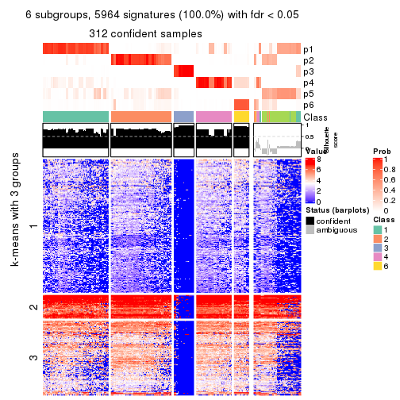</p>

</div>
</div>


Compare the overlap of signatures from different k:

```r
compare_signatures(res)
```


`get_signature()` returns a data frame invisibly. TO get the list of signatures, the function
call should be assigned to a variable explicitly. In following code, if `plot` argument is set
to `FALSE`, no heatmap is plotted while only the differential analysis is performed.

```r
# code only for demonstration
tb = get_signature(res, k = ..., plot = FALSE)
```

An example of the output of `tb` is:

```
#>   which_row         fdr    mean_1    mean_2 scaled_mean_1 scaled_mean_2 km
#> 1        38 0.042760348  8.373488  9.131774    -0.5533452     0.5164555  1
#> 2        40 0.018707592  7.106213  8.469186    -0.6173731     0.5762149  1
#> 3        55 0.019134737 10.221463 11.207825    -0.6159697     0.5749050  1
#> 4        59 0.006059896  5.921854  7.869574    -0.6899429     0.6439467  1
#> 5        60 0.018055526  8.928898 10.211722    -0.6204761     0.5791110  1
#> 6        98 0.009384629 15.714769 14.887706     0.6635654    -0.6193277  2
...
```

The columns in `tb` are:

1. `which_row`: row indices corresponding to the input matrix.
2. `fdr`: FDR for the differential test. 
3. `mean_x`: The mean value in group x.
4. `scaled_mean_x`: The mean value in group x after rows are scaled.
5. `km`: Row groups if k-means clustering is applied to rows.


UMAP plot which shows how samples are separated.


<script>
$( function() {
	$( '#tabs-MAD-mclust-dimension-reduction' ).tabs();
} );
</script>
<div id='tabs-MAD-mclust-dimension-reduction'>
<ul>
<li><a href='#tab-MAD-mclust-dimension-reduction-1'>k = 2</a></li>
<li><a href='#tab-MAD-mclust-dimension-reduction-2'>k = 3</a></li>
<li><a href='#tab-MAD-mclust-dimension-reduction-3'>k = 4</a></li>
<li><a href='#tab-MAD-mclust-dimension-reduction-4'>k = 5</a></li>
<li><a href='#tab-MAD-mclust-dimension-reduction-5'>k = 6</a></li>
</ul>
<div id='tab-MAD-mclust-dimension-reduction-1'>
<pre><code class="r">dimension_reduction(res, k = 2, method = &quot;UMAP&quot;)
</code></pre>

<p>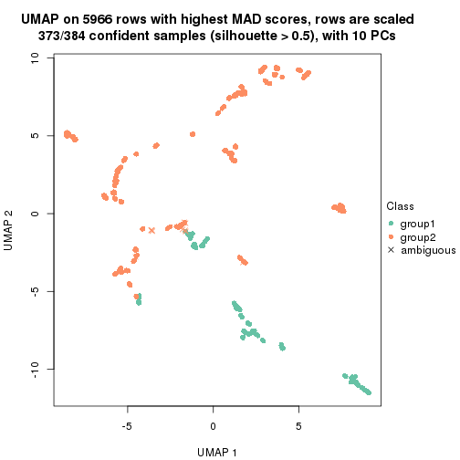</p>

</div>
<div id='tab-MAD-mclust-dimension-reduction-2'>
<pre><code class="r">dimension_reduction(res, k = 3, method = &quot;UMAP&quot;)
</code></pre>

<p></p>

</div>
<div id='tab-MAD-mclust-dimension-reduction-3'>
<pre><code class="r">dimension_reduction(res, k = 4, method = &quot;UMAP&quot;)
</code></pre>

<p></p>

</div>
<div id='tab-MAD-mclust-dimension-reduction-4'>
<pre><code class="r">dimension_reduction(res, k = 5, method = &quot;UMAP&quot;)
</code></pre>

<p></p>

</div>
<div id='tab-MAD-mclust-dimension-reduction-5'>
<pre><code class="r">dimension_reduction(res, k = 6, method = &quot;UMAP&quot;)
</code></pre>

<p></p>

</div>
</div>


Following heatmap shows how subgroups are split when increasing `k`:

```r
collect_classes(res)
```


If matrix rows can be associated to genes, consider to use `GO_Enrichment(res,
...)` to perform function enrichment for the signature genes.


 

---------------------------------------------------


### MAD:NMF


The object with results only for a single top-value method and a single partition method 
can be extracted as:

```r
res = res_list["MAD", "NMF"]
# you can also extract it by
# res = res_list["MAD:NMF"]
```

A summary of `res` and all the functions that can be applied to it:

```r
res
```

```
#> A 'ConsensusPartition' object with k = 2, 3, 4, 5, 6.
#>   On a matrix with 5966 rows and 384 columns.
#>   Top rows (597, 1194, 1790, 2386, 2983) are extracted by 'MAD' method.
#>   Subgroups are detected by 'NMF' method.
#>   Performed in total 1250 partitions by row resampling.
#>   Best k for subgroups seems to be 2.
#> 
#> Following methods can be applied to this 'ConsensusPartition' object:
#>  [1] "cola_report"             "collect_classes"         "collect_plots"          
#>  [4] "collect_stats"           "colnames"                "compare_signatures"     
#>  [7] "consensus_heatmap"       "dimension_reduction"     "functional_enrichment"  
#> [10] "get_anno_col"            "get_anno"                "get_classes"            
#> [13] "get_consensus"           "get_matrix"              "get_membership"         
#> [16] "get_param"               "get_signatures"          "get_stats"              
#> [19] "is_best_k"               "is_stable_k"             "membership_heatmap"     
#> [22] "ncol"                    "nrow"                    "plot_ecdf"              
#> [25] "rownames"                "select_partition_number" "show"                   
#> [28] "suggest_best_k"          "test_to_known_factors"
```

`collect_plots()` function collects all the plots made from `res` for all `k` (number of partitions)
into one single page to provide an easy and fast comparison between different `k`.

```r
collect_plots(res)
```


The plots are:

- The first row: a plot of the ECDF (Empirical cumulative distribution
  function) curves of the consensus matrix for each `k` and the heatmap of
  predicted classes for each `k`.
- The second row: heatmaps of the consensus matrix for each `k`.
- The third row: heatmaps of the membership matrix for each `k`.
- The fouth row: heatmaps of the signatures for each `k`.

All the plots in panels can be made by individual functions and they are
plotted later in this section.

`select_partition_number()` produces several plots showing different
statistics for choosing "optimized" `k`. There are following statistics:

- ECDF curves of the consensus matrix for each `k`;
- 1-PAC. [The PAC
  score](https://en.wikipedia.org/wiki/Consensus_clustering#Over-interpretation_potential_of_consensus_clustering)
  measures the proportion of the ambiguous subgrouping.
- Mean silhouette score.
- Concordance. The mean probability of fiting the consensus class ids in all
  partitions.
- Area increased. Denote $A_k$ as the area under the ECDF curve for current
  `k`, the area increased is defined as $A_k - A_{k-1}$.
- Rand index. The percent of pairs of samples that are both in a same cluster
  or both are not in a same cluster in the partition of k and k-1.
- Jaccard index. The ratio of pairs of samples are both in a same cluster in
  the partition of k and k-1 and the pairs of samples are both in a same
  cluster in the partition k or k-1.

The detailed explanations of these statistics can be found in [the cola
vignette](http://bioconductor.org/packages/devel/bioc/vignettes/cola/inst/doc/cola.html#toc_13).

Generally speaking, lower PAC score, higher mean silhouette score or higher
concordance corresponds to better partition. Rand index and Jaccard index
measure how similar the current partition is compared to partition with `k-1`.
If they are too similar, we won't accept `k` is better than `k-1`.

```r
select_partition_number(res)
```


The numeric values for all these statistics can be obtained by `get_stats()`.

```r
get_stats(res)
```

```
#>   k 1-PAC mean_silhouette concordance area_increased  Rand Jaccard
#> 2 2 0.867           0.905       0.962         0.4778 0.520   0.520
#> 3 3 0.537           0.627       0.824         0.2908 0.831   0.684
#> 4 4 0.435           0.577       0.719         0.1359 0.802   0.538
#> 5 5 0.501           0.498       0.696         0.0843 0.909   0.697
#> 6 6 0.540           0.438       0.680         0.0379 0.912   0.668
```

`suggest_best_k()` suggests the best $k$ based on these statistics. The rules are as follows:

- All $k$ with Jaccard index larger than 0.95 are removed because the increase of
  the partition number does not provides enough extra information. If all $k$ are removed,
  the best $k$ is assigned by `NA`.
- For $k$ with 1-PAC larger than 0.9, the maximal $k$ is taken as the "best k". Other $k$ is called "optional k".
- If it does not fit the second rule. The $k$ with the highest vote of highest
  1-PAC, mean silhouette and concordance is taken as the "best k".

```r
suggest_best_k(res)
```

```
#> [1] 2
```


Following shows the table of the partitions (You need to click the **show/hide
code output** link to see it). The membership matrix (columns with name `p*`)
is inferred by
[`clue::cl_consensus()`](https://www.rdocumentation.org/link/cl_consensus?package=clue)
function with the `SE` method. Basically the value in the membership matrix
represents the probability to belong to a certain group. The finall class
label for an item is determined with the group with highest probability it
belongs to.

In `get_classes()` function, the entropy is calculated from the membership
matrix and the silhouette score is calculated from the consensus matrix.


<script>
$( function() {
	$( '#tabs-MAD-NMF-get-classes' ).tabs();
} );
</script>
<div id='tabs-MAD-NMF-get-classes'>
<ul>
<li><a href='#tab-MAD-NMF-get-classes-1'>k = 2</a></li>
<li><a href='#tab-MAD-NMF-get-classes-2'>k = 3</a></li>
<li><a href='#tab-MAD-NMF-get-classes-3'>k = 4</a></li>
<li><a href='#tab-MAD-NMF-get-classes-4'>k = 5</a></li>
<li><a href='#tab-MAD-NMF-get-classes-5'>k = 6</a></li>
</ul>

<div id='tab-MAD-NMF-get-classes-1'>
<p><a id='tab-MAD-NMF-get-classes-1-a' style='color:#0366d6' href='#'>show/hide code output</a></p>
<pre><code class="r">cbind(get_classes(res, k = 2), get_membership(res, k = 2))
</code></pre>

<pre><code>#&gt;           class entropy silhouette    p1    p2
#&gt; SRR490216     2  0.0000    0.97008 0.000 1.000
#&gt; SRR490217     2  0.0000    0.97008 0.000 1.000
#&gt; SRR490218     2  0.0000    0.97008 0.000 1.000
#&gt; SRR490219     2  0.0000    0.97008 0.000 1.000
#&gt; SRR490220     1  0.0000    0.94316 1.000 0.000
#&gt; SRR490221     1  0.7674    0.71973 0.776 0.224
#&gt; SRR490222     1  0.0000    0.94316 1.000 0.000
#&gt; SRR490223     1  0.0376    0.94088 0.996 0.004
#&gt; SRR490224     1  0.0000    0.94316 1.000 0.000
#&gt; SRR490225     1  0.0000    0.94316 1.000 0.000
#&gt; SRR490226     1  0.0000    0.94316 1.000 0.000
#&gt; SRR490227     1  0.0000    0.94316 1.000 0.000
#&gt; SRR490228     1  0.0000    0.94316 1.000 0.000
#&gt; SRR490229     1  0.0000    0.94316 1.000 0.000
#&gt; SRR490230     1  0.0000    0.94316 1.000 0.000
#&gt; SRR490231     1  0.0000    0.94316 1.000 0.000
#&gt; SRR490232     1  0.0000    0.94316 1.000 0.000
#&gt; SRR490233     1  0.0000    0.94316 1.000 0.000
#&gt; SRR490234     1  0.0000    0.94316 1.000 0.000
#&gt; SRR490235     1  0.0000    0.94316 1.000 0.000
#&gt; SRR490236     1  0.0000    0.94316 1.000 0.000
#&gt; SRR490237     1  0.0000    0.94316 1.000 0.000
#&gt; SRR490238     1  0.0000    0.94316 1.000 0.000
#&gt; SRR490239     1  0.0000    0.94316 1.000 0.000
#&gt; SRR490240     1  0.0000    0.94316 1.000 0.000
#&gt; SRR490241     1  0.0000    0.94316 1.000 0.000
#&gt; SRR490242     1  0.0000    0.94316 1.000 0.000
#&gt; SRR490243     1  0.0000    0.94316 1.000 0.000
#&gt; SRR490244     1  0.2236    0.91883 0.964 0.036
#&gt; SRR490245     1  0.2043    0.92173 0.968 0.032
#&gt; SRR490246     1  0.3274    0.89999 0.940 0.060
#&gt; SRR490247     1  0.2043    0.92196 0.968 0.032
#&gt; SRR490248     2  0.0000    0.97008 0.000 1.000
#&gt; SRR490249     2  0.0000    0.97008 0.000 1.000
#&gt; SRR490250     2  0.0000    0.97008 0.000 1.000
#&gt; SRR490251     2  0.0000    0.97008 0.000 1.000
#&gt; SRR490252     1  0.0938    0.93576 0.988 0.012
#&gt; SRR490253     1  0.5946    0.82085 0.856 0.144
#&gt; SRR490254     2  0.9988    0.01433 0.480 0.520
#&gt; SRR490255     1  0.9661    0.40590 0.608 0.392
#&gt; SRR490256     1  0.0000    0.94316 1.000 0.000
#&gt; SRR490257     1  0.0000    0.94316 1.000 0.000
#&gt; SRR490258     1  0.0000    0.94316 1.000 0.000
#&gt; SRR490259     1  0.0000    0.94316 1.000 0.000
#&gt; SRR490260     1  0.0000    0.94316 1.000 0.000
#&gt; SRR490261     1  0.0000    0.94316 1.000 0.000
#&gt; SRR490262     1  0.0000    0.94316 1.000 0.000
#&gt; SRR490263     1  0.0000    0.94316 1.000 0.000
#&gt; SRR490264     1  0.0000    0.94316 1.000 0.000
#&gt; SRR490265     1  0.0000    0.94316 1.000 0.000
#&gt; SRR490266     1  0.0000    0.94316 1.000 0.000
#&gt; SRR490267     1  0.0000    0.94316 1.000 0.000
#&gt; SRR490268     1  0.0000    0.94316 1.000 0.000
#&gt; SRR490269     1  0.0000    0.94316 1.000 0.000
#&gt; SRR490270     1  0.0000    0.94316 1.000 0.000
#&gt; SRR490271     1  0.0000    0.94316 1.000 0.000
#&gt; SRR490272     1  0.0000    0.94316 1.000 0.000
#&gt; SRR490273     1  0.0000    0.94316 1.000 0.000
#&gt; SRR490274     1  0.0000    0.94316 1.000 0.000
#&gt; SRR490275     1  0.0000    0.94316 1.000 0.000
#&gt; SRR490276     1  0.0000    0.94316 1.000 0.000
#&gt; SRR490277     1  0.0000    0.94316 1.000 0.000
#&gt; SRR490278     1  0.0000    0.94316 1.000 0.000
#&gt; SRR490279     1  0.0000    0.94316 1.000 0.000
#&gt; SRR490280     2  0.7602    0.70090 0.220 0.780
#&gt; SRR490281     2  0.7056    0.74615 0.192 0.808
#&gt; SRR490282     2  0.9896    0.18486 0.440 0.560
#&gt; SRR490283     2  0.8443    0.61525 0.272 0.728
#&gt; SRR490284     1  0.0000    0.94316 1.000 0.000
#&gt; SRR490285     1  0.0000    0.94316 1.000 0.000
#&gt; SRR490286     1  0.0000    0.94316 1.000 0.000
#&gt; SRR490287     1  0.0000    0.94316 1.000 0.000
#&gt; SRR490288     1  0.0000    0.94316 1.000 0.000
#&gt; SRR490289     1  0.0000    0.94316 1.000 0.000
#&gt; SRR490290     1  0.0672    0.93848 0.992 0.008
#&gt; SRR490291     1  0.0000    0.94316 1.000 0.000
#&gt; SRR490292     1  0.0000    0.94316 1.000 0.000
#&gt; SRR490293     1  0.0000    0.94316 1.000 0.000
#&gt; SRR490294     1  0.0000    0.94316 1.000 0.000
#&gt; SRR490295     1  0.0000    0.94316 1.000 0.000
#&gt; SRR490296     2  0.0000    0.97008 0.000 1.000
#&gt; SRR490297     2  0.0000    0.97008 0.000 1.000
#&gt; SRR490298     2  0.0000    0.97008 0.000 1.000
#&gt; SRR490299     2  0.0000    0.97008 0.000 1.000
#&gt; SRR490300     1  0.0376    0.94086 0.996 0.004
#&gt; SRR490301     1  0.1414    0.93009 0.980 0.020
#&gt; SRR490302     1  0.0672    0.93842 0.992 0.008
#&gt; SRR490303     1  0.0000    0.94316 1.000 0.000
#&gt; SRR490304     2  0.0000    0.97008 0.000 1.000
#&gt; SRR490305     2  0.0000    0.97008 0.000 1.000
#&gt; SRR490306     2  0.0000    0.97008 0.000 1.000
#&gt; SRR490307     2  0.0000    0.97008 0.000 1.000
#&gt; SRR490308     1  0.8955    0.57034 0.688 0.312
#&gt; SRR490309     2  1.0000   -0.03459 0.496 0.504
#&gt; SRR490310     1  0.9661    0.39602 0.608 0.392
#&gt; SRR490311     1  0.4939    0.85637 0.892 0.108
#&gt; SRR490312     2  0.0000    0.97008 0.000 1.000
#&gt; SRR490313     2  0.0000    0.97008 0.000 1.000
#&gt; SRR490314     2  0.0000    0.97008 0.000 1.000
#&gt; SRR490315     2  0.0000    0.97008 0.000 1.000
#&gt; SRR490316     2  0.9996   -0.00232 0.488 0.512
#&gt; SRR490317     2  0.7674    0.69708 0.224 0.776
#&gt; SRR490318     2  0.9710    0.30847 0.400 0.600
#&gt; SRR490319     1  0.9944    0.20692 0.544 0.456
#&gt; SRR490320     1  0.0000    0.94316 1.000 0.000
#&gt; SRR490321     1  0.0000    0.94316 1.000 0.000
#&gt; SRR490322     1  0.0000    0.94316 1.000 0.000
#&gt; SRR490323     1  0.0000    0.94316 1.000 0.000
#&gt; SRR490324     1  0.0000    0.94316 1.000 0.000
#&gt; SRR490325     1  0.0000    0.94316 1.000 0.000
#&gt; SRR490326     1  0.0376    0.94088 0.996 0.004
#&gt; SRR490327     1  0.0000    0.94316 1.000 0.000
#&gt; SRR490328     2  0.1633    0.94825 0.024 0.976
#&gt; SRR490329     2  0.1843    0.94449 0.028 0.972
#&gt; SRR490330     2  0.0000    0.97008 0.000 1.000
#&gt; SRR490331     2  0.0000    0.97008 0.000 1.000
#&gt; SRR490332     1  0.7602    0.72135 0.780 0.220
#&gt; SRR490333     2  0.7453    0.71560 0.212 0.788
#&gt; SRR490334     2  0.8555    0.59527 0.280 0.720
#&gt; SRR490335     1  0.9686    0.38849 0.604 0.396
#&gt; SRR490336     2  0.0000    0.97008 0.000 1.000
#&gt; SRR490337     2  0.0000    0.97008 0.000 1.000
#&gt; SRR490338     2  0.0000    0.97008 0.000 1.000
#&gt; SRR490339     2  0.0000    0.97008 0.000 1.000
#&gt; SRR490340     1  0.0376    0.94089 0.996 0.004
#&gt; SRR490341     1  0.0000    0.94316 1.000 0.000
#&gt; SRR490342     1  0.0000    0.94316 1.000 0.000
#&gt; SRR490343     1  0.0672    0.93857 0.992 0.008
#&gt; SRR490344     2  0.0000    0.97008 0.000 1.000
#&gt; SRR490345     2  0.0000    0.97008 0.000 1.000
#&gt; SRR490346     2  0.0000    0.97008 0.000 1.000
#&gt; SRR490347     2  0.0000    0.97008 0.000 1.000
#&gt; SRR490348     2  0.0000    0.97008 0.000 1.000
#&gt; SRR490349     2  0.0000    0.97008 0.000 1.000
#&gt; SRR490350     2  0.0000    0.97008 0.000 1.000
#&gt; SRR490351     2  0.0000    0.97008 0.000 1.000
#&gt; SRR490352     2  0.0000    0.97008 0.000 1.000
#&gt; SRR490353     2  0.0000    0.97008 0.000 1.000
#&gt; SRR490354     2  0.0000    0.97008 0.000 1.000
#&gt; SRR490355     2  0.0000    0.97008 0.000 1.000
#&gt; SRR490356     2  0.0672    0.96300 0.008 0.992
#&gt; SRR490357     2  0.0000    0.97008 0.000 1.000
#&gt; SRR490358     2  0.0672    0.96301 0.008 0.992
#&gt; SRR490359     2  0.1184    0.95569 0.016 0.984
#&gt; SRR490360     2  0.0000    0.97008 0.000 1.000
#&gt; SRR490361     2  0.0000    0.97008 0.000 1.000
#&gt; SRR490362     2  0.0000    0.97008 0.000 1.000
#&gt; SRR490363     2  0.0000    0.97008 0.000 1.000
#&gt; SRR490364     2  0.0000    0.97008 0.000 1.000
#&gt; SRR490365     2  0.0000    0.97008 0.000 1.000
#&gt; SRR490366     2  0.0000    0.97008 0.000 1.000
#&gt; SRR490367     2  0.0000    0.97008 0.000 1.000
#&gt; SRR490368     2  0.0000    0.97008 0.000 1.000
#&gt; SRR490369     2  0.0000    0.97008 0.000 1.000
#&gt; SRR490370     2  0.0000    0.97008 0.000 1.000
#&gt; SRR490371     2  0.0000    0.97008 0.000 1.000
#&gt; SRR490372     2  0.9963    0.09611 0.464 0.536
#&gt; SRR490373     2  0.7299    0.72700 0.204 0.796
#&gt; SRR490374     2  0.8763    0.56282 0.296 0.704
#&gt; SRR490375     2  0.7528    0.70902 0.216 0.784
#&gt; SRR490376     2  0.0000    0.97008 0.000 1.000
#&gt; SRR490377     2  0.0000    0.97008 0.000 1.000
#&gt; SRR490378     2  0.0000    0.97008 0.000 1.000
#&gt; SRR490379     2  0.0000    0.97008 0.000 1.000
#&gt; SRR490380     2  0.5519    0.83490 0.128 0.872
#&gt; SRR490381     2  0.9954    0.10236 0.460 0.540
#&gt; SRR490382     1  0.3114    0.90268 0.944 0.056
#&gt; SRR490383     1  0.6048    0.81533 0.852 0.148
#&gt; SRR490384     2  0.0000    0.97008 0.000 1.000
#&gt; SRR490385     2  0.0000    0.97008 0.000 1.000
#&gt; SRR490386     2  0.0000    0.97008 0.000 1.000
#&gt; SRR490387     2  0.0000    0.97008 0.000 1.000
#&gt; SRR490388     2  0.0000    0.97008 0.000 1.000
#&gt; SRR490389     2  0.0000    0.97008 0.000 1.000
#&gt; SRR490390     2  0.0000    0.97008 0.000 1.000
#&gt; SRR490391     2  0.0000    0.97008 0.000 1.000
#&gt; SRR490392     2  0.0000    0.97008 0.000 1.000
#&gt; SRR490393     2  0.0000    0.97008 0.000 1.000
#&gt; SRR490394     2  0.0000    0.97008 0.000 1.000
#&gt; SRR490395     2  0.0000    0.97008 0.000 1.000
#&gt; SRR490396     2  0.0000    0.97008 0.000 1.000
#&gt; SRR490397     2  0.0000    0.97008 0.000 1.000
#&gt; SRR490398     2  0.0000    0.97008 0.000 1.000
#&gt; SRR490399     2  0.0000    0.97008 0.000 1.000
#&gt; SRR490400     2  0.0000    0.97008 0.000 1.000
#&gt; SRR490401     2  0.0000    0.97008 0.000 1.000
#&gt; SRR490402     2  0.0000    0.97008 0.000 1.000
#&gt; SRR490403     2  0.0000    0.97008 0.000 1.000
#&gt; SRR490404     2  0.0000    0.97008 0.000 1.000
#&gt; SRR490405     2  0.0000    0.97008 0.000 1.000
#&gt; SRR490406     2  0.0000    0.97008 0.000 1.000
#&gt; SRR490407     2  0.0000    0.97008 0.000 1.000
#&gt; SRR490408     2  0.0000    0.97008 0.000 1.000
#&gt; SRR490409     2  0.0000    0.97008 0.000 1.000
#&gt; SRR490410     2  0.0000    0.97008 0.000 1.000
#&gt; SRR490411     2  0.0000    0.97008 0.000 1.000
#&gt; SRR490412     2  0.7883    0.67926 0.236 0.764
#&gt; SRR490413     1  0.5737    0.82800 0.864 0.136
#&gt; SRR490414     1  0.9754    0.35137 0.592 0.408
#&gt; SRR490415     1  0.9286    0.50992 0.656 0.344
#&gt; SRR490416     1  0.0000    0.94316 1.000 0.000
#&gt; SRR490417     1  0.4815    0.86055 0.896 0.104
#&gt; SRR490418     1  0.9044    0.56154 0.680 0.320
#&gt; SRR490419     1  0.8386    0.65262 0.732 0.268
#&gt; SRR490420     1  0.0000    0.94316 1.000 0.000
#&gt; SRR490421     1  0.0000    0.94316 1.000 0.000
#&gt; SRR490422     1  0.0000    0.94316 1.000 0.000
#&gt; SRR490423     1  0.0000    0.94316 1.000 0.000
#&gt; SRR490424     1  0.0000    0.94316 1.000 0.000
#&gt; SRR490425     1  0.0000    0.94316 1.000 0.000
#&gt; SRR490426     1  0.0000    0.94316 1.000 0.000
#&gt; SRR490427     1  0.0000    0.94316 1.000 0.000
#&gt; SRR490428     1  0.0000    0.94316 1.000 0.000
#&gt; SRR490429     1  0.0000    0.94316 1.000 0.000
#&gt; SRR490430     1  0.0000    0.94316 1.000 0.000
#&gt; SRR490431     1  0.0000    0.94316 1.000 0.000
#&gt; SRR490432     1  0.0000    0.94316 1.000 0.000
#&gt; SRR490433     1  0.0000    0.94316 1.000 0.000
#&gt; SRR490434     1  0.0000    0.94316 1.000 0.000
#&gt; SRR490435     1  0.0000    0.94316 1.000 0.000
#&gt; SRR490436     1  0.0000    0.94316 1.000 0.000
#&gt; SRR490437     1  0.0000    0.94316 1.000 0.000
#&gt; SRR490438     1  0.0000    0.94316 1.000 0.000
#&gt; SRR490439     1  0.0000    0.94316 1.000 0.000
#&gt; SRR490440     2  0.0000    0.97008 0.000 1.000
#&gt; SRR490441     2  0.0000    0.97008 0.000 1.000
#&gt; SRR490442     2  0.0000    0.97008 0.000 1.000
#&gt; SRR490443     2  0.0000    0.97008 0.000 1.000
#&gt; SRR490444     2  0.0000    0.97008 0.000 1.000
#&gt; SRR490445     2  0.0000    0.97008 0.000 1.000
#&gt; SRR490446     2  0.0000    0.97008 0.000 1.000
#&gt; SRR490447     2  0.0000    0.97008 0.000 1.000
#&gt; SRR490448     1  0.0000    0.94316 1.000 0.000
#&gt; SRR490449     1  0.0000    0.94316 1.000 0.000
#&gt; SRR490450     1  0.0000    0.94316 1.000 0.000
#&gt; SRR490451     1  0.0000    0.94316 1.000 0.000
#&gt; SRR490452     1  0.0000    0.94316 1.000 0.000
#&gt; SRR490453     1  0.0000    0.94316 1.000 0.000
#&gt; SRR490454     1  0.0000    0.94316 1.000 0.000
#&gt; SRR490455     1  0.0000    0.94316 1.000 0.000
#&gt; SRR490456     1  0.0000    0.94316 1.000 0.000
#&gt; SRR490457     1  0.0000    0.94316 1.000 0.000
#&gt; SRR490458     1  0.0000    0.94316 1.000 0.000
#&gt; SRR490459     1  0.0000    0.94316 1.000 0.000
#&gt; SRR490460     1  0.0000    0.94316 1.000 0.000
#&gt; SRR490461     1  0.0000    0.94316 1.000 0.000
#&gt; SRR490462     1  0.0000    0.94316 1.000 0.000
#&gt; SRR490463     1  0.0000    0.94316 1.000 0.000
#&gt; SRR490464     1  0.4562    0.86688 0.904 0.096
#&gt; SRR490465     1  0.9866    0.28438 0.568 0.432
#&gt; SRR490466     1  0.8909    0.58271 0.692 0.308
#&gt; SRR490467     1  0.9323    0.50225 0.652 0.348
#&gt; SRR490468     1  0.0000    0.94316 1.000 0.000
#&gt; SRR490469     1  0.0000    0.94316 1.000 0.000
#&gt; SRR490470     1  0.0000    0.94316 1.000 0.000
#&gt; SRR490471     1  0.0000    0.94316 1.000 0.000
#&gt; SRR490472     2  0.0000    0.97008 0.000 1.000
#&gt; SRR490473     2  0.0000    0.97008 0.000 1.000
#&gt; SRR490474     2  0.0000    0.97008 0.000 1.000
#&gt; SRR490475     2  0.0000    0.97008 0.000 1.000
#&gt; SRR490476     2  0.9732    0.28991 0.404 0.596
#&gt; SRR490477     1  0.9988    0.12277 0.520 0.480
#&gt; SRR490478     1  0.9491    0.45440 0.632 0.368
#&gt; SRR490479     2  0.7883    0.67544 0.236 0.764
#&gt; SRR490480     2  0.0000    0.97008 0.000 1.000
#&gt; SRR490481     2  0.0000    0.97008 0.000 1.000
#&gt; SRR490482     2  0.0000    0.97008 0.000 1.000
#&gt; SRR490483     2  0.0000    0.97008 0.000 1.000
#&gt; SRR490484     2  0.0000    0.97008 0.000 1.000
#&gt; SRR490485     2  0.0000    0.97008 0.000 1.000
#&gt; SRR490486     2  0.0000    0.97008 0.000 1.000
#&gt; SRR490487     2  0.0000    0.97008 0.000 1.000
#&gt; SRR490488     2  0.0000    0.97008 0.000 1.000
#&gt; SRR490489     2  0.0000    0.97008 0.000 1.000
#&gt; SRR490490     2  0.0000    0.97008 0.000 1.000
#&gt; SRR490491     2  0.0000    0.97008 0.000 1.000
#&gt; SRR490492     2  0.0000    0.97008 0.000 1.000
#&gt; SRR490493     2  0.0000    0.97008 0.000 1.000
#&gt; SRR490494     2  0.0000    0.97008 0.000 1.000
#&gt; SRR490495     2  0.0000    0.97008 0.000 1.000
#&gt; SRR490496     2  0.0000    0.97008 0.000 1.000
#&gt; SRR490497     2  0.0000    0.97008 0.000 1.000
#&gt; SRR490498     2  0.0000    0.97008 0.000 1.000
#&gt; SRR490499     2  0.0000    0.97008 0.000 1.000
#&gt; SRR490500     1  0.9732    0.36611 0.596 0.404
#&gt; SRR490501     1  0.9170    0.53381 0.668 0.332
#&gt; SRR490502     1  0.9922    0.23656 0.552 0.448
#&gt; SRR490503     1  0.8608    0.62272 0.716 0.284
#&gt; SRR490504     2  0.0000    0.97008 0.000 1.000
#&gt; SRR490505     2  0.0000    0.97008 0.000 1.000
#&gt; SRR490506     2  0.0000    0.97008 0.000 1.000
#&gt; SRR490507     2  0.0000    0.97008 0.000 1.000
#&gt; SRR490508     2  0.0000    0.97008 0.000 1.000
#&gt; SRR490509     2  0.0000    0.97008 0.000 1.000
#&gt; SRR490510     2  0.0000    0.97008 0.000 1.000
#&gt; SRR490511     2  0.0000    0.97008 0.000 1.000
#&gt; SRR490512     2  0.0000    0.97008 0.000 1.000
#&gt; SRR490513     2  0.0000    0.97008 0.000 1.000
#&gt; SRR490514     2  0.0000    0.97008 0.000 1.000
#&gt; SRR490515     2  0.0000    0.97008 0.000 1.000
#&gt; SRR490516     2  0.0000    0.97008 0.000 1.000
#&gt; SRR490517     2  0.0000    0.97008 0.000 1.000
#&gt; SRR490518     2  0.0000    0.97008 0.000 1.000
#&gt; SRR490519     2  0.0000    0.97008 0.000 1.000
#&gt; SRR490520     2  0.0000    0.97008 0.000 1.000
#&gt; SRR490521     2  0.0000    0.97008 0.000 1.000
#&gt; SRR490522     2  0.0000    0.97008 0.000 1.000
#&gt; SRR490523     2  0.0000    0.97008 0.000 1.000
#&gt; SRR490524     2  0.0000    0.97008 0.000 1.000
#&gt; SRR490525     2  0.0000    0.97008 0.000 1.000
#&gt; SRR490526     2  0.0000    0.97008 0.000 1.000
#&gt; SRR490527     2  0.0000    0.97008 0.000 1.000
#&gt; SRR490528     2  0.0000    0.97008 0.000 1.000
#&gt; SRR490529     2  0.0000    0.97008 0.000 1.000
#&gt; SRR490530     2  0.0000    0.97008 0.000 1.000
#&gt; SRR490531     2  0.0000    0.97008 0.000 1.000
#&gt; SRR490532     1  0.1184    0.93324 0.984 0.016
#&gt; SRR490533     1  0.3733    0.88919 0.928 0.072
#&gt; SRR490534     1  0.0000    0.94316 1.000 0.000
#&gt; SRR490535     1  0.0672    0.93847 0.992 0.008
#&gt; SRR490536     2  0.0000    0.97008 0.000 1.000
#&gt; SRR490537     2  0.0000    0.97008 0.000 1.000
#&gt; SRR490538     2  0.0000    0.97008 0.000 1.000
#&gt; SRR490539     2  0.0000    0.97008 0.000 1.000
#&gt; SRR490540     2  0.0000    0.97008 0.000 1.000
#&gt; SRR490541     2  0.0000    0.97008 0.000 1.000
#&gt; SRR490542     2  0.0000    0.97008 0.000 1.000
#&gt; SRR490543     2  0.0000    0.97008 0.000 1.000
#&gt; SRR490544     2  0.0000    0.97008 0.000 1.000
#&gt; SRR490545     2  0.0000    0.97008 0.000 1.000
#&gt; SRR490546     2  0.0000    0.97008 0.000 1.000
#&gt; SRR490547     2  0.0000    0.97008 0.000 1.000
#&gt; SRR490548     2  0.0000    0.97008 0.000 1.000
#&gt; SRR490549     2  0.0000    0.97008 0.000 1.000
#&gt; SRR490550     2  0.0000    0.97008 0.000 1.000
#&gt; SRR490551     2  0.0000    0.97008 0.000 1.000
#&gt; SRR490552     2  0.0000    0.97008 0.000 1.000
#&gt; SRR490553     2  0.0000    0.97008 0.000 1.000
#&gt; SRR490554     2  0.0000    0.97008 0.000 1.000
#&gt; SRR490555     2  0.0000    0.97008 0.000 1.000
#&gt; SRR490556     2  0.0000    0.97008 0.000 1.000
#&gt; SRR490557     2  0.0000    0.97008 0.000 1.000
#&gt; SRR490558     2  0.0000    0.97008 0.000 1.000
#&gt; SRR490559     2  0.0000    0.97008 0.000 1.000
#&gt; SRR490560     2  0.0000    0.97008 0.000 1.000
#&gt; SRR490561     2  0.0000    0.97008 0.000 1.000
#&gt; SRR490562     2  0.0000    0.97008 0.000 1.000
#&gt; SRR490563     2  0.0000    0.97008 0.000 1.000
#&gt; SRR490564     2  0.1184    0.95578 0.016 0.984
#&gt; SRR490565     2  0.0672    0.96297 0.008 0.992
#&gt; SRR490566     2  0.1184    0.95573 0.016 0.984
#&gt; SRR490567     2  0.0000    0.97008 0.000 1.000
#&gt; SRR490568     2  0.0000    0.97008 0.000 1.000
#&gt; SRR490569     2  0.0000    0.97008 0.000 1.000
#&gt; SRR490570     2  0.0000    0.97008 0.000 1.000
#&gt; SRR490571     2  0.0000    0.97008 0.000 1.000
#&gt; SRR490572     2  0.0000    0.97008 0.000 1.000
#&gt; SRR490573     2  0.0000    0.97008 0.000 1.000
#&gt; SRR490574     2  0.0000    0.97008 0.000 1.000
#&gt; SRR490575     2  0.0000    0.97008 0.000 1.000
#&gt; SRR490576     2  0.0000    0.97008 0.000 1.000
#&gt; SRR490577     2  0.0000    0.97008 0.000 1.000
#&gt; SRR490578     2  0.0000    0.97008 0.000 1.000
#&gt; SRR490579     2  0.0000    0.97008 0.000 1.000
#&gt; SRR490580     2  0.0000    0.97008 0.000 1.000
#&gt; SRR490581     2  0.0000    0.97008 0.000 1.000
#&gt; SRR490582     2  0.0000    0.97008 0.000 1.000
#&gt; SRR490583     2  0.0000    0.97008 0.000 1.000
#&gt; SRR490584     2  0.0000    0.97008 0.000 1.000
#&gt; SRR490585     2  0.0000    0.97008 0.000 1.000
#&gt; SRR490586     2  0.0000    0.97008 0.000 1.000
#&gt; SRR490587     2  0.0000    0.97008 0.000 1.000
#&gt; SRR490588     2  0.0000    0.97008 0.000 1.000
#&gt; SRR490589     2  0.0000    0.97008 0.000 1.000
#&gt; SRR490590     2  0.0000    0.97008 0.000 1.000
#&gt; SRR490591     2  0.0000    0.97008 0.000 1.000
#&gt; SRR490592     2  0.0000    0.97008 0.000 1.000
#&gt; SRR490593     2  0.0000    0.97008 0.000 1.000
#&gt; SRR490594     2  0.0000    0.97008 0.000 1.000
#&gt; SRR490595     2  0.0000    0.97008 0.000 1.000
#&gt; SRR490596     2  0.0000    0.97008 0.000 1.000
#&gt; SRR490597     2  0.0000    0.97008 0.000 1.000
#&gt; SRR490598     2  0.0000    0.97008 0.000 1.000
#&gt; SRR490599     2  0.0000    0.97008 0.000 1.000
</code></pre>

<script>
$('#tab-MAD-NMF-get-classes-1-a').parent().next().next().hide();
$('#tab-MAD-NMF-get-classes-1-a').click(function(){
  $('#tab-MAD-NMF-get-classes-1-a').parent().next().next().toggle();
  return(false);
});
</script>
</div>

<div id='tab-MAD-NMF-get-classes-2'>
<p><a id='tab-MAD-NMF-get-classes-2-a' style='color:#0366d6' href='#'>show/hide code output</a></p>
<pre><code class="r">cbind(get_classes(res, k = 3), get_membership(res, k = 3))
</code></pre>

<pre><code>#&gt;           class entropy silhouette    p1    p2    p3
#&gt; SRR490216     3  0.5988    0.38526 0.000 0.368 0.632
#&gt; SRR490217     3  0.6111    0.32166 0.000 0.396 0.604
#&gt; SRR490218     3  0.5905    0.41013 0.000 0.352 0.648
#&gt; SRR490219     3  0.5926    0.40500 0.000 0.356 0.644
#&gt; SRR490220     1  0.5291    0.71735 0.732 0.000 0.268
#&gt; SRR490221     3  0.7666    0.38558 0.288 0.076 0.636
#&gt; SRR490222     3  0.6587    0.02794 0.424 0.008 0.568
#&gt; SRR490223     3  0.6527    0.09117 0.404 0.008 0.588
#&gt; SRR490224     1  0.4178    0.81757 0.828 0.000 0.172
#&gt; SRR490225     1  0.4121    0.82056 0.832 0.000 0.168
#&gt; SRR490226     1  0.4452    0.80858 0.808 0.000 0.192
#&gt; SRR490227     1  0.4235    0.81639 0.824 0.000 0.176
#&gt; SRR490228     1  0.4796    0.78579 0.780 0.000 0.220
#&gt; SRR490229     1  0.4931    0.77343 0.768 0.000 0.232
#&gt; SRR490230     1  0.4750    0.78764 0.784 0.000 0.216
#&gt; SRR490231     1  0.4750    0.79026 0.784 0.000 0.216
#&gt; SRR490232     1  0.3412    0.83653 0.876 0.000 0.124
#&gt; SRR490233     1  0.3116    0.84080 0.892 0.000 0.108
#&gt; SRR490234     1  0.2959    0.84316 0.900 0.000 0.100
#&gt; SRR490235     1  0.3686    0.83194 0.860 0.000 0.140
#&gt; SRR490236     1  0.5529    0.71549 0.704 0.000 0.296
#&gt; SRR490237     1  0.5216    0.75350 0.740 0.000 0.260
#&gt; SRR490238     1  0.5497    0.71958 0.708 0.000 0.292
#&gt; SRR490239     1  0.5098    0.76561 0.752 0.000 0.248
#&gt; SRR490240     1  0.4346    0.80559 0.816 0.000 0.184
#&gt; SRR490241     1  0.3482    0.83576 0.872 0.000 0.128
#&gt; SRR490242     1  0.3192    0.84261 0.888 0.000 0.112
#&gt; SRR490243     1  0.3192    0.84154 0.888 0.000 0.112
#&gt; SRR490244     3  0.6148    0.31819 0.244 0.028 0.728
#&gt; SRR490245     1  0.7652    0.30697 0.512 0.044 0.444
#&gt; SRR490246     3  0.6897    0.20431 0.292 0.040 0.668
#&gt; SRR490247     3  0.7056    0.04417 0.404 0.024 0.572
#&gt; SRR490248     3  0.5859    0.41608 0.000 0.344 0.656
#&gt; SRR490249     3  0.6111    0.32146 0.000 0.396 0.604
#&gt; SRR490250     3  0.6008    0.37036 0.000 0.372 0.628
#&gt; SRR490251     3  0.6225    0.22919 0.000 0.432 0.568
#&gt; SRR490252     1  0.7291    0.38573 0.604 0.040 0.356
#&gt; SRR490253     1  0.8264    0.00341 0.488 0.076 0.436
#&gt; SRR490254     3  0.9441    0.39377 0.200 0.316 0.484
#&gt; SRR490255     3  0.9750    0.33926 0.368 0.228 0.404
#&gt; SRR490256     1  0.4062    0.81789 0.836 0.000 0.164
#&gt; SRR490257     1  0.3116    0.84325 0.892 0.000 0.108
#&gt; SRR490258     1  0.3482    0.83690 0.872 0.000 0.128
#&gt; SRR490259     1  0.3038    0.84477 0.896 0.000 0.104
#&gt; SRR490260     1  0.2448    0.84755 0.924 0.000 0.076
#&gt; SRR490261     1  0.2448    0.84792 0.924 0.000 0.076
#&gt; SRR490262     1  0.2261    0.84825 0.932 0.000 0.068
#&gt; SRR490263     1  0.2261    0.84828 0.932 0.000 0.068
#&gt; SRR490264     1  0.4178    0.81820 0.828 0.000 0.172
#&gt; SRR490265     1  0.4062    0.82192 0.836 0.000 0.164
#&gt; SRR490266     1  0.4291    0.81464 0.820 0.000 0.180
#&gt; SRR490267     1  0.3941    0.82587 0.844 0.000 0.156
#&gt; SRR490268     1  0.2711    0.84539 0.912 0.000 0.088
#&gt; SRR490269     1  0.2625    0.84621 0.916 0.000 0.084
#&gt; SRR490270     1  0.2625    0.84621 0.916 0.000 0.084
#&gt; SRR490271     1  0.2625    0.84621 0.916 0.000 0.084
#&gt; SRR490272     1  0.2625    0.84631 0.916 0.000 0.084
#&gt; SRR490273     1  0.2625    0.84631 0.916 0.000 0.084
#&gt; SRR490274     1  0.2796    0.84473 0.908 0.000 0.092
#&gt; SRR490275     1  0.2711    0.84522 0.912 0.000 0.088
#&gt; SRR490276     1  0.3412    0.83645 0.876 0.000 0.124
#&gt; SRR490277     1  0.3116    0.84166 0.892 0.000 0.108
#&gt; SRR490278     1  0.3192    0.84107 0.888 0.000 0.112
#&gt; SRR490279     1  0.3038    0.84260 0.896 0.000 0.104
#&gt; SRR490280     3  0.2903    0.56281 0.028 0.048 0.924
#&gt; SRR490281     3  0.2434    0.55057 0.036 0.024 0.940
#&gt; SRR490282     3  0.2152    0.54616 0.036 0.016 0.948
#&gt; SRR490283     3  0.3042    0.55641 0.040 0.040 0.920
#&gt; SRR490284     3  0.6410   -0.13826 0.420 0.004 0.576
#&gt; SRR490285     3  0.6309   -0.33392 0.496 0.000 0.504
#&gt; SRR490286     3  0.6286   -0.26103 0.464 0.000 0.536
#&gt; SRR490287     3  0.6483   -0.20867 0.452 0.004 0.544
#&gt; SRR490288     1  0.1643    0.84613 0.956 0.000 0.044
#&gt; SRR490289     1  0.1529    0.84693 0.960 0.000 0.040
#&gt; SRR490290     1  0.1919    0.83969 0.956 0.024 0.020
#&gt; SRR490291     1  0.1753    0.84718 0.952 0.000 0.048
#&gt; SRR490292     1  0.5560    0.62467 0.700 0.000 0.300
#&gt; SRR490293     1  0.5058    0.72459 0.756 0.000 0.244
#&gt; SRR490294     1  0.5363    0.69793 0.724 0.000 0.276
#&gt; SRR490295     1  0.5178    0.70122 0.744 0.000 0.256
#&gt; SRR490296     2  0.0475    0.80050 0.004 0.992 0.004
#&gt; SRR490297     2  0.0424    0.79821 0.008 0.992 0.000
#&gt; SRR490298     2  0.0424    0.79821 0.008 0.992 0.000
#&gt; SRR490299     2  0.0237    0.79946 0.004 0.996 0.000
#&gt; SRR490300     1  0.5875    0.78084 0.784 0.056 0.160
#&gt; SRR490301     1  0.7036    0.68837 0.720 0.096 0.184
#&gt; SRR490302     1  0.5955    0.77621 0.772 0.048 0.180
#&gt; SRR490303     1  0.5597    0.77812 0.764 0.020 0.216
#&gt; SRR490304     2  0.0237    0.80050 0.000 0.996 0.004
#&gt; SRR490305     2  0.0237    0.80050 0.000 0.996 0.004
#&gt; SRR490306     2  0.0237    0.80050 0.000 0.996 0.004
#&gt; SRR490307     2  0.0237    0.80050 0.000 0.996 0.004
#&gt; SRR490308     3  0.6181    0.52061 0.156 0.072 0.772
#&gt; SRR490309     2  0.9623   -0.14525 0.232 0.464 0.304
#&gt; SRR490310     3  0.5449    0.53516 0.116 0.068 0.816
#&gt; SRR490311     3  0.7640    0.14193 0.372 0.052 0.576
#&gt; SRR490312     3  0.5706    0.44510 0.000 0.320 0.680
#&gt; SRR490313     3  0.5138    0.51303 0.000 0.252 0.748
#&gt; SRR490314     3  0.4974    0.52384 0.000 0.236 0.764
#&gt; SRR490315     3  0.5948    0.39254 0.000 0.360 0.640
#&gt; SRR490316     3  0.9228    0.32254 0.156 0.380 0.464
#&gt; SRR490317     3  0.7262    0.44295 0.044 0.332 0.624
#&gt; SRR490318     3  0.8439    0.38504 0.096 0.368 0.536
#&gt; SRR490319     3  0.9243    0.40223 0.168 0.340 0.492
#&gt; SRR490320     1  0.5216    0.69917 0.740 0.000 0.260
#&gt; SRR490321     1  0.4842    0.72742 0.776 0.000 0.224
#&gt; SRR490322     1  0.4750    0.75502 0.784 0.000 0.216
#&gt; SRR490323     1  0.5529    0.65837 0.704 0.000 0.296
#&gt; SRR490324     3  0.5882    0.09087 0.348 0.000 0.652
#&gt; SRR490325     3  0.5650    0.17625 0.312 0.000 0.688
#&gt; SRR490326     3  0.5706    0.16918 0.320 0.000 0.680
#&gt; SRR490327     3  0.6008    0.01539 0.372 0.000 0.628
#&gt; SRR490328     2  0.1964    0.77533 0.056 0.944 0.000
#&gt; SRR490329     2  0.2261    0.76665 0.068 0.932 0.000
#&gt; SRR490330     2  0.0475    0.80055 0.004 0.992 0.004
#&gt; SRR490331     2  0.0661    0.80112 0.004 0.988 0.008
#&gt; SRR490332     1  0.5156    0.54323 0.776 0.216 0.008
#&gt; SRR490333     2  0.6104    0.33455 0.348 0.648 0.004
#&gt; SRR490334     2  0.6421    0.16692 0.424 0.572 0.004
#&gt; SRR490335     1  0.6297    0.23825 0.640 0.352 0.008
#&gt; SRR490336     2  0.0475    0.80047 0.004 0.992 0.004
#&gt; SRR490337     2  0.0237    0.80050 0.000 0.996 0.004
#&gt; SRR490338     2  0.0475    0.80047 0.004 0.992 0.004
#&gt; SRR490339     2  0.0661    0.79959 0.008 0.988 0.004
#&gt; SRR490340     1  0.2050    0.84216 0.952 0.020 0.028
#&gt; SRR490341     1  0.2200    0.84672 0.940 0.004 0.056
#&gt; SRR490342     1  0.2301    0.84421 0.936 0.004 0.060
#&gt; SRR490343     1  0.5036    0.73656 0.832 0.048 0.120
#&gt; SRR490344     3  0.5905    0.40512 0.000 0.352 0.648
#&gt; SRR490345     3  0.6168    0.28295 0.000 0.412 0.588
#&gt; SRR490346     3  0.5905    0.40270 0.000 0.352 0.648
#&gt; SRR490347     3  0.6126    0.31232 0.000 0.400 0.600
#&gt; SRR490348     2  0.6026    0.39489 0.000 0.624 0.376
#&gt; SRR490349     2  0.6008    0.40994 0.000 0.628 0.372
#&gt; SRR490350     2  0.6045    0.39031 0.000 0.620 0.380
#&gt; SRR490351     2  0.6204    0.28004 0.000 0.576 0.424
#&gt; SRR490352     2  0.3879    0.72684 0.000 0.848 0.152
#&gt; SRR490353     2  0.3879    0.72665 0.000 0.848 0.152
#&gt; SRR490354     2  0.4452    0.68676 0.000 0.808 0.192
#&gt; SRR490355     2  0.4399    0.69121 0.000 0.812 0.188
#&gt; SRR490356     3  0.6215    0.23695 0.000 0.428 0.572
#&gt; SRR490357     3  0.6215    0.23600 0.000 0.428 0.572
#&gt; SRR490358     3  0.6154    0.28888 0.000 0.408 0.592
#&gt; SRR490359     3  0.6204    0.24713 0.000 0.424 0.576
#&gt; SRR490360     2  0.6045    0.39491 0.000 0.620 0.380
#&gt; SRR490361     2  0.5138    0.61490 0.000 0.748 0.252
#&gt; SRR490362     2  0.5678    0.51886 0.000 0.684 0.316
#&gt; SRR490363     2  0.4796    0.65531 0.000 0.780 0.220
#&gt; SRR490364     2  0.6299    0.11081 0.000 0.524 0.476
#&gt; SRR490365     2  0.6299    0.11081 0.000 0.524 0.476
#&gt; SRR490366     2  0.6299    0.11081 0.000 0.524 0.476
#&gt; SRR490367     2  0.6295    0.12550 0.000 0.528 0.472
#&gt; SRR490368     2  0.5859    0.46808 0.000 0.656 0.344
#&gt; SRR490369     2  0.5560    0.54402 0.000 0.700 0.300
#&gt; SRR490370     2  0.5810    0.48279 0.000 0.664 0.336
#&gt; SRR490371     2  0.5706    0.51109 0.000 0.680 0.320
#&gt; SRR490372     3  0.0983    0.55406 0.016 0.004 0.980
#&gt; SRR490373     3  0.1620    0.56629 0.012 0.024 0.964
#&gt; SRR490374     3  0.1129    0.55168 0.020 0.004 0.976
#&gt; SRR490375     3  0.1491    0.56369 0.016 0.016 0.968
#&gt; SRR490376     3  0.6267    0.16570 0.000 0.452 0.548
#&gt; SRR490377     3  0.6280    0.14114 0.000 0.460 0.540
#&gt; SRR490378     2  0.6305    0.04994 0.000 0.516 0.484
#&gt; SRR490379     2  0.6302    0.06686 0.000 0.520 0.480
#&gt; SRR490380     3  0.2096    0.58594 0.004 0.052 0.944
#&gt; SRR490381     3  0.4845    0.58524 0.052 0.104 0.844
#&gt; SRR490382     3  0.6354    0.35807 0.196 0.056 0.748
#&gt; SRR490383     3  0.3845    0.50541 0.116 0.012 0.872
#&gt; SRR490384     2  0.6111    0.35648 0.000 0.604 0.396
#&gt; SRR490385     2  0.6079    0.37585 0.000 0.612 0.388
#&gt; SRR490386     2  0.6126    0.34636 0.000 0.600 0.400
#&gt; SRR490387     2  0.6140    0.33581 0.000 0.596 0.404
#&gt; SRR490388     2  0.6308    0.04655 0.000 0.508 0.492
#&gt; SRR490389     2  0.6308    0.04654 0.000 0.508 0.492
#&gt; SRR490390     2  0.6307    0.06310 0.000 0.512 0.488
#&gt; SRR490391     2  0.6307    0.06310 0.000 0.512 0.488
#&gt; SRR490392     2  0.6095    0.36637 0.000 0.608 0.392
#&gt; SRR490393     2  0.6095    0.36600 0.000 0.608 0.392
#&gt; SRR490394     2  0.6095    0.36669 0.000 0.608 0.392
#&gt; SRR490395     2  0.5835    0.47566 0.000 0.660 0.340
#&gt; SRR490396     2  0.6252    0.22031 0.000 0.556 0.444
#&gt; SRR490397     2  0.6274    0.18153 0.000 0.544 0.456
#&gt; SRR490398     2  0.6244    0.23305 0.000 0.560 0.440
#&gt; SRR490399     2  0.6267    0.19500 0.000 0.548 0.452
#&gt; SRR490400     2  0.6008    0.41146 0.000 0.628 0.372
#&gt; SRR490401     2  0.6045    0.39377 0.000 0.620 0.380
#&gt; SRR490402     2  0.5948    0.43636 0.000 0.640 0.360
#&gt; SRR490403     2  0.5835    0.47560 0.000 0.660 0.340
#&gt; SRR490404     3  0.6267    0.16574 0.000 0.452 0.548
#&gt; SRR490405     3  0.6274    0.15104 0.000 0.456 0.544
#&gt; SRR490406     3  0.6280    0.13669 0.000 0.460 0.540
#&gt; SRR490407     3  0.6274    0.15174 0.000 0.456 0.544
#&gt; SRR490408     2  0.0000    0.80022 0.000 1.000 0.000
#&gt; SRR490409     2  0.0000    0.80022 0.000 1.000 0.000
#&gt; SRR490410     2  0.0000    0.80022 0.000 1.000 0.000
#&gt; SRR490411     2  0.0000    0.80022 0.000 1.000 0.000
#&gt; SRR490412     2  0.7145    0.45743 0.072 0.692 0.236
#&gt; SRR490413     1  0.8128    0.20561 0.492 0.068 0.440
#&gt; SRR490414     3  0.7702    0.42592 0.180 0.140 0.680
#&gt; SRR490415     3  0.9484    0.23422 0.264 0.240 0.496
#&gt; SRR490416     1  0.2866    0.80275 0.916 0.076 0.008
#&gt; SRR490417     1  0.5098    0.56373 0.752 0.248 0.000
#&gt; SRR490418     1  0.6126    0.24453 0.600 0.400 0.000
#&gt; SRR490419     1  0.5760    0.40326 0.672 0.328 0.000
#&gt; SRR490420     1  0.0000    0.84976 1.000 0.000 0.000
#&gt; SRR490421     1  0.0000    0.84976 1.000 0.000 0.000
#&gt; SRR490422     1  0.0000    0.84976 1.000 0.000 0.000
#&gt; SRR490423     1  0.0000    0.84976 1.000 0.000 0.000
#&gt; SRR490424     1  0.1289    0.84469 0.968 0.000 0.032
#&gt; SRR490425     1  0.1289    0.84666 0.968 0.000 0.032
#&gt; SRR490426     1  0.1643    0.84843 0.956 0.000 0.044
#&gt; SRR490427     1  0.1289    0.84666 0.968 0.000 0.032
#&gt; SRR490428     1  0.0000    0.84976 1.000 0.000 0.000
#&gt; SRR490429     1  0.0237    0.84945 0.996 0.000 0.004
#&gt; SRR490430     1  0.0000    0.84976 1.000 0.000 0.000
#&gt; SRR490431     1  0.0000    0.84976 1.000 0.000 0.000
#&gt; SRR490432     1  0.0237    0.84945 0.996 0.000 0.004
#&gt; SRR490433     1  0.0000    0.84976 1.000 0.000 0.000
#&gt; SRR490434     1  0.0424    0.84860 0.992 0.000 0.008
#&gt; SRR490435     1  0.0000    0.84976 1.000 0.000 0.000
#&gt; SRR490436     1  0.1289    0.85112 0.968 0.000 0.032
#&gt; SRR490437     1  0.1031    0.85103 0.976 0.000 0.024
#&gt; SRR490438     1  0.1163    0.85124 0.972 0.000 0.028
#&gt; SRR490439     1  0.1411    0.85073 0.964 0.000 0.036
#&gt; SRR490440     2  0.0000    0.80022 0.000 1.000 0.000
#&gt; SRR490441     2  0.0000    0.80022 0.000 1.000 0.000
#&gt; SRR490442     2  0.0000    0.80022 0.000 1.000 0.000
#&gt; SRR490443     2  0.0000    0.80022 0.000 1.000 0.000
#&gt; SRR490444     2  0.0592    0.79685 0.012 0.988 0.000
#&gt; SRR490445     2  0.1031    0.79095 0.024 0.976 0.000
#&gt; SRR490446     2  0.0424    0.79820 0.008 0.992 0.000
#&gt; SRR490447     2  0.0592    0.79658 0.012 0.988 0.000
#&gt; SRR490448     1  0.1170    0.84579 0.976 0.008 0.016
#&gt; SRR490449     1  0.1636    0.84127 0.964 0.020 0.016
#&gt; SRR490450     1  0.1337    0.84454 0.972 0.012 0.016
#&gt; SRR490451     1  0.2383    0.82782 0.940 0.044 0.016
#&gt; SRR490452     1  0.0592    0.84847 0.988 0.000 0.012
#&gt; SRR490453     1  0.0592    0.84847 0.988 0.000 0.012
#&gt; SRR490454     1  0.0237    0.84926 0.996 0.000 0.004
#&gt; SRR490455     1  0.0000    0.84976 1.000 0.000 0.000
#&gt; SRR490456     1  0.0747    0.84949 0.984 0.000 0.016
#&gt; SRR490457     1  0.0747    0.84949 0.984 0.000 0.016
#&gt; SRR490458     1  0.0237    0.85023 0.996 0.000 0.004
#&gt; SRR490459     1  0.0000    0.84976 1.000 0.000 0.000
#&gt; SRR490460     1  0.0000    0.84976 1.000 0.000 0.000
#&gt; SRR490461     1  0.0000    0.84976 1.000 0.000 0.000
#&gt; SRR490462     1  0.0237    0.84926 0.996 0.000 0.004
#&gt; SRR490463     1  0.0237    0.84926 0.996 0.000 0.004
#&gt; SRR490464     1  0.8055    0.34556 0.496 0.064 0.440
#&gt; SRR490465     3  0.7844    0.46062 0.108 0.240 0.652
#&gt; SRR490466     3  0.5519    0.52199 0.120 0.068 0.812
#&gt; SRR490467     3  0.4423    0.54171 0.088 0.048 0.864
#&gt; SRR490468     1  0.1163    0.84162 0.972 0.028 0.000
#&gt; SRR490469     1  0.1170    0.84782 0.976 0.016 0.008
#&gt; SRR490470     1  0.1129    0.84600 0.976 0.020 0.004
#&gt; SRR490471     1  0.1267    0.84433 0.972 0.024 0.004
#&gt; SRR490472     2  0.0000    0.80022 0.000 1.000 0.000
#&gt; SRR490473     2  0.0000    0.80022 0.000 1.000 0.000
#&gt; SRR490474     2  0.0000    0.80022 0.000 1.000 0.000
#&gt; SRR490475     2  0.0000    0.80022 0.000 1.000 0.000
#&gt; SRR490476     2  0.9930   -0.36041 0.276 0.364 0.360
#&gt; SRR490477     3  0.9358    0.41244 0.240 0.244 0.516
#&gt; SRR490478     3  0.9401    0.27895 0.280 0.216 0.504
#&gt; SRR490479     3  0.9061    0.40862 0.148 0.348 0.504
#&gt; SRR490480     2  0.2261    0.75870 0.068 0.932 0.000
#&gt; SRR490481     2  0.2261    0.75859 0.068 0.932 0.000
#&gt; SRR490482     2  0.2261    0.75898 0.068 0.932 0.000
#&gt; SRR490483     2  0.2356    0.75493 0.072 0.928 0.000
#&gt; SRR490484     2  0.3551    0.67804 0.132 0.868 0.000
#&gt; SRR490485     2  0.2261    0.75903 0.068 0.932 0.000
#&gt; SRR490486     2  0.2356    0.75502 0.072 0.928 0.000
#&gt; SRR490487     2  0.2537    0.74641 0.080 0.920 0.000
#&gt; SRR490488     2  0.2165    0.76235 0.064 0.936 0.000
#&gt; SRR490489     2  0.2261    0.75859 0.068 0.932 0.000
#&gt; SRR490490     2  0.2356    0.75454 0.072 0.928 0.000
#&gt; SRR490491     2  0.2165    0.76235 0.064 0.936 0.000
#&gt; SRR490492     2  0.2625    0.74165 0.084 0.916 0.000
#&gt; SRR490493     2  0.2860    0.74370 0.084 0.912 0.004
#&gt; SRR490494     2  0.2945    0.73875 0.088 0.908 0.004
#&gt; SRR490495     2  0.2878    0.72691 0.096 0.904 0.000
#&gt; SRR490496     2  0.1411    0.78414 0.036 0.964 0.000
#&gt; SRR490497     2  0.1163    0.78843 0.028 0.972 0.000
#&gt; SRR490498     2  0.1289    0.78610 0.032 0.968 0.000
#&gt; SRR490499     2  0.1163    0.78843 0.028 0.972 0.000
#&gt; SRR490500     1  0.6047    0.34310 0.680 0.312 0.008
#&gt; SRR490501     1  0.5580    0.47122 0.736 0.256 0.008
#&gt; SRR490502     1  0.6379    0.19743 0.624 0.368 0.008
#&gt; SRR490503     1  0.5024    0.55081 0.776 0.220 0.004
#&gt; SRR490504     2  0.0000    0.80022 0.000 1.000 0.000
#&gt; SRR490505     2  0.0000    0.80022 0.000 1.000 0.000
#&gt; SRR490506     2  0.0000    0.80022 0.000 1.000 0.000
#&gt; SRR490507     2  0.0000    0.80022 0.000 1.000 0.000
#&gt; SRR490508     2  0.0000    0.80022 0.000 1.000 0.000
#&gt; SRR490509     2  0.0000    0.80022 0.000 1.000 0.000
#&gt; SRR490510     2  0.0000    0.80022 0.000 1.000 0.000
#&gt; SRR490511     2  0.0000    0.80022 0.000 1.000 0.000
#&gt; SRR490512     2  0.1860    0.77205 0.052 0.948 0.000
#&gt; SRR490513     2  0.2165    0.76230 0.064 0.936 0.000
#&gt; SRR490514     2  0.2066    0.76546 0.060 0.940 0.000
#&gt; SRR490515     2  0.2165    0.76230 0.064 0.936 0.000
#&gt; SRR490516     2  0.0424    0.79814 0.008 0.992 0.000
#&gt; SRR490517     2  0.0424    0.79817 0.008 0.992 0.000
#&gt; SRR490518     2  0.0237    0.79931 0.004 0.996 0.000
#&gt; SRR490519     2  0.0237    0.79931 0.004 0.996 0.000
#&gt; SRR490520     2  0.1411    0.78346 0.036 0.964 0.000
#&gt; SRR490521     2  0.1289    0.78616 0.032 0.968 0.000
#&gt; SRR490522     2  0.1289    0.78616 0.032 0.968 0.000
#&gt; SRR490523     2  0.1529    0.78095 0.040 0.960 0.000
#&gt; SRR490524     2  0.2165    0.76298 0.064 0.936 0.000
#&gt; SRR490525     2  0.2165    0.76298 0.064 0.936 0.000
#&gt; SRR490526     2  0.1860    0.77241 0.052 0.948 0.000
#&gt; SRR490527     2  0.1753    0.77549 0.048 0.952 0.000
#&gt; SRR490528     2  0.1860    0.77218 0.052 0.948 0.000
#&gt; SRR490529     2  0.1753    0.77575 0.048 0.952 0.000
#&gt; SRR490530     2  0.1411    0.78376 0.036 0.964 0.000
#&gt; SRR490531     2  0.1964    0.76940 0.056 0.944 0.000
#&gt; SRR490532     1  0.5298    0.68613 0.804 0.164 0.032
#&gt; SRR490533     1  0.6955    0.38767 0.636 0.332 0.032
#&gt; SRR490534     1  0.2846    0.81705 0.924 0.056 0.020
#&gt; SRR490535     1  0.5521    0.66176 0.788 0.180 0.032
#&gt; SRR490536     2  0.0000    0.80022 0.000 1.000 0.000
#&gt; SRR490537     2  0.0000    0.80022 0.000 1.000 0.000
#&gt; SRR490538     2  0.0000    0.80022 0.000 1.000 0.000
#&gt; SRR490539     2  0.0000    0.80022 0.000 1.000 0.000
#&gt; SRR490540     2  0.0000    0.80022 0.000 1.000 0.000
#&gt; SRR490541     2  0.0747    0.79982 0.000 0.984 0.016
#&gt; SRR490542     2  0.0424    0.80042 0.000 0.992 0.008
#&gt; SRR490543     2  0.0237    0.80049 0.000 0.996 0.004
#&gt; SRR490544     2  0.1860    0.79251 0.000 0.948 0.052
#&gt; SRR490545     2  0.1753    0.79375 0.000 0.952 0.048
#&gt; SRR490546     2  0.2356    0.78438 0.000 0.928 0.072
#&gt; SRR490547     2  0.1860    0.79254 0.000 0.948 0.052
#&gt; SRR490548     2  0.2878    0.77069 0.000 0.904 0.096
#&gt; SRR490549     2  0.3038    0.76531 0.000 0.896 0.104
#&gt; SRR490550     2  0.2165    0.78774 0.000 0.936 0.064
#&gt; SRR490551     2  0.2448    0.78196 0.000 0.924 0.076
#&gt; SRR490552     2  0.1289    0.79761 0.000 0.968 0.032
#&gt; SRR490553     2  0.1860    0.79244 0.000 0.948 0.052
#&gt; SRR490554     2  0.1643    0.79498 0.000 0.956 0.044
#&gt; SRR490555     2  0.1411    0.79680 0.000 0.964 0.036
#&gt; SRR490556     2  0.2711    0.77565 0.000 0.912 0.088
#&gt; SRR490557     2  0.2165    0.78808 0.000 0.936 0.064
#&gt; SRR490558     2  0.2165    0.78826 0.000 0.936 0.064
#&gt; SRR490559     2  0.2796    0.77383 0.000 0.908 0.092
#&gt; SRR490560     2  0.1411    0.79680 0.000 0.964 0.036
#&gt; SRR490561     2  0.1411    0.79680 0.000 0.964 0.036
#&gt; SRR490562     2  0.1411    0.79680 0.000 0.964 0.036
#&gt; SRR490563     2  0.1643    0.79503 0.000 0.956 0.044
#&gt; SRR490564     2  0.6859    0.26078 0.016 0.564 0.420
#&gt; SRR490565     2  0.6298    0.37128 0.004 0.608 0.388
#&gt; SRR490566     2  0.6298    0.37164 0.004 0.608 0.388
#&gt; SRR490567     2  0.6345    0.34201 0.004 0.596 0.400
#&gt; SRR490568     2  0.0000    0.80022 0.000 1.000 0.000
#&gt; SRR490569     2  0.0000    0.80022 0.000 1.000 0.000
#&gt; SRR490570     2  0.0000    0.80022 0.000 1.000 0.000
#&gt; SRR490571     2  0.0000    0.80022 0.000 1.000 0.000
#&gt; SRR490572     2  0.1031    0.79916 0.000 0.976 0.024
#&gt; SRR490573     2  0.1163    0.79855 0.000 0.972 0.028
#&gt; SRR490574     2  0.0892    0.79937 0.000 0.980 0.020
#&gt; SRR490575     2  0.1031    0.79916 0.000 0.976 0.024
#&gt; SRR490576     2  0.1643    0.79474 0.000 0.956 0.044
#&gt; SRR490577     2  0.2165    0.78774 0.000 0.936 0.064
#&gt; SRR490578     2  0.1753    0.79365 0.000 0.952 0.048
#&gt; SRR490579     2  0.1753    0.79365 0.000 0.952 0.048
#&gt; SRR490580     2  0.4555    0.67931 0.000 0.800 0.200
#&gt; SRR490581     2  0.5058    0.62549 0.000 0.756 0.244
#&gt; SRR490582     2  0.4974    0.63527 0.000 0.764 0.236
#&gt; SRR490583     2  0.4346    0.69536 0.000 0.816 0.184
#&gt; SRR490584     2  0.2448    0.78191 0.000 0.924 0.076
#&gt; SRR490585     2  0.2165    0.78788 0.000 0.936 0.064
#&gt; SRR490586     2  0.2165    0.78791 0.000 0.936 0.064
#&gt; SRR490587     2  0.2165    0.78774 0.000 0.936 0.064
#&gt; SRR490588     2  0.2878    0.77106 0.000 0.904 0.096
#&gt; SRR490589     2  0.2959    0.76809 0.000 0.900 0.100
#&gt; SRR490590     2  0.2878    0.77071 0.000 0.904 0.096
#&gt; SRR490591     2  0.2711    0.77516 0.000 0.912 0.088
#&gt; SRR490592     2  0.3267    0.75670 0.000 0.884 0.116
#&gt; SRR490593     2  0.5178    0.60901 0.000 0.744 0.256
#&gt; SRR490594     2  0.3482    0.74769 0.000 0.872 0.128
#&gt; SRR490595     2  0.3941    0.72353 0.000 0.844 0.156
#&gt; SRR490596     2  0.6330    0.35252 0.004 0.600 0.396
#&gt; SRR490597     2  0.5905    0.45311 0.000 0.648 0.352
#&gt; SRR490598     2  0.5497    0.55518 0.000 0.708 0.292
#&gt; SRR490599     2  0.5706    0.50898 0.000 0.680 0.320
</code></pre>

<script>
$('#tab-MAD-NMF-get-classes-2-a').parent().next().next().hide();
$('#tab-MAD-NMF-get-classes-2-a').click(function(){
  $('#tab-MAD-NMF-get-classes-2-a').parent().next().next().toggle();
  return(false);
});
</script>
</div>

<div id='tab-MAD-NMF-get-classes-3'>
<p><a id='tab-MAD-NMF-get-classes-3-a' style='color:#0366d6' href='#'>show/hide code output</a></p>
<pre><code class="r">cbind(get_classes(res, k = 4), get_membership(res, k = 4))
</code></pre>

<pre><code>#&gt;           class entropy silhouette    p1    p2    p3    p4
#&gt; SRR490216     2   0.684    0.32260 0.000 0.560 0.316 0.124
#&gt; SRR490217     2   0.682    0.50148 0.004 0.616 0.224 0.156
#&gt; SRR490218     3   0.728    0.10986 0.004 0.412 0.456 0.128
#&gt; SRR490219     2   0.657    0.39060 0.000 0.600 0.288 0.112
#&gt; SRR490220     1   0.672    0.43883 0.600 0.260 0.140 0.000
#&gt; SRR490221     2   0.774    0.14872 0.188 0.592 0.172 0.048
#&gt; SRR490222     2   0.725   -0.09859 0.304 0.548 0.140 0.008
#&gt; SRR490223     2   0.714    0.03246 0.252 0.592 0.144 0.012
#&gt; SRR490224     1   0.579    0.58606 0.688 0.084 0.228 0.000
#&gt; SRR490225     1   0.585    0.58009 0.680 0.084 0.236 0.000
#&gt; SRR490226     1   0.612    0.53492 0.640 0.084 0.276 0.000
#&gt; SRR490227     1   0.594    0.56875 0.668 0.084 0.248 0.000
#&gt; SRR490228     1   0.680    0.34485 0.520 0.104 0.376 0.000
#&gt; SRR490229     1   0.684    0.24100 0.472 0.100 0.428 0.000
#&gt; SRR490230     1   0.682    0.34443 0.512 0.104 0.384 0.000
#&gt; SRR490231     1   0.681    0.34719 0.516 0.104 0.380 0.000
#&gt; SRR490232     1   0.453    0.64659 0.800 0.068 0.132 0.000
#&gt; SRR490233     1   0.477    0.64327 0.784 0.076 0.140 0.000
#&gt; SRR490234     1   0.439    0.65735 0.812 0.072 0.116 0.000
#&gt; SRR490235     1   0.504    0.63610 0.768 0.096 0.136 0.000
#&gt; SRR490236     1   0.691    0.47408 0.564 0.140 0.296 0.000
#&gt; SRR490237     1   0.677    0.49713 0.584 0.132 0.284 0.000
#&gt; SRR490238     1   0.677    0.49565 0.584 0.132 0.284 0.000
#&gt; SRR490239     1   0.679    0.50260 0.584 0.136 0.280 0.000
#&gt; SRR490240     1   0.535    0.62620 0.744 0.152 0.104 0.000
#&gt; SRR490241     1   0.540    0.63061 0.748 0.156 0.092 0.004
#&gt; SRR490242     1   0.534    0.62791 0.744 0.156 0.100 0.000
#&gt; SRR490243     1   0.484    0.65211 0.784 0.116 0.100 0.000
#&gt; SRR490244     3   0.557    0.71905 0.116 0.112 0.756 0.016
#&gt; SRR490245     3   0.687    0.59841 0.228 0.068 0.652 0.052
#&gt; SRR490246     3   0.543    0.66439 0.172 0.060 0.752 0.016
#&gt; SRR490247     3   0.777    0.52727 0.268 0.160 0.544 0.028
#&gt; SRR490248     2   0.554    0.59165 0.000 0.728 0.164 0.108
#&gt; SRR490249     2   0.523    0.64479 0.000 0.756 0.116 0.128
#&gt; SRR490250     2   0.532    0.61795 0.000 0.748 0.140 0.112
#&gt; SRR490251     2   0.530    0.66755 0.000 0.748 0.104 0.148
#&gt; SRR490252     2   0.656    0.17915 0.312 0.612 0.028 0.048
#&gt; SRR490253     2   0.625    0.35426 0.232 0.680 0.024 0.064
#&gt; SRR490254     2   0.626    0.49758 0.164 0.712 0.032 0.092
#&gt; SRR490255     2   0.654    0.49461 0.188 0.680 0.024 0.108
#&gt; SRR490256     1   0.533    0.64720 0.748 0.132 0.120 0.000
#&gt; SRR490257     1   0.467    0.66654 0.796 0.108 0.096 0.000
#&gt; SRR490258     1   0.518    0.65259 0.760 0.120 0.120 0.000
#&gt; SRR490259     1   0.471    0.67096 0.792 0.088 0.120 0.000
#&gt; SRR490260     1   0.394    0.67041 0.840 0.060 0.100 0.000
#&gt; SRR490261     1   0.394    0.67289 0.840 0.060 0.100 0.000
#&gt; SRR490262     1   0.386    0.67168 0.844 0.056 0.100 0.000
#&gt; SRR490263     1   0.373    0.67414 0.852 0.056 0.092 0.000
#&gt; SRR490264     1   0.528    0.61256 0.736 0.072 0.192 0.000
#&gt; SRR490265     1   0.532    0.60270 0.732 0.072 0.196 0.000
#&gt; SRR490266     1   0.569    0.58903 0.708 0.096 0.196 0.000
#&gt; SRR490267     1   0.505    0.62424 0.756 0.068 0.176 0.000
#&gt; SRR490268     1   0.416    0.66604 0.828 0.076 0.096 0.000
#&gt; SRR490269     1   0.397    0.67126 0.840 0.080 0.080 0.000
#&gt; SRR490270     1   0.417    0.66734 0.828 0.084 0.088 0.000
#&gt; SRR490271     1   0.390    0.67208 0.844 0.076 0.080 0.000
#&gt; SRR490272     1   0.435    0.67146 0.824 0.084 0.088 0.004
#&gt; SRR490273     1   0.411    0.66993 0.832 0.084 0.084 0.000
#&gt; SRR490274     1   0.424    0.66765 0.824 0.088 0.088 0.000
#&gt; SRR490275     1   0.436    0.66774 0.816 0.096 0.088 0.000
#&gt; SRR490276     1   0.512    0.64873 0.764 0.120 0.116 0.000
#&gt; SRR490277     1   0.512    0.65185 0.764 0.120 0.116 0.000
#&gt; SRR490278     1   0.519    0.66005 0.768 0.112 0.116 0.004
#&gt; SRR490279     1   0.518    0.65252 0.760 0.120 0.120 0.000
#&gt; SRR490280     3   0.456    0.72901 0.004 0.180 0.784 0.032
#&gt; SRR490281     3   0.445    0.72884 0.004 0.188 0.784 0.024
#&gt; SRR490282     3   0.429    0.73141 0.016 0.180 0.796 0.008
#&gt; SRR490283     3   0.436    0.73090 0.008 0.176 0.796 0.020
#&gt; SRR490284     3   0.334    0.69659 0.100 0.032 0.868 0.000
#&gt; SRR490285     3   0.419    0.63643 0.172 0.028 0.800 0.000
#&gt; SRR490286     3   0.344    0.69600 0.100 0.036 0.864 0.000
#&gt; SRR490287     3   0.337    0.69792 0.096 0.036 0.868 0.000
#&gt; SRR490288     1   0.687    0.53802 0.640 0.032 0.240 0.088
#&gt; SRR490289     1   0.641    0.53798 0.648 0.020 0.268 0.064
#&gt; SRR490290     1   0.696    0.51386 0.632 0.016 0.156 0.196
#&gt; SRR490291     1   0.666    0.53878 0.648 0.028 0.248 0.076
#&gt; SRR490292     2   0.674   -0.28089 0.428 0.480 0.092 0.000
#&gt; SRR490293     2   0.655   -0.26609 0.436 0.488 0.076 0.000
#&gt; SRR490294     1   0.715    0.13461 0.448 0.420 0.132 0.000
#&gt; SRR490295     2   0.690   -0.29319 0.440 0.476 0.072 0.012
#&gt; SRR490296     4   0.435    0.77074 0.056 0.056 0.044 0.844
#&gt; SRR490297     4   0.406    0.77576 0.060 0.056 0.028 0.856
#&gt; SRR490298     4   0.392    0.77710 0.048 0.056 0.032 0.864
#&gt; SRR490299     4   0.335    0.78034 0.024 0.060 0.028 0.888
#&gt; SRR490300     1   0.746    0.49131 0.564 0.216 0.208 0.012
#&gt; SRR490301     1   0.828    0.31190 0.476 0.300 0.188 0.036
#&gt; SRR490302     1   0.784    0.46629 0.556 0.216 0.196 0.032
#&gt; SRR490303     1   0.800    0.38409 0.500 0.224 0.256 0.020
#&gt; SRR490304     4   0.278    0.77911 0.020 0.084 0.000 0.896
#&gt; SRR490305     4   0.240    0.77928 0.012 0.076 0.000 0.912
#&gt; SRR490306     4   0.261    0.77651 0.012 0.088 0.000 0.900
#&gt; SRR490307     4   0.320    0.78097 0.032 0.080 0.004 0.884
#&gt; SRR490308     2   0.781   -0.21685 0.152 0.512 0.312 0.024
#&gt; SRR490309     4   0.967   -0.11369 0.168 0.240 0.216 0.376
#&gt; SRR490310     3   0.775    0.44675 0.100 0.420 0.444 0.036
#&gt; SRR490311     1   0.863   -0.08783 0.384 0.288 0.296 0.032
#&gt; SRR490312     2   0.690    0.33710 0.000 0.556 0.312 0.132
#&gt; SRR490313     3   0.628    0.20431 0.000 0.464 0.480 0.056
#&gt; SRR490314     2   0.643    0.16362 0.000 0.552 0.372 0.076
#&gt; SRR490315     2   0.635    0.47261 0.000 0.636 0.252 0.112
#&gt; SRR490316     2   0.770    0.52171 0.060 0.608 0.176 0.156
#&gt; SRR490317     2   0.764    0.08397 0.032 0.484 0.384 0.100
#&gt; SRR490318     2   0.803    0.13859 0.044 0.476 0.360 0.120
#&gt; SRR490319     2   0.875    0.24745 0.096 0.480 0.280 0.144
#&gt; SRR490320     3   0.768    0.14819 0.420 0.116 0.440 0.024
#&gt; SRR490321     1   0.797   -0.05678 0.444 0.108 0.404 0.044
#&gt; SRR490322     1   0.747    0.00372 0.448 0.088 0.436 0.028
#&gt; SRR490323     3   0.768    0.27070 0.376 0.120 0.480 0.024
#&gt; SRR490324     3   0.461    0.71568 0.096 0.104 0.800 0.000
#&gt; SRR490325     3   0.473    0.71457 0.100 0.108 0.792 0.000
#&gt; SRR490326     3   0.455    0.71663 0.092 0.104 0.804 0.000
#&gt; SRR490327     3   0.461    0.71125 0.108 0.092 0.800 0.000
#&gt; SRR490328     4   0.503    0.69043 0.052 0.036 0.112 0.800
#&gt; SRR490329     4   0.611    0.64519 0.080 0.044 0.144 0.732
#&gt; SRR490330     4   0.490    0.70073 0.016 0.052 0.140 0.792
#&gt; SRR490331     4   0.521    0.67707 0.008 0.064 0.168 0.760
#&gt; SRR490332     1   0.736    0.49612 0.620 0.072 0.076 0.232
#&gt; SRR490333     4   0.835    0.21008 0.324 0.136 0.060 0.480
#&gt; SRR490334     4   0.796    0.03208 0.372 0.084 0.064 0.480
#&gt; SRR490335     1   0.793    0.31517 0.500 0.068 0.080 0.352
#&gt; SRR490336     4   0.324    0.78134 0.020 0.060 0.028 0.892
#&gt; SRR490337     4   0.272    0.78171 0.012 0.068 0.012 0.908
#&gt; SRR490338     4   0.362    0.78001 0.028 0.064 0.032 0.876
#&gt; SRR490339     4   0.411    0.77190 0.044 0.052 0.048 0.856
#&gt; SRR490340     1   0.769    0.53971 0.628 0.108 0.140 0.124
#&gt; SRR490341     1   0.800    0.44801 0.572 0.224 0.136 0.068
#&gt; SRR490342     1   0.809    0.48177 0.588 0.152 0.160 0.100
#&gt; SRR490343     2   0.895   -0.01821 0.348 0.412 0.112 0.128
#&gt; SRR490344     2   0.580    0.55692 0.000 0.700 0.196 0.104
#&gt; SRR490345     2   0.521    0.66281 0.000 0.756 0.104 0.140
#&gt; SRR490346     2   0.565    0.60161 0.000 0.720 0.164 0.116
#&gt; SRR490347     2   0.553    0.64066 0.000 0.732 0.132 0.136
#&gt; SRR490348     2   0.633    0.39018 0.000 0.496 0.060 0.444
#&gt; SRR490349     2   0.655    0.49056 0.000 0.524 0.080 0.396
#&gt; SRR490350     2   0.601    0.55898 0.000 0.572 0.048 0.380
#&gt; SRR490351     2   0.656    0.57917 0.000 0.564 0.092 0.344
#&gt; SRR490352     4   0.528   -0.16571 0.000 0.468 0.008 0.524
#&gt; SRR490353     4   0.555   -0.01598 0.000 0.428 0.020 0.552
#&gt; SRR490354     2   0.526    0.42686 0.000 0.548 0.008 0.444
#&gt; SRR490355     2   0.550    0.37826 0.000 0.520 0.016 0.464
#&gt; SRR490356     2   0.363    0.69383 0.004 0.848 0.020 0.128
#&gt; SRR490357     2   0.374    0.69537 0.004 0.844 0.024 0.128
#&gt; SRR490358     2   0.405    0.68543 0.012 0.836 0.028 0.124
#&gt; SRR490359     2   0.396    0.67600 0.016 0.844 0.024 0.116
#&gt; SRR490360     2   0.520    0.59092 0.000 0.612 0.012 0.376
#&gt; SRR490361     2   0.547    0.45306 0.000 0.544 0.016 0.440
#&gt; SRR490362     2   0.527    0.60746 0.000 0.620 0.016 0.364
#&gt; SRR490363     2   0.541    0.52219 0.000 0.576 0.016 0.408
#&gt; SRR490364     2   0.407    0.73207 0.004 0.792 0.008 0.196
#&gt; SRR490365     2   0.402    0.73215 0.000 0.792 0.012 0.196
#&gt; SRR490366     2   0.411    0.73182 0.004 0.788 0.008 0.200
#&gt; SRR490367     2   0.415    0.73145 0.004 0.784 0.008 0.204
#&gt; SRR490368     2   0.407    0.71711 0.000 0.748 0.000 0.252
#&gt; SRR490369     2   0.422    0.70354 0.000 0.728 0.000 0.272
#&gt; SRR490370     2   0.416    0.70813 0.000 0.736 0.000 0.264
#&gt; SRR490371     2   0.425    0.70069 0.000 0.724 0.000 0.276
#&gt; SRR490372     3   0.511    0.69290 0.024 0.292 0.684 0.000
#&gt; SRR490373     3   0.495    0.70703 0.016 0.272 0.708 0.004
#&gt; SRR490374     3   0.469    0.70444 0.012 0.276 0.712 0.000
#&gt; SRR490375     3   0.498    0.70785 0.016 0.276 0.704 0.004
#&gt; SRR490376     2   0.666    0.62704 0.000 0.616 0.152 0.232
#&gt; SRR490377     2   0.665    0.62708 0.000 0.612 0.140 0.248
#&gt; SRR490378     2   0.681    0.53616 0.000 0.544 0.112 0.344
#&gt; SRR490379     2   0.689    0.49185 0.000 0.516 0.112 0.372
#&gt; SRR490380     3   0.540    0.68215 0.012 0.284 0.684 0.020
#&gt; SRR490381     3   0.643    0.71422 0.036 0.220 0.680 0.064
#&gt; SRR490382     3   0.593    0.67845 0.116 0.076 0.752 0.056
#&gt; SRR490383     3   0.803    0.53569 0.196 0.308 0.476 0.020
#&gt; SRR490384     2   0.439    0.72432 0.000 0.752 0.012 0.236
#&gt; SRR490385     2   0.430    0.72239 0.000 0.752 0.008 0.240
#&gt; SRR490386     2   0.405    0.72647 0.000 0.768 0.004 0.228
#&gt; SRR490387     2   0.391    0.72473 0.000 0.768 0.000 0.232
#&gt; SRR490388     2   0.372    0.72961 0.000 0.812 0.008 0.180
#&gt; SRR490389     2   0.377    0.73025 0.000 0.808 0.008 0.184
#&gt; SRR490390     2   0.377    0.73025 0.000 0.808 0.008 0.184
#&gt; SRR490391     2   0.377    0.73025 0.000 0.808 0.008 0.184
#&gt; SRR490392     2   0.494    0.69728 0.000 0.700 0.020 0.280
#&gt; SRR490393     2   0.423    0.72624 0.000 0.760 0.008 0.232
#&gt; SRR490394     2   0.455    0.71540 0.000 0.732 0.012 0.256
#&gt; SRR490395     2   0.451    0.70744 0.000 0.724 0.008 0.268
#&gt; SRR490396     2   0.369    0.72970 0.000 0.792 0.000 0.208
#&gt; SRR490397     2   0.387    0.73001 0.000 0.788 0.004 0.208
#&gt; SRR490398     2   0.409    0.72900 0.000 0.776 0.008 0.216
#&gt; SRR490399     2   0.395    0.72863 0.000 0.780 0.004 0.216
#&gt; SRR490400     2   0.398    0.72175 0.000 0.760 0.000 0.240
#&gt; SRR490401     2   0.401    0.72019 0.000 0.756 0.000 0.244
#&gt; SRR490402     2   0.407    0.71621 0.000 0.748 0.000 0.252
#&gt; SRR490403     2   0.410    0.71362 0.000 0.744 0.000 0.256
#&gt; SRR490404     2   0.355    0.70660 0.000 0.840 0.016 0.144
#&gt; SRR490405     2   0.365    0.71271 0.000 0.832 0.016 0.152
#&gt; SRR490406     2   0.355    0.70830 0.000 0.840 0.016 0.144
#&gt; SRR490407     2   0.355    0.70763 0.000 0.840 0.016 0.144
#&gt; SRR490408     4   0.241    0.77140 0.000 0.084 0.008 0.908
#&gt; SRR490409     4   0.255    0.76712 0.000 0.092 0.008 0.900
#&gt; SRR490410     4   0.248    0.76961 0.000 0.088 0.008 0.904
#&gt; SRR490411     4   0.255    0.76670 0.000 0.092 0.008 0.900
#&gt; SRR490412     2   0.884    0.20189 0.056 0.424 0.268 0.252
#&gt; SRR490413     3   0.811    0.27342 0.360 0.128 0.468 0.044
#&gt; SRR490414     3   0.733    0.64854 0.176 0.128 0.640 0.056
#&gt; SRR490415     3   0.743    0.60479 0.128 0.064 0.636 0.172
#&gt; SRR490416     1   0.611    0.49410 0.652 0.028 0.032 0.288
#&gt; SRR490417     1   0.629    0.36309 0.556 0.028 0.020 0.396
#&gt; SRR490418     4   0.626   -0.00606 0.428 0.020 0.024 0.528
#&gt; SRR490419     1   0.639    0.15940 0.476 0.024 0.024 0.476
#&gt; SRR490420     1   0.410    0.67467 0.844 0.016 0.040 0.100
#&gt; SRR490421     1   0.377    0.68100 0.864 0.016 0.040 0.080
#&gt; SRR490422     1   0.397    0.67512 0.852 0.016 0.040 0.092
#&gt; SRR490423     1   0.421    0.66984 0.840 0.016 0.048 0.096
#&gt; SRR490424     1   0.526    0.65930 0.780 0.032 0.136 0.052
#&gt; SRR490425     1   0.537    0.66111 0.768 0.032 0.152 0.048
#&gt; SRR490426     1   0.505    0.66615 0.792 0.032 0.132 0.044
#&gt; SRR490427     1   0.516    0.65737 0.780 0.032 0.148 0.040
#&gt; SRR490428     1   0.299    0.69210 0.904 0.016 0.036 0.044
#&gt; SRR490429     1   0.335    0.69012 0.884 0.012 0.036 0.068
#&gt; SRR490430     1   0.252    0.69227 0.920 0.012 0.016 0.052
#&gt; SRR490431     1   0.269    0.69207 0.916 0.016 0.024 0.044
#&gt; SRR490432     1   0.271    0.69216 0.908 0.008 0.016 0.068
#&gt; SRR490433     1   0.327    0.68580 0.884 0.008 0.032 0.076
#&gt; SRR490434     1   0.387    0.67600 0.844 0.008 0.028 0.120
#&gt; SRR490435     1   0.326    0.68658 0.880 0.012 0.016 0.092
#&gt; SRR490436     1   0.403    0.69148 0.852 0.080 0.052 0.016
#&gt; SRR490437     1   0.477    0.69226 0.816 0.092 0.064 0.028
#&gt; SRR490438     1   0.431    0.69298 0.840 0.084 0.052 0.024
#&gt; SRR490439     1   0.427    0.68879 0.836 0.100 0.048 0.016
#&gt; SRR490440     4   0.261    0.76375 0.000 0.096 0.008 0.896
#&gt; SRR490441     4   0.241    0.77094 0.000 0.084 0.008 0.908
#&gt; SRR490442     4   0.241    0.77146 0.000 0.084 0.008 0.908
#&gt; SRR490443     4   0.234    0.77285 0.000 0.080 0.008 0.912
#&gt; SRR490444     4   0.130    0.77882 0.016 0.020 0.000 0.964
#&gt; SRR490445     4   0.147    0.77954 0.012 0.024 0.004 0.960
#&gt; SRR490446     4   0.210    0.78162 0.012 0.044 0.008 0.936
#&gt; SRR490447     4   0.182    0.78035 0.008 0.032 0.012 0.948
#&gt; SRR490448     1   0.567    0.62379 0.756 0.036 0.064 0.144
#&gt; SRR490449     1   0.584    0.60432 0.736 0.036 0.056 0.172
#&gt; SRR490450     1   0.557    0.62998 0.764 0.032 0.072 0.132
#&gt; SRR490451     1   0.622    0.53287 0.672 0.032 0.044 0.252
#&gt; SRR490452     1   0.480    0.65981 0.812 0.024 0.064 0.100
#&gt; SRR490453     1   0.468    0.66344 0.812 0.012 0.080 0.096
#&gt; SRR490454     1   0.425    0.67284 0.840 0.016 0.060 0.084
#&gt; SRR490455     1   0.379    0.68030 0.860 0.012 0.040 0.088
#&gt; SRR490456     1   0.396    0.67434 0.844 0.020 0.020 0.116
#&gt; SRR490457     1   0.390    0.67347 0.848 0.016 0.024 0.112
#&gt; SRR490458     1   0.285    0.68772 0.896 0.016 0.004 0.084
#&gt; SRR490459     1   0.286    0.69091 0.900 0.012 0.012 0.076
#&gt; SRR490460     1   0.320    0.68657 0.888 0.012 0.024 0.076
#&gt; SRR490461     1   0.310    0.68918 0.892 0.008 0.028 0.072
#&gt; SRR490462     1   0.392    0.67360 0.852 0.016 0.032 0.100
#&gt; SRR490463     1   0.395    0.67185 0.848 0.012 0.036 0.104
#&gt; SRR490464     3   0.814    0.46280 0.296 0.144 0.512 0.048
#&gt; SRR490465     3   0.727    0.63619 0.068 0.096 0.644 0.192
#&gt; SRR490466     3   0.693    0.72607 0.092 0.208 0.656 0.044
#&gt; SRR490467     3   0.675    0.73212 0.076 0.216 0.664 0.044
#&gt; SRR490468     1   0.503    0.64723 0.792 0.064 0.020 0.124
#&gt; SRR490469     1   0.423    0.67900 0.840 0.052 0.016 0.092
#&gt; SRR490470     1   0.482    0.65472 0.808 0.068 0.020 0.104
#&gt; SRR490471     1   0.509    0.64479 0.788 0.064 0.020 0.128
#&gt; SRR490472     4   0.241    0.77094 0.000 0.084 0.008 0.908
#&gt; SRR490473     4   0.227    0.77429 0.000 0.076 0.008 0.916
#&gt; SRR490474     4   0.227    0.77429 0.000 0.076 0.008 0.916
#&gt; SRR490475     4   0.233    0.77001 0.000 0.088 0.004 0.908
#&gt; SRR490476     3   0.984    0.41517 0.180 0.284 0.312 0.224
#&gt; SRR490477     2   0.927   -0.40674 0.144 0.396 0.320 0.140
#&gt; SRR490478     3   0.915    0.55215 0.168 0.216 0.468 0.148
#&gt; SRR490479     2   0.878   -0.08286 0.072 0.452 0.296 0.180
#&gt; SRR490480     4   0.264    0.74424 0.072 0.016 0.004 0.908
#&gt; SRR490481     4   0.256    0.74835 0.068 0.016 0.004 0.912
#&gt; SRR490482     4   0.312    0.73365 0.084 0.016 0.012 0.888
#&gt; SRR490483     4   0.335    0.73129 0.084 0.016 0.020 0.880
#&gt; SRR490484     4   0.506    0.62857 0.156 0.024 0.040 0.780
#&gt; SRR490485     4   0.310    0.73656 0.076 0.012 0.020 0.892
#&gt; SRR490486     4   0.363    0.72122 0.088 0.016 0.028 0.868
#&gt; SRR490487     4   0.441    0.67324 0.128 0.016 0.036 0.820
#&gt; SRR490488     4   0.154    0.76002 0.032 0.008 0.004 0.956
#&gt; SRR490489     4   0.169    0.75973 0.032 0.008 0.008 0.952
#&gt; SRR490490     4   0.227    0.74570 0.052 0.008 0.012 0.928
#&gt; SRR490491     4   0.164    0.76121 0.036 0.008 0.004 0.952
#&gt; SRR490492     4   0.378    0.70679 0.112 0.012 0.024 0.852
#&gt; SRR490493     4   0.420    0.68606 0.128 0.012 0.032 0.828
#&gt; SRR490494     4   0.390    0.70011 0.120 0.012 0.024 0.844
#&gt; SRR490495     4   0.457    0.66594 0.140 0.016 0.036 0.808
#&gt; SRR490496     4   0.277    0.76138 0.060 0.024 0.008 0.908
#&gt; SRR490497     4   0.297    0.76534 0.060 0.032 0.008 0.900
#&gt; SRR490498     4   0.313    0.76058 0.060 0.028 0.016 0.896
#&gt; SRR490499     4   0.318    0.76238 0.064 0.032 0.012 0.892
#&gt; SRR490500     1   0.784    0.33498 0.508 0.088 0.056 0.348
#&gt; SRR490501     1   0.819    0.31851 0.500 0.136 0.052 0.312
#&gt; SRR490502     1   0.778    0.32846 0.508 0.088 0.052 0.352
#&gt; SRR490503     1   0.822    0.34595 0.504 0.120 0.064 0.312
#&gt; SRR490504     4   0.241    0.77191 0.000 0.084 0.008 0.908
#&gt; SRR490505     4   0.261    0.76752 0.000 0.088 0.012 0.900
#&gt; SRR490506     4   0.213    0.77499 0.000 0.076 0.004 0.920
#&gt; SRR490507     4   0.233    0.77487 0.000 0.072 0.012 0.916
#&gt; SRR490508     4   0.209    0.77958 0.004 0.064 0.004 0.928
#&gt; SRR490509     4   0.198    0.77780 0.000 0.068 0.004 0.928
#&gt; SRR490510     4   0.216    0.77882 0.004 0.068 0.004 0.924
#&gt; SRR490511     4   0.190    0.77876 0.000 0.064 0.004 0.932
#&gt; SRR490512     4   0.173    0.76446 0.040 0.008 0.004 0.948
#&gt; SRR490513     4   0.268    0.75539 0.060 0.016 0.012 0.912
#&gt; SRR490514     4   0.243    0.75470 0.060 0.008 0.012 0.920
#&gt; SRR490515     4   0.284    0.74584 0.068 0.012 0.016 0.904
#&gt; SRR490516     4   0.283    0.77835 0.040 0.044 0.008 0.908
#&gt; SRR490517     4   0.240    0.77770 0.044 0.028 0.004 0.924
#&gt; SRR490518     4   0.260    0.77954 0.040 0.040 0.004 0.916
#&gt; SRR490519     4   0.276    0.78182 0.036 0.052 0.004 0.908
#&gt; SRR490520     4   0.144    0.77048 0.028 0.008 0.004 0.960
#&gt; SRR490521     4   0.157    0.77488 0.028 0.012 0.004 0.956
#&gt; SRR490522     4   0.139    0.77541 0.028 0.012 0.000 0.960
#&gt; SRR490523     4   0.126    0.77132 0.028 0.008 0.000 0.964
#&gt; SRR490524     4   0.334    0.73216 0.084 0.012 0.024 0.880
#&gt; SRR490525     4   0.327    0.73383 0.080 0.012 0.024 0.884
#&gt; SRR490526     4   0.327    0.73503 0.080 0.012 0.024 0.884
#&gt; SRR490527     4   0.340    0.73973 0.080 0.020 0.020 0.880
#&gt; SRR490528     4   0.272    0.74776 0.068 0.012 0.012 0.908
#&gt; SRR490529     4   0.302    0.74293 0.072 0.012 0.020 0.896
#&gt; SRR490530     4   0.264    0.76126 0.052 0.020 0.012 0.916
#&gt; SRR490531     4   0.279    0.74624 0.072 0.012 0.012 0.904
#&gt; SRR490532     1   0.741    0.39935 0.552 0.036 0.088 0.324
#&gt; SRR490533     1   0.771    0.22406 0.436 0.036 0.096 0.432
#&gt; SRR490534     1   0.683    0.52991 0.652 0.040 0.080 0.228
#&gt; SRR490535     1   0.733    0.44905 0.584 0.036 0.096 0.284
#&gt; SRR490536     4   0.247    0.77248 0.000 0.080 0.012 0.908
#&gt; SRR490537     4   0.227    0.77524 0.000 0.076 0.008 0.916
#&gt; SRR490538     4   0.234    0.77389 0.000 0.080 0.008 0.912
#&gt; SRR490539     4   0.241    0.77153 0.000 0.084 0.008 0.908
#&gt; SRR490540     4   0.321    0.74845 0.000 0.104 0.024 0.872
#&gt; SRR490541     4   0.338    0.73737 0.000 0.116 0.024 0.860
#&gt; SRR490542     4   0.327    0.74500 0.000 0.108 0.024 0.868
#&gt; SRR490543     4   0.327    0.74524 0.000 0.108 0.024 0.868
#&gt; SRR490544     4   0.507    0.27138 0.000 0.372 0.008 0.620
#&gt; SRR490545     4   0.508    0.25753 0.000 0.376 0.008 0.616
#&gt; SRR490546     4   0.525   -0.00165 0.000 0.440 0.008 0.552
#&gt; SRR490547     4   0.500    0.43873 0.000 0.308 0.016 0.676
#&gt; SRR490548     2   0.532    0.50676 0.008 0.592 0.004 0.396
#&gt; SRR490549     2   0.525    0.45974 0.004 0.572 0.004 0.420
#&gt; SRR490550     4   0.558   -0.10602 0.008 0.464 0.008 0.520
#&gt; SRR490551     2   0.541    0.39332 0.008 0.552 0.004 0.436
#&gt; SRR490552     4   0.439    0.59085 0.000 0.236 0.012 0.752
#&gt; SRR490553     4   0.487    0.44888 0.000 0.304 0.012 0.684
#&gt; SRR490554     4   0.467    0.48282 0.000 0.292 0.008 0.700
#&gt; SRR490555     4   0.439    0.59228 0.000 0.236 0.012 0.752
#&gt; SRR490556     2   0.506    0.57624 0.004 0.632 0.004 0.360
#&gt; SRR490557     2   0.529    0.52867 0.008 0.604 0.004 0.384
#&gt; SRR490558     2   0.520    0.49082 0.004 0.592 0.004 0.400
#&gt; SRR490559     2   0.510    0.55913 0.004 0.624 0.004 0.368
#&gt; SRR490560     4   0.508    0.10002 0.000 0.420 0.004 0.576
#&gt; SRR490561     4   0.507    0.14047 0.000 0.416 0.004 0.580
#&gt; SRR490562     4   0.506    0.13476 0.000 0.412 0.004 0.584
#&gt; SRR490563     4   0.498   -0.07755 0.000 0.464 0.000 0.536
#&gt; SRR490564     2   0.537    0.70929 0.044 0.756 0.024 0.176
#&gt; SRR490565     2   0.499    0.71404 0.020 0.740 0.012 0.228
#&gt; SRR490566     2   0.525    0.71169 0.028 0.724 0.012 0.236
#&gt; SRR490567     2   0.499    0.71587 0.020 0.740 0.012 0.228
#&gt; SRR490568     4   0.274    0.76889 0.000 0.076 0.024 0.900
#&gt; SRR490569     4   0.281    0.76763 0.000 0.080 0.024 0.896
#&gt; SRR490570     4   0.281    0.76763 0.000 0.080 0.024 0.896
#&gt; SRR490571     4   0.281    0.76763 0.000 0.080 0.024 0.896
#&gt; SRR490572     4   0.338    0.73737 0.000 0.116 0.024 0.860
#&gt; SRR490573     4   0.344    0.73371 0.000 0.120 0.024 0.856
#&gt; SRR490574     4   0.327    0.74381 0.000 0.108 0.024 0.868
#&gt; SRR490575     4   0.350    0.72752 0.000 0.124 0.024 0.852
#&gt; SRR490576     4   0.472    0.46676 0.000 0.300 0.008 0.692
#&gt; SRR490577     4   0.501    0.32280 0.000 0.356 0.008 0.636
#&gt; SRR490578     4   0.490    0.30354 0.000 0.364 0.004 0.632
#&gt; SRR490579     4   0.476    0.39927 0.000 0.332 0.004 0.664
#&gt; SRR490580     2   0.482    0.61378 0.004 0.652 0.000 0.344
#&gt; SRR490581     2   0.468    0.65181 0.004 0.680 0.000 0.316
#&gt; SRR490582     2   0.454    0.64488 0.000 0.676 0.000 0.324
#&gt; SRR490583     2   0.498    0.61662 0.004 0.652 0.004 0.340
#&gt; SRR490584     4   0.530   -0.24427 0.000 0.496 0.008 0.496
#&gt; SRR490585     4   0.526    0.18607 0.000 0.392 0.012 0.596
#&gt; SRR490586     4   0.527   -0.07507 0.000 0.456 0.008 0.536
#&gt; SRR490587     4   0.516    0.16684 0.000 0.400 0.008 0.592
#&gt; SRR490588     2   0.510    0.56830 0.004 0.624 0.004 0.368
#&gt; SRR490589     2   0.506    0.58285 0.004 0.632 0.004 0.360
#&gt; SRR490590     2   0.506    0.58357 0.004 0.632 0.004 0.360
#&gt; SRR490591     2   0.510    0.56819 0.004 0.624 0.004 0.368
#&gt; SRR490592     2   0.476    0.64133 0.000 0.664 0.004 0.332
#&gt; SRR490593     2   0.430    0.69338 0.000 0.716 0.000 0.284
#&gt; SRR490594     2   0.466    0.62310 0.000 0.652 0.000 0.348
#&gt; SRR490595     2   0.452    0.65688 0.000 0.680 0.000 0.320
#&gt; SRR490596     2   0.469    0.72576 0.012 0.756 0.012 0.220
#&gt; SRR490597     2   0.460    0.71783 0.004 0.744 0.012 0.240
#&gt; SRR490598     2   0.460    0.70861 0.004 0.732 0.008 0.256
#&gt; SRR490599     2   0.489    0.70782 0.008 0.720 0.012 0.260
</code></pre>

<script>
$('#tab-MAD-NMF-get-classes-3-a').parent().next().next().hide();
$('#tab-MAD-NMF-get-classes-3-a').click(function(){
  $('#tab-MAD-NMF-get-classes-3-a').parent().next().next().toggle();
  return(false);
});
</script>
</div>

<div id='tab-MAD-NMF-get-classes-4'>
<p><a id='tab-MAD-NMF-get-classes-4-a' style='color:#0366d6' href='#'>show/hide code output</a></p>
<pre><code class="r">cbind(get_classes(res, k = 5), get_membership(res, k = 5))
</code></pre>

<pre><code>#&gt;           class entropy silhouette    p1    p2    p3    p4    p5
#&gt; SRR490216     3  0.5941    0.06566 0.000 0.448 0.472 0.064 0.016
#&gt; SRR490217     2  0.6436    0.27404 0.000 0.528 0.324 0.132 0.016
#&gt; SRR490218     3  0.5990    0.35858 0.000 0.340 0.568 0.064 0.028
#&gt; SRR490219     2  0.5711    0.10447 0.000 0.508 0.428 0.048 0.016
#&gt; SRR490220     1  0.4812    0.49848 0.760 0.148 0.048 0.000 0.044
#&gt; SRR490221     2  0.6591    0.19995 0.340 0.532 0.092 0.008 0.028
#&gt; SRR490222     1  0.6411   -0.03401 0.476 0.424 0.064 0.008 0.028
#&gt; SRR490223     2  0.6141    0.10117 0.428 0.492 0.044 0.008 0.028
#&gt; SRR490224     1  0.4406    0.57446 0.788 0.016 0.096 0.000 0.100
#&gt; SRR490225     1  0.4508    0.57264 0.780 0.016 0.100 0.000 0.104
#&gt; SRR490226     1  0.4796    0.55795 0.756 0.016 0.124 0.000 0.104
#&gt; SRR490227     1  0.4606    0.56464 0.768 0.012 0.112 0.000 0.108
#&gt; SRR490228     1  0.7296    0.15538 0.384 0.024 0.264 0.000 0.328
#&gt; SRR490229     1  0.7346    0.09299 0.356 0.024 0.292 0.000 0.328
#&gt; SRR490230     1  0.7276    0.18129 0.404 0.024 0.272 0.000 0.300
#&gt; SRR490231     1  0.7251    0.21075 0.412 0.024 0.260 0.000 0.304
#&gt; SRR490232     1  0.1981    0.61700 0.924 0.000 0.028 0.000 0.048
#&gt; SRR490233     1  0.1990    0.61230 0.928 0.004 0.028 0.000 0.040
#&gt; SRR490234     1  0.1960    0.61530 0.928 0.004 0.020 0.000 0.048
#&gt; SRR490235     1  0.2468    0.61462 0.908 0.004 0.036 0.004 0.048
#&gt; SRR490236     1  0.6429    0.40547 0.604 0.032 0.176 0.000 0.188
#&gt; SRR490237     1  0.6488    0.39022 0.596 0.032 0.184 0.000 0.188
#&gt; SRR490238     1  0.6558    0.38812 0.592 0.036 0.180 0.000 0.192
#&gt; SRR490239     1  0.6368    0.41235 0.612 0.032 0.172 0.000 0.184
#&gt; SRR490240     1  0.1168    0.61427 0.960 0.008 0.000 0.000 0.032
#&gt; SRR490241     1  0.1300    0.61245 0.956 0.016 0.000 0.000 0.028
#&gt; SRR490242     1  0.1686    0.61109 0.944 0.020 0.008 0.000 0.028
#&gt; SRR490243     1  0.1525    0.61298 0.948 0.012 0.004 0.000 0.036
#&gt; SRR490244     3  0.6653    0.61252 0.156 0.048 0.640 0.020 0.136
#&gt; SRR490245     3  0.6853    0.51073 0.124 0.024 0.576 0.024 0.252
#&gt; SRR490246     3  0.6417    0.59873 0.184 0.020 0.652 0.040 0.104
#&gt; SRR490247     3  0.7577    0.36559 0.188 0.052 0.468 0.008 0.284
#&gt; SRR490248     2  0.4317    0.56479 0.000 0.748 0.212 0.032 0.008
#&gt; SRR490249     2  0.4330    0.57665 0.000 0.752 0.204 0.036 0.008
#&gt; SRR490250     2  0.4501    0.56337 0.000 0.740 0.212 0.036 0.012
#&gt; SRR490251     2  0.4377    0.58812 0.000 0.756 0.192 0.044 0.008
#&gt; SRR490252     2  0.5614    0.34441 0.332 0.600 0.008 0.008 0.052
#&gt; SRR490253     2  0.5041    0.50840 0.236 0.700 0.004 0.012 0.048
#&gt; SRR490254     2  0.4449    0.62176 0.152 0.784 0.008 0.028 0.028
#&gt; SRR490255     2  0.5221    0.56912 0.200 0.720 0.012 0.028 0.040
#&gt; SRR490256     1  0.3429    0.60189 0.848 0.040 0.012 0.000 0.100
#&gt; SRR490257     1  0.2748    0.60894 0.880 0.016 0.008 0.000 0.096
#&gt; SRR490258     1  0.3166    0.60643 0.856 0.020 0.012 0.000 0.112
#&gt; SRR490259     1  0.2956    0.60037 0.848 0.008 0.004 0.000 0.140
#&gt; SRR490260     1  0.3219    0.59840 0.840 0.000 0.020 0.004 0.136
#&gt; SRR490261     1  0.3308    0.59390 0.832 0.000 0.020 0.004 0.144
#&gt; SRR490262     1  0.3236    0.59043 0.828 0.000 0.020 0.000 0.152
#&gt; SRR490263     1  0.3476    0.58320 0.816 0.000 0.020 0.004 0.160
#&gt; SRR490264     1  0.5200    0.52656 0.724 0.012 0.112 0.004 0.148
#&gt; SRR490265     1  0.4699    0.54972 0.768 0.012 0.092 0.004 0.124
#&gt; SRR490266     1  0.5310    0.52524 0.724 0.020 0.112 0.004 0.140
#&gt; SRR490267     1  0.5072    0.53596 0.736 0.012 0.108 0.004 0.140
#&gt; SRR490268     1  0.1644    0.61739 0.940 0.008 0.004 0.000 0.048
#&gt; SRR490269     1  0.1644    0.61702 0.940 0.008 0.004 0.000 0.048
#&gt; SRR490270     1  0.1770    0.61788 0.936 0.008 0.008 0.000 0.048
#&gt; SRR490271     1  0.1798    0.61515 0.928 0.004 0.004 0.000 0.064
#&gt; SRR490272     1  0.2527    0.61463 0.900 0.020 0.004 0.004 0.072
#&gt; SRR490273     1  0.2322    0.61471 0.912 0.012 0.008 0.004 0.064
#&gt; SRR490274     1  0.2165    0.61399 0.920 0.016 0.004 0.004 0.056
#&gt; SRR490275     1  0.2326    0.61576 0.908 0.012 0.004 0.004 0.072
#&gt; SRR490276     1  0.3531    0.59543 0.852 0.036 0.032 0.000 0.080
#&gt; SRR490277     1  0.3426    0.59991 0.856 0.032 0.028 0.000 0.084
#&gt; SRR490278     1  0.3284    0.60357 0.864 0.028 0.028 0.000 0.080
#&gt; SRR490279     1  0.3669    0.59933 0.844 0.036 0.036 0.000 0.084
#&gt; SRR490280     3  0.3367    0.65821 0.004 0.088 0.860 0.016 0.032
#&gt; SRR490281     3  0.3574    0.65843 0.004 0.096 0.848 0.020 0.032
#&gt; SRR490282     3  0.3469    0.65894 0.012 0.088 0.856 0.008 0.036
#&gt; SRR490283     3  0.3627    0.65940 0.016 0.092 0.848 0.008 0.036
#&gt; SRR490284     3  0.4400    0.62518 0.048 0.016 0.772 0.000 0.164
#&gt; SRR490285     3  0.4985    0.61132 0.084 0.016 0.732 0.000 0.168
#&gt; SRR490286     3  0.4322    0.62935 0.048 0.016 0.780 0.000 0.156
#&gt; SRR490287     3  0.4211    0.63217 0.044 0.016 0.788 0.000 0.152
#&gt; SRR490288     5  0.7142    0.36193 0.164 0.008 0.244 0.044 0.540
#&gt; SRR490289     5  0.7221    0.29678 0.248 0.008 0.216 0.028 0.500
#&gt; SRR490290     5  0.7402    0.46934 0.172 0.008 0.104 0.156 0.560
#&gt; SRR490291     5  0.7013    0.29854 0.236 0.008 0.216 0.020 0.520
#&gt; SRR490292     2  0.7117    0.19179 0.152 0.524 0.060 0.000 0.264
#&gt; SRR490293     2  0.7328    0.10706 0.228 0.480 0.048 0.000 0.244
#&gt; SRR490294     2  0.7647    0.07897 0.224 0.472 0.084 0.000 0.220
#&gt; SRR490295     2  0.7347    0.17015 0.200 0.508 0.052 0.004 0.236
#&gt; SRR490296     4  0.5682    0.54666 0.000 0.032 0.052 0.628 0.288
#&gt; SRR490297     4  0.4866    0.65508 0.000 0.036 0.020 0.708 0.236
#&gt; SRR490298     4  0.5037    0.64372 0.000 0.032 0.032 0.700 0.236
#&gt; SRR490299     4  0.5172    0.66401 0.000 0.040 0.044 0.712 0.204
#&gt; SRR490300     5  0.8325   -0.01922 0.288 0.228 0.120 0.004 0.360
#&gt; SRR490301     5  0.8476   -0.05469 0.244 0.292 0.108 0.012 0.344
#&gt; SRR490302     1  0.8249    0.11306 0.356 0.180 0.128 0.004 0.332
#&gt; SRR490303     1  0.8622   -0.02859 0.312 0.232 0.152 0.008 0.296
#&gt; SRR490304     4  0.2234    0.76168 0.000 0.044 0.004 0.916 0.036
#&gt; SRR490305     4  0.2067    0.76150 0.000 0.048 0.000 0.920 0.032
#&gt; SRR490306     4  0.1800    0.76168 0.000 0.048 0.000 0.932 0.020
#&gt; SRR490307     4  0.3441    0.74979 0.000 0.056 0.008 0.848 0.088
#&gt; SRR490308     2  0.8042   -0.14270 0.124 0.452 0.264 0.008 0.152
#&gt; SRR490309     5  0.9766   -0.11449 0.108 0.240 0.176 0.232 0.244
#&gt; SRR490310     3  0.8583    0.47887 0.136 0.308 0.404 0.048 0.104
#&gt; SRR490311     1  0.8769   -0.08796 0.328 0.180 0.256 0.012 0.224
#&gt; SRR490312     2  0.5632    0.21076 0.000 0.540 0.396 0.052 0.012
#&gt; SRR490313     3  0.5586    0.21609 0.004 0.416 0.532 0.032 0.016
#&gt; SRR490314     2  0.5508    0.15437 0.000 0.532 0.416 0.036 0.016
#&gt; SRR490315     2  0.5316    0.34121 0.000 0.600 0.348 0.040 0.012
#&gt; SRR490316     2  0.7238    0.16945 0.032 0.544 0.244 0.024 0.156
#&gt; SRR490317     3  0.6556    0.46169 0.004 0.364 0.492 0.012 0.128
#&gt; SRR490318     3  0.7173    0.40760 0.024 0.376 0.448 0.016 0.136
#&gt; SRR490319     2  0.7583   -0.33104 0.036 0.408 0.356 0.012 0.188
#&gt; SRR490320     5  0.6591   -0.08621 0.060 0.068 0.356 0.000 0.516
#&gt; SRR490321     5  0.6432   -0.06127 0.056 0.060 0.356 0.000 0.528
#&gt; SRR490322     5  0.6444   -0.03265 0.080 0.040 0.356 0.000 0.524
#&gt; SRR490323     5  0.6529   -0.13331 0.060 0.060 0.376 0.000 0.504
#&gt; SRR490324     3  0.5113    0.61210 0.032 0.044 0.724 0.004 0.196
#&gt; SRR490325     3  0.5579    0.60673 0.040 0.056 0.700 0.008 0.196
#&gt; SRR490326     3  0.5382    0.59999 0.028 0.052 0.704 0.008 0.208
#&gt; SRR490327     3  0.5158    0.57468 0.024 0.036 0.692 0.004 0.244
#&gt; SRR490328     4  0.6716    0.24091 0.000 0.012 0.192 0.492 0.304
#&gt; SRR490329     4  0.7332    0.06484 0.024 0.008 0.204 0.436 0.328
#&gt; SRR490330     4  0.6864    0.23261 0.000 0.016 0.288 0.484 0.212
#&gt; SRR490331     4  0.6897    0.17272 0.000 0.024 0.336 0.472 0.168
#&gt; SRR490332     5  0.7596    0.48651 0.120 0.152 0.044 0.100 0.584
#&gt; SRR490333     5  0.7563    0.42274 0.056 0.184 0.020 0.212 0.528
#&gt; SRR490334     5  0.7517    0.46039 0.064 0.108 0.036 0.244 0.548
#&gt; SRR490335     5  0.7140    0.51223 0.092 0.084 0.040 0.164 0.620
#&gt; SRR490336     4  0.5447    0.67090 0.000 0.048 0.072 0.712 0.168
#&gt; SRR490337     4  0.3666    0.74527 0.000 0.048 0.020 0.840 0.092
#&gt; SRR490338     4  0.5132    0.66599 0.000 0.040 0.040 0.712 0.208
#&gt; SRR490339     4  0.6080    0.46347 0.000 0.036 0.064 0.576 0.324
#&gt; SRR490340     5  0.7265    0.47459 0.148 0.128 0.056 0.056 0.612
#&gt; SRR490341     5  0.7483    0.40003 0.144 0.192 0.076 0.024 0.564
#&gt; SRR490342     5  0.7504    0.43354 0.136 0.164 0.088 0.032 0.580
#&gt; SRR490343     2  0.7551    0.05474 0.064 0.464 0.056 0.052 0.364
#&gt; SRR490344     2  0.4833    0.46382 0.000 0.676 0.284 0.024 0.016
#&gt; SRR490345     2  0.4195    0.59883 0.000 0.768 0.188 0.036 0.008
#&gt; SRR490346     2  0.4548    0.51579 0.000 0.708 0.256 0.028 0.008
#&gt; SRR490347     2  0.4468    0.56834 0.000 0.740 0.212 0.040 0.008
#&gt; SRR490348     4  0.5664   -0.07936 0.000 0.412 0.068 0.516 0.004
#&gt; SRR490349     4  0.5966   -0.22486 0.000 0.432 0.108 0.460 0.000
#&gt; SRR490350     2  0.5652    0.41206 0.000 0.524 0.068 0.404 0.004
#&gt; SRR490351     2  0.6316    0.34828 0.000 0.464 0.136 0.396 0.004
#&gt; SRR490352     2  0.4452    0.22291 0.000 0.500 0.004 0.496 0.000
#&gt; SRR490353     4  0.4415   -0.03264 0.000 0.444 0.004 0.552 0.000
#&gt; SRR490354     2  0.4528    0.37031 0.000 0.548 0.008 0.444 0.000
#&gt; SRR490355     2  0.4824    0.31028 0.000 0.512 0.020 0.468 0.000
#&gt; SRR490356     2  0.2101    0.69417 0.008 0.932 0.016 0.020 0.024
#&gt; SRR490357     2  0.1975    0.69816 0.004 0.936 0.016 0.024 0.020
#&gt; SRR490358     2  0.2388    0.69358 0.012 0.920 0.016 0.020 0.032
#&gt; SRR490359     2  0.2303    0.69391 0.016 0.924 0.012 0.020 0.028
#&gt; SRR490360     2  0.4986    0.56070 0.000 0.624 0.036 0.336 0.004
#&gt; SRR490361     2  0.4590    0.42868 0.000 0.568 0.012 0.420 0.000
#&gt; SRR490362     2  0.4639    0.55903 0.000 0.632 0.024 0.344 0.000
#&gt; SRR490363     2  0.4425    0.48865 0.000 0.600 0.008 0.392 0.000
#&gt; SRR490364     2  0.2947    0.71542 0.012 0.892 0.012 0.044 0.040
#&gt; SRR490365     2  0.2974    0.71295 0.012 0.892 0.016 0.040 0.040
#&gt; SRR490366     2  0.2749    0.71807 0.012 0.900 0.008 0.048 0.032
#&gt; SRR490367     2  0.2933    0.71983 0.012 0.892 0.012 0.052 0.032
#&gt; SRR490368     2  0.2424    0.73286 0.000 0.868 0.000 0.132 0.000
#&gt; SRR490369     2  0.2719    0.73046 0.000 0.852 0.000 0.144 0.004
#&gt; SRR490370     2  0.2719    0.73060 0.000 0.852 0.000 0.144 0.004
#&gt; SRR490371     2  0.2674    0.73116 0.000 0.856 0.000 0.140 0.004
#&gt; SRR490372     3  0.6438    0.65131 0.088 0.160 0.656 0.008 0.088
#&gt; SRR490373     3  0.6422    0.65481 0.076 0.164 0.660 0.012 0.088
#&gt; SRR490374     3  0.5980    0.65893 0.060 0.152 0.692 0.008 0.088
#&gt; SRR490375     3  0.6535    0.65127 0.076 0.172 0.652 0.016 0.084
#&gt; SRR490376     2  0.6392    0.43387 0.000 0.556 0.228 0.208 0.008
#&gt; SRR490377     2  0.6493    0.43905 0.000 0.552 0.224 0.212 0.012
#&gt; SRR490378     2  0.6345    0.43190 0.000 0.536 0.152 0.304 0.008
#&gt; SRR490379     2  0.6529    0.34407 0.000 0.456 0.172 0.368 0.004
#&gt; SRR490380     3  0.6050    0.65583 0.048 0.188 0.672 0.008 0.084
#&gt; SRR490381     3  0.7830    0.62181 0.092 0.140 0.572 0.068 0.128
#&gt; SRR490382     3  0.7081    0.55881 0.216 0.040 0.592 0.036 0.116
#&gt; SRR490383     3  0.8518    0.29638 0.316 0.188 0.356 0.016 0.124
#&gt; SRR490384     2  0.2561    0.72689 0.000 0.884 0.020 0.096 0.000
#&gt; SRR490385     2  0.2761    0.72584 0.000 0.872 0.024 0.104 0.000
#&gt; SRR490386     2  0.2362    0.72389 0.000 0.900 0.024 0.076 0.000
#&gt; SRR490387     2  0.2351    0.72734 0.000 0.896 0.016 0.088 0.000
#&gt; SRR490388     2  0.1731    0.71177 0.000 0.940 0.012 0.040 0.008
#&gt; SRR490389     2  0.1618    0.71193 0.000 0.944 0.008 0.040 0.008
#&gt; SRR490390     2  0.1731    0.71191 0.000 0.940 0.008 0.040 0.012
#&gt; SRR490391     2  0.1618    0.71193 0.000 0.944 0.008 0.040 0.008
#&gt; SRR490392     2  0.3565    0.71410 0.000 0.816 0.040 0.144 0.000
#&gt; SRR490393     2  0.2761    0.73015 0.000 0.872 0.024 0.104 0.000
#&gt; SRR490394     2  0.3432    0.72315 0.000 0.828 0.040 0.132 0.000
#&gt; SRR490395     2  0.3055    0.72957 0.000 0.840 0.016 0.144 0.000
#&gt; SRR490396     2  0.1557    0.71896 0.000 0.940 0.000 0.052 0.008
#&gt; SRR490397     2  0.1357    0.71732 0.000 0.948 0.000 0.048 0.004
#&gt; SRR490398     2  0.1502    0.72045 0.000 0.940 0.000 0.056 0.004
#&gt; SRR490399     2  0.1628    0.72045 0.000 0.936 0.000 0.056 0.008
#&gt; SRR490400     2  0.2392    0.73316 0.000 0.888 0.004 0.104 0.004
#&gt; SRR490401     2  0.2124    0.73170 0.000 0.900 0.004 0.096 0.000
#&gt; SRR490402     2  0.2389    0.73314 0.000 0.880 0.004 0.116 0.000
#&gt; SRR490403     2  0.2513    0.73331 0.000 0.876 0.000 0.116 0.008
#&gt; SRR490404     2  0.1243    0.70419 0.000 0.960 0.008 0.028 0.004
#&gt; SRR490405     2  0.1538    0.71041 0.000 0.948 0.008 0.036 0.008
#&gt; SRR490406     2  0.1356    0.70473 0.000 0.956 0.012 0.028 0.004
#&gt; SRR490407     2  0.1596    0.70463 0.000 0.948 0.012 0.028 0.012
#&gt; SRR490408     4  0.1043    0.76053 0.000 0.040 0.000 0.960 0.000
#&gt; SRR490409     4  0.1043    0.76053 0.000 0.040 0.000 0.960 0.000
#&gt; SRR490410     4  0.1043    0.76053 0.000 0.040 0.000 0.960 0.000
#&gt; SRR490411     4  0.1043    0.76053 0.000 0.040 0.000 0.960 0.000
#&gt; SRR490412     2  0.8593    0.13431 0.060 0.464 0.200 0.100 0.176
#&gt; SRR490413     5  0.8019   -0.00942 0.156 0.112 0.280 0.008 0.444
#&gt; SRR490414     3  0.7564    0.49821 0.120 0.084 0.504 0.012 0.280
#&gt; SRR490415     3  0.8040    0.48325 0.172 0.012 0.492 0.172 0.152
#&gt; SRR490416     5  0.6612    0.39365 0.296 0.000 0.000 0.248 0.456
#&gt; SRR490417     5  0.6679    0.42813 0.244 0.004 0.000 0.276 0.476
#&gt; SRR490418     4  0.6642   -0.29931 0.168 0.008 0.000 0.412 0.412
#&gt; SRR490419     5  0.6554    0.41698 0.164 0.008 0.000 0.348 0.480
#&gt; SRR490420     5  0.5078    0.12624 0.424 0.000 0.004 0.028 0.544
#&gt; SRR490421     5  0.4947    0.19626 0.396 0.004 0.000 0.024 0.576
#&gt; SRR490422     5  0.5256    0.13704 0.420 0.008 0.000 0.032 0.540
#&gt; SRR490423     5  0.5170    0.06832 0.440 0.000 0.004 0.032 0.524
#&gt; SRR490424     1  0.5709    0.15593 0.472 0.000 0.036 0.024 0.468
#&gt; SRR490425     1  0.5663    0.25939 0.500 0.000 0.044 0.016 0.440
#&gt; SRR490426     1  0.5455    0.36166 0.560 0.000 0.036 0.016 0.388
#&gt; SRR490427     1  0.5694    0.23570 0.504 0.000 0.036 0.024 0.436
#&gt; SRR490428     1  0.4800    0.31579 0.604 0.000 0.000 0.028 0.368
#&gt; SRR490429     1  0.4890    0.15567 0.524 0.000 0.000 0.024 0.452
#&gt; SRR490430     1  0.4626    0.34063 0.616 0.000 0.000 0.020 0.364
#&gt; SRR490431     1  0.4675    0.32970 0.600 0.000 0.000 0.020 0.380
#&gt; SRR490432     1  0.4935    0.33339 0.616 0.000 0.000 0.040 0.344
#&gt; SRR490433     1  0.5281    0.24133 0.564 0.000 0.004 0.044 0.388
#&gt; SRR490434     1  0.5378    0.17979 0.548 0.000 0.000 0.060 0.392
#&gt; SRR490435     1  0.5250    0.16394 0.536 0.000 0.000 0.048 0.416
#&gt; SRR490436     1  0.5696    0.40860 0.628 0.028 0.032 0.012 0.300
#&gt; SRR490437     1  0.5828    0.38009 0.588 0.032 0.032 0.008 0.340
#&gt; SRR490438     1  0.6058    0.34898 0.564 0.048 0.028 0.008 0.352
#&gt; SRR490439     1  0.5166    0.48188 0.680 0.024 0.024 0.008 0.264
#&gt; SRR490440     4  0.1043    0.76053 0.000 0.040 0.000 0.960 0.000
#&gt; SRR490441     4  0.1043    0.76053 0.000 0.040 0.000 0.960 0.000
#&gt; SRR490442     4  0.1043    0.76053 0.000 0.040 0.000 0.960 0.000
#&gt; SRR490443     4  0.1043    0.76053 0.000 0.040 0.000 0.960 0.000
#&gt; SRR490444     4  0.0912    0.75446 0.000 0.012 0.000 0.972 0.016
#&gt; SRR490445     4  0.0693    0.75481 0.000 0.008 0.000 0.980 0.012
#&gt; SRR490446     4  0.0579    0.75503 0.000 0.008 0.000 0.984 0.008
#&gt; SRR490447     4  0.0451    0.75383 0.000 0.004 0.000 0.988 0.008
#&gt; SRR490448     5  0.5801    0.36413 0.324 0.000 0.008 0.088 0.580
#&gt; SRR490449     5  0.6210    0.41115 0.288 0.004 0.012 0.116 0.580
#&gt; SRR490450     5  0.6169    0.38981 0.312 0.000 0.016 0.108 0.564
#&gt; SRR490451     5  0.6713    0.45277 0.236 0.004 0.008 0.232 0.520
#&gt; SRR490452     5  0.5436    0.28887 0.356 0.000 0.016 0.040 0.588
#&gt; SRR490453     5  0.5591    0.28945 0.352 0.000 0.024 0.040 0.584
#&gt; SRR490454     5  0.5687    0.25736 0.376 0.008 0.016 0.036 0.564
#&gt; SRR490455     5  0.5707    0.22201 0.396 0.008 0.012 0.040 0.544
#&gt; SRR490456     1  0.5440    0.05632 0.480 0.004 0.000 0.048 0.468
#&gt; SRR490457     1  0.5383    0.20201 0.540 0.000 0.004 0.048 0.408
#&gt; SRR490458     1  0.5068    0.30910 0.592 0.000 0.000 0.044 0.364
#&gt; SRR490459     1  0.5095    0.24974 0.560 0.000 0.000 0.040 0.400
#&gt; SRR490460     1  0.5454    0.08491 0.504 0.012 0.000 0.036 0.448
#&gt; SRR490461     1  0.5217    0.25780 0.576 0.004 0.004 0.032 0.384
#&gt; SRR490462     5  0.5651    0.08457 0.444 0.008 0.000 0.056 0.492
#&gt; SRR490463     1  0.5591    0.03103 0.496 0.004 0.000 0.060 0.440
#&gt; SRR490464     3  0.8024    0.38003 0.296 0.052 0.460 0.044 0.148
#&gt; SRR490465     3  0.7708    0.55175 0.100 0.072 0.568 0.192 0.068
#&gt; SRR490466     3  0.6714    0.65159 0.104 0.128 0.652 0.020 0.096
#&gt; SRR490467     3  0.6697    0.65337 0.096 0.132 0.656 0.024 0.092
#&gt; SRR490468     1  0.6766   -0.00828 0.464 0.064 0.004 0.060 0.408
#&gt; SRR490469     1  0.6344    0.16495 0.520 0.052 0.004 0.044 0.380
#&gt; SRR490470     1  0.6681    0.03555 0.476 0.076 0.004 0.044 0.400
#&gt; SRR490471     1  0.6794    0.02948 0.476 0.072 0.004 0.056 0.392
#&gt; SRR490472     4  0.1043    0.76053 0.000 0.040 0.000 0.960 0.000
#&gt; SRR490473     4  0.1043    0.76053 0.000 0.040 0.000 0.960 0.000
#&gt; SRR490474     4  0.1043    0.76053 0.000 0.040 0.000 0.960 0.000
#&gt; SRR490475     4  0.1043    0.76053 0.000 0.040 0.000 0.960 0.000
#&gt; SRR490476     3  0.9769    0.20262 0.196 0.120 0.284 0.176 0.224
#&gt; SRR490477     3  0.9576    0.36073 0.132 0.204 0.304 0.108 0.252
#&gt; SRR490478     3  0.9130    0.38507 0.140 0.092 0.400 0.132 0.236
#&gt; SRR490479     3  0.9390    0.40137 0.096 0.260 0.320 0.108 0.216
#&gt; SRR490480     4  0.3817    0.61396 0.000 0.004 0.004 0.740 0.252
#&gt; SRR490481     4  0.3430    0.65184 0.000 0.004 0.000 0.776 0.220
#&gt; SRR490482     4  0.4240    0.55050 0.000 0.008 0.004 0.684 0.304
#&gt; SRR490483     4  0.3968    0.59755 0.000 0.004 0.004 0.716 0.276
#&gt; SRR490484     4  0.4591    0.16407 0.000 0.004 0.004 0.516 0.476
#&gt; SRR490485     4  0.3884    0.58246 0.000 0.004 0.000 0.708 0.288
#&gt; SRR490486     4  0.4142    0.55293 0.000 0.004 0.004 0.684 0.308
#&gt; SRR490487     4  0.4480    0.37113 0.000 0.004 0.004 0.592 0.400
#&gt; SRR490488     4  0.1908    0.73098 0.000 0.000 0.000 0.908 0.092
#&gt; SRR490489     4  0.2020    0.72836 0.000 0.000 0.000 0.900 0.100
#&gt; SRR490490     4  0.2605    0.70709 0.000 0.000 0.000 0.852 0.148
#&gt; SRR490491     4  0.2179    0.72602 0.000 0.000 0.000 0.888 0.112
#&gt; SRR490492     4  0.4861    0.28128 0.000 0.024 0.000 0.548 0.428
#&gt; SRR490493     4  0.5029    0.22490 0.000 0.024 0.004 0.528 0.444
#&gt; SRR490494     4  0.4988    0.30039 0.000 0.024 0.004 0.556 0.416
#&gt; SRR490495     4  0.5218    0.18143 0.004 0.020 0.008 0.512 0.456
#&gt; SRR490496     4  0.3628    0.66287 0.000 0.012 0.000 0.772 0.216
#&gt; SRR490497     4  0.3353    0.67839 0.000 0.008 0.000 0.796 0.196
#&gt; SRR490498     4  0.3628    0.66492 0.000 0.012 0.000 0.772 0.216
#&gt; SRR490499     4  0.3462    0.68170 0.000 0.012 0.000 0.792 0.196
#&gt; SRR490500     5  0.7456    0.47249 0.140 0.136 0.012 0.144 0.568
#&gt; SRR490501     5  0.7892    0.40548 0.152 0.208 0.012 0.124 0.504
#&gt; SRR490502     5  0.7518    0.47146 0.148 0.132 0.008 0.160 0.552
#&gt; SRR490503     5  0.7539    0.44997 0.152 0.160 0.012 0.120 0.556
#&gt; SRR490504     4  0.1043    0.76053 0.000 0.040 0.000 0.960 0.000
#&gt; SRR490505     4  0.1121    0.75887 0.000 0.044 0.000 0.956 0.000
#&gt; SRR490506     4  0.1043    0.76053 0.000 0.040 0.000 0.960 0.000
#&gt; SRR490507     4  0.1043    0.76053 0.000 0.040 0.000 0.960 0.000
#&gt; SRR490508     4  0.0703    0.75909 0.000 0.024 0.000 0.976 0.000
#&gt; SRR490509     4  0.0963    0.76046 0.000 0.036 0.000 0.964 0.000
#&gt; SRR490510     4  0.0963    0.76046 0.000 0.036 0.000 0.964 0.000
#&gt; SRR490511     4  0.0880    0.76012 0.000 0.032 0.000 0.968 0.000
#&gt; SRR490512     4  0.2813    0.69269 0.000 0.000 0.000 0.832 0.168
#&gt; SRR490513     4  0.3491    0.64903 0.000 0.004 0.000 0.768 0.228
#&gt; SRR490514     4  0.3607    0.63335 0.000 0.004 0.000 0.752 0.244
#&gt; SRR490515     4  0.3550    0.63877 0.000 0.004 0.000 0.760 0.236
#&gt; SRR490516     4  0.2358    0.73672 0.000 0.008 0.000 0.888 0.104
#&gt; SRR490517     4  0.2338    0.73062 0.000 0.004 0.000 0.884 0.112
#&gt; SRR490518     4  0.2416    0.73709 0.000 0.012 0.000 0.888 0.100
#&gt; SRR490519     4  0.2519    0.74176 0.000 0.016 0.000 0.884 0.100
#&gt; SRR490520     4  0.1792    0.73612 0.000 0.000 0.000 0.916 0.084
#&gt; SRR490521     4  0.1638    0.74439 0.000 0.004 0.000 0.932 0.064
#&gt; SRR490522     4  0.1502    0.74701 0.000 0.004 0.000 0.940 0.056
#&gt; SRR490523     4  0.1704    0.74302 0.000 0.004 0.000 0.928 0.068
#&gt; SRR490524     4  0.4244    0.60007 0.000 0.016 0.004 0.712 0.268
#&gt; SRR490525     4  0.4337    0.57597 0.000 0.016 0.004 0.696 0.284
#&gt; SRR490526     4  0.3962    0.63772 0.000 0.012 0.004 0.744 0.240
#&gt; SRR490527     4  0.4061    0.63230 0.000 0.016 0.004 0.740 0.240
#&gt; SRR490528     4  0.3487    0.66108 0.000 0.008 0.000 0.780 0.212
#&gt; SRR490529     4  0.4044    0.61712 0.000 0.012 0.004 0.732 0.252
#&gt; SRR490530     4  0.2929    0.70368 0.000 0.008 0.000 0.840 0.152
#&gt; SRR490531     4  0.3388    0.67300 0.000 0.008 0.000 0.792 0.200
#&gt; SRR490532     5  0.5988    0.50319 0.136 0.000 0.024 0.196 0.644
#&gt; SRR490533     5  0.6012    0.49375 0.112 0.000 0.024 0.236 0.628
#&gt; SRR490534     5  0.6255    0.49144 0.196 0.008 0.024 0.136 0.636
#&gt; SRR490535     5  0.5881    0.50394 0.140 0.000 0.020 0.188 0.652
#&gt; SRR490536     4  0.1043    0.76053 0.000 0.040 0.000 0.960 0.000
#&gt; SRR490537     4  0.1043    0.76053 0.000 0.040 0.000 0.960 0.000
#&gt; SRR490538     4  0.1043    0.76053 0.000 0.040 0.000 0.960 0.000
#&gt; SRR490539     4  0.1043    0.76053 0.000 0.040 0.000 0.960 0.000
#&gt; SRR490540     4  0.1608    0.74538 0.000 0.072 0.000 0.928 0.000
#&gt; SRR490541     4  0.1671    0.74341 0.000 0.076 0.000 0.924 0.000
#&gt; SRR490542     4  0.1671    0.74341 0.000 0.076 0.000 0.924 0.000
#&gt; SRR490543     4  0.1608    0.74538 0.000 0.072 0.000 0.928 0.000
#&gt; SRR490544     4  0.4383    0.11161 0.000 0.424 0.000 0.572 0.004
#&gt; SRR490545     4  0.4310    0.22126 0.000 0.392 0.000 0.604 0.004
#&gt; SRR490546     4  0.4437   -0.03554 0.000 0.464 0.000 0.532 0.004
#&gt; SRR490547     4  0.4135    0.35750 0.000 0.340 0.000 0.656 0.004
#&gt; SRR490548     2  0.3991    0.71482 0.000 0.780 0.000 0.172 0.048
#&gt; SRR490549     2  0.4168    0.70696 0.000 0.764 0.000 0.184 0.052
#&gt; SRR490550     2  0.4697    0.55662 0.000 0.648 0.000 0.320 0.032
#&gt; SRR490551     2  0.4497    0.68343 0.000 0.732 0.000 0.208 0.060
#&gt; SRR490552     4  0.3430    0.58013 0.000 0.220 0.000 0.776 0.004
#&gt; SRR490553     4  0.4135    0.34986 0.000 0.340 0.000 0.656 0.004
#&gt; SRR490554     4  0.4066    0.39121 0.000 0.324 0.000 0.672 0.004
#&gt; SRR490555     4  0.3662    0.53936 0.000 0.252 0.000 0.744 0.004
#&gt; SRR490556     2  0.4119    0.71598 0.000 0.780 0.000 0.152 0.068
#&gt; SRR490557     2  0.4276    0.70718 0.000 0.764 0.000 0.168 0.068
#&gt; SRR490558     2  0.4502    0.69723 0.000 0.744 0.000 0.180 0.076
#&gt; SRR490559     2  0.4215    0.70824 0.000 0.768 0.000 0.168 0.064
#&gt; SRR490560     2  0.4713    0.28704 0.000 0.544 0.000 0.440 0.016
#&gt; SRR490561     2  0.4774    0.32090 0.000 0.556 0.000 0.424 0.020
#&gt; SRR490562     2  0.4787    0.30364 0.000 0.548 0.000 0.432 0.020
#&gt; SRR490563     2  0.4473    0.55438 0.000 0.656 0.000 0.324 0.020
#&gt; SRR490564     2  0.4569    0.67466 0.024 0.800 0.024 0.044 0.108
#&gt; SRR490565     2  0.4443    0.68955 0.020 0.808 0.020 0.056 0.096
#&gt; SRR490566     2  0.4478    0.69301 0.020 0.804 0.016 0.064 0.096
#&gt; SRR490567     2  0.4390    0.69232 0.020 0.812 0.020 0.056 0.092
#&gt; SRR490568     4  0.0963    0.76031 0.000 0.036 0.000 0.964 0.000
#&gt; SRR490569     4  0.1043    0.76053 0.000 0.040 0.000 0.960 0.000
#&gt; SRR490570     4  0.1121    0.75887 0.000 0.044 0.000 0.956 0.000
#&gt; SRR490571     4  0.1043    0.76053 0.000 0.040 0.000 0.960 0.000
#&gt; SRR490572     4  0.1732    0.74128 0.000 0.080 0.000 0.920 0.000
#&gt; SRR490573     4  0.1732    0.74128 0.000 0.080 0.000 0.920 0.000
#&gt; SRR490574     4  0.1608    0.74711 0.000 0.072 0.000 0.928 0.000
#&gt; SRR490575     4  0.1732    0.74128 0.000 0.080 0.000 0.920 0.000
#&gt; SRR490576     4  0.4118    0.36147 0.000 0.336 0.000 0.660 0.004
#&gt; SRR490577     4  0.4299    0.23527 0.000 0.388 0.000 0.608 0.004
#&gt; SRR490578     4  0.4225    0.30045 0.000 0.364 0.000 0.632 0.004
#&gt; SRR490579     4  0.4225    0.30260 0.000 0.364 0.000 0.632 0.004
#&gt; SRR490580     2  0.3810    0.72072 0.000 0.792 0.000 0.168 0.040
#&gt; SRR490581     2  0.3309    0.72883 0.000 0.836 0.000 0.128 0.036
#&gt; SRR490582     2  0.3536    0.72508 0.000 0.812 0.000 0.156 0.032
#&gt; SRR490583     2  0.3731    0.72298 0.000 0.800 0.000 0.160 0.040
#&gt; SRR490584     2  0.4375    0.39345 0.000 0.576 0.000 0.420 0.004
#&gt; SRR490585     4  0.4420    0.00594 0.000 0.448 0.000 0.548 0.004
#&gt; SRR490586     2  0.4452    0.16783 0.000 0.500 0.000 0.496 0.004
#&gt; SRR490587     4  0.4390    0.07832 0.000 0.428 0.000 0.568 0.004
#&gt; SRR490588     2  0.3848    0.71580 0.000 0.788 0.000 0.172 0.040
#&gt; SRR490589     2  0.3694    0.71841 0.000 0.796 0.000 0.172 0.032
#&gt; SRR490590     2  0.3771    0.72086 0.000 0.796 0.000 0.164 0.040
#&gt; SRR490591     2  0.3810    0.71563 0.000 0.788 0.000 0.176 0.036
#&gt; SRR490592     2  0.3246    0.71859 0.000 0.808 0.000 0.184 0.008
#&gt; SRR490593     2  0.2877    0.73141 0.000 0.848 0.004 0.144 0.004
#&gt; SRR490594     2  0.3209    0.71960 0.000 0.812 0.000 0.180 0.008
#&gt; SRR490595     2  0.3171    0.72128 0.000 0.816 0.000 0.176 0.008
#&gt; SRR490596     2  0.3530    0.70699 0.008 0.848 0.004 0.052 0.088
#&gt; SRR490597     2  0.3598    0.70898 0.008 0.844 0.004 0.056 0.088
#&gt; SRR490598     2  0.3708    0.70624 0.008 0.836 0.004 0.056 0.096
#&gt; SRR490599     2  0.3373    0.71779 0.004 0.856 0.004 0.068 0.068
</code></pre>

<script>
$('#tab-MAD-NMF-get-classes-4-a').parent().next().next().hide();
$('#tab-MAD-NMF-get-classes-4-a').click(function(){
  $('#tab-MAD-NMF-get-classes-4-a').parent().next().next().toggle();
  return(false);
});
</script>
</div>

<div id='tab-MAD-NMF-get-classes-5'>
<p><a id='tab-MAD-NMF-get-classes-5-a' style='color:#0366d6' href='#'>show/hide code output</a></p>
<pre><code class="r">cbind(get_classes(res, k = 6), get_membership(res, k = 6))
</code></pre>

<pre><code>#&gt;           class entropy silhouette    p1    p2    p3    p4    p5    p6
#&gt; SRR490216     3  0.5883    0.30097 0.000 0.264 0.584 0.092 0.000 0.060
#&gt; SRR490217     3  0.6620    0.13797 0.000 0.316 0.464 0.156 0.000 0.064
#&gt; SRR490218     3  0.5835    0.32116 0.000 0.204 0.620 0.104 0.000 0.072
#&gt; SRR490219     3  0.6209    0.19338 0.000 0.332 0.508 0.092 0.000 0.068
#&gt; SRR490220     5  0.5141    0.55320 0.024 0.080 0.076 0.000 0.736 0.084
#&gt; SRR490221     2  0.7623   -0.15428 0.012 0.388 0.132 0.016 0.340 0.112
#&gt; SRR490222     5  0.6892   -0.01236 0.012 0.316 0.104 0.004 0.480 0.084
#&gt; SRR490223     5  0.6718   -0.09988 0.012 0.392 0.072 0.000 0.424 0.100
#&gt; SRR490224     5  0.4658    0.53060 0.044 0.008 0.028 0.000 0.720 0.200
#&gt; SRR490225     5  0.4886    0.51976 0.048 0.008 0.036 0.000 0.704 0.204
#&gt; SRR490226     5  0.4925    0.50545 0.044 0.008 0.044 0.000 0.704 0.200
#&gt; SRR490227     5  0.4749    0.51376 0.040 0.008 0.032 0.000 0.708 0.212
#&gt; SRR490228     6  0.6123    0.50722 0.088 0.004 0.092 0.000 0.220 0.596
#&gt; SRR490229     6  0.6197    0.48875 0.084 0.004 0.116 0.000 0.200 0.596
#&gt; SRR490230     6  0.6121    0.50338 0.084 0.004 0.096 0.000 0.220 0.596
#&gt; SRR490231     6  0.6099    0.51418 0.088 0.004 0.080 0.000 0.240 0.588
#&gt; SRR490232     5  0.2939    0.66073 0.036 0.004 0.016 0.000 0.868 0.076
#&gt; SRR490233     5  0.2748    0.65486 0.020 0.004 0.012 0.000 0.872 0.092
#&gt; SRR490234     5  0.2747    0.67325 0.036 0.004 0.008 0.000 0.876 0.076
#&gt; SRR490235     5  0.2547    0.66432 0.020 0.004 0.020 0.000 0.892 0.064
#&gt; SRR490236     6  0.6222    0.41490 0.052 0.020 0.056 0.000 0.404 0.468
#&gt; SRR490237     6  0.6150    0.43947 0.056 0.020 0.048 0.000 0.384 0.492
#&gt; SRR490238     6  0.6201    0.45863 0.048 0.024 0.056 0.000 0.372 0.500
#&gt; SRR490239     6  0.6253    0.43846 0.060 0.020 0.052 0.000 0.388 0.480
#&gt; SRR490240     5  0.2194    0.68352 0.036 0.008 0.004 0.000 0.912 0.040
#&gt; SRR490241     5  0.2151    0.68320 0.032 0.012 0.004 0.000 0.916 0.036
#&gt; SRR490242     5  0.1881    0.68756 0.040 0.004 0.008 0.000 0.928 0.020
#&gt; SRR490243     5  0.1970    0.68563 0.044 0.000 0.008 0.000 0.920 0.028
#&gt; SRR490244     3  0.6898    0.23130 0.024 0.040 0.488 0.012 0.116 0.320
#&gt; SRR490245     3  0.7660    0.17257 0.164 0.012 0.428 0.008 0.140 0.248
#&gt; SRR490246     3  0.7036    0.13354 0.024 0.020 0.476 0.016 0.200 0.264
#&gt; SRR490247     3  0.8529    0.10110 0.164 0.068 0.340 0.008 0.160 0.260
#&gt; SRR490248     2  0.4810    0.37047 0.000 0.588 0.360 0.040 0.000 0.012
#&gt; SRR490249     2  0.4880    0.39861 0.000 0.596 0.344 0.048 0.000 0.012
#&gt; SRR490250     2  0.4970    0.36079 0.000 0.580 0.356 0.052 0.000 0.012
#&gt; SRR490251     2  0.5090    0.39222 0.000 0.580 0.344 0.064 0.000 0.012
#&gt; SRR490252     2  0.5602    0.16721 0.032 0.536 0.008 0.012 0.384 0.028
#&gt; SRR490253     2  0.5689    0.40675 0.032 0.628 0.016 0.020 0.268 0.036
#&gt; SRR490254     2  0.4629    0.61816 0.028 0.764 0.016 0.028 0.144 0.020
#&gt; SRR490255     2  0.5274    0.50119 0.032 0.672 0.008 0.032 0.236 0.020
#&gt; SRR490256     5  0.3876    0.68346 0.088 0.028 0.012 0.000 0.816 0.056
#&gt; SRR490257     5  0.4089    0.68134 0.100 0.012 0.020 0.000 0.796 0.072
#&gt; SRR490258     5  0.3843    0.68159 0.088 0.004 0.020 0.000 0.808 0.080
#&gt; SRR490259     5  0.4120    0.67800 0.136 0.004 0.024 0.000 0.780 0.056
#&gt; SRR490260     5  0.4334    0.66737 0.112 0.008 0.028 0.000 0.776 0.076
#&gt; SRR490261     5  0.4578    0.65378 0.144 0.008 0.024 0.000 0.748 0.076
#&gt; SRR490262     5  0.4545    0.65731 0.136 0.008 0.032 0.000 0.756 0.068
#&gt; SRR490263     5  0.4914    0.63900 0.152 0.008 0.036 0.000 0.724 0.080
#&gt; SRR490264     5  0.5776    0.52492 0.088 0.012 0.088 0.004 0.676 0.132
#&gt; SRR490265     5  0.5418    0.54786 0.080 0.008 0.080 0.004 0.704 0.124
#&gt; SRR490266     5  0.5871    0.52295 0.092 0.016 0.088 0.004 0.672 0.128
#&gt; SRR490267     5  0.5558    0.54320 0.092 0.008 0.080 0.004 0.692 0.124
#&gt; SRR490268     5  0.2070    0.68930 0.048 0.000 0.000 0.000 0.908 0.044
#&gt; SRR490269     5  0.2000    0.68912 0.048 0.000 0.004 0.000 0.916 0.032
#&gt; SRR490270     5  0.2144    0.68771 0.048 0.000 0.004 0.000 0.908 0.040
#&gt; SRR490271     5  0.1924    0.68860 0.048 0.000 0.004 0.000 0.920 0.028
#&gt; SRR490272     5  0.3205    0.67591 0.060 0.000 0.028 0.000 0.852 0.060
#&gt; SRR490273     5  0.2665    0.68415 0.060 0.000 0.024 0.000 0.884 0.032
#&gt; SRR490274     5  0.3227    0.67541 0.056 0.004 0.028 0.000 0.856 0.056
#&gt; SRR490275     5  0.3121    0.68505 0.068 0.000 0.024 0.000 0.856 0.052
#&gt; SRR490276     5  0.4520    0.60076 0.072 0.024 0.020 0.000 0.768 0.116
#&gt; SRR490277     5  0.4379    0.61847 0.084 0.020 0.016 0.000 0.776 0.104
#&gt; SRR490278     5  0.4472    0.61364 0.060 0.028 0.020 0.000 0.772 0.120
#&gt; SRR490279     5  0.4784    0.61289 0.084 0.028 0.024 0.000 0.752 0.112
#&gt; SRR490280     3  0.3355    0.39398 0.016 0.028 0.840 0.012 0.000 0.104
#&gt; SRR490281     3  0.3524    0.39411 0.016 0.032 0.836 0.012 0.004 0.100
#&gt; SRR490282     3  0.3225    0.39265 0.016 0.024 0.844 0.008 0.000 0.108
#&gt; SRR490283     3  0.3303    0.39349 0.016 0.028 0.840 0.008 0.000 0.108
#&gt; SRR490284     3  0.5590    0.31851 0.064 0.012 0.608 0.004 0.024 0.288
#&gt; SRR490285     3  0.6154    0.28065 0.076 0.012 0.560 0.004 0.048 0.300
#&gt; SRR490286     3  0.5486    0.32104 0.064 0.012 0.604 0.004 0.016 0.300
#&gt; SRR490287     3  0.5552    0.32012 0.072 0.012 0.604 0.004 0.016 0.292
#&gt; SRR490288     1  0.7235    0.25046 0.516 0.008 0.172 0.024 0.080 0.200
#&gt; SRR490289     1  0.7855    0.07311 0.396 0.008 0.172 0.016 0.148 0.260
#&gt; SRR490290     1  0.6983    0.37441 0.584 0.008 0.100 0.072 0.064 0.172
#&gt; SRR490291     1  0.7783    0.15535 0.440 0.012 0.156 0.020 0.136 0.236
#&gt; SRR490292     2  0.6967   -0.11494 0.200 0.444 0.008 0.000 0.060 0.288
#&gt; SRR490293     2  0.6954    0.00733 0.188 0.484 0.004 0.000 0.092 0.232
#&gt; SRR490294     2  0.7348   -0.22817 0.156 0.408 0.016 0.000 0.100 0.320
#&gt; SRR490295     2  0.6949    0.07998 0.200 0.504 0.016 0.000 0.068 0.212
#&gt; SRR490296     4  0.6315    0.27939 0.352 0.016 0.036 0.496 0.000 0.100
#&gt; SRR490297     4  0.5254    0.54877 0.232 0.008 0.028 0.660 0.000 0.072
#&gt; SRR490298     4  0.5288    0.50586 0.268 0.000 0.036 0.628 0.000 0.068
#&gt; SRR490299     4  0.5218    0.57314 0.200 0.008 0.032 0.680 0.000 0.080
#&gt; SRR490300     6  0.7090    0.41096 0.160 0.204 0.012 0.000 0.120 0.504
#&gt; SRR490301     6  0.6970    0.34196 0.132 0.276 0.008 0.000 0.104 0.480
#&gt; SRR490302     6  0.7076    0.48983 0.128 0.156 0.016 0.000 0.180 0.520
#&gt; SRR490303     6  0.7141    0.42731 0.096 0.212 0.036 0.000 0.132 0.524
#&gt; SRR490304     4  0.2373    0.71875 0.064 0.016 0.004 0.900 0.000 0.016
#&gt; SRR490305     4  0.1889    0.72286 0.056 0.020 0.000 0.920 0.000 0.004
#&gt; SRR490306     4  0.1889    0.72246 0.056 0.020 0.000 0.920 0.000 0.004
#&gt; SRR490307     4  0.3481    0.69787 0.100 0.040 0.004 0.832 0.000 0.024
#&gt; SRR490308     2  0.8239   -0.21512 0.092 0.400 0.200 0.016 0.056 0.236
#&gt; SRR490309     1  0.9915   -0.17249 0.196 0.168 0.188 0.188 0.116 0.144
#&gt; SRR490310     6  0.8656    0.01104 0.028 0.220 0.260 0.040 0.140 0.312
#&gt; SRR490311     6  0.8498    0.36555 0.128 0.112 0.172 0.004 0.200 0.384
#&gt; SRR490312     3  0.5768    0.08139 0.000 0.376 0.508 0.080 0.000 0.036
#&gt; SRR490313     3  0.5248    0.30847 0.000 0.292 0.616 0.052 0.000 0.040
#&gt; SRR490314     3  0.5426    0.03758 0.000 0.412 0.504 0.056 0.000 0.028
#&gt; SRR490315     2  0.5585    0.10213 0.000 0.452 0.452 0.068 0.000 0.028
#&gt; SRR490316     2  0.7504   -0.01204 0.124 0.484 0.212 0.012 0.016 0.152
#&gt; SRR490317     3  0.7656    0.22630 0.108 0.292 0.372 0.004 0.012 0.212
#&gt; SRR490318     2  0.7542   -0.35220 0.104 0.356 0.328 0.008 0.004 0.200
#&gt; SRR490319     2  0.8122   -0.32263 0.144 0.344 0.304 0.020 0.016 0.172
#&gt; SRR490320     1  0.7408   -0.17427 0.360 0.068 0.296 0.000 0.016 0.260
#&gt; SRR490321     1  0.7267   -0.15215 0.376 0.064 0.308 0.000 0.012 0.240
#&gt; SRR490322     1  0.7566   -0.20623 0.340 0.072 0.316 0.000 0.024 0.248
#&gt; SRR490323     1  0.7575   -0.22026 0.332 0.072 0.320 0.004 0.016 0.256
#&gt; SRR490324     3  0.5675    0.31239 0.084 0.008 0.592 0.004 0.020 0.292
#&gt; SRR490325     3  0.6163    0.31658 0.096 0.028 0.568 0.004 0.020 0.284
#&gt; SRR490326     3  0.5711    0.32459 0.092 0.020 0.596 0.004 0.008 0.280
#&gt; SRR490327     3  0.5619    0.30586 0.100 0.008 0.580 0.004 0.008 0.300
#&gt; SRR490328     4  0.7699   -0.09695 0.276 0.004 0.200 0.332 0.000 0.188
#&gt; SRR490329     4  0.7892   -0.24263 0.244 0.008 0.268 0.280 0.000 0.200
#&gt; SRR490330     4  0.7440    0.04703 0.152 0.004 0.240 0.412 0.000 0.192
#&gt; SRR490331     4  0.7456   -0.06631 0.108 0.012 0.300 0.392 0.000 0.188
#&gt; SRR490332     1  0.6574    0.30628 0.560 0.208 0.020 0.024 0.012 0.176
#&gt; SRR490333     1  0.6468    0.32420 0.568 0.236 0.004 0.076 0.008 0.108
#&gt; SRR490334     1  0.6970    0.35358 0.564 0.136 0.032 0.092 0.004 0.172
#&gt; SRR490335     1  0.6677    0.35827 0.600 0.140 0.044 0.060 0.004 0.152
#&gt; SRR490336     4  0.6613    0.44076 0.224 0.024 0.060 0.572 0.004 0.116
#&gt; SRR490337     4  0.4992    0.62470 0.144 0.020 0.032 0.728 0.000 0.076
#&gt; SRR490338     4  0.5919    0.53059 0.204 0.028 0.040 0.636 0.000 0.092
#&gt; SRR490339     4  0.7029    0.15400 0.356 0.020 0.076 0.428 0.000 0.120
#&gt; SRR490340     1  0.6075    0.33425 0.628 0.180 0.040 0.012 0.008 0.132
#&gt; SRR490341     1  0.6471    0.16748 0.500 0.332 0.048 0.004 0.008 0.108
#&gt; SRR490342     1  0.6574    0.23625 0.540 0.232 0.048 0.008 0.004 0.168
#&gt; SRR490343     2  0.6269    0.10328 0.368 0.488 0.036 0.004 0.008 0.096
#&gt; SRR490344     2  0.5377    0.26505 0.000 0.536 0.380 0.028 0.000 0.056
#&gt; SRR490345     2  0.5315    0.39272 0.000 0.588 0.324 0.044 0.000 0.044
#&gt; SRR490346     2  0.5360    0.32429 0.000 0.556 0.360 0.040 0.000 0.044
#&gt; SRR490347     2  0.5313    0.35755 0.000 0.572 0.344 0.048 0.000 0.036
#&gt; SRR490348     4  0.5287    0.33423 0.000 0.224 0.176 0.600 0.000 0.000
#&gt; SRR490349     4  0.5681    0.15737 0.000 0.296 0.168 0.532 0.000 0.004
#&gt; SRR490350     4  0.5888   -0.12556 0.000 0.384 0.156 0.452 0.000 0.008
#&gt; SRR490351     4  0.5999    0.12217 0.000 0.276 0.220 0.496 0.000 0.008
#&gt; SRR490352     4  0.4641    0.10274 0.000 0.404 0.044 0.552 0.000 0.000
#&gt; SRR490353     4  0.4371    0.28421 0.000 0.344 0.036 0.620 0.000 0.000
#&gt; SRR490354     4  0.4676    0.00925 0.000 0.428 0.044 0.528 0.000 0.000
#&gt; SRR490355     4  0.4886   -0.06009 0.000 0.432 0.060 0.508 0.000 0.000
#&gt; SRR490356     2  0.2527    0.70613 0.008 0.900 0.024 0.032 0.000 0.036
#&gt; SRR490357     2  0.2494    0.70626 0.004 0.900 0.028 0.032 0.000 0.036
#&gt; SRR490358     2  0.2545    0.70912 0.012 0.900 0.020 0.032 0.000 0.036
#&gt; SRR490359     2  0.2415    0.71093 0.004 0.904 0.024 0.036 0.000 0.032
#&gt; SRR490360     2  0.5067    0.45433 0.000 0.556 0.088 0.356 0.000 0.000
#&gt; SRR490361     4  0.4698   -0.10361 0.000 0.452 0.044 0.504 0.000 0.000
#&gt; SRR490362     2  0.4689    0.28611 0.000 0.516 0.044 0.440 0.000 0.000
#&gt; SRR490363     2  0.4379    0.41215 0.000 0.576 0.028 0.396 0.000 0.000
#&gt; SRR490364     2  0.2925    0.71379 0.020 0.876 0.008 0.044 0.000 0.052
#&gt; SRR490365     2  0.3007    0.71291 0.024 0.872 0.008 0.044 0.000 0.052
#&gt; SRR490366     2  0.2774    0.71565 0.016 0.884 0.008 0.044 0.000 0.048
#&gt; SRR490367     2  0.2938    0.71409 0.016 0.876 0.012 0.044 0.000 0.052
#&gt; SRR490368     2  0.2404    0.72895 0.000 0.872 0.016 0.112 0.000 0.000
#&gt; SRR490369     2  0.2346    0.72887 0.000 0.868 0.008 0.124 0.000 0.000
#&gt; SRR490370     2  0.2455    0.72897 0.000 0.872 0.012 0.112 0.000 0.004
#&gt; SRR490371     2  0.2544    0.72936 0.000 0.864 0.012 0.120 0.000 0.004
#&gt; SRR490372     3  0.6548    0.23128 0.008 0.120 0.476 0.004 0.044 0.348
#&gt; SRR490373     3  0.6668    0.24127 0.008 0.120 0.484 0.008 0.048 0.332
#&gt; SRR490374     3  0.6456    0.25596 0.008 0.112 0.496 0.008 0.036 0.340
#&gt; SRR490375     3  0.6691    0.24127 0.008 0.112 0.488 0.012 0.048 0.332
#&gt; SRR490376     2  0.6439    0.15596 0.000 0.376 0.340 0.268 0.000 0.016
#&gt; SRR490377     2  0.6484    0.08881 0.000 0.340 0.340 0.304 0.000 0.016
#&gt; SRR490378     4  0.6250   -0.24210 0.000 0.332 0.320 0.344 0.000 0.004
#&gt; SRR490379     4  0.6136   -0.01465 0.000 0.268 0.300 0.428 0.000 0.004
#&gt; SRR490380     3  0.6299    0.27836 0.004 0.148 0.528 0.008 0.024 0.288
#&gt; SRR490381     6  0.7633   -0.06603 0.008 0.092 0.348 0.048 0.100 0.404
#&gt; SRR490382     6  0.6747    0.04012 0.004 0.004 0.368 0.040 0.172 0.412
#&gt; SRR490383     6  0.7807    0.33674 0.016 0.128 0.168 0.008 0.312 0.368
#&gt; SRR490384     2  0.3352    0.71178 0.000 0.820 0.056 0.120 0.000 0.004
#&gt; SRR490385     2  0.3495    0.70572 0.000 0.808 0.060 0.128 0.000 0.004
#&gt; SRR490386     2  0.2964    0.72192 0.000 0.848 0.040 0.108 0.000 0.004
#&gt; SRR490387     2  0.2798    0.72271 0.000 0.852 0.036 0.112 0.000 0.000
#&gt; SRR490388     2  0.1511    0.71845 0.000 0.940 0.012 0.044 0.000 0.004
#&gt; SRR490389     2  0.1605    0.71724 0.000 0.936 0.016 0.044 0.000 0.004
#&gt; SRR490390     2  0.1873    0.71706 0.000 0.924 0.020 0.048 0.000 0.008
#&gt; SRR490391     2  0.1785    0.71745 0.000 0.928 0.016 0.048 0.000 0.008
#&gt; SRR490392     2  0.3772    0.68733 0.000 0.772 0.068 0.160 0.000 0.000
#&gt; SRR490393     2  0.2776    0.72582 0.000 0.860 0.032 0.104 0.000 0.004
#&gt; SRR490394     2  0.3647    0.69765 0.000 0.788 0.052 0.156 0.000 0.004
#&gt; SRR490395     2  0.3114    0.71812 0.000 0.832 0.036 0.128 0.000 0.004
#&gt; SRR490396     2  0.1542    0.72291 0.000 0.936 0.008 0.052 0.000 0.004
#&gt; SRR490397     2  0.1668    0.72521 0.000 0.928 0.008 0.060 0.000 0.004
#&gt; SRR490398     2  0.1769    0.72442 0.000 0.924 0.012 0.060 0.000 0.004
#&gt; SRR490399     2  0.1851    0.72337 0.004 0.924 0.012 0.056 0.000 0.004
#&gt; SRR490400     2  0.2070    0.72865 0.000 0.896 0.012 0.092 0.000 0.000
#&gt; SRR490401     2  0.2214    0.72820 0.000 0.888 0.016 0.096 0.000 0.000
#&gt; SRR490402     2  0.2356    0.72841 0.000 0.884 0.016 0.096 0.000 0.004
#&gt; SRR490403     2  0.2361    0.72923 0.000 0.880 0.012 0.104 0.000 0.004
#&gt; SRR490404     2  0.1749    0.71296 0.004 0.936 0.012 0.032 0.000 0.016
#&gt; SRR490405     2  0.1623    0.71343 0.004 0.940 0.004 0.032 0.000 0.020
#&gt; SRR490406     2  0.1553    0.71144 0.004 0.944 0.012 0.032 0.000 0.008
#&gt; SRR490407     2  0.1623    0.71333 0.004 0.940 0.004 0.032 0.000 0.020
#&gt; SRR490408     4  0.0405    0.72608 0.004 0.008 0.000 0.988 0.000 0.000
#&gt; SRR490409     4  0.0405    0.72608 0.004 0.008 0.000 0.988 0.000 0.000
#&gt; SRR490410     4  0.0405    0.72608 0.004 0.008 0.000 0.988 0.000 0.000
#&gt; SRR490411     4  0.0508    0.72578 0.004 0.012 0.000 0.984 0.000 0.000
#&gt; SRR490412     2  0.8167    0.13388 0.108 0.484 0.152 0.064 0.036 0.156
#&gt; SRR490413     1  0.8684   -0.21582 0.284 0.084 0.256 0.004 0.152 0.220
#&gt; SRR490414     3  0.7920    0.13319 0.168 0.048 0.436 0.004 0.120 0.224
#&gt; SRR490415     6  0.8316    0.04740 0.052 0.016 0.264 0.164 0.120 0.384
#&gt; SRR490416     1  0.6142    0.46312 0.604 0.008 0.008 0.176 0.172 0.032
#&gt; SRR490417     1  0.5660    0.48901 0.648 0.016 0.000 0.192 0.116 0.028
#&gt; SRR490418     1  0.5732    0.41342 0.580 0.012 0.000 0.304 0.076 0.028
#&gt; SRR490419     1  0.5439    0.47604 0.640 0.012 0.000 0.244 0.080 0.024
#&gt; SRR490420     1  0.4474    0.41298 0.708 0.004 0.004 0.004 0.228 0.052
#&gt; SRR490421     1  0.4240    0.41123 0.716 0.000 0.004 0.004 0.232 0.044
#&gt; SRR490422     1  0.4362    0.40904 0.708 0.004 0.004 0.008 0.244 0.032
#&gt; SRR490423     1  0.4854    0.35479 0.656 0.008 0.004 0.008 0.280 0.044
#&gt; SRR490424     1  0.7408    0.00370 0.388 0.016 0.068 0.004 0.320 0.204
#&gt; SRR490425     1  0.7398   -0.04614 0.360 0.016 0.072 0.000 0.324 0.228
#&gt; SRR490426     1  0.7308   -0.03567 0.376 0.016 0.068 0.000 0.332 0.208
#&gt; SRR490427     1  0.7358    0.00701 0.384 0.016 0.076 0.000 0.320 0.204
#&gt; SRR490428     5  0.4344    0.25042 0.424 0.004 0.000 0.000 0.556 0.016
#&gt; SRR490429     1  0.4597   -0.06824 0.492 0.004 0.004 0.000 0.480 0.020
#&gt; SRR490430     5  0.4394    0.27769 0.408 0.004 0.000 0.000 0.568 0.020
#&gt; SRR490431     5  0.4484    0.26019 0.416 0.004 0.008 0.000 0.560 0.012
#&gt; SRR490432     5  0.4920    0.22049 0.420 0.004 0.004 0.008 0.536 0.028
#&gt; SRR490433     5  0.4660    0.13944 0.460 0.004 0.000 0.004 0.508 0.024
#&gt; SRR490434     5  0.5229    0.05834 0.460 0.008 0.004 0.020 0.484 0.024
#&gt; SRR490435     1  0.5308    0.08534 0.508 0.004 0.004 0.024 0.428 0.032
#&gt; SRR490436     1  0.7152   -0.01175 0.376 0.088 0.008 0.000 0.368 0.160
#&gt; SRR490437     1  0.6976    0.00974 0.384 0.048 0.008 0.000 0.344 0.216
#&gt; SRR490438     1  0.7037    0.09593 0.412 0.080 0.004 0.000 0.328 0.176
#&gt; SRR490439     5  0.6704    0.10283 0.360 0.052 0.008 0.000 0.436 0.144
#&gt; SRR490440     4  0.0405    0.72608 0.004 0.008 0.000 0.988 0.000 0.000
#&gt; SRR490441     4  0.0405    0.72608 0.004 0.008 0.000 0.988 0.000 0.000
#&gt; SRR490442     4  0.0405    0.72608 0.004 0.008 0.000 0.988 0.000 0.000
#&gt; SRR490443     4  0.0405    0.72608 0.004 0.008 0.000 0.988 0.000 0.000
#&gt; SRR490444     4  0.0713    0.71835 0.028 0.000 0.000 0.972 0.000 0.000
#&gt; SRR490445     4  0.0865    0.71612 0.036 0.000 0.000 0.964 0.000 0.000
#&gt; SRR490446     4  0.0692    0.72188 0.020 0.004 0.000 0.976 0.000 0.000
#&gt; SRR490447     4  0.0547    0.72093 0.020 0.000 0.000 0.980 0.000 0.000
#&gt; SRR490448     1  0.4123    0.50466 0.780 0.000 0.000 0.064 0.124 0.032
#&gt; SRR490449     1  0.4137    0.51215 0.780 0.000 0.000 0.080 0.112 0.028
#&gt; SRR490450     1  0.4602    0.50615 0.744 0.000 0.000 0.076 0.136 0.044
#&gt; SRR490451     1  0.4314    0.51265 0.756 0.000 0.000 0.140 0.084 0.020
#&gt; SRR490452     1  0.3678    0.44012 0.752 0.000 0.000 0.004 0.220 0.024
#&gt; SRR490453     1  0.3786    0.44550 0.748 0.000 0.000 0.008 0.220 0.024
#&gt; SRR490454     1  0.4215    0.43240 0.720 0.000 0.004 0.004 0.228 0.044
#&gt; SRR490455     1  0.4427    0.37221 0.660 0.004 0.000 0.000 0.292 0.044
#&gt; SRR490456     1  0.4836    0.28924 0.604 0.004 0.000 0.012 0.344 0.036
#&gt; SRR490457     1  0.5455    0.27040 0.572 0.008 0.004 0.032 0.348 0.036
#&gt; SRR490458     5  0.4802    0.12946 0.460 0.008 0.000 0.012 0.504 0.016
#&gt; SRR490459     1  0.4949   -0.03213 0.488 0.008 0.000 0.012 0.468 0.024
#&gt; SRR490460     1  0.4138    0.26451 0.616 0.000 0.004 0.000 0.368 0.012
#&gt; SRR490461     5  0.4117    0.18535 0.464 0.000 0.004 0.000 0.528 0.004
#&gt; SRR490462     1  0.4160    0.37966 0.684 0.000 0.000 0.008 0.284 0.024
#&gt; SRR490463     1  0.4653    0.31360 0.628 0.004 0.004 0.020 0.332 0.012
#&gt; SRR490464     3  0.8310   -0.02628 0.080 0.048 0.408 0.036 0.244 0.184
#&gt; SRR490465     3  0.7619    0.19379 0.040 0.028 0.520 0.192 0.084 0.136
#&gt; SRR490466     3  0.6779    0.28757 0.040 0.052 0.608 0.024 0.108 0.168
#&gt; SRR490467     3  0.6575    0.29979 0.028 0.064 0.636 0.032 0.096 0.144
#&gt; SRR490468     1  0.5285    0.29641 0.572 0.052 0.000 0.012 0.352 0.012
#&gt; SRR490469     1  0.5262    0.11706 0.504 0.040 0.000 0.012 0.432 0.012
#&gt; SRR490470     1  0.5540    0.25713 0.548 0.064 0.000 0.012 0.360 0.016
#&gt; SRR490471     1  0.5633    0.25387 0.536 0.064 0.000 0.012 0.368 0.020
#&gt; SRR490472     4  0.0520    0.72631 0.008 0.008 0.000 0.984 0.000 0.000
#&gt; SRR490473     4  0.0405    0.72608 0.004 0.008 0.000 0.988 0.000 0.000
#&gt; SRR490474     4  0.0520    0.72631 0.008 0.008 0.000 0.984 0.000 0.000
#&gt; SRR490475     4  0.0405    0.72608 0.004 0.008 0.000 0.988 0.000 0.000
#&gt; SRR490476     3  0.9846    0.06107 0.180 0.164 0.248 0.144 0.124 0.140
#&gt; SRR490477     3  0.9471    0.10592 0.216 0.176 0.280 0.080 0.080 0.168
#&gt; SRR490478     3  0.9459    0.13056 0.172 0.112 0.324 0.112 0.096 0.184
#&gt; SRR490479     3  0.9384    0.17053 0.168 0.212 0.316 0.092 0.080 0.132
#&gt; SRR490480     4  0.3899    0.44350 0.364 0.000 0.000 0.628 0.000 0.008
#&gt; SRR490481     4  0.3782    0.46432 0.360 0.000 0.000 0.636 0.000 0.004
#&gt; SRR490482     4  0.3961    0.32216 0.440 0.000 0.000 0.556 0.000 0.004
#&gt; SRR490483     4  0.4161    0.43895 0.376 0.004 0.000 0.608 0.000 0.012
#&gt; SRR490484     1  0.4809    0.29664 0.628 0.008 0.016 0.320 0.000 0.028
#&gt; SRR490485     4  0.4552    0.36337 0.408 0.008 0.004 0.564 0.000 0.016
#&gt; SRR490486     4  0.4537    0.41533 0.384 0.012 0.000 0.584 0.000 0.020
#&gt; SRR490487     1  0.4862   -0.05914 0.520 0.012 0.008 0.440 0.000 0.020
#&gt; SRR490488     4  0.2692    0.66429 0.148 0.000 0.000 0.840 0.000 0.012
#&gt; SRR490489     4  0.2178    0.68023 0.132 0.000 0.000 0.868 0.000 0.000
#&gt; SRR490490     4  0.3043    0.63121 0.200 0.000 0.000 0.792 0.000 0.008
#&gt; SRR490491     4  0.2879    0.65289 0.176 0.004 0.000 0.816 0.000 0.004
#&gt; SRR490492     1  0.4868    0.13993 0.580 0.032 0.000 0.368 0.000 0.020
#&gt; SRR490493     1  0.4933    0.25407 0.612 0.040 0.000 0.324 0.000 0.024
#&gt; SRR490494     1  0.5145    0.19728 0.584 0.040 0.000 0.348 0.004 0.024
#&gt; SRR490495     1  0.5092    0.27159 0.612 0.040 0.000 0.312 0.000 0.036
#&gt; SRR490496     4  0.3925    0.51916 0.332 0.008 0.000 0.656 0.000 0.004
#&gt; SRR490497     4  0.3894    0.52632 0.324 0.008 0.000 0.664 0.000 0.004
#&gt; SRR490498     4  0.3955    0.51116 0.340 0.008 0.000 0.648 0.000 0.004
#&gt; SRR490499     4  0.3748    0.55969 0.300 0.012 0.000 0.688 0.000 0.000
#&gt; SRR490500     1  0.5564    0.36992 0.648 0.224 0.004 0.052 0.004 0.068
#&gt; SRR490501     1  0.6441    0.28604 0.556 0.280 0.004 0.048 0.024 0.088
#&gt; SRR490502     1  0.5958    0.37229 0.632 0.216 0.004 0.060 0.016 0.072
#&gt; SRR490503     1  0.6427    0.30787 0.568 0.256 0.004 0.048 0.020 0.104
#&gt; SRR490504     4  0.0405    0.72608 0.004 0.008 0.000 0.988 0.000 0.000
#&gt; SRR490505     4  0.0260    0.72526 0.000 0.008 0.000 0.992 0.000 0.000
#&gt; SRR490506     4  0.0405    0.72608 0.004 0.008 0.000 0.988 0.000 0.000
#&gt; SRR490507     4  0.0405    0.72608 0.004 0.008 0.000 0.988 0.000 0.000
#&gt; SRR490508     4  0.0632    0.72219 0.024 0.000 0.000 0.976 0.000 0.000
#&gt; SRR490509     4  0.0508    0.72484 0.012 0.004 0.000 0.984 0.000 0.000
#&gt; SRR490510     4  0.0692    0.72359 0.020 0.004 0.000 0.976 0.000 0.000
#&gt; SRR490511     4  0.0405    0.72558 0.008 0.004 0.000 0.988 0.000 0.000
#&gt; SRR490512     4  0.3163    0.63122 0.212 0.004 0.000 0.780 0.000 0.004
#&gt; SRR490513     4  0.3861    0.53073 0.316 0.004 0.000 0.672 0.000 0.008
#&gt; SRR490514     4  0.3791    0.55263 0.300 0.004 0.000 0.688 0.000 0.008
#&gt; SRR490515     4  0.4127    0.45546 0.364 0.004 0.000 0.620 0.000 0.012
#&gt; SRR490516     4  0.2624    0.68089 0.148 0.004 0.000 0.844 0.000 0.004
#&gt; SRR490517     4  0.2624    0.67986 0.148 0.004 0.000 0.844 0.000 0.004
#&gt; SRR490518     4  0.2584    0.68452 0.144 0.004 0.000 0.848 0.000 0.004
#&gt; SRR490519     4  0.2420    0.69100 0.128 0.004 0.000 0.864 0.000 0.004
#&gt; SRR490520     4  0.2178    0.68499 0.132 0.000 0.000 0.868 0.000 0.000
#&gt; SRR490521     4  0.2377    0.68763 0.124 0.004 0.000 0.868 0.000 0.004
#&gt; SRR490522     4  0.1910    0.69550 0.108 0.000 0.000 0.892 0.000 0.000
#&gt; SRR490523     4  0.2048    0.69022 0.120 0.000 0.000 0.880 0.000 0.000
#&gt; SRR490524     4  0.4427    0.38167 0.408 0.012 0.000 0.568 0.000 0.012
#&gt; SRR490525     4  0.4364    0.35188 0.424 0.008 0.000 0.556 0.000 0.012
#&gt; SRR490526     4  0.4274    0.44259 0.380 0.012 0.000 0.600 0.000 0.008
#&gt; SRR490527     4  0.4494    0.39699 0.400 0.016 0.000 0.572 0.000 0.012
#&gt; SRR490528     4  0.3626    0.56760 0.288 0.004 0.000 0.704 0.000 0.004
#&gt; SRR490529     4  0.4034    0.47307 0.364 0.008 0.000 0.624 0.000 0.004
#&gt; SRR490530     4  0.3512    0.60815 0.248 0.004 0.000 0.740 0.000 0.008
#&gt; SRR490531     4  0.3772    0.53390 0.320 0.004 0.000 0.672 0.000 0.004
#&gt; SRR490532     1  0.4332    0.49906 0.772 0.000 0.008 0.124 0.024 0.072
#&gt; SRR490533     1  0.4226    0.49892 0.784 0.004 0.004 0.116 0.024 0.068
#&gt; SRR490534     1  0.3858    0.51774 0.816 0.000 0.004 0.076 0.052 0.052
#&gt; SRR490535     1  0.3923    0.50841 0.824 0.008 0.012 0.068 0.028 0.060
#&gt; SRR490536     4  0.0405    0.72608 0.004 0.008 0.000 0.988 0.000 0.000
#&gt; SRR490537     4  0.0405    0.72477 0.008 0.004 0.000 0.988 0.000 0.000
#&gt; SRR490538     4  0.0291    0.72536 0.004 0.004 0.000 0.992 0.000 0.000
#&gt; SRR490539     4  0.0508    0.72578 0.004 0.012 0.000 0.984 0.000 0.000
#&gt; SRR490540     4  0.0632    0.72180 0.000 0.024 0.000 0.976 0.000 0.000
#&gt; SRR490541     4  0.0935    0.71859 0.000 0.032 0.004 0.964 0.000 0.000
#&gt; SRR490542     4  0.0858    0.71996 0.000 0.028 0.004 0.968 0.000 0.000
#&gt; SRR490543     4  0.0858    0.71936 0.000 0.028 0.004 0.968 0.000 0.000
#&gt; SRR490544     4  0.4105    0.34625 0.004 0.344 0.004 0.640 0.000 0.008
#&gt; SRR490545     4  0.3756    0.42342 0.004 0.316 0.004 0.676 0.000 0.000
#&gt; SRR490546     4  0.4269    0.19680 0.004 0.404 0.008 0.580 0.000 0.004
#&gt; SRR490547     4  0.3452    0.51442 0.004 0.256 0.004 0.736 0.000 0.000
#&gt; SRR490548     2  0.4465    0.69905 0.068 0.740 0.008 0.172 0.000 0.012
#&gt; SRR490549     2  0.4433    0.68892 0.068 0.736 0.008 0.180 0.000 0.008
#&gt; SRR490550     2  0.5361    0.50425 0.060 0.592 0.008 0.320 0.000 0.020
#&gt; SRR490551     2  0.4694    0.67948 0.080 0.716 0.004 0.184 0.000 0.016
#&gt; SRR490552     4  0.3087    0.60878 0.004 0.184 0.004 0.804 0.000 0.004
#&gt; SRR490553     4  0.3681    0.48680 0.004 0.272 0.004 0.716 0.000 0.004
#&gt; SRR490554     4  0.3764    0.46308 0.004 0.288 0.004 0.700 0.000 0.004
#&gt; SRR490555     4  0.3332    0.57622 0.004 0.216 0.004 0.772 0.000 0.004
#&gt; SRR490556     2  0.3818    0.71865 0.064 0.800 0.004 0.120 0.000 0.012
#&gt; SRR490557     2  0.4370    0.70002 0.084 0.756 0.004 0.140 0.000 0.016
#&gt; SRR490558     2  0.4668    0.68516 0.096 0.732 0.004 0.148 0.000 0.020
#&gt; SRR490559     2  0.4520    0.69886 0.080 0.752 0.004 0.136 0.000 0.028
#&gt; SRR490560     2  0.4378    0.22296 0.016 0.528 0.000 0.452 0.000 0.004
#&gt; SRR490561     2  0.4698    0.27909 0.028 0.536 0.004 0.428 0.000 0.004
#&gt; SRR490562     2  0.4509    0.22020 0.016 0.524 0.004 0.452 0.000 0.004
#&gt; SRR490563     2  0.4074    0.54246 0.016 0.656 0.000 0.324 0.000 0.004
#&gt; SRR490564     2  0.3896    0.67798 0.096 0.812 0.008 0.036 0.000 0.048
#&gt; SRR490565     2  0.3867    0.68179 0.088 0.816 0.008 0.040 0.000 0.048
#&gt; SRR490566     2  0.4057    0.67802 0.092 0.808 0.008 0.040 0.004 0.048
#&gt; SRR490567     2  0.3799    0.68169 0.088 0.820 0.008 0.036 0.000 0.048
#&gt; SRR490568     4  0.0405    0.72487 0.000 0.008 0.004 0.988 0.000 0.000
#&gt; SRR490569     4  0.0260    0.72509 0.000 0.008 0.000 0.992 0.000 0.000
#&gt; SRR490570     4  0.0508    0.72401 0.000 0.012 0.004 0.984 0.000 0.000
#&gt; SRR490571     4  0.0405    0.72487 0.000 0.008 0.004 0.988 0.000 0.000
#&gt; SRR490572     4  0.0790    0.72006 0.000 0.032 0.000 0.968 0.000 0.000
#&gt; SRR490573     4  0.0858    0.71936 0.000 0.028 0.004 0.968 0.000 0.000
#&gt; SRR490574     4  0.0790    0.72006 0.000 0.032 0.000 0.968 0.000 0.000
#&gt; SRR490575     4  0.0935    0.71859 0.000 0.032 0.004 0.964 0.000 0.000
#&gt; SRR490576     4  0.3628    0.49438 0.008 0.268 0.004 0.720 0.000 0.000
#&gt; SRR490577     4  0.3653    0.44460 0.000 0.300 0.008 0.692 0.000 0.000
#&gt; SRR490578     4  0.3646    0.45959 0.004 0.292 0.004 0.700 0.000 0.000
#&gt; SRR490579     4  0.3733    0.46906 0.008 0.288 0.004 0.700 0.000 0.000
#&gt; SRR490580     2  0.3209    0.72815 0.032 0.836 0.004 0.120 0.000 0.008
#&gt; SRR490581     2  0.3036    0.72976 0.036 0.848 0.004 0.108 0.000 0.004
#&gt; SRR490582     2  0.3313    0.72063 0.036 0.812 0.000 0.148 0.000 0.004
#&gt; SRR490583     2  0.3224    0.72560 0.040 0.824 0.000 0.132 0.000 0.004
#&gt; SRR490584     2  0.4323    0.17265 0.008 0.508 0.008 0.476 0.000 0.000
#&gt; SRR490585     4  0.4015    0.21560 0.004 0.396 0.004 0.596 0.000 0.000
#&gt; SRR490586     4  0.4311    0.11673 0.004 0.428 0.008 0.556 0.000 0.004
#&gt; SRR490587     4  0.3850    0.35464 0.004 0.340 0.004 0.652 0.000 0.000
#&gt; SRR490588     2  0.3777    0.70879 0.040 0.784 0.004 0.164 0.000 0.008
#&gt; SRR490589     2  0.3777    0.70762 0.040 0.784 0.004 0.164 0.000 0.008
#&gt; SRR490590     2  0.3638    0.71448 0.036 0.796 0.004 0.156 0.000 0.008
#&gt; SRR490591     2  0.3709    0.71085 0.036 0.788 0.004 0.164 0.000 0.008
#&gt; SRR490592     2  0.3324    0.71288 0.004 0.808 0.016 0.164 0.000 0.008
#&gt; SRR490593     2  0.2695    0.72279 0.004 0.844 0.008 0.144 0.000 0.000
#&gt; SRR490594     2  0.3317    0.71254 0.016 0.804 0.012 0.168 0.000 0.000
#&gt; SRR490595     2  0.3406    0.71533 0.008 0.808 0.012 0.160 0.000 0.012
#&gt; SRR490596     2  0.3162    0.70472 0.064 0.860 0.000 0.040 0.004 0.032
#&gt; SRR490597     2  0.3032    0.71059 0.056 0.872 0.004 0.040 0.004 0.024
#&gt; SRR490598     2  0.3502    0.70001 0.084 0.840 0.004 0.040 0.004 0.028
#&gt; SRR490599     2  0.3118    0.71082 0.068 0.860 0.000 0.048 0.004 0.020
</code></pre>

<script>
$('#tab-MAD-NMF-get-classes-5-a').parent().next().next().hide();
$('#tab-MAD-NMF-get-classes-5-a').click(function(){
  $('#tab-MAD-NMF-get-classes-5-a').parent().next().next().toggle();
  return(false);
});
</script>
</div>
</div>

Heatmaps for the consensus matrix. It visualizes the probability of two
samples to be in a same group.


<script>
$( function() {
	$( '#tabs-MAD-NMF-consensus-heatmap' ).tabs();
} );
</script>
<div id='tabs-MAD-NMF-consensus-heatmap'>
<ul>
<li><a href='#tab-MAD-NMF-consensus-heatmap-1'>k = 2</a></li>
<li><a href='#tab-MAD-NMF-consensus-heatmap-2'>k = 3</a></li>
<li><a href='#tab-MAD-NMF-consensus-heatmap-3'>k = 4</a></li>
<li><a href='#tab-MAD-NMF-consensus-heatmap-4'>k = 5</a></li>
<li><a href='#tab-MAD-NMF-consensus-heatmap-5'>k = 6</a></li>
</ul>
<div id='tab-MAD-NMF-consensus-heatmap-1'>
<pre><code class="r">consensus_heatmap(res, k = 2)
</code></pre>

<p></p>

</div>
<div id='tab-MAD-NMF-consensus-heatmap-2'>
<pre><code class="r">consensus_heatmap(res, k = 3)
</code></pre>

<p></p>

</div>
<div id='tab-MAD-NMF-consensus-heatmap-3'>
<pre><code class="r">consensus_heatmap(res, k = 4)
</code></pre>

<p></p>

</div>
<div id='tab-MAD-NMF-consensus-heatmap-4'>
<pre><code class="r">consensus_heatmap(res, k = 5)
</code></pre>

<p></p>

</div>
<div id='tab-MAD-NMF-consensus-heatmap-5'>
<pre><code class="r">consensus_heatmap(res, k = 6)
</code></pre>

<p></p>

</div>
</div>

Heatmaps for the membership of samples in all partitions to see how consistent they are:


<script>
$( function() {
	$( '#tabs-MAD-NMF-membership-heatmap' ).tabs();
} );
</script>
<div id='tabs-MAD-NMF-membership-heatmap'>
<ul>
<li><a href='#tab-MAD-NMF-membership-heatmap-1'>k = 2</a></li>
<li><a href='#tab-MAD-NMF-membership-heatmap-2'>k = 3</a></li>
<li><a href='#tab-MAD-NMF-membership-heatmap-3'>k = 4</a></li>
<li><a href='#tab-MAD-NMF-membership-heatmap-4'>k = 5</a></li>
<li><a href='#tab-MAD-NMF-membership-heatmap-5'>k = 6</a></li>
</ul>
<div id='tab-MAD-NMF-membership-heatmap-1'>
<pre><code class="r">membership_heatmap(res, k = 2)
</code></pre>

<p></p>

</div>
<div id='tab-MAD-NMF-membership-heatmap-2'>
<pre><code class="r">membership_heatmap(res, k = 3)
</code></pre>

<p></p>

</div>
<div id='tab-MAD-NMF-membership-heatmap-3'>
<pre><code class="r">membership_heatmap(res, k = 4)
</code></pre>

<p></p>

</div>
<div id='tab-MAD-NMF-membership-heatmap-4'>
<pre><code class="r">membership_heatmap(res, k = 5)
</code></pre>

<p></p>

</div>
<div id='tab-MAD-NMF-membership-heatmap-5'>
<pre><code class="r">membership_heatmap(res, k = 6)
</code></pre>

<p></p>

</div>
</div>

As soon as we have had the classes for columns, we can look for signatures
which are significantly different between classes which can be candidate marks
for certain classes. Following are the heatmaps for signatures.


Signature heatmaps where rows are scaled:


<script>
$( function() {
	$( '#tabs-MAD-NMF-get-signatures' ).tabs();
} );
</script>
<div id='tabs-MAD-NMF-get-signatures'>
<ul>
<li><a href='#tab-MAD-NMF-get-signatures-1'>k = 2</a></li>
<li><a href='#tab-MAD-NMF-get-signatures-2'>k = 3</a></li>
<li><a href='#tab-MAD-NMF-get-signatures-3'>k = 4</a></li>
<li><a href='#tab-MAD-NMF-get-signatures-4'>k = 5</a></li>
<li><a href='#tab-MAD-NMF-get-signatures-5'>k = 6</a></li>
</ul>
<div id='tab-MAD-NMF-get-signatures-1'>
<pre><code class="r">get_signatures(res, k = 2)
</code></pre>

<p></p>

</div>
<div id='tab-MAD-NMF-get-signatures-2'>
<pre><code class="r">get_signatures(res, k = 3)
</code></pre>

<p></p>

</div>
<div id='tab-MAD-NMF-get-signatures-3'>
<pre><code class="r">get_signatures(res, k = 4)
</code></pre>

<p></p>

</div>
<div id='tab-MAD-NMF-get-signatures-4'>
<pre><code class="r">get_signatures(res, k = 5)
</code></pre>

<p></p>

</div>
<div id='tab-MAD-NMF-get-signatures-5'>
<pre><code class="r">get_signatures(res, k = 6)
</code></pre>

<p></p>

</div>
</div>


Signature heatmaps where rows are not scaled:


<script>
$( function() {
	$( '#tabs-MAD-NMF-get-signatures-no-scale' ).tabs();
} );
</script>
<div id='tabs-MAD-NMF-get-signatures-no-scale'>
<ul>
<li><a href='#tab-MAD-NMF-get-signatures-no-scale-1'>k = 2</a></li>
<li><a href='#tab-MAD-NMF-get-signatures-no-scale-2'>k = 3</a></li>
<li><a href='#tab-MAD-NMF-get-signatures-no-scale-3'>k = 4</a></li>
<li><a href='#tab-MAD-NMF-get-signatures-no-scale-4'>k = 5</a></li>
<li><a href='#tab-MAD-NMF-get-signatures-no-scale-5'>k = 6</a></li>
</ul>
<div id='tab-MAD-NMF-get-signatures-no-scale-1'>
<pre><code class="r">get_signatures(res, k = 2, scale_rows = FALSE)
</code></pre>

<p></p>

</div>
<div id='tab-MAD-NMF-get-signatures-no-scale-2'>
<pre><code class="r">get_signatures(res, k = 3, scale_rows = FALSE)
</code></pre>

<p></p>

</div>
<div id='tab-MAD-NMF-get-signatures-no-scale-3'>
<pre><code class="r">get_signatures(res, k = 4, scale_rows = FALSE)
</code></pre>

<p>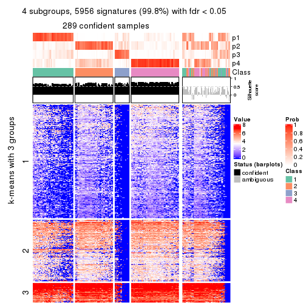</p>

</div>
<div id='tab-MAD-NMF-get-signatures-no-scale-4'>
<pre><code class="r">get_signatures(res, k = 5, scale_rows = FALSE)
</code></pre>

<p></p>

</div>
<div id='tab-MAD-NMF-get-signatures-no-scale-5'>
<pre><code class="r">get_signatures(res, k = 6, scale_rows = FALSE)
</code></pre>

<p></p>

</div>
</div>


Compare the overlap of signatures from different k:

```r
compare_signatures(res)
```


`get_signature()` returns a data frame invisibly. TO get the list of signatures, the function
call should be assigned to a variable explicitly. In following code, if `plot` argument is set
to `FALSE`, no heatmap is plotted while only the differential analysis is performed.

```r
# code only for demonstration
tb = get_signature(res, k = ..., plot = FALSE)
```

An example of the output of `tb` is:

```
#>   which_row         fdr    mean_1    mean_2 scaled_mean_1 scaled_mean_2 km
#> 1        38 0.042760348  8.373488  9.131774    -0.5533452     0.5164555  1
#> 2        40 0.018707592  7.106213  8.469186    -0.6173731     0.5762149  1
#> 3        55 0.019134737 10.221463 11.207825    -0.6159697     0.5749050  1
#> 4        59 0.006059896  5.921854  7.869574    -0.6899429     0.6439467  1
#> 5        60 0.018055526  8.928898 10.211722    -0.6204761     0.5791110  1
#> 6        98 0.009384629 15.714769 14.887706     0.6635654    -0.6193277  2
...
```

The columns in `tb` are:

1. `which_row`: row indices corresponding to the input matrix.
2. `fdr`: FDR for the differential test. 
3. `mean_x`: The mean value in group x.
4. `scaled_mean_x`: The mean value in group x after rows are scaled.
5. `km`: Row groups if k-means clustering is applied to rows.


UMAP plot which shows how samples are separated.


<script>
$( function() {
	$( '#tabs-MAD-NMF-dimension-reduction' ).tabs();
} );
</script>
<div id='tabs-MAD-NMF-dimension-reduction'>
<ul>
<li><a href='#tab-MAD-NMF-dimension-reduction-1'>k = 2</a></li>
<li><a href='#tab-MAD-NMF-dimension-reduction-2'>k = 3</a></li>
<li><a href='#tab-MAD-NMF-dimension-reduction-3'>k = 4</a></li>
<li><a href='#tab-MAD-NMF-dimension-reduction-4'>k = 5</a></li>
<li><a href='#tab-MAD-NMF-dimension-reduction-5'>k = 6</a></li>
</ul>
<div id='tab-MAD-NMF-dimension-reduction-1'>
<pre><code class="r">dimension_reduction(res, k = 2, method = &quot;UMAP&quot;)
</code></pre>

<p>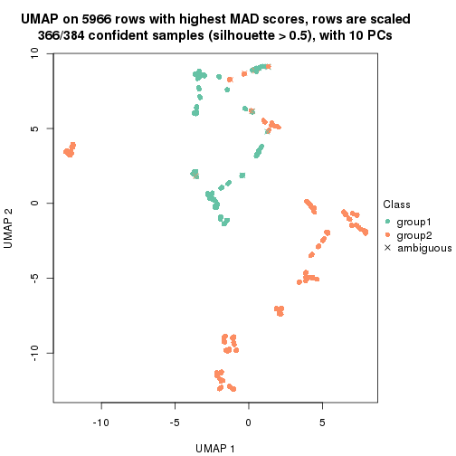</p>

</div>
<div id='tab-MAD-NMF-dimension-reduction-2'>
<pre><code class="r">dimension_reduction(res, k = 3, method = &quot;UMAP&quot;)
</code></pre>

<p></p>

</div>
<div id='tab-MAD-NMF-dimension-reduction-3'>
<pre><code class="r">dimension_reduction(res, k = 4, method = &quot;UMAP&quot;)
</code></pre>

<p></p>

</div>
<div id='tab-MAD-NMF-dimension-reduction-4'>
<pre><code class="r">dimension_reduction(res, k = 5, method = &quot;UMAP&quot;)
</code></pre>

<p></p>

</div>
<div id='tab-MAD-NMF-dimension-reduction-5'>
<pre><code class="r">dimension_reduction(res, k = 6, method = &quot;UMAP&quot;)
</code></pre>

<p></p>

</div>
</div>


Following heatmap shows how subgroups are split when increasing `k`:

```r
collect_classes(res)
```


If matrix rows can be associated to genes, consider to use `GO_Enrichment(res,
...)` to perform function enrichment for the signature genes.


 

---------------------------------------------------


### ATC:hclust*


The object with results only for a single top-value method and a single partition method 
can be extracted as:

```r
res = res_list["ATC", "hclust"]
# you can also extract it by
# res = res_list["ATC:hclust"]
```

A summary of `res` and all the functions that can be applied to it:

```r
res
```

```
#> A 'ConsensusPartition' object with k = 2, 3, 4, 5, 6.
#>   On a matrix with 5966 rows and 384 columns.
#>   Top rows (597, 1194, 1790, 2386, 2983) are extracted by 'ATC' method.
#>   Subgroups are detected by 'hclust' method.
#>   Performed in total 1250 partitions by row resampling.
#>   Best k for subgroups seems to be 4.
#> 
#> Following methods can be applied to this 'ConsensusPartition' object:
#>  [1] "cola_report"             "collect_classes"         "collect_plots"          
#>  [4] "collect_stats"           "colnames"                "compare_signatures"     
#>  [7] "consensus_heatmap"       "dimension_reduction"     "functional_enrichment"  
#> [10] "get_anno_col"            "get_anno"                "get_classes"            
#> [13] "get_consensus"           "get_matrix"              "get_membership"         
#> [16] "get_param"               "get_signatures"          "get_stats"              
#> [19] "is_best_k"               "is_stable_k"             "membership_heatmap"     
#> [22] "ncol"                    "nrow"                    "plot_ecdf"              
#> [25] "rownames"                "select_partition_number" "show"                   
#> [28] "suggest_best_k"          "test_to_known_factors"
```

`collect_plots()` function collects all the plots made from `res` for all `k` (number of partitions)
into one single page to provide an easy and fast comparison between different `k`.

```r
collect_plots(res)
```


The plots are:

- The first row: a plot of the ECDF (Empirical cumulative distribution
  function) curves of the consensus matrix for each `k` and the heatmap of
  predicted classes for each `k`.
- The second row: heatmaps of the consensus matrix for each `k`.
- The third row: heatmaps of the membership matrix for each `k`.
- The fouth row: heatmaps of the signatures for each `k`.

All the plots in panels can be made by individual functions and they are
plotted later in this section.

`select_partition_number()` produces several plots showing different
statistics for choosing "optimized" `k`. There are following statistics:

- ECDF curves of the consensus matrix for each `k`;
- 1-PAC. [The PAC
  score](https://en.wikipedia.org/wiki/Consensus_clustering#Over-interpretation_potential_of_consensus_clustering)
  measures the proportion of the ambiguous subgrouping.
- Mean silhouette score.
- Concordance. The mean probability of fiting the consensus class ids in all
  partitions.
- Area increased. Denote $A_k$ as the area under the ECDF curve for current
  `k`, the area increased is defined as $A_k - A_{k-1}$.
- Rand index. The percent of pairs of samples that are both in a same cluster
  or both are not in a same cluster in the partition of k and k-1.
- Jaccard index. The ratio of pairs of samples are both in a same cluster in
  the partition of k and k-1 and the pairs of samples are both in a same
  cluster in the partition k or k-1.

The detailed explanations of these statistics can be found in [the cola
vignette](http://bioconductor.org/packages/devel/bioc/vignettes/cola/inst/doc/cola.html#toc_13).

Generally speaking, lower PAC score, higher mean silhouette score or higher
concordance corresponds to better partition. Rand index and Jaccard index
measure how similar the current partition is compared to partition with `k-1`.
If they are too similar, we won't accept `k` is better than `k-1`.

```r
select_partition_number(res)
```


The numeric values for all these statistics can be obtained by `get_stats()`.

```r
get_stats(res)
```

```
#>   k 1-PAC mean_silhouette concordance area_increased  Rand Jaccard
#> 2 2 1.000           0.999       1.000         0.1532 0.847   0.847
#> 3 3 0.922           0.913       0.955         0.4395 0.998   0.998
#> 4 4 0.940           0.867       0.959         0.1467 0.927   0.914
#> 5 5 0.938           0.893       0.959         0.0668 0.981   0.975
#> 6 6 0.978           0.922       0.968         0.0282 1.000   1.000
```

`suggest_best_k()` suggests the best $k$ based on these statistics. The rules are as follows:

- All $k$ with Jaccard index larger than 0.95 are removed because the increase of
  the partition number does not provides enough extra information. If all $k$ are removed,
  the best $k$ is assigned by `NA`.
- For $k$ with 1-PAC larger than 0.9, the maximal $k$ is taken as the "best k". Other $k$ is called "optional k".
- If it does not fit the second rule. The $k$ with the highest vote of highest
  1-PAC, mean silhouette and concordance is taken as the "best k".

```r
suggest_best_k(res)
```

```
#> [1] 4
#> attr(,"optional")
#> [1] 2
```

There is also optional best $k$ = 2 that is worth to check.

Following shows the table of the partitions (You need to click the **show/hide
code output** link to see it). The membership matrix (columns with name `p*`)
is inferred by
[`clue::cl_consensus()`](https://www.rdocumentation.org/link/cl_consensus?package=clue)
function with the `SE` method. Basically the value in the membership matrix
represents the probability to belong to a certain group. The finall class
label for an item is determined with the group with highest probability it
belongs to.

In `get_classes()` function, the entropy is calculated from the membership
matrix and the silhouette score is calculated from the consensus matrix.


<script>
$( function() {
	$( '#tabs-ATC-hclust-get-classes' ).tabs();
} );
</script>
<div id='tabs-ATC-hclust-get-classes'>
<ul>
<li><a href='#tab-ATC-hclust-get-classes-1'>k = 2</a></li>
<li><a href='#tab-ATC-hclust-get-classes-2'>k = 3</a></li>
<li><a href='#tab-ATC-hclust-get-classes-3'>k = 4</a></li>
<li><a href='#tab-ATC-hclust-get-classes-4'>k = 5</a></li>
<li><a href='#tab-ATC-hclust-get-classes-5'>k = 6</a></li>
</ul>

<div id='tab-ATC-hclust-get-classes-1'>
<p><a id='tab-ATC-hclust-get-classes-1-a' style='color:#0366d6' href='#'>show/hide code output</a></p>
<pre><code class="r">cbind(get_classes(res, k = 2), get_membership(res, k = 2))
</code></pre>

<pre><code>#&gt;           class entropy silhouette    p1    p2
#&gt; SRR490216     2   0.000      1.000 0.000 1.000
#&gt; SRR490217     2   0.000      1.000 0.000 1.000
#&gt; SRR490218     2   0.000      1.000 0.000 1.000
#&gt; SRR490219     2   0.000      1.000 0.000 1.000
#&gt; SRR490220     2   0.000      1.000 0.000 1.000
#&gt; SRR490221     2   0.000      1.000 0.000 1.000
#&gt; SRR490222     2   0.000      1.000 0.000 1.000
#&gt; SRR490223     2   0.000      1.000 0.000 1.000
#&gt; SRR490224     2   0.000      1.000 0.000 1.000
#&gt; SRR490225     2   0.000      1.000 0.000 1.000
#&gt; SRR490226     2   0.000      1.000 0.000 1.000
#&gt; SRR490227     2   0.000      1.000 0.000 1.000
#&gt; SRR490228     2   0.000      1.000 0.000 1.000
#&gt; SRR490229     2   0.000      1.000 0.000 1.000
#&gt; SRR490230     2   0.000      1.000 0.000 1.000
#&gt; SRR490231     2   0.000      1.000 0.000 1.000
#&gt; SRR490232     2   0.000      1.000 0.000 1.000
#&gt; SRR490233     2   0.000      1.000 0.000 1.000
#&gt; SRR490234     2   0.000      1.000 0.000 1.000
#&gt; SRR490235     2   0.000      1.000 0.000 1.000
#&gt; SRR490236     2   0.000      1.000 0.000 1.000
#&gt; SRR490237     2   0.000      1.000 0.000 1.000
#&gt; SRR490238     2   0.000      1.000 0.000 1.000
#&gt; SRR490239     2   0.000      1.000 0.000 1.000
#&gt; SRR490240     2   0.000      1.000 0.000 1.000
#&gt; SRR490241     2   0.000      1.000 0.000 1.000
#&gt; SRR490242     2   0.000      1.000 0.000 1.000
#&gt; SRR490243     2   0.000      1.000 0.000 1.000
#&gt; SRR490244     1   0.000      0.994 1.000 0.000
#&gt; SRR490245     1   0.000      0.994 1.000 0.000
#&gt; SRR490246     1   0.000      0.994 1.000 0.000
#&gt; SRR490247     1   0.000      0.994 1.000 0.000
#&gt; SRR490248     2   0.000      1.000 0.000 1.000
#&gt; SRR490249     2   0.000      1.000 0.000 1.000
#&gt; SRR490250     2   0.000      1.000 0.000 1.000
#&gt; SRR490251     2   0.000      1.000 0.000 1.000
#&gt; SRR490252     2   0.000      1.000 0.000 1.000
#&gt; SRR490253     2   0.000      1.000 0.000 1.000
#&gt; SRR490254     2   0.000      1.000 0.000 1.000
#&gt; SRR490255     2   0.000      1.000 0.000 1.000
#&gt; SRR490256     2   0.000      1.000 0.000 1.000
#&gt; SRR490257     2   0.000      1.000 0.000 1.000
#&gt; SRR490258     2   0.000      1.000 0.000 1.000
#&gt; SRR490259     2   0.000      1.000 0.000 1.000
#&gt; SRR490260     2   0.000      1.000 0.000 1.000
#&gt; SRR490261     2   0.000      1.000 0.000 1.000
#&gt; SRR490262     2   0.000      1.000 0.000 1.000
#&gt; SRR490263     2   0.000      1.000 0.000 1.000
#&gt; SRR490264     2   0.000      1.000 0.000 1.000
#&gt; SRR490265     2   0.000      1.000 0.000 1.000
#&gt; SRR490266     2   0.000      1.000 0.000 1.000
#&gt; SRR490267     2   0.000      1.000 0.000 1.000
#&gt; SRR490268     2   0.000      1.000 0.000 1.000
#&gt; SRR490269     2   0.000      1.000 0.000 1.000
#&gt; SRR490270     2   0.000      1.000 0.000 1.000
#&gt; SRR490271     2   0.000      1.000 0.000 1.000
#&gt; SRR490272     2   0.000      1.000 0.000 1.000
#&gt; SRR490273     2   0.000      1.000 0.000 1.000
#&gt; SRR490274     2   0.000      1.000 0.000 1.000
#&gt; SRR490275     2   0.000      1.000 0.000 1.000
#&gt; SRR490276     2   0.000      1.000 0.000 1.000
#&gt; SRR490277     2   0.000      1.000 0.000 1.000
#&gt; SRR490278     2   0.000      1.000 0.000 1.000
#&gt; SRR490279     2   0.000      1.000 0.000 1.000
#&gt; SRR490280     1   0.278      0.954 0.952 0.048
#&gt; SRR490281     1   0.278      0.954 0.952 0.048
#&gt; SRR490282     1   0.278      0.954 0.952 0.048
#&gt; SRR490283     1   0.278      0.954 0.952 0.048
#&gt; SRR490284     2   0.000      1.000 0.000 1.000
#&gt; SRR490285     2   0.000      1.000 0.000 1.000
#&gt; SRR490286     2   0.000      1.000 0.000 1.000
#&gt; SRR490287     2   0.000      1.000 0.000 1.000
#&gt; SRR490288     2   0.000      1.000 0.000 1.000
#&gt; SRR490289     2   0.000      1.000 0.000 1.000
#&gt; SRR490290     2   0.000      1.000 0.000 1.000
#&gt; SRR490291     2   0.000      1.000 0.000 1.000
#&gt; SRR490292     2   0.000      1.000 0.000 1.000
#&gt; SRR490293     2   0.000      1.000 0.000 1.000
#&gt; SRR490294     2   0.000      1.000 0.000 1.000
#&gt; SRR490295     2   0.000      1.000 0.000 1.000
#&gt; SRR490296     2   0.000      1.000 0.000 1.000
#&gt; SRR490297     2   0.000      1.000 0.000 1.000
#&gt; SRR490298     2   0.000      1.000 0.000 1.000
#&gt; SRR490299     2   0.000      1.000 0.000 1.000
#&gt; SRR490300     2   0.000      1.000 0.000 1.000
#&gt; SRR490301     2   0.000      1.000 0.000 1.000
#&gt; SRR490302     2   0.000      1.000 0.000 1.000
#&gt; SRR490303     2   0.000      1.000 0.000 1.000
#&gt; SRR490304     2   0.000      1.000 0.000 1.000
#&gt; SRR490305     2   0.000      1.000 0.000 1.000
#&gt; SRR490306     2   0.000      1.000 0.000 1.000
#&gt; SRR490307     2   0.000      1.000 0.000 1.000
#&gt; SRR490308     1   0.000      0.994 1.000 0.000
#&gt; SRR490309     1   0.000      0.994 1.000 0.000
#&gt; SRR490310     1   0.000      0.994 1.000 0.000
#&gt; SRR490311     1   0.000      0.994 1.000 0.000
#&gt; SRR490312     2   0.000      1.000 0.000 1.000
#&gt; SRR490313     2   0.000      1.000 0.000 1.000
#&gt; SRR490314     2   0.000      1.000 0.000 1.000
#&gt; SRR490315     2   0.000      1.000 0.000 1.000
#&gt; SRR490316     2   0.000      1.000 0.000 1.000
#&gt; SRR490317     2   0.000      1.000 0.000 1.000
#&gt; SRR490318     2   0.000      1.000 0.000 1.000
#&gt; SRR490319     2   0.000      1.000 0.000 1.000
#&gt; SRR490320     2   0.000      1.000 0.000 1.000
#&gt; SRR490321     2   0.000      1.000 0.000 1.000
#&gt; SRR490322     2   0.000      1.000 0.000 1.000
#&gt; SRR490323     2   0.000      1.000 0.000 1.000
#&gt; SRR490324     2   0.000      1.000 0.000 1.000
#&gt; SRR490325     2   0.000      1.000 0.000 1.000
#&gt; SRR490326     2   0.000      1.000 0.000 1.000
#&gt; SRR490327     2   0.000      1.000 0.000 1.000
#&gt; SRR490328     2   0.000      1.000 0.000 1.000
#&gt; SRR490329     2   0.000      1.000 0.000 1.000
#&gt; SRR490330     2   0.000      1.000 0.000 1.000
#&gt; SRR490331     2   0.000      1.000 0.000 1.000
#&gt; SRR490332     2   0.000      1.000 0.000 1.000
#&gt; SRR490333     2   0.000      1.000 0.000 1.000
#&gt; SRR490334     2   0.000      1.000 0.000 1.000
#&gt; SRR490335     2   0.000      1.000 0.000 1.000
#&gt; SRR490336     2   0.000      1.000 0.000 1.000
#&gt; SRR490337     2   0.000      1.000 0.000 1.000
#&gt; SRR490338     2   0.000      1.000 0.000 1.000
#&gt; SRR490339     2   0.000      1.000 0.000 1.000
#&gt; SRR490340     2   0.000      1.000 0.000 1.000
#&gt; SRR490341     2   0.000      1.000 0.000 1.000
#&gt; SRR490342     2   0.000      1.000 0.000 1.000
#&gt; SRR490343     2   0.000      1.000 0.000 1.000
#&gt; SRR490344     2   0.000      1.000 0.000 1.000
#&gt; SRR490345     2   0.000      1.000 0.000 1.000
#&gt; SRR490346     2   0.000      1.000 0.000 1.000
#&gt; SRR490347     2   0.000      1.000 0.000 1.000
#&gt; SRR490348     2   0.000      1.000 0.000 1.000
#&gt; SRR490349     2   0.000      1.000 0.000 1.000
#&gt; SRR490350     2   0.000      1.000 0.000 1.000
#&gt; SRR490351     2   0.000      1.000 0.000 1.000
#&gt; SRR490352     2   0.000      1.000 0.000 1.000
#&gt; SRR490353     2   0.000      1.000 0.000 1.000
#&gt; SRR490354     2   0.000      1.000 0.000 1.000
#&gt; SRR490355     2   0.000      1.000 0.000 1.000
#&gt; SRR490356     2   0.000      1.000 0.000 1.000
#&gt; SRR490357     2   0.000      1.000 0.000 1.000
#&gt; SRR490358     2   0.000      1.000 0.000 1.000
#&gt; SRR490359     2   0.000      1.000 0.000 1.000
#&gt; SRR490360     2   0.000      1.000 0.000 1.000
#&gt; SRR490361     2   0.000      1.000 0.000 1.000
#&gt; SRR490362     2   0.000      1.000 0.000 1.000
#&gt; SRR490363     2   0.000      1.000 0.000 1.000
#&gt; SRR490364     2   0.000      1.000 0.000 1.000
#&gt; SRR490365     2   0.000      1.000 0.000 1.000
#&gt; SRR490366     2   0.000      1.000 0.000 1.000
#&gt; SRR490367     2   0.000      1.000 0.000 1.000
#&gt; SRR490368     2   0.000      1.000 0.000 1.000
#&gt; SRR490369     2   0.000      1.000 0.000 1.000
#&gt; SRR490370     2   0.000      1.000 0.000 1.000
#&gt; SRR490371     2   0.000      1.000 0.000 1.000
#&gt; SRR490372     1   0.000      0.994 1.000 0.000
#&gt; SRR490373     1   0.000      0.994 1.000 0.000
#&gt; SRR490374     1   0.000      0.994 1.000 0.000
#&gt; SRR490375     1   0.000      0.994 1.000 0.000
#&gt; SRR490376     2   0.000      1.000 0.000 1.000
#&gt; SRR490377     2   0.000      1.000 0.000 1.000
#&gt; SRR490378     2   0.000      1.000 0.000 1.000
#&gt; SRR490379     2   0.000      1.000 0.000 1.000
#&gt; SRR490380     1   0.000      0.994 1.000 0.000
#&gt; SRR490381     1   0.000      0.994 1.000 0.000
#&gt; SRR490382     1   0.000      0.994 1.000 0.000
#&gt; SRR490383     1   0.000      0.994 1.000 0.000
#&gt; SRR490384     2   0.000      1.000 0.000 1.000
#&gt; SRR490385     2   0.000      1.000 0.000 1.000
#&gt; SRR490386     2   0.000      1.000 0.000 1.000
#&gt; SRR490387     2   0.000      1.000 0.000 1.000
#&gt; SRR490388     2   0.000      1.000 0.000 1.000
#&gt; SRR490389     2   0.000      1.000 0.000 1.000
#&gt; SRR490390     2   0.000      1.000 0.000 1.000
#&gt; SRR490391     2   0.000      1.000 0.000 1.000
#&gt; SRR490392     2   0.000      1.000 0.000 1.000
#&gt; SRR490393     2   0.000      1.000 0.000 1.000
#&gt; SRR490394     2   0.000      1.000 0.000 1.000
#&gt; SRR490395     2   0.000      1.000 0.000 1.000
#&gt; SRR490396     2   0.000      1.000 0.000 1.000
#&gt; SRR490397     2   0.000      1.000 0.000 1.000
#&gt; SRR490398     2   0.000      1.000 0.000 1.000
#&gt; SRR490399     2   0.000      1.000 0.000 1.000
#&gt; SRR490400     2   0.000      1.000 0.000 1.000
#&gt; SRR490401     2   0.000      1.000 0.000 1.000
#&gt; SRR490402     2   0.000      1.000 0.000 1.000
#&gt; SRR490403     2   0.000      1.000 0.000 1.000
#&gt; SRR490404     2   0.000      1.000 0.000 1.000
#&gt; SRR490405     2   0.000      1.000 0.000 1.000
#&gt; SRR490406     2   0.000      1.000 0.000 1.000
#&gt; SRR490407     2   0.000      1.000 0.000 1.000
#&gt; SRR490408     2   0.000      1.000 0.000 1.000
#&gt; SRR490409     2   0.000      1.000 0.000 1.000
#&gt; SRR490410     2   0.000      1.000 0.000 1.000
#&gt; SRR490411     2   0.000      1.000 0.000 1.000
#&gt; SRR490412     1   0.000      0.994 1.000 0.000
#&gt; SRR490413     1   0.000      0.994 1.000 0.000
#&gt; SRR490414     1   0.000      0.994 1.000 0.000
#&gt; SRR490415     1   0.000      0.994 1.000 0.000
#&gt; SRR490416     2   0.000      1.000 0.000 1.000
#&gt; SRR490417     2   0.000      1.000 0.000 1.000
#&gt; SRR490418     2   0.000      1.000 0.000 1.000
#&gt; SRR490419     2   0.000      1.000 0.000 1.000
#&gt; SRR490420     2   0.000      1.000 0.000 1.000
#&gt; SRR490421     2   0.000      1.000 0.000 1.000
#&gt; SRR490422     2   0.000      1.000 0.000 1.000
#&gt; SRR490423     2   0.000      1.000 0.000 1.000
#&gt; SRR490424     2   0.000      1.000 0.000 1.000
#&gt; SRR490425     2   0.000      1.000 0.000 1.000
#&gt; SRR490426     2   0.000      1.000 0.000 1.000
#&gt; SRR490427     2   0.000      1.000 0.000 1.000
#&gt; SRR490428     2   0.000      1.000 0.000 1.000
#&gt; SRR490429     2   0.000      1.000 0.000 1.000
#&gt; SRR490430     2   0.000      1.000 0.000 1.000
#&gt; SRR490431     2   0.000      1.000 0.000 1.000
#&gt; SRR490432     2   0.000      1.000 0.000 1.000
#&gt; SRR490433     2   0.000      1.000 0.000 1.000
#&gt; SRR490434     2   0.000      1.000 0.000 1.000
#&gt; SRR490435     2   0.000      1.000 0.000 1.000
#&gt; SRR490436     2   0.000      1.000 0.000 1.000
#&gt; SRR490437     2   0.000      1.000 0.000 1.000
#&gt; SRR490438     2   0.000      1.000 0.000 1.000
#&gt; SRR490439     2   0.000      1.000 0.000 1.000
#&gt; SRR490440     2   0.000      1.000 0.000 1.000
#&gt; SRR490441     2   0.000      1.000 0.000 1.000
#&gt; SRR490442     2   0.000      1.000 0.000 1.000
#&gt; SRR490443     2   0.000      1.000 0.000 1.000
#&gt; SRR490444     2   0.000      1.000 0.000 1.000
#&gt; SRR490445     2   0.000      1.000 0.000 1.000
#&gt; SRR490446     2   0.000      1.000 0.000 1.000
#&gt; SRR490447     2   0.000      1.000 0.000 1.000
#&gt; SRR490448     2   0.000      1.000 0.000 1.000
#&gt; SRR490449     2   0.000      1.000 0.000 1.000
#&gt; SRR490450     2   0.000      1.000 0.000 1.000
#&gt; SRR490451     2   0.000      1.000 0.000 1.000
#&gt; SRR490452     2   0.000      1.000 0.000 1.000
#&gt; SRR490453     2   0.000      1.000 0.000 1.000
#&gt; SRR490454     2   0.000      1.000 0.000 1.000
#&gt; SRR490455     2   0.000      1.000 0.000 1.000
#&gt; SRR490456     2   0.000      1.000 0.000 1.000
#&gt; SRR490457     2   0.000      1.000 0.000 1.000
#&gt; SRR490458     2   0.000      1.000 0.000 1.000
#&gt; SRR490459     2   0.000      1.000 0.000 1.000
#&gt; SRR490460     2   0.000      1.000 0.000 1.000
#&gt; SRR490461     2   0.000      1.000 0.000 1.000
#&gt; SRR490462     2   0.000      1.000 0.000 1.000
#&gt; SRR490463     2   0.000      1.000 0.000 1.000
#&gt; SRR490464     1   0.000      0.994 1.000 0.000
#&gt; SRR490465     1   0.000      0.994 1.000 0.000
#&gt; SRR490466     1   0.000      0.994 1.000 0.000
#&gt; SRR490467     1   0.000      0.994 1.000 0.000
#&gt; SRR490468     2   0.000      1.000 0.000 1.000
#&gt; SRR490469     2   0.000      1.000 0.000 1.000
#&gt; SRR490470     2   0.000      1.000 0.000 1.000
#&gt; SRR490471     2   0.000      1.000 0.000 1.000
#&gt; SRR490472     2   0.000      1.000 0.000 1.000
#&gt; SRR490473     2   0.000      1.000 0.000 1.000
#&gt; SRR490474     2   0.000      1.000 0.000 1.000
#&gt; SRR490475     2   0.000      1.000 0.000 1.000
#&gt; SRR490476     1   0.000      0.994 1.000 0.000
#&gt; SRR490477     1   0.000      0.994 1.000 0.000
#&gt; SRR490478     1   0.000      0.994 1.000 0.000
#&gt; SRR490479     1   0.000      0.994 1.000 0.000
#&gt; SRR490480     2   0.000      1.000 0.000 1.000
#&gt; SRR490481     2   0.000      1.000 0.000 1.000
#&gt; SRR490482     2   0.000      1.000 0.000 1.000
#&gt; SRR490483     2   0.000      1.000 0.000 1.000
#&gt; SRR490484     2   0.000      1.000 0.000 1.000
#&gt; SRR490485     2   0.000      1.000 0.000 1.000
#&gt; SRR490486     2   0.000      1.000 0.000 1.000
#&gt; SRR490487     2   0.000      1.000 0.000 1.000
#&gt; SRR490488     2   0.000      1.000 0.000 1.000
#&gt; SRR490489     2   0.000      1.000 0.000 1.000
#&gt; SRR490490     2   0.000      1.000 0.000 1.000
#&gt; SRR490491     2   0.000      1.000 0.000 1.000
#&gt; SRR490492     2   0.000      1.000 0.000 1.000
#&gt; SRR490493     2   0.000      1.000 0.000 1.000
#&gt; SRR490494     2   0.000      1.000 0.000 1.000
#&gt; SRR490495     2   0.000      1.000 0.000 1.000
#&gt; SRR490496     2   0.000      1.000 0.000 1.000
#&gt; SRR490497     2   0.000      1.000 0.000 1.000
#&gt; SRR490498     2   0.000      1.000 0.000 1.000
#&gt; SRR490499     2   0.000      1.000 0.000 1.000
#&gt; SRR490500     2   0.000      1.000 0.000 1.000
#&gt; SRR490501     2   0.000      1.000 0.000 1.000
#&gt; SRR490502     2   0.000      1.000 0.000 1.000
#&gt; SRR490503     2   0.000      1.000 0.000 1.000
#&gt; SRR490504     2   0.000      1.000 0.000 1.000
#&gt; SRR490505     2   0.000      1.000 0.000 1.000
#&gt; SRR490506     2   0.000      1.000 0.000 1.000
#&gt; SRR490507     2   0.000      1.000 0.000 1.000
#&gt; SRR490508     2   0.000      1.000 0.000 1.000
#&gt; SRR490509     2   0.000      1.000 0.000 1.000
#&gt; SRR490510     2   0.000      1.000 0.000 1.000
#&gt; SRR490511     2   0.000      1.000 0.000 1.000
#&gt; SRR490512     2   0.000      1.000 0.000 1.000
#&gt; SRR490513     2   0.000      1.000 0.000 1.000
#&gt; SRR490514     2   0.000      1.000 0.000 1.000
#&gt; SRR490515     2   0.000      1.000 0.000 1.000
#&gt; SRR490516     2   0.000      1.000 0.000 1.000
#&gt; SRR490517     2   0.000      1.000 0.000 1.000
#&gt; SRR490518     2   0.000      1.000 0.000 1.000
#&gt; SRR490519     2   0.000      1.000 0.000 1.000
#&gt; SRR490520     2   0.000      1.000 0.000 1.000
#&gt; SRR490521     2   0.000      1.000 0.000 1.000
#&gt; SRR490522     2   0.000      1.000 0.000 1.000
#&gt; SRR490523     2   0.000      1.000 0.000 1.000
#&gt; SRR490524     2   0.000      1.000 0.000 1.000
#&gt; SRR490525     2   0.000      1.000 0.000 1.000
#&gt; SRR490526     2   0.000      1.000 0.000 1.000
#&gt; SRR490527     2   0.000      1.000 0.000 1.000
#&gt; SRR490528     2   0.000      1.000 0.000 1.000
#&gt; SRR490529     2   0.000      1.000 0.000 1.000
#&gt; SRR490530     2   0.000      1.000 0.000 1.000
#&gt; SRR490531     2   0.000      1.000 0.000 1.000
#&gt; SRR490532     2   0.000      1.000 0.000 1.000
#&gt; SRR490533     2   0.000      1.000 0.000 1.000
#&gt; SRR490534     2   0.000      1.000 0.000 1.000
#&gt; SRR490535     2   0.000      1.000 0.000 1.000
#&gt; SRR490536     2   0.000      1.000 0.000 1.000
#&gt; SRR490537     2   0.000      1.000 0.000 1.000
#&gt; SRR490538     2   0.000      1.000 0.000 1.000
#&gt; SRR490539     2   0.000      1.000 0.000 1.000
#&gt; SRR490540     2   0.000      1.000 0.000 1.000
#&gt; SRR490541     2   0.000      1.000 0.000 1.000
#&gt; SRR490542     2   0.000      1.000 0.000 1.000
#&gt; SRR490543     2   0.000      1.000 0.000 1.000
#&gt; SRR490544     2   0.000      1.000 0.000 1.000
#&gt; SRR490545     2   0.000      1.000 0.000 1.000
#&gt; SRR490546     2   0.000      1.000 0.000 1.000
#&gt; SRR490547     2   0.000      1.000 0.000 1.000
#&gt; SRR490548     2   0.000      1.000 0.000 1.000
#&gt; SRR490549     2   0.000      1.000 0.000 1.000
#&gt; SRR490550     2   0.000      1.000 0.000 1.000
#&gt; SRR490551     2   0.000      1.000 0.000 1.000
#&gt; SRR490552     2   0.000      1.000 0.000 1.000
#&gt; SRR490553     2   0.000      1.000 0.000 1.000
#&gt; SRR490554     2   0.000      1.000 0.000 1.000
#&gt; SRR490555     2   0.000      1.000 0.000 1.000
#&gt; SRR490556     2   0.000      1.000 0.000 1.000
#&gt; SRR490557     2   0.000      1.000 0.000 1.000
#&gt; SRR490558     2   0.000      1.000 0.000 1.000
#&gt; SRR490559     2   0.000      1.000 0.000 1.000
#&gt; SRR490560     2   0.000      1.000 0.000 1.000
#&gt; SRR490561     2   0.000      1.000 0.000 1.000
#&gt; SRR490562     2   0.000      1.000 0.000 1.000
#&gt; SRR490563     2   0.000      1.000 0.000 1.000
#&gt; SRR490564     2   0.000      1.000 0.000 1.000
#&gt; SRR490565     2   0.000      1.000 0.000 1.000
#&gt; SRR490566     2   0.000      1.000 0.000 1.000
#&gt; SRR490567     2   0.000      1.000 0.000 1.000
#&gt; SRR490568     2   0.000      1.000 0.000 1.000
#&gt; SRR490569     2   0.000      1.000 0.000 1.000
#&gt; SRR490570     2   0.000      1.000 0.000 1.000
#&gt; SRR490571     2   0.000      1.000 0.000 1.000
#&gt; SRR490572     2   0.000      1.000 0.000 1.000
#&gt; SRR490573     2   0.000      1.000 0.000 1.000
#&gt; SRR490574     2   0.000      1.000 0.000 1.000
#&gt; SRR490575     2   0.000      1.000 0.000 1.000
#&gt; SRR490576     2   0.000      1.000 0.000 1.000
#&gt; SRR490577     2   0.000      1.000 0.000 1.000
#&gt; SRR490578     2   0.000      1.000 0.000 1.000
#&gt; SRR490579     2   0.000      1.000 0.000 1.000
#&gt; SRR490580     2   0.000      1.000 0.000 1.000
#&gt; SRR490581     2   0.000      1.000 0.000 1.000
#&gt; SRR490582     2   0.000      1.000 0.000 1.000
#&gt; SRR490583     2   0.000      1.000 0.000 1.000
#&gt; SRR490584     2   0.000      1.000 0.000 1.000
#&gt; SRR490585     2   0.000      1.000 0.000 1.000
#&gt; SRR490586     2   0.000      1.000 0.000 1.000
#&gt; SRR490587     2   0.000      1.000 0.000 1.000
#&gt; SRR490588     2   0.000      1.000 0.000 1.000
#&gt; SRR490589     2   0.000      1.000 0.000 1.000
#&gt; SRR490590     2   0.000      1.000 0.000 1.000
#&gt; SRR490591     2   0.000      1.000 0.000 1.000
#&gt; SRR490592     2   0.000      1.000 0.000 1.000
#&gt; SRR490593     2   0.000      1.000 0.000 1.000
#&gt; SRR490594     2   0.000      1.000 0.000 1.000
#&gt; SRR490595     2   0.000      1.000 0.000 1.000
#&gt; SRR490596     2   0.000      1.000 0.000 1.000
#&gt; SRR490597     2   0.000      1.000 0.000 1.000
#&gt; SRR490598     2   0.000      1.000 0.000 1.000
#&gt; SRR490599     2   0.000      1.000 0.000 1.000
</code></pre>

<script>
$('#tab-ATC-hclust-get-classes-1-a').parent().next().next().hide();
$('#tab-ATC-hclust-get-classes-1-a').click(function(){
  $('#tab-ATC-hclust-get-classes-1-a').parent().next().next().toggle();
  return(false);
});
</script>
</div>

<div id='tab-ATC-hclust-get-classes-2'>
<p><a id='tab-ATC-hclust-get-classes-2-a' style='color:#0366d6' href='#'>show/hide code output</a></p>
<pre><code class="r">cbind(get_classes(res, k = 3), get_membership(res, k = 3))
</code></pre>

<pre><code>#&gt;           class entropy silhouette    p1    p2    p3
#&gt; SRR490216     2   0.000      0.956 0.000 1.000 0.000
#&gt; SRR490217     2   0.000      0.956 0.000 1.000 0.000
#&gt; SRR490218     2   0.000      0.956 0.000 1.000 0.000
#&gt; SRR490219     2   0.000      0.956 0.000 1.000 0.000
#&gt; SRR490220     2   0.000      0.956 0.000 1.000 0.000
#&gt; SRR490221     2   0.000      0.956 0.000 1.000 0.000
#&gt; SRR490222     2   0.000      0.956 0.000 1.000 0.000
#&gt; SRR490223     2   0.000      0.956 0.000 1.000 0.000
#&gt; SRR490224     2   0.613      0.481 0.000 0.600 0.400
#&gt; SRR490225     2   0.613      0.481 0.000 0.600 0.400
#&gt; SRR490226     2   0.613      0.481 0.000 0.600 0.400
#&gt; SRR490227     2   0.613      0.481 0.000 0.600 0.400
#&gt; SRR490228     2   0.613      0.481 0.000 0.600 0.400
#&gt; SRR490229     2   0.613      0.481 0.000 0.600 0.400
#&gt; SRR490230     2   0.613      0.481 0.000 0.600 0.400
#&gt; SRR490231     2   0.613      0.481 0.000 0.600 0.400
#&gt; SRR490232     2   0.226      0.904 0.000 0.932 0.068
#&gt; SRR490233     2   0.226      0.904 0.000 0.932 0.068
#&gt; SRR490234     2   0.226      0.904 0.000 0.932 0.068
#&gt; SRR490235     2   0.226      0.904 0.000 0.932 0.068
#&gt; SRR490236     2   0.613      0.481 0.000 0.600 0.400
#&gt; SRR490237     2   0.613      0.481 0.000 0.600 0.400
#&gt; SRR490238     2   0.613      0.481 0.000 0.600 0.400
#&gt; SRR490239     2   0.613      0.481 0.000 0.600 0.400
#&gt; SRR490240     2   0.000      0.956 0.000 1.000 0.000
#&gt; SRR490241     2   0.000      0.956 0.000 1.000 0.000
#&gt; SRR490242     2   0.000      0.956 0.000 1.000 0.000
#&gt; SRR490243     2   0.000      0.956 0.000 1.000 0.000
#&gt; SRR490244     3   0.613      1.000 0.400 0.000 0.600
#&gt; SRR490245     3   0.613      1.000 0.400 0.000 0.600
#&gt; SRR490246     3   0.613      1.000 0.400 0.000 0.600
#&gt; SRR490247     3   0.613      1.000 0.400 0.000 0.600
#&gt; SRR490248     2   0.000      0.956 0.000 1.000 0.000
#&gt; SRR490249     2   0.000      0.956 0.000 1.000 0.000
#&gt; SRR490250     2   0.000      0.956 0.000 1.000 0.000
#&gt; SRR490251     2   0.000      0.956 0.000 1.000 0.000
#&gt; SRR490252     2   0.000      0.956 0.000 1.000 0.000
#&gt; SRR490253     2   0.000      0.956 0.000 1.000 0.000
#&gt; SRR490254     2   0.000      0.956 0.000 1.000 0.000
#&gt; SRR490255     2   0.000      0.956 0.000 1.000 0.000
#&gt; SRR490256     2   0.196      0.914 0.000 0.944 0.056
#&gt; SRR490257     2   0.196      0.914 0.000 0.944 0.056
#&gt; SRR490258     2   0.196      0.914 0.000 0.944 0.056
#&gt; SRR490259     2   0.196      0.914 0.000 0.944 0.056
#&gt; SRR490260     2   0.604      0.516 0.000 0.620 0.380
#&gt; SRR490261     2   0.604      0.516 0.000 0.620 0.380
#&gt; SRR490262     2   0.604      0.516 0.000 0.620 0.380
#&gt; SRR490263     2   0.604      0.516 0.000 0.620 0.380
#&gt; SRR490264     2   0.604      0.516 0.000 0.620 0.380
#&gt; SRR490265     2   0.604      0.516 0.000 0.620 0.380
#&gt; SRR490266     2   0.604      0.516 0.000 0.620 0.380
#&gt; SRR490267     2   0.604      0.516 0.000 0.620 0.380
#&gt; SRR490268     2   0.196      0.914 0.000 0.944 0.056
#&gt; SRR490269     2   0.196      0.914 0.000 0.944 0.056
#&gt; SRR490270     2   0.196      0.914 0.000 0.944 0.056
#&gt; SRR490271     2   0.196      0.914 0.000 0.944 0.056
#&gt; SRR490272     2   0.604      0.516 0.000 0.620 0.380
#&gt; SRR490273     2   0.604      0.516 0.000 0.620 0.380
#&gt; SRR490274     2   0.604      0.516 0.000 0.620 0.380
#&gt; SRR490275     2   0.604      0.516 0.000 0.620 0.380
#&gt; SRR490276     2   0.604      0.516 0.000 0.620 0.380
#&gt; SRR490277     2   0.604      0.516 0.000 0.620 0.380
#&gt; SRR490278     2   0.604      0.516 0.000 0.620 0.380
#&gt; SRR490279     2   0.604      0.516 0.000 0.620 0.380
#&gt; SRR490280     1   0.000      1.000 1.000 0.000 0.000
#&gt; SRR490281     1   0.000      1.000 1.000 0.000 0.000
#&gt; SRR490282     1   0.000      1.000 1.000 0.000 0.000
#&gt; SRR490283     1   0.000      1.000 1.000 0.000 0.000
#&gt; SRR490284     2   0.651      0.465 0.008 0.592 0.400
#&gt; SRR490285     2   0.651      0.465 0.008 0.592 0.400
#&gt; SRR490286     2   0.651      0.465 0.008 0.592 0.400
#&gt; SRR490287     2   0.651      0.465 0.008 0.592 0.400
#&gt; SRR490288     2   0.141      0.930 0.000 0.964 0.036
#&gt; SRR490289     2   0.141      0.930 0.000 0.964 0.036
#&gt; SRR490290     2   0.141      0.930 0.000 0.964 0.036
#&gt; SRR490291     2   0.141      0.930 0.000 0.964 0.036
#&gt; SRR490292     2   0.000      0.956 0.000 1.000 0.000
#&gt; SRR490293     2   0.000      0.956 0.000 1.000 0.000
#&gt; SRR490294     2   0.000      0.956 0.000 1.000 0.000
#&gt; SRR490295     2   0.000      0.956 0.000 1.000 0.000
#&gt; SRR490296     2   0.000      0.956 0.000 1.000 0.000
#&gt; SRR490297     2   0.000      0.956 0.000 1.000 0.000
#&gt; SRR490298     2   0.000      0.956 0.000 1.000 0.000
#&gt; SRR490299     2   0.000      0.956 0.000 1.000 0.000
#&gt; SRR490300     2   0.000      0.956 0.000 1.000 0.000
#&gt; SRR490301     2   0.000      0.956 0.000 1.000 0.000
#&gt; SRR490302     2   0.000      0.956 0.000 1.000 0.000
#&gt; SRR490303     2   0.000      0.956 0.000 1.000 0.000
#&gt; SRR490304     2   0.000      0.956 0.000 1.000 0.000
#&gt; SRR490305     2   0.000      0.956 0.000 1.000 0.000
#&gt; SRR490306     2   0.000      0.956 0.000 1.000 0.000
#&gt; SRR490307     2   0.000      0.956 0.000 1.000 0.000
#&gt; SRR490308     3   0.613      1.000 0.400 0.000 0.600
#&gt; SRR490309     3   0.613      1.000 0.400 0.000 0.600
#&gt; SRR490310     3   0.613      1.000 0.400 0.000 0.600
#&gt; SRR490311     3   0.613      1.000 0.400 0.000 0.600
#&gt; SRR490312     2   0.000      0.956 0.000 1.000 0.000
#&gt; SRR490313     2   0.000      0.956 0.000 1.000 0.000
#&gt; SRR490314     2   0.000      0.956 0.000 1.000 0.000
#&gt; SRR490315     2   0.000      0.956 0.000 1.000 0.000
#&gt; SRR490316     2   0.000      0.956 0.000 1.000 0.000
#&gt; SRR490317     2   0.000      0.956 0.000 1.000 0.000
#&gt; SRR490318     2   0.000      0.956 0.000 1.000 0.000
#&gt; SRR490319     2   0.000      0.956 0.000 1.000 0.000
#&gt; SRR490320     2   0.129      0.933 0.000 0.968 0.032
#&gt; SRR490321     2   0.129      0.933 0.000 0.968 0.032
#&gt; SRR490322     2   0.129      0.933 0.000 0.968 0.032
#&gt; SRR490323     2   0.129      0.933 0.000 0.968 0.032
#&gt; SRR490324     2   0.613      0.481 0.000 0.600 0.400
#&gt; SRR490325     2   0.613      0.481 0.000 0.600 0.400
#&gt; SRR490326     2   0.613      0.481 0.000 0.600 0.400
#&gt; SRR490327     2   0.613      0.481 0.000 0.600 0.400
#&gt; SRR490328     2   0.000      0.956 0.000 1.000 0.000
#&gt; SRR490329     2   0.000      0.956 0.000 1.000 0.000
#&gt; SRR490330     2   0.000      0.956 0.000 1.000 0.000
#&gt; SRR490331     2   0.000      0.956 0.000 1.000 0.000
#&gt; SRR490332     2   0.000      0.956 0.000 1.000 0.000
#&gt; SRR490333     2   0.000      0.956 0.000 1.000 0.000
#&gt; SRR490334     2   0.000      0.956 0.000 1.000 0.000
#&gt; SRR490335     2   0.000      0.956 0.000 1.000 0.000
#&gt; SRR490336     2   0.000      0.956 0.000 1.000 0.000
#&gt; SRR490337     2   0.000      0.956 0.000 1.000 0.000
#&gt; SRR490338     2   0.000      0.956 0.000 1.000 0.000
#&gt; SRR490339     2   0.000      0.956 0.000 1.000 0.000
#&gt; SRR490340     2   0.000      0.956 0.000 1.000 0.000
#&gt; SRR490341     2   0.000      0.956 0.000 1.000 0.000
#&gt; SRR490342     2   0.000      0.956 0.000 1.000 0.000
#&gt; SRR490343     2   0.000      0.956 0.000 1.000 0.000
#&gt; SRR490344     2   0.000      0.956 0.000 1.000 0.000
#&gt; SRR490345     2   0.000      0.956 0.000 1.000 0.000
#&gt; SRR490346     2   0.000      0.956 0.000 1.000 0.000
#&gt; SRR490347     2   0.000      0.956 0.000 1.000 0.000
#&gt; SRR490348     2   0.000      0.956 0.000 1.000 0.000
#&gt; SRR490349     2   0.000      0.956 0.000 1.000 0.000
#&gt; SRR490350     2   0.000      0.956 0.000 1.000 0.000
#&gt; SRR490351     2   0.000      0.956 0.000 1.000 0.000
#&gt; SRR490352     2   0.000      0.956 0.000 1.000 0.000
#&gt; SRR490353     2   0.000      0.956 0.000 1.000 0.000
#&gt; SRR490354     2   0.000      0.956 0.000 1.000 0.000
#&gt; SRR490355     2   0.000      0.956 0.000 1.000 0.000
#&gt; SRR490356     2   0.000      0.956 0.000 1.000 0.000
#&gt; SRR490357     2   0.000      0.956 0.000 1.000 0.000
#&gt; SRR490358     2   0.000      0.956 0.000 1.000 0.000
#&gt; SRR490359     2   0.000      0.956 0.000 1.000 0.000
#&gt; SRR490360     2   0.000      0.956 0.000 1.000 0.000
#&gt; SRR490361     2   0.000      0.956 0.000 1.000 0.000
#&gt; SRR490362     2   0.000      0.956 0.000 1.000 0.000
#&gt; SRR490363     2   0.000      0.956 0.000 1.000 0.000
#&gt; SRR490364     2   0.000      0.956 0.000 1.000 0.000
#&gt; SRR490365     2   0.000      0.956 0.000 1.000 0.000
#&gt; SRR490366     2   0.000      0.956 0.000 1.000 0.000
#&gt; SRR490367     2   0.000      0.956 0.000 1.000 0.000
#&gt; SRR490368     2   0.000      0.956 0.000 1.000 0.000
#&gt; SRR490369     2   0.000      0.956 0.000 1.000 0.000
#&gt; SRR490370     2   0.000      0.956 0.000 1.000 0.000
#&gt; SRR490371     2   0.000      0.956 0.000 1.000 0.000
#&gt; SRR490372     3   0.613      1.000 0.400 0.000 0.600
#&gt; SRR490373     3   0.613      1.000 0.400 0.000 0.600
#&gt; SRR490374     3   0.613      1.000 0.400 0.000 0.600
#&gt; SRR490375     3   0.613      1.000 0.400 0.000 0.600
#&gt; SRR490376     2   0.000      0.956 0.000 1.000 0.000
#&gt; SRR490377     2   0.000      0.956 0.000 1.000 0.000
#&gt; SRR490378     2   0.000      0.956 0.000 1.000 0.000
#&gt; SRR490379     2   0.000      0.956 0.000 1.000 0.000
#&gt; SRR490380     3   0.613      1.000 0.400 0.000 0.600
#&gt; SRR490381     3   0.613      1.000 0.400 0.000 0.600
#&gt; SRR490382     3   0.613      1.000 0.400 0.000 0.600
#&gt; SRR490383     3   0.613      1.000 0.400 0.000 0.600
#&gt; SRR490384     2   0.000      0.956 0.000 1.000 0.000
#&gt; SRR490385     2   0.000      0.956 0.000 1.000 0.000
#&gt; SRR490386     2   0.000      0.956 0.000 1.000 0.000
#&gt; SRR490387     2   0.000      0.956 0.000 1.000 0.000
#&gt; SRR490388     2   0.000      0.956 0.000 1.000 0.000
#&gt; SRR490389     2   0.000      0.956 0.000 1.000 0.000
#&gt; SRR490390     2   0.000      0.956 0.000 1.000 0.000
#&gt; SRR490391     2   0.000      0.956 0.000 1.000 0.000
#&gt; SRR490392     2   0.000      0.956 0.000 1.000 0.000
#&gt; SRR490393     2   0.000      0.956 0.000 1.000 0.000
#&gt; SRR490394     2   0.000      0.956 0.000 1.000 0.000
#&gt; SRR490395     2   0.000      0.956 0.000 1.000 0.000
#&gt; SRR490396     2   0.000      0.956 0.000 1.000 0.000
#&gt; SRR490397     2   0.000      0.956 0.000 1.000 0.000
#&gt; SRR490398     2   0.000      0.956 0.000 1.000 0.000
#&gt; SRR490399     2   0.000      0.956 0.000 1.000 0.000
#&gt; SRR490400     2   0.000      0.956 0.000 1.000 0.000
#&gt; SRR490401     2   0.000      0.956 0.000 1.000 0.000
#&gt; SRR490402     2   0.000      0.956 0.000 1.000 0.000
#&gt; SRR490403     2   0.000      0.956 0.000 1.000 0.000
#&gt; SRR490404     2   0.000      0.956 0.000 1.000 0.000
#&gt; SRR490405     2   0.000      0.956 0.000 1.000 0.000
#&gt; SRR490406     2   0.000      0.956 0.000 1.000 0.000
#&gt; SRR490407     2   0.000      0.956 0.000 1.000 0.000
#&gt; SRR490408     2   0.000      0.956 0.000 1.000 0.000
#&gt; SRR490409     2   0.000      0.956 0.000 1.000 0.000
#&gt; SRR490410     2   0.000      0.956 0.000 1.000 0.000
#&gt; SRR490411     2   0.000      0.956 0.000 1.000 0.000
#&gt; SRR490412     3   0.613      1.000 0.400 0.000 0.600
#&gt; SRR490413     3   0.613      1.000 0.400 0.000 0.600
#&gt; SRR490414     3   0.613      1.000 0.400 0.000 0.600
#&gt; SRR490415     3   0.613      1.000 0.400 0.000 0.600
#&gt; SRR490416     2   0.000      0.956 0.000 1.000 0.000
#&gt; SRR490417     2   0.000      0.956 0.000 1.000 0.000
#&gt; SRR490418     2   0.000      0.956 0.000 1.000 0.000
#&gt; SRR490419     2   0.000      0.956 0.000 1.000 0.000
#&gt; SRR490420     2   0.000      0.956 0.000 1.000 0.000
#&gt; SRR490421     2   0.000      0.956 0.000 1.000 0.000
#&gt; SRR490422     2   0.000      0.956 0.000 1.000 0.000
#&gt; SRR490423     2   0.000      0.956 0.000 1.000 0.000
#&gt; SRR490424     2   0.000      0.956 0.000 1.000 0.000
#&gt; SRR490425     2   0.000      0.956 0.000 1.000 0.000
#&gt; SRR490426     2   0.000      0.956 0.000 1.000 0.000
#&gt; SRR490427     2   0.000      0.956 0.000 1.000 0.000
#&gt; SRR490428     2   0.196      0.914 0.000 0.944 0.056
#&gt; SRR490429     2   0.196      0.914 0.000 0.944 0.056
#&gt; SRR490430     2   0.196      0.914 0.000 0.944 0.056
#&gt; SRR490431     2   0.196      0.914 0.000 0.944 0.056
#&gt; SRR490432     2   0.000      0.956 0.000 1.000 0.000
#&gt; SRR490433     2   0.000      0.956 0.000 1.000 0.000
#&gt; SRR490434     2   0.000      0.956 0.000 1.000 0.000
#&gt; SRR490435     2   0.000      0.956 0.000 1.000 0.000
#&gt; SRR490436     2   0.000      0.956 0.000 1.000 0.000
#&gt; SRR490437     2   0.000      0.956 0.000 1.000 0.000
#&gt; SRR490438     2   0.000      0.956 0.000 1.000 0.000
#&gt; SRR490439     2   0.000      0.956 0.000 1.000 0.000
#&gt; SRR490440     2   0.000      0.956 0.000 1.000 0.000
#&gt; SRR490441     2   0.000      0.956 0.000 1.000 0.000
#&gt; SRR490442     2   0.000      0.956 0.000 1.000 0.000
#&gt; SRR490443     2   0.000      0.956 0.000 1.000 0.000
#&gt; SRR490444     2   0.000      0.956 0.000 1.000 0.000
#&gt; SRR490445     2   0.000      0.956 0.000 1.000 0.000
#&gt; SRR490446     2   0.000      0.956 0.000 1.000 0.000
#&gt; SRR490447     2   0.000      0.956 0.000 1.000 0.000
#&gt; SRR490448     2   0.000      0.956 0.000 1.000 0.000
#&gt; SRR490449     2   0.000      0.956 0.000 1.000 0.000
#&gt; SRR490450     2   0.000      0.956 0.000 1.000 0.000
#&gt; SRR490451     2   0.000      0.956 0.000 1.000 0.000
#&gt; SRR490452     2   0.196      0.914 0.000 0.944 0.056
#&gt; SRR490453     2   0.196      0.914 0.000 0.944 0.056
#&gt; SRR490454     2   0.196      0.914 0.000 0.944 0.056
#&gt; SRR490455     2   0.196      0.914 0.000 0.944 0.056
#&gt; SRR490456     2   0.000      0.956 0.000 1.000 0.000
#&gt; SRR490457     2   0.000      0.956 0.000 1.000 0.000
#&gt; SRR490458     2   0.000      0.956 0.000 1.000 0.000
#&gt; SRR490459     2   0.000      0.956 0.000 1.000 0.000
#&gt; SRR490460     2   0.000      0.956 0.000 1.000 0.000
#&gt; SRR490461     2   0.000      0.956 0.000 1.000 0.000
#&gt; SRR490462     2   0.000      0.956 0.000 1.000 0.000
#&gt; SRR490463     2   0.000      0.956 0.000 1.000 0.000
#&gt; SRR490464     3   0.613      1.000 0.400 0.000 0.600
#&gt; SRR490465     3   0.613      1.000 0.400 0.000 0.600
#&gt; SRR490466     3   0.613      1.000 0.400 0.000 0.600
#&gt; SRR490467     3   0.613      1.000 0.400 0.000 0.600
#&gt; SRR490468     2   0.000      0.956 0.000 1.000 0.000
#&gt; SRR490469     2   0.000      0.956 0.000 1.000 0.000
#&gt; SRR490470     2   0.000      0.956 0.000 1.000 0.000
#&gt; SRR490471     2   0.000      0.956 0.000 1.000 0.000
#&gt; SRR490472     2   0.000      0.956 0.000 1.000 0.000
#&gt; SRR490473     2   0.000      0.956 0.000 1.000 0.000
#&gt; SRR490474     2   0.000      0.956 0.000 1.000 0.000
#&gt; SRR490475     2   0.000      0.956 0.000 1.000 0.000
#&gt; SRR490476     3   0.613      1.000 0.400 0.000 0.600
#&gt; SRR490477     3   0.613      1.000 0.400 0.000 0.600
#&gt; SRR490478     3   0.613      1.000 0.400 0.000 0.600
#&gt; SRR490479     3   0.613      1.000 0.400 0.000 0.600
#&gt; SRR490480     2   0.000      0.956 0.000 1.000 0.000
#&gt; SRR490481     2   0.000      0.956 0.000 1.000 0.000
#&gt; SRR490482     2   0.000      0.956 0.000 1.000 0.000
#&gt; SRR490483     2   0.000      0.956 0.000 1.000 0.000
#&gt; SRR490484     2   0.000      0.956 0.000 1.000 0.000
#&gt; SRR490485     2   0.000      0.956 0.000 1.000 0.000
#&gt; SRR490486     2   0.000      0.956 0.000 1.000 0.000
#&gt; SRR490487     2   0.000      0.956 0.000 1.000 0.000
#&gt; SRR490488     2   0.000      0.956 0.000 1.000 0.000
#&gt; SRR490489     2   0.000      0.956 0.000 1.000 0.000
#&gt; SRR490490     2   0.000      0.956 0.000 1.000 0.000
#&gt; SRR490491     2   0.000      0.956 0.000 1.000 0.000
#&gt; SRR490492     2   0.000      0.956 0.000 1.000 0.000
#&gt; SRR490493     2   0.000      0.956 0.000 1.000 0.000
#&gt; SRR490494     2   0.000      0.956 0.000 1.000 0.000
#&gt; SRR490495     2   0.000      0.956 0.000 1.000 0.000
#&gt; SRR490496     2   0.000      0.956 0.000 1.000 0.000
#&gt; SRR490497     2   0.000      0.956 0.000 1.000 0.000
#&gt; SRR490498     2   0.000      0.956 0.000 1.000 0.000
#&gt; SRR490499     2   0.000      0.956 0.000 1.000 0.000
#&gt; SRR490500     2   0.000      0.956 0.000 1.000 0.000
#&gt; SRR490501     2   0.000      0.956 0.000 1.000 0.000
#&gt; SRR490502     2   0.000      0.956 0.000 1.000 0.000
#&gt; SRR490503     2   0.000      0.956 0.000 1.000 0.000
#&gt; SRR490504     2   0.000      0.956 0.000 1.000 0.000
#&gt; SRR490505     2   0.000      0.956 0.000 1.000 0.000
#&gt; SRR490506     2   0.000      0.956 0.000 1.000 0.000
#&gt; SRR490507     2   0.000      0.956 0.000 1.000 0.000
#&gt; SRR490508     2   0.000      0.956 0.000 1.000 0.000
#&gt; SRR490509     2   0.000      0.956 0.000 1.000 0.000
#&gt; SRR490510     2   0.000      0.956 0.000 1.000 0.000
#&gt; SRR490511     2   0.000      0.956 0.000 1.000 0.000
#&gt; SRR490512     2   0.000      0.956 0.000 1.000 0.000
#&gt; SRR490513     2   0.000      0.956 0.000 1.000 0.000
#&gt; SRR490514     2   0.000      0.956 0.000 1.000 0.000
#&gt; SRR490515     2   0.000      0.956 0.000 1.000 0.000
#&gt; SRR490516     2   0.000      0.956 0.000 1.000 0.000
#&gt; SRR490517     2   0.000      0.956 0.000 1.000 0.000
#&gt; SRR490518     2   0.000      0.956 0.000 1.000 0.000
#&gt; SRR490519     2   0.000      0.956 0.000 1.000 0.000
#&gt; SRR490520     2   0.000      0.956 0.000 1.000 0.000
#&gt; SRR490521     2   0.000      0.956 0.000 1.000 0.000
#&gt; SRR490522     2   0.000      0.956 0.000 1.000 0.000
#&gt; SRR490523     2   0.000      0.956 0.000 1.000 0.000
#&gt; SRR490524     2   0.000      0.956 0.000 1.000 0.000
#&gt; SRR490525     2   0.000      0.956 0.000 1.000 0.000
#&gt; SRR490526     2   0.000      0.956 0.000 1.000 0.000
#&gt; SRR490527     2   0.000      0.956 0.000 1.000 0.000
#&gt; SRR490528     2   0.000      0.956 0.000 1.000 0.000
#&gt; SRR490529     2   0.000      0.956 0.000 1.000 0.000
#&gt; SRR490530     2   0.000      0.956 0.000 1.000 0.000
#&gt; SRR490531     2   0.000      0.956 0.000 1.000 0.000
#&gt; SRR490532     2   0.000      0.956 0.000 1.000 0.000
#&gt; SRR490533     2   0.000      0.956 0.000 1.000 0.000
#&gt; SRR490534     2   0.000      0.956 0.000 1.000 0.000
#&gt; SRR490535     2   0.000      0.956 0.000 1.000 0.000
#&gt; SRR490536     2   0.000      0.956 0.000 1.000 0.000
#&gt; SRR490537     2   0.000      0.956 0.000 1.000 0.000
#&gt; SRR490538     2   0.000      0.956 0.000 1.000 0.000
#&gt; SRR490539     2   0.000      0.956 0.000 1.000 0.000
#&gt; SRR490540     2   0.000      0.956 0.000 1.000 0.000
#&gt; SRR490541     2   0.000      0.956 0.000 1.000 0.000
#&gt; SRR490542     2   0.000      0.956 0.000 1.000 0.000
#&gt; SRR490543     2   0.000      0.956 0.000 1.000 0.000
#&gt; SRR490544     2   0.000      0.956 0.000 1.000 0.000
#&gt; SRR490545     2   0.000      0.956 0.000 1.000 0.000
#&gt; SRR490546     2   0.000      0.956 0.000 1.000 0.000
#&gt; SRR490547     2   0.000      0.956 0.000 1.000 0.000
#&gt; SRR490548     2   0.000      0.956 0.000 1.000 0.000
#&gt; SRR490549     2   0.000      0.956 0.000 1.000 0.000
#&gt; SRR490550     2   0.000      0.956 0.000 1.000 0.000
#&gt; SRR490551     2   0.000      0.956 0.000 1.000 0.000
#&gt; SRR490552     2   0.000      0.956 0.000 1.000 0.000
#&gt; SRR490553     2   0.000      0.956 0.000 1.000 0.000
#&gt; SRR490554     2   0.000      0.956 0.000 1.000 0.000
#&gt; SRR490555     2   0.000      0.956 0.000 1.000 0.000
#&gt; SRR490556     2   0.000      0.956 0.000 1.000 0.000
#&gt; SRR490557     2   0.000      0.956 0.000 1.000 0.000
#&gt; SRR490558     2   0.000      0.956 0.000 1.000 0.000
#&gt; SRR490559     2   0.000      0.956 0.000 1.000 0.000
#&gt; SRR490560     2   0.000      0.956 0.000 1.000 0.000
#&gt; SRR490561     2   0.000      0.956 0.000 1.000 0.000
#&gt; SRR490562     2   0.000      0.956 0.000 1.000 0.000
#&gt; SRR490563     2   0.000      0.956 0.000 1.000 0.000
#&gt; SRR490564     2   0.000      0.956 0.000 1.000 0.000
#&gt; SRR490565     2   0.000      0.956 0.000 1.000 0.000
#&gt; SRR490566     2   0.000      0.956 0.000 1.000 0.000
#&gt; SRR490567     2   0.000      0.956 0.000 1.000 0.000
#&gt; SRR490568     2   0.000      0.956 0.000 1.000 0.000
#&gt; SRR490569     2   0.000      0.956 0.000 1.000 0.000
#&gt; SRR490570     2   0.000      0.956 0.000 1.000 0.000
#&gt; SRR490571     2   0.000      0.956 0.000 1.000 0.000
#&gt; SRR490572     2   0.000      0.956 0.000 1.000 0.000
#&gt; SRR490573     2   0.000      0.956 0.000 1.000 0.000
#&gt; SRR490574     2   0.000      0.956 0.000 1.000 0.000
#&gt; SRR490575     2   0.000      0.956 0.000 1.000 0.000
#&gt; SRR490576     2   0.000      0.956 0.000 1.000 0.000
#&gt; SRR490577     2   0.000      0.956 0.000 1.000 0.000
#&gt; SRR490578     2   0.000      0.956 0.000 1.000 0.000
#&gt; SRR490579     2   0.000      0.956 0.000 1.000 0.000
#&gt; SRR490580     2   0.000      0.956 0.000 1.000 0.000
#&gt; SRR490581     2   0.000      0.956 0.000 1.000 0.000
#&gt; SRR490582     2   0.000      0.956 0.000 1.000 0.000
#&gt; SRR490583     2   0.000      0.956 0.000 1.000 0.000
#&gt; SRR490584     2   0.000      0.956 0.000 1.000 0.000
#&gt; SRR490585     2   0.000      0.956 0.000 1.000 0.000
#&gt; SRR490586     2   0.000      0.956 0.000 1.000 0.000
#&gt; SRR490587     2   0.000      0.956 0.000 1.000 0.000
#&gt; SRR490588     2   0.000      0.956 0.000 1.000 0.000
#&gt; SRR490589     2   0.000      0.956 0.000 1.000 0.000
#&gt; SRR490590     2   0.000      0.956 0.000 1.000 0.000
#&gt; SRR490591     2   0.000      0.956 0.000 1.000 0.000
#&gt; SRR490592     2   0.000      0.956 0.000 1.000 0.000
#&gt; SRR490593     2   0.000      0.956 0.000 1.000 0.000
#&gt; SRR490594     2   0.000      0.956 0.000 1.000 0.000
#&gt; SRR490595     2   0.000      0.956 0.000 1.000 0.000
#&gt; SRR490596     2   0.000      0.956 0.000 1.000 0.000
#&gt; SRR490597     2   0.000      0.956 0.000 1.000 0.000
#&gt; SRR490598     2   0.000      0.956 0.000 1.000 0.000
#&gt; SRR490599     2   0.000      0.956 0.000 1.000 0.000
</code></pre>

<script>
$('#tab-ATC-hclust-get-classes-2-a').parent().next().next().hide();
$('#tab-ATC-hclust-get-classes-2-a').click(function(){
  $('#tab-ATC-hclust-get-classes-2-a').parent().next().next().toggle();
  return(false);
});
</script>
</div>

<div id='tab-ATC-hclust-get-classes-3'>
<p><a id='tab-ATC-hclust-get-classes-3-a' style='color:#0366d6' href='#'>show/hide code output</a></p>
<pre><code class="r">cbind(get_classes(res, k = 4), get_membership(res, k = 4))
</code></pre>

<pre><code>#&gt;           class entropy silhouette    p1    p2    p3    p4
#&gt; SRR490216     2   0.000      0.956 0.000 1.000 0.000 0.000
#&gt; SRR490217     2   0.000      0.956 0.000 1.000 0.000 0.000
#&gt; SRR490218     2   0.000      0.956 0.000 1.000 0.000 0.000
#&gt; SRR490219     2   0.000      0.956 0.000 1.000 0.000 0.000
#&gt; SRR490220     2   0.000      0.956 0.000 1.000 0.000 0.000
#&gt; SRR490221     2   0.000      0.956 0.000 1.000 0.000 0.000
#&gt; SRR490222     2   0.000      0.956 0.000 1.000 0.000 0.000
#&gt; SRR490223     2   0.000      0.956 0.000 1.000 0.000 0.000
#&gt; SRR490224     1   0.443      0.723 0.696 0.304 0.000 0.000
#&gt; SRR490225     1   0.443      0.723 0.696 0.304 0.000 0.000
#&gt; SRR490226     1   0.443      0.723 0.696 0.304 0.000 0.000
#&gt; SRR490227     1   0.443      0.723 0.696 0.304 0.000 0.000
#&gt; SRR490228     1   0.460      0.739 0.664 0.336 0.000 0.000
#&gt; SRR490229     1   0.460      0.739 0.664 0.336 0.000 0.000
#&gt; SRR490230     1   0.460      0.739 0.664 0.336 0.000 0.000
#&gt; SRR490231     1   0.460      0.739 0.664 0.336 0.000 0.000
#&gt; SRR490232     2   0.179      0.873 0.068 0.932 0.000 0.000
#&gt; SRR490233     2   0.179      0.873 0.068 0.932 0.000 0.000
#&gt; SRR490234     2   0.179      0.873 0.068 0.932 0.000 0.000
#&gt; SRR490235     2   0.179      0.873 0.068 0.932 0.000 0.000
#&gt; SRR490236     1   0.485      0.696 0.600 0.400 0.000 0.000
#&gt; SRR490237     1   0.485      0.696 0.600 0.400 0.000 0.000
#&gt; SRR490238     1   0.485      0.696 0.600 0.400 0.000 0.000
#&gt; SRR490239     1   0.485      0.696 0.600 0.400 0.000 0.000
#&gt; SRR490240     2   0.000      0.956 0.000 1.000 0.000 0.000
#&gt; SRR490241     2   0.000      0.956 0.000 1.000 0.000 0.000
#&gt; SRR490242     2   0.000      0.956 0.000 1.000 0.000 0.000
#&gt; SRR490243     2   0.000      0.956 0.000 1.000 0.000 0.000
#&gt; SRR490244     3   0.000      1.000 0.000 0.000 1.000 0.000
#&gt; SRR490245     3   0.000      1.000 0.000 0.000 1.000 0.000
#&gt; SRR490246     3   0.000      1.000 0.000 0.000 1.000 0.000
#&gt; SRR490247     3   0.000      1.000 0.000 0.000 1.000 0.000
#&gt; SRR490248     2   0.000      0.956 0.000 1.000 0.000 0.000
#&gt; SRR490249     2   0.000      0.956 0.000 1.000 0.000 0.000
#&gt; SRR490250     2   0.000      0.956 0.000 1.000 0.000 0.000
#&gt; SRR490251     2   0.000      0.956 0.000 1.000 0.000 0.000
#&gt; SRR490252     2   0.000      0.956 0.000 1.000 0.000 0.000
#&gt; SRR490253     2   0.000      0.956 0.000 1.000 0.000 0.000
#&gt; SRR490254     2   0.000      0.956 0.000 1.000 0.000 0.000
#&gt; SRR490255     2   0.000      0.956 0.000 1.000 0.000 0.000
#&gt; SRR490256     2   0.156      0.890 0.056 0.944 0.000 0.000
#&gt; SRR490257     2   0.156      0.890 0.056 0.944 0.000 0.000
#&gt; SRR490258     2   0.156      0.890 0.056 0.944 0.000 0.000
#&gt; SRR490259     2   0.156      0.890 0.056 0.944 0.000 0.000
#&gt; SRR490260     2   0.497     -0.322 0.452 0.548 0.000 0.000
#&gt; SRR490261     2   0.497     -0.322 0.452 0.548 0.000 0.000
#&gt; SRR490262     2   0.497     -0.322 0.452 0.548 0.000 0.000
#&gt; SRR490263     2   0.497     -0.322 0.452 0.548 0.000 0.000
#&gt; SRR490264     2   0.497     -0.322 0.452 0.548 0.000 0.000
#&gt; SRR490265     2   0.497     -0.322 0.452 0.548 0.000 0.000
#&gt; SRR490266     2   0.497     -0.322 0.452 0.548 0.000 0.000
#&gt; SRR490267     2   0.497     -0.322 0.452 0.548 0.000 0.000
#&gt; SRR490268     2   0.156      0.890 0.056 0.944 0.000 0.000
#&gt; SRR490269     2   0.156      0.890 0.056 0.944 0.000 0.000
#&gt; SRR490270     2   0.156      0.890 0.056 0.944 0.000 0.000
#&gt; SRR490271     2   0.156      0.890 0.056 0.944 0.000 0.000
#&gt; SRR490272     2   0.497     -0.322 0.452 0.548 0.000 0.000
#&gt; SRR490273     2   0.497     -0.322 0.452 0.548 0.000 0.000
#&gt; SRR490274     2   0.497     -0.322 0.452 0.548 0.000 0.000
#&gt; SRR490275     2   0.497     -0.322 0.452 0.548 0.000 0.000
#&gt; SRR490276     2   0.497     -0.322 0.452 0.548 0.000 0.000
#&gt; SRR490277     2   0.497     -0.322 0.452 0.548 0.000 0.000
#&gt; SRR490278     2   0.497     -0.322 0.452 0.548 0.000 0.000
#&gt; SRR490279     2   0.497     -0.322 0.452 0.548 0.000 0.000
#&gt; SRR490280     4   0.353      1.000 0.000 0.000 0.192 0.808
#&gt; SRR490281     4   0.353      1.000 0.000 0.000 0.192 0.808
#&gt; SRR490282     4   0.353      1.000 0.000 0.000 0.192 0.808
#&gt; SRR490283     4   0.353      1.000 0.000 0.000 0.192 0.808
#&gt; SRR490284     1   0.128     -0.170 0.964 0.012 0.000 0.024
#&gt; SRR490285     1   0.128     -0.170 0.964 0.012 0.000 0.024
#&gt; SRR490286     1   0.128     -0.170 0.964 0.012 0.000 0.024
#&gt; SRR490287     1   0.128     -0.170 0.964 0.012 0.000 0.024
#&gt; SRR490288     2   0.112      0.915 0.036 0.964 0.000 0.000
#&gt; SRR490289     2   0.112      0.915 0.036 0.964 0.000 0.000
#&gt; SRR490290     2   0.112      0.915 0.036 0.964 0.000 0.000
#&gt; SRR490291     2   0.112      0.915 0.036 0.964 0.000 0.000
#&gt; SRR490292     2   0.000      0.956 0.000 1.000 0.000 0.000
#&gt; SRR490293     2   0.000      0.956 0.000 1.000 0.000 0.000
#&gt; SRR490294     2   0.000      0.956 0.000 1.000 0.000 0.000
#&gt; SRR490295     2   0.000      0.956 0.000 1.000 0.000 0.000
#&gt; SRR490296     2   0.000      0.956 0.000 1.000 0.000 0.000
#&gt; SRR490297     2   0.000      0.956 0.000 1.000 0.000 0.000
#&gt; SRR490298     2   0.000      0.956 0.000 1.000 0.000 0.000
#&gt; SRR490299     2   0.000      0.956 0.000 1.000 0.000 0.000
#&gt; SRR490300     2   0.000      0.956 0.000 1.000 0.000 0.000
#&gt; SRR490301     2   0.000      0.956 0.000 1.000 0.000 0.000
#&gt; SRR490302     2   0.000      0.956 0.000 1.000 0.000 0.000
#&gt; SRR490303     2   0.000      0.956 0.000 1.000 0.000 0.000
#&gt; SRR490304     2   0.000      0.956 0.000 1.000 0.000 0.000
#&gt; SRR490305     2   0.000      0.956 0.000 1.000 0.000 0.000
#&gt; SRR490306     2   0.000      0.956 0.000 1.000 0.000 0.000
#&gt; SRR490307     2   0.000      0.956 0.000 1.000 0.000 0.000
#&gt; SRR490308     3   0.000      1.000 0.000 0.000 1.000 0.000
#&gt; SRR490309     3   0.000      1.000 0.000 0.000 1.000 0.000
#&gt; SRR490310     3   0.000      1.000 0.000 0.000 1.000 0.000
#&gt; SRR490311     3   0.000      1.000 0.000 0.000 1.000 0.000
#&gt; SRR490312     2   0.000      0.956 0.000 1.000 0.000 0.000
#&gt; SRR490313     2   0.000      0.956 0.000 1.000 0.000 0.000
#&gt; SRR490314     2   0.000      0.956 0.000 1.000 0.000 0.000
#&gt; SRR490315     2   0.000      0.956 0.000 1.000 0.000 0.000
#&gt; SRR490316     2   0.000      0.956 0.000 1.000 0.000 0.000
#&gt; SRR490317     2   0.000      0.956 0.000 1.000 0.000 0.000
#&gt; SRR490318     2   0.000      0.956 0.000 1.000 0.000 0.000
#&gt; SRR490319     2   0.000      0.956 0.000 1.000 0.000 0.000
#&gt; SRR490320     2   0.102      0.920 0.032 0.968 0.000 0.000
#&gt; SRR490321     2   0.102      0.920 0.032 0.968 0.000 0.000
#&gt; SRR490322     2   0.102      0.920 0.032 0.968 0.000 0.000
#&gt; SRR490323     2   0.102      0.920 0.032 0.968 0.000 0.000
#&gt; SRR490324     2   0.738     -0.535 0.352 0.476 0.000 0.172
#&gt; SRR490325     2   0.738     -0.535 0.352 0.476 0.000 0.172
#&gt; SRR490326     2   0.738     -0.535 0.352 0.476 0.000 0.172
#&gt; SRR490327     2   0.738     -0.535 0.352 0.476 0.000 0.172
#&gt; SRR490328     2   0.000      0.956 0.000 1.000 0.000 0.000
#&gt; SRR490329     2   0.000      0.956 0.000 1.000 0.000 0.000
#&gt; SRR490330     2   0.000      0.956 0.000 1.000 0.000 0.000
#&gt; SRR490331     2   0.000      0.956 0.000 1.000 0.000 0.000
#&gt; SRR490332     2   0.000      0.956 0.000 1.000 0.000 0.000
#&gt; SRR490333     2   0.000      0.956 0.000 1.000 0.000 0.000
#&gt; SRR490334     2   0.000      0.956 0.000 1.000 0.000 0.000
#&gt; SRR490335     2   0.000      0.956 0.000 1.000 0.000 0.000
#&gt; SRR490336     2   0.000      0.956 0.000 1.000 0.000 0.000
#&gt; SRR490337     2   0.000      0.956 0.000 1.000 0.000 0.000
#&gt; SRR490338     2   0.000      0.956 0.000 1.000 0.000 0.000
#&gt; SRR490339     2   0.000      0.956 0.000 1.000 0.000 0.000
#&gt; SRR490340     2   0.000      0.956 0.000 1.000 0.000 0.000
#&gt; SRR490341     2   0.000      0.956 0.000 1.000 0.000 0.000
#&gt; SRR490342     2   0.000      0.956 0.000 1.000 0.000 0.000
#&gt; SRR490343     2   0.000      0.956 0.000 1.000 0.000 0.000
#&gt; SRR490344     2   0.000      0.956 0.000 1.000 0.000 0.000
#&gt; SRR490345     2   0.000      0.956 0.000 1.000 0.000 0.000
#&gt; SRR490346     2   0.000      0.956 0.000 1.000 0.000 0.000
#&gt; SRR490347     2   0.000      0.956 0.000 1.000 0.000 0.000
#&gt; SRR490348     2   0.000      0.956 0.000 1.000 0.000 0.000
#&gt; SRR490349     2   0.000      0.956 0.000 1.000 0.000 0.000
#&gt; SRR490350     2   0.000      0.956 0.000 1.000 0.000 0.000
#&gt; SRR490351     2   0.000      0.956 0.000 1.000 0.000 0.000
#&gt; SRR490352     2   0.000      0.956 0.000 1.000 0.000 0.000
#&gt; SRR490353     2   0.000      0.956 0.000 1.000 0.000 0.000
#&gt; SRR490354     2   0.000      0.956 0.000 1.000 0.000 0.000
#&gt; SRR490355     2   0.000      0.956 0.000 1.000 0.000 0.000
#&gt; SRR490356     2   0.000      0.956 0.000 1.000 0.000 0.000
#&gt; SRR490357     2   0.000      0.956 0.000 1.000 0.000 0.000
#&gt; SRR490358     2   0.000      0.956 0.000 1.000 0.000 0.000
#&gt; SRR490359     2   0.000      0.956 0.000 1.000 0.000 0.000
#&gt; SRR490360     2   0.000      0.956 0.000 1.000 0.000 0.000
#&gt; SRR490361     2   0.000      0.956 0.000 1.000 0.000 0.000
#&gt; SRR490362     2   0.000      0.956 0.000 1.000 0.000 0.000
#&gt; SRR490363     2   0.000      0.956 0.000 1.000 0.000 0.000
#&gt; SRR490364     2   0.000      0.956 0.000 1.000 0.000 0.000
#&gt; SRR490365     2   0.000      0.956 0.000 1.000 0.000 0.000
#&gt; SRR490366     2   0.000      0.956 0.000 1.000 0.000 0.000
#&gt; SRR490367     2   0.000      0.956 0.000 1.000 0.000 0.000
#&gt; SRR490368     2   0.000      0.956 0.000 1.000 0.000 0.000
#&gt; SRR490369     2   0.000      0.956 0.000 1.000 0.000 0.000
#&gt; SRR490370     2   0.000      0.956 0.000 1.000 0.000 0.000
#&gt; SRR490371     2   0.000      0.956 0.000 1.000 0.000 0.000
#&gt; SRR490372     3   0.000      1.000 0.000 0.000 1.000 0.000
#&gt; SRR490373     3   0.000      1.000 0.000 0.000 1.000 0.000
#&gt; SRR490374     3   0.000      1.000 0.000 0.000 1.000 0.000
#&gt; SRR490375     3   0.000      1.000 0.000 0.000 1.000 0.000
#&gt; SRR490376     2   0.000      0.956 0.000 1.000 0.000 0.000
#&gt; SRR490377     2   0.000      0.956 0.000 1.000 0.000 0.000
#&gt; SRR490378     2   0.000      0.956 0.000 1.000 0.000 0.000
#&gt; SRR490379     2   0.000      0.956 0.000 1.000 0.000 0.000
#&gt; SRR490380     3   0.000      1.000 0.000 0.000 1.000 0.000
#&gt; SRR490381     3   0.000      1.000 0.000 0.000 1.000 0.000
#&gt; SRR490382     3   0.000      1.000 0.000 0.000 1.000 0.000
#&gt; SRR490383     3   0.000      1.000 0.000 0.000 1.000 0.000
#&gt; SRR490384     2   0.000      0.956 0.000 1.000 0.000 0.000
#&gt; SRR490385     2   0.000      0.956 0.000 1.000 0.000 0.000
#&gt; SRR490386     2   0.000      0.956 0.000 1.000 0.000 0.000
#&gt; SRR490387     2   0.000      0.956 0.000 1.000 0.000 0.000
#&gt; SRR490388     2   0.000      0.956 0.000 1.000 0.000 0.000
#&gt; SRR490389     2   0.000      0.956 0.000 1.000 0.000 0.000
#&gt; SRR490390     2   0.000      0.956 0.000 1.000 0.000 0.000
#&gt; SRR490391     2   0.000      0.956 0.000 1.000 0.000 0.000
#&gt; SRR490392     2   0.000      0.956 0.000 1.000 0.000 0.000
#&gt; SRR490393     2   0.000      0.956 0.000 1.000 0.000 0.000
#&gt; SRR490394     2   0.000      0.956 0.000 1.000 0.000 0.000
#&gt; SRR490395     2   0.000      0.956 0.000 1.000 0.000 0.000
#&gt; SRR490396     2   0.000      0.956 0.000 1.000 0.000 0.000
#&gt; SRR490397     2   0.000      0.956 0.000 1.000 0.000 0.000
#&gt; SRR490398     2   0.000      0.956 0.000 1.000 0.000 0.000
#&gt; SRR490399     2   0.000      0.956 0.000 1.000 0.000 0.000
#&gt; SRR490400     2   0.000      0.956 0.000 1.000 0.000 0.000
#&gt; SRR490401     2   0.000      0.956 0.000 1.000 0.000 0.000
#&gt; SRR490402     2   0.000      0.956 0.000 1.000 0.000 0.000
#&gt; SRR490403     2   0.000      0.956 0.000 1.000 0.000 0.000
#&gt; SRR490404     2   0.000      0.956 0.000 1.000 0.000 0.000
#&gt; SRR490405     2   0.000      0.956 0.000 1.000 0.000 0.000
#&gt; SRR490406     2   0.000      0.956 0.000 1.000 0.000 0.000
#&gt; SRR490407     2   0.000      0.956 0.000 1.000 0.000 0.000
#&gt; SRR490408     2   0.000      0.956 0.000 1.000 0.000 0.000
#&gt; SRR490409     2   0.000      0.956 0.000 1.000 0.000 0.000
#&gt; SRR490410     2   0.000      0.956 0.000 1.000 0.000 0.000
#&gt; SRR490411     2   0.000      0.956 0.000 1.000 0.000 0.000
#&gt; SRR490412     3   0.000      1.000 0.000 0.000 1.000 0.000
#&gt; SRR490413     3   0.000      1.000 0.000 0.000 1.000 0.000
#&gt; SRR490414     3   0.000      1.000 0.000 0.000 1.000 0.000
#&gt; SRR490415     3   0.000      1.000 0.000 0.000 1.000 0.000
#&gt; SRR490416     2   0.000      0.956 0.000 1.000 0.000 0.000
#&gt; SRR490417     2   0.000      0.956 0.000 1.000 0.000 0.000
#&gt; SRR490418     2   0.000      0.956 0.000 1.000 0.000 0.000
#&gt; SRR490419     2   0.000      0.956 0.000 1.000 0.000 0.000
#&gt; SRR490420     2   0.000      0.956 0.000 1.000 0.000 0.000
#&gt; SRR490421     2   0.000      0.956 0.000 1.000 0.000 0.000
#&gt; SRR490422     2   0.000      0.956 0.000 1.000 0.000 0.000
#&gt; SRR490423     2   0.000      0.956 0.000 1.000 0.000 0.000
#&gt; SRR490424     2   0.000      0.956 0.000 1.000 0.000 0.000
#&gt; SRR490425     2   0.000      0.956 0.000 1.000 0.000 0.000
#&gt; SRR490426     2   0.000      0.956 0.000 1.000 0.000 0.000
#&gt; SRR490427     2   0.000      0.956 0.000 1.000 0.000 0.000
#&gt; SRR490428     2   0.156      0.890 0.056 0.944 0.000 0.000
#&gt; SRR490429     2   0.156      0.890 0.056 0.944 0.000 0.000
#&gt; SRR490430     2   0.156      0.890 0.056 0.944 0.000 0.000
#&gt; SRR490431     2   0.156      0.890 0.056 0.944 0.000 0.000
#&gt; SRR490432     2   0.000      0.956 0.000 1.000 0.000 0.000
#&gt; SRR490433     2   0.000      0.956 0.000 1.000 0.000 0.000
#&gt; SRR490434     2   0.000      0.956 0.000 1.000 0.000 0.000
#&gt; SRR490435     2   0.000      0.956 0.000 1.000 0.000 0.000
#&gt; SRR490436     2   0.000      0.956 0.000 1.000 0.000 0.000
#&gt; SRR490437     2   0.000      0.956 0.000 1.000 0.000 0.000
#&gt; SRR490438     2   0.000      0.956 0.000 1.000 0.000 0.000
#&gt; SRR490439     2   0.000      0.956 0.000 1.000 0.000 0.000
#&gt; SRR490440     2   0.000      0.956 0.000 1.000 0.000 0.000
#&gt; SRR490441     2   0.000      0.956 0.000 1.000 0.000 0.000
#&gt; SRR490442     2   0.000      0.956 0.000 1.000 0.000 0.000
#&gt; SRR490443     2   0.000      0.956 0.000 1.000 0.000 0.000
#&gt; SRR490444     2   0.000      0.956 0.000 1.000 0.000 0.000
#&gt; SRR490445     2   0.000      0.956 0.000 1.000 0.000 0.000
#&gt; SRR490446     2   0.000      0.956 0.000 1.000 0.000 0.000
#&gt; SRR490447     2   0.000      0.956 0.000 1.000 0.000 0.000
#&gt; SRR490448     2   0.000      0.956 0.000 1.000 0.000 0.000
#&gt; SRR490449     2   0.000      0.956 0.000 1.000 0.000 0.000
#&gt; SRR490450     2   0.000      0.956 0.000 1.000 0.000 0.000
#&gt; SRR490451     2   0.000      0.956 0.000 1.000 0.000 0.000
#&gt; SRR490452     2   0.156      0.890 0.056 0.944 0.000 0.000
#&gt; SRR490453     2   0.156      0.890 0.056 0.944 0.000 0.000
#&gt; SRR490454     2   0.156      0.890 0.056 0.944 0.000 0.000
#&gt; SRR490455     2   0.156      0.890 0.056 0.944 0.000 0.000
#&gt; SRR490456     2   0.000      0.956 0.000 1.000 0.000 0.000
#&gt; SRR490457     2   0.000      0.956 0.000 1.000 0.000 0.000
#&gt; SRR490458     2   0.000      0.956 0.000 1.000 0.000 0.000
#&gt; SRR490459     2   0.000      0.956 0.000 1.000 0.000 0.000
#&gt; SRR490460     2   0.000      0.956 0.000 1.000 0.000 0.000
#&gt; SRR490461     2   0.000      0.956 0.000 1.000 0.000 0.000
#&gt; SRR490462     2   0.000      0.956 0.000 1.000 0.000 0.000
#&gt; SRR490463     2   0.000      0.956 0.000 1.000 0.000 0.000
#&gt; SRR490464     3   0.000      1.000 0.000 0.000 1.000 0.000
#&gt; SRR490465     3   0.000      1.000 0.000 0.000 1.000 0.000
#&gt; SRR490466     3   0.000      1.000 0.000 0.000 1.000 0.000
#&gt; SRR490467     3   0.000      1.000 0.000 0.000 1.000 0.000
#&gt; SRR490468     2   0.000      0.956 0.000 1.000 0.000 0.000
#&gt; SRR490469     2   0.000      0.956 0.000 1.000 0.000 0.000
#&gt; SRR490470     2   0.000      0.956 0.000 1.000 0.000 0.000
#&gt; SRR490471     2   0.000      0.956 0.000 1.000 0.000 0.000
#&gt; SRR490472     2   0.000      0.956 0.000 1.000 0.000 0.000
#&gt; SRR490473     2   0.000      0.956 0.000 1.000 0.000 0.000
#&gt; SRR490474     2   0.000      0.956 0.000 1.000 0.000 0.000
#&gt; SRR490475     2   0.000      0.956 0.000 1.000 0.000 0.000
#&gt; SRR490476     3   0.000      1.000 0.000 0.000 1.000 0.000
#&gt; SRR490477     3   0.000      1.000 0.000 0.000 1.000 0.000
#&gt; SRR490478     3   0.000      1.000 0.000 0.000 1.000 0.000
#&gt; SRR490479     3   0.000      1.000 0.000 0.000 1.000 0.000
#&gt; SRR490480     2   0.000      0.956 0.000 1.000 0.000 0.000
#&gt; SRR490481     2   0.000      0.956 0.000 1.000 0.000 0.000
#&gt; SRR490482     2   0.000      0.956 0.000 1.000 0.000 0.000
#&gt; SRR490483     2   0.000      0.956 0.000 1.000 0.000 0.000
#&gt; SRR490484     2   0.000      0.956 0.000 1.000 0.000 0.000
#&gt; SRR490485     2   0.000      0.956 0.000 1.000 0.000 0.000
#&gt; SRR490486     2   0.000      0.956 0.000 1.000 0.000 0.000
#&gt; SRR490487     2   0.000      0.956 0.000 1.000 0.000 0.000
#&gt; SRR490488     2   0.000      0.956 0.000 1.000 0.000 0.000
#&gt; SRR490489     2   0.000      0.956 0.000 1.000 0.000 0.000
#&gt; SRR490490     2   0.000      0.956 0.000 1.000 0.000 0.000
#&gt; SRR490491     2   0.000      0.956 0.000 1.000 0.000 0.000
#&gt; SRR490492     2   0.000      0.956 0.000 1.000 0.000 0.000
#&gt; SRR490493     2   0.000      0.956 0.000 1.000 0.000 0.000
#&gt; SRR490494     2   0.000      0.956 0.000 1.000 0.000 0.000
#&gt; SRR490495     2   0.000      0.956 0.000 1.000 0.000 0.000
#&gt; SRR490496     2   0.000      0.956 0.000 1.000 0.000 0.000
#&gt; SRR490497     2   0.000      0.956 0.000 1.000 0.000 0.000
#&gt; SRR490498     2   0.000      0.956 0.000 1.000 0.000 0.000
#&gt; SRR490499     2   0.000      0.956 0.000 1.000 0.000 0.000
#&gt; SRR490500     2   0.000      0.956 0.000 1.000 0.000 0.000
#&gt; SRR490501     2   0.000      0.956 0.000 1.000 0.000 0.000
#&gt; SRR490502     2   0.000      0.956 0.000 1.000 0.000 0.000
#&gt; SRR490503     2   0.000      0.956 0.000 1.000 0.000 0.000
#&gt; SRR490504     2   0.000      0.956 0.000 1.000 0.000 0.000
#&gt; SRR490505     2   0.000      0.956 0.000 1.000 0.000 0.000
#&gt; SRR490506     2   0.000      0.956 0.000 1.000 0.000 0.000
#&gt; SRR490507     2   0.000      0.956 0.000 1.000 0.000 0.000
#&gt; SRR490508     2   0.000      0.956 0.000 1.000 0.000 0.000
#&gt; SRR490509     2   0.000      0.956 0.000 1.000 0.000 0.000
#&gt; SRR490510     2   0.000      0.956 0.000 1.000 0.000 0.000
#&gt; SRR490511     2   0.000      0.956 0.000 1.000 0.000 0.000
#&gt; SRR490512     2   0.000      0.956 0.000 1.000 0.000 0.000
#&gt; SRR490513     2   0.000      0.956 0.000 1.000 0.000 0.000
#&gt; SRR490514     2   0.000      0.956 0.000 1.000 0.000 0.000
#&gt; SRR490515     2   0.000      0.956 0.000 1.000 0.000 0.000
#&gt; SRR490516     2   0.000      0.956 0.000 1.000 0.000 0.000
#&gt; SRR490517     2   0.000      0.956 0.000 1.000 0.000 0.000
#&gt; SRR490518     2   0.000      0.956 0.000 1.000 0.000 0.000
#&gt; SRR490519     2   0.000      0.956 0.000 1.000 0.000 0.000
#&gt; SRR490520     2   0.000      0.956 0.000 1.000 0.000 0.000
#&gt; SRR490521     2   0.000      0.956 0.000 1.000 0.000 0.000
#&gt; SRR490522     2   0.000      0.956 0.000 1.000 0.000 0.000
#&gt; SRR490523     2   0.000      0.956 0.000 1.000 0.000 0.000
#&gt; SRR490524     2   0.000      0.956 0.000 1.000 0.000 0.000
#&gt; SRR490525     2   0.000      0.956 0.000 1.000 0.000 0.000
#&gt; SRR490526     2   0.000      0.956 0.000 1.000 0.000 0.000
#&gt; SRR490527     2   0.000      0.956 0.000 1.000 0.000 0.000
#&gt; SRR490528     2   0.000      0.956 0.000 1.000 0.000 0.000
#&gt; SRR490529     2   0.000      0.956 0.000 1.000 0.000 0.000
#&gt; SRR490530     2   0.000      0.956 0.000 1.000 0.000 0.000
#&gt; SRR490531     2   0.000      0.956 0.000 1.000 0.000 0.000
#&gt; SRR490532     2   0.000      0.956 0.000 1.000 0.000 0.000
#&gt; SRR490533     2   0.000      0.956 0.000 1.000 0.000 0.000
#&gt; SRR490534     2   0.000      0.956 0.000 1.000 0.000 0.000
#&gt; SRR490535     2   0.000      0.956 0.000 1.000 0.000 0.000
#&gt; SRR490536     2   0.000      0.956 0.000 1.000 0.000 0.000
#&gt; SRR490537     2   0.000      0.956 0.000 1.000 0.000 0.000
#&gt; SRR490538     2   0.000      0.956 0.000 1.000 0.000 0.000
#&gt; SRR490539     2   0.000      0.956 0.000 1.000 0.000 0.000
#&gt; SRR490540     2   0.000      0.956 0.000 1.000 0.000 0.000
#&gt; SRR490541     2   0.000      0.956 0.000 1.000 0.000 0.000
#&gt; SRR490542     2   0.000      0.956 0.000 1.000 0.000 0.000
#&gt; SRR490543     2   0.000      0.956 0.000 1.000 0.000 0.000
#&gt; SRR490544     2   0.000      0.956 0.000 1.000 0.000 0.000
#&gt; SRR490545     2   0.000      0.956 0.000 1.000 0.000 0.000
#&gt; SRR490546     2   0.000      0.956 0.000 1.000 0.000 0.000
#&gt; SRR490547     2   0.000      0.956 0.000 1.000 0.000 0.000
#&gt; SRR490548     2   0.000      0.956 0.000 1.000 0.000 0.000
#&gt; SRR490549     2   0.000      0.956 0.000 1.000 0.000 0.000
#&gt; SRR490550     2   0.000      0.956 0.000 1.000 0.000 0.000
#&gt; SRR490551     2   0.000      0.956 0.000 1.000 0.000 0.000
#&gt; SRR490552     2   0.000      0.956 0.000 1.000 0.000 0.000
#&gt; SRR490553     2   0.000      0.956 0.000 1.000 0.000 0.000
#&gt; SRR490554     2   0.000      0.956 0.000 1.000 0.000 0.000
#&gt; SRR490555     2   0.000      0.956 0.000 1.000 0.000 0.000
#&gt; SRR490556     2   0.000      0.956 0.000 1.000 0.000 0.000
#&gt; SRR490557     2   0.000      0.956 0.000 1.000 0.000 0.000
#&gt; SRR490558     2   0.000      0.956 0.000 1.000 0.000 0.000
#&gt; SRR490559     2   0.000      0.956 0.000 1.000 0.000 0.000
#&gt; SRR490560     2   0.000      0.956 0.000 1.000 0.000 0.000
#&gt; SRR490561     2   0.000      0.956 0.000 1.000 0.000 0.000
#&gt; SRR490562     2   0.000      0.956 0.000 1.000 0.000 0.000
#&gt; SRR490563     2   0.000      0.956 0.000 1.000 0.000 0.000
#&gt; SRR490564     2   0.000      0.956 0.000 1.000 0.000 0.000
#&gt; SRR490565     2   0.000      0.956 0.000 1.000 0.000 0.000
#&gt; SRR490566     2   0.000      0.956 0.000 1.000 0.000 0.000
#&gt; SRR490567     2   0.000      0.956 0.000 1.000 0.000 0.000
#&gt; SRR490568     2   0.000      0.956 0.000 1.000 0.000 0.000
#&gt; SRR490569     2   0.000      0.956 0.000 1.000 0.000 0.000
#&gt; SRR490570     2   0.000      0.956 0.000 1.000 0.000 0.000
#&gt; SRR490571     2   0.000      0.956 0.000 1.000 0.000 0.000
#&gt; SRR490572     2   0.000      0.956 0.000 1.000 0.000 0.000
#&gt; SRR490573     2   0.000      0.956 0.000 1.000 0.000 0.000
#&gt; SRR490574     2   0.000      0.956 0.000 1.000 0.000 0.000
#&gt; SRR490575     2   0.000      0.956 0.000 1.000 0.000 0.000
#&gt; SRR490576     2   0.000      0.956 0.000 1.000 0.000 0.000
#&gt; SRR490577     2   0.000      0.956 0.000 1.000 0.000 0.000
#&gt; SRR490578     2   0.000      0.956 0.000 1.000 0.000 0.000
#&gt; SRR490579     2   0.000      0.956 0.000 1.000 0.000 0.000
#&gt; SRR490580     2   0.000      0.956 0.000 1.000 0.000 0.000
#&gt; SRR490581     2   0.000      0.956 0.000 1.000 0.000 0.000
#&gt; SRR490582     2   0.000      0.956 0.000 1.000 0.000 0.000
#&gt; SRR490583     2   0.000      0.956 0.000 1.000 0.000 0.000
#&gt; SRR490584     2   0.000      0.956 0.000 1.000 0.000 0.000
#&gt; SRR490585     2   0.000      0.956 0.000 1.000 0.000 0.000
#&gt; SRR490586     2   0.000      0.956 0.000 1.000 0.000 0.000
#&gt; SRR490587     2   0.000      0.956 0.000 1.000 0.000 0.000
#&gt; SRR490588     2   0.000      0.956 0.000 1.000 0.000 0.000
#&gt; SRR490589     2   0.000      0.956 0.000 1.000 0.000 0.000
#&gt; SRR490590     2   0.000      0.956 0.000 1.000 0.000 0.000
#&gt; SRR490591     2   0.000      0.956 0.000 1.000 0.000 0.000
#&gt; SRR490592     2   0.000      0.956 0.000 1.000 0.000 0.000
#&gt; SRR490593     2   0.000      0.956 0.000 1.000 0.000 0.000
#&gt; SRR490594     2   0.000      0.956 0.000 1.000 0.000 0.000
#&gt; SRR490595     2   0.000      0.956 0.000 1.000 0.000 0.000
#&gt; SRR490596     2   0.000      0.956 0.000 1.000 0.000 0.000
#&gt; SRR490597     2   0.000      0.956 0.000 1.000 0.000 0.000
#&gt; SRR490598     2   0.000      0.956 0.000 1.000 0.000 0.000
#&gt; SRR490599     2   0.000      0.956 0.000 1.000 0.000 0.000
</code></pre>

<script>
$('#tab-ATC-hclust-get-classes-3-a').parent().next().next().hide();
$('#tab-ATC-hclust-get-classes-3-a').click(function(){
  $('#tab-ATC-hclust-get-classes-3-a').parent().next().next().toggle();
  return(false);
});
</script>
</div>

<div id='tab-ATC-hclust-get-classes-4'>
<p><a id='tab-ATC-hclust-get-classes-4-a' style='color:#0366d6' href='#'>show/hide code output</a></p>
<pre><code class="r">cbind(get_classes(res, k = 5), get_membership(res, k = 5))
</code></pre>

<pre><code>#&gt;           class entropy silhouette   p1    p2   p3    p4    p5
#&gt; SRR490216     4  0.0000     0.9666 0.00 0.000 0.00 1.000 0.000
#&gt; SRR490217     4  0.0000     0.9666 0.00 0.000 0.00 1.000 0.000
#&gt; SRR490218     4  0.0000     0.9666 0.00 0.000 0.00 1.000 0.000
#&gt; SRR490219     4  0.0000     0.9666 0.00 0.000 0.00 1.000 0.000
#&gt; SRR490220     4  0.0000     0.9666 0.00 0.000 0.00 1.000 0.000
#&gt; SRR490221     4  0.0000     0.9666 0.00 0.000 0.00 1.000 0.000
#&gt; SRR490222     4  0.0000     0.9666 0.00 0.000 0.00 1.000 0.000
#&gt; SRR490223     4  0.0000     0.9666 0.00 0.000 0.00 1.000 0.000
#&gt; SRR490224     5  0.2505     0.7625 0.00 0.020 0.00 0.092 0.888
#&gt; SRR490225     5  0.2505     0.7625 0.00 0.020 0.00 0.092 0.888
#&gt; SRR490226     5  0.2505     0.7625 0.00 0.020 0.00 0.092 0.888
#&gt; SRR490227     5  0.2505     0.7625 0.00 0.020 0.00 0.092 0.888
#&gt; SRR490228     5  0.2230     0.7980 0.00 0.000 0.00 0.116 0.884
#&gt; SRR490229     5  0.2230     0.7980 0.00 0.000 0.00 0.116 0.884
#&gt; SRR490230     5  0.2230     0.7980 0.00 0.000 0.00 0.116 0.884
#&gt; SRR490231     5  0.2230     0.7980 0.00 0.000 0.00 0.116 0.884
#&gt; SRR490232     4  0.1544     0.8950 0.00 0.000 0.00 0.932 0.068
#&gt; SRR490233     4  0.1544     0.8950 0.00 0.000 0.00 0.932 0.068
#&gt; SRR490234     4  0.1544     0.8950 0.00 0.000 0.00 0.932 0.068
#&gt; SRR490235     4  0.1544     0.8950 0.00 0.000 0.00 0.932 0.068
#&gt; SRR490236     5  0.3821     0.6395 0.00 0.020 0.00 0.216 0.764
#&gt; SRR490237     5  0.3821     0.6395 0.00 0.020 0.00 0.216 0.764
#&gt; SRR490238     5  0.3821     0.6395 0.00 0.020 0.00 0.216 0.764
#&gt; SRR490239     5  0.3821     0.6395 0.00 0.020 0.00 0.216 0.764
#&gt; SRR490240     4  0.0000     0.9666 0.00 0.000 0.00 1.000 0.000
#&gt; SRR490241     4  0.0000     0.9666 0.00 0.000 0.00 1.000 0.000
#&gt; SRR490242     4  0.0000     0.9666 0.00 0.000 0.00 1.000 0.000
#&gt; SRR490243     4  0.0000     0.9666 0.00 0.000 0.00 1.000 0.000
#&gt; SRR490244     3  0.0000     1.0000 0.00 0.000 1.00 0.000 0.000
#&gt; SRR490245     3  0.0000     1.0000 0.00 0.000 1.00 0.000 0.000
#&gt; SRR490246     3  0.0000     1.0000 0.00 0.000 1.00 0.000 0.000
#&gt; SRR490247     3  0.0000     1.0000 0.00 0.000 1.00 0.000 0.000
#&gt; SRR490248     4  0.0000     0.9666 0.00 0.000 0.00 1.000 0.000
#&gt; SRR490249     4  0.0000     0.9666 0.00 0.000 0.00 1.000 0.000
#&gt; SRR490250     4  0.0000     0.9666 0.00 0.000 0.00 1.000 0.000
#&gt; SRR490251     4  0.0000     0.9666 0.00 0.000 0.00 1.000 0.000
#&gt; SRR490252     4  0.0000     0.9666 0.00 0.000 0.00 1.000 0.000
#&gt; SRR490253     4  0.0000     0.9666 0.00 0.000 0.00 1.000 0.000
#&gt; SRR490254     4  0.0000     0.9666 0.00 0.000 0.00 1.000 0.000
#&gt; SRR490255     4  0.0000     0.9666 0.00 0.000 0.00 1.000 0.000
#&gt; SRR490256     4  0.1341     0.9092 0.00 0.000 0.00 0.944 0.056
#&gt; SRR490257     4  0.1341     0.9092 0.00 0.000 0.00 0.944 0.056
#&gt; SRR490258     4  0.1341     0.9092 0.00 0.000 0.00 0.944 0.056
#&gt; SRR490259     4  0.1341     0.9092 0.00 0.000 0.00 0.944 0.056
#&gt; SRR490260     4  0.4300    -0.1419 0.00 0.000 0.00 0.524 0.476
#&gt; SRR490261     4  0.4300    -0.1419 0.00 0.000 0.00 0.524 0.476
#&gt; SRR490262     4  0.4300    -0.1419 0.00 0.000 0.00 0.524 0.476
#&gt; SRR490263     4  0.4300    -0.1419 0.00 0.000 0.00 0.524 0.476
#&gt; SRR490264     4  0.4300    -0.1419 0.00 0.000 0.00 0.524 0.476
#&gt; SRR490265     4  0.4300    -0.1419 0.00 0.000 0.00 0.524 0.476
#&gt; SRR490266     4  0.4300    -0.1419 0.00 0.000 0.00 0.524 0.476
#&gt; SRR490267     4  0.4300    -0.1419 0.00 0.000 0.00 0.524 0.476
#&gt; SRR490268     4  0.1341     0.9092 0.00 0.000 0.00 0.944 0.056
#&gt; SRR490269     4  0.1341     0.9092 0.00 0.000 0.00 0.944 0.056
#&gt; SRR490270     4  0.1341     0.9092 0.00 0.000 0.00 0.944 0.056
#&gt; SRR490271     4  0.1341     0.9092 0.00 0.000 0.00 0.944 0.056
#&gt; SRR490272     4  0.4300    -0.1419 0.00 0.000 0.00 0.524 0.476
#&gt; SRR490273     4  0.4300    -0.1419 0.00 0.000 0.00 0.524 0.476
#&gt; SRR490274     4  0.4300    -0.1419 0.00 0.000 0.00 0.524 0.476
#&gt; SRR490275     4  0.4300    -0.1419 0.00 0.000 0.00 0.524 0.476
#&gt; SRR490276     4  0.4300    -0.1419 0.00 0.000 0.00 0.524 0.476
#&gt; SRR490277     4  0.4300    -0.1419 0.00 0.000 0.00 0.524 0.476
#&gt; SRR490278     4  0.4300    -0.1419 0.00 0.000 0.00 0.524 0.476
#&gt; SRR490279     4  0.4300    -0.1419 0.00 0.000 0.00 0.524 0.476
#&gt; SRR490280     1  0.2929     1.0000 0.82 0.000 0.18 0.000 0.000
#&gt; SRR490281     1  0.2929     1.0000 0.82 0.000 0.18 0.000 0.000
#&gt; SRR490282     1  0.2929     1.0000 0.82 0.000 0.18 0.000 0.000
#&gt; SRR490283     1  0.2929     1.0000 0.82 0.000 0.18 0.000 0.000
#&gt; SRR490284     2  0.6481    -0.0985 0.18 0.496 0.00 0.004 0.320
#&gt; SRR490285     2  0.6481    -0.0985 0.18 0.496 0.00 0.004 0.320
#&gt; SRR490286     2  0.6481    -0.0985 0.18 0.496 0.00 0.004 0.320
#&gt; SRR490287     2  0.6481    -0.0985 0.18 0.496 0.00 0.004 0.320
#&gt; SRR490288     4  0.0963     0.9309 0.00 0.000 0.00 0.964 0.036
#&gt; SRR490289     4  0.0963     0.9309 0.00 0.000 0.00 0.964 0.036
#&gt; SRR490290     4  0.0963     0.9309 0.00 0.000 0.00 0.964 0.036
#&gt; SRR490291     4  0.0963     0.9309 0.00 0.000 0.00 0.964 0.036
#&gt; SRR490292     4  0.0000     0.9666 0.00 0.000 0.00 1.000 0.000
#&gt; SRR490293     4  0.0000     0.9666 0.00 0.000 0.00 1.000 0.000
#&gt; SRR490294     4  0.0000     0.9666 0.00 0.000 0.00 1.000 0.000
#&gt; SRR490295     4  0.0000     0.9666 0.00 0.000 0.00 1.000 0.000
#&gt; SRR490296     4  0.0000     0.9666 0.00 0.000 0.00 1.000 0.000
#&gt; SRR490297     4  0.0000     0.9666 0.00 0.000 0.00 1.000 0.000
#&gt; SRR490298     4  0.0000     0.9666 0.00 0.000 0.00 1.000 0.000
#&gt; SRR490299     4  0.0000     0.9666 0.00 0.000 0.00 1.000 0.000
#&gt; SRR490300     4  0.0000     0.9666 0.00 0.000 0.00 1.000 0.000
#&gt; SRR490301     4  0.0000     0.9666 0.00 0.000 0.00 1.000 0.000
#&gt; SRR490302     4  0.0000     0.9666 0.00 0.000 0.00 1.000 0.000
#&gt; SRR490303     4  0.0000     0.9666 0.00 0.000 0.00 1.000 0.000
#&gt; SRR490304     4  0.0000     0.9666 0.00 0.000 0.00 1.000 0.000
#&gt; SRR490305     4  0.0000     0.9666 0.00 0.000 0.00 1.000 0.000
#&gt; SRR490306     4  0.0000     0.9666 0.00 0.000 0.00 1.000 0.000
#&gt; SRR490307     4  0.0000     0.9666 0.00 0.000 0.00 1.000 0.000
#&gt; SRR490308     3  0.0000     1.0000 0.00 0.000 1.00 0.000 0.000
#&gt; SRR490309     3  0.0000     1.0000 0.00 0.000 1.00 0.000 0.000
#&gt; SRR490310     3  0.0000     1.0000 0.00 0.000 1.00 0.000 0.000
#&gt; SRR490311     3  0.0000     1.0000 0.00 0.000 1.00 0.000 0.000
#&gt; SRR490312     4  0.0000     0.9666 0.00 0.000 0.00 1.000 0.000
#&gt; SRR490313     4  0.0000     0.9666 0.00 0.000 0.00 1.000 0.000
#&gt; SRR490314     4  0.0000     0.9666 0.00 0.000 0.00 1.000 0.000
#&gt; SRR490315     4  0.0000     0.9666 0.00 0.000 0.00 1.000 0.000
#&gt; SRR490316     4  0.0000     0.9666 0.00 0.000 0.00 1.000 0.000
#&gt; SRR490317     4  0.0000     0.9666 0.00 0.000 0.00 1.000 0.000
#&gt; SRR490318     4  0.0000     0.9666 0.00 0.000 0.00 1.000 0.000
#&gt; SRR490319     4  0.0000     0.9666 0.00 0.000 0.00 1.000 0.000
#&gt; SRR490320     4  0.0880     0.9357 0.00 0.000 0.00 0.968 0.032
#&gt; SRR490321     4  0.0880     0.9357 0.00 0.000 0.00 0.968 0.032
#&gt; SRR490322     4  0.0880     0.9357 0.00 0.000 0.00 0.968 0.032
#&gt; SRR490323     4  0.0880     0.9357 0.00 0.000 0.00 0.968 0.032
#&gt; SRR490324     2  0.6127     0.2056 0.00 0.532 0.00 0.316 0.152
#&gt; SRR490325     2  0.6127     0.2056 0.00 0.532 0.00 0.316 0.152
#&gt; SRR490326     2  0.6127     0.2056 0.00 0.532 0.00 0.316 0.152
#&gt; SRR490327     2  0.6127     0.2056 0.00 0.532 0.00 0.316 0.152
#&gt; SRR490328     4  0.0000     0.9666 0.00 0.000 0.00 1.000 0.000
#&gt; SRR490329     4  0.0000     0.9666 0.00 0.000 0.00 1.000 0.000
#&gt; SRR490330     4  0.0000     0.9666 0.00 0.000 0.00 1.000 0.000
#&gt; SRR490331     4  0.0000     0.9666 0.00 0.000 0.00 1.000 0.000
#&gt; SRR490332     4  0.0000     0.9666 0.00 0.000 0.00 1.000 0.000
#&gt; SRR490333     4  0.0000     0.9666 0.00 0.000 0.00 1.000 0.000
#&gt; SRR490334     4  0.0000     0.9666 0.00 0.000 0.00 1.000 0.000
#&gt; SRR490335     4  0.0000     0.9666 0.00 0.000 0.00 1.000 0.000
#&gt; SRR490336     4  0.0000     0.9666 0.00 0.000 0.00 1.000 0.000
#&gt; SRR490337     4  0.0000     0.9666 0.00 0.000 0.00 1.000 0.000
#&gt; SRR490338     4  0.0000     0.9666 0.00 0.000 0.00 1.000 0.000
#&gt; SRR490339     4  0.0000     0.9666 0.00 0.000 0.00 1.000 0.000
#&gt; SRR490340     4  0.0000     0.9666 0.00 0.000 0.00 1.000 0.000
#&gt; SRR490341     4  0.0000     0.9666 0.00 0.000 0.00 1.000 0.000
#&gt; SRR490342     4  0.0000     0.9666 0.00 0.000 0.00 1.000 0.000
#&gt; SRR490343     4  0.0000     0.9666 0.00 0.000 0.00 1.000 0.000
#&gt; SRR490344     4  0.0000     0.9666 0.00 0.000 0.00 1.000 0.000
#&gt; SRR490345     4  0.0000     0.9666 0.00 0.000 0.00 1.000 0.000
#&gt; SRR490346     4  0.0000     0.9666 0.00 0.000 0.00 1.000 0.000
#&gt; SRR490347     4  0.0000     0.9666 0.00 0.000 0.00 1.000 0.000
#&gt; SRR490348     4  0.0000     0.9666 0.00 0.000 0.00 1.000 0.000
#&gt; SRR490349     4  0.0000     0.9666 0.00 0.000 0.00 1.000 0.000
#&gt; SRR490350     4  0.0000     0.9666 0.00 0.000 0.00 1.000 0.000
#&gt; SRR490351     4  0.0000     0.9666 0.00 0.000 0.00 1.000 0.000
#&gt; SRR490352     4  0.0000     0.9666 0.00 0.000 0.00 1.000 0.000
#&gt; SRR490353     4  0.0000     0.9666 0.00 0.000 0.00 1.000 0.000
#&gt; SRR490354     4  0.0000     0.9666 0.00 0.000 0.00 1.000 0.000
#&gt; SRR490355     4  0.0000     0.9666 0.00 0.000 0.00 1.000 0.000
#&gt; SRR490356     4  0.0000     0.9666 0.00 0.000 0.00 1.000 0.000
#&gt; SRR490357     4  0.0000     0.9666 0.00 0.000 0.00 1.000 0.000
#&gt; SRR490358     4  0.0000     0.9666 0.00 0.000 0.00 1.000 0.000
#&gt; SRR490359     4  0.0000     0.9666 0.00 0.000 0.00 1.000 0.000
#&gt; SRR490360     4  0.0000     0.9666 0.00 0.000 0.00 1.000 0.000
#&gt; SRR490361     4  0.0000     0.9666 0.00 0.000 0.00 1.000 0.000
#&gt; SRR490362     4  0.0000     0.9666 0.00 0.000 0.00 1.000 0.000
#&gt; SRR490363     4  0.0000     0.9666 0.00 0.000 0.00 1.000 0.000
#&gt; SRR490364     4  0.0000     0.9666 0.00 0.000 0.00 1.000 0.000
#&gt; SRR490365     4  0.0000     0.9666 0.00 0.000 0.00 1.000 0.000
#&gt; SRR490366     4  0.0000     0.9666 0.00 0.000 0.00 1.000 0.000
#&gt; SRR490367     4  0.0000     0.9666 0.00 0.000 0.00 1.000 0.000
#&gt; SRR490368     4  0.0000     0.9666 0.00 0.000 0.00 1.000 0.000
#&gt; SRR490369     4  0.0000     0.9666 0.00 0.000 0.00 1.000 0.000
#&gt; SRR490370     4  0.0000     0.9666 0.00 0.000 0.00 1.000 0.000
#&gt; SRR490371     4  0.0000     0.9666 0.00 0.000 0.00 1.000 0.000
#&gt; SRR490372     3  0.0000     1.0000 0.00 0.000 1.00 0.000 0.000
#&gt; SRR490373     3  0.0000     1.0000 0.00 0.000 1.00 0.000 0.000
#&gt; SRR490374     3  0.0000     1.0000 0.00 0.000 1.00 0.000 0.000
#&gt; SRR490375     3  0.0000     1.0000 0.00 0.000 1.00 0.000 0.000
#&gt; SRR490376     4  0.0000     0.9666 0.00 0.000 0.00 1.000 0.000
#&gt; SRR490377     4  0.0000     0.9666 0.00 0.000 0.00 1.000 0.000
#&gt; SRR490378     4  0.0000     0.9666 0.00 0.000 0.00 1.000 0.000
#&gt; SRR490379     4  0.0000     0.9666 0.00 0.000 0.00 1.000 0.000
#&gt; SRR490380     3  0.0000     1.0000 0.00 0.000 1.00 0.000 0.000
#&gt; SRR490381     3  0.0000     1.0000 0.00 0.000 1.00 0.000 0.000
#&gt; SRR490382     3  0.0000     1.0000 0.00 0.000 1.00 0.000 0.000
#&gt; SRR490383     3  0.0000     1.0000 0.00 0.000 1.00 0.000 0.000
#&gt; SRR490384     4  0.0000     0.9666 0.00 0.000 0.00 1.000 0.000
#&gt; SRR490385     4  0.0000     0.9666 0.00 0.000 0.00 1.000 0.000
#&gt; SRR490386     4  0.0000     0.9666 0.00 0.000 0.00 1.000 0.000
#&gt; SRR490387     4  0.0000     0.9666 0.00 0.000 0.00 1.000 0.000
#&gt; SRR490388     4  0.0000     0.9666 0.00 0.000 0.00 1.000 0.000
#&gt; SRR490389     4  0.0000     0.9666 0.00 0.000 0.00 1.000 0.000
#&gt; SRR490390     4  0.0000     0.9666 0.00 0.000 0.00 1.000 0.000
#&gt; SRR490391     4  0.0000     0.9666 0.00 0.000 0.00 1.000 0.000
#&gt; SRR490392     4  0.0000     0.9666 0.00 0.000 0.00 1.000 0.000
#&gt; SRR490393     4  0.0000     0.9666 0.00 0.000 0.00 1.000 0.000
#&gt; SRR490394     4  0.0000     0.9666 0.00 0.000 0.00 1.000 0.000
#&gt; SRR490395     4  0.0000     0.9666 0.00 0.000 0.00 1.000 0.000
#&gt; SRR490396     4  0.0000     0.9666 0.00 0.000 0.00 1.000 0.000
#&gt; SRR490397     4  0.0000     0.9666 0.00 0.000 0.00 1.000 0.000
#&gt; SRR490398     4  0.0000     0.9666 0.00 0.000 0.00 1.000 0.000
#&gt; SRR490399     4  0.0000     0.9666 0.00 0.000 0.00 1.000 0.000
#&gt; SRR490400     4  0.0000     0.9666 0.00 0.000 0.00 1.000 0.000
#&gt; SRR490401     4  0.0000     0.9666 0.00 0.000 0.00 1.000 0.000
#&gt; SRR490402     4  0.0000     0.9666 0.00 0.000 0.00 1.000 0.000
#&gt; SRR490403     4  0.0000     0.9666 0.00 0.000 0.00 1.000 0.000
#&gt; SRR490404     4  0.0000     0.9666 0.00 0.000 0.00 1.000 0.000
#&gt; SRR490405     4  0.0000     0.9666 0.00 0.000 0.00 1.000 0.000
#&gt; SRR490406     4  0.0000     0.9666 0.00 0.000 0.00 1.000 0.000
#&gt; SRR490407     4  0.0000     0.9666 0.00 0.000 0.00 1.000 0.000
#&gt; SRR490408     4  0.0000     0.9666 0.00 0.000 0.00 1.000 0.000
#&gt; SRR490409     4  0.0000     0.9666 0.00 0.000 0.00 1.000 0.000
#&gt; SRR490410     4  0.0000     0.9666 0.00 0.000 0.00 1.000 0.000
#&gt; SRR490411     4  0.0000     0.9666 0.00 0.000 0.00 1.000 0.000
#&gt; SRR490412     3  0.0000     1.0000 0.00 0.000 1.00 0.000 0.000
#&gt; SRR490413     3  0.0000     1.0000 0.00 0.000 1.00 0.000 0.000
#&gt; SRR490414     3  0.0000     1.0000 0.00 0.000 1.00 0.000 0.000
#&gt; SRR490415     3  0.0000     1.0000 0.00 0.000 1.00 0.000 0.000
#&gt; SRR490416     4  0.0000     0.9666 0.00 0.000 0.00 1.000 0.000
#&gt; SRR490417     4  0.0000     0.9666 0.00 0.000 0.00 1.000 0.000
#&gt; SRR490418     4  0.0000     0.9666 0.00 0.000 0.00 1.000 0.000
#&gt; SRR490419     4  0.0000     0.9666 0.00 0.000 0.00 1.000 0.000
#&gt; SRR490420     4  0.0000     0.9666 0.00 0.000 0.00 1.000 0.000
#&gt; SRR490421     4  0.0000     0.9666 0.00 0.000 0.00 1.000 0.000
#&gt; SRR490422     4  0.0000     0.9666 0.00 0.000 0.00 1.000 0.000
#&gt; SRR490423     4  0.0000     0.9666 0.00 0.000 0.00 1.000 0.000
#&gt; SRR490424     4  0.0000     0.9666 0.00 0.000 0.00 1.000 0.000
#&gt; SRR490425     4  0.0000     0.9666 0.00 0.000 0.00 1.000 0.000
#&gt; SRR490426     4  0.0000     0.9666 0.00 0.000 0.00 1.000 0.000
#&gt; SRR490427     4  0.0000     0.9666 0.00 0.000 0.00 1.000 0.000
#&gt; SRR490428     4  0.1341     0.9092 0.00 0.000 0.00 0.944 0.056
#&gt; SRR490429     4  0.1341     0.9092 0.00 0.000 0.00 0.944 0.056
#&gt; SRR490430     4  0.1341     0.9092 0.00 0.000 0.00 0.944 0.056
#&gt; SRR490431     4  0.1341     0.9092 0.00 0.000 0.00 0.944 0.056
#&gt; SRR490432     4  0.0000     0.9666 0.00 0.000 0.00 1.000 0.000
#&gt; SRR490433     4  0.0000     0.9666 0.00 0.000 0.00 1.000 0.000
#&gt; SRR490434     4  0.0000     0.9666 0.00 0.000 0.00 1.000 0.000
#&gt; SRR490435     4  0.0000     0.9666 0.00 0.000 0.00 1.000 0.000
#&gt; SRR490436     4  0.0000     0.9666 0.00 0.000 0.00 1.000 0.000
#&gt; SRR490437     4  0.0000     0.9666 0.00 0.000 0.00 1.000 0.000
#&gt; SRR490438     4  0.0000     0.9666 0.00 0.000 0.00 1.000 0.000
#&gt; SRR490439     4  0.0000     0.9666 0.00 0.000 0.00 1.000 0.000
#&gt; SRR490440     4  0.0000     0.9666 0.00 0.000 0.00 1.000 0.000
#&gt; SRR490441     4  0.0000     0.9666 0.00 0.000 0.00 1.000 0.000
#&gt; SRR490442     4  0.0000     0.9666 0.00 0.000 0.00 1.000 0.000
#&gt; SRR490443     4  0.0000     0.9666 0.00 0.000 0.00 1.000 0.000
#&gt; SRR490444     4  0.0000     0.9666 0.00 0.000 0.00 1.000 0.000
#&gt; SRR490445     4  0.0000     0.9666 0.00 0.000 0.00 1.000 0.000
#&gt; SRR490446     4  0.0000     0.9666 0.00 0.000 0.00 1.000 0.000
#&gt; SRR490447     4  0.0000     0.9666 0.00 0.000 0.00 1.000 0.000
#&gt; SRR490448     4  0.0000     0.9666 0.00 0.000 0.00 1.000 0.000
#&gt; SRR490449     4  0.0000     0.9666 0.00 0.000 0.00 1.000 0.000
#&gt; SRR490450     4  0.0000     0.9666 0.00 0.000 0.00 1.000 0.000
#&gt; SRR490451     4  0.0000     0.9666 0.00 0.000 0.00 1.000 0.000
#&gt; SRR490452     4  0.1341     0.9092 0.00 0.000 0.00 0.944 0.056
#&gt; SRR490453     4  0.1341     0.9092 0.00 0.000 0.00 0.944 0.056
#&gt; SRR490454     4  0.1341     0.9092 0.00 0.000 0.00 0.944 0.056
#&gt; SRR490455     4  0.1341     0.9092 0.00 0.000 0.00 0.944 0.056
#&gt; SRR490456     4  0.0000     0.9666 0.00 0.000 0.00 1.000 0.000
#&gt; SRR490457     4  0.0000     0.9666 0.00 0.000 0.00 1.000 0.000
#&gt; SRR490458     4  0.0000     0.9666 0.00 0.000 0.00 1.000 0.000
#&gt; SRR490459     4  0.0000     0.9666 0.00 0.000 0.00 1.000 0.000
#&gt; SRR490460     4  0.0000     0.9666 0.00 0.000 0.00 1.000 0.000
#&gt; SRR490461     4  0.0000     0.9666 0.00 0.000 0.00 1.000 0.000
#&gt; SRR490462     4  0.0000     0.9666 0.00 0.000 0.00 1.000 0.000
#&gt; SRR490463     4  0.0000     0.9666 0.00 0.000 0.00 1.000 0.000
#&gt; SRR490464     3  0.0000     1.0000 0.00 0.000 1.00 0.000 0.000
#&gt; SRR490465     3  0.0000     1.0000 0.00 0.000 1.00 0.000 0.000
#&gt; SRR490466     3  0.0000     1.0000 0.00 0.000 1.00 0.000 0.000
#&gt; SRR490467     3  0.0000     1.0000 0.00 0.000 1.00 0.000 0.000
#&gt; SRR490468     4  0.0000     0.9666 0.00 0.000 0.00 1.000 0.000
#&gt; SRR490469     4  0.0000     0.9666 0.00 0.000 0.00 1.000 0.000
#&gt; SRR490470     4  0.0000     0.9666 0.00 0.000 0.00 1.000 0.000
#&gt; SRR490471     4  0.0000     0.9666 0.00 0.000 0.00 1.000 0.000
#&gt; SRR490472     4  0.0000     0.9666 0.00 0.000 0.00 1.000 0.000
#&gt; SRR490473     4  0.0000     0.9666 0.00 0.000 0.00 1.000 0.000
#&gt; SRR490474     4  0.0000     0.9666 0.00 0.000 0.00 1.000 0.000
#&gt; SRR490475     4  0.0000     0.9666 0.00 0.000 0.00 1.000 0.000
#&gt; SRR490476     3  0.0000     1.0000 0.00 0.000 1.00 0.000 0.000
#&gt; SRR490477     3  0.0000     1.0000 0.00 0.000 1.00 0.000 0.000
#&gt; SRR490478     3  0.0000     1.0000 0.00 0.000 1.00 0.000 0.000
#&gt; SRR490479     3  0.0000     1.0000 0.00 0.000 1.00 0.000 0.000
#&gt; SRR490480     4  0.0000     0.9666 0.00 0.000 0.00 1.000 0.000
#&gt; SRR490481     4  0.0000     0.9666 0.00 0.000 0.00 1.000 0.000
#&gt; SRR490482     4  0.0000     0.9666 0.00 0.000 0.00 1.000 0.000
#&gt; SRR490483     4  0.0000     0.9666 0.00 0.000 0.00 1.000 0.000
#&gt; SRR490484     4  0.0000     0.9666 0.00 0.000 0.00 1.000 0.000
#&gt; SRR490485     4  0.0000     0.9666 0.00 0.000 0.00 1.000 0.000
#&gt; SRR490486     4  0.0000     0.9666 0.00 0.000 0.00 1.000 0.000
#&gt; SRR490487     4  0.0000     0.9666 0.00 0.000 0.00 1.000 0.000
#&gt; SRR490488     4  0.0000     0.9666 0.00 0.000 0.00 1.000 0.000
#&gt; SRR490489     4  0.0000     0.9666 0.00 0.000 0.00 1.000 0.000
#&gt; SRR490490     4  0.0000     0.9666 0.00 0.000 0.00 1.000 0.000
#&gt; SRR490491     4  0.0000     0.9666 0.00 0.000 0.00 1.000 0.000
#&gt; SRR490492     4  0.0000     0.9666 0.00 0.000 0.00 1.000 0.000
#&gt; SRR490493     4  0.0000     0.9666 0.00 0.000 0.00 1.000 0.000
#&gt; SRR490494     4  0.0000     0.9666 0.00 0.000 0.00 1.000 0.000
#&gt; SRR490495     4  0.0000     0.9666 0.00 0.000 0.00 1.000 0.000
#&gt; SRR490496     4  0.0000     0.9666 0.00 0.000 0.00 1.000 0.000
#&gt; SRR490497     4  0.0000     0.9666 0.00 0.000 0.00 1.000 0.000
#&gt; SRR490498     4  0.0000     0.9666 0.00 0.000 0.00 1.000 0.000
#&gt; SRR490499     4  0.0000     0.9666 0.00 0.000 0.00 1.000 0.000
#&gt; SRR490500     4  0.0000     0.9666 0.00 0.000 0.00 1.000 0.000
#&gt; SRR490501     4  0.0000     0.9666 0.00 0.000 0.00 1.000 0.000
#&gt; SRR490502     4  0.0000     0.9666 0.00 0.000 0.00 1.000 0.000
#&gt; SRR490503     4  0.0000     0.9666 0.00 0.000 0.00 1.000 0.000
#&gt; SRR490504     4  0.0000     0.9666 0.00 0.000 0.00 1.000 0.000
#&gt; SRR490505     4  0.0000     0.9666 0.00 0.000 0.00 1.000 0.000
#&gt; SRR490506     4  0.0000     0.9666 0.00 0.000 0.00 1.000 0.000
#&gt; SRR490507     4  0.0000     0.9666 0.00 0.000 0.00 1.000 0.000
#&gt; SRR490508     4  0.0000     0.9666 0.00 0.000 0.00 1.000 0.000
#&gt; SRR490509     4  0.0000     0.9666 0.00 0.000 0.00 1.000 0.000
#&gt; SRR490510     4  0.0000     0.9666 0.00 0.000 0.00 1.000 0.000
#&gt; SRR490511     4  0.0000     0.9666 0.00 0.000 0.00 1.000 0.000
#&gt; SRR490512     4  0.0000     0.9666 0.00 0.000 0.00 1.000 0.000
#&gt; SRR490513     4  0.0000     0.9666 0.00 0.000 0.00 1.000 0.000
#&gt; SRR490514     4  0.0000     0.9666 0.00 0.000 0.00 1.000 0.000
#&gt; SRR490515     4  0.0000     0.9666 0.00 0.000 0.00 1.000 0.000
#&gt; SRR490516     4  0.0000     0.9666 0.00 0.000 0.00 1.000 0.000
#&gt; SRR490517     4  0.0000     0.9666 0.00 0.000 0.00 1.000 0.000
#&gt; SRR490518     4  0.0000     0.9666 0.00 0.000 0.00 1.000 0.000
#&gt; SRR490519     4  0.0000     0.9666 0.00 0.000 0.00 1.000 0.000
#&gt; SRR490520     4  0.0000     0.9666 0.00 0.000 0.00 1.000 0.000
#&gt; SRR490521     4  0.0000     0.9666 0.00 0.000 0.00 1.000 0.000
#&gt; SRR490522     4  0.0000     0.9666 0.00 0.000 0.00 1.000 0.000
#&gt; SRR490523     4  0.0000     0.9666 0.00 0.000 0.00 1.000 0.000
#&gt; SRR490524     4  0.0000     0.9666 0.00 0.000 0.00 1.000 0.000
#&gt; SRR490525     4  0.0000     0.9666 0.00 0.000 0.00 1.000 0.000
#&gt; SRR490526     4  0.0000     0.9666 0.00 0.000 0.00 1.000 0.000
#&gt; SRR490527     4  0.0000     0.9666 0.00 0.000 0.00 1.000 0.000
#&gt; SRR490528     4  0.0000     0.9666 0.00 0.000 0.00 1.000 0.000
#&gt; SRR490529     4  0.0000     0.9666 0.00 0.000 0.00 1.000 0.000
#&gt; SRR490530     4  0.0000     0.9666 0.00 0.000 0.00 1.000 0.000
#&gt; SRR490531     4  0.0000     0.9666 0.00 0.000 0.00 1.000 0.000
#&gt; SRR490532     4  0.0000     0.9666 0.00 0.000 0.00 1.000 0.000
#&gt; SRR490533     4  0.0000     0.9666 0.00 0.000 0.00 1.000 0.000
#&gt; SRR490534     4  0.0000     0.9666 0.00 0.000 0.00 1.000 0.000
#&gt; SRR490535     4  0.0000     0.9666 0.00 0.000 0.00 1.000 0.000
#&gt; SRR490536     4  0.0000     0.9666 0.00 0.000 0.00 1.000 0.000
#&gt; SRR490537     4  0.0000     0.9666 0.00 0.000 0.00 1.000 0.000
#&gt; SRR490538     4  0.0000     0.9666 0.00 0.000 0.00 1.000 0.000
#&gt; SRR490539     4  0.0000     0.9666 0.00 0.000 0.00 1.000 0.000
#&gt; SRR490540     4  0.0000     0.9666 0.00 0.000 0.00 1.000 0.000
#&gt; SRR490541     4  0.0000     0.9666 0.00 0.000 0.00 1.000 0.000
#&gt; SRR490542     4  0.0000     0.9666 0.00 0.000 0.00 1.000 0.000
#&gt; SRR490543     4  0.0000     0.9666 0.00 0.000 0.00 1.000 0.000
#&gt; SRR490544     4  0.0000     0.9666 0.00 0.000 0.00 1.000 0.000
#&gt; SRR490545     4  0.0000     0.9666 0.00 0.000 0.00 1.000 0.000
#&gt; SRR490546     4  0.0000     0.9666 0.00 0.000 0.00 1.000 0.000
#&gt; SRR490547     4  0.0000     0.9666 0.00 0.000 0.00 1.000 0.000
#&gt; SRR490548     4  0.0000     0.9666 0.00 0.000 0.00 1.000 0.000
#&gt; SRR490549     4  0.0000     0.9666 0.00 0.000 0.00 1.000 0.000
#&gt; SRR490550     4  0.0000     0.9666 0.00 0.000 0.00 1.000 0.000
#&gt; SRR490551     4  0.0000     0.9666 0.00 0.000 0.00 1.000 0.000
#&gt; SRR490552     4  0.0000     0.9666 0.00 0.000 0.00 1.000 0.000
#&gt; SRR490553     4  0.0000     0.9666 0.00 0.000 0.00 1.000 0.000
#&gt; SRR490554     4  0.0000     0.9666 0.00 0.000 0.00 1.000 0.000
#&gt; SRR490555     4  0.0000     0.9666 0.00 0.000 0.00 1.000 0.000
#&gt; SRR490556     4  0.0000     0.9666 0.00 0.000 0.00 1.000 0.000
#&gt; SRR490557     4  0.0000     0.9666 0.00 0.000 0.00 1.000 0.000
#&gt; SRR490558     4  0.0000     0.9666 0.00 0.000 0.00 1.000 0.000
#&gt; SRR490559     4  0.0000     0.9666 0.00 0.000 0.00 1.000 0.000
#&gt; SRR490560     4  0.0000     0.9666 0.00 0.000 0.00 1.000 0.000
#&gt; SRR490561     4  0.0000     0.9666 0.00 0.000 0.00 1.000 0.000
#&gt; SRR490562     4  0.0000     0.9666 0.00 0.000 0.00 1.000 0.000
#&gt; SRR490563     4  0.0000     0.9666 0.00 0.000 0.00 1.000 0.000
#&gt; SRR490564     4  0.0000     0.9666 0.00 0.000 0.00 1.000 0.000
#&gt; SRR490565     4  0.0000     0.9666 0.00 0.000 0.00 1.000 0.000
#&gt; SRR490566     4  0.0000     0.9666 0.00 0.000 0.00 1.000 0.000
#&gt; SRR490567     4  0.0000     0.9666 0.00 0.000 0.00 1.000 0.000
#&gt; SRR490568     4  0.0000     0.9666 0.00 0.000 0.00 1.000 0.000
#&gt; SRR490569     4  0.0000     0.9666 0.00 0.000 0.00 1.000 0.000
#&gt; SRR490570     4  0.0000     0.9666 0.00 0.000 0.00 1.000 0.000
#&gt; SRR490571     4  0.0000     0.9666 0.00 0.000 0.00 1.000 0.000
#&gt; SRR490572     4  0.0000     0.9666 0.00 0.000 0.00 1.000 0.000
#&gt; SRR490573     4  0.0000     0.9666 0.00 0.000 0.00 1.000 0.000
#&gt; SRR490574     4  0.0000     0.9666 0.00 0.000 0.00 1.000 0.000
#&gt; SRR490575     4  0.0000     0.9666 0.00 0.000 0.00 1.000 0.000
#&gt; SRR490576     4  0.0000     0.9666 0.00 0.000 0.00 1.000 0.000
#&gt; SRR490577     4  0.0000     0.9666 0.00 0.000 0.00 1.000 0.000
#&gt; SRR490578     4  0.0000     0.9666 0.00 0.000 0.00 1.000 0.000
#&gt; SRR490579     4  0.0000     0.9666 0.00 0.000 0.00 1.000 0.000
#&gt; SRR490580     4  0.0000     0.9666 0.00 0.000 0.00 1.000 0.000
#&gt; SRR490581     4  0.0000     0.9666 0.00 0.000 0.00 1.000 0.000
#&gt; SRR490582     4  0.0000     0.9666 0.00 0.000 0.00 1.000 0.000
#&gt; SRR490583     4  0.0000     0.9666 0.00 0.000 0.00 1.000 0.000
#&gt; SRR490584     4  0.0000     0.9666 0.00 0.000 0.00 1.000 0.000
#&gt; SRR490585     4  0.0000     0.9666 0.00 0.000 0.00 1.000 0.000
#&gt; SRR490586     4  0.0000     0.9666 0.00 0.000 0.00 1.000 0.000
#&gt; SRR490587     4  0.0000     0.9666 0.00 0.000 0.00 1.000 0.000
#&gt; SRR490588     4  0.0000     0.9666 0.00 0.000 0.00 1.000 0.000
#&gt; SRR490589     4  0.0000     0.9666 0.00 0.000 0.00 1.000 0.000
#&gt; SRR490590     4  0.0000     0.9666 0.00 0.000 0.00 1.000 0.000
#&gt; SRR490591     4  0.0000     0.9666 0.00 0.000 0.00 1.000 0.000
#&gt; SRR490592     4  0.0000     0.9666 0.00 0.000 0.00 1.000 0.000
#&gt; SRR490593     4  0.0000     0.9666 0.00 0.000 0.00 1.000 0.000
#&gt; SRR490594     4  0.0000     0.9666 0.00 0.000 0.00 1.000 0.000
#&gt; SRR490595     4  0.0000     0.9666 0.00 0.000 0.00 1.000 0.000
#&gt; SRR490596     4  0.0000     0.9666 0.00 0.000 0.00 1.000 0.000
#&gt; SRR490597     4  0.0000     0.9666 0.00 0.000 0.00 1.000 0.000
#&gt; SRR490598     4  0.0000     0.9666 0.00 0.000 0.00 1.000 0.000
#&gt; SRR490599     4  0.0000     0.9666 0.00 0.000 0.00 1.000 0.000
</code></pre>

<script>
$('#tab-ATC-hclust-get-classes-4-a').parent().next().next().hide();
$('#tab-ATC-hclust-get-classes-4-a').click(function(){
  $('#tab-ATC-hclust-get-classes-4-a').parent().next().next().toggle();
  return(false);
});
</script>
</div>

<div id='tab-ATC-hclust-get-classes-5'>
<p><a id='tab-ATC-hclust-get-classes-5-a' style='color:#0366d6' href='#'>show/hide code output</a></p>
<pre><code class="r">cbind(get_classes(res, k = 6), get_membership(res, k = 6))
</code></pre>

<pre><code>#&gt;           class entropy silhouette    p1    p2   p3    p4    p5    p6
#&gt; SRR490216     2  0.0000     0.9674 0.000 1.000 0.00 0.000 0.000 0.000
#&gt; SRR490217     2  0.0000     0.9674 0.000 1.000 0.00 0.000 0.000 0.000
#&gt; SRR490218     2  0.0000     0.9674 0.000 1.000 0.00 0.000 0.000 0.000
#&gt; SRR490219     2  0.0000     0.9674 0.000 1.000 0.00 0.000 0.000 0.000
#&gt; SRR490220     2  0.0000     0.9674 0.000 1.000 0.00 0.000 0.000 0.000
#&gt; SRR490221     2  0.0000     0.9674 0.000 1.000 0.00 0.000 0.000 0.000
#&gt; SRR490222     2  0.0000     0.9674 0.000 1.000 0.00 0.000 0.000 0.000
#&gt; SRR490223     2  0.0000     0.9674 0.000 1.000 0.00 0.000 0.000 0.000
#&gt; SRR490224     6  0.2129     0.8563 0.040 0.056 0.00 0.000 0.000 0.904
#&gt; SRR490225     6  0.2129     0.8563 0.040 0.056 0.00 0.000 0.000 0.904
#&gt; SRR490226     6  0.2129     0.8563 0.040 0.056 0.00 0.000 0.000 0.904
#&gt; SRR490227     6  0.2129     0.8563 0.040 0.056 0.00 0.000 0.000 0.904
#&gt; SRR490228     6  0.2437     0.8583 0.000 0.072 0.00 0.036 0.004 0.888
#&gt; SRR490229     6  0.2437     0.8583 0.000 0.072 0.00 0.036 0.004 0.888
#&gt; SRR490230     6  0.2437     0.8583 0.000 0.072 0.00 0.036 0.004 0.888
#&gt; SRR490231     6  0.2437     0.8583 0.000 0.072 0.00 0.036 0.004 0.888
#&gt; SRR490232     2  0.1387     0.8979 0.000 0.932 0.00 0.000 0.000 0.068
#&gt; SRR490233     2  0.1387     0.8979 0.000 0.932 0.00 0.000 0.000 0.068
#&gt; SRR490234     2  0.1387     0.8979 0.000 0.932 0.00 0.000 0.000 0.068
#&gt; SRR490235     2  0.1387     0.8979 0.000 0.932 0.00 0.000 0.000 0.068
#&gt; SRR490236     6  0.4400     0.7668 0.004 0.096 0.00 0.008 0.148 0.744
#&gt; SRR490237     6  0.4400     0.7668 0.004 0.096 0.00 0.008 0.148 0.744
#&gt; SRR490238     6  0.4400     0.7668 0.004 0.096 0.00 0.008 0.148 0.744
#&gt; SRR490239     6  0.4400     0.7668 0.004 0.096 0.00 0.008 0.148 0.744
#&gt; SRR490240     2  0.0000     0.9674 0.000 1.000 0.00 0.000 0.000 0.000
#&gt; SRR490241     2  0.0000     0.9674 0.000 1.000 0.00 0.000 0.000 0.000
#&gt; SRR490242     2  0.0000     0.9674 0.000 1.000 0.00 0.000 0.000 0.000
#&gt; SRR490243     2  0.0000     0.9674 0.000 1.000 0.00 0.000 0.000 0.000
#&gt; SRR490244     3  0.0000     1.0000 0.000 0.000 1.00 0.000 0.000 0.000
#&gt; SRR490245     3  0.0000     1.0000 0.000 0.000 1.00 0.000 0.000 0.000
#&gt; SRR490246     3  0.0000     1.0000 0.000 0.000 1.00 0.000 0.000 0.000
#&gt; SRR490247     3  0.0000     1.0000 0.000 0.000 1.00 0.000 0.000 0.000
#&gt; SRR490248     2  0.0000     0.9674 0.000 1.000 0.00 0.000 0.000 0.000
#&gt; SRR490249     2  0.0000     0.9674 0.000 1.000 0.00 0.000 0.000 0.000
#&gt; SRR490250     2  0.0000     0.9674 0.000 1.000 0.00 0.000 0.000 0.000
#&gt; SRR490251     2  0.0000     0.9674 0.000 1.000 0.00 0.000 0.000 0.000
#&gt; SRR490252     2  0.0000     0.9674 0.000 1.000 0.00 0.000 0.000 0.000
#&gt; SRR490253     2  0.0000     0.9674 0.000 1.000 0.00 0.000 0.000 0.000
#&gt; SRR490254     2  0.0000     0.9674 0.000 1.000 0.00 0.000 0.000 0.000
#&gt; SRR490255     2  0.0000     0.9674 0.000 1.000 0.00 0.000 0.000 0.000
#&gt; SRR490256     2  0.1204     0.9116 0.000 0.944 0.00 0.000 0.000 0.056
#&gt; SRR490257     2  0.1204     0.9116 0.000 0.944 0.00 0.000 0.000 0.056
#&gt; SRR490258     2  0.1204     0.9116 0.000 0.944 0.00 0.000 0.000 0.056
#&gt; SRR490259     2  0.1204     0.9116 0.000 0.944 0.00 0.000 0.000 0.056
#&gt; SRR490260     2  0.3991    -0.0198 0.004 0.524 0.00 0.000 0.000 0.472
#&gt; SRR490261     2  0.3991    -0.0198 0.004 0.524 0.00 0.000 0.000 0.472
#&gt; SRR490262     2  0.3991    -0.0198 0.004 0.524 0.00 0.000 0.000 0.472
#&gt; SRR490263     2  0.3991    -0.0198 0.004 0.524 0.00 0.000 0.000 0.472
#&gt; SRR490264     2  0.3991    -0.0198 0.004 0.524 0.00 0.000 0.000 0.472
#&gt; SRR490265     2  0.3991    -0.0198 0.004 0.524 0.00 0.000 0.000 0.472
#&gt; SRR490266     2  0.3991    -0.0198 0.004 0.524 0.00 0.000 0.000 0.472
#&gt; SRR490267     2  0.3991    -0.0198 0.004 0.524 0.00 0.000 0.000 0.472
#&gt; SRR490268     2  0.1204     0.9116 0.000 0.944 0.00 0.000 0.000 0.056
#&gt; SRR490269     2  0.1204     0.9116 0.000 0.944 0.00 0.000 0.000 0.056
#&gt; SRR490270     2  0.1204     0.9116 0.000 0.944 0.00 0.000 0.000 0.056
#&gt; SRR490271     2  0.1204     0.9116 0.000 0.944 0.00 0.000 0.000 0.056
#&gt; SRR490272     2  0.3991    -0.0198 0.004 0.524 0.00 0.000 0.000 0.472
#&gt; SRR490273     2  0.3991    -0.0198 0.004 0.524 0.00 0.000 0.000 0.472
#&gt; SRR490274     2  0.3991    -0.0198 0.004 0.524 0.00 0.000 0.000 0.472
#&gt; SRR490275     2  0.3991    -0.0198 0.004 0.524 0.00 0.000 0.000 0.472
#&gt; SRR490276     2  0.3991    -0.0198 0.004 0.524 0.00 0.000 0.000 0.472
#&gt; SRR490277     2  0.3991    -0.0198 0.004 0.524 0.00 0.000 0.000 0.472
#&gt; SRR490278     2  0.3991    -0.0198 0.004 0.524 0.00 0.000 0.000 0.472
#&gt; SRR490279     2  0.3991    -0.0198 0.004 0.524 0.00 0.000 0.000 0.472
#&gt; SRR490280     4  0.0937     1.0000 0.000 0.000 0.04 0.960 0.000 0.000
#&gt; SRR490281     4  0.0937     1.0000 0.000 0.000 0.04 0.960 0.000 0.000
#&gt; SRR490282     4  0.0937     1.0000 0.000 0.000 0.04 0.960 0.000 0.000
#&gt; SRR490283     4  0.0937     1.0000 0.000 0.000 0.04 0.960 0.000 0.000
#&gt; SRR490284     1  0.0000     1.0000 1.000 0.000 0.00 0.000 0.000 0.000
#&gt; SRR490285     1  0.0000     1.0000 1.000 0.000 0.00 0.000 0.000 0.000
#&gt; SRR490286     1  0.0000     1.0000 1.000 0.000 0.00 0.000 0.000 0.000
#&gt; SRR490287     1  0.0000     1.0000 1.000 0.000 0.00 0.000 0.000 0.000
#&gt; SRR490288     2  0.0865     0.9326 0.000 0.964 0.00 0.000 0.000 0.036
#&gt; SRR490289     2  0.0865     0.9326 0.000 0.964 0.00 0.000 0.000 0.036
#&gt; SRR490290     2  0.0865     0.9326 0.000 0.964 0.00 0.000 0.000 0.036
#&gt; SRR490291     2  0.0865     0.9326 0.000 0.964 0.00 0.000 0.000 0.036
#&gt; SRR490292     2  0.0000     0.9674 0.000 1.000 0.00 0.000 0.000 0.000
#&gt; SRR490293     2  0.0000     0.9674 0.000 1.000 0.00 0.000 0.000 0.000
#&gt; SRR490294     2  0.0000     0.9674 0.000 1.000 0.00 0.000 0.000 0.000
#&gt; SRR490295     2  0.0000     0.9674 0.000 1.000 0.00 0.000 0.000 0.000
#&gt; SRR490296     2  0.0000     0.9674 0.000 1.000 0.00 0.000 0.000 0.000
#&gt; SRR490297     2  0.0000     0.9674 0.000 1.000 0.00 0.000 0.000 0.000
#&gt; SRR490298     2  0.0000     0.9674 0.000 1.000 0.00 0.000 0.000 0.000
#&gt; SRR490299     2  0.0000     0.9674 0.000 1.000 0.00 0.000 0.000 0.000
#&gt; SRR490300     2  0.0000     0.9674 0.000 1.000 0.00 0.000 0.000 0.000
#&gt; SRR490301     2  0.0000     0.9674 0.000 1.000 0.00 0.000 0.000 0.000
#&gt; SRR490302     2  0.0000     0.9674 0.000 1.000 0.00 0.000 0.000 0.000
#&gt; SRR490303     2  0.0000     0.9674 0.000 1.000 0.00 0.000 0.000 0.000
#&gt; SRR490304     2  0.0000     0.9674 0.000 1.000 0.00 0.000 0.000 0.000
#&gt; SRR490305     2  0.0000     0.9674 0.000 1.000 0.00 0.000 0.000 0.000
#&gt; SRR490306     2  0.0000     0.9674 0.000 1.000 0.00 0.000 0.000 0.000
#&gt; SRR490307     2  0.0000     0.9674 0.000 1.000 0.00 0.000 0.000 0.000
#&gt; SRR490308     3  0.0000     1.0000 0.000 0.000 1.00 0.000 0.000 0.000
#&gt; SRR490309     3  0.0000     1.0000 0.000 0.000 1.00 0.000 0.000 0.000
#&gt; SRR490310     3  0.0000     1.0000 0.000 0.000 1.00 0.000 0.000 0.000
#&gt; SRR490311     3  0.0000     1.0000 0.000 0.000 1.00 0.000 0.000 0.000
#&gt; SRR490312     2  0.0000     0.9674 0.000 1.000 0.00 0.000 0.000 0.000
#&gt; SRR490313     2  0.0000     0.9674 0.000 1.000 0.00 0.000 0.000 0.000
#&gt; SRR490314     2  0.0000     0.9674 0.000 1.000 0.00 0.000 0.000 0.000
#&gt; SRR490315     2  0.0000     0.9674 0.000 1.000 0.00 0.000 0.000 0.000
#&gt; SRR490316     2  0.0000     0.9674 0.000 1.000 0.00 0.000 0.000 0.000
#&gt; SRR490317     2  0.0000     0.9674 0.000 1.000 0.00 0.000 0.000 0.000
#&gt; SRR490318     2  0.0000     0.9674 0.000 1.000 0.00 0.000 0.000 0.000
#&gt; SRR490319     2  0.0000     0.9674 0.000 1.000 0.00 0.000 0.000 0.000
#&gt; SRR490320     2  0.0790     0.9373 0.000 0.968 0.00 0.000 0.000 0.032
#&gt; SRR490321     2  0.0790     0.9373 0.000 0.968 0.00 0.000 0.000 0.032
#&gt; SRR490322     2  0.0790     0.9373 0.000 0.968 0.00 0.000 0.000 0.032
#&gt; SRR490323     2  0.0790     0.9373 0.000 0.968 0.00 0.000 0.000 0.032
#&gt; SRR490324     5  0.2300     1.0000 0.000 0.144 0.00 0.000 0.856 0.000
#&gt; SRR490325     5  0.2300     1.0000 0.000 0.144 0.00 0.000 0.856 0.000
#&gt; SRR490326     5  0.2300     1.0000 0.000 0.144 0.00 0.000 0.856 0.000
#&gt; SRR490327     5  0.2300     1.0000 0.000 0.144 0.00 0.000 0.856 0.000
#&gt; SRR490328     2  0.0000     0.9674 0.000 1.000 0.00 0.000 0.000 0.000
#&gt; SRR490329     2  0.0000     0.9674 0.000 1.000 0.00 0.000 0.000 0.000
#&gt; SRR490330     2  0.0000     0.9674 0.000 1.000 0.00 0.000 0.000 0.000
#&gt; SRR490331     2  0.0000     0.9674 0.000 1.000 0.00 0.000 0.000 0.000
#&gt; SRR490332     2  0.0000     0.9674 0.000 1.000 0.00 0.000 0.000 0.000
#&gt; SRR490333     2  0.0000     0.9674 0.000 1.000 0.00 0.000 0.000 0.000
#&gt; SRR490334     2  0.0000     0.9674 0.000 1.000 0.00 0.000 0.000 0.000
#&gt; SRR490335     2  0.0000     0.9674 0.000 1.000 0.00 0.000 0.000 0.000
#&gt; SRR490336     2  0.0000     0.9674 0.000 1.000 0.00 0.000 0.000 0.000
#&gt; SRR490337     2  0.0000     0.9674 0.000 1.000 0.00 0.000 0.000 0.000
#&gt; SRR490338     2  0.0000     0.9674 0.000 1.000 0.00 0.000 0.000 0.000
#&gt; SRR490339     2  0.0000     0.9674 0.000 1.000 0.00 0.000 0.000 0.000
#&gt; SRR490340     2  0.0000     0.9674 0.000 1.000 0.00 0.000 0.000 0.000
#&gt; SRR490341     2  0.0000     0.9674 0.000 1.000 0.00 0.000 0.000 0.000
#&gt; SRR490342     2  0.0000     0.9674 0.000 1.000 0.00 0.000 0.000 0.000
#&gt; SRR490343     2  0.0000     0.9674 0.000 1.000 0.00 0.000 0.000 0.000
#&gt; SRR490344     2  0.0000     0.9674 0.000 1.000 0.00 0.000 0.000 0.000
#&gt; SRR490345     2  0.0000     0.9674 0.000 1.000 0.00 0.000 0.000 0.000
#&gt; SRR490346     2  0.0000     0.9674 0.000 1.000 0.00 0.000 0.000 0.000
#&gt; SRR490347     2  0.0000     0.9674 0.000 1.000 0.00 0.000 0.000 0.000
#&gt; SRR490348     2  0.0000     0.9674 0.000 1.000 0.00 0.000 0.000 0.000
#&gt; SRR490349     2  0.0000     0.9674 0.000 1.000 0.00 0.000 0.000 0.000
#&gt; SRR490350     2  0.0000     0.9674 0.000 1.000 0.00 0.000 0.000 0.000
#&gt; SRR490351     2  0.0000     0.9674 0.000 1.000 0.00 0.000 0.000 0.000
#&gt; SRR490352     2  0.0000     0.9674 0.000 1.000 0.00 0.000 0.000 0.000
#&gt; SRR490353     2  0.0000     0.9674 0.000 1.000 0.00 0.000 0.000 0.000
#&gt; SRR490354     2  0.0000     0.9674 0.000 1.000 0.00 0.000 0.000 0.000
#&gt; SRR490355     2  0.0000     0.9674 0.000 1.000 0.00 0.000 0.000 0.000
#&gt; SRR490356     2  0.0000     0.9674 0.000 1.000 0.00 0.000 0.000 0.000
#&gt; SRR490357     2  0.0000     0.9674 0.000 1.000 0.00 0.000 0.000 0.000
#&gt; SRR490358     2  0.0000     0.9674 0.000 1.000 0.00 0.000 0.000 0.000
#&gt; SRR490359     2  0.0000     0.9674 0.000 1.000 0.00 0.000 0.000 0.000
#&gt; SRR490360     2  0.0000     0.9674 0.000 1.000 0.00 0.000 0.000 0.000
#&gt; SRR490361     2  0.0000     0.9674 0.000 1.000 0.00 0.000 0.000 0.000
#&gt; SRR490362     2  0.0000     0.9674 0.000 1.000 0.00 0.000 0.000 0.000
#&gt; SRR490363     2  0.0000     0.9674 0.000 1.000 0.00 0.000 0.000 0.000
#&gt; SRR490364     2  0.0000     0.9674 0.000 1.000 0.00 0.000 0.000 0.000
#&gt; SRR490365     2  0.0000     0.9674 0.000 1.000 0.00 0.000 0.000 0.000
#&gt; SRR490366     2  0.0000     0.9674 0.000 1.000 0.00 0.000 0.000 0.000
#&gt; SRR490367     2  0.0000     0.9674 0.000 1.000 0.00 0.000 0.000 0.000
#&gt; SRR490368     2  0.0000     0.9674 0.000 1.000 0.00 0.000 0.000 0.000
#&gt; SRR490369     2  0.0000     0.9674 0.000 1.000 0.00 0.000 0.000 0.000
#&gt; SRR490370     2  0.0000     0.9674 0.000 1.000 0.00 0.000 0.000 0.000
#&gt; SRR490371     2  0.0000     0.9674 0.000 1.000 0.00 0.000 0.000 0.000
#&gt; SRR490372     3  0.0000     1.0000 0.000 0.000 1.00 0.000 0.000 0.000
#&gt; SRR490373     3  0.0000     1.0000 0.000 0.000 1.00 0.000 0.000 0.000
#&gt; SRR490374     3  0.0000     1.0000 0.000 0.000 1.00 0.000 0.000 0.000
#&gt; SRR490375     3  0.0000     1.0000 0.000 0.000 1.00 0.000 0.000 0.000
#&gt; SRR490376     2  0.0000     0.9674 0.000 1.000 0.00 0.000 0.000 0.000
#&gt; SRR490377     2  0.0000     0.9674 0.000 1.000 0.00 0.000 0.000 0.000
#&gt; SRR490378     2  0.0000     0.9674 0.000 1.000 0.00 0.000 0.000 0.000
#&gt; SRR490379     2  0.0000     0.9674 0.000 1.000 0.00 0.000 0.000 0.000
#&gt; SRR490380     3  0.0000     1.0000 0.000 0.000 1.00 0.000 0.000 0.000
#&gt; SRR490381     3  0.0000     1.0000 0.000 0.000 1.00 0.000 0.000 0.000
#&gt; SRR490382     3  0.0000     1.0000 0.000 0.000 1.00 0.000 0.000 0.000
#&gt; SRR490383     3  0.0000     1.0000 0.000 0.000 1.00 0.000 0.000 0.000
#&gt; SRR490384     2  0.0000     0.9674 0.000 1.000 0.00 0.000 0.000 0.000
#&gt; SRR490385     2  0.0000     0.9674 0.000 1.000 0.00 0.000 0.000 0.000
#&gt; SRR490386     2  0.0000     0.9674 0.000 1.000 0.00 0.000 0.000 0.000
#&gt; SRR490387     2  0.0000     0.9674 0.000 1.000 0.00 0.000 0.000 0.000
#&gt; SRR490388     2  0.0000     0.9674 0.000 1.000 0.00 0.000 0.000 0.000
#&gt; SRR490389     2  0.0000     0.9674 0.000 1.000 0.00 0.000 0.000 0.000
#&gt; SRR490390     2  0.0000     0.9674 0.000 1.000 0.00 0.000 0.000 0.000
#&gt; SRR490391     2  0.0000     0.9674 0.000 1.000 0.00 0.000 0.000 0.000
#&gt; SRR490392     2  0.0000     0.9674 0.000 1.000 0.00 0.000 0.000 0.000
#&gt; SRR490393     2  0.0000     0.9674 0.000 1.000 0.00 0.000 0.000 0.000
#&gt; SRR490394     2  0.0000     0.9674 0.000 1.000 0.00 0.000 0.000 0.000
#&gt; SRR490395     2  0.0000     0.9674 0.000 1.000 0.00 0.000 0.000 0.000
#&gt; SRR490396     2  0.0000     0.9674 0.000 1.000 0.00 0.000 0.000 0.000
#&gt; SRR490397     2  0.0000     0.9674 0.000 1.000 0.00 0.000 0.000 0.000
#&gt; SRR490398     2  0.0000     0.9674 0.000 1.000 0.00 0.000 0.000 0.000
#&gt; SRR490399     2  0.0000     0.9674 0.000 1.000 0.00 0.000 0.000 0.000
#&gt; SRR490400     2  0.0000     0.9674 0.000 1.000 0.00 0.000 0.000 0.000
#&gt; SRR490401     2  0.0000     0.9674 0.000 1.000 0.00 0.000 0.000 0.000
#&gt; SRR490402     2  0.0000     0.9674 0.000 1.000 0.00 0.000 0.000 0.000
#&gt; SRR490403     2  0.0000     0.9674 0.000 1.000 0.00 0.000 0.000 0.000
#&gt; SRR490404     2  0.0000     0.9674 0.000 1.000 0.00 0.000 0.000 0.000
#&gt; SRR490405     2  0.0000     0.9674 0.000 1.000 0.00 0.000 0.000 0.000
#&gt; SRR490406     2  0.0000     0.9674 0.000 1.000 0.00 0.000 0.000 0.000
#&gt; SRR490407     2  0.0000     0.9674 0.000 1.000 0.00 0.000 0.000 0.000
#&gt; SRR490408     2  0.0000     0.9674 0.000 1.000 0.00 0.000 0.000 0.000
#&gt; SRR490409     2  0.0000     0.9674 0.000 1.000 0.00 0.000 0.000 0.000
#&gt; SRR490410     2  0.0000     0.9674 0.000 1.000 0.00 0.000 0.000 0.000
#&gt; SRR490411     2  0.0000     0.9674 0.000 1.000 0.00 0.000 0.000 0.000
#&gt; SRR490412     3  0.0000     1.0000 0.000 0.000 1.00 0.000 0.000 0.000
#&gt; SRR490413     3  0.0000     1.0000 0.000 0.000 1.00 0.000 0.000 0.000
#&gt; SRR490414     3  0.0000     1.0000 0.000 0.000 1.00 0.000 0.000 0.000
#&gt; SRR490415     3  0.0000     1.0000 0.000 0.000 1.00 0.000 0.000 0.000
#&gt; SRR490416     2  0.0000     0.9674 0.000 1.000 0.00 0.000 0.000 0.000
#&gt; SRR490417     2  0.0000     0.9674 0.000 1.000 0.00 0.000 0.000 0.000
#&gt; SRR490418     2  0.0000     0.9674 0.000 1.000 0.00 0.000 0.000 0.000
#&gt; SRR490419     2  0.0000     0.9674 0.000 1.000 0.00 0.000 0.000 0.000
#&gt; SRR490420     2  0.0000     0.9674 0.000 1.000 0.00 0.000 0.000 0.000
#&gt; SRR490421     2  0.0000     0.9674 0.000 1.000 0.00 0.000 0.000 0.000
#&gt; SRR490422     2  0.0000     0.9674 0.000 1.000 0.00 0.000 0.000 0.000
#&gt; SRR490423     2  0.0000     0.9674 0.000 1.000 0.00 0.000 0.000 0.000
#&gt; SRR490424     2  0.0000     0.9674 0.000 1.000 0.00 0.000 0.000 0.000
#&gt; SRR490425     2  0.0000     0.9674 0.000 1.000 0.00 0.000 0.000 0.000
#&gt; SRR490426     2  0.0000     0.9674 0.000 1.000 0.00 0.000 0.000 0.000
#&gt; SRR490427     2  0.0000     0.9674 0.000 1.000 0.00 0.000 0.000 0.000
#&gt; SRR490428     2  0.1204     0.9116 0.000 0.944 0.00 0.000 0.000 0.056
#&gt; SRR490429     2  0.1204     0.9116 0.000 0.944 0.00 0.000 0.000 0.056
#&gt; SRR490430     2  0.1204     0.9116 0.000 0.944 0.00 0.000 0.000 0.056
#&gt; SRR490431     2  0.1204     0.9116 0.000 0.944 0.00 0.000 0.000 0.056
#&gt; SRR490432     2  0.0000     0.9674 0.000 1.000 0.00 0.000 0.000 0.000
#&gt; SRR490433     2  0.0000     0.9674 0.000 1.000 0.00 0.000 0.000 0.000
#&gt; SRR490434     2  0.0000     0.9674 0.000 1.000 0.00 0.000 0.000 0.000
#&gt; SRR490435     2  0.0000     0.9674 0.000 1.000 0.00 0.000 0.000 0.000
#&gt; SRR490436     2  0.0000     0.9674 0.000 1.000 0.00 0.000 0.000 0.000
#&gt; SRR490437     2  0.0000     0.9674 0.000 1.000 0.00 0.000 0.000 0.000
#&gt; SRR490438     2  0.0000     0.9674 0.000 1.000 0.00 0.000 0.000 0.000
#&gt; SRR490439     2  0.0000     0.9674 0.000 1.000 0.00 0.000 0.000 0.000
#&gt; SRR490440     2  0.0000     0.9674 0.000 1.000 0.00 0.000 0.000 0.000
#&gt; SRR490441     2  0.0000     0.9674 0.000 1.000 0.00 0.000 0.000 0.000
#&gt; SRR490442     2  0.0000     0.9674 0.000 1.000 0.00 0.000 0.000 0.000
#&gt; SRR490443     2  0.0000     0.9674 0.000 1.000 0.00 0.000 0.000 0.000
#&gt; SRR490444     2  0.0000     0.9674 0.000 1.000 0.00 0.000 0.000 0.000
#&gt; SRR490445     2  0.0000     0.9674 0.000 1.000 0.00 0.000 0.000 0.000
#&gt; SRR490446     2  0.0000     0.9674 0.000 1.000 0.00 0.000 0.000 0.000
#&gt; SRR490447     2  0.0000     0.9674 0.000 1.000 0.00 0.000 0.000 0.000
#&gt; SRR490448     2  0.0000     0.9674 0.000 1.000 0.00 0.000 0.000 0.000
#&gt; SRR490449     2  0.0000     0.9674 0.000 1.000 0.00 0.000 0.000 0.000
#&gt; SRR490450     2  0.0000     0.9674 0.000 1.000 0.00 0.000 0.000 0.000
#&gt; SRR490451     2  0.0000     0.9674 0.000 1.000 0.00 0.000 0.000 0.000
#&gt; SRR490452     2  0.1204     0.9116 0.000 0.944 0.00 0.000 0.000 0.056
#&gt; SRR490453     2  0.1204     0.9116 0.000 0.944 0.00 0.000 0.000 0.056
#&gt; SRR490454     2  0.1204     0.9116 0.000 0.944 0.00 0.000 0.000 0.056
#&gt; SRR490455     2  0.1204     0.9116 0.000 0.944 0.00 0.000 0.000 0.056
#&gt; SRR490456     2  0.0000     0.9674 0.000 1.000 0.00 0.000 0.000 0.000
#&gt; SRR490457     2  0.0000     0.9674 0.000 1.000 0.00 0.000 0.000 0.000
#&gt; SRR490458     2  0.0000     0.9674 0.000 1.000 0.00 0.000 0.000 0.000
#&gt; SRR490459     2  0.0000     0.9674 0.000 1.000 0.00 0.000 0.000 0.000
#&gt; SRR490460     2  0.0000     0.9674 0.000 1.000 0.00 0.000 0.000 0.000
#&gt; SRR490461     2  0.0000     0.9674 0.000 1.000 0.00 0.000 0.000 0.000
#&gt; SRR490462     2  0.0000     0.9674 0.000 1.000 0.00 0.000 0.000 0.000
#&gt; SRR490463     2  0.0000     0.9674 0.000 1.000 0.00 0.000 0.000 0.000
#&gt; SRR490464     3  0.0000     1.0000 0.000 0.000 1.00 0.000 0.000 0.000
#&gt; SRR490465     3  0.0000     1.0000 0.000 0.000 1.00 0.000 0.000 0.000
#&gt; SRR490466     3  0.0000     1.0000 0.000 0.000 1.00 0.000 0.000 0.000
#&gt; SRR490467     3  0.0000     1.0000 0.000 0.000 1.00 0.000 0.000 0.000
#&gt; SRR490468     2  0.0000     0.9674 0.000 1.000 0.00 0.000 0.000 0.000
#&gt; SRR490469     2  0.0000     0.9674 0.000 1.000 0.00 0.000 0.000 0.000
#&gt; SRR490470     2  0.0000     0.9674 0.000 1.000 0.00 0.000 0.000 0.000
#&gt; SRR490471     2  0.0000     0.9674 0.000 1.000 0.00 0.000 0.000 0.000
#&gt; SRR490472     2  0.0000     0.9674 0.000 1.000 0.00 0.000 0.000 0.000
#&gt; SRR490473     2  0.0000     0.9674 0.000 1.000 0.00 0.000 0.000 0.000
#&gt; SRR490474     2  0.0000     0.9674 0.000 1.000 0.00 0.000 0.000 0.000
#&gt; SRR490475     2  0.0000     0.9674 0.000 1.000 0.00 0.000 0.000 0.000
#&gt; SRR490476     3  0.0000     1.0000 0.000 0.000 1.00 0.000 0.000 0.000
#&gt; SRR490477     3  0.0000     1.0000 0.000 0.000 1.00 0.000 0.000 0.000
#&gt; SRR490478     3  0.0000     1.0000 0.000 0.000 1.00 0.000 0.000 0.000
#&gt; SRR490479     3  0.0000     1.0000 0.000 0.000 1.00 0.000 0.000 0.000
#&gt; SRR490480     2  0.0000     0.9674 0.000 1.000 0.00 0.000 0.000 0.000
#&gt; SRR490481     2  0.0000     0.9674 0.000 1.000 0.00 0.000 0.000 0.000
#&gt; SRR490482     2  0.0000     0.9674 0.000 1.000 0.00 0.000 0.000 0.000
#&gt; SRR490483     2  0.0000     0.9674 0.000 1.000 0.00 0.000 0.000 0.000
#&gt; SRR490484     2  0.0000     0.9674 0.000 1.000 0.00 0.000 0.000 0.000
#&gt; SRR490485     2  0.0000     0.9674 0.000 1.000 0.00 0.000 0.000 0.000
#&gt; SRR490486     2  0.0000     0.9674 0.000 1.000 0.00 0.000 0.000 0.000
#&gt; SRR490487     2  0.0000     0.9674 0.000 1.000 0.00 0.000 0.000 0.000
#&gt; SRR490488     2  0.0000     0.9674 0.000 1.000 0.00 0.000 0.000 0.000
#&gt; SRR490489     2  0.0000     0.9674 0.000 1.000 0.00 0.000 0.000 0.000
#&gt; SRR490490     2  0.0000     0.9674 0.000 1.000 0.00 0.000 0.000 0.000
#&gt; SRR490491     2  0.0000     0.9674 0.000 1.000 0.00 0.000 0.000 0.000
#&gt; SRR490492     2  0.0000     0.9674 0.000 1.000 0.00 0.000 0.000 0.000
#&gt; SRR490493     2  0.0000     0.9674 0.000 1.000 0.00 0.000 0.000 0.000
#&gt; SRR490494     2  0.0000     0.9674 0.000 1.000 0.00 0.000 0.000 0.000
#&gt; SRR490495     2  0.0000     0.9674 0.000 1.000 0.00 0.000 0.000 0.000
#&gt; SRR490496     2  0.0000     0.9674 0.000 1.000 0.00 0.000 0.000 0.000
#&gt; SRR490497     2  0.0000     0.9674 0.000 1.000 0.00 0.000 0.000 0.000
#&gt; SRR490498     2  0.0000     0.9674 0.000 1.000 0.00 0.000 0.000 0.000
#&gt; SRR490499     2  0.0000     0.9674 0.000 1.000 0.00 0.000 0.000 0.000
#&gt; SRR490500     2  0.0000     0.9674 0.000 1.000 0.00 0.000 0.000 0.000
#&gt; SRR490501     2  0.0000     0.9674 0.000 1.000 0.00 0.000 0.000 0.000
#&gt; SRR490502     2  0.0000     0.9674 0.000 1.000 0.00 0.000 0.000 0.000
#&gt; SRR490503     2  0.0000     0.9674 0.000 1.000 0.00 0.000 0.000 0.000
#&gt; SRR490504     2  0.0000     0.9674 0.000 1.000 0.00 0.000 0.000 0.000
#&gt; SRR490505     2  0.0000     0.9674 0.000 1.000 0.00 0.000 0.000 0.000
#&gt; SRR490506     2  0.0000     0.9674 0.000 1.000 0.00 0.000 0.000 0.000
#&gt; SRR490507     2  0.0000     0.9674 0.000 1.000 0.00 0.000 0.000 0.000
#&gt; SRR490508     2  0.0000     0.9674 0.000 1.000 0.00 0.000 0.000 0.000
#&gt; SRR490509     2  0.0000     0.9674 0.000 1.000 0.00 0.000 0.000 0.000
#&gt; SRR490510     2  0.0000     0.9674 0.000 1.000 0.00 0.000 0.000 0.000
#&gt; SRR490511     2  0.0000     0.9674 0.000 1.000 0.00 0.000 0.000 0.000
#&gt; SRR490512     2  0.0000     0.9674 0.000 1.000 0.00 0.000 0.000 0.000
#&gt; SRR490513     2  0.0000     0.9674 0.000 1.000 0.00 0.000 0.000 0.000
#&gt; SRR490514     2  0.0000     0.9674 0.000 1.000 0.00 0.000 0.000 0.000
#&gt; SRR490515     2  0.0000     0.9674 0.000 1.000 0.00 0.000 0.000 0.000
#&gt; SRR490516     2  0.0000     0.9674 0.000 1.000 0.00 0.000 0.000 0.000
#&gt; SRR490517     2  0.0000     0.9674 0.000 1.000 0.00 0.000 0.000 0.000
#&gt; SRR490518     2  0.0000     0.9674 0.000 1.000 0.00 0.000 0.000 0.000
#&gt; SRR490519     2  0.0000     0.9674 0.000 1.000 0.00 0.000 0.000 0.000
#&gt; SRR490520     2  0.0000     0.9674 0.000 1.000 0.00 0.000 0.000 0.000
#&gt; SRR490521     2  0.0000     0.9674 0.000 1.000 0.00 0.000 0.000 0.000
#&gt; SRR490522     2  0.0000     0.9674 0.000 1.000 0.00 0.000 0.000 0.000
#&gt; SRR490523     2  0.0000     0.9674 0.000 1.000 0.00 0.000 0.000 0.000
#&gt; SRR490524     2  0.0000     0.9674 0.000 1.000 0.00 0.000 0.000 0.000
#&gt; SRR490525     2  0.0000     0.9674 0.000 1.000 0.00 0.000 0.000 0.000
#&gt; SRR490526     2  0.0000     0.9674 0.000 1.000 0.00 0.000 0.000 0.000
#&gt; SRR490527     2  0.0000     0.9674 0.000 1.000 0.00 0.000 0.000 0.000
#&gt; SRR490528     2  0.0000     0.9674 0.000 1.000 0.00 0.000 0.000 0.000
#&gt; SRR490529     2  0.0000     0.9674 0.000 1.000 0.00 0.000 0.000 0.000
#&gt; SRR490530     2  0.0000     0.9674 0.000 1.000 0.00 0.000 0.000 0.000
#&gt; SRR490531     2  0.0000     0.9674 0.000 1.000 0.00 0.000 0.000 0.000
#&gt; SRR490532     2  0.0000     0.9674 0.000 1.000 0.00 0.000 0.000 0.000
#&gt; SRR490533     2  0.0000     0.9674 0.000 1.000 0.00 0.000 0.000 0.000
#&gt; SRR490534     2  0.0000     0.9674 0.000 1.000 0.00 0.000 0.000 0.000
#&gt; SRR490535     2  0.0000     0.9674 0.000 1.000 0.00 0.000 0.000 0.000
#&gt; SRR490536     2  0.0000     0.9674 0.000 1.000 0.00 0.000 0.000 0.000
#&gt; SRR490537     2  0.0000     0.9674 0.000 1.000 0.00 0.000 0.000 0.000
#&gt; SRR490538     2  0.0000     0.9674 0.000 1.000 0.00 0.000 0.000 0.000
#&gt; SRR490539     2  0.0000     0.9674 0.000 1.000 0.00 0.000 0.000 0.000
#&gt; SRR490540     2  0.0000     0.9674 0.000 1.000 0.00 0.000 0.000 0.000
#&gt; SRR490541     2  0.0000     0.9674 0.000 1.000 0.00 0.000 0.000 0.000
#&gt; SRR490542     2  0.0000     0.9674 0.000 1.000 0.00 0.000 0.000 0.000
#&gt; SRR490543     2  0.0000     0.9674 0.000 1.000 0.00 0.000 0.000 0.000
#&gt; SRR490544     2  0.0000     0.9674 0.000 1.000 0.00 0.000 0.000 0.000
#&gt; SRR490545     2  0.0000     0.9674 0.000 1.000 0.00 0.000 0.000 0.000
#&gt; SRR490546     2  0.0000     0.9674 0.000 1.000 0.00 0.000 0.000 0.000
#&gt; SRR490547     2  0.0000     0.9674 0.000 1.000 0.00 0.000 0.000 0.000
#&gt; SRR490548     2  0.0000     0.9674 0.000 1.000 0.00 0.000 0.000 0.000
#&gt; SRR490549     2  0.0000     0.9674 0.000 1.000 0.00 0.000 0.000 0.000
#&gt; SRR490550     2  0.0000     0.9674 0.000 1.000 0.00 0.000 0.000 0.000
#&gt; SRR490551     2  0.0000     0.9674 0.000 1.000 0.00 0.000 0.000 0.000
#&gt; SRR490552     2  0.0000     0.9674 0.000 1.000 0.00 0.000 0.000 0.000
#&gt; SRR490553     2  0.0000     0.9674 0.000 1.000 0.00 0.000 0.000 0.000
#&gt; SRR490554     2  0.0000     0.9674 0.000 1.000 0.00 0.000 0.000 0.000
#&gt; SRR490555     2  0.0000     0.9674 0.000 1.000 0.00 0.000 0.000 0.000
#&gt; SRR490556     2  0.0000     0.9674 0.000 1.000 0.00 0.000 0.000 0.000
#&gt; SRR490557     2  0.0000     0.9674 0.000 1.000 0.00 0.000 0.000 0.000
#&gt; SRR490558     2  0.0000     0.9674 0.000 1.000 0.00 0.000 0.000 0.000
#&gt; SRR490559     2  0.0000     0.9674 0.000 1.000 0.00 0.000 0.000 0.000
#&gt; SRR490560     2  0.0000     0.9674 0.000 1.000 0.00 0.000 0.000 0.000
#&gt; SRR490561     2  0.0000     0.9674 0.000 1.000 0.00 0.000 0.000 0.000
#&gt; SRR490562     2  0.0000     0.9674 0.000 1.000 0.00 0.000 0.000 0.000
#&gt; SRR490563     2  0.0000     0.9674 0.000 1.000 0.00 0.000 0.000 0.000
#&gt; SRR490564     2  0.0000     0.9674 0.000 1.000 0.00 0.000 0.000 0.000
#&gt; SRR490565     2  0.0000     0.9674 0.000 1.000 0.00 0.000 0.000 0.000
#&gt; SRR490566     2  0.0000     0.9674 0.000 1.000 0.00 0.000 0.000 0.000
#&gt; SRR490567     2  0.0000     0.9674 0.000 1.000 0.00 0.000 0.000 0.000
#&gt; SRR490568     2  0.0000     0.9674 0.000 1.000 0.00 0.000 0.000 0.000
#&gt; SRR490569     2  0.0000     0.9674 0.000 1.000 0.00 0.000 0.000 0.000
#&gt; SRR490570     2  0.0000     0.9674 0.000 1.000 0.00 0.000 0.000 0.000
#&gt; SRR490571     2  0.0000     0.9674 0.000 1.000 0.00 0.000 0.000 0.000
#&gt; SRR490572     2  0.0000     0.9674 0.000 1.000 0.00 0.000 0.000 0.000
#&gt; SRR490573     2  0.0000     0.9674 0.000 1.000 0.00 0.000 0.000 0.000
#&gt; SRR490574     2  0.0000     0.9674 0.000 1.000 0.00 0.000 0.000 0.000
#&gt; SRR490575     2  0.0000     0.9674 0.000 1.000 0.00 0.000 0.000 0.000
#&gt; SRR490576     2  0.0000     0.9674 0.000 1.000 0.00 0.000 0.000 0.000
#&gt; SRR490577     2  0.0000     0.9674 0.000 1.000 0.00 0.000 0.000 0.000
#&gt; SRR490578     2  0.0000     0.9674 0.000 1.000 0.00 0.000 0.000 0.000
#&gt; SRR490579     2  0.0000     0.9674 0.000 1.000 0.00 0.000 0.000 0.000
#&gt; SRR490580     2  0.0000     0.9674 0.000 1.000 0.00 0.000 0.000 0.000
#&gt; SRR490581     2  0.0000     0.9674 0.000 1.000 0.00 0.000 0.000 0.000
#&gt; SRR490582     2  0.0000     0.9674 0.000 1.000 0.00 0.000 0.000 0.000
#&gt; SRR490583     2  0.0000     0.9674 0.000 1.000 0.00 0.000 0.000 0.000
#&gt; SRR490584     2  0.0000     0.9674 0.000 1.000 0.00 0.000 0.000 0.000
#&gt; SRR490585     2  0.0000     0.9674 0.000 1.000 0.00 0.000 0.000 0.000
#&gt; SRR490586     2  0.0000     0.9674 0.000 1.000 0.00 0.000 0.000 0.000
#&gt; SRR490587     2  0.0000     0.9674 0.000 1.000 0.00 0.000 0.000 0.000
#&gt; SRR490588     2  0.0000     0.9674 0.000 1.000 0.00 0.000 0.000 0.000
#&gt; SRR490589     2  0.0000     0.9674 0.000 1.000 0.00 0.000 0.000 0.000
#&gt; SRR490590     2  0.0000     0.9674 0.000 1.000 0.00 0.000 0.000 0.000
#&gt; SRR490591     2  0.0000     0.9674 0.000 1.000 0.00 0.000 0.000 0.000
#&gt; SRR490592     2  0.0000     0.9674 0.000 1.000 0.00 0.000 0.000 0.000
#&gt; SRR490593     2  0.0000     0.9674 0.000 1.000 0.00 0.000 0.000 0.000
#&gt; SRR490594     2  0.0000     0.9674 0.000 1.000 0.00 0.000 0.000 0.000
#&gt; SRR490595     2  0.0000     0.9674 0.000 1.000 0.00 0.000 0.000 0.000
#&gt; SRR490596     2  0.0000     0.9674 0.000 1.000 0.00 0.000 0.000 0.000
#&gt; SRR490597     2  0.0000     0.9674 0.000 1.000 0.00 0.000 0.000 0.000
#&gt; SRR490598     2  0.0000     0.9674 0.000 1.000 0.00 0.000 0.000 0.000
#&gt; SRR490599     2  0.0000     0.9674 0.000 1.000 0.00 0.000 0.000 0.000
</code></pre>

<script>
$('#tab-ATC-hclust-get-classes-5-a').parent().next().next().hide();
$('#tab-ATC-hclust-get-classes-5-a').click(function(){
  $('#tab-ATC-hclust-get-classes-5-a').parent().next().next().toggle();
  return(false);
});
</script>
</div>
</div>

Heatmaps for the consensus matrix. It visualizes the probability of two
samples to be in a same group.


<script>
$( function() {
	$( '#tabs-ATC-hclust-consensus-heatmap' ).tabs();
} );
</script>
<div id='tabs-ATC-hclust-consensus-heatmap'>
<ul>
<li><a href='#tab-ATC-hclust-consensus-heatmap-1'>k = 2</a></li>
<li><a href='#tab-ATC-hclust-consensus-heatmap-2'>k = 3</a></li>
<li><a href='#tab-ATC-hclust-consensus-heatmap-3'>k = 4</a></li>
<li><a href='#tab-ATC-hclust-consensus-heatmap-4'>k = 5</a></li>
<li><a href='#tab-ATC-hclust-consensus-heatmap-5'>k = 6</a></li>
</ul>
<div id='tab-ATC-hclust-consensus-heatmap-1'>
<pre><code class="r">consensus_heatmap(res, k = 2)
</code></pre>

<p></p>

</div>
<div id='tab-ATC-hclust-consensus-heatmap-2'>
<pre><code class="r">consensus_heatmap(res, k = 3)
</code></pre>

<p></p>

</div>
<div id='tab-ATC-hclust-consensus-heatmap-3'>
<pre><code class="r">consensus_heatmap(res, k = 4)
</code></pre>

<p></p>

</div>
<div id='tab-ATC-hclust-consensus-heatmap-4'>
<pre><code class="r">consensus_heatmap(res, k = 5)
</code></pre>

<p></p>

</div>
<div id='tab-ATC-hclust-consensus-heatmap-5'>
<pre><code class="r">consensus_heatmap(res, k = 6)
</code></pre>

<p>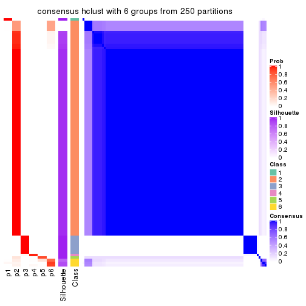</p>

</div>
</div>

Heatmaps for the membership of samples in all partitions to see how consistent they are:


<script>
$( function() {
	$( '#tabs-ATC-hclust-membership-heatmap' ).tabs();
} );
</script>
<div id='tabs-ATC-hclust-membership-heatmap'>
<ul>
<li><a href='#tab-ATC-hclust-membership-heatmap-1'>k = 2</a></li>
<li><a href='#tab-ATC-hclust-membership-heatmap-2'>k = 3</a></li>
<li><a href='#tab-ATC-hclust-membership-heatmap-3'>k = 4</a></li>
<li><a href='#tab-ATC-hclust-membership-heatmap-4'>k = 5</a></li>
<li><a href='#tab-ATC-hclust-membership-heatmap-5'>k = 6</a></li>
</ul>
<div id='tab-ATC-hclust-membership-heatmap-1'>
<pre><code class="r">membership_heatmap(res, k = 2)
</code></pre>

<p></p>

</div>
<div id='tab-ATC-hclust-membership-heatmap-2'>
<pre><code class="r">membership_heatmap(res, k = 3)
</code></pre>

<p></p>

</div>
<div id='tab-ATC-hclust-membership-heatmap-3'>
<pre><code class="r">membership_heatmap(res, k = 4)
</code></pre>

<p></p>

</div>
<div id='tab-ATC-hclust-membership-heatmap-4'>
<pre><code class="r">membership_heatmap(res, k = 5)
</code></pre>

<p></p>

</div>
<div id='tab-ATC-hclust-membership-heatmap-5'>
<pre><code class="r">membership_heatmap(res, k = 6)
</code></pre>

<p></p>

</div>
</div>

As soon as we have had the classes for columns, we can look for signatures
which are significantly different between classes which can be candidate marks
for certain classes. Following are the heatmaps for signatures.


Signature heatmaps where rows are scaled:


<script>
$( function() {
	$( '#tabs-ATC-hclust-get-signatures' ).tabs();
} );
</script>
<div id='tabs-ATC-hclust-get-signatures'>
<ul>
<li><a href='#tab-ATC-hclust-get-signatures-1'>k = 2</a></li>
<li><a href='#tab-ATC-hclust-get-signatures-2'>k = 3</a></li>
<li><a href='#tab-ATC-hclust-get-signatures-3'>k = 4</a></li>
<li><a href='#tab-ATC-hclust-get-signatures-4'>k = 5</a></li>
<li><a href='#tab-ATC-hclust-get-signatures-5'>k = 6</a></li>
</ul>
<div id='tab-ATC-hclust-get-signatures-1'>
<pre><code class="r">get_signatures(res, k = 2)
</code></pre>

<p></p>

</div>
<div id='tab-ATC-hclust-get-signatures-2'>
<pre><code class="r">get_signatures(res, k = 3)
</code></pre>

<p></p>

</div>
<div id='tab-ATC-hclust-get-signatures-3'>
<pre><code class="r">get_signatures(res, k = 4)
</code></pre>

<p></p>

</div>
<div id='tab-ATC-hclust-get-signatures-4'>
<pre><code class="r">get_signatures(res, k = 5)
</code></pre>

<p></p>

</div>
<div id='tab-ATC-hclust-get-signatures-5'>
<pre><code class="r">get_signatures(res, k = 6)
</code></pre>

<p></p>

</div>
</div>


Signature heatmaps where rows are not scaled:


<script>
$( function() {
	$( '#tabs-ATC-hclust-get-signatures-no-scale' ).tabs();
} );
</script>
<div id='tabs-ATC-hclust-get-signatures-no-scale'>
<ul>
<li><a href='#tab-ATC-hclust-get-signatures-no-scale-1'>k = 2</a></li>
<li><a href='#tab-ATC-hclust-get-signatures-no-scale-2'>k = 3</a></li>
<li><a href='#tab-ATC-hclust-get-signatures-no-scale-3'>k = 4</a></li>
<li><a href='#tab-ATC-hclust-get-signatures-no-scale-4'>k = 5</a></li>
<li><a href='#tab-ATC-hclust-get-signatures-no-scale-5'>k = 6</a></li>
</ul>
<div id='tab-ATC-hclust-get-signatures-no-scale-1'>
<pre><code class="r">get_signatures(res, k = 2, scale_rows = FALSE)
</code></pre>

<p></p>

</div>
<div id='tab-ATC-hclust-get-signatures-no-scale-2'>
<pre><code class="r">get_signatures(res, k = 3, scale_rows = FALSE)
</code></pre>

<p></p>

</div>
<div id='tab-ATC-hclust-get-signatures-no-scale-3'>
<pre><code class="r">get_signatures(res, k = 4, scale_rows = FALSE)
</code></pre>

<p></p>

</div>
<div id='tab-ATC-hclust-get-signatures-no-scale-4'>
<pre><code class="r">get_signatures(res, k = 5, scale_rows = FALSE)
</code></pre>

<p></p>

</div>
<div id='tab-ATC-hclust-get-signatures-no-scale-5'>
<pre><code class="r">get_signatures(res, k = 6, scale_rows = FALSE)
</code></pre>

<p></p>

</div>
</div>


Compare the overlap of signatures from different k:

```r
compare_signatures(res)
```


`get_signature()` returns a data frame invisibly. TO get the list of signatures, the function
call should be assigned to a variable explicitly. In following code, if `plot` argument is set
to `FALSE`, no heatmap is plotted while only the differential analysis is performed.

```r
# code only for demonstration
tb = get_signature(res, k = ..., plot = FALSE)
```

An example of the output of `tb` is:

```
#>   which_row         fdr    mean_1    mean_2 scaled_mean_1 scaled_mean_2 km
#> 1        38 0.042760348  8.373488  9.131774    -0.5533452     0.5164555  1
#> 2        40 0.018707592  7.106213  8.469186    -0.6173731     0.5762149  1
#> 3        55 0.019134737 10.221463 11.207825    -0.6159697     0.5749050  1
#> 4        59 0.006059896  5.921854  7.869574    -0.6899429     0.6439467  1
#> 5        60 0.018055526  8.928898 10.211722    -0.6204761     0.5791110  1
#> 6        98 0.009384629 15.714769 14.887706     0.6635654    -0.6193277  2
...
```

The columns in `tb` are:

1. `which_row`: row indices corresponding to the input matrix.
2. `fdr`: FDR for the differential test. 
3. `mean_x`: The mean value in group x.
4. `scaled_mean_x`: The mean value in group x after rows are scaled.
5. `km`: Row groups if k-means clustering is applied to rows.


UMAP plot which shows how samples are separated.


<script>
$( function() {
	$( '#tabs-ATC-hclust-dimension-reduction' ).tabs();
} );
</script>
<div id='tabs-ATC-hclust-dimension-reduction'>
<ul>
<li><a href='#tab-ATC-hclust-dimension-reduction-1'>k = 2</a></li>
<li><a href='#tab-ATC-hclust-dimension-reduction-2'>k = 3</a></li>
<li><a href='#tab-ATC-hclust-dimension-reduction-3'>k = 4</a></li>
<li><a href='#tab-ATC-hclust-dimension-reduction-4'>k = 5</a></li>
<li><a href='#tab-ATC-hclust-dimension-reduction-5'>k = 6</a></li>
</ul>
<div id='tab-ATC-hclust-dimension-reduction-1'>
<pre><code class="r">dimension_reduction(res, k = 2, method = &quot;UMAP&quot;)
</code></pre>

<p></p>

</div>
<div id='tab-ATC-hclust-dimension-reduction-2'>
<pre><code class="r">dimension_reduction(res, k = 3, method = &quot;UMAP&quot;)
</code></pre>

<p></p>

</div>
<div id='tab-ATC-hclust-dimension-reduction-3'>
<pre><code class="r">dimension_reduction(res, k = 4, method = &quot;UMAP&quot;)
</code></pre>

<p></p>

</div>
<div id='tab-ATC-hclust-dimension-reduction-4'>
<pre><code class="r">dimension_reduction(res, k = 5, method = &quot;UMAP&quot;)
</code></pre>

<p></p>

</div>
<div id='tab-ATC-hclust-dimension-reduction-5'>
<pre><code class="r">dimension_reduction(res, k = 6, method = &quot;UMAP&quot;)
</code></pre>

<p></p>

</div>
</div>


Following heatmap shows how subgroups are split when increasing `k`:

```r
collect_classes(res)
```


If matrix rows can be associated to genes, consider to use `GO_Enrichment(res,
...)` to perform function enrichment for the signature genes.


 

---------------------------------------------------


### ATC:kmeans**


The object with results only for a single top-value method and a single partition method 
can be extracted as:

```r
res = res_list["ATC", "kmeans"]
# you can also extract it by
# res = res_list["ATC:kmeans"]
```

A summary of `res` and all the functions that can be applied to it:

```r
res
```

```
#> A 'ConsensusPartition' object with k = 2, 3, 4, 5, 6.
#>   On a matrix with 5966 rows and 384 columns.
#>   Top rows (597, 1194, 1790, 2386, 2983) are extracted by 'ATC' method.
#>   Subgroups are detected by 'kmeans' method.
#>   Performed in total 1250 partitions by row resampling.
#>   Best k for subgroups seems to be 3.
#> 
#> Following methods can be applied to this 'ConsensusPartition' object:
#>  [1] "cola_report"             "collect_classes"         "collect_plots"          
#>  [4] "collect_stats"           "colnames"                "compare_signatures"     
#>  [7] "consensus_heatmap"       "dimension_reduction"     "functional_enrichment"  
#> [10] "get_anno_col"            "get_anno"                "get_classes"            
#> [13] "get_consensus"           "get_matrix"              "get_membership"         
#> [16] "get_param"               "get_signatures"          "get_stats"              
#> [19] "is_best_k"               "is_stable_k"             "membership_heatmap"     
#> [22] "ncol"                    "nrow"                    "plot_ecdf"              
#> [25] "rownames"                "select_partition_number" "show"                   
#> [28] "suggest_best_k"          "test_to_known_factors"
```

`collect_plots()` function collects all the plots made from `res` for all `k` (number of partitions)
into one single page to provide an easy and fast comparison between different `k`.

```r
collect_plots(res)
```


The plots are:

- The first row: a plot of the ECDF (Empirical cumulative distribution
  function) curves of the consensus matrix for each `k` and the heatmap of
  predicted classes for each `k`.
- The second row: heatmaps of the consensus matrix for each `k`.
- The third row: heatmaps of the membership matrix for each `k`.
- The fouth row: heatmaps of the signatures for each `k`.

All the plots in panels can be made by individual functions and they are
plotted later in this section.

`select_partition_number()` produces several plots showing different
statistics for choosing "optimized" `k`. There are following statistics:

- ECDF curves of the consensus matrix for each `k`;
- 1-PAC. [The PAC
  score](https://en.wikipedia.org/wiki/Consensus_clustering#Over-interpretation_potential_of_consensus_clustering)
  measures the proportion of the ambiguous subgrouping.
- Mean silhouette score.
- Concordance. The mean probability of fiting the consensus class ids in all
  partitions.
- Area increased. Denote $A_k$ as the area under the ECDF curve for current
  `k`, the area increased is defined as $A_k - A_{k-1}$.
- Rand index. The percent of pairs of samples that are both in a same cluster
  or both are not in a same cluster in the partition of k and k-1.
- Jaccard index. The ratio of pairs of samples are both in a same cluster in
  the partition of k and k-1 and the pairs of samples are both in a same
  cluster in the partition k or k-1.

The detailed explanations of these statistics can be found in [the cola
vignette](http://bioconductor.org/packages/devel/bioc/vignettes/cola/inst/doc/cola.html#toc_13).

Generally speaking, lower PAC score, higher mean silhouette score or higher
concordance corresponds to better partition. Rand index and Jaccard index
measure how similar the current partition is compared to partition with `k-1`.
If they are too similar, we won't accept `k` is better than `k-1`.

```r
select_partition_number(res)
```


The numeric values for all these statistics can be obtained by `get_stats()`.

```r
get_stats(res)
```

```
#>   k 1-PAC mean_silhouette concordance area_increased  Rand Jaccard
#> 2 2 1.000           0.996       0.998         0.1569 0.847   0.847
#> 3 3 1.000           0.959       0.986         1.3501 0.777   0.737
#> 4 4 0.623           0.527       0.788         0.5159 0.981   0.970
#> 5 5 0.636           0.795       0.845         0.1726 0.699   0.521
#> 6 6 0.636           0.526       0.774         0.0855 0.967   0.906
```

`suggest_best_k()` suggests the best $k$ based on these statistics. The rules are as follows:

- All $k$ with Jaccard index larger than 0.95 are removed because the increase of
  the partition number does not provides enough extra information. If all $k$ are removed,
  the best $k$ is assigned by `NA`.
- For $k$ with 1-PAC larger than 0.9, the maximal $k$ is taken as the "best k". Other $k$ is called "optional k".
- If it does not fit the second rule. The $k$ with the highest vote of highest
  1-PAC, mean silhouette and concordance is taken as the "best k".

```r
suggest_best_k(res)
```

```
#> [1] 3
#> attr(,"optional")
#> [1] 2
```

There is also optional best $k$ = 2 that is worth to check.

Following shows the table of the partitions (You need to click the **show/hide
code output** link to see it). The membership matrix (columns with name `p*`)
is inferred by
[`clue::cl_consensus()`](https://www.rdocumentation.org/link/cl_consensus?package=clue)
function with the `SE` method. Basically the value in the membership matrix
represents the probability to belong to a certain group. The finall class
label for an item is determined with the group with highest probability it
belongs to.

In `get_classes()` function, the entropy is calculated from the membership
matrix and the silhouette score is calculated from the consensus matrix.


<script>
$( function() {
	$( '#tabs-ATC-kmeans-get-classes' ).tabs();
} );
</script>
<div id='tabs-ATC-kmeans-get-classes'>
<ul>
<li><a href='#tab-ATC-kmeans-get-classes-1'>k = 2</a></li>
<li><a href='#tab-ATC-kmeans-get-classes-2'>k = 3</a></li>
<li><a href='#tab-ATC-kmeans-get-classes-3'>k = 4</a></li>
<li><a href='#tab-ATC-kmeans-get-classes-4'>k = 5</a></li>
<li><a href='#tab-ATC-kmeans-get-classes-5'>k = 6</a></li>
</ul>

<div id='tab-ATC-kmeans-get-classes-1'>
<p><a id='tab-ATC-kmeans-get-classes-1-a' style='color:#0366d6' href='#'>show/hide code output</a></p>
<pre><code class="r">cbind(get_classes(res, k = 2), get_membership(res, k = 2))
</code></pre>

<pre><code>#&gt;           class entropy silhouette    p1    p2
#&gt; SRR490216     2  0.0000      0.998 0.000 1.000
#&gt; SRR490217     2  0.0000      0.998 0.000 1.000
#&gt; SRR490218     2  0.0000      0.998 0.000 1.000
#&gt; SRR490219     2  0.0000      0.998 0.000 1.000
#&gt; SRR490220     2  0.0000      0.998 0.000 1.000
#&gt; SRR490221     2  0.0000      0.998 0.000 1.000
#&gt; SRR490222     2  0.0000      0.998 0.000 1.000
#&gt; SRR490223     2  0.0000      0.998 0.000 1.000
#&gt; SRR490224     2  0.2236      0.965 0.036 0.964
#&gt; SRR490225     2  0.2236      0.965 0.036 0.964
#&gt; SRR490226     2  0.2236      0.965 0.036 0.964
#&gt; SRR490227     2  0.2236      0.965 0.036 0.964
#&gt; SRR490228     2  0.2236      0.965 0.036 0.964
#&gt; SRR490229     2  0.2236      0.965 0.036 0.964
#&gt; SRR490230     2  0.2236      0.965 0.036 0.964
#&gt; SRR490231     2  0.2236      0.965 0.036 0.964
#&gt; SRR490232     2  0.0000      0.998 0.000 1.000
#&gt; SRR490233     2  0.0000      0.998 0.000 1.000
#&gt; SRR490234     2  0.0000      0.998 0.000 1.000
#&gt; SRR490235     2  0.0000      0.998 0.000 1.000
#&gt; SRR490236     2  0.2236      0.965 0.036 0.964
#&gt; SRR490237     2  0.2236      0.965 0.036 0.964
#&gt; SRR490238     2  0.2236      0.965 0.036 0.964
#&gt; SRR490239     2  0.2236      0.965 0.036 0.964
#&gt; SRR490240     2  0.0000      0.998 0.000 1.000
#&gt; SRR490241     2  0.0000      0.998 0.000 1.000
#&gt; SRR490242     2  0.0000      0.998 0.000 1.000
#&gt; SRR490243     2  0.0000      0.998 0.000 1.000
#&gt; SRR490244     1  0.0000      1.000 1.000 0.000
#&gt; SRR490245     1  0.0000      1.000 1.000 0.000
#&gt; SRR490246     1  0.0000      1.000 1.000 0.000
#&gt; SRR490247     1  0.0000      1.000 1.000 0.000
#&gt; SRR490248     2  0.0000      0.998 0.000 1.000
#&gt; SRR490249     2  0.0000      0.998 0.000 1.000
#&gt; SRR490250     2  0.0000      0.998 0.000 1.000
#&gt; SRR490251     2  0.0000      0.998 0.000 1.000
#&gt; SRR490252     2  0.0000      0.998 0.000 1.000
#&gt; SRR490253     2  0.0000      0.998 0.000 1.000
#&gt; SRR490254     2  0.0000      0.998 0.000 1.000
#&gt; SRR490255     2  0.0000      0.998 0.000 1.000
#&gt; SRR490256     2  0.0000      0.998 0.000 1.000
#&gt; SRR490257     2  0.0000      0.998 0.000 1.000
#&gt; SRR490258     2  0.0000      0.998 0.000 1.000
#&gt; SRR490259     2  0.0000      0.998 0.000 1.000
#&gt; SRR490260     2  0.0000      0.998 0.000 1.000
#&gt; SRR490261     2  0.0000      0.998 0.000 1.000
#&gt; SRR490262     2  0.0000      0.998 0.000 1.000
#&gt; SRR490263     2  0.0000      0.998 0.000 1.000
#&gt; SRR490264     2  0.0000      0.998 0.000 1.000
#&gt; SRR490265     2  0.0000      0.998 0.000 1.000
#&gt; SRR490266     2  0.0000      0.998 0.000 1.000
#&gt; SRR490267     2  0.0000      0.998 0.000 1.000
#&gt; SRR490268     2  0.0000      0.998 0.000 1.000
#&gt; SRR490269     2  0.0000      0.998 0.000 1.000
#&gt; SRR490270     2  0.0000      0.998 0.000 1.000
#&gt; SRR490271     2  0.0000      0.998 0.000 1.000
#&gt; SRR490272     2  0.0000      0.998 0.000 1.000
#&gt; SRR490273     2  0.0000      0.998 0.000 1.000
#&gt; SRR490274     2  0.0000      0.998 0.000 1.000
#&gt; SRR490275     2  0.0000      0.998 0.000 1.000
#&gt; SRR490276     2  0.0000      0.998 0.000 1.000
#&gt; SRR490277     2  0.0000      0.998 0.000 1.000
#&gt; SRR490278     2  0.0000      0.998 0.000 1.000
#&gt; SRR490279     2  0.0000      0.998 0.000 1.000
#&gt; SRR490280     1  0.0000      1.000 1.000 0.000
#&gt; SRR490281     1  0.0000      1.000 1.000 0.000
#&gt; SRR490282     1  0.0376      0.996 0.996 0.004
#&gt; SRR490283     1  0.0000      1.000 1.000 0.000
#&gt; SRR490284     2  0.2236      0.965 0.036 0.964
#&gt; SRR490285     2  0.2236      0.965 0.036 0.964
#&gt; SRR490286     2  0.2236      0.965 0.036 0.964
#&gt; SRR490287     2  0.2236      0.965 0.036 0.964
#&gt; SRR490288     2  0.0000      0.998 0.000 1.000
#&gt; SRR490289     2  0.0000      0.998 0.000 1.000
#&gt; SRR490290     2  0.0000      0.998 0.000 1.000
#&gt; SRR490291     2  0.0000      0.998 0.000 1.000
#&gt; SRR490292     2  0.0000      0.998 0.000 1.000
#&gt; SRR490293     2  0.0000      0.998 0.000 1.000
#&gt; SRR490294     2  0.0000      0.998 0.000 1.000
#&gt; SRR490295     2  0.0000      0.998 0.000 1.000
#&gt; SRR490296     2  0.0000      0.998 0.000 1.000
#&gt; SRR490297     2  0.0000      0.998 0.000 1.000
#&gt; SRR490298     2  0.0000      0.998 0.000 1.000
#&gt; SRR490299     2  0.0000      0.998 0.000 1.000
#&gt; SRR490300     2  0.0000      0.998 0.000 1.000
#&gt; SRR490301     2  0.0000      0.998 0.000 1.000
#&gt; SRR490302     2  0.0000      0.998 0.000 1.000
#&gt; SRR490303     2  0.0000      0.998 0.000 1.000
#&gt; SRR490304     2  0.0000      0.998 0.000 1.000
#&gt; SRR490305     2  0.0000      0.998 0.000 1.000
#&gt; SRR490306     2  0.0000      0.998 0.000 1.000
#&gt; SRR490307     2  0.0000      0.998 0.000 1.000
#&gt; SRR490308     1  0.0000      1.000 1.000 0.000
#&gt; SRR490309     1  0.0000      1.000 1.000 0.000
#&gt; SRR490310     1  0.0000      1.000 1.000 0.000
#&gt; SRR490311     1  0.0000      1.000 1.000 0.000
#&gt; SRR490312     2  0.0000      0.998 0.000 1.000
#&gt; SRR490313     2  0.0000      0.998 0.000 1.000
#&gt; SRR490314     2  0.0000      0.998 0.000 1.000
#&gt; SRR490315     2  0.0000      0.998 0.000 1.000
#&gt; SRR490316     2  0.0000      0.998 0.000 1.000
#&gt; SRR490317     2  0.0000      0.998 0.000 1.000
#&gt; SRR490318     2  0.0000      0.998 0.000 1.000
#&gt; SRR490319     2  0.0000      0.998 0.000 1.000
#&gt; SRR490320     2  0.0000      0.998 0.000 1.000
#&gt; SRR490321     2  0.0000      0.998 0.000 1.000
#&gt; SRR490322     2  0.0000      0.998 0.000 1.000
#&gt; SRR490323     2  0.0000      0.998 0.000 1.000
#&gt; SRR490324     2  0.2236      0.965 0.036 0.964
#&gt; SRR490325     2  0.2236      0.965 0.036 0.964
#&gt; SRR490326     2  0.2236      0.965 0.036 0.964
#&gt; SRR490327     2  0.2236      0.965 0.036 0.964
#&gt; SRR490328     2  0.0000      0.998 0.000 1.000
#&gt; SRR490329     2  0.0000      0.998 0.000 1.000
#&gt; SRR490330     2  0.0000      0.998 0.000 1.000
#&gt; SRR490331     2  0.0000      0.998 0.000 1.000
#&gt; SRR490332     2  0.0000      0.998 0.000 1.000
#&gt; SRR490333     2  0.0000      0.998 0.000 1.000
#&gt; SRR490334     2  0.0000      0.998 0.000 1.000
#&gt; SRR490335     2  0.0000      0.998 0.000 1.000
#&gt; SRR490336     2  0.0000      0.998 0.000 1.000
#&gt; SRR490337     2  0.0000      0.998 0.000 1.000
#&gt; SRR490338     2  0.0000      0.998 0.000 1.000
#&gt; SRR490339     2  0.0000      0.998 0.000 1.000
#&gt; SRR490340     2  0.0000      0.998 0.000 1.000
#&gt; SRR490341     2  0.0000      0.998 0.000 1.000
#&gt; SRR490342     2  0.0000      0.998 0.000 1.000
#&gt; SRR490343     2  0.0000      0.998 0.000 1.000
#&gt; SRR490344     2  0.0000      0.998 0.000 1.000
#&gt; SRR490345     2  0.0000      0.998 0.000 1.000
#&gt; SRR490346     2  0.0000      0.998 0.000 1.000
#&gt; SRR490347     2  0.0000      0.998 0.000 1.000
#&gt; SRR490348     2  0.0000      0.998 0.000 1.000
#&gt; SRR490349     2  0.0000      0.998 0.000 1.000
#&gt; SRR490350     2  0.0000      0.998 0.000 1.000
#&gt; SRR490351     2  0.0000      0.998 0.000 1.000
#&gt; SRR490352     2  0.0000      0.998 0.000 1.000
#&gt; SRR490353     2  0.0000      0.998 0.000 1.000
#&gt; SRR490354     2  0.0000      0.998 0.000 1.000
#&gt; SRR490355     2  0.0000      0.998 0.000 1.000
#&gt; SRR490356     2  0.0000      0.998 0.000 1.000
#&gt; SRR490357     2  0.0000      0.998 0.000 1.000
#&gt; SRR490358     2  0.0000      0.998 0.000 1.000
#&gt; SRR490359     2  0.0000      0.998 0.000 1.000
#&gt; SRR490360     2  0.0000      0.998 0.000 1.000
#&gt; SRR490361     2  0.0000      0.998 0.000 1.000
#&gt; SRR490362     2  0.0000      0.998 0.000 1.000
#&gt; SRR490363     2  0.0000      0.998 0.000 1.000
#&gt; SRR490364     2  0.0000      0.998 0.000 1.000
#&gt; SRR490365     2  0.0000      0.998 0.000 1.000
#&gt; SRR490366     2  0.0000      0.998 0.000 1.000
#&gt; SRR490367     2  0.0000      0.998 0.000 1.000
#&gt; SRR490368     2  0.0000      0.998 0.000 1.000
#&gt; SRR490369     2  0.0000      0.998 0.000 1.000
#&gt; SRR490370     2  0.0000      0.998 0.000 1.000
#&gt; SRR490371     2  0.0000      0.998 0.000 1.000
#&gt; SRR490372     1  0.0000      1.000 1.000 0.000
#&gt; SRR490373     1  0.0000      1.000 1.000 0.000
#&gt; SRR490374     1  0.0000      1.000 1.000 0.000
#&gt; SRR490375     1  0.0000      1.000 1.000 0.000
#&gt; SRR490376     2  0.0000      0.998 0.000 1.000
#&gt; SRR490377     2  0.0000      0.998 0.000 1.000
#&gt; SRR490378     2  0.0000      0.998 0.000 1.000
#&gt; SRR490379     2  0.0000      0.998 0.000 1.000
#&gt; SRR490380     1  0.0000      1.000 1.000 0.000
#&gt; SRR490381     1  0.0000      1.000 1.000 0.000
#&gt; SRR490382     1  0.0000      1.000 1.000 0.000
#&gt; SRR490383     1  0.0000      1.000 1.000 0.000
#&gt; SRR490384     2  0.0000      0.998 0.000 1.000
#&gt; SRR490385     2  0.0000      0.998 0.000 1.000
#&gt; SRR490386     2  0.0000      0.998 0.000 1.000
#&gt; SRR490387     2  0.0000      0.998 0.000 1.000
#&gt; SRR490388     2  0.0000      0.998 0.000 1.000
#&gt; SRR490389     2  0.0000      0.998 0.000 1.000
#&gt; SRR490390     2  0.0000      0.998 0.000 1.000
#&gt; SRR490391     2  0.0000      0.998 0.000 1.000
#&gt; SRR490392     2  0.0000      0.998 0.000 1.000
#&gt; SRR490393     2  0.0000      0.998 0.000 1.000
#&gt; SRR490394     2  0.0000      0.998 0.000 1.000
#&gt; SRR490395     2  0.0000      0.998 0.000 1.000
#&gt; SRR490396     2  0.0000      0.998 0.000 1.000
#&gt; SRR490397     2  0.0000      0.998 0.000 1.000
#&gt; SRR490398     2  0.0000      0.998 0.000 1.000
#&gt; SRR490399     2  0.0000      0.998 0.000 1.000
#&gt; SRR490400     2  0.0000      0.998 0.000 1.000
#&gt; SRR490401     2  0.0000      0.998 0.000 1.000
#&gt; SRR490402     2  0.0000      0.998 0.000 1.000
#&gt; SRR490403     2  0.0000      0.998 0.000 1.000
#&gt; SRR490404     2  0.0000      0.998 0.000 1.000
#&gt; SRR490405     2  0.0000      0.998 0.000 1.000
#&gt; SRR490406     2  0.0000      0.998 0.000 1.000
#&gt; SRR490407     2  0.0000      0.998 0.000 1.000
#&gt; SRR490408     2  0.0000      0.998 0.000 1.000
#&gt; SRR490409     2  0.0000      0.998 0.000 1.000
#&gt; SRR490410     2  0.0000      0.998 0.000 1.000
#&gt; SRR490411     2  0.0000      0.998 0.000 1.000
#&gt; SRR490412     1  0.0000      1.000 1.000 0.000
#&gt; SRR490413     1  0.0000      1.000 1.000 0.000
#&gt; SRR490414     1  0.0000      1.000 1.000 0.000
#&gt; SRR490415     1  0.0000      1.000 1.000 0.000
#&gt; SRR490416     2  0.0000      0.998 0.000 1.000
#&gt; SRR490417     2  0.0000      0.998 0.000 1.000
#&gt; SRR490418     2  0.0000      0.998 0.000 1.000
#&gt; SRR490419     2  0.0000      0.998 0.000 1.000
#&gt; SRR490420     2  0.0000      0.998 0.000 1.000
#&gt; SRR490421     2  0.0000      0.998 0.000 1.000
#&gt; SRR490422     2  0.0000      0.998 0.000 1.000
#&gt; SRR490423     2  0.0000      0.998 0.000 1.000
#&gt; SRR490424     2  0.0000      0.998 0.000 1.000
#&gt; SRR490425     2  0.0000      0.998 0.000 1.000
#&gt; SRR490426     2  0.0000      0.998 0.000 1.000
#&gt; SRR490427     2  0.0000      0.998 0.000 1.000
#&gt; SRR490428     2  0.0000      0.998 0.000 1.000
#&gt; SRR490429     2  0.0000      0.998 0.000 1.000
#&gt; SRR490430     2  0.0000      0.998 0.000 1.000
#&gt; SRR490431     2  0.0000      0.998 0.000 1.000
#&gt; SRR490432     2  0.0000      0.998 0.000 1.000
#&gt; SRR490433     2  0.0000      0.998 0.000 1.000
#&gt; SRR490434     2  0.0000      0.998 0.000 1.000
#&gt; SRR490435     2  0.0000      0.998 0.000 1.000
#&gt; SRR490436     2  0.0000      0.998 0.000 1.000
#&gt; SRR490437     2  0.0000      0.998 0.000 1.000
#&gt; SRR490438     2  0.0000      0.998 0.000 1.000
#&gt; SRR490439     2  0.0000      0.998 0.000 1.000
#&gt; SRR490440     2  0.0000      0.998 0.000 1.000
#&gt; SRR490441     2  0.0000      0.998 0.000 1.000
#&gt; SRR490442     2  0.0000      0.998 0.000 1.000
#&gt; SRR490443     2  0.0000      0.998 0.000 1.000
#&gt; SRR490444     2  0.0000      0.998 0.000 1.000
#&gt; SRR490445     2  0.0000      0.998 0.000 1.000
#&gt; SRR490446     2  0.0000      0.998 0.000 1.000
#&gt; SRR490447     2  0.0000      0.998 0.000 1.000
#&gt; SRR490448     2  0.0000      0.998 0.000 1.000
#&gt; SRR490449     2  0.0000      0.998 0.000 1.000
#&gt; SRR490450     2  0.0000      0.998 0.000 1.000
#&gt; SRR490451     2  0.0000      0.998 0.000 1.000
#&gt; SRR490452     2  0.0000      0.998 0.000 1.000
#&gt; SRR490453     2  0.0000      0.998 0.000 1.000
#&gt; SRR490454     2  0.0000      0.998 0.000 1.000
#&gt; SRR490455     2  0.0000      0.998 0.000 1.000
#&gt; SRR490456     2  0.0000      0.998 0.000 1.000
#&gt; SRR490457     2  0.0000      0.998 0.000 1.000
#&gt; SRR490458     2  0.0000      0.998 0.000 1.000
#&gt; SRR490459     2  0.0000      0.998 0.000 1.000
#&gt; SRR490460     2  0.0000      0.998 0.000 1.000
#&gt; SRR490461     2  0.0000      0.998 0.000 1.000
#&gt; SRR490462     2  0.0000      0.998 0.000 1.000
#&gt; SRR490463     2  0.0000      0.998 0.000 1.000
#&gt; SRR490464     1  0.0000      1.000 1.000 0.000
#&gt; SRR490465     1  0.0000      1.000 1.000 0.000
#&gt; SRR490466     1  0.0000      1.000 1.000 0.000
#&gt; SRR490467     1  0.0000      1.000 1.000 0.000
#&gt; SRR490468     2  0.0000      0.998 0.000 1.000
#&gt; SRR490469     2  0.0000      0.998 0.000 1.000
#&gt; SRR490470     2  0.0000      0.998 0.000 1.000
#&gt; SRR490471     2  0.0000      0.998 0.000 1.000
#&gt; SRR490472     2  0.0000      0.998 0.000 1.000
#&gt; SRR490473     2  0.0000      0.998 0.000 1.000
#&gt; SRR490474     2  0.0000      0.998 0.000 1.000
#&gt; SRR490475     2  0.0000      0.998 0.000 1.000
#&gt; SRR490476     1  0.0000      1.000 1.000 0.000
#&gt; SRR490477     1  0.0000      1.000 1.000 0.000
#&gt; SRR490478     1  0.0000      1.000 1.000 0.000
#&gt; SRR490479     1  0.0000      1.000 1.000 0.000
#&gt; SRR490480     2  0.0000      0.998 0.000 1.000
#&gt; SRR490481     2  0.0000      0.998 0.000 1.000
#&gt; SRR490482     2  0.0000      0.998 0.000 1.000
#&gt; SRR490483     2  0.0000      0.998 0.000 1.000
#&gt; SRR490484     2  0.0000      0.998 0.000 1.000
#&gt; SRR490485     2  0.0000      0.998 0.000 1.000
#&gt; SRR490486     2  0.0000      0.998 0.000 1.000
#&gt; SRR490487     2  0.0000      0.998 0.000 1.000
#&gt; SRR490488     2  0.0000      0.998 0.000 1.000
#&gt; SRR490489     2  0.0000      0.998 0.000 1.000
#&gt; SRR490490     2  0.0000      0.998 0.000 1.000
#&gt; SRR490491     2  0.0000      0.998 0.000 1.000
#&gt; SRR490492     2  0.0000      0.998 0.000 1.000
#&gt; SRR490493     2  0.0000      0.998 0.000 1.000
#&gt; SRR490494     2  0.0000      0.998 0.000 1.000
#&gt; SRR490495     2  0.0000      0.998 0.000 1.000
#&gt; SRR490496     2  0.0000      0.998 0.000 1.000
#&gt; SRR490497     2  0.0000      0.998 0.000 1.000
#&gt; SRR490498     2  0.0000      0.998 0.000 1.000
#&gt; SRR490499     2  0.0000      0.998 0.000 1.000
#&gt; SRR490500     2  0.0000      0.998 0.000 1.000
#&gt; SRR490501     2  0.0000      0.998 0.000 1.000
#&gt; SRR490502     2  0.0000      0.998 0.000 1.000
#&gt; SRR490503     2  0.0000      0.998 0.000 1.000
#&gt; SRR490504     2  0.0000      0.998 0.000 1.000
#&gt; SRR490505     2  0.0000      0.998 0.000 1.000
#&gt; SRR490506     2  0.0000      0.998 0.000 1.000
#&gt; SRR490507     2  0.0000      0.998 0.000 1.000
#&gt; SRR490508     2  0.0000      0.998 0.000 1.000
#&gt; SRR490509     2  0.0000      0.998 0.000 1.000
#&gt; SRR490510     2  0.0000      0.998 0.000 1.000
#&gt; SRR490511     2  0.0000      0.998 0.000 1.000
#&gt; SRR490512     2  0.0000      0.998 0.000 1.000
#&gt; SRR490513     2  0.0000      0.998 0.000 1.000
#&gt; SRR490514     2  0.0000      0.998 0.000 1.000
#&gt; SRR490515     2  0.0000      0.998 0.000 1.000
#&gt; SRR490516     2  0.0000      0.998 0.000 1.000
#&gt; SRR490517     2  0.0000      0.998 0.000 1.000
#&gt; SRR490518     2  0.0000      0.998 0.000 1.000
#&gt; SRR490519     2  0.0000      0.998 0.000 1.000
#&gt; SRR490520     2  0.0000      0.998 0.000 1.000
#&gt; SRR490521     2  0.0000      0.998 0.000 1.000
#&gt; SRR490522     2  0.0000      0.998 0.000 1.000
#&gt; SRR490523     2  0.0000      0.998 0.000 1.000
#&gt; SRR490524     2  0.0000      0.998 0.000 1.000
#&gt; SRR490525     2  0.0000      0.998 0.000 1.000
#&gt; SRR490526     2  0.0000      0.998 0.000 1.000
#&gt; SRR490527     2  0.0000      0.998 0.000 1.000
#&gt; SRR490528     2  0.0000      0.998 0.000 1.000
#&gt; SRR490529     2  0.0000      0.998 0.000 1.000
#&gt; SRR490530     2  0.0000      0.998 0.000 1.000
#&gt; SRR490531     2  0.0000      0.998 0.000 1.000
#&gt; SRR490532     2  0.0000      0.998 0.000 1.000
#&gt; SRR490533     2  0.0000      0.998 0.000 1.000
#&gt; SRR490534     2  0.0000      0.998 0.000 1.000
#&gt; SRR490535     2  0.0000      0.998 0.000 1.000
#&gt; SRR490536     2  0.0000      0.998 0.000 1.000
#&gt; SRR490537     2  0.0000      0.998 0.000 1.000
#&gt; SRR490538     2  0.0000      0.998 0.000 1.000
#&gt; SRR490539     2  0.0000      0.998 0.000 1.000
#&gt; SRR490540     2  0.0000      0.998 0.000 1.000
#&gt; SRR490541     2  0.0000      0.998 0.000 1.000
#&gt; SRR490542     2  0.0000      0.998 0.000 1.000
#&gt; SRR490543     2  0.0000      0.998 0.000 1.000
#&gt; SRR490544     2  0.0000      0.998 0.000 1.000
#&gt; SRR490545     2  0.0000      0.998 0.000 1.000
#&gt; SRR490546     2  0.0000      0.998 0.000 1.000
#&gt; SRR490547     2  0.0000      0.998 0.000 1.000
#&gt; SRR490548     2  0.0000      0.998 0.000 1.000
#&gt; SRR490549     2  0.0000      0.998 0.000 1.000
#&gt; SRR490550     2  0.0000      0.998 0.000 1.000
#&gt; SRR490551     2  0.0000      0.998 0.000 1.000
#&gt; SRR490552     2  0.0000      0.998 0.000 1.000
#&gt; SRR490553     2  0.0000      0.998 0.000 1.000
#&gt; SRR490554     2  0.0000      0.998 0.000 1.000
#&gt; SRR490555     2  0.0000      0.998 0.000 1.000
#&gt; SRR490556     2  0.0000      0.998 0.000 1.000
#&gt; SRR490557     2  0.0000      0.998 0.000 1.000
#&gt; SRR490558     2  0.0000      0.998 0.000 1.000
#&gt; SRR490559     2  0.0000      0.998 0.000 1.000
#&gt; SRR490560     2  0.0000      0.998 0.000 1.000
#&gt; SRR490561     2  0.0000      0.998 0.000 1.000
#&gt; SRR490562     2  0.0000      0.998 0.000 1.000
#&gt; SRR490563     2  0.0000      0.998 0.000 1.000
#&gt; SRR490564     2  0.0000      0.998 0.000 1.000
#&gt; SRR490565     2  0.0000      0.998 0.000 1.000
#&gt; SRR490566     2  0.0000      0.998 0.000 1.000
#&gt; SRR490567     2  0.0000      0.998 0.000 1.000
#&gt; SRR490568     2  0.0000      0.998 0.000 1.000
#&gt; SRR490569     2  0.0000      0.998 0.000 1.000
#&gt; SRR490570     2  0.0000      0.998 0.000 1.000
#&gt; SRR490571     2  0.0000      0.998 0.000 1.000
#&gt; SRR490572     2  0.0000      0.998 0.000 1.000
#&gt; SRR490573     2  0.0000      0.998 0.000 1.000
#&gt; SRR490574     2  0.0000      0.998 0.000 1.000
#&gt; SRR490575     2  0.0000      0.998 0.000 1.000
#&gt; SRR490576     2  0.0000      0.998 0.000 1.000
#&gt; SRR490577     2  0.0000      0.998 0.000 1.000
#&gt; SRR490578     2  0.0000      0.998 0.000 1.000
#&gt; SRR490579     2  0.0000      0.998 0.000 1.000
#&gt; SRR490580     2  0.0000      0.998 0.000 1.000
#&gt; SRR490581     2  0.0000      0.998 0.000 1.000
#&gt; SRR490582     2  0.0000      0.998 0.000 1.000
#&gt; SRR490583     2  0.0000      0.998 0.000 1.000
#&gt; SRR490584     2  0.0000      0.998 0.000 1.000
#&gt; SRR490585     2  0.0000      0.998 0.000 1.000
#&gt; SRR490586     2  0.0000      0.998 0.000 1.000
#&gt; SRR490587     2  0.0000      0.998 0.000 1.000
#&gt; SRR490588     2  0.0000      0.998 0.000 1.000
#&gt; SRR490589     2  0.0000      0.998 0.000 1.000
#&gt; SRR490590     2  0.0000      0.998 0.000 1.000
#&gt; SRR490591     2  0.0000      0.998 0.000 1.000
#&gt; SRR490592     2  0.0000      0.998 0.000 1.000
#&gt; SRR490593     2  0.0000      0.998 0.000 1.000
#&gt; SRR490594     2  0.0000      0.998 0.000 1.000
#&gt; SRR490595     2  0.0000      0.998 0.000 1.000
#&gt; SRR490596     2  0.0000      0.998 0.000 1.000
#&gt; SRR490597     2  0.0000      0.998 0.000 1.000
#&gt; SRR490598     2  0.0000      0.998 0.000 1.000
#&gt; SRR490599     2  0.0000      0.998 0.000 1.000
</code></pre>

<script>
$('#tab-ATC-kmeans-get-classes-1-a').parent().next().next().hide();
$('#tab-ATC-kmeans-get-classes-1-a').click(function(){
  $('#tab-ATC-kmeans-get-classes-1-a').parent().next().next().toggle();
  return(false);
});
</script>
</div>

<div id='tab-ATC-kmeans-get-classes-2'>
<p><a id='tab-ATC-kmeans-get-classes-2-a' style='color:#0366d6' href='#'>show/hide code output</a></p>
<pre><code class="r">cbind(get_classes(res, k = 3), get_membership(res, k = 3))
</code></pre>

<pre><code>#&gt;           class entropy silhouette    p1    p2 p3
#&gt; SRR490216     2  0.0000     0.9917 0.000 1.000  0
#&gt; SRR490217     2  0.0000     0.9917 0.000 1.000  0
#&gt; SRR490218     2  0.0000     0.9917 0.000 1.000  0
#&gt; SRR490219     2  0.0000     0.9917 0.000 1.000  0
#&gt; SRR490220     2  0.0000     0.9917 0.000 1.000  0
#&gt; SRR490221     2  0.0000     0.9917 0.000 1.000  0
#&gt; SRR490222     2  0.0000     0.9917 0.000 1.000  0
#&gt; SRR490223     2  0.0000     0.9917 0.000 1.000  0
#&gt; SRR490224     1  0.0237     0.9003 0.996 0.004  0
#&gt; SRR490225     1  0.0237     0.9003 0.996 0.004  0
#&gt; SRR490226     1  0.0237     0.9003 0.996 0.004  0
#&gt; SRR490227     1  0.0237     0.9003 0.996 0.004  0
#&gt; SRR490228     1  0.0237     0.9003 0.996 0.004  0
#&gt; SRR490229     1  0.0237     0.9003 0.996 0.004  0
#&gt; SRR490230     1  0.0237     0.9003 0.996 0.004  0
#&gt; SRR490231     1  0.0237     0.9003 0.996 0.004  0
#&gt; SRR490232     1  0.0592     0.8929 0.988 0.012  0
#&gt; SRR490233     1  0.0892     0.8840 0.980 0.020  0
#&gt; SRR490234     1  0.1643     0.8523 0.956 0.044  0
#&gt; SRR490235     1  0.1031     0.8792 0.976 0.024  0
#&gt; SRR490236     1  0.0237     0.9003 0.996 0.004  0
#&gt; SRR490237     1  0.0237     0.9003 0.996 0.004  0
#&gt; SRR490238     1  0.0237     0.9003 0.996 0.004  0
#&gt; SRR490239     1  0.0237     0.9003 0.996 0.004  0
#&gt; SRR490240     2  0.0000     0.9917 0.000 1.000  0
#&gt; SRR490241     2  0.0000     0.9917 0.000 1.000  0
#&gt; SRR490242     2  0.0000     0.9917 0.000 1.000  0
#&gt; SRR490243     2  0.0000     0.9917 0.000 1.000  0
#&gt; SRR490244     3  0.0000     1.0000 0.000 0.000  1
#&gt; SRR490245     3  0.0000     1.0000 0.000 0.000  1
#&gt; SRR490246     3  0.0000     1.0000 0.000 0.000  1
#&gt; SRR490247     3  0.0000     1.0000 0.000 0.000  1
#&gt; SRR490248     2  0.0000     0.9917 0.000 1.000  0
#&gt; SRR490249     2  0.0000     0.9917 0.000 1.000  0
#&gt; SRR490250     2  0.0000     0.9917 0.000 1.000  0
#&gt; SRR490251     2  0.0000     0.9917 0.000 1.000  0
#&gt; SRR490252     2  0.0000     0.9917 0.000 1.000  0
#&gt; SRR490253     2  0.0000     0.9917 0.000 1.000  0
#&gt; SRR490254     2  0.0000     0.9917 0.000 1.000  0
#&gt; SRR490255     2  0.0000     0.9917 0.000 1.000  0
#&gt; SRR490256     1  0.4504     0.6215 0.804 0.196  0
#&gt; SRR490257     1  0.6215     0.3053 0.572 0.428  0
#&gt; SRR490258     1  0.5098     0.5397 0.752 0.248  0
#&gt; SRR490259     1  0.5678     0.4404 0.684 0.316  0
#&gt; SRR490260     1  0.0237     0.9003 0.996 0.004  0
#&gt; SRR490261     1  0.0237     0.9003 0.996 0.004  0
#&gt; SRR490262     1  0.0237     0.9003 0.996 0.004  0
#&gt; SRR490263     1  0.0237     0.9003 0.996 0.004  0
#&gt; SRR490264     1  0.0237     0.9003 0.996 0.004  0
#&gt; SRR490265     1  0.0237     0.9003 0.996 0.004  0
#&gt; SRR490266     1  0.0237     0.9003 0.996 0.004  0
#&gt; SRR490267     1  0.0237     0.9003 0.996 0.004  0
#&gt; SRR490268     1  0.6309     0.0714 0.500 0.500  0
#&gt; SRR490269     2  0.6154     0.2555 0.408 0.592  0
#&gt; SRR490270     2  0.6252     0.1322 0.444 0.556  0
#&gt; SRR490271     2  0.6180     0.2296 0.416 0.584  0
#&gt; SRR490272     1  0.0424     0.8970 0.992 0.008  0
#&gt; SRR490273     1  0.0424     0.8970 0.992 0.008  0
#&gt; SRR490274     1  0.0592     0.8930 0.988 0.012  0
#&gt; SRR490275     1  0.1163     0.8739 0.972 0.028  0
#&gt; SRR490276     1  0.0237     0.9003 0.996 0.004  0
#&gt; SRR490277     1  0.0237     0.9003 0.996 0.004  0
#&gt; SRR490278     1  0.0237     0.9003 0.996 0.004  0
#&gt; SRR490279     1  0.0237     0.9003 0.996 0.004  0
#&gt; SRR490280     1  0.0000     0.8933 1.000 0.000  0
#&gt; SRR490281     1  0.0000     0.8933 1.000 0.000  0
#&gt; SRR490282     1  0.0000     0.8933 1.000 0.000  0
#&gt; SRR490283     1  0.0000     0.8933 1.000 0.000  0
#&gt; SRR490284     1  0.0237     0.9003 0.996 0.004  0
#&gt; SRR490285     1  0.0237     0.9003 0.996 0.004  0
#&gt; SRR490286     1  0.0237     0.9003 0.996 0.004  0
#&gt; SRR490287     1  0.0237     0.9003 0.996 0.004  0
#&gt; SRR490288     2  0.1163     0.9636 0.028 0.972  0
#&gt; SRR490289     2  0.0000     0.9917 0.000 1.000  0
#&gt; SRR490290     2  0.0000     0.9917 0.000 1.000  0
#&gt; SRR490291     2  0.0424     0.9838 0.008 0.992  0
#&gt; SRR490292     2  0.0000     0.9917 0.000 1.000  0
#&gt; SRR490293     2  0.0000     0.9917 0.000 1.000  0
#&gt; SRR490294     2  0.0000     0.9917 0.000 1.000  0
#&gt; SRR490295     2  0.0000     0.9917 0.000 1.000  0
#&gt; SRR490296     2  0.0000     0.9917 0.000 1.000  0
#&gt; SRR490297     2  0.0000     0.9917 0.000 1.000  0
#&gt; SRR490298     2  0.0000     0.9917 0.000 1.000  0
#&gt; SRR490299     2  0.0000     0.9917 0.000 1.000  0
#&gt; SRR490300     2  0.0000     0.9917 0.000 1.000  0
#&gt; SRR490301     2  0.0000     0.9917 0.000 1.000  0
#&gt; SRR490302     2  0.0000     0.9917 0.000 1.000  0
#&gt; SRR490303     2  0.0000     0.9917 0.000 1.000  0
#&gt; SRR490304     2  0.0000     0.9917 0.000 1.000  0
#&gt; SRR490305     2  0.0000     0.9917 0.000 1.000  0
#&gt; SRR490306     2  0.0000     0.9917 0.000 1.000  0
#&gt; SRR490307     2  0.0000     0.9917 0.000 1.000  0
#&gt; SRR490308     3  0.0000     1.0000 0.000 0.000  1
#&gt; SRR490309     3  0.0000     1.0000 0.000 0.000  1
#&gt; SRR490310     3  0.0000     1.0000 0.000 0.000  1
#&gt; SRR490311     3  0.0000     1.0000 0.000 0.000  1
#&gt; SRR490312     2  0.0000     0.9917 0.000 1.000  0
#&gt; SRR490313     2  0.0000     0.9917 0.000 1.000  0
#&gt; SRR490314     2  0.0000     0.9917 0.000 1.000  0
#&gt; SRR490315     2  0.0000     0.9917 0.000 1.000  0
#&gt; SRR490316     2  0.0000     0.9917 0.000 1.000  0
#&gt; SRR490317     2  0.0000     0.9917 0.000 1.000  0
#&gt; SRR490318     2  0.0000     0.9917 0.000 1.000  0
#&gt; SRR490319     2  0.0000     0.9917 0.000 1.000  0
#&gt; SRR490320     1  0.2625     0.7925 0.916 0.084  0
#&gt; SRR490321     1  0.1964     0.8349 0.944 0.056  0
#&gt; SRR490322     1  0.4452     0.6275 0.808 0.192  0
#&gt; SRR490323     1  0.4504     0.6215 0.804 0.196  0
#&gt; SRR490324     1  0.0237     0.9003 0.996 0.004  0
#&gt; SRR490325     1  0.0237     0.9003 0.996 0.004  0
#&gt; SRR490326     1  0.0237     0.9003 0.996 0.004  0
#&gt; SRR490327     1  0.0237     0.9003 0.996 0.004  0
#&gt; SRR490328     2  0.0000     0.9917 0.000 1.000  0
#&gt; SRR490329     2  0.0000     0.9917 0.000 1.000  0
#&gt; SRR490330     2  0.0000     0.9917 0.000 1.000  0
#&gt; SRR490331     2  0.0000     0.9917 0.000 1.000  0
#&gt; SRR490332     2  0.0000     0.9917 0.000 1.000  0
#&gt; SRR490333     2  0.0000     0.9917 0.000 1.000  0
#&gt; SRR490334     2  0.0000     0.9917 0.000 1.000  0
#&gt; SRR490335     2  0.0000     0.9917 0.000 1.000  0
#&gt; SRR490336     2  0.0000     0.9917 0.000 1.000  0
#&gt; SRR490337     2  0.0000     0.9917 0.000 1.000  0
#&gt; SRR490338     2  0.0000     0.9917 0.000 1.000  0
#&gt; SRR490339     2  0.0000     0.9917 0.000 1.000  0
#&gt; SRR490340     2  0.0000     0.9917 0.000 1.000  0
#&gt; SRR490341     2  0.0000     0.9917 0.000 1.000  0
#&gt; SRR490342     2  0.0000     0.9917 0.000 1.000  0
#&gt; SRR490343     2  0.0000     0.9917 0.000 1.000  0
#&gt; SRR490344     2  0.0000     0.9917 0.000 1.000  0
#&gt; SRR490345     2  0.0000     0.9917 0.000 1.000  0
#&gt; SRR490346     2  0.0000     0.9917 0.000 1.000  0
#&gt; SRR490347     2  0.0000     0.9917 0.000 1.000  0
#&gt; SRR490348     2  0.0000     0.9917 0.000 1.000  0
#&gt; SRR490349     2  0.0000     0.9917 0.000 1.000  0
#&gt; SRR490350     2  0.0000     0.9917 0.000 1.000  0
#&gt; SRR490351     2  0.0000     0.9917 0.000 1.000  0
#&gt; SRR490352     2  0.0000     0.9917 0.000 1.000  0
#&gt; SRR490353     2  0.0000     0.9917 0.000 1.000  0
#&gt; SRR490354     2  0.0000     0.9917 0.000 1.000  0
#&gt; SRR490355     2  0.0000     0.9917 0.000 1.000  0
#&gt; SRR490356     2  0.0000     0.9917 0.000 1.000  0
#&gt; SRR490357     2  0.0000     0.9917 0.000 1.000  0
#&gt; SRR490358     2  0.0000     0.9917 0.000 1.000  0
#&gt; SRR490359     2  0.0000     0.9917 0.000 1.000  0
#&gt; SRR490360     2  0.0000     0.9917 0.000 1.000  0
#&gt; SRR490361     2  0.0000     0.9917 0.000 1.000  0
#&gt; SRR490362     2  0.0000     0.9917 0.000 1.000  0
#&gt; SRR490363     2  0.0000     0.9917 0.000 1.000  0
#&gt; SRR490364     2  0.0000     0.9917 0.000 1.000  0
#&gt; SRR490365     2  0.0000     0.9917 0.000 1.000  0
#&gt; SRR490366     2  0.0000     0.9917 0.000 1.000  0
#&gt; SRR490367     2  0.0000     0.9917 0.000 1.000  0
#&gt; SRR490368     2  0.0000     0.9917 0.000 1.000  0
#&gt; SRR490369     2  0.0000     0.9917 0.000 1.000  0
#&gt; SRR490370     2  0.0000     0.9917 0.000 1.000  0
#&gt; SRR490371     2  0.0000     0.9917 0.000 1.000  0
#&gt; SRR490372     3  0.0000     1.0000 0.000 0.000  1
#&gt; SRR490373     3  0.0000     1.0000 0.000 0.000  1
#&gt; SRR490374     3  0.0000     1.0000 0.000 0.000  1
#&gt; SRR490375     3  0.0000     1.0000 0.000 0.000  1
#&gt; SRR490376     2  0.0000     0.9917 0.000 1.000  0
#&gt; SRR490377     2  0.0000     0.9917 0.000 1.000  0
#&gt; SRR490378     2  0.0000     0.9917 0.000 1.000  0
#&gt; SRR490379     2  0.0000     0.9917 0.000 1.000  0
#&gt; SRR490380     3  0.0000     1.0000 0.000 0.000  1
#&gt; SRR490381     3  0.0000     1.0000 0.000 0.000  1
#&gt; SRR490382     3  0.0000     1.0000 0.000 0.000  1
#&gt; SRR490383     3  0.0000     1.0000 0.000 0.000  1
#&gt; SRR490384     2  0.0000     0.9917 0.000 1.000  0
#&gt; SRR490385     2  0.0000     0.9917 0.000 1.000  0
#&gt; SRR490386     2  0.0000     0.9917 0.000 1.000  0
#&gt; SRR490387     2  0.0000     0.9917 0.000 1.000  0
#&gt; SRR490388     2  0.0000     0.9917 0.000 1.000  0
#&gt; SRR490389     2  0.0000     0.9917 0.000 1.000  0
#&gt; SRR490390     2  0.0000     0.9917 0.000 1.000  0
#&gt; SRR490391     2  0.0000     0.9917 0.000 1.000  0
#&gt; SRR490392     2  0.0000     0.9917 0.000 1.000  0
#&gt; SRR490393     2  0.0000     0.9917 0.000 1.000  0
#&gt; SRR490394     2  0.0000     0.9917 0.000 1.000  0
#&gt; SRR490395     2  0.0000     0.9917 0.000 1.000  0
#&gt; SRR490396     2  0.0000     0.9917 0.000 1.000  0
#&gt; SRR490397     2  0.0000     0.9917 0.000 1.000  0
#&gt; SRR490398     2  0.0000     0.9917 0.000 1.000  0
#&gt; SRR490399     2  0.0000     0.9917 0.000 1.000  0
#&gt; SRR490400     2  0.0000     0.9917 0.000 1.000  0
#&gt; SRR490401     2  0.0000     0.9917 0.000 1.000  0
#&gt; SRR490402     2  0.0000     0.9917 0.000 1.000  0
#&gt; SRR490403     2  0.0000     0.9917 0.000 1.000  0
#&gt; SRR490404     2  0.0000     0.9917 0.000 1.000  0
#&gt; SRR490405     2  0.0000     0.9917 0.000 1.000  0
#&gt; SRR490406     2  0.0000     0.9917 0.000 1.000  0
#&gt; SRR490407     2  0.0000     0.9917 0.000 1.000  0
#&gt; SRR490408     2  0.0000     0.9917 0.000 1.000  0
#&gt; SRR490409     2  0.0000     0.9917 0.000 1.000  0
#&gt; SRR490410     2  0.0000     0.9917 0.000 1.000  0
#&gt; SRR490411     2  0.0000     0.9917 0.000 1.000  0
#&gt; SRR490412     3  0.0000     1.0000 0.000 0.000  1
#&gt; SRR490413     3  0.0000     1.0000 0.000 0.000  1
#&gt; SRR490414     3  0.0000     1.0000 0.000 0.000  1
#&gt; SRR490415     3  0.0000     1.0000 0.000 0.000  1
#&gt; SRR490416     2  0.0000     0.9917 0.000 1.000  0
#&gt; SRR490417     2  0.0000     0.9917 0.000 1.000  0
#&gt; SRR490418     2  0.0000     0.9917 0.000 1.000  0
#&gt; SRR490419     2  0.0000     0.9917 0.000 1.000  0
#&gt; SRR490420     2  0.0000     0.9917 0.000 1.000  0
#&gt; SRR490421     2  0.0000     0.9917 0.000 1.000  0
#&gt; SRR490422     2  0.0000     0.9917 0.000 1.000  0
#&gt; SRR490423     2  0.0000     0.9917 0.000 1.000  0
#&gt; SRR490424     1  0.0237     0.9003 0.996 0.004  0
#&gt; SRR490425     1  0.0237     0.9003 0.996 0.004  0
#&gt; SRR490426     1  0.0237     0.9003 0.996 0.004  0
#&gt; SRR490427     1  0.0237     0.9003 0.996 0.004  0
#&gt; SRR490428     2  0.2066     0.9285 0.060 0.940  0
#&gt; SRR490429     2  0.0424     0.9838 0.008 0.992  0
#&gt; SRR490430     2  0.1860     0.9377 0.052 0.948  0
#&gt; SRR490431     2  0.1289     0.9593 0.032 0.968  0
#&gt; SRR490432     2  0.0000     0.9917 0.000 1.000  0
#&gt; SRR490433     2  0.0000     0.9917 0.000 1.000  0
#&gt; SRR490434     2  0.0000     0.9917 0.000 1.000  0
#&gt; SRR490435     2  0.0000     0.9917 0.000 1.000  0
#&gt; SRR490436     2  0.0000     0.9917 0.000 1.000  0
#&gt; SRR490437     2  0.0000     0.9917 0.000 1.000  0
#&gt; SRR490438     2  0.0000     0.9917 0.000 1.000  0
#&gt; SRR490439     2  0.0000     0.9917 0.000 1.000  0
#&gt; SRR490440     2  0.0000     0.9917 0.000 1.000  0
#&gt; SRR490441     2  0.0000     0.9917 0.000 1.000  0
#&gt; SRR490442     2  0.0000     0.9917 0.000 1.000  0
#&gt; SRR490443     2  0.0000     0.9917 0.000 1.000  0
#&gt; SRR490444     2  0.0000     0.9917 0.000 1.000  0
#&gt; SRR490445     2  0.0000     0.9917 0.000 1.000  0
#&gt; SRR490446     2  0.0000     0.9917 0.000 1.000  0
#&gt; SRR490447     2  0.0000     0.9917 0.000 1.000  0
#&gt; SRR490448     2  0.0000     0.9917 0.000 1.000  0
#&gt; SRR490449     2  0.0000     0.9917 0.000 1.000  0
#&gt; SRR490450     2  0.0000     0.9917 0.000 1.000  0
#&gt; SRR490451     2  0.0000     0.9917 0.000 1.000  0
#&gt; SRR490452     1  0.6235     0.2900 0.564 0.436  0
#&gt; SRR490453     2  0.4654     0.7212 0.208 0.792  0
#&gt; SRR490454     2  0.4654     0.7212 0.208 0.792  0
#&gt; SRR490455     2  0.4887     0.6864 0.228 0.772  0
#&gt; SRR490456     2  0.0000     0.9917 0.000 1.000  0
#&gt; SRR490457     2  0.0000     0.9917 0.000 1.000  0
#&gt; SRR490458     2  0.0000     0.9917 0.000 1.000  0
#&gt; SRR490459     2  0.0000     0.9917 0.000 1.000  0
#&gt; SRR490460     2  0.0000     0.9917 0.000 1.000  0
#&gt; SRR490461     2  0.0000     0.9917 0.000 1.000  0
#&gt; SRR490462     2  0.0000     0.9917 0.000 1.000  0
#&gt; SRR490463     2  0.0000     0.9917 0.000 1.000  0
#&gt; SRR490464     3  0.0000     1.0000 0.000 0.000  1
#&gt; SRR490465     3  0.0000     1.0000 0.000 0.000  1
#&gt; SRR490466     3  0.0000     1.0000 0.000 0.000  1
#&gt; SRR490467     3  0.0000     1.0000 0.000 0.000  1
#&gt; SRR490468     2  0.0000     0.9917 0.000 1.000  0
#&gt; SRR490469     2  0.0000     0.9917 0.000 1.000  0
#&gt; SRR490470     2  0.0000     0.9917 0.000 1.000  0
#&gt; SRR490471     2  0.0000     0.9917 0.000 1.000  0
#&gt; SRR490472     2  0.0000     0.9917 0.000 1.000  0
#&gt; SRR490473     2  0.0000     0.9917 0.000 1.000  0
#&gt; SRR490474     2  0.0000     0.9917 0.000 1.000  0
#&gt; SRR490475     2  0.0000     0.9917 0.000 1.000  0
#&gt; SRR490476     3  0.0000     1.0000 0.000 0.000  1
#&gt; SRR490477     3  0.0000     1.0000 0.000 0.000  1
#&gt; SRR490478     3  0.0000     1.0000 0.000 0.000  1
#&gt; SRR490479     3  0.0000     1.0000 0.000 0.000  1
#&gt; SRR490480     2  0.0000     0.9917 0.000 1.000  0
#&gt; SRR490481     2  0.0000     0.9917 0.000 1.000  0
#&gt; SRR490482     2  0.0000     0.9917 0.000 1.000  0
#&gt; SRR490483     2  0.0000     0.9917 0.000 1.000  0
#&gt; SRR490484     2  0.0000     0.9917 0.000 1.000  0
#&gt; SRR490485     2  0.0000     0.9917 0.000 1.000  0
#&gt; SRR490486     2  0.0000     0.9917 0.000 1.000  0
#&gt; SRR490487     2  0.0000     0.9917 0.000 1.000  0
#&gt; SRR490488     2  0.0000     0.9917 0.000 1.000  0
#&gt; SRR490489     2  0.0000     0.9917 0.000 1.000  0
#&gt; SRR490490     2  0.0000     0.9917 0.000 1.000  0
#&gt; SRR490491     2  0.0000     0.9917 0.000 1.000  0
#&gt; SRR490492     2  0.0000     0.9917 0.000 1.000  0
#&gt; SRR490493     2  0.0000     0.9917 0.000 1.000  0
#&gt; SRR490494     2  0.0000     0.9917 0.000 1.000  0
#&gt; SRR490495     2  0.0000     0.9917 0.000 1.000  0
#&gt; SRR490496     2  0.0000     0.9917 0.000 1.000  0
#&gt; SRR490497     2  0.0000     0.9917 0.000 1.000  0
#&gt; SRR490498     2  0.0000     0.9917 0.000 1.000  0
#&gt; SRR490499     2  0.0000     0.9917 0.000 1.000  0
#&gt; SRR490500     2  0.0000     0.9917 0.000 1.000  0
#&gt; SRR490501     2  0.0000     0.9917 0.000 1.000  0
#&gt; SRR490502     2  0.0000     0.9917 0.000 1.000  0
#&gt; SRR490503     2  0.0000     0.9917 0.000 1.000  0
#&gt; SRR490504     2  0.0000     0.9917 0.000 1.000  0
#&gt; SRR490505     2  0.0000     0.9917 0.000 1.000  0
#&gt; SRR490506     2  0.0000     0.9917 0.000 1.000  0
#&gt; SRR490507     2  0.0000     0.9917 0.000 1.000  0
#&gt; SRR490508     2  0.0000     0.9917 0.000 1.000  0
#&gt; SRR490509     2  0.0000     0.9917 0.000 1.000  0
#&gt; SRR490510     2  0.0000     0.9917 0.000 1.000  0
#&gt; SRR490511     2  0.0000     0.9917 0.000 1.000  0
#&gt; SRR490512     2  0.0000     0.9917 0.000 1.000  0
#&gt; SRR490513     2  0.0000     0.9917 0.000 1.000  0
#&gt; SRR490514     2  0.0000     0.9917 0.000 1.000  0
#&gt; SRR490515     2  0.0000     0.9917 0.000 1.000  0
#&gt; SRR490516     2  0.0000     0.9917 0.000 1.000  0
#&gt; SRR490517     2  0.0000     0.9917 0.000 1.000  0
#&gt; SRR490518     2  0.0000     0.9917 0.000 1.000  0
#&gt; SRR490519     2  0.0000     0.9917 0.000 1.000  0
#&gt; SRR490520     2  0.0000     0.9917 0.000 1.000  0
#&gt; SRR490521     2  0.0000     0.9917 0.000 1.000  0
#&gt; SRR490522     2  0.0000     0.9917 0.000 1.000  0
#&gt; SRR490523     2  0.0000     0.9917 0.000 1.000  0
#&gt; SRR490524     2  0.0000     0.9917 0.000 1.000  0
#&gt; SRR490525     2  0.0000     0.9917 0.000 1.000  0
#&gt; SRR490526     2  0.0000     0.9917 0.000 1.000  0
#&gt; SRR490527     2  0.0000     0.9917 0.000 1.000  0
#&gt; SRR490528     2  0.0000     0.9917 0.000 1.000  0
#&gt; SRR490529     2  0.0000     0.9917 0.000 1.000  0
#&gt; SRR490530     2  0.0000     0.9917 0.000 1.000  0
#&gt; SRR490531     2  0.0000     0.9917 0.000 1.000  0
#&gt; SRR490532     2  0.2537     0.9049 0.080 0.920  0
#&gt; SRR490533     2  0.1860     0.9376 0.052 0.948  0
#&gt; SRR490534     2  0.1643     0.9464 0.044 0.956  0
#&gt; SRR490535     2  0.1860     0.9376 0.052 0.948  0
#&gt; SRR490536     2  0.0000     0.9917 0.000 1.000  0
#&gt; SRR490537     2  0.0000     0.9917 0.000 1.000  0
#&gt; SRR490538     2  0.0000     0.9917 0.000 1.000  0
#&gt; SRR490539     2  0.0000     0.9917 0.000 1.000  0
#&gt; SRR490540     2  0.0000     0.9917 0.000 1.000  0
#&gt; SRR490541     2  0.0000     0.9917 0.000 1.000  0
#&gt; SRR490542     2  0.0000     0.9917 0.000 1.000  0
#&gt; SRR490543     2  0.0000     0.9917 0.000 1.000  0
#&gt; SRR490544     2  0.0000     0.9917 0.000 1.000  0
#&gt; SRR490545     2  0.0000     0.9917 0.000 1.000  0
#&gt; SRR490546     2  0.0000     0.9917 0.000 1.000  0
#&gt; SRR490547     2  0.0000     0.9917 0.000 1.000  0
#&gt; SRR490548     2  0.0000     0.9917 0.000 1.000  0
#&gt; SRR490549     2  0.0000     0.9917 0.000 1.000  0
#&gt; SRR490550     2  0.0000     0.9917 0.000 1.000  0
#&gt; SRR490551     2  0.0000     0.9917 0.000 1.000  0
#&gt; SRR490552     2  0.0000     0.9917 0.000 1.000  0
#&gt; SRR490553     2  0.0000     0.9917 0.000 1.000  0
#&gt; SRR490554     2  0.0000     0.9917 0.000 1.000  0
#&gt; SRR490555     2  0.0000     0.9917 0.000 1.000  0
#&gt; SRR490556     2  0.0000     0.9917 0.000 1.000  0
#&gt; SRR490557     2  0.0000     0.9917 0.000 1.000  0
#&gt; SRR490558     2  0.0000     0.9917 0.000 1.000  0
#&gt; SRR490559     2  0.0000     0.9917 0.000 1.000  0
#&gt; SRR490560     2  0.0000     0.9917 0.000 1.000  0
#&gt; SRR490561     2  0.0000     0.9917 0.000 1.000  0
#&gt; SRR490562     2  0.0000     0.9917 0.000 1.000  0
#&gt; SRR490563     2  0.0000     0.9917 0.000 1.000  0
#&gt; SRR490564     2  0.0000     0.9917 0.000 1.000  0
#&gt; SRR490565     2  0.0000     0.9917 0.000 1.000  0
#&gt; SRR490566     2  0.0000     0.9917 0.000 1.000  0
#&gt; SRR490567     2  0.0000     0.9917 0.000 1.000  0
#&gt; SRR490568     2  0.0000     0.9917 0.000 1.000  0
#&gt; SRR490569     2  0.0000     0.9917 0.000 1.000  0
#&gt; SRR490570     2  0.0000     0.9917 0.000 1.000  0
#&gt; SRR490571     2  0.0000     0.9917 0.000 1.000  0
#&gt; SRR490572     2  0.0000     0.9917 0.000 1.000  0
#&gt; SRR490573     2  0.0000     0.9917 0.000 1.000  0
#&gt; SRR490574     2  0.0000     0.9917 0.000 1.000  0
#&gt; SRR490575     2  0.0000     0.9917 0.000 1.000  0
#&gt; SRR490576     2  0.0000     0.9917 0.000 1.000  0
#&gt; SRR490577     2  0.0000     0.9917 0.000 1.000  0
#&gt; SRR490578     2  0.0000     0.9917 0.000 1.000  0
#&gt; SRR490579     2  0.0000     0.9917 0.000 1.000  0
#&gt; SRR490580     2  0.0000     0.9917 0.000 1.000  0
#&gt; SRR490581     2  0.0000     0.9917 0.000 1.000  0
#&gt; SRR490582     2  0.0000     0.9917 0.000 1.000  0
#&gt; SRR490583     2  0.0000     0.9917 0.000 1.000  0
#&gt; SRR490584     2  0.0000     0.9917 0.000 1.000  0
#&gt; SRR490585     2  0.0000     0.9917 0.000 1.000  0
#&gt; SRR490586     2  0.0000     0.9917 0.000 1.000  0
#&gt; SRR490587     2  0.0000     0.9917 0.000 1.000  0
#&gt; SRR490588     2  0.0000     0.9917 0.000 1.000  0
#&gt; SRR490589     2  0.0000     0.9917 0.000 1.000  0
#&gt; SRR490590     2  0.0000     0.9917 0.000 1.000  0
#&gt; SRR490591     2  0.0000     0.9917 0.000 1.000  0
#&gt; SRR490592     2  0.0000     0.9917 0.000 1.000  0
#&gt; SRR490593     2  0.0000     0.9917 0.000 1.000  0
#&gt; SRR490594     2  0.0000     0.9917 0.000 1.000  0
#&gt; SRR490595     2  0.0000     0.9917 0.000 1.000  0
#&gt; SRR490596     2  0.0000     0.9917 0.000 1.000  0
#&gt; SRR490597     2  0.0000     0.9917 0.000 1.000  0
#&gt; SRR490598     2  0.0000     0.9917 0.000 1.000  0
#&gt; SRR490599     2  0.0000     0.9917 0.000 1.000  0
</code></pre>

<script>
$('#tab-ATC-kmeans-get-classes-2-a').parent().next().next().hide();
$('#tab-ATC-kmeans-get-classes-2-a').click(function(){
  $('#tab-ATC-kmeans-get-classes-2-a').parent().next().next().toggle();
  return(false);
});
</script>
</div>

<div id='tab-ATC-kmeans-get-classes-3'>
<p><a id='tab-ATC-kmeans-get-classes-3-a' style='color:#0366d6' href='#'>show/hide code output</a></p>
<pre><code class="r">cbind(get_classes(res, k = 4), get_membership(res, k = 4))
</code></pre>

<pre><code>#&gt;           class entropy silhouette    p1    p2    p3    p4
#&gt; SRR490216     2  0.4193   -0.13426 0.000 0.732 0.000 0.268
#&gt; SRR490217     2  0.3907   -0.01948 0.000 0.768 0.000 0.232
#&gt; SRR490218     2  0.3942   -0.03215 0.000 0.764 0.000 0.236
#&gt; SRR490219     2  0.4103   -0.09621 0.000 0.744 0.000 0.256
#&gt; SRR490220     2  0.4661   -0.37019 0.000 0.652 0.000 0.348
#&gt; SRR490221     2  0.4679   -0.38090 0.000 0.648 0.000 0.352
#&gt; SRR490222     2  0.4679   -0.38090 0.000 0.648 0.000 0.352
#&gt; SRR490223     2  0.4679   -0.38090 0.000 0.648 0.000 0.352
#&gt; SRR490224     1  0.0336    0.81496 0.992 0.000 0.000 0.008
#&gt; SRR490225     1  0.0336    0.81496 0.992 0.000 0.000 0.008
#&gt; SRR490226     1  0.0336    0.81496 0.992 0.000 0.000 0.008
#&gt; SRR490227     1  0.0336    0.81496 0.992 0.000 0.000 0.008
#&gt; SRR490228     1  0.0188    0.81579 0.996 0.000 0.000 0.004
#&gt; SRR490229     1  0.0188    0.81579 0.996 0.000 0.000 0.004
#&gt; SRR490230     1  0.0188    0.81579 0.996 0.000 0.000 0.004
#&gt; SRR490231     1  0.0188    0.81579 0.996 0.000 0.000 0.004
#&gt; SRR490232     4  0.7521    0.55904 0.368 0.188 0.000 0.444
#&gt; SRR490233     4  0.7521    0.55904 0.368 0.188 0.000 0.444
#&gt; SRR490234     4  0.7540    0.57097 0.364 0.192 0.000 0.444
#&gt; SRR490235     4  0.7540    0.57097 0.364 0.192 0.000 0.444
#&gt; SRR490236     1  0.0469    0.81615 0.988 0.000 0.000 0.012
#&gt; SRR490237     1  0.0469    0.81615 0.988 0.000 0.000 0.012
#&gt; SRR490238     1  0.0469    0.81615 0.988 0.000 0.000 0.012
#&gt; SRR490239     1  0.0469    0.81615 0.988 0.000 0.000 0.012
#&gt; SRR490240     2  0.4817   -0.47568 0.000 0.612 0.000 0.388
#&gt; SRR490241     2  0.4804   -0.46529 0.000 0.616 0.000 0.384
#&gt; SRR490242     2  0.4804   -0.46529 0.000 0.616 0.000 0.384
#&gt; SRR490243     2  0.4817   -0.47568 0.000 0.612 0.000 0.388
#&gt; SRR490244     3  0.0000    0.99665 0.000 0.000 1.000 0.000
#&gt; SRR490245     3  0.0000    0.99665 0.000 0.000 1.000 0.000
#&gt; SRR490246     3  0.0000    0.99665 0.000 0.000 1.000 0.000
#&gt; SRR490247     3  0.0000    0.99665 0.000 0.000 1.000 0.000
#&gt; SRR490248     2  0.2704    0.26253 0.000 0.876 0.000 0.124
#&gt; SRR490249     2  0.2345    0.30939 0.000 0.900 0.000 0.100
#&gt; SRR490250     2  0.2530    0.28665 0.000 0.888 0.000 0.112
#&gt; SRR490251     2  0.2530    0.28660 0.000 0.888 0.000 0.112
#&gt; SRR490252     2  0.4164   -0.12544 0.000 0.736 0.000 0.264
#&gt; SRR490253     2  0.4103   -0.10048 0.000 0.744 0.000 0.256
#&gt; SRR490254     2  0.4134   -0.11339 0.000 0.740 0.000 0.260
#&gt; SRR490255     2  0.4103   -0.10048 0.000 0.744 0.000 0.256
#&gt; SRR490256     4  0.7412    0.84516 0.168 0.388 0.000 0.444
#&gt; SRR490257     4  0.7279    0.85516 0.148 0.408 0.000 0.444
#&gt; SRR490258     4  0.7307    0.85748 0.152 0.404 0.000 0.444
#&gt; SRR490259     4  0.7335    0.85789 0.156 0.400 0.000 0.444
#&gt; SRR490260     1  0.3837    0.77641 0.776 0.000 0.000 0.224
#&gt; SRR490261     1  0.3837    0.77641 0.776 0.000 0.000 0.224
#&gt; SRR490262     1  0.3837    0.77641 0.776 0.000 0.000 0.224
#&gt; SRR490263     1  0.3837    0.77641 0.776 0.000 0.000 0.224
#&gt; SRR490264     1  0.3726    0.78205 0.788 0.000 0.000 0.212
#&gt; SRR490265     1  0.3726    0.78205 0.788 0.000 0.000 0.212
#&gt; SRR490266     1  0.3726    0.78205 0.788 0.000 0.000 0.212
#&gt; SRR490267     1  0.3726    0.78205 0.788 0.000 0.000 0.212
#&gt; SRR490268     4  0.7335    0.85789 0.156 0.400 0.000 0.444
#&gt; SRR490269     4  0.7083    0.81974 0.124 0.432 0.000 0.444
#&gt; SRR490270     4  0.7335    0.85768 0.156 0.400 0.000 0.444
#&gt; SRR490271     4  0.7186    0.84047 0.136 0.420 0.000 0.444
#&gt; SRR490272     1  0.4889    0.58169 0.636 0.004 0.000 0.360
#&gt; SRR490273     1  0.4905    0.57303 0.632 0.004 0.000 0.364
#&gt; SRR490274     1  0.4905    0.57303 0.632 0.004 0.000 0.364
#&gt; SRR490275     1  0.5040    0.56368 0.628 0.008 0.000 0.364
#&gt; SRR490276     1  0.3801    0.77844 0.780 0.000 0.000 0.220
#&gt; SRR490277     1  0.4155    0.75869 0.756 0.004 0.000 0.240
#&gt; SRR490278     1  0.4188    0.75464 0.752 0.004 0.000 0.244
#&gt; SRR490279     1  0.3801    0.77844 0.780 0.000 0.000 0.220
#&gt; SRR490280     1  0.2216    0.76924 0.908 0.000 0.000 0.092
#&gt; SRR490281     1  0.2216    0.76924 0.908 0.000 0.000 0.092
#&gt; SRR490282     1  0.2216    0.76924 0.908 0.000 0.000 0.092
#&gt; SRR490283     1  0.2216    0.76924 0.908 0.000 0.000 0.092
#&gt; SRR490284     1  0.0707    0.81133 0.980 0.000 0.000 0.020
#&gt; SRR490285     1  0.0707    0.81133 0.980 0.000 0.000 0.020
#&gt; SRR490286     1  0.0707    0.81133 0.980 0.000 0.000 0.020
#&gt; SRR490287     1  0.0707    0.81133 0.980 0.000 0.000 0.020
#&gt; SRR490288     2  0.5712   -0.55114 0.032 0.584 0.000 0.384
#&gt; SRR490289     2  0.5233   -0.38602 0.020 0.648 0.000 0.332
#&gt; SRR490290     2  0.5298   -0.47790 0.016 0.612 0.000 0.372
#&gt; SRR490291     2  0.5371   -0.46900 0.020 0.616 0.000 0.364
#&gt; SRR490292     2  0.4817   -0.47568 0.000 0.612 0.000 0.388
#&gt; SRR490293     2  0.4817   -0.47568 0.000 0.612 0.000 0.388
#&gt; SRR490294     2  0.4817   -0.47568 0.000 0.612 0.000 0.388
#&gt; SRR490295     2  0.4817   -0.47568 0.000 0.612 0.000 0.388
#&gt; SRR490296     2  0.4804    0.73376 0.000 0.616 0.000 0.384
#&gt; SRR490297     2  0.4804    0.73376 0.000 0.616 0.000 0.384
#&gt; SRR490298     2  0.4804    0.73376 0.000 0.616 0.000 0.384
#&gt; SRR490299     2  0.4804    0.73376 0.000 0.616 0.000 0.384
#&gt; SRR490300     2  0.3942   -0.03607 0.000 0.764 0.000 0.236
#&gt; SRR490301     2  0.3942   -0.03607 0.000 0.764 0.000 0.236
#&gt; SRR490302     2  0.3942   -0.03607 0.000 0.764 0.000 0.236
#&gt; SRR490303     2  0.3942   -0.03607 0.000 0.764 0.000 0.236
#&gt; SRR490304     2  0.4804    0.73376 0.000 0.616 0.000 0.384
#&gt; SRR490305     2  0.4804    0.73376 0.000 0.616 0.000 0.384
#&gt; SRR490306     2  0.4804    0.73376 0.000 0.616 0.000 0.384
#&gt; SRR490307     2  0.4804    0.73376 0.000 0.616 0.000 0.384
#&gt; SRR490308     3  0.0000    0.99665 0.000 0.000 1.000 0.000
#&gt; SRR490309     3  0.0000    0.99665 0.000 0.000 1.000 0.000
#&gt; SRR490310     3  0.0000    0.99665 0.000 0.000 1.000 0.000
#&gt; SRR490311     3  0.0000    0.99665 0.000 0.000 1.000 0.000
#&gt; SRR490312     2  0.3942   -0.03442 0.000 0.764 0.000 0.236
#&gt; SRR490313     2  0.3837    0.00344 0.000 0.776 0.000 0.224
#&gt; SRR490314     2  0.3649    0.05493 0.000 0.796 0.000 0.204
#&gt; SRR490315     2  0.3764    0.02437 0.000 0.784 0.000 0.216
#&gt; SRR490316     2  0.4250   -0.16150 0.000 0.724 0.000 0.276
#&gt; SRR490317     2  0.3907   -0.02172 0.000 0.768 0.000 0.232
#&gt; SRR490318     2  0.3873   -0.00904 0.000 0.772 0.000 0.228
#&gt; SRR490319     2  0.3873   -0.00904 0.000 0.772 0.000 0.228
#&gt; SRR490320     1  0.5161    0.47502 0.592 0.008 0.000 0.400
#&gt; SRR490321     1  0.5220    0.39946 0.568 0.008 0.000 0.424
#&gt; SRR490322     1  0.5636    0.33654 0.552 0.024 0.000 0.424
#&gt; SRR490323     1  0.5444    0.37144 0.560 0.016 0.000 0.424
#&gt; SRR490324     1  0.0592    0.81321 0.984 0.000 0.000 0.016
#&gt; SRR490325     1  0.0592    0.81321 0.984 0.000 0.000 0.016
#&gt; SRR490326     1  0.0592    0.81321 0.984 0.000 0.000 0.016
#&gt; SRR490327     1  0.0592    0.81321 0.984 0.000 0.000 0.016
#&gt; SRR490328     2  0.0592    0.43192 0.000 0.984 0.000 0.016
#&gt; SRR490329     2  0.2149    0.53953 0.000 0.912 0.000 0.088
#&gt; SRR490330     2  0.1940    0.52819 0.000 0.924 0.000 0.076
#&gt; SRR490331     2  0.2469    0.55729 0.000 0.892 0.000 0.108
#&gt; SRR490332     2  0.1118    0.40418 0.000 0.964 0.000 0.036
#&gt; SRR490333     2  0.0817    0.42138 0.000 0.976 0.000 0.024
#&gt; SRR490334     2  0.0921    0.43708 0.000 0.972 0.000 0.028
#&gt; SRR490335     2  0.0921    0.41583 0.000 0.972 0.000 0.028
#&gt; SRR490336     2  0.4804    0.73376 0.000 0.616 0.000 0.384
#&gt; SRR490337     2  0.4804    0.73376 0.000 0.616 0.000 0.384
#&gt; SRR490338     2  0.4804    0.73376 0.000 0.616 0.000 0.384
#&gt; SRR490339     2  0.4804    0.73376 0.000 0.616 0.000 0.384
#&gt; SRR490340     2  0.3726    0.03849 0.000 0.788 0.000 0.212
#&gt; SRR490341     2  0.3266    0.15274 0.000 0.832 0.000 0.168
#&gt; SRR490342     2  0.3266    0.15270 0.000 0.832 0.000 0.168
#&gt; SRR490343     2  0.3569    0.08213 0.000 0.804 0.000 0.196
#&gt; SRR490344     2  0.1389    0.47735 0.000 0.952 0.000 0.048
#&gt; SRR490345     2  0.2081    0.53546 0.000 0.916 0.000 0.084
#&gt; SRR490346     2  0.1867    0.52462 0.000 0.928 0.000 0.072
#&gt; SRR490347     2  0.1474    0.48154 0.000 0.948 0.000 0.052
#&gt; SRR490348     2  0.4804    0.73376 0.000 0.616 0.000 0.384
#&gt; SRR490349     2  0.4804    0.73376 0.000 0.616 0.000 0.384
#&gt; SRR490350     2  0.4804    0.73376 0.000 0.616 0.000 0.384
#&gt; SRR490351     2  0.4804    0.73376 0.000 0.616 0.000 0.384
#&gt; SRR490352     2  0.4804    0.73376 0.000 0.616 0.000 0.384
#&gt; SRR490353     2  0.4804    0.73376 0.000 0.616 0.000 0.384
#&gt; SRR490354     2  0.4804    0.73376 0.000 0.616 0.000 0.384
#&gt; SRR490355     2  0.4804    0.73376 0.000 0.616 0.000 0.384
#&gt; SRR490356     2  0.0592    0.43197 0.000 0.984 0.000 0.016
#&gt; SRR490357     2  0.0921    0.41579 0.000 0.972 0.000 0.028
#&gt; SRR490358     2  0.0707    0.42683 0.000 0.980 0.000 0.020
#&gt; SRR490359     2  0.0817    0.42141 0.000 0.976 0.000 0.024
#&gt; SRR490360     2  0.4877    0.71748 0.000 0.592 0.000 0.408
#&gt; SRR490361     2  0.4877    0.71748 0.000 0.592 0.000 0.408
#&gt; SRR490362     2  0.4877    0.71748 0.000 0.592 0.000 0.408
#&gt; SRR490363     2  0.4877    0.71748 0.000 0.592 0.000 0.408
#&gt; SRR490364     2  0.4776    0.72675 0.000 0.624 0.000 0.376
#&gt; SRR490365     2  0.4790    0.72855 0.000 0.620 0.000 0.380
#&gt; SRR490366     2  0.4776    0.73039 0.000 0.624 0.000 0.376
#&gt; SRR490367     2  0.4776    0.73039 0.000 0.624 0.000 0.376
#&gt; SRR490368     2  0.4804    0.73376 0.000 0.616 0.000 0.384
#&gt; SRR490369     2  0.4804    0.73376 0.000 0.616 0.000 0.384
#&gt; SRR490370     2  0.4804    0.73376 0.000 0.616 0.000 0.384
#&gt; SRR490371     2  0.4804    0.73376 0.000 0.616 0.000 0.384
#&gt; SRR490372     3  0.1022    0.97964 0.000 0.000 0.968 0.032
#&gt; SRR490373     3  0.1022    0.97964 0.000 0.000 0.968 0.032
#&gt; SRR490374     3  0.1022    0.97964 0.000 0.000 0.968 0.032
#&gt; SRR490375     3  0.1022    0.97964 0.000 0.000 0.968 0.032
#&gt; SRR490376     2  0.3311    0.60879 0.000 0.828 0.000 0.172
#&gt; SRR490377     2  0.3726    0.63692 0.000 0.788 0.000 0.212
#&gt; SRR490378     2  0.3356    0.61173 0.000 0.824 0.000 0.176
#&gt; SRR490379     2  0.4356    0.68674 0.000 0.708 0.000 0.292
#&gt; SRR490380     3  0.0000    0.99665 0.000 0.000 1.000 0.000
#&gt; SRR490381     3  0.0000    0.99665 0.000 0.000 1.000 0.000
#&gt; SRR490382     3  0.0000    0.99665 0.000 0.000 1.000 0.000
#&gt; SRR490383     3  0.0000    0.99665 0.000 0.000 1.000 0.000
#&gt; SRR490384     2  0.4804    0.73376 0.000 0.616 0.000 0.384
#&gt; SRR490385     2  0.4804    0.73376 0.000 0.616 0.000 0.384
#&gt; SRR490386     2  0.4804    0.73376 0.000 0.616 0.000 0.384
#&gt; SRR490387     2  0.4804    0.73376 0.000 0.616 0.000 0.384
#&gt; SRR490388     2  0.4804    0.73376 0.000 0.616 0.000 0.384
#&gt; SRR490389     2  0.4804    0.73376 0.000 0.616 0.000 0.384
#&gt; SRR490390     2  0.4804    0.73376 0.000 0.616 0.000 0.384
#&gt; SRR490391     2  0.4804    0.73376 0.000 0.616 0.000 0.384
#&gt; SRR490392     2  0.4804    0.73376 0.000 0.616 0.000 0.384
#&gt; SRR490393     2  0.4804    0.73376 0.000 0.616 0.000 0.384
#&gt; SRR490394     2  0.4804    0.73376 0.000 0.616 0.000 0.384
#&gt; SRR490395     2  0.4804    0.73376 0.000 0.616 0.000 0.384
#&gt; SRR490396     2  0.4804    0.73376 0.000 0.616 0.000 0.384
#&gt; SRR490397     2  0.4804    0.73376 0.000 0.616 0.000 0.384
#&gt; SRR490398     2  0.4804    0.73376 0.000 0.616 0.000 0.384
#&gt; SRR490399     2  0.4804    0.73376 0.000 0.616 0.000 0.384
#&gt; SRR490400     2  0.4804    0.73376 0.000 0.616 0.000 0.384
#&gt; SRR490401     2  0.4804    0.73376 0.000 0.616 0.000 0.384
#&gt; SRR490402     2  0.4804    0.73376 0.000 0.616 0.000 0.384
#&gt; SRR490403     2  0.4804    0.73376 0.000 0.616 0.000 0.384
#&gt; SRR490404     2  0.0188    0.45559 0.000 0.996 0.000 0.004
#&gt; SRR490405     2  0.0336    0.46021 0.000 0.992 0.000 0.008
#&gt; SRR490406     2  0.0469    0.46446 0.000 0.988 0.000 0.012
#&gt; SRR490407     2  0.0707    0.47338 0.000 0.980 0.000 0.020
#&gt; SRR490408     2  0.4804    0.73376 0.000 0.616 0.000 0.384
#&gt; SRR490409     2  0.4804    0.73376 0.000 0.616 0.000 0.384
#&gt; SRR490410     2  0.4804    0.73376 0.000 0.616 0.000 0.384
#&gt; SRR490411     2  0.4804    0.73376 0.000 0.616 0.000 0.384
#&gt; SRR490412     3  0.0000    0.99665 0.000 0.000 1.000 0.000
#&gt; SRR490413     3  0.0000    0.99665 0.000 0.000 1.000 0.000
#&gt; SRR490414     3  0.0000    0.99665 0.000 0.000 1.000 0.000
#&gt; SRR490415     3  0.0000    0.99665 0.000 0.000 1.000 0.000
#&gt; SRR490416     2  0.1022    0.42141 0.000 0.968 0.000 0.032
#&gt; SRR490417     2  0.0817    0.43190 0.000 0.976 0.000 0.024
#&gt; SRR490418     2  0.1022    0.44190 0.000 0.968 0.000 0.032
#&gt; SRR490419     2  0.1474    0.45599 0.000 0.948 0.000 0.052
#&gt; SRR490420     2  0.4804   -0.46529 0.000 0.616 0.000 0.384
#&gt; SRR490421     2  0.4761   -0.43404 0.000 0.628 0.000 0.372
#&gt; SRR490422     2  0.4776   -0.44446 0.000 0.624 0.000 0.376
#&gt; SRR490423     2  0.4776   -0.44446 0.000 0.624 0.000 0.376
#&gt; SRR490424     1  0.4382    0.70287 0.704 0.000 0.000 0.296
#&gt; SRR490425     1  0.4431    0.69085 0.696 0.000 0.000 0.304
#&gt; SRR490426     1  0.4382    0.70287 0.704 0.000 0.000 0.296
#&gt; SRR490427     1  0.4406    0.69710 0.700 0.000 0.000 0.300
#&gt; SRR490428     2  0.5999   -0.62824 0.044 0.552 0.000 0.404
#&gt; SRR490429     2  0.5735   -0.57009 0.032 0.576 0.000 0.392
#&gt; SRR490430     2  0.6031   -0.60242 0.048 0.564 0.000 0.388
#&gt; SRR490431     2  0.5894   -0.59012 0.040 0.568 0.000 0.392
#&gt; SRR490432     2  0.3801    0.01500 0.000 0.780 0.000 0.220
#&gt; SRR490433     2  0.3726    0.03840 0.000 0.788 0.000 0.212
#&gt; SRR490434     2  0.3074    0.18966 0.000 0.848 0.000 0.152
#&gt; SRR490435     2  0.3444    0.11317 0.000 0.816 0.000 0.184
#&gt; SRR490436     2  0.4624   -0.35200 0.000 0.660 0.000 0.340
#&gt; SRR490437     2  0.4624   -0.35200 0.000 0.660 0.000 0.340
#&gt; SRR490438     2  0.4624   -0.35200 0.000 0.660 0.000 0.340
#&gt; SRR490439     2  0.4624   -0.35200 0.000 0.660 0.000 0.340
#&gt; SRR490440     2  0.4804    0.73376 0.000 0.616 0.000 0.384
#&gt; SRR490441     2  0.4804    0.73376 0.000 0.616 0.000 0.384
#&gt; SRR490442     2  0.4804    0.73376 0.000 0.616 0.000 0.384
#&gt; SRR490443     2  0.4804    0.73376 0.000 0.616 0.000 0.384
#&gt; SRR490444     2  0.4804    0.73376 0.000 0.616 0.000 0.384
#&gt; SRR490445     2  0.4804    0.73376 0.000 0.616 0.000 0.384
#&gt; SRR490446     2  0.4804    0.73376 0.000 0.616 0.000 0.384
#&gt; SRR490447     2  0.4804    0.73376 0.000 0.616 0.000 0.384
#&gt; SRR490448     2  0.4164   -0.12368 0.000 0.736 0.000 0.264
#&gt; SRR490449     2  0.3873   -0.00902 0.000 0.772 0.000 0.228
#&gt; SRR490450     2  0.4072   -0.08543 0.000 0.748 0.000 0.252
#&gt; SRR490451     2  0.4040   -0.07267 0.000 0.752 0.000 0.248
#&gt; SRR490452     4  0.7249    0.85127 0.144 0.412 0.000 0.444
#&gt; SRR490453     2  0.6514   -0.71147 0.076 0.516 0.000 0.408
#&gt; SRR490454     2  0.6514   -0.71147 0.076 0.516 0.000 0.408
#&gt; SRR490455     2  0.6580   -0.73718 0.080 0.504 0.000 0.416
#&gt; SRR490456     2  0.3975   -0.04878 0.000 0.760 0.000 0.240
#&gt; SRR490457     2  0.4008   -0.06173 0.000 0.756 0.000 0.244
#&gt; SRR490458     2  0.3873   -0.01044 0.000 0.772 0.000 0.228
#&gt; SRR490459     2  0.4304   -0.18935 0.000 0.716 0.000 0.284
#&gt; SRR490460     2  0.4643   -0.35942 0.000 0.656 0.000 0.344
#&gt; SRR490461     2  0.4454   -0.25882 0.000 0.692 0.000 0.308
#&gt; SRR490462     2  0.4661   -0.37018 0.000 0.652 0.000 0.348
#&gt; SRR490463     2  0.4564   -0.31580 0.000 0.672 0.000 0.328
#&gt; SRR490464     3  0.0000    0.99665 0.000 0.000 1.000 0.000
#&gt; SRR490465     3  0.0000    0.99665 0.000 0.000 1.000 0.000
#&gt; SRR490466     3  0.0000    0.99665 0.000 0.000 1.000 0.000
#&gt; SRR490467     3  0.0000    0.99665 0.000 0.000 1.000 0.000
#&gt; SRR490468     2  0.1302    0.39212 0.000 0.956 0.000 0.044
#&gt; SRR490469     2  0.1211    0.39825 0.000 0.960 0.000 0.040
#&gt; SRR490470     2  0.1118    0.40418 0.000 0.964 0.000 0.036
#&gt; SRR490471     2  0.1302    0.39212 0.000 0.956 0.000 0.044
#&gt; SRR490472     2  0.4804    0.73376 0.000 0.616 0.000 0.384
#&gt; SRR490473     2  0.4804    0.73376 0.000 0.616 0.000 0.384
#&gt; SRR490474     2  0.4804    0.73376 0.000 0.616 0.000 0.384
#&gt; SRR490475     2  0.4804    0.73376 0.000 0.616 0.000 0.384
#&gt; SRR490476     3  0.0000    0.99665 0.000 0.000 1.000 0.000
#&gt; SRR490477     3  0.0000    0.99665 0.000 0.000 1.000 0.000
#&gt; SRR490478     3  0.0000    0.99665 0.000 0.000 1.000 0.000
#&gt; SRR490479     3  0.0000    0.99665 0.000 0.000 1.000 0.000
#&gt; SRR490480     2  0.4804    0.73376 0.000 0.616 0.000 0.384
#&gt; SRR490481     2  0.4804    0.73376 0.000 0.616 0.000 0.384
#&gt; SRR490482     2  0.4804    0.73376 0.000 0.616 0.000 0.384
#&gt; SRR490483     2  0.4804    0.73376 0.000 0.616 0.000 0.384
#&gt; SRR490484     2  0.4804    0.73376 0.000 0.616 0.000 0.384
#&gt; SRR490485     2  0.4804    0.73376 0.000 0.616 0.000 0.384
#&gt; SRR490486     2  0.4804    0.73376 0.000 0.616 0.000 0.384
#&gt; SRR490487     2  0.4804    0.73376 0.000 0.616 0.000 0.384
#&gt; SRR490488     2  0.4804    0.73376 0.000 0.616 0.000 0.384
#&gt; SRR490489     2  0.4804    0.73376 0.000 0.616 0.000 0.384
#&gt; SRR490490     2  0.4804    0.73376 0.000 0.616 0.000 0.384
#&gt; SRR490491     2  0.4804    0.73376 0.000 0.616 0.000 0.384
#&gt; SRR490492     2  0.4804    0.73376 0.000 0.616 0.000 0.384
#&gt; SRR490493     2  0.4804    0.73376 0.000 0.616 0.000 0.384
#&gt; SRR490494     2  0.4804    0.73376 0.000 0.616 0.000 0.384
#&gt; SRR490495     2  0.4804    0.73376 0.000 0.616 0.000 0.384
#&gt; SRR490496     2  0.4804    0.73376 0.000 0.616 0.000 0.384
#&gt; SRR490497     2  0.4804    0.73376 0.000 0.616 0.000 0.384
#&gt; SRR490498     2  0.4804    0.73376 0.000 0.616 0.000 0.384
#&gt; SRR490499     2  0.4804    0.73376 0.000 0.616 0.000 0.384
#&gt; SRR490500     2  0.4072    0.63187 0.000 0.748 0.000 0.252
#&gt; SRR490501     2  0.4072    0.63187 0.000 0.748 0.000 0.252
#&gt; SRR490502     2  0.4134    0.63744 0.000 0.740 0.000 0.260
#&gt; SRR490503     2  0.4072    0.63187 0.000 0.748 0.000 0.252
#&gt; SRR490504     2  0.4804    0.73376 0.000 0.616 0.000 0.384
#&gt; SRR490505     2  0.4804    0.73376 0.000 0.616 0.000 0.384
#&gt; SRR490506     2  0.4804    0.73376 0.000 0.616 0.000 0.384
#&gt; SRR490507     2  0.4804    0.73376 0.000 0.616 0.000 0.384
#&gt; SRR490508     2  0.4804    0.73376 0.000 0.616 0.000 0.384
#&gt; SRR490509     2  0.4804    0.73376 0.000 0.616 0.000 0.384
#&gt; SRR490510     2  0.4804    0.73376 0.000 0.616 0.000 0.384
#&gt; SRR490511     2  0.4804    0.73376 0.000 0.616 0.000 0.384
#&gt; SRR490512     2  0.4804    0.73376 0.000 0.616 0.000 0.384
#&gt; SRR490513     2  0.4804    0.73376 0.000 0.616 0.000 0.384
#&gt; SRR490514     2  0.4804    0.73376 0.000 0.616 0.000 0.384
#&gt; SRR490515     2  0.4804    0.73376 0.000 0.616 0.000 0.384
#&gt; SRR490516     2  0.4804    0.73376 0.000 0.616 0.000 0.384
#&gt; SRR490517     2  0.4804    0.73376 0.000 0.616 0.000 0.384
#&gt; SRR490518     2  0.4804    0.73376 0.000 0.616 0.000 0.384
#&gt; SRR490519     2  0.4804    0.73376 0.000 0.616 0.000 0.384
#&gt; SRR490520     2  0.4804    0.73376 0.000 0.616 0.000 0.384
#&gt; SRR490521     2  0.4804    0.73376 0.000 0.616 0.000 0.384
#&gt; SRR490522     2  0.4804    0.73376 0.000 0.616 0.000 0.384
#&gt; SRR490523     2  0.4804    0.73376 0.000 0.616 0.000 0.384
#&gt; SRR490524     2  0.4804    0.73376 0.000 0.616 0.000 0.384
#&gt; SRR490525     2  0.4804    0.73376 0.000 0.616 0.000 0.384
#&gt; SRR490526     2  0.4804    0.73376 0.000 0.616 0.000 0.384
#&gt; SRR490527     2  0.4804    0.73376 0.000 0.616 0.000 0.384
#&gt; SRR490528     2  0.4804    0.73376 0.000 0.616 0.000 0.384
#&gt; SRR490529     2  0.4804    0.73376 0.000 0.616 0.000 0.384
#&gt; SRR490530     2  0.4804    0.73376 0.000 0.616 0.000 0.384
#&gt; SRR490531     2  0.4804    0.73376 0.000 0.616 0.000 0.384
#&gt; SRR490532     2  0.6243   -0.64007 0.060 0.548 0.000 0.392
#&gt; SRR490533     2  0.5897   -0.54615 0.044 0.588 0.000 0.368
#&gt; SRR490534     2  0.5497   -0.32719 0.044 0.672 0.000 0.284
#&gt; SRR490535     2  0.5936   -0.57365 0.044 0.576 0.000 0.380
#&gt; SRR490536     2  0.4804    0.73376 0.000 0.616 0.000 0.384
#&gt; SRR490537     2  0.4804    0.73376 0.000 0.616 0.000 0.384
#&gt; SRR490538     2  0.4804    0.73376 0.000 0.616 0.000 0.384
#&gt; SRR490539     2  0.4804    0.73376 0.000 0.616 0.000 0.384
#&gt; SRR490540     2  0.4866    0.72063 0.000 0.596 0.000 0.404
#&gt; SRR490541     2  0.4866    0.72063 0.000 0.596 0.000 0.404
#&gt; SRR490542     2  0.4866    0.72063 0.000 0.596 0.000 0.404
#&gt; SRR490543     2  0.4866    0.72063 0.000 0.596 0.000 0.404
#&gt; SRR490544     2  0.4804    0.73376 0.000 0.616 0.000 0.384
#&gt; SRR490545     2  0.4804    0.73376 0.000 0.616 0.000 0.384
#&gt; SRR490546     2  0.4804    0.73376 0.000 0.616 0.000 0.384
#&gt; SRR490547     2  0.4804    0.73376 0.000 0.616 0.000 0.384
#&gt; SRR490548     2  0.4804    0.73376 0.000 0.616 0.000 0.384
#&gt; SRR490549     2  0.4804    0.73376 0.000 0.616 0.000 0.384
#&gt; SRR490550     2  0.4804    0.73376 0.000 0.616 0.000 0.384
#&gt; SRR490551     2  0.4804    0.73376 0.000 0.616 0.000 0.384
#&gt; SRR490552     2  0.4804    0.73376 0.000 0.616 0.000 0.384
#&gt; SRR490553     2  0.4804    0.73376 0.000 0.616 0.000 0.384
#&gt; SRR490554     2  0.4804    0.73376 0.000 0.616 0.000 0.384
#&gt; SRR490555     2  0.4804    0.73376 0.000 0.616 0.000 0.384
#&gt; SRR490556     2  0.4804    0.73376 0.000 0.616 0.000 0.384
#&gt; SRR490557     2  0.4804    0.73376 0.000 0.616 0.000 0.384
#&gt; SRR490558     2  0.4804    0.73376 0.000 0.616 0.000 0.384
#&gt; SRR490559     2  0.4804    0.73376 0.000 0.616 0.000 0.384
#&gt; SRR490560     2  0.4804    0.73376 0.000 0.616 0.000 0.384
#&gt; SRR490561     2  0.4804    0.73376 0.000 0.616 0.000 0.384
#&gt; SRR490562     2  0.4804    0.73376 0.000 0.616 0.000 0.384
#&gt; SRR490563     2  0.4804    0.73376 0.000 0.616 0.000 0.384
#&gt; SRR490564     2  0.0707    0.42674 0.000 0.980 0.000 0.020
#&gt; SRR490565     2  0.0592    0.44203 0.000 0.984 0.000 0.016
#&gt; SRR490566     2  0.0817    0.42134 0.000 0.976 0.000 0.024
#&gt; SRR490567     2  0.0817    0.42134 0.000 0.976 0.000 0.024
#&gt; SRR490568     2  0.4888    0.71436 0.000 0.588 0.000 0.412
#&gt; SRR490569     2  0.4888    0.71436 0.000 0.588 0.000 0.412
#&gt; SRR490570     2  0.4888    0.71436 0.000 0.588 0.000 0.412
#&gt; SRR490571     2  0.4888    0.71436 0.000 0.588 0.000 0.412
#&gt; SRR490572     2  0.4804    0.73376 0.000 0.616 0.000 0.384
#&gt; SRR490573     2  0.4804    0.73376 0.000 0.616 0.000 0.384
#&gt; SRR490574     2  0.4804    0.73376 0.000 0.616 0.000 0.384
#&gt; SRR490575     2  0.4804    0.73376 0.000 0.616 0.000 0.384
#&gt; SRR490576     2  0.4804    0.73376 0.000 0.616 0.000 0.384
#&gt; SRR490577     2  0.4804    0.73376 0.000 0.616 0.000 0.384
#&gt; SRR490578     2  0.4804    0.73376 0.000 0.616 0.000 0.384
#&gt; SRR490579     2  0.4804    0.73376 0.000 0.616 0.000 0.384
#&gt; SRR490580     2  0.4804    0.73376 0.000 0.616 0.000 0.384
#&gt; SRR490581     2  0.4804    0.73376 0.000 0.616 0.000 0.384
#&gt; SRR490582     2  0.4804    0.73376 0.000 0.616 0.000 0.384
#&gt; SRR490583     2  0.4804    0.73376 0.000 0.616 0.000 0.384
#&gt; SRR490584     2  0.4804    0.73376 0.000 0.616 0.000 0.384
#&gt; SRR490585     2  0.4804    0.73376 0.000 0.616 0.000 0.384
#&gt; SRR490586     2  0.4804    0.73376 0.000 0.616 0.000 0.384
#&gt; SRR490587     2  0.4804    0.73376 0.000 0.616 0.000 0.384
#&gt; SRR490588     2  0.4804    0.73376 0.000 0.616 0.000 0.384
#&gt; SRR490589     2  0.4804    0.73376 0.000 0.616 0.000 0.384
#&gt; SRR490590     2  0.4804    0.73376 0.000 0.616 0.000 0.384
#&gt; SRR490591     2  0.4804    0.73376 0.000 0.616 0.000 0.384
#&gt; SRR490592     2  0.4804    0.73376 0.000 0.616 0.000 0.384
#&gt; SRR490593     2  0.4804    0.73376 0.000 0.616 0.000 0.384
#&gt; SRR490594     2  0.4804    0.73376 0.000 0.616 0.000 0.384
#&gt; SRR490595     2  0.4804    0.73376 0.000 0.616 0.000 0.384
#&gt; SRR490596     2  0.0336    0.44183 0.000 0.992 0.000 0.008
#&gt; SRR490597     2  0.0469    0.44642 0.000 0.988 0.000 0.012
#&gt; SRR490598     2  0.0336    0.44183 0.000 0.992 0.000 0.008
#&gt; SRR490599     2  0.0336    0.44183 0.000 0.992 0.000 0.008
</code></pre>

<script>
$('#tab-ATC-kmeans-get-classes-3-a').parent().next().next().hide();
$('#tab-ATC-kmeans-get-classes-3-a').click(function(){
  $('#tab-ATC-kmeans-get-classes-3-a').parent().next().next().toggle();
  return(false);
});
</script>
</div>

<div id='tab-ATC-kmeans-get-classes-4'>
<p><a id='tab-ATC-kmeans-get-classes-4-a' style='color:#0366d6' href='#'>show/hide code output</a></p>
<pre><code class="r">cbind(get_classes(res, k = 5), get_membership(res, k = 5))
</code></pre>

<pre><code>#&gt;           class entropy silhouette    p1    p2    p3    p4 p5
#&gt; SRR490216     1  0.3215      0.798 0.852 0.000 0.000 0.092 NA
#&gt; SRR490217     1  0.3269      0.799 0.848 0.000 0.000 0.096 NA
#&gt; SRR490218     1  0.3269      0.799 0.848 0.000 0.000 0.096 NA
#&gt; SRR490219     1  0.3215      0.798 0.852 0.000 0.000 0.092 NA
#&gt; SRR490220     1  0.2305      0.803 0.896 0.000 0.000 0.092 NA
#&gt; SRR490221     1  0.2305      0.803 0.896 0.000 0.000 0.092 NA
#&gt; SRR490222     1  0.2305      0.803 0.896 0.000 0.000 0.092 NA
#&gt; SRR490223     1  0.2305      0.803 0.896 0.000 0.000 0.092 NA
#&gt; SRR490224     3  0.3876      0.730 0.000 0.000 0.684 0.000 NA
#&gt; SRR490225     3  0.3876      0.730 0.000 0.000 0.684 0.000 NA
#&gt; SRR490226     3  0.3876      0.730 0.000 0.000 0.684 0.000 NA
#&gt; SRR490227     3  0.3876      0.730 0.000 0.000 0.684 0.000 NA
#&gt; SRR490228     3  0.4366      0.725 0.016 0.000 0.664 0.000 NA
#&gt; SRR490229     3  0.4366      0.725 0.016 0.000 0.664 0.000 NA
#&gt; SRR490230     3  0.4366      0.725 0.016 0.000 0.664 0.000 NA
#&gt; SRR490231     3  0.4366      0.725 0.016 0.000 0.664 0.000 NA
#&gt; SRR490232     3  0.5509      0.427 0.360 0.000 0.564 0.000 NA
#&gt; SRR490233     3  0.5509      0.427 0.360 0.000 0.564 0.000 NA
#&gt; SRR490234     3  0.5520      0.421 0.364 0.000 0.560 0.000 NA
#&gt; SRR490235     3  0.5520      0.421 0.364 0.000 0.560 0.000 NA
#&gt; SRR490236     3  0.3790      0.737 0.004 0.000 0.724 0.000 NA
#&gt; SRR490237     3  0.3790      0.737 0.004 0.000 0.724 0.000 NA
#&gt; SRR490238     3  0.3790      0.737 0.004 0.000 0.724 0.000 NA
#&gt; SRR490239     3  0.3790      0.737 0.004 0.000 0.724 0.000 NA
#&gt; SRR490240     1  0.2293      0.796 0.900 0.000 0.000 0.084 NA
#&gt; SRR490241     1  0.2293      0.796 0.900 0.000 0.000 0.084 NA
#&gt; SRR490242     1  0.2293      0.796 0.900 0.000 0.000 0.084 NA
#&gt; SRR490243     1  0.2293      0.796 0.900 0.000 0.000 0.084 NA
#&gt; SRR490244     2  0.0000      0.996 0.000 1.000 0.000 0.000 NA
#&gt; SRR490245     2  0.0000      0.996 0.000 1.000 0.000 0.000 NA
#&gt; SRR490246     2  0.0000      0.996 0.000 1.000 0.000 0.000 NA
#&gt; SRR490247     2  0.0000      0.996 0.000 1.000 0.000 0.000 NA
#&gt; SRR490248     1  0.4878      0.710 0.676 0.000 0.000 0.264 NA
#&gt; SRR490249     1  0.5203      0.639 0.608 0.000 0.000 0.332 NA
#&gt; SRR490250     1  0.5260      0.607 0.592 0.000 0.000 0.348 NA
#&gt; SRR490251     1  0.4988      0.696 0.656 0.000 0.000 0.284 NA
#&gt; SRR490252     1  0.3037      0.804 0.860 0.000 0.000 0.100 NA
#&gt; SRR490253     1  0.3037      0.804 0.860 0.000 0.000 0.100 NA
#&gt; SRR490254     1  0.3112      0.804 0.856 0.000 0.000 0.100 NA
#&gt; SRR490255     1  0.3112      0.804 0.856 0.000 0.000 0.100 NA
#&gt; SRR490256     1  0.5328      0.207 0.584 0.000 0.352 0.000 NA
#&gt; SRR490257     1  0.5260      0.258 0.604 0.000 0.332 0.000 NA
#&gt; SRR490258     1  0.5316      0.217 0.588 0.000 0.348 0.000 NA
#&gt; SRR490259     1  0.5316      0.217 0.588 0.000 0.348 0.000 NA
#&gt; SRR490260     3  0.1041      0.744 0.032 0.000 0.964 0.000 NA
#&gt; SRR490261     3  0.1041      0.744 0.032 0.000 0.964 0.000 NA
#&gt; SRR490262     3  0.1041      0.744 0.032 0.000 0.964 0.000 NA
#&gt; SRR490263     3  0.1041      0.744 0.032 0.000 0.964 0.000 NA
#&gt; SRR490264     3  0.1310      0.745 0.024 0.000 0.956 0.000 NA
#&gt; SRR490265     3  0.1310      0.745 0.024 0.000 0.956 0.000 NA
#&gt; SRR490266     3  0.1310      0.745 0.024 0.000 0.956 0.000 NA
#&gt; SRR490267     3  0.1310      0.745 0.024 0.000 0.956 0.000 NA
#&gt; SRR490268     1  0.5200      0.313 0.628 0.000 0.304 0.000 NA
#&gt; SRR490269     1  0.5295      0.342 0.636 0.000 0.292 0.004 NA
#&gt; SRR490270     1  0.5218      0.305 0.624 0.000 0.308 0.000 NA
#&gt; SRR490271     1  0.5144      0.338 0.640 0.000 0.292 0.000 NA
#&gt; SRR490272     3  0.3655      0.673 0.160 0.000 0.804 0.000 NA
#&gt; SRR490273     3  0.3655      0.673 0.160 0.000 0.804 0.000 NA
#&gt; SRR490274     3  0.3655      0.673 0.160 0.000 0.804 0.000 NA
#&gt; SRR490275     3  0.3655      0.673 0.160 0.000 0.804 0.000 NA
#&gt; SRR490276     3  0.0794      0.743 0.028 0.000 0.972 0.000 NA
#&gt; SRR490277     3  0.0880      0.743 0.032 0.000 0.968 0.000 NA
#&gt; SRR490278     3  0.1197      0.740 0.048 0.000 0.952 0.000 NA
#&gt; SRR490279     3  0.0794      0.743 0.028 0.000 0.972 0.000 NA
#&gt; SRR490280     3  0.4746      0.657 0.016 0.000 0.504 0.000 NA
#&gt; SRR490281     3  0.4746      0.657 0.016 0.000 0.504 0.000 NA
#&gt; SRR490282     3  0.4746      0.657 0.016 0.000 0.504 0.000 NA
#&gt; SRR490283     3  0.4746      0.657 0.016 0.000 0.504 0.000 NA
#&gt; SRR490284     3  0.4582      0.697 0.012 0.000 0.572 0.000 NA
#&gt; SRR490285     3  0.4582      0.697 0.012 0.000 0.572 0.000 NA
#&gt; SRR490286     3  0.4582      0.697 0.012 0.000 0.572 0.000 NA
#&gt; SRR490287     3  0.4582      0.697 0.012 0.000 0.572 0.000 NA
#&gt; SRR490288     1  0.3525      0.738 0.856 0.000 0.036 0.048 NA
#&gt; SRR490289     1  0.3584      0.748 0.852 0.000 0.032 0.056 NA
#&gt; SRR490290     1  0.3584      0.748 0.852 0.000 0.032 0.056 NA
#&gt; SRR490291     1  0.3584      0.748 0.852 0.000 0.032 0.056 NA
#&gt; SRR490292     1  0.2804      0.782 0.884 0.000 0.004 0.068 NA
#&gt; SRR490293     1  0.2830      0.793 0.876 0.000 0.000 0.080 NA
#&gt; SRR490294     1  0.2830      0.793 0.876 0.000 0.000 0.080 NA
#&gt; SRR490295     1  0.2830      0.793 0.876 0.000 0.000 0.080 NA
#&gt; SRR490296     4  0.2411      0.809 0.108 0.000 0.000 0.884 NA
#&gt; SRR490297     4  0.2563      0.792 0.120 0.000 0.000 0.872 NA
#&gt; SRR490298     4  0.2411      0.809 0.108 0.000 0.000 0.884 NA
#&gt; SRR490299     4  0.1830      0.861 0.068 0.000 0.000 0.924 NA
#&gt; SRR490300     1  0.2983      0.805 0.864 0.000 0.000 0.096 NA
#&gt; SRR490301     1  0.2983      0.805 0.864 0.000 0.000 0.096 NA
#&gt; SRR490302     1  0.3037      0.806 0.860 0.000 0.000 0.100 NA
#&gt; SRR490303     1  0.2983      0.805 0.864 0.000 0.000 0.096 NA
#&gt; SRR490304     4  0.0290      0.914 0.000 0.000 0.000 0.992 NA
#&gt; SRR490305     4  0.0290      0.914 0.000 0.000 0.000 0.992 NA
#&gt; SRR490306     4  0.0290      0.914 0.000 0.000 0.000 0.992 NA
#&gt; SRR490307     4  0.0290      0.914 0.000 0.000 0.000 0.992 NA
#&gt; SRR490308     2  0.0000      0.996 0.000 1.000 0.000 0.000 NA
#&gt; SRR490309     2  0.0000      0.996 0.000 1.000 0.000 0.000 NA
#&gt; SRR490310     2  0.0000      0.996 0.000 1.000 0.000 0.000 NA
#&gt; SRR490311     2  0.0000      0.996 0.000 1.000 0.000 0.000 NA
#&gt; SRR490312     1  0.3471      0.794 0.836 0.000 0.000 0.092 NA
#&gt; SRR490313     1  0.3780      0.792 0.812 0.000 0.000 0.116 NA
#&gt; SRR490314     1  0.4010      0.787 0.792 0.000 0.000 0.136 NA
#&gt; SRR490315     1  0.3828      0.791 0.808 0.000 0.000 0.120 NA
#&gt; SRR490316     1  0.2927      0.800 0.868 0.000 0.000 0.092 NA
#&gt; SRR490317     1  0.3090      0.804 0.856 0.000 0.000 0.104 NA
#&gt; SRR490318     1  0.3090      0.804 0.856 0.000 0.000 0.104 NA
#&gt; SRR490319     1  0.3090      0.804 0.856 0.000 0.000 0.104 NA
#&gt; SRR490320     3  0.5004      0.613 0.216 0.000 0.692 0.000 NA
#&gt; SRR490321     3  0.5060      0.606 0.224 0.000 0.684 0.000 NA
#&gt; SRR490322     3  0.5088      0.603 0.228 0.000 0.680 0.000 NA
#&gt; SRR490323     3  0.5088      0.603 0.228 0.000 0.680 0.000 NA
#&gt; SRR490324     3  0.4425      0.706 0.008 0.000 0.600 0.000 NA
#&gt; SRR490325     3  0.4425      0.706 0.008 0.000 0.600 0.000 NA
#&gt; SRR490326     3  0.4425      0.706 0.008 0.000 0.600 0.000 NA
#&gt; SRR490327     3  0.4425      0.706 0.008 0.000 0.600 0.000 NA
#&gt; SRR490328     1  0.4655      0.684 0.644 0.000 0.000 0.328 NA
#&gt; SRR490329     1  0.4924      0.513 0.552 0.000 0.000 0.420 NA
#&gt; SRR490330     1  0.4948      0.471 0.536 0.000 0.000 0.436 NA
#&gt; SRR490331     1  0.4979      0.357 0.492 0.000 0.000 0.480 NA
#&gt; SRR490332     1  0.4780      0.735 0.692 0.000 0.000 0.248 NA
#&gt; SRR490333     1  0.4830      0.730 0.684 0.000 0.000 0.256 NA
#&gt; SRR490334     1  0.4885      0.718 0.668 0.000 0.000 0.276 NA
#&gt; SRR490335     1  0.4806      0.733 0.688 0.000 0.000 0.252 NA
#&gt; SRR490336     4  0.0290      0.914 0.000 0.000 0.000 0.992 NA
#&gt; SRR490337     4  0.0290      0.914 0.000 0.000 0.000 0.992 NA
#&gt; SRR490338     4  0.0290      0.914 0.000 0.000 0.000 0.992 NA
#&gt; SRR490339     4  0.0290      0.914 0.000 0.000 0.000 0.992 NA
#&gt; SRR490340     1  0.3237      0.804 0.848 0.000 0.000 0.104 NA
#&gt; SRR490341     1  0.3798      0.794 0.808 0.000 0.000 0.128 NA
#&gt; SRR490342     1  0.3752      0.796 0.812 0.000 0.000 0.124 NA
#&gt; SRR490343     1  0.3339      0.803 0.840 0.000 0.000 0.112 NA
#&gt; SRR490344     1  0.5650      0.338 0.468 0.000 0.000 0.456 NA
#&gt; SRR490345     4  0.5641     -0.236 0.436 0.000 0.000 0.488 NA
#&gt; SRR490346     4  0.5641     -0.244 0.436 0.000 0.000 0.488 NA
#&gt; SRR490347     1  0.5649      0.356 0.472 0.000 0.000 0.452 NA
#&gt; SRR490348     4  0.0880      0.914 0.000 0.000 0.000 0.968 NA
#&gt; SRR490349     4  0.0880      0.914 0.000 0.000 0.000 0.968 NA
#&gt; SRR490350     4  0.0880      0.914 0.000 0.000 0.000 0.968 NA
#&gt; SRR490351     4  0.0880      0.914 0.000 0.000 0.000 0.968 NA
#&gt; SRR490352     4  0.2020      0.902 0.000 0.000 0.000 0.900 NA
#&gt; SRR490353     4  0.2020      0.902 0.000 0.000 0.000 0.900 NA
#&gt; SRR490354     4  0.2020      0.902 0.000 0.000 0.000 0.900 NA
#&gt; SRR490355     4  0.2020      0.902 0.000 0.000 0.000 0.900 NA
#&gt; SRR490356     1  0.5489      0.710 0.648 0.000 0.000 0.216 NA
#&gt; SRR490357     1  0.5489      0.710 0.648 0.000 0.000 0.216 NA
#&gt; SRR490358     1  0.5516      0.707 0.644 0.000 0.000 0.220 NA
#&gt; SRR490359     1  0.5434      0.716 0.656 0.000 0.000 0.208 NA
#&gt; SRR490360     4  0.3093      0.868 0.008 0.000 0.000 0.824 NA
#&gt; SRR490361     4  0.3093      0.868 0.008 0.000 0.000 0.824 NA
#&gt; SRR490362     4  0.3093      0.868 0.008 0.000 0.000 0.824 NA
#&gt; SRR490363     4  0.3093      0.868 0.008 0.000 0.000 0.824 NA
#&gt; SRR490364     4  0.5972      0.375 0.276 0.000 0.000 0.572 NA
#&gt; SRR490365     4  0.5895      0.424 0.260 0.000 0.000 0.588 NA
#&gt; SRR490366     4  0.5895      0.424 0.260 0.000 0.000 0.588 NA
#&gt; SRR490367     4  0.5895      0.424 0.260 0.000 0.000 0.588 NA
#&gt; SRR490368     4  0.2377      0.894 0.000 0.000 0.000 0.872 NA
#&gt; SRR490369     4  0.2377      0.894 0.000 0.000 0.000 0.872 NA
#&gt; SRR490370     4  0.2377      0.894 0.000 0.000 0.000 0.872 NA
#&gt; SRR490371     4  0.2377      0.894 0.000 0.000 0.000 0.872 NA
#&gt; SRR490372     2  0.0955      0.979 0.004 0.968 0.000 0.000 NA
#&gt; SRR490373     2  0.0955      0.979 0.004 0.968 0.000 0.000 NA
#&gt; SRR490374     2  0.0955      0.979 0.004 0.968 0.000 0.000 NA
#&gt; SRR490375     2  0.0955      0.979 0.004 0.968 0.000 0.000 NA
#&gt; SRR490376     4  0.5200      0.316 0.304 0.000 0.000 0.628 NA
#&gt; SRR490377     4  0.4972      0.456 0.260 0.000 0.000 0.672 NA
#&gt; SRR490378     4  0.5252      0.274 0.316 0.000 0.000 0.616 NA
#&gt; SRR490379     4  0.4372      0.670 0.172 0.000 0.000 0.756 NA
#&gt; SRR490380     2  0.0000      0.996 0.000 1.000 0.000 0.000 NA
#&gt; SRR490381     2  0.0000      0.996 0.000 1.000 0.000 0.000 NA
#&gt; SRR490382     2  0.0000      0.996 0.000 1.000 0.000 0.000 NA
#&gt; SRR490383     2  0.0000      0.996 0.000 1.000 0.000 0.000 NA
#&gt; SRR490384     4  0.2377      0.894 0.000 0.000 0.000 0.872 NA
#&gt; SRR490385     4  0.2377      0.894 0.000 0.000 0.000 0.872 NA
#&gt; SRR490386     4  0.2377      0.894 0.000 0.000 0.000 0.872 NA
#&gt; SRR490387     4  0.2377      0.894 0.000 0.000 0.000 0.872 NA
#&gt; SRR490388     4  0.3622      0.850 0.048 0.000 0.000 0.816 NA
#&gt; SRR490389     4  0.3622      0.850 0.048 0.000 0.000 0.816 NA
#&gt; SRR490390     4  0.3622      0.850 0.048 0.000 0.000 0.816 NA
#&gt; SRR490391     4  0.3622      0.850 0.048 0.000 0.000 0.816 NA
#&gt; SRR490392     4  0.2377      0.894 0.000 0.000 0.000 0.872 NA
#&gt; SRR490393     4  0.2377      0.894 0.000 0.000 0.000 0.872 NA
#&gt; SRR490394     4  0.2377      0.894 0.000 0.000 0.000 0.872 NA
#&gt; SRR490395     4  0.2377      0.894 0.000 0.000 0.000 0.872 NA
#&gt; SRR490396     4  0.3622      0.850 0.048 0.000 0.000 0.816 NA
#&gt; SRR490397     4  0.3477      0.858 0.040 0.000 0.000 0.824 NA
#&gt; SRR490398     4  0.3551      0.855 0.044 0.000 0.000 0.820 NA
#&gt; SRR490399     4  0.3551      0.855 0.044 0.000 0.000 0.820 NA
#&gt; SRR490400     4  0.2377      0.894 0.000 0.000 0.000 0.872 NA
#&gt; SRR490401     4  0.2377      0.894 0.000 0.000 0.000 0.872 NA
#&gt; SRR490402     4  0.2377      0.894 0.000 0.000 0.000 0.872 NA
#&gt; SRR490403     4  0.2377      0.894 0.000 0.000 0.000 0.872 NA
#&gt; SRR490404     1  0.6054      0.576 0.548 0.000 0.000 0.304 NA
#&gt; SRR490405     1  0.6008      0.598 0.560 0.000 0.000 0.292 NA
#&gt; SRR490406     1  0.6175      0.511 0.516 0.000 0.000 0.332 NA
#&gt; SRR490407     1  0.6162      0.550 0.532 0.000 0.000 0.308 NA
#&gt; SRR490408     4  0.0290      0.913 0.000 0.000 0.000 0.992 NA
#&gt; SRR490409     4  0.0290      0.913 0.000 0.000 0.000 0.992 NA
#&gt; SRR490410     4  0.0290      0.913 0.000 0.000 0.000 0.992 NA
#&gt; SRR490411     4  0.0290      0.913 0.000 0.000 0.000 0.992 NA
#&gt; SRR490412     2  0.0000      0.996 0.000 1.000 0.000 0.000 NA
#&gt; SRR490413     2  0.0000      0.996 0.000 1.000 0.000 0.000 NA
#&gt; SRR490414     2  0.0000      0.996 0.000 1.000 0.000 0.000 NA
#&gt; SRR490415     2  0.0000      0.996 0.000 1.000 0.000 0.000 NA
#&gt; SRR490416     1  0.4350      0.735 0.704 0.000 0.000 0.268 NA
#&gt; SRR490417     1  0.4420      0.727 0.692 0.000 0.000 0.280 NA
#&gt; SRR490418     1  0.4442      0.724 0.688 0.000 0.000 0.284 NA
#&gt; SRR490419     1  0.4442      0.724 0.688 0.000 0.000 0.284 NA
#&gt; SRR490420     1  0.2331      0.791 0.900 0.000 0.000 0.080 NA
#&gt; SRR490421     1  0.2189      0.796 0.904 0.000 0.000 0.084 NA
#&gt; SRR490422     1  0.2189      0.796 0.904 0.000 0.000 0.084 NA
#&gt; SRR490423     1  0.2189      0.796 0.904 0.000 0.000 0.084 NA
#&gt; SRR490424     3  0.2426      0.730 0.064 0.000 0.900 0.000 NA
#&gt; SRR490425     3  0.2554      0.727 0.072 0.000 0.892 0.000 NA
#&gt; SRR490426     3  0.2491      0.729 0.068 0.000 0.896 0.000 NA
#&gt; SRR490427     3  0.2491      0.729 0.068 0.000 0.896 0.000 NA
#&gt; SRR490428     1  0.3713      0.701 0.844 0.000 0.056 0.032 NA
#&gt; SRR490429     1  0.3724      0.707 0.844 0.000 0.052 0.036 NA
#&gt; SRR490430     1  0.3724      0.707 0.844 0.000 0.052 0.036 NA
#&gt; SRR490431     1  0.3724      0.707 0.844 0.000 0.052 0.036 NA
#&gt; SRR490432     1  0.2416      0.805 0.888 0.000 0.000 0.100 NA
#&gt; SRR490433     1  0.2616      0.806 0.880 0.000 0.000 0.100 NA
#&gt; SRR490434     1  0.3399      0.790 0.812 0.000 0.000 0.168 NA
#&gt; SRR490435     1  0.3106      0.800 0.840 0.000 0.000 0.140 NA
#&gt; SRR490436     1  0.2850      0.803 0.872 0.000 0.000 0.092 NA
#&gt; SRR490437     1  0.2850      0.803 0.872 0.000 0.000 0.092 NA
#&gt; SRR490438     1  0.2850      0.803 0.872 0.000 0.000 0.092 NA
#&gt; SRR490439     1  0.2850      0.803 0.872 0.000 0.000 0.092 NA
#&gt; SRR490440     4  0.0290      0.913 0.000 0.000 0.000 0.992 NA
#&gt; SRR490441     4  0.0290      0.913 0.000 0.000 0.000 0.992 NA
#&gt; SRR490442     4  0.0290      0.913 0.000 0.000 0.000 0.992 NA
#&gt; SRR490443     4  0.0290      0.913 0.000 0.000 0.000 0.992 NA
#&gt; SRR490444     4  0.0798      0.905 0.016 0.000 0.000 0.976 NA
#&gt; SRR490445     4  0.0290      0.913 0.000 0.000 0.000 0.992 NA
#&gt; SRR490446     4  0.0290      0.913 0.000 0.000 0.000 0.992 NA
#&gt; SRR490447     4  0.0290      0.913 0.000 0.000 0.000 0.992 NA
#&gt; SRR490448     1  0.2249      0.803 0.896 0.000 0.000 0.096 NA
#&gt; SRR490449     1  0.2358      0.805 0.888 0.000 0.000 0.104 NA
#&gt; SRR490450     1  0.2249      0.803 0.896 0.000 0.000 0.096 NA
#&gt; SRR490451     1  0.2304      0.805 0.892 0.000 0.000 0.100 NA
#&gt; SRR490452     1  0.4078      0.577 0.784 0.000 0.148 0.000 NA
#&gt; SRR490453     1  0.3844      0.695 0.836 0.000 0.064 0.032 NA
#&gt; SRR490454     1  0.3844      0.695 0.836 0.000 0.064 0.032 NA
#&gt; SRR490455     1  0.3824      0.688 0.836 0.000 0.068 0.028 NA
#&gt; SRR490456     1  0.2361      0.805 0.892 0.000 0.000 0.096 NA
#&gt; SRR490457     1  0.2361      0.805 0.892 0.000 0.000 0.096 NA
#&gt; SRR490458     1  0.2361      0.805 0.892 0.000 0.000 0.096 NA
#&gt; SRR490459     1  0.2361      0.805 0.892 0.000 0.000 0.096 NA
#&gt; SRR490460     1  0.2305      0.803 0.896 0.000 0.000 0.092 NA
#&gt; SRR490461     1  0.2193      0.804 0.900 0.000 0.000 0.092 NA
#&gt; SRR490462     1  0.2193      0.804 0.900 0.000 0.000 0.092 NA
#&gt; SRR490463     1  0.2193      0.804 0.900 0.000 0.000 0.092 NA
#&gt; SRR490464     2  0.0000      0.996 0.000 1.000 0.000 0.000 NA
#&gt; SRR490465     2  0.0000      0.996 0.000 1.000 0.000 0.000 NA
#&gt; SRR490466     2  0.0000      0.996 0.000 1.000 0.000 0.000 NA
#&gt; SRR490467     2  0.0000      0.996 0.000 1.000 0.000 0.000 NA
#&gt; SRR490468     1  0.4647      0.758 0.732 0.000 0.000 0.184 NA
#&gt; SRR490469     1  0.4647      0.758 0.732 0.000 0.000 0.184 NA
#&gt; SRR490470     1  0.4647      0.758 0.732 0.000 0.000 0.184 NA
#&gt; SRR490471     1  0.4647      0.758 0.732 0.000 0.000 0.184 NA
#&gt; SRR490472     4  0.0290      0.913 0.000 0.000 0.000 0.992 NA
#&gt; SRR490473     4  0.0290      0.913 0.000 0.000 0.000 0.992 NA
#&gt; SRR490474     4  0.0290      0.913 0.000 0.000 0.000 0.992 NA
#&gt; SRR490475     4  0.0290      0.913 0.000 0.000 0.000 0.992 NA
#&gt; SRR490476     2  0.0000      0.996 0.000 1.000 0.000 0.000 NA
#&gt; SRR490477     2  0.0000      0.996 0.000 1.000 0.000 0.000 NA
#&gt; SRR490478     2  0.0000      0.996 0.000 1.000 0.000 0.000 NA
#&gt; SRR490479     2  0.0000      0.996 0.000 1.000 0.000 0.000 NA
#&gt; SRR490480     4  0.0162      0.914 0.000 0.000 0.000 0.996 NA
#&gt; SRR490481     4  0.0162      0.914 0.000 0.000 0.000 0.996 NA
#&gt; SRR490482     4  0.0162      0.914 0.000 0.000 0.000 0.996 NA
#&gt; SRR490483     4  0.0162      0.914 0.000 0.000 0.000 0.996 NA
#&gt; SRR490484     4  0.0162      0.914 0.000 0.000 0.000 0.996 NA
#&gt; SRR490485     4  0.0162      0.914 0.000 0.000 0.000 0.996 NA
#&gt; SRR490486     4  0.0162      0.914 0.000 0.000 0.000 0.996 NA
#&gt; SRR490487     4  0.0162      0.914 0.000 0.000 0.000 0.996 NA
#&gt; SRR490488     4  0.0162      0.914 0.000 0.000 0.000 0.996 NA
#&gt; SRR490489     4  0.0162      0.914 0.000 0.000 0.000 0.996 NA
#&gt; SRR490490     4  0.0162      0.914 0.000 0.000 0.000 0.996 NA
#&gt; SRR490491     4  0.0162      0.914 0.000 0.000 0.000 0.996 NA
#&gt; SRR490492     4  0.0162      0.914 0.000 0.000 0.000 0.996 NA
#&gt; SRR490493     4  0.0162      0.914 0.000 0.000 0.000 0.996 NA
#&gt; SRR490494     4  0.0162      0.914 0.000 0.000 0.000 0.996 NA
#&gt; SRR490495     4  0.0162      0.914 0.000 0.000 0.000 0.996 NA
#&gt; SRR490496     4  0.0162      0.914 0.000 0.000 0.000 0.996 NA
#&gt; SRR490497     4  0.0162      0.914 0.000 0.000 0.000 0.996 NA
#&gt; SRR490498     4  0.0162      0.914 0.000 0.000 0.000 0.996 NA
#&gt; SRR490499     4  0.0162      0.914 0.000 0.000 0.000 0.996 NA
#&gt; SRR490500     1  0.5406      0.374 0.480 0.000 0.000 0.464 NA
#&gt; SRR490501     1  0.5406      0.374 0.480 0.000 0.000 0.464 NA
#&gt; SRR490502     1  0.5406      0.374 0.480 0.000 0.000 0.464 NA
#&gt; SRR490503     1  0.5406      0.374 0.480 0.000 0.000 0.464 NA
#&gt; SRR490504     4  0.0290      0.913 0.000 0.000 0.000 0.992 NA
#&gt; SRR490505     4  0.0290      0.913 0.000 0.000 0.000 0.992 NA
#&gt; SRR490506     4  0.0290      0.913 0.000 0.000 0.000 0.992 NA
#&gt; SRR490507     4  0.0290      0.913 0.000 0.000 0.000 0.992 NA
#&gt; SRR490508     4  0.0404      0.912 0.000 0.000 0.000 0.988 NA
#&gt; SRR490509     4  0.0404      0.912 0.000 0.000 0.000 0.988 NA
#&gt; SRR490510     4  0.0404      0.912 0.000 0.000 0.000 0.988 NA
#&gt; SRR490511     4  0.0404      0.912 0.000 0.000 0.000 0.988 NA
#&gt; SRR490512     4  0.0162      0.914 0.000 0.000 0.000 0.996 NA
#&gt; SRR490513     4  0.0162      0.914 0.000 0.000 0.000 0.996 NA
#&gt; SRR490514     4  0.0162      0.914 0.000 0.000 0.000 0.996 NA
#&gt; SRR490515     4  0.0162      0.914 0.000 0.000 0.000 0.996 NA
#&gt; SRR490516     4  0.0162      0.914 0.000 0.000 0.000 0.996 NA
#&gt; SRR490517     4  0.0162      0.914 0.000 0.000 0.000 0.996 NA
#&gt; SRR490518     4  0.0162      0.914 0.000 0.000 0.000 0.996 NA
#&gt; SRR490519     4  0.0162      0.914 0.000 0.000 0.000 0.996 NA
#&gt; SRR490520     4  0.0162      0.914 0.000 0.000 0.000 0.996 NA
#&gt; SRR490521     4  0.0162      0.914 0.000 0.000 0.000 0.996 NA
#&gt; SRR490522     4  0.0162      0.914 0.000 0.000 0.000 0.996 NA
#&gt; SRR490523     4  0.0162      0.914 0.000 0.000 0.000 0.996 NA
#&gt; SRR490524     4  0.0000      0.914 0.000 0.000 0.000 1.000 NA
#&gt; SRR490525     4  0.0000      0.914 0.000 0.000 0.000 1.000 NA
#&gt; SRR490526     4  0.0000      0.914 0.000 0.000 0.000 1.000 NA
#&gt; SRR490527     4  0.0000      0.914 0.000 0.000 0.000 1.000 NA
#&gt; SRR490528     4  0.1043      0.913 0.000 0.000 0.000 0.960 NA
#&gt; SRR490529     4  0.1043      0.913 0.000 0.000 0.000 0.960 NA
#&gt; SRR490530     4  0.1043      0.913 0.000 0.000 0.000 0.960 NA
#&gt; SRR490531     4  0.1043      0.913 0.000 0.000 0.000 0.960 NA
#&gt; SRR490532     1  0.4138      0.681 0.812 0.000 0.056 0.028 NA
#&gt; SRR490533     1  0.4138      0.681 0.812 0.000 0.056 0.028 NA
#&gt; SRR490534     1  0.4299      0.690 0.804 0.000 0.056 0.036 NA
#&gt; SRR490535     1  0.4138      0.681 0.812 0.000 0.056 0.028 NA
#&gt; SRR490536     4  0.0290      0.913 0.000 0.000 0.000 0.992 NA
#&gt; SRR490537     4  0.0290      0.913 0.000 0.000 0.000 0.992 NA
#&gt; SRR490538     4  0.0290      0.913 0.000 0.000 0.000 0.992 NA
#&gt; SRR490539     4  0.0290      0.913 0.000 0.000 0.000 0.992 NA
#&gt; SRR490540     4  0.1197      0.910 0.000 0.000 0.000 0.952 NA
#&gt; SRR490541     4  0.1197      0.910 0.000 0.000 0.000 0.952 NA
#&gt; SRR490542     4  0.1197      0.910 0.000 0.000 0.000 0.952 NA
#&gt; SRR490543     4  0.1121      0.910 0.000 0.000 0.000 0.956 NA
#&gt; SRR490544     4  0.2074      0.902 0.000 0.000 0.000 0.896 NA
#&gt; SRR490545     4  0.2074      0.902 0.000 0.000 0.000 0.896 NA
#&gt; SRR490546     4  0.2074      0.902 0.000 0.000 0.000 0.896 NA
#&gt; SRR490547     4  0.2074      0.902 0.000 0.000 0.000 0.896 NA
#&gt; SRR490548     4  0.2377      0.894 0.000 0.000 0.000 0.872 NA
#&gt; SRR490549     4  0.2377      0.894 0.000 0.000 0.000 0.872 NA
#&gt; SRR490550     4  0.2377      0.894 0.000 0.000 0.000 0.872 NA
#&gt; SRR490551     4  0.2377      0.894 0.000 0.000 0.000 0.872 NA
#&gt; SRR490552     4  0.2020      0.902 0.000 0.000 0.000 0.900 NA
#&gt; SRR490553     4  0.2020      0.902 0.000 0.000 0.000 0.900 NA
#&gt; SRR490554     4  0.2020      0.902 0.000 0.000 0.000 0.900 NA
#&gt; SRR490555     4  0.2020      0.902 0.000 0.000 0.000 0.900 NA
#&gt; SRR490556     4  0.2377      0.894 0.000 0.000 0.000 0.872 NA
#&gt; SRR490557     4  0.2377      0.894 0.000 0.000 0.000 0.872 NA
#&gt; SRR490558     4  0.2377      0.894 0.000 0.000 0.000 0.872 NA
#&gt; SRR490559     4  0.2377      0.894 0.000 0.000 0.000 0.872 NA
#&gt; SRR490560     4  0.2329      0.896 0.000 0.000 0.000 0.876 NA
#&gt; SRR490561     4  0.2329      0.896 0.000 0.000 0.000 0.876 NA
#&gt; SRR490562     4  0.2329      0.896 0.000 0.000 0.000 0.876 NA
#&gt; SRR490563     4  0.2329      0.896 0.000 0.000 0.000 0.876 NA
#&gt; SRR490564     1  0.5638      0.698 0.632 0.000 0.000 0.216 NA
#&gt; SRR490565     1  0.5740      0.684 0.616 0.000 0.000 0.232 NA
#&gt; SRR490566     1  0.5638      0.698 0.632 0.000 0.000 0.216 NA
#&gt; SRR490567     1  0.5638      0.698 0.632 0.000 0.000 0.216 NA
#&gt; SRR490568     4  0.1740      0.880 0.012 0.000 0.000 0.932 NA
#&gt; SRR490569     4  0.1740      0.880 0.012 0.000 0.000 0.932 NA
#&gt; SRR490570     4  0.1740      0.880 0.012 0.000 0.000 0.932 NA
#&gt; SRR490571     4  0.1740      0.880 0.012 0.000 0.000 0.932 NA
#&gt; SRR490572     4  0.0404      0.914 0.000 0.000 0.000 0.988 NA
#&gt; SRR490573     4  0.0404      0.914 0.000 0.000 0.000 0.988 NA
#&gt; SRR490574     4  0.0404      0.914 0.000 0.000 0.000 0.988 NA
#&gt; SRR490575     4  0.0404      0.914 0.000 0.000 0.000 0.988 NA
#&gt; SRR490576     4  0.1671      0.908 0.000 0.000 0.000 0.924 NA
#&gt; SRR490577     4  0.1671      0.908 0.000 0.000 0.000 0.924 NA
#&gt; SRR490578     4  0.1671      0.908 0.000 0.000 0.000 0.924 NA
#&gt; SRR490579     4  0.1671      0.908 0.000 0.000 0.000 0.924 NA
#&gt; SRR490580     4  0.2377      0.894 0.000 0.000 0.000 0.872 NA
#&gt; SRR490581     4  0.2377      0.894 0.000 0.000 0.000 0.872 NA
#&gt; SRR490582     4  0.2377      0.894 0.000 0.000 0.000 0.872 NA
#&gt; SRR490583     4  0.2377      0.894 0.000 0.000 0.000 0.872 NA
#&gt; SRR490584     4  0.2020      0.902 0.000 0.000 0.000 0.900 NA
#&gt; SRR490585     4  0.2020      0.902 0.000 0.000 0.000 0.900 NA
#&gt; SRR490586     4  0.2020      0.902 0.000 0.000 0.000 0.900 NA
#&gt; SRR490587     4  0.2020      0.902 0.000 0.000 0.000 0.900 NA
#&gt; SRR490588     4  0.2377      0.894 0.000 0.000 0.000 0.872 NA
#&gt; SRR490589     4  0.2377      0.894 0.000 0.000 0.000 0.872 NA
#&gt; SRR490590     4  0.2377      0.894 0.000 0.000 0.000 0.872 NA
#&gt; SRR490591     4  0.2377      0.894 0.000 0.000 0.000 0.872 NA
#&gt; SRR490592     4  0.2377      0.894 0.000 0.000 0.000 0.872 NA
#&gt; SRR490593     4  0.2377      0.894 0.000 0.000 0.000 0.872 NA
#&gt; SRR490594     4  0.2377      0.894 0.000 0.000 0.000 0.872 NA
#&gt; SRR490595     4  0.2377      0.894 0.000 0.000 0.000 0.872 NA
#&gt; SRR490596     1  0.5555      0.709 0.640 0.000 0.000 0.220 NA
#&gt; SRR490597     1  0.5748      0.680 0.608 0.000 0.000 0.252 NA
#&gt; SRR490598     1  0.5775      0.681 0.608 0.000 0.000 0.244 NA
#&gt; SRR490599     1  0.5680      0.691 0.620 0.000 0.000 0.240 NA
</code></pre>

<script>
$('#tab-ATC-kmeans-get-classes-4-a').parent().next().next().hide();
$('#tab-ATC-kmeans-get-classes-4-a').click(function(){
  $('#tab-ATC-kmeans-get-classes-4-a').parent().next().next().toggle();
  return(false);
});
</script>
</div>

<div id='tab-ATC-kmeans-get-classes-5'>
<p><a id='tab-ATC-kmeans-get-classes-5-a' style='color:#0366d6' href='#'>show/hide code output</a></p>
<pre><code class="r">cbind(get_classes(res, k = 6), get_membership(res, k = 6))
</code></pre>

<pre><code>#&gt;           class entropy silhouette    p1    p2    p3    p4    p5    p6
#&gt; SRR490216     1  0.3897     0.6284 0.808 0.060 0.000 0.076 0.000 0.056
#&gt; SRR490217     1  0.3955     0.6276 0.804 0.064 0.000 0.076 0.000 0.056
#&gt; SRR490218     1  0.4010     0.6254 0.800 0.068 0.000 0.076 0.000 0.056
#&gt; SRR490219     1  0.3955     0.6276 0.804 0.064 0.000 0.076 0.000 0.056
#&gt; SRR490220     1  0.1644     0.6609 0.932 0.052 0.000 0.012 0.000 0.004
#&gt; SRR490221     1  0.1644     0.6609 0.932 0.052 0.000 0.012 0.000 0.004
#&gt; SRR490222     1  0.1644     0.6609 0.932 0.052 0.000 0.012 0.000 0.004
#&gt; SRR490223     1  0.1644     0.6609 0.932 0.052 0.000 0.012 0.000 0.004
#&gt; SRR490224     5  0.4344    -0.6547 0.004 0.000 0.000 0.016 0.556 0.424
#&gt; SRR490225     5  0.4344    -0.6547 0.004 0.000 0.000 0.016 0.556 0.424
#&gt; SRR490226     5  0.4344    -0.6547 0.004 0.000 0.000 0.016 0.556 0.424
#&gt; SRR490227     5  0.4338    -0.6445 0.004 0.000 0.000 0.016 0.560 0.420
#&gt; SRR490228     5  0.4493    -0.6375 0.004 0.000 0.000 0.024 0.548 0.424
#&gt; SRR490229     5  0.4493    -0.6375 0.004 0.000 0.000 0.024 0.548 0.424
#&gt; SRR490230     5  0.4493    -0.6375 0.004 0.000 0.000 0.024 0.548 0.424
#&gt; SRR490231     5  0.4493    -0.6375 0.004 0.000 0.000 0.024 0.548 0.424
#&gt; SRR490232     5  0.4868     0.3510 0.296 0.000 0.000 0.060 0.632 0.012
#&gt; SRR490233     5  0.4868     0.3510 0.296 0.000 0.000 0.060 0.632 0.012
#&gt; SRR490234     5  0.4917     0.3406 0.308 0.000 0.000 0.060 0.620 0.012
#&gt; SRR490235     5  0.4917     0.3406 0.308 0.000 0.000 0.060 0.620 0.012
#&gt; SRR490236     5  0.4468    -0.5121 0.008 0.000 0.000 0.024 0.604 0.364
#&gt; SRR490237     5  0.4468    -0.5121 0.008 0.000 0.000 0.024 0.604 0.364
#&gt; SRR490238     5  0.4468    -0.5121 0.008 0.000 0.000 0.024 0.604 0.364
#&gt; SRR490239     5  0.4468    -0.5121 0.008 0.000 0.000 0.024 0.604 0.364
#&gt; SRR490240     1  0.1624     0.6581 0.936 0.040 0.000 0.020 0.000 0.004
#&gt; SRR490241     1  0.1624     0.6581 0.936 0.040 0.000 0.020 0.000 0.004
#&gt; SRR490242     1  0.1624     0.6581 0.936 0.040 0.000 0.020 0.000 0.004
#&gt; SRR490243     1  0.1624     0.6581 0.936 0.040 0.000 0.020 0.000 0.004
#&gt; SRR490244     3  0.0146     0.9909 0.000 0.000 0.996 0.004 0.000 0.000
#&gt; SRR490245     3  0.0146     0.9909 0.000 0.000 0.996 0.004 0.000 0.000
#&gt; SRR490246     3  0.0146     0.9909 0.000 0.000 0.996 0.004 0.000 0.000
#&gt; SRR490247     3  0.0146     0.9909 0.000 0.000 0.996 0.004 0.000 0.000
#&gt; SRR490248     1  0.4995     0.4401 0.700 0.176 0.000 0.080 0.000 0.044
#&gt; SRR490249     1  0.5248     0.3436 0.664 0.212 0.000 0.080 0.000 0.044
#&gt; SRR490250     1  0.5332     0.2860 0.636 0.252 0.000 0.068 0.000 0.044
#&gt; SRR490251     1  0.5113     0.4033 0.684 0.192 0.000 0.080 0.000 0.044
#&gt; SRR490252     1  0.2532     0.6372 0.884 0.052 0.000 0.060 0.000 0.004
#&gt; SRR490253     1  0.2532     0.6372 0.884 0.052 0.000 0.060 0.000 0.004
#&gt; SRR490254     1  0.2591     0.6339 0.880 0.052 0.000 0.064 0.000 0.004
#&gt; SRR490255     1  0.2591     0.6339 0.880 0.052 0.000 0.064 0.000 0.004
#&gt; SRR490256     1  0.5350     0.0313 0.496 0.000 0.000 0.060 0.424 0.020
#&gt; SRR490257     1  0.5434     0.1471 0.528 0.004 0.000 0.060 0.388 0.020
#&gt; SRR490258     1  0.5338     0.0740 0.508 0.000 0.000 0.060 0.412 0.020
#&gt; SRR490259     1  0.5338     0.0740 0.508 0.000 0.000 0.060 0.412 0.020
#&gt; SRR490260     5  0.0951     0.5329 0.020 0.000 0.000 0.004 0.968 0.008
#&gt; SRR490261     5  0.0951     0.5329 0.020 0.000 0.000 0.004 0.968 0.008
#&gt; SRR490262     5  0.0951     0.5329 0.020 0.000 0.000 0.004 0.968 0.008
#&gt; SRR490263     5  0.0951     0.5329 0.020 0.000 0.000 0.004 0.968 0.008
#&gt; SRR490264     5  0.1448     0.5098 0.016 0.000 0.000 0.012 0.948 0.024
#&gt; SRR490265     5  0.1448     0.5098 0.016 0.000 0.000 0.012 0.948 0.024
#&gt; SRR490266     5  0.1448     0.5098 0.016 0.000 0.000 0.012 0.948 0.024
#&gt; SRR490267     5  0.1448     0.5098 0.016 0.000 0.000 0.012 0.948 0.024
#&gt; SRR490268     1  0.5155     0.3157 0.596 0.004 0.000 0.056 0.328 0.016
#&gt; SRR490269     1  0.5142     0.3252 0.600 0.004 0.000 0.056 0.324 0.016
#&gt; SRR490270     1  0.5217     0.2702 0.576 0.004 0.000 0.056 0.348 0.016
#&gt; SRR490271     1  0.5099     0.3365 0.612 0.004 0.000 0.056 0.312 0.016
#&gt; SRR490272     5  0.2294     0.5371 0.076 0.000 0.000 0.020 0.896 0.008
#&gt; SRR490273     5  0.2349     0.5364 0.080 0.000 0.000 0.020 0.892 0.008
#&gt; SRR490274     5  0.2349     0.5364 0.080 0.000 0.000 0.020 0.892 0.008
#&gt; SRR490275     5  0.2402     0.5343 0.084 0.000 0.000 0.020 0.888 0.008
#&gt; SRR490276     5  0.1173     0.5288 0.016 0.000 0.000 0.016 0.960 0.008
#&gt; SRR490277     5  0.1173     0.5288 0.016 0.000 0.000 0.016 0.960 0.008
#&gt; SRR490278     5  0.1426     0.5354 0.028 0.000 0.000 0.016 0.948 0.008
#&gt; SRR490279     5  0.1173     0.5288 0.016 0.000 0.000 0.016 0.960 0.008
#&gt; SRR490280     6  0.4531     0.8085 0.004 0.000 0.000 0.036 0.352 0.608
#&gt; SRR490281     6  0.4531     0.8085 0.004 0.000 0.000 0.036 0.352 0.608
#&gt; SRR490282     6  0.4531     0.8085 0.004 0.000 0.000 0.036 0.352 0.608
#&gt; SRR490283     6  0.4531     0.8085 0.004 0.000 0.000 0.036 0.352 0.608
#&gt; SRR490284     6  0.4767     0.8528 0.004 0.000 0.000 0.040 0.444 0.512
#&gt; SRR490285     6  0.4767     0.8528 0.004 0.000 0.000 0.040 0.444 0.512
#&gt; SRR490286     6  0.4767     0.8528 0.004 0.000 0.000 0.040 0.444 0.512
#&gt; SRR490287     6  0.4767     0.8528 0.004 0.000 0.000 0.040 0.444 0.512
#&gt; SRR490288     1  0.2979     0.6430 0.876 0.036 0.000 0.052 0.016 0.020
#&gt; SRR490289     1  0.2979     0.6430 0.876 0.036 0.000 0.052 0.016 0.020
#&gt; SRR490290     1  0.2979     0.6430 0.876 0.036 0.000 0.052 0.016 0.020
#&gt; SRR490291     1  0.2979     0.6430 0.876 0.036 0.000 0.052 0.016 0.020
#&gt; SRR490292     1  0.2424     0.6528 0.900 0.036 0.000 0.036 0.000 0.028
#&gt; SRR490293     1  0.2424     0.6528 0.900 0.036 0.000 0.036 0.000 0.028
#&gt; SRR490294     1  0.2424     0.6528 0.900 0.036 0.000 0.036 0.000 0.028
#&gt; SRR490295     1  0.2424     0.6528 0.900 0.036 0.000 0.036 0.000 0.028
#&gt; SRR490296     2  0.1196     0.6931 0.040 0.952 0.000 0.008 0.000 0.000
#&gt; SRR490297     2  0.1524     0.6700 0.060 0.932 0.000 0.008 0.000 0.000
#&gt; SRR490298     2  0.1196     0.6931 0.040 0.952 0.000 0.008 0.000 0.000
#&gt; SRR490299     2  0.1265     0.6882 0.044 0.948 0.000 0.008 0.000 0.000
#&gt; SRR490300     1  0.3043     0.6393 0.860 0.064 0.000 0.056 0.000 0.020
#&gt; SRR490301     1  0.3043     0.6393 0.860 0.064 0.000 0.056 0.000 0.020
#&gt; SRR490302     1  0.3043     0.6393 0.860 0.064 0.000 0.056 0.000 0.020
#&gt; SRR490303     1  0.3043     0.6393 0.860 0.064 0.000 0.056 0.000 0.020
#&gt; SRR490304     2  0.0260     0.7271 0.000 0.992 0.000 0.008 0.000 0.000
#&gt; SRR490305     2  0.0260     0.7271 0.000 0.992 0.000 0.008 0.000 0.000
#&gt; SRR490306     2  0.0146     0.7262 0.000 0.996 0.000 0.004 0.000 0.000
#&gt; SRR490307     2  0.0363     0.7276 0.000 0.988 0.000 0.012 0.000 0.000
#&gt; SRR490308     3  0.0146     0.9907 0.000 0.000 0.996 0.000 0.000 0.004
#&gt; SRR490309     3  0.0146     0.9907 0.000 0.000 0.996 0.000 0.000 0.004
#&gt; SRR490310     3  0.0146     0.9907 0.000 0.000 0.996 0.000 0.000 0.004
#&gt; SRR490311     3  0.0146     0.9907 0.000 0.000 0.996 0.000 0.000 0.004
#&gt; SRR490312     1  0.3876     0.6281 0.808 0.080 0.000 0.068 0.000 0.044
#&gt; SRR490313     1  0.4166     0.6051 0.784 0.104 0.000 0.068 0.000 0.044
#&gt; SRR490314     1  0.4812     0.5104 0.716 0.172 0.000 0.068 0.000 0.044
#&gt; SRR490315     1  0.4645     0.5413 0.736 0.152 0.000 0.068 0.000 0.044
#&gt; SRR490316     1  0.2645     0.6566 0.884 0.056 0.000 0.044 0.000 0.016
#&gt; SRR490317     1  0.2765     0.6558 0.876 0.064 0.000 0.044 0.000 0.016
#&gt; SRR490318     1  0.2706     0.6567 0.880 0.060 0.000 0.044 0.000 0.016
#&gt; SRR490319     1  0.2765     0.6558 0.876 0.064 0.000 0.044 0.000 0.016
#&gt; SRR490320     5  0.4562     0.4600 0.156 0.000 0.000 0.064 0.740 0.040
#&gt; SRR490321     5  0.4562     0.4600 0.156 0.000 0.000 0.064 0.740 0.040
#&gt; SRR490322     5  0.4695     0.4472 0.172 0.000 0.000 0.064 0.724 0.040
#&gt; SRR490323     5  0.4727     0.4428 0.176 0.000 0.000 0.064 0.720 0.040
#&gt; SRR490324     6  0.4763     0.8311 0.008 0.000 0.000 0.032 0.476 0.484
#&gt; SRR490325     6  0.4763     0.8311 0.008 0.000 0.000 0.032 0.476 0.484
#&gt; SRR490326     6  0.4763     0.8311 0.008 0.000 0.000 0.032 0.476 0.484
#&gt; SRR490327     6  0.4763     0.8311 0.008 0.000 0.000 0.032 0.476 0.484
#&gt; SRR490328     1  0.4669     0.1433 0.592 0.364 0.000 0.036 0.000 0.008
#&gt; SRR490329     2  0.5127    -0.3870 0.452 0.480 0.000 0.060 0.000 0.008
#&gt; SRR490330     2  0.5083    -0.4028 0.468 0.468 0.000 0.056 0.000 0.008
#&gt; SRR490331     2  0.5119    -0.3608 0.436 0.496 0.000 0.060 0.000 0.008
#&gt; SRR490332     1  0.4522     0.3944 0.720 0.168 0.000 0.104 0.000 0.008
#&gt; SRR490333     1  0.4893     0.2893 0.668 0.220 0.000 0.104 0.000 0.008
#&gt; SRR490334     1  0.4917     0.2813 0.664 0.224 0.000 0.104 0.000 0.008
#&gt; SRR490335     1  0.4868     0.2984 0.672 0.216 0.000 0.104 0.000 0.008
#&gt; SRR490336     2  0.0405     0.7249 0.000 0.988 0.000 0.008 0.000 0.004
#&gt; SRR490337     2  0.0405     0.7249 0.000 0.988 0.000 0.008 0.000 0.004
#&gt; SRR490338     2  0.0405     0.7249 0.000 0.988 0.000 0.008 0.000 0.004
#&gt; SRR490339     2  0.0405     0.7249 0.000 0.988 0.000 0.008 0.000 0.004
#&gt; SRR490340     1  0.3301     0.6263 0.844 0.064 0.000 0.068 0.000 0.024
#&gt; SRR490341     1  0.3439     0.6070 0.832 0.068 0.000 0.080 0.000 0.020
#&gt; SRR490342     1  0.3382     0.6127 0.836 0.064 0.000 0.080 0.000 0.020
#&gt; SRR490343     1  0.3329     0.6179 0.840 0.064 0.000 0.076 0.000 0.020
#&gt; SRR490344     1  0.5758    -0.1288 0.488 0.392 0.000 0.096 0.000 0.024
#&gt; SRR490345     1  0.5782    -0.1614 0.460 0.420 0.000 0.096 0.000 0.024
#&gt; SRR490346     1  0.5749    -0.1668 0.460 0.424 0.000 0.092 0.000 0.024
#&gt; SRR490347     1  0.5747    -0.1112 0.496 0.384 0.000 0.096 0.000 0.024
#&gt; SRR490348     2  0.1408     0.7251 0.000 0.944 0.000 0.036 0.000 0.020
#&gt; SRR490349     2  0.1408     0.7251 0.000 0.944 0.000 0.036 0.000 0.020
#&gt; SRR490350     2  0.1408     0.7251 0.000 0.944 0.000 0.036 0.000 0.020
#&gt; SRR490351     2  0.1408     0.7251 0.000 0.944 0.000 0.036 0.000 0.020
#&gt; SRR490352     2  0.3927     0.6164 0.000 0.644 0.000 0.344 0.000 0.012
#&gt; SRR490353     2  0.3927     0.6164 0.000 0.644 0.000 0.344 0.000 0.012
#&gt; SRR490354     2  0.3927     0.6164 0.000 0.644 0.000 0.344 0.000 0.012
#&gt; SRR490355     2  0.3927     0.6164 0.000 0.644 0.000 0.344 0.000 0.012
#&gt; SRR490356     1  0.5358    -0.3953 0.580 0.088 0.000 0.316 0.000 0.016
#&gt; SRR490357     1  0.5344    -0.3759 0.584 0.088 0.000 0.312 0.000 0.016
#&gt; SRR490358     1  0.5358    -0.3953 0.580 0.088 0.000 0.316 0.000 0.016
#&gt; SRR490359     1  0.5372    -0.3656 0.584 0.092 0.000 0.308 0.000 0.016
#&gt; SRR490360     2  0.4537     0.5425 0.000 0.552 0.000 0.412 0.000 0.036
#&gt; SRR490361     2  0.4537     0.5425 0.000 0.552 0.000 0.412 0.000 0.036
#&gt; SRR490362     2  0.4537     0.5425 0.000 0.552 0.000 0.412 0.000 0.036
#&gt; SRR490363     2  0.4537     0.5425 0.000 0.552 0.000 0.412 0.000 0.036
#&gt; SRR490364     2  0.6319    -0.4445 0.288 0.356 0.000 0.348 0.000 0.008
#&gt; SRR490365     2  0.6308    -0.4144 0.280 0.364 0.000 0.348 0.000 0.008
#&gt; SRR490366     2  0.6308    -0.4144 0.280 0.364 0.000 0.348 0.000 0.008
#&gt; SRR490367     2  0.6308    -0.4144 0.280 0.364 0.000 0.348 0.000 0.008
#&gt; SRR490368     2  0.3915     0.5689 0.000 0.584 0.000 0.412 0.000 0.004
#&gt; SRR490369     2  0.3915     0.5689 0.000 0.584 0.000 0.412 0.000 0.004
#&gt; SRR490370     2  0.3915     0.5689 0.000 0.584 0.000 0.412 0.000 0.004
#&gt; SRR490371     2  0.3915     0.5689 0.000 0.584 0.000 0.412 0.000 0.004
#&gt; SRR490372     3  0.1511     0.9569 0.004 0.000 0.940 0.012 0.000 0.044
#&gt; SRR490373     3  0.1511     0.9569 0.004 0.000 0.940 0.012 0.000 0.044
#&gt; SRR490374     3  0.1511     0.9569 0.004 0.000 0.940 0.012 0.000 0.044
#&gt; SRR490375     3  0.1511     0.9569 0.004 0.000 0.940 0.012 0.000 0.044
#&gt; SRR490376     2  0.5508    -0.2416 0.348 0.532 0.000 0.112 0.000 0.008
#&gt; SRR490377     2  0.5229     0.0416 0.276 0.608 0.000 0.108 0.000 0.008
#&gt; SRR490378     2  0.5498    -0.2289 0.344 0.536 0.000 0.112 0.000 0.008
#&gt; SRR490379     2  0.5037     0.2260 0.224 0.652 0.000 0.116 0.000 0.008
#&gt; SRR490380     3  0.0146     0.9909 0.000 0.000 0.996 0.004 0.000 0.000
#&gt; SRR490381     3  0.0146     0.9909 0.000 0.000 0.996 0.004 0.000 0.000
#&gt; SRR490382     3  0.0146     0.9909 0.000 0.000 0.996 0.004 0.000 0.000
#&gt; SRR490383     3  0.0146     0.9909 0.000 0.000 0.996 0.004 0.000 0.000
#&gt; SRR490384     2  0.4109     0.5628 0.000 0.576 0.000 0.412 0.000 0.012
#&gt; SRR490385     2  0.4101     0.5673 0.000 0.580 0.000 0.408 0.000 0.012
#&gt; SRR490386     2  0.4109     0.5628 0.000 0.576 0.000 0.412 0.000 0.012
#&gt; SRR490387     2  0.4101     0.5673 0.000 0.580 0.000 0.408 0.000 0.012
#&gt; SRR490388     2  0.4523     0.4506 0.032 0.516 0.000 0.452 0.000 0.000
#&gt; SRR490389     2  0.4393     0.4685 0.024 0.524 0.000 0.452 0.000 0.000
#&gt; SRR490390     2  0.4393     0.4685 0.024 0.524 0.000 0.452 0.000 0.000
#&gt; SRR490391     2  0.4393     0.4685 0.024 0.524 0.000 0.452 0.000 0.000
#&gt; SRR490392     2  0.3797     0.5626 0.000 0.580 0.000 0.420 0.000 0.000
#&gt; SRR490393     2  0.3797     0.5626 0.000 0.580 0.000 0.420 0.000 0.000
#&gt; SRR490394     2  0.3797     0.5626 0.000 0.580 0.000 0.420 0.000 0.000
#&gt; SRR490395     2  0.3797     0.5626 0.000 0.580 0.000 0.420 0.000 0.000
#&gt; SRR490396     2  0.4589     0.4232 0.036 0.504 0.000 0.460 0.000 0.000
#&gt; SRR490397     2  0.4589     0.4232 0.036 0.504 0.000 0.460 0.000 0.000
#&gt; SRR490398     2  0.4589     0.4232 0.036 0.504 0.000 0.460 0.000 0.000
#&gt; SRR490399     2  0.4589     0.4232 0.036 0.504 0.000 0.460 0.000 0.000
#&gt; SRR490400     2  0.3797     0.5626 0.000 0.580 0.000 0.420 0.000 0.000
#&gt; SRR490401     2  0.3797     0.5626 0.000 0.580 0.000 0.420 0.000 0.000
#&gt; SRR490402     2  0.3797     0.5626 0.000 0.580 0.000 0.420 0.000 0.000
#&gt; SRR490403     2  0.3797     0.5626 0.000 0.580 0.000 0.420 0.000 0.000
#&gt; SRR490404     4  0.5759     0.9617 0.428 0.120 0.000 0.440 0.000 0.012
#&gt; SRR490405     4  0.5670     0.9370 0.440 0.108 0.000 0.440 0.000 0.012
#&gt; SRR490406     4  0.5866     0.9446 0.412 0.136 0.000 0.440 0.000 0.012
#&gt; SRR490407     4  0.5786     0.9622 0.420 0.124 0.000 0.444 0.000 0.012
#&gt; SRR490408     2  0.0717     0.7243 0.000 0.976 0.000 0.016 0.000 0.008
#&gt; SRR490409     2  0.0717     0.7243 0.000 0.976 0.000 0.016 0.000 0.008
#&gt; SRR490410     2  0.0717     0.7243 0.000 0.976 0.000 0.016 0.000 0.008
#&gt; SRR490411     2  0.0717     0.7243 0.000 0.976 0.000 0.016 0.000 0.008
#&gt; SRR490412     3  0.0000     0.9916 0.000 0.000 1.000 0.000 0.000 0.000
#&gt; SRR490413     3  0.0000     0.9916 0.000 0.000 1.000 0.000 0.000 0.000
#&gt; SRR490414     3  0.0000     0.9916 0.000 0.000 1.000 0.000 0.000 0.000
#&gt; SRR490415     3  0.0000     0.9916 0.000 0.000 1.000 0.000 0.000 0.000
#&gt; SRR490416     1  0.3998     0.3777 0.712 0.248 0.000 0.040 0.000 0.000
#&gt; SRR490417     1  0.3933     0.3818 0.716 0.248 0.000 0.036 0.000 0.000
#&gt; SRR490418     1  0.4089     0.3445 0.696 0.264 0.000 0.040 0.000 0.000
#&gt; SRR490419     1  0.4151     0.3326 0.692 0.264 0.000 0.044 0.000 0.000
#&gt; SRR490420     1  0.1788     0.6568 0.928 0.040 0.000 0.028 0.000 0.004
#&gt; SRR490421     1  0.1777     0.6593 0.928 0.044 0.000 0.024 0.000 0.004
#&gt; SRR490422     1  0.1777     0.6593 0.928 0.044 0.000 0.024 0.000 0.004
#&gt; SRR490423     1  0.1777     0.6593 0.928 0.044 0.000 0.024 0.000 0.004
#&gt; SRR490424     5  0.2573     0.5271 0.044 0.000 0.000 0.064 0.884 0.008
#&gt; SRR490425     5  0.2573     0.5271 0.044 0.000 0.000 0.064 0.884 0.008
#&gt; SRR490426     5  0.2573     0.5271 0.044 0.000 0.000 0.064 0.884 0.008
#&gt; SRR490427     5  0.2573     0.5271 0.044 0.000 0.000 0.064 0.884 0.008
#&gt; SRR490428     1  0.3230     0.6066 0.860 0.016 0.000 0.064 0.040 0.020
#&gt; SRR490429     1  0.3386     0.6150 0.852 0.024 0.000 0.068 0.036 0.020
#&gt; SRR490430     1  0.3288     0.6071 0.856 0.016 0.000 0.068 0.040 0.020
#&gt; SRR490431     1  0.3304     0.6110 0.856 0.020 0.000 0.068 0.036 0.020
#&gt; SRR490432     1  0.1745     0.6527 0.920 0.068 0.000 0.012 0.000 0.000
#&gt; SRR490433     1  0.1946     0.6510 0.912 0.072 0.000 0.012 0.000 0.004
#&gt; SRR490434     1  0.2405     0.6337 0.880 0.100 0.000 0.016 0.000 0.004
#&gt; SRR490435     1  0.2214     0.6417 0.892 0.092 0.000 0.012 0.000 0.004
#&gt; SRR490436     1  0.2621     0.6391 0.884 0.052 0.000 0.052 0.000 0.012
#&gt; SRR490437     1  0.2621     0.6391 0.884 0.052 0.000 0.052 0.000 0.012
#&gt; SRR490438     1  0.2621     0.6391 0.884 0.052 0.000 0.052 0.000 0.012
#&gt; SRR490439     1  0.2621     0.6391 0.884 0.052 0.000 0.052 0.000 0.012
#&gt; SRR490440     2  0.0717     0.7243 0.000 0.976 0.000 0.016 0.000 0.008
#&gt; SRR490441     2  0.0717     0.7243 0.000 0.976 0.000 0.016 0.000 0.008
#&gt; SRR490442     2  0.0717     0.7243 0.000 0.976 0.000 0.016 0.000 0.008
#&gt; SRR490443     2  0.0717     0.7243 0.000 0.976 0.000 0.016 0.000 0.008
#&gt; SRR490444     2  0.0976     0.7191 0.008 0.968 0.000 0.008 0.000 0.016
#&gt; SRR490445     2  0.0717     0.7239 0.000 0.976 0.000 0.008 0.000 0.016
#&gt; SRR490446     2  0.0717     0.7239 0.000 0.976 0.000 0.008 0.000 0.016
#&gt; SRR490447     2  0.0717     0.7239 0.000 0.976 0.000 0.008 0.000 0.016
#&gt; SRR490448     1  0.1863     0.6621 0.920 0.060 0.000 0.016 0.000 0.004
#&gt; SRR490449     1  0.1829     0.6612 0.920 0.064 0.000 0.012 0.000 0.004
#&gt; SRR490450     1  0.1923     0.6615 0.916 0.064 0.000 0.016 0.000 0.004
#&gt; SRR490451     1  0.1923     0.6615 0.916 0.064 0.000 0.016 0.000 0.004
#&gt; SRR490452     1  0.4311     0.5271 0.776 0.004 0.000 0.084 0.104 0.032
#&gt; SRR490453     1  0.3836     0.5922 0.824 0.020 0.000 0.080 0.044 0.032
#&gt; SRR490454     1  0.3836     0.5922 0.824 0.020 0.000 0.080 0.044 0.032
#&gt; SRR490455     1  0.3836     0.5922 0.824 0.020 0.000 0.080 0.044 0.032
#&gt; SRR490456     1  0.1895     0.6499 0.912 0.072 0.000 0.016 0.000 0.000
#&gt; SRR490457     1  0.1838     0.6516 0.916 0.068 0.000 0.016 0.000 0.000
#&gt; SRR490458     1  0.1838     0.6510 0.916 0.068 0.000 0.016 0.000 0.000
#&gt; SRR490459     1  0.1657     0.6549 0.928 0.056 0.000 0.016 0.000 0.000
#&gt; SRR490460     1  0.1285     0.6591 0.944 0.052 0.000 0.004 0.000 0.000
#&gt; SRR490461     1  0.1285     0.6591 0.944 0.052 0.000 0.004 0.000 0.000
#&gt; SRR490462     1  0.1285     0.6591 0.944 0.052 0.000 0.004 0.000 0.000
#&gt; SRR490463     1  0.1285     0.6591 0.944 0.052 0.000 0.004 0.000 0.000
#&gt; SRR490464     3  0.0000     0.9916 0.000 0.000 1.000 0.000 0.000 0.000
#&gt; SRR490465     3  0.0000     0.9916 0.000 0.000 1.000 0.000 0.000 0.000
#&gt; SRR490466     3  0.0000     0.9916 0.000 0.000 1.000 0.000 0.000 0.000
#&gt; SRR490467     3  0.0000     0.9916 0.000 0.000 1.000 0.000 0.000 0.000
#&gt; SRR490468     1  0.4188     0.4330 0.756 0.096 0.000 0.140 0.000 0.008
#&gt; SRR490469     1  0.4141     0.4380 0.760 0.092 0.000 0.140 0.000 0.008
#&gt; SRR490470     1  0.4188     0.4330 0.756 0.096 0.000 0.140 0.000 0.008
#&gt; SRR490471     1  0.4188     0.4330 0.756 0.096 0.000 0.140 0.000 0.008
#&gt; SRR490472     2  0.0717     0.7243 0.000 0.976 0.000 0.016 0.000 0.008
#&gt; SRR490473     2  0.0717     0.7243 0.000 0.976 0.000 0.016 0.000 0.008
#&gt; SRR490474     2  0.0717     0.7243 0.000 0.976 0.000 0.016 0.000 0.008
#&gt; SRR490475     2  0.0717     0.7243 0.000 0.976 0.000 0.016 0.000 0.008
#&gt; SRR490476     3  0.0000     0.9916 0.000 0.000 1.000 0.000 0.000 0.000
#&gt; SRR490477     3  0.0000     0.9916 0.000 0.000 1.000 0.000 0.000 0.000
#&gt; SRR490478     3  0.0000     0.9916 0.000 0.000 1.000 0.000 0.000 0.000
#&gt; SRR490479     3  0.0000     0.9916 0.000 0.000 1.000 0.000 0.000 0.000
#&gt; SRR490480     2  0.0000     0.7260 0.000 1.000 0.000 0.000 0.000 0.000
#&gt; SRR490481     2  0.0000     0.7260 0.000 1.000 0.000 0.000 0.000 0.000
#&gt; SRR490482     2  0.0000     0.7260 0.000 1.000 0.000 0.000 0.000 0.000
#&gt; SRR490483     2  0.0000     0.7260 0.000 1.000 0.000 0.000 0.000 0.000
#&gt; SRR490484     2  0.0146     0.7254 0.000 0.996 0.000 0.004 0.000 0.000
#&gt; SRR490485     2  0.0146     0.7254 0.000 0.996 0.000 0.004 0.000 0.000
#&gt; SRR490486     2  0.0146     0.7254 0.000 0.996 0.000 0.004 0.000 0.000
#&gt; SRR490487     2  0.0146     0.7254 0.000 0.996 0.000 0.004 0.000 0.000
#&gt; SRR490488     2  0.0146     0.7254 0.000 0.996 0.000 0.004 0.000 0.000
#&gt; SRR490489     2  0.0146     0.7254 0.000 0.996 0.000 0.004 0.000 0.000
#&gt; SRR490490     2  0.0146     0.7254 0.000 0.996 0.000 0.004 0.000 0.000
#&gt; SRR490491     2  0.0146     0.7254 0.000 0.996 0.000 0.004 0.000 0.000
#&gt; SRR490492     2  0.0000     0.7260 0.000 1.000 0.000 0.000 0.000 0.000
#&gt; SRR490493     2  0.0000     0.7260 0.000 1.000 0.000 0.000 0.000 0.000
#&gt; SRR490494     2  0.0000     0.7260 0.000 1.000 0.000 0.000 0.000 0.000
#&gt; SRR490495     2  0.0000     0.7260 0.000 1.000 0.000 0.000 0.000 0.000
#&gt; SRR490496     2  0.0146     0.7270 0.000 0.996 0.000 0.004 0.000 0.000
#&gt; SRR490497     2  0.0146     0.7270 0.000 0.996 0.000 0.004 0.000 0.000
#&gt; SRR490498     2  0.0146     0.7270 0.000 0.996 0.000 0.004 0.000 0.000
#&gt; SRR490499     2  0.0146     0.7270 0.000 0.996 0.000 0.004 0.000 0.000
#&gt; SRR490500     1  0.5593    -0.1879 0.516 0.356 0.000 0.120 0.000 0.008
#&gt; SRR490501     1  0.5593    -0.1879 0.516 0.356 0.000 0.120 0.000 0.008
#&gt; SRR490502     1  0.5593    -0.1879 0.516 0.356 0.000 0.120 0.000 0.008
#&gt; SRR490503     1  0.5593    -0.1879 0.516 0.356 0.000 0.120 0.000 0.008
#&gt; SRR490504     2  0.0806     0.7231 0.000 0.972 0.000 0.020 0.000 0.008
#&gt; SRR490505     2  0.0806     0.7231 0.000 0.972 0.000 0.020 0.000 0.008
#&gt; SRR490506     2  0.0806     0.7231 0.000 0.972 0.000 0.020 0.000 0.008
#&gt; SRR490507     2  0.0806     0.7231 0.000 0.972 0.000 0.020 0.000 0.008
#&gt; SRR490508     2  0.0725     0.7219 0.000 0.976 0.000 0.012 0.000 0.012
#&gt; SRR490509     2  0.0725     0.7219 0.000 0.976 0.000 0.012 0.000 0.012
#&gt; SRR490510     2  0.0725     0.7219 0.000 0.976 0.000 0.012 0.000 0.012
#&gt; SRR490511     2  0.0725     0.7219 0.000 0.976 0.000 0.012 0.000 0.012
#&gt; SRR490512     2  0.0146     0.7254 0.000 0.996 0.000 0.004 0.000 0.000
#&gt; SRR490513     2  0.0146     0.7254 0.000 0.996 0.000 0.004 0.000 0.000
#&gt; SRR490514     2  0.0146     0.7254 0.000 0.996 0.000 0.004 0.000 0.000
#&gt; SRR490515     2  0.0146     0.7254 0.000 0.996 0.000 0.004 0.000 0.000
#&gt; SRR490516     2  0.0000     0.7260 0.000 1.000 0.000 0.000 0.000 0.000
#&gt; SRR490517     2  0.0000     0.7260 0.000 1.000 0.000 0.000 0.000 0.000
#&gt; SRR490518     2  0.0000     0.7260 0.000 1.000 0.000 0.000 0.000 0.000
#&gt; SRR490519     2  0.0000     0.7260 0.000 1.000 0.000 0.000 0.000 0.000
#&gt; SRR490520     2  0.0000     0.7260 0.000 1.000 0.000 0.000 0.000 0.000
#&gt; SRR490521     2  0.0000     0.7260 0.000 1.000 0.000 0.000 0.000 0.000
#&gt; SRR490522     2  0.0000     0.7260 0.000 1.000 0.000 0.000 0.000 0.000
#&gt; SRR490523     2  0.0000     0.7260 0.000 1.000 0.000 0.000 0.000 0.000
#&gt; SRR490524     2  0.1387     0.7199 0.000 0.932 0.000 0.068 0.000 0.000
#&gt; SRR490525     2  0.1610     0.7158 0.000 0.916 0.000 0.084 0.000 0.000
#&gt; SRR490526     2  0.1610     0.7158 0.000 0.916 0.000 0.084 0.000 0.000
#&gt; SRR490527     2  0.1387     0.7199 0.000 0.932 0.000 0.068 0.000 0.000
#&gt; SRR490528     2  0.2762     0.6807 0.000 0.804 0.000 0.196 0.000 0.000
#&gt; SRR490529     2  0.2823     0.6776 0.000 0.796 0.000 0.204 0.000 0.000
#&gt; SRR490530     2  0.2823     0.6776 0.000 0.796 0.000 0.204 0.000 0.000
#&gt; SRR490531     2  0.2823     0.6776 0.000 0.796 0.000 0.204 0.000 0.000
#&gt; SRR490532     1  0.4153     0.5701 0.792 0.016 0.000 0.120 0.040 0.032
#&gt; SRR490533     1  0.4153     0.5701 0.792 0.016 0.000 0.120 0.040 0.032
#&gt; SRR490534     1  0.4238     0.5724 0.788 0.020 0.000 0.120 0.040 0.032
#&gt; SRR490535     1  0.4153     0.5701 0.792 0.016 0.000 0.120 0.040 0.032
#&gt; SRR490536     2  0.0717     0.7243 0.000 0.976 0.000 0.016 0.000 0.008
#&gt; SRR490537     2  0.0717     0.7243 0.000 0.976 0.000 0.016 0.000 0.008
#&gt; SRR490538     2  0.0717     0.7243 0.000 0.976 0.000 0.016 0.000 0.008
#&gt; SRR490539     2  0.0717     0.7243 0.000 0.976 0.000 0.016 0.000 0.008
#&gt; SRR490540     2  0.2404     0.7053 0.000 0.884 0.000 0.080 0.000 0.036
#&gt; SRR490541     2  0.2404     0.7053 0.000 0.884 0.000 0.080 0.000 0.036
#&gt; SRR490542     2  0.2404     0.7053 0.000 0.884 0.000 0.080 0.000 0.036
#&gt; SRR490543     2  0.2404     0.7053 0.000 0.884 0.000 0.080 0.000 0.036
#&gt; SRR490544     2  0.4026     0.6123 0.000 0.636 0.000 0.348 0.000 0.016
#&gt; SRR490545     2  0.4026     0.6123 0.000 0.636 0.000 0.348 0.000 0.016
#&gt; SRR490546     2  0.4026     0.6123 0.000 0.636 0.000 0.348 0.000 0.016
#&gt; SRR490547     2  0.4026     0.6123 0.000 0.636 0.000 0.348 0.000 0.016
#&gt; SRR490548     2  0.3789     0.5650 0.000 0.584 0.000 0.416 0.000 0.000
#&gt; SRR490549     2  0.3789     0.5650 0.000 0.584 0.000 0.416 0.000 0.000
#&gt; SRR490550     2  0.3789     0.5650 0.000 0.584 0.000 0.416 0.000 0.000
#&gt; SRR490551     2  0.3789     0.5650 0.000 0.584 0.000 0.416 0.000 0.000
#&gt; SRR490552     2  0.3833     0.6171 0.000 0.648 0.000 0.344 0.000 0.008
#&gt; SRR490553     2  0.3833     0.6171 0.000 0.648 0.000 0.344 0.000 0.008
#&gt; SRR490554     2  0.3833     0.6171 0.000 0.648 0.000 0.344 0.000 0.008
#&gt; SRR490555     2  0.3833     0.6171 0.000 0.648 0.000 0.344 0.000 0.008
#&gt; SRR490556     2  0.3810     0.5500 0.000 0.572 0.000 0.428 0.000 0.000
#&gt; SRR490557     2  0.3810     0.5500 0.000 0.572 0.000 0.428 0.000 0.000
#&gt; SRR490558     2  0.3810     0.5500 0.000 0.572 0.000 0.428 0.000 0.000
#&gt; SRR490559     2  0.3810     0.5500 0.000 0.572 0.000 0.428 0.000 0.000
#&gt; SRR490560     2  0.3899     0.5764 0.000 0.592 0.000 0.404 0.000 0.004
#&gt; SRR490561     2  0.3899     0.5764 0.000 0.592 0.000 0.404 0.000 0.004
#&gt; SRR490562     2  0.3899     0.5764 0.000 0.592 0.000 0.404 0.000 0.004
#&gt; SRR490563     2  0.3899     0.5764 0.000 0.592 0.000 0.404 0.000 0.004
#&gt; SRR490564     1  0.5466    -0.6438 0.528 0.084 0.000 0.372 0.000 0.016
#&gt; SRR490565     1  0.5466    -0.6438 0.528 0.084 0.000 0.372 0.000 0.016
#&gt; SRR490566     1  0.5466    -0.6438 0.528 0.084 0.000 0.372 0.000 0.016
#&gt; SRR490567     1  0.5466    -0.6438 0.528 0.084 0.000 0.372 0.000 0.016
#&gt; SRR490568     2  0.2962     0.6469 0.000 0.848 0.000 0.068 0.000 0.084
#&gt; SRR490569     2  0.2962     0.6469 0.000 0.848 0.000 0.068 0.000 0.084
#&gt; SRR490570     2  0.2962     0.6469 0.000 0.848 0.000 0.068 0.000 0.084
#&gt; SRR490571     2  0.2962     0.6469 0.000 0.848 0.000 0.068 0.000 0.084
#&gt; SRR490572     2  0.1225     0.7266 0.000 0.952 0.000 0.036 0.000 0.012
#&gt; SRR490573     2  0.1225     0.7266 0.000 0.952 0.000 0.036 0.000 0.012
#&gt; SRR490574     2  0.1225     0.7266 0.000 0.952 0.000 0.036 0.000 0.012
#&gt; SRR490575     2  0.1225     0.7266 0.000 0.952 0.000 0.036 0.000 0.012
#&gt; SRR490576     2  0.3670     0.6482 0.000 0.704 0.000 0.284 0.000 0.012
#&gt; SRR490577     2  0.3650     0.6501 0.000 0.708 0.000 0.280 0.000 0.012
#&gt; SRR490578     2  0.3650     0.6501 0.000 0.708 0.000 0.280 0.000 0.012
#&gt; SRR490579     2  0.3650     0.6501 0.000 0.708 0.000 0.280 0.000 0.012
#&gt; SRR490580     2  0.3789     0.5650 0.000 0.584 0.000 0.416 0.000 0.000
#&gt; SRR490581     2  0.3789     0.5650 0.000 0.584 0.000 0.416 0.000 0.000
#&gt; SRR490582     2  0.3789     0.5650 0.000 0.584 0.000 0.416 0.000 0.000
#&gt; SRR490583     2  0.3789     0.5650 0.000 0.584 0.000 0.416 0.000 0.000
#&gt; SRR490584     2  0.3833     0.6171 0.000 0.648 0.000 0.344 0.000 0.008
#&gt; SRR490585     2  0.3833     0.6171 0.000 0.648 0.000 0.344 0.000 0.008
#&gt; SRR490586     2  0.3833     0.6171 0.000 0.648 0.000 0.344 0.000 0.008
#&gt; SRR490587     2  0.3833     0.6171 0.000 0.648 0.000 0.344 0.000 0.008
#&gt; SRR490588     2  0.3789     0.5650 0.000 0.584 0.000 0.416 0.000 0.000
#&gt; SRR490589     2  0.3789     0.5650 0.000 0.584 0.000 0.416 0.000 0.000
#&gt; SRR490590     2  0.3789     0.5650 0.000 0.584 0.000 0.416 0.000 0.000
#&gt; SRR490591     2  0.3789     0.5650 0.000 0.584 0.000 0.416 0.000 0.000
#&gt; SRR490592     2  0.3797     0.5626 0.000 0.580 0.000 0.420 0.000 0.000
#&gt; SRR490593     2  0.3797     0.5626 0.000 0.580 0.000 0.420 0.000 0.000
#&gt; SRR490594     2  0.3797     0.5626 0.000 0.580 0.000 0.420 0.000 0.000
#&gt; SRR490595     2  0.3797     0.5626 0.000 0.580 0.000 0.420 0.000 0.000
#&gt; SRR490596     1  0.5431    -0.5755 0.544 0.084 0.000 0.356 0.000 0.016
#&gt; SRR490597     1  0.5515    -0.7588 0.496 0.084 0.000 0.404 0.000 0.016
#&gt; SRR490598     1  0.5527    -0.7973 0.484 0.084 0.000 0.416 0.000 0.016
#&gt; SRR490599     1  0.5515    -0.7588 0.496 0.084 0.000 0.404 0.000 0.016
</code></pre>

<script>
$('#tab-ATC-kmeans-get-classes-5-a').parent().next().next().hide();
$('#tab-ATC-kmeans-get-classes-5-a').click(function(){
  $('#tab-ATC-kmeans-get-classes-5-a').parent().next().next().toggle();
  return(false);
});
</script>
</div>
</div>

Heatmaps for the consensus matrix. It visualizes the probability of two
samples to be in a same group.


<script>
$( function() {
	$( '#tabs-ATC-kmeans-consensus-heatmap' ).tabs();
} );
</script>
<div id='tabs-ATC-kmeans-consensus-heatmap'>
<ul>
<li><a href='#tab-ATC-kmeans-consensus-heatmap-1'>k = 2</a></li>
<li><a href='#tab-ATC-kmeans-consensus-heatmap-2'>k = 3</a></li>
<li><a href='#tab-ATC-kmeans-consensus-heatmap-3'>k = 4</a></li>
<li><a href='#tab-ATC-kmeans-consensus-heatmap-4'>k = 5</a></li>
<li><a href='#tab-ATC-kmeans-consensus-heatmap-5'>k = 6</a></li>
</ul>
<div id='tab-ATC-kmeans-consensus-heatmap-1'>
<pre><code class="r">consensus_heatmap(res, k = 2)
</code></pre>

<p></p>

</div>
<div id='tab-ATC-kmeans-consensus-heatmap-2'>
<pre><code class="r">consensus_heatmap(res, k = 3)
</code></pre>

<p></p>

</div>
<div id='tab-ATC-kmeans-consensus-heatmap-3'>
<pre><code class="r">consensus_heatmap(res, k = 4)
</code></pre>

<p></p>

</div>
<div id='tab-ATC-kmeans-consensus-heatmap-4'>
<pre><code class="r">consensus_heatmap(res, k = 5)
</code></pre>

<p>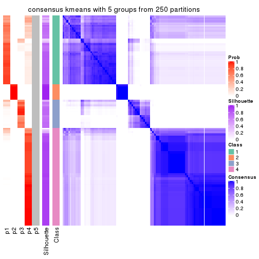</p>

</div>
<div id='tab-ATC-kmeans-consensus-heatmap-5'>
<pre><code class="r">consensus_heatmap(res, k = 6)
</code></pre>

<p></p>

</div>
</div>

Heatmaps for the membership of samples in all partitions to see how consistent they are:


<script>
$( function() {
	$( '#tabs-ATC-kmeans-membership-heatmap' ).tabs();
} );
</script>
<div id='tabs-ATC-kmeans-membership-heatmap'>
<ul>
<li><a href='#tab-ATC-kmeans-membership-heatmap-1'>k = 2</a></li>
<li><a href='#tab-ATC-kmeans-membership-heatmap-2'>k = 3</a></li>
<li><a href='#tab-ATC-kmeans-membership-heatmap-3'>k = 4</a></li>
<li><a href='#tab-ATC-kmeans-membership-heatmap-4'>k = 5</a></li>
<li><a href='#tab-ATC-kmeans-membership-heatmap-5'>k = 6</a></li>
</ul>
<div id='tab-ATC-kmeans-membership-heatmap-1'>
<pre><code class="r">membership_heatmap(res, k = 2)
</code></pre>

<p></p>

</div>
<div id='tab-ATC-kmeans-membership-heatmap-2'>
<pre><code class="r">membership_heatmap(res, k = 3)
</code></pre>

<p></p>

</div>
<div id='tab-ATC-kmeans-membership-heatmap-3'>
<pre><code class="r">membership_heatmap(res, k = 4)
</code></pre>

<p></p>

</div>
<div id='tab-ATC-kmeans-membership-heatmap-4'>
<pre><code class="r">membership_heatmap(res, k = 5)
</code></pre>

<p></p>

</div>
<div id='tab-ATC-kmeans-membership-heatmap-5'>
<pre><code class="r">membership_heatmap(res, k = 6)
</code></pre>

<p></p>

</div>
</div>

As soon as we have had the classes for columns, we can look for signatures
which are significantly different between classes which can be candidate marks
for certain classes. Following are the heatmaps for signatures.


Signature heatmaps where rows are scaled:


<script>
$( function() {
	$( '#tabs-ATC-kmeans-get-signatures' ).tabs();
} );
</script>
<div id='tabs-ATC-kmeans-get-signatures'>
<ul>
<li><a href='#tab-ATC-kmeans-get-signatures-1'>k = 2</a></li>
<li><a href='#tab-ATC-kmeans-get-signatures-2'>k = 3</a></li>
<li><a href='#tab-ATC-kmeans-get-signatures-3'>k = 4</a></li>
<li><a href='#tab-ATC-kmeans-get-signatures-4'>k = 5</a></li>
<li><a href='#tab-ATC-kmeans-get-signatures-5'>k = 6</a></li>
</ul>
<div id='tab-ATC-kmeans-get-signatures-1'>
<pre><code class="r">get_signatures(res, k = 2)
</code></pre>

<p></p>

</div>
<div id='tab-ATC-kmeans-get-signatures-2'>
<pre><code class="r">get_signatures(res, k = 3)
</code></pre>

<p></p>

</div>
<div id='tab-ATC-kmeans-get-signatures-3'>
<pre><code class="r">get_signatures(res, k = 4)
</code></pre>

<p></p>

</div>
<div id='tab-ATC-kmeans-get-signatures-4'>
<pre><code class="r">get_signatures(res, k = 5)
</code></pre>

<p></p>

</div>
<div id='tab-ATC-kmeans-get-signatures-5'>
<pre><code class="r">get_signatures(res, k = 6)
</code></pre>

<p></p>

</div>
</div>


Signature heatmaps where rows are not scaled:


<script>
$( function() {
	$( '#tabs-ATC-kmeans-get-signatures-no-scale' ).tabs();
} );
</script>
<div id='tabs-ATC-kmeans-get-signatures-no-scale'>
<ul>
<li><a href='#tab-ATC-kmeans-get-signatures-no-scale-1'>k = 2</a></li>
<li><a href='#tab-ATC-kmeans-get-signatures-no-scale-2'>k = 3</a></li>
<li><a href='#tab-ATC-kmeans-get-signatures-no-scale-3'>k = 4</a></li>
<li><a href='#tab-ATC-kmeans-get-signatures-no-scale-4'>k = 5</a></li>
<li><a href='#tab-ATC-kmeans-get-signatures-no-scale-5'>k = 6</a></li>
</ul>
<div id='tab-ATC-kmeans-get-signatures-no-scale-1'>
<pre><code class="r">get_signatures(res, k = 2, scale_rows = FALSE)
</code></pre>

<p></p>

</div>
<div id='tab-ATC-kmeans-get-signatures-no-scale-2'>
<pre><code class="r">get_signatures(res, k = 3, scale_rows = FALSE)
</code></pre>

<p>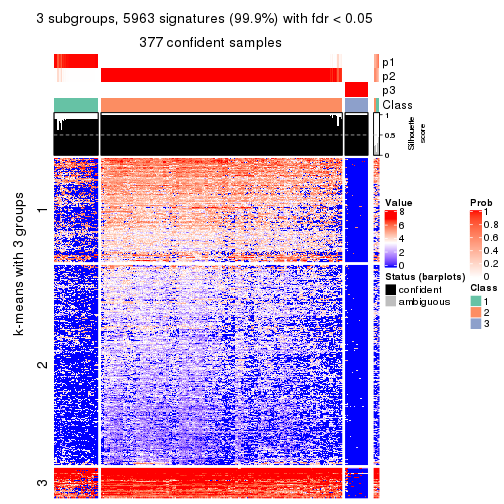</p>

</div>
<div id='tab-ATC-kmeans-get-signatures-no-scale-3'>
<pre><code class="r">get_signatures(res, k = 4, scale_rows = FALSE)
</code></pre>

<p>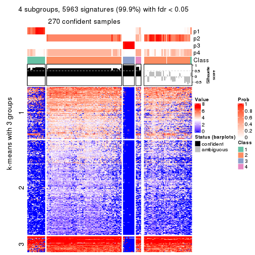</p>

</div>
<div id='tab-ATC-kmeans-get-signatures-no-scale-4'>
<pre><code class="r">get_signatures(res, k = 5, scale_rows = FALSE)
</code></pre>

<p></p>

</div>
<div id='tab-ATC-kmeans-get-signatures-no-scale-5'>
<pre><code class="r">get_signatures(res, k = 6, scale_rows = FALSE)
</code></pre>

<p></p>

</div>
</div>


Compare the overlap of signatures from different k:

```r
compare_signatures(res)
```


`get_signature()` returns a data frame invisibly. TO get the list of signatures, the function
call should be assigned to a variable explicitly. In following code, if `plot` argument is set
to `FALSE`, no heatmap is plotted while only the differential analysis is performed.

```r
# code only for demonstration
tb = get_signature(res, k = ..., plot = FALSE)
```

An example of the output of `tb` is:

```
#>   which_row         fdr    mean_1    mean_2 scaled_mean_1 scaled_mean_2 km
#> 1        38 0.042760348  8.373488  9.131774    -0.5533452     0.5164555  1
#> 2        40 0.018707592  7.106213  8.469186    -0.6173731     0.5762149  1
#> 3        55 0.019134737 10.221463 11.207825    -0.6159697     0.5749050  1
#> 4        59 0.006059896  5.921854  7.869574    -0.6899429     0.6439467  1
#> 5        60 0.018055526  8.928898 10.211722    -0.6204761     0.5791110  1
#> 6        98 0.009384629 15.714769 14.887706     0.6635654    -0.6193277  2
...
```

The columns in `tb` are:

1. `which_row`: row indices corresponding to the input matrix.
2. `fdr`: FDR for the differential test. 
3. `mean_x`: The mean value in group x.
4. `scaled_mean_x`: The mean value in group x after rows are scaled.
5. `km`: Row groups if k-means clustering is applied to rows.


UMAP plot which shows how samples are separated.


<script>
$( function() {
	$( '#tabs-ATC-kmeans-dimension-reduction' ).tabs();
} );
</script>
<div id='tabs-ATC-kmeans-dimension-reduction'>
<ul>
<li><a href='#tab-ATC-kmeans-dimension-reduction-1'>k = 2</a></li>
<li><a href='#tab-ATC-kmeans-dimension-reduction-2'>k = 3</a></li>
<li><a href='#tab-ATC-kmeans-dimension-reduction-3'>k = 4</a></li>
<li><a href='#tab-ATC-kmeans-dimension-reduction-4'>k = 5</a></li>
<li><a href='#tab-ATC-kmeans-dimension-reduction-5'>k = 6</a></li>
</ul>
<div id='tab-ATC-kmeans-dimension-reduction-1'>
<pre><code class="r">dimension_reduction(res, k = 2, method = &quot;UMAP&quot;)
</code></pre>

<p></p>

</div>
<div id='tab-ATC-kmeans-dimension-reduction-2'>
<pre><code class="r">dimension_reduction(res, k = 3, method = &quot;UMAP&quot;)
</code></pre>

<p></p>

</div>
<div id='tab-ATC-kmeans-dimension-reduction-3'>
<pre><code class="r">dimension_reduction(res, k = 4, method = &quot;UMAP&quot;)
</code></pre>

<p></p>

</div>
<div id='tab-ATC-kmeans-dimension-reduction-4'>
<pre><code class="r">dimension_reduction(res, k = 5, method = &quot;UMAP&quot;)
</code></pre>

<p></p>

</div>
<div id='tab-ATC-kmeans-dimension-reduction-5'>
<pre><code class="r">dimension_reduction(res, k = 6, method = &quot;UMAP&quot;)
</code></pre>

<p></p>

</div>
</div>


Following heatmap shows how subgroups are split when increasing `k`:

```r
collect_classes(res)
```


If matrix rows can be associated to genes, consider to use `GO_Enrichment(res,
...)` to perform function enrichment for the signature genes.


 

---------------------------------------------------


### ATC:skmeans**


The object with results only for a single top-value method and a single partition method 
can be extracted as:

```r
res = res_list["ATC", "skmeans"]
# you can also extract it by
# res = res_list["ATC:skmeans"]
```

A summary of `res` and all the functions that can be applied to it:

```r
res
```

```
#> A 'ConsensusPartition' object with k = 2, 3, 4, 5, 6.
#>   On a matrix with 5966 rows and 384 columns.
#>   Top rows (597, 1194, 1790, 2386, 2983) are extracted by 'ATC' method.
#>   Subgroups are detected by 'skmeans' method.
#>   Performed in total 1250 partitions by row resampling.
#>   Best k for subgroups seems to be 2.
#> 
#> Following methods can be applied to this 'ConsensusPartition' object:
#>  [1] "cola_report"             "collect_classes"         "collect_plots"          
#>  [4] "collect_stats"           "colnames"                "compare_signatures"     
#>  [7] "consensus_heatmap"       "dimension_reduction"     "functional_enrichment"  
#> [10] "get_anno_col"            "get_anno"                "get_classes"            
#> [13] "get_consensus"           "get_matrix"              "get_membership"         
#> [16] "get_param"               "get_signatures"          "get_stats"              
#> [19] "is_best_k"               "is_stable_k"             "membership_heatmap"     
#> [22] "ncol"                    "nrow"                    "plot_ecdf"              
#> [25] "rownames"                "select_partition_number" "show"                   
#> [28] "suggest_best_k"          "test_to_known_factors"
```

`collect_plots()` function collects all the plots made from `res` for all `k` (number of partitions)
into one single page to provide an easy and fast comparison between different `k`.

```r
collect_plots(res)
```


The plots are:

- The first row: a plot of the ECDF (Empirical cumulative distribution
  function) curves of the consensus matrix for each `k` and the heatmap of
  predicted classes for each `k`.
- The second row: heatmaps of the consensus matrix for each `k`.
- The third row: heatmaps of the membership matrix for each `k`.
- The fouth row: heatmaps of the signatures for each `k`.

All the plots in panels can be made by individual functions and they are
plotted later in this section.

`select_partition_number()` produces several plots showing different
statistics for choosing "optimized" `k`. There are following statistics:

- ECDF curves of the consensus matrix for each `k`;
- 1-PAC. [The PAC
  score](https://en.wikipedia.org/wiki/Consensus_clustering#Over-interpretation_potential_of_consensus_clustering)
  measures the proportion of the ambiguous subgrouping.
- Mean silhouette score.
- Concordance. The mean probability of fiting the consensus class ids in all
  partitions.
- Area increased. Denote $A_k$ as the area under the ECDF curve for current
  `k`, the area increased is defined as $A_k - A_{k-1}$.
- Rand index. The percent of pairs of samples that are both in a same cluster
  or both are not in a same cluster in the partition of k and k-1.
- Jaccard index. The ratio of pairs of samples are both in a same cluster in
  the partition of k and k-1 and the pairs of samples are both in a same
  cluster in the partition k or k-1.

The detailed explanations of these statistics can be found in [the cola
vignette](http://bioconductor.org/packages/devel/bioc/vignettes/cola/inst/doc/cola.html#toc_13).

Generally speaking, lower PAC score, higher mean silhouette score or higher
concordance corresponds to better partition. Rand index and Jaccard index
measure how similar the current partition is compared to partition with `k-1`.
If they are too similar, we won't accept `k` is better than `k-1`.

```r
select_partition_number(res)
```


The numeric values for all these statistics can be obtained by `get_stats()`.

```r
get_stats(res)
```

```
#>   k 1-PAC mean_silhouette concordance area_increased  Rand Jaccard
#> 2 2 0.984           0.943       0.978         0.3812 0.614   0.614
#> 3 3 0.761           0.829       0.929         0.5295 0.785   0.657
#> 4 4 0.607           0.696       0.764         0.1974 0.788   0.530
#> 5 5 0.663           0.650       0.785         0.0714 0.954   0.832
#> 6 6 0.688           0.655       0.796         0.0497 0.927   0.713
```

`suggest_best_k()` suggests the best $k$ based on these statistics. The rules are as follows:

- All $k$ with Jaccard index larger than 0.95 are removed because the increase of
  the partition number does not provides enough extra information. If all $k$ are removed,
  the best $k$ is assigned by `NA`.
- For $k$ with 1-PAC larger than 0.9, the maximal $k$ is taken as the "best k". Other $k$ is called "optional k".
- If it does not fit the second rule. The $k$ with the highest vote of highest
  1-PAC, mean silhouette and concordance is taken as the "best k".

```r
suggest_best_k(res)
```

```
#> [1] 2
```


Following shows the table of the partitions (You need to click the **show/hide
code output** link to see it). The membership matrix (columns with name `p*`)
is inferred by
[`clue::cl_consensus()`](https://www.rdocumentation.org/link/cl_consensus?package=clue)
function with the `SE` method. Basically the value in the membership matrix
represents the probability to belong to a certain group. The finall class
label for an item is determined with the group with highest probability it
belongs to.

In `get_classes()` function, the entropy is calculated from the membership
matrix and the silhouette score is calculated from the consensus matrix.


<script>
$( function() {
	$( '#tabs-ATC-skmeans-get-classes' ).tabs();
} );
</script>
<div id='tabs-ATC-skmeans-get-classes'>
<ul>
<li><a href='#tab-ATC-skmeans-get-classes-1'>k = 2</a></li>
<li><a href='#tab-ATC-skmeans-get-classes-2'>k = 3</a></li>
<li><a href='#tab-ATC-skmeans-get-classes-3'>k = 4</a></li>
<li><a href='#tab-ATC-skmeans-get-classes-4'>k = 5</a></li>
<li><a href='#tab-ATC-skmeans-get-classes-5'>k = 6</a></li>
</ul>

<div id='tab-ATC-skmeans-get-classes-1'>
<p><a id='tab-ATC-skmeans-get-classes-1-a' style='color:#0366d6' href='#'>show/hide code output</a></p>
<pre><code class="r">cbind(get_classes(res, k = 2), get_membership(res, k = 2))
</code></pre>

<pre><code>#&gt;           class entropy silhouette    p1    p2
#&gt; SRR490216     2  0.0938    0.97497 0.012 0.988
#&gt; SRR490217     2  0.0000    0.98721 0.000 1.000
#&gt; SRR490218     2  0.0000    0.98721 0.000 1.000
#&gt; SRR490219     2  0.0000    0.98721 0.000 1.000
#&gt; SRR490220     2  0.0000    0.98721 0.000 1.000
#&gt; SRR490221     2  0.0000    0.98721 0.000 1.000
#&gt; SRR490222     2  0.0000    0.98721 0.000 1.000
#&gt; SRR490223     2  0.0000    0.98721 0.000 1.000
#&gt; SRR490224     1  0.0000    0.94626 1.000 0.000
#&gt; SRR490225     1  0.0000    0.94626 1.000 0.000
#&gt; SRR490226     1  0.0000    0.94626 1.000 0.000
#&gt; SRR490227     1  0.0000    0.94626 1.000 0.000
#&gt; SRR490228     1  0.0000    0.94626 1.000 0.000
#&gt; SRR490229     1  0.0000    0.94626 1.000 0.000
#&gt; SRR490230     1  0.0000    0.94626 1.000 0.000
#&gt; SRR490231     1  0.0000    0.94626 1.000 0.000
#&gt; SRR490232     1  0.0000    0.94626 1.000 0.000
#&gt; SRR490233     1  0.0000    0.94626 1.000 0.000
#&gt; SRR490234     1  0.0000    0.94626 1.000 0.000
#&gt; SRR490235     1  0.0000    0.94626 1.000 0.000
#&gt; SRR490236     1  0.0000    0.94626 1.000 0.000
#&gt; SRR490237     1  0.0000    0.94626 1.000 0.000
#&gt; SRR490238     1  0.0000    0.94626 1.000 0.000
#&gt; SRR490239     1  0.0000    0.94626 1.000 0.000
#&gt; SRR490240     2  0.0000    0.98721 0.000 1.000
#&gt; SRR490241     2  0.0000    0.98721 0.000 1.000
#&gt; SRR490242     2  0.0000    0.98721 0.000 1.000
#&gt; SRR490243     2  0.0000    0.98721 0.000 1.000
#&gt; SRR490244     1  0.0000    0.94626 1.000 0.000
#&gt; SRR490245     1  0.0000    0.94626 1.000 0.000
#&gt; SRR490246     1  0.0000    0.94626 1.000 0.000
#&gt; SRR490247     1  0.0000    0.94626 1.000 0.000
#&gt; SRR490248     2  0.0000    0.98721 0.000 1.000
#&gt; SRR490249     2  0.0000    0.98721 0.000 1.000
#&gt; SRR490250     2  0.0000    0.98721 0.000 1.000
#&gt; SRR490251     2  0.0000    0.98721 0.000 1.000
#&gt; SRR490252     2  0.0000    0.98721 0.000 1.000
#&gt; SRR490253     2  0.0000    0.98721 0.000 1.000
#&gt; SRR490254     2  0.0000    0.98721 0.000 1.000
#&gt; SRR490255     2  0.0000    0.98721 0.000 1.000
#&gt; SRR490256     1  0.0000    0.94626 1.000 0.000
#&gt; SRR490257     1  0.2043    0.92232 0.968 0.032
#&gt; SRR490258     1  0.1633    0.92878 0.976 0.024
#&gt; SRR490259     1  0.0376    0.94357 0.996 0.004
#&gt; SRR490260     1  0.0000    0.94626 1.000 0.000
#&gt; SRR490261     1  0.0000    0.94626 1.000 0.000
#&gt; SRR490262     1  0.0000    0.94626 1.000 0.000
#&gt; SRR490263     1  0.0000    0.94626 1.000 0.000
#&gt; SRR490264     1  0.0000    0.94626 1.000 0.000
#&gt; SRR490265     1  0.0000    0.94626 1.000 0.000
#&gt; SRR490266     1  0.0000    0.94626 1.000 0.000
#&gt; SRR490267     1  0.0000    0.94626 1.000 0.000
#&gt; SRR490268     1  0.4022    0.88004 0.920 0.080
#&gt; SRR490269     1  0.6531    0.78647 0.832 0.168
#&gt; SRR490270     1  0.1414    0.93186 0.980 0.020
#&gt; SRR490271     1  0.7056    0.75668 0.808 0.192
#&gt; SRR490272     1  0.0000    0.94626 1.000 0.000
#&gt; SRR490273     1  0.0000    0.94626 1.000 0.000
#&gt; SRR490274     1  0.0000    0.94626 1.000 0.000
#&gt; SRR490275     1  0.0000    0.94626 1.000 0.000
#&gt; SRR490276     1  0.0000    0.94626 1.000 0.000
#&gt; SRR490277     1  0.0000    0.94626 1.000 0.000
#&gt; SRR490278     1  0.0000    0.94626 1.000 0.000
#&gt; SRR490279     1  0.0000    0.94626 1.000 0.000
#&gt; SRR490280     1  0.0000    0.94626 1.000 0.000
#&gt; SRR490281     1  0.0000    0.94626 1.000 0.000
#&gt; SRR490282     1  0.0000    0.94626 1.000 0.000
#&gt; SRR490283     1  0.0000    0.94626 1.000 0.000
#&gt; SRR490284     1  0.0000    0.94626 1.000 0.000
#&gt; SRR490285     1  0.0000    0.94626 1.000 0.000
#&gt; SRR490286     1  0.0000    0.94626 1.000 0.000
#&gt; SRR490287     1  0.0000    0.94626 1.000 0.000
#&gt; SRR490288     2  0.9922    0.11651 0.448 0.552
#&gt; SRR490289     2  0.9686    0.29016 0.396 0.604
#&gt; SRR490290     2  0.9686    0.29016 0.396 0.604
#&gt; SRR490291     2  0.9815    0.21437 0.420 0.580
#&gt; SRR490292     1  0.9996    0.12169 0.512 0.488
#&gt; SRR490293     2  0.8955    0.51074 0.312 0.688
#&gt; SRR490294     2  0.9754    0.25374 0.408 0.592
#&gt; SRR490295     2  0.7528    0.70123 0.216 0.784
#&gt; SRR490296     2  0.0000    0.98721 0.000 1.000
#&gt; SRR490297     2  0.0000    0.98721 0.000 1.000
#&gt; SRR490298     2  0.0000    0.98721 0.000 1.000
#&gt; SRR490299     2  0.0000    0.98721 0.000 1.000
#&gt; SRR490300     2  0.0000    0.98721 0.000 1.000
#&gt; SRR490301     2  0.0000    0.98721 0.000 1.000
#&gt; SRR490302     2  0.0000    0.98721 0.000 1.000
#&gt; SRR490303     2  0.0000    0.98721 0.000 1.000
#&gt; SRR490304     2  0.0000    0.98721 0.000 1.000
#&gt; SRR490305     2  0.0000    0.98721 0.000 1.000
#&gt; SRR490306     2  0.0000    0.98721 0.000 1.000
#&gt; SRR490307     2  0.0000    0.98721 0.000 1.000
#&gt; SRR490308     1  0.0000    0.94626 1.000 0.000
#&gt; SRR490309     1  0.0000    0.94626 1.000 0.000
#&gt; SRR490310     1  0.0000    0.94626 1.000 0.000
#&gt; SRR490311     1  0.0000    0.94626 1.000 0.000
#&gt; SRR490312     2  0.8016    0.65045 0.244 0.756
#&gt; SRR490313     2  0.0000    0.98721 0.000 1.000
#&gt; SRR490314     2  0.0000    0.98721 0.000 1.000
#&gt; SRR490315     2  0.0000    0.98721 0.000 1.000
#&gt; SRR490316     2  0.1414    0.96652 0.020 0.980
#&gt; SRR490317     2  0.0000    0.98721 0.000 1.000
#&gt; SRR490318     2  0.0000    0.98721 0.000 1.000
#&gt; SRR490319     2  0.0000    0.98721 0.000 1.000
#&gt; SRR490320     1  0.0000    0.94626 1.000 0.000
#&gt; SRR490321     1  0.0000    0.94626 1.000 0.000
#&gt; SRR490322     1  0.0376    0.94357 0.996 0.004
#&gt; SRR490323     1  0.0938    0.93788 0.988 0.012
#&gt; SRR490324     1  0.0000    0.94626 1.000 0.000
#&gt; SRR490325     1  0.0000    0.94626 1.000 0.000
#&gt; SRR490326     1  0.0000    0.94626 1.000 0.000
#&gt; SRR490327     1  0.0000    0.94626 1.000 0.000
#&gt; SRR490328     2  0.0000    0.98721 0.000 1.000
#&gt; SRR490329     2  0.0000    0.98721 0.000 1.000
#&gt; SRR490330     2  0.0000    0.98721 0.000 1.000
#&gt; SRR490331     2  0.0000    0.98721 0.000 1.000
#&gt; SRR490332     2  0.0000    0.98721 0.000 1.000
#&gt; SRR490333     2  0.0000    0.98721 0.000 1.000
#&gt; SRR490334     2  0.0000    0.98721 0.000 1.000
#&gt; SRR490335     2  0.0000    0.98721 0.000 1.000
#&gt; SRR490336     2  0.0000    0.98721 0.000 1.000
#&gt; SRR490337     2  0.0000    0.98721 0.000 1.000
#&gt; SRR490338     2  0.0000    0.98721 0.000 1.000
#&gt; SRR490339     2  0.0000    0.98721 0.000 1.000
#&gt; SRR490340     2  0.0000    0.98721 0.000 1.000
#&gt; SRR490341     2  0.0000    0.98721 0.000 1.000
#&gt; SRR490342     2  0.0000    0.98721 0.000 1.000
#&gt; SRR490343     2  0.0000    0.98721 0.000 1.000
#&gt; SRR490344     2  0.0000    0.98721 0.000 1.000
#&gt; SRR490345     2  0.0000    0.98721 0.000 1.000
#&gt; SRR490346     2  0.0000    0.98721 0.000 1.000
#&gt; SRR490347     2  0.0000    0.98721 0.000 1.000
#&gt; SRR490348     2  0.0000    0.98721 0.000 1.000
#&gt; SRR490349     2  0.0000    0.98721 0.000 1.000
#&gt; SRR490350     2  0.0000    0.98721 0.000 1.000
#&gt; SRR490351     2  0.0000    0.98721 0.000 1.000
#&gt; SRR490352     2  0.0000    0.98721 0.000 1.000
#&gt; SRR490353     2  0.0000    0.98721 0.000 1.000
#&gt; SRR490354     2  0.0000    0.98721 0.000 1.000
#&gt; SRR490355     2  0.0000    0.98721 0.000 1.000
#&gt; SRR490356     2  0.0000    0.98721 0.000 1.000
#&gt; SRR490357     2  0.0000    0.98721 0.000 1.000
#&gt; SRR490358     2  0.0000    0.98721 0.000 1.000
#&gt; SRR490359     2  0.0000    0.98721 0.000 1.000
#&gt; SRR490360     2  0.0000    0.98721 0.000 1.000
#&gt; SRR490361     2  0.0000    0.98721 0.000 1.000
#&gt; SRR490362     2  0.0000    0.98721 0.000 1.000
#&gt; SRR490363     2  0.0000    0.98721 0.000 1.000
#&gt; SRR490364     2  0.0000    0.98721 0.000 1.000
#&gt; SRR490365     2  0.0000    0.98721 0.000 1.000
#&gt; SRR490366     2  0.0000    0.98721 0.000 1.000
#&gt; SRR490367     2  0.0000    0.98721 0.000 1.000
#&gt; SRR490368     2  0.0000    0.98721 0.000 1.000
#&gt; SRR490369     2  0.0000    0.98721 0.000 1.000
#&gt; SRR490370     2  0.0000    0.98721 0.000 1.000
#&gt; SRR490371     2  0.0000    0.98721 0.000 1.000
#&gt; SRR490372     1  0.0000    0.94626 1.000 0.000
#&gt; SRR490373     1  0.0000    0.94626 1.000 0.000
#&gt; SRR490374     1  0.0000    0.94626 1.000 0.000
#&gt; SRR490375     1  0.0000    0.94626 1.000 0.000
#&gt; SRR490376     2  0.0000    0.98721 0.000 1.000
#&gt; SRR490377     2  0.0000    0.98721 0.000 1.000
#&gt; SRR490378     2  0.0000    0.98721 0.000 1.000
#&gt; SRR490379     2  0.0000    0.98721 0.000 1.000
#&gt; SRR490380     1  0.0000    0.94626 1.000 0.000
#&gt; SRR490381     1  0.0000    0.94626 1.000 0.000
#&gt; SRR490382     1  0.0000    0.94626 1.000 0.000
#&gt; SRR490383     1  0.0000    0.94626 1.000 0.000
#&gt; SRR490384     2  0.0000    0.98721 0.000 1.000
#&gt; SRR490385     2  0.0000    0.98721 0.000 1.000
#&gt; SRR490386     2  0.0000    0.98721 0.000 1.000
#&gt; SRR490387     2  0.0000    0.98721 0.000 1.000
#&gt; SRR490388     2  0.0000    0.98721 0.000 1.000
#&gt; SRR490389     2  0.0000    0.98721 0.000 1.000
#&gt; SRR490390     2  0.0000    0.98721 0.000 1.000
#&gt; SRR490391     2  0.0000    0.98721 0.000 1.000
#&gt; SRR490392     2  0.0000    0.98721 0.000 1.000
#&gt; SRR490393     2  0.0000    0.98721 0.000 1.000
#&gt; SRR490394     2  0.0000    0.98721 0.000 1.000
#&gt; SRR490395     2  0.0000    0.98721 0.000 1.000
#&gt; SRR490396     2  0.0000    0.98721 0.000 1.000
#&gt; SRR490397     2  0.0000    0.98721 0.000 1.000
#&gt; SRR490398     2  0.0000    0.98721 0.000 1.000
#&gt; SRR490399     2  0.0000    0.98721 0.000 1.000
#&gt; SRR490400     2  0.0000    0.98721 0.000 1.000
#&gt; SRR490401     2  0.0000    0.98721 0.000 1.000
#&gt; SRR490402     2  0.0000    0.98721 0.000 1.000
#&gt; SRR490403     2  0.0000    0.98721 0.000 1.000
#&gt; SRR490404     2  0.0000    0.98721 0.000 1.000
#&gt; SRR490405     2  0.0000    0.98721 0.000 1.000
#&gt; SRR490406     2  0.0000    0.98721 0.000 1.000
#&gt; SRR490407     2  0.0000    0.98721 0.000 1.000
#&gt; SRR490408     2  0.0000    0.98721 0.000 1.000
#&gt; SRR490409     2  0.0000    0.98721 0.000 1.000
#&gt; SRR490410     2  0.0000    0.98721 0.000 1.000
#&gt; SRR490411     2  0.0000    0.98721 0.000 1.000
#&gt; SRR490412     1  0.0000    0.94626 1.000 0.000
#&gt; SRR490413     1  0.0000    0.94626 1.000 0.000
#&gt; SRR490414     1  0.0000    0.94626 1.000 0.000
#&gt; SRR490415     1  0.0000    0.94626 1.000 0.000
#&gt; SRR490416     2  0.0000    0.98721 0.000 1.000
#&gt; SRR490417     2  0.0000    0.98721 0.000 1.000
#&gt; SRR490418     2  0.0000    0.98721 0.000 1.000
#&gt; SRR490419     2  0.0000    0.98721 0.000 1.000
#&gt; SRR490420     2  0.0938    0.97498 0.012 0.988
#&gt; SRR490421     2  0.0000    0.98721 0.000 1.000
#&gt; SRR490422     2  0.0000    0.98721 0.000 1.000
#&gt; SRR490423     2  0.0000    0.98721 0.000 1.000
#&gt; SRR490424     1  0.0000    0.94626 1.000 0.000
#&gt; SRR490425     1  0.0000    0.94626 1.000 0.000
#&gt; SRR490426     1  0.0000    0.94626 1.000 0.000
#&gt; SRR490427     1  0.0000    0.94626 1.000 0.000
#&gt; SRR490428     1  0.9710    0.38984 0.600 0.400
#&gt; SRR490429     1  1.0000    0.07667 0.500 0.500
#&gt; SRR490430     1  0.9710    0.38984 0.600 0.400
#&gt; SRR490431     2  0.9988   -0.00977 0.480 0.520
#&gt; SRR490432     2  0.0000    0.98721 0.000 1.000
#&gt; SRR490433     2  0.0000    0.98721 0.000 1.000
#&gt; SRR490434     2  0.0000    0.98721 0.000 1.000
#&gt; SRR490435     2  0.0000    0.98721 0.000 1.000
#&gt; SRR490436     2  0.0000    0.98721 0.000 1.000
#&gt; SRR490437     2  0.0000    0.98721 0.000 1.000
#&gt; SRR490438     2  0.0000    0.98721 0.000 1.000
#&gt; SRR490439     2  0.0000    0.98721 0.000 1.000
#&gt; SRR490440     2  0.0000    0.98721 0.000 1.000
#&gt; SRR490441     2  0.0000    0.98721 0.000 1.000
#&gt; SRR490442     2  0.0000    0.98721 0.000 1.000
#&gt; SRR490443     2  0.0000    0.98721 0.000 1.000
#&gt; SRR490444     2  0.0000    0.98721 0.000 1.000
#&gt; SRR490445     2  0.0000    0.98721 0.000 1.000
#&gt; SRR490446     2  0.0000    0.98721 0.000 1.000
#&gt; SRR490447     2  0.0000    0.98721 0.000 1.000
#&gt; SRR490448     2  0.0000    0.98721 0.000 1.000
#&gt; SRR490449     2  0.0000    0.98721 0.000 1.000
#&gt; SRR490450     2  0.0000    0.98721 0.000 1.000
#&gt; SRR490451     2  0.0000    0.98721 0.000 1.000
#&gt; SRR490452     1  0.4939    0.85262 0.892 0.108
#&gt; SRR490453     1  0.9608    0.42788 0.616 0.384
#&gt; SRR490454     1  0.9580    0.43694 0.620 0.380
#&gt; SRR490455     1  0.8909    0.58065 0.692 0.308
#&gt; SRR490456     2  0.0000    0.98721 0.000 1.000
#&gt; SRR490457     2  0.0000    0.98721 0.000 1.000
#&gt; SRR490458     2  0.0000    0.98721 0.000 1.000
#&gt; SRR490459     2  0.0000    0.98721 0.000 1.000
#&gt; SRR490460     2  0.0000    0.98721 0.000 1.000
#&gt; SRR490461     2  0.0000    0.98721 0.000 1.000
#&gt; SRR490462     2  0.0000    0.98721 0.000 1.000
#&gt; SRR490463     2  0.0000    0.98721 0.000 1.000
#&gt; SRR490464     1  0.0000    0.94626 1.000 0.000
#&gt; SRR490465     1  0.0000    0.94626 1.000 0.000
#&gt; SRR490466     1  0.0000    0.94626 1.000 0.000
#&gt; SRR490467     1  0.0000    0.94626 1.000 0.000
#&gt; SRR490468     2  0.0000    0.98721 0.000 1.000
#&gt; SRR490469     2  0.0000    0.98721 0.000 1.000
#&gt; SRR490470     2  0.0000    0.98721 0.000 1.000
#&gt; SRR490471     2  0.0000    0.98721 0.000 1.000
#&gt; SRR490472     2  0.0000    0.98721 0.000 1.000
#&gt; SRR490473     2  0.0000    0.98721 0.000 1.000
#&gt; SRR490474     2  0.0000    0.98721 0.000 1.000
#&gt; SRR490475     2  0.0000    0.98721 0.000 1.000
#&gt; SRR490476     1  0.0000    0.94626 1.000 0.000
#&gt; SRR490477     1  0.0000    0.94626 1.000 0.000
#&gt; SRR490478     1  0.0000    0.94626 1.000 0.000
#&gt; SRR490479     1  0.0000    0.94626 1.000 0.000
#&gt; SRR490480     2  0.0000    0.98721 0.000 1.000
#&gt; SRR490481     2  0.0000    0.98721 0.000 1.000
#&gt; SRR490482     2  0.0000    0.98721 0.000 1.000
#&gt; SRR490483     2  0.0000    0.98721 0.000 1.000
#&gt; SRR490484     2  0.0000    0.98721 0.000 1.000
#&gt; SRR490485     2  0.0000    0.98721 0.000 1.000
#&gt; SRR490486     2  0.0000    0.98721 0.000 1.000
#&gt; SRR490487     2  0.0000    0.98721 0.000 1.000
#&gt; SRR490488     2  0.0000    0.98721 0.000 1.000
#&gt; SRR490489     2  0.0000    0.98721 0.000 1.000
#&gt; SRR490490     2  0.0000    0.98721 0.000 1.000
#&gt; SRR490491     2  0.0000    0.98721 0.000 1.000
#&gt; SRR490492     2  0.0000    0.98721 0.000 1.000
#&gt; SRR490493     2  0.0000    0.98721 0.000 1.000
#&gt; SRR490494     2  0.0000    0.98721 0.000 1.000
#&gt; SRR490495     2  0.0000    0.98721 0.000 1.000
#&gt; SRR490496     2  0.0000    0.98721 0.000 1.000
#&gt; SRR490497     2  0.0000    0.98721 0.000 1.000
#&gt; SRR490498     2  0.0000    0.98721 0.000 1.000
#&gt; SRR490499     2  0.0000    0.98721 0.000 1.000
#&gt; SRR490500     2  0.0000    0.98721 0.000 1.000
#&gt; SRR490501     2  0.0000    0.98721 0.000 1.000
#&gt; SRR490502     2  0.0000    0.98721 0.000 1.000
#&gt; SRR490503     2  0.0000    0.98721 0.000 1.000
#&gt; SRR490504     2  0.0000    0.98721 0.000 1.000
#&gt; SRR490505     2  0.0000    0.98721 0.000 1.000
#&gt; SRR490506     2  0.0000    0.98721 0.000 1.000
#&gt; SRR490507     2  0.0000    0.98721 0.000 1.000
#&gt; SRR490508     2  0.0000    0.98721 0.000 1.000
#&gt; SRR490509     2  0.0000    0.98721 0.000 1.000
#&gt; SRR490510     2  0.0000    0.98721 0.000 1.000
#&gt; SRR490511     2  0.0000    0.98721 0.000 1.000
#&gt; SRR490512     2  0.0000    0.98721 0.000 1.000
#&gt; SRR490513     2  0.0000    0.98721 0.000 1.000
#&gt; SRR490514     2  0.0000    0.98721 0.000 1.000
#&gt; SRR490515     2  0.0000    0.98721 0.000 1.000
#&gt; SRR490516     2  0.0000    0.98721 0.000 1.000
#&gt; SRR490517     2  0.0000    0.98721 0.000 1.000
#&gt; SRR490518     2  0.0000    0.98721 0.000 1.000
#&gt; SRR490519     2  0.0000    0.98721 0.000 1.000
#&gt; SRR490520     2  0.0000    0.98721 0.000 1.000
#&gt; SRR490521     2  0.0000    0.98721 0.000 1.000
#&gt; SRR490522     2  0.0000    0.98721 0.000 1.000
#&gt; SRR490523     2  0.0000    0.98721 0.000 1.000
#&gt; SRR490524     2  0.0000    0.98721 0.000 1.000
#&gt; SRR490525     2  0.0000    0.98721 0.000 1.000
#&gt; SRR490526     2  0.0000    0.98721 0.000 1.000
#&gt; SRR490527     2  0.0000    0.98721 0.000 1.000
#&gt; SRR490528     2  0.0000    0.98721 0.000 1.000
#&gt; SRR490529     2  0.0000    0.98721 0.000 1.000
#&gt; SRR490530     2  0.0000    0.98721 0.000 1.000
#&gt; SRR490531     2  0.0000    0.98721 0.000 1.000
#&gt; SRR490532     1  0.9686    0.39964 0.604 0.396
#&gt; SRR490533     1  0.9775    0.35901 0.588 0.412
#&gt; SRR490534     1  0.9850    0.31503 0.572 0.428
#&gt; SRR490535     1  0.9795    0.34836 0.584 0.416
#&gt; SRR490536     2  0.0000    0.98721 0.000 1.000
#&gt; SRR490537     2  0.0000    0.98721 0.000 1.000
#&gt; SRR490538     2  0.0000    0.98721 0.000 1.000
#&gt; SRR490539     2  0.0000    0.98721 0.000 1.000
#&gt; SRR490540     2  0.0000    0.98721 0.000 1.000
#&gt; SRR490541     2  0.0000    0.98721 0.000 1.000
#&gt; SRR490542     2  0.0000    0.98721 0.000 1.000
#&gt; SRR490543     2  0.0000    0.98721 0.000 1.000
#&gt; SRR490544     2  0.0000    0.98721 0.000 1.000
#&gt; SRR490545     2  0.0000    0.98721 0.000 1.000
#&gt; SRR490546     2  0.0000    0.98721 0.000 1.000
#&gt; SRR490547     2  0.0000    0.98721 0.000 1.000
#&gt; SRR490548     2  0.0000    0.98721 0.000 1.000
#&gt; SRR490549     2  0.0000    0.98721 0.000 1.000
#&gt; SRR490550     2  0.0000    0.98721 0.000 1.000
#&gt; SRR490551     2  0.0000    0.98721 0.000 1.000
#&gt; SRR490552     2  0.0000    0.98721 0.000 1.000
#&gt; SRR490553     2  0.0000    0.98721 0.000 1.000
#&gt; SRR490554     2  0.0000    0.98721 0.000 1.000
#&gt; SRR490555     2  0.0000    0.98721 0.000 1.000
#&gt; SRR490556     2  0.0000    0.98721 0.000 1.000
#&gt; SRR490557     2  0.0000    0.98721 0.000 1.000
#&gt; SRR490558     2  0.0000    0.98721 0.000 1.000
#&gt; SRR490559     2  0.0000    0.98721 0.000 1.000
#&gt; SRR490560     2  0.0000    0.98721 0.000 1.000
#&gt; SRR490561     2  0.0000    0.98721 0.000 1.000
#&gt; SRR490562     2  0.0000    0.98721 0.000 1.000
#&gt; SRR490563     2  0.0000    0.98721 0.000 1.000
#&gt; SRR490564     2  0.0000    0.98721 0.000 1.000
#&gt; SRR490565     2  0.0000    0.98721 0.000 1.000
#&gt; SRR490566     2  0.0000    0.98721 0.000 1.000
#&gt; SRR490567     2  0.0000    0.98721 0.000 1.000
#&gt; SRR490568     2  0.0000    0.98721 0.000 1.000
#&gt; SRR490569     2  0.0000    0.98721 0.000 1.000
#&gt; SRR490570     2  0.0000    0.98721 0.000 1.000
#&gt; SRR490571     2  0.0000    0.98721 0.000 1.000
#&gt; SRR490572     2  0.0000    0.98721 0.000 1.000
#&gt; SRR490573     2  0.0000    0.98721 0.000 1.000
#&gt; SRR490574     2  0.0000    0.98721 0.000 1.000
#&gt; SRR490575     2  0.0000    0.98721 0.000 1.000
#&gt; SRR490576     2  0.0000    0.98721 0.000 1.000
#&gt; SRR490577     2  0.0000    0.98721 0.000 1.000
#&gt; SRR490578     2  0.0000    0.98721 0.000 1.000
#&gt; SRR490579     2  0.0000    0.98721 0.000 1.000
#&gt; SRR490580     2  0.0000    0.98721 0.000 1.000
#&gt; SRR490581     2  0.0000    0.98721 0.000 1.000
#&gt; SRR490582     2  0.0000    0.98721 0.000 1.000
#&gt; SRR490583     2  0.0000    0.98721 0.000 1.000
#&gt; SRR490584     2  0.0000    0.98721 0.000 1.000
#&gt; SRR490585     2  0.0000    0.98721 0.000 1.000
#&gt; SRR490586     2  0.0000    0.98721 0.000 1.000
#&gt; SRR490587     2  0.0000    0.98721 0.000 1.000
#&gt; SRR490588     2  0.0000    0.98721 0.000 1.000
#&gt; SRR490589     2  0.0000    0.98721 0.000 1.000
#&gt; SRR490590     2  0.0000    0.98721 0.000 1.000
#&gt; SRR490591     2  0.0000    0.98721 0.000 1.000
#&gt; SRR490592     2  0.0000    0.98721 0.000 1.000
#&gt; SRR490593     2  0.0000    0.98721 0.000 1.000
#&gt; SRR490594     2  0.0000    0.98721 0.000 1.000
#&gt; SRR490595     2  0.0000    0.98721 0.000 1.000
#&gt; SRR490596     2  0.0000    0.98721 0.000 1.000
#&gt; SRR490597     2  0.0000    0.98721 0.000 1.000
#&gt; SRR490598     2  0.0000    0.98721 0.000 1.000
#&gt; SRR490599     2  0.0000    0.98721 0.000 1.000
</code></pre>

<script>
$('#tab-ATC-skmeans-get-classes-1-a').parent().next().next().hide();
$('#tab-ATC-skmeans-get-classes-1-a').click(function(){
  $('#tab-ATC-skmeans-get-classes-1-a').parent().next().next().toggle();
  return(false);
});
</script>
</div>

<div id='tab-ATC-skmeans-get-classes-2'>
<p><a id='tab-ATC-skmeans-get-classes-2-a' style='color:#0366d6' href='#'>show/hide code output</a></p>
<pre><code class="r">cbind(get_classes(res, k = 3), get_membership(res, k = 3))
</code></pre>

<pre><code>#&gt;           class entropy silhouette    p1    p2    p3
#&gt; SRR490216     2  0.6308    -0.0479 0.000 0.508 0.492
#&gt; SRR490217     2  0.6308    -0.0479 0.000 0.508 0.492
#&gt; SRR490218     2  0.6299     0.0179 0.000 0.524 0.476
#&gt; SRR490219     2  0.6308    -0.0479 0.000 0.508 0.492
#&gt; SRR490220     3  0.0424     0.7953 0.000 0.008 0.992
#&gt; SRR490221     3  0.0424     0.7953 0.000 0.008 0.992
#&gt; SRR490222     3  0.0424     0.7953 0.000 0.008 0.992
#&gt; SRR490223     3  0.0424     0.7953 0.000 0.008 0.992
#&gt; SRR490224     1  0.0000     0.9706 1.000 0.000 0.000
#&gt; SRR490225     1  0.0000     0.9706 1.000 0.000 0.000
#&gt; SRR490226     1  0.0000     0.9706 1.000 0.000 0.000
#&gt; SRR490227     1  0.0000     0.9706 1.000 0.000 0.000
#&gt; SRR490228     1  0.0000     0.9706 1.000 0.000 0.000
#&gt; SRR490229     1  0.0000     0.9706 1.000 0.000 0.000
#&gt; SRR490230     1  0.0000     0.9706 1.000 0.000 0.000
#&gt; SRR490231     1  0.0000     0.9706 1.000 0.000 0.000
#&gt; SRR490232     1  0.0424     0.9677 0.992 0.000 0.008
#&gt; SRR490233     1  0.0424     0.9677 0.992 0.000 0.008
#&gt; SRR490234     1  0.0592     0.9653 0.988 0.000 0.012
#&gt; SRR490235     1  0.0592     0.9653 0.988 0.000 0.012
#&gt; SRR490236     1  0.0000     0.9706 1.000 0.000 0.000
#&gt; SRR490237     1  0.0000     0.9706 1.000 0.000 0.000
#&gt; SRR490238     1  0.0000     0.9706 1.000 0.000 0.000
#&gt; SRR490239     1  0.0000     0.9706 1.000 0.000 0.000
#&gt; SRR490240     3  0.0000     0.7900 0.000 0.000 1.000
#&gt; SRR490241     3  0.0000     0.7900 0.000 0.000 1.000
#&gt; SRR490242     3  0.0000     0.7900 0.000 0.000 1.000
#&gt; SRR490243     3  0.0000     0.7900 0.000 0.000 1.000
#&gt; SRR490244     1  0.0000     0.9706 1.000 0.000 0.000
#&gt; SRR490245     1  0.0000     0.9706 1.000 0.000 0.000
#&gt; SRR490246     1  0.0000     0.9706 1.000 0.000 0.000
#&gt; SRR490247     1  0.0000     0.9706 1.000 0.000 0.000
#&gt; SRR490248     2  0.5465     0.5666 0.000 0.712 0.288
#&gt; SRR490249     2  0.5465     0.5666 0.000 0.712 0.288
#&gt; SRR490250     2  0.5465     0.5666 0.000 0.712 0.288
#&gt; SRR490251     2  0.5465     0.5666 0.000 0.712 0.288
#&gt; SRR490252     3  0.2448     0.7815 0.000 0.076 0.924
#&gt; SRR490253     3  0.2448     0.7815 0.000 0.076 0.924
#&gt; SRR490254     3  0.2448     0.7815 0.000 0.076 0.924
#&gt; SRR490255     3  0.2448     0.7815 0.000 0.076 0.924
#&gt; SRR490256     1  0.5291     0.6241 0.732 0.000 0.268
#&gt; SRR490257     1  0.6274     0.1878 0.544 0.000 0.456
#&gt; SRR490258     1  0.6204     0.2799 0.576 0.000 0.424
#&gt; SRR490259     1  0.6252     0.2235 0.556 0.000 0.444
#&gt; SRR490260     1  0.0424     0.9677 0.992 0.000 0.008
#&gt; SRR490261     1  0.0424     0.9677 0.992 0.000 0.008
#&gt; SRR490262     1  0.0424     0.9677 0.992 0.000 0.008
#&gt; SRR490263     1  0.0424     0.9677 0.992 0.000 0.008
#&gt; SRR490264     1  0.0424     0.9677 0.992 0.000 0.008
#&gt; SRR490265     1  0.0424     0.9677 0.992 0.000 0.008
#&gt; SRR490266     1  0.0424     0.9677 0.992 0.000 0.008
#&gt; SRR490267     1  0.0424     0.9677 0.992 0.000 0.008
#&gt; SRR490268     3  0.5948     0.3540 0.360 0.000 0.640
#&gt; SRR490269     3  0.5591     0.4654 0.304 0.000 0.696
#&gt; SRR490270     3  0.5678     0.4447 0.316 0.000 0.684
#&gt; SRR490271     3  0.5678     0.4447 0.316 0.000 0.684
#&gt; SRR490272     1  0.0592     0.9653 0.988 0.000 0.012
#&gt; SRR490273     1  0.0424     0.9677 0.992 0.000 0.008
#&gt; SRR490274     1  0.0592     0.9653 0.988 0.000 0.012
#&gt; SRR490275     1  0.0592     0.9653 0.988 0.000 0.012
#&gt; SRR490276     1  0.0424     0.9677 0.992 0.000 0.008
#&gt; SRR490277     1  0.0424     0.9677 0.992 0.000 0.008
#&gt; SRR490278     1  0.0424     0.9677 0.992 0.000 0.008
#&gt; SRR490279     1  0.0424     0.9677 0.992 0.000 0.008
#&gt; SRR490280     1  0.0000     0.9706 1.000 0.000 0.000
#&gt; SRR490281     1  0.0000     0.9706 1.000 0.000 0.000
#&gt; SRR490282     1  0.0000     0.9706 1.000 0.000 0.000
#&gt; SRR490283     1  0.0000     0.9706 1.000 0.000 0.000
#&gt; SRR490284     1  0.0000     0.9706 1.000 0.000 0.000
#&gt; SRR490285     1  0.0000     0.9706 1.000 0.000 0.000
#&gt; SRR490286     1  0.0000     0.9706 1.000 0.000 0.000
#&gt; SRR490287     1  0.0000     0.9706 1.000 0.000 0.000
#&gt; SRR490288     3  0.7031     0.6714 0.088 0.196 0.716
#&gt; SRR490289     3  0.7381     0.6421 0.080 0.244 0.676
#&gt; SRR490290     3  0.7014     0.6671 0.080 0.208 0.712
#&gt; SRR490291     3  0.7419     0.6426 0.088 0.232 0.680
#&gt; SRR490292     3  0.0000     0.7900 0.000 0.000 1.000
#&gt; SRR490293     3  0.0000     0.7900 0.000 0.000 1.000
#&gt; SRR490294     3  0.0000     0.7900 0.000 0.000 1.000
#&gt; SRR490295     3  0.0000     0.7900 0.000 0.000 1.000
#&gt; SRR490296     2  0.0000     0.9338 0.000 1.000 0.000
#&gt; SRR490297     2  0.0000     0.9338 0.000 1.000 0.000
#&gt; SRR490298     2  0.0000     0.9338 0.000 1.000 0.000
#&gt; SRR490299     2  0.0000     0.9338 0.000 1.000 0.000
#&gt; SRR490300     3  0.5291     0.6311 0.000 0.268 0.732
#&gt; SRR490301     3  0.5216     0.6427 0.000 0.260 0.740
#&gt; SRR490302     3  0.5291     0.6311 0.000 0.268 0.732
#&gt; SRR490303     3  0.5497     0.5922 0.000 0.292 0.708
#&gt; SRR490304     2  0.0000     0.9338 0.000 1.000 0.000
#&gt; SRR490305     2  0.0000     0.9338 0.000 1.000 0.000
#&gt; SRR490306     2  0.0000     0.9338 0.000 1.000 0.000
#&gt; SRR490307     2  0.0000     0.9338 0.000 1.000 0.000
#&gt; SRR490308     1  0.0000     0.9706 1.000 0.000 0.000
#&gt; SRR490309     1  0.0000     0.9706 1.000 0.000 0.000
#&gt; SRR490310     1  0.0000     0.9706 1.000 0.000 0.000
#&gt; SRR490311     1  0.0000     0.9706 1.000 0.000 0.000
#&gt; SRR490312     3  0.6513     0.1368 0.004 0.476 0.520
#&gt; SRR490313     2  0.6286     0.0761 0.000 0.536 0.464
#&gt; SRR490314     2  0.6291     0.0631 0.000 0.532 0.468
#&gt; SRR490315     2  0.6295     0.0456 0.000 0.528 0.472
#&gt; SRR490316     3  0.5291     0.6405 0.000 0.268 0.732
#&gt; SRR490317     3  0.5810     0.5231 0.000 0.336 0.664
#&gt; SRR490318     3  0.6008     0.4467 0.000 0.372 0.628
#&gt; SRR490319     3  0.6079     0.4085 0.000 0.388 0.612
#&gt; SRR490320     1  0.0237     0.9692 0.996 0.000 0.004
#&gt; SRR490321     1  0.0237     0.9692 0.996 0.000 0.004
#&gt; SRR490322     1  0.0892     0.9578 0.980 0.000 0.020
#&gt; SRR490323     1  0.2165     0.9111 0.936 0.000 0.064
#&gt; SRR490324     1  0.0000     0.9706 1.000 0.000 0.000
#&gt; SRR490325     1  0.0000     0.9706 1.000 0.000 0.000
#&gt; SRR490326     1  0.0000     0.9706 1.000 0.000 0.000
#&gt; SRR490327     1  0.0000     0.9706 1.000 0.000 0.000
#&gt; SRR490328     2  0.0000     0.9338 0.000 1.000 0.000
#&gt; SRR490329     2  0.0000     0.9338 0.000 1.000 0.000
#&gt; SRR490330     2  0.0000     0.9338 0.000 1.000 0.000
#&gt; SRR490331     2  0.0000     0.9338 0.000 1.000 0.000
#&gt; SRR490332     2  0.3340     0.8298 0.000 0.880 0.120
#&gt; SRR490333     2  0.3116     0.8418 0.000 0.892 0.108
#&gt; SRR490334     2  0.3116     0.8418 0.000 0.892 0.108
#&gt; SRR490335     2  0.3192     0.8376 0.000 0.888 0.112
#&gt; SRR490336     2  0.0000     0.9338 0.000 1.000 0.000
#&gt; SRR490337     2  0.0000     0.9338 0.000 1.000 0.000
#&gt; SRR490338     2  0.0000     0.9338 0.000 1.000 0.000
#&gt; SRR490339     2  0.0000     0.9338 0.000 1.000 0.000
#&gt; SRR490340     3  0.5560     0.5806 0.000 0.300 0.700
#&gt; SRR490341     3  0.5678     0.5519 0.000 0.316 0.684
#&gt; SRR490342     3  0.5678     0.5508 0.000 0.316 0.684
#&gt; SRR490343     3  0.5650     0.5583 0.000 0.312 0.688
#&gt; SRR490344     2  0.3340     0.8267 0.000 0.880 0.120
#&gt; SRR490345     2  0.3340     0.8267 0.000 0.880 0.120
#&gt; SRR490346     2  0.3340     0.8267 0.000 0.880 0.120
#&gt; SRR490347     2  0.3816     0.7937 0.000 0.852 0.148
#&gt; SRR490348     2  0.0000     0.9338 0.000 1.000 0.000
#&gt; SRR490349     2  0.0000     0.9338 0.000 1.000 0.000
#&gt; SRR490350     2  0.0000     0.9338 0.000 1.000 0.000
#&gt; SRR490351     2  0.0000     0.9338 0.000 1.000 0.000
#&gt; SRR490352     2  0.0000     0.9338 0.000 1.000 0.000
#&gt; SRR490353     2  0.0000     0.9338 0.000 1.000 0.000
#&gt; SRR490354     2  0.0000     0.9338 0.000 1.000 0.000
#&gt; SRR490355     2  0.0000     0.9338 0.000 1.000 0.000
#&gt; SRR490356     2  0.6280     0.1412 0.000 0.540 0.460
#&gt; SRR490357     2  0.6280     0.1412 0.000 0.540 0.460
#&gt; SRR490358     2  0.6280     0.1412 0.000 0.540 0.460
#&gt; SRR490359     2  0.6280     0.1412 0.000 0.540 0.460
#&gt; SRR490360     2  0.0000     0.9338 0.000 1.000 0.000
#&gt; SRR490361     2  0.0000     0.9338 0.000 1.000 0.000
#&gt; SRR490362     2  0.0000     0.9338 0.000 1.000 0.000
#&gt; SRR490363     2  0.0000     0.9338 0.000 1.000 0.000
#&gt; SRR490364     2  0.4842     0.6731 0.000 0.776 0.224
#&gt; SRR490365     2  0.4750     0.6862 0.000 0.784 0.216
#&gt; SRR490366     2  0.4654     0.6991 0.000 0.792 0.208
#&gt; SRR490367     2  0.4750     0.6862 0.000 0.784 0.216
#&gt; SRR490368     2  0.0000     0.9338 0.000 1.000 0.000
#&gt; SRR490369     2  0.0000     0.9338 0.000 1.000 0.000
#&gt; SRR490370     2  0.0000     0.9338 0.000 1.000 0.000
#&gt; SRR490371     2  0.0000     0.9338 0.000 1.000 0.000
#&gt; SRR490372     1  0.0000     0.9706 1.000 0.000 0.000
#&gt; SRR490373     1  0.0000     0.9706 1.000 0.000 0.000
#&gt; SRR490374     1  0.0000     0.9706 1.000 0.000 0.000
#&gt; SRR490375     1  0.0000     0.9706 1.000 0.000 0.000
#&gt; SRR490376     2  0.0000     0.9338 0.000 1.000 0.000
#&gt; SRR490377     2  0.0000     0.9338 0.000 1.000 0.000
#&gt; SRR490378     2  0.0000     0.9338 0.000 1.000 0.000
#&gt; SRR490379     2  0.0000     0.9338 0.000 1.000 0.000
#&gt; SRR490380     1  0.0000     0.9706 1.000 0.000 0.000
#&gt; SRR490381     1  0.0000     0.9706 1.000 0.000 0.000
#&gt; SRR490382     1  0.0000     0.9706 1.000 0.000 0.000
#&gt; SRR490383     1  0.0000     0.9706 1.000 0.000 0.000
#&gt; SRR490384     2  0.0000     0.9338 0.000 1.000 0.000
#&gt; SRR490385     2  0.0000     0.9338 0.000 1.000 0.000
#&gt; SRR490386     2  0.0000     0.9338 0.000 1.000 0.000
#&gt; SRR490387     2  0.0000     0.9338 0.000 1.000 0.000
#&gt; SRR490388     2  0.0000     0.9338 0.000 1.000 0.000
#&gt; SRR490389     2  0.0000     0.9338 0.000 1.000 0.000
#&gt; SRR490390     2  0.0000     0.9338 0.000 1.000 0.000
#&gt; SRR490391     2  0.0000     0.9338 0.000 1.000 0.000
#&gt; SRR490392     2  0.0000     0.9338 0.000 1.000 0.000
#&gt; SRR490393     2  0.0000     0.9338 0.000 1.000 0.000
#&gt; SRR490394     2  0.0000     0.9338 0.000 1.000 0.000
#&gt; SRR490395     2  0.0000     0.9338 0.000 1.000 0.000
#&gt; SRR490396     2  0.0000     0.9338 0.000 1.000 0.000
#&gt; SRR490397     2  0.0000     0.9338 0.000 1.000 0.000
#&gt; SRR490398     2  0.0000     0.9338 0.000 1.000 0.000
#&gt; SRR490399     2  0.0000     0.9338 0.000 1.000 0.000
#&gt; SRR490400     2  0.0000     0.9338 0.000 1.000 0.000
#&gt; SRR490401     2  0.0000     0.9338 0.000 1.000 0.000
#&gt; SRR490402     2  0.0000     0.9338 0.000 1.000 0.000
#&gt; SRR490403     2  0.0000     0.9338 0.000 1.000 0.000
#&gt; SRR490404     2  0.3116     0.8417 0.000 0.892 0.108
#&gt; SRR490405     2  0.3192     0.8380 0.000 0.888 0.112
#&gt; SRR490406     2  0.3116     0.8417 0.000 0.892 0.108
#&gt; SRR490407     2  0.3038     0.8456 0.000 0.896 0.104
#&gt; SRR490408     2  0.0000     0.9338 0.000 1.000 0.000
#&gt; SRR490409     2  0.0000     0.9338 0.000 1.000 0.000
#&gt; SRR490410     2  0.0000     0.9338 0.000 1.000 0.000
#&gt; SRR490411     2  0.0000     0.9338 0.000 1.000 0.000
#&gt; SRR490412     1  0.0000     0.9706 1.000 0.000 0.000
#&gt; SRR490413     1  0.0000     0.9706 1.000 0.000 0.000
#&gt; SRR490414     1  0.0000     0.9706 1.000 0.000 0.000
#&gt; SRR490415     1  0.0000     0.9706 1.000 0.000 0.000
#&gt; SRR490416     2  0.5465     0.5879 0.000 0.712 0.288
#&gt; SRR490417     2  0.5397     0.6027 0.000 0.720 0.280
#&gt; SRR490418     2  0.5363     0.6095 0.000 0.724 0.276
#&gt; SRR490419     2  0.5178     0.6459 0.000 0.744 0.256
#&gt; SRR490420     3  0.0424     0.7953 0.000 0.008 0.992
#&gt; SRR490421     3  0.0424     0.7953 0.000 0.008 0.992
#&gt; SRR490422     3  0.0424     0.7953 0.000 0.008 0.992
#&gt; SRR490423     3  0.0424     0.7953 0.000 0.008 0.992
#&gt; SRR490424     1  0.0000     0.9706 1.000 0.000 0.000
#&gt; SRR490425     1  0.0000     0.9706 1.000 0.000 0.000
#&gt; SRR490426     1  0.0000     0.9706 1.000 0.000 0.000
#&gt; SRR490427     1  0.0000     0.9706 1.000 0.000 0.000
#&gt; SRR490428     3  0.2496     0.7542 0.068 0.004 0.928
#&gt; SRR490429     3  0.1765     0.7737 0.040 0.004 0.956
#&gt; SRR490430     3  0.2584     0.7607 0.064 0.008 0.928
#&gt; SRR490431     3  0.1765     0.7737 0.040 0.004 0.956
#&gt; SRR490432     3  0.3752     0.7479 0.000 0.144 0.856
#&gt; SRR490433     3  0.3752     0.7479 0.000 0.144 0.856
#&gt; SRR490434     3  0.3752     0.7479 0.000 0.144 0.856
#&gt; SRR490435     3  0.3752     0.7479 0.000 0.144 0.856
#&gt; SRR490436     3  0.0424     0.7953 0.000 0.008 0.992
#&gt; SRR490437     3  0.0424     0.7953 0.000 0.008 0.992
#&gt; SRR490438     3  0.0424     0.7953 0.000 0.008 0.992
#&gt; SRR490439     3  0.0424     0.7953 0.000 0.008 0.992
#&gt; SRR490440     2  0.0000     0.9338 0.000 1.000 0.000
#&gt; SRR490441     2  0.0000     0.9338 0.000 1.000 0.000
#&gt; SRR490442     2  0.0000     0.9338 0.000 1.000 0.000
#&gt; SRR490443     2  0.0000     0.9338 0.000 1.000 0.000
#&gt; SRR490444     2  0.0000     0.9338 0.000 1.000 0.000
#&gt; SRR490445     2  0.0000     0.9338 0.000 1.000 0.000
#&gt; SRR490446     2  0.0000     0.9338 0.000 1.000 0.000
#&gt; SRR490447     2  0.0000     0.9338 0.000 1.000 0.000
#&gt; SRR490448     3  0.0747     0.7962 0.000 0.016 0.984
#&gt; SRR490449     3  0.1860     0.7894 0.000 0.052 0.948
#&gt; SRR490450     3  0.0747     0.7962 0.000 0.016 0.984
#&gt; SRR490451     3  0.1031     0.7963 0.000 0.024 0.976
#&gt; SRR490452     1  0.6305     0.0979 0.516 0.000 0.484
#&gt; SRR490453     3  0.4682     0.6374 0.192 0.004 0.804
#&gt; SRR490454     3  0.4682     0.6374 0.192 0.004 0.804
#&gt; SRR490455     3  0.4733     0.6326 0.196 0.004 0.800
#&gt; SRR490456     3  0.1031     0.7962 0.000 0.024 0.976
#&gt; SRR490457     3  0.1031     0.7962 0.000 0.024 0.976
#&gt; SRR490458     3  0.1031     0.7962 0.000 0.024 0.976
#&gt; SRR490459     3  0.1031     0.7962 0.000 0.024 0.976
#&gt; SRR490460     3  0.0424     0.7953 0.000 0.008 0.992
#&gt; SRR490461     3  0.0424     0.7953 0.000 0.008 0.992
#&gt; SRR490462     3  0.0424     0.7953 0.000 0.008 0.992
#&gt; SRR490463     3  0.0424     0.7953 0.000 0.008 0.992
#&gt; SRR490464     1  0.0000     0.9706 1.000 0.000 0.000
#&gt; SRR490465     1  0.0000     0.9706 1.000 0.000 0.000
#&gt; SRR490466     1  0.0000     0.9706 1.000 0.000 0.000
#&gt; SRR490467     1  0.0000     0.9706 1.000 0.000 0.000
#&gt; SRR490468     3  0.6180     0.3258 0.000 0.416 0.584
#&gt; SRR490469     3  0.6180     0.3258 0.000 0.416 0.584
#&gt; SRR490470     3  0.6180     0.3258 0.000 0.416 0.584
#&gt; SRR490471     3  0.6180     0.3258 0.000 0.416 0.584
#&gt; SRR490472     2  0.0000     0.9338 0.000 1.000 0.000
#&gt; SRR490473     2  0.0000     0.9338 0.000 1.000 0.000
#&gt; SRR490474     2  0.0000     0.9338 0.000 1.000 0.000
#&gt; SRR490475     2  0.0000     0.9338 0.000 1.000 0.000
#&gt; SRR490476     1  0.0000     0.9706 1.000 0.000 0.000
#&gt; SRR490477     1  0.0000     0.9706 1.000 0.000 0.000
#&gt; SRR490478     1  0.0000     0.9706 1.000 0.000 0.000
#&gt; SRR490479     1  0.0000     0.9706 1.000 0.000 0.000
#&gt; SRR490480     2  0.0000     0.9338 0.000 1.000 0.000
#&gt; SRR490481     2  0.0000     0.9338 0.000 1.000 0.000
#&gt; SRR490482     2  0.0000     0.9338 0.000 1.000 0.000
#&gt; SRR490483     2  0.0000     0.9338 0.000 1.000 0.000
#&gt; SRR490484     2  0.0000     0.9338 0.000 1.000 0.000
#&gt; SRR490485     2  0.0000     0.9338 0.000 1.000 0.000
#&gt; SRR490486     2  0.0000     0.9338 0.000 1.000 0.000
#&gt; SRR490487     2  0.0000     0.9338 0.000 1.000 0.000
#&gt; SRR490488     2  0.0000     0.9338 0.000 1.000 0.000
#&gt; SRR490489     2  0.0000     0.9338 0.000 1.000 0.000
#&gt; SRR490490     2  0.0000     0.9338 0.000 1.000 0.000
#&gt; SRR490491     2  0.0000     0.9338 0.000 1.000 0.000
#&gt; SRR490492     2  0.0000     0.9338 0.000 1.000 0.000
#&gt; SRR490493     2  0.0000     0.9338 0.000 1.000 0.000
#&gt; SRR490494     2  0.0000     0.9338 0.000 1.000 0.000
#&gt; SRR490495     2  0.0000     0.9338 0.000 1.000 0.000
#&gt; SRR490496     2  0.0000     0.9338 0.000 1.000 0.000
#&gt; SRR490497     2  0.0000     0.9338 0.000 1.000 0.000
#&gt; SRR490498     2  0.0000     0.9338 0.000 1.000 0.000
#&gt; SRR490499     2  0.0000     0.9338 0.000 1.000 0.000
#&gt; SRR490500     2  0.5760     0.4974 0.000 0.672 0.328
#&gt; SRR490501     2  0.5760     0.4974 0.000 0.672 0.328
#&gt; SRR490502     2  0.5760     0.4974 0.000 0.672 0.328
#&gt; SRR490503     2  0.5760     0.4974 0.000 0.672 0.328
#&gt; SRR490504     2  0.0000     0.9338 0.000 1.000 0.000
#&gt; SRR490505     2  0.0000     0.9338 0.000 1.000 0.000
#&gt; SRR490506     2  0.0000     0.9338 0.000 1.000 0.000
#&gt; SRR490507     2  0.0000     0.9338 0.000 1.000 0.000
#&gt; SRR490508     2  0.0000     0.9338 0.000 1.000 0.000
#&gt; SRR490509     2  0.0000     0.9338 0.000 1.000 0.000
#&gt; SRR490510     2  0.0000     0.9338 0.000 1.000 0.000
#&gt; SRR490511     2  0.0000     0.9338 0.000 1.000 0.000
#&gt; SRR490512     2  0.0000     0.9338 0.000 1.000 0.000
#&gt; SRR490513     2  0.0000     0.9338 0.000 1.000 0.000
#&gt; SRR490514     2  0.0000     0.9338 0.000 1.000 0.000
#&gt; SRR490515     2  0.0000     0.9338 0.000 1.000 0.000
#&gt; SRR490516     2  0.0000     0.9338 0.000 1.000 0.000
#&gt; SRR490517     2  0.0000     0.9338 0.000 1.000 0.000
#&gt; SRR490518     2  0.0000     0.9338 0.000 1.000 0.000
#&gt; SRR490519     2  0.0000     0.9338 0.000 1.000 0.000
#&gt; SRR490520     2  0.0000     0.9338 0.000 1.000 0.000
#&gt; SRR490521     2  0.0000     0.9338 0.000 1.000 0.000
#&gt; SRR490522     2  0.0000     0.9338 0.000 1.000 0.000
#&gt; SRR490523     2  0.0000     0.9338 0.000 1.000 0.000
#&gt; SRR490524     2  0.0000     0.9338 0.000 1.000 0.000
#&gt; SRR490525     2  0.0000     0.9338 0.000 1.000 0.000
#&gt; SRR490526     2  0.0000     0.9338 0.000 1.000 0.000
#&gt; SRR490527     2  0.0000     0.9338 0.000 1.000 0.000
#&gt; SRR490528     2  0.0000     0.9338 0.000 1.000 0.000
#&gt; SRR490529     2  0.0000     0.9338 0.000 1.000 0.000
#&gt; SRR490530     2  0.0000     0.9338 0.000 1.000 0.000
#&gt; SRR490531     2  0.0000     0.9338 0.000 1.000 0.000
#&gt; SRR490532     3  0.7223     0.2074 0.424 0.028 0.548
#&gt; SRR490533     3  0.7102     0.2205 0.420 0.024 0.556
#&gt; SRR490534     3  0.6836     0.2436 0.412 0.016 0.572
#&gt; SRR490535     3  0.6984     0.2213 0.420 0.020 0.560
#&gt; SRR490536     2  0.0000     0.9338 0.000 1.000 0.000
#&gt; SRR490537     2  0.0000     0.9338 0.000 1.000 0.000
#&gt; SRR490538     2  0.0000     0.9338 0.000 1.000 0.000
#&gt; SRR490539     2  0.0000     0.9338 0.000 1.000 0.000
#&gt; SRR490540     2  0.0000     0.9338 0.000 1.000 0.000
#&gt; SRR490541     2  0.0000     0.9338 0.000 1.000 0.000
#&gt; SRR490542     2  0.0000     0.9338 0.000 1.000 0.000
#&gt; SRR490543     2  0.0000     0.9338 0.000 1.000 0.000
#&gt; SRR490544     2  0.0000     0.9338 0.000 1.000 0.000
#&gt; SRR490545     2  0.0000     0.9338 0.000 1.000 0.000
#&gt; SRR490546     2  0.0000     0.9338 0.000 1.000 0.000
#&gt; SRR490547     2  0.0000     0.9338 0.000 1.000 0.000
#&gt; SRR490548     2  0.0000     0.9338 0.000 1.000 0.000
#&gt; SRR490549     2  0.0000     0.9338 0.000 1.000 0.000
#&gt; SRR490550     2  0.0000     0.9338 0.000 1.000 0.000
#&gt; SRR490551     2  0.0000     0.9338 0.000 1.000 0.000
#&gt; SRR490552     2  0.0000     0.9338 0.000 1.000 0.000
#&gt; SRR490553     2  0.0000     0.9338 0.000 1.000 0.000
#&gt; SRR490554     2  0.0000     0.9338 0.000 1.000 0.000
#&gt; SRR490555     2  0.0000     0.9338 0.000 1.000 0.000
#&gt; SRR490556     2  0.0000     0.9338 0.000 1.000 0.000
#&gt; SRR490557     2  0.0000     0.9338 0.000 1.000 0.000
#&gt; SRR490558     2  0.0000     0.9338 0.000 1.000 0.000
#&gt; SRR490559     2  0.0000     0.9338 0.000 1.000 0.000
#&gt; SRR490560     2  0.0000     0.9338 0.000 1.000 0.000
#&gt; SRR490561     2  0.0000     0.9338 0.000 1.000 0.000
#&gt; SRR490562     2  0.0000     0.9338 0.000 1.000 0.000
#&gt; SRR490563     2  0.0000     0.9338 0.000 1.000 0.000
#&gt; SRR490564     2  0.5835     0.4729 0.000 0.660 0.340
#&gt; SRR490565     2  0.5835     0.4729 0.000 0.660 0.340
#&gt; SRR490566     2  0.5835     0.4729 0.000 0.660 0.340
#&gt; SRR490567     2  0.5835     0.4729 0.000 0.660 0.340
#&gt; SRR490568     2  0.0000     0.9338 0.000 1.000 0.000
#&gt; SRR490569     2  0.0000     0.9338 0.000 1.000 0.000
#&gt; SRR490570     2  0.0000     0.9338 0.000 1.000 0.000
#&gt; SRR490571     2  0.0000     0.9338 0.000 1.000 0.000
#&gt; SRR490572     2  0.0000     0.9338 0.000 1.000 0.000
#&gt; SRR490573     2  0.0000     0.9338 0.000 1.000 0.000
#&gt; SRR490574     2  0.0000     0.9338 0.000 1.000 0.000
#&gt; SRR490575     2  0.0000     0.9338 0.000 1.000 0.000
#&gt; SRR490576     2  0.0000     0.9338 0.000 1.000 0.000
#&gt; SRR490577     2  0.0000     0.9338 0.000 1.000 0.000
#&gt; SRR490578     2  0.0000     0.9338 0.000 1.000 0.000
#&gt; SRR490579     2  0.0000     0.9338 0.000 1.000 0.000
#&gt; SRR490580     2  0.0000     0.9338 0.000 1.000 0.000
#&gt; SRR490581     2  0.0000     0.9338 0.000 1.000 0.000
#&gt; SRR490582     2  0.0000     0.9338 0.000 1.000 0.000
#&gt; SRR490583     2  0.0000     0.9338 0.000 1.000 0.000
#&gt; SRR490584     2  0.0000     0.9338 0.000 1.000 0.000
#&gt; SRR490585     2  0.0000     0.9338 0.000 1.000 0.000
#&gt; SRR490586     2  0.0000     0.9338 0.000 1.000 0.000
#&gt; SRR490587     2  0.0000     0.9338 0.000 1.000 0.000
#&gt; SRR490588     2  0.0000     0.9338 0.000 1.000 0.000
#&gt; SRR490589     2  0.0000     0.9338 0.000 1.000 0.000
#&gt; SRR490590     2  0.0000     0.9338 0.000 1.000 0.000
#&gt; SRR490591     2  0.0000     0.9338 0.000 1.000 0.000
#&gt; SRR490592     2  0.0000     0.9338 0.000 1.000 0.000
#&gt; SRR490593     2  0.0000     0.9338 0.000 1.000 0.000
#&gt; SRR490594     2  0.0000     0.9338 0.000 1.000 0.000
#&gt; SRR490595     2  0.0000     0.9338 0.000 1.000 0.000
#&gt; SRR490596     2  0.3686     0.8085 0.000 0.860 0.140
#&gt; SRR490597     2  0.3192     0.8370 0.000 0.888 0.112
#&gt; SRR490598     2  0.3192     0.8370 0.000 0.888 0.112
#&gt; SRR490599     2  0.3192     0.8370 0.000 0.888 0.112
</code></pre>

<script>
$('#tab-ATC-skmeans-get-classes-2-a').parent().next().next().hide();
$('#tab-ATC-skmeans-get-classes-2-a').click(function(){
  $('#tab-ATC-skmeans-get-classes-2-a').parent().next().next().toggle();
  return(false);
});
</script>
</div>

<div id='tab-ATC-skmeans-get-classes-3'>
<p><a id='tab-ATC-skmeans-get-classes-3-a' style='color:#0366d6' href='#'>show/hide code output</a></p>
<pre><code class="r">cbind(get_classes(res, k = 4), get_membership(res, k = 4))
</code></pre>

<pre><code>#&gt;           class entropy silhouette    p1    p2    p3    p4
#&gt; SRR490216     4  0.6419     0.0293 0.420 0.068 0.000 0.512
#&gt; SRR490217     4  0.6305     0.0469 0.424 0.060 0.000 0.516
#&gt; SRR490218     4  0.6170     0.0918 0.420 0.052 0.000 0.528
#&gt; SRR490219     4  0.6360     0.0449 0.420 0.064 0.000 0.516
#&gt; SRR490220     1  0.5627     0.7658 0.692 0.240 0.000 0.068
#&gt; SRR490221     1  0.5627     0.7658 0.692 0.240 0.000 0.068
#&gt; SRR490222     1  0.5627     0.7658 0.692 0.240 0.000 0.068
#&gt; SRR490223     1  0.5627     0.7658 0.692 0.240 0.000 0.068
#&gt; SRR490224     3  0.0000     0.9062 0.000 0.000 1.000 0.000
#&gt; SRR490225     3  0.0000     0.9062 0.000 0.000 1.000 0.000
#&gt; SRR490226     3  0.0000     0.9062 0.000 0.000 1.000 0.000
#&gt; SRR490227     3  0.0000     0.9062 0.000 0.000 1.000 0.000
#&gt; SRR490228     3  0.0000     0.9062 0.000 0.000 1.000 0.000
#&gt; SRR490229     3  0.0000     0.9062 0.000 0.000 1.000 0.000
#&gt; SRR490230     3  0.0000     0.9062 0.000 0.000 1.000 0.000
#&gt; SRR490231     3  0.0000     0.9062 0.000 0.000 1.000 0.000
#&gt; SRR490232     3  0.5152     0.7367 0.316 0.020 0.664 0.000
#&gt; SRR490233     3  0.5173     0.7324 0.320 0.020 0.660 0.000
#&gt; SRR490234     3  0.5193     0.7279 0.324 0.020 0.656 0.000
#&gt; SRR490235     3  0.5213     0.7231 0.328 0.020 0.652 0.000
#&gt; SRR490236     3  0.0000     0.9062 0.000 0.000 1.000 0.000
#&gt; SRR490237     3  0.0000     0.9062 0.000 0.000 1.000 0.000
#&gt; SRR490238     3  0.0000     0.9062 0.000 0.000 1.000 0.000
#&gt; SRR490239     3  0.0000     0.9062 0.000 0.000 1.000 0.000
#&gt; SRR490240     1  0.3801     0.7453 0.780 0.220 0.000 0.000
#&gt; SRR490241     1  0.3801     0.7453 0.780 0.220 0.000 0.000
#&gt; SRR490242     1  0.3801     0.7453 0.780 0.220 0.000 0.000
#&gt; SRR490243     1  0.3801     0.7453 0.780 0.220 0.000 0.000
#&gt; SRR490244     3  0.0000     0.9062 0.000 0.000 1.000 0.000
#&gt; SRR490245     3  0.0000     0.9062 0.000 0.000 1.000 0.000
#&gt; SRR490246     3  0.0000     0.9062 0.000 0.000 1.000 0.000
#&gt; SRR490247     3  0.0000     0.9062 0.000 0.000 1.000 0.000
#&gt; SRR490248     2  0.7479     0.5085 0.196 0.480 0.000 0.324
#&gt; SRR490249     2  0.7501     0.5021 0.196 0.472 0.000 0.332
#&gt; SRR490250     2  0.7511     0.4939 0.196 0.468 0.000 0.336
#&gt; SRR490251     2  0.7438     0.5252 0.188 0.484 0.000 0.328
#&gt; SRR490252     2  0.3099     0.3569 0.104 0.876 0.000 0.020
#&gt; SRR490253     2  0.3099     0.3569 0.104 0.876 0.000 0.020
#&gt; SRR490254     2  0.3099     0.3569 0.104 0.876 0.000 0.020
#&gt; SRR490255     2  0.3037     0.3639 0.100 0.880 0.000 0.020
#&gt; SRR490256     1  0.5465    -0.1957 0.588 0.020 0.392 0.000
#&gt; SRR490257     1  0.5271    -0.0278 0.640 0.020 0.340 0.000
#&gt; SRR490258     1  0.5323    -0.0679 0.628 0.020 0.352 0.000
#&gt; SRR490259     1  0.5306    -0.0547 0.632 0.020 0.348 0.000
#&gt; SRR490260     3  0.4797     0.7869 0.260 0.020 0.720 0.000
#&gt; SRR490261     3  0.4797     0.7869 0.260 0.020 0.720 0.000
#&gt; SRR490262     3  0.4797     0.7869 0.260 0.020 0.720 0.000
#&gt; SRR490263     3  0.4797     0.7869 0.260 0.020 0.720 0.000
#&gt; SRR490264     3  0.4797     0.7869 0.260 0.020 0.720 0.000
#&gt; SRR490265     3  0.4797     0.7869 0.260 0.020 0.720 0.000
#&gt; SRR490266     3  0.4797     0.7869 0.260 0.020 0.720 0.000
#&gt; SRR490267     3  0.4797     0.7869 0.260 0.020 0.720 0.000
#&gt; SRR490268     1  0.4361     0.3424 0.772 0.020 0.208 0.000
#&gt; SRR490269     1  0.4079     0.3976 0.800 0.020 0.180 0.000
#&gt; SRR490270     1  0.4079     0.3976 0.800 0.020 0.180 0.000
#&gt; SRR490271     1  0.4079     0.3976 0.800 0.020 0.180 0.000
#&gt; SRR490272     3  0.5013     0.7612 0.292 0.020 0.688 0.000
#&gt; SRR490273     3  0.5038     0.7575 0.296 0.020 0.684 0.000
#&gt; SRR490274     3  0.5038     0.7575 0.296 0.020 0.684 0.000
#&gt; SRR490275     3  0.5062     0.7538 0.300 0.020 0.680 0.000
#&gt; SRR490276     3  0.4797     0.7869 0.260 0.020 0.720 0.000
#&gt; SRR490277     3  0.4797     0.7869 0.260 0.020 0.720 0.000
#&gt; SRR490278     3  0.4797     0.7869 0.260 0.020 0.720 0.000
#&gt; SRR490279     3  0.4797     0.7869 0.260 0.020 0.720 0.000
#&gt; SRR490280     3  0.0000     0.9062 0.000 0.000 1.000 0.000
#&gt; SRR490281     3  0.0000     0.9062 0.000 0.000 1.000 0.000
#&gt; SRR490282     3  0.0000     0.9062 0.000 0.000 1.000 0.000
#&gt; SRR490283     3  0.0000     0.9062 0.000 0.000 1.000 0.000
#&gt; SRR490284     3  0.0000     0.9062 0.000 0.000 1.000 0.000
#&gt; SRR490285     3  0.0000     0.9062 0.000 0.000 1.000 0.000
#&gt; SRR490286     3  0.0000     0.9062 0.000 0.000 1.000 0.000
#&gt; SRR490287     3  0.0000     0.9062 0.000 0.000 1.000 0.000
#&gt; SRR490288     1  0.6691     0.6589 0.652 0.104 0.020 0.224
#&gt; SRR490289     1  0.6531     0.6041 0.640 0.080 0.016 0.264
#&gt; SRR490290     1  0.6373     0.6249 0.656 0.084 0.012 0.248
#&gt; SRR490291     1  0.6731     0.6037 0.632 0.080 0.024 0.264
#&gt; SRR490292     1  0.4661     0.7258 0.652 0.348 0.000 0.000
#&gt; SRR490293     1  0.4661     0.7258 0.652 0.348 0.000 0.000
#&gt; SRR490294     1  0.4661     0.7258 0.652 0.348 0.000 0.000
#&gt; SRR490295     1  0.4679     0.7249 0.648 0.352 0.000 0.000
#&gt; SRR490296     4  0.0000     0.8363 0.000 0.000 0.000 1.000
#&gt; SRR490297     4  0.0000     0.8363 0.000 0.000 0.000 1.000
#&gt; SRR490298     4  0.0000     0.8363 0.000 0.000 0.000 1.000
#&gt; SRR490299     4  0.0000     0.8363 0.000 0.000 0.000 1.000
#&gt; SRR490300     4  0.7586    -0.2381 0.200 0.364 0.000 0.436
#&gt; SRR490301     4  0.7591    -0.2443 0.200 0.368 0.000 0.432
#&gt; SRR490302     4  0.7569    -0.2332 0.196 0.368 0.000 0.436
#&gt; SRR490303     4  0.7495    -0.2006 0.184 0.368 0.000 0.448
#&gt; SRR490304     4  0.1867     0.7580 0.000 0.072 0.000 0.928
#&gt; SRR490305     4  0.1792     0.7626 0.000 0.068 0.000 0.932
#&gt; SRR490306     4  0.1637     0.7725 0.000 0.060 0.000 0.940
#&gt; SRR490307     4  0.2011     0.7472 0.000 0.080 0.000 0.920
#&gt; SRR490308     3  0.0000     0.9062 0.000 0.000 1.000 0.000
#&gt; SRR490309     3  0.0000     0.9062 0.000 0.000 1.000 0.000
#&gt; SRR490310     3  0.0000     0.9062 0.000 0.000 1.000 0.000
#&gt; SRR490311     3  0.0000     0.9062 0.000 0.000 1.000 0.000
#&gt; SRR490312     4  0.6430     0.0022 0.428 0.068 0.000 0.504
#&gt; SRR490313     4  0.6407     0.1704 0.384 0.072 0.000 0.544
#&gt; SRR490314     4  0.6357     0.1644 0.388 0.068 0.000 0.544
#&gt; SRR490315     4  0.6296     0.1692 0.388 0.064 0.000 0.548
#&gt; SRR490316     1  0.6833     0.5999 0.584 0.144 0.000 0.272
#&gt; SRR490317     1  0.6568     0.4838 0.572 0.096 0.000 0.332
#&gt; SRR490318     1  0.6310     0.4322 0.576 0.072 0.000 0.352
#&gt; SRR490319     1  0.6421     0.3990 0.556 0.076 0.000 0.368
#&gt; SRR490320     3  0.4826     0.7842 0.264 0.020 0.716 0.000
#&gt; SRR490321     3  0.4797     0.7868 0.260 0.020 0.720 0.000
#&gt; SRR490322     3  0.4882     0.7780 0.272 0.020 0.708 0.000
#&gt; SRR490323     3  0.5038     0.7569 0.296 0.020 0.684 0.000
#&gt; SRR490324     3  0.0000     0.9062 0.000 0.000 1.000 0.000
#&gt; SRR490325     3  0.0000     0.9062 0.000 0.000 1.000 0.000
#&gt; SRR490326     3  0.0000     0.9062 0.000 0.000 1.000 0.000
#&gt; SRR490327     3  0.0000     0.9062 0.000 0.000 1.000 0.000
#&gt; SRR490328     4  0.0000     0.8363 0.000 0.000 0.000 1.000
#&gt; SRR490329     4  0.0000     0.8363 0.000 0.000 0.000 1.000
#&gt; SRR490330     4  0.0000     0.8363 0.000 0.000 0.000 1.000
#&gt; SRR490331     4  0.0000     0.8363 0.000 0.000 0.000 1.000
#&gt; SRR490332     2  0.5163     0.1193 0.004 0.516 0.000 0.480
#&gt; SRR490333     4  0.5168    -0.1332 0.004 0.492 0.000 0.504
#&gt; SRR490334     4  0.5158    -0.0385 0.004 0.472 0.000 0.524
#&gt; SRR490335     4  0.5163    -0.0727 0.004 0.480 0.000 0.516
#&gt; SRR490336     4  0.0188     0.8328 0.000 0.004 0.000 0.996
#&gt; SRR490337     4  0.0000     0.8363 0.000 0.000 0.000 1.000
#&gt; SRR490338     4  0.0336     0.8291 0.000 0.008 0.000 0.992
#&gt; SRR490339     4  0.0188     0.8328 0.000 0.004 0.000 0.996
#&gt; SRR490340     2  0.5383     0.2838 0.160 0.740 0.000 0.100
#&gt; SRR490341     2  0.5160     0.3649 0.136 0.760 0.000 0.104
#&gt; SRR490342     2  0.4948     0.3948 0.124 0.776 0.000 0.100
#&gt; SRR490343     2  0.5209     0.3420 0.140 0.756 0.000 0.104
#&gt; SRR490344     4  0.5279    -0.0699 0.012 0.400 0.000 0.588
#&gt; SRR490345     4  0.5231     0.0125 0.012 0.384 0.000 0.604
#&gt; SRR490346     4  0.5204     0.0532 0.012 0.376 0.000 0.612
#&gt; SRR490347     4  0.5231     0.0125 0.012 0.384 0.000 0.604
#&gt; SRR490348     4  0.1389     0.7934 0.000 0.048 0.000 0.952
#&gt; SRR490349     4  0.1389     0.7934 0.000 0.048 0.000 0.952
#&gt; SRR490350     4  0.1389     0.7934 0.000 0.048 0.000 0.952
#&gt; SRR490351     4  0.1389     0.7934 0.000 0.048 0.000 0.952
#&gt; SRR490352     2  0.4898     0.7348 0.000 0.584 0.000 0.416
#&gt; SRR490353     2  0.4898     0.7348 0.000 0.584 0.000 0.416
#&gt; SRR490354     2  0.4898     0.7348 0.000 0.584 0.000 0.416
#&gt; SRR490355     2  0.4898     0.7348 0.000 0.584 0.000 0.416
#&gt; SRR490356     2  0.2053     0.5828 0.004 0.924 0.000 0.072
#&gt; SRR490357     2  0.2053     0.5828 0.004 0.924 0.000 0.072
#&gt; SRR490358     2  0.2053     0.5828 0.004 0.924 0.000 0.072
#&gt; SRR490359     2  0.2053     0.5828 0.004 0.924 0.000 0.072
#&gt; SRR490360     2  0.4761     0.7874 0.000 0.628 0.000 0.372
#&gt; SRR490361     2  0.4761     0.7874 0.000 0.628 0.000 0.372
#&gt; SRR490362     2  0.4761     0.7874 0.000 0.628 0.000 0.372
#&gt; SRR490363     2  0.4761     0.7874 0.000 0.628 0.000 0.372
#&gt; SRR490364     2  0.2334     0.6046 0.004 0.908 0.000 0.088
#&gt; SRR490365     2  0.2334     0.6046 0.004 0.908 0.000 0.088
#&gt; SRR490366     2  0.2334     0.6046 0.004 0.908 0.000 0.088
#&gt; SRR490367     2  0.2334     0.6046 0.004 0.908 0.000 0.088
#&gt; SRR490368     2  0.4746     0.7912 0.000 0.632 0.000 0.368
#&gt; SRR490369     2  0.4746     0.7912 0.000 0.632 0.000 0.368
#&gt; SRR490370     2  0.4746     0.7912 0.000 0.632 0.000 0.368
#&gt; SRR490371     2  0.4746     0.7912 0.000 0.632 0.000 0.368
#&gt; SRR490372     3  0.0000     0.9062 0.000 0.000 1.000 0.000
#&gt; SRR490373     3  0.0000     0.9062 0.000 0.000 1.000 0.000
#&gt; SRR490374     3  0.0000     0.9062 0.000 0.000 1.000 0.000
#&gt; SRR490375     3  0.0000     0.9062 0.000 0.000 1.000 0.000
#&gt; SRR490376     4  0.3486     0.5818 0.000 0.188 0.000 0.812
#&gt; SRR490377     4  0.3486     0.5830 0.000 0.188 0.000 0.812
#&gt; SRR490378     4  0.3444     0.5904 0.000 0.184 0.000 0.816
#&gt; SRR490379     4  0.3311     0.6147 0.000 0.172 0.000 0.828
#&gt; SRR490380     3  0.0000     0.9062 0.000 0.000 1.000 0.000
#&gt; SRR490381     3  0.0000     0.9062 0.000 0.000 1.000 0.000
#&gt; SRR490382     3  0.0000     0.9062 0.000 0.000 1.000 0.000
#&gt; SRR490383     3  0.0000     0.9062 0.000 0.000 1.000 0.000
#&gt; SRR490384     2  0.4746     0.7912 0.000 0.632 0.000 0.368
#&gt; SRR490385     2  0.4746     0.7912 0.000 0.632 0.000 0.368
#&gt; SRR490386     2  0.4746     0.7912 0.000 0.632 0.000 0.368
#&gt; SRR490387     2  0.4746     0.7912 0.000 0.632 0.000 0.368
#&gt; SRR490388     2  0.4605     0.7826 0.000 0.664 0.000 0.336
#&gt; SRR490389     2  0.4605     0.7826 0.000 0.664 0.000 0.336
#&gt; SRR490390     2  0.4605     0.7826 0.000 0.664 0.000 0.336
#&gt; SRR490391     2  0.4605     0.7826 0.000 0.664 0.000 0.336
#&gt; SRR490392     2  0.4746     0.7912 0.000 0.632 0.000 0.368
#&gt; SRR490393     2  0.4746     0.7912 0.000 0.632 0.000 0.368
#&gt; SRR490394     2  0.4746     0.7912 0.000 0.632 0.000 0.368
#&gt; SRR490395     2  0.4746     0.7912 0.000 0.632 0.000 0.368
#&gt; SRR490396     2  0.4643     0.7855 0.000 0.656 0.000 0.344
#&gt; SRR490397     2  0.4643     0.7855 0.000 0.656 0.000 0.344
#&gt; SRR490398     2  0.4643     0.7855 0.000 0.656 0.000 0.344
#&gt; SRR490399     2  0.4643     0.7855 0.000 0.656 0.000 0.344
#&gt; SRR490400     2  0.4746     0.7912 0.000 0.632 0.000 0.368
#&gt; SRR490401     2  0.4746     0.7912 0.000 0.632 0.000 0.368
#&gt; SRR490402     2  0.4746     0.7912 0.000 0.632 0.000 0.368
#&gt; SRR490403     2  0.4746     0.7912 0.000 0.632 0.000 0.368
#&gt; SRR490404     2  0.3444     0.7112 0.000 0.816 0.000 0.184
#&gt; SRR490405     2  0.3444     0.7112 0.000 0.816 0.000 0.184
#&gt; SRR490406     2  0.3444     0.7112 0.000 0.816 0.000 0.184
#&gt; SRR490407     2  0.3444     0.7112 0.000 0.816 0.000 0.184
#&gt; SRR490408     4  0.0000     0.8363 0.000 0.000 0.000 1.000
#&gt; SRR490409     4  0.0000     0.8363 0.000 0.000 0.000 1.000
#&gt; SRR490410     4  0.0000     0.8363 0.000 0.000 0.000 1.000
#&gt; SRR490411     4  0.0000     0.8363 0.000 0.000 0.000 1.000
#&gt; SRR490412     3  0.0000     0.9062 0.000 0.000 1.000 0.000
#&gt; SRR490413     3  0.0000     0.9062 0.000 0.000 1.000 0.000
#&gt; SRR490414     3  0.0000     0.9062 0.000 0.000 1.000 0.000
#&gt; SRR490415     3  0.0000     0.9062 0.000 0.000 1.000 0.000
#&gt; SRR490416     4  0.4920     0.5460 0.052 0.192 0.000 0.756
#&gt; SRR490417     4  0.4798     0.5674 0.052 0.180 0.000 0.768
#&gt; SRR490418     4  0.4798     0.5674 0.052 0.180 0.000 0.768
#&gt; SRR490419     4  0.4839     0.5597 0.052 0.184 0.000 0.764
#&gt; SRR490420     1  0.5090     0.7623 0.728 0.228 0.000 0.044
#&gt; SRR490421     1  0.5247     0.7640 0.720 0.228 0.000 0.052
#&gt; SRR490422     1  0.5321     0.7646 0.716 0.228 0.000 0.056
#&gt; SRR490423     1  0.5247     0.7640 0.720 0.228 0.000 0.052
#&gt; SRR490424     3  0.2843     0.8658 0.088 0.020 0.892 0.000
#&gt; SRR490425     3  0.3392     0.8506 0.124 0.020 0.856 0.000
#&gt; SRR490426     3  0.3501     0.8474 0.132 0.020 0.848 0.000
#&gt; SRR490427     3  0.3554     0.8457 0.136 0.020 0.844 0.000
#&gt; SRR490428     1  0.3569     0.7383 0.804 0.196 0.000 0.000
#&gt; SRR490429     1  0.3942     0.7448 0.764 0.236 0.000 0.000
#&gt; SRR490430     1  0.3873     0.7434 0.772 0.228 0.000 0.000
#&gt; SRR490431     1  0.3942     0.7447 0.764 0.236 0.000 0.000
#&gt; SRR490432     1  0.7529     0.5976 0.488 0.224 0.000 0.288
#&gt; SRR490433     1  0.7585     0.5718 0.472 0.224 0.000 0.304
#&gt; SRR490434     1  0.7620     0.5521 0.460 0.224 0.000 0.316
#&gt; SRR490435     1  0.7620     0.5521 0.460 0.224 0.000 0.316
#&gt; SRR490436     1  0.6495     0.7261 0.560 0.356 0.000 0.084
#&gt; SRR490437     1  0.6536     0.7278 0.560 0.352 0.000 0.088
#&gt; SRR490438     1  0.6495     0.7261 0.560 0.356 0.000 0.084
#&gt; SRR490439     1  0.6495     0.7261 0.560 0.356 0.000 0.084
#&gt; SRR490440     4  0.0000     0.8363 0.000 0.000 0.000 1.000
#&gt; SRR490441     4  0.0000     0.8363 0.000 0.000 0.000 1.000
#&gt; SRR490442     4  0.0000     0.8363 0.000 0.000 0.000 1.000
#&gt; SRR490443     4  0.0000     0.8363 0.000 0.000 0.000 1.000
#&gt; SRR490444     4  0.0000     0.8363 0.000 0.000 0.000 1.000
#&gt; SRR490445     4  0.0000     0.8363 0.000 0.000 0.000 1.000
#&gt; SRR490446     4  0.0000     0.8363 0.000 0.000 0.000 1.000
#&gt; SRR490447     4  0.0000     0.8363 0.000 0.000 0.000 1.000
#&gt; SRR490448     1  0.6167     0.7620 0.652 0.248 0.000 0.100
#&gt; SRR490449     1  0.6422     0.7562 0.632 0.248 0.000 0.120
#&gt; SRR490450     1  0.6323     0.7588 0.640 0.248 0.000 0.112
#&gt; SRR490451     1  0.6373     0.7574 0.636 0.248 0.000 0.116
#&gt; SRR490452     1  0.4737     0.2351 0.728 0.020 0.252 0.000
#&gt; SRR490453     1  0.4994     0.7128 0.796 0.128 0.044 0.032
#&gt; SRR490454     1  0.4987     0.7080 0.792 0.136 0.048 0.024
#&gt; SRR490455     1  0.5023     0.7041 0.796 0.124 0.048 0.032
#&gt; SRR490456     1  0.7702     0.6249 0.452 0.288 0.000 0.260
#&gt; SRR490457     1  0.7702     0.6249 0.452 0.288 0.000 0.260
#&gt; SRR490458     1  0.7702     0.6249 0.452 0.288 0.000 0.260
#&gt; SRR490459     1  0.7702     0.6249 0.452 0.288 0.000 0.260
#&gt; SRR490460     1  0.5953     0.7637 0.656 0.268 0.000 0.076
#&gt; SRR490461     1  0.6040     0.7624 0.648 0.272 0.000 0.080
#&gt; SRR490462     1  0.5979     0.7628 0.652 0.272 0.000 0.076
#&gt; SRR490463     1  0.6040     0.7624 0.648 0.272 0.000 0.080
#&gt; SRR490464     3  0.0000     0.9062 0.000 0.000 1.000 0.000
#&gt; SRR490465     3  0.0000     0.9062 0.000 0.000 1.000 0.000
#&gt; SRR490466     3  0.0000     0.9062 0.000 0.000 1.000 0.000
#&gt; SRR490467     3  0.0000     0.9062 0.000 0.000 1.000 0.000
#&gt; SRR490468     2  0.4948     0.3099 0.124 0.776 0.000 0.100
#&gt; SRR490469     2  0.4948     0.3099 0.124 0.776 0.000 0.100
#&gt; SRR490470     2  0.4948     0.3099 0.124 0.776 0.000 0.100
#&gt; SRR490471     2  0.4948     0.3099 0.124 0.776 0.000 0.100
#&gt; SRR490472     4  0.0000     0.8363 0.000 0.000 0.000 1.000
#&gt; SRR490473     4  0.0000     0.8363 0.000 0.000 0.000 1.000
#&gt; SRR490474     4  0.0000     0.8363 0.000 0.000 0.000 1.000
#&gt; SRR490475     4  0.0000     0.8363 0.000 0.000 0.000 1.000
#&gt; SRR490476     3  0.0000     0.9062 0.000 0.000 1.000 0.000
#&gt; SRR490477     3  0.0000     0.9062 0.000 0.000 1.000 0.000
#&gt; SRR490478     3  0.0000     0.9062 0.000 0.000 1.000 0.000
#&gt; SRR490479     3  0.0000     0.9062 0.000 0.000 1.000 0.000
#&gt; SRR490480     4  0.0000     0.8363 0.000 0.000 0.000 1.000
#&gt; SRR490481     4  0.0000     0.8363 0.000 0.000 0.000 1.000
#&gt; SRR490482     4  0.0000     0.8363 0.000 0.000 0.000 1.000
#&gt; SRR490483     4  0.0000     0.8363 0.000 0.000 0.000 1.000
#&gt; SRR490484     4  0.0000     0.8363 0.000 0.000 0.000 1.000
#&gt; SRR490485     4  0.0000     0.8363 0.000 0.000 0.000 1.000
#&gt; SRR490486     4  0.0000     0.8363 0.000 0.000 0.000 1.000
#&gt; SRR490487     4  0.0000     0.8363 0.000 0.000 0.000 1.000
#&gt; SRR490488     4  0.0000     0.8363 0.000 0.000 0.000 1.000
#&gt; SRR490489     4  0.0000     0.8363 0.000 0.000 0.000 1.000
#&gt; SRR490490     4  0.0000     0.8363 0.000 0.000 0.000 1.000
#&gt; SRR490491     4  0.0000     0.8363 0.000 0.000 0.000 1.000
#&gt; SRR490492     4  0.0000     0.8363 0.000 0.000 0.000 1.000
#&gt; SRR490493     4  0.0000     0.8363 0.000 0.000 0.000 1.000
#&gt; SRR490494     4  0.0000     0.8363 0.000 0.000 0.000 1.000
#&gt; SRR490495     4  0.0000     0.8363 0.000 0.000 0.000 1.000
#&gt; SRR490496     4  0.0000     0.8363 0.000 0.000 0.000 1.000
#&gt; SRR490497     4  0.0000     0.8363 0.000 0.000 0.000 1.000
#&gt; SRR490498     4  0.0000     0.8363 0.000 0.000 0.000 1.000
#&gt; SRR490499     4  0.0000     0.8363 0.000 0.000 0.000 1.000
#&gt; SRR490500     4  0.5331     0.3716 0.024 0.332 0.000 0.644
#&gt; SRR490501     4  0.5331     0.3716 0.024 0.332 0.000 0.644
#&gt; SRR490502     4  0.5331     0.3716 0.024 0.332 0.000 0.644
#&gt; SRR490503     4  0.5331     0.3716 0.024 0.332 0.000 0.644
#&gt; SRR490504     4  0.0000     0.8363 0.000 0.000 0.000 1.000
#&gt; SRR490505     4  0.0000     0.8363 0.000 0.000 0.000 1.000
#&gt; SRR490506     4  0.0000     0.8363 0.000 0.000 0.000 1.000
#&gt; SRR490507     4  0.0000     0.8363 0.000 0.000 0.000 1.000
#&gt; SRR490508     4  0.0000     0.8363 0.000 0.000 0.000 1.000
#&gt; SRR490509     4  0.0000     0.8363 0.000 0.000 0.000 1.000
#&gt; SRR490510     4  0.0000     0.8363 0.000 0.000 0.000 1.000
#&gt; SRR490511     4  0.0000     0.8363 0.000 0.000 0.000 1.000
#&gt; SRR490512     4  0.0000     0.8363 0.000 0.000 0.000 1.000
#&gt; SRR490513     4  0.0000     0.8363 0.000 0.000 0.000 1.000
#&gt; SRR490514     4  0.0000     0.8363 0.000 0.000 0.000 1.000
#&gt; SRR490515     4  0.0000     0.8363 0.000 0.000 0.000 1.000
#&gt; SRR490516     4  0.0000     0.8363 0.000 0.000 0.000 1.000
#&gt; SRR490517     4  0.0000     0.8363 0.000 0.000 0.000 1.000
#&gt; SRR490518     4  0.0000     0.8363 0.000 0.000 0.000 1.000
#&gt; SRR490519     4  0.0000     0.8363 0.000 0.000 0.000 1.000
#&gt; SRR490520     4  0.0000     0.8363 0.000 0.000 0.000 1.000
#&gt; SRR490521     4  0.0000     0.8363 0.000 0.000 0.000 1.000
#&gt; SRR490522     4  0.0000     0.8363 0.000 0.000 0.000 1.000
#&gt; SRR490523     4  0.0000     0.8363 0.000 0.000 0.000 1.000
#&gt; SRR490524     4  0.2345     0.7169 0.000 0.100 0.000 0.900
#&gt; SRR490525     4  0.2647     0.6838 0.000 0.120 0.000 0.880
#&gt; SRR490526     4  0.2647     0.6838 0.000 0.120 0.000 0.880
#&gt; SRR490527     4  0.2345     0.7166 0.000 0.100 0.000 0.900
#&gt; SRR490528     4  0.3907     0.4285 0.000 0.232 0.000 0.768
#&gt; SRR490529     4  0.4072     0.3659 0.000 0.252 0.000 0.748
#&gt; SRR490530     4  0.4072     0.3659 0.000 0.252 0.000 0.748
#&gt; SRR490531     4  0.4072     0.3659 0.000 0.252 0.000 0.748
#&gt; SRR490532     1  0.7950     0.2401 0.444 0.232 0.316 0.008
#&gt; SRR490533     1  0.8308     0.2767 0.420 0.248 0.312 0.020
#&gt; SRR490534     1  0.7773     0.2826 0.428 0.264 0.308 0.000
#&gt; SRR490535     1  0.7869     0.2586 0.440 0.244 0.312 0.004
#&gt; SRR490536     4  0.0000     0.8363 0.000 0.000 0.000 1.000
#&gt; SRR490537     4  0.0000     0.8363 0.000 0.000 0.000 1.000
#&gt; SRR490538     4  0.0000     0.8363 0.000 0.000 0.000 1.000
#&gt; SRR490539     4  0.0000     0.8363 0.000 0.000 0.000 1.000
#&gt; SRR490540     4  0.1389     0.7945 0.000 0.048 0.000 0.952
#&gt; SRR490541     4  0.1389     0.7945 0.000 0.048 0.000 0.952
#&gt; SRR490542     4  0.1474     0.7900 0.000 0.052 0.000 0.948
#&gt; SRR490543     4  0.1118     0.8062 0.000 0.036 0.000 0.964
#&gt; SRR490544     2  0.4888     0.7409 0.000 0.588 0.000 0.412
#&gt; SRR490545     2  0.4888     0.7409 0.000 0.588 0.000 0.412
#&gt; SRR490546     2  0.4898     0.7348 0.000 0.584 0.000 0.416
#&gt; SRR490547     2  0.4898     0.7348 0.000 0.584 0.000 0.416
#&gt; SRR490548     2  0.4746     0.7912 0.000 0.632 0.000 0.368
#&gt; SRR490549     2  0.4746     0.7912 0.000 0.632 0.000 0.368
#&gt; SRR490550     2  0.4746     0.7912 0.000 0.632 0.000 0.368
#&gt; SRR490551     2  0.4746     0.7912 0.000 0.632 0.000 0.368
#&gt; SRR490552     2  0.4888     0.7409 0.000 0.588 0.000 0.412
#&gt; SRR490553     2  0.4888     0.7409 0.000 0.588 0.000 0.412
#&gt; SRR490554     2  0.4888     0.7409 0.000 0.588 0.000 0.412
#&gt; SRR490555     2  0.4888     0.7409 0.000 0.588 0.000 0.412
#&gt; SRR490556     2  0.4746     0.7912 0.000 0.632 0.000 0.368
#&gt; SRR490557     2  0.4746     0.7912 0.000 0.632 0.000 0.368
#&gt; SRR490558     2  0.4746     0.7912 0.000 0.632 0.000 0.368
#&gt; SRR490559     2  0.4746     0.7912 0.000 0.632 0.000 0.368
#&gt; SRR490560     2  0.4746     0.7912 0.000 0.632 0.000 0.368
#&gt; SRR490561     2  0.4746     0.7912 0.000 0.632 0.000 0.368
#&gt; SRR490562     2  0.4746     0.7912 0.000 0.632 0.000 0.368
#&gt; SRR490563     2  0.4746     0.7912 0.000 0.632 0.000 0.368
#&gt; SRR490564     2  0.2124     0.5718 0.008 0.924 0.000 0.068
#&gt; SRR490565     2  0.2124     0.5718 0.008 0.924 0.000 0.068
#&gt; SRR490566     2  0.2124     0.5718 0.008 0.924 0.000 0.068
#&gt; SRR490567     2  0.2124     0.5718 0.008 0.924 0.000 0.068
#&gt; SRR490568     4  0.0000     0.8363 0.000 0.000 0.000 1.000
#&gt; SRR490569     4  0.0000     0.8363 0.000 0.000 0.000 1.000
#&gt; SRR490570     4  0.0000     0.8363 0.000 0.000 0.000 1.000
#&gt; SRR490571     4  0.0000     0.8363 0.000 0.000 0.000 1.000
#&gt; SRR490572     4  0.0000     0.8363 0.000 0.000 0.000 1.000
#&gt; SRR490573     4  0.0000     0.8363 0.000 0.000 0.000 1.000
#&gt; SRR490574     4  0.0000     0.8363 0.000 0.000 0.000 1.000
#&gt; SRR490575     4  0.0000     0.8363 0.000 0.000 0.000 1.000
#&gt; SRR490576     4  0.3569     0.5563 0.000 0.196 0.000 0.804
#&gt; SRR490577     4  0.3569     0.5563 0.000 0.196 0.000 0.804
#&gt; SRR490578     4  0.3444     0.5837 0.000 0.184 0.000 0.816
#&gt; SRR490579     4  0.3444     0.5837 0.000 0.184 0.000 0.816
#&gt; SRR490580     2  0.4746     0.7912 0.000 0.632 0.000 0.368
#&gt; SRR490581     2  0.4746     0.7912 0.000 0.632 0.000 0.368
#&gt; SRR490582     2  0.4746     0.7912 0.000 0.632 0.000 0.368
#&gt; SRR490583     2  0.4746     0.7912 0.000 0.632 0.000 0.368
#&gt; SRR490584     2  0.4888     0.7409 0.000 0.588 0.000 0.412
#&gt; SRR490585     2  0.4888     0.7409 0.000 0.588 0.000 0.412
#&gt; SRR490586     2  0.4888     0.7409 0.000 0.588 0.000 0.412
#&gt; SRR490587     2  0.4888     0.7409 0.000 0.588 0.000 0.412
#&gt; SRR490588     2  0.4746     0.7912 0.000 0.632 0.000 0.368
#&gt; SRR490589     2  0.4746     0.7912 0.000 0.632 0.000 0.368
#&gt; SRR490590     2  0.4746     0.7912 0.000 0.632 0.000 0.368
#&gt; SRR490591     2  0.4746     0.7912 0.000 0.632 0.000 0.368
#&gt; SRR490592     2  0.4746     0.7912 0.000 0.632 0.000 0.368
#&gt; SRR490593     2  0.4746     0.7912 0.000 0.632 0.000 0.368
#&gt; SRR490594     2  0.4746     0.7912 0.000 0.632 0.000 0.368
#&gt; SRR490595     2  0.4746     0.7912 0.000 0.632 0.000 0.368
#&gt; SRR490596     2  0.2921     0.6736 0.000 0.860 0.000 0.140
#&gt; SRR490597     2  0.3444     0.7117 0.000 0.816 0.000 0.184
#&gt; SRR490598     2  0.3356     0.7071 0.000 0.824 0.000 0.176
#&gt; SRR490599     2  0.3356     0.7071 0.000 0.824 0.000 0.176
</code></pre>

<script>
$('#tab-ATC-skmeans-get-classes-3-a').parent().next().next().hide();
$('#tab-ATC-skmeans-get-classes-3-a').click(function(){
  $('#tab-ATC-skmeans-get-classes-3-a').parent().next().next().toggle();
  return(false);
});
</script>
</div>

<div id='tab-ATC-skmeans-get-classes-4'>
<p><a id='tab-ATC-skmeans-get-classes-4-a' style='color:#0366d6' href='#'>show/hide code output</a></p>
<pre><code class="r">cbind(get_classes(res, k = 5), get_membership(res, k = 5))
</code></pre>

<pre><code>#&gt;           class entropy silhouette    p1    p2    p3    p4    p5
#&gt; SRR490216     5  0.7523    0.38330 0.248 0.060 0.000 0.232 0.460
#&gt; SRR490217     5  0.7521    0.38888 0.228 0.060 0.000 0.252 0.460
#&gt; SRR490218     5  0.7483    0.38116 0.200 0.060 0.000 0.280 0.460
#&gt; SRR490219     5  0.7524    0.38551 0.244 0.060 0.000 0.236 0.460
#&gt; SRR490220     1  0.4086    0.41767 0.704 0.012 0.000 0.000 0.284
#&gt; SRR490221     1  0.4086    0.41767 0.704 0.012 0.000 0.000 0.284
#&gt; SRR490222     1  0.4086    0.41767 0.704 0.012 0.000 0.000 0.284
#&gt; SRR490223     1  0.4086    0.41767 0.704 0.012 0.000 0.000 0.284
#&gt; SRR490224     3  0.0000    0.85489 0.000 0.000 1.000 0.000 0.000
#&gt; SRR490225     3  0.0000    0.85489 0.000 0.000 1.000 0.000 0.000
#&gt; SRR490226     3  0.0000    0.85489 0.000 0.000 1.000 0.000 0.000
#&gt; SRR490227     3  0.0000    0.85489 0.000 0.000 1.000 0.000 0.000
#&gt; SRR490228     3  0.0000    0.85489 0.000 0.000 1.000 0.000 0.000
#&gt; SRR490229     3  0.0000    0.85489 0.000 0.000 1.000 0.000 0.000
#&gt; SRR490230     3  0.0000    0.85489 0.000 0.000 1.000 0.000 0.000
#&gt; SRR490231     3  0.0000    0.85489 0.000 0.000 1.000 0.000 0.000
#&gt; SRR490232     3  0.5405    0.46460 0.056 0.000 0.484 0.000 0.460
#&gt; SRR490233     3  0.5405    0.46460 0.056 0.000 0.484 0.000 0.460
#&gt; SRR490234     3  0.5457    0.45744 0.060 0.000 0.480 0.000 0.460
#&gt; SRR490235     3  0.5457    0.45744 0.060 0.000 0.480 0.000 0.460
#&gt; SRR490236     3  0.0162    0.85351 0.000 0.000 0.996 0.000 0.004
#&gt; SRR490237     3  0.0162    0.85351 0.000 0.000 0.996 0.000 0.004
#&gt; SRR490238     3  0.0162    0.85351 0.000 0.000 0.996 0.000 0.004
#&gt; SRR490239     3  0.0162    0.85351 0.000 0.000 0.996 0.000 0.004
#&gt; SRR490240     1  0.2574    0.60093 0.876 0.012 0.000 0.000 0.112
#&gt; SRR490241     1  0.2574    0.60093 0.876 0.012 0.000 0.000 0.112
#&gt; SRR490242     1  0.2574    0.60093 0.876 0.012 0.000 0.000 0.112
#&gt; SRR490243     1  0.2574    0.60093 0.876 0.012 0.000 0.000 0.112
#&gt; SRR490244     3  0.0000    0.85489 0.000 0.000 1.000 0.000 0.000
#&gt; SRR490245     3  0.0000    0.85489 0.000 0.000 1.000 0.000 0.000
#&gt; SRR490246     3  0.0000    0.85489 0.000 0.000 1.000 0.000 0.000
#&gt; SRR490247     3  0.0000    0.85489 0.000 0.000 1.000 0.000 0.000
#&gt; SRR490248     5  0.7384    0.21351 0.068 0.340 0.000 0.144 0.448
#&gt; SRR490249     5  0.7418    0.20343 0.068 0.344 0.000 0.148 0.440
#&gt; SRR490250     5  0.7510    0.26556 0.068 0.312 0.000 0.172 0.448
#&gt; SRR490251     5  0.7418    0.20343 0.068 0.344 0.000 0.148 0.440
#&gt; SRR490252     2  0.4425    0.35324 0.244 0.716 0.000 0.000 0.040
#&gt; SRR490253     2  0.4398    0.36155 0.240 0.720 0.000 0.000 0.040
#&gt; SRR490254     2  0.4398    0.36155 0.240 0.720 0.000 0.000 0.040
#&gt; SRR490255     2  0.4398    0.36155 0.240 0.720 0.000 0.000 0.040
#&gt; SRR490256     5  0.6410   -0.01423 0.212 0.000 0.284 0.000 0.504
#&gt; SRR490257     5  0.6442    0.07466 0.244 0.000 0.252 0.000 0.504
#&gt; SRR490258     5  0.6441    0.06443 0.240 0.000 0.256 0.000 0.504
#&gt; SRR490259     5  0.6442    0.07466 0.244 0.000 0.252 0.000 0.504
#&gt; SRR490260     3  0.4161    0.63428 0.000 0.000 0.608 0.000 0.392
#&gt; SRR490261     3  0.4161    0.63428 0.000 0.000 0.608 0.000 0.392
#&gt; SRR490262     3  0.4161    0.63428 0.000 0.000 0.608 0.000 0.392
#&gt; SRR490263     3  0.4161    0.63428 0.000 0.000 0.608 0.000 0.392
#&gt; SRR490264     3  0.4101    0.65123 0.000 0.000 0.628 0.000 0.372
#&gt; SRR490265     3  0.4101    0.65123 0.000 0.000 0.628 0.000 0.372
#&gt; SRR490266     3  0.4101    0.65123 0.000 0.000 0.628 0.000 0.372
#&gt; SRR490267     3  0.4101    0.65123 0.000 0.000 0.628 0.000 0.372
#&gt; SRR490268     5  0.5959    0.02885 0.388 0.000 0.112 0.000 0.500
#&gt; SRR490269     5  0.5826    0.00584 0.404 0.000 0.096 0.000 0.500
#&gt; SRR490270     5  0.5790   -0.00108 0.408 0.000 0.092 0.000 0.500
#&gt; SRR490271     5  0.5826    0.00584 0.404 0.000 0.096 0.000 0.500
#&gt; SRR490272     3  0.4861    0.56305 0.024 0.000 0.548 0.000 0.428
#&gt; SRR490273     3  0.4861    0.56305 0.024 0.000 0.548 0.000 0.428
#&gt; SRR490274     3  0.4861    0.56305 0.024 0.000 0.548 0.000 0.428
#&gt; SRR490275     3  0.4861    0.56305 0.024 0.000 0.548 0.000 0.428
#&gt; SRR490276     3  0.4150    0.63803 0.000 0.000 0.612 0.000 0.388
#&gt; SRR490277     3  0.4150    0.63803 0.000 0.000 0.612 0.000 0.388
#&gt; SRR490278     3  0.4150    0.63803 0.000 0.000 0.612 0.000 0.388
#&gt; SRR490279     3  0.4150    0.63803 0.000 0.000 0.612 0.000 0.388
#&gt; SRR490280     3  0.0000    0.85489 0.000 0.000 1.000 0.000 0.000
#&gt; SRR490281     3  0.0000    0.85489 0.000 0.000 1.000 0.000 0.000
#&gt; SRR490282     3  0.0000    0.85489 0.000 0.000 1.000 0.000 0.000
#&gt; SRR490283     3  0.0000    0.85489 0.000 0.000 1.000 0.000 0.000
#&gt; SRR490284     3  0.0000    0.85489 0.000 0.000 1.000 0.000 0.000
#&gt; SRR490285     3  0.0000    0.85489 0.000 0.000 1.000 0.000 0.000
#&gt; SRR490286     3  0.0000    0.85489 0.000 0.000 1.000 0.000 0.000
#&gt; SRR490287     3  0.0000    0.85489 0.000 0.000 1.000 0.000 0.000
#&gt; SRR490288     5  0.6864    0.19066 0.392 0.040 0.000 0.116 0.452
#&gt; SRR490289     5  0.6918    0.21283 0.380 0.040 0.000 0.124 0.456
#&gt; SRR490290     5  0.6864    0.19091 0.392 0.040 0.000 0.116 0.452
#&gt; SRR490291     5  0.6913    0.21878 0.376 0.040 0.000 0.124 0.460
#&gt; SRR490292     1  0.6060    0.51867 0.576 0.208 0.000 0.000 0.216
#&gt; SRR490293     1  0.6060    0.51867 0.576 0.208 0.000 0.000 0.216
#&gt; SRR490294     1  0.6060    0.51867 0.576 0.208 0.000 0.000 0.216
#&gt; SRR490295     1  0.6060    0.51867 0.576 0.208 0.000 0.000 0.216
#&gt; SRR490296     4  0.0000    0.88014 0.000 0.000 0.000 1.000 0.000
#&gt; SRR490297     4  0.0000    0.88014 0.000 0.000 0.000 1.000 0.000
#&gt; SRR490298     4  0.0000    0.88014 0.000 0.000 0.000 1.000 0.000
#&gt; SRR490299     4  0.0000    0.88014 0.000 0.000 0.000 1.000 0.000
#&gt; SRR490300     1  0.8069    0.32773 0.436 0.196 0.000 0.216 0.152
#&gt; SRR490301     1  0.8077    0.32956 0.436 0.196 0.000 0.212 0.156
#&gt; SRR490302     1  0.8069    0.32773 0.436 0.196 0.000 0.216 0.152
#&gt; SRR490303     1  0.8103    0.31478 0.428 0.196 0.000 0.224 0.152
#&gt; SRR490304     4  0.1121    0.84794 0.000 0.044 0.000 0.956 0.000
#&gt; SRR490305     4  0.0963    0.85499 0.000 0.036 0.000 0.964 0.000
#&gt; SRR490306     4  0.0963    0.85499 0.000 0.036 0.000 0.964 0.000
#&gt; SRR490307     4  0.1478    0.82787 0.000 0.064 0.000 0.936 0.000
#&gt; SRR490308     3  0.0000    0.85489 0.000 0.000 1.000 0.000 0.000
#&gt; SRR490309     3  0.0000    0.85489 0.000 0.000 1.000 0.000 0.000
#&gt; SRR490310     3  0.0000    0.85489 0.000 0.000 1.000 0.000 0.000
#&gt; SRR490311     3  0.0000    0.85489 0.000 0.000 1.000 0.000 0.000
#&gt; SRR490312     5  0.7402    0.38523 0.236 0.052 0.000 0.240 0.472
#&gt; SRR490313     5  0.7385    0.38943 0.212 0.052 0.000 0.264 0.472
#&gt; SRR490314     5  0.7379    0.38775 0.208 0.052 0.000 0.268 0.472
#&gt; SRR490315     5  0.7385    0.38943 0.212 0.052 0.000 0.264 0.472
#&gt; SRR490316     5  0.7139    0.29904 0.332 0.048 0.000 0.148 0.472
#&gt; SRR490317     5  0.7314    0.33724 0.308 0.048 0.000 0.184 0.460
#&gt; SRR490318     5  0.7305    0.34835 0.296 0.048 0.000 0.188 0.468
#&gt; SRR490319     5  0.7326    0.35639 0.288 0.048 0.000 0.196 0.468
#&gt; SRR490320     3  0.4517    0.64240 0.004 0.008 0.616 0.000 0.372
#&gt; SRR490321     3  0.4517    0.64240 0.004 0.008 0.616 0.000 0.372
#&gt; SRR490322     3  0.4517    0.64240 0.004 0.008 0.616 0.000 0.372
#&gt; SRR490323     3  0.4530    0.63896 0.004 0.008 0.612 0.000 0.376
#&gt; SRR490324     3  0.0000    0.85489 0.000 0.000 1.000 0.000 0.000
#&gt; SRR490325     3  0.0000    0.85489 0.000 0.000 1.000 0.000 0.000
#&gt; SRR490326     3  0.0000    0.85489 0.000 0.000 1.000 0.000 0.000
#&gt; SRR490327     3  0.0000    0.85489 0.000 0.000 1.000 0.000 0.000
#&gt; SRR490328     4  0.0000    0.88014 0.000 0.000 0.000 1.000 0.000
#&gt; SRR490329     4  0.0000    0.88014 0.000 0.000 0.000 1.000 0.000
#&gt; SRR490330     4  0.0000    0.88014 0.000 0.000 0.000 1.000 0.000
#&gt; SRR490331     4  0.0000    0.88014 0.000 0.000 0.000 1.000 0.000
#&gt; SRR490332     2  0.6106    0.21425 0.072 0.484 0.000 0.424 0.020
#&gt; SRR490333     4  0.5974   -0.18913 0.060 0.460 0.000 0.460 0.020
#&gt; SRR490334     4  0.5972   -0.14488 0.060 0.448 0.000 0.472 0.020
#&gt; SRR490335     2  0.6022    0.18934 0.064 0.468 0.000 0.448 0.020
#&gt; SRR490336     4  0.0162    0.87837 0.000 0.004 0.000 0.996 0.000
#&gt; SRR490337     4  0.0000    0.88014 0.000 0.000 0.000 1.000 0.000
#&gt; SRR490338     4  0.0162    0.87837 0.000 0.004 0.000 0.996 0.000
#&gt; SRR490339     4  0.0162    0.87837 0.000 0.004 0.000 0.996 0.000
#&gt; SRR490340     2  0.5969    0.17932 0.236 0.632 0.000 0.024 0.108
#&gt; SRR490341     2  0.5946    0.23953 0.220 0.644 0.000 0.028 0.108
#&gt; SRR490342     2  0.5811    0.25682 0.212 0.656 0.000 0.024 0.108
#&gt; SRR490343     2  0.6023    0.19981 0.232 0.632 0.000 0.028 0.108
#&gt; SRR490344     4  0.7160   -0.16308 0.020 0.232 0.000 0.388 0.360
#&gt; SRR490345     4  0.7133   -0.14915 0.020 0.224 0.000 0.396 0.360
#&gt; SRR490346     4  0.7087   -0.12904 0.020 0.212 0.000 0.408 0.360
#&gt; SRR490347     4  0.7118   -0.14241 0.020 0.220 0.000 0.400 0.360
#&gt; SRR490348     4  0.1357    0.84719 0.000 0.048 0.000 0.948 0.004
#&gt; SRR490349     4  0.1430    0.84372 0.000 0.052 0.000 0.944 0.004
#&gt; SRR490350     4  0.1430    0.84372 0.000 0.052 0.000 0.944 0.004
#&gt; SRR490351     4  0.1430    0.84372 0.000 0.052 0.000 0.944 0.004
#&gt; SRR490352     2  0.3932    0.72855 0.000 0.672 0.000 0.328 0.000
#&gt; SRR490353     2  0.3876    0.74609 0.000 0.684 0.000 0.316 0.000
#&gt; SRR490354     2  0.3837    0.75722 0.000 0.692 0.000 0.308 0.000
#&gt; SRR490355     2  0.3913    0.73475 0.000 0.676 0.000 0.324 0.000
#&gt; SRR490356     2  0.4233    0.51667 0.108 0.804 0.000 0.024 0.064
#&gt; SRR490357     2  0.4233    0.51667 0.108 0.804 0.000 0.024 0.064
#&gt; SRR490358     2  0.4233    0.51667 0.108 0.804 0.000 0.024 0.064
#&gt; SRR490359     2  0.4233    0.51667 0.108 0.804 0.000 0.024 0.064
#&gt; SRR490360     2  0.3612    0.79629 0.000 0.732 0.000 0.268 0.000
#&gt; SRR490361     2  0.3612    0.79629 0.000 0.732 0.000 0.268 0.000
#&gt; SRR490362     2  0.3612    0.79629 0.000 0.732 0.000 0.268 0.000
#&gt; SRR490363     2  0.3612    0.79629 0.000 0.732 0.000 0.268 0.000
#&gt; SRR490364     2  0.4046    0.53889 0.092 0.820 0.000 0.028 0.060
#&gt; SRR490365     2  0.3877    0.55247 0.080 0.832 0.000 0.028 0.060
#&gt; SRR490366     2  0.3877    0.55247 0.080 0.832 0.000 0.028 0.060
#&gt; SRR490367     2  0.3877    0.55247 0.080 0.832 0.000 0.028 0.060
#&gt; SRR490368     2  0.3534    0.80522 0.000 0.744 0.000 0.256 0.000
#&gt; SRR490369     2  0.3534    0.80522 0.000 0.744 0.000 0.256 0.000
#&gt; SRR490370     2  0.3534    0.80522 0.000 0.744 0.000 0.256 0.000
#&gt; SRR490371     2  0.3534    0.80522 0.000 0.744 0.000 0.256 0.000
#&gt; SRR490372     3  0.0000    0.85489 0.000 0.000 1.000 0.000 0.000
#&gt; SRR490373     3  0.0000    0.85489 0.000 0.000 1.000 0.000 0.000
#&gt; SRR490374     3  0.0000    0.85489 0.000 0.000 1.000 0.000 0.000
#&gt; SRR490375     3  0.0000    0.85489 0.000 0.000 1.000 0.000 0.000
#&gt; SRR490376     4  0.5693    0.48096 0.004 0.164 0.000 0.644 0.188
#&gt; SRR490377     4  0.5693    0.48050 0.004 0.164 0.000 0.644 0.188
#&gt; SRR490378     4  0.5723    0.47119 0.004 0.164 0.000 0.640 0.192
#&gt; SRR490379     4  0.5587    0.49861 0.004 0.152 0.000 0.656 0.188
#&gt; SRR490380     3  0.0000    0.85489 0.000 0.000 1.000 0.000 0.000
#&gt; SRR490381     3  0.0000    0.85489 0.000 0.000 1.000 0.000 0.000
#&gt; SRR490382     3  0.0000    0.85489 0.000 0.000 1.000 0.000 0.000
#&gt; SRR490383     3  0.0000    0.85489 0.000 0.000 1.000 0.000 0.000
#&gt; SRR490384     2  0.3636    0.79291 0.000 0.728 0.000 0.272 0.000
#&gt; SRR490385     2  0.3636    0.79291 0.000 0.728 0.000 0.272 0.000
#&gt; SRR490386     2  0.3636    0.79291 0.000 0.728 0.000 0.272 0.000
#&gt; SRR490387     2  0.3636    0.79291 0.000 0.728 0.000 0.272 0.000
#&gt; SRR490388     2  0.3366    0.80016 0.000 0.768 0.000 0.232 0.000
#&gt; SRR490389     2  0.3366    0.80016 0.000 0.768 0.000 0.232 0.000
#&gt; SRR490390     2  0.3366    0.80016 0.000 0.768 0.000 0.232 0.000
#&gt; SRR490391     2  0.3366    0.80016 0.000 0.768 0.000 0.232 0.000
#&gt; SRR490392     2  0.3534    0.80522 0.000 0.744 0.000 0.256 0.000
#&gt; SRR490393     2  0.3534    0.80522 0.000 0.744 0.000 0.256 0.000
#&gt; SRR490394     2  0.3534    0.80522 0.000 0.744 0.000 0.256 0.000
#&gt; SRR490395     2  0.3534    0.80522 0.000 0.744 0.000 0.256 0.000
#&gt; SRR490396     2  0.3336    0.79811 0.000 0.772 0.000 0.228 0.000
#&gt; SRR490397     2  0.3336    0.79811 0.000 0.772 0.000 0.228 0.000
#&gt; SRR490398     2  0.3336    0.79811 0.000 0.772 0.000 0.228 0.000
#&gt; SRR490399     2  0.3336    0.79811 0.000 0.772 0.000 0.228 0.000
#&gt; SRR490400     2  0.3534    0.80522 0.000 0.744 0.000 0.256 0.000
#&gt; SRR490401     2  0.3534    0.80522 0.000 0.744 0.000 0.256 0.000
#&gt; SRR490402     2  0.3534    0.80522 0.000 0.744 0.000 0.256 0.000
#&gt; SRR490403     2  0.3534    0.80522 0.000 0.744 0.000 0.256 0.000
#&gt; SRR490404     2  0.1990    0.64142 0.004 0.928 0.000 0.040 0.028
#&gt; SRR490405     2  0.1990    0.64142 0.004 0.928 0.000 0.040 0.028
#&gt; SRR490406     2  0.2036    0.63759 0.008 0.928 0.000 0.036 0.028
#&gt; SRR490407     2  0.1990    0.64142 0.004 0.928 0.000 0.040 0.028
#&gt; SRR490408     4  0.0162    0.87983 0.000 0.000 0.000 0.996 0.004
#&gt; SRR490409     4  0.0162    0.87983 0.000 0.000 0.000 0.996 0.004
#&gt; SRR490410     4  0.0162    0.87983 0.000 0.000 0.000 0.996 0.004
#&gt; SRR490411     4  0.0162    0.87983 0.000 0.000 0.000 0.996 0.004
#&gt; SRR490412     3  0.0000    0.85489 0.000 0.000 1.000 0.000 0.000
#&gt; SRR490413     3  0.0000    0.85489 0.000 0.000 1.000 0.000 0.000
#&gt; SRR490414     3  0.0000    0.85489 0.000 0.000 1.000 0.000 0.000
#&gt; SRR490415     3  0.0000    0.85489 0.000 0.000 1.000 0.000 0.000
#&gt; SRR490416     4  0.3970    0.56396 0.224 0.024 0.000 0.752 0.000
#&gt; SRR490417     4  0.3940    0.57202 0.220 0.024 0.000 0.756 0.000
#&gt; SRR490418     4  0.3940    0.57193 0.220 0.024 0.000 0.756 0.000
#&gt; SRR490419     4  0.3940    0.57202 0.220 0.024 0.000 0.756 0.000
#&gt; SRR490420     1  0.1408    0.61805 0.948 0.008 0.000 0.000 0.044
#&gt; SRR490421     1  0.1331    0.61921 0.952 0.008 0.000 0.000 0.040
#&gt; SRR490422     1  0.1331    0.61921 0.952 0.008 0.000 0.000 0.040
#&gt; SRR490423     1  0.1331    0.61921 0.952 0.008 0.000 0.000 0.040
#&gt; SRR490424     3  0.2648    0.78375 0.000 0.000 0.848 0.000 0.152
#&gt; SRR490425     3  0.2966    0.76651 0.000 0.000 0.816 0.000 0.184
#&gt; SRR490426     3  0.3109    0.75814 0.000 0.000 0.800 0.000 0.200
#&gt; SRR490427     3  0.3305    0.74464 0.000 0.000 0.776 0.000 0.224
#&gt; SRR490428     1  0.4384    0.51417 0.728 0.044 0.000 0.000 0.228
#&gt; SRR490429     1  0.4254    0.52384 0.740 0.040 0.000 0.000 0.220
#&gt; SRR490430     1  0.4424    0.51670 0.728 0.048 0.000 0.000 0.224
#&gt; SRR490431     1  0.4394    0.52091 0.732 0.048 0.000 0.000 0.220
#&gt; SRR490432     1  0.4377    0.51609 0.760 0.048 0.000 0.184 0.008
#&gt; SRR490433     1  0.4412    0.51050 0.756 0.048 0.000 0.188 0.008
#&gt; SRR490434     1  0.4392    0.49586 0.748 0.048 0.000 0.200 0.004
#&gt; SRR490435     1  0.4392    0.49586 0.748 0.048 0.000 0.200 0.004
#&gt; SRR490436     1  0.5064    0.56868 0.712 0.204 0.000 0.016 0.068
#&gt; SRR490437     1  0.5064    0.56868 0.712 0.204 0.000 0.016 0.068
#&gt; SRR490438     1  0.5064    0.56868 0.712 0.204 0.000 0.016 0.068
#&gt; SRR490439     1  0.5064    0.56868 0.712 0.204 0.000 0.016 0.068
#&gt; SRR490440     4  0.0162    0.87983 0.000 0.000 0.000 0.996 0.004
#&gt; SRR490441     4  0.0162    0.87983 0.000 0.000 0.000 0.996 0.004
#&gt; SRR490442     4  0.0162    0.87983 0.000 0.000 0.000 0.996 0.004
#&gt; SRR490443     4  0.0162    0.87983 0.000 0.000 0.000 0.996 0.004
#&gt; SRR490444     4  0.0162    0.87983 0.000 0.000 0.000 0.996 0.004
#&gt; SRR490445     4  0.0162    0.87983 0.000 0.000 0.000 0.996 0.004
#&gt; SRR490446     4  0.0162    0.87983 0.000 0.000 0.000 0.996 0.004
#&gt; SRR490447     4  0.0162    0.87983 0.000 0.000 0.000 0.996 0.004
#&gt; SRR490448     1  0.2980    0.61277 0.884 0.024 0.000 0.056 0.036
#&gt; SRR490449     1  0.3255    0.60247 0.868 0.024 0.000 0.068 0.040
#&gt; SRR490450     1  0.3058    0.61154 0.880 0.024 0.000 0.056 0.040
#&gt; SRR490451     1  0.3191    0.60633 0.872 0.024 0.000 0.064 0.040
#&gt; SRR490452     5  0.6090    0.06890 0.348 0.000 0.136 0.000 0.516
#&gt; SRR490453     1  0.5059    0.37607 0.652 0.004 0.052 0.000 0.292
#&gt; SRR490454     1  0.4995    0.38322 0.656 0.004 0.048 0.000 0.292
#&gt; SRR490455     1  0.5098    0.36300 0.644 0.004 0.052 0.000 0.300
#&gt; SRR490456     1  0.4499    0.54858 0.764 0.060 0.000 0.164 0.012
#&gt; SRR490457     1  0.4460    0.55342 0.768 0.060 0.000 0.160 0.012
#&gt; SRR490458     1  0.4499    0.54858 0.764 0.060 0.000 0.164 0.012
#&gt; SRR490459     1  0.4460    0.55266 0.768 0.060 0.000 0.160 0.012
#&gt; SRR490460     1  0.1787    0.63573 0.936 0.044 0.000 0.016 0.004
#&gt; SRR490461     1  0.1978    0.63631 0.928 0.044 0.000 0.024 0.004
#&gt; SRR490462     1  0.1960    0.63620 0.928 0.048 0.000 0.020 0.004
#&gt; SRR490463     1  0.1885    0.63622 0.932 0.044 0.000 0.020 0.004
#&gt; SRR490464     3  0.0000    0.85489 0.000 0.000 1.000 0.000 0.000
#&gt; SRR490465     3  0.0000    0.85489 0.000 0.000 1.000 0.000 0.000
#&gt; SRR490466     3  0.0000    0.85489 0.000 0.000 1.000 0.000 0.000
#&gt; SRR490467     3  0.0000    0.85489 0.000 0.000 1.000 0.000 0.000
#&gt; SRR490468     2  0.5779   -0.26173 0.448 0.488 0.000 0.032 0.032
#&gt; SRR490469     2  0.5779   -0.26173 0.448 0.488 0.000 0.032 0.032
#&gt; SRR490470     2  0.5779   -0.26173 0.448 0.488 0.000 0.032 0.032
#&gt; SRR490471     2  0.5779   -0.26173 0.448 0.488 0.000 0.032 0.032
#&gt; SRR490472     4  0.0162    0.87983 0.000 0.000 0.000 0.996 0.004
#&gt; SRR490473     4  0.0162    0.87983 0.000 0.000 0.000 0.996 0.004
#&gt; SRR490474     4  0.0162    0.87983 0.000 0.000 0.000 0.996 0.004
#&gt; SRR490475     4  0.0162    0.87983 0.000 0.000 0.000 0.996 0.004
#&gt; SRR490476     3  0.0000    0.85489 0.000 0.000 1.000 0.000 0.000
#&gt; SRR490477     3  0.0000    0.85489 0.000 0.000 1.000 0.000 0.000
#&gt; SRR490478     3  0.0000    0.85489 0.000 0.000 1.000 0.000 0.000
#&gt; SRR490479     3  0.0000    0.85489 0.000 0.000 1.000 0.000 0.000
#&gt; SRR490480     4  0.0000    0.88014 0.000 0.000 0.000 1.000 0.000
#&gt; SRR490481     4  0.0000    0.88014 0.000 0.000 0.000 1.000 0.000
#&gt; SRR490482     4  0.0000    0.88014 0.000 0.000 0.000 1.000 0.000
#&gt; SRR490483     4  0.0000    0.88014 0.000 0.000 0.000 1.000 0.000
#&gt; SRR490484     4  0.0000    0.88014 0.000 0.000 0.000 1.000 0.000
#&gt; SRR490485     4  0.0000    0.88014 0.000 0.000 0.000 1.000 0.000
#&gt; SRR490486     4  0.0000    0.88014 0.000 0.000 0.000 1.000 0.000
#&gt; SRR490487     4  0.0000    0.88014 0.000 0.000 0.000 1.000 0.000
#&gt; SRR490488     4  0.0000    0.88014 0.000 0.000 0.000 1.000 0.000
#&gt; SRR490489     4  0.0000    0.88014 0.000 0.000 0.000 1.000 0.000
#&gt; SRR490490     4  0.0000    0.88014 0.000 0.000 0.000 1.000 0.000
#&gt; SRR490491     4  0.0000    0.88014 0.000 0.000 0.000 1.000 0.000
#&gt; SRR490492     4  0.0000    0.88014 0.000 0.000 0.000 1.000 0.000
#&gt; SRR490493     4  0.0000    0.88014 0.000 0.000 0.000 1.000 0.000
#&gt; SRR490494     4  0.0000    0.88014 0.000 0.000 0.000 1.000 0.000
#&gt; SRR490495     4  0.0000    0.88014 0.000 0.000 0.000 1.000 0.000
#&gt; SRR490496     4  0.0000    0.88014 0.000 0.000 0.000 1.000 0.000
#&gt; SRR490497     4  0.0000    0.88014 0.000 0.000 0.000 1.000 0.000
#&gt; SRR490498     4  0.0000    0.88014 0.000 0.000 0.000 1.000 0.000
#&gt; SRR490499     4  0.0000    0.88014 0.000 0.000 0.000 1.000 0.000
#&gt; SRR490500     4  0.7634   -0.17372 0.272 0.240 0.000 0.428 0.060
#&gt; SRR490501     4  0.7634   -0.17372 0.272 0.240 0.000 0.428 0.060
#&gt; SRR490502     4  0.7634   -0.17372 0.272 0.240 0.000 0.428 0.060
#&gt; SRR490503     4  0.7645   -0.18442 0.276 0.240 0.000 0.424 0.060
#&gt; SRR490504     4  0.0162    0.87983 0.000 0.000 0.000 0.996 0.004
#&gt; SRR490505     4  0.0162    0.87983 0.000 0.000 0.000 0.996 0.004
#&gt; SRR490506     4  0.0162    0.87983 0.000 0.000 0.000 0.996 0.004
#&gt; SRR490507     4  0.0162    0.87983 0.000 0.000 0.000 0.996 0.004
#&gt; SRR490508     4  0.0162    0.87983 0.000 0.000 0.000 0.996 0.004
#&gt; SRR490509     4  0.0162    0.87983 0.000 0.000 0.000 0.996 0.004
#&gt; SRR490510     4  0.0162    0.87983 0.000 0.000 0.000 0.996 0.004
#&gt; SRR490511     4  0.0162    0.87983 0.000 0.000 0.000 0.996 0.004
#&gt; SRR490512     4  0.0000    0.88014 0.000 0.000 0.000 1.000 0.000
#&gt; SRR490513     4  0.0000    0.88014 0.000 0.000 0.000 1.000 0.000
#&gt; SRR490514     4  0.0000    0.88014 0.000 0.000 0.000 1.000 0.000
#&gt; SRR490515     4  0.0000    0.88014 0.000 0.000 0.000 1.000 0.000
#&gt; SRR490516     4  0.0000    0.88014 0.000 0.000 0.000 1.000 0.000
#&gt; SRR490517     4  0.0000    0.88014 0.000 0.000 0.000 1.000 0.000
#&gt; SRR490518     4  0.0000    0.88014 0.000 0.000 0.000 1.000 0.000
#&gt; SRR490519     4  0.0000    0.88014 0.000 0.000 0.000 1.000 0.000
#&gt; SRR490520     4  0.0000    0.88014 0.000 0.000 0.000 1.000 0.000
#&gt; SRR490521     4  0.0000    0.88014 0.000 0.000 0.000 1.000 0.000
#&gt; SRR490522     4  0.0000    0.88014 0.000 0.000 0.000 1.000 0.000
#&gt; SRR490523     4  0.0000    0.88014 0.000 0.000 0.000 1.000 0.000
#&gt; SRR490524     4  0.2605    0.71261 0.000 0.148 0.000 0.852 0.000
#&gt; SRR490525     4  0.2690    0.69966 0.000 0.156 0.000 0.844 0.000
#&gt; SRR490526     4  0.2690    0.69966 0.000 0.156 0.000 0.844 0.000
#&gt; SRR490527     4  0.2561    0.71889 0.000 0.144 0.000 0.856 0.000
#&gt; SRR490528     4  0.3707    0.42285 0.000 0.284 0.000 0.716 0.000
#&gt; SRR490529     4  0.3774    0.39027 0.000 0.296 0.000 0.704 0.000
#&gt; SRR490530     4  0.3774    0.39027 0.000 0.296 0.000 0.704 0.000
#&gt; SRR490531     4  0.3774    0.39027 0.000 0.296 0.000 0.704 0.000
#&gt; SRR490532     5  0.8599   -0.03182 0.300 0.192 0.200 0.004 0.304
#&gt; SRR490533     1  0.8616    0.00759 0.312 0.204 0.196 0.004 0.284
#&gt; SRR490534     1  0.8574    0.01066 0.320 0.192 0.192 0.004 0.292
#&gt; SRR490535     1  0.8607    0.01059 0.312 0.200 0.196 0.004 0.288
#&gt; SRR490536     4  0.0162    0.87983 0.000 0.000 0.000 0.996 0.004
#&gt; SRR490537     4  0.0162    0.87983 0.000 0.000 0.000 0.996 0.004
#&gt; SRR490538     4  0.0162    0.87983 0.000 0.000 0.000 0.996 0.004
#&gt; SRR490539     4  0.0162    0.87983 0.000 0.000 0.000 0.996 0.004
#&gt; SRR490540     4  0.1357    0.84699 0.000 0.048 0.000 0.948 0.004
#&gt; SRR490541     4  0.1357    0.84699 0.000 0.048 0.000 0.948 0.004
#&gt; SRR490542     4  0.1357    0.84699 0.000 0.048 0.000 0.948 0.004
#&gt; SRR490543     4  0.1357    0.84699 0.000 0.048 0.000 0.948 0.004
#&gt; SRR490544     2  0.3816    0.76230 0.000 0.696 0.000 0.304 0.000
#&gt; SRR490545     2  0.3816    0.76230 0.000 0.696 0.000 0.304 0.000
#&gt; SRR490546     2  0.3816    0.76230 0.000 0.696 0.000 0.304 0.000
#&gt; SRR490547     2  0.3816    0.76230 0.000 0.696 0.000 0.304 0.000
#&gt; SRR490548     2  0.3534    0.80522 0.000 0.744 0.000 0.256 0.000
#&gt; SRR490549     2  0.3534    0.80522 0.000 0.744 0.000 0.256 0.000
#&gt; SRR490550     2  0.3534    0.80522 0.000 0.744 0.000 0.256 0.000
#&gt; SRR490551     2  0.3534    0.80522 0.000 0.744 0.000 0.256 0.000
#&gt; SRR490552     2  0.3816    0.76230 0.000 0.696 0.000 0.304 0.000
#&gt; SRR490553     2  0.3816    0.76230 0.000 0.696 0.000 0.304 0.000
#&gt; SRR490554     2  0.3816    0.76230 0.000 0.696 0.000 0.304 0.000
#&gt; SRR490555     2  0.3816    0.76230 0.000 0.696 0.000 0.304 0.000
#&gt; SRR490556     2  0.3480    0.80465 0.000 0.752 0.000 0.248 0.000
#&gt; SRR490557     2  0.3480    0.80465 0.000 0.752 0.000 0.248 0.000
#&gt; SRR490558     2  0.3480    0.80465 0.000 0.752 0.000 0.248 0.000
#&gt; SRR490559     2  0.3480    0.80465 0.000 0.752 0.000 0.248 0.000
#&gt; SRR490560     2  0.3534    0.80522 0.000 0.744 0.000 0.256 0.000
#&gt; SRR490561     2  0.3534    0.80522 0.000 0.744 0.000 0.256 0.000
#&gt; SRR490562     2  0.3534    0.80522 0.000 0.744 0.000 0.256 0.000
#&gt; SRR490563     2  0.3534    0.80522 0.000 0.744 0.000 0.256 0.000
#&gt; SRR490564     2  0.3982    0.50345 0.116 0.812 0.000 0.012 0.060
#&gt; SRR490565     2  0.3982    0.50345 0.116 0.812 0.000 0.012 0.060
#&gt; SRR490566     2  0.3982    0.50345 0.116 0.812 0.000 0.012 0.060
#&gt; SRR490567     2  0.3982    0.50345 0.116 0.812 0.000 0.012 0.060
#&gt; SRR490568     4  0.0162    0.87983 0.000 0.000 0.000 0.996 0.004
#&gt; SRR490569     4  0.0162    0.87983 0.000 0.000 0.000 0.996 0.004
#&gt; SRR490570     4  0.0162    0.87983 0.000 0.000 0.000 0.996 0.004
#&gt; SRR490571     4  0.0162    0.87983 0.000 0.000 0.000 0.996 0.004
#&gt; SRR490572     4  0.0324    0.87820 0.000 0.004 0.000 0.992 0.004
#&gt; SRR490573     4  0.0324    0.87820 0.000 0.004 0.000 0.992 0.004
#&gt; SRR490574     4  0.0324    0.87820 0.000 0.004 0.000 0.992 0.004
#&gt; SRR490575     4  0.0324    0.87820 0.000 0.004 0.000 0.992 0.004
#&gt; SRR490576     4  0.3395    0.58885 0.000 0.236 0.000 0.764 0.000
#&gt; SRR490577     4  0.3395    0.58885 0.000 0.236 0.000 0.764 0.000
#&gt; SRR490578     4  0.3366    0.59705 0.000 0.232 0.000 0.768 0.000
#&gt; SRR490579     4  0.3395    0.58885 0.000 0.236 0.000 0.764 0.000
#&gt; SRR490580     2  0.3534    0.80522 0.000 0.744 0.000 0.256 0.000
#&gt; SRR490581     2  0.3534    0.80522 0.000 0.744 0.000 0.256 0.000
#&gt; SRR490582     2  0.3534    0.80522 0.000 0.744 0.000 0.256 0.000
#&gt; SRR490583     2  0.3534    0.80522 0.000 0.744 0.000 0.256 0.000
#&gt; SRR490584     2  0.3816    0.76230 0.000 0.696 0.000 0.304 0.000
#&gt; SRR490585     2  0.3816    0.76230 0.000 0.696 0.000 0.304 0.000
#&gt; SRR490586     2  0.3816    0.76230 0.000 0.696 0.000 0.304 0.000
#&gt; SRR490587     2  0.3816    0.76230 0.000 0.696 0.000 0.304 0.000
#&gt; SRR490588     2  0.3534    0.80522 0.000 0.744 0.000 0.256 0.000
#&gt; SRR490589     2  0.3534    0.80522 0.000 0.744 0.000 0.256 0.000
#&gt; SRR490590     2  0.3534    0.80522 0.000 0.744 0.000 0.256 0.000
#&gt; SRR490591     2  0.3534    0.80522 0.000 0.744 0.000 0.256 0.000
#&gt; SRR490592     2  0.3534    0.80522 0.000 0.744 0.000 0.256 0.000
#&gt; SRR490593     2  0.3534    0.80522 0.000 0.744 0.000 0.256 0.000
#&gt; SRR490594     2  0.3534    0.80522 0.000 0.744 0.000 0.256 0.000
#&gt; SRR490595     2  0.3534    0.80522 0.000 0.744 0.000 0.256 0.000
#&gt; SRR490596     2  0.2351    0.63317 0.020 0.916 0.000 0.036 0.028
#&gt; SRR490597     2  0.2253    0.63552 0.016 0.920 0.000 0.036 0.028
#&gt; SRR490598     2  0.2253    0.63552 0.016 0.920 0.000 0.036 0.028
#&gt; SRR490599     2  0.2253    0.63552 0.016 0.920 0.000 0.036 0.028
</code></pre>

<script>
$('#tab-ATC-skmeans-get-classes-4-a').parent().next().next().hide();
$('#tab-ATC-skmeans-get-classes-4-a').click(function(){
  $('#tab-ATC-skmeans-get-classes-4-a').parent().next().next().toggle();
  return(false);
});
</script>
</div>

<div id='tab-ATC-skmeans-get-classes-5'>
<p><a id='tab-ATC-skmeans-get-classes-5-a' style='color:#0366d6' href='#'>show/hide code output</a></p>
<pre><code class="r">cbind(get_classes(res, k = 6), get_membership(res, k = 6))
</code></pre>

<pre><code>#&gt;           class entropy silhouette    p1    p2    p3    p4    p5    p6
#&gt; SRR490216     6  0.2600    0.57420 0.016 0.008 0.000 0.072 0.016 0.888
#&gt; SRR490217     6  0.3143    0.58137 0.016 0.020 0.000 0.092 0.016 0.856
#&gt; SRR490218     6  0.3379    0.57857 0.016 0.020 0.000 0.112 0.016 0.836
#&gt; SRR490219     6  0.2710    0.57699 0.016 0.008 0.000 0.080 0.016 0.880
#&gt; SRR490220     6  0.4903    0.00993 0.360 0.000 0.000 0.000 0.072 0.568
#&gt; SRR490221     6  0.4846    0.02973 0.356 0.000 0.000 0.000 0.068 0.576
#&gt; SRR490222     6  0.4835    0.03851 0.352 0.000 0.000 0.000 0.068 0.580
#&gt; SRR490223     6  0.4846    0.02238 0.356 0.000 0.000 0.000 0.068 0.576
#&gt; SRR490224     3  0.0000    0.96219 0.000 0.000 1.000 0.000 0.000 0.000
#&gt; SRR490225     3  0.0000    0.96219 0.000 0.000 1.000 0.000 0.000 0.000
#&gt; SRR490226     3  0.0000    0.96219 0.000 0.000 1.000 0.000 0.000 0.000
#&gt; SRR490227     3  0.0000    0.96219 0.000 0.000 1.000 0.000 0.000 0.000
#&gt; SRR490228     3  0.0000    0.96219 0.000 0.000 1.000 0.000 0.000 0.000
#&gt; SRR490229     3  0.0000    0.96219 0.000 0.000 1.000 0.000 0.000 0.000
#&gt; SRR490230     3  0.0000    0.96219 0.000 0.000 1.000 0.000 0.000 0.000
#&gt; SRR490231     3  0.0000    0.96219 0.000 0.000 1.000 0.000 0.000 0.000
#&gt; SRR490232     5  0.2597    0.61174 0.000 0.000 0.176 0.000 0.824 0.000
#&gt; SRR490233     5  0.2491    0.60870 0.000 0.000 0.164 0.000 0.836 0.000
#&gt; SRR490234     5  0.2378    0.60503 0.000 0.000 0.152 0.000 0.848 0.000
#&gt; SRR490235     5  0.2378    0.60503 0.000 0.000 0.152 0.000 0.848 0.000
#&gt; SRR490236     3  0.0458    0.94518 0.000 0.000 0.984 0.000 0.016 0.000
#&gt; SRR490237     3  0.0547    0.94045 0.000 0.000 0.980 0.000 0.020 0.000
#&gt; SRR490238     3  0.0547    0.94045 0.000 0.000 0.980 0.000 0.020 0.000
#&gt; SRR490239     3  0.0458    0.94518 0.000 0.000 0.984 0.000 0.016 0.000
#&gt; SRR490240     1  0.5989    0.36113 0.456 0.008 0.000 0.000 0.356 0.180
#&gt; SRR490241     1  0.5989    0.36113 0.456 0.008 0.000 0.000 0.356 0.180
#&gt; SRR490242     1  0.5983    0.36453 0.460 0.008 0.000 0.000 0.352 0.180
#&gt; SRR490243     1  0.5994    0.35726 0.452 0.008 0.000 0.000 0.360 0.180
#&gt; SRR490244     3  0.0000    0.96219 0.000 0.000 1.000 0.000 0.000 0.000
#&gt; SRR490245     3  0.0000    0.96219 0.000 0.000 1.000 0.000 0.000 0.000
#&gt; SRR490246     3  0.0000    0.96219 0.000 0.000 1.000 0.000 0.000 0.000
#&gt; SRR490247     3  0.0000    0.96219 0.000 0.000 1.000 0.000 0.000 0.000
#&gt; SRR490248     6  0.5210    0.42809 0.008 0.288 0.000 0.088 0.004 0.612
#&gt; SRR490249     6  0.5302    0.43469 0.008 0.280 0.000 0.100 0.004 0.608
#&gt; SRR490250     6  0.5306    0.44015 0.008 0.272 0.000 0.104 0.004 0.612
#&gt; SRR490251     6  0.5278    0.43207 0.008 0.284 0.000 0.096 0.004 0.608
#&gt; SRR490252     2  0.4776    0.28135 0.340 0.604 0.000 0.000 0.008 0.048
#&gt; SRR490253     2  0.4776    0.28135 0.340 0.604 0.000 0.000 0.008 0.048
#&gt; SRR490254     2  0.4776    0.28135 0.340 0.604 0.000 0.000 0.008 0.048
#&gt; SRR490255     2  0.4776    0.28135 0.340 0.604 0.000 0.000 0.008 0.048
#&gt; SRR490256     5  0.1265    0.55350 0.000 0.000 0.044 0.000 0.948 0.008
#&gt; SRR490257     5  0.1265    0.55350 0.000 0.000 0.044 0.000 0.948 0.008
#&gt; SRR490258     5  0.1265    0.55350 0.000 0.000 0.044 0.000 0.948 0.008
#&gt; SRR490259     5  0.1265    0.55350 0.000 0.000 0.044 0.000 0.948 0.008
#&gt; SRR490260     5  0.3838    0.43508 0.000 0.000 0.448 0.000 0.552 0.000
#&gt; SRR490261     5  0.3838    0.43508 0.000 0.000 0.448 0.000 0.552 0.000
#&gt; SRR490262     5  0.3838    0.43508 0.000 0.000 0.448 0.000 0.552 0.000
#&gt; SRR490263     5  0.3838    0.43508 0.000 0.000 0.448 0.000 0.552 0.000
#&gt; SRR490264     5  0.3857    0.39510 0.000 0.000 0.468 0.000 0.532 0.000
#&gt; SRR490265     5  0.3857    0.39510 0.000 0.000 0.468 0.000 0.532 0.000
#&gt; SRR490266     5  0.3854    0.40392 0.000 0.000 0.464 0.000 0.536 0.000
#&gt; SRR490267     5  0.3857    0.39510 0.000 0.000 0.468 0.000 0.532 0.000
#&gt; SRR490268     5  0.1096    0.53129 0.008 0.004 0.020 0.000 0.964 0.004
#&gt; SRR490269     5  0.1007    0.52775 0.008 0.004 0.016 0.000 0.968 0.004
#&gt; SRR490270     5  0.1007    0.52775 0.008 0.004 0.016 0.000 0.968 0.004
#&gt; SRR490271     5  0.1007    0.52775 0.008 0.004 0.016 0.000 0.968 0.004
#&gt; SRR490272     5  0.3659    0.53307 0.000 0.000 0.364 0.000 0.636 0.000
#&gt; SRR490273     5  0.3659    0.53307 0.000 0.000 0.364 0.000 0.636 0.000
#&gt; SRR490274     5  0.3659    0.53307 0.000 0.000 0.364 0.000 0.636 0.000
#&gt; SRR490275     5  0.3659    0.53307 0.000 0.000 0.364 0.000 0.636 0.000
#&gt; SRR490276     5  0.3843    0.42831 0.000 0.000 0.452 0.000 0.548 0.000
#&gt; SRR490277     5  0.3843    0.42831 0.000 0.000 0.452 0.000 0.548 0.000
#&gt; SRR490278     5  0.3843    0.42831 0.000 0.000 0.452 0.000 0.548 0.000
#&gt; SRR490279     5  0.3843    0.42831 0.000 0.000 0.452 0.000 0.548 0.000
#&gt; SRR490280     3  0.0000    0.96219 0.000 0.000 1.000 0.000 0.000 0.000
#&gt; SRR490281     3  0.0000    0.96219 0.000 0.000 1.000 0.000 0.000 0.000
#&gt; SRR490282     3  0.0000    0.96219 0.000 0.000 1.000 0.000 0.000 0.000
#&gt; SRR490283     3  0.0000    0.96219 0.000 0.000 1.000 0.000 0.000 0.000
#&gt; SRR490284     3  0.0000    0.96219 0.000 0.000 1.000 0.000 0.000 0.000
#&gt; SRR490285     3  0.0000    0.96219 0.000 0.000 1.000 0.000 0.000 0.000
#&gt; SRR490286     3  0.0000    0.96219 0.000 0.000 1.000 0.000 0.000 0.000
#&gt; SRR490287     3  0.0000    0.96219 0.000 0.000 1.000 0.000 0.000 0.000
#&gt; SRR490288     6  0.4719    0.34421 0.040 0.000 0.000 0.016 0.308 0.636
#&gt; SRR490289     6  0.4794    0.35598 0.036 0.000 0.000 0.024 0.304 0.636
#&gt; SRR490290     6  0.4719    0.34313 0.040 0.000 0.000 0.016 0.308 0.636
#&gt; SRR490291     6  0.4745    0.35301 0.032 0.000 0.000 0.024 0.308 0.636
#&gt; SRR490292     1  0.5484    0.43193 0.676 0.112 0.000 0.000 0.088 0.124
#&gt; SRR490293     1  0.5400    0.43616 0.684 0.112 0.000 0.000 0.084 0.120
#&gt; SRR490294     1  0.5484    0.43193 0.676 0.112 0.000 0.000 0.088 0.124
#&gt; SRR490295     1  0.5484    0.43193 0.676 0.112 0.000 0.000 0.088 0.124
#&gt; SRR490296     4  0.0547    0.87608 0.020 0.000 0.000 0.980 0.000 0.000
#&gt; SRR490297     4  0.0547    0.87608 0.020 0.000 0.000 0.980 0.000 0.000
#&gt; SRR490298     4  0.0547    0.87608 0.020 0.000 0.000 0.980 0.000 0.000
#&gt; SRR490299     4  0.0547    0.87608 0.020 0.000 0.000 0.980 0.000 0.000
#&gt; SRR490300     1  0.5282    0.43938 0.684 0.104 0.000 0.056 0.000 0.156
#&gt; SRR490301     1  0.5200    0.44024 0.688 0.104 0.000 0.048 0.000 0.160
#&gt; SRR490302     1  0.5337    0.43688 0.680 0.104 0.000 0.060 0.000 0.156
#&gt; SRR490303     1  0.5390    0.43425 0.676 0.104 0.000 0.064 0.000 0.156
#&gt; SRR490304     4  0.1867    0.83484 0.020 0.064 0.000 0.916 0.000 0.000
#&gt; SRR490305     4  0.1807    0.83806 0.020 0.060 0.000 0.920 0.000 0.000
#&gt; SRR490306     4  0.1745    0.84156 0.020 0.056 0.000 0.924 0.000 0.000
#&gt; SRR490307     4  0.1983    0.82737 0.020 0.072 0.000 0.908 0.000 0.000
#&gt; SRR490308     3  0.0000    0.96219 0.000 0.000 1.000 0.000 0.000 0.000
#&gt; SRR490309     3  0.0000    0.96219 0.000 0.000 1.000 0.000 0.000 0.000
#&gt; SRR490310     3  0.0000    0.96219 0.000 0.000 1.000 0.000 0.000 0.000
#&gt; SRR490311     3  0.0000    0.96219 0.000 0.000 1.000 0.000 0.000 0.000
#&gt; SRR490312     6  0.2575    0.57950 0.004 0.000 0.000 0.100 0.024 0.872
#&gt; SRR490313     6  0.2851    0.57240 0.004 0.000 0.000 0.132 0.020 0.844
#&gt; SRR490314     6  0.2932    0.56869 0.004 0.000 0.000 0.140 0.020 0.836
#&gt; SRR490315     6  0.2932    0.56869 0.004 0.000 0.000 0.140 0.020 0.836
#&gt; SRR490316     6  0.2903    0.52598 0.056 0.000 0.000 0.036 0.036 0.872
#&gt; SRR490317     6  0.3159    0.54510 0.056 0.000 0.000 0.056 0.032 0.856
#&gt; SRR490318     6  0.3278    0.55117 0.056 0.000 0.000 0.064 0.032 0.848
#&gt; SRR490319     6  0.3210    0.55510 0.048 0.000 0.000 0.068 0.032 0.852
#&gt; SRR490320     5  0.4341    0.47720 0.000 0.000 0.412 0.000 0.564 0.024
#&gt; SRR490321     5  0.4341    0.47720 0.000 0.000 0.412 0.000 0.564 0.024
#&gt; SRR490322     5  0.4341    0.47720 0.000 0.000 0.412 0.000 0.564 0.024
#&gt; SRR490323     5  0.4341    0.47720 0.000 0.000 0.412 0.000 0.564 0.024
#&gt; SRR490324     3  0.0000    0.96219 0.000 0.000 1.000 0.000 0.000 0.000
#&gt; SRR490325     3  0.0000    0.96219 0.000 0.000 1.000 0.000 0.000 0.000
#&gt; SRR490326     3  0.0000    0.96219 0.000 0.000 1.000 0.000 0.000 0.000
#&gt; SRR490327     3  0.0000    0.96219 0.000 0.000 1.000 0.000 0.000 0.000
#&gt; SRR490328     4  0.0891    0.87203 0.024 0.000 0.000 0.968 0.000 0.008
#&gt; SRR490329     4  0.0891    0.87203 0.024 0.000 0.000 0.968 0.000 0.008
#&gt; SRR490330     4  0.0891    0.87203 0.024 0.000 0.000 0.968 0.000 0.008
#&gt; SRR490331     4  0.0891    0.87203 0.024 0.000 0.000 0.968 0.000 0.008
#&gt; SRR490332     4  0.6236    0.01765 0.248 0.340 0.000 0.404 0.000 0.008
#&gt; SRR490333     4  0.6149    0.10788 0.224 0.332 0.000 0.436 0.000 0.008
#&gt; SRR490334     4  0.6145    0.10073 0.220 0.340 0.000 0.432 0.000 0.008
#&gt; SRR490335     4  0.6160    0.09216 0.224 0.340 0.000 0.428 0.000 0.008
#&gt; SRR490336     4  0.1092    0.86828 0.020 0.020 0.000 0.960 0.000 0.000
#&gt; SRR490337     4  0.1092    0.86828 0.020 0.020 0.000 0.960 0.000 0.000
#&gt; SRR490338     4  0.1176    0.86604 0.020 0.024 0.000 0.956 0.000 0.000
#&gt; SRR490339     4  0.1092    0.86828 0.020 0.020 0.000 0.960 0.000 0.000
#&gt; SRR490340     1  0.4876    0.35522 0.620 0.308 0.000 0.000 0.008 0.064
#&gt; SRR490341     1  0.4921    0.34361 0.608 0.320 0.000 0.000 0.008 0.064
#&gt; SRR490342     1  0.4891    0.35081 0.616 0.312 0.000 0.000 0.008 0.064
#&gt; SRR490343     1  0.4876    0.35522 0.620 0.308 0.000 0.000 0.008 0.064
#&gt; SRR490344     6  0.6019    0.31424 0.000 0.244 0.000 0.356 0.000 0.400
#&gt; SRR490345     6  0.6019    0.31080 0.000 0.244 0.000 0.356 0.000 0.400
#&gt; SRR490346     6  0.5967    0.29133 0.000 0.224 0.000 0.372 0.000 0.404
#&gt; SRR490347     6  0.5976    0.30800 0.000 0.228 0.000 0.364 0.000 0.408
#&gt; SRR490348     4  0.2234    0.77207 0.000 0.124 0.000 0.872 0.000 0.004
#&gt; SRR490349     4  0.2234    0.77207 0.000 0.124 0.000 0.872 0.000 0.004
#&gt; SRR490350     4  0.2234    0.77207 0.000 0.124 0.000 0.872 0.000 0.004
#&gt; SRR490351     4  0.2234    0.77207 0.000 0.124 0.000 0.872 0.000 0.004
#&gt; SRR490352     2  0.2994    0.77742 0.000 0.788 0.000 0.208 0.000 0.004
#&gt; SRR490353     2  0.2994    0.77742 0.000 0.788 0.000 0.208 0.000 0.004
#&gt; SRR490354     2  0.2762    0.79660 0.000 0.804 0.000 0.196 0.000 0.000
#&gt; SRR490355     2  0.3023    0.77201 0.000 0.784 0.000 0.212 0.000 0.004
#&gt; SRR490356     2  0.4234    0.07945 0.440 0.544 0.000 0.000 0.000 0.016
#&gt; SRR490357     2  0.4234    0.07945 0.440 0.544 0.000 0.000 0.000 0.016
#&gt; SRR490358     2  0.4234    0.07945 0.440 0.544 0.000 0.000 0.000 0.016
#&gt; SRR490359     2  0.4234    0.07945 0.440 0.544 0.000 0.000 0.000 0.016
#&gt; SRR490360     2  0.2340    0.83594 0.000 0.852 0.000 0.148 0.000 0.000
#&gt; SRR490361     2  0.2340    0.83594 0.000 0.852 0.000 0.148 0.000 0.000
#&gt; SRR490362     2  0.2340    0.83594 0.000 0.852 0.000 0.148 0.000 0.000
#&gt; SRR490363     2  0.2340    0.83594 0.000 0.852 0.000 0.148 0.000 0.000
#&gt; SRR490364     2  0.4199    0.09331 0.444 0.544 0.000 0.004 0.000 0.008
#&gt; SRR490365     2  0.4189    0.11714 0.436 0.552 0.000 0.004 0.000 0.008
#&gt; SRR490366     2  0.4189    0.11714 0.436 0.552 0.000 0.004 0.000 0.008
#&gt; SRR490367     2  0.4189    0.11714 0.436 0.552 0.000 0.004 0.000 0.008
#&gt; SRR490368     2  0.2300    0.83808 0.000 0.856 0.000 0.144 0.000 0.000
#&gt; SRR490369     2  0.2300    0.83808 0.000 0.856 0.000 0.144 0.000 0.000
#&gt; SRR490370     2  0.2300    0.83808 0.000 0.856 0.000 0.144 0.000 0.000
#&gt; SRR490371     2  0.2300    0.83808 0.000 0.856 0.000 0.144 0.000 0.000
#&gt; SRR490372     3  0.0000    0.96219 0.000 0.000 1.000 0.000 0.000 0.000
#&gt; SRR490373     3  0.0000    0.96219 0.000 0.000 1.000 0.000 0.000 0.000
#&gt; SRR490374     3  0.0000    0.96219 0.000 0.000 1.000 0.000 0.000 0.000
#&gt; SRR490375     3  0.0000    0.96219 0.000 0.000 1.000 0.000 0.000 0.000
#&gt; SRR490376     4  0.5622    0.21048 0.000 0.212 0.000 0.540 0.000 0.248
#&gt; SRR490377     4  0.5516    0.25866 0.000 0.196 0.000 0.560 0.000 0.244
#&gt; SRR490378     4  0.5534    0.24648 0.000 0.196 0.000 0.556 0.000 0.248
#&gt; SRR490379     4  0.5417    0.29518 0.000 0.180 0.000 0.576 0.000 0.244
#&gt; SRR490380     3  0.0000    0.96219 0.000 0.000 1.000 0.000 0.000 0.000
#&gt; SRR490381     3  0.0000    0.96219 0.000 0.000 1.000 0.000 0.000 0.000
#&gt; SRR490382     3  0.0000    0.96219 0.000 0.000 1.000 0.000 0.000 0.000
#&gt; SRR490383     3  0.0000    0.96219 0.000 0.000 1.000 0.000 0.000 0.000
#&gt; SRR490384     2  0.2340    0.83588 0.000 0.852 0.000 0.148 0.000 0.000
#&gt; SRR490385     2  0.2340    0.83588 0.000 0.852 0.000 0.148 0.000 0.000
#&gt; SRR490386     2  0.2340    0.83588 0.000 0.852 0.000 0.148 0.000 0.000
#&gt; SRR490387     2  0.2340    0.83588 0.000 0.852 0.000 0.148 0.000 0.000
#&gt; SRR490388     2  0.2191    0.82526 0.000 0.876 0.000 0.120 0.000 0.004
#&gt; SRR490389     2  0.2191    0.82526 0.000 0.876 0.000 0.120 0.000 0.004
#&gt; SRR490390     2  0.2191    0.82526 0.000 0.876 0.000 0.120 0.000 0.004
#&gt; SRR490391     2  0.2191    0.82526 0.000 0.876 0.000 0.120 0.000 0.004
#&gt; SRR490392     2  0.2300    0.83808 0.000 0.856 0.000 0.144 0.000 0.000
#&gt; SRR490393     2  0.2300    0.83808 0.000 0.856 0.000 0.144 0.000 0.000
#&gt; SRR490394     2  0.2300    0.83808 0.000 0.856 0.000 0.144 0.000 0.000
#&gt; SRR490395     2  0.2300    0.83808 0.000 0.856 0.000 0.144 0.000 0.000
#&gt; SRR490396     2  0.2100    0.81928 0.000 0.884 0.000 0.112 0.000 0.004
#&gt; SRR490397     2  0.2100    0.81928 0.000 0.884 0.000 0.112 0.000 0.004
#&gt; SRR490398     2  0.2100    0.81928 0.000 0.884 0.000 0.112 0.000 0.004
#&gt; SRR490399     2  0.2100    0.81928 0.000 0.884 0.000 0.112 0.000 0.004
#&gt; SRR490400     2  0.2300    0.83808 0.000 0.856 0.000 0.144 0.000 0.000
#&gt; SRR490401     2  0.2300    0.83808 0.000 0.856 0.000 0.144 0.000 0.000
#&gt; SRR490402     2  0.2300    0.83808 0.000 0.856 0.000 0.144 0.000 0.000
#&gt; SRR490403     2  0.2300    0.83808 0.000 0.856 0.000 0.144 0.000 0.000
#&gt; SRR490404     2  0.2342    0.64587 0.088 0.888 0.000 0.004 0.000 0.020
#&gt; SRR490405     2  0.2342    0.64587 0.088 0.888 0.000 0.004 0.000 0.020
#&gt; SRR490406     2  0.2342    0.64587 0.088 0.888 0.000 0.004 0.000 0.020
#&gt; SRR490407     2  0.2290    0.64898 0.084 0.892 0.000 0.004 0.000 0.020
#&gt; SRR490408     4  0.0146    0.87590 0.000 0.000 0.000 0.996 0.000 0.004
#&gt; SRR490409     4  0.0146    0.87590 0.000 0.000 0.000 0.996 0.000 0.004
#&gt; SRR490410     4  0.0146    0.87590 0.000 0.000 0.000 0.996 0.000 0.004
#&gt; SRR490411     4  0.0146    0.87590 0.000 0.000 0.000 0.996 0.000 0.004
#&gt; SRR490412     3  0.0000    0.96219 0.000 0.000 1.000 0.000 0.000 0.000
#&gt; SRR490413     3  0.0000    0.96219 0.000 0.000 1.000 0.000 0.000 0.000
#&gt; SRR490414     3  0.0000    0.96219 0.000 0.000 1.000 0.000 0.000 0.000
#&gt; SRR490415     3  0.0000    0.96219 0.000 0.000 1.000 0.000 0.000 0.000
#&gt; SRR490416     4  0.5237    0.37868 0.264 0.004 0.000 0.628 0.012 0.092
#&gt; SRR490417     4  0.5218    0.38700 0.260 0.004 0.000 0.632 0.012 0.092
#&gt; SRR490418     4  0.5174    0.39676 0.260 0.004 0.000 0.636 0.012 0.088
#&gt; SRR490419     4  0.5174    0.39666 0.260 0.004 0.000 0.636 0.012 0.088
#&gt; SRR490420     1  0.5963    0.33910 0.452 0.000 0.000 0.000 0.276 0.272
#&gt; SRR490421     1  0.5951    0.34233 0.456 0.000 0.000 0.000 0.272 0.272
#&gt; SRR490422     1  0.5951    0.34233 0.456 0.000 0.000 0.000 0.272 0.272
#&gt; SRR490423     1  0.5951    0.34233 0.456 0.000 0.000 0.000 0.272 0.272
#&gt; SRR490424     3  0.3409    0.38113 0.000 0.000 0.700 0.000 0.300 0.000
#&gt; SRR490425     3  0.3634    0.19879 0.000 0.000 0.644 0.000 0.356 0.000
#&gt; SRR490426     3  0.3672    0.15802 0.000 0.000 0.632 0.000 0.368 0.000
#&gt; SRR490427     3  0.3756    0.02722 0.000 0.000 0.600 0.000 0.400 0.000
#&gt; SRR490428     5  0.5641   -0.02847 0.288 0.020 0.000 0.000 0.572 0.120
#&gt; SRR490429     5  0.5650   -0.04671 0.300 0.020 0.000 0.000 0.564 0.116
#&gt; SRR490430     5  0.5569   -0.01086 0.288 0.020 0.000 0.000 0.580 0.112
#&gt; SRR490431     5  0.5677   -0.06775 0.308 0.020 0.000 0.000 0.556 0.116
#&gt; SRR490432     1  0.6642    0.37199 0.536 0.012 0.000 0.196 0.056 0.200
#&gt; SRR490433     1  0.6619    0.37466 0.540 0.012 0.000 0.196 0.056 0.196
#&gt; SRR490434     1  0.6553    0.35384 0.540 0.012 0.000 0.216 0.048 0.184
#&gt; SRR490435     1  0.6553    0.35384 0.540 0.012 0.000 0.216 0.048 0.184
#&gt; SRR490436     1  0.1888    0.52625 0.916 0.068 0.000 0.000 0.004 0.012
#&gt; SRR490437     1  0.1888    0.52625 0.916 0.068 0.000 0.000 0.004 0.012
#&gt; SRR490438     1  0.1888    0.52625 0.916 0.068 0.000 0.000 0.004 0.012
#&gt; SRR490439     1  0.1888    0.52625 0.916 0.068 0.000 0.000 0.004 0.012
#&gt; SRR490440     4  0.0146    0.87590 0.000 0.000 0.000 0.996 0.000 0.004
#&gt; SRR490441     4  0.0146    0.87590 0.000 0.000 0.000 0.996 0.000 0.004
#&gt; SRR490442     4  0.0146    0.87590 0.000 0.000 0.000 0.996 0.000 0.004
#&gt; SRR490443     4  0.0146    0.87590 0.000 0.000 0.000 0.996 0.000 0.004
#&gt; SRR490444     4  0.0146    0.87590 0.000 0.000 0.000 0.996 0.000 0.004
#&gt; SRR490445     4  0.0146    0.87590 0.000 0.000 0.000 0.996 0.000 0.004
#&gt; SRR490446     4  0.0146    0.87590 0.000 0.000 0.000 0.996 0.000 0.004
#&gt; SRR490447     4  0.0146    0.87590 0.000 0.000 0.000 0.996 0.000 0.004
#&gt; SRR490448     1  0.6296    0.40397 0.520 0.000 0.000 0.044 0.164 0.272
#&gt; SRR490449     1  0.6607    0.39023 0.508 0.000 0.000 0.076 0.164 0.252
#&gt; SRR490450     1  0.6305    0.40738 0.528 0.000 0.000 0.048 0.164 0.260
#&gt; SRR490451     1  0.6504    0.39373 0.512 0.000 0.000 0.064 0.164 0.260
#&gt; SRR490452     5  0.2280    0.48811 0.012 0.004 0.016 0.000 0.904 0.064
#&gt; SRR490453     5  0.5116    0.18190 0.132 0.008 0.004 0.000 0.664 0.192
#&gt; SRR490454     5  0.5209    0.16098 0.172 0.008 0.004 0.000 0.656 0.160
#&gt; SRR490455     5  0.5131    0.17981 0.140 0.008 0.004 0.000 0.664 0.184
#&gt; SRR490456     1  0.6414    0.41309 0.564 0.012 0.000 0.152 0.052 0.220
#&gt; SRR490457     1  0.6422    0.41209 0.564 0.012 0.000 0.156 0.052 0.216
#&gt; SRR490458     1  0.6422    0.41209 0.564 0.012 0.000 0.156 0.052 0.216
#&gt; SRR490459     1  0.6375    0.41786 0.568 0.012 0.000 0.144 0.052 0.224
#&gt; SRR490460     1  0.5101    0.47372 0.640 0.004 0.000 0.000 0.140 0.216
#&gt; SRR490461     1  0.5101    0.47372 0.640 0.004 0.000 0.000 0.140 0.216
#&gt; SRR490462     1  0.5101    0.47372 0.640 0.004 0.000 0.000 0.140 0.216
#&gt; SRR490463     1  0.5101    0.47372 0.640 0.004 0.000 0.000 0.140 0.216
#&gt; SRR490464     3  0.0000    0.96219 0.000 0.000 1.000 0.000 0.000 0.000
#&gt; SRR490465     3  0.0000    0.96219 0.000 0.000 1.000 0.000 0.000 0.000
#&gt; SRR490466     3  0.0000    0.96219 0.000 0.000 1.000 0.000 0.000 0.000
#&gt; SRR490467     3  0.0000    0.96219 0.000 0.000 1.000 0.000 0.000 0.000
#&gt; SRR490468     1  0.4632    0.48616 0.728 0.192 0.000 0.028 0.012 0.040
#&gt; SRR490469     1  0.4661    0.48376 0.724 0.196 0.000 0.028 0.012 0.040
#&gt; SRR490470     1  0.4661    0.48376 0.724 0.196 0.000 0.028 0.012 0.040
#&gt; SRR490471     1  0.4661    0.48376 0.724 0.196 0.000 0.028 0.012 0.040
#&gt; SRR490472     4  0.0146    0.87590 0.000 0.000 0.000 0.996 0.000 0.004
#&gt; SRR490473     4  0.0146    0.87590 0.000 0.000 0.000 0.996 0.000 0.004
#&gt; SRR490474     4  0.0146    0.87590 0.000 0.000 0.000 0.996 0.000 0.004
#&gt; SRR490475     4  0.0146    0.87590 0.000 0.000 0.000 0.996 0.000 0.004
#&gt; SRR490476     3  0.0000    0.96219 0.000 0.000 1.000 0.000 0.000 0.000
#&gt; SRR490477     3  0.0000    0.96219 0.000 0.000 1.000 0.000 0.000 0.000
#&gt; SRR490478     3  0.0000    0.96219 0.000 0.000 1.000 0.000 0.000 0.000
#&gt; SRR490479     3  0.0000    0.96219 0.000 0.000 1.000 0.000 0.000 0.000
#&gt; SRR490480     4  0.0547    0.87608 0.020 0.000 0.000 0.980 0.000 0.000
#&gt; SRR490481     4  0.0547    0.87608 0.020 0.000 0.000 0.980 0.000 0.000
#&gt; SRR490482     4  0.0547    0.87608 0.020 0.000 0.000 0.980 0.000 0.000
#&gt; SRR490483     4  0.0547    0.87608 0.020 0.000 0.000 0.980 0.000 0.000
#&gt; SRR490484     4  0.0547    0.87608 0.020 0.000 0.000 0.980 0.000 0.000
#&gt; SRR490485     4  0.0547    0.87608 0.020 0.000 0.000 0.980 0.000 0.000
#&gt; SRR490486     4  0.0547    0.87608 0.020 0.000 0.000 0.980 0.000 0.000
#&gt; SRR490487     4  0.0547    0.87608 0.020 0.000 0.000 0.980 0.000 0.000
#&gt; SRR490488     4  0.0458    0.87649 0.016 0.000 0.000 0.984 0.000 0.000
#&gt; SRR490489     4  0.0458    0.87649 0.016 0.000 0.000 0.984 0.000 0.000
#&gt; SRR490490     4  0.0458    0.87649 0.016 0.000 0.000 0.984 0.000 0.000
#&gt; SRR490491     4  0.0458    0.87649 0.016 0.000 0.000 0.984 0.000 0.000
#&gt; SRR490492     4  0.0547    0.87608 0.020 0.000 0.000 0.980 0.000 0.000
#&gt; SRR490493     4  0.0547    0.87608 0.020 0.000 0.000 0.980 0.000 0.000
#&gt; SRR490494     4  0.0547    0.87608 0.020 0.000 0.000 0.980 0.000 0.000
#&gt; SRR490495     4  0.0547    0.87608 0.020 0.000 0.000 0.980 0.000 0.000
#&gt; SRR490496     4  0.0547    0.87608 0.020 0.000 0.000 0.980 0.000 0.000
#&gt; SRR490497     4  0.0547    0.87608 0.020 0.000 0.000 0.980 0.000 0.000
#&gt; SRR490498     4  0.0547    0.87608 0.020 0.000 0.000 0.980 0.000 0.000
#&gt; SRR490499     4  0.0547    0.87608 0.020 0.000 0.000 0.980 0.000 0.000
#&gt; SRR490500     1  0.4843    0.39040 0.664 0.144 0.000 0.192 0.000 0.000
#&gt; SRR490501     1  0.4843    0.39040 0.664 0.144 0.000 0.192 0.000 0.000
#&gt; SRR490502     1  0.4843    0.39040 0.664 0.144 0.000 0.192 0.000 0.000
#&gt; SRR490503     1  0.4843    0.39040 0.664 0.144 0.000 0.192 0.000 0.000
#&gt; SRR490504     4  0.0146    0.87590 0.000 0.000 0.000 0.996 0.000 0.004
#&gt; SRR490505     4  0.0146    0.87590 0.000 0.000 0.000 0.996 0.000 0.004
#&gt; SRR490506     4  0.0146    0.87590 0.000 0.000 0.000 0.996 0.000 0.004
#&gt; SRR490507     4  0.0146    0.87590 0.000 0.000 0.000 0.996 0.000 0.004
#&gt; SRR490508     4  0.0146    0.87590 0.000 0.000 0.000 0.996 0.000 0.004
#&gt; SRR490509     4  0.0146    0.87590 0.000 0.000 0.000 0.996 0.000 0.004
#&gt; SRR490510     4  0.0146    0.87590 0.000 0.000 0.000 0.996 0.000 0.004
#&gt; SRR490511     4  0.0146    0.87590 0.000 0.000 0.000 0.996 0.000 0.004
#&gt; SRR490512     4  0.0547    0.87608 0.020 0.000 0.000 0.980 0.000 0.000
#&gt; SRR490513     4  0.0547    0.87608 0.020 0.000 0.000 0.980 0.000 0.000
#&gt; SRR490514     4  0.0547    0.87608 0.020 0.000 0.000 0.980 0.000 0.000
#&gt; SRR490515     4  0.0547    0.87608 0.020 0.000 0.000 0.980 0.000 0.000
#&gt; SRR490516     4  0.0547    0.87608 0.020 0.000 0.000 0.980 0.000 0.000
#&gt; SRR490517     4  0.0547    0.87608 0.020 0.000 0.000 0.980 0.000 0.000
#&gt; SRR490518     4  0.0547    0.87608 0.020 0.000 0.000 0.980 0.000 0.000
#&gt; SRR490519     4  0.0547    0.87608 0.020 0.000 0.000 0.980 0.000 0.000
#&gt; SRR490520     4  0.0363    0.87663 0.012 0.000 0.000 0.988 0.000 0.000
#&gt; SRR490521     4  0.0363    0.87663 0.012 0.000 0.000 0.988 0.000 0.000
#&gt; SRR490522     4  0.0363    0.87663 0.012 0.000 0.000 0.988 0.000 0.000
#&gt; SRR490523     4  0.0363    0.87663 0.012 0.000 0.000 0.988 0.000 0.000
#&gt; SRR490524     4  0.2491    0.78677 0.020 0.112 0.000 0.868 0.000 0.000
#&gt; SRR490525     4  0.2624    0.77333 0.020 0.124 0.000 0.856 0.000 0.000
#&gt; SRR490526     4  0.2581    0.77778 0.020 0.120 0.000 0.860 0.000 0.000
#&gt; SRR490527     4  0.2398    0.79484 0.020 0.104 0.000 0.876 0.000 0.000
#&gt; SRR490528     4  0.4099    0.31341 0.016 0.372 0.000 0.612 0.000 0.000
#&gt; SRR490529     4  0.4110    0.30270 0.016 0.376 0.000 0.608 0.000 0.000
#&gt; SRR490530     4  0.4121    0.29120 0.016 0.380 0.000 0.604 0.000 0.000
#&gt; SRR490531     4  0.4121    0.29120 0.016 0.380 0.000 0.604 0.000 0.000
#&gt; SRR490532     5  0.6694    0.23539 0.140 0.136 0.028 0.000 0.588 0.108
#&gt; SRR490533     5  0.7058    0.17518 0.172 0.136 0.028 0.004 0.552 0.108
#&gt; SRR490534     5  0.6918    0.18428 0.176 0.124 0.024 0.004 0.564 0.108
#&gt; SRR490535     5  0.6987    0.18756 0.176 0.124 0.028 0.004 0.560 0.108
#&gt; SRR490536     4  0.0146    0.87590 0.000 0.000 0.000 0.996 0.000 0.004
#&gt; SRR490537     4  0.0146    0.87590 0.000 0.000 0.000 0.996 0.000 0.004
#&gt; SRR490538     4  0.0146    0.87590 0.000 0.000 0.000 0.996 0.000 0.004
#&gt; SRR490539     4  0.0146    0.87590 0.000 0.000 0.000 0.996 0.000 0.004
#&gt; SRR490540     4  0.2278    0.76824 0.000 0.128 0.000 0.868 0.000 0.004
#&gt; SRR490541     4  0.2278    0.76824 0.000 0.128 0.000 0.868 0.000 0.004
#&gt; SRR490542     4  0.2278    0.76824 0.000 0.128 0.000 0.868 0.000 0.004
#&gt; SRR490543     4  0.2234    0.77291 0.000 0.124 0.000 0.872 0.000 0.004
#&gt; SRR490544     2  0.2664    0.80959 0.000 0.816 0.000 0.184 0.000 0.000
#&gt; SRR490545     2  0.2664    0.80959 0.000 0.816 0.000 0.184 0.000 0.000
#&gt; SRR490546     2  0.2664    0.80959 0.000 0.816 0.000 0.184 0.000 0.000
#&gt; SRR490547     2  0.2664    0.80959 0.000 0.816 0.000 0.184 0.000 0.000
#&gt; SRR490548     2  0.2300    0.83808 0.000 0.856 0.000 0.144 0.000 0.000
#&gt; SRR490549     2  0.2300    0.83808 0.000 0.856 0.000 0.144 0.000 0.000
#&gt; SRR490550     2  0.2300    0.83808 0.000 0.856 0.000 0.144 0.000 0.000
#&gt; SRR490551     2  0.2300    0.83808 0.000 0.856 0.000 0.144 0.000 0.000
#&gt; SRR490552     2  0.2664    0.80959 0.000 0.816 0.000 0.184 0.000 0.000
#&gt; SRR490553     2  0.2664    0.80959 0.000 0.816 0.000 0.184 0.000 0.000
#&gt; SRR490554     2  0.2664    0.80959 0.000 0.816 0.000 0.184 0.000 0.000
#&gt; SRR490555     2  0.2664    0.80959 0.000 0.816 0.000 0.184 0.000 0.000
#&gt; SRR490556     2  0.2135    0.83129 0.000 0.872 0.000 0.128 0.000 0.000
#&gt; SRR490557     2  0.2135    0.83129 0.000 0.872 0.000 0.128 0.000 0.000
#&gt; SRR490558     2  0.2135    0.83129 0.000 0.872 0.000 0.128 0.000 0.000
#&gt; SRR490559     2  0.2135    0.83129 0.000 0.872 0.000 0.128 0.000 0.000
#&gt; SRR490560     2  0.2300    0.83808 0.000 0.856 0.000 0.144 0.000 0.000
#&gt; SRR490561     2  0.2300    0.83808 0.000 0.856 0.000 0.144 0.000 0.000
#&gt; SRR490562     2  0.2300    0.83808 0.000 0.856 0.000 0.144 0.000 0.000
#&gt; SRR490563     2  0.2300    0.83808 0.000 0.856 0.000 0.144 0.000 0.000
#&gt; SRR490564     2  0.4282    0.10962 0.420 0.560 0.000 0.000 0.000 0.020
#&gt; SRR490565     2  0.4276    0.11821 0.416 0.564 0.000 0.000 0.000 0.020
#&gt; SRR490566     2  0.4282    0.10767 0.420 0.560 0.000 0.000 0.000 0.020
#&gt; SRR490567     2  0.4282    0.10767 0.420 0.560 0.000 0.000 0.000 0.020
#&gt; SRR490568     4  0.0146    0.87590 0.000 0.000 0.000 0.996 0.000 0.004
#&gt; SRR490569     4  0.0146    0.87590 0.000 0.000 0.000 0.996 0.000 0.004
#&gt; SRR490570     4  0.0146    0.87590 0.000 0.000 0.000 0.996 0.000 0.004
#&gt; SRR490571     4  0.0146    0.87590 0.000 0.000 0.000 0.996 0.000 0.004
#&gt; SRR490572     4  0.0291    0.87460 0.000 0.004 0.000 0.992 0.000 0.004
#&gt; SRR490573     4  0.0508    0.87129 0.000 0.012 0.000 0.984 0.000 0.004
#&gt; SRR490574     4  0.0508    0.87129 0.000 0.012 0.000 0.984 0.000 0.004
#&gt; SRR490575     4  0.0508    0.87129 0.000 0.012 0.000 0.984 0.000 0.004
#&gt; SRR490576     4  0.3756    0.40830 0.000 0.352 0.000 0.644 0.000 0.004
#&gt; SRR490577     4  0.3782    0.38788 0.000 0.360 0.000 0.636 0.000 0.004
#&gt; SRR490578     4  0.3668    0.46765 0.000 0.328 0.000 0.668 0.000 0.004
#&gt; SRR490579     4  0.3714    0.43870 0.000 0.340 0.000 0.656 0.000 0.004
#&gt; SRR490580     2  0.2300    0.83808 0.000 0.856 0.000 0.144 0.000 0.000
#&gt; SRR490581     2  0.2300    0.83808 0.000 0.856 0.000 0.144 0.000 0.000
#&gt; SRR490582     2  0.2300    0.83808 0.000 0.856 0.000 0.144 0.000 0.000
#&gt; SRR490583     2  0.2300    0.83808 0.000 0.856 0.000 0.144 0.000 0.000
#&gt; SRR490584     2  0.2664    0.80959 0.000 0.816 0.000 0.184 0.000 0.000
#&gt; SRR490585     2  0.2664    0.80959 0.000 0.816 0.000 0.184 0.000 0.000
#&gt; SRR490586     2  0.2664    0.80959 0.000 0.816 0.000 0.184 0.000 0.000
#&gt; SRR490587     2  0.2664    0.80959 0.000 0.816 0.000 0.184 0.000 0.000
#&gt; SRR490588     2  0.2260    0.83682 0.000 0.860 0.000 0.140 0.000 0.000
#&gt; SRR490589     2  0.2260    0.83682 0.000 0.860 0.000 0.140 0.000 0.000
#&gt; SRR490590     2  0.2260    0.83682 0.000 0.860 0.000 0.140 0.000 0.000
#&gt; SRR490591     2  0.2260    0.83682 0.000 0.860 0.000 0.140 0.000 0.000
#&gt; SRR490592     2  0.2300    0.83808 0.000 0.856 0.000 0.144 0.000 0.000
#&gt; SRR490593     2  0.2300    0.83808 0.000 0.856 0.000 0.144 0.000 0.000
#&gt; SRR490594     2  0.2300    0.83808 0.000 0.856 0.000 0.144 0.000 0.000
#&gt; SRR490595     2  0.2300    0.83808 0.000 0.856 0.000 0.144 0.000 0.000
#&gt; SRR490596     2  0.2776    0.62501 0.112 0.860 0.000 0.004 0.004 0.020
#&gt; SRR490597     2  0.2635    0.63607 0.100 0.872 0.000 0.004 0.004 0.020
#&gt; SRR490598     2  0.2635    0.63607 0.100 0.872 0.000 0.004 0.004 0.020
#&gt; SRR490599     2  0.2635    0.63607 0.100 0.872 0.000 0.004 0.004 0.020
</code></pre>

<script>
$('#tab-ATC-skmeans-get-classes-5-a').parent().next().next().hide();
$('#tab-ATC-skmeans-get-classes-5-a').click(function(){
  $('#tab-ATC-skmeans-get-classes-5-a').parent().next().next().toggle();
  return(false);
});
</script>
</div>
</div>

Heatmaps for the consensus matrix. It visualizes the probability of two
samples to be in a same group.


<script>
$( function() {
	$( '#tabs-ATC-skmeans-consensus-heatmap' ).tabs();
} );
</script>
<div id='tabs-ATC-skmeans-consensus-heatmap'>
<ul>
<li><a href='#tab-ATC-skmeans-consensus-heatmap-1'>k = 2</a></li>
<li><a href='#tab-ATC-skmeans-consensus-heatmap-2'>k = 3</a></li>
<li><a href='#tab-ATC-skmeans-consensus-heatmap-3'>k = 4</a></li>
<li><a href='#tab-ATC-skmeans-consensus-heatmap-4'>k = 5</a></li>
<li><a href='#tab-ATC-skmeans-consensus-heatmap-5'>k = 6</a></li>
</ul>
<div id='tab-ATC-skmeans-consensus-heatmap-1'>
<pre><code class="r">consensus_heatmap(res, k = 2)
</code></pre>

<p></p>

</div>
<div id='tab-ATC-skmeans-consensus-heatmap-2'>
<pre><code class="r">consensus_heatmap(res, k = 3)
</code></pre>

<p></p>

</div>
<div id='tab-ATC-skmeans-consensus-heatmap-3'>
<pre><code class="r">consensus_heatmap(res, k = 4)
</code></pre>

<p></p>

</div>
<div id='tab-ATC-skmeans-consensus-heatmap-4'>
<pre><code class="r">consensus_heatmap(res, k = 5)
</code></pre>

<p></p>

</div>
<div id='tab-ATC-skmeans-consensus-heatmap-5'>
<pre><code class="r">consensus_heatmap(res, k = 6)
</code></pre>

<p></p>

</div>
</div>

Heatmaps for the membership of samples in all partitions to see how consistent they are:


<script>
$( function() {
	$( '#tabs-ATC-skmeans-membership-heatmap' ).tabs();
} );
</script>
<div id='tabs-ATC-skmeans-membership-heatmap'>
<ul>
<li><a href='#tab-ATC-skmeans-membership-heatmap-1'>k = 2</a></li>
<li><a href='#tab-ATC-skmeans-membership-heatmap-2'>k = 3</a></li>
<li><a href='#tab-ATC-skmeans-membership-heatmap-3'>k = 4</a></li>
<li><a href='#tab-ATC-skmeans-membership-heatmap-4'>k = 5</a></li>
<li><a href='#tab-ATC-skmeans-membership-heatmap-5'>k = 6</a></li>
</ul>
<div id='tab-ATC-skmeans-membership-heatmap-1'>
<pre><code class="r">membership_heatmap(res, k = 2)
</code></pre>

<p></p>

</div>
<div id='tab-ATC-skmeans-membership-heatmap-2'>
<pre><code class="r">membership_heatmap(res, k = 3)
</code></pre>

<p></p>

</div>
<div id='tab-ATC-skmeans-membership-heatmap-3'>
<pre><code class="r">membership_heatmap(res, k = 4)
</code></pre>

<p></p>

</div>
<div id='tab-ATC-skmeans-membership-heatmap-4'>
<pre><code class="r">membership_heatmap(res, k = 5)
</code></pre>

<p></p>

</div>
<div id='tab-ATC-skmeans-membership-heatmap-5'>
<pre><code class="r">membership_heatmap(res, k = 6)
</code></pre>

<p></p>

</div>
</div>

As soon as we have had the classes for columns, we can look for signatures
which are significantly different between classes which can be candidate marks
for certain classes. Following are the heatmaps for signatures.


Signature heatmaps where rows are scaled:


<script>
$( function() {
	$( '#tabs-ATC-skmeans-get-signatures' ).tabs();
} );
</script>
<div id='tabs-ATC-skmeans-get-signatures'>
<ul>
<li><a href='#tab-ATC-skmeans-get-signatures-1'>k = 2</a></li>
<li><a href='#tab-ATC-skmeans-get-signatures-2'>k = 3</a></li>
<li><a href='#tab-ATC-skmeans-get-signatures-3'>k = 4</a></li>
<li><a href='#tab-ATC-skmeans-get-signatures-4'>k = 5</a></li>
<li><a href='#tab-ATC-skmeans-get-signatures-5'>k = 6</a></li>
</ul>
<div id='tab-ATC-skmeans-get-signatures-1'>
<pre><code class="r">get_signatures(res, k = 2)
</code></pre>

<p></p>

</div>
<div id='tab-ATC-skmeans-get-signatures-2'>
<pre><code class="r">get_signatures(res, k = 3)
</code></pre>

<p></p>

</div>
<div id='tab-ATC-skmeans-get-signatures-3'>
<pre><code class="r">get_signatures(res, k = 4)
</code></pre>

<p></p>

</div>
<div id='tab-ATC-skmeans-get-signatures-4'>
<pre><code class="r">get_signatures(res, k = 5)
</code></pre>

<p>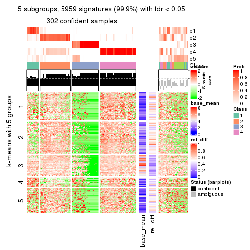</p>

</div>
<div id='tab-ATC-skmeans-get-signatures-5'>
<pre><code class="r">get_signatures(res, k = 6)
</code></pre>

<p></p>

</div>
</div>


Signature heatmaps where rows are not scaled:


<script>
$( function() {
	$( '#tabs-ATC-skmeans-get-signatures-no-scale' ).tabs();
} );
</script>
<div id='tabs-ATC-skmeans-get-signatures-no-scale'>
<ul>
<li><a href='#tab-ATC-skmeans-get-signatures-no-scale-1'>k = 2</a></li>
<li><a href='#tab-ATC-skmeans-get-signatures-no-scale-2'>k = 3</a></li>
<li><a href='#tab-ATC-skmeans-get-signatures-no-scale-3'>k = 4</a></li>
<li><a href='#tab-ATC-skmeans-get-signatures-no-scale-4'>k = 5</a></li>
<li><a href='#tab-ATC-skmeans-get-signatures-no-scale-5'>k = 6</a></li>
</ul>
<div id='tab-ATC-skmeans-get-signatures-no-scale-1'>
<pre><code class="r">get_signatures(res, k = 2, scale_rows = FALSE)
</code></pre>

<p></p>

</div>
<div id='tab-ATC-skmeans-get-signatures-no-scale-2'>
<pre><code class="r">get_signatures(res, k = 3, scale_rows = FALSE)
</code></pre>

<p></p>

</div>
<div id='tab-ATC-skmeans-get-signatures-no-scale-3'>
<pre><code class="r">get_signatures(res, k = 4, scale_rows = FALSE)
</code></pre>

<p>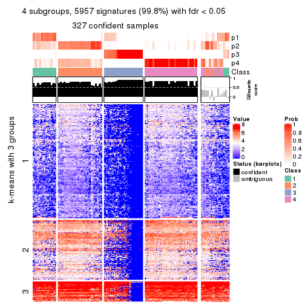</p>

</div>
<div id='tab-ATC-skmeans-get-signatures-no-scale-4'>
<pre><code class="r">get_signatures(res, k = 5, scale_rows = FALSE)
</code></pre>

<p></p>

</div>
<div id='tab-ATC-skmeans-get-signatures-no-scale-5'>
<pre><code class="r">get_signatures(res, k = 6, scale_rows = FALSE)
</code></pre>

<p>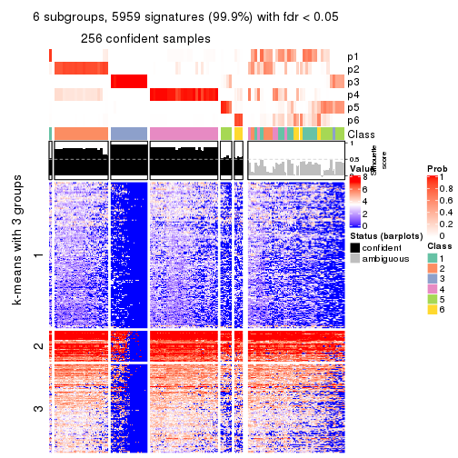</p>

</div>
</div>


Compare the overlap of signatures from different k:

```r
compare_signatures(res)
```


`get_signature()` returns a data frame invisibly. TO get the list of signatures, the function
call should be assigned to a variable explicitly. In following code, if `plot` argument is set
to `FALSE`, no heatmap is plotted while only the differential analysis is performed.

```r
# code only for demonstration
tb = get_signature(res, k = ..., plot = FALSE)
```

An example of the output of `tb` is:

```
#>   which_row         fdr    mean_1    mean_2 scaled_mean_1 scaled_mean_2 km
#> 1        38 0.042760348  8.373488  9.131774    -0.5533452     0.5164555  1
#> 2        40 0.018707592  7.106213  8.469186    -0.6173731     0.5762149  1
#> 3        55 0.019134737 10.221463 11.207825    -0.6159697     0.5749050  1
#> 4        59 0.006059896  5.921854  7.869574    -0.6899429     0.6439467  1
#> 5        60 0.018055526  8.928898 10.211722    -0.6204761     0.5791110  1
#> 6        98 0.009384629 15.714769 14.887706     0.6635654    -0.6193277  2
...
```

The columns in `tb` are:

1. `which_row`: row indices corresponding to the input matrix.
2. `fdr`: FDR for the differential test. 
3. `mean_x`: The mean value in group x.
4. `scaled_mean_x`: The mean value in group x after rows are scaled.
5. `km`: Row groups if k-means clustering is applied to rows.


UMAP plot which shows how samples are separated.


<script>
$( function() {
	$( '#tabs-ATC-skmeans-dimension-reduction' ).tabs();
} );
</script>
<div id='tabs-ATC-skmeans-dimension-reduction'>
<ul>
<li><a href='#tab-ATC-skmeans-dimension-reduction-1'>k = 2</a></li>
<li><a href='#tab-ATC-skmeans-dimension-reduction-2'>k = 3</a></li>
<li><a href='#tab-ATC-skmeans-dimension-reduction-3'>k = 4</a></li>
<li><a href='#tab-ATC-skmeans-dimension-reduction-4'>k = 5</a></li>
<li><a href='#tab-ATC-skmeans-dimension-reduction-5'>k = 6</a></li>
</ul>
<div id='tab-ATC-skmeans-dimension-reduction-1'>
<pre><code class="r">dimension_reduction(res, k = 2, method = &quot;UMAP&quot;)
</code></pre>

<p></p>

</div>
<div id='tab-ATC-skmeans-dimension-reduction-2'>
<pre><code class="r">dimension_reduction(res, k = 3, method = &quot;UMAP&quot;)
</code></pre>

<p></p>

</div>
<div id='tab-ATC-skmeans-dimension-reduction-3'>
<pre><code class="r">dimension_reduction(res, k = 4, method = &quot;UMAP&quot;)
</code></pre>

<p></p>

</div>
<div id='tab-ATC-skmeans-dimension-reduction-4'>
<pre><code class="r">dimension_reduction(res, k = 5, method = &quot;UMAP&quot;)
</code></pre>

<p></p>

</div>
<div id='tab-ATC-skmeans-dimension-reduction-5'>
<pre><code class="r">dimension_reduction(res, k = 6, method = &quot;UMAP&quot;)
</code></pre>

<p></p>

</div>
</div>


Following heatmap shows how subgroups are split when increasing `k`:

```r
collect_classes(res)
```


If matrix rows can be associated to genes, consider to use `GO_Enrichment(res,
...)` to perform function enrichment for the signature genes.


 

---------------------------------------------------


### ATC:pam**


The object with results only for a single top-value method and a single partition method 
can be extracted as:

```r
res = res_list["ATC", "pam"]
# you can also extract it by
# res = res_list["ATC:pam"]
```

A summary of `res` and all the functions that can be applied to it:

```r
res
```

```
#> A 'ConsensusPartition' object with k = 2, 3, 4, 5, 6.
#>   On a matrix with 5966 rows and 384 columns.
#>   Top rows (597, 1194, 1790, 2386, 2983) are extracted by 'ATC' method.
#>   Subgroups are detected by 'pam' method.
#>   Performed in total 1250 partitions by row resampling.
#>   Best k for subgroups seems to be 2.
#> 
#> Following methods can be applied to this 'ConsensusPartition' object:
#>  [1] "cola_report"             "collect_classes"         "collect_plots"          
#>  [4] "collect_stats"           "colnames"                "compare_signatures"     
#>  [7] "consensus_heatmap"       "dimension_reduction"     "functional_enrichment"  
#> [10] "get_anno_col"            "get_anno"                "get_classes"            
#> [13] "get_consensus"           "get_matrix"              "get_membership"         
#> [16] "get_param"               "get_signatures"          "get_stats"              
#> [19] "is_best_k"               "is_stable_k"             "membership_heatmap"     
#> [22] "ncol"                    "nrow"                    "plot_ecdf"              
#> [25] "rownames"                "select_partition_number" "show"                   
#> [28] "suggest_best_k"          "test_to_known_factors"
```

`collect_plots()` function collects all the plots made from `res` for all `k` (number of partitions)
into one single page to provide an easy and fast comparison between different `k`.

```r
collect_plots(res)
```


The plots are:

- The first row: a plot of the ECDF (Empirical cumulative distribution
  function) curves of the consensus matrix for each `k` and the heatmap of
  predicted classes for each `k`.
- The second row: heatmaps of the consensus matrix for each `k`.
- The third row: heatmaps of the membership matrix for each `k`.
- The fouth row: heatmaps of the signatures for each `k`.

All the plots in panels can be made by individual functions and they are
plotted later in this section.

`select_partition_number()` produces several plots showing different
statistics for choosing "optimized" `k`. There are following statistics:

- ECDF curves of the consensus matrix for each `k`;
- 1-PAC. [The PAC
  score](https://en.wikipedia.org/wiki/Consensus_clustering#Over-interpretation_potential_of_consensus_clustering)
  measures the proportion of the ambiguous subgrouping.
- Mean silhouette score.
- Concordance. The mean probability of fiting the consensus class ids in all
  partitions.
- Area increased. Denote $A_k$ as the area under the ECDF curve for current
  `k`, the area increased is defined as $A_k - A_{k-1}$.
- Rand index. The percent of pairs of samples that are both in a same cluster
  or both are not in a same cluster in the partition of k and k-1.
- Jaccard index. The ratio of pairs of samples are both in a same cluster in
  the partition of k and k-1 and the pairs of samples are both in a same
  cluster in the partition k or k-1.

The detailed explanations of these statistics can be found in [the cola
vignette](http://bioconductor.org/packages/devel/bioc/vignettes/cola/inst/doc/cola.html#toc_13).

Generally speaking, lower PAC score, higher mean silhouette score or higher
concordance corresponds to better partition. Rand index and Jaccard index
measure how similar the current partition is compared to partition with `k-1`.
If they are too similar, we won't accept `k` is better than `k-1`.

```r
select_partition_number(res)
```


The numeric values for all these statistics can be obtained by `get_stats()`.

```r
get_stats(res)
```

```
#>   k 1-PAC mean_silhouette concordance area_increased  Rand Jaccard
#> 2 2 1.000           0.995       0.998         0.1501 0.847   0.847
#> 3 3 0.531           0.826       0.903         2.6233 0.584   0.508
#> 4 4 0.701           0.766       0.894         0.2898 0.766   0.508
#> 5 5 0.702           0.766       0.888         0.0159 0.976   0.921
#> 6 6 0.709           0.732       0.862         0.0681 0.905   0.687
```

`suggest_best_k()` suggests the best $k$ based on these statistics. The rules are as follows:

- All $k$ with Jaccard index larger than 0.95 are removed because the increase of
  the partition number does not provides enough extra information. If all $k$ are removed,
  the best $k$ is assigned by `NA`.
- For $k$ with 1-PAC larger than 0.9, the maximal $k$ is taken as the "best k". Other $k$ is called "optional k".
- If it does not fit the second rule. The $k$ with the highest vote of highest
  1-PAC, mean silhouette and concordance is taken as the "best k".

```r
suggest_best_k(res)
```

```
#> [1] 2
```


Following shows the table of the partitions (You need to click the **show/hide
code output** link to see it). The membership matrix (columns with name `p*`)
is inferred by
[`clue::cl_consensus()`](https://www.rdocumentation.org/link/cl_consensus?package=clue)
function with the `SE` method. Basically the value in the membership matrix
represents the probability to belong to a certain group. The finall class
label for an item is determined with the group with highest probability it
belongs to.

In `get_classes()` function, the entropy is calculated from the membership
matrix and the silhouette score is calculated from the consensus matrix.


<script>
$( function() {
	$( '#tabs-ATC-pam-get-classes' ).tabs();
} );
</script>
<div id='tabs-ATC-pam-get-classes'>
<ul>
<li><a href='#tab-ATC-pam-get-classes-1'>k = 2</a></li>
<li><a href='#tab-ATC-pam-get-classes-2'>k = 3</a></li>
<li><a href='#tab-ATC-pam-get-classes-3'>k = 4</a></li>
<li><a href='#tab-ATC-pam-get-classes-4'>k = 5</a></li>
<li><a href='#tab-ATC-pam-get-classes-5'>k = 6</a></li>
</ul>

<div id='tab-ATC-pam-get-classes-1'>
<p><a id='tab-ATC-pam-get-classes-1-a' style='color:#0366d6' href='#'>show/hide code output</a></p>
<pre><code class="r">cbind(get_classes(res, k = 2), get_membership(res, k = 2))
</code></pre>

<pre><code>#&gt;           class entropy silhouette    p1    p2
#&gt; SRR490216     2   0.000      1.000 0.000 1.000
#&gt; SRR490217     2   0.000      1.000 0.000 1.000
#&gt; SRR490218     2   0.000      1.000 0.000 1.000
#&gt; SRR490219     2   0.000      1.000 0.000 1.000
#&gt; SRR490220     2   0.000      1.000 0.000 1.000
#&gt; SRR490221     2   0.000      1.000 0.000 1.000
#&gt; SRR490222     2   0.000      1.000 0.000 1.000
#&gt; SRR490223     2   0.000      1.000 0.000 1.000
#&gt; SRR490224     2   0.000      1.000 0.000 1.000
#&gt; SRR490225     2   0.000      1.000 0.000 1.000
#&gt; SRR490226     2   0.000      1.000 0.000 1.000
#&gt; SRR490227     2   0.000      1.000 0.000 1.000
#&gt; SRR490228     2   0.000      1.000 0.000 1.000
#&gt; SRR490229     2   0.000      1.000 0.000 1.000
#&gt; SRR490230     2   0.000      1.000 0.000 1.000
#&gt; SRR490231     2   0.000      1.000 0.000 1.000
#&gt; SRR490232     2   0.000      1.000 0.000 1.000
#&gt; SRR490233     2   0.000      1.000 0.000 1.000
#&gt; SRR490234     2   0.000      1.000 0.000 1.000
#&gt; SRR490235     2   0.000      1.000 0.000 1.000
#&gt; SRR490236     2   0.000      1.000 0.000 1.000
#&gt; SRR490237     2   0.000      1.000 0.000 1.000
#&gt; SRR490238     2   0.000      1.000 0.000 1.000
#&gt; SRR490239     2   0.000      1.000 0.000 1.000
#&gt; SRR490240     2   0.000      1.000 0.000 1.000
#&gt; SRR490241     2   0.000      1.000 0.000 1.000
#&gt; SRR490242     2   0.000      1.000 0.000 1.000
#&gt; SRR490243     2   0.000      1.000 0.000 1.000
#&gt; SRR490244     1   0.000      0.971 1.000 0.000
#&gt; SRR490245     1   0.000      0.971 1.000 0.000
#&gt; SRR490246     1   0.000      0.971 1.000 0.000
#&gt; SRR490247     1   0.000      0.971 1.000 0.000
#&gt; SRR490248     2   0.000      1.000 0.000 1.000
#&gt; SRR490249     2   0.000      1.000 0.000 1.000
#&gt; SRR490250     2   0.000      1.000 0.000 1.000
#&gt; SRR490251     2   0.000      1.000 0.000 1.000
#&gt; SRR490252     2   0.000      1.000 0.000 1.000
#&gt; SRR490253     2   0.000      1.000 0.000 1.000
#&gt; SRR490254     2   0.000      1.000 0.000 1.000
#&gt; SRR490255     2   0.000      1.000 0.000 1.000
#&gt; SRR490256     2   0.000      1.000 0.000 1.000
#&gt; SRR490257     2   0.000      1.000 0.000 1.000
#&gt; SRR490258     2   0.000      1.000 0.000 1.000
#&gt; SRR490259     2   0.000      1.000 0.000 1.000
#&gt; SRR490260     2   0.000      1.000 0.000 1.000
#&gt; SRR490261     2   0.000      1.000 0.000 1.000
#&gt; SRR490262     2   0.000      1.000 0.000 1.000
#&gt; SRR490263     2   0.000      1.000 0.000 1.000
#&gt; SRR490264     2   0.000      1.000 0.000 1.000
#&gt; SRR490265     2   0.000      1.000 0.000 1.000
#&gt; SRR490266     2   0.000      1.000 0.000 1.000
#&gt; SRR490267     2   0.000      1.000 0.000 1.000
#&gt; SRR490268     2   0.000      1.000 0.000 1.000
#&gt; SRR490269     2   0.000      1.000 0.000 1.000
#&gt; SRR490270     2   0.000      1.000 0.000 1.000
#&gt; SRR490271     2   0.000      1.000 0.000 1.000
#&gt; SRR490272     2   0.000      1.000 0.000 1.000
#&gt; SRR490273     2   0.000      1.000 0.000 1.000
#&gt; SRR490274     2   0.000      1.000 0.000 1.000
#&gt; SRR490275     2   0.000      1.000 0.000 1.000
#&gt; SRR490276     2   0.000      1.000 0.000 1.000
#&gt; SRR490277     2   0.000      1.000 0.000 1.000
#&gt; SRR490278     2   0.000      1.000 0.000 1.000
#&gt; SRR490279     2   0.000      1.000 0.000 1.000
#&gt; SRR490280     1   0.595      0.835 0.856 0.144
#&gt; SRR490281     1   0.738      0.755 0.792 0.208
#&gt; SRR490282     1   0.904      0.559 0.680 0.320
#&gt; SRR490283     1   0.781      0.719 0.768 0.232
#&gt; SRR490284     2   0.000      1.000 0.000 1.000
#&gt; SRR490285     2   0.000      1.000 0.000 1.000
#&gt; SRR490286     2   0.000      1.000 0.000 1.000
#&gt; SRR490287     2   0.000      1.000 0.000 1.000
#&gt; SRR490288     2   0.000      1.000 0.000 1.000
#&gt; SRR490289     2   0.000      1.000 0.000 1.000
#&gt; SRR490290     2   0.000      1.000 0.000 1.000
#&gt; SRR490291     2   0.000      1.000 0.000 1.000
#&gt; SRR490292     2   0.000      1.000 0.000 1.000
#&gt; SRR490293     2   0.000      1.000 0.000 1.000
#&gt; SRR490294     2   0.000      1.000 0.000 1.000
#&gt; SRR490295     2   0.000      1.000 0.000 1.000
#&gt; SRR490296     2   0.000      1.000 0.000 1.000
#&gt; SRR490297     2   0.000      1.000 0.000 1.000
#&gt; SRR490298     2   0.000      1.000 0.000 1.000
#&gt; SRR490299     2   0.000      1.000 0.000 1.000
#&gt; SRR490300     2   0.000      1.000 0.000 1.000
#&gt; SRR490301     2   0.000      1.000 0.000 1.000
#&gt; SRR490302     2   0.000      1.000 0.000 1.000
#&gt; SRR490303     2   0.000      1.000 0.000 1.000
#&gt; SRR490304     2   0.000      1.000 0.000 1.000
#&gt; SRR490305     2   0.000      1.000 0.000 1.000
#&gt; SRR490306     2   0.000      1.000 0.000 1.000
#&gt; SRR490307     2   0.000      1.000 0.000 1.000
#&gt; SRR490308     1   0.000      0.971 1.000 0.000
#&gt; SRR490309     1   0.000      0.971 1.000 0.000
#&gt; SRR490310     1   0.000      0.971 1.000 0.000
#&gt; SRR490311     1   0.000      0.971 1.000 0.000
#&gt; SRR490312     2   0.000      1.000 0.000 1.000
#&gt; SRR490313     2   0.000      1.000 0.000 1.000
#&gt; SRR490314     2   0.000      1.000 0.000 1.000
#&gt; SRR490315     2   0.000      1.000 0.000 1.000
#&gt; SRR490316     2   0.000      1.000 0.000 1.000
#&gt; SRR490317     2   0.000      1.000 0.000 1.000
#&gt; SRR490318     2   0.000      1.000 0.000 1.000
#&gt; SRR490319     2   0.000      1.000 0.000 1.000
#&gt; SRR490320     2   0.000      1.000 0.000 1.000
#&gt; SRR490321     2   0.000      1.000 0.000 1.000
#&gt; SRR490322     2   0.000      1.000 0.000 1.000
#&gt; SRR490323     2   0.000      1.000 0.000 1.000
#&gt; SRR490324     2   0.000      1.000 0.000 1.000
#&gt; SRR490325     2   0.000      1.000 0.000 1.000
#&gt; SRR490326     2   0.000      1.000 0.000 1.000
#&gt; SRR490327     2   0.000      1.000 0.000 1.000
#&gt; SRR490328     2   0.000      1.000 0.000 1.000
#&gt; SRR490329     2   0.000      1.000 0.000 1.000
#&gt; SRR490330     2   0.000      1.000 0.000 1.000
#&gt; SRR490331     2   0.000      1.000 0.000 1.000
#&gt; SRR490332     2   0.000      1.000 0.000 1.000
#&gt; SRR490333     2   0.000      1.000 0.000 1.000
#&gt; SRR490334     2   0.000      1.000 0.000 1.000
#&gt; SRR490335     2   0.000      1.000 0.000 1.000
#&gt; SRR490336     2   0.000      1.000 0.000 1.000
#&gt; SRR490337     2   0.000      1.000 0.000 1.000
#&gt; SRR490338     2   0.000      1.000 0.000 1.000
#&gt; SRR490339     2   0.000      1.000 0.000 1.000
#&gt; SRR490340     2   0.000      1.000 0.000 1.000
#&gt; SRR490341     2   0.000      1.000 0.000 1.000
#&gt; SRR490342     2   0.000      1.000 0.000 1.000
#&gt; SRR490343     2   0.000      1.000 0.000 1.000
#&gt; SRR490344     2   0.000      1.000 0.000 1.000
#&gt; SRR490345     2   0.000      1.000 0.000 1.000
#&gt; SRR490346     2   0.000      1.000 0.000 1.000
#&gt; SRR490347     2   0.000      1.000 0.000 1.000
#&gt; SRR490348     2   0.000      1.000 0.000 1.000
#&gt; SRR490349     2   0.000      1.000 0.000 1.000
#&gt; SRR490350     2   0.000      1.000 0.000 1.000
#&gt; SRR490351     2   0.000      1.000 0.000 1.000
#&gt; SRR490352     2   0.000      1.000 0.000 1.000
#&gt; SRR490353     2   0.000      1.000 0.000 1.000
#&gt; SRR490354     2   0.000      1.000 0.000 1.000
#&gt; SRR490355     2   0.000      1.000 0.000 1.000
#&gt; SRR490356     2   0.000      1.000 0.000 1.000
#&gt; SRR490357     2   0.000      1.000 0.000 1.000
#&gt; SRR490358     2   0.000      1.000 0.000 1.000
#&gt; SRR490359     2   0.000      1.000 0.000 1.000
#&gt; SRR490360     2   0.000      1.000 0.000 1.000
#&gt; SRR490361     2   0.000      1.000 0.000 1.000
#&gt; SRR490362     2   0.000      1.000 0.000 1.000
#&gt; SRR490363     2   0.000      1.000 0.000 1.000
#&gt; SRR490364     2   0.000      1.000 0.000 1.000
#&gt; SRR490365     2   0.000      1.000 0.000 1.000
#&gt; SRR490366     2   0.000      1.000 0.000 1.000
#&gt; SRR490367     2   0.000      1.000 0.000 1.000
#&gt; SRR490368     2   0.000      1.000 0.000 1.000
#&gt; SRR490369     2   0.000      1.000 0.000 1.000
#&gt; SRR490370     2   0.000      1.000 0.000 1.000
#&gt; SRR490371     2   0.000      1.000 0.000 1.000
#&gt; SRR490372     1   0.000      0.971 1.000 0.000
#&gt; SRR490373     1   0.000      0.971 1.000 0.000
#&gt; SRR490374     1   0.000      0.971 1.000 0.000
#&gt; SRR490375     1   0.000      0.971 1.000 0.000
#&gt; SRR490376     2   0.000      1.000 0.000 1.000
#&gt; SRR490377     2   0.000      1.000 0.000 1.000
#&gt; SRR490378     2   0.000      1.000 0.000 1.000
#&gt; SRR490379     2   0.000      1.000 0.000 1.000
#&gt; SRR490380     1   0.000      0.971 1.000 0.000
#&gt; SRR490381     1   0.000      0.971 1.000 0.000
#&gt; SRR490382     1   0.000      0.971 1.000 0.000
#&gt; SRR490383     1   0.000      0.971 1.000 0.000
#&gt; SRR490384     2   0.000      1.000 0.000 1.000
#&gt; SRR490385     2   0.000      1.000 0.000 1.000
#&gt; SRR490386     2   0.000      1.000 0.000 1.000
#&gt; SRR490387     2   0.000      1.000 0.000 1.000
#&gt; SRR490388     2   0.000      1.000 0.000 1.000
#&gt; SRR490389     2   0.000      1.000 0.000 1.000
#&gt; SRR490390     2   0.000      1.000 0.000 1.000
#&gt; SRR490391     2   0.000      1.000 0.000 1.000
#&gt; SRR490392     2   0.000      1.000 0.000 1.000
#&gt; SRR490393     2   0.000      1.000 0.000 1.000
#&gt; SRR490394     2   0.000      1.000 0.000 1.000
#&gt; SRR490395     2   0.000      1.000 0.000 1.000
#&gt; SRR490396     2   0.000      1.000 0.000 1.000
#&gt; SRR490397     2   0.000      1.000 0.000 1.000
#&gt; SRR490398     2   0.000      1.000 0.000 1.000
#&gt; SRR490399     2   0.000      1.000 0.000 1.000
#&gt; SRR490400     2   0.000      1.000 0.000 1.000
#&gt; SRR490401     2   0.000      1.000 0.000 1.000
#&gt; SRR490402     2   0.000      1.000 0.000 1.000
#&gt; SRR490403     2   0.000      1.000 0.000 1.000
#&gt; SRR490404     2   0.000      1.000 0.000 1.000
#&gt; SRR490405     2   0.000      1.000 0.000 1.000
#&gt; SRR490406     2   0.000      1.000 0.000 1.000
#&gt; SRR490407     2   0.000      1.000 0.000 1.000
#&gt; SRR490408     2   0.000      1.000 0.000 1.000
#&gt; SRR490409     2   0.000      1.000 0.000 1.000
#&gt; SRR490410     2   0.000      1.000 0.000 1.000
#&gt; SRR490411     2   0.000      1.000 0.000 1.000
#&gt; SRR490412     1   0.000      0.971 1.000 0.000
#&gt; SRR490413     1   0.000      0.971 1.000 0.000
#&gt; SRR490414     1   0.000      0.971 1.000 0.000
#&gt; SRR490415     1   0.000      0.971 1.000 0.000
#&gt; SRR490416     2   0.000      1.000 0.000 1.000
#&gt; SRR490417     2   0.000      1.000 0.000 1.000
#&gt; SRR490418     2   0.000      1.000 0.000 1.000
#&gt; SRR490419     2   0.000      1.000 0.000 1.000
#&gt; SRR490420     2   0.000      1.000 0.000 1.000
#&gt; SRR490421     2   0.000      1.000 0.000 1.000
#&gt; SRR490422     2   0.000      1.000 0.000 1.000
#&gt; SRR490423     2   0.000      1.000 0.000 1.000
#&gt; SRR490424     2   0.000      1.000 0.000 1.000
#&gt; SRR490425     2   0.000      1.000 0.000 1.000
#&gt; SRR490426     2   0.000      1.000 0.000 1.000
#&gt; SRR490427     2   0.000      1.000 0.000 1.000
#&gt; SRR490428     2   0.000      1.000 0.000 1.000
#&gt; SRR490429     2   0.000      1.000 0.000 1.000
#&gt; SRR490430     2   0.000      1.000 0.000 1.000
#&gt; SRR490431     2   0.000      1.000 0.000 1.000
#&gt; SRR490432     2   0.000      1.000 0.000 1.000
#&gt; SRR490433     2   0.000      1.000 0.000 1.000
#&gt; SRR490434     2   0.000      1.000 0.000 1.000
#&gt; SRR490435     2   0.000      1.000 0.000 1.000
#&gt; SRR490436     2   0.000      1.000 0.000 1.000
#&gt; SRR490437     2   0.000      1.000 0.000 1.000
#&gt; SRR490438     2   0.000      1.000 0.000 1.000
#&gt; SRR490439     2   0.000      1.000 0.000 1.000
#&gt; SRR490440     2   0.000      1.000 0.000 1.000
#&gt; SRR490441     2   0.000      1.000 0.000 1.000
#&gt; SRR490442     2   0.000      1.000 0.000 1.000
#&gt; SRR490443     2   0.000      1.000 0.000 1.000
#&gt; SRR490444     2   0.000      1.000 0.000 1.000
#&gt; SRR490445     2   0.000      1.000 0.000 1.000
#&gt; SRR490446     2   0.000      1.000 0.000 1.000
#&gt; SRR490447     2   0.000      1.000 0.000 1.000
#&gt; SRR490448     2   0.000      1.000 0.000 1.000
#&gt; SRR490449     2   0.000      1.000 0.000 1.000
#&gt; SRR490450     2   0.000      1.000 0.000 1.000
#&gt; SRR490451     2   0.000      1.000 0.000 1.000
#&gt; SRR490452     2   0.000      1.000 0.000 1.000
#&gt; SRR490453     2   0.000      1.000 0.000 1.000
#&gt; SRR490454     2   0.000      1.000 0.000 1.000
#&gt; SRR490455     2   0.000      1.000 0.000 1.000
#&gt; SRR490456     2   0.000      1.000 0.000 1.000
#&gt; SRR490457     2   0.000      1.000 0.000 1.000
#&gt; SRR490458     2   0.000      1.000 0.000 1.000
#&gt; SRR490459     2   0.000      1.000 0.000 1.000
#&gt; SRR490460     2   0.000      1.000 0.000 1.000
#&gt; SRR490461     2   0.000      1.000 0.000 1.000
#&gt; SRR490462     2   0.000      1.000 0.000 1.000
#&gt; SRR490463     2   0.000      1.000 0.000 1.000
#&gt; SRR490464     1   0.000      0.971 1.000 0.000
#&gt; SRR490465     1   0.000      0.971 1.000 0.000
#&gt; SRR490466     1   0.000      0.971 1.000 0.000
#&gt; SRR490467     1   0.000      0.971 1.000 0.000
#&gt; SRR490468     2   0.000      1.000 0.000 1.000
#&gt; SRR490469     2   0.000      1.000 0.000 1.000
#&gt; SRR490470     2   0.000      1.000 0.000 1.000
#&gt; SRR490471     2   0.000      1.000 0.000 1.000
#&gt; SRR490472     2   0.000      1.000 0.000 1.000
#&gt; SRR490473     2   0.000      1.000 0.000 1.000
#&gt; SRR490474     2   0.000      1.000 0.000 1.000
#&gt; SRR490475     2   0.000      1.000 0.000 1.000
#&gt; SRR490476     1   0.000      0.971 1.000 0.000
#&gt; SRR490477     1   0.000      0.971 1.000 0.000
#&gt; SRR490478     1   0.000      0.971 1.000 0.000
#&gt; SRR490479     1   0.000      0.971 1.000 0.000
#&gt; SRR490480     2   0.000      1.000 0.000 1.000
#&gt; SRR490481     2   0.000      1.000 0.000 1.000
#&gt; SRR490482     2   0.000      1.000 0.000 1.000
#&gt; SRR490483     2   0.000      1.000 0.000 1.000
#&gt; SRR490484     2   0.000      1.000 0.000 1.000
#&gt; SRR490485     2   0.000      1.000 0.000 1.000
#&gt; SRR490486     2   0.000      1.000 0.000 1.000
#&gt; SRR490487     2   0.000      1.000 0.000 1.000
#&gt; SRR490488     2   0.000      1.000 0.000 1.000
#&gt; SRR490489     2   0.000      1.000 0.000 1.000
#&gt; SRR490490     2   0.000      1.000 0.000 1.000
#&gt; SRR490491     2   0.000      1.000 0.000 1.000
#&gt; SRR490492     2   0.000      1.000 0.000 1.000
#&gt; SRR490493     2   0.000      1.000 0.000 1.000
#&gt; SRR490494     2   0.000      1.000 0.000 1.000
#&gt; SRR490495     2   0.000      1.000 0.000 1.000
#&gt; SRR490496     2   0.000      1.000 0.000 1.000
#&gt; SRR490497     2   0.000      1.000 0.000 1.000
#&gt; SRR490498     2   0.000      1.000 0.000 1.000
#&gt; SRR490499     2   0.000      1.000 0.000 1.000
#&gt; SRR490500     2   0.000      1.000 0.000 1.000
#&gt; SRR490501     2   0.000      1.000 0.000 1.000
#&gt; SRR490502     2   0.000      1.000 0.000 1.000
#&gt; SRR490503     2   0.000      1.000 0.000 1.000
#&gt; SRR490504     2   0.000      1.000 0.000 1.000
#&gt; SRR490505     2   0.000      1.000 0.000 1.000
#&gt; SRR490506     2   0.000      1.000 0.000 1.000
#&gt; SRR490507     2   0.000      1.000 0.000 1.000
#&gt; SRR490508     2   0.000      1.000 0.000 1.000
#&gt; SRR490509     2   0.000      1.000 0.000 1.000
#&gt; SRR490510     2   0.000      1.000 0.000 1.000
#&gt; SRR490511     2   0.000      1.000 0.000 1.000
#&gt; SRR490512     2   0.000      1.000 0.000 1.000
#&gt; SRR490513     2   0.000      1.000 0.000 1.000
#&gt; SRR490514     2   0.000      1.000 0.000 1.000
#&gt; SRR490515     2   0.000      1.000 0.000 1.000
#&gt; SRR490516     2   0.000      1.000 0.000 1.000
#&gt; SRR490517     2   0.000      1.000 0.000 1.000
#&gt; SRR490518     2   0.000      1.000 0.000 1.000
#&gt; SRR490519     2   0.000      1.000 0.000 1.000
#&gt; SRR490520     2   0.000      1.000 0.000 1.000
#&gt; SRR490521     2   0.000      1.000 0.000 1.000
#&gt; SRR490522     2   0.000      1.000 0.000 1.000
#&gt; SRR490523     2   0.000      1.000 0.000 1.000
#&gt; SRR490524     2   0.000      1.000 0.000 1.000
#&gt; SRR490525     2   0.000      1.000 0.000 1.000
#&gt; SRR490526     2   0.000      1.000 0.000 1.000
#&gt; SRR490527     2   0.000      1.000 0.000 1.000
#&gt; SRR490528     2   0.000      1.000 0.000 1.000
#&gt; SRR490529     2   0.000      1.000 0.000 1.000
#&gt; SRR490530     2   0.000      1.000 0.000 1.000
#&gt; SRR490531     2   0.000      1.000 0.000 1.000
#&gt; SRR490532     2   0.000      1.000 0.000 1.000
#&gt; SRR490533     2   0.000      1.000 0.000 1.000
#&gt; SRR490534     2   0.000      1.000 0.000 1.000
#&gt; SRR490535     2   0.000      1.000 0.000 1.000
#&gt; SRR490536     2   0.000      1.000 0.000 1.000
#&gt; SRR490537     2   0.000      1.000 0.000 1.000
#&gt; SRR490538     2   0.000      1.000 0.000 1.000
#&gt; SRR490539     2   0.000      1.000 0.000 1.000
#&gt; SRR490540     2   0.000      1.000 0.000 1.000
#&gt; SRR490541     2   0.000      1.000 0.000 1.000
#&gt; SRR490542     2   0.000      1.000 0.000 1.000
#&gt; SRR490543     2   0.000      1.000 0.000 1.000
#&gt; SRR490544     2   0.000      1.000 0.000 1.000
#&gt; SRR490545     2   0.000      1.000 0.000 1.000
#&gt; SRR490546     2   0.000      1.000 0.000 1.000
#&gt; SRR490547     2   0.000      1.000 0.000 1.000
#&gt; SRR490548     2   0.000      1.000 0.000 1.000
#&gt; SRR490549     2   0.000      1.000 0.000 1.000
#&gt; SRR490550     2   0.000      1.000 0.000 1.000
#&gt; SRR490551     2   0.000      1.000 0.000 1.000
#&gt; SRR490552     2   0.000      1.000 0.000 1.000
#&gt; SRR490553     2   0.000      1.000 0.000 1.000
#&gt; SRR490554     2   0.000      1.000 0.000 1.000
#&gt; SRR490555     2   0.000      1.000 0.000 1.000
#&gt; SRR490556     2   0.000      1.000 0.000 1.000
#&gt; SRR490557     2   0.000      1.000 0.000 1.000
#&gt; SRR490558     2   0.000      1.000 0.000 1.000
#&gt; SRR490559     2   0.000      1.000 0.000 1.000
#&gt; SRR490560     2   0.000      1.000 0.000 1.000
#&gt; SRR490561     2   0.000      1.000 0.000 1.000
#&gt; SRR490562     2   0.000      1.000 0.000 1.000
#&gt; SRR490563     2   0.000      1.000 0.000 1.000
#&gt; SRR490564     2   0.000      1.000 0.000 1.000
#&gt; SRR490565     2   0.000      1.000 0.000 1.000
#&gt; SRR490566     2   0.000      1.000 0.000 1.000
#&gt; SRR490567     2   0.000      1.000 0.000 1.000
#&gt; SRR490568     2   0.000      1.000 0.000 1.000
#&gt; SRR490569     2   0.000      1.000 0.000 1.000
#&gt; SRR490570     2   0.000      1.000 0.000 1.000
#&gt; SRR490571     2   0.000      1.000 0.000 1.000
#&gt; SRR490572     2   0.000      1.000 0.000 1.000
#&gt; SRR490573     2   0.000      1.000 0.000 1.000
#&gt; SRR490574     2   0.000      1.000 0.000 1.000
#&gt; SRR490575     2   0.000      1.000 0.000 1.000
#&gt; SRR490576     2   0.000      1.000 0.000 1.000
#&gt; SRR490577     2   0.000      1.000 0.000 1.000
#&gt; SRR490578     2   0.000      1.000 0.000 1.000
#&gt; SRR490579     2   0.000      1.000 0.000 1.000
#&gt; SRR490580     2   0.000      1.000 0.000 1.000
#&gt; SRR490581     2   0.000      1.000 0.000 1.000
#&gt; SRR490582     2   0.000      1.000 0.000 1.000
#&gt; SRR490583     2   0.000      1.000 0.000 1.000
#&gt; SRR490584     2   0.000      1.000 0.000 1.000
#&gt; SRR490585     2   0.000      1.000 0.000 1.000
#&gt; SRR490586     2   0.000      1.000 0.000 1.000
#&gt; SRR490587     2   0.000      1.000 0.000 1.000
#&gt; SRR490588     2   0.000      1.000 0.000 1.000
#&gt; SRR490589     2   0.000      1.000 0.000 1.000
#&gt; SRR490590     2   0.000      1.000 0.000 1.000
#&gt; SRR490591     2   0.000      1.000 0.000 1.000
#&gt; SRR490592     2   0.000      1.000 0.000 1.000
#&gt; SRR490593     2   0.000      1.000 0.000 1.000
#&gt; SRR490594     2   0.000      1.000 0.000 1.000
#&gt; SRR490595     2   0.000      1.000 0.000 1.000
#&gt; SRR490596     2   0.000      1.000 0.000 1.000
#&gt; SRR490597     2   0.000      1.000 0.000 1.000
#&gt; SRR490598     2   0.000      1.000 0.000 1.000
#&gt; SRR490599     2   0.000      1.000 0.000 1.000
</code></pre>

<script>
$('#tab-ATC-pam-get-classes-1-a').parent().next().next().hide();
$('#tab-ATC-pam-get-classes-1-a').click(function(){
  $('#tab-ATC-pam-get-classes-1-a').parent().next().next().toggle();
  return(false);
});
</script>
</div>

<div id='tab-ATC-pam-get-classes-2'>
<p><a id='tab-ATC-pam-get-classes-2-a' style='color:#0366d6' href='#'>show/hide code output</a></p>
<pre><code class="r">cbind(get_classes(res, k = 3), get_membership(res, k = 3))
</code></pre>

<pre><code>#&gt;           class entropy silhouette    p1    p2    p3
#&gt; SRR490216     1  0.5706    0.51550 0.680 0.320 0.000
#&gt; SRR490217     1  0.5621    0.56161 0.692 0.308 0.000
#&gt; SRR490218     2  0.6192    0.41415 0.420 0.580 0.000
#&gt; SRR490219     1  0.6286   -0.00629 0.536 0.464 0.000
#&gt; SRR490220     1  0.1643    0.86942 0.956 0.044 0.000
#&gt; SRR490221     1  0.1529    0.87022 0.960 0.040 0.000
#&gt; SRR490222     1  0.1411    0.87086 0.964 0.036 0.000
#&gt; SRR490223     1  0.0424    0.87310 0.992 0.008 0.000
#&gt; SRR490224     1  0.0000    0.87242 1.000 0.000 0.000
#&gt; SRR490225     1  0.0000    0.87242 1.000 0.000 0.000
#&gt; SRR490226     1  0.0000    0.87242 1.000 0.000 0.000
#&gt; SRR490227     1  0.0000    0.87242 1.000 0.000 0.000
#&gt; SRR490228     1  0.0000    0.87242 1.000 0.000 0.000
#&gt; SRR490229     1  0.0000    0.87242 1.000 0.000 0.000
#&gt; SRR490230     1  0.0000    0.87242 1.000 0.000 0.000
#&gt; SRR490231     1  0.0000    0.87242 1.000 0.000 0.000
#&gt; SRR490232     1  0.0000    0.87242 1.000 0.000 0.000
#&gt; SRR490233     1  0.0000    0.87242 1.000 0.000 0.000
#&gt; SRR490234     1  0.0000    0.87242 1.000 0.000 0.000
#&gt; SRR490235     1  0.0000    0.87242 1.000 0.000 0.000
#&gt; SRR490236     1  0.0000    0.87242 1.000 0.000 0.000
#&gt; SRR490237     1  0.0000    0.87242 1.000 0.000 0.000
#&gt; SRR490238     1  0.0000    0.87242 1.000 0.000 0.000
#&gt; SRR490239     1  0.0000    0.87242 1.000 0.000 0.000
#&gt; SRR490240     1  0.0000    0.87242 1.000 0.000 0.000
#&gt; SRR490241     1  0.0000    0.87242 1.000 0.000 0.000
#&gt; SRR490242     1  0.0000    0.87242 1.000 0.000 0.000
#&gt; SRR490243     1  0.0000    0.87242 1.000 0.000 0.000
#&gt; SRR490244     3  0.0000    0.96045 0.000 0.000 1.000
#&gt; SRR490245     3  0.0000    0.96045 0.000 0.000 1.000
#&gt; SRR490246     3  0.0000    0.96045 0.000 0.000 1.000
#&gt; SRR490247     3  0.0000    0.96045 0.000 0.000 1.000
#&gt; SRR490248     1  0.5058    0.68781 0.756 0.244 0.000
#&gt; SRR490249     1  0.5678    0.64056 0.684 0.316 0.000
#&gt; SRR490250     1  0.5397    0.63120 0.720 0.280 0.000
#&gt; SRR490251     1  0.5678    0.56790 0.684 0.316 0.000
#&gt; SRR490252     1  0.1964    0.86648 0.944 0.056 0.000
#&gt; SRR490253     1  0.2448    0.85954 0.924 0.076 0.000
#&gt; SRR490254     1  0.1964    0.86689 0.944 0.056 0.000
#&gt; SRR490255     1  0.2066    0.86552 0.940 0.060 0.000
#&gt; SRR490256     1  0.0000    0.87242 1.000 0.000 0.000
#&gt; SRR490257     1  0.0000    0.87242 1.000 0.000 0.000
#&gt; SRR490258     1  0.0000    0.87242 1.000 0.000 0.000
#&gt; SRR490259     1  0.0000    0.87242 1.000 0.000 0.000
#&gt; SRR490260     1  0.0000    0.87242 1.000 0.000 0.000
#&gt; SRR490261     1  0.0000    0.87242 1.000 0.000 0.000
#&gt; SRR490262     1  0.0000    0.87242 1.000 0.000 0.000
#&gt; SRR490263     1  0.0000    0.87242 1.000 0.000 0.000
#&gt; SRR490264     1  0.0000    0.87242 1.000 0.000 0.000
#&gt; SRR490265     1  0.0000    0.87242 1.000 0.000 0.000
#&gt; SRR490266     1  0.0000    0.87242 1.000 0.000 0.000
#&gt; SRR490267     1  0.0000    0.87242 1.000 0.000 0.000
#&gt; SRR490268     1  0.0000    0.87242 1.000 0.000 0.000
#&gt; SRR490269     1  0.0000    0.87242 1.000 0.000 0.000
#&gt; SRR490270     1  0.0000    0.87242 1.000 0.000 0.000
#&gt; SRR490271     1  0.0000    0.87242 1.000 0.000 0.000
#&gt; SRR490272     1  0.0000    0.87242 1.000 0.000 0.000
#&gt; SRR490273     1  0.0000    0.87242 1.000 0.000 0.000
#&gt; SRR490274     1  0.0000    0.87242 1.000 0.000 0.000
#&gt; SRR490275     1  0.0000    0.87242 1.000 0.000 0.000
#&gt; SRR490276     1  0.0000    0.87242 1.000 0.000 0.000
#&gt; SRR490277     1  0.0000    0.87242 1.000 0.000 0.000
#&gt; SRR490278     1  0.0000    0.87242 1.000 0.000 0.000
#&gt; SRR490279     1  0.0000    0.87242 1.000 0.000 0.000
#&gt; SRR490280     3  0.4399    0.75766 0.188 0.000 0.812
#&gt; SRR490281     3  0.5363    0.63282 0.276 0.000 0.724
#&gt; SRR490282     3  0.6095    0.40862 0.392 0.000 0.608
#&gt; SRR490283     3  0.5706    0.56460 0.320 0.000 0.680
#&gt; SRR490284     1  0.0000    0.87242 1.000 0.000 0.000
#&gt; SRR490285     1  0.0000    0.87242 1.000 0.000 0.000
#&gt; SRR490286     1  0.0000    0.87242 1.000 0.000 0.000
#&gt; SRR490287     1  0.0000    0.87242 1.000 0.000 0.000
#&gt; SRR490288     1  0.0892    0.87261 0.980 0.020 0.000
#&gt; SRR490289     1  0.3038    0.83947 0.896 0.104 0.000
#&gt; SRR490290     1  0.2261    0.85901 0.932 0.068 0.000
#&gt; SRR490291     1  0.3551    0.81231 0.868 0.132 0.000
#&gt; SRR490292     1  0.0592    0.87308 0.988 0.012 0.000
#&gt; SRR490293     1  0.1031    0.87224 0.976 0.024 0.000
#&gt; SRR490294     1  0.0237    0.87294 0.996 0.004 0.000
#&gt; SRR490295     1  0.0237    0.87294 0.996 0.004 0.000
#&gt; SRR490296     2  0.4002    0.87368 0.160 0.840 0.000
#&gt; SRR490297     2  0.4002    0.87368 0.160 0.840 0.000
#&gt; SRR490298     2  0.4002    0.87368 0.160 0.840 0.000
#&gt; SRR490299     2  0.4002    0.87368 0.160 0.840 0.000
#&gt; SRR490300     1  0.5835    0.47512 0.660 0.340 0.000
#&gt; SRR490301     1  0.5363    0.62014 0.724 0.276 0.000
#&gt; SRR490302     1  0.4887    0.70787 0.772 0.228 0.000
#&gt; SRR490303     1  0.5178    0.66112 0.744 0.256 0.000
#&gt; SRR490304     2  0.4002    0.87368 0.160 0.840 0.000
#&gt; SRR490305     2  0.4002    0.87368 0.160 0.840 0.000
#&gt; SRR490306     2  0.4002    0.87368 0.160 0.840 0.000
#&gt; SRR490307     2  0.4002    0.87368 0.160 0.840 0.000
#&gt; SRR490308     3  0.0000    0.96045 0.000 0.000 1.000
#&gt; SRR490309     3  0.0000    0.96045 0.000 0.000 1.000
#&gt; SRR490310     3  0.0000    0.96045 0.000 0.000 1.000
#&gt; SRR490311     3  0.0000    0.96045 0.000 0.000 1.000
#&gt; SRR490312     1  0.5591    0.56452 0.696 0.304 0.000
#&gt; SRR490313     1  0.6126    0.29564 0.600 0.400 0.000
#&gt; SRR490314     1  0.6267    0.09719 0.548 0.452 0.000
#&gt; SRR490315     1  0.5859    0.46849 0.656 0.344 0.000
#&gt; SRR490316     1  0.3619    0.81497 0.864 0.136 0.000
#&gt; SRR490317     1  0.6215    0.19364 0.572 0.428 0.000
#&gt; SRR490318     1  0.5138    0.66863 0.748 0.252 0.000
#&gt; SRR490319     1  0.5733    0.52058 0.676 0.324 0.000
#&gt; SRR490320     1  0.0000    0.87242 1.000 0.000 0.000
#&gt; SRR490321     1  0.0000    0.87242 1.000 0.000 0.000
#&gt; SRR490322     1  0.0000    0.87242 1.000 0.000 0.000
#&gt; SRR490323     1  0.0000    0.87242 1.000 0.000 0.000
#&gt; SRR490324     1  0.0000    0.87242 1.000 0.000 0.000
#&gt; SRR490325     1  0.0000    0.87242 1.000 0.000 0.000
#&gt; SRR490326     1  0.0000    0.87242 1.000 0.000 0.000
#&gt; SRR490327     1  0.0000    0.87242 1.000 0.000 0.000
#&gt; SRR490328     2  0.5397    0.71986 0.280 0.720 0.000
#&gt; SRR490329     2  0.4178    0.86305 0.172 0.828 0.000
#&gt; SRR490330     2  0.4555    0.83366 0.200 0.800 0.000
#&gt; SRR490331     2  0.4842    0.80399 0.224 0.776 0.000
#&gt; SRR490332     2  0.6286    0.26484 0.464 0.536 0.000
#&gt; SRR490333     2  0.6154    0.44481 0.408 0.592 0.000
#&gt; SRR490334     2  0.6111    0.47652 0.396 0.604 0.000
#&gt; SRR490335     2  0.6026    0.52757 0.376 0.624 0.000
#&gt; SRR490336     2  0.4002    0.87368 0.160 0.840 0.000
#&gt; SRR490337     2  0.4002    0.87368 0.160 0.840 0.000
#&gt; SRR490338     2  0.4002    0.87368 0.160 0.840 0.000
#&gt; SRR490339     2  0.4002    0.87368 0.160 0.840 0.000
#&gt; SRR490340     1  0.3619    0.81670 0.864 0.136 0.000
#&gt; SRR490341     1  0.2878    0.84810 0.904 0.096 0.000
#&gt; SRR490342     1  0.2878    0.84811 0.904 0.096 0.000
#&gt; SRR490343     1  0.2959    0.84559 0.900 0.100 0.000
#&gt; SRR490344     2  0.5859    0.59874 0.344 0.656 0.000
#&gt; SRR490345     2  0.4555    0.83601 0.200 0.800 0.000
#&gt; SRR490346     2  0.4062    0.87045 0.164 0.836 0.000
#&gt; SRR490347     2  0.4504    0.84000 0.196 0.804 0.000
#&gt; SRR490348     2  0.4002    0.87368 0.160 0.840 0.000
#&gt; SRR490349     2  0.4002    0.87368 0.160 0.840 0.000
#&gt; SRR490350     2  0.4002    0.87368 0.160 0.840 0.000
#&gt; SRR490351     2  0.4002    0.87368 0.160 0.840 0.000
#&gt; SRR490352     2  0.0000    0.86225 0.000 1.000 0.000
#&gt; SRR490353     2  0.0000    0.86225 0.000 1.000 0.000
#&gt; SRR490354     2  0.0000    0.86225 0.000 1.000 0.000
#&gt; SRR490355     2  0.0000    0.86225 0.000 1.000 0.000
#&gt; SRR490356     1  0.3816    0.81479 0.852 0.148 0.000
#&gt; SRR490357     1  0.2711    0.85301 0.912 0.088 0.000
#&gt; SRR490358     1  0.4887    0.74623 0.772 0.228 0.000
#&gt; SRR490359     1  0.3686    0.81381 0.860 0.140 0.000
#&gt; SRR490360     2  0.0000    0.86225 0.000 1.000 0.000
#&gt; SRR490361     2  0.0000    0.86225 0.000 1.000 0.000
#&gt; SRR490362     2  0.0000    0.86225 0.000 1.000 0.000
#&gt; SRR490363     2  0.0000    0.86225 0.000 1.000 0.000
#&gt; SRR490364     2  0.6225    0.35458 0.432 0.568 0.000
#&gt; SRR490365     2  0.5058    0.78186 0.244 0.756 0.000
#&gt; SRR490366     2  0.5465    0.71122 0.288 0.712 0.000
#&gt; SRR490367     2  0.4750    0.81807 0.216 0.784 0.000
#&gt; SRR490368     2  0.0000    0.86225 0.000 1.000 0.000
#&gt; SRR490369     2  0.0000    0.86225 0.000 1.000 0.000
#&gt; SRR490370     2  0.0000    0.86225 0.000 1.000 0.000
#&gt; SRR490371     2  0.0000    0.86225 0.000 1.000 0.000
#&gt; SRR490372     3  0.0000    0.96045 0.000 0.000 1.000
#&gt; SRR490373     3  0.0000    0.96045 0.000 0.000 1.000
#&gt; SRR490374     3  0.0000    0.96045 0.000 0.000 1.000
#&gt; SRR490375     3  0.0000    0.96045 0.000 0.000 1.000
#&gt; SRR490376     2  0.4002    0.87368 0.160 0.840 0.000
#&gt; SRR490377     2  0.4002    0.87368 0.160 0.840 0.000
#&gt; SRR490378     2  0.4002    0.87368 0.160 0.840 0.000
#&gt; SRR490379     2  0.4002    0.87368 0.160 0.840 0.000
#&gt; SRR490380     3  0.0000    0.96045 0.000 0.000 1.000
#&gt; SRR490381     3  0.0000    0.96045 0.000 0.000 1.000
#&gt; SRR490382     3  0.0000    0.96045 0.000 0.000 1.000
#&gt; SRR490383     3  0.0000    0.96045 0.000 0.000 1.000
#&gt; SRR490384     2  0.0000    0.86225 0.000 1.000 0.000
#&gt; SRR490385     2  0.0000    0.86225 0.000 1.000 0.000
#&gt; SRR490386     2  0.0000    0.86225 0.000 1.000 0.000
#&gt; SRR490387     2  0.0000    0.86225 0.000 1.000 0.000
#&gt; SRR490388     2  0.0747    0.86526 0.016 0.984 0.000
#&gt; SRR490389     2  0.0592    0.86451 0.012 0.988 0.000
#&gt; SRR490390     2  0.0424    0.86378 0.008 0.992 0.000
#&gt; SRR490391     2  0.0747    0.86412 0.016 0.984 0.000
#&gt; SRR490392     2  0.0000    0.86225 0.000 1.000 0.000
#&gt; SRR490393     2  0.0000    0.86225 0.000 1.000 0.000
#&gt; SRR490394     2  0.0000    0.86225 0.000 1.000 0.000
#&gt; SRR490395     2  0.0000    0.86225 0.000 1.000 0.000
#&gt; SRR490396     2  0.0237    0.86086 0.004 0.996 0.000
#&gt; SRR490397     2  0.0000    0.86225 0.000 1.000 0.000
#&gt; SRR490398     2  0.0237    0.86090 0.004 0.996 0.000
#&gt; SRR490399     2  0.0000    0.86225 0.000 1.000 0.000
#&gt; SRR490400     2  0.0000    0.86225 0.000 1.000 0.000
#&gt; SRR490401     2  0.0000    0.86225 0.000 1.000 0.000
#&gt; SRR490402     2  0.0000    0.86225 0.000 1.000 0.000
#&gt; SRR490403     2  0.0000    0.86225 0.000 1.000 0.000
#&gt; SRR490404     1  0.6154    0.50576 0.592 0.408 0.000
#&gt; SRR490405     1  0.6168    0.49733 0.588 0.412 0.000
#&gt; SRR490406     1  0.6168    0.49733 0.588 0.412 0.000
#&gt; SRR490407     1  0.6235    0.44785 0.564 0.436 0.000
#&gt; SRR490408     2  0.4002    0.87368 0.160 0.840 0.000
#&gt; SRR490409     2  0.4002    0.87368 0.160 0.840 0.000
#&gt; SRR490410     2  0.4002    0.87368 0.160 0.840 0.000
#&gt; SRR490411     2  0.4002    0.87368 0.160 0.840 0.000
#&gt; SRR490412     3  0.0000    0.96045 0.000 0.000 1.000
#&gt; SRR490413     3  0.0000    0.96045 0.000 0.000 1.000
#&gt; SRR490414     3  0.0000    0.96045 0.000 0.000 1.000
#&gt; SRR490415     3  0.0000    0.96045 0.000 0.000 1.000
#&gt; SRR490416     1  0.5785    0.50507 0.668 0.332 0.000
#&gt; SRR490417     1  0.6286    0.03694 0.536 0.464 0.000
#&gt; SRR490418     2  0.6286    0.26231 0.464 0.536 0.000
#&gt; SRR490419     2  0.6235    0.36013 0.436 0.564 0.000
#&gt; SRR490420     1  0.0000    0.87242 1.000 0.000 0.000
#&gt; SRR490421     1  0.0892    0.87267 0.980 0.020 0.000
#&gt; SRR490422     1  0.0237    0.87294 0.996 0.004 0.000
#&gt; SRR490423     1  0.0237    0.87294 0.996 0.004 0.000
#&gt; SRR490424     1  0.0000    0.87242 1.000 0.000 0.000
#&gt; SRR490425     1  0.0000    0.87242 1.000 0.000 0.000
#&gt; SRR490426     1  0.0000    0.87242 1.000 0.000 0.000
#&gt; SRR490427     1  0.0000    0.87242 1.000 0.000 0.000
#&gt; SRR490428     1  0.0237    0.87294 0.996 0.004 0.000
#&gt; SRR490429     1  0.0237    0.87294 0.996 0.004 0.000
#&gt; SRR490430     1  0.0424    0.87298 0.992 0.008 0.000
#&gt; SRR490431     1  0.0592    0.87316 0.988 0.012 0.000
#&gt; SRR490432     1  0.2537    0.85724 0.920 0.080 0.000
#&gt; SRR490433     1  0.2537    0.85724 0.920 0.080 0.000
#&gt; SRR490434     1  0.2878    0.84830 0.904 0.096 0.000
#&gt; SRR490435     1  0.2711    0.85301 0.912 0.088 0.000
#&gt; SRR490436     1  0.1964    0.86648 0.944 0.056 0.000
#&gt; SRR490437     1  0.1643    0.86942 0.956 0.044 0.000
#&gt; SRR490438     1  0.2165    0.86397 0.936 0.064 0.000
#&gt; SRR490439     1  0.1529    0.87022 0.960 0.040 0.000
#&gt; SRR490440     2  0.4002    0.87368 0.160 0.840 0.000
#&gt; SRR490441     2  0.4002    0.87368 0.160 0.840 0.000
#&gt; SRR490442     2  0.4002    0.87368 0.160 0.840 0.000
#&gt; SRR490443     2  0.4002    0.87368 0.160 0.840 0.000
#&gt; SRR490444     2  0.4235    0.85918 0.176 0.824 0.000
#&gt; SRR490445     2  0.4002    0.87368 0.160 0.840 0.000
#&gt; SRR490446     2  0.4178    0.86310 0.172 0.828 0.000
#&gt; SRR490447     2  0.4887    0.79872 0.228 0.772 0.000
#&gt; SRR490448     1  0.2537    0.85724 0.920 0.080 0.000
#&gt; SRR490449     1  0.2625    0.85520 0.916 0.084 0.000
#&gt; SRR490450     1  0.2356    0.86080 0.928 0.072 0.000
#&gt; SRR490451     1  0.2537    0.85724 0.920 0.080 0.000
#&gt; SRR490452     1  0.0000    0.87242 1.000 0.000 0.000
#&gt; SRR490453     1  0.0237    0.87294 0.996 0.004 0.000
#&gt; SRR490454     1  0.0000    0.87242 1.000 0.000 0.000
#&gt; SRR490455     1  0.0000    0.87242 1.000 0.000 0.000
#&gt; SRR490456     1  0.2537    0.85724 0.920 0.080 0.000
#&gt; SRR490457     1  0.2537    0.85724 0.920 0.080 0.000
#&gt; SRR490458     1  0.2537    0.85724 0.920 0.080 0.000
#&gt; SRR490459     1  0.2356    0.86080 0.928 0.072 0.000
#&gt; SRR490460     1  0.1289    0.87138 0.968 0.032 0.000
#&gt; SRR490461     1  0.1753    0.86852 0.952 0.048 0.000
#&gt; SRR490462     1  0.1643    0.86942 0.956 0.044 0.000
#&gt; SRR490463     1  0.1753    0.86852 0.952 0.048 0.000
#&gt; SRR490464     3  0.0000    0.96045 0.000 0.000 1.000
#&gt; SRR490465     3  0.0000    0.96045 0.000 0.000 1.000
#&gt; SRR490466     3  0.0000    0.96045 0.000 0.000 1.000
#&gt; SRR490467     3  0.0000    0.96045 0.000 0.000 1.000
#&gt; SRR490468     1  0.2711    0.85301 0.912 0.088 0.000
#&gt; SRR490469     1  0.2711    0.85301 0.912 0.088 0.000
#&gt; SRR490470     1  0.2711    0.85301 0.912 0.088 0.000
#&gt; SRR490471     1  0.2711    0.85301 0.912 0.088 0.000
#&gt; SRR490472     2  0.4002    0.87368 0.160 0.840 0.000
#&gt; SRR490473     2  0.4002    0.87368 0.160 0.840 0.000
#&gt; SRR490474     2  0.4002    0.87368 0.160 0.840 0.000
#&gt; SRR490475     2  0.4002    0.87368 0.160 0.840 0.000
#&gt; SRR490476     3  0.0000    0.96045 0.000 0.000 1.000
#&gt; SRR490477     3  0.0000    0.96045 0.000 0.000 1.000
#&gt; SRR490478     3  0.0000    0.96045 0.000 0.000 1.000
#&gt; SRR490479     3  0.0000    0.96045 0.000 0.000 1.000
#&gt; SRR490480     2  0.4002    0.87368 0.160 0.840 0.000
#&gt; SRR490481     2  0.4002    0.87368 0.160 0.840 0.000
#&gt; SRR490482     2  0.4002    0.87368 0.160 0.840 0.000
#&gt; SRR490483     2  0.4002    0.87368 0.160 0.840 0.000
#&gt; SRR490484     2  0.4002    0.87368 0.160 0.840 0.000
#&gt; SRR490485     2  0.4002    0.87368 0.160 0.840 0.000
#&gt; SRR490486     2  0.4002    0.87368 0.160 0.840 0.000
#&gt; SRR490487     2  0.4002    0.87368 0.160 0.840 0.000
#&gt; SRR490488     2  0.4002    0.87368 0.160 0.840 0.000
#&gt; SRR490489     2  0.4002    0.87368 0.160 0.840 0.000
#&gt; SRR490490     2  0.4002    0.87368 0.160 0.840 0.000
#&gt; SRR490491     2  0.4002    0.87368 0.160 0.840 0.000
#&gt; SRR490492     2  0.4002    0.87368 0.160 0.840 0.000
#&gt; SRR490493     2  0.4002    0.87368 0.160 0.840 0.000
#&gt; SRR490494     2  0.4002    0.87368 0.160 0.840 0.000
#&gt; SRR490495     2  0.4002    0.87368 0.160 0.840 0.000
#&gt; SRR490496     2  0.3941    0.87411 0.156 0.844 0.000
#&gt; SRR490497     2  0.3816    0.87473 0.148 0.852 0.000
#&gt; SRR490498     2  0.3879    0.87444 0.152 0.848 0.000
#&gt; SRR490499     2  0.3340    0.87524 0.120 0.880 0.000
#&gt; SRR490500     2  0.5810    0.62210 0.336 0.664 0.000
#&gt; SRR490501     2  0.5859    0.60338 0.344 0.656 0.000
#&gt; SRR490502     2  0.5706    0.65140 0.320 0.680 0.000
#&gt; SRR490503     2  0.5431    0.71357 0.284 0.716 0.000
#&gt; SRR490504     2  0.4002    0.87368 0.160 0.840 0.000
#&gt; SRR490505     2  0.4002    0.87368 0.160 0.840 0.000
#&gt; SRR490506     2  0.4002    0.87368 0.160 0.840 0.000
#&gt; SRR490507     2  0.4002    0.87368 0.160 0.840 0.000
#&gt; SRR490508     2  0.4002    0.87368 0.160 0.840 0.000
#&gt; SRR490509     2  0.4002    0.87368 0.160 0.840 0.000
#&gt; SRR490510     2  0.4002    0.87368 0.160 0.840 0.000
#&gt; SRR490511     2  0.4002    0.87368 0.160 0.840 0.000
#&gt; SRR490512     2  0.4002    0.87368 0.160 0.840 0.000
#&gt; SRR490513     2  0.4002    0.87368 0.160 0.840 0.000
#&gt; SRR490514     2  0.4002    0.87368 0.160 0.840 0.000
#&gt; SRR490515     2  0.4002    0.87368 0.160 0.840 0.000
#&gt; SRR490516     2  0.4002    0.87368 0.160 0.840 0.000
#&gt; SRR490517     2  0.4002    0.87368 0.160 0.840 0.000
#&gt; SRR490518     2  0.4002    0.87368 0.160 0.840 0.000
#&gt; SRR490519     2  0.4002    0.87368 0.160 0.840 0.000
#&gt; SRR490520     2  0.4002    0.87368 0.160 0.840 0.000
#&gt; SRR490521     2  0.4002    0.87368 0.160 0.840 0.000
#&gt; SRR490522     2  0.4002    0.87368 0.160 0.840 0.000
#&gt; SRR490523     2  0.4002    0.87368 0.160 0.840 0.000
#&gt; SRR490524     2  0.3482    0.87529 0.128 0.872 0.000
#&gt; SRR490525     2  0.1031    0.86679 0.024 0.976 0.000
#&gt; SRR490526     2  0.3267    0.87526 0.116 0.884 0.000
#&gt; SRR490527     2  0.2537    0.87366 0.080 0.920 0.000
#&gt; SRR490528     2  0.0000    0.86225 0.000 1.000 0.000
#&gt; SRR490529     2  0.0000    0.86225 0.000 1.000 0.000
#&gt; SRR490530     2  0.0000    0.86225 0.000 1.000 0.000
#&gt; SRR490531     2  0.0000    0.86225 0.000 1.000 0.000
#&gt; SRR490532     1  0.2165    0.86441 0.936 0.064 0.000
#&gt; SRR490533     1  0.2711    0.85301 0.912 0.088 0.000
#&gt; SRR490534     1  0.2711    0.85301 0.912 0.088 0.000
#&gt; SRR490535     1  0.2711    0.85301 0.912 0.088 0.000
#&gt; SRR490536     2  0.4002    0.87368 0.160 0.840 0.000
#&gt; SRR490537     2  0.3879    0.87445 0.152 0.848 0.000
#&gt; SRR490538     2  0.3116    0.87509 0.108 0.892 0.000
#&gt; SRR490539     2  0.3816    0.87481 0.148 0.852 0.000
#&gt; SRR490540     2  0.0000    0.86225 0.000 1.000 0.000
#&gt; SRR490541     2  0.0000    0.86225 0.000 1.000 0.000
#&gt; SRR490542     2  0.0000    0.86225 0.000 1.000 0.000
#&gt; SRR490543     2  0.0000    0.86225 0.000 1.000 0.000
#&gt; SRR490544     2  0.0000    0.86225 0.000 1.000 0.000
#&gt; SRR490545     2  0.0000    0.86225 0.000 1.000 0.000
#&gt; SRR490546     2  0.0000    0.86225 0.000 1.000 0.000
#&gt; SRR490547     2  0.0000    0.86225 0.000 1.000 0.000
#&gt; SRR490548     2  0.0000    0.86225 0.000 1.000 0.000
#&gt; SRR490549     2  0.0000    0.86225 0.000 1.000 0.000
#&gt; SRR490550     2  0.0000    0.86225 0.000 1.000 0.000
#&gt; SRR490551     2  0.0000    0.86225 0.000 1.000 0.000
#&gt; SRR490552     2  0.0000    0.86225 0.000 1.000 0.000
#&gt; SRR490553     2  0.0000    0.86225 0.000 1.000 0.000
#&gt; SRR490554     2  0.0000    0.86225 0.000 1.000 0.000
#&gt; SRR490555     2  0.0000    0.86225 0.000 1.000 0.000
#&gt; SRR490556     2  0.0000    0.86225 0.000 1.000 0.000
#&gt; SRR490557     2  0.0000    0.86225 0.000 1.000 0.000
#&gt; SRR490558     2  0.0000    0.86225 0.000 1.000 0.000
#&gt; SRR490559     2  0.0000    0.86225 0.000 1.000 0.000
#&gt; SRR490560     2  0.0000    0.86225 0.000 1.000 0.000
#&gt; SRR490561     2  0.0000    0.86225 0.000 1.000 0.000
#&gt; SRR490562     2  0.0000    0.86225 0.000 1.000 0.000
#&gt; SRR490563     2  0.0000    0.86225 0.000 1.000 0.000
#&gt; SRR490564     1  0.5988    0.57228 0.632 0.368 0.000
#&gt; SRR490565     1  0.6140    0.50887 0.596 0.404 0.000
#&gt; SRR490566     1  0.5835    0.60662 0.660 0.340 0.000
#&gt; SRR490567     1  0.5948    0.58393 0.640 0.360 0.000
#&gt; SRR490568     2  0.4002    0.87368 0.160 0.840 0.000
#&gt; SRR490569     2  0.4002    0.87368 0.160 0.840 0.000
#&gt; SRR490570     2  0.3816    0.87489 0.148 0.852 0.000
#&gt; SRR490571     2  0.4002    0.87368 0.160 0.840 0.000
#&gt; SRR490572     2  0.0000    0.86225 0.000 1.000 0.000
#&gt; SRR490573     2  0.0000    0.86225 0.000 1.000 0.000
#&gt; SRR490574     2  0.0000    0.86225 0.000 1.000 0.000
#&gt; SRR490575     2  0.0000    0.86225 0.000 1.000 0.000
#&gt; SRR490576     2  0.0000    0.86225 0.000 1.000 0.000
#&gt; SRR490577     2  0.0000    0.86225 0.000 1.000 0.000
#&gt; SRR490578     2  0.0000    0.86225 0.000 1.000 0.000
#&gt; SRR490579     2  0.0000    0.86225 0.000 1.000 0.000
#&gt; SRR490580     2  0.0000    0.86225 0.000 1.000 0.000
#&gt; SRR490581     2  0.0000    0.86225 0.000 1.000 0.000
#&gt; SRR490582     2  0.0000    0.86225 0.000 1.000 0.000
#&gt; SRR490583     2  0.0000    0.86225 0.000 1.000 0.000
#&gt; SRR490584     2  0.0000    0.86225 0.000 1.000 0.000
#&gt; SRR490585     2  0.0000    0.86225 0.000 1.000 0.000
#&gt; SRR490586     2  0.0000    0.86225 0.000 1.000 0.000
#&gt; SRR490587     2  0.0000    0.86225 0.000 1.000 0.000
#&gt; SRR490588     2  0.0000    0.86225 0.000 1.000 0.000
#&gt; SRR490589     2  0.0000    0.86225 0.000 1.000 0.000
#&gt; SRR490590     2  0.0000    0.86225 0.000 1.000 0.000
#&gt; SRR490591     2  0.0000    0.86225 0.000 1.000 0.000
#&gt; SRR490592     2  0.0000    0.86225 0.000 1.000 0.000
#&gt; SRR490593     2  0.0000    0.86225 0.000 1.000 0.000
#&gt; SRR490594     2  0.0000    0.86225 0.000 1.000 0.000
#&gt; SRR490595     2  0.0000    0.86225 0.000 1.000 0.000
#&gt; SRR490596     1  0.5529    0.66719 0.704 0.296 0.000
#&gt; SRR490597     1  0.5678    0.63149 0.684 0.316 0.000
#&gt; SRR490598     1  0.6026    0.55556 0.624 0.376 0.000
#&gt; SRR490599     1  0.5988    0.57301 0.632 0.368 0.000
</code></pre>

<script>
$('#tab-ATC-pam-get-classes-2-a').parent().next().next().hide();
$('#tab-ATC-pam-get-classes-2-a').click(function(){
  $('#tab-ATC-pam-get-classes-2-a').parent().next().next().toggle();
  return(false);
});
</script>
</div>

<div id='tab-ATC-pam-get-classes-3'>
<p><a id='tab-ATC-pam-get-classes-3-a' style='color:#0366d6' href='#'>show/hide code output</a></p>
<pre><code class="r">cbind(get_classes(res, k = 4), get_membership(res, k = 4))
</code></pre>

<pre><code>#&gt;           class entropy silhouette    p1    p2    p3    p4
#&gt; SRR490216     2  0.7661    0.34609 0.264 0.464 0.000 0.272
#&gt; SRR490217     2  0.7539    0.36942 0.256 0.492 0.000 0.252
#&gt; SRR490218     2  0.6968    0.46278 0.140 0.552 0.000 0.308
#&gt; SRR490219     4  0.7504    0.08239 0.192 0.344 0.000 0.464
#&gt; SRR490220     1  0.4356    0.76494 0.804 0.048 0.000 0.148
#&gt; SRR490221     1  0.3591    0.76787 0.824 0.008 0.000 0.168
#&gt; SRR490222     1  0.3123    0.77657 0.844 0.000 0.000 0.156
#&gt; SRR490223     1  0.1716    0.82180 0.936 0.000 0.000 0.064
#&gt; SRR490224     1  0.0000    0.83573 1.000 0.000 0.000 0.000
#&gt; SRR490225     1  0.0000    0.83573 1.000 0.000 0.000 0.000
#&gt; SRR490226     1  0.0000    0.83573 1.000 0.000 0.000 0.000
#&gt; SRR490227     1  0.0000    0.83573 1.000 0.000 0.000 0.000
#&gt; SRR490228     1  0.0000    0.83573 1.000 0.000 0.000 0.000
#&gt; SRR490229     1  0.0000    0.83573 1.000 0.000 0.000 0.000
#&gt; SRR490230     1  0.0000    0.83573 1.000 0.000 0.000 0.000
#&gt; SRR490231     1  0.0000    0.83573 1.000 0.000 0.000 0.000
#&gt; SRR490232     1  0.0000    0.83573 1.000 0.000 0.000 0.000
#&gt; SRR490233     1  0.0000    0.83573 1.000 0.000 0.000 0.000
#&gt; SRR490234     1  0.0000    0.83573 1.000 0.000 0.000 0.000
#&gt; SRR490235     1  0.0000    0.83573 1.000 0.000 0.000 0.000
#&gt; SRR490236     1  0.0000    0.83573 1.000 0.000 0.000 0.000
#&gt; SRR490237     1  0.0000    0.83573 1.000 0.000 0.000 0.000
#&gt; SRR490238     1  0.0000    0.83573 1.000 0.000 0.000 0.000
#&gt; SRR490239     1  0.0000    0.83573 1.000 0.000 0.000 0.000
#&gt; SRR490240     1  0.0000    0.83573 1.000 0.000 0.000 0.000
#&gt; SRR490241     1  0.0000    0.83573 1.000 0.000 0.000 0.000
#&gt; SRR490242     1  0.0000    0.83573 1.000 0.000 0.000 0.000
#&gt; SRR490243     1  0.0000    0.83573 1.000 0.000 0.000 0.000
#&gt; SRR490244     3  0.0000    0.95256 0.000 0.000 1.000 0.000
#&gt; SRR490245     3  0.0000    0.95256 0.000 0.000 1.000 0.000
#&gt; SRR490246     3  0.0000    0.95256 0.000 0.000 1.000 0.000
#&gt; SRR490247     3  0.0000    0.95256 0.000 0.000 1.000 0.000
#&gt; SRR490248     2  0.5141    0.56787 0.268 0.700 0.000 0.032
#&gt; SRR490249     2  0.5141    0.56970 0.268 0.700 0.000 0.032
#&gt; SRR490250     2  0.4798    0.68767 0.180 0.768 0.000 0.052
#&gt; SRR490251     2  0.5410    0.66253 0.192 0.728 0.000 0.080
#&gt; SRR490252     1  0.5577    0.48250 0.636 0.328 0.000 0.036
#&gt; SRR490253     1  0.5698    0.42368 0.608 0.356 0.000 0.036
#&gt; SRR490254     1  0.5713    0.41007 0.604 0.360 0.000 0.036
#&gt; SRR490255     1  0.5805    0.34393 0.576 0.388 0.000 0.036
#&gt; SRR490256     1  0.0000    0.83573 1.000 0.000 0.000 0.000
#&gt; SRR490257     1  0.0000    0.83573 1.000 0.000 0.000 0.000
#&gt; SRR490258     1  0.0000    0.83573 1.000 0.000 0.000 0.000
#&gt; SRR490259     1  0.0000    0.83573 1.000 0.000 0.000 0.000
#&gt; SRR490260     1  0.0000    0.83573 1.000 0.000 0.000 0.000
#&gt; SRR490261     1  0.0000    0.83573 1.000 0.000 0.000 0.000
#&gt; SRR490262     1  0.0000    0.83573 1.000 0.000 0.000 0.000
#&gt; SRR490263     1  0.0000    0.83573 1.000 0.000 0.000 0.000
#&gt; SRR490264     1  0.0000    0.83573 1.000 0.000 0.000 0.000
#&gt; SRR490265     1  0.0000    0.83573 1.000 0.000 0.000 0.000
#&gt; SRR490266     1  0.0000    0.83573 1.000 0.000 0.000 0.000
#&gt; SRR490267     1  0.0000    0.83573 1.000 0.000 0.000 0.000
#&gt; SRR490268     1  0.0000    0.83573 1.000 0.000 0.000 0.000
#&gt; SRR490269     1  0.0000    0.83573 1.000 0.000 0.000 0.000
#&gt; SRR490270     1  0.0000    0.83573 1.000 0.000 0.000 0.000
#&gt; SRR490271     1  0.0000    0.83573 1.000 0.000 0.000 0.000
#&gt; SRR490272     1  0.0000    0.83573 1.000 0.000 0.000 0.000
#&gt; SRR490273     1  0.0000    0.83573 1.000 0.000 0.000 0.000
#&gt; SRR490274     1  0.0000    0.83573 1.000 0.000 0.000 0.000
#&gt; SRR490275     1  0.0000    0.83573 1.000 0.000 0.000 0.000
#&gt; SRR490276     1  0.0000    0.83573 1.000 0.000 0.000 0.000
#&gt; SRR490277     1  0.0000    0.83573 1.000 0.000 0.000 0.000
#&gt; SRR490278     1  0.0000    0.83573 1.000 0.000 0.000 0.000
#&gt; SRR490279     1  0.0000    0.83573 1.000 0.000 0.000 0.000
#&gt; SRR490280     3  0.4193    0.69169 0.268 0.000 0.732 0.000
#&gt; SRR490281     3  0.4817    0.52353 0.388 0.000 0.612 0.000
#&gt; SRR490282     3  0.4888    0.47535 0.412 0.000 0.588 0.000
#&gt; SRR490283     3  0.4855    0.50136 0.400 0.000 0.600 0.000
#&gt; SRR490284     1  0.0000    0.83573 1.000 0.000 0.000 0.000
#&gt; SRR490285     1  0.0000    0.83573 1.000 0.000 0.000 0.000
#&gt; SRR490286     1  0.0188    0.83574 0.996 0.000 0.000 0.004
#&gt; SRR490287     1  0.0469    0.83546 0.988 0.000 0.000 0.012
#&gt; SRR490288     1  0.4114    0.76033 0.828 0.112 0.000 0.060
#&gt; SRR490289     1  0.4348    0.74539 0.780 0.024 0.000 0.196
#&gt; SRR490290     1  0.3749    0.78310 0.840 0.032 0.000 0.128
#&gt; SRR490291     1  0.6651    0.53052 0.616 0.236 0.000 0.148
#&gt; SRR490292     1  0.2494    0.81610 0.916 0.036 0.000 0.048
#&gt; SRR490293     1  0.2480    0.81044 0.904 0.008 0.000 0.088
#&gt; SRR490294     1  0.1209    0.83112 0.964 0.004 0.000 0.032
#&gt; SRR490295     1  0.1118    0.83088 0.964 0.000 0.000 0.036
#&gt; SRR490296     4  0.0000    0.90637 0.000 0.000 0.000 1.000
#&gt; SRR490297     4  0.0000    0.90637 0.000 0.000 0.000 1.000
#&gt; SRR490298     4  0.0000    0.90637 0.000 0.000 0.000 1.000
#&gt; SRR490299     4  0.0000    0.90637 0.000 0.000 0.000 1.000
#&gt; SRR490300     4  0.4522    0.42618 0.320 0.000 0.000 0.680
#&gt; SRR490301     4  0.4741    0.39744 0.328 0.004 0.000 0.668
#&gt; SRR490302     4  0.4961   -0.00922 0.448 0.000 0.000 0.552
#&gt; SRR490303     4  0.4790    0.24720 0.380 0.000 0.000 0.620
#&gt; SRR490304     4  0.0000    0.90637 0.000 0.000 0.000 1.000
#&gt; SRR490305     4  0.0000    0.90637 0.000 0.000 0.000 1.000
#&gt; SRR490306     4  0.0000    0.90637 0.000 0.000 0.000 1.000
#&gt; SRR490307     4  0.0000    0.90637 0.000 0.000 0.000 1.000
#&gt; SRR490308     3  0.0000    0.95256 0.000 0.000 1.000 0.000
#&gt; SRR490309     3  0.0000    0.95256 0.000 0.000 1.000 0.000
#&gt; SRR490310     3  0.0000    0.95256 0.000 0.000 1.000 0.000
#&gt; SRR490311     3  0.0000    0.95256 0.000 0.000 1.000 0.000
#&gt; SRR490312     4  0.7831    0.04963 0.280 0.312 0.000 0.408
#&gt; SRR490313     2  0.7283    0.43705 0.184 0.524 0.000 0.292
#&gt; SRR490314     4  0.7182   -0.05546 0.136 0.412 0.000 0.452
#&gt; SRR490315     2  0.7620    0.31833 0.224 0.460 0.000 0.316
#&gt; SRR490316     2  0.6805    0.17706 0.400 0.500 0.000 0.100
#&gt; SRR490317     4  0.7608    0.10804 0.216 0.328 0.000 0.456
#&gt; SRR490318     2  0.6121    0.46342 0.308 0.620 0.000 0.072
#&gt; SRR490319     2  0.7660    0.29258 0.276 0.464 0.000 0.260
#&gt; SRR490320     1  0.1022    0.83160 0.968 0.000 0.000 0.032
#&gt; SRR490321     1  0.0817    0.83369 0.976 0.000 0.000 0.024
#&gt; SRR490322     1  0.1022    0.83160 0.968 0.000 0.000 0.032
#&gt; SRR490323     1  0.0817    0.83369 0.976 0.000 0.000 0.024
#&gt; SRR490324     1  0.0000    0.83573 1.000 0.000 0.000 0.000
#&gt; SRR490325     1  0.0000    0.83573 1.000 0.000 0.000 0.000
#&gt; SRR490326     1  0.0000    0.83573 1.000 0.000 0.000 0.000
#&gt; SRR490327     1  0.0707    0.83447 0.980 0.000 0.000 0.020
#&gt; SRR490328     4  0.2868    0.78060 0.000 0.136 0.000 0.864
#&gt; SRR490329     4  0.3266    0.73874 0.000 0.168 0.000 0.832
#&gt; SRR490330     4  0.0817    0.89154 0.000 0.024 0.000 0.976
#&gt; SRR490331     4  0.0188    0.90432 0.000 0.004 0.000 0.996
#&gt; SRR490332     4  0.4182    0.69490 0.180 0.024 0.000 0.796
#&gt; SRR490333     4  0.2741    0.81760 0.096 0.012 0.000 0.892
#&gt; SRR490334     4  0.2402    0.83934 0.076 0.012 0.000 0.912
#&gt; SRR490335     4  0.2943    0.82802 0.076 0.032 0.000 0.892
#&gt; SRR490336     4  0.0000    0.90637 0.000 0.000 0.000 1.000
#&gt; SRR490337     4  0.0000    0.90637 0.000 0.000 0.000 1.000
#&gt; SRR490338     4  0.0000    0.90637 0.000 0.000 0.000 1.000
#&gt; SRR490339     4  0.0000    0.90637 0.000 0.000 0.000 1.000
#&gt; SRR490340     1  0.5793    0.52265 0.600 0.040 0.000 0.360
#&gt; SRR490341     1  0.6726    0.46700 0.584 0.292 0.000 0.124
#&gt; SRR490342     1  0.6840    0.54991 0.600 0.220 0.000 0.180
#&gt; SRR490343     1  0.6816    0.56609 0.604 0.212 0.000 0.184
#&gt; SRR490344     2  0.6111    0.35318 0.052 0.556 0.000 0.392
#&gt; SRR490345     2  0.4814    0.57036 0.008 0.676 0.000 0.316
#&gt; SRR490346     2  0.4989    0.18379 0.000 0.528 0.000 0.472
#&gt; SRR490347     4  0.5212    0.19509 0.008 0.420 0.000 0.572
#&gt; SRR490348     2  0.4643    0.52068 0.000 0.656 0.000 0.344
#&gt; SRR490349     2  0.4477    0.57777 0.000 0.688 0.000 0.312
#&gt; SRR490350     2  0.4643    0.49895 0.000 0.656 0.000 0.344
#&gt; SRR490351     4  0.4996   -0.02241 0.000 0.484 0.000 0.516
#&gt; SRR490352     2  0.0000    0.84020 0.000 1.000 0.000 0.000
#&gt; SRR490353     2  0.0000    0.84020 0.000 1.000 0.000 0.000
#&gt; SRR490354     2  0.0000    0.84020 0.000 1.000 0.000 0.000
#&gt; SRR490355     2  0.0469    0.83743 0.000 0.988 0.000 0.012
#&gt; SRR490356     2  0.4914    0.65921 0.208 0.748 0.000 0.044
#&gt; SRR490357     2  0.5498    0.55213 0.272 0.680 0.000 0.048
#&gt; SRR490358     2  0.4839    0.67071 0.200 0.756 0.000 0.044
#&gt; SRR490359     2  0.5927    0.54992 0.264 0.660 0.000 0.076
#&gt; SRR490360     2  0.0000    0.84020 0.000 1.000 0.000 0.000
#&gt; SRR490361     2  0.0000    0.84020 0.000 1.000 0.000 0.000
#&gt; SRR490362     2  0.0000    0.84020 0.000 1.000 0.000 0.000
#&gt; SRR490363     2  0.0000    0.84020 0.000 1.000 0.000 0.000
#&gt; SRR490364     2  0.3937    0.72656 0.012 0.800 0.000 0.188
#&gt; SRR490365     2  0.2647    0.78538 0.000 0.880 0.000 0.120
#&gt; SRR490366     2  0.3172    0.75505 0.000 0.840 0.000 0.160
#&gt; SRR490367     2  0.3219    0.75173 0.000 0.836 0.000 0.164
#&gt; SRR490368     2  0.0000    0.84020 0.000 1.000 0.000 0.000
#&gt; SRR490369     2  0.0000    0.84020 0.000 1.000 0.000 0.000
#&gt; SRR490370     2  0.0000    0.84020 0.000 1.000 0.000 0.000
#&gt; SRR490371     2  0.0000    0.84020 0.000 1.000 0.000 0.000
#&gt; SRR490372     3  0.0000    0.95256 0.000 0.000 1.000 0.000
#&gt; SRR490373     3  0.0000    0.95256 0.000 0.000 1.000 0.000
#&gt; SRR490374     3  0.0000    0.95256 0.000 0.000 1.000 0.000
#&gt; SRR490375     3  0.0000    0.95256 0.000 0.000 1.000 0.000
#&gt; SRR490376     2  0.4164    0.65635 0.000 0.736 0.000 0.264
#&gt; SRR490377     2  0.4564    0.55498 0.000 0.672 0.000 0.328
#&gt; SRR490378     2  0.4543    0.56407 0.000 0.676 0.000 0.324
#&gt; SRR490379     2  0.4866    0.40058 0.000 0.596 0.000 0.404
#&gt; SRR490380     3  0.0000    0.95256 0.000 0.000 1.000 0.000
#&gt; SRR490381     3  0.0000    0.95256 0.000 0.000 1.000 0.000
#&gt; SRR490382     3  0.0000    0.95256 0.000 0.000 1.000 0.000
#&gt; SRR490383     3  0.0000    0.95256 0.000 0.000 1.000 0.000
#&gt; SRR490384     2  0.0000    0.84020 0.000 1.000 0.000 0.000
#&gt; SRR490385     2  0.0000    0.84020 0.000 1.000 0.000 0.000
#&gt; SRR490386     2  0.0000    0.84020 0.000 1.000 0.000 0.000
#&gt; SRR490387     2  0.0000    0.84020 0.000 1.000 0.000 0.000
#&gt; SRR490388     2  0.0469    0.83692 0.000 0.988 0.000 0.012
#&gt; SRR490389     2  0.0336    0.83822 0.000 0.992 0.000 0.008
#&gt; SRR490390     2  0.0188    0.83926 0.000 0.996 0.000 0.004
#&gt; SRR490391     2  0.0336    0.83822 0.000 0.992 0.000 0.008
#&gt; SRR490392     2  0.0000    0.84020 0.000 1.000 0.000 0.000
#&gt; SRR490393     2  0.0000    0.84020 0.000 1.000 0.000 0.000
#&gt; SRR490394     2  0.0000    0.84020 0.000 1.000 0.000 0.000
#&gt; SRR490395     2  0.0000    0.84020 0.000 1.000 0.000 0.000
#&gt; SRR490396     2  0.0000    0.84020 0.000 1.000 0.000 0.000
#&gt; SRR490397     2  0.0000    0.84020 0.000 1.000 0.000 0.000
#&gt; SRR490398     2  0.0000    0.84020 0.000 1.000 0.000 0.000
#&gt; SRR490399     2  0.0000    0.84020 0.000 1.000 0.000 0.000
#&gt; SRR490400     2  0.0000    0.84020 0.000 1.000 0.000 0.000
#&gt; SRR490401     2  0.0000    0.84020 0.000 1.000 0.000 0.000
#&gt; SRR490402     2  0.0000    0.84020 0.000 1.000 0.000 0.000
#&gt; SRR490403     2  0.0000    0.84020 0.000 1.000 0.000 0.000
#&gt; SRR490404     2  0.0000    0.84020 0.000 1.000 0.000 0.000
#&gt; SRR490405     2  0.0000    0.84020 0.000 1.000 0.000 0.000
#&gt; SRR490406     2  0.0000    0.84020 0.000 1.000 0.000 0.000
#&gt; SRR490407     2  0.0000    0.84020 0.000 1.000 0.000 0.000
#&gt; SRR490408     4  0.0000    0.90637 0.000 0.000 0.000 1.000
#&gt; SRR490409     4  0.0000    0.90637 0.000 0.000 0.000 1.000
#&gt; SRR490410     4  0.0000    0.90637 0.000 0.000 0.000 1.000
#&gt; SRR490411     4  0.0000    0.90637 0.000 0.000 0.000 1.000
#&gt; SRR490412     3  0.0000    0.95256 0.000 0.000 1.000 0.000
#&gt; SRR490413     3  0.0000    0.95256 0.000 0.000 1.000 0.000
#&gt; SRR490414     3  0.0000    0.95256 0.000 0.000 1.000 0.000
#&gt; SRR490415     3  0.0000    0.95256 0.000 0.000 1.000 0.000
#&gt; SRR490416     4  0.4981   -0.07522 0.464 0.000 0.000 0.536
#&gt; SRR490417     4  0.4103    0.57276 0.256 0.000 0.000 0.744
#&gt; SRR490418     4  0.3444    0.70405 0.184 0.000 0.000 0.816
#&gt; SRR490419     4  0.2647    0.79396 0.120 0.000 0.000 0.880
#&gt; SRR490420     1  0.0592    0.83507 0.984 0.000 0.000 0.016
#&gt; SRR490421     1  0.2469    0.80291 0.892 0.000 0.000 0.108
#&gt; SRR490422     1  0.1474    0.82673 0.948 0.000 0.000 0.052
#&gt; SRR490423     1  0.1637    0.82363 0.940 0.000 0.000 0.060
#&gt; SRR490424     1  0.0592    0.83509 0.984 0.000 0.000 0.016
#&gt; SRR490425     1  0.0000    0.83573 1.000 0.000 0.000 0.000
#&gt; SRR490426     1  0.0000    0.83573 1.000 0.000 0.000 0.000
#&gt; SRR490427     1  0.0000    0.83573 1.000 0.000 0.000 0.000
#&gt; SRR490428     1  0.0188    0.83459 0.996 0.004 0.000 0.000
#&gt; SRR490429     1  0.1284    0.83175 0.964 0.012 0.000 0.024
#&gt; SRR490430     1  0.1488    0.83011 0.956 0.012 0.000 0.032
#&gt; SRR490431     1  0.2399    0.81842 0.920 0.032 0.000 0.048
#&gt; SRR490432     1  0.4730    0.54776 0.636 0.000 0.000 0.364
#&gt; SRR490433     1  0.4746    0.54064 0.632 0.000 0.000 0.368
#&gt; SRR490434     1  0.4855    0.47680 0.600 0.000 0.000 0.400
#&gt; SRR490435     1  0.4843    0.48576 0.604 0.000 0.000 0.396
#&gt; SRR490436     1  0.3873    0.73056 0.772 0.000 0.000 0.228
#&gt; SRR490437     1  0.3726    0.74157 0.788 0.000 0.000 0.212
#&gt; SRR490438     1  0.3975    0.71908 0.760 0.000 0.000 0.240
#&gt; SRR490439     1  0.3569    0.75094 0.804 0.000 0.000 0.196
#&gt; SRR490440     4  0.0000    0.90637 0.000 0.000 0.000 1.000
#&gt; SRR490441     4  0.0000    0.90637 0.000 0.000 0.000 1.000
#&gt; SRR490442     4  0.0000    0.90637 0.000 0.000 0.000 1.000
#&gt; SRR490443     4  0.0000    0.90637 0.000 0.000 0.000 1.000
#&gt; SRR490444     4  0.0000    0.90637 0.000 0.000 0.000 1.000
#&gt; SRR490445     4  0.0000    0.90637 0.000 0.000 0.000 1.000
#&gt; SRR490446     4  0.0000    0.90637 0.000 0.000 0.000 1.000
#&gt; SRR490447     4  0.0000    0.90637 0.000 0.000 0.000 1.000
#&gt; SRR490448     1  0.4730    0.54776 0.636 0.000 0.000 0.364
#&gt; SRR490449     1  0.4761    0.53337 0.628 0.000 0.000 0.372
#&gt; SRR490450     1  0.4661    0.57449 0.652 0.000 0.000 0.348
#&gt; SRR490451     1  0.4713    0.55487 0.640 0.000 0.000 0.360
#&gt; SRR490452     1  0.0188    0.83578 0.996 0.000 0.000 0.004
#&gt; SRR490453     1  0.0336    0.83562 0.992 0.000 0.000 0.008
#&gt; SRR490454     1  0.0817    0.83427 0.976 0.000 0.000 0.024
#&gt; SRR490455     1  0.0592    0.83533 0.984 0.000 0.000 0.016
#&gt; SRR490456     1  0.4713    0.55479 0.640 0.000 0.000 0.360
#&gt; SRR490457     1  0.4713    0.55479 0.640 0.000 0.000 0.360
#&gt; SRR490458     1  0.4730    0.54776 0.636 0.000 0.000 0.364
#&gt; SRR490459     1  0.4522    0.61792 0.680 0.000 0.000 0.320
#&gt; SRR490460     1  0.3649    0.74799 0.796 0.000 0.000 0.204
#&gt; SRR490461     1  0.4134    0.69661 0.740 0.000 0.000 0.260
#&gt; SRR490462     1  0.4040    0.71007 0.752 0.000 0.000 0.248
#&gt; SRR490463     1  0.4134    0.69652 0.740 0.000 0.000 0.260
#&gt; SRR490464     3  0.0000    0.95256 0.000 0.000 1.000 0.000
#&gt; SRR490465     3  0.0000    0.95256 0.000 0.000 1.000 0.000
#&gt; SRR490466     3  0.0000    0.95256 0.000 0.000 1.000 0.000
#&gt; SRR490467     3  0.0000    0.95256 0.000 0.000 1.000 0.000
#&gt; SRR490468     1  0.4843    0.48576 0.604 0.000 0.000 0.396
#&gt; SRR490469     1  0.4843    0.48576 0.604 0.000 0.000 0.396
#&gt; SRR490470     1  0.4843    0.48576 0.604 0.000 0.000 0.396
#&gt; SRR490471     1  0.4843    0.48576 0.604 0.000 0.000 0.396
#&gt; SRR490472     4  0.0000    0.90637 0.000 0.000 0.000 1.000
#&gt; SRR490473     4  0.0000    0.90637 0.000 0.000 0.000 1.000
#&gt; SRR490474     4  0.0000    0.90637 0.000 0.000 0.000 1.000
#&gt; SRR490475     4  0.0000    0.90637 0.000 0.000 0.000 1.000
#&gt; SRR490476     3  0.0000    0.95256 0.000 0.000 1.000 0.000
#&gt; SRR490477     3  0.0000    0.95256 0.000 0.000 1.000 0.000
#&gt; SRR490478     3  0.0000    0.95256 0.000 0.000 1.000 0.000
#&gt; SRR490479     3  0.0000    0.95256 0.000 0.000 1.000 0.000
#&gt; SRR490480     4  0.0000    0.90637 0.000 0.000 0.000 1.000
#&gt; SRR490481     4  0.0000    0.90637 0.000 0.000 0.000 1.000
#&gt; SRR490482     4  0.0000    0.90637 0.000 0.000 0.000 1.000
#&gt; SRR490483     4  0.0000    0.90637 0.000 0.000 0.000 1.000
#&gt; SRR490484     4  0.0000    0.90637 0.000 0.000 0.000 1.000
#&gt; SRR490485     4  0.0000    0.90637 0.000 0.000 0.000 1.000
#&gt; SRR490486     4  0.0000    0.90637 0.000 0.000 0.000 1.000
#&gt; SRR490487     4  0.0000    0.90637 0.000 0.000 0.000 1.000
#&gt; SRR490488     4  0.0000    0.90637 0.000 0.000 0.000 1.000
#&gt; SRR490489     4  0.0000    0.90637 0.000 0.000 0.000 1.000
#&gt; SRR490490     4  0.0000    0.90637 0.000 0.000 0.000 1.000
#&gt; SRR490491     4  0.0000    0.90637 0.000 0.000 0.000 1.000
#&gt; SRR490492     4  0.0000    0.90637 0.000 0.000 0.000 1.000
#&gt; SRR490493     4  0.0000    0.90637 0.000 0.000 0.000 1.000
#&gt; SRR490494     4  0.0000    0.90637 0.000 0.000 0.000 1.000
#&gt; SRR490495     4  0.0000    0.90637 0.000 0.000 0.000 1.000
#&gt; SRR490496     4  0.0188    0.90402 0.000 0.004 0.000 0.996
#&gt; SRR490497     4  0.0188    0.90402 0.000 0.004 0.000 0.996
#&gt; SRR490498     4  0.0188    0.90402 0.000 0.004 0.000 0.996
#&gt; SRR490499     4  0.0188    0.90402 0.000 0.004 0.000 0.996
#&gt; SRR490500     4  0.0336    0.90100 0.008 0.000 0.000 0.992
#&gt; SRR490501     4  0.0000    0.90637 0.000 0.000 0.000 1.000
#&gt; SRR490502     4  0.0000    0.90637 0.000 0.000 0.000 1.000
#&gt; SRR490503     4  0.0000    0.90637 0.000 0.000 0.000 1.000
#&gt; SRR490504     4  0.0000    0.90637 0.000 0.000 0.000 1.000
#&gt; SRR490505     4  0.0000    0.90637 0.000 0.000 0.000 1.000
#&gt; SRR490506     4  0.0000    0.90637 0.000 0.000 0.000 1.000
#&gt; SRR490507     4  0.0000    0.90637 0.000 0.000 0.000 1.000
#&gt; SRR490508     4  0.0000    0.90637 0.000 0.000 0.000 1.000
#&gt; SRR490509     4  0.0000    0.90637 0.000 0.000 0.000 1.000
#&gt; SRR490510     4  0.0000    0.90637 0.000 0.000 0.000 1.000
#&gt; SRR490511     4  0.0000    0.90637 0.000 0.000 0.000 1.000
#&gt; SRR490512     4  0.0000    0.90637 0.000 0.000 0.000 1.000
#&gt; SRR490513     4  0.0000    0.90637 0.000 0.000 0.000 1.000
#&gt; SRR490514     4  0.0000    0.90637 0.000 0.000 0.000 1.000
#&gt; SRR490515     4  0.0000    0.90637 0.000 0.000 0.000 1.000
#&gt; SRR490516     4  0.0000    0.90637 0.000 0.000 0.000 1.000
#&gt; SRR490517     4  0.0000    0.90637 0.000 0.000 0.000 1.000
#&gt; SRR490518     4  0.0000    0.90637 0.000 0.000 0.000 1.000
#&gt; SRR490519     4  0.0000    0.90637 0.000 0.000 0.000 1.000
#&gt; SRR490520     4  0.0000    0.90637 0.000 0.000 0.000 1.000
#&gt; SRR490521     4  0.0000    0.90637 0.000 0.000 0.000 1.000
#&gt; SRR490522     4  0.0000    0.90637 0.000 0.000 0.000 1.000
#&gt; SRR490523     4  0.0000    0.90637 0.000 0.000 0.000 1.000
#&gt; SRR490524     4  0.0469    0.89846 0.000 0.012 0.000 0.988
#&gt; SRR490525     4  0.0921    0.88497 0.000 0.028 0.000 0.972
#&gt; SRR490526     4  0.0592    0.89529 0.000 0.016 0.000 0.984
#&gt; SRR490527     4  0.0336    0.90128 0.000 0.008 0.000 0.992
#&gt; SRR490528     4  0.1022    0.88132 0.000 0.032 0.000 0.968
#&gt; SRR490529     4  0.1022    0.88132 0.000 0.032 0.000 0.968
#&gt; SRR490530     4  0.1022    0.88132 0.000 0.032 0.000 0.968
#&gt; SRR490531     4  0.1022    0.88132 0.000 0.032 0.000 0.968
#&gt; SRR490532     1  0.4624    0.58683 0.660 0.000 0.000 0.340
#&gt; SRR490533     1  0.5990    0.55162 0.608 0.056 0.000 0.336
#&gt; SRR490534     1  0.4978    0.50703 0.612 0.004 0.000 0.384
#&gt; SRR490535     1  0.5284    0.52949 0.616 0.016 0.000 0.368
#&gt; SRR490536     4  0.0000    0.90637 0.000 0.000 0.000 1.000
#&gt; SRR490537     4  0.0188    0.90390 0.000 0.004 0.000 0.996
#&gt; SRR490538     4  0.0592    0.89515 0.000 0.016 0.000 0.984
#&gt; SRR490539     4  0.0336    0.90130 0.000 0.008 0.000 0.992
#&gt; SRR490540     4  0.4925    0.27354 0.000 0.428 0.000 0.572
#&gt; SRR490541     4  0.4605    0.49955 0.000 0.336 0.000 0.664
#&gt; SRR490542     4  0.4746    0.43023 0.000 0.368 0.000 0.632
#&gt; SRR490543     4  0.4477    0.54407 0.000 0.312 0.000 0.688
#&gt; SRR490544     2  0.3123    0.74625 0.000 0.844 0.000 0.156
#&gt; SRR490545     2  0.1389    0.82219 0.000 0.952 0.000 0.048
#&gt; SRR490546     2  0.4454    0.53281 0.000 0.692 0.000 0.308
#&gt; SRR490547     2  0.3444    0.71984 0.000 0.816 0.000 0.184
#&gt; SRR490548     2  0.0921    0.83269 0.000 0.972 0.000 0.028
#&gt; SRR490549     2  0.0817    0.83343 0.000 0.976 0.000 0.024
#&gt; SRR490550     2  0.3400    0.71321 0.000 0.820 0.000 0.180
#&gt; SRR490551     2  0.2281    0.79292 0.000 0.904 0.000 0.096
#&gt; SRR490552     2  0.1302    0.82137 0.000 0.956 0.000 0.044
#&gt; SRR490553     2  0.0000    0.84020 0.000 1.000 0.000 0.000
#&gt; SRR490554     2  0.0188    0.83907 0.000 0.996 0.000 0.004
#&gt; SRR490555     2  0.0188    0.83907 0.000 0.996 0.000 0.004
#&gt; SRR490556     2  0.1867    0.80974 0.000 0.928 0.000 0.072
#&gt; SRR490557     2  0.3356    0.71408 0.000 0.824 0.000 0.176
#&gt; SRR490558     2  0.3172    0.73190 0.000 0.840 0.000 0.160
#&gt; SRR490559     2  0.2281    0.78625 0.000 0.904 0.000 0.096
#&gt; SRR490560     2  0.0000    0.84020 0.000 1.000 0.000 0.000
#&gt; SRR490561     2  0.0000    0.84020 0.000 1.000 0.000 0.000
#&gt; SRR490562     2  0.0000    0.84020 0.000 1.000 0.000 0.000
#&gt; SRR490563     2  0.0000    0.84020 0.000 1.000 0.000 0.000
#&gt; SRR490564     2  0.5607   -0.03664 0.484 0.496 0.000 0.020
#&gt; SRR490565     2  0.2500    0.81309 0.040 0.916 0.000 0.044
#&gt; SRR490566     2  0.5636    0.19232 0.424 0.552 0.000 0.024
#&gt; SRR490567     1  0.6143    0.11694 0.496 0.456 0.000 0.048
#&gt; SRR490568     4  0.0336    0.90199 0.000 0.008 0.000 0.992
#&gt; SRR490569     4  0.0921    0.88918 0.000 0.028 0.000 0.972
#&gt; SRR490570     4  0.0000    0.90637 0.000 0.000 0.000 1.000
#&gt; SRR490571     4  0.0000    0.90637 0.000 0.000 0.000 1.000
#&gt; SRR490572     4  0.1211    0.87730 0.000 0.040 0.000 0.960
#&gt; SRR490573     4  0.2011    0.84889 0.000 0.080 0.000 0.920
#&gt; SRR490574     4  0.1716    0.86036 0.000 0.064 0.000 0.936
#&gt; SRR490575     4  0.1637    0.86434 0.000 0.060 0.000 0.940
#&gt; SRR490576     4  0.4477    0.54378 0.000 0.312 0.000 0.688
#&gt; SRR490577     4  0.4477    0.54378 0.000 0.312 0.000 0.688
#&gt; SRR490578     4  0.4477    0.54378 0.000 0.312 0.000 0.688
#&gt; SRR490579     4  0.4605    0.49688 0.000 0.336 0.000 0.664
#&gt; SRR490580     2  0.2973    0.76471 0.000 0.856 0.000 0.144
#&gt; SRR490581     2  0.1022    0.83057 0.000 0.968 0.000 0.032
#&gt; SRR490582     2  0.0469    0.83799 0.000 0.988 0.000 0.012
#&gt; SRR490583     2  0.1302    0.82711 0.000 0.956 0.000 0.044
#&gt; SRR490584     2  0.0000    0.84020 0.000 1.000 0.000 0.000
#&gt; SRR490585     2  0.0000    0.84020 0.000 1.000 0.000 0.000
#&gt; SRR490586     2  0.0000    0.84020 0.000 1.000 0.000 0.000
#&gt; SRR490587     2  0.0000    0.84020 0.000 1.000 0.000 0.000
#&gt; SRR490588     2  0.0000    0.84020 0.000 1.000 0.000 0.000
#&gt; SRR490589     2  0.0000    0.84020 0.000 1.000 0.000 0.000
#&gt; SRR490590     2  0.0000    0.84020 0.000 1.000 0.000 0.000
#&gt; SRR490591     2  0.0000    0.84020 0.000 1.000 0.000 0.000
#&gt; SRR490592     2  0.0000    0.84020 0.000 1.000 0.000 0.000
#&gt; SRR490593     2  0.0000    0.84020 0.000 1.000 0.000 0.000
#&gt; SRR490594     2  0.0000    0.84020 0.000 1.000 0.000 0.000
#&gt; SRR490595     2  0.0000    0.84020 0.000 1.000 0.000 0.000
#&gt; SRR490596     2  0.5693    0.59943 0.240 0.688 0.000 0.072
#&gt; SRR490597     2  0.4459    0.69734 0.188 0.780 0.000 0.032
#&gt; SRR490598     2  0.2494    0.81024 0.048 0.916 0.000 0.036
#&gt; SRR490599     2  0.1724    0.82356 0.032 0.948 0.000 0.020
</code></pre>

<script>
$('#tab-ATC-pam-get-classes-3-a').parent().next().next().hide();
$('#tab-ATC-pam-get-classes-3-a').click(function(){
  $('#tab-ATC-pam-get-classes-3-a').parent().next().next().toggle();
  return(false);
});
</script>
</div>

<div id='tab-ATC-pam-get-classes-4'>
<p><a id='tab-ATC-pam-get-classes-4-a' style='color:#0366d6' href='#'>show/hide code output</a></p>
<pre><code class="r">cbind(get_classes(res, k = 5), get_membership(res, k = 5))
</code></pre>

<pre><code>#&gt;           class entropy silhouette    p1    p2    p3    p4    p5
#&gt; SRR490216     2  0.6640    0.30198 0.320 0.468 0.000 0.208 0.004
#&gt; SRR490217     2  0.6588    0.33519 0.308 0.484 0.000 0.204 0.004
#&gt; SRR490218     2  0.6302    0.43904 0.192 0.552 0.000 0.252 0.004
#&gt; SRR490219     4  0.6833   -0.04121 0.244 0.348 0.000 0.404 0.004
#&gt; SRR490220     1  0.2871    0.76886 0.876 0.032 0.000 0.088 0.004
#&gt; SRR490221     1  0.2497    0.76610 0.880 0.004 0.000 0.112 0.004
#&gt; SRR490222     1  0.2179    0.77359 0.896 0.000 0.000 0.100 0.004
#&gt; SRR490223     1  0.1444    0.80516 0.948 0.000 0.000 0.040 0.012
#&gt; SRR490224     1  0.1851    0.81029 0.912 0.000 0.000 0.000 0.088
#&gt; SRR490225     1  0.1851    0.81029 0.912 0.000 0.000 0.000 0.088
#&gt; SRR490226     1  0.1851    0.81029 0.912 0.000 0.000 0.000 0.088
#&gt; SRR490227     1  0.1851    0.81029 0.912 0.000 0.000 0.000 0.088
#&gt; SRR490228     1  0.1851    0.81029 0.912 0.000 0.000 0.000 0.088
#&gt; SRR490229     1  0.1851    0.81029 0.912 0.000 0.000 0.000 0.088
#&gt; SRR490230     1  0.1851    0.81029 0.912 0.000 0.000 0.000 0.088
#&gt; SRR490231     1  0.1851    0.81029 0.912 0.000 0.000 0.000 0.088
#&gt; SRR490232     1  0.1851    0.81029 0.912 0.000 0.000 0.000 0.088
#&gt; SRR490233     1  0.1851    0.81029 0.912 0.000 0.000 0.000 0.088
#&gt; SRR490234     1  0.1851    0.81029 0.912 0.000 0.000 0.000 0.088
#&gt; SRR490235     1  0.1851    0.81029 0.912 0.000 0.000 0.000 0.088
#&gt; SRR490236     1  0.1851    0.81029 0.912 0.000 0.000 0.000 0.088
#&gt; SRR490237     1  0.1851    0.81029 0.912 0.000 0.000 0.000 0.088
#&gt; SRR490238     1  0.1851    0.81029 0.912 0.000 0.000 0.000 0.088
#&gt; SRR490239     1  0.1851    0.81029 0.912 0.000 0.000 0.000 0.088
#&gt; SRR490240     1  0.1908    0.81028 0.908 0.000 0.000 0.000 0.092
#&gt; SRR490241     1  0.1908    0.81028 0.908 0.000 0.000 0.000 0.092
#&gt; SRR490242     1  0.1908    0.81028 0.908 0.000 0.000 0.000 0.092
#&gt; SRR490243     1  0.1908    0.81028 0.908 0.000 0.000 0.000 0.092
#&gt; SRR490244     3  0.0000    1.00000 0.000 0.000 1.000 0.000 0.000
#&gt; SRR490245     3  0.0000    1.00000 0.000 0.000 1.000 0.000 0.000
#&gt; SRR490246     3  0.0000    1.00000 0.000 0.000 1.000 0.000 0.000
#&gt; SRR490247     3  0.0000    1.00000 0.000 0.000 1.000 0.000 0.000
#&gt; SRR490248     2  0.4598    0.49819 0.312 0.664 0.000 0.016 0.008
#&gt; SRR490249     2  0.4471    0.51723 0.292 0.684 0.000 0.020 0.004
#&gt; SRR490250     2  0.4438    0.60783 0.228 0.732 0.000 0.032 0.008
#&gt; SRR490251     2  0.4820    0.58368 0.240 0.700 0.000 0.056 0.004
#&gt; SRR490252     1  0.4096    0.61014 0.744 0.232 0.000 0.020 0.004
#&gt; SRR490253     1  0.4286    0.57351 0.716 0.260 0.000 0.020 0.004
#&gt; SRR490254     1  0.4311    0.56747 0.712 0.264 0.000 0.020 0.004
#&gt; SRR490255     1  0.4492    0.52466 0.680 0.296 0.000 0.020 0.004
#&gt; SRR490256     1  0.1478    0.81101 0.936 0.000 0.000 0.000 0.064
#&gt; SRR490257     1  0.1544    0.81140 0.932 0.000 0.000 0.000 0.068
#&gt; SRR490258     1  0.1341    0.81077 0.944 0.000 0.000 0.000 0.056
#&gt; SRR490259     1  0.1410    0.81107 0.940 0.000 0.000 0.000 0.060
#&gt; SRR490260     1  0.1851    0.81029 0.912 0.000 0.000 0.000 0.088
#&gt; SRR490261     1  0.1851    0.81029 0.912 0.000 0.000 0.000 0.088
#&gt; SRR490262     1  0.1851    0.81029 0.912 0.000 0.000 0.000 0.088
#&gt; SRR490263     1  0.1851    0.81029 0.912 0.000 0.000 0.000 0.088
#&gt; SRR490264     1  0.1851    0.81029 0.912 0.000 0.000 0.000 0.088
#&gt; SRR490265     1  0.1851    0.81029 0.912 0.000 0.000 0.000 0.088
#&gt; SRR490266     1  0.1851    0.81029 0.912 0.000 0.000 0.000 0.088
#&gt; SRR490267     1  0.1851    0.81029 0.912 0.000 0.000 0.000 0.088
#&gt; SRR490268     1  0.1341    0.81034 0.944 0.000 0.000 0.000 0.056
#&gt; SRR490269     1  0.1341    0.81034 0.944 0.000 0.000 0.000 0.056
#&gt; SRR490270     1  0.1341    0.81034 0.944 0.000 0.000 0.000 0.056
#&gt; SRR490271     1  0.1341    0.81034 0.944 0.000 0.000 0.000 0.056
#&gt; SRR490272     1  0.1851    0.81029 0.912 0.000 0.000 0.000 0.088
#&gt; SRR490273     1  0.1851    0.81029 0.912 0.000 0.000 0.000 0.088
#&gt; SRR490274     1  0.1851    0.81029 0.912 0.000 0.000 0.000 0.088
#&gt; SRR490275     1  0.1851    0.81029 0.912 0.000 0.000 0.000 0.088
#&gt; SRR490276     1  0.1851    0.81029 0.912 0.000 0.000 0.000 0.088
#&gt; SRR490277     1  0.1851    0.81029 0.912 0.000 0.000 0.000 0.088
#&gt; SRR490278     1  0.1851    0.81029 0.912 0.000 0.000 0.000 0.088
#&gt; SRR490279     1  0.1851    0.81029 0.912 0.000 0.000 0.000 0.088
#&gt; SRR490280     5  0.1205    0.99541 0.004 0.000 0.040 0.000 0.956
#&gt; SRR490281     5  0.1205    0.99541 0.004 0.000 0.040 0.000 0.956
#&gt; SRR490282     5  0.1124    0.99543 0.004 0.000 0.036 0.000 0.960
#&gt; SRR490283     5  0.1124    0.99543 0.004 0.000 0.036 0.000 0.960
#&gt; SRR490284     1  0.1851    0.81029 0.912 0.000 0.000 0.000 0.088
#&gt; SRR490285     1  0.1792    0.81116 0.916 0.000 0.000 0.000 0.084
#&gt; SRR490286     1  0.1671    0.81227 0.924 0.000 0.000 0.000 0.076
#&gt; SRR490287     1  0.1502    0.81316 0.940 0.000 0.000 0.004 0.056
#&gt; SRR490288     1  0.3008    0.74863 0.868 0.092 0.000 0.036 0.004
#&gt; SRR490289     1  0.3342    0.74540 0.836 0.020 0.000 0.136 0.008
#&gt; SRR490290     1  0.2953    0.76391 0.868 0.028 0.000 0.100 0.004
#&gt; SRR490291     1  0.5598    0.47663 0.636 0.248 0.000 0.112 0.004
#&gt; SRR490292     1  0.1471    0.79735 0.952 0.020 0.000 0.024 0.004
#&gt; SRR490293     1  0.1843    0.79256 0.932 0.008 0.000 0.052 0.008
#&gt; SRR490294     1  0.0833    0.80266 0.976 0.004 0.000 0.016 0.004
#&gt; SRR490295     1  0.0798    0.80255 0.976 0.000 0.000 0.016 0.008
#&gt; SRR490296     4  0.1430    0.86510 0.052 0.000 0.000 0.944 0.004
#&gt; SRR490297     4  0.1430    0.86510 0.052 0.000 0.000 0.944 0.004
#&gt; SRR490298     4  0.1430    0.86510 0.052 0.000 0.000 0.944 0.004
#&gt; SRR490299     4  0.1430    0.86510 0.052 0.000 0.000 0.944 0.004
#&gt; SRR490300     4  0.4575    0.29354 0.392 0.008 0.000 0.596 0.004
#&gt; SRR490301     4  0.4557    0.13921 0.440 0.004 0.000 0.552 0.004
#&gt; SRR490302     1  0.4430    0.23518 0.540 0.000 0.000 0.456 0.004
#&gt; SRR490303     4  0.4443    0.00408 0.472 0.000 0.000 0.524 0.004
#&gt; SRR490304     4  0.0000    0.89925 0.000 0.000 0.000 1.000 0.000
#&gt; SRR490305     4  0.0000    0.89925 0.000 0.000 0.000 1.000 0.000
#&gt; SRR490306     4  0.0000    0.89925 0.000 0.000 0.000 1.000 0.000
#&gt; SRR490307     4  0.0000    0.89925 0.000 0.000 0.000 1.000 0.000
#&gt; SRR490308     3  0.0000    1.00000 0.000 0.000 1.000 0.000 0.000
#&gt; SRR490309     3  0.0000    1.00000 0.000 0.000 1.000 0.000 0.000
#&gt; SRR490310     3  0.0000    1.00000 0.000 0.000 1.000 0.000 0.000
#&gt; SRR490311     3  0.0000    1.00000 0.000 0.000 1.000 0.000 0.000
#&gt; SRR490312     4  0.6953   -0.06158 0.332 0.312 0.000 0.352 0.004
#&gt; SRR490313     2  0.6567    0.40183 0.232 0.524 0.000 0.236 0.008
#&gt; SRR490314     2  0.6723    0.16396 0.184 0.416 0.000 0.392 0.008
#&gt; SRR490315     2  0.6821    0.31774 0.272 0.464 0.000 0.256 0.008
#&gt; SRR490316     1  0.5837   -0.06249 0.460 0.456 0.000 0.080 0.004
#&gt; SRR490317     4  0.6942    0.06080 0.264 0.308 0.000 0.420 0.008
#&gt; SRR490318     2  0.5370    0.40583 0.356 0.588 0.000 0.048 0.008
#&gt; SRR490319     2  0.6764    0.25077 0.328 0.436 0.000 0.232 0.004
#&gt; SRR490320     1  0.1549    0.80844 0.944 0.000 0.000 0.016 0.040
#&gt; SRR490321     1  0.1774    0.81121 0.932 0.000 0.000 0.016 0.052
#&gt; SRR490322     1  0.1117    0.80689 0.964 0.000 0.000 0.016 0.020
#&gt; SRR490323     1  0.1774    0.81122 0.932 0.000 0.000 0.016 0.052
#&gt; SRR490324     1  0.1851    0.81029 0.912 0.000 0.000 0.000 0.088
#&gt; SRR490325     1  0.1792    0.81118 0.916 0.000 0.000 0.000 0.084
#&gt; SRR490326     1  0.1851    0.81029 0.912 0.000 0.000 0.000 0.088
#&gt; SRR490327     1  0.1697    0.81385 0.932 0.000 0.000 0.008 0.060
#&gt; SRR490328     4  0.3849    0.72941 0.052 0.136 0.000 0.808 0.004
#&gt; SRR490329     4  0.4177    0.68628 0.052 0.168 0.000 0.776 0.004
#&gt; SRR490330     4  0.2125    0.85065 0.052 0.024 0.000 0.920 0.004
#&gt; SRR490331     4  0.1591    0.86339 0.052 0.004 0.000 0.940 0.004
#&gt; SRR490332     4  0.4388    0.61344 0.244 0.024 0.000 0.724 0.008
#&gt; SRR490333     4  0.3239    0.75313 0.156 0.012 0.000 0.828 0.004
#&gt; SRR490334     4  0.2976    0.78341 0.132 0.012 0.000 0.852 0.004
#&gt; SRR490335     4  0.3463    0.77178 0.124 0.032 0.000 0.836 0.008
#&gt; SRR490336     4  0.1430    0.86510 0.052 0.000 0.000 0.944 0.004
#&gt; SRR490337     4  0.1282    0.87113 0.044 0.000 0.000 0.952 0.004
#&gt; SRR490338     4  0.1430    0.86510 0.052 0.000 0.000 0.944 0.004
#&gt; SRR490339     4  0.1430    0.86510 0.052 0.000 0.000 0.944 0.004
#&gt; SRR490340     1  0.4540    0.61562 0.700 0.024 0.000 0.268 0.008
#&gt; SRR490341     1  0.5555    0.51134 0.640 0.260 0.000 0.092 0.008
#&gt; SRR490342     1  0.5315    0.61551 0.696 0.160 0.000 0.136 0.008
#&gt; SRR490343     1  0.5351    0.61051 0.692 0.164 0.000 0.136 0.008
#&gt; SRR490344     2  0.5898    0.40530 0.100 0.548 0.000 0.348 0.004
#&gt; SRR490345     2  0.5080    0.55052 0.056 0.656 0.000 0.284 0.004
#&gt; SRR490346     2  0.5449    0.29223 0.052 0.532 0.000 0.412 0.004
#&gt; SRR490347     4  0.5566    0.09290 0.060 0.416 0.000 0.520 0.004
#&gt; SRR490348     2  0.5059    0.54191 0.052 0.652 0.000 0.292 0.004
#&gt; SRR490349     2  0.4883    0.58276 0.052 0.684 0.000 0.260 0.004
#&gt; SRR490350     2  0.5059    0.53297 0.052 0.652 0.000 0.292 0.004
#&gt; SRR490351     2  0.5495    0.11827 0.052 0.480 0.000 0.464 0.004
#&gt; SRR490352     2  0.0000    0.81990 0.000 1.000 0.000 0.000 0.000
#&gt; SRR490353     2  0.0000    0.81990 0.000 1.000 0.000 0.000 0.000
#&gt; SRR490354     2  0.0000    0.81990 0.000 1.000 0.000 0.000 0.000
#&gt; SRR490355     2  0.0290    0.81738 0.000 0.992 0.000 0.008 0.000
#&gt; SRR490356     2  0.4441    0.58045 0.252 0.716 0.000 0.024 0.008
#&gt; SRR490357     2  0.4906    0.47760 0.324 0.640 0.000 0.028 0.008
#&gt; SRR490358     2  0.4275    0.60442 0.228 0.740 0.000 0.024 0.008
#&gt; SRR490359     2  0.5268    0.48094 0.312 0.628 0.000 0.052 0.008
#&gt; SRR490360     2  0.0000    0.81990 0.000 1.000 0.000 0.000 0.000
#&gt; SRR490361     2  0.0000    0.81990 0.000 1.000 0.000 0.000 0.000
#&gt; SRR490362     2  0.0000    0.81990 0.000 1.000 0.000 0.000 0.000
#&gt; SRR490363     2  0.0000    0.81990 0.000 1.000 0.000 0.000 0.000
#&gt; SRR490364     2  0.4045    0.70221 0.064 0.796 0.000 0.136 0.004
#&gt; SRR490365     2  0.3289    0.74663 0.048 0.852 0.000 0.096 0.004
#&gt; SRR490366     2  0.3642    0.72349 0.048 0.824 0.000 0.124 0.004
#&gt; SRR490367     2  0.3712    0.71977 0.052 0.820 0.000 0.124 0.004
#&gt; SRR490368     2  0.0000    0.81990 0.000 1.000 0.000 0.000 0.000
#&gt; SRR490369     2  0.0000    0.81990 0.000 1.000 0.000 0.000 0.000
#&gt; SRR490370     2  0.0000    0.81990 0.000 1.000 0.000 0.000 0.000
#&gt; SRR490371     2  0.0000    0.81990 0.000 1.000 0.000 0.000 0.000
#&gt; SRR490372     3  0.0000    1.00000 0.000 0.000 1.000 0.000 0.000
#&gt; SRR490373     3  0.0000    1.00000 0.000 0.000 1.000 0.000 0.000
#&gt; SRR490374     3  0.0000    1.00000 0.000 0.000 1.000 0.000 0.000
#&gt; SRR490375     3  0.0000    1.00000 0.000 0.000 1.000 0.000 0.000
#&gt; SRR490376     2  0.4615    0.62416 0.052 0.724 0.000 0.220 0.004
#&gt; SRR490377     2  0.4932    0.56212 0.048 0.668 0.000 0.280 0.004
#&gt; SRR490378     2  0.4975    0.55904 0.052 0.668 0.000 0.276 0.004
#&gt; SRR490379     2  0.5317    0.44805 0.052 0.588 0.000 0.356 0.004
#&gt; SRR490380     3  0.0000    1.00000 0.000 0.000 1.000 0.000 0.000
#&gt; SRR490381     3  0.0000    1.00000 0.000 0.000 1.000 0.000 0.000
#&gt; SRR490382     3  0.0000    1.00000 0.000 0.000 1.000 0.000 0.000
#&gt; SRR490383     3  0.0000    1.00000 0.000 0.000 1.000 0.000 0.000
#&gt; SRR490384     2  0.0000    0.81990 0.000 1.000 0.000 0.000 0.000
#&gt; SRR490385     2  0.0000    0.81990 0.000 1.000 0.000 0.000 0.000
#&gt; SRR490386     2  0.0000    0.81990 0.000 1.000 0.000 0.000 0.000
#&gt; SRR490387     2  0.0000    0.81990 0.000 1.000 0.000 0.000 0.000
#&gt; SRR490388     2  0.0162    0.81856 0.000 0.996 0.000 0.004 0.000
#&gt; SRR490389     2  0.0000    0.81990 0.000 1.000 0.000 0.000 0.000
#&gt; SRR490390     2  0.0000    0.81990 0.000 1.000 0.000 0.000 0.000
#&gt; SRR490391     2  0.0000    0.81990 0.000 1.000 0.000 0.000 0.000
#&gt; SRR490392     2  0.0000    0.81990 0.000 1.000 0.000 0.000 0.000
#&gt; SRR490393     2  0.0000    0.81990 0.000 1.000 0.000 0.000 0.000
#&gt; SRR490394     2  0.0000    0.81990 0.000 1.000 0.000 0.000 0.000
#&gt; SRR490395     2  0.0000    0.81990 0.000 1.000 0.000 0.000 0.000
#&gt; SRR490396     2  0.0000    0.81990 0.000 1.000 0.000 0.000 0.000
#&gt; SRR490397     2  0.0000    0.81990 0.000 1.000 0.000 0.000 0.000
#&gt; SRR490398     2  0.0000    0.81990 0.000 1.000 0.000 0.000 0.000
#&gt; SRR490399     2  0.0000    0.81990 0.000 1.000 0.000 0.000 0.000
#&gt; SRR490400     2  0.0000    0.81990 0.000 1.000 0.000 0.000 0.000
#&gt; SRR490401     2  0.0000    0.81990 0.000 1.000 0.000 0.000 0.000
#&gt; SRR490402     2  0.0000    0.81990 0.000 1.000 0.000 0.000 0.000
#&gt; SRR490403     2  0.0000    0.81990 0.000 1.000 0.000 0.000 0.000
#&gt; SRR490404     2  0.0000    0.81990 0.000 1.000 0.000 0.000 0.000
#&gt; SRR490405     2  0.0000    0.81990 0.000 1.000 0.000 0.000 0.000
#&gt; SRR490406     2  0.0000    0.81990 0.000 1.000 0.000 0.000 0.000
#&gt; SRR490407     2  0.0000    0.81990 0.000 1.000 0.000 0.000 0.000
#&gt; SRR490408     4  0.0000    0.89925 0.000 0.000 0.000 1.000 0.000
#&gt; SRR490409     4  0.0000    0.89925 0.000 0.000 0.000 1.000 0.000
#&gt; SRR490410     4  0.0000    0.89925 0.000 0.000 0.000 1.000 0.000
#&gt; SRR490411     4  0.0000    0.89925 0.000 0.000 0.000 1.000 0.000
#&gt; SRR490412     3  0.0000    1.00000 0.000 0.000 1.000 0.000 0.000
#&gt; SRR490413     3  0.0000    1.00000 0.000 0.000 1.000 0.000 0.000
#&gt; SRR490414     3  0.0000    1.00000 0.000 0.000 1.000 0.000 0.000
#&gt; SRR490415     3  0.0000    1.00000 0.000 0.000 1.000 0.000 0.000
#&gt; SRR490416     1  0.4448    0.13933 0.516 0.000 0.000 0.480 0.004
#&gt; SRR490417     4  0.4047    0.49624 0.320 0.000 0.000 0.676 0.004
#&gt; SRR490418     4  0.3521    0.65511 0.232 0.000 0.000 0.764 0.004
#&gt; SRR490419     4  0.3010    0.73925 0.172 0.000 0.000 0.824 0.004
#&gt; SRR490420     1  0.1041    0.81031 0.964 0.000 0.000 0.004 0.032
#&gt; SRR490421     1  0.1877    0.79203 0.924 0.000 0.000 0.064 0.012
#&gt; SRR490422     1  0.1300    0.80449 0.956 0.000 0.000 0.028 0.016
#&gt; SRR490423     1  0.0992    0.80195 0.968 0.000 0.000 0.024 0.008
#&gt; SRR490424     1  0.1768    0.81346 0.924 0.000 0.000 0.004 0.072
#&gt; SRR490425     1  0.1851    0.81029 0.912 0.000 0.000 0.000 0.088
#&gt; SRR490426     1  0.1851    0.81029 0.912 0.000 0.000 0.000 0.088
#&gt; SRR490427     1  0.1792    0.81112 0.916 0.000 0.000 0.000 0.084
#&gt; SRR490428     1  0.1341    0.81034 0.944 0.000 0.000 0.000 0.056
#&gt; SRR490429     1  0.1356    0.81132 0.956 0.004 0.000 0.012 0.028
#&gt; SRR490430     1  0.1211    0.80769 0.960 0.000 0.000 0.016 0.024
#&gt; SRR490431     1  0.1623    0.80514 0.948 0.016 0.000 0.020 0.016
#&gt; SRR490432     1  0.3756    0.65425 0.744 0.000 0.000 0.248 0.008
#&gt; SRR490433     1  0.3783    0.64995 0.740 0.000 0.000 0.252 0.008
#&gt; SRR490434     1  0.4108    0.60024 0.684 0.000 0.000 0.308 0.008
#&gt; SRR490435     1  0.3957    0.61672 0.712 0.000 0.000 0.280 0.008
#&gt; SRR490436     1  0.2843    0.74576 0.848 0.000 0.000 0.144 0.008
#&gt; SRR490437     1  0.2753    0.75126 0.856 0.000 0.000 0.136 0.008
#&gt; SRR490438     1  0.2843    0.74595 0.848 0.000 0.000 0.144 0.008
#&gt; SRR490439     1  0.2707    0.75723 0.860 0.000 0.000 0.132 0.008
#&gt; SRR490440     4  0.0000    0.89925 0.000 0.000 0.000 1.000 0.000
#&gt; SRR490441     4  0.0000    0.89925 0.000 0.000 0.000 1.000 0.000
#&gt; SRR490442     4  0.0000    0.89925 0.000 0.000 0.000 1.000 0.000
#&gt; SRR490443     4  0.0000    0.89925 0.000 0.000 0.000 1.000 0.000
#&gt; SRR490444     4  0.1430    0.86510 0.052 0.000 0.000 0.944 0.004
#&gt; SRR490445     4  0.0771    0.88750 0.020 0.000 0.000 0.976 0.004
#&gt; SRR490446     4  0.1430    0.86510 0.052 0.000 0.000 0.944 0.004
#&gt; SRR490447     4  0.0865    0.88497 0.024 0.000 0.000 0.972 0.004
#&gt; SRR490448     1  0.3756    0.65425 0.744 0.000 0.000 0.248 0.008
#&gt; SRR490449     1  0.3809    0.64554 0.736 0.000 0.000 0.256 0.008
#&gt; SRR490450     1  0.3642    0.67034 0.760 0.000 0.000 0.232 0.008
#&gt; SRR490451     1  0.3728    0.65856 0.748 0.000 0.000 0.244 0.008
#&gt; SRR490452     1  0.1430    0.81171 0.944 0.000 0.000 0.004 0.052
#&gt; SRR490453     1  0.0963    0.81101 0.964 0.000 0.000 0.000 0.036
#&gt; SRR490454     1  0.0912    0.80731 0.972 0.000 0.000 0.016 0.012
#&gt; SRR490455     1  0.1251    0.81227 0.956 0.000 0.000 0.008 0.036
#&gt; SRR490456     1  0.3728    0.65848 0.748 0.000 0.000 0.244 0.008
#&gt; SRR490457     1  0.3728    0.65848 0.748 0.000 0.000 0.244 0.008
#&gt; SRR490458     1  0.3756    0.65425 0.744 0.000 0.000 0.248 0.008
#&gt; SRR490459     1  0.3487    0.68944 0.780 0.000 0.000 0.212 0.008
#&gt; SRR490460     1  0.2563    0.76224 0.872 0.000 0.000 0.120 0.008
#&gt; SRR490461     1  0.3053    0.73069 0.828 0.000 0.000 0.164 0.008
#&gt; SRR490462     1  0.2929    0.73994 0.840 0.000 0.000 0.152 0.008
#&gt; SRR490463     1  0.3053    0.73076 0.828 0.000 0.000 0.164 0.008
#&gt; SRR490464     3  0.0000    1.00000 0.000 0.000 1.000 0.000 0.000
#&gt; SRR490465     3  0.0000    1.00000 0.000 0.000 1.000 0.000 0.000
#&gt; SRR490466     3  0.0000    1.00000 0.000 0.000 1.000 0.000 0.000
#&gt; SRR490467     3  0.0000    1.00000 0.000 0.000 1.000 0.000 0.000
#&gt; SRR490468     1  0.4118    0.58529 0.660 0.000 0.000 0.336 0.004
#&gt; SRR490469     1  0.4118    0.58529 0.660 0.000 0.000 0.336 0.004
#&gt; SRR490470     1  0.4101    0.58825 0.664 0.000 0.000 0.332 0.004
#&gt; SRR490471     1  0.4118    0.58529 0.660 0.000 0.000 0.336 0.004
#&gt; SRR490472     4  0.0000    0.89925 0.000 0.000 0.000 1.000 0.000
#&gt; SRR490473     4  0.0000    0.89925 0.000 0.000 0.000 1.000 0.000
#&gt; SRR490474     4  0.0000    0.89925 0.000 0.000 0.000 1.000 0.000
#&gt; SRR490475     4  0.0000    0.89925 0.000 0.000 0.000 1.000 0.000
#&gt; SRR490476     3  0.0000    1.00000 0.000 0.000 1.000 0.000 0.000
#&gt; SRR490477     3  0.0000    1.00000 0.000 0.000 1.000 0.000 0.000
#&gt; SRR490478     3  0.0000    1.00000 0.000 0.000 1.000 0.000 0.000
#&gt; SRR490479     3  0.0000    1.00000 0.000 0.000 1.000 0.000 0.000
#&gt; SRR490480     4  0.0000    0.89925 0.000 0.000 0.000 1.000 0.000
#&gt; SRR490481     4  0.0000    0.89925 0.000 0.000 0.000 1.000 0.000
#&gt; SRR490482     4  0.0000    0.89925 0.000 0.000 0.000 1.000 0.000
#&gt; SRR490483     4  0.0000    0.89925 0.000 0.000 0.000 1.000 0.000
#&gt; SRR490484     4  0.0290    0.89629 0.008 0.000 0.000 0.992 0.000
#&gt; SRR490485     4  0.0290    0.89629 0.008 0.000 0.000 0.992 0.000
#&gt; SRR490486     4  0.0404    0.89435 0.012 0.000 0.000 0.988 0.000
#&gt; SRR490487     4  0.0000    0.89925 0.000 0.000 0.000 1.000 0.000
#&gt; SRR490488     4  0.0000    0.89925 0.000 0.000 0.000 1.000 0.000
#&gt; SRR490489     4  0.0000    0.89925 0.000 0.000 0.000 1.000 0.000
#&gt; SRR490490     4  0.0671    0.88977 0.016 0.000 0.000 0.980 0.004
#&gt; SRR490491     4  0.0162    0.89780 0.004 0.000 0.000 0.996 0.000
#&gt; SRR490492     4  0.0000    0.89925 0.000 0.000 0.000 1.000 0.000
#&gt; SRR490493     4  0.0000    0.89925 0.000 0.000 0.000 1.000 0.000
#&gt; SRR490494     4  0.0000    0.89925 0.000 0.000 0.000 1.000 0.000
#&gt; SRR490495     4  0.0000    0.89925 0.000 0.000 0.000 1.000 0.000
#&gt; SRR490496     4  0.0000    0.89925 0.000 0.000 0.000 1.000 0.000
#&gt; SRR490497     4  0.0000    0.89925 0.000 0.000 0.000 1.000 0.000
#&gt; SRR490498     4  0.0000    0.89925 0.000 0.000 0.000 1.000 0.000
#&gt; SRR490499     4  0.0000    0.89925 0.000 0.000 0.000 1.000 0.000
#&gt; SRR490500     4  0.0510    0.88941 0.016 0.000 0.000 0.984 0.000
#&gt; SRR490501     4  0.0290    0.89501 0.008 0.000 0.000 0.992 0.000
#&gt; SRR490502     4  0.0290    0.89657 0.008 0.000 0.000 0.992 0.000
#&gt; SRR490503     4  0.0290    0.89657 0.008 0.000 0.000 0.992 0.000
#&gt; SRR490504     4  0.0000    0.89925 0.000 0.000 0.000 1.000 0.000
#&gt; SRR490505     4  0.0290    0.89622 0.008 0.000 0.000 0.992 0.000
#&gt; SRR490506     4  0.0000    0.89925 0.000 0.000 0.000 1.000 0.000
#&gt; SRR490507     4  0.0000    0.89925 0.000 0.000 0.000 1.000 0.000
#&gt; SRR490508     4  0.0000    0.89925 0.000 0.000 0.000 1.000 0.000
#&gt; SRR490509     4  0.0000    0.89925 0.000 0.000 0.000 1.000 0.000
#&gt; SRR490510     4  0.0000    0.89925 0.000 0.000 0.000 1.000 0.000
#&gt; SRR490511     4  0.0000    0.89925 0.000 0.000 0.000 1.000 0.000
#&gt; SRR490512     4  0.0000    0.89925 0.000 0.000 0.000 1.000 0.000
#&gt; SRR490513     4  0.0000    0.89925 0.000 0.000 0.000 1.000 0.000
#&gt; SRR490514     4  0.0000    0.89925 0.000 0.000 0.000 1.000 0.000
#&gt; SRR490515     4  0.0000    0.89925 0.000 0.000 0.000 1.000 0.000
#&gt; SRR490516     4  0.0000    0.89925 0.000 0.000 0.000 1.000 0.000
#&gt; SRR490517     4  0.0000    0.89925 0.000 0.000 0.000 1.000 0.000
#&gt; SRR490518     4  0.0000    0.89925 0.000 0.000 0.000 1.000 0.000
#&gt; SRR490519     4  0.0000    0.89925 0.000 0.000 0.000 1.000 0.000
#&gt; SRR490520     4  0.0000    0.89925 0.000 0.000 0.000 1.000 0.000
#&gt; SRR490521     4  0.0000    0.89925 0.000 0.000 0.000 1.000 0.000
#&gt; SRR490522     4  0.0000    0.89925 0.000 0.000 0.000 1.000 0.000
#&gt; SRR490523     4  0.0000    0.89925 0.000 0.000 0.000 1.000 0.000
#&gt; SRR490524     4  0.0000    0.89925 0.000 0.000 0.000 1.000 0.000
#&gt; SRR490525     4  0.0404    0.88953 0.000 0.012 0.000 0.988 0.000
#&gt; SRR490526     4  0.0000    0.89925 0.000 0.000 0.000 1.000 0.000
#&gt; SRR490527     4  0.0000    0.89925 0.000 0.000 0.000 1.000 0.000
#&gt; SRR490528     4  0.0510    0.88573 0.000 0.016 0.000 0.984 0.000
#&gt; SRR490529     4  0.0510    0.88573 0.000 0.016 0.000 0.984 0.000
#&gt; SRR490530     4  0.0510    0.88573 0.000 0.016 0.000 0.984 0.000
#&gt; SRR490531     4  0.0510    0.88573 0.000 0.016 0.000 0.984 0.000
#&gt; SRR490532     1  0.3642    0.67015 0.760 0.000 0.000 0.232 0.008
#&gt; SRR490533     1  0.4686    0.64263 0.716 0.044 0.000 0.232 0.008
#&gt; SRR490534     1  0.3949    0.61375 0.696 0.000 0.000 0.300 0.004
#&gt; SRR490535     1  0.4190    0.63891 0.724 0.012 0.000 0.256 0.008
#&gt; SRR490536     4  0.0000    0.89925 0.000 0.000 0.000 1.000 0.000
#&gt; SRR490537     4  0.0000    0.89925 0.000 0.000 0.000 1.000 0.000
#&gt; SRR490538     4  0.0404    0.88948 0.000 0.012 0.000 0.988 0.000
#&gt; SRR490539     4  0.0162    0.89629 0.000 0.004 0.000 0.996 0.000
#&gt; SRR490540     4  0.4219    0.27781 0.000 0.416 0.000 0.584 0.000
#&gt; SRR490541     4  0.3895    0.51306 0.000 0.320 0.000 0.680 0.000
#&gt; SRR490542     4  0.4030    0.44285 0.000 0.352 0.000 0.648 0.000
#&gt; SRR490543     4  0.3796    0.55001 0.000 0.300 0.000 0.700 0.000
#&gt; SRR490544     2  0.2773    0.70177 0.000 0.836 0.000 0.164 0.000
#&gt; SRR490545     2  0.1197    0.79789 0.000 0.952 0.000 0.048 0.000
#&gt; SRR490546     2  0.3857    0.48025 0.000 0.688 0.000 0.312 0.000
#&gt; SRR490547     2  0.3039    0.66929 0.000 0.808 0.000 0.192 0.000
#&gt; SRR490548     2  0.0794    0.81014 0.000 0.972 0.000 0.028 0.000
#&gt; SRR490549     2  0.0880    0.80826 0.000 0.968 0.000 0.032 0.000
#&gt; SRR490550     2  0.2929    0.67745 0.000 0.820 0.000 0.180 0.000
#&gt; SRR490551     2  0.2074    0.75840 0.000 0.896 0.000 0.104 0.000
#&gt; SRR490552     2  0.1121    0.79690 0.000 0.956 0.000 0.044 0.000
#&gt; SRR490553     2  0.0000    0.81990 0.000 1.000 0.000 0.000 0.000
#&gt; SRR490554     2  0.0162    0.81830 0.000 0.996 0.000 0.004 0.000
#&gt; SRR490555     2  0.0162    0.81830 0.000 0.996 0.000 0.004 0.000
#&gt; SRR490556     2  0.1965    0.77137 0.000 0.904 0.000 0.096 0.000
#&gt; SRR490557     2  0.2929    0.66494 0.000 0.820 0.000 0.180 0.000
#&gt; SRR490558     2  0.2852    0.68072 0.000 0.828 0.000 0.172 0.000
#&gt; SRR490559     2  0.1965    0.75530 0.000 0.904 0.000 0.096 0.000
#&gt; SRR490560     2  0.0000    0.81990 0.000 1.000 0.000 0.000 0.000
#&gt; SRR490561     2  0.0000    0.81990 0.000 1.000 0.000 0.000 0.000
#&gt; SRR490562     2  0.0000    0.81990 0.000 1.000 0.000 0.000 0.000
#&gt; SRR490563     2  0.0000    0.81990 0.000 1.000 0.000 0.000 0.000
#&gt; SRR490564     1  0.5125    0.27668 0.544 0.416 0.000 0.040 0.000
#&gt; SRR490565     2  0.3697    0.71542 0.100 0.820 0.000 0.080 0.000
#&gt; SRR490566     1  0.5293    0.10666 0.492 0.460 0.000 0.048 0.000
#&gt; SRR490567     1  0.5520    0.36851 0.560 0.364 0.000 0.076 0.000
#&gt; SRR490568     4  0.1059    0.88517 0.020 0.008 0.000 0.968 0.004
#&gt; SRR490569     4  0.1560    0.87340 0.020 0.028 0.000 0.948 0.004
#&gt; SRR490570     4  0.0000    0.89925 0.000 0.000 0.000 1.000 0.000
#&gt; SRR490571     4  0.0000    0.89925 0.000 0.000 0.000 1.000 0.000
#&gt; SRR490572     4  0.0703    0.88167 0.000 0.024 0.000 0.976 0.000
#&gt; SRR490573     4  0.1478    0.84970 0.000 0.064 0.000 0.936 0.000
#&gt; SRR490574     4  0.1197    0.86293 0.000 0.048 0.000 0.952 0.000
#&gt; SRR490575     4  0.1121    0.86735 0.000 0.044 0.000 0.956 0.000
#&gt; SRR490576     4  0.3876    0.52725 0.000 0.316 0.000 0.684 0.000
#&gt; SRR490577     4  0.3913    0.51677 0.000 0.324 0.000 0.676 0.000
#&gt; SRR490578     4  0.3816    0.54234 0.000 0.304 0.000 0.696 0.000
#&gt; SRR490579     4  0.4030    0.46012 0.000 0.352 0.000 0.648 0.000
#&gt; SRR490580     2  0.3003    0.69576 0.000 0.812 0.000 0.188 0.000
#&gt; SRR490581     2  0.1608    0.79059 0.000 0.928 0.000 0.072 0.000
#&gt; SRR490582     2  0.0703    0.81263 0.000 0.976 0.000 0.024 0.000
#&gt; SRR490583     2  0.1792    0.78493 0.000 0.916 0.000 0.084 0.000
#&gt; SRR490584     2  0.0000    0.81990 0.000 1.000 0.000 0.000 0.000
#&gt; SRR490585     2  0.0000    0.81990 0.000 1.000 0.000 0.000 0.000
#&gt; SRR490586     2  0.0000    0.81990 0.000 1.000 0.000 0.000 0.000
#&gt; SRR490587     2  0.0000    0.81990 0.000 1.000 0.000 0.000 0.000
#&gt; SRR490588     2  0.0000    0.81990 0.000 1.000 0.000 0.000 0.000
#&gt; SRR490589     2  0.0000    0.81990 0.000 1.000 0.000 0.000 0.000
#&gt; SRR490590     2  0.0000    0.81990 0.000 1.000 0.000 0.000 0.000
#&gt; SRR490591     2  0.0000    0.81990 0.000 1.000 0.000 0.000 0.000
#&gt; SRR490592     2  0.0000    0.81990 0.000 1.000 0.000 0.000 0.000
#&gt; SRR490593     2  0.0000    0.81990 0.000 1.000 0.000 0.000 0.000
#&gt; SRR490594     2  0.0000    0.81990 0.000 1.000 0.000 0.000 0.000
#&gt; SRR490595     2  0.0000    0.81990 0.000 1.000 0.000 0.000 0.000
#&gt; SRR490596     2  0.5289    0.51094 0.252 0.652 0.000 0.096 0.000
#&gt; SRR490597     2  0.4480    0.63607 0.180 0.752 0.000 0.064 0.004
#&gt; SRR490598     2  0.2588    0.77567 0.048 0.892 0.000 0.060 0.000
#&gt; SRR490599     2  0.1753    0.79700 0.032 0.936 0.000 0.032 0.000
</code></pre>

<script>
$('#tab-ATC-pam-get-classes-4-a').parent().next().next().hide();
$('#tab-ATC-pam-get-classes-4-a').click(function(){
  $('#tab-ATC-pam-get-classes-4-a').parent().next().next().toggle();
  return(false);
});
</script>
</div>

<div id='tab-ATC-pam-get-classes-5'>
<p><a id='tab-ATC-pam-get-classes-5-a' style='color:#0366d6' href='#'>show/hide code output</a></p>
<pre><code class="r">cbind(get_classes(res, k = 6), get_membership(res, k = 6))
</code></pre>

<pre><code>#&gt;           class entropy silhouette    p1    p2 p3    p4    p5 p6
#&gt; SRR490216     1  0.6273     0.2067 0.504 0.328  0 0.100 0.068  0
#&gt; SRR490217     1  0.5780     0.2077 0.528 0.352  0 0.080 0.040  0
#&gt; SRR490218     2  0.6189     0.1225 0.400 0.428  0 0.144 0.028  0
#&gt; SRR490219     1  0.6792     0.0935 0.408 0.300  0 0.244 0.048  0
#&gt; SRR490220     1  0.0363     0.7286 0.988 0.000  0 0.000 0.012  0
#&gt; SRR490221     1  0.0458     0.7276 0.984 0.000  0 0.000 0.016  0
#&gt; SRR490222     1  0.0458     0.7276 0.984 0.000  0 0.000 0.016  0
#&gt; SRR490223     1  0.1556     0.6857 0.920 0.000  0 0.000 0.080  0
#&gt; SRR490224     5  0.2854     0.9330 0.208 0.000  0 0.000 0.792  0
#&gt; SRR490225     5  0.2854     0.9330 0.208 0.000  0 0.000 0.792  0
#&gt; SRR490226     5  0.2854     0.9330 0.208 0.000  0 0.000 0.792  0
#&gt; SRR490227     5  0.2854     0.9330 0.208 0.000  0 0.000 0.792  0
#&gt; SRR490228     5  0.2854     0.9330 0.208 0.000  0 0.000 0.792  0
#&gt; SRR490229     5  0.2854     0.9330 0.208 0.000  0 0.000 0.792  0
#&gt; SRR490230     5  0.2854     0.9330 0.208 0.000  0 0.000 0.792  0
#&gt; SRR490231     5  0.2854     0.9330 0.208 0.000  0 0.000 0.792  0
#&gt; SRR490232     5  0.2883     0.9321 0.212 0.000  0 0.000 0.788  0
#&gt; SRR490233     5  0.3101     0.9072 0.244 0.000  0 0.000 0.756  0
#&gt; SRR490234     5  0.2883     0.9321 0.212 0.000  0 0.000 0.788  0
#&gt; SRR490235     5  0.2883     0.9321 0.212 0.000  0 0.000 0.788  0
#&gt; SRR490236     5  0.2854     0.9330 0.208 0.000  0 0.000 0.792  0
#&gt; SRR490237     5  0.2854     0.9330 0.208 0.000  0 0.000 0.792  0
#&gt; SRR490238     5  0.2854     0.9330 0.208 0.000  0 0.000 0.792  0
#&gt; SRR490239     5  0.2854     0.9330 0.208 0.000  0 0.000 0.792  0
#&gt; SRR490240     5  0.2996     0.9215 0.228 0.000  0 0.000 0.772  0
#&gt; SRR490241     5  0.2996     0.9215 0.228 0.000  0 0.000 0.772  0
#&gt; SRR490242     5  0.2996     0.9215 0.228 0.000  0 0.000 0.772  0
#&gt; SRR490243     5  0.2996     0.9215 0.228 0.000  0 0.000 0.772  0
#&gt; SRR490244     3  0.0000     1.0000 0.000 0.000  1 0.000 0.000  0
#&gt; SRR490245     3  0.0000     1.0000 0.000 0.000  1 0.000 0.000  0
#&gt; SRR490246     3  0.0000     1.0000 0.000 0.000  1 0.000 0.000  0
#&gt; SRR490247     3  0.0000     1.0000 0.000 0.000  1 0.000 0.000  0
#&gt; SRR490248     1  0.4062     0.0790 0.552 0.440  0 0.000 0.008  0
#&gt; SRR490249     2  0.3975     0.2103 0.452 0.544  0 0.000 0.004  0
#&gt; SRR490250     2  0.4306     0.2041 0.464 0.520  0 0.012 0.004  0
#&gt; SRR490251     2  0.4331     0.2135 0.464 0.516  0 0.020 0.000  0
#&gt; SRR490252     1  0.0458     0.7276 0.984 0.000  0 0.000 0.016  0
#&gt; SRR490253     1  0.0820     0.7289 0.972 0.012  0 0.000 0.016  0
#&gt; SRR490254     1  0.1461     0.7181 0.940 0.044  0 0.000 0.016  0
#&gt; SRR490255     1  0.1391     0.7203 0.944 0.040  0 0.000 0.016  0
#&gt; SRR490256     5  0.3531     0.7939 0.328 0.000  0 0.000 0.672  0
#&gt; SRR490257     5  0.3446     0.8238 0.308 0.000  0 0.000 0.692  0
#&gt; SRR490258     5  0.3672     0.7235 0.368 0.000  0 0.000 0.632  0
#&gt; SRR490259     5  0.3866     0.4581 0.484 0.000  0 0.000 0.516  0
#&gt; SRR490260     5  0.2854     0.9330 0.208 0.000  0 0.000 0.792  0
#&gt; SRR490261     5  0.2912     0.9295 0.216 0.000  0 0.000 0.784  0
#&gt; SRR490262     5  0.2854     0.9330 0.208 0.000  0 0.000 0.792  0
#&gt; SRR490263     5  0.2854     0.9330 0.208 0.000  0 0.000 0.792  0
#&gt; SRR490264     5  0.2854     0.9330 0.208 0.000  0 0.000 0.792  0
#&gt; SRR490265     5  0.2854     0.9330 0.208 0.000  0 0.000 0.792  0
#&gt; SRR490266     5  0.2854     0.9330 0.208 0.000  0 0.000 0.792  0
#&gt; SRR490267     5  0.2854     0.9330 0.208 0.000  0 0.000 0.792  0
#&gt; SRR490268     1  0.3592     0.1322 0.656 0.000  0 0.000 0.344  0
#&gt; SRR490269     1  0.3371     0.2840 0.708 0.000  0 0.000 0.292  0
#&gt; SRR490270     1  0.3390     0.2744 0.704 0.000  0 0.000 0.296  0
#&gt; SRR490271     1  0.3371     0.2840 0.708 0.000  0 0.000 0.292  0
#&gt; SRR490272     5  0.2883     0.9321 0.212 0.000  0 0.000 0.788  0
#&gt; SRR490273     5  0.3309     0.8639 0.280 0.000  0 0.000 0.720  0
#&gt; SRR490274     5  0.2883     0.9321 0.212 0.000  0 0.000 0.788  0
#&gt; SRR490275     5  0.2883     0.9321 0.212 0.000  0 0.000 0.788  0
#&gt; SRR490276     5  0.2912     0.9294 0.216 0.000  0 0.000 0.784  0
#&gt; SRR490277     5  0.2854     0.9330 0.208 0.000  0 0.000 0.792  0
#&gt; SRR490278     5  0.2883     0.9321 0.212 0.000  0 0.000 0.788  0
#&gt; SRR490279     5  0.2854     0.9330 0.208 0.000  0 0.000 0.792  0
#&gt; SRR490280     6  0.0000     1.0000 0.000 0.000  0 0.000 0.000  1
#&gt; SRR490281     6  0.0000     1.0000 0.000 0.000  0 0.000 0.000  1
#&gt; SRR490282     6  0.0000     1.0000 0.000 0.000  0 0.000 0.000  1
#&gt; SRR490283     6  0.0000     1.0000 0.000 0.000  0 0.000 0.000  1
#&gt; SRR490284     5  0.0146     0.6165 0.004 0.000  0 0.000 0.996  0
#&gt; SRR490285     5  0.0260     0.6161 0.008 0.000  0 0.000 0.992  0
#&gt; SRR490286     5  0.0458     0.6154 0.016 0.000  0 0.000 0.984  0
#&gt; SRR490287     5  0.1663     0.5674 0.088 0.000  0 0.000 0.912  0
#&gt; SRR490288     1  0.2258     0.6965 0.896 0.060  0 0.000 0.044  0
#&gt; SRR490289     1  0.1297     0.7230 0.948 0.000  0 0.040 0.012  0
#&gt; SRR490290     1  0.1949     0.7182 0.924 0.020  0 0.020 0.036  0
#&gt; SRR490291     1  0.3825     0.6126 0.776 0.172  0 0.036 0.016  0
#&gt; SRR490292     1  0.0363     0.7287 0.988 0.000  0 0.000 0.012  0
#&gt; SRR490293     1  0.0632     0.7259 0.976 0.000  0 0.000 0.024  0
#&gt; SRR490294     1  0.0458     0.7286 0.984 0.000  0 0.000 0.016  0
#&gt; SRR490295     1  0.0363     0.7287 0.988 0.000  0 0.000 0.012  0
#&gt; SRR490296     4  0.2793     0.7211 0.200 0.000  0 0.800 0.000  0
#&gt; SRR490297     4  0.2793     0.7211 0.200 0.000  0 0.800 0.000  0
#&gt; SRR490298     4  0.2793     0.7211 0.200 0.000  0 0.800 0.000  0
#&gt; SRR490299     4  0.2793     0.7211 0.200 0.000  0 0.800 0.000  0
#&gt; SRR490300     1  0.3934     0.3099 0.616 0.008  0 0.376 0.000  0
#&gt; SRR490301     1  0.3636     0.4088 0.676 0.004  0 0.320 0.000  0
#&gt; SRR490302     1  0.2854     0.5789 0.792 0.000  0 0.208 0.000  0
#&gt; SRR490303     1  0.3330     0.4786 0.716 0.000  0 0.284 0.000  0
#&gt; SRR490304     4  0.0146     0.8833 0.004 0.000  0 0.996 0.000  0
#&gt; SRR490305     4  0.0146     0.8833 0.004 0.000  0 0.996 0.000  0
#&gt; SRR490306     4  0.0146     0.8833 0.004 0.000  0 0.996 0.000  0
#&gt; SRR490307     4  0.0146     0.8833 0.004 0.000  0 0.996 0.000  0
#&gt; SRR490308     3  0.0000     1.0000 0.000 0.000  1 0.000 0.000  0
#&gt; SRR490309     3  0.0000     1.0000 0.000 0.000  1 0.000 0.000  0
#&gt; SRR490310     3  0.0000     1.0000 0.000 0.000  1 0.000 0.000  0
#&gt; SRR490311     3  0.0000     1.0000 0.000 0.000  1 0.000 0.000  0
#&gt; SRR490312     1  0.5831     0.2931 0.540 0.292  0 0.152 0.016  0
#&gt; SRR490313     1  0.5631    -0.0421 0.452 0.416  0 0.128 0.004  0
#&gt; SRR490314     1  0.5979     0.0227 0.436 0.364  0 0.196 0.004  0
#&gt; SRR490315     1  0.5353     0.0810 0.500 0.388  0 0.112 0.000  0
#&gt; SRR490316     1  0.4235     0.4622 0.684 0.280  0 0.024 0.012  0
#&gt; SRR490317     1  0.5869     0.2850 0.512 0.244  0 0.240 0.004  0
#&gt; SRR490318     1  0.4178     0.2605 0.608 0.372  0 0.020 0.000  0
#&gt; SRR490319     1  0.5408     0.2897 0.560 0.312  0 0.124 0.004  0
#&gt; SRR490320     5  0.3828     0.5420 0.440 0.000  0 0.000 0.560  0
#&gt; SRR490321     5  0.3747     0.6388 0.396 0.000  0 0.000 0.604  0
#&gt; SRR490322     1  0.3838    -0.2578 0.552 0.000  0 0.000 0.448  0
#&gt; SRR490323     5  0.3727     0.6473 0.388 0.000  0 0.000 0.612  0
#&gt; SRR490324     5  0.2854     0.9330 0.208 0.000  0 0.000 0.792  0
#&gt; SRR490325     5  0.2883     0.9310 0.212 0.000  0 0.000 0.788  0
#&gt; SRR490326     5  0.2854     0.9330 0.208 0.000  0 0.000 0.792  0
#&gt; SRR490327     5  0.3221     0.8736 0.264 0.000  0 0.000 0.736  0
#&gt; SRR490328     4  0.5121     0.4568 0.272 0.124  0 0.604 0.000  0
#&gt; SRR490329     4  0.5027     0.5242 0.200 0.160  0 0.640 0.000  0
#&gt; SRR490330     4  0.3394     0.7007 0.200 0.024  0 0.776 0.000  0
#&gt; SRR490331     4  0.2933     0.7182 0.200 0.004  0 0.796 0.000  0
#&gt; SRR490332     4  0.4157     0.2496 0.444 0.012  0 0.544 0.000  0
#&gt; SRR490333     4  0.3634     0.5944 0.296 0.008  0 0.696 0.000  0
#&gt; SRR490334     4  0.3670     0.6090 0.284 0.012  0 0.704 0.000  0
#&gt; SRR490335     4  0.4060     0.5851 0.284 0.032  0 0.684 0.000  0
#&gt; SRR490336     4  0.2762     0.7253 0.196 0.000  0 0.804 0.000  0
#&gt; SRR490337     4  0.2664     0.7376 0.184 0.000  0 0.816 0.000  0
#&gt; SRR490338     4  0.2793     0.7211 0.200 0.000  0 0.800 0.000  0
#&gt; SRR490339     4  0.2793     0.7211 0.200 0.000  0 0.800 0.000  0
#&gt; SRR490340     1  0.0865     0.7279 0.964 0.000  0 0.036 0.000  0
#&gt; SRR490341     1  0.1814     0.6894 0.900 0.100  0 0.000 0.000  0
#&gt; SRR490342     1  0.0603     0.7312 0.980 0.016  0 0.004 0.000  0
#&gt; SRR490343     1  0.0717     0.7310 0.976 0.016  0 0.008 0.000  0
#&gt; SRR490344     2  0.5779     0.2882 0.340 0.472  0 0.188 0.000  0
#&gt; SRR490345     2  0.5536     0.4257 0.292 0.540  0 0.168 0.000  0
#&gt; SRR490346     2  0.5870     0.3233 0.292 0.476  0 0.232 0.000  0
#&gt; SRR490347     2  0.6095     0.1750 0.308 0.388  0 0.304 0.000  0
#&gt; SRR490348     2  0.5501     0.4483 0.236 0.564  0 0.200 0.000  0
#&gt; SRR490349     2  0.5330     0.4873 0.232 0.592  0 0.176 0.000  0
#&gt; SRR490350     2  0.5345     0.4999 0.220 0.592  0 0.188 0.000  0
#&gt; SRR490351     2  0.5919     0.1946 0.212 0.424  0 0.364 0.000  0
#&gt; SRR490352     2  0.0000     0.8081 0.000 1.000  0 0.000 0.000  0
#&gt; SRR490353     2  0.0000     0.8081 0.000 1.000  0 0.000 0.000  0
#&gt; SRR490354     2  0.0000     0.8081 0.000 1.000  0 0.000 0.000  0
#&gt; SRR490355     2  0.0146     0.8073 0.000 0.996  0 0.004 0.000  0
#&gt; SRR490356     2  0.3864     0.1837 0.480 0.520  0 0.000 0.000  0
#&gt; SRR490357     1  0.3810     0.1215 0.572 0.428  0 0.000 0.000  0
#&gt; SRR490358     2  0.3747     0.3899 0.396 0.604  0 0.000 0.000  0
#&gt; SRR490359     1  0.3804     0.1173 0.576 0.424  0 0.000 0.000  0
#&gt; SRR490360     2  0.0000     0.8081 0.000 1.000  0 0.000 0.000  0
#&gt; SRR490361     2  0.0000     0.8081 0.000 1.000  0 0.000 0.000  0
#&gt; SRR490362     2  0.0000     0.8081 0.000 1.000  0 0.000 0.000  0
#&gt; SRR490363     2  0.0000     0.8081 0.000 1.000  0 0.000 0.000  0
#&gt; SRR490364     2  0.3428     0.5876 0.304 0.696  0 0.000 0.000  0
#&gt; SRR490365     2  0.3695     0.6247 0.272 0.712  0 0.016 0.000  0
#&gt; SRR490366     2  0.3778     0.6227 0.272 0.708  0 0.020 0.000  0
#&gt; SRR490367     2  0.3834     0.6263 0.268 0.708  0 0.024 0.000  0
#&gt; SRR490368     2  0.0000     0.8081 0.000 1.000  0 0.000 0.000  0
#&gt; SRR490369     2  0.0000     0.8081 0.000 1.000  0 0.000 0.000  0
#&gt; SRR490370     2  0.0000     0.8081 0.000 1.000  0 0.000 0.000  0
#&gt; SRR490371     2  0.0000     0.8081 0.000 1.000  0 0.000 0.000  0
#&gt; SRR490372     3  0.0000     1.0000 0.000 0.000  1 0.000 0.000  0
#&gt; SRR490373     3  0.0000     1.0000 0.000 0.000  1 0.000 0.000  0
#&gt; SRR490374     3  0.0000     1.0000 0.000 0.000  1 0.000 0.000  0
#&gt; SRR490375     3  0.0000     1.0000 0.000 0.000  1 0.000 0.000  0
#&gt; SRR490376     2  0.5426     0.4377 0.292 0.556  0 0.152 0.000  0
#&gt; SRR490377     2  0.5466     0.4494 0.280 0.556  0 0.164 0.000  0
#&gt; SRR490378     2  0.5561     0.4087 0.292 0.536  0 0.172 0.000  0
#&gt; SRR490379     2  0.5980     0.2683 0.292 0.444  0 0.264 0.000  0
#&gt; SRR490380     3  0.0000     1.0000 0.000 0.000  1 0.000 0.000  0
#&gt; SRR490381     3  0.0000     1.0000 0.000 0.000  1 0.000 0.000  0
#&gt; SRR490382     3  0.0000     1.0000 0.000 0.000  1 0.000 0.000  0
#&gt; SRR490383     3  0.0000     1.0000 0.000 0.000  1 0.000 0.000  0
#&gt; SRR490384     2  0.1714     0.7841 0.092 0.908  0 0.000 0.000  0
#&gt; SRR490385     2  0.0363     0.8067 0.012 0.988  0 0.000 0.000  0
#&gt; SRR490386     2  0.1141     0.7979 0.052 0.948  0 0.000 0.000  0
#&gt; SRR490387     2  0.1075     0.7990 0.048 0.952  0 0.000 0.000  0
#&gt; SRR490388     2  0.1814     0.7801 0.100 0.900  0 0.000 0.000  0
#&gt; SRR490389     2  0.1714     0.7841 0.092 0.908  0 0.000 0.000  0
#&gt; SRR490390     2  0.1714     0.7841 0.092 0.908  0 0.000 0.000  0
#&gt; SRR490391     2  0.1714     0.7841 0.092 0.908  0 0.000 0.000  0
#&gt; SRR490392     2  0.0000     0.8081 0.000 1.000  0 0.000 0.000  0
#&gt; SRR490393     2  0.0000     0.8081 0.000 1.000  0 0.000 0.000  0
#&gt; SRR490394     2  0.0000     0.8081 0.000 1.000  0 0.000 0.000  0
#&gt; SRR490395     2  0.0000     0.8081 0.000 1.000  0 0.000 0.000  0
#&gt; SRR490396     2  0.1714     0.7841 0.092 0.908  0 0.000 0.000  0
#&gt; SRR490397     2  0.1714     0.7841 0.092 0.908  0 0.000 0.000  0
#&gt; SRR490398     2  0.1714     0.7841 0.092 0.908  0 0.000 0.000  0
#&gt; SRR490399     2  0.1714     0.7841 0.092 0.908  0 0.000 0.000  0
#&gt; SRR490400     2  0.0000     0.8081 0.000 1.000  0 0.000 0.000  0
#&gt; SRR490401     2  0.0000     0.8081 0.000 1.000  0 0.000 0.000  0
#&gt; SRR490402     2  0.0000     0.8081 0.000 1.000  0 0.000 0.000  0
#&gt; SRR490403     2  0.0000     0.8081 0.000 1.000  0 0.000 0.000  0
#&gt; SRR490404     2  0.1714     0.7841 0.092 0.908  0 0.000 0.000  0
#&gt; SRR490405     2  0.1714     0.7841 0.092 0.908  0 0.000 0.000  0
#&gt; SRR490406     2  0.1714     0.7841 0.092 0.908  0 0.000 0.000  0
#&gt; SRR490407     2  0.1714     0.7841 0.092 0.908  0 0.000 0.000  0
#&gt; SRR490408     4  0.0000     0.8847 0.000 0.000  0 1.000 0.000  0
#&gt; SRR490409     4  0.0000     0.8847 0.000 0.000  0 1.000 0.000  0
#&gt; SRR490410     4  0.0000     0.8847 0.000 0.000  0 1.000 0.000  0
#&gt; SRR490411     4  0.0000     0.8847 0.000 0.000  0 1.000 0.000  0
#&gt; SRR490412     3  0.0000     1.0000 0.000 0.000  1 0.000 0.000  0
#&gt; SRR490413     3  0.0000     1.0000 0.000 0.000  1 0.000 0.000  0
#&gt; SRR490414     3  0.0000     1.0000 0.000 0.000  1 0.000 0.000  0
#&gt; SRR490415     3  0.0000     1.0000 0.000 0.000  1 0.000 0.000  0
#&gt; SRR490416     1  0.3515     0.4630 0.676 0.000  0 0.324 0.000  0
#&gt; SRR490417     4  0.3867     0.1081 0.488 0.000  0 0.512 0.000  0
#&gt; SRR490418     4  0.3774     0.3541 0.408 0.000  0 0.592 0.000  0
#&gt; SRR490419     4  0.3547     0.5343 0.332 0.000  0 0.668 0.000  0
#&gt; SRR490420     1  0.2762     0.5114 0.804 0.000  0 0.000 0.196  0
#&gt; SRR490421     1  0.0260     0.7294 0.992 0.000  0 0.000 0.008  0
#&gt; SRR490422     1  0.0713     0.7222 0.972 0.000  0 0.000 0.028  0
#&gt; SRR490423     1  0.0363     0.7278 0.988 0.000  0 0.000 0.012  0
#&gt; SRR490424     5  0.3244     0.8677 0.268 0.000  0 0.000 0.732  0
#&gt; SRR490425     5  0.2883     0.9321 0.212 0.000  0 0.000 0.788  0
#&gt; SRR490426     5  0.2854     0.9330 0.208 0.000  0 0.000 0.792  0
#&gt; SRR490427     5  0.2883     0.9310 0.212 0.000  0 0.000 0.788  0
#&gt; SRR490428     1  0.3244     0.3489 0.732 0.000  0 0.000 0.268  0
#&gt; SRR490429     1  0.2378     0.5829 0.848 0.000  0 0.000 0.152  0
#&gt; SRR490430     1  0.2092     0.6275 0.876 0.000  0 0.000 0.124  0
#&gt; SRR490431     1  0.1267     0.6980 0.940 0.000  0 0.000 0.060  0
#&gt; SRR490432     1  0.0000     0.7293 1.000 0.000  0 0.000 0.000  0
#&gt; SRR490433     1  0.0000     0.7293 1.000 0.000  0 0.000 0.000  0
#&gt; SRR490434     1  0.2854     0.5935 0.792 0.000  0 0.208 0.000  0
#&gt; SRR490435     1  0.1714     0.6869 0.908 0.000  0 0.092 0.000  0
#&gt; SRR490436     1  0.0260     0.7293 0.992 0.000  0 0.000 0.008  0
#&gt; SRR490437     1  0.0363     0.7284 0.988 0.000  0 0.000 0.012  0
#&gt; SRR490438     1  0.0713     0.7216 0.972 0.000  0 0.000 0.028  0
#&gt; SRR490439     1  0.0865     0.7166 0.964 0.000  0 0.000 0.036  0
#&gt; SRR490440     4  0.0000     0.8847 0.000 0.000  0 1.000 0.000  0
#&gt; SRR490441     4  0.0000     0.8847 0.000 0.000  0 1.000 0.000  0
#&gt; SRR490442     4  0.0000     0.8847 0.000 0.000  0 1.000 0.000  0
#&gt; SRR490443     4  0.0000     0.8847 0.000 0.000  0 1.000 0.000  0
#&gt; SRR490444     4  0.2793     0.7211 0.200 0.000  0 0.800 0.000  0
#&gt; SRR490445     4  0.1663     0.8270 0.088 0.000  0 0.912 0.000  0
#&gt; SRR490446     4  0.2730     0.7294 0.192 0.000  0 0.808 0.000  0
#&gt; SRR490447     4  0.1610     0.8300 0.084 0.000  0 0.916 0.000  0
#&gt; SRR490448     1  0.1610     0.6942 0.916 0.000  0 0.084 0.000  0
#&gt; SRR490449     1  0.1556     0.6975 0.920 0.000  0 0.080 0.000  0
#&gt; SRR490450     1  0.1524     0.7081 0.932 0.000  0 0.060 0.008  0
#&gt; SRR490451     1  0.1387     0.7069 0.932 0.000  0 0.068 0.000  0
#&gt; SRR490452     1  0.3288     0.3317 0.724 0.000  0 0.000 0.276  0
#&gt; SRR490453     1  0.2854     0.4846 0.792 0.000  0 0.000 0.208  0
#&gt; SRR490454     1  0.1663     0.6722 0.912 0.000  0 0.000 0.088  0
#&gt; SRR490455     1  0.2969     0.4560 0.776 0.000  0 0.000 0.224  0
#&gt; SRR490456     1  0.0363     0.7306 0.988 0.000  0 0.012 0.000  0
#&gt; SRR490457     1  0.0547     0.7298 0.980 0.000  0 0.020 0.000  0
#&gt; SRR490458     1  0.0000     0.7293 1.000 0.000  0 0.000 0.000  0
#&gt; SRR490459     1  0.0000     0.7293 1.000 0.000  0 0.000 0.000  0
#&gt; SRR490460     1  0.1564     0.7082 0.936 0.000  0 0.024 0.040  0
#&gt; SRR490461     1  0.1327     0.7095 0.936 0.000  0 0.064 0.000  0
#&gt; SRR490462     1  0.0146     0.7303 0.996 0.000  0 0.004 0.000  0
#&gt; SRR490463     1  0.0000     0.7293 1.000 0.000  0 0.000 0.000  0
#&gt; SRR490464     3  0.0000     1.0000 0.000 0.000  1 0.000 0.000  0
#&gt; SRR490465     3  0.0000     1.0000 0.000 0.000  1 0.000 0.000  0
#&gt; SRR490466     3  0.0000     1.0000 0.000 0.000  1 0.000 0.000  0
#&gt; SRR490467     3  0.0000     1.0000 0.000 0.000  1 0.000 0.000  0
#&gt; SRR490468     1  0.2996     0.5504 0.772 0.000  0 0.228 0.000  0
#&gt; SRR490469     1  0.3351     0.4896 0.712 0.000  0 0.288 0.000  0
#&gt; SRR490470     1  0.3198     0.5249 0.740 0.000  0 0.260 0.000  0
#&gt; SRR490471     1  0.3266     0.5081 0.728 0.000  0 0.272 0.000  0
#&gt; SRR490472     4  0.0000     0.8847 0.000 0.000  0 1.000 0.000  0
#&gt; SRR490473     4  0.0000     0.8847 0.000 0.000  0 1.000 0.000  0
#&gt; SRR490474     4  0.0000     0.8847 0.000 0.000  0 1.000 0.000  0
#&gt; SRR490475     4  0.0000     0.8847 0.000 0.000  0 1.000 0.000  0
#&gt; SRR490476     3  0.0000     1.0000 0.000 0.000  1 0.000 0.000  0
#&gt; SRR490477     3  0.0000     1.0000 0.000 0.000  1 0.000 0.000  0
#&gt; SRR490478     3  0.0000     1.0000 0.000 0.000  1 0.000 0.000  0
#&gt; SRR490479     3  0.0000     1.0000 0.000 0.000  1 0.000 0.000  0
#&gt; SRR490480     4  0.0000     0.8847 0.000 0.000  0 1.000 0.000  0
#&gt; SRR490481     4  0.0000     0.8847 0.000 0.000  0 1.000 0.000  0
#&gt; SRR490482     4  0.0000     0.8847 0.000 0.000  0 1.000 0.000  0
#&gt; SRR490483     4  0.0000     0.8847 0.000 0.000  0 1.000 0.000  0
#&gt; SRR490484     4  0.0547     0.8758 0.020 0.000  0 0.980 0.000  0
#&gt; SRR490485     4  0.0458     0.8779 0.016 0.000  0 0.984 0.000  0
#&gt; SRR490486     4  0.0547     0.8757 0.020 0.000  0 0.980 0.000  0
#&gt; SRR490487     4  0.0146     0.8833 0.004 0.000  0 0.996 0.000  0
#&gt; SRR490488     4  0.0000     0.8847 0.000 0.000  0 1.000 0.000  0
#&gt; SRR490489     4  0.0000     0.8847 0.000 0.000  0 1.000 0.000  0
#&gt; SRR490490     4  0.1387     0.8422 0.068 0.000  0 0.932 0.000  0
#&gt; SRR490491     4  0.0260     0.8816 0.008 0.000  0 0.992 0.000  0
#&gt; SRR490492     4  0.0000     0.8847 0.000 0.000  0 1.000 0.000  0
#&gt; SRR490493     4  0.0000     0.8847 0.000 0.000  0 1.000 0.000  0
#&gt; SRR490494     4  0.0000     0.8847 0.000 0.000  0 1.000 0.000  0
#&gt; SRR490495     4  0.0000     0.8847 0.000 0.000  0 1.000 0.000  0
#&gt; SRR490496     4  0.0000     0.8847 0.000 0.000  0 1.000 0.000  0
#&gt; SRR490497     4  0.0000     0.8847 0.000 0.000  0 1.000 0.000  0
#&gt; SRR490498     4  0.0000     0.8847 0.000 0.000  0 1.000 0.000  0
#&gt; SRR490499     4  0.0000     0.8847 0.000 0.000  0 1.000 0.000  0
#&gt; SRR490500     4  0.1007     0.8611 0.044 0.000  0 0.956 0.000  0
#&gt; SRR490501     4  0.1075     0.8607 0.048 0.000  0 0.952 0.000  0
#&gt; SRR490502     4  0.1141     0.8582 0.052 0.000  0 0.948 0.000  0
#&gt; SRR490503     4  0.0632     0.8742 0.024 0.000  0 0.976 0.000  0
#&gt; SRR490504     4  0.0000     0.8847 0.000 0.000  0 1.000 0.000  0
#&gt; SRR490505     4  0.0458     0.8776 0.016 0.000  0 0.984 0.000  0
#&gt; SRR490506     4  0.0260     0.8815 0.008 0.000  0 0.992 0.000  0
#&gt; SRR490507     4  0.0000     0.8847 0.000 0.000  0 1.000 0.000  0
#&gt; SRR490508     4  0.0000     0.8847 0.000 0.000  0 1.000 0.000  0
#&gt; SRR490509     4  0.0000     0.8847 0.000 0.000  0 1.000 0.000  0
#&gt; SRR490510     4  0.0000     0.8847 0.000 0.000  0 1.000 0.000  0
#&gt; SRR490511     4  0.0000     0.8847 0.000 0.000  0 1.000 0.000  0
#&gt; SRR490512     4  0.0000     0.8847 0.000 0.000  0 1.000 0.000  0
#&gt; SRR490513     4  0.0000     0.8847 0.000 0.000  0 1.000 0.000  0
#&gt; SRR490514     4  0.0000     0.8847 0.000 0.000  0 1.000 0.000  0
#&gt; SRR490515     4  0.0000     0.8847 0.000 0.000  0 1.000 0.000  0
#&gt; SRR490516     4  0.0000     0.8847 0.000 0.000  0 1.000 0.000  0
#&gt; SRR490517     4  0.0000     0.8847 0.000 0.000  0 1.000 0.000  0
#&gt; SRR490518     4  0.0000     0.8847 0.000 0.000  0 1.000 0.000  0
#&gt; SRR490519     4  0.0000     0.8847 0.000 0.000  0 1.000 0.000  0
#&gt; SRR490520     4  0.0000     0.8847 0.000 0.000  0 1.000 0.000  0
#&gt; SRR490521     4  0.0000     0.8847 0.000 0.000  0 1.000 0.000  0
#&gt; SRR490522     4  0.0000     0.8847 0.000 0.000  0 1.000 0.000  0
#&gt; SRR490523     4  0.0000     0.8847 0.000 0.000  0 1.000 0.000  0
#&gt; SRR490524     4  0.0000     0.8847 0.000 0.000  0 1.000 0.000  0
#&gt; SRR490525     4  0.0000     0.8847 0.000 0.000  0 1.000 0.000  0
#&gt; SRR490526     4  0.0000     0.8847 0.000 0.000  0 1.000 0.000  0
#&gt; SRR490527     4  0.0000     0.8847 0.000 0.000  0 1.000 0.000  0
#&gt; SRR490528     4  0.0000     0.8847 0.000 0.000  0 1.000 0.000  0
#&gt; SRR490529     4  0.0000     0.8847 0.000 0.000  0 1.000 0.000  0
#&gt; SRR490530     4  0.0000     0.8847 0.000 0.000  0 1.000 0.000  0
#&gt; SRR490531     4  0.0000     0.8847 0.000 0.000  0 1.000 0.000  0
#&gt; SRR490532     1  0.0000     0.7293 1.000 0.000  0 0.000 0.000  0
#&gt; SRR490533     1  0.0363     0.7315 0.988 0.000  0 0.012 0.000  0
#&gt; SRR490534     1  0.2823     0.5947 0.796 0.000  0 0.204 0.000  0
#&gt; SRR490535     1  0.1444     0.7074 0.928 0.000  0 0.072 0.000  0
#&gt; SRR490536     4  0.0000     0.8847 0.000 0.000  0 1.000 0.000  0
#&gt; SRR490537     4  0.0000     0.8847 0.000 0.000  0 1.000 0.000  0
#&gt; SRR490538     4  0.0000     0.8847 0.000 0.000  0 1.000 0.000  0
#&gt; SRR490539     4  0.0000     0.8847 0.000 0.000  0 1.000 0.000  0
#&gt; SRR490540     4  0.3847     0.1485 0.000 0.456  0 0.544 0.000  0
#&gt; SRR490541     4  0.3547     0.4576 0.000 0.332  0 0.668 0.000  0
#&gt; SRR490542     4  0.3695     0.3577 0.000 0.376  0 0.624 0.000  0
#&gt; SRR490543     4  0.3482     0.4822 0.000 0.316  0 0.684 0.000  0
#&gt; SRR490544     2  0.2562     0.6638 0.000 0.828  0 0.172 0.000  0
#&gt; SRR490545     2  0.0937     0.7887 0.000 0.960  0 0.040 0.000  0
#&gt; SRR490546     2  0.3126     0.5293 0.000 0.752  0 0.248 0.000  0
#&gt; SRR490547     2  0.2631     0.6505 0.000 0.820  0 0.180 0.000  0
#&gt; SRR490548     2  0.0790     0.7970 0.000 0.968  0 0.032 0.000  0
#&gt; SRR490549     2  0.0937     0.7938 0.000 0.960  0 0.040 0.000  0
#&gt; SRR490550     2  0.2003     0.7286 0.000 0.884  0 0.116 0.000  0
#&gt; SRR490551     2  0.1556     0.7605 0.000 0.920  0 0.080 0.000  0
#&gt; SRR490552     2  0.0937     0.7868 0.000 0.960  0 0.040 0.000  0
#&gt; SRR490553     2  0.0000     0.8081 0.000 1.000  0 0.000 0.000  0
#&gt; SRR490554     2  0.0146     0.8065 0.000 0.996  0 0.004 0.000  0
#&gt; SRR490555     2  0.0146     0.8065 0.000 0.996  0 0.004 0.000  0
#&gt; SRR490556     2  0.1957     0.7414 0.000 0.888  0 0.112 0.000  0
#&gt; SRR490557     2  0.2416     0.6627 0.000 0.844  0 0.156 0.000  0
#&gt; SRR490558     2  0.2416     0.6687 0.000 0.844  0 0.156 0.000  0
#&gt; SRR490559     2  0.1610     0.7467 0.000 0.916  0 0.084 0.000  0
#&gt; SRR490560     2  0.0000     0.8081 0.000 1.000  0 0.000 0.000  0
#&gt; SRR490561     2  0.0000     0.8081 0.000 1.000  0 0.000 0.000  0
#&gt; SRR490562     2  0.0000     0.8081 0.000 1.000  0 0.000 0.000  0
#&gt; SRR490563     2  0.0000     0.8081 0.000 1.000  0 0.000 0.000  0
#&gt; SRR490564     1  0.4522     0.4443 0.672 0.252  0 0.076 0.000  0
#&gt; SRR490565     2  0.4783     0.5872 0.204 0.668  0 0.128 0.000  0
#&gt; SRR490566     1  0.4918     0.3752 0.596 0.320  0 0.084 0.000  0
#&gt; SRR490567     1  0.4573     0.4827 0.692 0.196  0 0.112 0.000  0
#&gt; SRR490568     4  0.1584     0.8432 0.064 0.008  0 0.928 0.000  0
#&gt; SRR490569     4  0.2201     0.8220 0.076 0.028  0 0.896 0.000  0
#&gt; SRR490570     4  0.0000     0.8847 0.000 0.000  0 1.000 0.000  0
#&gt; SRR490571     4  0.0000     0.8847 0.000 0.000  0 1.000 0.000  0
#&gt; SRR490572     4  0.0260     0.8796 0.000 0.008  0 0.992 0.000  0
#&gt; SRR490573     4  0.1141     0.8423 0.000 0.052  0 0.948 0.000  0
#&gt; SRR490574     4  0.0865     0.8578 0.000 0.036  0 0.964 0.000  0
#&gt; SRR490575     4  0.0790     0.8609 0.000 0.032  0 0.968 0.000  0
#&gt; SRR490576     4  0.3810     0.2631 0.000 0.428  0 0.572 0.000  0
#&gt; SRR490577     4  0.3854     0.1735 0.000 0.464  0 0.536 0.000  0
#&gt; SRR490578     4  0.3737     0.3480 0.000 0.392  0 0.608 0.000  0
#&gt; SRR490579     4  0.3867     0.1053 0.000 0.488  0 0.512 0.000  0
#&gt; SRR490580     2  0.2941     0.6289 0.000 0.780  0 0.220 0.000  0
#&gt; SRR490581     2  0.1556     0.7730 0.000 0.920  0 0.080 0.000  0
#&gt; SRR490582     2  0.0790     0.7990 0.000 0.968  0 0.032 0.000  0
#&gt; SRR490583     2  0.2003     0.7459 0.000 0.884  0 0.116 0.000  0
#&gt; SRR490584     2  0.0000     0.8081 0.000 1.000  0 0.000 0.000  0
#&gt; SRR490585     2  0.0000     0.8081 0.000 1.000  0 0.000 0.000  0
#&gt; SRR490586     2  0.0000     0.8081 0.000 1.000  0 0.000 0.000  0
#&gt; SRR490587     2  0.0000     0.8081 0.000 1.000  0 0.000 0.000  0
#&gt; SRR490588     2  0.0000     0.8081 0.000 1.000  0 0.000 0.000  0
#&gt; SRR490589     2  0.0000     0.8081 0.000 1.000  0 0.000 0.000  0
#&gt; SRR490590     2  0.0000     0.8081 0.000 1.000  0 0.000 0.000  0
#&gt; SRR490591     2  0.0000     0.8081 0.000 1.000  0 0.000 0.000  0
#&gt; SRR490592     2  0.0000     0.8081 0.000 1.000  0 0.000 0.000  0
#&gt; SRR490593     2  0.0000     0.8081 0.000 1.000  0 0.000 0.000  0
#&gt; SRR490594     2  0.0000     0.8081 0.000 1.000  0 0.000 0.000  0
#&gt; SRR490595     2  0.0000     0.8081 0.000 1.000  0 0.000 0.000  0
#&gt; SRR490596     2  0.5515     0.2526 0.372 0.492  0 0.136 0.000  0
#&gt; SRR490597     2  0.5083     0.4941 0.280 0.604  0 0.116 0.000  0
#&gt; SRR490598     2  0.3908     0.7052 0.132 0.768  0 0.100 0.000  0
#&gt; SRR490599     2  0.3354     0.7371 0.128 0.812  0 0.060 0.000  0
</code></pre>

<script>
$('#tab-ATC-pam-get-classes-5-a').parent().next().next().hide();
$('#tab-ATC-pam-get-classes-5-a').click(function(){
  $('#tab-ATC-pam-get-classes-5-a').parent().next().next().toggle();
  return(false);
});
</script>
</div>
</div>

Heatmaps for the consensus matrix. It visualizes the probability of two
samples to be in a same group.


<script>
$( function() {
	$( '#tabs-ATC-pam-consensus-heatmap' ).tabs();
} );
</script>
<div id='tabs-ATC-pam-consensus-heatmap'>
<ul>
<li><a href='#tab-ATC-pam-consensus-heatmap-1'>k = 2</a></li>
<li><a href='#tab-ATC-pam-consensus-heatmap-2'>k = 3</a></li>
<li><a href='#tab-ATC-pam-consensus-heatmap-3'>k = 4</a></li>
<li><a href='#tab-ATC-pam-consensus-heatmap-4'>k = 5</a></li>
<li><a href='#tab-ATC-pam-consensus-heatmap-5'>k = 6</a></li>
</ul>
<div id='tab-ATC-pam-consensus-heatmap-1'>
<pre><code class="r">consensus_heatmap(res, k = 2)
</code></pre>

<p></p>

</div>
<div id='tab-ATC-pam-consensus-heatmap-2'>
<pre><code class="r">consensus_heatmap(res, k = 3)
</code></pre>

<p></p>

</div>
<div id='tab-ATC-pam-consensus-heatmap-3'>
<pre><code class="r">consensus_heatmap(res, k = 4)
</code></pre>

<p></p>

</div>
<div id='tab-ATC-pam-consensus-heatmap-4'>
<pre><code class="r">consensus_heatmap(res, k = 5)
</code></pre>

<p></p>

</div>
<div id='tab-ATC-pam-consensus-heatmap-5'>
<pre><code class="r">consensus_heatmap(res, k = 6)
</code></pre>

<p></p>

</div>
</div>

Heatmaps for the membership of samples in all partitions to see how consistent they are:


<script>
$( function() {
	$( '#tabs-ATC-pam-membership-heatmap' ).tabs();
} );
</script>
<div id='tabs-ATC-pam-membership-heatmap'>
<ul>
<li><a href='#tab-ATC-pam-membership-heatmap-1'>k = 2</a></li>
<li><a href='#tab-ATC-pam-membership-heatmap-2'>k = 3</a></li>
<li><a href='#tab-ATC-pam-membership-heatmap-3'>k = 4</a></li>
<li><a href='#tab-ATC-pam-membership-heatmap-4'>k = 5</a></li>
<li><a href='#tab-ATC-pam-membership-heatmap-5'>k = 6</a></li>
</ul>
<div id='tab-ATC-pam-membership-heatmap-1'>
<pre><code class="r">membership_heatmap(res, k = 2)
</code></pre>

<p></p>

</div>
<div id='tab-ATC-pam-membership-heatmap-2'>
<pre><code class="r">membership_heatmap(res, k = 3)
</code></pre>

<p></p>

</div>
<div id='tab-ATC-pam-membership-heatmap-3'>
<pre><code class="r">membership_heatmap(res, k = 4)
</code></pre>

<p></p>

</div>
<div id='tab-ATC-pam-membership-heatmap-4'>
<pre><code class="r">membership_heatmap(res, k = 5)
</code></pre>

<p>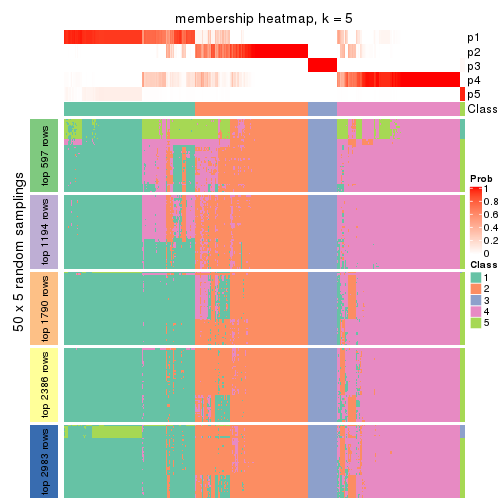</p>

</div>
<div id='tab-ATC-pam-membership-heatmap-5'>
<pre><code class="r">membership_heatmap(res, k = 6)
</code></pre>

<p></p>

</div>
</div>

As soon as we have had the classes for columns, we can look for signatures
which are significantly different between classes which can be candidate marks
for certain classes. Following are the heatmaps for signatures.


Signature heatmaps where rows are scaled:


<script>
$( function() {
	$( '#tabs-ATC-pam-get-signatures' ).tabs();
} );
</script>
<div id='tabs-ATC-pam-get-signatures'>
<ul>
<li><a href='#tab-ATC-pam-get-signatures-1'>k = 2</a></li>
<li><a href='#tab-ATC-pam-get-signatures-2'>k = 3</a></li>
<li><a href='#tab-ATC-pam-get-signatures-3'>k = 4</a></li>
<li><a href='#tab-ATC-pam-get-signatures-4'>k = 5</a></li>
<li><a href='#tab-ATC-pam-get-signatures-5'>k = 6</a></li>
</ul>
<div id='tab-ATC-pam-get-signatures-1'>
<pre><code class="r">get_signatures(res, k = 2)
</code></pre>

<p></p>

</div>
<div id='tab-ATC-pam-get-signatures-2'>
<pre><code class="r">get_signatures(res, k = 3)
</code></pre>

<p></p>

</div>
<div id='tab-ATC-pam-get-signatures-3'>
<pre><code class="r">get_signatures(res, k = 4)
</code></pre>

<p></p>

</div>
<div id='tab-ATC-pam-get-signatures-4'>
<pre><code class="r">get_signatures(res, k = 5)
</code></pre>

<p></p>

</div>
<div id='tab-ATC-pam-get-signatures-5'>
<pre><code class="r">get_signatures(res, k = 6)
</code></pre>

<p></p>

</div>
</div>


Signature heatmaps where rows are not scaled:


<script>
$( function() {
	$( '#tabs-ATC-pam-get-signatures-no-scale' ).tabs();
} );
</script>
<div id='tabs-ATC-pam-get-signatures-no-scale'>
<ul>
<li><a href='#tab-ATC-pam-get-signatures-no-scale-1'>k = 2</a></li>
<li><a href='#tab-ATC-pam-get-signatures-no-scale-2'>k = 3</a></li>
<li><a href='#tab-ATC-pam-get-signatures-no-scale-3'>k = 4</a></li>
<li><a href='#tab-ATC-pam-get-signatures-no-scale-4'>k = 5</a></li>
<li><a href='#tab-ATC-pam-get-signatures-no-scale-5'>k = 6</a></li>
</ul>
<div id='tab-ATC-pam-get-signatures-no-scale-1'>
<pre><code class="r">get_signatures(res, k = 2, scale_rows = FALSE)
</code></pre>

<p></p>

</div>
<div id='tab-ATC-pam-get-signatures-no-scale-2'>
<pre><code class="r">get_signatures(res, k = 3, scale_rows = FALSE)
</code></pre>

<p></p>

</div>
<div id='tab-ATC-pam-get-signatures-no-scale-3'>
<pre><code class="r">get_signatures(res, k = 4, scale_rows = FALSE)
</code></pre>

<p></p>

</div>
<div id='tab-ATC-pam-get-signatures-no-scale-4'>
<pre><code class="r">get_signatures(res, k = 5, scale_rows = FALSE)
</code></pre>

<p></p>

</div>
<div id='tab-ATC-pam-get-signatures-no-scale-5'>
<pre><code class="r">get_signatures(res, k = 6, scale_rows = FALSE)
</code></pre>

<p></p>

</div>
</div>


Compare the overlap of signatures from different k:

```r
compare_signatures(res)
```


`get_signature()` returns a data frame invisibly. TO get the list of signatures, the function
call should be assigned to a variable explicitly. In following code, if `plot` argument is set
to `FALSE`, no heatmap is plotted while only the differential analysis is performed.

```r
# code only for demonstration
tb = get_signature(res, k = ..., plot = FALSE)
```

An example of the output of `tb` is:

```
#>   which_row         fdr    mean_1    mean_2 scaled_mean_1 scaled_mean_2 km
#> 1        38 0.042760348  8.373488  9.131774    -0.5533452     0.5164555  1
#> 2        40 0.018707592  7.106213  8.469186    -0.6173731     0.5762149  1
#> 3        55 0.019134737 10.221463 11.207825    -0.6159697     0.5749050  1
#> 4        59 0.006059896  5.921854  7.869574    -0.6899429     0.6439467  1
#> 5        60 0.018055526  8.928898 10.211722    -0.6204761     0.5791110  1
#> 6        98 0.009384629 15.714769 14.887706     0.6635654    -0.6193277  2
...
```

The columns in `tb` are:

1. `which_row`: row indices corresponding to the input matrix.
2. `fdr`: FDR for the differential test. 
3. `mean_x`: The mean value in group x.
4. `scaled_mean_x`: The mean value in group x after rows are scaled.
5. `km`: Row groups if k-means clustering is applied to rows.


UMAP plot which shows how samples are separated.


<script>
$( function() {
	$( '#tabs-ATC-pam-dimension-reduction' ).tabs();
} );
</script>
<div id='tabs-ATC-pam-dimension-reduction'>
<ul>
<li><a href='#tab-ATC-pam-dimension-reduction-1'>k = 2</a></li>
<li><a href='#tab-ATC-pam-dimension-reduction-2'>k = 3</a></li>
<li><a href='#tab-ATC-pam-dimension-reduction-3'>k = 4</a></li>
<li><a href='#tab-ATC-pam-dimension-reduction-4'>k = 5</a></li>
<li><a href='#tab-ATC-pam-dimension-reduction-5'>k = 6</a></li>
</ul>
<div id='tab-ATC-pam-dimension-reduction-1'>
<pre><code class="r">dimension_reduction(res, k = 2, method = &quot;UMAP&quot;)
</code></pre>

<p></p>

</div>
<div id='tab-ATC-pam-dimension-reduction-2'>
<pre><code class="r">dimension_reduction(res, k = 3, method = &quot;UMAP&quot;)
</code></pre>

<p></p>

</div>
<div id='tab-ATC-pam-dimension-reduction-3'>
<pre><code class="r">dimension_reduction(res, k = 4, method = &quot;UMAP&quot;)
</code></pre>

<p></p>

</div>
<div id='tab-ATC-pam-dimension-reduction-4'>
<pre><code class="r">dimension_reduction(res, k = 5, method = &quot;UMAP&quot;)
</code></pre>

<p></p>

</div>
<div id='tab-ATC-pam-dimension-reduction-5'>
<pre><code class="r">dimension_reduction(res, k = 6, method = &quot;UMAP&quot;)
</code></pre>

<p></p>

</div>
</div>


Following heatmap shows how subgroups are split when increasing `k`:

```r
collect_classes(res)
```


If matrix rows can be associated to genes, consider to use `GO_Enrichment(res,
...)` to perform function enrichment for the signature genes.


 

---------------------------------------------------


### ATC:mclust**


The object with results only for a single top-value method and a single partition method 
can be extracted as:

```r
res = res_list["ATC", "mclust"]
# you can also extract it by
# res = res_list["ATC:mclust"]
```

A summary of `res` and all the functions that can be applied to it:

```r
res
```

```
#> A 'ConsensusPartition' object with k = 2, 3, 4, 5, 6.
#>   On a matrix with 5966 rows and 384 columns.
#>   Top rows (597, 1194, 1790, 2386, 2983) are extracted by 'ATC' method.
#>   Subgroups are detected by 'mclust' method.
#>   Performed in total 1250 partitions by row resampling.
#>   Best k for subgroups seems to be 2.
#> 
#> Following methods can be applied to this 'ConsensusPartition' object:
#>  [1] "cola_report"             "collect_classes"         "collect_plots"          
#>  [4] "collect_stats"           "colnames"                "compare_signatures"     
#>  [7] "consensus_heatmap"       "dimension_reduction"     "functional_enrichment"  
#> [10] "get_anno_col"            "get_anno"                "get_classes"            
#> [13] "get_consensus"           "get_matrix"              "get_membership"         
#> [16] "get_param"               "get_signatures"          "get_stats"              
#> [19] "is_best_k"               "is_stable_k"             "membership_heatmap"     
#> [22] "ncol"                    "nrow"                    "plot_ecdf"              
#> [25] "rownames"                "select_partition_number" "show"                   
#> [28] "suggest_best_k"          "test_to_known_factors"
```

`collect_plots()` function collects all the plots made from `res` for all `k` (number of partitions)
into one single page to provide an easy and fast comparison between different `k`.

```r
collect_plots(res)
```


The plots are:

- The first row: a plot of the ECDF (Empirical cumulative distribution
  function) curves of the consensus matrix for each `k` and the heatmap of
  predicted classes for each `k`.
- The second row: heatmaps of the consensus matrix for each `k`.
- The third row: heatmaps of the membership matrix for each `k`.
- The fouth row: heatmaps of the signatures for each `k`.

All the plots in panels can be made by individual functions and they are
plotted later in this section.

`select_partition_number()` produces several plots showing different
statistics for choosing "optimized" `k`. There are following statistics:

- ECDF curves of the consensus matrix for each `k`;
- 1-PAC. [The PAC
  score](https://en.wikipedia.org/wiki/Consensus_clustering#Over-interpretation_potential_of_consensus_clustering)
  measures the proportion of the ambiguous subgrouping.
- Mean silhouette score.
- Concordance. The mean probability of fiting the consensus class ids in all
  partitions.
- Area increased. Denote $A_k$ as the area under the ECDF curve for current
  `k`, the area increased is defined as $A_k - A_{k-1}$.
- Rand index. The percent of pairs of samples that are both in a same cluster
  or both are not in a same cluster in the partition of k and k-1.
- Jaccard index. The ratio of pairs of samples are both in a same cluster in
  the partition of k and k-1 and the pairs of samples are both in a same
  cluster in the partition k or k-1.

The detailed explanations of these statistics can be found in [the cola
vignette](http://bioconductor.org/packages/devel/bioc/vignettes/cola/inst/doc/cola.html#toc_13).

Generally speaking, lower PAC score, higher mean silhouette score or higher
concordance corresponds to better partition. Rand index and Jaccard index
measure how similar the current partition is compared to partition with `k-1`.
If they are too similar, we won't accept `k` is better than `k-1`.

```r
select_partition_number(res)
```


The numeric values for all these statistics can be obtained by `get_stats()`.

```r
get_stats(res)
```

```
#>   k 1-PAC mean_silhouette concordance area_increased  Rand Jaccard
#> 2 2 1.000           0.981       0.992         0.2947 0.704   0.704
#> 3 3 0.557           0.803       0.819         0.3236 0.965   0.950
#> 4 4 0.403           0.568       0.744         0.4232 0.746   0.628
#> 5 5 0.691           0.763       0.860         0.2999 0.794   0.545
#> 6 6 0.579           0.565       0.763         0.0651 0.946   0.807
```

`suggest_best_k()` suggests the best $k$ based on these statistics. The rules are as follows:

- All $k$ with Jaccard index larger than 0.95 are removed because the increase of
  the partition number does not provides enough extra information. If all $k$ are removed,
  the best $k$ is assigned by `NA`.
- For $k$ with 1-PAC larger than 0.9, the maximal $k$ is taken as the "best k". Other $k$ is called "optional k".
- If it does not fit the second rule. The $k$ with the highest vote of highest
  1-PAC, mean silhouette and concordance is taken as the "best k".

```r
suggest_best_k(res)
```

```
#> [1] 2
```


Following shows the table of the partitions (You need to click the **show/hide
code output** link to see it). The membership matrix (columns with name `p*`)
is inferred by
[`clue::cl_consensus()`](https://www.rdocumentation.org/link/cl_consensus?package=clue)
function with the `SE` method. Basically the value in the membership matrix
represents the probability to belong to a certain group. The finall class
label for an item is determined with the group with highest probability it
belongs to.

In `get_classes()` function, the entropy is calculated from the membership
matrix and the silhouette score is calculated from the consensus matrix.


<script>
$( function() {
	$( '#tabs-ATC-mclust-get-classes' ).tabs();
} );
</script>
<div id='tabs-ATC-mclust-get-classes'>
<ul>
<li><a href='#tab-ATC-mclust-get-classes-1'>k = 2</a></li>
<li><a href='#tab-ATC-mclust-get-classes-2'>k = 3</a></li>
<li><a href='#tab-ATC-mclust-get-classes-3'>k = 4</a></li>
<li><a href='#tab-ATC-mclust-get-classes-4'>k = 5</a></li>
<li><a href='#tab-ATC-mclust-get-classes-5'>k = 6</a></li>
</ul>

<div id='tab-ATC-mclust-get-classes-1'>
<p><a id='tab-ATC-mclust-get-classes-1-a' style='color:#0366d6' href='#'>show/hide code output</a></p>
<pre><code class="r">cbind(get_classes(res, k = 2), get_membership(res, k = 2))
</code></pre>

<pre><code>#&gt;           class entropy silhouette    p1    p2
#&gt; SRR490216     2  0.0000      0.996 0.000 1.000
#&gt; SRR490217     2  0.0000      0.996 0.000 1.000
#&gt; SRR490218     2  0.0000      0.996 0.000 1.000
#&gt; SRR490219     2  0.0000      0.996 0.000 1.000
#&gt; SRR490220     2  0.0000      0.996 0.000 1.000
#&gt; SRR490221     2  0.0000      0.996 0.000 1.000
#&gt; SRR490222     2  0.0000      0.996 0.000 1.000
#&gt; SRR490223     2  0.0000      0.996 0.000 1.000
#&gt; SRR490224     1  0.0000      0.974 1.000 0.000
#&gt; SRR490225     1  0.0000      0.974 1.000 0.000
#&gt; SRR490226     1  0.0000      0.974 1.000 0.000
#&gt; SRR490227     1  0.0000      0.974 1.000 0.000
#&gt; SRR490228     1  0.0000      0.974 1.000 0.000
#&gt; SRR490229     1  0.0000      0.974 1.000 0.000
#&gt; SRR490230     1  0.0000      0.974 1.000 0.000
#&gt; SRR490231     1  0.0000      0.974 1.000 0.000
#&gt; SRR490232     2  0.3114      0.937 0.056 0.944
#&gt; SRR490233     2  0.3733      0.919 0.072 0.928
#&gt; SRR490234     2  0.0000      0.996 0.000 1.000
#&gt; SRR490235     2  0.4690      0.885 0.100 0.900
#&gt; SRR490236     1  0.0376      0.972 0.996 0.004
#&gt; SRR490237     1  0.0672      0.970 0.992 0.008
#&gt; SRR490238     1  0.0376      0.972 0.996 0.004
#&gt; SRR490239     1  0.0376      0.972 0.996 0.004
#&gt; SRR490240     2  0.0000      0.996 0.000 1.000
#&gt; SRR490241     2  0.0000      0.996 0.000 1.000
#&gt; SRR490242     2  0.0000      0.996 0.000 1.000
#&gt; SRR490243     2  0.0000      0.996 0.000 1.000
#&gt; SRR490244     1  0.0000      0.974 1.000 0.000
#&gt; SRR490245     1  0.0000      0.974 1.000 0.000
#&gt; SRR490246     1  0.0000      0.974 1.000 0.000
#&gt; SRR490247     1  0.0000      0.974 1.000 0.000
#&gt; SRR490248     2  0.0000      0.996 0.000 1.000
#&gt; SRR490249     2  0.0000      0.996 0.000 1.000
#&gt; SRR490250     2  0.0000      0.996 0.000 1.000
#&gt; SRR490251     2  0.0000      0.996 0.000 1.000
#&gt; SRR490252     2  0.0000      0.996 0.000 1.000
#&gt; SRR490253     2  0.0000      0.996 0.000 1.000
#&gt; SRR490254     2  0.0000      0.996 0.000 1.000
#&gt; SRR490255     2  0.0000      0.996 0.000 1.000
#&gt; SRR490256     2  0.0000      0.996 0.000 1.000
#&gt; SRR490257     2  0.0000      0.996 0.000 1.000
#&gt; SRR490258     2  0.0000      0.996 0.000 1.000
#&gt; SRR490259     2  0.0000      0.996 0.000 1.000
#&gt; SRR490260     1  0.2236      0.953 0.964 0.036
#&gt; SRR490261     1  0.2778      0.944 0.952 0.048
#&gt; SRR490262     1  0.2603      0.947 0.956 0.044
#&gt; SRR490263     1  0.2603      0.947 0.956 0.044
#&gt; SRR490264     1  0.2778      0.944 0.952 0.048
#&gt; SRR490265     1  0.2603      0.947 0.956 0.044
#&gt; SRR490266     1  0.2423      0.950 0.960 0.040
#&gt; SRR490267     1  0.2423      0.950 0.960 0.040
#&gt; SRR490268     2  0.0000      0.996 0.000 1.000
#&gt; SRR490269     2  0.0000      0.996 0.000 1.000
#&gt; SRR490270     2  0.0000      0.996 0.000 1.000
#&gt; SRR490271     2  0.0000      0.996 0.000 1.000
#&gt; SRR490272     1  0.6801      0.796 0.820 0.180
#&gt; SRR490273     1  0.5946      0.842 0.856 0.144
#&gt; SRR490274     1  0.7815      0.720 0.768 0.232
#&gt; SRR490275     1  0.9635      0.402 0.612 0.388
#&gt; SRR490276     1  0.1633      0.961 0.976 0.024
#&gt; SRR490277     1  0.2603      0.947 0.956 0.044
#&gt; SRR490278     1  0.4298      0.905 0.912 0.088
#&gt; SRR490279     1  0.1414      0.963 0.980 0.020
#&gt; SRR490280     1  0.0000      0.974 1.000 0.000
#&gt; SRR490281     1  0.0000      0.974 1.000 0.000
#&gt; SRR490282     1  0.0000      0.974 1.000 0.000
#&gt; SRR490283     1  0.0000      0.974 1.000 0.000
#&gt; SRR490284     1  0.0000      0.974 1.000 0.000
#&gt; SRR490285     1  0.0000      0.974 1.000 0.000
#&gt; SRR490286     1  0.0000      0.974 1.000 0.000
#&gt; SRR490287     1  0.0000      0.974 1.000 0.000
#&gt; SRR490288     2  0.0000      0.996 0.000 1.000
#&gt; SRR490289     2  0.0000      0.996 0.000 1.000
#&gt; SRR490290     2  0.0000      0.996 0.000 1.000
#&gt; SRR490291     2  0.0000      0.996 0.000 1.000
#&gt; SRR490292     2  0.0000      0.996 0.000 1.000
#&gt; SRR490293     2  0.0000      0.996 0.000 1.000
#&gt; SRR490294     2  0.0000      0.996 0.000 1.000
#&gt; SRR490295     2  0.0000      0.996 0.000 1.000
#&gt; SRR490296     2  0.0000      0.996 0.000 1.000
#&gt; SRR490297     2  0.0000      0.996 0.000 1.000
#&gt; SRR490298     2  0.0000      0.996 0.000 1.000
#&gt; SRR490299     2  0.0000      0.996 0.000 1.000
#&gt; SRR490300     2  0.0000      0.996 0.000 1.000
#&gt; SRR490301     2  0.0000      0.996 0.000 1.000
#&gt; SRR490302     2  0.0000      0.996 0.000 1.000
#&gt; SRR490303     2  0.0000      0.996 0.000 1.000
#&gt; SRR490304     2  0.0000      0.996 0.000 1.000
#&gt; SRR490305     2  0.0000      0.996 0.000 1.000
#&gt; SRR490306     2  0.0000      0.996 0.000 1.000
#&gt; SRR490307     2  0.0000      0.996 0.000 1.000
#&gt; SRR490308     1  0.0000      0.974 1.000 0.000
#&gt; SRR490309     1  0.0000      0.974 1.000 0.000
#&gt; SRR490310     1  0.0000      0.974 1.000 0.000
#&gt; SRR490311     1  0.0000      0.974 1.000 0.000
#&gt; SRR490312     2  0.0000      0.996 0.000 1.000
#&gt; SRR490313     2  0.0000      0.996 0.000 1.000
#&gt; SRR490314     2  0.0000      0.996 0.000 1.000
#&gt; SRR490315     2  0.0000      0.996 0.000 1.000
#&gt; SRR490316     2  0.0000      0.996 0.000 1.000
#&gt; SRR490317     2  0.0000      0.996 0.000 1.000
#&gt; SRR490318     2  0.0000      0.996 0.000 1.000
#&gt; SRR490319     2  0.0000      0.996 0.000 1.000
#&gt; SRR490320     2  0.4298      0.899 0.088 0.912
#&gt; SRR490321     2  0.1184      0.980 0.016 0.984
#&gt; SRR490322     2  0.0376      0.992 0.004 0.996
#&gt; SRR490323     2  0.0000      0.996 0.000 1.000
#&gt; SRR490324     1  0.0000      0.974 1.000 0.000
#&gt; SRR490325     1  0.0000      0.974 1.000 0.000
#&gt; SRR490326     1  0.0000      0.974 1.000 0.000
#&gt; SRR490327     1  0.0000      0.974 1.000 0.000
#&gt; SRR490328     2  0.0000      0.996 0.000 1.000
#&gt; SRR490329     2  0.0000      0.996 0.000 1.000
#&gt; SRR490330     2  0.0000      0.996 0.000 1.000
#&gt; SRR490331     2  0.0000      0.996 0.000 1.000
#&gt; SRR490332     2  0.0000      0.996 0.000 1.000
#&gt; SRR490333     2  0.0000      0.996 0.000 1.000
#&gt; SRR490334     2  0.0000      0.996 0.000 1.000
#&gt; SRR490335     2  0.0000      0.996 0.000 1.000
#&gt; SRR490336     2  0.0000      0.996 0.000 1.000
#&gt; SRR490337     2  0.0000      0.996 0.000 1.000
#&gt; SRR490338     2  0.0000      0.996 0.000 1.000
#&gt; SRR490339     2  0.0000      0.996 0.000 1.000
#&gt; SRR490340     2  0.0000      0.996 0.000 1.000
#&gt; SRR490341     2  0.0000      0.996 0.000 1.000
#&gt; SRR490342     2  0.0000      0.996 0.000 1.000
#&gt; SRR490343     2  0.0000      0.996 0.000 1.000
#&gt; SRR490344     2  0.0000      0.996 0.000 1.000
#&gt; SRR490345     2  0.0000      0.996 0.000 1.000
#&gt; SRR490346     2  0.0000      0.996 0.000 1.000
#&gt; SRR490347     2  0.0000      0.996 0.000 1.000
#&gt; SRR490348     2  0.0000      0.996 0.000 1.000
#&gt; SRR490349     2  0.0000      0.996 0.000 1.000
#&gt; SRR490350     2  0.0000      0.996 0.000 1.000
#&gt; SRR490351     2  0.0000      0.996 0.000 1.000
#&gt; SRR490352     2  0.0000      0.996 0.000 1.000
#&gt; SRR490353     2  0.0000      0.996 0.000 1.000
#&gt; SRR490354     2  0.0000      0.996 0.000 1.000
#&gt; SRR490355     2  0.0000      0.996 0.000 1.000
#&gt; SRR490356     2  0.0000      0.996 0.000 1.000
#&gt; SRR490357     2  0.0000      0.996 0.000 1.000
#&gt; SRR490358     2  0.0000      0.996 0.000 1.000
#&gt; SRR490359     2  0.0000      0.996 0.000 1.000
#&gt; SRR490360     2  0.0000      0.996 0.000 1.000
#&gt; SRR490361     2  0.0000      0.996 0.000 1.000
#&gt; SRR490362     2  0.0000      0.996 0.000 1.000
#&gt; SRR490363     2  0.0000      0.996 0.000 1.000
#&gt; SRR490364     2  0.0000      0.996 0.000 1.000
#&gt; SRR490365     2  0.0000      0.996 0.000 1.000
#&gt; SRR490366     2  0.0000      0.996 0.000 1.000
#&gt; SRR490367     2  0.0000      0.996 0.000 1.000
#&gt; SRR490368     2  0.0000      0.996 0.000 1.000
#&gt; SRR490369     2  0.0000      0.996 0.000 1.000
#&gt; SRR490370     2  0.0000      0.996 0.000 1.000
#&gt; SRR490371     2  0.0000      0.996 0.000 1.000
#&gt; SRR490372     1  0.0000      0.974 1.000 0.000
#&gt; SRR490373     1  0.0000      0.974 1.000 0.000
#&gt; SRR490374     1  0.0000      0.974 1.000 0.000
#&gt; SRR490375     1  0.0000      0.974 1.000 0.000
#&gt; SRR490376     2  0.0000      0.996 0.000 1.000
#&gt; SRR490377     2  0.0000      0.996 0.000 1.000
#&gt; SRR490378     2  0.0000      0.996 0.000 1.000
#&gt; SRR490379     2  0.0000      0.996 0.000 1.000
#&gt; SRR490380     1  0.0000      0.974 1.000 0.000
#&gt; SRR490381     1  0.0000      0.974 1.000 0.000
#&gt; SRR490382     1  0.0000      0.974 1.000 0.000
#&gt; SRR490383     1  0.0000      0.974 1.000 0.000
#&gt; SRR490384     2  0.0000      0.996 0.000 1.000
#&gt; SRR490385     2  0.0000      0.996 0.000 1.000
#&gt; SRR490386     2  0.0000      0.996 0.000 1.000
#&gt; SRR490387     2  0.0000      0.996 0.000 1.000
#&gt; SRR490388     2  0.0000      0.996 0.000 1.000
#&gt; SRR490389     2  0.0000      0.996 0.000 1.000
#&gt; SRR490390     2  0.0000      0.996 0.000 1.000
#&gt; SRR490391     2  0.0000      0.996 0.000 1.000
#&gt; SRR490392     2  0.0000      0.996 0.000 1.000
#&gt; SRR490393     2  0.0000      0.996 0.000 1.000
#&gt; SRR490394     2  0.0000      0.996 0.000 1.000
#&gt; SRR490395     2  0.0000      0.996 0.000 1.000
#&gt; SRR490396     2  0.0000      0.996 0.000 1.000
#&gt; SRR490397     2  0.0000      0.996 0.000 1.000
#&gt; SRR490398     2  0.0000      0.996 0.000 1.000
#&gt; SRR490399     2  0.0000      0.996 0.000 1.000
#&gt; SRR490400     2  0.0000      0.996 0.000 1.000
#&gt; SRR490401     2  0.0000      0.996 0.000 1.000
#&gt; SRR490402     2  0.0000      0.996 0.000 1.000
#&gt; SRR490403     2  0.0000      0.996 0.000 1.000
#&gt; SRR490404     2  0.0000      0.996 0.000 1.000
#&gt; SRR490405     2  0.0000      0.996 0.000 1.000
#&gt; SRR490406     2  0.0000      0.996 0.000 1.000
#&gt; SRR490407     2  0.0000      0.996 0.000 1.000
#&gt; SRR490408     2  0.0000      0.996 0.000 1.000
#&gt; SRR490409     2  0.0000      0.996 0.000 1.000
#&gt; SRR490410     2  0.0000      0.996 0.000 1.000
#&gt; SRR490411     2  0.0000      0.996 0.000 1.000
#&gt; SRR490412     1  0.0000      0.974 1.000 0.000
#&gt; SRR490413     1  0.0000      0.974 1.000 0.000
#&gt; SRR490414     1  0.0000      0.974 1.000 0.000
#&gt; SRR490415     1  0.0000      0.974 1.000 0.000
#&gt; SRR490416     2  0.0000      0.996 0.000 1.000
#&gt; SRR490417     2  0.0000      0.996 0.000 1.000
#&gt; SRR490418     2  0.0000      0.996 0.000 1.000
#&gt; SRR490419     2  0.0000      0.996 0.000 1.000
#&gt; SRR490420     2  0.0000      0.996 0.000 1.000
#&gt; SRR490421     2  0.0000      0.996 0.000 1.000
#&gt; SRR490422     2  0.0000      0.996 0.000 1.000
#&gt; SRR490423     2  0.0000      0.996 0.000 1.000
#&gt; SRR490424     1  0.8813      0.593 0.700 0.300
#&gt; SRR490425     2  0.6973      0.760 0.188 0.812
#&gt; SRR490426     2  0.9427      0.424 0.360 0.640
#&gt; SRR490427     2  0.9963      0.106 0.464 0.536
#&gt; SRR490428     2  0.0000      0.996 0.000 1.000
#&gt; SRR490429     2  0.0000      0.996 0.000 1.000
#&gt; SRR490430     2  0.0000      0.996 0.000 1.000
#&gt; SRR490431     2  0.0000      0.996 0.000 1.000
#&gt; SRR490432     2  0.0000      0.996 0.000 1.000
#&gt; SRR490433     2  0.0000      0.996 0.000 1.000
#&gt; SRR490434     2  0.0000      0.996 0.000 1.000
#&gt; SRR490435     2  0.0000      0.996 0.000 1.000
#&gt; SRR490436     2  0.0000      0.996 0.000 1.000
#&gt; SRR490437     2  0.0000      0.996 0.000 1.000
#&gt; SRR490438     2  0.0000      0.996 0.000 1.000
#&gt; SRR490439     2  0.0000      0.996 0.000 1.000
#&gt; SRR490440     2  0.0000      0.996 0.000 1.000
#&gt; SRR490441     2  0.0000      0.996 0.000 1.000
#&gt; SRR490442     2  0.0000      0.996 0.000 1.000
#&gt; SRR490443     2  0.0000      0.996 0.000 1.000
#&gt; SRR490444     2  0.0000      0.996 0.000 1.000
#&gt; SRR490445     2  0.0000      0.996 0.000 1.000
#&gt; SRR490446     2  0.0000      0.996 0.000 1.000
#&gt; SRR490447     2  0.0000      0.996 0.000 1.000
#&gt; SRR490448     2  0.0000      0.996 0.000 1.000
#&gt; SRR490449     2  0.0000      0.996 0.000 1.000
#&gt; SRR490450     2  0.0000      0.996 0.000 1.000
#&gt; SRR490451     2  0.0000      0.996 0.000 1.000
#&gt; SRR490452     2  0.0000      0.996 0.000 1.000
#&gt; SRR490453     2  0.0000      0.996 0.000 1.000
#&gt; SRR490454     2  0.0000      0.996 0.000 1.000
#&gt; SRR490455     2  0.0000      0.996 0.000 1.000
#&gt; SRR490456     2  0.0000      0.996 0.000 1.000
#&gt; SRR490457     2  0.0000      0.996 0.000 1.000
#&gt; SRR490458     2  0.0000      0.996 0.000 1.000
#&gt; SRR490459     2  0.0000      0.996 0.000 1.000
#&gt; SRR490460     2  0.0000      0.996 0.000 1.000
#&gt; SRR490461     2  0.0000      0.996 0.000 1.000
#&gt; SRR490462     2  0.0000      0.996 0.000 1.000
#&gt; SRR490463     2  0.0000      0.996 0.000 1.000
#&gt; SRR490464     1  0.0000      0.974 1.000 0.000
#&gt; SRR490465     1  0.0000      0.974 1.000 0.000
#&gt; SRR490466     1  0.0000      0.974 1.000 0.000
#&gt; SRR490467     1  0.0000      0.974 1.000 0.000
#&gt; SRR490468     2  0.0000      0.996 0.000 1.000
#&gt; SRR490469     2  0.0000      0.996 0.000 1.000
#&gt; SRR490470     2  0.0000      0.996 0.000 1.000
#&gt; SRR490471     2  0.0000      0.996 0.000 1.000
#&gt; SRR490472     2  0.0000      0.996 0.000 1.000
#&gt; SRR490473     2  0.0000      0.996 0.000 1.000
#&gt; SRR490474     2  0.0000      0.996 0.000 1.000
#&gt; SRR490475     2  0.0000      0.996 0.000 1.000
#&gt; SRR490476     1  0.0000      0.974 1.000 0.000
#&gt; SRR490477     1  0.0000      0.974 1.000 0.000
#&gt; SRR490478     1  0.0000      0.974 1.000 0.000
#&gt; SRR490479     1  0.0000      0.974 1.000 0.000
#&gt; SRR490480     2  0.0000      0.996 0.000 1.000
#&gt; SRR490481     2  0.0000      0.996 0.000 1.000
#&gt; SRR490482     2  0.0000      0.996 0.000 1.000
#&gt; SRR490483     2  0.0000      0.996 0.000 1.000
#&gt; SRR490484     2  0.0000      0.996 0.000 1.000
#&gt; SRR490485     2  0.0000      0.996 0.000 1.000
#&gt; SRR490486     2  0.0000      0.996 0.000 1.000
#&gt; SRR490487     2  0.0000      0.996 0.000 1.000
#&gt; SRR490488     2  0.0000      0.996 0.000 1.000
#&gt; SRR490489     2  0.0000      0.996 0.000 1.000
#&gt; SRR490490     2  0.0000      0.996 0.000 1.000
#&gt; SRR490491     2  0.0000      0.996 0.000 1.000
#&gt; SRR490492     2  0.0000      0.996 0.000 1.000
#&gt; SRR490493     2  0.0000      0.996 0.000 1.000
#&gt; SRR490494     2  0.0000      0.996 0.000 1.000
#&gt; SRR490495     2  0.0000      0.996 0.000 1.000
#&gt; SRR490496     2  0.0000      0.996 0.000 1.000
#&gt; SRR490497     2  0.0000      0.996 0.000 1.000
#&gt; SRR490498     2  0.0000      0.996 0.000 1.000
#&gt; SRR490499     2  0.0000      0.996 0.000 1.000
#&gt; SRR490500     2  0.0000      0.996 0.000 1.000
#&gt; SRR490501     2  0.0000      0.996 0.000 1.000
#&gt; SRR490502     2  0.0000      0.996 0.000 1.000
#&gt; SRR490503     2  0.0000      0.996 0.000 1.000
#&gt; SRR490504     2  0.0000      0.996 0.000 1.000
#&gt; SRR490505     2  0.0000      0.996 0.000 1.000
#&gt; SRR490506     2  0.0000      0.996 0.000 1.000
#&gt; SRR490507     2  0.0000      0.996 0.000 1.000
#&gt; SRR490508     2  0.0000      0.996 0.000 1.000
#&gt; SRR490509     2  0.0000      0.996 0.000 1.000
#&gt; SRR490510     2  0.0000      0.996 0.000 1.000
#&gt; SRR490511     2  0.0000      0.996 0.000 1.000
#&gt; SRR490512     2  0.0000      0.996 0.000 1.000
#&gt; SRR490513     2  0.0000      0.996 0.000 1.000
#&gt; SRR490514     2  0.0000      0.996 0.000 1.000
#&gt; SRR490515     2  0.0000      0.996 0.000 1.000
#&gt; SRR490516     2  0.0000      0.996 0.000 1.000
#&gt; SRR490517     2  0.0000      0.996 0.000 1.000
#&gt; SRR490518     2  0.0000      0.996 0.000 1.000
#&gt; SRR490519     2  0.0000      0.996 0.000 1.000
#&gt; SRR490520     2  0.0000      0.996 0.000 1.000
#&gt; SRR490521     2  0.0000      0.996 0.000 1.000
#&gt; SRR490522     2  0.0000      0.996 0.000 1.000
#&gt; SRR490523     2  0.0000      0.996 0.000 1.000
#&gt; SRR490524     2  0.0000      0.996 0.000 1.000
#&gt; SRR490525     2  0.0000      0.996 0.000 1.000
#&gt; SRR490526     2  0.0000      0.996 0.000 1.000
#&gt; SRR490527     2  0.0000      0.996 0.000 1.000
#&gt; SRR490528     2  0.0000      0.996 0.000 1.000
#&gt; SRR490529     2  0.0000      0.996 0.000 1.000
#&gt; SRR490530     2  0.0000      0.996 0.000 1.000
#&gt; SRR490531     2  0.0000      0.996 0.000 1.000
#&gt; SRR490532     2  0.0000      0.996 0.000 1.000
#&gt; SRR490533     2  0.0000      0.996 0.000 1.000
#&gt; SRR490534     2  0.0000      0.996 0.000 1.000
#&gt; SRR490535     2  0.0000      0.996 0.000 1.000
#&gt; SRR490536     2  0.0000      0.996 0.000 1.000
#&gt; SRR490537     2  0.0000      0.996 0.000 1.000
#&gt; SRR490538     2  0.0000      0.996 0.000 1.000
#&gt; SRR490539     2  0.0000      0.996 0.000 1.000
#&gt; SRR490540     2  0.0000      0.996 0.000 1.000
#&gt; SRR490541     2  0.0000      0.996 0.000 1.000
#&gt; SRR490542     2  0.0000      0.996 0.000 1.000
#&gt; SRR490543     2  0.0000      0.996 0.000 1.000
#&gt; SRR490544     2  0.0000      0.996 0.000 1.000
#&gt; SRR490545     2  0.0000      0.996 0.000 1.000
#&gt; SRR490546     2  0.0000      0.996 0.000 1.000
#&gt; SRR490547     2  0.0000      0.996 0.000 1.000
#&gt; SRR490548     2  0.0000      0.996 0.000 1.000
#&gt; SRR490549     2  0.0000      0.996 0.000 1.000
#&gt; SRR490550     2  0.0000      0.996 0.000 1.000
#&gt; SRR490551     2  0.0000      0.996 0.000 1.000
#&gt; SRR490552     2  0.0000      0.996 0.000 1.000
#&gt; SRR490553     2  0.0000      0.996 0.000 1.000
#&gt; SRR490554     2  0.0000      0.996 0.000 1.000
#&gt; SRR490555     2  0.0000      0.996 0.000 1.000
#&gt; SRR490556     2  0.0000      0.996 0.000 1.000
#&gt; SRR490557     2  0.0000      0.996 0.000 1.000
#&gt; SRR490558     2  0.0000      0.996 0.000 1.000
#&gt; SRR490559     2  0.0000      0.996 0.000 1.000
#&gt; SRR490560     2  0.0000      0.996 0.000 1.000
#&gt; SRR490561     2  0.0000      0.996 0.000 1.000
#&gt; SRR490562     2  0.0000      0.996 0.000 1.000
#&gt; SRR490563     2  0.0000      0.996 0.000 1.000
#&gt; SRR490564     2  0.0000      0.996 0.000 1.000
#&gt; SRR490565     2  0.0000      0.996 0.000 1.000
#&gt; SRR490566     2  0.0000      0.996 0.000 1.000
#&gt; SRR490567     2  0.0000      0.996 0.000 1.000
#&gt; SRR490568     2  0.0000      0.996 0.000 1.000
#&gt; SRR490569     2  0.0000      0.996 0.000 1.000
#&gt; SRR490570     2  0.0000      0.996 0.000 1.000
#&gt; SRR490571     2  0.0000      0.996 0.000 1.000
#&gt; SRR490572     2  0.0000      0.996 0.000 1.000
#&gt; SRR490573     2  0.0000      0.996 0.000 1.000
#&gt; SRR490574     2  0.0000      0.996 0.000 1.000
#&gt; SRR490575     2  0.0000      0.996 0.000 1.000
#&gt; SRR490576     2  0.0000      0.996 0.000 1.000
#&gt; SRR490577     2  0.0000      0.996 0.000 1.000
#&gt; SRR490578     2  0.0000      0.996 0.000 1.000
#&gt; SRR490579     2  0.0000      0.996 0.000 1.000
#&gt; SRR490580     2  0.0000      0.996 0.000 1.000
#&gt; SRR490581     2  0.0000      0.996 0.000 1.000
#&gt; SRR490582     2  0.0000      0.996 0.000 1.000
#&gt; SRR490583     2  0.0000      0.996 0.000 1.000
#&gt; SRR490584     2  0.0000      0.996 0.000 1.000
#&gt; SRR490585     2  0.0000      0.996 0.000 1.000
#&gt; SRR490586     2  0.0000      0.996 0.000 1.000
#&gt; SRR490587     2  0.0000      0.996 0.000 1.000
#&gt; SRR490588     2  0.0000      0.996 0.000 1.000
#&gt; SRR490589     2  0.0000      0.996 0.000 1.000
#&gt; SRR490590     2  0.0000      0.996 0.000 1.000
#&gt; SRR490591     2  0.0000      0.996 0.000 1.000
#&gt; SRR490592     2  0.0000      0.996 0.000 1.000
#&gt; SRR490593     2  0.0000      0.996 0.000 1.000
#&gt; SRR490594     2  0.0000      0.996 0.000 1.000
#&gt; SRR490595     2  0.0000      0.996 0.000 1.000
#&gt; SRR490596     2  0.0000      0.996 0.000 1.000
#&gt; SRR490597     2  0.0000      0.996 0.000 1.000
#&gt; SRR490598     2  0.0000      0.996 0.000 1.000
#&gt; SRR490599     2  0.0000      0.996 0.000 1.000
</code></pre>

<script>
$('#tab-ATC-mclust-get-classes-1-a').parent().next().next().hide();
$('#tab-ATC-mclust-get-classes-1-a').click(function(){
  $('#tab-ATC-mclust-get-classes-1-a').parent().next().next().toggle();
  return(false);
});
</script>
</div>

<div id='tab-ATC-mclust-get-classes-2'>
<p><a id='tab-ATC-mclust-get-classes-2-a' style='color:#0366d6' href='#'>show/hide code output</a></p>
<pre><code class="r">cbind(get_classes(res, k = 3), get_membership(res, k = 3))
</code></pre>

<pre><code>#&gt;           class entropy silhouette    p1    p2    p3
#&gt; SRR490216     2  0.5138      0.843 0.252 0.748 0.000
#&gt; SRR490217     2  0.5138      0.843 0.252 0.748 0.000
#&gt; SRR490218     2  0.5098      0.845 0.248 0.752 0.000
#&gt; SRR490219     2  0.5138      0.843 0.252 0.748 0.000
#&gt; SRR490220     2  0.5138      0.843 0.252 0.748 0.000
#&gt; SRR490221     2  0.5178      0.840 0.256 0.744 0.000
#&gt; SRR490222     2  0.5138      0.843 0.252 0.748 0.000
#&gt; SRR490223     2  0.5178      0.840 0.256 0.744 0.000
#&gt; SRR490224     1  0.5254      0.415 0.736 0.000 0.264
#&gt; SRR490225     1  0.5254      0.415 0.736 0.000 0.264
#&gt; SRR490226     1  0.5254      0.415 0.736 0.000 0.264
#&gt; SRR490227     1  0.5254      0.415 0.736 0.000 0.264
#&gt; SRR490228     1  0.5254      0.415 0.736 0.000 0.264
#&gt; SRR490229     1  0.5254      0.415 0.736 0.000 0.264
#&gt; SRR490230     1  0.5254      0.415 0.736 0.000 0.264
#&gt; SRR490231     1  0.5254      0.415 0.736 0.000 0.264
#&gt; SRR490232     2  0.5859      0.741 0.344 0.656 0.000
#&gt; SRR490233     2  0.5560      0.798 0.300 0.700 0.000
#&gt; SRR490234     2  0.5363      0.823 0.276 0.724 0.000
#&gt; SRR490235     2  0.5291      0.831 0.268 0.732 0.000
#&gt; SRR490236     1  0.6348      0.510 0.740 0.048 0.212
#&gt; SRR490237     1  0.6159      0.526 0.756 0.048 0.196
#&gt; SRR490238     1  0.6007      0.535 0.768 0.048 0.184
#&gt; SRR490239     1  0.6302      0.514 0.744 0.048 0.208
#&gt; SRR490240     2  0.5178      0.840 0.256 0.744 0.000
#&gt; SRR490241     2  0.5178      0.840 0.256 0.744 0.000
#&gt; SRR490242     2  0.5178      0.840 0.256 0.744 0.000
#&gt; SRR490243     2  0.5178      0.840 0.256 0.744 0.000
#&gt; SRR490244     3  0.0000      0.906 0.000 0.000 1.000
#&gt; SRR490245     3  0.0000      0.906 0.000 0.000 1.000
#&gt; SRR490246     3  0.0000      0.906 0.000 0.000 1.000
#&gt; SRR490247     3  0.0000      0.906 0.000 0.000 1.000
#&gt; SRR490248     2  0.5098      0.845 0.248 0.752 0.000
#&gt; SRR490249     2  0.5098      0.845 0.248 0.752 0.000
#&gt; SRR490250     2  0.4796      0.848 0.220 0.780 0.000
#&gt; SRR490251     2  0.5098      0.845 0.248 0.752 0.000
#&gt; SRR490252     2  0.5098      0.845 0.248 0.752 0.000
#&gt; SRR490253     2  0.5098      0.845 0.248 0.752 0.000
#&gt; SRR490254     2  0.5098      0.845 0.248 0.752 0.000
#&gt; SRR490255     2  0.5098      0.845 0.248 0.752 0.000
#&gt; SRR490256     2  0.5216      0.837 0.260 0.740 0.000
#&gt; SRR490257     2  0.5216      0.837 0.260 0.740 0.000
#&gt; SRR490258     2  0.5216      0.837 0.260 0.740 0.000
#&gt; SRR490259     2  0.5216      0.837 0.260 0.740 0.000
#&gt; SRR490260     1  0.2066      0.642 0.940 0.060 0.000
#&gt; SRR490261     1  0.2066      0.642 0.940 0.060 0.000
#&gt; SRR490262     1  0.2066      0.642 0.940 0.060 0.000
#&gt; SRR490263     1  0.2066      0.642 0.940 0.060 0.000
#&gt; SRR490264     1  0.2066      0.642 0.940 0.060 0.000
#&gt; SRR490265     1  0.2066      0.642 0.940 0.060 0.000
#&gt; SRR490266     1  0.2066      0.642 0.940 0.060 0.000
#&gt; SRR490267     1  0.2066      0.642 0.940 0.060 0.000
#&gt; SRR490268     2  0.5216      0.837 0.260 0.740 0.000
#&gt; SRR490269     2  0.5216      0.837 0.260 0.740 0.000
#&gt; SRR490270     2  0.5216      0.837 0.260 0.740 0.000
#&gt; SRR490271     2  0.5216      0.837 0.260 0.740 0.000
#&gt; SRR490272     1  0.2356      0.632 0.928 0.072 0.000
#&gt; SRR490273     1  0.2356      0.632 0.928 0.072 0.000
#&gt; SRR490274     1  0.2448      0.628 0.924 0.076 0.000
#&gt; SRR490275     1  0.3267      0.582 0.884 0.116 0.000
#&gt; SRR490276     1  0.2066      0.642 0.940 0.060 0.000
#&gt; SRR490277     1  0.2066      0.642 0.940 0.060 0.000
#&gt; SRR490278     1  0.2066      0.642 0.940 0.060 0.000
#&gt; SRR490279     1  0.2651      0.638 0.928 0.060 0.012
#&gt; SRR490280     3  0.5810      0.584 0.336 0.000 0.664
#&gt; SRR490281     3  0.5810      0.584 0.336 0.000 0.664
#&gt; SRR490282     3  0.5810      0.584 0.336 0.000 0.664
#&gt; SRR490283     3  0.5810      0.584 0.336 0.000 0.664
#&gt; SRR490284     1  0.5254      0.415 0.736 0.000 0.264
#&gt; SRR490285     1  0.5254      0.415 0.736 0.000 0.264
#&gt; SRR490286     1  0.5254      0.415 0.736 0.000 0.264
#&gt; SRR490287     1  0.5254      0.415 0.736 0.000 0.264
#&gt; SRR490288     2  0.5178      0.840 0.256 0.744 0.000
#&gt; SRR490289     2  0.5178      0.840 0.256 0.744 0.000
#&gt; SRR490290     2  0.5216      0.837 0.260 0.740 0.000
#&gt; SRR490291     2  0.5178      0.840 0.256 0.744 0.000
#&gt; SRR490292     2  0.5178      0.840 0.256 0.744 0.000
#&gt; SRR490293     2  0.5178      0.840 0.256 0.744 0.000
#&gt; SRR490294     2  0.5138      0.843 0.252 0.748 0.000
#&gt; SRR490295     2  0.5138      0.843 0.252 0.748 0.000
#&gt; SRR490296     2  0.4605      0.848 0.204 0.796 0.000
#&gt; SRR490297     2  0.4842      0.847 0.224 0.776 0.000
#&gt; SRR490298     2  0.4291      0.849 0.180 0.820 0.000
#&gt; SRR490299     2  0.4504      0.848 0.196 0.804 0.000
#&gt; SRR490300     2  0.5098      0.845 0.248 0.752 0.000
#&gt; SRR490301     2  0.5098      0.845 0.248 0.752 0.000
#&gt; SRR490302     2  0.5098      0.845 0.248 0.752 0.000
#&gt; SRR490303     2  0.5098      0.845 0.248 0.752 0.000
#&gt; SRR490304     2  0.0237      0.838 0.004 0.996 0.000
#&gt; SRR490305     2  0.0237      0.838 0.004 0.996 0.000
#&gt; SRR490306     2  0.0237      0.838 0.004 0.996 0.000
#&gt; SRR490307     2  0.0237      0.838 0.004 0.996 0.000
#&gt; SRR490308     3  0.0000      0.906 0.000 0.000 1.000
#&gt; SRR490309     3  0.0000      0.906 0.000 0.000 1.000
#&gt; SRR490310     3  0.0000      0.906 0.000 0.000 1.000
#&gt; SRR490311     3  0.0000      0.906 0.000 0.000 1.000
#&gt; SRR490312     2  0.5138      0.843 0.252 0.748 0.000
#&gt; SRR490313     2  0.5098      0.845 0.248 0.752 0.000
#&gt; SRR490314     2  0.5016      0.846 0.240 0.760 0.000
#&gt; SRR490315     2  0.5138      0.843 0.252 0.748 0.000
#&gt; SRR490316     2  0.5216      0.837 0.260 0.740 0.000
#&gt; SRR490317     2  0.5178      0.840 0.256 0.744 0.000
#&gt; SRR490318     2  0.5178      0.840 0.256 0.744 0.000
#&gt; SRR490319     2  0.5178      0.840 0.256 0.744 0.000
#&gt; SRR490320     1  0.5760      0.232 0.672 0.328 0.000
#&gt; SRR490321     2  0.6309      0.427 0.496 0.504 0.000
#&gt; SRR490322     2  0.5785      0.758 0.332 0.668 0.000
#&gt; SRR490323     2  0.6062      0.678 0.384 0.616 0.000
#&gt; SRR490324     1  0.5254      0.415 0.736 0.000 0.264
#&gt; SRR490325     1  0.5254      0.415 0.736 0.000 0.264
#&gt; SRR490326     1  0.5254      0.415 0.736 0.000 0.264
#&gt; SRR490327     1  0.5254      0.415 0.736 0.000 0.264
#&gt; SRR490328     2  0.5058      0.846 0.244 0.756 0.000
#&gt; SRR490329     2  0.5058      0.846 0.244 0.756 0.000
#&gt; SRR490330     2  0.4750      0.848 0.216 0.784 0.000
#&gt; SRR490331     2  0.5098      0.845 0.248 0.752 0.000
#&gt; SRR490332     2  0.5098      0.845 0.248 0.752 0.000
#&gt; SRR490333     2  0.5098      0.845 0.248 0.752 0.000
#&gt; SRR490334     2  0.5098      0.845 0.248 0.752 0.000
#&gt; SRR490335     2  0.5098      0.845 0.248 0.752 0.000
#&gt; SRR490336     2  0.2537      0.849 0.080 0.920 0.000
#&gt; SRR490337     2  0.2625      0.849 0.084 0.916 0.000
#&gt; SRR490338     2  0.1529      0.847 0.040 0.960 0.000
#&gt; SRR490339     2  0.2878      0.849 0.096 0.904 0.000
#&gt; SRR490340     2  0.5098      0.845 0.248 0.752 0.000
#&gt; SRR490341     2  0.5098      0.845 0.248 0.752 0.000
#&gt; SRR490342     2  0.5098      0.845 0.248 0.752 0.000
#&gt; SRR490343     2  0.5098      0.845 0.248 0.752 0.000
#&gt; SRR490344     2  0.5178      0.840 0.256 0.744 0.000
#&gt; SRR490345     2  0.5098      0.845 0.248 0.752 0.000
#&gt; SRR490346     2  0.5178      0.840 0.256 0.744 0.000
#&gt; SRR490347     2  0.5178      0.840 0.256 0.744 0.000
#&gt; SRR490348     2  0.0237      0.841 0.004 0.996 0.000
#&gt; SRR490349     2  0.0000      0.840 0.000 1.000 0.000
#&gt; SRR490350     2  0.0237      0.841 0.004 0.996 0.000
#&gt; SRR490351     2  0.1031      0.845 0.024 0.976 0.000
#&gt; SRR490352     2  0.0237      0.838 0.004 0.996 0.000
#&gt; SRR490353     2  0.0237      0.838 0.004 0.996 0.000
#&gt; SRR490354     2  0.0237      0.838 0.004 0.996 0.000
#&gt; SRR490355     2  0.0237      0.838 0.004 0.996 0.000
#&gt; SRR490356     2  0.5098      0.845 0.248 0.752 0.000
#&gt; SRR490357     2  0.5098      0.845 0.248 0.752 0.000
#&gt; SRR490358     2  0.5098      0.845 0.248 0.752 0.000
#&gt; SRR490359     2  0.5098      0.845 0.248 0.752 0.000
#&gt; SRR490360     2  0.0237      0.838 0.004 0.996 0.000
#&gt; SRR490361     2  0.0424      0.840 0.008 0.992 0.000
#&gt; SRR490362     2  0.0237      0.838 0.004 0.996 0.000
#&gt; SRR490363     2  0.0237      0.838 0.004 0.996 0.000
#&gt; SRR490364     2  0.5098      0.845 0.248 0.752 0.000
#&gt; SRR490365     2  0.5098      0.845 0.248 0.752 0.000
#&gt; SRR490366     2  0.5098      0.845 0.248 0.752 0.000
#&gt; SRR490367     2  0.5098      0.845 0.248 0.752 0.000
#&gt; SRR490368     2  0.0237      0.838 0.004 0.996 0.000
#&gt; SRR490369     2  0.0237      0.838 0.004 0.996 0.000
#&gt; SRR490370     2  0.0237      0.838 0.004 0.996 0.000
#&gt; SRR490371     2  0.0237      0.838 0.004 0.996 0.000
#&gt; SRR490372     3  0.5431      0.640 0.284 0.000 0.716
#&gt; SRR490373     3  0.5431      0.640 0.284 0.000 0.716
#&gt; SRR490374     3  0.5431      0.640 0.284 0.000 0.716
#&gt; SRR490375     3  0.5431      0.640 0.284 0.000 0.716
#&gt; SRR490376     2  0.5138      0.843 0.252 0.748 0.000
#&gt; SRR490377     2  0.5098      0.845 0.248 0.752 0.000
#&gt; SRR490378     2  0.5138      0.843 0.252 0.748 0.000
#&gt; SRR490379     2  0.5138      0.843 0.252 0.748 0.000
#&gt; SRR490380     3  0.0000      0.906 0.000 0.000 1.000
#&gt; SRR490381     3  0.0000      0.906 0.000 0.000 1.000
#&gt; SRR490382     3  0.0000      0.906 0.000 0.000 1.000
#&gt; SRR490383     3  0.0000      0.906 0.000 0.000 1.000
#&gt; SRR490384     2  0.0237      0.838 0.004 0.996 0.000
#&gt; SRR490385     2  0.0237      0.838 0.004 0.996 0.000
#&gt; SRR490386     2  0.0237      0.838 0.004 0.996 0.000
#&gt; SRR490387     2  0.0237      0.838 0.004 0.996 0.000
#&gt; SRR490388     2  0.2165      0.848 0.064 0.936 0.000
#&gt; SRR490389     2  0.0000      0.840 0.000 1.000 0.000
#&gt; SRR490390     2  0.0237      0.841 0.004 0.996 0.000
#&gt; SRR490391     2  0.0424      0.842 0.008 0.992 0.000
#&gt; SRR490392     2  0.0237      0.838 0.004 0.996 0.000
#&gt; SRR490393     2  0.0237      0.838 0.004 0.996 0.000
#&gt; SRR490394     2  0.0237      0.838 0.004 0.996 0.000
#&gt; SRR490395     2  0.0237      0.838 0.004 0.996 0.000
#&gt; SRR490396     2  0.5016      0.846 0.240 0.760 0.000
#&gt; SRR490397     2  0.5098      0.845 0.248 0.752 0.000
#&gt; SRR490398     2  0.5098      0.845 0.248 0.752 0.000
#&gt; SRR490399     2  0.5098      0.845 0.248 0.752 0.000
#&gt; SRR490400     2  0.0237      0.838 0.004 0.996 0.000
#&gt; SRR490401     2  0.0237      0.838 0.004 0.996 0.000
#&gt; SRR490402     2  0.0237      0.838 0.004 0.996 0.000
#&gt; SRR490403     2  0.0237      0.838 0.004 0.996 0.000
#&gt; SRR490404     2  0.5098      0.845 0.248 0.752 0.000
#&gt; SRR490405     2  0.5058      0.846 0.244 0.756 0.000
#&gt; SRR490406     2  0.5098      0.845 0.248 0.752 0.000
#&gt; SRR490407     2  0.5098      0.845 0.248 0.752 0.000
#&gt; SRR490408     2  0.0000      0.840 0.000 1.000 0.000
#&gt; SRR490409     2  0.0000      0.840 0.000 1.000 0.000
#&gt; SRR490410     2  0.0000      0.840 0.000 1.000 0.000
#&gt; SRR490411     2  0.0747      0.844 0.016 0.984 0.000
#&gt; SRR490412     3  0.0000      0.906 0.000 0.000 1.000
#&gt; SRR490413     3  0.0000      0.906 0.000 0.000 1.000
#&gt; SRR490414     3  0.0000      0.906 0.000 0.000 1.000
#&gt; SRR490415     3  0.0000      0.906 0.000 0.000 1.000
#&gt; SRR490416     2  0.5058      0.846 0.244 0.756 0.000
#&gt; SRR490417     2  0.5098      0.845 0.248 0.752 0.000
#&gt; SRR490418     2  0.5016      0.846 0.240 0.760 0.000
#&gt; SRR490419     2  0.5016      0.846 0.240 0.760 0.000
#&gt; SRR490420     2  0.5138      0.843 0.252 0.748 0.000
#&gt; SRR490421     2  0.5138      0.843 0.252 0.748 0.000
#&gt; SRR490422     2  0.5178      0.840 0.256 0.744 0.000
#&gt; SRR490423     2  0.5138      0.843 0.252 0.748 0.000
#&gt; SRR490424     1  0.5722      0.563 0.800 0.132 0.068
#&gt; SRR490425     1  0.6102      0.271 0.672 0.320 0.008
#&gt; SRR490426     1  0.7558      0.405 0.644 0.284 0.072
#&gt; SRR490427     1  0.7637      0.355 0.616 0.320 0.064
#&gt; SRR490428     2  0.5178      0.840 0.256 0.744 0.000
#&gt; SRR490429     2  0.5138      0.843 0.252 0.748 0.000
#&gt; SRR490430     2  0.5098      0.845 0.248 0.752 0.000
#&gt; SRR490431     2  0.5098      0.845 0.248 0.752 0.000
#&gt; SRR490432     2  0.5098      0.845 0.248 0.752 0.000
#&gt; SRR490433     2  0.5098      0.845 0.248 0.752 0.000
#&gt; SRR490434     2  0.5098      0.845 0.248 0.752 0.000
#&gt; SRR490435     2  0.5098      0.845 0.248 0.752 0.000
#&gt; SRR490436     2  0.5098      0.845 0.248 0.752 0.000
#&gt; SRR490437     2  0.5098      0.845 0.248 0.752 0.000
#&gt; SRR490438     2  0.5098      0.845 0.248 0.752 0.000
#&gt; SRR490439     2  0.5098      0.845 0.248 0.752 0.000
#&gt; SRR490440     2  0.0000      0.840 0.000 1.000 0.000
#&gt; SRR490441     2  0.0237      0.841 0.004 0.996 0.000
#&gt; SRR490442     2  0.0237      0.841 0.004 0.996 0.000
#&gt; SRR490443     2  0.0000      0.840 0.000 1.000 0.000
#&gt; SRR490444     2  0.5058      0.846 0.244 0.756 0.000
#&gt; SRR490445     2  0.5098      0.845 0.248 0.752 0.000
#&gt; SRR490446     2  0.5016      0.846 0.240 0.760 0.000
#&gt; SRR490447     2  0.4974      0.847 0.236 0.764 0.000
#&gt; SRR490448     2  0.5098      0.845 0.248 0.752 0.000
#&gt; SRR490449     2  0.5098      0.845 0.248 0.752 0.000
#&gt; SRR490450     2  0.5098      0.845 0.248 0.752 0.000
#&gt; SRR490451     2  0.5098      0.845 0.248 0.752 0.000
#&gt; SRR490452     2  0.5178      0.840 0.256 0.744 0.000
#&gt; SRR490453     2  0.5178      0.840 0.256 0.744 0.000
#&gt; SRR490454     2  0.5138      0.843 0.252 0.748 0.000
#&gt; SRR490455     2  0.5178      0.840 0.256 0.744 0.000
#&gt; SRR490456     2  0.5098      0.845 0.248 0.752 0.000
#&gt; SRR490457     2  0.5098      0.845 0.248 0.752 0.000
#&gt; SRR490458     2  0.5098      0.845 0.248 0.752 0.000
#&gt; SRR490459     2  0.5098      0.845 0.248 0.752 0.000
#&gt; SRR490460     2  0.5098      0.845 0.248 0.752 0.000
#&gt; SRR490461     2  0.5098      0.845 0.248 0.752 0.000
#&gt; SRR490462     2  0.5098      0.845 0.248 0.752 0.000
#&gt; SRR490463     2  0.5098      0.845 0.248 0.752 0.000
#&gt; SRR490464     3  0.0000      0.906 0.000 0.000 1.000
#&gt; SRR490465     3  0.0000      0.906 0.000 0.000 1.000
#&gt; SRR490466     3  0.0000      0.906 0.000 0.000 1.000
#&gt; SRR490467     3  0.0000      0.906 0.000 0.000 1.000
#&gt; SRR490468     2  0.5098      0.845 0.248 0.752 0.000
#&gt; SRR490469     2  0.5098      0.845 0.248 0.752 0.000
#&gt; SRR490470     2  0.5098      0.845 0.248 0.752 0.000
#&gt; SRR490471     2  0.5098      0.845 0.248 0.752 0.000
#&gt; SRR490472     2  0.0424      0.842 0.008 0.992 0.000
#&gt; SRR490473     2  0.0424      0.842 0.008 0.992 0.000
#&gt; SRR490474     2  0.1031      0.845 0.024 0.976 0.000
#&gt; SRR490475     2  0.1529      0.846 0.040 0.960 0.000
#&gt; SRR490476     3  0.0000      0.906 0.000 0.000 1.000
#&gt; SRR490477     3  0.0000      0.906 0.000 0.000 1.000
#&gt; SRR490478     3  0.0000      0.906 0.000 0.000 1.000
#&gt; SRR490479     3  0.0000      0.906 0.000 0.000 1.000
#&gt; SRR490480     2  0.0000      0.840 0.000 1.000 0.000
#&gt; SRR490481     2  0.0000      0.840 0.000 1.000 0.000
#&gt; SRR490482     2  0.0000      0.840 0.000 1.000 0.000
#&gt; SRR490483     2  0.0000      0.840 0.000 1.000 0.000
#&gt; SRR490484     2  0.2959      0.850 0.100 0.900 0.000
#&gt; SRR490485     2  0.2711      0.850 0.088 0.912 0.000
#&gt; SRR490486     2  0.2878      0.848 0.096 0.904 0.000
#&gt; SRR490487     2  0.1163      0.845 0.028 0.972 0.000
#&gt; SRR490488     2  0.0747      0.844 0.016 0.984 0.000
#&gt; SRR490489     2  0.0000      0.840 0.000 1.000 0.000
#&gt; SRR490490     2  0.1643      0.847 0.044 0.956 0.000
#&gt; SRR490491     2  0.3038      0.850 0.104 0.896 0.000
#&gt; SRR490492     2  0.0000      0.840 0.000 1.000 0.000
#&gt; SRR490493     2  0.0000      0.840 0.000 1.000 0.000
#&gt; SRR490494     2  0.0000      0.840 0.000 1.000 0.000
#&gt; SRR490495     2  0.0000      0.840 0.000 1.000 0.000
#&gt; SRR490496     2  0.0237      0.838 0.004 0.996 0.000
#&gt; SRR490497     2  0.0237      0.838 0.004 0.996 0.000
#&gt; SRR490498     2  0.0237      0.838 0.004 0.996 0.000
#&gt; SRR490499     2  0.0237      0.838 0.004 0.996 0.000
#&gt; SRR490500     2  0.5098      0.845 0.248 0.752 0.000
#&gt; SRR490501     2  0.5098      0.845 0.248 0.752 0.000
#&gt; SRR490502     2  0.5138      0.843 0.252 0.748 0.000
#&gt; SRR490503     2  0.5098      0.845 0.248 0.752 0.000
#&gt; SRR490504     2  0.2878      0.849 0.096 0.904 0.000
#&gt; SRR490505     2  0.0237      0.841 0.004 0.996 0.000
#&gt; SRR490506     2  0.2356      0.849 0.072 0.928 0.000
#&gt; SRR490507     2  0.1163      0.845 0.028 0.972 0.000
#&gt; SRR490508     2  0.0747      0.844 0.016 0.984 0.000
#&gt; SRR490509     2  0.0000      0.840 0.000 1.000 0.000
#&gt; SRR490510     2  0.0000      0.840 0.000 1.000 0.000
#&gt; SRR490511     2  0.0237      0.841 0.004 0.996 0.000
#&gt; SRR490512     2  0.0000      0.840 0.000 1.000 0.000
#&gt; SRR490513     2  0.0000      0.840 0.000 1.000 0.000
#&gt; SRR490514     2  0.0424      0.842 0.008 0.992 0.000
#&gt; SRR490515     2  0.0000      0.840 0.000 1.000 0.000
#&gt; SRR490516     2  0.0237      0.838 0.004 0.996 0.000
#&gt; SRR490517     2  0.0237      0.838 0.004 0.996 0.000
#&gt; SRR490518     2  0.0237      0.838 0.004 0.996 0.000
#&gt; SRR490519     2  0.0237      0.838 0.004 0.996 0.000
#&gt; SRR490520     2  0.0000      0.840 0.000 1.000 0.000
#&gt; SRR490521     2  0.0000      0.840 0.000 1.000 0.000
#&gt; SRR490522     2  0.0592      0.843 0.012 0.988 0.000
#&gt; SRR490523     2  0.2625      0.848 0.084 0.916 0.000
#&gt; SRR490524     2  0.0237      0.838 0.004 0.996 0.000
#&gt; SRR490525     2  0.0424      0.840 0.008 0.992 0.000
#&gt; SRR490526     2  0.0237      0.838 0.004 0.996 0.000
#&gt; SRR490527     2  0.0237      0.838 0.004 0.996 0.000
#&gt; SRR490528     2  0.0592      0.841 0.012 0.988 0.000
#&gt; SRR490529     2  0.0424      0.840 0.008 0.992 0.000
#&gt; SRR490530     2  0.0747      0.842 0.016 0.984 0.000
#&gt; SRR490531     2  0.0747      0.842 0.016 0.984 0.000
#&gt; SRR490532     2  0.5098      0.845 0.248 0.752 0.000
#&gt; SRR490533     2  0.5098      0.845 0.248 0.752 0.000
#&gt; SRR490534     2  0.5098      0.845 0.248 0.752 0.000
#&gt; SRR490535     2  0.5098      0.845 0.248 0.752 0.000
#&gt; SRR490536     2  0.0000      0.840 0.000 1.000 0.000
#&gt; SRR490537     2  0.0000      0.840 0.000 1.000 0.000
#&gt; SRR490538     2  0.0237      0.841 0.004 0.996 0.000
#&gt; SRR490539     2  0.0000      0.840 0.000 1.000 0.000
#&gt; SRR490540     2  0.1163      0.845 0.028 0.972 0.000
#&gt; SRR490541     2  0.0000      0.840 0.000 1.000 0.000
#&gt; SRR490542     2  0.0000      0.840 0.000 1.000 0.000
#&gt; SRR490543     2  0.0000      0.840 0.000 1.000 0.000
#&gt; SRR490544     2  0.0237      0.838 0.004 0.996 0.000
#&gt; SRR490545     2  0.0237      0.838 0.004 0.996 0.000
#&gt; SRR490546     2  0.0237      0.838 0.004 0.996 0.000
#&gt; SRR490547     2  0.0237      0.838 0.004 0.996 0.000
#&gt; SRR490548     2  0.0237      0.838 0.004 0.996 0.000
#&gt; SRR490549     2  0.0237      0.838 0.004 0.996 0.000
#&gt; SRR490550     2  0.0237      0.838 0.004 0.996 0.000
#&gt; SRR490551     2  0.0237      0.838 0.004 0.996 0.000
#&gt; SRR490552     2  0.0237      0.838 0.004 0.996 0.000
#&gt; SRR490553     2  0.0237      0.838 0.004 0.996 0.000
#&gt; SRR490554     2  0.0237      0.838 0.004 0.996 0.000
#&gt; SRR490555     2  0.0237      0.838 0.004 0.996 0.000
#&gt; SRR490556     2  0.4796      0.848 0.220 0.780 0.000
#&gt; SRR490557     2  0.2165      0.848 0.064 0.936 0.000
#&gt; SRR490558     2  0.4235      0.849 0.176 0.824 0.000
#&gt; SRR490559     2  0.2066      0.847 0.060 0.940 0.000
#&gt; SRR490560     2  0.0237      0.838 0.004 0.996 0.000
#&gt; SRR490561     2  0.0237      0.838 0.004 0.996 0.000
#&gt; SRR490562     2  0.0237      0.838 0.004 0.996 0.000
#&gt; SRR490563     2  0.0237      0.838 0.004 0.996 0.000
#&gt; SRR490564     2  0.5178      0.840 0.256 0.744 0.000
#&gt; SRR490565     2  0.5138      0.843 0.252 0.748 0.000
#&gt; SRR490566     2  0.5138      0.843 0.252 0.748 0.000
#&gt; SRR490567     2  0.5098      0.845 0.248 0.752 0.000
#&gt; SRR490568     2  0.0592      0.843 0.012 0.988 0.000
#&gt; SRR490569     2  0.0424      0.842 0.008 0.992 0.000
#&gt; SRR490570     2  0.2356      0.849 0.072 0.928 0.000
#&gt; SRR490571     2  0.1031      0.845 0.024 0.976 0.000
#&gt; SRR490572     2  0.0000      0.840 0.000 1.000 0.000
#&gt; SRR490573     2  0.0000      0.840 0.000 1.000 0.000
#&gt; SRR490574     2  0.0000      0.840 0.000 1.000 0.000
#&gt; SRR490575     2  0.0000      0.840 0.000 1.000 0.000
#&gt; SRR490576     2  0.0237      0.838 0.004 0.996 0.000
#&gt; SRR490577     2  0.0237      0.838 0.004 0.996 0.000
#&gt; SRR490578     2  0.0237      0.838 0.004 0.996 0.000
#&gt; SRR490579     2  0.0237      0.838 0.004 0.996 0.000
#&gt; SRR490580     2  0.0892      0.843 0.020 0.980 0.000
#&gt; SRR490581     2  0.0237      0.838 0.004 0.996 0.000
#&gt; SRR490582     2  0.0237      0.838 0.004 0.996 0.000
#&gt; SRR490583     2  0.0237      0.838 0.004 0.996 0.000
#&gt; SRR490584     2  0.0237      0.838 0.004 0.996 0.000
#&gt; SRR490585     2  0.0237      0.838 0.004 0.996 0.000
#&gt; SRR490586     2  0.0237      0.838 0.004 0.996 0.000
#&gt; SRR490587     2  0.0237      0.838 0.004 0.996 0.000
#&gt; SRR490588     2  0.0237      0.838 0.004 0.996 0.000
#&gt; SRR490589     2  0.0237      0.838 0.004 0.996 0.000
#&gt; SRR490590     2  0.0237      0.838 0.004 0.996 0.000
#&gt; SRR490591     2  0.0237      0.838 0.004 0.996 0.000
#&gt; SRR490592     2  0.0237      0.838 0.004 0.996 0.000
#&gt; SRR490593     2  0.0237      0.838 0.004 0.996 0.000
#&gt; SRR490594     2  0.0237      0.838 0.004 0.996 0.000
#&gt; SRR490595     2  0.0237      0.838 0.004 0.996 0.000
#&gt; SRR490596     2  0.5098      0.845 0.248 0.752 0.000
#&gt; SRR490597     2  0.5098      0.845 0.248 0.752 0.000
#&gt; SRR490598     2  0.5098      0.845 0.248 0.752 0.000
#&gt; SRR490599     2  0.5098      0.845 0.248 0.752 0.000
</code></pre>

<script>
$('#tab-ATC-mclust-get-classes-2-a').parent().next().next().hide();
$('#tab-ATC-mclust-get-classes-2-a').click(function(){
  $('#tab-ATC-mclust-get-classes-2-a').parent().next().next().toggle();
  return(false);
});
</script>
</div>

<div id='tab-ATC-mclust-get-classes-3'>
<p><a id='tab-ATC-mclust-get-classes-3-a' style='color:#0366d6' href='#'>show/hide code output</a></p>
<pre><code class="r">cbind(get_classes(res, k = 4), get_membership(res, k = 4))
</code></pre>

<pre><code>#&gt;           class entropy silhouette    p1    p2    p3    p4
#&gt; SRR490216     4  0.1256    0.67111 0.008 0.028 0.000 0.964
#&gt; SRR490217     4  0.0927    0.67689 0.008 0.016 0.000 0.976
#&gt; SRR490218     4  0.0707    0.67842 0.000 0.020 0.000 0.980
#&gt; SRR490219     4  0.1004    0.67510 0.004 0.024 0.000 0.972
#&gt; SRR490220     4  0.0188    0.67976 0.000 0.004 0.000 0.996
#&gt; SRR490221     4  0.0376    0.67975 0.004 0.004 0.000 0.992
#&gt; SRR490222     4  0.0524    0.67965 0.008 0.004 0.000 0.988
#&gt; SRR490223     4  0.0804    0.67870 0.012 0.008 0.000 0.980
#&gt; SRR490224     1  0.3991    0.73876 0.832 0.048 0.120 0.000
#&gt; SRR490225     1  0.3441    0.74035 0.856 0.024 0.120 0.000
#&gt; SRR490226     1  0.3542    0.74010 0.852 0.028 0.120 0.000
#&gt; SRR490227     1  0.3335    0.74035 0.860 0.020 0.120 0.000
#&gt; SRR490228     1  0.4150    0.73777 0.824 0.056 0.120 0.000
#&gt; SRR490229     1  0.3047    0.74109 0.872 0.012 0.116 0.000
#&gt; SRR490230     1  0.4150    0.73777 0.824 0.056 0.120 0.000
#&gt; SRR490231     1  0.4072    0.73825 0.828 0.052 0.120 0.000
#&gt; SRR490232     4  0.4114    0.55735 0.060 0.112 0.000 0.828
#&gt; SRR490233     4  0.3697    0.57548 0.048 0.100 0.000 0.852
#&gt; SRR490234     4  0.2635    0.63032 0.020 0.076 0.000 0.904
#&gt; SRR490235     4  0.4072    0.54550 0.052 0.120 0.000 0.828
#&gt; SRR490236     1  0.4080    0.74725 0.848 0.048 0.088 0.016
#&gt; SRR490237     1  0.4163    0.74898 0.848 0.048 0.080 0.024
#&gt; SRR490238     1  0.4080    0.74725 0.848 0.048 0.088 0.016
#&gt; SRR490239     1  0.4080    0.74725 0.848 0.048 0.088 0.016
#&gt; SRR490240     4  0.0376    0.67986 0.004 0.004 0.000 0.992
#&gt; SRR490241     4  0.0376    0.67936 0.004 0.004 0.000 0.992
#&gt; SRR490242     4  0.0376    0.67986 0.004 0.004 0.000 0.992
#&gt; SRR490243     4  0.0524    0.67959 0.004 0.008 0.000 0.988
#&gt; SRR490244     3  0.0000    1.00000 0.000 0.000 1.000 0.000
#&gt; SRR490245     3  0.0000    1.00000 0.000 0.000 1.000 0.000
#&gt; SRR490246     3  0.0000    1.00000 0.000 0.000 1.000 0.000
#&gt; SRR490247     3  0.0000    1.00000 0.000 0.000 1.000 0.000
#&gt; SRR490248     4  0.0779    0.68036 0.004 0.016 0.000 0.980
#&gt; SRR490249     4  0.0657    0.67964 0.004 0.012 0.000 0.984
#&gt; SRR490250     4  0.0804    0.67892 0.008 0.012 0.000 0.980
#&gt; SRR490251     4  0.0657    0.67964 0.004 0.012 0.000 0.984
#&gt; SRR490252     4  0.0657    0.67882 0.004 0.012 0.000 0.984
#&gt; SRR490253     4  0.0376    0.67936 0.004 0.004 0.000 0.992
#&gt; SRR490254     4  0.0376    0.67936 0.004 0.004 0.000 0.992
#&gt; SRR490255     4  0.0657    0.67875 0.004 0.012 0.000 0.984
#&gt; SRR490256     4  0.3707    0.57175 0.028 0.132 0.000 0.840
#&gt; SRR490257     4  0.2861    0.61945 0.016 0.096 0.000 0.888
#&gt; SRR490258     4  0.2450    0.63339 0.016 0.072 0.000 0.912
#&gt; SRR490259     4  0.3390    0.58270 0.016 0.132 0.000 0.852
#&gt; SRR490260     1  0.5330    0.73228 0.748 0.132 0.000 0.120
#&gt; SRR490261     1  0.5382    0.72976 0.744 0.132 0.000 0.124
#&gt; SRR490262     1  0.5382    0.72976 0.744 0.132 0.000 0.124
#&gt; SRR490263     1  0.5382    0.72976 0.744 0.132 0.000 0.124
#&gt; SRR490264     1  0.5330    0.73164 0.748 0.132 0.000 0.120
#&gt; SRR490265     1  0.5277    0.73393 0.752 0.132 0.000 0.116
#&gt; SRR490266     1  0.5277    0.73393 0.752 0.132 0.000 0.116
#&gt; SRR490267     1  0.5277    0.73393 0.752 0.132 0.000 0.116
#&gt; SRR490268     4  0.3606    0.57185 0.020 0.140 0.000 0.840
#&gt; SRR490269     4  0.3443    0.57840 0.016 0.136 0.000 0.848
#&gt; SRR490270     4  0.3760    0.56613 0.028 0.136 0.000 0.836
#&gt; SRR490271     4  0.3161    0.59457 0.012 0.124 0.000 0.864
#&gt; SRR490272     1  0.5849    0.68984 0.704 0.132 0.000 0.164
#&gt; SRR490273     1  0.5815    0.69904 0.708 0.140 0.000 0.152
#&gt; SRR490274     1  0.6025    0.67562 0.688 0.140 0.000 0.172
#&gt; SRR490275     1  0.6509    0.60120 0.632 0.140 0.000 0.228
#&gt; SRR490276     1  0.5167    0.73394 0.760 0.132 0.000 0.108
#&gt; SRR490277     1  0.5277    0.73393 0.752 0.132 0.000 0.116
#&gt; SRR490278     1  0.5581    0.71518 0.728 0.132 0.000 0.140
#&gt; SRR490279     1  0.5167    0.73394 0.760 0.132 0.000 0.108
#&gt; SRR490280     1  0.5814    0.61140 0.644 0.056 0.300 0.000
#&gt; SRR490281     1  0.5814    0.61140 0.644 0.056 0.300 0.000
#&gt; SRR490282     1  0.5814    0.61140 0.644 0.056 0.300 0.000
#&gt; SRR490283     1  0.5814    0.61140 0.644 0.056 0.300 0.000
#&gt; SRR490284     1  0.4513    0.73323 0.804 0.076 0.120 0.000
#&gt; SRR490285     1  0.4444    0.73426 0.808 0.072 0.120 0.000
#&gt; SRR490286     1  0.4513    0.73323 0.804 0.076 0.120 0.000
#&gt; SRR490287     1  0.4374    0.73648 0.812 0.068 0.120 0.000
#&gt; SRR490288     4  0.1059    0.67546 0.012 0.016 0.000 0.972
#&gt; SRR490289     4  0.1059    0.67545 0.012 0.016 0.000 0.972
#&gt; SRR490290     4  0.1510    0.66690 0.016 0.028 0.000 0.956
#&gt; SRR490291     4  0.1004    0.67491 0.004 0.024 0.000 0.972
#&gt; SRR490292     4  0.3108    0.60327 0.016 0.112 0.000 0.872
#&gt; SRR490293     4  0.2988    0.60588 0.012 0.112 0.000 0.876
#&gt; SRR490294     4  0.2859    0.60813 0.008 0.112 0.000 0.880
#&gt; SRR490295     4  0.2053    0.64677 0.004 0.072 0.000 0.924
#&gt; SRR490296     4  0.5464    0.37284 0.064 0.228 0.000 0.708
#&gt; SRR490297     4  0.5394    0.37902 0.060 0.228 0.000 0.712
#&gt; SRR490298     4  0.5354    0.37551 0.056 0.232 0.000 0.712
#&gt; SRR490299     4  0.5631    0.35432 0.072 0.232 0.000 0.696
#&gt; SRR490300     4  0.0707    0.67858 0.000 0.020 0.000 0.980
#&gt; SRR490301     4  0.0921    0.67558 0.000 0.028 0.000 0.972
#&gt; SRR490302     4  0.0592    0.67809 0.000 0.016 0.000 0.984
#&gt; SRR490303     4  0.0817    0.67573 0.000 0.024 0.000 0.976
#&gt; SRR490304     4  0.6337   -0.47874 0.060 0.464 0.000 0.476
#&gt; SRR490305     4  0.6337   -0.49005 0.060 0.464 0.000 0.476
#&gt; SRR490306     2  0.6334    0.55626 0.060 0.484 0.000 0.456
#&gt; SRR490307     2  0.6299    0.66379 0.060 0.520 0.000 0.420
#&gt; SRR490308     3  0.0000    1.00000 0.000 0.000 1.000 0.000
#&gt; SRR490309     3  0.0000    1.00000 0.000 0.000 1.000 0.000
#&gt; SRR490310     3  0.0000    1.00000 0.000 0.000 1.000 0.000
#&gt; SRR490311     3  0.0000    1.00000 0.000 0.000 1.000 0.000
#&gt; SRR490312     4  0.0804    0.67787 0.008 0.012 0.000 0.980
#&gt; SRR490313     4  0.0779    0.68003 0.004 0.016 0.000 0.980
#&gt; SRR490314     4  0.0779    0.68003 0.004 0.016 0.000 0.980
#&gt; SRR490315     4  0.0804    0.67787 0.008 0.012 0.000 0.980
#&gt; SRR490316     4  0.1174    0.67342 0.012 0.020 0.000 0.968
#&gt; SRR490317     4  0.0672    0.67894 0.008 0.008 0.000 0.984
#&gt; SRR490318     4  0.0672    0.67894 0.008 0.008 0.000 0.984
#&gt; SRR490319     4  0.1174    0.67342 0.012 0.020 0.000 0.968
#&gt; SRR490320     4  0.6911   -0.10823 0.336 0.124 0.000 0.540
#&gt; SRR490321     4  0.5496    0.42235 0.160 0.108 0.000 0.732
#&gt; SRR490322     4  0.3734    0.56763 0.044 0.108 0.000 0.848
#&gt; SRR490323     4  0.4487    0.52140 0.092 0.100 0.000 0.808
#&gt; SRR490324     1  0.3991    0.73845 0.832 0.048 0.120 0.000
#&gt; SRR490325     1  0.4513    0.73404 0.804 0.076 0.120 0.000
#&gt; SRR490326     1  0.4513    0.73425 0.804 0.076 0.120 0.000
#&gt; SRR490327     1  0.4581    0.73288 0.800 0.080 0.120 0.000
#&gt; SRR490328     4  0.0804    0.67892 0.008 0.012 0.000 0.980
#&gt; SRR490329     4  0.1488    0.67057 0.032 0.012 0.000 0.956
#&gt; SRR490330     4  0.2546    0.63945 0.060 0.028 0.000 0.912
#&gt; SRR490331     4  0.1388    0.67237 0.028 0.012 0.000 0.960
#&gt; SRR490332     4  0.0524    0.68031 0.008 0.004 0.000 0.988
#&gt; SRR490333     4  0.0524    0.67998 0.004 0.008 0.000 0.988
#&gt; SRR490334     4  0.1398    0.66892 0.040 0.004 0.000 0.956
#&gt; SRR490335     4  0.0895    0.67696 0.020 0.004 0.000 0.976
#&gt; SRR490336     4  0.5810    0.29788 0.072 0.256 0.000 0.672
#&gt; SRR490337     4  0.5837    0.28801 0.072 0.260 0.000 0.668
#&gt; SRR490338     4  0.5837    0.29781 0.072 0.260 0.000 0.668
#&gt; SRR490339     4  0.5753    0.31725 0.072 0.248 0.000 0.680
#&gt; SRR490340     4  0.1867    0.64697 0.000 0.072 0.000 0.928
#&gt; SRR490341     4  0.1637    0.65506 0.000 0.060 0.000 0.940
#&gt; SRR490342     4  0.2266    0.64197 0.004 0.084 0.000 0.912
#&gt; SRR490343     4  0.0921    0.67412 0.000 0.028 0.000 0.972
#&gt; SRR490344     4  0.0927    0.68027 0.016 0.008 0.000 0.976
#&gt; SRR490345     4  0.0804    0.68017 0.012 0.008 0.000 0.980
#&gt; SRR490346     4  0.0804    0.68051 0.012 0.008 0.000 0.980
#&gt; SRR490347     4  0.0672    0.68056 0.008 0.008 0.000 0.984
#&gt; SRR490348     4  0.6355    0.02425 0.076 0.348 0.000 0.576
#&gt; SRR490349     4  0.6310    0.01807 0.072 0.352 0.000 0.576
#&gt; SRR490350     4  0.6309    0.06426 0.076 0.336 0.000 0.588
#&gt; SRR490351     4  0.6309    0.07981 0.076 0.336 0.000 0.588
#&gt; SRR490352     4  0.6270   -0.22794 0.060 0.404 0.000 0.536
#&gt; SRR490353     4  0.6324   -0.21751 0.064 0.400 0.000 0.536
#&gt; SRR490354     4  0.6315   -0.35032 0.060 0.432 0.000 0.508
#&gt; SRR490355     4  0.6299   -0.29671 0.060 0.420 0.000 0.520
#&gt; SRR490356     4  0.2469    0.64521 0.000 0.108 0.000 0.892
#&gt; SRR490357     4  0.2469    0.65139 0.000 0.108 0.000 0.892
#&gt; SRR490358     4  0.0921    0.67695 0.000 0.028 0.000 0.972
#&gt; SRR490359     4  0.1557    0.66862 0.000 0.056 0.000 0.944
#&gt; SRR490360     4  0.5420    0.32260 0.044 0.272 0.000 0.684
#&gt; SRR490361     4  0.5745    0.25394 0.056 0.288 0.000 0.656
#&gt; SRR490362     4  0.5668    0.23701 0.048 0.300 0.000 0.652
#&gt; SRR490363     4  0.5602   -0.15920 0.024 0.408 0.000 0.568
#&gt; SRR490364     4  0.5400    0.22396 0.020 0.372 0.000 0.608
#&gt; SRR490365     4  0.5487    0.15709 0.020 0.400 0.000 0.580
#&gt; SRR490366     4  0.5428    0.19590 0.020 0.380 0.000 0.600
#&gt; SRR490367     4  0.5173    0.37296 0.020 0.320 0.000 0.660
#&gt; SRR490368     2  0.4933    0.87478 0.016 0.688 0.000 0.296
#&gt; SRR490369     2  0.4883    0.87008 0.016 0.696 0.000 0.288
#&gt; SRR490370     2  0.4883    0.87008 0.016 0.696 0.000 0.288
#&gt; SRR490371     2  0.4883    0.87008 0.016 0.696 0.000 0.288
#&gt; SRR490372     1  0.4866    0.50576 0.596 0.000 0.404 0.000
#&gt; SRR490373     1  0.4866    0.50576 0.596 0.000 0.404 0.000
#&gt; SRR490374     1  0.4866    0.50576 0.596 0.000 0.404 0.000
#&gt; SRR490375     1  0.4866    0.50576 0.596 0.000 0.404 0.000
#&gt; SRR490376     4  0.0927    0.67942 0.016 0.008 0.000 0.976
#&gt; SRR490377     4  0.0927    0.67942 0.016 0.008 0.000 0.976
#&gt; SRR490378     4  0.0672    0.68056 0.008 0.008 0.000 0.984
#&gt; SRR490379     4  0.0804    0.68023 0.012 0.008 0.000 0.980
#&gt; SRR490380     3  0.0000    1.00000 0.000 0.000 1.000 0.000
#&gt; SRR490381     3  0.0000    1.00000 0.000 0.000 1.000 0.000
#&gt; SRR490382     3  0.0000    1.00000 0.000 0.000 1.000 0.000
#&gt; SRR490383     3  0.0000    1.00000 0.000 0.000 1.000 0.000
#&gt; SRR490384     4  0.6305   -0.31516 0.060 0.424 0.000 0.516
#&gt; SRR490385     4  0.6332   -0.23465 0.064 0.404 0.000 0.532
#&gt; SRR490386     4  0.6336   -0.46300 0.060 0.460 0.000 0.480
#&gt; SRR490387     4  0.6299   -0.29835 0.060 0.420 0.000 0.520
#&gt; SRR490388     4  0.5645    0.01138 0.032 0.364 0.000 0.604
#&gt; SRR490389     2  0.6504    0.58676 0.072 0.476 0.000 0.452
#&gt; SRR490390     2  0.6395    0.58033 0.064 0.476 0.000 0.460
#&gt; SRR490391     4  0.6376   -0.31996 0.068 0.396 0.000 0.536
#&gt; SRR490392     2  0.5815    0.68410 0.032 0.540 0.000 0.428
#&gt; SRR490393     2  0.5159    0.83528 0.012 0.624 0.000 0.364
#&gt; SRR490394     2  0.5657    0.67070 0.024 0.540 0.000 0.436
#&gt; SRR490395     2  0.5159    0.83528 0.012 0.624 0.000 0.364
#&gt; SRR490396     4  0.4797    0.45545 0.020 0.260 0.000 0.720
#&gt; SRR490397     4  0.5038    0.39941 0.020 0.296 0.000 0.684
#&gt; SRR490398     4  0.5062    0.39627 0.020 0.300 0.000 0.680
#&gt; SRR490399     4  0.4963    0.41590 0.020 0.284 0.000 0.696
#&gt; SRR490400     2  0.5193    0.86590 0.020 0.656 0.000 0.324
#&gt; SRR490401     2  0.4933    0.87256 0.016 0.688 0.000 0.296
#&gt; SRR490402     2  0.4908    0.87007 0.016 0.692 0.000 0.292
#&gt; SRR490403     2  0.5003    0.87336 0.016 0.676 0.000 0.308
#&gt; SRR490404     4  0.3649    0.58175 0.000 0.204 0.000 0.796
#&gt; SRR490405     4  0.3726    0.57443 0.000 0.212 0.000 0.788
#&gt; SRR490406     4  0.3801    0.56612 0.000 0.220 0.000 0.780
#&gt; SRR490407     4  0.3801    0.56612 0.000 0.220 0.000 0.780
#&gt; SRR490408     4  0.6263   -0.00963 0.068 0.356 0.000 0.576
#&gt; SRR490409     4  0.6249    0.00904 0.068 0.352 0.000 0.580
#&gt; SRR490410     4  0.6263   -0.00963 0.068 0.356 0.000 0.576
#&gt; SRR490411     4  0.6234    0.02511 0.068 0.348 0.000 0.584
#&gt; SRR490412     3  0.0000    1.00000 0.000 0.000 1.000 0.000
#&gt; SRR490413     3  0.0000    1.00000 0.000 0.000 1.000 0.000
#&gt; SRR490414     3  0.0000    1.00000 0.000 0.000 1.000 0.000
#&gt; SRR490415     3  0.0000    1.00000 0.000 0.000 1.000 0.000
#&gt; SRR490416     4  0.1256    0.67261 0.028 0.008 0.000 0.964
#&gt; SRR490417     4  0.0524    0.68048 0.008 0.004 0.000 0.988
#&gt; SRR490418     4  0.1854    0.65977 0.048 0.012 0.000 0.940
#&gt; SRR490419     4  0.1888    0.65983 0.044 0.016 0.000 0.940
#&gt; SRR490420     4  0.0804    0.67816 0.008 0.012 0.000 0.980
#&gt; SRR490421     4  0.0188    0.67993 0.000 0.004 0.000 0.996
#&gt; SRR490422     4  0.0376    0.67986 0.004 0.004 0.000 0.992
#&gt; SRR490423     4  0.0376    0.67986 0.004 0.004 0.000 0.992
#&gt; SRR490424     1  0.6561    0.59998 0.636 0.124 0.004 0.236
#&gt; SRR490425     1  0.6800    0.33151 0.460 0.096 0.000 0.444
#&gt; SRR490426     1  0.7419    0.46652 0.508 0.144 0.008 0.340
#&gt; SRR490427     1  0.6923    0.55765 0.588 0.136 0.004 0.272
#&gt; SRR490428     4  0.1256    0.67264 0.008 0.028 0.000 0.964
#&gt; SRR490429     4  0.0657    0.67953 0.004 0.012 0.000 0.984
#&gt; SRR490430     4  0.0779    0.67831 0.004 0.016 0.000 0.980
#&gt; SRR490431     4  0.0657    0.67953 0.004 0.012 0.000 0.984
#&gt; SRR490432     4  0.0376    0.68043 0.004 0.004 0.000 0.992
#&gt; SRR490433     4  0.0188    0.67958 0.004 0.000 0.000 0.996
#&gt; SRR490434     4  0.0336    0.67977 0.008 0.000 0.000 0.992
#&gt; SRR490435     4  0.0188    0.67958 0.004 0.000 0.000 0.996
#&gt; SRR490436     4  0.1637    0.65572 0.000 0.060 0.000 0.940
#&gt; SRR490437     4  0.1557    0.66020 0.000 0.056 0.000 0.944
#&gt; SRR490438     4  0.1978    0.65027 0.004 0.068 0.000 0.928
#&gt; SRR490439     4  0.1902    0.65137 0.004 0.064 0.000 0.932
#&gt; SRR490440     4  0.6369    0.02605 0.076 0.352 0.000 0.572
#&gt; SRR490441     4  0.6369    0.02605 0.076 0.352 0.000 0.572
#&gt; SRR490442     4  0.6369    0.02605 0.076 0.352 0.000 0.572
#&gt; SRR490443     4  0.6369    0.02605 0.076 0.352 0.000 0.572
#&gt; SRR490444     4  0.2831    0.59659 0.004 0.120 0.000 0.876
#&gt; SRR490445     4  0.3024    0.58414 0.000 0.148 0.000 0.852
#&gt; SRR490446     4  0.3695    0.54574 0.016 0.156 0.000 0.828
#&gt; SRR490447     4  0.3443    0.57348 0.016 0.136 0.000 0.848
#&gt; SRR490448     4  0.0188    0.67957 0.004 0.000 0.000 0.996
#&gt; SRR490449     4  0.0000    0.67909 0.000 0.000 0.000 1.000
#&gt; SRR490450     4  0.0188    0.67976 0.000 0.004 0.000 0.996
#&gt; SRR490451     4  0.0188    0.67993 0.000 0.004 0.000 0.996
#&gt; SRR490452     4  0.2142    0.64611 0.016 0.056 0.000 0.928
#&gt; SRR490453     4  0.0804    0.67792 0.008 0.012 0.000 0.980
#&gt; SRR490454     4  0.0524    0.67964 0.004 0.008 0.000 0.988
#&gt; SRR490455     4  0.0927    0.67658 0.008 0.016 0.000 0.976
#&gt; SRR490456     4  0.0188    0.67976 0.000 0.004 0.000 0.996
#&gt; SRR490457     4  0.0188    0.67958 0.004 0.000 0.000 0.996
#&gt; SRR490458     4  0.0188    0.67958 0.004 0.000 0.000 0.996
#&gt; SRR490459     4  0.0376    0.67975 0.004 0.004 0.000 0.992
#&gt; SRR490460     4  0.0188    0.67887 0.000 0.004 0.000 0.996
#&gt; SRR490461     4  0.0336    0.67873 0.000 0.008 0.000 0.992
#&gt; SRR490462     4  0.0524    0.67963 0.004 0.008 0.000 0.988
#&gt; SRR490463     4  0.0469    0.67930 0.000 0.012 0.000 0.988
#&gt; SRR490464     3  0.0000    1.00000 0.000 0.000 1.000 0.000
#&gt; SRR490465     3  0.0000    1.00000 0.000 0.000 1.000 0.000
#&gt; SRR490466     3  0.0000    1.00000 0.000 0.000 1.000 0.000
#&gt; SRR490467     3  0.0000    1.00000 0.000 0.000 1.000 0.000
#&gt; SRR490468     4  0.1902    0.66754 0.004 0.064 0.000 0.932
#&gt; SRR490469     4  0.1109    0.67739 0.004 0.028 0.000 0.968
#&gt; SRR490470     4  0.1305    0.67588 0.004 0.036 0.000 0.960
#&gt; SRR490471     4  0.1489    0.67298 0.004 0.044 0.000 0.952
#&gt; SRR490472     4  0.6369    0.02605 0.076 0.352 0.000 0.572
#&gt; SRR490473     4  0.6249    0.04415 0.068 0.352 0.000 0.580
#&gt; SRR490474     4  0.6369    0.02605 0.076 0.352 0.000 0.572
#&gt; SRR490475     4  0.6310    0.03445 0.072 0.352 0.000 0.576
#&gt; SRR490476     3  0.0000    1.00000 0.000 0.000 1.000 0.000
#&gt; SRR490477     3  0.0000    1.00000 0.000 0.000 1.000 0.000
#&gt; SRR490478     3  0.0000    1.00000 0.000 0.000 1.000 0.000
#&gt; SRR490479     3  0.0000    1.00000 0.000 0.000 1.000 0.000
#&gt; SRR490480     4  0.6280    0.02225 0.072 0.344 0.000 0.584
#&gt; SRR490481     4  0.6280    0.02225 0.072 0.344 0.000 0.584
#&gt; SRR490482     4  0.6280    0.02225 0.072 0.344 0.000 0.584
#&gt; SRR490483     4  0.6280    0.02225 0.072 0.344 0.000 0.584
#&gt; SRR490484     4  0.3621    0.59730 0.068 0.072 0.000 0.860
#&gt; SRR490485     4  0.5901    0.23879 0.068 0.280 0.000 0.652
#&gt; SRR490486     4  0.4669    0.46587 0.036 0.200 0.000 0.764
#&gt; SRR490487     4  0.5240    0.43707 0.072 0.188 0.000 0.740
#&gt; SRR490488     4  0.6240    0.11551 0.076 0.320 0.000 0.604
#&gt; SRR490489     4  0.6324    0.04613 0.076 0.340 0.000 0.584
#&gt; SRR490490     4  0.6075    0.21636 0.076 0.288 0.000 0.636
#&gt; SRR490491     4  0.6028    0.23328 0.076 0.280 0.000 0.644
#&gt; SRR490492     2  0.6290    0.79575 0.068 0.568 0.000 0.364
#&gt; SRR490493     2  0.6234    0.81143 0.068 0.584 0.000 0.348
#&gt; SRR490494     2  0.6219    0.81582 0.068 0.588 0.000 0.344
#&gt; SRR490495     2  0.6171    0.81707 0.064 0.588 0.000 0.348
#&gt; SRR490496     2  0.5898    0.85528 0.056 0.628 0.000 0.316
#&gt; SRR490497     2  0.5827    0.85285 0.052 0.632 0.000 0.316
#&gt; SRR490498     2  0.5754    0.86081 0.048 0.636 0.000 0.316
#&gt; SRR490499     2  0.5966    0.85249 0.060 0.624 0.000 0.316
#&gt; SRR490500     4  0.5364    0.15300 0.016 0.392 0.000 0.592
#&gt; SRR490501     4  0.5435    0.02812 0.016 0.420 0.000 0.564
#&gt; SRR490502     4  0.5517    0.06028 0.020 0.412 0.000 0.568
#&gt; SRR490503     4  0.5279    0.11017 0.012 0.400 0.000 0.588
#&gt; SRR490504     4  0.6324    0.07004 0.076 0.340 0.000 0.584
#&gt; SRR490505     4  0.6369    0.02605 0.076 0.352 0.000 0.572
#&gt; SRR490506     4  0.6355    0.04181 0.076 0.348 0.000 0.576
#&gt; SRR490507     4  0.6369    0.02605 0.076 0.352 0.000 0.572
#&gt; SRR490508     4  0.6369    0.02605 0.076 0.352 0.000 0.572
#&gt; SRR490509     4  0.6369    0.02605 0.076 0.352 0.000 0.572
#&gt; SRR490510     4  0.6369    0.02605 0.076 0.352 0.000 0.572
#&gt; SRR490511     4  0.6369    0.02605 0.076 0.352 0.000 0.572
#&gt; SRR490512     4  0.6232    0.07996 0.072 0.332 0.000 0.596
#&gt; SRR490513     4  0.6280    0.02225 0.072 0.344 0.000 0.584
#&gt; SRR490514     4  0.6258    0.10016 0.076 0.324 0.000 0.600
#&gt; SRR490515     4  0.6280    0.02225 0.072 0.344 0.000 0.584
#&gt; SRR490516     2  0.6091    0.82489 0.060 0.596 0.000 0.344
#&gt; SRR490517     2  0.6163    0.79740 0.060 0.576 0.000 0.364
#&gt; SRR490518     2  0.6121    0.81474 0.060 0.588 0.000 0.352
#&gt; SRR490519     2  0.6292    0.68283 0.060 0.524 0.000 0.416
#&gt; SRR490520     4  0.5755    0.12012 0.044 0.332 0.000 0.624
#&gt; SRR490521     4  0.6277   -0.04346 0.068 0.360 0.000 0.572
#&gt; SRR490522     4  0.5271    0.21270 0.024 0.320 0.000 0.656
#&gt; SRR490523     4  0.4795    0.31169 0.012 0.292 0.000 0.696
#&gt; SRR490524     2  0.5013    0.87123 0.020 0.688 0.000 0.292
#&gt; SRR490525     2  0.5207    0.86376 0.028 0.680 0.000 0.292
#&gt; SRR490526     2  0.5207    0.86376 0.028 0.680 0.000 0.292
#&gt; SRR490527     2  0.5182    0.86347 0.028 0.684 0.000 0.288
#&gt; SRR490528     2  0.5088    0.85665 0.024 0.688 0.000 0.288
#&gt; SRR490529     2  0.5157    0.85523 0.028 0.688 0.000 0.284
#&gt; SRR490530     2  0.5036    0.85290 0.024 0.696 0.000 0.280
#&gt; SRR490531     2  0.5182    0.85341 0.028 0.684 0.000 0.288
#&gt; SRR490532     4  0.1940    0.64586 0.000 0.076 0.000 0.924
#&gt; SRR490533     4  0.1792    0.65205 0.000 0.068 0.000 0.932
#&gt; SRR490534     4  0.1637    0.65804 0.000 0.060 0.000 0.940
#&gt; SRR490535     4  0.2011    0.64243 0.000 0.080 0.000 0.920
#&gt; SRR490536     4  0.6263   -0.00963 0.068 0.356 0.000 0.576
#&gt; SRR490537     4  0.6263   -0.00963 0.068 0.356 0.000 0.576
#&gt; SRR490538     4  0.6263   -0.00963 0.068 0.356 0.000 0.576
#&gt; SRR490539     4  0.6263   -0.00963 0.068 0.356 0.000 0.576
#&gt; SRR490540     4  0.5847    0.14180 0.052 0.320 0.000 0.628
#&gt; SRR490541     4  0.6263   -0.02129 0.068 0.356 0.000 0.576
#&gt; SRR490542     4  0.6249   -0.00425 0.068 0.352 0.000 0.580
#&gt; SRR490543     4  0.6249   -0.00425 0.068 0.352 0.000 0.580
#&gt; SRR490544     2  0.5186    0.87247 0.016 0.640 0.000 0.344
#&gt; SRR490545     2  0.5203    0.86963 0.016 0.636 0.000 0.348
#&gt; SRR490546     2  0.5110    0.86605 0.012 0.636 0.000 0.352
#&gt; SRR490547     2  0.5159    0.85495 0.012 0.624 0.000 0.364
#&gt; SRR490548     2  0.5105    0.84957 0.028 0.696 0.000 0.276
#&gt; SRR490549     2  0.5254    0.87456 0.028 0.672 0.000 0.300
#&gt; SRR490550     2  0.4963    0.86337 0.020 0.696 0.000 0.284
#&gt; SRR490551     2  0.4857    0.86539 0.016 0.700 0.000 0.284
#&gt; SRR490552     2  0.5070    0.84758 0.008 0.620 0.000 0.372
#&gt; SRR490553     2  0.5112    0.82373 0.008 0.608 0.000 0.384
#&gt; SRR490554     2  0.5143    0.86172 0.012 0.628 0.000 0.360
#&gt; SRR490555     2  0.5055    0.85259 0.008 0.624 0.000 0.368
#&gt; SRR490556     2  0.5508    0.69215 0.020 0.572 0.000 0.408
#&gt; SRR490557     2  0.5364    0.84927 0.028 0.652 0.000 0.320
#&gt; SRR490558     2  0.5543    0.79029 0.028 0.612 0.000 0.360
#&gt; SRR490559     2  0.5343    0.85364 0.028 0.656 0.000 0.316
#&gt; SRR490560     2  0.5062    0.87515 0.020 0.680 0.000 0.300
#&gt; SRR490561     2  0.4957    0.87649 0.016 0.684 0.000 0.300
#&gt; SRR490562     2  0.5062    0.87485 0.020 0.680 0.000 0.300
#&gt; SRR490563     2  0.4980    0.87597 0.016 0.680 0.000 0.304
#&gt; SRR490564     4  0.3945    0.57309 0.004 0.216 0.000 0.780
#&gt; SRR490565     4  0.3982    0.57060 0.004 0.220 0.000 0.776
#&gt; SRR490566     4  0.3945    0.57309 0.004 0.216 0.000 0.780
#&gt; SRR490567     4  0.3945    0.57309 0.004 0.216 0.000 0.780
#&gt; SRR490568     4  0.5429    0.42925 0.072 0.208 0.000 0.720
#&gt; SRR490569     4  0.5499    0.41843 0.072 0.216 0.000 0.712
#&gt; SRR490570     4  0.5533    0.40447 0.072 0.220 0.000 0.708
#&gt; SRR490571     4  0.5631    0.37875 0.076 0.224 0.000 0.700
#&gt; SRR490572     4  0.6263   -0.02129 0.068 0.356 0.000 0.576
#&gt; SRR490573     4  0.6277   -0.03999 0.068 0.360 0.000 0.572
#&gt; SRR490574     4  0.6263   -0.02129 0.068 0.356 0.000 0.576
#&gt; SRR490575     4  0.6263   -0.02129 0.068 0.356 0.000 0.576
#&gt; SRR490576     2  0.5024    0.85766 0.008 0.632 0.000 0.360
#&gt; SRR490577     2  0.5070    0.84384 0.008 0.620 0.000 0.372
#&gt; SRR490578     2  0.5099    0.83181 0.008 0.612 0.000 0.380
#&gt; SRR490579     2  0.5024    0.85766 0.008 0.632 0.000 0.360
#&gt; SRR490580     2  0.6044    0.70500 0.044 0.528 0.000 0.428
#&gt; SRR490581     2  0.5723    0.80895 0.032 0.580 0.000 0.388
#&gt; SRR490582     2  0.5781    0.81806 0.036 0.584 0.000 0.380
#&gt; SRR490583     2  0.5614    0.86922 0.036 0.628 0.000 0.336
#&gt; SRR490584     2  0.5186    0.87105 0.016 0.640 0.000 0.344
#&gt; SRR490585     2  0.5186    0.87105 0.016 0.640 0.000 0.344
#&gt; SRR490586     2  0.5075    0.87064 0.012 0.644 0.000 0.344
#&gt; SRR490587     2  0.5203    0.87052 0.016 0.636 0.000 0.348
#&gt; SRR490588     2  0.5062    0.87415 0.020 0.680 0.000 0.300
#&gt; SRR490589     2  0.5130    0.87815 0.020 0.668 0.000 0.312
#&gt; SRR490590     2  0.5207    0.86681 0.028 0.680 0.000 0.292
#&gt; SRR490591     2  0.5182    0.86398 0.028 0.684 0.000 0.288
#&gt; SRR490592     2  0.5250    0.87023 0.024 0.660 0.000 0.316
#&gt; SRR490593     2  0.4910    0.85504 0.020 0.704 0.000 0.276
#&gt; SRR490594     2  0.5013    0.87320 0.020 0.688 0.000 0.292
#&gt; SRR490595     2  0.5300    0.87710 0.028 0.664 0.000 0.308
#&gt; SRR490596     4  0.1978    0.66439 0.004 0.068 0.000 0.928
#&gt; SRR490597     4  0.2593    0.64776 0.004 0.104 0.000 0.892
#&gt; SRR490598     4  0.3583    0.59382 0.004 0.180 0.000 0.816
#&gt; SRR490599     4  0.3271    0.63262 0.012 0.132 0.000 0.856
</code></pre>

<script>
$('#tab-ATC-mclust-get-classes-3-a').parent().next().next().hide();
$('#tab-ATC-mclust-get-classes-3-a').click(function(){
  $('#tab-ATC-mclust-get-classes-3-a').parent().next().next().toggle();
  return(false);
});
</script>
</div>

<div id='tab-ATC-mclust-get-classes-4'>
<p><a id='tab-ATC-mclust-get-classes-4-a' style='color:#0366d6' href='#'>show/hide code output</a></p>
<pre><code class="r">cbind(get_classes(res, k = 5), get_membership(res, k = 5))
</code></pre>

<pre><code>#&gt;           class entropy silhouette    p1    p2    p3    p4 p5
#&gt; SRR490216     1  0.1124     0.8902 0.960 0.004 0.000 0.036  0
#&gt; SRR490217     1  0.1357     0.8888 0.948 0.004 0.000 0.048  0
#&gt; SRR490218     1  0.1444     0.8857 0.948 0.012 0.000 0.040  0
#&gt; SRR490219     1  0.1408     0.8879 0.948 0.008 0.000 0.044  0
#&gt; SRR490220     1  0.0865     0.8911 0.972 0.004 0.000 0.024  0
#&gt; SRR490221     1  0.1124     0.8884 0.960 0.004 0.000 0.036  0
#&gt; SRR490222     1  0.1124     0.8884 0.960 0.004 0.000 0.036  0
#&gt; SRR490223     1  0.1571     0.8884 0.936 0.004 0.000 0.060  0
#&gt; SRR490224     3  0.0000     0.9114 0.000 0.000 1.000 0.000  0
#&gt; SRR490225     3  0.0000     0.9114 0.000 0.000 1.000 0.000  0
#&gt; SRR490226     3  0.0000     0.9114 0.000 0.000 1.000 0.000  0
#&gt; SRR490227     3  0.0000     0.9114 0.000 0.000 1.000 0.000  0
#&gt; SRR490228     3  0.0000     0.9114 0.000 0.000 1.000 0.000  0
#&gt; SRR490229     3  0.0162     0.9111 0.000 0.000 0.996 0.004  0
#&gt; SRR490230     3  0.0000     0.9114 0.000 0.000 1.000 0.000  0
#&gt; SRR490231     3  0.0000     0.9114 0.000 0.000 1.000 0.000  0
#&gt; SRR490232     1  0.2418     0.8362 0.912 0.020 0.024 0.044  0
#&gt; SRR490233     1  0.2124     0.8465 0.924 0.020 0.012 0.044  0
#&gt; SRR490234     1  0.1725     0.8537 0.936 0.020 0.000 0.044  0
#&gt; SRR490235     1  0.2507     0.8351 0.908 0.020 0.028 0.044  0
#&gt; SRR490236     3  0.1913     0.9024 0.008 0.016 0.932 0.044  0
#&gt; SRR490237     3  0.2026     0.9017 0.012 0.016 0.928 0.044  0
#&gt; SRR490238     3  0.2086     0.9010 0.008 0.020 0.924 0.048  0
#&gt; SRR490239     3  0.1913     0.9024 0.008 0.016 0.932 0.044  0
#&gt; SRR490240     1  0.0404     0.8906 0.988 0.000 0.000 0.012  0
#&gt; SRR490241     1  0.0290     0.8900 0.992 0.000 0.000 0.008  0
#&gt; SRR490242     1  0.0671     0.8919 0.980 0.004 0.000 0.016  0
#&gt; SRR490243     1  0.0510     0.8914 0.984 0.000 0.000 0.016  0
#&gt; SRR490244     5  0.0000     1.0000 0.000 0.000 0.000 0.000  1
#&gt; SRR490245     5  0.0000     1.0000 0.000 0.000 0.000 0.000  1
#&gt; SRR490246     5  0.0000     1.0000 0.000 0.000 0.000 0.000  1
#&gt; SRR490247     5  0.0000     1.0000 0.000 0.000 0.000 0.000  1
#&gt; SRR490248     1  0.1444     0.8857 0.948 0.012 0.000 0.040  0
#&gt; SRR490249     1  0.1522     0.8847 0.944 0.012 0.000 0.044  0
#&gt; SRR490250     1  0.2408     0.8551 0.892 0.016 0.000 0.092  0
#&gt; SRR490251     1  0.1701     0.8822 0.936 0.016 0.000 0.048  0
#&gt; SRR490252     1  0.0807     0.8898 0.976 0.012 0.000 0.012  0
#&gt; SRR490253     1  0.0807     0.8898 0.976 0.012 0.000 0.012  0
#&gt; SRR490254     1  0.0807     0.8898 0.976 0.012 0.000 0.012  0
#&gt; SRR490255     1  0.0807     0.8898 0.976 0.012 0.000 0.012  0
#&gt; SRR490256     1  0.1725     0.8542 0.936 0.020 0.000 0.044  0
#&gt; SRR490257     1  0.1300     0.8690 0.956 0.016 0.000 0.028  0
#&gt; SRR490258     1  0.1725     0.8542 0.936 0.020 0.000 0.044  0
#&gt; SRR490259     1  0.1725     0.8542 0.936 0.020 0.000 0.044  0
#&gt; SRR490260     3  0.3046     0.8898 0.052 0.020 0.880 0.048  0
#&gt; SRR490261     3  0.3115     0.8865 0.056 0.020 0.876 0.048  0
#&gt; SRR490262     3  0.3046     0.8898 0.052 0.020 0.880 0.048  0
#&gt; SRR490263     3  0.3046     0.8898 0.052 0.020 0.880 0.048  0
#&gt; SRR490264     3  0.3046     0.8898 0.052 0.020 0.880 0.048  0
#&gt; SRR490265     3  0.3046     0.8898 0.052 0.020 0.880 0.048  0
#&gt; SRR490266     3  0.3046     0.8898 0.052 0.020 0.880 0.048  0
#&gt; SRR490267     3  0.3046     0.8898 0.052 0.020 0.880 0.048  0
#&gt; SRR490268     1  0.1725     0.8542 0.936 0.020 0.000 0.044  0
#&gt; SRR490269     1  0.1725     0.8542 0.936 0.020 0.000 0.044  0
#&gt; SRR490270     1  0.1818     0.8515 0.932 0.024 0.000 0.044  0
#&gt; SRR490271     1  0.1725     0.8542 0.936 0.020 0.000 0.044  0
#&gt; SRR490272     3  0.4070     0.8040 0.124 0.020 0.808 0.048  0
#&gt; SRR490273     3  0.3876     0.8262 0.108 0.020 0.824 0.048  0
#&gt; SRR490274     3  0.4206     0.7869 0.136 0.020 0.796 0.048  0
#&gt; SRR490275     3  0.5391     0.5194 0.304 0.020 0.632 0.044  0
#&gt; SRR490276     3  0.2975     0.8912 0.048 0.020 0.884 0.048  0
#&gt; SRR490277     3  0.3115     0.8865 0.056 0.020 0.876 0.048  0
#&gt; SRR490278     3  0.3183     0.8826 0.060 0.020 0.872 0.048  0
#&gt; SRR490279     3  0.2825     0.8935 0.040 0.020 0.892 0.048  0
#&gt; SRR490280     3  0.0000     0.9114 0.000 0.000 1.000 0.000  0
#&gt; SRR490281     3  0.0000     0.9114 0.000 0.000 1.000 0.000  0
#&gt; SRR490282     3  0.0000     0.9114 0.000 0.000 1.000 0.000  0
#&gt; SRR490283     3  0.0000     0.9114 0.000 0.000 1.000 0.000  0
#&gt; SRR490284     3  0.0000     0.9114 0.000 0.000 1.000 0.000  0
#&gt; SRR490285     3  0.0000     0.9114 0.000 0.000 1.000 0.000  0
#&gt; SRR490286     3  0.0000     0.9114 0.000 0.000 1.000 0.000  0
#&gt; SRR490287     3  0.0000     0.9114 0.000 0.000 1.000 0.000  0
#&gt; SRR490288     1  0.1205     0.8900 0.956 0.004 0.000 0.040  0
#&gt; SRR490289     1  0.1357     0.8900 0.948 0.004 0.000 0.048  0
#&gt; SRR490290     1  0.1704     0.8852 0.928 0.004 0.000 0.068  0
#&gt; SRR490291     1  0.0794     0.8914 0.972 0.000 0.000 0.028  0
#&gt; SRR490292     1  0.0671     0.8820 0.980 0.004 0.000 0.016  0
#&gt; SRR490293     1  0.0566     0.8839 0.984 0.004 0.000 0.012  0
#&gt; SRR490294     1  0.0162     0.8879 0.996 0.004 0.000 0.000  0
#&gt; SRR490295     1  0.0162     0.8879 0.996 0.004 0.000 0.000  0
#&gt; SRR490296     4  0.3909     0.6997 0.216 0.024 0.000 0.760  0
#&gt; SRR490297     4  0.4206     0.6324 0.272 0.020 0.000 0.708  0
#&gt; SRR490298     4  0.3970     0.6782 0.236 0.020 0.000 0.744  0
#&gt; SRR490299     4  0.3513     0.7372 0.180 0.020 0.000 0.800  0
#&gt; SRR490300     1  0.0955     0.8908 0.968 0.004 0.000 0.028  0
#&gt; SRR490301     1  0.1082     0.8904 0.964 0.008 0.000 0.028  0
#&gt; SRR490302     1  0.1106     0.8905 0.964 0.012 0.000 0.024  0
#&gt; SRR490303     1  0.0992     0.8909 0.968 0.008 0.000 0.024  0
#&gt; SRR490304     4  0.4655     0.4491 0.028 0.328 0.000 0.644  0
#&gt; SRR490305     4  0.4789     0.2775 0.024 0.392 0.000 0.584  0
#&gt; SRR490306     4  0.4966     0.2436 0.032 0.404 0.000 0.564  0
#&gt; SRR490307     4  0.4890     0.0586 0.024 0.452 0.000 0.524  0
#&gt; SRR490308     5  0.0000     1.0000 0.000 0.000 0.000 0.000  1
#&gt; SRR490309     5  0.0000     1.0000 0.000 0.000 0.000 0.000  1
#&gt; SRR490310     5  0.0000     1.0000 0.000 0.000 0.000 0.000  1
#&gt; SRR490311     5  0.0000     1.0000 0.000 0.000 0.000 0.000  1
#&gt; SRR490312     1  0.1041     0.8911 0.964 0.004 0.000 0.032  0
#&gt; SRR490313     1  0.1205     0.8871 0.956 0.004 0.000 0.040  0
#&gt; SRR490314     1  0.1205     0.8871 0.956 0.004 0.000 0.040  0
#&gt; SRR490315     1  0.1205     0.8871 0.956 0.004 0.000 0.040  0
#&gt; SRR490316     1  0.1282     0.8898 0.952 0.004 0.000 0.044  0
#&gt; SRR490317     1  0.1282     0.8859 0.952 0.004 0.000 0.044  0
#&gt; SRR490318     1  0.1357     0.8873 0.948 0.004 0.000 0.048  0
#&gt; SRR490319     1  0.1357     0.8888 0.948 0.004 0.000 0.048  0
#&gt; SRR490320     1  0.3442     0.7796 0.852 0.016 0.088 0.044  0
#&gt; SRR490321     1  0.2326     0.8379 0.916 0.020 0.020 0.044  0
#&gt; SRR490322     1  0.2026     0.8464 0.928 0.016 0.012 0.044  0
#&gt; SRR490323     1  0.2026     0.8464 0.928 0.016 0.012 0.044  0
#&gt; SRR490324     3  0.0000     0.9114 0.000 0.000 1.000 0.000  0
#&gt; SRR490325     3  0.0000     0.9114 0.000 0.000 1.000 0.000  0
#&gt; SRR490326     3  0.0000     0.9114 0.000 0.000 1.000 0.000  0
#&gt; SRR490327     3  0.0000     0.9114 0.000 0.000 1.000 0.000  0
#&gt; SRR490328     1  0.3055     0.7946 0.840 0.016 0.000 0.144  0
#&gt; SRR490329     1  0.4114     0.5964 0.712 0.016 0.000 0.272  0
#&gt; SRR490330     1  0.4608     0.4351 0.640 0.024 0.000 0.336  0
#&gt; SRR490331     1  0.3999     0.6506 0.740 0.020 0.000 0.240  0
#&gt; SRR490332     1  0.1571     0.8829 0.936 0.004 0.000 0.060  0
#&gt; SRR490333     1  0.1965     0.8809 0.924 0.024 0.000 0.052  0
#&gt; SRR490334     1  0.3852     0.6906 0.760 0.020 0.000 0.220  0
#&gt; SRR490335     1  0.2305     0.8576 0.896 0.012 0.000 0.092  0
#&gt; SRR490336     4  0.3193     0.7756 0.132 0.028 0.000 0.840  0
#&gt; SRR490337     4  0.3182     0.7833 0.124 0.032 0.000 0.844  0
#&gt; SRR490338     4  0.3134     0.7870 0.120 0.032 0.000 0.848  0
#&gt; SRR490339     4  0.3194     0.7629 0.148 0.020 0.000 0.832  0
#&gt; SRR490340     1  0.0451     0.8899 0.988 0.004 0.000 0.008  0
#&gt; SRR490341     1  0.0798     0.8907 0.976 0.016 0.000 0.008  0
#&gt; SRR490342     1  0.0912     0.8902 0.972 0.016 0.000 0.012  0
#&gt; SRR490343     1  0.0693     0.8909 0.980 0.012 0.000 0.008  0
#&gt; SRR490344     1  0.2707     0.8281 0.860 0.008 0.000 0.132  0
#&gt; SRR490345     1  0.3421     0.7404 0.788 0.008 0.000 0.204  0
#&gt; SRR490346     1  0.3013     0.7965 0.832 0.008 0.000 0.160  0
#&gt; SRR490347     1  0.2411     0.8517 0.884 0.008 0.000 0.108  0
#&gt; SRR490348     4  0.1764     0.8050 0.064 0.008 0.000 0.928  0
#&gt; SRR490349     4  0.2193     0.8045 0.060 0.028 0.000 0.912  0
#&gt; SRR490350     4  0.1768     0.8040 0.072 0.004 0.000 0.924  0
#&gt; SRR490351     4  0.2130     0.8058 0.080 0.012 0.000 0.908  0
#&gt; SRR490352     4  0.3724     0.6770 0.028 0.184 0.000 0.788  0
#&gt; SRR490353     4  0.3760     0.6713 0.028 0.188 0.000 0.784  0
#&gt; SRR490354     4  0.3909     0.6299 0.024 0.216 0.000 0.760  0
#&gt; SRR490355     4  0.3710     0.6643 0.024 0.192 0.000 0.784  0
#&gt; SRR490356     1  0.1364     0.8859 0.952 0.036 0.000 0.012  0
#&gt; SRR490357     1  0.1168     0.8883 0.960 0.032 0.000 0.008  0
#&gt; SRR490358     1  0.1310     0.8894 0.956 0.024 0.000 0.020  0
#&gt; SRR490359     1  0.1211     0.8892 0.960 0.024 0.000 0.016  0
#&gt; SRR490360     4  0.6500     0.3123 0.276 0.236 0.000 0.488  0
#&gt; SRR490361     4  0.6326     0.3788 0.248 0.224 0.000 0.528  0
#&gt; SRR490362     4  0.6245     0.3963 0.220 0.236 0.000 0.544  0
#&gt; SRR490363     4  0.6381     0.0322 0.168 0.384 0.000 0.448  0
#&gt; SRR490364     1  0.5048     0.1853 0.492 0.476 0.000 0.032  0
#&gt; SRR490365     1  0.5047     0.1982 0.496 0.472 0.000 0.032  0
#&gt; SRR490366     1  0.5049     0.1752 0.488 0.480 0.000 0.032  0
#&gt; SRR490367     1  0.4961     0.2719 0.524 0.448 0.000 0.028  0
#&gt; SRR490368     2  0.2329     0.7920 0.000 0.876 0.000 0.124  0
#&gt; SRR490369     2  0.1908     0.7998 0.000 0.908 0.000 0.092  0
#&gt; SRR490370     2  0.1851     0.8001 0.000 0.912 0.000 0.088  0
#&gt; SRR490371     2  0.1851     0.8001 0.000 0.912 0.000 0.088  0
#&gt; SRR490372     3  0.0579     0.9049 0.000 0.008 0.984 0.008  0
#&gt; SRR490373     3  0.0579     0.9049 0.000 0.008 0.984 0.008  0
#&gt; SRR490374     3  0.0579     0.9049 0.000 0.008 0.984 0.008  0
#&gt; SRR490375     3  0.0579     0.9049 0.000 0.008 0.984 0.008  0
#&gt; SRR490376     1  0.3809     0.6588 0.736 0.008 0.000 0.256  0
#&gt; SRR490377     1  0.3890     0.6609 0.736 0.012 0.000 0.252  0
#&gt; SRR490378     1  0.3242     0.7809 0.816 0.012 0.000 0.172  0
#&gt; SRR490379     1  0.3942     0.6456 0.728 0.012 0.000 0.260  0
#&gt; SRR490380     5  0.0000     1.0000 0.000 0.000 0.000 0.000  1
#&gt; SRR490381     5  0.0000     1.0000 0.000 0.000 0.000 0.000  1
#&gt; SRR490382     5  0.0000     1.0000 0.000 0.000 0.000 0.000  1
#&gt; SRR490383     5  0.0000     1.0000 0.000 0.000 0.000 0.000  1
#&gt; SRR490384     4  0.3929     0.6450 0.028 0.208 0.000 0.764  0
#&gt; SRR490385     4  0.3863     0.6549 0.028 0.200 0.000 0.772  0
#&gt; SRR490386     4  0.4141     0.6088 0.028 0.236 0.000 0.736  0
#&gt; SRR490387     4  0.3745     0.6590 0.024 0.196 0.000 0.780  0
#&gt; SRR490388     1  0.6749    -0.1228 0.388 0.348 0.000 0.264  0
#&gt; SRR490389     4  0.6275     0.3485 0.176 0.308 0.000 0.516  0
#&gt; SRR490390     4  0.6447     0.2655 0.192 0.336 0.000 0.472  0
#&gt; SRR490391     4  0.6685     0.2607 0.284 0.280 0.000 0.436  0
#&gt; SRR490392     2  0.4461     0.7023 0.052 0.728 0.000 0.220  0
#&gt; SRR490393     2  0.2873     0.7875 0.016 0.856 0.000 0.128  0
#&gt; SRR490394     2  0.4276     0.7314 0.068 0.764 0.000 0.168  0
#&gt; SRR490395     2  0.3399     0.7671 0.020 0.812 0.000 0.168  0
#&gt; SRR490396     1  0.5019     0.3890 0.568 0.396 0.000 0.036  0
#&gt; SRR490397     1  0.5065     0.3252 0.544 0.420 0.000 0.036  0
#&gt; SRR490398     1  0.5065     0.3259 0.544 0.420 0.000 0.036  0
#&gt; SRR490399     1  0.5059     0.3362 0.548 0.416 0.000 0.036  0
#&gt; SRR490400     2  0.1956     0.7977 0.008 0.916 0.000 0.076  0
#&gt; SRR490401     2  0.1638     0.7953 0.004 0.932 0.000 0.064  0
#&gt; SRR490402     2  0.1704     0.7966 0.004 0.928 0.000 0.068  0
#&gt; SRR490403     2  0.1956     0.7990 0.008 0.916 0.000 0.076  0
#&gt; SRR490404     1  0.1725     0.8779 0.936 0.044 0.000 0.020  0
#&gt; SRR490405     1  0.1965     0.8726 0.924 0.052 0.000 0.024  0
#&gt; SRR490406     1  0.1965     0.8726 0.924 0.052 0.000 0.024  0
#&gt; SRR490407     1  0.1965     0.8726 0.924 0.052 0.000 0.024  0
#&gt; SRR490408     4  0.2104     0.8021 0.060 0.024 0.000 0.916  0
#&gt; SRR490409     4  0.2171     0.8038 0.064 0.024 0.000 0.912  0
#&gt; SRR490410     4  0.2193     0.8020 0.060 0.028 0.000 0.912  0
#&gt; SRR490411     4  0.2325     0.8057 0.068 0.028 0.000 0.904  0
#&gt; SRR490412     5  0.0000     1.0000 0.000 0.000 0.000 0.000  1
#&gt; SRR490413     5  0.0000     1.0000 0.000 0.000 0.000 0.000  1
#&gt; SRR490414     5  0.0000     1.0000 0.000 0.000 0.000 0.000  1
#&gt; SRR490415     5  0.0000     1.0000 0.000 0.000 0.000 0.000  1
#&gt; SRR490416     1  0.3476     0.7607 0.804 0.020 0.000 0.176  0
#&gt; SRR490417     1  0.3055     0.8043 0.840 0.016 0.000 0.144  0
#&gt; SRR490418     1  0.4181     0.6122 0.712 0.020 0.000 0.268  0
#&gt; SRR490419     1  0.4380     0.5331 0.676 0.020 0.000 0.304  0
#&gt; SRR490420     1  0.1041     0.8913 0.964 0.004 0.000 0.032  0
#&gt; SRR490421     1  0.1281     0.8891 0.956 0.012 0.000 0.032  0
#&gt; SRR490422     1  0.1282     0.8904 0.952 0.004 0.000 0.044  0
#&gt; SRR490423     1  0.1168     0.8898 0.960 0.008 0.000 0.032  0
#&gt; SRR490424     3  0.4442     0.7114 0.184 0.016 0.760 0.040  0
#&gt; SRR490425     1  0.5157     0.3948 0.628 0.012 0.324 0.036  0
#&gt; SRR490426     1  0.5467     0.2714 0.584 0.020 0.360 0.036  0
#&gt; SRR490427     3  0.5601     0.2089 0.440 0.016 0.504 0.040  0
#&gt; SRR490428     1  0.0324     0.8868 0.992 0.004 0.000 0.004  0
#&gt; SRR490429     1  0.0324     0.8894 0.992 0.004 0.000 0.004  0
#&gt; SRR490430     1  0.0324     0.8894 0.992 0.004 0.000 0.004  0
#&gt; SRR490431     1  0.0324     0.8894 0.992 0.004 0.000 0.004  0
#&gt; SRR490432     1  0.1626     0.8828 0.940 0.016 0.000 0.044  0
#&gt; SRR490433     1  0.1701     0.8809 0.936 0.016 0.000 0.048  0
#&gt; SRR490434     1  0.2079     0.8712 0.916 0.020 0.000 0.064  0
#&gt; SRR490435     1  0.1981     0.8710 0.920 0.016 0.000 0.064  0
#&gt; SRR490436     1  0.0671     0.8909 0.980 0.004 0.000 0.016  0
#&gt; SRR490437     1  0.0566     0.8897 0.984 0.004 0.000 0.012  0
#&gt; SRR490438     1  0.0671     0.8909 0.980 0.004 0.000 0.016  0
#&gt; SRR490439     1  0.0671     0.8909 0.980 0.004 0.000 0.016  0
#&gt; SRR490440     4  0.1410     0.8010 0.060 0.000 0.000 0.940  0
#&gt; SRR490441     4  0.1410     0.8010 0.060 0.000 0.000 0.940  0
#&gt; SRR490442     4  0.1410     0.8010 0.060 0.000 0.000 0.940  0
#&gt; SRR490443     4  0.1410     0.8010 0.060 0.000 0.000 0.940  0
#&gt; SRR490444     4  0.4653     0.2036 0.472 0.012 0.000 0.516  0
#&gt; SRR490445     4  0.4434     0.2526 0.460 0.004 0.000 0.536  0
#&gt; SRR490446     4  0.4620     0.4386 0.392 0.016 0.000 0.592  0
#&gt; SRR490447     4  0.4415     0.4605 0.388 0.008 0.000 0.604  0
#&gt; SRR490448     1  0.1408     0.8852 0.948 0.008 0.000 0.044  0
#&gt; SRR490449     1  0.1626     0.8828 0.940 0.016 0.000 0.044  0
#&gt; SRR490450     1  0.1522     0.8843 0.944 0.012 0.000 0.044  0
#&gt; SRR490451     1  0.1626     0.8828 0.940 0.016 0.000 0.044  0
#&gt; SRR490452     1  0.1364     0.8651 0.952 0.012 0.000 0.036  0
#&gt; SRR490453     1  0.0000     0.8882 1.000 0.000 0.000 0.000  0
#&gt; SRR490454     1  0.0000     0.8882 1.000 0.000 0.000 0.000  0
#&gt; SRR490455     1  0.0162     0.8874 0.996 0.000 0.000 0.004  0
#&gt; SRR490456     1  0.1626     0.8828 0.940 0.016 0.000 0.044  0
#&gt; SRR490457     1  0.1626     0.8828 0.940 0.016 0.000 0.044  0
#&gt; SRR490458     1  0.1626     0.8828 0.940 0.016 0.000 0.044  0
#&gt; SRR490459     1  0.1282     0.8859 0.952 0.004 0.000 0.044  0
#&gt; SRR490460     1  0.0609     0.8911 0.980 0.000 0.000 0.020  0
#&gt; SRR490461     1  0.0771     0.8918 0.976 0.004 0.000 0.020  0
#&gt; SRR490462     1  0.0880     0.8902 0.968 0.000 0.000 0.032  0
#&gt; SRR490463     1  0.0794     0.8906 0.972 0.000 0.000 0.028  0
#&gt; SRR490464     5  0.0000     1.0000 0.000 0.000 0.000 0.000  1
#&gt; SRR490465     5  0.0000     1.0000 0.000 0.000 0.000 0.000  1
#&gt; SRR490466     5  0.0000     1.0000 0.000 0.000 0.000 0.000  1
#&gt; SRR490467     5  0.0000     1.0000 0.000 0.000 0.000 0.000  1
#&gt; SRR490468     1  0.1216     0.8903 0.960 0.020 0.000 0.020  0
#&gt; SRR490469     1  0.1018     0.8908 0.968 0.016 0.000 0.016  0
#&gt; SRR490470     1  0.1117     0.8906 0.964 0.020 0.000 0.016  0
#&gt; SRR490471     1  0.1216     0.8903 0.960 0.020 0.000 0.020  0
#&gt; SRR490472     4  0.1410     0.8010 0.060 0.000 0.000 0.940  0
#&gt; SRR490473     4  0.1638     0.8037 0.064 0.004 0.000 0.932  0
#&gt; SRR490474     4  0.1410     0.8010 0.060 0.000 0.000 0.940  0
#&gt; SRR490475     4  0.1544     0.8034 0.068 0.000 0.000 0.932  0
#&gt; SRR490476     5  0.0000     1.0000 0.000 0.000 0.000 0.000  1
#&gt; SRR490477     5  0.0000     1.0000 0.000 0.000 0.000 0.000  1
#&gt; SRR490478     5  0.0000     1.0000 0.000 0.000 0.000 0.000  1
#&gt; SRR490479     5  0.0000     1.0000 0.000 0.000 0.000 0.000  1
#&gt; SRR490480     4  0.2491     0.8043 0.068 0.036 0.000 0.896  0
#&gt; SRR490481     4  0.2514     0.8008 0.060 0.044 0.000 0.896  0
#&gt; SRR490482     4  0.2514     0.8010 0.060 0.044 0.000 0.896  0
#&gt; SRR490483     4  0.2359     0.8025 0.060 0.036 0.000 0.904  0
#&gt; SRR490484     4  0.3940     0.6926 0.220 0.024 0.000 0.756  0
#&gt; SRR490485     4  0.3012     0.7845 0.124 0.024 0.000 0.852  0
#&gt; SRR490486     4  0.3994     0.7217 0.188 0.040 0.000 0.772  0
#&gt; SRR490487     4  0.3400     0.7732 0.136 0.036 0.000 0.828  0
#&gt; SRR490488     4  0.2293     0.8047 0.084 0.016 0.000 0.900  0
#&gt; SRR490489     4  0.2325     0.8056 0.068 0.028 0.000 0.904  0
#&gt; SRR490490     4  0.2540     0.8027 0.088 0.024 0.000 0.888  0
#&gt; SRR490491     4  0.2873     0.7869 0.120 0.020 0.000 0.860  0
#&gt; SRR490492     4  0.5550     0.2697 0.076 0.376 0.000 0.548  0
#&gt; SRR490493     4  0.5175     0.2119 0.044 0.408 0.000 0.548  0
#&gt; SRR490494     4  0.5401     0.1958 0.060 0.404 0.000 0.536  0
#&gt; SRR490495     4  0.5322     0.2438 0.056 0.392 0.000 0.552  0
#&gt; SRR490496     2  0.3561     0.6965 0.000 0.740 0.000 0.260  0
#&gt; SRR490497     2  0.3561     0.6968 0.000 0.740 0.000 0.260  0
#&gt; SRR490498     2  0.3561     0.6968 0.000 0.740 0.000 0.260  0
#&gt; SRR490499     2  0.3707     0.6704 0.000 0.716 0.000 0.284  0
#&gt; SRR490500     1  0.5103     0.2323 0.512 0.452 0.000 0.036  0
#&gt; SRR490501     1  0.5168     0.2257 0.508 0.452 0.000 0.040  0
#&gt; SRR490502     1  0.5173     0.2050 0.500 0.460 0.000 0.040  0
#&gt; SRR490503     1  0.5112     0.1917 0.496 0.468 0.000 0.036  0
#&gt; SRR490504     4  0.1478     0.8010 0.064 0.000 0.000 0.936  0
#&gt; SRR490505     4  0.1410     0.8010 0.060 0.000 0.000 0.940  0
#&gt; SRR490506     4  0.1410     0.8010 0.060 0.000 0.000 0.940  0
#&gt; SRR490507     4  0.1410     0.8010 0.060 0.000 0.000 0.940  0
#&gt; SRR490508     4  0.1704     0.8050 0.068 0.004 0.000 0.928  0
#&gt; SRR490509     4  0.1478     0.8026 0.064 0.000 0.000 0.936  0
#&gt; SRR490510     4  0.1571     0.8019 0.060 0.004 0.000 0.936  0
#&gt; SRR490511     4  0.1544     0.8033 0.068 0.000 0.000 0.932  0
#&gt; SRR490512     4  0.2426     0.8057 0.064 0.036 0.000 0.900  0
#&gt; SRR490513     4  0.2325     0.8055 0.068 0.028 0.000 0.904  0
#&gt; SRR490514     4  0.2388     0.8065 0.072 0.028 0.000 0.900  0
#&gt; SRR490515     4  0.2359     0.8025 0.060 0.036 0.000 0.904  0
#&gt; SRR490516     4  0.4632     0.0192 0.012 0.448 0.000 0.540  0
#&gt; SRR490517     4  0.4114     0.5370 0.016 0.272 0.000 0.712  0
#&gt; SRR490518     4  0.4323     0.3923 0.012 0.332 0.000 0.656  0
#&gt; SRR490519     4  0.3438     0.6895 0.020 0.172 0.000 0.808  0
#&gt; SRR490520     4  0.3682     0.7820 0.108 0.072 0.000 0.820  0
#&gt; SRR490521     4  0.3102     0.7797 0.056 0.084 0.000 0.860  0
#&gt; SRR490522     4  0.4114     0.7445 0.164 0.060 0.000 0.776  0
#&gt; SRR490523     4  0.4575     0.6575 0.236 0.052 0.000 0.712  0
#&gt; SRR490524     2  0.1892     0.7966 0.004 0.916 0.000 0.080  0
#&gt; SRR490525     2  0.1638     0.7956 0.004 0.932 0.000 0.064  0
#&gt; SRR490526     2  0.1704     0.7951 0.004 0.928 0.000 0.068  0
#&gt; SRR490527     2  0.1571     0.7938 0.004 0.936 0.000 0.060  0
#&gt; SRR490528     2  0.1205     0.7824 0.004 0.956 0.000 0.040  0
#&gt; SRR490529     2  0.1282     0.7860 0.004 0.952 0.000 0.044  0
#&gt; SRR490530     2  0.1430     0.7913 0.004 0.944 0.000 0.052  0
#&gt; SRR490531     2  0.1357     0.7890 0.004 0.948 0.000 0.048  0
#&gt; SRR490532     1  0.0162     0.8879 0.996 0.004 0.000 0.000  0
#&gt; SRR490533     1  0.0162     0.8879 0.996 0.004 0.000 0.000  0
#&gt; SRR490534     1  0.0162     0.8879 0.996 0.004 0.000 0.000  0
#&gt; SRR490535     1  0.0290     0.8894 0.992 0.008 0.000 0.000  0
#&gt; SRR490536     4  0.2359     0.8019 0.060 0.036 0.000 0.904  0
#&gt; SRR490537     4  0.2193     0.8026 0.060 0.028 0.000 0.912  0
#&gt; SRR490538     4  0.2426     0.8033 0.064 0.036 0.000 0.900  0
#&gt; SRR490539     4  0.2438     0.8012 0.060 0.040 0.000 0.900  0
#&gt; SRR490540     4  0.3262     0.7854 0.124 0.036 0.000 0.840  0
#&gt; SRR490541     4  0.2729     0.7925 0.056 0.060 0.000 0.884  0
#&gt; SRR490542     4  0.2580     0.8011 0.064 0.044 0.000 0.892  0
#&gt; SRR490543     4  0.2580     0.8011 0.064 0.044 0.000 0.892  0
#&gt; SRR490544     2  0.4327     0.5503 0.008 0.632 0.000 0.360  0
#&gt; SRR490545     2  0.4527     0.4888 0.012 0.596 0.000 0.392  0
#&gt; SRR490546     2  0.4446     0.4794 0.008 0.592 0.000 0.400  0
#&gt; SRR490547     2  0.4630     0.4713 0.016 0.588 0.000 0.396  0
#&gt; SRR490548     2  0.1544     0.7979 0.000 0.932 0.000 0.068  0
#&gt; SRR490549     2  0.2074     0.7981 0.000 0.896 0.000 0.104  0
#&gt; SRR490550     2  0.1792     0.8010 0.000 0.916 0.000 0.084  0
#&gt; SRR490551     2  0.1671     0.7991 0.000 0.924 0.000 0.076  0
#&gt; SRR490552     2  0.4547     0.4702 0.012 0.588 0.000 0.400  0
#&gt; SRR490553     2  0.4574     0.4405 0.012 0.576 0.000 0.412  0
#&gt; SRR490554     2  0.4446     0.4794 0.008 0.592 0.000 0.400  0
#&gt; SRR490555     2  0.4640     0.4629 0.016 0.584 0.000 0.400  0
#&gt; SRR490556     2  0.4073     0.5497 0.216 0.752 0.000 0.032  0
#&gt; SRR490557     2  0.2378     0.7671 0.048 0.904 0.000 0.048  0
#&gt; SRR490558     2  0.2905     0.7124 0.096 0.868 0.000 0.036  0
#&gt; SRR490559     2  0.2370     0.7565 0.056 0.904 0.000 0.040  0
#&gt; SRR490560     2  0.2124     0.8010 0.004 0.900 0.000 0.096  0
#&gt; SRR490561     2  0.2179     0.8007 0.004 0.896 0.000 0.100  0
#&gt; SRR490562     2  0.2179     0.8007 0.004 0.896 0.000 0.100  0
#&gt; SRR490563     2  0.2179     0.8007 0.004 0.896 0.000 0.100  0
#&gt; SRR490564     1  0.1836     0.8772 0.932 0.036 0.000 0.032  0
#&gt; SRR490565     1  0.1836     0.8772 0.932 0.036 0.000 0.032  0
#&gt; SRR490566     1  0.1836     0.8769 0.932 0.036 0.000 0.032  0
#&gt; SRR490567     1  0.1661     0.8785 0.940 0.036 0.000 0.024  0
#&gt; SRR490568     4  0.2848     0.7581 0.156 0.004 0.000 0.840  0
#&gt; SRR490569     4  0.2488     0.7794 0.124 0.004 0.000 0.872  0
#&gt; SRR490570     4  0.2389     0.7856 0.116 0.004 0.000 0.880  0
#&gt; SRR490571     4  0.2293     0.8003 0.084 0.016 0.000 0.900  0
#&gt; SRR490572     4  0.2659     0.7918 0.052 0.060 0.000 0.888  0
#&gt; SRR490573     4  0.2726     0.7900 0.052 0.064 0.000 0.884  0
#&gt; SRR490574     4  0.2654     0.7880 0.048 0.064 0.000 0.888  0
#&gt; SRR490575     4  0.2654     0.7880 0.048 0.064 0.000 0.888  0
#&gt; SRR490576     2  0.4549     0.3268 0.008 0.528 0.000 0.464  0
#&gt; SRR490577     2  0.4559     0.2828 0.008 0.512 0.000 0.480  0
#&gt; SRR490578     2  0.4560     0.2766 0.008 0.508 0.000 0.484  0
#&gt; SRR490579     2  0.4557     0.2885 0.008 0.516 0.000 0.476  0
#&gt; SRR490580     2  0.5435     0.4337 0.072 0.576 0.000 0.352  0
#&gt; SRR490581     2  0.4901     0.6264 0.060 0.672 0.000 0.268  0
#&gt; SRR490582     2  0.4734     0.5865 0.036 0.652 0.000 0.312  0
#&gt; SRR490583     2  0.4026     0.6955 0.020 0.736 0.000 0.244  0
#&gt; SRR490584     2  0.4547     0.4702 0.012 0.588 0.000 0.400  0
#&gt; SRR490585     2  0.4547     0.4702 0.012 0.588 0.000 0.400  0
#&gt; SRR490586     2  0.4436     0.4877 0.008 0.596 0.000 0.396  0
#&gt; SRR490587     2  0.4436     0.4877 0.008 0.596 0.000 0.396  0
#&gt; SRR490588     2  0.1638     0.7974 0.004 0.932 0.000 0.064  0
#&gt; SRR490589     2  0.1764     0.7979 0.008 0.928 0.000 0.064  0
#&gt; SRR490590     2  0.1502     0.7943 0.004 0.940 0.000 0.056  0
#&gt; SRR490591     2  0.1502     0.7943 0.004 0.940 0.000 0.056  0
#&gt; SRR490592     2  0.1830     0.7970 0.008 0.924 0.000 0.068  0
#&gt; SRR490593     2  0.1410     0.7919 0.000 0.940 0.000 0.060  0
#&gt; SRR490594     2  0.1608     0.7959 0.000 0.928 0.000 0.072  0
#&gt; SRR490595     2  0.3163     0.7724 0.012 0.824 0.000 0.164  0
#&gt; SRR490596     1  0.1211     0.8866 0.960 0.024 0.000 0.016  0
#&gt; SRR490597     1  0.1661     0.8805 0.940 0.036 0.000 0.024  0
#&gt; SRR490598     1  0.1818     0.8752 0.932 0.044 0.000 0.024  0
#&gt; SRR490599     1  0.1469     0.8833 0.948 0.036 0.000 0.016  0
</code></pre>

<script>
$('#tab-ATC-mclust-get-classes-4-a').parent().next().next().hide();
$('#tab-ATC-mclust-get-classes-4-a').click(function(){
  $('#tab-ATC-mclust-get-classes-4-a').parent().next().next().toggle();
  return(false);
});
</script>
</div>

<div id='tab-ATC-mclust-get-classes-5'>
<p><a id='tab-ATC-mclust-get-classes-5-a' style='color:#0366d6' href='#'>show/hide code output</a></p>
<pre><code class="r">cbind(get_classes(res, k = 6), get_membership(res, k = 6))
</code></pre>

<pre><code>#&gt;           class entropy silhouette    p1    p2    p3    p4    p5    p6
#&gt; SRR490216     1  0.3893     0.7763 0.784 0.000 0.000 0.048 0.020 0.148
#&gt; SRR490217     1  0.3920     0.7644 0.768 0.000 0.000 0.056 0.008 0.168
#&gt; SRR490218     1  0.3733     0.7879 0.804 0.004 0.000 0.068 0.008 0.116
#&gt; SRR490219     1  0.4097     0.7695 0.764 0.000 0.000 0.052 0.020 0.164
#&gt; SRR490220     1  0.1257     0.8013 0.952 0.000 0.000 0.028 0.000 0.020
#&gt; SRR490221     1  0.2959     0.7944 0.852 0.000 0.000 0.036 0.008 0.104
#&gt; SRR490222     1  0.3251     0.7862 0.828 0.000 0.000 0.040 0.008 0.124
#&gt; SRR490223     1  0.4094     0.7807 0.776 0.000 0.000 0.056 0.028 0.140
#&gt; SRR490224     5  0.3684    -0.4715 0.000 0.000 0.000 0.000 0.628 0.372
#&gt; SRR490225     5  0.3634    -0.4214 0.000 0.000 0.000 0.000 0.644 0.356
#&gt; SRR490226     5  0.3672    -0.4551 0.000 0.000 0.000 0.000 0.632 0.368
#&gt; SRR490227     5  0.3592    -0.3892 0.000 0.000 0.000 0.000 0.656 0.344
#&gt; SRR490228     5  0.3684    -0.4791 0.000 0.000 0.000 0.000 0.628 0.372
#&gt; SRR490229     5  0.3634    -0.4367 0.000 0.000 0.000 0.000 0.644 0.356
#&gt; SRR490230     5  0.3684    -0.4791 0.000 0.000 0.000 0.000 0.628 0.372
#&gt; SRR490231     5  0.3672    -0.4659 0.000 0.000 0.000 0.000 0.632 0.368
#&gt; SRR490232     1  0.5110     0.1608 0.480 0.000 0.000 0.000 0.440 0.080
#&gt; SRR490233     1  0.5105     0.1861 0.488 0.000 0.000 0.000 0.432 0.080
#&gt; SRR490234     1  0.5065     0.2882 0.524 0.000 0.000 0.000 0.396 0.080
#&gt; SRR490235     1  0.5175     0.2044 0.492 0.000 0.000 0.000 0.420 0.088
#&gt; SRR490236     5  0.2527     0.1414 0.000 0.000 0.000 0.000 0.832 0.168
#&gt; SRR490237     5  0.1910     0.2679 0.000 0.000 0.000 0.000 0.892 0.108
#&gt; SRR490238     5  0.2527     0.1414 0.000 0.000 0.000 0.000 0.832 0.168
#&gt; SRR490239     5  0.2527     0.1414 0.000 0.000 0.000 0.000 0.832 0.168
#&gt; SRR490240     1  0.2828     0.7825 0.872 0.000 0.000 0.020 0.072 0.036
#&gt; SRR490241     1  0.2371     0.7850 0.900 0.000 0.000 0.016 0.052 0.032
#&gt; SRR490242     1  0.2812     0.7802 0.872 0.000 0.000 0.016 0.072 0.040
#&gt; SRR490243     1  0.2955     0.7715 0.860 0.000 0.000 0.016 0.088 0.036
#&gt; SRR490244     3  0.0000     1.0000 0.000 0.000 1.000 0.000 0.000 0.000
#&gt; SRR490245     3  0.0000     1.0000 0.000 0.000 1.000 0.000 0.000 0.000
#&gt; SRR490246     3  0.0000     1.0000 0.000 0.000 1.000 0.000 0.000 0.000
#&gt; SRR490247     3  0.0000     1.0000 0.000 0.000 1.000 0.000 0.000 0.000
#&gt; SRR490248     1  0.4282     0.7583 0.732 0.004 0.000 0.084 0.000 0.180
#&gt; SRR490249     1  0.4403     0.7551 0.724 0.004 0.000 0.100 0.000 0.172
#&gt; SRR490250     1  0.4536     0.7410 0.700 0.000 0.000 0.120 0.000 0.180
#&gt; SRR490251     1  0.4283     0.7531 0.724 0.000 0.000 0.096 0.000 0.180
#&gt; SRR490252     1  0.2072     0.7952 0.924 0.012 0.000 0.016 0.024 0.024
#&gt; SRR490253     1  0.2072     0.7952 0.924 0.012 0.000 0.016 0.024 0.024
#&gt; SRR490254     1  0.2072     0.7952 0.924 0.012 0.000 0.016 0.024 0.024
#&gt; SRR490255     1  0.1989     0.7952 0.928 0.012 0.000 0.016 0.020 0.024
#&gt; SRR490256     1  0.5059     0.3089 0.528 0.000 0.000 0.000 0.392 0.080
#&gt; SRR490257     1  0.4900     0.4375 0.592 0.000 0.000 0.000 0.328 0.080
#&gt; SRR490258     1  0.5020     0.3553 0.548 0.000 0.000 0.000 0.372 0.080
#&gt; SRR490259     1  0.4983     0.3860 0.564 0.000 0.000 0.000 0.356 0.080
#&gt; SRR490260     5  0.0146     0.4036 0.004 0.000 0.000 0.000 0.996 0.000
#&gt; SRR490261     5  0.0260     0.4061 0.008 0.000 0.000 0.000 0.992 0.000
#&gt; SRR490262     5  0.0260     0.4061 0.008 0.000 0.000 0.000 0.992 0.000
#&gt; SRR490263     5  0.0260     0.4061 0.008 0.000 0.000 0.000 0.992 0.000
#&gt; SRR490264     5  0.0405     0.4049 0.008 0.000 0.000 0.000 0.988 0.004
#&gt; SRR490265     5  0.0146     0.4036 0.004 0.000 0.000 0.000 0.996 0.000
#&gt; SRR490266     5  0.0146     0.4036 0.004 0.000 0.000 0.000 0.996 0.000
#&gt; SRR490267     5  0.0146     0.4036 0.004 0.000 0.000 0.000 0.996 0.000
#&gt; SRR490268     1  0.5020     0.3548 0.548 0.000 0.000 0.000 0.372 0.080
#&gt; SRR490269     1  0.4926     0.4312 0.584 0.000 0.000 0.000 0.336 0.080
#&gt; SRR490270     1  0.5020     0.3567 0.548 0.000 0.000 0.000 0.372 0.080
#&gt; SRR490271     1  0.4926     0.4310 0.584 0.000 0.000 0.000 0.336 0.080
#&gt; SRR490272     5  0.0632     0.4001 0.024 0.000 0.000 0.000 0.976 0.000
#&gt; SRR490273     5  0.0632     0.4011 0.024 0.000 0.000 0.000 0.976 0.000
#&gt; SRR490274     5  0.0777     0.3992 0.024 0.000 0.000 0.000 0.972 0.004
#&gt; SRR490275     5  0.1471     0.3617 0.064 0.000 0.000 0.000 0.932 0.004
#&gt; SRR490276     5  0.0146     0.4036 0.004 0.000 0.000 0.000 0.996 0.000
#&gt; SRR490277     5  0.0260     0.4061 0.008 0.000 0.000 0.000 0.992 0.000
#&gt; SRR490278     5  0.0363     0.4057 0.012 0.000 0.000 0.000 0.988 0.000
#&gt; SRR490279     5  0.0603     0.3935 0.004 0.000 0.000 0.000 0.980 0.016
#&gt; SRR490280     5  0.3854    -0.7707 0.000 0.000 0.000 0.000 0.536 0.464
#&gt; SRR490281     5  0.3854    -0.7707 0.000 0.000 0.000 0.000 0.536 0.464
#&gt; SRR490282     5  0.3854    -0.7707 0.000 0.000 0.000 0.000 0.536 0.464
#&gt; SRR490283     5  0.3854    -0.7707 0.000 0.000 0.000 0.000 0.536 0.464
#&gt; SRR490284     5  0.3782    -0.5925 0.000 0.000 0.000 0.000 0.588 0.412
#&gt; SRR490285     5  0.3782    -0.5925 0.000 0.000 0.000 0.000 0.588 0.412
#&gt; SRR490286     5  0.3782    -0.5925 0.000 0.000 0.000 0.000 0.588 0.412
#&gt; SRR490287     5  0.3782    -0.5925 0.000 0.000 0.000 0.000 0.588 0.412
#&gt; SRR490288     1  0.3483     0.7969 0.832 0.000 0.000 0.044 0.036 0.088
#&gt; SRR490289     1  0.4107     0.7635 0.760 0.000 0.000 0.056 0.016 0.168
#&gt; SRR490290     1  0.4254     0.7708 0.760 0.000 0.000 0.052 0.032 0.156
#&gt; SRR490291     1  0.3875     0.7738 0.776 0.000 0.000 0.036 0.020 0.168
#&gt; SRR490292     1  0.3618     0.7283 0.808 0.008 0.000 0.000 0.104 0.080
#&gt; SRR490293     1  0.3512     0.7476 0.828 0.012 0.000 0.004 0.076 0.080
#&gt; SRR490294     1  0.3459     0.7506 0.832 0.012 0.000 0.004 0.072 0.080
#&gt; SRR490295     1  0.3423     0.7678 0.844 0.012 0.000 0.016 0.056 0.072
#&gt; SRR490296     4  0.4629     0.5646 0.256 0.024 0.000 0.680 0.000 0.040
#&gt; SRR490297     4  0.4712     0.5230 0.288 0.020 0.000 0.652 0.000 0.040
#&gt; SRR490298     4  0.4595     0.5525 0.264 0.020 0.000 0.676 0.000 0.040
#&gt; SRR490299     4  0.4537     0.5815 0.240 0.024 0.000 0.696 0.000 0.040
#&gt; SRR490300     1  0.2130     0.8037 0.916 0.008 0.000 0.048 0.008 0.020
#&gt; SRR490301     1  0.2063     0.8034 0.920 0.008 0.000 0.044 0.008 0.020
#&gt; SRR490302     1  0.1881     0.8031 0.928 0.008 0.000 0.040 0.004 0.020
#&gt; SRR490303     1  0.2095     0.8020 0.920 0.012 0.000 0.040 0.008 0.020
#&gt; SRR490304     4  0.4537     0.2131 0.000 0.412 0.000 0.552 0.000 0.036
#&gt; SRR490305     4  0.4589     0.0254 0.000 0.460 0.000 0.504 0.000 0.036
#&gt; SRR490306     4  0.4598     0.0274 0.004 0.464 0.000 0.504 0.000 0.028
#&gt; SRR490307     2  0.4534     0.0726 0.000 0.496 0.000 0.472 0.000 0.032
#&gt; SRR490308     3  0.0000     1.0000 0.000 0.000 1.000 0.000 0.000 0.000
#&gt; SRR490309     3  0.0000     1.0000 0.000 0.000 1.000 0.000 0.000 0.000
#&gt; SRR490310     3  0.0000     1.0000 0.000 0.000 1.000 0.000 0.000 0.000
#&gt; SRR490311     3  0.0000     1.0000 0.000 0.000 1.000 0.000 0.000 0.000
#&gt; SRR490312     1  0.4596     0.7674 0.736 0.000 0.000 0.064 0.040 0.160
#&gt; SRR490313     1  0.4466     0.7664 0.740 0.004 0.000 0.072 0.016 0.168
#&gt; SRR490314     1  0.4511     0.7614 0.732 0.004 0.000 0.080 0.012 0.172
#&gt; SRR490315     1  0.4572     0.7614 0.728 0.000 0.000 0.076 0.024 0.172
#&gt; SRR490316     1  0.4122     0.7730 0.764 0.000 0.000 0.056 0.020 0.160
#&gt; SRR490317     1  0.4324     0.7518 0.736 0.000 0.000 0.060 0.016 0.188
#&gt; SRR490318     1  0.4075     0.7651 0.760 0.000 0.000 0.060 0.012 0.168
#&gt; SRR490319     1  0.4267     0.7534 0.740 0.000 0.000 0.056 0.016 0.188
#&gt; SRR490320     5  0.5079     0.1153 0.380 0.000 0.000 0.000 0.536 0.084
#&gt; SRR490321     5  0.5152    -0.0966 0.448 0.000 0.000 0.000 0.468 0.084
#&gt; SRR490322     1  0.5123     0.2513 0.508 0.000 0.000 0.000 0.408 0.084
#&gt; SRR490323     1  0.5132     0.2271 0.500 0.000 0.000 0.000 0.416 0.084
#&gt; SRR490324     5  0.3782    -0.5925 0.000 0.000 0.000 0.000 0.588 0.412
#&gt; SRR490325     5  0.3782    -0.5925 0.000 0.000 0.000 0.000 0.588 0.412
#&gt; SRR490326     5  0.3782    -0.5925 0.000 0.000 0.000 0.000 0.588 0.412
#&gt; SRR490327     5  0.3797    -0.6223 0.000 0.000 0.000 0.000 0.580 0.420
#&gt; SRR490328     1  0.5067     0.6803 0.636 0.000 0.000 0.184 0.000 0.180
#&gt; SRR490329     1  0.5366     0.5403 0.568 0.000 0.000 0.284 0.000 0.148
#&gt; SRR490330     1  0.5282     0.5503 0.584 0.004 0.000 0.296 0.000 0.116
#&gt; SRR490331     1  0.5671     0.5297 0.544 0.004 0.000 0.272 0.000 0.180
#&gt; SRR490332     1  0.2487     0.8009 0.888 0.004 0.000 0.076 0.004 0.028
#&gt; SRR490333     1  0.3054     0.7901 0.852 0.016 0.000 0.096 0.000 0.036
#&gt; SRR490334     1  0.4838     0.6987 0.696 0.020 0.000 0.192 0.000 0.092
#&gt; SRR490335     1  0.4293     0.7551 0.740 0.004 0.000 0.144 0.000 0.112
#&gt; SRR490336     4  0.4100     0.6734 0.152 0.036 0.000 0.772 0.000 0.040
#&gt; SRR490337     4  0.3975     0.6913 0.132 0.036 0.000 0.788 0.000 0.044
#&gt; SRR490338     4  0.3977     0.6922 0.132 0.040 0.000 0.788 0.000 0.040
#&gt; SRR490339     4  0.4235     0.6570 0.168 0.032 0.000 0.756 0.000 0.044
#&gt; SRR490340     1  0.1620     0.7969 0.940 0.012 0.000 0.024 0.000 0.024
#&gt; SRR490341     1  0.1630     0.7973 0.940 0.016 0.000 0.024 0.000 0.020
#&gt; SRR490342     1  0.1882     0.7955 0.928 0.020 0.000 0.024 0.000 0.028
#&gt; SRR490343     1  0.1680     0.7970 0.940 0.012 0.000 0.024 0.004 0.020
#&gt; SRR490344     1  0.5184     0.7037 0.652 0.000 0.000 0.148 0.012 0.188
#&gt; SRR490345     1  0.5173     0.6761 0.636 0.000 0.000 0.188 0.004 0.172
#&gt; SRR490346     1  0.5341     0.6843 0.632 0.000 0.000 0.168 0.012 0.188
#&gt; SRR490347     1  0.5016     0.7189 0.664 0.000 0.000 0.136 0.008 0.192
#&gt; SRR490348     4  0.2247     0.7598 0.012 0.024 0.000 0.904 0.000 0.060
#&gt; SRR490349     4  0.2495     0.7614 0.016 0.032 0.000 0.892 0.000 0.060
#&gt; SRR490350     4  0.2923     0.7597 0.052 0.020 0.000 0.868 0.000 0.060
#&gt; SRR490351     4  0.2798     0.7604 0.048 0.020 0.000 0.876 0.000 0.056
#&gt; SRR490352     4  0.3377     0.6470 0.000 0.188 0.000 0.784 0.000 0.028
#&gt; SRR490353     4  0.3424     0.6284 0.000 0.204 0.000 0.772 0.000 0.024
#&gt; SRR490354     4  0.4014     0.5738 0.000 0.240 0.000 0.716 0.000 0.044
#&gt; SRR490355     4  0.3744     0.6249 0.000 0.200 0.000 0.756 0.000 0.044
#&gt; SRR490356     1  0.2137     0.7898 0.912 0.048 0.000 0.028 0.000 0.012
#&gt; SRR490357     1  0.1844     0.7990 0.932 0.024 0.000 0.028 0.004 0.012
#&gt; SRR490358     1  0.1911     0.8014 0.928 0.020 0.000 0.036 0.004 0.012
#&gt; SRR490359     1  0.1780     0.7951 0.932 0.028 0.000 0.028 0.000 0.012
#&gt; SRR490360     4  0.5783     0.4361 0.136 0.256 0.000 0.580 0.000 0.028
#&gt; SRR490361     4  0.5551     0.4926 0.116 0.244 0.000 0.612 0.000 0.028
#&gt; SRR490362     4  0.5682     0.4493 0.124 0.256 0.000 0.592 0.000 0.028
#&gt; SRR490363     4  0.5845     0.2128 0.104 0.360 0.000 0.508 0.000 0.028
#&gt; SRR490364     2  0.5082     0.1414 0.416 0.524 0.000 0.020 0.000 0.040
#&gt; SRR490365     2  0.5082     0.1414 0.416 0.524 0.000 0.020 0.000 0.040
#&gt; SRR490366     2  0.5082     0.1414 0.416 0.524 0.000 0.020 0.000 0.040
#&gt; SRR490367     2  0.5045     0.0916 0.436 0.508 0.000 0.020 0.000 0.036
#&gt; SRR490368     2  0.2526     0.6762 0.004 0.876 0.000 0.096 0.000 0.024
#&gt; SRR490369     2  0.2149     0.6829 0.004 0.900 0.000 0.080 0.000 0.016
#&gt; SRR490370     2  0.2095     0.6833 0.004 0.904 0.000 0.076 0.000 0.016
#&gt; SRR490371     2  0.2203     0.6819 0.004 0.896 0.000 0.084 0.000 0.016
#&gt; SRR490372     6  0.4225     1.0000 0.000 0.000 0.008 0.004 0.480 0.508
#&gt; SRR490373     6  0.4225     1.0000 0.000 0.000 0.008 0.004 0.480 0.508
#&gt; SRR490374     6  0.4225     1.0000 0.000 0.000 0.008 0.004 0.480 0.508
#&gt; SRR490375     6  0.4225     1.0000 0.000 0.000 0.008 0.004 0.480 0.508
#&gt; SRR490376     1  0.5647     0.5662 0.552 0.000 0.000 0.260 0.004 0.184
#&gt; SRR490377     1  0.5873     0.5207 0.528 0.004 0.000 0.272 0.004 0.192
#&gt; SRR490378     1  0.5628     0.6128 0.576 0.000 0.000 0.224 0.008 0.192
#&gt; SRR490379     1  0.5999     0.4670 0.500 0.004 0.000 0.284 0.004 0.208
#&gt; SRR490380     3  0.0000     1.0000 0.000 0.000 1.000 0.000 0.000 0.000
#&gt; SRR490381     3  0.0000     1.0000 0.000 0.000 1.000 0.000 0.000 0.000
#&gt; SRR490382     3  0.0000     1.0000 0.000 0.000 1.000 0.000 0.000 0.000
#&gt; SRR490383     3  0.0000     1.0000 0.000 0.000 1.000 0.000 0.000 0.000
#&gt; SRR490384     4  0.4085     0.5745 0.000 0.232 0.000 0.716 0.000 0.052
#&gt; SRR490385     4  0.4245     0.5824 0.008 0.228 0.000 0.716 0.000 0.048
#&gt; SRR490386     4  0.4312     0.5054 0.000 0.272 0.000 0.676 0.000 0.052
#&gt; SRR490387     4  0.3947     0.5949 0.000 0.220 0.000 0.732 0.000 0.048
#&gt; SRR490388     2  0.6556     0.1900 0.308 0.392 0.000 0.276 0.000 0.024
#&gt; SRR490389     2  0.6061     0.0921 0.156 0.424 0.000 0.404 0.000 0.016
#&gt; SRR490390     2  0.6182     0.1909 0.172 0.452 0.000 0.356 0.000 0.020
#&gt; SRR490391     2  0.6535     0.0837 0.248 0.372 0.000 0.356 0.000 0.024
#&gt; SRR490392     2  0.4341     0.6092 0.024 0.736 0.000 0.192 0.000 0.048
#&gt; SRR490393     2  0.3080     0.6767 0.012 0.848 0.000 0.100 0.000 0.040
#&gt; SRR490394     2  0.3833     0.6579 0.028 0.800 0.000 0.120 0.000 0.052
#&gt; SRR490395     2  0.3585     0.6440 0.004 0.792 0.000 0.156 0.000 0.048
#&gt; SRR490396     1  0.5116     0.0427 0.476 0.464 0.000 0.020 0.000 0.040
#&gt; SRR490397     2  0.5053     0.0522 0.448 0.496 0.000 0.020 0.000 0.036
#&gt; SRR490398     2  0.5106     0.0758 0.440 0.500 0.000 0.020 0.000 0.040
#&gt; SRR490399     2  0.4996     0.0466 0.452 0.496 0.000 0.020 0.000 0.032
#&gt; SRR490400     2  0.1750     0.6880 0.012 0.932 0.000 0.040 0.000 0.016
#&gt; SRR490401     2  0.1268     0.6849 0.004 0.952 0.000 0.036 0.000 0.008
#&gt; SRR490402     2  0.1010     0.6873 0.004 0.960 0.000 0.036 0.000 0.000
#&gt; SRR490403     2  0.1296     0.6873 0.004 0.952 0.000 0.032 0.000 0.012
#&gt; SRR490404     1  0.2852     0.7821 0.880 0.020 0.000 0.016 0.020 0.064
#&gt; SRR490405     1  0.2852     0.7821 0.880 0.020 0.000 0.016 0.020 0.064
#&gt; SRR490406     1  0.2852     0.7821 0.880 0.020 0.000 0.016 0.020 0.064
#&gt; SRR490407     1  0.2935     0.7820 0.876 0.024 0.000 0.016 0.020 0.064
#&gt; SRR490408     4  0.2526     0.7425 0.004 0.024 0.000 0.876 0.000 0.096
#&gt; SRR490409     4  0.2526     0.7425 0.004 0.024 0.000 0.876 0.000 0.096
#&gt; SRR490410     4  0.2604     0.7445 0.004 0.028 0.000 0.872 0.000 0.096
#&gt; SRR490411     4  0.2666     0.7461 0.008 0.028 0.000 0.872 0.000 0.092
#&gt; SRR490412     3  0.0000     1.0000 0.000 0.000 1.000 0.000 0.000 0.000
#&gt; SRR490413     3  0.0000     1.0000 0.000 0.000 1.000 0.000 0.000 0.000
#&gt; SRR490414     3  0.0000     1.0000 0.000 0.000 1.000 0.000 0.000 0.000
#&gt; SRR490415     3  0.0000     1.0000 0.000 0.000 1.000 0.000 0.000 0.000
#&gt; SRR490416     1  0.4825     0.7072 0.668 0.000 0.000 0.152 0.000 0.180
#&gt; SRR490417     1  0.4990     0.7073 0.660 0.000 0.000 0.152 0.004 0.184
#&gt; SRR490418     1  0.4982     0.6874 0.648 0.000 0.000 0.176 0.000 0.176
#&gt; SRR490419     1  0.5113     0.6758 0.644 0.004 0.000 0.188 0.000 0.164
#&gt; SRR490420     1  0.2563     0.8002 0.892 0.000 0.000 0.036 0.044 0.028
#&gt; SRR490421     1  0.1829     0.8035 0.928 0.000 0.000 0.036 0.008 0.028
#&gt; SRR490422     1  0.2570     0.8036 0.892 0.000 0.000 0.040 0.032 0.036
#&gt; SRR490423     1  0.2471     0.8033 0.896 0.000 0.000 0.044 0.020 0.040
#&gt; SRR490424     5  0.4316     0.2846 0.128 0.000 0.000 0.000 0.728 0.144
#&gt; SRR490425     5  0.5169     0.2212 0.292 0.000 0.000 0.000 0.588 0.120
#&gt; SRR490426     5  0.5252     0.2268 0.264 0.000 0.000 0.000 0.592 0.144
#&gt; SRR490427     5  0.5167     0.2341 0.240 0.000 0.000 0.000 0.612 0.148
#&gt; SRR490428     1  0.4355     0.6522 0.724 0.000 0.000 0.016 0.208 0.052
#&gt; SRR490429     1  0.3669     0.7230 0.800 0.000 0.000 0.016 0.140 0.044
#&gt; SRR490430     1  0.4403     0.6283 0.712 0.000 0.000 0.016 0.224 0.048
#&gt; SRR490431     1  0.3991     0.6875 0.764 0.000 0.000 0.016 0.176 0.044
#&gt; SRR490432     1  0.4169     0.7632 0.744 0.004 0.000 0.080 0.000 0.172
#&gt; SRR490433     1  0.3997     0.7718 0.764 0.004 0.000 0.080 0.000 0.152
#&gt; SRR490434     1  0.4422     0.7526 0.720 0.004 0.000 0.096 0.000 0.180
#&gt; SRR490435     1  0.4313     0.7570 0.732 0.004 0.000 0.092 0.000 0.172
#&gt; SRR490436     1  0.1325     0.7978 0.956 0.012 0.000 0.012 0.004 0.016
#&gt; SRR490437     1  0.1325     0.7980 0.956 0.012 0.000 0.012 0.004 0.016
#&gt; SRR490438     1  0.1508     0.7976 0.948 0.012 0.000 0.016 0.004 0.020
#&gt; SRR490439     1  0.1414     0.7975 0.952 0.012 0.000 0.012 0.004 0.020
#&gt; SRR490440     4  0.2051     0.7421 0.004 0.004 0.000 0.896 0.000 0.096
#&gt; SRR490441     4  0.2051     0.7421 0.004 0.004 0.000 0.896 0.000 0.096
#&gt; SRR490442     4  0.2051     0.7421 0.004 0.004 0.000 0.896 0.000 0.096
#&gt; SRR490443     4  0.2051     0.7421 0.004 0.004 0.000 0.896 0.000 0.096
#&gt; SRR490444     4  0.4252     0.2983 0.396 0.008 0.000 0.588 0.004 0.004
#&gt; SRR490445     4  0.4234     0.3268 0.388 0.008 0.000 0.596 0.004 0.004
#&gt; SRR490446     4  0.3910     0.4794 0.328 0.008 0.000 0.660 0.000 0.004
#&gt; SRR490447     4  0.4004     0.4768 0.328 0.012 0.000 0.656 0.000 0.004
#&gt; SRR490448     1  0.3771     0.7642 0.764 0.000 0.000 0.056 0.000 0.180
#&gt; SRR490449     1  0.4024     0.7649 0.752 0.004 0.000 0.064 0.000 0.180
#&gt; SRR490450     1  0.3861     0.7578 0.756 0.000 0.000 0.060 0.000 0.184
#&gt; SRR490451     1  0.4024     0.7595 0.752 0.004 0.000 0.064 0.000 0.180
#&gt; SRR490452     1  0.4865     0.5144 0.632 0.000 0.000 0.004 0.284 0.080
#&gt; SRR490453     1  0.3725     0.7179 0.796 0.000 0.000 0.012 0.136 0.056
#&gt; SRR490454     1  0.3459     0.7409 0.824 0.000 0.000 0.016 0.108 0.052
#&gt; SRR490455     1  0.3737     0.6965 0.780 0.000 0.000 0.008 0.168 0.044
#&gt; SRR490456     1  0.3439     0.7855 0.808 0.000 0.000 0.072 0.000 0.120
#&gt; SRR490457     1  0.3254     0.7850 0.820 0.000 0.000 0.056 0.000 0.124
#&gt; SRR490458     1  0.3860     0.7697 0.764 0.000 0.000 0.072 0.000 0.164
#&gt; SRR490459     1  0.2923     0.7908 0.848 0.000 0.000 0.052 0.000 0.100
#&gt; SRR490460     1  0.1498     0.8019 0.940 0.000 0.000 0.032 0.000 0.028
#&gt; SRR490461     1  0.1262     0.7990 0.956 0.008 0.000 0.016 0.000 0.020
#&gt; SRR490462     1  0.1478     0.8020 0.944 0.004 0.000 0.032 0.000 0.020
#&gt; SRR490463     1  0.1401     0.8011 0.948 0.004 0.000 0.028 0.000 0.020
#&gt; SRR490464     3  0.0000     1.0000 0.000 0.000 1.000 0.000 0.000 0.000
#&gt; SRR490465     3  0.0000     1.0000 0.000 0.000 1.000 0.000 0.000 0.000
#&gt; SRR490466     3  0.0000     1.0000 0.000 0.000 1.000 0.000 0.000 0.000
#&gt; SRR490467     3  0.0000     1.0000 0.000 0.000 1.000 0.000 0.000 0.000
#&gt; SRR490468     1  0.1905     0.7956 0.932 0.016 0.000 0.020 0.020 0.012
#&gt; SRR490469     1  0.1817     0.7961 0.936 0.016 0.000 0.016 0.020 0.012
#&gt; SRR490470     1  0.1817     0.7961 0.936 0.016 0.000 0.016 0.020 0.012
#&gt; SRR490471     1  0.1905     0.7956 0.932 0.016 0.000 0.020 0.020 0.012
#&gt; SRR490472     4  0.2051     0.7421 0.004 0.004 0.000 0.896 0.000 0.096
#&gt; SRR490473     4  0.2376     0.7462 0.008 0.012 0.000 0.884 0.000 0.096
#&gt; SRR490474     4  0.2051     0.7421 0.004 0.004 0.000 0.896 0.000 0.096
#&gt; SRR490475     4  0.2051     0.7421 0.004 0.004 0.000 0.896 0.000 0.096
#&gt; SRR490476     3  0.0000     1.0000 0.000 0.000 1.000 0.000 0.000 0.000
#&gt; SRR490477     3  0.0000     1.0000 0.000 0.000 1.000 0.000 0.000 0.000
#&gt; SRR490478     3  0.0000     1.0000 0.000 0.000 1.000 0.000 0.000 0.000
#&gt; SRR490479     3  0.0000     1.0000 0.000 0.000 1.000 0.000 0.000 0.000
#&gt; SRR490480     4  0.2851     0.7445 0.040 0.040 0.000 0.876 0.000 0.044
#&gt; SRR490481     4  0.2767     0.7433 0.028 0.048 0.000 0.880 0.000 0.044
#&gt; SRR490482     4  0.2893     0.7415 0.028 0.056 0.000 0.872 0.000 0.044
#&gt; SRR490483     4  0.2633     0.7455 0.028 0.044 0.000 0.888 0.000 0.040
#&gt; SRR490484     4  0.4610     0.5966 0.220 0.028 0.000 0.704 0.000 0.048
#&gt; SRR490485     4  0.3839     0.6968 0.132 0.032 0.000 0.796 0.000 0.040
#&gt; SRR490486     4  0.4530     0.6499 0.160 0.036 0.000 0.740 0.000 0.064
#&gt; SRR490487     4  0.3940     0.7043 0.116 0.040 0.000 0.796 0.000 0.048
#&gt; SRR490488     4  0.2954     0.7455 0.060 0.028 0.000 0.868 0.000 0.044
#&gt; SRR490489     4  0.2486     0.7470 0.024 0.040 0.000 0.896 0.000 0.040
#&gt; SRR490490     4  0.3077     0.7389 0.068 0.032 0.000 0.860 0.000 0.040
#&gt; SRR490491     4  0.3576     0.7169 0.108 0.028 0.000 0.820 0.000 0.044
#&gt; SRR490492     4  0.5651     0.1808 0.096 0.368 0.000 0.516 0.000 0.020
#&gt; SRR490493     4  0.5028     0.1271 0.036 0.420 0.000 0.524 0.000 0.020
#&gt; SRR490494     4  0.5239     0.1225 0.052 0.412 0.000 0.516 0.000 0.020
#&gt; SRR490495     4  0.5338     0.1153 0.060 0.412 0.000 0.508 0.000 0.020
#&gt; SRR490496     2  0.3954     0.5099 0.004 0.684 0.000 0.296 0.000 0.016
#&gt; SRR490497     2  0.3997     0.5166 0.004 0.688 0.000 0.288 0.000 0.020
#&gt; SRR490498     2  0.3879     0.5117 0.000 0.688 0.000 0.292 0.000 0.020
#&gt; SRR490499     2  0.3952     0.4914 0.000 0.672 0.000 0.308 0.000 0.020
#&gt; SRR490500     2  0.5123     0.0696 0.448 0.492 0.000 0.024 0.000 0.036
#&gt; SRR490501     2  0.5260     0.0379 0.452 0.484 0.000 0.028 0.004 0.032
#&gt; SRR490502     2  0.5300     0.1077 0.432 0.496 0.000 0.036 0.000 0.036
#&gt; SRR490503     2  0.5186     0.0722 0.444 0.492 0.000 0.028 0.000 0.036
#&gt; SRR490504     4  0.2101     0.7425 0.004 0.004 0.000 0.892 0.000 0.100
#&gt; SRR490505     4  0.2051     0.7421 0.004 0.004 0.000 0.896 0.000 0.096
#&gt; SRR490506     4  0.2101     0.7425 0.004 0.004 0.000 0.892 0.000 0.100
#&gt; SRR490507     4  0.2051     0.7421 0.004 0.004 0.000 0.896 0.000 0.096
#&gt; SRR490508     4  0.2264     0.7563 0.012 0.004 0.000 0.888 0.000 0.096
#&gt; SRR490509     4  0.2339     0.7572 0.020 0.012 0.000 0.896 0.000 0.072
#&gt; SRR490510     4  0.2013     0.7524 0.008 0.008 0.000 0.908 0.000 0.076
#&gt; SRR490511     4  0.2395     0.7572 0.020 0.012 0.000 0.892 0.000 0.076
#&gt; SRR490512     4  0.2415     0.7505 0.024 0.036 0.000 0.900 0.000 0.040
#&gt; SRR490513     4  0.2494     0.7489 0.028 0.036 0.000 0.896 0.000 0.040
#&gt; SRR490514     4  0.2332     0.7484 0.020 0.036 0.000 0.904 0.000 0.040
#&gt; SRR490515     4  0.2245     0.7489 0.016 0.036 0.000 0.908 0.000 0.040
#&gt; SRR490516     4  0.4427     0.1609 0.004 0.428 0.000 0.548 0.000 0.020
#&gt; SRR490517     4  0.4317     0.4168 0.004 0.328 0.000 0.640 0.000 0.028
#&gt; SRR490518     4  0.4652     0.3416 0.004 0.352 0.000 0.600 0.000 0.044
#&gt; SRR490519     4  0.4127     0.5775 0.004 0.236 0.000 0.716 0.000 0.044
#&gt; SRR490520     4  0.3329     0.7372 0.052 0.072 0.000 0.844 0.000 0.032
#&gt; SRR490521     4  0.3219     0.7307 0.028 0.084 0.000 0.848 0.000 0.040
#&gt; SRR490522     4  0.3375     0.7199 0.112 0.056 0.000 0.824 0.000 0.008
#&gt; SRR490523     4  0.3996     0.6541 0.180 0.048 0.000 0.760 0.000 0.012
#&gt; SRR490524     2  0.2356     0.6833 0.000 0.884 0.000 0.096 0.004 0.016
#&gt; SRR490525     2  0.1554     0.6878 0.004 0.940 0.000 0.044 0.004 0.008
#&gt; SRR490526     2  0.1923     0.6869 0.000 0.916 0.000 0.064 0.004 0.016
#&gt; SRR490527     2  0.1606     0.6889 0.000 0.932 0.000 0.056 0.004 0.008
#&gt; SRR490528     2  0.1096     0.6821 0.004 0.964 0.000 0.020 0.004 0.008
#&gt; SRR490529     2  0.1109     0.6822 0.004 0.964 0.000 0.016 0.004 0.012
#&gt; SRR490530     2  0.1381     0.6842 0.004 0.952 0.000 0.020 0.004 0.020
#&gt; SRR490531     2  0.1204     0.6829 0.004 0.960 0.000 0.016 0.004 0.016
#&gt; SRR490532     1  0.3415     0.7532 0.836 0.008 0.000 0.008 0.068 0.080
#&gt; SRR490533     1  0.3149     0.7645 0.856 0.008 0.000 0.012 0.044 0.080
#&gt; SRR490534     1  0.3133     0.7698 0.860 0.008 0.000 0.016 0.044 0.072
#&gt; SRR490535     1  0.2996     0.7662 0.864 0.008 0.000 0.008 0.044 0.076
#&gt; SRR490536     4  0.2554     0.7447 0.004 0.028 0.000 0.876 0.000 0.092
#&gt; SRR490537     4  0.2604     0.7434 0.004 0.028 0.000 0.872 0.000 0.096
#&gt; SRR490538     4  0.2791     0.7458 0.008 0.032 0.000 0.864 0.000 0.096
#&gt; SRR490539     4  0.2630     0.7455 0.004 0.032 0.000 0.872 0.000 0.092
#&gt; SRR490540     4  0.2851     0.7607 0.040 0.032 0.000 0.880 0.004 0.044
#&gt; SRR490541     4  0.2645     0.7547 0.008 0.056 0.000 0.880 0.000 0.056
#&gt; SRR490542     4  0.2201     0.7575 0.004 0.036 0.000 0.904 0.000 0.056
#&gt; SRR490543     4  0.2459     0.7616 0.020 0.032 0.000 0.896 0.000 0.052
#&gt; SRR490544     2  0.4467     0.4244 0.000 0.632 0.000 0.320 0.000 0.048
#&gt; SRR490545     2  0.4497     0.4111 0.000 0.624 0.000 0.328 0.000 0.048
#&gt; SRR490546     2  0.4567     0.4035 0.000 0.616 0.000 0.332 0.000 0.052
#&gt; SRR490547     2  0.4594     0.3916 0.000 0.608 0.000 0.340 0.000 0.052
#&gt; SRR490548     2  0.1644     0.6891 0.004 0.932 0.000 0.052 0.000 0.012
#&gt; SRR490549     2  0.2149     0.6852 0.004 0.900 0.000 0.080 0.000 0.016
#&gt; SRR490550     2  0.1956     0.6865 0.004 0.908 0.000 0.080 0.000 0.008
#&gt; SRR490551     2  0.2213     0.6799 0.004 0.888 0.000 0.100 0.000 0.008
#&gt; SRR490552     2  0.4684     0.3399 0.000 0.576 0.000 0.372 0.000 0.052
#&gt; SRR490553     2  0.4675     0.3457 0.000 0.580 0.000 0.368 0.000 0.052
#&gt; SRR490554     2  0.4664     0.3522 0.000 0.584 0.000 0.364 0.000 0.052
#&gt; SRR490555     2  0.4675     0.3457 0.000 0.580 0.000 0.368 0.000 0.052
#&gt; SRR490556     2  0.3567     0.5784 0.168 0.796 0.000 0.012 0.008 0.016
#&gt; SRR490557     2  0.1963     0.6690 0.044 0.924 0.000 0.012 0.004 0.016
#&gt; SRR490558     2  0.3078     0.6244 0.112 0.848 0.000 0.020 0.004 0.016
#&gt; SRR490559     2  0.1994     0.6636 0.052 0.920 0.000 0.008 0.004 0.016
#&gt; SRR490560     2  0.2237     0.6844 0.004 0.896 0.000 0.080 0.000 0.020
#&gt; SRR490561     2  0.2182     0.6860 0.004 0.900 0.000 0.076 0.000 0.020
#&gt; SRR490562     2  0.2182     0.6875 0.004 0.900 0.000 0.076 0.000 0.020
#&gt; SRR490563     2  0.2342     0.6826 0.004 0.888 0.000 0.088 0.000 0.020
#&gt; SRR490564     1  0.2765     0.7818 0.884 0.016 0.000 0.016 0.020 0.064
#&gt; SRR490565     1  0.2765     0.7818 0.884 0.016 0.000 0.016 0.020 0.064
#&gt; SRR490566     1  0.2765     0.7818 0.884 0.016 0.000 0.016 0.020 0.064
#&gt; SRR490567     1  0.2765     0.7818 0.884 0.016 0.000 0.016 0.020 0.064
#&gt; SRR490568     4  0.2765     0.7498 0.064 0.008 0.000 0.872 0.000 0.056
#&gt; SRR490569     4  0.2706     0.7511 0.060 0.008 0.000 0.876 0.000 0.056
#&gt; SRR490570     4  0.2213     0.7565 0.020 0.004 0.000 0.904 0.004 0.068
#&gt; SRR490571     4  0.2655     0.7611 0.036 0.020 0.000 0.884 0.000 0.060
#&gt; SRR490572     4  0.2771     0.7494 0.004 0.060 0.000 0.868 0.000 0.068
#&gt; SRR490573     4  0.2982     0.7527 0.012 0.060 0.000 0.860 0.000 0.068
#&gt; SRR490574     4  0.2830     0.7470 0.004 0.064 0.000 0.864 0.000 0.068
#&gt; SRR490575     4  0.2771     0.7494 0.004 0.060 0.000 0.868 0.000 0.068
#&gt; SRR490576     2  0.4463     0.1619 0.000 0.516 0.000 0.456 0.000 0.028
#&gt; SRR490577     2  0.4256     0.1641 0.000 0.520 0.000 0.464 0.000 0.016
#&gt; SRR490578     2  0.4181     0.1371 0.000 0.512 0.000 0.476 0.000 0.012
#&gt; SRR490579     2  0.4463     0.1619 0.000 0.516 0.000 0.456 0.000 0.028
#&gt; SRR490580     2  0.4910     0.4958 0.032 0.644 0.000 0.284 0.000 0.040
#&gt; SRR490581     2  0.4513     0.5720 0.040 0.700 0.000 0.236 0.000 0.024
#&gt; SRR490582     2  0.4537     0.5621 0.040 0.696 0.000 0.240 0.000 0.024
#&gt; SRR490583     2  0.3963     0.6013 0.016 0.748 0.000 0.208 0.000 0.028
#&gt; SRR490584     2  0.4567     0.4035 0.000 0.616 0.000 0.332 0.000 0.052
#&gt; SRR490585     2  0.4567     0.4035 0.000 0.616 0.000 0.332 0.000 0.052
#&gt; SRR490586     2  0.4567     0.4035 0.000 0.616 0.000 0.332 0.000 0.052
#&gt; SRR490587     2  0.4567     0.4035 0.000 0.616 0.000 0.332 0.000 0.052
#&gt; SRR490588     2  0.1464     0.6857 0.004 0.944 0.000 0.036 0.000 0.016
#&gt; SRR490589     2  0.1863     0.6872 0.004 0.920 0.000 0.060 0.000 0.016
#&gt; SRR490590     2  0.1377     0.6837 0.004 0.952 0.000 0.024 0.004 0.016
#&gt; SRR490591     2  0.1109     0.6779 0.004 0.964 0.000 0.012 0.004 0.016
#&gt; SRR490592     2  0.1116     0.6862 0.004 0.960 0.000 0.028 0.000 0.008
#&gt; SRR490593     2  0.1390     0.6816 0.004 0.948 0.000 0.032 0.000 0.016
#&gt; SRR490594     2  0.2039     0.6819 0.004 0.908 0.000 0.072 0.000 0.016
#&gt; SRR490595     2  0.3073     0.6555 0.004 0.816 0.000 0.164 0.000 0.016
#&gt; SRR490596     1  0.2122     0.7938 0.916 0.028 0.000 0.024 0.000 0.032
#&gt; SRR490597     1  0.2189     0.7940 0.916 0.028 0.000 0.024 0.004 0.028
#&gt; SRR490598     1  0.2415     0.7915 0.904 0.032 0.000 0.024 0.004 0.036
#&gt; SRR490599     1  0.2198     0.7925 0.912 0.032 0.000 0.024 0.000 0.032
</code></pre>

<script>
$('#tab-ATC-mclust-get-classes-5-a').parent().next().next().hide();
$('#tab-ATC-mclust-get-classes-5-a').click(function(){
  $('#tab-ATC-mclust-get-classes-5-a').parent().next().next().toggle();
  return(false);
});
</script>
</div>
</div>

Heatmaps for the consensus matrix. It visualizes the probability of two
samples to be in a same group.


<script>
$( function() {
	$( '#tabs-ATC-mclust-consensus-heatmap' ).tabs();
} );
</script>
<div id='tabs-ATC-mclust-consensus-heatmap'>
<ul>
<li><a href='#tab-ATC-mclust-consensus-heatmap-1'>k = 2</a></li>
<li><a href='#tab-ATC-mclust-consensus-heatmap-2'>k = 3</a></li>
<li><a href='#tab-ATC-mclust-consensus-heatmap-3'>k = 4</a></li>
<li><a href='#tab-ATC-mclust-consensus-heatmap-4'>k = 5</a></li>
<li><a href='#tab-ATC-mclust-consensus-heatmap-5'>k = 6</a></li>
</ul>
<div id='tab-ATC-mclust-consensus-heatmap-1'>
<pre><code class="r">consensus_heatmap(res, k = 2)
</code></pre>

<p></p>

</div>
<div id='tab-ATC-mclust-consensus-heatmap-2'>
<pre><code class="r">consensus_heatmap(res, k = 3)
</code></pre>

<p></p>

</div>
<div id='tab-ATC-mclust-consensus-heatmap-3'>
<pre><code class="r">consensus_heatmap(res, k = 4)
</code></pre>

<p></p>

</div>
<div id='tab-ATC-mclust-consensus-heatmap-4'>
<pre><code class="r">consensus_heatmap(res, k = 5)
</code></pre>

<p></p>

</div>
<div id='tab-ATC-mclust-consensus-heatmap-5'>
<pre><code class="r">consensus_heatmap(res, k = 6)
</code></pre>

<p></p>

</div>
</div>

Heatmaps for the membership of samples in all partitions to see how consistent they are:


<script>
$( function() {
	$( '#tabs-ATC-mclust-membership-heatmap' ).tabs();
} );
</script>
<div id='tabs-ATC-mclust-membership-heatmap'>
<ul>
<li><a href='#tab-ATC-mclust-membership-heatmap-1'>k = 2</a></li>
<li><a href='#tab-ATC-mclust-membership-heatmap-2'>k = 3</a></li>
<li><a href='#tab-ATC-mclust-membership-heatmap-3'>k = 4</a></li>
<li><a href='#tab-ATC-mclust-membership-heatmap-4'>k = 5</a></li>
<li><a href='#tab-ATC-mclust-membership-heatmap-5'>k = 6</a></li>
</ul>
<div id='tab-ATC-mclust-membership-heatmap-1'>
<pre><code class="r">membership_heatmap(res, k = 2)
</code></pre>

<p></p>

</div>
<div id='tab-ATC-mclust-membership-heatmap-2'>
<pre><code class="r">membership_heatmap(res, k = 3)
</code></pre>

<p></p>

</div>
<div id='tab-ATC-mclust-membership-heatmap-3'>
<pre><code class="r">membership_heatmap(res, k = 4)
</code></pre>

<p></p>

</div>
<div id='tab-ATC-mclust-membership-heatmap-4'>
<pre><code class="r">membership_heatmap(res, k = 5)
</code></pre>

<p></p>

</div>
<div id='tab-ATC-mclust-membership-heatmap-5'>
<pre><code class="r">membership_heatmap(res, k = 6)
</code></pre>

<p></p>

</div>
</div>

As soon as we have had the classes for columns, we can look for signatures
which are significantly different between classes which can be candidate marks
for certain classes. Following are the heatmaps for signatures.


Signature heatmaps where rows are scaled:


<script>
$( function() {
	$( '#tabs-ATC-mclust-get-signatures' ).tabs();
} );
</script>
<div id='tabs-ATC-mclust-get-signatures'>
<ul>
<li><a href='#tab-ATC-mclust-get-signatures-1'>k = 2</a></li>
<li><a href='#tab-ATC-mclust-get-signatures-2'>k = 3</a></li>
<li><a href='#tab-ATC-mclust-get-signatures-3'>k = 4</a></li>
<li><a href='#tab-ATC-mclust-get-signatures-4'>k = 5</a></li>
<li><a href='#tab-ATC-mclust-get-signatures-5'>k = 6</a></li>
</ul>
<div id='tab-ATC-mclust-get-signatures-1'>
<pre><code class="r">get_signatures(res, k = 2)
</code></pre>

<p></p>

</div>
<div id='tab-ATC-mclust-get-signatures-2'>
<pre><code class="r">get_signatures(res, k = 3)
</code></pre>

<p>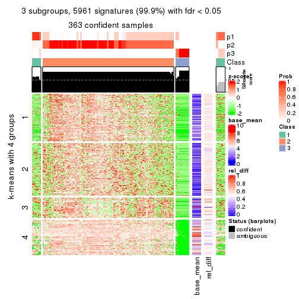</p>

</div>
<div id='tab-ATC-mclust-get-signatures-3'>
<pre><code class="r">get_signatures(res, k = 4)
</code></pre>

<p></p>

</div>
<div id='tab-ATC-mclust-get-signatures-4'>
<pre><code class="r">get_signatures(res, k = 5)
</code></pre>

<p></p>

</div>
<div id='tab-ATC-mclust-get-signatures-5'>
<pre><code class="r">get_signatures(res, k = 6)
</code></pre>

<p></p>

</div>
</div>


Signature heatmaps where rows are not scaled:


<script>
$( function() {
	$( '#tabs-ATC-mclust-get-signatures-no-scale' ).tabs();
} );
</script>
<div id='tabs-ATC-mclust-get-signatures-no-scale'>
<ul>
<li><a href='#tab-ATC-mclust-get-signatures-no-scale-1'>k = 2</a></li>
<li><a href='#tab-ATC-mclust-get-signatures-no-scale-2'>k = 3</a></li>
<li><a href='#tab-ATC-mclust-get-signatures-no-scale-3'>k = 4</a></li>
<li><a href='#tab-ATC-mclust-get-signatures-no-scale-4'>k = 5</a></li>
<li><a href='#tab-ATC-mclust-get-signatures-no-scale-5'>k = 6</a></li>
</ul>
<div id='tab-ATC-mclust-get-signatures-no-scale-1'>
<pre><code class="r">get_signatures(res, k = 2, scale_rows = FALSE)
</code></pre>

<p></p>

</div>
<div id='tab-ATC-mclust-get-signatures-no-scale-2'>
<pre><code class="r">get_signatures(res, k = 3, scale_rows = FALSE)
</code></pre>

<p>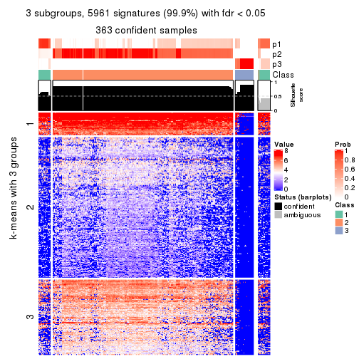</p>

</div>
<div id='tab-ATC-mclust-get-signatures-no-scale-3'>
<pre><code class="r">get_signatures(res, k = 4, scale_rows = FALSE)
</code></pre>

<p></p>

</div>
<div id='tab-ATC-mclust-get-signatures-no-scale-4'>
<pre><code class="r">get_signatures(res, k = 5, scale_rows = FALSE)
</code></pre>

<p></p>

</div>
<div id='tab-ATC-mclust-get-signatures-no-scale-5'>
<pre><code class="r">get_signatures(res, k = 6, scale_rows = FALSE)
</code></pre>

<p></p>

</div>
</div>


Compare the overlap of signatures from different k:

```r
compare_signatures(res)
```


`get_signature()` returns a data frame invisibly. TO get the list of signatures, the function
call should be assigned to a variable explicitly. In following code, if `plot` argument is set
to `FALSE`, no heatmap is plotted while only the differential analysis is performed.

```r
# code only for demonstration
tb = get_signature(res, k = ..., plot = FALSE)
```

An example of the output of `tb` is:

```
#>   which_row         fdr    mean_1    mean_2 scaled_mean_1 scaled_mean_2 km
#> 1        38 0.042760348  8.373488  9.131774    -0.5533452     0.5164555  1
#> 2        40 0.018707592  7.106213  8.469186    -0.6173731     0.5762149  1
#> 3        55 0.019134737 10.221463 11.207825    -0.6159697     0.5749050  1
#> 4        59 0.006059896  5.921854  7.869574    -0.6899429     0.6439467  1
#> 5        60 0.018055526  8.928898 10.211722    -0.6204761     0.5791110  1
#> 6        98 0.009384629 15.714769 14.887706     0.6635654    -0.6193277  2
...
```

The columns in `tb` are:

1. `which_row`: row indices corresponding to the input matrix.
2. `fdr`: FDR for the differential test. 
3. `mean_x`: The mean value in group x.
4. `scaled_mean_x`: The mean value in group x after rows are scaled.
5. `km`: Row groups if k-means clustering is applied to rows.


UMAP plot which shows how samples are separated.


<script>
$( function() {
	$( '#tabs-ATC-mclust-dimension-reduction' ).tabs();
} );
</script>
<div id='tabs-ATC-mclust-dimension-reduction'>
<ul>
<li><a href='#tab-ATC-mclust-dimension-reduction-1'>k = 2</a></li>
<li><a href='#tab-ATC-mclust-dimension-reduction-2'>k = 3</a></li>
<li><a href='#tab-ATC-mclust-dimension-reduction-3'>k = 4</a></li>
<li><a href='#tab-ATC-mclust-dimension-reduction-4'>k = 5</a></li>
<li><a href='#tab-ATC-mclust-dimension-reduction-5'>k = 6</a></li>
</ul>
<div id='tab-ATC-mclust-dimension-reduction-1'>
<pre><code class="r">dimension_reduction(res, k = 2, method = &quot;UMAP&quot;)
</code></pre>

<p></p>

</div>
<div id='tab-ATC-mclust-dimension-reduction-2'>
<pre><code class="r">dimension_reduction(res, k = 3, method = &quot;UMAP&quot;)
</code></pre>

<p></p>

</div>
<div id='tab-ATC-mclust-dimension-reduction-3'>
<pre><code class="r">dimension_reduction(res, k = 4, method = &quot;UMAP&quot;)
</code></pre>

<p></p>

</div>
<div id='tab-ATC-mclust-dimension-reduction-4'>
<pre><code class="r">dimension_reduction(res, k = 5, method = &quot;UMAP&quot;)
</code></pre>

<p></p>

</div>
<div id='tab-ATC-mclust-dimension-reduction-5'>
<pre><code class="r">dimension_reduction(res, k = 6, method = &quot;UMAP&quot;)
</code></pre>

<p></p>

</div>
</div>


Following heatmap shows how subgroups are split when increasing `k`:

```r
collect_classes(res)
```


If matrix rows can be associated to genes, consider to use `GO_Enrichment(res,
...)` to perform function enrichment for the signature genes.


 

---------------------------------------------------


### ATC:NMF


The object with results only for a single top-value method and a single partition method 
can be extracted as:

```r
res = res_list["ATC", "NMF"]
# you can also extract it by
# res = res_list["ATC:NMF"]
```

A summary of `res` and all the functions that can be applied to it:

```r
res
```

```
#> A 'ConsensusPartition' object with k = 2, 3, 4, 5, 6.
#>   On a matrix with 5966 rows and 384 columns.
#>   Top rows (597, 1194, 1790, 2386, 2983) are extracted by 'ATC' method.
#>   Subgroups are detected by 'NMF' method.
#>   Performed in total 1250 partitions by row resampling.
#>   Best k for subgroups seems to be 2.
#> 
#> Following methods can be applied to this 'ConsensusPartition' object:
#>  [1] "cola_report"             "collect_classes"         "collect_plots"          
#>  [4] "collect_stats"           "colnames"                "compare_signatures"     
#>  [7] "consensus_heatmap"       "dimension_reduction"     "functional_enrichment"  
#> [10] "get_anno_col"            "get_anno"                "get_classes"            
#> [13] "get_consensus"           "get_matrix"              "get_membership"         
#> [16] "get_param"               "get_signatures"          "get_stats"              
#> [19] "is_best_k"               "is_stable_k"             "membership_heatmap"     
#> [22] "ncol"                    "nrow"                    "plot_ecdf"              
#> [25] "rownames"                "select_partition_number" "show"                   
#> [28] "suggest_best_k"          "test_to_known_factors"
```

`collect_plots()` function collects all the plots made from `res` for all `k` (number of partitions)
into one single page to provide an easy and fast comparison between different `k`.

```r
collect_plots(res)
```


The plots are:

- The first row: a plot of the ECDF (Empirical cumulative distribution
  function) curves of the consensus matrix for each `k` and the heatmap of
  predicted classes for each `k`.
- The second row: heatmaps of the consensus matrix for each `k`.
- The third row: heatmaps of the membership matrix for each `k`.
- The fouth row: heatmaps of the signatures for each `k`.

All the plots in panels can be made by individual functions and they are
plotted later in this section.

`select_partition_number()` produces several plots showing different
statistics for choosing "optimized" `k`. There are following statistics:

- ECDF curves of the consensus matrix for each `k`;
- 1-PAC. [The PAC
  score](https://en.wikipedia.org/wiki/Consensus_clustering#Over-interpretation_potential_of_consensus_clustering)
  measures the proportion of the ambiguous subgrouping.
- Mean silhouette score.
- Concordance. The mean probability of fiting the consensus class ids in all
  partitions.
- Area increased. Denote $A_k$ as the area under the ECDF curve for current
  `k`, the area increased is defined as $A_k - A_{k-1}$.
- Rand index. The percent of pairs of samples that are both in a same cluster
  or both are not in a same cluster in the partition of k and k-1.
- Jaccard index. The ratio of pairs of samples are both in a same cluster in
  the partition of k and k-1 and the pairs of samples are both in a same
  cluster in the partition k or k-1.

The detailed explanations of these statistics can be found in [the cola
vignette](http://bioconductor.org/packages/devel/bioc/vignettes/cola/inst/doc/cola.html#toc_13).

Generally speaking, lower PAC score, higher mean silhouette score or higher
concordance corresponds to better partition. Rand index and Jaccard index
measure how similar the current partition is compared to partition with `k-1`.
If they are too similar, we won't accept `k` is better than `k-1`.

```r
select_partition_number(res)
```


The numeric values for all these statistics can be obtained by `get_stats()`.

```r
get_stats(res)
```

```
#>   k 1-PAC mean_silhouette concordance area_increased  Rand Jaccard
#> 2 2 0.602           0.823       0.917         0.4277 0.543   0.543
#> 3 3 0.572           0.746       0.873         0.2400 0.788   0.650
#> 4 4 0.553           0.627       0.814         0.0797 0.914   0.826
#> 5 5 0.521           0.615       0.792         0.0230 0.944   0.882
#> 6 6 0.507           0.573       0.759         0.0353 0.958   0.912
```

`suggest_best_k()` suggests the best $k$ based on these statistics. The rules are as follows:

- All $k$ with Jaccard index larger than 0.95 are removed because the increase of
  the partition number does not provides enough extra information. If all $k$ are removed,
  the best $k$ is assigned by `NA`.
- For $k$ with 1-PAC larger than 0.9, the maximal $k$ is taken as the "best k". Other $k$ is called "optional k".
- If it does not fit the second rule. The $k$ with the highest vote of highest
  1-PAC, mean silhouette and concordance is taken as the "best k".

```r
suggest_best_k(res)
```

```
#> [1] 2
```


Following shows the table of the partitions (You need to click the **show/hide
code output** link to see it). The membership matrix (columns with name `p*`)
is inferred by
[`clue::cl_consensus()`](https://www.rdocumentation.org/link/cl_consensus?package=clue)
function with the `SE` method. Basically the value in the membership matrix
represents the probability to belong to a certain group. The finall class
label for an item is determined with the group with highest probability it
belongs to.

In `get_classes()` function, the entropy is calculated from the membership
matrix and the silhouette score is calculated from the consensus matrix.


<script>
$( function() {
	$( '#tabs-ATC-NMF-get-classes' ).tabs();
} );
</script>
<div id='tabs-ATC-NMF-get-classes'>
<ul>
<li><a href='#tab-ATC-NMF-get-classes-1'>k = 2</a></li>
<li><a href='#tab-ATC-NMF-get-classes-2'>k = 3</a></li>
<li><a href='#tab-ATC-NMF-get-classes-3'>k = 4</a></li>
<li><a href='#tab-ATC-NMF-get-classes-4'>k = 5</a></li>
<li><a href='#tab-ATC-NMF-get-classes-5'>k = 6</a></li>
</ul>

<div id='tab-ATC-NMF-get-classes-1'>
<p><a id='tab-ATC-NMF-get-classes-1-a' style='color:#0366d6' href='#'>show/hide code output</a></p>
<pre><code class="r">cbind(get_classes(res, k = 2), get_membership(res, k = 2))
</code></pre>

<pre><code>#&gt;           class entropy silhouette    p1    p2
#&gt; SRR490216     1  0.8861     0.6817 0.696 0.304
#&gt; SRR490217     1  0.8909     0.6759 0.692 0.308
#&gt; SRR490218     1  1.0000     0.2059 0.500 0.500
#&gt; SRR490219     1  0.8327     0.7276 0.736 0.264
#&gt; SRR490220     1  0.9815     0.4609 0.580 0.420
#&gt; SRR490221     1  0.9963     0.3335 0.536 0.464
#&gt; SRR490222     1  0.9954     0.3463 0.540 0.460
#&gt; SRR490223     1  0.9833     0.4504 0.576 0.424
#&gt; SRR490224     1  0.0000     0.8368 1.000 0.000
#&gt; SRR490225     1  0.0000     0.8368 1.000 0.000
#&gt; SRR490226     1  0.0000     0.8368 1.000 0.000
#&gt; SRR490227     1  0.0000     0.8368 1.000 0.000
#&gt; SRR490228     1  0.0000     0.8368 1.000 0.000
#&gt; SRR490229     1  0.0000     0.8368 1.000 0.000
#&gt; SRR490230     1  0.0000     0.8368 1.000 0.000
#&gt; SRR490231     1  0.0000     0.8368 1.000 0.000
#&gt; SRR490232     1  0.3879     0.8285 0.924 0.076
#&gt; SRR490233     1  0.2603     0.8349 0.956 0.044
#&gt; SRR490234     1  0.6623     0.7939 0.828 0.172
#&gt; SRR490235     1  0.3733     0.8295 0.928 0.072
#&gt; SRR490236     1  0.0000     0.8368 1.000 0.000
#&gt; SRR490237     1  0.0000     0.8368 1.000 0.000
#&gt; SRR490238     1  0.0000     0.8368 1.000 0.000
#&gt; SRR490239     1  0.0000     0.8368 1.000 0.000
#&gt; SRR490240     1  0.9286     0.6200 0.656 0.344
#&gt; SRR490241     1  0.9460     0.5845 0.636 0.364
#&gt; SRR490242     1  0.9460     0.5844 0.636 0.364
#&gt; SRR490243     1  0.9000     0.6638 0.684 0.316
#&gt; SRR490244     1  0.0376     0.8374 0.996 0.004
#&gt; SRR490245     1  0.0000     0.8368 1.000 0.000
#&gt; SRR490246     1  0.0000     0.8368 1.000 0.000
#&gt; SRR490247     1  0.0000     0.8368 1.000 0.000
#&gt; SRR490248     2  0.9944    -0.0299 0.456 0.544
#&gt; SRR490249     1  0.9996     0.2511 0.512 0.488
#&gt; SRR490250     2  0.9775     0.1631 0.412 0.588
#&gt; SRR490251     2  0.9608     0.2678 0.384 0.616
#&gt; SRR490252     2  0.8443     0.5789 0.272 0.728
#&gt; SRR490253     2  0.8608     0.5518 0.284 0.716
#&gt; SRR490254     2  0.8144     0.6206 0.252 0.748
#&gt; SRR490255     2  0.6247     0.7808 0.156 0.844
#&gt; SRR490256     1  0.6623     0.7940 0.828 0.172
#&gt; SRR490257     1  0.7219     0.7790 0.800 0.200
#&gt; SRR490258     1  0.7056     0.7835 0.808 0.192
#&gt; SRR490259     1  0.7139     0.7813 0.804 0.196
#&gt; SRR490260     1  0.0672     0.8376 0.992 0.008
#&gt; SRR490261     1  0.0376     0.8374 0.996 0.004
#&gt; SRR490262     1  0.2948     0.8336 0.948 0.052
#&gt; SRR490263     1  0.0938     0.8375 0.988 0.012
#&gt; SRR490264     1  0.0672     0.8376 0.992 0.008
#&gt; SRR490265     1  0.0376     0.8374 0.996 0.004
#&gt; SRR490266     1  0.0376     0.8374 0.996 0.004
#&gt; SRR490267     1  0.0376     0.8374 0.996 0.004
#&gt; SRR490268     1  0.7219     0.7789 0.800 0.200
#&gt; SRR490269     1  0.8144     0.7386 0.748 0.252
#&gt; SRR490270     1  0.7883     0.7528 0.764 0.236
#&gt; SRR490271     1  0.7883     0.7527 0.764 0.236
#&gt; SRR490272     1  0.4298     0.8254 0.912 0.088
#&gt; SRR490273     1  0.3274     0.8320 0.940 0.060
#&gt; SRR490274     1  0.2236     0.8359 0.964 0.036
#&gt; SRR490275     1  0.4562     0.8231 0.904 0.096
#&gt; SRR490276     1  0.0000     0.8368 1.000 0.000
#&gt; SRR490277     1  0.1633     0.8369 0.976 0.024
#&gt; SRR490278     1  0.0672     0.8376 0.992 0.008
#&gt; SRR490279     1  0.0000     0.8368 1.000 0.000
#&gt; SRR490280     1  0.0000     0.8368 1.000 0.000
#&gt; SRR490281     1  0.0000     0.8368 1.000 0.000
#&gt; SRR490282     1  0.0000     0.8368 1.000 0.000
#&gt; SRR490283     1  0.0000     0.8368 1.000 0.000
#&gt; SRR490284     1  0.0000     0.8368 1.000 0.000
#&gt; SRR490285     1  0.0000     0.8368 1.000 0.000
#&gt; SRR490286     1  0.0000     0.8368 1.000 0.000
#&gt; SRR490287     1  0.0000     0.8368 1.000 0.000
#&gt; SRR490288     1  0.7528     0.7681 0.784 0.216
#&gt; SRR490289     1  0.9393     0.5994 0.644 0.356
#&gt; SRR490290     1  0.7219     0.7794 0.800 0.200
#&gt; SRR490291     1  0.8144     0.7387 0.748 0.252
#&gt; SRR490292     1  0.9552     0.5610 0.624 0.376
#&gt; SRR490293     1  0.9866     0.4291 0.568 0.432
#&gt; SRR490294     1  0.9552     0.5610 0.624 0.376
#&gt; SRR490295     1  0.8955     0.6694 0.688 0.312
#&gt; SRR490296     2  0.0000     0.9375 0.000 1.000
#&gt; SRR490297     2  0.0000     0.9375 0.000 1.000
#&gt; SRR490298     2  0.0000     0.9375 0.000 1.000
#&gt; SRR490299     2  0.0000     0.9375 0.000 1.000
#&gt; SRR490300     2  0.6623     0.7584 0.172 0.828
#&gt; SRR490301     2  0.6048     0.7913 0.148 0.852
#&gt; SRR490302     2  0.6887     0.7400 0.184 0.816
#&gt; SRR490303     2  0.4298     0.8618 0.088 0.912
#&gt; SRR490304     2  0.0000     0.9375 0.000 1.000
#&gt; SRR490305     2  0.0000     0.9375 0.000 1.000
#&gt; SRR490306     2  0.0000     0.9375 0.000 1.000
#&gt; SRR490307     2  0.0000     0.9375 0.000 1.000
#&gt; SRR490308     1  0.0000     0.8368 1.000 0.000
#&gt; SRR490309     1  0.0000     0.8368 1.000 0.000
#&gt; SRR490310     1  0.0000     0.8368 1.000 0.000
#&gt; SRR490311     1  0.0000     0.8368 1.000 0.000
#&gt; SRR490312     1  0.7950     0.7495 0.760 0.240
#&gt; SRR490313     1  0.9661     0.5273 0.608 0.392
#&gt; SRR490314     1  0.9833     0.4504 0.576 0.424
#&gt; SRR490315     1  0.9491     0.5772 0.632 0.368
#&gt; SRR490316     1  0.9044     0.6580 0.680 0.320
#&gt; SRR490317     1  0.9833     0.4506 0.576 0.424
#&gt; SRR490318     1  0.9393     0.5994 0.644 0.356
#&gt; SRR490319     1  0.9754     0.4902 0.592 0.408
#&gt; SRR490320     1  0.4562     0.8231 0.904 0.096
#&gt; SRR490321     1  0.5737     0.8094 0.864 0.136
#&gt; SRR490322     1  0.5842     0.8079 0.860 0.140
#&gt; SRR490323     1  0.6531     0.7959 0.832 0.168
#&gt; SRR490324     1  0.0000     0.8368 1.000 0.000
#&gt; SRR490325     1  0.0000     0.8368 1.000 0.000
#&gt; SRR490326     1  0.0000     0.8368 1.000 0.000
#&gt; SRR490327     1  0.0000     0.8368 1.000 0.000
#&gt; SRR490328     2  0.4939     0.8395 0.108 0.892
#&gt; SRR490329     2  0.2236     0.9099 0.036 0.964
#&gt; SRR490330     2  0.4161     0.8655 0.084 0.916
#&gt; SRR490331     2  0.1414     0.9229 0.020 0.980
#&gt; SRR490332     2  0.1633     0.9198 0.024 0.976
#&gt; SRR490333     2  0.0000     0.9375 0.000 1.000
#&gt; SRR490334     2  0.0376     0.9348 0.004 0.996
#&gt; SRR490335     2  0.1633     0.9198 0.024 0.976
#&gt; SRR490336     2  0.0000     0.9375 0.000 1.000
#&gt; SRR490337     2  0.0000     0.9375 0.000 1.000
#&gt; SRR490338     2  0.0000     0.9375 0.000 1.000
#&gt; SRR490339     2  0.0000     0.9375 0.000 1.000
#&gt; SRR490340     2  0.9087     0.4519 0.324 0.676
#&gt; SRR490341     2  0.8207     0.6125 0.256 0.744
#&gt; SRR490342     2  0.4298     0.8617 0.088 0.912
#&gt; SRR490343     2  0.8861     0.5040 0.304 0.696
#&gt; SRR490344     2  0.8443     0.5788 0.272 0.728
#&gt; SRR490345     2  0.5408     0.8214 0.124 0.876
#&gt; SRR490346     2  0.7528     0.6882 0.216 0.784
#&gt; SRR490347     2  0.9460     0.3339 0.364 0.636
#&gt; SRR490348     2  0.0000     0.9375 0.000 1.000
#&gt; SRR490349     2  0.0000     0.9375 0.000 1.000
#&gt; SRR490350     2  0.0000     0.9375 0.000 1.000
#&gt; SRR490351     2  0.0000     0.9375 0.000 1.000
#&gt; SRR490352     2  0.0000     0.9375 0.000 1.000
#&gt; SRR490353     2  0.0000     0.9375 0.000 1.000
#&gt; SRR490354     2  0.0000     0.9375 0.000 1.000
#&gt; SRR490355     2  0.0000     0.9375 0.000 1.000
#&gt; SRR490356     2  0.5946     0.7964 0.144 0.856
#&gt; SRR490357     2  0.5842     0.8015 0.140 0.860
#&gt; SRR490358     2  0.5519     0.8165 0.128 0.872
#&gt; SRR490359     2  0.6048     0.7911 0.148 0.852
#&gt; SRR490360     2  0.0000     0.9375 0.000 1.000
#&gt; SRR490361     2  0.0000     0.9375 0.000 1.000
#&gt; SRR490362     2  0.0000     0.9375 0.000 1.000
#&gt; SRR490363     2  0.0000     0.9375 0.000 1.000
#&gt; SRR490364     2  0.0000     0.9375 0.000 1.000
#&gt; SRR490365     2  0.0000     0.9375 0.000 1.000
#&gt; SRR490366     2  0.0000     0.9375 0.000 1.000
#&gt; SRR490367     2  0.0000     0.9375 0.000 1.000
#&gt; SRR490368     2  0.0000     0.9375 0.000 1.000
#&gt; SRR490369     2  0.0000     0.9375 0.000 1.000
#&gt; SRR490370     2  0.0000     0.9375 0.000 1.000
#&gt; SRR490371     2  0.0000     0.9375 0.000 1.000
#&gt; SRR490372     1  0.0000     0.8368 1.000 0.000
#&gt; SRR490373     1  0.0000     0.8368 1.000 0.000
#&gt; SRR490374     1  0.0000     0.8368 1.000 0.000
#&gt; SRR490375     1  0.0000     0.8368 1.000 0.000
#&gt; SRR490376     2  0.2778     0.8994 0.048 0.952
#&gt; SRR490377     2  0.0938     0.9290 0.012 0.988
#&gt; SRR490378     2  0.2948     0.8958 0.052 0.948
#&gt; SRR490379     2  0.0672     0.9320 0.008 0.992
#&gt; SRR490380     1  0.0000     0.8368 1.000 0.000
#&gt; SRR490381     1  0.0000     0.8368 1.000 0.000
#&gt; SRR490382     1  0.0376     0.8374 0.996 0.004
#&gt; SRR490383     1  0.0000     0.8368 1.000 0.000
#&gt; SRR490384     2  0.0000     0.9375 0.000 1.000
#&gt; SRR490385     2  0.0000     0.9375 0.000 1.000
#&gt; SRR490386     2  0.0000     0.9375 0.000 1.000
#&gt; SRR490387     2  0.0000     0.9375 0.000 1.000
#&gt; SRR490388     2  0.0000     0.9375 0.000 1.000
#&gt; SRR490389     2  0.0000     0.9375 0.000 1.000
#&gt; SRR490390     2  0.0000     0.9375 0.000 1.000
#&gt; SRR490391     2  0.0000     0.9375 0.000 1.000
#&gt; SRR490392     2  0.0000     0.9375 0.000 1.000
#&gt; SRR490393     2  0.0000     0.9375 0.000 1.000
#&gt; SRR490394     2  0.0000     0.9375 0.000 1.000
#&gt; SRR490395     2  0.0000     0.9375 0.000 1.000
#&gt; SRR490396     2  0.0000     0.9375 0.000 1.000
#&gt; SRR490397     2  0.0000     0.9375 0.000 1.000
#&gt; SRR490398     2  0.0000     0.9375 0.000 1.000
#&gt; SRR490399     2  0.0000     0.9375 0.000 1.000
#&gt; SRR490400     2  0.0000     0.9375 0.000 1.000
#&gt; SRR490401     2  0.0000     0.9375 0.000 1.000
#&gt; SRR490402     2  0.0000     0.9375 0.000 1.000
#&gt; SRR490403     2  0.0000     0.9375 0.000 1.000
#&gt; SRR490404     2  0.6531     0.7641 0.168 0.832
#&gt; SRR490405     2  0.4022     0.8694 0.080 0.920
#&gt; SRR490406     2  0.3274     0.8883 0.060 0.940
#&gt; SRR490407     2  0.0938     0.9290 0.012 0.988
#&gt; SRR490408     2  0.0000     0.9375 0.000 1.000
#&gt; SRR490409     2  0.0000     0.9375 0.000 1.000
#&gt; SRR490410     2  0.0000     0.9375 0.000 1.000
#&gt; SRR490411     2  0.0000     0.9375 0.000 1.000
#&gt; SRR490412     1  0.2236     0.8326 0.964 0.036
#&gt; SRR490413     1  0.0376     0.8374 0.996 0.004
#&gt; SRR490414     1  0.0000     0.8368 1.000 0.000
#&gt; SRR490415     1  0.0376     0.8374 0.996 0.004
#&gt; SRR490416     2  0.4815     0.8441 0.104 0.896
#&gt; SRR490417     2  0.4298     0.8616 0.088 0.912
#&gt; SRR490418     2  0.4161     0.8655 0.084 0.916
#&gt; SRR490419     2  0.1414     0.9229 0.020 0.980
#&gt; SRR490420     1  0.8661     0.7006 0.712 0.288
#&gt; SRR490421     1  0.9087     0.6522 0.676 0.324
#&gt; SRR490422     1  0.8813     0.6861 0.700 0.300
#&gt; SRR490423     1  0.8763     0.6910 0.704 0.296
#&gt; SRR490424     1  0.0000     0.8368 1.000 0.000
#&gt; SRR490425     1  0.2603     0.8349 0.956 0.044
#&gt; SRR490426     1  0.0000     0.8368 1.000 0.000
#&gt; SRR490427     1  0.0000     0.8368 1.000 0.000
#&gt; SRR490428     1  0.7376     0.7737 0.792 0.208
#&gt; SRR490429     1  0.8267     0.7308 0.740 0.260
#&gt; SRR490430     1  0.7674     0.7622 0.776 0.224
#&gt; SRR490431     1  0.8661     0.7009 0.712 0.288
#&gt; SRR490432     2  0.9881     0.0617 0.436 0.564
#&gt; SRR490433     2  0.9552     0.2940 0.376 0.624
#&gt; SRR490434     2  0.8386     0.5864 0.268 0.732
#&gt; SRR490435     2  0.8955     0.4830 0.312 0.688
#&gt; SRR490436     2  0.8661     0.5429 0.288 0.712
#&gt; SRR490437     2  0.7453     0.6950 0.212 0.788
#&gt; SRR490438     2  0.6531     0.7641 0.168 0.832
#&gt; SRR490439     2  0.7745     0.6666 0.228 0.772
#&gt; SRR490440     2  0.0000     0.9375 0.000 1.000
#&gt; SRR490441     2  0.0000     0.9375 0.000 1.000
#&gt; SRR490442     2  0.0000     0.9375 0.000 1.000
#&gt; SRR490443     2  0.0000     0.9375 0.000 1.000
#&gt; SRR490444     2  0.0000     0.9375 0.000 1.000
#&gt; SRR490445     2  0.0000     0.9375 0.000 1.000
#&gt; SRR490446     2  0.0000     0.9375 0.000 1.000
#&gt; SRR490447     2  0.0000     0.9375 0.000 1.000
#&gt; SRR490448     1  0.9909     0.3948 0.556 0.444
#&gt; SRR490449     2  0.9944    -0.0304 0.456 0.544
#&gt; SRR490450     2  0.9998    -0.1837 0.492 0.508
#&gt; SRR490451     1  0.9580     0.5531 0.620 0.380
#&gt; SRR490452     1  0.6048     0.8047 0.852 0.148
#&gt; SRR490453     1  0.7376     0.7736 0.792 0.208
#&gt; SRR490454     1  0.8016     0.7461 0.756 0.244
#&gt; SRR490455     1  0.7139     0.7813 0.804 0.196
#&gt; SRR490456     2  0.6048     0.7913 0.148 0.852
#&gt; SRR490457     2  0.6973     0.7338 0.188 0.812
#&gt; SRR490458     2  0.7453     0.6948 0.212 0.788
#&gt; SRR490459     2  0.7745     0.6662 0.228 0.772
#&gt; SRR490460     2  1.0000    -0.2153 0.500 0.500
#&gt; SRR490461     2  0.9209     0.4189 0.336 0.664
#&gt; SRR490462     2  0.9635     0.2535 0.388 0.612
#&gt; SRR490463     2  0.9795     0.1473 0.416 0.584
#&gt; SRR490464     1  0.0000     0.8368 1.000 0.000
#&gt; SRR490465     1  0.1184     0.8374 0.984 0.016
#&gt; SRR490466     1  0.0000     0.8368 1.000 0.000
#&gt; SRR490467     1  0.0000     0.8368 1.000 0.000
#&gt; SRR490468     2  0.0376     0.9348 0.004 0.996
#&gt; SRR490469     2  0.0672     0.9319 0.008 0.992
#&gt; SRR490470     2  0.0000     0.9375 0.000 1.000
#&gt; SRR490471     2  0.0376     0.9348 0.004 0.996
#&gt; SRR490472     2  0.0000     0.9375 0.000 1.000
#&gt; SRR490473     2  0.0000     0.9375 0.000 1.000
#&gt; SRR490474     2  0.0000     0.9375 0.000 1.000
#&gt; SRR490475     2  0.0000     0.9375 0.000 1.000
#&gt; SRR490476     1  0.9998     0.1580 0.508 0.492
#&gt; SRR490477     1  0.2043     0.8315 0.968 0.032
#&gt; SRR490478     1  0.2236     0.8360 0.964 0.036
#&gt; SRR490479     1  0.6973     0.7691 0.812 0.188
#&gt; SRR490480     2  0.0000     0.9375 0.000 1.000
#&gt; SRR490481     2  0.0000     0.9375 0.000 1.000
#&gt; SRR490482     2  0.0000     0.9375 0.000 1.000
#&gt; SRR490483     2  0.0000     0.9375 0.000 1.000
#&gt; SRR490484     2  0.0000     0.9375 0.000 1.000
#&gt; SRR490485     2  0.0000     0.9375 0.000 1.000
#&gt; SRR490486     2  0.0000     0.9375 0.000 1.000
#&gt; SRR490487     2  0.0000     0.9375 0.000 1.000
#&gt; SRR490488     2  0.0000     0.9375 0.000 1.000
#&gt; SRR490489     2  0.0000     0.9375 0.000 1.000
#&gt; SRR490490     2  0.0000     0.9375 0.000 1.000
#&gt; SRR490491     2  0.0000     0.9375 0.000 1.000
#&gt; SRR490492     2  0.0000     0.9375 0.000 1.000
#&gt; SRR490493     2  0.0000     0.9375 0.000 1.000
#&gt; SRR490494     2  0.0000     0.9375 0.000 1.000
#&gt; SRR490495     2  0.0000     0.9375 0.000 1.000
#&gt; SRR490496     2  0.0000     0.9375 0.000 1.000
#&gt; SRR490497     2  0.0000     0.9375 0.000 1.000
#&gt; SRR490498     2  0.0000     0.9375 0.000 1.000
#&gt; SRR490499     2  0.0000     0.9375 0.000 1.000
#&gt; SRR490500     2  0.0000     0.9375 0.000 1.000
#&gt; SRR490501     2  0.0000     0.9375 0.000 1.000
#&gt; SRR490502     2  0.0000     0.9375 0.000 1.000
#&gt; SRR490503     2  0.0000     0.9375 0.000 1.000
#&gt; SRR490504     2  0.0000     0.9375 0.000 1.000
#&gt; SRR490505     2  0.0000     0.9375 0.000 1.000
#&gt; SRR490506     2  0.0000     0.9375 0.000 1.000
#&gt; SRR490507     2  0.0000     0.9375 0.000 1.000
#&gt; SRR490508     2  0.0000     0.9375 0.000 1.000
#&gt; SRR490509     2  0.0000     0.9375 0.000 1.000
#&gt; SRR490510     2  0.0000     0.9375 0.000 1.000
#&gt; SRR490511     2  0.0000     0.9375 0.000 1.000
#&gt; SRR490512     2  0.0000     0.9375 0.000 1.000
#&gt; SRR490513     2  0.0000     0.9375 0.000 1.000
#&gt; SRR490514     2  0.0000     0.9375 0.000 1.000
#&gt; SRR490515     2  0.0000     0.9375 0.000 1.000
#&gt; SRR490516     2  0.0000     0.9375 0.000 1.000
#&gt; SRR490517     2  0.0000     0.9375 0.000 1.000
#&gt; SRR490518     2  0.0000     0.9375 0.000 1.000
#&gt; SRR490519     2  0.0000     0.9375 0.000 1.000
#&gt; SRR490520     2  0.0000     0.9375 0.000 1.000
#&gt; SRR490521     2  0.0000     0.9375 0.000 1.000
#&gt; SRR490522     2  0.0000     0.9375 0.000 1.000
#&gt; SRR490523     2  0.0000     0.9375 0.000 1.000
#&gt; SRR490524     2  0.0000     0.9375 0.000 1.000
#&gt; SRR490525     2  0.0000     0.9375 0.000 1.000
#&gt; SRR490526     2  0.0000     0.9375 0.000 1.000
#&gt; SRR490527     2  0.0000     0.9375 0.000 1.000
#&gt; SRR490528     2  0.0000     0.9375 0.000 1.000
#&gt; SRR490529     2  0.0000     0.9375 0.000 1.000
#&gt; SRR490530     2  0.0000     0.9375 0.000 1.000
#&gt; SRR490531     2  0.0000     0.9375 0.000 1.000
#&gt; SRR490532     1  0.8443     0.7188 0.728 0.272
#&gt; SRR490533     1  0.9209     0.6333 0.664 0.336
#&gt; SRR490534     1  0.8713     0.6959 0.708 0.292
#&gt; SRR490535     1  0.8608     0.7053 0.716 0.284
#&gt; SRR490536     2  0.0000     0.9375 0.000 1.000
#&gt; SRR490537     2  0.0000     0.9375 0.000 1.000
#&gt; SRR490538     2  0.0000     0.9375 0.000 1.000
#&gt; SRR490539     2  0.0000     0.9375 0.000 1.000
#&gt; SRR490540     2  0.0000     0.9375 0.000 1.000
#&gt; SRR490541     2  0.0000     0.9375 0.000 1.000
#&gt; SRR490542     2  0.0000     0.9375 0.000 1.000
#&gt; SRR490543     2  0.0000     0.9375 0.000 1.000
#&gt; SRR490544     2  0.0000     0.9375 0.000 1.000
#&gt; SRR490545     2  0.0000     0.9375 0.000 1.000
#&gt; SRR490546     2  0.0000     0.9375 0.000 1.000
#&gt; SRR490547     2  0.0000     0.9375 0.000 1.000
#&gt; SRR490548     2  0.0000     0.9375 0.000 1.000
#&gt; SRR490549     2  0.0000     0.9375 0.000 1.000
#&gt; SRR490550     2  0.0000     0.9375 0.000 1.000
#&gt; SRR490551     2  0.0000     0.9375 0.000 1.000
#&gt; SRR490552     2  0.0000     0.9375 0.000 1.000
#&gt; SRR490553     2  0.0000     0.9375 0.000 1.000
#&gt; SRR490554     2  0.0000     0.9375 0.000 1.000
#&gt; SRR490555     2  0.0000     0.9375 0.000 1.000
#&gt; SRR490556     2  0.0000     0.9375 0.000 1.000
#&gt; SRR490557     2  0.0000     0.9375 0.000 1.000
#&gt; SRR490558     2  0.0000     0.9375 0.000 1.000
#&gt; SRR490559     2  0.0000     0.9375 0.000 1.000
#&gt; SRR490560     2  0.0000     0.9375 0.000 1.000
#&gt; SRR490561     2  0.0000     0.9375 0.000 1.000
#&gt; SRR490562     2  0.0000     0.9375 0.000 1.000
#&gt; SRR490563     2  0.0000     0.9375 0.000 1.000
#&gt; SRR490564     2  0.0376     0.9348 0.004 0.996
#&gt; SRR490565     2  0.0000     0.9375 0.000 1.000
#&gt; SRR490566     2  0.0376     0.9348 0.004 0.996
#&gt; SRR490567     2  0.0000     0.9375 0.000 1.000
#&gt; SRR490568     2  0.0000     0.9375 0.000 1.000
#&gt; SRR490569     2  0.0000     0.9375 0.000 1.000
#&gt; SRR490570     2  0.0000     0.9375 0.000 1.000
#&gt; SRR490571     2  0.0000     0.9375 0.000 1.000
#&gt; SRR490572     2  0.0000     0.9375 0.000 1.000
#&gt; SRR490573     2  0.0000     0.9375 0.000 1.000
#&gt; SRR490574     2  0.0000     0.9375 0.000 1.000
#&gt; SRR490575     2  0.0000     0.9375 0.000 1.000
#&gt; SRR490576     2  0.0000     0.9375 0.000 1.000
#&gt; SRR490577     2  0.0000     0.9375 0.000 1.000
#&gt; SRR490578     2  0.0000     0.9375 0.000 1.000
#&gt; SRR490579     2  0.0000     0.9375 0.000 1.000
#&gt; SRR490580     2  0.0000     0.9375 0.000 1.000
#&gt; SRR490581     2  0.0000     0.9375 0.000 1.000
#&gt; SRR490582     2  0.0000     0.9375 0.000 1.000
#&gt; SRR490583     2  0.0000     0.9375 0.000 1.000
#&gt; SRR490584     2  0.0000     0.9375 0.000 1.000
#&gt; SRR490585     2  0.0000     0.9375 0.000 1.000
#&gt; SRR490586     2  0.0000     0.9375 0.000 1.000
#&gt; SRR490587     2  0.0000     0.9375 0.000 1.000
#&gt; SRR490588     2  0.0000     0.9375 0.000 1.000
#&gt; SRR490589     2  0.0000     0.9375 0.000 1.000
#&gt; SRR490590     2  0.0000     0.9375 0.000 1.000
#&gt; SRR490591     2  0.0000     0.9375 0.000 1.000
#&gt; SRR490592     2  0.0000     0.9375 0.000 1.000
#&gt; SRR490593     2  0.0000     0.9375 0.000 1.000
#&gt; SRR490594     2  0.0000     0.9375 0.000 1.000
#&gt; SRR490595     2  0.0000     0.9375 0.000 1.000
#&gt; SRR490596     2  0.6623     0.7581 0.172 0.828
#&gt; SRR490597     2  0.4431     0.8573 0.092 0.908
#&gt; SRR490598     2  0.1843     0.9164 0.028 0.972
#&gt; SRR490599     2  0.6343     0.7750 0.160 0.840
</code></pre>

<script>
$('#tab-ATC-NMF-get-classes-1-a').parent().next().next().hide();
$('#tab-ATC-NMF-get-classes-1-a').click(function(){
  $('#tab-ATC-NMF-get-classes-1-a').parent().next().next().toggle();
  return(false);
});
</script>
</div>

<div id='tab-ATC-NMF-get-classes-2'>
<p><a id='tab-ATC-NMF-get-classes-2-a' style='color:#0366d6' href='#'>show/hide code output</a></p>
<pre><code class="r">cbind(get_classes(res, k = 3), get_membership(res, k = 3))
</code></pre>

<pre><code>#&gt;           class entropy silhouette    p1    p2    p3
#&gt; SRR490216     2  0.9599   -0.01999 0.292 0.472 0.236
#&gt; SRR490217     2  0.9151   -0.25408 0.420 0.436 0.144
#&gt; SRR490218     2  0.7397    0.61193 0.148 0.704 0.148
#&gt; SRR490219     2  0.9790   -0.13434 0.292 0.436 0.272
#&gt; SRR490220     1  0.4784    0.72636 0.796 0.200 0.004
#&gt; SRR490221     1  0.4733    0.72774 0.800 0.196 0.004
#&gt; SRR490222     1  0.4110    0.74742 0.844 0.152 0.004
#&gt; SRR490223     1  0.4862    0.74082 0.820 0.160 0.020
#&gt; SRR490224     1  0.5244    0.40660 0.756 0.004 0.240
#&gt; SRR490225     1  0.5325    0.39825 0.748 0.004 0.248
#&gt; SRR490226     1  0.4682    0.50205 0.804 0.004 0.192
#&gt; SRR490227     1  0.4645    0.49935 0.816 0.008 0.176
#&gt; SRR490228     1  0.4834    0.49002 0.792 0.004 0.204
#&gt; SRR490229     1  0.4291    0.53628 0.840 0.008 0.152
#&gt; SRR490230     1  0.4861    0.48830 0.800 0.008 0.192
#&gt; SRR490231     1  0.4755    0.50983 0.808 0.008 0.184
#&gt; SRR490232     1  0.3896    0.71543 0.888 0.060 0.052
#&gt; SRR490233     1  0.3694    0.70755 0.896 0.052 0.052
#&gt; SRR490234     1  0.3967    0.72854 0.884 0.072 0.044
#&gt; SRR490235     1  0.3694    0.70990 0.896 0.052 0.052
#&gt; SRR490236     1  0.3879    0.54766 0.848 0.000 0.152
#&gt; SRR490237     1  0.3116    0.60261 0.892 0.000 0.108
#&gt; SRR490238     1  0.2959    0.61203 0.900 0.000 0.100
#&gt; SRR490239     1  0.3267    0.59759 0.884 0.000 0.116
#&gt; SRR490240     1  0.2959    0.75183 0.900 0.100 0.000
#&gt; SRR490241     1  0.2878    0.75135 0.904 0.096 0.000
#&gt; SRR490242     1  0.2796    0.75059 0.908 0.092 0.000
#&gt; SRR490243     1  0.2796    0.75059 0.908 0.092 0.000
#&gt; SRR490244     3  0.2590    0.85119 0.072 0.004 0.924
#&gt; SRR490245     3  0.2261    0.85125 0.068 0.000 0.932
#&gt; SRR490246     3  0.1643    0.84685 0.044 0.000 0.956
#&gt; SRR490247     3  0.2066    0.85044 0.060 0.000 0.940
#&gt; SRR490248     2  0.7800    0.52092 0.204 0.668 0.128
#&gt; SRR490249     2  0.7218    0.44179 0.296 0.652 0.052
#&gt; SRR490250     2  0.6728    0.65871 0.124 0.748 0.128
#&gt; SRR490251     2  0.5760    0.73366 0.064 0.796 0.140
#&gt; SRR490252     1  0.4842    0.70709 0.776 0.224 0.000
#&gt; SRR490253     1  0.5216    0.67809 0.740 0.260 0.000
#&gt; SRR490254     1  0.5254    0.67496 0.736 0.264 0.000
#&gt; SRR490255     1  0.5733    0.61572 0.676 0.324 0.000
#&gt; SRR490256     1  0.2400    0.73867 0.932 0.064 0.004
#&gt; SRR490257     1  0.2356    0.74388 0.928 0.072 0.000
#&gt; SRR490258     1  0.2680    0.74052 0.924 0.068 0.008
#&gt; SRR490259     1  0.2261    0.74200 0.932 0.068 0.000
#&gt; SRR490260     1  0.1832    0.67157 0.956 0.008 0.036
#&gt; SRR490261     1  0.2383    0.67975 0.940 0.016 0.044
#&gt; SRR490262     1  0.2569    0.70595 0.936 0.032 0.032
#&gt; SRR490263     1  0.2269    0.68198 0.944 0.016 0.040
#&gt; SRR490264     1  0.3370    0.67428 0.904 0.024 0.072
#&gt; SRR490265     1  0.2866    0.64614 0.916 0.008 0.076
#&gt; SRR490266     1  0.2590    0.64273 0.924 0.004 0.072
#&gt; SRR490267     1  0.2680    0.64944 0.924 0.008 0.068
#&gt; SRR490268     1  0.2261    0.74200 0.932 0.068 0.000
#&gt; SRR490269     1  0.2356    0.74393 0.928 0.072 0.000
#&gt; SRR490270     1  0.2261    0.74200 0.932 0.068 0.000
#&gt; SRR490271     1  0.2261    0.74200 0.932 0.068 0.000
#&gt; SRR490272     1  0.2269    0.71938 0.944 0.040 0.016
#&gt; SRR490273     1  0.2050    0.70799 0.952 0.028 0.020
#&gt; SRR490274     1  0.2187    0.70670 0.948 0.028 0.024
#&gt; SRR490275     1  0.2564    0.71303 0.936 0.036 0.028
#&gt; SRR490276     1  0.1765    0.66422 0.956 0.004 0.040
#&gt; SRR490277     1  0.2050    0.69609 0.952 0.020 0.028
#&gt; SRR490278     1  0.3039    0.70559 0.920 0.036 0.044
#&gt; SRR490279     1  0.1860    0.64894 0.948 0.000 0.052
#&gt; SRR490280     3  0.1643    0.84782 0.044 0.000 0.956
#&gt; SRR490281     3  0.1643    0.84782 0.044 0.000 0.956
#&gt; SRR490282     3  0.1643    0.84782 0.044 0.000 0.956
#&gt; SRR490283     3  0.1643    0.84782 0.044 0.000 0.956
#&gt; SRR490284     3  0.5202    0.81464 0.220 0.008 0.772
#&gt; SRR490285     3  0.5737    0.78752 0.256 0.012 0.732
#&gt; SRR490286     3  0.6205    0.67825 0.336 0.008 0.656
#&gt; SRR490287     3  0.5202    0.81208 0.220 0.008 0.772
#&gt; SRR490288     1  0.5585    0.71585 0.812 0.092 0.096
#&gt; SRR490289     1  0.7605    0.68303 0.684 0.192 0.124
#&gt; SRR490290     1  0.5639    0.70602 0.808 0.080 0.112
#&gt; SRR490291     1  0.9025    0.47118 0.544 0.172 0.284
#&gt; SRR490292     1  0.4293    0.74235 0.832 0.164 0.004
#&gt; SRR490293     1  0.4465    0.73709 0.820 0.176 0.004
#&gt; SRR490294     1  0.3784    0.75051 0.864 0.132 0.004
#&gt; SRR490295     1  0.3112    0.75144 0.900 0.096 0.004
#&gt; SRR490296     2  0.0000    0.90794 0.000 1.000 0.000
#&gt; SRR490297     2  0.0747    0.90577 0.016 0.984 0.000
#&gt; SRR490298     2  0.0000    0.90794 0.000 1.000 0.000
#&gt; SRR490299     2  0.0747    0.90566 0.016 0.984 0.000
#&gt; SRR490300     2  0.5431    0.56724 0.284 0.716 0.000
#&gt; SRR490301     2  0.6140    0.24079 0.404 0.596 0.000
#&gt; SRR490302     2  0.5431    0.57220 0.284 0.716 0.000
#&gt; SRR490303     2  0.4062    0.76740 0.164 0.836 0.000
#&gt; SRR490304     2  0.0592    0.90715 0.012 0.988 0.000
#&gt; SRR490305     2  0.0592    0.90683 0.012 0.988 0.000
#&gt; SRR490306     2  0.0237    0.90788 0.004 0.996 0.000
#&gt; SRR490307     2  0.0592    0.90683 0.012 0.988 0.000
#&gt; SRR490308     3  0.4346    0.84994 0.184 0.000 0.816
#&gt; SRR490309     3  0.4346    0.84994 0.184 0.000 0.816
#&gt; SRR490310     3  0.4121    0.85438 0.168 0.000 0.832
#&gt; SRR490311     3  0.4291    0.85085 0.180 0.000 0.820
#&gt; SRR490312     3  0.9623    0.09452 0.304 0.232 0.464
#&gt; SRR490313     2  0.8650    0.35701 0.144 0.580 0.276
#&gt; SRR490314     2  0.9399    0.11775 0.208 0.500 0.292
#&gt; SRR490315     2  0.9340    0.13488 0.192 0.500 0.308
#&gt; SRR490316     1  0.6001    0.73284 0.772 0.176 0.052
#&gt; SRR490317     1  0.6630    0.63478 0.672 0.300 0.028
#&gt; SRR490318     1  0.7128    0.64441 0.664 0.284 0.052
#&gt; SRR490319     1  0.8034    0.55867 0.584 0.336 0.080
#&gt; SRR490320     1  0.6254    0.59726 0.756 0.056 0.188
#&gt; SRR490321     1  0.6004    0.63732 0.780 0.064 0.156
#&gt; SRR490322     1  0.5449    0.68173 0.816 0.068 0.116
#&gt; SRR490323     1  0.5915    0.68854 0.792 0.080 0.128
#&gt; SRR490324     3  0.5497    0.75239 0.292 0.000 0.708
#&gt; SRR490325     3  0.5948    0.67742 0.360 0.000 0.640
#&gt; SRR490326     3  0.6026    0.63945 0.376 0.000 0.624
#&gt; SRR490327     3  0.4796    0.82842 0.220 0.000 0.780
#&gt; SRR490328     2  0.2165    0.87756 0.064 0.936 0.000
#&gt; SRR490329     2  0.1411    0.89850 0.036 0.964 0.000
#&gt; SRR490330     2  0.1643    0.89165 0.044 0.956 0.000
#&gt; SRR490331     2  0.1289    0.90086 0.032 0.968 0.000
#&gt; SRR490332     2  0.5529    0.55909 0.296 0.704 0.000
#&gt; SRR490333     2  0.4504    0.73286 0.196 0.804 0.000
#&gt; SRR490334     2  0.3752    0.79653 0.144 0.856 0.000
#&gt; SRR490335     2  0.5363    0.58850 0.276 0.724 0.000
#&gt; SRR490336     2  0.0237    0.90797 0.004 0.996 0.000
#&gt; SRR490337     2  0.0237    0.90797 0.004 0.996 0.000
#&gt; SRR490338     2  0.0000    0.90794 0.000 1.000 0.000
#&gt; SRR490339     2  0.0747    0.90577 0.016 0.984 0.000
#&gt; SRR490340     1  0.5905    0.57120 0.648 0.352 0.000
#&gt; SRR490341     1  0.6168    0.42382 0.588 0.412 0.000
#&gt; SRR490342     2  0.6291    0.01595 0.468 0.532 0.000
#&gt; SRR490343     1  0.6062    0.50570 0.616 0.384 0.000
#&gt; SRR490344     2  0.2878    0.84506 0.096 0.904 0.000
#&gt; SRR490345     2  0.1529    0.89284 0.040 0.960 0.000
#&gt; SRR490346     2  0.2860    0.85679 0.084 0.912 0.004
#&gt; SRR490347     2  0.4235    0.75332 0.176 0.824 0.000
#&gt; SRR490348     2  0.0237    0.90654 0.004 0.996 0.000
#&gt; SRR490349     2  0.0237    0.90654 0.004 0.996 0.000
#&gt; SRR490350     2  0.0424    0.90476 0.008 0.992 0.000
#&gt; SRR490351     2  0.0424    0.90476 0.008 0.992 0.000
#&gt; SRR490352     2  0.0000    0.90794 0.000 1.000 0.000
#&gt; SRR490353     2  0.0000    0.90794 0.000 1.000 0.000
#&gt; SRR490354     2  0.0000    0.90794 0.000 1.000 0.000
#&gt; SRR490355     2  0.0000    0.90794 0.000 1.000 0.000
#&gt; SRR490356     2  0.6252    0.10195 0.444 0.556 0.000
#&gt; SRR490357     2  0.6252    0.10539 0.444 0.556 0.000
#&gt; SRR490358     2  0.6286    0.01619 0.464 0.536 0.000
#&gt; SRR490359     2  0.6267    0.06778 0.452 0.548 0.000
#&gt; SRR490360     2  0.0592    0.90714 0.012 0.988 0.000
#&gt; SRR490361     2  0.0000    0.90794 0.000 1.000 0.000
#&gt; SRR490362     2  0.0237    0.90784 0.004 0.996 0.000
#&gt; SRR490363     2  0.0592    0.90714 0.012 0.988 0.000
#&gt; SRR490364     2  0.2356    0.86946 0.072 0.928 0.000
#&gt; SRR490365     2  0.2448    0.86780 0.076 0.924 0.000
#&gt; SRR490366     2  0.1753    0.88917 0.048 0.952 0.000
#&gt; SRR490367     2  0.1529    0.89477 0.040 0.960 0.000
#&gt; SRR490368     2  0.0592    0.90694 0.012 0.988 0.000
#&gt; SRR490369     2  0.0592    0.90694 0.012 0.988 0.000
#&gt; SRR490370     2  0.0747    0.90578 0.016 0.984 0.000
#&gt; SRR490371     2  0.0424    0.90746 0.008 0.992 0.000
#&gt; SRR490372     3  0.4291    0.85438 0.180 0.000 0.820
#&gt; SRR490373     3  0.4346    0.85289 0.184 0.000 0.816
#&gt; SRR490374     3  0.4291    0.85438 0.180 0.000 0.820
#&gt; SRR490375     3  0.4291    0.85438 0.180 0.000 0.820
#&gt; SRR490376     2  0.2066    0.88404 0.060 0.940 0.000
#&gt; SRR490377     2  0.1163    0.90272 0.028 0.972 0.000
#&gt; SRR490378     2  0.1753    0.89096 0.048 0.952 0.000
#&gt; SRR490379     2  0.1031    0.90453 0.024 0.976 0.000
#&gt; SRR490380     3  0.1860    0.85020 0.052 0.000 0.948
#&gt; SRR490381     3  0.1964    0.85184 0.056 0.000 0.944
#&gt; SRR490382     3  0.4047    0.85548 0.148 0.004 0.848
#&gt; SRR490383     3  0.2165    0.85536 0.064 0.000 0.936
#&gt; SRR490384     2  0.0747    0.90592 0.016 0.984 0.000
#&gt; SRR490385     2  0.0000    0.90794 0.000 1.000 0.000
#&gt; SRR490386     2  0.0237    0.90788 0.004 0.996 0.000
#&gt; SRR490387     2  0.0000    0.90794 0.000 1.000 0.000
#&gt; SRR490388     2  0.1860    0.88617 0.052 0.948 0.000
#&gt; SRR490389     2  0.1964    0.88299 0.056 0.944 0.000
#&gt; SRR490390     2  0.1964    0.88296 0.056 0.944 0.000
#&gt; SRR490391     2  0.2066    0.88106 0.060 0.940 0.000
#&gt; SRR490392     2  0.1031    0.90460 0.024 0.976 0.000
#&gt; SRR490393     2  0.0892    0.90531 0.020 0.980 0.000
#&gt; SRR490394     2  0.0892    0.90554 0.020 0.980 0.000
#&gt; SRR490395     2  0.0592    0.90715 0.012 0.988 0.000
#&gt; SRR490396     2  0.2165    0.88164 0.064 0.936 0.000
#&gt; SRR490397     2  0.2261    0.87836 0.068 0.932 0.000
#&gt; SRR490398     2  0.2448    0.87178 0.076 0.924 0.000
#&gt; SRR490399     2  0.2261    0.87841 0.068 0.932 0.000
#&gt; SRR490400     2  0.1163    0.90299 0.028 0.972 0.000
#&gt; SRR490401     2  0.1289    0.90130 0.032 0.968 0.000
#&gt; SRR490402     2  0.1031    0.90421 0.024 0.976 0.000
#&gt; SRR490403     2  0.0892    0.90554 0.020 0.980 0.000
#&gt; SRR490404     2  0.6180    0.23086 0.416 0.584 0.000
#&gt; SRR490405     2  0.6095    0.31133 0.392 0.608 0.000
#&gt; SRR490406     2  0.5859    0.44594 0.344 0.656 0.000
#&gt; SRR490407     2  0.4931    0.67577 0.232 0.768 0.000
#&gt; SRR490408     2  0.0237    0.90654 0.004 0.996 0.000
#&gt; SRR490409     2  0.0237    0.90654 0.004 0.996 0.000
#&gt; SRR490410     2  0.0237    0.90654 0.004 0.996 0.000
#&gt; SRR490411     2  0.0237    0.90654 0.004 0.996 0.000
#&gt; SRR490412     3  0.6955    0.34135 0.488 0.016 0.496
#&gt; SRR490413     1  0.6442   -0.18937 0.564 0.004 0.432
#&gt; SRR490414     3  0.6192    0.48566 0.420 0.000 0.580
#&gt; SRR490415     1  0.6577   -0.14438 0.572 0.008 0.420
#&gt; SRR490416     2  0.5968    0.38374 0.364 0.636 0.000
#&gt; SRR490417     2  0.6008    0.36324 0.372 0.628 0.000
#&gt; SRR490418     2  0.5810    0.45992 0.336 0.664 0.000
#&gt; SRR490419     2  0.5098    0.64292 0.248 0.752 0.000
#&gt; SRR490420     1  0.3030    0.75101 0.904 0.092 0.004
#&gt; SRR490421     1  0.3644    0.75201 0.872 0.124 0.004
#&gt; SRR490422     1  0.3532    0.75267 0.884 0.108 0.008
#&gt; SRR490423     1  0.3267    0.75287 0.884 0.116 0.000
#&gt; SRR490424     1  0.5958    0.29061 0.692 0.008 0.300
#&gt; SRR490425     1  0.5677    0.62360 0.792 0.048 0.160
#&gt; SRR490426     1  0.5070    0.46111 0.772 0.004 0.224
#&gt; SRR490427     1  0.4805    0.54568 0.812 0.012 0.176
#&gt; SRR490428     1  0.2939    0.74054 0.916 0.072 0.012
#&gt; SRR490429     1  0.3192    0.75290 0.888 0.112 0.000
#&gt; SRR490430     1  0.3192    0.75309 0.888 0.112 0.000
#&gt; SRR490431     1  0.2796    0.75059 0.908 0.092 0.000
#&gt; SRR490432     1  0.5178    0.68758 0.744 0.256 0.000
#&gt; SRR490433     1  0.5363    0.66927 0.724 0.276 0.000
#&gt; SRR490434     1  0.6079    0.49669 0.612 0.388 0.000
#&gt; SRR490435     1  0.5968    0.56330 0.636 0.364 0.000
#&gt; SRR490436     1  0.3941    0.74610 0.844 0.156 0.000
#&gt; SRR490437     1  0.4346    0.73525 0.816 0.184 0.000
#&gt; SRR490438     1  0.4399    0.73313 0.812 0.188 0.000
#&gt; SRR490439     1  0.4452    0.73051 0.808 0.192 0.000
#&gt; SRR490440     2  0.0424    0.90476 0.008 0.992 0.000
#&gt; SRR490441     2  0.0237    0.90654 0.004 0.996 0.000
#&gt; SRR490442     2  0.0661    0.90240 0.008 0.988 0.004
#&gt; SRR490443     2  0.0424    0.90476 0.008 0.992 0.000
#&gt; SRR490444     2  0.0892    0.90579 0.020 0.980 0.000
#&gt; SRR490445     2  0.0000    0.90794 0.000 1.000 0.000
#&gt; SRR490446     2  0.0892    0.90501 0.020 0.980 0.000
#&gt; SRR490447     2  0.0424    0.90748 0.008 0.992 0.000
#&gt; SRR490448     1  0.4974    0.70063 0.764 0.236 0.000
#&gt; SRR490449     1  0.5678    0.63117 0.684 0.316 0.000
#&gt; SRR490450     1  0.5678    0.63349 0.684 0.316 0.000
#&gt; SRR490451     1  0.5831    0.66365 0.708 0.284 0.008
#&gt; SRR490452     1  0.3456    0.73124 0.904 0.060 0.036
#&gt; SRR490453     1  0.2866    0.74523 0.916 0.076 0.008
#&gt; SRR490454     1  0.3896    0.75199 0.864 0.128 0.008
#&gt; SRR490455     1  0.3276    0.73448 0.908 0.068 0.024
#&gt; SRR490456     1  0.6309    0.15658 0.504 0.496 0.000
#&gt; SRR490457     1  0.6180    0.43622 0.584 0.416 0.000
#&gt; SRR490458     1  0.6026    0.53938 0.624 0.376 0.000
#&gt; SRR490459     1  0.6026    0.53017 0.624 0.376 0.000
#&gt; SRR490460     1  0.4121    0.74231 0.832 0.168 0.000
#&gt; SRR490461     1  0.5138    0.68834 0.748 0.252 0.000
#&gt; SRR490462     1  0.4605    0.72327 0.796 0.204 0.000
#&gt; SRR490463     1  0.4974    0.70142 0.764 0.236 0.000
#&gt; SRR490464     3  0.3038    0.86046 0.104 0.000 0.896
#&gt; SRR490465     3  0.4679    0.85661 0.148 0.020 0.832
#&gt; SRR490466     3  0.3686    0.86282 0.140 0.000 0.860
#&gt; SRR490467     3  0.3752    0.86270 0.144 0.000 0.856
#&gt; SRR490468     1  0.5968    0.54459 0.636 0.364 0.000
#&gt; SRR490469     1  0.5948    0.55294 0.640 0.360 0.000
#&gt; SRR490470     1  0.6045    0.50757 0.620 0.380 0.000
#&gt; SRR490471     1  0.5926    0.56219 0.644 0.356 0.000
#&gt; SRR490472     2  0.0424    0.90476 0.008 0.992 0.000
#&gt; SRR490473     2  0.0237    0.90654 0.004 0.996 0.000
#&gt; SRR490474     2  0.0661    0.90197 0.004 0.988 0.008
#&gt; SRR490475     2  0.0237    0.90654 0.004 0.996 0.000
#&gt; SRR490476     2  0.9913   -0.23657 0.336 0.388 0.276
#&gt; SRR490477     1  0.5874    0.50281 0.760 0.032 0.208
#&gt; SRR490478     3  0.5595    0.82302 0.228 0.016 0.756
#&gt; SRR490479     1  0.8250   -0.05332 0.528 0.080 0.392
#&gt; SRR490480     2  0.0000    0.90794 0.000 1.000 0.000
#&gt; SRR490481     2  0.0000    0.90794 0.000 1.000 0.000
#&gt; SRR490482     2  0.0000    0.90794 0.000 1.000 0.000
#&gt; SRR490483     2  0.0000    0.90794 0.000 1.000 0.000
#&gt; SRR490484     2  0.0000    0.90794 0.000 1.000 0.000
#&gt; SRR490485     2  0.0000    0.90794 0.000 1.000 0.000
#&gt; SRR490486     2  0.0000    0.90794 0.000 1.000 0.000
#&gt; SRR490487     2  0.0000    0.90794 0.000 1.000 0.000
#&gt; SRR490488     2  0.0000    0.90794 0.000 1.000 0.000
#&gt; SRR490489     2  0.0000    0.90794 0.000 1.000 0.000
#&gt; SRR490490     2  0.0237    0.90654 0.004 0.996 0.000
#&gt; SRR490491     2  0.0000    0.90794 0.000 1.000 0.000
#&gt; SRR490492     2  0.0000    0.90794 0.000 1.000 0.000
#&gt; SRR490493     2  0.0000    0.90794 0.000 1.000 0.000
#&gt; SRR490494     2  0.0000    0.90794 0.000 1.000 0.000
#&gt; SRR490495     2  0.0237    0.90788 0.004 0.996 0.000
#&gt; SRR490496     2  0.0000    0.90794 0.000 1.000 0.000
#&gt; SRR490497     2  0.0000    0.90794 0.000 1.000 0.000
#&gt; SRR490498     2  0.0000    0.90794 0.000 1.000 0.000
#&gt; SRR490499     2  0.0000    0.90794 0.000 1.000 0.000
#&gt; SRR490500     2  0.2959    0.84453 0.100 0.900 0.000
#&gt; SRR490501     2  0.2878    0.84856 0.096 0.904 0.000
#&gt; SRR490502     2  0.2261    0.87438 0.068 0.932 0.000
#&gt; SRR490503     2  0.2165    0.87764 0.064 0.936 0.000
#&gt; SRR490504     2  0.0237    0.90654 0.004 0.996 0.000
#&gt; SRR490505     2  0.0237    0.90654 0.004 0.996 0.000
#&gt; SRR490506     2  0.0237    0.90654 0.004 0.996 0.000
#&gt; SRR490507     2  0.0237    0.90654 0.004 0.996 0.000
#&gt; SRR490508     2  0.0000    0.90794 0.000 1.000 0.000
#&gt; SRR490509     2  0.0661    0.90244 0.008 0.988 0.004
#&gt; SRR490510     2  0.0424    0.90476 0.008 0.992 0.000
#&gt; SRR490511     2  0.0237    0.90654 0.004 0.996 0.000
#&gt; SRR490512     2  0.0000    0.90794 0.000 1.000 0.000
#&gt; SRR490513     2  0.0000    0.90794 0.000 1.000 0.000
#&gt; SRR490514     2  0.0000    0.90794 0.000 1.000 0.000
#&gt; SRR490515     2  0.0000    0.90794 0.000 1.000 0.000
#&gt; SRR490516     2  0.0000    0.90794 0.000 1.000 0.000
#&gt; SRR490517     2  0.0000    0.90794 0.000 1.000 0.000
#&gt; SRR490518     2  0.0000    0.90794 0.000 1.000 0.000
#&gt; SRR490519     2  0.0000    0.90794 0.000 1.000 0.000
#&gt; SRR490520     2  0.0000    0.90794 0.000 1.000 0.000
#&gt; SRR490521     2  0.0000    0.90794 0.000 1.000 0.000
#&gt; SRR490522     2  0.0000    0.90794 0.000 1.000 0.000
#&gt; SRR490523     2  0.0000    0.90794 0.000 1.000 0.000
#&gt; SRR490524     2  0.1031    0.90455 0.024 0.976 0.000
#&gt; SRR490525     2  0.1163    0.90299 0.028 0.972 0.000
#&gt; SRR490526     2  0.1289    0.90130 0.032 0.968 0.000
#&gt; SRR490527     2  0.0892    0.90531 0.020 0.980 0.000
#&gt; SRR490528     2  0.1289    0.90130 0.032 0.968 0.000
#&gt; SRR490529     2  0.1163    0.90293 0.028 0.972 0.000
#&gt; SRR490530     2  0.1163    0.90293 0.028 0.972 0.000
#&gt; SRR490531     2  0.1163    0.90293 0.028 0.972 0.000
#&gt; SRR490532     1  0.4840    0.74255 0.816 0.168 0.016
#&gt; SRR490533     1  0.4413    0.74582 0.832 0.160 0.008
#&gt; SRR490534     1  0.4531    0.74232 0.824 0.168 0.008
#&gt; SRR490535     1  0.5012    0.72245 0.788 0.204 0.008
#&gt; SRR490536     2  0.0237    0.90654 0.004 0.996 0.000
#&gt; SRR490537     2  0.0237    0.90654 0.004 0.996 0.000
#&gt; SRR490538     2  0.0000    0.90794 0.000 1.000 0.000
#&gt; SRR490539     2  0.0000    0.90794 0.000 1.000 0.000
#&gt; SRR490540     2  0.0000    0.90794 0.000 1.000 0.000
#&gt; SRR490541     2  0.0000    0.90794 0.000 1.000 0.000
#&gt; SRR490542     2  0.0237    0.90654 0.004 0.996 0.000
#&gt; SRR490543     2  0.0000    0.90794 0.000 1.000 0.000
#&gt; SRR490544     2  0.0237    0.90721 0.004 0.996 0.000
#&gt; SRR490545     2  0.0237    0.90721 0.004 0.996 0.000
#&gt; SRR490546     2  0.0237    0.90721 0.004 0.996 0.000
#&gt; SRR490547     2  0.0237    0.90721 0.004 0.996 0.000
#&gt; SRR490548     2  0.0747    0.90612 0.016 0.984 0.000
#&gt; SRR490549     2  0.0892    0.90554 0.020 0.980 0.000
#&gt; SRR490550     2  0.0424    0.90709 0.008 0.992 0.000
#&gt; SRR490551     2  0.0592    0.90715 0.012 0.988 0.000
#&gt; SRR490552     2  0.0000    0.90794 0.000 1.000 0.000
#&gt; SRR490553     2  0.0000    0.90794 0.000 1.000 0.000
#&gt; SRR490554     2  0.0000    0.90794 0.000 1.000 0.000
#&gt; SRR490555     2  0.0000    0.90794 0.000 1.000 0.000
#&gt; SRR490556     2  0.1411    0.89950 0.036 0.964 0.000
#&gt; SRR490557     2  0.1411    0.89950 0.036 0.964 0.000
#&gt; SRR490558     2  0.1411    0.89950 0.036 0.964 0.000
#&gt; SRR490559     2  0.1411    0.89950 0.036 0.964 0.000
#&gt; SRR490560     2  0.0747    0.90578 0.016 0.984 0.000
#&gt; SRR490561     2  0.0747    0.90578 0.016 0.984 0.000
#&gt; SRR490562     2  0.0747    0.90578 0.016 0.984 0.000
#&gt; SRR490563     2  0.0747    0.90578 0.016 0.984 0.000
#&gt; SRR490564     2  0.6267    0.09156 0.452 0.548 0.000
#&gt; SRR490565     2  0.6079    0.32322 0.388 0.612 0.000
#&gt; SRR490566     2  0.6295    0.00309 0.472 0.528 0.000
#&gt; SRR490567     2  0.6267    0.09081 0.452 0.548 0.000
#&gt; SRR490568     2  0.0475    0.90463 0.004 0.992 0.004
#&gt; SRR490569     2  0.0848    0.89956 0.008 0.984 0.008
#&gt; SRR490570     2  0.0475    0.90463 0.004 0.992 0.004
#&gt; SRR490571     2  0.0424    0.90476 0.008 0.992 0.000
#&gt; SRR490572     2  0.0000    0.90794 0.000 1.000 0.000
#&gt; SRR490573     2  0.0000    0.90794 0.000 1.000 0.000
#&gt; SRR490574     2  0.0000    0.90794 0.000 1.000 0.000
#&gt; SRR490575     2  0.0000    0.90794 0.000 1.000 0.000
#&gt; SRR490576     2  0.0000    0.90794 0.000 1.000 0.000
#&gt; SRR490577     2  0.0000    0.90794 0.000 1.000 0.000
#&gt; SRR490578     2  0.0000    0.90794 0.000 1.000 0.000
#&gt; SRR490579     2  0.0000    0.90794 0.000 1.000 0.000
#&gt; SRR490580     2  0.0892    0.90509 0.020 0.980 0.000
#&gt; SRR490581     2  0.0892    0.90502 0.020 0.980 0.000
#&gt; SRR490582     2  0.1163    0.90296 0.028 0.972 0.000
#&gt; SRR490583     2  0.0892    0.90502 0.020 0.980 0.000
#&gt; SRR490584     2  0.0424    0.90709 0.008 0.992 0.000
#&gt; SRR490585     2  0.0592    0.90606 0.012 0.988 0.000
#&gt; SRR490586     2  0.0592    0.90606 0.012 0.988 0.000
#&gt; SRR490587     2  0.0424    0.90709 0.008 0.992 0.000
#&gt; SRR490588     2  0.1163    0.90299 0.028 0.972 0.000
#&gt; SRR490589     2  0.1163    0.90299 0.028 0.972 0.000
#&gt; SRR490590     2  0.1289    0.90141 0.032 0.968 0.000
#&gt; SRR490591     2  0.1031    0.90421 0.024 0.976 0.000
#&gt; SRR490592     2  0.1163    0.90293 0.028 0.972 0.000
#&gt; SRR490593     2  0.1031    0.90421 0.024 0.976 0.000
#&gt; SRR490594     2  0.1163    0.90339 0.028 0.972 0.000
#&gt; SRR490595     2  0.1289    0.90146 0.032 0.968 0.000
#&gt; SRR490596     1  0.6309    0.13547 0.504 0.496 0.000
#&gt; SRR490597     2  0.5988    0.38202 0.368 0.632 0.000
#&gt; SRR490598     2  0.6008    0.36848 0.372 0.628 0.000
#&gt; SRR490599     2  0.6154    0.25477 0.408 0.592 0.000
</code></pre>

<script>
$('#tab-ATC-NMF-get-classes-2-a').parent().next().next().hide();
$('#tab-ATC-NMF-get-classes-2-a').click(function(){
  $('#tab-ATC-NMF-get-classes-2-a').parent().next().next().toggle();
  return(false);
});
</script>
</div>

<div id='tab-ATC-NMF-get-classes-3'>
<p><a id='tab-ATC-NMF-get-classes-3-a' style='color:#0366d6' href='#'>show/hide code output</a></p>
<pre><code class="r">cbind(get_classes(res, k = 4), get_membership(res, k = 4))
</code></pre>

<pre><code>#&gt;           class entropy silhouette    p1    p2    p3    p4
#&gt; SRR490216     2  0.7958    0.44298 0.112 0.596 0.104 0.188
#&gt; SRR490217     2  0.7403    0.44338 0.128 0.604 0.036 0.232
#&gt; SRR490218     2  0.5441    0.75598 0.088 0.784 0.052 0.076
#&gt; SRR490219     2  0.7673    0.46850 0.096 0.612 0.088 0.204
#&gt; SRR490220     1  0.7254    0.36075 0.524 0.300 0.000 0.176
#&gt; SRR490221     1  0.6758    0.39181 0.604 0.240 0.000 0.156
#&gt; SRR490222     1  0.7193    0.34237 0.552 0.240 0.000 0.208
#&gt; SRR490223     1  0.7632    0.20255 0.468 0.244 0.000 0.288
#&gt; SRR490224     4  0.5894    0.55079 0.392 0.000 0.040 0.568
#&gt; SRR490225     4  0.6583    0.54246 0.388 0.000 0.084 0.528
#&gt; SRR490226     4  0.6265    0.50013 0.444 0.000 0.056 0.500
#&gt; SRR490227     4  0.5847    0.54793 0.404 0.000 0.036 0.560
#&gt; SRR490228     4  0.5673    0.54969 0.372 0.000 0.032 0.596
#&gt; SRR490229     4  0.5398    0.54550 0.404 0.000 0.016 0.580
#&gt; SRR490230     4  0.5510    0.54988 0.376 0.000 0.024 0.600
#&gt; SRR490231     4  0.5453    0.54856 0.388 0.000 0.020 0.592
#&gt; SRR490232     1  0.3668    0.33277 0.808 0.004 0.000 0.188
#&gt; SRR490233     1  0.3768    0.35535 0.808 0.008 0.000 0.184
#&gt; SRR490234     1  0.3196    0.41286 0.856 0.008 0.000 0.136
#&gt; SRR490235     1  0.3105    0.39562 0.856 0.004 0.000 0.140
#&gt; SRR490236     1  0.5696   -0.43217 0.496 0.000 0.024 0.480
#&gt; SRR490237     1  0.5329   -0.24981 0.568 0.000 0.012 0.420
#&gt; SRR490238     1  0.5353   -0.28810 0.556 0.000 0.012 0.432
#&gt; SRR490239     1  0.5478   -0.32876 0.540 0.000 0.016 0.444
#&gt; SRR490240     1  0.3009    0.53205 0.892 0.052 0.000 0.056
#&gt; SRR490241     1  0.3239    0.52990 0.880 0.052 0.000 0.068
#&gt; SRR490242     1  0.2131    0.52512 0.932 0.036 0.000 0.032
#&gt; SRR490243     1  0.3056    0.52453 0.888 0.040 0.000 0.072
#&gt; SRR490244     3  0.3568    0.73235 0.024 0.004 0.856 0.116
#&gt; SRR490245     3  0.3108    0.73246 0.016 0.000 0.872 0.112
#&gt; SRR490246     3  0.1902    0.72815 0.004 0.000 0.932 0.064
#&gt; SRR490247     3  0.2466    0.72949 0.004 0.000 0.900 0.096
#&gt; SRR490248     2  0.6213    0.62844 0.180 0.708 0.028 0.084
#&gt; SRR490249     2  0.4901    0.72344 0.160 0.780 0.008 0.052
#&gt; SRR490250     2  0.5791    0.71684 0.108 0.760 0.048 0.084
#&gt; SRR490251     2  0.4458    0.78986 0.080 0.836 0.044 0.040
#&gt; SRR490252     1  0.4589    0.51429 0.784 0.168 0.000 0.048
#&gt; SRR490253     1  0.4994    0.49244 0.744 0.208 0.000 0.048
#&gt; SRR490254     1  0.4957    0.49505 0.748 0.204 0.000 0.048
#&gt; SRR490255     1  0.5491    0.45468 0.688 0.260 0.000 0.052
#&gt; SRR490256     1  0.2255    0.48326 0.920 0.012 0.000 0.068
#&gt; SRR490257     1  0.2224    0.51866 0.928 0.032 0.000 0.040
#&gt; SRR490258     1  0.2174    0.49979 0.928 0.020 0.000 0.052
#&gt; SRR490259     1  0.1706    0.50477 0.948 0.016 0.000 0.036
#&gt; SRR490260     1  0.2714    0.44216 0.884 0.004 0.000 0.112
#&gt; SRR490261     1  0.2334    0.45788 0.908 0.004 0.000 0.088
#&gt; SRR490262     1  0.2654    0.43961 0.888 0.004 0.000 0.108
#&gt; SRR490263     1  0.2466    0.45565 0.900 0.004 0.000 0.096
#&gt; SRR490264     1  0.3631    0.36918 0.824 0.004 0.004 0.168
#&gt; SRR490265     1  0.3721    0.35140 0.816 0.004 0.004 0.176
#&gt; SRR490266     1  0.3538    0.36111 0.832 0.004 0.004 0.160
#&gt; SRR490267     1  0.3631    0.36084 0.824 0.004 0.004 0.168
#&gt; SRR490268     1  0.2610    0.47964 0.900 0.012 0.000 0.088
#&gt; SRR490269     1  0.2142    0.50311 0.928 0.016 0.000 0.056
#&gt; SRR490270     1  0.1970    0.48543 0.932 0.008 0.000 0.060
#&gt; SRR490271     1  0.1854    0.49706 0.940 0.012 0.000 0.048
#&gt; SRR490272     1  0.2593    0.44570 0.892 0.004 0.000 0.104
#&gt; SRR490273     1  0.2480    0.45961 0.904 0.008 0.000 0.088
#&gt; SRR490274     1  0.2675    0.44745 0.892 0.008 0.000 0.100
#&gt; SRR490275     1  0.2654    0.44138 0.888 0.004 0.000 0.108
#&gt; SRR490276     1  0.2401    0.45425 0.904 0.004 0.000 0.092
#&gt; SRR490277     1  0.2530    0.44302 0.896 0.004 0.000 0.100
#&gt; SRR490278     1  0.2593    0.45628 0.892 0.004 0.000 0.104
#&gt; SRR490279     1  0.2737    0.45243 0.888 0.008 0.000 0.104
#&gt; SRR490280     3  0.1824    0.72220 0.004 0.000 0.936 0.060
#&gt; SRR490281     3  0.1824    0.72220 0.004 0.000 0.936 0.060
#&gt; SRR490282     3  0.1824    0.72220 0.004 0.000 0.936 0.060
#&gt; SRR490283     3  0.1824    0.72220 0.004 0.000 0.936 0.060
#&gt; SRR490284     4  0.7173   -0.21327 0.116 0.004 0.440 0.440
#&gt; SRR490285     3  0.7408    0.15860 0.128 0.008 0.432 0.432
#&gt; SRR490286     4  0.7515   -0.06138 0.160 0.004 0.384 0.452
#&gt; SRR490287     3  0.7173    0.15417 0.116 0.004 0.440 0.440
#&gt; SRR490288     1  0.7310   -0.11724 0.496 0.052 0.048 0.404
#&gt; SRR490289     4  0.8503    0.13867 0.344 0.156 0.056 0.444
#&gt; SRR490290     1  0.7145   -0.27763 0.488 0.028 0.064 0.420
#&gt; SRR490291     4  0.9511    0.09336 0.312 0.204 0.128 0.356
#&gt; SRR490292     1  0.5325    0.51713 0.744 0.160 0.000 0.096
#&gt; SRR490293     1  0.5247    0.51904 0.752 0.148 0.000 0.100
#&gt; SRR490294     1  0.4547    0.52771 0.804 0.104 0.000 0.092
#&gt; SRR490295     1  0.4150    0.51147 0.824 0.056 0.000 0.120
#&gt; SRR490296     2  0.0672    0.88792 0.008 0.984 0.000 0.008
#&gt; SRR490297     2  0.0927    0.88867 0.016 0.976 0.000 0.008
#&gt; SRR490298     2  0.0804    0.88836 0.012 0.980 0.000 0.008
#&gt; SRR490299     2  0.0524    0.88789 0.004 0.988 0.000 0.008
#&gt; SRR490300     2  0.6068    0.58558 0.116 0.676 0.000 0.208
#&gt; SRR490301     2  0.6015    0.54118 0.080 0.652 0.000 0.268
#&gt; SRR490302     2  0.5140    0.72423 0.096 0.760 0.000 0.144
#&gt; SRR490303     2  0.4552    0.76152 0.072 0.800 0.000 0.128
#&gt; SRR490304     2  0.1211    0.88354 0.040 0.960 0.000 0.000
#&gt; SRR490305     2  0.1118    0.88448 0.036 0.964 0.000 0.000
#&gt; SRR490306     2  0.1022    0.88538 0.032 0.968 0.000 0.000
#&gt; SRR490307     2  0.1118    0.88448 0.036 0.964 0.000 0.000
#&gt; SRR490308     3  0.6056    0.66371 0.092 0.000 0.660 0.248
#&gt; SRR490309     3  0.6056    0.66371 0.092 0.000 0.660 0.248
#&gt; SRR490310     3  0.5907    0.67119 0.080 0.000 0.668 0.252
#&gt; SRR490311     3  0.5970    0.66921 0.088 0.000 0.668 0.244
#&gt; SRR490312     4  0.8999    0.14777 0.084 0.232 0.236 0.448
#&gt; SRR490313     2  0.7991    0.27978 0.040 0.536 0.160 0.264
#&gt; SRR490314     2  0.8039    0.14374 0.044 0.496 0.128 0.332
#&gt; SRR490315     2  0.8696   -0.05728 0.060 0.440 0.184 0.316
#&gt; SRR490316     1  0.7951    0.10873 0.496 0.124 0.040 0.340
#&gt; SRR490317     1  0.7711    0.26191 0.428 0.340 0.000 0.232
#&gt; SRR490318     1  0.7768    0.30096 0.492 0.312 0.012 0.184
#&gt; SRR490319     2  0.8375   -0.32181 0.324 0.356 0.016 0.304
#&gt; SRR490320     1  0.5479    0.29341 0.740 0.016 0.052 0.192
#&gt; SRR490321     1  0.4861    0.28028 0.764 0.008 0.032 0.196
#&gt; SRR490322     1  0.4627    0.39100 0.772 0.028 0.004 0.196
#&gt; SRR490323     1  0.5009    0.43027 0.776 0.036 0.020 0.168
#&gt; SRR490324     4  0.7673    0.11039 0.204 0.004 0.316 0.476
#&gt; SRR490325     4  0.7430    0.24218 0.228 0.000 0.260 0.512
#&gt; SRR490326     4  0.7599    0.22055 0.228 0.004 0.260 0.508
#&gt; SRR490327     4  0.7554   -0.03786 0.152 0.008 0.368 0.472
#&gt; SRR490328     2  0.3082    0.85442 0.032 0.884 0.000 0.084
#&gt; SRR490329     2  0.1724    0.88701 0.020 0.948 0.000 0.032
#&gt; SRR490330     2  0.1624    0.88519 0.028 0.952 0.000 0.020
#&gt; SRR490331     2  0.1520    0.88793 0.024 0.956 0.000 0.020
#&gt; SRR490332     2  0.4833    0.66503 0.228 0.740 0.000 0.032
#&gt; SRR490333     2  0.4365    0.72940 0.188 0.784 0.000 0.028
#&gt; SRR490334     2  0.3707    0.80014 0.132 0.840 0.000 0.028
#&gt; SRR490335     2  0.4706    0.67389 0.224 0.748 0.000 0.028
#&gt; SRR490336     2  0.0657    0.88856 0.012 0.984 0.000 0.004
#&gt; SRR490337     2  0.0927    0.88863 0.016 0.976 0.000 0.008
#&gt; SRR490338     2  0.0657    0.88856 0.012 0.984 0.000 0.004
#&gt; SRR490339     2  0.1677    0.88385 0.040 0.948 0.000 0.012
#&gt; SRR490340     1  0.6278    0.32255 0.532 0.408 0.000 0.060
#&gt; SRR490341     1  0.6204    0.19205 0.500 0.448 0.000 0.052
#&gt; SRR490342     2  0.5912    0.08471 0.440 0.524 0.000 0.036
#&gt; SRR490343     1  0.6211    0.14928 0.488 0.460 0.000 0.052
#&gt; SRR490344     2  0.3037    0.84389 0.076 0.888 0.000 0.036
#&gt; SRR490345     2  0.2032    0.88210 0.028 0.936 0.000 0.036
#&gt; SRR490346     2  0.2466    0.86988 0.028 0.916 0.000 0.056
#&gt; SRR490347     2  0.2816    0.85247 0.064 0.900 0.000 0.036
#&gt; SRR490348     2  0.1022    0.88106 0.000 0.968 0.000 0.032
#&gt; SRR490349     2  0.1022    0.88086 0.000 0.968 0.000 0.032
#&gt; SRR490350     2  0.1118    0.87966 0.000 0.964 0.000 0.036
#&gt; SRR490351     2  0.1118    0.88012 0.000 0.964 0.000 0.036
#&gt; SRR490352     2  0.0188    0.88763 0.000 0.996 0.000 0.004
#&gt; SRR490353     2  0.0469    0.88604 0.000 0.988 0.000 0.012
#&gt; SRR490354     2  0.0336    0.88737 0.000 0.992 0.000 0.008
#&gt; SRR490355     2  0.0336    0.88655 0.000 0.992 0.000 0.008
#&gt; SRR490356     2  0.5872    0.28536 0.384 0.576 0.000 0.040
#&gt; SRR490357     2  0.5730    0.39729 0.344 0.616 0.000 0.040
#&gt; SRR490358     2  0.5677    0.43691 0.332 0.628 0.000 0.040
#&gt; SRR490359     2  0.5573    0.36265 0.368 0.604 0.000 0.028
#&gt; SRR490360     2  0.1022    0.88557 0.032 0.968 0.000 0.000
#&gt; SRR490361     2  0.0524    0.88873 0.008 0.988 0.000 0.004
#&gt; SRR490362     2  0.0592    0.88806 0.016 0.984 0.000 0.000
#&gt; SRR490363     2  0.0779    0.88873 0.016 0.980 0.000 0.004
#&gt; SRR490364     2  0.2060    0.87817 0.052 0.932 0.000 0.016
#&gt; SRR490365     2  0.2101    0.87343 0.060 0.928 0.000 0.012
#&gt; SRR490366     2  0.1767    0.88068 0.044 0.944 0.000 0.012
#&gt; SRR490367     2  0.1975    0.87985 0.048 0.936 0.000 0.016
#&gt; SRR490368     2  0.1305    0.88420 0.036 0.960 0.000 0.004
#&gt; SRR490369     2  0.1489    0.88170 0.044 0.952 0.000 0.004
#&gt; SRR490370     2  0.1398    0.88263 0.040 0.956 0.000 0.004
#&gt; SRR490371     2  0.1305    0.88387 0.036 0.960 0.000 0.004
#&gt; SRR490372     3  0.6028    0.65810 0.076 0.000 0.644 0.280
#&gt; SRR490373     3  0.6004    0.66059 0.076 0.000 0.648 0.276
#&gt; SRR490374     3  0.5941    0.66281 0.072 0.000 0.652 0.276
#&gt; SRR490375     3  0.6028    0.65810 0.076 0.000 0.644 0.280
#&gt; SRR490376     2  0.1724    0.88894 0.032 0.948 0.000 0.020
#&gt; SRR490377     2  0.1510    0.88558 0.016 0.956 0.000 0.028
#&gt; SRR490378     2  0.2224    0.88033 0.032 0.928 0.000 0.040
#&gt; SRR490379     2  0.1545    0.88168 0.008 0.952 0.000 0.040
#&gt; SRR490380     3  0.2611    0.72854 0.008 0.000 0.896 0.096
#&gt; SRR490381     3  0.3441    0.72783 0.024 0.000 0.856 0.120
#&gt; SRR490382     3  0.5218    0.66663 0.064 0.000 0.736 0.200
#&gt; SRR490383     3  0.3763    0.72634 0.024 0.000 0.832 0.144
#&gt; SRR490384     2  0.1356    0.88487 0.032 0.960 0.000 0.008
#&gt; SRR490385     2  0.0469    0.88796 0.012 0.988 0.000 0.000
#&gt; SRR490386     2  0.0336    0.88810 0.008 0.992 0.000 0.000
#&gt; SRR490387     2  0.0336    0.88852 0.008 0.992 0.000 0.000
#&gt; SRR490388     2  0.2522    0.86150 0.076 0.908 0.000 0.016
#&gt; SRR490389     2  0.2450    0.86395 0.072 0.912 0.000 0.016
#&gt; SRR490390     2  0.2522    0.86150 0.076 0.908 0.000 0.016
#&gt; SRR490391     2  0.2450    0.86435 0.072 0.912 0.000 0.016
#&gt; SRR490392     2  0.1807    0.87786 0.052 0.940 0.000 0.008
#&gt; SRR490393     2  0.1489    0.88170 0.044 0.952 0.000 0.004
#&gt; SRR490394     2  0.1635    0.88101 0.044 0.948 0.000 0.008
#&gt; SRR490395     2  0.1398    0.88263 0.040 0.956 0.000 0.004
#&gt; SRR490396     2  0.2542    0.85827 0.084 0.904 0.000 0.012
#&gt; SRR490397     2  0.2546    0.85425 0.092 0.900 0.000 0.008
#&gt; SRR490398     2  0.2546    0.85420 0.092 0.900 0.000 0.008
#&gt; SRR490399     2  0.2611    0.85136 0.096 0.896 0.000 0.008
#&gt; SRR490400     2  0.2048    0.87211 0.064 0.928 0.000 0.008
#&gt; SRR490401     2  0.1890    0.87584 0.056 0.936 0.000 0.008
#&gt; SRR490402     2  0.2124    0.87024 0.068 0.924 0.000 0.008
#&gt; SRR490403     2  0.2048    0.87211 0.064 0.928 0.000 0.008
#&gt; SRR490404     2  0.5858   -0.01138 0.468 0.500 0.000 0.032
#&gt; SRR490405     2  0.5931    0.00381 0.460 0.504 0.000 0.036
#&gt; SRR490406     2  0.5833    0.10187 0.440 0.528 0.000 0.032
#&gt; SRR490407     2  0.5311    0.47226 0.328 0.648 0.000 0.024
#&gt; SRR490408     2  0.1118    0.87932 0.000 0.964 0.000 0.036
#&gt; SRR490409     2  0.1211    0.87750 0.000 0.960 0.000 0.040
#&gt; SRR490410     2  0.1118    0.87932 0.000 0.964 0.000 0.036
#&gt; SRR490411     2  0.1118    0.87932 0.000 0.964 0.000 0.036
#&gt; SRR490412     3  0.8267    0.09303 0.252 0.016 0.400 0.332
#&gt; SRR490413     3  0.7922   -0.13613 0.336 0.000 0.344 0.320
#&gt; SRR490414     3  0.7506    0.33726 0.204 0.004 0.520 0.272
#&gt; SRR490415     4  0.8069    0.08788 0.320 0.004 0.316 0.360
#&gt; SRR490416     2  0.4610    0.65285 0.236 0.744 0.000 0.020
#&gt; SRR490417     2  0.4840    0.63817 0.240 0.732 0.000 0.028
#&gt; SRR490418     2  0.4253    0.70786 0.208 0.776 0.000 0.016
#&gt; SRR490419     2  0.3925    0.75423 0.176 0.808 0.000 0.016
#&gt; SRR490420     1  0.4679    0.45536 0.772 0.044 0.000 0.184
#&gt; SRR490421     1  0.4875    0.50180 0.772 0.068 0.000 0.160
#&gt; SRR490422     1  0.4405    0.50436 0.800 0.048 0.000 0.152
#&gt; SRR490423     1  0.4949    0.48217 0.760 0.060 0.000 0.180
#&gt; SRR490424     4  0.7275    0.51423 0.376 0.000 0.152 0.472
#&gt; SRR490425     1  0.6293   -0.41497 0.504 0.008 0.040 0.448
#&gt; SRR490426     1  0.6537   -0.42324 0.500 0.000 0.076 0.424
#&gt; SRR490427     1  0.6007   -0.18723 0.604 0.000 0.056 0.340
#&gt; SRR490428     1  0.3907    0.48354 0.828 0.032 0.000 0.140
#&gt; SRR490429     1  0.3691    0.53533 0.856 0.068 0.000 0.076
#&gt; SRR490430     1  0.3828    0.52952 0.848 0.068 0.000 0.084
#&gt; SRR490431     1  0.3758    0.51591 0.848 0.048 0.000 0.104
#&gt; SRR490432     1  0.6874    0.39868 0.568 0.296 0.000 0.136
#&gt; SRR490433     1  0.6637    0.39244 0.572 0.324 0.000 0.104
#&gt; SRR490434     2  0.6591   -0.00511 0.424 0.496 0.000 0.080
#&gt; SRR490435     2  0.6650   -0.06939 0.432 0.484 0.000 0.084
#&gt; SRR490436     1  0.4724    0.52416 0.792 0.112 0.000 0.096
#&gt; SRR490437     1  0.5670    0.50124 0.720 0.152 0.000 0.128
#&gt; SRR490438     1  0.5199    0.51811 0.756 0.144 0.000 0.100
#&gt; SRR490439     1  0.5624    0.50041 0.720 0.172 0.000 0.108
#&gt; SRR490440     2  0.1302    0.87602 0.000 0.956 0.000 0.044
#&gt; SRR490441     2  0.1302    0.87602 0.000 0.956 0.000 0.044
#&gt; SRR490442     2  0.1389    0.87375 0.000 0.952 0.000 0.048
#&gt; SRR490443     2  0.1302    0.87602 0.000 0.956 0.000 0.044
#&gt; SRR490444     2  0.1059    0.88901 0.016 0.972 0.000 0.012
#&gt; SRR490445     2  0.0657    0.88714 0.004 0.984 0.000 0.012
#&gt; SRR490446     2  0.1059    0.88828 0.012 0.972 0.000 0.016
#&gt; SRR490447     2  0.0779    0.88670 0.004 0.980 0.000 0.016
#&gt; SRR490448     1  0.7401    0.35344 0.496 0.316 0.000 0.188
#&gt; SRR490449     2  0.7248   -0.25883 0.432 0.440 0.004 0.124
#&gt; SRR490450     2  0.7912   -0.21780 0.324 0.424 0.004 0.248
#&gt; SRR490451     1  0.7958    0.23251 0.384 0.364 0.004 0.248
#&gt; SRR490452     1  0.3770    0.50037 0.852 0.040 0.004 0.104
#&gt; SRR490453     1  0.3934    0.51329 0.836 0.048 0.000 0.116
#&gt; SRR490454     1  0.3716    0.53794 0.852 0.096 0.000 0.052
#&gt; SRR490455     1  0.3435    0.50732 0.864 0.036 0.000 0.100
#&gt; SRR490456     2  0.6634    0.26877 0.336 0.564 0.000 0.100
#&gt; SRR490457     2  0.6791    0.03931 0.392 0.508 0.000 0.100
#&gt; SRR490458     2  0.6895   -0.02696 0.400 0.492 0.000 0.108
#&gt; SRR490459     2  0.6834   -0.08735 0.424 0.476 0.000 0.100
#&gt; SRR490460     1  0.4700    0.52755 0.792 0.124 0.000 0.084
#&gt; SRR490461     1  0.6052    0.44043 0.640 0.284 0.000 0.076
#&gt; SRR490462     1  0.5109    0.50400 0.744 0.196 0.000 0.060
#&gt; SRR490463     1  0.6219    0.44941 0.640 0.264 0.000 0.096
#&gt; SRR490464     3  0.4415    0.72118 0.056 0.000 0.804 0.140
#&gt; SRR490465     3  0.5471    0.68223 0.064 0.004 0.724 0.208
#&gt; SRR490466     3  0.5118    0.70405 0.072 0.000 0.752 0.176
#&gt; SRR490467     3  0.5122    0.69997 0.080 0.000 0.756 0.164
#&gt; SRR490468     1  0.5698    0.38715 0.608 0.356 0.000 0.036
#&gt; SRR490469     1  0.5473    0.41793 0.644 0.324 0.000 0.032
#&gt; SRR490470     1  0.5773    0.40239 0.620 0.336 0.000 0.044
#&gt; SRR490471     1  0.5658    0.41028 0.632 0.328 0.000 0.040
#&gt; SRR490472     2  0.1389    0.87375 0.000 0.952 0.000 0.048
#&gt; SRR490473     2  0.1389    0.87375 0.000 0.952 0.000 0.048
#&gt; SRR490474     2  0.1389    0.87375 0.000 0.952 0.000 0.048
#&gt; SRR490475     2  0.1389    0.87375 0.000 0.952 0.000 0.048
#&gt; SRR490476     4  0.9964    0.17246 0.228 0.264 0.224 0.284
#&gt; SRR490477     4  0.7093    0.46883 0.436 0.004 0.108 0.452
#&gt; SRR490478     3  0.7161    0.48229 0.096 0.012 0.496 0.396
#&gt; SRR490479     4  0.8925    0.35983 0.292 0.064 0.228 0.416
#&gt; SRR490480     2  0.0469    0.88595 0.000 0.988 0.000 0.012
#&gt; SRR490481     2  0.0707    0.88493 0.000 0.980 0.000 0.020
#&gt; SRR490482     2  0.0592    0.88591 0.000 0.984 0.000 0.016
#&gt; SRR490483     2  0.0707    0.88493 0.000 0.980 0.000 0.020
#&gt; SRR490484     2  0.1004    0.88593 0.004 0.972 0.000 0.024
#&gt; SRR490485     2  0.0921    0.88326 0.000 0.972 0.000 0.028
#&gt; SRR490486     2  0.1022    0.88167 0.000 0.968 0.000 0.032
#&gt; SRR490487     2  0.0921    0.88326 0.000 0.972 0.000 0.028
#&gt; SRR490488     2  0.1211    0.87807 0.000 0.960 0.000 0.040
#&gt; SRR490489     2  0.1118    0.87985 0.000 0.964 0.000 0.036
#&gt; SRR490490     2  0.1211    0.87807 0.000 0.960 0.000 0.040
#&gt; SRR490491     2  0.1118    0.88029 0.000 0.964 0.000 0.036
#&gt; SRR490492     2  0.0524    0.88755 0.004 0.988 0.000 0.008
#&gt; SRR490493     2  0.0469    0.88746 0.000 0.988 0.000 0.012
#&gt; SRR490494     2  0.0524    0.88871 0.008 0.988 0.000 0.004
#&gt; SRR490495     2  0.0469    0.88840 0.012 0.988 0.000 0.000
#&gt; SRR490496     2  0.0657    0.88835 0.012 0.984 0.000 0.004
#&gt; SRR490497     2  0.0469    0.88806 0.012 0.988 0.000 0.000
#&gt; SRR490498     2  0.0524    0.88822 0.008 0.988 0.000 0.004
#&gt; SRR490499     2  0.0524    0.88811 0.008 0.988 0.000 0.004
#&gt; SRR490500     2  0.2706    0.85447 0.080 0.900 0.000 0.020
#&gt; SRR490501     2  0.2706    0.85717 0.080 0.900 0.000 0.020
#&gt; SRR490502     2  0.2489    0.86690 0.068 0.912 0.000 0.020
#&gt; SRR490503     2  0.2329    0.86509 0.072 0.916 0.000 0.012
#&gt; SRR490504     2  0.1302    0.87602 0.000 0.956 0.000 0.044
#&gt; SRR490505     2  0.1302    0.87602 0.000 0.956 0.000 0.044
#&gt; SRR490506     2  0.1302    0.87602 0.000 0.956 0.000 0.044
#&gt; SRR490507     2  0.1302    0.87602 0.000 0.956 0.000 0.044
#&gt; SRR490508     2  0.1022    0.88144 0.000 0.968 0.000 0.032
#&gt; SRR490509     2  0.1389    0.87375 0.000 0.952 0.000 0.048
#&gt; SRR490510     2  0.1302    0.87602 0.000 0.956 0.000 0.044
#&gt; SRR490511     2  0.1302    0.87602 0.000 0.956 0.000 0.044
#&gt; SRR490512     2  0.0921    0.88262 0.000 0.972 0.000 0.028
#&gt; SRR490513     2  0.0817    0.88402 0.000 0.976 0.000 0.024
#&gt; SRR490514     2  0.0817    0.88441 0.000 0.976 0.000 0.024
#&gt; SRR490515     2  0.1022    0.88157 0.000 0.968 0.000 0.032
#&gt; SRR490516     2  0.0657    0.88708 0.004 0.984 0.000 0.012
#&gt; SRR490517     2  0.0469    0.88595 0.000 0.988 0.000 0.012
#&gt; SRR490518     2  0.0336    0.88655 0.000 0.992 0.000 0.008
#&gt; SRR490519     2  0.0469    0.88595 0.000 0.988 0.000 0.012
#&gt; SRR490520     2  0.0469    0.88595 0.000 0.988 0.000 0.012
#&gt; SRR490521     2  0.0592    0.88514 0.000 0.984 0.000 0.016
#&gt; SRR490522     2  0.0592    0.88514 0.000 0.984 0.000 0.016
#&gt; SRR490523     2  0.0469    0.88595 0.000 0.988 0.000 0.012
#&gt; SRR490524     2  0.1302    0.88260 0.044 0.956 0.000 0.000
#&gt; SRR490525     2  0.1389    0.88119 0.048 0.952 0.000 0.000
#&gt; SRR490526     2  0.1389    0.88119 0.048 0.952 0.000 0.000
#&gt; SRR490527     2  0.1302    0.88254 0.044 0.956 0.000 0.000
#&gt; SRR490528     2  0.1661    0.87901 0.052 0.944 0.000 0.004
#&gt; SRR490529     2  0.1474    0.87992 0.052 0.948 0.000 0.000
#&gt; SRR490530     2  0.1474    0.87992 0.052 0.948 0.000 0.000
#&gt; SRR490531     2  0.1474    0.87992 0.052 0.948 0.000 0.000
#&gt; SRR490532     1  0.4633    0.51412 0.780 0.172 0.000 0.048
#&gt; SRR490533     1  0.5792    0.49124 0.720 0.156 0.004 0.120
#&gt; SRR490534     1  0.5383    0.50726 0.740 0.160 0.000 0.100
#&gt; SRR490535     1  0.5798    0.47639 0.704 0.184 0.000 0.112
#&gt; SRR490536     2  0.0817    0.88329 0.000 0.976 0.000 0.024
#&gt; SRR490537     2  0.1022    0.88092 0.000 0.968 0.000 0.032
#&gt; SRR490538     2  0.0921    0.88207 0.000 0.972 0.000 0.028
#&gt; SRR490539     2  0.0921    0.88207 0.000 0.972 0.000 0.028
#&gt; SRR490540     2  0.0817    0.88329 0.000 0.976 0.000 0.024
#&gt; SRR490541     2  0.0817    0.88320 0.000 0.976 0.000 0.024
#&gt; SRR490542     2  0.0921    0.88207 0.000 0.972 0.000 0.028
#&gt; SRR490543     2  0.0921    0.88207 0.000 0.972 0.000 0.028
#&gt; SRR490544     2  0.0336    0.88813 0.008 0.992 0.000 0.000
#&gt; SRR490545     2  0.0469    0.88812 0.012 0.988 0.000 0.000
#&gt; SRR490546     2  0.0188    0.88792 0.004 0.996 0.000 0.000
#&gt; SRR490547     2  0.0336    0.88809 0.008 0.992 0.000 0.000
#&gt; SRR490548     2  0.1209    0.88475 0.032 0.964 0.000 0.004
#&gt; SRR490549     2  0.1743    0.87701 0.056 0.940 0.000 0.004
#&gt; SRR490550     2  0.1004    0.88664 0.024 0.972 0.000 0.004
#&gt; SRR490551     2  0.1109    0.88558 0.028 0.968 0.000 0.004
#&gt; SRR490552     2  0.0336    0.88655 0.000 0.992 0.000 0.008
#&gt; SRR490553     2  0.0336    0.88655 0.000 0.992 0.000 0.008
#&gt; SRR490554     2  0.0336    0.88655 0.000 0.992 0.000 0.008
#&gt; SRR490555     2  0.0336    0.88655 0.000 0.992 0.000 0.008
#&gt; SRR490556     2  0.1902    0.87366 0.064 0.932 0.000 0.004
#&gt; SRR490557     2  0.1902    0.87366 0.064 0.932 0.000 0.004
#&gt; SRR490558     2  0.1902    0.87366 0.064 0.932 0.000 0.004
#&gt; SRR490559     2  0.1978    0.87186 0.068 0.928 0.000 0.004
#&gt; SRR490560     2  0.1305    0.88387 0.036 0.960 0.000 0.004
#&gt; SRR490561     2  0.1305    0.88387 0.036 0.960 0.000 0.004
#&gt; SRR490562     2  0.1398    0.88309 0.040 0.956 0.000 0.004
#&gt; SRR490563     2  0.1305    0.88387 0.036 0.960 0.000 0.004
#&gt; SRR490564     1  0.5938    0.10622 0.488 0.476 0.000 0.036
#&gt; SRR490565     2  0.5846    0.05013 0.452 0.516 0.000 0.032
#&gt; SRR490566     1  0.5912    0.23873 0.524 0.440 0.000 0.036
#&gt; SRR490567     1  0.5935    0.13391 0.496 0.468 0.000 0.036
#&gt; SRR490568     2  0.1389    0.87375 0.000 0.952 0.000 0.048
#&gt; SRR490569     2  0.1389    0.87375 0.000 0.952 0.000 0.048
#&gt; SRR490570     2  0.1211    0.87807 0.000 0.960 0.000 0.040
#&gt; SRR490571     2  0.1211    0.87807 0.000 0.960 0.000 0.040
#&gt; SRR490572     2  0.0707    0.88411 0.000 0.980 0.000 0.020
#&gt; SRR490573     2  0.0707    0.88411 0.000 0.980 0.000 0.020
#&gt; SRR490574     2  0.0707    0.88411 0.000 0.980 0.000 0.020
#&gt; SRR490575     2  0.0707    0.88411 0.000 0.980 0.000 0.020
#&gt; SRR490576     2  0.0469    0.88595 0.000 0.988 0.000 0.012
#&gt; SRR490577     2  0.0336    0.88655 0.000 0.992 0.000 0.008
#&gt; SRR490578     2  0.0336    0.88655 0.000 0.992 0.000 0.008
#&gt; SRR490579     2  0.0336    0.88655 0.000 0.992 0.000 0.008
#&gt; SRR490580     2  0.1890    0.87584 0.056 0.936 0.000 0.008
#&gt; SRR490581     2  0.1743    0.87701 0.056 0.940 0.000 0.004
#&gt; SRR490582     2  0.1743    0.87694 0.056 0.940 0.000 0.004
#&gt; SRR490583     2  0.1489    0.88182 0.044 0.952 0.000 0.004
#&gt; SRR490584     2  0.0592    0.88773 0.016 0.984 0.000 0.000
#&gt; SRR490585     2  0.0592    0.88773 0.016 0.984 0.000 0.000
#&gt; SRR490586     2  0.0707    0.88723 0.020 0.980 0.000 0.000
#&gt; SRR490587     2  0.0707    0.88723 0.020 0.980 0.000 0.000
#&gt; SRR490588     2  0.1824    0.87521 0.060 0.936 0.000 0.004
#&gt; SRR490589     2  0.1824    0.87521 0.060 0.936 0.000 0.004
#&gt; SRR490590     2  0.1824    0.87521 0.060 0.936 0.000 0.004
#&gt; SRR490591     2  0.1824    0.87521 0.060 0.936 0.000 0.004
#&gt; SRR490592     2  0.2124    0.87024 0.068 0.924 0.000 0.008
#&gt; SRR490593     2  0.1902    0.87371 0.064 0.932 0.000 0.004
#&gt; SRR490594     2  0.2124    0.86989 0.068 0.924 0.000 0.008
#&gt; SRR490595     2  0.1978    0.87170 0.068 0.928 0.000 0.004
#&gt; SRR490596     1  0.6044    0.27422 0.528 0.428 0.000 0.044
#&gt; SRR490597     2  0.5996    0.03945 0.448 0.512 0.000 0.040
#&gt; SRR490598     2  0.5816    0.26086 0.392 0.572 0.000 0.036
#&gt; SRR490599     1  0.6010    0.11799 0.488 0.472 0.000 0.040
</code></pre>

<script>
$('#tab-ATC-NMF-get-classes-3-a').parent().next().next().hide();
$('#tab-ATC-NMF-get-classes-3-a').click(function(){
  $('#tab-ATC-NMF-get-classes-3-a').parent().next().next().toggle();
  return(false);
});
</script>
</div>

<div id='tab-ATC-NMF-get-classes-4'>
<p><a id='tab-ATC-NMF-get-classes-4-a' style='color:#0366d6' href='#'>show/hide code output</a></p>
<pre><code class="r">cbind(get_classes(res, k = 5), get_membership(res, k = 5))
</code></pre>

<pre><code>#&gt;           class entropy silhouette    p1    p2    p3    p4    p5
#&gt; SRR490216     4  0.6510     0.5551 0.076 0.152 0.076 0.668 0.028
#&gt; SRR490217     4  0.5983     0.5967 0.088 0.156 0.020 0.696 0.040
#&gt; SRR490218     4  0.5090     0.7544 0.056 0.088 0.060 0.776 0.020
#&gt; SRR490219     4  0.6026     0.6116 0.052 0.156 0.076 0.696 0.020
#&gt; SRR490220     4  0.7264    -0.1884 0.388 0.148 0.000 0.412 0.052
#&gt; SRR490221     1  0.7363     0.1165 0.404 0.148 0.000 0.388 0.060
#&gt; SRR490222     1  0.7382     0.1428 0.436 0.148 0.000 0.352 0.064
#&gt; SRR490223     4  0.8166    -0.2983 0.308 0.232 0.000 0.348 0.112
#&gt; SRR490224     5  0.7073     0.5566 0.280 0.228 0.024 0.000 0.468
#&gt; SRR490225     5  0.7333     0.5485 0.288 0.236 0.036 0.000 0.440
#&gt; SRR490226     5  0.7100     0.5084 0.356 0.216 0.020 0.000 0.408
#&gt; SRR490227     5  0.6951     0.5501 0.312 0.216 0.016 0.000 0.456
#&gt; SRR490228     5  0.7076     0.5472 0.236 0.220 0.028 0.004 0.512
#&gt; SRR490229     5  0.7002     0.5580 0.260 0.228 0.024 0.000 0.488
#&gt; SRR490230     5  0.7117     0.5439 0.236 0.244 0.024 0.004 0.492
#&gt; SRR490231     5  0.6769     0.5644 0.252 0.220 0.016 0.000 0.512
#&gt; SRR490232     1  0.4311     0.3358 0.776 0.076 0.004 0.000 0.144
#&gt; SRR490233     1  0.3459     0.4024 0.832 0.052 0.000 0.000 0.116
#&gt; SRR490234     1  0.3132     0.4399 0.864 0.036 0.008 0.000 0.092
#&gt; SRR490235     1  0.3248     0.4276 0.852 0.040 0.004 0.000 0.104
#&gt; SRR490236     5  0.6682     0.4415 0.420 0.088 0.044 0.000 0.448
#&gt; SRR490237     1  0.6360    -0.4907 0.464 0.064 0.040 0.000 0.432
#&gt; SRR490238     1  0.6362    -0.5043 0.456 0.064 0.040 0.000 0.440
#&gt; SRR490239     1  0.6515    -0.5213 0.448 0.072 0.044 0.000 0.436
#&gt; SRR490240     1  0.2170     0.5543 0.924 0.020 0.000 0.036 0.020
#&gt; SRR490241     1  0.1974     0.5539 0.932 0.016 0.000 0.036 0.016
#&gt; SRR490242     1  0.1623     0.5425 0.948 0.016 0.000 0.020 0.016
#&gt; SRR490243     1  0.1710     0.5457 0.944 0.020 0.000 0.024 0.012
#&gt; SRR490244     3  0.5109     0.7153 0.008 0.132 0.728 0.004 0.128
#&gt; SRR490245     3  0.4583     0.7267 0.008 0.100 0.764 0.000 0.128
#&gt; SRR490246     3  0.3567     0.7282 0.004 0.112 0.832 0.000 0.052
#&gt; SRR490247     3  0.3854     0.7278 0.004 0.100 0.816 0.000 0.080
#&gt; SRR490248     4  0.5468     0.6866 0.092 0.160 0.024 0.716 0.008
#&gt; SRR490249     4  0.4337     0.7860 0.076 0.104 0.016 0.800 0.004
#&gt; SRR490250     4  0.5016     0.7383 0.044 0.160 0.044 0.748 0.004
#&gt; SRR490251     4  0.4658     0.7716 0.048 0.108 0.052 0.788 0.004
#&gt; SRR490252     1  0.4796     0.5126 0.740 0.088 0.000 0.164 0.008
#&gt; SRR490253     1  0.5406     0.4682 0.684 0.104 0.000 0.200 0.012
#&gt; SRR490254     1  0.5377     0.4751 0.692 0.084 0.000 0.204 0.020
#&gt; SRR490255     1  0.5622     0.3973 0.628 0.108 0.000 0.260 0.004
#&gt; SRR490256     1  0.2103     0.5068 0.920 0.020 0.000 0.004 0.056
#&gt; SRR490257     1  0.2122     0.5502 0.924 0.008 0.000 0.032 0.036
#&gt; SRR490258     1  0.1901     0.5116 0.932 0.024 0.000 0.004 0.040
#&gt; SRR490259     1  0.1960     0.5126 0.928 0.020 0.000 0.004 0.048
#&gt; SRR490260     1  0.2570     0.4682 0.888 0.028 0.000 0.000 0.084
#&gt; SRR490261     1  0.2569     0.4835 0.892 0.040 0.000 0.000 0.068
#&gt; SRR490262     1  0.2171     0.4872 0.912 0.024 0.000 0.000 0.064
#&gt; SRR490263     1  0.2270     0.4823 0.904 0.020 0.000 0.000 0.076
#&gt; SRR490264     1  0.4072     0.3995 0.800 0.056 0.004 0.004 0.136
#&gt; SRR490265     1  0.4311     0.3523 0.776 0.076 0.004 0.000 0.144
#&gt; SRR490266     1  0.4189     0.3587 0.788 0.060 0.008 0.000 0.144
#&gt; SRR490267     1  0.4404     0.3501 0.776 0.056 0.008 0.004 0.156
#&gt; SRR490268     1  0.1569     0.5219 0.948 0.012 0.000 0.008 0.032
#&gt; SRR490269     1  0.1524     0.5378 0.952 0.016 0.000 0.016 0.016
#&gt; SRR490270     1  0.1074     0.5189 0.968 0.012 0.000 0.004 0.016
#&gt; SRR490271     1  0.0579     0.5271 0.984 0.000 0.000 0.008 0.008
#&gt; SRR490272     1  0.3058     0.4963 0.876 0.036 0.004 0.008 0.076
#&gt; SRR490273     1  0.2484     0.4828 0.900 0.028 0.004 0.000 0.068
#&gt; SRR490274     1  0.3154     0.4767 0.868 0.032 0.004 0.008 0.088
#&gt; SRR490275     1  0.3154     0.4602 0.868 0.032 0.008 0.004 0.088
#&gt; SRR490276     1  0.3167     0.4670 0.864 0.036 0.004 0.004 0.092
#&gt; SRR490277     1  0.2919     0.4577 0.868 0.024 0.004 0.000 0.104
#&gt; SRR490278     1  0.2644     0.4949 0.896 0.028 0.004 0.004 0.068
#&gt; SRR490279     1  0.3299     0.4620 0.856 0.040 0.004 0.004 0.096
#&gt; SRR490280     3  0.2376     0.7251 0.000 0.052 0.904 0.000 0.044
#&gt; SRR490281     3  0.2376     0.7251 0.000 0.052 0.904 0.000 0.044
#&gt; SRR490282     3  0.2376     0.7251 0.000 0.052 0.904 0.000 0.044
#&gt; SRR490283     3  0.2376     0.7251 0.000 0.052 0.904 0.000 0.044
#&gt; SRR490284     2  0.7607     0.0417 0.064 0.508 0.228 0.012 0.188
#&gt; SRR490285     2  0.7638     0.0532 0.068 0.508 0.224 0.012 0.188
#&gt; SRR490286     2  0.7780     0.0182 0.092 0.496 0.204 0.008 0.200
#&gt; SRR490287     2  0.7607     0.0410 0.064 0.508 0.228 0.012 0.188
#&gt; SRR490288     1  0.6642    -0.1723 0.448 0.432 0.004 0.040 0.076
#&gt; SRR490289     2  0.8146     0.1673 0.252 0.452 0.028 0.200 0.068
#&gt; SRR490290     2  0.7308    -0.0984 0.352 0.476 0.016 0.052 0.104
#&gt; SRR490291     2  0.8319     0.2089 0.208 0.432 0.052 0.260 0.048
#&gt; SRR490292     1  0.5181     0.5173 0.716 0.124 0.000 0.148 0.012
#&gt; SRR490293     1  0.5457     0.5102 0.704 0.124 0.000 0.148 0.024
#&gt; SRR490294     1  0.5340     0.5266 0.728 0.120 0.000 0.112 0.040
#&gt; SRR490295     1  0.5206     0.5237 0.744 0.120 0.000 0.080 0.056
#&gt; SRR490296     4  0.0404     0.8680 0.000 0.012 0.000 0.988 0.000
#&gt; SRR490297     4  0.0510     0.8688 0.000 0.016 0.000 0.984 0.000
#&gt; SRR490298     4  0.0404     0.8680 0.000 0.012 0.000 0.988 0.000
#&gt; SRR490299     4  0.0404     0.8680 0.000 0.012 0.000 0.988 0.000
#&gt; SRR490300     4  0.6124     0.6099 0.052 0.152 0.000 0.660 0.136
#&gt; SRR490301     4  0.6185     0.5747 0.044 0.184 0.000 0.644 0.128
#&gt; SRR490302     4  0.4147     0.7930 0.040 0.128 0.000 0.804 0.028
#&gt; SRR490303     4  0.4594     0.7737 0.040 0.128 0.000 0.780 0.052
#&gt; SRR490304     4  0.0671     0.8683 0.016 0.004 0.000 0.980 0.000
#&gt; SRR490305     4  0.0671     0.8683 0.016 0.004 0.000 0.980 0.000
#&gt; SRR490306     4  0.0671     0.8683 0.016 0.004 0.000 0.980 0.000
#&gt; SRR490307     4  0.0798     0.8677 0.016 0.008 0.000 0.976 0.000
#&gt; SRR490308     3  0.6832     0.5970 0.072 0.088 0.536 0.000 0.304
#&gt; SRR490309     3  0.6763     0.6037 0.068 0.084 0.536 0.000 0.312
#&gt; SRR490310     3  0.6803     0.5987 0.072 0.088 0.544 0.000 0.296
#&gt; SRR490311     3  0.6697     0.6101 0.064 0.084 0.544 0.000 0.308
#&gt; SRR490312     2  0.8254     0.1897 0.028 0.484 0.140 0.208 0.140
#&gt; SRR490313     4  0.7078     0.2552 0.020 0.312 0.084 0.532 0.052
#&gt; SRR490314     4  0.7409    -0.1339 0.012 0.392 0.076 0.432 0.088
#&gt; SRR490315     4  0.7490    -0.1703 0.020 0.404 0.088 0.420 0.068
#&gt; SRR490316     2  0.7109     0.1211 0.348 0.468 0.008 0.148 0.028
#&gt; SRR490317     4  0.7120    -0.2099 0.288 0.336 0.000 0.364 0.012
#&gt; SRR490318     1  0.7358     0.0781 0.380 0.244 0.008 0.352 0.016
#&gt; SRR490319     2  0.7214     0.0826 0.224 0.400 0.012 0.356 0.008
#&gt; SRR490320     1  0.5703     0.2554 0.692 0.188 0.044 0.004 0.072
#&gt; SRR490321     1  0.6046     0.1627 0.652 0.208 0.032 0.004 0.104
#&gt; SRR490322     1  0.5115     0.4289 0.748 0.124 0.008 0.020 0.100
#&gt; SRR490323     1  0.5230     0.4576 0.752 0.124 0.012 0.036 0.076
#&gt; SRR490324     2  0.7549     0.0211 0.120 0.536 0.124 0.008 0.212
#&gt; SRR490325     2  0.7441     0.0102 0.124 0.540 0.100 0.008 0.228
#&gt; SRR490326     2  0.7407     0.0111 0.116 0.544 0.104 0.008 0.228
#&gt; SRR490327     2  0.7480     0.0422 0.092 0.540 0.152 0.008 0.208
#&gt; SRR490328     4  0.2660     0.8354 0.008 0.128 0.000 0.864 0.000
#&gt; SRR490329     4  0.1341     0.8667 0.000 0.056 0.000 0.944 0.000
#&gt; SRR490330     4  0.1644     0.8638 0.008 0.048 0.000 0.940 0.004
#&gt; SRR490331     4  0.1331     0.8687 0.008 0.040 0.000 0.952 0.000
#&gt; SRR490332     4  0.4886     0.6668 0.188 0.100 0.000 0.712 0.000
#&gt; SRR490333     4  0.4300     0.7486 0.132 0.096 0.000 0.772 0.000
#&gt; SRR490334     4  0.4262     0.7530 0.124 0.100 0.000 0.776 0.000
#&gt; SRR490335     4  0.4761     0.6905 0.168 0.104 0.000 0.728 0.000
#&gt; SRR490336     4  0.0671     0.8699 0.004 0.016 0.000 0.980 0.000
#&gt; SRR490337     4  0.0451     0.8685 0.004 0.008 0.000 0.988 0.000
#&gt; SRR490338     4  0.0000     0.8680 0.000 0.000 0.000 1.000 0.000
#&gt; SRR490339     4  0.0807     0.8694 0.012 0.012 0.000 0.976 0.000
#&gt; SRR490340     1  0.6270     0.2157 0.472 0.116 0.000 0.404 0.008
#&gt; SRR490341     4  0.6273     0.0247 0.408 0.116 0.000 0.468 0.008
#&gt; SRR490342     4  0.6123     0.2279 0.360 0.108 0.000 0.524 0.008
#&gt; SRR490343     4  0.6070    -0.0799 0.436 0.120 0.000 0.444 0.000
#&gt; SRR490344     4  0.3524     0.8253 0.032 0.116 0.004 0.840 0.008
#&gt; SRR490345     4  0.2837     0.8468 0.016 0.100 0.004 0.876 0.004
#&gt; SRR490346     4  0.2722     0.8452 0.008 0.120 0.000 0.868 0.004
#&gt; SRR490347     4  0.3313     0.8340 0.024 0.104 0.004 0.856 0.012
#&gt; SRR490348     4  0.0771     0.8645 0.000 0.020 0.000 0.976 0.004
#&gt; SRR490349     4  0.0865     0.8636 0.000 0.024 0.000 0.972 0.004
#&gt; SRR490350     4  0.0771     0.8647 0.000 0.020 0.000 0.976 0.004
#&gt; SRR490351     4  0.1041     0.8618 0.000 0.032 0.000 0.964 0.004
#&gt; SRR490352     4  0.0000     0.8680 0.000 0.000 0.000 1.000 0.000
#&gt; SRR490353     4  0.0000     0.8680 0.000 0.000 0.000 1.000 0.000
#&gt; SRR490354     4  0.0162     0.8677 0.000 0.000 0.000 0.996 0.004
#&gt; SRR490355     4  0.0000     0.8680 0.000 0.000 0.000 1.000 0.000
#&gt; SRR490356     4  0.6021     0.4845 0.268 0.104 0.000 0.608 0.020
#&gt; SRR490357     4  0.5254     0.6182 0.216 0.100 0.000 0.680 0.004
#&gt; SRR490358     4  0.5238     0.6510 0.192 0.104 0.000 0.696 0.008
#&gt; SRR490359     4  0.5310     0.6044 0.224 0.100 0.000 0.672 0.004
#&gt; SRR490360     4  0.0671     0.8689 0.016 0.000 0.000 0.980 0.004
#&gt; SRR490361     4  0.0671     0.8689 0.016 0.000 0.000 0.980 0.004
#&gt; SRR490362     4  0.0671     0.8689 0.016 0.000 0.000 0.980 0.004
#&gt; SRR490363     4  0.0566     0.8699 0.012 0.000 0.000 0.984 0.004
#&gt; SRR490364     4  0.2388     0.8505 0.028 0.072 0.000 0.900 0.000
#&gt; SRR490365     4  0.2708     0.8434 0.044 0.072 0.000 0.884 0.000
#&gt; SRR490366     4  0.2270     0.8519 0.020 0.076 0.000 0.904 0.000
#&gt; SRR490367     4  0.2208     0.8534 0.020 0.072 0.000 0.908 0.000
#&gt; SRR490368     4  0.1701     0.8613 0.016 0.048 0.000 0.936 0.000
#&gt; SRR490369     4  0.1845     0.8589 0.016 0.056 0.000 0.928 0.000
#&gt; SRR490370     4  0.1872     0.8589 0.020 0.052 0.000 0.928 0.000
#&gt; SRR490371     4  0.1774     0.8602 0.016 0.052 0.000 0.932 0.000
#&gt; SRR490372     3  0.5798     0.6883 0.020 0.080 0.620 0.000 0.280
#&gt; SRR490373     3  0.5798     0.6883 0.020 0.080 0.620 0.000 0.280
#&gt; SRR490374     3  0.5798     0.6883 0.020 0.080 0.620 0.000 0.280
#&gt; SRR490375     3  0.5798     0.6883 0.020 0.080 0.620 0.000 0.280
#&gt; SRR490376     4  0.1522     0.8687 0.012 0.044 0.000 0.944 0.000
#&gt; SRR490377     4  0.1608     0.8650 0.000 0.072 0.000 0.928 0.000
#&gt; SRR490378     4  0.2237     0.8570 0.008 0.084 0.004 0.904 0.000
#&gt; SRR490379     4  0.1410     0.8674 0.000 0.060 0.000 0.940 0.000
#&gt; SRR490380     3  0.2735     0.7369 0.000 0.036 0.880 0.000 0.084
#&gt; SRR490381     3  0.3924     0.7298 0.004 0.068 0.808 0.000 0.120
#&gt; SRR490382     3  0.6523     0.5883 0.064 0.156 0.624 0.000 0.156
#&gt; SRR490383     3  0.5195     0.7128 0.024 0.092 0.724 0.000 0.160
#&gt; SRR490384     4  0.1502     0.8625 0.004 0.056 0.000 0.940 0.000
#&gt; SRR490385     4  0.0566     0.8698 0.004 0.012 0.000 0.984 0.000
#&gt; SRR490386     4  0.0963     0.8666 0.000 0.036 0.000 0.964 0.000
#&gt; SRR490387     4  0.0609     0.8697 0.000 0.020 0.000 0.980 0.000
#&gt; SRR490388     4  0.3102     0.8268 0.056 0.084 0.000 0.860 0.000
#&gt; SRR490389     4  0.3043     0.8294 0.056 0.080 0.000 0.864 0.000
#&gt; SRR490390     4  0.3169     0.8240 0.060 0.084 0.000 0.856 0.000
#&gt; SRR490391     4  0.2962     0.8323 0.048 0.084 0.000 0.868 0.000
#&gt; SRR490392     4  0.2104     0.8560 0.024 0.060 0.000 0.916 0.000
#&gt; SRR490393     4  0.1981     0.8567 0.016 0.064 0.000 0.920 0.000
#&gt; SRR490394     4  0.1893     0.8597 0.024 0.048 0.000 0.928 0.000
#&gt; SRR490395     4  0.1872     0.8588 0.020 0.052 0.000 0.928 0.000
#&gt; SRR490396     4  0.3354     0.8164 0.068 0.088 0.000 0.844 0.000
#&gt; SRR490397     4  0.3479     0.8094 0.080 0.084 0.000 0.836 0.000
#&gt; SRR490398     4  0.3359     0.8159 0.072 0.084 0.000 0.844 0.000
#&gt; SRR490399     4  0.3479     0.8093 0.080 0.084 0.000 0.836 0.000
#&gt; SRR490400     4  0.2325     0.8507 0.028 0.068 0.000 0.904 0.000
#&gt; SRR490401     4  0.2325     0.8508 0.028 0.068 0.000 0.904 0.000
#&gt; SRR490402     4  0.2473     0.8474 0.032 0.072 0.000 0.896 0.000
#&gt; SRR490403     4  0.2079     0.8546 0.020 0.064 0.000 0.916 0.000
#&gt; SRR490404     4  0.6164     0.1744 0.380 0.108 0.000 0.504 0.008
#&gt; SRR490405     4  0.6177     0.1514 0.388 0.108 0.000 0.496 0.008
#&gt; SRR490406     4  0.5946     0.3263 0.336 0.108 0.000 0.552 0.004
#&gt; SRR490407     4  0.5509     0.5504 0.248 0.104 0.000 0.644 0.004
#&gt; SRR490408     4  0.1041     0.8604 0.000 0.032 0.000 0.964 0.004
#&gt; SRR490409     4  0.1041     0.8604 0.000 0.032 0.000 0.964 0.004
#&gt; SRR490410     4  0.1041     0.8604 0.000 0.032 0.000 0.964 0.004
#&gt; SRR490411     4  0.1041     0.8604 0.000 0.032 0.000 0.964 0.004
#&gt; SRR490412     3  0.8567    -0.0942 0.204 0.124 0.352 0.016 0.304
#&gt; SRR490413     1  0.8492    -0.5596 0.308 0.136 0.276 0.004 0.276
#&gt; SRR490414     3  0.7404     0.3119 0.136 0.100 0.512 0.000 0.252
#&gt; SRR490415     5  0.8395     0.2391 0.300 0.120 0.256 0.004 0.320
#&gt; SRR490416     4  0.4700     0.6972 0.184 0.088 0.000 0.728 0.000
#&gt; SRR490417     4  0.4627     0.7044 0.188 0.080 0.000 0.732 0.000
#&gt; SRR490418     4  0.4083     0.7656 0.132 0.080 0.000 0.788 0.000
#&gt; SRR490419     4  0.3875     0.7895 0.124 0.072 0.000 0.804 0.000
#&gt; SRR490420     1  0.4779     0.4971 0.772 0.100 0.000 0.036 0.092
#&gt; SRR490421     1  0.5173     0.5195 0.752 0.084 0.000 0.080 0.084
#&gt; SRR490422     1  0.4726     0.5378 0.780 0.100 0.000 0.068 0.052
#&gt; SRR490423     1  0.5582     0.4981 0.720 0.108 0.000 0.080 0.092
#&gt; SRR490424     2  0.7778    -0.4572 0.320 0.328 0.044 0.004 0.304
#&gt; SRR490425     1  0.7161    -0.4751 0.412 0.252 0.012 0.004 0.320
#&gt; SRR490426     1  0.7301    -0.4672 0.428 0.232 0.032 0.000 0.308
#&gt; SRR490427     1  0.6950    -0.2709 0.512 0.220 0.028 0.000 0.240
#&gt; SRR490428     1  0.3388     0.5372 0.864 0.040 0.000 0.040 0.056
#&gt; SRR490429     1  0.3310     0.5619 0.860 0.040 0.000 0.084 0.016
#&gt; SRR490430     1  0.3097     0.5613 0.876 0.032 0.000 0.068 0.024
#&gt; SRR490431     1  0.2940     0.5524 0.888 0.040 0.000 0.040 0.032
#&gt; SRR490432     4  0.6639    -0.1052 0.416 0.084 0.000 0.456 0.044
#&gt; SRR490433     1  0.6474     0.1239 0.448 0.092 0.000 0.432 0.028
#&gt; SRR490434     4  0.5583     0.4827 0.288 0.092 0.000 0.616 0.004
#&gt; SRR490435     4  0.5871     0.4356 0.304 0.092 0.000 0.592 0.012
#&gt; SRR490436     1  0.5516     0.5165 0.712 0.132 0.000 0.116 0.040
#&gt; SRR490437     1  0.6650     0.3896 0.588 0.132 0.000 0.228 0.052
#&gt; SRR490438     1  0.6154     0.4715 0.652 0.128 0.000 0.172 0.048
#&gt; SRR490439     1  0.6264     0.4397 0.632 0.124 0.000 0.200 0.044
#&gt; SRR490440     4  0.1282     0.8562 0.000 0.044 0.000 0.952 0.004
#&gt; SRR490441     4  0.1041     0.8604 0.000 0.032 0.000 0.964 0.004
#&gt; SRR490442     4  0.1502     0.8504 0.000 0.056 0.000 0.940 0.004
#&gt; SRR490443     4  0.1282     0.8556 0.000 0.044 0.000 0.952 0.004
#&gt; SRR490444     4  0.0865     0.8675 0.000 0.024 0.000 0.972 0.004
#&gt; SRR490445     4  0.0833     0.8669 0.004 0.016 0.000 0.976 0.004
#&gt; SRR490446     4  0.0960     0.8682 0.008 0.016 0.000 0.972 0.004
#&gt; SRR490447     4  0.0671     0.8656 0.000 0.016 0.000 0.980 0.004
#&gt; SRR490448     4  0.7437    -0.1608 0.368 0.128 0.000 0.424 0.080
#&gt; SRR490449     4  0.7108     0.1028 0.340 0.100 0.004 0.492 0.064
#&gt; SRR490450     4  0.7637     0.1393 0.244 0.176 0.004 0.492 0.084
#&gt; SRR490451     4  0.7719    -0.0271 0.304 0.140 0.004 0.456 0.096
#&gt; SRR490452     1  0.3700     0.5458 0.852 0.048 0.004 0.044 0.052
#&gt; SRR490453     1  0.3629     0.5463 0.848 0.068 0.000 0.056 0.028
#&gt; SRR490454     1  0.3804     0.5595 0.832 0.056 0.000 0.092 0.020
#&gt; SRR490455     1  0.3584     0.5389 0.852 0.056 0.000 0.032 0.060
#&gt; SRR490456     4  0.5437     0.6116 0.204 0.104 0.000 0.680 0.012
#&gt; SRR490457     4  0.5809     0.4648 0.280 0.088 0.000 0.616 0.016
#&gt; SRR490458     4  0.6143     0.4257 0.276 0.104 0.000 0.596 0.024
#&gt; SRR490459     4  0.5790     0.4735 0.276 0.096 0.000 0.616 0.012
#&gt; SRR490460     1  0.4670     0.5374 0.756 0.100 0.000 0.136 0.008
#&gt; SRR490461     1  0.5651     0.3759 0.616 0.088 0.000 0.288 0.008
#&gt; SRR490462     1  0.5359     0.4866 0.692 0.108 0.000 0.188 0.012
#&gt; SRR490463     1  0.5996     0.3444 0.580 0.092 0.000 0.312 0.016
#&gt; SRR490464     3  0.5041     0.7137 0.032 0.064 0.736 0.000 0.168
#&gt; SRR490465     3  0.6731     0.6471 0.040 0.128 0.620 0.020 0.192
#&gt; SRR490466     3  0.6221     0.6593 0.072 0.088 0.648 0.000 0.192
#&gt; SRR490467     3  0.5924     0.6841 0.048 0.088 0.664 0.000 0.200
#&gt; SRR490468     1  0.5707     0.3122 0.568 0.084 0.000 0.344 0.004
#&gt; SRR490469     1  0.5605     0.3387 0.588 0.080 0.000 0.328 0.004
#&gt; SRR490470     1  0.5821     0.3152 0.564 0.084 0.000 0.344 0.008
#&gt; SRR490471     1  0.5508     0.3506 0.604 0.076 0.000 0.316 0.004
#&gt; SRR490472     4  0.1331     0.8556 0.000 0.040 0.000 0.952 0.008
#&gt; SRR490473     4  0.1205     0.8575 0.000 0.040 0.000 0.956 0.004
#&gt; SRR490474     4  0.1205     0.8575 0.000 0.040 0.000 0.956 0.004
#&gt; SRR490475     4  0.1205     0.8575 0.000 0.040 0.000 0.956 0.004
#&gt; SRR490476     5  0.9953    -0.1035 0.176 0.176 0.216 0.192 0.240
#&gt; SRR490477     5  0.7243     0.4610 0.320 0.104 0.076 0.004 0.496
#&gt; SRR490478     5  0.7685    -0.3920 0.040 0.228 0.328 0.008 0.396
#&gt; SRR490479     5  0.8749     0.3552 0.184 0.184 0.212 0.024 0.396
#&gt; SRR490480     4  0.0865     0.8661 0.000 0.024 0.000 0.972 0.004
#&gt; SRR490481     4  0.0703     0.8666 0.000 0.024 0.000 0.976 0.000
#&gt; SRR490482     4  0.0510     0.8678 0.000 0.016 0.000 0.984 0.000
#&gt; SRR490483     4  0.0671     0.8672 0.000 0.016 0.000 0.980 0.004
#&gt; SRR490484     4  0.1282     0.8640 0.000 0.044 0.000 0.952 0.004
#&gt; SRR490485     4  0.1124     0.8632 0.000 0.036 0.000 0.960 0.004
#&gt; SRR490486     4  0.1121     0.8630 0.000 0.044 0.000 0.956 0.000
#&gt; SRR490487     4  0.0955     0.8647 0.000 0.028 0.000 0.968 0.004
#&gt; SRR490488     4  0.1282     0.8580 0.000 0.044 0.000 0.952 0.004
#&gt; SRR490489     4  0.1124     0.8598 0.000 0.036 0.000 0.960 0.004
#&gt; SRR490490     4  0.1502     0.8525 0.000 0.056 0.000 0.940 0.004
#&gt; SRR490491     4  0.1282     0.8576 0.000 0.044 0.000 0.952 0.004
#&gt; SRR490492     4  0.0963     0.8702 0.000 0.036 0.000 0.964 0.000
#&gt; SRR490493     4  0.1121     0.8688 0.000 0.044 0.000 0.956 0.000
#&gt; SRR490494     4  0.0794     0.8697 0.000 0.028 0.000 0.972 0.000
#&gt; SRR490495     4  0.0794     0.8697 0.000 0.028 0.000 0.972 0.000
#&gt; SRR490496     4  0.0290     0.8688 0.000 0.008 0.000 0.992 0.000
#&gt; SRR490497     4  0.0451     0.8685 0.004 0.008 0.000 0.988 0.000
#&gt; SRR490498     4  0.0162     0.8681 0.000 0.004 0.000 0.996 0.000
#&gt; SRR490499     4  0.0613     0.8684 0.004 0.008 0.000 0.984 0.004
#&gt; SRR490500     4  0.3268     0.8261 0.060 0.080 0.000 0.856 0.004
#&gt; SRR490501     4  0.3260     0.8262 0.056 0.084 0.000 0.856 0.004
#&gt; SRR490502     4  0.3105     0.8326 0.044 0.088 0.000 0.864 0.004
#&gt; SRR490503     4  0.3133     0.8322 0.052 0.080 0.000 0.864 0.004
#&gt; SRR490504     4  0.1124     0.8594 0.000 0.036 0.000 0.960 0.004
#&gt; SRR490505     4  0.1124     0.8590 0.000 0.036 0.000 0.960 0.004
#&gt; SRR490506     4  0.1205     0.8580 0.000 0.040 0.000 0.956 0.004
#&gt; SRR490507     4  0.1282     0.8558 0.000 0.044 0.000 0.952 0.004
#&gt; SRR490508     4  0.1041     0.8604 0.000 0.032 0.000 0.964 0.004
#&gt; SRR490509     4  0.1282     0.8572 0.000 0.044 0.000 0.952 0.004
#&gt; SRR490510     4  0.1357     0.8542 0.000 0.048 0.000 0.948 0.004
#&gt; SRR490511     4  0.1205     0.8581 0.000 0.040 0.000 0.956 0.004
#&gt; SRR490512     4  0.1124     0.8618 0.000 0.036 0.000 0.960 0.004
#&gt; SRR490513     4  0.1041     0.8635 0.000 0.032 0.000 0.964 0.004
#&gt; SRR490514     4  0.1041     0.8634 0.000 0.032 0.000 0.964 0.004
#&gt; SRR490515     4  0.1205     0.8612 0.000 0.040 0.000 0.956 0.004
#&gt; SRR490516     4  0.0566     0.8677 0.000 0.012 0.000 0.984 0.004
#&gt; SRR490517     4  0.0451     0.8667 0.000 0.008 0.000 0.988 0.004
#&gt; SRR490518     4  0.0451     0.8667 0.000 0.008 0.000 0.988 0.004
#&gt; SRR490519     4  0.0771     0.8645 0.000 0.020 0.000 0.976 0.004
#&gt; SRR490520     4  0.0771     0.8647 0.000 0.020 0.000 0.976 0.004
#&gt; SRR490521     4  0.0955     0.8620 0.000 0.028 0.000 0.968 0.004
#&gt; SRR490522     4  0.0771     0.8645 0.000 0.020 0.000 0.976 0.004
#&gt; SRR490523     4  0.0865     0.8634 0.000 0.024 0.000 0.972 0.004
#&gt; SRR490524     4  0.1310     0.8660 0.024 0.020 0.000 0.956 0.000
#&gt; SRR490525     4  0.1310     0.8660 0.024 0.020 0.000 0.956 0.000
#&gt; SRR490526     4  0.1211     0.8665 0.024 0.016 0.000 0.960 0.000
#&gt; SRR490527     4  0.1216     0.8664 0.020 0.020 0.000 0.960 0.000
#&gt; SRR490528     4  0.1117     0.8664 0.020 0.016 0.000 0.964 0.000
#&gt; SRR490529     4  0.1173     0.8671 0.020 0.012 0.000 0.964 0.004
#&gt; SRR490530     4  0.1012     0.8666 0.020 0.012 0.000 0.968 0.000
#&gt; SRR490531     4  0.1173     0.8671 0.020 0.012 0.000 0.964 0.004
#&gt; SRR490532     1  0.4863     0.5394 0.756 0.076 0.000 0.140 0.028
#&gt; SRR490533     1  0.6445     0.4499 0.640 0.092 0.004 0.188 0.076
#&gt; SRR490534     1  0.5087     0.5377 0.748 0.088 0.000 0.124 0.040
#&gt; SRR490535     1  0.5651     0.4760 0.680 0.100 0.000 0.192 0.028
#&gt; SRR490536     4  0.1041     0.8604 0.000 0.032 0.000 0.964 0.004
#&gt; SRR490537     4  0.1041     0.8604 0.000 0.032 0.000 0.964 0.004
#&gt; SRR490538     4  0.1041     0.8604 0.000 0.032 0.000 0.964 0.004
#&gt; SRR490539     4  0.0955     0.8620 0.000 0.028 0.000 0.968 0.004
#&gt; SRR490540     4  0.1041     0.8617 0.000 0.032 0.000 0.964 0.004
#&gt; SRR490541     4  0.0955     0.8620 0.000 0.028 0.000 0.968 0.004
#&gt; SRR490542     4  0.1041     0.8604 0.000 0.032 0.000 0.964 0.004
#&gt; SRR490543     4  0.1041     0.8604 0.000 0.032 0.000 0.964 0.004
#&gt; SRR490544     4  0.0324     0.8683 0.004 0.004 0.000 0.992 0.000
#&gt; SRR490545     4  0.0613     0.8686 0.004 0.008 0.000 0.984 0.004
#&gt; SRR490546     4  0.0486     0.8684 0.004 0.004 0.000 0.988 0.004
#&gt; SRR490547     4  0.0613     0.8686 0.004 0.008 0.000 0.984 0.004
#&gt; SRR490548     4  0.1740     0.8602 0.012 0.056 0.000 0.932 0.000
#&gt; SRR490549     4  0.2069     0.8540 0.012 0.076 0.000 0.912 0.000
#&gt; SRR490550     4  0.1830     0.8577 0.008 0.068 0.000 0.924 0.000
#&gt; SRR490551     4  0.2006     0.8555 0.012 0.072 0.000 0.916 0.000
#&gt; SRR490552     4  0.0451     0.8685 0.000 0.008 0.000 0.988 0.004
#&gt; SRR490553     4  0.0324     0.8683 0.004 0.000 0.000 0.992 0.004
#&gt; SRR490554     4  0.0162     0.8677 0.000 0.000 0.000 0.996 0.004
#&gt; SRR490555     4  0.0162     0.8677 0.000 0.000 0.000 0.996 0.004
#&gt; SRR490556     4  0.2813     0.8377 0.040 0.084 0.000 0.876 0.000
#&gt; SRR490557     4  0.2595     0.8443 0.032 0.080 0.000 0.888 0.000
#&gt; SRR490558     4  0.2676     0.8423 0.036 0.080 0.000 0.884 0.000
#&gt; SRR490559     4  0.2754     0.8406 0.040 0.080 0.000 0.880 0.000
#&gt; SRR490560     4  0.1399     0.8648 0.020 0.028 0.000 0.952 0.000
#&gt; SRR490561     4  0.1648     0.8623 0.020 0.040 0.000 0.940 0.000
#&gt; SRR490562     4  0.1310     0.8655 0.020 0.024 0.000 0.956 0.000
#&gt; SRR490563     4  0.1310     0.8655 0.020 0.024 0.000 0.956 0.000
#&gt; SRR490564     4  0.6196     0.0154 0.424 0.096 0.000 0.468 0.012
#&gt; SRR490565     4  0.5974     0.2069 0.380 0.100 0.000 0.516 0.004
#&gt; SRR490566     1  0.6146     0.0648 0.448 0.100 0.000 0.444 0.008
#&gt; SRR490567     4  0.5887     0.0524 0.424 0.100 0.000 0.476 0.000
#&gt; SRR490568     4  0.1357     0.8564 0.000 0.048 0.000 0.948 0.004
#&gt; SRR490569     4  0.1704     0.8467 0.000 0.068 0.000 0.928 0.004
#&gt; SRR490570     4  0.1124     0.8599 0.000 0.036 0.000 0.960 0.004
#&gt; SRR490571     4  0.1282     0.8579 0.000 0.044 0.000 0.952 0.004
#&gt; SRR490572     4  0.0865     0.8634 0.000 0.024 0.000 0.972 0.004
#&gt; SRR490573     4  0.0865     0.8633 0.000 0.024 0.000 0.972 0.004
#&gt; SRR490574     4  0.0865     0.8633 0.000 0.024 0.000 0.972 0.004
#&gt; SRR490575     4  0.0865     0.8634 0.000 0.024 0.000 0.972 0.004
#&gt; SRR490576     4  0.0324     0.8672 0.000 0.004 0.000 0.992 0.004
#&gt; SRR490577     4  0.0000     0.8680 0.000 0.000 0.000 1.000 0.000
#&gt; SRR490578     4  0.0566     0.8676 0.000 0.012 0.000 0.984 0.004
#&gt; SRR490579     4  0.0451     0.8679 0.000 0.008 0.000 0.988 0.004
#&gt; SRR490580     4  0.1877     0.8583 0.012 0.064 0.000 0.924 0.000
#&gt; SRR490581     4  0.2331     0.8491 0.020 0.080 0.000 0.900 0.000
#&gt; SRR490582     4  0.2362     0.8492 0.024 0.076 0.000 0.900 0.000
#&gt; SRR490583     4  0.2144     0.8536 0.020 0.068 0.000 0.912 0.000
#&gt; SRR490584     4  0.0451     0.8684 0.004 0.008 0.000 0.988 0.000
#&gt; SRR490585     4  0.0693     0.8681 0.008 0.012 0.000 0.980 0.000
#&gt; SRR490586     4  0.0912     0.8672 0.016 0.012 0.000 0.972 0.000
#&gt; SRR490587     4  0.0912     0.8672 0.016 0.012 0.000 0.972 0.000
#&gt; SRR490588     4  0.2482     0.8457 0.024 0.084 0.000 0.892 0.000
#&gt; SRR490589     4  0.2300     0.8508 0.024 0.072 0.000 0.904 0.000
#&gt; SRR490590     4  0.2388     0.8494 0.028 0.072 0.000 0.900 0.000
#&gt; SRR490591     4  0.2362     0.8493 0.024 0.076 0.000 0.900 0.000
#&gt; SRR490592     4  0.2300     0.8515 0.024 0.072 0.000 0.904 0.000
#&gt; SRR490593     4  0.2554     0.8457 0.036 0.072 0.000 0.892 0.000
#&gt; SRR490594     4  0.2676     0.8415 0.036 0.080 0.000 0.884 0.000
#&gt; SRR490595     4  0.2473     0.8475 0.032 0.072 0.000 0.896 0.000
#&gt; SRR490596     1  0.6059     0.2052 0.480 0.104 0.000 0.412 0.004
#&gt; SRR490597     4  0.5868     0.1831 0.392 0.088 0.000 0.516 0.004
#&gt; SRR490598     4  0.5778     0.3832 0.324 0.096 0.000 0.576 0.004
#&gt; SRR490599     1  0.6195     0.2194 0.472 0.120 0.000 0.404 0.004
</code></pre>

<script>
$('#tab-ATC-NMF-get-classes-4-a').parent().next().next().hide();
$('#tab-ATC-NMF-get-classes-4-a').click(function(){
  $('#tab-ATC-NMF-get-classes-4-a').parent().next().next().toggle();
  return(false);
});
</script>
</div>

<div id='tab-ATC-NMF-get-classes-5'>
<p><a id='tab-ATC-NMF-get-classes-5-a' style='color:#0366d6' href='#'>show/hide code output</a></p>
<pre><code class="r">cbind(get_classes(res, k = 6), get_membership(res, k = 6))
</code></pre>

<pre><code>#&gt;           class entropy silhouette    p1    p2    p3    p4    p5    p6
#&gt; SRR490216     2  0.6648    0.50542 0.028 0.640 0.068 0.044 0.104 0.116
#&gt; SRR490217     2  0.5789    0.58592 0.080 0.696 0.008 0.028 0.088 0.100
#&gt; SRR490218     2  0.4846    0.73514 0.040 0.776 0.040 0.016 0.048 0.080
#&gt; SRR490219     2  0.5487    0.62968 0.040 0.724 0.028 0.028 0.056 0.124
#&gt; SRR490220     2  0.6998    0.12264 0.288 0.448 0.000 0.008 0.068 0.188
#&gt; SRR490221     2  0.7052   -0.06887 0.324 0.396 0.000 0.004 0.068 0.208
#&gt; SRR490222     2  0.7076    0.01143 0.316 0.420 0.000 0.008 0.072 0.184
#&gt; SRR490223     2  0.7528   -0.10203 0.260 0.396 0.000 0.008 0.136 0.200
#&gt; SRR490224     5  0.5844    0.56266 0.176 0.000 0.016 0.052 0.648 0.108
#&gt; SRR490225     5  0.6316    0.56051 0.192 0.000 0.032 0.060 0.612 0.104
#&gt; SRR490226     5  0.6252    0.55687 0.248 0.000 0.008 0.064 0.572 0.108
#&gt; SRR490227     5  0.5972    0.56731 0.212 0.000 0.012 0.056 0.620 0.100
#&gt; SRR490228     5  0.4463    0.50087 0.100 0.000 0.032 0.024 0.780 0.064
#&gt; SRR490229     5  0.4270    0.51495 0.112 0.000 0.028 0.020 0.788 0.052
#&gt; SRR490230     5  0.4327    0.50897 0.104 0.000 0.028 0.016 0.784 0.068
#&gt; SRR490231     5  0.4226    0.50892 0.108 0.000 0.028 0.020 0.792 0.052
#&gt; SRR490232     1  0.5267    0.18995 0.672 0.000 0.000 0.056 0.196 0.076
#&gt; SRR490233     1  0.4164    0.37064 0.776 0.000 0.000 0.032 0.128 0.064
#&gt; SRR490234     1  0.4243    0.40086 0.776 0.000 0.000 0.040 0.112 0.072
#&gt; SRR490235     1  0.4151    0.37533 0.780 0.000 0.000 0.036 0.120 0.064
#&gt; SRR490236     5  0.7865    0.36975 0.268 0.000 0.032 0.256 0.344 0.100
#&gt; SRR490237     1  0.7809   -0.59201 0.316 0.000 0.028 0.252 0.308 0.096
#&gt; SRR490238     5  0.7833    0.37911 0.300 0.000 0.028 0.252 0.320 0.100
#&gt; SRR490239     5  0.7826    0.38184 0.288 0.000 0.028 0.252 0.332 0.100
#&gt; SRR490240     1  0.2562    0.55905 0.896 0.032 0.000 0.008 0.016 0.048
#&gt; SRR490241     1  0.2131    0.54067 0.920 0.016 0.000 0.012 0.016 0.036
#&gt; SRR490242     1  0.2526    0.55100 0.896 0.020 0.000 0.004 0.028 0.052
#&gt; SRR490243     1  0.2503    0.54791 0.896 0.012 0.000 0.008 0.024 0.060
#&gt; SRR490244     3  0.5960    0.34154 0.028 0.004 0.628 0.232 0.060 0.048
#&gt; SRR490245     3  0.5444    0.35711 0.028 0.000 0.652 0.240 0.052 0.028
#&gt; SRR490246     3  0.3804    0.42797 0.004 0.000 0.792 0.152 0.032 0.020
#&gt; SRR490247     3  0.3965    0.41764 0.008 0.000 0.772 0.176 0.028 0.016
#&gt; SRR490248     2  0.5279    0.65814 0.104 0.700 0.008 0.016 0.016 0.156
#&gt; SRR490249     2  0.4419    0.72696 0.096 0.760 0.004 0.008 0.008 0.124
#&gt; SRR490250     2  0.5086    0.68792 0.072 0.716 0.016 0.020 0.008 0.168
#&gt; SRR490251     2  0.4819    0.71164 0.068 0.744 0.032 0.012 0.004 0.140
#&gt; SRR490252     1  0.4440    0.52016 0.724 0.116 0.000 0.004 0.000 0.156
#&gt; SRR490253     1  0.4833    0.49964 0.692 0.132 0.000 0.004 0.004 0.168
#&gt; SRR490254     1  0.4738    0.50178 0.704 0.136 0.000 0.004 0.004 0.152
#&gt; SRR490255     1  0.5116    0.43311 0.644 0.184 0.000 0.004 0.000 0.168
#&gt; SRR490256     1  0.2961    0.48548 0.872 0.004 0.000 0.032 0.032 0.060
#&gt; SRR490257     1  0.3054    0.52360 0.868 0.012 0.000 0.020 0.032 0.068
#&gt; SRR490258     1  0.2588    0.50111 0.888 0.004 0.000 0.008 0.040 0.060
#&gt; SRR490259     1  0.2713    0.51878 0.884 0.008 0.000 0.024 0.016 0.068
#&gt; SRR490260     1  0.3779    0.42129 0.812 0.000 0.000 0.036 0.060 0.092
#&gt; SRR490261     1  0.3153    0.45821 0.856 0.000 0.000 0.032 0.048 0.064
#&gt; SRR490262     1  0.3671    0.42909 0.820 0.000 0.000 0.032 0.068 0.080
#&gt; SRR490263     1  0.3203    0.45178 0.852 0.000 0.000 0.028 0.056 0.064
#&gt; SRR490264     1  0.5493    0.28037 0.684 0.004 0.000 0.124 0.084 0.104
#&gt; SRR490265     1  0.5658    0.24790 0.668 0.004 0.000 0.128 0.088 0.112
#&gt; SRR490266     1  0.5372    0.28906 0.696 0.004 0.000 0.116 0.084 0.100
#&gt; SRR490267     1  0.5402    0.25233 0.684 0.000 0.000 0.124 0.088 0.104
#&gt; SRR490268     1  0.2587    0.51450 0.892 0.004 0.000 0.016 0.052 0.036
#&gt; SRR490269     1  0.2827    0.52718 0.880 0.004 0.000 0.024 0.040 0.052
#&gt; SRR490270     1  0.1938    0.52429 0.928 0.004 0.000 0.016 0.028 0.024
#&gt; SRR490271     1  0.2345    0.50587 0.908 0.004 0.000 0.028 0.032 0.028
#&gt; SRR490272     1  0.3803    0.45141 0.820 0.004 0.000 0.072 0.048 0.056
#&gt; SRR490273     1  0.3462    0.43859 0.836 0.000 0.000 0.072 0.036 0.056
#&gt; SRR490274     1  0.4012    0.41335 0.804 0.004 0.000 0.088 0.052 0.052
#&gt; SRR490275     1  0.3935    0.40879 0.804 0.000 0.000 0.084 0.064 0.048
#&gt; SRR490276     1  0.3474    0.43244 0.836 0.000 0.000 0.072 0.044 0.048
#&gt; SRR490277     1  0.3481    0.43395 0.836 0.000 0.000 0.068 0.044 0.052
#&gt; SRR490278     1  0.3168    0.45249 0.852 0.000 0.000 0.076 0.024 0.048
#&gt; SRR490279     1  0.3536    0.42948 0.832 0.000 0.000 0.072 0.044 0.052
#&gt; SRR490280     3  0.1148    0.46294 0.000 0.000 0.960 0.004 0.016 0.020
#&gt; SRR490281     3  0.1148    0.46294 0.000 0.000 0.960 0.004 0.016 0.020
#&gt; SRR490282     3  0.1148    0.46294 0.000 0.000 0.960 0.004 0.016 0.020
#&gt; SRR490283     3  0.1148    0.46294 0.000 0.000 0.960 0.004 0.016 0.020
#&gt; SRR490284     6  0.8512   -0.21625 0.044 0.004 0.232 0.228 0.236 0.256
#&gt; SRR490285     6  0.8586   -0.22033 0.052 0.004 0.236 0.224 0.240 0.244
#&gt; SRR490286     6  0.8588   -0.21752 0.052 0.004 0.232 0.232 0.236 0.244
#&gt; SRR490287     3  0.8512   -0.02470 0.044 0.004 0.252 0.232 0.224 0.244
#&gt; SRR490288     1  0.7663   -0.24981 0.364 0.028 0.008 0.068 0.192 0.340
#&gt; SRR490289     6  0.8527    0.24299 0.168 0.212 0.028 0.040 0.172 0.380
#&gt; SRR490290     6  0.8032   -0.17441 0.300 0.036 0.032 0.052 0.208 0.372
#&gt; SRR490291     6  0.8705    0.28746 0.156 0.256 0.044 0.080 0.088 0.376
#&gt; SRR490292     1  0.5240    0.49154 0.660 0.120 0.000 0.004 0.016 0.200
#&gt; SRR490293     1  0.4926    0.52757 0.700 0.088 0.000 0.008 0.016 0.188
#&gt; SRR490294     1  0.4669    0.54090 0.728 0.080 0.000 0.000 0.032 0.160
#&gt; SRR490295     1  0.4822    0.52759 0.716 0.052 0.000 0.004 0.044 0.184
#&gt; SRR490296     2  0.0692    0.84176 0.004 0.976 0.000 0.000 0.000 0.020
#&gt; SRR490297     2  0.0692    0.84259 0.004 0.976 0.000 0.000 0.000 0.020
#&gt; SRR490298     2  0.0405    0.84116 0.004 0.988 0.000 0.000 0.000 0.008
#&gt; SRR490299     2  0.0603    0.84222 0.004 0.980 0.000 0.000 0.000 0.016
#&gt; SRR490300     2  0.6796    0.39487 0.100 0.552 0.000 0.016 0.144 0.188
#&gt; SRR490301     2  0.6298    0.49051 0.060 0.596 0.000 0.016 0.128 0.200
#&gt; SRR490302     2  0.5522    0.63101 0.092 0.672 0.000 0.008 0.056 0.172
#&gt; SRR490303     2  0.5533    0.63522 0.080 0.676 0.000 0.008 0.072 0.164
#&gt; SRR490304     2  0.0806    0.84015 0.008 0.972 0.000 0.000 0.000 0.020
#&gt; SRR490305     2  0.0717    0.84051 0.008 0.976 0.000 0.000 0.000 0.016
#&gt; SRR490306     2  0.0692    0.84086 0.004 0.976 0.000 0.000 0.000 0.020
#&gt; SRR490307     2  0.0806    0.84015 0.008 0.972 0.000 0.000 0.000 0.020
#&gt; SRR490308     3  0.7006    0.17105 0.040 0.000 0.436 0.364 0.104 0.056
#&gt; SRR490309     3  0.7006    0.17105 0.040 0.000 0.436 0.364 0.104 0.056
#&gt; SRR490310     3  0.6975    0.17744 0.044 0.000 0.444 0.360 0.100 0.052
#&gt; SRR490311     3  0.6964    0.16909 0.040 0.000 0.436 0.368 0.104 0.052
#&gt; SRR490312     6  0.8349    0.22654 0.020 0.208 0.084 0.076 0.200 0.412
#&gt; SRR490313     2  0.7653    0.13378 0.032 0.488 0.084 0.044 0.088 0.264
#&gt; SRR490314     2  0.7445   -0.16410 0.020 0.420 0.048 0.044 0.108 0.360
#&gt; SRR490315     2  0.8055   -0.23947 0.028 0.392 0.092 0.048 0.112 0.328
#&gt; SRR490316     6  0.7447    0.17012 0.280 0.124 0.000 0.052 0.084 0.460
#&gt; SRR490317     6  0.7245    0.07051 0.244 0.336 0.000 0.028 0.036 0.356
#&gt; SRR490318     2  0.7551   -0.28397 0.300 0.340 0.016 0.028 0.028 0.288
#&gt; SRR490319     6  0.7939    0.21237 0.172 0.308 0.008 0.056 0.072 0.384
#&gt; SRR490320     1  0.6358    0.20417 0.596 0.004 0.032 0.048 0.088 0.232
#&gt; SRR490321     1  0.6395    0.08632 0.572 0.000 0.020 0.068 0.092 0.248
#&gt; SRR490322     1  0.6168    0.28591 0.616 0.012 0.008 0.064 0.084 0.216
#&gt; SRR490323     1  0.6115    0.34708 0.636 0.020 0.020 0.052 0.060 0.212
#&gt; SRR490324     6  0.7985   -0.11196 0.076 0.004 0.072 0.200 0.228 0.420
#&gt; SRR490325     6  0.7925   -0.12607 0.080 0.004 0.060 0.200 0.236 0.420
#&gt; SRR490326     6  0.7665   -0.11134 0.068 0.004 0.044 0.208 0.240 0.436
#&gt; SRR490327     6  0.7915   -0.07767 0.040 0.008 0.096 0.212 0.220 0.424
#&gt; SRR490328     2  0.3186    0.79445 0.040 0.848 0.000 0.008 0.008 0.096
#&gt; SRR490329     2  0.1219    0.84347 0.004 0.948 0.000 0.000 0.000 0.048
#&gt; SRR490330     2  0.2069    0.83056 0.020 0.908 0.000 0.004 0.000 0.068
#&gt; SRR490331     2  0.1434    0.83989 0.012 0.940 0.000 0.000 0.000 0.048
#&gt; SRR490332     2  0.5173    0.55346 0.200 0.620 0.000 0.000 0.000 0.180
#&gt; SRR490333     2  0.4892    0.61481 0.164 0.660 0.000 0.000 0.000 0.176
#&gt; SRR490334     2  0.4620    0.65799 0.132 0.692 0.000 0.000 0.000 0.176
#&gt; SRR490335     2  0.4893    0.61267 0.168 0.660 0.000 0.000 0.000 0.172
#&gt; SRR490336     2  0.0717    0.84288 0.008 0.976 0.000 0.000 0.000 0.016
#&gt; SRR490337     2  0.0458    0.84086 0.000 0.984 0.000 0.000 0.000 0.016
#&gt; SRR490338     2  0.0363    0.84012 0.000 0.988 0.000 0.000 0.000 0.012
#&gt; SRR490339     2  0.0806    0.84015 0.008 0.972 0.000 0.000 0.000 0.020
#&gt; SRR490340     1  0.5862    0.18826 0.452 0.344 0.000 0.000 0.000 0.204
#&gt; SRR490341     2  0.5852   -0.02560 0.388 0.420 0.000 0.000 0.000 0.192
#&gt; SRR490342     2  0.5779    0.18435 0.340 0.472 0.000 0.000 0.000 0.188
#&gt; SRR490343     2  0.5807    0.05352 0.376 0.440 0.000 0.000 0.000 0.184
#&gt; SRR490344     2  0.3966    0.74696 0.072 0.772 0.000 0.000 0.008 0.148
#&gt; SRR490345     2  0.3150    0.78628 0.052 0.828 0.000 0.000 0.000 0.120
#&gt; SRR490346     2  0.3194    0.79476 0.032 0.828 0.000 0.000 0.008 0.132
#&gt; SRR490347     2  0.3760    0.76909 0.052 0.800 0.000 0.000 0.020 0.128
#&gt; SRR490348     2  0.0972    0.83625 0.000 0.964 0.000 0.000 0.008 0.028
#&gt; SRR490349     2  0.0603    0.83727 0.000 0.980 0.000 0.000 0.004 0.016
#&gt; SRR490350     2  0.0858    0.83503 0.000 0.968 0.000 0.000 0.004 0.028
#&gt; SRR490351     2  0.0972    0.83474 0.000 0.964 0.000 0.000 0.008 0.028
#&gt; SRR490352     2  0.0291    0.84025 0.004 0.992 0.000 0.000 0.000 0.004
#&gt; SRR490353     2  0.0260    0.83930 0.000 0.992 0.000 0.000 0.000 0.008
#&gt; SRR490354     2  0.0291    0.84025 0.004 0.992 0.000 0.000 0.000 0.004
#&gt; SRR490355     2  0.0508    0.84078 0.004 0.984 0.000 0.000 0.000 0.012
#&gt; SRR490356     2  0.5383    0.48626 0.248 0.580 0.000 0.000 0.000 0.172
#&gt; SRR490357     2  0.5448    0.50564 0.224 0.592 0.000 0.000 0.004 0.180
#&gt; SRR490358     2  0.5278    0.57551 0.188 0.632 0.000 0.000 0.008 0.172
#&gt; SRR490359     2  0.5229    0.56920 0.192 0.628 0.000 0.000 0.004 0.176
#&gt; SRR490360     2  0.0909    0.84090 0.012 0.968 0.000 0.000 0.000 0.020
#&gt; SRR490361     2  0.0806    0.84056 0.008 0.972 0.000 0.000 0.000 0.020
#&gt; SRR490362     2  0.0717    0.84091 0.008 0.976 0.000 0.000 0.000 0.016
#&gt; SRR490363     2  0.0692    0.84197 0.004 0.976 0.000 0.000 0.000 0.020
#&gt; SRR490364     2  0.3385    0.77910 0.036 0.812 0.000 0.000 0.008 0.144
#&gt; SRR490365     2  0.3202    0.78459 0.040 0.816 0.000 0.000 0.000 0.144
#&gt; SRR490366     2  0.3240    0.78040 0.040 0.812 0.000 0.000 0.000 0.148
#&gt; SRR490367     2  0.3053    0.79382 0.024 0.828 0.000 0.000 0.004 0.144
#&gt; SRR490368     2  0.1524    0.83408 0.008 0.932 0.000 0.000 0.000 0.060
#&gt; SRR490369     2  0.1745    0.83178 0.012 0.920 0.000 0.000 0.000 0.068
#&gt; SRR490370     2  0.1462    0.83562 0.008 0.936 0.000 0.000 0.000 0.056
#&gt; SRR490371     2  0.1584    0.83342 0.008 0.928 0.000 0.000 0.000 0.064
#&gt; SRR490372     4  0.5101    0.34453 0.020 0.000 0.384 0.556 0.036 0.004
#&gt; SRR490373     4  0.5101    0.34453 0.020 0.000 0.384 0.556 0.036 0.004
#&gt; SRR490374     4  0.5101    0.34453 0.020 0.000 0.384 0.556 0.036 0.004
#&gt; SRR490375     4  0.5101    0.34453 0.020 0.000 0.384 0.556 0.036 0.004
#&gt; SRR490376     2  0.0891    0.84323 0.008 0.968 0.000 0.000 0.000 0.024
#&gt; SRR490377     2  0.2099    0.83015 0.008 0.904 0.000 0.004 0.004 0.080
#&gt; SRR490378     2  0.2418    0.82566 0.008 0.884 0.000 0.004 0.008 0.096
#&gt; SRR490379     2  0.1555    0.83914 0.004 0.932 0.000 0.000 0.004 0.060
#&gt; SRR490380     3  0.3170    0.43871 0.004 0.000 0.836 0.120 0.036 0.004
#&gt; SRR490381     3  0.3777    0.41958 0.008 0.000 0.784 0.164 0.040 0.004
#&gt; SRR490382     3  0.6890    0.29398 0.044 0.008 0.584 0.172 0.124 0.068
#&gt; SRR490383     3  0.5156    0.39527 0.028 0.000 0.688 0.204 0.064 0.016
#&gt; SRR490384     2  0.1367    0.83708 0.012 0.944 0.000 0.000 0.000 0.044
#&gt; SRR490385     2  0.0972    0.84270 0.008 0.964 0.000 0.000 0.000 0.028
#&gt; SRR490386     2  0.1462    0.83485 0.008 0.936 0.000 0.000 0.000 0.056
#&gt; SRR490387     2  0.0777    0.84207 0.004 0.972 0.000 0.000 0.000 0.024
#&gt; SRR490388     2  0.3694    0.75111 0.076 0.784 0.000 0.000 0.000 0.140
#&gt; SRR490389     2  0.3626    0.75505 0.068 0.788 0.000 0.000 0.000 0.144
#&gt; SRR490390     2  0.3475    0.76396 0.060 0.800 0.000 0.000 0.000 0.140
#&gt; SRR490391     2  0.3893    0.73622 0.092 0.768 0.000 0.000 0.000 0.140
#&gt; SRR490392     2  0.2094    0.82634 0.020 0.900 0.000 0.000 0.000 0.080
#&gt; SRR490393     2  0.1918    0.82585 0.008 0.904 0.000 0.000 0.000 0.088
#&gt; SRR490394     2  0.1462    0.83549 0.008 0.936 0.000 0.000 0.000 0.056
#&gt; SRR490395     2  0.1701    0.83134 0.008 0.920 0.000 0.000 0.000 0.072
#&gt; SRR490396     2  0.3806    0.74629 0.088 0.776 0.000 0.000 0.000 0.136
#&gt; SRR490397     2  0.3678    0.75527 0.084 0.788 0.000 0.000 0.000 0.128
#&gt; SRR490398     2  0.3947    0.73558 0.100 0.764 0.000 0.000 0.000 0.136
#&gt; SRR490399     2  0.3845    0.74388 0.088 0.772 0.000 0.000 0.000 0.140
#&gt; SRR490400     2  0.2263    0.81792 0.016 0.884 0.000 0.000 0.000 0.100
#&gt; SRR490401     2  0.2250    0.82061 0.020 0.888 0.000 0.000 0.000 0.092
#&gt; SRR490402     2  0.2633    0.80935 0.032 0.864 0.000 0.000 0.000 0.104
#&gt; SRR490403     2  0.2263    0.81952 0.016 0.884 0.000 0.000 0.000 0.100
#&gt; SRR490404     2  0.5753    0.12325 0.364 0.460 0.000 0.000 0.000 0.176
#&gt; SRR490405     2  0.6045    0.08120 0.360 0.448 0.000 0.004 0.004 0.184
#&gt; SRR490406     2  0.5894    0.15530 0.344 0.468 0.000 0.004 0.000 0.184
#&gt; SRR490407     2  0.5586    0.35358 0.292 0.532 0.000 0.000 0.000 0.176
#&gt; SRR490408     2  0.1082    0.82814 0.000 0.956 0.000 0.000 0.004 0.040
#&gt; SRR490409     2  0.1010    0.82996 0.000 0.960 0.000 0.000 0.004 0.036
#&gt; SRR490410     2  0.0865    0.83079 0.000 0.964 0.000 0.000 0.000 0.036
#&gt; SRR490411     2  0.0865    0.83079 0.000 0.964 0.000 0.000 0.000 0.036
#&gt; SRR490412     3  0.8840   -0.18540 0.136 0.032 0.336 0.252 0.176 0.068
#&gt; SRR490413     4  0.8724    0.11616 0.216 0.000 0.244 0.268 0.168 0.104
#&gt; SRR490414     3  0.7581   -0.04228 0.092 0.004 0.492 0.216 0.140 0.056
#&gt; SRR490415     4  0.8740    0.10000 0.208 0.000 0.232 0.256 0.208 0.096
#&gt; SRR490416     2  0.4653    0.63343 0.196 0.684 0.000 0.000 0.000 0.120
#&gt; SRR490417     2  0.4515    0.67813 0.160 0.716 0.000 0.000 0.004 0.120
#&gt; SRR490418     2  0.4256    0.70143 0.140 0.744 0.000 0.000 0.004 0.112
#&gt; SRR490419     2  0.4369    0.68031 0.164 0.720 0.000 0.000 0.000 0.116
#&gt; SRR490420     1  0.5272    0.46868 0.684 0.032 0.000 0.008 0.100 0.176
#&gt; SRR490421     1  0.5459    0.50746 0.664 0.076 0.000 0.004 0.060 0.196
#&gt; SRR490422     1  0.4990    0.52071 0.708 0.048 0.000 0.004 0.064 0.176
#&gt; SRR490423     1  0.5863    0.48837 0.628 0.084 0.000 0.008 0.068 0.212
#&gt; SRR490424     5  0.7676    0.47285 0.220 0.000 0.052 0.056 0.380 0.292
#&gt; SRR490425     5  0.7243    0.46831 0.316 0.004 0.004 0.068 0.376 0.232
#&gt; SRR490426     5  0.7256    0.47637 0.316 0.000 0.024 0.056 0.408 0.196
#&gt; SRR490427     1  0.6943   -0.42976 0.416 0.000 0.004 0.060 0.316 0.204
#&gt; SRR490428     1  0.3814    0.53155 0.816 0.032 0.000 0.004 0.076 0.072
#&gt; SRR490429     1  0.3327    0.56038 0.844 0.040 0.000 0.008 0.016 0.092
#&gt; SRR490430     1  0.3275    0.55860 0.852 0.040 0.000 0.004 0.032 0.072
#&gt; SRR490431     1  0.4247    0.54367 0.780 0.036 0.000 0.008 0.048 0.128
#&gt; SRR490432     2  0.6915    0.00925 0.312 0.428 0.000 0.016 0.036 0.208
#&gt; SRR490433     2  0.6496   -0.06989 0.376 0.412 0.000 0.004 0.028 0.180
#&gt; SRR490434     2  0.5791    0.45878 0.232 0.576 0.000 0.004 0.012 0.176
#&gt; SRR490435     2  0.5926    0.46621 0.204 0.576 0.000 0.004 0.020 0.196
#&gt; SRR490436     1  0.5492    0.47009 0.632 0.132 0.000 0.000 0.028 0.208
#&gt; SRR490437     1  0.6047    0.33962 0.552 0.216 0.000 0.000 0.028 0.204
#&gt; SRR490438     1  0.5677    0.42677 0.612 0.168 0.000 0.000 0.028 0.192
#&gt; SRR490439     1  0.6206    0.33811 0.544 0.224 0.000 0.000 0.040 0.192
#&gt; SRR490440     2  0.1584    0.81387 0.000 0.928 0.000 0.000 0.008 0.064
#&gt; SRR490441     2  0.1152    0.82794 0.000 0.952 0.000 0.000 0.004 0.044
#&gt; SRR490442     2  0.1082    0.82814 0.000 0.956 0.000 0.000 0.004 0.040
#&gt; SRR490443     2  0.1285    0.82131 0.000 0.944 0.000 0.000 0.004 0.052
#&gt; SRR490444     2  0.1155    0.84196 0.004 0.956 0.000 0.000 0.004 0.036
#&gt; SRR490445     2  0.0935    0.84052 0.000 0.964 0.000 0.000 0.004 0.032
#&gt; SRR490446     2  0.1010    0.83969 0.000 0.960 0.000 0.000 0.004 0.036
#&gt; SRR490447     2  0.1003    0.83887 0.000 0.964 0.000 0.004 0.004 0.028
#&gt; SRR490448     2  0.7433   -0.03725 0.248 0.424 0.000 0.016 0.096 0.216
#&gt; SRR490449     2  0.6802    0.29115 0.224 0.520 0.000 0.016 0.060 0.180
#&gt; SRR490450     2  0.6949    0.27708 0.160 0.532 0.000 0.028 0.072 0.208
#&gt; SRR490451     2  0.6937    0.27869 0.184 0.528 0.000 0.016 0.092 0.180
#&gt; SRR490452     1  0.3943    0.51629 0.800 0.020 0.000 0.004 0.084 0.092
#&gt; SRR490453     1  0.4693    0.52748 0.760 0.040 0.000 0.016 0.080 0.104
#&gt; SRR490454     1  0.4157    0.56188 0.784 0.068 0.000 0.008 0.020 0.120
#&gt; SRR490455     1  0.3855    0.50557 0.804 0.016 0.000 0.004 0.080 0.096
#&gt; SRR490456     2  0.5855    0.51605 0.172 0.608 0.000 0.004 0.032 0.184
#&gt; SRR490457     2  0.5958    0.46025 0.244 0.580 0.000 0.004 0.032 0.140
#&gt; SRR490458     2  0.5961    0.46849 0.232 0.584 0.000 0.004 0.032 0.148
#&gt; SRR490459     2  0.5935    0.46971 0.240 0.580 0.000 0.004 0.028 0.148
#&gt; SRR490460     1  0.4978    0.52323 0.696 0.112 0.000 0.008 0.012 0.172
#&gt; SRR490461     1  0.5609    0.30339 0.552 0.276 0.000 0.004 0.000 0.168
#&gt; SRR490462     1  0.5393    0.42498 0.620 0.188 0.000 0.004 0.004 0.184
#&gt; SRR490463     1  0.6145    0.27515 0.516 0.280 0.000 0.012 0.008 0.184
#&gt; SRR490464     3  0.5580    0.33963 0.024 0.000 0.660 0.212 0.056 0.048
#&gt; SRR490465     3  0.7356    0.25575 0.036 0.008 0.520 0.196 0.152 0.088
#&gt; SRR490466     3  0.6477    0.30482 0.036 0.000 0.584 0.224 0.100 0.056
#&gt; SRR490467     3  0.6420    0.31868 0.040 0.000 0.600 0.196 0.116 0.048
#&gt; SRR490468     1  0.5459    0.33479 0.580 0.260 0.000 0.004 0.000 0.156
#&gt; SRR490469     1  0.5411    0.34492 0.588 0.256 0.000 0.004 0.000 0.152
#&gt; SRR490470     1  0.5417    0.33397 0.584 0.264 0.000 0.004 0.000 0.148
#&gt; SRR490471     1  0.5227    0.38747 0.620 0.232 0.000 0.004 0.000 0.144
#&gt; SRR490472     2  0.1285    0.82077 0.000 0.944 0.000 0.000 0.004 0.052
#&gt; SRR490473     2  0.1007    0.82753 0.000 0.956 0.000 0.000 0.000 0.044
#&gt; SRR490474     2  0.1141    0.82403 0.000 0.948 0.000 0.000 0.000 0.052
#&gt; SRR490475     2  0.1141    0.82297 0.000 0.948 0.000 0.000 0.000 0.052
#&gt; SRR490476     2  0.9873   -0.62033 0.144 0.240 0.160 0.184 0.136 0.136
#&gt; SRR490477     5  0.8514    0.32838 0.192 0.004 0.068 0.236 0.336 0.164
#&gt; SRR490478     4  0.8080   -0.04136 0.044 0.012 0.280 0.360 0.228 0.076
#&gt; SRR490479     5  0.8954    0.21146 0.128 0.040 0.184 0.144 0.384 0.120
#&gt; SRR490480     2  0.0363    0.83935 0.000 0.988 0.000 0.000 0.000 0.012
#&gt; SRR490481     2  0.0622    0.84111 0.008 0.980 0.000 0.000 0.000 0.012
#&gt; SRR490482     2  0.0508    0.84041 0.004 0.984 0.000 0.000 0.000 0.012
#&gt; SRR490483     2  0.0363    0.83935 0.000 0.988 0.000 0.000 0.000 0.012
#&gt; SRR490484     2  0.1226    0.83872 0.004 0.952 0.000 0.000 0.004 0.040
#&gt; SRR490485     2  0.0713    0.83742 0.000 0.972 0.000 0.000 0.000 0.028
#&gt; SRR490486     2  0.0865    0.83876 0.000 0.964 0.000 0.000 0.000 0.036
#&gt; SRR490487     2  0.0713    0.83753 0.000 0.972 0.000 0.000 0.000 0.028
#&gt; SRR490488     2  0.0865    0.83243 0.000 0.964 0.000 0.000 0.000 0.036
#&gt; SRR490489     2  0.0790    0.83274 0.000 0.968 0.000 0.000 0.000 0.032
#&gt; SRR490490     2  0.1152    0.82977 0.000 0.952 0.000 0.000 0.004 0.044
#&gt; SRR490491     2  0.1082    0.83000 0.000 0.956 0.000 0.000 0.004 0.040
#&gt; SRR490492     2  0.0972    0.84286 0.008 0.964 0.000 0.000 0.000 0.028
#&gt; SRR490493     2  0.1265    0.84201 0.008 0.948 0.000 0.000 0.000 0.044
#&gt; SRR490494     2  0.1049    0.84299 0.008 0.960 0.000 0.000 0.000 0.032
#&gt; SRR490495     2  0.0972    0.84302 0.008 0.964 0.000 0.000 0.000 0.028
#&gt; SRR490496     2  0.0363    0.84112 0.000 0.988 0.000 0.000 0.000 0.012
#&gt; SRR490497     2  0.0260    0.84016 0.000 0.992 0.000 0.000 0.000 0.008
#&gt; SRR490498     2  0.0146    0.84002 0.000 0.996 0.000 0.000 0.000 0.004
#&gt; SRR490499     2  0.0363    0.84066 0.000 0.988 0.000 0.000 0.000 0.012
#&gt; SRR490500     2  0.4085    0.72465 0.096 0.748 0.000 0.000 0.000 0.156
#&gt; SRR490501     2  0.4026    0.72684 0.088 0.752 0.000 0.000 0.000 0.160
#&gt; SRR490502     2  0.3893    0.73786 0.080 0.764 0.000 0.000 0.000 0.156
#&gt; SRR490503     2  0.3991    0.73246 0.088 0.756 0.000 0.000 0.000 0.156
#&gt; SRR490504     2  0.1075    0.82532 0.000 0.952 0.000 0.000 0.000 0.048
#&gt; SRR490505     2  0.1196    0.82648 0.000 0.952 0.000 0.000 0.008 0.040
#&gt; SRR490506     2  0.1152    0.82556 0.000 0.952 0.000 0.000 0.004 0.044
#&gt; SRR490507     2  0.1219    0.82335 0.000 0.948 0.000 0.000 0.004 0.048
#&gt; SRR490508     2  0.1010    0.82972 0.000 0.960 0.000 0.000 0.004 0.036
#&gt; SRR490509     2  0.1010    0.82996 0.000 0.960 0.000 0.000 0.004 0.036
#&gt; SRR490510     2  0.1219    0.82377 0.000 0.948 0.000 0.000 0.004 0.048
#&gt; SRR490511     2  0.1010    0.82996 0.000 0.960 0.000 0.000 0.004 0.036
#&gt; SRR490512     2  0.0937    0.83222 0.000 0.960 0.000 0.000 0.000 0.040
#&gt; SRR490513     2  0.0865    0.83395 0.000 0.964 0.000 0.000 0.000 0.036
#&gt; SRR490514     2  0.1082    0.83411 0.004 0.956 0.000 0.000 0.000 0.040
#&gt; SRR490515     2  0.1007    0.83187 0.000 0.956 0.000 0.000 0.000 0.044
#&gt; SRR490516     2  0.0260    0.83832 0.000 0.992 0.000 0.000 0.000 0.008
#&gt; SRR490517     2  0.0260    0.83832 0.000 0.992 0.000 0.000 0.000 0.008
#&gt; SRR490518     2  0.0260    0.83832 0.000 0.992 0.000 0.000 0.000 0.008
#&gt; SRR490519     2  0.0260    0.83832 0.000 0.992 0.000 0.000 0.000 0.008
#&gt; SRR490520     2  0.0146    0.83847 0.000 0.996 0.000 0.000 0.000 0.004
#&gt; SRR490521     2  0.0146    0.83847 0.000 0.996 0.000 0.000 0.000 0.004
#&gt; SRR490522     2  0.0146    0.83847 0.000 0.996 0.000 0.000 0.000 0.004
#&gt; SRR490523     2  0.0146    0.83847 0.000 0.996 0.000 0.000 0.000 0.004
#&gt; SRR490524     2  0.1003    0.84055 0.016 0.964 0.000 0.000 0.000 0.020
#&gt; SRR490525     2  0.1074    0.84072 0.012 0.960 0.000 0.000 0.000 0.028
#&gt; SRR490526     2  0.1088    0.84030 0.016 0.960 0.000 0.000 0.000 0.024
#&gt; SRR490527     2  0.0909    0.84131 0.012 0.968 0.000 0.000 0.000 0.020
#&gt; SRR490528     2  0.0717    0.84051 0.008 0.976 0.000 0.000 0.000 0.016
#&gt; SRR490529     2  0.0717    0.84051 0.008 0.976 0.000 0.000 0.000 0.016
#&gt; SRR490530     2  0.0820    0.84093 0.012 0.972 0.000 0.000 0.000 0.016
#&gt; SRR490531     2  0.0717    0.84051 0.008 0.976 0.000 0.000 0.000 0.016
#&gt; SRR490532     1  0.5101    0.52837 0.708 0.116 0.000 0.016 0.020 0.140
#&gt; SRR490533     1  0.6658    0.43043 0.580 0.136 0.000 0.048 0.048 0.188
#&gt; SRR490534     1  0.5264    0.51891 0.684 0.124 0.000 0.020 0.012 0.160
#&gt; SRR490535     1  0.6128    0.42382 0.592 0.176 0.000 0.020 0.024 0.188
#&gt; SRR490536     2  0.0865    0.83079 0.000 0.964 0.000 0.000 0.000 0.036
#&gt; SRR490537     2  0.0865    0.83079 0.000 0.964 0.000 0.000 0.000 0.036
#&gt; SRR490538     2  0.0790    0.83228 0.000 0.968 0.000 0.000 0.000 0.032
#&gt; SRR490539     2  0.0790    0.83145 0.000 0.968 0.000 0.000 0.000 0.032
#&gt; SRR490540     2  0.0692    0.83493 0.000 0.976 0.000 0.000 0.004 0.020
#&gt; SRR490541     2  0.0547    0.83567 0.000 0.980 0.000 0.000 0.000 0.020
#&gt; SRR490542     2  0.0858    0.83331 0.000 0.968 0.000 0.000 0.004 0.028
#&gt; SRR490543     2  0.0713    0.83271 0.000 0.972 0.000 0.000 0.000 0.028
#&gt; SRR490544     2  0.0603    0.84107 0.004 0.980 0.000 0.000 0.000 0.016
#&gt; SRR490545     2  0.0717    0.84124 0.008 0.976 0.000 0.000 0.000 0.016
#&gt; SRR490546     2  0.0508    0.84041 0.004 0.984 0.000 0.000 0.000 0.012
#&gt; SRR490547     2  0.0520    0.84054 0.008 0.984 0.000 0.000 0.000 0.008
#&gt; SRR490548     2  0.1802    0.83062 0.012 0.916 0.000 0.000 0.000 0.072
#&gt; SRR490549     2  0.2311    0.81720 0.016 0.880 0.000 0.000 0.000 0.104
#&gt; SRR490550     2  0.2060    0.82440 0.016 0.900 0.000 0.000 0.000 0.084
#&gt; SRR490551     2  0.1802    0.82897 0.012 0.916 0.000 0.000 0.000 0.072
#&gt; SRR490552     2  0.0405    0.83985 0.004 0.988 0.000 0.000 0.000 0.008
#&gt; SRR490553     2  0.0520    0.84067 0.008 0.984 0.000 0.000 0.000 0.008
#&gt; SRR490554     2  0.0508    0.84084 0.004 0.984 0.000 0.000 0.000 0.012
#&gt; SRR490555     2  0.0405    0.83985 0.004 0.988 0.000 0.000 0.000 0.008
#&gt; SRR490556     2  0.2887    0.79734 0.036 0.844 0.000 0.000 0.000 0.120
#&gt; SRR490557     2  0.2740    0.80245 0.028 0.852 0.000 0.000 0.000 0.120
#&gt; SRR490558     2  0.2843    0.80027 0.036 0.848 0.000 0.000 0.000 0.116
#&gt; SRR490559     2  0.2798    0.80439 0.036 0.852 0.000 0.000 0.000 0.112
#&gt; SRR490560     2  0.1049    0.83994 0.008 0.960 0.000 0.000 0.000 0.032
#&gt; SRR490561     2  0.1265    0.83849 0.008 0.948 0.000 0.000 0.000 0.044
#&gt; SRR490562     2  0.1049    0.83994 0.008 0.960 0.000 0.000 0.000 0.032
#&gt; SRR490563     2  0.1049    0.83994 0.008 0.960 0.000 0.000 0.000 0.032
#&gt; SRR490564     1  0.5927    0.11884 0.420 0.396 0.000 0.000 0.004 0.180
#&gt; SRR490565     2  0.5818   -0.01598 0.392 0.424 0.000 0.000 0.000 0.184
#&gt; SRR490566     1  0.5758    0.19795 0.476 0.340 0.000 0.000 0.000 0.184
#&gt; SRR490567     1  0.5813    0.14760 0.432 0.384 0.000 0.000 0.000 0.184
#&gt; SRR490568     2  0.1500    0.81768 0.000 0.936 0.000 0.000 0.012 0.052
#&gt; SRR490569     2  0.1644    0.82171 0.000 0.932 0.000 0.004 0.012 0.052
#&gt; SRR490570     2  0.0935    0.83203 0.000 0.964 0.000 0.000 0.004 0.032
#&gt; SRR490571     2  0.1265    0.83086 0.000 0.948 0.000 0.000 0.008 0.044
#&gt; SRR490572     2  0.0458    0.83657 0.000 0.984 0.000 0.000 0.000 0.016
#&gt; SRR490573     2  0.0547    0.83708 0.000 0.980 0.000 0.000 0.000 0.020
#&gt; SRR490574     2  0.0547    0.83541 0.000 0.980 0.000 0.000 0.000 0.020
#&gt; SRR490575     2  0.0458    0.83795 0.000 0.984 0.000 0.000 0.000 0.016
#&gt; SRR490576     2  0.0260    0.83909 0.000 0.992 0.000 0.000 0.000 0.008
#&gt; SRR490577     2  0.0260    0.83909 0.000 0.992 0.000 0.000 0.000 0.008
#&gt; SRR490578     2  0.0260    0.83909 0.000 0.992 0.000 0.000 0.000 0.008
#&gt; SRR490579     2  0.0260    0.83909 0.000 0.992 0.000 0.000 0.000 0.008
#&gt; SRR490580     2  0.2070    0.82152 0.012 0.896 0.000 0.000 0.000 0.092
#&gt; SRR490581     2  0.2651    0.80467 0.028 0.860 0.000 0.000 0.000 0.112
#&gt; SRR490582     2  0.2311    0.81431 0.016 0.880 0.000 0.000 0.000 0.104
#&gt; SRR490583     2  0.2214    0.81907 0.016 0.888 0.000 0.000 0.000 0.096
#&gt; SRR490584     2  0.0717    0.84004 0.008 0.976 0.000 0.000 0.000 0.016
#&gt; SRR490585     2  0.0717    0.84004 0.008 0.976 0.000 0.000 0.000 0.016
#&gt; SRR490586     2  0.0806    0.84056 0.008 0.972 0.000 0.000 0.000 0.020
#&gt; SRR490587     2  0.0717    0.84004 0.008 0.976 0.000 0.000 0.000 0.016
#&gt; SRR490588     2  0.2480    0.81200 0.024 0.872 0.000 0.000 0.000 0.104
#&gt; SRR490589     2  0.2214    0.82036 0.016 0.888 0.000 0.000 0.000 0.096
#&gt; SRR490590     2  0.2333    0.81854 0.024 0.884 0.000 0.000 0.000 0.092
#&gt; SRR490591     2  0.2301    0.81882 0.020 0.884 0.000 0.000 0.000 0.096
#&gt; SRR490592     2  0.2509    0.81692 0.036 0.876 0.000 0.000 0.000 0.088
#&gt; SRR490593     2  0.2282    0.82177 0.024 0.888 0.000 0.000 0.000 0.088
#&gt; SRR490594     2  0.2775    0.80635 0.040 0.856 0.000 0.000 0.000 0.104
#&gt; SRR490595     2  0.2527    0.81611 0.040 0.876 0.000 0.000 0.000 0.084
#&gt; SRR490596     1  0.5732    0.11909 0.448 0.404 0.000 0.004 0.000 0.144
#&gt; SRR490597     2  0.5759    0.01977 0.408 0.440 0.000 0.004 0.000 0.148
#&gt; SRR490598     2  0.5616    0.22029 0.352 0.492 0.000 0.000 0.000 0.156
#&gt; SRR490599     1  0.5797    0.13814 0.448 0.392 0.000 0.004 0.000 0.156
</code></pre>

<script>
$('#tab-ATC-NMF-get-classes-5-a').parent().next().next().hide();
$('#tab-ATC-NMF-get-classes-5-a').click(function(){
  $('#tab-ATC-NMF-get-classes-5-a').parent().next().next().toggle();
  return(false);
});
</script>
</div>
</div>

Heatmaps for the consensus matrix. It visualizes the probability of two
samples to be in a same group.


<script>
$( function() {
	$( '#tabs-ATC-NMF-consensus-heatmap' ).tabs();
} );
</script>
<div id='tabs-ATC-NMF-consensus-heatmap'>
<ul>
<li><a href='#tab-ATC-NMF-consensus-heatmap-1'>k = 2</a></li>
<li><a href='#tab-ATC-NMF-consensus-heatmap-2'>k = 3</a></li>
<li><a href='#tab-ATC-NMF-consensus-heatmap-3'>k = 4</a></li>
<li><a href='#tab-ATC-NMF-consensus-heatmap-4'>k = 5</a></li>
<li><a href='#tab-ATC-NMF-consensus-heatmap-5'>k = 6</a></li>
</ul>
<div id='tab-ATC-NMF-consensus-heatmap-1'>
<pre><code class="r">consensus_heatmap(res, k = 2)
</code></pre>

<p></p>

</div>
<div id='tab-ATC-NMF-consensus-heatmap-2'>
<pre><code class="r">consensus_heatmap(res, k = 3)
</code></pre>

<p></p>

</div>
<div id='tab-ATC-NMF-consensus-heatmap-3'>
<pre><code class="r">consensus_heatmap(res, k = 4)
</code></pre>

<p></p>

</div>
<div id='tab-ATC-NMF-consensus-heatmap-4'>
<pre><code class="r">consensus_heatmap(res, k = 5)
</code></pre>

<p></p>

</div>
<div id='tab-ATC-NMF-consensus-heatmap-5'>
<pre><code class="r">consensus_heatmap(res, k = 6)
</code></pre>

<p></p>

</div>
</div>

Heatmaps for the membership of samples in all partitions to see how consistent they are:


<script>
$( function() {
	$( '#tabs-ATC-NMF-membership-heatmap' ).tabs();
} );
</script>
<div id='tabs-ATC-NMF-membership-heatmap'>
<ul>
<li><a href='#tab-ATC-NMF-membership-heatmap-1'>k = 2</a></li>
<li><a href='#tab-ATC-NMF-membership-heatmap-2'>k = 3</a></li>
<li><a href='#tab-ATC-NMF-membership-heatmap-3'>k = 4</a></li>
<li><a href='#tab-ATC-NMF-membership-heatmap-4'>k = 5</a></li>
<li><a href='#tab-ATC-NMF-membership-heatmap-5'>k = 6</a></li>
</ul>
<div id='tab-ATC-NMF-membership-heatmap-1'>
<pre><code class="r">membership_heatmap(res, k = 2)
</code></pre>

<p></p>

</div>
<div id='tab-ATC-NMF-membership-heatmap-2'>
<pre><code class="r">membership_heatmap(res, k = 3)
</code></pre>

<p></p>

</div>
<div id='tab-ATC-NMF-membership-heatmap-3'>
<pre><code class="r">membership_heatmap(res, k = 4)
</code></pre>

<p></p>

</div>
<div id='tab-ATC-NMF-membership-heatmap-4'>
<pre><code class="r">membership_heatmap(res, k = 5)
</code></pre>

<p></p>

</div>
<div id='tab-ATC-NMF-membership-heatmap-5'>
<pre><code class="r">membership_heatmap(res, k = 6)
</code></pre>

<p></p>

</div>
</div>

As soon as we have had the classes for columns, we can look for signatures
which are significantly different between classes which can be candidate marks
for certain classes. Following are the heatmaps for signatures.


Signature heatmaps where rows are scaled:


<script>
$( function() {
	$( '#tabs-ATC-NMF-get-signatures' ).tabs();
} );
</script>
<div id='tabs-ATC-NMF-get-signatures'>
<ul>
<li><a href='#tab-ATC-NMF-get-signatures-1'>k = 2</a></li>
<li><a href='#tab-ATC-NMF-get-signatures-2'>k = 3</a></li>
<li><a href='#tab-ATC-NMF-get-signatures-3'>k = 4</a></li>
<li><a href='#tab-ATC-NMF-get-signatures-4'>k = 5</a></li>
<li><a href='#tab-ATC-NMF-get-signatures-5'>k = 6</a></li>
</ul>
<div id='tab-ATC-NMF-get-signatures-1'>
<pre><code class="r">get_signatures(res, k = 2)
</code></pre>

<p></p>

</div>
<div id='tab-ATC-NMF-get-signatures-2'>
<pre><code class="r">get_signatures(res, k = 3)
</code></pre>

<p></p>

</div>
<div id='tab-ATC-NMF-get-signatures-3'>
<pre><code class="r">get_signatures(res, k = 4)
</code></pre>

<p></p>

</div>
<div id='tab-ATC-NMF-get-signatures-4'>
<pre><code class="r">get_signatures(res, k = 5)
</code></pre>

<p>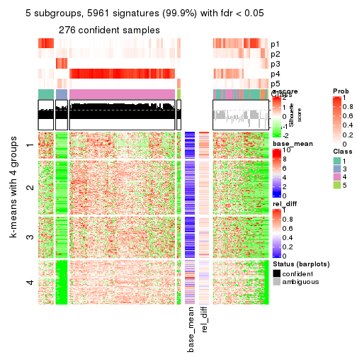</p>

</div>
<div id='tab-ATC-NMF-get-signatures-5'>
<pre><code class="r">get_signatures(res, k = 6)
</code></pre>

<p></p>

</div>
</div>


Signature heatmaps where rows are not scaled:


<script>
$( function() {
	$( '#tabs-ATC-NMF-get-signatures-no-scale' ).tabs();
} );
</script>
<div id='tabs-ATC-NMF-get-signatures-no-scale'>
<ul>
<li><a href='#tab-ATC-NMF-get-signatures-no-scale-1'>k = 2</a></li>
<li><a href='#tab-ATC-NMF-get-signatures-no-scale-2'>k = 3</a></li>
<li><a href='#tab-ATC-NMF-get-signatures-no-scale-3'>k = 4</a></li>
<li><a href='#tab-ATC-NMF-get-signatures-no-scale-4'>k = 5</a></li>
<li><a href='#tab-ATC-NMF-get-signatures-no-scale-5'>k = 6</a></li>
</ul>
<div id='tab-ATC-NMF-get-signatures-no-scale-1'>
<pre><code class="r">get_signatures(res, k = 2, scale_rows = FALSE)
</code></pre>

<p></p>

</div>
<div id='tab-ATC-NMF-get-signatures-no-scale-2'>
<pre><code class="r">get_signatures(res, k = 3, scale_rows = FALSE)
</code></pre>

<p></p>

</div>
<div id='tab-ATC-NMF-get-signatures-no-scale-3'>
<pre><code class="r">get_signatures(res, k = 4, scale_rows = FALSE)
</code></pre>

<p></p>

</div>
<div id='tab-ATC-NMF-get-signatures-no-scale-4'>
<pre><code class="r">get_signatures(res, k = 5, scale_rows = FALSE)
</code></pre>

<p></p>

</div>
<div id='tab-ATC-NMF-get-signatures-no-scale-5'>
<pre><code class="r">get_signatures(res, k = 6, scale_rows = FALSE)
</code></pre>

<p></p>

</div>
</div>


Compare the overlap of signatures from different k:

```r
compare_signatures(res)
```


`get_signature()` returns a data frame invisibly. TO get the list of signatures, the function
call should be assigned to a variable explicitly. In following code, if `plot` argument is set
to `FALSE`, no heatmap is plotted while only the differential analysis is performed.

```r
# code only for demonstration
tb = get_signature(res, k = ..., plot = FALSE)
```

An example of the output of `tb` is:

```
#>   which_row         fdr    mean_1    mean_2 scaled_mean_1 scaled_mean_2 km
#> 1        38 0.042760348  8.373488  9.131774    -0.5533452     0.5164555  1
#> 2        40 0.018707592  7.106213  8.469186    -0.6173731     0.5762149  1
#> 3        55 0.019134737 10.221463 11.207825    -0.6159697     0.5749050  1
#> 4        59 0.006059896  5.921854  7.869574    -0.6899429     0.6439467  1
#> 5        60 0.018055526  8.928898 10.211722    -0.6204761     0.5791110  1
#> 6        98 0.009384629 15.714769 14.887706     0.6635654    -0.6193277  2
...
```

The columns in `tb` are:

1. `which_row`: row indices corresponding to the input matrix.
2. `fdr`: FDR for the differential test. 
3. `mean_x`: The mean value in group x.
4. `scaled_mean_x`: The mean value in group x after rows are scaled.
5. `km`: Row groups if k-means clustering is applied to rows.


UMAP plot which shows how samples are separated.


<script>
$( function() {
	$( '#tabs-ATC-NMF-dimension-reduction' ).tabs();
} );
</script>
<div id='tabs-ATC-NMF-dimension-reduction'>
<ul>
<li><a href='#tab-ATC-NMF-dimension-reduction-1'>k = 2</a></li>
<li><a href='#tab-ATC-NMF-dimension-reduction-2'>k = 3</a></li>
<li><a href='#tab-ATC-NMF-dimension-reduction-3'>k = 4</a></li>
<li><a href='#tab-ATC-NMF-dimension-reduction-4'>k = 5</a></li>
<li><a href='#tab-ATC-NMF-dimension-reduction-5'>k = 6</a></li>
</ul>
<div id='tab-ATC-NMF-dimension-reduction-1'>
<pre><code class="r">dimension_reduction(res, k = 2, method = &quot;UMAP&quot;)
</code></pre>

<p></p>

</div>
<div id='tab-ATC-NMF-dimension-reduction-2'>
<pre><code class="r">dimension_reduction(res, k = 3, method = &quot;UMAP&quot;)
</code></pre>

<p></p>

</div>
<div id='tab-ATC-NMF-dimension-reduction-3'>
<pre><code class="r">dimension_reduction(res, k = 4, method = &quot;UMAP&quot;)
</code></pre>

<p></p>

</div>
<div id='tab-ATC-NMF-dimension-reduction-4'>
<pre><code class="r">dimension_reduction(res, k = 5, method = &quot;UMAP&quot;)
</code></pre>

<p></p>

</div>
<div id='tab-ATC-NMF-dimension-reduction-5'>
<pre><code class="r">dimension_reduction(res, k = 6, method = &quot;UMAP&quot;)
</code></pre>

<p></p>

</div>
</div>


Following heatmap shows how subgroups are split when increasing `k`:

```r
collect_classes(res)
```


If matrix rows can be associated to genes, consider to use `GO_Enrichment(res,
...)` to perform function enrichment for the signature genes.


 

## Session info


```r
sessionInfo()
```

```
#> R version 3.6.0 (2019-04-26)
#> Platform: x86_64-pc-linux-gnu (64-bit)
#> Running under: CentOS Linux 7 (Core)
#> 
#> Matrix products: default
#> BLAS:   /usr/lib64/libblas.so.3.4.2
#> LAPACK: /usr/lib64/liblapack.so.3.4.2
#> 
#> locale:
#>  [1] LC_CTYPE=en_GB.UTF-8       LC_NUMERIC=C               LC_TIME=en_GB.UTF-8       
#>  [4] LC_COLLATE=en_GB.UTF-8     LC_MONETARY=en_GB.UTF-8    LC_MESSAGES=en_GB.UTF-8   
#>  [7] LC_PAPER=en_GB.UTF-8       LC_NAME=C                  LC_ADDRESS=C              
#> [10] LC_TELEPHONE=C             LC_MEASUREMENT=en_GB.UTF-8 LC_IDENTIFICATION=C       
#> 
#> attached base packages:
#>  [1] grid      parallel  stats4    stats     graphics  grDevices utils     datasets  methods  
#> [10] base     
#> 
#> other attached packages:
#>  [1] genefilter_1.66.0           ComplexHeatmap_2.1.1        markdown_1.1               
#>  [4] knitr_1.26                  cola_1.3.2                  SummarizedExperiment_1.14.1
#>  [7] DelayedArray_0.10.0         BiocParallel_1.18.1         matrixStats_0.55.0         
#> [10] Biobase_2.44.0              GenomicRanges_1.36.1        GenomeInfoDb_1.20.0        
#> [13] IRanges_2.18.3              S4Vectors_0.22.1            BiocGenerics_0.30.0        
#> [16] GetoptLong_0.1.7           
#> 
#> loaded via a namespace (and not attached):
#>  [1] bitops_1.0-6           bit64_0.9-7            doParallel_1.0.15      RColorBrewer_1.1-2    
#>  [5] httr_1.4.1             backports_1.1.5        tools_3.6.0            R6_2.4.1              
#>  [9] DBI_1.0.0              lazyeval_0.2.2         colorspace_1.4-1       withr_2.1.2           
#> [13] tidyselect_0.2.5       gridExtra_2.3          bit_1.1-14             compiler_3.6.0        
#> [17] xml2_1.2.2             microbenchmark_1.4-7   pkgmaker_0.28          slam_0.1-46           
#> [21] scales_1.1.0           NMF_0.23.6             stringr_1.4.0          digest_0.6.23         
#> [25] XVector_0.24.0         pkgconfig_2.0.3        bibtex_0.4.2           highr_0.8             
#> [29] rlang_0.4.2            GlobalOptions_0.1.1    RSQLite_2.1.2          impute_1.58.0         
#> [33] shape_1.4.4            mclust_5.4.5           dendextend_1.12.0      dplyr_0.8.3           
#> [37] RCurl_1.95-4.12        magrittr_1.5           GenomeInfoDbData_1.2.1 Matrix_1.2-17         
#> [41] Rcpp_1.0.3             munsell_0.5.0          viridis_0.5.1          lifecycle_0.1.0       
#> [45] stringi_1.4.3          zlibbioc_1.30.0        plyr_1.8.4             blob_1.2.0            
#> [49] crayon_1.3.4           lattice_0.20-38        splines_3.6.0          annotate_1.62.0       
#> [53] circlize_0.4.9         zeallot_0.1.0          pillar_1.4.2           rjson_0.2.20          
#> [57] rngtools_1.4           reshape2_1.4.3         codetools_0.2-16       XML_3.98-1.20         
#> [61] glue_1.3.1             evaluate_0.14          vctrs_0.2.0            png_0.1-7             
#> [65] foreach_1.4.7          polyclip_1.10-0        gtable_0.3.0           purrr_0.3.3           
#> [69] clue_0.3-57            assertthat_0.2.1       ggplot2_3.2.1          xfun_0.11             
#> [73] gridBase_0.4-7         eulerr_6.0.0           xtable_1.8-4           skmeans_0.2-11        
#> [77] survival_2.44-1.1      viridisLite_0.3.0      tibble_2.1.3           iterators_1.0.12      
#> [81] memoise_1.1.0          AnnotationDbi_1.46.1   registry_0.5-1         GTF_0.0.1             
#> [85] cluster_2.1.0          brew_1.0-6
```


